Linux in Argentina - Tested Hardware & Statistics
-------------------------------------------------

A project to collect tested hardware configurations for Linux in Argentina.

Anyone can contribute to this report by the [hw-probe](https://github.com/linuxhw/hw-probe) tool:

    sudo -E hw-probe -all -upload

Please contribute! Especially if your hardware is rare.

This is a report for all computer types. See also reports for [desktops](/Location/Argentina/Desktop/README.md) and [notebooks](/Location/Argentina/Notebook/README.md).

Contents
--------

* [ Test Cases ](#test-cases)

* [ System ](#system)
  - [ OS                       ](#os)
  - [ OS Family                ](#os-family)
  - [ Kernel                   ](#kernel)
  - [ Kernel Family            ](#kernel-family)
  - [ Kernel Major Ver.        ](#kernel-major-ver)
  - [ Arch                     ](#arch)
  - [ DE                       ](#de)
  - [ Display Server           ](#display-server)
  - [ Display Manager          ](#display-manager)
  - [ OS Lang                  ](#os-lang)
  - [ Boot Mode                ](#boot-mode)
  - [ Filesystem               ](#filesystem)
  - [ Part. scheme             ](#part-scheme)
  - [ Dual Boot with Linux/BSD ](#dual-boot-with-linuxbsd)
  - [ Dual Boot (Win)          ](#dual-boot-win)

* [ Board ](#board)
  - [ Vendor                   ](#vendor)
  - [ Model                    ](#model)
  - [ Model Family             ](#model-family)
  - [ MFG Year                 ](#mfg-year)
  - [ Form Factor              ](#form-factor)
  - [ Secure Boot              ](#secure-boot)
  - [ Coreboot                 ](#coreboot)
  - [ RAM Size                 ](#ram-size)
  - [ RAM Used                 ](#ram-used)
  - [ Total Drives             ](#total-drives)
  - [ Has CD-ROM               ](#has-cd-rom)
  - [ Has Ethernet             ](#has-ethernet)
  - [ Has WiFi                 ](#has-wifi)
  - [ Has Bluetooth            ](#has-bluetooth)

* [ Location ](#location)
  - [ Country                  ](#country)
  - [ City                     ](#city)

* [ Drives ](#drives)
  - [ Drive Vendor             ](#drive-vendor)
  - [ Drive Model              ](#drive-model)
  - [ HDD Vendor               ](#hdd-vendor)
  - [ SSD Vendor               ](#ssd-vendor)
  - [ Drive Kind               ](#drive-kind)
  - [ Drive Connector          ](#drive-connector)
  - [ Drive Size               ](#drive-size)
  - [ Space Total              ](#space-total)
  - [ Space Used               ](#space-used)
  - [ Malfunc. Drives          ](#malfunc-drives)
  - [ Malfunc. Drive Vendor    ](#malfunc-drive-vendor)
  - [ Malfunc. HDD Vendor      ](#malfunc-hdd-vendor)
  - [ Malfunc. Drive Kind      ](#malfunc-drive-kind)
  - [ Failed Drives            ](#failed-drives)
  - [ Failed Drive Vendor      ](#failed-drive-vendor)
  - [ Drive Status             ](#drive-status)

* [ Storage controller ](#storage-controller)
  - [ Storage Vendor           ](#storage-vendor)
  - [ Storage Model            ](#storage-model)
  - [ Storage Kind             ](#storage-kind)

* [ Processor ](#processor)
  - [ CPU Vendor               ](#cpu-vendor)
  - [ CPU Model                ](#cpu-model)
  - [ CPU Model Family         ](#cpu-model-family)
  - [ CPU Cores                ](#cpu-cores)
  - [ CPU Sockets              ](#cpu-sockets)
  - [ CPU Threads              ](#cpu-threads)
  - [ CPU Op-Modes             ](#cpu-op-modes)
  - [ CPU Microcode            ](#cpu-microcode)
  - [ CPU Microarch            ](#cpu-microarch)

* [ Graphics ](#graphics)
  - [ GPU Vendor               ](#gpu-vendor)
  - [ GPU Model                ](#gpu-model)
  - [ GPU Combo                ](#gpu-combo)
  - [ GPU Driver               ](#gpu-driver)
  - [ GPU Memory               ](#gpu-memory)

* [ Monitor ](#monitor)
  - [ Monitor Vendor           ](#monitor-vendor)
  - [ Monitor Model            ](#monitor-model)
  - [ Monitor Resolution       ](#monitor-resolution)
  - [ Monitor Diagonal         ](#monitor-diagonal)
  - [ Monitor Width            ](#monitor-width)
  - [ Aspect Ratio             ](#aspect-ratio)
  - [ Monitor Area             ](#monitor-area)
  - [ Pixel Density            ](#pixel-density)
  - [ Multiple Monitors        ](#multiple-monitors)

* [ Network ](#network)
  - [ Net Controller Vendor    ](#net-controller-vendor)
  - [ Net Controller Model     ](#net-controller-model)
  - [ Wireless Vendor          ](#wireless-vendor)
  - [ Wireless Model           ](#wireless-model)
  - [ Ethernet Vendor          ](#ethernet-vendor)
  - [ Ethernet Model           ](#ethernet-model)
  - [ Net Controller Kind      ](#net-controller-kind)
  - [ Used Controller          ](#used-controller)
  - [ NICs                     ](#nics)
  - [ IPv6                     ](#ipv6)

* [ Bluetooth ](#bluetooth)
  - [ Bluetooth Vendor         ](#bluetooth-vendor)
  - [ Bluetooth Model          ](#bluetooth-model)

* [ Sound ](#sound)
  - [ Sound Vendor             ](#sound-vendor)
  - [ Sound Model              ](#sound-model)

* [ Memory ](#memory)
  - [ Memory Vendor            ](#memory-vendor)
  - [ Memory Model             ](#memory-model)
  - [ Memory Kind              ](#memory-kind)
  - [ Memory Form Factor       ](#memory-form-factor)
  - [ Memory Size              ](#memory-size)
  - [ Memory Speed             ](#memory-speed)

* [ Printers & scanners ](#printers--scanners)
  - [ Printer Vendor           ](#printer-vendor)
  - [ Printer Model            ](#printer-model)
  - [ Scanner Vendor           ](#scanner-vendor)
  - [ Scanner Model            ](#scanner-model)

* [ Camera ](#camera)
  - [ Camera Vendor            ](#camera-vendor)
  - [ Camera Model             ](#camera-model)

* [ Security ](#security)
  - [ Fingerprint Vendor       ](#fingerprint-vendor)
  - [ Fingerprint Model        ](#fingerprint-model)
  - [ Chipcard Vendor          ](#chipcard-vendor)
  - [ Chipcard Model           ](#chipcard-model)

* [ Unsupported ](#unsupported)
  - [ Unsupported Devices      ](#unsupported-devices)
  - [ Unsupported Device Types ](#unsupported-device-types)

Test Cases
----------

Total: 3296

| Vendor        | Model                       | Form-Factor | Probe                                                      | Date         |
|---------------|-----------------------------|-------------|------------------------------------------------------------|--------------|
| Gigabyte      | H310M M.2 x.x               | Desktop     | [fc06be20c3](https://linux-hardware.org/?probe=fc06be20c3) | May 09, 2024 |
| ASUSTek       | ROG STRIX B450-F GAMING ... | Desktop     | [cdcaeb4d46](https://linux-hardware.org/?probe=cdcaeb4d46) | May 07, 2024 |
| Gigabyte      | H81M-H                      | Desktop     | [5ea3b70747](https://linux-hardware.org/?probe=5ea3b70747) | May 06, 2024 |
| Dell          | Latitude 3420               | Notebook    | [f0412b645c](https://linux-hardware.org/?probe=f0412b645c) | May 06, 2024 |
| ASUSTek       | ROG STRIX B450-F GAMING ... | Desktop     | [869ffa1875](https://linux-hardware.org/?probe=869ffa1875) | May 06, 2024 |
| Dell          | Vostro 3405                 | Notebook    | [85b53deb59](https://linux-hardware.org/?probe=85b53deb59) | May 05, 2024 |
| Dell          | Vostro 3405                 | Notebook    | [ae06ac7700](https://linux-hardware.org/?probe=ae06ac7700) | May 05, 2024 |
| Novatech      | NE14I310                    | Notebook    | [edf97226ed](https://linux-hardware.org/?probe=edf97226ed) | May 05, 2024 |
| ASUSTek       | PN50                        | Mini pc     | [bab451ff6f](https://linux-hardware.org/?probe=bab451ff6f) | May 05, 2024 |
| HP            | 240 G8                      | Notebook    | [8b7c23e6cb](https://linux-hardware.org/?probe=8b7c23e6cb) | May 05, 2024 |
| Novatech      | NE14I310                    | Notebook    | [f2a49ce1fc](https://linux-hardware.org/?probe=f2a49ce1fc) | May 05, 2024 |
| BANGHO        | Suma 1025                   | Tablet      | [e7c37d670f](https://linux-hardware.org/?probe=e7c37d670f) | May 05, 2024 |
| ASUSTek       | PRIME A320M-K               | Desktop     | [ceb76bac39](https://linux-hardware.org/?probe=ceb76bac39) | May 04, 2024 |
| ASRock        | A320M-HDV R4.0              | Desktop     | [3dea08aed3](https://linux-hardware.org/?probe=3dea08aed3) | May 04, 2024 |
| Gigabyte      | GA-78LMT-S2                 | Desktop     | [6a9fd41a39](https://linux-hardware.org/?probe=6a9fd41a39) | May 04, 2024 |
| Acer          | Aspire A315-59              | Notebook    | [7e25c15f34](https://linux-hardware.org/?probe=7e25c15f34) | May 04, 2024 |
| ECS           | H81H3-M4                    | Desktop     | [e9cfe50e27](https://linux-hardware.org/?probe=e9cfe50e27) | May 04, 2024 |
| Gigabyte      | B660M DS3H DDR4             | Desktop     | [88ac39e179](https://linux-hardware.org/?probe=88ac39e179) | May 04, 2024 |
| ASUSTek       | K8V-MX                      | Desktop     | [64054e7bf3](https://linux-hardware.org/?probe=64054e7bf3) | May 03, 2024 |
| HP            | ProBook 6470b               | Notebook    | [152863481c](https://linux-hardware.org/?probe=152863481c) | May 03, 2024 |
| Gigabyte      | B450M DS3H V2               | Desktop     | [87b5a4320e](https://linux-hardware.org/?probe=87b5a4320e) | May 03, 2024 |
| Dell          | XPS 15 9560                 | Notebook    | [023e102050](https://linux-hardware.org/?probe=023e102050) | May 02, 2024 |
| Gigabyte      | H310M M.2 x.x               | Desktop     | [1b1d2cd8c6](https://linux-hardware.org/?probe=1b1d2cd8c6) | May 02, 2024 |
| ASUSTek       | PRIME A520M-A II            | Desktop     | [49bbc3443a](https://linux-hardware.org/?probe=49bbc3443a) | May 02, 2024 |
| Intel         | powered classmate PC        | Notebook    | [2f4933a503](https://linux-hardware.org/?probe=2f4933a503) | May 02, 2024 |
| HP            | EliteBook x360 830 G6       | Convertible | [ed4c19870c](https://linux-hardware.org/?probe=ed4c19870c) | May 02, 2024 |
| Samsung       | RV411/RV511/E3511/S3511/... | Notebook    | [452d7c03be](https://linux-hardware.org/?probe=452d7c03be) | May 01, 2024 |
| Lenovo        | V15 G3 IAP 82TT             | Notebook    | [8e43832c47](https://linux-hardware.org/?probe=8e43832c47) | May 01, 2024 |
| ASUSTek       | PRIME A520M-A II            | Desktop     | [73aaa2984d](https://linux-hardware.org/?probe=73aaa2984d) | May 01, 2024 |
| Lenovo        | IdeaPad Y700-17ISK 80Q0     | Notebook    | [6df35e20b1](https://linux-hardware.org/?probe=6df35e20b1) | May 01, 2024 |
| Gigabyte      | GA-78LMT-S2                 | Desktop     | [56e690c86e](https://linux-hardware.org/?probe=56e690c86e) | Apr 30, 2024 |
| ASUSTek       | H61M-K                      | Desktop     | [4a0b5a5fd6](https://linux-hardware.org/?probe=4a0b5a5fd6) | Apr 30, 2024 |
| iQual         | NQ1                         | Notebook    | [8c657ecc80](https://linux-hardware.org/?probe=8c657ecc80) | Apr 29, 2024 |
| Gigabyte      | B660M DS3H DDR4             | Desktop     | [9d43e003e5](https://linux-hardware.org/?probe=9d43e003e5) | Apr 29, 2024 |
| HP            | Pavilion dm4                | Notebook    | [30eee9e9d3](https://linux-hardware.org/?probe=30eee9e9d3) | Apr 28, 2024 |
| Lenovo        | ThinkPad E15 Gen 2 20T9S... | Notebook    | [d4c1f97af3](https://linux-hardware.org/?probe=d4c1f97af3) | Apr 28, 2024 |
| Acer          | Aspire A315-33              | Notebook    | [6570c2a483](https://linux-hardware.org/?probe=6570c2a483) | Apr 28, 2024 |
| ASUSTek       | PRIME A520M-K               | Desktop     | [e76da56567](https://linux-hardware.org/?probe=e76da56567) | Apr 28, 2024 |
| Intel         | powered classmate PC MP ... | Notebook    | [7b243a5cb5](https://linux-hardware.org/?probe=7b243a5cb5) | Apr 28, 2024 |
| Novatech      | C141SC-N4                   | Notebook    | [bedb8538c8](https://linux-hardware.org/?probe=bedb8538c8) | Apr 27, 2024 |
| Novatech      | C141SC-N4                   | Notebook    | [f1534e7ed2](https://linux-hardware.org/?probe=f1534e7ed2) | Apr 27, 2024 |
| Lenovo        | ThinkPad Yoga 370 20JJS0... | Convertible | [b16979f0ec](https://linux-hardware.org/?probe=b16979f0ec) | Apr 27, 2024 |
| MSI           | MPG X570S CARBON MAX WIF... | Desktop     | [39557715aa](https://linux-hardware.org/?probe=39557715aa) | Apr 27, 2024 |
| BANGHO        | Suma 1025                   | Tablet      | [343b7ee8fa](https://linux-hardware.org/?probe=343b7ee8fa) | Apr 27, 2024 |
| HP            | 240 G8                      | Notebook    | [bf5325bd89](https://linux-hardware.org/?probe=bf5325bd89) | Apr 26, 2024 |
| BANGHO        | Suma 1025                   | Tablet      | [d056fe69ba](https://linux-hardware.org/?probe=d056fe69ba) | Apr 26, 2024 |
| Gigabyte      | F2A68HM-H                   | Desktop     | [03f841c32a](https://linux-hardware.org/?probe=03f841c32a) | Apr 26, 2024 |
| Gigabyte      | M68M-S2P                    | Desktop     | [1472c658c2](https://linux-hardware.org/?probe=1472c658c2) | Apr 25, 2024 |
| Gigabyte      | Z370 AORUS ULTRA GAMING-... | Desktop     | [849a82e562](https://linux-hardware.org/?probe=849a82e562) | Apr 25, 2024 |
| Lenovo        | Legion S7 16ARHA7 82UG      | Notebook    | [5b493ea8ca](https://linux-hardware.org/?probe=5b493ea8ca) | Apr 24, 2024 |
| Dell          | Inspiron 15-3567            | Notebook    | [e93fe83f01](https://linux-hardware.org/?probe=e93fe83f01) | Apr 24, 2024 |
| Gigabyte      | F2A58M-HD2                  | Desktop     | [4906ae2911](https://linux-hardware.org/?probe=4906ae2911) | Apr 24, 2024 |
| Gigabyte      | F2A58M-HD2                  | Desktop     | [6574256f49](https://linux-hardware.org/?probe=6574256f49) | Apr 24, 2024 |
| Gigabyte      | Z87X-D3H-CF                 | Desktop     | [8cf871883f](https://linux-hardware.org/?probe=8cf871883f) | Apr 22, 2024 |
| Packard Be... | EasyNote_MX45               | Notebook    | [2af5864c3c](https://linux-hardware.org/?probe=2af5864c3c) | Apr 22, 2024 |
| Positivo      | Z100                        | Notebook    | [f445e8595a](https://linux-hardware.org/?probe=f445e8595a) | Apr 22, 2024 |
| Positivo      | Z100                        | Notebook    | [b2af17f7a0](https://linux-hardware.org/?probe=b2af17f7a0) | Apr 22, 2024 |
| Gigabyte      | Z87X-D3H-CF                 | Desktop     | [210377b6e2](https://linux-hardware.org/?probe=210377b6e2) | Apr 21, 2024 |
| Gigabyte      | Z87X-D3H-CF                 | Desktop     | [5a6f41fef5](https://linux-hardware.org/?probe=5a6f41fef5) | Apr 21, 2024 |
| Dell          | Inspiron 15-3567            | Notebook    | [bf1e4f8d6a](https://linux-hardware.org/?probe=bf1e4f8d6a) | Apr 20, 2024 |
| ASUSTek       | VivoBook_ASUSLaptop X150... | Notebook    | [6006e10996](https://linux-hardware.org/?probe=6006e10996) | Apr 20, 2024 |
| MSI           | B550M PRO-VDH WIFI          | Desktop     | [b02f80cde5](https://linux-hardware.org/?probe=b02f80cde5) | Apr 20, 2024 |
| HP            | 240 G7 Notebook PC          | Notebook    | [831a27e202](https://linux-hardware.org/?probe=831a27e202) | Apr 19, 2024 |
| Lenovo        | IdeaPad Y700-17ISK 80Q0     | Notebook    | [5acad8a956](https://linux-hardware.org/?probe=5acad8a956) | Apr 19, 2024 |
| Dell          | Latitude 3420               | Notebook    | [711edc1751](https://linux-hardware.org/?probe=711edc1751) | Apr 18, 2024 |
| Dell          | Inspiron 15-7568            | Notebook    | [cf77d5e408](https://linux-hardware.org/?probe=cf77d5e408) | Apr 18, 2024 |
| ASUSTek       | P5N72-T PREMIUM             | Desktop     | [067b12dd29](https://linux-hardware.org/?probe=067b12dd29) | Apr 16, 2024 |
| Gigabyte      | B450M DS3H WIFI-CF          | Desktop     | [c21ac457c2](https://linux-hardware.org/?probe=c21ac457c2) | Apr 15, 2024 |
| Apple         | Mac-F42C88C8 Proto1         | Desktop     | [583357f85f](https://linux-hardware.org/?probe=583357f85f) | Apr 15, 2024 |
| Apple         | MacBookPro9,2               | Notebook    | [5a62c14a1f](https://linux-hardware.org/?probe=5a62c14a1f) | Apr 14, 2024 |
| HP            | Laptop 15-dy2xxx            | Notebook    | [0452d45604](https://linux-hardware.org/?probe=0452d45604) | Apr 14, 2024 |
| Apple         | MacBookPro9,2               | Notebook    | [97f0209510](https://linux-hardware.org/?probe=97f0209510) | Apr 14, 2024 |
| HP            | ENVY x360 Convertible 13... | Convertible | [d092f299b2](https://linux-hardware.org/?probe=d092f299b2) | Apr 12, 2024 |
| Dell          | Inspiron 15-7568            | Notebook    | [939c6125de](https://linux-hardware.org/?probe=939c6125de) | Apr 12, 2024 |
| Juana Mans... | SF20GM7                     | Notebook    | [2a01eeac36](https://linux-hardware.org/?probe=2a01eeac36) | Apr 12, 2024 |
| CX / Air C... | CX-H87-M1                   | Desktop     | [6ca85693a6](https://linux-hardware.org/?probe=6ca85693a6) | Apr 12, 2024 |
| Apple         | MacBookPro14,1              | Notebook    | [f6720efacd](https://linux-hardware.org/?probe=f6720efacd) | Apr 11, 2024 |
| Unknown       | M-140BI3                    | Notebook    | [491b1013ab](https://linux-hardware.org/?probe=491b1013ab) | Apr 11, 2024 |
| Jukebox       | KL8350                      | Notebook    | [42dce1ea91](https://linux-hardware.org/?probe=42dce1ea91) | Apr 11, 2024 |
| Gigabyte      | GA-78LMT-S2                 | Desktop     | [852f31cf06](https://linux-hardware.org/?probe=852f31cf06) | Apr 10, 2024 |
| Gateway       | NV570P                      | Notebook    | [328b47d899](https://linux-hardware.org/?probe=328b47d899) | Apr 09, 2024 |
| HP            | Pavilion dm4                | Notebook    | [5df83aab55](https://linux-hardware.org/?probe=5df83aab55) | Apr 09, 2024 |
| ASUSTek       | TUF Gaming B450-PLUS II     | Desktop     | [1163ac6ace](https://linux-hardware.org/?probe=1163ac6ace) | Apr 09, 2024 |
| Dell          | Inspiron 5570               | Notebook    | [3247065dc8](https://linux-hardware.org/?probe=3247065dc8) | Apr 08, 2024 |
| Acer          | Aspire Z3730                | All in one  | [063c69d03c](https://linux-hardware.org/?probe=063c69d03c) | Apr 07, 2024 |
| ASUSTek       | PRIME B350M-A               | Desktop     | [57145c3161](https://linux-hardware.org/?probe=57145c3161) | Apr 07, 2024 |
| Acer          | Aspire Z3730                | All in one  | [4ff5f776b4](https://linux-hardware.org/?probe=4ff5f776b4) | Apr 07, 2024 |
| Gigabyte      | B250M-DS3H-CF               | Desktop     | [f7f9591a0c](https://linux-hardware.org/?probe=f7f9591a0c) | Apr 06, 2024 |
| MSI           | PRO Z690-A WIFI DDR4        | Desktop     | [b453824271](https://linux-hardware.org/?probe=b453824271) | Apr 04, 2024 |
| Dell          | 0PM2CW A01                  | Server      | [11bece0a30](https://linux-hardware.org/?probe=11bece0a30) | Apr 03, 2024 |
| Dell          | 0PM2CW A01                  | Server      | [460042b62a](https://linux-hardware.org/?probe=460042b62a) | Apr 03, 2024 |
| Dell          | Latitude 3420               | Notebook    | [b25404125f](https://linux-hardware.org/?probe=b25404125f) | Apr 03, 2024 |
| Juana Mans... | SF20GM7                     | Notebook    | [8571d52a38](https://linux-hardware.org/?probe=8571d52a38) | Apr 02, 2024 |
| Gigabyte      | F2A68HM-H                   | Desktop     | [e9bf1ed29d](https://linux-hardware.org/?probe=e9bf1ed29d) | Apr 01, 2024 |
| ECS           | A960M-M3                    | Desktop     | [dce366554b](https://linux-hardware.org/?probe=dce366554b) | Apr 01, 2024 |
| Toshiba       | Satellite P55W-C            | Notebook    | [545bd0da64](https://linux-hardware.org/?probe=545bd0da64) | Apr 01, 2024 |
| Dell          | Inspiron 3185               | Notebook    | [80090c69a3](https://linux-hardware.org/?probe=80090c69a3) | Mar 31, 2024 |
| ASRock        | H81M-VG4                    | Desktop     | [d7d36bb4d6](https://linux-hardware.org/?probe=d7d36bb4d6) | Mar 31, 2024 |
| ASRock        | H81M-VG4                    | Desktop     | [20709f1a81](https://linux-hardware.org/?probe=20709f1a81) | Mar 31, 2024 |
| ASUSTek       | TUF Gaming A620M-PLUS WI... | Desktop     | [85fdc28bdc](https://linux-hardware.org/?probe=85fdc28bdc) | Mar 30, 2024 |
| Lenovo        | IdeaPad 3 15IAU7 82RK       | Notebook    | [015f6a28b2](https://linux-hardware.org/?probe=015f6a28b2) | Mar 30, 2024 |
| Positivo      | AT560W                      | Notebook    | [035ac6be27](https://linux-hardware.org/?probe=035ac6be27) | Mar 30, 2024 |
| ASUSTek       | ROG STRIX Z690-E GAMING ... | Desktop     | [7d992f4daa](https://linux-hardware.org/?probe=7d992f4daa) | Mar 29, 2024 |
| MSI           | A68HM-E33 V2                | Desktop     | [22b44252e3](https://linux-hardware.org/?probe=22b44252e3) | Mar 28, 2024 |
| ASUSTek       | VivoBook_ASUSLaptop X150... | Notebook    | [ea975c743d](https://linux-hardware.org/?probe=ea975c743d) | Mar 27, 2024 |
| ASRock        | N68-S UCC                   | Desktop     | [7874873da2](https://linux-hardware.org/?probe=7874873da2) | Mar 27, 2024 |
| Lenovo        | ThinkPad T470 20HES18R20    | Notebook    | [0c5f481d17](https://linux-hardware.org/?probe=0c5f481d17) | Mar 27, 2024 |
| NOBLEX        | N14WCE128                   | Notebook    | [7f6538d554](https://linux-hardware.org/?probe=7f6538d554) | Mar 26, 2024 |
| MSI           | MPG Z690 CARBON WIFI        | Desktop     | [4a67db9b8f](https://linux-hardware.org/?probe=4a67db9b8f) | Mar 26, 2024 |
| HP            | 240 G8                      | Notebook    | [7857994d5b](https://linux-hardware.org/?probe=7857994d5b) | Mar 25, 2024 |
| Juana Mans... | SF20GM7                     | Notebook    | [96b7025093](https://linux-hardware.org/?probe=96b7025093) | Mar 25, 2024 |
| HP            | ENVY x360 Convertible 13... | Convertible | [a3c279bd0e](https://linux-hardware.org/?probe=a3c279bd0e) | Mar 25, 2024 |
| ASUSTek       | PRIME B550M-K               | Desktop     | [c87fa27996](https://linux-hardware.org/?probe=c87fa27996) | Mar 24, 2024 |
| Gigabyte      | GA-880GM-USB3               | Desktop     | [5d0f3460a5](https://linux-hardware.org/?probe=5d0f3460a5) | Mar 23, 2024 |
| ASRock        | FM2A58M-VG3+ R2.0           | Desktop     | [e9415eea5c](https://linux-hardware.org/?probe=e9415eea5c) | Mar 22, 2024 |
| Toshiba       | Satellite P55W-C            | Notebook    | [ccfdb0f093](https://linux-hardware.org/?probe=ccfdb0f093) | Mar 22, 2024 |
| Dell          | 07WP95 A01                  | Desktop     | [91d3a8ab75](https://linux-hardware.org/?probe=91d3a8ab75) | Mar 21, 2024 |
| Dell          | 07WP95 A01                  | Desktop     | [8d213c1708](https://linux-hardware.org/?probe=8d213c1708) | Mar 21, 2024 |
| Intel         | DG41RQ AAE54511-203         | Desktop     | [21091584e0](https://linux-hardware.org/?probe=21091584e0) | Mar 21, 2024 |
| Raspberry ... | Raspberry Pi 4 Model B R... | Soc         | [164452e3b4](https://linux-hardware.org/?probe=164452e3b4) | Mar 21, 2024 |
| Gigabyte      | H61M-S2PV                   | Desktop     | [a8ead75f81](https://linux-hardware.org/?probe=a8ead75f81) | Mar 20, 2024 |
| Dell          | Inspiron 5570               | Notebook    | [12eb329aea](https://linux-hardware.org/?probe=12eb329aea) | Mar 19, 2024 |
| MSI           | B450M PRO-VDH MAX           | Desktop     | [d2157076ae](https://linux-hardware.org/?probe=d2157076ae) | Mar 18, 2024 |
| ASUSTek       | VivoBook_ASUSLaptop X515... | Notebook    | [8fd2ffdd66](https://linux-hardware.org/?probe=8fd2ffdd66) | Mar 18, 2024 |
| ASUSTek       | A55M-A                      | Desktop     | [15b0e5c885](https://linux-hardware.org/?probe=15b0e5c885) | Mar 18, 2024 |
| ASUSTek       | VivoBook_ASUSLaptop X515... | Notebook    | [f1df9c555f](https://linux-hardware.org/?probe=f1df9c555f) | Mar 18, 2024 |
| Exo           | Smart Serie T               | Notebook    | [5581b96f81](https://linux-hardware.org/?probe=5581b96f81) | Mar 13, 2024 |
| MSI           | A68HM-E33 V2                | Desktop     | [52b29bf885](https://linux-hardware.org/?probe=52b29bf885) | Mar 12, 2024 |
| ASRock        | H470M-HDV/M.2               | Desktop     | [e9c20372c1](https://linux-hardware.org/?probe=e9c20372c1) | Mar 12, 2024 |
| Lenovo        | V15 G2 ITL 82KB             | Notebook    | [cfb2591a20](https://linux-hardware.org/?probe=cfb2591a20) | Mar 12, 2024 |
| Lenovo        | V15 G2 ITL 82KB             | Notebook    | [9160e106f1](https://linux-hardware.org/?probe=9160e106f1) | Mar 12, 2024 |
| Dell          | Inspiron 3505               | Notebook    | [f3a4539b51](https://linux-hardware.org/?probe=f3a4539b51) | Mar 12, 2024 |
| Dell          | System XPS L502X            | Notebook    | [542c2b299e](https://linux-hardware.org/?probe=542c2b299e) | Mar 11, 2024 |
| MSI           | Modern 15 A11MU             | Notebook    | [147c498235](https://linux-hardware.org/?probe=147c498235) | Mar 10, 2024 |
| PCBOX         | Kant                        | Desktop     | [beb9c1f685](https://linux-hardware.org/?probe=beb9c1f685) | Mar 09, 2024 |
| Samsung       | 300E4A/300E5A/300E7A/343... | Notebook    | [14d4c471e4](https://linux-hardware.org/?probe=14d4c471e4) | Mar 07, 2024 |
| Samsung       | 300E4A/300E5A/300E7A/343... | Notebook    | [ee61065e1a](https://linux-hardware.org/?probe=ee61065e1a) | Mar 07, 2024 |
| HP            | Laptop 14-dq2xxx            | Notebook    | [59efd798b3](https://linux-hardware.org/?probe=59efd798b3) | Mar 07, 2024 |
| HP            | Compaq Presario CQ50        | Notebook    | [a690fc2f4c](https://linux-hardware.org/?probe=a690fc2f4c) | Mar 06, 2024 |
| Alienware     | 17 R4                       | Notebook    | [f3eab6ab63](https://linux-hardware.org/?probe=f3eab6ab63) | Mar 06, 2024 |
| HP            | ENVY x360 Convertible       | Convertible | [d6aa64ff6c](https://linux-hardware.org/?probe=d6aa64ff6c) | Mar 06, 2024 |
| HP            | Pavilion Gaming Laptop 1... | Notebook    | [0189a53925](https://linux-hardware.org/?probe=0189a53925) | Mar 05, 2024 |
| ASUSTek       | PRIME B460M-A R2.0          | Desktop     | [d3ece94c42](https://linux-hardware.org/?probe=d3ece94c42) | Mar 05, 2024 |
| MSI           | H110M PRO-VH PLUS           | Desktop     | [5a814bda6b](https://linux-hardware.org/?probe=5a814bda6b) | Mar 04, 2024 |
| ASUSTek       | P8H61-M PRO                 | Desktop     | [888ce42ec2](https://linux-hardware.org/?probe=888ce42ec2) | Mar 04, 2024 |
| Gigabyte      | B660M DS3H DDR4             | Desktop     | [110865b8b0](https://linux-hardware.org/?probe=110865b8b0) | Mar 04, 2024 |
| MSI           | A68HM-E33 V2                | Desktop     | [81f19d1d4a](https://linux-hardware.org/?probe=81f19d1d4a) | Mar 04, 2024 |
| Gigabyte      | GA-880GM-USB3L              | Desktop     | [61f2f3738a](https://linux-hardware.org/?probe=61f2f3738a) | Mar 03, 2024 |
| Gigabyte      | GA-880GM-USB3L              | Desktop     | [83e5cbff40](https://linux-hardware.org/?probe=83e5cbff40) | Mar 03, 2024 |
| HP            | Pavilion Gaming Laptop 1... | Notebook    | [e56fe68193](https://linux-hardware.org/?probe=e56fe68193) | Mar 01, 2024 |
| MSI           | MPG X570S CARBON MAX WIF... | Desktop     | [165a9a11e4](https://linux-hardware.org/?probe=165a9a11e4) | Mar 01, 2024 |
| Toshiba       | Satellite_C50-A             | Notebook    | [ab705071cf](https://linux-hardware.org/?probe=ab705071cf) | Feb 29, 2024 |
| Toshiba       | Satellite_C50-A             | Notebook    | [ea34b407a5](https://linux-hardware.org/?probe=ea34b407a5) | Feb 29, 2024 |
| Dell          | Inspiron 5570               | Notebook    | [8be61470af](https://linux-hardware.org/?probe=8be61470af) | Feb 29, 2024 |
| Juana Mans... | SF20GM7                     | Notebook    | [5436ace14c](https://linux-hardware.org/?probe=5436ace14c) | Feb 29, 2024 |
| ASUSTek       | ASUS TUF Gaming A15 FA50... | Notebook    | [a599204e74](https://linux-hardware.org/?probe=a599204e74) | Feb 28, 2024 |
| ASRock        | G965M-S                     | Desktop     | [d651d7c6e0](https://linux-hardware.org/?probe=d651d7c6e0) | Feb 27, 2024 |
| Gigabyte      | H510M S2H V2                | Desktop     | [6734ef66a6](https://linux-hardware.org/?probe=6734ef66a6) | Feb 26, 2024 |
| Positivo      | AT560                       | Notebook    | [0f755e1d3c](https://linux-hardware.org/?probe=0f755e1d3c) | Feb 26, 2024 |
| Intel         | DH61WW AAG23116-302         | Desktop     | [eda91e0749](https://linux-hardware.org/?probe=eda91e0749) | Feb 26, 2024 |
| Lenovo        | ThinkPad X1 Yoga 1st 20F... | Convertible | [10e6c3c518](https://linux-hardware.org/?probe=10e6c3c518) | Feb 24, 2024 |
| Lenovo        | IdeaPadFlex 5 14ALC7 82R... | Convertible | [440ed93473](https://linux-hardware.org/?probe=440ed93473) | Feb 23, 2024 |
| Lenovo        | IdeaPadFlex 5 14ALC7 82R... | Convertible | [8ed2299327](https://linux-hardware.org/?probe=8ed2299327) | Feb 23, 2024 |
| Gigabyte      | AB350-Gaming 3-CF           | Desktop     | [082b9f50ab](https://linux-hardware.org/?probe=082b9f50ab) | Feb 23, 2024 |
| HP            | 8777 01011                  | Mini pc     | [7694754fa7](https://linux-hardware.org/?probe=7694754fa7) | Feb 23, 2024 |
| HP            | Compaq Presario CQ50        | Notebook    | [dc0f4d581f](https://linux-hardware.org/?probe=dc0f4d581f) | Feb 23, 2024 |
| Dell          | Inspiron 5535               | Notebook    | [b286d69150](https://linux-hardware.org/?probe=b286d69150) | Feb 22, 2024 |
| MSI           | MAG B660M BAZOOKA DDR4      | Desktop     | [b870f14a33](https://linux-hardware.org/?probe=b870f14a33) | Feb 22, 2024 |
| FOUNDER Co... | M672+968                    | Notebook    | [0dd60ea26f](https://linux-hardware.org/?probe=0dd60ea26f) | Feb 22, 2024 |
| ASUSTek       | ZenBook UX434FL_UX434FL     | Notebook    | [309bc99f27](https://linux-hardware.org/?probe=309bc99f27) | Feb 22, 2024 |
| Dell          | Latitude 3420               | Notebook    | [fae61757cb](https://linux-hardware.org/?probe=fae61757cb) | Feb 21, 2024 |
| Gigabyte      | Z390 M-CF                   | Desktop     | [da7b2aabc9](https://linux-hardware.org/?probe=da7b2aabc9) | Feb 21, 2024 |
| MSI           | MAG B660M BAZOOKA DDR4      | Desktop     | [a655bdeb74](https://linux-hardware.org/?probe=a655bdeb74) | Feb 20, 2024 |
| ASUSTek       | PRIME B660M-A WIFI D4       | Desktop     | [22f8b911d8](https://linux-hardware.org/?probe=22f8b911d8) | Feb 20, 2024 |
| Dell          | Latitude 5410               | Notebook    | [d508379bb9](https://linux-hardware.org/?probe=d508379bb9) | Feb 19, 2024 |
| Gigabyte      | Z270-Gaming K3              | Desktop     | [03e4b54d18](https://linux-hardware.org/?probe=03e4b54d18) | Feb 18, 2024 |
| HP            | Presario M2000 (EE629LA#... | Notebook    | [302398d57c](https://linux-hardware.org/?probe=302398d57c) | Feb 18, 2024 |
| HP            | Presario M2000 (EE629LA#... | Notebook    | [c44f12d85d](https://linux-hardware.org/?probe=c44f12d85d) | Feb 18, 2024 |
| ASRock        | B450 Steel Legend           | Desktop     | [af374b16e0](https://linux-hardware.org/?probe=af374b16e0) | Feb 18, 2024 |
| MSI           | MEG Z690 UNIFY              | Desktop     | [bbeb64d139](https://linux-hardware.org/?probe=bbeb64d139) | Feb 17, 2024 |
| Dell          | Latitude 3490               | Notebook    | [6543669d2f](https://linux-hardware.org/?probe=6543669d2f) | Feb 16, 2024 |
| Dell          | Latitude 3490               | Notebook    | [0def17ed92](https://linux-hardware.org/?probe=0def17ed92) | Feb 16, 2024 |
| Lenovo        | ThinkPad T60 1951BS9        | Notebook    | [ead853576a](https://linux-hardware.org/?probe=ead853576a) | Feb 16, 2024 |
| Dell          | Latitude 3420               | Notebook    | [1014ac877a](https://linux-hardware.org/?probe=1014ac877a) | Feb 15, 2024 |
| Dell          | Latitude E5410              | Notebook    | [530aadfacc](https://linux-hardware.org/?probe=530aadfacc) | Feb 15, 2024 |
| ASUSTek       | P8Z77-V DELUXE              | Desktop     | [dcb4d71023](https://linux-hardware.org/?probe=dcb4d71023) | Feb 15, 2024 |
| GFAST         | N150                        | Notebook    | [4379401318](https://linux-hardware.org/?probe=4379401318) | Feb 14, 2024 |
| MSI           | PRO B650-P WIFI             | Desktop     | [572a664a23](https://linux-hardware.org/?probe=572a664a23) | Feb 14, 2024 |
| ASUSTek       | P8Z77-V DELUXE              | Desktop     | [2682d28ca9](https://linux-hardware.org/?probe=2682d28ca9) | Feb 14, 2024 |
| BANGHO        | MAX L5                      | Notebook    | [3ca729d54d](https://linux-hardware.org/?probe=3ca729d54d) | Feb 14, 2024 |
| Sony          | VPCSE25FX                   | Notebook    | [59d9bfad69](https://linux-hardware.org/?probe=59d9bfad69) | Feb 13, 2024 |
| Sony          | VGN-CS240T                  | Notebook    | [2fea8788d0](https://linux-hardware.org/?probe=2fea8788d0) | Feb 11, 2024 |
| HP            | Pavilion Laptop 15-cc5xx    | Notebook    | [6620b7311e](https://linux-hardware.org/?probe=6620b7311e) | Feb 11, 2024 |
| Dell          | 08NPPY A00                  | Desktop     | [887c943a6c](https://linux-hardware.org/?probe=887c943a6c) | Feb 10, 2024 |
| Dell          | Latitude 3420               | Notebook    | [edc46ecc90](https://linux-hardware.org/?probe=edc46ecc90) | Feb 10, 2024 |
| Exo           | Smart T                     | Notebook    | [6691435d42](https://linux-hardware.org/?probe=6691435d42) | Feb 10, 2024 |
| PCBOX         | Kant                        | Desktop     | [0379ca1e52](https://linux-hardware.org/?probe=0379ca1e52) | Feb 08, 2024 |
| MSI           | A320M-A PRO MAX             | Desktop     | [d0aeeebc1e](https://linux-hardware.org/?probe=d0aeeebc1e) | Feb 07, 2024 |
| MSI           | A320M-A PRO MAX             | Desktop     | [f2f39a59eb](https://linux-hardware.org/?probe=f2f39a59eb) | Feb 07, 2024 |
| ASUSTek       | PRIME B550M-K               | Desktop     | [f5c7365432](https://linux-hardware.org/?probe=f5c7365432) | Feb 07, 2024 |
| ASUSTek       | PRIME B550M-K               | Desktop     | [bebab5dcb0](https://linux-hardware.org/?probe=bebab5dcb0) | Feb 07, 2024 |
| Lenovo        | V15 G2 ITL 82KB             | Notebook    | [e873a8306a](https://linux-hardware.org/?probe=e873a8306a) | Feb 07, 2024 |
| MSI           | H81M-E33                    | Desktop     | [d9d07c2854](https://linux-hardware.org/?probe=d9d07c2854) | Feb 06, 2024 |
| NSX           | Celeron 14                  | Notebook    | [b949e80b9c](https://linux-hardware.org/?probe=b949e80b9c) | Feb 05, 2024 |
| JP.ik         | T304                        | Notebook    | [ee3eed230a](https://linux-hardware.org/?probe=ee3eed230a) | Feb 04, 2024 |
| Positivo      | Schoolmate 17 SF20PA2       | Notebook    | [d779dcc224](https://linux-hardware.org/?probe=d779dcc224) | Feb 04, 2024 |
| Positivo      | Schoolmate 17 SF20PA2       | Notebook    | [4be4aaae01](https://linux-hardware.org/?probe=4be4aaae01) | Feb 04, 2024 |
| ASUSTek       | PRIME A320M-K               | Desktop     | [63e5f0957e](https://linux-hardware.org/?probe=63e5f0957e) | Feb 03, 2024 |
| Lenovo        | IdeaPad S340-15API 81NC     | Notebook    | [7340c4abd7](https://linux-hardware.org/?probe=7340c4abd7) | Feb 01, 2024 |
| Gigabyte      | B560M DS3H AC               | Desktop     | [81a39a795c](https://linux-hardware.org/?probe=81a39a795c) | Jan 31, 2024 |
| Lenovo        | V310-15ISK 80SY             | Notebook    | [a72292c97b](https://linux-hardware.org/?probe=a72292c97b) | Jan 31, 2024 |
| ASUSTek       | M4N68T-M LE                 | Desktop     | [31e2d90ef4](https://linux-hardware.org/?probe=31e2d90ef4) | Jan 31, 2024 |
| Quanta        | S2S-MB 31S2SMB0050          | Server      | [26f324ef34](https://linux-hardware.org/?probe=26f324ef34) | Jan 29, 2024 |
| Quanta        | S2S-MB 31S2SMB0050          | Server      | [a2ed25aac4](https://linux-hardware.org/?probe=a2ed25aac4) | Jan 29, 2024 |
| Dell          | Latitude 3420               | Notebook    | [100cfc0b60](https://linux-hardware.org/?probe=100cfc0b60) | Jan 29, 2024 |
| Positivo      | SF37405                     | Notebook    | [5955478d22](https://linux-hardware.org/?probe=5955478d22) | Jan 28, 2024 |
| Dell          | Latitude 5490               | Notebook    | [02270e4c1f](https://linux-hardware.org/?probe=02270e4c1f) | Jan 28, 2024 |
| Dell          | Latitude 5490               | Notebook    | [6e91f2be02](https://linux-hardware.org/?probe=6e91f2be02) | Jan 28, 2024 |
| NVN-ED01      | Unknown                     | Notebook    | [d97aa8bd00](https://linux-hardware.org/?probe=d97aa8bd00) | Jan 27, 2024 |
| Gigabyte      | Z97X-SLI-CF                 | Desktop     | [1eb12a361c](https://linux-hardware.org/?probe=1eb12a361c) | Jan 26, 2024 |
| ASUSTek       | P5QPL-AM                    | Desktop     | [1f2bb560a8](https://linux-hardware.org/?probe=1f2bb560a8) | Jan 26, 2024 |
| ASUSTek       | ROG CROSSHAIR VIII DARK ... | Desktop     | [2ca75c65d6](https://linux-hardware.org/?probe=2ca75c65d6) | Jan 26, 2024 |
| ASRock        | B450M-HDV R4.0              | Desktop     | [48a4557102](https://linux-hardware.org/?probe=48a4557102) | Jan 25, 2024 |
| Acer          | Aspire VX5-591G             | Notebook    | [3e5671c66a](https://linux-hardware.org/?probe=3e5671c66a) | Jan 24, 2024 |
| ASUSTek       | VivoBook_ASUSLaptop X509... | Notebook    | [2e2349c377](https://linux-hardware.org/?probe=2e2349c377) | Jan 24, 2024 |
| Gigabyte      | H61M-S2V-B3                 | Desktop     | [74874054dd](https://linux-hardware.org/?probe=74874054dd) | Jan 24, 2024 |
| Novatech      | C141EK3-CI3TX               | Notebook    | [72b4b6b3ff](https://linux-hardware.org/?probe=72b4b6b3ff) | Jan 23, 2024 |
| Apple         | MacBookPro14,1              | Notebook    | [2be86e592f](https://linux-hardware.org/?probe=2be86e592f) | Jan 22, 2024 |
| ASRock        | H61M-HVS                    | Desktop     | [3cfc574d2d](https://linux-hardware.org/?probe=3cfc574d2d) | Jan 22, 2024 |
| HP            | Victus by Laptop 16-d0xx... | Notebook    | [11e78ca269](https://linux-hardware.org/?probe=11e78ca269) | Jan 20, 2024 |
| Gigabyte      | B560M DS3H                  | Desktop     | [8ffb8f68ca](https://linux-hardware.org/?probe=8ffb8f68ca) | Jan 19, 2024 |
| Lenovo        | V330-15IKB 81AX             | Notebook    | [b1151b6885](https://linux-hardware.org/?probe=b1151b6885) | Jan 19, 2024 |
| SPA CONDOR    | WM15-CCLPRO                 | Notebook    | [ad4f96e106](https://linux-hardware.org/?probe=ad4f96e106) | Jan 15, 2024 |
| Dell          | Latitude E5440              | Notebook    | [1af18a83ab](https://linux-hardware.org/?probe=1af18a83ab) | Jan 13, 2024 |
| ASRock        | X570 Steel Legend           | Notebook    | [2dc1dca01f](https://linux-hardware.org/?probe=2dc1dca01f) | Jan 13, 2024 |
| ASUSTek       | PRIME H510M-E               | Desktop     | [8d2d7ea755](https://linux-hardware.org/?probe=8d2d7ea755) | Jan 13, 2024 |
| Gigabyte      | B75M-D3H                    | Desktop     | [5edf7a7923](https://linux-hardware.org/?probe=5edf7a7923) | Jan 11, 2024 |
| HP            | Laptop 15s-eq2xxx           | Notebook    | [b0705704b0](https://linux-hardware.org/?probe=b0705704b0) | Jan 11, 2024 |
| Unknown       | Unknown                     | Desktop     | [6baa4ca11a](https://linux-hardware.org/?probe=6baa4ca11a) | Jan 11, 2024 |
| HP            | Laptop 15-bs0xx             | Notebook    | [c3c89654b8](https://linux-hardware.org/?probe=c3c89654b8) | Jan 10, 2024 |
| Sony          | VGN-CS190N                  | Notebook    | [2ac26516a6](https://linux-hardware.org/?probe=2ac26516a6) | Jan 09, 2024 |
| LG Electro... | 14U360-L.AJ12B6             | Tablet      | [15040c5ef1](https://linux-hardware.org/?probe=15040c5ef1) | Jan 09, 2024 |
| Gigabyte      | A320M-S2H V2-CF             | Desktop     | [ce4125a4f0](https://linux-hardware.org/?probe=ce4125a4f0) | Jan 09, 2024 |
| Samsung       | RV420/RV520/RV720/E3530/... | Notebook    | [565c995910](https://linux-hardware.org/?probe=565c995910) | Jan 08, 2024 |
| Gigabyte      | H67A-UD3H-B3                | Desktop     | [f43717fa8e](https://linux-hardware.org/?probe=f43717fa8e) | Jan 08, 2024 |
| PCBOX         | PCB-GLW2                    | Notebook    | [bfc329b172](https://linux-hardware.org/?probe=bfc329b172) | Jan 08, 2024 |
| Gigabyte      | B550M DS3H                  | Desktop     | [5fbc0c1bf0](https://linux-hardware.org/?probe=5fbc0c1bf0) | Jan 07, 2024 |
| Samsung       | 940XFG                      | Notebook    | [9f39debbee](https://linux-hardware.org/?probe=9f39debbee) | Jan 07, 2024 |
| Gigabyte      | B660M DS3H DDR4             | Notebook    | [3e8e2de847](https://linux-hardware.org/?probe=3e8e2de847) | Jan 06, 2024 |
| Gigabyte      | B550 AORUS PRO V2           | Desktop     | [3b6e799f22](https://linux-hardware.org/?probe=3b6e799f22) | Jan 06, 2024 |
| Gigabyte      | B550M DS3H                  | Desktop     | [5a34b13f94](https://linux-hardware.org/?probe=5a34b13f94) | Jan 05, 2024 |
| MSI           | A68HM-E33 V2                | Desktop     | [462cb61dd3](https://linux-hardware.org/?probe=462cb61dd3) | Jan 05, 2024 |
| ASUSTek       | P5G41T-M LX                 | Desktop     | [2c2729be68](https://linux-hardware.org/?probe=2c2729be68) | Jan 05, 2024 |
| Dell          | G5 5505                     | Notebook    | [fd284cda8a](https://linux-hardware.org/?probe=fd284cda8a) | Jan 04, 2024 |
| Gigabyte      | H510M S2H                   | Desktop     | [dde30793cf](https://linux-hardware.org/?probe=dde30793cf) | Jan 04, 2024 |
| HP            | Pavilion dv7                | Notebook    | [dc31f854de](https://linux-hardware.org/?probe=dc31f854de) | Jan 04, 2024 |
| MSI           | A320M PRO-VH                | Desktop     | [c83a0d34e5](https://linux-hardware.org/?probe=c83a0d34e5) | Jan 03, 2024 |
| Dell          | Latitude 3420               | Notebook    | [2a844ff0bf](https://linux-hardware.org/?probe=2a844ff0bf) | Jan 03, 2024 |
| Lenovo        | IdeaPad Slim 3 14IAN8 82... | Notebook    | [c9c25e51c8](https://linux-hardware.org/?probe=c9c25e51c8) | Jan 02, 2024 |
| iQual         | NQ4X                        | Notebook    | [5c66dfd710](https://linux-hardware.org/?probe=5c66dfd710) | Jan 02, 2024 |
| HP            | Notebook                    | Notebook    | [f6e5af2da0](https://linux-hardware.org/?probe=f6e5af2da0) | Jan 02, 2024 |
| Dell          | Latitude 3420               | Notebook    | [775325daa6](https://linux-hardware.org/?probe=775325daa6) | Dec 31, 2023 |
| Lenovo        | IdeaPad 110-14ISK 80UC      | Notebook    | [a55f917cf6](https://linux-hardware.org/?probe=a55f917cf6) | Dec 29, 2023 |
| Lenovo        | ThinkPad T410 2537BY8       | Notebook    | [0117a0ab48](https://linux-hardware.org/?probe=0117a0ab48) | Dec 29, 2023 |
| ASUSTek       | TUF Gaming B660M-PLUS WI... | Desktop     | [adcd184722](https://linux-hardware.org/?probe=adcd184722) | Dec 28, 2023 |
| Gigabyte      | B365 M AORUS ELITE-CF       | Desktop     | [0927068d89](https://linux-hardware.org/?probe=0927068d89) | Dec 27, 2023 |
| HP            | Pavilion dv7                | Notebook    | [c84d0249b0](https://linux-hardware.org/?probe=c84d0249b0) | Dec 27, 2023 |
| HP            | Pavilion dv7                | Notebook    | [a5fde2f725](https://linux-hardware.org/?probe=a5fde2f725) | Dec 27, 2023 |
| Lenovo        | IdeaPad Y700-17ISK 80Q0     | Notebook    | [925fd30c8a](https://linux-hardware.org/?probe=925fd30c8a) | Dec 27, 2023 |
| Dell          | Latitude 3420               | Notebook    | [d17deb16ca](https://linux-hardware.org/?probe=d17deb16ca) | Dec 26, 2023 |
| Juana Mans... | SF20GM7                     | Notebook    | [697c873386](https://linux-hardware.org/?probe=697c873386) | Dec 26, 2023 |
| Valve         | Jupiter                     | Notebook    | [6117a0c576](https://linux-hardware.org/?probe=6117a0c576) | Dec 25, 2023 |
| ASUSTek       | Zenbook UM3402YAR_UM3402... | Notebook    | [771d35e2bc](https://linux-hardware.org/?probe=771d35e2bc) | Dec 25, 2023 |
| MSI           | H110M PRO-VH PLUS           | Desktop     | [3c112941d6](https://linux-hardware.org/?probe=3c112941d6) | Dec 24, 2023 |
| MSI           | NF725M-P43                  | Desktop     | [43756d6fad](https://linux-hardware.org/?probe=43756d6fad) | Dec 21, 2023 |
| Lenovo        | G450 2949                   | Notebook    | [c8c0737175](https://linux-hardware.org/?probe=c8c0737175) | Dec 20, 2023 |
| Dell          | Latitude 3420               | Notebook    | [35a3241602](https://linux-hardware.org/?probe=35a3241602) | Dec 20, 2023 |
| Clevo         | W240BU                      | Notebook    | [a0d883bb3d](https://linux-hardware.org/?probe=a0d883bb3d) | Dec 20, 2023 |
| Dell          | Inspiron 5570               | Notebook    | [55a83cf2cb](https://linux-hardware.org/?probe=55a83cf2cb) | Dec 19, 2023 |
| MSI           | MEG Z690 UNIFY              | Desktop     | [33f139b941](https://linux-hardware.org/?probe=33f139b941) | Dec 19, 2023 |
| ASUSTek       | Q304UAK                     | Convertible | [fab514effd](https://linux-hardware.org/?probe=fab514effd) | Dec 18, 2023 |
| System76      | Lemur Pro                   | Notebook    | [85b70f2fdb](https://linux-hardware.org/?probe=85b70f2fdb) | Dec 18, 2023 |
| Dell          | Latitude 3420               | Notebook    | [59784d2788](https://linux-hardware.org/?probe=59784d2788) | Dec 18, 2023 |
| Dell          | Inspiron 7375               | Notebook    | [52f641256c](https://linux-hardware.org/?probe=52f641256c) | Dec 18, 2023 |
| System76      | Lemur Pro                   | Notebook    | [6ec95bc2bc](https://linux-hardware.org/?probe=6ec95bc2bc) | Dec 17, 2023 |
| Lenovo        | ThinkPad T440p 20AWA0W9A... | Notebook    | [e97e362650](https://linux-hardware.org/?probe=e97e362650) | Dec 17, 2023 |
| Notebook      | W94_95_97SU2,SUY,-C,-T      | Notebook    | [3834ee3d70](https://linux-hardware.org/?probe=3834ee3d70) | Dec 15, 2023 |
| ASRock        | G41M-VS3                    | Desktop     | [313b058c8c](https://linux-hardware.org/?probe=313b058c8c) | Dec 14, 2023 |
| ECS           | G41T-M                      | Desktop     | [a0017f196c](https://linux-hardware.org/?probe=a0017f196c) | Dec 14, 2023 |
| Acer          | Aspire A315-22              | Notebook    | [e1deaf47e9](https://linux-hardware.org/?probe=e1deaf47e9) | Dec 14, 2023 |
| Lenovo        | ThinkPad X201 3626W1P       | Notebook    | [bf54dfd215](https://linux-hardware.org/?probe=bf54dfd215) | Dec 13, 2023 |
| Lenovo        | ThinkPad X201 3626W1P       | Notebook    | [695a85cd79](https://linux-hardware.org/?probe=695a85cd79) | Dec 12, 2023 |
| MACHINIST     | X99-K9 V2.0                 | Desktop     | [68ba082c42](https://linux-hardware.org/?probe=68ba082c42) | Dec 12, 2023 |
| NVN-ED01      | Unknown                     | Notebook    | [3705f36f2b](https://linux-hardware.org/?probe=3705f36f2b) | Dec 11, 2023 |
| ASUSTek       | PRIME A320M-K               | Desktop     | [bc892e5d3b](https://linux-hardware.org/?probe=bc892e5d3b) | Dec 09, 2023 |
| HP            | Compaq 515                  | Notebook    | [025d4116ed](https://linux-hardware.org/?probe=025d4116ed) | Dec 09, 2023 |
| Lenovo        | G470 20078                  | Notebook    | [190ba583a3](https://linux-hardware.org/?probe=190ba583a3) | Dec 09, 2023 |
| System76      | Lemur Pro                   | Notebook    | [c8313d9e6f](https://linux-hardware.org/?probe=c8313d9e6f) | Dec 07, 2023 |
| ASRock        | 960GC-GS FX                 | Desktop     | [d1288cac0c](https://linux-hardware.org/?probe=d1288cac0c) | Dec 07, 2023 |
| Gigabyte      | H81M-H                      | Desktop     | [108ddf7f8e](https://linux-hardware.org/?probe=108ddf7f8e) | Dec 07, 2023 |
| Exo           | Smart XQ7                   | Notebook    | [f1ebc77dfc](https://linux-hardware.org/?probe=f1ebc77dfc) | Dec 05, 2023 |
| Exo           | Smart XQ7                   | Notebook    | [3d56eb720e](https://linux-hardware.org/?probe=3d56eb720e) | Dec 05, 2023 |
| Raspberry ... | Raspberry Pi 4 Model B R... | Soc         | [6d4537080b](https://linux-hardware.org/?probe=6d4537080b) | Dec 05, 2023 |
| Lenovo        | IdeaPad Yoga 13 20175       | Notebook    | [8d46bb6a3c](https://linux-hardware.org/?probe=8d46bb6a3c) | Dec 05, 2023 |
| ASUSTek       | GL553VD                     | Notebook    | [578cbbda94](https://linux-hardware.org/?probe=578cbbda94) | Dec 05, 2023 |
| Intel         | ChiefRiver                  | Desktop     | [6a4b7aebe9](https://linux-hardware.org/?probe=6a4b7aebe9) | Dec 05, 2023 |
| Gigabyte      | Z87-HD3                     | Desktop     | [b71e5d49a4](https://linux-hardware.org/?probe=b71e5d49a4) | Dec 04, 2023 |
| Lenovo        | ThinkPad T480 20L6S3ED18    | Notebook    | [03866b12cd](https://linux-hardware.org/?probe=03866b12cd) | Dec 04, 2023 |
| Gigabyte      | Z87-HD3                     | Desktop     | [638021e67d](https://linux-hardware.org/?probe=638021e67d) | Dec 04, 2023 |
| MSI           | B450 GAMING PLUS MAX        | Desktop     | [ce304df98f](https://linux-hardware.org/?probe=ce304df98f) | Dec 04, 2023 |
| ASUSTek       | VivoBook_ASUSLaptop X512... | Notebook    | [d25f6b4dd3](https://linux-hardware.org/?probe=d25f6b4dd3) | Dec 02, 2023 |
| Gigabyte      | GA-E6010N                   | Desktop     | [f36369aec0](https://linux-hardware.org/?probe=f36369aec0) | Dec 02, 2023 |
| Gigabyte      | A520M AORUS ELITE           | Desktop     | [ae6274f798](https://linux-hardware.org/?probe=ae6274f798) | Nov 30, 2023 |
| Kelyx Arge... | Kelyx KL3450                | Notebook    | [0d6ca3bd1a](https://linux-hardware.org/?probe=0d6ca3bd1a) | Nov 30, 2023 |
| MSI           | A320M-A PRO MAX             | Desktop     | [ea1580fdae](https://linux-hardware.org/?probe=ea1580fdae) | Nov 28, 2023 |
| Gigabyte      | A55M-DS2                    | Desktop     | [bb5c7bef3f](https://linux-hardware.org/?probe=bb5c7bef3f) | Nov 27, 2023 |
| ASUSTek       | A68HM-PLUS                  | Desktop     | [d848c8ed0e](https://linux-hardware.org/?probe=d848c8ed0e) | Nov 27, 2023 |
| ASUSTek       | PRIME J4005I-C              | Desktop     | [23f26e0c45](https://linux-hardware.org/?probe=23f26e0c45) | Nov 27, 2023 |
| Lenovo        | ThinkPad Yoga 370 20JJS0... | Convertible | [fdfc56bb5f](https://linux-hardware.org/?probe=fdfc56bb5f) | Nov 26, 2023 |
| Lenovo        | IdeaPad Slim 3 14IAN8 82... | Notebook    | [7eed706de5](https://linux-hardware.org/?probe=7eed706de5) | Nov 26, 2023 |
| Gigabyte      | AM1M-S2H                    | Desktop     | [c3bdc08988](https://linux-hardware.org/?probe=c3bdc08988) | Nov 26, 2023 |
| Lenovo        | ThinkPad T16 Gen 1 21BV0... | Notebook    | [06170c8841](https://linux-hardware.org/?probe=06170c8841) | Nov 25, 2023 |
| Lenovo        | IdeaPad Y700-17ISK 80Q0     | Notebook    | [be0df0a38d](https://linux-hardware.org/?probe=be0df0a38d) | Nov 25, 2023 |
| ASUSTek       | M5A97 LE R2.0               | Desktop     | [5ead75f7bc](https://linux-hardware.org/?probe=5ead75f7bc) | Nov 25, 2023 |
| MSI           | A320M PRO-VH PLUS           | Desktop     | [d781187df4](https://linux-hardware.org/?probe=d781187df4) | Nov 24, 2023 |
| Intel         | DH77EB AAG39073-304         | Desktop     | [c397c51bfb](https://linux-hardware.org/?probe=c397c51bfb) | Nov 24, 2023 |
| HP            | Spectre x360 Convertible... | Convertible | [7caae1b1a0](https://linux-hardware.org/?probe=7caae1b1a0) | Nov 24, 2023 |
| ASUSTek       | M4A88T-M                    | Desktop     | [65c6061eb3](https://linux-hardware.org/?probe=65c6061eb3) | Nov 23, 2023 |
| ASUSTek       | M5A97 LE R2.0               | Desktop     | [eeae51d065](https://linux-hardware.org/?probe=eeae51d065) | Nov 23, 2023 |
| System76      | Lemur Pro                   | Notebook    | [45a6298cb5](https://linux-hardware.org/?probe=45a6298cb5) | Nov 22, 2023 |
| MSI           | X370 GAMING PLUS            | Desktop     | [df5747727b](https://linux-hardware.org/?probe=df5747727b) | Nov 22, 2023 |
| Grupo Nucl... | Eurocase MB40               | Notebook    | [aaedd81604](https://linux-hardware.org/?probe=aaedd81604) | Nov 21, 2023 |
| Grupo Nucl... | Eurocase MB40               | Notebook    | [6c601d96d9](https://linux-hardware.org/?probe=6c601d96d9) | Nov 21, 2023 |
| MSI           | G31M3                       | Desktop     | [d9e2a5683a](https://linux-hardware.org/?probe=d9e2a5683a) | Nov 20, 2023 |
| Juana Mans... | SF20GM7                     | Notebook    | [82c49fc608](https://linux-hardware.org/?probe=82c49fc608) | Nov 19, 2023 |
| BANGHO        | Suma 1025                   | Tablet      | [a933d36c63](https://linux-hardware.org/?probe=a933d36c63) | Nov 18, 2023 |
| Gigabyte      | A520M H                     | Desktop     | [079ab24f27](https://linux-hardware.org/?probe=079ab24f27) | Nov 17, 2023 |
| Gigabyte      | A520M H                     | Desktop     | [1a59332837](https://linux-hardware.org/?probe=1a59332837) | Nov 17, 2023 |
| Dell          | 0GXM1W A00                  | Desktop     | [da8f5fa2e5](https://linux-hardware.org/?probe=da8f5fa2e5) | Nov 17, 2023 |
| ASUSTek       | N56VB                       | Notebook    | [3c0851b65b](https://linux-hardware.org/?probe=3c0851b65b) | Nov 17, 2023 |
| Samsung       | R430/R480/R440              | Notebook    | [0c90ddcfcf](https://linux-hardware.org/?probe=0c90ddcfcf) | Nov 15, 2023 |
| ASUSTek       | M4A88T-M                    | Desktop     | [0c9c1b8513](https://linux-hardware.org/?probe=0c9c1b8513) | Nov 15, 2023 |
| BANGHO        | 1025                        | Notebook    | [d1d51fc17a](https://linux-hardware.org/?probe=d1d51fc17a) | Nov 15, 2023 |
| Lenovo        | G550 2958                   | Notebook    | [b158de590e](https://linux-hardware.org/?probe=b158de590e) | Nov 14, 2023 |
| Lenovo        | G550 2958                   | Notebook    | [25455f055b](https://linux-hardware.org/?probe=25455f055b) | Nov 14, 2023 |
| Gigabyte      | GA-A55M-S2V                 | Desktop     | [780d61593a](https://linux-hardware.org/?probe=780d61593a) | Nov 14, 2023 |
| MSI           | MS-7309                     | Desktop     | [c6ca259cae](https://linux-hardware.org/?probe=c6ca259cae) | Nov 13, 2023 |
| Gigabyte      | B550M AORUS PRO-P           | Desktop     | [fe9c673ae1](https://linux-hardware.org/?probe=fe9c673ae1) | Nov 13, 2023 |
| BANGHO        | 1025                        | Notebook    | [97b39ed05d](https://linux-hardware.org/?probe=97b39ed05d) | Nov 13, 2023 |
| Advantec      | CX23500W                    | Notebook    | [30382192a1](https://linux-hardware.org/?probe=30382192a1) | Nov 11, 2023 |
| Lenovo        | IdeaPad 300-15IBR 80M3      | Notebook    | [46e69016d1](https://linux-hardware.org/?probe=46e69016d1) | Nov 11, 2023 |
| Gigabyte      | H410M H V3                  | Desktop     | [6406ede8d4](https://linux-hardware.org/?probe=6406ede8d4) | Nov 11, 2023 |
| ASUSTek       | N56VB                       | Notebook    | [2b545ce55f](https://linux-hardware.org/?probe=2b545ce55f) | Nov 10, 2023 |
| Lenovo        | IdeaPad 300-15IBR 80M3      | Notebook    | [1e2c26c06a](https://linux-hardware.org/?probe=1e2c26c06a) | Nov 09, 2023 |
| Exo           | Intel powered classmate ... | Notebook    | [135b2008b7](https://linux-hardware.org/?probe=135b2008b7) | Nov 09, 2023 |
| Sony          | SVF15N17CXB                 | Notebook    | [e8497bf6f6](https://linux-hardware.org/?probe=e8497bf6f6) | Nov 08, 2023 |
| System76      | Lemur Pro                   | Notebook    | [92d1345459](https://linux-hardware.org/?probe=92d1345459) | Nov 07, 2023 |
| Gigabyte      | B250M-DS3H-CF               | Desktop     | [25b39b698c](https://linux-hardware.org/?probe=25b39b698c) | Nov 05, 2023 |
| AMI           | Aptio CRB                   | Mini pc     | [f5cd797cc8](https://linux-hardware.org/?probe=f5cd797cc8) | Nov 05, 2023 |
| Lenovo        | S145-15IWL 81MV             | Notebook    | [d38fdaf0eb](https://linux-hardware.org/?probe=d38fdaf0eb) | Nov 04, 2023 |
| Lenovo        | G450 2949                   | Notebook    | [3f631dfb6e](https://linux-hardware.org/?probe=3f631dfb6e) | Nov 04, 2023 |
| AMI           | Aptio CRB                   | Mini pc     | [e7d16a3fc2](https://linux-hardware.org/?probe=e7d16a3fc2) | Nov 03, 2023 |
| Gigabyte      | H81M-DS2                    | Desktop     | [5ac9818b1f](https://linux-hardware.org/?probe=5ac9818b1f) | Nov 03, 2023 |
| BANGHO        | Suma 1025                   | Tablet      | [a0ed1238ea](https://linux-hardware.org/?probe=a0ed1238ea) | Nov 03, 2023 |
| ASRock        | H61M-HVS                    | Desktop     | [fbbb34a0cb](https://linux-hardware.org/?probe=fbbb34a0cb) | Nov 03, 2023 |
| MSI           | A68HM-E33 V2                | Desktop     | [e1edc2410b](https://linux-hardware.org/?probe=e1edc2410b) | Nov 03, 2023 |
| ASUSTek       | X551MA                      | Notebook    | [43a85c50bf](https://linux-hardware.org/?probe=43a85c50bf) | Nov 02, 2023 |
| Lenovo        | Legion 5 Pro 16ACH6H 82J... | Notebook    | [2d1120d99a](https://linux-hardware.org/?probe=2d1120d99a) | Nov 02, 2023 |
| Lenovo        | IdeaPad Y700-17ISK 80Q0     | Notebook    | [59d963de5b](https://linux-hardware.org/?probe=59d963de5b) | Nov 02, 2023 |
| HP            | Pavilion g6                 | Notebook    | [8c9de8be4f](https://linux-hardware.org/?probe=8c9de8be4f) | Nov 02, 2023 |
| HP            | Pavilion g6                 | Notebook    | [c35f9a55aa](https://linux-hardware.org/?probe=c35f9a55aa) | Nov 02, 2023 |
| PCChips       | P49G                        | Desktop     | [6b1de00356](https://linux-hardware.org/?probe=6b1de00356) | Nov 02, 2023 |
| Novatech      | C141EK5-CI5TX               | Notebook    | [ee65041e06](https://linux-hardware.org/?probe=ee65041e06) | Nov 01, 2023 |
| Lenovo        | IdeaPad S340-15API 81NC     | Notebook    | [af59fd3af9](https://linux-hardware.org/?probe=af59fd3af9) | Nov 01, 2023 |
| System76      | Lemur Pro                   | Notebook    | [847ae1ea8d](https://linux-hardware.org/?probe=847ae1ea8d) | Nov 01, 2023 |
| MSI           | B450M PRO-M2 V2             | Desktop     | [7296b22122](https://linux-hardware.org/?probe=7296b22122) | Oct 31, 2023 |
| ASUSTek       | N56VB                       | Notebook    | [9775caad00](https://linux-hardware.org/?probe=9775caad00) | Oct 31, 2023 |
| ASUSTek       | N56VB                       | Notebook    | [45280b44d0](https://linux-hardware.org/?probe=45280b44d0) | Oct 31, 2023 |
| Gigabyte      | Z87-HD3                     | Desktop     | [f6db4cc5a7](https://linux-hardware.org/?probe=f6db4cc5a7) | Oct 31, 2023 |
| Lenovo        | ThinkPad X230 2325T55       | Notebook    | [bb4d04c61d](https://linux-hardware.org/?probe=bb4d04c61d) | Oct 31, 2023 |
| Gigabyte      | Z87-HD3                     | Desktop     | [35fabc6811](https://linux-hardware.org/?probe=35fabc6811) | Oct 31, 2023 |
| ASRock        | H61M-HVS                    | Desktop     | [eccf9444b3](https://linux-hardware.org/?probe=eccf9444b3) | Oct 31, 2023 |
| Dell          | Precision M6800             | Notebook    | [a5e2100522](https://linux-hardware.org/?probe=a5e2100522) | Oct 29, 2023 |
| MSI           | X570-A PRO                  | Desktop     | [df6ef51245](https://linux-hardware.org/?probe=df6ef51245) | Oct 28, 2023 |
| MSI           | H310M PRO-VDH PLUS          | Desktop     | [9dad78d2eb](https://linux-hardware.org/?probe=9dad78d2eb) | Oct 27, 2023 |
| System76      | Lemur Pro                   | Notebook    | [e5b2c76907](https://linux-hardware.org/?probe=e5b2c76907) | Oct 27, 2023 |
| Lenovo        | IdeaPad 320-15IKB 80XL      | Notebook    | [acc4051b9c](https://linux-hardware.org/?probe=acc4051b9c) | Oct 26, 2023 |
| Exo           | Smart Serie R               | Notebook    | [d68b300ca7](https://linux-hardware.org/?probe=d68b300ca7) | Oct 26, 2023 |
| Novatech      | C141EK5-CI5TX               | Notebook    | [71f7f1372a](https://linux-hardware.org/?probe=71f7f1372a) | Oct 26, 2023 |
| Intel         | H61                         | Desktop     | [cb396f193e](https://linux-hardware.org/?probe=cb396f193e) | Oct 26, 2023 |
| Gigabyte      | B560M DS3H V2               | Desktop     | [b66ca0672b](https://linux-hardware.org/?probe=b66ca0672b) | Oct 25, 2023 |
| Gigabyte      | B560M DS3H V2               | Desktop     | [64908ddca3](https://linux-hardware.org/?probe=64908ddca3) | Oct 25, 2023 |
| Lenovo        | IdeaPad Y700-17ISK 80Q0     | Notebook    | [a71b3ca73a](https://linux-hardware.org/?probe=a71b3ca73a) | Oct 24, 2023 |
| Gigabyte      | B560M DS3H                  | Desktop     | [2100dab18e](https://linux-hardware.org/?probe=2100dab18e) | Oct 23, 2023 |
| Toshiba       | Satellite L635              | Notebook    | [6bc7726e0e](https://linux-hardware.org/?probe=6bc7726e0e) | Oct 22, 2023 |
| MSI           | A68HM-E33 V2                | Desktop     | [f6a5fcd391](https://linux-hardware.org/?probe=f6a5fcd391) | Oct 21, 2023 |
| ASUSTek       | H61M-K                      | Desktop     | [150a11b476](https://linux-hardware.org/?probe=150a11b476) | Oct 21, 2023 |
| ASUSTek       | PRIME H310M-E R2.0          | Desktop     | [673aa81f04](https://linux-hardware.org/?probe=673aa81f04) | Oct 21, 2023 |
| Lenovo        | Legion 5 Pro 16ACH6H 82J... | Notebook    | [2fb4202e3f](https://linux-hardware.org/?probe=2fb4202e3f) | Oct 21, 2023 |
| BANGHO        | M7x0K                       | Notebook    | [1f72eb6b91](https://linux-hardware.org/?probe=1f72eb6b91) | Oct 20, 2023 |
| Gigabyte      | B450M DS3H WIFI-CF          | Desktop     | [821b9544cf](https://linux-hardware.org/?probe=821b9544cf) | Oct 19, 2023 |
| Gigabyte      | B75M-D3V                    | Desktop     | [b02f1b04e3](https://linux-hardware.org/?probe=b02f1b04e3) | Oct 19, 2023 |
| Gigabyte      | B450M DS3H WIFI-CF          | Desktop     | [9998c3eea0](https://linux-hardware.org/?probe=9998c3eea0) | Oct 19, 2023 |
| Positivo      | AT300b                      | Notebook    | [a39989b55b](https://linux-hardware.org/?probe=a39989b55b) | Oct 18, 2023 |
| MSI           | MPG X570S CARBON MAX WIF... | Desktop     | [0566ab2287](https://linux-hardware.org/?probe=0566ab2287) | Oct 18, 2023 |
| MSI           | MPG X570S CARBON MAX WIF... | Desktop     | [bb941b90f8](https://linux-hardware.org/?probe=bb941b90f8) | Oct 18, 2023 |
| Juana Mans... | SF20GM7                     | Notebook    | [ea7e37eb5d](https://linux-hardware.org/?probe=ea7e37eb5d) | Oct 17, 2023 |
| Gigabyte      | B550M AORUS PRO-P           | Desktop     | [61c4ebff0f](https://linux-hardware.org/?probe=61c4ebff0f) | Oct 16, 2023 |
| BANGHO        | MAX G0101                   | Notebook    | [b0adb13b97](https://linux-hardware.org/?probe=b0adb13b97) | Oct 16, 2023 |
| Gigabyte      | H110M-H-CF                  | Desktop     | [6b4c286aca](https://linux-hardware.org/?probe=6b4c286aca) | Oct 16, 2023 |
| Gigabyte      | H61M-S2V-B3                 | Desktop     | [3a8e72ab3b](https://linux-hardware.org/?probe=3a8e72ab3b) | Oct 15, 2023 |
| System76      | Lemur Pro                   | Notebook    | [f969d7a459](https://linux-hardware.org/?probe=f969d7a459) | Oct 15, 2023 |
| ASRock        | Q1900B-ITX                  | Desktop     | [8625166ef3](https://linux-hardware.org/?probe=8625166ef3) | Oct 14, 2023 |
| Sony          | VAIO                        | All in one  | [653a82e6b9](https://linux-hardware.org/?probe=653a82e6b9) | Oct 14, 2023 |
| Valve         | Jupiter                     | Notebook    | [0d088b07f0](https://linux-hardware.org/?probe=0d088b07f0) | Oct 14, 2023 |
| Lenovo        | ThinkBook 15-IIL 20SM       | Notebook    | [a03109d57a](https://linux-hardware.org/?probe=a03109d57a) | Oct 14, 2023 |
| Novatech      | C141EK5-CI5TX               | Notebook    | [798d514e79](https://linux-hardware.org/?probe=798d514e79) | Oct 13, 2023 |
| ASUSTek       | PRIME A320M-K               | Desktop     | [4d6379353d](https://linux-hardware.org/?probe=4d6379353d) | Oct 13, 2023 |
| Gigabyte      | B250M-DS3H-CF               | Desktop     | [99092f3766](https://linux-hardware.org/?probe=99092f3766) | Oct 12, 2023 |
| Gigabyte      | B250M-DS3H-CF               | Desktop     | [0723750e07](https://linux-hardware.org/?probe=0723750e07) | Oct 12, 2023 |
| ECS           | H61H2-M2                    | Desktop     | [a06a09b119](https://linux-hardware.org/?probe=a06a09b119) | Oct 12, 2023 |
| MSI           | A68HM-E33                   | Desktop     | [71c8888ea4](https://linux-hardware.org/?probe=71c8888ea4) | Oct 12, 2023 |
| Compal        | PCW20                       | Notebook    | [94330b69a9](https://linux-hardware.org/?probe=94330b69a9) | Oct 11, 2023 |
| Gigabyte      | Z690 UD AX DDR4             | Desktop     | [78f21c3253](https://linux-hardware.org/?probe=78f21c3253) | Oct 10, 2023 |
| Lenovo        | ThinkBook 15 G2 ITL 20VE    | Notebook    | [801a2a4abf](https://linux-hardware.org/?probe=801a2a4abf) | Oct 09, 2023 |
| Biostar       | A320MH                      | Desktop     | [73bce2d7a8](https://linux-hardware.org/?probe=73bce2d7a8) | Oct 08, 2023 |
| HP            | Laptop 15-ef2xxx            | Notebook    | [ad00ca7536](https://linux-hardware.org/?probe=ad00ca7536) | Oct 07, 2023 |
| MSI           | MAG Z490 TOMAHAWK           | Desktop     | [192654dc77](https://linux-hardware.org/?probe=192654dc77) | Oct 06, 2023 |
| Lenovo        | 100-14IBY 80R7              | Notebook    | [f6389f0244](https://linux-hardware.org/?probe=f6389f0244) | Oct 06, 2023 |
| ASUSTek       | PRIME B450M-A               | Desktop     | [4b7adf3cf6](https://linux-hardware.org/?probe=4b7adf3cf6) | Oct 06, 2023 |
| Exo           | Smart Serie L               | Notebook    | [812041d985](https://linux-hardware.org/?probe=812041d985) | Oct 05, 2023 |
| MSI           | H310M PRO-VDH PLUS          | Desktop     | [6a56e8a819](https://linux-hardware.org/?probe=6a56e8a819) | Oct 05, 2023 |
| MSI           | G31TM-P21                   | Desktop     | [84d68335c3](https://linux-hardware.org/?probe=84d68335c3) | Oct 03, 2023 |
| Unknown       | Unknown                     | Notebook    | [a6849f7516](https://linux-hardware.org/?probe=a6849f7516) | Oct 03, 2023 |
| HUAWEI        | NBD-WXX9                    | Notebook    | [b978b6c62f](https://linux-hardware.org/?probe=b978b6c62f) | Oct 03, 2023 |
| ASUSTek       | X541UAK                     | Notebook    | [a8875273fb](https://linux-hardware.org/?probe=a8875273fb) | Oct 03, 2023 |
| ASUSTek       | VivoBook_ASUSLaptop M160... | Notebook    | [4462bfcb6d](https://linux-hardware.org/?probe=4462bfcb6d) | Oct 02, 2023 |
| System76      | Lemur Pro                   | Notebook    | [8486fb3080](https://linux-hardware.org/?probe=8486fb3080) | Oct 02, 2023 |
| ASUSTek       | PRIME B450M-A               | Desktop     | [1e825c5574](https://linux-hardware.org/?probe=1e825c5574) | Oct 01, 2023 |
| Juana Mans... | SF20GM7                     | Notebook    | [b2b359c659](https://linux-hardware.org/?probe=b2b359c659) | Sep 30, 2023 |
| ASUSTek       | Z450LA                      | Notebook    | [afa96a084e](https://linux-hardware.org/?probe=afa96a084e) | Sep 30, 2023 |
| Juana Mans... | SF20GM7                     | Notebook    | [b4a58da74c](https://linux-hardware.org/?probe=b4a58da74c) | Sep 30, 2023 |
| Juana Mans... | SF20GM7                     | Notebook    | [ccb9b4e795](https://linux-hardware.org/?probe=ccb9b4e795) | Sep 30, 2023 |
| BANGHO        | MAX G0101                   | Notebook    | [b867aa1824](https://linux-hardware.org/?probe=b867aa1824) | Sep 30, 2023 |
| HP            | Pavilion dv6                | Notebook    | [e2560d6378](https://linux-hardware.org/?probe=e2560d6378) | Sep 30, 2023 |
| ASUSTek       | ZenBook UX425QA_UM425QA     | Notebook    | [306bc123c4](https://linux-hardware.org/?probe=306bc123c4) | Sep 29, 2023 |
| HP            | 240 G8 Notebook PC          | Notebook    | [af9350dd38](https://linux-hardware.org/?probe=af9350dd38) | Sep 28, 2023 |
| HP            | 240 G8 Notebook PC          | Notebook    | [d40624877e](https://linux-hardware.org/?probe=d40624877e) | Sep 28, 2023 |
| System76      | Lemur Pro                   | Notebook    | [6013ab7f8a](https://linux-hardware.org/?probe=6013ab7f8a) | Sep 27, 2023 |
| Gigabyte      | GA-880GM-USB3L              | Desktop     | [f160911c14](https://linux-hardware.org/?probe=f160911c14) | Sep 27, 2023 |
| Lenovo        | ThinkBook 15 G2 ITL 20VE    | Notebook    | [92eb612b66](https://linux-hardware.org/?probe=92eb612b66) | Sep 26, 2023 |
| Lenovo        | IdeaPad Y700-17ISK 80Q0     | Notebook    | [742cfeafb0](https://linux-hardware.org/?probe=742cfeafb0) | Sep 26, 2023 |
| AIR           | CX28000W                    | Notebook    | [b4a65a0403](https://linux-hardware.org/?probe=b4a65a0403) | Sep 26, 2023 |
| Juana Mans... | SF20GM7                     | Notebook    | [355aaa1b07](https://linux-hardware.org/?probe=355aaa1b07) | Sep 26, 2023 |
| Dell          | Inspiron 5459               | Notebook    | [1095c770f0](https://linux-hardware.org/?probe=1095c770f0) | Sep 26, 2023 |
| ASRock        | H61M-HVS                    | Desktop     | [44c939ded2](https://linux-hardware.org/?probe=44c939ded2) | Sep 26, 2023 |
| ASRock        | H61M-HVS                    | Desktop     | [79309ad820](https://linux-hardware.org/?probe=79309ad820) | Sep 26, 2023 |
| Lenovo        | IdeaPad 3 15ALC6 82KU       | Notebook    | [a834cee874](https://linux-hardware.org/?probe=a834cee874) | Sep 24, 2023 |
| Dell          | Latitude 5420               | Notebook    | [0e22f551b9](https://linux-hardware.org/?probe=0e22f551b9) | Sep 24, 2023 |
| Dell          | Latitude 3410               | Notebook    | [c5473f5f6c](https://linux-hardware.org/?probe=c5473f5f6c) | Sep 23, 2023 |
| ASUSTek       | VivoBook_ASUSLaptop M350... | Notebook    | [c4b66b8208](https://linux-hardware.org/?probe=c4b66b8208) | Sep 23, 2023 |
| ASUSTek       | M5A78L-M LX3                | Desktop     | [80928b2dc9](https://linux-hardware.org/?probe=80928b2dc9) | Sep 21, 2023 |
| ASUSTek       | VivoBook_ASUSLaptop K650... | Notebook    | [290e0fd96b](https://linux-hardware.org/?probe=290e0fd96b) | Sep 21, 2023 |
| ASUSTek       | X455LD                      | Notebook    | [1e79e3536c](https://linux-hardware.org/?probe=1e79e3536c) | Sep 20, 2023 |
| Gigabyte      | H410M H V3                  | Desktop     | [6861d58ee0](https://linux-hardware.org/?probe=6861d58ee0) | Sep 20, 2023 |
| Apple         | MacBookPro12,1              | Notebook    | [0c71c0240e](https://linux-hardware.org/?probe=0c71c0240e) | Sep 20, 2023 |
| ASUSTek       | N56VB                       | Notebook    | [e4dae2f7c8](https://linux-hardware.org/?probe=e4dae2f7c8) | Sep 19, 2023 |
| ASUSTek       | N56VB                       | Notebook    | [79e8bd0911](https://linux-hardware.org/?probe=79e8bd0911) | Sep 19, 2023 |
| Gigabyte      | B75M-HD3                    | Desktop     | [fe4ef48e82](https://linux-hardware.org/?probe=fe4ef48e82) | Sep 19, 2023 |
| ECS           | H61H2-M2                    | Desktop     | [fe16b7a5a1](https://linux-hardware.org/?probe=fe16b7a5a1) | Sep 19, 2023 |
| ASUSTek       | M4A88TD-V EVO/USB3          | Desktop     | [67e6231304](https://linux-hardware.org/?probe=67e6231304) | Sep 18, 2023 |
| ASUSTek       | PRIME A320M-K               | Desktop     | [9c94944d56](https://linux-hardware.org/?probe=9c94944d56) | Sep 18, 2023 |
| Gigabyte      | GA-880GM-UD2H               | Desktop     | [5fa6a632ae](https://linux-hardware.org/?probe=5fa6a632ae) | Sep 18, 2023 |
| Lenovo        | G50-30 80G0                 | Notebook    | [fa9bd484cd](https://linux-hardware.org/?probe=fa9bd484cd) | Sep 17, 2023 |
| Unknown       | X79M2-Q                     | Desktop     | [670ca9e147](https://linux-hardware.org/?probe=670ca9e147) | Sep 17, 2023 |
| BANGHO        | Suma 1025                   | Tablet      | [755399496c](https://linux-hardware.org/?probe=755399496c) | Sep 16, 2023 |
| ASRock        | B650E Steel Legend WiFi     | Desktop     | [0f87ffad72](https://linux-hardware.org/?probe=0f87ffad72) | Sep 15, 2023 |
| Gigabyte      | Z97-HD3                     | Desktop     | [f9e5e93aba](https://linux-hardware.org/?probe=f9e5e93aba) | Sep 15, 2023 |
| Gigabyte      | Z97-HD3                     | Desktop     | [994cdaee5b](https://linux-hardware.org/?probe=994cdaee5b) | Sep 15, 2023 |
| Lenovo        | IdeaPad Y700-17ISK 80Q0     | Notebook    | [2d0ccc33ef](https://linux-hardware.org/?probe=2d0ccc33ef) | Sep 15, 2023 |
| ASUSTek       | P5N72-T PREMIUM             | Desktop     | [e5afd4ceda](https://linux-hardware.org/?probe=e5afd4ceda) | Sep 13, 2023 |
| ASUSTek       | M3N78-VM                    | Desktop     | [79e5a35fa4](https://linux-hardware.org/?probe=79e5a35fa4) | Sep 12, 2023 |
| Lenovo        | IdeaPad 5 14IIL05 81YH      | Notebook    | [e793b9e3d9](https://linux-hardware.org/?probe=e793b9e3d9) | Sep 12, 2023 |
| ASRock        | H570M Pro4                  | Desktop     | [4124ca4b35](https://linux-hardware.org/?probe=4124ca4b35) | Sep 10, 2023 |
| Acer          | Aspire A315-33              | Notebook    | [7c04fe4f52](https://linux-hardware.org/?probe=7c04fe4f52) | Sep 10, 2023 |
| Lenovo        | Yoga 6 13ALC6 82ND          | Convertible | [cd512452f9](https://linux-hardware.org/?probe=cd512452f9) | Sep 09, 2023 |
| Lenovo        | V330-15IKB 81AX             | Notebook    | [edb578f198](https://linux-hardware.org/?probe=edb578f198) | Sep 09, 2023 |
| Dell          | 00V62H A00                  | Desktop     | [fc7937d763](https://linux-hardware.org/?probe=fc7937d763) | Sep 09, 2023 |
| Lenovo        | IdeaPad Y700-17ISK 80Q0     | Notebook    | [2385447c50](https://linux-hardware.org/?probe=2385447c50) | Sep 07, 2023 |
| Gigabyte      | B75M-D3H                    | Desktop     | [8d4c48dd2f](https://linux-hardware.org/?probe=8d4c48dd2f) | Sep 06, 2023 |
| Lenovo        | IdeaPad 330S-15ARR 81FB     | Notebook    | [eb05baece5](https://linux-hardware.org/?probe=eb05baece5) | Sep 05, 2023 |
| System76      | Lemur Pro                   | Notebook    | [9ea11da090](https://linux-hardware.org/?probe=9ea11da090) | Sep 04, 2023 |
| Gigabyte      | B550M K                     | Desktop     | [95d0f9505b](https://linux-hardware.org/?probe=95d0f9505b) | Sep 03, 2023 |
| ASRock        | FM2A58M-VG3+ R2.0           | Desktop     | [70172e3461](https://linux-hardware.org/?probe=70172e3461) | Sep 03, 2023 |
| MSI           | A68HM-E33 V2                | Desktop     | [af96cda252](https://linux-hardware.org/?probe=af96cda252) | Sep 02, 2023 |
| Dell          | Latitude 5285               | Notebook    | [f1f48163f3](https://linux-hardware.org/?probe=f1f48163f3) | Sep 02, 2023 |
| SiS           | M672 Board SI94B-20+SI96... | Notebook    | [4b309ad43c](https://linux-hardware.org/?probe=4b309ad43c) | Sep 02, 2023 |
| Biostar       | N68S3B                      | Desktop     | [fc063709f7](https://linux-hardware.org/?probe=fc063709f7) | Sep 02, 2023 |
| Biostar       | A320MH                      | Desktop     | [8791e4dd20](https://linux-hardware.org/?probe=8791e4dd20) | Sep 02, 2023 |
| Intel         | powered classmate PC        | Notebook    | [f852524db2](https://linux-hardware.org/?probe=f852524db2) | Sep 01, 2023 |
| BGH           | C46G                        | Notebook    | [c56474510e](https://linux-hardware.org/?probe=c56474510e) | Sep 01, 2023 |
| ASUSTek       | H61M-K                      | Desktop     | [0e82099e8f](https://linux-hardware.org/?probe=0e82099e8f) | Sep 01, 2023 |
| Positivo      | ONE500                      | Desktop     | [1e84a5bf44](https://linux-hardware.org/?probe=1e84a5bf44) | Aug 31, 2023 |
| BANGHO        | GM-15Z12 RTX3060 i7         | Notebook    | [4e77460452](https://linux-hardware.org/?probe=4e77460452) | Aug 31, 2023 |
| HP            | 3115m                       | Notebook    | [85325be2ba](https://linux-hardware.org/?probe=85325be2ba) | Aug 31, 2023 |
| Dell          | System Inspiron N7110       | Notebook    | [c222da255e](https://linux-hardware.org/?probe=c222da255e) | Aug 31, 2023 |
| ASUSTek       | ROG Strix G733PZ_G733PZ     | Notebook    | [33b5107930](https://linux-hardware.org/?probe=33b5107930) | Aug 31, 2023 |
| ASUSTek       | VivoBook_ASUSLaptop X512... | Notebook    | [d169572a6b](https://linux-hardware.org/?probe=d169572a6b) | Aug 31, 2023 |
| ASUSTek       | VivoBook_ASUSLaptop X512... | Notebook    | [2bd35d44f1](https://linux-hardware.org/?probe=2bd35d44f1) | Aug 29, 2023 |
| ASUSTek       | X580VD                      | Notebook    | [c8bed4c7e6](https://linux-hardware.org/?probe=c8bed4c7e6) | Aug 29, 2023 |
| BANGHO        | Suma 1025                   | Tablet      | [fd3953acee](https://linux-hardware.org/?probe=fd3953acee) | Aug 28, 2023 |
| ASRock        | AM1B-M                      | Desktop     | [d35e6acf9a](https://linux-hardware.org/?probe=d35e6acf9a) | Aug 28, 2023 |
| NSX           | SB142G                      | Notebook    | [43b576c576](https://linux-hardware.org/?probe=43b576c576) | Aug 27, 2023 |
| Gigabyte      | GA-880GM-UD2H               | Desktop     | [08748d2c86](https://linux-hardware.org/?probe=08748d2c86) | Aug 27, 2023 |
| Gigabyte      | Z97X-UD3H-CF                | Desktop     | [78df724503](https://linux-hardware.org/?probe=78df724503) | Aug 26, 2023 |
| Gigabyte      | H81M-H                      | Desktop     | [7da367fdec](https://linux-hardware.org/?probe=7da367fdec) | Aug 25, 2023 |
| ASUSTek       | P5G41T-M LX                 | Desktop     | [a45010b5bb](https://linux-hardware.org/?probe=a45010b5bb) | Aug 25, 2023 |
| ASRock        | AM1B-M                      | Desktop     | [fe8df93529](https://linux-hardware.org/?probe=fe8df93529) | Aug 25, 2023 |
| Gigabyte      | B450M DS3H V2               | Desktop     | [7486221845](https://linux-hardware.org/?probe=7486221845) | Aug 23, 2023 |
| Lenovo        | ThinkPad E495 20NES0KM00    | Notebook    | [783db5b84d](https://linux-hardware.org/?probe=783db5b84d) | Aug 23, 2023 |
| Biostar       | B450MH                      | Desktop     | [21f8924d2c](https://linux-hardware.org/?probe=21f8924d2c) | Aug 23, 2023 |
| BANGHO        | Suma 1025                   | Tablet      | [5dab721f9a](https://linux-hardware.org/?probe=5dab721f9a) | Aug 21, 2023 |
| Lenovo        | G450 2949                   | Notebook    | [a8ec62d51f](https://linux-hardware.org/?probe=a8ec62d51f) | Aug 21, 2023 |
| Lenovo        | G450 2949                   | Notebook    | [64d2950d7a](https://linux-hardware.org/?probe=64d2950d7a) | Aug 21, 2023 |
| Dell          | Inspiron 5447               | Notebook    | [811b2451ba](https://linux-hardware.org/?probe=811b2451ba) | Aug 20, 2023 |
| Lenovo        | Yoga 6 13ALC6 82ND          | Convertible | [f3151f84cb](https://linux-hardware.org/?probe=f3151f84cb) | Aug 20, 2023 |
| Dell          | Vostro 3405                 | Notebook    | [2ba4151315](https://linux-hardware.org/?probe=2ba4151315) | Aug 19, 2023 |
| Lenovo        | IdeaPad 330-15IKB 81DE      | Notebook    | [6249529a81](https://linux-hardware.org/?probe=6249529a81) | Aug 18, 2023 |
| ASUSTek       | H61M-E                      | Desktop     | [d4849fe5f4](https://linux-hardware.org/?probe=d4849fe5f4) | Aug 18, 2023 |
| Biostar       | A68MHE                      | Desktop     | [9295c879b8](https://linux-hardware.org/?probe=9295c879b8) | Aug 18, 2023 |
| Lenovo        | IdeaPad Y700-17ISK 80Q0     | Notebook    | [0ba07cce6b](https://linux-hardware.org/?probe=0ba07cce6b) | Aug 17, 2023 |
| Lenovo        | IdeaPad Y700-17ISK 80Q0     | Notebook    | [06aebc0204](https://linux-hardware.org/?probe=06aebc0204) | Aug 17, 2023 |
| System76      | Lemur Pro                   | Notebook    | [af3b387574](https://linux-hardware.org/?probe=af3b387574) | Aug 16, 2023 |
| Gigabyte      | H110M-H-CF                  | Desktop     | [bb4bf558dd](https://linux-hardware.org/?probe=bb4bf558dd) | Aug 15, 2023 |
| Acer          | Aspire A315-33              | Notebook    | [19221dff96](https://linux-hardware.org/?probe=19221dff96) | Aug 15, 2023 |
| ASUSTek       | PRIME A320M-K               | Desktop     | [b53cba2654](https://linux-hardware.org/?probe=b53cba2654) | Aug 15, 2023 |
| ASUSTek       | F1A75-M LE                  | Desktop     | [f059d25382](https://linux-hardware.org/?probe=f059d25382) | Aug 14, 2023 |
| ASUSTek       | VivoBook_ASUSLaptop X515... | Notebook    | [15b52f0cde](https://linux-hardware.org/?probe=15b52f0cde) | Aug 14, 2023 |
| BANGHO        | MOV                         | Notebook    | [db4769bd96](https://linux-hardware.org/?probe=db4769bd96) | Aug 13, 2023 |
| Sony          | VAIO                        | All in one  | [a134fd35ac](https://linux-hardware.org/?probe=a134fd35ac) | Aug 13, 2023 |
| Samsung       | 300E4A/300E5A/300E7A        | Notebook    | [3bb3eaed7b](https://linux-hardware.org/?probe=3bb3eaed7b) | Aug 13, 2023 |
| Gigabyte      | GA-990FXA-UD3               | Desktop     | [eedc2f2406](https://linux-hardware.org/?probe=eedc2f2406) | Aug 13, 2023 |
| ASUSTek       | TUF Gaming B660M-PLUS WI... | Desktop     | [e03e2f8abc](https://linux-hardware.org/?probe=e03e2f8abc) | Aug 13, 2023 |
| ASUSTek       | TUF Gaming B660M-PLUS WI... | Desktop     | [f7ab4aa00a](https://linux-hardware.org/?probe=f7ab4aa00a) | Aug 12, 2023 |
| BANGHO        | BES T5                      | Notebook    | [9631e13d8b](https://linux-hardware.org/?probe=9631e13d8b) | Aug 12, 2023 |
| MSI           | A55M-E33                    | Desktop     | [7d538db764](https://linux-hardware.org/?probe=7d538db764) | Aug 12, 2023 |
| MSI           | A55M-E33                    | Desktop     | [9e64865fbc](https://linux-hardware.org/?probe=9e64865fbc) | Aug 12, 2023 |
| A-DATA Tec... | XENIA 15                    | Notebook    | [73f0314b31](https://linux-hardware.org/?probe=73f0314b31) | Aug 12, 2023 |
| A-DATA Tec... | XENIA 15                    | Notebook    | [d1a19f992d](https://linux-hardware.org/?probe=d1a19f992d) | Aug 12, 2023 |
| Lenovo        | B50-70 20384                | Notebook    | [607103b8f5](https://linux-hardware.org/?probe=607103b8f5) | Aug 11, 2023 |
| Lenovo        | V310-15ISK 80SY             | Notebook    | [88fcbf292a](https://linux-hardware.org/?probe=88fcbf292a) | Aug 10, 2023 |
| BANGHO        | MAX L5                      | Notebook    | [4661b7a0f7](https://linux-hardware.org/?probe=4661b7a0f7) | Aug 10, 2023 |
| Acer          | Aspire A515-57              | Notebook    | [b95e28ab5d](https://linux-hardware.org/?probe=b95e28ab5d) | Aug 09, 2023 |
| DEXP          | Aquilon C14                 | Notebook    | [08d7c1d923](https://linux-hardware.org/?probe=08d7c1d923) | Aug 09, 2023 |
| BANGHO        | MAX L5                      | Notebook    | [b21781af81](https://linux-hardware.org/?probe=b21781af81) | Aug 08, 2023 |
| MSI           | Z270 PC MATE                | Desktop     | [aa107173a1](https://linux-hardware.org/?probe=aa107173a1) | Aug 08, 2023 |
| Gigabyte      | B450M DS3H-CF               | Desktop     | [40b0ea74b1](https://linux-hardware.org/?probe=40b0ea74b1) | Aug 07, 2023 |
| Gigabyte      | F2A68HM-H                   | Desktop     | [4323af2ade](https://linux-hardware.org/?probe=4323af2ade) | Aug 07, 2023 |
| Sony          | VAIO                        | All in one  | [e924df8ac8](https://linux-hardware.org/?probe=e924df8ac8) | Aug 07, 2023 |
| Sony          | VAIO                        | All in one  | [8349b185e4](https://linux-hardware.org/?probe=8349b185e4) | Aug 07, 2023 |
| Acer          | Aspire 5551                 | Notebook    | [4db1866796](https://linux-hardware.org/?probe=4db1866796) | Aug 06, 2023 |
| Lenovo        | ThinkPad T430 2349DS5       | Notebook    | [763d98ad86](https://linux-hardware.org/?probe=763d98ad86) | Aug 06, 2023 |
| Gigabyte      | GA-880GM-UD2H               | Desktop     | [6622cd2887](https://linux-hardware.org/?probe=6622cd2887) | Aug 05, 2023 |
| Lenovo        | IdeaPad 1 14IGL05 81VU      | Notebook    | [dbbf788e9d](https://linux-hardware.org/?probe=dbbf788e9d) | Aug 05, 2023 |
| MSI           | A68HM-E33 V2                | Desktop     | [44556227ff](https://linux-hardware.org/?probe=44556227ff) | Aug 05, 2023 |
| Lenovo        | ThinkPad T15 Gen 2i 20W5... | Notebook    | [e2dee68ce7](https://linux-hardware.org/?probe=e2dee68ce7) | Aug 05, 2023 |
| HP            | Pavilion g6                 | Notebook    | [fafbd706de](https://linux-hardware.org/?probe=fafbd706de) | Aug 05, 2023 |
| ASRock        | FM2A68M-DG3+                | Desktop     | [d930261042](https://linux-hardware.org/?probe=d930261042) | Aug 04, 2023 |
| Toshiba       | Satellite L505              | Notebook    | [bab52bec2c](https://linux-hardware.org/?probe=bab52bec2c) | Aug 04, 2023 |
| ASUSTek       | M4A785T-M                   | Desktop     | [f297c8efa8](https://linux-hardware.org/?probe=f297c8efa8) | Aug 04, 2023 |
| GFAST         | N150                        | Notebook    | [bccc2874df](https://linux-hardware.org/?probe=bccc2874df) | Aug 04, 2023 |
| Lenovo        | Legion 5 Pro 16ACH6H 82J... | Notebook    | [8767df67f4](https://linux-hardware.org/?probe=8767df67f4) | Aug 02, 2023 |
| Gigabyte      | H81M-H                      | Desktop     | [8c4c50cef9](https://linux-hardware.org/?probe=8c4c50cef9) | Aug 02, 2023 |
| System76      | Lemur Pro                   | Notebook    | [1ba844bc69](https://linux-hardware.org/?probe=1ba844bc69) | Aug 01, 2023 |
| System76      | Lemur Pro                   | Notebook    | [e019d33faf](https://linux-hardware.org/?probe=e019d33faf) | Aug 01, 2023 |
| Lenovo        | V15 G2 ITL 82KB             | Notebook    | [483fbca861](https://linux-hardware.org/?probe=483fbca861) | Jul 31, 2023 |
| Gigabyte      | M68MT-S2                    | Desktop     | [b1125cd76c](https://linux-hardware.org/?probe=b1125cd76c) | Jul 29, 2023 |
| HP            | Pavilion g7                 | Notebook    | [18eb2a894b](https://linux-hardware.org/?probe=18eb2a894b) | Jul 29, 2023 |
| Gigabyte      | B550M AORUS PRO AX          | Desktop     | [f53eed4658](https://linux-hardware.org/?probe=f53eed4658) | Jul 28, 2023 |
| HP            | Spectre x360 Convertible... | Convertible | [37440e19b5](https://linux-hardware.org/?probe=37440e19b5) | Jul 28, 2023 |
| ASUSTek       | VivoBook_ASUSLaptop S540... | Notebook    | [f321614376](https://linux-hardware.org/?probe=f321614376) | Jul 25, 2023 |
| MSI           | A520M-A PRO                 | Desktop     | [b731684f10](https://linux-hardware.org/?probe=b731684f10) | Jul 25, 2023 |
| Positivo      | G800                        | Notebook    | [5dd0f188f8](https://linux-hardware.org/?probe=5dd0f188f8) | Jul 25, 2023 |
| ASUSTek       | H61M-E                      | Desktop     | [849a99d897](https://linux-hardware.org/?probe=849a99d897) | Jul 25, 2023 |
| Dell          | Latitude E5410              | Notebook    | [e26148754b](https://linux-hardware.org/?probe=e26148754b) | Jul 25, 2023 |
| Lenovo        | Yoga Slim 7 ProX 14ARH7 ... | Notebook    | [fe2ff0c21f](https://linux-hardware.org/?probe=fe2ff0c21f) | Jul 23, 2023 |
| A-DATA Tec... | XENIA 15                    | Notebook    | [21edb88f94](https://linux-hardware.org/?probe=21edb88f94) | Jul 23, 2023 |
| A-DATA Tec... | XENIA 15                    | Notebook    | [9c64742080](https://linux-hardware.org/?probe=9c64742080) | Jul 23, 2023 |
| Lenovo        | IdeaPad Y700-17ISK 80Q0     | Notebook    | [be58f943df](https://linux-hardware.org/?probe=be58f943df) | Jul 22, 2023 |
| Lenovo        | Yoga 6 13ALC6 82ND          | Convertible | [b6432541ed](https://linux-hardware.org/?probe=b6432541ed) | Jul 21, 2023 |
| Acer          | Aspire A515-52              | Notebook    | [243f0a8cab](https://linux-hardware.org/?probe=243f0a8cab) | Jul 20, 2023 |
| Acer          | Aspire A515-52              | Notebook    | [f310abe0bb](https://linux-hardware.org/?probe=f310abe0bb) | Jul 20, 2023 |
| ECS           | H61H2-MV                    | Desktop     | [69a0cd41e0](https://linux-hardware.org/?probe=69a0cd41e0) | Jul 20, 2023 |
| Dell          | Latitude 3520               | Notebook    | [7037e164fd](https://linux-hardware.org/?probe=7037e164fd) | Jul 20, 2023 |
| ASUSTek       | VivoBook_ASUSLaptop X515... | Notebook    | [a5359c62e0](https://linux-hardware.org/?probe=a5359c62e0) | Jul 20, 2023 |
| Dell          | Latitude 3520               | Notebook    | [e41e794381](https://linux-hardware.org/?probe=e41e794381) | Jul 20, 2023 |
| Dell          | Latitude 3520               | Notebook    | [bd2589c749](https://linux-hardware.org/?probe=bd2589c749) | Jul 20, 2023 |
| ASUSTek       | PRIME X570-P                | Desktop     | [e6bbbc4d41](https://linux-hardware.org/?probe=e6bbbc4d41) | Jul 20, 2023 |
| Lenovo        | IdeaPad 330-15IKB 81DE      | Notebook    | [2f067394f6](https://linux-hardware.org/?probe=2f067394f6) | Jul 19, 2023 |
| Dell          | XPS L501X                   | Notebook    | [0879ff6b9d](https://linux-hardware.org/?probe=0879ff6b9d) | Jul 18, 2023 |
| ASUSTek       | H61M-K                      | Desktop     | [b986a103da](https://linux-hardware.org/?probe=b986a103da) | Jul 18, 2023 |
| Gigabyte      | A520M S2H                   | Desktop     | [801b25d335](https://linux-hardware.org/?probe=801b25d335) | Jul 18, 2023 |
| Gigabyte      | GA-78LMT-S2                 | Desktop     | [a58b13cf37](https://linux-hardware.org/?probe=a58b13cf37) | Jul 17, 2023 |
| Dell          | 0GXM1W A00                  | Desktop     | [692ba8a4af](https://linux-hardware.org/?probe=692ba8a4af) | Jul 17, 2023 |
| Lenovo        | ThinkPad Edge E430 3254T... | Notebook    | [2294cf035b](https://linux-hardware.org/?probe=2294cf035b) | Jul 16, 2023 |
| Lenovo        | ThinkPad Edge E430 3254T... | Notebook    | [b26a172e92](https://linux-hardware.org/?probe=b26a172e92) | Jul 16, 2023 |
| HP            | 3396                        | Desktop     | [5713dca497](https://linux-hardware.org/?probe=5713dca497) | Jul 15, 2023 |
| Intel         | D425KT AAE93083-400         | Mini pc     | [dc0f48314d](https://linux-hardware.org/?probe=dc0f48314d) | Jul 15, 2023 |
| Coradir       | Coradir/ES10IS5             | Notebook    | [571080a9d5](https://linux-hardware.org/?probe=571080a9d5) | Jul 14, 2023 |
| ASRock        | FM2A68M-DG3+                | Desktop     | [19fdd69149](https://linux-hardware.org/?probe=19fdd69149) | Jul 14, 2023 |
| Dell          | 0GXM1W A00                  | Desktop     | [cbdd93f7d6](https://linux-hardware.org/?probe=cbdd93f7d6) | Jul 14, 2023 |
| AIR           | CX30500                     | Notebook    | [ee0b27d980](https://linux-hardware.org/?probe=ee0b27d980) | Jul 13, 2023 |
| ASUSTek       | VivoBook_ASUSLaptop X509... | Notebook    | [d16093199e](https://linux-hardware.org/?probe=d16093199e) | Jul 12, 2023 |
| ASUSTek       | VivoBook_ASUSLaptop X515... | Notebook    | [1a0add8887](https://linux-hardware.org/?probe=1a0add8887) | Jul 11, 2023 |
| Lenovo        | IdeaPad Y700-17ISK 80Q0     | Notebook    | [0549d09ceb](https://linux-hardware.org/?probe=0549d09ceb) | Jul 11, 2023 |
| Acer          | SF714-52T                   | Notebook    | [97b079be51](https://linux-hardware.org/?probe=97b079be51) | Jul 10, 2023 |
| Gateway       | ZX4250                      | All in one  | [8fb942eccd](https://linux-hardware.org/?probe=8fb942eccd) | Jul 10, 2023 |
| Gateway       | ZX4250                      | All in one  | [ff650dc0df](https://linux-hardware.org/?probe=ff650dc0df) | Jul 10, 2023 |
| Dell          | Latitude 3490               | Notebook    | [67de502259](https://linux-hardware.org/?probe=67de502259) | Jul 10, 2023 |
| Dell          | Latitude E5430 non-vPro     | Notebook    | [978a7ef06f](https://linux-hardware.org/?probe=978a7ef06f) | Jul 08, 2023 |
| Gigabyte      | AB350-Gaming 3-CF           | Desktop     | [e394b88e49](https://linux-hardware.org/?probe=e394b88e49) | Jul 08, 2023 |
| Alienware     | 17                          | Notebook    | [b8b8032da9](https://linux-hardware.org/?probe=b8b8032da9) | Jul 08, 2023 |
| ASUSTek       | PRIME B350M-A               | Desktop     | [be65f2aa45](https://linux-hardware.org/?probe=be65f2aa45) | Jul 08, 2023 |
| Lenovo        | IdeaPad 330-15IKB 81DE      | Notebook    | [7cbaa33271](https://linux-hardware.org/?probe=7cbaa33271) | Jul 07, 2023 |
| ASUSTek       | PRIME A320M-K               | Desktop     | [e9709930a9](https://linux-hardware.org/?probe=e9709930a9) | Jul 07, 2023 |
| Gigabyte      | H61M-S2V-B3                 | Desktop     | [4b952291ac](https://linux-hardware.org/?probe=4b952291ac) | Jul 07, 2023 |
| Lenovo        | ThinkBook 16 G4+ IAP 21C... | Notebook    | [dcf48c7be4](https://linux-hardware.org/?probe=dcf48c7be4) | Jul 07, 2023 |
| Gigabyte      | F2A68HM-H                   | Desktop     | [e9b7499b4d](https://linux-hardware.org/?probe=e9b7499b4d) | Jul 06, 2023 |
| HP            | ENVY x360 Convertible 15... | Convertible | [818272b52c](https://linux-hardware.org/?probe=818272b52c) | Jul 05, 2023 |
| Lenovo        | ThinkPad T15 Gen 2i 20W5... | Notebook    | [ab0a17ec87](https://linux-hardware.org/?probe=ab0a17ec87) | Jul 04, 2023 |
| Lenovo        | IdeaPad 310S-14AST 80UL     | Notebook    | [f897f42089](https://linux-hardware.org/?probe=f897f42089) | Jul 03, 2023 |
| Acer          | Aspire A515-52              | Notebook    | [3861c91dd4](https://linux-hardware.org/?probe=3861c91dd4) | Jul 02, 2023 |
| Acer          | Aspire A515-52              | Notebook    | [ab8898b9f3](https://linux-hardware.org/?probe=ab8898b9f3) | Jul 02, 2023 |
| ASRock        | H510M-HDV/M.2               | Desktop     | [ec9ab3662c](https://linux-hardware.org/?probe=ec9ab3662c) | Jul 01, 2023 |
| Apple         | Mac-63001698E7A34814 iMa... | All in one  | [2ee9ffdaa0](https://linux-hardware.org/?probe=2ee9ffdaa0) | Jun 30, 2023 |
| Apple         | Mac-63001698E7A34814 iMa... | All in one  | [6ab7575bed](https://linux-hardware.org/?probe=6ab7575bed) | Jun 30, 2023 |
| ASUSTek       | PRIME H610M-K D4            | Desktop     | [196daaa768](https://linux-hardware.org/?probe=196daaa768) | Jun 30, 2023 |
| ASUSTek       | PRIME H610M-K D4            | Desktop     | [8e7db66929](https://linux-hardware.org/?probe=8e7db66929) | Jun 30, 2023 |
| HP            | Pavilion g6                 | Notebook    | [5d632e53c6](https://linux-hardware.org/?probe=5d632e53c6) | Jun 30, 2023 |
| Acer          | Aspire 5551                 | Notebook    | [0b4df3165f](https://linux-hardware.org/?probe=0b4df3165f) | Jun 30, 2023 |
| BANGHO        | BES G0304                   | Notebook    | [7b9e2a7570](https://linux-hardware.org/?probe=7b9e2a7570) | Jun 30, 2023 |
| Dell          | Latitude E6400              | Notebook    | [a5af3e134e](https://linux-hardware.org/?probe=a5af3e134e) | Jun 30, 2023 |
| Acer          | Aspire 5551                 | Notebook    | [73a0f2fd37](https://linux-hardware.org/?probe=73a0f2fd37) | Jun 30, 2023 |
| Dell          | Inspiron 7373               | Convertible | [e7edaad244](https://linux-hardware.org/?probe=e7edaad244) | Jun 30, 2023 |
| Dell          | Latitude E4310              | Notebook    | [725b89a524](https://linux-hardware.org/?probe=725b89a524) | Jun 30, 2023 |
| HP            | Pavilion g6                 | Notebook    | [ef275e1249](https://linux-hardware.org/?probe=ef275e1249) | Jun 29, 2023 |
| Lenovo        | ThinkBook 14s-IML 20RS      | Notebook    | [e3d095fc9f](https://linux-hardware.org/?probe=e3d095fc9f) | Jun 29, 2023 |
| Dell          | 08NPPY A00                  | Desktop     | [b1b4052442](https://linux-hardware.org/?probe=b1b4052442) | Jun 28, 2023 |
| ASUSTek       | K53E                        | Notebook    | [8e1f4ee31f](https://linux-hardware.org/?probe=8e1f4ee31f) | Jun 27, 2023 |
| ASRock        | Z270 Gaming K6              | Desktop     | [f94b4ddd1b](https://linux-hardware.org/?probe=f94b4ddd1b) | Jun 27, 2023 |
| Coradir       | Coradir/ES10IS5             | Notebook    | [d2d1f5b2a5](https://linux-hardware.org/?probe=d2d1f5b2a5) | Jun 27, 2023 |
| Coradir       | Coradir/ES10IS5             | Notebook    | [d6a1e61945](https://linux-hardware.org/?probe=d6a1e61945) | Jun 26, 2023 |
| Lenovo        | V310-15ISK 80SY             | Notebook    | [824c084cce](https://linux-hardware.org/?probe=824c084cce) | Jun 26, 2023 |
| BANGHO        | Suma 1025                   | Tablet      | [c3e666ed19](https://linux-hardware.org/?probe=c3e666ed19) | Jun 26, 2023 |
| Gigabyte      | GA-78LMT-S2                 | Desktop     | [a31908b24b](https://linux-hardware.org/?probe=a31908b24b) | Jun 25, 2023 |
| ASRock        | H61M-HVS                    | Desktop     | [a65485d236](https://linux-hardware.org/?probe=a65485d236) | Jun 25, 2023 |
| Gigabyte      | H110M-H-CF                  | Desktop     | [7baa53c127](https://linux-hardware.org/?probe=7baa53c127) | Jun 25, 2023 |
| Dell          | Inspiron N4030              | Notebook    | [a6c7992001](https://linux-hardware.org/?probe=a6c7992001) | Jun 24, 2023 |
| Dell          | Inspiron N4030              | Notebook    | [89116ab6be](https://linux-hardware.org/?probe=89116ab6be) | Jun 24, 2023 |
| Apple         | Mac-63001698E7A34814 iMa... | All in one  | [ed70d540cd](https://linux-hardware.org/?probe=ed70d540cd) | Jun 24, 2023 |
| Apple         | Mac-63001698E7A34814 iMa... | All in one  | [dd17969875](https://linux-hardware.org/?probe=dd17969875) | Jun 24, 2023 |
| Lenovo        | IdeaPad S145-15IWL 81MV     | Notebook    | [798efb2213](https://linux-hardware.org/?probe=798efb2213) | Jun 24, 2023 |
| ASUSTek       | H61M-K                      | Desktop     | [ddc5e387cb](https://linux-hardware.org/?probe=ddc5e387cb) | Jun 24, 2023 |
| Acer          | Aspire A315-59              | Notebook    | [bd39971c52](https://linux-hardware.org/?probe=bd39971c52) | Jun 23, 2023 |
| Dell          | Latitude 3520               | Notebook    | [ada304545e](https://linux-hardware.org/?probe=ada304545e) | Jun 22, 2023 |
| Acer          | Aspire A515-52              | Notebook    | [43ee82258d](https://linux-hardware.org/?probe=43ee82258d) | Jun 21, 2023 |
| Acer          | Aspire A515-52              | Notebook    | [b2d464d2bc](https://linux-hardware.org/?probe=b2d464d2bc) | Jun 21, 2023 |
| Toshiba       | Satellite-L845              | Notebook    | [cfe5a81354](https://linux-hardware.org/?probe=cfe5a81354) | Jun 18, 2023 |
| ASRock        | A320M-HDV R3.0              | Desktop     | [f7dd657c90](https://linux-hardware.org/?probe=f7dd657c90) | Jun 17, 2023 |
| Dell          | Inspiron 5535               | Notebook    | [88a1d18ea0](https://linux-hardware.org/?probe=88a1d18ea0) | Jun 17, 2023 |
| BANGHO        | MAX L5                      | Notebook    | [47f4fd7822](https://linux-hardware.org/?probe=47f4fd7822) | Jun 17, 2023 |
| ASUSTek       | PRIME B550M-K               | Desktop     | [269309f364](https://linux-hardware.org/?probe=269309f364) | Jun 16, 2023 |
| BANGHO        | MAX L5                      | Notebook    | [5027ce5059](https://linux-hardware.org/?probe=5027ce5059) | Jun 16, 2023 |
| ASUSTek       | VivoBook_ASUSLaptop K650... | Notebook    | [fe65868ffe](https://linux-hardware.org/?probe=fe65868ffe) | Jun 15, 2023 |
| Lenovo        | IdeaPad 3 15IML05 81WB      | Notebook    | [affb2b7e01](https://linux-hardware.org/?probe=affb2b7e01) | Jun 15, 2023 |
| Lenovo        | IdeaPad 3 15IML05 81WB      | Notebook    | [850c71b72c](https://linux-hardware.org/?probe=850c71b72c) | Jun 15, 2023 |
| Lenovo        | G470 20078                  | Notebook    | [cc77cad35d](https://linux-hardware.org/?probe=cc77cad35d) | Jun 14, 2023 |
| Juana Mans... | SF20GM7                     | Notebook    | [7ffe62cc40](https://linux-hardware.org/?probe=7ffe62cc40) | Jun 14, 2023 |
| AMI           | Aptio CRB                   | Mini pc     | [2ecd3dd29b](https://linux-hardware.org/?probe=2ecd3dd29b) | Jun 14, 2023 |
| Lenovo        | IdeaPad 330-15IKB 81DE      | Notebook    | [e676294e36](https://linux-hardware.org/?probe=e676294e36) | Jun 13, 2023 |
| MSI           | H110M PRO-VH                | Desktop     | [d22b8a57cf](https://linux-hardware.org/?probe=d22b8a57cf) | Jun 13, 2023 |
| Unknown       | Unknown                     | Other       | [00ad49fe2f](https://linux-hardware.org/?probe=00ad49fe2f) | Jun 12, 2023 |
| ASUSTek       | A68HM-PLUS                  | Desktop     | [6b1f9dec93](https://linux-hardware.org/?probe=6b1f9dec93) | Jun 11, 2023 |
| ASUSTek       | VivoBook_ASUSLaptop X513... | Notebook    | [0d07b35562](https://linux-hardware.org/?probe=0d07b35562) | Jun 11, 2023 |
| ECS           | G41T-M                      | Desktop     | [2c148573fc](https://linux-hardware.org/?probe=2c148573fc) | Jun 11, 2023 |
| Exo           | Smart Serie LT              | Notebook    | [bbecad1cea](https://linux-hardware.org/?probe=bbecad1cea) | Jun 10, 2023 |
| Gigabyte      | H81M-H                      | Desktop     | [fc025a599d](https://linux-hardware.org/?probe=fc025a599d) | Jun 10, 2023 |
| Gigabyte      | H81M-H                      | Desktop     | [f32fbdf6ea](https://linux-hardware.org/?probe=f32fbdf6ea) | Jun 10, 2023 |
| MSI           | 760GM-P23                   | Desktop     | [abc3a3d8a1](https://linux-hardware.org/?probe=abc3a3d8a1) | Jun 09, 2023 |
| MSI           | 760GM-P23                   | Desktop     | [fc826b3cb1](https://linux-hardware.org/?probe=fc826b3cb1) | Jun 09, 2023 |
| ECS           | H81H3-M4                    | Desktop     | [b457e63434](https://linux-hardware.org/?probe=b457e63434) | Jun 09, 2023 |
| HP            | OMEN by Laptop 15-ce0xx     | Notebook    | [fd3b70424a](https://linux-hardware.org/?probe=fd3b70424a) | Jun 09, 2023 |
| HP            | Notebook                    | Notebook    | [e292bb9d5a](https://linux-hardware.org/?probe=e292bb9d5a) | Jun 09, 2023 |
| ASUSTek       | Z97M-PLUS                   | Desktop     | [24f6f6e727](https://linux-hardware.org/?probe=24f6f6e727) | Jun 08, 2023 |
| HP            | Laptop 15-ef1xxx            | Notebook    | [931b9e2b05](https://linux-hardware.org/?probe=931b9e2b05) | Jun 08, 2023 |
| ASUSTek       | Z97M-PLUS                   | Desktop     | [8d4e2bedde](https://linux-hardware.org/?probe=8d4e2bedde) | Jun 08, 2023 |
| Colorful T... | A520M-K PRO V14             | Desktop     | [48c4aa3d8c](https://linux-hardware.org/?probe=48c4aa3d8c) | Jun 08, 2023 |
| ASRock        | Z270 Gaming K6              | Desktop     | [31a7447d8b](https://linux-hardware.org/?probe=31a7447d8b) | Jun 08, 2023 |
| ASRock        | Z270 Gaming K6              | Desktop     | [267154b0d2](https://linux-hardware.org/?probe=267154b0d2) | Jun 08, 2023 |
| Gigabyte      | M68M-S2P                    | Desktop     | [ee2b6b0279](https://linux-hardware.org/?probe=ee2b6b0279) | Jun 08, 2023 |
| Intel         | HURONRIVER                  | Notebook    | [57035a777c](https://linux-hardware.org/?probe=57035a777c) | Jun 07, 2023 |
| ASUSTek       | PRIME B550M-K               | Desktop     | [e45ed702a4](https://linux-hardware.org/?probe=e45ed702a4) | Jun 07, 2023 |
| Lenovo        | ThinkCentre A58e 0841B4Y    | Desktop     | [fe410cd5db](https://linux-hardware.org/?probe=fe410cd5db) | Jun 07, 2023 |
| Lenovo        | B570 HuronRiver Platform    | Notebook    | [43cffb0d0f](https://linux-hardware.org/?probe=43cffb0d0f) | Jun 04, 2023 |
| Lenovo        | B570 HuronRiver Platform    | Notebook    | [cef2bf28c9](https://linux-hardware.org/?probe=cef2bf28c9) | Jun 04, 2023 |
| Lenovo        | ThinkPad T430 2349DS5       | Notebook    | [e6492d37d8](https://linux-hardware.org/?probe=e6492d37d8) | Jun 03, 2023 |
| ASUSTek       | H61M-K                      | Desktop     | [c6ee1e5e32](https://linux-hardware.org/?probe=c6ee1e5e32) | Jun 02, 2023 |
| HP            | Split 13 x2 PC              | Notebook    | [5e3ae671cc](https://linux-hardware.org/?probe=5e3ae671cc) | Jun 01, 2023 |
| ASUSTek       | GL553VD                     | Notebook    | [4a2e70149f](https://linux-hardware.org/?probe=4a2e70149f) | Jun 01, 2023 |
| ASUSTek       | GL553VD                     | Notebook    | [b8fb5e55bc](https://linux-hardware.org/?probe=b8fb5e55bc) | Jun 01, 2023 |
| Positivo      | C500                        | Notebook    | [8dba4589fe](https://linux-hardware.org/?probe=8dba4589fe) | Jun 01, 2023 |
| ASRock        | H110M-HDV R3.0              | Desktop     | [670044aef5](https://linux-hardware.org/?probe=670044aef5) | May 31, 2023 |
| ASUSTek       | Z97-DELUXE                  | Desktop     | [2723d218b7](https://linux-hardware.org/?probe=2723d218b7) | May 31, 2023 |
| ASUSTek       | VivoBook_ASUSLaptop X515... | Notebook    | [1ea9c869ff](https://linux-hardware.org/?probe=1ea9c869ff) | May 31, 2023 |
| Lenovo        | ThinkPad E15 Gen 2 20T9S... | Notebook    | [b8e68f9227](https://linux-hardware.org/?probe=b8e68f9227) | May 29, 2023 |
| PCBOX         | Kant                        | Notebook    | [1e2f772d05](https://linux-hardware.org/?probe=1e2f772d05) | May 29, 2023 |
| ECS           | H81H3-M4                    | Desktop     | [21261aa270](https://linux-hardware.org/?probe=21261aa270) | May 28, 2023 |
| Intel         | X99                         | Desktop     | [70895d913f](https://linux-hardware.org/?probe=70895d913f) | May 28, 2023 |
| Gigabyte      | M68MT-S2                    | Desktop     | [bbd09f3d8f](https://linux-hardware.org/?probe=bbd09f3d8f) | May 27, 2023 |
| Lenovo        | IdeaPad Y700-17ISK 80Q0     | Notebook    | [184afbb9c3](https://linux-hardware.org/?probe=184afbb9c3) | May 26, 2023 |
| Lenovo        | ThinkPad E495 20NES0RS00    | Notebook    | [6f507e12bc](https://linux-hardware.org/?probe=6f507e12bc) | May 25, 2023 |
| ASUSTek       | P5QPL-VM EPU                | Desktop     | [63ba811050](https://linux-hardware.org/?probe=63ba811050) | May 25, 2023 |
| ASUSTek       | P5QPL-VM EPU                | Desktop     | [380b9a5005](https://linux-hardware.org/?probe=380b9a5005) | May 25, 2023 |
| Dell          | Latitude 5420               | Notebook    | [a4690b7476](https://linux-hardware.org/?probe=a4690b7476) | May 25, 2023 |
| ECS           | H510H6-M2                   | Desktop     | [eba710b3de](https://linux-hardware.org/?probe=eba710b3de) | May 24, 2023 |
| ECS           | H510H6-M2                   | Desktop     | [b36784601b](https://linux-hardware.org/?probe=b36784601b) | May 24, 2023 |
| Lenovo        | Legion 7 15IMH05 81YT       | Notebook    | [82183f4762](https://linux-hardware.org/?probe=82183f4762) | May 24, 2023 |
| ASUSTek       | VivoBook_ASUSLaptop X515... | Notebook    | [8fb981666f](https://linux-hardware.org/?probe=8fb981666f) | May 24, 2023 |
| Gigabyte      | X570 I AORUS PRO WIFI       | Desktop     | [e4c9c425f8](https://linux-hardware.org/?probe=e4c9c425f8) | May 23, 2023 |
| MSI           | B460M PRO                   | Desktop     | [94ce62125f](https://linux-hardware.org/?probe=94ce62125f) | May 23, 2023 |
| Lenovo        | 3132 SDK0J40697 WIN 3305... | Desktop     | [8ae80f0665](https://linux-hardware.org/?probe=8ae80f0665) | May 23, 2023 |
| ASUSTek       | PRIME H410M-D               | Desktop     | [584c6658c6](https://linux-hardware.org/?probe=584c6658c6) | May 23, 2023 |
| ASUSTek       | PRIME H410M-D               | Desktop     | [e7d7c8f7d8](https://linux-hardware.org/?probe=e7d7c8f7d8) | May 23, 2023 |
| Lenovo        | IdeaPad Y700-17ISK 80Q0     | Notebook    | [e250801798](https://linux-hardware.org/?probe=e250801798) | May 23, 2023 |
| Lenovo        | ThinkPad T450 20BUS0100G    | Notebook    | [069d442d0d](https://linux-hardware.org/?probe=069d442d0d) | May 22, 2023 |
| Lenovo        | G550 2958                   | Notebook    | [cb61728cb7](https://linux-hardware.org/?probe=cb61728cb7) | May 22, 2023 |
| HP            | Laptop 14-cf2xxx            | Notebook    | [c2d03bd839](https://linux-hardware.org/?probe=c2d03bd839) | May 22, 2023 |
| Lenovo        | G550 2958                   | Notebook    | [1dda8d01ad](https://linux-hardware.org/?probe=1dda8d01ad) | May 20, 2023 |
| Lenovo        | G550 2958                   | Notebook    | [fe4d0a2ec3](https://linux-hardware.org/?probe=fe4d0a2ec3) | May 20, 2023 |
| ASUSTek       | N56VB                       | Notebook    | [b7655822d2](https://linux-hardware.org/?probe=b7655822d2) | May 19, 2023 |
| ASUSTek       | PRIME B550M-K               | Desktop     | [c571a25585](https://linux-hardware.org/?probe=c571a25585) | May 19, 2023 |
| Lenovo        | IdeaPad U530 Touch 20289    | Notebook    | [72e254e4ee](https://linux-hardware.org/?probe=72e254e4ee) | May 19, 2023 |
| Philco        | PHN14C                      | Notebook    | [4efea72b8f](https://linux-hardware.org/?probe=4efea72b8f) | May 18, 2023 |
| Gigabyte      | M68MT-S2                    | Desktop     | [bd7e95bf66](https://linux-hardware.org/?probe=bd7e95bf66) | May 18, 2023 |
| ASRock        | FM2A68M-DG3+                | Desktop     | [ca3fda27b5](https://linux-hardware.org/?probe=ca3fda27b5) | May 18, 2023 |
| ASUSTek       | M5A78L-M LX                 | Desktop     | [f720713dda](https://linux-hardware.org/?probe=f720713dda) | May 13, 2023 |
| HP            | 339A                        | Desktop     | [2ba14f8397](https://linux-hardware.org/?probe=2ba14f8397) | May 12, 2023 |
| Gigabyte      | H110M-H-CF                  | Desktop     | [89b8dfaad7](https://linux-hardware.org/?probe=89b8dfaad7) | May 12, 2023 |
| Lenovo        | IdeaPad 330-15IKB 81DE      | Notebook    | [1713b94d26](https://linux-hardware.org/?probe=1713b94d26) | May 12, 2023 |
| ASRock        | H81M-VG4 R2.0               | Desktop     | [81711fd069](https://linux-hardware.org/?probe=81711fd069) | May 11, 2023 |
| Unknown       | M-140BI3                    | Notebook    | [eb6507c151](https://linux-hardware.org/?probe=eb6507c151) | May 11, 2023 |
| 16280-BM-3... | BADWARE-335861024712484 ... | Desktop     | [8f3baa5ed5](https://linux-hardware.org/?probe=8f3baa5ed5) | May 10, 2023 |
| Gigabyte      | F2A55M-HD2                  | Desktop     | [efca4bf9af](https://linux-hardware.org/?probe=efca4bf9af) | May 10, 2023 |
| ASUSTek       | N56VB                       | Notebook    | [e914b76fef](https://linux-hardware.org/?probe=e914b76fef) | May 10, 2023 |
| ASUSTek       | Zenbook UM5302TA_UM5302T... | Notebook    | [35750a650a](https://linux-hardware.org/?probe=35750a650a) | May 10, 2023 |
| Lenovo        | ThinkPad E15 Gen 3 20YHS... | Notebook    | [813acd1225](https://linux-hardware.org/?probe=813acd1225) | May 10, 2023 |
| Gigabyte      | B450M AORUS ELITE           | Desktop     | [fbe7b6d2bf](https://linux-hardware.org/?probe=fbe7b6d2bf) | May 10, 2023 |
| ASUSTek       | A55BM-E                     | Desktop     | [4b1cb4d8cf](https://linux-hardware.org/?probe=4b1cb4d8cf) | May 10, 2023 |
| ASRock        | N68-VS3 FX                  | Desktop     | [26e8efdd69](https://linux-hardware.org/?probe=26e8efdd69) | May 08, 2023 |
| Lenovo        | ThinkPad E14 Gen 3 20YDS... | Notebook    | [8d1f016621](https://linux-hardware.org/?probe=8d1f016621) | May 08, 2023 |
| ASRock        | 775Dual-VSTA                | Desktop     | [89ccdd7262](https://linux-hardware.org/?probe=89ccdd7262) | May 08, 2023 |
| MSI           | H110M PRO-VH                | Desktop     | [d63bc9aeca](https://linux-hardware.org/?probe=d63bc9aeca) | May 07, 2023 |
| Unknown       | Unknown                     | Desktop     | [18dcba612c](https://linux-hardware.org/?probe=18dcba612c) | May 07, 2023 |
| Toshiba       | Satellite L50-C             | Notebook    | [67b9224d87](https://linux-hardware.org/?probe=67b9224d87) | May 07, 2023 |
| Gigabyte      | Z590 AORUS ULTRA            | Desktop     | [6ec1762e12](https://linux-hardware.org/?probe=6ec1762e12) | May 07, 2023 |
| Gigabyte      | Z590 AORUS ULTRA            | Desktop     | [6816b3dddd](https://linux-hardware.org/?probe=6816b3dddd) | May 07, 2023 |
| MSI           | H310M PRO-VDH PLUS          | Desktop     | [e5488a0dc9](https://linux-hardware.org/?probe=e5488a0dc9) | May 06, 2023 |
| Gigabyte      | H510M S2H V2                | Desktop     | [2d41ef08f2](https://linux-hardware.org/?probe=2d41ef08f2) | May 05, 2023 |
| MSI           | H310M PRO-VDH PLUS          | Desktop     | [7cf447e261](https://linux-hardware.org/?probe=7cf447e261) | May 05, 2023 |
| Acer          | Aspire A315-23              | Notebook    | [2e4e7c801d](https://linux-hardware.org/?probe=2e4e7c801d) | May 05, 2023 |
| Unknown       | Unknown                     | Desktop     | [e7f4d1fdda](https://linux-hardware.org/?probe=e7f4d1fdda) | May 05, 2023 |
| ASRock        | N68-VS3 FX                  | Desktop     | [1f3953650c](https://linux-hardware.org/?probe=1f3953650c) | May 05, 2023 |
| ASRock        | N68-VS3 FX                  | Desktop     | [417be33443](https://linux-hardware.org/?probe=417be33443) | May 05, 2023 |
| MSI           | 760GM-P34                   | Desktop     | [cb75fca473](https://linux-hardware.org/?probe=cb75fca473) | May 04, 2023 |
| Lenovo        | ThinkPad E14 Gen 3 20YDS... | Notebook    | [218ba5d6a5](https://linux-hardware.org/?probe=218ba5d6a5) | May 04, 2023 |
| Gigabyte      | H81M-H                      | Desktop     | [92c9651e22](https://linux-hardware.org/?probe=92c9651e22) | May 04, 2023 |
| Intel         | DG43GT AAE62768-300         | Desktop     | [e0f10df0f9](https://linux-hardware.org/?probe=e0f10df0f9) | May 03, 2023 |
| HP            | Pavilion x360 Convertibl... | Convertible | [2fabcbe5dc](https://linux-hardware.org/?probe=2fabcbe5dc) | May 02, 2023 |
| HP            | Pavilion x360 Convertibl... | Convertible | [fa453d9183](https://linux-hardware.org/?probe=fa453d9183) | May 02, 2023 |
| ASRock        | N68-S UCC                   | Desktop     | [f62abcbed6](https://linux-hardware.org/?probe=f62abcbed6) | May 02, 2023 |
| ASUSTek       | A55M-E                      | Desktop     | [927efc8106](https://linux-hardware.org/?probe=927efc8106) | May 02, 2023 |
| iQual         | NQ4X                        | Notebook    | [256ae92f40](https://linux-hardware.org/?probe=256ae92f40) | May 02, 2023 |
| ASUSTek       | A55M-E                      | Desktop     | [ee1054dc5c](https://linux-hardware.org/?probe=ee1054dc5c) | May 01, 2023 |
| ECS           | H81H3-M4                    | Desktop     | [67da6cebd3](https://linux-hardware.org/?probe=67da6cebd3) | Apr 29, 2023 |
| HP            | Unknown                     | Notebook    | [bba45b8ff0](https://linux-hardware.org/?probe=bba45b8ff0) | Apr 27, 2023 |
| Dell          | Latitude E5410              | Notebook    | [1efb62110c](https://linux-hardware.org/?probe=1efb62110c) | Apr 27, 2023 |
| Dell          | Latitude E5410              | Notebook    | [02be2c8f0b](https://linux-hardware.org/?probe=02be2c8f0b) | Apr 26, 2023 |
| HP            | 81BB                        | All in one  | [65fb6f51d1](https://linux-hardware.org/?probe=65fb6f51d1) | Apr 24, 2023 |
| ASUSTek       | VivoBook_ASUSLaptop X515... | Notebook    | [9e926f5c65](https://linux-hardware.org/?probe=9e926f5c65) | Apr 24, 2023 |
| Dell          | Inspiron 5537               | Notebook    | [971055139b](https://linux-hardware.org/?probe=971055139b) | Apr 24, 2023 |
| Dell          | 03NVJ6 A01                  | Desktop     | [8db1376917](https://linux-hardware.org/?probe=8db1376917) | Apr 23, 2023 |
| HP            | 090Ch                       | Desktop     | [01d609bbab](https://linux-hardware.org/?probe=01d609bbab) | Apr 23, 2023 |
| Lenovo        | G550 2958                   | Notebook    | [7a1a8bb421](https://linux-hardware.org/?probe=7a1a8bb421) | Apr 23, 2023 |
| Gigabyte      | X570 AORUS ULTRA            | Desktop     | [3fa24b1a91](https://linux-hardware.org/?probe=3fa24b1a91) | Apr 23, 2023 |
| Samsung       | RV411/RV511/E3511/S3511/... | Notebook    | [c8ec222920](https://linux-hardware.org/?probe=c8ec222920) | Apr 23, 2023 |
| Samsung       | RV411/RV511/E3511/S3511/... | Notebook    | [2a02b4695b](https://linux-hardware.org/?probe=2a02b4695b) | Apr 23, 2023 |
| Gigabyte      | 990FXA-UD3                  | Desktop     | [bf1dbf49a8](https://linux-hardware.org/?probe=bf1dbf49a8) | Apr 22, 2023 |
| Unknown       | M-140BI5                    | Notebook    | [32ba023e2a](https://linux-hardware.org/?probe=32ba023e2a) | Apr 22, 2023 |
| Dell          | 03NVJ6 A01                  | Desktop     | [e60b9070a6](https://linux-hardware.org/?probe=e60b9070a6) | Apr 22, 2023 |
| Gigabyte      | B75M-HD3                    | Desktop     | [cde822d71c](https://linux-hardware.org/?probe=cde822d71c) | Apr 21, 2023 |
| ASUSTek       | VivoBook_ASUSLaptop X509... | Notebook    | [5f61e3a174](https://linux-hardware.org/?probe=5f61e3a174) | Apr 21, 2023 |
| Gigabyte      | A320M-H-CF                  | Desktop     | [b0b94f2462](https://linux-hardware.org/?probe=b0b94f2462) | Apr 21, 2023 |
| Gigabyte      | A320M-H-CF                  | Desktop     | [d429a2c865](https://linux-hardware.org/?probe=d429a2c865) | Apr 21, 2023 |
| MSI           | H310M PRO-VDH PLUS          | Desktop     | [f89cce4966](https://linux-hardware.org/?probe=f89cce4966) | Apr 21, 2023 |
| ASUSTek       | TUF Gaming B550M-PLUS       | Desktop     | [f5da23bee0](https://linux-hardware.org/?probe=f5da23bee0) | Apr 20, 2023 |
| MSI           | GE62 6QD                    | Notebook    | [785d4c1655](https://linux-hardware.org/?probe=785d4c1655) | Apr 20, 2023 |
| Dell          | Latitude E6440              | Notebook    | [027d51d72d](https://linux-hardware.org/?probe=027d51d72d) | Apr 19, 2023 |
| HP            | 250 G7 Notebook PC          | Notebook    | [6696ce8fd6](https://linux-hardware.org/?probe=6696ce8fd6) | Apr 17, 2023 |
| ASUSTek       | AM1M-A                      | Desktop     | [b4e51d0af3](https://linux-hardware.org/?probe=b4e51d0af3) | Apr 17, 2023 |
| ASUSTek       | AM1M-A                      | Desktop     | [a6ba0d9290](https://linux-hardware.org/?probe=a6ba0d9290) | Apr 17, 2023 |
| iQual         | NQ4X                        | Notebook    | [425ccf4057](https://linux-hardware.org/?probe=425ccf4057) | Apr 16, 2023 |
| Gigabyte      | M68MT-S2                    | Desktop     | [7b5363bc3e](https://linux-hardware.org/?probe=7b5363bc3e) | Apr 16, 2023 |
| Lenovo        | ThinkPad T14 Gen 2i 20W1... | Notebook    | [9b23be6c48](https://linux-hardware.org/?probe=9b23be6c48) | Apr 16, 2023 |
| ASUSTek       | PRIME B450M-A II            | Desktop     | [c5f2678609](https://linux-hardware.org/?probe=c5f2678609) | Apr 15, 2023 |
| ASUSTek       | A68HM-K                     | Desktop     | [6419c7fb77](https://linux-hardware.org/?probe=6419c7fb77) | Apr 15, 2023 |
| Gigabyte      | B365 HD3                    | Desktop     | [9d18bebcd7](https://linux-hardware.org/?probe=9d18bebcd7) | Apr 15, 2023 |
| Gigabyte      | B365 HD3                    | Desktop     | [921a57413c](https://linux-hardware.org/?probe=921a57413c) | Apr 15, 2023 |
| BANGHO        | MAX G0101                   | Notebook    | [d1ed9e6040](https://linux-hardware.org/?probe=d1ed9e6040) | Apr 14, 2023 |
| HP            | Compaq Presario F700        | Notebook    | [2ae0d7557b](https://linux-hardware.org/?probe=2ae0d7557b) | Apr 13, 2023 |
| Dell          | Latitude 5490               | Notebook    | [38ebdedf58](https://linux-hardware.org/?probe=38ebdedf58) | Apr 12, 2023 |
| HP            | 81BB                        | All in one  | [ef22a07523](https://linux-hardware.org/?probe=ef22a07523) | Apr 12, 2023 |
| ASRock        | H61M-HVS                    | Desktop     | [1649a1f9b5](https://linux-hardware.org/?probe=1649a1f9b5) | Apr 12, 2023 |
| ASRock        | H61M-HVS                    | Desktop     | [497756c5ab](https://linux-hardware.org/?probe=497756c5ab) | Apr 12, 2023 |
| ASUSTek       | PRIME A320M-K               | Desktop     | [dc55b7997e](https://linux-hardware.org/?probe=dc55b7997e) | Apr 12, 2023 |
| ASUSTek       | PRIME A320M-K               | Desktop     | [b35d9a7487](https://linux-hardware.org/?probe=b35d9a7487) | Apr 12, 2023 |
| Lenovo        | ThinkPad T480 20L6S0CE1M    | Notebook    | [eb794b0dc7](https://linux-hardware.org/?probe=eb794b0dc7) | Apr 10, 2023 |
| Positivo      | A1000BW                     | Notebook    | [02295facdc](https://linux-hardware.org/?probe=02295facdc) | Apr 09, 2023 |
| Apple         | MacBook5,2                  | Notebook    | [916db99ea5](https://linux-hardware.org/?probe=916db99ea5) | Apr 09, 2023 |
| ASUSTek       | VivoBook_ASUSLaptop X515... | Notebook    | [5a900adcdc](https://linux-hardware.org/?probe=5a900adcdc) | Apr 07, 2023 |
| Samsung       | NC110P/NC108P/NC111P        | Notebook    | [91fcea0b0f](https://linux-hardware.org/?probe=91fcea0b0f) | Apr 07, 2023 |
| Gigabyte      | AORUS 15P KD                | Notebook    | [0b53411753](https://linux-hardware.org/?probe=0b53411753) | Apr 07, 2023 |
| Acer          | Aspire ES1-572              | Notebook    | [bb95a52e54](https://linux-hardware.org/?probe=bb95a52e54) | Apr 05, 2023 |
| Lenovo        | ThinkBook 15-IML 20RW       | Notebook    | [58f5904dec](https://linux-hardware.org/?probe=58f5904dec) | Apr 04, 2023 |
| ASUSTek       | PRIME B550M-K               | Desktop     | [9f251621b1](https://linux-hardware.org/?probe=9f251621b1) | Apr 04, 2023 |
| Dell          | 00V62H A00                  | Desktop     | [f801258fa5](https://linux-hardware.org/?probe=f801258fa5) | Apr 04, 2023 |
| ASRock        | FM2A68M-DG3+                | Desktop     | [47c6d88922](https://linux-hardware.org/?probe=47c6d88922) | Apr 03, 2023 |
| Lenovo        | IdeaPadFlex 5-1570 80XB     | Convertible | [1e1b34725b](https://linux-hardware.org/?probe=1e1b34725b) | Apr 03, 2023 |
| Lenovo        | Yoga 520-14IKB 80X8         | Convertible | [71f34e6ebc](https://linux-hardware.org/?probe=71f34e6ebc) | Apr 02, 2023 |
| Lenovo        | ThinkPad P14s Gen 2a 21A... | Notebook    | [676156b5df](https://linux-hardware.org/?probe=676156b5df) | Apr 02, 2023 |
| MSI           | PRO H610M-B DDR4            | Desktop     | [5fc258772a](https://linux-hardware.org/?probe=5fc258772a) | Apr 01, 2023 |
| MSI           | PRO H610M-B DDR4            | Desktop     | [2addcb84c6](https://linux-hardware.org/?probe=2addcb84c6) | Apr 01, 2023 |
| Gigabyte      | B360 AORUS GAMING 3-CF      | Desktop     | [f54ccba86f](https://linux-hardware.org/?probe=f54ccba86f) | Apr 01, 2023 |
| HP            | ENVY x360 Convertible       | Convertible | [3c163a3b34](https://linux-hardware.org/?probe=3c163a3b34) | Mar 31, 2023 |
| HP            | ENVY x360 Convertible       | Convertible | [8d2858a444](https://linux-hardware.org/?probe=8d2858a444) | Mar 31, 2023 |
| Gigabyte      | H61M-S2V-B3                 | Desktop     | [45a242d18f](https://linux-hardware.org/?probe=45a242d18f) | Mar 31, 2023 |
| Exo           | Smart XL4                   | Notebook    | [6421142cb6](https://linux-hardware.org/?probe=6421142cb6) | Mar 31, 2023 |
| ASUSTek       | PRIME J4005I-C              | Desktop     | [193d27ceac](https://linux-hardware.org/?probe=193d27ceac) | Mar 31, 2023 |
| Lenovo        | ThinkPad T460 20FMA0APAR    | Notebook    | [2ca1607b80](https://linux-hardware.org/?probe=2ca1607b80) | Mar 30, 2023 |
| AIR           | CX30500                     | Notebook    | [2ea4d0ec83](https://linux-hardware.org/?probe=2ea4d0ec83) | Mar 30, 2023 |
| Gigabyte      | H61M-S2V-B3                 | Desktop     | [41a76fad3f](https://linux-hardware.org/?probe=41a76fad3f) | Mar 30, 2023 |
| Lenovo        | G470 20078                  | Notebook    | [1e510aad42](https://linux-hardware.org/?probe=1e510aad42) | Mar 30, 2023 |
| Lenovo        | IdeaPad 510S-14ISK 80TK     | Notebook    | [25cc7bfca2](https://linux-hardware.org/?probe=25cc7bfca2) | Mar 28, 2023 |
| Acer          | TravelMate P215-52          | Notebook    | [b6184e813b](https://linux-hardware.org/?probe=b6184e813b) | Mar 28, 2023 |
| ASUSTek       | X541SA                      | Notebook    | [f281edd494](https://linux-hardware.org/?probe=f281edd494) | Mar 28, 2023 |
| Gigabyte      | H81M-H                      | Desktop     | [709242697d](https://linux-hardware.org/?probe=709242697d) | Mar 27, 2023 |
| MSI           | PRO H610M-B DDR4            | Desktop     | [a9ca07dc80](https://linux-hardware.org/?probe=a9ca07dc80) | Mar 27, 2023 |
| Sony          | VJFE52A0711H                | Notebook    | [f2186a4bc4](https://linux-hardware.org/?probe=f2186a4bc4) | Mar 27, 2023 |
| Samsung       | 300E4C/300E5C/300E7C        | Notebook    | [dca4079e12](https://linux-hardware.org/?probe=dca4079e12) | Mar 26, 2023 |
| Intel         | DG41CN AAE82429-102         | Desktop     | [c671afb118](https://linux-hardware.org/?probe=c671afb118) | Mar 26, 2023 |
| HP            | G42                         | Notebook    | [f1b5695907](https://linux-hardware.org/?probe=f1b5695907) | Mar 25, 2023 |
| MSI           | B450M BAZOOKA V2            | Desktop     | [3677f24e87](https://linux-hardware.org/?probe=3677f24e87) | Mar 25, 2023 |
| Dell          | Latitude 5480               | Notebook    | [5886784510](https://linux-hardware.org/?probe=5886784510) | Mar 22, 2023 |
| ASUSTek       | H61M-K                      | Desktop     | [dcae89c3e5](https://linux-hardware.org/?probe=dcae89c3e5) | Mar 21, 2023 |
| ASUSTek       | H61M-K                      | Desktop     | [9ff80f0344](https://linux-hardware.org/?probe=9ff80f0344) | Mar 21, 2023 |
| Juana Mans... | SF20GM7                     | Notebook    | [708f22e8d7](https://linux-hardware.org/?probe=708f22e8d7) | Mar 19, 2023 |
| Lenovo        | V15 G2 ITL 82KB             | Notebook    | [eea214ee38](https://linux-hardware.org/?probe=eea214ee38) | Mar 18, 2023 |
| Gigabyte      | H81M-H                      | Desktop     | [0ac96925cd](https://linux-hardware.org/?probe=0ac96925cd) | Mar 16, 2023 |
| ECS           | A55F-M4                     | Desktop     | [eaee63c0f9](https://linux-hardware.org/?probe=eaee63c0f9) | Mar 14, 2023 |
| ECS           | A55F-M4                     | Desktop     | [667ab38865](https://linux-hardware.org/?probe=667ab38865) | Mar 14, 2023 |
| Lenovo        | ThinkPad T430 23492D1       | Notebook    | [34e2b05336](https://linux-hardware.org/?probe=34e2b05336) | Mar 14, 2023 |
| Exo           | Smart XS1                   | Notebook    | [e1e04684eb](https://linux-hardware.org/?probe=e1e04684eb) | Mar 14, 2023 |
| Gigabyte      | H110M-H-CF                  | Desktop     | [cc372ccf7d](https://linux-hardware.org/?probe=cc372ccf7d) | Mar 14, 2023 |
| Dell          | Inspiron 15-3567            | Notebook    | [97504eea44](https://linux-hardware.org/?probe=97504eea44) | Mar 13, 2023 |
| Gigabyte      | B75M-D3H                    | Desktop     | [e035b82dec](https://linux-hardware.org/?probe=e035b82dec) | Mar 13, 2023 |
| Gigabyte      | H110M-H-CF                  | Desktop     | [91da2169aa](https://linux-hardware.org/?probe=91da2169aa) | Mar 12, 2023 |
| MSI           | A320M-A PRO MAX             | Desktop     | [07ebf171d6](https://linux-hardware.org/?probe=07ebf171d6) | Mar 12, 2023 |
| ASRock        | G41M-VS3                    | Desktop     | [309d95f00f](https://linux-hardware.org/?probe=309d95f00f) | Mar 11, 2023 |
| Intel         | H61                         | Desktop     | [5650f6d211](https://linux-hardware.org/?probe=5650f6d211) | Mar 11, 2023 |
| Apple         | Mac-942B5BF58194151B        | All in one  | [284d2d79f0](https://linux-hardware.org/?probe=284d2d79f0) | Mar 11, 2023 |
| BANGHO        | LITE E34                    | Desktop     | [39f7b525e2](https://linux-hardware.org/?probe=39f7b525e2) | Mar 10, 2023 |
| MSI           | Alpha 15 A3DDK              | Notebook    | [1815783cfe](https://linux-hardware.org/?probe=1815783cfe) | Mar 09, 2023 |
| Lenovo        | Legion 5 Pro 16ACH6H 82J... | Notebook    | [7236313c80](https://linux-hardware.org/?probe=7236313c80) | Mar 09, 2023 |
| Unknown       | M-140BI5                    | Notebook    | [bb3776e45d](https://linux-hardware.org/?probe=bb3776e45d) | Mar 09, 2023 |
| eMachines     | eME730                      | Notebook    | [0e1683ee34](https://linux-hardware.org/?probe=0e1683ee34) | Mar 08, 2023 |
| eMachines     | eME730                      | Notebook    | [db15f88805](https://linux-hardware.org/?probe=db15f88805) | Mar 08, 2023 |
| Lenovo        | ThinkPad X240 20AMA3PVAR    | Notebook    | [367f53195a](https://linux-hardware.org/?probe=367f53195a) | Mar 07, 2023 |
| Exo           | Smart Serie M               | Notebook    | [99c93d693a](https://linux-hardware.org/?probe=99c93d693a) | Mar 04, 2023 |
| Apple         | Mac-F4238CC8 PVT            | All in one  | [82994d7312](https://linux-hardware.org/?probe=82994d7312) | Mar 04, 2023 |
| Gigabyte      | B560M DS3H                  | Desktop     | [5523730c91](https://linux-hardware.org/?probe=5523730c91) | Mar 04, 2023 |
| Exo           | Smart Serie M               | Notebook    | [e7b817f5ed](https://linux-hardware.org/?probe=e7b817f5ed) | Mar 04, 2023 |
| ASRock        | N68-VS3 FX                  | Desktop     | [abb62fe86f](https://linux-hardware.org/?probe=abb62fe86f) | Mar 04, 2023 |
| ASRock        | N68-VS3 FX                  | Desktop     | [3c2ed7f053](https://linux-hardware.org/?probe=3c2ed7f053) | Mar 04, 2023 |
| AMI           | Aptio CRB                   | Mini pc     | [ae8045e8dd](https://linux-hardware.org/?probe=ae8045e8dd) | Mar 04, 2023 |
| Gigabyte      | H61M-S2V-B3                 | Desktop     | [aefca0b663](https://linux-hardware.org/?probe=aefca0b663) | Feb 28, 2023 |
| Gigabyte      | H61M-S2V-B3                 | Desktop     | [12ccf2fe8b](https://linux-hardware.org/?probe=12ccf2fe8b) | Feb 28, 2023 |
| ASUSTek       | ASUS TUF Gaming F15 FX50... | Notebook    | [83a611b1ab](https://linux-hardware.org/?probe=83a611b1ab) | Feb 27, 2023 |
| MSI           | H310M PRO-VDH PLUS          | Desktop     | [c7bb2ebe8b](https://linux-hardware.org/?probe=c7bb2ebe8b) | Feb 24, 2023 |
| Samsung       | 300E4C/300E5C/300E7C        | Notebook    | [c19b7cd0f5](https://linux-hardware.org/?probe=c19b7cd0f5) | Feb 24, 2023 |
| Gigabyte      | H61M-S2V-B3                 | Desktop     | [916f372721](https://linux-hardware.org/?probe=916f372721) | Feb 24, 2023 |
| Gigabyte      | H61M-S2V-B3                 | Desktop     | [6e82a5c5d6](https://linux-hardware.org/?probe=6e82a5c5d6) | Feb 24, 2023 |
| Acer          | Aspire E5-575G              | Notebook    | [f7d34fdd3a](https://linux-hardware.org/?probe=f7d34fdd3a) | Feb 24, 2023 |
| Dell          | Vostro 3700                 | Notebook    | [a37b20471b](https://linux-hardware.org/?probe=a37b20471b) | Feb 23, 2023 |
| Gigabyte      | H510M H                     | Desktop     | [2f9c2ec647](https://linux-hardware.org/?probe=2f9c2ec647) | Feb 23, 2023 |
| HP            | EliteBook 830 G5            | Notebook    | [a5f65720f5](https://linux-hardware.org/?probe=a5f65720f5) | Feb 22, 2023 |
| ASUSTek       | PRIME B550M-K               | Desktop     | [cfcf2ff473](https://linux-hardware.org/?probe=cfcf2ff473) | Feb 21, 2023 |
| Exo           | Smart XL4                   | Notebook    | [6e97a3ff67](https://linux-hardware.org/?probe=6e97a3ff67) | Feb 21, 2023 |
| MSI           | H510M-A PRO                 | Desktop     | [bbef057c8f](https://linux-hardware.org/?probe=bbef057c8f) | Feb 21, 2023 |
| Dell          | Inspiron 3502               | Notebook    | [224f4edab7](https://linux-hardware.org/?probe=224f4edab7) | Feb 20, 2023 |
| Lenovo        | ThinkPad P14s Gen 2a 21A... | Notebook    | [008d5e19e1](https://linux-hardware.org/?probe=008d5e19e1) | Feb 20, 2023 |
| Acer          | Aspire 5738                 | Notebook    | [48bbbc04c4](https://linux-hardware.org/?probe=48bbbc04c4) | Feb 17, 2023 |
| Gigabyte      | A320M-S2H-CF                | Desktop     | [b4b87d47fb](https://linux-hardware.org/?probe=b4b87d47fb) | Feb 17, 2023 |
| Acer          | Aspire A315-33              | Notebook    | [38a92c4ace](https://linux-hardware.org/?probe=38a92c4ace) | Feb 15, 2023 |
| Dell          | Inspiron 3505               | Notebook    | [ba53e8885b](https://linux-hardware.org/?probe=ba53e8885b) | Feb 13, 2023 |
| ASUSTek       | PRIME X570-P                | Desktop     | [74d6af0f75](https://linux-hardware.org/?probe=74d6af0f75) | Feb 11, 2023 |
| Lenovo        | IdeaPad 5 15ITL05 82FG      | Notebook    | [20a75bea61](https://linux-hardware.org/?probe=20a75bea61) | Feb 11, 2023 |
| BANGHO        | GM-15Z11 GF1650 i5          | Notebook    | [6cdb04950c](https://linux-hardware.org/?probe=6cdb04950c) | Feb 10, 2023 |
| Lenovo        | ThinkPad L15 Gen 2 20X4S... | Notebook    | [a64bb02ece](https://linux-hardware.org/?probe=a64bb02ece) | Feb 10, 2023 |
| Unknown       | M-140BI5                    | Notebook    | [a07b2a4444](https://linux-hardware.org/?probe=a07b2a4444) | Feb 09, 2023 |
| Lenovo        | ThinkBook 15 G2 ITL 20VE    | Notebook    | [f8de6e450a](https://linux-hardware.org/?probe=f8de6e450a) | Feb 08, 2023 |
| Intel         | Calistoga & ICH7M Chipse... | Notebook    | [9f6079baf2](https://linux-hardware.org/?probe=9f6079baf2) | Feb 08, 2023 |
| Intel         | Calistoga & ICH7M Chipse... | Notebook    | [db2f72084a](https://linux-hardware.org/?probe=db2f72084a) | Feb 07, 2023 |
| ASRock        | B560 Pro4                   | Desktop     | [0243fe3621](https://linux-hardware.org/?probe=0243fe3621) | Feb 07, 2023 |
| Lenovo        | G470 20078                  | Notebook    | [eca9b95b61](https://linux-hardware.org/?probe=eca9b95b61) | Feb 07, 2023 |
| Lenovo        | IdeaPad 510S-14ISK 80TK     | Notebook    | [a1f33b7267](https://linux-hardware.org/?probe=a1f33b7267) | Feb 06, 2023 |
| Lenovo        | IdeaPad 510S-14ISK 80TK     | Notebook    | [5ae73f08c5](https://linux-hardware.org/?probe=5ae73f08c5) | Feb 06, 2023 |
| Unknown       | M-140BI5                    | Notebook    | [32f4028033](https://linux-hardware.org/?probe=32f4028033) | Feb 05, 2023 |
| ASUSTek       | P8B75-M LE                  | Desktop     | [93ee4435a2](https://linux-hardware.org/?probe=93ee4435a2) | Feb 03, 2023 |
| Lenovo        | IdeaPad 510S-14ISK 80TK     | Notebook    | [86667a843f](https://linux-hardware.org/?probe=86667a843f) | Feb 03, 2023 |
| Lenovo        | ThinkBook 15 G2 ITL 20VE    | Notebook    | [03540bd8e5](https://linux-hardware.org/?probe=03540bd8e5) | Feb 02, 2023 |
| Lenovo        | IdeaPad 510S-14ISK 80TK     | Notebook    | [a6584159ac](https://linux-hardware.org/?probe=a6584159ac) | Feb 02, 2023 |
| ECS           | P4M800PRO-M                 | Desktop     | [f446d61863](https://linux-hardware.org/?probe=f446d61863) | Feb 02, 2023 |
| ECS           | A55F-M4                     | Desktop     | [08af507321](https://linux-hardware.org/?probe=08af507321) | Feb 01, 2023 |
| Dell          | XPS 17 9710                 | Notebook    | [f6d37d568c](https://linux-hardware.org/?probe=f6d37d568c) | Feb 01, 2023 |
| Dell          | XPS 17 9710                 | Notebook    | [9fab32d6a5](https://linux-hardware.org/?probe=9fab32d6a5) | Feb 01, 2023 |
| Samsung       | SQ35S                       | Notebook    | [7ad1c8a94b](https://linux-hardware.org/?probe=7ad1c8a94b) | Feb 01, 2023 |
| Gigabyte      | H510M H                     | Desktop     | [298b411767](https://linux-hardware.org/?probe=298b411767) | Jan 31, 2023 |
| MSI           | A320M-A PRO MAX             | Desktop     | [5abc8dccdb](https://linux-hardware.org/?probe=5abc8dccdb) | Jan 31, 2023 |
| ASRock        | N68-S UCC                   | Desktop     | [e8f09a159a](https://linux-hardware.org/?probe=e8f09a159a) | Jan 29, 2023 |
| Lenovo        | ThinkPad T14 Gen 2i 20W1... | Notebook    | [5122097b1e](https://linux-hardware.org/?probe=5122097b1e) | Jan 29, 2023 |
| Gigabyte      | H510M H                     | Desktop     | [d25a13d2c4](https://linux-hardware.org/?probe=d25a13d2c4) | Jan 28, 2023 |
| Lenovo        | ThinkPad X230 23254UY       | Notebook    | [130aeb9cc4](https://linux-hardware.org/?probe=130aeb9cc4) | Jan 27, 2023 |
| ASUSTek       | PRIME X570-P                | Desktop     | [b2c04ca4b9](https://linux-hardware.org/?probe=b2c04ca4b9) | Jan 26, 2023 |
| ASUSTek       | ROG STRIX Z590-E GAMING ... | Desktop     | [1099a3c6c9](https://linux-hardware.org/?probe=1099a3c6c9) | Jan 24, 2023 |
| ASUSTek       | ROG STRIX Z590-E GAMING ... | Desktop     | [4944e0cddd](https://linux-hardware.org/?probe=4944e0cddd) | Jan 24, 2023 |
| Lenovo        | Legion 5 Pro 16ACH6H 82J... | Notebook    | [055d033d99](https://linux-hardware.org/?probe=055d033d99) | Jan 24, 2023 |
| Sony          | VPCEA30EL                   | Notebook    | [7de250ffe6](https://linux-hardware.org/?probe=7de250ffe6) | Jan 24, 2023 |
| Gigabyte      | B450M S2H                   | Desktop     | [058de08b2b](https://linux-hardware.org/?probe=058de08b2b) | Jan 24, 2023 |
| ECS           | A55F-M4                     | Desktop     | [db65e68855](https://linux-hardware.org/?probe=db65e68855) | Jan 23, 2023 |
| Gigabyte      | H81M-DS2                    | Desktop     | [458bb94702](https://linux-hardware.org/?probe=458bb94702) | Jan 20, 2023 |
| Lenovo        | IdeaPad 330S-15ARR 81FB     | Notebook    | [7ecc4d20c3](https://linux-hardware.org/?probe=7ecc4d20c3) | Jan 19, 2023 |
| ASUSTek       | X556UQK                     | Notebook    | [b0716d3518](https://linux-hardware.org/?probe=b0716d3518) | Jan 19, 2023 |
| ASRock        | N68-S UCC                   | Desktop     | [cb4c89a390](https://linux-hardware.org/?probe=cb4c89a390) | Jan 18, 2023 |
| MSI           | GF615M-P33                  | Desktop     | [bf838ee958](https://linux-hardware.org/?probe=bf838ee958) | Jan 18, 2023 |
| Gigabyte      | F2A68HM-H                   | Desktop     | [d8d6e517e0](https://linux-hardware.org/?probe=d8d6e517e0) | Jan 17, 2023 |
| BANGHO        | MOV                         | Notebook    | [bc4f98d4ff](https://linux-hardware.org/?probe=bc4f98d4ff) | Jan 17, 2023 |
| Chuwi         | GemiBook Pro                | Notebook    | [b51cc41cb3](https://linux-hardware.org/?probe=b51cc41cb3) | Jan 16, 2023 |
| Gigabyte      | M68MT-S2                    | Desktop     | [a728c46633](https://linux-hardware.org/?probe=a728c46633) | Jan 15, 2023 |
| Lenovo        | IdeaPadFlex 5 14ALC05 82... | Convertible | [212fa962a2](https://linux-hardware.org/?probe=212fa962a2) | Jan 15, 2023 |
| Lenovo        | ThinkPad P15v Gen 2i 21A... | Notebook    | [ca60f249a9](https://linux-hardware.org/?probe=ca60f249a9) | Jan 13, 2023 |
| ECS           | H81H3-M4                    | Desktop     | [08638b9441](https://linux-hardware.org/?probe=08638b9441) | Jan 13, 2023 |
| Lenovo        | 36DC SDK0J40709 WIN 3259... | All in one  | [4a07474fa4](https://linux-hardware.org/?probe=4a07474fa4) | Jan 12, 2023 |
| Gigabyte      | H61M-S2V-B3                 | Desktop     | [8243f25120](https://linux-hardware.org/?probe=8243f25120) | Jan 12, 2023 |
| HP            | Pavilion Sleekbook 14 PC    | Notebook    | [86a6601ce5](https://linux-hardware.org/?probe=86a6601ce5) | Jan 12, 2023 |
| Lenovo        | ThinkPad T460 20FMA0APAR    | Notebook    | [d4691b9969](https://linux-hardware.org/?probe=d4691b9969) | Jan 12, 2023 |
| ASUSTek       | PRIME A320M-K               | Desktop     | [46679246b9](https://linux-hardware.org/?probe=46679246b9) | Jan 11, 2023 |
| HP            | Pavilion Laptop 13-bb0xx... | Notebook    | [790736a10e](https://linux-hardware.org/?probe=790736a10e) | Jan 11, 2023 |
| ASUSTek       | ROG STRIX B550-F GAMING     | Desktop     | [8c480c028a](https://linux-hardware.org/?probe=8c480c028a) | Jan 10, 2023 |
| Lenovo        | IdeaPad 510S-14ISK 80TK     | Notebook    | [ff6c949737](https://linux-hardware.org/?probe=ff6c949737) | Jan 09, 2023 |
| Dell          | Latitude 3490               | Notebook    | [7cf81f6b69](https://linux-hardware.org/?probe=7cf81f6b69) | Jan 08, 2023 |
| Lenovo        | ThinkBook 15 G2 ITL 20VE    | Notebook    | [4334ec8d00](https://linux-hardware.org/?probe=4334ec8d00) | Jan 08, 2023 |
| ASUSTek       | M2N68-AM SE                 | Desktop     | [52a0fe59db](https://linux-hardware.org/?probe=52a0fe59db) | Jan 08, 2023 |
| Lenovo        | ThinkPad E15 Gen 2 20T9S... | Notebook    | [7ce97bb3ec](https://linux-hardware.org/?probe=7ce97bb3ec) | Jan 08, 2023 |
| HP            | 240 G8                      | Notebook    | [efc7e61483](https://linux-hardware.org/?probe=efc7e61483) | Jan 06, 2023 |
| BANGHO        | MAX G0101                   | Notebook    | [290ccc3261](https://linux-hardware.org/?probe=290ccc3261) | Jan 06, 2023 |
| Lenovo        | IdeaPad 330-15IKB 81DE      | Notebook    | [cddb2a7b81](https://linux-hardware.org/?probe=cddb2a7b81) | Jan 06, 2023 |
| Gigabyte      | X570 AORUS PRO WIFI         | Desktop     | [95db7fffba](https://linux-hardware.org/?probe=95db7fffba) | Jan 05, 2023 |
| ASUSTek       | PRIME B550M-K               | Desktop     | [11d17c68b8](https://linux-hardware.org/?probe=11d17c68b8) | Jan 05, 2023 |
| MSI           | A320M PRO-VH PLUS           | Desktop     | [aa23d3d6f0](https://linux-hardware.org/?probe=aa23d3d6f0) | Jan 04, 2023 |
| HP            | EliteBook 830 G5            | Notebook    | [a4473dafda](https://linux-hardware.org/?probe=a4473dafda) | Jan 03, 2023 |
| Positivo      | Z100                        | Notebook    | [58b7c4d1ff](https://linux-hardware.org/?probe=58b7c4d1ff) | Jan 02, 2023 |
| ASUSTek       | P5KPL-AM SE                 | Desktop     | [c6c0626dd1](https://linux-hardware.org/?probe=c6c0626dd1) | Dec 31, 2022 |
| Lenovo        | ThinkPad E15 Gen 3 20YHS... | Notebook    | [5fbe1632b0](https://linux-hardware.org/?probe=5fbe1632b0) | Dec 31, 2022 |
| Lenovo        | ThinkPad E15 Gen 3 20YHS... | Notebook    | [5a479fed95](https://linux-hardware.org/?probe=5a479fed95) | Dec 31, 2022 |
| Dell          | Latitude E6430              | Notebook    | [de9b03cf29](https://linux-hardware.org/?probe=de9b03cf29) | Dec 31, 2022 |
| Gigabyte      | Z87-HD3                     | Desktop     | [97f08bd689](https://linux-hardware.org/?probe=97f08bd689) | Dec 30, 2022 |
| Gigabyte      | H510M H                     | Desktop     | [24574296e5](https://linux-hardware.org/?probe=24574296e5) | Dec 29, 2022 |
| Gigabyte      | B550 AORUS PRO V2           | Desktop     | [7a7f335c4a](https://linux-hardware.org/?probe=7a7f335c4a) | Dec 29, 2022 |
| Lenovo        | IdeaPad 330-15IKB 81DE      | Notebook    | [ed5315b768](https://linux-hardware.org/?probe=ed5315b768) | Dec 29, 2022 |
| Acer          | AO756                       | Notebook    | [d0cf64acd1](https://linux-hardware.org/?probe=d0cf64acd1) | Dec 28, 2022 |
| Lenovo        | IdeaPad 330-14IGM 81D0      | Notebook    | [e12c24fd74](https://linux-hardware.org/?probe=e12c24fd74) | Dec 28, 2022 |
| Lenovo        | G470 20078                  | Notebook    | [8cbb4aa960](https://linux-hardware.org/?probe=8cbb4aa960) | Dec 28, 2022 |
| Lenovo        | G470 20078                  | Notebook    | [d6e7a07be2](https://linux-hardware.org/?probe=d6e7a07be2) | Dec 28, 2022 |
| Gigabyte      | B550 AORUS PRO V2           | Desktop     | [6d56c4c392](https://linux-hardware.org/?probe=6d56c4c392) | Dec 27, 2022 |
| Gigabyte      | B550 AORUS PRO V2           | Desktop     | [d6a12148ec](https://linux-hardware.org/?probe=d6a12148ec) | Dec 27, 2022 |
| Lenovo        | ThinkBook 15-IML 20RW       | Notebook    | [2195143f19](https://linux-hardware.org/?probe=2195143f19) | Dec 27, 2022 |
| Lenovo        | ThinkBook 15-IML 20RW       | Notebook    | [73e9da47ae](https://linux-hardware.org/?probe=73e9da47ae) | Dec 27, 2022 |
| Exo           | Smart Serie M               | Notebook    | [942ee3b035](https://linux-hardware.org/?probe=942ee3b035) | Dec 26, 2022 |
| Lenovo        | ThinkBook 16p Gen 2 20YM    | Notebook    | [c7babe827f](https://linux-hardware.org/?probe=c7babe827f) | Dec 26, 2022 |
| ASUSTek       | ZenBook S UX391UA           | Notebook    | [5004189ba4](https://linux-hardware.org/?probe=5004189ba4) | Dec 26, 2022 |
| ASRock        | FM2A78M-HD+ R2.0            | Desktop     | [ff69d47b58](https://linux-hardware.org/?probe=ff69d47b58) | Dec 24, 2022 |
| ASRock        | FM2A78M-HD+ R2.0            | Desktop     | [696403dae4](https://linux-hardware.org/?probe=696403dae4) | Dec 24, 2022 |

...

See full list of test cases in the file [Test_Cases.md](</Location/Argentina/All/Test_Cases.md>).

System
------

OS
--

Installed operating systems

| Name                         | Computers | Percent |
|------------------------------|-----------|---------|
| Ubuntu 20.04                 | 255       | 10.76%  |
| Ubuntu 18.04                 | 177       | 7.47%   |
| Ubuntu 22.04                 | 164       | 6.92%   |
| Debian 11                    | 77        | 3.25%   |
| OpenMandriva 4.3             | 57        | 2.41%   |
| OpenMandriva 4.2             | 56        | 2.36%   |
| Arch Rolling                 | 45        | 1.9%    |
| Zorin 16                     | 40        | 1.69%   |
| Zorin 15                     | 37        | 1.56%   |
| Manjaro                      | 34        | 1.44%   |
| ArcoLinux Rolling            | 33        | 1.39%   |
| Linux Mint 20.3              | 32        | 1.35%   |
| Linux Mint 20.2              | 31        | 1.31%   |
| Fedora 38                    | 29        | 1.22%   |
| Pop!_OS 22.04                | 28        | 1.18%   |
| Linux Mint 21.2              | 28        | 1.18%   |
| Fedora 39                    | 28        | 1.18%   |
| Xubuntu 20.04                | 27        | 1.14%   |
| Linux Mint 20.1              | 26        | 1.1%    |
| Linux Mint 20                | 26        | 1.1%    |
| Debian 12                    | 26        | 1.1%    |
| KDE neon 20.04               | 25        | 1.06%   |
| Linux Mint 21.1              | 24        | 1.01%   |
| Linux Mint 19.3              | 24        | 1.01%   |
| Fedora 36                    | 24        | 1.01%   |
| BlackPanther 18.1            | 24        | 1.01%   |
| Ubuntu 19.04                 | 21        | 0.89%   |
| OpenMandriva 23.03           | 21        | 0.89%   |
| Arch                         | 20        | 0.84%   |
| Kubuntu 22.04                | 19        | 0.8%    |
| Xubuntu 18.04                | 18        | 0.76%   |
| openSUSE Tumbleweed-XXXXXXXX | 18        | 0.76%   |
| Fedora 33                    | 18        | 0.76%   |
| OpenMandriva 23.08           | 17        | 0.72%   |
| Ubuntu 19.10                 | 16        | 0.68%   |
| Pop!_OS 21.04                | 16        | 0.68%   |
| Kubuntu 20.04                | 16        | 0.68%   |
| Ubuntu MATE 20.04            | 15        | 0.63%   |
| Ubuntu 21.04                 | 15        | 0.63%   |
| Ubuntu 21.10                 | 14        | 0.59%   |

OS Family
---------

OS without a version

| Name          | Computers | Percent |
|---------------|-----------|---------|
| Ubuntu        | 700       | 31.03%  |
| Linux Mint    | 212       | 9.4%    |
| OpenMandriva  | 170       | 7.54%   |
| Fedora        | 154       | 6.83%   |
| Debian        | 134       | 5.94%   |
| Zorin         | 86        | 3.81%   |
| Pop!_OS       | 70        | 3.1%    |
| Arch          | 63        | 2.79%   |
| Xubuntu       | 62        | 2.75%   |
| Manjaro       | 61        | 2.7%    |
| Kubuntu       | 46        | 2.04%   |
| Endless       | 41        | 1.82%   |
| KDE neon      | 36        | 1.6%    |
| ArcoLinux     | 34        | 1.51%   |
| Elementary    | 31        | 1.37%   |
| Lubuntu       | 28        | 1.24%   |
| Nobara        | 26        | 1.15%   |
| ROSA          | 25        | 1.11%   |
| Ubuntu MATE   | 24        | 1.06%   |
| BlackPanther  | 24        | 1.06%   |
| openSUSE      | 22        | 0.98%   |
| Ubuntu Budgie | 14        | 0.62%   |
| LMDE          | 14        | 0.62%   |
| Ubuntu Unity  | 13        | 0.58%   |
| Kali          | 12        | 0.53%   |
| EndeavourOS   | 12        | 0.53%   |
| Clear Linux   | 12        | 0.53%   |
| Xero          | 11        | 0.49%   |
| Gentoo        | 10        | 0.44%   |
| Peppermint    | 8         | 0.35%   |
| MX            | 8         | 0.35%   |
| UbuntuDDE     | 6         | 0.27%   |
| Huayra        | 5         | 0.22%   |
| SteamOS       | 4         | 0.18%   |
| Loc OS        | 4         | 0.18%   |
| LinuxFX       | 4         | 0.18%   |
| Void Linux    | 3         | 0.13%   |
| Solus         | 3         | 0.13%   |
| Rocky Linux   | 3         | 0.13%   |
| RHEL          | 3         | 0.13%   |

Kernel
------

Version of the Linux kernel

| Version                  | Computers | Percent |
|--------------------------|-----------|---------|
| 5.10.14-desktop-1omv4002 | 54        | 2.08%   |
| 5.16.7-desktop-1omv4003  | 53        | 2.05%   |
| 5.4.0-42-generic         | 44        | 1.7%    |
| 5.4.0-26-generic         | 25        | 0.97%   |
| 4.18.16-desktop-1bP      | 23        | 0.89%   |
| 6.2.6-desktop-1omv2390   | 20        | 0.77%   |
| 5.4.0-52-generic         | 20        | 0.77%   |
| 5.4.0-48-generic         | 20        | 0.77%   |
| 5.3.0-40-generic         | 17        | 0.66%   |
| 5.15.0-41-generic        | 16        | 0.62%   |
| 5.15.0-52-generic        | 15        | 0.58%   |
| 5.4.0-91-generic         | 14        | 0.54%   |
| 5.4.0-40-generic         | 14        | 0.54%   |
| 5.4.0-37-generic         | 14        | 0.54%   |
| 5.3.0-28-generic         | 14        | 0.54%   |
| 6.6.2-desktop-1omv2390   | 13        | 0.5%    |
| 6.4.11-desktop-1omv2390  | 13        | 0.5%    |
| 5.4.0-74-generic         | 13        | 0.5%    |
| 5.3.0-46-generic         | 13        | 0.5%    |
| 5.15.0-56-generic        | 13        | 0.5%    |
| 5.8.0-53-generic         | 12        | 0.46%   |
| 5.4.0-72-generic         | 12        | 0.46%   |
| 5.4.0-58-generic         | 12        | 0.46%   |
| 5.4.0-29-generic         | 12        | 0.46%   |
| 5.3.0-53-generic         | 12        | 0.46%   |
| 5.15.0-76-generic        | 12        | 0.46%   |
| 5.15.0-46-generic        | 12        | 0.46%   |
| 5.11.0-27-generic        | 12        | 0.46%   |
| 6.2.0-26-generic         | 11        | 0.42%   |
| 5.4.0-80-generic         | 11        | 0.42%   |
| 5.4.0-47-generic         | 11        | 0.42%   |
| 5.4.0-19-generic         | 11        | 0.42%   |
| 5.19.0-35-generic        | 11        | 0.42%   |
| 5.15.0-48-generic        | 11        | 0.42%   |
| 5.13.0-28-generic        | 11        | 0.42%   |
| 6.2.0-39-generic         | 10        | 0.39%   |
| 6.2.0-35-generic         | 10        | 0.39%   |
| 5.8.0-43-generic         | 10        | 0.39%   |
| 5.4.0-45-generic         | 10        | 0.39%   |
| 5.15.0-78-generic        | 10        | 0.39%   |

Kernel Family
-------------

Linux kernel without a distro release

| Version | Computers | Percent |
|---------|-----------|---------|
| 5.4.0   | 379       | 15.53%  |
| 5.15.0  | 224       | 9.18%   |
| 4.15.0  | 124       | 5.08%   |
| 5.8.0   | 97        | 3.97%   |
| 5.3.0   | 96        | 3.93%   |
| 5.10.0  | 88        | 3.61%   |
| 5.11.0  | 78        | 3.2%    |
| 5.13.0  | 75        | 3.07%   |
| 6.2.0   | 69        | 2.83%   |
| 5.19.0  | 65        | 2.66%   |
| 6.5.0   | 56        | 2.29%   |
| 5.10.14 | 55        | 2.25%   |
| 5.0.0   | 55        | 2.25%   |
| 5.16.7  | 53        | 2.17%   |
| 4.18.0  | 52        | 2.13%   |
| 6.1.0   | 38        | 1.56%   |
| 4.19.0  | 28        | 1.15%   |
| 6.2.6   | 27        | 1.11%   |
| 4.18.16 | 24        | 0.98%   |
| 6.4.11  | 17        | 0.7%    |
| 6.6.2   | 16        | 0.66%   |
| 5.14.0  | 12        | 0.49%   |
| 6.1.1   | 11        | 0.45%   |
| 6.8.7   | 8         | 0.33%   |
| 6.6.9   | 8         | 0.33%   |
| 6.5.5   | 8         | 0.33%   |
| 6.4.8   | 8         | 0.33%   |
| 5.17.5  | 8         | 0.33%   |
| 6.8.4   | 7         | 0.29%   |
| 6.3.5   | 7         | 0.29%   |
| 6.2.8   | 7         | 0.29%   |
| 5.15.5  | 7         | 0.29%   |
| 5.11.12 | 7         | 0.29%   |
| 4.4.0   | 7         | 0.29%   |
| 6.8.0   | 6         | 0.25%   |
| 6.6.8   | 6         | 0.25%   |
| 6.5.9   | 6         | 0.25%   |
| 6.0.8   | 6         | 0.25%   |
| 6.0.0   | 6         | 0.25%   |
| 5.18.0  | 6         | 0.25%   |

Kernel Major Ver.
-----------------

Linux kernel major version

| Version | Computers | Percent |
|---------|-----------|---------|
| 5.4     | 394       | 16.42%  |
| 5.15    | 268       | 11.17%  |
| 5.10    | 178       | 7.42%   |
| 4.15    | 124       | 5.17%   |
| 6.2     | 120       | 5%      |
| 5.8     | 120       | 5%      |
| 5.11    | 99        | 4.13%   |
| 5.3     | 98        | 4.08%   |
| 5.13    | 96        | 4%      |
| 5.19    | 89        | 3.71%   |
| 6.5     | 88        | 3.67%   |
| 5.16    | 78        | 3.25%   |
| 4.18    | 78        | 3.25%   |
| 6.1     | 77        | 3.21%   |
| 5.0     | 59        | 2.46%   |
| 6.6     | 56        | 2.33%   |
| 6.4     | 46        | 1.92%   |
| 5.18    | 37        | 1.54%   |
| 6.0     | 36        | 1.5%    |
| 4.19    | 31        | 1.29%   |
| 6.8     | 28        | 1.17%   |
| 6.7     | 24        | 1%      |
| 5.17    | 24        | 1%      |
| 5.14    | 24        | 1%      |
| 6.3     | 23        | 0.96%   |
| 5.9     | 18        | 0.75%   |
| 4.9     | 18        | 0.75%   |
| 5.6     | 17        | 0.71%   |
| 5.7     | 12        | 0.5%    |
| 5.12    | 12        | 0.5%    |
| 4.4     | 8         | 0.33%   |
| 5.5     | 6         | 0.25%   |
| 4.1     | 3         | 0.13%   |
| 4.20    | 2         | 0.08%   |
| 4.13    | 2         | 0.08%   |
| 3.10    | 2         | 0.08%   |
| 5.2     | 1         | 0.04%   |
| 5.1     | 1         | 0.04%   |
| 4.17    | 1         | 0.04%   |
| 4.10    | 1         | 0.04%   |

Arch
----

OS architecture (x86_64, i586, etc.)

| Name    | Computers | Percent |
|---------|-----------|---------|
| x86_64  | 2074      | 95.44%  |
| i686    | 94        | 4.33%   |
| aarch64 | 3         | 0.14%   |
| armv7l  | 2         | 0.09%   |

DE
--

Desktop Environment

| Name             | Computers | Percent |
|------------------|-----------|---------|
| GNOME            | 933       | 41.19%  |
| KDE5             | 386       | 17.04%  |
| XFCE             | 221       | 9.76%   |
| Unknown          | 215       | 9.49%   |
| X-Cinnamon       | 147       | 6.49%   |
| MATE             | 98        | 4.33%   |
| KDE              | 42        | 1.85%   |
| LXQt             | 36        | 1.59%   |
| Pantheon         | 29        | 1.28%   |
| LXDE             | 25        | 1.1%    |
| Cinnamon         | 17        | 0.75%   |
| Budgie           | 16        | 0.71%   |
| KDE4             | 14        | 0.62%   |
| Unity            | 13        | 0.57%   |
| i3               | 13        | 0.57%   |
| Deepin           | 9         | 0.4%    |
| KDE6             | 7         | 0.31%   |
| Qtile            | 5         | 0.22%   |
| lightdm-xsession | 4         | 0.18%   |
| GNOME Flashback  | 4         | 0.18%   |
| xmonad           | 3         | 0.13%   |
| openbox          | 3         | 0.13%   |
| Hyprland         | 3         | 0.13%   |
| DWM              | 3         | 0.13%   |
| bspwm            | 3         | 0.13%   |
| trinity          | 2         | 0.09%   |
| icewm            | 2         | 0.09%   |
| i3-with-shmlog   | 2         | 0.09%   |
| Enlightenment    | 2         | 0.09%   |
| Cutefish         | 2         | 0.09%   |
| awesome          | 2         | 0.09%   |
| UKUI             | 1         | 0.04%   |
| sway             | 1         | 0.04%   |
| Endless:GNOME    | 1         | 0.04%   |
| BunsenLabs       | 1         | 0.04%   |

Display Server
--------------

X11 or Wayland

| Name    | Computers | Percent |
|---------|-----------|---------|
| X11     | 1666      | 74.51%  |
| Wayland | 433       | 19.36%  |
| Unknown | 116       | 5.19%   |
| Tty     | 21        | 0.94%   |

Display Manager
---------------

SDDM, LightDM, etc.

| Name    | Computers | Percent |
|---------|-----------|---------|
| Unknown | 1130      | 50.18%  |
| SDDM    | 356       | 15.81%  |
| GDM3    | 244       | 10.83%  |
| LightDM | 243       | 10.79%  |
| GDM     | 199       | 8.84%   |
| TDM     | 49        | 2.18%   |
| KDM     | 14        | 0.62%   |
| LXDM    | 5         | 0.22%   |
| SLiM    | 4         | 0.18%   |
| XDM     | 3         | 0.13%   |
| SLIMSKI | 2         | 0.09%   |
| GREETD  | 2         | 0.09%   |
| Ly      | 1         | 0.04%   |

OS Lang
-------

Language

| Lang        | Computers | Percent |
|-------------|-----------|---------|
| es_AR       | 1217      | 54.23%  |
| en_US       | 530       | 23.62%  |
| Unknown     | 214       | 9.54%   |
| es_ES       | 136       | 6.06%   |
| es_MX       | 60        | 2.67%   |
| C           | 37        | 1.65%   |
| en_GB       | 18        | 0.8%    |
| pt_BR       | 5         | 0.22%   |
| POSIX       | 3         | 0.13%   |
| es_US       | 3         | 0.13%   |
| es_CL       | 3         | 0.13%   |
| ru_RU       | 2         | 0.09%   |
| it_IT       | 2         | 0.09%   |
| fr_FR       | 2         | 0.09%   |
| es_UY       | 2         | 0.09%   |
| en_AG       | 2         | 0.09%   |
| UTF-8       | 1         | 0.04%   |
| es_DO       | 1         | 0.04%   |
| es_AR.UtF-8 | 1         | 0.04%   |
| es          | 1         | 0.04%   |
| en_UTF-8    | 1         | 0.04%   |
| en_US.UTF8  | 1         | 0.04%   |
| en_CA       | 1         | 0.04%   |
| C.UTF8      | 1         | 0.04%   |

Boot Mode
---------

EFI or BIOS

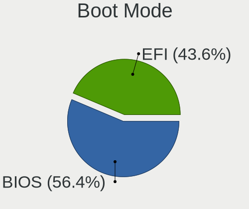

| Mode | Computers | Percent |
|------|-----------|---------|
| BIOS | 1243      | 55.74%  |
| EFI  | 987       | 44.26%  |

Filesystem
----------

Type of filesystem

| Type    | Computers | Percent |
|---------|-----------|---------|
| Ext4    | 1667      | 74.45%  |
| Btrfs   | 204       | 9.11%   |
| Overlay | 187       | 8.35%   |
| Tmpfs   | 80        | 3.57%   |
| Unknown | 53        | 2.37%   |
| Xfs     | 28        | 1.25%   |
| Zfs     | 9         | 0.4%    |
| Ext2    | 5         | 0.22%   |
| Ext3    | 3         | 0.13%   |
| F2fs    | 2         | 0.09%   |
| Aufs    | 1         | 0.04%   |

Part. scheme
------------

Scheme of partitioning

| Type    | Computers | Percent |
|---------|-----------|---------|
| Unknown | 1180      | 52.99%  |
| GPT     | 777       | 34.89%  |
| MBR     | 270       | 12.12%  |

Dual Boot with Linux/BSD
------------------------

Hosting more than one Linux/BSD

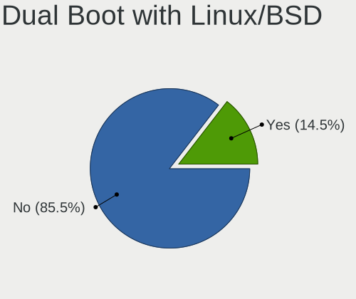

| Dual boot | Computers | Percent |
|-----------|-----------|---------|
| No        | 1894      | 85.62%  |
| Yes       | 318       | 14.38%  |

Dual Boot (Win)
---------------

Hosting Linux and Windows

| Dual boot | Computers | Percent |
|-----------|-----------|---------|
| No        | 1519      | 68.73%  |
| Yes       | 691       | 31.27%  |

Board
-----

Vendor
------

Motherboard manufacturer

| Name                    | Computers | Percent |
|-------------------------|-----------|---------|
| ASUSTek Computer        | 395       | 18.18%  |
| Lenovo                  | 284       | 13.07%  |
| Gigabyte Technology     | 278       | 12.79%  |
| Hewlett-Packard         | 182       | 8.38%   |
| Dell                    | 168       | 7.73%   |
| MSI                     | 139       | 6.4%    |
| ASRock                  | 116       | 5.34%   |
| BANGHO                  | 61        | 2.81%   |
| Intel                   | 59        | 2.72%   |
| Acer                    | 56        | 2.58%   |
| Exo                     | 38        | 1.75%   |
| Toshiba                 | 36        | 1.66%   |
| Samsung Electronics     | 33        | 1.52%   |
| Positivo                | 32        | 1.47%   |
| ECS                     | 24        | 1.1%    |
| Sony                    | 22        | 1.01%   |
| Apple                   | 22        | 1.01%   |
| Unknown                 | 20        | 0.92%   |
| Biostar                 | 16        | 0.74%   |
| Juana Manso             | 12        | 0.55%   |
| Compal                  | 9         | 0.41%   |
| AMI                     | 9         | 0.41%   |
| Novatech                | 8         | 0.37%   |
| Clevo                   | 8         | 0.37%   |
| Coradir                 | 7         | 0.32%   |
| Quanta                  | 6         | 0.28%   |
| NSX                     | 6         | 0.28%   |
| NOBLEX                  | 6         | 0.28%   |
| Foxconn                 | 6         | 0.28%   |
| Advantec                | 6         | 0.28%   |
| Standard                | 5         | 0.23%   |
| PCBOX                   | 5         | 0.23%   |
| HUAWEI                  | 5         | 0.23%   |
| System76                | 4         | 0.18%   |
| iQual                   | 4         | 0.18%   |
| A-DATA Technology       | 4         | 0.18%   |
| Raspberry Pi Foundation | 3         | 0.14%   |
| PCChips                 | 3         | 0.14%   |
| Packard Bell            | 3         | 0.14%   |
| LG Electronics          | 3         | 0.14%   |

Model
-----

Motherboard model

| Name                                   | Computers | Percent |
|----------------------------------------|-----------|---------|
| Unknown                                | 35        | 1.61%   |
| MSI MS-7721                            | 27        | 1.24%   |
| ASUS PRIME A320M-K                     | 20        | 0.92%   |
| ASUS All Series                        | 19        | 0.87%   |
| Gigabyte F2A68HM-H                     | 15        | 0.69%   |
| BANGHO Suma 1025                       | 14        | 0.64%   |
| Juana Manso SF20GM7                    | 12        | 0.55%   |
| Gigabyte H81M-H                        | 12        | 0.55%   |
| Lenovo V330-15IKB 81AX                 | 11        | 0.51%   |
| MSI MS-7C52                            | 10        | 0.46%   |
| BANGHO MOV                             | 10        | 0.46%   |
| HP Notebook                            | 9         | 0.41%   |
| ASUS PRIME B450M-A                     | 9         | 0.41%   |
| MSI MS-7A15                            | 8         | 0.37%   |
| Intel powered classmate PC             | 8         | 0.37%   |
| HP Laptop 15-bs0xx                     | 8         | 0.37%   |
| Gigabyte M68MT-S2                      | 8         | 0.37%   |
| Gigabyte H110M-H                       | 8         | 0.37%   |
| Gigabyte A320M-S2H                     | 8         | 0.37%   |
| ASUS P5KPL-AM SE                       | 8         | 0.37%   |
| ASUS H61M-K                            | 8         | 0.37%   |
| Lenovo ThinkPad L15 Gen 2 20X4S27200   | 7         | 0.32%   |
| Lenovo G470 20078                      | 7         | 0.32%   |
| Gigabyte H61M-S1                       | 7         | 0.32%   |
| Coradir Coradir/ES10IS5                | 7         | 0.32%   |
| BANGHO MAX G0101                       | 7         | 0.32%   |
| ASUS VivoBook_ASUSLaptop X509JA_X509JA | 7         | 0.32%   |
| HP Pavilion dv6                        | 6         | 0.28%   |
| Gigabyte F2A55M-HD2                    | 6         | 0.28%   |
| Gigabyte A320M-S2H V2                  | 6         | 0.28%   |
| Gigabyte A320M-H                       | 6         | 0.28%   |
| ECS H81H3-M4                           | 6         | 0.28%   |
| ASUS ROG STRIX B550-F GAMING           | 6         | 0.28%   |
| ASRock N68-VS3 FX                      | 6         | 0.28%   |
| ASRock FM2A68M-DG3+                    | 6         | 0.28%   |
| MSI MS-7309                            | 5         | 0.23%   |
| Lenovo G550 2958                       | 5         | 0.23%   |
| Gigabyte GA-78LMT-S2                   | 5         | 0.23%   |
| Exo CloudbookE15                       | 5         | 0.23%   |
| Dell Latitude 3520                     | 5         | 0.23%   |

Model Family
------------

Motherboard model prefix

| Name                | Computers | Percent |
|---------------------|-----------|---------|
| Lenovo ThinkPad     | 96        | 4.42%   |
| Dell Inspiron       | 77        | 3.54%   |
| ASUS PRIME          | 71        | 3.27%   |
| Lenovo IdeaPad      | 58        | 2.67%   |
| Dell Latitude       | 55        | 2.53%   |
| HP Pavilion         | 49        | 2.25%   |
| Acer Aspire         | 47        | 2.16%   |
| ASUS VivoBook       | 45        | 2.07%   |
| Unknown             | 35        | 1.61%   |
| MSI MS-7721         | 27        | 1.24%   |
| HP Laptop           | 27        | 1.24%   |
| Toshiba Satellite   | 23        | 1.06%   |
| ASUS All            | 19        | 0.87%   |
| HP Compaq           | 18        | 0.83%   |
| Exo Smart           | 18        | 0.83%   |
| ASUS ROG            | 18        | 0.83%   |
| Lenovo ThinkBook    | 15        | 0.69%   |
| Gigabyte F2A68HM-H  | 15        | 0.69%   |
| BANGHO Suma         | 15        | 0.69%   |
| Gigabyte A320M-S2H  | 14        | 0.64%   |
| BANGHO MAX          | 13        | 0.6%    |
| Juana Manso SF20GM7 | 12        | 0.55%   |
| Gigabyte H81M-H     | 12        | 0.55%   |
| Dell OptiPlex       | 12        | 0.55%   |
| Lenovo V330-15IKB   | 11        | 0.51%   |
| HP 250              | 11        | 0.51%   |
| Gigabyte B450M      | 11        | 0.51%   |
| ASUS TUF            | 11        | 0.51%   |
| ASUS M5A78L-M       | 11        | 0.51%   |
| MSI MS-7C52         | 10        | 0.46%   |
| Lenovo ThinkCentre  | 10        | 0.46%   |
| BANGHO MOV          | 10        | 0.46%   |
| ASUS ZenBook        | 10        | 0.46%   |
| HP Notebook         | 9         | 0.41%   |
| HP EliteBook        | 9         | 0.41%   |
| MSI MS-7A15         | 8         | 0.37%   |
| Lenovo Yoga         | 8         | 0.37%   |
| Intel powered       | 8         | 0.37%   |
| HP ENVY             | 8         | 0.37%   |
| Gigabyte M68MT-S2   | 8         | 0.37%   |

MFG Year
--------

Motherboard manufacture year

| Year    | Computers | Percent |
|---------|-----------|---------|
| 2017    | 191       | 8.79%   |
| 2021    | 186       | 8.56%   |
| 2012    | 184       | 8.47%   |
| 2020    | 163       | 7.5%    |
| 2018    | 155       | 7.13%   |
| 2011    | 153       | 7.04%   |
| 2019    | 150       | 6.9%    |
| 2014    | 145       | 6.67%   |
| 2013    | 145       | 6.67%   |
| 2010    | 133       | 6.12%   |
| 2015    | 120       | 5.52%   |
| 2016    | 102       | 4.69%   |
| 2008    | 90        | 4.14%   |
| 2009    | 89        | 4.1%    |
| 2007    | 54        | 2.49%   |
| 2006    | 39        | 1.79%   |
| 2022    | 37        | 1.7%    |
| 2023    | 14        | 0.64%   |
| Unknown | 12        | 0.55%   |
| 2004    | 6         | 0.28%   |
| 2005    | 4         | 0.18%   |
| 2001    | 1         | 0.05%   |

Form Factor
-----------

Physical design of the computer

| Name           | Computers | Percent |
|----------------|-----------|---------|
| Notebook       | 1150      | 52.92%  |
| Desktop        | 925       | 42.57%  |
| Convertible    | 35        | 1.61%   |
| Tablet         | 23        | 1.06%   |
| Mini pc        | 17        | 0.78%   |
| All in one     | 15        | 0.69%   |
| System on chip | 4         | 0.18%   |
| Server         | 3         | 0.14%   |
| Other          | 1         | 0.05%   |

Secure Boot
-----------

Enabled or disabled

| State    | Computers | Percent |
|----------|-----------|---------|
| Disabled | 2041      | 93.28%  |
| Enabled  | 147       | 6.72%   |

Coreboot
--------

Have coreboot on board

| Used | Computers | Percent |
|------|-----------|---------|
| No   | 2171      | 99.91%  |
| Yes  | 2         | 0.09%   |

RAM Size
--------

Total RAM memory

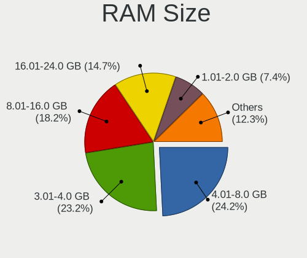

| Size in GB  | Computers | Percent |
|-------------|-----------|---------|
| 3.01-4.0    | 531       | 24.06%  |
| 4.01-8.0    | 526       | 23.83%  |
| 8.01-16.0   | 411       | 18.62%  |
| 16.01-24.0  | 319       | 14.45%  |
| 1.01-2.0    | 168       | 7.61%   |
| 32.01-64.0  | 124       | 5.62%   |
| 2.01-3.0    | 47        | 2.13%   |
| 24.01-32.0  | 32        | 1.45%   |
| 0.51-1.0    | 32        | 1.45%   |
| 64.01-256.0 | 16        | 0.72%   |
| 0.01-0.5    | 1         | 0.05%   |

RAM Used
--------

Used RAM memory

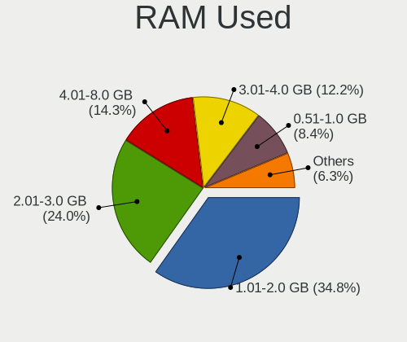

| Used GB    | Computers | Percent |
|------------|-----------|---------|
| 1.01-2.0   | 862       | 35.89%  |
| 2.01-3.0   | 576       | 23.98%  |
| 4.01-8.0   | 322       | 13.41%  |
| 3.01-4.0   | 288       | 11.99%  |
| 0.51-1.0   | 206       | 8.58%   |
| 8.01-16.0  | 98        | 4.08%   |
| 0.01-0.5   | 34        | 1.42%   |
| 16.01-24.0 | 14        | 0.58%   |
| 24.01-32.0 | 2         | 0.08%   |

Total Drives
------------

Number of drives on board

| Drives | Computers | Percent |
|--------|-----------|---------|
| 1      | 1385      | 62.05%  |
| 2      | 560       | 25.09%  |
| 3      | 179       | 8.02%   |
| 4      | 67        | 3%      |
| 5      | 16        | 0.72%   |
| 0      | 13        | 0.58%   |
| 6      | 5         | 0.22%   |
| 7      | 3         | 0.13%   |
| 28     | 1         | 0.04%   |
| 20     | 1         | 0.04%   |
| 19     | 1         | 0.04%   |
| 9      | 1         | 0.04%   |

Has CD-ROM
----------

Has CD-ROM on board

| Presented | Computers | Percent |
|-----------|-----------|---------|
| No        | 1450      | 66.12%  |
| Yes       | 743       | 33.88%  |

Has Ethernet
------------

Has Ethernet on board

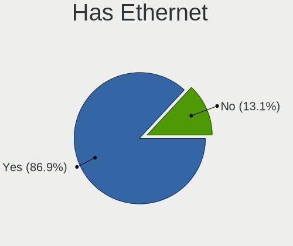

| Presented | Computers | Percent |
|-----------|-----------|---------|
| Yes       | 1911      | 87.86%  |
| No        | 264       | 12.14%  |

Has WiFi
--------

Has WiFi module

| Presented | Computers | Percent |
|-----------|-----------|---------|
| Yes       | 1616      | 73.55%  |
| No        | 581       | 26.45%  |

Has Bluetooth
-------------

Has Bluetooth module

| Presented | Computers | Percent |
|-----------|-----------|---------|
| No        | 1139      | 51.91%  |
| Yes       | 1055      | 48.09%  |

Location
--------

Country
-------

Geographic location (country)

| Country   | Computers | Percent |
|-----------|-----------|---------|
| Argentina | 2173      | 100%    |

City
----

Geographic location (city)

| City                        | Computers | Percent |
|-----------------------------|-----------|---------|
| Buenos Aires                | 482       | 21.17%  |
| Crdoba                    | 142       | 6.24%   |
| Rosario                     | 103       | 4.52%   |
| La Plata                    | 62        | 2.72%   |
| Mar del Plata               | 56        | 2.46%   |
| Avellaneda                  | 34        | 1.49%   |
| Lanus                       | 29        | 1.27%   |
| Corrientes                  | 29        | 1.27%   |
| San Miguel de Tucumn      | 28        | 1.23%   |
| Quilmes                     | 27        | 1.19%   |
| Mendoza                     | 27        | 1.19%   |
| Baha Blanca               | 25        | 1.1%    |
| Lomas de Zamora             | 23        | 1.01%   |
| Santa Fe                    | 22        | 0.97%   |
| Villa Ballester             | 21        | 0.92%   |
| Resistencia                 | 21        | 0.92%   |
| Ituzaingo                   | 20        | 0.88%   |
| Posadas                     | 19        | 0.83%   |
| Paran                     | 19        | 0.83%   |
| Salta                       | 17        | 0.75%   |
| Ramos Mejia                 | 17        | 0.75%   |
| Neuqun                    | 17        | 0.75%   |
| San Juan                    | 16        | 0.7%    |
| Olivos                      | 16        | 0.7%    |
| Viedma                      | 15        | 0.66%   |
| Tandil                      | 14        | 0.61%   |
| Florencio Varela            | 14        | 0.61%   |
| Caseros                     | 14        | 0.61%   |
| Burzaco                     | 14        | 0.61%   |
| Isidro Casanova             | 13        | 0.57%   |
| Bariloche                   | 13        | 0.57%   |
| Pilar                       | 12        | 0.53%   |
| Godoy Cruz                  | 12        | 0.53%   |
| Tigre                       | 11        | 0.48%   |
| San Telmo                   | 11        | 0.48%   |
| San Luis                    | 11        | 0.48%   |
| Martinez                    | 11        | 0.48%   |
| San Nicols de los Arroyos | 10        | 0.44%   |
| La Rioja                    | 10        | 0.44%   |
| Jose C. Paz                 | 10        | 0.44%   |

Drives
------

Drive Vendor
------------

Hard drive vendors

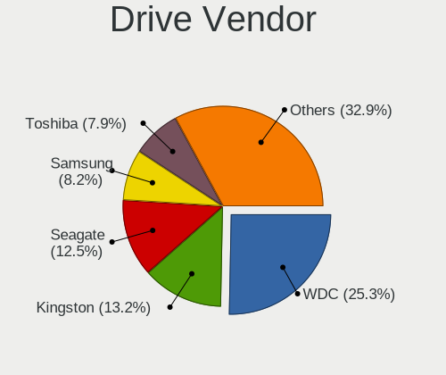

| Vendor                      | Computers | Drives | Percent |
|-----------------------------|-----------|--------|---------|
| WDC                         | 806       | 1231   | 26.57%  |
| Kingston                    | 401       | 509    | 13.22%  |
| Seagate                     | 387       | 499    | 12.76%  |
| Samsung Electronics         | 259       | 363    | 8.54%   |
| Toshiba                     | 240       | 304    | 7.91%   |
| SanDisk                     | 95        | 134    | 3.13%   |
| Hitachi                     | 93        | 107    | 3.07%   |
| Unknown                     | 79        | 99     | 2.6%    |
| HGST                        | 65        | 71     | 2.14%   |
| Crucial                     | 58        | 88     | 1.91%   |
| Gigabyte Technology         | 54        | 79     | 1.78%   |
| A-DATA Technology           | 50        | 56     | 1.65%   |
| SK hynix                    | 49        | 57     | 1.62%   |
| Micron Technology           | 25        | 31     | 0.82%   |
| Intel                       | 25        | 45     | 0.82%   |
| Hewlett-Packard             | 20        | 27     | 0.66%   |
| China                       | 19        | 22     | 0.63%   |
| PNY                         | 17        | 28     | 0.56%   |
| Maxtor                      | 16        | 19     | 0.53%   |
| Lexar                       | 16        | 18     | 0.53%   |
| Corsair                     | 14        | 15     | 0.46%   |
| Patriot                     | 13        | 16     | 0.43%   |
| KIOXIA                      | 13        | 14     | 0.43%   |
| Realtek Semiconductor       | 11        | 14     | 0.36%   |
| Unknown                     | 11        | 11     | 0.36%   |
| Micron/Crucial Technology   | 10        | 14     | 0.33%   |
| Kingston Technology Company | 10        | 14     | 0.33%   |
| ADATA Technology            | 10        | 12     | 0.33%   |
| XPG                         | 9         | 11     | 0.3%    |
| Silicon Motion              | 9         | 11     | 0.3%    |
| Phison Electronics          | 9         | 13     | 0.3%    |
| MAXIO Technology (Hangzhou) | 9         | 12     | 0.3%    |
| Kimtigo                     | 9         | 9      | 0.3%    |
| HS-SSD-C100                 | 7         | 10     | 0.23%   |
| Colorful                    | 7         | 8      | 0.23%   |
| Phison                      | 6         | 7      | 0.2%    |
| Neo                         | 6         | 6      | 0.2%    |
| Union Memory                | 5         | 6      | 0.16%   |
| Team                        | 5         | 5      | 0.16%   |
| Hikvision                   | 5         | 6      | 0.16%   |

Drive Model
-----------

Hard drive models

| Model                                | Computers | Percent |
|--------------------------------------|-----------|---------|
| Kingston SA400S37240G 240GB SSD      | 129       | 3.88%   |
| Kingston SA400S37480G 480GB SSD      | 72        | 2.16%   |
| WDC WD10EZEX-08WN4A0 1TB             | 49        | 1.47%   |
| Seagate ST1000LM035-1RK172 1TB       | 48        | 1.44%   |
| WDC WDS240G2G0A-00JH30 240GB SSD     | 42        | 1.26%   |
| Kingston SA400S37120G 120GB SSD      | 37        | 1.11%   |
| Toshiba MQ01ABF050 500GB             | 34        | 1.02%   |
| Seagate ST1000DM010-2EP102 1TB       | 33        | 0.99%   |
| Toshiba MQ01ABD100 1TB               | 30        | 0.9%    |
| Seagate ST1000LM024 HN-M101MBB 1TB   | 30        | 0.9%    |
| Seagate ST500DM002-1BD142 500GB      | 27        | 0.81%   |
| Kingston SV300S37A120G 120GB SSD     | 24        | 0.72%   |
| WDC WDS120G2G0A-00JH30 120GB SSD     | 23        | 0.69%   |
| WDC WD5000AAKX-001CA0 500GB          | 23        | 0.69%   |
| WDC WD10EZEX-00BN5A0 1TB             | 22        | 0.66%   |
| Unknown MMC Card  32GB               | 20        | 0.6%    |
| WDC WD20EZRZ-00Z5HB0 2TB             | 19        | 0.57%   |
| Toshiba DT01ACA050 500GB             | 19        | 0.57%   |
| Kingston SA400S37960G 960GB SSD      | 19        | 0.57%   |
| Toshiba MQ04ABF100 1TB               | 18        | 0.54%   |
| Gigabyte GP-GSTFS31120GNTD 120GB SSD | 18        | 0.54%   |
| Gigabyte GP-GSTFS31240GNTD 240GB     | 17        | 0.51%   |
| Crucial CT240BX500SSD1 240GB         | 17        | 0.51%   |
| WDC WD1003FZEX-00MK2A0 1TB           | 16        | 0.48%   |
| Toshiba DT01ACA100 1TB               | 16        | 0.48%   |
| Kingston SV300S37A240G 240GB SSD     | 16        | 0.48%   |
| Kingston SUV400S37240G 240GB SSD     | 16        | 0.48%   |
| WDC WD5000AAKX-00ERMA0 500GB         | 15        | 0.45%   |
| Seagate ST500LT012-1DG142 500GB      | 15        | 0.45%   |
| Seagate ST500LM030-2E717D 500GB      | 15        | 0.45%   |
| HGST HTS721010A9E630 1TB             | 15        | 0.45%   |
| WDC WDS480G2G0A-00JH30 480GB SSD     | 14        | 0.42%   |
| WDC WD1600AABS-00PRA0 160GB          | 14        | 0.42%   |
| A-DATA SU630 240GB SSD               | 14        | 0.42%   |
| WDC WDS240G2G0B-00EPW0 240GB SSD     | 13        | 0.39%   |
| Kingston SNVS500G 500GB              | 13        | 0.39%   |
| WDC WD10EZEX-21WN4A0 1TB             | 12        | 0.36%   |
| WDC WD10EARS-00Y5B1 1TB              | 12        | 0.36%   |
| Toshiba MQ01ABD032 320GB             | 12        | 0.36%   |
| WDC WD20EZRX-00D8PB0 2TB             | 11        | 0.33%   |

HDD Vendor
----------

Hard disk drive vendors

| Vendor              | Computers | Drives | Percent |
|---------------------|-----------|--------|---------|
| WDC                 | 672       | 989    | 42.5%   |
| Seagate             | 381       | 491    | 24.1%   |
| Toshiba             | 219       | 277    | 13.85%  |
| Samsung Electronics | 121       | 167    | 7.65%   |
| Hitachi             | 93        | 107    | 5.88%   |
| HGST                | 65        | 71     | 4.11%   |
| Maxtor              | 13        | 14     | 0.82%   |
| Unknown             | 7         | 7      | 0.44%   |
| Fujitsu             | 4         | 4      | 0.25%   |
| SABRENT             | 1         | 1      | 0.06%   |
| Quantum             | 1         | 1      | 0.06%   |
| JMicron Technology  | 1         | 1      | 0.06%   |
| Inateck             | 1         | 1      | 0.06%   |
| ExcelStor           | 1         | 1      | 0.06%   |
| ASMT                | 1         | 2      | 0.06%   |

SSD Vendor
----------

Solid state drive vendors

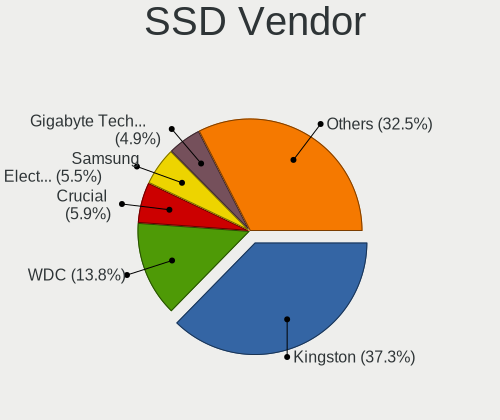

| Vendor              | Computers | Drives | Percent |
|---------------------|-----------|--------|---------|
| Kingston            | 352       | 448    | 38.1%   |
| WDC                 | 134       | 172    | 14.5%   |
| Crucial             | 53        | 83     | 5.74%   |
| Samsung Electronics | 50        | 76     | 5.41%   |
| Gigabyte Technology | 49        | 74     | 5.3%    |
| A-DATA Technology   | 43        | 47     | 4.65%   |
| SanDisk             | 39        | 48     | 4.22%   |
| PNY                 | 17        | 28     | 1.84%   |
| Lexar               | 16        | 18     | 1.73%   |
| China               | 16        | 19     | 1.73%   |
| Hewlett-Packard     | 12        | 16     | 1.3%    |
| SK hynix            | 11        | 12     | 1.19%   |
| Patriot             | 11        | 14     | 1.19%   |
| Corsair             | 10        | 11     | 1.08%   |
| Kimtigo             | 9         | 9      | 0.97%   |
| Toshiba             | 8         | 8      | 0.87%   |
| Micron Technology   | 8         | 11     | 0.87%   |
| Intel               | 8         | 9      | 0.87%   |
| Colorful            | 7         | 8      | 0.76%   |
| Team                | 5         | 5      | 0.54%   |
| Wodposit            | 4         | 4      | 0.43%   |
| Seagate             | 4         | 6      | 0.43%   |
| FORESEE             | 4         | 4      | 0.43%   |
| OCZ                 | 3         | 3      | 0.32%   |
| Netac               | 3         | 5      | 0.32%   |
| Maxtor              | 3         | 5      | 0.32%   |
| LITEONIT            | 3         | 3      | 0.32%   |
| HS-SSD-C100         | 3         | 6      | 0.32%   |
| Hikvision           | 3         | 3      | 0.32%   |
| Unknown             | 3         | 3      | 0.32%   |
| WDC WDS2            | 2         | 2      | 0.22%   |
| Super Talent        | 2         | 2      | 0.22%   |
| SPCC                | 2         | 2      | 0.22%   |
| LITEON              | 2         | 2      | 0.22%   |
| GLOWAY              | 2         | 3      | 0.22%   |
| FREEBSD             | 2         | 24     | 0.22%   |
| Apple               | 2         | 2      | 0.22%   |
| XrayDisk            | 1         | 1      | 0.11%   |
| WALRAM              | 1         | 1      | 0.11%   |
| USB3.0              | 1         | 1      | 0.11%   |

Drive Kind
----------

HDD or SSD

| Kind    | Computers | Drives | Percent |
|---------|-----------|--------|---------|
| HDD     | 1365      | 2134   | 49.53%  |
| SSD     | 856       | 1219   | 31.06%  |
| NVMe    | 429       | 641    | 15.57%  |
| MMC     | 77        | 99     | 2.79%   |
| Unknown | 29        | 26     | 1.05%   |

Drive Connector
---------------

SATA, SAS, NVMe, etc.

| Type | Computers | Drives | Percent |
|------|-----------|--------|---------|
| SATA | 1844      | 3335   | 77.12%  |
| NVMe | 429       | 640    | 17.94%  |
| MMC  | 77        | 99     | 3.22%   |
| SAS  | 41        | 45     | 1.71%   |

Drive Size
----------

Size of hard drive

| Size in TB      | Computers | Drives | Percent |
|-----------------|-----------|--------|---------|
| 0.01-0.5        | 1418      | 2148   | 63.62%  |
| 0.51-1.0        | 646       | 950    | 28.98%  |
| 1.01-2.0        | 117       | 166    | 5.25%   |
| 3.01-4.0        | 22        | 34     | 0.99%   |
| 2.01-3.0        | 12        | 15     | 0.54%   |
| 4.01-10.0       | 11        | 19     | 0.49%   |
| 10.01-20.0      | 2         | 20     | 0.09%   |
| More than 100.0 | 1         | 1      | 0.04%   |

Space Total
-----------

Amount of disk space available on the file system

| Size in GB     | Computers | Percent |
|----------------|-----------|---------|
| 101-250        | 665       | 28.73%  |
| 251-500        | 538       | 23.24%  |
| 501-1000       | 362       | 15.64%  |
| 1001-2000      | 182       | 7.86%   |
| 1-20           | 156       | 6.74%   |
| 51-100         | 147       | 6.35%   |
| 21-50          | 102       | 4.41%   |
| 2001-3000      | 60        | 2.59%   |
| More than 3000 | 53        | 2.29%   |
| Unknown        | 50        | 2.16%   |

Space Used
----------

Amount of used disk space

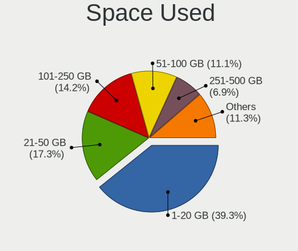

| Used GB        | Computers | Percent |
|----------------|-----------|---------|
| 1-20           | 931       | 39.08%  |
| 21-50          | 417       | 17.51%  |
| 101-250        | 331       | 13.9%   |
| 51-100         | 264       | 11.08%  |
| 251-500        | 174       | 7.3%    |
| 501-1000       | 125       | 5.25%   |
| 1001-2000      | 63        | 2.64%   |
| Unknown        | 50        | 2.1%    |
| More than 3000 | 13        | 0.55%   |
| 2001-3000      | 13        | 0.55%   |
| 0              | 1         | 0.04%   |

Malfunc. Drives
---------------

Drive models with a malfunction

| Model                              | Computers | Drives | Percent |
|------------------------------------|-----------|--------|---------|
| WDC WD5000AAKX-001CA0 500GB        | 7         | 9      | 2.62%   |
| Seagate ST1000LM035-1RK172 1TB     | 7         | 7      | 2.62%   |
| WDC WDS240G2G0A-00JH30 240GB SSD   | 4         | 4      | 1.5%    |
| WDC WD5000AAKX-00ERMA0 500GB       | 4         | 4      | 1.5%    |
| WDC WD10EZEX-00BN5A0 1TB           | 4         | 4      | 1.5%    |
| WDC WD10EARS-00Y5B1 1TB            | 4         | 4      | 1.5%    |
| Toshiba MK1665GSX 160GB            | 4         | 4      | 1.5%    |
| Seagate ST500DM002-1BD142 500GB    | 4         | 5      | 1.5%    |
| Kingston SA400S37240G 240GB SSD    | 4         | 4      | 1.5%    |
| WDC WD5000BPVT-22HXZT3 500GB       | 3         | 3      | 1.12%   |
| WDC WD3200AAKS-00L9A0 320GB        | 3         | 3      | 1.12%   |
| WDC WD10EZEX-08WN4A0 1TB           | 3         | 3      | 1.12%   |
| WDC WD1003FZEX-00MK2A0 1TB         | 3         | 4      | 1.12%   |
| Toshiba MQ01ABF050 500GB           | 3         | 3      | 1.12%   |
| Toshiba MQ01ABD100 1TB             | 3         | 6      | 1.12%   |
| Toshiba DT01ACA050 500GB           | 3         | 3      | 1.12%   |
| Seagate ST1000LM024 HN-M101MBB 1TB | 3         | 3      | 1.12%   |
| Seagate ST1000DM003-1SB10C 1TB     | 3         | 3      | 1.12%   |
| HGST HTS721010A9E630 1TB           | 3         | 5      | 1.12%   |
| HGST HTS541010A9E680 1TB           | 3         | 3      | 1.12%   |
| WDC WDS480G2G0A-00JH30 480GB SSD   | 2         | 5      | 0.75%   |
| WDC WD5000AAKX-08ERMA0 500GB       | 2         | 2      | 0.75%   |
| WDC WD20EZRX-00D8PB0 2TB           | 2         | 2      | 0.75%   |
| WDC WD10EZEX-00RKKA0 1TB           | 2         | 2      | 0.75%   |
| WDC WD1003FZEX-00K3CA0 1TB         | 2         | 2      | 0.75%   |
| WDC WD1002FAEX-00Y9A0 1TB          | 2         | 2      | 0.75%   |
| Toshiba MQ01ABD050 500GB           | 2         | 2      | 0.75%   |
| Toshiba MK7559GSXP 752GB           | 2         | 2      | 0.75%   |
| Toshiba MK6475GSX 640GB            | 2         | 2      | 0.75%   |
| Seagate ST9500325AS 500GB          | 2         | 2      | 0.75%   |
| Seagate ST9320325AS 320GB          | 2         | 2      | 0.75%   |
| Seagate ST9250315AS 250GB          | 2         | 2      | 0.75%   |
| Seagate ST500LT012-1DG142 500GB    | 2         | 5      | 0.75%   |
| Seagate ST500LM030-2E717D 500GB    | 2         | 2      | 0.75%   |
| Seagate ST1500DL003-9VT16L 1TB     | 2         | 2      | 0.75%   |
| Seagate ST1000DM003-9YN162 1TB     | 2         | 2      | 0.75%   |
| Seagate ST1000DM003-1CH162 1TB     | 2         | 2      | 0.75%   |
| Samsung Electronics SP0411N 40GB   | 2         | 3      | 0.75%   |
| Samsung Electronics HN-M101MBB 1TB | 2         | 2      | 0.75%   |
| Samsung Electronics HM250HI 250GB  | 2         | 2      | 0.75%   |

Malfunc. Drive Vendor
---------------------

Vendors of faulty drives

| Vendor              | Computers | Drives | Percent |
|---------------------|-----------|--------|---------|
| WDC                 | 97        | 117    | 37.89%  |
| Seagate             | 50        | 57     | 19.53%  |
| Toshiba             | 31        | 35     | 12.11%  |
| Samsung Electronics | 27        | 29     | 10.55%  |
| Hitachi             | 15        | 17     | 5.86%   |
| HGST                | 12        | 14     | 4.69%   |
| Kingston            | 10        | 10     | 3.91%   |
| Maxtor              | 3         | 4      | 1.17%   |
| A-DATA Technology   | 3         | 3      | 1.17%   |
| XPG                 | 1         | 1      | 0.39%   |
| tecmiyo             | 1         | 4      | 0.39%   |
| SMI                 | 1         | 1      | 0.39%   |
| SanDisk             | 1         | 1      | 0.39%   |
| Quantum             | 1         | 1      | 0.39%   |
| Micron Technology   | 1         | 2      | 0.39%   |
| LITEONIT            | 1         | 1      | 0.39%   |
| Crucial             | 1         | 1      | 0.39%   |

Malfunc. HDD Vendor
-------------------

Vendors of faulty HDD drives

| Vendor              | Computers | Drives | Percent |
|---------------------|-----------|--------|---------|
| WDC                 | 87        | 104    | 39.01%  |
| Seagate             | 50        | 57     | 22.42%  |
| Toshiba             | 31        | 35     | 13.9%   |
| Samsung Electronics | 24        | 26     | 10.76%  |
| Hitachi             | 15        | 17     | 6.73%   |
| HGST                | 12        | 14     | 5.38%   |
| Maxtor              | 3         | 4      | 1.35%   |
| Quantum             | 1         | 1      | 0.45%   |

Malfunc. Drive Kind
-------------------

Kinds of faulty drives

| Kind | Computers | Drives | Percent |
|------|-----------|--------|---------|
| HDD  | 210       | 258    | 86.42%  |
| SSD  | 30        | 37     | 12.35%  |
| NVMe | 3         | 3      | 1.23%   |

Failed Drives
-------------

Failed drive models

| Model                             | Computers | Drives | Percent |
|-----------------------------------|-----------|--------|---------|
| WDC WD5000BEVT-22ZAT0 500GB       | 2         | 2      | 18.18%  |
| Toshiba MQ01ABF032 320GB          | 2         | 2      | 18.18%  |
| WDC WD1600BEVT-80A23T0 160GB      | 1         | 1      | 9.09%   |
| WDC WD10EZEX-22MFCA0 1TB          | 1         | 1      | 9.09%   |
| Toshiba MK6475GSX 640GB           | 1         | 1      | 9.09%   |
| Toshiba MK1665GSX 160GB           | 1         | 1      | 9.09%   |
| Seagate ST9320325AS 320GB         | 1         | 1      | 9.09%   |
| Samsung Electronics HD502HJ 500GB | 1         | 1      | 9.09%   |
| Samsung Electronics HD103SJ 1TB   | 1         | 1      | 9.09%   |

Failed Drive Vendor
-------------------

Failed drive vendors

| Vendor              | Computers | Drives | Percent |
|---------------------|-----------|--------|---------|
| WDC                 | 4         | 4      | 36.36%  |
| Toshiba             | 4         | 4      | 36.36%  |
| Samsung Electronics | 2         | 2      | 18.18%  |
| Seagate             | 1         | 1      | 9.09%   |

Drive Status
------------

Number of failed and malfunc. drives

| Status   | Computers | Drives | Percent |
|----------|-----------|--------|---------|
| Detected | 1316      | 2452   | 56.19%  |
| Works    | 778       | 1358   | 33.22%  |
| Malfunc  | 238       | 298    | 10.16%  |
| Failed   | 10        | 11     | 0.43%   |

Storage controller
------------------

Storage Vendor
--------------

Storage controller vendors

| Vendor                               | Computers | Percent |
|--------------------------------------|-----------|---------|
| Intel                                | 1374      | 54.57%  |
| AMD                                  | 505       | 20.06%  |
| SanDisk                              | 94        | 3.73%   |
| Samsung Electronics                  | 94        | 3.73%   |
| Nvidia                               | 89        | 3.53%   |
| Kingston Technology Company          | 62        | 2.46%   |
| SK hynix                             | 38        | 1.51%   |
| VIA Technologies                     | 31        | 1.23%   |
| Phison Electronics                   | 25        | 0.99%   |
| ASMedia Technology                   | 21        | 0.83%   |
| Realtek Semiconductor                | 20        | 0.79%   |
| Silicon Integrated Systems [SiS]     | 17        | 0.68%   |
| Toshiba America Info Systems         | 16        | 0.64%   |
| Silicon Motion                       | 16        | 0.64%   |
| Micron Technology                    | 16        | 0.64%   |
| KIOXIA                               | 15        | 0.6%    |
| Micron/Crucial Technology            | 14        | 0.56%   |
| Marvell Technology Group             | 13        | 0.52%   |
| ADATA Technology                     | 13        | 0.52%   |
| MAXIO Technology (Hangzhou)          | 12        | 0.48%   |
| JMicron Technology                   | 12        | 0.48%   |
| Union Memory (Shenzhen)              | 7         | 0.28%   |
| Silicon Image                        | 2         | 0.08%   |
| Apple                                | 2         | 0.08%   |
| Solid State Storage Technology       | 1         | 0.04%   |
| Ramaxel Technology(Shenzhen) Limited | 1         | 0.04%   |
| Promise Technology                   | 1         | 0.04%   |
| O2 Micro                             | 1         | 0.04%   |
| Nextorage                            | 1         | 0.04%   |
| Lite-On Technology                   | 1         | 0.04%   |
| INNOGRIT                             | 1         | 0.04%   |
| Broadcom / LSI                       | 1         | 0.04%   |
| Biwin Storage Technology             | 1         | 0.04%   |
| Adaptec                              | 1         | 0.04%   |

Storage Model
-------------

Storage controller models

| Model                                                                                   | Computers | Percent |
|-----------------------------------------------------------------------------------------|-----------|---------|
| AMD FCH SATA Controller [AHCI mode]                                                     | 309       | 10.04%  |
| Intel Sunrise Point-LP SATA Controller [AHCI mode]                                      | 143       | 4.65%   |
| Intel 7 Series Chipset Family 6-port SATA Controller [AHCI mode]                        | 104       | 3.38%   |
| Intel 8 Series/C220 Series Chipset Family 6-port SATA Controller 1 [AHCI mode]          | 76        | 2.47%   |
| Nvidia MCP61 SATA Controller                                                            | 74        | 2.4%    |
| Intel NM10/ICH7 Family SATA Controller [IDE mode]                                       | 73        | 2.37%   |
| Intel 82801 Mobile SATA Controller [RAID mode]                                          | 69        | 2.24%   |
| Intel 82801G (ICH7 Family) IDE Controller                                               | 66        | 2.14%   |
| Intel 6 Series/C200 Series Chipset Family 6 port Mobile SATA AHCI Controller            | 65        | 2.11%   |
| AMD SB7x0/SB8x0/SB9x0 IDE Controller                                                    | 65        | 2.11%   |
| Nvidia MCP61 IDE                                                                        | 64        | 2.08%   |
| AMD FCH SATA Controller D                                                               | 64        | 2.08%   |
| Intel Atom Processor E3800 Series SATA AHCI Controller                                  | 57        | 1.85%   |
| Intel Celeron/Pentium Silver Processor SATA Controller                                  | 52        | 1.69%   |
| AMD SB7x0/SB8x0/SB9x0 SATA Controller [IDE mode]                                        | 51        | 1.66%   |
| Intel Q170/Q150/B150/H170/H110/Z170/CM236 Chipset SATA Controller [AHCI Mode]           | 50        | 1.62%   |
| AMD 400 Series Chipset SATA Controller                                                  | 49        | 1.59%   |
| AMD SB7x0/SB8x0/SB9x0 SATA Controller [AHCI mode]                                       | 47        | 1.53%   |
| Intel 200 Series PCH SATA controller [AHCI mode]                                        | 40        | 1.3%    |
| Intel 82801IBM/IEM (ICH9M/ICH9M-E) 4 port SATA Controller [AHCI mode]                   | 37        | 1.2%    |
| Samsung NVMe SSD Controller SM981/PM981/PM983                                           | 36        | 1.17%   |
| Samsung NVMe SSD Controller 980 (DRAM-less)                                             | 36        | 1.17%   |
| Intel Comet Lake SATA AHCI Controller                                                   | 36        | 1.17%   |
| AMD 500 Series Chipset SATA Controller                                                  | 36        | 1.17%   |
| Intel Tiger Lake-LP SATA Controller                                                     | 34        | 1.1%    |
| AMD FCH SATA Controller [IDE mode]                                                      | 34        | 1.1%    |
| Intel Wildcat Point-LP SATA Controller [AHCI Mode]                                      | 33        | 1.07%   |
| Intel Volume Management Device NVMe RAID Controller                                     | 32        | 1.04%   |
| Intel NM10/ICH7 Family SATA Controller [AHCI mode]                                      | 32        | 1.04%   |
| Intel 8 Series SATA Controller 1 [AHCI mode]                                            | 32        | 1.04%   |
| Intel 6 Series/C200 Series Chipset Family 6 port Desktop SATA AHCI Controller           | 32        | 1.04%   |
| AMD FCH IDE Controller                                                                  | 32        | 1.04%   |
| Intel 5 Series/3400 Series Chipset 4 port SATA AHCI Controller                          | 31        | 1.01%   |
| Intel 6 Series/C200 Series Chipset Family Desktop SATA Controller (IDE mode, ports 4-5) | 27        | 0.88%   |
| Intel 6 Series/C200 Series Chipset Family Desktop SATA Controller (IDE mode, ports 0-3) | 27        | 0.88%   |
| SanDisk Ultra 3D / WD Blue SN550 NVMe SSD                                               | 24        | 0.78%   |
| Intel 500 Series Chipset Family SATA AHCI Controller                                    | 23        | 0.75%   |
| Intel HM170/QM170 Chipset SATA Controller [AHCI Mode]                                   | 21        | 0.68%   |
| Intel Celeron N3350/Pentium N4200/Atom E3900 Series SATA AHCI Controller                | 21        | 0.68%   |
| Kingston Company NV1 NVMe SSD SM2263XT (DRAM-less)                                      | 20        | 0.65%   |

Storage Kind
------------

Kind of storage controller (IDE, SATA, NVMe, SAS, ...)

| Kind | Computers | Percent |
|------|-----------|---------|
| SATA | 1600      | 61.49%  |
| IDE  | 449       | 17.26%  |
| NVMe | 431       | 16.56%  |
| RAID | 121       | 4.65%   |
| SCSI | 1         | 0.04%   |

Processor
---------

CPU Vendor
----------

Processor vendors

| Vendor | Computers | Percent |
|--------|-----------|---------|
| Intel  | 1518      | 69.83%  |
| AMD    | 651       | 29.94%  |
| ARM    | 5         | 0.23%   |

CPU Model
---------

Processor models

| Model                                       | Computers | Percent |
|---------------------------------------------|-----------|---------|
| Intel Celeron N4020 CPU @ 1.10GHz           | 32        | 1.47%   |
| Intel 11th Gen Core i7-1165G7 @ 2.80GHz     | 32        | 1.47%   |
| Intel Core i5-7200U CPU @ 2.50GHz           | 31        | 1.42%   |
| Intel 11th Gen Core i5-1135G7 @ 2.40GHz     | 22        | 1.01%   |
| Intel Core i7-7500U CPU @ 2.70GHz           | 20        | 0.92%   |
| Intel Core i7-6500U CPU @ 2.50GHz           | 20        | 0.92%   |
| Intel Core i7-8550U CPU @ 1.80GHz           | 19        | 0.87%   |
| Intel Celeron CPU N3350 @ 1.10GHz           | 19        | 0.87%   |
| Intel Core i5-8250U CPU @ 1.60GHz           | 18        | 0.83%   |
| Intel Core i5-3210M CPU @ 2.50GHz           | 18        | 0.83%   |
| Intel Celeron N4000 CPU @ 1.10GHz           | 18        | 0.83%   |
| Intel Core i5-10210U CPU @ 1.60GHz          | 17        | 0.78%   |
| Intel Atom x5-Z8350 CPU @ 1.44GHz           | 17        | 0.78%   |
| AMD Ryzen 5 3400G with Radeon Vega Graphics | 17        | 0.78%   |
| Intel Atom CPU N2600 @ 1.60GHz              | 16        | 0.73%   |
| Intel Core i5-6200U CPU @ 2.30GHz           | 15        | 0.69%   |
| Intel Core i5-3320M CPU @ 2.60GHz           | 15        | 0.69%   |
| Intel Core i5-1035G1 CPU @ 1.00GHz          | 15        | 0.69%   |
| AMD Ryzen 3 3200G with Radeon Vega Graphics | 14        | 0.64%   |
| Intel Core i7-10510U CPU @ 1.80GHz          | 13        | 0.6%    |
| AMD Ryzen 5 3600 6-Core Processor           | 13        | 0.6%    |
| Intel Core i7-7700HQ CPU @ 2.80GHz          | 12        | 0.55%   |
| Intel Core i7-5500U CPU @ 2.40GHz           | 12        | 0.55%   |
| Intel Core i5-5200U CPU @ 2.20GHz           | 12        | 0.55%   |
| Intel Core i3-2310M CPU @ 2.10GHz           | 12        | 0.55%   |
| AMD Ryzen 5 5600X 6-Core Processor          | 12        | 0.55%   |
| AMD Athlon II X2 250 Processor              | 12        | 0.55%   |
| AMD A4-4000 APU with Radeon HD Graphics     | 12        | 0.55%   |
| Intel Core i5-4460 CPU @ 3.20GHz            | 11        | 0.51%   |
| Intel Core i3-1005G1 CPU @ 1.20GHz          | 11        | 0.51%   |
| AMD Ryzen 7 5700G with Radeon Graphics      | 11        | 0.51%   |
| AMD Ryzen 5 2600 Six-Core Processor         | 11        | 0.51%   |
| Intel Core i7-8565U CPU @ 1.80GHz           | 10        | 0.46%   |
| Intel Core i7-3770 CPU @ 3.40GHz            | 10        | 0.46%   |
| Intel Core i5-8265U CPU @ 1.60GHz           | 10        | 0.46%   |
| Intel Core i5-4440 CPU @ 3.10GHz            | 10        | 0.46%   |
| Intel Core i3-7100U CPU @ 2.40GHz           | 10        | 0.46%   |
| Intel Core i3-6006U CPU @ 2.00GHz           | 10        | 0.46%   |
| Intel Core i3-4170 CPU @ 3.70GHz            | 10        | 0.46%   |
| Intel Core i3-2330M CPU @ 2.20GHz           | 10        | 0.46%   |

CPU Model Family
----------------

Processor model prefix

| Model                   | Computers | Percent |
|-------------------------|-----------|---------|
| Intel Core i5           | 390       | 17.91%  |
| Intel Core i7           | 276       | 12.68%  |
| Intel Core i3           | 213       | 9.78%   |
| Intel Celeron           | 181       | 8.31%   |
| Other                   | 137       | 6.29%   |
| AMD Ryzen 5             | 134       | 6.16%   |
| Intel Pentium           | 69        | 3.17%   |
| AMD Ryzen 7             | 69        | 3.17%   |
| Intel Atom              | 66        | 3.03%   |
| Intel Core 2 Duo        | 56        | 2.57%   |
| Intel Pentium Dual-Core | 51        | 2.34%   |
| AMD A8                  | 45        | 2.07%   |
| AMD Ryzen 3             | 41        | 1.88%   |
| AMD FX                  | 41        | 1.88%   |
| AMD A6                  | 34        | 1.56%   |
| AMD A4                  | 33        | 1.52%   |
| AMD Athlon II X2        | 28        | 1.29%   |
| AMD A10                 | 28        | 1.29%   |
| Intel Pentium Dual      | 27        | 1.24%   |
| AMD Athlon              | 24        | 1.1%    |
| AMD Athlon 64 X2        | 22        | 1.01%   |
| AMD Sempron             | 20        | 0.92%   |
| AMD Phenom II X4        | 18        | 0.83%   |
| AMD Ryzen 9             | 14        | 0.64%   |
| Intel Core 2            | 12        | 0.55%   |
| AMD Athlon II X4        | 12        | 0.55%   |
| Intel Xeon              | 10        | 0.46%   |
| Intel Pentium 4         | 10        | 0.46%   |
| Intel Genuine           | 10        | 0.46%   |
| Intel Pentium D         | 9         | 0.41%   |
| AMD Phenom II X6        | 9         | 0.41%   |
| Intel Core 2 Quad       | 8         | 0.37%   |
| AMD E1                  | 6         | 0.28%   |
| AMD Athlon II           | 6         | 0.28%   |
| AMD A12                 | 6         | 0.28%   |
| AMD Athlon II X3        | 5         | 0.23%   |
| Intel Pentium Gold      | 4         | 0.18%   |
| Intel Core i9           | 4         | 0.18%   |
| AMD Phenom II X2        | 4         | 0.18%   |
| AMD Phenom              | 4         | 0.18%   |

CPU Cores
---------

Number of processor cores

| Number  | Computers | Percent |
|---------|-----------|---------|
| 2       | 1091      | 50.09%  |
| 4       | 647       | 29.71%  |
| 6       | 154       | 7.07%   |
| 1       | 128       | 5.88%   |
| 8       | 98        | 4.5%    |
| 3       | 21        | 0.96%   |
| 12      | 11        | 0.51%   |
| 10      | 11        | 0.51%   |
| 16      | 10        | 0.46%   |
| Unknown | 4         | 0.18%   |
| 14      | 2         | 0.09%   |
| 24      | 1         | 0.05%   |

CPU Sockets
-----------

Number of sockets

| Number  | Computers | Percent |
|---------|-----------|---------|
| 1       | 2167      | 99.68%  |
| 2       | 5         | 0.23%   |
| Unknown | 2         | 0.09%   |

CPU Threads
-----------

Threads per core (Hyper-Threading)

| Number  | Computers | Percent |
|---------|-----------|---------|
| 2       | 1316      | 60.45%  |
| 1       | 857       | 39.37%  |
| Unknown | 4         | 0.18%   |

CPU Op-Modes
------------

CPU Operation Modes (32-bit, 64-bit)

| Op mode        | Computers | Percent |
|----------------|-----------|---------|
| 32-bit, 64-bit | 2116      | 97.15%  |
| Unknown        | 33        | 1.52%   |
| 32-bit         | 22        | 1.01%   |
| 64-bit         | 7         | 0.32%   |

CPU Microcode
-------------

Microcode number

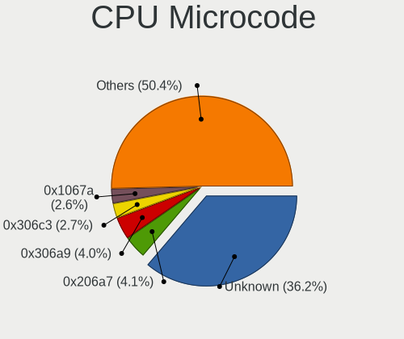

| Number     | Computers | Percent |
|------------|-----------|---------|
| Unknown    | 664       | 29.16%  |
| 0x206a7    | 108       | 4.74%   |
| 0x306a9    | 104       | 4.57%   |
| 0x306c3    | 70        | 3.07%   |
| 0x1067a    | 66        | 2.9%    |
| 0x806e9    | 49        | 2.15%   |
| 0x806ec    | 47        | 2.06%   |
| 0x08108109 | 44        | 1.93%   |
| 0x806c1    | 42        | 1.84%   |
| 0x010000c8 | 41        | 1.8%    |
| 0x6fd      | 39        | 1.71%   |
| 0x906e9    | 38        | 1.67%   |
| 0x406e3    | 38        | 1.67%   |
| 0x30678    | 35        | 1.54%   |
| 0x06001119 | 34        | 1.49%   |
| 0x806ea    | 33        | 1.45%   |
| 0x306d4    | 31        | 1.36%   |
| 0x906ea    | 29        | 1.27%   |
| 0x40651    | 28        | 1.23%   |
| 0x20655    | 28        | 1.23%   |
| 0x06003106 | 27        | 1.19%   |
| 0x506e3    | 26        | 1.14%   |
| 0x406c4    | 25        | 1.1%    |
| 0x08701021 | 24        | 1.05%   |
| 0x706e5    | 20        | 0.88%   |
| 0x706a8    | 19        | 0.83%   |
| 0x506c9    | 19        | 0.83%   |
| 0x106ca    | 19        | 0.83%   |
| 0x0a50000c | 18        | 0.79%   |
| 0x706a1    | 17        | 0.75%   |
| 0x08101016 | 17        | 0.75%   |
| 0x30661    | 16        | 0.7%    |
| 0x0600611a | 15        | 0.66%   |
| 0x06000852 | 14        | 0.61%   |
| 0x0600063e | 14        | 0.61%   |
| 0xa0653    | 13        | 0.57%   |
| 0x08608103 | 13        | 0.57%   |
| 0x0800820d | 13        | 0.57%   |
| 0x06006705 | 13        | 0.57%   |
| 0x06006118 | 13        | 0.57%   |

CPU Microarch
-------------

Microarchitecture

| Name             | Computers | Percent |
|------------------|-----------|---------|
| KabyLake         | 302       | 13.87%  |
| IvyBridge        | 141       | 6.48%   |
| SandyBridge      | 139       | 6.38%   |
| Haswell          | 133       | 6.11%   |
| Penryn           | 108       | 4.96%   |
| K10              | 108       | 4.96%   |
| Silvermont       | 103       | 4.73%   |
| Zen+             | 87        | 4%      |
| Skylake          | 85        | 3.9%    |
| TigerLake        | 71        | 3.26%   |
| Core             | 67        | 3.08%   |
| Piledriver       | 66        | 3.03%   |
| Zen 3            | 60        | 2.76%   |
| Zen 2            | 57        | 2.62%   |
| Goldmont plus    | 57        | 2.62%   |
| Unknown          | 54        | 2.48%   |
| Westmere         | 52        | 2.39%   |
| Excavator        | 50        | 2.3%    |
| Zen              | 47        | 2.16%   |
| IceLake          | 42        | 1.93%   |
| Bonnell          | 42        | 1.93%   |
| Steamroller      | 41        | 1.88%   |
| CometLake        | 40        | 1.84%   |
| K8 Hammer        | 38        | 1.75%   |
| Broadwell        | 37        | 1.7%    |
| NetBurst         | 22        | 1.01%   |
| Goldmont         | 21        | 0.96%   |
| Bulldozer        | 18        | 0.83%   |
| K10 Llano        | 16        | 0.73%   |
| Alderlake Hybrid | 15        | 0.69%   |
| P6               | 12        | 0.55%   |
| Jaguar           | 12        | 0.55%   |
| Bobcat           | 12        | 0.55%   |
| Puma             | 8         | 0.37%   |
| Nehalem          | 8         | 0.37%   |
| K8 & K10 hybrid  | 3         | 0.14%   |
| K6               | 2         | 0.09%   |
| Gracemont        | 1         | 0.05%   |

Graphics
--------

GPU Vendor
----------

Vendors of graphics cards

| Vendor                           | Computers | Percent |
|----------------------------------|-----------|---------|
| Intel                            | 1288      | 53.87%  |
| AMD                              | 616       | 25.76%  |
| Nvidia                           | 457       | 19.11%  |
| Silicon Integrated Systems [SiS] | 14        | 0.59%   |
| VIA Technologies                 | 11        | 0.46%   |
| ATI Technologies                 | 3         | 0.13%   |
| Matrox Electronics Systems       | 1         | 0.04%   |
| ASPEED Technology                | 1         | 0.04%   |

GPU Model
---------

Graphics card models

| Model                                                                                    | Computers | Percent |
|------------------------------------------------------------------------------------------|-----------|---------|
| Intel 2nd Generation Core Processor Family Integrated Graphics Controller                | 123       | 4.99%   |
| Intel 3rd Gen Core processor Graphics Controller                                         | 85        | 3.45%   |
| Intel HD Graphics 620                                                                    | 73        | 2.96%   |
| Intel TigerLake-LP GT2 [Iris Xe Graphics]                                                | 62        | 2.51%   |
| AMD Picasso/Raven 2 [Radeon Vega Series / Radeon Vega Mobile Series]                     | 61        | 2.47%   |
| Intel Atom Processor Z36xxx/Z37xxx Series Graphics & Display                             | 59        | 2.39%   |
| Intel GeminiLake [UHD Graphics 600]                                                      | 57        | 2.31%   |
| Intel Skylake GT2 [HD Graphics 520]                                                      | 50        | 2.03%   |
| Intel Core Processor Integrated Graphics Controller                                      | 49        | 1.99%   |
| Intel UHD Graphics 620                                                                   | 45        | 1.82%   |
| Intel Atom/Celeron/Pentium Processor x5-E8000/J3xxx/N3xxx Integrated Graphics Controller | 44        | 1.78%   |
| Intel CometLake-U GT2 [UHD Graphics]                                                     | 42        | 1.7%    |
| Intel Mobile 4 Series Chipset Integrated Graphics Controller                             | 41        | 1.66%   |
| Intel Xeon E3-1200 v3/4th Gen Core Processor Integrated Graphics Controller              | 40        | 1.62%   |
| AMD Ellesmere [Radeon RX 470/480/570/570X/580/580X/590]                                  | 37        | 1.5%    |
| Intel HD Graphics 630                                                                    | 35        | 1.42%   |
| Intel Haswell-ULT Integrated Graphics Controller                                         | 35        | 1.42%   |
| Intel HD Graphics 5500                                                                   | 34        | 1.38%   |
| AMD Raven Ridge [Radeon Vega Series / Radeon Vega Mobile Series]                         | 33        | 1.34%   |
| Intel WhiskeyLake-U GT2 [UHD Graphics 620]                                               | 30        | 1.22%   |
| AMD Cezanne [Radeon Vega Series / Radeon Vega Mobile Series]                             | 29        | 1.18%   |
| Intel Iris Plus Graphics G1 (Ice Lake)                                                   | 26        | 1.05%   |
| AMD Wani [Radeon R5/R6/R7 Graphics]                                                      | 26        | 1.05%   |
| AMD Kaveri [Radeon R7 Graphics]                                                          | 26        | 1.05%   |
| Nvidia C61 [GeForce 7025 / nForce 630a]                                                  | 24        | 0.97%   |
| Nvidia GT218 [GeForce 210]                                                               | 23        | 0.93%   |
| Intel 4 Series Chipset Integrated Graphics Controller                                    | 23        | 0.93%   |
| Intel Xeon E3-1200 v2/3rd Gen Core processor Graphics Controller                         | 22        | 0.89%   |
| Intel Atom Processor D4xx/D5xx/N4xx/N5xx Integrated Graphics Controller                  | 22        | 0.89%   |
| Nvidia GP107 [GeForce GTX 1050 Ti]                                                       | 21        | 0.85%   |
| Intel HD Graphics 500                                                                    | 21        | 0.85%   |
| Intel 4th Gen Core Processor Integrated Graphics Controller                              | 21        | 0.85%   |
| AMD Renoir [Radeon RX Vega 6 (Ryzen 4000/5000 Mobile Series)]                            | 21        | 0.85%   |
| Nvidia GK208B [GeForce GT 710]                                                           | 20        | 0.81%   |
| AMD Cedar [Radeon HD 5000/6000/7350/8350 Series]                                         | 20        | 0.81%   |
| Intel Mobile GM965/GL960 Integrated Graphics Controller (secondary)                      | 19        | 0.77%   |
| Intel Mobile GM965/GL960 Integrated Graphics Controller (primary)                        | 19        | 0.77%   |
| Intel CoffeeLake-S GT2 [UHD Graphics 630]                                                | 19        | 0.77%   |
| AMD Stoney [Radeon R2/R3/R4/R5 Graphics]                                                 | 19        | 0.77%   |
| Intel HD Graphics 530                                                                    | 18        | 0.73%   |

GPU Combo
---------

Combinations of graphics cards

| Name           | Computers | Percent |
|----------------|-----------|---------|
| 1 x Intel      | 1096      | 50.11%  |
| 1 x AMD        | 527       | 24.1%   |
| 1 x Nvidia     | 295       | 13.49%  |
| Intel + Nvidia | 132       | 6.04%   |
| Intel + AMD    | 44        | 2.01%   |
| 2 x AMD        | 27        | 1.23%   |
| AMD + Nvidia   | 26        | 1.19%   |
| 1 x SiS        | 14        | 0.64%   |
| 1 x VIA        | 11        | 0.5%    |
| 2 x Intel      | 6         | 0.27%   |
| Other          | 5         | 0.23%   |
| 2 x Nvidia     | 2         | 0.09%   |
| 1 x Matrox     | 1         | 0.05%   |
| 1 x ASPEED     | 1         | 0.05%   |

GPU Driver
----------

Free vs proprietary

| Driver      | Computers | Percent |
|-------------|-----------|---------|
| Free        | 1874      | 85.41%  |
| Proprietary | 214       | 9.75%   |
| Unknown     | 106       | 4.83%   |

GPU Memory
----------

Total video memory

| Size in GB | Computers | Percent |
|------------|-----------|---------|
| Unknown    | 1346      | 60.25%  |
| 0.01-0.5   | 273       | 12.22%  |
| 1.01-2.0   | 239       | 10.7%   |
| 0.51-1.0   | 165       | 7.39%   |
| 3.01-4.0   | 108       | 4.83%   |
| 7.01-8.0   | 49        | 2.19%   |
| 5.01-6.0   | 28        | 1.25%   |
| 8.01-16.0  | 15        | 0.67%   |
| 2.01-3.0   | 10        | 0.45%   |
| 16.01-24.0 | 1         | 0.04%   |

Monitor
-------

Monitor Vendor
--------------

Monitor vendors

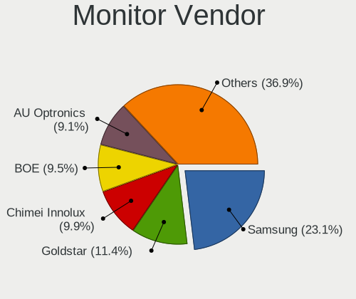

| Vendor                  | Computers | Percent |
|-------------------------|-----------|---------|
| Samsung Electronics     | 548       | 23.63%  |
| Goldstar                | 270       | 11.64%  |
| Chimei Innolux          | 223       | 9.62%   |
| AU Optronics            | 214       | 9.23%   |
| BOE                     | 208       | 8.97%   |
| LG Display              | 153       | 6.6%    |
| InfoVision              | 55        | 2.37%   |
| Philips                 | 49        | 2.11%   |
| Dell                    | 45        | 1.94%   |
| ViewSonic               | 35        | 1.51%   |
| BenQ                    | 33        | 1.42%   |
| Lenovo                  | 28        | 1.21%   |
| Hewlett-Packard         | 28        | 1.21%   |
| Hitachi                 | 27        | 1.16%   |
| SKY                     | 23        | 0.99%   |
| Chi Mei Optoelectronics | 23        | 0.99%   |
| LG Electronics          | 22        | 0.95%   |
| Apple                   | 22        | 0.95%   |
| PANDA                   | 19        | 0.82%   |
| AOC                     | 16        | 0.69%   |
| Unknown                 | 15        | 0.65%   |
| LG Philips              | 15        | 0.65%   |
| STA                     | 12        | 0.52%   |
| Sony                    | 12        | 0.52%   |
| InnoLux Display         | 12        | 0.52%   |
| Sharp                   | 10        | 0.43%   |
| SAC                     | 10        | 0.43%   |
| HannStar                | 9         | 0.39%   |
| ASUSTek Computer        | 9         | 0.39%   |
| Unknown (XXX)           | 8         | 0.34%   |
| HKC                     | 8         | 0.34%   |
| Acer                    | 8         | 0.34%   |
| CPT                     | 7         | 0.3%    |
| SANYO                   | 6         | 0.26%   |
| MStar                   | 6         | 0.26%   |
| KDC                     | 6         | 0.26%   |
| JRY                     | 6         | 0.26%   |
| UTV                     | 5         | 0.22%   |
| Gigabyte Technology     | 5         | 0.22%   |
| GDH                     | 5         | 0.22%   |

Monitor Model
-------------

Monitor models

| Model                                                                | Computers | Percent |
|----------------------------------------------------------------------|-----------|---------|
| Goldstar FULL HD GSM5B55 1920x1080 480x270mm 21.7-inch               | 29        | 1.22%   |
| Chimei Innolux LCD Monitor CMN15DB 1366x768 344x193mm 15.5-inch      | 26        | 1.09%   |
| Samsung Electronics C24F390 SAM0D2C 1920x1080 521x293mm 23.5-inch    | 23        | 0.96%   |
| Chimei Innolux LCD Monitor CMN15E6 1366x768 344x193mm 15.5-inch      | 23        | 0.96%   |
| InfoVision LCD Monitor IVO03F4 1920x1080 309x173mm 13.9-inch         | 22        | 0.92%   |
| Goldstar W1943 GSM4BAD 1360x768 406x229mm 18.4-inch                  | 20        | 0.84%   |
| Samsung Electronics S22D300 SAM0B3F 1920x1080 477x268mm 21.5-inch    | 18        | 0.75%   |
| Goldstar W2243 GSM56FE 1920x1080 477x268mm 21.5-inch                 | 16        | 0.67%   |
| Samsung Electronics LCD Monitor SEC5441 1366x768 344x194mm 15.5-inch | 15        | 0.63%   |
| Hitachi HDMI    HEC0088 1360x768 1100x560mm 48.6-inch                | 14        | 0.59%   |
| SKY TV-monitor SKY0001 1360x768 890x500mm 40.2-inch                  | 13        | 0.55%   |
| Samsung Electronics S22F350 SAM0D1A 1920x1080 477x268mm 21.5-inch    | 13        | 0.55%   |
| Chimei Innolux LCD Monitor CMN15F5 1920x1080 344x193mm 15.5-inch     | 13        | 0.55%   |
| AU Optronics LCD Monitor AUO2E3C 1366x768 309x173mm 13.9-inch        | 13        | 0.55%   |
| Samsung Electronics S19D300 SAM0B36 1366x768 410x230mm 18.5-inch     | 12        | 0.5%    |
| Samsung Electronics LF24T35 SAM707D 1920x1080 528x297mm 23.9-inch    | 12        | 0.5%    |
| InfoVision LCD Monitor IVO03FA 1366x768 223x125mm 10.1-inch          | 12        | 0.5%    |
| Goldstar IPS FULLHD GSM5AB8 1920x1080 480x270mm 21.7-inch            | 12        | 0.5%    |
| LG Display LCD Monitor LGD02E9 1366x768 309x174mm 14.0-inch          | 11        | 0.46%   |
| Chimei Innolux LCD Monitor CMN14C3 1366x768 309x173mm 13.9-inch      | 11        | 0.46%   |
| BOE LCD Monitor BOE06A5 1366x768 344x194mm 15.5-inch                 | 11        | 0.46%   |
| AU Optronics LCD Monitor AUO71EC 1366x768 344x193mm 15.5-inch        | 11        | 0.46%   |
| Samsung Electronics SMB1930N SAM0632 1360x768 410x230mm 18.5-inch    | 10        | 0.42%   |
| Samsung Electronics S24F350 SAM0D20 1920x1080 521x293mm 23.5-inch    | 10        | 0.42%   |
| Samsung Electronics LCD Monitor SEC4542 1366x768 309x174mm 14.0-inch | 10        | 0.42%   |
| Goldstar 23EA53 GSM59A9 1920x1080 510x290mm 23.1-inch                | 10        | 0.42%   |
| Chimei Innolux LCD Monitor CMN14D6 1366x768 309x173mm 13.9-inch      | 10        | 0.42%   |
| Samsung Electronics SA300/SA350 SAM0788 1366x768 410x230mm 18.5-inch | 9         | 0.38%   |
| Goldstar 19EN33 GSM4C18 1366x768 410x230mm 18.5-inch                 | 9         | 0.38%   |
| Samsung Electronics SMB2030N SAM0634 1600x900 443x249mm 20.0-inch    | 8         | 0.34%   |
| Samsung Electronics S27F350 SAM0D22 1920x1080 600x340mm 27.2-inch    | 8         | 0.34%   |
| Philips PHL 193V5 PHLC0CD 1366x768 410x230mm 18.5-inch               | 8         | 0.34%   |
| InfoVision M140NWR2 R1 IVO057A 1366x768 309x174mm 14.0-inch          | 8         | 0.34%   |
| BOE LCD Monitor BOE0812 1920x1080 344x194mm 15.5-inch                | 8         | 0.34%   |
| BOE LCD Monitor BOE06A4 1366x768 344x194mm 15.5-inch                 | 8         | 0.34%   |
| AU Optronics LCD Monitor AUO183C 1366x768 309x173mm 13.9-inch        | 8         | 0.34%   |
| Samsung Electronics S22D300 SAM0B3E 1920x1080 477x268mm 21.5-inch    | 7         | 0.29%   |
| Samsung Electronics C27F390 SAM0D32 1920x1080 598x336mm 27.0-inch    | 7         | 0.29%   |
| Philips PHL 223V5 PHLC0CF 1920x1080 477x268mm 21.5-inch              | 7         | 0.29%   |
| Hitachi HISENSE HEC0030 3840x2160 1872x1053mm 84.6-inch              | 7         | 0.29%   |

Monitor Resolution
------------------

Monitor screen resolution

| Resolution         | Computers | Percent |
|--------------------|-----------|---------|
| 1920x1080 (FHD)    | 816       | 36.44%  |
| 1366x768 (WXGA)    | 760       | 33.94%  |
| 3840x2160 (4K)     | 99        | 4.42%   |
| 1600x900 (HD+)     | 74        | 3.31%   |
| 1280x1024 (SXGA)   | 70        | 3.13%   |
| 1360x768           | 64        | 2.86%   |
| 1280x800 (WXGA)    | 55        | 2.46%   |
| 1680x1050 (WSXGA+) | 52        | 2.32%   |
| 1440x900 (WXGA+)   | 52        | 2.32%   |
| 1920x1200 (WUXGA)  | 33        | 1.47%   |
| 1920x540           | 21        | 0.94%   |
| 2560x1440 (QHD)    | 14        | 0.63%   |
| 1024x768 (XGA)     | 14        | 0.63%   |
| 1024x600           | 14        | 0.63%   |
| Unknown            | 13        | 0.58%   |
| 2560x1080          | 11        | 0.49%   |
| 1280x720 (HD)      | 10        | 0.45%   |
| 2560x1600          | 6         | 0.27%   |
| 3200x1800 (QHD+)   | 5         | 0.22%   |
| 2880x1800          | 5         | 0.22%   |
| 1152x864           | 5         | 0.22%   |
| 3840x1080          | 4         | 0.18%   |
| 2288x1287          | 4         | 0.18%   |
| 3840x2400          | 3         | 0.13%   |
| 3440x1440          | 3         | 0.13%   |
| 1280x960           | 3         | 0.13%   |
| 800x1280           | 2         | 0.09%   |
| 3456x2160          | 2         | 0.09%   |
| 2160x1440          | 2         | 0.09%   |
| 2048x1152          | 2         | 0.09%   |
| 4093x4093          | 1         | 0.04%   |
| 3840x1100          | 1         | 0.04%   |
| 3600x1200          | 1         | 0.04%   |
| 3286x1080          | 1         | 0.04%   |
| 3280x1080          | 1         | 0.04%   |
| 3072x1920          | 1         | 0.04%   |
| 3046x1050          | 1         | 0.04%   |
| 3000x2000          | 1         | 0.04%   |
| 2880x1620          | 1         | 0.04%   |
| 2736x1824          | 1         | 0.04%   |

Monitor Diagonal
----------------

Diagonal size in inches

| Inches  | Computers | Percent |
|---------|-----------|---------|
| 15      | 586       | 25.04%  |
| 14      | 235       | 10.04%  |
| 13      | 231       | 9.87%   |
| 21      | 193       | 8.25%   |
| 23      | 178       | 7.61%   |
| 18      | 157       | 6.71%   |
| 24      | 77        | 3.29%   |
| 17      | 76        | 3.25%   |
| Unknown | 71        | 3.03%   |
| 27      | 67        | 2.86%   |
| 19      | 60        | 2.56%   |
| 20      | 58        | 2.48%   |
| 40      | 38        | 1.62%   |
| 10      | 37        | 1.58%   |
| 16      | 28        | 1.2%    |
| 11      | 27        | 1.15%   |
| 22      | 24        | 1.03%   |
| 31      | 22        | 0.94%   |
| 12      | 21        | 0.9%    |
| 84      | 20        | 0.85%   |
| 32      | 19        | 0.81%   |
| 52      | 18        | 0.77%   |
| 48      | 18        | 0.77%   |
| 54      | 15        | 0.64%   |
| 46      | 13        | 0.56%   |
| 34      | 12        | 0.51%   |
| 72      | 6         | 0.26%   |
| 142     | 4         | 0.17%   |
| 65      | 4         | 0.17%   |
| 43      | 3         | 0.13%   |
| 39      | 3         | 0.13%   |
| 86      | 2         | 0.09%   |
| 55      | 2         | 0.09%   |
| 42      | 2         | 0.09%   |
| 41      | 2         | 0.09%   |
| 30      | 2         | 0.09%   |
| 26      | 2         | 0.09%   |
| 25      | 2         | 0.09%   |
| 7       | 2         | 0.09%   |
| 64      | 1         | 0.04%   |

Monitor Width
-------------

Physical width

| Width in mm    | Computers | Percent |
|----------------|-----------|---------|
| 301-350        | 1010      | 43.78%  |
| 401-500        | 469       | 20.33%  |
| 501-600        | 300       | 13%     |
| 201-300        | 147       | 6.37%   |
| 351-400        | 89        | 3.86%   |
| 1001-1500      | 73        | 3.16%   |
| Unknown        | 71        | 3.08%   |
| 801-900        | 43        | 1.86%   |
| 601-700        | 35        | 1.52%   |
| 701-800        | 31        | 1.34%   |
| 1501-2000      | 26        | 1.13%   |
| 901-1000       | 7         | 0.3%    |
| More than 2000 | 4         | 0.17%   |
| 1-100          | 2         | 0.09%   |

Aspect Ratio
------------

Proportional relationship between the width and the height

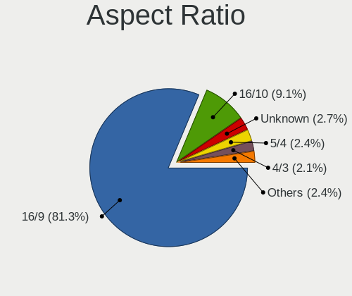

| Ratio   | Computers | Percent |
|---------|-----------|---------|
| 16/9    | 1681      | 80.86%  |
| 16/10   | 186       | 8.95%   |
| Unknown | 61        | 2.93%   |
| 5/4     | 50        | 2.41%   |
| 4/3     | 49        | 2.36%   |
| 1.96    | 14        | 0.67%   |
| 21/9    | 13        | 0.63%   |
| 3/2     | 12        | 0.58%   |
| 1.00    | 4         | 0.19%   |
| 32/9    | 2         | 0.1%    |
| 0.67    | 2         | 0.1%    |
| 0.56    | 2         | 0.1%    |
| 6/5     | 1         | 0.05%   |
| 3.40    | 1         | 0.05%   |
| 0.89    | 1         | 0.05%   |

Monitor Area
------------

Area in inch

| Area in inch | Computers | Percent |
|----------------|-----------|---------|
| 101-110        | 567       | 24.47%  |
| 81-90          | 419       | 18.08%  |
| 201-250        | 418       | 18.04%  |
| 141-150        | 184       | 7.94%   |
| 151-200        | 151       | 6.52%   |
| 501-1000       | 76        | 3.28%   |
| More than 1000 | 73        | 3.15%   |
| Unknown        | 71        | 3.06%   |
| 301-350        | 68        | 2.93%   |
| 351-500        | 55        | 2.37%   |
| 71-80          | 44        | 1.9%    |
| 121-130        | 44        | 1.9%    |
| 41-50          | 37        | 1.6%    |
| 111-120        | 35        | 1.51%   |
| 51-60          | 28        | 1.21%   |
| 61-70          | 15        | 0.65%   |
| 251-300        | 14        | 0.6%    |
| 131-140        | 9         | 0.39%   |
| 91-100         | 7         | 0.3%    |
| 1-40           | 2         | 0.09%   |

Pixel Density
-------------

Pixels per inch

| Density       | Computers | Percent |
|---------------|-----------|---------|
| 101-120       | 857       | 37.85%  |
| 51-100        | 758       | 33.48%  |
| 121-160       | 389       | 17.18%  |
| 1-50          | 114       | 5.04%   |
| Unknown       | 71        | 3.14%   |
| 161-240       | 52        | 2.3%    |
| More than 240 | 23        | 1.02%   |

Multiple Monitors
-----------------

Total monitors connected

| Total | Computers | Percent |
|-------|-----------|---------|
| 1     | 1788      | 80.32%  |
| 2     | 328       | 14.73%  |
| 0     | 90        | 4.04%   |
| 3     | 19        | 0.85%   |
| 5     | 1         | 0.04%   |

Network
-------

Net Controller Vendor
---------------------

Controller vendors

| Vendor                                | Computers | Percent |
|---------------------------------------|-----------|---------|
| Realtek Semiconductor                 | 1443      | 45.05%  |
| Intel                                 | 674       | 21.04%  |
| Qualcomm Atheros                      | 377       | 11.77%  |
| Broadcom                              | 117       | 3.65%   |
| TP-Link                               | 85        | 2.65%   |
| Nvidia                                | 77        | 2.4%    |
| Ralink Technology                     | 52        | 1.62%   |
| Qualcomm Atheros Communications       | 42        | 1.31%   |
| Marvell Technology Group              | 37        | 1.16%   |
| Broadcom Limited                      | 34        | 1.06%   |
| Ralink                                | 28        | 0.87%   |
| MediaTek                              | 28        | 0.87%   |
| JMicron Technology                    | 28        | 0.87%   |
| Samsung Electronics                   | 27        | 0.84%   |
| Motorola PCS                          | 22        | 0.69%   |
| VIA Technologies                      | 21        | 0.66%   |
| Silicon Integrated Systems [SiS]      | 17        | 0.53%   |
| Microsoft                             | 11        | 0.34%   |
| ASIX Electronics                      | 8         | 0.25%   |
| Xiaomi                                | 5         | 0.16%   |
| NetGear                               | 4         | 0.12%   |
| D-Link System                         | 4         | 0.12%   |
| T & A Mobile Phones                   | 3         | 0.09%   |
| Sundance Technology Inc / IC Plus     | 3         | 0.09%   |
| ICS Advent                            | 3         | 0.09%   |
| Ericsson Business Mobile Networks     | 3         | 0.09%   |
| DisplayLink                           | 3         | 0.09%   |
| D-Link                                | 3         | 0.09%   |
| 802.11g Adapter [Linksys WUSB54GC v3] | 3         | 0.09%   |
| 3Com                                  | 3         | 0.09%   |
| ZTE WCDMA Technologies MSM            | 2         | 0.06%   |
| Standard Microsystems                 | 2         | 0.06%   |
| Spreadtrum Communications             | 2         | 0.06%   |
| Ovislink                              | 2         | 0.06%   |
| Linksys                               | 2         | 0.06%   |
| LG Electronics                        | 2         | 0.06%   |
| Lenovo                                | 2         | 0.06%   |
| Huawei Technologies                   | 2         | 0.06%   |
| Encore Electronics                    | 2         | 0.06%   |
| Davicom Semiconductor                 | 2         | 0.06%   |

Net Controller Model
--------------------

Controller models

| Model                                                                  | Computers | Percent |
|------------------------------------------------------------------------|-----------|---------|
| Realtek RTL8111/8168/8211/8411 PCI Express Gigabit Ethernet Controller | 959       | 25.39%  |
| Realtek RTL810xE PCI Express Fast Ethernet controller                  | 218       | 5.77%   |
| Qualcomm Atheros AR9485 Wireless Network Adapter                       | 66        | 1.75%   |
| Nvidia MCP61 Ethernet                                                  | 66        | 1.75%   |
| Realtek RTL8723BE PCIe Wireless Network Adapter                        | 62        | 1.64%   |
| Realtek RTL8821CE 802.11ac PCIe Wireless Network Adapter               | 58        | 1.54%   |
| Qualcomm Atheros QCA9377 802.11ac Wireless Network Adapter             | 56        | 1.48%   |
| Realtek RTL8188CE 802.11b/g/n WiFi Adapter                             | 47        | 1.24%   |
| Qualcomm Atheros AR9285 Wireless Network Adapter (PCI-Express)         | 47        | 1.24%   |
| Realtek RTL8822CE 802.11ac PCIe Wireless Network Adapter               | 46        | 1.22%   |
| Intel Wi-Fi 6 AX201                                                    | 46        | 1.22%   |
| Realtek RTL8188EUS 802.11n Wireless Network Adapter                    | 45        | 1.19%   |
| Intel Wi-Fi 6 AX200                                                    | 39        | 1.03%   |
| Qualcomm Atheros QCA9565 / AR9565 Wireless Network Adapter             | 38        | 1.01%   |
| Qualcomm Atheros AR9271 802.11n                                        | 37        | 0.98%   |
| Intel Wireless 3160                                                    | 36        | 0.95%   |
| Intel Comet Lake PCH-LP CNVi WiFi                                      | 35        | 0.93%   |
| Intel Wireless 3165                                                    | 32        | 0.85%   |
| Intel Wireless 8265 / 8275                                             | 31        | 0.82%   |
| Realtek RTL8125 2.5GbE Controller                                      | 29        | 0.77%   |
| Qualcomm Atheros AR8152 v2.0 Fast Ethernet                             | 29        | 0.77%   |
| Intel Wireless 7265                                                    | 28        | 0.74%   |
| Broadcom BCM4313 802.11bgn Wireless Network Adapter                    | 28        | 0.74%   |
| Realtek RTL8188EE Wireless Network Adapter                             | 27        | 0.71%   |
| Realtek RTL-8100/8101L/8139 PCI Fast Ethernet Adapter                  | 27        | 0.71%   |
| Intel Wireless 7260                                                    | 26        | 0.69%   |
| Intel Ethernet Connection (2) I219-V                                   | 26        | 0.69%   |
| Realtek RTL8723DE Wireless Network Adapter                             | 25        | 0.66%   |
| Ralink MT7601U Wireless Adapter                                        | 25        | 0.66%   |
| Qualcomm Atheros AR8151 v2.0 Gigabit Ethernet                          | 25        | 0.66%   |
| Samsung Galaxy series, misc. (tethering mode)                          | 24        | 0.64%   |
| Realtek 802.11n WLAN Adapter                                           | 24        | 0.64%   |
| JMicron JMC250 PCI Express Gigabit Ethernet Controller                 | 24        | 0.64%   |
| Intel I211 Gigabit Network Connection                                  | 24        | 0.64%   |
| Intel Dual Band Wireless-AC 3168NGW [Stone Peak]                       | 24        | 0.64%   |
| Intel 82579LM Gigabit Network Connection (Lewisville)                  | 23        | 0.61%   |
| Qualcomm Atheros QCA6174 802.11ac Wireless Network Adapter             | 22        | 0.58%   |
| Intel Dual Band Wireless-AC 3165 Plus Bluetooth                        | 22        | 0.58%   |
| TP-Link TL-WN722N v2/v3 [Realtek RTL8188EUS]                           | 21        | 0.56%   |
| Intel Ethernet Controller I225-V                                       | 20        | 0.53%   |

Wireless Vendor
---------------

Wireless vendors

| Vendor                                | Computers | Percent |
|---------------------------------------|-----------|---------|
| Intel                                 | 533       | 31.45%  |
| Realtek Semiconductor                 | 476       | 28.08%  |
| Qualcomm Atheros                      | 311       | 18.35%  |
| Broadcom                              | 98        | 5.78%   |
| TP-Link                               | 76        | 4.48%   |
| Ralink Technology                     | 52        | 3.07%   |
| Qualcomm Atheros Communications       | 42        | 2.48%   |
| Ralink                                | 28        | 1.65%   |
| MediaTek                              | 21        | 1.24%   |
| Broadcom Limited                      | 19        | 1.12%   |
| Microsoft                             | 10        | 0.59%   |
| NetGear                               | 4         | 0.24%   |
| Marvell Technology Group              | 4         | 0.24%   |
| D-Link System                         | 4         | 0.24%   |
| D-Link                                | 3         | 0.18%   |
| 802.11g Adapter [Linksys WUSB54GC v3] | 3         | 0.18%   |
| Ovislink                              | 2         | 0.12%   |
| Linksys                               | 2         | 0.12%   |
| Encore Electronics                    | 2         | 0.12%   |
| ZyDAS                                 | 1         | 0.06%   |
| Sierra Wireless                       | 1         | 0.06%   |
| Samsung Electronics                   | 1         | 0.06%   |
| Dell                                  | 1         | 0.06%   |
| Cisco Aironet Wireless Communications | 1         | 0.06%   |

Wireless Model
--------------

Wireless models

| Model                                                                   | Computers | Percent |
|-------------------------------------------------------------------------|-----------|---------|
| Qualcomm Atheros AR9485 Wireless Network Adapter                        | 66        | 3.86%   |
| Realtek RTL8723BE PCIe Wireless Network Adapter                         | 62        | 3.62%   |
| Realtek RTL8821CE 802.11ac PCIe Wireless Network Adapter                | 58        | 3.39%   |
| Qualcomm Atheros QCA9377 802.11ac Wireless Network Adapter              | 56        | 3.27%   |
| Realtek RTL8188CE 802.11b/g/n WiFi Adapter                              | 47        | 2.75%   |
| Qualcomm Atheros AR9285 Wireless Network Adapter (PCI-Express)          | 47        | 2.75%   |
| Realtek RTL8822CE 802.11ac PCIe Wireless Network Adapter                | 46        | 2.69%   |
| Intel Wi-Fi 6 AX201                                                     | 46        | 2.69%   |
| Realtek RTL8188EUS 802.11n Wireless Network Adapter                     | 45        | 2.63%   |
| Intel Wi-Fi 6 AX200                                                     | 39        | 2.28%   |
| Qualcomm Atheros QCA9565 / AR9565 Wireless Network Adapter              | 38        | 2.22%   |
| Qualcomm Atheros AR9271 802.11n                                         | 37        | 2.16%   |
| Intel Wireless 3160                                                     | 36        | 2.1%    |
| Intel Comet Lake PCH-LP CNVi WiFi                                       | 35        | 2.05%   |
| Intel Wireless 3165                                                     | 32        | 1.87%   |
| Intel Wireless 8265 / 8275                                              | 31        | 1.81%   |
| Intel Wireless 7265                                                     | 28        | 1.64%   |
| Broadcom BCM4313 802.11bgn Wireless Network Adapter                     | 28        | 1.64%   |
| Realtek RTL8188EE Wireless Network Adapter                              | 27        | 1.58%   |
| Intel Wireless 7260                                                     | 26        | 1.52%   |
| Realtek RTL8723DE Wireless Network Adapter                              | 25        | 1.46%   |
| Ralink MT7601U Wireless Adapter                                         | 25        | 1.46%   |
| Realtek 802.11n WLAN Adapter                                            | 24        | 1.4%    |
| Intel Dual Band Wireless-AC 3168NGW [Stone Peak]                        | 24        | 1.4%    |
| Qualcomm Atheros QCA6174 802.11ac Wireless Network Adapter              | 22        | 1.29%   |
| Intel Dual Band Wireless-AC 3165 Plus Bluetooth                         | 22        | 1.29%   |
| TP-Link TL-WN722N v2/v3 [Realtek RTL8188EUS]                            | 21        | 1.23%   |
| Realtek RTL8723BU 802.11b/g/n WLAN Adapter                              | 19        | 1.11%   |
| Ralink RT2870/RT3070 Wireless Adapter                                   | 18        | 1.05%   |
| Realtek RTL8191SEvB Wireless LAN Controller                             | 17        | 0.99%   |
| Intel PRO/Wireless 3945ABG [Golan] Network Connection                   | 17        | 0.99%   |
| Intel Cannon Point-LP CNVi [Wireless-AC]                                | 17        | 0.99%   |
| Qualcomm Atheros AR9287 Wireless Network Adapter (PCI-Express)          | 16        | 0.94%   |
| Intel Wireless 8260                                                     | 16        | 0.94%   |
| Intel Ice Lake-LP PCH CNVi WiFi                                         | 16        | 0.94%   |
| Intel Centrino Advanced-N 6205 [Taylor Peak]                            | 16        | 0.94%   |
| Broadcom BCM43142 802.11b/g/n                                           | 15        | 0.88%   |
| Broadcom BCM4312 802.11b/g LP-PHY                                       | 15        | 0.88%   |
| Qualcomm Atheros AR9227 Wireless Network Adapter                        | 14        | 0.82%   |
| Qualcomm Atheros AR242x / AR542x Wireless Network Adapter (PCI-Express) | 14        | 0.82%   |

Ethernet Vendor
---------------

Ethernet vendors

| Vendor                            | Computers | Percent |
|-----------------------------------|-----------|---------|
| Realtek Semiconductor             | 1268      | 62.74%  |
| Intel                             | 291       | 14.4%   |
| Qualcomm Atheros                  | 130       | 6.43%   |
| Nvidia                            | 77        | 3.81%   |
| Broadcom                          | 34        | 1.68%   |
| Marvell Technology Group          | 33        | 1.63%   |
| JMicron Technology                | 28        | 1.39%   |
| Samsung Electronics               | 26        | 1.29%   |
| VIA Technologies                  | 21        | 1.04%   |
| Motorola PCS                      | 19        | 0.94%   |
| Silicon Integrated Systems [SiS]  | 17        | 0.84%   |
| Broadcom Limited                  | 15        | 0.74%   |
| TP-Link                           | 10        | 0.49%   |
| ASIX Electronics                  | 8         | 0.4%    |
| MediaTek                          | 7         | 0.35%   |
| Xiaomi                            | 5         | 0.25%   |
| T & A Mobile Phones               | 3         | 0.15%   |
| Sundance Technology Inc / IC Plus | 3         | 0.15%   |
| ICS Advent                        | 3         | 0.15%   |
| DisplayLink                       | 3         | 0.15%   |
| 3Com                              | 3         | 0.15%   |
| Standard Microsystems             | 2         | 0.1%    |
| Spreadtrum Communications         | 2         | 0.1%    |
| Lenovo                            | 2         | 0.1%    |
| Davicom Semiconductor             | 2         | 0.1%    |
| ZTE WCDMA Technologies MSM        | 1         | 0.05%   |
| Solarflare Communications         | 1         | 0.05%   |
| Microsoft                         | 1         | 0.05%   |
| Macronix [MXIC]                   | 1         | 0.05%   |
| LG Electronics                    | 1         | 0.05%   |
| Huawei Technologies               | 1         | 0.05%   |
| Digitech Systems                  | 1         | 0.05%   |
| Aquantia                          | 1         | 0.05%   |
| 3DSP                              | 1         | 0.05%   |

Ethernet Model
--------------

Ethernet models

| Model                                                                  | Computers | Percent |
|------------------------------------------------------------------------|-----------|---------|
| Realtek RTL8111/8168/8211/8411 PCI Express Gigabit Ethernet Controller | 959       | 46.96%  |
| Realtek RTL810xE PCI Express Fast Ethernet controller                  | 218       | 10.68%  |
| Nvidia MCP61 Ethernet                                                  | 66        | 3.23%   |
| Realtek RTL8125 2.5GbE Controller                                      | 29        | 1.42%   |
| Qualcomm Atheros AR8152 v2.0 Fast Ethernet                             | 29        | 1.42%   |
| Realtek RTL-8100/8101L/8139 PCI Fast Ethernet Adapter                  | 27        | 1.32%   |
| Intel Ethernet Connection (2) I219-V                                   | 26        | 1.27%   |
| Qualcomm Atheros AR8151 v2.0 Gigabit Ethernet                          | 25        | 1.22%   |
| Samsung Galaxy series, misc. (tethering mode)                          | 24        | 1.18%   |
| JMicron JMC250 PCI Express Gigabit Ethernet Controller                 | 24        | 1.18%   |
| Intel I211 Gigabit Network Connection                                  | 24        | 1.18%   |
| Intel 82579LM Gigabit Network Connection (Lewisville)                  | 23        | 1.13%   |
| Intel Ethernet Controller I225-V                                       | 20        | 0.98%   |
| Motorola PCS moto g(7) power                                           | 19        | 0.93%   |
| VIA VT6102/VT6103 [Rhine-II]                                           | 17        | 0.83%   |
| Marvell Group 88E8040 PCI-E Fast Ethernet Controller                   | 16        | 0.78%   |
| Realtek RTL8153 Gigabit Ethernet Adapter                               | 15        | 0.73%   |
| Realtek RTL8152 Fast Ethernet Adapter                                  | 15        | 0.73%   |
| Intel Ethernet Connection (4) I219-LM                                  | 15        | 0.73%   |
| Silicon Integrated Systems [SiS] 191 Gigabit Ethernet Adapter          | 14        | 0.69%   |
| Intel Ethernet Connection (7) I219-V                                   | 14        | 0.69%   |
| Intel Ethernet Connection (13) I219-V                                  | 14        | 0.69%   |
| Intel 82579V Gigabit Network Connection                                | 14        | 0.69%   |
| Realtek RTL8169 PCI Gigabit Ethernet Controller                        | 12        | 0.59%   |
| Intel Ethernet Connection (10) I219-V                                  | 12        | 0.59%   |
| Qualcomm Atheros AR8162 Fast Ethernet                                  | 11        | 0.54%   |
| Intel 82577LM Gigabit Network Connection                               | 10        | 0.49%   |
| Intel Ethernet Connection I217-V                                       | 9         | 0.44%   |
| Intel Ethernet Connection I217-LM                                      | 9         | 0.44%   |
| Qualcomm Atheros Killer E2500 Gigabit Ethernet Controller              | 8         | 0.39%   |
| Intel Ethernet Connection I218-LM                                      | 8         | 0.39%   |
| Broadcom NetXtreme BCM57765 Gigabit Ethernet PCIe                      | 8         | 0.39%   |
| Qualcomm Atheros QCA8171 Gigabit Ethernet                              | 7         | 0.34%   |
| Qualcomm Atheros Killer E220x Gigabit Ethernet Controller              | 7         | 0.34%   |
| Qualcomm Atheros AR8161 Gigabit Ethernet                               | 7         | 0.34%   |
| Qualcomm Atheros AR8131 Gigabit Ethernet                               | 7         | 0.34%   |
| Intel Ethernet Connection I219-LM                                      | 7         | 0.34%   |
| Intel Ethernet Connection (14) I219-V                                  | 7         | 0.34%   |
| TP-Link UE300 10/100/1000 LAN (ethernet mode) [Realtek RTL8153]        | 6         | 0.29%   |
| Realtek RTL8111/8168/8411 PCI Express Gigabit Ethernet Controller      | 6         | 0.29%   |

Net Controller Kind
-------------------

Ethernet, WiFi or modem

| Kind     | Computers | Percent |
|----------|-----------|---------|
| Ethernet | 1910      | 53.83%  |
| WiFi     | 1615      | 45.52%  |
| Modem    | 19        | 0.54%   |
| Unknown  | 4         | 0.11%   |

Used Controller
---------------

Currently used network controller

| Kind     | Computers | Percent |
|----------|-----------|---------|
| WiFi     | 1333      | 59.7%   |
| Ethernet | 899       | 40.26%  |
| Unknown  | 1         | 0.04%   |

NICs
----

Total network controllers on board

| Total | Computers | Percent |
|-------|-----------|---------|
| 2     | 1121      | 51.3%   |
| 1     | 960       | 43.94%  |
| 0     | 69        | 3.16%   |
| 3     | 30        | 1.37%   |
| 4     | 3         | 0.14%   |
| 32    | 1         | 0.05%   |
| 7     | 1         | 0.05%   |

IPv6
----

IPv6 vs IPv4

| Used | Computers | Percent |
|------|-----------|---------|
| No   | 1860      | 84.28%  |
| Yes  | 347       | 15.72%  |

Bluetooth
---------

Bluetooth Vendor
----------------

Controller vendors

| Vendor                          | Computers | Percent |
|---------------------------------|-----------|---------|
| Intel                           | 435       | 40.81%  |
| Realtek Semiconductor           | 193       | 18.11%  |
| Qualcomm Atheros Communications | 83        | 7.79%   |
| Cambridge Silicon Radio         | 80        | 7.5%    |
| IMC Networks                    | 61        | 5.72%   |
| Broadcom                        | 48        | 4.5%    |
| Lite-On Technology              | 40        | 3.75%   |
| Foxconn / Hon Hai               | 26        | 2.44%   |
| Apple                           | 19        | 1.78%   |
| Dell                            | 13        | 1.22%   |
| TP-Link                         | 12        | 1.13%   |
| Toshiba                         | 11        | 1.03%   |
| ASUSTek Computer                | 9         | 0.84%   |
| Ralink                          | 7         | 0.66%   |
| Integrated System Solution      | 5         | 0.47%   |
| Alps Electric                   | 4         | 0.38%   |
| Hewlett-Packard                 | 3         | 0.28%   |
| USI                             | 2         | 0.19%   |
| Qcom                            | 2         | 0.19%   |
| MediaTek                        | 2         | 0.19%   |
| Marvell Semiconductor           | 2         | 0.19%   |
| Syntek                          | 1         | 0.09%   |
| Roper                           | 1         | 0.09%   |
| Realtek                         | 1         | 0.09%   |
| Ralink Technology               | 1         | 0.09%   |
| Logitech                        | 1         | 0.09%   |
| Foxconn International           | 1         | 0.09%   |
| Edimax Technology               | 1         | 0.09%   |
| Conwise Technology              | 1         | 0.09%   |
| Unknown                         | 1         | 0.09%   |

Bluetooth Model
---------------

Controller models

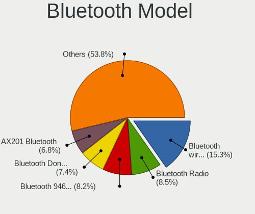

| Model                                               | Computers | Percent |
|-----------------------------------------------------|-----------|---------|
| Intel Bluetooth wireless interface                  | 132       | 12.37%  |
| Realtek Bluetooth Radio                             | 114       | 10.68%  |
| Cambridge Silicon Radio Bluetooth Dongle (HCI mode) | 80        | 7.5%    |
| Intel Bluetooth 9460/9560 Jefferson Peak (JfP)      | 77        | 7.22%   |
| Intel AX201 Bluetooth                               | 73        | 6.84%   |
| Qualcomm Atheros  Bluetooth Device                  | 47        | 4.4%    |
| Realtek  Bluetooth 4.2 Adapter                      | 42        | 3.94%   |
| Intel Bluetooth Device                              | 40        | 3.75%   |
| Intel AX200 Bluetooth                               | 40        | 3.75%   |
| IMC Networks Bluetooth Radio                        | 26        | 2.44%   |
| Realtek RTL8723B Bluetooth                          | 25        | 2.34%   |
| Intel Wireless-AC 3168 Bluetooth                    | 24        | 2.25%   |
| Intel Centrino Bluetooth Wireless Transceiver       | 17        | 1.59%   |
| Qualcomm Atheros AR3012 Bluetooth 4.0               | 16        | 1.5%    |
| Lite-On Qualcomm Atheros QCA9377 Bluetooth          | 14        | 1.31%   |
| IMC Networks Bluetooth Device                       | 14        | 1.31%   |
| Lite-On Bluetooth Device                            | 13        | 1.22%   |
| TP-Link UB500 Adapter                               | 12        | 1.12%   |
| Intel Centrino Advanced-N 6230 Bluetooth adapter    | 10        | 0.94%   |
| Intel AX210 Bluetooth                               | 10        | 0.94%   |
| IMC Networks Wireless_Device                        | 10        | 0.94%   |
| Qualcomm Atheros QCA61x4 Bluetooth 4.0              | 9         | 0.84%   |
| Broadcom BCM43142 Bluetooth 4.0                     | 8         | 0.75%   |
| Broadcom BCM20702 Bluetooth 4.0 [ThinkPad]          | 8         | 0.75%   |
| Toshiba Bluetooth USB Host Controller               | 7         | 0.66%   |
| Ralink RT3290 Bluetooth                             | 7         | 0.66%   |
| Intel AX211 Bluetooth                               | 7         | 0.66%   |
| Foxconn / Hon Hai Bluetooth Device                  | 7         | 0.66%   |
| Broadcom BCM2070 Bluetooth 2.1 + EDR                | 7         | 0.66%   |
| Apple Bluetooth USB Host Controller                 | 7         | 0.66%   |
| Qualcomm Atheros AR3011 Bluetooth                   | 6         | 0.56%   |
| Intel Wireless-AC 9260 Bluetooth Adapter            | 6         | 0.56%   |
| IMC Networks Atheros AR3012 Bluetooth 4.0 Adapter   | 6         | 0.56%   |
| Realtek RTL8821A Bluetooth                          | 5         | 0.47%   |
| Realtek 802.11ac WLAN Adapter                       | 5         | 0.47%   |
| Lite-On Broadcom BCM43142A0 Bluetooth Device        | 5         | 0.47%   |
| Dell Wireless 365 Bluetooth                         | 5         | 0.47%   |
| Broadcom BCM2070 Bluetooth Device                   | 5         | 0.47%   |
| Lite-On Bluetooth Radio                             | 4         | 0.37%   |
| Lite-On Atheros AR3012 Bluetooth                    | 4         | 0.37%   |

Sound
-----

Sound Vendor
------------

Sound card vendors

| Vendor                                          | Computers | Percent |
|-------------------------------------------------|-----------|---------|
| Intel                                           | 1451      | 52.9%   |
| AMD                                             | 651       | 23.73%  |
| Nvidia                                          | 350       | 12.76%  |
| Logitech                                        | 46        | 1.68%   |
| C-Media Electronics                             | 46        | 1.68%   |
| Kingston Technology                             | 22        | 0.8%    |
| VIA Technologies                                | 19        | 0.69%   |
| Silicon Integrated Systems [SiS]                | 17        | 0.62%   |
| Texas Instruments                               | 11        | 0.4%    |
| Generalplus Technology                          | 11        | 0.4%    |
| Creative Labs                                   | 10        | 0.36%   |
| Focusrite-Novation                              | 7         | 0.26%   |
| Plantronics                                     | 6         | 0.22%   |
| JMTek                                           | 6         | 0.22%   |
| GN Netcom                                       | 6         | 0.22%   |
| M-Audio                                         | 5         | 0.18%   |
| Elite Silicon                                   | 5         | 0.18%   |
| ASUSTek Computer                                | 5         | 0.18%   |
| Micro Star International                        | 4         | 0.15%   |
| Creative Technology                             | 4         | 0.15%   |
| ATI Technologies                                | 4         | 0.15%   |
| Sony                                            | 3         | 0.11%   |
| Samson Technologies                             | 3         | 0.11%   |
| Microsoft                                       | 3         | 0.11%   |
| Licensed by Sony Computer Entertainment America | 3         | 0.11%   |
| Hewlett-Packard                                 | 3         | 0.11%   |
| Fry's Electronics                               | 3         | 0.11%   |
| ESI Audiotechnik                                | 3         | 0.11%   |
| Corsair                                         | 3         | 0.11%   |
| BEHRINGER International                         | 3         | 0.11%   |
| Astro Gaming                                    | 3         | 0.11%   |
| TEAC                                            | 2         | 0.07%   |
| Realtek Semiconductor                           | 2         | 0.07%   |
| Razer USA                                       | 2         | 0.07%   |
| Lenovo                                          | 2         | 0.07%   |
| Ensoniq                                         | 2         | 0.07%   |
| Audient                                         | 2         | 0.07%   |
| Arturia                                         | 2         | 0.07%   |
| Yamaha                                          | 1         | 0.04%   |
| USB-MIC                                         | 1         | 0.04%   |

Sound Model
-----------

Sound card models

| Model                                                                      | Computers | Percent |
|----------------------------------------------------------------------------|-----------|---------|
| AMD Family 17h/19h HD Audio Controller                                     | 180       | 5.37%   |
| Intel Sunrise Point-LP HD Audio                                            | 174       | 5.19%   |
| Intel 7 Series/C216 Chipset Family High Definition Audio Controller        | 146       | 4.36%   |
| Intel 6 Series/C200 Series Chipset Family High Definition Audio Controller | 131       | 3.91%   |
| AMD FCH Azalia Controller                                                  | 129       | 3.85%   |
| Intel NM10/ICH7 Family High Definition Audio Controller                    | 122       | 3.64%   |
| AMD SBx00 Azalia (Intel HDA)                                               | 103       | 3.07%   |
| AMD Raven/Raven2/Fenghuang HDMI/DP Audio Controller                        | 93        | 2.78%   |
| Intel 8 Series/C220 Series Chipset High Definition Audio Controller        | 78        | 2.33%   |
| Intel Tiger Lake-LP Smart Sound Technology Audio Controller                | 71        | 2.12%   |
| Nvidia MCP61 High Definition Audio                                         | 70        | 2.09%   |
| AMD Renoir Radeon High Definition Audio Controller                         | 67        | 2%      |
| Intel Xeon E3-1200 v3/4th Gen Core Processor HD Audio Controller           | 66        | 1.97%   |
| Intel 5 Series/3400 Series Chipset High Definition Audio                   | 59        | 1.76%   |
| AMD Starship/Matisse HD Audio Controller                                   | 58        | 1.73%   |
| Intel Celeron/Pentium Silver Processor High Definition Audio               | 57        | 1.7%    |
| Intel Atom Processor Z36xxx/Z37xxx Series High Definition Audio Controller | 57        | 1.7%    |
| Intel 100 Series/C230 Series Chipset Family HD Audio Controller            | 55        | 1.64%   |
| Intel 82801I (ICH9 Family) HD Audio Controller                             | 50        | 1.49%   |
| Intel Comet Lake PCH-LP cAVS                                               | 44        | 1.31%   |
| AMD Kabini HDMI/DP Audio                                                   | 43        | 1.28%   |
| AMD Family 15h (Models 60h-6fh) Audio Controller                           | 42        | 1.25%   |
| Intel 200 Series PCH HD Audio                                              | 40        | 1.19%   |
| AMD Ellesmere HDMI Audio [Radeon RX 470/480 / 570/580/590]                 | 38        | 1.13%   |
| Intel Broadwell-U Audio Controller                                         | 37        | 1.1%    |
| Intel Haswell-ULT HD Audio Controller                                      | 36        | 1.07%   |
| Intel 8 Series HD Audio Controller                                         | 36        | 1.07%   |
| AMD Trinity HDMI Audio Controller                                          | 36        | 1.07%   |
| Nvidia GP107GL High Definition Audio Controller                            | 35        | 1.04%   |
| Intel Wildcat Point-LP High Definition Audio Controller                    | 33        | 0.98%   |
| AMD Oland/Hainan/Cape Verde/Pitcairn HDMI Audio [Radeon HD 7000 Series]    | 33        | 0.98%   |
| AMD Kaveri HDMI/DP Audio Controller                                        | 33        | 0.98%   |
| AMD Family 17h (Models 00h-0fh) HD Audio Controller                        | 33        | 0.98%   |
| Nvidia GK208 HDMI/DP Audio Controller                                      | 31        | 0.93%   |
| Intel Ice Lake-LP Smart Sound Technology Audio Controller                  | 31        | 0.93%   |
| Intel Cannon Point-LP High Definition Audio Controller                     | 30        | 0.9%    |
| Nvidia High Definition Audio Controller                                    | 28        | 0.84%   |
| Intel 82801H (ICH8 Family) HD Audio Controller                             | 28        | 0.84%   |
| Intel Cannon Lake PCH cAVS                                                 | 27        | 0.81%   |
| AMD Cedar HDMI Audio [Radeon HD 5400/6300/7300 Series]                     | 24        | 0.72%   |

Memory
------

Memory Vendor
-------------

Memory module vendors

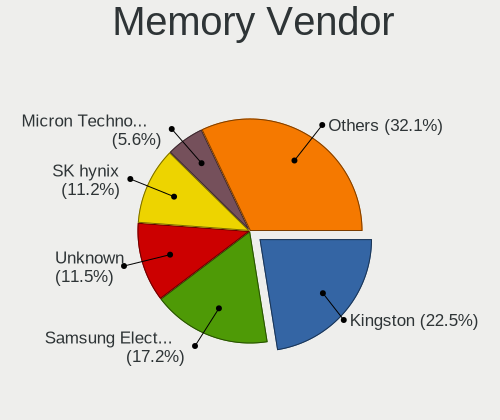

| Vendor              | Computers | Percent |
|---------------------|-----------|---------|
| Kingston            | 315       | 23.26%  |
| Samsung Electronics | 234       | 17.28%  |
| Unknown             | 157       | 11.6%   |
| SK hynix            | 150       | 11.08%  |
| Micron Technology   | 77        | 5.69%   |
| Crucial             | 70        | 5.17%   |
| A-DATA Technology   | 50        | 3.69%   |
| Corsair             | 47        | 3.47%   |
| Unknown (ABCD)      | 28        | 2.07%   |
| Magnum Tech         | 18        | 1.33%   |
| Unknown             | 18        | 1.33%   |
| Nanya Technology    | 17        | 1.26%   |
| Novatech            | 13        | 0.96%   |
| Goldkey             | 12        | 0.89%   |
| Elpida              | 11        | 0.81%   |
| G.Skill             | 10        | 0.74%   |
| Avant               | 9         | 0.66%   |
| Ramaxel Technology  | 8         | 0.59%   |
| PNY                 | 8         | 0.59%   |
| Patriot             | 8         | 0.59%   |
| Hewlett-Packard     | 7         | 0.52%   |
| Team                | 6         | 0.44%   |
| Saikano             | 6         | 0.44%   |
| Neo Forza           | 6         | 0.44%   |
| Transcend           | 5         | 0.37%   |
| Super Talent        | 5         | 0.37%   |
| Memox               | 5         | 0.37%   |
| 48spaces            | 5         | 0.37%   |
| CSX                 | 4         | 0.3%    |
| Unknown (0x0B45)    | 3         | 0.22%   |
| Kingmax             | 3         | 0.22%   |
| Apacer              | 3         | 0.22%   |
| Teikon              | 2         | 0.15%   |
| Ramos Technology    | 2         | 0.15%   |
| Netac               | 2         | 0.15%   |
| Lexar               | 2         | 0.15%   |
| Kimtigo             | 2         | 0.15%   |
| Innodisk            | 2         | 0.15%   |
| Hikvision           | 2         | 0.15%   |
| Visipro             | 1         | 0.07%   |

Memory Model
------------

Memory module models

| Model                                                            | Computers | Percent |
|------------------------------------------------------------------|-----------|---------|
| Unknown (ABCD) RAM 123456789012345678 2GB SODIMM LPDDR4 2400MT/s | 26        | 1.77%   |
| Samsung RAM M471A5244CB0-CRC 4GB SODIMM DDR4 2667MT/s            | 20        | 1.36%   |
| Unknown                                                          | 18        | 1.23%   |
| SK hynix RAM HMA81GS6AFR8N-UH 8GB SODIMM DDR4 2667MT/s           | 16        | 1.09%   |
| SK hynix RAM HMAA1GS6CJR6N-XN 8GB SODIMM DDR4 3200MT/s           | 15        | 1.02%   |
| Samsung RAM M471A1G44AB0-CWE 8192MB SODIMM DDR4 3200MT/s         | 15        | 1.02%   |
| Magnum Tech RAM MAGNUMTECH 4GB SODIMM DDR3 1600MT/s              | 15        | 1.02%   |
| SK hynix RAM HMT451S6BFR8A-PB 4GB SODIMM DDR3 1600MT/s           | 13        | 0.88%   |
| Samsung RAM M471A5244CB0-CTD 4GB SODIMM DDR4 3266MT/s            | 13        | 0.88%   |
| Kingston RAM KHX2666C16/8G 8GB DIMM DDR4 3466MT/s                | 11        | 0.75%   |
| Samsung RAM M471B5173EB0-YK0 4GB SODIMM DDR3 1600MT/s            | 10        | 0.68%   |
| Kingston RAM KHX2400C15/8G 8GB DIMM DDR4 3400MT/s                | 10        | 0.68%   |
| Unknown RAM Module 4GB DIMM 1333MT/s                             | 9         | 0.61%   |
| Samsung RAM M471A1K43CB1-CRC 8GB SODIMM DDR4 2667MT/s            | 9         | 0.61%   |
| Samsung RAM M471A1G44AB0-CWE 8GB Row Of Chips DDR4 3200MT/s      | 9         | 0.61%   |
| Kingston RAM KHX1866C10D3/8G 8GB DIMM DDR3 2133MT/s              | 9         | 0.61%   |
| Kingston RAM 99U5471-054.A00LF 8GB DIMM DDR3 1600MT/s            | 9         | 0.61%   |
| Samsung RAM M471A5244CB0-CWE 4GB SODIMM DDR4 3200MT/s            | 8         | 0.54%   |
| Nanya RAM NT2GC64B88B0NS-CG 2GB SODIMM DDR3 1334MT/s             | 8         | 0.54%   |
| Samsung RAM M471B5273DH0-CH9 4GB SODIMM DDR3 1334MT/s            | 7         | 0.48%   |
| Samsung RAM M471A1K43DB1-CWE 8GB SODIMM DDR4 3200MT/s            | 7         | 0.48%   |
| SK hynix RAM HMT351S6CFR8C-PB 4GB SODIMM DDR3 1600MT/s           | 6         | 0.41%   |
| Samsung RAM M471B5773CHS-CH9 2048MB SODIMM DDR3 4199MT/s         | 6         | 0.41%   |
| Samsung RAM M471B5273CH0-CH9 4GB SODIMM DDR3 1334MT/s            | 6         | 0.41%   |
| Samsung RAM M471B5173DB0-YK0 4GB SODIMM DDR3 1600MT/s            | 6         | 0.41%   |
| Samsung RAM M471B1G73QH0-YK0 8GB SODIMM DDR3 1600MT/s            | 6         | 0.41%   |
| Kingston RAM KHX1866C10D3/4G 4GB DIMM DDR3 1923MT/s              | 6         | 0.41%   |
| Kingston RAM 99U5584-005.A00LF 4GB DIMM DDR3 1600MT/s            | 6         | 0.41%   |
| Unknown RAM Module 8GB DIMM 1333MT/s                             | 5         | 0.34%   |
| Unknown RAM Module 4GB SODIMM DDR3 1333MT/s                      | 5         | 0.34%   |
| Unknown RAM Module 4096MB DIMM 1333MT/s                          | 5         | 0.34%   |
| Unknown RAM Module 2GB SODIMM DDR2                               | 5         | 0.34%   |
| Unknown RAM Module 2GB DIMM 1333MT/s                             | 5         | 0.34%   |
| Unknown RAM Module 2048MB DIMM 1333MT/s                          | 5         | 0.34%   |
| SK hynix RAM HMA851S6AFR6N-UH 4GB SODIMM DDR4 2667MT/s           | 5         | 0.34%   |
| SK hynix RAM HMA81GS6AFR8N-UH 8GB SODIMM DDR4 2400MT/s           | 5         | 0.34%   |
| Samsung RAM M471B1G73EB0-YK0 8GB SODIMM DDR3 1600MT/s            | 5         | 0.34%   |
| Samsung RAM M471B1G73DB0-YK0 8GB SODIMM DDR3 1600MT/s            | 5         | 0.34%   |
| Samsung RAM M471A2K43CB1-CRC 16GB SODIMM DDR4 2667MT/s           | 5         | 0.34%   |
| Saikano RAM Memory 4GB SODIMM DDR3 1333MT/s                      | 5         | 0.34%   |

Memory Kind
-----------

Memory module kinds

| Kind    | Computers | Percent |
|---------|-----------|---------|
| DDR4    | 504       | 44.33%  |
| DDR3    | 405       | 35.62%  |
| DDR2    | 57        | 5.01%   |
| Unknown | 54        | 4.75%   |
| LPDDR4  | 45        | 3.96%   |
| SDRAM   | 27        | 2.37%   |
| LPDDR3  | 16        | 1.41%   |
| DDR     | 10        | 0.88%   |
| DRAM    | 7         | 0.62%   |
| DDR5    | 7         | 0.62%   |
| LPDDR5  | 5         | 0.44%   |

Memory Form Factor
------------------

Physical design of the memory module

| Name         | Computers | Percent |
|--------------|-----------|---------|
| SODIMM       | 631       | 55.35%  |
| DIMM         | 446       | 39.12%  |
| Row Of Chips | 58        | 5.09%   |
| Chip         | 4         | 0.35%   |
| Unknown      | 1         | 0.09%   |

Memory Size
-----------

Memory module size

| Size  | Computers | Percent |
|-------|-----------|---------|
| 8192  | 501       | 38.84%  |
| 4096  | 375       | 29.07%  |
| 2048  | 191       | 14.81%  |
| 16384 | 142       | 11.01%  |
| 1024  | 40        | 3.1%    |
| 32768 | 33        | 2.56%   |
| 512   | 6         | 0.47%   |
| 6144  | 1         | 0.08%   |
| 256   | 1         | 0.08%   |

Memory Speed
------------

Memory module speed

| Speed   | Computers | Percent |
|---------|-----------|---------|
| 1600    | 234       | 18.2%   |
| 2667    | 189       | 14.7%   |
| 3200    | 174       | 13.53%  |
| 1333    | 137       | 10.65%  |
| 2400    | 116       | 9.02%   |
| 2133    | 56        | 4.35%   |
| Unknown | 44        | 3.42%   |
| 1334    | 43        | 3.34%   |
| 3600    | 32        | 2.49%   |
| 667     | 30        | 2.33%   |
| 800     | 19        | 1.48%   |
| 3400    | 17        | 1.32%   |
| 1066    | 15        | 1.17%   |
| 3466    | 14        | 1.09%   |
| 3266    | 13        | 1.01%   |
| 1067    | 13        | 1.01%   |
| 533     | 12        | 0.93%   |
| 1866    | 11        | 0.86%   |
| 2666    | 10        | 0.78%   |
| 4199    | 8         | 0.62%   |
| 1867    | 8         | 0.62%   |
| 333     | 8         | 0.62%   |
| 2933    | 7         | 0.54%   |
| 4800    | 6         | 0.47%   |
| 3000    | 6         | 0.47%   |
| 400     | 6         | 0.47%   |
| 4267    | 5         | 0.39%   |
| 6400    | 4         | 0.31%   |
| 975     | 4         | 0.31%   |
| 4266    | 3         | 0.23%   |
| 3733    | 3         | 0.23%   |
| 3066    | 3         | 0.23%   |
| 2048    | 3         | 0.23%   |
| 8400    | 2         | 0.16%   |
| 3933    | 2         | 0.16%   |
| 3800    | 2         | 0.16%   |
| 3334    | 2         | 0.16%   |
| 3151    | 2         | 0.16%   |
| 3007    | 2         | 0.16%   |
| 2800    | 2         | 0.16%   |

Printers & scanners
-------------------

Printer Vendor
--------------

Printer device vendors

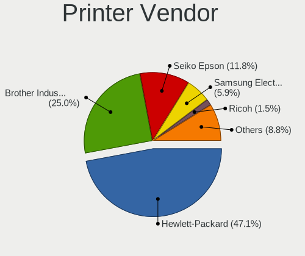

| Vendor              | Computers | Percent |
|---------------------|-----------|---------|
| Hewlett-Packard     | 32        | 50%     |
| Brother Industries  | 17        | 26.56%  |
| Seiko Epson         | 6         | 9.38%   |
| Samsung Electronics | 3         | 4.69%   |
| Ricoh               | 1         | 1.56%   |
| QinHeng Electronics | 1         | 1.56%   |
| Pantum              | 1         | 1.56%   |
| NXP Semiconductors  | 1         | 1.56%   |
| Kyocera             | 1         | 1.56%   |
| Graphtec America    | 1         | 1.56%   |

Printer Model
-------------

Printer device models

| Model                                         | Computers | Percent |
|-----------------------------------------------|-----------|---------|
| HP LaserJet Professional P1102w               | 5         | 7.81%   |
| Brother HL-1200 series                        | 4         | 6.25%   |
| Brother HL-1110 series                        | 4         | 6.25%   |
| HP LaserJet Professional P 1102w              | 3         | 4.69%   |
| Brother HL-1210W series                       | 3         | 4.69%   |
| Samsung M2020 Series                          | 2         | 3.13%   |
| HP LaserJet P1006                             | 2         | 3.13%   |
| HP LaserJet P1005                             | 2         | 3.13%   |
| HP LaserJet M203-M206                         | 2         | 3.13%   |
| HP LaserJet 1020                              | 2         | 3.13%   |
| HP Ink Tank 110 series                        | 2         | 3.13%   |
| HP DeskJet 2600 series                        | 2         | 3.13%   |
| Brother HL-2130 series                        | 2         | 3.13%   |
| Brother DCP-7055 scanner/printer              | 2         | 3.13%   |
| Seiko Epson XP-240 Series                     | 1         | 1.56%   |
| Seiko Epson Printer                           | 1         | 1.56%   |
| Seiko Epson ME 340 Series/Stylus NX130 Series | 1         | 1.56%   |
| Seiko Epson L355 Series                       | 1         | 1.56%   |
| Seiko Epson L120 Series                       | 1         | 1.56%   |
| Seiko Epson ET-2700 Series                    | 1         | 1.56%   |
| Samsung Xerox Phaser 3117 Laser Printer       | 1         | 1.56%   |
| Ricoh Printing Support                        | 1         | 1.56%   |
| QinHeng CH340S                                | 1         | 1.56%   |
| Pantum P2500W series                          | 1         | 1.56%   |
| NXP Semiconductors Printer-80                 | 1         | 1.56%   |
| Kyocera ECOSYS M3550idn                       | 1         | 1.56%   |
| HP PSC 1400                                   | 1         | 1.56%   |
| HP Officejet 4500 G510a-f                     | 1         | 1.56%   |
| HP Laserjet P1505                             | 1         | 1.56%   |
| HP LaserJet 3050                              | 1         | 1.56%   |
| HP Ink Tank Wireless 410 series               | 1         | 1.56%   |
| HP DeskJet F4100 Printer series               | 1         | 1.56%   |
| HP DeskJet F300 series                        | 1         | 1.56%   |
| HP DeskJet 810c/812c                          | 1         | 1.56%   |
| HP DeskJet 3630 series                        | 1         | 1.56%   |
| HP Deskjet 3050 J610 series                   | 1         | 1.56%   |
| HP Deskjet 2050 J510                          | 1         | 1.56%   |
| HP Color LaserJet Pro M478f-9f                | 1         | 1.56%   |
| Graphtec America Graphtec Printer             | 1         | 1.56%   |
| Brother DCP-1610NW                            | 1         | 1.56%   |

Scanner Vendor
--------------

Scanner device vendors

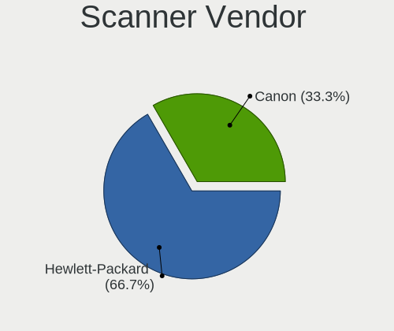

| Vendor          | Computers | Percent |
|-----------------|-----------|---------|
| Hewlett-Packard | 2         | 100%    |

Scanner Model
-------------

Scanner device models

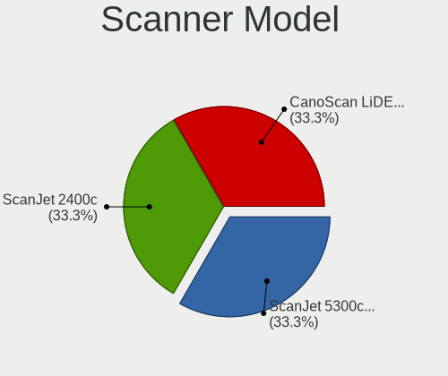

| Model                  | Computers | Percent |
|------------------------|-----------|---------|
| HP ScanJet 5300c/5370c | 1         | 50%     |
| HP ScanJet 2400c       | 1         | 50%     |

Camera
------

Camera Vendor
-------------

Camera device vendors

| Vendor                                 | Computers | Percent |
|----------------------------------------|-----------|---------|
| Chicony Electronics                    | 250       | 19.39%  |
| IMC Networks                           | 116       | 9%      |
| Microdia                               | 105       | 8.15%   |
| Realtek Semiconductor                  | 99        | 7.68%   |
| Bison Electronics                      | 69        | 5.35%   |
| Logitech                               | 51        | 3.96%   |
| Acer                                   | 50        | 3.88%   |
| Sunplus Innovation Technology          | 46        | 3.57%   |
| Quanta                                 | 46        | 3.57%   |
| Syntek                                 | 44        | 3.41%   |
| Suyin                                  | 43        | 3.34%   |
| Silicon Motion                         | 39        | 3.03%   |
| Alcor Micro                            | 39        | 3.03%   |
| Cheng Uei Precision Industry (Foxlink) | 37        | 2.87%   |
| Apple                                  | 22        | 1.71%   |
| Samsung Electronics                    | 21        | 1.63%   |
| Generalplus Technology                 | 20        | 1.55%   |
| Z-Star Microelectronics                | 16        | 1.24%   |
| Ricoh                                  | 15        | 1.16%   |
| Luxvisions Innotech Limited            | 15        | 1.16%   |
| KYE Systems (Mouse Systems)            | 15        | 1.16%   |
| SunplusIT                              | 14        | 1.09%   |
| Lite-On Technology                     | 14        | 1.09%   |
| Sonix Technology                       | 9         | 0.7%    |
| Y Media                                | 8         | 0.62%   |
| Jieli Technology                       | 8         | 0.62%   |
| icSpring                               | 8         | 0.62%   |
| OmniVision Technologies                | 7         | 0.54%   |
| Microsoft                              | 7         | 0.54%   |
| Cubeternet                             | 5         | 0.39%   |
| MacroSilicon                           | 4         | 0.31%   |
| Lenovo                                 | 4         | 0.31%   |
| Importek                               | 4         | 0.31%   |
| GEMBIRD                                | 4         | 0.31%   |
| ALi                                    | 4         | 0.31%   |
| Pixart Imaging                         | 3         | 0.23%   |
| Aveo Technology                        | 3         | 0.23%   |
| Razer USA                              | 2         | 0.16%   |
| OYT Tech                               | 2         | 0.16%   |
| Intel                                  | 2         | 0.16%   |

Camera Model
------------

Camera device models

| Model                                                          | Computers | Percent |
|----------------------------------------------------------------|-----------|---------|
| IMC Networks Integrated Camera                                 | 37        | 2.85%   |
| Chicony USB 2.0 Camera                                         | 37        | 2.85%   |
| IMC Networks USB2.0 VGA UVC WebCam                             | 36        | 2.78%   |
| Microdia Integrated_Webcam_HD                                  | 27        | 2.08%   |
| Chicony Integrated Camera                                      | 27        | 2.08%   |
| Realtek USB Camera                                             | 26        | 2%      |
| Realtek Integrated_Webcam_HD                                   | 25        | 1.93%   |
| Alcor Micro USB 2.0 PC cam                                     | 25        | 1.93%   |
| Bison Integrated Camera                                        | 23        | 1.77%   |
| Samsung Galaxy series, misc. (MTP mode)                        | 20        | 1.54%   |
| Syntek Integrated Camera                                       | 18        | 1.39%   |
| Sunplus Integrated_Webcam_HD                                   | 17        | 1.31%   |
| Chicony Lenovo EasyCamera                                      | 16        | 1.23%   |
| Acer Integrated Camera                                         | 16        | 1.23%   |
| Logitech Webcam C270                                           | 15        | 1.16%   |
| Chicony USB2.0 Camera                                          | 15        | 1.16%   |
| Microdia USB 2.0 Camera                                        | 14        | 1.08%   |
| IMC Networks USB2.0 HD UVC WebCam                              | 14        | 1.08%   |
| Chicony HD WebCam                                              | 13        | 1%      |
| SunplusIT USB 2M Camera                                        | 12        | 0.93%   |
| Chicony TOSHIBA Web Camera - HD                                | 12        | 0.93%   |
| Cheng Uei Precision Industry (Foxlink) HP TrueVision HD Camera | 11        | 0.85%   |
| Acer USB Camera                                                | 11        | 0.85%   |
| Silicon Motion WebCam SC-0311139N                              | 10        | 0.77%   |
| Logitech C922 Pro Stream Webcam                                | 10        | 0.77%   |
| Generalplus CAMERA - UVC                                       | 10        | 0.77%   |
| Chicony HP Wide Vision HD Camera                               | 10        | 0.77%   |
| Apple iPhone 5/5C/5S/6/SE/7/8/X                                | 10        | 0.77%   |
| Microdia Webcam Vitade AF                                      | 9         | 0.69%   |
| Luxvisions Innotech Limited Integrated Camera                  | 9         | 0.69%   |
| Chicony HP TrueVision HD Camera                                | 9         | 0.69%   |
| Bison SunplusIT Integrated Camera                              | 9         | 0.69%   |
| Y Media USB Camera                                             | 8         | 0.62%   |
| Syntek EasyCamera                                              | 8         | 0.62%   |
| Microdia Integrated Webcam                                     | 8         | 0.62%   |
| Jieli USB PHY 2.0                                              | 8         | 0.62%   |
| icSpring camera                                                | 8         | 0.62%   |
| Generalplus 808 Camera                                         | 8         | 0.62%   |
| Chicony USB2.0 VGA UVC WebCam                                  | 8         | 0.62%   |
| Chicony Integrated Camera (1280x720@30)                        | 8         | 0.62%   |

Security
--------

Fingerprint Vendor
------------------

Fingerprint sensor vendors

| Vendor                             | Computers | Percent |
|------------------------------------|-----------|---------|
| Synaptics                          | 51        | 32.48%  |
| Validity Sensors                   | 44        | 28.03%  |
| Shenzhen Goodix Technology         | 27        | 17.2%   |
| Elan Microelectronics              | 9         | 5.73%   |
| Upek                               | 8         | 5.1%    |
| AuthenTec                          | 7         | 4.46%   |
| LighTuning Technology              | 6         | 3.82%   |
| STMicroelectronics                 | 2         | 1.27%   |
| Realtek USB2.0 Finger Print Bridge | 1         | 0.64%   |
| Focal-systems.Corp                 | 1         | 0.64%   |
| DigitalPersona                     | 1         | 0.64%   |

Fingerprint Model
-----------------

Fingerprint sensor models

| Model                                                                      | Computers | Percent |
|----------------------------------------------------------------------------|-----------|---------|
| Synaptics Prometheus MIS Touch Fingerprint Reader                          | 20        | 12.74%  |
| Shenzhen Goodix  FingerPrint Device                                        | 20        | 12.74%  |
| Synaptics  WBDI                                                            | 15        | 9.55%   |
| Validity Sensors VFS5011 Fingerprint Reader                                | 11        | 7.01%   |
| Upek Biometric Touchchip/Touchstrip Fingerprint Sensor                     | 8         | 5.1%    |
| Validity Sensors VFS 5011 fingerprint sensor                               | 6         | 3.82%   |
| Validity Sensors Fingerprint scanner                                       | 6         | 3.82%   |
| Shenzhen Goodix Fingerprint Reader                                         | 6         | 3.82%   |
| Elan ELAN:Fingerprint                                                      | 5         | 3.18%   |
| Validity Sensors VFS495 Fingerprint Reader                                 | 4         | 2.55%   |
| Validity Sensors Synaptics WBDI                                            | 4         | 2.55%   |
| Synaptics WBDI                                                             | 4         | 2.55%   |
| Synaptics Metallica MIS Touch Fingerprint Reader                           | 4         | 2.55%   |
| LighTuning ES603 Swipe Fingerprint Sensor                                  | 4         | 2.55%   |
| Elan ELAN:ARM-M4                                                           | 4         | 2.55%   |
| Validity Sensors VFS301 Fingerprint Reader                                 | 3         | 1.91%   |
| Validity Sensors VFS101 Fingerprint Reader                                 | 2         | 1.27%   |
| Validity Sensors Synaptics VFS7552 Touch Fingerprint Sensor with PurePrint | 2         | 1.27%   |
| Validity Sensors Swipe Fingerprint Sensor                                  | 2         | 1.27%   |
| Synaptics Fingerprint reader [HP G6]                                       | 2         | 1.27%   |
| STMicroelectronics Fingerprint Reader                                      | 2         | 1.27%   |
| AuthenTec Fingerprint Sensor                                               | 2         | 1.27%   |
| AuthenTec AES2810                                                          | 2         | 1.27%   |
| AuthenTec AES2501 Fingerprint Sensor                                       | 2         | 1.27%   |
| Validity Sensors VFS7552 Touch Fingerprint Sensor                          | 1         | 0.64%   |
| Validity Sensors VFS7500 Touch Fingerprint Sensor                          | 1         | 0.64%   |
| Validity Sensors VFS491                                                    | 1         | 0.64%   |
| Validity Sensors VFS300 Fingerprint Reader                                 | 1         | 0.64%   |
| Synaptics WBDI Fingerprint Reader USB 086                                  | 1         | 0.64%   |
| Synaptics UWP WBDI Device                                                  | 1         | 0.64%   |
| Synaptics UWP WBDI                                                         | 1         | 0.64%   |
| Synaptics TouchPad                                                         | 1         | 0.64%   |
| Synaptics  FS7604 Touch Fingerprint Sensor with PurePrint                  | 1         | 0.64%   |
| Shenzhen Goodix FingerPrint                                                | 1         | 0.64%   |
| Realtek USB2.0 Finger Print Bridge FocalTech Fingerprint Device            | 1         | 0.64%   |
| LighTuning Fingerprint Sensor                                              | 1         | 0.64%   |
| LighTuning EgisTec Touch Fingerprint Sensor                                | 1         | 0.64%   |
| Focal-systems.Corp FT9201Fingerprint.                                      | 1         | 0.64%   |
| DigitalPersona Fingerprint Reader                                          | 1         | 0.64%   |
| AuthenTec AES1660 Fingerprint Sensor                                       | 1         | 0.64%   |

Chipcard Vendor
---------------

Chipcard module vendors

| Vendor      | Computers | Percent |
|-------------|-----------|---------|
| Broadcom    | 25        | 64.1%   |
| Upek        | 10        | 25.64%  |
| Lenovo      | 2         | 5.13%   |
| O2 Micro    | 1         | 2.56%   |
| Alcor Micro | 1         | 2.56%   |

Chipcard Model
--------------

Chipcard module models

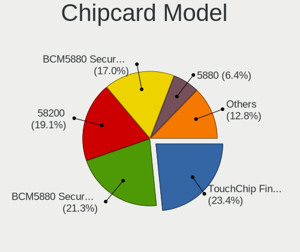

| Model                                                                        | Computers | Percent |
|------------------------------------------------------------------------------|-----------|---------|
| Upek TouchChip Fingerprint Coprocessor (WBF advanced mode)                   | 10        | 25.64%  |
| Broadcom 58200                                                               | 8         | 20.51%  |
| Broadcom BCM5880 Secure Applications Processor with fingerprint swipe sensor | 7         | 17.95%  |
| Broadcom BCM5880 Secure Applications Processor                               | 7         | 17.95%  |
| Broadcom 5880                                                                | 3         | 7.69%   |
| Lenovo Integrated Smart Card Reader                                          | 2         | 5.13%   |
| O2 Micro OZ776 CCID Smartcard Reader                                         | 1         | 2.56%   |
| Alcor Micro AU9540 Smartcard Reader                                          | 1         | 2.56%   |

Unsupported
-----------

Unsupported Devices
-------------------

Total unsupported devices on board

| Total | Computers | Percent |
|-------|-----------|---------|
| 0     | 1698      | 76.8%   |
| 1     | 447       | 20.22%  |
| 2     | 57        | 2.58%   |
| 3     | 5         | 0.23%   |
| 8     | 1         | 0.05%   |
| 6     | 1         | 0.05%   |
| 5     | 1         | 0.05%   |
| 4     | 1         | 0.05%   |

Unsupported Device Types
------------------------

Types of unsupported devices

| Type                     | Computers | Percent |
|--------------------------|-----------|---------|
| Graphics card            | 174       | 29.95%  |
| Fingerprint reader       | 154       | 26.51%  |
| Net/wireless             | 92        | 15.83%  |
| Chipcard                 | 36        | 6.2%    |
| Multimedia controller    | 23        | 3.96%   |
| Camera                   | 23        | 3.96%   |
| Communication controller | 17        | 2.93%   |
| Bluetooth                | 15        | 2.58%   |
| Sound                    | 12        | 2.07%   |
| Net/ethernet             | 10        | 1.72%   |
| Network                  | 6         | 1.03%   |
| Unassigned class         | 5         | 0.86%   |
| Modem                    | 5         | 0.86%   |
| Storage/ide              | 2         | 0.34%   |
| Flash memory             | 2         | 0.34%   |
| Firewire controller      | 2         | 0.34%   |
| Card reader              | 2         | 0.34%   |
| Dvb card                 | 1         | 0.17%   |

