Linux in Argentina - Tested Hardware & Statistics
-------------------------------------------------

A project to collect tested hardware configurations for Linux in Argentina.

Anyone can contribute to this report by the [hw-probe](https://github.com/linuxhw/hw-probe) tool:

    sudo -E hw-probe -all -upload

Please contribute! Especially if your hardware is rare.

This is a report for all computer types. See also reports for [desktops](/Location/Argentina/Desktop/README.md) and [notebooks](/Location/Argentina/Notebook/README.md).

Contents
--------

* [ Test Cases ](#test-cases)

* [ System ](#system)
  - [ OS                       ](#os)
  - [ OS Family                ](#os-family)
  - [ Kernel                   ](#kernel)
  - [ Kernel Family            ](#kernel-family)
  - [ Kernel Major Ver.        ](#kernel-major-ver)
  - [ Arch                     ](#arch)
  - [ DE                       ](#de)
  - [ Display Server           ](#display-server)
  - [ Display Manager          ](#display-manager)
  - [ OS Lang                  ](#os-lang)
  - [ Boot Mode                ](#boot-mode)
  - [ Filesystem               ](#filesystem)
  - [ Part. scheme             ](#part-scheme)
  - [ Dual Boot with Linux/BSD ](#dual-boot-with-linuxbsd)
  - [ Dual Boot (Win)          ](#dual-boot-win)

* [ Board ](#board)
  - [ Vendor                   ](#vendor)
  - [ Model                    ](#model)
  - [ Model Family             ](#model-family)
  - [ MFG Year                 ](#mfg-year)
  - [ Form Factor              ](#form-factor)
  - [ Secure Boot              ](#secure-boot)
  - [ Coreboot                 ](#coreboot)
  - [ RAM Size                 ](#ram-size)
  - [ RAM Used                 ](#ram-used)
  - [ Total Drives             ](#total-drives)
  - [ Has CD-ROM               ](#has-cd-rom)
  - [ Has Ethernet             ](#has-ethernet)
  - [ Has WiFi                 ](#has-wifi)
  - [ Has Bluetooth            ](#has-bluetooth)

* [ Location ](#location)
  - [ Country                  ](#country)
  - [ City                     ](#city)

* [ Drives ](#drives)
  - [ Drive Vendor             ](#drive-vendor)
  - [ Drive Model              ](#drive-model)
  - [ HDD Vendor               ](#hdd-vendor)
  - [ SSD Vendor               ](#ssd-vendor)
  - [ Drive Kind               ](#drive-kind)
  - [ Drive Connector          ](#drive-connector)
  - [ Drive Size               ](#drive-size)
  - [ Space Total              ](#space-total)
  - [ Space Used               ](#space-used)
  - [ Malfunc. Drives          ](#malfunc-drives)
  - [ Malfunc. Drive Vendor    ](#malfunc-drive-vendor)
  - [ Malfunc. HDD Vendor      ](#malfunc-hdd-vendor)
  - [ Malfunc. Drive Kind      ](#malfunc-drive-kind)
  - [ Failed Drives            ](#failed-drives)
  - [ Failed Drive Vendor      ](#failed-drive-vendor)
  - [ Drive Status             ](#drive-status)

* [ Storage controller ](#storage-controller)
  - [ Storage Vendor           ](#storage-vendor)
  - [ Storage Model            ](#storage-model)
  - [ Storage Kind             ](#storage-kind)

* [ Processor ](#processor)
  - [ CPU Vendor               ](#cpu-vendor)
  - [ CPU Model                ](#cpu-model)
  - [ CPU Model Family         ](#cpu-model-family)
  - [ CPU Cores                ](#cpu-cores)
  - [ CPU Sockets              ](#cpu-sockets)
  - [ CPU Threads              ](#cpu-threads)
  - [ CPU Op-Modes             ](#cpu-op-modes)
  - [ CPU Microcode            ](#cpu-microcode)
  - [ CPU Microarch            ](#cpu-microarch)

* [ Graphics ](#graphics)
  - [ GPU Vendor               ](#gpu-vendor)
  - [ GPU Model                ](#gpu-model)
  - [ GPU Combo                ](#gpu-combo)
  - [ GPU Driver               ](#gpu-driver)
  - [ GPU Memory               ](#gpu-memory)

* [ Monitor ](#monitor)
  - [ Monitor Vendor           ](#monitor-vendor)
  - [ Monitor Model            ](#monitor-model)
  - [ Monitor Resolution       ](#monitor-resolution)
  - [ Monitor Diagonal         ](#monitor-diagonal)
  - [ Monitor Width            ](#monitor-width)
  - [ Aspect Ratio             ](#aspect-ratio)
  - [ Monitor Area             ](#monitor-area)
  - [ Pixel Density            ](#pixel-density)
  - [ Multiple Monitors        ](#multiple-monitors)

* [ Network ](#network)
  - [ Net Controller Vendor    ](#net-controller-vendor)
  - [ Net Controller Model     ](#net-controller-model)
  - [ Wireless Vendor          ](#wireless-vendor)
  - [ Wireless Model           ](#wireless-model)
  - [ Ethernet Vendor          ](#ethernet-vendor)
  - [ Ethernet Model           ](#ethernet-model)
  - [ Net Controller Kind      ](#net-controller-kind)
  - [ Used Controller          ](#used-controller)
  - [ NICs                     ](#nics)
  - [ IPv6                     ](#ipv6)

* [ Bluetooth ](#bluetooth)
  - [ Bluetooth Vendor         ](#bluetooth-vendor)
  - [ Bluetooth Model          ](#bluetooth-model)

* [ Sound ](#sound)
  - [ Sound Vendor             ](#sound-vendor)
  - [ Sound Model              ](#sound-model)

* [ Memory ](#memory)
  - [ Memory Vendor            ](#memory-vendor)
  - [ Memory Model             ](#memory-model)
  - [ Memory Kind              ](#memory-kind)
  - [ Memory Form Factor       ](#memory-form-factor)
  - [ Memory Size              ](#memory-size)
  - [ Memory Speed             ](#memory-speed)

* [ Printers & scanners ](#printers--scanners)
  - [ Printer Vendor           ](#printer-vendor)
  - [ Printer Model            ](#printer-model)
  - [ Scanner Vendor           ](#scanner-vendor)
  - [ Scanner Model            ](#scanner-model)

* [ Camera ](#camera)
  - [ Camera Vendor            ](#camera-vendor)
  - [ Camera Model             ](#camera-model)

* [ Security ](#security)
  - [ Fingerprint Vendor       ](#fingerprint-vendor)
  - [ Fingerprint Model        ](#fingerprint-model)
  - [ Chipcard Vendor          ](#chipcard-vendor)
  - [ Chipcard Model           ](#chipcard-model)

* [ Unsupported ](#unsupported)
  - [ Unsupported Devices      ](#unsupported-devices)
  - [ Unsupported Device Types ](#unsupported-device-types)

Test Cases
----------

Total: 1926

| Vendor        | Model                       | Form-Factor | Probe                                                      | Date         |
|---------------|-----------------------------|-------------|------------------------------------------------------------|--------------|
| Intel         | DN2820FYB H24582-205        | Desktop     | [45175a7f3b](https://linux-hardware.org/?probe=45175a7f3b) | Jun 01, 2022 |
| Lenovo        | IdeaPad S400 VIUS3          | Notebook    | [474a9da762](https://linux-hardware.org/?probe=474a9da762) | May 31, 2022 |
| Lenovo        | IdeaPad S400 VIUS3          | Notebook    | [ec364402d8](https://linux-hardware.org/?probe=ec364402d8) | May 31, 2022 |
| ASUSTek       | H81M-A                      | Desktop     | [d24672a3cd](https://linux-hardware.org/?probe=d24672a3cd) | May 31, 2022 |
| Positivo      | ONE700                      | All in one  | [0675afbbfb](https://linux-hardware.org/?probe=0675afbbfb) | May 29, 2022 |
| Gigabyte      | B75M-D3V                    | Desktop     | [30be732591](https://linux-hardware.org/?probe=30be732591) | May 29, 2022 |
| ASUSTek       | 970 PRO GAMING/AURA         | Desktop     | [7fd1e065eb](https://linux-hardware.org/?probe=7fd1e065eb) | May 29, 2022 |
| Lenovo        | ThinkPad T400 6474ES3       | Notebook    | [cf8b67714d](https://linux-hardware.org/?probe=cf8b67714d) | May 27, 2022 |
| MSI           | PRO B660M-A WIFI DDR4       | Desktop     | [8546d9cf10](https://linux-hardware.org/?probe=8546d9cf10) | May 27, 2022 |
| ASUSTek       | M4A88TD-V EVO/USB3          | Desktop     | [bb0591d5c8](https://linux-hardware.org/?probe=bb0591d5c8) | May 26, 2022 |
| Juana Mans... | SF20GM7                     | Notebook    | [2078b0ab3f](https://linux-hardware.org/?probe=2078b0ab3f) | May 26, 2022 |
| American M... | K7S41GX                     | Desktop     | [b311270c22](https://linux-hardware.org/?probe=b311270c22) | May 26, 2022 |
| ASRock        | Z270 Gaming K6              | Desktop     | [fbf8e08024](https://linux-hardware.org/?probe=fbf8e08024) | May 25, 2022 |
| Gigabyte      | B85M-D3H-A                  | Desktop     | [36e5918bc8](https://linux-hardware.org/?probe=36e5918bc8) | May 25, 2022 |
| Positivo      | AT510                       | Notebook    | [2845c5ebd6](https://linux-hardware.org/?probe=2845c5ebd6) | May 25, 2022 |
| Gigabyte      | A320M-S2H-CF                | Desktop     | [0754e1c6e6](https://linux-hardware.org/?probe=0754e1c6e6) | May 23, 2022 |
| Dell          | Inspiron M5030              | Notebook    | [e59616f367](https://linux-hardware.org/?probe=e59616f367) | May 23, 2022 |
| Dell          | 01HYR7 A01                  | Desktop     | [2cd1f7fd5e](https://linux-hardware.org/?probe=2cd1f7fd5e) | May 23, 2022 |
| Toshiba       | Unknown                     | Notebook    | [56ac954440](https://linux-hardware.org/?probe=56ac954440) | May 23, 2022 |
| Gigabyte      | A320M-S2H-CF                | Desktop     | [900181bbff](https://linux-hardware.org/?probe=900181bbff) | May 22, 2022 |
| Lenovo        | IdeaPadFlex 5 14ITL05 82... | Convertible | [6d384d3502](https://linux-hardware.org/?probe=6d384d3502) | May 21, 2022 |
| Lenovo        | IdeaPadFlex 5 14ITL05 82... | Convertible | [aa4b76df10](https://linux-hardware.org/?probe=aa4b76df10) | May 21, 2022 |
| Gigabyte      | AX370M-Gaming 3-CF          | Desktop     | [830532746e](https://linux-hardware.org/?probe=830532746e) | May 20, 2022 |
| Dell          | Inspiron 3502               | Notebook    | [0d26fe46da](https://linux-hardware.org/?probe=0d26fe46da) | May 19, 2022 |
| Gigabyte      | AX370M-Gaming 3-CF          | Desktop     | [27289062cb](https://linux-hardware.org/?probe=27289062cb) | May 19, 2022 |
| Gigabyte      | Z370 AORUS ULTRA GAMING-... | Desktop     | [ea23b1fec2](https://linux-hardware.org/?probe=ea23b1fec2) | May 18, 2022 |
| MSI           | A320M-A PRO MAX             | Desktop     | [13bacdb7b6](https://linux-hardware.org/?probe=13bacdb7b6) | May 18, 2022 |
| ASUSTek       | X555LD                      | Notebook    | [66a07f5e71](https://linux-hardware.org/?probe=66a07f5e71) | May 18, 2022 |
| ASUSTek       | X555LD                      | Notebook    | [3856a337bb](https://linux-hardware.org/?probe=3856a337bb) | May 18, 2022 |
| HP            | Pavilion Notebook           | Notebook    | [2b8318661b](https://linux-hardware.org/?probe=2b8318661b) | May 17, 2022 |
| Lenovo        | ThinkPad E14 Gen 3 20YDS... | Notebook    | [09c8ff393f](https://linux-hardware.org/?probe=09c8ff393f) | May 16, 2022 |
| Acer          | Swift SF515-51T             | Notebook    | [3e3380c801](https://linux-hardware.org/?probe=3e3380c801) | May 15, 2022 |
| MSI           | B550M PRO-VDH               | Desktop     | [fd15b34806](https://linux-hardware.org/?probe=fd15b34806) | May 13, 2022 |
| Intel         | DN2820FYB H24582-205        | Desktop     | [5af3adc742](https://linux-hardware.org/?probe=5af3adc742) | May 13, 2022 |
| Lenovo        | IdeaPad S400 VIUS3          | Notebook    | [40d9831b29](https://linux-hardware.org/?probe=40d9831b29) | May 12, 2022 |
| Gigabyte      | A520M H                     | Desktop     | [d3088d7665](https://linux-hardware.org/?probe=d3088d7665) | May 11, 2022 |
| Positivo      | AT300b                      | Notebook    | [7f5c5ceed4](https://linux-hardware.org/?probe=7f5c5ceed4) | May 11, 2022 |
| Intel         | DN2820FYB H24582-205        | Desktop     | [ba9835cb43](https://linux-hardware.org/?probe=ba9835cb43) | May 10, 2022 |
| Dell          | Latitude E6430              | Notebook    | [a188e200b3](https://linux-hardware.org/?probe=a188e200b3) | May 10, 2022 |
| Gigabyte      | B75M-D3H                    | Desktop     | [b9437261b7](https://linux-hardware.org/?probe=b9437261b7) | May 10, 2022 |
| Foxconn       | LIMA                        | Desktop     | [fc4662a00e](https://linux-hardware.org/?probe=fc4662a00e) | May 09, 2022 |
| HP            | Laptop 15-bs0xx             | Notebook    | [ed1e3083d6](https://linux-hardware.org/?probe=ed1e3083d6) | May 09, 2022 |
| ASUSTek       | 970 PRO GAMING/AURA         | Desktop     | [422c9f9cae](https://linux-hardware.org/?probe=422c9f9cae) | May 09, 2022 |
| HP            | ProBook 440 G4              | Notebook    | [1f0811673a](https://linux-hardware.org/?probe=1f0811673a) | May 09, 2022 |
| ASUSTek       | M5A97 LE R2.0               | Desktop     | [f84e562503](https://linux-hardware.org/?probe=f84e562503) | May 06, 2022 |
| MSI           | MPG Z490 GAMING EDGE WIF... | Desktop     | [76e6cc98aa](https://linux-hardware.org/?probe=76e6cc98aa) | May 05, 2022 |
| MSI           | B550M PRO-VDH               | Desktop     | [40f4bf344a](https://linux-hardware.org/?probe=40f4bf344a) | May 05, 2022 |
| ASUSTek       | VivoBook 15_ASUS Laptop ... | Notebook    | [5a8fc607c4](https://linux-hardware.org/?probe=5a8fc607c4) | May 04, 2022 |
| HP            | Pavilion Gaming Laptop 1... | Notebook    | [3be0a0d66d](https://linux-hardware.org/?probe=3be0a0d66d) | May 03, 2022 |
| Gigabyte      | H81M-S1                     | Desktop     | [8a7d82f85b](https://linux-hardware.org/?probe=8a7d82f85b) | May 03, 2022 |
| Packard Be... | EasyNote ENTG81BA           | Notebook    | [f3791f34b1](https://linux-hardware.org/?probe=f3791f34b1) | May 02, 2022 |
| Intel         | powered classmate PC        | Tablet      | [61790801c2](https://linux-hardware.org/?probe=61790801c2) | May 01, 2022 |
| HP            | ProBook 640 G8 Notebook ... | Notebook    | [dc1b877e42](https://linux-hardware.org/?probe=dc1b877e42) | May 01, 2022 |
| ASUSTek       | PRIME B550M-K               | Desktop     | [92c09fc927](https://linux-hardware.org/?probe=92c09fc927) | Apr 30, 2022 |
| Lenovo        | ThinkPad L15 Gen 2 20X4S... | Notebook    | [48d3759522](https://linux-hardware.org/?probe=48d3759522) | Apr 30, 2022 |
| NSX           | SB1402                      | Notebook    | [c9d79a4fe5](https://linux-hardware.org/?probe=c9d79a4fe5) | Apr 30, 2022 |
| Dell          | XPS 15 9510                 | Notebook    | [b92517268e](https://linux-hardware.org/?probe=b92517268e) | Apr 30, 2022 |
| Gigabyte      | X570 AORUS ULTRA            | Desktop     | [d3872db37e](https://linux-hardware.org/?probe=d3872db37e) | Apr 29, 2022 |
| Gigabyte      | Z370 AORUS Gaming 5-CF      | Desktop     | [2cfdf9b28a](https://linux-hardware.org/?probe=2cfdf9b28a) | Apr 29, 2022 |
| Dell          | Latitude 5411               | Notebook    | [34c470e595](https://linux-hardware.org/?probe=34c470e595) | Apr 28, 2022 |
| Dell          | 01HYR7 A01                  | Desktop     | [d7757bf097](https://linux-hardware.org/?probe=d7757bf097) | Apr 27, 2022 |
| Noblex        | N14WD21                     | Notebook    | [a8a7a4e1d5](https://linux-hardware.org/?probe=a8a7a4e1d5) | Apr 27, 2022 |
| ASRock        | B450 Steel Legend           | Desktop     | [bf0a56358c](https://linux-hardware.org/?probe=bf0a56358c) | Apr 27, 2022 |
| HP            | EliteBook 840 G1            | Notebook    | [74c6e22c86](https://linux-hardware.org/?probe=74c6e22c86) | Apr 27, 2022 |
| MSI           | 880GMA-E35                  | Desktop     | [6ff68166f7](https://linux-hardware.org/?probe=6ff68166f7) | Apr 26, 2022 |
| Gigabyte      | X570 AORUS ULTRA            | Desktop     | [00728feb75](https://linux-hardware.org/?probe=00728feb75) | Apr 26, 2022 |
| Lenovo        | ThinkPad E470 20H1A01YAC    | Notebook    | [cd8726de3c](https://linux-hardware.org/?probe=cd8726de3c) | Apr 26, 2022 |
| Dell          | Studio 1558                 | Notebook    | [b31435ef0c](https://linux-hardware.org/?probe=b31435ef0c) | Apr 24, 2022 |
| HP            | Notebook                    | Notebook    | [339f862ddd](https://linux-hardware.org/?probe=339f862ddd) | Apr 24, 2022 |
| Intel         | DN2820FYB H24582-205        | Desktop     | [fb612cbcd5](https://linux-hardware.org/?probe=fb612cbcd5) | Apr 24, 2022 |
| ASUSTek       | X556UB                      | Notebook    | [a9d2922649](https://linux-hardware.org/?probe=a9d2922649) | Apr 23, 2022 |
| ASUSTek       | H170M-PLUS                  | Desktop     | [86f45617ad](https://linux-hardware.org/?probe=86f45617ad) | Apr 22, 2022 |
| ASUSTek       | K53E                        | Notebook    | [14e628cbba](https://linux-hardware.org/?probe=14e628cbba) | Apr 22, 2022 |
| MSI           | GE62 6QD                    | Notebook    | [d66e41c50e](https://linux-hardware.org/?probe=d66e41c50e) | Apr 22, 2022 |
| ASUSTek       | H170M-PLUS                  | Desktop     | [c021555957](https://linux-hardware.org/?probe=c021555957) | Apr 21, 2022 |
| ASUSTek       | P5K Deluxe                  | Desktop     | [e7b66178ce](https://linux-hardware.org/?probe=e7b66178ce) | Apr 17, 2022 |
| HP            | Pavilion Gaming Laptop 1... | Notebook    | [6454c55f08](https://linux-hardware.org/?probe=6454c55f08) | Apr 16, 2022 |
| Apple         | Mac-8ED6AF5B48C039E1 Mac... | Mini pc     | [c00611352d](https://linux-hardware.org/?probe=c00611352d) | Apr 15, 2022 |
| HP            | Pavilion Notebook           | Notebook    | [8ea3af9aca](https://linux-hardware.org/?probe=8ea3af9aca) | Apr 14, 2022 |
| HP            | Pavilion Notebook           | Notebook    | [e2a600db96](https://linux-hardware.org/?probe=e2a600db96) | Apr 14, 2022 |
| ASUSTek       | ROG STRIX X570-E GAMING     | Desktop     | [f28318e17b](https://linux-hardware.org/?probe=f28318e17b) | Apr 14, 2022 |
| Dell          | Latitude E7250              | Notebook    | [2d0ac286da](https://linux-hardware.org/?probe=2d0ac286da) | Apr 14, 2022 |
| ASUSTek       | Maximus IX HERO             | Desktop     | [624c5a033e](https://linux-hardware.org/?probe=624c5a033e) | Apr 14, 2022 |
| Dell          | Latitude 3520               | Notebook    | [8003f0258a](https://linux-hardware.org/?probe=8003f0258a) | Apr 14, 2022 |
| ASUSTek       | P8H77-M                     | Desktop     | [a5a366f7e7](https://linux-hardware.org/?probe=a5a366f7e7) | Apr 13, 2022 |
| MSI           | H81M-E33                    | Desktop     | [460099f77f](https://linux-hardware.org/?probe=460099f77f) | Apr 13, 2022 |
| Lenovo        | ThinkPad L15 Gen 2 20X4S... | Notebook    | [9bcf0f1e4f](https://linux-hardware.org/?probe=9bcf0f1e4f) | Apr 12, 2022 |
| Lenovo        | ThinkPad L15 Gen 2 20X4S... | Notebook    | [52e0e2e934](https://linux-hardware.org/?probe=52e0e2e934) | Apr 12, 2022 |
| MSI           | H510M-A PRO                 | Desktop     | [d93ab23121](https://linux-hardware.org/?probe=d93ab23121) | Apr 10, 2022 |
| Acer          | Aspire E5-575G              | Notebook    | [de3e230ca3](https://linux-hardware.org/?probe=de3e230ca3) | Apr 10, 2022 |
| MSI           | A68HM-E33 V2                | Desktop     | [cfa5407b7f](https://linux-hardware.org/?probe=cfa5407b7f) | Apr 10, 2022 |
| Intel         | DN2820FYB H24582-205        | Desktop     | [48e5060f20](https://linux-hardware.org/?probe=48e5060f20) | Apr 10, 2022 |
| Unknown       | P4M800CE-8237               | Desktop     | [4c6b9a3f5e](https://linux-hardware.org/?probe=4c6b9a3f5e) | Apr 06, 2022 |
| Intel         | DN2820FYB H24582-205        | Desktop     | [a19db5a006](https://linux-hardware.org/?probe=a19db5a006) | Apr 05, 2022 |
| Advantec      | CX23500W                    | Notebook    | [a3152e0a0f](https://linux-hardware.org/?probe=a3152e0a0f) | Apr 02, 2022 |
| Advantec      | CX23500W                    | Notebook    | [feb5c20169](https://linux-hardware.org/?probe=feb5c20169) | Apr 02, 2022 |
| CX / Air C... | CX-H87-M1                   | Desktop     | [ddfbf2df5e](https://linux-hardware.org/?probe=ddfbf2df5e) | Apr 01, 2022 |
| CX / Air C... | CX-H87-M1                   | Desktop     | [5a8ee938ce](https://linux-hardware.org/?probe=5a8ee938ce) | Apr 01, 2022 |
| Gigabyte      | H370M DS3H-CF               | Desktop     | [1110b2974c](https://linux-hardware.org/?probe=1110b2974c) | Mar 31, 2022 |
| Exo           | Smart XQ5c                  | Notebook    | [5653a02bd3](https://linux-hardware.org/?probe=5653a02bd3) | Mar 31, 2022 |
| Lenovo        | ThinkPad E14 Gen 2 20TBS... | Notebook    | [14bd2cc137](https://linux-hardware.org/?probe=14bd2cc137) | Mar 31, 2022 |
| Dell          | Latitude 3410               | Notebook    | [fd37f4137d](https://linux-hardware.org/?probe=fd37f4137d) | Mar 30, 2022 |
| MSI           | MS-7388                     | Desktop     | [d5eabb8266](https://linux-hardware.org/?probe=d5eabb8266) | Mar 30, 2022 |
| Kanji         | Tamura MAX DUO              | Convertible | [1434c90e55](https://linux-hardware.org/?probe=1434c90e55) | Mar 30, 2022 |
| HP            | Pavilion 17                 | Notebook    | [f815e79449](https://linux-hardware.org/?probe=f815e79449) | Mar 30, 2022 |
| Lenovo        | V15-G2-ITL 82KB             | Notebook    | [38700103d3](https://linux-hardware.org/?probe=38700103d3) | Mar 29, 2022 |
| Toshiba       | PORTEGE R935                | Notebook    | [b209a8e000](https://linux-hardware.org/?probe=b209a8e000) | Mar 28, 2022 |
| HP            | 81BB                        | All in one  | [cb07426c3e](https://linux-hardware.org/?probe=cb07426c3e) | Mar 28, 2022 |
| Coradir       | Coradir/ES10IS5             | Notebook    | [dfc5a02c31](https://linux-hardware.org/?probe=dfc5a02c31) | Mar 28, 2022 |
| Gigabyte      | Z490 AORUS ELITE            | Desktop     | [f8c03d6697](https://linux-hardware.org/?probe=f8c03d6697) | Mar 28, 2022 |
| ASUSTek       | VivoBook_ASUSLaptop X512... | Notebook    | [92bbba70b0](https://linux-hardware.org/?probe=92bbba70b0) | Mar 28, 2022 |
| Lenovo        | IdeaPad D330-10IGL 82H0     | Tablet      | [dd1e7b6c4d](https://linux-hardware.org/?probe=dd1e7b6c4d) | Mar 28, 2022 |
| ASUSTek       | VivoBook_ASUSLaptop X512... | Notebook    | [981757ce36](https://linux-hardware.org/?probe=981757ce36) | Mar 28, 2022 |
| HP            | 81BB                        | All in one  | [d3fec7d8f4](https://linux-hardware.org/?probe=d3fec7d8f4) | Mar 28, 2022 |
| Positivo      | Z100                        | Notebook    | [5577927db3](https://linux-hardware.org/?probe=5577927db3) | Mar 27, 2022 |
| Gigabyte      | B450 GAMING X               | Desktop     | [2d57761ba8](https://linux-hardware.org/?probe=2d57761ba8) | Mar 26, 2022 |
| Intel         | DN2820FYB H24582-205        | Desktop     | [87a81b14f0](https://linux-hardware.org/?probe=87a81b14f0) | Mar 25, 2022 |
| ASUSTek       | M5A78L-M LX                 | Desktop     | [b5ee1f293e](https://linux-hardware.org/?probe=b5ee1f293e) | Mar 25, 2022 |
| Gigabyte      | H510M H                     | Desktop     | [d809ca0f7a](https://linux-hardware.org/?probe=d809ca0f7a) | Mar 25, 2022 |
| ASUSTek       | G75VW                       | Notebook    | [2e006b534b](https://linux-hardware.org/?probe=2e006b534b) | Mar 25, 2022 |
| HP            | Pavilion g6                 | Notebook    | [984b59ccb9](https://linux-hardware.org/?probe=984b59ccb9) | Mar 24, 2022 |
| Gigabyte      | H270-Gaming 3               | Desktop     | [90ce7b8310](https://linux-hardware.org/?probe=90ce7b8310) | Mar 24, 2022 |
| Lenovo        | IdeaPad D330-10IGL 82H0     | Tablet      | [d3623fd756](https://linux-hardware.org/?probe=d3623fd756) | Mar 24, 2022 |
| Lenovo        | IdeaPad D330-10IGL 82H0     | Tablet      | [1057b723a8](https://linux-hardware.org/?probe=1057b723a8) | Mar 24, 2022 |
| BGH e-Nova    | Unknown                     | Notebook    | [408be10e82](https://linux-hardware.org/?probe=408be10e82) | Mar 22, 2022 |
| Packard Be... | EasyNote_MX45               | Notebook    | [b7444c471c](https://linux-hardware.org/?probe=b7444c471c) | Mar 21, 2022 |
| Packard Be... | EasyNote_MX45               | Notebook    | [1fbe976538](https://linux-hardware.org/?probe=1fbe976538) | Mar 21, 2022 |
| Packard Be... | EasyNote_MX45               | Notebook    | [b664a23750](https://linux-hardware.org/?probe=b664a23750) | Mar 21, 2022 |
| HP            | 8054                        | Desktop     | [38288fadf8](https://linux-hardware.org/?probe=38288fadf8) | Mar 21, 2022 |
| Samsung       | RV420/RV520/RV720/E3530/... | Notebook    | [c845b9c738](https://linux-hardware.org/?probe=c845b9c738) | Mar 21, 2022 |
| Intel         | DG35EC AAE29266-205         | Desktop     | [0008f2b843](https://linux-hardware.org/?probe=0008f2b843) | Mar 20, 2022 |
| Intel         | DG35EC AAE29266-205         | Desktop     | [34d7600473](https://linux-hardware.org/?probe=34d7600473) | Mar 20, 2022 |
| BANGHO        | MAX G0101                   | Notebook    | [b40c195d54](https://linux-hardware.org/?probe=b40c195d54) | Mar 20, 2022 |
| HUAWEI        | KPL-W0X                     | Notebook    | [bd7accdfd5](https://linux-hardware.org/?probe=bd7accdfd5) | Mar 20, 2022 |
| Gigabyte      | X570 GAMING X               | Desktop     | [555255cb84](https://linux-hardware.org/?probe=555255cb84) | Mar 19, 2022 |
| Gigabyte      | B75M-D3V                    | Desktop     | [116074683a](https://linux-hardware.org/?probe=116074683a) | Mar 19, 2022 |
| ASUSTek       | P7H55D-M EVO                | Desktop     | [2e70de8c8d](https://linux-hardware.org/?probe=2e70de8c8d) | Mar 19, 2022 |
| Gigabyte      | M68MT-S2P                   | Desktop     | [74bdda89c3](https://linux-hardware.org/?probe=74bdda89c3) | Mar 18, 2022 |
| NSX           | SB142G                      | Notebook    | [0a13591ca3](https://linux-hardware.org/?probe=0a13591ca3) | Mar 18, 2022 |
| ASUSTek       | X505BP                      | Notebook    | [3dc5b19d13](https://linux-hardware.org/?probe=3dc5b19d13) | Mar 17, 2022 |
| Gigabyte      | B450M DS3H-CF               | Desktop     | [b2ec039a2e](https://linux-hardware.org/?probe=b2ec039a2e) | Mar 17, 2022 |
| Positivo      | VJF155F11UAR                | Notebook    | [39b60a2ef4](https://linux-hardware.org/?probe=39b60a2ef4) | Mar 17, 2022 |
| ASUSTek       | VivoBook_ASUSLaptop X515... | Notebook    | [25c0bbffe2](https://linux-hardware.org/?probe=25c0bbffe2) | Mar 15, 2022 |
| Lenovo        | Edge 15 80H1                | Notebook    | [bd2b981053](https://linux-hardware.org/?probe=bd2b981053) | Mar 14, 2022 |
| ASRock        | FM2A88X Extreme4+           | Desktop     | [7e32829960](https://linux-hardware.org/?probe=7e32829960) | Mar 13, 2022 |
| Dell          | Inspiron 5520               | Notebook    | [5d8f77310a](https://linux-hardware.org/?probe=5d8f77310a) | Mar 11, 2022 |
| Dell          | Inspiron 15-5578            | Notebook    | [c31b5d363f](https://linux-hardware.org/?probe=c31b5d363f) | Mar 10, 2022 |
| MSI           | H110M PRO-VH PLUS           | Desktop     | [fc3707d356](https://linux-hardware.org/?probe=fc3707d356) | Mar 09, 2022 |
| Gigabyte      | Z97X-Gaming 3               | Desktop     | [5aa4d54781](https://linux-hardware.org/?probe=5aa4d54781) | Mar 09, 2022 |
| Noblex        | N14WD21                     | Notebook    | [c166ec8175](https://linux-hardware.org/?probe=c166ec8175) | Mar 09, 2022 |
| HP            | Pavilion Gaming Laptop 1... | Notebook    | [96833919d2](https://linux-hardware.org/?probe=96833919d2) | Mar 08, 2022 |
| ASUSTek       | P5GC-MX/1333                | Desktop     | [7708a6ffb9](https://linux-hardware.org/?probe=7708a6ffb9) | Mar 07, 2022 |
| ASRock        | G41M-S3                     | Desktop     | [a5d8ab9493](https://linux-hardware.org/?probe=a5d8ab9493) | Mar 07, 2022 |
| Lenovo        | ThinkPad T60 6370A55        | Notebook    | [3a01549416](https://linux-hardware.org/?probe=3a01549416) | Mar 06, 2022 |
| Lenovo        | ThinkPad T60 6370A55        | Notebook    | [48d2d5d234](https://linux-hardware.org/?probe=48d2d5d234) | Mar 06, 2022 |
| Dell          | Latitude E5540              | Notebook    | [52a16c13b1](https://linux-hardware.org/?probe=52a16c13b1) | Mar 06, 2022 |
| Dell          | Inspiron 5593               | Notebook    | [eca1413f3f](https://linux-hardware.org/?probe=eca1413f3f) | Mar 04, 2022 |
| Nvidia        | Tegra                       | Soc         | [904f2d4f21](https://linux-hardware.org/?probe=904f2d4f21) | Feb 28, 2022 |
| ASUSTek       | P5KPL-AM SE                 | Desktop     | [e79a48e141](https://linux-hardware.org/?probe=e79a48e141) | Feb 27, 2022 |
| HP            | Pavilion 17                 | Notebook    | [d4a3fb2dfc](https://linux-hardware.org/?probe=d4a3fb2dfc) | Feb 26, 2022 |
| Gigabyte      | A320M-S2H V2-CF             | Desktop     | [65eae3fe4c](https://linux-hardware.org/?probe=65eae3fe4c) | Feb 25, 2022 |
| Lenovo        | IdeaPad 320-15ABR 80XS      | Notebook    | [bf565614ca](https://linux-hardware.org/?probe=bf565614ca) | Feb 24, 2022 |
| ASRock        | G31M-S                      | Desktop     | [1ecf0fe3af](https://linux-hardware.org/?probe=1ecf0fe3af) | Feb 24, 2022 |
| Lenovo        | ChiefRiver                  | All in one  | [019a150df4](https://linux-hardware.org/?probe=019a150df4) | Feb 23, 2022 |
| MSI           | B450M PRO-M2 MAX            | Desktop     | [3f99c8072a](https://linux-hardware.org/?probe=3f99c8072a) | Feb 23, 2022 |
| Lenovo        | V15-G2-ITL 82KB             | Notebook    | [6d10cb57e1](https://linux-hardware.org/?probe=6d10cb57e1) | Feb 23, 2022 |
| ASUSTek       | PRIME B450M-A II            | Desktop     | [09aca1c435](https://linux-hardware.org/?probe=09aca1c435) | Feb 22, 2022 |
| ASUSTek       | PRIME B450M-A II            | Desktop     | [35c00d5889](https://linux-hardware.org/?probe=35c00d5889) | Feb 22, 2022 |
| ASRock        | K10N78M                     | Desktop     | [f8a578c070](https://linux-hardware.org/?probe=f8a578c070) | Feb 21, 2022 |
| Samsung       | 500R4K/500R5H/5400RK/501... | Notebook    | [1391579931](https://linux-hardware.org/?probe=1391579931) | Feb 21, 2022 |
| HP            | Compaq Presario C700        | Notebook    | [52cff70be5](https://linux-hardware.org/?probe=52cff70be5) | Feb 21, 2022 |
| ASUSTek       | PRIME B450M-A II            | Desktop     | [265235f4f4](https://linux-hardware.org/?probe=265235f4f4) | Feb 21, 2022 |
| MSI           | B550M PRO-VDH               | Desktop     | [747899db53](https://linux-hardware.org/?probe=747899db53) | Feb 20, 2022 |
| ASUSTek       | PRIME B450M-A II            | Desktop     | [2a57fc9391](https://linux-hardware.org/?probe=2a57fc9391) | Feb 20, 2022 |
| ASUSTek       | X55C                        | Notebook    | [ae05784a4a](https://linux-hardware.org/?probe=ae05784a4a) | Feb 19, 2022 |
| Samsung       | SQ35S                       | Notebook    | [7f4f9ad483](https://linux-hardware.org/?probe=7f4f9ad483) | Feb 18, 2022 |
| ECS           | H81H3-M4                    | Desktop     | [d9f8a4991e](https://linux-hardware.org/?probe=d9f8a4991e) | Feb 18, 2022 |
| Advantec      | C15B                        | Desktop     | [708b68ac89](https://linux-hardware.org/?probe=708b68ac89) | Feb 17, 2022 |
| ASUSTek       | PRIME Z270M-PLUS            | Desktop     | [0faabbb741](https://linux-hardware.org/?probe=0faabbb741) | Feb 17, 2022 |
| Lenovo        | ThinkPad E15 Gen 2 20TES... | Notebook    | [da103e44c5](https://linux-hardware.org/?probe=da103e44c5) | Feb 17, 2022 |
| ASUSTek       | X540UA                      | Notebook    | [681b4aca6f](https://linux-hardware.org/?probe=681b4aca6f) | Feb 16, 2022 |
| Radio Vict... | B34 SLIM                    | Notebook    | [8a100feae7](https://linux-hardware.org/?probe=8a100feae7) | Feb 16, 2022 |
| MSI           | Delta 15 A5EFK              | Notebook    | [0937e1da6a](https://linux-hardware.org/?probe=0937e1da6a) | Feb 14, 2022 |
| Dell          | 0RF705                      | Desktop     | [4369e75c27](https://linux-hardware.org/?probe=4369e75c27) | Feb 14, 2022 |
| MSI           | Delta 15 A5EFK              | Notebook    | [581ebd9976](https://linux-hardware.org/?probe=581ebd9976) | Feb 13, 2022 |
| MSI           | GE62 6QD                    | Notebook    | [fc4efd1eff](https://linux-hardware.org/?probe=fc4efd1eff) | Feb 13, 2022 |
| Gigabyte      | F2A68HM-H                   | Desktop     | [a2a41e039c](https://linux-hardware.org/?probe=a2a41e039c) | Feb 13, 2022 |
| ASRock        | H55M                        | Desktop     | [85a293bc45](https://linux-hardware.org/?probe=85a293bc45) | Feb 13, 2022 |
| Gigabyte      | F2A68HM-H                   | Desktop     | [2f3941c9cb](https://linux-hardware.org/?probe=2f3941c9cb) | Feb 12, 2022 |
| ASUSTek       | PRIME A320M-K               | Desktop     | [196bd41500](https://linux-hardware.org/?probe=196bd41500) | Feb 12, 2022 |
| MSI           | H510M-A PRO                 | Desktop     | [e189ec36c5](https://linux-hardware.org/?probe=e189ec36c5) | Feb 12, 2022 |
| MSI           | GP72 6QE                    | Notebook    | [d4a2d3bb85](https://linux-hardware.org/?probe=d4a2d3bb85) | Feb 12, 2022 |
| MSI           | GP72 6QE                    | Notebook    | [9409e22a95](https://linux-hardware.org/?probe=9409e22a95) | Feb 12, 2022 |
| ASRock        | G31M-S                      | Desktop     | [0e52738a23](https://linux-hardware.org/?probe=0e52738a23) | Feb 11, 2022 |
| Dell          | Inspiron N4010              | Notebook    | [b04de36c04](https://linux-hardware.org/?probe=b04de36c04) | Feb 11, 2022 |
| Samsung       | 300E4A/300E5A/300E7A/343... | Notebook    | [0f65488b54](https://linux-hardware.org/?probe=0f65488b54) | Feb 11, 2022 |
| Gigabyte      | H81M-H                      | Desktop     | [da554d50b7](https://linux-hardware.org/?probe=da554d50b7) | Feb 10, 2022 |
| MSI           | GS63VR 6RF                  | Notebook    | [c20c87027e](https://linux-hardware.org/?probe=c20c87027e) | Feb 10, 2022 |
| BANGHO        | Suma 1025                   | Tablet      | [585ea8c657](https://linux-hardware.org/?probe=585ea8c657) | Feb 10, 2022 |
| Gigabyte      | B365M DS3H                  | Desktop     | [fc6c97721c](https://linux-hardware.org/?probe=fc6c97721c) | Feb 09, 2022 |
| Sony          | VJFE52A0711H                | Notebook    | [0a29c49c46](https://linux-hardware.org/?probe=0a29c49c46) | Feb 09, 2022 |
| Intel         | NUC6CAYB J23203-403         | Mini pc     | [5beef7a5b1](https://linux-hardware.org/?probe=5beef7a5b1) | Feb 08, 2022 |
| Dell          | Latitude E6410              | Notebook    | [c71db9d118](https://linux-hardware.org/?probe=c71db9d118) | Feb 08, 2022 |
| Dell          | Latitude E6410              | Notebook    | [61aae88463](https://linux-hardware.org/?probe=61aae88463) | Feb 08, 2022 |
| Gigabyte      | F2A55M-HD2                  | Desktop     | [c4cba809c4](https://linux-hardware.org/?probe=c4cba809c4) | Feb 08, 2022 |
| ASUSTek       | P8H61-M LX3 R2.0            | Desktop     | [dbfba11836](https://linux-hardware.org/?probe=dbfba11836) | Feb 08, 2022 |
| ASUSTek       | P8H61-M LX3 R2.0            | Desktop     | [b6df9d3243](https://linux-hardware.org/?probe=b6df9d3243) | Feb 08, 2022 |
| HP            | Pavilion dv6                | Notebook    | [0ba10bc3bb](https://linux-hardware.org/?probe=0ba10bc3bb) | Feb 07, 2022 |
| Gigabyte      | F2A88XM-D3HP                | Desktop     | [c6783b6b8b](https://linux-hardware.org/?probe=c6783b6b8b) | Feb 07, 2022 |
| HP            | 0A60h                       | Desktop     | [8c9b5ec56f](https://linux-hardware.org/?probe=8c9b5ec56f) | Feb 06, 2022 |
| Unknown       | 865G-M8                     | Desktop     | [ecc67cf3bc](https://linux-hardware.org/?probe=ecc67cf3bc) | Feb 06, 2022 |
| ASUSTek       | ASUS TUF Dash F15 FX516P... | Notebook    | [c1fe9c81a0](https://linux-hardware.org/?probe=c1fe9c81a0) | Feb 06, 2022 |
| ASUSTek       | ASUS TUF Dash F15 FX516P... | Notebook    | [f92b5e4b44](https://linux-hardware.org/?probe=f92b5e4b44) | Feb 06, 2022 |
| ASUSTek       | H61M-K                      | Desktop     | [0e2c677ddc](https://linux-hardware.org/?probe=0e2c677ddc) | Feb 03, 2022 |
| HP            | Laptop 14-bw0xx             | Notebook    | [fa4a95f3a5](https://linux-hardware.org/?probe=fa4a95f3a5) | Feb 03, 2022 |
| ASUSTek       | Maximus V GENE              | Desktop     | [749946734b](https://linux-hardware.org/?probe=749946734b) | Feb 03, 2022 |
| Gigabyte      | B75M-D3H                    | Desktop     | [23987146db](https://linux-hardware.org/?probe=23987146db) | Feb 02, 2022 |
| MSI           | A320M-A PRO MAX             | Desktop     | [a5298ee805](https://linux-hardware.org/?probe=a5298ee805) | Feb 02, 2022 |
| MSI           | A320M-A PRO MAX             | Desktop     | [c7af52d518](https://linux-hardware.org/?probe=c7af52d518) | Feb 02, 2022 |
| Gigabyte      | A320M-HD2-CF                | Desktop     | [6ad345c1a5](https://linux-hardware.org/?probe=6ad345c1a5) | Feb 01, 2022 |
| Gigabyte      | MFLP3AP-00\2.x              | Desktop     | [b7441a0e94](https://linux-hardware.org/?probe=b7441a0e94) | Jan 31, 2022 |
| Lenovo        | ThinkPad T440s 20ARS06C0... | Notebook    | [88085159bf](https://linux-hardware.org/?probe=88085159bf) | Jan 31, 2022 |
| Dell          | 0NX183 A01                  | Desktop     | [54e546f9ae](https://linux-hardware.org/?probe=54e546f9ae) | Jan 31, 2022 |
| HP            | Pavilion Gaming Laptop 1... | Notebook    | [c1494af863](https://linux-hardware.org/?probe=c1494af863) | Jan 30, 2022 |
| Gigabyte      | B450 AORUS M                | Desktop     | [690eba21e0](https://linux-hardware.org/?probe=690eba21e0) | Jan 30, 2022 |
| Unknown       | P4M800CE-8237               | Desktop     | [ff8ade4a5a](https://linux-hardware.org/?probe=ff8ade4a5a) | Jan 28, 2022 |
| ASUSTek       | M4A88TD-V EVO/USB3          | Desktop     | [350f00e69f](https://linux-hardware.org/?probe=350f00e69f) | Jan 27, 2022 |
| Dell          | Inspiron 3505               | Notebook    | [343ab23f97](https://linux-hardware.org/?probe=343ab23f97) | Jan 27, 2022 |
| Lenovo        | G40-80 80E4                 | Notebook    | [4c27ace709](https://linux-hardware.org/?probe=4c27ace709) | Jan 26, 2022 |
| MSI           | H110M PRO-VH PLUS           | Desktop     | [62e942ea94](https://linux-hardware.org/?probe=62e942ea94) | Jan 26, 2022 |
| Gigabyte      | H110M-H-CF                  | Desktop     | [f8afc9746e](https://linux-hardware.org/?probe=f8afc9746e) | Jan 24, 2022 |
| Samsung       | N150P/N210P/N220P           | Notebook    | [72a04dc661](https://linux-hardware.org/?probe=72a04dc661) | Jan 22, 2022 |
| Standard      | MB50II                      | Notebook    | [aa719e1665](https://linux-hardware.org/?probe=aa719e1665) | Jan 22, 2022 |
| Dell          | Latitude 5510               | Notebook    | [ab7eee3de9](https://linux-hardware.org/?probe=ab7eee3de9) | Jan 21, 2022 |
| Lenovo        | Yoga Slim 7 14ITL05 82A3    | Notebook    | [0f956f27ad](https://linux-hardware.org/?probe=0f956f27ad) | Jan 20, 2022 |
| Gadnic        | NOT00A1                     | Notebook    | [f1c6b56aa2](https://linux-hardware.org/?probe=f1c6b56aa2) | Jan 18, 2022 |
| ASUSTek       | B85M-G R2.0                 | Desktop     | [a6302c118b](https://linux-hardware.org/?probe=a6302c118b) | Jan 17, 2022 |
| ASUSTek       | B85M-G R2.0                 | Desktop     | [8a0c194baa](https://linux-hardware.org/?probe=8a0c194baa) | Jan 17, 2022 |
| HP            | Pavilion Gaming Laptop 1... | Notebook    | [b2ac4f1622](https://linux-hardware.org/?probe=b2ac4f1622) | Jan 13, 2022 |
| BANGHO        | MAX G0101                   | Notebook    | [0e5d4dfabf](https://linux-hardware.org/?probe=0e5d4dfabf) | Jan 13, 2022 |
| MSI           | MS-7309                     | Desktop     | [b980404ce1](https://linux-hardware.org/?probe=b980404ce1) | Jan 13, 2022 |
| Lenovo        | IdeaPad S145-14IGM 81MW     | Notebook    | [b5437027b1](https://linux-hardware.org/?probe=b5437027b1) | Jan 12, 2022 |
| ASUSTek       | ASUS TUF Gaming F15 FX50... | Notebook    | [2b44f3e733](https://linux-hardware.org/?probe=2b44f3e733) | Jan 12, 2022 |
| Lenovo        | IdeaPad Gaming 3 15ARH05... | Notebook    | [137736d936](https://linux-hardware.org/?probe=137736d936) | Jan 11, 2022 |
| HUAWEI        | MACH-WX9                    | Notebook    | [1c3636c882](https://linux-hardware.org/?probe=1c3636c882) | Jan 11, 2022 |
| Samsung       | N150P/N210P/N220P           | Notebook    | [7d5ceb70bb](https://linux-hardware.org/?probe=7d5ceb70bb) | Jan 10, 2022 |
| HUAWEI        | MACH-WX9                    | Notebook    | [2e91b4b88c](https://linux-hardware.org/?probe=2e91b4b88c) | Jan 10, 2022 |
| Apple         | MacBookPro13,3              | Notebook    | [6b1eb1745e](https://linux-hardware.org/?probe=6b1eb1745e) | Jan 10, 2022 |
| Gigabyte      | H61M-S1                     | Desktop     | [50adc5f773](https://linux-hardware.org/?probe=50adc5f773) | Jan 08, 2022 |
| Gigabyte      | GA-890FXA-UD5               | Desktop     | [1f828632ed](https://linux-hardware.org/?probe=1f828632ed) | Jan 07, 2022 |
| ASRock        | B450M-HDV R4.0              | Desktop     | [20dfc25b62](https://linux-hardware.org/?probe=20dfc25b62) | Jan 05, 2022 |
| Positivo      | VJF155F11UAR                | Notebook    | [9ac42b2131](https://linux-hardware.org/?probe=9ac42b2131) | Jan 04, 2022 |
| Positivo      | VJF155F11UAR                | Notebook    | [e8bc9392ff](https://linux-hardware.org/?probe=e8bc9392ff) | Jan 04, 2022 |
| MSI           | H110M PRO-VH PLUS           | Desktop     | [35c962a07f](https://linux-hardware.org/?probe=35c962a07f) | Jan 02, 2022 |
| VS Company    | MCP61M                      | Desktop     | [8009a6fbdf](https://linux-hardware.org/?probe=8009a6fbdf) | Jan 02, 2022 |
| ASUSTek       | VivoBook 12_ASUS Laptop ... | Notebook    | [b6b0572310](https://linux-hardware.org/?probe=b6b0572310) | Jan 02, 2022 |
| HUAWEI        | MACH-WX9                    | Notebook    | [dfa1412d12](https://linux-hardware.org/?probe=dfa1412d12) | Jan 01, 2022 |
| HP            | 0A60h                       | Desktop     | [2812050060](https://linux-hardware.org/?probe=2812050060) | Jan 01, 2022 |
| Dell          | Latitude E5540              | Notebook    | [1a112d75bc](https://linux-hardware.org/?probe=1a112d75bc) | Jan 01, 2022 |
| Gigabyte      | H110M-H-CF                  | Desktop     | [4754d83d04](https://linux-hardware.org/?probe=4754d83d04) | Jan 01, 2022 |
| Exo           | HR14                        | Notebook    | [3a16049e36](https://linux-hardware.org/?probe=3a16049e36) | Dec 31, 2021 |
| Exo           | HR14                        | Notebook    | [8c3bf46eb1](https://linux-hardware.org/?probe=8c3bf46eb1) | Dec 31, 2021 |
| Dell          | Inspiron 3505               | Notebook    | [c05333a0bc](https://linux-hardware.org/?probe=c05333a0bc) | Dec 31, 2021 |
| Intel         | Crestline & ICH8M Chipse... | Notebook    | [286566a874](https://linux-hardware.org/?probe=286566a874) | Dec 31, 2021 |
| HP            | Pavilion Gaming Laptop 1... | Notebook    | [9d60e196d4](https://linux-hardware.org/?probe=9d60e196d4) | Dec 31, 2021 |
| Lenovo        | G40-80 80E4                 | Notebook    | [993fe7cef6](https://linux-hardware.org/?probe=993fe7cef6) | Dec 30, 2021 |
| HP            | 15                          | Notebook    | [e0d79905e2](https://linux-hardware.org/?probe=e0d79905e2) | Dec 29, 2021 |
| Lenovo        | G470 20078                  | Notebook    | [d860437585](https://linux-hardware.org/?probe=d860437585) | Dec 28, 2021 |
| Intel         | DG965WH AAD41692-305        | Desktop     | [970dba93b8](https://linux-hardware.org/?probe=970dba93b8) | Dec 28, 2021 |
| Samsung       | 300E4A/300E5A/300E7A        | Notebook    | [8c9f72d757](https://linux-hardware.org/?probe=8c9f72d757) | Dec 27, 2021 |
| ASUSTek       | H61M-K                      | Desktop     | [d02d1bb775](https://linux-hardware.org/?probe=d02d1bb775) | Dec 27, 2021 |
| System76      | Lemur Pro                   | Notebook    | [6dbfd95ccb](https://linux-hardware.org/?probe=6dbfd95ccb) | Dec 27, 2021 |
| Gigabyte      | H110M-H-CF                  | Desktop     | [d8a2a90482](https://linux-hardware.org/?probe=d8a2a90482) | Dec 27, 2021 |
| Gigabyte      | H110M-H-CF                  | Desktop     | [d2e019564f](https://linux-hardware.org/?probe=d2e019564f) | Dec 26, 2021 |
| Gigabyte      | H110M-H-CF                  | Desktop     | [63b3337725](https://linux-hardware.org/?probe=63b3337725) | Dec 26, 2021 |
| Dell          | Inspiron 7791 2n1           | Convertible | [b5887ff3fd](https://linux-hardware.org/?probe=b5887ff3fd) | Dec 25, 2021 |
| HP            | Laptop 14-dk1xxx            | Notebook    | [ab7902b875](https://linux-hardware.org/?probe=ab7902b875) | Dec 24, 2021 |
| ASUSTek       | VivoBook_ASUSLaptop X509... | Notebook    | [da08b0d873](https://linux-hardware.org/?probe=da08b0d873) | Dec 22, 2021 |
| Lenovo        | IdeaPad 500-15ISK 80NT      | Notebook    | [64492ac63b](https://linux-hardware.org/?probe=64492ac63b) | Dec 22, 2021 |
| ASUSTek       | PRIME B360M-K               | Desktop     | [8df64a7f80](https://linux-hardware.org/?probe=8df64a7f80) | Dec 21, 2021 |
| ASUSTek       | P8Z68-V PRO                 | Desktop     | [ce7e7de4b4](https://linux-hardware.org/?probe=ce7e7de4b4) | Dec 20, 2021 |
| Dell          | Inspiron 3583               | Notebook    | [aaab97a820](https://linux-hardware.org/?probe=aaab97a820) | Dec 19, 2021 |
| Dell          | 0RF705                      | Desktop     | [b28693bf2b](https://linux-hardware.org/?probe=b28693bf2b) | Dec 19, 2021 |
| System76      | Lemur Pro                   | Notebook    | [aebe0acb39](https://linux-hardware.org/?probe=aebe0acb39) | Dec 18, 2021 |
| Compaq        | Presario 21                 | Notebook    | [86e7a85db3](https://linux-hardware.org/?probe=86e7a85db3) | Dec 16, 2021 |
| Samsung       | 300E4A/300E5A/300E7A        | Notebook    | [915303d28d](https://linux-hardware.org/?probe=915303d28d) | Dec 16, 2021 |
| HP            | Compaq Presario CQ40        | Notebook    | [15d1b4bba5](https://linux-hardware.org/?probe=15d1b4bba5) | Dec 16, 2021 |
| Lenovo        | IdeaPad 320-15ABR 80XS      | Notebook    | [4c02cd3e26](https://linux-hardware.org/?probe=4c02cd3e26) | Dec 15, 2021 |
| Lenovo        | ThinkPad X230 23254UY       | Notebook    | [99dbb19723](https://linux-hardware.org/?probe=99dbb19723) | Dec 15, 2021 |
| HONOR         | HLYL-WXX9                   | Notebook    | [0b6a9394b4](https://linux-hardware.org/?probe=0b6a9394b4) | Dec 15, 2021 |
| Gigabyte      | H110M-H-CF                  | Desktop     | [bc401cc9a6](https://linux-hardware.org/?probe=bc401cc9a6) | Dec 14, 2021 |
| Lenovo        | ThinkPad X230 23252CG       | Notebook    | [e2ed9e27c3](https://linux-hardware.org/?probe=e2ed9e27c3) | Dec 14, 2021 |
| Gigabyte      | H510M H                     | Desktop     | [e66c15a464](https://linux-hardware.org/?probe=e66c15a464) | Dec 13, 2021 |
| Gigabyte      | H510M H                     | Desktop     | [53588115a6](https://linux-hardware.org/?probe=53588115a6) | Dec 13, 2021 |
| Gigabyte      | B250M-D3H-CF                | Desktop     | [903dfc6f62](https://linux-hardware.org/?probe=903dfc6f62) | Dec 13, 2021 |
| ASUSTek       | X541UAK                     | Notebook    | [9c83d97134](https://linux-hardware.org/?probe=9c83d97134) | Dec 12, 2021 |
| Lenovo        | ThinkPad E15 Gen 2 20T9S... | Notebook    | [6df961216e](https://linux-hardware.org/?probe=6df961216e) | Dec 12, 2021 |
| Gigabyte      | H310M H x.x                 | Desktop     | [60cdd8ce45](https://linux-hardware.org/?probe=60cdd8ce45) | Dec 11, 2021 |
| Quanta        | 2AC5                        | Desktop     | [0e0fcca430](https://linux-hardware.org/?probe=0e0fcca430) | Dec 10, 2021 |
| Lenovo        | ThinkPad T450 20BUS0100G    | Notebook    | [481e8486ea](https://linux-hardware.org/?probe=481e8486ea) | Dec 10, 2021 |
| Quanta        | 2AC5                        | Desktop     | [d0c9fba2a4](https://linux-hardware.org/?probe=d0c9fba2a4) | Dec 10, 2021 |
| Toshiba       | TE5                         | Notebook    | [fb39721f00](https://linux-hardware.org/?probe=fb39721f00) | Dec 10, 2021 |
| ASRock        | QC6000M                     | Desktop     | [3475206cb1](https://linux-hardware.org/?probe=3475206cb1) | Dec 10, 2021 |
| Lenovo        | ThinkPad T450 20BUS0100G    | Notebook    | [44fb1a2d77](https://linux-hardware.org/?probe=44fb1a2d77) | Dec 09, 2021 |
| Gigabyte      | H410M H                     | Desktop     | [a1b80c28f2](https://linux-hardware.org/?probe=a1b80c28f2) | Dec 09, 2021 |
| System76      | Lemur Pro                   | Notebook    | [6e54a15cf2](https://linux-hardware.org/?probe=6e54a15cf2) | Dec 08, 2021 |
| Exo           | C14C                        | Notebook    | [2e0765b245](https://linux-hardware.org/?probe=2e0765b245) | Dec 08, 2021 |
| ASUSTek       | M3A78-EM                    | Desktop     | [b041919f38](https://linux-hardware.org/?probe=b041919f38) | Dec 08, 2021 |
| Exo           | C14C                        | Notebook    | [1d4221ab9e](https://linux-hardware.org/?probe=1d4221ab9e) | Dec 06, 2021 |
| Positivo      | AT300b                      | Notebook    | [20b3635188](https://linux-hardware.org/?probe=20b3635188) | Dec 06, 2021 |
| Microsoft     | Surface Pro 6               | Tablet      | [adf5a1b645](https://linux-hardware.org/?probe=adf5a1b645) | Dec 04, 2021 |
| Acer          | Aspire 5251                 | Notebook    | [30ef0eefda](https://linux-hardware.org/?probe=30ef0eefda) | Dec 04, 2021 |
| Intel         | powered classmate PC        | Tablet      | [09bfb979b0](https://linux-hardware.org/?probe=09bfb979b0) | Dec 03, 2021 |
| Gigabyte      | Z87X-D3H-CF                 | Desktop     | [4c79974ae8](https://linux-hardware.org/?probe=4c79974ae8) | Dec 03, 2021 |
| HP            | 250 G7 Notebook PC          | Notebook    | [3f21e28b42](https://linux-hardware.org/?probe=3f21e28b42) | Dec 03, 2021 |
| Biostar       | NF61V-M2                    | Desktop     | [0d21d633c9](https://linux-hardware.org/?probe=0d21d633c9) | Dec 02, 2021 |
| BANGHO        | CLOUD                       | Notebook    | [214c91e455](https://linux-hardware.org/?probe=214c91e455) | Dec 01, 2021 |
| BANGHO        | MOV                         | Notebook    | [3e5867cd6a](https://linux-hardware.org/?probe=3e5867cd6a) | Dec 01, 2021 |
| Gigabyte      | B75M-D3H                    | Desktop     | [30820af902](https://linux-hardware.org/?probe=30820af902) | Nov 29, 2021 |
| ECS           | H81H3-M4                    | Desktop     | [4215fcadd9](https://linux-hardware.org/?probe=4215fcadd9) | Nov 25, 2021 |
| Intel         | DH67BL AAG10189-208         | Desktop     | [dbf2659c98](https://linux-hardware.org/?probe=dbf2659c98) | Nov 23, 2021 |
| ASRock        | A320M-HDV R4.0              | Desktop     | [6e2d7fbaed](https://linux-hardware.org/?probe=6e2d7fbaed) | Nov 22, 2021 |
| BANGHO        | Suma 1025                   | Tablet      | [4168edf1bf](https://linux-hardware.org/?probe=4168edf1bf) | Nov 22, 2021 |
| Exo           | Smart Serie M               | Notebook    | [cbf705cf51](https://linux-hardware.org/?probe=cbf705cf51) | Nov 22, 2021 |
| ASUSTek       | G551JW                      | Notebook    | [5f018a92ee](https://linux-hardware.org/?probe=5f018a92ee) | Nov 21, 2021 |
| Intel         | DP35DP AAD81073-205         | Desktop     | [be9ba487cd](https://linux-hardware.org/?probe=be9ba487cd) | Nov 21, 2021 |
| Intel         | DP35DP AAD81073-205         | Desktop     | [d8c73031f1](https://linux-hardware.org/?probe=d8c73031f1) | Nov 20, 2021 |
| Lenovo        | ThinkPad L15 Gen 2 20X4S... | Notebook    | [8dfec492a4](https://linux-hardware.org/?probe=8dfec492a4) | Nov 19, 2021 |
| Lenovo        | ThinkPad L15 Gen 2 20X4S... | Notebook    | [78341a1a16](https://linux-hardware.org/?probe=78341a1a16) | Nov 19, 2021 |
| Gigabyte      | A320M-H-CF                  | Desktop     | [8eeef70a27](https://linux-hardware.org/?probe=8eeef70a27) | Nov 19, 2021 |
| ASRock        | B450M Pro4-F R2.0           | Desktop     | [8dc5c4b2c1](https://linux-hardware.org/?probe=8dc5c4b2c1) | Nov 19, 2021 |
| MSI           | MPG X570 GAMING PLUS        | Desktop     | [5502066af1](https://linux-hardware.org/?probe=5502066af1) | Nov 18, 2021 |
| Gigabyte      | A320M-H-CF                  | Desktop     | [a8e3d44c9e](https://linux-hardware.org/?probe=a8e3d44c9e) | Nov 15, 2021 |
| Gigabyte      | GA-870A-UD3                 | Desktop     | [58809fa055](https://linux-hardware.org/?probe=58809fa055) | Nov 14, 2021 |
| ASRock        | 880GMH/USB3                 | Desktop     | [25aeb2bbf9](https://linux-hardware.org/?probe=25aeb2bbf9) | Nov 14, 2021 |
| ASRock        | 880GMH/USB3                 | Desktop     | [05ce0a8880](https://linux-hardware.org/?probe=05ce0a8880) | Nov 14, 2021 |
| Gigabyte      | H81M-H                      | Desktop     | [a895ed29e0](https://linux-hardware.org/?probe=a895ed29e0) | Nov 14, 2021 |
| Acer          | Aspire ES1-572              | Notebook    | [871bd7121a](https://linux-hardware.org/?probe=871bd7121a) | Nov 11, 2021 |
| Lenovo        | IdeaPad 3 14ADA05 81W0      | Notebook    | [c282ff2172](https://linux-hardware.org/?probe=c282ff2172) | Nov 10, 2021 |
| Lenovo        | ThinkPad L15 Gen 2 20X4S... | Notebook    | [eb66540889](https://linux-hardware.org/?probe=eb66540889) | Nov 10, 2021 |
| Kanji         | Tamura MAX DUO              | Convertible | [0cff4ea4dd](https://linux-hardware.org/?probe=0cff4ea4dd) | Nov 09, 2021 |
| ASRock        | A55M-VS                     | Desktop     | [3e40db1efb](https://linux-hardware.org/?probe=3e40db1efb) | Nov 09, 2021 |
| Lenovo        | 14w 81MQ00AHAR              | Notebook    | [17785cda04](https://linux-hardware.org/?probe=17785cda04) | Nov 09, 2021 |
| Gigabyte      | F2A68HM-H                   | Desktop     | [77b62d6178](https://linux-hardware.org/?probe=77b62d6178) | Nov 09, 2021 |
| Samsung       | 300E4C/300E5C/300E7C        | Notebook    | [fbc9822ad6](https://linux-hardware.org/?probe=fbc9822ad6) | Nov 09, 2021 |
| MSI           | 990XA-GD55                  | Desktop     | [461ac78561](https://linux-hardware.org/?probe=461ac78561) | Nov 08, 2021 |
| MSI           | MS-7369                     | Desktop     | [670cc450d8](https://linux-hardware.org/?probe=670cc450d8) | Nov 08, 2021 |
| ASUSTek       | PRIME H310M-R R2.0          | Desktop     | [c4fd612984](https://linux-hardware.org/?probe=c4fd612984) | Nov 07, 2021 |
| ASUSTek       | M5A97 LE R2.0               | Desktop     | [e21897758d](https://linux-hardware.org/?probe=e21897758d) | Nov 07, 2021 |
| ASUSTek       | A68HM-PLUS                  | Desktop     | [384fb31833](https://linux-hardware.org/?probe=384fb31833) | Nov 06, 2021 |
| ASUSTek       | A68HM-PLUS                  | Desktop     | [7b21a0bc71](https://linux-hardware.org/?probe=7b21a0bc71) | Nov 06, 2021 |
| ASUSTek       | ROG STRIX B550-F GAMING     | Desktop     | [03961f687b](https://linux-hardware.org/?probe=03961f687b) | Nov 06, 2021 |
| Quanta        | TW9/SW9                     | Notebook    | [86643edf2a](https://linux-hardware.org/?probe=86643edf2a) | Nov 06, 2021 |
| BANGHO        | MOV                         | Notebook    | [9c2b56129e](https://linux-hardware.org/?probe=9c2b56129e) | Nov 06, 2021 |
| Gigabyte      | H510M S2H                   | Desktop     | [1a749d9336](https://linux-hardware.org/?probe=1a749d9336) | Nov 05, 2021 |
| Lenovo        | G40-80 80E4                 | Notebook    | [57b9418a9c](https://linux-hardware.org/?probe=57b9418a9c) | Nov 05, 2021 |
| ASUSTek       | K52JT                       | Notebook    | [1f65cc3bef](https://linux-hardware.org/?probe=1f65cc3bef) | Nov 05, 2021 |
| HP            | 15                          | Notebook    | [0719e191d4](https://linux-hardware.org/?probe=0719e191d4) | Nov 04, 2021 |
| HP            | 630                         | Notebook    | [f01c95d959](https://linux-hardware.org/?probe=f01c95d959) | Nov 03, 2021 |
| Lenovo        | ThinkPad Edge E430 3254T... | Notebook    | [f9fbde199a](https://linux-hardware.org/?probe=f9fbde199a) | Nov 02, 2021 |
| ASUSTek       | PRO A320M-R WI-FI           | Desktop     | [a84ed9f4fc](https://linux-hardware.org/?probe=a84ed9f4fc) | Nov 02, 2021 |
| Lenovo        | G40-80 80E4                 | Notebook    | [f89ddc0ebd](https://linux-hardware.org/?probe=f89ddc0ebd) | Nov 02, 2021 |
| Intel         | HURONRIVER                  | Notebook    | [5ded89b4a5](https://linux-hardware.org/?probe=5ded89b4a5) | Nov 02, 2021 |
| MSI           | 760GM-P34                   | Desktop     | [1161af8368](https://linux-hardware.org/?probe=1161af8368) | Oct 31, 2021 |
| ASUSTek       | Q524UQK                     | Convertible | [84ceeeacf1](https://linux-hardware.org/?probe=84ceeeacf1) | Oct 27, 2021 |
| Notebook      | W94_95_97SU2,SUY,-C,-T      | Notebook    | [3da20846f5](https://linux-hardware.org/?probe=3da20846f5) | Oct 26, 2021 |
| Notebook      | W94_95_97SU2,SUY,-C,-T      | Notebook    | [2d19155e7f](https://linux-hardware.org/?probe=2d19155e7f) | Oct 26, 2021 |
| HP            | Pavilion dv4                | Notebook    | [f0ae431e2c](https://linux-hardware.org/?probe=f0ae431e2c) | Oct 26, 2021 |
| Apple         | MacBookPro9,2               | Notebook    | [c739ed76e3](https://linux-hardware.org/?probe=c739ed76e3) | Oct 26, 2021 |
| Unknown       | K8M800-8237                 | Desktop     | [91468b399e](https://linux-hardware.org/?probe=91468b399e) | Oct 25, 2021 |
| Gigabyte      | H410M H V3                  | Desktop     | [6a3a81abd6](https://linux-hardware.org/?probe=6a3a81abd6) | Oct 22, 2021 |
| Gigabyte      | H410M H V3                  | Desktop     | [2f0f49590b](https://linux-hardware.org/?probe=2f0f49590b) | Oct 22, 2021 |
| Lenovo        | ThinkPad L15 Gen 2 20X4S... | Notebook    | [7877fc09ba](https://linux-hardware.org/?probe=7877fc09ba) | Oct 22, 2021 |
| ASUSTek       | H81M-A                      | Desktop     | [c7a2305704](https://linux-hardware.org/?probe=c7a2305704) | Oct 21, 2021 |
| ASUSTek       | H81M-A                      | Desktop     | [8d1ec3a3b6](https://linux-hardware.org/?probe=8d1ec3a3b6) | Oct 21, 2021 |
| Lenovo        | IdeaPad 320-15IKB 80XL      | Notebook    | [3115478a9b](https://linux-hardware.org/?probe=3115478a9b) | Oct 20, 2021 |
| Apple         | MacBookAir4,2               | Notebook    | [f092832b93](https://linux-hardware.org/?probe=f092832b93) | Oct 19, 2021 |
| Lenovo        | ThinkPad L15 Gen 2 20X4S... | Notebook    | [0290c2ca6d](https://linux-hardware.org/?probe=0290c2ca6d) | Oct 19, 2021 |
| Toshiba       | Satellite A505              | Notebook    | [a955d2e293](https://linux-hardware.org/?probe=a955d2e293) | Oct 18, 2021 |
| Dell          | Inspiron 5423               | Notebook    | [f31078afd8](https://linux-hardware.org/?probe=f31078afd8) | Oct 18, 2021 |
| Apple         | MacBook3,1                  | Notebook    | [34fc60e37e](https://linux-hardware.org/?probe=34fc60e37e) | Oct 16, 2021 |
| Gigabyte      | B450 GAMING X               | Desktop     | [cb03c494cb](https://linux-hardware.org/?probe=cb03c494cb) | Oct 15, 2021 |
| HP            | Pavilion dv2000 (RD261LA... | Notebook    | [9f722a52d9](https://linux-hardware.org/?probe=9f722a52d9) | Oct 15, 2021 |
| HP            | Mini 110-3000               | Notebook    | [ee2ce4e3b9](https://linux-hardware.org/?probe=ee2ce4e3b9) | Oct 14, 2021 |
| Noblex        | E11IS2                      | Notebook    | [463e1f38e8](https://linux-hardware.org/?probe=463e1f38e8) | Oct 14, 2021 |
| MSI           | MPG X570 GAMING PRO CARB... | Desktop     | [a0c897a604](https://linux-hardware.org/?probe=a0c897a604) | Oct 13, 2021 |
| Lenovo        | V330-15IKB 81AX             | Notebook    | [000ac750e0](https://linux-hardware.org/?probe=000ac750e0) | Oct 13, 2021 |
| Gigabyte      | H81M-H                      | Desktop     | [a65d72b574](https://linux-hardware.org/?probe=a65d72b574) | Oct 13, 2021 |
| Lenovo        | Z50-70 20354                | Notebook    | [a852927b57](https://linux-hardware.org/?probe=a852927b57) | Oct 13, 2021 |
| ASRock        | 960GC-GS FX                 | Desktop     | [437c7ad805](https://linux-hardware.org/?probe=437c7ad805) | Oct 11, 2021 |
| Lenovo        | ThinkPad L15 Gen 2 20X4S... | Notebook    | [1bea81fd91](https://linux-hardware.org/?probe=1bea81fd91) | Oct 10, 2021 |
| Lenovo        | ThinkPad L15 Gen 2 20X4S... | Notebook    | [d5ea22ef16](https://linux-hardware.org/?probe=d5ea22ef16) | Oct 09, 2021 |
| MSI           | B150M PRO-VDH               | Desktop     | [da329b10c9](https://linux-hardware.org/?probe=da329b10c9) | Oct 08, 2021 |
| MSI           | B150M PRO-VDH               | Desktop     | [13f8e82e6a](https://linux-hardware.org/?probe=13f8e82e6a) | Oct 08, 2021 |
| MSI           | B550M PRO-VDH               | Desktop     | [b806a146d2](https://linux-hardware.org/?probe=b806a146d2) | Oct 08, 2021 |
| Dell          | Latitude 5480               | Notebook    | [3ed90a1781](https://linux-hardware.org/?probe=3ed90a1781) | Oct 07, 2021 |
| Apple         | MacBookAir4,2               | Notebook    | [8163e064d3](https://linux-hardware.org/?probe=8163e064d3) | Oct 07, 2021 |
| Gigabyte      | Z370 AORUS Gaming 5-CF      | Desktop     | [1939167a1c](https://linux-hardware.org/?probe=1939167a1c) | Oct 06, 2021 |
| Lenovo        | ThinkPad E15 Gen 2 20T9S... | Notebook    | [c111f21064](https://linux-hardware.org/?probe=c111f21064) | Oct 05, 2021 |
| Lenovo        | Yoga C740-14IML 81TC        | Convertible | [4d45d7e8b5](https://linux-hardware.org/?probe=4d45d7e8b5) | Oct 05, 2021 |
| Lenovo        | Z50-70 20354                | Notebook    | [beda62c6f4](https://linux-hardware.org/?probe=beda62c6f4) | Oct 05, 2021 |
| Dell          | G3 3779                     | Notebook    | [0257eadb71](https://linux-hardware.org/?probe=0257eadb71) | Oct 04, 2021 |
| ASUSTek       | ASUS TUF Gaming F15 FX50... | Notebook    | [bea39ba8be](https://linux-hardware.org/?probe=bea39ba8be) | Oct 03, 2021 |
| ASUSTek       | A68HM-PLUS                  | Desktop     | [00c624b592](https://linux-hardware.org/?probe=00c624b592) | Oct 03, 2021 |
| ASUSTek       | A68HM-PLUS                  | Desktop     | [09b4e39973](https://linux-hardware.org/?probe=09b4e39973) | Oct 03, 2021 |
| Dell          | Inspiron 15-3552            | Notebook    | [f1b660b91c](https://linux-hardware.org/?probe=f1b660b91c) | Oct 02, 2021 |
| Acer          | Aspire E5-432               | Notebook    | [2d6ea0cb46](https://linux-hardware.org/?probe=2d6ea0cb46) | Oct 02, 2021 |
| Lenovo        | ThinkPad E495 20NES0RR00    | Notebook    | [016f532a15](https://linux-hardware.org/?probe=016f532a15) | Oct 02, 2021 |
| HP            | EliteBook 840 G6            | Notebook    | [cd2412d37e](https://linux-hardware.org/?probe=cd2412d37e) | Oct 01, 2021 |
| Intel         | D425KT AAE93083-401         | Mini pc     | [9dc27fc5be](https://linux-hardware.org/?probe=9dc27fc5be) | Oct 01, 2021 |
| ASUSTek       | K53E                        | Notebook    | [c98e6e26ce](https://linux-hardware.org/?probe=c98e6e26ce) | Oct 01, 2021 |
| Exo           | SmartPro Q6                 | Notebook    | [5986a21d65](https://linux-hardware.org/?probe=5986a21d65) | Sep 30, 2021 |
| Lenovo        | ThinkPad T470 20HES57W00    | Notebook    | [482453f90b](https://linux-hardware.org/?probe=482453f90b) | Sep 30, 2021 |
| Lenovo        | IdeaPadFlex 5 14ARE05 81... | Convertible | [ff712cfd11](https://linux-hardware.org/?probe=ff712cfd11) | Sep 28, 2021 |
| Lenovo        | V15-IIL 82C5                | Notebook    | [781b63209d](https://linux-hardware.org/?probe=781b63209d) | Sep 28, 2021 |
| Acer          | Aspire 2930Z                | Notebook    | [95cf81718f](https://linux-hardware.org/?probe=95cf81718f) | Sep 28, 2021 |
| Dell          | Inspiron 3583               | Notebook    | [f936e50be4](https://linux-hardware.org/?probe=f936e50be4) | Sep 26, 2021 |
| Biostar       | P4M89-M7B Ver:1.0           | Desktop     | [c499580572](https://linux-hardware.org/?probe=c499580572) | Sep 26, 2021 |
| Biostar       | P4M89-M7B Ver:1.0           | Desktop     | [e540393e87](https://linux-hardware.org/?probe=e540393e87) | Sep 25, 2021 |
| Lenovo        | ThinkPad E15 Gen 2 20T9S... | Notebook    | [445b864b6e](https://linux-hardware.org/?probe=445b864b6e) | Sep 25, 2021 |
| ASUSTek       | PRIME B450M-A               | Desktop     | [c4a94c7628](https://linux-hardware.org/?probe=c4a94c7628) | Sep 23, 2021 |
| ASUSTek       | PRIME B450M-A               | Desktop     | [f93c2362ff](https://linux-hardware.org/?probe=f93c2362ff) | Sep 21, 2021 |
| HUAWEI        | NBLB-WAX9N                  | Notebook    | [9d25d0c5c7](https://linux-hardware.org/?probe=9d25d0c5c7) | Sep 21, 2021 |
| Acer          | Aspire 2930Z                | Notebook    | [837506804e](https://linux-hardware.org/?probe=837506804e) | Sep 20, 2021 |
| Acer          | Aspire 2930Z                | Notebook    | [720324554e](https://linux-hardware.org/?probe=720324554e) | Sep 20, 2021 |
| Acer          | Aspire 2930Z                | Notebook    | [85e19ff9ba](https://linux-hardware.org/?probe=85e19ff9ba) | Sep 20, 2021 |
| MSI           | MS-7253                     | Desktop     | [4be11be3f6](https://linux-hardware.org/?probe=4be11be3f6) | Sep 19, 2021 |
| Gigabyte      | 970A-D3                     | Desktop     | [8daebb1450](https://linux-hardware.org/?probe=8daebb1450) | Sep 19, 2021 |
| Lenovo        | V330-15IKB 81AX             | Notebook    | [9d10bffde2](https://linux-hardware.org/?probe=9d10bffde2) | Sep 18, 2021 |
| Unknown       | P4M800CE-8237               | Desktop     | [f7a252e496](https://linux-hardware.org/?probe=f7a252e496) | Sep 18, 2021 |
| Unknown       | P4M800CE-8237               | Desktop     | [13e024d15e](https://linux-hardware.org/?probe=13e024d15e) | Sep 18, 2021 |
| HP            | 0A64h                       | Desktop     | [edcb77e9a1](https://linux-hardware.org/?probe=edcb77e9a1) | Sep 15, 2021 |
| Lenovo        | ThinkPad E460 20EUA00AAC    | Notebook    | [c7d8dc11ca](https://linux-hardware.org/?probe=c7d8dc11ca) | Sep 15, 2021 |
| Lenovo        | G480 20150                  | Notebook    | [d7d8be3a08](https://linux-hardware.org/?probe=d7d8be3a08) | Sep 15, 2021 |
| Lenovo        | V330-15IKB 81AX             | Notebook    | [a062985645](https://linux-hardware.org/?probe=a062985645) | Sep 14, 2021 |
| Toshiba       | QOSMIO X75-A                | Notebook    | [8c87a96580](https://linux-hardware.org/?probe=8c87a96580) | Sep 14, 2021 |
| Toshiba       | QOSMIO X75-A                | Notebook    | [7fbbeca526](https://linux-hardware.org/?probe=7fbbeca526) | Sep 13, 2021 |
| ASRock        | FM2A58M-VG3+ R2.0           | Desktop     | [6d95dbecb4](https://linux-hardware.org/?probe=6d95dbecb4) | Sep 13, 2021 |
| Positivo      | SW6H                        | Notebook    | [2653f4ff4b](https://linux-hardware.org/?probe=2653f4ff4b) | Sep 12, 2021 |
| MSI           | A68HM-E33 V2                | Desktop     | [1fc1622a64](https://linux-hardware.org/?probe=1fc1622a64) | Sep 12, 2021 |
| Dell          | Inspiron 1525               | Notebook    | [c9a8c369e7](https://linux-hardware.org/?probe=c9a8c369e7) | Sep 10, 2021 |
| IBM           | ThinkPad T41 23737JY        | Notebook    | [86cf78a3cf](https://linux-hardware.org/?probe=86cf78a3cf) | Sep 09, 2021 |
| HP            | Laptop 15s-eq0xxx           | Notebook    | [361beeda3d](https://linux-hardware.org/?probe=361beeda3d) | Sep 08, 2021 |
| Lenovo        | ThinkPad T430 2349D10       | Notebook    | [11ab5d413d](https://linux-hardware.org/?probe=11ab5d413d) | Sep 08, 2021 |
| Intel         | Pine Trail - M Revision ... | Notebook    | [147f6959ad](https://linux-hardware.org/?probe=147f6959ad) | Sep 08, 2021 |
| Gigabyte      | A320M-S2H V2-CF             | Desktop     | [014c8bb745](https://linux-hardware.org/?probe=014c8bb745) | Sep 07, 2021 |
| ASUSTek       | P5G41T-M LX3                | Desktop     | [2f680da4b8](https://linux-hardware.org/?probe=2f680da4b8) | Sep 07, 2021 |
| Sony          | Serie VJC14                 | Notebook    | [27828e1dfb](https://linux-hardware.org/?probe=27828e1dfb) | Sep 07, 2021 |
| Sony          | Serie VJC14                 | Notebook    | [4c1200e7cf](https://linux-hardware.org/?probe=4c1200e7cf) | Sep 07, 2021 |
| Lenovo        | ThinkPad X250 20CMCTO1WW    | Notebook    | [409ed1f8a4](https://linux-hardware.org/?probe=409ed1f8a4) | Sep 06, 2021 |
| Lenovo        | V330-15IKB 81AX             | Notebook    | [797db05baf](https://linux-hardware.org/?probe=797db05baf) | Sep 06, 2021 |
| Gigabyte      | 970A-D3                     | Desktop     | [e7b06b1276](https://linux-hardware.org/?probe=e7b06b1276) | Sep 06, 2021 |
| Gigabyte      | 970A-D3                     | Desktop     | [df2dd7daca](https://linux-hardware.org/?probe=df2dd7daca) | Sep 06, 2021 |
| Gigabyte      | H61M-S1                     | Desktop     | [d1773b3e3d](https://linux-hardware.org/?probe=d1773b3e3d) | Sep 06, 2021 |
| Gigabyte      | H61M-S1                     | Desktop     | [5d2cc7f4ca](https://linux-hardware.org/?probe=5d2cc7f4ca) | Sep 06, 2021 |
| ASRock        | N68-GS4 FX                  | Desktop     | [b1147fa740](https://linux-hardware.org/?probe=b1147fa740) | Sep 05, 2021 |
| ASRock        | N68-GS4 FX                  | Desktop     | [e33cd98e47](https://linux-hardware.org/?probe=e33cd98e47) | Sep 05, 2021 |
| Intel         | DG31PR AAD97573-302         | Desktop     | [7122e4bd16](https://linux-hardware.org/?probe=7122e4bd16) | Sep 04, 2021 |
| MSI           | MPG X570 GAMING PRO CARB... | Desktop     | [16ef0eab27](https://linux-hardware.org/?probe=16ef0eab27) | Sep 04, 2021 |
| Lenovo        | ThinkPad E15 20RD002RUS     | Notebook    | [2140460960](https://linux-hardware.org/?probe=2140460960) | Sep 03, 2021 |
| ASUSTek       | VivoBook 15_ASUS Laptop ... | Notebook    | [0e9da9320c](https://linux-hardware.org/?probe=0e9da9320c) | Sep 03, 2021 |
| ASUSTek       | P5LD2-SE                    | Desktop     | [99767a5ca2](https://linux-hardware.org/?probe=99767a5ca2) | Sep 02, 2021 |
| Lenovo        | G470 20078                  | Notebook    | [b480871bf8](https://linux-hardware.org/?probe=b480871bf8) | Sep 02, 2021 |
| Dell          | Inspiron 7506 2n1           | Convertible | [caa58a3463](https://linux-hardware.org/?probe=caa58a3463) | Sep 01, 2021 |
| Gigabyte      | F2A55M-HD2                  | Desktop     | [e8b8cb1cf7](https://linux-hardware.org/?probe=e8b8cb1cf7) | Sep 01, 2021 |
| Gigabyte      | F2A55M-HD2                  | Desktop     | [0c05ab5b21](https://linux-hardware.org/?probe=0c05ab5b21) | Aug 30, 2021 |
| Gigabyte      | X470 AORUS ULTRA GAMING-... | Desktop     | [038868057d](https://linux-hardware.org/?probe=038868057d) | Aug 30, 2021 |
| Gigabyte      | F2A55M-HD2                  | Desktop     | [d2ce2247c6](https://linux-hardware.org/?probe=d2ce2247c6) | Aug 30, 2021 |
| ASUSTek       | PRIME A520M-A               | Desktop     | [91f168dd88](https://linux-hardware.org/?probe=91f168dd88) | Aug 29, 2021 |
| ASUSTek       | PRIME B450M-A               | Desktop     | [78eb1f5b7f](https://linux-hardware.org/?probe=78eb1f5b7f) | Aug 29, 2021 |
| BANGHO        | MAX G0101                   | Notebook    | [88ac236a11](https://linux-hardware.org/?probe=88ac236a11) | Aug 29, 2021 |
| Fujitsu Si... | ESPRIMO Mobile V6545        | Notebook    | [f597bdfe1a](https://linux-hardware.org/?probe=f597bdfe1a) | Aug 29, 2021 |
| Lenovo        | IdeaPad Gaming 3 15ARH05... | Notebook    | [97afdfd346](https://linux-hardware.org/?probe=97afdfd346) | Aug 29, 2021 |
| Gigabyte      | GA-890FXA-UD5               | Desktop     | [f6b7e268fe](https://linux-hardware.org/?probe=f6b7e268fe) | Aug 28, 2021 |
| Gigabyte      | B75M-D3V                    | Desktop     | [7f53bb7787](https://linux-hardware.org/?probe=7f53bb7787) | Aug 28, 2021 |
| Samsung       | 300E4C/300E5C/300E7C        | Notebook    | [50477e1758](https://linux-hardware.org/?probe=50477e1758) | Aug 27, 2021 |
| Samsung       | 300E4C/300E5C/300E7C        | Notebook    | [d51c8093ec](https://linux-hardware.org/?probe=d51c8093ec) | Aug 27, 2021 |
| Gigabyte      | A520M H                     | Desktop     | [4b126be26e](https://linux-hardware.org/?probe=4b126be26e) | Aug 26, 2021 |
| BANGHO        | MOV                         | Notebook    | [9bacff92e1](https://linux-hardware.org/?probe=9bacff92e1) | Aug 25, 2021 |
| AMI           | Aptio CRB                   | Mini pc     | [2882cf9963](https://linux-hardware.org/?probe=2882cf9963) | Aug 25, 2021 |
| ASUSTek       | AM1M-A                      | Desktop     | [17f2638893](https://linux-hardware.org/?probe=17f2638893) | Aug 24, 2021 |
| Positivo      | Unknown                     | Notebook    | [28bac734c5](https://linux-hardware.org/?probe=28bac734c5) | Aug 24, 2021 |
| Gigabyte      | Z390 AORUS MASTER-CF        | Desktop     | [f3f58765e6](https://linux-hardware.org/?probe=f3f58765e6) | Aug 24, 2021 |
| Gigabyte      | H510M S2H                   | Desktop     | [c10c8ceffe](https://linux-hardware.org/?probe=c10c8ceffe) | Aug 23, 2021 |
| Lenovo        | ThinkPad E15 Gen 2 20T9S... | Notebook    | [be114a1393](https://linux-hardware.org/?probe=be114a1393) | Aug 23, 2021 |
| ASUSTek       | PRIME H310M-E R2.0          | Desktop     | [4118ea79d0](https://linux-hardware.org/?probe=4118ea79d0) | Aug 23, 2021 |
| Lenovo        | IdeaPadFlex 5 14ARE05 81... | Convertible | [4a647bfabc](https://linux-hardware.org/?probe=4a647bfabc) | Aug 23, 2021 |
| ECS           | GeForce6100PM-M2            | Desktop     | [8f16ee8e8c](https://linux-hardware.org/?probe=8f16ee8e8c) | Aug 21, 2021 |
| ASUSTek       | TUF Gaming X570-PRO         | Desktop     | [7f83e1b3c8](https://linux-hardware.org/?probe=7f83e1b3c8) | Aug 21, 2021 |
| Dell          | Latitude 7400               | Notebook    | [61fd9efe24](https://linux-hardware.org/?probe=61fd9efe24) | Aug 21, 2021 |
| Dell          | Inspiron 5559               | Notebook    | [768bf35df4](https://linux-hardware.org/?probe=768bf35df4) | Aug 20, 2021 |
| Lenovo        | IdeaPad 1 14IGL05 81VU      | Notebook    | [6d7fb6d592](https://linux-hardware.org/?probe=6d7fb6d592) | Aug 19, 2021 |
| Dell          | Inspiron N4010              | Notebook    | [c83e0428a8](https://linux-hardware.org/?probe=c83e0428a8) | Aug 17, 2021 |
| Lenovo        | ThinkPad L15 Gen 2 20X4S... | Notebook    | [6e32aa4ffd](https://linux-hardware.org/?probe=6e32aa4ffd) | Aug 17, 2021 |
| Gigabyte      | A320M-S2H-CF                | Desktop     | [54369d3959](https://linux-hardware.org/?probe=54369d3959) | Aug 16, 2021 |
| Lenovo        | IdeaPadFlex 5 14ARE05 81... | Convertible | [ea9196699a](https://linux-hardware.org/?probe=ea9196699a) | Aug 16, 2021 |
| Intel         | powered classmate PC        | Tablet      | [978012ace1](https://linux-hardware.org/?probe=978012ace1) | Aug 15, 2021 |
| Intel         | powered classmate PC        | Tablet      | [0ef2caca24](https://linux-hardware.org/?probe=0ef2caca24) | Aug 15, 2021 |
| ASRock        | M3A785GMH/128M              | Desktop     | [4ace1ea1ac](https://linux-hardware.org/?probe=4ace1ea1ac) | Aug 15, 2021 |
| BANGHO        | Suma 1025                   | Tablet      | [50eebaa5c8](https://linux-hardware.org/?probe=50eebaa5c8) | Aug 14, 2021 |
| Gigabyte      | Z87X-D3H-CF                 | Desktop     | [c2c86f701d](https://linux-hardware.org/?probe=c2c86f701d) | Aug 13, 2021 |
| Lenovo        | B50-80 80EW                 | Notebook    | [f8af262ae5](https://linux-hardware.org/?probe=f8af262ae5) | Aug 13, 2021 |
| Gigabyte      | AB350M-Gaming 3-CF          | Desktop     | [b42acf7c50](https://linux-hardware.org/?probe=b42acf7c50) | Aug 12, 2021 |
| Gigabyte      | 970A-D3                     | Desktop     | [d62c66d9bd](https://linux-hardware.org/?probe=d62c66d9bd) | Aug 12, 2021 |
| Lenovo        | V330-15IKB 81AX             | Notebook    | [668328ae19](https://linux-hardware.org/?probe=668328ae19) | Aug 12, 2021 |
| Lenovo        | G40-80 80E4                 | Notebook    | [acd155c49f](https://linux-hardware.org/?probe=acd155c49f) | Aug 11, 2021 |
| Gigabyte      | H310M M.2 x.x               | Desktop     | [69e2e83b95](https://linux-hardware.org/?probe=69e2e83b95) | Aug 10, 2021 |
| Gigabyte      | H310M M.2 x.x               | Desktop     | [86d69a15b9](https://linux-hardware.org/?probe=86d69a15b9) | Aug 10, 2021 |
| Gigabyte      | B450 AORUS PRO WIFI-CF      | Desktop     | [4c28c43c28](https://linux-hardware.org/?probe=4c28c43c28) | Aug 10, 2021 |
| Gigabyte      | GA-A55M-DS2                 | Desktop     | [8beee2f359](https://linux-hardware.org/?probe=8beee2f359) | Aug 10, 2021 |
| Gigabyte      | GA-A55M-DS2                 | Desktop     | [d2e35c6ccb](https://linux-hardware.org/?probe=d2e35c6ccb) | Aug 10, 2021 |
| ASUSTek       | P7H55D-M EVO                | Desktop     | [88dcb8813a](https://linux-hardware.org/?probe=88dcb8813a) | Aug 10, 2021 |
| ASUSTek       | P7H55D-M EVO                | Desktop     | [07fad2e81c](https://linux-hardware.org/?probe=07fad2e81c) | Aug 10, 2021 |
| Lenovo        | ThinkPad X250 20CMCTO1WW    | Notebook    | [c3b36c30d8](https://linux-hardware.org/?probe=c3b36c30d8) | Aug 09, 2021 |
| Exo           | Ready J7W                   | Desktop     | [df3a9167c8](https://linux-hardware.org/?probe=df3a9167c8) | Aug 09, 2021 |
| Exo           | Ready J7W                   | Desktop     | [c18b993ce6](https://linux-hardware.org/?probe=c18b993ce6) | Aug 09, 2021 |
| ASUSTek       | M4A78LT-M LX                | Desktop     | [bdd403e11c](https://linux-hardware.org/?probe=bdd403e11c) | Aug 09, 2021 |
| ASUSTek       | M4N68T-M-LE-V2              | Desktop     | [53bb9bce29](https://linux-hardware.org/?probe=53bb9bce29) | Aug 08, 2021 |
| Gigabyte      | H81M-H                      | Desktop     | [a54ce42dd4](https://linux-hardware.org/?probe=a54ce42dd4) | Aug 07, 2021 |
| HP            | Pavilion Gaming Laptop 1... | Notebook    | [76ee9bfbac](https://linux-hardware.org/?probe=76ee9bfbac) | Aug 06, 2021 |
| HP            | Pavilion Gaming Laptop 1... | Notebook    | [8f1124f1fd](https://linux-hardware.org/?probe=8f1124f1fd) | Aug 06, 2021 |
| Lenovo        | IdeaPad Gaming 3 15ARH05... | Notebook    | [a4ba68cc4e](https://linux-hardware.org/?probe=a4ba68cc4e) | Aug 06, 2021 |
| Gigabyte      | 970A-D3                     | Desktop     | [91825066e0](https://linux-hardware.org/?probe=91825066e0) | Aug 04, 2021 |
| Lenovo        | IdeaPad U310                | Notebook    | [f57c372664](https://linux-hardware.org/?probe=f57c372664) | Aug 02, 2021 |
| Gigabyte      | Z170X-UD3-CF                | Desktop     | [491856c417](https://linux-hardware.org/?probe=491856c417) | Aug 02, 2021 |
| HP            | Pavilion Gaming Laptop 1... | Notebook    | [d09a20ffb6](https://linux-hardware.org/?probe=d09a20ffb6) | Aug 02, 2021 |
| Lenovo        | IdeaPad S340-15IWL 81N8     | Notebook    | [9452fd6e14](https://linux-hardware.org/?probe=9452fd6e14) | Aug 02, 2021 |
| ASUSTek       | P5KPL-AM SE                 | Desktop     | [a2afaa269d](https://linux-hardware.org/?probe=a2afaa269d) | Jul 31, 2021 |
| Lenovo        | ThinkPad T14 Gen 1 20UD0... | Notebook    | [d1450d6167](https://linux-hardware.org/?probe=d1450d6167) | Jul 30, 2021 |
| Lenovo        | ThinkPad T14 Gen 1 20UD0... | Notebook    | [c5adb7024d](https://linux-hardware.org/?probe=c5adb7024d) | Jul 30, 2021 |
| Lenovo        | G485                        | Notebook    | [1b8322cbee](https://linux-hardware.org/?probe=1b8322cbee) | Jul 29, 2021 |
| Lenovo        | G485                        | Notebook    | [19fb967e90](https://linux-hardware.org/?probe=19fb967e90) | Jul 29, 2021 |
| ASUSTek       | M2N68-AM Plus               | Desktop     | [0033aa7340](https://linux-hardware.org/?probe=0033aa7340) | Jul 28, 2021 |
| Gigabyte      | B75M-D3V                    | Desktop     | [22361fb7c3](https://linux-hardware.org/?probe=22361fb7c3) | Jul 28, 2021 |
| Intel         | DP55WB AAE64798-206         | Desktop     | [a9e6b7b07f](https://linux-hardware.org/?probe=a9e6b7b07f) | Jul 27, 2021 |
| HP            | Spectre x360 Convertible... | Convertible | [f2fa91ea29](https://linux-hardware.org/?probe=f2fa91ea29) | Jul 27, 2021 |
| Intel         | DP55WB AAE64798-206         | Desktop     | [7c880b70f2](https://linux-hardware.org/?probe=7c880b70f2) | Jul 27, 2021 |
| ASUSTek       | M2N68-AM Plus               | Desktop     | [af9bf0e1ff](https://linux-hardware.org/?probe=af9bf0e1ff) | Jul 27, 2021 |
| HP            | Compaq Presario CQ40        | Notebook    | [14b629549c](https://linux-hardware.org/?probe=14b629549c) | Jul 27, 2021 |
| Positivo      | Unknown                     | Notebook    | [f64cbc61eb](https://linux-hardware.org/?probe=f64cbc61eb) | Jul 26, 2021 |
| BANGHO        | Suma 1025                   | Tablet      | [a8fd7a9a44](https://linux-hardware.org/?probe=a8fd7a9a44) | Jul 26, 2021 |
| HP            | Compaq Presario CQ40        | Notebook    | [b82622eb33](https://linux-hardware.org/?probe=b82622eb33) | Jul 25, 2021 |
| ASUSTek       | H61M-K                      | Desktop     | [1cf0bdeec4](https://linux-hardware.org/?probe=1cf0bdeec4) | Jul 25, 2021 |
| Lenovo        | ThinkPad E15 Gen 2 20T9S... | Notebook    | [bd29e505b9](https://linux-hardware.org/?probe=bd29e505b9) | Jul 24, 2021 |
| Gigabyte      | A320M-S2H-CF                | Desktop     | [814e38361b](https://linux-hardware.org/?probe=814e38361b) | Jul 23, 2021 |
| Gigabyte      | A320M-S2H V2-CF             | Desktop     | [c8f7308ee9](https://linux-hardware.org/?probe=c8f7308ee9) | Jul 22, 2021 |
| Lenovo        | G485                        | Notebook    | [0810c75be3](https://linux-hardware.org/?probe=0810c75be3) | Jul 21, 2021 |
| HP            | Pavilion Gaming Laptop 1... | Notebook    | [87370c4ac2](https://linux-hardware.org/?probe=87370c4ac2) | Jul 20, 2021 |
| HP            | Pavilion Gaming Laptop 1... | Notebook    | [b5194fe4e7](https://linux-hardware.org/?probe=b5194fe4e7) | Jul 20, 2021 |
| Lenovo        | G485                        | Notebook    | [aa805dfe8d](https://linux-hardware.org/?probe=aa805dfe8d) | Jul 20, 2021 |
| HP            | ENVY Spectre XT Ultraboo... | Notebook    | [bf877db72a](https://linux-hardware.org/?probe=bf877db72a) | Jul 19, 2021 |
| ASUSTek       | M5A78L-M LX                 | Desktop     | [bf2209afbd](https://linux-hardware.org/?probe=bf2209afbd) | Jul 18, 2021 |
| HP            | Pavilion Gaming Laptop 1... | Notebook    | [03ffd337ec](https://linux-hardware.org/?probe=03ffd337ec) | Jul 16, 2021 |
| Gigabyte      | A320M-S2H V2-CF             | Desktop     | [2aeaab8842](https://linux-hardware.org/?probe=2aeaab8842) | Jul 15, 2021 |
| ASUSTek       | M4A88TD-V EVO/USB3          | Desktop     | [be94ca90cb](https://linux-hardware.org/?probe=be94ca90cb) | Jul 15, 2021 |
| Gigabyte      | F2A55M-HD2                  | Desktop     | [6a69f09403](https://linux-hardware.org/?probe=6a69f09403) | Jul 15, 2021 |
| ASUSTek       | H110T                       | Desktop     | [ffad10f62a](https://linux-hardware.org/?probe=ffad10f62a) | Jul 14, 2021 |
| ASUSTek       | H110T                       | Desktop     | [651a111373](https://linux-hardware.org/?probe=651a111373) | Jul 14, 2021 |
| Gigabyte      | B360 AORUS GAMING 3 WIFI... | Desktop     | [14b4d9f2ab](https://linux-hardware.org/?probe=14b4d9f2ab) | Jul 14, 2021 |
| Lenovo        | IdeaPad S145-15AST 81N3     | Notebook    | [2d432c99d0](https://linux-hardware.org/?probe=2d432c99d0) | Jul 13, 2021 |
| HP            | 250 G5 Notebook PC          | Notebook    | [f7013f52d0](https://linux-hardware.org/?probe=f7013f52d0) | Jul 12, 2021 |
| ASUSTek       | N53SV                       | Notebook    | [8044015dd8](https://linux-hardware.org/?probe=8044015dd8) | Jul 12, 2021 |
| HP            | ProBook 445 G7              | Notebook    | [4f0ee9421b](https://linux-hardware.org/?probe=4f0ee9421b) | Jul 12, 2021 |
| HP            | Pavilion Gaming Laptop 1... | Notebook    | [8f5ed33e46](https://linux-hardware.org/?probe=8f5ed33e46) | Jul 12, 2021 |
| Dell          | 0RY007                      | Desktop     | [c49f9f065b](https://linux-hardware.org/?probe=c49f9f065b) | Jul 11, 2021 |
| Dell          | 0RY007                      | Desktop     | [e075d2058a](https://linux-hardware.org/?probe=e075d2058a) | Jul 11, 2021 |
| Dell          | G3 3779                     | Notebook    | [2b3dc1130d](https://linux-hardware.org/?probe=2b3dc1130d) | Jul 09, 2021 |
| Dell          | G3 3779                     | Notebook    | [a7bcade120](https://linux-hardware.org/?probe=a7bcade120) | Jul 09, 2021 |
| ASUSTek       | PRIME H410M-E               | Desktop     | [3758d2a6b8](https://linux-hardware.org/?probe=3758d2a6b8) | Jul 09, 2021 |
| ASUSTek       | M2N-MX SE Plus              | Desktop     | [bb267d3e0f](https://linux-hardware.org/?probe=bb267d3e0f) | Jul 09, 2021 |
| ASUSTek       | M2N-MX SE Plus              | Desktop     | [4b5be18ffe](https://linux-hardware.org/?probe=4b5be18ffe) | Jul 09, 2021 |
| Dell          | Latitude 3510               | Notebook    | [c98fdfc9bc](https://linux-hardware.org/?probe=c98fdfc9bc) | Jul 06, 2021 |
| Toshiba       | Unknown                     | Notebook    | [fd862ec37e](https://linux-hardware.org/?probe=fd862ec37e) | Jul 05, 2021 |
| Dell          | Latitude 3510               | Notebook    | [0b97d64290](https://linux-hardware.org/?probe=0b97d64290) | Jul 03, 2021 |
| ASUSTek       | PRIME X470-PRO              | Desktop     | [448bcb8814](https://linux-hardware.org/?probe=448bcb8814) | Jul 02, 2021 |
| Dell          | Latitude 7490               | Notebook    | [a57352ca65](https://linux-hardware.org/?probe=a57352ca65) | Jul 02, 2021 |
| ASUSTek       | P8H61-M LX3 R2.0            | Desktop     | [dfe0d9fbaf](https://linux-hardware.org/?probe=dfe0d9fbaf) | Jun 29, 2021 |
| ASUSTek       | ROG STRIX B550-F GAMING     | Desktop     | [b8cc7c380d](https://linux-hardware.org/?probe=b8cc7c380d) | Jun 28, 2021 |
| System76      | Oryx Pro                    | Notebook    | [7ccf59ae28](https://linux-hardware.org/?probe=7ccf59ae28) | Jun 28, 2021 |
| ASUSTek       | ROG STRIX B550-F GAMING     | Desktop     | [2831e5a8cf](https://linux-hardware.org/?probe=2831e5a8cf) | Jun 28, 2021 |
| Dell          | Latitude E6400              | Notebook    | [d638a1b2b6](https://linux-hardware.org/?probe=d638a1b2b6) | Jun 28, 2021 |
| Dell          | Inspiron 7773               | Notebook    | [fb0644646a](https://linux-hardware.org/?probe=fb0644646a) | Jun 28, 2021 |
| Dell          | 0G261D A00                  | Desktop     | [5d234cd641](https://linux-hardware.org/?probe=5d234cd641) | Jun 28, 2021 |
| Gigabyte      | H81M-H                      | Desktop     | [0a704c2e3b](https://linux-hardware.org/?probe=0a704c2e3b) | Jun 28, 2021 |
| ASUSTek       | X455LJ                      | Notebook    | [b8a939ca9c](https://linux-hardware.org/?probe=b8a939ca9c) | Jun 27, 2021 |
| Lenovo        | ThinkPad E15 Gen 2 20T9S... | Notebook    | [795eda0f4c](https://linux-hardware.org/?probe=795eda0f4c) | Jun 27, 2021 |
| HP            | Pavilion dv6                | Notebook    | [13f36adbb0](https://linux-hardware.org/?probe=13f36adbb0) | Jun 27, 2021 |
| Lenovo        | ThinkPad E14 20RBS1RA00     | Notebook    | [d555c56ade](https://linux-hardware.org/?probe=d555c56ade) | Jun 27, 2021 |
| ASRock        | FM2A78M-HD+                 | Desktop     | [eae811c82c](https://linux-hardware.org/?probe=eae811c82c) | Jun 25, 2021 |
| ECS           | H81H3-M4                    | Desktop     | [838f10c576](https://linux-hardware.org/?probe=838f10c576) | Jun 25, 2021 |
| ECS           | H81H3-M4                    | Desktop     | [bfc9a4d537](https://linux-hardware.org/?probe=bfc9a4d537) | Jun 25, 2021 |
| Gigabyte      | B450 AORUS PRO WIFI-CF      | Desktop     | [95a3ae9f9f](https://linux-hardware.org/?probe=95a3ae9f9f) | Jun 24, 2021 |
| HP            | Pavilion dv7                | Notebook    | [590ba6b3a3](https://linux-hardware.org/?probe=590ba6b3a3) | Jun 23, 2021 |
| ASUSTek       | M5A97 LE R2.0               | Desktop     | [7fba4b1b78](https://linux-hardware.org/?probe=7fba4b1b78) | Jun 23, 2021 |
| Lenovo        | SHARKBAY SDK0E50510 WIN     | Desktop     | [fa222df71a](https://linux-hardware.org/?probe=fa222df71a) | Jun 21, 2021 |
| Acer          | Aspire E5-573               | Notebook    | [22e59e4d90](https://linux-hardware.org/?probe=22e59e4d90) | Jun 21, 2021 |
| Gigabyte      | H510M S2H                   | Desktop     | [c40ed6f57e](https://linux-hardware.org/?probe=c40ed6f57e) | Jun 21, 2021 |
| Gigabyte      | H510M S2H                   | Desktop     | [6c5f517ffe](https://linux-hardware.org/?probe=6c5f517ffe) | Jun 21, 2021 |
| Gigabyte      | Z390 AORUS MASTER-CF        | Desktop     | [b2c32f1c8d](https://linux-hardware.org/?probe=b2c32f1c8d) | Jun 19, 2021 |
| Gigabyte      | Z170X-UD3-CF                | Desktop     | [91f4695a06](https://linux-hardware.org/?probe=91f4695a06) | Jun 19, 2021 |
| HP            | Pavilion Gaming Laptop 1... | Notebook    | [3489fe1584](https://linux-hardware.org/?probe=3489fe1584) | Jun 18, 2021 |
| BANGHO        | MAX G5 i1                   | Notebook    | [ca05e3a059](https://linux-hardware.org/?probe=ca05e3a059) | Jun 15, 2021 |
| ASUSTek       | PRIME Z490-P                | Desktop     | [a6bdb9ad52](https://linux-hardware.org/?probe=a6bdb9ad52) | Jun 15, 2021 |
| Gigabyte      | Z87X-D3H-CF                 | Desktop     | [e49acd5f55](https://linux-hardware.org/?probe=e49acd5f55) | Jun 12, 2021 |
| Gigabyte      | Z370 AORUS Gaming 7         | Desktop     | [88df5f0e94](https://linux-hardware.org/?probe=88df5f0e94) | Jun 12, 2021 |
| ASUSTek       | M5A97 LE R2.0               | Desktop     | [3d47d96665](https://linux-hardware.org/?probe=3d47d96665) | Jun 12, 2021 |
| ASUSTek       | PRIME B450M-A               | Desktop     | [c9bea47caa](https://linux-hardware.org/?probe=c9bea47caa) | Jun 12, 2021 |
| HP            | 0A64h                       | Desktop     | [cd257e99d6](https://linux-hardware.org/?probe=cd257e99d6) | Jun 12, 2021 |
| ASUSTek       | PRIME B450M-A               | Desktop     | [c9c757474a](https://linux-hardware.org/?probe=c9c757474a) | Jun 12, 2021 |
| HP            | 250 G5 Notebook PC          | Notebook    | [4699d3c195](https://linux-hardware.org/?probe=4699d3c195) | Jun 10, 2021 |
| Gigabyte      | B450M DS3H-CF               | Desktop     | [c0a212ed13](https://linux-hardware.org/?probe=c0a212ed13) | Jun 10, 2021 |
| ASUSTek       | PRIME A320M-K               | Desktop     | [b47a3aad4b](https://linux-hardware.org/?probe=b47a3aad4b) | Jun 10, 2021 |
| ASUSTek       | PRIME A320M-K               | Desktop     | [5e0580b431](https://linux-hardware.org/?probe=5e0580b431) | Jun 08, 2021 |
| Gigabyte      | H81M-H                      | Desktop     | [cfc0aceaf9](https://linux-hardware.org/?probe=cfc0aceaf9) | Jun 08, 2021 |
| ASRock        | A320M-HDV R4.0              | Desktop     | [b9d021b1e4](https://linux-hardware.org/?probe=b9d021b1e4) | Jun 07, 2021 |
| Pegatron      | A15                         | Notebook    | [9156525a1e](https://linux-hardware.org/?probe=9156525a1e) | Jun 06, 2021 |
| Acer          | Aspire V3-551               | Notebook    | [ba274d73f0](https://linux-hardware.org/?probe=ba274d73f0) | Jun 04, 2021 |
| HP            | Pavilion Notebook           | Notebook    | [a4feb93464](https://linux-hardware.org/?probe=a4feb93464) | Jun 02, 2021 |
| Gigabyte      | F2A55M-HD2                  | Desktop     | [8daf7e0679](https://linux-hardware.org/?probe=8daf7e0679) | Jun 02, 2021 |
| ASUSTek       | X541NA                      | Notebook    | [daad255c87](https://linux-hardware.org/?probe=daad255c87) | Jun 01, 2021 |
| MSI           | H61M-E23                    | Desktop     | [d555f722d4](https://linux-hardware.org/?probe=d555f722d4) | Jun 01, 2021 |
| MSI           | A320M-A PRO MAX             | Desktop     | [f5bfeb4cb0](https://linux-hardware.org/?probe=f5bfeb4cb0) | Jun 01, 2021 |
| Sony          | VGN-NR230FE                 | Notebook    | [b97d7a8c66](https://linux-hardware.org/?probe=b97d7a8c66) | Jun 01, 2021 |
| HP            | Compaq tc4400 (GE179UP#A... | Notebook    | [eeaee9f1ad](https://linux-hardware.org/?probe=eeaee9f1ad) | Jun 01, 2021 |
| Gigabyte      | B450M DS3H-CF               | Desktop     | [3751085a36](https://linux-hardware.org/?probe=3751085a36) | May 31, 2021 |
| Gigabyte      | B450M DS3H-CF               | Desktop     | [d71af3d423](https://linux-hardware.org/?probe=d71af3d423) | May 31, 2021 |
| Gigabyte      | B365M DS3H                  | Desktop     | [f91a20dd51](https://linux-hardware.org/?probe=f91a20dd51) | May 30, 2021 |
| Gigabyte      | F2A55M-HD2                  | Desktop     | [6dde896b4f](https://linux-hardware.org/?probe=6dde896b4f) | May 30, 2021 |
| ASRock        | H81M-HG4                    | Desktop     | [9285d9b036](https://linux-hardware.org/?probe=9285d9b036) | May 29, 2021 |
| ASRock        | H81M-HG4                    | Desktop     | [c7752a5136](https://linux-hardware.org/?probe=c7752a5136) | May 29, 2021 |
| MSI           | A68HM-E33 V2                | Desktop     | [a9971ed939](https://linux-hardware.org/?probe=a9971ed939) | May 29, 2021 |
| ADMIRAL       | ADC14                       | Notebook    | [1cd2066013](https://linux-hardware.org/?probe=1cd2066013) | May 29, 2021 |
| ADMIRAL       | ADC14                       | Notebook    | [d3955b8ca9](https://linux-hardware.org/?probe=d3955b8ca9) | May 29, 2021 |
| A-DATA Tec... | XENIA159GENI72060           | Notebook    | [eee4dbbb99](https://linux-hardware.org/?probe=eee4dbbb99) | May 28, 2021 |
| ASUSTek       | M4N68T-M-LE-V2              | Desktop     | [2fffb102d8](https://linux-hardware.org/?probe=2fffb102d8) | May 28, 2021 |
| ASUSTek       | M5A97 PRO                   | Desktop     | [a7526aa47d](https://linux-hardware.org/?probe=a7526aa47d) | May 27, 2021 |
| Acer          | Aspire ES1-572              | Notebook    | [2dd5a68280](https://linux-hardware.org/?probe=2dd5a68280) | May 27, 2021 |
| Sony          | VPCEH35FM                   | Notebook    | [f88d733f75](https://linux-hardware.org/?probe=f88d733f75) | May 27, 2021 |
| Sony          | VPCEH35FM                   | Notebook    | [309cc53bcf](https://linux-hardware.org/?probe=309cc53bcf) | May 27, 2021 |
| Lenovo        | G40-30 80FY                 | Notebook    | [a890a2c019](https://linux-hardware.org/?probe=a890a2c019) | May 26, 2021 |
| ASUSTek       | M5A88-V EVO                 | Desktop     | [00f250e5c2](https://linux-hardware.org/?probe=00f250e5c2) | May 25, 2021 |
| Gigabyte      | GA-MA74GM-S2                | Desktop     | [a348b29a71](https://linux-hardware.org/?probe=a348b29a71) | May 25, 2021 |
| ASUSTek       | X555UJ                      | Notebook    | [9c148a1665](https://linux-hardware.org/?probe=9c148a1665) | May 25, 2021 |
| A-DATA Tec... | XENIA159GENI72060           | Notebook    | [e4c4563465](https://linux-hardware.org/?probe=e4c4563465) | May 24, 2021 |
| Samsung       | 300E4A/300E5A/300E7A/343... | Notebook    | [f8b9508953](https://linux-hardware.org/?probe=f8b9508953) | May 24, 2021 |
| ASUSTek       | VivoBook 15_ASUS Laptop ... | Notebook    | [170b220f5b](https://linux-hardware.org/?probe=170b220f5b) | May 23, 2021 |
| MSI           | MS-7369                     | Desktop     | [2a0863dd05](https://linux-hardware.org/?probe=2a0863dd05) | May 23, 2021 |
| MSI           | MS-7369                     | Desktop     | [69c762bef9](https://linux-hardware.org/?probe=69c762bef9) | May 22, 2021 |
| Samsung       | N150P/N210P/N220P           | Notebook    | [d4548d357f](https://linux-hardware.org/?probe=d4548d357f) | May 22, 2021 |
| Lenovo        | IdeaPad 3 15IIL05 81WE      | Notebook    | [5756ecab4b](https://linux-hardware.org/?probe=5756ecab4b) | May 22, 2021 |
| Lenovo        | IdeaPad 320-15ABR 80XS      | Notebook    | [0f8deb2aeb](https://linux-hardware.org/?probe=0f8deb2aeb) | May 21, 2021 |
| MSI           | H110M PRO-VH                | Desktop     | [4f4586d8e4](https://linux-hardware.org/?probe=4f4586d8e4) | May 20, 2021 |
| MSI           | A320M-A PRO MAX             | Desktop     | [9e9bc74757](https://linux-hardware.org/?probe=9e9bc74757) | May 20, 2021 |
| ASUSTek       | PRIME B450M-A               | Desktop     | [98bdee6a07](https://linux-hardware.org/?probe=98bdee6a07) | May 20, 2021 |
| ASUSTek       | M5A88-M                     | Desktop     | [893aa07acd](https://linux-hardware.org/?probe=893aa07acd) | May 19, 2021 |
| Lenovo        | V15-ADA 82C7                | Notebook    | [a36a726bba](https://linux-hardware.org/?probe=a36a726bba) | May 18, 2021 |
| Dell          | Latitude 7490               | Notebook    | [b3010001a3](https://linux-hardware.org/?probe=b3010001a3) | May 18, 2021 |
| Gigabyte      | Z170X-GamingG1              | Desktop     | [361469c7d5](https://linux-hardware.org/?probe=361469c7d5) | May 18, 2021 |
| Dell          | Inspiron 1440               | Notebook    | [d0f761fa17](https://linux-hardware.org/?probe=d0f761fa17) | May 17, 2021 |
| HP            | Pavilion Gaming Laptop 1... | Notebook    | [e32d9effa0](https://linux-hardware.org/?probe=e32d9effa0) | May 17, 2021 |
| ASUSTek       | M4A88TD-V EVO/USB3          | Desktop     | [955eb51481](https://linux-hardware.org/?probe=955eb51481) | May 17, 2021 |
| Coradir       | Coradir/ES10IS5             | Notebook    | [60844ab595](https://linux-hardware.org/?probe=60844ab595) | May 17, 2021 |
| Coradir       | Coradir/ES10IS5             | Notebook    | [acae784622](https://linux-hardware.org/?probe=acae784622) | May 17, 2021 |
| Lenovo        | IdeaPad 320-15IKB 80XL      | Notebook    | [df1bd5c40d](https://linux-hardware.org/?probe=df1bd5c40d) | May 16, 2021 |
| Lenovo        | IdeaPad 320-15IKB 80XL      | Notebook    | [86de26c862](https://linux-hardware.org/?probe=86de26c862) | May 16, 2021 |
| ASUSTek       | VivoBook 15_ASUS Laptop ... | Notebook    | [1ce350fb27](https://linux-hardware.org/?probe=1ce350fb27) | May 16, 2021 |
| ASUSTek       | PRIME A320M-K               | Desktop     | [14898777ea](https://linux-hardware.org/?probe=14898777ea) | May 16, 2021 |
| ASUSTek       | PRIME A320M-K               | Desktop     | [9d111b276a](https://linux-hardware.org/?probe=9d111b276a) | May 16, 2021 |
| Sony          | VPCEG11FX                   | Notebook    | [b17f63c46c](https://linux-hardware.org/?probe=b17f63c46c) | May 16, 2021 |
| Gigabyte      | F2A55M-HD2                  | Desktop     | [970f02b452](https://linux-hardware.org/?probe=970f02b452) | May 15, 2021 |
| ASUSTek       | VivoBook_ASUSLaptop X509... | Notebook    | [d311e9743d](https://linux-hardware.org/?probe=d311e9743d) | May 15, 2021 |
| Gigabyte      | F2A55M-HD2                  | Desktop     | [b39ddf3718](https://linux-hardware.org/?probe=b39ddf3718) | May 14, 2021 |
| Dell          | Inspiron 14-3467            | Notebook    | [511f638394](https://linux-hardware.org/?probe=511f638394) | May 14, 2021 |
| Gigabyte      | Z97X-UD3H-CF                | Desktop     | [2addb54096](https://linux-hardware.org/?probe=2addb54096) | May 13, 2021 |
| Lenovo        | G40-30 80FY                 | Notebook    | [822f3e9a7d](https://linux-hardware.org/?probe=822f3e9a7d) | May 13, 2021 |
| HP            | ENVY Spectre XT Ultraboo... | Notebook    | [b59cb43ed6](https://linux-hardware.org/?probe=b59cb43ed6) | May 13, 2021 |
| Lenovo        | ThinkPad T490s 20NYS04V0... | Notebook    | [18da93a841](https://linux-hardware.org/?probe=18da93a841) | May 12, 2021 |
| ASUSTek       | VivoBook 15_ASUS Laptop ... | Notebook    | [942ece6e49](https://linux-hardware.org/?probe=942ece6e49) | May 12, 2021 |
| HP            | Pavilion Notebook           | Notebook    | [435e18816a](https://linux-hardware.org/?probe=435e18816a) | May 12, 2021 |
| ASRock        | A320M-HDV                   | Desktop     | [f85fceb5f0](https://linux-hardware.org/?probe=f85fceb5f0) | May 11, 2021 |
| ASRock        | H81M-HG4                    | Desktop     | [ed6ba9cf41](https://linux-hardware.org/?probe=ed6ba9cf41) | May 11, 2021 |
| MSI           | H170A GAMING PRO            | Desktop     | [a7c97c0108](https://linux-hardware.org/?probe=a7c97c0108) | May 10, 2021 |
| Gigabyte      | A320M-H-CF                  | Desktop     | [f6defd08d6](https://linux-hardware.org/?probe=f6defd08d6) | May 10, 2021 |
| HP            | Pavilion Gaming Laptop 1... | Notebook    | [c9b4ee21fd](https://linux-hardware.org/?probe=c9b4ee21fd) | May 10, 2021 |
| Dell          | 0P096C A01                  | Desktop     | [36507e909e](https://linux-hardware.org/?probe=36507e909e) | May 10, 2021 |
| Dell          | 0P096C A01                  | Desktop     | [5975fc8fd0](https://linux-hardware.org/?probe=5975fc8fd0) | May 10, 2021 |
| Dell          | Inspiron 14-3467            | Notebook    | [2fd207a33d](https://linux-hardware.org/?probe=2fd207a33d) | May 10, 2021 |
| Lenovo        | 312A SDK0K17763 WIN 1801... | Desktop     | [735a791715](https://linux-hardware.org/?probe=735a791715) | May 10, 2021 |
| Dell          | Inspiron 14-3467            | Notebook    | [173baf5fdb](https://linux-hardware.org/?probe=173baf5fdb) | May 09, 2021 |
| Toshiba       | Satellite P55t-B            | Notebook    | [e7f87f2061](https://linux-hardware.org/?probe=e7f87f2061) | May 08, 2021 |
| ASRock        | N68-S                       | Desktop     | [ca240bb5bd](https://linux-hardware.org/?probe=ca240bb5bd) | May 08, 2021 |
| ASRock        | FM2A58M-VG3+ R2.0           | Desktop     | [9b6328f4f9](https://linux-hardware.org/?probe=9b6328f4f9) | May 07, 2021 |
| Samsung       | 300E4A/300E5A/300E7A/343... | Notebook    | [e313b9e956](https://linux-hardware.org/?probe=e313b9e956) | May 06, 2021 |
| Gigabyte      | A320M-S2H-CF                | Desktop     | [dc28c67e94](https://linux-hardware.org/?probe=dc28c67e94) | May 05, 2021 |
| MSI           | MAG B460M MORTAR            | Desktop     | [9b72abe5d8](https://linux-hardware.org/?probe=9b72abe5d8) | May 05, 2021 |
| ASUSTek       | TUF Gaming B460M-PLUS       | Desktop     | [70b0ad02d8](https://linux-hardware.org/?probe=70b0ad02d8) | May 03, 2021 |
| Lenovo        | 312A SDK0K17763 WIN 1801... | Desktop     | [5067d1973b](https://linux-hardware.org/?probe=5067d1973b) | May 03, 2021 |
| Acer          | AOD255E                     | Notebook    | [202573d3f1](https://linux-hardware.org/?probe=202573d3f1) | May 02, 2021 |
| ASUSTek       | P5GC-MX/1333                | Desktop     | [1a9b2e458a](https://linux-hardware.org/?probe=1a9b2e458a) | Apr 30, 2021 |
| ASRock        | D1800M                      | Desktop     | [ac1f5df594](https://linux-hardware.org/?probe=ac1f5df594) | Apr 30, 2021 |
| HP            | Pavilion Gaming Laptop 1... | Notebook    | [3401ccaf08](https://linux-hardware.org/?probe=3401ccaf08) | Apr 30, 2021 |
| Acer          | Aspire A315-56              | Notebook    | [ab06ace460](https://linux-hardware.org/?probe=ab06ace460) | Apr 29, 2021 |
| Samsung       | 300E4A/300E5A/300E7A        | Notebook    | [b4ec0e1cfe](https://linux-hardware.org/?probe=b4ec0e1cfe) | Apr 29, 2021 |
| MSI           | GF615M-P33                  | Desktop     | [4219571ca8](https://linux-hardware.org/?probe=4219571ca8) | Apr 29, 2021 |
| Lenovo        | ThinkPad E14 Gen 2 20TBS... | Notebook    | [c5ed725f00](https://linux-hardware.org/?probe=c5ed725f00) | Apr 29, 2021 |
| ASRock        | B450M/ac                    | Desktop     | [735520a94e](https://linux-hardware.org/?probe=735520a94e) | Apr 29, 2021 |
| HP            | EliteBook 820 G3            | Notebook    | [26c2c579ee](https://linux-hardware.org/?probe=26c2c579ee) | Apr 28, 2021 |
| HP            | Pavilion Gaming Laptop 1... | Notebook    | [90bc32f31e](https://linux-hardware.org/?probe=90bc32f31e) | Apr 27, 2021 |
| ASUSTek       | PRIME A320M-K               | Desktop     | [3be3ad06bb](https://linux-hardware.org/?probe=3be3ad06bb) | Apr 26, 2021 |
| Unknown       | Unknown                     | Notebook    | [e45a412c3d](https://linux-hardware.org/?probe=e45a412c3d) | Apr 26, 2021 |
| HP            | Pavilion Gaming Laptop 1... | Notebook    | [323f443cc2](https://linux-hardware.org/?probe=323f443cc2) | Apr 26, 2021 |
| Samsung       | 355V4C/356V4C/3445VC/354... | Notebook    | [5e53a72f7f](https://linux-hardware.org/?probe=5e53a72f7f) | Apr 25, 2021 |
| Lenovo        | IdeaPadFlex 4-1470 80SA     | Convertible | [f49067faab](https://linux-hardware.org/?probe=f49067faab) | Apr 25, 2021 |
| ASUSTek       | VivoBook 15_ASUS Laptop ... | Notebook    | [32062fd103](https://linux-hardware.org/?probe=32062fd103) | Apr 25, 2021 |
| HP            | Pavilion Gaming Laptop 1... | Notebook    | [fab2c07bc0](https://linux-hardware.org/?probe=fab2c07bc0) | Apr 24, 2021 |
| Dell          | Inspiron 7375               | Notebook    | [94102dff26](https://linux-hardware.org/?probe=94102dff26) | Apr 24, 2021 |
| ASUSTek       | VivoBook 15_ASUS Laptop ... | Notebook    | [d6081e3a7f](https://linux-hardware.org/?probe=d6081e3a7f) | Apr 24, 2021 |
| Samsung       | 355V4C/356V4C/3445VC/354... | Notebook    | [c76e692770](https://linux-hardware.org/?probe=c76e692770) | Apr 23, 2021 |
| ASUSTek       | TUF B350M-PLUS GAMING       | Desktop     | [671daf25c5](https://linux-hardware.org/?probe=671daf25c5) | Apr 21, 2021 |
| HP            | G42                         | Notebook    | [3f45a4f9fb](https://linux-hardware.org/?probe=3f45a4f9fb) | Apr 21, 2021 |
| ASUSTek       | STRIX B250F GAMING          | Desktop     | [8276e1fb2f](https://linux-hardware.org/?probe=8276e1fb2f) | Apr 20, 2021 |
| HP            | G42                         | Notebook    | [053f83f355](https://linux-hardware.org/?probe=053f83f355) | Apr 20, 2021 |
| Coradir       | Coradir/ES10IS5             | Notebook    | [74f5215b3f](https://linux-hardware.org/?probe=74f5215b3f) | Apr 20, 2021 |
| ASUSTek       | VivoBook_ASUSLaptop X509... | Notebook    | [81567e2bff](https://linux-hardware.org/?probe=81567e2bff) | Apr 20, 2021 |
| ASUSTek       | VivoBook_ASUSLaptop X509... | Notebook    | [e813571c48](https://linux-hardware.org/?probe=e813571c48) | Apr 20, 2021 |
| Raspberry ... | Raspberry Pi                | Soc         | [21a6f78b88](https://linux-hardware.org/?probe=21a6f78b88) | Apr 19, 2021 |
| ASUSTek       | M4N68T-M-LE-V2              | Desktop     | [6c3e2b45b7](https://linux-hardware.org/?probe=6c3e2b45b7) | Apr 18, 2021 |
| NOBLEX        | SF20BA                      | Notebook    | [565b65be26](https://linux-hardware.org/?probe=565b65be26) | Apr 18, 2021 |
| ASUSTek       | PRIME H310M-R R2.0          | Desktop     | [c0d756c373](https://linux-hardware.org/?probe=c0d756c373) | Apr 18, 2021 |
| ASUSTek       | PRIME H310M-R R2.0          | Desktop     | [c21eda77bd](https://linux-hardware.org/?probe=c21eda77bd) | Apr 18, 2021 |
| Lenovo        | V330-14ARR 81B1             | Notebook    | [d79109ba72](https://linux-hardware.org/?probe=d79109ba72) | Apr 16, 2021 |
| ASRock        | FM2A68M-DG3+                | Desktop     | [dbc3d7ed6f](https://linux-hardware.org/?probe=dbc3d7ed6f) | Apr 16, 2021 |
| ECS           | H61H2-MV                    | Desktop     | [789990839d](https://linux-hardware.org/?probe=789990839d) | Apr 15, 2021 |
| ASUSTek       | ASUS TUF Gaming A15 FA50... | Notebook    | [530547c053](https://linux-hardware.org/?probe=530547c053) | Apr 14, 2021 |
| ASHI          | Unknown                     | Notebook    | [68a2b34c2f](https://linux-hardware.org/?probe=68a2b34c2f) | Apr 12, 2021 |
| Lenovo        | SHARKBAY SDK0E50510 WIN     | Desktop     | [b141013d8e](https://linux-hardware.org/?probe=b141013d8e) | Apr 12, 2021 |
| ASUSTek       | M5A78L-M LX3                | Desktop     | [580b3a3082](https://linux-hardware.org/?probe=580b3a3082) | Apr 11, 2021 |
| Lenovo        | IdeaPad 320-15ABR 80XS      | Notebook    | [76b41f73e8](https://linux-hardware.org/?probe=76b41f73e8) | Apr 11, 2021 |
| Sun Micros... | Ultra 24 50                 | Desktop     | [e4b76f9137](https://linux-hardware.org/?probe=e4b76f9137) | Apr 10, 2021 |
| Sun Micros... | Ultra 24 50                 | Desktop     | [15691fbc42](https://linux-hardware.org/?probe=15691fbc42) | Apr 10, 2021 |
| HP            | Pavilion 17                 | Notebook    | [d2e2723620](https://linux-hardware.org/?probe=d2e2723620) | Apr 09, 2021 |
| ASRock        | A55M-VS                     | Desktop     | [7899d5959f](https://linux-hardware.org/?probe=7899d5959f) | Apr 08, 2021 |
| ASUSTek       | ROG STRIX B550-F GAMING     | Desktop     | [5527015fb6](https://linux-hardware.org/?probe=5527015fb6) | Apr 08, 2021 |
| ASRock        | H81M-VG4 R2.0               | Desktop     | [8f244b3a14](https://linux-hardware.org/?probe=8f244b3a14) | Apr 07, 2021 |
| ASRock        | A55M-VS                     | Desktop     | [dd5b31deb0](https://linux-hardware.org/?probe=dd5b31deb0) | Apr 06, 2021 |
| Gigabyte      | GA-E6010N                   | Desktop     | [1635d5db86](https://linux-hardware.org/?probe=1635d5db86) | Apr 05, 2021 |
| HP            | Pavilion dv2000 (RD261LA... | Notebook    | [c3c1aa5184](https://linux-hardware.org/?probe=c3c1aa5184) | Apr 05, 2021 |
| HP            | Pavilion dv2000 (RD261LA... | Notebook    | [8d8f1e3c82](https://linux-hardware.org/?probe=8d8f1e3c82) | Apr 05, 2021 |
| MSI           | B550M PRO-VDH WIFI          | Desktop     | [3701a4c90b](https://linux-hardware.org/?probe=3701a4c90b) | Apr 04, 2021 |
| Pegatron      | 2ADC                        | Desktop     | [e4bfddb8d9](https://linux-hardware.org/?probe=e4bfddb8d9) | Apr 04, 2021 |
| Gigabyte      | A320M-S2H-CF                | Desktop     | [a1d81fc589](https://linux-hardware.org/?probe=a1d81fc589) | Apr 03, 2021 |
| PCBOX         | Kant                        | Notebook    | [b7f72a7573](https://linux-hardware.org/?probe=b7f72a7573) | Apr 02, 2021 |
| Gigabyte      | H110M-H-CF                  | Desktop     | [d8ad64a9b4](https://linux-hardware.org/?probe=d8ad64a9b4) | Mar 31, 2021 |
| Gigabyte      | H110M-H-CF                  | Desktop     | [8a1974892c](https://linux-hardware.org/?probe=8a1974892c) | Mar 31, 2021 |
| MSI           | A68HM-E33 V2                | Desktop     | [452b661f11](https://linux-hardware.org/?probe=452b661f11) | Mar 29, 2021 |
| MSI           | A68HM-E33 V2                | Desktop     | [d48e29b011](https://linux-hardware.org/?probe=d48e29b011) | Mar 29, 2021 |
| Dell          | 03NVJ6 A03                  | Desktop     | [e3e24e8b49](https://linux-hardware.org/?probe=e3e24e8b49) | Mar 29, 2021 |
| Dell          | Latitude 5510               | Notebook    | [a7de662ab0](https://linux-hardware.org/?probe=a7de662ab0) | Mar 29, 2021 |
| Dell          | Latitude 5510               | Notebook    | [90267d4625](https://linux-hardware.org/?probe=90267d4625) | Mar 29, 2021 |
| Dell          | 03NVJ6 A03                  | Desktop     | [eca35ad0e3](https://linux-hardware.org/?probe=eca35ad0e3) | Mar 29, 2021 |
| Compal        | NBLBX                       | Notebook    | [37080a9fbd](https://linux-hardware.org/?probe=37080a9fbd) | Mar 29, 2021 |
| Lenovo        | V330-15IKB 81AX             | Notebook    | [efff6e4c8c](https://linux-hardware.org/?probe=efff6e4c8c) | Mar 28, 2021 |
| ASUSTek       | Maximus IX HERO             | Desktop     | [a4bdc70396](https://linux-hardware.org/?probe=a4bdc70396) | Mar 28, 2021 |
| Compal        | NBLBX                       | Notebook    | [3dcb5c4719](https://linux-hardware.org/?probe=3dcb5c4719) | Mar 27, 2021 |
| Coradir       | Coradir/ES10IS5             | Notebook    | [da31536305](https://linux-hardware.org/?probe=da31536305) | Mar 26, 2021 |
| Gigabyte      | A320M-S2H V2-CF             | Desktop     | [b3de0a1ac2](https://linux-hardware.org/?probe=b3de0a1ac2) | Mar 25, 2021 |
| Gigabyte      | A320M-S2H V2-CF             | Desktop     | [b343c27b5a](https://linux-hardware.org/?probe=b343c27b5a) | Mar 25, 2021 |
| Dell          | Inspiron 5558               | Notebook    | [49c7a18f18](https://linux-hardware.org/?probe=49c7a18f18) | Mar 25, 2021 |
| Lenovo        | IdeaPad S340-15API 81NC     | Notebook    | [78d08afb9f](https://linux-hardware.org/?probe=78d08afb9f) | Mar 23, 2021 |
| MSI           | H81M-E33                    | Desktop     | [0033e285ca](https://linux-hardware.org/?probe=0033e285ca) | Mar 22, 2021 |
| Lenovo        | ThinkPad X390 20Q1S01J00    | Notebook    | [a67fd9412a](https://linux-hardware.org/?probe=a67fd9412a) | Mar 21, 2021 |
| Gigabyte      | B450 AORUS ELITE            | Desktop     | [963860ecf9](https://linux-hardware.org/?probe=963860ecf9) | Mar 19, 2021 |
| Lenovo        | V330-15IKB 81AX             | Notebook    | [dde152f842](https://linux-hardware.org/?probe=dde152f842) | Mar 19, 2021 |
| Exo           | Smart Serie C               | Notebook    | [ac4e591b39](https://linux-hardware.org/?probe=ac4e591b39) | Mar 18, 2021 |
| Gigabyte      | A320M-S2H V2-CF             | Desktop     | [ffbb04d01b](https://linux-hardware.org/?probe=ffbb04d01b) | Mar 18, 2021 |
| HP            | Compaq Presario CQ50        | Notebook    | [d548875719](https://linux-hardware.org/?probe=d548875719) | Mar 18, 2021 |
| Compal        | QAT10                       | Notebook    | [e0096fed67](https://linux-hardware.org/?probe=e0096fed67) | Mar 17, 2021 |
| Compal        | QAT10                       | Notebook    | [9886710c4a](https://linux-hardware.org/?probe=9886710c4a) | Mar 17, 2021 |
| Sony          | SVF14214CLW                 | Notebook    | [10c62e635e](https://linux-hardware.org/?probe=10c62e635e) | Mar 17, 2021 |
| Gigabyte      | B450 AORUS ELITE            | Desktop     | [bf47d7941d](https://linux-hardware.org/?probe=bf47d7941d) | Mar 17, 2021 |
| Gigabyte      | B450 AORUS ELITE            | Desktop     | [c92b218f5c](https://linux-hardware.org/?probe=c92b218f5c) | Mar 17, 2021 |
| Gigabyte      | B365M DS3H                  | Desktop     | [f2a5b012e3](https://linux-hardware.org/?probe=f2a5b012e3) | Mar 16, 2021 |
| Gigabyte      | B365M DS3H                  | Desktop     | [21aa3df83c](https://linux-hardware.org/?probe=21aa3df83c) | Mar 16, 2021 |
| ASUSTek       | K53E                        | Notebook    | [9f263fff1b](https://linux-hardware.org/?probe=9f263fff1b) | Mar 16, 2021 |
| Clevo         | M7x0S                       | Notebook    | [3a372bea27](https://linux-hardware.org/?probe=3a372bea27) | Mar 15, 2021 |
| Clevo         | M7x0S                       | Notebook    | [7d9fca62d2](https://linux-hardware.org/?probe=7d9fca62d2) | Mar 15, 2021 |
| ASRock        | A75M-HVS                    | Desktop     | [fe8e965db2](https://linux-hardware.org/?probe=fe8e965db2) | Mar 14, 2021 |
| ASUSTek       | K53E                        | Notebook    | [00b42a225f](https://linux-hardware.org/?probe=00b42a225f) | Mar 14, 2021 |
| Lenovo        | G560 0679                   | Notebook    | [e3e4d139c9](https://linux-hardware.org/?probe=e3e4d139c9) | Mar 14, 2021 |
| ASUSTek       | VivoBook_ASUSLaptop X509... | Notebook    | [1c68dc36aa](https://linux-hardware.org/?probe=1c68dc36aa) | Mar 13, 2021 |
| ASUSTek       | VivoBook_ASUSLaptop X509... | Notebook    | [e3489945bc](https://linux-hardware.org/?probe=e3489945bc) | Mar 13, 2021 |
| Exo           | C14C                        | Notebook    | [21f9a60600](https://linux-hardware.org/?probe=21f9a60600) | Mar 12, 2021 |
| MSI           | A68HM-E33 V2                | Desktop     | [d3b5e8a715](https://linux-hardware.org/?probe=d3b5e8a715) | Mar 12, 2021 |
| HP            | Pavilion dv7                | Notebook    | [c358c5da72](https://linux-hardware.org/?probe=c358c5da72) | Mar 12, 2021 |
| ASRock        | H61M-VG3                    | Desktop     | [37e1545431](https://linux-hardware.org/?probe=37e1545431) | Mar 07, 2021 |
| Lenovo        | V330-15IKB 81AX             | Notebook    | [cd79de8b59](https://linux-hardware.org/?probe=cd79de8b59) | Mar 06, 2021 |
| Lenovo        | IdeaPadFlex 5 14ARE05 81... | Convertible | [812c16eacd](https://linux-hardware.org/?probe=812c16eacd) | Mar 05, 2021 |
| Quanta        | 2AC5                        | Desktop     | [07fe8046cf](https://linux-hardware.org/?probe=07fe8046cf) | Mar 05, 2021 |
| ASUSTek       | PRIME Z390-A                | Desktop     | [cfc3688efa](https://linux-hardware.org/?probe=cfc3688efa) | Mar 05, 2021 |
| ASUSTek       | PRIME X570-PRO              | Desktop     | [bc583e9896](https://linux-hardware.org/?probe=bc583e9896) | Mar 04, 2021 |
| Quanta        | 2AC5                        | Desktop     | [7e85d95373](https://linux-hardware.org/?probe=7e85d95373) | Mar 04, 2021 |
| HP            | 15                          | Notebook    | [5a6c144963](https://linux-hardware.org/?probe=5a6c144963) | Mar 03, 2021 |
| ASRock        | B550 Extreme4               | Desktop     | [3f3849bf50](https://linux-hardware.org/?probe=3f3849bf50) | Mar 03, 2021 |
| ASRock        | B550 Extreme4               | Desktop     | [644ea81680](https://linux-hardware.org/?probe=644ea81680) | Mar 03, 2021 |
| ASRock        | B550 Extreme4               | Desktop     | [8fb4d18a5d](https://linux-hardware.org/?probe=8fb4d18a5d) | Mar 03, 2021 |
| Gigabyte      | Z97X-Gaming 3               | Desktop     | [56edf5fe97](https://linux-hardware.org/?probe=56edf5fe97) | Mar 01, 2021 |
| Compal        | PCW20                       | Notebook    | [687204c549](https://linux-hardware.org/?probe=687204c549) | Feb 28, 2021 |
| Dell          | Inspiron 3442               | Notebook    | [93cdabaff0](https://linux-hardware.org/?probe=93cdabaff0) | Feb 27, 2021 |
| Lenovo        | G480 20150                  | Notebook    | [fd423f422e](https://linux-hardware.org/?probe=fd423f422e) | Feb 27, 2021 |
| ASUSTek       | UX303UA                     | Notebook    | [4f9e891679](https://linux-hardware.org/?probe=4f9e891679) | Feb 27, 2021 |
| Acer          | Aspire 7560                 | Notebook    | [4a4a042dd5](https://linux-hardware.org/?probe=4a4a042dd5) | Feb 26, 2021 |
| Dell          | Latitude 7490               | Notebook    | [c72d91886b](https://linux-hardware.org/?probe=c72d91886b) | Feb 25, 2021 |
| ASRock        | G41M-VS3                    | Desktop     | [75cb33cf5e](https://linux-hardware.org/?probe=75cb33cf5e) | Feb 25, 2021 |
| ASRock        | G41M-VS3                    | Desktop     | [6a77858cd4](https://linux-hardware.org/?probe=6a77858cd4) | Feb 25, 2021 |
| HP            | 15                          | Notebook    | [2bccfa19ed](https://linux-hardware.org/?probe=2bccfa19ed) | Feb 25, 2021 |
| ASRock        | H61M-S                      | Desktop     | [f4feb004a2](https://linux-hardware.org/?probe=f4feb004a2) | Feb 25, 2021 |
| HP            | 15                          | Notebook    | [26e1784265](https://linux-hardware.org/?probe=26e1784265) | Feb 24, 2021 |
| Acer          | Aspire V3-471G              | Notebook    | [9679f4b721](https://linux-hardware.org/?probe=9679f4b721) | Feb 23, 2021 |
| Dell          | Latitude 7490               | Notebook    | [54e871ca5d](https://linux-hardware.org/?probe=54e871ca5d) | Feb 23, 2021 |
| Dell          | Latitude 7490               | Notebook    | [c8060ae48c](https://linux-hardware.org/?probe=c8060ae48c) | Feb 23, 2021 |
| Lenovo        | G50-80 Touch 80KR           | Notebook    | [857e2d24ec](https://linux-hardware.org/?probe=857e2d24ec) | Feb 22, 2021 |
| Gigabyte      | A320M-HD2-CF                | Desktop     | [9070974dd1](https://linux-hardware.org/?probe=9070974dd1) | Feb 22, 2021 |
| ASUSTek       | TUF Gaming B550M-PLUS       | Desktop     | [e84e6da8b3](https://linux-hardware.org/?probe=e84e6da8b3) | Feb 22, 2021 |
| ASRock        | D1800M                      | Desktop     | [a638291757](https://linux-hardware.org/?probe=a638291757) | Feb 22, 2021 |
| Lenovo        | 3000 N100 0689A31           | Notebook    | [2e87cb3413](https://linux-hardware.org/?probe=2e87cb3413) | Feb 21, 2021 |
| MSI           | A68HM-E33 V2                | Desktop     | [82a06b4bea](https://linux-hardware.org/?probe=82a06b4bea) | Feb 21, 2021 |
| ASRock        | FM2A68M-DG3+                | Desktop     | [8e0a2c9417](https://linux-hardware.org/?probe=8e0a2c9417) | Feb 20, 2021 |
| ASUSTek       | PRIME B450M-A               | Desktop     | [aca4e470c3](https://linux-hardware.org/?probe=aca4e470c3) | Feb 19, 2021 |
| HP            | Pavilion 17                 | Notebook    | [690ee9606a](https://linux-hardware.org/?probe=690ee9606a) | Feb 19, 2021 |
| Gigabyte      | H81M-H                      | Desktop     | [75358678b8](https://linux-hardware.org/?probe=75358678b8) | Feb 19, 2021 |
| MSI           | H110M PRO-VH PLUS           | Desktop     | [5ec73bb253](https://linux-hardware.org/?probe=5ec73bb253) | Feb 19, 2021 |
| Gigabyte      | H410M H                     | Desktop     | [ee13368ccf](https://linux-hardware.org/?probe=ee13368ccf) | Feb 18, 2021 |
| ECS           | A780GM-A                    | Desktop     | [dc3479d75d](https://linux-hardware.org/?probe=dc3479d75d) | Feb 18, 2021 |
| Compal        | PCW20                       | Notebook    | [59e7060e52](https://linux-hardware.org/?probe=59e7060e52) | Feb 17, 2021 |
| ASUSTek       | P5KPL-AM SE                 | Desktop     | [3ab509f245](https://linux-hardware.org/?probe=3ab509f245) | Feb 16, 2021 |
| Lenovo        | ThinkPad P52 20MAS2NV00     | Notebook    | [fd1c22df8f](https://linux-hardware.org/?probe=fd1c22df8f) | Feb 16, 2021 |
| Dell          | Inspiron 1525               | Notebook    | [30d9ab855e](https://linux-hardware.org/?probe=30d9ab855e) | Feb 16, 2021 |
| Dell          | Inspiron 1525               | Notebook    | [a37ef6324c](https://linux-hardware.org/?probe=a37ef6324c) | Feb 16, 2021 |
| Sony          | SVF14214CLW                 | Notebook    | [939765811b](https://linux-hardware.org/?probe=939765811b) | Feb 15, 2021 |
| Gigabyte      | A320M-HD2-CF                | Desktop     | [4587ba7aff](https://linux-hardware.org/?probe=4587ba7aff) | Feb 15, 2021 |
| ASUSTek       | Maximus VI GENE             | Desktop     | [045958c66f](https://linux-hardware.org/?probe=045958c66f) | Feb 15, 2021 |
| Gigabyte      | AM1M-S2H                    | Desktop     | [cf87ee00a2](https://linux-hardware.org/?probe=cf87ee00a2) | Feb 15, 2021 |
| ASRock        | D1800M                      | Desktop     | [7aee55a839](https://linux-hardware.org/?probe=7aee55a839) | Feb 14, 2021 |
| Dell          | Precision M4500             | Notebook    | [4afe123de3](https://linux-hardware.org/?probe=4afe123de3) | Feb 14, 2021 |
| Sony          | SVF14214CLW                 | Notebook    | [ff19a2061a](https://linux-hardware.org/?probe=ff19a2061a) | Feb 14, 2021 |
| HP            | Pavilion dm1                | Notebook    | [89fba540d9](https://linux-hardware.org/?probe=89fba540d9) | Feb 14, 2021 |
| Gigabyte      | GA-870A-UD3                 | Desktop     | [392d4d0e90](https://linux-hardware.org/?probe=392d4d0e90) | Feb 14, 2021 |
| Intel         | powered classmate PC        | Notebook    | [dd8b22c3e5](https://linux-hardware.org/?probe=dd8b22c3e5) | Feb 13, 2021 |
| ASUSTek       | K53E                        | Notebook    | [87f7d00f4b](https://linux-hardware.org/?probe=87f7d00f4b) | Feb 13, 2021 |
| ASUSTek       | VivoBook_ASUSLaptop X509... | Notebook    | [4ee1be31aa](https://linux-hardware.org/?probe=4ee1be31aa) | Feb 12, 2021 |
| MSI           | H55M-E21                    | Desktop     | [384f3ff0af](https://linux-hardware.org/?probe=384f3ff0af) | Feb 12, 2021 |
| MSI           | A68HM-E33 V2                | Desktop     | [d0629b852a](https://linux-hardware.org/?probe=d0629b852a) | Feb 11, 2021 |
| Lenovo        | ThinkPad T430 2349DS5       | Notebook    | [11bb3b276a](https://linux-hardware.org/?probe=11bb3b276a) | Feb 11, 2021 |
| Lenovo        | ThinkPad T430 2349DS5       | Notebook    | [9b5e541bad](https://linux-hardware.org/?probe=9b5e541bad) | Feb 11, 2021 |
| Lenovo        | IdeaPad 3 15IIL05 81WE      | Notebook    | [e0e0f96ce4](https://linux-hardware.org/?probe=e0e0f96ce4) | Feb 11, 2021 |
| ASUSTek       | F1A55-M LE                  | Desktop     | [64ba6bddae](https://linux-hardware.org/?probe=64ba6bddae) | Feb 11, 2021 |
| Lenovo        | IdeaPad 3 14ADA05 81W0      | Notebook    | [8f7b8ab812](https://linux-hardware.org/?probe=8f7b8ab812) | Feb 11, 2021 |
| ASUSTek       | P8H77-V LE                  | Desktop     | [59efda3efc](https://linux-hardware.org/?probe=59efda3efc) | Feb 08, 2021 |
| Gigabyte      | Z97X-Gaming 3               | Desktop     | [ed00c813b6](https://linux-hardware.org/?probe=ed00c813b6) | Feb 08, 2021 |
| ASUSTek       | X541NA                      | Notebook    | [e8ed6f17a3](https://linux-hardware.org/?probe=e8ed6f17a3) | Feb 07, 2021 |
| Gigabyte      | AB350-Gaming-CF             | Desktop     | [2f548fff00](https://linux-hardware.org/?probe=2f548fff00) | Feb 05, 2021 |
| Dell          | Inspiron 3442               | Notebook    | [219cd8abba](https://linux-hardware.org/?probe=219cd8abba) | Feb 04, 2021 |
| Lenovo        | ThinkBook 15-IML 20RW       | Notebook    | [5d33c20e50](https://linux-hardware.org/?probe=5d33c20e50) | Feb 03, 2021 |
| Lenovo        | IdeaPad 3 15IIL05 81WE      | Notebook    | [a6879fb982](https://linux-hardware.org/?probe=a6879fb982) | Feb 02, 2021 |
| ASUSTek       | P8H67-M LE                  | Desktop     | [e2af2071f7](https://linux-hardware.org/?probe=e2af2071f7) | Feb 02, 2021 |
| ASUSTek       | VivoBook 15_ASUS Laptop ... | Notebook    | [71d08f3561](https://linux-hardware.org/?probe=71d08f3561) | Feb 01, 2021 |
| Acer          | Aspire ES1-572              | Notebook    | [09f8b1e97b](https://linux-hardware.org/?probe=09f8b1e97b) | Jan 31, 2021 |
| HP            | 250 G7 Notebook PC          | Notebook    | [0aeff90461](https://linux-hardware.org/?probe=0aeff90461) | Jan 31, 2021 |
| ASRock        | H110 Pro BTC+               | Desktop     | [7712ee2cf8](https://linux-hardware.org/?probe=7712ee2cf8) | Jan 31, 2021 |
| ASRock        | H110 Pro BTC+               | Desktop     | [50a9d5eb78](https://linux-hardware.org/?probe=50a9d5eb78) | Jan 31, 2021 |
| Lenovo        | G550 2958                   | Notebook    | [bef495cadc](https://linux-hardware.org/?probe=bef495cadc) | Jan 30, 2021 |
| Gigabyte      | B450M DS3H-CF               | Desktop     | [f5d8ef5c6d](https://linux-hardware.org/?probe=f5d8ef5c6d) | Jan 30, 2021 |
| ASUSTek       | P5VD2-MX SE                 | Desktop     | [e03555e109](https://linux-hardware.org/?probe=e03555e109) | Jan 29, 2021 |
| Gigabyte      | M68MT-S2                    | Desktop     | [c8a65be832](https://linux-hardware.org/?probe=c8a65be832) | Jan 29, 2021 |
| Acer          | Aspire 5733Z                | Notebook    | [b15b48fb21](https://linux-hardware.org/?probe=b15b48fb21) | Jan 29, 2021 |
| Olidata       | U40SI1                      | Notebook    | [60dd97276a](https://linux-hardware.org/?probe=60dd97276a) | Jan 28, 2021 |
| Olidata       | U40SI1                      | Notebook    | [cca9468e85](https://linux-hardware.org/?probe=cca9468e85) | Jan 28, 2021 |
| Gigabyte      | M68MT-S2                    | Desktop     | [f602a19d08](https://linux-hardware.org/?probe=f602a19d08) | Jan 28, 2021 |
| Lenovo        | SKYBAY SDK0J40705 WIN 34... | Desktop     | [193f9e8bab](https://linux-hardware.org/?probe=193f9e8bab) | Jan 28, 2021 |
| Lenovo        | SKYBAY SDK0J40705 WIN 34... | Desktop     | [c0dd8179cd](https://linux-hardware.org/?probe=c0dd8179cd) | Jan 28, 2021 |
| ASUSTek       | H97M-PLUS                   | Desktop     | [5d87cbd136](https://linux-hardware.org/?probe=5d87cbd136) | Jan 28, 2021 |
| Dell          | Latitude E6510              | Notebook    | [08ac5e5f3c](https://linux-hardware.org/?probe=08ac5e5f3c) | Jan 27, 2021 |
| Dell          | Latitude E6510              | Notebook    | [b65c6893f4](https://linux-hardware.org/?probe=b65c6893f4) | Jan 27, 2021 |
| BANGHO        | W240HU/W250HUQ              | Notebook    | [d962a9f838](https://linux-hardware.org/?probe=d962a9f838) | Jan 26, 2021 |
| ASUSTek       | PRIME A320M-K               | Desktop     | [e665efd758](https://linux-hardware.org/?probe=e665efd758) | Jan 25, 2021 |
| ASUSTek       | N53SM                       | Notebook    | [197a025cca](https://linux-hardware.org/?probe=197a025cca) | Jan 24, 2021 |
| HP            | EliteBook 840 G1            | Notebook    | [e3a3b60c09](https://linux-hardware.org/?probe=e3a3b60c09) | Jan 23, 2021 |
| MSI           | H110M PRO-VH PLUS           | Desktop     | [3464ee81c9](https://linux-hardware.org/?probe=3464ee81c9) | Jan 21, 2021 |
| Dell          | Latitude 7400               | Notebook    | [36a1fc3e55](https://linux-hardware.org/?probe=36a1fc3e55) | Jan 18, 2021 |
| Gigabyte      | F2A68HM-H                   | Desktop     | [1b97915adf](https://linux-hardware.org/?probe=1b97915adf) | Jan 18, 2021 |
| ASUSTek       | M2N-MX SE                   | Desktop     | [7eb3673e0d](https://linux-hardware.org/?probe=7eb3673e0d) | Jan 17, 2021 |
| HP            | Pavilion 17                 | Notebook    | [1eaf2b8cd5](https://linux-hardware.org/?probe=1eaf2b8cd5) | Jan 17, 2021 |
| BANGHO        | CLOUD                       | Notebook    | [0c28cb5279](https://linux-hardware.org/?probe=0c28cb5279) | Jan 17, 2021 |
| MSI           | A68HM-E33 V2                | Desktop     | [697b2ce15f](https://linux-hardware.org/?probe=697b2ce15f) | Jan 15, 2021 |
| MSI           | A68HM-E33 V2                | Desktop     | [e0fefe5a7b](https://linux-hardware.org/?probe=e0fefe5a7b) | Jan 15, 2021 |
| BANGHO        | CLOUD                       | Notebook    | [be4e793cc7](https://linux-hardware.org/?probe=be4e793cc7) | Jan 15, 2021 |
| ASUSTek       | M5A97 EVO                   | Desktop     | [f37167c44c](https://linux-hardware.org/?probe=f37167c44c) | Jan 15, 2021 |
| Lenovo        | ThinkBook 15-IML 20RW       | Notebook    | [8b6ac084cb](https://linux-hardware.org/?probe=8b6ac084cb) | Jan 12, 2021 |
| Dell          | Inspiron 3421               | Notebook    | [e8894b6d12](https://linux-hardware.org/?probe=e8894b6d12) | Jan 11, 2021 |
| ASUSTek       | H81M-A                      | Desktop     | [90f0325a31](https://linux-hardware.org/?probe=90f0325a31) | Jan 11, 2021 |
| Gigabyte      | H61M-S2V-B3                 | Desktop     | [d082458493](https://linux-hardware.org/?probe=d082458493) | Jan 09, 2021 |
| Gigabyte      | H61M-USB3-B3                | Desktop     | [f71cd86b02](https://linux-hardware.org/?probe=f71cd86b02) | Jan 09, 2021 |
| HP            | Pavilion dv6700             | Notebook    | [a0dd739d75](https://linux-hardware.org/?probe=a0dd739d75) | Jan 09, 2021 |
| ECS           | H81H3-M4                    | Desktop     | [1cc0f1e4dd](https://linux-hardware.org/?probe=1cc0f1e4dd) | Jan 04, 2021 |
| Samsung       | 300E5EV/300E4EV/270E5EV/... | Notebook    | [2f225d37e0](https://linux-hardware.org/?probe=2f225d37e0) | Jan 04, 2021 |
| Gigabyte      | B450 AORUS ELITE            | Desktop     | [30d41b3e77](https://linux-hardware.org/?probe=30d41b3e77) | Jan 03, 2021 |
| HP            | Pavilion Laptop 15-cw1xx... | Notebook    | [e253bc608d](https://linux-hardware.org/?probe=e253bc608d) | Jan 03, 2021 |
| Sony          | VPCYB35AL                   | Notebook    | [f82ea2b0dc](https://linux-hardware.org/?probe=f82ea2b0dc) | Jan 03, 2021 |
| Dell          | Inspiron 5559               | Notebook    | [d5fb3b86bb](https://linux-hardware.org/?probe=d5fb3b86bb) | Jan 02, 2021 |
| Insyde        | CherryTrail                 | Notebook    | [5e23a44a4b](https://linux-hardware.org/?probe=5e23a44a4b) | Jan 02, 2021 |
| Insyde        | CherryTrail                 | Notebook    | [d672afb37f](https://linux-hardware.org/?probe=d672afb37f) | Jan 02, 2021 |
| PCChips       | A33G                        | Desktop     | [ec9962b7f0](https://linux-hardware.org/?probe=ec9962b7f0) | Jan 02, 2021 |
| Gigabyte      | F2A88XM-HD3                 | Desktop     | [3656c88417](https://linux-hardware.org/?probe=3656c88417) | Jan 01, 2021 |
| ASUSTek       | ROG STRIX B550-F GAMING     | Desktop     | [249d6291cb](https://linux-hardware.org/?probe=249d6291cb) | Dec 29, 2020 |
| BGH           | C46G                        | Notebook    | [e61ae53564](https://linux-hardware.org/?probe=e61ae53564) | Dec 29, 2020 |
| Lenovo        | Win8 STD EM DPK IPG         | All in one  | [225e0c36dc](https://linux-hardware.org/?probe=225e0c36dc) | Dec 29, 2020 |
| ASUSTek       | X541UAK                     | Notebook    | [87ed604a48](https://linux-hardware.org/?probe=87ed604a48) | Dec 29, 2020 |
| Gigabyte      | F2A68HM-H                   | Desktop     | [086d18cb83](https://linux-hardware.org/?probe=086d18cb83) | Dec 28, 2020 |
| Lenovo        | IdeaPad 320-15ABR 80XS      | Notebook    | [ca0a06995e](https://linux-hardware.org/?probe=ca0a06995e) | Dec 28, 2020 |
| ASUSTek       | TUF B360-PLUS GAMING        | Desktop     | [d0d7418d46](https://linux-hardware.org/?probe=d0d7418d46) | Dec 28, 2020 |
| Gigabyte      | F2A68HM-H                   | Desktop     | [48bc196d16](https://linux-hardware.org/?probe=48bc196d16) | Dec 27, 2020 |
| ASUSTek       | X541UAK                     | Notebook    | [e77cde62a0](https://linux-hardware.org/?probe=e77cde62a0) | Dec 27, 2020 |
| HP            | EliteBook x360 830 G6       | Convertible | [36b6d13c5c](https://linux-hardware.org/?probe=36b6d13c5c) | Dec 27, 2020 |
| BGH           | C46G                        | Notebook    | [515be17b75](https://linux-hardware.org/?probe=515be17b75) | Dec 26, 2020 |
| Gigabyte      | F2A88XM-HD3                 | Desktop     | [eb82a63318](https://linux-hardware.org/?probe=eb82a63318) | Dec 24, 2020 |
| HP            | 250 G7 Notebook PC          | Notebook    | [d0c7e162ef](https://linux-hardware.org/?probe=d0c7e162ef) | Dec 24, 2020 |
| HP            | 250 G7 Notebook PC          | Notebook    | [d20e564de9](https://linux-hardware.org/?probe=d20e564de9) | Dec 24, 2020 |
| Sony          | VPCYB35AL                   | Notebook    | [490e3a1b0a](https://linux-hardware.org/?probe=490e3a1b0a) | Dec 23, 2020 |
| MSI           | MS-7388                     | Desktop     | [2470f3c112](https://linux-hardware.org/?probe=2470f3c112) | Dec 22, 2020 |
| HP            | 250 G7 Notebook PC          | Notebook    | [c282c0612b](https://linux-hardware.org/?probe=c282c0612b) | Dec 22, 2020 |
| HP            | 250 G7 Notebook PC          | Notebook    | [b69724eac9](https://linux-hardware.org/?probe=b69724eac9) | Dec 22, 2020 |
| Apple         | MacBookAir6,1               | Notebook    | [19e45fe217](https://linux-hardware.org/?probe=19e45fe217) | Dec 20, 2020 |
| Biostar       | G41D3C                      | Desktop     | [72b01ff1d4](https://linux-hardware.org/?probe=72b01ff1d4) | Dec 18, 2020 |
| Gigabyte      | H61M-S1                     | Desktop     | [16326f1aff](https://linux-hardware.org/?probe=16326f1aff) | Dec 18, 2020 |
| Exo           | Unknown                     | Notebook    | [a6c445344b](https://linux-hardware.org/?probe=a6c445344b) | Dec 17, 2020 |
| Lenovo        | ThinkPad E470 20H1S0C500    | Notebook    | [84b6435606](https://linux-hardware.org/?probe=84b6435606) | Dec 16, 2020 |
| Lenovo        | ThinkPad E470 20H1S0C500    | Notebook    | [5b00f8ad25](https://linux-hardware.org/?probe=5b00f8ad25) | Dec 16, 2020 |
| Lenovo        | ThinkPad T430 2349DS5       | Notebook    | [806ce0429e](https://linux-hardware.org/?probe=806ce0429e) | Dec 16, 2020 |
| ASUSTek       | X455LJ                      | Notebook    | [54683be664](https://linux-hardware.org/?probe=54683be664) | Dec 15, 2020 |
| ASUSTek       | N56JN                       | Notebook    | [9ef963fbfe](https://linux-hardware.org/?probe=9ef963fbfe) | Dec 14, 2020 |
| ASUSTek       | PRIME B450M-A               | Desktop     | [722fa1b4da](https://linux-hardware.org/?probe=722fa1b4da) | Dec 13, 2020 |
| ASUSTek       | PRIME B450M-A               | Desktop     | [7c6d46c476](https://linux-hardware.org/?probe=7c6d46c476) | Dec 13, 2020 |
| Apple         | MacBook3,1                  | Notebook    | [12c6cc3bbb](https://linux-hardware.org/?probe=12c6cc3bbb) | Dec 13, 2020 |
| Apple         | MacBook3,1                  | Notebook    | [7a4425e392](https://linux-hardware.org/?probe=7a4425e392) | Dec 13, 2020 |
| ASRock        | G31M-S                      | Desktop     | [36aed84652](https://linux-hardware.org/?probe=36aed84652) | Dec 12, 2020 |
| AMI           | Aptio CRB                   | Mini pc     | [a0c8ecba6b](https://linux-hardware.org/?probe=a0c8ecba6b) | Dec 12, 2020 |
| Gigabyte      | AB350M-Gaming 3-CF          | Desktop     | [90fceed1b5](https://linux-hardware.org/?probe=90fceed1b5) | Dec 11, 2020 |
| ASUSTek       | X455LJ                      | Notebook    | [9938aa76cf](https://linux-hardware.org/?probe=9938aa76cf) | Dec 10, 2020 |
| Dell          | Latitude 5510               | Notebook    | [0911fc0b09](https://linux-hardware.org/?probe=0911fc0b09) | Dec 10, 2020 |
| Gigabyte      | B450M DS3H-CF               | Desktop     | [6ec3b6b77e](https://linux-hardware.org/?probe=6ec3b6b77e) | Dec 10, 2020 |
| Dell          | Inspiron 5567               | Notebook    | [ea61f719d6](https://linux-hardware.org/?probe=ea61f719d6) | Dec 09, 2020 |
| Gigabyte      | 945GCM-S2C                  | Desktop     | [e1d03e259e](https://linux-hardware.org/?probe=e1d03e259e) | Dec 09, 2020 |
| MSI           | MS-7309                     | Desktop     | [ae124f45f6](https://linux-hardware.org/?probe=ae124f45f6) | Dec 08, 2020 |
| ASUSTek       | VivoBook_ASUSLaptop X512... | Notebook    | [9114238a33](https://linux-hardware.org/?probe=9114238a33) | Dec 08, 2020 |
| Lenovo        | G70-35 80Q5                 | Notebook    | [4f81abcc73](https://linux-hardware.org/?probe=4f81abcc73) | Dec 07, 2020 |
| Samsung       | 300E4A/300E5A/300E7A/343... | Notebook    | [dc0106061d](https://linux-hardware.org/?probe=dc0106061d) | Dec 07, 2020 |
| Samsung       | 300E4A/300E5A/300E7A/343... | Notebook    | [0c33131abc](https://linux-hardware.org/?probe=0c33131abc) | Dec 07, 2020 |
| Lenovo        | IdeaPad Z470                | Notebook    | [f09e882b17](https://linux-hardware.org/?probe=f09e882b17) | Dec 07, 2020 |
| Gigabyte      | A320M-S2H V2-CF             | Desktop     | [100b3ce3ee](https://linux-hardware.org/?probe=100b3ce3ee) | Dec 06, 2020 |
| Toshiba       | Unknown                     | Notebook    | [dff44dc3ed](https://linux-hardware.org/?probe=dff44dc3ed) | Dec 05, 2020 |
| Samsung       | 550P5C/550P7C               | Notebook    | [452ab979b9](https://linux-hardware.org/?probe=452ab979b9) | Dec 05, 2020 |
| Gigabyte      | 945GCM-S2C                  | Desktop     | [eba95d11b5](https://linux-hardware.org/?probe=eba95d11b5) | Dec 04, 2020 |
| ASUSTek       | H87M-E                      | Desktop     | [98952fe4b6](https://linux-hardware.org/?probe=98952fe4b6) | Dec 04, 2020 |
| Dell          | Latitude 3410               | Notebook    | [c7c26cc9e6](https://linux-hardware.org/?probe=c7c26cc9e6) | Dec 03, 2020 |
| BANGHO        | MOV                         | Notebook    | [237e3b0449](https://linux-hardware.org/?probe=237e3b0449) | Dec 03, 2020 |
| Lenovo        | G580 20150                  | Notebook    | [c5a6c5f7b8](https://linux-hardware.org/?probe=c5a6c5f7b8) | Nov 30, 2020 |
| Lenovo        | ThinkPad T14 Gen 1 20UES... | Notebook    | [29f2114ef7](https://linux-hardware.org/?probe=29f2114ef7) | Nov 30, 2020 |
| Biostar       | G31-M7 TE                   | Desktop     | [174de8e1d6](https://linux-hardware.org/?probe=174de8e1d6) | Nov 29, 2020 |
| Biostar       | G31-M7 TE                   | Desktop     | [7b85d35e4d](https://linux-hardware.org/?probe=7b85d35e4d) | Nov 29, 2020 |
| Lenovo        | ThinkPad T14 Gen 1 20UES... | Notebook    | [16c932a6df](https://linux-hardware.org/?probe=16c932a6df) | Nov 29, 2020 |
| Acer          | Aspire A315-54              | Notebook    | [c50041e542](https://linux-hardware.org/?probe=c50041e542) | Nov 28, 2020 |
| System76      | Galago Pro                  | Notebook    | [00eb3fca1a](https://linux-hardware.org/?probe=00eb3fca1a) | Nov 27, 2020 |
| Dell          | Inspiron 5575               | Notebook    | [269f2e1ac1](https://linux-hardware.org/?probe=269f2e1ac1) | Nov 27, 2020 |
| Lenovo        | IdeaPad L340-15API 81LW     | Notebook    | [7d63976540](https://linux-hardware.org/?probe=7d63976540) | Nov 27, 2020 |
| MSI           | MS-7388                     | Desktop     | [6355d205f0](https://linux-hardware.org/?probe=6355d205f0) | Nov 27, 2020 |
| ASUSTek       | GL553VD                     | Notebook    | [46d4c1f45d](https://linux-hardware.org/?probe=46d4c1f45d) | Nov 26, 2020 |
| Lenovo        | IdeaPad Slim 1-11AST-05 ... | Notebook    | [05988a9297](https://linux-hardware.org/?probe=05988a9297) | Nov 26, 2020 |
| Lenovo        | IdeaPad Slim 1-11AST-05 ... | Notebook    | [4516048552](https://linux-hardware.org/?probe=4516048552) | Nov 26, 2020 |
| Lenovo        | IdeaPad 320-15ABR 80XS      | Notebook    | [cd48e9d406](https://linux-hardware.org/?probe=cd48e9d406) | Nov 25, 2020 |
| Gigabyte      | H81M-DS2                    | Desktop     | [29efce32cc](https://linux-hardware.org/?probe=29efce32cc) | Nov 25, 2020 |
| Quanta        | 2AC5                        | Desktop     | [18d1d03193](https://linux-hardware.org/?probe=18d1d03193) | Nov 24, 2020 |
| Lenovo        | ThinkPad T14 Gen 1 20UES... | Notebook    | [3c69cde3bb](https://linux-hardware.org/?probe=3c69cde3bb) | Nov 24, 2020 |
| HP            | ENVY x360 Convertible 15... | Convertible | [30bf0b4fe6](https://linux-hardware.org/?probe=30bf0b4fe6) | Nov 22, 2020 |
| MSI           | 770-C45                     | Desktop     | [394b5d3eb0](https://linux-hardware.org/?probe=394b5d3eb0) | Nov 21, 2020 |
| MSI           | 770-C45                     | Desktop     | [8e06fe0cf3](https://linux-hardware.org/?probe=8e06fe0cf3) | Nov 21, 2020 |
| Gigabyte      | GA-E6010N                   | Desktop     | [099dc85d9f](https://linux-hardware.org/?probe=099dc85d9f) | Nov 21, 2020 |
| BANGHO        | MOV                         | Notebook    | [466365322d](https://linux-hardware.org/?probe=466365322d) | Nov 20, 2020 |
| Gigabyte      | A320M-H-CF                  | Desktop     | [9fc31cde8f](https://linux-hardware.org/?probe=9fc31cde8f) | Nov 20, 2020 |
| Gigabyte      | A320M-H-CF                  | Desktop     | [0c209e45b2](https://linux-hardware.org/?probe=0c209e45b2) | Nov 20, 2020 |
| HP            | Pavilion x2 Detachable      | Notebook    | [742f34e12f](https://linux-hardware.org/?probe=742f34e12f) | Nov 19, 2020 |
| Sony          | SVF14N11CXB                 | Notebook    | [9f41b6e7c9](https://linux-hardware.org/?probe=9f41b6e7c9) | Nov 19, 2020 |
| HP            | Laptop 15-bs0xx             | Notebook    | [1119089279](https://linux-hardware.org/?probe=1119089279) | Nov 19, 2020 |
| Intel         | H81U                        | Notebook    | [1ce903f88c](https://linux-hardware.org/?probe=1ce903f88c) | Nov 18, 2020 |
| Intel         | H81U                        | Notebook    | [b36636a1c9](https://linux-hardware.org/?probe=b36636a1c9) | Nov 18, 2020 |
| HP            | EliteBook 840 G6            | Notebook    | [790941d1cf](https://linux-hardware.org/?probe=790941d1cf) | Nov 18, 2020 |
| Lenovo        | ThinkPad X200 7459H92       | Notebook    | [242193b8bc](https://linux-hardware.org/?probe=242193b8bc) | Nov 17, 2020 |
| HP            | Pavilion x2 Detachable      | Notebook    | [14c5b0631b](https://linux-hardware.org/?probe=14c5b0631b) | Nov 17, 2020 |
| ASUSTek       | PRIME X370-A                | Desktop     | [0dd1de106e](https://linux-hardware.org/?probe=0dd1de106e) | Nov 16, 2020 |
| Gigabyte      | A320M-S2H V2-CF             | Desktop     | [7973f58865](https://linux-hardware.org/?probe=7973f58865) | Nov 16, 2020 |
| ASUSTek       | M4N68T-M-LE-V2              | Desktop     | [f038b64822](https://linux-hardware.org/?probe=f038b64822) | Nov 16, 2020 |
| Apple         | MacBookPro9,2               | Notebook    | [b2fdafbfe7](https://linux-hardware.org/?probe=b2fdafbfe7) | Nov 15, 2020 |
| Gigabyte      | H61M-S2V-B3                 | Desktop     | [5364e41335](https://linux-hardware.org/?probe=5364e41335) | Nov 14, 2020 |
| Dell          | Latitude 3410               | Notebook    | [f5b5e90105](https://linux-hardware.org/?probe=f5b5e90105) | Nov 14, 2020 |
| Dell          | Latitude 3410               | Notebook    | [a3c8f5e5e7](https://linux-hardware.org/?probe=a3c8f5e5e7) | Nov 14, 2020 |
| Gigabyte      | H61M-S2V-B3                 | Desktop     | [38989221fb](https://linux-hardware.org/?probe=38989221fb) | Nov 14, 2020 |
| ECS           | Iris8                       | Desktop     | [1614d7d736](https://linux-hardware.org/?probe=1614d7d736) | Nov 14, 2020 |
| ECS           | Iris8                       | Desktop     | [c2d76cebd4](https://linux-hardware.org/?probe=c2d76cebd4) | Nov 14, 2020 |
| ASUSTek       | Z170-P                      | Desktop     | [0c370f7790](https://linux-hardware.org/?probe=0c370f7790) | Nov 13, 2020 |
| Gigabyte      | H61M-S1                     | Desktop     | [7867789c72](https://linux-hardware.org/?probe=7867789c72) | Nov 13, 2020 |
| BANGHO        | MZBSWAP-00                  | Desktop     | [c0b3c1bae1](https://linux-hardware.org/?probe=c0b3c1bae1) | Nov 13, 2020 |
| Dell          | Inspiron 1545               | Notebook    | [3a0512d317](https://linux-hardware.org/?probe=3a0512d317) | Nov 13, 2020 |
| Dell          | Inspiron 1545               | Notebook    | [0c78c7bd9e](https://linux-hardware.org/?probe=0c78c7bd9e) | Nov 13, 2020 |
| ASUSTek       | M5A97 PRO                   | Desktop     | [b8ab15a3a1](https://linux-hardware.org/?probe=b8ab15a3a1) | Nov 12, 2020 |
| ASUSTek       | M5A97 PRO                   | Desktop     | [eef85b80ab](https://linux-hardware.org/?probe=eef85b80ab) | Nov 12, 2020 |
| Gigabyte      | B450M DS3H-CF               | Desktop     | [db983b0664](https://linux-hardware.org/?probe=db983b0664) | Nov 11, 2020 |
| Gigabyte      | B450M DS3H-CF               | Desktop     | [7cba0a8ce2](https://linux-hardware.org/?probe=7cba0a8ce2) | Nov 11, 2020 |
| ASUSTek       | M2A-VM HDMI                 | Desktop     | [dbb66895b3](https://linux-hardware.org/?probe=dbb66895b3) | Nov 11, 2020 |
| MSI           | MS-7388                     | Desktop     | [53d8276c31](https://linux-hardware.org/?probe=53d8276c31) | Nov 11, 2020 |
| ASUSTek       | M2A-VM HDMI                 | Desktop     | [ec1f424331](https://linux-hardware.org/?probe=ec1f424331) | Nov 10, 2020 |
| Samsung       | 300E5EV/300E4EV/270E5EV/... | Notebook    | [83134c6b81](https://linux-hardware.org/?probe=83134c6b81) | Nov 09, 2020 |
| ASUSTek       | X455LJ                      | Notebook    | [d0085b85ad](https://linux-hardware.org/?probe=d0085b85ad) | Nov 09, 2020 |
| Samsung       | 300E5EV/300E4EV/270E5EV/... | Notebook    | [d7328f9c49](https://linux-hardware.org/?probe=d7328f9c49) | Nov 09, 2020 |
| Acer          | Aspire E5-575G              | Notebook    | [a80c58afbd](https://linux-hardware.org/?probe=a80c58afbd) | Nov 08, 2020 |
| ASUSTek       | M5A97 PRO                   | Desktop     | [d8ba2c8390](https://linux-hardware.org/?probe=d8ba2c8390) | Nov 08, 2020 |
| HP            | 650                         | Notebook    | [b1b8a15b0c](https://linux-hardware.org/?probe=b1b8a15b0c) | Nov 08, 2020 |
| ASUSTek       | X455LJ                      | Notebook    | [992a71f58b](https://linux-hardware.org/?probe=992a71f58b) | Nov 07, 2020 |
| ASUSTek       | TUF B360-PLUS GAMING        | Desktop     | [bfd35c3502](https://linux-hardware.org/?probe=bfd35c3502) | Nov 07, 2020 |
| HP            | Pavilion 17                 | Notebook    | [71e4c06fe1](https://linux-hardware.org/?probe=71e4c06fe1) | Nov 07, 2020 |
| Lenovo        | ThinkPad T470 20HES07C14    | Notebook    | [2892878624](https://linux-hardware.org/?probe=2892878624) | Nov 06, 2020 |
| ASUSTek       | Z170-P                      | Desktop     | [4040863fb9](https://linux-hardware.org/?probe=4040863fb9) | Nov 06, 2020 |
| HP            | Notebook                    | Notebook    | [f62f2870d6](https://linux-hardware.org/?probe=f62f2870d6) | Nov 05, 2020 |
| HP            | Pavilion 17                 | Notebook    | [4749f187d8](https://linux-hardware.org/?probe=4749f187d8) | Nov 05, 2020 |
| Lenovo        | IdeaPad 330-15IKB 81DE      | Notebook    | [84d7d9f750](https://linux-hardware.org/?probe=84d7d9f750) | Nov 05, 2020 |
| ASRock        | G41M-VS3                    | Desktop     | [1f33e0939d](https://linux-hardware.org/?probe=1f33e0939d) | Nov 05, 2020 |
| Sony          | SVS15125PLB                 | Notebook    | [04e1f4654a](https://linux-hardware.org/?probe=04e1f4654a) | Nov 05, 2020 |
| BANGHO        | MAX G0101                   | Notebook    | [59451b99e9](https://linux-hardware.org/?probe=59451b99e9) | Nov 05, 2020 |
| BANGHO        | MAX G0101                   | Notebook    | [0a30aa6677](https://linux-hardware.org/?probe=0a30aa6677) | Nov 05, 2020 |
| ASUSTek       | Z170-P                      | Desktop     | [c176e7d9a4](https://linux-hardware.org/?probe=c176e7d9a4) | Nov 04, 2020 |
| Dell          | Latitude 5400               | Notebook    | [014e9b7e76](https://linux-hardware.org/?probe=014e9b7e76) | Nov 04, 2020 |
| HP            | ENVY Notebook               | Notebook    | [19e6729b93](https://linux-hardware.org/?probe=19e6729b93) | Nov 04, 2020 |
| Apple         | MacBookPro8,1               | Notebook    | [c41ddc2f73](https://linux-hardware.org/?probe=c41ddc2f73) | Nov 03, 2020 |
| Apple         | MacBookPro8,1               | Notebook    | [321bdb49c4](https://linux-hardware.org/?probe=321bdb49c4) | Nov 02, 2020 |
| Apple         | MacBookPro9,2               | Notebook    | [7ac11599ba](https://linux-hardware.org/?probe=7ac11599ba) | Nov 02, 2020 |
| Biostar       | NF61V-M2                    | Desktop     | [56595b1eff](https://linux-hardware.org/?probe=56595b1eff) | Nov 01, 2020 |
| HP            | 2B0B 100                    | Desktop     | [a051170e5f](https://linux-hardware.org/?probe=a051170e5f) | Oct 31, 2020 |
| Lenovo        | IdeaPad 520-15IKB 80YL      | Notebook    | [c45660f01d](https://linux-hardware.org/?probe=c45660f01d) | Oct 31, 2020 |
| Lenovo        | IdeaPad 520-15IKB 80YL      | Notebook    | [6ddb0983ac](https://linux-hardware.org/?probe=6ddb0983ac) | Oct 31, 2020 |
| Gigabyte      | GA-970A-D3                  | Desktop     | [8f5f5aba10](https://linux-hardware.org/?probe=8f5f5aba10) | Oct 31, 2020 |
| Lenovo        | B50-10 80QR                 | Notebook    | [bd5fbf5911](https://linux-hardware.org/?probe=bd5fbf5911) | Oct 31, 2020 |
| Lenovo        | B50-10 80QR                 | Notebook    | [d40e3d6a1d](https://linux-hardware.org/?probe=d40e3d6a1d) | Oct 31, 2020 |
| ASUSTek       | GL553VD                     | Notebook    | [1ce30fc6e2](https://linux-hardware.org/?probe=1ce30fc6e2) | Oct 31, 2020 |
| Toshiba       | Satellite L305              | Notebook    | [c2a545a417](https://linux-hardware.org/?probe=c2a545a417) | Oct 30, 2020 |
| Toshiba       | Satellite L305              | Notebook    | [b447f4c345](https://linux-hardware.org/?probe=b447f4c345) | Oct 30, 2020 |
| Lenovo        | V330-15ISK 81AW             | Notebook    | [a309a84d85](https://linux-hardware.org/?probe=a309a84d85) | Oct 30, 2020 |
| Dell          | Inspiron 5770               | Notebook    | [6898d75d28](https://linux-hardware.org/?probe=6898d75d28) | Oct 30, 2020 |
| Gigabyte      | M68M-S2P                    | Desktop     | [1c0157261d](https://linux-hardware.org/?probe=1c0157261d) | Oct 29, 2020 |
| Intel         | BANGHO AIO 2300 ID 6185 ... | Desktop     | [20189fcc91](https://linux-hardware.org/?probe=20189fcc91) | Oct 29, 2020 |
| Gigabyte      | AX370-Gaming K5-CF          | Desktop     | [6255a1cca1](https://linux-hardware.org/?probe=6255a1cca1) | Oct 29, 2020 |
| Dell          | Inspiron 5567               | Notebook    | [37ec3d6eb4](https://linux-hardware.org/?probe=37ec3d6eb4) | Oct 27, 2020 |
| Gigabyte      | H61M-S1                     | Desktop     | [8ed7fab224](https://linux-hardware.org/?probe=8ed7fab224) | Oct 27, 2020 |
| Lenovo        | ThinkBook 14s-IWL 20RM      | Notebook    | [cb74da5aa1](https://linux-hardware.org/?probe=cb74da5aa1) | Oct 26, 2020 |
| Lenovo        | IdeaPad 520-15IKB 80YL      | Notebook    | [289e1e78b3](https://linux-hardware.org/?probe=289e1e78b3) | Oct 26, 2020 |
| MSI           | K9A2 Platinum               | Desktop     | [3a4439c3a2](https://linux-hardware.org/?probe=3a4439c3a2) | Oct 25, 2020 |
| Toshiba       | Satellite.L845              | Notebook    | [735ee23f18](https://linux-hardware.org/?probe=735ee23f18) | Oct 24, 2020 |
| Lenovo        | ThinkBook 14s-IWL 20RM      | Notebook    | [3fa26de528](https://linux-hardware.org/?probe=3fa26de528) | Oct 24, 2020 |
| Toshiba       | Satellite.L845              | Notebook    | [8d9c29acf6](https://linux-hardware.org/?probe=8d9c29acf6) | Oct 24, 2020 |
| Lenovo        | ThinkPad T14 Gen 1 20UES... | Notebook    | [877e27f004](https://linux-hardware.org/?probe=877e27f004) | Oct 24, 2020 |
| ASUSTek       | M4A88TD-V EVO/USB3          | Desktop     | [9baffd48cb](https://linux-hardware.org/?probe=9baffd48cb) | Oct 24, 2020 |
| ASUSTek       | PRIME H410M-E               | Desktop     | [28dcd2a96a](https://linux-hardware.org/?probe=28dcd2a96a) | Oct 24, 2020 |
| BANGHO        | MOV                         | Notebook    | [00a6b02371](https://linux-hardware.org/?probe=00a6b02371) | Oct 23, 2020 |
| ASRock        | H55M                        | Desktop     | [4813b32bf1](https://linux-hardware.org/?probe=4813b32bf1) | Oct 23, 2020 |
| Lenovo        | Legion 5 15ARH05H 82B1      | Notebook    | [b753b95909](https://linux-hardware.org/?probe=b753b95909) | Oct 23, 2020 |
| Toshiba       | Satellite P100              | Notebook    | [60e53b8e68](https://linux-hardware.org/?probe=60e53b8e68) | Oct 22, 2020 |
| BANGHO        | W240HU/W250HUQ              | Notebook    | [ee93aac7ac](https://linux-hardware.org/?probe=ee93aac7ac) | Oct 21, 2020 |
| BANGHO        | W240HU/W250HUQ              | Notebook    | [7e3e5a7eb4](https://linux-hardware.org/?probe=7e3e5a7eb4) | Oct 21, 2020 |
| Dell          | Latitude E6410              | Notebook    | [6b72fe3bc1](https://linux-hardware.org/?probe=6b72fe3bc1) | Oct 21, 2020 |
| Dell          | Latitude E6410              | Notebook    | [1344691841](https://linux-hardware.org/?probe=1344691841) | Oct 21, 2020 |
| HP            | ProBook 440 G6              | Notebook    | [7ea4a003d0](https://linux-hardware.org/?probe=7ea4a003d0) | Oct 21, 2020 |
| HP            | ProBook 440 G6              | Notebook    | [a12e6640f7](https://linux-hardware.org/?probe=a12e6640f7) | Oct 21, 2020 |
| Lenovo        | Legion 5 15ARH05H 82B1      | Notebook    | [dfe846c6a5](https://linux-hardware.org/?probe=dfe846c6a5) | Oct 21, 2020 |
| ASRock        | H81M-VG4 R2.0               | Desktop     | [1719c8fbd1](https://linux-hardware.org/?probe=1719c8fbd1) | Oct 21, 2020 |
| Dell          | Inspiron 3459               | Notebook    | [95ddf449e4](https://linux-hardware.org/?probe=95ddf449e4) | Oct 21, 2020 |
| ASUSTek       | PRIME B450M-A               | Desktop     | [3b7096c49d](https://linux-hardware.org/?probe=3b7096c49d) | Oct 20, 2020 |
| Gigabyte      | B365M DS3H                  | Desktop     | [6a7ddf692b](https://linux-hardware.org/?probe=6a7ddf692b) | Oct 19, 2020 |
| Gigabyte      | B365M DS3H                  | Desktop     | [51ee5ecb70](https://linux-hardware.org/?probe=51ee5ecb70) | Oct 19, 2020 |
| Lenovo        | ThinkPad T14 Gen 1 20UES... | Notebook    | [af184296d5](https://linux-hardware.org/?probe=af184296d5) | Oct 19, 2020 |
| Gigabyte      | GA-MA74GM-S2                | Desktop     | [10a2e03972](https://linux-hardware.org/?probe=10a2e03972) | Oct 19, 2020 |
| Dell          | Inspiron 3493               | Notebook    | [3e4c80a383](https://linux-hardware.org/?probe=3e4c80a383) | Oct 18, 2020 |
| ASUSTek       | P5V800-MX                   | Desktop     | [a88e3e04a8](https://linux-hardware.org/?probe=a88e3e04a8) | Oct 17, 2020 |
| ASUSTek       | P5V800-MX                   | Desktop     | [1820121750](https://linux-hardware.org/?probe=1820121750) | Oct 17, 2020 |
| BANGHO        | Suma 1025                   | Tablet      | [36e2ae6f17](https://linux-hardware.org/?probe=36e2ae6f17) | Oct 15, 2020 |
| Lenovo        | ThinkBook 14s-IWL 20RM      | Notebook    | [b91f16a7ad](https://linux-hardware.org/?probe=b91f16a7ad) | Oct 13, 2020 |
| Lenovo        | ThinkBook 14s-IWL 20RM      | Notebook    | [825ec694fe](https://linux-hardware.org/?probe=825ec694fe) | Oct 13, 2020 |
| ASUSTek       | X510UQ                      | Notebook    | [f1b1ce2864](https://linux-hardware.org/?probe=f1b1ce2864) | Oct 12, 2020 |
| Intel         | DH55TC AAE70932-206         | Desktop     | [56d9daaa92](https://linux-hardware.org/?probe=56d9daaa92) | Oct 12, 2020 |
| MSI           | A68HM-E33 V2                | Desktop     | [7b0fccc85d](https://linux-hardware.org/?probe=7b0fccc85d) | Oct 12, 2020 |
| PEAQ          | PNB series                  | Notebook    | [93deb5d8fd](https://linux-hardware.org/?probe=93deb5d8fd) | Oct 11, 2020 |
| BANGHO        | MOV                         | Notebook    | [f57c9ece74](https://linux-hardware.org/?probe=f57c9ece74) | Oct 11, 2020 |
| Supermicro    | PDSBM                       | Desktop     | [16b38dedcf](https://linux-hardware.org/?probe=16b38dedcf) | Oct 11, 2020 |
| NCR           | Pocono                      | Desktop     | [2b57409200](https://linux-hardware.org/?probe=2b57409200) | Oct 11, 2020 |
| Samsung       | 300E4C/300E5C/300E7C        | Notebook    | [f9d1e0f571](https://linux-hardware.org/?probe=f9d1e0f571) | Oct 11, 2020 |
| Apple         | MacBookAir7,1               | Notebook    | [fc081194c7](https://linux-hardware.org/?probe=fc081194c7) | Oct 09, 2020 |
| ASUSTek       | PRIME A320M-K               | Desktop     | [55e4fca971](https://linux-hardware.org/?probe=55e4fca971) | Oct 08, 2020 |
| Apple         | MacBookPro9,2               | Notebook    | [dcf000f443](https://linux-hardware.org/?probe=dcf000f443) | Oct 08, 2020 |
| Apple         | MacBookPro9,2               | Notebook    | [4ab1bbf92b](https://linux-hardware.org/?probe=4ab1bbf92b) | Oct 08, 2020 |
| Lenovo        | V330-14ARR 81B1             | Notebook    | [62310522c0](https://linux-hardware.org/?probe=62310522c0) | Oct 07, 2020 |
| BANGHO        | MOV                         | Notebook    | [7d46d0bdaf](https://linux-hardware.org/?probe=7d46d0bdaf) | Oct 07, 2020 |
| BANGHO        | MAX G5 i1                   | Notebook    | [886582976a](https://linux-hardware.org/?probe=886582976a) | Oct 06, 2020 |
| BANGHO        | MAX G5 i1                   | Notebook    | [86fb9e836c](https://linux-hardware.org/?probe=86fb9e836c) | Oct 06, 2020 |
| ASUSTek       | M4A88TD-M                   | Desktop     | [c018cdb985](https://linux-hardware.org/?probe=c018cdb985) | Oct 06, 2020 |
| Samsung       | 300E5EV/300E4EV/270E5EV/... | Notebook    | [ba00de031e](https://linux-hardware.org/?probe=ba00de031e) | Oct 05, 2020 |
| BANGHO        | MOV                         | Notebook    | [ac64037d70](https://linux-hardware.org/?probe=ac64037d70) | Oct 05, 2020 |
| BANGHO        | MOV                         | Notebook    | [33d4f04681](https://linux-hardware.org/?probe=33d4f04681) | Oct 05, 2020 |
| ASUSTek       | M5A78L-M/USB3               | Desktop     | [189babb8be](https://linux-hardware.org/?probe=189babb8be) | Oct 05, 2020 |
| Acer          | AOD260                      | Notebook    | [df3f6056c4](https://linux-hardware.org/?probe=df3f6056c4) | Oct 05, 2020 |
| MSI           | A68HM-E33 V2                | Desktop     | [a88be898c1](https://linux-hardware.org/?probe=a88be898c1) | Oct 05, 2020 |
| Intel         | D945GCNL AAD97184-102       | Desktop     | [4a43e3fa8c](https://linux-hardware.org/?probe=4a43e3fa8c) | Oct 03, 2020 |
| Intel         | D945GCNL AAD97184-102       | Desktop     | [db86d15d03](https://linux-hardware.org/?probe=db86d15d03) | Oct 03, 2020 |
| ASUSTek       | Z170-P                      | Desktop     | [f272e0f348](https://linux-hardware.org/?probe=f272e0f348) | Oct 03, 2020 |
| Gigabyte      | B450M DS3H-CF               | Desktop     | [f982eeeb38](https://linux-hardware.org/?probe=f982eeeb38) | Oct 03, 2020 |
| HP            | Laptop 15-bs0xx             | Notebook    | [a322f76191](https://linux-hardware.org/?probe=a322f76191) | Oct 02, 2020 |
| HP            | Pavilion dv7                | Notebook    | [98225b6277](https://linux-hardware.org/?probe=98225b6277) | Oct 02, 2020 |
| Gigabyte      | B450M DS3H-CF               | Desktop     | [2bb987e655](https://linux-hardware.org/?probe=2bb987e655) | Sep 30, 2020 |
| Gigabyte      | B450M DS3H-CF               | Desktop     | [dc408f0c96](https://linux-hardware.org/?probe=dc408f0c96) | Sep 30, 2020 |
| Dell          | Latitude E7470              | Notebook    | [8482305505](https://linux-hardware.org/?probe=8482305505) | Sep 29, 2020 |
| LG Electro... | 14Z90N-V.AA78B              | Notebook    | [e8a9c24350](https://linux-hardware.org/?probe=e8a9c24350) | Sep 29, 2020 |
| Dell          | Latitude 7400               | Notebook    | [80087e258d](https://linux-hardware.org/?probe=80087e258d) | Sep 29, 2020 |
| ECS           | H81H3-M4                    | Desktop     | [f681cbb66b](https://linux-hardware.org/?probe=f681cbb66b) | Sep 29, 2020 |
| Dell          | Inspiron 15-7579            | Notebook    | [7ec4fff3d3](https://linux-hardware.org/?probe=7ec4fff3d3) | Sep 29, 2020 |
| Acer          | Aspire A715-71G             | Notebook    | [36df837973](https://linux-hardware.org/?probe=36df837973) | Sep 29, 2020 |
| Lenovo        | ThinkPad T430 23492D1       | Notebook    | [8129a72ff2](https://linux-hardware.org/?probe=8129a72ff2) | Sep 29, 2020 |
| Gigabyte      | GA-970A-UD3                 | Desktop     | [1cdb4a8c33](https://linux-hardware.org/?probe=1cdb4a8c33) | Sep 28, 2020 |
| Dell          | Inspiron 1525               | Notebook    | [618220e59f](https://linux-hardware.org/?probe=618220e59f) | Sep 28, 2020 |
| ASUSTek       | B75M-A                      | Desktop     | [18e075741d](https://linux-hardware.org/?probe=18e075741d) | Sep 28, 2020 |
| ASUSTek       | PRIME B450M-A               | Desktop     | [a36b437918](https://linux-hardware.org/?probe=a36b437918) | Sep 28, 2020 |
| ASUSTek       | X555LA                      | Notebook    | [f8e9b10222](https://linux-hardware.org/?probe=f8e9b10222) | Sep 28, 2020 |
| Acer          | Aspire A715-71G             | Notebook    | [110b8c7001](https://linux-hardware.org/?probe=110b8c7001) | Sep 28, 2020 |
| ASUSTek       | M5A78L-M/USB3               | Desktop     | [0cbed8486e](https://linux-hardware.org/?probe=0cbed8486e) | Sep 28, 2020 |
| ASUSTek       | P5G41-M LX                  | Desktop     | [9cf41cc07f](https://linux-hardware.org/?probe=9cf41cc07f) | Sep 27, 2020 |
| ASUSTek       | P5G41-M LX                  | Desktop     | [f5e1491d35](https://linux-hardware.org/?probe=f5e1491d35) | Sep 27, 2020 |
| MSI           | MS-7312                     | Desktop     | [6fe2f03579](https://linux-hardware.org/?probe=6fe2f03579) | Sep 26, 2020 |
| MSI           | MS-7312                     | Desktop     | [af9ead3738](https://linux-hardware.org/?probe=af9ead3738) | Sep 26, 2020 |
| ASUSTek       | PRIME A320M-K               | Desktop     | [bb3bd6c311](https://linux-hardware.org/?probe=bb3bd6c311) | Sep 25, 2020 |
| ASUSTek       | P8H77-V LE                  | Desktop     | [9da3e61e08](https://linux-hardware.org/?probe=9da3e61e08) | Sep 25, 2020 |
| BANGHO        | MAX G5                      | Notebook    | [2eddb3aae7](https://linux-hardware.org/?probe=2eddb3aae7) | Sep 23, 2020 |
| ASUSTek       | PRIME A320M-K               | Desktop     | [eea2ace04f](https://linux-hardware.org/?probe=eea2ace04f) | Sep 23, 2020 |
| Gigabyte      | H81M-H                      | Desktop     | [bab729c6d0](https://linux-hardware.org/?probe=bab729c6d0) | Sep 22, 2020 |
| LG Electro... | 14Z90N-V.AA78B              | Notebook    | [dbd61d5061](https://linux-hardware.org/?probe=dbd61d5061) | Sep 21, 2020 |
| HP            | Pavilion dv6                | Notebook    | [049f1ad3ee](https://linux-hardware.org/?probe=049f1ad3ee) | Sep 21, 2020 |
| Dell          | Latitude 3340               | Notebook    | [07019fc3f6](https://linux-hardware.org/?probe=07019fc3f6) | Sep 20, 2020 |
| ASUSTek       | PRIME H410M-E               | Desktop     | [c64e54f364](https://linux-hardware.org/?probe=c64e54f364) | Sep 20, 2020 |
| ASUSTek       | PRIME H410M-E               | Desktop     | [df8fbe9e18](https://linux-hardware.org/?probe=df8fbe9e18) | Sep 20, 2020 |
| ASUSTek       | PRIME A320M-K               | Desktop     | [0ffa833c96](https://linux-hardware.org/?probe=0ffa833c96) | Sep 20, 2020 |
| ASRock        | H81M-VG4 R2.0               | Desktop     | [0df54860d9](https://linux-hardware.org/?probe=0df54860d9) | Sep 20, 2020 |
| ASUSTek       | VivoBook_ASUSLaptop X509... | Notebook    | [7e1e02aabc](https://linux-hardware.org/?probe=7e1e02aabc) | Sep 19, 2020 |
| ASUSTek       | ROG Maximus XII FORMULA     | Desktop     | [5152450400](https://linux-hardware.org/?probe=5152450400) | Sep 19, 2020 |
| ASUSTek       | A88XM-PLUS                  | Desktop     | [bdae1a68a5](https://linux-hardware.org/?probe=bdae1a68a5) | Sep 18, 2020 |
| HP            | Laptop 14-dq1xxx            | Notebook    | [ce99ff79c5](https://linux-hardware.org/?probe=ce99ff79c5) | Sep 18, 2020 |
| Biostar       | G41D3C                      | Desktop     | [3a5ff2c1a4](https://linux-hardware.org/?probe=3a5ff2c1a4) | Sep 18, 2020 |
| Gigabyte      | H67M-D2-B3                  | Desktop     | [20e75231a2](https://linux-hardware.org/?probe=20e75231a2) | Sep 17, 2020 |
| Lenovo        | G470 20078                  | Notebook    | [2a2e9cbf77](https://linux-hardware.org/?probe=2a2e9cbf77) | Sep 17, 2020 |
| Lenovo        | ThinkPad T430 2349SP5       | Notebook    | [8851e71134](https://linux-hardware.org/?probe=8851e71134) | Sep 16, 2020 |
| ASRock        | H81M-VG4 R2.0               | Desktop     | [942c368251](https://linux-hardware.org/?probe=942c368251) | Sep 15, 2020 |
| ASRock        | H81M-VG4 R2.0               | Desktop     | [343dbd225d](https://linux-hardware.org/?probe=343dbd225d) | Sep 15, 2020 |
| HP            | G42                         | Notebook    | [9cb42d6f5f](https://linux-hardware.org/?probe=9cb42d6f5f) | Sep 15, 2020 |
| HP            | G42                         | Notebook    | [72d647e1b9](https://linux-hardware.org/?probe=72d647e1b9) | Sep 15, 2020 |
| Dell          | Inspiron 7352               | Notebook    | [64e9531caa](https://linux-hardware.org/?probe=64e9531caa) | Sep 14, 2020 |
| Gigabyte      | H67M-D2-B3                  | Desktop     | [d376ce1c35](https://linux-hardware.org/?probe=d376ce1c35) | Sep 12, 2020 |
| Gigabyte      | H67M-D2-B3                  | Desktop     | [3b21ebc9c9](https://linux-hardware.org/?probe=3b21ebc9c9) | Sep 11, 2020 |
| Clevo         | M540SR                      | Notebook    | [00ebcac258](https://linux-hardware.org/?probe=00ebcac258) | Sep 10, 2020 |
| Gigabyte      | M68MT-S2P                   | Desktop     | [b23396f446](https://linux-hardware.org/?probe=b23396f446) | Sep 10, 2020 |
| Clevo         | M540SR                      | Notebook    | [de2ce81eef](https://linux-hardware.org/?probe=de2ce81eef) | Sep 10, 2020 |
| ASUSTek       | X541NA                      | Notebook    | [f353530b1f](https://linux-hardware.org/?probe=f353530b1f) | Sep 09, 2020 |
| ECS           | Nettle3                     | Desktop     | [5e5fd822c7](https://linux-hardware.org/?probe=5e5fd822c7) | Sep 09, 2020 |
| ASRock        | G31M-S                      | Desktop     | [a409d7a8ca](https://linux-hardware.org/?probe=a409d7a8ca) | Sep 09, 2020 |
| Foxconn       | 8657MF-series               | Desktop     | [de8bc81155](https://linux-hardware.org/?probe=de8bc81155) | Sep 09, 2020 |
| Dell          | Inspiron 5423               | Notebook    | [d8dc0213bf](https://linux-hardware.org/?probe=d8dc0213bf) | Sep 09, 2020 |
| ASUSTek       | P8H61-M LE                  | Desktop     | [4fdffb335a](https://linux-hardware.org/?probe=4fdffb335a) | Sep 08, 2020 |
| ASUSTek       | P8H61-M LE                  | Desktop     | [7c9c74b288](https://linux-hardware.org/?probe=7c9c74b288) | Sep 08, 2020 |
| Gigabyte      | GA-78LMT-S2                 | Desktop     | [50084e0fd3](https://linux-hardware.org/?probe=50084e0fd3) | Sep 08, 2020 |
| ASRock        | ALiveNF6P-VSTA              | Desktop     | [dd876ba784](https://linux-hardware.org/?probe=dd876ba784) | Sep 08, 2020 |
| HP            | Pavilion 11 x360 PC         | Notebook    | [3a3608a6e7](https://linux-hardware.org/?probe=3a3608a6e7) | Sep 08, 2020 |
| Lenovo        | G470 20078                  | Notebook    | [b8114428e2](https://linux-hardware.org/?probe=b8114428e2) | Sep 08, 2020 |
| ASRock        | ALiveNF6P-VSTA              | Desktop     | [42997fd9bd](https://linux-hardware.org/?probe=42997fd9bd) | Sep 08, 2020 |
| BANGHO        | MAX G5                      | Notebook    | [698ed67733](https://linux-hardware.org/?probe=698ed67733) | Sep 08, 2020 |
| Lenovo        | G470 20078                  | Notebook    | [519a7da2bb](https://linux-hardware.org/?probe=519a7da2bb) | Sep 08, 2020 |
| Toshiba       | Satellite Pro C650          | Notebook    | [61966b1615](https://linux-hardware.org/?probe=61966b1615) | Sep 07, 2020 |
| ASUSTek       | PRO A320M-R WI-FI           | Desktop     | [5c0268cb52](https://linux-hardware.org/?probe=5c0268cb52) | Sep 06, 2020 |
| ASUSTek       | X541UAK                     | Notebook    | [5324459574](https://linux-hardware.org/?probe=5324459574) | Sep 06, 2020 |
| ASUSTek       | B150I PRO GAMING/WIFI/AU... | Desktop     | [ad229c7f56](https://linux-hardware.org/?probe=ad229c7f56) | Sep 06, 2020 |
| BANGHO        | MAX G0101                   | Notebook    | [636674d438](https://linux-hardware.org/?probe=636674d438) | Sep 06, 2020 |
| Samsung       | R430/P430                   | Notebook    | [700a16cd90](https://linux-hardware.org/?probe=700a16cd90) | Sep 06, 2020 |
| Samsung       | R430/P430                   | Notebook    | [2bf6a98bc9](https://linux-hardware.org/?probe=2bf6a98bc9) | Sep 06, 2020 |
| Gigabyte      | M68MT-S2P                   | Desktop     | [e27a9041fe](https://linux-hardware.org/?probe=e27a9041fe) | Sep 06, 2020 |
| Toshiba       | Satellite P55t-A            | Notebook    | [00b5e3e6dc](https://linux-hardware.org/?probe=00b5e3e6dc) | Sep 05, 2020 |
| Lenovo        | V310-15ISK 80SY             | Notebook    | [043d555fa5](https://linux-hardware.org/?probe=043d555fa5) | Sep 05, 2020 |
| MSI           | A68HM-E33 V2                | Desktop     | [ecc825b433](https://linux-hardware.org/?probe=ecc825b433) | Sep 05, 2020 |
| CEVEN         | GFAST                       | Notebook    | [4b465becc6](https://linux-hardware.org/?probe=4b465becc6) | Sep 04, 2020 |
| Gigabyte      | B450 AORUS ELITE            | Desktop     | [e37cdf5cb7](https://linux-hardware.org/?probe=e37cdf5cb7) | Sep 03, 2020 |
| Gigabyte      | GA-890FXA-UD5               | Desktop     | [0f7250a912](https://linux-hardware.org/?probe=0f7250a912) | Sep 03, 2020 |
| MSI           | 785GM-E51                   | Desktop     | [8ba46dbf50](https://linux-hardware.org/?probe=8ba46dbf50) | Sep 02, 2020 |
| ASUSTek       | P8H67-V                     | Desktop     | [9bc61b31d4](https://linux-hardware.org/?probe=9bc61b31d4) | Sep 02, 2020 |
| Lenovo        | V330-15IKB 81AX             | Notebook    | [bdc65f00fe](https://linux-hardware.org/?probe=bdc65f00fe) | Sep 02, 2020 |
| HP            | Mini 110-3000               | Notebook    | [455ed6a1b9](https://linux-hardware.org/?probe=455ed6a1b9) | Sep 01, 2020 |
| Lenovo        | IdeaPad S145-15IWL 81MV     | Notebook    | [50e3a11fd5](https://linux-hardware.org/?probe=50e3a11fd5) | Aug 31, 2020 |
| Gigabyte      | H67MA-USB3-B3               | Desktop     | [fca3922984](https://linux-hardware.org/?probe=fca3922984) | Aug 30, 2020 |
| Gigabyte      | H67MA-USB3-B3               | Desktop     | [de1dc9d501](https://linux-hardware.org/?probe=de1dc9d501) | Aug 30, 2020 |
| Lenovo        | IdeaPad S145-15IWL 81MV     | Notebook    | [af42b37cfa](https://linux-hardware.org/?probe=af42b37cfa) | Aug 29, 2020 |
| HP            | 250 G5 Notebook PC          | Notebook    | [ee01f69731](https://linux-hardware.org/?probe=ee01f69731) | Aug 29, 2020 |
| HP            | Compaq Presario C700        | Notebook    | [05348acb06](https://linux-hardware.org/?probe=05348acb06) | Aug 28, 2020 |
| MSI           | H310M PRO-VDH PLUS          | Desktop     | [605e926286](https://linux-hardware.org/?probe=605e926286) | Aug 28, 2020 |
| ASUSTek       | M4A88TD-V EVO/USB3          | Desktop     | [0da616aa46](https://linux-hardware.org/?probe=0da616aa46) | Aug 28, 2020 |
| Foxconn       | 8657MF-series               | Desktop     | [23a6324378](https://linux-hardware.org/?probe=23a6324378) | Aug 28, 2020 |
| HP            | Laptop 17-bs0xx             | Notebook    | [8eb9cd8888](https://linux-hardware.org/?probe=8eb9cd8888) | Aug 27, 2020 |
| ASRock        | 980DE3/U3S3                 | Desktop     | [06df79a9b3](https://linux-hardware.org/?probe=06df79a9b3) | Aug 27, 2020 |
| Advantec      | CX23200W                    | Notebook    | [b63469e77b](https://linux-hardware.org/?probe=b63469e77b) | Aug 27, 2020 |
| ASUSTek       | H81M-E                      | Desktop     | [a73e097c1b](https://linux-hardware.org/?probe=a73e097c1b) | Aug 27, 2020 |
| ASUSTek       | H81M-E                      | Desktop     | [42f03041d8](https://linux-hardware.org/?probe=42f03041d8) | Aug 27, 2020 |
| ASUSTek       | PRO A320M-R WI-FI           | Desktop     | [06c498cfb4](https://linux-hardware.org/?probe=06c498cfb4) | Aug 27, 2020 |
| BANGHO        | MOV                         | Notebook    | [1d0422ca92](https://linux-hardware.org/?probe=1d0422ca92) | Aug 26, 2020 |
| BANGHO        | MOV                         | Notebook    | [f1890b9096](https://linux-hardware.org/?probe=f1890b9096) | Aug 26, 2020 |
| Foxconn       | 8657MF-series               | Desktop     | [bf0bb0b5e2](https://linux-hardware.org/?probe=bf0bb0b5e2) | Aug 26, 2020 |
| HP            | 15 Notebook PC              | Notebook    | [f1588185ac](https://linux-hardware.org/?probe=f1588185ac) | Aug 26, 2020 |
| ECS           | Nettle3                     | Desktop     | [d568550b8f](https://linux-hardware.org/?probe=d568550b8f) | Aug 26, 2020 |
| Sony          | VGN-FE880E                  | Notebook    | [246d89f828](https://linux-hardware.org/?probe=246d89f828) | Aug 26, 2020 |
| ECS           | Nettle3                     | Desktop     | [414c2922f1](https://linux-hardware.org/?probe=414c2922f1) | Aug 25, 2020 |
| ASUSTek       | PRIME X370-A                | Desktop     | [8b87bebc57](https://linux-hardware.org/?probe=8b87bebc57) | Aug 25, 2020 |
| ASRock        | 980DE3/U3S3                 | Desktop     | [d61de02369](https://linux-hardware.org/?probe=d61de02369) | Aug 22, 2020 |
| ASUSTek       | PRIME H370M-PLUS            | Desktop     | [b28f9ea079](https://linux-hardware.org/?probe=b28f9ea079) | Aug 22, 2020 |
| ASRock        | 980DE3/U3S3                 | Desktop     | [517fd2ce51](https://linux-hardware.org/?probe=517fd2ce51) | Aug 22, 2020 |
| ECS           | H310H5-M2                   | Desktop     | [54b9e42bda](https://linux-hardware.org/?probe=54b9e42bda) | Aug 22, 2020 |
| ASUSTek       | X541SA                      | Notebook    | [8ff1a33470](https://linux-hardware.org/?probe=8ff1a33470) | Aug 22, 2020 |
| ASUSTek       | X541NA                      | Notebook    | [25c9061efe](https://linux-hardware.org/?probe=25c9061efe) | Aug 21, 2020 |
| Acer          | Aspire ES1-572              | Notebook    | [859a6dbda0](https://linux-hardware.org/?probe=859a6dbda0) | Aug 20, 2020 |
| Biostar       | P4M900-M7 FE Ver:1.0        | Desktop     | [b3294f30c9](https://linux-hardware.org/?probe=b3294f30c9) | Aug 20, 2020 |
| ASUSTek       | P5LD2-X/1333                | Desktop     | [a54a16f888](https://linux-hardware.org/?probe=a54a16f888) | Aug 20, 2020 |
| Sony          | VGN-FE880E                  | Notebook    | [5785026d11](https://linux-hardware.org/?probe=5785026d11) | Aug 20, 2020 |
| Gigabyte      | AB350M-DS3H V2-CF           | Desktop     | [0e03e9c457](https://linux-hardware.org/?probe=0e03e9c457) | Aug 20, 2020 |
| Lenovo        | ThinkPad L430 24654A1       | Notebook    | [1f3055baa5](https://linux-hardware.org/?probe=1f3055baa5) | Aug 19, 2020 |
| Acer          | Aspire 4560                 | Notebook    | [1a272e0f1b](https://linux-hardware.org/?probe=1a272e0f1b) | Aug 19, 2020 |
| Acer          | Aspire 4560                 | Notebook    | [f4171207f6](https://linux-hardware.org/?probe=f4171207f6) | Aug 19, 2020 |
| CEVEN         | GFAST                       | Notebook    | [d7feb269d0](https://linux-hardware.org/?probe=d7feb269d0) | Aug 18, 2020 |
| Positivo      | C500                        | Notebook    | [71530651bb](https://linux-hardware.org/?probe=71530651bb) | Aug 18, 2020 |
| Unknown       | NF-MCP61                    | Desktop     | [3a4c58927d](https://linux-hardware.org/?probe=3a4c58927d) | Aug 17, 2020 |
| ASRock        | B450 Steel Legend           | Desktop     | [ff8b55d6af](https://linux-hardware.org/?probe=ff8b55d6af) | Aug 17, 2020 |
| CEVEN         | GFAST                       | Notebook    | [bd67618634](https://linux-hardware.org/?probe=bd67618634) | Aug 17, 2020 |
| AMI           | Aptio CRB                   | Mini pc     | [9569e1b79c](https://linux-hardware.org/?probe=9569e1b79c) | Aug 16, 2020 |
| ASUSTek       | P8Z77-M                     | Desktop     | [140a10487f](https://linux-hardware.org/?probe=140a10487f) | Aug 15, 2020 |
| ASUSTek       | P8Z77-M                     | Desktop     | [865d3592d4](https://linux-hardware.org/?probe=865d3592d4) | Aug 15, 2020 |
| CEVEN         | GFAST                       | Notebook    | [7a24a74da7](https://linux-hardware.org/?probe=7a24a74da7) | Aug 15, 2020 |
| MSI           | 785GM-E51                   | Desktop     | [825e0ed4c7](https://linux-hardware.org/?probe=825e0ed4c7) | Aug 15, 2020 |
| ASRock        | N68-VS3 UCC                 | Desktop     | [8432cad64a](https://linux-hardware.org/?probe=8432cad64a) | Aug 14, 2020 |
| ASRock        | N68-VS3 UCC                 | Desktop     | [ad3f1c3c1a](https://linux-hardware.org/?probe=ad3f1c3c1a) | Aug 14, 2020 |
| CEVEN         | GFAST                       | Notebook    | [703bfe50ff](https://linux-hardware.org/?probe=703bfe50ff) | Aug 14, 2020 |
| ASUSTek       | M5A78L-M LX V2              | Desktop     | [5f4bd85c68](https://linux-hardware.org/?probe=5f4bd85c68) | Aug 14, 2020 |
| ASUSTek       | X541SA                      | Notebook    | [2d6beed0c6](https://linux-hardware.org/?probe=2d6beed0c6) | Aug 13, 2020 |
| ASUSTek       | P5KPL-AM SE                 | Desktop     | [d0f087d90e](https://linux-hardware.org/?probe=d0f087d90e) | Aug 13, 2020 |
| ASRock        | N68-VS3 FX                  | Desktop     | [9ef9d3c2b8](https://linux-hardware.org/?probe=9ef9d3c2b8) | Aug 12, 2020 |
| ASRock        | N68-VS3 FX                  | Desktop     | [98ad628435](https://linux-hardware.org/?probe=98ad628435) | Aug 12, 2020 |
| Lenovo        | G480 20150                  | Notebook    | [4531dd50a5](https://linux-hardware.org/?probe=4531dd50a5) | Aug 11, 2020 |
| Lenovo        | G480 20150                  | Notebook    | [8e51b2cb2d](https://linux-hardware.org/?probe=8e51b2cb2d) | Aug 11, 2020 |
| Lenovo        | ThinkPad E420 1141A25       | Notebook    | [ebc542a80b](https://linux-hardware.org/?probe=ebc542a80b) | Aug 11, 2020 |
| Gigabyte      | G41MT-S2PT                  | Desktop     | [cdbaae241b](https://linux-hardware.org/?probe=cdbaae241b) | Aug 11, 2020 |
| Lenovo        | ThinkPad E420 1141A25       | Notebook    | [b00e33454f](https://linux-hardware.org/?probe=b00e33454f) | Aug 10, 2020 |
| ASUSTek       | P5GC-MX/1333                | Desktop     | [26d788d76b](https://linux-hardware.org/?probe=26d788d76b) | Aug 10, 2020 |
| ASRock        | N68-VS3 UCC                 | Desktop     | [7e8c46f1c3](https://linux-hardware.org/?probe=7e8c46f1c3) | Aug 09, 2020 |
| Acer          | Aspire A315-53              | Notebook    | [bd6cda0140](https://linux-hardware.org/?probe=bd6cda0140) | Aug 09, 2020 |
| ASUSTek       | M2N68-AM Plus               | Desktop     | [a01b1505e9](https://linux-hardware.org/?probe=a01b1505e9) | Aug 07, 2020 |
| BANGHO        | MAX G5                      | Notebook    | [f38efc30b3](https://linux-hardware.org/?probe=f38efc30b3) | Aug 07, 2020 |
| ASUSTek       | M4A88TD-V EVO/USB3          | Desktop     | [7efb86308a](https://linux-hardware.org/?probe=7efb86308a) | Aug 07, 2020 |
| Standard      | MT40II                      | Notebook    | [974f5398ca](https://linux-hardware.org/?probe=974f5398ca) | Aug 06, 2020 |
| Acer          | Aspire A315-53              | Notebook    | [c8b94ab639](https://linux-hardware.org/?probe=c8b94ab639) | Aug 05, 2020 |
| Acer          | Aspire A515-54G             | Notebook    | [ae74e61be9](https://linux-hardware.org/?probe=ae74e61be9) | Aug 04, 2020 |
| ASRock        | A320M-HDV                   | Desktop     | [311f8aaed4](https://linux-hardware.org/?probe=311f8aaed4) | Aug 04, 2020 |
| Lenovo        | QIWG5                       | Notebook    | [a9c15a2880](https://linux-hardware.org/?probe=a9c15a2880) | Aug 04, 2020 |
| Lenovo        | V330-14ARR 81B1             | Notebook    | [e89440dd5a](https://linux-hardware.org/?probe=e89440dd5a) | Aug 01, 2020 |
| Lenovo        | ThinkPad Helix 36986DG      | Notebook    | [393a444d6d](https://linux-hardware.org/?probe=393a444d6d) | Jul 31, 2020 |
| HP            | OMEN by Laptop 15-ce0xx     | Notebook    | [a16817e30b](https://linux-hardware.org/?probe=a16817e30b) | Jul 31, 2020 |
| ASUSTek       | P5KPL-AM SE                 | Desktop     | [9c79ef0e1c](https://linux-hardware.org/?probe=9c79ef0e1c) | Jul 31, 2020 |
| ASUSTek       | P5KPL-AM SE                 | Desktop     | [242b101828](https://linux-hardware.org/?probe=242b101828) | Jul 31, 2020 |
| MSI           | A320M-A PRO MAX             | Desktop     | [491e07a7fa](https://linux-hardware.org/?probe=491e07a7fa) | Jul 30, 2020 |
| MSI           | A320M-A PRO MAX             | Desktop     | [2c15a4821a](https://linux-hardware.org/?probe=2c15a4821a) | Jul 30, 2020 |
| HP            | OMEN by Laptop 15-ce0xx     | Notebook    | [5e32bd533e](https://linux-hardware.org/?probe=5e32bd533e) | Jul 29, 2020 |
| ASRock        | G41M-VS3                    | Desktop     | [bfa97b70c7](https://linux-hardware.org/?probe=bfa97b70c7) | Jul 29, 2020 |
| ASUSTek       | ZenBook UX433FN_UX433FN     | Notebook    | [e890487f0f](https://linux-hardware.org/?probe=e890487f0f) | Jul 28, 2020 |
| Gigabyte      | H61M-S2V-B3                 | Desktop     | [bc3cb07c9b](https://linux-hardware.org/?probe=bc3cb07c9b) | Jul 26, 2020 |
| ASUSTek       | M2N68-AM Plus               | Desktop     | [3ff385285a](https://linux-hardware.org/?probe=3ff385285a) | Jul 26, 2020 |
| Biostar       | NF61V-M2                    | Desktop     | [33b2daa41b](https://linux-hardware.org/?probe=33b2daa41b) | Jul 25, 2020 |
| BANGHO        | H34                         | Notebook    | [81bf7f9011](https://linux-hardware.org/?probe=81bf7f9011) | Jul 25, 2020 |
| ASUSTek       | X541UA                      | Notebook    | [819a4ae9aa](https://linux-hardware.org/?probe=819a4ae9aa) | Jul 25, 2020 |
| HP            | Pavilion dv7                | Notebook    | [148de9bc85](https://linux-hardware.org/?probe=148de9bc85) | Jul 24, 2020 |
| Dell          | Inspiron 3421               | Notebook    | [f2dbd4b97a](https://linux-hardware.org/?probe=f2dbd4b97a) | Jul 23, 2020 |
| Intel         | D510MO AAE76523-403         | Desktop     | [66d487e419](https://linux-hardware.org/?probe=66d487e419) | Jul 21, 2020 |
| Compal        | QAL50                       | Notebook    | [d3f3124196](https://linux-hardware.org/?probe=d3f3124196) | Jul 21, 2020 |
| ASUSTek       | UX530UX                     | Notebook    | [2a05da203c](https://linux-hardware.org/?probe=2a05da203c) | Jul 21, 2020 |
| ASUSTek       | UX530UX                     | Notebook    | [62332faf6a](https://linux-hardware.org/?probe=62332faf6a) | Jul 21, 2020 |
| Lenovo        | ThinkPad Edge 13 01962BY    | Notebook    | [adc3fbd841](https://linux-hardware.org/?probe=adc3fbd841) | Jul 21, 2020 |
| Lenovo        | ThinkPad Edge 13 01962BY    | Notebook    | [bee144dbad](https://linux-hardware.org/?probe=bee144dbad) | Jul 21, 2020 |
| Lenovo        | ThinkPad Edge 13 01962BY    | Notebook    | [101d94a8b1](https://linux-hardware.org/?probe=101d94a8b1) | Jul 21, 2020 |
| Lenovo        | ThinkCentre M58e 7303A87    | Desktop     | [ca71ce086f](https://linux-hardware.org/?probe=ca71ce086f) | Jul 20, 2020 |
| Dell          | XPS M1330                   | Notebook    | [196c29d4f6](https://linux-hardware.org/?probe=196c29d4f6) | Jul 20, 2020 |
| ASUSTek       | P5G41T-M LX3                | Desktop     | [ce2b0954ee](https://linux-hardware.org/?probe=ce2b0954ee) | Jul 20, 2020 |
| Lenovo        | ThinkCentre M58e 7303A87    | Desktop     | [0f8c6a8994](https://linux-hardware.org/?probe=0f8c6a8994) | Jul 19, 2020 |
| ASUSTek       | N61Jq                       | Notebook    | [9376b50561](https://linux-hardware.org/?probe=9376b50561) | Jul 19, 2020 |
| ASUSTek       | N61Jq                       | Notebook    | [92ac14c653](https://linux-hardware.org/?probe=92ac14c653) | Jul 19, 2020 |
| Dell          | Inspiron 5423               | Notebook    | [13dad3f5c6](https://linux-hardware.org/?probe=13dad3f5c6) | Jul 18, 2020 |
| Toshiba       | Satellite A665              | Notebook    | [de004aea9e](https://linux-hardware.org/?probe=de004aea9e) | Jul 17, 2020 |
| ASUSTek       | VivoBook 15_ASUS Laptop ... | Notebook    | [c975f7ce3e](https://linux-hardware.org/?probe=c975f7ce3e) | Jul 17, 2020 |
| Lenovo        | G580 20150                  | Notebook    | [93c3eac8c9](https://linux-hardware.org/?probe=93c3eac8c9) | Jul 16, 2020 |
| Intel         | Crestline & ICH8M Chipse... | Notebook    | [acc1fde47a](https://linux-hardware.org/?probe=acc1fde47a) | Jul 15, 2020 |
| Gigabyte      | B365M DS3H                  | Desktop     | [79c5cea1c1](https://linux-hardware.org/?probe=79c5cea1c1) | Jul 14, 2020 |
| ASUSTek       | VivoBook 15_ASUS Laptop ... | Notebook    | [dafe61ecd8](https://linux-hardware.org/?probe=dafe61ecd8) | Jul 13, 2020 |
| Lenovo        | QIWG5                       | Notebook    | [cc2853be76](https://linux-hardware.org/?probe=cc2853be76) | Jul 13, 2020 |
| Acer          | Aspire E5-772               | Notebook    | [e653bf36fb](https://linux-hardware.org/?probe=e653bf36fb) | Jul 12, 2020 |
| Gigabyte      | B365M DS3H                  | Desktop     | [8baccc57ec](https://linux-hardware.org/?probe=8baccc57ec) | Jul 12, 2020 |
| ASUSTek       | P5G41T-M LX3                | Desktop     | [b7820ff71c](https://linux-hardware.org/?probe=b7820ff71c) | Jul 12, 2020 |
| Dell          | Studio 1537                 | Notebook    | [f31c6c9d6d](https://linux-hardware.org/?probe=f31c6c9d6d) | Jul 12, 2020 |
| Lenovo        | V330-15IKB 81AX             | Notebook    | [89e5c0cca0](https://linux-hardware.org/?probe=89e5c0cca0) | Jul 12, 2020 |
| ASUSTek       | M5A78L-M LX                 | Desktop     | [471645f069](https://linux-hardware.org/?probe=471645f069) | Jul 11, 2020 |
| ASUSTek       | M5A78L-M LX                 | Desktop     | [f357989666](https://linux-hardware.org/?probe=f357989666) | Jul 11, 2020 |
| ASRock        | N68-S                       | Desktop     | [e16c698a18](https://linux-hardware.org/?probe=e16c698a18) | Jul 11, 2020 |
| Lenovo        | BP PV CLASSMATE+            | Notebook    | [0e381612fb](https://linux-hardware.org/?probe=0e381612fb) | Jul 11, 2020 |
| Positivo      | H14BT58                     | Notebook    | [28675e913c](https://linux-hardware.org/?probe=28675e913c) | Jul 11, 2020 |
| Gigabyte      | G31M-ES2C                   | Desktop     | [3e10d07bfb](https://linux-hardware.org/?probe=3e10d07bfb) | Jul 10, 2020 |
| HP            | Laptop 14-bp0xx             | Notebook    | [6eb93f1293](https://linux-hardware.org/?probe=6eb93f1293) | Jul 10, 2020 |
| HP            | 3647h                       | Desktop     | [d0dd595c74](https://linux-hardware.org/?probe=d0dd595c74) | Jul 10, 2020 |
| ASRock        | H81M-VG4 R2.0               | Desktop     | [bbdc24bff7](https://linux-hardware.org/?probe=bbdc24bff7) | Jul 10, 2020 |
| ASUSTek       | N61Jq                       | Notebook    | [60c0d6aa00](https://linux-hardware.org/?probe=60c0d6aa00) | Jul 10, 2020 |
| Lenovo        | QIWG5                       | Notebook    | [15d734feb7](https://linux-hardware.org/?probe=15d734feb7) | Jul 09, 2020 |
| HP            | Pavilion Notebook           | Notebook    | [fdd8fdf7b1](https://linux-hardware.org/?probe=fdd8fdf7b1) | Jul 09, 2020 |
| Gigabyte      | A320M-S2H-CF                | Desktop     | [46ecf6808a](https://linux-hardware.org/?probe=46ecf6808a) | Jul 08, 2020 |
| ASUSTek       | VivoBook_ASUSLaptop X509... | Notebook    | [a4e10489a6](https://linux-hardware.org/?probe=a4e10489a6) | Jul 08, 2020 |
| ASUSTek       | VivoBook_ASUSLaptop X512... | Notebook    | [f5e8a43171](https://linux-hardware.org/?probe=f5e8a43171) | Jul 08, 2020 |
| ASUSTek       | N61Jq                       | Notebook    | [07228a2170](https://linux-hardware.org/?probe=07228a2170) | Jul 07, 2020 |
| Gigabyte      | B75M-HD3                    | Desktop     | [761959fe70](https://linux-hardware.org/?probe=761959fe70) | Jul 07, 2020 |
| BANGHO        | H34                         | Notebook    | [1795304033](https://linux-hardware.org/?probe=1795304033) | Jul 07, 2020 |
| ASUSTek       | P5G41T-M LX3                | Desktop     | [0a31017fe1](https://linux-hardware.org/?probe=0a31017fe1) | Jul 05, 2020 |
| ECS           | G410                        | Notebook    | [38bad5d8cb](https://linux-hardware.org/?probe=38bad5d8cb) | Jul 05, 2020 |
| Biostar       | N68S3B                      | Desktop     | [0c22d256fe](https://linux-hardware.org/?probe=0c22d256fe) | Jul 04, 2020 |
| Foxconn       | A6GMV 0A                    | Desktop     | [cf9a3beaed](https://linux-hardware.org/?probe=cf9a3beaed) | Jul 04, 2020 |
| ASUSTek       | PRIME A320M-K               | Desktop     | [4cceefbe92](https://linux-hardware.org/?probe=4cceefbe92) | Jul 03, 2020 |
| HP            | 250 G6 Notebook PC          | Notebook    | [bc9d23a74c](https://linux-hardware.org/?probe=bc9d23a74c) | Jul 02, 2020 |
| ECS           | H81H3-M4                    | Desktop     | [cd1a1e7310](https://linux-hardware.org/?probe=cd1a1e7310) | Jul 02, 2020 |
| HP            | 250 G6 Notebook PC          | Notebook    | [b1757b232f](https://linux-hardware.org/?probe=b1757b232f) | Jul 02, 2020 |
| MSI           | MS-6712                     | Desktop     | [afd7ea22ff](https://linux-hardware.org/?probe=afd7ea22ff) | Jun 29, 2020 |
| MSI           | MS-6712                     | Desktop     | [ed6f338500](https://linux-hardware.org/?probe=ed6f338500) | Jun 29, 2020 |
| ASUSTek       | VivoBook 15_ASUS Laptop ... | Notebook    | [71bc483322](https://linux-hardware.org/?probe=71bc483322) | Jun 29, 2020 |
| ASUSTek       | VivoBook 15_ASUS Laptop ... | Notebook    | [16807543db](https://linux-hardware.org/?probe=16807543db) | Jun 29, 2020 |
| Intel         | HURONRIVER                  | Notebook    | [e748e1f03d](https://linux-hardware.org/?probe=e748e1f03d) | Jun 28, 2020 |
| Intel         | HURONRIVER                  | Notebook    | [319de108aa](https://linux-hardware.org/?probe=319de108aa) | Jun 28, 2020 |
| Dell          | Inspiron 1720               | Notebook    | [54da7f6e61](https://linux-hardware.org/?probe=54da7f6e61) | Jun 28, 2020 |
| ECS           | H61H2-MV                    | Desktop     | [3afcdded4a](https://linux-hardware.org/?probe=3afcdded4a) | Jun 27, 2020 |
| Dell          | Inspiron N4010              | Notebook    | [e6887adc1c](https://linux-hardware.org/?probe=e6887adc1c) | Jun 27, 2020 |
| Lenovo        | VIUS3                       | Notebook    | [eef5e0b25e](https://linux-hardware.org/?probe=eef5e0b25e) | Jun 26, 2020 |
| Toshiba       | Satellite A665              | Notebook    | [07bd67039c](https://linux-hardware.org/?probe=07bd67039c) | Jun 25, 2020 |
| BANGHO        | SUMA                        | Notebook    | [ad6079072f](https://linux-hardware.org/?probe=ad6079072f) | Jun 25, 2020 |
| Lenovo        | G50-45 80E3                 | Notebook    | [6d9836bb74](https://linux-hardware.org/?probe=6d9836bb74) | Jun 24, 2020 |
| MSI           | 990FXA-GD80                 | Desktop     | [99f7066ad4](https://linux-hardware.org/?probe=99f7066ad4) | Jun 24, 2020 |
| HP            | Pavilion dv7                | Notebook    | [7c9a0b5de6](https://linux-hardware.org/?probe=7c9a0b5de6) | Jun 24, 2020 |
| MSI           | 990FXA-GD80                 | Desktop     | [a11ffbfcd3](https://linux-hardware.org/?probe=a11ffbfcd3) | Jun 22, 2020 |
| Gigabyte      | F2A68HM-H                   | Desktop     | [ef2a18ef64](https://linux-hardware.org/?probe=ef2a18ef64) | Jun 22, 2020 |
| Toshiba       | Satellite A665              | Notebook    | [dbdc234d15](https://linux-hardware.org/?probe=dbdc234d15) | Jun 21, 2020 |
| ASRock        | H81M-VG4 R2.0               | Desktop     | [772452167b](https://linux-hardware.org/?probe=772452167b) | Jun 21, 2020 |
| HP            | Laptop 15-bs0xx             | Notebook    | [c26bbc4ee6](https://linux-hardware.org/?probe=c26bbc4ee6) | Jun 21, 2020 |
| Foxconn       | 45CMX/45GMX/45CMX-K         | Desktop     | [9ab9da5b9a](https://linux-hardware.org/?probe=9ab9da5b9a) | Jun 20, 2020 |
| Gigabyte      | MZBSWBP-00                  | Desktop     | [02c5eb9954](https://linux-hardware.org/?probe=02c5eb9954) | Jun 18, 2020 |
| MSI           | MS-N0E1 Ver                 | Notebook    | [ee8124530e](https://linux-hardware.org/?probe=ee8124530e) | Jun 18, 2020 |
| HP            | 245 G6                      | Notebook    | [e3ec1c79c7](https://linux-hardware.org/?probe=e3ec1c79c7) | Jun 17, 2020 |
| Gigabyte      | CROSS B02                   | Desktop     | [e510d6bf4b](https://linux-hardware.org/?probe=e510d6bf4b) | Jun 16, 2020 |
| Foxconn       | A6GMV 0A                    | Desktop     | [8027418bd3](https://linux-hardware.org/?probe=8027418bd3) | Jun 16, 2020 |
| ASUSTek       | N56VB                       | Notebook    | [8175e92d80](https://linux-hardware.org/?probe=8175e92d80) | Jun 16, 2020 |
| BANGHO        | SUMA                        | Notebook    | [79985cbe20](https://linux-hardware.org/?probe=79985cbe20) | Jun 15, 2020 |
| Unknown       | P4M800CE-8237               | Desktop     | [1e85cb931c](https://linux-hardware.org/?probe=1e85cb931c) | Jun 14, 2020 |
| HP            | 245 G6                      | Notebook    | [e51a9fc0e0](https://linux-hardware.org/?probe=e51a9fc0e0) | Jun 14, 2020 |
| Standard      | BW Series                   | Notebook    | [1f6cf82ba8](https://linux-hardware.org/?probe=1f6cf82ba8) | Jun 13, 2020 |
| ASUSTek       | P5KPL-AM SE                 | Desktop     | [47ca82d479](https://linux-hardware.org/?probe=47ca82d479) | Jun 13, 2020 |
| ASUSTek       | P5KPL-AM SE                 | Desktop     | [848eb42e54](https://linux-hardware.org/?probe=848eb42e54) | Jun 13, 2020 |
| Gigabyte      | AX370-Gaming 5              | Desktop     | [5695883f3d](https://linux-hardware.org/?probe=5695883f3d) | Jun 12, 2020 |
| Acer          | Aspire 4741                 | Notebook    | [dc3159a77a](https://linux-hardware.org/?probe=dc3159a77a) | Jun 12, 2020 |
| Samsung       | RV411/RV511/E3511/S3511/... | Notebook    | [e61ac60eb7](https://linux-hardware.org/?probe=e61ac60eb7) | Jun 12, 2020 |
| Intel         | D946GZIS AAD66165-302       | Desktop     | [96386c95f7](https://linux-hardware.org/?probe=96386c95f7) | Jun 10, 2020 |
| ASUSTek       | VivoBook 15_ASUS Laptop ... | Notebook    | [2f9e1d63ca](https://linux-hardware.org/?probe=2f9e1d63ca) | Jun 10, 2020 |
| Lenovo        | ThinkPad T460 20FMA0APAR    | Notebook    | [51f3caaace](https://linux-hardware.org/?probe=51f3caaace) | Jun 09, 2020 |
| ASUSTek       | VivoBook 15_ASUS Laptop ... | Notebook    | [11a9544569](https://linux-hardware.org/?probe=11a9544569) | Jun 09, 2020 |
| Gigabyte      | F2A68HM-H                   | Desktop     | [e8f424ff31](https://linux-hardware.org/?probe=e8f424ff31) | Jun 09, 2020 |
| Gigabyte      | F2A68HM-H                   | Desktop     | [12857735fa](https://linux-hardware.org/?probe=12857735fa) | Jun 09, 2020 |
| Lenovo        | IdeaPad G485 QAWGE          | Notebook    | [c0ebbbd818](https://linux-hardware.org/?probe=c0ebbbd818) | Jun 08, 2020 |
| ASUSTek       | VivoBook 15_ASUS Laptop ... | Notebook    | [90f8dc3206](https://linux-hardware.org/?probe=90f8dc3206) | Jun 08, 2020 |
| MSI           | A68HM-E33 V2                | Desktop     | [cb4c6053ca](https://linux-hardware.org/?probe=cb4c6053ca) | Jun 06, 2020 |
| ASUSTek       | P8H67-M PRO                 | Desktop     | [c60bd8dd4d](https://linux-hardware.org/?probe=c60bd8dd4d) | Jun 06, 2020 |
| ASRock        | P4VM8                       | Desktop     | [6958ec038e](https://linux-hardware.org/?probe=6958ec038e) | Jun 06, 2020 |
| ASUSTek       | M4N68T-M-LE-V2              | Desktop     | [b333954ba8](https://linux-hardware.org/?probe=b333954ba8) | Jun 06, 2020 |
| ASUSTek       | X541SA                      | Notebook    | [508fc56922](https://linux-hardware.org/?probe=508fc56922) | Jun 06, 2020 |
| ASRock        | P4VM8                       | Desktop     | [c018c0a70c](https://linux-hardware.org/?probe=c018c0a70c) | Jun 05, 2020 |
| Gigabyte      | G31M-ES2C                   | Desktop     | [17054b3b8e](https://linux-hardware.org/?probe=17054b3b8e) | Jun 05, 2020 |
| Biostar       | NF61V-M2                    | Desktop     | [1dffe7859c](https://linux-hardware.org/?probe=1dffe7859c) | Jun 02, 2020 |
| Intel         | DG31PR AAD97573-306         | Desktop     | [f87050e6e1](https://linux-hardware.org/?probe=f87050e6e1) | Jun 02, 2020 |
| Lenovo        | IdeaPad Y460                | Notebook    | [232c09b56d](https://linux-hardware.org/?probe=232c09b56d) | Jun 01, 2020 |
| Dell          | Inspiron N5050              | Notebook    | [c1b643a296](https://linux-hardware.org/?probe=c1b643a296) | May 31, 2020 |
| Lenovo        | ThinkPad T430 2349DS5       | Notebook    | [77d17289e7](https://linux-hardware.org/?probe=77d17289e7) | May 31, 2020 |
| ASRock        | A320M-HDV R4.0              | Desktop     | [c5d60d0373](https://linux-hardware.org/?probe=c5d60d0373) | May 31, 2020 |
| HDC High D... | CB14T332                    | Notebook    | [1d7a164cca](https://linux-hardware.org/?probe=1d7a164cca) | May 30, 2020 |
| ASUSTek       | M3N78-VM                    | Desktop     | [8f2d6c11af](https://linux-hardware.org/?probe=8f2d6c11af) | May 30, 2020 |
| ASUSTek       | SABERTOOTH 990FX R2.0       | Desktop     | [36af19c446](https://linux-hardware.org/?probe=36af19c446) | May 30, 2020 |
| HP            | Pavilion dv4                | Notebook    | [acc4edabeb](https://linux-hardware.org/?probe=acc4edabeb) | May 29, 2020 |
| HP            | Pavilion dv4                | Notebook    | [9efd9117d9](https://linux-hardware.org/?probe=9efd9117d9) | May 28, 2020 |
| Lenovo        | IdeaPad 330-15IKB 81DE      | Notebook    | [85a6296e82](https://linux-hardware.org/?probe=85a6296e82) | May 27, 2020 |
| ASUSTek       | PRIME X470-PRO              | Desktop     | [0b43d0512b](https://linux-hardware.org/?probe=0b43d0512b) | May 26, 2020 |
| ASUSTek       | PRIME B350M-A               | Desktop     | [4d27f429f7](https://linux-hardware.org/?probe=4d27f429f7) | May 26, 2020 |
| Dell          | Inspiron 1440               | Notebook    | [51cbf53227](https://linux-hardware.org/?probe=51cbf53227) | May 26, 2020 |
| ASUSTek       | P5G41T-M LX3                | Desktop     | [24d4f4fbc3](https://linux-hardware.org/?probe=24d4f4fbc3) | May 25, 2020 |
| Toshiba       | Satellite S55-B             | Notebook    | [35990b670d](https://linux-hardware.org/?probe=35990b670d) | May 25, 2020 |
| Lenovo        | ThinkPad T460 20FMA0APAR    | Notebook    | [609fce4ba1](https://linux-hardware.org/?probe=609fce4ba1) | May 23, 2020 |
| Acer          | Aspire one                  | Notebook    | [610bb91d45](https://linux-hardware.org/?probe=610bb91d45) | May 23, 2020 |
| ASUSTek       | VivoBook 15_ASUS Laptop ... | Notebook    | [e7d85f0707](https://linux-hardware.org/?probe=e7d85f0707) | May 23, 2020 |
| Gigabyte      | F2A68HM-H                   | Desktop     | [ca5470c435](https://linux-hardware.org/?probe=ca5470c435) | May 23, 2020 |
| ASUSTek       | PRIME A320M-K               | Desktop     | [14dfb9eb8c](https://linux-hardware.org/?probe=14dfb9eb8c) | May 22, 2020 |
| ASUSTek       | PRIME A320M-K               | Desktop     | [299eb96cce](https://linux-hardware.org/?probe=299eb96cce) | May 22, 2020 |
| Intel         | SE7525RP2 C96126-401        | Desktop     | [727097891c](https://linux-hardware.org/?probe=727097891c) | May 22, 2020 |
| ASRock        | G31M-S                      | Desktop     | [200fc1596e](https://linux-hardware.org/?probe=200fc1596e) | May 22, 2020 |
| ASRock        | N68-S3 UCC                  | Desktop     | [f0fedacf52](https://linux-hardware.org/?probe=f0fedacf52) | May 22, 2020 |
| Dell          | Inspiron 3458               | Notebook    | [47147cf457](https://linux-hardware.org/?probe=47147cf457) | May 22, 2020 |
| Biostar       | G41D3C                      | Desktop     | [2d6caced9f](https://linux-hardware.org/?probe=2d6caced9f) | May 22, 2020 |
| MSI           | 970A-G43                    | Desktop     | [cd78d871ac](https://linux-hardware.org/?probe=cd78d871ac) | May 22, 2020 |
| Intel         | DG31PR AAD97573-306         | Desktop     | [5c19f9adbb](https://linux-hardware.org/?probe=5c19f9adbb) | May 22, 2020 |
| Toshiba       | Satellite_C50-A             | Notebook    | [c009a1b23e](https://linux-hardware.org/?probe=c009a1b23e) | May 21, 2020 |
| Toshiba       | Satellite_C50-A             | Notebook    | [7194a8f44f](https://linux-hardware.org/?probe=7194a8f44f) | May 21, 2020 |
| Foxconn       | M61PMV FAB A1               | Desktop     | [040f5183b0](https://linux-hardware.org/?probe=040f5183b0) | May 21, 2020 |
| ASUSTek       | M4N68T-M-LE-V2              | Desktop     | [61282a63e4](https://linux-hardware.org/?probe=61282a63e4) | May 21, 2020 |
| Intel         | SE7525RP2 C96126-401        | Desktop     | [e8ef39c190](https://linux-hardware.org/?probe=e8ef39c190) | May 21, 2020 |
| Intel         | SE7525RP2 C96126-401        | Desktop     | [4822a309f2](https://linux-hardware.org/?probe=4822a309f2) | May 21, 2020 |
| ASUSTek       | VivoBook 15_ASUS Laptop ... | Notebook    | [eeb0ec95b4](https://linux-hardware.org/?probe=eeb0ec95b4) | May 21, 2020 |
| ASUSTek       | X541SA                      | Notebook    | [af59d45f16](https://linux-hardware.org/?probe=af59d45f16) | May 19, 2020 |
| Dell          | Inspiron 3583               | Notebook    | [f664e8baa0](https://linux-hardware.org/?probe=f664e8baa0) | May 19, 2020 |
| HP            | Notebook                    | Notebook    | [035439ee14](https://linux-hardware.org/?probe=035439ee14) | May 18, 2020 |
| Gigabyte      | M68MT-S2                    | Desktop     | [467964b510](https://linux-hardware.org/?probe=467964b510) | May 18, 2020 |
| Lenovo        | IdeaPad 330-15IKB 81DE      | Notebook    | [5ae642ebcc](https://linux-hardware.org/?probe=5ae642ebcc) | May 18, 2020 |
| Advantec      | CX23200W                    | Notebook    | [3c46531687](https://linux-hardware.org/?probe=3c46531687) | May 18, 2020 |
| ASUSTek       | X201E                       | Notebook    | [aa1e3973cf](https://linux-hardware.org/?probe=aa1e3973cf) | May 18, 2020 |
| ASUSTek       | PRIME X570-PRO              | Desktop     | [964da6438e](https://linux-hardware.org/?probe=964da6438e) | May 17, 2020 |
| HP            | 250 G6 Notebook PC          | Notebook    | [2e8b8d3bf5](https://linux-hardware.org/?probe=2e8b8d3bf5) | May 17, 2020 |
| Raspberry ... | Raspberry Pi 3 Model B+     | Soc         | [3b68e6e8b4](https://linux-hardware.org/?probe=3b68e6e8b4) | May 16, 2020 |
| ASUSTek       | X541SA                      | Notebook    | [a5abf5029c](https://linux-hardware.org/?probe=a5abf5029c) | May 16, 2020 |
| HP            | Notebook                    | Notebook    | [17b0d4b1b2](https://linux-hardware.org/?probe=17b0d4b1b2) | May 16, 2020 |
| ASUSTek       | VivoBook 15_ASUS Laptop ... | Notebook    | [fdde6fdb59](https://linux-hardware.org/?probe=fdde6fdb59) | May 16, 2020 |
| NOBLEX        | SF20BA                      | Notebook    | [0169804f91](https://linux-hardware.org/?probe=0169804f91) | May 16, 2020 |
| ASUSTek       | X541SA                      | Notebook    | [ba79d13056](https://linux-hardware.org/?probe=ba79d13056) | May 15, 2020 |
| ASUSTek       | M5A78L-M/USB3               | Desktop     | [0086bd4a1b](https://linux-hardware.org/?probe=0086bd4a1b) | May 15, 2020 |
| MSI           | Prestige 15 A10SC           | Notebook    | [b46fb9ee96](https://linux-hardware.org/?probe=b46fb9ee96) | May 15, 2020 |
| Dell          | Inspiron 5558               | Notebook    | [ad0097b9e5](https://linux-hardware.org/?probe=ad0097b9e5) | May 14, 2020 |
| BANGHO        | MOV                         | Notebook    | [b952e965fb](https://linux-hardware.org/?probe=b952e965fb) | May 14, 2020 |
| HP            | Pavilion dv6                | Notebook    | [a6e3c25211](https://linux-hardware.org/?probe=a6e3c25211) | May 14, 2020 |
| MSI           | GT72 2QD                    | Notebook    | [3e5535aff1](https://linux-hardware.org/?probe=3e5535aff1) | May 13, 2020 |
| ASUSTek       | VivoBook 15_ASUS Laptop ... | Notebook    | [36026e8ba9](https://linux-hardware.org/?probe=36026e8ba9) | May 13, 2020 |
| ASUSTek       | VivoBook 15_ASUS Laptop ... | Notebook    | [e34df8aa1b](https://linux-hardware.org/?probe=e34df8aa1b) | May 13, 2020 |
| ASUSTek       | 1005HA                      | Notebook    | [208b634e5e](https://linux-hardware.org/?probe=208b634e5e) | May 12, 2020 |
| ASUSTek       | 1005HA                      | Notebook    | [0157e9e58a](https://linux-hardware.org/?probe=0157e9e58a) | May 11, 2020 |
| Dell          | Inspiron MP061              | Notebook    | [0d62b4970c](https://linux-hardware.org/?probe=0d62b4970c) | May 10, 2020 |
| Raspberry ... | Raspberry Pi 3 Model B+     | Soc         | [53ad11ebd9](https://linux-hardware.org/?probe=53ad11ebd9) | May 10, 2020 |
| Dell          | Inspiron 7375               | Notebook    | [9b4bfa1e62](https://linux-hardware.org/?probe=9b4bfa1e62) | May 10, 2020 |
| ASUSTek       | M4A87TD/USB3                | Desktop     | [204243c295](https://linux-hardware.org/?probe=204243c295) | May 09, 2020 |
| Acer          | Aspire A315-51              | Notebook    | [226717c68e](https://linux-hardware.org/?probe=226717c68e) | May 09, 2020 |
| Dell          | Inspiron 5559               | Notebook    | [bdeeaa6623](https://linux-hardware.org/?probe=bdeeaa6623) | May 09, 2020 |
| Gigabyte      | Z97X-Gaming 3               | Desktop     | [8e8643e258](https://linux-hardware.org/?probe=8e8643e258) | May 09, 2020 |
| Acer          | Aspire A315-51              | Notebook    | [9f734e2f81](https://linux-hardware.org/?probe=9f734e2f81) | May 08, 2020 |
| ASUSTek       | M4A87TD/USB3                | Desktop     | [24306e3a1f](https://linux-hardware.org/?probe=24306e3a1f) | May 08, 2020 |
| ASUSTek       | M4A87TD/USB3                | Desktop     | [af4c24eace](https://linux-hardware.org/?probe=af4c24eace) | May 07, 2020 |
| Exo           | Ready C2 - Style C2         | Desktop     | [aa0bb7e5f4](https://linux-hardware.org/?probe=aa0bb7e5f4) | May 07, 2020 |
| Gigabyte      | B450 I AORUS PRO WIFI-CF    | Desktop     | [3c02d68725](https://linux-hardware.org/?probe=3c02d68725) | May 07, 2020 |
| Exo           | CloudbookE15                | Notebook    | [b9b02e2bec](https://linux-hardware.org/?probe=b9b02e2bec) | May 06, 2020 |
| HP            | ENVY Spectre XT Ultraboo... | Notebook    | [450ec80c78](https://linux-hardware.org/?probe=450ec80c78) | May 06, 2020 |
| ASUSTek       | PRIME H310M-E R2.0          | Desktop     | [3617db7eb9](https://linux-hardware.org/?probe=3617db7eb9) | May 05, 2020 |
| Lenovo        | V330-15IKB 81AX             | Notebook    | [0612c46691](https://linux-hardware.org/?probe=0612c46691) | May 05, 2020 |
| Exo           | CloudbookE15                | Notebook    | [651f6e4a76](https://linux-hardware.org/?probe=651f6e4a76) | May 05, 2020 |
| Exo           | CloudbookE15                | Notebook    | [101bb597a7](https://linux-hardware.org/?probe=101bb597a7) | May 05, 2020 |
| Gigabyte      | Z87X-UD5H-CF                | Desktop     | [39798ff3d6](https://linux-hardware.org/?probe=39798ff3d6) | May 05, 2020 |
| ASUSTek       | ROG STRIX Z390-I GAMING     | Desktop     | [683ea6779d](https://linux-hardware.org/?probe=683ea6779d) | May 05, 2020 |
| Samsung       | R430/R480/R440              | Notebook    | [9543c80004](https://linux-hardware.org/?probe=9543c80004) | May 04, 2020 |
| Samsung       | 550P5C/550P7C               | Notebook    | [4262f676d3](https://linux-hardware.org/?probe=4262f676d3) | May 04, 2020 |
| ASUSTek       | X55A                        | Notebook    | [4b731fa568](https://linux-hardware.org/?probe=4b731fa568) | May 04, 2020 |
| Exo           | Smart E21                   | Notebook    | [21e1611f08](https://linux-hardware.org/?probe=21e1611f08) | May 03, 2020 |
| Lenovo        | V330-15IKB 81AX             | Notebook    | [80a7558d05](https://linux-hardware.org/?probe=80a7558d05) | May 02, 2020 |
| ASUSTek       | H81M-K                      | Desktop     | [bb1837e43e](https://linux-hardware.org/?probe=bb1837e43e) | May 02, 2020 |
| HP            | Compaq Presario C700        | Notebook    | [efeb3f4f36](https://linux-hardware.org/?probe=efeb3f4f36) | May 02, 2020 |
| Intel         | DZ77SL-50K AAG55115-300     | Desktop     | [cee90bb8e9](https://linux-hardware.org/?probe=cee90bb8e9) | May 02, 2020 |
| Dell          | Inspiron 7375               | Notebook    | [8ee3d49f46](https://linux-hardware.org/?probe=8ee3d49f46) | May 02, 2020 |
| Acer          | Aspire E5-575               | Notebook    | [d3ad9967d5](https://linux-hardware.org/?probe=d3ad9967d5) | May 02, 2020 |
| MSI           | FM2-A55M-E33                | Desktop     | [761dd67d16](https://linux-hardware.org/?probe=761dd67d16) | May 01, 2020 |
| MSI           | FM2-A55M-E33                | Desktop     | [2bdb61ec85](https://linux-hardware.org/?probe=2bdb61ec85) | May 01, 2020 |
| ASUSTek       | UX430UA                     | Notebook    | [a092e370bd](https://linux-hardware.org/?probe=a092e370bd) | May 01, 2020 |
| HP            | ENVY Spectre XT Ultraboo... | Notebook    | [17855fa480](https://linux-hardware.org/?probe=17855fa480) | May 01, 2020 |
| HP            | ENVY Spectre XT Ultraboo... | Notebook    | [7ef5c45df9](https://linux-hardware.org/?probe=7ef5c45df9) | May 01, 2020 |
| Radio Vict... | A4                          | Notebook    | [5b6ac9e159](https://linux-hardware.org/?probe=5b6ac9e159) | Apr 30, 2020 |
| Acer          | Aspire A315-53              | Notebook    | [e1589876b4](https://linux-hardware.org/?probe=e1589876b4) | Apr 29, 2020 |
| ASRock        | N68-VS3 FX                  | Desktop     | [3d59c603a2](https://linux-hardware.org/?probe=3d59c603a2) | Apr 29, 2020 |
| Gigabyte      | E2500N                      | Desktop     | [a19d990c02](https://linux-hardware.org/?probe=a19d990c02) | Apr 29, 2020 |
| HP            | ENVY Spectre XT Ultraboo... | Notebook    | [090e9b3487](https://linux-hardware.org/?probe=090e9b3487) | Apr 29, 2020 |
| HP            | G42                         | Notebook    | [be1ea8571f](https://linux-hardware.org/?probe=be1ea8571f) | Apr 28, 2020 |
| Gigabyte      | G31M-ES2C                   | Desktop     | [513463193d](https://linux-hardware.org/?probe=513463193d) | Apr 28, 2020 |
| Acer          | Aspire 4750                 | Notebook    | [0f2642016b](https://linux-hardware.org/?probe=0f2642016b) | Apr 27, 2020 |
| Lenovo        | IdeaPad S145-15AST 81N3     | Notebook    | [0d3ef443aa](https://linux-hardware.org/?probe=0d3ef443aa) | Apr 27, 2020 |
| HP            | G42                         | Notebook    | [8ea8320eac](https://linux-hardware.org/?probe=8ea8320eac) | Apr 27, 2020 |
| Sony          | VPCSA3AFX                   | Notebook    | [61533f80b7](https://linux-hardware.org/?probe=61533f80b7) | Apr 27, 2020 |
| Toshiba       | PORTEGE Z930                | Notebook    | [ab20d5dde2](https://linux-hardware.org/?probe=ab20d5dde2) | Apr 27, 2020 |
| Acer          | Aspire 4750                 | Notebook    | [3af3d71653](https://linux-hardware.org/?probe=3af3d71653) | Apr 27, 2020 |
| ASUSTek       | M5A97 LE R2.0               | Desktop     | [085c5b8ed2](https://linux-hardware.org/?probe=085c5b8ed2) | Apr 27, 2020 |
| Lenovo        | V130-15IGM 81HL             | Notebook    | [642b4cc187](https://linux-hardware.org/?probe=642b4cc187) | Apr 26, 2020 |
| Dell          | Inspiron 5559               | Notebook    | [9a741e6500](https://linux-hardware.org/?probe=9a741e6500) | Apr 26, 2020 |
| ASUSTek       | PRIME A320M-K               | Desktop     | [96c694803d](https://linux-hardware.org/?probe=96c694803d) | Apr 26, 2020 |
| Dell          | Inspiron 3421               | Notebook    | [c740071cd2](https://linux-hardware.org/?probe=c740071cd2) | Apr 26, 2020 |
| ASUSTek       | PRIME A320M-K               | Desktop     | [d36d25f58a](https://linux-hardware.org/?probe=d36d25f58a) | Apr 26, 2020 |
| HUAWEI        | KPL-W0X                     | Notebook    | [5400b2482d](https://linux-hardware.org/?probe=5400b2482d) | Apr 26, 2020 |
| HP            | 250 G6 Notebook PC          | Notebook    | [ab3f99280e](https://linux-hardware.org/?probe=ab3f99280e) | Apr 25, 2020 |
| Compal        | ZAW70                       | Notebook    | [3bcf558940](https://linux-hardware.org/?probe=3bcf558940) | Apr 24, 2020 |
| ASUSTek       | PRIME A320M-A               | Desktop     | [429e1655be](https://linux-hardware.org/?probe=429e1655be) | Apr 24, 2020 |
| Dell          | 0TTDMJ A00                  | Desktop     | [c2f5ed19be](https://linux-hardware.org/?probe=c2f5ed19be) | Apr 24, 2020 |
| ASUSTek       | B150M-A                     | Desktop     | [36acb6d9ac](https://linux-hardware.org/?probe=36acb6d9ac) | Apr 23, 2020 |
| ASUSTek       | B150M-A                     | Desktop     | [17b23101d0](https://linux-hardware.org/?probe=17b23101d0) | Apr 23, 2020 |
| ASUSTek       | ROG STRIX Z390-I GAMING     | Desktop     | [d2325d6ddf](https://linux-hardware.org/?probe=d2325d6ddf) | Apr 23, 2020 |
| Gigabyte      | AM1M-S2H                    | Desktop     | [70238ca50c](https://linux-hardware.org/?probe=70238ca50c) | Apr 23, 2020 |
| Gigabyte      | AM1M-S2H                    | Desktop     | [fcb68181d7](https://linux-hardware.org/?probe=fcb68181d7) | Apr 23, 2020 |
| Dell          | Inspiron 3421               | Notebook    | [c034a695fc](https://linux-hardware.org/?probe=c034a695fc) | Apr 21, 2020 |
| Sony          | VGN-FJ270                   | Notebook    | [88715b924d](https://linux-hardware.org/?probe=88715b924d) | Apr 21, 2020 |
| ASUSTek       | VivoBook 15_ASUS Laptop ... | Notebook    | [e9c4719040](https://linux-hardware.org/?probe=e9c4719040) | Apr 20, 2020 |
| Apple         | MacBookPro9,2               | Notebook    | [f5ba9964b4](https://linux-hardware.org/?probe=f5ba9964b4) | Apr 20, 2020 |
| MSI           | Z170A GAMING M3             | Desktop     | [85873789d9](https://linux-hardware.org/?probe=85873789d9) | Apr 18, 2020 |
| MSI           | Z170A GAMING M3             | Desktop     | [28e8f05fbe](https://linux-hardware.org/?probe=28e8f05fbe) | Apr 18, 2020 |
| Clevo         | M7x0S                       | Notebook    | [2dc8a215f6](https://linux-hardware.org/?probe=2dc8a215f6) | Apr 17, 2020 |
| Clevo         | M7x0S                       | Notebook    | [562739a94b](https://linux-hardware.org/?probe=562739a94b) | Apr 17, 2020 |
| MSI           | MS-7309 10                  | Desktop     | [e9ae798eec](https://linux-hardware.org/?probe=e9ae798eec) | Apr 17, 2020 |
| MSI           | MS-7309 10                  | Desktop     | [87971d36b2](https://linux-hardware.org/?probe=87971d36b2) | Apr 17, 2020 |
| MSI           | A68HM-E33 V2                | Desktop     | [09867c73ec](https://linux-hardware.org/?probe=09867c73ec) | Apr 17, 2020 |
| MSI           | A68HM-E33 V2                | Desktop     | [64e88cc13b](https://linux-hardware.org/?probe=64e88cc13b) | Apr 16, 2020 |
| MSI           | A68HM-E33 V2                | Desktop     | [614c155963](https://linux-hardware.org/?probe=614c155963) | Apr 16, 2020 |
| Dell          | Inspiron 3421               | Notebook    | [0195354549](https://linux-hardware.org/?probe=0195354549) | Apr 15, 2020 |
| Acer          | Aspire V3-551               | Notebook    | [f76effd4e1](https://linux-hardware.org/?probe=f76effd4e1) | Apr 15, 2020 |
| Acer          | Aspire V3-551               | Notebook    | [9a1d303595](https://linux-hardware.org/?probe=9a1d303595) | Apr 15, 2020 |
| ASRock        | 960GC-GS FX                 | Desktop     | [4e01237bc7](https://linux-hardware.org/?probe=4e01237bc7) | Apr 14, 2020 |
| HP            | Laptop 15-bs0xx             | Notebook    | [d0236dec02](https://linux-hardware.org/?probe=d0236dec02) | Apr 13, 2020 |
| HP            | Laptop 15-bs0xx             | Notebook    | [bdba19d5f6](https://linux-hardware.org/?probe=bdba19d5f6) | Apr 13, 2020 |
| MSI           | A68HM GAMING                | Desktop     | [614f005109](https://linux-hardware.org/?probe=614f005109) | Apr 12, 2020 |
| Gigabyte      | 945GCM-S2C                  | Desktop     | [bd2ab9908f](https://linux-hardware.org/?probe=bd2ab9908f) | Apr 12, 2020 |
| Gigabyte      | 945GCM-S2C                  | Desktop     | [bb2022fdd2](https://linux-hardware.org/?probe=bb2022fdd2) | Apr 11, 2020 |
| AMI           | Aptio CRB                   | Mini pc     | [1dad3d6263](https://linux-hardware.org/?probe=1dad3d6263) | Apr 11, 2020 |
| AMI           | Aptio CRB                   | Mini pc     | [85fa60900e](https://linux-hardware.org/?probe=85fa60900e) | Apr 11, 2020 |
| ASRock        | N68C-S UCC                  | Desktop     | [c6df4257a4](https://linux-hardware.org/?probe=c6df4257a4) | Apr 11, 2020 |
| Dell          | Inspiron 7375               | Notebook    | [52fe42d7b8](https://linux-hardware.org/?probe=52fe42d7b8) | Apr 11, 2020 |
| ASUSTek       | VivoBook_ASUSLaptop X509... | Notebook    | [0ef5318c61](https://linux-hardware.org/?probe=0ef5318c61) | Apr 10, 2020 |
| Gigabyte      | B75N                        | Desktop     | [8f801d19c5](https://linux-hardware.org/?probe=8f801d19c5) | Apr 09, 2020 |
| Gigabyte      | M68MT-S2                    | Desktop     | [f3a49b7907](https://linux-hardware.org/?probe=f3a49b7907) | Apr 09, 2020 |
| Dell          | Latitude E5470              | Notebook    | [5fff3b8e03](https://linux-hardware.org/?probe=5fff3b8e03) | Apr 09, 2020 |
| ASUSTek       | X555LAB                     | Notebook    | [703f6be9f9](https://linux-hardware.org/?probe=703f6be9f9) | Apr 09, 2020 |
| HP            | Stream Laptop 14-ax0XX      | Notebook    | [0d49279899](https://linux-hardware.org/?probe=0d49279899) | Apr 09, 2020 |
| ASUSTek       | M2N-MX SE Plus              | Desktop     | [f0d9f1c866](https://linux-hardware.org/?probe=f0d9f1c866) | Apr 08, 2020 |
| Clevo         | M540SS                      | Notebook    | [874f7c9501](https://linux-hardware.org/?probe=874f7c9501) | Apr 08, 2020 |
| Advantec      | CX Infinito                 | Notebook    | [725e058276](https://linux-hardware.org/?probe=725e058276) | Apr 07, 2020 |
| HP            | Pavilion Laptop 15-cs0xx... | Notebook    | [e954275a3f](https://linux-hardware.org/?probe=e954275a3f) | Apr 07, 2020 |
| HP            | ENVY Spectre XT Ultraboo... | Notebook    | [6f436a6beb](https://linux-hardware.org/?probe=6f436a6beb) | Apr 07, 2020 |
| KANJI         | KJ-HANA                     | Notebook    | [a9135d6bb0](https://linux-hardware.org/?probe=a9135d6bb0) | Apr 07, 2020 |
| KANJI         | KJ-HANA                     | Notebook    | [a207a4c9bc](https://linux-hardware.org/?probe=a207a4c9bc) | Apr 07, 2020 |
| KANJI         | KJ-HANA                     | Notebook    | [e400ea0d44](https://linux-hardware.org/?probe=e400ea0d44) | Apr 07, 2020 |
| Clevo         | M540SS                      | Notebook    | [e240e618e6](https://linux-hardware.org/?probe=e240e618e6) | Apr 06, 2020 |
| BANGHO        | Suma 1025                   | Tablet      | [90b1418dab](https://linux-hardware.org/?probe=90b1418dab) | Apr 05, 2020 |
| BANGHO        | Suma 1025                   | Tablet      | [5c15c124da](https://linux-hardware.org/?probe=5c15c124da) | Apr 05, 2020 |
| Acer          | Aspire M5-481T              | Notebook    | [d84e57fd45](https://linux-hardware.org/?probe=d84e57fd45) | Apr 05, 2020 |
| Gigabyte      | Z170M-D3H-CF                | Desktop     | [994cb23a71](https://linux-hardware.org/?probe=994cb23a71) | Apr 04, 2020 |
| Gigabyte      | Z170M-D3H-CF                | Desktop     | [0d7e0a5103](https://linux-hardware.org/?probe=0d7e0a5103) | Apr 04, 2020 |
| Garbarino ... | A24                         | Notebook    | [d511923402](https://linux-hardware.org/?probe=d511923402) | Apr 04, 2020 |
| ASUSTek       | H170M-E D3                  | Desktop     | [12731c1f47](https://linux-hardware.org/?probe=12731c1f47) | Apr 04, 2020 |
| Lenovo        | ThinkPad X380 Yoga 20LH0... | Convertible | [9cff0be2af](https://linux-hardware.org/?probe=9cff0be2af) | Apr 03, 2020 |
| HP            | Laptop 17-bs0xx             | Notebook    | [4d3ea4ac7f](https://linux-hardware.org/?probe=4d3ea4ac7f) | Apr 02, 2020 |
| Lenovo        | G550 2958                   | Notebook    | [aaaecc38c5](https://linux-hardware.org/?probe=aaaecc38c5) | Apr 02, 2020 |
| HP            | ENVY TS 15                  | Notebook    | [5849da2ef2](https://linux-hardware.org/?probe=5849da2ef2) | Mar 30, 2020 |
| HP            | ENVY TS 15                  | Notebook    | [029ee166c9](https://linux-hardware.org/?probe=029ee166c9) | Mar 30, 2020 |
| ASUSTek       | H170M-E D3                  | Desktop     | [5744bb99bd](https://linux-hardware.org/?probe=5744bb99bd) | Mar 30, 2020 |
| ASUSTek       | K55A                        | Notebook    | [256e0346d2](https://linux-hardware.org/?probe=256e0346d2) | Mar 28, 2020 |
| HP            | Pavilion dv6                | Notebook    | [8ed8042b01](https://linux-hardware.org/?probe=8ed8042b01) | Mar 28, 2020 |
| HP            | Pavilion dv6                | Notebook    | [3f0e2ec177](https://linux-hardware.org/?probe=3f0e2ec177) | Mar 28, 2020 |
| Dell          | Inspiron M5030              | Notebook    | [337c1cd178](https://linux-hardware.org/?probe=337c1cd178) | Mar 28, 2020 |
| Dell          | Inspiron M5030              | Notebook    | [1f90f010ba](https://linux-hardware.org/?probe=1f90f010ba) | Mar 28, 2020 |
| ASUSTek       | M2N-SLI DELUXE              | Desktop     | [cedd6e411b](https://linux-hardware.org/?probe=cedd6e411b) | Mar 26, 2020 |
| Dell          | Inspiron 7347               | Notebook    | [5d99eda08d](https://linux-hardware.org/?probe=5d99eda08d) | Mar 26, 2020 |
| BANGHO        | W7x0S Bottom                | Notebook    | [6c5df6e4f9](https://linux-hardware.org/?probe=6c5df6e4f9) | Mar 25, 2020 |
| ASRock        | H110M-HDV R3.0              | Desktop     | [ca124879fe](https://linux-hardware.org/?probe=ca124879fe) | Mar 23, 2020 |
| Acer          | Aspire 5742                 | Notebook    | [fbdbfba4b5](https://linux-hardware.org/?probe=fbdbfba4b5) | Mar 23, 2020 |
| ASUSTek       | UX303UB                     | Notebook    | [34a2568628](https://linux-hardware.org/?probe=34a2568628) | Mar 23, 2020 |
| Lenovo        | IdeaPad U310                | Notebook    | [a9174b0de6](https://linux-hardware.org/?probe=a9174b0de6) | Mar 22, 2020 |
| Acer          | Aspire 5536                 | Notebook    | [0ccba96214](https://linux-hardware.org/?probe=0ccba96214) | Mar 22, 2020 |
| MSI           | A68HM-E33 V2                | Desktop     | [17a2939033](https://linux-hardware.org/?probe=17a2939033) | Mar 20, 2020 |
| HP            | Pavilion Laptop 14-ce0xx... | Notebook    | [a351ec49d6](https://linux-hardware.org/?probe=a351ec49d6) | Mar 19, 2020 |
| HP            | Pavilion Laptop 14-ce0xx... | Notebook    | [824e8de596](https://linux-hardware.org/?probe=824e8de596) | Mar 19, 2020 |
| ASUSTek       | B150M-C                     | Desktop     | [f55e47a5ef](https://linux-hardware.org/?probe=f55e47a5ef) | Mar 19, 2020 |
| ASUSTek       | F1A75-M LE                  | Desktop     | [e4e783dd0e](https://linux-hardware.org/?probe=e4e783dd0e) | Mar 17, 2020 |
| ASUSTek       | F1A75-M LE                  | Desktop     | [f576b80a67](https://linux-hardware.org/?probe=f576b80a67) | Mar 17, 2020 |
| ASUSTek       | VivoBook 15_ASUS Laptop ... | Notebook    | [6c3da9907e](https://linux-hardware.org/?probe=6c3da9907e) | Mar 17, 2020 |
| Sony          | VGN-FJ270                   | Notebook    | [0bca381eba](https://linux-hardware.org/?probe=0bca381eba) | Mar 14, 2020 |
| ASUSTek       | VivoBook 15_ASUS Laptop ... | Notebook    | [435bc7ba91](https://linux-hardware.org/?probe=435bc7ba91) | Mar 14, 2020 |
| Standard      | MT40II                      | Notebook    | [f11c251d38](https://linux-hardware.org/?probe=f11c251d38) | Mar 13, 2020 |
| Lenovo        | Edge 15 80K9                | Notebook    | [55c056e413](https://linux-hardware.org/?probe=55c056e413) | Mar 11, 2020 |
| Biostar       | G41D3C                      | Desktop     | [be9d183299](https://linux-hardware.org/?probe=be9d183299) | Mar 11, 2020 |
| Lenovo        | Edge 15 80K9                | Notebook    | [34ccd49d42](https://linux-hardware.org/?probe=34ccd49d42) | Mar 11, 2020 |
| MSI           | A320M PRO-M2 V2             | Desktop     | [51366f30d7](https://linux-hardware.org/?probe=51366f30d7) | Mar 08, 2020 |
| ASUSTek       | P5GC-MX/1333                | Desktop     | [aa62377696](https://linux-hardware.org/?probe=aa62377696) | Mar 07, 2020 |
| MSI           | PL62 7RC                    | Notebook    | [863a014929](https://linux-hardware.org/?probe=863a014929) | Mar 07, 2020 |
| MSI           | PL62 7RC                    | Notebook    | [ed7f7c1df9](https://linux-hardware.org/?probe=ed7f7c1df9) | Mar 05, 2020 |
| Samsung       | R430/P430/R480              | Notebook    | [c45f564189](https://linux-hardware.org/?probe=c45f564189) | Mar 05, 2020 |
| MSI           | MS-7A38                     | Notebook    | [330e00de7a](https://linux-hardware.org/?probe=330e00de7a) | Mar 05, 2020 |
| ASUSTek       | M4A87TD/USB3                | Desktop     | [3eaddd0dac](https://linux-hardware.org/?probe=3eaddd0dac) | Mar 04, 2020 |
| ASUSTek       | M4A87TD/USB3                | Desktop     | [4a8c4362e9](https://linux-hardware.org/?probe=4a8c4362e9) | Mar 04, 2020 |
| HP            | 245 G7                      | Notebook    | [2c764c1e8e](https://linux-hardware.org/?probe=2c764c1e8e) | Mar 04, 2020 |
| Acer          | Aspire E5-575               | Notebook    | [42c1d97976](https://linux-hardware.org/?probe=42c1d97976) | Mar 04, 2020 |
| Gateway       | M-6823                      | Notebook    | [4dcbbf243d](https://linux-hardware.org/?probe=4dcbbf243d) | Mar 04, 2020 |
| ASRock        | N68C-S UCC                  | Desktop     | [15922b7027](https://linux-hardware.org/?probe=15922b7027) | Mar 03, 2020 |
| Compal        | PBL2021                     | Notebook    | [7309857357](https://linux-hardware.org/?probe=7309857357) | Mar 02, 2020 |
| Compal        | PBL2021                     | Notebook    | [1845fca59b](https://linux-hardware.org/?probe=1845fca59b) | Mar 02, 2020 |
| Biostar       | G41D3C                      | Desktop     | [72d048019c](https://linux-hardware.org/?probe=72d048019c) | Feb 29, 2020 |
| ASUSTek       | M3A78-EM                    | Desktop     | [bc863f3ddc](https://linux-hardware.org/?probe=bc863f3ddc) | Feb 29, 2020 |
| Acer          | Prespa M                    | Notebook    | [31b62dbc70](https://linux-hardware.org/?probe=31b62dbc70) | Feb 29, 2020 |
| ASRock        | FM2A68M-DG3+                | Desktop     | [adf712075e](https://linux-hardware.org/?probe=adf712075e) | Feb 25, 2020 |
| Biostar       | NF61V-M2                    | Desktop     | [9fdb3bad8b](https://linux-hardware.org/?probe=9fdb3bad8b) | Feb 23, 2020 |
| Gigabyte      | M68MT-S2                    | Desktop     | [dd8e2753eb](https://linux-hardware.org/?probe=dd8e2753eb) | Feb 22, 2020 |
| ASUSTek       | ROG CROSSHAIR VI HERO       | Desktop     | [85f0d8c596](https://linux-hardware.org/?probe=85f0d8c596) | Feb 20, 2020 |
| Exo           | CloudbookE15                | Notebook    | [49fe457d36](https://linux-hardware.org/?probe=49fe457d36) | Feb 20, 2020 |
| ASUSTek       | VivoBook 15_ASUS Laptop ... | Notebook    | [3c11fbee3d](https://linux-hardware.org/?probe=3c11fbee3d) | Feb 20, 2020 |
| Dell          | XPS 15 9560                 | Notebook    | [b6593ee087](https://linux-hardware.org/?probe=b6593ee087) | Feb 17, 2020 |
| ASUSTek       | PRIME X470-PRO              | Desktop     | [95427bc05e](https://linux-hardware.org/?probe=95427bc05e) | Feb 13, 2020 |
| BANGHO        | M7x0S                       | Notebook    | [f056d0963d](https://linux-hardware.org/?probe=f056d0963d) | Feb 13, 2020 |
| BANGHO        | M7x0S                       | Notebook    | [b44de4d481](https://linux-hardware.org/?probe=b44de4d481) | Feb 13, 2020 |
| Gigabyte      | H170M-D3H DDR3-CF           | Desktop     | [dc5bc429a8](https://linux-hardware.org/?probe=dc5bc429a8) | Feb 13, 2020 |
| ASUSTek       | H81M-A                      | Desktop     | [4267e74d14](https://linux-hardware.org/?probe=4267e74d14) | Feb 13, 2020 |
| Gigabyte      | G41MT-S2PT                  | Desktop     | [c4f8430eab](https://linux-hardware.org/?probe=c4f8430eab) | Feb 12, 2020 |
| Gigabyte      | G41MT-S2PT                  | Desktop     | [32f58663d3](https://linux-hardware.org/?probe=32f58663d3) | Feb 12, 2020 |
| Dell          | Studio 1558                 | Notebook    | [32393e7045](https://linux-hardware.org/?probe=32393e7045) | Feb 11, 2020 |
| Dell          | Studio 1558                 | Notebook    | [a044ba6101](https://linux-hardware.org/?probe=a044ba6101) | Feb 11, 2020 |
| Toshiba       | Satellite C805              | Notebook    | [fb0363f3da](https://linux-hardware.org/?probe=fb0363f3da) | Feb 11, 2020 |
| Dell          | Inspiron 1545               | Notebook    | [d558a45887](https://linux-hardware.org/?probe=d558a45887) | Feb 09, 2020 |
| Dell          | Inspiron 1545               | Notebook    | [b2a0d6b4ee](https://linux-hardware.org/?probe=b2a0d6b4ee) | Feb 09, 2020 |
| ASUSTek       | H81M-A                      | Desktop     | [d263970407](https://linux-hardware.org/?probe=d263970407) | Feb 07, 2020 |
| Lenovo        | ThinkPad X1 Carbon 7th 2... | Notebook    | [4a1bfddf30](https://linux-hardware.org/?probe=4a1bfddf30) | Feb 06, 2020 |
| ASUSTek       | Maximus IX HERO             | Desktop     | [e4904effa1](https://linux-hardware.org/?probe=e4904effa1) | Feb 05, 2020 |
| ASUSTek       | Maximus IX HERO             | Desktop     | [91c8a51232](https://linux-hardware.org/?probe=91c8a51232) | Feb 05, 2020 |
| Lenovo        | IdeaPad 330S-15ARR 81FB     | Notebook    | [ce93e09397](https://linux-hardware.org/?probe=ce93e09397) | Feb 03, 2020 |
| Biostar       | G41D3C                      | Desktop     | [557b25a6aa](https://linux-hardware.org/?probe=557b25a6aa) | Feb 03, 2020 |
| HP            | 240 G5 Notebook PC          | Notebook    | [bfcf32e6bd](https://linux-hardware.org/?probe=bfcf32e6bd) | Feb 02, 2020 |
| Gigabyte      | GB-BSi7A-6500               | Notebook    | [c7e43fe03a](https://linux-hardware.org/?probe=c7e43fe03a) | Feb 02, 2020 |
| Lenovo        | Z40-75 80DW                 | Notebook    | [9c75318b3d](https://linux-hardware.org/?probe=9c75318b3d) | Jan 30, 2020 |
| HP            | Pavilion Laptop 15-cd0xx    | Notebook    | [5c150495e4](https://linux-hardware.org/?probe=5c150495e4) | Jan 28, 2020 |
| HP            | Pavilion Laptop 15-cd0xx    | Notebook    | [74289cde89](https://linux-hardware.org/?probe=74289cde89) | Jan 28, 2020 |
| ASRock        | N73V-S                      | Desktop     | [80b08d6e38](https://linux-hardware.org/?probe=80b08d6e38) | Jan 27, 2020 |
| HP            | 240 G5 Notebook PC          | Notebook    | [051e7f12fa](https://linux-hardware.org/?probe=051e7f12fa) | Jan 27, 2020 |
| ASRock        | N73V-S                      | Desktop     | [1f67c1102b](https://linux-hardware.org/?probe=1f67c1102b) | Jan 26, 2020 |
| Dell          | Inspiron 7375               | Notebook    | [458ef2c975](https://linux-hardware.org/?probe=458ef2c975) | Jan 17, 2020 |
| Lenovo        | G580 20150                  | Notebook    | [b0d26093fb](https://linux-hardware.org/?probe=b0d26093fb) | Jan 17, 2020 |
| Gigabyte      | Z170X-Gaming 3              | Desktop     | [cf425f706d](https://linux-hardware.org/?probe=cf425f706d) | Jan 16, 2020 |
| Lenovo        | Yoga 2 Pro 20266            | Notebook    | [912a2fc0df](https://linux-hardware.org/?probe=912a2fc0df) | Jan 16, 2020 |
| Biostar       | NF61V-M2                    | Desktop     | [7f7c5ca1ee](https://linux-hardware.org/?probe=7f7c5ca1ee) | Jan 14, 2020 |
| Biostar       | NF61V-M2                    | Desktop     | [a28808bbd5](https://linux-hardware.org/?probe=a28808bbd5) | Jan 14, 2020 |
| Sony          | VPCF22KFX                   | Notebook    | [e471a3b2fa](https://linux-hardware.org/?probe=e471a3b2fa) | Jan 12, 2020 |
| HP            | Laptop 14-bp0xx             | Notebook    | [479611003b](https://linux-hardware.org/?probe=479611003b) | Jan 08, 2020 |
| Lenovo        | ThinkPad X1 Carbon 7th 2... | Notebook    | [32dc7aef50](https://linux-hardware.org/?probe=32dc7aef50) | Jan 03, 2020 |
| Lenovo        | IdeaPad 300-15ISK 80Q7      | Notebook    | [1a2b9c2648](https://linux-hardware.org/?probe=1a2b9c2648) | Jan 03, 2020 |
| ASRock        | N68-VS3 UCC                 | Desktop     | [1be4dca10e](https://linux-hardware.org/?probe=1be4dca10e) | Dec 31, 2019 |
| ASUSTek       | AM1M-A                      | Desktop     | [c1d6491aeb](https://linux-hardware.org/?probe=c1d6491aeb) | Dec 26, 2019 |
| Intel         | DH55HC AAE70933-501         | Desktop     | [64266b67a2](https://linux-hardware.org/?probe=64266b67a2) | Dec 26, 2019 |
| HP            | Laptop 17-bs0xx             | Notebook    | [ccd20e9767](https://linux-hardware.org/?probe=ccd20e9767) | Dec 23, 2019 |
| ASRock        | N68-S                       | Desktop     | [68248270ee](https://linux-hardware.org/?probe=68248270ee) | Dec 23, 2019 |
| ASRock        | N68-S                       | Desktop     | [1879c58976](https://linux-hardware.org/?probe=1879c58976) | Dec 23, 2019 |
| Exo           | CloudbookE15                | Notebook    | [0e39d67535](https://linux-hardware.org/?probe=0e39d67535) | Dec 20, 2019 |
| HP            | Laptop 17-bs0xx             | Notebook    | [7aedd09762](https://linux-hardware.org/?probe=7aedd09762) | Dec 09, 2019 |
| Positivo      | Unknown                     | Notebook    | [f668caa5b9](https://linux-hardware.org/?probe=f668caa5b9) | Dec 07, 2019 |
| HP            | 1998                        | Desktop     | [93aa57fd71](https://linux-hardware.org/?probe=93aa57fd71) | Dec 03, 2019 |
| ASUSTek       | ZenBook UX433FN_UX433FN     | Notebook    | [67f2124d45](https://linux-hardware.org/?probe=67f2124d45) | Dec 02, 2019 |
| HP            | Laptop 17-bs0xx             | Notebook    | [cc9d4c9e1d](https://linux-hardware.org/?probe=cc9d4c9e1d) | Nov 29, 2019 |
| HP            | 14                          | Notebook    | [1f86f4415b](https://linux-hardware.org/?probe=1f86f4415b) | Nov 29, 2019 |
| HP            | Laptop 17-bs0xx             | Notebook    | [4cf777cd16](https://linux-hardware.org/?probe=4cf777cd16) | Nov 29, 2019 |
| MSI           | B350 GAMING PLUS            | Desktop     | [3833787efa](https://linux-hardware.org/?probe=3833787efa) | Nov 28, 2019 |
| HP            | 14                          | Notebook    | [5b1d780d67](https://linux-hardware.org/?probe=5b1d780d67) | Nov 27, 2019 |
| ECS           | GeForce 8000 series         | Desktop     | [d9abaf941a](https://linux-hardware.org/?probe=d9abaf941a) | Nov 22, 2019 |
| Gigabyte      | F2A68HM-H                   | Desktop     | [b9efdbd9ea](https://linux-hardware.org/?probe=b9efdbd9ea) | Nov 19, 2019 |
| ASRock        | N68C-GS4 FX                 | Desktop     | [7a029501a0](https://linux-hardware.org/?probe=7a029501a0) | Nov 19, 2019 |
| ASUSTek       | P4S800                      | Desktop     | [9c2f7c51ba](https://linux-hardware.org/?probe=9c2f7c51ba) | Nov 16, 2019 |
| Lenovo        | ThinkPad T530 2429B51       | Notebook    | [ec672467e4](https://linux-hardware.org/?probe=ec672467e4) | Nov 12, 2019 |
| Lenovo        | ThinkPad T530 2429B51       | Notebook    | [cb054fe768](https://linux-hardware.org/?probe=cb054fe768) | Nov 12, 2019 |
| HP            | 0A60h                       | Desktop     | [cb90d2b783](https://linux-hardware.org/?probe=cb90d2b783) | Nov 12, 2019 |
| HP            | 0A60h                       | Desktop     | [3b5309dcee](https://linux-hardware.org/?probe=3b5309dcee) | Nov 11, 2019 |
| ASUSTek       | X556UB                      | Notebook    | [61005631b6](https://linux-hardware.org/?probe=61005631b6) | Nov 08, 2019 |
| HP            | Pavilion x360 Convertibl... | Convertible | [0ecb13edbf](https://linux-hardware.org/?probe=0ecb13edbf) | Nov 08, 2019 |
| ASRock        | N68-S3 UCC                  | Desktop     | [4d8c58a461](https://linux-hardware.org/?probe=4d8c58a461) | Nov 07, 2019 |
| Biostar       | G41D3C                      | Desktop     | [cbb9ad4ce6](https://linux-hardware.org/?probe=cbb9ad4ce6) | Nov 04, 2019 |
| Biostar       | G41D3C                      | Desktop     | [8b86fec777](https://linux-hardware.org/?probe=8b86fec777) | Nov 04, 2019 |
| Biostar       | G41D3C                      | Desktop     | [fa37a129b7](https://linux-hardware.org/?probe=fa37a129b7) | Nov 04, 2019 |
| Toshiba       | Satellite_C50-A             | Notebook    | [de6c2e6b3a](https://linux-hardware.org/?probe=de6c2e6b3a) | Oct 31, 2019 |
| ASRock        | FM2A88M-HD+ R2.0            | Desktop     | [5a767fdef3](https://linux-hardware.org/?probe=5a767fdef3) | Oct 31, 2019 |
| ASRock        | FM2A88M-HD+ R2.0            | Desktop     | [7272a97208](https://linux-hardware.org/?probe=7272a97208) | Oct 31, 2019 |
| Lenovo        | ThinkPad T460 20FMA0APAR    | Notebook    | [f4f82d41f4](https://linux-hardware.org/?probe=f4f82d41f4) | Oct 29, 2019 |
| BANGHO        | Suma 1025                   | Tablet      | [ba303fb8ff](https://linux-hardware.org/?probe=ba303fb8ff) | Oct 27, 2019 |
| Gigabyte      | GB-BSi7A-6500               | Notebook    | [017f404601](https://linux-hardware.org/?probe=017f404601) | Oct 26, 2019 |
| Exo           | Intel powered classmate ... | Notebook    | [cc6b4b6840](https://linux-hardware.org/?probe=cc6b4b6840) | Oct 26, 2019 |
| Gigabyte      | 970A-UD3P                   | Desktop     | [9ec37bb569](https://linux-hardware.org/?probe=9ec37bb569) | Oct 24, 2019 |
| MSI           | MS-7309                     | Desktop     | [c137270c84](https://linux-hardware.org/?probe=c137270c84) | Oct 20, 2019 |
| HP            | Notebook                    | Notebook    | [cec70bf357](https://linux-hardware.org/?probe=cec70bf357) | Oct 18, 2019 |
| Gigabyte      | GA-MA78GM-US2H              | Desktop     | [2e1913401b](https://linux-hardware.org/?probe=2e1913401b) | Oct 11, 2019 |
| Gigabyte      | A320M-S2H-CF                | Desktop     | [12b9b82e3a](https://linux-hardware.org/?probe=12b9b82e3a) | Oct 04, 2019 |
| Gigabyte      | H61M-S1                     | Desktop     | [dc52bfa103](https://linux-hardware.org/?probe=dc52bfa103) | Oct 04, 2019 |
| Exo           | Wings K1822                 | Tablet      | [03137c3e6d](https://linux-hardware.org/?probe=03137c3e6d) | Oct 01, 2019 |
| Lenovo        | ThinkPad E550 20DF0040US    | Notebook    | [02fdbe29e6](https://linux-hardware.org/?probe=02fdbe29e6) | Sep 27, 2019 |
| Lenovo        | ThinkPad E550 20DF0040US    | Notebook    | [0bd7b7a604](https://linux-hardware.org/?probe=0bd7b7a604) | Sep 26, 2019 |
| ASUSTek       | P5LD2-X/1333                | Desktop     | [198cd7bfca](https://linux-hardware.org/?probe=198cd7bfca) | Sep 26, 2019 |
| Exo           | Wings K1822                 | Tablet      | [48a2b845c1](https://linux-hardware.org/?probe=48a2b845c1) | Sep 23, 2019 |
| Samsung       | 530U3C/530U4C               | Notebook    | [f182396d91](https://linux-hardware.org/?probe=f182396d91) | Sep 20, 2019 |
| HP            | 250 G6 Notebook PC          | Notebook    | [bd2b6bff49](https://linux-hardware.org/?probe=bd2b6bff49) | Sep 17, 2019 |
| NOBLEX        | SF20BA                      | Notebook    | [cc059cb56c](https://linux-hardware.org/?probe=cc059cb56c) | Sep 16, 2019 |
| Gigabyte      | G31M-S2C                    | Desktop     | [a04efa3977](https://linux-hardware.org/?probe=a04efa3977) | Sep 14, 2019 |
| HP            | Pavilion x360 Convertibl... | Convertible | [7c79201b20](https://linux-hardware.org/?probe=7c79201b20) | Sep 09, 2019 |
| ASUSTek       | VivoBook 15_ASUS Laptop ... | Notebook    | [4e7e4f497c](https://linux-hardware.org/?probe=4e7e4f497c) | Sep 07, 2019 |
| ASUSTek       | G60JX                       | Notebook    | [a89e10b5b7](https://linux-hardware.org/?probe=a89e10b5b7) | Sep 05, 2019 |
| Gigabyte      | F2A88XM-D3H                 | Desktop     | [e160c46127](https://linux-hardware.org/?probe=e160c46127) | Sep 05, 2019 |
| Intel         | DP67DE AAG10217-304         | Desktop     | [da4007d3c0](https://linux-hardware.org/?probe=da4007d3c0) | Sep 01, 2019 |
| ASUSTek       | PRIME X470-PRO              | Desktop     | [8eefb151a2](https://linux-hardware.org/?probe=8eefb151a2) | Sep 01, 2019 |
| HP            | Laptop 15-bs0xx             | Notebook    | [72b30ba9f6](https://linux-hardware.org/?probe=72b30ba9f6) | Aug 31, 2019 |
| HP            | 250 G6 Notebook PC          | Notebook    | [fcb487dd8a](https://linux-hardware.org/?probe=fcb487dd8a) | Aug 27, 2019 |
| Clevo         | W7x0S Bottom                | Notebook    | [78ff985cb8](https://linux-hardware.org/?probe=78ff985cb8) | Aug 26, 2019 |
| ASRock        | H310M-HDV                   | Desktop     | [cbf4c96a56](https://linux-hardware.org/?probe=cbf4c96a56) | Aug 24, 2019 |
| ASRock        | H310M-HDV                   | Desktop     | [805153a96e](https://linux-hardware.org/?probe=805153a96e) | Aug 24, 2019 |
| Biostar       | G41D3C                      | Desktop     | [bb0f528c46](https://linux-hardware.org/?probe=bb0f528c46) | Aug 22, 2019 |
| Lenovo        | MAHOBAY NO DPK              | Desktop     | [17db309bb5](https://linux-hardware.org/?probe=17db309bb5) | Aug 20, 2019 |
| Exo           | CloudbookE15                | Notebook    | [9a16d4a087](https://linux-hardware.org/?probe=9a16d4a087) | Aug 19, 2019 |
| Biostar       | N61PB-M2S                   | Desktop     | [73e190711f](https://linux-hardware.org/?probe=73e190711f) | Aug 17, 2019 |
| Lenovo        | G50-70 20351                | Notebook    | [441b3f2fa7](https://linux-hardware.org/?probe=441b3f2fa7) | Aug 16, 2019 |
| ASRock        | Z77 Pro3                    | Desktop     | [21bbb290c7](https://linux-hardware.org/?probe=21bbb290c7) | Aug 15, 2019 |
| Biostar       | G41D3C                      | Desktop     | [55e1405739](https://linux-hardware.org/?probe=55e1405739) | Aug 14, 2019 |
| HP            | 240 G7 Notebook PC          | Notebook    | [f542251613](https://linux-hardware.org/?probe=f542251613) | Aug 14, 2019 |
| HP            | 240 G7 Notebook PC          | Notebook    | [fdf4c7f5ea](https://linux-hardware.org/?probe=fdf4c7f5ea) | Aug 14, 2019 |
| BANGHO        | ZERO M4                     | Notebook    | [dff4987122](https://linux-hardware.org/?probe=dff4987122) | Aug 12, 2019 |
| BANGHO        | ZERO M4                     | Notebook    | [0b69fdc59f](https://linux-hardware.org/?probe=0b69fdc59f) | Aug 12, 2019 |
| Lenovo        | Win8 STD EM DPK IPG         | All in one  | [906a62d75e](https://linux-hardware.org/?probe=906a62d75e) | Aug 11, 2019 |
| Exo           | CloudbookE15                | Notebook    | [0b99f366be](https://linux-hardware.org/?probe=0b99f366be) | Aug 10, 2019 |
| ASUSTek       | VivoBook_ASUSLaptop X570... | Notebook    | [f64db4ea90](https://linux-hardware.org/?probe=f64db4ea90) | Aug 06, 2019 |
| Biostar       | G41D3C                      | Desktop     | [cacab2f28b](https://linux-hardware.org/?probe=cacab2f28b) | Aug 06, 2019 |
| Samsung       | RV420/RV520/RV720/E3530/... | Notebook    | [c0397bcd43](https://linux-hardware.org/?probe=c0397bcd43) | Aug 05, 2019 |
| ASUSTek       | A88XM-PLUS                  | Desktop     | [af4dda2ab1](https://linux-hardware.org/?probe=af4dda2ab1) | Aug 05, 2019 |
| MSI           | H310M PRO-VH                | Desktop     | [65a25655da](https://linux-hardware.org/?probe=65a25655da) | Jul 29, 2019 |
| Gigabyte      | M61PME-S2P                  | Desktop     | [8b844898f3](https://linux-hardware.org/?probe=8b844898f3) | Jul 29, 2019 |
| Positivo      | Unknown                     | Notebook    | [5599794994](https://linux-hardware.org/?probe=5599794994) | Jul 28, 2019 |
| Positivo      | Unknown                     | Notebook    | [dfe80e0a47](https://linux-hardware.org/?probe=dfe80e0a47) | Jul 28, 2019 |
| Positivo      | Unknown                     | Notebook    | [4422093eae](https://linux-hardware.org/?probe=4422093eae) | Jul 28, 2019 |
| Gigabyte      | F2A55M-HD2                  | Desktop     | [32e1c72baa](https://linux-hardware.org/?probe=32e1c72baa) | Jul 27, 2019 |
| ASUSTek       | X556UB                      | Notebook    | [949fd12104](https://linux-hardware.org/?probe=949fd12104) | Jul 25, 2019 |
| ASRock        | AM1B-M                      | Desktop     | [54fb4ae774](https://linux-hardware.org/?probe=54fb4ae774) | Jul 23, 2019 |
| ASRock        | ALiveNF6G-VSTA              | Desktop     | [ff78bfbb07](https://linux-hardware.org/?probe=ff78bfbb07) | Jul 23, 2019 |
| Positivo      | Unknown                     | Notebook    | [5f509f5f86](https://linux-hardware.org/?probe=5f509f5f86) | Jul 20, 2019 |
| Biostar       | G41D3C                      | Desktop     | [f3698d2f73](https://linux-hardware.org/?probe=f3698d2f73) | Jul 20, 2019 |
| Acer          | Aspire ES1-572              | Notebook    | [ae1ce65d11](https://linux-hardware.org/?probe=ae1ce65d11) | Jul 20, 2019 |
| Dell          | 0D28YY A00                  | Desktop     | [5c380fec25](https://linux-hardware.org/?probe=5c380fec25) | Jul 19, 2019 |
| Dell          | 0D28YY A00                  | Desktop     | [7b0bfea310](https://linux-hardware.org/?probe=7b0bfea310) | Jul 19, 2019 |
| HP            | Compaq Presario C700        | Notebook    | [77770402e0](https://linux-hardware.org/?probe=77770402e0) | Jul 17, 2019 |
| ASUSTek       | N56VJ                       | Notebook    | [566f024b92](https://linux-hardware.org/?probe=566f024b92) | Jul 12, 2019 |
| Unknown       | Unknown                     | Notebook    | [b49cc3bcfb](https://linux-hardware.org/?probe=b49cc3bcfb) | Jul 12, 2019 |
| Unknown       | Unknown                     | Notebook    | [90826ac0e7](https://linux-hardware.org/?probe=90826ac0e7) | Jul 11, 2019 |
| ASUSTek       | Z87M-PLUS                   | Desktop     | [9a7b14fc6f](https://linux-hardware.org/?probe=9a7b14fc6f) | Jul 11, 2019 |
| ASUSTek       | P8H61-M LE                  | Desktop     | [4b83e684ca](https://linux-hardware.org/?probe=4b83e684ca) | Jul 08, 2019 |
| HP            | ProBook 450 G4              | Notebook    | [4fb036ba95](https://linux-hardware.org/?probe=4fb036ba95) | Jul 03, 2019 |
| Compal        | PCW20                       | Notebook    | [558fcaea9e](https://linux-hardware.org/?probe=558fcaea9e) | Jun 30, 2019 |
| Compal        | PCW20                       | Notebook    | [a17a9cddf2](https://linux-hardware.org/?probe=a17a9cddf2) | Jun 30, 2019 |
| Biostar       | G41D3C                      | Desktop     | [c4e5301669](https://linux-hardware.org/?probe=c4e5301669) | Jun 26, 2019 |
| ASUSTek       | P5KPL-AM SE                 | Desktop     | [85261dc7a2](https://linux-hardware.org/?probe=85261dc7a2) | Jun 25, 2019 |
| ASUSTek       | P5KPL-AM SE                 | Desktop     | [dc33037449](https://linux-hardware.org/?probe=dc33037449) | Jun 25, 2019 |
| ASUSTek       | N56VJ                       | Notebook    | [d83ca64ffa](https://linux-hardware.org/?probe=d83ca64ffa) | Jun 24, 2019 |
| Lenovo        | G470 20078                  | Notebook    | [da5525113b](https://linux-hardware.org/?probe=da5525113b) | Jun 23, 2019 |
| Lenovo        | G470 20078                  | Notebook    | [c07533b379](https://linux-hardware.org/?probe=c07533b379) | Jun 23, 2019 |
| Compal        | VAW70                       | Notebook    | [8533a07584](https://linux-hardware.org/?probe=8533a07584) | Jun 23, 2019 |
| Garbarino ... | A24                         | Notebook    | [6a59b71281](https://linux-hardware.org/?probe=6a59b71281) | Jun 22, 2019 |
| BANGHO        | Suma 1025                   | Tablet      | [cc1bb27951](https://linux-hardware.org/?probe=cc1bb27951) | Jun 21, 2019 |
| BANGHO        | Suma 1025                   | Tablet      | [ed7909ddbe](https://linux-hardware.org/?probe=ed7909ddbe) | Jun 21, 2019 |
| AMI           | Aptio CRB                   | Mini pc     | [a822a758b0](https://linux-hardware.org/?probe=a822a758b0) | Jun 20, 2019 |
| MSI           | H110M PRO-VH PLUS           | Desktop     | [bd555cc1c4](https://linux-hardware.org/?probe=bd555cc1c4) | Jun 19, 2019 |
| Biostar       | G41D3C                      | Desktop     | [aa57f5b813](https://linux-hardware.org/?probe=aa57f5b813) | Jun 19, 2019 |
| Dell          | Inspiron N4020              | Notebook    | [2d519bfadf](https://linux-hardware.org/?probe=2d519bfadf) | Jun 19, 2019 |
| ASUSTek       | P5QPL-VM EPU                | Desktop     | [d5f4bdb1b5](https://linux-hardware.org/?probe=d5f4bdb1b5) | Jun 19, 2019 |
| Positivo      | SW6H                        | Notebook    | [8368dd78dd](https://linux-hardware.org/?probe=8368dd78dd) | Jun 18, 2019 |
| Biostar       | G41D3C                      | Desktop     | [4ab9c7f396](https://linux-hardware.org/?probe=4ab9c7f396) | Jun 17, 2019 |
| HP            | Laptop 15-bs1xx             | Notebook    | [ae39dc6976](https://linux-hardware.org/?probe=ae39dc6976) | Jun 11, 2019 |
| Positivo      | Z100                        | Notebook    | [0806f6416c](https://linux-hardware.org/?probe=0806f6416c) | Jun 09, 2019 |
| Toshiba       | PORTEGE R830                | Notebook    | [27abe342b6](https://linux-hardware.org/?probe=27abe342b6) | Jun 09, 2019 |
| MSI           | H310M PRO-VH                | Desktop     | [673ec6c48f](https://linux-hardware.org/?probe=673ec6c48f) | Jun 07, 2019 |
| Gigabyte      | 970A-UD3P                   | Desktop     | [0533339e4e](https://linux-hardware.org/?probe=0533339e4e) | Jun 05, 2019 |
| ASUSTek       | M2N-MX SE                   | Desktop     | [7a7933f5d5](https://linux-hardware.org/?probe=7a7933f5d5) | Jun 02, 2019 |
| Toshiba       | Satellite P755              | Notebook    | [1fc56d39f8](https://linux-hardware.org/?probe=1fc56d39f8) | Jun 01, 2019 |
| ASUSTek       | M2N-MX SE                   | Desktop     | [bd147041d2](https://linux-hardware.org/?probe=bd147041d2) | May 31, 2019 |
| ASUSTek       | M2N-MX SE                   | Desktop     | [d2433a06e2](https://linux-hardware.org/?probe=d2433a06e2) | May 31, 2019 |
| MSI           | A68HM-E33 V2                | Desktop     | [5d88529d41](https://linux-hardware.org/?probe=5d88529d41) | May 31, 2019 |
| MSI           | FM2-A55M-E33                | Desktop     | [373fa45c3b](https://linux-hardware.org/?probe=373fa45c3b) | May 25, 2019 |
| Acer          | Aspire A314-31              | Notebook    | [a7ef3d5e94](https://linux-hardware.org/?probe=a7ef3d5e94) | May 23, 2019 |
| ASUSTek       | M5A97 PRO                   | Desktop     | [6fb7a2e4d4](https://linux-hardware.org/?probe=6fb7a2e4d4) | May 16, 2019 |
| ASUSTek       | M5A97 PRO                   | Desktop     | [865c2e5830](https://linux-hardware.org/?probe=865c2e5830) | May 15, 2019 |
| Gigabyte      | H61M-S1                     | Desktop     | [b778c1f35d](https://linux-hardware.org/?probe=b778c1f35d) | May 13, 2019 |
| Positivo      | Unknown                     | Notebook    | [281e70961f](https://linux-hardware.org/?probe=281e70961f) | May 12, 2019 |
| MSI           | FM2-A55M-E33                | Desktop     | [e9d0041bee](https://linux-hardware.org/?probe=e9d0041bee) | May 09, 2019 |
| Positivo      | Unknown                     | Notebook    | [4f010c0c3f](https://linux-hardware.org/?probe=4f010c0c3f) | May 07, 2019 |
| Intel         | 945GCT-M                    | Desktop     | [413ae4ff4f](https://linux-hardware.org/?probe=413ae4ff4f) | May 07, 2019 |
| Biostar       | G41D3C                      | Desktop     | [3da408f111](https://linux-hardware.org/?probe=3da408f111) | May 06, 2019 |
| Gigabyte      | H61M-S1                     | Desktop     | [56e6743178](https://linux-hardware.org/?probe=56e6743178) | May 06, 2019 |
| Gigabyte      | GB-BNi5HG4-950              | Notebook    | [f972d2d1f1](https://linux-hardware.org/?probe=f972d2d1f1) | May 03, 2019 |
| Gigabyte      | GB-BNi5HG4-950              | Notebook    | [f53e1b8618](https://linux-hardware.org/?probe=f53e1b8618) | May 03, 2019 |
| Gigabyte      | GB-BNi5HG4-950              | Notebook    | [66428abcd8](https://linux-hardware.org/?probe=66428abcd8) | May 03, 2019 |
| Biostar       | NF61V-M2                    | Desktop     | [f62d04edeb](https://linux-hardware.org/?probe=f62d04edeb) | May 01, 2019 |
| ASUSTek       | A88XM-PLUS                  | Desktop     | [61dac138e7](https://linux-hardware.org/?probe=61dac138e7) | May 01, 2019 |
| ASUSTek       | P5KPL-AM SE                 | Desktop     | [03b0dbb48a](https://linux-hardware.org/?probe=03b0dbb48a) | Apr 30, 2019 |
| Biostar       | NF61S-M2B                   | Desktop     | [fefb26c581](https://linux-hardware.org/?probe=fefb26c581) | Apr 29, 2019 |
| Gigabyte      | Z270X-Gaming K5             | Desktop     | [d5e973ef9c](https://linux-hardware.org/?probe=d5e973ef9c) | Apr 29, 2019 |
| Samsung       | R430/P430/R480              | Notebook    | [f22564b136](https://linux-hardware.org/?probe=f22564b136) | Apr 28, 2019 |
| HP            | Laptop 15-bs1xx             | Notebook    | [50bffeef87](https://linux-hardware.org/?probe=50bffeef87) | Apr 23, 2019 |
| Intel         | SE7520BD2D FRU Ver          | Server      | [0f21e859fa](https://linux-hardware.org/?probe=0f21e859fa) | Apr 22, 2019 |
| HP            | Pavilion x360 Convertibl... | Convertible | [04ff5aba6d](https://linux-hardware.org/?probe=04ff5aba6d) | Apr 22, 2019 |
| Biostar       | GF8100 M2+ TE               | Desktop     | [4c41d80789](https://linux-hardware.org/?probe=4c41d80789) | Apr 22, 2019 |
| ASUSTek       | M2N68-AM SE2                | Desktop     | [da40ffb555](https://linux-hardware.org/?probe=da40ffb555) | Apr 17, 2019 |
| Exo           | C14CR - SN: 0857932A0001... | Notebook    | [477a136419](https://linux-hardware.org/?probe=477a136419) | Apr 17, 2019 |
| HP            | Pavilion dv6000 (RP285UA... | Notebook    | [92cd40afad](https://linux-hardware.org/?probe=92cd40afad) | Apr 16, 2019 |
| Samsung       | R430/P430/R480              | Notebook    | [078d57f599](https://linux-hardware.org/?probe=078d57f599) | Apr 16, 2019 |
| Dell          | Inspiron 1525               | Notebook    | [e227839676](https://linux-hardware.org/?probe=e227839676) | Apr 16, 2019 |
| HP            | Laptop 15-bs0xx             | Notebook    | [009a60c959](https://linux-hardware.org/?probe=009a60c959) | Apr 14, 2019 |
| HP            | Laptop 15-bs0xx             | Notebook    | [6e239fa433](https://linux-hardware.org/?probe=6e239fa433) | Apr 14, 2019 |
| Dell          | Latitude E6410              | Notebook    | [683ab8bd94](https://linux-hardware.org/?probe=683ab8bd94) | Apr 13, 2019 |
| ASUSTek       | UX303UB                     | Notebook    | [500913705e](https://linux-hardware.org/?probe=500913705e) | Apr 12, 2019 |
| Sony          | VGN-CR260FE                 | Notebook    | [3bee1ddf68](https://linux-hardware.org/?probe=3bee1ddf68) | Apr 11, 2019 |
| Gigabyte      | F2A68HM-H                   | Desktop     | [0b2b8c9e82](https://linux-hardware.org/?probe=0b2b8c9e82) | Apr 10, 2019 |
| Exo           | Intel powered classmate ... | Notebook    | [94d95acab7](https://linux-hardware.org/?probe=94d95acab7) | Apr 09, 2019 |
| HP            | Pavilion 15                 | Notebook    | [9a3053250c](https://linux-hardware.org/?probe=9a3053250c) | Apr 08, 2019 |
| Samsung       | 300E4A/300E5A/300E7A        | Notebook    | [63f767c5a3](https://linux-hardware.org/?probe=63f767c5a3) | Apr 07, 2019 |
| HP            | Pavilion 15                 | Notebook    | [065ded27e2](https://linux-hardware.org/?probe=065ded27e2) | Apr 06, 2019 |
| HP            | Pavilion 15                 | Notebook    | [ec93defa5a](https://linux-hardware.org/?probe=ec93defa5a) | Apr 06, 2019 |
| Intel         | DH61WW AAG23116-206         | Desktop     | [3859a12973](https://linux-hardware.org/?probe=3859a12973) | Apr 05, 2019 |
| Dell          | Inspiron 1525               | Notebook    | [0fd8be530d](https://linux-hardware.org/?probe=0fd8be530d) | Apr 05, 2019 |
| Dell          | Inspiron 1525               | Notebook    | [97f5b3daae](https://linux-hardware.org/?probe=97f5b3daae) | Apr 05, 2019 |
| ASUSTek       | X555LAB                     | Notebook    | [06df03de64](https://linux-hardware.org/?probe=06df03de64) | Apr 04, 2019 |
| Exo           | Smart E13                   | Notebook    | [c6253fe399](https://linux-hardware.org/?probe=c6253fe399) | Apr 04, 2019 |
| Exo           | CloudbookE15                | Notebook    | [abc8f8a1bc](https://linux-hardware.org/?probe=abc8f8a1bc) | Apr 03, 2019 |
| Exo           | CloudbookE15                | Notebook    | [6a94242efa](https://linux-hardware.org/?probe=6a94242efa) | Apr 03, 2019 |
| Gigabyte      | F2A68HM-H                   | Desktop     | [9953055955](https://linux-hardware.org/?probe=9953055955) | Apr 03, 2019 |
| Dell          | Inspiron 3459               | Notebook    | [0b4b479837](https://linux-hardware.org/?probe=0b4b479837) | Mar 30, 2019 |
| Dell          | Latitude E5510              | Notebook    | [3b87996f54](https://linux-hardware.org/?probe=3b87996f54) | Mar 30, 2019 |
| Olivetti      | U40SI                       | Notebook    | [b92d6e75ba](https://linux-hardware.org/?probe=b92d6e75ba) | Mar 30, 2019 |
| Biostar       | NF61S-M2B                   | Desktop     | [181bcf59f8](https://linux-hardware.org/?probe=181bcf59f8) | Mar 30, 2019 |
| Olivetti      | U40SI                       | Notebook    | [b009ca39da](https://linux-hardware.org/?probe=b009ca39da) | Mar 30, 2019 |
| Intel         | powered classmate PC MP ... | Notebook    | [82cc703cb0](https://linux-hardware.org/?probe=82cc703cb0) | Mar 30, 2019 |
| HP            | Notebook                    | Notebook    | [70e4e79726](https://linux-hardware.org/?probe=70e4e79726) | Mar 30, 2019 |
| HP            | Laptop 14-bs0xx             | Notebook    | [2ef4aa6566](https://linux-hardware.org/?probe=2ef4aa6566) | Mar 27, 2019 |
| Exo           | CloudbookE15                | Notebook    | [9afd6329e7](https://linux-hardware.org/?probe=9afd6329e7) | Mar 27, 2019 |
| Exo           | CloudbookE15                | Notebook    | [e997a6e1ba](https://linux-hardware.org/?probe=e997a6e1ba) | Mar 27, 2019 |
| Gigabyte      | Z97X-Gaming 5               | Desktop     | [87b458e743](https://linux-hardware.org/?probe=87b458e743) | Mar 27, 2019 |
| Clevo         | M540SS Bottom               | Notebook    | [135b9afcb3](https://linux-hardware.org/?probe=135b9afcb3) | Mar 26, 2019 |
| Clevo         | M540SS Bottom               | Notebook    | [5c84c82b4c](https://linux-hardware.org/?probe=5c84c82b4c) | Mar 26, 2019 |
| ASUSTek       | 970 PRO GAMING/AURA         | Desktop     | [292785f9ec](https://linux-hardware.org/?probe=292785f9ec) | Mar 26, 2019 |
| ASUSTek       | 970 PRO GAMING/AURA         | Desktop     | [58b602ec64](https://linux-hardware.org/?probe=58b602ec64) | Mar 25, 2019 |
| ASUSTek       | Z170M-E D3                  | Desktop     | [6586aa4510](https://linux-hardware.org/?probe=6586aa4510) | Mar 25, 2019 |
| Quanta        | TW8/SW8/DW8                 | Notebook    | [b2feccb6a9](https://linux-hardware.org/?probe=b2feccb6a9) | Mar 25, 2019 |
| Quanta        | TW8/SW8/DW8                 | Notebook    | [a26971bb87](https://linux-hardware.org/?probe=a26971bb87) | Mar 25, 2019 |
| Samsung       | 530U3C/530U4C               | Notebook    | [71764cdef4](https://linux-hardware.org/?probe=71764cdef4) | Mar 24, 2019 |
| EPoX Compu... | MCP61S DDR2: AGF6110-M S... | Desktop     | [efd322e0ad](https://linux-hardware.org/?probe=efd322e0ad) | Mar 24, 2019 |
| ASUSTek       | P8H77-M                     | Desktop     | [9794c32027](https://linux-hardware.org/?probe=9794c32027) | Mar 22, 2019 |
| Kelyx Arge... | KL156X5                     | Notebook    | [c961c27b11](https://linux-hardware.org/?probe=c961c27b11) | Mar 17, 2019 |
| Gigabyte      | H170M-D3H-CF                | Desktop     | [2aa617f166](https://linux-hardware.org/?probe=2aa617f166) | Mar 12, 2019 |
| HP            | Laptop 15-bs0xx             | Notebook    | [e63875dac9](https://linux-hardware.org/?probe=e63875dac9) | Feb 21, 2019 |
| Toshiba       | Satellite L755D             | Notebook    | [e601efe09a](https://linux-hardware.org/?probe=e601efe09a) | Feb 21, 2019 |
| Dell          | Inspiron 5535               | Notebook    | [4fc984366c](https://linux-hardware.org/?probe=4fc984366c) | Feb 17, 2019 |
| PCChips       | A15G                        | Desktop     | [3f9f5fb840](https://linux-hardware.org/?probe=3f9f5fb840) | Feb 06, 2019 |
| MSI           | A68HM-E33 V2                | Desktop     | [229d3e983a](https://linux-hardware.org/?probe=229d3e983a) | Feb 02, 2019 |
| ASUSTek       | UX303UB                     | Notebook    | [7e11d39010](https://linux-hardware.org/?probe=7e11d39010) | Jan 21, 2019 |
| Lenovo        | 3000 C200 8922A57           | Notebook    | [b8e129f8e2](https://linux-hardware.org/?probe=b8e129f8e2) | Jan 16, 2019 |
| Lenovo        | 3000 C200 8922A57           | Notebook    | [bb97b9f94d](https://linux-hardware.org/?probe=bb97b9f94d) | Jan 16, 2019 |
| Sony          | VPCM120AL                   | Notebook    | [20c032ae5b](https://linux-hardware.org/?probe=20c032ae5b) | Jan 13, 2019 |
| Sony          | VPCM120AL                   | Notebook    | [0df90972c9](https://linux-hardware.org/?probe=0df90972c9) | Jan 13, 2019 |
| ASRock        | N68-VS3 FX                  | Desktop     | [33424146a7](https://linux-hardware.org/?probe=33424146a7) | Jan 07, 2019 |
| ASRock        | N68-VS3 FX                  | Desktop     | [4a220985a6](https://linux-hardware.org/?probe=4a220985a6) | Jan 06, 2019 |
| ASRock        | N68-VS3 FX                  | Desktop     | [7702cc876b](https://linux-hardware.org/?probe=7702cc876b) | Jan 06, 2019 |
| Lenovo        | ThinkPad T440p 20AW0049A... | Notebook    | [c345304bc6](https://linux-hardware.org/?probe=c345304bc6) | Jan 03, 2019 |
| Dell          | Inspiron 3576               | Notebook    | [5c729e4690](https://linux-hardware.org/?probe=5c729e4690) | Dec 29, 2018 |
| Toshiba       | Satellite L845              | Notebook    | [dc2198b459](https://linux-hardware.org/?probe=dc2198b459) | Dec 27, 2018 |
| Toshiba       | Satellite L845              | Notebook    | [538096e332](https://linux-hardware.org/?probe=538096e332) | Dec 27, 2018 |
| Dell          | Inspiron 3576               | Notebook    | [9a69c53fac](https://linux-hardware.org/?probe=9a69c53fac) | Dec 20, 2018 |
| Lenovo        | G50-80 80E5                 | Notebook    | [0aa56a430a](https://linux-hardware.org/?probe=0aa56a430a) | Dec 16, 2018 |
| Lenovo        | G50-80 80E5                 | Notebook    | [b863959c49](https://linux-hardware.org/?probe=b863959c49) | Dec 16, 2018 |
| MSI           | Z370-A PRO                  | Desktop     | [4ca529a0c5](https://linux-hardware.org/?probe=4ca529a0c5) | Dec 08, 2018 |
| MSI           | Z370-A PRO                  | Desktop     | [9a73264482](https://linux-hardware.org/?probe=9a73264482) | Dec 06, 2018 |
| Gigabyte      | H110N-CF                    | Desktop     | [1e2174ee6b](https://linux-hardware.org/?probe=1e2174ee6b) | Nov 22, 2018 |
| ASUSTek       | P5GC-MX/1333                | Desktop     | [df08e5122c](https://linux-hardware.org/?probe=df08e5122c) | Nov 19, 2018 |
| ASUSTek       | P5GC-MX/1333                | Desktop     | [62b18b22f1](https://linux-hardware.org/?probe=62b18b22f1) | Nov 19, 2018 |
| ASUSTek       | VivoBook 15_ASUS Laptop ... | Notebook    | [b218951cf6](https://linux-hardware.org/?probe=b218951cf6) | Nov 18, 2018 |
| ASUSTek       | VivoBook 15_ASUS Laptop ... | Notebook    | [07223fc3e5](https://linux-hardware.org/?probe=07223fc3e5) | Nov 18, 2018 |
| Toshiba       | Satellite-L845              | Notebook    | [73e593cc58](https://linux-hardware.org/?probe=73e593cc58) | Nov 16, 2018 |
| Toshiba       | Satellite-L845              | Notebook    | [5bd2c5bdb7](https://linux-hardware.org/?probe=5bd2c5bdb7) | Nov 16, 2018 |
| Gigabyte      | AX370M-Gaming 3-CF          | Desktop     | [25b5150aeb](https://linux-hardware.org/?probe=25b5150aeb) | Nov 10, 2018 |
| Gigabyte      | AX370M-Gaming 3-CF          | Desktop     | [b0bac0bef5](https://linux-hardware.org/?probe=b0bac0bef5) | Nov 10, 2018 |
| Gigabyte      | AX370M-Gaming 3-CF          | Desktop     | [c1463b52ca](https://linux-hardware.org/?probe=c1463b52ca) | Nov 10, 2018 |
| Gigabyte      | H110M-H-CF                  | Desktop     | [730a46747b](https://linux-hardware.org/?probe=730a46747b) | Nov 07, 2018 |
| ASRock        | G31M-VS                     | Desktop     | [3d1c593d0d](https://linux-hardware.org/?probe=3d1c593d0d) | Nov 07, 2018 |
| ASRock        | G31M-VS                     | Desktop     | [82f4eb6692](https://linux-hardware.org/?probe=82f4eb6692) | Nov 07, 2018 |
| Intel         | powered classmate PC        | Notebook    | [d30aac7727](https://linux-hardware.org/?probe=d30aac7727) | Nov 06, 2018 |
| Intel         | powered classmate PC        | Notebook    | [605cd41e53](https://linux-hardware.org/?probe=605cd41e53) | Nov 06, 2018 |
| Lenovo        | ThinkPad T530 2429B51       | Notebook    | [b1cddcac7d](https://linux-hardware.org/?probe=b1cddcac7d) | Nov 01, 2018 |
| Gigabyte      | H110M-H-CF                  | Desktop     | [0e7a915eb4](https://linux-hardware.org/?probe=0e7a915eb4) | Oct 30, 2018 |
| MSI           | MS-7438 100                 | Desktop     | [6596972d8e](https://linux-hardware.org/?probe=6596972d8e) | Oct 26, 2018 |
| MSI           | MS-7438 100                 | Desktop     | [16c1f310cd](https://linux-hardware.org/?probe=16c1f310cd) | Oct 26, 2018 |
| Lenovo        | BP PV CLASSMATE+            | Notebook    | [6fbea36f98](https://linux-hardware.org/?probe=6fbea36f98) | Oct 22, 2018 |
| Lenovo        | BP PV CLASSMATE+            | Notebook    | [cafb057c19](https://linux-hardware.org/?probe=cafb057c19) | Oct 22, 2018 |
| Positivo      | Unknown                     | Notebook    | [d826611187](https://linux-hardware.org/?probe=d826611187) | Sep 24, 2018 |
| ASUSTek       | P5KPL-AM SE                 | Desktop     | [2c5e69565f](https://linux-hardware.org/?probe=2c5e69565f) | Aug 28, 2018 |
| Lenovo        | Flex 3-1480 80R3            | Notebook    | [39115f2454](https://linux-hardware.org/?probe=39115f2454) | Aug 20, 2018 |
| Lenovo        | Flex 3-1480 80R3            | Notebook    | [4f70ec7614](https://linux-hardware.org/?probe=4f70ec7614) | Aug 20, 2018 |
| HP            | Pavilion dv1000 (EE633LA... | Notebook    | [0572e8425c](https://linux-hardware.org/?probe=0572e8425c) | May 28, 2018 |
| ASUSTek       | P5V800-MX                   | Desktop     | [edf7bdef30](https://linux-hardware.org/?probe=edf7bdef30) | Mar 14, 2018 |
| ASUSTek       | P5V800-MX                   | Desktop     | [81ea33a552](https://linux-hardware.org/?probe=81ea33a552) | Mar 13, 2018 |
| Toshiba       | Satellite L645              | Notebook    | [f1d57ca174](https://linux-hardware.org/?probe=f1d57ca174) | Jan 23, 2018 |
| ASUSTek       | H61M-K                      | Desktop     | [b1ac5c0e7f](https://linux-hardware.org/?probe=b1ac5c0e7f) | Dec 14, 2017 |
| Acer          | Aspire E5-575               | Notebook    | [1da1de1f82](https://linux-hardware.org/?probe=1da1de1f82) | Sep 02, 2017 |
| BANGHO        | W240HU/W250HUQ              | Notebook    | [3c75190e68](https://linux-hardware.org/?probe=3c75190e68) | Jul 26, 2017 |
| Exo           | Exomate X352                | Notebook    | [8aec997442](https://linux-hardware.org/?probe=8aec997442) | Jun 13, 2017 |
| Exo           | Exomate X352                | Notebook    | [f9af6bbe98](https://linux-hardware.org/?probe=f9af6bbe98) | Jun 10, 2017 |
| Positivo      | QL400                       | Notebook    | [9562fcae31](https://linux-hardware.org/?probe=9562fcae31) | May 28, 2017 |
| HP            | Compaq 6530b (FG210EC#AC... | Notebook    | [3c6119daa5](https://linux-hardware.org/?probe=3c6119daa5) | May 11, 2017 |
| Dell          | Inspiron M5030              | Notebook    | [27522e22b3](https://linux-hardware.org/?probe=27522e22b3) | May 01, 2017 |
| ASRock        | Z97 Pro4                    | Desktop     | [bde4c0bf7f](https://linux-hardware.org/?probe=bde4c0bf7f) | Apr 24, 2017 |
| Acer          | Aspire E5-575               | Notebook    | [5974a74bfd](https://linux-hardware.org/?probe=5974a74bfd) | Mar 31, 2017 |
| HP            | Compaq 6530b (FG210EC#AC... | Notebook    | [8c3712689f](https://linux-hardware.org/?probe=8c3712689f) | Mar 08, 2017 |
| ASUSTek       | K52Dr                       | Notebook    | [a1bd0d7349](https://linux-hardware.org/?probe=a1bd0d7349) | Nov 13, 2016 |
| ASUSTek       | M5A78L-M LX3                | Desktop     | [b5a4e26211](https://linux-hardware.org/?probe=b5a4e26211) | Nov 05, 2016 |

...

See full list of test cases in the file [Test_Cases.md](</Location/Argentina/All/Test_Cases.md>).

System
------

OS
--

Installed operating systems

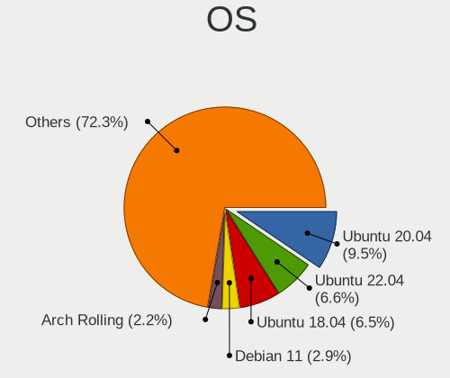

| Name                         | Computers | Percent |
|------------------------------|-----------|---------|
| Ubuntu 20.04                 | 234       | 17.16%  |
| Ubuntu 18.04                 | 172       | 12.61%  |
| OpenMandriva 4.2             | 55        | 4.03%   |
| Zorin 15                     | 34        | 2.49%   |
| Linux Mint 20.2              | 30        | 2.2%    |
| OpenMandriva 4.3             | 29        | 2.13%   |
| Linux Mint 20.1              | 26        | 1.91%   |
| Debian 11                    | 26        | 1.91%   |
| Linux Mint 20                | 25        | 1.83%   |
| Xubuntu 20.04                | 24        | 1.76%   |
| Linux Mint 19.3              | 23        | 1.69%   |
| KDE neon 20.04               | 23        | 1.69%   |
| BlackPanther 18.1            | 23        | 1.69%   |
| Ubuntu 19.04                 | 20        | 1.47%   |
| Xubuntu 18.04                | 18        | 1.32%   |
| Fedora 33                    | 18        | 1.32%   |
| Ubuntu 22.04                 | 16        | 1.17%   |
| Ubuntu 19.10                 | 16        | 1.17%   |
| Pop!_OS 21.04                | 16        | 1.17%   |
| Ubuntu 21.10                 | 14        | 1.03%   |
| Ubuntu 21.04                 | 14        | 1.03%   |
| Manjaro                      | 14        | 1.03%   |
| Kubuntu 20.04                | 14        | 1.03%   |
| Fedora 34                    | 14        | 1.03%   |
| ArcoLinux Rolling            | 14        | 1.03%   |
| Arch                         | 14        | 1.03%   |
| Ubuntu MATE 20.04            | 13        | 0.95%   |
| Ubuntu 18.10                 | 13        | 0.95%   |
| Ubuntu 16.04                 | 13        | 0.95%   |
| Pop!_OS 20.04                | 13        | 0.95%   |
| Fedora 32                    | 13        | 0.95%   |
| Arch Rolling                 | 13        | 0.95%   |
| Ubuntu 20.10                 | 12        | 0.88%   |
| Linux Mint 20.3              | 12        | 0.88%   |
| Zorin 16                     | 11        | 0.81%   |
| Debian 10                    | 11        | 0.81%   |
| Pop!_OS 20.10                | 10        | 0.73%   |
| LMDE 4                       | 9         | 0.66%   |
| Fedora 35                    | 9         | 0.66%   |
| openSUSE Tumbleweed-XXXXXXXX | 7         | 0.51%   |
| Linux Mint 19.2              | 7         | 0.51%   |
| Elementary 6                 | 7         | 0.51%   |
| Linux Mint 19.1              | 6         | 0.44%   |
| Fedora 31                    | 6         | 0.44%   |
| Elementary 6.1               | 6         | 0.44%   |
| Debian 9                     | 6         | 0.44%   |
| ROSA R9                      | 5         | 0.37%   |
| ROSA R8.1                    | 5         | 0.37%   |
| Peppermint 10                | 5         | 0.37%   |
| Endless 3.8.0                | 5         | 0.37%   |
| UbuntuDDE 20.04              | 4         | 0.29%   |
| Pop!_OS 21.10                | 4         | 0.29%   |
| OpenMandriva 4.50            | 4         | 0.29%   |
| Lubuntu 18.04                | 4         | 0.29%   |
| KDE neon 18.04               | 4         | 0.29%   |
| Fedora 36                    | 4         | 0.29%   |
| Endless 3.8.4                | 4         | 0.29%   |
| EndeavourOS Rolling          | 4         | 0.29%   |
| Clear Linux 35000            | 4         | 0.29%   |
| Xubuntu 16.04                | 3         | 0.22%   |

OS Family
---------

OS without a version

| Name          | Computers | Percent |
|---------------|-----------|---------|
| Ubuntu        | 510       | 38.84%  |
| Linux Mint    | 122       | 9.29%   |
| OpenMandriva  | 88        | 6.7%    |
| Fedora        | 63        | 4.8%    |
| Xubuntu       | 50        | 3.81%   |
| Zorin         | 47        | 3.58%   |
| Debian        | 47        | 3.58%   |
| Pop!_OS       | 46        | 3.5%    |
| Endless       | 36        | 2.74%   |
| Manjaro       | 31        | 2.36%   |
| KDE neon      | 27        | 2.06%   |
| Arch          | 26        | 1.98%   |
| BlackPanther  | 23        | 1.75%   |
| Kubuntu       | 21        | 1.6%    |
| ROSA          | 20        | 1.52%   |
| Elementary    | 18        | 1.37%   |
| Ubuntu MATE   | 17        | 1.29%   |
| ArcoLinux     | 15        | 1.14%   |
| Ubuntu Budgie | 12        | 0.91%   |
| Lubuntu       | 11        | 0.84%   |
| Clear Linux   | 11        | 0.84%   |
| LMDE          | 9         | 0.69%   |
| openSUSE      | 7         | 0.53%   |
| EndeavourOS   | 7         | 0.53%   |
| Gentoo        | 6         | 0.46%   |
| UbuntuDDE     | 5         | 0.38%   |
| Peppermint    | 5         | 0.38%   |
| LinuxFX       | 4         | 0.3%    |
| RHEL          | 3         | 0.23%   |
| Deepin        | 3         | 0.23%   |
| Sparky        | 2         | 0.15%   |
| Reborn OS     | 2         | 0.15%   |
| Kali          | 2         | 0.15%   |
| Feren OS      | 2         | 0.15%   |
| Devuan        | 2         | 0.15%   |
| CentOS        | 2         | 0.15%   |
| Artix         | 2         | 0.15%   |
| Void Linux    | 1         | 0.08%   |
| Ubuntu Studio | 1         | 0.08%   |
| Q4OS          | 1         | 0.08%   |
| Oracle Linux  | 1         | 0.08%   |
| Mageia        | 1         | 0.08%   |
| Huayra        | 1         | 0.08%   |
| Hefftor       | 1         | 0.08%   |
| Garuda Linux  | 1         | 0.08%   |
| Chrome OS     | 1         | 0.08%   |

Kernel
------

Version of the Linux kernel

| Version                  | Computers | Percent |
|--------------------------|-----------|---------|
| 5.10.14-desktop-1omv4002 | 53        | 3.58%   |
| 5.4.0-42-generic         | 44        | 2.97%   |
| 5.16.7-desktop-1omv4003  | 28        | 1.89%   |
| 5.4.0-26-generic         | 25        | 1.69%   |
| 4.18.16-desktop-1bP      | 22        | 1.49%   |
| 5.4.0-52-generic         | 20        | 1.35%   |
| 5.4.0-48-generic         | 20        | 1.35%   |
| 5.3.0-40-generic         | 17        | 1.15%   |
| 5.4.0-91-generic         | 14        | 0.95%   |
| 5.4.0-40-generic         | 14        | 0.95%   |
| 5.4.0-37-generic         | 14        | 0.95%   |
| 5.3.0-28-generic         | 14        | 0.95%   |
| 5.4.0-74-generic         | 13        | 0.88%   |
| 5.3.0-46-generic         | 13        | 0.88%   |
| 5.8.0-53-generic         | 12        | 0.81%   |
| 5.4.0-72-generic         | 12        | 0.81%   |
| 5.4.0-58-generic         | 12        | 0.81%   |
| 5.4.0-29-generic         | 12        | 0.81%   |
| 5.3.0-53-generic         | 12        | 0.81%   |
| 5.11.0-27-generic        | 12        | 0.81%   |
| 5.4.0-80-generic         | 11        | 0.74%   |
| 5.4.0-47-generic         | 11        | 0.74%   |
| 5.4.0-19-generic         | 11        | 0.74%   |
| 5.13.0-28-generic        | 11        | 0.74%   |
| 5.8.0-43-generic         | 10        | 0.68%   |
| 5.4.0-45-generic         | 10        | 0.68%   |
| 5.11.0-37-generic        | 10        | 0.68%   |
| 4.18.0-15-generic        | 10        | 0.68%   |
| 5.8.0-7630-generic       | 9         | 0.61%   |
| 5.8.0-59-generic         | 9         | 0.61%   |
| 5.4.0-65-generic         | 9         | 0.61%   |
| 5.4.0-31-generic         | 9         | 0.61%   |
| 5.10.0-9-amd64           | 9         | 0.61%   |
| 4.18.0-17-generic        | 9         | 0.61%   |
| 5.8.0-14-generic         | 8         | 0.54%   |
| 5.4.0-73-generic         | 8         | 0.54%   |
| 5.3.0-62-generic         | 8         | 0.54%   |
| 5.3.0-51-generic         | 8         | 0.54%   |
| 5.0.0-32-generic         | 8         | 0.54%   |
| 5.4.0-77-generic         | 7         | 0.47%   |
| 5.4.0-66-generic         | 7         | 0.47%   |
| 5.4.0-53-generic         | 7         | 0.47%   |
| 5.4.0-33-generic         | 7         | 0.47%   |
| 5.3.0-42-generic         | 7         | 0.47%   |
| 5.13.0-40-generic        | 7         | 0.47%   |
| 5.11.0-38-generic        | 7         | 0.47%   |
| 5.11.0-25-generic        | 7         | 0.47%   |
| 5.10.0-8-amd64           | 7         | 0.47%   |
| 5.0.0-13-generic         | 7         | 0.47%   |
| 4.15.0-96-generic        | 7         | 0.47%   |
| 4.15.0-55-generic        | 7         | 0.47%   |
| 4.15.0-47-generic        | 7         | 0.47%   |
| 5.8.0-55-generic         | 6         | 0.41%   |
| 5.8.0-50-generic         | 6         | 0.41%   |
| 5.4.0-89-generic         | 6         | 0.41%   |
| 5.4.0-56-generic         | 6         | 0.41%   |
| 5.4.0-54-generic         | 6         | 0.41%   |
| 5.4.0-28-generic         | 6         | 0.41%   |
| 5.3.0-45-generic         | 6         | 0.41%   |
| 5.15.0-30-generic        | 6         | 0.41%   |

Kernel Family
-------------

Linux kernel without a distro release

| Version | Computers | Percent |
|---------|-----------|---------|
| 5.4.0   | 357       | 25.78%  |
| 4.15.0  | 114       | 8.23%   |
| 5.8.0   | 96        | 6.93%   |
| 5.3.0   | 96        | 6.93%   |
| 5.11.0  | 73        | 5.27%   |
| 5.13.0  | 66        | 4.77%   |
| 5.10.14 | 54        | 3.9%    |
| 5.0.0   | 54        | 3.9%    |
| 4.18.0  | 51        | 3.68%   |
| 5.10.0  | 32        | 2.31%   |
| 5.16.7  | 28        | 2.02%   |
| 4.19.0  | 22        | 1.59%   |
| 4.18.16 | 22        | 1.59%   |
| 5.15.0  | 19        | 1.37%   |
| 5.15.5  | 7         | 0.51%   |
| 4.4.0   | 7         | 0.51%   |
| 5.13.13 | 6         | 0.43%   |
| 5.11.12 | 6         | 0.43%   |
| 5.14.0  | 5         | 0.36%   |
| 5.12.4  | 5         | 0.36%   |
| 4.9.20  | 5         | 0.36%   |
| 5.9.16  | 4         | 0.29%   |
| 5.9.10  | 4         | 0.29%   |
| 5.8.6   | 4         | 0.29%   |
| 5.8.16  | 4         | 0.29%   |
| 5.17.5  | 4         | 0.29%   |
| 5.16.19 | 4         | 0.29%   |
| 5.16.16 | 4         | 0.29%   |
| 5.15.8  | 4         | 0.29%   |
| 5.13.19 | 4         | 0.29%   |
| 5.13.12 | 4         | 0.29%   |
| 5.9.11  | 3         | 0.22%   |
| 5.7.11  | 3         | 0.22%   |
| 5.6.16  | 3         | 0.22%   |
| 5.17.1  | 3         | 0.22%   |
| 5.15.11 | 3         | 0.22%   |
| 5.11.16 | 3         | 0.22%   |
| 5.11.15 | 3         | 0.22%   |
| 4.9.60  | 3         | 0.22%   |
| 4.9.0   | 3         | 0.22%   |
| 5.9.8   | 2         | 0.14%   |
| 5.9.15  | 2         | 0.14%   |
| 5.9.14  | 2         | 0.14%   |
| 5.8.4   | 2         | 0.14%   |
| 5.8.18  | 2         | 0.14%   |
| 5.8.15  | 2         | 0.14%   |
| 5.7.9   | 2         | 0.14%   |
| 5.7.7   | 2         | 0.14%   |
| 5.7.15  | 2         | 0.14%   |
| 5.6.7   | 2         | 0.14%   |
| 5.6.19  | 2         | 0.14%   |
| 5.6.14  | 2         | 0.14%   |
| 5.6.0   | 2         | 0.14%   |
| 5.5.15  | 2         | 0.14%   |
| 5.4.8   | 2         | 0.14%   |
| 5.4.18  | 2         | 0.14%   |
| 5.4.15  | 2         | 0.14%   |
| 5.3.11  | 2         | 0.14%   |
| 5.17.6  | 2         | 0.14%   |
| 5.17.3  | 2         | 0.14%   |

Kernel Major Ver.
-----------------

Linux kernel major version

| Version | Computers | Percent |
|---------|-----------|---------|
| 5.4     | 371       | 27.1%   |
| 5.8     | 119       | 8.69%   |
| 4.15    | 114       | 8.33%   |
| 5.10    | 107       | 7.82%   |
| 5.3     | 98        | 7.16%   |
| 5.11    | 93        | 6.79%   |
| 5.13    | 87        | 6.36%   |
| 4.18    | 75        | 5.48%   |
| 5.0     | 58        | 4.24%   |
| 5.16    | 49        | 3.58%   |
| 5.15    | 45        | 3.29%   |
| 4.19    | 24        | 1.75%   |
| 5.9     | 18        | 1.31%   |
| 4.9     | 17        | 1.24%   |
| 5.6     | 16        | 1.17%   |
| 5.17    | 14        | 1.02%   |
| 5.14    | 13        | 0.95%   |
| 5.7     | 12        | 0.88%   |
| 5.12    | 12        | 0.88%   |
| 4.4     | 7         | 0.51%   |
| 5.5     | 6         | 0.44%   |
| 4.1     | 3         | 0.22%   |
| 4.20    | 2         | 0.15%   |
| 4.13    | 2         | 0.15%   |
| 3.10    | 2         | 0.15%   |
| 5.2     | 1         | 0.07%   |
| 5.1     | 1         | 0.07%   |
| 4.17    | 1         | 0.07%   |
| 4.10    | 1         | 0.07%   |
| 3.16    | 1         | 0.07%   |

Arch
----

OS architecture (x86_64, i586, etc.)

| Name    | Computers | Percent |
|---------|-----------|---------|
| x86_64  | 1195      | 93.36%  |
| i686    | 82        | 6.41%   |
| aarch64 | 2         | 0.16%   |
| armv7l  | 1         | 0.08%   |

DE
--

Desktop Environment

| Name             | Computers | Percent |
|------------------|-----------|---------|
| GNOME            | 541       | 40.86%  |
| Unknown          | 189       | 14.27%  |
| KDE5             | 182       | 13.75%  |
| XFCE             | 122       | 9.21%   |
| X-Cinnamon       | 80        | 6.04%   |
| MATE             | 51        | 3.85%   |
| KDE              | 41        | 3.1%    |
| Pantheon         | 15        | 1.13%   |
| LXQt             | 13        | 0.98%   |
| KDE4             | 13        | 0.98%   |
| Budgie           | 13        | 0.98%   |
| Unity            | 12        | 0.91%   |
| LXDE             | 11        | 0.83%   |
| Cinnamon         | 11        | 0.83%   |
| i3               | 8         | 0.6%    |
| Deepin           | 8         | 0.6%    |
| xmonad           | 2         | 0.15%   |
| GNOME Flashback  | 2         | 0.15%   |
| UKUI             | 1         | 0.08%   |
| trinity          | 1         | 0.08%   |
| sway             | 1         | 0.08%   |
| qtile            | 1         | 0.08%   |
| openbox          | 1         | 0.08%   |
| lightdm-xsession | 1         | 0.08%   |
| i3-with-shmlog   | 1         | 0.08%   |
| dwm              | 1         | 0.08%   |
| Cutefish         | 1         | 0.08%   |
| bspwm            | 1         | 0.08%   |

Display Server
--------------

X11 or Wayland

| Name    | Computers | Percent |
|---------|-----------|---------|
| X11     | 1084      | 83.19%  |
| Wayland | 105       | 8.06%   |
| Unknown | 103       | 7.9%    |
| Tty     | 11        | 0.84%   |

Display Manager
---------------

SDDM, LightDM, etc.

| Name    | Computers | Percent |
|---------|-----------|---------|
| Unknown | 813       | 61.97%  |
| SDDM    | 176       | 13.41%  |
| GDM     | 129       | 9.83%   |
| LightDM | 73        | 5.56%   |
| TDM     | 50        | 3.81%   |
| GDM3    | 50        | 3.81%   |
| KDM     | 13        | 0.99%   |
| SLiM    | 3         | 0.23%   |
| XDM     | 2         | 0.15%   |
| LXDM    | 2         | 0.15%   |
| GREETD  | 1         | 0.08%   |

OS Lang
-------

Language

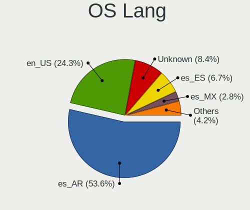

| Lang        | Computers | Percent |
|-------------|-----------|---------|
| es_AR       | 709       | 54.25%  |
| en_US       | 265       | 20.28%  |
| Unknown     | 200       | 15.3%   |
| es_ES       | 72        | 5.51%   |
| es_MX       | 21        | 1.61%   |
| C           | 19        | 1.45%   |
| en_GB       | 9         | 0.69%   |
| pt_BR       | 3         | 0.23%   |
| es_CL       | 2         | 0.15%   |
| ru_RU       | 1         | 0.08%   |
| POSIX       | 1         | 0.08%   |
| fr_FR       | 1         | 0.08%   |
| es_UY       | 1         | 0.08%   |
| es_AR.UtF-8 | 1         | 0.08%   |
| en_CA       | 1         | 0.08%   |
| C.UTF8      | 1         | 0.08%   |

Boot Mode
---------

EFI or BIOS

| Mode | Computers | Percent |
|------|-----------|---------|
| BIOS | 785       | 60.25%  |
| EFI  | 518       | 39.75%  |

Filesystem
----------

Type of filesystem

| Type    | Computers | Percent |
|---------|-----------|---------|
| Ext4    | 1053      | 80.88%  |
| Overlay | 119       | 9.14%   |
| Btrfs   | 52        | 3.99%   |
| Unknown | 52        | 3.99%   |
| Xfs     | 13        | 1%      |
| Ext2    | 5         | 0.38%   |
| Zfs     | 3         | 0.23%   |
| Ext3    | 2         | 0.15%   |
| Tmpfs   | 1         | 0.08%   |
| F2fs    | 1         | 0.08%   |
| Aufs    | 1         | 0.08%   |

Part. scheme
------------

Scheme of partitioning

| Type    | Computers | Percent |
|---------|-----------|---------|
| Unknown | 861       | 66.54%  |
| GPT     | 284       | 21.95%  |
| MBR     | 149       | 11.51%  |

Dual Boot with Linux/BSD
------------------------

Hosting more than one Linux/BSD

| Dual boot | Computers | Percent |
|-----------|-----------|---------|
| No        | 1114      | 85.76%  |
| Yes       | 185       | 14.24%  |

Dual Boot (Win)
---------------

Hosting Linux and Windows

| Dual boot | Computers | Percent |
|-----------|-----------|---------|
| No        | 868       | 66.87%  |
| Yes       | 430       | 33.13%  |

Board
-----

Vendor
------

Motherboard manufacturer

| Name                       | Computers | Percent |
|----------------------------|-----------|---------|
| ASUSTek Computer           | 244       | 19.06%  |
| Gigabyte Technology        | 163       | 12.73%  |
| Lenovo                     | 152       | 11.88%  |
| Hewlett-Packard            | 112       | 8.75%   |
| Dell                       | 103       | 8.05%   |
| MSI                        | 83        | 6.48%   |
| ASRock                     | 71        | 5.55%   |
| Acer                       | 36        | 2.81%   |
| Intel                      | 35        | 2.73%   |
| BANGHO                     | 34        | 2.66%   |
| Toshiba                    | 25        | 1.95%   |
| Samsung Electronics        | 23        | 1.8%    |
| Exo                        | 22        | 1.72%   |
| Positivo                   | 18        | 1.41%   |
| Sony                       | 15        | 1.17%   |
| ECS                        | 13        | 1.02%   |
| Apple                      | 12        | 0.94%   |
| Biostar                    | 9         | 0.7%    |
| Compal                     | 8         | 0.63%   |
| Unknown                    | 8         | 0.63%   |
| Clevo                      | 6         | 0.47%   |
| Quanta                     | 5         | 0.39%   |
| Noblex                     | 5         | 0.39%   |
| Foxconn                    | 5         | 0.39%   |
| AMI                        | 5         | 0.39%   |
| Advantec                   | 5         | 0.39%   |
| Standard                   | 4         | 0.31%   |
| HUAWEI                     | 4         | 0.31%   |
| Coradir                    | 4         | 0.31%   |
| System76                   | 3         | 0.23%   |
| KANJI                      | 3         | 0.23%   |
| Raspberry Pi Foundation    | 2         | 0.16%   |
| Radio Victoria Fueguina    | 2         | 0.16%   |
| Pegatron                   | 2         | 0.16%   |
| PCChips                    | 2         | 0.16%   |
| Packard Bell               | 2         | 0.16%   |
| NSX                        | 2         | 0.16%   |
| Garbarino SAIC             | 2         | 0.16%   |
| VS Company                 | 1         | 0.08%   |
| Supermicro                 | 1         | 0.08%   |
| Sun Microsystems           | 1         | 0.08%   |
| PEAQ                       | 1         | 0.08%   |
| PCBOX                      | 1         | 0.08%   |
| Olivetti                   | 1         | 0.08%   |
| Olidata                    | 1         | 0.08%   |
| Nvidia                     | 1         | 0.08%   |
| Notebook                   | 1         | 0.08%   |
| NCR                        | 1         | 0.08%   |
| Microsoft                  | 1         | 0.08%   |
| LG Electronics             | 1         | 0.08%   |
| Kelyx Argentina            | 1         | 0.08%   |
| Juana Manso                | 1         | 0.08%   |
| Insyde                     | 1         | 0.08%   |
| IBM                        | 1         | 0.08%   |
| HONOR                      | 1         | 0.08%   |
| HDC High Designed Computer | 1         | 0.08%   |
| Gateway                    | 1         | 0.08%   |
| Gadnic                     | 1         | 0.08%   |
| Fujitsu Siemens            | 1         | 0.08%   |
| EPoX Computer              | 1         | 0.08%   |

Model
-----

Motherboard model

| Name                                       | Computers | Percent |
|--------------------------------------------|-----------|---------|
| Unknown                                    | 20        | 1.56%   |
| MSI MS-7721                                | 18        | 1.41%   |
| ASUS All Series                            | 13        | 1.02%   |
| ASUS PRIME A320M-K                         | 9         | 0.7%    |
| Gigabyte H81M-H                            | 8         | 0.63%   |
| Gigabyte F2A68HM-H                         | 8         | 0.63%   |
| BANGHO MOV                                 | 8         | 0.63%   |
| ASUS PRIME B450M-A                         | 8         | 0.63%   |
| Lenovo V330-15IKB 81AX                     | 7         | 0.55%   |
| Gigabyte A320M-S2H                         | 7         | 0.55%   |
| BANGHO Suma 1025                           | 7         | 0.55%   |
| ASUS P5KPL-AM SE                           | 7         | 0.55%   |
| MSI MS-7A15                                | 6         | 0.47%   |
| Lenovo ThinkPad L15 Gen 2 20X4S27200       | 6         | 0.47%   |
| HP Laptop 15-bs0xx                         | 6         | 0.47%   |
| Gigabyte H61M-S1                           | 6         | 0.47%   |
| MSI MS-7C52                                | 5         | 0.39%   |
| HP Pavilion dv6                            | 5         | 0.39%   |
| HP Notebook                                | 5         | 0.39%   |
| Gigabyte A320M-S2H V2                      | 5         | 0.39%   |
| Exo CloudbookE15                           | 5         | 0.39%   |
| Dell Inspiron 1525                         | 5         | 0.39%   |
| BANGHO MAX G0101                           | 5         | 0.39%   |
| ASUS VivoBook_ASUSLaptop X509JA_X509JA     | 5         | 0.39%   |
| ASUS VivoBook 15_ASUS Laptop X540UAR       | 5         | 0.39%   |
| MSI MS-7309                                | 4         | 0.31%   |
| Lenovo IdeaPad 320-15ABR 80XS              | 4         | 0.31%   |
| Intel powered classmate PC                 | 4         | 0.31%   |
| Intel DN2820FYB H24582-205                 | 4         | 0.31%   |
| HP Pavilion Notebook                       | 4         | 0.31%   |
| HP 250 G6 Notebook PC                      | 4         | 0.31%   |
| Gigabyte M68MT-S2                          | 4         | 0.31%   |
| Gigabyte H110M-H                           | 4         | 0.31%   |
| Gigabyte F2A55M-HD2                        | 4         | 0.31%   |
| Gigabyte B365M DS3H                        | 4         | 0.31%   |
| ECS H81H3-M4                               | 4         | 0.31%   |
| Dell Latitude 7490                         | 4         | 0.31%   |
| Dell Inspiron 3421                         | 4         | 0.31%   |
| Coradir Coradir/ES10IS5                    | 4         | 0.31%   |
| ASUS VivoBook 15_ASUS Laptop X540MA_X543MA | 4         | 0.31%   |
| ASUS ROG STRIX B550-F GAMING               | 4         | 0.31%   |
| ASUS P5GC-MX/1333                          | 4         | 0.31%   |
| ASUS M4N68T-M-LE-V2                        | 4         | 0.31%   |
| ASUS K53E                                  | 4         | 0.31%   |
| ASUS H61M-K                                | 4         | 0.31%   |
| ASRock H81M-VG4 R2.0                       | 4         | 0.31%   |
| Apple MacBookPro9,2                        | 4         | 0.31%   |
| Samsung 300E4C/300E5C/300E7C               | 3         | 0.23%   |
| Samsung 300E4A/300E5A/300E7A/3430EA/3530EA | 3         | 0.23%   |
| Samsung 300E4A/300E5A/300E7A               | 3         | 0.23%   |
| NOBLEX SF20BA                              | 3         | 0.23%   |
| Lenovo ThinkPad T430 2349DS5               | 3         | 0.23%   |
| Lenovo ThinkBook 14s-IWL 20RM              | 3         | 0.23%   |
| Lenovo G480 20150                          | 3         | 0.23%   |
| Lenovo G470 20078                          | 3         | 0.23%   |
| HP G42                                     | 3         | 0.23%   |
| HP Compaq Presario C700                    | 3         | 0.23%   |
| HP 250 G7 Notebook PC                      | 3         | 0.23%   |
| Gigabyte Z97X-Gaming 3                     | 3         | 0.23%   |
| Gigabyte G31M-ES2C                         | 3         | 0.23%   |

Model Family
------------

Motherboard model prefix

| Name                 | Computers | Percent |
|----------------------|-----------|---------|
| Dell Inspiron        | 58        | 4.53%   |
| Lenovo ThinkPad      | 51        | 3.98%   |
| ASUS PRIME           | 34        | 2.66%   |
| HP Pavilion          | 33        | 2.58%   |
| Acer Aspire          | 33        | 2.58%   |
| Lenovo IdeaPad       | 31        | 2.42%   |
| Dell Latitude        | 29        | 2.27%   |
| ASUS VivoBook        | 25        | 1.95%   |
| Unknown              | 20        | 1.56%   |
| MSI MS-7721          | 18        | 1.41%   |
| HP Laptop            | 16        | 1.25%   |
| Toshiba Satellite    | 15        | 1.17%   |
| ASUS All             | 13        | 1.02%   |
| HP Compaq            | 12        | 0.94%   |
| Gigabyte A320M-S2H   | 12        | 0.94%   |
| HP 250               | 9         | 0.7%    |
| BANGHO MAX           | 9         | 0.7%    |
| ASUS ROG             | 9         | 0.7%    |
| Gigabyte H81M-H      | 8         | 0.63%   |
| Gigabyte F2A68HM-H   | 8         | 0.63%   |
| BANGHO Suma          | 8         | 0.63%   |
| BANGHO MOV           | 8         | 0.63%   |
| ASUS M5A78L-M        | 8         | 0.63%   |
| Lenovo V330-15IKB    | 7         | 0.55%   |
| Gigabyte B450        | 7         | 0.55%   |
| ASUS P5KPL-AM        | 7         | 0.55%   |
| Samsung 300E4A       | 6         | 0.47%   |
| MSI MS-7A15          | 6         | 0.47%   |
| HP EliteBook         | 6         | 0.47%   |
| Gigabyte H61M-S1     | 6         | 0.47%   |
| Dell OptiPlex        | 6         | 0.47%   |
| ASUS M5A97           | 6         | 0.47%   |
| MSI MS-7C52          | 5         | 0.39%   |
| Lenovo ThinkCentre   | 5         | 0.39%   |
| HP ProBook           | 5         | 0.39%   |
| HP Notebook          | 5         | 0.39%   |
| HP ENVY              | 5         | 0.39%   |
| Exo Smart            | 5         | 0.39%   |
| Exo CloudbookE15     | 5         | 0.39%   |
| ASUS TUF             | 5         | 0.39%   |
| ASRock N68-VS3       | 5         | 0.39%   |
| ASRock A320M-HDV     | 5         | 0.39%   |
| Samsung R430         | 4         | 0.31%   |
| MSI MS-7309          | 4         | 0.31%   |
| Lenovo ThinkBook     | 4         | 0.31%   |
| Lenovo IdeaPadFlex   | 4         | 0.31%   |
| Intel powered        | 4         | 0.31%   |
| Intel DN2820FYB      | 4         | 0.31%   |
| Gigabyte Z97X-Gaming | 4         | 0.31%   |
| Gigabyte Z370        | 4         | 0.31%   |
| Gigabyte M68MT-S2    | 4         | 0.31%   |
| Gigabyte H110M-H     | 4         | 0.31%   |
| Gigabyte F2A55M-HD2  | 4         | 0.31%   |
| Gigabyte B365M       | 4         | 0.31%   |
| ECS H81H3-M4         | 4         | 0.31%   |
| Dell Studio          | 4         | 0.31%   |
| Coradir Coradir      | 4         | 0.31%   |
| ASUS P8H61-M         | 4         | 0.31%   |
| ASUS P5GC-MX         | 4         | 0.31%   |
| ASUS M4N68T-M-LE-V2  | 4         | 0.31%   |

MFG Year
--------

Motherboard manufacture year

| Year    | Computers | Percent |
|---------|-----------|---------|
| 2017    | 126       | 9.84%   |
| 2012    | 125       | 9.77%   |
| 2018    | 105       | 8.2%    |
| 2011    | 103       | 8.05%   |
| 2015    | 93        | 7.27%   |
| 2013    | 86        | 6.72%   |
| 2019    | 84        | 6.56%   |
| 2010    | 84        | 6.56%   |
| 2014    | 82        | 6.41%   |
| 2020    | 80        | 6.25%   |
| 2008    | 67        | 5.23%   |
| 2016    | 66        | 5.16%   |
| 2009    | 53        | 4.14%   |
| 2007    | 49        | 3.83%   |
| 2021    | 31        | 2.42%   |
| 2006    | 27        | 2.11%   |
| Unknown | 9         | 0.7%    |
| 2004    | 4         | 0.31%   |
| 2005    | 3         | 0.23%   |
| 2022    | 2         | 0.16%   |
| 2001    | 1         | 0.08%   |

Form Factor
-----------

Physical design of the computer

| Name           | Computers | Percent |
|----------------|-----------|---------|
| Notebook       | 671       | 52.42%  |
| Desktop        | 563       | 43.98%  |
| Convertible    | 16        | 1.25%   |
| Tablet         | 13        | 1.02%   |
| Mini pc        | 8         | 0.63%   |
| All in one     | 5         | 0.39%   |
| System on chip | 3         | 0.23%   |
| Server         | 1         | 0.08%   |

Secure Boot
-----------

Enabled or disabled

| State    | Computers | Percent |
|----------|-----------|---------|
| Disabled | 1204      | 93.77%  |
| Enabled  | 80        | 6.23%   |

Coreboot
--------

Have coreboot on board

| Used | Computers | Percent |
|------|-----------|---------|
| No   | 1279      | 99.92%  |
| Yes  | 1         | 0.08%   |

RAM Size
--------

Total RAM memory

| Size in GB  | Computers | Percent |
|-------------|-----------|---------|
| 3.01-4.0    | 340       | 26.34%  |
| 4.01-8.0    | 288       | 22.31%  |
| 8.01-16.0   | 245       | 18.98%  |
| 16.01-24.0  | 162       | 12.55%  |
| 1.01-2.0    | 126       | 9.76%   |
| 32.01-64.0  | 50        | 3.87%   |
| 2.01-3.0    | 35        | 2.71%   |
| 0.51-1.0    | 23        | 1.78%   |
| 24.01-32.0  | 14        | 1.08%   |
| 64.01-256.0 | 7         | 0.54%   |
| 0.01-0.5    | 1         | 0.08%   |

RAM Used
--------

Used RAM memory

| Used GB    | Computers | Percent |
|------------|-----------|---------|
| 1.01-2.0   | 560       | 40.43%  |
| 2.01-3.0   | 303       | 21.88%  |
| 3.01-4.0   | 152       | 10.97%  |
| 4.01-8.0   | 150       | 10.83%  |
| 0.51-1.0   | 150       | 10.83%  |
| 8.01-16.0  | 41        | 2.96%   |
| 0.01-0.5   | 24        | 1.73%   |
| 16.01-24.0 | 5         | 0.36%   |

Total Drives
------------

Number of drives on board

| Drives | Computers | Percent |
|--------|-----------|---------|
| 1      | 817       | 62.41%  |
| 2      | 329       | 25.13%  |
| 3      | 103       | 7.87%   |
| 4      | 36        | 2.75%   |
| 5      | 11        | 0.84%   |
| 0      | 9         | 0.69%   |
| 7      | 2         | 0.15%   |
| 6      | 2         | 0.15%   |

Has CD-ROM
----------

Has CD-ROM on board

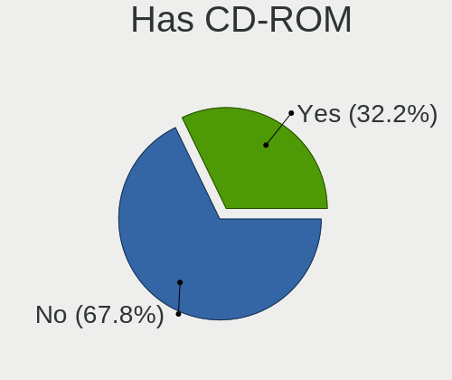

| Presented | Computers | Percent |
|-----------|-----------|---------|
| No        | 761       | 59.04%  |
| Yes       | 528       | 40.96%  |

Has Ethernet
------------

Has Ethernet on board

| Presented | Computers | Percent |
|-----------|-----------|---------|
| Yes       | 1161      | 90.63%  |
| No        | 120       | 9.37%   |

Has WiFi
--------

Has WiFi module

| Presented | Computers | Percent |
|-----------|-----------|---------|
| Yes       | 936       | 72.5%   |
| No        | 355       | 27.5%   |

Has Bluetooth
-------------

Has Bluetooth module

| Presented | Computers | Percent |
|-----------|-----------|---------|
| No        | 732       | 56.74%  |
| Yes       | 558       | 43.26%  |

Location
--------

Country
-------

Geographic location (country)

| Country   | Computers | Percent |
|-----------|-----------|---------|
| Argentina | 1280      | 100%    |

City
----

Geographic location (city)

| City                        | Computers | Percent |
|-----------------------------|-----------|---------|
| Buenos Aires                | 323       | 24.12%  |
| Crdoba                    | 86        | 6.42%   |
| Rosario                     | 55        | 4.11%   |
| La Plata                    | 38        | 2.84%   |
| Mar del Plata               | 36        | 2.69%   |
| Lomas de Zamora             | 18        | 1.34%   |
| Lanus                       | 18        | 1.34%   |
| San Miguel de Tucumn      | 15        | 1.12%   |
| Avellaneda                  | 15        | 1.12%   |
| Ramos Mejia                 | 14        | 1.05%   |
| Florencio Varela            | 13        | 0.97%   |
| Santa Fe                    | 12        | 0.9%    |
| Mendoza                     | 12        | 0.9%    |
| Tandil                      | 11        | 0.82%   |
| Salta                       | 11        | 0.82%   |
| Resistencia                 | 11        | 0.82%   |
| San Telmo                   | 10        | 0.75%   |
| Quilmes                     | 10        | 0.75%   |
| Paran                     | 10        | 0.75%   |
| Olivos                      | 10        | 0.75%   |
| Neuqun                    | 10        | 0.75%   |
| Ituzaingo                   | 10        | 0.75%   |
| Villa Ballester             | 9         | 0.67%   |
| Viedma                      | 9         | 0.67%   |
| San Martn de los Andes    | 9         | 0.67%   |
| San Juan                    | 9         | 0.67%   |
| Corrientes                  | 9         | 0.67%   |
| San Nicols de los Arroyos | 8         | 0.6%    |
| Bariloche                   | 8         | 0.6%    |
| Baha Blanca               | 8         | 0.6%    |
| Yerba Buena                 | 7         | 0.52%   |
| Villa Nueva                 | 7         | 0.52%   |
| San Luis                    | 7         | 0.52%   |
| Posadas                     | 7         | 0.52%   |
| Martinez                    | 7         | 0.52%   |
| Burzaco                     | 7         | 0.52%   |
| Villa Mara                | 6         | 0.45%   |
| Vicente Lopez               | 6         | 0.45%   |
| San Isidro                  | 6         | 0.45%   |
| Ro Gallegos               | 6         | 0.45%   |
| Rafaela                     | 6         | 0.45%   |
| Pilar                       | 6         | 0.45%   |
| Godoy Cruz                  | 6         | 0.45%   |
| General San Martin          | 6         | 0.45%   |
| Ciudad Evita                | 6         | 0.45%   |
| Caseros                     | 6         | 0.45%   |
| Beccar                      | 6         | 0.45%   |
| Villa Allende               | 5         | 0.37%   |
| San Francisco               | 5         | 0.37%   |
| Saenz Pena                  | 5         | 0.37%   |
| Rio Tercero                 | 5         | 0.37%   |
| Ro Cuarto                 | 5         | 0.37%   |
| Mariano Moreno              | 5         | 0.37%   |
| Longchamps                  | 5         | 0.37%   |
| La Rioja                    | 5         | 0.37%   |
| Haedo                       | 5         | 0.37%   |
| Boca de la Zanja            | 5         | 0.37%   |
| Adrogue                     | 5         | 0.37%   |
| Villa Carlos Paz            | 4         | 0.3%    |
| Tigre                       | 4         | 0.3%    |

Drives
------

Drive Vendor
------------

Hard drive vendors

| Vendor                      | Computers | Drives  | Percent |
|-----------------------------|-----------|---------|---------|
| WDC                         | 497       | 732     | 28.66%  |
| Seagate                     | 252       | 308     | 14.53%  |
| Kingston                    | 220       | 280     | 12.69%  |
| Toshiba                     | 159       | 199     | 9.17%   |
| Samsung Electronics         | 154       | 211     | 8.88%   |
| Hitachi                     | 67        | 72      | 3.86%   |
| Unknown                     | 47        | 62      | 2.71%   |
| HGST                        | 42        | 46      | 2.42%   |
| SanDisk                     | 39        | 45      | 2.25%   |
| A-DATA Technology           | 33        | 36      | 1.9%    |
| Gigabyte Technology         | 26        | 40      | 1.5%    |
| SK Hynix                    | 25        | 27      | 1.44%   |
| Crucial                     | 21        | 30      | 1.21%   |
| MAXTOR                      | 13        | 14      | 0.75%   |
| Intel                       | 12        | 28      | 0.69%   |
| Hewlett-Packard             | 11        | 16      | 0.63%   |
| Corsair                     | 11        | 11      | 0.63%   |
| PNY                         | 7         | 14      | 0.4%    |
| Micron Technology           | 7         | 9       | 0.4%    |
| XPG                         | 6         | 6       | 0.35%   |
| Realtek Semiconductor       | 6         | 8       | 0.35%   |
| Colorful                    | 6         | 6       | 0.35%   |
| Phison                      | 5         | 6       | 0.29%   |
| Patriot                     | 5         | 7       | 0.29%   |
| China                       | 5         | 5       | 0.29%   |
| Silicon Motion              | 4         | 5       | 0.23%   |
| Lexar                       | 4         | 4       | 0.23%   |
| KIOXIA                      | 4         | 4       | 0.23%   |
| Union Memory                | 3         | 3       | 0.17%   |
| OCZ                         | 3         | 3       | 0.17%   |
| Hikvision                   | 3         | 3       | 0.17%   |
| Apple                       | 3         | 3       | 0.17%   |
| Union Memory (Shenzhen)     | 2         | 2       | 0.12%   |
| SPCC                        | 2         | 2       | 0.12%   |
| Neo                         | 2         | 2       | 0.12%   |
| Micron/Crucial Technology   | 2         | 4       | 0.12%   |
| LITEONIT                    | 2         | 2       | 0.12%   |
| Fujitsu                     | 2         | 2       | 0.12%   |
| ZTE                         | 1         | 1       | 0.06%   |
| XrayDisk                    | 1         | 1       | 0.06%   |
| WDC WDS2                    | 1         | 1       | 0.06%   |
| USB3.0                      | 1         | 1       | 0.06%   |
| Transcend                   | 1         | 1       | 0.06%   |
| Team                        | 1         | 1       | 0.06%   |
| Super Talent                | 1         | 1       | 0.06%   |
| SMI                         | 1         | 1       | 0.06%   |
| QUANTUM                     | 1         | 1       | 0.06%   |
| Phison Electronics          | 1         | 1       | 0.06%   |
| NGFF                        | 1         | 2       | 0.06%   |
| N300                        | 1         | 1       | 0.06%   |
| MAXIO Technology (Hangzhou) | 1         | 1       | 0.06%   |
| LITEON                      | 1         | 1       | 0.06%   |
| KingFast                    | 1         | 1       | 0.06%   |
| KingDian                    | 1         | 1       | 0.06%   |
| JMicron                     | 1         | Unknown | 0.06%   |
| FORESEE                     | 1         | 1       | 0.06%   |
| ExcelStor                   | 1         | 1       | 0.06%   |
| Envoy                       | 1         | 1       | 0.06%   |
| Biwin                       | 1         | 2       | 0.06%   |
| ADATA Technology            | 1         | 1       | 0.06%   |

Drive Model
-----------

Hard drive models

| Model                               | Computers | Percent |
|-------------------------------------|-----------|---------|
| Kingston SA400S37240G 240GB SSD     | 73        | 3.83%   |
| Kingston SA400S37480G 480GB SSD     | 38        | 1.99%   |
| Seagate ST1000LM035-1RK172 1TB      | 33        | 1.73%   |
| WDC WDS240G2G0A-00JH30 240GB SSD    | 26        | 1.36%   |
| Toshiba MQ01ABD100 1TB              | 25        | 1.31%   |
| Kingston SA400S37120G 120GB SSD     | 25        | 1.31%   |
| WDC WD10EZEX-08WN4A0 1TB            | 24        | 1.26%   |
| Seagate ST1000LM024 HN-M101MBB 1TB  | 23        | 1.21%   |
| Toshiba MQ01ABF050 500GB            | 22        | 1.15%   |
| Seagate ST500DM002-1BD142 500GB     | 19        | 1%      |
| WDC WDS120G2G0A-00JH30 120GB SSD    | 17        | 0.89%   |
| Seagate ST1000DM010-2EP102 1TB      | 17        | 0.89%   |
| WDC WD5000AAKX-001CA0 500GB         | 16        | 0.84%   |
| Unknown MMC Card  32GB              | 15        | 0.79%   |
| WDC WD20EZRZ-00Z5HB0 2TB            | 14        | 0.73%   |
| Kingston SV300S37A120G 120GB SSD    | 14        | 0.73%   |
| WDC WD10EZEX-00BN5A0 1TB            | 13        | 0.68%   |
| Toshiba DT01ACA100 1TB              | 12        | 0.63%   |
| WDC WDS480G2G0A-00JH30 480GB SSD    | 11        | 0.58%   |
| WDC WDS240G2G0B-00EPW0 240GB SSD    | 11        | 0.58%   |
| WDC WD5000AAKX-00ERMA0 500GB        | 11        | 0.58%   |
| Toshiba MQ01ABD032 320GB            | 11        | 0.58%   |
| Kingston SV300S37A240G 240GB SSD    | 11        | 0.58%   |
| Kingston SUV400S37240G 240GB SSD    | 11        | 0.58%   |
| WDC WD1600AABS-00PRA0 160GB         | 10        | 0.52%   |
| Toshiba DT01ACA050 500GB            | 10        | 0.52%   |
| Seagate ST500LT012-1DG142 500GB     | 10        | 0.52%   |
| Seagate ST500LM030-2E717D 500GB     | 10        | 0.52%   |
| WDC WD10JPVX-60JC3T1 1TB            | 9         | 0.47%   |
| Toshiba MQ04ABF100 1TB              | 9         | 0.47%   |
| Samsung HD502HJ 500GB               | 9         | 0.47%   |
| Samsung HD322HJ 320GB               | 9         | 0.47%   |
| Gigabyte GP-GSTFS31240GNTD 240GB    | 9         | 0.47%   |
| Gigabyte GP-GSTFS31120GNTD 120GB    | 9         | 0.47%   |
| WDC WDS500G2B0A-00SM50 500GB SSD    | 8         | 0.42%   |
| WDC WD20EZRX-00D8PB0 2TB            | 8         | 0.42%   |
| WDC WD10EZEX-21WN4A0 1TB            | 8         | 0.42%   |
| Kingston SUV400S37120G 120GB SSD    | 8         | 0.42%   |
| HGST HTS721010A9E630 1TB            | 8         | 0.42%   |
| A-DATA SU630 240GB SSD              | 8         | 0.42%   |
| WDC WD10EZEX-00WN4A0 1TB            | 7         | 0.37%   |
| WDC WD10EARS-00Y5B1 1TB             | 7         | 0.37%   |
| WDC WD1003FZEX-00MK2A0 1TB          | 7         | 0.37%   |
| Seagate ST9500325AS 500GB           | 7         | 0.37%   |
| Samsung SSD 850 EVO 250GB           | 7         | 0.37%   |
| Samsung NVMe SSD Drive 512GB        | 7         | 0.37%   |
| Kingston SA400S37960G 960GB SSD     | 7         | 0.37%   |
| HGST HTS725050A7E630 500GB          | 7         | 0.37%   |
| WDC WD800BD-22MRA1 80GB             | 6         | 0.31%   |
| WDC WD5000LPVX-22V0TT0 500GB        | 6         | 0.31%   |
| Toshiba MK6475GSX 640GB             | 6         | 0.31%   |
| Seagate ST320LM001 HN-M320MBB 320GB | 6         | 0.31%   |
| Seagate ST2000DM008-2FR102 2TB      | 6         | 0.31%   |
| Seagate ST2000DM001-1CH164 2TB      | 6         | 0.31%   |
| Sandisk NVMe SSD Drive 500GB        | 6         | 0.31%   |
| Samsung SSD 840 EVO 250GB           | 6         | 0.31%   |
| Samsung HM250HI 250GB               | 6         | 0.31%   |
| Samsung HD103SJ 1TB                 | 6         | 0.31%   |
| Kingston SHFS37A240G 240GB SSD      | 6         | 0.31%   |
| Hitachi HDS721010CLA332 1TB         | 6         | 0.31%   |

HDD Vendor
----------

Hard disk drive vendors

| Vendor              | Computers | Drives | Percent |
|---------------------|-----------|--------|---------|
| WDC                 | 422       | 601    | 40.85%  |
| Seagate             | 248       | 303    | 24.01%  |
| Toshiba             | 146       | 184    | 14.13%  |
| Samsung Electronics | 90        | 116    | 8.71%   |
| Hitachi             | 67        | 72     | 6.49%   |
| HGST                | 42        | 46     | 4.07%   |
| MAXTOR              | 10        | 10     | 0.97%   |
| Unknown             | 4         | 4      | 0.39%   |
| Fujitsu             | 2         | 2      | 0.19%   |
| QUANTUM             | 1         | 1      | 0.1%    |
| ExcelStor           | 1         | 1      | 0.1%    |

SSD Vendor
----------

Solid state drive vendors

| Vendor              | Computers | Drives | Percent |
|---------------------|-----------|--------|---------|
| Kingston            | 205       | 261    | 40.2%   |
| WDC                 | 83        | 102    | 16.27%  |
| Samsung Electronics | 36        | 56     | 7.06%   |
| A-DATA Technology   | 29        | 30     | 5.69%   |
| Gigabyte Technology | 24        | 38     | 4.71%   |
| SanDisk             | 22        | 27     | 4.31%   |
| Crucial             | 21        | 30     | 4.12%   |
| Corsair             | 9         | 9      | 1.76%   |
| SK Hynix            | 7         | 8      | 1.37%   |
| PNY                 | 7         | 14     | 1.37%   |
| Hewlett-Packard     | 6         | 8      | 1.18%   |
| Colorful            | 6         | 6      | 1.18%   |
| Toshiba             | 5         | 5      | 0.98%   |
| Patriot             | 5         | 7      | 0.98%   |
| Intel               | 5         | 6      | 0.98%   |
| Lexar               | 4         | 4      | 0.78%   |
| China               | 4         | 4      | 0.78%   |
| Seagate             | 3         | 4      | 0.59%   |
| OCZ                 | 3         | 3      | 0.59%   |
| Micron Technology   | 3         | 4      | 0.59%   |
| MAXTOR              | 3         | 4      | 0.59%   |
| SPCC                | 2         | 2      | 0.39%   |
| LITEONIT            | 2         | 2      | 0.39%   |
| Hikvision           | 2         | 2      | 0.39%   |
| Apple               | 2         | 2      | 0.39%   |
| XrayDisk            | 1         | 1      | 0.2%    |
| WDC WDS2            | 1         | 1      | 0.2%    |
| USB3.0              | 1         | 1      | 0.2%    |
| Transcend           | 1         | 1      | 0.2%    |
| Team                | 1         | 1      | 0.2%    |
| Super Talent        | 1         | 1      | 0.2%    |
| SMI                 | 1         | 1      | 0.2%    |
| NGFF                | 1         | 2      | 0.2%    |
| Neo                 | 1         | 1      | 0.2%    |
| LITEON              | 1         | 1      | 0.2%    |
| KingDian            | 1         | 1      | 0.2%    |
| FORESEE             | 1         | 1      | 0.2%    |

Drive Kind
----------

HDD or SSD

| Kind    | Computers | Drives | Percent |
|---------|-----------|--------|---------|
| HDD     | 900       | 1340   | 56.64%  |
| SSD     | 480       | 651    | 30.21%  |
| NVMe    | 154       | 221    | 9.69%   |
| MMC     | 45        | 60     | 2.83%   |
| Unknown | 10        | 8      | 0.63%   |

Drive Connector
---------------

SATA, SAS, NVMe, etc.

| Type | Computers | Drives | Percent |
|------|-----------|--------|---------|
| SATA | 1150      | 1981   | 84.06%  |
| NVMe | 154       | 221    | 11.26%  |
| MMC  | 45        | 60     | 3.29%   |
| SAS  | 19        | 18     | 1.39%   |

Drive Size
----------

Size of hard drive

| Size in TB | Computers | Drives | Percent |
|------------|-----------|--------|---------|
| 0.01-0.5   | 889       | 1301   | 63.86%  |
| 0.51-1.0   | 406       | 557    | 29.17%  |
| 1.01-2.0   | 66        | 91     | 4.74%   |
| 2.01-3.0   | 11        | 12     | 0.79%   |
| 3.01-4.0   | 10        | 17     | 0.72%   |
| 4.01-10.0  | 10        | 13     | 0.72%   |

Space Total
-----------

Amount of disk space available on the file system

| Size in GB     | Computers | Percent |
|----------------|-----------|---------|
| 101-250        | 390       | 28.91%  |
| 251-500        | 318       | 23.57%  |
| 501-1000       | 204       | 15.12%  |
| 1001-2000      | 110       | 8.15%   |
| 51-100         | 90        | 6.67%   |
| 1-20           | 81        | 6%      |
| 21-50          | 71        | 5.26%   |
| Unknown        | 34        | 2.52%   |
| 2001-3000      | 32        | 2.37%   |
| More than 3000 | 19        | 1.41%   |

Space Used
----------

Amount of used disk space

| Used GB        | Computers | Percent |
|----------------|-----------|---------|
| 1-20           | 578       | 41.61%  |
| 21-50          | 226       | 16.27%  |
| 101-250        | 175       | 12.6%   |
| 51-100         | 147       | 10.58%  |
| 251-500        | 111       | 7.99%   |
| 501-1000       | 72        | 5.18%   |
| 1001-2000      | 35        | 2.52%   |
| Unknown        | 34        | 2.45%   |
| More than 3000 | 6         | 0.43%   |
| 2001-3000      | 5         | 0.36%   |

Malfunc. Drives
---------------

Drive models with a malfunction

| Model                              | Computers | Drives | Percent |
|------------------------------------|-----------|--------|---------|
| WDC WD5000AAKX-001CA0 500GB        | 6         | 8      | 4.2%    |
| Seagate ST1000LM035-1RK172 1TB     | 4         | 4      | 2.8%    |
| WDC WD5000BPVT-22HXZT3 500GB       | 3         | 3      | 2.1%    |
| WDC WD10EZEX-08WN4A0 1TB           | 3         | 3      | 2.1%    |
| WDC WD10EZEX-00BN5A0 1TB           | 3         | 3      | 2.1%    |
| Toshiba MQ01ABD100 1TB             | 3         | 5      | 2.1%    |
| Toshiba MK1665GSX 160GB            | 3         | 3      | 2.1%    |
| WDC WDS240G2G0A-00JH30 240GB SSD   | 2         | 2      | 1.4%    |
| WDC WD5000AAKX-00ERMA0 500GB       | 2         | 2      | 1.4%    |
| WDC WD10EARS-00Y5B1 1TB            | 2         | 2      | 1.4%    |
| WDC WD1002FAEX-00Y9A0 1TB          | 2         | 2      | 1.4%    |
| Seagate ST9500325AS 500GB          | 2         | 2      | 1.4%    |
| Seagate ST500DM002-1BD142 500GB    | 2         | 2      | 1.4%    |
| Seagate ST1500DL003-9VT16L 1TB     | 2         | 2      | 1.4%    |
| Seagate ST1000LM024 HN-M101MBB 1TB | 2         | 2      | 1.4%    |
| Samsung Electronics SP0411N 34GB   | 2         | 3      | 1.4%    |
| Samsung Electronics HD322HJ 320GB  | 2         | 2      | 1.4%    |
| Kingston SUV400S37240G 240GB SSD   | 2         | 2      | 1.4%    |
| Kingston SA400S37240G 240GB SSD    | 2         | 2      | 1.4%    |
| HGST HTS541010A9E680 1TB           | 2         | 2      | 1.4%    |
| WDC WDS480G2G0A-00JH30 480GB SSD   | 1         | 2      | 0.7%    |
| WDC WDS120G2G0A-00JH30 120GB SSD   | 1         | 1      | 0.7%    |
| WDC WD800JD-00MSA1 80GB            | 1         | 1      | 0.7%    |
| WDC WD800BD-22MRA1 80GB            | 1         | 1      | 0.7%    |
| WDC WD800BB-75JHC0 80GB            | 1         | 1      | 0.7%    |
| WDC WD800BB-00JHC0 80GB            | 1         | 1      | 0.7%    |
| WDC WD5000AAVS-00G9B1 500GB        | 1         | 1      | 0.7%    |
| WDC WD5000AAKX-08ERMA0 500GB       | 1         | 1      | 0.7%    |
| WDC WD400BB-23DEA0 40GB            | 1         | 1      | 0.7%    |
| WDC WD3200AAKS-00L9A0 320GB        | 1         | 1      | 0.7%    |
| WDC WD3200AAJS-65M0A0 320GB        | 1         | 1      | 0.7%    |
| WDC WD3200AAJS-56B4A0 320GB        | 1         | 2      | 0.7%    |
| WDC WD3200AAJS-00YZCA0 320GB       | 1         | 1      | 0.7%    |
| WDC WD30EZRX-00SPEB0 3TB           | 1         | 1      | 0.7%    |
| WDC WD2500BEVT-75A23T0 250GB       | 1         | 1      | 0.7%    |
| WDC WD2500AAJS-00B4A0 250GB        | 1         | 1      | 0.7%    |
| WDC WD20PURZ-85GU6Y0 2TB           | 1         | 2      | 0.7%    |
| WDC WD20EZRZ-00Z5HB0 2TB           | 1         | 1      | 0.7%    |
| WDC WD20EZRX-00D8PB0 2TB           | 1         | 1      | 0.7%    |
| WDC WD20EARX-00ZUDB0 2TB           | 1         | 1      | 0.7%    |
| WDC WD20EARS-00MVWB0 2TB           | 1         | 1      | 0.7%    |
| WDC WD1600BEVT-60ZCT1 160GB        | 1         | 1      | 0.7%    |
| WDC WD1600AAJS-00L7A0 160GB        | 1         | 1      | 0.7%    |
| WDC WD15EARS-00S0XB0 1TB           | 1         | 1      | 0.7%    |
| WDC WD10JPVX-60JC3T0 1TB           | 1         | 1      | 0.7%    |
| WDC WD10JPVT-24A1YT0 1TB           | 1         | 1      | 0.7%    |
| WDC WD10EZEX-60WN4A1 1TB           | 1         | 1      | 0.7%    |
| WDC WD10EZEX-60M2NA0 1TB           | 1         | 1      | 0.7%    |
| WDC WD10EZEX-07ZF5A0 1TB           | 1         | 1      | 0.7%    |
| WDC WD10EZEX-00RKKA0 1TB           | 1         | 1      | 0.7%    |
| WDC WD10EARX-00N0YB0 1TB           | 1         | 1      | 0.7%    |
| WDC WD10EARS-00MVWB0 1TB           | 1         | 1      | 0.7%    |
| WDC WD1003FZEX-00K3CA0 1TB         | 1         | 1      | 0.7%    |
| WDC WD1002FAEX-00Z3A0 1TB          | 1         | 1      | 0.7%    |
| Toshiba MQ01ABF050 500GB           | 1         | 1      | 0.7%    |
| Toshiba MQ01ABF032 320GB           | 1         | 1      | 0.7%    |
| Toshiba MQ01ABD050 500GB           | 1         | 1      | 0.7%    |
| Toshiba MQ01ABD032 320GB           | 1         | 1      | 0.7%    |
| Toshiba MK7559GSXP 752GB           | 1         | 1      | 0.7%    |
| Toshiba MK6461GSY 640GB            | 1         | 1      | 0.7%    |

Malfunc. Drive Vendor
---------------------

Vendors of faulty drives

| Vendor              | Computers | Drives | Percent |
|---------------------|-----------|--------|---------|
| WDC                 | 50        | 62     | 37.04%  |
| Seagate             | 30        | 33     | 22.22%  |
| Toshiba             | 17        | 19     | 12.59%  |
| Samsung Electronics | 13        | 15     | 9.63%   |
| Hitachi             | 7         | 7      | 5.19%   |
| HGST                | 7         | 8      | 5.19%   |
| Kingston            | 5         | 5      | 3.7%    |
| MAXTOR              | 2         | 2      | 1.48%   |
| A-DATA Technology   | 2         | 2      | 1.48%   |
| SMI                 | 1         | 1      | 0.74%   |
| QUANTUM             | 1         | 1      | 0.74%   |

Malfunc. HDD Vendor
-------------------

Vendors of faulty HDD drives

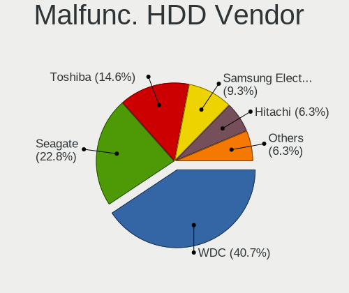

| Vendor              | Computers | Drives | Percent |
|---------------------|-----------|--------|---------|
| WDC                 | 46        | 57     | 38.02%  |
| Seagate             | 30        | 33     | 24.79%  |
| Toshiba             | 17        | 19     | 14.05%  |
| Samsung Electronics | 11        | 13     | 9.09%   |
| Hitachi             | 7         | 7      | 5.79%   |
| HGST                | 7         | 8      | 5.79%   |
| MAXTOR              | 2         | 2      | 1.65%   |
| QUANTUM             | 1         | 1      | 0.83%   |

Malfunc. Drive Kind
-------------------

Kinds of faulty drives

| Kind | Computers | Drives | Percent |
|------|-----------|--------|---------|
| HDD  | 112       | 140    | 88.89%  |
| SSD  | 14        | 15     | 11.11%  |

Failed Drives
-------------

Failed drive models

| Model                             | Computers | Drives | Percent |
|-----------------------------------|-----------|--------|---------|
| WDC WD5000BEVT-22ZAT0 500GB       | 2         | 2      | 28.57%  |
| WDC WD1600BEVT-80A23T0 160GB      | 1         | 1      | 14.29%  |
| Toshiba MK6475GSX 640GB           | 1         | 1      | 14.29%  |
| Toshiba MK1665GSX 160GB           | 1         | 1      | 14.29%  |
| Samsung Electronics HD502HJ 500GB | 1         | 1      | 14.29%  |
| Samsung Electronics HD103SJ 1TB   | 1         | 1      | 14.29%  |

Failed Drive Vendor
-------------------

Failed drive vendors

| Vendor              | Computers | Drives | Percent |
|---------------------|-----------|--------|---------|
| WDC                 | 3         | 3      | 42.86%  |
| Toshiba             | 2         | 2      | 28.57%  |
| Samsung Electronics | 2         | 2      | 28.57%  |

Drive Status
------------

Number of failed and malfunc. drives

| Status   | Computers | Drives | Percent |
|----------|-----------|--------|---------|
| Detected | 869       | 1518   | 64.13%  |
| Works    | 356       | 600    | 26.27%  |
| Malfunc  | 123       | 155    | 9.08%   |
| Failed   | 7         | 7      | 0.52%   |

Storage controller
------------------

Storage Vendor
--------------

Storage controller vendors

| Vendor                           | Computers | Percent |
|----------------------------------|-----------|---------|
| Intel                            | 829       | 58.79%  |
| AMD                              | 290       | 20.57%  |
| Nvidia                           | 62        | 4.4%    |
| Sandisk                          | 33        | 2.34%   |
| Samsung Electronics              | 33        | 2.34%   |
| VIA Technologies                 | 24        | 1.7%    |
| SK Hynix                         | 18        | 1.28%   |
| Kingston Technology Company      | 17        | 1.21%   |
| Silicon Integrated Systems [SiS] | 13        | 0.92%   |
| Realtek Semiconductor            | 12        | 0.85%   |
| JMicron Technology               | 12        | 0.85%   |
| ASMedia Technology               | 10        | 0.71%   |
| Toshiba America Info Systems     | 9         | 0.64%   |
| Phison Electronics               | 9         | 0.64%   |
| Silicon Motion                   | 8         | 0.57%   |
| Marvell Technology Group         | 6         | 0.43%   |
| KIOXIA                           | 5         | 0.35%   |
| Union Memory (Shenzhen)          | 4         | 0.28%   |
| Micron Technology                | 4         | 0.28%   |
| ADATA Technology                 | 4         | 0.28%   |
| Micron/Crucial Technology        | 2         | 0.14%   |
| Silicon Image                    | 1         | 0.07%   |
| MAXIO Technology (Hangzhou)      | 1         | 0.07%   |
| Broadcom / LSI                   | 1         | 0.07%   |
| Biwin Storage Technology         | 1         | 0.07%   |
| Apple                            | 1         | 0.07%   |
| Adaptec                          | 1         | 0.07%   |

Storage Model
-------------

Storage controller models

| Model                                                                                   | Computers | Percent |
|-----------------------------------------------------------------------------------------|-----------|---------|
| AMD FCH SATA Controller [AHCI mode]                                                     | 183       | 10.36%  |
| Intel Sunrise Point-LP SATA Controller [AHCI mode]                                      | 97        | 5.49%   |
| Intel 7 Series Chipset Family 6-port SATA Controller [AHCI mode]                        | 79        | 4.47%   |
| Nvidia MCP61 SATA Controller                                                            | 53        | 3%      |
| Intel NM10/ICH7 Family SATA Controller [IDE mode]                                       | 50        | 2.83%   |
| Intel 8 Series/C220 Series Chipset Family 6-port SATA Controller 1 [AHCI mode]          | 49        | 2.77%   |
| Nvidia MCP61 IDE                                                                        | 47        | 2.66%   |
| Intel 82801G (ICH7 Family) IDE Controller                                               | 44        | 2.49%   |
| Intel 6 Series/C200 Series Chipset Family 6 port Mobile SATA AHCI Controller            | 43        | 2.43%   |
| AMD SB7x0/SB8x0/SB9x0 IDE Controller                                                    | 41        | 2.32%   |
| Intel 82801 Mobile SATA Controller [RAID mode]                                          | 40        | 2.26%   |
| Intel Q170/Q150/B150/H170/H110/Z170/CM236 Chipset SATA Controller [AHCI Mode]           | 38        | 2.15%   |
| AMD FCH SATA Controller D                                                               | 36        | 2.04%   |
| AMD SB7x0/SB8x0/SB9x0 SATA Controller [IDE mode]                                        | 34        | 1.92%   |
| Intel Atom Processor E3800 Series SATA AHCI Controller                                  | 33        | 1.87%   |
| AMD SB7x0/SB8x0/SB9x0 SATA Controller [AHCI mode]                                       | 30        | 1.7%    |
| AMD 400 Series Chipset SATA Controller                                                  | 27        | 1.53%   |
| Intel 82801IBM/IEM (ICH9M/ICH9M-E) 4 port SATA Controller [AHCI mode]                   | 26        | 1.47%   |
| Intel Wildcat Point-LP SATA Controller [AHCI Mode]                                      | 22        | 1.25%   |
| Intel 200 Series PCH SATA controller [AHCI mode]                                        | 22        | 1.25%   |
| AMD FCH IDE Controller                                                                  | 22        | 1.25%   |
| Intel NM10/ICH7 Family SATA Controller [AHCI mode]                                      | 21        | 1.19%   |
| Samsung NVMe SSD Controller SM981/PM981/PM983                                           | 20        | 1.13%   |
| Intel 6 Series/C200 Series Chipset Family 6 port Desktop SATA AHCI Controller           | 20        | 1.13%   |
| Intel 5 Series/3400 Series Chipset 4 port SATA AHCI Controller                          | 20        | 1.13%   |
| AMD FCH SATA Controller [IDE mode]                                                      | 20        | 1.13%   |
| Intel 8 Series SATA Controller 1 [AHCI mode]                                            | 19        | 1.08%   |
| Intel 6 Series/C200 Series Chipset Family Desktop SATA Controller (IDE mode, ports 4-5) | 17        | 0.96%   |
| Intel 6 Series/C200 Series Chipset Family Desktop SATA Controller (IDE mode, ports 0-3) | 17        | 0.96%   |
| Intel Celeron N3350/Pentium N4200/Atom E3900 Series SATA AHCI Controller                | 16        | 0.91%   |
| Intel 82801HM/HEM (ICH8M/ICH8M-E) IDE Controller                                        | 16        | 0.91%   |
| VIA VT82C586A/B/VT82C686/A/B/VT823x/A/C PIPC Bus Master IDE                             | 15        | 0.85%   |
| Intel Celeron/Pentium Silver Processor SATA Controller                                  | 15        | 0.85%   |
| Intel 82801HM/HEM (ICH8M/ICH8M-E) SATA Controller [AHCI mode]                           | 15        | 0.85%   |
| Silicon Integrated Systems [SiS] 5513 IDE Controller                                    | 13        | 0.74%   |
| Intel Comet Lake SATA AHCI Controller                                                   | 13        | 0.74%   |
| Intel Cannon Lake PCH SATA AHCI Controller                                              | 13        | 0.74%   |
| AMD 300 Series Chipset SATA Controller                                                  | 13        | 0.74%   |
| Sandisk WD Blue SN550 NVMe SSD                                                          | 12        | 0.68%   |
| Intel HM170/QM170 Chipset SATA Controller [AHCI Mode]                                   | 11        | 0.62%   |
| Intel Atom/Celeron/Pentium Processor x5-E8000/J3xxx/N3xxx Series SATA Controller        | 11        | 0.62%   |
| AMD 500 Series Chipset SATA Controller                                                  | 11        | 0.62%   |
| Samsung NVMe SSD Controller 980                                                         | 10        | 0.57%   |
| Intel 7 Series/C210 Series Chipset Family 6-port SATA Controller [AHCI mode]            | 10        | 0.57%   |
| ASMedia ASM1062 Serial ATA Controller                                                   | 10        | 0.57%   |
| Kingston Company A2000 NVMe SSD                                                         | 9         | 0.51%   |
| Intel Cannon Point-LP SATA Controller [AHCI Mode]                                       | 9         | 0.51%   |
| Intel 82801GBM/GHM (ICH7-M Family) SATA Controller [IDE mode]                           | 9         | 0.51%   |
| Silicon Integrated Systems [SiS] SATA Controller / IDE mode                             | 8         | 0.45%   |
| Sandisk Non-Volatile memory controller                                                  | 8         | 0.45%   |
| Intel Ice Lake-LP SATA Controller [AHCI mode]                                           | 8         | 0.45%   |
| Intel 7 Series/C210 Series Chipset Family 4-port SATA Controller [IDE mode]             | 8         | 0.45%   |
| Intel 7 Series/C210 Series Chipset Family 2-port SATA Controller [IDE mode]             | 8         | 0.45%   |
| Intel 400 Series Chipset Family SATA AHCI Controller                                    | 8         | 0.45%   |
| Toshiba America Info Systems XG6 NVMe SSD Controller                                    | 7         | 0.4%    |
| SK Hynix BC501 NVMe Solid State Drive                                                   | 7         | 0.4%    |
| Silicon Motion SM2262/SM2262EN SSD Controller                                           | 7         | 0.4%    |
| Realtek RTS5763DL NVMe SSD Controller                                                   | 7         | 0.4%    |
| Intel 9 Series Chipset Family SATA Controller [AHCI Mode]                               | 7         | 0.4%    |
| Intel 7 Series Chipset Family 4-port SATA Controller [IDE mode]                         | 7         | 0.4%    |

Storage Kind
------------

Kind of storage controller (IDE, SATA, NVMe, SAS, ...)

| Kind | Computers | Percent |
|------|-----------|---------|
| SATA | 945       | 64.15%  |
| IDE  | 313       | 21.25%  |
| NVMe | 156       | 10.59%  |
| RAID | 58        | 3.94%   |
| SCSI | 1         | 0.07%   |

Processor
---------

CPU Vendor
----------

Processor vendors

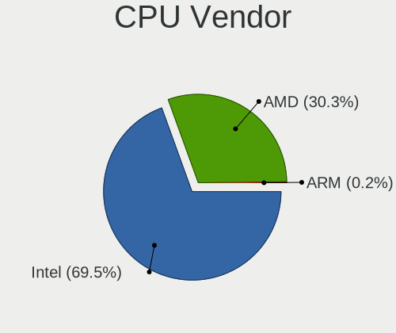

| Vendor | Computers | Percent |
|--------|-----------|---------|
| Intel  | 909       | 71.02%  |
| AMD    | 368       | 28.75%  |
| ARM    | 3         | 0.23%   |

CPU Model
---------

Processor models

| Model                                         | Computers | Percent |
|-----------------------------------------------|-----------|---------|
| Intel Core i5-7200U CPU @ 2.50GHz             | 18        | 1.41%   |
| Intel Core i7-7500U CPU @ 2.70GHz             | 15        | 1.17%   |
| Intel Core i7-6500U CPU @ 2.50GHz             | 14        | 1.09%   |
| Intel Core i5-8250U CPU @ 1.60GHz             | 14        | 1.09%   |
| Intel Celeron CPU N3350 @ 1.10GHz             | 14        | 1.09%   |
| Intel Core i5-6200U CPU @ 2.30GHz             | 13        | 1.02%   |
| Intel Core i5-3210M CPU @ 2.50GHz             | 13        | 1.02%   |
| Intel Celeron N4000 CPU @ 1.10GHz             | 12        | 0.94%   |
| Intel Atom x5-Z8350 CPU @ 1.44GHz             | 12        | 0.94%   |
| Intel 11th Gen Core i7-1165G7 @ 2.80GHz       | 11        | 0.86%   |
| AMD Ryzen 5 3400G with Radeon Vega Graphics   | 11        | 0.86%   |
| Intel Core i5-3320M CPU @ 2.60GHz             | 10        | 0.78%   |
| Intel Atom CPU N2600 @ 1.60GHz                | 10        | 0.78%   |
| Intel Core i7-8550U CPU @ 1.80GHz             | 9         | 0.7%    |
| Intel Core i7-5500U CPU @ 2.40GHz             | 9         | 0.7%    |
| Intel Core i5-7400 CPU @ 3.00GHz              | 9         | 0.7%    |
| Intel Core i5-4440 CPU @ 3.10GHz              | 9         | 0.7%    |
| Intel Core i5-1035G1 CPU @ 1.00GHz            | 9         | 0.7%    |
| Intel Core i3-7100U CPU @ 2.40GHz             | 9         | 0.7%    |
| Intel Core i7-8565U CPU @ 1.80GHz             | 8         | 0.63%   |
| Intel Core i5-8265U CPU @ 1.60GHz             | 8         | 0.63%   |
| Intel Core i5-5200U CPU @ 2.20GHz             | 8         | 0.63%   |
| Intel Core i3-2330M CPU @ 2.20GHz             | 8         | 0.63%   |
| AMD Ryzen 5 2600 Six-Core Processor           | 8         | 0.63%   |
| AMD Athlon II X2 250 Processor                | 8         | 0.63%   |
| AMD A8-9600 RADEON R7, 10 COMPUTE CORES 4C+6G | 8         | 0.63%   |
| Intel Pentium Dual CPU E2180 @ 2.00GHz        | 7         | 0.55%   |
| Intel Core i5-3230M CPU @ 2.60GHz             | 7         | 0.55%   |
| Intel Core i3-6006U CPU @ 2.00GHz             | 7         | 0.55%   |
| Intel Core i3-2350M CPU @ 2.30GHz             | 7         | 0.55%   |
| Intel Core i3-2310M CPU @ 2.10GHz             | 7         | 0.55%   |
| Intel Celeron CPU N2830 @ 2.16GHz             | 7         | 0.55%   |
| Intel Atom CPU N455 @ 1.66GHz                 | 7         | 0.55%   |
| AMD Ryzen 5 2500U with Radeon Vega Mobile Gfx | 7         | 0.55%   |
| AMD Ryzen 3 3200G with Radeon Vega Graphics   | 7         | 0.55%   |
| Intel Pentium Dual-Core CPU T4200 @ 2.00GHz   | 6         | 0.47%   |
| Intel Core i7-3770 CPU @ 3.40GHz              | 6         | 0.47%   |
| Intel Core i5-4460 CPU @ 3.20GHz              | 6         | 0.47%   |
| Intel Core i5-3317U CPU @ 1.70GHz             | 6         | 0.47%   |
| Intel Core i5-2450M CPU @ 2.50GHz             | 6         | 0.47%   |
| Intel Core i5-10210U CPU @ 1.60GHz            | 6         | 0.47%   |
| Intel Core i3-4170 CPU @ 3.70GHz              | 6         | 0.47%   |
| Intel Core i3-2370M CPU @ 2.40GHz             | 6         | 0.47%   |
| Intel Core i3-2100 CPU @ 3.10GHz              | 6         | 0.47%   |
| Intel Core i3-1005G1 CPU @ 1.20GHz            | 6         | 0.47%   |
| Intel Celeron N4020 CPU @ 1.10GHz             | 6         | 0.47%   |
| Intel Celeron CPU N3060 @ 1.60GHz             | 6         | 0.47%   |
| Intel Atom CPU N450 @ 1.66GHz                 | 6         | 0.47%   |
| AMD Ryzen 7 3700X 8-Core Processor            | 6         | 0.47%   |
| AMD Ryzen 5 5600X 6-Core Processor            | 6         | 0.47%   |
| AMD Ryzen 5 3500U with Radeon Vega Mobile Gfx | 6         | 0.47%   |
| AMD Ryzen 3 2200G with Radeon Vega Graphics   | 6         | 0.47%   |
| AMD A4-4000 APU with Radeon HD Graphics       | 6         | 0.47%   |
| Intel Pentium Dual-Core CPU T4400 @ 2.20GHz   | 5         | 0.39%   |
| Intel Pentium Dual-Core CPU E5700 @ 3.00GHz   | 5         | 0.39%   |
| Intel Pentium Dual CPU T2390 @ 1.86GHz        | 5         | 0.39%   |
| Intel Pentium CPU N3540 @ 2.16GHz             | 5         | 0.39%   |
| Intel Core i7-8700 CPU @ 3.20GHz              | 5         | 0.39%   |
| Intel Core i7-8665U CPU @ 1.90GHz             | 5         | 0.39%   |
| Intel Core i7-7700 CPU @ 3.60GHz              | 5         | 0.39%   |

CPU Model Family
----------------

Processor model prefix

| Model                   | Computers | Percent |
|-------------------------|-----------|---------|
| Intel Core i5           | 259       | 20.23%  |
| Intel Core i7           | 168       | 13.13%  |
| Intel Core i3           | 134       | 10.47%  |
| Intel Celeron           | 100       | 7.81%   |
| AMD Ryzen 5             | 65        | 5.08%   |
| Intel Atom              | 46        | 3.59%   |
| Intel Pentium           | 37        | 2.89%   |
| Intel Core 2 Duo        | 34        | 2.66%   |
| Other                   | 31        | 2.42%   |
| Intel Pentium Dual-Core | 31        | 2.42%   |
| AMD A8                  | 30        | 2.34%   |
| AMD Ryzen 7             | 27        | 2.11%   |
| AMD FX                  | 25        | 1.95%   |
| Intel Pentium Dual      | 23        | 1.8%    |
| AMD A6                  | 23        | 1.8%    |
| AMD Ryzen 3             | 20        | 1.56%   |
| AMD Athlon 64 X2        | 20        | 1.56%   |
| AMD Athlon II X2        | 19        | 1.48%   |
| AMD A4                  | 17        | 1.33%   |
| AMD A10                 | 16        | 1.25%   |
| AMD Sempron             | 15        | 1.17%   |
| AMD Phenom II X4        | 11        | 0.86%   |
| AMD Athlon              | 11        | 0.86%   |
| Intel Core 2            | 10        | 0.78%   |
| Intel Pentium D         | 9         | 0.7%    |
| Intel Genuine           | 9         | 0.7%    |
| Intel Pentium 4         | 8         | 0.63%   |
| AMD Phenom II X6        | 8         | 0.63%   |
| AMD Athlon II X4        | 7         | 0.55%   |
| AMD Athlon II X3        | 5         | 0.39%   |
| AMD Athlon II           | 5         | 0.39%   |
| AMD A12                 | 5         | 0.39%   |
| Intel Core 2 Quad       | 4         | 0.31%   |
| AMD Phenom              | 4         | 0.31%   |
| AMD E1                  | 4         | 0.31%   |
| Intel Xeon              | 3         | 0.23%   |
| Intel Pentium Gold      | 3         | 0.23%   |
| AMD Ryzen 9             | 3         | 0.23%   |
| AMD Athlon X2           | 3         | 0.23%   |
| Intel Pentium M         | 2         | 0.16%   |
| Intel Core i9           | 2         | 0.16%   |
| Intel Celeron M         | 2         | 0.16%   |
| AMD Ryzen 7 PRO         | 2         | 0.16%   |
| AMD Phenom II X2        | 2         | 0.16%   |
| AMD E                   | 2         | 0.16%   |
| AMD C-70                | 2         | 0.16%   |
| Intel Core Duo          | 1         | 0.08%   |
| Intel Celeron Dual-Core | 1         | 0.08%   |
| ARM BCM                 | 1         | 0.08%   |
| AMD Z                   | 1         | 0.08%   |
| AMD V120                | 1         | 0.08%   |
| AMD Turion 64 Mobile    | 1         | 0.08%   |
| AMD Ryzen 5 PRO         | 1         | 0.08%   |
| AMD Ryzen 3 PRO         | 1         | 0.08%   |
| AMD Phenom II           | 1         | 0.08%   |
| AMD E2                  | 1         | 0.08%   |
| AMD C-60                | 1         | 0.08%   |
| AMD Athlon XP           | 1         | 0.08%   |
| AMD Athlon Dual Core    | 1         | 0.08%   |
| AMD Athlon 64           | 1         | 0.08%   |

CPU Cores
---------

Number of processor cores

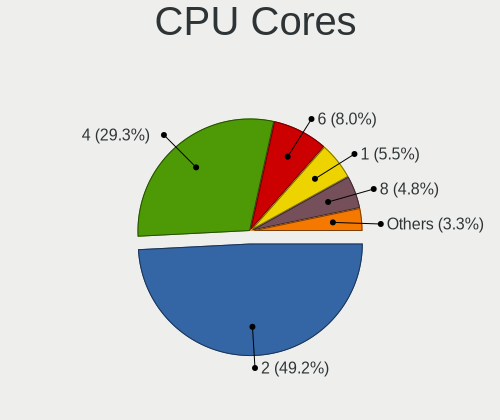

| Number  | Computers | Percent |
|---------|-----------|---------|
| 2       | 684       | 53.44%  |
| 4       | 372       | 29.06%  |
| 1       | 91        | 7.11%   |
| 6       | 75        | 5.86%   |
| 8       | 37        | 2.89%   |
| 3       | 14        | 1.09%   |
| Unknown | 3         | 0.23%   |
| 12      | 2         | 0.16%   |
| 16      | 1         | 0.08%   |
| 10      | 1         | 0.08%   |

CPU Sockets
-----------

Number of sockets

| Number  | Computers | Percent |
|---------|-----------|---------|
| 1       | 1277      | 99.77%  |
| 2       | 2         | 0.16%   |
| Unknown | 1         | 0.08%   |

CPU Threads
-----------

Threads per core (Hyper-Threading)

| Number  | Computers | Percent |
|---------|-----------|---------|
| 2       | 728       | 56.83%  |
| 1       | 550       | 42.94%  |
| Unknown | 3         | 0.23%   |

CPU Op-Modes
------------

CPU Operation Modes (32-bit, 64-bit)

| Op mode        | Computers | Percent |
|----------------|-----------|---------|
| 32-bit, 64-bit | 1230      | 95.72%  |
| Unknown        | 30        | 2.33%   |
| 32-bit         | 18        | 1.4%    |
| 64-bit         | 7         | 0.54%   |

CPU Microcode
-------------

Microcode number

| Number     | Computers | Percent |
|------------|-----------|---------|
| Unknown    | 228       | 17.25%  |
| 0x306a9    | 88        | 6.66%   |
| 0x206a7    | 85        | 6.43%   |
| 0x306c3    | 50        | 3.78%   |
| 0x1067a    | 49        | 3.71%   |
| 0x806e9    | 39        | 2.95%   |
| 0x6fd      | 33        | 2.5%    |
| 0x806ec    | 30        | 2.27%   |
| 0x406e3    | 30        | 2.27%   |
| 0x010000c8 | 29        | 2.19%   |
| 0x906e9    | 27        | 2.04%   |
| 0x306d4    | 24        | 1.82%   |
| 0x08108109 | 24        | 1.82%   |
| 0x506e3    | 22        | 1.66%   |
| 0x906ea    | 21        | 1.59%   |
| 0x30678    | 21        | 1.59%   |
| 0x20655    | 21        | 1.59%   |
| 0x806ea    | 20        | 1.51%   |
| 0x06001119 | 20        | 1.51%   |
| 0x406c4    | 19        | 1.44%   |
| 0x40651    | 17        | 1.29%   |
| 0x06003106 | 16        | 1.21%   |
| 0x706e5    | 15        | 1.13%   |
| 0x506c9    | 15        | 1.13%   |
| 0x106ca    | 15        | 1.13%   |
| 0x806c1    | 14        | 1.06%   |
| 0x0800820d | 13        | 0.98%   |
| 0x06000852 | 13        | 0.98%   |
| 0x706a1    | 12        | 0.91%   |
| 0x0600611a | 12        | 0.91%   |
| 0x08701021 | 11        | 0.83%   |
| 0x30661    | 10        | 0.76%   |
| 0x06006118 | 10        | 0.76%   |
| 0x08101016 | 9         | 0.68%   |
| 0x0810100b | 9         | 0.68%   |
| 0x0600063e | 9         | 0.68%   |
| 0x406c3    | 8         | 0.61%   |
| 0x20652    | 8         | 0.61%   |
| 0x010000c7 | 8         | 0.61%   |
| 0x10676    | 7         | 0.53%   |
| 0x10661    | 7         | 0.53%   |
| 0x06006705 | 7         | 0.53%   |
| 0xa0655    | 6         | 0.45%   |
| 0x6e8      | 6         | 0.45%   |
| 0x08600104 | 6         | 0.45%   |
| 0x08108102 | 6         | 0.45%   |
| 0x010000dc | 6         | 0.45%   |
| 0x010000db | 6         | 0.45%   |
| 0x01000083 | 6         | 0.45%   |
| 0xf65      | 5         | 0.38%   |
| 0xa0653    | 5         | 0.38%   |
| 0x706a8    | 5         | 0.38%   |
| 0x6f2      | 5         | 0.38%   |
| 0x30673    | 5         | 0.38%   |
| 0x0700010f | 5         | 0.38%   |
| 0x03000027 | 5         | 0.38%   |
| 0xf47      | 4         | 0.3%    |
| 0xf43      | 4         | 0.3%    |
| 0xa0652    | 4         | 0.3%    |
| 0x6f6      | 4         | 0.3%    |

CPU Microarch
-------------

Microarchitecture

| Name             | Computers | Percent |
|------------------|-----------|---------|
| KabyLake         | 177       | 13.83%  |
| IvyBridge        | 98        | 7.66%   |
| SandyBridge      | 94        | 7.34%   |
| Haswell          | 79        | 6.17%   |
| K10              | 76        | 5.94%   |
| Skylake          | 64        | 5%      |
| Silvermont       | 63        | 4.92%   |
| Penryn           | 63        | 4.92%   |
| Core             | 55        | 4.3%    |
| Zen+             | 50        | 3.91%   |
| Piledriver       | 40        | 3.13%   |
| Excavator        | 32        | 2.5%    |
| Zen 2            | 31        | 2.42%   |
| Westmere         | 31        | 2.42%   |
| Zen              | 29        | 2.27%   |
| K8 Hammer        | 29        | 2.27%   |
| Bonnell          | 29        | 2.27%   |
| Broadwell        | 24        | 1.88%   |
| Steamroller      | 21        | 1.64%   |
| TigerLake        | 20        | 1.56%   |
| NetBurst         | 20        | 1.56%   |
| Goldmont plus    | 19        | 1.48%   |
| CometLake        | 19        | 1.48%   |
| IceLake          | 18        | 1.41%   |
| Goldmont         | 16        | 1.25%   |
| Zen 3            | 13        | 1.02%   |
| P6               | 11        | 0.86%   |
| K10 Llano        | 10        | 0.78%   |
| Bulldozer        | 10        | 0.78%   |
| Jaguar           | 8         | 0.63%   |
| Puma             | 7         | 0.55%   |
| Bobcat           | 7         | 0.55%   |
| Unknown          | 7         | 0.55%   |
| Nehalem          | 5         | 0.39%   |
| K8 & K10 hybrid  | 2         | 0.16%   |
| K6               | 2         | 0.16%   |
| Alderlake Hybrid | 1         | 0.08%   |

Graphics
--------

GPU Vendor
----------

Vendors of graphics cards

| Vendor                           | Computers | Percent |
|----------------------------------|-----------|---------|
| Intel                            | 776       | 55.47%  |
| AMD                              | 340       | 24.3%   |
| Nvidia                           | 260       | 18.58%  |
| VIA Technologies                 | 11        | 0.79%   |
| Silicon Integrated Systems [SiS] | 11        | 0.79%   |
| ATI Technologies                 | 1         | 0.07%   |

GPU Model
---------

Graphics card models

| Model                                                                                    | Computers | Percent |
|------------------------------------------------------------------------------------------|-----------|---------|
| Intel 2nd Generation Core Processor Family Integrated Graphics Controller                | 84        | 5.79%   |
| Intel 3rd Gen Core processor Graphics Controller                                         | 64        | 4.41%   |
| Intel HD Graphics 620                                                                    | 45        | 3.1%    |
| Intel Skylake GT2 [HD Graphics 520]                                                      | 37        | 2.55%   |
| Intel Atom Processor Z36xxx/Z37xxx Series Graphics & Display                             | 33        | 2.27%   |
| AMD Picasso/Raven 2 [Radeon Vega Series / Radeon Vega Mobile Series]                     | 32        | 2.21%   |
| Intel Atom/Celeron/Pentium Processor x5-E8000/J3xxx/N3xxx Integrated Graphics Controller | 30        | 2.07%   |
| Intel Mobile 4 Series Chipset Integrated Graphics Controller                             | 29        | 2%      |
| Intel Core Processor Integrated Graphics Controller                                      | 28        | 1.93%   |
| Intel UHD Graphics 620                                                                   | 27        | 1.86%   |
| Intel Xeon E3-1200 v3/4th Gen Core Processor Integrated Graphics Controller              | 25        | 1.72%   |
| Intel WhiskeyLake-U GT2 [UHD Graphics 620]                                               | 23        | 1.59%   |
| Intel HD Graphics 5500                                                                   | 23        | 1.59%   |
| AMD Wani [Radeon R5/R6/R7 Graphics]                                                      | 22        | 1.52%   |
| Intel Haswell-ULT Integrated Graphics Controller                                         | 21        | 1.45%   |
| AMD Raven Ridge [Radeon Vega Series / Radeon Vega Mobile Series]                         | 21        | 1.45%   |
| Intel HD Graphics 630                                                                    | 19        | 1.31%   |
| Intel GeminiLake [UHD Graphics 600]                                                      | 19        | 1.31%   |
| Intel TigerLake-LP GT2 [Iris Xe Graphics]                                                | 18        | 1.24%   |
| AMD Ellesmere [Radeon RX 470/480/570/570X/580/580X/590]                                  | 18        | 1.24%   |
| Intel Mobile GM965/GL960 Integrated Graphics Controller (secondary)                      | 17        | 1.17%   |
| Intel Mobile GM965/GL960 Integrated Graphics Controller (primary)                        | 17        | 1.17%   |
| Nvidia C61 [GeForce 7025 / nForce 630a]                                                  | 16        | 1.1%    |
| Intel HD Graphics 500                                                                    | 16        | 1.1%    |
| Intel Atom Processor D4xx/D5xx/N4xx/N5xx Integrated Graphics Controller                  | 16        | 1.1%    |
| Intel Iris Plus Graphics G1 (Ice Lake)                                                   | 15        | 1.03%   |
| Intel HD Graphics 530                                                                    | 15        | 1.03%   |
| Intel CometLake-U GT2 [UHD Graphics]                                                     | 15        | 1.03%   |
| AMD Kaveri [Radeon R7 Graphics]                                                          | 15        | 1.03%   |
| Nvidia GT218 [GeForce 210]                                                               | 14        | 0.96%   |
| Intel Mobile 945GM/GMS/GME, 943/940GML Express Integrated Graphics Controller            | 14        | 0.96%   |
| AMD Cedar [Radeon HD 5000/6000/7350/8350 Series]                                         | 14        | 0.96%   |
| Intel Xeon E3-1200 v2/3rd Gen Core processor Graphics Controller                         | 13        | 0.9%    |
| Intel 82G33/G31 Express Integrated Graphics Controller                                   | 13        | 0.9%    |
| Nvidia GP107 [GeForce GTX 1050 Ti]                                                       | 12        | 0.83%   |
| Nvidia C61 [GeForce 6150SE nForce 430]                                                   | 12        | 0.83%   |
| Intel CoffeeLake-S GT2 [UHD Graphics 630]                                                | 12        | 0.83%   |
| Intel 4 Series Chipset Integrated Graphics Controller                                    | 12        | 0.83%   |
| AMD Renoir                                                                               | 12        | 0.83%   |
| Intel Mobile 945GM/GMS, 943/940GML Express Integrated Graphics Controller                | 11        | 0.76%   |
| Intel 82945G/GZ Integrated Graphics Controller                                           | 11        | 0.76%   |
| Silicon Integrated Systems [SiS] 771/671 PCIE VGA Display Adapter                        | 10        | 0.69%   |
| Intel Atom Processor D2xxx/N2xxx Integrated Graphics Controller                          | 10        | 0.69%   |
| Intel 4th Gen Core Processor Integrated Graphics Controller                              | 10        | 0.69%   |
| Nvidia GK208B [GeForce GT 710]                                                           | 9         | 0.62%   |
| AMD Topaz XT [Radeon R7 M260/M265 / M340/M360 / M440/M445 / 530/535 / 620/625 Mobile]    | 9         | 0.62%   |
| Intel CometLake-S GT2 [UHD Graphics 630]                                                 | 8         | 0.55%   |
| Intel 4th Generation Core Processor Family Integrated Graphics Controller                | 8         | 0.55%   |
| AMD Oland XT [Radeon HD 8670 / R5 340X OEM / R7 250/350/350X OEM]                        | 8         | 0.55%   |
| AMD Lexa PRO [Radeon 540/540X/550/550X / RX 540X/550/550X]                               | 8         | 0.55%   |
| Nvidia GM204 [GeForce GTX 970]                                                           | 7         | 0.48%   |
| Nvidia GM108M [GeForce 940M]                                                             | 7         | 0.48%   |
| AMD Stoney [Radeon R2/R3/R4/R5 Graphics]                                                 | 7         | 0.48%   |
| AMD RS780L [Radeon 3000]                                                                 | 7         | 0.48%   |
| Nvidia GP108M [GeForce MX150]                                                            | 6         | 0.41%   |
| Nvidia GP107M [GeForce GTX 1050 Mobile]                                                  | 6         | 0.41%   |
| Nvidia GP106 [GeForce GTX 1060 6GB]                                                      | 6         | 0.41%   |
| Nvidia GP106 [GeForce GTX 1060 3GB]                                                      | 6         | 0.41%   |
| Intel IvyBridge GT2 [HD Graphics 4000]                                                   | 6         | 0.41%   |
| AMD Trinity 2 [Radeon HD 7480D]                                                          | 6         | 0.41%   |

GPU Combo
---------

Combinations of graphics cards

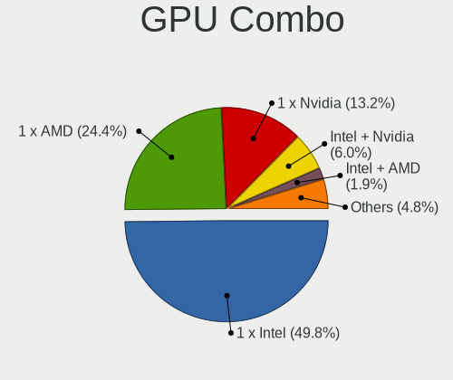

| Name           | Computers | Percent |
|----------------|-----------|---------|
| 1 x Intel      | 666       | 51.91%  |
| 1 x AMD        | 290       | 22.6%   |
| 1 x Nvidia     | 173       | 13.48%  |
| Intel + Nvidia | 75        | 5.85%   |
| Intel + AMD    | 29        | 2.26%   |
| 2 x AMD        | 16        | 1.25%   |
| 1 x VIA        | 11        | 0.86%   |
| 1 x SiS        | 11        | 0.86%   |
| AMD + Nvidia   | 8         | 0.62%   |
| Other          | 3         | 0.23%   |
| 2 x Nvidia     | 1         | 0.08%   |

GPU Driver
----------

Free vs proprietary

| Driver      | Computers | Percent |
|-------------|-----------|---------|
| Free        | 1099      | 85.26%  |
| Proprietary | 115       | 8.92%   |
| Unknown     | 75        | 5.82%   |

GPU Memory
----------

Total video memory

| Size in GB | Computers | Percent |
|------------|-----------|---------|
| Unknown    | 747       | 56.89%  |
| 0.01-0.5   | 177       | 13.48%  |
| 1.01-2.0   | 158       | 12.03%  |
| 0.51-1.0   | 108       | 8.23%   |
| 3.01-4.0   | 73        | 5.56%   |
| 7.01-8.0   | 25        | 1.9%    |
| 5.01-6.0   | 14        | 1.07%   |
| 2.01-3.0   | 7         | 0.53%   |
| 8.01-16.0  | 4         | 0.3%    |

Monitor
-------

Monitor Vendor
--------------

Monitor vendors

| Vendor                  | Computers | Percent |
|-------------------------|-----------|---------|
| Samsung Electronics     | 339       | 25.6%   |
| Goldstar                | 156       | 11.78%  |
| AU Optronics            | 134       | 10.12%  |
| BOE                     | 109       | 8.23%   |
| Chimei Innolux          | 108       | 8.16%   |
| LG Display              | 93        | 7.02%   |
| InfoVision              | 36        | 2.72%   |
| Dell                    | 29        | 2.19%   |
| ViewSonic               | 26        | 1.96%   |
| Hitachi                 | 19        | 1.44%   |
| BenQ                    | 18        | 1.36%   |
| Philips                 | 17        | 1.28%   |
| LG Electronics          | 17        | 1.28%   |
| Lenovo                  | 15        | 1.13%   |
| SKY                     | 14        | 1.06%   |
| Hewlett-Packard         | 14        | 1.06%   |
| Chi Mei Optoelectronics | 13        | 0.98%   |
| Apple                   | 12        | 0.91%   |
| LG Philips              | 10        | 0.76%   |
| InnoLux Display         | 9         | 0.68%   |
| AOC                     | 9         | 0.68%   |
| Unknown                 | 8         | 0.6%    |
| HannStar                | 8         | 0.6%    |
| Sony                    | 7         | 0.53%   |
| SAC                     | 7         | 0.53%   |
| CPT                     | 7         | 0.53%   |
| PANDA                   | 5         | 0.38%   |
| ASUSTek Computer        | 5         | 0.38%   |
| STA                     | 4         | 0.3%    |
| Sharp                   | 4         | 0.3%    |
| MStar                   | 4         | 0.3%    |
| GDH                     | 4         | 0.3%    |
| CDR                     | 4         | 0.3%    |
| Acer                    | 4         | 0.3%    |
| UTV                     | 3         | 0.23%   |
| RTK                     | 3         | 0.23%   |
| HKC                     | 3         | 0.23%   |
| Ancor Communications    | 3         | 0.23%   |
| Unknown (XXX)           | 2         | 0.15%   |
| STD                     | 2         | 0.15%   |
| MTD                     | 2         | 0.15%   |
| LLL                     | 2         | 0.15%   |
| KTC                     | 2         | 0.15%   |
| Konka                   | 2         | 0.15%   |
| KDC                     | 2         | 0.15%   |
| JRY                     | 2         | 0.15%   |
| Hisense                 | 2         | 0.15%   |
| Daewoo                  | 2         | 0.15%   |
| ___                     | 1         | 0.08%   |
| Yuraku                  | 1         | 0.08%   |
| Targa                   | 1         | 0.08%   |
| SNT                     | 1         | 0.08%   |
| SLD                     | 1         | 0.08%   |
| SKK                     | 1         | 0.08%   |
| Sanyo                   | 1         | 0.08%   |
| Quanta Display          | 1         | 0.08%   |
| Panasonic               | 1         | 0.08%   |
| OOO                     | 1         | 0.08%   |
| MLT                     | 1         | 0.08%   |
| LPL                     | 1         | 0.08%   |

Monitor Model
-------------

Monitor models

| Model                                                                | Computers | Percent |
|----------------------------------------------------------------------|-----------|---------|
| Chimei Innolux LCD Monitor CMN15DB 1366x768 344x193mm 15.5-inch      | 18        | 1.32%   |
| InfoVision LCD Monitor IVO03F4 1024x600 223x125mm 10.1-inch          | 16        | 1.17%   |
| Goldstar FULL HD GSM5B55 1920x1080 480x270mm 21.7-inch               | 16        | 1.17%   |
| Chimei Innolux LCD Monitor CMN15E6 1366x768 344x193mm 15.5-inch      | 13        | 0.95%   |
| Samsung Electronics S22D300 SAM0B3F 1920x1080 477x268mm 21.5-inch    | 12        | 0.88%   |
| Goldstar W1943 GSM4BAD 1360x768 406x229mm 18.4-inch                  | 12        | 0.88%   |
| Samsung Electronics C24F390 SAM0D2C 1920x1080 521x293mm 23.5-inch    | 11        | 0.81%   |
| Hitachi HDMI HEC0088 1920x540                                        | 11        | 0.81%   |
| Samsung Electronics S22F350 SAM0D1A 1920x1080 480x270mm 21.7-inch    | 10        | 0.73%   |
| Goldstar W2243 GSM56FE 1920x1080 477x268mm 21.5-inch                 | 10        | 0.73%   |
| Samsung Electronics LCD Monitor SEC5441 1366x768 309x174mm 14.0-inch | 9         | 0.66%   |
| BOE LCD Monitor BOE06A5 1366x768 344x194mm 15.5-inch                 | 9         | 0.66%   |
| SKY TV Monitor SKY0001 1920x1080 885x498mm 40.0-inch                 | 8         | 0.59%   |
| InfoVision LCD Monitor IVO03FA 1366x768 223x125mm 10.1-inch          | 8         | 0.59%   |
| Samsung Electronics SMB1930N SAM0632 1366x768 410x230mm 18.5-inch    | 7         | 0.51%   |
| Samsung Electronics SA300/SA350 SAM0788 1366x768 410x230mm 18.5-inch | 7         | 0.51%   |
| Samsung Electronics S24F350 SAM0D20 1920x1080 521x293mm 23.5-inch    | 7         | 0.51%   |
| Samsung Electronics LCD Monitor SEC4542 1366x768 309x174mm 14.0-inch | 7         | 0.51%   |
| Goldstar IPS FULLHD GSM5AB8 1920x1080 480x270mm 21.7-inch            | 7         | 0.51%   |
| BOE LCD Monitor BOE06A4 1366x768 344x194mm 15.5-inch                 | 7         | 0.51%   |
| AU Optronics LCD Monitor AUO71EC 1366x768 344x193mm 15.5-inch        | 7         | 0.51%   |
| AU Optronics LCD Monitor AUO2E3C 1366x768 309x173mm 13.9-inch        | 7         | 0.51%   |
| Samsung Electronics S19D300 SAM0B35 1366x768 410x230mm 18.5-inch     | 6         | 0.44%   |
| Samsung Electronics LCD Monitor SyncMaster 1680x1050                 | 6         | 0.44%   |
| Samsung Electronics C27F390 SAM0D32 1920x1080 598x336mm 27.0-inch    | 6         | 0.44%   |
| LG Display LCD Monitor LGD02E9 1366x768 309x174mm 14.0-inch          | 6         | 0.44%   |
| Chimei Innolux LCD Monitor CMN14C3 1366x768 309x173mm 13.9-inch      | 6         | 0.44%   |
| AU Optronics LCD Monitor AUO70EC 1366x768 344x193mm 15.5-inch        | 6         | 0.44%   |
| Samsung Electronics SMB2030N SAM0634 1600x900 443x249mm 20.0-inch    | 5         | 0.37%   |
| Samsung Electronics S22D300 SAM0B3E 1920x1080 477x268mm 21.5-inch    | 5         | 0.37%   |
| Samsung Electronics C24F390 SAM0D2D 1920x1080 520x290mm 23.4-inch    | 5         | 0.37%   |
| Philips PHL 223V5 PHLC0CF 1920x1080 480x270mm 21.7-inch              | 5         | 0.37%   |
| LG Display LCD Monitor LGD02DC 1366x768 344x194mm 15.5-inch          | 5         | 0.37%   |
| InfoVision LCD Monitor IVO057A 1366x768 309x174mm 14.0-inch          | 5         | 0.37%   |
| Goldstar W2353 GSM56EE 1920x1080 474x296mm 22.0-inch                 | 5         | 0.37%   |
| Goldstar E2340 GSM57C7 1920x1080 510x290mm 23.1-inch                 | 5         | 0.37%   |
| Goldstar 23EA53 GSM59A8 1920x1080 510x290mm 23.1-inch                | 5         | 0.37%   |
| Chimei Innolux LCD Monitor CMN15F5 1920x1080 344x193mm 15.5-inch     | 5         | 0.37%   |
| BOE LCD Monitor BOE0672 1366x768 344x194mm 15.5-inch                 | 5         | 0.37%   |
| AU Optronics LCD Monitor AUO45EC 1366x768 344x193mm 15.5-inch        | 5         | 0.37%   |
| AU Optronics LCD Monitor AUO183C 1366x768 309x173mm 13.9-inch        | 5         | 0.37%   |
| ViewSonic VG2021wm-2 VSCD91E 1680x1050 433x270mm 20.1-inch           | 4         | 0.29%   |
| Samsung Electronics SyncMaster SAM0599 1600x900 443x249mm 20.0-inch  | 4         | 0.29%   |
| Samsung Electronics SyncMaster SAM0546 1920x1080 510x287mm 23.0-inch | 4         | 0.29%   |
| Samsung Electronics SyncMaster SAM03D7 1680x1050 459x296mm 21.5-inch | 4         | 0.29%   |
| Samsung Electronics SyncMaster SAM01AB 1280x1024 312x234mm 15.4-inch | 4         | 0.29%   |
| Samsung Electronics S23B350 SAM08D6 1920x1080 510x287mm 23.0-inch    | 4         | 0.29%   |
| Samsung Electronics S19D300 SAM0B36 1366x768 410x230mm 18.5-inch     | 4         | 0.29%   |
| Samsung Electronics LCD Monitor SEC4145 1366x768 309x174mm 14.0-inch | 4         | 0.29%   |
| Samsung Electronics LCD Monitor SDC4E51 1366x768 344x194mm 15.5-inch | 4         | 0.29%   |
| MStar Demo MST0030 1920x1080 708x398mm 32.0-inch                     | 4         | 0.29%   |
| LG Display LCD Monitor LGD0335 1366x768 310x174mm 14.0-inch          | 4         | 0.29%   |
| InnoLux Display LCD Monitor INL000A 1366x768 344x194mm 15.5-inch     | 4         | 0.29%   |
| Hitachi HDMI HEC0030 1920x1080 580x330mm 26.3-inch                   | 4         | 0.29%   |
| Hitachi HDMI HEC0029 1920x1080 580x330mm 26.3-inch                   | 4         | 0.29%   |
| HannStar LCD Monitor HSD03E9 1024x600 220x129mm 10.0-inch            | 4         | 0.29%   |
| Goldstar T730SH GSM43CB 1280x960 310x230mm 15.2-inch                 | 4         | 0.29%   |
| Goldstar 23MP55 GSM5A23 1920x1080 510x290mm 23.1-inch                | 4         | 0.29%   |
| Goldstar 23EA53 GSM59A9 1920x1080 510x290mm 23.1-inch                | 4         | 0.29%   |
| Dell E170S DELA04A 1280x1024 338x270mm 17.0-inch                     | 4         | 0.29%   |

Monitor Resolution
------------------

Monitor screen resolution

| Resolution         | Computers | Percent |
|--------------------|-----------|---------|
| 1366x768 (WXGA)    | 465       | 36.16%  |
| 1920x1080 (FHD)    | 437       | 33.98%  |
| 3840x2160 (4K)     | 44        | 3.42%   |
| 1280x1024 (SXGA)   | 44        | 3.42%   |
| 1280x800 (WXGA)    | 43        | 3.34%   |
| 1680x1050 (WSXGA+) | 42        | 3.27%   |
| 1600x900 (HD+)     | 38        | 2.95%   |
| 1360x768           | 36        | 2.8%    |
| 1440x900 (WXGA+)   | 35        | 2.72%   |
| 1920x1200 (WUXGA)  | 19        | 1.48%   |
| 1920x540           | 13        | 1.01%   |
| 1024x600           | 9         | 0.7%    |
| Unknown            | 8         | 0.62%   |
| 2560x1080          | 7         | 0.54%   |
| 1024x768 (XGA)     | 6         | 0.47%   |
| 3200x1800 (QHD+)   | 5         | 0.39%   |
| 1280x720 (HD)      | 5         | 0.39%   |
| 2560x1440 (QHD)    | 4         | 0.31%   |
| 1152x864           | 4         | 0.31%   |
| 3456x2160          | 2         | 0.16%   |
| 2288x1287          | 2         | 0.16%   |
| 2048x1152          | 2         | 0.16%   |
| 1280x960           | 2         | 0.16%   |
| 3840x1080          | 1         | 0.08%   |
| 3440x1440          | 1         | 0.08%   |
| 3286x1080          | 1         | 0.08%   |
| 3280x1080          | 1         | 0.08%   |
| 3046x1050          | 1         | 0.08%   |
| 3000x2000          | 1         | 0.08%   |
| 2880x1800          | 1         | 0.08%   |
| 2736x1824          | 1         | 0.08%   |
| 2646x1024          | 1         | 0.08%   |
| 2048x1536          | 1         | 0.08%   |
| 1792x1344          | 1         | 0.08%   |
| 1680x945           | 1         | 0.08%   |
| 1600x1200          | 1         | 0.08%   |
| 1280x768           | 1         | 0.08%   |

Monitor Diagonal
----------------

Diagonal size in inches

| Inches  | Computers | Percent |
|---------|-----------|---------|
| 15      | 353       | 26.32%  |
| 14      | 134       | 9.99%   |
| 13      | 123       | 9.17%   |
| 21      | 116       | 8.65%   |
| 23      | 111       | 8.28%   |
| 18      | 83        | 6.19%   |
| Unknown | 50        | 3.73%   |
| 17      | 44        | 3.28%   |
| 20      | 36        | 2.68%   |
| 19      | 36        | 2.68%   |
| 24      | 35        | 2.61%   |
| 27      | 29        | 2.16%   |
| 40      | 24        | 1.79%   |
| 10      | 21        | 1.57%   |
| 22      | 19        | 1.42%   |
| 48      | 13        | 0.97%   |
| 31      | 13        | 0.97%   |
| 12      | 13        | 0.97%   |
| 84      | 12        | 0.89%   |
| 16      | 11        | 0.82%   |
| 52      | 10        | 0.75%   |
| 46      | 10        | 0.75%   |
| 11      | 10        | 0.75%   |
| 32      | 9         | 0.67%   |
| 34      | 6         | 0.45%   |
| 54      | 4         | 0.3%    |
| 142     | 2         | 0.15%   |
| 72      | 2         | 0.15%   |
| 47      | 2         | 0.15%   |
| 39      | 2         | 0.15%   |
| 26      | 2         | 0.15%   |
| 25      | 2         | 0.15%   |
| 64      | 1         | 0.07%   |
| 43      | 1         | 0.07%   |
| 41      | 1         | 0.07%   |
| 30      | 1         | 0.07%   |

Monitor Width
-------------

Physical width

| Width in mm    | Computers | Percent |
|----------------|-----------|---------|
| 301-350        | 587       | 44.4%   |
| 401-500        | 278       | 21.03%  |
| 501-600        | 164       | 12.41%  |
| 201-300        | 75        | 5.67%   |
| 351-400        | 51        | 3.86%   |
| Unknown        | 50        | 3.78%   |
| 1001-1500      | 40        | 3.03%   |
| 801-900        | 26        | 1.97%   |
| 601-700        | 18        | 1.36%   |
| 701-800        | 15        | 1.13%   |
| 1501-2000      | 14        | 1.06%   |
| More than 2000 | 2         | 0.15%   |
| 901-1000       | 2         | 0.15%   |

Aspect Ratio
------------

Proportional relationship between the width and the height

| Ratio   | Computers | Percent |
|---------|-----------|---------|
| 16/9    | 964       | 79.47%  |
| 16/10   | 121       | 9.98%   |
| Unknown | 43        | 3.54%   |
| 5/4     | 29        | 2.39%   |
| 4/3     | 29        | 2.39%   |
| 1.96    | 11        | 0.91%   |
| 21/9    | 7         | 0.58%   |
| 3/2     | 6         | 0.49%   |
| 1.00    | 2         | 0.16%   |
| 32/9    | 1         | 0.08%   |

Monitor Area
------------

Area in inch

| Area in inch | Computers | Percent |
|----------------|-----------|---------|
| 101-110        | 338       | 25.38%  |
| 201-250        | 254       | 19.07%  |
| 81-90          | 235       | 17.64%  |
| 141-150        | 99        | 7.43%   |
| 151-200        | 91        | 6.83%   |
| 501-1000       | 51        | 3.83%   |
| Unknown        | 50        | 3.75%   |
| More than 1000 | 33        | 2.48%   |
| 301-350        | 31        | 2.33%   |
| 351-500        | 28        | 2.1%    |
| 121-130        | 25        | 1.88%   |
| 71-80          | 24        | 1.8%    |
| 41-50          | 21        | 1.58%   |
| 111-120        | 19        | 1.43%   |
| 61-70          | 10        | 0.75%   |
| 51-60          | 10        | 0.75%   |
| 251-300        | 6         | 0.45%   |
| 131-140        | 4         | 0.3%    |
| 91-100         | 3         | 0.23%   |

Pixel Density
-------------

Pixels per inch

| Density       | Computers | Percent |
|---------------|-----------|---------|
| 101-120       | 544       | 41.72%  |
| 51-100        | 440       | 33.74%  |
| 121-160       | 180       | 13.8%   |
| 1-50          | 67        | 5.14%   |
| Unknown       | 50        | 3.83%   |
| 161-240       | 14        | 1.07%   |
| More than 240 | 9         | 0.69%   |

Multiple Monitors
-----------------

Total monitors connected

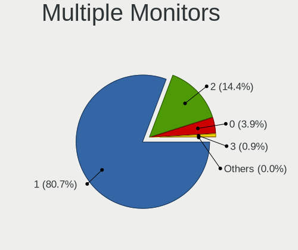

| Total | Computers | Percent |
|-------|-----------|---------|
| 1     | 1065      | 81.42%  |
| 2     | 177       | 13.53%  |
| 0     | 60        | 4.59%   |
| 3     | 6         | 0.46%   |

Network
-------

Net Controller Vendor
---------------------

Controller vendors

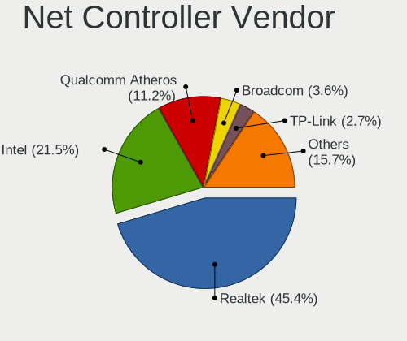

| Vendor                                | Computers | Percent |
|---------------------------------------|-----------|---------|
| Realtek Semiconductor                 | 844       | 44.59%  |
| Intel                                 | 367       | 19.39%  |
| Qualcomm Atheros                      | 252       | 13.31%  |
| Broadcom                              | 67        | 3.54%   |
| Nvidia                                | 53        | 2.8%    |
| TP-Link                               | 48        | 2.54%   |
| Ralink Technology                     | 31        | 1.64%   |
| Broadcom Limited                      | 27        | 1.43%   |
| Qualcomm Atheros Communications       | 23        | 1.22%   |
| Marvell Technology Group              | 22        | 1.16%   |
| Ralink                                | 18        | 0.95%   |
| VIA Technologies                      | 17        | 0.9%    |
| JMicron Technology                    | 17        | 0.9%    |
| Samsung Electronics                   | 14        | 0.74%   |
| Silicon Integrated Systems [SiS]      | 13        | 0.69%   |
| Motorola PCS                          | 11        | 0.58%   |
| Microsoft                             | 9         | 0.48%   |
| MediaTek                              | 6         | 0.32%   |
| NetGear                               | 4         | 0.21%   |
| Linksys                               | 4         | 0.21%   |
| D-Link System                         | 4         | 0.21%   |
| ASIX Electronics                      | 4         | 0.21%   |
| Ericsson Business Mobile Networks     | 3         | 0.16%   |
| DisplayLink                           | 3         | 0.16%   |
| 3Com                                  | 3         | 0.16%   |
| ZTE WCDMA Technologies MSM            | 2         | 0.11%   |
| Xiaomi                                | 2         | 0.11%   |
| Standard Microsystems                 | 2         | 0.11%   |
| Ovislink                              | 2         | 0.11%   |
| Encore Electronics                    | 2         | 0.11%   |
| Davicom Semiconductor                 | 2         | 0.11%   |
| D-Link                                | 2         | 0.11%   |
| Arduino SA                            | 2         | 0.11%   |
| Unknown                               | 1         | 0.05%   |
| Sundance Technology Inc / IC Plus     | 1         | 0.05%   |
| Smart Link                            | 1         | 0.05%   |
| PCTel                                 | 1         | 0.05%   |
| Motorola                              | 1         | 0.05%   |
| Macronix [MXIC]                       | 1         | 0.05%   |
| LG Electronics                        | 1         | 0.05%   |
| ICS Advent                            | 1         | 0.05%   |
| Huawei Technologies                   | 1         | 0.05%   |
| Digitech Systems                      | 1         | 0.05%   |
| Dell                                  | 1         | 0.05%   |
| Cisco Aironet Wireless Communications | 1         | 0.05%   |
| Aquantia                              | 1         | 0.05%   |

Net Controller Model
--------------------

Controller models

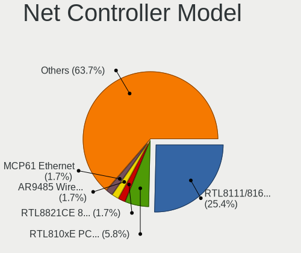

| Model                                                             | Computers | Percent |
|-------------------------------------------------------------------|-----------|---------|
| Realtek RTL8111/8168/8411 PCI Express Gigabit Ethernet Controller | 582       | 26.06%  |
| Realtek RTL810xE PCI Express Fast Ethernet controller             | 134       | 6%      |
| Nvidia MCP61 Ethernet                                             | 48        | 2.15%   |
| Qualcomm Atheros AR9485 Wireless Network Adapter                  | 46        | 2.06%   |
| Realtek RTL8723BE PCIe Wireless Network Adapter                   | 40        | 1.79%   |
| Qualcomm Atheros AR9285 Wireless Network Adapter (PCI-Express)    | 36        | 1.61%   |
| Realtek RTL8188CE 802.11b/g/n WiFi Adapter                        | 33        | 1.48%   |
| Qualcomm Atheros QCA9377 802.11ac Wireless Network Adapter        | 33        | 1.48%   |
| Realtek RTL8188EUS 802.11n Wireless Network Adapter               | 26        | 1.16%   |
| Intel Wireless 3160                                               | 26        | 1.16%   |
| Realtek RTL8821CE 802.11ac PCIe Wireless Network Adapter          | 24        | 1.07%   |
| Qualcomm Atheros QCA9565 / AR9565 Wireless Network Adapter        | 24        | 1.07%   |
| Realtek RTL8723DE Wireless Network Adapter                        | 21        | 0.94%   |
| Qualcomm Atheros AR9271 802.11n                                   | 21        | 0.94%   |
| Realtek RTL-8100/8101L/8139 PCI Fast Ethernet Adapter             | 20        | 0.9%    |
| Intel Wireless 3165                                               | 20        | 0.9%    |
| Realtek RTL8188EE Wireless Network Adapter                        | 19        | 0.85%   |
| Qualcomm Atheros AR8152 v2.0 Fast Ethernet                        | 19        | 0.85%   |
| Qualcomm Atheros AR8151 v2.0 Gigabit Ethernet                     | 19        | 0.85%   |
| Intel Ethernet Connection (2) I219-V                              | 19        | 0.85%   |
| Intel Wi-Fi 6 AX200                                               | 18        | 0.81%   |
| Realtek RTL8822CE 802.11ac PCIe Wireless Network Adapter          | 16        | 0.72%   |
| Ralink MT7601U Wireless Adapter                                   | 16        | 0.72%   |
| Intel Wireless 7260                                               | 16        | 0.72%   |
| Intel Dual Band Wireless-AC 3168NGW [Stone Peak]                  | 16        | 0.72%   |
| JMicron JMC250 PCI Express Gigabit Ethernet Controller            | 15        | 0.67%   |
| Intel PRO/Wireless 3945ABG [Golan] Network Connection             | 15        | 0.67%   |
| Intel Dual Band Wireless-AC 3165 Plus Bluetooth                   | 15        | 0.67%   |
| Intel Cannon Point-LP CNVi [Wireless-AC]                          | 15        | 0.67%   |
| Broadcom BCM4313 802.11bgn Wireless Network Adapter               | 15        | 0.67%   |
| VIA VT6102/VT6103 [Rhine-II]                                      | 14        | 0.63%   |
| Intel Wireless 8265 / 8275                                        | 14        | 0.63%   |
| Intel Wireless 7265                                               | 14        | 0.63%   |
| Intel I211 Gigabit Network Connection                             | 14        | 0.63%   |
| Intel Comet Lake PCH-LP CNVi WiFi                                 | 14        | 0.63%   |
| Intel 82579LM Gigabit Network Connection (Lewisville)             | 14        | 0.63%   |
| TP-Link 802.11ac WLAN Adapter                                     | 12        | 0.54%   |
| Samsung Galaxy series, misc. (tethering mode)                     | 12        | 0.54%   |
| Qualcomm Atheros AR9287 Wireless Network Adapter (PCI-Express)    | 12        | 0.54%   |
| Marvell Group 88E8040 PCI-E Fast Ethernet Controller              | 12        | 0.54%   |
| TP-Link TL-WN722N v2/v3 [Realtek RTL8188EUS]                      | 11        | 0.49%   |
| Realtek RTL8191SEvB Wireless LAN Controller                       | 11        | 0.49%   |
| Realtek RTL8187B Wireless 802.11g 54Mbps Network Adapter          | 11        | 0.49%   |
| Qualcomm Atheros AR9227 Wireless Network Adapter                  | 11        | 0.49%   |
| Intel Wi-Fi 6 AX201                                               | 11        | 0.49%   |
| Broadcom BCM43142 802.11b/g/n                                     | 11        | 0.49%   |
| Silicon Integrated Systems [SiS] 191 Gigabit Ethernet Adapter     | 10        | 0.45%   |
| Ralink RT2870/RT3070 Wireless Adapter                             | 10        | 0.45%   |
| Qualcomm Atheros QCA6174 802.11ac Wireless Network Adapter        | 10        | 0.45%   |
| Qualcomm Atheros AR8162 Fast Ethernet                             | 10        | 0.45%   |
| Intel Wireless 8260                                               | 10        | 0.45%   |
| Intel Ethernet Connection (7) I219-V                              | 10        | 0.45%   |
| Intel Centrino Advanced-N 6205 [Taylor Peak]                      | 10        | 0.45%   |
| Broadcom BCM4312 802.11b/g LP-PHY                                 | 10        | 0.45%   |
| Motorola PCS moto g(6) play                                       | 9         | 0.4%    |
| Intel 82579V Gigabit Network Connection                           | 9         | 0.4%    |
| Realtek RTL8169 PCI Gigabit Ethernet Controller                   | 8         | 0.36%   |
| Intel Ice Lake-LP PCH CNVi WiFi                                   | 8         | 0.36%   |
| Intel Ethernet Connection (4) I219-LM                             | 8         | 0.36%   |
| Intel Centrino Wireless-N 2230                                    | 8         | 0.36%   |

Wireless Vendor
---------------

Wireless vendors

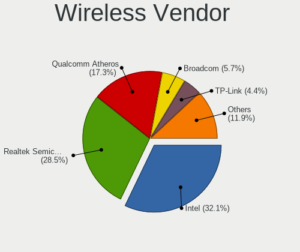

| Vendor                                | Computers | Percent |
|---------------------------------------|-----------|---------|
| Intel                                 | 288       | 29.48%  |
| Realtek Semiconductor                 | 263       | 26.92%  |
| Qualcomm Atheros                      | 205       | 20.98%  |
| Broadcom                              | 56        | 5.73%   |
| TP-Link                               | 43        | 4.4%    |
| Ralink Technology                     | 31        | 3.17%   |
| Qualcomm Atheros Communications       | 23        | 2.35%   |
| Ralink                                | 18        | 1.84%   |
| Broadcom Limited                      | 15        | 1.54%   |
| Microsoft                             | 8         | 0.82%   |
| NetGear                               | 4         | 0.41%   |
| MEDIATEK                              | 4         | 0.41%   |
| Linksys                               | 4         | 0.41%   |
| D-Link System                         | 4         | 0.41%   |
| Ovislink                              | 2         | 0.2%    |
| Marvell Technology Group              | 2         | 0.2%    |
| Encore Electronics                    | 2         | 0.2%    |
| D-Link                                | 2         | 0.2%    |
| Samsung Electronics                   | 1         | 0.1%    |
| Dell                                  | 1         | 0.1%    |
| Cisco Aironet Wireless Communications | 1         | 0.1%    |

Wireless Model
--------------

Wireless models

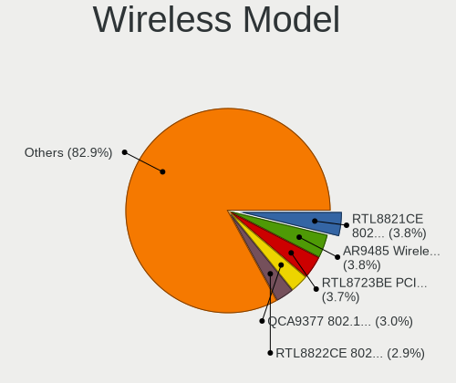

| Model                                                                   | Computers | Percent |
|-------------------------------------------------------------------------|-----------|---------|
| Qualcomm Atheros AR9485 Wireless Network Adapter                        | 46        | 4.66%   |
| Realtek RTL8723BE PCIe Wireless Network Adapter                         | 40        | 4.05%   |
| Qualcomm Atheros AR9285 Wireless Network Adapter (PCI-Express)          | 36        | 3.64%   |
| Realtek RTL8188CE 802.11b/g/n WiFi Adapter                              | 33        | 3.34%   |
| Qualcomm Atheros QCA9377 802.11ac Wireless Network Adapter              | 33        | 3.34%   |
| Realtek RTL8188EUS 802.11n Wireless Network Adapter                     | 26        | 2.63%   |
| Intel Wireless 3160                                                     | 26        | 2.63%   |
| Realtek RTL8821CE 802.11ac PCIe Wireless Network Adapter                | 24        | 2.43%   |
| Qualcomm Atheros QCA9565 / AR9565 Wireless Network Adapter              | 24        | 2.43%   |
| Realtek RTL8723DE Wireless Network Adapter                              | 21        | 2.13%   |
| Qualcomm Atheros AR9271 802.11n                                         | 21        | 2.13%   |
| Intel Wireless 3165                                                     | 20        | 2.02%   |
| Realtek RTL8188EE Wireless Network Adapter                              | 19        | 1.92%   |
| Intel Wi-Fi 6 AX200                                                     | 18        | 1.82%   |
| Realtek RTL8822CE 802.11ac PCIe Wireless Network Adapter                | 16        | 1.62%   |
| Ralink MT7601U Wireless Adapter                                         | 16        | 1.62%   |
| Intel Wireless 7260                                                     | 16        | 1.62%   |
| Intel Dual Band Wireless-AC 3168NGW [Stone Peak]                        | 16        | 1.62%   |
| Intel PRO/Wireless 3945ABG [Golan] Network Connection                   | 15        | 1.52%   |
| Intel Dual Band Wireless-AC 3165 Plus Bluetooth                         | 15        | 1.52%   |
| Intel Cannon Point-LP CNVi [Wireless-AC]                                | 15        | 1.52%   |
| Broadcom BCM4313 802.11bgn Wireless Network Adapter                     | 15        | 1.52%   |
| Intel Wireless 8265 / 8275                                              | 14        | 1.42%   |
| Intel Wireless 7265                                                     | 14        | 1.42%   |
| Intel Comet Lake PCH-LP CNVi WiFi                                       | 14        | 1.42%   |
| TP-Link 802.11ac WLAN Adapter                                           | 12        | 1.21%   |
| Qualcomm Atheros AR9287 Wireless Network Adapter (PCI-Express)          | 12        | 1.21%   |
| TP-Link TL-WN722N v2/v3 [Realtek RTL8188EUS]                            | 11        | 1.11%   |
| Realtek RTL8191SEvB Wireless LAN Controller                             | 11        | 1.11%   |
| Realtek RTL8187B Wireless 802.11g 54Mbps Network Adapter                | 11        | 1.11%   |
| Qualcomm Atheros AR9227 Wireless Network Adapter                        | 11        | 1.11%   |
| Intel Wi-Fi 6 AX201                                                     | 11        | 1.11%   |
| Broadcom BCM43142 802.11b/g/n                                           | 11        | 1.11%   |
| Ralink RT2870/RT3070 Wireless Adapter                                   | 10        | 1.01%   |
| Qualcomm Atheros QCA6174 802.11ac Wireless Network Adapter              | 10        | 1.01%   |
| Intel Wireless 8260                                                     | 10        | 1.01%   |
| Intel Centrino Advanced-N 6205 [Taylor Peak]                            | 10        | 1.01%   |
| Broadcom BCM4312 802.11b/g LP-PHY                                       | 10        | 1.01%   |
| Intel Ice Lake-LP PCH CNVi WiFi                                         | 8         | 0.81%   |
| Intel Centrino Wireless-N 2230                                          | 8         | 0.81%   |
| Realtek RTL8723BU 802.11b/g/n WLAN Adapter                              | 7         | 0.71%   |
| Qualcomm Atheros AR242x / AR542x Wireless Network Adapter (PCI-Express) | 7         | 0.71%   |
| Intel Centrino Wireless-N 1000 [Condor Peak]                            | 7         | 0.71%   |
| Intel Cannon Lake PCH CNVi WiFi                                         | 7         | 0.71%   |
| TP-Link TL-WN823N v2/v3 [Realtek RTL8192EU]                             | 6         | 0.61%   |
| Realtek RTL8852AE 802.11ax PCIe Wireless Network Adapter                | 6         | 0.61%   |
| Realtek RTL-8185 IEEE 802.11a/b/g Wireless LAN Controller               | 6         | 0.61%   |
| Microsoft Xbox 360 Wireless Adapter                                     | 6         | 0.61%   |
| Intel Centrino Wireless-N 130                                           | 6         | 0.61%   |
| Realtek RTL8723AE PCIe Wireless Network Adapter                         | 5         | 0.51%   |
| Realtek 802.11n WLAN Adapter                                            | 5         | 0.51%   |
| Realtek 802.11ac NIC                                                    | 5         | 0.51%   |
| Ralink RT3290 Wireless 802.11n 1T/1R PCIe                               | 5         | 0.51%   |
| Qualcomm Atheros AR9462 Wireless Network Adapter                        | 5         | 0.51%   |
| Qualcomm Atheros AR93xx Wireless Network Adapter                        | 5         | 0.51%   |
| Intel Centrino Wireless-N 6150                                          | 5         | 0.51%   |
| Intel Centrino Wireless-N + WiMAX 6150                                  | 5         | 0.51%   |
| Intel Centrino Advanced-N 6235                                          | 5         | 0.51%   |
| Broadcom Limited BCM4312 802.11b/g LP-PHY                               | 5         | 0.51%   |
| Broadcom BCM4331 802.11a/b/g/n                                          | 5         | 0.51%   |

Ethernet Vendor
---------------

Ethernet vendors

| Vendor                            | Computers | Percent |
|-----------------------------------|-----------|---------|
| Realtek Semiconductor             | 757       | 62.15%  |
| Intel                             | 158       | 12.97%  |
| Qualcomm Atheros                  | 98        | 8.05%   |
| Nvidia                            | 53        | 4.35%   |
| Marvell Technology Group          | 20        | 1.64%   |
| Broadcom                          | 19        | 1.56%   |
| VIA Technologies                  | 17        | 1.4%    |
| JMicron Technology                | 17        | 1.4%    |
| Silicon Integrated Systems [SiS]  | 13        | 1.07%   |
| Samsung Electronics               | 13        | 1.07%   |
| Broadcom Limited                  | 12        | 0.99%   |
| Motorola PCS                      | 9         | 0.74%   |
| TP-Link                           | 5         | 0.41%   |
| ASIX Electronics                  | 4         | 0.33%   |
| DisplayLink                       | 3         | 0.25%   |
| 3Com                              | 3         | 0.25%   |
| Xiaomi                            | 2         | 0.16%   |
| Standard Microsystems             | 2         | 0.16%   |
| MediaTek                          | 2         | 0.16%   |
| Davicom Semiconductor             | 2         | 0.16%   |
| ZTE WCDMA Technologies MSM        | 1         | 0.08%   |
| Sundance Technology Inc / IC Plus | 1         | 0.08%   |
| Microsoft                         | 1         | 0.08%   |
| Macronix [MXIC]                   | 1         | 0.08%   |
| LG Electronics                    | 1         | 0.08%   |
| ICS Advent                        | 1         | 0.08%   |
| Huawei Technologies               | 1         | 0.08%   |
| Digitech Systems                  | 1         | 0.08%   |
| Aquantia                          | 1         | 0.08%   |

Ethernet Model
--------------

Ethernet models

| Model                                                             | Computers | Percent |
|-------------------------------------------------------------------|-----------|---------|
| Realtek RTL8111/8168/8411 PCI Express Gigabit Ethernet Controller | 582       | 47.39%  |
| Realtek RTL810xE PCI Express Fast Ethernet controller             | 134       | 10.91%  |
| Nvidia MCP61 Ethernet                                             | 48        | 3.91%   |
| Realtek RTL-8100/8101L/8139 PCI Fast Ethernet Adapter             | 20        | 1.63%   |
| Qualcomm Atheros AR8152 v2.0 Fast Ethernet                        | 19        | 1.55%   |
| Qualcomm Atheros AR8151 v2.0 Gigabit Ethernet                     | 19        | 1.55%   |
| Intel Ethernet Connection (2) I219-V                              | 19        | 1.55%   |
| JMicron JMC250 PCI Express Gigabit Ethernet Controller            | 15        | 1.22%   |
| VIA VT6102/VT6103 [Rhine-II]                                      | 14        | 1.14%   |
| Intel I211 Gigabit Network Connection                             | 14        | 1.14%   |
| Intel 82579LM Gigabit Network Connection (Lewisville)             | 14        | 1.14%   |
| Samsung Galaxy series, misc. (tethering mode)                     | 12        | 0.98%   |
| Marvell Group 88E8040 PCI-E Fast Ethernet Controller              | 12        | 0.98%   |
| Silicon Integrated Systems [SiS] 191 Gigabit Ethernet Adapter     | 10        | 0.81%   |
| Qualcomm Atheros AR8162 Fast Ethernet                             | 10        | 0.81%   |
| Intel Ethernet Connection (7) I219-V                              | 10        | 0.81%   |
| Motorola PCS moto g(6) play                                       | 9         | 0.73%   |
| Intel 82579V Gigabit Network Connection                           | 9         | 0.73%   |
| Realtek RTL8169 PCI Gigabit Ethernet Controller                   | 8         | 0.65%   |
| Intel Ethernet Connection (4) I219-LM                             | 8         | 0.65%   |
| Realtek RTL8152 Fast Ethernet Adapter                             | 7         | 0.57%   |
| Realtek RTL8125 2.5GbE Controller                                 | 7         | 0.57%   |
| Qualcomm Atheros QCA8171 Gigabit Ethernet                         | 7         | 0.57%   |
| Intel Ethernet Controller I225-V                                  | 7         | 0.57%   |
| Intel Ethernet Connection (13) I219-V                             | 7         | 0.57%   |
| Realtek RTL8153 Gigabit Ethernet Adapter                          | 6         | 0.49%   |
| Broadcom NetXtreme BCM57765 Gigabit Ethernet PCIe                 | 6         | 0.49%   |
| Qualcomm Atheros Killer E2400 Gigabit Ethernet Controller         | 5         | 0.41%   |
| Qualcomm Atheros Killer E220x Gigabit Ethernet Controller         | 5         | 0.41%   |
| Qualcomm Atheros Attansic L2 Fast Ethernet                        | 5         | 0.41%   |
| Qualcomm Atheros AR8161 Gigabit Ethernet                          | 5         | 0.41%   |
| Qualcomm Atheros AR8152 v1.1 Fast Ethernet                        | 5         | 0.41%   |
| Qualcomm Atheros AR8132 Fast Ethernet                             | 5         | 0.41%   |
| Qualcomm Atheros AR8131 Gigabit Ethernet                          | 5         | 0.41%   |
| Intel PRO/100 VE Network Connection                               | 5         | 0.41%   |
| Intel Ethernet Connection I219-LM                                 | 5         | 0.41%   |
| Intel Ethernet Connection I218-LM                                 | 5         | 0.41%   |
| Intel Ethernet Connection I217-V                                  | 5         | 0.41%   |
| Intel 82577LM Gigabit Network Connection                          | 5         | 0.41%   |
| TP-Link USB 10/100/1000 LAN                                       | 4         | 0.33%   |
| Qualcomm Atheros Killer E2500 Gigabit Ethernet Controller         | 4         | 0.33%   |
| Broadcom NetLink BCM57780 Gigabit Ethernet PCIe                   | 4         | 0.33%   |
| VIA VT6105/VT6106S [Rhine-III]                                    | 3         | 0.24%   |
| Nvidia MCP77 Ethernet                                             | 3         | 0.24%   |
| Intel WiMAX Connection 2400m                                      | 3         | 0.24%   |
| Intel Ethernet Connection (3) I218-LM                             | 3         | 0.24%   |
| Intel Ethernet Connection (10) I219-V                             | 3         | 0.24%   |
| Intel Ethernet Connection (10) I219-LM                            | 3         | 0.24%   |
| Intel 82578DC Gigabit Network Connection                          | 3         | 0.24%   |
| Intel 82573L Gigabit Ethernet Controller                          | 3         | 0.24%   |
| Intel 82567LM-3 Gigabit Network Connection                        | 3         | 0.24%   |
| Intel 82567LM Gigabit Network Connection                          | 3         | 0.24%   |
| Broadcom Limited NetXtreme BCM5755 Gigabit Ethernet PCI Express   | 3         | 0.24%   |
| ASIX AX88772B Fast Ethernet Controller                            | 3         | 0.24%   |
| 3Com 3c905B 100BaseTX [Cyclone]                                   | 3         | 0.24%   |
| Xiaomi Mi/Redmi series (RNDIS)                                    | 2         | 0.16%   |
| Standard Microsystems Ethernet controller                         | 2         | 0.16%   |
| Silicon Integrated Systems [SiS] SiS900 PCI Fast Ethernet         | 2         | 0.16%   |
| Qualcomm Atheros QCA8172 Fast Ethernet                            | 2         | 0.16%   |
| MediaTek Vodafone Smart N10                                       | 2         | 0.16%   |

Net Controller Kind
-------------------

Ethernet, WiFi or modem

| Kind     | Computers | Percent |
|----------|-----------|---------|
| Ethernet | 1160      | 54.92%  |
| WiFi     | 936       | 44.32%  |
| Modem    | 14        | 0.66%   |
| Unknown  | 2         | 0.09%   |

Used Controller
---------------

Currently used network controller

| Kind     | Computers | Percent |
|----------|-----------|---------|
| WiFi     | 769       | 59.06%  |
| Ethernet | 533       | 40.94%  |

NICs
----

Total network controllers on board

| Total | Computers | Percent |
|-------|-----------|---------|
| 2     | 682       | 53.16%  |
| 1     | 553       | 43.1%   |
| 0     | 31        | 2.42%   |
| 3     | 15        | 1.17%   |
| 32    | 1         | 0.08%   |
| 4     | 1         | 0.08%   |

IPv6
----

IPv6 vs IPv4

| Used | Computers | Percent |
|------|-----------|---------|
| No   | 1176      | 91.09%  |
| Yes  | 115       | 8.91%   |

Bluetooth
---------

Bluetooth Vendor
----------------

Controller vendors

| Vendor                          | Computers | Percent |
|---------------------------------|-----------|---------|
| Intel                           | 218       | 38.86%  |
| Realtek Semiconductor           | 104       | 18.54%  |
| Qualcomm Atheros Communications | 47        | 8.38%   |
| Cambridge Silicon Radio         | 34        | 6.06%   |
| Broadcom                        | 34        | 6.06%   |
| IMC Networks                    | 31        | 5.53%   |
| Lite-On Technology              | 23        | 4.1%    |
| Foxconn / Hon Hai               | 14        | 2.5%    |
| Dell                            | 12        | 2.14%   |
| Apple                           | 11        | 1.96%   |
| Toshiba                         | 7         | 1.25%   |
| ASUSTek Computer                | 6         | 1.07%   |
| Ralink                          | 5         | 0.89%   |
| Integrated System Solution      | 3         | 0.53%   |
| Hewlett-Packard                 | 2         | 0.36%   |
| USI                             | 1         | 0.18%   |
| Syntek                          | 1         | 0.18%   |
| Roper                           | 1         | 0.18%   |
| Realtek                         | 1         | 0.18%   |
| Qcom                            | 1         | 0.18%   |
| Marvell Semiconductor           | 1         | 0.18%   |
| Logitech                        | 1         | 0.18%   |
| Foxconn International           | 1         | 0.18%   |
| Conwise Technology              | 1         | 0.18%   |
| Alps Electric                   | 1         | 0.18%   |

Bluetooth Model
---------------

Controller models

| Model                                                                               | Computers | Percent |
|-------------------------------------------------------------------------------------|-----------|---------|
| Intel Bluetooth wireless interface                                                  | 103       | 18.36%  |
| Realtek Bluetooth Radio                                                             | 55        | 9.8%    |
| Intel Bluetooth 9460/9560 Jefferson Peak (JfP)                                      | 37        | 6.6%    |
| Cambridge Silicon Radio Bluetooth Dongle (HCI mode)                                 | 34        | 6.06%   |
| Realtek  Bluetooth 4.2 Adapter                                                      | 31        | 5.53%   |
| Qualcomm Atheros  Bluetooth Device                                                  | 26        | 4.63%   |
| Intel AX201 Bluetooth                                                               | 21        | 3.74%   |
| Intel AX200 Bluetooth                                                               | 18        | 3.21%   |
| Intel Wireless-AC 3168 Bluetooth                                                    | 16        | 2.85%   |
| Realtek RTL8723B Bluetooth                                                          | 14        | 2.5%    |
| Intel Centrino Bluetooth Wireless Transceiver                                       | 13        | 2.32%   |
| IMC Networks Bluetooth Radio                                                        | 11        | 1.96%   |
| Qualcomm Atheros AR3012 Bluetooth 4.0                                               | 10        | 1.78%   |
| Lite-On Qualcomm Atheros QCA9377 Bluetooth                                          | 9         | 1.6%    |
| IMC Networks Bluetooth Device                                                       | 9         | 1.6%    |
| Lite-On Bluetooth Device                                                            | 8         | 1.43%   |
| Intel Centrino Advanced-N 6230 Bluetooth adapter                                    | 7         | 1.25%   |
| Broadcom BCM43142 Bluetooth 4.0                                                     | 7         | 1.25%   |
| Foxconn / Hon Hai Bluetooth Device                                                  | 6         | 1.07%   |
| Broadcom BCM20702 Bluetooth 4.0 [ThinkPad]                                          | 6         | 1.07%   |
| Broadcom BCM2070 Bluetooth 2.1 + EDR                                                | 6         | 1.07%   |
| Apple Bluetooth USB Host Controller                                                 | 6         | 1.07%   |
| Toshiba Bluetooth USB Host Controller                                               | 5         | 0.89%   |
| Ralink RT3290 Bluetooth                                                             | 5         | 0.89%   |
| Qualcomm Atheros QCA61x4 Bluetooth 4.0                                              | 5         | 0.89%   |
| Qualcomm Atheros AR3011 Bluetooth                                                   | 5         | 0.89%   |
| IMC Networks Atheros AR3012 Bluetooth 4.0 Adapter                                   | 5         | 0.89%   |
| Dell Wireless 365 Bluetooth                                                         | 5         | 0.89%   |
| Dell DW375 Bluetooth Module                                                         | 4         | 0.71%   |
| Realtek 802.11ac WLAN Adapter                                                       | 3         | 0.53%   |
| Lite-On Broadcom BCM43142A0 Bluetooth Device                                        | 3         | 0.53%   |
| Toshiba Bluetooth Device                                                            | 2         | 0.36%   |
| Lite-On Atheros AR3012 Bluetooth                                                    | 2         | 0.36%   |
| Intel Wireless-AC 9260 Bluetooth Adapter                                            | 2         | 0.36%   |
| Integrated System Solution KY-BT100 Bluetooth Adapter                               | 2         | 0.36%   |
| IMC Networks Wireless_Device                                                        | 2         | 0.36%   |
| IMC Networks Bluetooth                                                              | 2         | 0.36%   |
| Foxconn / Hon Hai Foxconn T77H114 BCM2070 [Single-Chip Bluetooth 2.1 + EDR Adapter] | 2         | 0.36%   |
| Foxconn / Hon Hai Broadcom Bluetooth 2.1 Device                                     | 2         | 0.36%   |
| Dell Wireless 355 Bluetooth                                                         | 2         | 0.36%   |
| Broadcom Bluetooth 2.1 Device                                                       | 2         | 0.36%   |
| Broadcom BCM2070 Bluetooth Device                                                   | 2         | 0.36%   |
| Broadcom BCM2045B (BDC-2.1) [Bluetooth Controller]                                  | 2         | 0.36%   |
| ASUS Qualcomm Bluetooth 4.1                                                         | 2         | 0.36%   |
| ASUS Bluetooth Radio                                                                | 2         | 0.36%   |
| Apple Bluetooth Host Controller                                                     | 2         | 0.36%   |
| Apple Bluetooth HCI                                                                 | 2         | 0.36%   |
| USI Bluetooth Module BCM92070                                                       | 1         | 0.18%   |
| Syntek 802.11g + Bluetooth Wireless Adapter                                         | 1         | 0.18%   |
| Roper Class 1 Bluetooth Dongle                                                      | 1         | 0.18%   |
| Realtek RTL8723A Bluetooth                                                          | 1         | 0.18%   |
| Realtek Bluetooth Radio                                                             | 1         | 0.18%   |
| Qualcomm Atheros Bluetooth (AR3011)                                                 | 1         | 0.18%   |
| Qcom Broadcom Bluetooth USB                                                         | 1         | 0.18%   |
| Marvell Bluetooth and Wireless LAN Composite                                        | 1         | 0.18%   |
| Logitech BT Mini-Receiver (HCI mode)                                                | 1         | 0.18%   |
| Lite-On Bluetooth Radio                                                             | 1         | 0.18%   |
| Intel AX210 Bluetooth                                                               | 1         | 0.18%   |
| Integrated System Solution Bluetooth Device                                         | 1         | 0.18%   |
| IMC Networks Broadcom Bluetooth 2.1                                                 | 1         | 0.18%   |

Sound
-----

Sound Vendor
------------

Sound card vendors

| Vendor                                          | Computers | Percent |
|-------------------------------------------------|-----------|---------|
| Intel                                           | 861       | 55.09%  |
| AMD                                             | 357       | 22.84%  |
| Nvidia                                          | 197       | 12.6%   |
| Logitech                                        | 26        | 1.66%   |
| C-Media Electronics                             | 20        | 1.28%   |
| VIA Technologies                                | 16        | 1.02%   |
| Silicon Integrated Systems [SiS]                | 13        | 0.83%   |
| Kingston Technology                             | 10        | 0.64%   |
| Creative Labs                                   | 7         | 0.45%   |
| Generalplus Technology                          | 5         | 0.32%   |
| Focusrite-Novation                              | 5         | 0.32%   |
| GN Netcom                                       | 4         | 0.26%   |
| Texas Instruments                               | 3         | 0.19%   |
| Samson Technologies                             | 3         | 0.19%   |
| Plantronics                                     | 3         | 0.19%   |
| Fry's Electronics                               | 3         | 0.19%   |
| ESI Audiotechnik                                | 3         | 0.19%   |
| Razer USA                                       | 2         | 0.13%   |
| Microsoft                                       | 2         | 0.13%   |
| M-Audio                                         | 2         | 0.13%   |
| Elite Silicon                                   | 2         | 0.13%   |
| Creative Technology                             | 2         | 0.13%   |
| BEHRINGER International                         | 2         | 0.13%   |
| Yamaha                                          | 1         | 0.06%   |
| TEAC                                            | 1         | 0.06%   |
| Pro-Ject                                        | 1         | 0.06%   |
| Licensed by Sony Computer Entertainment America | 1         | 0.06%   |
| JMTek                                           | 1         | 0.06%   |
| Holtek Semiconductor                            | 1         | 0.06%   |
| Ensoniq                                         | 1         | 0.06%   |
| Corsair                                         | 1         | 0.06%   |
| Cirrus Logic                                    | 1         | 0.06%   |
| Chicony Electronics                             | 1         | 0.06%   |
| Casio Computer                                  | 1         | 0.06%   |
| Audient                                         | 1         | 0.06%   |
| ATI Technologies                                | 1         | 0.06%   |
| ASUSTek Computer                                | 1         | 0.06%   |
| Astro Gaming                                    | 1         | 0.06%   |

Sound Model
-----------

Sound card models

| Model                                                                                             | Computers | Percent |
|---------------------------------------------------------------------------------------------------|-----------|---------|
| Intel Sunrise Point-LP HD Audio                                                                   | 112       | 5.91%   |
| Intel 7 Series/C216 Chipset Family High Definition Audio Controller                               | 107       | 5.65%   |
| Intel NM10/ICH7 Family High Definition Audio Controller                                           | 86        | 4.54%   |
| Intel 6 Series/C200 Series Chipset Family High Definition Audio Controller                        | 84        | 4.43%   |
| AMD FCH Azalia Controller                                                                         | 80        | 4.22%   |
| AMD Family 17h/19h HD Audio Controller                                                            | 71        | 3.75%   |
| AMD SBx00 Azalia (Intel HDA)                                                                      | 70        | 3.69%   |
| AMD Raven/Raven2/Fenghuang HDMI/DP Audio Controller                                               | 53        | 2.8%    |
| Nvidia MCP61 High Definition Audio                                                                | 50        | 2.64%   |
| Intel 8 Series/C220 Series Chipset High Definition Audio Controller                               | 49        | 2.59%   |
| Intel 100 Series/C230 Series Chipset Family HD Audio Controller                                   | 43        | 2.27%   |
| Intel Xeon E3-1200 v3/4th Gen Core Processor HD Audio Controller                                  | 39        | 2.06%   |
| Intel 5 Series/3400 Series Chipset High Definition Audio                                          | 36        | 1.9%    |
| Intel 82801I (ICH9 Family) HD Audio Controller                                                    | 35        | 1.85%   |
| AMD Kabini HDMI/DP Audio                                                                          | 35        | 1.85%   |
| Intel Atom Processor Z36xxx/Z37xxx Series High Definition Audio Controller                        | 33        | 1.74%   |
| AMD Starship/Matisse HD Audio Controller                                                          | 25        | 1.32%   |
| AMD Family 15h (Models 60h-6fh) Audio Controller                                                  | 25        | 1.32%   |
| Intel Broadwell-U Audio Controller                                                                | 24        | 1.27%   |
| AMD Family 17h (Models 00h-0fh) HD Audio Controller                                               | 24        | 1.27%   |
| Intel Wildcat Point-LP High Definition Audio Controller                                           | 23        | 1.21%   |
| Intel Cannon Point-LP High Definition Audio Controller                                            | 23        | 1.21%   |
| Intel 82801H (ICH8 Family) HD Audio Controller                                                    | 23        | 1.21%   |
| Intel 200 Series PCH HD Audio                                                                     | 22        | 1.16%   |
| AMD Trinity HDMI Audio Controller                                                                 | 22        | 1.16%   |
| Intel Haswell-ULT HD Audio Controller                                                             | 21        | 1.11%   |
| Intel 8 Series HD Audio Controller                                                                | 21        | 1.11%   |
| AMD Oland/Hainan/Cape Verde/Pitcairn HDMI Audio [Radeon HD 7000 Series]                           | 21        | 1.11%   |
| Intel Tiger Lake-LP Smart Sound Technology Audio Controller                                       | 20        | 1.06%   |
| AMD Kaveri HDMI/DP Audio Controller                                                               | 20        | 1.06%   |
| Nvidia GP107GL High Definition Audio Controller                                                   | 19        | 1%      |
| Intel Celeron/Pentium Silver Processor High Definition Audio                                      | 19        | 1%      |
| Intel Cannon Lake PCH cAVS                                                                        | 19        | 1%      |
| Nvidia High Definition Audio Controller                                                           | 18        | 0.95%   |
| Intel Ice Lake-LP Smart Sound Technology Audio Controller                                         | 18        | 0.95%   |
| AMD Ellesmere HDMI Audio [Radeon RX 470/480 / 570/580/590]                                        | 18        | 0.95%   |
| AMD Cedar HDMI Audio [Radeon HD 5400/6300/7300 Series]                                            | 18        | 0.95%   |
| Intel Comet Lake PCH-LP cAVS                                                                      | 16        | 0.84%   |
| Intel Celeron N3350/Pentium N4200/Atom E3900 Series Audio Cluster                                 | 16        | 0.84%   |
| AMD Renoir Radeon High Definition Audio Controller                                                | 15        | 0.79%   |
| Intel Atom/Celeron/Pentium Processor x5-E8000/J3xxx/N3xxx Series High Definition Audio Controller | 14        | 0.74%   |
| Nvidia GP106 High Definition Audio Controller                                                     | 13        | 0.69%   |
| Nvidia GK208 HDMI/DP Audio Controller                                                             | 13        | 0.69%   |
| AMD Baffin HDMI/DP Audio [Radeon RX 550 640SP / RX 560/560X]                                      | 12        | 0.63%   |
| Logitech H390 headset with microphone                                                             | 11        | 0.58%   |
| Silicon Integrated Systems [SiS] Azalia Audio Controller                                          | 10        | 0.53%   |
| Nvidia TU107 GeForce GTX 1650 High Definition Audio Controller                                    | 10        | 0.53%   |
| Nvidia GM206 High Definition Audio Controller                                                     | 10        | 0.53%   |
| Nvidia GF108 High Definition Audio Controller                                                     | 10        | 0.53%   |
| AMD Turks HDMI Audio [Radeon HD 6500/6600 / 6700M Series]                                         | 10        | 0.53%   |
| Nvidia GM204 High Definition Audio Controller                                                     | 9         | 0.47%   |
| AMD Navi 10 HDMI Audio                                                                            | 9         | 0.47%   |
| VIA Technologies VX900/VT8xxx High Definition Audio Controller                                    | 8         | 0.42%   |
| VIA Technologies VT8233/A/8235/8237 AC97 Audio Controller                                         | 7         | 0.37%   |
| Logitech Headset H390                                                                             | 7         | 0.37%   |
| Intel Comet Lake PCH cAVS                                                                         | 7         | 0.37%   |
| Intel 9 Series Chipset Family HD Audio Controller                                                 | 7         | 0.37%   |
| AMD RV710/730 HDMI Audio [Radeon HD 4000 series]                                                  | 7         | 0.37%   |
| AMD High Definition Audio Controller                                                              | 7         | 0.37%   |
| AMD Caicos HDMI Audio [Radeon HD 6450 / 7450/8450/8490 OEM / R5 230/235/235X OEM]                 | 7         | 0.37%   |

Memory
------

Memory Vendor
-------------

Memory module vendors

| Vendor              | Computers | Percent |
|---------------------|-----------|---------|
| Kingston            | 175       | 24.96%  |
| Samsung Electronics | 118       | 16.83%  |
| Unknown             | 93        | 13.27%  |
| SK Hynix            | 85        | 12.13%  |
| Crucial             | 39        | 5.56%   |
| Micron Technology   | 33        | 4.71%   |
| A-DATA Technology   | 25        | 3.57%   |
| Corsair             | 21        | 3%      |
| Magnum Tech         | 11        | 1.57%   |
| Nanya Technology    | 10        | 1.43%   |
| Novatech            | 8         | 1.14%   |
| G.Skill             | 8         | 1.14%   |
| Goldkey             | 7         | 1%      |
| Elpida              | 7         | 1%      |
| Unknown (ABCD)      | 6         | 0.86%   |
| Avant               | 5         | 0.71%   |
| Super Talent        | 4         | 0.57%   |
| Ramaxel Technology  | 4         | 0.57%   |
| Patriot             | 4         | 0.57%   |
| Memox               | 4         | 0.57%   |
| Transcend           | 3         | 0.43%   |
| Saikano             | 3         | 0.43%   |
| Hewlett-Packard     | 3         | 0.43%   |
| Unknown             | 3         | 0.43%   |
| CSX                 | 2         | 0.29%   |
| Apacer              | 2         | 0.29%   |
| 48spaces            | 2         | 0.29%   |
| Unknown (07D5)      | 1         | 0.14%   |
| Thermaltake         | 1         | 0.14%   |
| Teikon              | 1         | 0.14%   |
| Team                | 1         | 0.14%   |
| Qimonda             | 1         | 0.14%   |
| PNY                 | 1         | 0.14%   |
| OLOY                | 1         | 0.14%   |
| Neo Forza           | 1         | 0.14%   |
| Mushkin             | 1         | 0.14%   |
| Kreton              | 1         | 0.14%   |
| Innodisk            | 1         | 0.14%   |
| Hikvision           | 1         | 0.14%   |
| High Bridge         | 1         | 0.14%   |
| Cors                | 1         | 0.14%   |
| AVEXIR              | 1         | 0.14%   |
| AMD                 | 1         | 0.14%   |

Memory Model
------------

Memory module models

| Model                                                                        | Computers | Percent |
|------------------------------------------------------------------------------|-----------|---------|
| Samsung RAM M471A5244CB0-CRC 4GB SODIMM DDR4 2667MT/s                        | 14        | 1.82%   |
| SK Hynix RAM HMT451S6BFR8A-PB 4GB SODIMM DDR3 1600MT/s                       | 11        | 1.43%   |
| Samsung RAM M471A5244CB0-CTD 4GB SODIMM DDR4 3266MT/s                        | 10        | 1.3%    |
| Magnum Tech RAM MAGNUMTECH 4GB SODIMM DDR3 1600MT/s                          | 10        | 1.3%    |
| SK Hynix RAM HMA81GS6AFR8N-UH 8GB SODIMM DDR4 2667MT/s                       | 9         | 1.17%   |
| Unknown (ABCD) RAM 123456789012345678 2GB SODIMM DDR4 2400MT/s               | 6         | 0.78%   |
| Samsung RAM M471A1K43CB1-CRC 8GB SODIMM DDR4 2667MT/s                        | 6         | 0.78%   |
| Samsung RAM M471A1G44AB0-CWE 8GB SODIMM DDR4 3200MT/s                        | 6         | 0.78%   |
| Kingston RAM KHX2666C16/8G 8GB DIMM DDR4 3466MT/s                            | 6         | 0.78%   |
| Kingston RAM KHX2400C15/8G 8192MB DIMM DDR4 2933MT/s                         | 6         | 0.78%   |
| Kingston RAM KHX1866C10D3/8G 8GB DIMM DDR3 1867MT/s                          | 6         | 0.78%   |
| Kingston RAM 99U5471-054.A00LF 8GB DIMM DDR3 1600MT/s                        | 6         | 0.78%   |
| Unknown RAM Module 4096MB DIMM 1333MT/s                                      | 5         | 0.65%   |
| Unknown RAM Module 2048MB DIMM 1333MT/s                                      | 5         | 0.65%   |
| Samsung RAM M471B5173EB0-YK0 4GB SODIMM DDR3 1600MT/s                        | 5         | 0.65%   |
| Samsung RAM M471B1G73QH0-YK0 8192MB SODIMM DDR3 1600MT/s                     | 5         | 0.65%   |
| Nanya RAM NT2GC64B88B0NS-CG 2GB SODIMM DDR3 1334MT/s                         | 5         | 0.65%   |
| Unknown RAM Module 4GB DIMM 1333MT/s                                         | 4         | 0.52%   |
| SK Hynix RAM HMT351S6CFR8C-PB 4GB SODIMM DDR3 1600MT/s                       | 4         | 0.52%   |
| Samsung RAM M471B5173DB0-YK0 4GB SODIMM DDR3 1600MT/s                        | 4         | 0.52%   |
| Samsung RAM M471B1G73EB0-YK0 8192MB SODIMM DDR3 1600MT/s                     | 4         | 0.52%   |
| Kingston RAM 99U5584-005.A00LF 4096MB DIMM DDR3 1600MT/s                     | 4         | 0.52%   |
| Kingston RAM 99U5428-018.A00LF 8GB SODIMM DDR3 1600MT/s                      | 4         | 0.52%   |
| Unknown RAM Module 4096MB SODIMM DDR3 1333MT/s                               | 3         | 0.39%   |
| Unknown RAM Module 4096MB DIMM 1066MT/s                                      | 3         | 0.39%   |
| Unknown RAM Module 2GB DIMM DDR2 333MT/s                                     | 3         | 0.39%   |
| SK Hynix RAM HMT41GS6BFR8A-PB 8GB SODIMM DDR3 1600MT/s                       | 3         | 0.39%   |
| SK Hynix RAM HMT351S6EFR8C-PB 4GB SODIMM DDR3 1600MT/s                       | 3         | 0.39%   |
| SK Hynix RAM HMA851S6AFR6N-UH 4GB SODIMM DDR4 2667MT/s                       | 3         | 0.39%   |
| SK Hynix RAM HMA82GS6DJR8N-XN 16GB SODIMM DDR4 3200MT/s                      | 3         | 0.39%   |
| SK Hynix RAM 212121212121212121212121212121212121 2048MB SODIMM DDR2 667MT/s | 3         | 0.39%   |
| SK Hynix RAM 202020202020202020202020202020202020 2048MB SODIMM DDR2 667MT/s | 3         | 0.39%   |
| Samsung RAM M471B5273DH0-CH9 4GB SODIMM DDR3 1334MT/s                        | 3         | 0.39%   |
| Samsung RAM M471B5273CH0-CH9 4GB SODIMM DDR3 1334MT/s                        | 3         | 0.39%   |
| Samsung RAM M471B2873FHS-CF8 1024MB SODIMM DDR3 1067MT/s                     | 3         | 0.39%   |
| Samsung RAM M471B1G73DB0-YK0 8192MB SODIMM DDR3 1600MT/s                     | 3         | 0.39%   |
| Samsung RAM M471A5244CB0-CWE 4GB SODIMM DDR4 3200MT/s                        | 3         | 0.39%   |
| Samsung RAM M471A5244CB0-CTD 4GB Row Of Chips DDR4 2667MT/s                  | 3         | 0.39%   |
| Samsung RAM M471A1K43DB1-CWE 8GB SODIMM DDR4 3200MT/s                        | 3         | 0.39%   |
| Samsung RAM M471A1K43CB1-CTD 8GB SODIMM DDR4 2667MT/s                        | 3         | 0.39%   |
| Saikano RAM Memory 4GB SODIMM DDR3 1333MT/s                                  | 3         | 0.39%   |
| Micron RAM 4ATF51264HZ-2G6E! 4GB SODIMM DDR4 2400MT/s                        | 3         | 0.39%   |
| Kingston RAM KHX1866C10D3/ 4096MB DIMM DDR3 1866MT/s                         | 3         | 0.39%   |
| Kingston RAM KHX1600C9D3/4GX 4096MB DIMM DDR3 2400MT/s                       | 3         | 0.39%   |
| Kingston RAM KHX1600C10D3/8G 4096MB DIMM DDR3 1600MT/s                       | 3         | 0.39%   |
| Kingston RAM 99U5700-027.A00G 8GB SODIMM DDR4 2667MT/s                       | 3         | 0.39%   |
| Kingston RAM 99U5469-045.A00LF 4GB SODIMM DDR3 1600MT/s                      | 3         | 0.39%   |
| Kingston RAM 9905702-119.A00G 8GB DIMM DDR4 2667MT/s                         | 3         | 0.39%   |
| Kingston RAM 9905700-013.A00G 8GB SODIMM DDR4 2667MT/s                       | 3         | 0.39%   |
| Crucial RAM BLS8G4D240FSEK.8FBD 8192MB DIMM DDR4 2400MT/s                    | 3         | 0.39%   |
| Unknown                                                                      | 3         | 0.39%   |
| Unknown RAM Module 8GB DIMM 1600MT/s                                         | 2         | 0.26%   |
| Unknown RAM Module 4GB SODIMM DDR3 1333MT/s                                  | 2         | 0.26%   |
| Unknown RAM Module 4GB DIMM 1600MT/s                                         | 2         | 0.26%   |
| Unknown RAM Module 4096MB SODIMM DDR3 1066MT/s                               | 2         | 0.26%   |
| Unknown RAM Module 4096MB SODIMM DDR3                                        | 2         | 0.26%   |
| Unknown RAM Module 4096MB DIMM DDR3 1333MT/s                                 | 2         | 0.26%   |
| Unknown RAM Module 4096MB DIMM 400MT/s                                       | 2         | 0.26%   |
| Unknown RAM Module 2GB SODIMM DDR3 1333MT/s                                  | 2         | 0.26%   |
| Unknown RAM Module 2GB DIMM 1333MT/s                                         | 2         | 0.26%   |

Memory Kind
-----------

Memory module kinds

| Kind    | Computers | Percent |
|---------|-----------|---------|
| DDR3    | 240       | 40.89%  |
| DDR4    | 236       | 40.2%   |
| DDR2    | 35        | 5.96%   |
| Unknown | 35        | 5.96%   |
| LPDDR4  | 13        | 2.21%   |
| SDRAM   | 12        | 2.04%   |
| DDR     | 7         | 1.19%   |
| LPDDR3  | 6         | 1.02%   |
| DRAM    | 3         | 0.51%   |

Memory Form Factor
------------------

Physical design of the memory module

| Name         | Computers | Percent |
|--------------|-----------|---------|
| SODIMM       | 325       | 55.37%  |
| DIMM         | 241       | 41.06%  |
| Row Of Chips | 18        | 3.07%   |
| Chip         | 2         | 0.34%   |
| Unknown      | 1         | 0.17%   |

Memory Size
-----------

Memory module size

| Size  | Computers | Percent |
|-------|-----------|---------|
| 8192  | 245       | 36.73%  |
| 4096  | 228       | 34.18%  |
| 2048  | 106       | 15.89%  |
| 16384 | 50        | 7.5%    |
| 1024  | 28        | 4.2%    |
| 32768 | 5         | 0.75%   |
| 512   | 4         | 0.6%    |
| 6144  | 1         | 0.15%   |

Memory Speed
------------

Memory module speed

| Speed   | Computers | Percent |
|---------|-----------|---------|
| 1600    | 145       | 21.42%  |
| 2667    | 103       | 15.21%  |
| 1333    | 78        | 11.52%  |
| 2400    | 60        | 8.86%   |
| 3200    | 57        | 8.42%   |
| 2133    | 33        | 4.87%   |
| 1334    | 27        | 3.99%   |
| Unknown | 24        | 3.55%   |
| 667     | 20        | 2.95%   |
| 3600    | 10        | 1.48%   |
| 3266    | 10        | 1.48%   |
| 2933    | 10        | 1.48%   |
| 2666    | 10        | 1.48%   |
| 800     | 9         | 1.33%   |
| 1066    | 8         | 1.18%   |
| 3466    | 7         | 1.03%   |
| 1866    | 7         | 1.03%   |
| 1067    | 7         | 1.03%   |
| 533     | 6         | 0.89%   |
| 3000    | 5         | 0.74%   |
| 1867    | 5         | 0.74%   |
| 400     | 5         | 0.74%   |
| 333     | 5         | 0.74%   |
| 4199    | 4         | 0.59%   |
| 975     | 4         | 0.59%   |
| 2048    | 3         | 0.44%   |
| 3151    | 2         | 0.3%    |
| 3007    | 2         | 0.3%    |
| 8400    | 1         | 0.15%   |
| 4267    | 1         | 0.15%   |
| 3533    | 1         | 0.15%   |
| 3500    | 1         | 0.15%   |
| 3400    | 1         | 0.15%   |
| 3334    | 1         | 0.15%   |
| 3100    | 1         | 0.15%   |
| 2866    | 1         | 0.15%   |
| 2800    | 1         | 0.15%   |
| 2134    | 1         | 0.15%   |
| 1200    | 1         | 0.15%   |

Printers & scanners
-------------------

Printer Vendor
--------------

Printer device vendors

| Vendor              | Computers | Percent |
|---------------------|-----------|---------|
| Hewlett-Packard     | 19        | 45.24%  |
| Brother Industries  | 12        | 28.57%  |
| Seiko Epson         | 4         | 9.52%   |
| Samsung Electronics | 3         | 7.14%   |
| Ricoh               | 1         | 2.38%   |
| QinHeng Electronics | 1         | 2.38%   |
| Pantum              | 1         | 2.38%   |
| NXP Semiconductors  | 1         | 2.38%   |

Printer Model
-------------

Printer device models

| Model                                         | Computers | Percent |
|-----------------------------------------------|-----------|---------|
| HP LaserJet Professional P 1102w              | 3         | 7.14%   |
| Brother HL-1200 series                        | 3         | 7.14%   |
| Brother HL-1110 series                        | 3         | 7.14%   |
| Samsung M2020 Series                          | 2         | 4.76%   |
| HP LaserJet P1006                             | 2         | 4.76%   |
| HP LaserJet P1005                             | 2         | 4.76%   |
| HP Ink Tank 110 series                        | 2         | 4.76%   |
| Brother HL-2130 series                        | 2         | 4.76%   |
| Brother HL-1210W series                       | 2         | 4.76%   |
| Seiko Epson XP-243 245 247 Series             | 1         | 2.38%   |
| Seiko Epson ME 340 Series/Stylus NX130 Series | 1         | 2.38%   |
| Seiko Epson L4150 Series                      | 1         | 2.38%   |
| Seiko Epson L355 Series                       | 1         | 2.38%   |
| Samsung Xerox Phaser 3117 Laser Printer       | 1         | 2.38%   |
| Ricoh Printing Support                        | 1         | 2.38%   |
| QinHeng CH340S                                | 1         | 2.38%   |
| Pantum P2500W series                          | 1         | 2.38%   |
| NXP Semiconductors Printer-80                 | 1         | 2.38%   |
| HP PSC 1400                                   | 1         | 2.38%   |
| HP LaserJet 3050                              | 1         | 2.38%   |
| HP LaserJet 1020                              | 1         | 2.38%   |
| HP DeskJet F4100 Printer series               | 1         | 2.38%   |
| HP DeskJet F300 series                        | 1         | 2.38%   |
| HP DeskJet 3630 series                        | 1         | 2.38%   |
| HP Deskjet 3050 J610 series                   | 1         | 2.38%   |
| HP DeskJet 2620 All-in-One Printer            | 1         | 2.38%   |
| HP Deskjet 2050 J510                          | 1         | 2.38%   |
| HP Color LaserJet Pro M478f-9f                | 1         | 2.38%   |
| Brother DCP-7055 scanner/printer              | 1         | 2.38%   |
| Brother DCP-1600                              | 1         | 2.38%   |

Scanner Vendor
--------------

Scanner device vendors

Zero info for selected period =(

Scanner Model
-------------

Scanner device models

Zero info for selected period =(

Camera
------

Camera Vendor
-------------

Camera device vendors

| Vendor                                 | Computers | Percent |
|----------------------------------------|-----------|---------|
| Chicony Electronics                    | 162       | 22.16%  |
| Acer                                   | 64        | 8.76%   |
| IMC Networks                           | 63        | 8.62%   |
| Realtek Semiconductor                  | 60        | 8.21%   |
| Microdia                               | 50        | 6.84%   |
| Sunplus Innovation Technology          | 33        | 4.51%   |
| Logitech                               | 31        | 4.24%   |
| Syntek                                 | 26        | 3.56%   |
| Silicon Motion                         | 25        | 3.42%   |
| Suyin                                  | 23        | 3.15%   |
| Cheng Uei Precision Industry (Foxlink) | 23        | 3.15%   |
| Alcor Micro                            | 22        | 3.01%   |
| Quanta                                 | 17        | 2.33%   |
| Apple                                  | 15        | 2.05%   |
| Z-Star Microelectronics                | 13        | 1.78%   |
| Samsung Electronics                    | 13        | 1.78%   |
| Ricoh                                  | 9         | 1.23%   |
| Lite-On Technology                     | 9         | 1.23%   |
| KYE Systems (Mouse Systems)            | 9         | 1.23%   |
| OmniVision Technologies                | 6         | 0.82%   |
| Microsoft                              | 6         | 0.82%   |
| Jieli Technology                       | 6         | 0.82%   |
| Generalplus Technology                 | 5         | 0.68%   |
| Luxvisions Innotech Limited            | 4         | 0.55%   |
| GEMBIRD                                | 4         | 0.55%   |
| ALi                                    | 4         | 0.55%   |
| MacroSilicon                           | 3         | 0.41%   |
| USB Camera                             | 2         | 0.27%   |
| SunplusIT                              | 2         | 0.27%   |
| Sonix Technology                       | 2         | 0.27%   |
| Razer USA                              | 2         | 0.27%   |
| Pixart Imaging                         | 2         | 0.27%   |
| Lenovo                                 | 2         | 0.27%   |
| Intel                                  | 2         | 0.27%   |
| Cubeternet                             | 2         | 0.27%   |
| ARC International                      | 2         | 0.27%   |
| Sunplus Technology                     | 1         | 0.14%   |
| Philips (or NXP)                       | 1         | 0.14%   |
| Importek                               | 1         | 0.14%   |
| Huawei Technologies                    | 1         | 0.14%   |
| Google                                 | 1         | 0.14%   |
| Genesys Logic                          | 1         | 0.14%   |
| Aveo Technology                        | 1         | 0.14%   |
| Allwinner Technology                   | 1         | 0.14%   |

Camera Model
------------

Camera device models

| Model                                                          | Computers | Percent |
|----------------------------------------------------------------|-----------|---------|
| Chicony USB 2.0 Camera                                         | 27        | 3.67%   |
| IMC Networks USB2.0 VGA UVC WebCam                             | 25        | 3.4%    |
| Acer Integrated Camera                                         | 20        | 2.72%   |
| Realtek Integrated_Webcam_HD                                   | 19        | 2.59%   |
| Chicony Integrated Camera                                      | 14        | 1.9%    |
| Alcor Micro SHUNCCM2MP                                         | 14        | 1.9%    |
| IMC Networks Integrated Camera                                 | 13        | 1.77%   |
| Samsung Galaxy A5 (MTP)                                        | 12        | 1.63%   |
| Microdia Integrated_Webcam_HD                                  | 12        | 1.63%   |
| Logitech Webcam C270                                           | 12        | 1.63%   |
| Chicony Lenovo EasyCamera                                      | 11        | 1.5%    |
| Sunplus Integrated_Webcam_HD                                   | 10        | 1.36%   |
| Chicony USB2.0 Camera                                          | 9         | 1.22%   |
| Chicony HD WebCam                                              | 9         | 1.22%   |
| Acer Lenovo EasyCamera                                         | 9         | 1.22%   |
| Apple iPhone 5/5C/5S/6/SE                                      | 8         | 1.09%   |
| Acer USB Camera                                                | 8         | 1.09%   |
| Syntek Integrated Camera                                       | 7         | 0.95%   |
| Realtek USB Camera                                             | 7         | 0.95%   |
| Chicony USB2.0 VGA UVC WebCam                                  | 7         | 0.95%   |
| Chicony TOSHIBA Web Camera - HD                                | 7         | 0.95%   |
| Cheng Uei Precision Industry (Foxlink) HP TrueVision HD Camera | 7         | 0.95%   |
| Silicon Motion WebCam SC-0311139N                              | 6         | 0.82%   |
| Microdia Laptop_Integrated_Webcam_HD                           | 6         | 0.82%   |
| Jieli USB PHY 2.0                                              | 6         | 0.82%   |
| Chicony USB2.0 HD UVC WebCam                                   | 6         | 0.82%   |
| Chicony Integrated Camera (1280x720@30)                        | 6         | 0.82%   |
| Chicony HP Wide Vision HD Camera                               | 6         | 0.82%   |
| Acer SunplusIT Integrated Camera                               | 6         | 0.82%   |
| Acer BisonCam, NB Pro                                          | 6         | 0.82%   |
| Z-Star Webcam                                                  | 5         | 0.68%   |
| Syntek EasyCamera                                              | 5         | 0.68%   |
| Sunplus ASUS Webcam                                            | 5         | 0.68%   |
| OmniVision OV2640 Webcam                                       | 5         | 0.68%   |
| Logitech HD Pro Webcam C920                                    | 5         | 0.68%   |
| IMC Networks UVC VGA Webcam                                    | 5         | 0.68%   |
| IMC Networks USB2.0 HD UVC WebCam                              | 5         | 0.68%   |
| Chicony HP Webcam                                              | 5         | 0.68%   |
| Chicony HP TrueVision HD Camera                                | 5         | 0.68%   |
| Apple FaceTime HD Camera                                       | 5         | 0.68%   |
| Alcor Micro USB2.0 Camera                                      | 5         | 0.68%   |
| Syntek USB Video Device                                        | 4         | 0.54%   |
| Syntek Lenovo EasyCamera                                       | 4         | 0.54%   |
| Sunplus HP TrueVision HD Camera                                | 4         | 0.54%   |
| Realtek Integrated Webcam HD                                   | 4         | 0.54%   |
| Logitech C922 Pro Stream Webcam                                | 4         | 0.54%   |
| GEMBIRD Generic UVC 1.00 camera [AppoTech AX2311]              | 4         | 0.54%   |
| Chicony Integrated Camera [ThinkPad]                           | 4         | 0.54%   |
| Chicony HP TrueVision HD                                       | 4         | 0.54%   |
| Cheng Uei Precision Industry (Foxlink) HP Webcam               | 4         | 0.54%   |
| Acer USB HD Webcam                                             | 4         | 0.54%   |
| Syntek USB Camera Device                                       | 3         | 0.41%   |
| Suyin HD Video WebCam                                          | 3         | 0.41%   |
| Sunplus TOSHIBA Web Camera - HD                                | 3         | 0.41%   |
| Sunplus HD WebCam                                              | 3         | 0.41%   |
| Silicon Motion WebCam SC-13HDL11939N                           | 3         | 0.41%   |
| Realtek USB2.0 HD UVC WebCam                                   | 3         | 0.41%   |
| Realtek Lenovo EasyCamera                                      | 3         | 0.41%   |
| Realtek Integrated Webcam                                      | 3         | 0.41%   |
| Quanta VGA WebCam                                              | 3         | 0.41%   |

Security
--------

Fingerprint Vendor
------------------

Fingerprint sensor vendors

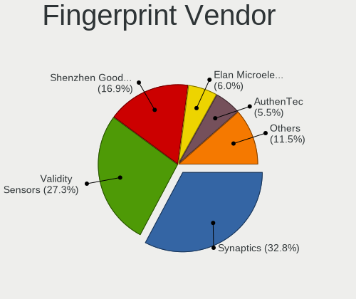

| Vendor                     | Computers | Percent |
|----------------------------|-----------|---------|
| Synaptics                  | 30        | 38.96%  |
| Validity Sensors           | 22        | 28.57%  |
| Shenzhen Goodix Technology | 9         | 11.69%  |
| AuthenTec                  | 6         | 7.79%   |
| Upek                       | 4         | 5.19%   |
| Elan Microelectronics      | 4         | 5.19%   |
| STMicroelectronics         | 1         | 1.3%    |
| LighTuning Technology      | 1         | 1.3%    |

Fingerprint Model
-----------------

Fingerprint sensor models

| Model                                                                      | Computers | Percent |
|----------------------------------------------------------------------------|-----------|---------|
| Synaptics Prometheus MIS Touch Fingerprint Reader                          | 12        | 15.58%  |
| Synaptics  WBDI                                                            | 10        | 12.99%  |
| Shenzhen Goodix  FingerPrint Device                                        | 7         | 9.09%   |
| Unknown                                                                    | 6         | 7.79%   |
| Validity Sensors VFS5011 Fingerprint Reader                                | 4         | 5.19%   |
| Upek Biometric Touchchip/Touchstrip Fingerprint Sensor                     | 4         | 5.19%   |
| Validity Sensors VFS 5011 fingerprint sensor                               | 3         | 3.9%    |
| Validity Sensors Fingerprint scanner                                       | 3         | 3.9%    |
| Elan ELAN:Fingerprint                                                      | 3         | 3.9%    |
| Validity Sensors VFS495 Fingerprint Reader                                 | 2         | 2.6%    |
| Validity Sensors VFS301 Fingerprint Reader                                 | 2         | 2.6%    |
| Validity Sensors VFS101 Fingerprint Reader                                 | 2         | 2.6%    |
| Validity Sensors Synaptics WBDI                                            | 2         | 2.6%    |
| Validity Sensors Swipe Fingerprint Sensor                                  | 2         | 2.6%    |
| Shenzhen Goodix Fingerprint Reader                                         | 2         | 2.6%    |
| AuthenTec Fingerprint Sensor                                               | 2         | 2.6%    |
| AuthenTec AES2501 Fingerprint Sensor                                       | 2         | 2.6%    |
| Validity Sensors VFS7552 Touch Fingerprint Sensor                          | 1         | 1.3%    |
| Validity Sensors Synaptics VFS7552 Touch Fingerprint Sensor with PurePrint | 1         | 1.3%    |
| Synaptics  VFS7552 Touch Fingerprint Sensor with PurePrint                 | 1         | 1.3%    |
| Synaptics Metallica MIS Touch Fingerprint Reader                           | 1         | 1.3%    |
| STMicroelectronics Fingerprint Reader                                      | 1         | 1.3%    |
| LighTuning EgisTec Touch Fingerprint Sensor                                | 1         | 1.3%    |
| Elan ELAN:ARM-M4                                                           | 1         | 1.3%    |
| AuthenTec AES2810                                                          | 1         | 1.3%    |
| AuthenTec AES1660 Fingerprint Sensor                                       | 1         | 1.3%    |

Chipcard Vendor
---------------

Chipcard module vendors

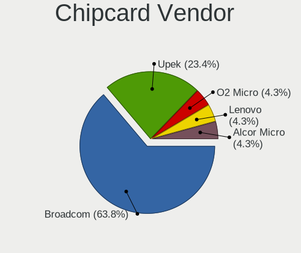

| Vendor   | Computers | Percent |
|----------|-----------|---------|
| Broadcom | 16        | 61.54%  |
| Upek     | 8         | 30.77%  |
| O2 Micro | 1         | 3.85%   |
| Lenovo   | 1         | 3.85%   |

Chipcard Model
--------------

Chipcard module models

| Model                                                                        | Computers | Percent |
|------------------------------------------------------------------------------|-----------|---------|
| Upek TouchChip Fingerprint Coprocessor (WBF advanced mode)                   | 8         | 30.77%  |
| Broadcom BCM5880 Secure Applications Processor                               | 5         | 19.23%  |
| Broadcom 58200                                                               | 5         | 19.23%  |
| Broadcom BCM5880 Secure Applications Processor with fingerprint swipe sensor | 3         | 11.54%  |
| Broadcom 5880                                                                | 3         | 11.54%  |
| O2 Micro OZ776 CCID Smartcard Reader                                         | 1         | 3.85%   |
| Lenovo Integrated Smart Card Reader                                          | 1         | 3.85%   |

Unsupported
-----------

Unsupported Devices
-------------------

Total unsupported devices on board

| Total | Computers | Percent |
|-------|-----------|---------|
| 0     | 994       | 76.4%   |
| 1     | 268       | 20.6%   |
| 2     | 33        | 2.54%   |
| 3     | 5         | 0.38%   |
| 8     | 1         | 0.08%   |

Unsupported Device Types
------------------------

Types of unsupported devices

| Type                     | Computers | Percent |
|--------------------------|-----------|---------|
| Graphics card            | 103       | 29.77%  |
| Fingerprint reader       | 77        | 22.25%  |
| Net/wireless             | 65        | 18.79%  |
| Chipcard                 | 25        | 7.23%   |
| Camera                   | 15        | 4.34%   |
| Multimedia controller    | 11        | 3.18%   |
| Communication controller | 10        | 2.89%   |
| Bluetooth                | 10        | 2.89%   |
| Net/ethernet             | 8         | 2.31%   |
| Sound                    | 5         | 1.45%   |
| Modem                    | 5         | 1.45%   |
| Unassigned class         | 2         | 0.58%   |
| Network                  | 2         | 0.58%   |
| Flash memory             | 2         | 0.58%   |
| Firewire controller      | 2         | 0.58%   |
| Card reader              | 2         | 0.58%   |
| Storage/ide              | 1         | 0.29%   |
| Dvb card                 | 1         | 0.29%   |

