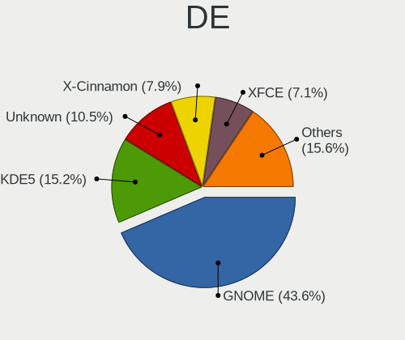
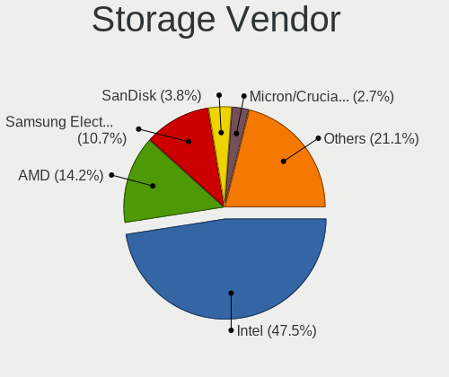
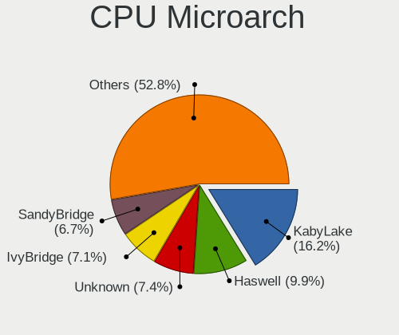
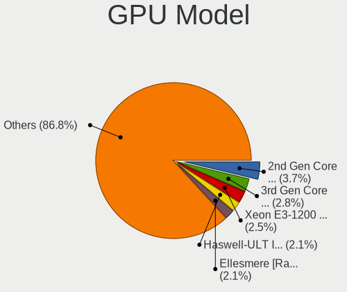
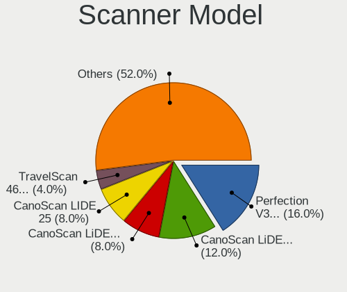
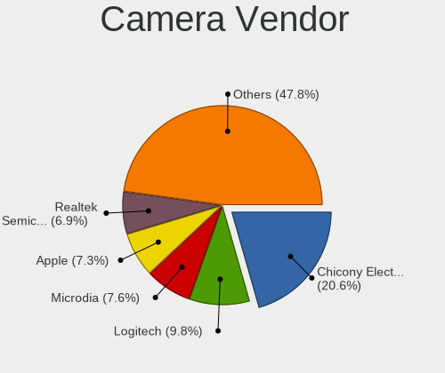
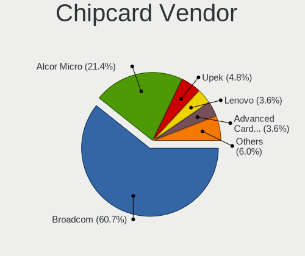
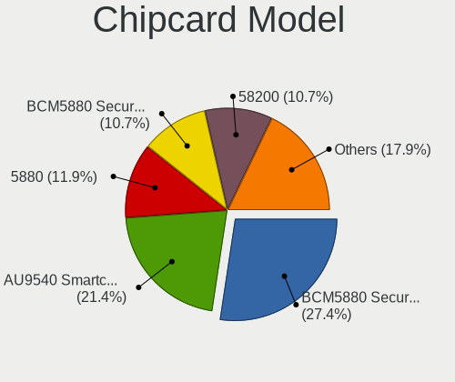

Linux in Australia - Tested Hardware & Statistics
-------------------------------------------------

A project to collect tested hardware configurations for Linux in Australia.

Anyone can contribute to this report by the [hw-probe](https://github.com/linuxhw/hw-probe) tool:

    sudo -E hw-probe -all -upload

Please contribute! Especially if your hardware is rare.

This is a report for all computer types. See also reports for [desktops](/Location/Australia/Desktop/README.md) and [notebooks](/Location/Australia/Notebook/README.md).

Contents
--------

* [ Test Cases ](#test-cases)

* [ System ](#system)
  - [ OS                       ](#os)
  - [ OS Family                ](#os-family)
  - [ Kernel                   ](#kernel)
  - [ Kernel Family            ](#kernel-family)
  - [ Kernel Major Ver.        ](#kernel-major-ver)
  - [ Arch                     ](#arch)
  - [ DE                       ](#de)
  - [ Display Server           ](#display-server)
  - [ Display Manager          ](#display-manager)
  - [ OS Lang                  ](#os-lang)
  - [ Boot Mode                ](#boot-mode)
  - [ Filesystem               ](#filesystem)
  - [ Part. scheme             ](#part-scheme)
  - [ Dual Boot with Linux/BSD ](#dual-boot-with-linuxbsd)
  - [ Dual Boot (Win)          ](#dual-boot-win)

* [ Board ](#board)
  - [ Vendor                   ](#vendor)
  - [ Model                    ](#model)
  - [ Model Family             ](#model-family)
  - [ MFG Year                 ](#mfg-year)
  - [ Form Factor              ](#form-factor)
  - [ Secure Boot              ](#secure-boot)
  - [ Coreboot                 ](#coreboot)
  - [ RAM Size                 ](#ram-size)
  - [ RAM Used                 ](#ram-used)
  - [ Total Drives             ](#total-drives)
  - [ Has CD-ROM               ](#has-cd-rom)
  - [ Has Ethernet             ](#has-ethernet)
  - [ Has WiFi                 ](#has-wifi)
  - [ Has Bluetooth            ](#has-bluetooth)

* [ Location ](#location)
  - [ Country                  ](#country)
  - [ City                     ](#city)

* [ Drives ](#drives)
  - [ Drive Vendor             ](#drive-vendor)
  - [ Drive Model              ](#drive-model)
  - [ HDD Vendor               ](#hdd-vendor)
  - [ SSD Vendor               ](#ssd-vendor)
  - [ Drive Kind               ](#drive-kind)
  - [ Drive Connector          ](#drive-connector)
  - [ Drive Size               ](#drive-size)
  - [ Space Total              ](#space-total)
  - [ Space Used               ](#space-used)
  - [ Malfunc. Drives          ](#malfunc-drives)
  - [ Malfunc. Drive Vendor    ](#malfunc-drive-vendor)
  - [ Malfunc. HDD Vendor      ](#malfunc-hdd-vendor)
  - [ Malfunc. Drive Kind      ](#malfunc-drive-kind)
  - [ Failed Drives            ](#failed-drives)
  - [ Failed Drive Vendor      ](#failed-drive-vendor)
  - [ Drive Status             ](#drive-status)

* [ Storage controller ](#storage-controller)
  - [ Storage Vendor           ](#storage-vendor)
  - [ Storage Model            ](#storage-model)
  - [ Storage Kind             ](#storage-kind)

* [ Processor ](#processor)
  - [ CPU Vendor               ](#cpu-vendor)
  - [ CPU Model                ](#cpu-model)
  - [ CPU Model Family         ](#cpu-model-family)
  - [ CPU Cores                ](#cpu-cores)
  - [ CPU Sockets              ](#cpu-sockets)
  - [ CPU Threads              ](#cpu-threads)
  - [ CPU Op-Modes             ](#cpu-op-modes)
  - [ CPU Microcode            ](#cpu-microcode)
  - [ CPU Microarch            ](#cpu-microarch)

* [ Graphics ](#graphics)
  - [ GPU Vendor               ](#gpu-vendor)
  - [ GPU Model                ](#gpu-model)
  - [ GPU Combo                ](#gpu-combo)
  - [ GPU Driver               ](#gpu-driver)
  - [ GPU Memory               ](#gpu-memory)

* [ Monitor ](#monitor)
  - [ Monitor Vendor           ](#monitor-vendor)
  - [ Monitor Model            ](#monitor-model)
  - [ Monitor Resolution       ](#monitor-resolution)
  - [ Monitor Diagonal         ](#monitor-diagonal)
  - [ Monitor Width            ](#monitor-width)
  - [ Aspect Ratio             ](#aspect-ratio)
  - [ Monitor Area             ](#monitor-area)
  - [ Pixel Density            ](#pixel-density)
  - [ Multiple Monitors        ](#multiple-monitors)

* [ Network ](#network)
  - [ Net Controller Vendor    ](#net-controller-vendor)
  - [ Net Controller Model     ](#net-controller-model)
  - [ Wireless Vendor          ](#wireless-vendor)
  - [ Wireless Model           ](#wireless-model)
  - [ Ethernet Vendor          ](#ethernet-vendor)
  - [ Ethernet Model           ](#ethernet-model)
  - [ Net Controller Kind      ](#net-controller-kind)
  - [ Used Controller          ](#used-controller)
  - [ NICs                     ](#nics)
  - [ IPv6                     ](#ipv6)

* [ Bluetooth ](#bluetooth)
  - [ Bluetooth Vendor         ](#bluetooth-vendor)
  - [ Bluetooth Model          ](#bluetooth-model)

* [ Sound ](#sound)
  - [ Sound Vendor             ](#sound-vendor)
  - [ Sound Model              ](#sound-model)

* [ Memory ](#memory)
  - [ Memory Vendor            ](#memory-vendor)
  - [ Memory Model             ](#memory-model)
  - [ Memory Kind              ](#memory-kind)
  - [ Memory Form Factor       ](#memory-form-factor)
  - [ Memory Size              ](#memory-size)
  - [ Memory Speed             ](#memory-speed)

* [ Printers & scanners ](#printers--scanners)
  - [ Printer Vendor           ](#printer-vendor)
  - [ Printer Model            ](#printer-model)
  - [ Scanner Vendor           ](#scanner-vendor)
  - [ Scanner Model            ](#scanner-model)

* [ Camera ](#camera)
  - [ Camera Vendor            ](#camera-vendor)
  - [ Camera Model             ](#camera-model)

* [ Security ](#security)
  - [ Fingerprint Vendor       ](#fingerprint-vendor)
  - [ Fingerprint Model        ](#fingerprint-model)
  - [ Chipcard Vendor          ](#chipcard-vendor)
  - [ Chipcard Model           ](#chipcard-model)

* [ Unsupported ](#unsupported)
  - [ Unsupported Devices      ](#unsupported-devices)
  - [ Unsupported Device Types ](#unsupported-device-types)

Test Cases
----------

Total: 6183

| Vendor        | Model                       | Form-Factor | Probe                                                      | Date         |
|---------------|-----------------------------|-------------|------------------------------------------------------------|--------------|
| ASUSTek       | M5A97 EVO R2.0              | Desktop     | [cccb18ead9](https://linux-hardware.org/?probe=cccb18ead9) | Dec 24, 2023 |
| Dell          | Inspiron 5485 2n1           | Convertible | [334b43f409](https://linux-hardware.org/?probe=334b43f409) | Dec 24, 2023 |
| MACHINIST     | X99-K9 V2.0                 | Desktop     | [7f4061fd49](https://linux-hardware.org/?probe=7f4061fd49) | Dec 23, 2023 |
| HP            | ENVY x360 Convertible 15... | Convertible | [51eda90982](https://linux-hardware.org/?probe=51eda90982) | Dec 23, 2023 |
| Gigabyte      | D525TUD                     | Desktop     | [dd2248530b](https://linux-hardware.org/?probe=dd2248530b) | Dec 23, 2023 |
| Lenovo        | 30C0 SDK0J40697 WIN 3305... | Desktop     | [da46ad37d3](https://linux-hardware.org/?probe=da46ad37d3) | Dec 23, 2023 |
| Gigabyte      | EP45-DS3L                   | Desktop     | [7cf925bed4](https://linux-hardware.org/?probe=7cf925bed4) | Dec 23, 2023 |
| ASUSTek       | M4A89GTD-PRO                | Desktop     | [05b49062ef](https://linux-hardware.org/?probe=05b49062ef) | Dec 23, 2023 |
| HP            | Pavilion x360 Convertibl... | Convertible | [4da8d961c0](https://linux-hardware.org/?probe=4da8d961c0) | Dec 23, 2023 |
| Gigabyte      | G41MT-D3                    | Desktop     | [d7f5fd2175](https://linux-hardware.org/?probe=d7f5fd2175) | Dec 23, 2023 |
| HP            | Pavilion x360 Convertibl... | Convertible | [9e269e6a94](https://linux-hardware.org/?probe=9e269e6a94) | Dec 23, 2023 |
| HP            | ENVY 15                     | Notebook    | [2997ffe5cf](https://linux-hardware.org/?probe=2997ffe5cf) | Dec 22, 2023 |
| Framework     | Laptop (13th Gen Intel C... | Notebook    | [fa4275395f](https://linux-hardware.org/?probe=fa4275395f) | Dec 22, 2023 |
| MSI           | B250M PRO-VD                | Desktop     | [1a4d75f062](https://linux-hardware.org/?probe=1a4d75f062) | Dec 22, 2023 |
| Gigabyte      | Z68MA-D2H-B3                | Desktop     | [f3f83a4f0a](https://linux-hardware.org/?probe=f3f83a4f0a) | Dec 22, 2023 |
| Gigabyte      | B360M HD3                   | Desktop     | [9acf6baf05](https://linux-hardware.org/?probe=9acf6baf05) | Dec 22, 2023 |
| ASUSTek       | H110M-K                     | Desktop     | [55109c1bbc](https://linux-hardware.org/?probe=55109c1bbc) | Dec 22, 2023 |
| Gigabyte      | H81M-S2H                    | Desktop     | [bbd22340fc](https://linux-hardware.org/?probe=bbd22340fc) | Dec 22, 2023 |
| MSI           | B250M PRO-VH                | Desktop     | [6911b47a19](https://linux-hardware.org/?probe=6911b47a19) | Dec 22, 2023 |
| Gigabyte      | H81M-S2H                    | Desktop     | [fd80bdeaed](https://linux-hardware.org/?probe=fd80bdeaed) | Dec 22, 2023 |
| ASUSTek       | H110M-K                     | Desktop     | [ac7383c630](https://linux-hardware.org/?probe=ac7383c630) | Dec 22, 2023 |
| MSI           | H110M PRO-VH PLUS           | Desktop     | [7b862a6a81](https://linux-hardware.org/?probe=7b862a6a81) | Dec 22, 2023 |
| Intel         | S1200SP H57532-210          | Server      | [8edff49a96](https://linux-hardware.org/?probe=8edff49a96) | Dec 22, 2023 |
| Intel         | S1200RP_SE G62252-408       | Server      | [3e27ac63c6](https://linux-hardware.org/?probe=3e27ac63c6) | Dec 22, 2023 |
| MSI           | H110M PRO-VH PLUS           | Desktop     | [17dd42b383](https://linux-hardware.org/?probe=17dd42b383) | Dec 22, 2023 |
| Gigabyte      | H81M-DS2                    | Desktop     | [e50bd82756](https://linux-hardware.org/?probe=e50bd82756) | Dec 22, 2023 |
| Gigabyte      | H81M-S2H                    | Desktop     | [2194b0ad9c](https://linux-hardware.org/?probe=2194b0ad9c) | Dec 22, 2023 |
| MSI           | H110M PRO-VH PLUS           | Desktop     | [c334514b1f](https://linux-hardware.org/?probe=c334514b1f) | Dec 22, 2023 |
| Gigabyte      | H81M-S2PV                   | Desktop     | [761eebee94](https://linux-hardware.org/?probe=761eebee94) | Dec 22, 2023 |
| Gigabyte      | H81M-S2PH                   | Desktop     | [b6608c7603](https://linux-hardware.org/?probe=b6608c7603) | Dec 22, 2023 |
| MSI           | B365M PRO-VH                | Desktop     | [33bccf75e0](https://linux-hardware.org/?probe=33bccf75e0) | Dec 22, 2023 |
| MSI           | H110M PRO-VH PLUS           | Desktop     | [59b5ebb0c3](https://linux-hardware.org/?probe=59b5ebb0c3) | Dec 22, 2023 |
| MSI           | H110M PRO-VH PLUS           | Desktop     | [0c51eb213d](https://linux-hardware.org/?probe=0c51eb213d) | Dec 22, 2023 |
| Gigabyte      | B250M-HD3-CF                | Desktop     | [347eec7ee9](https://linux-hardware.org/?probe=347eec7ee9) | Dec 22, 2023 |
| MSI           | B365M PRO-VH                | Desktop     | [561a4c0809](https://linux-hardware.org/?probe=561a4c0809) | Dec 22, 2023 |
| MSI           | H110M PRO-VH PLUS           | Desktop     | [27115feb62](https://linux-hardware.org/?probe=27115feb62) | Dec 22, 2023 |
| Gigabyte      | B560M AORUS PRO             | Desktop     | [3ce597e06a](https://linux-hardware.org/?probe=3ce597e06a) | Dec 22, 2023 |
| Gigabyte      | H81M-S2H                    | Desktop     | [be34427eb1](https://linux-hardware.org/?probe=be34427eb1) | Dec 22, 2023 |
| Gigabyte      | H81M-S2H                    | Desktop     | [496ad2d93b](https://linux-hardware.org/?probe=496ad2d93b) | Dec 22, 2023 |
| MSI           | B360M PRO-VH                | Desktop     | [d0bce14740](https://linux-hardware.org/?probe=d0bce14740) | Dec 22, 2023 |
| Gigabyte      | H81M-S2H                    | Desktop     | [5fb5668250](https://linux-hardware.org/?probe=5fb5668250) | Dec 22, 2023 |
| ASUSTek       | H110M-K                     | Desktop     | [caad19d314](https://linux-hardware.org/?probe=caad19d314) | Dec 22, 2023 |
| MSI           | B360M PRO-VH                | Desktop     | [b1c0126e05](https://linux-hardware.org/?probe=b1c0126e05) | Dec 22, 2023 |
| MSI           | B365M PRO-VH                | Desktop     | [d1c63c1a0b](https://linux-hardware.org/?probe=d1c63c1a0b) | Dec 22, 2023 |
| Gigabyte      | H81M-S2H                    | Desktop     | [a42bd5e717](https://linux-hardware.org/?probe=a42bd5e717) | Dec 22, 2023 |
| MSI           | B365M PRO-VH                | Desktop     | [a75998d2da](https://linux-hardware.org/?probe=a75998d2da) | Dec 22, 2023 |
| MSI           | B365M PRO-VH                | Desktop     | [b55f33d76e](https://linux-hardware.org/?probe=b55f33d76e) | Dec 22, 2023 |
| MSI           | B365M PRO-VH                | Desktop     | [49e9a2f26f](https://linux-hardware.org/?probe=49e9a2f26f) | Dec 22, 2023 |
| MSI           | B365M PRO-VH                | Desktop     | [8c3370c21e](https://linux-hardware.org/?probe=8c3370c21e) | Dec 22, 2023 |
| Gigabyte      | B560M AORUS PRO             | Desktop     | [94de79174c](https://linux-hardware.org/?probe=94de79174c) | Dec 22, 2023 |
| MSI           | B365M PRO-VH                | Desktop     | [59bc9b5d02](https://linux-hardware.org/?probe=59bc9b5d02) | Dec 22, 2023 |
| MSI           | B250M PRO-VH                | Desktop     | [87af1005b8](https://linux-hardware.org/?probe=87af1005b8) | Dec 22, 2023 |
| Gigabyte      | H81M-S2H                    | Desktop     | [55570e65a7](https://linux-hardware.org/?probe=55570e65a7) | Dec 22, 2023 |
| Gigabyte      | H81M-DS2                    | Desktop     | [eea4397d45](https://linux-hardware.org/?probe=eea4397d45) | Dec 22, 2023 |
| MSI           | B365M PRO-VH                | Desktop     | [b32df5066d](https://linux-hardware.org/?probe=b32df5066d) | Dec 22, 2023 |
| MSI           | B365M PRO-VH                | Desktop     | [a949e7fa06](https://linux-hardware.org/?probe=a949e7fa06) | Dec 22, 2023 |
| MSI           | B365M PRO-VH                | Desktop     | [e2b4e10140](https://linux-hardware.org/?probe=e2b4e10140) | Dec 22, 2023 |
| MSI           | B365M PRO-VH                | Desktop     | [87c9436145](https://linux-hardware.org/?probe=87c9436145) | Dec 22, 2023 |
| MSI           | B365M PRO-VH                | Desktop     | [b3a3b91d1d](https://linux-hardware.org/?probe=b3a3b91d1d) | Dec 22, 2023 |
| ASUSTek       | M5A78L-M LX V2              | Desktop     | [0ae8561f0a](https://linux-hardware.org/?probe=0ae8561f0a) | Dec 22, 2023 |
| Gigabyte      | H81M-S2PV                   | Desktop     | [2f23b66d3b](https://linux-hardware.org/?probe=2f23b66d3b) | Dec 22, 2023 |
| ASUSTek       | H110M-K                     | Desktop     | [617899113a](https://linux-hardware.org/?probe=617899113a) | Dec 22, 2023 |
| Gigabyte      | H81M-S2PV                   | Desktop     | [3092182d1d](https://linux-hardware.org/?probe=3092182d1d) | Dec 22, 2023 |
| Gigabyte      | H81M-S2H                    | Desktop     | [3f48c50868](https://linux-hardware.org/?probe=3f48c50868) | Dec 22, 2023 |
| MSI           | B250M PRO-VH                | Desktop     | [cac98c44ed](https://linux-hardware.org/?probe=cac98c44ed) | Dec 22, 2023 |
| Gigabyte      | H81M-S2H                    | Desktop     | [6d0e82b783](https://linux-hardware.org/?probe=6d0e82b783) | Dec 22, 2023 |
| Gigabyte      | H81M-DS2                    | Desktop     | [afd422517d](https://linux-hardware.org/?probe=afd422517d) | Dec 22, 2023 |
| MSI           | B360M PRO-VH                | Desktop     | [1db23ed649](https://linux-hardware.org/?probe=1db23ed649) | Dec 22, 2023 |
| MSI           | B360M PRO-VH                | Desktop     | [8ed791bd6d](https://linux-hardware.org/?probe=8ed791bd6d) | Dec 22, 2023 |
| Gigabyte      | H81M-S2H                    | Desktop     | [5a63cf039d](https://linux-hardware.org/?probe=5a63cf039d) | Dec 22, 2023 |
| MSI           | H110M PRO-VH PLUS           | Desktop     | [46e2b13b34](https://linux-hardware.org/?probe=46e2b13b34) | Dec 22, 2023 |
| MSI           | B250M PRO-VH                | Desktop     | [d09a9c1d0b](https://linux-hardware.org/?probe=d09a9c1d0b) | Dec 22, 2023 |
| Gigabyte      | H81M-S2H                    | Desktop     | [9181bd8696](https://linux-hardware.org/?probe=9181bd8696) | Dec 22, 2023 |
| MSI           | H110M PRO-VH PLUS           | Desktop     | [67188e1b67](https://linux-hardware.org/?probe=67188e1b67) | Dec 22, 2023 |
| Gigabyte      | H81M-DS2                    | Desktop     | [75e2601753](https://linux-hardware.org/?probe=75e2601753) | Dec 22, 2023 |
| MSI           | B250M PRO-VH                | Desktop     | [83d6013a05](https://linux-hardware.org/?probe=83d6013a05) | Dec 22, 2023 |
| Gigabyte      | H81M-S2H                    | Desktop     | [86e58bba42](https://linux-hardware.org/?probe=86e58bba42) | Dec 22, 2023 |
| Gigabyte      | H81M-S2H                    | Desktop     | [6b6c41afa2](https://linux-hardware.org/?probe=6b6c41afa2) | Dec 22, 2023 |
| Gigabyte      | B360M HD3                   | Desktop     | [635fdfc9be](https://linux-hardware.org/?probe=635fdfc9be) | Dec 22, 2023 |
| MSI           | B365M PRO-VH                | Desktop     | [057ea7f38a](https://linux-hardware.org/?probe=057ea7f38a) | Dec 22, 2023 |
| ASUSTek       | H110M-K                     | Desktop     | [0318224393](https://linux-hardware.org/?probe=0318224393) | Dec 22, 2023 |
| Gigabyte      | H81M-S2H                    | Desktop     | [6f2b8275b2](https://linux-hardware.org/?probe=6f2b8275b2) | Dec 22, 2023 |
| MSI           | B365M PRO-VH                | Desktop     | [4cd5825edf](https://linux-hardware.org/?probe=4cd5825edf) | Dec 22, 2023 |
| MSI           | B360M PRO-VH                | Desktop     | [3e070bb5d3](https://linux-hardware.org/?probe=3e070bb5d3) | Dec 22, 2023 |
| MSI           | H110M PRO-VH PLUS           | Desktop     | [c3140237d9](https://linux-hardware.org/?probe=c3140237d9) | Dec 22, 2023 |
| MSI           | B360M PRO-VH                | Desktop     | [2169da8737](https://linux-hardware.org/?probe=2169da8737) | Dec 22, 2023 |
| MSI           | B250M PRO-VH                | Desktop     | [968400d838](https://linux-hardware.org/?probe=968400d838) | Dec 22, 2023 |
| HP            | EliteBook x360 1020 G2      | Convertible | [18fc29611b](https://linux-hardware.org/?probe=18fc29611b) | Dec 22, 2023 |
| Gigabyte      | MZ72-HB0-00 01020102        | Server      | [771f7edd98](https://linux-hardware.org/?probe=771f7edd98) | Dec 22, 2023 |
| Gigabyte      | Z87-HD3                     | Desktop     | [49e514e9c4](https://linux-hardware.org/?probe=49e514e9c4) | Dec 21, 2023 |
| Gigabyte      | B550M S2H                   | Desktop     | [0cf7feafe8](https://linux-hardware.org/?probe=0cf7feafe8) | Dec 21, 2023 |
| ASUSTek       | X99-DELUXE II               | Desktop     | [dca266a251](https://linux-hardware.org/?probe=dca266a251) | Dec 21, 2023 |
| sunxi         | Unknown                     | Soc         | [07307d0820](https://linux-hardware.org/?probe=07307d0820) | Dec 21, 2023 |
| ASUSTek       | X99-DELUXE II               | Desktop     | [b9409f01d5](https://linux-hardware.org/?probe=b9409f01d5) | Dec 21, 2023 |
| Acer          | Spin SP314-54N              | Convertible | [3a065e8d32](https://linux-hardware.org/?probe=3a065e8d32) | Dec 21, 2023 |
| ASUSTek       | ROG STRIX Z690-E GAMING ... | Desktop     | [47d1d26375](https://linux-hardware.org/?probe=47d1d26375) | Dec 21, 2023 |
| Shenzhen M... | F7BSC                       | Desktop     | [70147072be](https://linux-hardware.org/?probe=70147072be) | Dec 21, 2023 |
| Dell          | Precision 5680              | Notebook    | [b8b5bc0292](https://linux-hardware.org/?probe=b8b5bc0292) | Dec 20, 2023 |
| ASUSTek       | X553MA                      | Notebook    | [bc7fc2be74](https://linux-hardware.org/?probe=bc7fc2be74) | Dec 20, 2023 |
| ASUSTek       | P8Z77-M PRO                 | Desktop     | [58517da295](https://linux-hardware.org/?probe=58517da295) | Dec 20, 2023 |
| ASUSTek       | X553MA                      | Notebook    | [11f3b9c9d6](https://linux-hardware.org/?probe=11f3b9c9d6) | Dec 20, 2023 |
| ASUSTek       | ROG STRIX Z690-E GAMING ... | Desktop     | [6a962e40ec](https://linux-hardware.org/?probe=6a962e40ec) | Dec 19, 2023 |
| MSI           | B250M PRO-VD                | Desktop     | [925bd9bbac](https://linux-hardware.org/?probe=925bd9bbac) | Dec 19, 2023 |
| Dell          | XPS 15 9560                 | Notebook    | [1bd33b2c6b](https://linux-hardware.org/?probe=1bd33b2c6b) | Dec 18, 2023 |
| Gigabyte      | GA-A55M-S2V                 | Desktop     | [c66e6657fe](https://linux-hardware.org/?probe=c66e6657fe) | Dec 18, 2023 |
| Apple         | MacBookPro12,1              | Notebook    | [6db91b5eb2](https://linux-hardware.org/?probe=6db91b5eb2) | Dec 18, 2023 |
| ASUSTek       | X580VD                      | Notebook    | [8629995933](https://linux-hardware.org/?probe=8629995933) | Dec 17, 2023 |
| ASUSTek       | PRIME A520M-E               | Desktop     | [02e1fcae39](https://linux-hardware.org/?probe=02e1fcae39) | Dec 17, 2023 |
| ASUSTek       | PRIME A520M-E               | Desktop     | [c878de7adb](https://linux-hardware.org/?probe=c878de7adb) | Dec 17, 2023 |
| Raspberry ... | Raspberry Pi 3 Model B P... | Soc         | [941de66870](https://linux-hardware.org/?probe=941de66870) | Dec 17, 2023 |
| Toshiba       | PORTEGE Z20t-C              | Notebook    | [eb941689a4](https://linux-hardware.org/?probe=eb941689a4) | Dec 17, 2023 |
| Intel         | LADPNVMO AAE76523-300       | Desktop     | [9f0d5821e3](https://linux-hardware.org/?probe=9f0d5821e3) | Dec 16, 2023 |
| Apple         | MacBookPro10,1              | Notebook    | [adc736fc8d](https://linux-hardware.org/?probe=adc736fc8d) | Dec 16, 2023 |
| ASRock        | X570 Taichi                 | Desktop     | [6458d64d28](https://linux-hardware.org/?probe=6458d64d28) | Dec 16, 2023 |
| Gigabyte      | G41MT-D3                    | Desktop     | [39e7517ac6](https://linux-hardware.org/?probe=39e7517ac6) | Dec 16, 2023 |
| Lenovo        | ThinkPad Yoga 370 20JJ00... | Convertible | [5382e06902](https://linux-hardware.org/?probe=5382e06902) | Dec 16, 2023 |
| Dell          | 0RY007                      | Desktop     | [162add826a](https://linux-hardware.org/?probe=162add826a) | Dec 16, 2023 |
| Gigabyte      | X570 AORUS MASTER           | Desktop     | [68a9708e6a](https://linux-hardware.org/?probe=68a9708e6a) | Dec 16, 2023 |
| Gigabyte      | D525TUD                     | Desktop     | [34a66d3cef](https://linux-hardware.org/?probe=34a66d3cef) | Dec 15, 2023 |
| Gigabyte      | B760M D3H DDR4              | Desktop     | [339b5b1b33](https://linux-hardware.org/?probe=339b5b1b33) | Dec 15, 2023 |
| Shuttle       | DS10U                       | Desktop     | [2b28414f3d](https://linux-hardware.org/?probe=2b28414f3d) | Dec 14, 2023 |
| Shuttle       | DS10U                       | Desktop     | [0a9d211454](https://linux-hardware.org/?probe=0a9d211454) | Dec 14, 2023 |
| HP            | 212B                        | Desktop     | [1ce8b8d929](https://linux-hardware.org/?probe=1ce8b8d929) | Dec 14, 2023 |
| HP            | ENVY x360 Convertible 15... | Convertible | [f170615f49](https://linux-hardware.org/?probe=f170615f49) | Dec 14, 2023 |
| Apple         | Mac-031B6874CF7F642A iMa... | All in one  | [27c22f0c94](https://linux-hardware.org/?probe=27c22f0c94) | Dec 14, 2023 |
| Lenovo        | ThinkPad Mini10 3507A31     | Notebook    | [b5b534e106](https://linux-hardware.org/?probe=b5b534e106) | Dec 14, 2023 |
| Dell          | 0TDG4V A01                  | Desktop     | [6da01d5871](https://linux-hardware.org/?probe=6da01d5871) | Dec 14, 2023 |
| Unknown       | Unknown                     | Desktop     | [7c84d77c07](https://linux-hardware.org/?probe=7c84d77c07) | Dec 14, 2023 |
| ASUSTek       | T102HA                      | Tablet      | [0a2b707101](https://linux-hardware.org/?probe=0a2b707101) | Dec 13, 2023 |
| HP            | Laptop 15-fc0xxx            | Notebook    | [e49be74129](https://linux-hardware.org/?probe=e49be74129) | Dec 13, 2023 |
| Gigabyte      | H77N-WIFI                   | Desktop     | [017252c955](https://linux-hardware.org/?probe=017252c955) | Dec 13, 2023 |
| Acer          | Aspire R3-131T              | Notebook    | [5fc8de17bb](https://linux-hardware.org/?probe=5fc8de17bb) | Dec 13, 2023 |
| Lenovo        | ThinkPad T410 2522PT3       | Notebook    | [625439b5a5](https://linux-hardware.org/?probe=625439b5a5) | Dec 13, 2023 |
| Gigabyte      | Q87M-MK                     | Desktop     | [25a03e3488](https://linux-hardware.org/?probe=25a03e3488) | Dec 13, 2023 |
| Gigabyte      | D525TUD                     | Desktop     | [12c2204715](https://linux-hardware.org/?probe=12c2204715) | Dec 12, 2023 |
| Gigabyte      | Z77MX-D3H                   | Desktop     | [45cc0c507d](https://linux-hardware.org/?probe=45cc0c507d) | Dec 12, 2023 |
| Dell          | 0MGK50 A01                  | Desktop     | [7471a7b26e](https://linux-hardware.org/?probe=7471a7b26e) | Dec 12, 2023 |
| ASUSTek       | Maximus V GENE              | Desktop     | [fb88caee81](https://linux-hardware.org/?probe=fb88caee81) | Dec 12, 2023 |
| ASRock        | Z170 Extreme4               | Desktop     | [dceaa713f6](https://linux-hardware.org/?probe=dceaa713f6) | Dec 12, 2023 |
| Gigabyte      | Z97N-WIFI                   | Desktop     | [514227865f](https://linux-hardware.org/?probe=514227865f) | Dec 12, 2023 |
| MSI           | NIGHTBLADE Z97              | Desktop     | [90fce6c777](https://linux-hardware.org/?probe=90fce6c777) | Dec 11, 2023 |
| Lenovo        | G50-70 20351                | Notebook    | [d22fb3a791](https://linux-hardware.org/?probe=d22fb3a791) | Dec 11, 2023 |
| Valve         | Jupiter                     | Notebook    | [b78720dbf3](https://linux-hardware.org/?probe=b78720dbf3) | Dec 11, 2023 |
| Gigabyte      | J1900M-D2P                  | Desktop     | [f706bd9261](https://linux-hardware.org/?probe=f706bd9261) | Dec 11, 2023 |
| MSI           | NIGHTBLADE Z97              | Desktop     | [6c83c2bec6](https://linux-hardware.org/?probe=6c83c2bec6) | Dec 11, 2023 |
| ASUSTek       | ROG STRIX Z690-E GAMING ... | Desktop     | [4e40941aef](https://linux-hardware.org/?probe=4e40941aef) | Dec 11, 2023 |
| ASUSTek       | A8R32-MVP Deluxe            | Desktop     | [069b020cd5](https://linux-hardware.org/?probe=069b020cd5) | Dec 10, 2023 |
| Framework     | Laptop 13 (AMD Ryzen 704... | Notebook    | [2aef9deafb](https://linux-hardware.org/?probe=2aef9deafb) | Dec 10, 2023 |
| HP            | ProBook 6460b               | Notebook    | [99fa9c84ca](https://linux-hardware.org/?probe=99fa9c84ca) | Dec 10, 2023 |
| LattePanda    | Sigma                       | Desktop     | [4c33e7d514](https://linux-hardware.org/?probe=4c33e7d514) | Dec 10, 2023 |
| Gigabyte      | P55A-UD4                    | Desktop     | [f7a1a6172f](https://linux-hardware.org/?probe=f7a1a6172f) | Dec 09, 2023 |
| MSI           | B150M PRO-VDH               | Desktop     | [e35af0e70a](https://linux-hardware.org/?probe=e35af0e70a) | Dec 09, 2023 |
| Gigabyte      | Z87-HD3                     | Desktop     | [9f3fb37b64](https://linux-hardware.org/?probe=9f3fb37b64) | Dec 09, 2023 |
| Gigabyte      | Z87-HD3                     | Desktop     | [26c99ed573](https://linux-hardware.org/?probe=26c99ed573) | Dec 09, 2023 |
| MSI           | B150M PRO-VDH               | Desktop     | [634d1d56b8](https://linux-hardware.org/?probe=634d1d56b8) | Dec 09, 2023 |
| Dell          | Inspiron 1525               | Notebook    | [0ee42c0440](https://linux-hardware.org/?probe=0ee42c0440) | Dec 08, 2023 |
| ASUSTek       | VivoBook_ASUSLaptop M350... | Notebook    | [afc78e9ba2](https://linux-hardware.org/?probe=afc78e9ba2) | Dec 08, 2023 |
| ASUSTek       | VivoBook_ASUSLaptop M350... | Notebook    | [a6b0055398](https://linux-hardware.org/?probe=a6b0055398) | Dec 08, 2023 |
| Lenovo        | ThinkPad Mini10 3507A31     | Notebook    | [1229fd52f5](https://linux-hardware.org/?probe=1229fd52f5) | Dec 08, 2023 |
| Acer          | Extensa 4210                | Notebook    | [4f8a82394a](https://linux-hardware.org/?probe=4f8a82394a) | Dec 07, 2023 |
| Dell          | 0GWHMW A00                  | Desktop     | [7843d89bd3](https://linux-hardware.org/?probe=7843d89bd3) | Dec 07, 2023 |
| Lenovo        | Win8 Pro DPK TPG            | Desktop     | [5183612439](https://linux-hardware.org/?probe=5183612439) | Dec 07, 2023 |
| Microsoft     | Surface Go 3                | Tablet      | [fc9cdcbc63](https://linux-hardware.org/?probe=fc9cdcbc63) | Dec 07, 2023 |
| Samsung       | Galaxy Book 12 LTE          | Tablet      | [ca9c01eb88](https://linux-hardware.org/?probe=ca9c01eb88) | Dec 06, 2023 |
| ASUSTek       | M4A89GTD-PRO                | Desktop     | [086d8b6cd1](https://linux-hardware.org/?probe=086d8b6cd1) | Dec 06, 2023 |
| BESSTAR Te... | B550                        | Desktop     | [fb50a6bd26](https://linux-hardware.org/?probe=fb50a6bd26) | Dec 06, 2023 |
| HP            | 250 G7 Notebook PC          | Notebook    | [bed4fa69c4](https://linux-hardware.org/?probe=bed4fa69c4) | Dec 06, 2023 |
| HP            | 250 G7 Notebook PC          | Notebook    | [52cdd2c7b2](https://linux-hardware.org/?probe=52cdd2c7b2) | Dec 06, 2023 |
| ASUSTek       | PRIME B660M-A D4            | Desktop     | [12c6da7b14](https://linux-hardware.org/?probe=12c6da7b14) | Dec 05, 2023 |
| HP            | Pavilion x360 Convertibl... | Convertible | [7b0120def9](https://linux-hardware.org/?probe=7b0120def9) | Dec 05, 2023 |
| ASUSTek       | V-P7H55E                    | Desktop     | [c20a63636f](https://linux-hardware.org/?probe=c20a63636f) | Dec 05, 2023 |
| ASRock        | AD2700-ITX                  | Desktop     | [3681f281ac](https://linux-hardware.org/?probe=3681f281ac) | Dec 05, 2023 |
| Dell          | Latitude E6410              | Notebook    | [65b6e47cf8](https://linux-hardware.org/?probe=65b6e47cf8) | Dec 04, 2023 |
| Gigabyte      | Z97N-WIFI                   | Desktop     | [aeae361474](https://linux-hardware.org/?probe=aeae361474) | Dec 04, 2023 |
| SONIQ Digi... | Soniq 11.6inch Convertib... | Convertible | [4e67d597e1](https://linux-hardware.org/?probe=4e67d597e1) | Dec 04, 2023 |
| Lenovo        | SHARKBAY NOK                | Desktop     | [4c8abee905](https://linux-hardware.org/?probe=4c8abee905) | Dec 03, 2023 |
| Dell          | 07F37C A00                  | Desktop     | [685253bf96](https://linux-hardware.org/?probe=685253bf96) | Dec 03, 2023 |
| HP            | 3397                        | Desktop     | [b6c4db2738](https://linux-hardware.org/?probe=b6c4db2738) | Dec 03, 2023 |
| ASRock        | B650E PG-ITX WiFi           | Desktop     | [94317ffd1f](https://linux-hardware.org/?probe=94317ffd1f) | Dec 02, 2023 |
| Gigabyte      | GA-870A-UD3                 | Desktop     | [a827e0cc16](https://linux-hardware.org/?probe=a827e0cc16) | Dec 02, 2023 |
| Gigabyte      | J1900M-D2P                  | Desktop     | [0d2ac061a9](https://linux-hardware.org/?probe=0d2ac061a9) | Dec 02, 2023 |
| Dell          | Latitude 5520               | Notebook    | [5b61695af2](https://linux-hardware.org/?probe=5b61695af2) | Dec 01, 2023 |
| ASUSTek       | TUF Gaming B760-PLUS WIF... | Desktop     | [a9f72ce2ae](https://linux-hardware.org/?probe=a9f72ce2ae) | Dec 01, 2023 |
| HP            | 805D                        | Desktop     | [4733a9082a](https://linux-hardware.org/?probe=4733a9082a) | Dec 01, 2023 |
| Lenovo        | Z50-70 20354                | Notebook    | [44ad415f8f](https://linux-hardware.org/?probe=44ad415f8f) | Dec 01, 2023 |
| Microsoft     | Surface Pro 4               | Tablet      | [23e7e70bc6](https://linux-hardware.org/?probe=23e7e70bc6) | Dec 01, 2023 |
| Intel         | LADPNVMO AAE76523-300       | Desktop     | [0ed139ee9c](https://linux-hardware.org/?probe=0ed139ee9c) | Dec 01, 2023 |
| Dell          | 014GRG A03                  | Desktop     | [581d6ec42f](https://linux-hardware.org/?probe=581d6ec42f) | Nov 30, 2023 |
| ASRock        | AD2700-ITX                  | Desktop     | [215e772a98](https://linux-hardware.org/?probe=215e772a98) | Nov 30, 2023 |
| AZW           | MINI S 10                   | Desktop     | [f71053bf5c](https://linux-hardware.org/?probe=f71053bf5c) | Nov 30, 2023 |
| MSI           | PRO H610M-G DDR4            | Desktop     | [81aca77f2e](https://linux-hardware.org/?probe=81aca77f2e) | Nov 30, 2023 |
| Gigabyte      | H81M-S2H                    | Desktop     | [b23f24b006](https://linux-hardware.org/?probe=b23f24b006) | Nov 30, 2023 |
| ASUSTek       | TUF Gaming FX705DU_FX705... | Notebook    | [c781f63b2a](https://linux-hardware.org/?probe=c781f63b2a) | Nov 30, 2023 |
| Lenovo        | SHARKBAY NOK                | Desktop     | [be4ecb6dfa](https://linux-hardware.org/?probe=be4ecb6dfa) | Nov 29, 2023 |
| HP            | Laptop 15s-du0xxx           | Notebook    | [bf583ba008](https://linux-hardware.org/?probe=bf583ba008) | Nov 29, 2023 |
| ASUSTek       | ROG Maximus XII EXTREME     | Desktop     | [e6c589b9b0](https://linux-hardware.org/?probe=e6c589b9b0) | Nov 29, 2023 |
| ASUSTek       | B85M-E                      | Desktop     | [028d79b006](https://linux-hardware.org/?probe=028d79b006) | Nov 29, 2023 |
| Dell          | 0V0D45 A01                  | All in one  | [1976be5d27](https://linux-hardware.org/?probe=1976be5d27) | Nov 29, 2023 |
| ASUSTek       | ROG Maximus XII EXTREME     | Desktop     | [62cb0079ed](https://linux-hardware.org/?probe=62cb0079ed) | Nov 29, 2023 |
| ASUSTek       | TUF Gaming B650M-E WIFI     | Desktop     | [bb86b33f71](https://linux-hardware.org/?probe=bb86b33f71) | Nov 28, 2023 |
| Acer          | Nitro AN515-56              | Notebook    | [b2dd77b768](https://linux-hardware.org/?probe=b2dd77b768) | Nov 28, 2023 |
| HP            | 8055                        | Desktop     | [a35b553ba1](https://linux-hardware.org/?probe=a35b553ba1) | Nov 28, 2023 |
| ASRock        | H97M Pro4                   | Desktop     | [88bee4d4f2](https://linux-hardware.org/?probe=88bee4d4f2) | Nov 28, 2023 |
| MSI           | GF63 Thin 10SCXR            | Notebook    | [20e52e5c9b](https://linux-hardware.org/?probe=20e52e5c9b) | Nov 28, 2023 |
| MSI           | GF63 Thin 10SCXR            | Notebook    | [09dfe90de1](https://linux-hardware.org/?probe=09dfe90de1) | Nov 28, 2023 |
| Microsoft     | Surface Pro 3               | Tablet      | [0a8209a7e9](https://linux-hardware.org/?probe=0a8209a7e9) | Nov 28, 2023 |
| Toshiba       | PORTEGE X30-E               | Notebook    | [9b85473f0f](https://linux-hardware.org/?probe=9b85473f0f) | Nov 28, 2023 |
| ASUSTek       | Zenbook UM3402YAR_UM3402... | Notebook    | [aadba04a83](https://linux-hardware.org/?probe=aadba04a83) | Nov 27, 2023 |
| Dell          | Latitude 7490               | Notebook    | [4d59532412](https://linux-hardware.org/?probe=4d59532412) | Nov 27, 2023 |
| Gigabyte      | Z77MX-D3H                   | Desktop     | [af4437b421](https://linux-hardware.org/?probe=af4437b421) | Nov 27, 2023 |
| ASUSTek       | X99-DELUXE II               | Desktop     | [2bb0010426](https://linux-hardware.org/?probe=2bb0010426) | Nov 27, 2023 |
| Gigabyte      | H77N-WIFI                   | Desktop     | [b71948f3b9](https://linux-hardware.org/?probe=b71948f3b9) | Nov 27, 2023 |
| HP            | 245 G6 Notebook PC          | Notebook    | [1256303ece](https://linux-hardware.org/?probe=1256303ece) | Nov 26, 2023 |
| HP            | 245 G6 Notebook PC          | Notebook    | [0b00139036](https://linux-hardware.org/?probe=0b00139036) | Nov 26, 2023 |
| Shenzhen M... | F7BSC                       | Mini pc     | [ea77c54dd3](https://linux-hardware.org/?probe=ea77c54dd3) | Nov 26, 2023 |
| Gigabyte      | B560M DS3H AC               | Desktop     | [906f471cf6](https://linux-hardware.org/?probe=906f471cf6) | Nov 26, 2023 |
| HP            | Pavilion dv6                | Notebook    | [e09777761c](https://linux-hardware.org/?probe=e09777761c) | Nov 26, 2023 |
| Gigabyte      | Z590 GAMING X               | Desktop     | [4b886fb042](https://linux-hardware.org/?probe=4b886fb042) | Nov 26, 2023 |
| Gigabyte      | Z370 HD3-CF                 | Desktop     | [4f4c868c9a](https://linux-hardware.org/?probe=4f4c868c9a) | Nov 26, 2023 |
| Dell          | Vostro 3401                 | Notebook    | [3496a45338](https://linux-hardware.org/?probe=3496a45338) | Nov 25, 2023 |
| Dell          | 0TDG4V A01                  | Desktop     | [f8200e619a](https://linux-hardware.org/?probe=f8200e619a) | Nov 25, 2023 |
| Dell          | 0XDN97 A02                  | Server      | [0f4391e6bf](https://linux-hardware.org/?probe=0f4391e6bf) | Nov 25, 2023 |
| Matsushita... | CF-30FCDALAM                | Notebook    | [94d60b91d5](https://linux-hardware.org/?probe=94d60b91d5) | Nov 25, 2023 |
| HP            | Laptop 15s-du0xxx           | Notebook    | [7e541895b2](https://linux-hardware.org/?probe=7e541895b2) | Nov 25, 2023 |
| Gigabyte      | G41MT-D3                    | Desktop     | [39af83330a](https://linux-hardware.org/?probe=39af83330a) | Nov 25, 2023 |
| Gigabyte      | B450M DS3H-CF               | Desktop     | [436499a8a7](https://linux-hardware.org/?probe=436499a8a7) | Nov 25, 2023 |
| Acer          | Spin SP314-54N              | Convertible | [6a4204f060](https://linux-hardware.org/?probe=6a4204f060) | Nov 24, 2023 |
| ASUSTek       | VivoBook_ASUSLaptop K660... | Notebook    | [145e6fbb42](https://linux-hardware.org/?probe=145e6fbb42) | Nov 24, 2023 |
| ASUSTek       | A8R32-MVP Deluxe            | Desktop     | [a4af0718ed](https://linux-hardware.org/?probe=a4af0718ed) | Nov 23, 2023 |
| Unknown       | Unknown                     | Desktop     | [b3287ea2f2](https://linux-hardware.org/?probe=b3287ea2f2) | Nov 23, 2023 |
| ASUSTek       | P5G41T-M LX                 | Desktop     | [fca11dfd70](https://linux-hardware.org/?probe=fca11dfd70) | Nov 23, 2023 |
| Acer          | Aspire TC-780               | Desktop     | [dbce2ba706](https://linux-hardware.org/?probe=dbce2ba706) | Nov 23, 2023 |
| Valve         | Jupiter                     | Notebook    | [a4f7cad00f](https://linux-hardware.org/?probe=a4f7cad00f) | Nov 22, 2023 |
| Valve         | Jupiter                     | Notebook    | [bdb118e120](https://linux-hardware.org/?probe=bdb118e120) | Nov 22, 2023 |
| Acer          | Aspire AV15-51              | Notebook    | [6ca712a0bb](https://linux-hardware.org/?probe=6ca712a0bb) | Nov 22, 2023 |
| Acer          | Aspire AV15-51              | Notebook    | [09108a2bc4](https://linux-hardware.org/?probe=09108a2bc4) | Nov 22, 2023 |
| ASUSTek       | ROG CROSSHAIR VIII HERO     | Desktop     | [abb0181b70](https://linux-hardware.org/?probe=abb0181b70) | Nov 22, 2023 |
| Raspberry ... | Raspberry Pi 4 Model B R... | Soc         | [07b43fd48f](https://linux-hardware.org/?probe=07b43fd48f) | Nov 22, 2023 |
| Acer          | Nitro AN515-56              | Notebook    | [9eb5267c48](https://linux-hardware.org/?probe=9eb5267c48) | Nov 22, 2023 |
| Intel         | NUC11PABi7 M68262-501       | Mini pc     | [d38bf64de1](https://linux-hardware.org/?probe=d38bf64de1) | Nov 22, 2023 |
| Supermicro    | X10SDV-8C-TLN4F             | Server      | [4b79ce361d](https://linux-hardware.org/?probe=4b79ce361d) | Nov 21, 2023 |
| HP            | ProBook 430 G2              | Notebook    | [e0a3622122](https://linux-hardware.org/?probe=e0a3622122) | Nov 20, 2023 |
| Dell          | XPS 15 9560                 | Notebook    | [be841a1ee6](https://linux-hardware.org/?probe=be841a1ee6) | Nov 19, 2023 |
| Dell          | 0HD5W2 A00                  | Desktop     | [cc99141ae2](https://linux-hardware.org/?probe=cc99141ae2) | Nov 19, 2023 |
| Dell          | 0HD5W2 A00                  | Desktop     | [ac3283c49b](https://linux-hardware.org/?probe=ac3283c49b) | Nov 19, 2023 |
| Dell          | 0TDG4V A01                  | Desktop     | [737ddab002](https://linux-hardware.org/?probe=737ddab002) | Nov 19, 2023 |
| Gigabyte      | G41MT-D3                    | Desktop     | [2ccdec1495](https://linux-hardware.org/?probe=2ccdec1495) | Nov 19, 2023 |
| ASUSTek       | G10DK                       | Desktop     | [253859ae2a](https://linux-hardware.org/?probe=253859ae2a) | Nov 19, 2023 |
| Gigabyte      | Z790 AORUS ELITE AX DDR4    | Desktop     | [866a100b18](https://linux-hardware.org/?probe=866a100b18) | Nov 19, 2023 |
| Acer          | Nitro AN515-56              | Notebook    | [507f6c2a0d](https://linux-hardware.org/?probe=507f6c2a0d) | Nov 19, 2023 |
| Framework     | Laptop (12th Gen Intel C... | Notebook    | [8ebb2df251](https://linux-hardware.org/?probe=8ebb2df251) | Nov 18, 2023 |
| Lenovo        | ThinkPad T410 2522PT3       | Notebook    | [80f392bd0d](https://linux-hardware.org/?probe=80f392bd0d) | Nov 18, 2023 |
| Dell          | Inspiron M5010              | Notebook    | [77b9c09532](https://linux-hardware.org/?probe=77b9c09532) | Nov 18, 2023 |
| Lenovo        | Gardenia CRB SDK0J40709 ... | All in one  | [2565965b03](https://linux-hardware.org/?probe=2565965b03) | Nov 18, 2023 |
| Gigabyte      | GA-870A-UD3                 | Desktop     | [aebca817af](https://linux-hardware.org/?probe=aebca817af) | Nov 18, 2023 |
| Toshiba       | PORTEGE Z20t-B              | Notebook    | [052540adc3](https://linux-hardware.org/?probe=052540adc3) | Nov 18, 2023 |
| Acer          | Nitro AN515-56              | Notebook    | [dc208dca03](https://linux-hardware.org/?probe=dc208dca03) | Nov 18, 2023 |
| Lenovo        | IdeaPad 110-15ACL 80TJ      | Notebook    | [fb9543ab29](https://linux-hardware.org/?probe=fb9543ab29) | Nov 17, 2023 |
| HP            | 83E2                        | Desktop     | [89267eedbb](https://linux-hardware.org/?probe=89267eedbb) | Nov 17, 2023 |
| HPE           | ProLiant MicroServer Gen... | Desktop     | [11a05c0944](https://linux-hardware.org/?probe=11a05c0944) | Nov 17, 2023 |
| Lenovo        | ThinkPad T590 20N4S02F00    | Notebook    | [f61bc8d881](https://linux-hardware.org/?probe=f61bc8d881) | Nov 17, 2023 |
| HPE           | ProLiant MicroServer Gen... | Desktop     | [3486cc9544](https://linux-hardware.org/?probe=3486cc9544) | Nov 17, 2023 |
| Lenovo        | ThinkPad T590 20N4S02F00    | Notebook    | [53dd735333](https://linux-hardware.org/?probe=53dd735333) | Nov 17, 2023 |
| HPE           | ProLiant MicroServer Gen... | Desktop     | [24ea543d99](https://linux-hardware.org/?probe=24ea543d99) | Nov 17, 2023 |
| Lenovo        | IdeaPad 110-15IBR 80T7      | Notebook    | [029e25867a](https://linux-hardware.org/?probe=029e25867a) | Nov 17, 2023 |
| Gigabyte      | J1900M-D2P                  | Desktop     | [d7673aaf5a](https://linux-hardware.org/?probe=d7673aaf5a) | Nov 17, 2023 |
| Gigabyte      | Z68MA-D2H-B3                | Desktop     | [f072eeb8d6](https://linux-hardware.org/?probe=f072eeb8d6) | Nov 17, 2023 |
| Dell          | 0HGFJM A00                  | Desktop     | [7ef2b1b168](https://linux-hardware.org/?probe=7ef2b1b168) | Nov 17, 2023 |
| ASRock        | B650M PG Riptide            | Desktop     | [ce6593b1f0](https://linux-hardware.org/?probe=ce6593b1f0) | Nov 17, 2023 |
| MSI           | PRO B650-P WIFI             | Desktop     | [19753f50b2](https://linux-hardware.org/?probe=19753f50b2) | Nov 16, 2023 |
| Lenovo        | ThinkPad E550 20DF001HAU    | Notebook    | [44968b500c](https://linux-hardware.org/?probe=44968b500c) | Nov 16, 2023 |
| HP            | 1998                        | Desktop     | [eb9bb55c96](https://linux-hardware.org/?probe=eb9bb55c96) | Nov 16, 2023 |
| Gigabyte      | X570 AORUS ULTRA            | Desktop     | [1c21a56b5c](https://linux-hardware.org/?probe=1c21a56b5c) | Nov 15, 2023 |
| HP            | Laptop 15s-eq2xxx           | Notebook    | [3f4cd8d065](https://linux-hardware.org/?probe=3f4cd8d065) | Nov 14, 2023 |
| Gigabyte      | H77N-WIFI                   | Desktop     | [c33072abbc](https://linux-hardware.org/?probe=c33072abbc) | Nov 14, 2023 |
| Gigabyte      | Z77MX-D3H                   | Desktop     | [121f68381f](https://linux-hardware.org/?probe=121f68381f) | Nov 14, 2023 |
| Gigabyte      | J1900M-D2P                  | Desktop     | [95eda79d27](https://linux-hardware.org/?probe=95eda79d27) | Nov 14, 2023 |
| Acer          | Nitro AN515-56              | Notebook    | [3ad9fc243a](https://linux-hardware.org/?probe=3ad9fc243a) | Nov 14, 2023 |
| Gigabyte      | H170N-WIFI-CF               | Desktop     | [73ef67d393](https://linux-hardware.org/?probe=73ef67d393) | Nov 13, 2023 |
| MSI           | Katana GF66 12UC            | Notebook    | [bd156c9515](https://linux-hardware.org/?probe=bd156c9515) | Nov 13, 2023 |
| Dell          | 0TDG4V A01                  | Desktop     | [f886eb50fa](https://linux-hardware.org/?probe=f886eb50fa) | Nov 13, 2023 |
| ASUSTek       | X580VD                      | Notebook    | [d0809a2221](https://linux-hardware.org/?probe=d0809a2221) | Nov 13, 2023 |
| Lenovo        | ThinkPad X1 Carbon Gen 1... | Notebook    | [47d681f4e6](https://linux-hardware.org/?probe=47d681f4e6) | Nov 13, 2023 |
| COM1          | NBINF-X5-9G5                | Notebook    | [4e24a48715](https://linux-hardware.org/?probe=4e24a48715) | Nov 13, 2023 |
| Intel         | NUC11PABi5 K90634-302       | Mini pc     | [474f3dea0b](https://linux-hardware.org/?probe=474f3dea0b) | Nov 13, 2023 |
| Gigabyte      | Z790 AORUS ELITE AX DDR4    | Desktop     | [27f69cd90a](https://linux-hardware.org/?probe=27f69cd90a) | Nov 12, 2023 |
| ASUSTek       | CROSSHAIR VI HERO           | Desktop     | [018fda89b5](https://linux-hardware.org/?probe=018fda89b5) | Nov 12, 2023 |
| Intel         | NUC5i5RYB H40999-505        | Mini pc     | [26e08a35c7](https://linux-hardware.org/?probe=26e08a35c7) | Nov 12, 2023 |
| Dell          | Inspiron 1525               | Notebook    | [d9b24edac8](https://linux-hardware.org/?probe=d9b24edac8) | Nov 11, 2023 |
| Lenovo        | ThinkCentre M58p 7220A72    | Desktop     | [687a21becc](https://linux-hardware.org/?probe=687a21becc) | Nov 11, 2023 |
| Lenovo        | Yoga 6 13ALC7 82UD          | Convertible | [8cffc9f03f](https://linux-hardware.org/?probe=8cffc9f03f) | Nov 11, 2023 |
| Lenovo        | Yoga 6 13ALC7 82UD          | Convertible | [fbdbf6175e](https://linux-hardware.org/?probe=fbdbf6175e) | Nov 11, 2023 |
| Apple         | Mac-031AEE4D24BFF0B1 Mac... | Mini pc     | [a49fe13ac0](https://linux-hardware.org/?probe=a49fe13ac0) | Nov 11, 2023 |
| HP            | Pavilion g6                 | Notebook    | [1215d8475b](https://linux-hardware.org/?probe=1215d8475b) | Nov 11, 2023 |
| ASUSTek       | PRIME A320M-E               | Desktop     | [36bbafb1f9](https://linux-hardware.org/?probe=36bbafb1f9) | Nov 11, 2023 |
| Gigabyte      | GA-MA785G-UD3H              | Desktop     | [9fcef5c1ff](https://linux-hardware.org/?probe=9fcef5c1ff) | Nov 10, 2023 |
| Apple         | Mac-F60DEB81FF30ACF6 Mac... | Desktop     | [ecc5d08bd8](https://linux-hardware.org/?probe=ecc5d08bd8) | Nov 10, 2023 |
| Microsoft     | Surface Laptop              | Tablet      | [62ccd07f15](https://linux-hardware.org/?probe=62ccd07f15) | Nov 10, 2023 |
| HP            | 8054                        | Desktop     | [6883c29ae6](https://linux-hardware.org/?probe=6883c29ae6) | Nov 10, 2023 |
| Dell          | Inspiron 1525               | Notebook    | [ab3577cc31](https://linux-hardware.org/?probe=ab3577cc31) | Nov 09, 2023 |
| HP            | 3397                        | Desktop     | [67e178009d](https://linux-hardware.org/?probe=67e178009d) | Nov 09, 2023 |
| Gigabyte      | J1900M-D2P                  | Desktop     | [b1610ff76c](https://linux-hardware.org/?probe=b1610ff76c) | Nov 09, 2023 |
| Intel         | LADPNVMO AAE76523-300       | Desktop     | [27e7e9866d](https://linux-hardware.org/?probe=27e7e9866d) | Nov 09, 2023 |
| Dell          | Precision 5520              | Notebook    | [1166f1d95d](https://linux-hardware.org/?probe=1166f1d95d) | Nov 08, 2023 |
| Apple         | Mac-F226BEC8 PVT            | All in one  | [751f4b0d96](https://linux-hardware.org/?probe=751f4b0d96) | Nov 08, 2023 |
| ASUSTek       | B85M-E                      | Desktop     | [cf1d5863ed](https://linux-hardware.org/?probe=cf1d5863ed) | Nov 08, 2023 |
| ASUSTek       | B85M-E                      | Desktop     | [fa4f95f3e2](https://linux-hardware.org/?probe=fa4f95f3e2) | Nov 08, 2023 |
| Microsoft     | Surface Book                | Tablet      | [67575d0e41](https://linux-hardware.org/?probe=67575d0e41) | Nov 08, 2023 |
| Apple         | MacBookPro13,1              | Notebook    | [e5ae7e8a94](https://linux-hardware.org/?probe=e5ae7e8a94) | Nov 07, 2023 |
| Lenovo        | Gardenia CRB SDK0J40709 ... | All in one  | [ef772812b1](https://linux-hardware.org/?probe=ef772812b1) | Nov 07, 2023 |
| Dell          | G7 7700                     | Notebook    | [0fc7811fdd](https://linux-hardware.org/?probe=0fc7811fdd) | Nov 07, 2023 |
| Microsoft     | Surface Go 3                | Tablet      | [3f60e901a4](https://linux-hardware.org/?probe=3f60e901a4) | Nov 07, 2023 |
| Acer          | TM8573T                     | Notebook    | [d78cdb2bdc](https://linux-hardware.org/?probe=d78cdb2bdc) | Nov 07, 2023 |
| ASUSTek       | VivoBook_ASUSLaptop K650... | Notebook    | [94fdbbd7bd](https://linux-hardware.org/?probe=94fdbbd7bd) | Nov 06, 2023 |
| HP            | Pavilion Gaming Laptop 1... | Notebook    | [231b5b8ef8](https://linux-hardware.org/?probe=231b5b8ef8) | Nov 06, 2023 |
| Lenovo        | IdeaPad 1 15ADA7 82R1       | Notebook    | [b88b3757af](https://linux-hardware.org/?probe=b88b3757af) | Nov 06, 2023 |
| MSI           | B75MA-P45                   | Desktop     | [bfe1423965](https://linux-hardware.org/?probe=bfe1423965) | Nov 06, 2023 |
| Microsoft     | Surface Go 3                | Tablet      | [c8e2ba1336](https://linux-hardware.org/?probe=c8e2ba1336) | Nov 06, 2023 |
| Lenovo        | ThinkPad T480 20L6S5VP3U    | Notebook    | [ea70f0e597](https://linux-hardware.org/?probe=ea70f0e597) | Nov 05, 2023 |
| Lenovo        | ThinkPad T470s W10DG 20J... | Notebook    | [f1d00fbb93](https://linux-hardware.org/?probe=f1d00fbb93) | Nov 05, 2023 |
| ASUSTek       | ROG STRIX Z390-E GAMING     | Desktop     | [e1d50d8743](https://linux-hardware.org/?probe=e1d50d8743) | Nov 05, 2023 |
| ASUSTek       | H110M-A/M.2                 | Desktop     | [2cc662a279](https://linux-hardware.org/?probe=2cc662a279) | Nov 05, 2023 |
| HP            | ENVY x360 Convertible 15... | Convertible | [d74f909776](https://linux-hardware.org/?probe=d74f909776) | Nov 05, 2023 |
| Lenovo        | ThinkPad T470s W10DG 20J... | Notebook    | [50306c96e2](https://linux-hardware.org/?probe=50306c96e2) | Nov 05, 2023 |
| HP            | 83E1                        | Desktop     | [c82d34ebac](https://linux-hardware.org/?probe=c82d34ebac) | Nov 04, 2023 |
| Sony          | SVE15137CGW                 | Notebook    | [5d2a4746af](https://linux-hardware.org/?probe=5d2a4746af) | Nov 04, 2023 |
| HP            | 843B                        | Desktop     | [8fdaf74414](https://linux-hardware.org/?probe=8fdaf74414) | Nov 03, 2023 |
| HP            | 843B                        | Desktop     | [ba22079238](https://linux-hardware.org/?probe=ba22079238) | Nov 03, 2023 |
| Dell          | 0TDG4V A01                  | Desktop     | [9d9b09db51](https://linux-hardware.org/?probe=9d9b09db51) | Nov 03, 2023 |
| Lenovo        | ThinkPad Z13 Gen 1 21D3S... | Notebook    | [6a2591b5e9](https://linux-hardware.org/?probe=6a2591b5e9) | Nov 03, 2023 |
| Gigabyte      | G41MT-D3                    | Desktop     | [3a4be91563](https://linux-hardware.org/?probe=3a4be91563) | Nov 03, 2023 |
| HP            | ZBook Power G7 Mobile Wo... | Notebook    | [044aa1f9b5](https://linux-hardware.org/?probe=044aa1f9b5) | Nov 03, 2023 |
| Lenovo        | ThinkPad X1 Carbon Gen 1... | Notebook    | [75a224b797](https://linux-hardware.org/?probe=75a224b797) | Nov 02, 2023 |
| Dell          | 0WPG9H A00                  | All in one  | [30565eabec](https://linux-hardware.org/?probe=30565eabec) | Nov 02, 2023 |
| Dell          | 03KWTV A00                  | Desktop     | [ae11e0443c](https://linux-hardware.org/?probe=ae11e0443c) | Nov 02, 2023 |
| Dell          | 03KWTV A00                  | Desktop     | [4bce32e210](https://linux-hardware.org/?probe=4bce32e210) | Nov 01, 2023 |
| MSI           | B450M PRO-VDH MAX           | Desktop     | [d73c8ca742](https://linux-hardware.org/?probe=d73c8ca742) | Nov 01, 2023 |
| ASUSTek       | Z170M-PLUS                  | Desktop     | [92b5f4172e](https://linux-hardware.org/?probe=92b5f4172e) | Nov 01, 2023 |
| Gigabyte      | GA-MA780G-UD3H              | Desktop     | [168597b33e](https://linux-hardware.org/?probe=168597b33e) | Nov 01, 2023 |
| HP            | 2AF7                        | Desktop     | [0a2c239b75](https://linux-hardware.org/?probe=0a2c239b75) | Nov 01, 2023 |
| Valve         | Jupiter                     | Notebook    | [b5bd58d350](https://linux-hardware.org/?probe=b5bd58d350) | Oct 31, 2023 |
| MSI           | Creator 15 A11UE            | Notebook    | [e8b0c2a2b5](https://linux-hardware.org/?probe=e8b0c2a2b5) | Oct 31, 2023 |
| ASRock        | Z170 Extreme4               | Desktop     | [90fc87e07a](https://linux-hardware.org/?probe=90fc87e07a) | Oct 31, 2023 |
| ASRock        | Z170 Extreme4               | Desktop     | [5d99367248](https://linux-hardware.org/?probe=5d99367248) | Oct 31, 2023 |
| HP            | EliteBook 820 G3            | Notebook    | [e131dccf11](https://linux-hardware.org/?probe=e131dccf11) | Oct 31, 2023 |
| Lenovo        | ThinkPad T490 20N2S0QE00    | Notebook    | [9785ae64c0](https://linux-hardware.org/?probe=9785ae64c0) | Oct 31, 2023 |
| Lenovo        | ThinkPad Z13 Gen 1 21D3S... | Notebook    | [8730c3de9d](https://linux-hardware.org/?probe=8730c3de9d) | Oct 30, 2023 |
| Valve         | Jupiter                     | Notebook    | [e73e0881d6](https://linux-hardware.org/?probe=e73e0881d6) | Oct 30, 2023 |
| Dell          | Latitude 5530               | Notebook    | [1731342e23](https://linux-hardware.org/?probe=1731342e23) | Oct 30, 2023 |
| Dell          | XPS 15 9510                 | Notebook    | [ab707308db](https://linux-hardware.org/?probe=ab707308db) | Oct 30, 2023 |
| ASUSTek       | ROG Zephyrus Duo 16 GX65... | Notebook    | [649b911963](https://linux-hardware.org/?probe=649b911963) | Oct 29, 2023 |
| Samsung       | 905S3G/906S3G/915S3G/930... | Notebook    | [bc2ed6322b](https://linux-hardware.org/?probe=bc2ed6322b) | Oct 29, 2023 |
| Gigabyte      | B450 GAMING X               | Desktop     | [c1785bec94](https://linux-hardware.org/?probe=c1785bec94) | Oct 29, 2023 |
| Google        | Taniks                      | Notebook    | [c864f19e03](https://linux-hardware.org/?probe=c864f19e03) | Oct 28, 2023 |
| Gigabyte      | D525TUD                     | Desktop     | [944bb2ecb2](https://linux-hardware.org/?probe=944bb2ecb2) | Oct 28, 2023 |
| Apple         | MacBookAir6,2               | Notebook    | [96b76fc377](https://linux-hardware.org/?probe=96b76fc377) | Oct 28, 2023 |
| HP            | 158A                        | Desktop     | [f8fe5be681](https://linux-hardware.org/?probe=f8fe5be681) | Oct 28, 2023 |
| HP            | 8399                        | Desktop     | [35351ed170](https://linux-hardware.org/?probe=35351ed170) | Oct 27, 2023 |
| Dell          | Latitude 5430               | Notebook    | [af33081c9b](https://linux-hardware.org/?probe=af33081c9b) | Oct 27, 2023 |
| MSI           | MAG B760 TOMAHAWK WIFI      | Desktop     | [db2952a9d8](https://linux-hardware.org/?probe=db2952a9d8) | Oct 27, 2023 |
| ASUSTek       | ASUS TUF Gaming A16 FA61... | Notebook    | [3bc6d6cfda](https://linux-hardware.org/?probe=3bc6d6cfda) | Oct 27, 2023 |
| HP            | 21B4 A01                    | Desktop     | [8f2a8dec3a](https://linux-hardware.org/?probe=8f2a8dec3a) | Oct 26, 2023 |
| Lenovo        | IdeaPad 3 15IGL05 81WQ      | Notebook    | [755d25d933](https://linux-hardware.org/?probe=755d25d933) | Oct 26, 2023 |
| HP            | 158A                        | Desktop     | [86f988197b](https://linux-hardware.org/?probe=86f988197b) | Oct 26, 2023 |
| HP            | EliteBook Folio 9470m       | Notebook    | [765f6f8003](https://linux-hardware.org/?probe=765f6f8003) | Oct 25, 2023 |
| HP            | OMEN by Laptop 15-dc1xxx    | Notebook    | [d69762902a](https://linux-hardware.org/?probe=d69762902a) | Oct 25, 2023 |
| MSI           | B560M-A PRO                 | Desktop     | [1fde726024](https://linux-hardware.org/?probe=1fde726024) | Oct 25, 2023 |
| Lenovo        | V110-15IAP 80TG             | Notebook    | [455780b267](https://linux-hardware.org/?probe=455780b267) | Oct 25, 2023 |
| Acer          | Veriton N4640G              | Desktop     | [ccba40d7a9](https://linux-hardware.org/?probe=ccba40d7a9) | Oct 24, 2023 |
| Acer          | Aspire V3-572               | Notebook    | [f873d7efd9](https://linux-hardware.org/?probe=f873d7efd9) | Oct 24, 2023 |
| Gigabyte      | Z97X-Gaming 3               | Desktop     | [279929b8c5](https://linux-hardware.org/?probe=279929b8c5) | Oct 24, 2023 |
| ASUSTek       | X541UJ                      | Notebook    | [833d4435d4](https://linux-hardware.org/?probe=833d4435d4) | Oct 24, 2023 |
| MSI           | GP62M 7REX                  | Notebook    | [5fbee8e341](https://linux-hardware.org/?probe=5fbee8e341) | Oct 24, 2023 |
| MSI           | GP62M 7REX                  | Notebook    | [a95ab8b563](https://linux-hardware.org/?probe=a95ab8b563) | Oct 24, 2023 |
| MSI           | MAG B550M BAZOOKA           | Desktop     | [492563a83c](https://linux-hardware.org/?probe=492563a83c) | Oct 24, 2023 |
| MSI           | MAG B550M BAZOOKA           | Desktop     | [3e4b32b047](https://linux-hardware.org/?probe=3e4b32b047) | Oct 24, 2023 |
| Apple         | MacBookAir6,2               | Notebook    | [f15ecd1759](https://linux-hardware.org/?probe=f15ecd1759) | Oct 24, 2023 |
| Acer          | Aspire V3-572               | Notebook    | [974d64f7a8](https://linux-hardware.org/?probe=974d64f7a8) | Oct 23, 2023 |
| Dell          | 0TDG4V A01                  | Desktop     | [932adc1d60](https://linux-hardware.org/?probe=932adc1d60) | Oct 23, 2023 |
| Apple         | Mac-F2238BAE iMac11,3       | All in one  | [d21c4ec9dd](https://linux-hardware.org/?probe=d21c4ec9dd) | Oct 23, 2023 |
| Gigabyte      | GA-MA785G-UD3H              | Desktop     | [7c86d9f1e5](https://linux-hardware.org/?probe=7c86d9f1e5) | Oct 23, 2023 |
| HP            | 8055                        | Desktop     | [aeee934c45](https://linux-hardware.org/?probe=aeee934c45) | Oct 23, 2023 |
| Dell          | Latitude 5430               | Notebook    | [8d552380c4](https://linux-hardware.org/?probe=8d552380c4) | Oct 23, 2023 |
| Dell          | 096JG8 A01                  | Desktop     | [ce5ff412d1](https://linux-hardware.org/?probe=ce5ff412d1) | Oct 23, 2023 |
| Gigabyte      | Z77MX-D3H                   | Desktop     | [1f16388df7](https://linux-hardware.org/?probe=1f16388df7) | Oct 23, 2023 |
| HP            | Pavilion x360 Convertibl... | Convertible | [6b90afaeb1](https://linux-hardware.org/?probe=6b90afaeb1) | Oct 22, 2023 |
| Apple         | MacBookPro9,2               | Notebook    | [dac0aa7f70](https://linux-hardware.org/?probe=dac0aa7f70) | Oct 22, 2023 |
| Acer          | Nitro AN515-45              | Notebook    | [310d794691](https://linux-hardware.org/?probe=310d794691) | Oct 22, 2023 |
| ASUSTek       | ROG Zephyrus Duo 16 GX65... | Notebook    | [92d3be3fff](https://linux-hardware.org/?probe=92d3be3fff) | Oct 22, 2023 |
| HP            | ProBook 4340s               | Notebook    | [8746af78f7](https://linux-hardware.org/?probe=8746af78f7) | Oct 22, 2023 |
| Unknown       | GB01                        | Desktop     | [5c0f72d3f0](https://linux-hardware.org/?probe=5c0f72d3f0) | Oct 22, 2023 |
| HP            | Pavilion g6                 | Notebook    | [2fc9736b9e](https://linux-hardware.org/?probe=2fc9736b9e) | Oct 22, 2023 |
| HP            | Pavilion g6                 | Notebook    | [7514db3c84](https://linux-hardware.org/?probe=7514db3c84) | Oct 22, 2023 |
| ASRock        | B650M PG Riptide            | Desktop     | [218908299a](https://linux-hardware.org/?probe=218908299a) | Oct 21, 2023 |
| Dell          | 00V62H A01                  | Desktop     | [85894d27fe](https://linux-hardware.org/?probe=85894d27fe) | Oct 21, 2023 |
| Gigabyte      | EP45-DS3L                   | Desktop     | [8b5e97d193](https://linux-hardware.org/?probe=8b5e97d193) | Oct 21, 2023 |
| Gigabyte      | GA-MA780G-UD3H              | Desktop     | [984eba244a](https://linux-hardware.org/?probe=984eba244a) | Oct 20, 2023 |
| Gigabyte      | Z97X-Gaming 3               | Desktop     | [7cd181ad3b](https://linux-hardware.org/?probe=7cd181ad3b) | Oct 20, 2023 |
| HP            | EliteBook Folio 9470m       | Notebook    | [f342373f65](https://linux-hardware.org/?probe=f342373f65) | Oct 20, 2023 |
| Lenovo        | IdeaPad 5 15ALC05 82LN      | Notebook    | [09ad44bf2e](https://linux-hardware.org/?probe=09ad44bf2e) | Oct 19, 2023 |
| ASUSTek       | PRIME B550M-A WIFI II       | Desktop     | [8f7a837f4f](https://linux-hardware.org/?probe=8f7a837f4f) | Oct 19, 2023 |
| Gigabyte      | H77N-WIFI                   | Desktop     | [0c16d31374](https://linux-hardware.org/?probe=0c16d31374) | Oct 18, 2023 |
| Dell          | XPS 13 9360                 | Notebook    | [dbbedd9f06](https://linux-hardware.org/?probe=dbbedd9f06) | Oct 18, 2023 |
| ASRock        | AB350 Pro4                  | Desktop     | [71eba7e232](https://linux-hardware.org/?probe=71eba7e232) | Oct 18, 2023 |
| Apple         | MacBookPro11,1              | Notebook    | [ffeb95bd95](https://linux-hardware.org/?probe=ffeb95bd95) | Oct 17, 2023 |
| ASRock        | B550 Steel Legend           | Desktop     | [b605b832db](https://linux-hardware.org/?probe=b605b832db) | Oct 16, 2023 |
| Shuttle       | FD37V10                     | Desktop     | [929e944dd3](https://linux-hardware.org/?probe=929e944dd3) | Oct 15, 2023 |
| Shuttle       | FD37V10                     | Desktop     | [d9043c11bd](https://linux-hardware.org/?probe=d9043c11bd) | Oct 15, 2023 |
| Gigabyte      | J1900M-D2P                  | Desktop     | [27881eaaac](https://linux-hardware.org/?probe=27881eaaac) | Oct 15, 2023 |
| Lenovo        | ThinkPad E460 20ETA05KAU    | Notebook    | [cf477f62d0](https://linux-hardware.org/?probe=cf477f62d0) | Oct 15, 2023 |
| Samsung       | 530U3BI/530U4BI/530U4BH     | Notebook    | [feaf25f8e8](https://linux-hardware.org/?probe=feaf25f8e8) | Oct 15, 2023 |
| Acer          | Aspire E1-531               | Notebook    | [4e585c2b99](https://linux-hardware.org/?probe=4e585c2b99) | Oct 15, 2023 |
| HUAWEI        | KLVD-WXX9                   | Notebook    | [9d77b16e0b](https://linux-hardware.org/?probe=9d77b16e0b) | Oct 14, 2023 |
| ASUSTek       | ROG STRIX B660-F GAMING ... | Desktop     | [618fcf6a1e](https://linux-hardware.org/?probe=618fcf6a1e) | Oct 14, 2023 |
| HP            | Laptop 15s-du4xxx           | Notebook    | [8bec0ea3db](https://linux-hardware.org/?probe=8bec0ea3db) | Oct 14, 2023 |
| Fujitsu       | LIFEBOOK T5010              | Notebook    | [f35263745a](https://linux-hardware.org/?probe=f35263745a) | Oct 14, 2023 |
| ASRock        | H87 Performance             | Desktop     | [5d1713de03](https://linux-hardware.org/?probe=5d1713de03) | Oct 13, 2023 |
| HP            | Notebook                    | Notebook    | [221bc048b5](https://linux-hardware.org/?probe=221bc048b5) | Oct 13, 2023 |
| Apple         | MacBookPro11,4              | Notebook    | [107524e9ec](https://linux-hardware.org/?probe=107524e9ec) | Oct 12, 2023 |
| Apple         | MacBookPro11,4              | Notebook    | [f9fee05f72](https://linux-hardware.org/?probe=f9fee05f72) | Oct 12, 2023 |
| Dell          | Latitude 7400 2-in-1        | Convertible | [c6c1d1b3d1](https://linux-hardware.org/?probe=c6c1d1b3d1) | Oct 12, 2023 |
| ASUSTek       | ASUS TUF Gaming A16 FA61... | Notebook    | [e6c5f903ce](https://linux-hardware.org/?probe=e6c5f903ce) | Oct 12, 2023 |
| Lenovo        | ThinkPad T410 2522PT3       | Notebook    | [3d389cfbfa](https://linux-hardware.org/?probe=3d389cfbfa) | Oct 11, 2023 |
| ASUSTek       | K42F                        | Notebook    | [0d099eb4f7](https://linux-hardware.org/?probe=0d099eb4f7) | Oct 10, 2023 |
| Unknown       | Unknown                     | Desktop     | [73219cd20b](https://linux-hardware.org/?probe=73219cd20b) | Oct 10, 2023 |
| Gigabyte      | J1900M-D2P                  | Desktop     | [8091bb0ceb](https://linux-hardware.org/?probe=8091bb0ceb) | Oct 10, 2023 |
| Acer          | Aspire A114-33              | Notebook    | [53a1dce896](https://linux-hardware.org/?probe=53a1dce896) | Oct 09, 2023 |
| HP            | EliteBook Folio 9470m       | Notebook    | [9cecfe7ba5](https://linux-hardware.org/?probe=9cecfe7ba5) | Oct 09, 2023 |
| Gigabyte      | Z77MX-D3H                   | Desktop     | [2d033cba6c](https://linux-hardware.org/?probe=2d033cba6c) | Oct 08, 2023 |
| HP            | ProBook x360 440 G1         | Convertible | [e66ce305a4](https://linux-hardware.org/?probe=e66ce305a4) | Oct 08, 2023 |
| ASUSTek       | P8Z77-V DELUXE              | Desktop     | [8ea6db3dbb](https://linux-hardware.org/?probe=8ea6db3dbb) | Oct 08, 2023 |
| Gigabyte      | EP43T-UD3L                  | Desktop     | [335b7035bc](https://linux-hardware.org/?probe=335b7035bc) | Oct 08, 2023 |
| Acer          | Nitro AN515-56              | Notebook    | [6a98464415](https://linux-hardware.org/?probe=6a98464415) | Oct 07, 2023 |
| Microsoft     | Surface Go 3                | Tablet      | [d2f93dac29](https://linux-hardware.org/?probe=d2f93dac29) | Oct 07, 2023 |
| HP            | 158A                        | Desktop     | [c2cb1b9180](https://linux-hardware.org/?probe=c2cb1b9180) | Oct 07, 2023 |
| Dell          | 0X9M3X A01                  | Desktop     | [59c96d1008](https://linux-hardware.org/?probe=59c96d1008) | Oct 07, 2023 |
| Lenovo        | IdeaPad 3 15ITL6 82H8       | Notebook    | [d8d241531e](https://linux-hardware.org/?probe=d8d241531e) | Oct 07, 2023 |
| HP            | EliteBook 8460p             | Notebook    | [9b6cb6738d](https://linux-hardware.org/?probe=9b6cb6738d) | Oct 06, 2023 |
| MSI           | B450 TOMAHAWK MAX II        | Desktop     | [ad60cd6e18](https://linux-hardware.org/?probe=ad60cd6e18) | Oct 06, 2023 |
| Unknown       | Unknown                     | Desktop     | [dd213b27e1](https://linux-hardware.org/?probe=dd213b27e1) | Oct 06, 2023 |
| MSI           | PRO X670-P WIFI             | Desktop     | [d8f9e7b32a](https://linux-hardware.org/?probe=d8f9e7b32a) | Oct 05, 2023 |
| MSI           | PRO X670-P WIFI             | Desktop     | [ae798c007e](https://linux-hardware.org/?probe=ae798c007e) | Oct 05, 2023 |
| ASRock        | AD2700-ITX                  | Desktop     | [3aea9e7d2f](https://linux-hardware.org/?probe=3aea9e7d2f) | Oct 05, 2023 |
| ASUSTek       | TUF Gaming B450M-PRO II     | Desktop     | [1deaeb248b](https://linux-hardware.org/?probe=1deaeb248b) | Oct 04, 2023 |
| Lenovo        | ThinkPad X1 Carbon Gen 1... | Notebook    | [226b534a32](https://linux-hardware.org/?probe=226b534a32) | Oct 04, 2023 |
| ASUSTek       | A8R32-MVP Deluxe            | Desktop     | [08f5cef7f3](https://linux-hardware.org/?probe=08f5cef7f3) | Oct 04, 2023 |
| Lenovo        | ThinkPad X1 Carbon Gen 1... | Notebook    | [dfec5c18d5](https://linux-hardware.org/?probe=dfec5c18d5) | Oct 04, 2023 |
| MSI           | PR600                       | Notebook    | [09fe9eb818](https://linux-hardware.org/?probe=09fe9eb818) | Oct 04, 2023 |
| Dell          | Latitude E7440              | Notebook    | [3cb4fc2857](https://linux-hardware.org/?probe=3cb4fc2857) | Oct 03, 2023 |
| Apple         | MacBookAir7,2               | Notebook    | [efcc70945c](https://linux-hardware.org/?probe=efcc70945c) | Oct 03, 2023 |
| MSI           | B450M MORTAR MAX            | Desktop     | [42b70488ca](https://linux-hardware.org/?probe=42b70488ca) | Oct 03, 2023 |
| HP            | 802E                        | Desktop     | [2d84b83c17](https://linux-hardware.org/?probe=2d84b83c17) | Oct 03, 2023 |
| HP            | 802E                        | Desktop     | [10fcb68621](https://linux-hardware.org/?probe=10fcb68621) | Oct 03, 2023 |
| Apple         | MacBookPro16,2              | Notebook    | [66ee93331d](https://linux-hardware.org/?probe=66ee93331d) | Oct 02, 2023 |
| MSI           | MPG X570 GAMING PLUS        | Desktop     | [b992cbe7ae](https://linux-hardware.org/?probe=b992cbe7ae) | Oct 02, 2023 |
| MSI           | MPG X570 GAMING EDGE WIF... | Desktop     | [b5fcc0da7b](https://linux-hardware.org/?probe=b5fcc0da7b) | Oct 02, 2023 |
| Apple         | MacBook8,1                  | Notebook    | [a7374560fe](https://linux-hardware.org/?probe=a7374560fe) | Oct 02, 2023 |
| HP            | ENVY x360 Convertible 15... | Convertible | [2c55283681](https://linux-hardware.org/?probe=2c55283681) | Oct 02, 2023 |
| Apple         | MacBookPro8,1               | Notebook    | [5488654867](https://linux-hardware.org/?probe=5488654867) | Oct 02, 2023 |
| Apple         | MacBook8,1                  | Notebook    | [2f046de8e8](https://linux-hardware.org/?probe=2f046de8e8) | Oct 02, 2023 |
| Apple         | MacBookPro14,3              | Notebook    | [e26d66c131](https://linux-hardware.org/?probe=e26d66c131) | Oct 01, 2023 |
| Apple         | MacBookPro14,3              | Notebook    | [21f405ccbe](https://linux-hardware.org/?probe=21f405ccbe) | Oct 01, 2023 |
| Toshiba       | Satellite P750              | Notebook    | [6edbfaa1b1](https://linux-hardware.org/?probe=6edbfaa1b1) | Oct 01, 2023 |
| Apple         | MacBookPro14,3              | Notebook    | [ec90ed2076](https://linux-hardware.org/?probe=ec90ed2076) | Oct 01, 2023 |
| Gigabyte      | Z77X-UD5H                   | Desktop     | [def4633785](https://linux-hardware.org/?probe=def4633785) | Oct 01, 2023 |
| HP            | Pavilion Gaming Laptop 1... | Notebook    | [c99f28b27d](https://linux-hardware.org/?probe=c99f28b27d) | Oct 01, 2023 |
| Gigabyte      | D525TUD                     | Desktop     | [913e98318d](https://linux-hardware.org/?probe=913e98318d) | Oct 01, 2023 |
| Gigabyte      | D525TUD                     | Desktop     | [f48a538837](https://linux-hardware.org/?probe=f48a538837) | Oct 01, 2023 |
| ASUSTek       | TUF Gaming B550M-PLUS       | Desktop     | [288f5f8266](https://linux-hardware.org/?probe=288f5f8266) | Sep 30, 2023 |
| Metabox       | Prime-X X170KM              | Notebook    | [8ab33a8bd3](https://linux-hardware.org/?probe=8ab33a8bd3) | Sep 30, 2023 |
| Fanless Mi... | Rev GMLR1                   | Mini pc     | [751b4d268a](https://linux-hardware.org/?probe=751b4d268a) | Sep 30, 2023 |
| Gigabyte      | X99-UD3-CF                  | Desktop     | [f1cc7e5a93](https://linux-hardware.org/?probe=f1cc7e5a93) | Sep 30, 2023 |
| Gigabyte      | X99-UD3-CF                  | Desktop     | [51d10770c6](https://linux-hardware.org/?probe=51d10770c6) | Sep 30, 2023 |
| Gigabyte      | GA-870A-UD3                 | Desktop     | [5a507ec4da](https://linux-hardware.org/?probe=5a507ec4da) | Sep 30, 2023 |
| Microsoft     | Surface Pro 4               | Tablet      | [c69ab4bc0f](https://linux-hardware.org/?probe=c69ab4bc0f) | Sep 30, 2023 |
| Microsoft     | Surface Pro 4               | Tablet      | [4a7b1ee936](https://linux-hardware.org/?probe=4a7b1ee936) | Sep 29, 2023 |
| Apple         | MacBookAir7,2               | Notebook    | [c25eeffab1](https://linux-hardware.org/?probe=c25eeffab1) | Sep 28, 2023 |
| ASUSTek       | X550CC                      | Notebook    | [001231c730](https://linux-hardware.org/?probe=001231c730) | Sep 28, 2023 |
| Apple         | MacBookAir6,2               | Notebook    | [b0c2b630a6](https://linux-hardware.org/?probe=b0c2b630a6) | Sep 28, 2023 |
| Apple         | MacBookPro15,2              | Notebook    | [1331a57778](https://linux-hardware.org/?probe=1331a57778) | Sep 27, 2023 |
| Gigabyte      | GA-MA785G-UD3H              | Desktop     | [4f0651ccc2](https://linux-hardware.org/?probe=4f0651ccc2) | Sep 27, 2023 |
| HP            | EliteBook x360 1020 G2      | Convertible | [7b6ee612cf](https://linux-hardware.org/?probe=7b6ee612cf) | Sep 27, 2023 |
| Gigabyte      | GA-970A-D3                  | Desktop     | [a4d1820df5](https://linux-hardware.org/?probe=a4d1820df5) | Sep 27, 2023 |
| Lenovo        | ThinkPad T410 2522PT3       | Notebook    | [fed9f17a22](https://linux-hardware.org/?probe=fed9f17a22) | Sep 27, 2023 |
| Lenovo        | ThinkPad T410 2522PT3       | Notebook    | [0dd1b47aa0](https://linux-hardware.org/?probe=0dd1b47aa0) | Sep 27, 2023 |
| MSI           | B550-A PRO                  | Desktop     | [c60600b4f0](https://linux-hardware.org/?probe=c60600b4f0) | Sep 27, 2023 |
| HP            | EliteBook Folio 9470m       | Notebook    | [78d31814cf](https://linux-hardware.org/?probe=78d31814cf) | Sep 26, 2023 |
| HP            | EliteBook Folio 9470m       | Notebook    | [0d7d5f0613](https://linux-hardware.org/?probe=0d7d5f0613) | Sep 26, 2023 |
| Apple         | Mac-942B5BF58194151B        | All in one  | [5bf8234727](https://linux-hardware.org/?probe=5bf8234727) | Sep 25, 2023 |
| Apple         | MacBookAir5,2               | Notebook    | [55dec782e7](https://linux-hardware.org/?probe=55dec782e7) | Sep 25, 2023 |
| Acer          | Aspire E5-571               | Notebook    | [c834abf6b2](https://linux-hardware.org/?probe=c834abf6b2) | Sep 25, 2023 |
| Acer          | Aspire R3-131T              | Notebook    | [bf8f7a55ae](https://linux-hardware.org/?probe=bf8f7a55ae) | Sep 24, 2023 |
| Acer          | Aspire R3-131T              | Notebook    | [a426f4a94e](https://linux-hardware.org/?probe=a426f4a94e) | Sep 24, 2023 |
| ASUSTek       | B85M-E                      | Desktop     | [25c109d366](https://linux-hardware.org/?probe=25c109d366) | Sep 24, 2023 |
| ASUSTek       | TUF Gaming X670E-PLUS       | Desktop     | [3346cccd71](https://linux-hardware.org/?probe=3346cccd71) | Sep 24, 2023 |
| Dell          | Inspiron 14 5420            | Notebook    | [ade3d11822](https://linux-hardware.org/?probe=ade3d11822) | Sep 24, 2023 |
| HP            | 843B                        | Desktop     | [4e11e8ae1a](https://linux-hardware.org/?probe=4e11e8ae1a) | Sep 24, 2023 |
| COM1          | NBINF-X5-9G5                | Notebook    | [919d36ddd8](https://linux-hardware.org/?probe=919d36ddd8) | Sep 24, 2023 |
| HP            | EliteBook Folio 9470m       | Notebook    | [086b0dc21a](https://linux-hardware.org/?probe=086b0dc21a) | Sep 23, 2023 |
| HP            | 1905                        | Desktop     | [786257c0e1](https://linux-hardware.org/?probe=786257c0e1) | Sep 23, 2023 |
| Panasonic     | FZG1-4                      | Notebook    | [bb4677655e](https://linux-hardware.org/?probe=bb4677655e) | Sep 23, 2023 |
| Gigabyte      | EP45-DS3L                   | Desktop     | [2867e39109](https://linux-hardware.org/?probe=2867e39109) | Sep 23, 2023 |
| HP            | 3397                        | Desktop     | [fa230ba389](https://linux-hardware.org/?probe=fa230ba389) | Sep 23, 2023 |
| Apple         | Mac-942B59F58194171B iMa... | All in one  | [ce0f2babca](https://linux-hardware.org/?probe=ce0f2babca) | Sep 22, 2023 |
| Apple         | MacBookPro14,1              | Notebook    | [8b1188ba33](https://linux-hardware.org/?probe=8b1188ba33) | Sep 22, 2023 |
| Gigabyte      | GA-870A-UD3                 | Desktop     | [e57a830f9c](https://linux-hardware.org/?probe=e57a830f9c) | Sep 21, 2023 |
| Dell          | Precision 5680              | Notebook    | [55deb46665](https://linux-hardware.org/?probe=55deb46665) | Sep 21, 2023 |
| HP            | Pavilion dv7                | Notebook    | [a879a0a88f](https://linux-hardware.org/?probe=a879a0a88f) | Sep 21, 2023 |
| ASUSTek       | PRIME Z690-P WIFI D4        | Desktop     | [3762f344e9](https://linux-hardware.org/?probe=3762f344e9) | Sep 21, 2023 |
| Apple         | MacBookPro8,1               | Notebook    | [c5e9108ee7](https://linux-hardware.org/?probe=c5e9108ee7) | Sep 20, 2023 |
| Dell          | 03NVJ6 A00                  | Desktop     | [af48b03e82](https://linux-hardware.org/?probe=af48b03e82) | Sep 20, 2023 |
| Dell          | Precision 5560              | Notebook    | [456e9e2c78](https://linux-hardware.org/?probe=456e9e2c78) | Sep 20, 2023 |
| Gigabyte      | Z77MX-D3H                   | Desktop     | [624ebbd6c1](https://linux-hardware.org/?probe=624ebbd6c1) | Sep 20, 2023 |
| Dell          | Precision 5680              | Notebook    | [a75a75f080](https://linux-hardware.org/?probe=a75a75f080) | Sep 20, 2023 |
| HP            | EliteBook 8460p             | Notebook    | [7a6c8c1d0a](https://linux-hardware.org/?probe=7a6c8c1d0a) | Sep 20, 2023 |
| HP            | EliteBook 8460p             | Notebook    | [6f7974b0f0](https://linux-hardware.org/?probe=6f7974b0f0) | Sep 20, 2023 |
| ASUSTek       | Z97M-PLUS                   | Desktop     | [01e90212e5](https://linux-hardware.org/?probe=01e90212e5) | Sep 20, 2023 |
| Dell          | 00V62H A01                  | Desktop     | [71d11373aa](https://linux-hardware.org/?probe=71d11373aa) | Sep 20, 2023 |
| HP            | EliteBook Folio 9470m       | Notebook    | [5e50efa2c4](https://linux-hardware.org/?probe=5e50efa2c4) | Sep 19, 2023 |
| Gigabyte      | J1900M-D2P                  | Desktop     | [1bd6653d3e](https://linux-hardware.org/?probe=1bd6653d3e) | Sep 19, 2023 |
| Lenovo        | ThinkPad T14 Gen 1 20S1S... | Notebook    | [eeeb11e211](https://linux-hardware.org/?probe=eeeb11e211) | Sep 19, 2023 |
| Sony          | SVE15137CGW                 | Notebook    | [b454be55a2](https://linux-hardware.org/?probe=b454be55a2) | Sep 19, 2023 |
| Framework     | Laptop                      | Notebook    | [f379873c4b](https://linux-hardware.org/?probe=f379873c4b) | Sep 19, 2023 |
| Lenovo        | ThinkCentre M58p 7220A72    | Desktop     | [39d6e8a728](https://linux-hardware.org/?probe=39d6e8a728) | Sep 18, 2023 |
| Gigabyte      | GA-880GM-UD2H               | Desktop     | [7e05f3299f](https://linux-hardware.org/?probe=7e05f3299f) | Sep 18, 2023 |
| Lenovo        | ThinkPad X1 Carbon Gen 1... | Notebook    | [82e9cc2c9a](https://linux-hardware.org/?probe=82e9cc2c9a) | Sep 18, 2023 |
| HP            | EliteBook 745 G2            | Notebook    | [7e5ee5a990](https://linux-hardware.org/?probe=7e5ee5a990) | Sep 18, 2023 |
| Dell          | Latitude 7490               | Notebook    | [91a3ecf449](https://linux-hardware.org/?probe=91a3ecf449) | Sep 18, 2023 |
| HP            | 8158 A01                    | Mini pc     | [bd8aa3d09c](https://linux-hardware.org/?probe=bd8aa3d09c) | Sep 18, 2023 |
| HP            | 1998                        | Desktop     | [4af6b915c2](https://linux-hardware.org/?probe=4af6b915c2) | Sep 17, 2023 |
| Fanless Mi... | Rev JSL1                    | Mini pc     | [ab8cb379a8](https://linux-hardware.org/?probe=ab8cb379a8) | Sep 17, 2023 |
| Apple         | MacBookPro16,2              | Notebook    | [42bb973998](https://linux-hardware.org/?probe=42bb973998) | Sep 16, 2023 |
| Apple         | MacBookPro16,2              | Notebook    | [d5c797d43b](https://linux-hardware.org/?probe=d5c797d43b) | Sep 16, 2023 |
| Dell          | 0Y56T3 A01                  | Desktop     | [0ecd730eca](https://linux-hardware.org/?probe=0ecd730eca) | Sep 16, 2023 |
| Lenovo        | ThinkPad X380 Yoga 20LHS... | Convertible | [e18d005071](https://linux-hardware.org/?probe=e18d005071) | Sep 16, 2023 |
| Dell          | Inspiron M5010              | Notebook    | [c78ab23cc7](https://linux-hardware.org/?probe=c78ab23cc7) | Sep 16, 2023 |
| Lenovo        | ThinkCentre M58 7360BB6     | Desktop     | [cb32849dcc](https://linux-hardware.org/?probe=cb32849dcc) | Sep 16, 2023 |
| Dell          | 0TDG4V A01                  | Desktop     | [7c2d7aeafa](https://linux-hardware.org/?probe=7c2d7aeafa) | Sep 15, 2023 |
| ASUSTek       | PN50-E1                     | Mini pc     | [f76358580b](https://linux-hardware.org/?probe=f76358580b) | Sep 15, 2023 |
| COM1          | NBINF-X5-9G5                | Notebook    | [aca0ed1105](https://linux-hardware.org/?probe=aca0ed1105) | Sep 15, 2023 |
| Gigabyte      | B250M-D3H-CF                | Desktop     | [e9d6d94486](https://linux-hardware.org/?probe=e9d6d94486) | Sep 15, 2023 |
| MSI           | B450M PRO-VDH MAX           | Desktop     | [dd637b6425](https://linux-hardware.org/?probe=dd637b6425) | Sep 15, 2023 |
| Dell          | 0TDG4V A01                  | Desktop     | [7d79af3d22](https://linux-hardware.org/?probe=7d79af3d22) | Sep 13, 2023 |
| Gigabyte      | GA-870A-UD3                 | Desktop     | [20ec05f55b](https://linux-hardware.org/?probe=20ec05f55b) | Sep 13, 2023 |
| Gigabyte      | GA-870A-UD3                 | Desktop     | [172b7a1d48](https://linux-hardware.org/?probe=172b7a1d48) | Sep 13, 2023 |
| Dell          | XPS L322X                   | Notebook    | [77135f7967](https://linux-hardware.org/?probe=77135f7967) | Sep 11, 2023 |
| Dell          | Inspiron M5010              | Notebook    | [70147b0015](https://linux-hardware.org/?probe=70147b0015) | Sep 11, 2023 |
| ASRock        | B360M-HDV                   | Desktop     | [d4b0ae4d0c](https://linux-hardware.org/?probe=d4b0ae4d0c) | Sep 11, 2023 |
| Dell          | XPS L322X                   | Notebook    | [fdf4ba47e1](https://linux-hardware.org/?probe=fdf4ba47e1) | Sep 11, 2023 |
| Dell          | 0GM819                      | Desktop     | [f7d8bdb2a3](https://linux-hardware.org/?probe=f7d8bdb2a3) | Sep 10, 2023 |
| ASRock        | H97M Pro4                   | Desktop     | [a875b11982](https://linux-hardware.org/?probe=a875b11982) | Sep 10, 2023 |
| MSI           | MAG B550M MORTAR MAX WIF... | Desktop     | [5cb0ed682a](https://linux-hardware.org/?probe=5cb0ed682a) | Sep 10, 2023 |
| Pegatron      | 2AB6                        | Desktop     | [5b2fda7ad6](https://linux-hardware.org/?probe=5b2fda7ad6) | Sep 09, 2023 |
| Intel         | NUC11PABi5 K90634-302       | Mini pc     | [0e97d18f32](https://linux-hardware.org/?probe=0e97d18f32) | Sep 09, 2023 |
| Dell          | 00V62H A01                  | Desktop     | [7b02c70750](https://linux-hardware.org/?probe=7b02c70750) | Sep 09, 2023 |
| Gigabyte      | Q87M-MK                     | Desktop     | [1c45c834fe](https://linux-hardware.org/?probe=1c45c834fe) | Sep 09, 2023 |
| Gigabyte      | G41MT-D3                    | Desktop     | [0940dc7ebd](https://linux-hardware.org/?probe=0940dc7ebd) | Sep 08, 2023 |
| ASUSTek       | Zenbook UM3402YAR_UM3402... | Notebook    | [fac3b5ba62](https://linux-hardware.org/?probe=fac3b5ba62) | Sep 08, 2023 |
| Raspberry ... | Raspberry Pi 400 Rev 1.0    | Soc         | [6bea6e300b](https://linux-hardware.org/?probe=6bea6e300b) | Sep 07, 2023 |
| Dell          | 0J37VM A01                  | Desktop     | [7781be38be](https://linux-hardware.org/?probe=7781be38be) | Sep 07, 2023 |
| Lenovo        | ThinkPad T410 2522PT3       | Notebook    | [da7303433d](https://linux-hardware.org/?probe=da7303433d) | Sep 07, 2023 |
| Gigabyte      | Z87X-UD3H-CF                | Desktop     | [43f205483a](https://linux-hardware.org/?probe=43f205483a) | Sep 07, 2023 |
| Valve         | Jupiter                     | Notebook    | [d4ca58e970](https://linux-hardware.org/?probe=d4ca58e970) | Sep 07, 2023 |
| Intel         | NUC8BEB J72692-306          | Mini pc     | [6cbfa96139](https://linux-hardware.org/?probe=6cbfa96139) | Sep 07, 2023 |
| Gigabyte      | G41MT-D3                    | Desktop     | [f0c3188082](https://linux-hardware.org/?probe=f0c3188082) | Sep 07, 2023 |
| Gigabyte      | B75M-D3H                    | Desktop     | [2285c5c493](https://linux-hardware.org/?probe=2285c5c493) | Sep 06, 2023 |
| Dell          | 0PC5F7 A00                  | Desktop     | [9ffb575d81](https://linux-hardware.org/?probe=9ffb575d81) | Sep 06, 2023 |
| Lenovo        | MAHOBAY Win8 Pro DPK TPG    | Desktop     | [c43f7a6e53](https://linux-hardware.org/?probe=c43f7a6e53) | Sep 06, 2023 |
| Apple         | Mac-942B5BF58194151B        | All in one  | [f421de992d](https://linux-hardware.org/?probe=f421de992d) | Sep 06, 2023 |
| ASRock        | B650E PG-ITX WiFi           | Desktop     | [9dd5c2a861](https://linux-hardware.org/?probe=9dd5c2a861) | Sep 06, 2023 |
| Acer          | Aspire Z3-615               | All in one  | [10bb2b77f8](https://linux-hardware.org/?probe=10bb2b77f8) | Sep 06, 2023 |
| Gigabyte      | Z68MA-D2H-B3                | Desktop     | [7db6779b5c](https://linux-hardware.org/?probe=7db6779b5c) | Sep 06, 2023 |
| Apple         | MacBookPro9,2               | Notebook    | [424ab4dc3d](https://linux-hardware.org/?probe=424ab4dc3d) | Sep 05, 2023 |
| Dell          | Latitude 7280               | Notebook    | [3cf6ec76b5](https://linux-hardware.org/?probe=3cf6ec76b5) | Sep 05, 2023 |
| Dell          | 00V62H A01                  | Desktop     | [51b40f3137](https://linux-hardware.org/?probe=51b40f3137) | Sep 05, 2023 |
| ASRock        | AD525PV3                    | Desktop     | [0fa982f7ad](https://linux-hardware.org/?probe=0fa982f7ad) | Sep 05, 2023 |
| ASRock        | AD525PV3                    | Desktop     | [9ab25d4913](https://linux-hardware.org/?probe=9ab25d4913) | Sep 05, 2023 |
| ASUSTek       | A8R32-MVP Deluxe            | Desktop     | [d20cf2e835](https://linux-hardware.org/?probe=d20cf2e835) | Sep 05, 2023 |
| Gigabyte      | Z590 AORUS MASTER           | Desktop     | [40785211e9](https://linux-hardware.org/?probe=40785211e9) | Sep 05, 2023 |
| HP            | EliteBook 840 G1            | Notebook    | [318d03cfad](https://linux-hardware.org/?probe=318d03cfad) | Sep 04, 2023 |
| Intel         | NUC12WSBi5 M46425-302       | Mini pc     | [362e60bccc](https://linux-hardware.org/?probe=362e60bccc) | Sep 04, 2023 |
| Apple         | MacBookPro16,2              | Notebook    | [ae41ba8b62](https://linux-hardware.org/?probe=ae41ba8b62) | Sep 04, 2023 |
| Apple         | MacBookPro8,1               | Notebook    | [6cbaac077e](https://linux-hardware.org/?probe=6cbaac077e) | Sep 03, 2023 |
| MSI           | Z390-A PRO                  | Desktop     | [16b96480a2](https://linux-hardware.org/?probe=16b96480a2) | Sep 03, 2023 |
| Apple         | Mac-F65AE981FFA204ED Mac... | Mini pc     | [bf3a5838f0](https://linux-hardware.org/?probe=bf3a5838f0) | Sep 02, 2023 |
| Dell          | Latitude E6520              | Notebook    | [b53cd78958](https://linux-hardware.org/?probe=b53cd78958) | Sep 02, 2023 |
| Dell          | G15 5520                    | Notebook    | [796ae7cf79](https://linux-hardware.org/?probe=796ae7cf79) | Sep 02, 2023 |
| ASUSTek       | ROG Maximus XII EXTREME     | Desktop     | [7cfd1c36d1](https://linux-hardware.org/?probe=7cfd1c36d1) | Sep 02, 2023 |
| Intel         | NUC11PABi7 M68262-501       | Mini pc     | [59677d7116](https://linux-hardware.org/?probe=59677d7116) | Sep 02, 2023 |
| Apple         | MacBookAir6,2               | Notebook    | [da8d60051c](https://linux-hardware.org/?probe=da8d60051c) | Sep 02, 2023 |
| ASUSTek       | K53SD                       | Notebook    | [9a208331c5](https://linux-hardware.org/?probe=9a208331c5) | Sep 01, 2023 |
| Dell          | 00V62H A01                  | Desktop     | [f3c99a0cc5](https://linux-hardware.org/?probe=f3c99a0cc5) | Sep 01, 2023 |
| Gigabyte      | X570 UD                     | Desktop     | [17e3dd86e8](https://linux-hardware.org/?probe=17e3dd86e8) | Sep 01, 2023 |
| Dell          | Latitude E7470              | Notebook    | [0580f1c293](https://linux-hardware.org/?probe=0580f1c293) | Sep 01, 2023 |
| HP            | EliteBook Folio 1040 G1     | Notebook    | [1c496aba4a](https://linux-hardware.org/?probe=1c496aba4a) | Sep 01, 2023 |
| Lenovo        | Legion Slim 7 16IRH8 82Y... | Notebook    | [ab14d9d9bb](https://linux-hardware.org/?probe=ab14d9d9bb) | Aug 31, 2023 |
| Dell          | Latitude 7340               | Notebook    | [d6d1df94f5](https://linux-hardware.org/?probe=d6d1df94f5) | Aug 31, 2023 |
| Apple         | MacBookPro8,1               | Notebook    | [a99931801d](https://linux-hardware.org/?probe=a99931801d) | Aug 31, 2023 |
| HP            | ENVY m6                     | Notebook    | [eea19d891e](https://linux-hardware.org/?probe=eea19d891e) | Aug 31, 2023 |
| Gigabyte      | H77N-WIFI                   | Desktop     | [84ed05802d](https://linux-hardware.org/?probe=84ed05802d) | Aug 31, 2023 |
| Gigabyte      | D525TUD                     | Desktop     | [9a459d2372](https://linux-hardware.org/?probe=9a459d2372) | Aug 31, 2023 |
| Gigabyte      | Z77MX-D3H                   | Desktop     | [ffb1e72844](https://linux-hardware.org/?probe=ffb1e72844) | Aug 31, 2023 |
| Dell          | Latitude 7390               | Notebook    | [3aaefe5b81](https://linux-hardware.org/?probe=3aaefe5b81) | Aug 31, 2023 |
| Apple         | MacBookPro10,1              | Notebook    | [7741e9850b](https://linux-hardware.org/?probe=7741e9850b) | Aug 31, 2023 |
| Microsoft     | Surface Go 3                | Tablet      | [4f320554b6](https://linux-hardware.org/?probe=4f320554b6) | Aug 31, 2023 |
| HP            | 843B                        | Desktop     | [472228092a](https://linux-hardware.org/?probe=472228092a) | Aug 31, 2023 |
| Dell          | 0Y5DDC A00                  | Desktop     | [21ec7587ed](https://linux-hardware.org/?probe=21ec7587ed) | Aug 30, 2023 |
| Apple         | MacBookPro15,2              | Notebook    | [a93751de6d](https://linux-hardware.org/?probe=a93751de6d) | Aug 30, 2023 |
| Apple         | MacBookPro16,2              | Notebook    | [9782f69f43](https://linux-hardware.org/?probe=9782f69f43) | Aug 30, 2023 |
| HP            | 250 G7 Notebook PC          | Notebook    | [1964cb4738](https://linux-hardware.org/?probe=1964cb4738) | Aug 30, 2023 |
| HP            | 250 G7 Notebook PC          | Notebook    | [7176f2933c](https://linux-hardware.org/?probe=7176f2933c) | Aug 30, 2023 |
| Microsoft     | Surface Pro 3               | Tablet      | [ea2ba90391](https://linux-hardware.org/?probe=ea2ba90391) | Aug 30, 2023 |
| Apple         | Mac-F221BEC8                | Desktop     | [13b77d8273](https://linux-hardware.org/?probe=13b77d8273) | Aug 30, 2023 |
| Acer          | Aspire E1-572               | Notebook    | [77cdb6f4a4](https://linux-hardware.org/?probe=77cdb6f4a4) | Aug 30, 2023 |
| ASUSTek       | P552LA                      | Notebook    | [6eca0a231c](https://linux-hardware.org/?probe=6eca0a231c) | Aug 30, 2023 |
| Dell          | Latitude 3350               | Notebook    | [4fa556a69f](https://linux-hardware.org/?probe=4fa556a69f) | Aug 30, 2023 |
| ASUSTek       | VivoBook_ASUSLaptop X513... | Notebook    | [dc4910965c](https://linux-hardware.org/?probe=dc4910965c) | Aug 29, 2023 |
| Gigabyte      | G41MT-D3                    | Desktop     | [a2f594cf56](https://linux-hardware.org/?probe=a2f594cf56) | Aug 29, 2023 |
| Apple         | MacBookPro8,1               | Notebook    | [43db739186](https://linux-hardware.org/?probe=43db739186) | Aug 29, 2023 |
| Apple         | Mac-F65AE981FFA204ED Mac... | Mini pc     | [4cdf174574](https://linux-hardware.org/?probe=4cdf174574) | Aug 29, 2023 |
| ASUSTek       | Zenbook UM3402YAR_UM3402... | Notebook    | [4c46f7ae80](https://linux-hardware.org/?probe=4c46f7ae80) | Aug 28, 2023 |
| Intel         | NUC11PABi7 K90104-302       | Mini pc     | [ee8ee6bf06](https://linux-hardware.org/?probe=ee8ee6bf06) | Aug 28, 2023 |
| Fanless Mi... | Rev JSL1                    | Mini pc     | [ed544a4405](https://linux-hardware.org/?probe=ed544a4405) | Aug 28, 2023 |
| Lenovo        | Yoga 310-11IAP 80U2         | Convertible | [5cd969711d](https://linux-hardware.org/?probe=5cd969711d) | Aug 28, 2023 |
| Dell          | 00V62H A01                  | Desktop     | [714c46e2fd](https://linux-hardware.org/?probe=714c46e2fd) | Aug 28, 2023 |
| Dell          | Latitude 14 Rugged (5404... | Notebook    | [c96c172d03](https://linux-hardware.org/?probe=c96c172d03) | Aug 27, 2023 |
| Dell          | 03NVJ6 A01                  | Desktop     | [00a28522c2](https://linux-hardware.org/?probe=00a28522c2) | Aug 27, 2023 |
| ASUSTek       | TUF Gaming X570-PLUS        | Desktop     | [883d4fbfeb](https://linux-hardware.org/?probe=883d4fbfeb) | Aug 27, 2023 |
| Gigabyte      | H77N-WIFI                   | Desktop     | [d80e4744e9](https://linux-hardware.org/?probe=d80e4744e9) | Aug 27, 2023 |
| ASUSTek       | PRIME A520M-K               | Desktop     | [ea6d90ba09](https://linux-hardware.org/?probe=ea6d90ba09) | Aug 27, 2023 |
| HP            | Compaq 6710b (GE822PA#AB... | Notebook    | [134d0685ff](https://linux-hardware.org/?probe=134d0685ff) | Aug 26, 2023 |
| Gigabyte      | H97N-WIFI                   | Desktop     | [6edcb45992](https://linux-hardware.org/?probe=6edcb45992) | Aug 26, 2023 |
| ASUSTek       | P5K-E                       | Desktop     | [aa48da4e34](https://linux-hardware.org/?probe=aa48da4e34) | Aug 26, 2023 |
| HP            | ProLiant ML10 v2            | Desktop     | [86cb962a7d](https://linux-hardware.org/?probe=86cb962a7d) | Aug 26, 2023 |
| Unknown       | Unknown                     | Desktop     | [e78b6b1077](https://linux-hardware.org/?probe=e78b6b1077) | Aug 26, 2023 |
| Acer          | Predator G9-793             | Notebook    | [531f857477](https://linux-hardware.org/?probe=531f857477) | Aug 26, 2023 |
| HP            | ProBook 450 15.6 inch G1... | Notebook    | [973d7867a4](https://linux-hardware.org/?probe=973d7867a4) | Aug 26, 2023 |
| ASUSTek       | ROG STRIX B660-F GAMING ... | Desktop     | [fc8e4dd4ff](https://linux-hardware.org/?probe=fc8e4dd4ff) | Aug 25, 2023 |
| Gigabyte      | Z68MX-UD2H-B3               | Desktop     | [93cce7551b](https://linux-hardware.org/?probe=93cce7551b) | Aug 25, 2023 |
| Dell          | 02C2CP A06                  | Server      | [dad6e7b74c](https://linux-hardware.org/?probe=dad6e7b74c) | Aug 25, 2023 |
| Dell          | XPS 17 9700                 | Notebook    | [93fec269da](https://linux-hardware.org/?probe=93fec269da) | Aug 25, 2023 |
| Gigabyte      | X79-UP4                     | Desktop     | [58ae6791f0](https://linux-hardware.org/?probe=58ae6791f0) | Aug 25, 2023 |
| Dell          | Vostro 2520                 | Notebook    | [96018ae096](https://linux-hardware.org/?probe=96018ae096) | Aug 24, 2023 |
| Dell          | 06D7TR A02                  | Desktop     | [d0b04a9056](https://linux-hardware.org/?probe=d0b04a9056) | Aug 24, 2023 |
| AZW           | SER                         | Mini pc     | [309bc27af7](https://linux-hardware.org/?probe=309bc27af7) | Aug 24, 2023 |
| Lenovo        | ThinkPad R61 7732NDG        | Notebook    | [b0d510a7ad](https://linux-hardware.org/?probe=b0d510a7ad) | Aug 24, 2023 |
| ASUSTek       | B85M-E                      | Desktop     | [a06cf8de37](https://linux-hardware.org/?probe=a06cf8de37) | Aug 24, 2023 |
| ASUSTek       | B85M-E                      | Desktop     | [b6591e9fd9](https://linux-hardware.org/?probe=b6591e9fd9) | Aug 24, 2023 |
| ASUSTek       | VivoBook_ASUSLaptop X150... | Notebook    | [5a6247f9b2](https://linux-hardware.org/?probe=5a6247f9b2) | Aug 24, 2023 |
| Apple         | Mac-F2238BAE iMac11,3       | All in one  | [a1bdeba9c8](https://linux-hardware.org/?probe=a1bdeba9c8) | Aug 23, 2023 |
| Microsoft     | Surface Pro 7               | Tablet      | [c5484868fd](https://linux-hardware.org/?probe=c5484868fd) | Aug 23, 2023 |
| Lenovo        | ThinkPad T470 W10DG 20JN... | Notebook    | [68d3bc88e4](https://linux-hardware.org/?probe=68d3bc88e4) | Aug 23, 2023 |
| Gigabyte      | GA-A55M-S2V                 | Desktop     | [e9b32aa827](https://linux-hardware.org/?probe=e9b32aa827) | Aug 23, 2023 |
| HP            | Pavilion dv6                | Notebook    | [38fbd02f14](https://linux-hardware.org/?probe=38fbd02f14) | Aug 23, 2023 |
| HP            | 212B                        | Desktop     | [a186c2ccf3](https://linux-hardware.org/?probe=a186c2ccf3) | Aug 23, 2023 |
| Fujitsu       | S6420                       | Notebook    | [044d4185b7](https://linux-hardware.org/?probe=044d4185b7) | Aug 22, 2023 |
| Apple         | Mac-F42386C8 PVT            | All in one  | [b40144bd93](https://linux-hardware.org/?probe=b40144bd93) | Aug 22, 2023 |
| Microsoft     | Surface Go 3                | Tablet      | [17d3cd9a3c](https://linux-hardware.org/?probe=17d3cd9a3c) | Aug 22, 2023 |
| ASUSTek       | P7P55-M                     | Desktop     | [0f5028d5fc](https://linux-hardware.org/?probe=0f5028d5fc) | Aug 22, 2023 |
| Apple         | MacBookPro9,2               | Notebook    | [a8a1e5df49](https://linux-hardware.org/?probe=a8a1e5df49) | Aug 21, 2023 |
| Kogan         | KAL14N360PA                 | Notebook    | [527a0d3cba](https://linux-hardware.org/?probe=527a0d3cba) | Aug 20, 2023 |
| Kogan         | KAL14N360PA                 | Notebook    | [b7cecb1518](https://linux-hardware.org/?probe=b7cecb1518) | Aug 20, 2023 |
| ASUSTek       | B85M-E                      | Desktop     | [158cc5fe6f](https://linux-hardware.org/?probe=158cc5fe6f) | Aug 20, 2023 |
| HP            | 158A                        | Desktop     | [ba0211611f](https://linux-hardware.org/?probe=ba0211611f) | Aug 19, 2023 |
| HP            | 158A                        | Desktop     | [25e8725a35](https://linux-hardware.org/?probe=25e8725a35) | Aug 19, 2023 |
| Unknown       | Unknown                     | Desktop     | [c642878288](https://linux-hardware.org/?probe=c642878288) | Aug 19, 2023 |
| Lenovo        | Yoga 7 14IAL7 82QE          | Convertible | [dc5d42e6cb](https://linux-hardware.org/?probe=dc5d42e6cb) | Aug 19, 2023 |
| Intel         | NUC8BEB J72692-306          | Mini pc     | [6a155984af](https://linux-hardware.org/?probe=6a155984af) | Aug 19, 2023 |
| Lenovo        | Yoga Pro 9 14IRP8 83BU      | Notebook    | [b42f885e14](https://linux-hardware.org/?probe=b42f885e14) | Aug 18, 2023 |
| Toshiba       | Satellite L550              | Notebook    | [4c331017e2](https://linux-hardware.org/?probe=4c331017e2) | Aug 18, 2023 |
| Acer          | Aspire 5755G                | Notebook    | [720c3bfa88](https://linux-hardware.org/?probe=720c3bfa88) | Aug 18, 2023 |
| Intel         | D53427RKE G87971-402        | Desktop     | [433dcaffa6](https://linux-hardware.org/?probe=433dcaffa6) | Aug 17, 2023 |
| Acer          | Aspire E5-571               | Notebook    | [8a924c30e6](https://linux-hardware.org/?probe=8a924c30e6) | Aug 17, 2023 |
| MSI           | MAG Z390 TOMAHAWK           | Desktop     | [1d389611a3](https://linux-hardware.org/?probe=1d389611a3) | Aug 16, 2023 |
| HP            | Elite Dragonfly             | Convertible | [7419fe990e](https://linux-hardware.org/?probe=7419fe990e) | Aug 16, 2023 |
| Dell          | Latitude 7210 2-in-1        | Tablet      | [59b0f15b1d](https://linux-hardware.org/?probe=59b0f15b1d) | Aug 16, 2023 |
| ASUSTek       | TUF Gaming B450M-PRO II     | Desktop     | [122b800eae](https://linux-hardware.org/?probe=122b800eae) | Aug 16, 2023 |
| MSI           | GS60 6QE                    | Notebook    | [3372d46d8c](https://linux-hardware.org/?probe=3372d46d8c) | Aug 16, 2023 |
| Google        | Phaser360                   | Notebook    | [3c248cc2c8](https://linux-hardware.org/?probe=3c248cc2c8) | Aug 16, 2023 |
| Gigabyte      | B550M DS3H AC               | Desktop     | [881b50cb6f](https://linux-hardware.org/?probe=881b50cb6f) | Aug 16, 2023 |
| Dell          | Precision 5520              | Notebook    | [0516c33229](https://linux-hardware.org/?probe=0516c33229) | Aug 16, 2023 |
| Dell          | Precision 5520              | Notebook    | [b9a35fa791](https://linux-hardware.org/?probe=b9a35fa791) | Aug 16, 2023 |
| Lenovo        | Yoga Pro 9 16IRP8 83BY      | Notebook    | [6242833326](https://linux-hardware.org/?probe=6242833326) | Aug 15, 2023 |
| Lenovo        | Yoga Pro 9 16IRP8 83BY      | Notebook    | [22252eb1d9](https://linux-hardware.org/?probe=22252eb1d9) | Aug 15, 2023 |
| Gigabyte      | X570 UD                     | Desktop     | [290298fd99](https://linux-hardware.org/?probe=290298fd99) | Aug 15, 2023 |
| MSI           | B450-A PRO MAX              | Desktop     | [bf2f7b52d1](https://linux-hardware.org/?probe=bf2f7b52d1) | Aug 15, 2023 |
| MSI           | B450-A PRO MAX              | Desktop     | [7b94897e1a](https://linux-hardware.org/?probe=7b94897e1a) | Aug 15, 2023 |
| ASUSTek       | ROG STRIX B550-F GAMING     | Desktop     | [b62ff7f358](https://linux-hardware.org/?probe=b62ff7f358) | Aug 14, 2023 |
| HP            | Notebook                    | Notebook    | [f32b596c87](https://linux-hardware.org/?probe=f32b596c87) | Aug 14, 2023 |
| Apple         | Mac-031AEE4D24BFF0B1 Mac... | Mini pc     | [fd93a82029](https://linux-hardware.org/?probe=fd93a82029) | Aug 14, 2023 |
| Gigabyte      | P55A-UD3                    | Desktop     | [b950177908](https://linux-hardware.org/?probe=b950177908) | Aug 14, 2023 |
| Apple         | MacBookPro5,5               | Notebook    | [dc696b572c](https://linux-hardware.org/?probe=dc696b572c) | Aug 14, 2023 |
| ASUSTek       | ROG STRIX B660-F GAMING ... | Desktop     | [d2ccdc066b](https://linux-hardware.org/?probe=d2ccdc066b) | Aug 14, 2023 |
| Apple         | MacBookPro11,1              | Notebook    | [11b8c16b30](https://linux-hardware.org/?probe=11b8c16b30) | Aug 14, 2023 |
| Gigabyte      | Z77M-D3H-MVP                | Desktop     | [c939a92f1d](https://linux-hardware.org/?probe=c939a92f1d) | Aug 14, 2023 |
| Apple         | Mac-F223BEC8                | Desktop     | [74a3be9a4a](https://linux-hardware.org/?probe=74a3be9a4a) | Aug 14, 2023 |
| Gigabyte      | Z77M-D3H-MVP                | Desktop     | [56efab026f](https://linux-hardware.org/?probe=56efab026f) | Aug 14, 2023 |
| ASUSTek       | PRIME B550M-A WIFI II       | Desktop     | [9a8e4bc08d](https://linux-hardware.org/?probe=9a8e4bc08d) | Aug 14, 2023 |
| Apple         | MacBookPro5,5               | Notebook    | [5d7e68e3ae](https://linux-hardware.org/?probe=5d7e68e3ae) | Aug 14, 2023 |
| Dell          | Latitude E7470              | Notebook    | [99518b81f7](https://linux-hardware.org/?probe=99518b81f7) | Aug 13, 2023 |
| Gigabyte      | B85M-D3H                    | Desktop     | [6602bb3d0a](https://linux-hardware.org/?probe=6602bb3d0a) | Aug 13, 2023 |
| Gigabyte      | B85M-D3H                    | Desktop     | [5a809fe1c3](https://linux-hardware.org/?probe=5a809fe1c3) | Aug 13, 2023 |
| ASUSTek       | PRIME X670-P WIFI           | Desktop     | [1de4045fb5](https://linux-hardware.org/?probe=1de4045fb5) | Aug 13, 2023 |
| ASUSTek       | TUF B450M-PLUS GAMING       | Desktop     | [3ac1be3b93](https://linux-hardware.org/?probe=3ac1be3b93) | Aug 13, 2023 |
| HP            | ProBook 6450b               | Notebook    | [8862a40143](https://linux-hardware.org/?probe=8862a40143) | Aug 13, 2023 |
| ASUSTek       | CROSSHAIR VI HERO           | Desktop     | [c28cbbd2a1](https://linux-hardware.org/?probe=c28cbbd2a1) | Aug 13, 2023 |
| ASUSTek       | CROSSHAIR VI HERO           | Desktop     | [6d1e3a24e8](https://linux-hardware.org/?probe=6d1e3a24e8) | Aug 13, 2023 |
| Microsoft     | Surface Pro 7               | Tablet      | [551d8f3fc8](https://linux-hardware.org/?probe=551d8f3fc8) | Aug 13, 2023 |
| Dell          | Latitude E6410              | Notebook    | [8ed9952374](https://linux-hardware.org/?probe=8ed9952374) | Aug 13, 2023 |
| Dell          | Inspiron M5010              | Notebook    | [dd2538ba1a](https://linux-hardware.org/?probe=dd2538ba1a) | Aug 13, 2023 |
| MSI           | MAG B550M MORTAR WIFI       | Desktop     | [b6b99bf7bd](https://linux-hardware.org/?probe=b6b99bf7bd) | Aug 12, 2023 |
| Gigabyte      | G1.Sniper M3-CF             | Desktop     | [f4d0fd6811](https://linux-hardware.org/?probe=f4d0fd6811) | Aug 12, 2023 |
| Gigabyte      | G1.Sniper M3-CF             | Desktop     | [a5681e12d3](https://linux-hardware.org/?probe=a5681e12d3) | Aug 12, 2023 |
| Panasonic     | CF-19ADNAXDA                | Notebook    | [d96cf2b13c](https://linux-hardware.org/?probe=d96cf2b13c) | Aug 12, 2023 |
| Dell          | G7 7790                     | Notebook    | [b5062f0928](https://linux-hardware.org/?probe=b5062f0928) | Aug 12, 2023 |
| Intel         | NUC11PABi7 M68262-501       | Mini pc     | [422a91a4eb](https://linux-hardware.org/?probe=422a91a4eb) | Aug 12, 2023 |
| Lenovo        | IdeaPad 320-15AST 80XV      | Notebook    | [359d84713c](https://linux-hardware.org/?probe=359d84713c) | Aug 11, 2023 |
| Acer          | TMP255-M                    | Notebook    | [0b1adaea4e](https://linux-hardware.org/?probe=0b1adaea4e) | Aug 11, 2023 |
| Microsoft     | Surface Go 3                | Tablet      | [75d63c7495](https://linux-hardware.org/?probe=75d63c7495) | Aug 11, 2023 |
| Microsoft     | Surface Pro 7               | Tablet      | [93a61b62a5](https://linux-hardware.org/?probe=93a61b62a5) | Aug 11, 2023 |
| Leader        | SC404PRO                    | Notebook    | [6f24ee5e0c](https://linux-hardware.org/?probe=6f24ee5e0c) | Aug 11, 2023 |
| ASUSTek       | ROG STRIX Z690-E GAMING ... | Desktop     | [025afcb20d](https://linux-hardware.org/?probe=025afcb20d) | Aug 10, 2023 |
| Lenovo        | ThinkPad P1 Gen 4i 20Y4S... | Notebook    | [2f64f3ee9a](https://linux-hardware.org/?probe=2f64f3ee9a) | Aug 10, 2023 |
| Gigabyte      | Z390 AORUS ULTRA-CF         | Desktop     | [5264c46571](https://linux-hardware.org/?probe=5264c46571) | Aug 10, 2023 |
| ASUSTek       | ROG STRIX B660-F GAMING ... | Desktop     | [c5491b8e9f](https://linux-hardware.org/?probe=c5491b8e9f) | Aug 10, 2023 |
| ASUSTek       | ROG STRIX B450-F GAMING     | Desktop     | [2be2a9d5f4](https://linux-hardware.org/?probe=2be2a9d5f4) | Aug 09, 2023 |
| Dell          | Inspiron M5010              | Notebook    | [be4ad618b4](https://linux-hardware.org/?probe=be4ad618b4) | Aug 09, 2023 |
| Apple         | MacBookPro15,2              | Notebook    | [68e26bb5d3](https://linux-hardware.org/?probe=68e26bb5d3) | Aug 09, 2023 |
| Dell          | 0X2MKR A00                  | All in one  | [84c3eefc94](https://linux-hardware.org/?probe=84c3eefc94) | Aug 08, 2023 |
| Dell          | Vostro 5581                 | Notebook    | [b4495daa07](https://linux-hardware.org/?probe=b4495daa07) | Aug 08, 2023 |
| Dell          | Inspiron 5485 2n1           | Convertible | [f4c69a94e9](https://linux-hardware.org/?probe=f4c69a94e9) | Aug 08, 2023 |
| Dell          | Inspiron 5485 2n1           | Convertible | [e5efd1b16c](https://linux-hardware.org/?probe=e5efd1b16c) | Aug 08, 2023 |
| ASUSTek       | STRIX H270F GAMING          | Desktop     | [ab74b5c684](https://linux-hardware.org/?probe=ab74b5c684) | Aug 08, 2023 |
| Apple         | MacBookPro8,1               | Notebook    | [e8524b0045](https://linux-hardware.org/?probe=e8524b0045) | Aug 08, 2023 |
| ASUSTek       | STRIX H270F GAMING          | Desktop     | [85ffbedac4](https://linux-hardware.org/?probe=85ffbedac4) | Aug 08, 2023 |
| HP            | Laptop 14-cm0xxx            | Notebook    | [ffd0be48c6](https://linux-hardware.org/?probe=ffd0be48c6) | Aug 08, 2023 |
| HP            | 212B                        | Desktop     | [b7de4a2b0a](https://linux-hardware.org/?probe=b7de4a2b0a) | Aug 07, 2023 |
| ASUSTek       | CROSSHAIR VI HERO           | Desktop     | [51c3d4511a](https://linux-hardware.org/?probe=51c3d4511a) | Aug 07, 2023 |
| Dell          | XPS 13 9350                 | Notebook    | [fb1aaeae43](https://linux-hardware.org/?probe=fb1aaeae43) | Aug 07, 2023 |
| Dell          | Inspiron 5770               | Notebook    | [d6a978f124](https://linux-hardware.org/?probe=d6a978f124) | Aug 07, 2023 |
| Lenovo        | IdeaPad Gaming 3 15ACH6 ... | Notebook    | [f2d72fe710](https://linux-hardware.org/?probe=f2d72fe710) | Aug 07, 2023 |
| Lenovo        | 3111 SDK0J40697 WIN 3305... | Desktop     | [c003e20331](https://linux-hardware.org/?probe=c003e20331) | Aug 06, 2023 |
| Acer          | Aspire 5750G                | Notebook    | [3b589d53bc](https://linux-hardware.org/?probe=3b589d53bc) | Aug 06, 2023 |
| Dell          | 08VT7V A01                  | Server      | [422a30cacf](https://linux-hardware.org/?probe=422a30cacf) | Aug 06, 2023 |
| MSI           | P65 Creator 8RE             | Notebook    | [853567f156](https://linux-hardware.org/?probe=853567f156) | Aug 06, 2023 |
| MSI           | P65 Creator 8RE             | Notebook    | [f26344a920](https://linux-hardware.org/?probe=f26344a920) | Aug 05, 2023 |
| Dell          | Latitude E6220              | Notebook    | [636392b4bf](https://linux-hardware.org/?probe=636392b4bf) | Aug 05, 2023 |
| Gigabyte      | EP45-DS3L                   | Desktop     | [b9d8025a54](https://linux-hardware.org/?probe=b9d8025a54) | Aug 05, 2023 |
| Acer          | AS E5-523G                  | Notebook    | [b37e833d1e](https://linux-hardware.org/?probe=b37e833d1e) | Aug 05, 2023 |
| ASUSTek       | ROG Maximus XII EXTREME     | Desktop     | [f5ebaad3b1](https://linux-hardware.org/?probe=f5ebaad3b1) | Aug 05, 2023 |
| ASUSTek       | CROSSHAIR VI HERO           | Desktop     | [dd1767aec1](https://linux-hardware.org/?probe=dd1767aec1) | Aug 04, 2023 |
| Apple         | Mac-F2238BAE iMac11,3       | All in one  | [15fb5d0baf](https://linux-hardware.org/?probe=15fb5d0baf) | Aug 04, 2023 |
| Gigabyte      | GA-MA785G-UD3H              | Desktop     | [a02f0405a3](https://linux-hardware.org/?probe=a02f0405a3) | Aug 04, 2023 |
| HP            | ProLiant MicroServer Gen... | Desktop     | [fe0a1dbc45](https://linux-hardware.org/?probe=fe0a1dbc45) | Aug 04, 2023 |
| Acer          | Aspire 8943G                | Notebook    | [fedb43e298](https://linux-hardware.org/?probe=fedb43e298) | Aug 04, 2023 |
| Apple         | Mac-F221BEC8                | Desktop     | [90aecb9ada](https://linux-hardware.org/?probe=90aecb9ada) | Aug 04, 2023 |
| Lenovo        | ThinkPad T480s 20L8S84H0... | Notebook    | [d64e9809fa](https://linux-hardware.org/?probe=d64e9809fa) | Aug 04, 2023 |
| Gigabyte      | Z490M GAMING X              | Desktop     | [ad51d2548b](https://linux-hardware.org/?probe=ad51d2548b) | Aug 03, 2023 |
| Dell          | 09M8Y8 A01                  | Desktop     | [e5649696d0](https://linux-hardware.org/?probe=e5649696d0) | Aug 03, 2023 |
| ASUSTek       | ROG Zephyrus G15 GA503RM... | Notebook    | [c96666b80d](https://linux-hardware.org/?probe=c96666b80d) | Aug 03, 2023 |
| Apple         | MacBookPro11,3              | Notebook    | [1eb6fd9620](https://linux-hardware.org/?probe=1eb6fd9620) | Aug 02, 2023 |
| HP            | 2B2C                        | Desktop     | [3f0b3f8811](https://linux-hardware.org/?probe=3f0b3f8811) | Aug 01, 2023 |
| Dell          | 06NWYK A00                  | Desktop     | [1c3a3db0ec](https://linux-hardware.org/?probe=1c3a3db0ec) | Aug 01, 2023 |
| ASUSTek       | ROG CROSSHAIR VIII DARK ... | Desktop     | [888c56f232](https://linux-hardware.org/?probe=888c56f232) | Aug 01, 2023 |
| Dell          | 0Y5DDC A00                  | Desktop     | [43624df7d4](https://linux-hardware.org/?probe=43624df7d4) | Jul 30, 2023 |
| Dell          | Inspiron M5010              | Notebook    | [8608f29a0f](https://linux-hardware.org/?probe=8608f29a0f) | Jul 30, 2023 |
| MSI           | Z87-G45 GAMING              | Desktop     | [6c5528a787](https://linux-hardware.org/?probe=6c5528a787) | Jul 30, 2023 |
| Gigabyte      | H77N-WIFI                   | Desktop     | [4fb6a46f65](https://linux-hardware.org/?probe=4fb6a46f65) | Jul 30, 2023 |
| ASUSTek       | CROSSHAIR VI HERO           | Desktop     | [60bf32a368](https://linux-hardware.org/?probe=60bf32a368) | Jul 29, 2023 |
| MSI           | MPG Z390 GAMING PRO CARB... | Desktop     | [580c4fb755](https://linux-hardware.org/?probe=580c4fb755) | Jul 29, 2023 |
| Lenovo        | ThinkBook 13x G2 IAP 21A... | Notebook    | [bc18b4b7ed](https://linux-hardware.org/?probe=bc18b4b7ed) | Jul 29, 2023 |
| Lenovo        | ThinkBook 13x G2 IAP 21A... | Notebook    | [9b4b9b9d59](https://linux-hardware.org/?probe=9b4b9b9d59) | Jul 29, 2023 |
| Microsoft     | Surface Pro 3               | Tablet      | [e4efeb0276](https://linux-hardware.org/?probe=e4efeb0276) | Jul 29, 2023 |
| Lenovo        | 30D0 SDK0J40705 WIN 3425... | Desktop     | [8c930cc5e4](https://linux-hardware.org/?probe=8c930cc5e4) | Jul 29, 2023 |
| ASUSTek       | WS C246 PRO                 | Desktop     | [cfffc2ba92](https://linux-hardware.org/?probe=cfffc2ba92) | Jul 28, 2023 |
| Gigabyte      | J1900M-D2P                  | Desktop     | [7864dbf54c](https://linux-hardware.org/?probe=7864dbf54c) | Jul 28, 2023 |
| Gigabyte      | H77N-WIFI                   | Desktop     | [abf0e5979c](https://linux-hardware.org/?probe=abf0e5979c) | Jul 27, 2023 |
| Toshiba       | PORTEGE X30-E               | Notebook    | [c610464fb5](https://linux-hardware.org/?probe=c610464fb5) | Jul 27, 2023 |
| ASUSTek       | CROSSHAIR VI HERO           | Desktop     | [0b04075e09](https://linux-hardware.org/?probe=0b04075e09) | Jul 27, 2023 |
| Acer          | TMP255-M                    | Notebook    | [25d376a674](https://linux-hardware.org/?probe=25d376a674) | Jul 26, 2023 |
| Lenovo        | IdeaPad S340-15IIL 81VW     | Notebook    | [0059745bdf](https://linux-hardware.org/?probe=0059745bdf) | Jul 25, 2023 |
| Lenovo        | IdeaPad S340-15IIL 81VW     | Notebook    | [90beff8e65](https://linux-hardware.org/?probe=90beff8e65) | Jul 25, 2023 |
| Gigabyte      | J1900M-D2P                  | Desktop     | [31b7924358](https://linux-hardware.org/?probe=31b7924358) | Jul 25, 2023 |
| Google        | Sumo                        | Desktop     | [71a7167d22](https://linux-hardware.org/?probe=71a7167d22) | Jul 25, 2023 |
| HP            | 1998                        | Desktop     | [ef5201611b](https://linux-hardware.org/?probe=ef5201611b) | Jul 24, 2023 |
| HP            | 1998                        | Desktop     | [5a95ac128d](https://linux-hardware.org/?probe=5a95ac128d) | Jul 24, 2023 |
| Acer          | TMP255-M                    | Notebook    | [c4bfc82a98](https://linux-hardware.org/?probe=c4bfc82a98) | Jul 24, 2023 |
| Acer          | TMP255-M                    | Notebook    | [7a57ee89af](https://linux-hardware.org/?probe=7a57ee89af) | Jul 24, 2023 |
| Acer          | Aspire A3SP14-31PT          | Convertible | [97f835b6ca](https://linux-hardware.org/?probe=97f835b6ca) | Jul 24, 2023 |
| Intel         | NUC11PABi7 M68262-501       | Mini pc     | [f3d1b0d511](https://linux-hardware.org/?probe=f3d1b0d511) | Jul 24, 2023 |
| ASUSTek       | PN61                        | Mini pc     | [78418a9a7f](https://linux-hardware.org/?probe=78418a9a7f) | Jul 24, 2023 |
| ASUSTek       | CROSSHAIR VI HERO           | Desktop     | [579d5d5771](https://linux-hardware.org/?probe=579d5d5771) | Jul 24, 2023 |
| Dell          | Latitude 5410               | Notebook    | [29261ea2bb](https://linux-hardware.org/?probe=29261ea2bb) | Jul 24, 2023 |
| MSI           | Cyborg 15 A13VE             | Notebook    | [edf7b092ec](https://linux-hardware.org/?probe=edf7b092ec) | Jul 23, 2023 |
| HP            | Laptop 15s-eq2xxx           | Notebook    | [35d95135f4](https://linux-hardware.org/?probe=35d95135f4) | Jul 23, 2023 |
| MSI           | Cyborg 15 A13VE             | Notebook    | [421c2ff6b0](https://linux-hardware.org/?probe=421c2ff6b0) | Jul 23, 2023 |
| Lenovo        | IdeaPadFlex 5 14ALC7 82R... | Convertible | [a4b823b309](https://linux-hardware.org/?probe=a4b823b309) | Jul 23, 2023 |
| HP            | EliteBook 835 G8 Noteboo... | Notebook    | [a3350e1d80](https://linux-hardware.org/?probe=a3350e1d80) | Jul 23, 2023 |
| HP            | ZBook Studio G3             | Notebook    | [bcfc5b64f4](https://linux-hardware.org/?probe=bcfc5b64f4) | Jul 23, 2023 |
| Lenovo        | IdeaPad 5 15ALC05 82LN      | Notebook    | [f525252834](https://linux-hardware.org/?probe=f525252834) | Jul 23, 2023 |
| MSI           | MEGA BOOK GX620             | Notebook    | [184ec8dfc2](https://linux-hardware.org/?probe=184ec8dfc2) | Jul 22, 2023 |
| Dell          | Latitude E6430s             | Notebook    | [8e74e2a524](https://linux-hardware.org/?probe=8e74e2a524) | Jul 22, 2023 |
| Dell          | 0NW6H5 A00                  | Desktop     | [25ab3b442b](https://linux-hardware.org/?probe=25ab3b442b) | Jul 22, 2023 |
| Apple         | Mac-031AEE4D24BFF0B1 Mac... | Mini pc     | [20ec4f50dc](https://linux-hardware.org/?probe=20ec4f50dc) | Jul 22, 2023 |
| Lenovo        | ThinkPad Yoga 11e 5th Ge... | Convertible | [bcd5455f58](https://linux-hardware.org/?probe=bcd5455f58) | Jul 22, 2023 |
| MSI           | Z97 PC Mate                 | Desktop     | [f4cddb5e86](https://linux-hardware.org/?probe=f4cddb5e86) | Jul 22, 2023 |
| Intel         | NUC11PABi7 M68262-501       | Mini pc     | [39f954742c](https://linux-hardware.org/?probe=39f954742c) | Jul 21, 2023 |
| Intel         | DQ57TM AAE70931-402         | Desktop     | [01621f8578](https://linux-hardware.org/?probe=01621f8578) | Jul 21, 2023 |
| Gigabyte      | 945GCMX-S2                  | Desktop     | [46e297492f](https://linux-hardware.org/?probe=46e297492f) | Jul 21, 2023 |
| HP            | OMEN Laptop 15-en0xxx       | Notebook    | [fa4def4ece](https://linux-hardware.org/?probe=fa4def4ece) | Jul 21, 2023 |
| Apple         | MacBookPro14,3              | Notebook    | [e24c8a224e](https://linux-hardware.org/?probe=e24c8a224e) | Jul 21, 2023 |
| Gigabyte      | Z77MX-D3H                   | Desktop     | [044cf93e31](https://linux-hardware.org/?probe=044cf93e31) | Jul 20, 2023 |
| Toshiba       | Satellite L750              | Notebook    | [662f89dcc3](https://linux-hardware.org/?probe=662f89dcc3) | Jul 20, 2023 |
| Gigabyte      | Z97X-Gaming 3               | Desktop     | [3da3da07e9](https://linux-hardware.org/?probe=3da3da07e9) | Jul 19, 2023 |
| ASUSTek       | ROG Maximus XII EXTREME     | Desktop     | [0f7fea54eb](https://linux-hardware.org/?probe=0f7fea54eb) | Jul 19, 2023 |
| Dell          | Latitude 5330               | Convertible | [45ca5a9872](https://linux-hardware.org/?probe=45ca5a9872) | Jul 19, 2023 |
| HP            | 250 G5 Notebook PC          | Notebook    | [572537c287](https://linux-hardware.org/?probe=572537c287) | Jul 19, 2023 |
| Microsoft     | Surface Pro 6               | Tablet      | [9a9670d446](https://linux-hardware.org/?probe=9a9670d446) | Jul 18, 2023 |
| ASUSTek       | PRIME Z370-A II             | Desktop     | [6ca4720242](https://linux-hardware.org/?probe=6ca4720242) | Jul 18, 2023 |
| ASRock        | Z77 Performance             | Notebook    | [585aaad9ad](https://linux-hardware.org/?probe=585aaad9ad) | Jul 18, 2023 |
| ASRock        | B660M-HDV                   | Desktop     | [3a0685bcf0](https://linux-hardware.org/?probe=3a0685bcf0) | Jul 18, 2023 |
| Toshiba       | Satellite L850              | Notebook    | [afdd53cd2f](https://linux-hardware.org/?probe=afdd53cd2f) | Jul 18, 2023 |
| Toshiba       | Satellite L850              | Notebook    | [23c31a7c87](https://linux-hardware.org/?probe=23c31a7c87) | Jul 17, 2023 |
| ASUSTek       | CROSSHAIR VI HERO           | Desktop     | [553cbdb79d](https://linux-hardware.org/?probe=553cbdb79d) | Jul 17, 2023 |
| Gigabyte      | B550 GAMING X V2            | Desktop     | [60d7a077dc](https://linux-hardware.org/?probe=60d7a077dc) | Jul 17, 2023 |
| SONIQ Digi... | Soniq 11.6inch Convertib... | Convertible | [8e01cf8f1e](https://linux-hardware.org/?probe=8e01cf8f1e) | Jul 17, 2023 |
| Lenovo        | ThinkPad L390 Yoga 20NUS... | Convertible | [c9f052e7ff](https://linux-hardware.org/?probe=c9f052e7ff) | Jul 16, 2023 |
| Lenovo        | ThinkPad X13s Gen 1 21BY... | Notebook    | [1a0f8c842b](https://linux-hardware.org/?probe=1a0f8c842b) | Jul 16, 2023 |
| Acidanther... | Mac-27AD2F918AE68F61 Mac... | Desktop     | [20ee7f8016](https://linux-hardware.org/?probe=20ee7f8016) | Jul 16, 2023 |
| MSI           | MPG Z390 GAMING PRO CARB... | Desktop     | [5bf40815d5](https://linux-hardware.org/?probe=5bf40815d5) | Jul 16, 2023 |
| Gigabyte      | Z490 AORUS PRO AX           | Desktop     | [1b32b611bf](https://linux-hardware.org/?probe=1b32b611bf) | Jul 16, 2023 |
| Acer          | TravelMate Spin B118-R      | Convertible | [c0ad7a539d](https://linux-hardware.org/?probe=c0ad7a539d) | Jul 15, 2023 |
| Dell          | G5 5505                     | Notebook    | [ba144013b3](https://linux-hardware.org/?probe=ba144013b3) | Jul 15, 2023 |
| ASUSTek       | X99-DELUXE II               | Desktop     | [d132761a85](https://linux-hardware.org/?probe=d132761a85) | Jul 14, 2023 |
| ASUSTek       | X99-DELUXE II               | Desktop     | [70345fff08](https://linux-hardware.org/?probe=70345fff08) | Jul 14, 2023 |
| Gigabyte      | H77N-WIFI                   | Desktop     | [8ee665fb8f](https://linux-hardware.org/?probe=8ee665fb8f) | Jul 14, 2023 |
| Gigabyte      | GA-A55M-S2V                 | Desktop     | [fadd5eeba6](https://linux-hardware.org/?probe=fadd5eeba6) | Jul 13, 2023 |
| Dell          | 03NVJ6 A01                  | Desktop     | [b575153979](https://linux-hardware.org/?probe=b575153979) | Jul 13, 2023 |
| Dell          | 03NVJ6 A01                  | Desktop     | [05e8a2652e](https://linux-hardware.org/?probe=05e8a2652e) | Jul 13, 2023 |
| MSI           | Stealth 16Studio A13VG      | Notebook    | [ab3683571a](https://linux-hardware.org/?probe=ab3683571a) | Jul 13, 2023 |
| ASUSTek       | Zenbook UM3402YAR_UM3402... | Notebook    | [706f24ffe5](https://linux-hardware.org/?probe=706f24ffe5) | Jul 12, 2023 |
| ASUSTek       | Zephyrus M GM501GM          | Notebook    | [72454f0f8e](https://linux-hardware.org/?probe=72454f0f8e) | Jul 11, 2023 |
| ASUSTek       | TUF Gaming X670E-PLUS WI... | Desktop     | [5c12592f23](https://linux-hardware.org/?probe=5c12592f23) | Jul 11, 2023 |
| ASUSTek       | ROG Strix G513QY_G513QY     | Notebook    | [38f91b870c](https://linux-hardware.org/?probe=38f91b870c) | Jul 11, 2023 |
| ASUSTek       | ROG Strix G513QY_G513QY     | Notebook    | [e0c7ec0cbc](https://linux-hardware.org/?probe=e0c7ec0cbc) | Jul 11, 2023 |
| HP            | Pavilion x360 Convertibl... | Convertible | [e2023d0c6d](https://linux-hardware.org/?probe=e2023d0c6d) | Jul 11, 2023 |
| Inventec      | 0W63N3 A01                  | Mini pc     | [02a820f6b2](https://linux-hardware.org/?probe=02a820f6b2) | Jul 11, 2023 |
| Gigabyte      | J1900M-D2P                  | Desktop     | [a9e19d3887](https://linux-hardware.org/?probe=a9e19d3887) | Jul 11, 2023 |
| MSI           | PRO H610M-G DDR4            | Desktop     | [4ff789de3b](https://linux-hardware.org/?probe=4ff789de3b) | Jul 11, 2023 |
| HP            | 250 G2                      | Notebook    | [7fd1832150](https://linux-hardware.org/?probe=7fd1832150) | Jul 11, 2023 |
| HP            | 250 G2                      | Notebook    | [738b04c947](https://linux-hardware.org/?probe=738b04c947) | Jul 11, 2023 |
| ASUSTek       | ZenBook UX431FA             | Notebook    | [09edc8f932](https://linux-hardware.org/?probe=09edc8f932) | Jul 11, 2023 |
| Gigabyte      | Z77MX-D3H                   | Desktop     | [ac8df9628d](https://linux-hardware.org/?probe=ac8df9628d) | Jul 10, 2023 |
| ASUSTek       | TUF Gaming B550-PLUS WIF... | Desktop     | [f4f002c37a](https://linux-hardware.org/?probe=f4f002c37a) | Jul 10, 2023 |
| MSI           | MPG B650I EDGE WIFI         | Desktop     | [dcf418007d](https://linux-hardware.org/?probe=dcf418007d) | Jul 10, 2023 |
| MSI           | MPG B650I EDGE WIFI         | Desktop     | [b515a2980e](https://linux-hardware.org/?probe=b515a2980e) | Jul 10, 2023 |
| Avalue        | NUC-APL E9697JAI006R        | Desktop     | [8e289dc3f9](https://linux-hardware.org/?probe=8e289dc3f9) | Jul 10, 2023 |
| Avalue        | NUC-APL E9697JAI006R        | Desktop     | [8f7a02d8b5](https://linux-hardware.org/?probe=8f7a02d8b5) | Jul 10, 2023 |
| Acer          | ConceptD CN315-71P          | Notebook    | [a211dd78de](https://linux-hardware.org/?probe=a211dd78de) | Jul 09, 2023 |
| Gigabyte      | X570S AORUS ELITE           | Desktop     | [6381f6da84](https://linux-hardware.org/?probe=6381f6da84) | Jul 09, 2023 |
| Toshiba       | PORTEGE Z30-C               | Notebook    | [f9d1d19d05](https://linux-hardware.org/?probe=f9d1d19d05) | Jul 09, 2023 |
| MSI           | Stealth 16Studio A13VG      | Notebook    | [e16527e244](https://linux-hardware.org/?probe=e16527e244) | Jul 09, 2023 |
| HP            | 1791                        | Desktop     | [a2bf914a45](https://linux-hardware.org/?probe=a2bf914a45) | Jul 08, 2023 |
| ASRock        | X670E Pro RS                | Desktop     | [d41838c540](https://linux-hardware.org/?probe=d41838c540) | Jul 08, 2023 |
| Gigabyte      | GA-A55M-S2V                 | Desktop     | [6cac69cac1](https://linux-hardware.org/?probe=6cac69cac1) | Jul 08, 2023 |
| Acer          | Aspire One 753              | Notebook    | [f47888ce55](https://linux-hardware.org/?probe=f47888ce55) | Jul 08, 2023 |
| Acer          | Aspire One 753              | Notebook    | [9f56cc566d](https://linux-hardware.org/?probe=9f56cc566d) | Jul 08, 2023 |
| MSI           | MPG B650I EDGE WIFI         | Desktop     | [bdaa09e52c](https://linux-hardware.org/?probe=bdaa09e52c) | Jul 08, 2023 |
| Dell          | 09D2HH A00                  | Desktop     | [2885be7e12](https://linux-hardware.org/?probe=2885be7e12) | Jul 07, 2023 |
| Dell          | 00V62H A01                  | Desktop     | [0d98ce8578](https://linux-hardware.org/?probe=0d98ce8578) | Jul 07, 2023 |
| MSI           | Z97S SLI Krait Edition      | Desktop     | [c353b62b15](https://linux-hardware.org/?probe=c353b62b15) | Jul 07, 2023 |
| MSI           | MS-7142                     | Desktop     | [3247a2f71c](https://linux-hardware.org/?probe=3247a2f71c) | Jul 06, 2023 |
| MSI           | B150 GAMING M3              | Desktop     | [a8018be55a](https://linux-hardware.org/?probe=a8018be55a) | Jul 06, 2023 |
| ASUSTek       | A8R32-MVP Deluxe            | Desktop     | [3af1e33a01](https://linux-hardware.org/?probe=3af1e33a01) | Jul 06, 2023 |
| Toshiba       | PORTEGE X30-E               | Notebook    | [d68e9cd764](https://linux-hardware.org/?probe=d68e9cd764) | Jul 06, 2023 |
| Gigabyte      | Z68MA-D2H-B3                | Desktop     | [04d7534d9e](https://linux-hardware.org/?probe=04d7534d9e) | Jul 06, 2023 |
| ASUSTek       | G750JZA                     | Notebook    | [fb2477dd61](https://linux-hardware.org/?probe=fb2477dd61) | Jul 06, 2023 |
| MSI           | Z97 PC Mate                 | Desktop     | [495b6e6e4a](https://linux-hardware.org/?probe=495b6e6e4a) | Jul 06, 2023 |
| HP            | ProBook 4540s               | Notebook    | [cccf56865c](https://linux-hardware.org/?probe=cccf56865c) | Jul 06, 2023 |
| Acer          | TravelMate 8572T            | Notebook    | [67f4a2af7e](https://linux-hardware.org/?probe=67f4a2af7e) | Jul 05, 2023 |
| MSI           | Z97 PC Mate                 | Desktop     | [0d9ce2b3d2](https://linux-hardware.org/?probe=0d9ce2b3d2) | Jul 05, 2023 |
| Lenovo        | ThinkPad P50 20EQS48H00     | Notebook    | [7f64164b64](https://linux-hardware.org/?probe=7f64164b64) | Jul 04, 2023 |
| ASUSTek       | CROSSHAIR VI HERO           | Desktop     | [407e00921f](https://linux-hardware.org/?probe=407e00921f) | Jul 04, 2023 |
| Gigabyte      | G41MT-D3                    | Desktop     | [da0ca66579](https://linux-hardware.org/?probe=da0ca66579) | Jul 04, 2023 |
| Apple         | MacBookPro9,2               | Notebook    | [f7a7db0702](https://linux-hardware.org/?probe=f7a7db0702) | Jul 04, 2023 |
| Apple         | Mac-27ADBB7B4CEE8E61 iMa... | All in one  | [464ff62eaf](https://linux-hardware.org/?probe=464ff62eaf) | Jul 04, 2023 |
| ASUSTek       | G750JZA                     | Notebook    | [72fc73822c](https://linux-hardware.org/?probe=72fc73822c) | Jul 04, 2023 |
| Dell          | Latitude 5420               | Notebook    | [dedd6c842c](https://linux-hardware.org/?probe=dedd6c842c) | Jul 04, 2023 |
| Dell          | Latitude 5420               | Notebook    | [dfe3274d7e](https://linux-hardware.org/?probe=dfe3274d7e) | Jul 03, 2023 |
| Samsung       | 700Z3A/700Z4A/700Z5A/700... | Notebook    | [4586b855ca](https://linux-hardware.org/?probe=4586b855ca) | Jul 02, 2023 |
| Dell          | 0TY565                      | Desktop     | [98f290cadd](https://linux-hardware.org/?probe=98f290cadd) | Jul 02, 2023 |
| Gigabyte      | Q2532N                      | Notebook    | [4560685060](https://linux-hardware.org/?probe=4560685060) | Jul 02, 2023 |
| MSI           | MAG X570S TOMAHAWK MAX W... | Desktop     | [b6b1cf5b68](https://linux-hardware.org/?probe=b6b1cf5b68) | Jul 02, 2023 |
| Gigabyte      | EP45-DS3L                   | Desktop     | [49c764507c](https://linux-hardware.org/?probe=49c764507c) | Jul 01, 2023 |
| Gigabyte      | P67A-UD5-B3                 | Desktop     | [b763c860fa](https://linux-hardware.org/?probe=b763c860fa) | Jun 30, 2023 |
| Acer          | TravelMate 8572T            | Notebook    | [a73fd92e21](https://linux-hardware.org/?probe=a73fd92e21) | Jun 30, 2023 |
| Dell          | 0NW6H5 A00                  | Desktop     | [593512053f](https://linux-hardware.org/?probe=593512053f) | Jun 30, 2023 |
| Gigabyte      | H170-HD3-CF                 | Desktop     | [59d1be1c5d](https://linux-hardware.org/?probe=59d1be1c5d) | Jun 30, 2023 |
| ASRock        | Z690 Steel Legend WiFi 6... | Desktop     | [d09ee66df1](https://linux-hardware.org/?probe=d09ee66df1) | Jun 29, 2023 |
| ASRock        | Z77 Performance             | Notebook    | [a678dc9605](https://linux-hardware.org/?probe=a678dc9605) | Jun 29, 2023 |
| Acer          | TravelMate B113             | Notebook    | [04738ce824](https://linux-hardware.org/?probe=04738ce824) | Jun 29, 2023 |
| Acer          | TravelMate B113             | Notebook    | [9cfe4d5036](https://linux-hardware.org/?probe=9cfe4d5036) | Jun 29, 2023 |
| Unknown       | Unknown                     | Notebook    | [d358089f32](https://linux-hardware.org/?probe=d358089f32) | Jun 29, 2023 |
| Acer          | Aspire xxxx                 | Notebook    | [67e8606837](https://linux-hardware.org/?probe=67e8606837) | Jun 29, 2023 |
| HP            | Pavilion dv6                | Notebook    | [7fe9e439c0](https://linux-hardware.org/?probe=7fe9e439c0) | Jun 28, 2023 |
| Lenovo        | IdeaPad 5 15ALC05 82LN      | Notebook    | [ba0db6c3e9](https://linux-hardware.org/?probe=ba0db6c3e9) | Jun 28, 2023 |
| ASUSTek       | ZenBook Pro 15 UX550GEX_... | Notebook    | [56eef68e89](https://linux-hardware.org/?probe=56eef68e89) | Jun 28, 2023 |
| Apple         | Mac-F226BEC8 PVT            | All in one  | [f4540c6370](https://linux-hardware.org/?probe=f4540c6370) | Jun 27, 2023 |
| Intel         | LADPNVMO AAE76523-300       | Desktop     | [76cc7bbb86](https://linux-hardware.org/?probe=76cc7bbb86) | Jun 27, 2023 |
| Lenovo        | ThinkPad X230 2325CW1       | Notebook    | [70cbf738e8](https://linux-hardware.org/?probe=70cbf738e8) | Jun 27, 2023 |
| ASRock        | X370 Gaming-ITX/ac          | Desktop     | [975e5164c6](https://linux-hardware.org/?probe=975e5164c6) | Jun 27, 2023 |
| Leader        | SC8-PRO                     | Stick pc    | [ad54f075f6](https://linux-hardware.org/?probe=ad54f075f6) | Jun 26, 2023 |
| Apple         | MacBookPro11,1              | Notebook    | [06a581d65d](https://linux-hardware.org/?probe=06a581d65d) | Jun 25, 2023 |
| Apple         | MacBookPro11,1              | Notebook    | [a105b6264f](https://linux-hardware.org/?probe=a105b6264f) | Jun 25, 2023 |
| Toshiba       | Satellite L550              | Notebook    | [321ec36f85](https://linux-hardware.org/?probe=321ec36f85) | Jun 25, 2023 |
| ASUSTek       | X550LA                      | Notebook    | [225516996c](https://linux-hardware.org/?probe=225516996c) | Jun 25, 2023 |
| HP            | Laptop 15-db0xxx            | Notebook    | [79979ceac7](https://linux-hardware.org/?probe=79979ceac7) | Jun 25, 2023 |
| Gigabyte      | Z77MX-D3H                   | Desktop     | [ac084eba06](https://linux-hardware.org/?probe=ac084eba06) | Jun 24, 2023 |
| Acer          | Aspire A315-22              | Notebook    | [5e2e395efd](https://linux-hardware.org/?probe=5e2e395efd) | Jun 24, 2023 |
| Apple         | Mac-BE088AF8C5EB4FA2 iMa... | All in one  | [54d0d54490](https://linux-hardware.org/?probe=54d0d54490) | Jun 24, 2023 |
| HP            | EliteBook 830 G5            | Notebook    | [2b61a56610](https://linux-hardware.org/?probe=2b61a56610) | Jun 24, 2023 |
| System76      | Oryx Pro                    | Notebook    | [eaa4d8e105](https://linux-hardware.org/?probe=eaa4d8e105) | Jun 24, 2023 |
| ASUSTek       | X550LC                      | Notebook    | [30369c12e1](https://linux-hardware.org/?probe=30369c12e1) | Jun 24, 2023 |
| ASUSTek       | Z170M-PLUS                  | Desktop     | [a3a840a283](https://linux-hardware.org/?probe=a3a840a283) | Jun 23, 2023 |
| Lenovo        | ThinkPad T460s 20FAS0NF0... | Notebook    | [f2e368a70d](https://linux-hardware.org/?probe=f2e368a70d) | Jun 23, 2023 |
| ASRock        | B365M Pro4-F                | Desktop     | [16a5102512](https://linux-hardware.org/?probe=16a5102512) | Jun 23, 2023 |
| Gigabyte      | Z97X-Gaming 3               | Desktop     | [efc582d761](https://linux-hardware.org/?probe=efc582d761) | Jun 23, 2023 |
| HP            | Pavilion dv6                | Notebook    | [fa9045c36f](https://linux-hardware.org/?probe=fa9045c36f) | Jun 22, 2023 |
| ASUSTek       | PRIME X670-P WIFI           | Desktop     | [d3a63bb6aa](https://linux-hardware.org/?probe=d3a63bb6aa) | Jun 22, 2023 |
| Lenovo        | 30C0 SDK0J40697 WIN 3305... | Desktop     | [8c4bd347a7](https://linux-hardware.org/?probe=8c4bd347a7) | Jun 21, 2023 |
| HP            | 1588h                       | Desktop     | [abe5412cf6](https://linux-hardware.org/?probe=abe5412cf6) | Jun 21, 2023 |
| HP            | 1588h                       | Desktop     | [f08e230cd3](https://linux-hardware.org/?probe=f08e230cd3) | Jun 21, 2023 |
| Lenovo        | Yoga 7 14ACN6 82N7          | Convertible | [4131c0a5bb](https://linux-hardware.org/?probe=4131c0a5bb) | Jun 20, 2023 |
| ASUSTek       | X550LA                      | Notebook    | [9b58f1abd3](https://linux-hardware.org/?probe=9b58f1abd3) | Jun 20, 2023 |
| Microsoft     | Surface Laptop              | Tablet      | [401cb6a1f1](https://linux-hardware.org/?probe=401cb6a1f1) | Jun 20, 2023 |
| Gigabyte      | Z77MX-D3H                   | Desktop     | [c1aac2f0a4](https://linux-hardware.org/?probe=c1aac2f0a4) | Jun 19, 2023 |
| IBM           | FAB2 Controller Producti... | Server      | [daa3df0f31](https://linux-hardware.org/?probe=daa3df0f31) | Jun 19, 2023 |
| Gigabyte      | GA-MA785G-UD3H              | Desktop     | [e5740353af](https://linux-hardware.org/?probe=e5740353af) | Jun 19, 2023 |
| COM1          | NBINF-X5-9G5                | Notebook    | [fe2f1cfef6](https://linux-hardware.org/?probe=fe2f1cfef6) | Jun 19, 2023 |
| HP            | EliteBook 8760w             | Notebook    | [ac41230354](https://linux-hardware.org/?probe=ac41230354) | Jun 18, 2023 |
| Microsoft     | Surface Go                  | Tablet      | [f266551c9d](https://linux-hardware.org/?probe=f266551c9d) | Jun 18, 2023 |
| Dell          | 06NWYK A00                  | Desktop     | [5e065b17cf](https://linux-hardware.org/?probe=5e065b17cf) | Jun 18, 2023 |
| Gigabyte      | GA-880GM-UD2H               | Desktop     | [fdbe50b1d6](https://linux-hardware.org/?probe=fdbe50b1d6) | Jun 18, 2023 |
| Gigabyte      | Z690 AORUS PRO              | Desktop     | [e9dd574827](https://linux-hardware.org/?probe=e9dd574827) | Jun 18, 2023 |
| Dell          | Latitude E7440              | Notebook    | [60d14fe6ab](https://linux-hardware.org/?probe=60d14fe6ab) | Jun 18, 2023 |
| Alienware     | M14xR2                      | Notebook    | [2eb0cc2d0e](https://linux-hardware.org/?probe=2eb0cc2d0e) | Jun 17, 2023 |
| Lenovo        | ThinkPad X1 Carbon 5th 2... | Notebook    | [26b4c05332](https://linux-hardware.org/?probe=26b4c05332) | Jun 17, 2023 |
| Intel         | NUC12WSBi5 M46425-302       | Mini pc     | [79c0cd0257](https://linux-hardware.org/?probe=79c0cd0257) | Jun 17, 2023 |
| Apple         | Mac-F2238AC8                | All in one  | [7d9f25dc5f](https://linux-hardware.org/?probe=7d9f25dc5f) | Jun 17, 2023 |
| Acer          | Aspire A315-510P            | Notebook    | [d1be914db1](https://linux-hardware.org/?probe=d1be914db1) | Jun 17, 2023 |
| Dell          | XPS 13 9360                 | Notebook    | [852d16ee14](https://linux-hardware.org/?probe=852d16ee14) | Jun 16, 2023 |
| Dell          | XPS 15 9550                 | Notebook    | [b7faea4be3](https://linux-hardware.org/?probe=b7faea4be3) | Jun 16, 2023 |
| ASUSTek       | A8R32-MVP Deluxe            | Desktop     | [29ff056f4a](https://linux-hardware.org/?probe=29ff056f4a) | Jun 16, 2023 |
| ASUSTek       | ZenBook UX425UA_UM425UA     | Notebook    | [99cc4bf84b](https://linux-hardware.org/?probe=99cc4bf84b) | Jun 16, 2023 |
| HP            | Pavilion dv6                | Notebook    | [55c83ec890](https://linux-hardware.org/?probe=55c83ec890) | Jun 15, 2023 |
| Lenovo        | ThinkPad E14 Gen 4 21E30... | Notebook    | [f7049b2256](https://linux-hardware.org/?probe=f7049b2256) | Jun 15, 2023 |
| Unknown       | Unknown                     | Desktop     | [613aa12940](https://linux-hardware.org/?probe=613aa12940) | Jun 14, 2023 |
| Dell          | Inspiron M5010              | Notebook    | [33541731e3](https://linux-hardware.org/?probe=33541731e3) | Jun 14, 2023 |
| Gigabyte      | D525TUD                     | Desktop     | [2d854be38a](https://linux-hardware.org/?probe=2d854be38a) | Jun 14, 2023 |
| ASUSTek       | PRIME X670-P WIFI           | Desktop     | [993f00eca6](https://linux-hardware.org/?probe=993f00eca6) | Jun 14, 2023 |
| Gigabyte      | D525TUD                     | Desktop     | [be2c796ab2](https://linux-hardware.org/?probe=be2c796ab2) | Jun 13, 2023 |
| ASRock        | X570 Phantom Gaming-ITX/... | Desktop     | [7689518326](https://linux-hardware.org/?probe=7689518326) | Jun 13, 2023 |
| Lenovo        | ThinkPad P14s Gen 2a 21A... | Notebook    | [b2eb89c4fd](https://linux-hardware.org/?probe=b2eb89c4fd) | Jun 13, 2023 |
| Lenovo        | ThinkCentre M58 7360PL9     | Desktop     | [da837e8612](https://linux-hardware.org/?probe=da837e8612) | Jun 13, 2023 |
| Seco          | C40 C                       | Desktop     | [37b8e950d0](https://linux-hardware.org/?probe=37b8e950d0) | Jun 12, 2023 |
| ASRock        | X570 Phantom Gaming-ITX/... | Desktop     | [e68b78c037](https://linux-hardware.org/?probe=e68b78c037) | Jun 12, 2023 |
| ASRock        | Z690 Steel Legend WiFi 6... | Desktop     | [0190531869](https://linux-hardware.org/?probe=0190531869) | Jun 12, 2023 |
| ASRock        | Z690 Steel Legend WiFi 6... | Desktop     | [648161a6ff](https://linux-hardware.org/?probe=648161a6ff) | Jun 12, 2023 |
| Acer          | Aspire A315-510P            | Notebook    | [705ad3c316](https://linux-hardware.org/?probe=705ad3c316) | Jun 12, 2023 |
| NEC Comput... | VERSA P91 series            | Notebook    | [7a4183e095](https://linux-hardware.org/?probe=7a4183e095) | Jun 12, 2023 |
| NEC Comput... | VERSA P91 series            | Notebook    | [2051db7014](https://linux-hardware.org/?probe=2051db7014) | Jun 12, 2023 |
| BESSTAR Te... | B550                        | Desktop     | [b74cc9dfff](https://linux-hardware.org/?probe=b74cc9dfff) | Jun 11, 2023 |
| COM1          | NBINF-X5-9G5                | Notebook    | [755841cee1](https://linux-hardware.org/?probe=755841cee1) | Jun 11, 2023 |
| Pegatron      | 2ACB                        | Desktop     | [61e759f7db](https://linux-hardware.org/?probe=61e759f7db) | Jun 11, 2023 |
| MSI           | GS60 6QE                    | Notebook    | [e04ff9df40](https://linux-hardware.org/?probe=e04ff9df40) | Jun 10, 2023 |
| Microsoft     | Surface Laptop 3            | Tablet      | [b599a55609](https://linux-hardware.org/?probe=b599a55609) | Jun 10, 2023 |
| Dell          | 0N4YC8 A00                  | Desktop     | [bc832400b4](https://linux-hardware.org/?probe=bc832400b4) | Jun 10, 2023 |
| Toshiba       | PORTEGE Z10t-A              | Notebook    | [4a0712b322](https://linux-hardware.org/?probe=4a0712b322) | Jun 10, 2023 |
| Lenovo        | IdeaPad 5 15ITL05 82FG      | Notebook    | [5d21e64704](https://linux-hardware.org/?probe=5d21e64704) | Jun 10, 2023 |
| IT Channel... | N8xEJEK                     | Notebook    | [51a7e3f5b4](https://linux-hardware.org/?probe=51a7e3f5b4) | Jun 10, 2023 |
| ASRock        | X570 Phantom Gaming X       | Desktop     | [0c4db9b922](https://linux-hardware.org/?probe=0c4db9b922) | Jun 10, 2023 |
| IBM           | FAB2 Controller Producti... | Server      | [af396cb333](https://linux-hardware.org/?probe=af396cb333) | Jun 10, 2023 |
| Dell          | 0XCR8D A03                  | Desktop     | [e37bceb6fb](https://linux-hardware.org/?probe=e37bceb6fb) | Jun 09, 2023 |
| ASUSTek       | A8R32-MVP Deluxe            | Desktop     | [f02bc23dd0](https://linux-hardware.org/?probe=f02bc23dd0) | Jun 09, 2023 |
| Gigabyte      | B450M GAMING                | Desktop     | [8ab2ec8df4](https://linux-hardware.org/?probe=8ab2ec8df4) | Jun 09, 2023 |
| MSI           | B450M PRO-VDH MAX           | Desktop     | [c96be9f4cd](https://linux-hardware.org/?probe=c96be9f4cd) | Jun 08, 2023 |
| Gigabyte      | B75M-D3H                    | Desktop     | [65e06561cf](https://linux-hardware.org/?probe=65e06561cf) | Jun 08, 2023 |
| Gigabyte      | Z77MX-D3H                   | Desktop     | [e1fdfde650](https://linux-hardware.org/?probe=e1fdfde650) | Jun 08, 2023 |
| ASUSTek       | B85M-E                      | Desktop     | [9ea0a82205](https://linux-hardware.org/?probe=9ea0a82205) | Jun 07, 2023 |
| Gigabyte      | H77N-WIFI                   | Desktop     | [1c8078b748](https://linux-hardware.org/?probe=1c8078b748) | Jun 07, 2023 |
| ASUSTek       | ROG Zephyrus G14 GA401IU... | Notebook    | [ee9c6252ae](https://linux-hardware.org/?probe=ee9c6252ae) | Jun 07, 2023 |
| Microsoft     | Surface Laptop 3            | Tablet      | [646e1db08d](https://linux-hardware.org/?probe=646e1db08d) | Jun 07, 2023 |
| Apple         | MacBookPro14,1              | Notebook    | [b0435761df](https://linux-hardware.org/?probe=b0435761df) | Jun 07, 2023 |
| Apple         | MacBookPro14,1              | Notebook    | [a76212cc40](https://linux-hardware.org/?probe=a76212cc40) | Jun 07, 2023 |
| Apple         | MacBookAir4,2               | Notebook    | [afc9f50009](https://linux-hardware.org/?probe=afc9f50009) | Jun 05, 2023 |
| ASUSTek       | TUF Gaming X670E-PLUS WI... | Desktop     | [3a1c1daa3d](https://linux-hardware.org/?probe=3a1c1daa3d) | Jun 05, 2023 |
| HP            | 83E2                        | Desktop     | [522273fe60](https://linux-hardware.org/?probe=522273fe60) | Jun 05, 2023 |
| HP            | 83E2                        | Desktop     | [3684f8562d](https://linux-hardware.org/?probe=3684f8562d) | Jun 04, 2023 |
| HP            | 8643 SMVB                   | Desktop     | [88fbd57dac](https://linux-hardware.org/?probe=88fbd57dac) | Jun 04, 2023 |
| Dell          | 0Y5DDC A00                  | Desktop     | [5713168678](https://linux-hardware.org/?probe=5713168678) | Jun 04, 2023 |
| ASUSTek       | ROG STRIX B360-I GAMING     | Desktop     | [0c8afa948b](https://linux-hardware.org/?probe=0c8afa948b) | Jun 04, 2023 |

...

See full list of test cases in the file [Test_Cases.md](</Location/Australia/All/Test_Cases.md>).

System
------

OS
--

Installed operating systems

| Name               | Computers | Percent |
|--------------------|-----------|---------|
| Ubuntu 20.04       | 441       | 10.65%  |
| Ubuntu 22.04       | 207       | 5%      |
| Ubuntu 18.04       | 174       | 4.2%    |
| Pop!_OS 22.04      | 121       | 2.92%   |
| Debian 11          | 112       | 2.7%    |
| Arch Rolling       | 84        | 2.03%   |
| Fedora 38          | 81        | 1.96%   |
| CentOS 7           | 80        | 1.93%   |
| Linux Mint 20.3    | 78        | 1.88%   |
| OpenMandriva 4.3   | 75        | 1.81%   |
| Zorin 16           | 74        | 1.79%   |
| KDE neon 20.04     | 71        | 1.71%   |
| Fedora 36          | 66        | 1.59%   |
| Pop!_OS 21.04      | 64        | 1.55%   |
| OpenMandriva 4.2   | 56        | 1.35%   |
| Fedora 37          | 55        | 1.33%   |
| ArcoLinux Rolling  | 54        | 1.3%    |
| Pop!_OS 20.04      | 51        | 1.23%   |
| Manjaro            | 51        | 1.23%   |
| Linux Mint 21.1    | 51        | 1.23%   |
| Linux Mint 20.2    | 50        | 1.21%   |
| Pop!_OS 20.10      | 48        | 1.16%   |
| Ubuntu 21.10       | 46        | 1.11%   |
| Linux Mint 21.2    | 45        | 1.09%   |
| Arch               | 44        | 1.06%   |
| Linux Mint 20.1    | 43        | 1.04%   |
| Fedora 35          | 43        | 1.04%   |
| Ubuntu 19.04       | 41        | 0.99%   |
| Fedora 33          | 41        | 0.99%   |
| Ubuntu 20.10       | 39        | 0.94%   |
| Fedora 34          | 38        | 0.92%   |
| Ubuntu 21.04       | 37        | 0.89%   |
| Ubuntu 19.10       | 37        | 0.89%   |
| Ubuntu 23.04       | 36        | 0.87%   |
| Linux Mint 19.3    | 36        | 0.87%   |
| Fedora 39          | 34        | 0.82%   |
| Debian 12          | 34        | 0.82%   |
| OpenMandriva 23.03 | 33        | 0.8%    |
| Linux Mint 20      | 33        | 0.8%    |
| OpenMandriva 23.01 | 31        | 0.75%   |

OS Family
---------

OS without a version

| Name          | Computers | Percent |
|---------------|-----------|---------|
| Ubuntu        | 1065      | 27.74%  |
| Linux Mint    | 364       | 9.48%   |
| Fedora        | 318       | 8.28%   |
| Pop!_OS       | 301       | 7.84%   |
| OpenMandriva  | 241       | 6.28%   |
| Debian        | 195       | 5.08%   |
| Arch          | 126       | 3.28%   |
| Zorin         | 108       | 2.81%   |
| Manjaro       | 108       | 2.81%   |
| KDE neon      | 105       | 2.74%   |
| Xubuntu       | 87        | 2.27%   |
| CentOS        | 83        | 2.16%   |
| Kubuntu       | 82        | 2.14%   |
| ArcoLinux     | 56        | 1.46%   |
| Elementary    | 41        | 1.07%   |
| Kali          | 40        | 1.04%   |
| openSUSE      | 38        | 0.99%   |
| Gentoo        | 34        | 0.89%   |
| ROSA          | 29        | 0.76%   |
| Ubuntu MATE   | 28        | 0.73%   |
| Clear Linux   | 27        | 0.7%    |
| Lubuntu       | 23        | 0.6%    |
| ClearOS       | 23        | 0.6%    |
| EndeavourOS   | 22        | 0.57%   |
| MX            | 21        | 0.55%   |
| BlackPanther  | 19        | 0.49%   |
| LMDE          | 18        | 0.47%   |
| Endless       | 18        | 0.47%   |
| SteamOS       | 17        | 0.44%   |
| Ubuntu Unity  | 15        | 0.39%   |
| Ubuntu Budgie | 14        | 0.36%   |
| Parrot        | 13        | 0.34%   |
| Nobara        | 12        | 0.31%   |
| Raspbian      | 10        | 0.26%   |
| Feren OS      | 8         | 0.21%   |
| Xero          | 7         | 0.18%   |
| Rocky Linux   | 7         | 0.18%   |
| NixOS         | 7         | 0.18%   |
| LinuxFX       | 7         | 0.18%   |
| Garuda Linux  | 7         | 0.18%   |

Kernel
------

Version of the Linux kernel

| Version                      | Computers | Percent |
|------------------------------|-----------|---------|
| 5.16.7-desktop-1omv4003      | 72        | 1.5%    |
| 5.4.0-42-generic             | 64        | 1.33%   |
| 5.10.14-desktop-1omv4002     | 52        | 1.08%   |
| 3.10.0-1160.102.1.el7.x86_64 | 44        | 0.91%   |
| 5.15.0-56-generic            | 32        | 0.66%   |
| 6.2.6-desktop-1omv2390       | 31        | 0.64%   |
| 5.4.0-40-generic             | 30        | 0.62%   |
| 5.11.0-7620-generic          | 30        | 0.62%   |
| 6.1.1-desktop-1omv2290       | 29        | 0.6%    |
| 5.4.0-58-generic             | 29        | 0.6%    |
| 5.4.0-48-generic             | 27        | 0.56%   |
| 6.4.11-desktop-1omv2390      | 25        | 0.52%   |
| 5.15.0-58-generic            | 25        | 0.52%   |
| 5.15.0-52-generic            | 25        | 0.52%   |
| 5.4.0-26-generic             | 24        | 0.5%    |
| 5.3.0-46-generic             | 24        | 0.5%    |
| 6.2.6-76060206-generic       | 23        | 0.48%   |
| 5.4.0-52-generic             | 23        | 0.48%   |
| 5.11.0-37-generic            | 23        | 0.48%   |
| 5.4.0-29-generic             | 22        | 0.46%   |
| 5.3.0-40-generic             | 22        | 0.46%   |
| 5.3.0-28-generic             | 22        | 0.46%   |
| 5.17.5-76051705-generic      | 22        | 0.46%   |
| 5.15.0-48-generic            | 21        | 0.44%   |
| 6.2.0-20-generic             | 20        | 0.42%   |
| 5.11.0-27-generic            | 20        | 0.42%   |
| 5.4.0-7634-generic           | 19        | 0.39%   |
| 5.15.0-46-generic            | 19        | 0.39%   |
| 5.4.0-74-generic             | 18        | 0.37%   |
| 5.4.0-47-generic             | 18        | 0.37%   |
| 6.2.0-26-generic             | 17        | 0.35%   |
| 5.19.0-38-generic            | 17        | 0.35%   |
| 5.13.0-7620-generic          | 17        | 0.35%   |
| 6.0.12-76060006-generic      | 16        | 0.33%   |
| 5.8.0-7630-generic           | 16        | 0.33%   |
| 5.8.0-44-generic             | 16        | 0.33%   |
| 5.4.0-91-generic             | 16        | 0.33%   |
| 5.4.0-65-generic             | 16        | 0.33%   |
| 5.19.0-32-generic            | 16        | 0.33%   |
| 5.15.0-41-generic            | 16        | 0.33%   |

Kernel Family
-------------

Linux kernel without a distro release

| Version | Computers | Percent |
|---------|-----------|---------|
| 5.4.0   | 576       | 12.91%  |
| 5.15.0  | 343       | 7.69%   |
| 5.11.0  | 228       | 5.11%   |
| 5.13.0  | 192       | 4.3%    |
| 5.8.0   | 181       | 4.06%   |
| 4.15.0  | 163       | 3.65%   |
| 5.19.0  | 135       | 3.02%   |
| 5.3.0   | 128       | 2.87%   |
| 6.2.0   | 121       | 2.71%   |
| 5.10.0  | 114       | 2.55%   |
| 3.10.0  | 101       | 2.26%   |
| 5.0.0   | 86        | 1.93%   |
| 5.16.7  | 73        | 1.64%   |
| 4.18.0  | 65        | 1.46%   |
| 6.2.6   | 56        | 1.25%   |
| 5.10.14 | 52        | 1.17%   |
| 6.1.0   | 45        | 1.01%   |
| 6.1.1   | 36        | 0.81%   |
| 4.19.0  | 36        | 0.81%   |
| 6.4.11  | 32        | 0.72%   |
| 5.17.5  | 32        | 0.72%   |
| 6.0.12  | 23        | 0.52%   |
| 6.5.0   | 22        | 0.49%   |
| 6.0.0   | 22        | 0.49%   |
| 6.5.5   | 19        | 0.43%   |
| 6.4.6   | 17        | 0.38%   |
| 5.14.0  | 17        | 0.38%   |
| 6.5.11  | 16        | 0.36%   |
| 5.18.0  | 16        | 0.36%   |
| 6.5.6   | 15        | 0.34%   |
| 6.0.7   | 14        | 0.31%   |
| 5.16.11 | 14        | 0.31%   |
| 6.6.2   | 13        | 0.29%   |
| 5.18.10 | 13        | 0.29%   |
| 5.16.0  | 13        | 0.29%   |
| 4.4.0   | 13        | 0.29%   |
| 6.4.10  | 11        | 0.25%   |
| 5.6.14  | 11        | 0.25%   |
| 5.17.0  | 11        | 0.25%   |
| 4.18.16 | 11        | 0.25%   |

Kernel Major Ver.
-----------------

Linux kernel major version

| Version | Computers | Percent |
|---------|-----------|---------|
| 5.4     | 628       | 14.51%  |
| 5.15    | 456       | 10.54%  |
| 5.11    | 267       | 6.17%   |
| 5.13    | 238       | 5.5%    |
| 5.8     | 228       | 5.27%   |
| 5.10    | 228       | 5.27%   |
| 6.2     | 226       | 5.22%   |
| 5.19    | 184       | 4.25%   |
| 4.15    | 163       | 3.77%   |
| 6.1     | 160       | 3.7%    |
| 5.16    | 155       | 3.58%   |
| 5.3     | 143       | 3.3%    |
| 6.4     | 114       | 2.63%   |
| 6.0     | 111       | 2.56%   |
| 6.5     | 105       | 2.43%   |
| 3.10    | 101       | 2.33%   |
| 5.0     | 95        | 2.2%    |
| 5.17    | 84        | 1.94%   |
| 5.18    | 81        | 1.87%   |
| 4.18    | 78        | 1.8%    |
| 6.3     | 64        | 1.48%   |
| 5.14    | 53        | 1.22%   |
| 5.6     | 46        | 1.06%   |
| 5.12    | 46        | 1.06%   |
| 4.19    | 46        | 1.06%   |
| 6.6     | 44        | 1.02%   |
| 5.9     | 38        | 0.88%   |
| 4.9     | 30        | 0.69%   |
| 5.5     | 26        | 0.6%    |
| 5.7     | 25        | 0.58%   |
| 5.2     | 17        | 0.39%   |
| 4.4     | 14        | 0.32%   |
| 5.1     | 9         | 0.21%   |
| 4.1     | 4         | 0.09%   |
| 4.20    | 3         | 0.07%   |
| 4.14    | 3         | 0.07%   |
| 4.13    | 3         | 0.07%   |
| 4.8     | 2         | 0.05%   |
| 3.16    | 2         | 0.05%   |
| 6.7     | 1         | 0.02%   |

Arch
----

OS architecture (x86_64, i586, etc.)

| Name    | Computers | Percent |
|---------|-----------|---------|
| x86_64  | 3547      | 97.18%  |
| i686    | 52        | 1.42%   |
| aarch64 | 32        | 0.88%   |
| armv7l  | 13        | 0.36%   |
| riscv64 | 2         | 0.05%   |
| i586    | 2         | 0.05%   |
| armv6l  | 1         | 0.03%   |
| Unknown | 1         | 0.03%   |

DE
--

Desktop Environment

| Name             | Computers | Percent |
|------------------|-----------|---------|
| GNOME            | 1717      | 44.41%  |
| KDE5             | 632       | 16.35%  |
| Unknown          | 413       | 10.68%  |
| X-Cinnamon       | 311       | 8.04%   |
| XFCE             | 276       | 7.14%   |
| MATE             | 111       | 2.87%   |
| KDE              | 100       | 2.59%   |
| Cinnamon         | 68        | 1.76%   |
| Pantheon         | 39        | 1.01%   |
| LXQt             | 30        | 0.78%   |
| Budgie           | 24        | 0.62%   |
| i3               | 21        | 0.54%   |
| Unity            | 20        | 0.52%   |
| LXDE             | 20        | 0.52%   |
| KDE4             | 18        | 0.47%   |
| GNOME Classic    | 8         | 0.21%   |
| Deepin           | 8         | 0.21%   |
| awesome          | 8         | 0.21%   |
| Openbox          | 7         | 0.18%   |
| Hyprland         | 6         | 0.16%   |
| GNOME Flashback  | 4         | 0.1%    |
| xmonad           | 3         | 0.08%   |
| BunsenLabs       | 3         | 0.08%   |
| bspwm            | 3         | 0.08%   |
| qtile            | 2         | 0.05%   |
| dwm              | 2         | 0.05%   |
| Trinity          | 1         | 0.03%   |
| sway             | 1         | 0.03%   |
| qtile-default    | 1         | 0.03%   |
| pop              | 1         | 0.03%   |
| Phosh:GNOME      | 1         | 0.03%   |
| lightdm-xsession | 1         | 0.03%   |
| LeftWM           | 1         | 0.03%   |
| icewm            | 1         | 0.03%   |
| herbstluftwm     | 1         | 0.03%   |
| GNUstep          | 1         | 0.03%   |
| fluxbox          | 1         | 0.03%   |
| dusk             | 1         | 0.03%   |

Display Server
--------------

X11 or Wayland

| Name    | Computers | Percent |
|---------|-----------|---------|
| X11     | 2838      | 74.78%  |
| Wayland | 633       | 16.68%  |
| Unknown | 186       | 4.9%    |
| Tty     | 137       | 3.61%   |
| Web     | 1         | 0.03%   |

Display Manager
---------------

SDDM, LightDM, etc.

| Name    | Computers | Percent |
|---------|-----------|---------|
| Unknown | 1923      | 50.35%  |
| SDDM    | 539       | 14.11%  |
| GDM     | 439       | 11.5%   |
| LightDM | 412       | 10.79%  |
| GDM3    | 383       | 10.03%  |
| TDM     | 85        | 2.23%   |
| KDM     | 17        | 0.45%   |
| SLiM    | 7         | 0.18%   |
| LXDM    | 5         | 0.13%   |
| XDM     | 4         | 0.1%    |
| LY-DM   | 2         | 0.05%   |
| Ly      | 2         | 0.05%   |
| GREETD  | 1         | 0.03%   |

OS Lang
-------

Language

| Lang         | Computers | Percent |
|--------------|-----------|---------|
| en_AU        | 2607      | 69%     |
| en_US        | 584       | 15.46%  |
| Unknown      | 399       | 10.56%  |
| C            | 89        | 2.36%   |
| en_GB        | 69        | 1.83%   |
| C.UTF8       | 6         | 0.16%   |
| POSIX        | 4         | 0.11%   |
| zh_CN        | 3         | 0.08%   |
| de_DE        | 3         | 0.08%   |
| en_CA        | 2         | 0.05%   |
| ru_RU        | 1         | 0.03%   |
| it_IT        | 1         | 0.03%   |
| fr_FR        | 1         | 0.03%   |
| es_ES        | 1         | 0.03%   |
| en_ZA        | 1         | 0.03%   |
| en_US.utf-8  | 1         | 0.03%   |
| en_IN        | 1         | 0.03%   |
| en_GB.UTF-12 | 1         | 0.03%   |
| en_DK        | 1         | 0.03%   |
| en_BW        | 1         | 0.03%   |
| en_AU.UFT-8  | 1         | 0.03%   |
| en-AU        | 1         | 0.03%   |

Boot Mode
---------

EFI or BIOS

| Mode | Computers | Percent |
|------|-----------|---------|
| BIOS | 1890      | 50.48%  |
| EFI  | 1854      | 49.52%  |

Filesystem
----------

Type of filesystem

| Type     | Computers | Percent |
|----------|-----------|---------|
| Ext4     | 2692      | 71.46%  |
| Btrfs    | 391       | 10.38%  |
| Overlay  | 259       | 6.88%   |
| Xfs      | 105       | 2.79%   |
| Tmpfs    | 104       | 2.76%   |
| Unknown  | 100       | 2.65%   |
| Zfs      | 57        | 1.51%   |
| Ext3     | 37        | 0.98%   |
| Ext2     | 10        | 0.27%   |
| XXXXXXX  | 4         | 0.11%   |
| F2fs     | 4         | 0.11%   |
| Reiserfs | 2         | 0.05%   |
| Jfs      | 1         | 0.03%   |
| Aufs     | 1         | 0.03%   |

Part. scheme
------------

Scheme of partitioning

| Type    | Computers | Percent |
|---------|-----------|---------|
| Unknown | 1955      | 51.9%   |
| GPT     | 1436      | 38.12%  |
| MBR     | 376       | 9.98%   |

Dual Boot with Linux/BSD
------------------------

Hosting more than one Linux/BSD

| Dual boot | Computers | Percent |
|-----------|-----------|---------|
| No        | 3169      | 84.76%  |
| Yes       | 570       | 15.24%  |

Dual Boot (Win)
---------------

Hosting Linux and Windows

| Dual boot | Computers | Percent |
|-----------|-----------|---------|
| No        | 2788      | 74.69%  |
| Yes       | 945       | 25.31%  |

Board
-----

Vendor
------

Motherboard manufacturer

| Name                                 | Computers | Percent |
|--------------------------------------|-----------|---------|
| ASUSTek Computer                     | 524       | 14.38%  |
| Hewlett-Packard                      | 474       | 13.01%  |
| Dell                                 | 464       | 12.73%  |
| Gigabyte Technology                  | 440       | 12.07%  |
| Lenovo                               | 374       | 10.26%  |
| MSI                                  | 269       | 7.38%   |
| Apple                                | 185       | 5.08%   |
| Acer                                 | 177       | 4.86%   |
| ASRock                               | 134       | 3.68%   |
| Toshiba                              | 110       | 3.02%   |
| Intel                                | 98        | 2.69%   |
| Microsoft                            | 42        | 1.15%   |
| Raspberry Pi Foundation              | 31        | 0.85%   |
| Unknown                              | 24        | 0.66%   |
| Alienware                            | 21        | 0.58%   |
| Samsung Electronics                  | 18        | 0.49%   |
| Sony                                 | 11        | 0.3%    |
| Pegatron                             | 11        | 0.3%    |
| AMI                                  | 11        | 0.3%    |
| Notebook                             | 10        | 0.27%   |
| Google                               | 10        | 0.27%   |
| Valve                                | 9         | 0.25%   |
| Panasonic                            | 9         | 0.25%   |
| Timi                                 | 8         | 0.22%   |
| Medion                               | 8         | 0.22%   |
| Supermicro                           | 7         | 0.19%   |
| Metabox                              | 7         | 0.19%   |
| IT Channel Pty                       | 7         | 0.19%   |
| IBM                                  | 7         | 0.19%   |
| HUAWEI                               | 7         | 0.19%   |
| Framework                            | 7         | 0.19%   |
| Shuttle                              | 6         | 0.16%   |
| Razer                                | 6         | 0.16%   |
| Kogan                                | 6         | 0.16%   |
| Fanless Mini PC                      | 6         | 0.16%   |
| ECS                                  | 6         | 0.16%   |
| System76                             | 5         | 0.14%   |
| Pine Microsystems                    | 5         | 0.14%   |
| Intel Client Systems                 | 5         | 0.14%   |
| Shenzhen Meigao Electronic Equipment | 4         | 0.11%   |

Model
-----

Motherboard model

| Name                                   | Computers | Percent |
|----------------------------------------|-----------|---------|
| ASUS All Series                        | 36        | 0.99%   |
| Dell OptiPlex 9020                     | 31        | 0.85%   |
| Unknown                                | 29        | 0.8%    |
| HP Pavilion dv6                        | 18        | 0.49%   |
| Gigabyte H81M-S2H                      | 16        | 0.44%   |
| MSI MS-7C31                            | 15        | 0.41%   |
| HP Notebook                            | 14        | 0.38%   |
| HP Pavilion g6                         | 13        | 0.36%   |
| MSI MS-7B89                            | 11        | 0.3%    |
| Dell OptiPlex 780                      | 11        | 0.3%    |
| RPi Raspberry Pi                       | 10        | 0.27%   |
| MSI MS-7A15                            | 10        | 0.27%   |
| Gigabyte 970A-D3P                      | 10        | 0.27%   |
| Apple MacBookPro9,2                    | 10        | 0.27%   |
| Apple MacBookPro8,1                    | 10        | 0.27%   |
| Apple MacBookPro10,1                   | 10        | 0.27%   |
| Apple MacBookAir7,2                    | 10        | 0.27%   |
| Apple iMac12,2                         | 10        | 0.27%   |
| Valve Jupiter                          | 9         | 0.25%   |
| MSI MS-7C37                            | 9         | 0.25%   |
| MSI MS-7817                            | 9         | 0.25%   |
| HP Pavilion 15                         | 9         | 0.25%   |
| MSI MS-7C94                            | 7         | 0.19%   |
| MSI MS-7C02                            | 7         | 0.19%   |
| MSI MS-7A74                            | 7         | 0.19%   |
| Gigabyte X58A-UD3R                     | 7         | 0.19%   |
| Gigabyte B75M-D3H                      | 7         | 0.19%   |
| Dell XPS 15 9570                       | 7         | 0.19%   |
| Dell XPS 15 9560                       | 7         | 0.19%   |
| Dell XPS 13 9360                       | 7         | 0.19%   |
| Dell OptiPlex 990                      | 7         | 0.19%   |
| Toshiba Satellite L850                 | 6         | 0.16%   |
| MSI MS-7C84                            | 6         | 0.16%   |
| MSI MS-7B86                            | 6         | 0.16%   |
| MSI MS-7B53                            | 6         | 0.16%   |
| MSI MS-7A38                            | 6         | 0.16%   |
| Microsoft Surface Pro 3                | 6         | 0.16%   |
| Microsoft Surface Laptop 3             | 6         | 0.16%   |
| Lenovo ThinkPad T470s W10DG 20JTS0HT00 | 6         | 0.16%   |
| Gigabyte Z77MX-D3H                     | 6         | 0.16%   |

Model Family
------------

Motherboard model prefix

| Name                | Computers | Percent |
|---------------------|-----------|---------|
| Lenovo ThinkPad     | 171       | 4.69%   |
| Acer Aspire         | 118       | 3.24%   |
| Dell OptiPlex       | 113       | 3.1%    |
| Dell Latitude       | 96        | 2.63%   |
| HP Pavilion         | 93        | 2.55%   |
| Toshiba Satellite   | 84        | 2.31%   |
| Dell Inspiron       | 83        | 2.28%   |
| ASUS PRIME          | 75        | 2.06%   |
| ASUS ROG            | 72        | 1.98%   |
| Dell XPS            | 71        | 1.95%   |
| HP EliteBook        | 62        | 1.7%    |
| Lenovo IdeaPad      | 52        | 1.43%   |
| Dell Precision      | 48        | 1.32%   |
| HP Compaq           | 46        | 1.26%   |
| Microsoft Surface   | 42        | 1.15%   |
| ASUS TUF            | 42        | 1.15%   |
| Lenovo ThinkCentre  | 40        | 1.1%    |
| Lenovo Yoga         | 38        | 1.04%   |
| HP ProBook          | 38        | 1.04%   |
| ASUS All            | 36        | 0.99%   |
| RPi Raspberry       | 31        | 0.85%   |
| HP Laptop           | 29        | 0.8%    |
| Unknown             | 29        | 0.8%    |
| HP ENVY             | 24        | 0.66%   |
| Gigabyte X570       | 24        | 0.66%   |
| ASUS ZenBook        | 20        | 0.55%   |
| Gigabyte B450       | 19        | 0.52%   |
| Dell Vostro         | 19        | 0.52%   |
| ASUS VivoBook       | 17        | 0.47%   |
| Gigabyte H81M-S2H   | 16        | 0.44%   |
| Toshiba PORTEGE     | 15        | 0.41%   |
| MSI MS-7C31         | 15        | 0.41%   |
| HP Notebook         | 14        | 0.38%   |
| Gigabyte B450M      | 14        | 0.38%   |
| Apple MacBookPro10  | 14        | 0.38%   |
| Apple iMac12        | 14        | 0.38%   |
| Lenovo ThinkStation | 12        | 0.33%   |
| HP Spectre          | 12        | 0.33%   |
| HP ProDesk          | 12        | 0.33%   |
| MSI MS-7B89         | 11        | 0.3%    |

MFG Year
--------

Motherboard manufacture year

| Year    | Computers | Percent |
|---------|-----------|---------|
| 2019    | 335       | 9.19%   |
| 2018    | 331       | 9.08%   |
| 2020    | 300       | 8.23%   |
| 2012    | 300       | 8.23%   |
| 2013    | 260       | 7.14%   |
| 2011    | 251       | 6.89%   |
| 2021    | 241       | 6.61%   |
| 2014    | 238       | 6.53%   |
| 2017    | 236       | 6.48%   |
| 2016    | 221       | 6.06%   |
| 2015    | 188       | 5.16%   |
| 2010    | 168       | 4.61%   |
| 2022    | 130       | 3.57%   |
| 2009    | 126       | 3.46%   |
| 2008    | 126       | 3.46%   |
| 2007    | 74        | 2.03%   |
| Unknown | 45        | 1.23%   |
| 2023    | 37        | 1.02%   |
| 2006    | 20        | 0.55%   |
| 2005    | 13        | 0.36%   |
| 2004    | 2         | 0.05%   |
| 2003    | 1         | 0.03%   |
| 2002    | 1         | 0.03%   |

Form Factor
-----------

Physical design of the computer

| Name           | Computers | Percent |
|----------------|-----------|---------|
| Desktop        | 1655      | 45.42%  |
| Notebook       | 1536      | 42.15%  |
| Convertible    | 126       | 3.46%   |
| Mini pc        | 97        | 2.66%   |
| All in one     | 90        | 2.47%   |
| Tablet         | 61        | 1.67%   |
| System on chip | 39        | 1.07%   |
| Server         | 34        | 0.93%   |
| Phone          | 3         | 0.08%   |
| Stick pc       | 3         | 0.08%   |

Secure Boot
-----------

Enabled or disabled

| State    | Computers | Percent |
|----------|-----------|---------|
| Disabled | 3396      | 92.51%  |
| Enabled  | 275       | 7.49%   |

Coreboot
--------

Have coreboot on board

| Used | Computers | Percent |
|------|-----------|---------|
| No   | 3628      | 99.56%  |
| Yes  | 16        | 0.44%   |

RAM Size
--------

Total RAM memory

| Size in GB      | Computers | Percent |
|-----------------|-----------|---------|
| 16.01-24.0      | 891       | 23.89%  |
| 4.01-8.0        | 828       | 22.2%   |
| 8.01-16.0       | 599       | 16.06%  |
| 3.01-4.0        | 555       | 14.88%  |
| 32.01-64.0      | 474       | 12.71%  |
| 64.01-256.0     | 154       | 4.13%   |
| 1.01-2.0        | 105       | 2.82%   |
| 24.01-32.0      | 73        | 1.96%   |
| 2.01-3.0        | 22        | 0.59%   |
| 0.51-1.0        | 14        | 0.38%   |
| 0.01-0.5        | 8         | 0.21%   |
| More than 256.0 | 6         | 0.16%   |
| Unknown         | 1         | 0.03%   |

RAM Used
--------

Used RAM memory

| Used GB     | Computers | Percent |
|-------------|-----------|---------|
| 1.01-2.0    | 1345      | 31.97%  |
| 2.01-3.0    | 1061      | 25.22%  |
| 4.01-8.0    | 647       | 15.38%  |
| 3.01-4.0    | 560       | 13.31%  |
| 0.51-1.0    | 264       | 6.28%   |
| 8.01-16.0   | 213       | 5.06%   |
| 0.01-0.5    | 54        | 1.28%   |
| 16.01-24.0  | 37        | 0.88%   |
| 24.01-32.0  | 14        | 0.33%   |
| 32.01-64.0  | 5         | 0.12%   |
| 64.01-256.0 | 3         | 0.07%   |
| 0           | 2         | 0.05%   |
| Unknown     | 2         | 0.05%   |

Total Drives
------------

Number of drives on board

| Drives  | Computers | Percent |
|---------|-----------|---------|
| 1       | 2100      | 54.66%  |
| 2       | 909       | 23.66%  |
| 3       | 361       | 9.4%    |
| 4       | 214       | 5.57%   |
| 5       | 96        | 2.5%    |
| 6       | 53        | 1.38%   |
| 0       | 37        | 0.96%   |
| 7       | 28        | 0.73%   |
| 8       | 22        | 0.57%   |
| 9       | 9         | 0.23%   |
| 10      | 5         | 0.13%   |
| 13      | 3         | 0.08%   |
| 36      | 1         | 0.03%   |
| 14      | 1         | 0.03%   |
| 12      | 1         | 0.03%   |
| 11      | 1         | 0.03%   |
| Unknown | 1         | 0.03%   |

Has CD-ROM
----------

Has CD-ROM on board

| Presented | Computers | Percent |
|-----------|-----------|---------|
| No        | 2274      | 61.61%  |
| Yes       | 1417      | 38.39%  |

Has Ethernet
------------

Has Ethernet on board

| Presented | Computers | Percent |
|-----------|-----------|---------|
| Yes       | 3157      | 86.4%   |
| No        | 497       | 13.6%   |

Has WiFi
--------

Has WiFi module

| Presented | Computers | Percent |
|-----------|-----------|---------|
| Yes       | 2688      | 72.89%  |
| No        | 1000      | 27.11%  |

Has Bluetooth
-------------

Has Bluetooth module

| Presented | Computers | Percent |
|-----------|-----------|---------|
| Yes       | 2127      | 57.46%  |
| No        | 1575      | 42.54%  |

Location
--------

Country
-------

Geographic location (country)

| Country   | Computers | Percent |
|-----------|-----------|---------|
| Australia | 3644      | 100%    |

City
----

Geographic location (city)

| City           | Computers | Percent |
|----------------|-----------|---------|
| Sydney         | 1006      | 25.77%  |
| Melbourne      | 855       | 21.9%   |
| Brisbane       | 551       | 14.11%  |
| Perth          | 325       | 8.32%   |
| Adelaide       | 230       | 5.89%   |
| Canberra       | 84        | 2.15%   |
| Wahroonga      | 39        | 1%      |
| Hobart         | 35        | 0.9%    |
| Launceston     | 28        | 0.72%   |
| Alexandria     | 21        | 0.54%   |
| Gold Coast     | 19        | 0.49%   |
| Surry Hills    | 17        | 0.44%   |
| Geelong        | 16        | 0.41%   |
| Central Coast  | 16        | 0.41%   |
| Richmond       | 14        | 0.36%   |
| Newcastle      | 13        | 0.33%   |
| Lane Cove      | 12        | 0.31%   |
| Woolloongabba  | 11        | 0.28%   |
| Mitcham        | 11        | 0.28%   |
| Southport      | 10        | 0.26%   |
| Nyngan         | 10        | 0.26%   |
| Campbellfield  | 9         | 0.23%   |
| Brighton       | 9         | 0.23%   |
| Wollongong     | 8         | 0.2%    |
| Traralgon      | 8         | 0.2%    |
| Townsville     | 8         | 0.2%    |
| Parramatta     | 7         | 0.18%   |
| North Sydney   | 7         | 0.18%   |
| Mandurah       | 7         | 0.18%   |
| Macquarie Park | 7         | 0.18%   |
| Leinster       | 7         | 0.18%   |
| Geraldton      | 7         | 0.18%   |
| Artarmon       | 7         | 0.18%   |
| West End       | 6         | 0.15%   |
| Point Cook     | 6         | 0.15%   |
| Mount Waverley | 6         | 0.15%   |
| Warragul       | 5         | 0.13%   |
| Sunshine West  | 5         | 0.13%   |
| Spring Field   | 5         | 0.13%   |
| Ringwood East  | 5         | 0.13%   |

Drives
------

Drive Vendor
------------

Hard drive vendors

| Vendor                      | Computers | Drives | Percent |
|-----------------------------|-----------|--------|---------|
| Samsung Electronics         | 1021      | 1894   | 18.12%  |
| Seagate                     | 886       | 1715   | 15.72%  |
| WDC                         | 884       | 1657   | 15.68%  |
| Crucial                     | 301       | 460    | 5.34%   |
| Toshiba                     | 279       | 398    | 4.95%   |
| Kingston                    | 250       | 329    | 4.44%   |
| SanDisk                     | 246       | 330    | 4.36%   |
| Unknown                     | 212       | 307    | 3.76%   |
| Intel                       | 198       | 367    | 3.51%   |
| Hitachi                     | 162       | 269    | 2.87%   |
| SK hynix                    | 117       | 144    | 2.08%   |
| Apple                       | 106       | 143    | 1.88%   |
| HGST                        | 85        | 128    | 1.51%   |
| Micron Technology           | 79        | 100    | 1.4%    |
| Micron/Crucial Technology   | 72        | 101    | 1.28%   |
| SPCC                        | 42        | 52     | 0.75%   |
| Phison                      | 38        | 59     | 0.67%   |
| OCZ                         | 37        | 54     | 0.66%   |
| KIOXIA                      | 35        | 41     | 0.62%   |
| A-DATA Technology           | 33        | 46     | 0.59%   |
| Phison Electronics          | 31        | 42     | 0.55%   |
| Kingston Technology Company | 25        | 30     | 0.44%   |
| JMicron Technology          | 25        | 31     | 0.44%   |
| LITEONIT                    | 21        | 30     | 0.37%   |
| Corsair                     | 21        | 35     | 0.37%   |
| Unknown                     | 21        | 23     | 0.37%   |
| LITEON                      | 20        | 35     | 0.35%   |
| KingSpec                    | 19        | 43     | 0.34%   |
| Fujitsu                     | 18        | 23     | 0.32%   |
| China                       | 17        | 21     | 0.3%    |
| Transcend                   | 16        | 23     | 0.28%   |
| Patriot                     | 15        | 22     | 0.27%   |
| Gigabyte Technology         | 14        | 17     | 0.25%   |
| ASMT                        | 14        | 22     | 0.25%   |
| Silicon Motion              | 13        | 25     | 0.23%   |
| LaCie                       | 13        | 20     | 0.23%   |
| Maxtor                      | 12        | 15     | 0.21%   |
| Hewlett-Packard             | 10        | 14     | 0.18%   |
| Team                        | 9         | 13     | 0.16%   |
| Realtek Semiconductor       | 9         | 12     | 0.16%   |

Drive Model
-----------

Hard drive models

| Model                                               | Computers | Percent |
|-----------------------------------------------------|-----------|---------|
| Samsung SSD 860 EVO 500GB                           | 66        | 1.02%   |
| Samsung NVMe SSD Controller SM981/PM981/PM983 250GB | 59        | 0.91%   |
| Samsung SSD 850 EVO 250GB                           | 53        | 0.82%   |
| WDC WD10EZEX-08WN4A0 1TB                            | 48        | 0.74%   |
| Crucial CT500MX500SSD1 500GB                        | 46        | 0.71%   |
| Seagate ST1000DM010-2EP102 1TB                      | 41        | 0.63%   |
| Crucial CT240BX500SSD1 240GB                        | 41        | 0.63%   |
| Unknown MMC Card  64GB                              | 39        | 0.6%    |
| Samsung SSD 850 EVO 500GB                           | 39        | 0.6%    |
| Kingston SA400S37240G 240GB SSD                     | 38        | 0.59%   |
| Unknown MMC Card  32GB                              | 37        | 0.57%   |
| Seagate Expansion 1TB                               | 37        | 0.57%   |
| Seagate ST500DM002-1BD142 500GB                     | 35        | 0.54%   |
| Seagate ST2000DM008-2FR102 2TB                      | 35        | 0.54%   |
| Seagate Expansion Desk 6TB                          | 35        | 0.54%   |
| Samsung SSD 860 EVO 1TB                             | 35        | 0.54%   |
| Seagate ST4000DM004-2CV104 4TB                      | 34        | 0.52%   |
| Seagate ST2000DM001-1ER164 2TB                      | 33        | 0.51%   |
| Samsung NVMe SSD Drive 1TB                          | 32        | 0.49%   |
| Samsung NVMe SSD Drive 512GB                        | 28        | 0.43%   |
| Samsung NVMe SSD Drive 500GB                        | 28        | 0.43%   |
| Crucial CT480BX500SSD1 480GB                        | 28        | 0.43%   |
| Seagate ST3500418AS 500GB                           | 27        | 0.42%   |
| Seagate ST2000DM001-1CH164 2TB                      | 27        | 0.42%   |
| Kingston SA400S37480G 480GB SSD                     | 27        | 0.42%   |
| Crucial CT1000MX500SSD1 1TB                         | 26        | 0.4%    |
| Toshiba MQ01ABD100 1TB                              | 25        | 0.39%   |
| Samsung SSD 860 QVO 1TB                             | 25        | 0.39%   |
| Crucial CT1000BX500SSD1 1TB                         | 25        | 0.39%   |
| Seagate ST1000LM024 HN-M101MBB 1TB                  | 24        | 0.37%   |
| Samsung NVMe SSD Controller SM961/PM961/SM963 256GB | 24        | 0.37%   |
| Unknown SD/MMC/MS PRO 128GB                         | 23        | 0.35%   |
| Seagate ST31000528AS 1TB                            | 23        | 0.35%   |
| Seagate ST2000DL003-9VT166 2TB                      | 23        | 0.35%   |
| Micron/Crucial P2 NVMe PCIe SSD 1TB                 | 23        | 0.35%   |
| Kingston SV300S37A120G 120GB SSD                    | 23        | 0.35%   |
| Unknown MMC Card  128GB                             | 22        | 0.34%   |
| Seagate ST2000DM006-2DM164 2TB                      | 22        | 0.34%   |
| Samsung PM963 2.5" NVMe PCIe SSD 256GB              | 22        | 0.34%   |
| Kingston SA400S37120G 120GB SSD                     | 22        | 0.34%   |

HDD Vendor
----------

Hard disk drive vendors

| Vendor              | Computers | Drives | Percent |
|---------------------|-----------|--------|---------|
| Seagate             | 870       | 1668   | 38.53%  |
| WDC                 | 730       | 1387   | 32.33%  |
| Toshiba             | 185       | 278    | 8.19%   |
| Hitachi             | 161       | 267    | 7.13%   |
| Samsung Electronics | 95        | 268    | 4.21%   |
| HGST                | 83        | 126    | 3.68%   |
| Apple               | 28        | 34     | 1.24%   |
| Unknown             | 25        | 36     | 1.11%   |
| Fujitsu             | 17        | 22     | 0.75%   |
| Maxtor              | 12        | 15     | 0.53%   |
| LaCie               | 10        | 16     | 0.44%   |
| ASMT                | 8         | 15     | 0.35%   |
| TO Exter            | 7         | 7      | 0.31%   |
| USB                 | 6         | 7      | 0.27%   |
| Hewlett-Packard     | 4         | 5      | 0.18%   |
| USB3.0              | 2         | 3      | 0.09%   |
| KESU                | 2         | 2      | 0.09%   |
| HGST HUS            | 2         | 2      | 0.09%   |
| External            | 2         | 2      | 0.09%   |
| SABRENT             | 1         | 1      | 0.04%   |
| QNAP                | 1         | 2      | 0.04%   |
| MaxDigital          | 1         | 1      | 0.04%   |
| IET                 | 1         | 1      | 0.04%   |
| IBM/Hitachi         | 1         | 1      | 0.04%   |
| HPE                 | 1         | 1      | 0.04%   |
| Hajaan              | 1         | 1      | 0.04%   |
| DAS                 | 1         | 1      | 0.04%   |
| AAPL                | 1         | 1      | 0.04%   |

SSD Vendor
----------

Solid state drive vendors

| Vendor              | Computers | Drives | Percent |
|---------------------|-----------|--------|---------|
| Samsung Electronics | 568       | 957    | 30.13%  |
| Crucial             | 260       | 407    | 13.79%  |
| Kingston            | 177       | 229    | 9.39%   |
| SanDisk             | 146       | 182    | 7.75%   |
| WDC                 | 137       | 186    | 7.27%   |
| Intel               | 99        | 214    | 5.25%   |
| Apple               | 56        | 64     | 2.97%   |
| SK hynix            | 39        | 46     | 2.07%   |
| SPCC                | 37        | 45     | 1.96%   |
| OCZ                 | 37        | 54     | 1.96%   |
| Toshiba             | 31        | 43     | 1.64%   |
| Micron Technology   | 31        | 36     | 1.64%   |
| LITEONIT            | 21        | 30     | 1.11%   |
| A-DATA Technology   | 20        | 26     | 1.06%   |
| LITEON              | 18        | 33     | 0.95%   |
| KingSpec            | 18        | 42     | 0.95%   |
| China               | 17        | 21     | 0.9%    |
| Transcend           | 16        | 23     | 0.85%   |
| JMicron Technology  | 16        | 20     | 0.85%   |
| Patriot             | 15        | 22     | 0.8%    |
| Corsair             | 14        | 28     | 0.74%   |
| Seagate             | 12        | 19     | 0.64%   |
| Gigabyte Technology | 8         | 8      | 0.42%   |
| Team                | 7         | 11     | 0.37%   |
| OWC                 | 7         | 18     | 0.37%   |
| Plextor             | 5         | 17     | 0.27%   |
| Lexar               | 5         | 5      | 0.27%   |
| ASMT                | 5         | 6      | 0.27%   |
| PNY                 | 4         | 5      | 0.21%   |
| KingFast            | 4         | 4      | 0.21%   |
| Vaseky              | 3         | 8      | 0.16%   |
| T-CREATE            | 2         | 2      | 0.11%   |
| NGFF                | 2         | 2      | 0.11%   |
| Hajaan              | 2         | 2      | 0.11%   |
| FORESEE             | 2         | 2      | 0.11%   |
| Apacer              | 2         | 3      | 0.11%   |
| 2.0TB               | 2         | 4      | 0.11%   |
| ZXFZ                | 1         | 1      | 0.05%   |
| XPG                 | 1         | 1      | 0.05%   |
| WDC WDS2            | 1         | 1      | 0.05%   |

Drive Kind
----------

HDD or SSD

| Kind    | Computers | Drives | Percent |
|---------|-----------|--------|---------|
| HDD     | 1840      | 4170   | 37.13%  |
| SSD     | 1618      | 2876   | 32.65%  |
| NVMe    | 1226      | 1962   | 24.74%  |
| MMC     | 189       | 263    | 3.81%   |
| Unknown | 83        | 112    | 1.67%   |

Drive Connector
---------------

SATA, SAS, NVMe, etc.

| Type | Computers | Drives | Percent |
|------|-----------|--------|---------|
| SATA | 2711      | 6672   | 61.13%  |
| NVMe | 1225      | 1945   | 27.62%  |
| SAS  | 310       | 503    | 6.99%   |
| MMC  | 189       | 263    | 4.26%   |

Drive Size
----------

Size of hard drive

| Size in TB | Computers | Drives | Percent |
|------------|-----------|--------|---------|
| 0.01-0.5   | 1913      | 3671   | 50.7%   |
| 0.51-1.0   | 1060      | 1857   | 28.09%  |
| 1.01-2.0   | 426       | 793    | 11.29%  |
| 4.01-10.0  | 141       | 268    | 3.74%   |
| 3.01-4.0   | 133       | 287    | 3.53%   |
| 2.01-3.0   | 93        | 161    | 2.46%   |
| 10.01-20.0 | 6         | 8      | 0.16%   |
| 0          | 1         | 1      | 0.03%   |

Space Total
-----------

Amount of disk space available on the file system

| Size in GB     | Computers | Percent |
|----------------|-----------|---------|
| 101-250        | 865       | 21.8%   |
| 251-500        | 795       | 20.04%  |
| 501-1000       | 674       | 16.99%  |
| 1001-2000      | 367       | 9.25%   |
| More than 3000 | 333       | 8.39%   |
| 1-20           | 311       | 7.84%   |
| 51-100         | 252       | 6.35%   |
| 2001-3000      | 145       | 3.66%   |
| Unknown        | 117       | 2.95%   |
| 21-50          | 108       | 2.72%   |

Space Used
----------

Amount of used disk space

| Used GB        | Computers | Percent |
|----------------|-----------|---------|
| 1-20           | 1520      | 36.53%  |
| 21-50          | 685       | 16.46%  |
| 101-250        | 485       | 11.66%  |
| 51-100         | 444       | 10.67%  |
| 251-500        | 339       | 8.15%   |
| 501-1000       | 227       | 5.46%   |
| 1001-2000      | 152       | 3.65%   |
| More than 3000 | 126       | 3.03%   |
| Unknown        | 117       | 2.81%   |
| 2001-3000      | 64        | 1.54%   |
| 0              | 2         | 0.05%   |

Malfunc. Drives
---------------

Drive models with a malfunction

| Model                                   | Computers | Drives | Percent |
|-----------------------------------------|-----------|--------|---------|
| Intel SSDSC2CT120A3 120GB               | 8         | 44     | 2.4%    |
| Seagate ST500DM002-1BD142 500GB         | 6         | 19     | 1.8%    |
| Seagate ST3500418AS 500GB               | 5         | 15     | 1.5%    |
| Hitachi HDS721010DLE630 1TB             | 5         | 7      | 1.5%    |
| Maxtor 6Y080L0 82GB                     | 4         | 6      | 1.2%    |
| Kingston SV300S37A120G 120GB SSD        | 4         | 4      | 1.2%    |
| WDC WD20EARX-00PASB0 2TB                | 3         | 3      | 0.9%    |
| WDC WD2002FAEX-007BA0 2TB               | 3         | 4      | 0.9%    |
| WDC WD10EZEX-08WN4A0 1TB                | 3         | 3      | 0.9%    |
| Seagate ST9500325AS 500GB               | 3         | 3      | 0.9%    |
| Seagate ST31000528AS 1TB                | 3         | 3      | 0.9%    |
| Seagate ST2000DM001-9YN164 2TB          | 3         | 3      | 0.9%    |
| Seagate ST2000DM001-1ER164 2TB          | 3         | 3      | 0.9%    |
| Seagate ST2000DM001-1CH164 2TB          | 3         | 3      | 0.9%    |
| Seagate ST1000LM024 HN-M101MBB 1TB      | 3         | 4      | 0.9%    |
| Seagate ST1000DM003-1ER162 1TB          | 3         | 8      | 0.9%    |
| Samsung Electronics HD501LJ 500GB       | 3         | 36     | 0.9%    |
| Maxtor 6L200M0 200GB                    | 3         | 4      | 0.9%    |
| Kingston RBU-SNS8350DES3128GP 128GB SSD | 3         | 3      | 0.9%    |
| HGST HTS725050A7E630 500GB              | 3         | 3      | 0.9%    |
| HGST HTS545050A7E680 500GB              | 3         | 4      | 0.9%    |
| Crucial CT525MX300SSD1 528GB            | 3         | 5      | 0.9%    |
| WDC WDS500G1X0E-00AFY0 500GB            | 2         | 2      | 0.6%    |
| WDC WD5000AVCS-632DY1 500GB             | 2         | 5      | 0.6%    |
| WDC WD40EFRX-68N32N0 4TB                | 2         | 2      | 0.6%    |
| WDC WD30EZRX-00DC0B0 3TB                | 2         | 2      | 0.6%    |
| WDC WD20EFRX-68EUZN0 2TB                | 2         | 3      | 0.6%    |
| WDC WD20EARS-00MVWB0 2TB                | 2         | 2      | 0.6%    |
| WDC WD20EARS-00J2GB0 2TB                | 2         | 3      | 0.6%    |
| WDC WD1600AVVS-63L2B0 160GB             | 2         | 6      | 0.6%    |
| WDC WD10EZEX-60ZF5A0 1TB                | 2         | 2      | 0.6%    |
| WDC WD10EZEX-60WN4A0 1TB                | 2         | 3      | 0.6%    |
| WDC WD10EFRX-68FYTN0 1TB                | 2         | 2      | 0.6%    |
| WDC WD10EARS-00Y5B1 1TB                 | 2         | 2      | 0.6%    |
| WDC WD10EADS-11M2B1 1TB                 | 2         | 2      | 0.6%    |
| WDC WD10EADS-00P8B0 1TB                 | 2         | 2      | 0.6%    |
| WDC WD1003FZEX-00K3CA0 1TB              | 2         | 3      | 0.6%    |
| Toshiba THNSNK128GCS8 SATA 128GB SSD    | 2         | 2      | 0.6%    |
| Toshiba MQ01ABF050 500GB                | 2         | 2      | 0.6%    |
| Toshiba MQ01ABD100 1TB                  | 2         | 2      | 0.6%    |

Malfunc. Drive Vendor
---------------------

Vendors of faulty drives

| Vendor                   | Computers | Drives | Percent |
|--------------------------|-----------|--------|---------|
| Seagate                  | 80        | 129    | 25.4%   |
| WDC                      | 66        | 112    | 20.95%  |
| Samsung Electronics      | 31        | 87     | 9.84%   |
| Hitachi                  | 24        | 30     | 7.62%   |
| Intel                    | 22        | 76     | 6.98%   |
| Toshiba                  | 15        | 19     | 4.76%   |
| Kingston                 | 12        | 12     | 3.81%   |
| HGST                     | 9         | 10     | 2.86%   |
| SanDisk                  | 7         | 7      | 2.22%   |
| Maxtor                   | 7         | 10     | 2.22%   |
| Crucial                  | 6         | 8      | 1.9%    |
| SK hynix                 | 5         | 5      | 1.59%   |
| Micron Technology        | 5         | 5      | 1.59%   |
| Fujitsu                  | 5         | 5      | 1.59%   |
| Corsair                  | 4         | 5      | 1.27%   |
| Apple                    | 3         | 3      | 0.95%   |
| Transcend                | 1         | 1      | 0.32%   |
| SPCC                     | 1         | 1      | 0.32%   |
| Realtek Semiconductor    | 1         | 2      | 0.32%   |
| OCZ                      | 1         | 1      | 0.32%   |
| Netac                    | 1         | 1      | 0.32%   |
| MaxDigital               | 1         | 1      | 0.32%   |
| KingSpec                 | 1         | 3      | 0.32%   |
| KingFast                 | 1         | 1      | 0.32%   |
| HPE                      | 1         | 1      | 0.32%   |
| Hewlett-Packard          | 1         | 2      | 0.32%   |
| Gigabyte Technology      | 1         | 1      | 0.32%   |
| Biwin Storage Technology | 1         | 1      | 0.32%   |
| ASMT                     | 1         | 1      | 0.32%   |
| A-DATA Technology        | 1         | 1      | 0.32%   |

Malfunc. HDD Vendor
-------------------

Vendors of faulty HDD drives

| Vendor              | Computers | Drives | Percent |
|---------------------|-----------|--------|---------|
| Seagate             | 80        | 129    | 35.87%  |
| WDC                 | 64        | 108    | 28.7%   |
| Hitachi             | 24        | 30     | 10.76%  |
| Samsung Electronics | 15        | 70     | 6.73%   |
| Toshiba             | 13        | 17     | 5.83%   |
| HGST                | 9         | 10     | 4.04%   |
| Maxtor              | 7         | 10     | 3.14%   |
| Fujitsu             | 5         | 5      | 2.24%   |
| Apple               | 2         | 2      | 0.9%    |
| MaxDigital          | 1         | 1      | 0.45%   |
| HPE                 | 1         | 1      | 0.45%   |
| Hewlett-Packard     | 1         | 2      | 0.45%   |
| ASMT                | 1         | 1      | 0.45%   |

Malfunc. Drive Kind
-------------------

Kinds of faulty drives

| Kind | Computers | Drives | Percent |
|------|-----------|--------|---------|
| HDD  | 198       | 386    | 68.28%  |
| SSD  | 77        | 136    | 26.55%  |
| NVMe | 15        | 19     | 5.17%   |

Failed Drives
-------------

Failed drive models

| Model                                       | Computers | Drives | Percent |
|---------------------------------------------|-----------|--------|---------|
| WDC WD3200AAJS-40RYA0 320GB                 | 1         | 1      | 25%     |
| SK hynix BC501 NVMe Solid State Drive 512GB | 1         | 1      | 25%     |
| Hitachi HDS721010DLE630 1TB                 | 1         | 10     | 25%     |
| Apple HDD HTS541010A9E662 1TB               | 1         | 1      | 25%     |

Failed Drive Vendor
-------------------

Failed drive vendors

| Vendor   | Computers | Drives | Percent |
|----------|-----------|--------|---------|
| WDC      | 1         | 1      | 25%     |
| SK hynix | 1         | 1      | 25%     |
| Hitachi  | 1         | 10     | 25%     |
| Apple    | 1         | 1      | 25%     |

Drive Status
------------

Number of failed and malfunc. drives

| Status   | Computers | Drives | Percent |
|----------|-----------|--------|---------|
| Detected | 2267      | 5278   | 57.06%  |
| Works    | 1421      | 3551   | 35.77%  |
| Malfunc  | 281       | 541    | 7.07%   |
| Failed   | 4         | 13     | 0.1%    |

Storage controller
------------------

Storage Vendor
--------------

Storage controller vendors

| Vendor                                  | Computers | Percent |
|-----------------------------------------|-----------|---------|
| Intel                                   | 2440      | 50.74%  |
| AMD                                     | 687       | 14.29%  |
| Samsung Electronics                     | 490       | 10.19%  |
| SanDisk                                 | 148       | 3.08%   |
| Micron/Crucial Technology               | 114       | 2.37%   |
| Marvell Technology Group                | 101       | 2.1%    |
| Kingston Technology Company             | 99        | 2.06%   |
| ASMedia Technology                      | 96        | 2%      |
| Phison Electronics                      | 81        | 1.68%   |
| SK hynix                                | 79        | 1.64%   |
| JMicron Technology                      | 76        | 1.58%   |
| Toshiba America Info Systems            | 64        | 1.33%   |
| Micron Technology                       | 49        | 1.02%   |
| KIOXIA                                  | 34        | 0.71%   |
| Nvidia                                  | 29        | 0.6%    |
| ADATA Technology                        | 26        | 0.54%   |
| Silicon Motion                          | 23        | 0.48%   |
| LSI Logic / Symbios Logic               | 22        | 0.46%   |
| Apple                                   | 22        | 0.46%   |
| Broadcom / LSI                          | 15        | 0.31%   |
| Realtek Semiconductor                   | 13        | 0.27%   |
| VIA Technologies                        | 12        | 0.25%   |
| Seagate Technology                      | 12        | 0.25%   |
| Integrated Technology Express           | 10        | 0.21%   |
| MAXIO Technology (Hangzhou)             | 9         | 0.19%   |
| Solid State Storage Technology          | 7         | 0.15%   |
| Silicon Image                           | 6         | 0.12%   |
| Hewlett-Packard                         | 6         | 0.12%   |
| Lite-On Technology                      | 5         | 0.1%    |
| Union Memory (Shenzhen)                 | 4         | 0.08%   |
| Shenzhen Longsys Electronics            | 4         | 0.08%   |
| Adaptec                                 | 4         | 0.08%   |
| ULi Electronics                         | 3         | 0.06%   |
| Silicon Integrated Systems [SiS]        | 3         | 0.06%   |
| Lenovo                                  | 3         | 0.06%   |
| 3ware                                   | 3         | 0.06%   |
| O2 Micro                                | 2         | 0.04%   |
| Biwin Storage Technology                | 2         | 0.04%   |
| Solidigm                                | 1         | 0.02%   |
| Shenzhen Unionmemory Information System | 1         | 0.02%   |

Storage Model
-------------

Storage controller models

| Model                                                                                   | Computers | Percent |
|-----------------------------------------------------------------------------------------|-----------|---------|
| AMD FCH SATA Controller [AHCI mode]                                                     | 479       | 8.62%   |
| Samsung NVMe SSD Controller SM981/PM981/PM983                                           | 240       | 4.32%   |
| Intel 8 Series/C220 Series Chipset Family 6-port SATA Controller 1 [AHCI mode]          | 209       | 3.76%   |
| Intel Sunrise Point-LP SATA Controller [AHCI mode]                                      | 138       | 2.48%   |
| Intel 7 Series Chipset Family 6-port SATA Controller [AHCI mode]                        | 134       | 2.41%   |
| Intel Q170/Q150/B150/H170/H110/Z170/CM236 Chipset SATA Controller [AHCI Mode]           | 117       | 2.11%   |
| Intel 82801 Mobile SATA Controller [RAID mode]                                          | 114       | 2.05%   |
| AMD 400 Series Chipset SATA Controller                                                  | 111       | 2%      |
| Intel 6 Series/C200 Series Chipset Family 6 port Mobile SATA AHCI Controller            | 106       | 1.91%   |
| Intel SATA Controller [RAID mode]                                                       | 94        | 1.69%   |
| Intel 200 Series PCH SATA controller [AHCI mode]                                        | 93        | 1.67%   |
| Samsung NVMe SSD Controller SM961/PM961/SM963                                           | 84        | 1.51%   |
| Intel 7 Series/C210 Series Chipset Family 6-port SATA Controller [AHCI mode]            | 80        | 1.44%   |
| Intel 6 Series/C200 Series Chipset Family 6 port Desktop SATA AHCI Controller           | 80        | 1.44%   |
| ASMedia ASM1062 Serial ATA Controller                                                   | 80        | 1.44%   |
| Intel Cannon Lake PCH SATA AHCI Controller                                              | 76        | 1.37%   |
| Intel 8 Series SATA Controller 1 [AHCI mode]                                            | 73        | 1.31%   |
| AMD 500 Series Chipset SATA Controller                                                  | 73        | 1.31%   |
| Intel Volume Management Device NVMe RAID Controller                                     | 71        | 1.28%   |
| AMD SB7x0/SB8x0/SB9x0 SATA Controller [AHCI mode]                                       | 69        | 1.24%   |
| AMD SB7x0/SB8x0/SB9x0 IDE Controller                                                    | 65        | 1.17%   |
| Samsung NVMe SSD Controller 980 (DRAM-less)                                             | 63        | 1.13%   |
| Samsung NVMe SSD Controller PM9A1/PM9A3/980PRO                                          | 61        | 1.1%    |
| JMicron JMB363 SATA/IDE Controller                                                      | 58        | 1.04%   |
| Intel Cannon Lake Mobile PCH SATA AHCI Controller                                       | 57        | 1.03%   |
| Intel 5 Series/3400 Series Chipset 4 port SATA AHCI Controller                          | 52        | 0.94%   |
| Intel 5 Series/3400 Series Chipset 6 port SATA AHCI Controller                          | 50        | 0.9%    |
| Intel Wildcat Point-LP SATA Controller [AHCI Mode]                                      | 47        | 0.85%   |
| Micron/Crucial P2 [Nick P2] / P3 / P3 Plus NVMe PCIe SSD (DRAM-less)                    | 46        | 0.83%   |
| Intel 6 Series/C200 Series Chipset Family Desktop SATA Controller (IDE mode, ports 0-3) | 39        | 0.7%    |
| Intel 6 Series/C200 Series Chipset Family Desktop SATA Controller (IDE mode, ports 4-5) | 38        | 0.68%   |
| Intel Comet Lake SATA AHCI Controller                                                   | 37        | 0.67%   |
| Intel 82801IBM/IEM (ICH9M/ICH9M-E) 4 port SATA Controller [AHCI mode]                   | 37        | 0.67%   |
| Intel SSD 660P Series                                                                   | 36        | 0.65%   |
| Intel NM10/ICH7 Family SATA Controller [IDE mode]                                       | 35        | 0.63%   |
| AMD SB7x0/SB8x0/SB9x0 SATA Controller [IDE mode]                                        | 35        | 0.63%   |
| Intel 82801JI (ICH10 Family) 4 port SATA IDE Controller #1                              | 33        | 0.59%   |
| Intel 82801HM/HEM (ICH8M/ICH8M-E) IDE Controller                                        | 33        | 0.59%   |
| Intel 82801G (ICH7 Family) IDE Controller                                               | 33        | 0.59%   |
| Micron/Crucial P1 NVMe PCIe SSD[Frampton2]                                              | 32        | 0.58%   |

Storage Kind
------------

Kind of storage controller (IDE, SATA, NVMe, SAS, ...)

| Kind | Computers | Percent |
|------|-----------|---------|
| SATA | 2620      | 55.46%  |
| NVMe | 1231      | 26.06%  |
| IDE  | 484       | 10.25%  |
| RAID | 350       | 7.41%   |
| SAS  | 29        | 0.61%   |
| SCSI | 10        | 0.21%   |

Processor
---------

CPU Vendor
----------

Processor vendors

| Vendor        | Computers | Percent |
|---------------|-----------|---------|
| Intel         | 2792      | 76.62%  |
| AMD           | 803       | 22.04%  |
| ARM           | 46        | 1.26%   |
| sifive,u74-mc | 1         | 0.03%   |
| CentaurHauls  | 1         | 0.03%   |
| Unknown       | 1         | 0.03%   |

CPU Model
---------

Processor models

| Model                                   | Computers | Percent |
|-----------------------------------------|-----------|---------|
| AMD Ryzen 5 3600 6-Core Processor       | 46        | 1.26%   |
| Intel Core i7-2600 CPU @ 3.40GHz        | 39        | 1.07%   |
| Intel Core i7-9750H CPU @ 2.60GHz       | 37        | 1.01%   |
| ARM Processor                           | 32        | 0.88%   |
| AMD Ryzen 7 3700X 8-Core Processor      | 32        | 0.88%   |
| Intel Core i5-7200U CPU @ 2.50GHz       | 31        | 0.85%   |
| Intel Core i5-4460 CPU @ 3.20GHz        | 31        | 0.85%   |
| Intel 11th Gen Core i5-1135G7 @ 2.40GHz | 31        | 0.85%   |
| Intel Core i7-8550U CPU @ 1.80GHz       | 30        | 0.82%   |
| Intel Core 2 Duo CPU E8400 @ 3.00GHz    | 30        | 0.82%   |
| Intel Core i7-4790 CPU @ 3.60GHz        | 29        | 0.79%   |
| Intel Core i7-3770 CPU @ 3.40GHz        | 29        | 0.79%   |
| Intel Core i5-8250U CPU @ 1.60GHz       | 28        | 0.77%   |
| Intel Core i5-3470 CPU @ 3.20GHz        | 28        | 0.77%   |
| Intel 11th Gen Core i7-1165G7 @ 2.80GHz | 28        | 0.77%   |
| Intel Core i7-10510U CPU @ 1.80GHz      | 26        | 0.71%   |
| Intel Core i7-7700HQ CPU @ 2.80GHz      | 25        | 0.68%   |
| Intel Core i5-9400 CPU @ 2.90GHz        | 25        | 0.68%   |
| Intel Core i5-6200U CPU @ 2.30GHz       | 25        | 0.68%   |
| AMD Ryzen 9 3900X 12-Core Processor     | 25        | 0.68%   |
| AMD Ryzen 5 5600X 6-Core Processor      | 25        | 0.68%   |
| Intel Core i5-8265U CPU @ 1.60GHz       | 24        | 0.66%   |
| Intel Core i7-10750H CPU @ 2.60GHz      | 23        | 0.63%   |
| Intel Core i5-7400 CPU @ 3.00GHz        | 23        | 0.63%   |
| Intel Core i5-6300U CPU @ 2.40GHz       | 23        | 0.63%   |
| AMD Ryzen 9 5950X 16-Core Processor     | 23        | 0.63%   |
| Intel Core i7-8565U CPU @ 1.80GHz       | 22        | 0.6%    |
| Intel Core i7-4770 CPU @ 3.40GHz        | 21        | 0.58%   |
| Intel Core i7-8650U CPU @ 1.90GHz       | 20        | 0.55%   |
| Intel Core i7-6500U CPU @ 2.50GHz       | 20        | 0.55%   |
| Intel Core i5-2520M CPU @ 2.50GHz       | 20        | 0.55%   |
| AMD Ryzen 5 2600 Six-Core Processor     | 20        | 0.55%   |
| Intel Core i7-8750H CPU @ 2.20GHz       | 19        | 0.52%   |
| Intel Core i5-3210M CPU @ 2.50GHz       | 19        | 0.52%   |
| Intel Core i7-7500U CPU @ 2.70GHz       | 18        | 0.49%   |
| Intel Core i7-6600U CPU @ 2.60GHz       | 18        | 0.49%   |
| Intel Core i7-7700 CPU @ 3.60GHz        | 17        | 0.47%   |
| Intel Core i7-6700 CPU @ 3.40GHz        | 17        | 0.47%   |
| Intel Core i7-1065G7 CPU @ 1.30GHz      | 17        | 0.47%   |
| Intel Core i5-5200U CPU @ 2.20GHz       | 17        | 0.47%   |

CPU Model Family
----------------

Processor model prefix

| Model                   | Computers | Percent |
|-------------------------|-----------|---------|
| Intel Core i7           | 924       | 25.33%  |
| Intel Core i5           | 862       | 23.63%  |
| Other                   | 276       | 7.57%   |
| AMD Ryzen 5             | 206       | 5.65%   |
| AMD Ryzen 7             | 165       | 4.52%   |
| Intel Core i3           | 147       | 4.03%   |
| Intel Core 2 Duo        | 144       | 3.95%   |
| Intel Celeron           | 130       | 3.56%   |
| Intel Xeon              | 111       | 3.04%   |
| AMD Ryzen 9             | 91        | 2.49%   |
| Intel Pentium           | 54        | 1.48%   |
| AMD FX                  | 48        | 1.32%   |
| Intel Atom              | 33        | 0.9%    |
| AMD A6                  | 32        | 0.88%   |
| AMD A4                  | 29        | 0.79%   |
| AMD Ryzen 3             | 28        | 0.77%   |
| Intel Core i9           | 26        | 0.71%   |
| Intel Core 2 Quad       | 25        | 0.69%   |
| Intel Core 2            | 25        | 0.69%   |
| AMD A8                  | 22        | 0.6%    |
| Intel Pentium Dual-Core | 18        | 0.49%   |
| AMD E2                  | 17        | 0.47%   |
| AMD Phenom II X4        | 16        | 0.44%   |
| AMD A10                 | 16        | 0.44%   |
| ARM BCM                 | 12        | 0.33%   |
| AMD Ryzen Threadripper  | 12        | 0.33%   |
| AMD Ryzen 7 PRO         | 11        | 0.3%    |
| Intel Core m3           | 10        | 0.27%   |
| AMD Phenom II X6        | 10        | 0.27%   |
| Intel Pentium Dual      | 9         | 0.25%   |
| AMD Athlon              | 9         | 0.25%   |
| Intel Genuine           | 8         | 0.22%   |
| Intel Core M            | 8         | 0.22%   |
| AMD E1                  | 8         | 0.22%   |
| Intel Pentium D         | 7         | 0.19%   |
| AMD Athlon II X2        | 6         | 0.16%   |
| Intel Pentium Silver    | 5         | 0.14%   |
| Intel Pentium 4         | 5         | 0.14%   |
| AMD Sempron             | 5         | 0.14%   |
| AMD Phenom II X2        | 5         | 0.14%   |

CPU Cores
---------

Number of processor cores

| Number  | Computers | Percent |
|---------|-----------|---------|
| 4       | 1444      | 39.53%  |
| 2       | 1170      | 32.03%  |
| 6       | 448       | 12.26%  |
| 8       | 279       | 7.64%   |
| 12      | 93        | 2.55%   |
| 1       | 62        | 1.7%    |
| 16      | 56        | 1.53%   |
| 10      | 33        | 0.9%    |
| 14      | 23        | 0.63%   |
| 3       | 19        | 0.52%   |
| 24      | 11        | 0.3%    |
| Unknown | 6         | 0.16%   |
| 32      | 4         | 0.11%   |
| 128     | 2         | 0.05%   |
| 40      | 2         | 0.05%   |
| 5       | 1         | 0.03%   |

CPU Sockets
-----------

Number of sockets

| Number  | Computers | Percent |
|---------|-----------|---------|
| 1       | 3584      | 98.33%  |
| 2       | 54        | 1.48%   |
| Unknown | 6         | 0.16%   |
| 4       | 1         | 0.03%   |

CPU Threads
-----------

Threads per core (Hyper-Threading)

| Number  | Computers | Percent |
|---------|-----------|---------|
| 2       | 2485      | 68.04%  |
| 1       | 1156      | 31.65%  |
| Unknown | 6         | 0.16%   |
| 4       | 3         | 0.08%   |
| 8       | 2         | 0.05%   |

CPU Op-Modes
------------

CPU Operation Modes (32-bit, 64-bit)

| Op mode        | Computers | Percent |
|----------------|-----------|---------|
| 32-bit, 64-bit | 3552      | 97.18%  |
| Unknown        | 72        | 1.97%   |
| 32-bit         | 24        | 0.66%   |
| 64-bit         | 7         | 0.19%   |

CPU Microcode
-------------

Microcode number

| Number     | Computers | Percent |
|------------|-----------|---------|
| Unknown    | 1254      | 32.75%  |
| 0x206a7    | 185       | 4.83%   |
| 0x306c3    | 173       | 4.52%   |
| 0x306a9    | 170       | 4.44%   |
| 0x906ea    | 104       | 2.72%   |
| 0x1067a    | 97        | 2.53%   |
| 0x906e9    | 92        | 2.4%    |
| 0x506e3    | 74        | 1.93%   |
| 0x806e9    | 66        | 1.72%   |
| 0x08701021 | 65        | 1.7%    |
| 0x406e3    | 61        | 1.59%   |
| 0x806ea    | 58        | 1.51%   |
| 0x40651    | 58        | 1.51%   |
| 0x806ec    | 57        | 1.49%   |
| 0x806c1    | 53        | 1.38%   |
| 0x306d4    | 48        | 1.25%   |
| 0x20655    | 47        | 1.23%   |
| 0x08701013 | 35        | 0.91%   |
| 0x106e5    | 34        | 0.89%   |
| 0x0800820d | 33        | 0.86%   |
| 0x10676    | 31        | 0.81%   |
| 0x0a50000c | 28        | 0.73%   |
| 0x30678    | 27        | 0.71%   |
| 0x20652    | 26        | 0.68%   |
| 0x906ed    | 25        | 0.65%   |
| 0x06006705 | 24        | 0.63%   |
| 0xa0652    | 22        | 0.57%   |
| 0x706e5    | 22        | 0.57%   |
| 0x06000852 | 22        | 0.57%   |
| 0x106a5    | 21        | 0.55%   |
| 0x0a201016 | 21        | 0.55%   |
| 0x010000c8 | 21        | 0.55%   |
| 0x806eb    | 20        | 0.52%   |
| 0x08108109 | 20        | 0.52%   |
| 0x6fb      | 19        | 0.5%    |
| 0x6fd      | 18        | 0.47%   |
| 0x07030105 | 18        | 0.47%   |
| 0x06001119 | 18        | 0.47%   |
| 0x6f6      | 17        | 0.44%   |
| 0x406c4    | 17        | 0.44%   |

CPU Microarch
-------------

Microarchitecture

| Name             | Computers | Percent |
|------------------|-----------|---------|
| KabyLake         | 604       | 16.53%  |
| Haswell          | 385       | 10.53%  |
| IvyBridge        | 279       | 7.63%   |
| SandyBridge      | 269       | 7.36%   |
| Skylake          | 219       | 5.99%   |
| Zen 2            | 183       | 5.01%   |
| Unknown          | 164       | 4.49%   |
| Penryn           | 159       | 4.35%   |
| Zen 3            | 136       | 3.72%   |
| Westmere         | 118       | 3.23%   |
| Zen+             | 87        | 2.38%   |
| CometLake        | 82        | 2.24%   |
| Core             | 81        | 2.22%   |
| Broadwell        | 80        | 2.19%   |
| TigerLake        | 79        | 2.16%   |
| Zen              | 73        | 2%      |
| Nehalem          | 72        | 1.97%   |
| Silvermont       | 71        | 1.94%   |
| Alderlake Hybrid | 69        | 1.89%   |
| Icelake          | 60        | 1.64%   |
| Piledriver       | 59        | 1.61%   |
| K10              | 54        | 1.48%   |
| Excavator        | 46        | 1.26%   |
| Goldmont plus    | 41        | 1.12%   |
| Goldmont         | 25        | 0.68%   |
| Puma             | 24        | 0.66%   |
| Steamroller      | 17        | 0.47%   |
| Jaguar           | 16        | 0.44%   |
| Bonnell          | 16        | 0.44%   |
| P6               | 14        | 0.38%   |
| NetBurst         | 14        | 0.38%   |
| Bulldozer        | 14        | 0.38%   |
| K8 Hammer        | 13        | 0.36%   |
| K10 Llano        | 13        | 0.36%   |
| Bobcat           | 9         | 0.25%   |
| Tremont          | 7         | 0.19%   |
| K8 & K10 hybrid  | 2         | 0.05%   |
| Gracemont        | 1         | 0.03%   |

Graphics
--------

GPU Vendor
----------

Vendors of graphics cards

| Vendor                           | Computers | Percent |
|----------------------------------|-----------|---------|
| Intel                            | 1996      | 46.9%   |
| Nvidia                           | 1270      | 29.84%  |
| AMD                              | 948       | 22.27%  |
| Matrox Electronics Systems       | 27        | 0.63%   |
| VIA Technologies                 | 5         | 0.12%   |
| ASPEED Technology                | 5         | 0.12%   |
| Silicon Integrated Systems [SiS] | 3         | 0.07%   |
| Neomagic                         | 2         | 0.05%   |

GPU Model
---------

Graphics card models

| Model                                                                                    | Computers | Percent |
|------------------------------------------------------------------------------------------|-----------|---------|
| Intel 2nd Generation Core Processor Family Integrated Graphics Controller                | 181       | 4.12%   |
| Intel 3rd Gen Core processor Graphics Controller                                         | 130       | 2.96%   |
| Intel Xeon E3-1200 v3/4th Gen Core Processor Integrated Graphics Controller              | 120       | 2.73%   |
| AMD Ellesmere [Radeon RX 470/480/570/570X/580/580X/590]                                  | 99        | 2.25%   |
| Intel Haswell-ULT Integrated Graphics Controller                                         | 90        | 2.05%   |
| Intel Skylake GT2 [HD Graphics 520]                                                      | 87        | 1.98%   |
| Intel UHD Graphics 620                                                                   | 81        | 1.84%   |
| Intel CoffeeLake-H GT2 [UHD Graphics 630]                                                | 74        | 1.69%   |
| Intel TigerLake-LP GT2 [Iris Xe Graphics]                                                | 73        | 1.66%   |
| Intel HD Graphics 630                                                                    | 72        | 1.64%   |
| Intel HD Graphics 620                                                                    | 67        | 1.53%   |
| Intel HD Graphics 530                                                                    | 67        | 1.53%   |
| Intel Core Processor Integrated Graphics Controller                                      | 60        | 1.37%   |
| Intel CoffeeLake-S GT2 [UHD Graphics 630]                                                | 55        | 1.25%   |
| Intel WhiskeyLake-U GT2 [UHD Graphics 620]                                               | 51        | 1.16%   |
| Nvidia GK208B [GeForce GT 710]                                                           | 50        | 1.14%   |
| Intel 4th Gen Core Processor Integrated Graphics Controller                              | 49        | 1.12%   |
| Intel CometLake-U GT2 [UHD Graphics]                                                     | 46        | 1.05%   |
| Intel HD Graphics 5500                                                                   | 42        | 0.96%   |
| AMD Picasso/Raven 2 [Radeon Vega Series / Radeon Vega Mobile Series]                     | 42        | 0.96%   |
| AMD Cezanne [Radeon Vega Series / Radeon Vega Mobile Series]                             | 42        | 0.96%   |
| Intel CometLake-H GT2 [UHD Graphics]                                                     | 38        | 0.87%   |
| AMD Renoir [Radeon RX Vega 6 (Ryzen 4000/5000 Mobile Series)]                            | 38        | 0.87%   |
| Intel GeminiLake [UHD Graphics 600]                                                      | 37        | 0.84%   |
| Intel Atom Processor Z36xxx/Z37xxx Series Graphics & Display                             | 36        | 0.82%   |
| AMD Stoney [Radeon R2/R3/R4/R5 Graphics]                                                 | 36        | 0.82%   |
| Intel Atom/Celeron/Pentium Processor x5-E8000/J3xxx/N3xxx Integrated Graphics Controller | 35        | 0.8%    |
| Intel Xeon E3-1200 v2/3rd Gen Core processor Graphics Controller                         | 33        | 0.75%   |
| AMD Navi 10 [Radeon RX 5600 OEM/5600 XT / 5700/5700 XT]                                  | 32        | 0.73%   |
| Nvidia GP108 [GeForce GT 1030]                                                           | 31        | 0.71%   |
| Nvidia TU117M [GeForce GTX 1650 Mobile / Max-Q]                                          | 30        | 0.68%   |
| Intel Mobile 4 Series Chipset Integrated Graphics Controller                             | 30        | 0.68%   |
| Nvidia GP107 [GeForce GTX 1050 Ti]                                                       | 28        | 0.64%   |
| Nvidia GP104 [GeForce GTX 1070]                                                          | 27        | 0.61%   |
| Intel 4 Series Chipset Integrated Graphics Controller                                    | 27        | 0.61%   |
| AMD Topaz XT [Radeon R7 M260/M265 / M340/M360 / M440/M445 / 530/535 / 620/625 Mobile]    | 24        | 0.55%   |
| Intel IvyBridge GT2 [HD Graphics 4000]                                                   | 23        | 0.52%   |
| Intel Alder Lake-P GT2 [Iris Xe Graphics]                                                | 23        | 0.52%   |
| Intel Iris Plus Graphics G7                                                              | 22        | 0.5%    |
| Intel HD Graphics 500                                                                    | 22        | 0.5%    |

GPU Combo
---------

Combinations of graphics cards

| Name                     | Computers | Percent |
|--------------------------|-----------|---------|
| 1 x Intel                | 1422      | 38.45%  |
| 1 x Nvidia               | 792       | 21.42%  |
| 1 x AMD                  | 737       | 19.93%  |
| Intel + Nvidia           | 414       | 11.2%   |
| Intel + AMD              | 92        | 2.49%   |
| 2 x AMD                  | 68        | 1.84%   |
| AMD + Nvidia             | 55        | 1.49%   |
| Other                    | 49        | 1.33%   |
| 1 x Matrox               | 22        | 0.59%   |
| 2 x Nvidia               | 11        | 0.3%    |
| 2 x Intel                | 11        | 0.3%    |
| 1 x VIA                  | 5         | 0.14%   |
| Nvidia + Matrox          | 5         | 0.14%   |
| 1 x SiS                  | 3         | 0.08%   |
| Intel + AMD + 1 x Nvidia | 3         | 0.08%   |
| 1 x ASPEED               | 3         | 0.08%   |
| Nvidia + ASPEED          | 2         | 0.05%   |
| 1 x Neomagic             | 2         | 0.05%   |
| Intel + 2 x Nvidia       | 1         | 0.03%   |
| Intel + 2 x AMD          | 1         | 0.03%   |

GPU Driver
----------

Free vs proprietary

| Driver      | Computers | Percent |
|-------------|-----------|---------|
| Free        | 2846      | 76.08%  |
| Proprietary | 713       | 19.06%  |
| Unknown     | 182       | 4.87%   |

GPU Memory
----------

Total video memory

| Size in GB | Computers | Percent |
|------------|-----------|---------|
| Unknown    | 2105      | 55.58%  |
| 1.01-2.0   | 442       | 11.67%  |
| 0.01-0.5   | 312       | 8.24%   |
| 0.51-1.0   | 271       | 7.16%   |
| 3.01-4.0   | 251       | 6.63%   |
| 7.01-8.0   | 202       | 5.33%   |
| 5.01-6.0   | 86        | 2.27%   |
| 8.01-16.0  | 65        | 1.72%   |
| 2.01-3.0   | 32        | 0.84%   |
| 16.01-24.0 | 18        | 0.48%   |
| 4.01-5.0   | 2         | 0.05%   |
| 32.01-64.0 | 1         | 0.03%   |

Monitor
-------

Monitor Vendor
--------------

Monitor vendors

| Vendor                  | Computers | Percent |
|-------------------------|-----------|---------|
| Samsung Electronics     | 494       | 12.22%  |
| AU Optronics            | 399       | 9.87%   |
| Dell                    | 310       | 7.67%   |
| LG Display              | 277       | 6.85%   |
| Chimei Innolux          | 215       | 5.32%   |
| Acer                    | 197       | 4.87%   |
| BOE                     | 192       | 4.75%   |
| Goldstar                | 177       | 4.38%   |
| Apple                   | 159       | 3.93%   |
| Hewlett-Packard         | 156       | 3.86%   |
| BenQ                    | 147       | 3.64%   |
| Philips                 | 135       | 3.34%   |
| AOC                     | 114       | 2.82%   |
| Ancor Communications    | 108       | 2.67%   |
| Sharp                   | 93        | 2.3%    |
| ViewSonic               | 88        | 2.18%   |
| Lenovo                  | 82        | 2.03%   |
| Unknown                 | 63        | 1.56%   |
| Chi Mei Optoelectronics | 49        | 1.21%   |
| ASUSTek Computer        | 45        | 1.11%   |
| Sony                    | 44        | 1.09%   |
| ___                     | 31        | 0.77%   |
| Panasonic               | 31        | 0.77%   |
| Kogan                   | 29        | 0.72%   |
| LG Electronics          | 26        | 0.64%   |
| PANDA                   | 25        | 0.62%   |
| GKK                     | 19        | 0.47%   |
| Gigabyte Technology     | 18        | 0.45%   |
| Toshiba                 | 16        | 0.4%    |
| MSI                     | 16        | 0.4%    |
| Hitachi                 | 14        | 0.35%   |
| Unknown (XXX)           | 12        | 0.3%    |
| MiTAC                   | 12        | 0.3%    |
| Valve                   | 11        | 0.27%   |
| SAC                     | 11        | 0.27%   |
| InfoVision              | 11        | 0.27%   |
| CVT                     | 10        | 0.25%   |
| CSO                     | 10        | 0.25%   |
| TCL                     | 9         | 0.22%   |
| Unknown                 | 9         | 0.22%   |

Monitor Model
-------------

Monitor models

| Model                                                                 | Computers | Percent |
|-----------------------------------------------------------------------|-----------|---------|
| Samsung Electronics SyncMaster SAM01D3 1440x900 408x225mm 18.3-inch   | 21        | 0.49%   |
| ___ LCD TV ___0101 1920x1080                                          | 19        | 0.45%   |
| LG Display LCD Monitor LGD02DC 1366x768 344x194mm 15.5-inch           | 19        | 0.45%   |
| AU Optronics LCD Monitor AUO21ED 1920x1080 344x194mm 15.5-inch        | 16        | 0.38%   |
| ___ LCDTV16 ___9000 1360x768                                          | 14        | 0.33%   |
| ViewSonic VA2226w-11 VSC2051 1680x1050 495x291mm 22.6-inch            | 13        | 0.3%    |
| Panasonic LCD Monitor MEI96A2 2880x1620 344x193mm 15.5-inch           | 13        | 0.3%    |
| Chimei Innolux LCD Monitor CMN14D4 1920x1080 309x173mm 13.9-inch      | 13        | 0.3%    |
| Samsung Electronics LCD Monitor SEC5441 1366x768 309x174mm 14.0-inch  | 12        | 0.28%   |
| Goldstar ULTRAWIDE GSM59F1 2560x1080 798x334mm 34.1-inch              | 12        | 0.28%   |
| BenQ GL2460 BNQ78CE 1920x1080 531x299mm 24.0-inch                     | 11        | 0.26%   |
| AU Optronics LCD Monitor AUO26EC 1366x768 344x193mm 15.5-inch         | 11        | 0.26%   |
| AU Optronics LCD Monitor AUO22EC 1366x768 344x193mm 15.5-inch         | 11        | 0.26%   |
| Unknown LCDTV16 9000 1360x768 1600x900mm 72.3-inch                    | 10        | 0.23%   |
| Unknown LCDTV16 0101 1920x1080 1600x900mm 72.3-inch                   | 10        | 0.23%   |
| Sharp LCD Monitor SHP148D 3840x2160 344x194mm 15.5-inch               | 10        | 0.23%   |
| AU Optronics LCD Monitor AUO46EC 1366x768 344x193mm 15.5-inch         | 10        | 0.23%   |
| Apple Color LCD APP9CDF 1440x900 286x179mm 13.3-inch                  | 10        | 0.23%   |
| Valve ANX7530 U VLV3001 800x1280 100x150mm 7.1-inch                   | 9         | 0.21%   |
| LG Display LCD Monitor LGD0555 2736x1824 260x173mm 12.3-inch          | 9         | 0.21%   |
| Goldstar HDR WFHD GSM7714 2560x1080 798x334mm 34.1-inch               | 9         | 0.21%   |
| BenQ G2420HD BNQ7840 1920x1080 531x299mm 24.0-inch                    | 9         | 0.21%   |
| Apple iMac APPA007 2560x1440 597x336mm 27.0-inch                      | 9         | 0.21%   |
| Apple Color LCD APP9CC7 1280x800 286x179mm 13.3-inch                  | 9         | 0.21%   |
| Unknown                                                               | 9         | 0.21%   |
| Unknown (XXX) Beyond TV XXX2851 3840x2160 1209x680mm 54.6-inch        | 8         | 0.19%   |
| Samsung Electronics U28E590 SAM0C4D 3840x2160 610x350mm 27.7-inch     | 8         | 0.19%   |
| Samsung Electronics LCD Monitor SAM2C35 1024x768 280x210mm 13.8-inch  | 8         | 0.19%   |
| Goldstar LG IPS FULLHD GSM5AB8 1920x1080 480x270mm 21.7-inch          | 8         | 0.19%   |
| CVT CVTE TV CVT0003 1360x768 575x323mm 26.0-inch                      | 8         | 0.19%   |
| Chimei Innolux LCD Monitor CMN15DB 1366x768 344x193mm 15.5-inch       | 8         | 0.19%   |
| Chimei Innolux LCD Monitor CMN15BF 1366x768 344x194mm 15.5-inch       | 8         | 0.19%   |
| AU Optronics LCD Monitor AUO403D 1920x1080 309x174mm 14.0-inch        | 8         | 0.19%   |
| AU Optronics LCD Monitor AUO2E3C 1366x768 309x173mm 13.9-inch         | 8         | 0.19%   |
| AOC 27V2G5 AOC2702 1920x1080 598x336mm 27.0-inch                      | 8         | 0.19%   |
| AOC 2470W AOC2470 1920x1080 521x293mm 23.5-inch                       | 8         | 0.19%   |
| Ancor Communications ASUS VP247 ACI24C7 1920x1080 520x290mm 23.4-inch | 8         | 0.19%   |
| ViewSonic VA2719-2K VSC6B34 2560x1440 597x336mm 27.0-inch             | 7         | 0.16%   |
| Sharp LCD Monitor SHP1476 3840x2160 346x194mm 15.6-inch               | 7         | 0.16%   |
| SAC LED MONITOR SAC952D 1920x1080 443x249mm 20.0-inch                 | 7         | 0.16%   |

Monitor Resolution
------------------

Monitor screen resolution

| Resolution         | Computers | Percent |
|--------------------|-----------|---------|
| 1920x1080 (FHD)    | 1633      | 42.35%  |
| 1366x768 (WXGA)    | 544       | 14.11%  |
| 3840x2160 (4K)     | 343       | 8.9%    |
| 2560x1440 (QHD)    | 222       | 5.76%   |
| 1680x1050 (WSXGA+) | 133       | 3.45%   |
| 1280x1024 (SXGA)   | 115       | 2.98%   |
| 1920x1200 (WUXGA)  | 114       | 2.96%   |
| 1440x900 (WXGA+)   | 105       | 2.72%   |
| 1600x900 (HD+)     | 81        | 2.1%    |
| 1280x800 (WXGA)    | 74        | 1.92%   |
| 3440x1440          | 67        | 1.74%   |
| Unknown            | 60        | 1.56%   |
| 2560x1600          | 43        | 1.12%   |
| 3840x1080          | 29        | 0.75%   |
| 2880x1800          | 28        | 0.73%   |
| 2560x1080          | 27        | 0.7%    |
| 1360x768           | 26        | 0.67%   |
| 3840x2400          | 18        | 0.47%   |
| 2736x1824          | 13        | 0.34%   |
| 1920x540           | 13        | 0.34%   |
| 2160x1440          | 10        | 0.26%   |
| 800x1280           | 9         | 0.23%   |
| 3200x1800 (QHD+)   | 9         | 0.23%   |
| 1280x768           | 9         | 0.23%   |
| 2256x1504          | 8         | 0.21%   |
| 1920x1280          | 8         | 0.21%   |
| 1280x720 (HD)      | 8         | 0.21%   |
| 3840x1600          | 7         | 0.18%   |
| 1024x768 (XGA)     | 6         | 0.16%   |
| 1024x600           | 6         | 0.16%   |
| 3200x2000          | 5         | 0.13%   |
| 3072x1920          | 5         | 0.13%   |
| 2288x1287          | 5         | 0.13%   |
| 5760x2160          | 4         | 0.1%    |
| 5120x1440          | 4         | 0.1%    |
| 4480x1440          | 4         | 0.1%    |
| 3600x1080          | 4         | 0.1%    |
| 2240x1400          | 4         | 0.1%    |
| 1600x1200          | 4         | 0.1%    |
| 3200x1080          | 3         | 0.08%   |

Monitor Diagonal
----------------

Diagonal size in inches

| Inches  | Computers | Percent |
|---------|-----------|---------|
| 15      | 737       | 18.27%  |
| 27      | 417       | 10.33%  |
| 13      | 345       | 8.55%   |
| 24      | 339       | 8.4%    |
| 23      | 295       | 7.31%   |
| Unknown | 242       | 6%      |
| 14      | 227       | 5.63%   |
| 21      | 220       | 5.45%   |
| 17      | 145       | 3.59%   |
| 31      | 139       | 3.44%   |
| 19      | 139       | 3.44%   |
| 22      | 98        | 2.43%   |
| 34      | 81        | 2.01%   |
| 12      | 73        | 1.81%   |
| 72      | 59        | 1.46%   |
| 11      | 56        | 1.39%   |
| 20      | 52        | 1.29%   |
| 18      | 42        | 1.04%   |
| 84      | 29        | 0.72%   |
| 16      | 27        | 0.67%   |
| 32      | 26        | 0.64%   |
| 54      | 23        | 0.57%   |
| 40      | 20        | 0.5%    |
| 26      | 20        | 0.5%    |
| 52      | 17        | 0.42%   |
| 48      | 15        | 0.37%   |
| 42      | 15        | 0.37%   |
| 37      | 13        | 0.32%   |
| 25      | 11        | 0.27%   |
| 10      | 11        | 0.27%   |
| 35      | 9         | 0.22%   |
| 29      | 9         | 0.22%   |
| 7       | 9         | 0.22%   |
| 55      | 8         | 0.2%    |
| 46      | 7         | 0.17%   |
| 63      | 6         | 0.15%   |
| 49      | 6         | 0.15%   |
| 36      | 6         | 0.15%   |
| 28      | 5         | 0.12%   |
| 142     | 4         | 0.1%    |

Monitor Width
-------------

Physical width

| Width in mm    | Computers | Percent |
|----------------|-----------|---------|
| 301-350        | 1104      | 28.02%  |
| 501-600        | 948       | 24.06%  |
| 401-500        | 449       | 11.4%   |
| 201-300        | 371       | 9.42%   |
| Unknown        | 242       | 6.14%   |
| 351-400        | 233       | 5.91%   |
| 601-700        | 212       | 5.38%   |
| 701-800        | 112       | 2.84%   |
| 1001-1500      | 96        | 2.44%   |
| 1501-2000      | 94        | 2.39%   |
| 801-900        | 46        | 1.17%   |
| 901-1000       | 18        | 0.46%   |
| 1-100          | 9         | 0.23%   |
| More than 2000 | 4         | 0.1%    |
| 101-200        | 2         | 0.05%   |

Aspect Ratio
------------

Proportional relationship between the width and the height

| Ratio   | Computers | Percent |
|---------|-----------|---------|
| 16/9    | 2565      | 71.37%  |
| 16/10   | 503       | 14%     |
| Unknown | 201       | 5.59%   |
| 5/4     | 103       | 2.87%   |
| 21/9    | 98        | 2.73%   |
| 3/2     | 51        | 1.42%   |
| 4/3     | 24        | 0.67%   |
| 32/9    | 18        | 0.5%    |
| 6/5     | 12        | 0.33%   |
| 0.67    | 9         | 0.25%   |
| 1.00    | 4         | 0.11%   |
| 0.56    | 3         | 0.08%   |
| 3.40    | 2         | 0.06%   |
| 0.62    | 1         | 0.03%   |

Monitor Area
------------

Area in inch

| Area in inch | Computers | Percent |
|----------------|-----------|---------|
| 201-250        | 771       | 19.41%  |
| 101-110        | 731       | 18.4%   |
| 301-350        | 431       | 10.85%  |
| 81-90          | 397       | 9.99%   |
| 351-500        | 261       | 6.57%   |
| Unknown        | 242       | 6.09%   |
| 151-200        | 241       | 6.07%   |
| 71-80          | 177       | 4.46%   |
| More than 1000 | 166       | 4.18%   |
| 251-300        | 118       | 2.97%   |
| 121-130        | 102       | 2.57%   |
| 501-1000       | 84        | 2.11%   |
| 61-70          | 60        | 1.51%   |
| 51-60          | 60        | 1.51%   |
| 141-150        | 51        | 1.28%   |
| 111-120        | 31        | 0.78%   |
| 131-140        | 17        | 0.43%   |
| 91-100         | 12        | 0.3%    |
| 1-40           | 11        | 0.28%   |
| 41-50          | 10        | 0.25%   |

Pixel Density
-------------

Pixels per inch

| Density       | Computers | Percent |
|---------------|-----------|---------|
| 51-100        | 1379      | 36.03%  |
| 101-120       | 902       | 23.57%  |
| 121-160       | 761       | 19.89%  |
| 161-240       | 274       | 7.16%   |
| Unknown       | 242       | 6.32%   |
| 1-50          | 137       | 3.58%   |
| More than 240 | 132       | 3.45%   |

Multiple Monitors
-----------------

Total monitors connected

| Total | Computers | Percent |
|-------|-----------|---------|
| 1     | 2822      | 74.15%  |
| 2     | 635       | 16.68%  |
| 0     | 258       | 6.78%   |
| 3     | 79        | 2.08%   |
| 4     | 11        | 0.29%   |
| 5     | 1         | 0.03%   |

Network
-------

Net Controller Vendor
---------------------

Controller vendors

| Vendor                          | Computers | Percent |
|---------------------------------|-----------|---------|
| Intel                           | 1885      | 33.68%  |
| Realtek Semiconductor           | 1864      | 33.31%  |
| Qualcomm Atheros                | 552       | 9.86%   |
| Broadcom                        | 387       | 6.92%   |
| Broadcom Limited                | 82        | 1.47%   |
| Marvell Technology Group        | 72        | 1.29%   |
| Ralink                          | 61        | 1.09%   |
| MediaTek                        | 59        | 1.05%   |
| TP-Link                         | 54        | 0.96%   |
| Ralink Technology               | 52        | 0.93%   |
| Samsung Electronics             | 36        | 0.64%   |
| DisplayLink                     | 31        | 0.55%   |
| Sierra Wireless                 | 30        | 0.54%   |
| NetGear                         | 29        | 0.52%   |
| Aquantia                        | 23        | 0.41%   |
| Huawei Technologies             | 22        | 0.39%   |
| ASIX Electronics                | 21        | 0.38%   |
| Nvidia                          | 20        | 0.36%   |
| D-Link                          | 20        | 0.36%   |
| Microsoft                       | 19        | 0.34%   |
| Dell                            | 18        | 0.32%   |
| Edimax Technology               | 17        | 0.3%    |
| D-Link System                   | 17        | 0.3%    |
| ZTE WCDMA Technologies MSM      | 14        | 0.25%   |
| Apple                           | 14        | 0.25%   |
| Lenovo                          | 13        | 0.23%   |
| ASUSTek Computer                | 13        | 0.23%   |
| Hewlett-Packard                 | 12        | 0.21%   |
| Qualcomm Atheros Communications | 10        | 0.18%   |
| Motorola PCS                    | 10        | 0.18%   |
| Google                          | 10        | 0.18%   |
| OPPO Electronics                | 9         | 0.16%   |
| VIA Technologies                | 8         | 0.14%   |
| Qualcomm                        | 8         | 0.14%   |
| Mellanox Technologies           | 6         | 0.11%   |
| ICS Advent                      | 6         | 0.11%   |
| Standard Microsystems           | 5         | 0.09%   |
| JMicron Technology              | 5         | 0.09%   |
| Arduino SA                      | 5         | 0.09%   |
| Xiaomi                          | 4         | 0.07%   |

Net Controller Model
--------------------

Controller models

| Model                                                             | Computers | Percent |
|-------------------------------------------------------------------|-----------|---------|
| Realtek RTL8111/8168/8411 PCI Express Gigabit Ethernet Controller | 1245      | 18.97%  |
| Intel Wi-Fi 6 AX200                                               | 176       | 2.68%   |
| Intel 82579LM Gigabit Network Connection (Lewisville)             | 146       | 2.22%   |
| Intel I211 Gigabit Network Connection                             | 137       | 2.09%   |
| Realtek RTL8153 Gigabit Ethernet Adapter                          | 136       | 2.07%   |
| Realtek RTL810xE PCI Express Fast Ethernet controller             | 136       | 2.07%   |
| Realtek RTL8125 2.5GbE Controller                                 | 115       | 1.75%   |
| Intel Wireless 8265 / 8275                                        | 100       | 1.52%   |
| Intel Wireless 8260                                               | 84        | 1.28%   |
| Intel Ethernet Connection I217-LM                                 | 73        | 1.11%   |
| Qualcomm Atheros QCA6174 802.11ac Wireless Network Adapter        | 70        | 1.07%   |
| Intel Wireless 7260                                               | 70        | 1.07%   |
| Intel Ethernet Connection (2) I219-V                              | 69        | 1.05%   |
| Qualcomm Atheros AR9485 Wireless Network Adapter                  | 64        | 0.98%   |
| Intel Ethernet Controller I225-V                                  | 63        | 0.96%   |
| Intel Wireless 7265                                               | 62        | 0.94%   |
| Intel Wi-Fi 6 AX201                                               | 62        | 0.94%   |
| Qualcomm Atheros QCA9377 802.11ac Wireless Network Adapter        | 59        | 0.9%    |
| Qualcomm Atheros AR9285 Wireless Network Adapter (PCI-Express)    | 55        | 0.84%   |
| Intel Wi-Fi 6 AX210/AX211/AX411 160MHz                            | 54        | 0.82%   |
| Intel Cannon Lake PCH CNVi WiFi                                   | 52        | 0.79%   |
| Realtek RTL8821CE 802.11ac PCIe Wireless Network Adapter          | 51        | 0.78%   |
| Intel Wireless 3165                                               | 51        | 0.78%   |
| Intel Ethernet Connection (7) I219-V                              | 49        | 0.75%   |
| Intel Dual Band Wireless-AC 3168NGW [Stone Peak]                  | 49        | 0.75%   |
| Realtek RTL8822CE 802.11ac PCIe Wireless Network Adapter          | 47        | 0.72%   |
| Broadcom BCM4360 802.11ac Dual Band Wireless Network Adapter      | 47        | 0.72%   |
| Qualcomm Atheros QCA9565 / AR9565 Wireless Network Adapter        | 46        | 0.7%    |
| Intel Wireless-AC 9260                                            | 44        | 0.67%   |
| Intel Comet Lake PCH CNVi WiFi                                    | 43        | 0.66%   |
| Qualcomm Atheros AR8151 v2.0 Gigabit Ethernet                     | 42        | 0.64%   |
| Intel Centrino Advanced-N 6205 [Taylor Peak]                      | 42        | 0.64%   |
| Intel Ethernet Connection (2) I219-LM                             | 41        | 0.62%   |
| Intel Comet Lake PCH-LP CNVi WiFi                                 | 41        | 0.62%   |
| Intel Alder Lake-P PCH CNVi WiFi                                  | 40        | 0.61%   |
| Intel Ethernet Connection I219-LM                                 | 38        | 0.58%   |
| Broadcom NetXtreme BCM57765 Gigabit Ethernet PCIe                 | 38        | 0.58%   |
| Intel Cannon Point-LP CNVi [Wireless-AC]                          | 36        | 0.55%   |
| Realtek 802.11ac NIC                                              | 35        | 0.53%   |
| Qualcomm Atheros Killer E220x Gigabit Ethernet Controller         | 35        | 0.53%   |

Wireless Vendor
---------------

Wireless vendors

| Vendor                          | Computers | Percent |
|---------------------------------|-----------|---------|
| Intel                           | 1317      | 45.78%  |
| Qualcomm Atheros                | 414       | 14.39%  |
| Realtek Semiconductor           | 407       | 14.15%  |
| Broadcom                        | 258       | 8.97%   |
| Ralink                          | 61        | 2.12%   |
| Broadcom Limited                | 60        | 2.09%   |
| MediaTek                        | 54        | 1.88%   |
| TP-Link                         | 52        | 1.81%   |
| Ralink Technology               | 52        | 1.81%   |
| Sierra Wireless                 | 30        | 1.04%   |
| NetGear                         | 27        | 0.94%   |
| Marvell Technology Group        | 27        | 0.94%   |
| Edimax Technology               | 17        | 0.59%   |
| Dell                            | 14        | 0.49%   |
| Microsoft                       | 13        | 0.45%   |
| ASUSTek Computer                | 13        | 0.45%   |
| D-Link System                   | 12        | 0.42%   |
| D-Link                          | 12        | 0.42%   |
| Qualcomm Atheros Communications | 10        | 0.35%   |
| Qualcomm                        | 5         | 0.17%   |
| BUFFALO                         | 4         | 0.14%   |
| Belkin Components               | 4         | 0.14%   |
| Hewlett-Packard                 | 3         | 0.1%    |
| Wacom                           | 2         | 0.07%   |
| Linksys                         | 2         | 0.07%   |
| AVM                             | 2         | 0.07%   |
| Xiaomi                          | 1         | 0.03%   |
| Wilocity                        | 1         | 0.03%   |
| Toshiba                         | 1         | 0.03%   |
| IMC Networks                    | 1         | 0.03%   |
| AboCom Systems                  | 1         | 0.03%   |

Wireless Model
--------------

Wireless models

| Model                                                                | Computers | Percent |
|----------------------------------------------------------------------|-----------|---------|
| Intel Wi-Fi 6 AX200                                                  | 176       | 6.09%   |
| Intel Wireless 8265 / 8275                                           | 100       | 3.46%   |
| Intel Wireless 8260                                                  | 84        | 2.9%    |
| Qualcomm Atheros QCA6174 802.11ac Wireless Network Adapter           | 70        | 2.42%   |
| Intel Wireless 7260                                                  | 70        | 2.42%   |
| Qualcomm Atheros AR9485 Wireless Network Adapter                     | 64        | 2.21%   |
| Intel Wireless 7265                                                  | 62        | 2.14%   |
| Intel Wi-Fi 6 AX201                                                  | 62        | 2.14%   |
| Qualcomm Atheros QCA9377 802.11ac Wireless Network Adapter           | 59        | 2.04%   |
| Qualcomm Atheros AR9285 Wireless Network Adapter (PCI-Express)       | 55        | 1.9%    |
| Intel Wi-Fi 6 AX210/AX211/AX411 160MHz                               | 54        | 1.87%   |
| Intel Cannon Lake PCH CNVi WiFi                                      | 52        | 1.8%    |
| Realtek RTL8821CE 802.11ac PCIe Wireless Network Adapter             | 51        | 1.76%   |
| Intel Wireless 3165                                                  | 51        | 1.76%   |
| Intel Dual Band Wireless-AC 3168NGW [Stone Peak]                     | 49        | 1.69%   |
| Realtek RTL8822CE 802.11ac PCIe Wireless Network Adapter             | 47        | 1.63%   |
| Broadcom BCM4360 802.11ac Dual Band Wireless Network Adapter         | 47        | 1.63%   |
| Qualcomm Atheros QCA9565 / AR9565 Wireless Network Adapter           | 46        | 1.59%   |
| Intel Wireless-AC 9260                                               | 44        | 1.52%   |
| Intel Comet Lake PCH CNVi WiFi                                       | 43        | 1.49%   |
| Intel Centrino Advanced-N 6205 [Taylor Peak]                         | 42        | 1.45%   |
| Intel Comet Lake PCH-LP CNVi WiFi                                    | 41        | 1.42%   |
| Intel Alder Lake-P PCH CNVi WiFi                                     | 40        | 1.38%   |
| Intel Cannon Point-LP CNVi [Wireless-AC]                             | 36        | 1.24%   |
| Realtek 802.11ac NIC                                                 | 35        | 1.21%   |
| Intel Centrino Ultimate-N 6300                                       | 35        | 1.21%   |
| Qualcomm Atheros AR93xx Wireless Network Adapter                     | 29        | 1%      |
| Broadcom BCM4331 802.11a/b/g/n                                       | 29        | 1%      |
| Intel Wireless 3160                                                  | 28        | 0.97%   |
| Intel Ice Lake-LP PCH CNVi WiFi                                      | 28        | 0.97%   |
| Broadcom Limited BCM4360 802.11ac Dual Band Wireless Network Adapter | 28        | 0.97%   |
| Realtek RTL88x2bu [AC1200 Techkey]                                   | 27        | 0.93%   |
| Qualcomm Atheros AR9462 Wireless Network Adapter                     | 27        | 0.93%   |
| Marvell Group 88W8897 [AVASTAR] 802.11ac Wireless                    | 26        | 0.9%    |
| Realtek RTL8822BE 802.11a/b/g/n/ac WiFi adapter                      | 23        | 0.8%    |
| Realtek RTL8188EUS 802.11n Wireless Network Adapter                  | 23        | 0.8%    |
| Broadcom BCM4313 802.11bgn Wireless Network Adapter                  | 22        | 0.76%   |
| MediaTek MT7921 802.11ax PCI Express Wireless Network Adapter        | 21        | 0.73%   |
| Broadcom BCM43224 802.11a/b/g/n                                      | 21        | 0.73%   |
| Broadcom BCM43228 802.11a/b/g/n                                      | 20        | 0.69%   |

Ethernet Vendor
---------------

Ethernet vendors

| Vendor                           | Computers | Percent |
|----------------------------------|-----------|---------|
| Realtek Semiconductor            | 1652      | 47.58%  |
| Intel                            | 1072      | 30.88%  |
| Broadcom                         | 199       | 5.73%   |
| Qualcomm Atheros                 | 195       | 5.62%   |
| Marvell Technology Group         | 45        | 1.3%    |
| DisplayLink                      | 31        | 0.89%   |
| Samsung Electronics              | 27        | 0.78%   |
| Aquantia                         | 23        | 0.66%   |
| Broadcom Limited                 | 22        | 0.63%   |
| ASIX Electronics                 | 21        | 0.6%    |
| Nvidia                           | 20        | 0.58%   |
| Huawei Technologies              | 17        | 0.49%   |
| ZTE WCDMA Technologies MSM       | 14        | 0.4%    |
| Apple                            | 14        | 0.4%    |
| Lenovo                           | 13        | 0.37%   |
| Google                           | 10        | 0.29%   |
| OPPO Electronics                 | 9         | 0.26%   |
| VIA Technologies                 | 8         | 0.23%   |
| D-Link                           | 8         | 0.23%   |
| Motorola PCS                     | 6         | 0.17%   |
| ICS Advent                       | 6         | 0.17%   |
| Standard Microsystems            | 5         | 0.14%   |
| Microsoft                        | 5         | 0.14%   |
| JMicron Technology               | 5         | 0.14%   |
| D-Link System                    | 5         | 0.14%   |
| Microchip Technology             | 4         | 0.12%   |
| MediaTek                         | 4         | 0.12%   |
| Xiaomi                           | 3         | 0.09%   |
| NetGear                          | 3         | 0.09%   |
| IBM                              | 3         | 0.09%   |
| Hewlett-Packard                  | 3         | 0.09%   |
| Silicon Integrated Systems [SiS] | 2         | 0.06%   |
| Qualcomm                         | 2         | 0.06%   |
| QLogic                           | 2         | 0.06%   |
| Mellanox Technologies            | 2         | 0.06%   |
| HMD Global                       | 2         | 0.06%   |
| Dell                             | 2         | 0.06%   |
| vivo                             | 1         | 0.03%   |
| TP-Link                          | 1         | 0.03%   |
| T & A Mobile Phones              | 1         | 0.03%   |

Ethernet Model
--------------

Ethernet models

| Model                                                             | Computers | Percent |
|-------------------------------------------------------------------|-----------|---------|
| Realtek RTL8111/8168/8411 PCI Express Gigabit Ethernet Controller | 1245      | 34.69%  |
| Intel 82579LM Gigabit Network Connection (Lewisville)             | 146       | 4.07%   |
| Intel I211 Gigabit Network Connection                             | 137       | 3.82%   |
| Realtek RTL8153 Gigabit Ethernet Adapter                          | 136       | 3.79%   |
| Realtek RTL810xE PCI Express Fast Ethernet controller             | 136       | 3.79%   |
| Realtek RTL8125 2.5GbE Controller                                 | 115       | 3.2%    |
| Intel Ethernet Connection I217-LM                                 | 73        | 2.03%   |
| Intel Ethernet Connection (2) I219-V                              | 69        | 1.92%   |
| Intel Ethernet Controller I225-V                                  | 63        | 1.76%   |
| Intel Ethernet Connection (7) I219-V                              | 49        | 1.37%   |
| Qualcomm Atheros AR8151 v2.0 Gigabit Ethernet                     | 42        | 1.17%   |
| Intel Ethernet Connection (2) I219-LM                             | 41        | 1.14%   |
| Intel Ethernet Connection I219-LM                                 | 38        | 1.06%   |
| Broadcom NetXtreme BCM57765 Gigabit Ethernet PCIe                 | 38        | 1.06%   |
| Qualcomm Atheros Killer E220x Gigabit Ethernet Controller         | 35        | 0.98%   |
| Intel 82579V Gigabit Network Connection                           | 30        | 0.84%   |
| Qualcomm Atheros AR8161 Gigabit Ethernet                          | 28        | 0.78%   |
| Intel 82567LM-3 Gigabit Network Connection                        | 28        | 0.78%   |
| Samsung Galaxy series, misc. (tethering mode)                     | 27        | 0.75%   |
| Intel Ethernet Connection I217-V                                  | 26        | 0.72%   |
| Intel 82574L Gigabit Network Connection                           | 26        | 0.72%   |
| Broadcom NetXtreme BCM57766 Gigabit Ethernet PCIe                 | 25        | 0.7%    |
| Intel Ethernet Connection (4) I219-LM                             | 24        | 0.67%   |
| Broadcom NetXtreme BCM5764M Gigabit Ethernet PCIe                 | 24        | 0.67%   |
| Intel I210 Gigabit Network Connection                             | 22        | 0.61%   |
| Intel Ethernet Connection (2) I218-V                              | 22        | 0.61%   |
| Intel 82577LM Gigabit Network Connection                          | 21        | 0.59%   |
| Realtek RTL-8100/8101L/8139 PCI Fast Ethernet Adapter             | 19        | 0.53%   |
| Qualcomm Atheros Killer E2500 Gigabit Ethernet Controller         | 17        | 0.47%   |
| Intel Ethernet Connection I218-LM                                 | 17        | 0.47%   |
| Broadcom NetXtreme BCM57786 Gigabit Ethernet PCIe                 | 17        | 0.47%   |
| ASIX AX88179 Gigabit Ethernet                                     | 17        | 0.47%   |
| Intel Ethernet Connection (6) I219-V                              | 16        | 0.45%   |
| Intel Ethernet Connection (4) I219-V                              | 16        | 0.45%   |
| Aquantia AQC107 NBase-T/IEEE 802.3bz Ethernet Controller [AQtion] | 14        | 0.39%   |
| Intel Ethernet Connection I219-V                                  | 13        | 0.36%   |
| Intel Ethernet Connection (10) I219-V                             | 13        | 0.36%   |
| Qualcomm Atheros QCA8171 Gigabit Ethernet                         | 12        | 0.33%   |
| Qualcomm Atheros Killer E2400 Gigabit Ethernet Controller         | 12        | 0.33%   |
| Intel Ethernet Connection (7) I219-LM                             | 12        | 0.33%   |

Net Controller Kind
-------------------

Ethernet, WiFi or modem

| Kind     | Computers | Percent |
|----------|-----------|---------|
| Ethernet | 3146      | 53.27%  |
| WiFi     | 2681      | 45.39%  |
| Modem    | 63        | 1.07%   |
| Unknown  | 16        | 0.27%   |

Used Controller
---------------

Currently used network controller

| Kind     | Computers | Percent |
|----------|-----------|---------|
| WiFi     | 2022      | 53.17%  |
| Ethernet | 1780      | 46.81%  |
| Unknown  | 1         | 0.03%   |

NICs
----

Total network controllers on board

| Total | Computers | Percent |
|-------|-----------|---------|
| 2     | 1930      | 52.4%   |
| 1     | 1485      | 40.32%  |
| 3     | 141       | 3.83%   |
| 0     | 80        | 2.17%   |
| 4     | 29        | 0.79%   |
| 5     | 12        | 0.33%   |
| 6     | 4         | 0.11%   |
| 9     | 1         | 0.03%   |
| 8     | 1         | 0.03%   |

IPv6
----

IPv6 vs IPv4

| Used | Computers | Percent |
|------|-----------|---------|
| No   | 3196      | 86.05%  |
| Yes  | 518       | 13.95%  |

Bluetooth
---------

Bluetooth Vendor
----------------

Controller vendors

| Vendor                          | Computers | Percent |
|---------------------------------|-----------|---------|
| Intel                           | 1081      | 49.91%  |
| Apple                           | 166       | 7.66%   |
| Realtek Semiconductor           | 144       | 6.65%   |
| Broadcom                        | 136       | 6.28%   |
| Qualcomm Atheros Communications | 133       | 6.14%   |
| Cambridge Silicon Radio         | 128       | 5.91%   |
| IMC Networks                    | 66        | 3.05%   |
| Lite-On Technology              | 53        | 2.45%   |
| Foxconn / Hon Hai               | 49        | 2.26%   |
| Toshiba                         | 39        | 1.8%    |
| ASUSTek Computer                | 28        | 1.29%   |
| Marvell Semiconductor           | 25        | 1.15%   |
| Hewlett-Packard                 | 22        | 1.02%   |
| Ralink                          | 17        | 0.78%   |
| Dell                            | 17        | 0.78%   |
| MediaTek                        | 16        | 0.74%   |
| TP-Link                         | 9         | 0.42%   |
| Alps Electric                   | 8         | 0.37%   |
| Realtek                         | 6         | 0.28%   |
| Edimax Technology               | 5         | 0.23%   |
| USI                             | 4         | 0.18%   |
| Ralink Technology               | 4         | 0.18%   |
| Micro Star International        | 2         | 0.09%   |
| Integrated System Solution      | 2         | 0.09%   |
| Belkin Components               | 2         | 0.09%   |
| Taiyo Yuden                     | 1         | 0.05%   |
| Opticis                         | 1         | 0.05%   |
| Logitech                        | 1         | 0.05%   |
| Creative Technology             | 1         | 0.05%   |

Bluetooth Model
---------------

Controller models

| Model                                               | Computers | Percent |
|-----------------------------------------------------|-----------|---------|
| Intel Bluetooth wireless interface                  | 374       | 17.24%  |
| Intel AX201 Bluetooth                               | 189       | 8.71%   |
| Intel AX200 Bluetooth                               | 168       | 7.75%   |
| Cambridge Silicon Radio Bluetooth Dongle (HCI mode) | 128       | 5.9%    |
| Intel Bluetooth 9460/9560 Jefferson Peak (JfP)      | 118       | 5.44%   |
| Realtek Bluetooth Radio                             | 76        | 3.5%    |
| Apple Bluetooth Host Controller                     | 73        | 3.37%   |
| Qualcomm Atheros  Bluetooth Device                  | 57        | 2.63%   |
| Broadcom BCM20702A0 Bluetooth 4.0                   | 54        | 2.49%   |
| Intel Bluetooth Device                              | 53        | 2.44%   |
| Intel Wireless-AC 3168 Bluetooth                    | 49        | 2.26%   |
| Intel AX210 Bluetooth                               | 47        | 2.17%   |
| Apple Bluetooth USB Host Controller                 | 46        | 2.12%   |
| Realtek  Bluetooth 4.2 Adapter                      | 43        | 1.98%   |
| Intel Wireless-AC 9260 Bluetooth Adapter            | 40        | 1.84%   |
| Qualcomm Atheros QCA61x4 Bluetooth 4.0              | 33        | 1.52%   |
| Apple Built-in Bluetooth 2.0+EDR HCI                | 32        | 1.48%   |
| Intel Centrino Bluetooth Wireless Transceiver       | 28        | 1.29%   |
| IMC Networks Bluetooth Radio                        | 27        | 1.24%   |
| Qualcomm Atheros AR3011 Bluetooth                   | 24        | 1.11%   |
| Marvell Bluetooth and Wireless LAN Composite        | 19        | 0.88%   |
| Lite-On Qualcomm Atheros QCA9377 Bluetooth          | 19        | 0.88%   |
| Ralink RT3290 Bluetooth                             | 17        | 0.78%   |
| MediaTek Wireless_Device                            | 16        | 0.74%   |
| Lite-On Atheros AR3012 Bluetooth                    | 16        | 0.74%   |
| Broadcom BCM2045B (BDC-2.1)                         | 16        | 0.74%   |
| Intel Centrino Advanced-N 6230 Bluetooth adapter    | 15        | 0.69%   |
| IMC Networks Wireless_Device                        | 15        | 0.69%   |
| Foxconn / Hon Hai Bluetooth Device                  | 15        | 0.69%   |
| Apple Bluetooth HCI                                 | 15        | 0.69%   |
| Realtek 802.11ac WLAN Adapter                       | 14        | 0.65%   |
| Toshiba Bluetooth Device                            | 13        | 0.6%    |
| Lite-On Bluetooth Device                            | 13        | 0.6%    |
| HP Broadcom 2070 Bluetooth Combo                    | 13        | 0.6%    |
| Qualcomm Atheros AR3012 Bluetooth 4.0               | 12        | 0.55%   |
| Foxconn / Hon Hai MediaTek Bluetooth Adapter        | 11        | 0.51%   |
| Broadcom HP Portable Bumble Bee                     | 11        | 0.51%   |
| TP-Link TP-Cdj+ UB5A Adapter                        | 9         | 0.41%   |
| HP Bluetooth 2.0 Interface [Broadcom BCM2045]       | 9         | 0.41%   |
| Toshiba Integrated Bluetooth HCI                    | 8         | 0.37%   |

Sound
-----

Sound Vendor
------------

Sound card vendors

| Vendor                               | Computers | Percent |
|--------------------------------------|-----------|---------|
| Intel                                | 2674      | 49.85%  |
| AMD                                  | 1060      | 19.76%  |
| Nvidia                               | 977       | 18.21%  |
| C-Media Electronics                  | 70        | 1.3%    |
| Logitech                             | 63        | 1.17%   |
| Creative Labs                        | 32        | 0.6%    |
| Realtek Semiconductor                | 31        | 0.58%   |
| GN Netcom                            | 24        | 0.45%   |
| Kingston Technology                  | 21        | 0.39%   |
| Texas Instruments                    | 20        | 0.37%   |
| Razer USA                            | 20        | 0.37%   |
| Plantronics                          | 18        | 0.34%   |
| Generalplus Technology               | 17        | 0.32%   |
| Creative Technology                  | 17        | 0.32%   |
| Apple                                | 17        | 0.32%   |
| Corsair                              | 14        | 0.26%   |
| RODE Microphones                     | 13        | 0.24%   |
| SteelSeries ApS                      | 12        | 0.22%   |
| Micro Star International             | 11        | 0.21%   |
| JMTek                                | 11        | 0.21%   |
| Lenovo                               | 10        | 0.19%   |
| DSEA A/S                             | 9         | 0.17%   |
| VIA Technologies                     | 8         | 0.15%   |
| Hewlett-Packard                      | 8         | 0.15%   |
| Blue Microphones                     | 8         | 0.15%   |
| ASUSTek Computer                     | 8         | 0.15%   |
| Astro Gaming                         | 8         | 0.15%   |
| M-Audio                              | 7         | 0.13%   |
| Focusrite-Novation                   | 7         | 0.13%   |
| Dell                                 | 7         | 0.13%   |
| Audio-Technica                       | 7         | 0.13%   |
| Thesycon Systemsoftware & Consulting | 6         | 0.11%   |
| Sony                                 | 6         | 0.11%   |
| Microsoft                            | 6         | 0.11%   |
| Cambridge Silicon Radio              | 6         | 0.11%   |
| Samson Technologies                  | 5         | 0.09%   |
| OPPO Electronics                     | 5         | 0.09%   |
| Giga-Byte Technology                 | 5         | 0.09%   |
| PreSonus Audio Electronics           | 4         | 0.07%   |
| Native Instruments                   | 4         | 0.07%   |

Sound Model
-----------

Sound card models

| Model                                                                      | Computers | Percent |
|----------------------------------------------------------------------------|-----------|---------|
| Intel Sunrise Point-LP HD Audio                                            | 270       | 4.3%    |
| Intel 7 Series/C216 Chipset Family High Definition Audio Controller        | 264       | 4.2%    |
| Intel 6 Series/C200 Series Chipset Family High Definition Audio Controller | 242       | 3.85%   |
| Intel 8 Series/C220 Series Chipset High Definition Audio Controller        | 234       | 3.72%   |
| AMD Starship/Matisse HD Audio Controller                                   | 219       | 3.49%   |
| AMD Family 17h/19h HD Audio Controller                                     | 214       | 3.41%   |
| Intel Xeon E3-1200 v3/4th Gen Core Processor HD Audio Controller           | 173       | 2.75%   |
| Intel Cannon Lake PCH cAVS                                                 | 153       | 2.44%   |
| Intel 100 Series/C230 Series Chipset Family HD Audio Controller            | 136       | 2.16%   |
| Intel 5 Series/3400 Series Chipset High Definition Audio                   | 135       | 2.15%   |
| Intel 200 Series PCH HD Audio                                              | 103       | 1.64%   |
| AMD Ellesmere HDMI Audio [Radeon RX 470/480 / 570/580/590]                 | 101       | 1.61%   |
| AMD Renoir Radeon High Definition Audio Controller                         | 99        | 1.58%   |
| AMD FCH Azalia Controller                                                  | 97        | 1.54%   |
| AMD SBx00 Azalia (Intel HDA)                                               | 95        | 1.51%   |
| Intel 8 Series HD Audio Controller                                         | 93        | 1.48%   |
| Intel Haswell-ULT HD Audio Controller                                      | 92        | 1.46%   |
| AMD Family 17h (Models 00h-0fh) HD Audio Controller                        | 83        | 1.32%   |
| Intel Tiger Lake-LP Smart Sound Technology Audio Controller                | 78        | 1.24%   |
| Intel 82801I (ICH9 Family) HD Audio Controller                             | 78        | 1.24%   |
| Nvidia GK208 HDMI/DP Audio Controller                                      | 77        | 1.23%   |
| Intel Broadwell-U Audio Controller                                         | 68        | 1.08%   |
| Intel Wildcat Point-LP High Definition Audio Controller                    | 67        | 1.07%   |
| Nvidia TU116 High Definition Audio Controller                              | 62        | 0.99%   |
| Nvidia GP107GL High Definition Audio Controller                            | 62        | 0.99%   |
| Intel NM10/ICH7 Family High Definition Audio Controller                    | 62        | 0.99%   |
| Intel Cannon Point-LP High Definition Audio Controller                     | 62        | 0.99%   |
| Intel 82801JI (ICH10 Family) HD Audio Controller                           | 60        | 0.96%   |
| Nvidia GP104 High Definition Audio Controller                              | 58        | 0.92%   |
| AMD Oland/Hainan/Cape Verde/Pitcairn HDMI Audio [Radeon HD 7000 Series]    | 54        | 0.86%   |
| AMD Navi 21/23 HDMI/DP Audio Controller                                    | 54        | 0.86%   |
| AMD Raven/Raven2/Fenghuang HDMI/DP Audio Controller                        | 53        | 0.84%   |
| Nvidia TU106 High Definition Audio Controller                              | 52        | 0.83%   |
| Nvidia TU107 GeForce GTX 1650 High Definition Audio Controller             | 51        | 0.81%   |
| Intel Comet Lake PCH-LP cAVS                                               | 51        | 0.81%   |
| Intel Comet Lake PCH cAVS                                                  | 51        | 0.81%   |
| Nvidia GF108 High Definition Audio Controller                              | 48        | 0.76%   |
| AMD Kabini HDMI/DP Audio                                                   | 47        | 0.75%   |
| Nvidia GK107 HDMI Audio Controller                                         | 46        | 0.73%   |
| AMD Family 15h (Models 60h-6fh) Audio Controller                           | 46        | 0.73%   |

Memory
------

Memory Vendor
-------------

Memory module vendors

| Vendor                                  | Computers | Percent |
|-----------------------------------------|-----------|---------|
| Samsung Electronics                     | 430       | 20.53%  |
| SK hynix                                | 350       | 16.71%  |
| Kingston                                | 248       | 11.84%  |
| Micron Technology                       | 207       | 9.89%   |
| Corsair                                 | 180       | 8.6%    |
| Unknown                                 | 161       | 7.69%   |
| Crucial                                 | 135       | 6.45%   |
| G.Skill                                 | 121       | 5.78%   |
| Team                                    | 39        | 1.86%   |
| Elpida                                  | 33        | 1.58%   |
| Nanya Technology                        | 26        | 1.24%   |
| A-DATA Technology                       | 20        | 0.96%   |
| Ramaxel Technology                      | 17        | 0.81%   |
| Patriot                                 | 17        | 0.81%   |
| GeIL                                    | 13        | 0.62%   |
| Apacer                                  | 13        | 0.62%   |
| Unknown                                 | 12        | 0.57%   |
| Transcend                               | 10        | 0.48%   |
| Unknown (ABCD)                          | 9         | 0.43%   |
| Silicon Power                           | 5         | 0.24%   |
| Strontium                               | 4         | 0.19%   |
| Neo Forza                               | 4         | 0.19%   |
| PNY                                     | 3         | 0.14%   |
| Hewlett-Packard                         | 3         | 0.14%   |
| Unknown (0x873E)                        | 2         | 0.1%    |
| Toshiba                                 | 2         | 0.1%    |
| Smart                                   | 2         | 0.1%    |
| pqi                                     | 2         | 0.1%    |
| Goldenmars                              | 2         | 0.1%    |
| Avant                                   | 2         | 0.1%    |
| ASint Technology                        | 2         | 0.1%    |
| Wodposit                                | 1         | 0.05%   |
| Unknown (0x89AD)                        | 1         | 0.05%   |
| Unknown (0x0562)                        | 1         | 0.05%   |
| Undefi                                  | 1         | 0.05%   |
| Timetec                                 | 1         | 0.05%   |
| Silicon Power Computer & Communications | 1         | 0.05%   |
| Qimonda                                 | 1         | 0.05%   |
| Princeton                               | 1         | 0.05%   |
| Netlist                                 | 1         | 0.05%   |

Memory Model
------------

Memory module models

| Model                                                         | Computers | Percent |
|---------------------------------------------------------------|-----------|---------|
| Samsung RAM M471B5273DH0-CH9 4GB SODIMM DDR3 1334MT/s         | 20        | 0.89%   |
| Corsair RAM CMK16GX4M2B3200C16 8GB DIMM DDR4 3600MT/s         | 17        | 0.75%   |
| Samsung RAM M471B5173DB0-YK0 4GB SODIMM DDR3 1600MT/s         | 16        | 0.71%   |
| SK hynix RAM HMA81GS6AFR8N-UH 8GB SODIMM DDR4 2667MT/s        | 14        | 0.62%   |
| Corsair RAM CMK16GX4M2B3000C15 8GB DIMM DDR4 3533MT/s         | 14        | 0.62%   |
| SK hynix RAM HMT41GS6BFR8A-PB 8GB SODIMM DDR3 1600MT/s        | 13        | 0.58%   |
| Samsung RAM M471B1G73DB0-YK0 8GB SODIMM DDR3 1600MT/s         | 13        | 0.58%   |
| Samsung RAM M471A1K43CB1-CTD 8GB SODIMM DDR4 2667MT/s         | 13        | 0.58%   |
| Samsung RAM M471A5244CB0-CTD 4GB SODIMM DDR4 3266MT/s         | 12        | 0.53%   |
| Unknown                                                       | 12        | 0.53%   |
| SK hynix RAM HMT41GS6AFR8A-PB 8GB SODIMM DDR3 1600MT/s        | 11        | 0.49%   |
| SK hynix RAM HMT351S6CFR8C-PB 4GB SODIMM DDR3 1600MT/s        | 11        | 0.49%   |
| Samsung RAM M471B5273CH0-CH9 4GB SODIMM DDR3 1334MT/s         | 11        | 0.49%   |
| Samsung RAM M471A1K43DB1-CWE 8GB SODIMM DDR4 3200MT/s         | 11        | 0.49%   |
| Kingston RAM CL16-16-16 D4-2400 8192MB DIMM DDR4 2400MT/s     | 11        | 0.49%   |
| SK hynix RAM HMA41GS6AFR8N-TF 8GB SODIMM DDR4 2667MT/s        | 10        | 0.44%   |
| Samsung RAM M471B1G73QH0-YK0 8GB SODIMM DDR3 1867MT/s         | 10        | 0.44%   |
| Samsung RAM M471A1K43CB1-CRC 8GB SODIMM DDR4 2667MT/s         | 10        | 0.44%   |
| GeIL RAM CL11-11-11 D3-1600 8192MB DIMM DDR3 1600MT/s         | 10        | 0.44%   |
| Corsair RAM CMK32GX4M2B3200C16 16GB DIMM DDR4 3400MT/s        | 10        | 0.44%   |
| SK hynix RAM HMT451S6BFR8A-PB 4GB SODIMM DDR3 1600MT/s        | 9         | 0.4%    |
| G.Skill RAM F4-2666C19-8GIS 8192MB DIMM DDR4 3000MT/s         | 9         | 0.4%    |
| Unknown RAM Module 4GB DIMM 1333MT/s                          | 8         | 0.36%   |
| Unknown RAM Module 4096MB DIMM 1333MT/s                       | 8         | 0.36%   |
| SK hynix RAM HMA81GS6CJR8N-VK 8GB SODIMM DDR4 2667MT/s        | 8         | 0.36%   |
| Samsung RAM M471B5173QH0-YK0 4GB SODIMM DDR3 1600MT/s         | 8         | 0.36%   |
| Samsung RAM M471A1G44AB0-CWE 8GB SODIMM DDR4 3200MT/s         | 8         | 0.36%   |
| Micron RAM MT52L1G32D4PG-093 8GB Row Of Chips LPDDR3 2133MT/s | 8         | 0.36%   |
| Micron RAM 16KTF1G64HZ-1G6E1 8GB SODIMM DDR3 1600MT/s         | 8         | 0.36%   |
| Unknown RAM Module 2048MB DIMM 800MT/s                        | 7         | 0.31%   |
| SK hynix RAM HMAA1GS6CJR6N-XN 8GB SODIMM DDR4 3200MT/s        | 7         | 0.31%   |
| SK hynix RAM HMA82GS6AFR8N-UH 16GB SODIMM DDR4 2667MT/s       | 7         | 0.31%   |
| SK hynix RAM HMA81GS6JJR8N-VK 8GB SODIMM DDR4 2667MT/s        | 7         | 0.31%   |
| Samsung RAM M471B5173EB0-YK0 4GB SODIMM DDR3 1600MT/s         | 7         | 0.31%   |
| Samsung RAM M471B1G73EB0-YK0 8GB SODIMM DDR3 1600MT/s         | 7         | 0.31%   |
| Samsung RAM M471A5244CB0-CRC 4096MB SODIMM DDR4 2667MT/s      | 7         | 0.31%   |
| Micron RAM 4ATF1G64HZ-3G2E1 8GB SODIMM DDR4 3200MT/s          | 7         | 0.31%   |
| G.Skill RAM F3-1600C11-8GNT 8GB DIMM DDR3 1600MT/s            | 7         | 0.31%   |
| Crucial RAM CT8G4DFD8213.C16FBD2 8192MB DIMM DDR4 2500MT/s    | 7         | 0.31%   |
| Team RAM TEAMGROUP-UD4-3200 16GB DIMM DDR4 3800MT/s           | 6         | 0.27%   |

Memory Kind
-----------

Memory module kinds

| Kind    | Computers | Percent |
|---------|-----------|---------|
| DDR4    | 855       | 46.39%  |
| DDR3    | 617       | 33.48%  |
| LPDDR3  | 80        | 4.34%   |
| Unknown | 75        | 4.07%   |
| DDR2    | 65        | 3.53%   |
| LPDDR4  | 59        | 3.2%    |
| DDR5    | 32        | 1.74%   |
| SDRAM   | 25        | 1.36%   |
| LPDDR5  | 20        | 1.09%   |
| DDR     | 12        | 0.65%   |
| DRAM    | 3         | 0.16%   |

Memory Form Factor
------------------

Physical design of the memory module

| Name         | Computers | Percent |
|--------------|-----------|---------|
| SODIMM       | 878       | 47.85%  |
| DIMM         | 793       | 43.22%  |
| Row Of Chips | 146       | 7.96%   |
| Chip         | 11        | 0.6%    |
| FB-DIMM      | 3         | 0.16%   |
| Unknown      | 3         | 0.16%   |
| RIMM         | 1         | 0.05%   |

Memory Size
-----------

Memory module size

| Size  | Computers | Percent |
|-------|-----------|---------|
| 8192  | 809       | 41.19%  |
| 4096  | 472       | 24.03%  |
| 16384 | 332       | 16.9%   |
| 2048  | 213       | 10.85%  |
| 32768 | 82        | 4.18%   |
| 1024  | 40        | 2.04%   |
| 512   | 10        | 0.51%   |
| 65536 | 3         | 0.15%   |
| 49152 | 1         | 0.05%   |
| 1536  | 1         | 0.05%   |
| 256   | 1         | 0.05%   |

Memory Speed
------------

Memory module speed

| Speed   | Computers | Percent |
|---------|-----------|---------|
| 1600    | 416       | 20.79%  |
| 2667    | 260       | 12.99%  |
| 3200    | 227       | 11.34%  |
| 1333    | 148       | 7.4%    |
| 2400    | 139       | 6.95%   |
| 2133    | 122       | 6.1%    |
| 3600    | 67        | 3.35%   |
| 1334    | 59        | 2.95%   |
| 1867    | 48        | 2.4%    |
| 800     | 48        | 2.4%    |
| 667     | 42        | 2.1%    |
| 4800    | 30        | 1.5%    |
| 3000    | 29        | 1.45%   |
| 4267    | 27        | 1.35%   |
| 3400    | 27        | 1.35%   |
| 1067    | 23        | 1.15%   |
| Unknown | 23        | 1.15%   |
| 6400    | 22        | 1.1%    |
| 3733    | 17        | 0.85%   |
| 3533    | 15        | 0.75%   |
| 1866    | 15        | 0.75%   |
| 1066    | 15        | 0.75%   |
| 3266    | 14        | 0.7%    |
| 2933    | 13        | 0.65%   |
| 2666    | 12        | 0.6%    |
| 1800    | 12        | 0.6%    |
| 8400    | 7         | 0.35%   |
| 4266    | 7         | 0.35%   |
| 3866    | 7         | 0.35%   |
| 3800    | 7         | 0.35%   |
| 2800    | 7         | 0.35%   |
| 2500    | 7         | 0.35%   |
| 4000    | 6         | 0.3%    |
| 533     | 6         | 0.3%    |
| 3666    | 5         | 0.25%   |
| 3100    | 5         | 0.25%   |
| 2048    | 5         | 0.25%   |
| 400     | 5         | 0.25%   |
| 5600    | 4         | 0.2%    |
| 5200    | 4         | 0.2%    |

Printers & scanners
-------------------

Printer Vendor
--------------

Printer device vendors

| Vendor                 | Computers | Percent |
|------------------------|-----------|---------|
| Brother Industries     | 39        | 29.32%  |
| Hewlett-Packard        | 31        | 23.31%  |
| Canon                  | 23        | 17.29%  |
| Seiko Epson            | 8         | 6.02%   |
| Fuji Xerox             | 8         | 6.02%   |
| Samsung Electronics    | 6         | 4.51%   |
| Prolific Technology    | 6         | 4.51%   |
| Dymo-CoStar            | 3         | 2.26%   |
| Lexmark International  | 2         | 1.5%    |
| Kyocera                | 2         | 1.5%    |
| Zebra                  | 1         | 0.75%   |
| Xerox                  | 1         | 0.75%   |
| Ricoh                  | 1         | 0.75%   |
| Custom Engineering SPA | 1         | 0.75%   |
| BIXOLON                | 1         | 0.75%   |

Printer Model
-------------

Printer device models

| Model                                        | Computers | Percent |
|----------------------------------------------|-----------|---------|
| HP DeskJet 2620 All-in-One Printer           | 8         | 5.88%   |
| Prolific PL2305 Parallel Port                | 6         | 4.41%   |
| Brother HL-2130 series                       | 5         | 3.68%   |
| Brother HL-1110 series                       | 5         | 3.68%   |
| HP DeskJet 2130 series                       | 4         | 2.94%   |
| Brother HL-1210W series                      | 4         | 2.94%   |
| HP ENVY 5000 series                          | 3         | 2.21%   |
| HP DeskJet F2100 Printer series              | 3         | 2.21%   |
| Fuji Xerox DocuPrint CM215 fw                | 3         | 2.21%   |
| Canon TS3100 series                          | 3         | 2.21%   |
| Canon LiDE 400                               | 3         | 2.21%   |
| Brother HL-L3230CDW series                   | 3         | 2.21%   |
| HP OfficeJet 5200 series                     | 2         | 1.47%   |
| HP DeskJet 3630 series                       | 2         | 1.47%   |
| Fuji Xerox DocuPrint P205 b                  | 2         | 1.47%   |
| Dymo-CoStar DYMO LabelWriter 450 Turbo       | 2         | 1.47%   |
| Canon TR8500 series                          | 2         | 1.47%   |
| Canon PIXMA MX920 Series                     | 2         | 1.47%   |
| Canon PIXMA MG5600 Series                    | 2         | 1.47%   |
| Canon PIXMA MG2500 Series                    | 2         | 1.47%   |
| Brother QL-570 Label Printer                 | 2         | 1.47%   |
| Brother MFC-L8690CDW series                  | 2         | 1.47%   |
| Brother MFC-1810                             | 2         | 1.47%   |
| Brother HL-L2305 series                      | 2         | 1.47%   |
| Zebra ZTC LP2844-Z-200dpi                    | 1         | 0.74%   |
| Xerox Phaser 8400N                           | 1         | 0.74%   |
| Seiko Epson XP-4100 Series                   | 1         | 0.74%   |
| Seiko Epson XP-240 Series                    | 1         | 0.74%   |
| Seiko Epson WF-5190 Series                   | 1         | 0.74%   |
| Seiko Epson WF-4830 Series                   | 1         | 0.74%   |
| Seiko Epson Thermal Receipt Printer [TM-T20] | 1         | 0.74%   |
| Seiko Epson ME 320/330 Series [Stylus SX125] | 1         | 0.74%   |
| Seiko Epson ET-2820 Series                   | 1         | 0.74%   |
| Seiko Epson ET-2810 Series                   | 1         | 0.74%   |
| Samsung ML-2010P Mono Laser Printer          | 1         | 0.74%   |
| Samsung ML-1865                              | 1         | 0.74%   |
| Samsung ML-1640 Series Laser Printer         | 1         | 0.74%   |
| Samsung ML-1450                              | 1         | 0.74%   |
| Samsung M267x 287x Series                    | 1         | 0.74%   |
| Samsung M2020 Series                         | 1         | 0.74%   |

Scanner Vendor
--------------

Scanner device vendors

| Vendor           | Computers | Percent |
|------------------|-----------|---------|
| Canon            | 13        | 65%     |
| Seiko Epson      | 4         | 20%     |
| Syscan           | 1         | 5%      |
| Salix Technology | 1         | 5%      |
| Mustek Systems   | 1         | 5%      |

Scanner Model
-------------

Scanner device models

| Model                                                   | Computers | Percent |
|---------------------------------------------------------|-----------|---------|
| Canon CanoScan LiDE 210                                 | 3         | 15%     |
| Canon CanoScan LIDE 25                                  | 2         | 10%     |
| Syscan TravelScan 460/464                               | 1         | 5%      |
| Seiko Epson Scanner                                     | 1         | 5%      |
| Seiko Epson GT-X820 [Perfection V600 Photo]             | 1         | 5%      |
| Seiko Epson GT-F730 [GT-S630/Perfection V33/V330 Photo] | 1         | 5%      |
| Seiko Epson GT-7300U [Perfection 1260/1260 PHOTO]       | 1         | 5%      |
| Salix USB Scanner.                                      | 1         | 5%      |
| Mustek Systems BearPaw 2448 TA Plus                     | 1         | 5%      |
| Canon CanoScan N670U/N676U/LiDE 20                      | 1         | 5%      |
| Canon CanoScan N1240U/LiDE 30                           | 1         | 5%      |
| Canon CanoScan LiDE 500F                                | 1         | 5%      |
| Canon CanoScan LiDE 50/LiDE 35/LiDE 40                  | 1         | 5%      |
| Canon CanoScan LiDE 220                                 | 1         | 5%      |
| Canon CanoScan LiDE 200                                 | 1         | 5%      |
| Canon CanoScan LiDE 110                                 | 1         | 5%      |
| Canon CanoScan 1220U                                    | 1         | 5%      |

Camera
------

Camera Vendor
-------------

Camera device vendors

| Vendor                                 | Computers | Percent |
|----------------------------------------|-----------|---------|
| Chicony Electronics                    | 414       | 21.04%  |
| Logitech                               | 190       | 9.65%   |
| Microdia                               | 159       | 8.08%   |
| Apple                                  | 147       | 7.47%   |
| Realtek Semiconductor                  | 139       | 7.06%   |
| Sunplus Innovation Technology          | 124       | 6.3%    |
| IMC Networks                           | 124       | 6.3%    |
| Bison Electronics                      | 85        | 4.32%   |
| Quanta                                 | 74        | 3.76%   |
| Cheng Uei Precision Industry (Foxlink) | 66        | 3.35%   |
| Suyin                                  | 59        | 3%      |
| Microsoft                              | 53        | 2.69%   |
| Acer                                   | 32        | 1.63%   |
| Lite-On Technology                     | 30        | 1.52%   |
| Syntek                                 | 28        | 1.42%   |
| Samsung Electronics                    | 28        | 1.42%   |
| Luxvisions Innotech Limited            | 22        | 1.12%   |
| Silicon Motion                         | 14        | 0.71%   |
| Alcor Micro                            | 13        | 0.66%   |
| Importek                               | 12        | 0.61%   |
| Sonix Technology                       | 11        | 0.56%   |
| Ricoh                                  | 11        | 0.56%   |
| Razer USA                              | 10        | 0.51%   |
| Lenovo                                 | 9         | 0.46%   |
| Primax Electronics                     | 7         | 0.36%   |
| GEMBIRD                                | 7         | 0.36%   |
| Z-Star Microelectronics                | 6         | 0.3%    |
| OPPO Electronics                       | 6         | 0.3%    |
| OmniVision Technologies                | 6         | 0.3%    |
| LG Electronics                         | 6         | 0.3%    |
| Generalplus Technology                 | 6         | 0.3%    |
| Magic Control Technology               | 5         | 0.25%   |
| icSpring                               | 4         | 0.2%    |
| Genesys Logic                          | 4         | 0.2%    |
| DigiTech                               | 4         | 0.2%    |
| Cubeternet                             | 4         | 0.2%    |
| ALi                                    | 4         | 0.2%    |
| MacroSilicon                           | 3         | 0.15%   |
| HDR webcam                             | 3         | 0.15%   |
| SunplusIT                              | 2         | 0.1%    |

Camera Model
------------

Camera device models

| Model                                                   | Computers | Percent |
|---------------------------------------------------------|-----------|---------|
| Microdia Integrated_Webcam_HD                           | 77        | 3.83%   |
| Chicony Integrated Camera                               | 70        | 3.48%   |
| Apple FaceTime HD Camera (Built-in)                     | 51        | 2.54%   |
| Realtek Integrated_Webcam_HD                            | 40        | 1.99%   |
| Apple iPhone 5/5C/5S/6/SE/7/8/X/XR                      | 37        | 1.84%   |
| Chicony HD Webcam                                       | 35        | 1.74%   |
| Apple Built-in iSight                                   | 34        | 1.69%   |
| IMC Networks USB2.0 HD UVC WebCam                       | 33        | 1.64%   |
| Sunplus Integrated_Webcam_HD                            | 32        | 1.59%   |
| IMC Networks Integrated Camera                          | 31        | 1.54%   |
| Bison Integrated Camera                                 | 31        | 1.54%   |
| Samsung Galaxy series, misc. (MTP mode)                 | 28        | 1.39%   |
| Chicony TOSHIBA Web Camera - HD                         | 28        | 1.39%   |
| Logitech Webcam C270                                    | 27        | 1.34%   |
| Logitech HD Pro Webcam C920                             | 26        | 1.29%   |
| Realtek USB Camera                                      | 22        | 1.09%   |
| Logitech C922 Pro Stream Webcam                         | 22        | 1.09%   |
| Syntek Integrated Camera                                | 19        | 0.94%   |
| Apple FaceTime HD Camera                                | 19        | 0.94%   |
| Chicony HP TrueVision HD Camera                         | 18        | 0.9%    |
| Chicony HP TrueVision HD                                | 17        | 0.85%   |
| Chicony HP HD Camera                                    | 17        | 0.85%   |
| Chicony HD User Facing                                  | 17        | 0.85%   |
| Sunplus HD WebCam                                       | 15        | 0.75%   |
| Cheng Uei Precision Industry (Foxlink) HP Truevision HD | 14        | 0.7%    |
| Quanta HD User Facing                                   | 13        | 0.65%   |
| Microsoft LifeCam HD-3000                               | 13        | 0.65%   |
| Chicony EasyCamera                                      | 13        | 0.65%   |
| Suyin HP Truevision HD                                  | 12        | 0.6%    |
| Logitech Webcam C930e                                   | 12        | 0.6%    |
| Logitech StreamCam                                      | 12        | 0.6%    |
| Logitech HD Webcam C615                                 | 12        | 0.6%    |
| Lite-On Integrated Camera                               | 12        | 0.6%    |
| Quanta HP TrueVision HD Camera                          | 11        | 0.55%   |
| Microdia Integrated_Webcam_FHD                          | 11        | 0.55%   |
| Chicony CNF9055 Toshiba Webcam                          | 11        | 0.55%   |
| Cheng Uei Precision Industry (Foxlink) HP HD Camera     | 11        | 0.55%   |
| Bison HD Webcam                                         | 11        | 0.55%   |
| Quanta HP Webcam                                        | 10        | 0.5%    |
| Microdia Integrated Webcam                              | 10        | 0.5%    |

Security
--------

Fingerprint Vendor
------------------

Fingerprint sensor vendors

| Vendor                             | Computers | Percent |
|------------------------------------|-----------|---------|
| Validity Sensors                   | 155       | 42.58%  |
| Synaptics                          | 84        | 23.08%  |
| Shenzhen Goodix Technology         | 43        | 11.81%  |
| LighTuning Technology              | 23        | 6.32%   |
| Elan Microelectronics              | 18        | 4.95%   |
| AuthenTec                          | 18        | 4.95%   |
| Upek                               | 14        | 3.85%   |
| STMicroelectronics                 | 7         | 1.92%   |
| Realtek USB2.0 Finger Print Bridge | 1         | 0.27%   |
| Focal-systems.Corp                 | 1         | 0.27%   |

Fingerprint Model
-----------------

Fingerprint sensor models

| Model                                                                      | Computers | Percent |
|----------------------------------------------------------------------------|-----------|---------|
| Validity Sensors VFS495 Fingerprint Reader                                 | 29        | 7.97%   |
| Synaptics Prometheus MIS Touch Fingerprint Reader                          | 24        | 6.59%   |
| Shenzhen Goodix Fingerprint Reader                                         | 20        | 5.49%   |
| Validity Sensors Synaptics WBDI                                            | 14        | 3.85%   |
| Upek Biometric Touchchip/Touchstrip Fingerprint Sensor                     | 14        | 3.85%   |
| LighTuning EgisTec Touch Fingerprint Sensor                                | 13        | 3.57%   |
| Validity Sensors VFS7552 Touch Fingerprint Sensor                          | 12        | 3.3%    |
| Validity Sensors VFS471 Fingerprint Reader                                 | 12        | 3.3%    |
| Validity Sensors VFS 5011 fingerprint sensor                               | 12        | 3.3%    |
| Validity Sensors Fingerprint scanner                                       | 12        | 3.3%    |
| Shenzhen Goodix  Fingerprint Device                                        | 12        | 3.3%    |
| Validity Sensors VFS491                                                    | 11        | 3.02%   |
| Shenzhen Goodix FingerPrint                                                | 11        | 3.02%   |
| Synaptics  WBDI                                                            | 10        | 2.75%   |
| Validity Sensors Synaptics VFS7552 Touch Fingerprint Sensor                | 9         | 2.47%   |
| Synaptics WBDI                                                             | 9         | 2.47%   |
| Synaptics Metallica MIS Touch Fingerprint Reader                           | 9         | 2.47%   |
| Elan ELAN:Fingerprint                                                      | 9         | 2.47%   |
| Elan ELAN:ARM-M4                                                           | 9         | 2.47%   |
| Validity Sensors VFS7500 Touch Fingerprint Sensor                          | 8         | 2.2%    |
| Validity Sensors VFS Fingerprint sensor                                    | 8         | 2.2%    |
| Validity Sensors Synaptics VFS7552 Touch Fingerprint Sensor with PurePrint | 7         | 1.92%   |
| Validity Sensors Swipe Fingerprint Sensor                                  | 7         | 1.92%   |
| Synaptics UWP WBDI                                                         | 7         | 1.92%   |
| STMicroelectronics Fingerprint Reader                                      | 7         | 1.92%   |
| LighTuning ES603 Swipe Fingerprint Sensor                                  | 7         | 1.92%   |
| AuthenTec AES2501 Fingerprint Sensor                                       | 7         | 1.92%   |
| Validity Sensors VFS451 Fingerprint Reader                                 | 6         | 1.65%   |
| Synaptics WBDI Device                                                      | 5         | 1.37%   |
| Validity Sensors VFS5011 Fingerprint Reader                                | 4         | 1.1%    |
| Validity Sensors VFS301 Fingerprint Reader                                 | 4         | 1.1%    |
| AuthenTec AES1600                                                          | 4         | 1.1%    |
| Synaptics WBDI Fingerprint Reader USB 086                                  | 3         | 0.82%   |
| Synaptics  FS7604 Touch Fingerprint Sensor with PurePrint                  | 3         | 0.82%   |
| Synaptics Fingerprint reader [HP G6]                                       | 3         | 0.82%   |
| AuthenTec Fingerprint Sensor                                               | 3         | 0.82%   |
| Synaptics WBDI Fingerprint Reader USB 102                                  | 2         | 0.55%   |
| Synaptics UWP WBDI Device                                                  | 2         | 0.55%   |
| Synaptics TouchPad                                                         | 2         | 0.55%   |
| Synaptics FS7604 Touch Fingerprint Sensor with PurePrint                   | 2         | 0.55%   |

Chipcard Vendor
---------------

Chipcard module vendors

| Vendor                | Computers | Percent |
|-----------------------|-----------|---------|
| Broadcom              | 40        | 58.82%  |
| Alcor Micro           | 14        | 20.59%  |
| Upek                  | 4         | 5.88%   |
| Lenovo                | 3         | 4.41%   |
| Advanced Card Systems | 3         | 4.41%   |
| O2 Micro              | 2         | 2.94%   |
| Microchip Technology  | 1         | 1.47%   |
| Gemalto (was Gemplus) | 1         | 1.47%   |

Chipcard Model
--------------

Chipcard module models

| Model                                                                        | Computers | Percent |
|------------------------------------------------------------------------------|-----------|---------|
| Broadcom BCM5880 Secure Applications Processor                               | 18        | 26.47%  |
| Alcor Micro AU9540 Smartcard Reader                                          | 14        | 20.59%  |
| Broadcom BCM5880 Secure Applications Processor with fingerprint swipe sensor | 8         | 11.76%  |
| Broadcom 5880                                                                | 7         | 10.29%  |
| Broadcom 58200                                                               | 7         | 10.29%  |
| Upek TouchChip Fingerprint Coprocessor (WBF advanced mode)                   | 4         | 5.88%   |
| Lenovo Integrated Smart Card Reader                                          | 3         | 4.41%   |
| Advanced Card Systems ACR122U                                                | 3         | 4.41%   |
| O2 Micro OZ776 CCID Smartcard Reader                                         | 2         | 2.94%   |
| Microchip Technology SMSC USX101x Reader                                     | 1         | 1.47%   |
| Gemalto (was Gemplus) GemPC Twin SmartCard Reader                            | 1         | 1.47%   |

Unsupported
-----------

Unsupported Devices
-------------------

Total unsupported devices on board

| Total | Computers | Percent |
|-------|-----------|---------|
| 0     | 2637      | 69.6%   |
| 1     | 940       | 24.81%  |
| 2     | 169       | 4.46%   |
| 3     | 30        | 0.79%   |
| 4     | 11        | 0.29%   |
| 7     | 1         | 0.03%   |
| 5     | 1         | 0.03%   |

Unsupported Device Types
------------------------

Types of unsupported devices

| Type                     | Computers | Percent |
|--------------------------|-----------|---------|
| Fingerprint reader       | 362       | 27.06%  |
| Graphics card            | 319       | 23.84%  |
| Net/wireless             | 195       | 14.57%  |
| Multimedia controller    | 90        | 6.73%   |
| Communication controller | 61        | 4.56%   |
| Chipcard                 | 61        | 4.56%   |
| Camera                   | 44        | 3.29%   |
| Bluetooth                | 43        | 3.21%   |
| Unassigned class         | 38        | 2.84%   |
| Net/ethernet             | 27        | 2.02%   |
| Sound                    | 23        | 1.72%   |
| Storage                  | 19        | 1.42%   |
| Modem                    | 11        | 0.82%   |
| Network                  | 10        | 0.75%   |
| Card reader              | 9         | 0.67%   |
| Dvb card                 | 8         | 0.6%    |
| Storage/raid             | 5         | 0.37%   |
| Video                    | 3         | 0.22%   |
| Firewire controller      | 3         | 0.22%   |
| Storage/ata              | 2         | 0.15%   |
| Unclassified device      | 1         | 0.07%   |
| Tv card                  | 1         | 0.07%   |
| Storage/nvme             | 1         | 0.07%   |
| Storage/ide              | 1         | 0.07%   |
| Flash memory             | 1         | 0.07%   |

