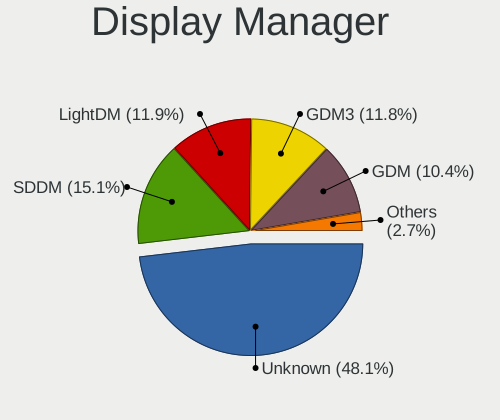
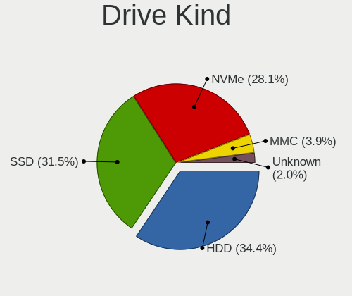
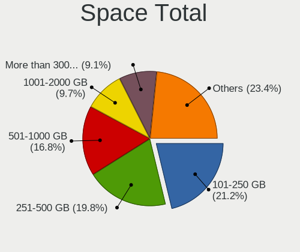

Linux in Australia - Tested Hardware & Statistics
-------------------------------------------------

A project to collect tested hardware configurations for Linux in Australia.

Anyone can contribute to this report by the [hw-probe](https://github.com/linuxhw/hw-probe) tool:

    sudo -E hw-probe -all -upload

Please contribute! Especially if your hardware is rare.

This is a report for all computer types. See also reports for [desktops](/Location/Australia/Desktop/README.md) and [notebooks](/Location/Australia/Notebook/README.md).

Contents
--------

* [ Test Cases ](#test-cases)

* [ System ](#system)
  - [ OS                       ](#os)
  - [ OS Family                ](#os-family)
  - [ Kernel                   ](#kernel)
  - [ Kernel Family            ](#kernel-family)
  - [ Kernel Major Ver.        ](#kernel-major-ver)
  - [ Arch                     ](#arch)
  - [ DE                       ](#de)
  - [ Display Server           ](#display-server)
  - [ Display Manager          ](#display-manager)
  - [ OS Lang                  ](#os-lang)
  - [ Boot Mode                ](#boot-mode)
  - [ Filesystem               ](#filesystem)
  - [ Part. scheme             ](#part-scheme)
  - [ Dual Boot with Linux/BSD ](#dual-boot-with-linuxbsd)
  - [ Dual Boot (Win)          ](#dual-boot-win)

* [ Board ](#board)
  - [ Vendor                   ](#vendor)
  - [ Model                    ](#model)
  - [ Model Family             ](#model-family)
  - [ MFG Year                 ](#mfg-year)
  - [ Form Factor              ](#form-factor)
  - [ Secure Boot              ](#secure-boot)
  - [ Coreboot                 ](#coreboot)
  - [ RAM Size                 ](#ram-size)
  - [ RAM Used                 ](#ram-used)
  - [ Total Drives             ](#total-drives)
  - [ Has CD-ROM               ](#has-cd-rom)
  - [ Has Ethernet             ](#has-ethernet)
  - [ Has WiFi                 ](#has-wifi)
  - [ Has Bluetooth            ](#has-bluetooth)

* [ Location ](#location)
  - [ Country                  ](#country)
  - [ City                     ](#city)

* [ Drives ](#drives)
  - [ Drive Vendor             ](#drive-vendor)
  - [ Drive Model              ](#drive-model)
  - [ HDD Vendor               ](#hdd-vendor)
  - [ SSD Vendor               ](#ssd-vendor)
  - [ Drive Kind               ](#drive-kind)
  - [ Drive Connector          ](#drive-connector)
  - [ Drive Size               ](#drive-size)
  - [ Space Total              ](#space-total)
  - [ Space Used               ](#space-used)
  - [ Malfunc. Drives          ](#malfunc-drives)
  - [ Malfunc. Drive Vendor    ](#malfunc-drive-vendor)
  - [ Malfunc. HDD Vendor      ](#malfunc-hdd-vendor)
  - [ Malfunc. Drive Kind      ](#malfunc-drive-kind)
  - [ Failed Drives            ](#failed-drives)
  - [ Failed Drive Vendor      ](#failed-drive-vendor)
  - [ Drive Status             ](#drive-status)

* [ Storage controller ](#storage-controller)
  - [ Storage Vendor           ](#storage-vendor)
  - [ Storage Model            ](#storage-model)
  - [ Storage Kind             ](#storage-kind)

* [ Processor ](#processor)
  - [ CPU Vendor               ](#cpu-vendor)
  - [ CPU Model                ](#cpu-model)
  - [ CPU Model Family         ](#cpu-model-family)
  - [ CPU Cores                ](#cpu-cores)
  - [ CPU Sockets              ](#cpu-sockets)
  - [ CPU Threads              ](#cpu-threads)
  - [ CPU Op-Modes             ](#cpu-op-modes)
  - [ CPU Microcode            ](#cpu-microcode)
  - [ CPU Microarch            ](#cpu-microarch)

* [ Graphics ](#graphics)
  - [ GPU Vendor               ](#gpu-vendor)
  - [ GPU Model                ](#gpu-model)
  - [ GPU Combo                ](#gpu-combo)
  - [ GPU Driver               ](#gpu-driver)
  - [ GPU Memory               ](#gpu-memory)

* [ Monitor ](#monitor)
  - [ Monitor Vendor           ](#monitor-vendor)
  - [ Monitor Model            ](#monitor-model)
  - [ Monitor Resolution       ](#monitor-resolution)
  - [ Monitor Diagonal         ](#monitor-diagonal)
  - [ Monitor Width            ](#monitor-width)
  - [ Aspect Ratio             ](#aspect-ratio)
  - [ Monitor Area             ](#monitor-area)
  - [ Pixel Density            ](#pixel-density)
  - [ Multiple Monitors        ](#multiple-monitors)

* [ Network ](#network)
  - [ Net Controller Vendor    ](#net-controller-vendor)
  - [ Net Controller Model     ](#net-controller-model)
  - [ Wireless Vendor          ](#wireless-vendor)
  - [ Wireless Model           ](#wireless-model)
  - [ Ethernet Vendor          ](#ethernet-vendor)
  - [ Ethernet Model           ](#ethernet-model)
  - [ Net Controller Kind      ](#net-controller-kind)
  - [ Used Controller          ](#used-controller)
  - [ NICs                     ](#nics)
  - [ IPv6                     ](#ipv6)

* [ Bluetooth ](#bluetooth)
  - [ Bluetooth Vendor         ](#bluetooth-vendor)
  - [ Bluetooth Model          ](#bluetooth-model)

* [ Sound ](#sound)
  - [ Sound Vendor             ](#sound-vendor)
  - [ Sound Model              ](#sound-model)

* [ Memory ](#memory)
  - [ Memory Vendor            ](#memory-vendor)
  - [ Memory Model             ](#memory-model)
  - [ Memory Kind              ](#memory-kind)
  - [ Memory Form Factor       ](#memory-form-factor)
  - [ Memory Size              ](#memory-size)
  - [ Memory Speed             ](#memory-speed)

* [ Printers & scanners ](#printers--scanners)
  - [ Printer Vendor           ](#printer-vendor)
  - [ Printer Model            ](#printer-model)
  - [ Scanner Vendor           ](#scanner-vendor)
  - [ Scanner Model            ](#scanner-model)

* [ Camera ](#camera)
  - [ Camera Vendor            ](#camera-vendor)
  - [ Camera Model             ](#camera-model)

* [ Security ](#security)
  - [ Fingerprint Vendor       ](#fingerprint-vendor)
  - [ Fingerprint Model        ](#fingerprint-model)
  - [ Chipcard Vendor          ](#chipcard-vendor)
  - [ Chipcard Model           ](#chipcard-model)

* [ Unsupported ](#unsupported)
  - [ Unsupported Devices      ](#unsupported-devices)
  - [ Unsupported Device Types ](#unsupported-device-types)

Test Cases
----------

Total: 6789

| Vendor        | Model                       | Form-Factor | Probe                                                      | Date         |
|---------------|-----------------------------|-------------|------------------------------------------------------------|--------------|
| ASUSTek       | A8R32-MVP Deluxe            | Desktop     | [7ad1e2a464](https://linux-hardware.org/?probe=7ad1e2a464) | May 08, 2024 |
| MSI           | H110M PRO-VH PLUS           | Desktop     | [d9c35695a3](https://linux-hardware.org/?probe=d9c35695a3) | May 08, 2024 |
| Gigabyte      | A520I AC                    | Desktop     | [199cd47039](https://linux-hardware.org/?probe=199cd47039) | May 08, 2024 |
| Lenovo        | ThinkPad P14s Gen 1 20Y2... | Notebook    | [064b211de8](https://linux-hardware.org/?probe=064b211de8) | May 07, 2024 |
| HP            | 84DE                        | All in one  | [b9c011f515](https://linux-hardware.org/?probe=b9c011f515) | May 07, 2024 |
| ASRock        | B450M Steel Legend          | Desktop     | [072fd0ea79](https://linux-hardware.org/?probe=072fd0ea79) | May 07, 2024 |
| ASRock        | B450M Steel Legend          | Desktop     | [c2a2f067b4](https://linux-hardware.org/?probe=c2a2f067b4) | May 07, 2024 |
| ASUSTek       | ROG STRIX B650E-I GAMING... | Desktop     | [961d8a2758](https://linux-hardware.org/?probe=961d8a2758) | May 07, 2024 |
| MSI           | MPG X570 GAMING PLUS        | Desktop     | [60ef8abb02](https://linux-hardware.org/?probe=60ef8abb02) | May 07, 2024 |
| Acer          | TravelMate Spin P414RN-5... | Convertible | [5d3f93b635](https://linux-hardware.org/?probe=5d3f93b635) | May 07, 2024 |
| Dell          | 0V8DVD A01                  | All in one  | [2018075583](https://linux-hardware.org/?probe=2018075583) | May 07, 2024 |
| Gigabyte      | EP45-DS3L                   | Desktop     | [9a1d11cc26](https://linux-hardware.org/?probe=9a1d11cc26) | May 06, 2024 |
| HP            | 843B                        | Desktop     | [ed0c184996](https://linux-hardware.org/?probe=ed0c184996) | May 06, 2024 |
| HP            | 843B                        | Desktop     | [bf812339be](https://linux-hardware.org/?probe=bf812339be) | May 06, 2024 |
| Intel Clie... | LAPAC71H                    | Notebook    | [e599c3f230](https://linux-hardware.org/?probe=e599c3f230) | May 05, 2024 |
| ASRock        | X570 Phantom Gaming 4       | Desktop     | [b9519853cd](https://linux-hardware.org/?probe=b9519853cd) | May 05, 2024 |
| ASRock        | X570 Phantom Gaming 4       | Desktop     | [08cb15cda7](https://linux-hardware.org/?probe=08cb15cda7) | May 05, 2024 |
| System76      | Oryx Pro                    | Notebook    | [6d05743481](https://linux-hardware.org/?probe=6d05743481) | May 05, 2024 |
| HP            | Presario CQ42               | Notebook    | [809ae686e3](https://linux-hardware.org/?probe=809ae686e3) | May 05, 2024 |
| Gigabyte      | EP45-DS3L                   | Desktop     | [9bc9ab2e35](https://linux-hardware.org/?probe=9bc9ab2e35) | May 04, 2024 |
| Gigabyte      | B365M H                     | Desktop     | [26c29ceb49](https://linux-hardware.org/?probe=26c29ceb49) | May 04, 2024 |
| Gigabyte      | Z68MA-D2H-B3                | Desktop     | [b7c53048d5](https://linux-hardware.org/?probe=b7c53048d5) | May 04, 2024 |
| Gigabyte      | GA-870A-UD3                 | Desktop     | [ac3f4b6ccb](https://linux-hardware.org/?probe=ac3f4b6ccb) | May 04, 2024 |
| Acer          | Predator PHN16-71           | Notebook    | [8721113032](https://linux-hardware.org/?probe=8721113032) | May 04, 2024 |
| Fujitsu       | SH560                       | Notebook    | [805ea85563](https://linux-hardware.org/?probe=805ea85563) | May 03, 2024 |
| Dell          | Inspiron 16 5620            | Notebook    | [37d023541b](https://linux-hardware.org/?probe=37d023541b) | May 03, 2024 |
| HP            | Notebook                    | Notebook    | [ba95ac1b57](https://linux-hardware.org/?probe=ba95ac1b57) | May 03, 2024 |
| Gigabyte      | P35-DQ6                     | Desktop     | [c448c676a8](https://linux-hardware.org/?probe=c448c676a8) | May 03, 2024 |
| Lenovo        | ThinkPad P15s Gen 2i 20W... | Notebook    | [89ce066855](https://linux-hardware.org/?probe=89ce066855) | May 03, 2024 |
| MSI           | MAG B460M MORTAR            | Desktop     | [4c66dab9c1](https://linux-hardware.org/?probe=4c66dab9c1) | May 03, 2024 |
| ASRock        | X570 Phantom Gaming 4 Wi... | Desktop     | [181b08bd87](https://linux-hardware.org/?probe=181b08bd87) | May 02, 2024 |
| Raspberry ... | Raspberry Pi 5 Model B R... | Soc         | [3f7c3168f2](https://linux-hardware.org/?probe=3f7c3168f2) | May 02, 2024 |
| MSI           | B250M PRO OPT BOOST         | Desktop     | [d6c113d53c](https://linux-hardware.org/?probe=d6c113d53c) | May 02, 2024 |
| Dell          | Inspiron M5010              | Notebook    | [eed6e90235](https://linux-hardware.org/?probe=eed6e90235) | May 02, 2024 |
| HP            | Pavilion Notebook           | Notebook    | [2fc15c8d5c](https://linux-hardware.org/?probe=2fc15c8d5c) | May 02, 2024 |
| Metabox       | Alpha-SR NP70SNC            | Notebook    | [4fe0c00280](https://linux-hardware.org/?probe=4fe0c00280) | May 02, 2024 |
| HP            | 8643 SMVB                   | Desktop     | [8c77e42bdd](https://linux-hardware.org/?probe=8c77e42bdd) | May 02, 2024 |
| ASUSTek       | ROG STRIX Z790-A GAMING ... | Desktop     | [5d4a138b2f](https://linux-hardware.org/?probe=5d4a138b2f) | May 01, 2024 |
| HP            | Notebook                    | Notebook    | [415db360d5](https://linux-hardware.org/?probe=415db360d5) | May 01, 2024 |
| Acer          | Extensa 4210                | Notebook    | [1b24527bdf](https://linux-hardware.org/?probe=1b24527bdf) | May 01, 2024 |
| Gigabyte      | H97-HD3                     | Desktop     | [98d2071b97](https://linux-hardware.org/?probe=98d2071b97) | May 01, 2024 |
| Dell          | Precision M4600             | Notebook    | [3c78b1ea06](https://linux-hardware.org/?probe=3c78b1ea06) | May 01, 2024 |
| Lenovo        | ThinkPad P1 Gen 4i 20Y4S... | Notebook    | [2445f78890](https://linux-hardware.org/?probe=2445f78890) | May 01, 2024 |
| Lenovo        | ThinkPad L560 20F2S1P800    | Notebook    | [1718b0bf00](https://linux-hardware.org/?probe=1718b0bf00) | May 01, 2024 |
| Gigabyte      | Z77MX-D3H                   | Desktop     | [7faebd43a1](https://linux-hardware.org/?probe=7faebd43a1) | May 01, 2024 |
| Dell          | Precision M4600             | Notebook    | [7cae94b1d9](https://linux-hardware.org/?probe=7cae94b1d9) | May 01, 2024 |
| ASRock        | AD2700-ITX                  | Desktop     | [a146dd8039](https://linux-hardware.org/?probe=a146dd8039) | Apr 30, 2024 |
| Gigabyte      | D525TUD                     | Desktop     | [e332a20422](https://linux-hardware.org/?probe=e332a20422) | Apr 30, 2024 |
| HP            | 871A                        | Mini pc     | [c3e106f381](https://linux-hardware.org/?probe=c3e106f381) | Apr 30, 2024 |
| Lenovo        | Yoga 9 14IAP7 82LU          | Convertible | [e66b7680fc](https://linux-hardware.org/?probe=e66b7680fc) | Apr 30, 2024 |
| Dell          | Latitude E6430              | Notebook    | [0225857e36](https://linux-hardware.org/?probe=0225857e36) | Apr 29, 2024 |
| Dell          | Latitude E6430              | Notebook    | [8cafdeffed](https://linux-hardware.org/?probe=8cafdeffed) | Apr 29, 2024 |
| Apple         | MacBookPro14,1              | Notebook    | [e205d1dcf4](https://linux-hardware.org/?probe=e205d1dcf4) | Apr 29, 2024 |
| ASRock        | H97M Pro4                   | Desktop     | [daeb522dd6](https://linux-hardware.org/?probe=daeb522dd6) | Apr 29, 2024 |
| Toshiba       | PORTEGE Z10t-A              | Notebook    | [f0b22b191f](https://linux-hardware.org/?probe=f0b22b191f) | Apr 29, 2024 |
| Toshiba       | PORTEGE Z10t-A              | Notebook    | [e107b22a3f](https://linux-hardware.org/?probe=e107b22a3f) | Apr 29, 2024 |
| HP            | Notebook                    | Notebook    | [6252c3e002](https://linux-hardware.org/?probe=6252c3e002) | Apr 28, 2024 |
| Intel         | LADPNVMO AAE76523-300       | Desktop     | [b30f7742a0](https://linux-hardware.org/?probe=b30f7742a0) | Apr 28, 2024 |
| Lenovo        | ThinkPad T410 2522PT3       | Notebook    | [1e61d17468](https://linux-hardware.org/?probe=1e61d17468) | Apr 28, 2024 |
| Valve         | Jupiter                     | Notebook    | [20eca8966f](https://linux-hardware.org/?probe=20eca8966f) | Apr 28, 2024 |
| Gigabyte      | B760M AORUS ELITE AX        | Desktop     | [d48aa1e751](https://linux-hardware.org/?probe=d48aa1e751) | Apr 28, 2024 |
| Intel         | NUC7i3BNB J22859-303        | Mini pc     | [f4bda8cf30](https://linux-hardware.org/?probe=f4bda8cf30) | Apr 28, 2024 |
| Gigabyte      | GA-880GM-UD2H               | Desktop     | [4d6c9aae19](https://linux-hardware.org/?probe=4d6c9aae19) | Apr 28, 2024 |
| ASUSTek       | A8R32-MVP Deluxe            | Desktop     | [7f9fdeb912](https://linux-hardware.org/?probe=7f9fdeb912) | Apr 28, 2024 |
| Lenovo        | ThinkCentre M58p 7220A72    | Desktop     | [a7638ef3b1](https://linux-hardware.org/?probe=a7638ef3b1) | Apr 28, 2024 |
| Gigabyte      | B760M AORUS ELITE AX        | Desktop     | [8541225188](https://linux-hardware.org/?probe=8541225188) | Apr 27, 2024 |
| Gigabyte      | G41MT-D3                    | Desktop     | [80fc4c1829](https://linux-hardware.org/?probe=80fc4c1829) | Apr 27, 2024 |
| ASRock        | Z490 Phantom Gaming 4       | Desktop     | [95011d3e78](https://linux-hardware.org/?probe=95011d3e78) | Apr 27, 2024 |
| MSI           | MAG B460M MORTAR            | Desktop     | [eaf2da7d85](https://linux-hardware.org/?probe=eaf2da7d85) | Apr 27, 2024 |
| HUAWEI        | KPL-W0X                     | Notebook    | [0ce65136da](https://linux-hardware.org/?probe=0ce65136da) | Apr 27, 2024 |
| ASRock        | Z790 LiveMixer              | Desktop     | [4fbb7b2214](https://linux-hardware.org/?probe=4fbb7b2214) | Apr 25, 2024 |
| QTQD          | Unknown                     | Desktop     | [d4f651ab36](https://linux-hardware.org/?probe=d4f651ab36) | Apr 25, 2024 |
| HP            | Notebook                    | Notebook    | [c9db8c0cb7](https://linux-hardware.org/?probe=c9db8c0cb7) | Apr 25, 2024 |
| Alienware     | M18xR1                      | Notebook    | [d6f3028e98](https://linux-hardware.org/?probe=d6f3028e98) | Apr 25, 2024 |
| HP            | Laptop 15s-du1xxx           | Notebook    | [b1502b6440](https://linux-hardware.org/?probe=b1502b6440) | Apr 25, 2024 |
| Gigabyte      | GA-MA785G-UD3H              | Desktop     | [2d5a0348a2](https://linux-hardware.org/?probe=2d5a0348a2) | Apr 24, 2024 |
| Gigabyte      | GA-A55M-S2V                 | Desktop     | [cc1a7f7fef](https://linux-hardware.org/?probe=cc1a7f7fef) | Apr 24, 2024 |
| ASRock        | X570 Phantom Gaming 4 Wi... | Desktop     | [a0877e2a20](https://linux-hardware.org/?probe=a0877e2a20) | Apr 23, 2024 |
| MSI           | GT72 2QD                    | Notebook    | [7899b804eb](https://linux-hardware.org/?probe=7899b804eb) | Apr 23, 2024 |
| Dell          | 0HD5W2 A01                  | Desktop     | [a42417ee6b](https://linux-hardware.org/?probe=a42417ee6b) | Apr 23, 2024 |
| ASRock        | H87 Performance             | Desktop     | [955886052e](https://linux-hardware.org/?probe=955886052e) | Apr 23, 2024 |
| Lenovo        | ThinkPad E16 Gen 1 21JN0... | Notebook    | [5453cfa265](https://linux-hardware.org/?probe=5453cfa265) | Apr 23, 2024 |
| Lenovo        | Yoga Slim 7 14IMH9 83CV     | Notebook    | [c316cac3ed](https://linux-hardware.org/?probe=c316cac3ed) | Apr 22, 2024 |
| Xunlong       | Orange Pi Zero              | Soc         | [af1ac19040](https://linux-hardware.org/?probe=af1ac19040) | Apr 22, 2024 |
| Apple         | MacBookPro8,1               | Notebook    | [ddba50f6df](https://linux-hardware.org/?probe=ddba50f6df) | Apr 22, 2024 |
| Gigabyte      | B760M H DDR4                | Desktop     | [f833bd4bad](https://linux-hardware.org/?probe=f833bd4bad) | Apr 22, 2024 |
| MSI           | B550M PRO-VDH WIFI          | Desktop     | [40c04cd535](https://linux-hardware.org/?probe=40c04cd535) | Apr 21, 2024 |
| ASRock        | B460M Pro4                  | Desktop     | [431b8beccc](https://linux-hardware.org/?probe=431b8beccc) | Apr 21, 2024 |
| ASUSTek       | VivoBook_ASUSLaptop E510... | Notebook    | [ceca4cef9c](https://linux-hardware.org/?probe=ceca4cef9c) | Apr 21, 2024 |
| Lenovo        | ThinkPad L560 20F2S1P800    | Notebook    | [e7b196367a](https://linux-hardware.org/?probe=e7b196367a) | Apr 21, 2024 |
| MSI           | MPG Z790 EDGE TI MAX WIF... | Desktop     | [34da91dacf](https://linux-hardware.org/?probe=34da91dacf) | Apr 21, 2024 |
| ASRock        | Z490 Phantom Gaming 4       | Desktop     | [887025a038](https://linux-hardware.org/?probe=887025a038) | Apr 21, 2024 |
| Intel         | NUC7i3BNB J22859-303        | Mini pc     | [78394e4a1e](https://linux-hardware.org/?probe=78394e4a1e) | Apr 21, 2024 |
| Gigabyte      | Z270X-Gaming 5              | Desktop     | [eb8b3c8970](https://linux-hardware.org/?probe=eb8b3c8970) | Apr 21, 2024 |
| Apple         | MacBookPro8,1               | Notebook    | [e7c1f32086](https://linux-hardware.org/?probe=e7c1f32086) | Apr 20, 2024 |
| HP            | EliteBook Folio 9470m       | Notebook    | [72485d4ec0](https://linux-hardware.org/?probe=72485d4ec0) | Apr 20, 2024 |
| ASUSTek       | PRIME X570-PRO              | Desktop     | [2d02398d8e](https://linux-hardware.org/?probe=2d02398d8e) | Apr 20, 2024 |
| Dell          | 0HD5W2 A01                  | Desktop     | [6346aaf37d](https://linux-hardware.org/?probe=6346aaf37d) | Apr 19, 2024 |
| Gigabyte      | H170-HD3-CF                 | Desktop     | [4f5d1a37c3](https://linux-hardware.org/?probe=4f5d1a37c3) | Apr 19, 2024 |
| Dell          | 0HD5W2 A01                  | Desktop     | [47d879fa41](https://linux-hardware.org/?probe=47d879fa41) | Apr 19, 2024 |
| Gigabyte      | Z68X-UD3H-B3                | Desktop     | [e0caa04752](https://linux-hardware.org/?probe=e0caa04752) | Apr 19, 2024 |
| Apple         | MacBookPro16,2              | Notebook    | [4ea9397c67](https://linux-hardware.org/?probe=4ea9397c67) | Apr 18, 2024 |
| Apple         | MacBookPro16,2              | Notebook    | [0c5c967438](https://linux-hardware.org/?probe=0c5c967438) | Apr 18, 2024 |
| Dell          | 0HD5W2 A01                  | Desktop     | [6074f97307](https://linux-hardware.org/?probe=6074f97307) | Apr 18, 2024 |
| Lenovo        | ThinkPad T460s 20FAS5NN0... | Notebook    | [156dedcc62](https://linux-hardware.org/?probe=156dedcc62) | Apr 18, 2024 |
| LG Electro... | 16Z90P-G.AA75A              | Notebook    | [cba767dbe8](https://linux-hardware.org/?probe=cba767dbe8) | Apr 17, 2024 |
| ASUSTek       | X555LJ                      | Notebook    | [1af0f98633](https://linux-hardware.org/?probe=1af0f98633) | Apr 16, 2024 |
| Apple         | MacBookAir4,1               | Notebook    | [fd0c46bab2](https://linux-hardware.org/?probe=fd0c46bab2) | Apr 16, 2024 |
| MSI           | PRO B650-S WIFI             | Desktop     | [580df50da1](https://linux-hardware.org/?probe=580df50da1) | Apr 16, 2024 |
| Lenovo        | ThinkPad L470 W10DG 20JV... | Notebook    | [9f2e93f394](https://linux-hardware.org/?probe=9f2e93f394) | Apr 16, 2024 |
| MSI           | B250M BAZOOKA               | Desktop     | [b2b7ae9a04](https://linux-hardware.org/?probe=b2b7ae9a04) | Apr 15, 2024 |
| Lenovo        | Yoga 9 14IAP7 82LU          | Convertible | [8c87797c7a](https://linux-hardware.org/?probe=8c87797c7a) | Apr 15, 2024 |
| MSI           | MPG B650I EDGE WIFI         | Desktop     | [ad026e12f6](https://linux-hardware.org/?probe=ad026e12f6) | Apr 15, 2024 |
| ASUSTek       | P8P67 PRO                   | Desktop     | [3992b48eff](https://linux-hardware.org/?probe=3992b48eff) | Apr 14, 2024 |
| Dell          | XPS 15 9550                 | Notebook    | [22d857c49c](https://linux-hardware.org/?probe=22d857c49c) | Apr 14, 2024 |
| Lenovo        | ThinkPad L470 W10DG 20JV... | Notebook    | [531ad46b31](https://linux-hardware.org/?probe=531ad46b31) | Apr 14, 2024 |
| ASUSTek       | ROG STRIX B550-F GAMING ... | Desktop     | [5b7d416743](https://linux-hardware.org/?probe=5b7d416743) | Apr 14, 2024 |
| Lenovo        | ThinkPad E16 Gen 1 21JT0... | Notebook    | [e717cc9856](https://linux-hardware.org/?probe=e717cc9856) | Apr 13, 2024 |
| Lenovo        | ThinkPad X131e 3367AH5      | Notebook    | [5f3d3b0a74](https://linux-hardware.org/?probe=5f3d3b0a74) | Apr 13, 2024 |
| Dell          | Inspiron 5770               | Notebook    | [ae5ccdd8ac](https://linux-hardware.org/?probe=ae5ccdd8ac) | Apr 12, 2024 |
| MSI           | MAG B550 TOMAHAWK           | Desktop     | [66b49c3998](https://linux-hardware.org/?probe=66b49c3998) | Apr 12, 2024 |
| ASUSTek       | ROG STRIX B550-F GAMING ... | Desktop     | [72d66a084e](https://linux-hardware.org/?probe=72d66a084e) | Apr 12, 2024 |
| Gigabyte      | GA-970A-D3                  | Desktop     | [1a6e8ab59b](https://linux-hardware.org/?probe=1a6e8ab59b) | Apr 12, 2024 |
| Lenovo        | Yoga 9 14ITL5 82BG          | Convertible | [1d55c46831](https://linux-hardware.org/?probe=1d55c46831) | Apr 12, 2024 |
| Gigabyte      | Z77MX-D3H                   | Desktop     | [1234bcb2a4](https://linux-hardware.org/?probe=1234bcb2a4) | Apr 11, 2024 |
| Dell          | Inspiron 5485 2n1           | Convertible | [7fa4f40a1f](https://linux-hardware.org/?probe=7fa4f40a1f) | Apr 11, 2024 |
| Dell          | Inspiron 5770               | Notebook    | [6cb8fb3865](https://linux-hardware.org/?probe=6cb8fb3865) | Apr 11, 2024 |
| HP            | EliteBook 820 G3            | Notebook    | [960bc839f2](https://linux-hardware.org/?probe=960bc839f2) | Apr 10, 2024 |
| HP            | EliteBook 820 G3            | Notebook    | [173f82dbd7](https://linux-hardware.org/?probe=173f82dbd7) | Apr 10, 2024 |
| Gigabyte      | GA-870A-UD3                 | Desktop     | [ef8d387984](https://linux-hardware.org/?probe=ef8d387984) | Apr 10, 2024 |
| Gigabyte      | G41MT-D3                    | Desktop     | [4ec86b2e5d](https://linux-hardware.org/?probe=4ec86b2e5d) | Apr 10, 2024 |
| Dell          | 0HD5W2 A00                  | Desktop     | [12d872ff99](https://linux-hardware.org/?probe=12d872ff99) | Apr 10, 2024 |
| ASRock        | H87 Performance             | Desktop     | [ac785ab02e](https://linux-hardware.org/?probe=ac785ab02e) | Apr 10, 2024 |
| Lenovo        | ThinkPad T14s Gen 2a 20X... | Notebook    | [2b7f101b88](https://linux-hardware.org/?probe=2b7f101b88) | Apr 10, 2024 |
| Valve         | Jupiter                     | Notebook    | [a80d8086f4](https://linux-hardware.org/?probe=a80d8086f4) | Apr 09, 2024 |
| Pegatron      | EVE                         | Desktop     | [7e19a19e0d](https://linux-hardware.org/?probe=7e19a19e0d) | Apr 09, 2024 |
| Raspberry ... | Raspberry Pi 4 Model B R... | Soc         | [a1376c8d56](https://linux-hardware.org/?probe=a1376c8d56) | Apr 09, 2024 |
| Lenovo        | ThinkPad X1 Carbon 4th 2... | Notebook    | [3ed13a3d8a](https://linux-hardware.org/?probe=3ed13a3d8a) | Apr 09, 2024 |
| Gigabyte      | GA-MA785G-UD3H              | Desktop     | [7e40bc4b0a](https://linux-hardware.org/?probe=7e40bc4b0a) | Apr 09, 2024 |
| Lenovo        | ThinkPad X13s Gen 1 21BY... | Notebook    | [fbfb8d076d](https://linux-hardware.org/?probe=fbfb8d076d) | Apr 09, 2024 |
| Lenovo        | ThinkPad X1 Carbon 4th 2... | Notebook    | [32842b7d56](https://linux-hardware.org/?probe=32842b7d56) | Apr 09, 2024 |
| Toshiba       | Satellite L750              | Notebook    | [296a0d80a0](https://linux-hardware.org/?probe=296a0d80a0) | Apr 09, 2024 |
| Gigabyte      | Z68MA-D2H-B3                | Desktop     | [cc080ae6d6](https://linux-hardware.org/?probe=cc080ae6d6) | Apr 08, 2024 |
| ASUSTek       | B85M-E                      | Desktop     | [d0c05466dd](https://linux-hardware.org/?probe=d0c05466dd) | Apr 08, 2024 |
| Lenovo        | ThinkPad T14s Gen 1 20UJ... | Notebook    | [471a22d2d2](https://linux-hardware.org/?probe=471a22d2d2) | Apr 08, 2024 |
| HP            | Pro x2 612 G2               | Tablet      | [81af01fef3](https://linux-hardware.org/?probe=81af01fef3) | Apr 07, 2024 |
| Gigabyte      | X570 AORUS ELITE WIFI       | Desktop     | [ee31a1ab57](https://linux-hardware.org/?probe=ee31a1ab57) | Apr 07, 2024 |
| Microsoft     | Surface Laptop 4            | Tablet      | [068a8fcd94](https://linux-hardware.org/?probe=068a8fcd94) | Apr 07, 2024 |
| ASRock        | H87 Performance             | Desktop     | [2ecb846389](https://linux-hardware.org/?probe=2ecb846389) | Apr 06, 2024 |
| Dell          | Inspiron 5770               | Notebook    | [2c6ced3f53](https://linux-hardware.org/?probe=2c6ced3f53) | Apr 06, 2024 |
| Gigabyte      | GA-MA785G-UD3H              | Desktop     | [f675a67959](https://linux-hardware.org/?probe=f675a67959) | Apr 06, 2024 |
| Gigabyte      | GA-870A-UD3                 | Desktop     | [b99319c775](https://linux-hardware.org/?probe=b99319c775) | Apr 06, 2024 |
| Gigabyte      | G41MT-D3                    | Desktop     | [ae8d66a693](https://linux-hardware.org/?probe=ae8d66a693) | Apr 06, 2024 |
| HP            | 81B9 1000                   | All in one  | [cb43f1497c](https://linux-hardware.org/?probe=cb43f1497c) | Apr 05, 2024 |
| AZW           | MINI S                      | Desktop     | [e99fd9580a](https://linux-hardware.org/?probe=e99fd9580a) | Apr 05, 2024 |
| Intel         | D54250WYK H13922-301        | Desktop     | [a0ccb10e69](https://linux-hardware.org/?probe=a0ccb10e69) | Apr 05, 2024 |
| ASUSTek       | PRIME Z270-AR               | Desktop     | [d994e7a27c](https://linux-hardware.org/?probe=d994e7a27c) | Apr 05, 2024 |
| ASUSTek       | PRIME Z270-AR               | Desktop     | [f4fc63ac25](https://linux-hardware.org/?probe=f4fc63ac25) | Apr 05, 2024 |
| MSI           | Prestige 14Evo B13M         | Notebook    | [f118f2e24a](https://linux-hardware.org/?probe=f118f2e24a) | Apr 04, 2024 |
| AAEON         | GENE-EHL5 V1.0              | Desktop     | [02bd4acd6a](https://linux-hardware.org/?probe=02bd4acd6a) | Apr 04, 2024 |
| Intel Clie... | LAPAC71H                    | Notebook    | [c6f73cce66](https://linux-hardware.org/?probe=c6f73cce66) | Apr 04, 2024 |
| Lenovo        | IdeaPad S340-15IIL 81VW     | Notebook    | [bf0d1ddab3](https://linux-hardware.org/?probe=bf0d1ddab3) | Apr 04, 2024 |
| MSI           | GP62M 7REX                  | Notebook    | [133e02a808](https://linux-hardware.org/?probe=133e02a808) | Apr 03, 2024 |
| MSI           | B450 TOMAHAWK MAX           | Desktop     | [7046f53f7c](https://linux-hardware.org/?probe=7046f53f7c) | Apr 03, 2024 |
| ASUSTek       | P8H61-MX R2.0               | Desktop     | [2f768997ff](https://linux-hardware.org/?probe=2f768997ff) | Apr 02, 2024 |
| HP            | Pavilion dv7                | Notebook    | [483e1957a4](https://linux-hardware.org/?probe=483e1957a4) | Apr 02, 2024 |
| HP            | 89D8 SMVB                   | Desktop     | [32e0d11ee9](https://linux-hardware.org/?probe=32e0d11ee9) | Apr 02, 2024 |
| Gigabyte      | X570S AORUS PRO AX          | Desktop     | [f0329002c8](https://linux-hardware.org/?probe=f0329002c8) | Apr 01, 2024 |
| HP            | Laptop 15s-eq3xxx           | Notebook    | [5d8d187267](https://linux-hardware.org/?probe=5d8d187267) | Apr 01, 2024 |
| Acer          | Aspire A315-35              | Notebook    | [554a38529a](https://linux-hardware.org/?probe=554a38529a) | Mar 31, 2024 |
| MSI           | B560M-A PRO                 | Desktop     | [e365e673d0](https://linux-hardware.org/?probe=e365e673d0) | Mar 31, 2024 |
| Lenovo        | Yoga Slim 6 14IRH8 83E0     | Notebook    | [31ba9b687a](https://linux-hardware.org/?probe=31ba9b687a) | Mar 31, 2024 |
| HP            | Pavilion dv7                | Notebook    | [a86e8cccf5](https://linux-hardware.org/?probe=a86e8cccf5) | Mar 31, 2024 |
| HP            | 1998                        | Desktop     | [210c696e70](https://linux-hardware.org/?probe=210c696e70) | Mar 30, 2024 |
| MSI           | MAG B460M MORTAR            | Desktop     | [0a8f92ffe1](https://linux-hardware.org/?probe=0a8f92ffe1) | Mar 30, 2024 |
| Unknown       | Unknown                     | Desktop     | [c59c69645d](https://linux-hardware.org/?probe=c59c69645d) | Mar 30, 2024 |
| Metabox       | Alpha-V V158PNH             | Notebook    | [9d020b5c12](https://linux-hardware.org/?probe=9d020b5c12) | Mar 29, 2024 |
| ASRock        | AD2700-ITX                  | Desktop     | [52eb0a99d1](https://linux-hardware.org/?probe=52eb0a99d1) | Mar 29, 2024 |
| MSI           | B250M BAZOOKA               | Desktop     | [f942d827e4](https://linux-hardware.org/?probe=f942d827e4) | Mar 29, 2024 |
| Gigabyte      | Z87X-OC-CF                  | Desktop     | [ef8f367c13](https://linux-hardware.org/?probe=ef8f367c13) | Mar 29, 2024 |
| HP            | EliteBook 840 14 inch G9... | Notebook    | [401fd1d912](https://linux-hardware.org/?probe=401fd1d912) | Mar 28, 2024 |
| Rockchip      | RK3566 OPi 3B               | Soc         | [43c77170e4](https://linux-hardware.org/?probe=43c77170e4) | Mar 28, 2024 |
| Lenovo        | Yoga 300-11IBR 80M1         | Notebook    | [6c9bf73f0c](https://linux-hardware.org/?probe=6c9bf73f0c) | Mar 28, 2024 |
| Gigabyte      | Z77MX-D3H                   | Desktop     | [6d24bca5f3](https://linux-hardware.org/?probe=6d24bca5f3) | Mar 27, 2024 |
| Gigabyte      | H310M S2P x.x               | Desktop     | [082e7d4b5b](https://linux-hardware.org/?probe=082e7d4b5b) | Mar 27, 2024 |
| Apple         | Mac-F221BEC8                | Desktop     | [35cbc2ccda](https://linux-hardware.org/?probe=35cbc2ccda) | Mar 27, 2024 |
| Lenovo        | ThinkPad T14s Gen 3 21CQ... | Notebook    | [9db63891c1](https://linux-hardware.org/?probe=9db63891c1) | Mar 27, 2024 |
| Framework     | Laptop (12th Gen Intel C... | Notebook    | [5eb093e5c7](https://linux-hardware.org/?probe=5eb093e5c7) | Mar 26, 2024 |
| Dell          | Latitude 5500               | Notebook    | [01e740ac1e](https://linux-hardware.org/?probe=01e740ac1e) | Mar 26, 2024 |
| Lenovo        | ThinkPad X1 Yoga Gen 7 2... | Convertible | [8f754c740b](https://linux-hardware.org/?probe=8f754c740b) | Mar 26, 2024 |
| HP            | Pavilion x360 Convertibl... | Convertible | [c9687678aa](https://linux-hardware.org/?probe=c9687678aa) | Mar 25, 2024 |
| Lenovo        | ThinkPad X1 Carbon Gen 1... | Notebook    | [21cb087ae2](https://linux-hardware.org/?probe=21cb087ae2) | Mar 25, 2024 |
| HP            | Pavilion Notebook           | Notebook    | [9599687d82](https://linux-hardware.org/?probe=9599687d82) | Mar 25, 2024 |
| ASUSTek       | TUF Gaming B650M-E WIFI     | Desktop     | [a2edfcd860](https://linux-hardware.org/?probe=a2edfcd860) | Mar 24, 2024 |
| Dell          | XPS 14 9440                 | Notebook    | [8658eded41](https://linux-hardware.org/?probe=8658eded41) | Mar 24, 2024 |
| MSI           | B560M-A PRO                 | Desktop     | [d7b459656b](https://linux-hardware.org/?probe=d7b459656b) | Mar 24, 2024 |
| Gigabyte      | J1900M-D2P                  | Desktop     | [2c072e707c](https://linux-hardware.org/?probe=2c072e707c) | Mar 23, 2024 |
| Lenovo        | ThinkPad L380 20M6A000AU    | Notebook    | [c2a8312e42](https://linux-hardware.org/?probe=c2a8312e42) | Mar 23, 2024 |
| Acer          | Nitro AN515-55              | Notebook    | [9b975edbf7](https://linux-hardware.org/?probe=9b975edbf7) | Mar 23, 2024 |
| Apple         | MacBookAir6,1               | Notebook    | [7b195b5af4](https://linux-hardware.org/?probe=7b195b5af4) | Mar 22, 2024 |
| Lenovo        | ThinkPad X1 Carbon 5th 2... | Notebook    | [877a901096](https://linux-hardware.org/?probe=877a901096) | Mar 22, 2024 |
| Dell          | 0PC10G A00                  | Mini pc     | [b1ae5d9c34](https://linux-hardware.org/?probe=b1ae5d9c34) | Mar 21, 2024 |
| Lenovo        | IdeaPad S340-15IIL 81VW     | Notebook    | [b2e638abe8](https://linux-hardware.org/?probe=b2e638abe8) | Mar 21, 2024 |
| ASUSTek       | ROG CROSSHAIR X670E HERO    | Desktop     | [b12ff3e977](https://linux-hardware.org/?probe=b12ff3e977) | Mar 21, 2024 |
| Acer          | Aspire V3-572G              | Notebook    | [ab338cecc0](https://linux-hardware.org/?probe=ab338cecc0) | Mar 21, 2024 |
| ASUSTek       | PRIME B550M-A WIFI II       | Desktop     | [caecf9a750](https://linux-hardware.org/?probe=caecf9a750) | Mar 21, 2024 |
| Timi          | Redmi Book Pro 14 2022      | Notebook    | [5efc983ef2](https://linux-hardware.org/?probe=5efc983ef2) | Mar 21, 2024 |
| Lenovo        | IdeaPad 110S-11IBR 80WG     | Notebook    | [2439e40d2c](https://linux-hardware.org/?probe=2439e40d2c) | Mar 21, 2024 |
| Lenovo        | ThinkCentre M58p 7220A72    | Desktop     | [9d5723ac83](https://linux-hardware.org/?probe=9d5723ac83) | Mar 20, 2024 |
| ASUSTek       | P552LA                      | Notebook    | [1e7c8ea0f7](https://linux-hardware.org/?probe=1e7c8ea0f7) | Mar 20, 2024 |
| Lenovo        | ThinkPad E16 Gen 1 21JT0... | Notebook    | [cc230156f7](https://linux-hardware.org/?probe=cc230156f7) | Mar 19, 2024 |
| HP            | EliteBook 840 14 inch G9... | Notebook    | [eaea13606f](https://linux-hardware.org/?probe=eaea13606f) | Mar 19, 2024 |
| Raspberry ... | Raspberry Pi Zero W Rev ... | Soc         | [3da9470690](https://linux-hardware.org/?probe=3da9470690) | Mar 19, 2024 |
| Microsoft     | Surface Pro 4               | Tablet      | [2c436cf880](https://linux-hardware.org/?probe=2c436cf880) | Mar 19, 2024 |
| ASUSTek       | PRIME B450M-A               | Desktop     | [a4d1af3576](https://linux-hardware.org/?probe=a4d1af3576) | Mar 18, 2024 |
| Raspberry ... | Raspberry Pi Zero W Rev ... | Soc         | [8532fa3766](https://linux-hardware.org/?probe=8532fa3766) | Mar 18, 2024 |
| ASUSTek       | P8Z77-M PRO                 | Desktop     | [b7bd99bd72](https://linux-hardware.org/?probe=b7bd99bd72) | Mar 18, 2024 |
| MSI           | VR601                       | Notebook    | [7a41cb5b71](https://linux-hardware.org/?probe=7a41cb5b71) | Mar 18, 2024 |
| ASUSTek       | K42F                        | Notebook    | [f36df8e399](https://linux-hardware.org/?probe=f36df8e399) | Mar 18, 2024 |
| MSI           | B560M-A PRO                 | Desktop     | [5e5b0f7c8e](https://linux-hardware.org/?probe=5e5b0f7c8e) | Mar 18, 2024 |
| MSI           | Z390 PLUS                   | Desktop     | [8aabf6b948](https://linux-hardware.org/?probe=8aabf6b948) | Mar 17, 2024 |
| MSI           | Z390 PLUS                   | Desktop     | [d2c68bfc8c](https://linux-hardware.org/?probe=d2c68bfc8c) | Mar 17, 2024 |
| ASRock        | H87 Performance             | Desktop     | [7ae25f5115](https://linux-hardware.org/?probe=7ae25f5115) | Mar 17, 2024 |
| Microsoft     | Surface Pro 4               | Tablet      | [0f456e0a91](https://linux-hardware.org/?probe=0f456e0a91) | Mar 17, 2024 |
| Dell          | Inspiron 14 7430 2-in-1     | Convertible | [c00d5b987a](https://linux-hardware.org/?probe=c00d5b987a) | Mar 17, 2024 |
| Dell          | Latitude E7440              | Notebook    | [b84556c723](https://linux-hardware.org/?probe=b84556c723) | Mar 16, 2024 |
| Lenovo        | IdeaPad 110S-11IBR 80WG     | Notebook    | [cd2af6a978](https://linux-hardware.org/?probe=cd2af6a978) | Mar 15, 2024 |
| Acer          | Aspire A715-41G             | Notebook    | [ff077f31e5](https://linux-hardware.org/?probe=ff077f31e5) | Mar 15, 2024 |
| Gigabyte      | Z68X-UD3H-B3                | Desktop     | [8431302a73](https://linux-hardware.org/?probe=8431302a73) | Mar 14, 2024 |
| MSI           | B450 GAMING PLUS MAX        | Desktop     | [3f04ef51a7](https://linux-hardware.org/?probe=3f04ef51a7) | Mar 14, 2024 |
| MSI           | B450 GAMING PLUS MAX        | Desktop     | [f09e6a0599](https://linux-hardware.org/?probe=f09e6a0599) | Mar 14, 2024 |
| HP            | OMEN by Laptop 15-dc1xxx    | Notebook    | [5b53873162](https://linux-hardware.org/?probe=5b53873162) | Mar 14, 2024 |
| HP            | EliteBook x360 1030 G2      | Convertible | [45cb718f8b](https://linux-hardware.org/?probe=45cb718f8b) | Mar 14, 2024 |
| Raspberry ... | Raspberry Pi Zero W Rev ... | Soc         | [cc9a9f6ae6](https://linux-hardware.org/?probe=cc9a9f6ae6) | Mar 14, 2024 |
| Dell          | Precision M6600             | Notebook    | [8af490c831](https://linux-hardware.org/?probe=8af490c831) | Mar 14, 2024 |
| Apple         | MacBookAir4,2               | Notebook    | [0edcc6c6d9](https://linux-hardware.org/?probe=0edcc6c6d9) | Mar 12, 2024 |
| Lenovo        | IdeaPad 310-15ISK 80SM      | Notebook    | [fced33a8a9](https://linux-hardware.org/?probe=fced33a8a9) | Mar 12, 2024 |
| ASUSTek       | K55VD                       | Notebook    | [01c2033137](https://linux-hardware.org/?probe=01c2033137) | Mar 12, 2024 |
| Intel         | NUC13ANBi7 M89645-203       | Mini pc     | [aa94cf5225](https://linux-hardware.org/?probe=aa94cf5225) | Mar 12, 2024 |
| Lenovo        | ThinkPad T410 2522PT3       | Notebook    | [d2695ebfb6](https://linux-hardware.org/?probe=d2695ebfb6) | Mar 11, 2024 |
| Acer          | Spin SP314-54N              | Convertible | [d0ed803122](https://linux-hardware.org/?probe=d0ed803122) | Mar 11, 2024 |
| Dell          | 0KV62T A00                  | Desktop     | [fba62e6832](https://linux-hardware.org/?probe=fba62e6832) | Mar 11, 2024 |
| Lenovo        | U41-70 80JV                 | Notebook    | [ffc6806e9f](https://linux-hardware.org/?probe=ffc6806e9f) | Mar 11, 2024 |
| Gigabyte      | J1900M-D2P                  | Desktop     | [f638c5db6a](https://linux-hardware.org/?probe=f638c5db6a) | Mar 10, 2024 |
| Acer          | Spin SP513-51               | Convertible | [aa91c4ca61](https://linux-hardware.org/?probe=aa91c4ca61) | Mar 10, 2024 |
| Unknown       | Apple MacBook Pro (14-in... | Notebook    | [aa269d3c6d](https://linux-hardware.org/?probe=aa269d3c6d) | Mar 10, 2024 |
| Dell          | Latitude E7440              | Notebook    | [365fdcbf2a](https://linux-hardware.org/?probe=365fdcbf2a) | Mar 10, 2024 |
| Acer          | Spin SP513-51               | Convertible | [ca5d296c1a](https://linux-hardware.org/?probe=ca5d296c1a) | Mar 10, 2024 |
| ASRock        | Z170 Extreme4               | Desktop     | [8d517d208f](https://linux-hardware.org/?probe=8d517d208f) | Mar 10, 2024 |
| Gigabyte      | Z68X-UD3H-B3                | Desktop     | [67494d2e60](https://linux-hardware.org/?probe=67494d2e60) | Mar 10, 2024 |
| ASUSTek       | ProArt B550-CREATOR         | Desktop     | [34bed62abf](https://linux-hardware.org/?probe=34bed62abf) | Mar 10, 2024 |
| Raspberry ... | Raspberry Pi                | Soc         | [cbaa6c6bb2](https://linux-hardware.org/?probe=cbaa6c6bb2) | Mar 09, 2024 |
| Apple         | Mac-F2218FC8                | All in one  | [5ec193e257](https://linux-hardware.org/?probe=5ec193e257) | Mar 09, 2024 |
| Lenovo        | MAHOBAY NOK                 | Desktop     | [4bd7a64be3](https://linux-hardware.org/?probe=4bd7a64be3) | Mar 09, 2024 |
| ASUSTek       | P6X58D PREMIUM              | Desktop     | [ffc080a6f0](https://linux-hardware.org/?probe=ffc080a6f0) | Mar 09, 2024 |
| ASUSTek       | P6X58D PREMIUM              | Desktop     | [3a33a36874](https://linux-hardware.org/?probe=3a33a36874) | Mar 09, 2024 |
| Lenovo        | IdeaPad 310-15ISK 80SM      | Notebook    | [7e150a29fb](https://linux-hardware.org/?probe=7e150a29fb) | Mar 09, 2024 |
| Gigabyte      | Z68MA-D2H-B3                | Desktop     | [94f8b9a5ec](https://linux-hardware.org/?probe=94f8b9a5ec) | Mar 08, 2024 |
| Valve         | Jupiter                     | Notebook    | [b69d18360e](https://linux-hardware.org/?probe=b69d18360e) | Mar 08, 2024 |
| HP            | Pavilion Notebook           | Notebook    | [4e9cbe8d8c](https://linux-hardware.org/?probe=4e9cbe8d8c) | Mar 07, 2024 |
| Apple         | MacBookPro14,1              | Notebook    | [cfac4d0bf1](https://linux-hardware.org/?probe=cfac4d0bf1) | Mar 07, 2024 |
| Acer          | Spin SP314-54N              | Convertible | [328b8f45f5](https://linux-hardware.org/?probe=328b8f45f5) | Mar 07, 2024 |
| Intel         | NUC5i3RYB H41000-502        | Mini pc     | [6f9c47ea33](https://linux-hardware.org/?probe=6f9c47ea33) | Mar 07, 2024 |
| Apple         | MacBookPro16,2              | Notebook    | [5a72e6632e](https://linux-hardware.org/?probe=5a72e6632e) | Mar 07, 2024 |
| HP            | EliteBook 840 14 inch G1... | Notebook    | [b62ec8f9a0](https://linux-hardware.org/?probe=b62ec8f9a0) | Mar 06, 2024 |
| Rockchip      | RK3566 OPi 3B               | Soc         | [3fecbdffcd](https://linux-hardware.org/?probe=3fecbdffcd) | Mar 05, 2024 |
| Dell          | 0PGKWF A00                  | Desktop     | [02a56701f5](https://linux-hardware.org/?probe=02a56701f5) | Mar 05, 2024 |
| Lenovo        | ThinkPad T14 Gen 4 21HES... | Notebook    | [3b0efc2689](https://linux-hardware.org/?probe=3b0efc2689) | Mar 05, 2024 |
| Raspberry ... | Raspberry Pi Zero W Rev ... | Soc         | [cfbe7df337](https://linux-hardware.org/?probe=cfbe7df337) | Mar 04, 2024 |
| Lenovo        | IdeaPad L340-17IWL 81M0     | Notebook    | [c2297db77f](https://linux-hardware.org/?probe=c2297db77f) | Mar 04, 2024 |
| Lenovo        | ThinkPad X1 Carbon Gen 1... | Notebook    | [67f2320090](https://linux-hardware.org/?probe=67f2320090) | Mar 04, 2024 |
| ASUSTek       | K75VJ                       | Notebook    | [a6792c474c](https://linux-hardware.org/?probe=a6792c474c) | Mar 04, 2024 |
| MSI           | MAG B460M MORTAR            | Desktop     | [af1796876f](https://linux-hardware.org/?probe=af1796876f) | Mar 04, 2024 |
| Lenovo        | ThinkPad X1 Yoga Gen 5 2... | Convertible | [c304c6e324](https://linux-hardware.org/?probe=c304c6e324) | Mar 04, 2024 |
| Framework     | Laptop 13 (AMD Ryzen 704... | Notebook    | [89d9184374](https://linux-hardware.org/?probe=89d9184374) | Mar 03, 2024 |
| Fujitsu       | SH560                       | Notebook    | [3cc7a88448](https://linux-hardware.org/?probe=3cc7a88448) | Mar 03, 2024 |
| MSI           | B450M PRO-M2                | Desktop     | [c7ea528f52](https://linux-hardware.org/?probe=c7ea528f52) | Mar 02, 2024 |
| Lenovo        | Yoga 3 Pro                  | Notebook    | [6d8ded7a12](https://linux-hardware.org/?probe=6d8ded7a12) | Mar 02, 2024 |
| Apple         | Mac-F60DEB81FF30ACF6 Mac... | Desktop     | [4df9489f39](https://linux-hardware.org/?probe=4df9489f39) | Mar 02, 2024 |
| Gigabyte      | GA-990FXA-UD3               | Desktop     | [9cb50666e2](https://linux-hardware.org/?probe=9cb50666e2) | Mar 02, 2024 |
| ASUSTek       | V-P7H55E                    | Desktop     | [03f88ec2a5](https://linux-hardware.org/?probe=03f88ec2a5) | Mar 02, 2024 |
| Dell          | Inspiron 1525               | Notebook    | [7749349961](https://linux-hardware.org/?probe=7749349961) | Mar 02, 2024 |
| ASUSTek       | PN50                        | Mini pc     | [4912bd6b0e](https://linux-hardware.org/?probe=4912bd6b0e) | Mar 02, 2024 |
| ASRock        | 990FX Killer                | Desktop     | [0e0a9543b3](https://linux-hardware.org/?probe=0e0a9543b3) | Mar 01, 2024 |
| Gigabyte      | A620M GAMING X AX           | Desktop     | [bcf877e80c](https://linux-hardware.org/?probe=bcf877e80c) | Mar 01, 2024 |
| HP            | EliteBook 820 G3            | Notebook    | [8cbd3a9d07](https://linux-hardware.org/?probe=8cbd3a9d07) | Mar 01, 2024 |
| ASUSTek       | X550LD                      | Notebook    | [12b2cea925](https://linux-hardware.org/?probe=12b2cea925) | Mar 01, 2024 |
| Apple         | MacBookPro16,2              | Notebook    | [c3f06bc06c](https://linux-hardware.org/?probe=c3f06bc06c) | Mar 01, 2024 |
| Lenovo        | ThinkPad P1 Gen 4i 20Y4S... | Notebook    | [5cabc1a856](https://linux-hardware.org/?probe=5cabc1a856) | Mar 01, 2024 |
| HP            | Laptop 15-ef2xxx            | Notebook    | [aae4ff4009](https://linux-hardware.org/?probe=aae4ff4009) | Feb 29, 2024 |
| ASUSTek       | A8R32-MVP Deluxe            | Desktop     | [8fa6673f0c](https://linux-hardware.org/?probe=8fa6673f0c) | Feb 29, 2024 |
| Lenovo        | Yoga 7 14ITL5 82BH          | Convertible | [0fb524b537](https://linux-hardware.org/?probe=0fb524b537) | Feb 28, 2024 |
| ASRock        | Z170 Extreme4               | Desktop     | [20b4c67043](https://linux-hardware.org/?probe=20b4c67043) | Feb 28, 2024 |
| HP            | EliteBook 2570p             | Notebook    | [8041e7046a](https://linux-hardware.org/?probe=8041e7046a) | Feb 28, 2024 |
| ASRock        | FM2A68M-HD+                 | Desktop     | [4869de3185](https://linux-hardware.org/?probe=4869de3185) | Feb 28, 2024 |
| ASUSTek       | VANGUARD B85                | Desktop     | [70712f8f34](https://linux-hardware.org/?probe=70712f8f34) | Feb 28, 2024 |
| MSI           | VR601                       | Notebook    | [02f7d5e361](https://linux-hardware.org/?probe=02f7d5e361) | Feb 27, 2024 |
| Gigabyte      | B85M-D3H                    | Notebook    | [dbbdc72e8a](https://linux-hardware.org/?probe=dbbdc72e8a) | Feb 27, 2024 |
| Lenovo        | IdeaPadFlex 5 14ALC7 82R... | Convertible | [fffbac2e8e](https://linux-hardware.org/?probe=fffbac2e8e) | Feb 27, 2024 |
| MSI           | A88XI AC                    | Desktop     | [7170053c3f](https://linux-hardware.org/?probe=7170053c3f) | Feb 26, 2024 |
| Gigabyte      | GA-970A-UD3                 | Desktop     | [1be2150566](https://linux-hardware.org/?probe=1be2150566) | Feb 26, 2024 |
| HP            | 250 G5 Notebook PC          | Notebook    | [6ed95e8c32](https://linux-hardware.org/?probe=6ed95e8c32) | Feb 26, 2024 |
| Gigabyte      | Z77MX-D3H                   | Desktop     | [e2f7db70cc](https://linux-hardware.org/?probe=e2f7db70cc) | Feb 26, 2024 |
| Microsoft     | Surface Book 2              | Tablet      | [cb00d46aef](https://linux-hardware.org/?probe=cb00d46aef) | Feb 26, 2024 |
| ASUSTek       | PRIME B450M-A II            | Desktop     | [ad4c84d385](https://linux-hardware.org/?probe=ad4c84d385) | Feb 25, 2024 |
| ASRock        | FM2A68M-HD+                 | Desktop     | [daafafcf94](https://linux-hardware.org/?probe=daafafcf94) | Feb 25, 2024 |
| Gigabyte      | X570 AORUS PRO WIFI         | Desktop     | [48aeafb576](https://linux-hardware.org/?probe=48aeafb576) | Feb 25, 2024 |
| ASRock        | HM55-HT                     | Desktop     | [f6669716da](https://linux-hardware.org/?probe=f6669716da) | Feb 24, 2024 |
| Gigabyte      | B760M D3H DDR4              | Desktop     | [18fe47d14d](https://linux-hardware.org/?probe=18fe47d14d) | Feb 24, 2024 |
| Dell          | 03NVJ6 A01                  | Desktop     | [fb985c5296](https://linux-hardware.org/?probe=fb985c5296) | Feb 24, 2024 |
| MSI           | MAG B550M MORTAR MAX WIF... | Desktop     | [05d02786fd](https://linux-hardware.org/?probe=05d02786fd) | Feb 24, 2024 |
| HP            | ZHAN 66 Pro A 14 G4 Note... | Notebook    | [e21ac7c0a0](https://linux-hardware.org/?probe=e21ac7c0a0) | Feb 24, 2024 |
| Gigabyte      | GA-MA785G-UD3H              | Desktop     | [8784f6d9f3](https://linux-hardware.org/?probe=8784f6d9f3) | Feb 24, 2024 |
| Gigabyte      | Z370M DS3H-CF               | Desktop     | [e290f43bee](https://linux-hardware.org/?probe=e290f43bee) | Feb 24, 2024 |
| Gigabyte      | Z370M DS3H-CF               | Desktop     | [b7a3d79295](https://linux-hardware.org/?probe=b7a3d79295) | Feb 24, 2024 |
| HP            | ProBook 470 G1              | Notebook    | [2ad493fb2d](https://linux-hardware.org/?probe=2ad493fb2d) | Feb 24, 2024 |
| Gigabyte      | G41MT-D3                    | Desktop     | [dd00b434af](https://linux-hardware.org/?probe=dd00b434af) | Feb 24, 2024 |
| Gigabyte      | GA-870A-UD3                 | Desktop     | [e6acbeff7e](https://linux-hardware.org/?probe=e6acbeff7e) | Feb 24, 2024 |
| Gigabyte      | J1900M-D2P                  | Desktop     | [5339633565](https://linux-hardware.org/?probe=5339633565) | Feb 24, 2024 |
| Lenovo        | 330B SDK0T76538 WIN 3556... | Mini pc     | [c352bcabc4](https://linux-hardware.org/?probe=c352bcabc4) | Feb 23, 2024 |
| Fujitsu       | SH560                       | Notebook    | [12e1347ea8](https://linux-hardware.org/?probe=12e1347ea8) | Feb 23, 2024 |
| MSI           | B450M PRO-M2                | Desktop     | [cb4de14dbc](https://linux-hardware.org/?probe=cb4de14dbc) | Feb 23, 2024 |
| HP            | EliteBook 840 14 inch G9... | Notebook    | [be154598ff](https://linux-hardware.org/?probe=be154598ff) | Feb 23, 2024 |
| Shenzhen M... | F7BSC                       | Desktop     | [5d927b9be1](https://linux-hardware.org/?probe=5d927b9be1) | Feb 22, 2024 |
| Gigabyte      | X570 AORUS MASTER           | Desktop     | [973fbe0a55](https://linux-hardware.org/?probe=973fbe0a55) | Feb 22, 2024 |
| Shenzhen M... | F7BSC                       | Desktop     | [4af6eadc22](https://linux-hardware.org/?probe=4af6eadc22) | Feb 21, 2024 |
| Gigabyte      | B450 AORUS PRO WIFI-CF      | Desktop     | [dd7412b565](https://linux-hardware.org/?probe=dd7412b565) | Feb 21, 2024 |
| Gigabyte      | Z68MA-D2H-B3                | Desktop     | [cc456069d3](https://linux-hardware.org/?probe=cc456069d3) | Feb 21, 2024 |
| Gigabyte      | Sabre 17KV8                 | Notebook    | [ad888f4ad6](https://linux-hardware.org/?probe=ad888f4ad6) | Feb 21, 2024 |
| Dell          | XPS 9320                    | Notebook    | [b119accaf6](https://linux-hardware.org/?probe=b119accaf6) | Feb 21, 2024 |
| Raspberry ... | Raspberry Pi 3 Model B P... | Soc         | [e513c52adf](https://linux-hardware.org/?probe=e513c52adf) | Feb 20, 2024 |
| Lenovo        | ThinkPad T440s 20AR003YA... | Notebook    | [3d46fdd354](https://linux-hardware.org/?probe=3d46fdd354) | Feb 20, 2024 |
| HP            | Laptop 15s-du0xxx           | Notebook    | [74cbc8a10f](https://linux-hardware.org/?probe=74cbc8a10f) | Feb 20, 2024 |
| BESSTAR Te... | B550                        | Desktop     | [3404bc2a3f](https://linux-hardware.org/?probe=3404bc2a3f) | Feb 19, 2024 |
| ASUSTek       | P8H67-M LE                  | Desktop     | [1a7ee5510e](https://linux-hardware.org/?probe=1a7ee5510e) | Feb 19, 2024 |
| Dell          | 00V62H A01                  | Desktop     | [9ca137827d](https://linux-hardware.org/?probe=9ca137827d) | Feb 19, 2024 |
| Dell          | Latitude 5420 Rugged        | Notebook    | [42571aae3c](https://linux-hardware.org/?probe=42571aae3c) | Feb 19, 2024 |
| Intel         | NUC6i7KYB H90766-406        | Mini pc     | [f4df789f90](https://linux-hardware.org/?probe=f4df789f90) | Feb 19, 2024 |
| Acer          | Aspire A515-56              | Notebook    | [11f162f567](https://linux-hardware.org/?probe=11f162f567) | Feb 18, 2024 |
| Gigabyte      | Q87M-MK                     | Desktop     | [31f52cfaa6](https://linux-hardware.org/?probe=31f52cfaa6) | Feb 18, 2024 |
| Gigabyte      | X570 GAMING X               | Desktop     | [fab0b459e0](https://linux-hardware.org/?probe=fab0b459e0) | Feb 18, 2024 |
| Gigabyte      | X79-UP4                     | Desktop     | [b3ef558527](https://linux-hardware.org/?probe=b3ef558527) | Feb 17, 2024 |
| Dell          | 0Y5DDC A00                  | Desktop     | [cdc54dee02](https://linux-hardware.org/?probe=cdc54dee02) | Feb 17, 2024 |
| Gigabyte      | G41MT-D3                    | Desktop     | [1478dc157c](https://linux-hardware.org/?probe=1478dc157c) | Feb 17, 2024 |
| Lenovo        | 364A SDK0J40709 WIN 3259... | Desktop     | [9170eac593](https://linux-hardware.org/?probe=9170eac593) | Feb 15, 2024 |
| Lenovo        | ThinkCentre M91p 4518A4M    | Desktop     | [56739f7004](https://linux-hardware.org/?probe=56739f7004) | Feb 15, 2024 |
| Dell          | 0RY007                      | Desktop     | [945b06c45b](https://linux-hardware.org/?probe=945b06c45b) | Feb 15, 2024 |
| HP            | Notebook                    | Notebook    | [08eb6ea21a](https://linux-hardware.org/?probe=08eb6ea21a) | Feb 14, 2024 |
| Shenzhen M... | F7BSC                       | Desktop     | [490a0623db](https://linux-hardware.org/?probe=490a0623db) | Feb 14, 2024 |
| MSI           | B350M PRO-VDH               | Desktop     | [126f1d417c](https://linux-hardware.org/?probe=126f1d417c) | Feb 14, 2024 |
| Lenovo        | ThinkPad T410 2522PT3       | Notebook    | [bdf3a664be](https://linux-hardware.org/?probe=bdf3a664be) | Feb 14, 2024 |
| HP            | 245 G7 Notebook PC          | Notebook    | [3cf3ebf37d](https://linux-hardware.org/?probe=3cf3ebf37d) | Feb 14, 2024 |
| Dell          | XPS 13 9310 2-in-1          | Convertible | [67f5ccd2a7](https://linux-hardware.org/?probe=67f5ccd2a7) | Feb 13, 2024 |
| Dell          | XPS 13 9310 2-in-1          | Convertible | [eb0e50e027](https://linux-hardware.org/?probe=eb0e50e027) | Feb 13, 2024 |
| Lenovo        | Yoga Slim 6 14IRH8 83E0     | Notebook    | [24a7af00a5](https://linux-hardware.org/?probe=24a7af00a5) | Feb 13, 2024 |
| HP            | 8643 SMVB                   | Desktop     | [74b837c864](https://linux-hardware.org/?probe=74b837c864) | Feb 13, 2024 |
| ASUSTek       | P8H67-M                     | Desktop     | [71548e247c](https://linux-hardware.org/?probe=71548e247c) | Feb 12, 2024 |
| Lenovo        | ThinkPad R61 8933B51        | Notebook    | [a4100409fa](https://linux-hardware.org/?probe=a4100409fa) | Feb 12, 2024 |
| Apple         | Mac-F221BEC8                | Desktop     | [6e8ebecbf2](https://linux-hardware.org/?probe=6e8ebecbf2) | Feb 11, 2024 |
| Gigabyte      | Z77MX-D3H                   | Desktop     | [e3d87c07aa](https://linux-hardware.org/?probe=e3d87c07aa) | Feb 11, 2024 |
| Intel         | DQ57TM AAE70931-402         | Desktop     | [1c8831a84d](https://linux-hardware.org/?probe=1c8831a84d) | Feb 11, 2024 |
| Gigabyte      | GA-MA785G-UD3H              | Desktop     | [179f28f8e3](https://linux-hardware.org/?probe=179f28f8e3) | Feb 10, 2024 |
| MSI           | MAG B460M BAZOOKA           | Desktop     | [f788e74135](https://linux-hardware.org/?probe=f788e74135) | Feb 10, 2024 |
| Gigabyte      | GA-870A-UD3                 | Desktop     | [b69eecd28e](https://linux-hardware.org/?probe=b69eecd28e) | Feb 10, 2024 |
| Lenovo        | 375C WIN SDK0T76463 3422... | All in one  | [4909218c4e](https://linux-hardware.org/?probe=4909218c4e) | Feb 09, 2024 |
| Lenovo        | 375C WIN SDK0T76463 3422... | All in one  | [6dc7a4529b](https://linux-hardware.org/?probe=6dc7a4529b) | Feb 09, 2024 |
| ASUSTek       | Zenbook UX3402VA_UX3402V... | Notebook    | [a8b686dda9](https://linux-hardware.org/?probe=a8b686dda9) | Feb 09, 2024 |
| Lenovo        | SHARKBAY NOK                | Desktop     | [26e47cc707](https://linux-hardware.org/?probe=26e47cc707) | Feb 09, 2024 |
| Avalue        | NCM-EHL E9697JAQ001R        | Desktop     | [d9d73704a2](https://linux-hardware.org/?probe=d9d73704a2) | Feb 09, 2024 |
| Acer          | Predator PH315-51           | Notebook    | [5b0975c105](https://linux-hardware.org/?probe=5b0975c105) | Feb 09, 2024 |
| Gigabyte      | J1900M-D2P                  | Desktop     | [86467d10dc](https://linux-hardware.org/?probe=86467d10dc) | Feb 09, 2024 |
| Dell          | Latitude 5430               | Notebook    | [a65181a103](https://linux-hardware.org/?probe=a65181a103) | Feb 09, 2024 |
| ASUSTek       | P8H67-M                     | Desktop     | [cedc4f1aee](https://linux-hardware.org/?probe=cedc4f1aee) | Feb 08, 2024 |
| Dell          | 0TDG4V A01                  | Desktop     | [aae07824f6](https://linux-hardware.org/?probe=aae07824f6) | Feb 08, 2024 |
| Apple         | MacBookPro16,2              | Notebook    | [cc75e3292b](https://linux-hardware.org/?probe=cc75e3292b) | Feb 08, 2024 |
| Lenovo        | ThinkPad T14s Gen 2i 20W... | Notebook    | [661b2efa7b](https://linux-hardware.org/?probe=661b2efa7b) | Feb 08, 2024 |
| ASUSTek       | ROG CROSSHAIR X670E HERO    | Desktop     | [26ac3e2d7d](https://linux-hardware.org/?probe=26ac3e2d7d) | Feb 08, 2024 |
| Dell          | Latitude 5500               | Notebook    | [a1f21ac560](https://linux-hardware.org/?probe=a1f21ac560) | Feb 07, 2024 |
| Dell          | Latitude E7240              | Notebook    | [88dee45d07](https://linux-hardware.org/?probe=88dee45d07) | Feb 07, 2024 |
| Gigabyte      | Z87-D3HP-CF                 | Desktop     | [610bbee5a7](https://linux-hardware.org/?probe=610bbee5a7) | Feb 07, 2024 |
| Gigabyte      | Z87-D3HP-CF                 | Desktop     | [96e1473d51](https://linux-hardware.org/?probe=96e1473d51) | Feb 07, 2024 |
| HP            | Spectre x360 2-in-1 Lapt... | Convertible | [9d7217ad49](https://linux-hardware.org/?probe=9d7217ad49) | Feb 07, 2024 |
| Alienware     | M14xR2                      | Notebook    | [3f393c3eb9](https://linux-hardware.org/?probe=3f393c3eb9) | Feb 07, 2024 |
| Lenovo        | ThinkCentre M58p 7220A72    | Desktop     | [3fda097acd](https://linux-hardware.org/?probe=3fda097acd) | Feb 07, 2024 |
| Avalue        | NCM-EHL E9697JAQ001R        | Desktop     | [771e763ae7](https://linux-hardware.org/?probe=771e763ae7) | Feb 07, 2024 |
| Dell          | Latitude E5420              | Notebook    | [1cdafef139](https://linux-hardware.org/?probe=1cdafef139) | Feb 07, 2024 |
| Microsoft     | Surface Go                  | Tablet      | [3129059348](https://linux-hardware.org/?probe=3129059348) | Feb 06, 2024 |
| Gigabyte      | Z68MA-D2H-B3                | Desktop     | [48146cfed7](https://linux-hardware.org/?probe=48146cfed7) | Feb 06, 2024 |
| ASUSTek       | X99-DELUXE II               | Desktop     | [cde1b607e4](https://linux-hardware.org/?probe=cde1b607e4) | Feb 06, 2024 |
| AZW           | SER V2.0                    | Mini pc     | [84ca8ffc63](https://linux-hardware.org/?probe=84ca8ffc63) | Feb 06, 2024 |
| Acer          | Aspire 5750G                | Notebook    | [4c7f439dd6](https://linux-hardware.org/?probe=4c7f439dd6) | Feb 06, 2024 |
| Lenovo        | ThinkPad Yoga 11e 20DAS0... | Notebook    | [244b8daf08](https://linux-hardware.org/?probe=244b8daf08) | Feb 06, 2024 |
| Acer          | Aspire 5750G                | Notebook    | [9681dfc4d5](https://linux-hardware.org/?probe=9681dfc4d5) | Feb 06, 2024 |
| Dell          | 0TDG4V A01                  | Desktop     | [b9c30c77d0](https://linux-hardware.org/?probe=b9c30c77d0) | Feb 06, 2024 |
| Lenovo        | ThinkPad P14s Gen 2i 20V... | Notebook    | [bfccd0df6e](https://linux-hardware.org/?probe=bfccd0df6e) | Feb 06, 2024 |
| Apple         | Mac-81E3E92DD6088272 iMa... | All in one  | [22b56b957f](https://linux-hardware.org/?probe=22b56b957f) | Feb 05, 2024 |
| AZW           | EQ MINI 10                  | Desktop     | [17aec34e47](https://linux-hardware.org/?probe=17aec34e47) | Feb 05, 2024 |
| Gigabyte      | GA-MA785G-UD3H              | Desktop     | [72838f01dc](https://linux-hardware.org/?probe=72838f01dc) | Feb 05, 2024 |
| AZW           | SER V2.0                    | Mini pc     | [29f5faeec7](https://linux-hardware.org/?probe=29f5faeec7) | Feb 05, 2024 |
| Apple         | MacBookAir6,2               | Notebook    | [ca4e5e8f49](https://linux-hardware.org/?probe=ca4e5e8f49) | Feb 05, 2024 |
| Lenovo        | ThinkPad T14s Gen 1 20UJ... | Notebook    | [708ee3c7ac](https://linux-hardware.org/?probe=708ee3c7ac) | Feb 05, 2024 |
| Lenovo        | SHARKBAY 0B98401 PRO        | Desktop     | [927466a797](https://linux-hardware.org/?probe=927466a797) | Feb 05, 2024 |
| AZW           | EQ                          | Desktop     | [8923cbe776](https://linux-hardware.org/?probe=8923cbe776) | Feb 04, 2024 |
| Dell          | 0NW6H5 A00                  | Desktop     | [668520d376](https://linux-hardware.org/?probe=668520d376) | Feb 03, 2024 |
| Toshiba       | Satellite L750              | Notebook    | [7c90640854](https://linux-hardware.org/?probe=7c90640854) | Feb 03, 2024 |
| Gigabyte      | G41MT-D3                    | Desktop     | [966b04c0cc](https://linux-hardware.org/?probe=966b04c0cc) | Feb 03, 2024 |
| ASUSTek       | SABERTOOTH Z77              | Desktop     | [75c314c9bb](https://linux-hardware.org/?probe=75c314c9bb) | Feb 02, 2024 |
| Lenovo        | ThinkPad T580 20LAS3NJ0T    | Notebook    | [17e848cdcf](https://linux-hardware.org/?probe=17e848cdcf) | Feb 02, 2024 |
| HP            | EliteBook x360 1030 G2      | Convertible | [1579230b7f](https://linux-hardware.org/?probe=1579230b7f) | Feb 02, 2024 |
| Gigabyte      | Z170X-Gaming 7              | Desktop     | [656bb7827a](https://linux-hardware.org/?probe=656bb7827a) | Feb 02, 2024 |
| Lenovo        | ThinkPad P14s Gen 2a 21A... | Notebook    | [6d6e6af46b](https://linux-hardware.org/?probe=6d6e6af46b) | Feb 02, 2024 |
| Lenovo        | SHARKBAY 0B98401 PRO        | Desktop     | [62dc25b8b6](https://linux-hardware.org/?probe=62dc25b8b6) | Feb 02, 2024 |
| COM1          | E15-5A165-BM (9)            | Notebook    | [41d123782c](https://linux-hardware.org/?probe=41d123782c) | Feb 01, 2024 |
| HP            | 843B                        | Desktop     | [161ffc2ea0](https://linux-hardware.org/?probe=161ffc2ea0) | Feb 01, 2024 |
| Dell          | XPS 13 9310 2-in-1          | Convertible | [7bbfc4d26a](https://linux-hardware.org/?probe=7bbfc4d26a) | Feb 01, 2024 |
| Dell          | 0TDG4V A01                  | Desktop     | [d921cc13e3](https://linux-hardware.org/?probe=d921cc13e3) | Feb 01, 2024 |
| Lenovo        | ThinkPad T14s Gen 2a 20X... | Notebook    | [f659cc07fc](https://linux-hardware.org/?probe=f659cc07fc) | Feb 01, 2024 |
| Lenovo        | ThinkPad E14 Gen 2 20TA0... | Notebook    | [653f9c5fa5](https://linux-hardware.org/?probe=653f9c5fa5) | Feb 01, 2024 |
| Lenovo        | IdeaPad 1 15ADA7 82R1       | Notebook    | [aaec148c06](https://linux-hardware.org/?probe=aaec148c06) | Feb 01, 2024 |
| Gigabyte      | G41MT-D3                    | Desktop     | [88c563b03e](https://linux-hardware.org/?probe=88c563b03e) | Feb 01, 2024 |
| Lenovo        | ThinkPad X1 Carbon Gen 9... | Notebook    | [7adc6ac4b3](https://linux-hardware.org/?probe=7adc6ac4b3) | Feb 01, 2024 |
| HP            | 8598                        | Desktop     | [cc6faa2bfa](https://linux-hardware.org/?probe=cc6faa2bfa) | Feb 01, 2024 |
| Intel         | NUC8i7HNB J68197-602        | Mini pc     | [b3b6728f99](https://linux-hardware.org/?probe=b3b6728f99) | Feb 01, 2024 |
| Acer          | Veriton X4620G v1.0         | Desktop     | [0ce3db389e](https://linux-hardware.org/?probe=0ce3db389e) | Feb 01, 2024 |
| Lenovo        | ThinkPad P14s Gen 2i 20V... | Notebook    | [4e6e527f34](https://linux-hardware.org/?probe=4e6e527f34) | Feb 01, 2024 |
| Lenovo        | ThinkPad X1 Carbon 7th 2... | Notebook    | [16a348ccd1](https://linux-hardware.org/?probe=16a348ccd1) | Feb 01, 2024 |
| Lenovo        | ThinkPad X1 Carbon Gen 8... | Notebook    | [fc52040fc1](https://linux-hardware.org/?probe=fc52040fc1) | Feb 01, 2024 |
| Lenovo        | ThinkPad P14s Gen 2a 21A... | Notebook    | [f833c48d57](https://linux-hardware.org/?probe=f833c48d57) | Feb 01, 2024 |
| Lenovo        | ThinkPad P14s Gen 2i 20V... | Notebook    | [bc7890c0fe](https://linux-hardware.org/?probe=bc7890c0fe) | Feb 01, 2024 |
| Lenovo        | ThinkPad X1 Carbon Gen 8... | Notebook    | [ef62bb8257](https://linux-hardware.org/?probe=ef62bb8257) | Feb 01, 2024 |
| Lenovo        | ThinkPad X1 Carbon 7th 2... | Notebook    | [841cef0b98](https://linux-hardware.org/?probe=841cef0b98) | Feb 01, 2024 |
| Acer          | Aspire A315-59              | Notebook    | [7d06efe302](https://linux-hardware.org/?probe=7d06efe302) | Jan 31, 2024 |
| HP            | ProBook 430 G8 Notebook ... | Notebook    | [ccf29ffd3d](https://linux-hardware.org/?probe=ccf29ffd3d) | Jan 31, 2024 |
| MSI           | PRO B660M-A WIFI DDR4       | Desktop     | [aabd02c85c](https://linux-hardware.org/?probe=aabd02c85c) | Jan 30, 2024 |
| Dell          | 0TDG4V A01                  | Desktop     | [240d51778b](https://linux-hardware.org/?probe=240d51778b) | Jan 30, 2024 |
| Dell          | 0HD5W2 A01                  | Desktop     | [fd88489b46](https://linux-hardware.org/?probe=fd88489b46) | Jan 30, 2024 |
| HP            | EliteBook Folio 9480m       | Notebook    | [648e9e296d](https://linux-hardware.org/?probe=648e9e296d) | Jan 30, 2024 |
| HP            | 1495                        | Desktop     | [4fe224eb89](https://linux-hardware.org/?probe=4fe224eb89) | Jan 30, 2024 |
| ASUSTek       | ROG STRIX X670E-E GAMING... | Desktop     | [cecfacb5dc](https://linux-hardware.org/?probe=cecfacb5dc) | Jan 29, 2024 |
| Lenovo        | Yoga Pro 9 16IRP8 83BY      | Notebook    | [f46d220d2e](https://linux-hardware.org/?probe=f46d220d2e) | Jan 28, 2024 |
| HP            | ProLiant ML10 v2            | Desktop     | [b16f323611](https://linux-hardware.org/?probe=b16f323611) | Jan 28, 2024 |
| ASUSTek       | VivoBook_ASUSLaptop X515... | Notebook    | [2f6021e243](https://linux-hardware.org/?probe=2f6021e243) | Jan 28, 2024 |
| Lenovo        | ThinkPad T410 2522PT3       | Notebook    | [5116ee6ad3](https://linux-hardware.org/?probe=5116ee6ad3) | Jan 28, 2024 |
| Gigabyte      | P35-DS3P                    | Desktop     | [43b4bbf15f](https://linux-hardware.org/?probe=43b4bbf15f) | Jan 28, 2024 |
| Acer          | Spin SP314-21N              | Convertible | [e90ff686ca](https://linux-hardware.org/?probe=e90ff686ca) | Jan 28, 2024 |
| Lenovo        | 3136 SDK0J40697 WIN 3305... | Mini pc     | [b86ad488c7](https://linux-hardware.org/?probe=b86ad488c7) | Jan 28, 2024 |
| Gigabyte      | X79-UP4                     | Desktop     | [32cafc74cf](https://linux-hardware.org/?probe=32cafc74cf) | Jan 28, 2024 |
| Medion        | D3F3-EM                     | Desktop     | [b49f3c529a](https://linux-hardware.org/?probe=b49f3c529a) | Jan 28, 2024 |
| MSI           | MAG B550M MORTAR WIFI       | Desktop     | [59ce08f802](https://linux-hardware.org/?probe=59ce08f802) | Jan 28, 2024 |
| Gigabyte      | Z77MX-D3H                   | Desktop     | [618155f762](https://linux-hardware.org/?probe=618155f762) | Jan 27, 2024 |
| Raspberry ... | Raspberry Pi 4 Model B R... | Soc         | [e20cfe6ad1](https://linux-hardware.org/?probe=e20cfe6ad1) | Jan 27, 2024 |
| MSI           | Z97 PC Mate                 | Desktop     | [f4242c1634](https://linux-hardware.org/?probe=f4242c1634) | Jan 27, 2024 |
| Gigabyte      | EP45-DS3L                   | Desktop     | [7c90f3665f](https://linux-hardware.org/?probe=7c90f3665f) | Jan 27, 2024 |
| Gigabyte      | G41MT-D3                    | Desktop     | [327217e107](https://linux-hardware.org/?probe=327217e107) | Jan 27, 2024 |
| Dell          | 0HD5W2 A00                  | Desktop     | [9f1b82d7b4](https://linux-hardware.org/?probe=9f1b82d7b4) | Jan 26, 2024 |
| Gigabyte      | B450M S2H                   | Desktop     | [b010be0d2f](https://linux-hardware.org/?probe=b010be0d2f) | Jan 26, 2024 |
| Dell          | Latitude 5500               | Notebook    | [870e89a969](https://linux-hardware.org/?probe=870e89a969) | Jan 26, 2024 |
| ASUSTek       | A8R32-MVP Deluxe            | Desktop     | [f59710809d](https://linux-hardware.org/?probe=f59710809d) | Jan 26, 2024 |
| Gigabyte      | Z68MA-D2H-B3                | Desktop     | [ac31169eb1](https://linux-hardware.org/?probe=ac31169eb1) | Jan 25, 2024 |
| ASUSTek       | X507UA                      | Notebook    | [ebf2dc120a](https://linux-hardware.org/?probe=ebf2dc120a) | Jan 24, 2024 |
| Dell          | Latitude 7410               | Notebook    | [cbb6638a4d](https://linux-hardware.org/?probe=cbb6638a4d) | Jan 24, 2024 |
| ASUSTek       | SABERTOOTH Z77              | Desktop     | [013bd103c2](https://linux-hardware.org/?probe=013bd103c2) | Jan 23, 2024 |
| ASUSTek       | SABERTOOTH Z77              | Desktop     | [ff02cafda6](https://linux-hardware.org/?probe=ff02cafda6) | Jan 23, 2024 |
| HP            | 843B                        | Desktop     | [cd727d0994](https://linux-hardware.org/?probe=cd727d0994) | Jan 23, 2024 |
| HP            | Compaq CQ45                 | Notebook    | [4ab36cf29f](https://linux-hardware.org/?probe=4ab36cf29f) | Jan 23, 2024 |
| Apple         | MacBookPro10,2              | Notebook    | [db7e0a0c8a](https://linux-hardware.org/?probe=db7e0a0c8a) | Jan 22, 2024 |
| ASUSTek       | PRIME Z690M-PLUS D4         | Desktop     | [2c38517137](https://linux-hardware.org/?probe=2c38517137) | Jan 22, 2024 |
| ASUSTek       | PRIME B450-PLUS             | Desktop     | [dfd9b8e3b0](https://linux-hardware.org/?probe=dfd9b8e3b0) | Jan 21, 2024 |
| ASUSTek       | VivoBook_ASUSLaptop K650... | Notebook    | [52783252de](https://linux-hardware.org/?probe=52783252de) | Jan 21, 2024 |
| Panasonic     | FZG1-4                      | Notebook    | [78a30df588](https://linux-hardware.org/?probe=78a30df588) | Jan 21, 2024 |
| Lenovo        | ThinkPad T480 20L6S3C100    | Notebook    | [ef29c6e451](https://linux-hardware.org/?probe=ef29c6e451) | Jan 20, 2024 |
| ASUSTek       | PRIME B650M-A WIFI II       | Desktop     | [e9c31264ef](https://linux-hardware.org/?probe=e9c31264ef) | Jan 20, 2024 |
| HP            | 8055                        | Desktop     | [e895f1b502](https://linux-hardware.org/?probe=e895f1b502) | Jan 20, 2024 |
| ASUSTek       | PRIME B650M-A WIFI II       | Desktop     | [1fa1595fb5](https://linux-hardware.org/?probe=1fa1595fb5) | Jan 20, 2024 |
| Gigabyte      | GA-870A-UD3                 | Desktop     | [7c13b83bff](https://linux-hardware.org/?probe=7c13b83bff) | Jan 20, 2024 |
| Gigabyte      | 970A-D3P                    | Desktop     | [08462b24ba](https://linux-hardware.org/?probe=08462b24ba) | Jan 19, 2024 |
| Gigabyte      | GA-MA780G-UD3H              | Desktop     | [9e1182e93f](https://linux-hardware.org/?probe=9e1182e93f) | Jan 19, 2024 |
| HP            | 84EF 01100                  | All in one  | [b752ce050e](https://linux-hardware.org/?probe=b752ce050e) | Jan 19, 2024 |
| Intel         | NUC11PABi7 K90104-305       | Mini pc     | [11f478f041](https://linux-hardware.org/?probe=11f478f041) | Jan 18, 2024 |
| HP            | Spectre x360 Convertible... | Convertible | [6c329db1cf](https://linux-hardware.org/?probe=6c329db1cf) | Jan 18, 2024 |
| Gigabyte      | GA-MA785G-UD3H              | Desktop     | [16f764cb39](https://linux-hardware.org/?probe=16f764cb39) | Jan 18, 2024 |
| Apple         | MacBookPro12,1              | Notebook    | [624cf621cc](https://linux-hardware.org/?probe=624cf621cc) | Jan 18, 2024 |
| Dell          | Latitude 5500               | Notebook    | [eb9de73fa4](https://linux-hardware.org/?probe=eb9de73fa4) | Jan 18, 2024 |
| Dell          | Inspiron MM061              | Notebook    | [6415c1e543](https://linux-hardware.org/?probe=6415c1e543) | Jan 18, 2024 |
| Alienware     | 14                          | Notebook    | [a0109babcd](https://linux-hardware.org/?probe=a0109babcd) | Jan 18, 2024 |
| ASRock        | AD2700-ITX                  | Desktop     | [93eee675be](https://linux-hardware.org/?probe=93eee675be) | Jan 18, 2024 |
| Gigabyte      | J1900M-D2P                  | Desktop     | [3c5d80f1e7](https://linux-hardware.org/?probe=3c5d80f1e7) | Jan 18, 2024 |
| ASUSTek       | ROG STRIX B450-I GAMING     | Desktop     | [42e7298c19](https://linux-hardware.org/?probe=42e7298c19) | Jan 17, 2024 |
| Sony          | VPCEB46FG                   | Notebook    | [0e2c2caced](https://linux-hardware.org/?probe=0e2c2caced) | Jan 17, 2024 |
| Lenovo        | ThinkCentre M58p 7220A72    | Desktop     | [9d8436f707](https://linux-hardware.org/?probe=9d8436f707) | Jan 17, 2024 |
| Lenovo        | ThinkPad Yoga 370 20JJ00... | Convertible | [b0ea28a06c](https://linux-hardware.org/?probe=b0ea28a06c) | Jan 16, 2024 |
| Dell          | Inspiron N311z              | Notebook    | [e4163cacc4](https://linux-hardware.org/?probe=e4163cacc4) | Jan 16, 2024 |
| ASRock        | Z390 Taichi                 | Desktop     | [84a79a7e97](https://linux-hardware.org/?probe=84a79a7e97) | Jan 16, 2024 |
| Dell          | Inspiron 7570               | Notebook    | [bdea5ae4df](https://linux-hardware.org/?probe=bdea5ae4df) | Jan 16, 2024 |
| Gigabyte      | H270M-D3H-CF                | Desktop     | [636ad953ab](https://linux-hardware.org/?probe=636ad953ab) | Jan 16, 2024 |
| ASUSTek       | X580VD                      | Notebook    | [bf7addfd46](https://linux-hardware.org/?probe=bf7addfd46) | Jan 15, 2024 |
| Lenovo        | IdeaPadFlex 5 14ALC7 82R... | Convertible | [465e84985e](https://linux-hardware.org/?probe=465e84985e) | Jan 15, 2024 |
| HP            | Laptop 15s-du0xxx           | Notebook    | [530c5882b9](https://linux-hardware.org/?probe=530c5882b9) | Jan 15, 2024 |
| Intel         | NUC7JYB J67970-402          | Mini pc     | [56ace1ed4a](https://linux-hardware.org/?probe=56ace1ed4a) | Jan 15, 2024 |
| Lenovo        | IdeaPad Slim 1-14AST-05 ... | Notebook    | [a4234528de](https://linux-hardware.org/?probe=a4234528de) | Jan 14, 2024 |
| Dell          | 0TDG4V A01                  | Desktop     | [41ac0edbe0](https://linux-hardware.org/?probe=41ac0edbe0) | Jan 14, 2024 |
| ASRock        | B85M Pro3                   | Desktop     | [4c6a4813b0](https://linux-hardware.org/?probe=4c6a4813b0) | Jan 14, 2024 |
| MSI           | GP62M 7REX                  | Notebook    | [23c4fd0913](https://linux-hardware.org/?probe=23c4fd0913) | Jan 14, 2024 |
| Lenovo        | Yoga Pro 7 14IRH8 82Y7      | Notebook    | [55b05d17b6](https://linux-hardware.org/?probe=55b05d17b6) | Jan 14, 2024 |
| Gigabyte      | Z590 UD AC                  | Desktop     | [17dc5fdc19](https://linux-hardware.org/?probe=17dc5fdc19) | Jan 13, 2024 |
| ASUSTek       | P5G41T-M LX                 | Desktop     | [4560285085](https://linux-hardware.org/?probe=4560285085) | Jan 13, 2024 |
| MSI           | B250M PRO-VD                | Desktop     | [5f11aaf980](https://linux-hardware.org/?probe=5f11aaf980) | Jan 12, 2024 |
| HP            | 8055                        | Desktop     | [f92ba3c747](https://linux-hardware.org/?probe=f92ba3c747) | Jan 12, 2024 |
| HP            | Laptop 15s-du0xxx           | Notebook    | [75a6760096](https://linux-hardware.org/?probe=75a6760096) | Jan 12, 2024 |
| HP            | EliteBook x360 1030 G2      | Convertible | [579cc62424](https://linux-hardware.org/?probe=579cc62424) | Jan 11, 2024 |
| Gigabyte      | GA-990FXA-UD3               | Desktop     | [8a634f1a99](https://linux-hardware.org/?probe=8a634f1a99) | Jan 11, 2024 |
| Shenzhen M... | F7BSC                       | Mini pc     | [86f3a39f11](https://linux-hardware.org/?probe=86f3a39f11) | Jan 11, 2024 |
| HP            | EliteBook x360 1030 G2      | Convertible | [508859d8fd](https://linux-hardware.org/?probe=508859d8fd) | Jan 11, 2024 |
| Apple         | MacBookAir7,2               | Notebook    | [64df689564](https://linux-hardware.org/?probe=64df689564) | Jan 11, 2024 |
| MSI           | Bravo 15 C7VEK              | Notebook    | [d759cfb72e](https://linux-hardware.org/?probe=d759cfb72e) | Jan 11, 2024 |
| Lenovo        | ThinkPad T480 20L6S3C100    | Notebook    | [c54acdce25](https://linux-hardware.org/?probe=c54acdce25) | Jan 10, 2024 |
| Gigabyte      | J1900M-D2P                  | Desktop     | [b48b4a8698](https://linux-hardware.org/?probe=b48b4a8698) | Jan 10, 2024 |
| HP            | Spectre x360 Convertible    | Convertible | [9b3c3e8174](https://linux-hardware.org/?probe=9b3c3e8174) | Jan 09, 2024 |
| MSI           | B250M PRO-VD                | Desktop     | [fc9099926d](https://linux-hardware.org/?probe=fc9099926d) | Jan 09, 2024 |
| Dell          | 00V62H A01                  | Desktop     | [81043fcda6](https://linux-hardware.org/?probe=81043fcda6) | Jan 09, 2024 |
| Acer          | TM8573T                     | Notebook    | [69f3a0a145](https://linux-hardware.org/?probe=69f3a0a145) | Jan 09, 2024 |
| Lenovo        | ThinkPad L570 W10DG 20JR... | Notebook    | [b0ac8e8208](https://linux-hardware.org/?probe=b0ac8e8208) | Jan 09, 2024 |
| Dell          | XPS 13 9370                 | Notebook    | [0d909c4177](https://linux-hardware.org/?probe=0d909c4177) | Jan 08, 2024 |
| MSI           | MAG X570 TOMAHAWK WIFI      | Desktop     | [8b1e8e6fe4](https://linux-hardware.org/?probe=8b1e8e6fe4) | Jan 08, 2024 |
| Lenovo        | ThinkPad Yoga 370 20JJS3... | Convertible | [5a278ad2e2](https://linux-hardware.org/?probe=5a278ad2e2) | Jan 08, 2024 |
| ASUSTek       | ROG STRIX B350-I GAMING     | Desktop     | [d0756ed224](https://linux-hardware.org/?probe=d0756ed224) | Jan 08, 2024 |
| Dell          | Precision 5680              | Notebook    | [047734c28f](https://linux-hardware.org/?probe=047734c28f) | Jan 08, 2024 |
| Dell          | Precision 5570              | Notebook    | [acc6213478](https://linux-hardware.org/?probe=acc6213478) | Jan 08, 2024 |
| Microsoft     | Surface Book 2              | Tablet      | [d9208968c5](https://linux-hardware.org/?probe=d9208968c5) | Jan 08, 2024 |
| ASUSTek       | X99-DELUXE II               | Desktop     | [8362692262](https://linux-hardware.org/?probe=8362692262) | Jan 08, 2024 |
| MACHINIST     | X99-K9 V2.0                 | Desktop     | [56376a3558](https://linux-hardware.org/?probe=56376a3558) | Jan 07, 2024 |
| Gigabyte      | Z68MA-D2H-B3                | Desktop     | [96907e78c1](https://linux-hardware.org/?probe=96907e78c1) | Jan 07, 2024 |
| Dell          | Precision 5680              | Notebook    | [0d58e93f98](https://linux-hardware.org/?probe=0d58e93f98) | Jan 06, 2024 |
| Gigabyte      | GA-MA785G-UD3H              | Desktop     | [dda07da31a](https://linux-hardware.org/?probe=dda07da31a) | Jan 06, 2024 |
| Gigabyte      | GA-870A-UD3                 | Desktop     | [d273ae013f](https://linux-hardware.org/?probe=d273ae013f) | Jan 06, 2024 |
| Gigabyte      | G41MT-D3                    | Desktop     | [a78a3d75b9](https://linux-hardware.org/?probe=a78a3d75b9) | Jan 06, 2024 |
| Lenovo        | Yoga 720-13IKB 81C3         | Convertible | [e131bcc2a6](https://linux-hardware.org/?probe=e131bcc2a6) | Jan 06, 2024 |
| Shenzhen M... | F7BSC                       | Mini pc     | [0d79087015](https://linux-hardware.org/?probe=0d79087015) | Jan 05, 2024 |
| MSI           | MS-7142                     | Desktop     | [f2d4db6983](https://linux-hardware.org/?probe=f2d4db6983) | Jan 05, 2024 |
| ASUSTek       | PN52                        | Mini pc     | [5c770765da](https://linux-hardware.org/?probe=5c770765da) | Jan 05, 2024 |
| MSI           | MS-7142                     | Desktop     | [679ea97c9a](https://linux-hardware.org/?probe=679ea97c9a) | Jan 04, 2024 |
| Valve         | Jupiter                     | Notebook    | [3d47c0ba48](https://linux-hardware.org/?probe=3d47c0ba48) | Jan 04, 2024 |
| ASUSTek       | TUF B360M-E GAMING          | Desktop     | [453e5e7b1a](https://linux-hardware.org/?probe=453e5e7b1a) | Jan 04, 2024 |
| ASUSTek       | X705UDR                     | Notebook    | [02cec34b2e](https://linux-hardware.org/?probe=02cec34b2e) | Jan 04, 2024 |
| ASUSTek       | Zenbook UM3402YA_UM3402Y... | Notebook    | [a83656b1fd](https://linux-hardware.org/?probe=a83656b1fd) | Jan 04, 2024 |
| Gigabyte      | G31M-S2L                    | Desktop     | [14ef56bddf](https://linux-hardware.org/?probe=14ef56bddf) | Jan 03, 2024 |
| ASUSTek       | X99-DELUXE II               | Desktop     | [73c3f784f9](https://linux-hardware.org/?probe=73c3f784f9) | Jan 03, 2024 |
| Lenovo        | ThinkPad X1 Carbon 3rd 2... | Notebook    | [71d03730b7](https://linux-hardware.org/?probe=71d03730b7) | Jan 03, 2024 |
| ASUSTek       | PRIME B760-PLUS             | Desktop     | [59769c2318](https://linux-hardware.org/?probe=59769c2318) | Jan 03, 2024 |
| Lenovo        | IdeaPad Pro 5 16ARP8 83A... | Notebook    | [d29c58fd8a](https://linux-hardware.org/?probe=d29c58fd8a) | Jan 03, 2024 |
| Lenovo        | 30C0 SDK0J40697 WIN 3305... | Desktop     | [2b1a79920a](https://linux-hardware.org/?probe=2b1a79920a) | Jan 03, 2024 |
| Dell          | Inspiron MM061              | Notebook    | [34d48e27b3](https://linux-hardware.org/?probe=34d48e27b3) | Jan 03, 2024 |
| Lenovo        | ThinkBook 15-IML 20RW       | Notebook    | [9712812ff0](https://linux-hardware.org/?probe=9712812ff0) | Jan 03, 2024 |
| ASUSTek       | A8R32-MVP Deluxe            | Desktop     | [0f0e24cce5](https://linux-hardware.org/?probe=0f0e24cce5) | Jan 03, 2024 |
| Dell          | XPS 13 9360                 | Notebook    | [f115f9696c](https://linux-hardware.org/?probe=f115f9696c) | Jan 02, 2024 |
| Intel         | NUC12WSBi7 M46422-302       | Mini pc     | [240b255830](https://linux-hardware.org/?probe=240b255830) | Jan 02, 2024 |
| Gigabyte      | X570 AORUS ELITE WIFI       | Desktop     | [e5c35b5d54](https://linux-hardware.org/?probe=e5c35b5d54) | Jan 02, 2024 |
| Lenovo        | ThinkPad T410 2522PT3       | Notebook    | [db100cd948](https://linux-hardware.org/?probe=db100cd948) | Jan 02, 2024 |
| System76      | Oryx Pro                    | Notebook    | [07e4e6a0a8](https://linux-hardware.org/?probe=07e4e6a0a8) | Jan 02, 2024 |
| ASUSTek       | P8H67-M LE                  | Desktop     | [82877fbf5e](https://linux-hardware.org/?probe=82877fbf5e) | Jan 01, 2024 |
| Acer          | Spin SP314-21N              | Convertible | [a58ed9a59b](https://linux-hardware.org/?probe=a58ed9a59b) | Jan 01, 2024 |
| MSI           | B250M PRO-VD                | Desktop     | [f0cb030b5f](https://linux-hardware.org/?probe=f0cb030b5f) | Jan 01, 2024 |
| Valve         | Jupiter                     | Notebook    | [b16497fbfc](https://linux-hardware.org/?probe=b16497fbfc) | Jan 01, 2024 |
| Unknown       | Unknown                     | Desktop     | [3be8582d82](https://linux-hardware.org/?probe=3be8582d82) | Jan 01, 2024 |
| Intel         | NUC12WSBi7 M46422-302       | Mini pc     | [553c16eb6c](https://linux-hardware.org/?probe=553c16eb6c) | Jan 01, 2024 |
| ASUSTek       | P5G41T-M LX                 | Desktop     | [ab74a1228a](https://linux-hardware.org/?probe=ab74a1228a) | Jan 01, 2024 |
| Apple         | MacBookPro10,2              | Notebook    | [386449d6f7](https://linux-hardware.org/?probe=386449d6f7) | Dec 31, 2023 |
| MSI           | MAG B550M MORTAR MAX WIF... | Desktop     | [586b998af3](https://linux-hardware.org/?probe=586b998af3) | Dec 31, 2023 |
| Dell          | Inspiron 5485 2n1           | Convertible | [a68ce92fec](https://linux-hardware.org/?probe=a68ce92fec) | Dec 31, 2023 |
| Gigabyte      | Z370 HD3P-CF                | Desktop     | [83ef33bf03](https://linux-hardware.org/?probe=83ef33bf03) | Dec 31, 2023 |
| MACHINIST     | X99-RS9 V2.0                | Desktop     | [daee98e116](https://linux-hardware.org/?probe=daee98e116) | Dec 31, 2023 |
| Lenovo        | ThinkPad P43s 20RHCTO1WW    | Notebook    | [7b1fe348e4](https://linux-hardware.org/?probe=7b1fe348e4) | Dec 31, 2023 |
| Acer          | Nitro AN16-41               | Notebook    | [7130d1a699](https://linux-hardware.org/?probe=7130d1a699) | Dec 31, 2023 |
| Acer          | Nitro AN16-41               | Notebook    | [d04c4d749f](https://linux-hardware.org/?probe=d04c4d749f) | Dec 31, 2023 |
| ASUSTek       | B85M-E                      | Desktop     | [5ded7ca887](https://linux-hardware.org/?probe=5ded7ca887) | Dec 30, 2023 |
| Gigabyte      | GA-870A-UD3                 | Desktop     | [090ed6d6f3](https://linux-hardware.org/?probe=090ed6d6f3) | Dec 30, 2023 |
| Acer          | Spin SP314-21N              | Convertible | [4605e31e7d](https://linux-hardware.org/?probe=4605e31e7d) | Dec 30, 2023 |
| Acer          | Spin SP314-21N              | Convertible | [4f7ad65c82](https://linux-hardware.org/?probe=4f7ad65c82) | Dec 30, 2023 |
| Metabox       | Alpha-X NH58HP              | Notebook    | [983844e1c8](https://linux-hardware.org/?probe=983844e1c8) | Dec 30, 2023 |
| Gigabyte      | G41MT-D3                    | Desktop     | [442c87e7d9](https://linux-hardware.org/?probe=442c87e7d9) | Dec 30, 2023 |
| ASRock        | AD2700-ITX                  | Desktop     | [3296b05cf8](https://linux-hardware.org/?probe=3296b05cf8) | Dec 29, 2023 |
| MSI           | B550-A PRO                  | Desktop     | [c607e5ffec](https://linux-hardware.org/?probe=c607e5ffec) | Dec 29, 2023 |
| Lenovo        | ThinkPad T480s 20L7S0060... | Notebook    | [485c94e992](https://linux-hardware.org/?probe=485c94e992) | Dec 29, 2023 |
| Gigabyte      | B450M GAMING                | Desktop     | [d91ba814ed](https://linux-hardware.org/?probe=d91ba814ed) | Dec 29, 2023 |
| Gigabyte      | Z77MX-D3H                   | Desktop     | [3357d873d5](https://linux-hardware.org/?probe=3357d873d5) | Dec 28, 2023 |
| HP            | 8055                        | Desktop     | [0829ea2c26](https://linux-hardware.org/?probe=0829ea2c26) | Dec 28, 2023 |
| Lenovo        | ThinkBook 15-IML 20RW       | Notebook    | [5ef2e29839](https://linux-hardware.org/?probe=5ef2e29839) | Dec 27, 2023 |
| ASUSTek       | TUF Gaming B650M-E WIFI     | Desktop     | [d476db4ac3](https://linux-hardware.org/?probe=d476db4ac3) | Dec 27, 2023 |
| Microsoft     | Surface Pro 7               | Tablet      | [282f8845af](https://linux-hardware.org/?probe=282f8845af) | Dec 27, 2023 |
| Gigabyte      | D525TUD                     | Desktop     | [8625448d34](https://linux-hardware.org/?probe=8625448d34) | Dec 27, 2023 |
| Shuttle       | DS10U                       | Desktop     | [333bcd6641](https://linux-hardware.org/?probe=333bcd6641) | Dec 26, 2023 |
| Apple         | MacBookAir9,1               | Notebook    | [22b65c12f2](https://linux-hardware.org/?probe=22b65c12f2) | Dec 26, 2023 |
| MACHINIST     | X99-K9 V2.0                 | Desktop     | [53f503a6e5](https://linux-hardware.org/?probe=53f503a6e5) | Dec 26, 2023 |
| MACHINIST     | X99-K9 V2.0                 | Desktop     | [4736deb84b](https://linux-hardware.org/?probe=4736deb84b) | Dec 26, 2023 |
| Lenovo        | ThinkPad T460 20FMS0W32L    | Notebook    | [55200b6aa5](https://linux-hardware.org/?probe=55200b6aa5) | Dec 26, 2023 |
| Framework     | Laptop 13 (AMD Ryzen 704... | Notebook    | [3fd8513ee7](https://linux-hardware.org/?probe=3fd8513ee7) | Dec 26, 2023 |
| Gigabyte      | J1900M-D2P                  | Desktop     | [96c4736340](https://linux-hardware.org/?probe=96c4736340) | Dec 26, 2023 |
| ASRock        | 990FX Killer                | Desktop     | [1003211f6d](https://linux-hardware.org/?probe=1003211f6d) | Dec 26, 2023 |
| ASRock        | 990FX Killer                | Desktop     | [034adc4ac8](https://linux-hardware.org/?probe=034adc4ac8) | Dec 26, 2023 |
| Apple         | MacBookAir7,2               | Notebook    | [2a8ca288fb](https://linux-hardware.org/?probe=2a8ca288fb) | Dec 25, 2023 |
| Gigabyte      | H77N-WIFI                   | Desktop     | [22bbfabce0](https://linux-hardware.org/?probe=22bbfabce0) | Dec 25, 2023 |
| Acer          | Aspire A5SP14-51MTN         | Convertible | [873ace2728](https://linux-hardware.org/?probe=873ace2728) | Dec 25, 2023 |
| sunxi         | Unknown                     | Soc         | [fb46535d30](https://linux-hardware.org/?probe=fb46535d30) | Dec 25, 2023 |
| Gigabyte      | D525TUD                     | Desktop     | [357709050e](https://linux-hardware.org/?probe=357709050e) | Dec 25, 2023 |
| Lenovo        | 30C0 SDK0J40697 WIN 3305... | Desktop     | [b29541d467](https://linux-hardware.org/?probe=b29541d467) | Dec 24, 2023 |
| Panasonic     | FZG1-4                      | Notebook    | [f6c98a5b67](https://linux-hardware.org/?probe=f6c98a5b67) | Dec 24, 2023 |
| ASUSTek       | M5A97 EVO R2.0              | Desktop     | [cccb18ead9](https://linux-hardware.org/?probe=cccb18ead9) | Dec 24, 2023 |
| Dell          | Inspiron 5485 2n1           | Convertible | [334b43f409](https://linux-hardware.org/?probe=334b43f409) | Dec 24, 2023 |
| MACHINIST     | X99-K9 V2.0                 | Desktop     | [7f4061fd49](https://linux-hardware.org/?probe=7f4061fd49) | Dec 23, 2023 |
| HP            | ENVY x360 Convertible 15... | Convertible | [51eda90982](https://linux-hardware.org/?probe=51eda90982) | Dec 23, 2023 |
| Gigabyte      | D525TUD                     | Desktop     | [dd2248530b](https://linux-hardware.org/?probe=dd2248530b) | Dec 23, 2023 |
| Lenovo        | 30C0 SDK0J40697 WIN 3305... | Desktop     | [da46ad37d3](https://linux-hardware.org/?probe=da46ad37d3) | Dec 23, 2023 |
| Gigabyte      | EP45-DS3L                   | Desktop     | [7cf925bed4](https://linux-hardware.org/?probe=7cf925bed4) | Dec 23, 2023 |
| ASUSTek       | M4A89GTD-PRO                | Desktop     | [05b49062ef](https://linux-hardware.org/?probe=05b49062ef) | Dec 23, 2023 |
| HP            | Pavilion x360 Convertibl... | Convertible | [4da8d961c0](https://linux-hardware.org/?probe=4da8d961c0) | Dec 23, 2023 |
| Gigabyte      | G41MT-D3                    | Desktop     | [d7f5fd2175](https://linux-hardware.org/?probe=d7f5fd2175) | Dec 23, 2023 |
| HP            | Pavilion x360 Convertibl... | Convertible | [9e269e6a94](https://linux-hardware.org/?probe=9e269e6a94) | Dec 23, 2023 |
| HP            | ENVY 15                     | Notebook    | [2997ffe5cf](https://linux-hardware.org/?probe=2997ffe5cf) | Dec 22, 2023 |
| Framework     | Laptop (13th Gen Intel C... | Notebook    | [fa4275395f](https://linux-hardware.org/?probe=fa4275395f) | Dec 22, 2023 |
| MSI           | B250M PRO-VD                | Desktop     | [1a4d75f062](https://linux-hardware.org/?probe=1a4d75f062) | Dec 22, 2023 |
| Gigabyte      | Z68MA-D2H-B3                | Desktop     | [f3f83a4f0a](https://linux-hardware.org/?probe=f3f83a4f0a) | Dec 22, 2023 |
| Gigabyte      | B360M HD3                   | Desktop     | [9acf6baf05](https://linux-hardware.org/?probe=9acf6baf05) | Dec 22, 2023 |
| ASUSTek       | H110M-K                     | Desktop     | [55109c1bbc](https://linux-hardware.org/?probe=55109c1bbc) | Dec 22, 2023 |
| Gigabyte      | H81M-S2H                    | Desktop     | [bbd22340fc](https://linux-hardware.org/?probe=bbd22340fc) | Dec 22, 2023 |
| MSI           | B250M PRO-VH                | Desktop     | [6911b47a19](https://linux-hardware.org/?probe=6911b47a19) | Dec 22, 2023 |
| Gigabyte      | H81M-S2H                    | Desktop     | [fd80bdeaed](https://linux-hardware.org/?probe=fd80bdeaed) | Dec 22, 2023 |
| ASUSTek       | H110M-K                     | Desktop     | [ac7383c630](https://linux-hardware.org/?probe=ac7383c630) | Dec 22, 2023 |
| MSI           | H110M PRO-VH PLUS           | Desktop     | [7b862a6a81](https://linux-hardware.org/?probe=7b862a6a81) | Dec 22, 2023 |
| Intel         | S1200SP H57532-210          | Server      | [8edff49a96](https://linux-hardware.org/?probe=8edff49a96) | Dec 22, 2023 |
| Intel         | S1200RP_SE G62252-408       | Server      | [3e27ac63c6](https://linux-hardware.org/?probe=3e27ac63c6) | Dec 22, 2023 |
| MSI           | H110M PRO-VH PLUS           | Desktop     | [17dd42b383](https://linux-hardware.org/?probe=17dd42b383) | Dec 22, 2023 |
| Gigabyte      | H81M-DS2                    | Desktop     | [e50bd82756](https://linux-hardware.org/?probe=e50bd82756) | Dec 22, 2023 |
| Gigabyte      | H81M-S2H                    | Desktop     | [2194b0ad9c](https://linux-hardware.org/?probe=2194b0ad9c) | Dec 22, 2023 |
| MSI           | H110M PRO-VH PLUS           | Desktop     | [c334514b1f](https://linux-hardware.org/?probe=c334514b1f) | Dec 22, 2023 |
| Gigabyte      | H81M-S2PV                   | Desktop     | [761eebee94](https://linux-hardware.org/?probe=761eebee94) | Dec 22, 2023 |
| Gigabyte      | H81M-S2PH                   | Desktop     | [b6608c7603](https://linux-hardware.org/?probe=b6608c7603) | Dec 22, 2023 |
| MSI           | B365M PRO-VH                | Desktop     | [33bccf75e0](https://linux-hardware.org/?probe=33bccf75e0) | Dec 22, 2023 |
| MSI           | H110M PRO-VH PLUS           | Desktop     | [59b5ebb0c3](https://linux-hardware.org/?probe=59b5ebb0c3) | Dec 22, 2023 |
| MSI           | H110M PRO-VH PLUS           | Desktop     | [0c51eb213d](https://linux-hardware.org/?probe=0c51eb213d) | Dec 22, 2023 |
| Gigabyte      | B250M-HD3-CF                | Desktop     | [347eec7ee9](https://linux-hardware.org/?probe=347eec7ee9) | Dec 22, 2023 |
| MSI           | B365M PRO-VH                | Desktop     | [561a4c0809](https://linux-hardware.org/?probe=561a4c0809) | Dec 22, 2023 |
| MSI           | H110M PRO-VH PLUS           | Desktop     | [27115feb62](https://linux-hardware.org/?probe=27115feb62) | Dec 22, 2023 |
| Gigabyte      | B560M AORUS PRO             | Desktop     | [3ce597e06a](https://linux-hardware.org/?probe=3ce597e06a) | Dec 22, 2023 |
| Gigabyte      | H81M-S2H                    | Desktop     | [be34427eb1](https://linux-hardware.org/?probe=be34427eb1) | Dec 22, 2023 |
| Gigabyte      | H81M-S2H                    | Desktop     | [496ad2d93b](https://linux-hardware.org/?probe=496ad2d93b) | Dec 22, 2023 |
| MSI           | B360M PRO-VH                | Desktop     | [d0bce14740](https://linux-hardware.org/?probe=d0bce14740) | Dec 22, 2023 |
| Gigabyte      | H81M-S2H                    | Desktop     | [5fb5668250](https://linux-hardware.org/?probe=5fb5668250) | Dec 22, 2023 |
| ASUSTek       | H110M-K                     | Desktop     | [caad19d314](https://linux-hardware.org/?probe=caad19d314) | Dec 22, 2023 |
| MSI           | B360M PRO-VH                | Desktop     | [b1c0126e05](https://linux-hardware.org/?probe=b1c0126e05) | Dec 22, 2023 |
| MSI           | B365M PRO-VH                | Desktop     | [d1c63c1a0b](https://linux-hardware.org/?probe=d1c63c1a0b) | Dec 22, 2023 |
| Gigabyte      | H81M-S2H                    | Desktop     | [a42bd5e717](https://linux-hardware.org/?probe=a42bd5e717) | Dec 22, 2023 |
| MSI           | B365M PRO-VH                | Desktop     | [a75998d2da](https://linux-hardware.org/?probe=a75998d2da) | Dec 22, 2023 |
| MSI           | B365M PRO-VH                | Desktop     | [b55f33d76e](https://linux-hardware.org/?probe=b55f33d76e) | Dec 22, 2023 |
| MSI           | B365M PRO-VH                | Desktop     | [49e9a2f26f](https://linux-hardware.org/?probe=49e9a2f26f) | Dec 22, 2023 |
| MSI           | B365M PRO-VH                | Desktop     | [8c3370c21e](https://linux-hardware.org/?probe=8c3370c21e) | Dec 22, 2023 |
| Gigabyte      | B560M AORUS PRO             | Desktop     | [94de79174c](https://linux-hardware.org/?probe=94de79174c) | Dec 22, 2023 |
| MSI           | B365M PRO-VH                | Desktop     | [59bc9b5d02](https://linux-hardware.org/?probe=59bc9b5d02) | Dec 22, 2023 |
| MSI           | B250M PRO-VH                | Desktop     | [87af1005b8](https://linux-hardware.org/?probe=87af1005b8) | Dec 22, 2023 |
| Gigabyte      | H81M-S2H                    | Desktop     | [55570e65a7](https://linux-hardware.org/?probe=55570e65a7) | Dec 22, 2023 |
| Gigabyte      | H81M-DS2                    | Desktop     | [eea4397d45](https://linux-hardware.org/?probe=eea4397d45) | Dec 22, 2023 |
| MSI           | B365M PRO-VH                | Desktop     | [b32df5066d](https://linux-hardware.org/?probe=b32df5066d) | Dec 22, 2023 |
| MSI           | B365M PRO-VH                | Desktop     | [a949e7fa06](https://linux-hardware.org/?probe=a949e7fa06) | Dec 22, 2023 |
| MSI           | B365M PRO-VH                | Desktop     | [e2b4e10140](https://linux-hardware.org/?probe=e2b4e10140) | Dec 22, 2023 |
| MSI           | B365M PRO-VH                | Desktop     | [87c9436145](https://linux-hardware.org/?probe=87c9436145) | Dec 22, 2023 |
| MSI           | B365M PRO-VH                | Desktop     | [b3a3b91d1d](https://linux-hardware.org/?probe=b3a3b91d1d) | Dec 22, 2023 |
| ASUSTek       | M5A78L-M LX V2              | Desktop     | [0ae8561f0a](https://linux-hardware.org/?probe=0ae8561f0a) | Dec 22, 2023 |
| Gigabyte      | H81M-S2PV                   | Desktop     | [2f23b66d3b](https://linux-hardware.org/?probe=2f23b66d3b) | Dec 22, 2023 |
| ASUSTek       | H110M-K                     | Desktop     | [617899113a](https://linux-hardware.org/?probe=617899113a) | Dec 22, 2023 |
| Gigabyte      | H81M-S2PV                   | Desktop     | [3092182d1d](https://linux-hardware.org/?probe=3092182d1d) | Dec 22, 2023 |
| Gigabyte      | H81M-S2H                    | Desktop     | [3f48c50868](https://linux-hardware.org/?probe=3f48c50868) | Dec 22, 2023 |
| MSI           | B250M PRO-VH                | Desktop     | [cac98c44ed](https://linux-hardware.org/?probe=cac98c44ed) | Dec 22, 2023 |
| Gigabyte      | H81M-S2H                    | Desktop     | [6d0e82b783](https://linux-hardware.org/?probe=6d0e82b783) | Dec 22, 2023 |
| Gigabyte      | H81M-DS2                    | Desktop     | [afd422517d](https://linux-hardware.org/?probe=afd422517d) | Dec 22, 2023 |
| MSI           | B360M PRO-VH                | Desktop     | [1db23ed649](https://linux-hardware.org/?probe=1db23ed649) | Dec 22, 2023 |
| MSI           | B360M PRO-VH                | Desktop     | [8ed791bd6d](https://linux-hardware.org/?probe=8ed791bd6d) | Dec 22, 2023 |
| Gigabyte      | H81M-S2H                    | Desktop     | [5a63cf039d](https://linux-hardware.org/?probe=5a63cf039d) | Dec 22, 2023 |
| MSI           | H110M PRO-VH PLUS           | Desktop     | [46e2b13b34](https://linux-hardware.org/?probe=46e2b13b34) | Dec 22, 2023 |
| MSI           | B250M PRO-VH                | Desktop     | [d09a9c1d0b](https://linux-hardware.org/?probe=d09a9c1d0b) | Dec 22, 2023 |
| Gigabyte      | H81M-S2H                    | Desktop     | [9181bd8696](https://linux-hardware.org/?probe=9181bd8696) | Dec 22, 2023 |
| MSI           | H110M PRO-VH PLUS           | Desktop     | [67188e1b67](https://linux-hardware.org/?probe=67188e1b67) | Dec 22, 2023 |
| Gigabyte      | H81M-DS2                    | Desktop     | [75e2601753](https://linux-hardware.org/?probe=75e2601753) | Dec 22, 2023 |
| MSI           | B250M PRO-VH                | Desktop     | [83d6013a05](https://linux-hardware.org/?probe=83d6013a05) | Dec 22, 2023 |
| Gigabyte      | H81M-S2H                    | Desktop     | [86e58bba42](https://linux-hardware.org/?probe=86e58bba42) | Dec 22, 2023 |
| Gigabyte      | H81M-S2H                    | Desktop     | [6b6c41afa2](https://linux-hardware.org/?probe=6b6c41afa2) | Dec 22, 2023 |
| Gigabyte      | B360M HD3                   | Desktop     | [635fdfc9be](https://linux-hardware.org/?probe=635fdfc9be) | Dec 22, 2023 |
| MSI           | B365M PRO-VH                | Desktop     | [057ea7f38a](https://linux-hardware.org/?probe=057ea7f38a) | Dec 22, 2023 |
| ASUSTek       | H110M-K                     | Desktop     | [0318224393](https://linux-hardware.org/?probe=0318224393) | Dec 22, 2023 |
| Gigabyte      | H81M-S2H                    | Desktop     | [6f2b8275b2](https://linux-hardware.org/?probe=6f2b8275b2) | Dec 22, 2023 |
| MSI           | B365M PRO-VH                | Desktop     | [4cd5825edf](https://linux-hardware.org/?probe=4cd5825edf) | Dec 22, 2023 |
| MSI           | B360M PRO-VH                | Desktop     | [3e070bb5d3](https://linux-hardware.org/?probe=3e070bb5d3) | Dec 22, 2023 |
| MSI           | H110M PRO-VH PLUS           | Desktop     | [c3140237d9](https://linux-hardware.org/?probe=c3140237d9) | Dec 22, 2023 |
| MSI           | B360M PRO-VH                | Desktop     | [2169da8737](https://linux-hardware.org/?probe=2169da8737) | Dec 22, 2023 |
| MSI           | B250M PRO-VH                | Desktop     | [968400d838](https://linux-hardware.org/?probe=968400d838) | Dec 22, 2023 |
| HP            | EliteBook x360 1020 G2      | Convertible | [18fc29611b](https://linux-hardware.org/?probe=18fc29611b) | Dec 22, 2023 |
| Gigabyte      | MZ72-HB0-00 01020102        | Server      | [771f7edd98](https://linux-hardware.org/?probe=771f7edd98) | Dec 22, 2023 |
| Gigabyte      | Z87-HD3                     | Desktop     | [49e514e9c4](https://linux-hardware.org/?probe=49e514e9c4) | Dec 21, 2023 |
| Gigabyte      | B550M S2H                   | Desktop     | [0cf7feafe8](https://linux-hardware.org/?probe=0cf7feafe8) | Dec 21, 2023 |
| ASUSTek       | X99-DELUXE II               | Desktop     | [dca266a251](https://linux-hardware.org/?probe=dca266a251) | Dec 21, 2023 |
| sunxi         | Unknown                     | Soc         | [07307d0820](https://linux-hardware.org/?probe=07307d0820) | Dec 21, 2023 |
| ASUSTek       | X99-DELUXE II               | Desktop     | [b9409f01d5](https://linux-hardware.org/?probe=b9409f01d5) | Dec 21, 2023 |
| Acer          | Spin SP314-54N              | Convertible | [3a065e8d32](https://linux-hardware.org/?probe=3a065e8d32) | Dec 21, 2023 |
| ASUSTek       | ROG STRIX Z690-E GAMING ... | Desktop     | [47d1d26375](https://linux-hardware.org/?probe=47d1d26375) | Dec 21, 2023 |
| Shenzhen M... | F7BSC                       | Desktop     | [70147072be](https://linux-hardware.org/?probe=70147072be) | Dec 21, 2023 |
| Dell          | Precision 5680              | Notebook    | [b8b5bc0292](https://linux-hardware.org/?probe=b8b5bc0292) | Dec 20, 2023 |
| ASUSTek       | X553MA                      | Notebook    | [bc7fc2be74](https://linux-hardware.org/?probe=bc7fc2be74) | Dec 20, 2023 |
| ASUSTek       | P8Z77-M PRO                 | Desktop     | [58517da295](https://linux-hardware.org/?probe=58517da295) | Dec 20, 2023 |
| ASUSTek       | X553MA                      | Notebook    | [11f3b9c9d6](https://linux-hardware.org/?probe=11f3b9c9d6) | Dec 20, 2023 |
| ASUSTek       | ROG STRIX Z690-E GAMING ... | Desktop     | [6a962e40ec](https://linux-hardware.org/?probe=6a962e40ec) | Dec 19, 2023 |
| MSI           | B250M PRO-VD                | Desktop     | [925bd9bbac](https://linux-hardware.org/?probe=925bd9bbac) | Dec 19, 2023 |
| Dell          | XPS 15 9560                 | Notebook    | [1bd33b2c6b](https://linux-hardware.org/?probe=1bd33b2c6b) | Dec 18, 2023 |
| Gigabyte      | GA-A55M-S2V                 | Desktop     | [c66e6657fe](https://linux-hardware.org/?probe=c66e6657fe) | Dec 18, 2023 |
| Apple         | MacBookPro12,1              | Notebook    | [6db91b5eb2](https://linux-hardware.org/?probe=6db91b5eb2) | Dec 18, 2023 |
| ASUSTek       | X580VD                      | Notebook    | [8629995933](https://linux-hardware.org/?probe=8629995933) | Dec 17, 2023 |
| ASUSTek       | PRIME A520M-E               | Desktop     | [02e1fcae39](https://linux-hardware.org/?probe=02e1fcae39) | Dec 17, 2023 |
| ASUSTek       | PRIME A520M-E               | Desktop     | [c878de7adb](https://linux-hardware.org/?probe=c878de7adb) | Dec 17, 2023 |
| Raspberry ... | Raspberry Pi 3 Model B P... | Soc         | [941de66870](https://linux-hardware.org/?probe=941de66870) | Dec 17, 2023 |
| Toshiba       | PORTEGE Z20t-C              | Notebook    | [eb941689a4](https://linux-hardware.org/?probe=eb941689a4) | Dec 17, 2023 |
| Intel         | LADPNVMO AAE76523-300       | Desktop     | [9f0d5821e3](https://linux-hardware.org/?probe=9f0d5821e3) | Dec 16, 2023 |
| Apple         | MacBookPro10,1              | Notebook    | [adc736fc8d](https://linux-hardware.org/?probe=adc736fc8d) | Dec 16, 2023 |
| ASRock        | X570 Taichi                 | Desktop     | [6458d64d28](https://linux-hardware.org/?probe=6458d64d28) | Dec 16, 2023 |
| Gigabyte      | G41MT-D3                    | Desktop     | [39e7517ac6](https://linux-hardware.org/?probe=39e7517ac6) | Dec 16, 2023 |
| Lenovo        | ThinkPad Yoga 370 20JJ00... | Convertible | [5382e06902](https://linux-hardware.org/?probe=5382e06902) | Dec 16, 2023 |
| Dell          | 0RY007                      | Desktop     | [162add826a](https://linux-hardware.org/?probe=162add826a) | Dec 16, 2023 |
| Gigabyte      | X570 AORUS MASTER           | Desktop     | [68a9708e6a](https://linux-hardware.org/?probe=68a9708e6a) | Dec 16, 2023 |
| Gigabyte      | D525TUD                     | Desktop     | [34a66d3cef](https://linux-hardware.org/?probe=34a66d3cef) | Dec 15, 2023 |
| Gigabyte      | B760M D3H DDR4              | Desktop     | [339b5b1b33](https://linux-hardware.org/?probe=339b5b1b33) | Dec 15, 2023 |
| Shuttle       | DS10U                       | Desktop     | [2b28414f3d](https://linux-hardware.org/?probe=2b28414f3d) | Dec 14, 2023 |
| Shuttle       | DS10U                       | Desktop     | [0a9d211454](https://linux-hardware.org/?probe=0a9d211454) | Dec 14, 2023 |
| HP            | 212B                        | Desktop     | [1ce8b8d929](https://linux-hardware.org/?probe=1ce8b8d929) | Dec 14, 2023 |
| HP            | ENVY x360 Convertible 15... | Convertible | [f170615f49](https://linux-hardware.org/?probe=f170615f49) | Dec 14, 2023 |
| Apple         | Mac-031B6874CF7F642A iMa... | All in one  | [27c22f0c94](https://linux-hardware.org/?probe=27c22f0c94) | Dec 14, 2023 |
| Lenovo        | ThinkPad Mini10 3507A31     | Notebook    | [b5b534e106](https://linux-hardware.org/?probe=b5b534e106) | Dec 14, 2023 |
| Dell          | 0TDG4V A01                  | Desktop     | [6da01d5871](https://linux-hardware.org/?probe=6da01d5871) | Dec 14, 2023 |
| Unknown       | Unknown                     | Desktop     | [7c84d77c07](https://linux-hardware.org/?probe=7c84d77c07) | Dec 14, 2023 |
| ASUSTek       | T102HA                      | Tablet      | [0a2b707101](https://linux-hardware.org/?probe=0a2b707101) | Dec 13, 2023 |
| HP            | Laptop 15-fc0xxx            | Notebook    | [e49be74129](https://linux-hardware.org/?probe=e49be74129) | Dec 13, 2023 |
| Gigabyte      | H77N-WIFI                   | Desktop     | [017252c955](https://linux-hardware.org/?probe=017252c955) | Dec 13, 2023 |
| Acer          | Aspire R3-131T              | Notebook    | [5fc8de17bb](https://linux-hardware.org/?probe=5fc8de17bb) | Dec 13, 2023 |
| Lenovo        | ThinkPad T410 2522PT3       | Notebook    | [625439b5a5](https://linux-hardware.org/?probe=625439b5a5) | Dec 13, 2023 |
| Gigabyte      | Q87M-MK                     | Desktop     | [25a03e3488](https://linux-hardware.org/?probe=25a03e3488) | Dec 13, 2023 |
| Gigabyte      | D525TUD                     | Desktop     | [12c2204715](https://linux-hardware.org/?probe=12c2204715) | Dec 12, 2023 |
| Gigabyte      | Z77MX-D3H                   | Desktop     | [45cc0c507d](https://linux-hardware.org/?probe=45cc0c507d) | Dec 12, 2023 |
| Dell          | 0MGK50 A01                  | Desktop     | [7471a7b26e](https://linux-hardware.org/?probe=7471a7b26e) | Dec 12, 2023 |
| ASUSTek       | Maximus V GENE              | Desktop     | [fb88caee81](https://linux-hardware.org/?probe=fb88caee81) | Dec 12, 2023 |
| ASRock        | Z170 Extreme4               | Desktop     | [dceaa713f6](https://linux-hardware.org/?probe=dceaa713f6) | Dec 12, 2023 |
| Gigabyte      | Z97N-WIFI                   | Desktop     | [514227865f](https://linux-hardware.org/?probe=514227865f) | Dec 12, 2023 |
| MSI           | NIGHTBLADE Z97              | Desktop     | [90fce6c777](https://linux-hardware.org/?probe=90fce6c777) | Dec 11, 2023 |
| Lenovo        | G50-70 20351                | Notebook    | [d22fb3a791](https://linux-hardware.org/?probe=d22fb3a791) | Dec 11, 2023 |
| Valve         | Jupiter                     | Notebook    | [b78720dbf3](https://linux-hardware.org/?probe=b78720dbf3) | Dec 11, 2023 |
| Gigabyte      | J1900M-D2P                  | Desktop     | [f706bd9261](https://linux-hardware.org/?probe=f706bd9261) | Dec 11, 2023 |
| MSI           | NIGHTBLADE Z97              | Desktop     | [6c83c2bec6](https://linux-hardware.org/?probe=6c83c2bec6) | Dec 11, 2023 |
| ASUSTek       | ROG STRIX Z690-E GAMING ... | Desktop     | [4e40941aef](https://linux-hardware.org/?probe=4e40941aef) | Dec 11, 2023 |
| ASUSTek       | A8R32-MVP Deluxe            | Desktop     | [069b020cd5](https://linux-hardware.org/?probe=069b020cd5) | Dec 10, 2023 |
| Framework     | Laptop 13 (AMD Ryzen 704... | Notebook    | [2aef9deafb](https://linux-hardware.org/?probe=2aef9deafb) | Dec 10, 2023 |
| HP            | ProBook 6460b               | Notebook    | [99fa9c84ca](https://linux-hardware.org/?probe=99fa9c84ca) | Dec 10, 2023 |
| LattePanda    | Sigma                       | Desktop     | [4c33e7d514](https://linux-hardware.org/?probe=4c33e7d514) | Dec 10, 2023 |
| Gigabyte      | P55A-UD4                    | Desktop     | [f7a1a6172f](https://linux-hardware.org/?probe=f7a1a6172f) | Dec 09, 2023 |
| MSI           | B150M PRO-VDH               | Desktop     | [e35af0e70a](https://linux-hardware.org/?probe=e35af0e70a) | Dec 09, 2023 |
| Gigabyte      | Z87-HD3                     | Desktop     | [9f3fb37b64](https://linux-hardware.org/?probe=9f3fb37b64) | Dec 09, 2023 |
| Gigabyte      | Z87-HD3                     | Desktop     | [26c99ed573](https://linux-hardware.org/?probe=26c99ed573) | Dec 09, 2023 |
| MSI           | B150M PRO-VDH               | Desktop     | [634d1d56b8](https://linux-hardware.org/?probe=634d1d56b8) | Dec 09, 2023 |
| Dell          | Inspiron 1525               | Notebook    | [0ee42c0440](https://linux-hardware.org/?probe=0ee42c0440) | Dec 08, 2023 |
| ASUSTek       | VivoBook_ASUSLaptop M350... | Notebook    | [afc78e9ba2](https://linux-hardware.org/?probe=afc78e9ba2) | Dec 08, 2023 |
| ASUSTek       | VivoBook_ASUSLaptop M350... | Notebook    | [a6b0055398](https://linux-hardware.org/?probe=a6b0055398) | Dec 08, 2023 |
| Lenovo        | ThinkPad Mini10 3507A31     | Notebook    | [1229fd52f5](https://linux-hardware.org/?probe=1229fd52f5) | Dec 08, 2023 |
| Acer          | Extensa 4210                | Notebook    | [4f8a82394a](https://linux-hardware.org/?probe=4f8a82394a) | Dec 07, 2023 |
| Dell          | 0GWHMW A00                  | Desktop     | [7843d89bd3](https://linux-hardware.org/?probe=7843d89bd3) | Dec 07, 2023 |
| Lenovo        | Win8 Pro DPK TPG            | Desktop     | [5183612439](https://linux-hardware.org/?probe=5183612439) | Dec 07, 2023 |
| Microsoft     | Surface Go 3                | Tablet      | [fc9cdcbc63](https://linux-hardware.org/?probe=fc9cdcbc63) | Dec 07, 2023 |
| Samsung       | Galaxy TabPro S             | Tablet      | [ca9c01eb88](https://linux-hardware.org/?probe=ca9c01eb88) | Dec 06, 2023 |
| ASUSTek       | M4A89GTD-PRO                | Desktop     | [086d8b6cd1](https://linux-hardware.org/?probe=086d8b6cd1) | Dec 06, 2023 |
| BESSTAR Te... | B550                        | Desktop     | [fb50a6bd26](https://linux-hardware.org/?probe=fb50a6bd26) | Dec 06, 2023 |
| HP            | 250 G7 Notebook PC          | Notebook    | [bed4fa69c4](https://linux-hardware.org/?probe=bed4fa69c4) | Dec 06, 2023 |
| HP            | 250 G7 Notebook PC          | Notebook    | [52cdd2c7b2](https://linux-hardware.org/?probe=52cdd2c7b2) | Dec 06, 2023 |
| ASUSTek       | PRIME B660M-A D4            | Desktop     | [12c6da7b14](https://linux-hardware.org/?probe=12c6da7b14) | Dec 05, 2023 |
| HP            | Pavilion x360 Convertibl... | Convertible | [7b0120def9](https://linux-hardware.org/?probe=7b0120def9) | Dec 05, 2023 |
| ASUSTek       | V-P7H55E                    | Desktop     | [c20a63636f](https://linux-hardware.org/?probe=c20a63636f) | Dec 05, 2023 |
| ASRock        | AD2700-ITX                  | Desktop     | [3681f281ac](https://linux-hardware.org/?probe=3681f281ac) | Dec 05, 2023 |
| Dell          | Latitude E6410              | Notebook    | [65b6e47cf8](https://linux-hardware.org/?probe=65b6e47cf8) | Dec 04, 2023 |
| Gigabyte      | Z97N-WIFI                   | Desktop     | [aeae361474](https://linux-hardware.org/?probe=aeae361474) | Dec 04, 2023 |
| SONIQ Digi... | Soniq 11.6inch Convertib... | Convertible | [4e67d597e1](https://linux-hardware.org/?probe=4e67d597e1) | Dec 04, 2023 |
| Lenovo        | SHARKBAY NOK                | Desktop     | [4c8abee905](https://linux-hardware.org/?probe=4c8abee905) | Dec 03, 2023 |
| Dell          | 07F37C A00                  | Desktop     | [685253bf96](https://linux-hardware.org/?probe=685253bf96) | Dec 03, 2023 |
| HP            | 3397                        | Desktop     | [b6c4db2738](https://linux-hardware.org/?probe=b6c4db2738) | Dec 03, 2023 |
| ASRock        | B650E PG-ITX WiFi           | Desktop     | [94317ffd1f](https://linux-hardware.org/?probe=94317ffd1f) | Dec 02, 2023 |
| Gigabyte      | GA-870A-UD3                 | Desktop     | [a827e0cc16](https://linux-hardware.org/?probe=a827e0cc16) | Dec 02, 2023 |
| Gigabyte      | J1900M-D2P                  | Desktop     | [0d2ac061a9](https://linux-hardware.org/?probe=0d2ac061a9) | Dec 02, 2023 |
| Dell          | Latitude 5520               | Notebook    | [5b61695af2](https://linux-hardware.org/?probe=5b61695af2) | Dec 01, 2023 |
| ASUSTek       | TUF Gaming B760-PLUS WIF... | Desktop     | [a9f72ce2ae](https://linux-hardware.org/?probe=a9f72ce2ae) | Dec 01, 2023 |
| HP            | 805D                        | Desktop     | [4733a9082a](https://linux-hardware.org/?probe=4733a9082a) | Dec 01, 2023 |
| Lenovo        | Z50-70 20354                | Notebook    | [44ad415f8f](https://linux-hardware.org/?probe=44ad415f8f) | Dec 01, 2023 |
| Microsoft     | Surface Pro 4               | Tablet      | [23e7e70bc6](https://linux-hardware.org/?probe=23e7e70bc6) | Dec 01, 2023 |
| Intel         | LADPNVMO AAE76523-300       | Desktop     | [0ed139ee9c](https://linux-hardware.org/?probe=0ed139ee9c) | Dec 01, 2023 |
| Dell          | 014GRG A03                  | Desktop     | [581d6ec42f](https://linux-hardware.org/?probe=581d6ec42f) | Nov 30, 2023 |
| ASRock        | AD2700-ITX                  | Desktop     | [215e772a98](https://linux-hardware.org/?probe=215e772a98) | Nov 30, 2023 |
| AZW           | MINI S 10                   | Desktop     | [f71053bf5c](https://linux-hardware.org/?probe=f71053bf5c) | Nov 30, 2023 |
| MSI           | PRO H610M-G DDR4            | Desktop     | [81aca77f2e](https://linux-hardware.org/?probe=81aca77f2e) | Nov 30, 2023 |
| Gigabyte      | H81M-S2H                    | Desktop     | [b23f24b006](https://linux-hardware.org/?probe=b23f24b006) | Nov 30, 2023 |
| ASUSTek       | TUF Gaming FX705DU_FX705... | Notebook    | [c781f63b2a](https://linux-hardware.org/?probe=c781f63b2a) | Nov 30, 2023 |
| Lenovo        | SHARKBAY NOK                | Desktop     | [be4ecb6dfa](https://linux-hardware.org/?probe=be4ecb6dfa) | Nov 29, 2023 |
| HP            | Laptop 15s-du0xxx           | Notebook    | [bf583ba008](https://linux-hardware.org/?probe=bf583ba008) | Nov 29, 2023 |
| ASUSTek       | ROG Maximus XII EXTREME     | Desktop     | [e6c589b9b0](https://linux-hardware.org/?probe=e6c589b9b0) | Nov 29, 2023 |
| ASUSTek       | B85M-E                      | Desktop     | [028d79b006](https://linux-hardware.org/?probe=028d79b006) | Nov 29, 2023 |
| Dell          | 0V0D45 A01                  | All in one  | [1976be5d27](https://linux-hardware.org/?probe=1976be5d27) | Nov 29, 2023 |
| ASUSTek       | ROG Maximus XII EXTREME     | Desktop     | [62cb0079ed](https://linux-hardware.org/?probe=62cb0079ed) | Nov 29, 2023 |
| ASUSTek       | TUF Gaming B650M-E WIFI     | Desktop     | [bb86b33f71](https://linux-hardware.org/?probe=bb86b33f71) | Nov 28, 2023 |
| Acer          | Nitro AN515-56              | Notebook    | [b2dd77b768](https://linux-hardware.org/?probe=b2dd77b768) | Nov 28, 2023 |
| HP            | 8055                        | Desktop     | [a35b553ba1](https://linux-hardware.org/?probe=a35b553ba1) | Nov 28, 2023 |
| ASRock        | H97M Pro4                   | Desktop     | [88bee4d4f2](https://linux-hardware.org/?probe=88bee4d4f2) | Nov 28, 2023 |
| MSI           | GF63 Thin 10SCXR            | Notebook    | [20e52e5c9b](https://linux-hardware.org/?probe=20e52e5c9b) | Nov 28, 2023 |
| MSI           | GF63 Thin 10SCXR            | Notebook    | [09dfe90de1](https://linux-hardware.org/?probe=09dfe90de1) | Nov 28, 2023 |
| Microsoft     | Surface Pro 3               | Tablet      | [0a8209a7e9](https://linux-hardware.org/?probe=0a8209a7e9) | Nov 28, 2023 |
| Toshiba       | PORTEGE X30-E               | Notebook    | [9b85473f0f](https://linux-hardware.org/?probe=9b85473f0f) | Nov 28, 2023 |
| ASUSTek       | Zenbook UM3402YAR_UM3402... | Notebook    | [aadba04a83](https://linux-hardware.org/?probe=aadba04a83) | Nov 27, 2023 |
| Dell          | Latitude 7490               | Notebook    | [4d59532412](https://linux-hardware.org/?probe=4d59532412) | Nov 27, 2023 |
| Gigabyte      | Z77MX-D3H                   | Desktop     | [af4437b421](https://linux-hardware.org/?probe=af4437b421) | Nov 27, 2023 |
| ASUSTek       | X99-DELUXE II               | Desktop     | [2bb0010426](https://linux-hardware.org/?probe=2bb0010426) | Nov 27, 2023 |
| Gigabyte      | H77N-WIFI                   | Desktop     | [b71948f3b9](https://linux-hardware.org/?probe=b71948f3b9) | Nov 27, 2023 |
| HP            | 245 G6 Notebook PC          | Notebook    | [1256303ece](https://linux-hardware.org/?probe=1256303ece) | Nov 26, 2023 |
| HP            | 245 G6 Notebook PC          | Notebook    | [0b00139036](https://linux-hardware.org/?probe=0b00139036) | Nov 26, 2023 |
| Shenzhen M... | F7BSC                       | Mini pc     | [ea77c54dd3](https://linux-hardware.org/?probe=ea77c54dd3) | Nov 26, 2023 |
| Gigabyte      | B560M DS3H AC               | Desktop     | [906f471cf6](https://linux-hardware.org/?probe=906f471cf6) | Nov 26, 2023 |
| HP            | Pavilion dv6                | Notebook    | [e09777761c](https://linux-hardware.org/?probe=e09777761c) | Nov 26, 2023 |
| Gigabyte      | Z590 GAMING X               | Desktop     | [4b886fb042](https://linux-hardware.org/?probe=4b886fb042) | Nov 26, 2023 |
| Gigabyte      | Z370 HD3-CF                 | Desktop     | [4f4c868c9a](https://linux-hardware.org/?probe=4f4c868c9a) | Nov 26, 2023 |
| Dell          | Vostro 3401                 | Notebook    | [3496a45338](https://linux-hardware.org/?probe=3496a45338) | Nov 25, 2023 |
| Dell          | 0TDG4V A01                  | Desktop     | [f8200e619a](https://linux-hardware.org/?probe=f8200e619a) | Nov 25, 2023 |
| Dell          | 0XDN97 A02                  | Server      | [0f4391e6bf](https://linux-hardware.org/?probe=0f4391e6bf) | Nov 25, 2023 |
| Matsushita... | CF-30FCDALAM                | Notebook    | [94d60b91d5](https://linux-hardware.org/?probe=94d60b91d5) | Nov 25, 2023 |
| HP            | Laptop 15s-du0xxx           | Notebook    | [7e541895b2](https://linux-hardware.org/?probe=7e541895b2) | Nov 25, 2023 |
| Gigabyte      | G41MT-D3                    | Desktop     | [39af83330a](https://linux-hardware.org/?probe=39af83330a) | Nov 25, 2023 |
| Gigabyte      | B450M DS3H-CF               | Desktop     | [436499a8a7](https://linux-hardware.org/?probe=436499a8a7) | Nov 25, 2023 |
| Acer          | Spin SP314-54N              | Convertible | [6a4204f060](https://linux-hardware.org/?probe=6a4204f060) | Nov 24, 2023 |
| ASUSTek       | VivoBook_ASUSLaptop K660... | Notebook    | [145e6fbb42](https://linux-hardware.org/?probe=145e6fbb42) | Nov 24, 2023 |
| ASUSTek       | A8R32-MVP Deluxe            | Desktop     | [a4af0718ed](https://linux-hardware.org/?probe=a4af0718ed) | Nov 23, 2023 |
| Unknown       | Unknown                     | Desktop     | [b3287ea2f2](https://linux-hardware.org/?probe=b3287ea2f2) | Nov 23, 2023 |
| ASUSTek       | P5G41T-M LX                 | Desktop     | [fca11dfd70](https://linux-hardware.org/?probe=fca11dfd70) | Nov 23, 2023 |
| Acer          | Aspire TC-780               | Desktop     | [dbce2ba706](https://linux-hardware.org/?probe=dbce2ba706) | Nov 23, 2023 |
| Valve         | Jupiter                     | Notebook    | [a4f7cad00f](https://linux-hardware.org/?probe=a4f7cad00f) | Nov 22, 2023 |
| Valve         | Jupiter                     | Notebook    | [bdb118e120](https://linux-hardware.org/?probe=bdb118e120) | Nov 22, 2023 |
| Acer          | Aspire AV15-51              | Notebook    | [6ca712a0bb](https://linux-hardware.org/?probe=6ca712a0bb) | Nov 22, 2023 |
| Acer          | Aspire AV15-51              | Notebook    | [09108a2bc4](https://linux-hardware.org/?probe=09108a2bc4) | Nov 22, 2023 |
| ASUSTek       | ROG CROSSHAIR VIII HERO     | Desktop     | [abb0181b70](https://linux-hardware.org/?probe=abb0181b70) | Nov 22, 2023 |
| Raspberry ... | Raspberry Pi 4 Model B R... | Soc         | [07b43fd48f](https://linux-hardware.org/?probe=07b43fd48f) | Nov 22, 2023 |
| Acer          | Nitro AN515-56              | Notebook    | [9eb5267c48](https://linux-hardware.org/?probe=9eb5267c48) | Nov 22, 2023 |
| Intel         | NUC11PABi7 M68262-501       | Mini pc     | [d38bf64de1](https://linux-hardware.org/?probe=d38bf64de1) | Nov 22, 2023 |
| Supermicro    | X10SDV-8C-TLN4F             | Server      | [4b79ce361d](https://linux-hardware.org/?probe=4b79ce361d) | Nov 21, 2023 |
| HP            | ProBook 430 G2              | Notebook    | [e0a3622122](https://linux-hardware.org/?probe=e0a3622122) | Nov 20, 2023 |
| Dell          | XPS 15 9560                 | Notebook    | [be841a1ee6](https://linux-hardware.org/?probe=be841a1ee6) | Nov 19, 2023 |
| Dell          | 0HD5W2 A00                  | Desktop     | [cc99141ae2](https://linux-hardware.org/?probe=cc99141ae2) | Nov 19, 2023 |
| Dell          | 0HD5W2 A00                  | Desktop     | [ac3283c49b](https://linux-hardware.org/?probe=ac3283c49b) | Nov 19, 2023 |
| Dell          | 0TDG4V A01                  | Desktop     | [737ddab002](https://linux-hardware.org/?probe=737ddab002) | Nov 19, 2023 |
| Gigabyte      | G41MT-D3                    | Desktop     | [2ccdec1495](https://linux-hardware.org/?probe=2ccdec1495) | Nov 19, 2023 |
| ASUSTek       | G10DK                       | Desktop     | [253859ae2a](https://linux-hardware.org/?probe=253859ae2a) | Nov 19, 2023 |
| Gigabyte      | Z790 AORUS ELITE AX DDR4    | Desktop     | [866a100b18](https://linux-hardware.org/?probe=866a100b18) | Nov 19, 2023 |
| Acer          | Nitro AN515-56              | Notebook    | [507f6c2a0d](https://linux-hardware.org/?probe=507f6c2a0d) | Nov 19, 2023 |
| Framework     | Laptop (12th Gen Intel C... | Notebook    | [8ebb2df251](https://linux-hardware.org/?probe=8ebb2df251) | Nov 18, 2023 |
| Lenovo        | ThinkPad T410 2522PT3       | Notebook    | [80f392bd0d](https://linux-hardware.org/?probe=80f392bd0d) | Nov 18, 2023 |
| Dell          | Inspiron M5010              | Notebook    | [77b9c09532](https://linux-hardware.org/?probe=77b9c09532) | Nov 18, 2023 |
| Lenovo        | Gardenia CRB SDK0J40709 ... | All in one  | [2565965b03](https://linux-hardware.org/?probe=2565965b03) | Nov 18, 2023 |
| Gigabyte      | GA-870A-UD3                 | Desktop     | [aebca817af](https://linux-hardware.org/?probe=aebca817af) | Nov 18, 2023 |
| Toshiba       | PORTEGE Z20t-B              | Notebook    | [052540adc3](https://linux-hardware.org/?probe=052540adc3) | Nov 18, 2023 |
| Acer          | Nitro AN515-56              | Notebook    | [dc208dca03](https://linux-hardware.org/?probe=dc208dca03) | Nov 18, 2023 |
| Lenovo        | IdeaPad 110-15ACL 80TJ      | Notebook    | [fb9543ab29](https://linux-hardware.org/?probe=fb9543ab29) | Nov 17, 2023 |
| HP            | 83E2                        | Desktop     | [89267eedbb](https://linux-hardware.org/?probe=89267eedbb) | Nov 17, 2023 |
| HPE           | ProLiant MicroServer Gen... | Desktop     | [11a05c0944](https://linux-hardware.org/?probe=11a05c0944) | Nov 17, 2023 |
| Lenovo        | ThinkPad T590 20N4S02F00    | Notebook    | [f61bc8d881](https://linux-hardware.org/?probe=f61bc8d881) | Nov 17, 2023 |
| HPE           | ProLiant MicroServer Gen... | Desktop     | [3486cc9544](https://linux-hardware.org/?probe=3486cc9544) | Nov 17, 2023 |
| Lenovo        | ThinkPad T590 20N4S02F00    | Notebook    | [53dd735333](https://linux-hardware.org/?probe=53dd735333) | Nov 17, 2023 |
| HPE           | ProLiant MicroServer Gen... | Desktop     | [24ea543d99](https://linux-hardware.org/?probe=24ea543d99) | Nov 17, 2023 |
| Lenovo        | IdeaPad 110-15IBR 80T7      | Notebook    | [029e25867a](https://linux-hardware.org/?probe=029e25867a) | Nov 17, 2023 |
| Gigabyte      | J1900M-D2P                  | Desktop     | [d7673aaf5a](https://linux-hardware.org/?probe=d7673aaf5a) | Nov 17, 2023 |
| Gigabyte      | Z68MA-D2H-B3                | Desktop     | [f072eeb8d6](https://linux-hardware.org/?probe=f072eeb8d6) | Nov 17, 2023 |
| Dell          | 0HGFJM A00                  | Desktop     | [7ef2b1b168](https://linux-hardware.org/?probe=7ef2b1b168) | Nov 17, 2023 |
| ASRock        | B650M PG Riptide            | Desktop     | [ce6593b1f0](https://linux-hardware.org/?probe=ce6593b1f0) | Nov 17, 2023 |
| MSI           | PRO B650-P WIFI             | Desktop     | [19753f50b2](https://linux-hardware.org/?probe=19753f50b2) | Nov 16, 2023 |
| Lenovo        | ThinkPad E550 20DF001HAU    | Notebook    | [44968b500c](https://linux-hardware.org/?probe=44968b500c) | Nov 16, 2023 |
| HP            | 1998                        | Desktop     | [eb9bb55c96](https://linux-hardware.org/?probe=eb9bb55c96) | Nov 16, 2023 |
| Gigabyte      | X570 AORUS ULTRA            | Desktop     | [1c21a56b5c](https://linux-hardware.org/?probe=1c21a56b5c) | Nov 15, 2023 |
| HP            | Laptop 15s-eq2xxx           | Notebook    | [3f4cd8d065](https://linux-hardware.org/?probe=3f4cd8d065) | Nov 14, 2023 |
| Gigabyte      | H77N-WIFI                   | Desktop     | [c33072abbc](https://linux-hardware.org/?probe=c33072abbc) | Nov 14, 2023 |
| Gigabyte      | Z77MX-D3H                   | Desktop     | [121f68381f](https://linux-hardware.org/?probe=121f68381f) | Nov 14, 2023 |
| Gigabyte      | J1900M-D2P                  | Desktop     | [95eda79d27](https://linux-hardware.org/?probe=95eda79d27) | Nov 14, 2023 |
| Acer          | Nitro AN515-56              | Notebook    | [3ad9fc243a](https://linux-hardware.org/?probe=3ad9fc243a) | Nov 14, 2023 |
| Gigabyte      | H170N-WIFI-CF               | Desktop     | [73ef67d393](https://linux-hardware.org/?probe=73ef67d393) | Nov 13, 2023 |
| MSI           | Katana GF66 12UC            | Notebook    | [bd156c9515](https://linux-hardware.org/?probe=bd156c9515) | Nov 13, 2023 |
| Dell          | 0TDG4V A01                  | Desktop     | [f886eb50fa](https://linux-hardware.org/?probe=f886eb50fa) | Nov 13, 2023 |
| ASUSTek       | X580VD                      | Notebook    | [d0809a2221](https://linux-hardware.org/?probe=d0809a2221) | Nov 13, 2023 |
| Lenovo        | ThinkPad X1 Carbon Gen 1... | Notebook    | [47d681f4e6](https://linux-hardware.org/?probe=47d681f4e6) | Nov 13, 2023 |
| COM1          | NBINF-X5-9G5                | Notebook    | [4e24a48715](https://linux-hardware.org/?probe=4e24a48715) | Nov 13, 2023 |
| Intel         | NUC11PABi5 K90634-302       | Mini pc     | [474f3dea0b](https://linux-hardware.org/?probe=474f3dea0b) | Nov 13, 2023 |
| Gigabyte      | Z790 AORUS ELITE AX DDR4    | Desktop     | [27f69cd90a](https://linux-hardware.org/?probe=27f69cd90a) | Nov 12, 2023 |
| ASUSTek       | CROSSHAIR VI HERO           | Desktop     | [018fda89b5](https://linux-hardware.org/?probe=018fda89b5) | Nov 12, 2023 |
| Intel         | NUC5i5RYB H40999-505        | Mini pc     | [26e08a35c7](https://linux-hardware.org/?probe=26e08a35c7) | Nov 12, 2023 |
| Dell          | Inspiron 1525               | Notebook    | [d9b24edac8](https://linux-hardware.org/?probe=d9b24edac8) | Nov 11, 2023 |
| Lenovo        | ThinkCentre M58p 7220A72    | Desktop     | [687a21becc](https://linux-hardware.org/?probe=687a21becc) | Nov 11, 2023 |
| Lenovo        | Yoga 6 13ALC7 82UD          | Convertible | [8cffc9f03f](https://linux-hardware.org/?probe=8cffc9f03f) | Nov 11, 2023 |
| Lenovo        | Yoga 6 13ALC7 82UD          | Convertible | [fbdbf6175e](https://linux-hardware.org/?probe=fbdbf6175e) | Nov 11, 2023 |
| Apple         | Mac-031AEE4D24BFF0B1 Mac... | Mini pc     | [a49fe13ac0](https://linux-hardware.org/?probe=a49fe13ac0) | Nov 11, 2023 |
| HP            | Pavilion g6                 | Notebook    | [1215d8475b](https://linux-hardware.org/?probe=1215d8475b) | Nov 11, 2023 |
| ASUSTek       | PRIME A320M-E               | Desktop     | [36bbafb1f9](https://linux-hardware.org/?probe=36bbafb1f9) | Nov 11, 2023 |
| Gigabyte      | GA-MA785G-UD3H              | Desktop     | [9fcef5c1ff](https://linux-hardware.org/?probe=9fcef5c1ff) | Nov 10, 2023 |
| Apple         | Mac-F60DEB81FF30ACF6 Mac... | Desktop     | [ecc5d08bd8](https://linux-hardware.org/?probe=ecc5d08bd8) | Nov 10, 2023 |
| Microsoft     | Surface Laptop              | Tablet      | [62ccd07f15](https://linux-hardware.org/?probe=62ccd07f15) | Nov 10, 2023 |
| HP            | 8054                        | Desktop     | [6883c29ae6](https://linux-hardware.org/?probe=6883c29ae6) | Nov 10, 2023 |
| Dell          | Inspiron 1525               | Notebook    | [ab3577cc31](https://linux-hardware.org/?probe=ab3577cc31) | Nov 09, 2023 |
| HP            | 3397                        | Desktop     | [67e178009d](https://linux-hardware.org/?probe=67e178009d) | Nov 09, 2023 |
| Gigabyte      | J1900M-D2P                  | Desktop     | [b1610ff76c](https://linux-hardware.org/?probe=b1610ff76c) | Nov 09, 2023 |
| Intel         | LADPNVMO AAE76523-300       | Desktop     | [27e7e9866d](https://linux-hardware.org/?probe=27e7e9866d) | Nov 09, 2023 |
| Dell          | Precision 5520              | Notebook    | [1166f1d95d](https://linux-hardware.org/?probe=1166f1d95d) | Nov 08, 2023 |
| Apple         | Mac-F226BEC8 PVT            | All in one  | [751f4b0d96](https://linux-hardware.org/?probe=751f4b0d96) | Nov 08, 2023 |
| ASUSTek       | B85M-E                      | Desktop     | [cf1d5863ed](https://linux-hardware.org/?probe=cf1d5863ed) | Nov 08, 2023 |
| ASUSTek       | B85M-E                      | Desktop     | [fa4f95f3e2](https://linux-hardware.org/?probe=fa4f95f3e2) | Nov 08, 2023 |
| Microsoft     | Surface Book                | Tablet      | [67575d0e41](https://linux-hardware.org/?probe=67575d0e41) | Nov 08, 2023 |
| Apple         | MacBookPro13,1              | Notebook    | [e5ae7e8a94](https://linux-hardware.org/?probe=e5ae7e8a94) | Nov 07, 2023 |
| Lenovo        | Gardenia CRB SDK0J40709 ... | All in one  | [ef772812b1](https://linux-hardware.org/?probe=ef772812b1) | Nov 07, 2023 |
| Dell          | G7 7700                     | Notebook    | [0fc7811fdd](https://linux-hardware.org/?probe=0fc7811fdd) | Nov 07, 2023 |
| Microsoft     | Surface Go 3                | Tablet      | [3f60e901a4](https://linux-hardware.org/?probe=3f60e901a4) | Nov 07, 2023 |
| Acer          | TM8573T                     | Notebook    | [d78cdb2bdc](https://linux-hardware.org/?probe=d78cdb2bdc) | Nov 07, 2023 |
| ASUSTek       | VivoBook_ASUSLaptop K650... | Notebook    | [94fdbbd7bd](https://linux-hardware.org/?probe=94fdbbd7bd) | Nov 06, 2023 |
| HP            | Pavilion Gaming Laptop 1... | Notebook    | [231b5b8ef8](https://linux-hardware.org/?probe=231b5b8ef8) | Nov 06, 2023 |
| Lenovo        | IdeaPad 1 15ADA7 82R1       | Notebook    | [b88b3757af](https://linux-hardware.org/?probe=b88b3757af) | Nov 06, 2023 |
| MSI           | B75MA-P45                   | Desktop     | [bfe1423965](https://linux-hardware.org/?probe=bfe1423965) | Nov 06, 2023 |
| Microsoft     | Surface Go 3                | Tablet      | [c8e2ba1336](https://linux-hardware.org/?probe=c8e2ba1336) | Nov 06, 2023 |
| Lenovo        | ThinkPad T480 20L6S5VP3U    | Notebook    | [ea70f0e597](https://linux-hardware.org/?probe=ea70f0e597) | Nov 05, 2023 |
| Lenovo        | ThinkPad T470s W10DG 20J... | Notebook    | [f1d00fbb93](https://linux-hardware.org/?probe=f1d00fbb93) | Nov 05, 2023 |
| ASUSTek       | ROG STRIX Z390-E GAMING     | Desktop     | [e1d50d8743](https://linux-hardware.org/?probe=e1d50d8743) | Nov 05, 2023 |
| ASUSTek       | H110M-A/M.2                 | Desktop     | [2cc662a279](https://linux-hardware.org/?probe=2cc662a279) | Nov 05, 2023 |
| HP            | ENVY x360 Convertible 15... | Convertible | [d74f909776](https://linux-hardware.org/?probe=d74f909776) | Nov 05, 2023 |
| Lenovo        | ThinkPad T470s W10DG 20J... | Notebook    | [50306c96e2](https://linux-hardware.org/?probe=50306c96e2) | Nov 05, 2023 |
| HP            | 83E1                        | Desktop     | [c82d34ebac](https://linux-hardware.org/?probe=c82d34ebac) | Nov 04, 2023 |
| Sony          | SVE15137CGW                 | Notebook    | [5d2a4746af](https://linux-hardware.org/?probe=5d2a4746af) | Nov 04, 2023 |
| HP            | 843B                        | Desktop     | [8fdaf74414](https://linux-hardware.org/?probe=8fdaf74414) | Nov 03, 2023 |
| HP            | 843B                        | Desktop     | [ba22079238](https://linux-hardware.org/?probe=ba22079238) | Nov 03, 2023 |
| Dell          | 0TDG4V A01                  | Desktop     | [9d9b09db51](https://linux-hardware.org/?probe=9d9b09db51) | Nov 03, 2023 |
| Lenovo        | ThinkPad Z13 Gen 1 21D3S... | Notebook    | [6a2591b5e9](https://linux-hardware.org/?probe=6a2591b5e9) | Nov 03, 2023 |
| Gigabyte      | G41MT-D3                    | Desktop     | [3a4be91563](https://linux-hardware.org/?probe=3a4be91563) | Nov 03, 2023 |
| HP            | ZBook Power G7 Mobile Wo... | Notebook    | [044aa1f9b5](https://linux-hardware.org/?probe=044aa1f9b5) | Nov 03, 2023 |
| Lenovo        | ThinkPad X1 Carbon Gen 1... | Notebook    | [75a224b797](https://linux-hardware.org/?probe=75a224b797) | Nov 02, 2023 |
| Dell          | 0WPG9H A00                  | All in one  | [30565eabec](https://linux-hardware.org/?probe=30565eabec) | Nov 02, 2023 |
| Dell          | 03KWTV A00                  | Desktop     | [ae11e0443c](https://linux-hardware.org/?probe=ae11e0443c) | Nov 02, 2023 |
| Dell          | 03KWTV A00                  | Desktop     | [4bce32e210](https://linux-hardware.org/?probe=4bce32e210) | Nov 01, 2023 |
| MSI           | B450M PRO-VDH MAX           | Desktop     | [d73c8ca742](https://linux-hardware.org/?probe=d73c8ca742) | Nov 01, 2023 |
| ASUSTek       | Z170M-PLUS                  | Desktop     | [92b5f4172e](https://linux-hardware.org/?probe=92b5f4172e) | Nov 01, 2023 |
| Gigabyte      | GA-MA780G-UD3H              | Desktop     | [168597b33e](https://linux-hardware.org/?probe=168597b33e) | Nov 01, 2023 |
| HP            | 2AF7                        | Desktop     | [0a2c239b75](https://linux-hardware.org/?probe=0a2c239b75) | Nov 01, 2023 |
| Valve         | Jupiter                     | Notebook    | [b5bd58d350](https://linux-hardware.org/?probe=b5bd58d350) | Oct 31, 2023 |
| MSI           | Creator 15 A11UE            | Notebook    | [e8b0c2a2b5](https://linux-hardware.org/?probe=e8b0c2a2b5) | Oct 31, 2023 |
| ASRock        | Z170 Extreme4               | Desktop     | [90fc87e07a](https://linux-hardware.org/?probe=90fc87e07a) | Oct 31, 2023 |
| ASRock        | Z170 Extreme4               | Desktop     | [5d99367248](https://linux-hardware.org/?probe=5d99367248) | Oct 31, 2023 |
| HP            | EliteBook 820 G3            | Notebook    | [e131dccf11](https://linux-hardware.org/?probe=e131dccf11) | Oct 31, 2023 |
| Lenovo        | ThinkPad T490 20N2S0QE00    | Notebook    | [9785ae64c0](https://linux-hardware.org/?probe=9785ae64c0) | Oct 31, 2023 |
| Lenovo        | ThinkPad Z13 Gen 1 21D3S... | Notebook    | [8730c3de9d](https://linux-hardware.org/?probe=8730c3de9d) | Oct 30, 2023 |
| Valve         | Jupiter                     | Notebook    | [e73e0881d6](https://linux-hardware.org/?probe=e73e0881d6) | Oct 30, 2023 |
| Dell          | Latitude 5530               | Notebook    | [1731342e23](https://linux-hardware.org/?probe=1731342e23) | Oct 30, 2023 |
| Dell          | XPS 15 9510                 | Notebook    | [ab707308db](https://linux-hardware.org/?probe=ab707308db) | Oct 30, 2023 |
| ASUSTek       | ROG Zephyrus Duo 16 GX65... | Notebook    | [649b911963](https://linux-hardware.org/?probe=649b911963) | Oct 29, 2023 |
| Samsung       | 905S3G/906S3G/915S3G/930... | Notebook    | [bc2ed6322b](https://linux-hardware.org/?probe=bc2ed6322b) | Oct 29, 2023 |
| Gigabyte      | B450 GAMING X               | Desktop     | [c1785bec94](https://linux-hardware.org/?probe=c1785bec94) | Oct 29, 2023 |
| Google        | Taniks                      | Notebook    | [c864f19e03](https://linux-hardware.org/?probe=c864f19e03) | Oct 28, 2023 |
| Gigabyte      | D525TUD                     | Desktop     | [944bb2ecb2](https://linux-hardware.org/?probe=944bb2ecb2) | Oct 28, 2023 |
| Apple         | MacBookAir6,2               | Notebook    | [96b76fc377](https://linux-hardware.org/?probe=96b76fc377) | Oct 28, 2023 |
| HP            | 158A                        | Desktop     | [f8fe5be681](https://linux-hardware.org/?probe=f8fe5be681) | Oct 28, 2023 |
| HP            | 8399                        | Desktop     | [35351ed170](https://linux-hardware.org/?probe=35351ed170) | Oct 27, 2023 |
| Dell          | Latitude 5430               | Notebook    | [af33081c9b](https://linux-hardware.org/?probe=af33081c9b) | Oct 27, 2023 |
| MSI           | MAG B760 TOMAHAWK WIFI      | Desktop     | [db2952a9d8](https://linux-hardware.org/?probe=db2952a9d8) | Oct 27, 2023 |
| ASUSTek       | ASUS TUF Gaming A16 FA61... | Notebook    | [3bc6d6cfda](https://linux-hardware.org/?probe=3bc6d6cfda) | Oct 27, 2023 |
| HP            | 21B4 A01                    | Desktop     | [8f2a8dec3a](https://linux-hardware.org/?probe=8f2a8dec3a) | Oct 26, 2023 |
| Lenovo        | IdeaPad 3 15IGL05 81WQ      | Notebook    | [755d25d933](https://linux-hardware.org/?probe=755d25d933) | Oct 26, 2023 |
| HP            | 158A                        | Desktop     | [86f988197b](https://linux-hardware.org/?probe=86f988197b) | Oct 26, 2023 |
| HP            | EliteBook Folio 9470m       | Notebook    | [765f6f8003](https://linux-hardware.org/?probe=765f6f8003) | Oct 25, 2023 |
| HP            | OMEN by Laptop 15-dc1xxx    | Notebook    | [d69762902a](https://linux-hardware.org/?probe=d69762902a) | Oct 25, 2023 |
| MSI           | B560M-A PRO                 | Desktop     | [1fde726024](https://linux-hardware.org/?probe=1fde726024) | Oct 25, 2023 |
| Lenovo        | V110-15IAP 80TG             | Notebook    | [455780b267](https://linux-hardware.org/?probe=455780b267) | Oct 25, 2023 |
| Acer          | Veriton N4640G              | Desktop     | [ccba40d7a9](https://linux-hardware.org/?probe=ccba40d7a9) | Oct 24, 2023 |
| Acer          | Aspire V3-572               | Notebook    | [f873d7efd9](https://linux-hardware.org/?probe=f873d7efd9) | Oct 24, 2023 |
| Gigabyte      | Z97X-Gaming 3               | Desktop     | [279929b8c5](https://linux-hardware.org/?probe=279929b8c5) | Oct 24, 2023 |
| ASUSTek       | X541UJ                      | Notebook    | [833d4435d4](https://linux-hardware.org/?probe=833d4435d4) | Oct 24, 2023 |
| MSI           | GP62M 7REX                  | Notebook    | [5fbee8e341](https://linux-hardware.org/?probe=5fbee8e341) | Oct 24, 2023 |
| MSI           | GP62M 7REX                  | Notebook    | [a95ab8b563](https://linux-hardware.org/?probe=a95ab8b563) | Oct 24, 2023 |
| MSI           | MAG B550M BAZOOKA           | Desktop     | [492563a83c](https://linux-hardware.org/?probe=492563a83c) | Oct 24, 2023 |
| MSI           | MAG B550M BAZOOKA           | Desktop     | [3e4b32b047](https://linux-hardware.org/?probe=3e4b32b047) | Oct 24, 2023 |
| Apple         | MacBookAir6,2               | Notebook    | [f15ecd1759](https://linux-hardware.org/?probe=f15ecd1759) | Oct 24, 2023 |
| Acer          | Aspire V3-572               | Notebook    | [974d64f7a8](https://linux-hardware.org/?probe=974d64f7a8) | Oct 23, 2023 |
| Dell          | 0TDG4V A01                  | Desktop     | [932adc1d60](https://linux-hardware.org/?probe=932adc1d60) | Oct 23, 2023 |
| Apple         | Mac-F2238BAE iMac11,3       | All in one  | [d21c4ec9dd](https://linux-hardware.org/?probe=d21c4ec9dd) | Oct 23, 2023 |
| Gigabyte      | GA-MA785G-UD3H              | Desktop     | [7c86d9f1e5](https://linux-hardware.org/?probe=7c86d9f1e5) | Oct 23, 2023 |
| HP            | 8055                        | Desktop     | [aeee934c45](https://linux-hardware.org/?probe=aeee934c45) | Oct 23, 2023 |
| Dell          | Latitude 5430               | Notebook    | [8d552380c4](https://linux-hardware.org/?probe=8d552380c4) | Oct 23, 2023 |
| Dell          | 096JG8 A01                  | Desktop     | [ce5ff412d1](https://linux-hardware.org/?probe=ce5ff412d1) | Oct 23, 2023 |
| Gigabyte      | Z77MX-D3H                   | Desktop     | [1f16388df7](https://linux-hardware.org/?probe=1f16388df7) | Oct 23, 2023 |
| HP            | Pavilion x360 Convertibl... | Convertible | [6b90afaeb1](https://linux-hardware.org/?probe=6b90afaeb1) | Oct 22, 2023 |
| Apple         | MacBookPro9,2               | Notebook    | [dac0aa7f70](https://linux-hardware.org/?probe=dac0aa7f70) | Oct 22, 2023 |
| Acer          | Nitro AN515-45              | Notebook    | [310d794691](https://linux-hardware.org/?probe=310d794691) | Oct 22, 2023 |
| ASUSTek       | ROG Zephyrus Duo 16 GX65... | Notebook    | [92d3be3fff](https://linux-hardware.org/?probe=92d3be3fff) | Oct 22, 2023 |
| HP            | ProBook 4340s               | Notebook    | [8746af78f7](https://linux-hardware.org/?probe=8746af78f7) | Oct 22, 2023 |
| Unknown       | GB01                        | Desktop     | [5c0f72d3f0](https://linux-hardware.org/?probe=5c0f72d3f0) | Oct 22, 2023 |
| HP            | Pavilion g6                 | Notebook    | [2fc9736b9e](https://linux-hardware.org/?probe=2fc9736b9e) | Oct 22, 2023 |
| HP            | Pavilion g6                 | Notebook    | [7514db3c84](https://linux-hardware.org/?probe=7514db3c84) | Oct 22, 2023 |
| ASRock        | B650M PG Riptide            | Desktop     | [218908299a](https://linux-hardware.org/?probe=218908299a) | Oct 21, 2023 |
| Dell          | 00V62H A01                  | Desktop     | [85894d27fe](https://linux-hardware.org/?probe=85894d27fe) | Oct 21, 2023 |

...

See full list of test cases in the file [Test_Cases.md](</Location/Australia/All/Test_Cases.md>).

System
------

OS
--

Installed operating systems

| Name               | Computers | Percent |
|--------------------|-----------|---------|
| Ubuntu 20.04       | 445       | 9.81%   |
| Ubuntu 22.04       | 245       | 5.4%    |
| Ubuntu 18.04       | 175       | 3.86%   |
| Pop!_OS 22.04      | 154       | 3.4%    |
| Debian 11          | 114       | 2.51%   |
| Arch Rolling       | 104       | 2.29%   |
| Fedora 38          | 84        | 1.85%   |
| Linux Mint 20.3    | 80        | 1.76%   |
| CentOS 7           | 80        | 1.76%   |
| Zorin 16           | 78        | 1.72%   |
| Fedora 39          | 78        | 1.72%   |
| OpenMandriva 4.3   | 75        | 1.65%   |
| KDE neon 20.04     | 71        | 1.57%   |
| Fedora 36          | 66        | 1.46%   |
| Pop!_OS 21.04      | 65        | 1.43%   |
| ArcoLinux Rolling  | 62        | 1.37%   |
| Linux Mint 21.2    | 58        | 1.28%   |
| OpenMandriva 4.2   | 56        | 1.24%   |
| Fedora 37          | 55        | 1.21%   |
| Debian 12          | 53        | 1.17%   |
| Manjaro            | 52        | 1.15%   |
| Pop!_OS 20.04      | 51        | 1.12%   |
| Linux Mint 21.1    | 51        | 1.12%   |
| Linux Mint 20.2    | 51        | 1.12%   |
| Pop!_OS 20.10      | 48        | 1.06%   |
| Ubuntu 21.10       | 46        | 1.01%   |
| Arch               | 44        | 0.97%   |
| Linux Mint 20.1    | 43        | 0.95%   |
| Fedora 35          | 43        | 0.95%   |
| Ubuntu 19.04       | 41        | 0.9%    |
| Fedora 33          | 41        | 0.9%    |
| Ubuntu 20.10       | 39        | 0.86%   |
| Ubuntu 23.04       | 38        | 0.84%   |
| Fedora 34          | 38        | 0.84%   |
| Ubuntu 21.04       | 37        | 0.82%   |
| Ubuntu 19.10       | 37        | 0.82%   |
| Linux Mint 19.3    | 36        | 0.79%   |
| OpenMandriva 23.08 | 35        | 0.77%   |
| OpenMandriva 23.03 | 33        | 0.73%   |
| Linux Mint 20      | 33        | 0.73%   |

OS Family
---------

OS without a version

| Name          | Computers | Percent |
|---------------|-----------|---------|
| Ubuntu        | 1122      | 26.79%  |
| Linux Mint    | 399       | 9.53%   |
| Fedora        | 369       | 8.81%   |
| Pop!_OS       | 335       | 8%      |
| OpenMandriva  | 258       | 6.16%   |
| Debian        | 218       | 5.21%   |
| Arch          | 146       | 3.49%   |
| Zorin         | 123       | 2.94%   |
| KDE neon      | 113       | 2.7%    |
| Manjaro       | 110       | 2.63%   |
| Kubuntu       | 92        | 2.2%    |
| Xubuntu       | 91        | 2.17%   |
| CentOS        | 84        | 2.01%   |
| ArcoLinux     | 64        | 1.53%   |
| Kali          | 47        | 1.12%   |
| openSUSE      | 45        | 1.07%   |
| Elementary    | 43        | 1.03%   |
| Gentoo        | 34        | 0.81%   |
| ROSA          | 30        | 0.72%   |
| Ubuntu MATE   | 28        | 0.67%   |
| MX            | 28        | 0.67%   |
| EndeavourOS   | 27        | 0.64%   |
| Clear Linux   | 27        | 0.64%   |
| Lubuntu       | 25        | 0.6%    |
| ClearOS       | 23        | 0.55%   |
| SteamOS       | 21        | 0.5%    |
| Nobara        | 19        | 0.45%   |
| BlackPanther  | 19        | 0.45%   |
| LMDE          | 18        | 0.43%   |
| Endless       | 18        | 0.43%   |
| Ubuntu Unity  | 15        | 0.36%   |
| Ubuntu Budgie | 14        | 0.33%   |
| Raspbian      | 14        | 0.33%   |
| Parrot        | 13        | 0.31%   |
| NixOS         | 11        | 0.26%   |
| Garuda Linux  | 9         | 0.21%   |
| Feren OS      | 8         | 0.19%   |
| Xero          | 7         | 0.17%   |
| Rocky Linux   | 7         | 0.17%   |
| Reborn OS     | 7         | 0.17%   |

Kernel
------

Version of the Linux kernel

| Version                      | Computers | Percent |
|------------------------------|-----------|---------|
| 5.16.7-desktop-1omv4003      | 72        | 1.36%   |
| 5.4.0-42-generic             | 64        | 1.21%   |
| 5.10.14-desktop-1omv4002     | 52        | 0.98%   |
| 3.10.0-1160.102.1.el7.x86_64 | 44        | 0.83%   |
| 5.15.0-56-generic            | 32        | 0.61%   |
| 6.4.11-desktop-1omv2390      | 31        | 0.59%   |
| 6.2.6-desktop-1omv2390       | 31        | 0.59%   |
| 5.4.0-40-generic             | 30        | 0.57%   |
| 5.11.0-7620-generic          | 30        | 0.57%   |
| 6.1.1-desktop-1omv2290       | 29        | 0.55%   |
| 5.4.0-58-generic             | 29        | 0.55%   |
| 5.4.0-48-generic             | 27        | 0.51%   |
| 6.2.0-39-generic             | 25        | 0.47%   |
| 5.15.0-58-generic            | 25        | 0.47%   |
| 5.15.0-52-generic            | 25        | 0.47%   |
| 6.6.10-76060610-generic      | 24        | 0.45%   |
| 5.4.0-26-generic             | 24        | 0.45%   |
| 5.3.0-46-generic             | 24        | 0.45%   |
| 6.2.6-76060206-generic       | 23        | 0.43%   |
| 5.4.0-52-generic             | 23        | 0.43%   |
| 5.11.0-37-generic            | 23        | 0.43%   |
| 5.4.0-29-generic             | 22        | 0.42%   |
| 5.3.0-40-generic             | 22        | 0.42%   |
| 5.3.0-28-generic             | 22        | 0.42%   |
| 5.17.5-76051705-generic      | 22        | 0.42%   |
| 5.15.0-48-generic            | 21        | 0.4%    |
| 6.2.0-26-generic             | 20        | 0.38%   |
| 6.2.0-20-generic             | 20        | 0.38%   |
| 5.15.0-91-generic            | 20        | 0.38%   |
| 5.11.0-27-generic            | 20        | 0.38%   |
| 5.4.0-7634-generic           | 19        | 0.36%   |
| 5.15.0-46-generic            | 19        | 0.36%   |
| 5.4.0-74-generic             | 18        | 0.34%   |
| 5.4.0-47-generic             | 18        | 0.34%   |
| 6.8.7-300.fc40.x86_64        | 17        | 0.32%   |
| 6.5.0-14-generic             | 17        | 0.32%   |
| 5.19.0-38-generic            | 17        | 0.32%   |
| 5.13.0-7620-generic          | 17        | 0.32%   |
| 6.0.12-76060006-generic      | 16        | 0.3%    |
| 5.8.0-7630-generic           | 16        | 0.3%    |

Kernel Family
-------------

Linux kernel without a distro release

| Version | Computers | Percent |
|---------|-----------|---------|
| 5.4.0   | 580       | 11.8%   |
| 5.15.0  | 381       | 7.75%   |
| 5.11.0  | 227       | 4.62%   |
| 5.13.0  | 192       | 3.91%   |
| 5.8.0   | 181       | 3.68%   |
| 4.15.0  | 164       | 3.34%   |
| 6.2.0   | 141       | 2.87%   |
| 5.19.0  | 136       | 2.77%   |
| 5.3.0   | 128       | 2.6%    |
| 5.10.0  | 115       | 2.34%   |
| 6.5.0   | 102       | 2.08%   |
| 3.10.0  | 101       | 2.05%   |
| 5.0.0   | 86        | 1.75%   |
| 5.16.7  | 73        | 1.49%   |
| 4.18.0  | 65        | 1.32%   |
| 6.1.0   | 61        | 1.24%   |
| 6.2.6   | 56        | 1.14%   |
| 5.10.14 | 52        | 1.06%   |
| 6.4.11  | 38        | 0.77%   |
| 6.1.1   | 36        | 0.73%   |
| 4.19.0  | 36        | 0.73%   |
| 5.17.5  | 32        | 0.65%   |
| 6.8.7   | 29        | 0.59%   |
| 6.5.6   | 27        | 0.55%   |
| 6.6.10  | 26        | 0.53%   |
| 6.6.2   | 23        | 0.47%   |
| 6.0.12  | 23        | 0.47%   |
| 6.0.0   | 22        | 0.45%   |
| 5.14.0  | 19        | 0.39%   |
| 6.5.5   | 18        | 0.37%   |
| 6.6.9   | 17        | 0.35%   |
| 6.5.11  | 17        | 0.35%   |
| 6.4.6   | 17        | 0.35%   |
| 5.18.0  | 17        | 0.35%   |
| 6.8.0   | 15        | 0.31%   |
| 6.7.9   | 14        | 0.28%   |
| 6.0.7   | 14        | 0.28%   |
| 5.16.11 | 14        | 0.28%   |
| 5.16.0  | 13        | 0.26%   |
| 4.4.0   | 13        | 0.26%   |

Kernel Major Ver.
-----------------

Linux kernel major version

| Version | Computers | Percent |
|---------|-----------|---------|
| 5.4     | 632       | 13.32%  |
| 5.15    | 495       | 10.43%  |
| 5.11    | 266       | 5.61%   |
| 6.2     | 246       | 5.18%   |
| 5.13    | 239       | 5.04%   |
| 5.10    | 234       | 4.93%   |
| 5.8     | 227       | 4.78%   |
| 6.5     | 197       | 4.15%   |
| 5.19    | 185       | 3.9%    |
| 6.1     | 180       | 3.79%   |
| 4.15    | 164       | 3.46%   |
| 5.16    | 155       | 3.27%   |
| 5.3     | 143       | 3.01%   |
| 6.6     | 128       | 2.7%    |
| 6.4     | 121       | 2.55%   |
| 6.0     | 111       | 2.34%   |
| 3.10    | 101       | 2.13%   |
| 5.0     | 95        | 2%      |
| 5.17    | 85        | 1.79%   |
| 5.18    | 81        | 1.71%   |
| 4.18    | 79        | 1.66%   |
| 6.8     | 70        | 1.48%   |
| 6.7     | 69        | 1.45%   |
| 6.3     | 64        | 1.35%   |
| 5.14    | 56        | 1.18%   |
| 5.6     | 47        | 0.99%   |
| 5.12    | 46        | 0.97%   |
| 4.19    | 46        | 0.97%   |
| 5.9     | 38        | 0.8%    |
| 4.9     | 30        | 0.63%   |
| 5.5     | 26        | 0.55%   |
| 5.7     | 25        | 0.53%   |
| 5.2     | 17        | 0.36%   |
| 4.4     | 14        | 0.3%    |
| 5.1     | 9         | 0.19%   |
| 4.1     | 4         | 0.08%   |
| 4.20    | 3         | 0.06%   |
| 4.14    | 3         | 0.06%   |
| 4.13    | 3         | 0.06%   |
| 4.8     | 2         | 0.04%   |

Arch
----

OS architecture (x86_64, i586, etc.)

| Name    | Computers | Percent |
|---------|-----------|---------|
| x86_64  | 3858      | 97.15%  |
| i686    | 52        | 1.31%   |
| aarch64 | 39        | 0.98%   |
| armv7l  | 13        | 0.33%   |
| armv6l  | 4         | 0.1%    |
| riscv64 | 2         | 0.05%   |
| i586    | 2         | 0.05%   |
| Unknown | 1         | 0.03%   |

DE
--

Desktop Environment

| Name             | Computers | Percent |
|------------------|-----------|---------|
| GNOME            | 1872      | 44.44%  |
| KDE5             | 695       | 16.5%   |
| Unknown          | 427       | 10.14%  |
| X-Cinnamon       | 336       | 7.98%   |
| XFCE             | 310       | 7.36%   |
| MATE             | 118       | 2.8%    |
| KDE              | 101       | 2.4%    |
| Cinnamon         | 73        | 1.73%   |
| Pantheon         | 41        | 0.97%   |
| LXQt             | 36        | 0.85%   |
| Budgie           | 25        | 0.59%   |
| LXDE             | 21        | 0.5%    |
| i3               | 21        | 0.5%    |
| Unity            | 20        | 0.47%   |
| KDE6             | 18        | 0.43%   |
| KDE4             | 18        | 0.43%   |
| Hyprland         | 12        | 0.28%   |
| GNOME Classic    | 10        | 0.24%   |
| openbox          | 8         | 0.19%   |
| Deepin           | 8         | 0.19%   |
| awesome          | 8         | 0.19%   |
| GNOME Flashback  | 4         | 0.09%   |
| bspwm            | 4         | 0.09%   |
| xmonad           | 3         | 0.07%   |
| BunsenLabs       | 3         | 0.07%   |
| qtile-default    | 2         | 0.05%   |
| qtile            | 2         | 0.05%   |
| dwm              | 2         | 0.05%   |
| Trinity          | 1         | 0.02%   |
| sway             | 1         | 0.02%   |
| pop              | 1         | 0.02%   |
| Phosh:GNOME      | 1         | 0.02%   |
| LXDE-pi-wayfire  | 1         | 0.02%   |
| lightdm-xsession | 1         | 0.02%   |
| LeftWM           | 1         | 0.02%   |
| icewm            | 1         | 0.02%   |
| herbstluftwm     | 1         | 0.02%   |
| GNUstep          | 1         | 0.02%   |
| fluxbox          | 1         | 0.02%   |
| Endless:GNOME    | 1         | 0.02%   |

Display Server
--------------

X11 or Wayland

| Name    | Computers | Percent |
|---------|-----------|---------|
| X11     | 3004      | 72.47%  |
| Wayland | 788       | 19.01%  |
| Unknown | 195       | 4.7%    |
| Tty     | 156       | 3.76%   |
| Web     | 2         | 0.05%   |

Display Manager
---------------

SDDM, LightDM, etc.

| Name    | Computers | Percent |
|---------|-----------|---------|
| Unknown | 2057      | 49.4%   |
| SDDM    | 596       | 14.31%  |
| LightDM | 475       | 11.41%  |
| GDM     | 459       | 11.02%  |
| GDM3    | 452       | 10.85%  |
| TDM     | 87        | 2.09%   |
| KDM     | 17        | 0.41%   |
| SLiM    | 7         | 0.17%   |
| LXDM    | 5         | 0.12%   |
| XDM     | 4         | 0.1%    |
| LY-DM   | 2         | 0.05%   |
| Ly      | 2         | 0.05%   |
| GREETD  | 1         | 0.02%   |

OS Lang
-------

Language

| Lang         | Computers | Percent |
|--------------|-----------|---------|
| en_AU        | 2836      | 68.9%   |
| en_US        | 659       | 16.01%  |
| Unknown      | 403       | 9.79%   |
| C            | 101       | 2.45%   |
| en_GB        | 83        | 2.02%   |
| C.UTF8       | 6         | 0.15%   |
| zh_CN        | 4         | 0.1%    |
| POSIX        | 4         | 0.1%    |
| de_DE        | 3         | 0.07%   |
| en_CA        | 2         | 0.05%   |
| en-AU        | 2         | 0.05%   |
| zh_TW        | 1         | 0.02%   |
| ru_RU        | 1         | 0.02%   |
| it_IT        | 1         | 0.02%   |
| fr_FR        | 1         | 0.02%   |
| es_ES        | 1         | 0.02%   |
| en_ZA        | 1         | 0.02%   |
| en_US.utf-8  | 1         | 0.02%   |
| en_NZ        | 1         | 0.02%   |
| en_IN        | 1         | 0.02%   |
| en_GB.UTF-12 | 1         | 0.02%   |
| en_DK        | 1         | 0.02%   |
| en_BW        | 1         | 0.02%   |
| en_AU.UFT-8  | 1         | 0.02%   |

Boot Mode
---------

EFI or BIOS

| Mode | Computers | Percent |
|------|-----------|---------|
| BIOS | 2054      | 50.31%  |
| EFI  | 2029      | 49.69%  |

Filesystem
----------

Type of filesystem

| Type     | Computers | Percent |
|----------|-----------|---------|
| Ext4     | 2900      | 70.47%  |
| Btrfs    | 465       | 11.3%   |
| Overlay  | 271       | 6.59%   |
| Tmpfs    | 152       | 3.69%   |
| Xfs      | 108       | 2.62%   |
| Unknown  | 100       | 2.43%   |
| Zfs      | 61        | 1.48%   |
| Ext3     | 36        | 0.87%   |
| Ext2     | 10        | 0.24%   |
| XXXXXXX  | 4         | 0.1%    |
| F2fs     | 4         | 0.1%    |
| Reiserfs | 2         | 0.05%   |
| Jfs      | 1         | 0.02%   |
| Aufs     | 1         | 0.02%   |

Part. scheme
------------

Scheme of partitioning

| Type    | Computers | Percent |
|---------|-----------|---------|
| Unknown | 2079      | 50.62%  |
| GPT     | 1624      | 39.54%  |
| MBR     | 404       | 9.84%   |

Dual Boot with Linux/BSD
------------------------

Hosting more than one Linux/BSD

| Dual boot | Computers | Percent |
|-----------|-----------|---------|
| No        | 3463      | 85.04%  |
| Yes       | 609       | 14.96%  |

Dual Boot (Win)
---------------

Hosting Linux and Windows

| Dual boot | Computers | Percent |
|-----------|-----------|---------|
| No        | 3034      | 74.62%  |
| Yes       | 1032      | 25.38%  |

Board
-----

Vendor
------

Motherboard manufacturer

| Name                                 | Computers | Percent |
|--------------------------------------|-----------|---------|
| ASUSTek Computer                     | 560       | 14.12%  |
| Hewlett-Packard                      | 503       | 12.69%  |
| Dell                                 | 495       | 12.48%  |
| Gigabyte Technology                  | 473       | 11.93%  |
| Lenovo                               | 438       | 11.05%  |
| MSI                                  | 296       | 7.47%   |
| Apple                                | 202       | 5.09%   |
| Acer                                 | 191       | 4.82%   |
| ASRock                               | 145       | 3.66%   |
| Toshiba                              | 112       | 2.82%   |
| Intel                                | 107       | 2.7%    |
| Microsoft                            | 49        | 1.24%   |
| Raspberry Pi Foundation              | 37        | 0.93%   |
| Unknown                              | 26        | 0.66%   |
| Alienware                            | 24        | 0.61%   |
| Samsung Electronics                  | 18        | 0.45%   |
| Valve                                | 13        | 0.33%   |
| Pegatron                             | 13        | 0.33%   |
| Sony                                 | 12        | 0.3%    |
| AMI                                  | 11        | 0.28%   |
| Notebook                             | 10        | 0.25%   |
| Metabox                              | 10        | 0.25%   |
| Google                               | 10        | 0.25%   |
| Timi                                 | 9         | 0.23%   |
| Panasonic                            | 9         | 0.23%   |
| Medion                               | 9         | 0.23%   |
| HUAWEI                               | 8         | 0.2%    |
| Framework                            | 8         | 0.2%    |
| AZW                                  | 8         | 0.2%    |
| Supermicro                           | 7         | 0.18%   |
| IT Channel Pty                       | 7         | 0.18%   |
| Intel Client Systems                 | 7         | 0.18%   |
| IBM                                  | 7         | 0.18%   |
| Shuttle                              | 6         | 0.15%   |
| Shenzhen Meigao Electronic Equipment | 6         | 0.15%   |
| Razer                                | 6         | 0.15%   |
| Kogan                                | 6         | 0.15%   |
| Fanless Mini PC                      | 6         | 0.15%   |
| ECS                                  | 6         | 0.15%   |
| System76                             | 5         | 0.13%   |

Model
-----

Motherboard model

| Name                    | Computers | Percent |
|-------------------------|-----------|---------|
| ASUS All Series         | 36        | 0.91%   |
| Dell OptiPlex 9020      | 33        | 0.83%   |
| Unknown                 | 33        | 0.83%   |
| HP Pavilion dv6         | 18        | 0.45%   |
| Gigabyte H81M-S2H       | 16        | 0.4%    |
| MSI MS-7C31             | 15        | 0.38%   |
| HP Notebook             | 15        | 0.38%   |
| Valve Jupiter           | 13        | 0.33%   |
| HP Pavilion g6          | 13        | 0.33%   |
| Apple MacBookAir7,2     | 12        | 0.3%    |
| RPi Raspberry Pi        | 11        | 0.28%   |
| MSI MS-7B89             | 11        | 0.28%   |
| MSI MS-7A15             | 11        | 0.28%   |
| Gigabyte 970A-D3P       | 11        | 0.28%   |
| Dell OptiPlex 780       | 11        | 0.28%   |
| Apple MacBookPro9,2     | 10        | 0.25%   |
| Apple MacBookPro8,1     | 10        | 0.25%   |
| Apple MacBookPro10,1    | 10        | 0.25%   |
| Apple iMac12,2          | 10        | 0.25%   |
| MSI MS-7C94             | 9         | 0.23%   |
| MSI MS-7C37             | 9         | 0.23%   |
| MSI MS-7817             | 9         | 0.23%   |
| HP Pavilion 15          | 9         | 0.23%   |
| Dell OptiPlex 7040      | 9         | 0.23%   |
| MSI MS-7C02             | 8         | 0.2%    |
| MSI MS-7A74             | 8         | 0.2%    |
| Dell XPS 13 9360        | 8         | 0.2%    |
| Dell OptiPlex 990       | 8         | 0.2%    |
| MSI MS-7C84             | 7         | 0.18%   |
| MSI MS-7B86             | 7         | 0.18%   |
| MSI MS-7A38             | 7         | 0.18%   |
| Microsoft Surface Pro 4 | 7         | 0.18%   |
| Gigabyte X58A-UD3R      | 7         | 0.18%   |
| Gigabyte B75M-D3H       | 7         | 0.18%   |
| Dell XPS 15 9570        | 7         | 0.18%   |
| Dell XPS 15 9560        | 7         | 0.18%   |
| Dell OptiPlex 9010      | 7         | 0.18%   |
| Toshiba Satellite L850  | 6         | 0.15%   |
| MSI MS-7B53             | 6         | 0.15%   |
| Microsoft Surface Pro 3 | 6         | 0.15%   |

Model Family
------------

Motherboard model prefix

| Name               | Computers | Percent |
|--------------------|-----------|---------|
| Lenovo ThinkPad    | 212       | 5.35%   |
| Acer Aspire        | 125       | 3.15%   |
| Dell OptiPlex      | 121       | 3.05%   |
| Dell Latitude      | 102       | 2.57%   |
| HP Pavilion        | 95        | 2.4%    |
| Dell Inspiron      | 89        | 2.24%   |
| Toshiba Satellite  | 85        | 2.14%   |
| ASUS PRIME         | 83        | 2.09%   |
| ASUS ROG           | 79        | 1.99%   |
| Dell XPS           | 77        | 1.94%   |
| HP EliteBook       | 70        | 1.77%   |
| Lenovo IdeaPad     | 54        | 1.36%   |
| Dell Precision     | 52        | 1.31%   |
| Microsoft Surface  | 49        | 1.24%   |
| Lenovo Yoga        | 49        | 1.24%   |
| HP Compaq          | 47        | 1.19%   |
| Lenovo ThinkCentre | 46        | 1.16%   |
| ASUS TUF           | 44        | 1.11%   |
| HP ProBook         | 39        | 0.98%   |
| RPi Raspberry      | 37        | 0.93%   |
| ASUS All           | 36        | 0.91%   |
| Unknown            | 33        | 0.83%   |
| HP Laptop          | 32        | 0.81%   |
| Gigabyte X570      | 28        | 0.71%   |
| HP ENVY            | 24        | 0.61%   |
| ASUS ZenBook       | 22        | 0.55%   |
| Gigabyte B450      | 20        | 0.5%    |
| Dell Vostro        | 19        | 0.48%   |
| ASUS VivoBook      | 19        | 0.48%   |
| Toshiba PORTEGE    | 16        | 0.4%    |
| Gigabyte H81M-S2H  | 16        | 0.4%    |
| Gigabyte B450M     | 16        | 0.4%    |
| MSI MS-7C31        | 15        | 0.38%   |
| HP Notebook        | 15        | 0.38%   |
| Apple MacBookPro10 | 15        | 0.38%   |
| HP Spectre         | 14        | 0.35%   |
| HP ProDesk         | 14        | 0.35%   |
| Apple iMac12       | 14        | 0.35%   |
| Valve Jupiter      | 13        | 0.33%   |
| HP EliteDesk       | 13        | 0.33%   |

MFG Year
--------

Motherboard manufacture year

| Year    | Computers | Percent |
|---------|-----------|---------|
| 2019    | 354       | 8.93%   |
| 2018    | 353       | 8.9%    |
| 2020    | 322       | 8.12%   |
| 2012    | 317       | 7.99%   |
| 2013    | 280       | 7.06%   |
| 2021    | 270       | 6.81%   |
| 2011    | 265       | 6.68%   |
| 2014    | 254       | 6.41%   |
| 2017    | 249       | 6.28%   |
| 2016    | 241       | 6.08%   |
| 2015    | 206       | 5.2%    |
| 2010    | 175       | 4.41%   |
| 2022    | 164       | 4.14%   |
| 2008    | 131       | 3.3%    |
| 2009    | 127       | 3.2%    |
| 2023    | 81        | 2.04%   |
| 2007    | 80        | 2.02%   |
| Unknown | 55        | 1.39%   |
| 2006    | 21        | 0.53%   |
| 2005    | 13        | 0.33%   |
| 2024    | 3         | 0.08%   |
| 2004    | 2         | 0.05%   |
| 2003    | 1         | 0.03%   |
| 2002    | 1         | 0.03%   |

Form Factor
-----------

Physical design of the computer

| Name           | Computers | Percent |
|----------------|-----------|---------|
| Desktop        | 1779      | 44.87%  |
| Notebook       | 1679      | 42.35%  |
| Convertible    | 143       | 3.61%   |
| Mini pc        | 112       | 2.82%   |
| All in one     | 96        | 2.42%   |
| Tablet         | 69        | 1.74%   |
| System on chip | 47        | 1.19%   |
| Server         | 34        | 0.86%   |
| Phone          | 3         | 0.08%   |
| Stick pc       | 3         | 0.08%   |

Secure Boot
-----------

Enabled or disabled

| State    | Computers | Percent |
|----------|-----------|---------|
| Disabled | 3709      | 92.79%  |
| Enabled  | 288       | 7.21%   |

Coreboot
--------

Have coreboot on board

| Used | Computers | Percent |
|------|-----------|---------|
| No   | 3949      | 99.6%   |
| Yes  | 16        | 0.4%    |

RAM Size
--------

Total RAM memory

| Size in GB      | Computers | Percent |
|-----------------|-----------|---------|
| 16.01-24.0      | 982       | 24.14%  |
| 4.01-8.0        | 901       | 22.15%  |
| 8.01-16.0       | 659       | 16.2%   |
| 3.01-4.0        | 578       | 14.21%  |
| 32.01-64.0      | 524       | 12.88%  |
| 64.01-256.0     | 177       | 4.35%   |
| 1.01-2.0        | 107       | 2.63%   |
| 24.01-32.0      | 84        | 2.06%   |
| 2.01-3.0        | 23        | 0.57%   |
| 0.51-1.0        | 15        | 0.37%   |
| 0.01-0.5        | 11        | 0.27%   |
| More than 256.0 | 6         | 0.15%   |
| Unknown         | 1         | 0.02%   |

RAM Used
--------

Used RAM memory

| Used GB     | Computers | Percent |
|-------------|-----------|---------|
| 1.01-2.0    | 1411      | 30.7%   |
| 2.01-3.0    | 1173      | 25.52%  |
| 4.01-8.0    | 744       | 16.19%  |
| 3.01-4.0    | 627       | 13.64%  |
| 0.51-1.0    | 275       | 5.98%   |
| 8.01-16.0   | 232       | 5.05%   |
| 0.01-0.5    | 60        | 1.31%   |
| 16.01-24.0  | 42        | 0.91%   |
| 24.01-32.0  | 15        | 0.33%   |
| 32.01-64.0  | 10        | 0.22%   |
| 64.01-256.0 | 3         | 0.07%   |
| 0           | 2         | 0.04%   |
| Unknown     | 2         | 0.04%   |

Total Drives
------------

Number of drives on board

| Drives  | Computers | Percent |
|---------|-----------|---------|
| 1       | 2288      | 54.7%   |
| 2       | 997       | 23.83%  |
| 3       | 390       | 9.32%   |
| 4       | 230       | 5.5%    |
| 5       | 103       | 2.46%   |
| 6       | 59        | 1.41%   |
| 0       | 39        | 0.93%   |
| 7       | 29        | 0.69%   |
| 8       | 25        | 0.6%    |
| 9       | 9         | 0.22%   |
| 10      | 5         | 0.12%   |
| 13      | 3         | 0.07%   |
| 11      | 2         | 0.05%   |
| 36      | 1         | 0.02%   |
| 14      | 1         | 0.02%   |
| 12      | 1         | 0.02%   |
| Unknown | 1         | 0.02%   |

Has CD-ROM
----------

Has CD-ROM on board

| Presented | Computers | Percent |
|-----------|-----------|---------|
| No        | 2542      | 63.3%   |
| Yes       | 1474      | 36.7%   |

Has Ethernet
------------

Has Ethernet on board

| Presented | Computers | Percent |
|-----------|-----------|---------|
| Yes       | 3421      | 86.06%  |
| No        | 554       | 13.94%  |

Has WiFi
--------

Has WiFi module

| Presented | Computers | Percent |
|-----------|-----------|---------|
| Yes       | 2957      | 73.63%  |
| No        | 1059      | 26.37%  |

Has Bluetooth
-------------

Has Bluetooth module

| Presented | Computers | Percent |
|-----------|-----------|---------|
| Yes       | 2353      | 58.42%  |
| No        | 1675      | 41.58%  |

Location
--------

Country
-------

Geographic location (country)

| Country   | Computers | Percent |
|-----------|-----------|---------|
| Australia | 3965      | 100%    |

City
----

Geographic location (city)

| City           | Computers | Percent |
|----------------|-----------|---------|
| Sydney         | 1098      | 25.87%  |
| Melbourne      | 956       | 22.53%  |
| Brisbane       | 596       | 14.04%  |
| Perth          | 345       | 8.13%   |
| Adelaide       | 253       | 5.96%   |
| Canberra       | 97        | 2.29%   |
| Wahroonga      | 40        | 0.94%   |
| Hobart         | 39        | 0.92%   |
| Launceston     | 29        | 0.68%   |
| Gold Coast     | 23        | 0.54%   |
| Alexandria     | 21        | 0.49%   |
| Richmond       | 17        | 0.4%    |
| Geelong        | 17        | 0.4%    |
| Central Coast  | 17        | 0.4%    |
| Surry Hills    | 16        | 0.38%   |
| Nyngan         | 13        | 0.31%   |
| Newcastle      | 13        | 0.31%   |
| Lane Cove      | 12        | 0.28%   |
| Woolloongabba  | 11        | 0.26%   |
| Mitcham        | 11        | 0.26%   |
| Leinster       | 11        | 0.26%   |
| Southport      | 10        | 0.24%   |
| Sunshine West  | 9         | 0.21%   |
| Campbellfield  | 9         | 0.21%   |
| Brighton       | 9         | 0.21%   |
| Wollongong     | 8         | 0.19%   |
| Traralgon      | 8         | 0.19%   |
| Townsville     | 8         | 0.19%   |
| Parramatta     | 7         | 0.16%   |
| North Sydney   | 7         | 0.16%   |
| Mandurah       | 7         | 0.16%   |
| Macquarie Park | 7         | 0.16%   |
| Geraldton      | 7         | 0.16%   |
| Artarmon       | 7         | 0.16%   |
| West End       | 6         | 0.14%   |
| Warragul       | 6         | 0.14%   |
| Point Cook     | 6         | 0.14%   |
| Mount Waverley | 6         | 0.14%   |
| Morwell        | 6         | 0.14%   |
| Cairns         | 6         | 0.14%   |

Drives
------

Drive Vendor
------------

Hard drive vendors

| Vendor                      | Computers | Drives | Percent |
|-----------------------------|-----------|--------|---------|
| Samsung Electronics         | 1106      | 2095   | 17.94%  |
| WDC                         | 948       | 1800   | 15.38%  |
| Seagate                     | 947       | 1868   | 15.36%  |
| Crucial                     | 328       | 506    | 5.32%   |
| Toshiba                     | 292       | 423    | 4.74%   |
| SanDisk                     | 279       | 373    | 4.53%   |
| Kingston                    | 271       | 359    | 4.4%    |
| Unknown                     | 233       | 347    | 3.78%   |
| Intel                       | 214       | 405    | 3.47%   |
| Hitachi                     | 166       | 277    | 2.69%   |
| SK hynix                    | 142       | 170    | 2.3%    |
| Apple                       | 121       | 163    | 1.96%   |
| Micron Technology           | 94        | 118    | 1.52%   |
| HGST                        | 89        | 138    | 1.44%   |
| Micron/Crucial Technology   | 84        | 123    | 1.36%   |
| SPCC                        | 46        | 59     | 0.75%   |
| Phison Electronics          | 42        | 56     | 0.68%   |
| Phison                      | 41        | 63     | 0.67%   |
| OCZ                         | 39        | 56     | 0.63%   |
| KIOXIA                      | 37        | 45     | 0.6%    |
| ASMT                        | 34        | 42     | 0.55%   |
| A-DATA Technology           | 33        | 47     | 0.54%   |
| Kingston Technology Company | 32        | 39     | 0.52%   |
| JMicron Technology          | 30        | 39     | 0.49%   |
| Corsair                     | 25        | 40     | 0.41%   |
| Unknown                     | 23        | 25     | 0.37%   |
| LITEONIT                    | 22        | 35     | 0.36%   |
| LITEON                      | 22        | 38     | 0.36%   |
| China                       | 21        | 26     | 0.34%   |
| KingSpec                    | 19        | 45     | 0.31%   |
| Fujitsu                     | 19        | 24     | 0.31%   |
| Transcend                   | 16        | 23     | 0.26%   |
| Silicon Motion              | 15        | 28     | 0.24%   |
| Patriot                     | 15        | 22     | 0.24%   |
| Gigabyte Technology         | 15        | 19     | 0.24%   |
| Realtek Semiconductor       | 13        | 16     | 0.21%   |
| MAXIO Technology (Hangzhou) | 13        | 17     | 0.21%   |
| LaCie                       | 13        | 20     | 0.21%   |
| Hewlett-Packard             | 13        | 18     | 0.21%   |
| Team                        | 12        | 16     | 0.19%   |

Drive Model
-----------

Hard drive models

| Model                                              | Computers | Percent |
|----------------------------------------------------|-----------|---------|
| Samsung NVMe SSD Controller SM981/PM981/PM983 1TB  | 72        | 1.01%   |
| Samsung SSD 860 EVO 500GB                          | 69        | 0.97%   |
| Samsung SSD 850 EVO 250GB                          | 54        | 0.76%   |
| WDC WD10EZEX-08WN4A0 1TB                           | 48        | 0.68%   |
| Crucial CT500MX500SSD1 500GB                       | 47        | 0.66%   |
| Unknown MMC Card  32GB                             | 44        | 0.62%   |
| Unknown MMC Card  64GB                             | 42        | 0.59%   |
| Seagate ST1000DM010-2EP102 1TB                     | 42        | 0.59%   |
| Crucial CT240BX500SSD1 240GB                       | 42        | 0.59%   |
| Samsung SSD 850 EVO 500GB                          | 41        | 0.58%   |
| Seagate Expansion 2TB                              | 40        | 0.56%   |
| Seagate ST500DM002-1BD142 500GB                    | 39        | 0.55%   |
| Samsung SSD 860 EVO 1TB                            | 39        | 0.55%   |
| Kingston SA400S37240G 240GB SSD                    | 38        | 0.54%   |
| Seagate ST4000DM004-2CV104 4TB                     | 37        | 0.52%   |
| Seagate ST2000DM008-2FR102 2TB                     | 37        | 0.52%   |
| Seagate Expansion+ Desk 4TB                        | 37        | 0.52%   |
| Seagate ST2000DM001-1ER164 2TB                     | 35        | 0.49%   |
| Samsung NVMe SSD Drive 1TB                         | 32        | 0.45%   |
| Micron/Crucial P2 NVMe PCIe SSD 4TB                | 32        | 0.45%   |
| Crucial CT480BX500SSD1 480GB                       | 32        | 0.45%   |
| Seagate ST2000DM001-1CH164 2TB                     | 31        | 0.44%   |
| Crucial CT1000MX500SSD1 1TB                        | 31        | 0.44%   |
| Seagate ST3500418AS 500GB                          | 29        | 0.41%   |
| Crucial CT1000BX500SSD1 1TB                        | 29        | 0.41%   |
| Samsung NVMe SSD Drive 512GB                       | 28        | 0.39%   |
| Samsung NVMe SSD Drive 500GB                       | 28        | 0.39%   |
| Samsung NVMe SSD Controller SM961/PM961/SM963 1TB  | 28        | 0.39%   |
| Samsung NVMe SSD Controller PM9A1/PM9A3/980PRO 1TB | 28        | 0.39%   |
| Seagate ST31000528AS 1TB                           | 27        | 0.38%   |
| Kingston SA400S37480G 480GB SSD                    | 27        | 0.38%   |
| Toshiba MQ01ABD100 1TB                             | 26        | 0.37%   |
| Unknown SD/MMC/MS PRO 128GB                        | 25        | 0.35%   |
| Samsung SSD 860 QVO 1TB                            | 25        | 0.35%   |
| Unknown MMC Card  128GB                            | 24        | 0.34%   |
| Seagate ST1000LM035-1RK172 1TB                     | 24        | 0.34%   |
| Seagate ST1000LM024 HN-M101MBB 1TB                 | 24        | 0.34%   |
| Kingston SV300S37A120G 120GB SSD                   | 24        | 0.34%   |
| Seagate ST2000DM006-2DM164 2TB                     | 23        | 0.32%   |
| Seagate ST2000DL003-9VT166 2TB                     | 23        | 0.32%   |

HDD Vendor
----------

Hard disk drive vendors

| Vendor              | Computers | Drives | Percent |
|---------------------|-----------|--------|---------|
| Seagate             | 930       | 1818   | 38.64%  |
| WDC                 | 775       | 1500   | 32.2%   |
| Toshiba             | 190       | 292    | 7.89%   |
| Hitachi             | 165       | 275    | 6.86%   |
| Samsung Electronics | 97        | 289    | 4.03%   |
| HGST                | 87        | 136    | 3.61%   |
| Apple               | 29        | 35     | 1.2%    |
| Unknown             | 27        | 39     | 1.12%   |
| JMicron Technology  | 19        | 26     | 0.79%   |
| Fujitsu             | 17        | 22     | 0.71%   |
| Maxtor              | 12        | 16     | 0.5%    |
| LaCie               | 10        | 16     | 0.42%   |
| TO Exter            | 9         | 9      | 0.37%   |
| ASMT                | 9         | 16     | 0.37%   |
| Hewlett-Packard     | 7         | 9      | 0.29%   |
| USB                 | 5         | 6      | 0.21%   |
| SABRENT             | 4         | 4      | 0.17%   |
| USB3.0              | 2         | 3      | 0.08%   |
| KESU                | 2         | 2      | 0.08%   |
| HGST HUS            | 2         | 2      | 0.08%   |
| QNAP                | 1         | 2      | 0.04%   |
| MaxDigital          | 1         | 1      | 0.04%   |
| IET                 | 1         | 1      | 0.04%   |
| IBM/Hitachi         | 1         | 1      | 0.04%   |
| HPE                 | 1         | 1      | 0.04%   |
| HGST HTS            | 1         | 1      | 0.04%   |
| Hajaan              | 1         | 1      | 0.04%   |
| DAS                 | 1         | 1      | 0.04%   |
| AAPL                | 1         | 1      | 0.04%   |

SSD Vendor
----------

Solid state drive vendors

| Vendor              | Computers | Drives | Percent |
|---------------------|-----------|--------|---------|
| Samsung Electronics | 611       | 1057   | 30.19%  |
| Crucial             | 280       | 446    | 13.83%  |
| Kingston            | 186       | 245    | 9.19%   |
| SanDisk             | 158       | 197    | 7.81%   |
| WDC                 | 155       | 210    | 7.66%   |
| Intel               | 105       | 234    | 5.19%   |
| Apple               | 64        | 74     | 3.16%   |
| SK hynix            | 42        | 50     | 2.08%   |
| SPCC                | 40        | 51     | 1.98%   |
| OCZ                 | 39        | 56     | 1.93%   |
| Micron Technology   | 34        | 41     | 1.68%   |
| Toshiba             | 33        | 45     | 1.63%   |
| LITEONIT            | 22        | 35     | 1.09%   |
| China               | 21        | 26     | 1.04%   |
| A-DATA Technology   | 20        | 27     | 0.99%   |
| LITEON              | 19        | 35     | 0.94%   |
| KingSpec            | 18        | 44     | 0.89%   |
| Corsair             | 17        | 31     | 0.84%   |
| Transcend           | 16        | 23     | 0.79%   |
| Patriot             | 15        | 22     | 0.74%   |
| Seagate             | 13        | 20     | 0.64%   |
| Team                | 10        | 14     | 0.49%   |
| Gigabyte Technology | 8         | 8      | 0.4%    |
| OWC                 | 7         | 18     | 0.35%   |
| ASMT                | 6         | 7      | 0.3%    |
| PNY                 | 5         | 9      | 0.25%   |
| Plextor             | 5         | 17     | 0.25%   |
| Lexar               | 5         | 5      | 0.25%   |
| KingFast            | 4         | 4      | 0.2%    |
| Vaseky              | 3         | 8      | 0.15%   |
| External            | 3         | 4      | 0.15%   |
| Apacer              | 3         | 4      | 0.15%   |
| USB                 | 2         | 2      | 0.1%    |
| T-CREATE            | 2         | 2      | 0.1%    |
| NGFF                | 2         | 2      | 0.1%    |
| Hajaan              | 2         | 2      | 0.1%    |
| Fujitsu             | 2         | 2      | 0.1%    |
| FORESEE             | 2         | 2      | 0.1%    |
| 2.0TB               | 2         | 4      | 0.1%    |
| ZXFZ                | 1         | 1      | 0.05%   |

Drive Kind
----------

HDD or SSD

| Kind    | Computers | Drives | Percent |
|---------|-----------|--------|---------|
| HDD     | 1949      | 4525   | 36.01%  |
| SSD     | 1734      | 3138   | 32.04%  |
| NVMe    | 1413      | 2251   | 26.11%  |
| MMC     | 210       | 291    | 3.88%   |
| Unknown | 106       | 146    | 1.96%   |

Drive Connector
---------------

SATA, SAS, NVMe, etc.

| Type | Computers | Drives | Percent |
|------|-----------|--------|---------|
| SATA | 2870      | 7235   | 59.07%  |
| NVMe | 1412      | 2234   | 29.06%  |
| SAS  | 367       | 591    | 7.55%   |
| MMC  | 210       | 291    | 4.32%   |

Drive Size
----------

Size of hard drive

| Size in TB | Computers | Drives | Percent |
|------------|-----------|--------|---------|
| 0.01-0.5   | 2037      | 3979   | 50.45%  |
| 0.51-1.0   | 1098      | 1952   | 27.19%  |
| 1.01-2.0   | 491       | 919    | 12.16%  |
| 3.01-4.0   | 184       | 399    | 4.56%   |
| 4.01-10.0  | 112       | 228    | 2.77%   |
| 2.01-3.0   | 95        | 160    | 2.35%   |
| 10.01-20.0 | 20        | 25     | 0.5%    |
| 0          | 1         | 1      | 0.02%   |

Space Total
-----------

Amount of disk space available on the file system

| Size in GB     | Computers | Percent |
|----------------|-----------|---------|
| 101-250        | 955       | 22.08%  |
| 251-500        | 860       | 19.88%  |
| 501-1000       | 721       | 16.67%  |
| 1001-2000      | 400       | 9.25%   |
| More than 3000 | 374       | 8.65%   |
| 1-20           | 337       | 7.79%   |
| 51-100         | 271       | 6.27%   |
| 2001-3000      | 161       | 3.72%   |
| Unknown        | 128       | 2.96%   |
| 21-50          | 118       | 2.73%   |

Space Used
----------

Amount of used disk space

| Used GB        | Computers | Percent |
|----------------|-----------|---------|
| 1-20           | 1637      | 36.11%  |
| 21-50          | 761       | 16.79%  |
| 101-250        | 529       | 11.67%  |
| 51-100         | 491       | 10.83%  |
| 251-500        | 359       | 7.92%   |
| 501-1000       | 246       | 5.43%   |
| 1001-2000      | 167       | 3.68%   |
| More than 3000 | 144       | 3.18%   |
| Unknown        | 128       | 2.82%   |
| 2001-3000      | 68        | 1.5%    |
| 0              | 3         | 0.07%   |

Malfunc. Drives
---------------

Drive models with a malfunction

| Model                                   | Computers | Drives | Percent |
|-----------------------------------------|-----------|--------|---------|
| Intel SSDSC2CT120A3 120GB               | 8         | 50     | 2.21%   |
| Seagate ST500DM002-1BD142 500GB         | 6         | 19     | 1.66%   |
| WDC WD40EFRX-68N32N0 4TB                | 5         | 6      | 1.38%   |
| Seagate ST3500418AS 500GB               | 5         | 16     | 1.38%   |
| Hitachi HDS721010DLE630 1TB             | 5         | 7      | 1.38%   |
| WDC WD2002FAEX-007BA0 2TB               | 4         | 5      | 1.1%    |
| Seagate ST31000528AS 1TB                | 4         | 4      | 1.1%    |
| Seagate ST2000DM001-9YN164 2TB          | 4         | 4      | 1.1%    |
| Seagate ST2000DM001-1CH164 2TB          | 4         | 4      | 1.1%    |
| Samsung Electronics HD501LJ 500GB       | 4         | 38     | 1.1%    |
| Maxtor 6Y080L0 82GB                     | 4         | 7      | 1.1%    |
| Kingston SV300S37A120G 120GB SSD        | 4         | 4      | 1.1%    |
| WDC WD20EARX-00PASB0 2TB                | 3         | 3      | 0.83%   |
| WDC WD10EZEX-08WN4A0 1TB                | 3         | 3      | 0.83%   |
| Toshiba MQ01ABD100 1TB                  | 3         | 3      | 0.83%   |
| Seagate ST9500325AS 500GB               | 3         | 3      | 0.83%   |
| Seagate ST500LM021-1KJ152 500GB         | 3         | 3      | 0.83%   |
| Seagate ST31000333AS 1TB                | 3         | 8      | 0.83%   |
| Seagate ST2000DM001-1ER164 2TB          | 3         | 3      | 0.83%   |
| Seagate ST1000LM024 HN-M101MBB 1TB      | 3         | 4      | 0.83%   |
| Seagate ST1000DM003-1ER162 1TB          | 3         | 8      | 0.83%   |
| Maxtor 6L200M0 208GB                    | 3         | 4      | 0.83%   |
| Kingston RBU-SNS8350DES3128GP 128GB SSD | 3         | 3      | 0.83%   |
| HGST HTS725050A7E630 500GB              | 3         | 3      | 0.83%   |
| HGST HTS545050A7E680 500GB              | 3         | 4      | 0.83%   |
| Crucial CT525MX300SSD1 528GB            | 3         | 5      | 0.83%   |
| WDC WDS500G1X0E-00AFY0 500GB            | 2         | 2      | 0.55%   |
| WDC WDS480G2G0A-00JH30 480GB SSD        | 2         | 2      | 0.55%   |
| WDC WD5000AVCS-632DY1 500GB             | 2         | 8      | 0.55%   |
| WDC WD30EZRX-00DC0B0 3TB                | 2         | 2      | 0.55%   |
| WDC WD20EFRX-68EUZN0 2TB                | 2         | 4      | 0.55%   |
| WDC WD20EARS-00MVWB0 2TB                | 2         | 2      | 0.55%   |
| WDC WD20EARS-00J2GB0 2TB                | 2         | 3      | 0.55%   |
| WDC WD1600AVVS-63L2B0 160GB             | 2         | 6      | 0.55%   |
| WDC WD10EZEX-60ZF5A0 1TB                | 2         | 2      | 0.55%   |
| WDC WD10EZEX-60WN4A0 1TB                | 2         | 3      | 0.55%   |
| WDC WD10EFRX-68FYTN0 1TB                | 2         | 2      | 0.55%   |
| WDC WD10EARS-00Y5B1 1TB                 | 2         | 2      | 0.55%   |
| WDC WD10EADS-11M2B1 1TB                 | 2         | 3      | 0.55%   |
| WDC WD10EADS-00P8B0 1TB                 | 2         | 2      | 0.55%   |

Malfunc. Drive Vendor
---------------------

Vendors of faulty drives

| Vendor                   | Computers | Drives | Percent |
|--------------------------|-----------|--------|---------|
| Seagate                  | 88        | 144    | 25.66%  |
| WDC                      | 74        | 128    | 21.57%  |
| Samsung Electronics      | 34        | 99     | 9.91%   |
| Hitachi                  | 24        | 30     | 7%      |
| Intel                    | 23        | 85     | 6.71%   |
| Toshiba                  | 16        | 20     | 4.66%   |
| Kingston                 | 13        | 13     | 3.79%   |
| SanDisk                  | 9         | 10     | 2.62%   |
| HGST                     | 9         | 10     | 2.62%   |
| Crucial                  | 8         | 10     | 2.33%   |
| Maxtor                   | 7         | 11     | 2.04%   |
| SK hynix                 | 6         | 6      | 1.75%   |
| Micron Technology        | 5         | 5      | 1.46%   |
| Fujitsu                  | 5         | 5      | 1.46%   |
| Corsair                  | 4         | 5      | 1.17%   |
| Apple                    | 3         | 3      | 0.87%   |
| Realtek Semiconductor    | 2         | 3      | 0.58%   |
| Transcend                | 1         | 1      | 0.29%   |
| SPCC                     | 1         | 1      | 0.29%   |
| OCZ                      | 1         | 1      | 0.29%   |
| Netac                    | 1         | 1      | 0.29%   |
| MaxDigital               | 1         | 1      | 0.29%   |
| KingSpec                 | 1         | 3      | 0.29%   |
| KingFast                 | 1         | 1      | 0.29%   |
| HPE                      | 1         | 1      | 0.29%   |
| Hewlett-Packard          | 1         | 2      | 0.29%   |
| Gigabyte Technology      | 1         | 1      | 0.29%   |
| Biwin Storage Technology | 1         | 1      | 0.29%   |
| ASMT                     | 1         | 1      | 0.29%   |
| A-DATA Technology        | 1         | 1      | 0.29%   |

Malfunc. HDD Vendor
-------------------

Vendors of faulty HDD drives

| Vendor              | Computers | Drives | Percent |
|---------------------|-----------|--------|---------|
| Seagate             | 88        | 144    | 36.82%  |
| WDC                 | 70        | 122    | 29.29%  |
| Hitachi             | 24        | 30     | 10.04%  |
| Samsung Electronics | 16        | 80     | 6.69%   |
| Toshiba             | 14        | 18     | 5.86%   |
| HGST                | 9         | 10     | 3.77%   |
| Maxtor              | 7         | 11     | 2.93%   |
| Fujitsu             | 5         | 5      | 2.09%   |
| Apple               | 2         | 2      | 0.84%   |
| MaxDigital          | 1         | 1      | 0.42%   |
| HPE                 | 1         | 1      | 0.42%   |
| Hewlett-Packard     | 1         | 2      | 0.42%   |
| ASMT                | 1         | 1      | 0.42%   |

Malfunc. Drive Kind
-------------------

Kinds of faulty drives

| Kind | Computers | Drives | Percent |
|------|-----------|--------|---------|
| HDD  | 210       | 427    | 66.88%  |
| SSD  | 86        | 153    | 27.39%  |
| NVMe | 18        | 23     | 5.73%   |

Failed Drives
-------------

Failed drive models

| Model                                       | Computers | Drives | Percent |
|---------------------------------------------|-----------|--------|---------|
| WDC WD3200AAJS-40RYA0 320GB                 | 1         | 1      | 25%     |
| SK hynix BC501 NVMe Solid State Drive 512GB | 1         | 1      | 25%     |
| Hitachi HDS721010DLE630 1TB                 | 1         | 12     | 25%     |
| Apple HDD HTS541010A9E662 1TB               | 1         | 1      | 25%     |

Failed Drive Vendor
-------------------

Failed drive vendors

| Vendor   | Computers | Drives | Percent |
|----------|-----------|--------|---------|
| WDC      | 1         | 1      | 25%     |
| SK hynix | 1         | 1      | 25%     |
| Hitachi  | 1         | 12     | 25%     |
| Apple    | 1         | 1      | 25%     |

Drive Status
------------

Number of failed and malfunc. drives

| Status   | Computers | Drives | Percent |
|----------|-----------|--------|---------|
| Detected | 2458      | 5805   | 56.74%  |
| Works    | 1567      | 3928   | 36.17%  |
| Malfunc  | 303       | 603    | 6.99%   |
| Failed   | 4         | 15     | 0.09%   |

Storage controller
------------------

Storage Vendor
--------------

Storage controller vendors

| Vendor                                  | Computers | Percent |
|-----------------------------------------|-----------|---------|
| Intel                                   | 2605      | 49.54%  |
| AMD                                     | 743       | 14.13%  |
| Samsung Electronics                     | 544       | 10.35%  |
| SanDisk                                 | 173       | 3.29%   |
| Micron/Crucial Technology               | 134       | 2.55%   |
| Kingston Technology Company             | 118       | 2.24%   |
| Marvell Technology Group                | 106       | 2.02%   |
| ASMedia Technology                      | 103       | 1.96%   |
| SK hynix                                | 101       | 1.92%   |
| Phison Electronics                      | 100       | 1.9%    |
| JMicron Technology                      | 80        | 1.52%   |
| Toshiba America Info Systems            | 70        | 1.33%   |
| Micron Technology                       | 61        | 1.16%   |
| KIOXIA                                  | 37        | 0.7%    |
| Nvidia                                  | 30        | 0.57%   |
| Apple                                   | 28        | 0.53%   |
| ADATA Technology                        | 26        | 0.49%   |
| Silicon Motion                          | 25        | 0.48%   |
| LSI Logic / Symbios Logic               | 23        | 0.44%   |
| Realtek Semiconductor                   | 18        | 0.34%   |
| MAXIO Technology (Hangzhou)             | 16        | 0.3%    |
| Broadcom / LSI                          | 15        | 0.29%   |
| VIA Technologies                        | 13        | 0.25%   |
| Seagate Technology                      | 12        | 0.23%   |
| Integrated Technology Express           | 10        | 0.19%   |
| Lite-On Technology                      | 9         | 0.17%   |
| Solid State Storage Technology          | 8         | 0.15%   |
| Silicon Image                           | 6         | 0.11%   |
| Hewlett-Packard                         | 6         | 0.11%   |
| Adaptec                                 | 6         | 0.11%   |
| Shenzhen Longsys Electronics            | 5         | 0.1%    |
| Union Memory (Shenzhen)                 | 4         | 0.08%   |
| Lenovo                                  | 4         | 0.08%   |
| ULi Electronics                         | 3         | 0.06%   |
| Silicon Integrated Systems [SiS]        | 3         | 0.06%   |
| 3ware                                   | 3         | 0.06%   |
| O2 Micro                                | 2         | 0.04%   |
| Biwin Storage Technology                | 2         | 0.04%   |
| Solidigm                                | 1         | 0.02%   |
| Shenzhen Unionmemory Information System | 1         | 0.02%   |

Storage Model
-------------

Storage controller models

| Model                                                                                   | Computers | Percent |
|-----------------------------------------------------------------------------------------|-----------|---------|
| AMD FCH SATA Controller [AHCI mode]                                                     | 493       | 8.15%   |
| Samsung NVMe SSD Controller SM981/PM981/PM983                                           | 257       | 4.25%   |
| Intel 8 Series/C220 Series Chipset Family 6-port SATA Controller 1 [AHCI mode]          | 220       | 3.64%   |
| Intel Sunrise Point-LP SATA Controller [AHCI mode]                                      | 151       | 2.5%    |
| Intel 7 Series Chipset Family 6-port SATA Controller [AHCI mode]                        | 139       | 2.3%    |
| Intel Q170/Q150/B150/H170/H110/Z170/CM236 Chipset SATA Controller [AHCI Mode]           | 126       | 2.08%   |
| Intel 82801 Mobile SATA Controller [RAID mode]                                          | 124       | 2.05%   |
| AMD 400 Series Chipset SATA Controller                                                  | 122       | 2.02%   |
| Intel 6 Series/C200 Series Chipset Family 6 port Mobile SATA AHCI Controller            | 114       | 1.88%   |
| Intel SATA Controller [RAID mode]                                                       | 110       | 1.82%   |
| Intel 200 Series PCH SATA controller [AHCI mode]                                        | 101       | 1.67%   |
| Samsung NVMe SSD Controller SM961/PM961/SM963                                           | 90        | 1.49%   |
| Intel 6 Series/C200 Series Chipset Family 6 port Desktop SATA AHCI Controller           | 85        | 1.41%   |
| ASMedia ASM1061/ASM1062 Serial ATA Controller                                           | 85        | 1.41%   |
| Intel 7 Series/C210 Series Chipset Family 6-port SATA Controller [AHCI mode]            | 84        | 1.39%   |
| Intel Volume Management Device NVMe RAID Controller                                     | 82        | 1.36%   |
| Intel Cannon Lake PCH SATA AHCI Controller                                              | 80        | 1.32%   |
| Intel 8 Series SATA Controller 1 [AHCI mode]                                            | 80        | 1.32%   |
| AMD 500 Series Chipset SATA Controller                                                  | 80        | 1.32%   |
| Samsung NVMe SSD Controller PM9A1/PM9A3/980PRO                                          | 76        | 1.26%   |
| AMD SB7x0/SB8x0/SB9x0 SATA Controller [AHCI mode]                                       | 72        | 1.19%   |
| AMD SB7x0/SB8x0/SB9x0 IDE Controller                                                    | 69        | 1.14%   |
| Samsung NVMe SSD Controller 980 (DRAM-less)                                             | 66        | 1.09%   |
| Micron/Crucial P2 [Nick P2] / P3 / P3 Plus NVMe PCIe SSD (DRAM-less)                    | 63        | 1.04%   |
| JMicron JMB363 SATA/IDE Controller                                                      | 60        | 0.99%   |
| Intel Cannon Lake Mobile PCH SATA AHCI Controller                                       | 58        | 0.96%   |
| Intel 5 Series/3400 Series Chipset 4 port SATA AHCI Controller                          | 55        | 0.91%   |
| Intel Wildcat Point-LP SATA Controller [AHCI Mode]                                      | 53        | 0.88%   |
| Intel 5 Series/3400 Series Chipset 6 port SATA AHCI Controller                          | 51        | 0.84%   |
| Intel 6 Series/C200 Series Chipset Family Desktop SATA Controller (IDE mode, ports 0-3) | 40        | 0.66%   |
| Intel Comet Lake SATA AHCI Controller                                                   | 39        | 0.64%   |
| Intel 6 Series/C200 Series Chipset Family Desktop SATA Controller (IDE mode, ports 4-5) | 39        | 0.64%   |
| Intel 82801IBM/IEM (ICH9M/ICH9M-E) 4 port SATA Controller [AHCI mode]                   | 38        | 0.63%   |
| Intel SSD 660P Series                                                                   | 37        | 0.61%   |
| AMD SB7x0/SB8x0/SB9x0 SATA Controller [IDE mode]                                        | 37        | 0.61%   |
| Intel NM10/ICH7 Family SATA Controller [IDE mode]                                       | 36        | 0.6%    |
| Intel Alder Lake-S PCH SATA Controller [AHCI Mode]                                      | 35        | 0.58%   |
| Intel 82801HM/HEM (ICH8M/ICH8M-E) IDE Controller                                        | 35        | 0.58%   |
| Intel Celeron/Pentium Silver Processor SATA Controller                                  | 34        | 0.56%   |
| Intel 82801HM/HEM (ICH8M/ICH8M-E) SATA Controller [AHCI mode]                           | 34        | 0.56%   |

Storage Kind
------------

Kind of storage controller (IDE, SATA, NVMe, SAS, ...)

| Kind | Computers | Percent |
|------|-----------|---------|
| SATA | 2808      | 54.51%  |
| NVMe | 1417      | 27.51%  |
| IDE  | 500       | 9.71%   |
| RAID | 387       | 7.51%   |
| SAS  | 29        | 0.56%   |
| SCSI | 10        | 0.19%   |

Processor
---------

CPU Vendor
----------

Processor vendors

| Vendor        | Computers | Percent |
|---------------|-----------|---------|
| Intel         | 3021      | 76.19%  |
| AMD           | 885       | 22.32%  |
| ARM           | 55        | 1.39%   |
| Unknown       | 2         | 0.05%   |
| sifive,u74-mc | 1         | 0.03%   |
| CentaurHauls  | 1         | 0.03%   |

CPU Model
---------

Processor models

| Model                                   | Computers | Percent |
|-----------------------------------------|-----------|---------|
| AMD Ryzen 5 3600 6-Core Processor       | 49        | 1.23%   |
| Intel Core i7-2600 CPU @ 3.40GHz        | 39        | 0.98%   |
| ARM Processor                           | 38        | 0.96%   |
| Intel Core i7-9750H CPU @ 2.60GHz       | 37        | 0.93%   |
| Intel 11th Gen Core i5-1135G7 @ 2.40GHz | 37        | 0.93%   |
| Intel Core i7-8550U CPU @ 1.80GHz       | 35        | 0.88%   |
| AMD Ryzen 7 3700X 8-Core Processor      | 34        | 0.86%   |
| Intel 11th Gen Core i7-1165G7 @ 2.80GHz | 33        | 0.83%   |
| Intel Core i7-3770 CPU @ 3.40GHz        | 32        | 0.81%   |
| Intel Core i5-7200U CPU @ 2.50GHz       | 32        | 0.81%   |
| Intel Core i5-4460 CPU @ 3.20GHz        | 32        | 0.81%   |
| Intel Core 2 Duo CPU E8400 @ 3.00GHz    | 30        | 0.75%   |
| Intel Core i7-4790 CPU @ 3.60GHz        | 29        | 0.73%   |
| Intel Core i5-8250U CPU @ 1.60GHz       | 29        | 0.73%   |
| Intel Core i5-6300U CPU @ 2.40GHz       | 29        | 0.73%   |
| Intel Core i5-3470 CPU @ 3.20GHz        | 29        | 0.73%   |
| Intel Core i5-6200U CPU @ 2.30GHz       | 28        | 0.7%    |
| Intel Core i7-10510U CPU @ 1.80GHz      | 27        | 0.68%   |
| AMD Ryzen 9 3900X 12-Core Processor     | 27        | 0.68%   |
| Intel Core i5-9400 CPU @ 2.90GHz        | 26        | 0.65%   |
| Intel Core i5-7400 CPU @ 3.00GHz        | 26        | 0.65%   |
| AMD Ryzen 5 5600X 6-Core Processor      | 26        | 0.65%   |
| Intel Core i7-7700HQ CPU @ 2.80GHz      | 25        | 0.63%   |
| Intel Core i5-8265U CPU @ 1.60GHz       | 25        | 0.63%   |
| AMD Ryzen 9 5950X 16-Core Processor     | 25        | 0.63%   |
| Intel Core i7-8565U CPU @ 1.80GHz       | 23        | 0.58%   |
| Intel Core i7-6700 CPU @ 3.40GHz        | 23        | 0.58%   |
| Intel Core i7-10750H CPU @ 2.60GHz      | 23        | 0.58%   |
| Intel Core i7-8650U CPU @ 1.90GHz       | 22        | 0.55%   |
| Intel Core i7-4770 CPU @ 3.40GHz        | 22        | 0.55%   |
| AMD Ryzen 5 2600 Six-Core Processor     | 22        | 0.55%   |
| Intel Core i7-8750H CPU @ 2.20GHz       | 21        | 0.53%   |
| Intel Core i7-6500U CPU @ 2.50GHz       | 21        | 0.53%   |
| Intel Core i7-7500U CPU @ 2.70GHz       | 20        | 0.5%    |
| Intel Core i5-3210M CPU @ 2.50GHz       | 20        | 0.5%    |
| Intel Core i5-2520M CPU @ 2.50GHz       | 20        | 0.5%    |
| Intel Core i7-6600U CPU @ 2.60GHz       | 18        | 0.45%   |
| Intel Core i7-1065G7 CPU @ 1.30GHz      | 18        | 0.45%   |
| Intel Core i5-5200U CPU @ 2.20GHz       | 18        | 0.45%   |
| Intel Core i5-10210U CPU @ 1.60GHz      | 18        | 0.45%   |

CPU Model Family
----------------

Processor model prefix

| Model                   | Computers | Percent |
|-------------------------|-----------|---------|
| Intel Core i7           | 989       | 24.91%  |
| Intel Core i5           | 935       | 23.55%  |
| Other                   | 343       | 8.64%   |
| AMD Ryzen 5             | 233       | 5.87%   |
| AMD Ryzen 7             | 183       | 4.61%   |
| Intel Core i3           | 153       | 3.85%   |
| Intel Core 2 Duo        | 148       | 3.73%   |
| Intel Celeron           | 139       | 3.5%    |
| Intel Xeon              | 113       | 2.85%   |
| AMD Ryzen 9             | 103       | 2.59%   |
| Intel Pentium           | 56        | 1.41%   |
| AMD FX                  | 49        | 1.23%   |
| AMD A6                  | 34        | 0.86%   |
| Intel Atom              | 33        | 0.83%   |
| AMD Ryzen 3             | 31        | 0.78%   |
| Intel Core i9           | 30        | 0.76%   |
| AMD A4                  | 30        | 0.76%   |
| Intel Core 2 Quad       | 26        | 0.65%   |
| Intel Core 2            | 26        | 0.65%   |
| AMD A8                  | 24        | 0.6%    |
| Intel Pentium Dual-Core | 20        | 0.5%    |
| AMD Phenom II X4        | 18        | 0.45%   |
| AMD E2                  | 17        | 0.43%   |
| AMD A10                 | 17        | 0.43%   |
| ARM BCM                 | 15        | 0.38%   |
| AMD Ryzen 7 PRO         | 13        | 0.33%   |
| AMD Ryzen Threadripper  | 12        | 0.3%    |
| AMD Phenom II X6        | 11        | 0.28%   |
| Intel Core m3           | 10        | 0.25%   |
| Intel Pentium Dual      | 9         | 0.23%   |
| Intel Core M            | 9         | 0.23%   |
| AMD Athlon              | 9         | 0.23%   |
| Intel Genuine           | 8         | 0.2%    |
| AMD E1                  | 8         | 0.2%    |
| Intel Pentium D         | 7         | 0.18%   |
| AMD Ryzen 5 PRO         | 7         | 0.18%   |
| Intel Pentium Silver    | 6         | 0.15%   |
| AMD Phenom II X2        | 6         | 0.15%   |
| AMD Athlon II X2        | 6         | 0.15%   |
| Intel Pentium 4         | 5         | 0.13%   |

CPU Cores
---------

Number of processor cores

| Number  | Computers | Percent |
|---------|-----------|---------|
| 4       | 1556      | 39.14%  |
| 2       | 1247      | 31.37%  |
| 6       | 491       | 12.35%  |
| 8       | 311       | 7.82%   |
| 12      | 109       | 2.74%   |
| 1       | 66        | 1.66%   |
| 16      | 63        | 1.58%   |
| 10      | 45        | 1.13%   |
| 14      | 34        | 0.86%   |
| 3       | 19        | 0.48%   |
| 24      | 15        | 0.38%   |
| Unknown | 10        | 0.25%   |
| 32      | 4         | 0.1%    |
| 128     | 2         | 0.05%   |
| 40      | 2         | 0.05%   |
| 5       | 1         | 0.03%   |

CPU Sockets
-----------

Number of sockets

| Number  | Computers | Percent |
|---------|-----------|---------|
| 1       | 3901      | 98.36%  |
| 2       | 54        | 1.36%   |
| Unknown | 10        | 0.25%   |
| 4       | 1         | 0.03%   |

CPU Threads
-----------

Threads per core (Hyper-Threading)

| Number  | Computers | Percent |
|---------|-----------|---------|
| 2       | 2735      | 68.84%  |
| 1       | 1223      | 30.78%  |
| Unknown | 10        | 0.25%   |
| 4       | 3         | 0.08%   |
| 8       | 2         | 0.05%   |

CPU Op-Modes
------------

CPU Operation Modes (32-bit, 64-bit)

| Op mode        | Computers | Percent |
|----------------|-----------|---------|
| 32-bit, 64-bit | 3866      | 97.23%  |
| Unknown        | 76        | 1.91%   |
| 32-bit         | 24        | 0.6%    |
| 64-bit         | 10        | 0.25%   |

CPU Microcode
-------------

Microcode number

| Number     | Computers | Percent |
|------------|-----------|---------|
| Unknown    | 1532      | 36.58%  |
| 0x206a7    | 190       | 4.54%   |
| 0x306c3    | 179       | 4.27%   |
| 0x306a9    | 174       | 4.15%   |
| 0x906ea    | 106       | 2.53%   |
| 0x1067a    | 98        | 2.34%   |
| 0x906e9    | 93        | 2.22%   |
| 0x506e3    | 76        | 1.81%   |
| 0x806e9    | 68        | 1.62%   |
| 0x08701021 | 68        | 1.62%   |
| 0x406e3    | 62        | 1.48%   |
| 0x806ea    | 60        | 1.43%   |
| 0x40651    | 59        | 1.41%   |
| 0x806ec    | 58        | 1.38%   |
| 0x806c1    | 53        | 1.27%   |
| 0x306d4    | 49        | 1.17%   |
| 0x20655    | 48        | 1.15%   |
| 0x08701013 | 36        | 0.86%   |
| 0x0800820d | 35        | 0.84%   |
| 0x106e5    | 34        | 0.81%   |
| 0x10676    | 31        | 0.74%   |
| 0x0a50000c | 31        | 0.74%   |
| 0x30678    | 27        | 0.64%   |
| 0x20652    | 26        | 0.62%   |
| 0x906ed    | 25        | 0.6%    |
| 0x06006705 | 24        | 0.57%   |
| 0x06000852 | 24        | 0.57%   |
| 0x08108109 | 23        | 0.55%   |
| 0x010000c8 | 23        | 0.55%   |
| 0xa0652    | 22        | 0.53%   |
| 0x706e5    | 22        | 0.53%   |
| 0x0a201016 | 22        | 0.53%   |
| 0x106a5    | 21        | 0.5%    |
| 0x806eb    | 20        | 0.48%   |
| 0x6fb      | 20        | 0.48%   |
| 0x6fd      | 18        | 0.43%   |
| 0x406c4    | 18        | 0.43%   |
| 0x07030105 | 18        | 0.43%   |
| 0x06001119 | 18        | 0.43%   |
| 0x906a3    | 17        | 0.41%   |

CPU Microarch
-------------

Microarchitecture

| Name              | Computers | Percent |
|-------------------|-----------|---------|
| KabyLake          | 651       | 16.37%  |
| Haswell           | 409       | 10.29%  |
| IvyBridge         | 293       | 7.37%   |
| SandyBridge       | 284       | 7.14%   |
| Skylake           | 240       | 6.04%   |
| Unknown           | 218       | 5.48%   |
| Zen 2             | 198       | 4.98%   |
| Penryn            | 162       | 4.07%   |
| Zen 3             | 155       | 3.9%    |
| Westmere          | 124       | 3.12%   |
| Alderlake Hybrid  | 97        | 2.44%   |
| Zen+              | 95        | 2.39%   |
| TigerLake         | 92        | 2.31%   |
| Broadwell         | 90        | 2.26%   |
| CometLake         | 89        | 2.24%   |
| Core              | 86        | 2.16%   |
| Zen               | 78        | 1.96%   |
| Silvermont        | 73        | 1.84%   |
| Nehalem           | 72        | 1.81%   |
| Icelake           | 68        | 1.71%   |
| Piledriver        | 60        | 1.51%   |
| K10               | 58        | 1.46%   |
| Excavator         | 48        | 1.21%   |
| Goldmont plus     | 44        | 1.11%   |
| Puma              | 25        | 0.63%   |
| Goldmont          | 25        | 0.63%   |
| Steamroller       | 20        | 0.5%    |
| Jaguar            | 16        | 0.4%    |
| Bonnell           | 16        | 0.4%    |
| P6                | 14        | 0.35%   |
| NetBurst          | 14        | 0.35%   |
| Bulldozer         | 14        | 0.35%   |
| K8 Hammer         | 13        | 0.33%   |
| K10 Llano         | 13        | 0.33%   |
| Bobcat            | 9         | 0.23%   |
| Tremont           | 8         | 0.2%    |
| K8 & K10 hybrid   | 2         | 0.05%   |
| Gracemont         | 2         | 0.05%   |
| Meteorlake Hybrid | 1         | 0.03%   |

Graphics
--------

GPU Vendor
----------

Vendors of graphics cards

| Vendor                           | Computers | Percent |
|----------------------------------|-----------|---------|
| Intel                            | 2182      | 47.19%  |
| Nvidia                           | 1367      | 29.56%  |
| AMD                              | 1032      | 22.32%  |
| Matrox Electronics Systems       | 28        | 0.61%   |
| VIA Technologies                 | 5         | 0.11%   |
| ASPEED Technology                | 5         | 0.11%   |
| Silicon Integrated Systems [SiS] | 3         | 0.06%   |
| Neomagic                         | 2         | 0.04%   |

GPU Model
---------

Graphics card models

| Model                                                                                    | Computers | Percent |
|------------------------------------------------------------------------------------------|-----------|---------|
| Intel 2nd Generation Core Processor Family Integrated Graphics Controller                | 191       | 4.01%   |
| Intel 3rd Gen Core processor Graphics Controller                                         | 137       | 2.87%   |
| Intel Xeon E3-1200 v3/4th Gen Core Processor Integrated Graphics Controller              | 128       | 2.68%   |
| AMD Ellesmere [Radeon RX 470/480/570/570X/580/580X/590]                                  | 101       | 2.12%   |
| Intel Haswell-ULT Integrated Graphics Controller                                         | 99        | 2.08%   |
| Intel Skylake GT2 [HD Graphics 520]                                                      | 97        | 2.03%   |
| Intel UHD Graphics 620                                                                   | 91        | 1.91%   |
| Intel TigerLake-LP GT2 [Iris Xe Graphics]                                                | 86        | 1.8%    |
| Intel HD Graphics 630                                                                    | 77        | 1.61%   |
| Intel CoffeeLake-H GT2 [UHD Graphics 630]                                                | 76        | 1.59%   |
| Intel HD Graphics 620                                                                    | 75        | 1.57%   |
| Intel HD Graphics 530                                                                    | 74        | 1.55%   |
| Intel Core Processor Integrated Graphics Controller                                      | 61        | 1.28%   |
| Intel CoffeeLake-S GT2 [UHD Graphics 630]                                                | 57        | 1.2%    |
| Intel WhiskeyLake-U GT2 [UHD Graphics 620]                                               | 54        | 1.13%   |
| Nvidia GK208B [GeForce GT 710]                                                           | 52        | 1.09%   |
| Intel CometLake-U GT2 [UHD Graphics]                                                     | 51        | 1.07%   |
| Intel 4th Gen Core Processor Integrated Graphics Controller                              | 51        | 1.07%   |
| AMD Cezanne [Radeon Vega Series / Radeon Vega Mobile Series]                             | 51        | 1.07%   |
| Intel HD Graphics 5500                                                                   | 47        | 0.99%   |
| AMD Picasso/Raven 2 [Radeon Vega Series / Radeon Vega Mobile Series]                     | 46        | 0.96%   |
| AMD Renoir [Radeon RX Vega 6 (Ryzen 4000/5000 Mobile Series)]                            | 41        | 0.86%   |
| Intel GeminiLake [UHD Graphics 600]                                                      | 39        | 0.82%   |
| Intel CometLake-H GT2 [UHD Graphics]                                                     | 39        | 0.82%   |
| AMD Stoney [Radeon R2/R3/R4/R5 Graphics]                                                 | 38        | 0.8%    |
| Intel Atom Processor Z36xxx/Z37xxx Series Graphics & Display                             | 37        | 0.78%   |
| Intel Atom/Celeron/Pentium Processor x5-E8000/J3xxx/N3xxx Integrated Graphics Controller | 36        | 0.75%   |
| AMD Navi 10 [Radeon RX 5600 OEM/5600 XT / 5700/5700 XT]                                  | 36        | 0.75%   |
| Intel Xeon E3-1200 v2/3rd Gen Core processor Graphics Controller                         | 34        | 0.71%   |
| Nvidia TU117M [GeForce GTX 1650 Mobile / Max-Q]                                          | 33        | 0.69%   |
| Nvidia GP108 [GeForce GT 1030]                                                           | 33        | 0.69%   |
| Intel Mobile 4 Series Chipset Integrated Graphics Controller                             | 31        | 0.65%   |
| Intel Alder Lake-P GT2 [Iris Xe Graphics]                                                | 31        | 0.65%   |
| Nvidia GP107 [GeForce GTX 1050 Ti]                                                       | 30        | 0.63%   |
| Nvidia GP104 [GeForce GTX 1070]                                                          | 29        | 0.61%   |
| Intel 4 Series Chipset Integrated Graphics Controller                                    | 27        | 0.57%   |
| Intel Iris Plus Graphics G7                                                              | 26        | 0.55%   |
| Intel Raptor Lake-P [Iris Xe Graphics]                                                   | 24        | 0.5%    |
| Intel IvyBridge GT2 [HD Graphics 4000]                                                   | 24        | 0.5%    |
| AMD Topaz XT [Radeon R7 M260/M265 / M340/M360 / M440/M445 / 530/535 / 620/625 Mobile]    | 24        | 0.5%    |

GPU Combo
---------

Combinations of graphics cards

| Name                     | Computers | Percent |
|--------------------------|-----------|---------|
| 1 x Intel                | 1568      | 38.93%  |
| 1 x Nvidia               | 849       | 21.08%  |
| 1 x AMD                  | 802       | 19.91%  |
| Intel + Nvidia           | 443       | 11%     |
| Intel + AMD              | 97        | 2.41%   |
| 2 x AMD                  | 73        | 1.81%   |
| AMD + Nvidia             | 65        | 1.61%   |
| Other                    | 59        | 1.46%   |
| 1 x Matrox               | 23        | 0.57%   |
| 2 x Intel                | 13        | 0.32%   |
| 2 x Nvidia               | 11        | 0.27%   |
| 1 x VIA                  | 5         | 0.12%   |
| Nvidia + Matrox          | 5         | 0.12%   |
| 1 x SiS                  | 3         | 0.07%   |
| Intel + AMD + 1 x Nvidia | 3         | 0.07%   |
| 1 x ASPEED               | 3         | 0.07%   |
| Nvidia + ASPEED          | 2         | 0.05%   |
| 1 x Neomagic             | 2         | 0.05%   |
| Intel + 2 x Nvidia       | 1         | 0.02%   |
| Intel + 2 x AMD          | 1         | 0.02%   |

GPU Driver
----------

Free vs proprietary

| Driver      | Computers | Percent |
|-------------|-----------|---------|
| Free        | 3110      | 76.38%  |
| Proprietary | 758       | 18.61%  |
| Unknown     | 204       | 5.01%   |

GPU Memory
----------

Total video memory

| Size in GB | Computers | Percent |
|------------|-----------|---------|
| Unknown    | 2342      | 56.83%  |
| 1.01-2.0   | 463       | 11.24%  |
| 0.01-0.5   | 326       | 7.91%   |
| 0.51-1.0   | 281       | 6.82%   |
| 3.01-4.0   | 262       | 6.36%   |
| 7.01-8.0   | 222       | 5.39%   |
| 5.01-6.0   | 97        | 2.35%   |
| 8.01-16.0  | 71        | 1.72%   |
| 2.01-3.0   | 32        | 0.78%   |
| 16.01-24.0 | 22        | 0.53%   |
| 4.01-5.0   | 2         | 0.05%   |
| 32.01-64.0 | 1         | 0.02%   |

Monitor
-------

Monitor Vendor
--------------

Monitor vendors

| Vendor                  | Computers | Percent |
|-------------------------|-----------|---------|
| Samsung Electronics     | 542       | 12.25%  |
| AU Optronics            | 438       | 9.9%    |
| Dell                    | 340       | 7.68%   |
| LG Display              | 299       | 6.76%   |
| Chimei Innolux          | 236       | 5.33%   |
| BOE                     | 215       | 4.86%   |
| Acer                    | 215       | 4.86%   |
| Goldstar                | 192       | 4.34%   |
| Hewlett-Packard         | 175       | 3.95%   |
| Apple                   | 174       | 3.93%   |
| BenQ                    | 161       | 3.64%   |
| Philips                 | 140       | 3.16%   |
| AOC                     | 128       | 2.89%   |
| Ancor Communications    | 116       | 2.62%   |
| Sharp                   | 100       | 2.26%   |
| Lenovo                  | 97        | 2.19%   |
| ViewSonic               | 90        | 2.03%   |
| Unknown                 | 64        | 1.45%   |
| Chi Mei Optoelectronics | 51        | 1.15%   |
| ASUSTek Computer        | 51        | 1.15%   |
| Sony                    | 45        | 1.02%   |
| ___                     | 33        | 0.75%   |
| Panasonic               | 33        | 0.75%   |
| Kogan                   | 31        | 0.7%    |
| PANDA                   | 27        | 0.61%   |
| LG Electronics          | 27        | 0.61%   |
| Gigabyte Technology     | 22        | 0.5%    |
| MSI                     | 19        | 0.43%   |
| GKK                     | 19        | 0.43%   |
| Unknown (XXX)           | 18        | 0.41%   |
| Toshiba                 | 17        | 0.38%   |
| InfoVision              | 17        | 0.38%   |
| Hitachi                 | 16        | 0.36%   |
| Valve                   | 15        | 0.34%   |
| SAC                     | 12        | 0.27%   |
| MiTAC                   | 12        | 0.27%   |
| CSO                     | 11        | 0.25%   |
| MStar                   | 10        | 0.23%   |
| CVT                     | 10        | 0.23%   |
| TCL                     | 9         | 0.2%    |

Monitor Model
-------------

Monitor models

| Model                                                                 | Computers | Percent |
|-----------------------------------------------------------------------|-----------|---------|
| Samsung Electronics SyncMaster SAM01D3 1440x900 408x225mm 18.3-inch   | 21        | 0.45%   |
| ___ LCD TV ___0101 1920x1080                                          | 20        | 0.43%   |
| LG Display LCD Monitor LGD02DC 1366x768 344x194mm 15.5-inch           | 20        | 0.43%   |
| AU Optronics LCD Monitor AUO21ED 1920x1080 344x193mm 15.5-inch        | 18        | 0.39%   |
| ___ LCDTV16 ___9000 1360x768                                          | 15        | 0.32%   |
| Panasonic VVX13F009G00 MEI96A2 1920x1080 344x193mm 15.5-inch          | 15        | 0.32%   |
| Chimei Innolux LCD Monitor CMN14D4 1920x1080 309x173mm 13.9-inch      | 14        | 0.3%    |
| ViewSonic VA2226w-3 VSC2051 1680x1050 495x291mm 22.6-inch             | 13        | 0.28%   |
| Valve ANX7530 U VLV3001 800x1280 100x150mm 7.1-inch                   | 13        | 0.28%   |
| Unknown (XXX) Beyond TV XXX2851 3840x2160 1209x680mm 54.6-inch        | 12        | 0.26%   |
| Samsung Electronics LCD Monitor SEC5441 1366x768 344x194mm 15.5-inch  | 12        | 0.26%   |
| Goldstar ULTRAWIDE GSM59F1 2560x1080 673x284mm 28.8-inch              | 12        | 0.26%   |
| BenQ GL2460 BNQ78CE 1920x1080 531x299mm 24.0-inch                     | 11        | 0.24%   |
| AU Optronics LCD Monitor AUO403D 1920x1080 309x174mm 14.0-inch        | 11        | 0.24%   |
| AU Optronics LCD Monitor AUO26EC 1366x768 344x193mm 15.5-inch         | 11        | 0.24%   |
| AU Optronics LCD Monitor AUO22EC 1366x768 344x193mm 15.5-inch         | 11        | 0.24%   |
| Apple Color LCD APP9CDF 1440x900 286x179mm 13.3-inch                  | 11        | 0.24%   |
| Unknown LCDTV16 9000 1360x768 1600x900mm 72.3-inch                    | 10        | 0.21%   |
| Unknown LCDTV16 0101 1920x1080 1600x900mm 72.3-inch                   | 10        | 0.21%   |
| Sharp LCD Monitor SHP148D 3840x2160 344x194mm 15.5-inch               | 10        | 0.21%   |
| LG Display LCD Monitor LGD0555 2736x1824 260x170mm 12.2-inch          | 10        | 0.21%   |
| BenQ G2420HD BNQ7840 1920x1080 531x299mm 24.0-inch                    | 10        | 0.21%   |
| AU Optronics LCD Monitor AUO46EC 1366x768 344x193mm 15.5-inch         | 10        | 0.21%   |
| AOC 27G2G3 AOC2702 1920x1080 598x336mm 27.0-inch                      | 10        | 0.21%   |
| Samsung Electronics C24F390 SAM0D2C 1920x1080 521x293mm 23.5-inch     | 9         | 0.19%   |
| Goldstar IPS FULLHD GSM5AB8 1920x1080 480x270mm 21.7-inch             | 9         | 0.19%   |
| Goldstar HDR WFHD GSM7714 2560x1080 798x334mm 34.1-inch               | 9         | 0.19%   |
| Dell U2412M DELA07A 1920x1200 518x324mm 24.1-inch                     | 9         | 0.19%   |
| AU Optronics LCD Monitor AUO2E3C 1366x768 309x173mm 13.9-inch         | 9         | 0.19%   |
| AU Optronics LCD Monitor AUO243D 1920x1080 309x173mm 13.9-inch        | 9         | 0.19%   |
| Apple iMac APPA007 2560x1440 597x336mm 27.0-inch                      | 9         | 0.19%   |
| Apple Color LCD APP9CC7 1280x800 286x179mm 13.3-inch                  | 9         | 0.19%   |
| Ancor Communications ASUS VP247 ACI24C7 1920x1080 521x293mm 23.5-inch | 9         | 0.19%   |
| Unknown                                                               | 9         | 0.19%   |
| Samsung Electronics U28E590 SAM0C4D 3840x2160 607x345mm 27.5-inch     | 8         | 0.17%   |
| Samsung Electronics LCD Monitor SAM2C35 1024x768 280x210mm 13.8-inch  | 8         | 0.17%   |
| SAC DM-MONB2205 SAC952D 1920x1080 450x270mm 20.7-inch                 | 8         | 0.17%   |
| Kogan KAMN34FXQULA KGN3400 3440x1440 797x334mm 34.0-inch              | 8         | 0.17%   |
| Dell S2721DGF DEL41D9 2560x1440 597x336mm 27.0-inch                   | 8         | 0.17%   |
| CVT CVTE TV CVT0003 1360x768 575x323mm 26.0-inch                      | 8         | 0.17%   |

Monitor Resolution
------------------

Monitor screen resolution

| Resolution         | Computers | Percent |
|--------------------|-----------|---------|
| 1920x1080 (FHD)    | 1776      | 42.16%  |
| 1366x768 (WXGA)    | 573       | 13.6%   |
| 3840x2160 (4K)     | 382       | 9.07%   |
| 2560x1440 (QHD)    | 256       | 6.08%   |
| 1920x1200 (WUXGA)  | 145       | 3.44%   |
| 1680x1050 (WSXGA+) | 136       | 3.23%   |
| 1280x1024 (SXGA)   | 118       | 2.8%    |
| 1440x900 (WXGA+)   | 115       | 2.73%   |
| 1600x900 (HD+)     | 90        | 2.14%   |
| 1280x800 (WXGA)    | 75        | 1.78%   |
| 3440x1440          | 74        | 1.76%   |
| Unknown            | 62        | 1.47%   |
| 2560x1600          | 56        | 1.33%   |
| 2880x1800          | 36        | 0.85%   |
| 3840x1080          | 34        | 0.81%   |
| 2560x1080          | 29        | 0.69%   |
| 1360x768           | 27        | 0.64%   |
| 3840x2400          | 18        | 0.43%   |
| 2736x1824          | 16        | 0.38%   |
| 1920x540           | 15        | 0.36%   |
| 800x1280           | 13        | 0.31%   |
| 3200x1800 (QHD+)   | 10        | 0.24%   |
| 2256x1504          | 10        | 0.24%   |
| 2160x1440          | 10        | 0.24%   |
| 1920x1280          | 10        | 0.24%   |
| 1280x768           | 9         | 0.21%   |
| 1280x720 (HD)      | 8         | 0.19%   |
| 3840x1600          | 7         | 0.17%   |
| 3200x2000          | 6         | 0.14%   |
| 1024x768 (XGA)     | 6         | 0.14%   |
| 1024x600           | 6         | 0.14%   |
| 3072x1920          | 5         | 0.12%   |
| 2288x1287          | 5         | 0.12%   |
| 5760x2160          | 4         | 0.09%   |
| 5120x1440          | 4         | 0.09%   |
| 4480x1440          | 4         | 0.09%   |
| 3600x1080          | 4         | 0.09%   |
| 3200x1080          | 4         | 0.09%   |
| 2240x1400          | 4         | 0.09%   |
| 1600x1200          | 4         | 0.09%   |

Monitor Diagonal
----------------

Diagonal size in inches

| Inches  | Computers | Percent |
|---------|-----------|---------|
| 15      | 775       | 17.55%  |
| 27      | 466       | 10.55%  |
| 24      | 385       | 8.72%   |
| 13      | 384       | 8.7%    |
| 23      | 321       | 7.27%   |
| 14      | 271       | 6.14%   |
| Unknown | 252       | 5.71%   |
| 21      | 237       | 5.37%   |
| 17      | 158       | 3.58%   |
| 31      | 153       | 3.47%   |
| 19      | 147       | 3.33%   |
| 22      | 102       | 2.31%   |
| 34      | 88        | 1.99%   |
| 12      | 79        | 1.79%   |
| 72      | 63        | 1.43%   |
| 11      | 61        | 1.38%   |
| 20      | 53        | 1.2%    |
| 18      | 44        | 1%      |
| 16      | 40        | 0.91%   |
| 84      | 31        | 0.7%    |
| 54      | 29        | 0.66%   |
| 32      | 28        | 0.63%   |
| 26      | 22        | 0.5%    |
| 52      | 21        | 0.48%   |
| 40      | 21        | 0.48%   |
| 48      | 18        | 0.41%   |
| 42      | 16        | 0.36%   |
| 37      | 13        | 0.29%   |
| 25      | 13        | 0.29%   |
| 7       | 13        | 0.29%   |
| 10      | 12        | 0.27%   |
| 35      | 10        | 0.23%   |
| 29      | 10        | 0.23%   |
| 55      | 8         | 0.18%   |
| 63      | 7         | 0.16%   |
| 49      | 7         | 0.16%   |
| 46      | 7         | 0.16%   |
| 28      | 7         | 0.16%   |
| 36      | 6         | 0.14%   |
| 142     | 4         | 0.09%   |

Monitor Width
-------------

Physical width

| Width in mm    | Computers | Percent |
|----------------|-----------|---------|
| 301-350        | 1214      | 28.24%  |
| 501-600        | 1052      | 24.47%  |
| 401-500        | 478       | 11.12%  |
| 201-300        | 410       | 9.54%   |
| Unknown        | 252       | 5.86%   |
| 351-400        | 244       | 5.68%   |
| 601-700        | 232       | 5.4%    |
| 701-800        | 121       | 2.81%   |
| 1001-1500      | 110       | 2.56%   |
| 1501-2000      | 100       | 2.33%   |
| 801-900        | 48        | 1.12%   |
| 901-1000       | 19        | 0.44%   |
| 1-100          | 13        | 0.3%    |
| More than 2000 | 4         | 0.09%   |
| 101-200        | 2         | 0.05%   |

Aspect Ratio
------------

Proportional relationship between the width and the height

| Ratio   | Computers | Percent |
|---------|-----------|---------|
| 16/9    | 2794      | 71.17%  |
| 16/10   | 569       | 14.49%  |
| Unknown | 209       | 5.32%   |
| 5/4     | 107       | 2.73%   |
| 21/9    | 107       | 2.73%   |
| 3/2     | 59        | 1.5%    |
| 4/3     | 24        | 0.61%   |
| 32/9    | 22        | 0.56%   |
| 0.67    | 13        | 0.33%   |
| 6/5     | 12        | 0.31%   |
| 1.00    | 4         | 0.1%    |
| 0.56    | 3         | 0.08%   |
| 3.40    | 2         | 0.05%   |
| 0.62    | 1         | 0.03%   |

Monitor Area
------------

Area in inch

| Area in inch | Computers | Percent |
|----------------|-----------|---------|
| 201-250        | 833       | 19.17%  |
| 101-110        | 768       | 17.68%  |
| 301-350        | 483       | 11.12%  |
| 81-90          | 461       | 10.61%  |
| 351-500        | 287       | 6.61%   |
| 151-200        | 255       | 5.87%   |
| Unknown        | 252       | 5.8%    |
| 71-80          | 196       | 4.51%   |
| More than 1000 | 183       | 4.21%   |
| 251-300        | 139       | 3.2%    |
| 121-130        | 111       | 2.55%   |
| 501-1000       | 89        | 2.05%   |
| 61-70          | 65        | 1.5%    |
| 51-60          | 65        | 1.5%    |
| 141-150        | 56        | 1.29%   |
| 111-120        | 44        | 1.01%   |
| 131-140        | 18        | 0.41%   |
| 1-40           | 15        | 0.35%   |
| 91-100         | 14        | 0.32%   |
| 41-50          | 11        | 0.25%   |

Pixel Density
-------------

Pixels per inch

| Density       | Computers | Percent |
|---------------|-----------|---------|
| 51-100        | 1498      | 35.79%  |
| 101-120       | 971       | 23.2%   |
| 121-160       | 843       | 20.14%  |
| 161-240       | 329       | 7.86%   |
| Unknown       | 252       | 6.02%   |
| 1-50          | 147       | 3.51%   |
| More than 240 | 145       | 3.46%   |

Multiple Monitors
-----------------

Total monitors connected

| Total | Computers | Percent |
|-------|-----------|---------|
| 1     | 3063      | 74.06%  |
| 2     | 694       | 16.78%  |
| 0     | 273       | 6.6%    |
| 3     | 93        | 2.25%   |
| 4     | 12        | 0.29%   |
| 5     | 1         | 0.02%   |

Network
-------

Net Controller Vendor
---------------------

Controller vendors

| Vendor                          | Computers | Percent |
|---------------------------------|-----------|---------|
| Intel                           | 2066      | 34.01%  |
| Realtek Semiconductor           | 2016      | 33.19%  |
| Qualcomm Atheros                | 579       | 9.53%   |
| Broadcom                        | 414       | 6.81%   |
| Broadcom Limited                | 88        | 1.45%   |
| MediaTek                        | 81        | 1.33%   |
| Marvell Technology Group        | 78        | 1.28%   |
| Ralink                          | 62        | 1.02%   |
| Ralink Technology               | 59        | 0.97%   |
| TP-Link                         | 58        | 0.95%   |
| Samsung Electronics             | 41        | 0.67%   |
| NetGear                         | 32        | 0.53%   |
| DisplayLink                     | 32        | 0.53%   |
| Sierra Wireless                 | 31        | 0.51%   |
| Aquantia                        | 24        | 0.4%    |
| ASIX Electronics                | 23        | 0.38%   |
| Huawei Technologies             | 22        | 0.36%   |
| Nvidia                          | 21        | 0.35%   |
| Dell                            | 21        | 0.35%   |
| D-Link                          | 21        | 0.35%   |
| Microsoft                       | 20        | 0.33%   |
| Edimax Technology               | 17        | 0.28%   |
| D-Link System                   | 17        | 0.28%   |
| ASUSTek Computer                | 16        | 0.26%   |
| Apple                           | 16        | 0.26%   |
| Lenovo                          | 15        | 0.25%   |
| ZTE WCDMA Technologies MSM      | 14        | 0.23%   |
| Qualcomm Atheros Communications | 14        | 0.23%   |
| Hewlett-Packard                 | 14        | 0.23%   |
| Qualcomm                        | 12        | 0.2%    |
| OPPO Electronics                | 10        | 0.16%   |
| Motorola PCS                    | 10        | 0.16%   |
| Google                          | 10        | 0.16%   |
| VIA Technologies                | 8         | 0.13%   |
| Mellanox Technologies           | 6         | 0.1%    |
| ICS Advent                      | 6         | 0.1%    |
| Standard Microsystems           | 5         | 0.08%   |
| JMicron Technology              | 5         | 0.08%   |
| Arduino SA                      | 5         | 0.08%   |
| Xiaomi                          | 4         | 0.07%   |

Net Controller Model
--------------------

Controller models

| Model                                                                  | Computers | Percent |
|------------------------------------------------------------------------|-----------|---------|
| Realtek RTL8111/8168/8211/8411 PCI Express Gigabit Ethernet Controller | 1337      | 18.69%  |
| Intel Wi-Fi 6 AX200                                                    | 189       | 2.64%   |
| Realtek RTL8153 Gigabit Ethernet Adapter                               | 162       | 2.26%   |
| Intel 82579LM Gigabit Network Connection (Lewisville)                  | 155       | 2.17%   |
| Intel I211 Gigabit Network Connection                                  | 147       | 2.05%   |
| Realtek RTL810xE PCI Express Fast Ethernet controller                  | 138       | 1.93%   |
| Realtek RTL8125 2.5GbE Controller                                      | 135       | 1.89%   |
| Intel Wireless 8265 / 8275                                             | 113       | 1.58%   |
| Intel Wireless 8260                                                    | 92        | 1.29%   |
| Intel Wireless 7260                                                    | 79        | 1.1%    |
| Intel Ethernet Connection I217-LM                                      | 78        | 1.09%   |
| Qualcomm Atheros QCA6174 802.11ac Wireless Network Adapter             | 76        | 1.06%   |
| Intel Ethernet Controller I225-V                                       | 76        | 1.06%   |
| Intel Ethernet Connection (2) I219-V                                   | 74        | 1.03%   |
| Intel Wi-Fi 6 AX201                                                    | 73        | 1.02%   |
| Qualcomm Atheros AR9485 Wireless Network Adapter                       | 68        | 0.95%   |
| Intel Wireless 7265                                                    | 68        | 0.95%   |
| Qualcomm Atheros QCA9377 802.11ac Wireless Network Adapter             | 62        | 0.87%   |
| Intel Wi-Fi 6E(802.11ax) AX210/AX1675* 2x2 [Typhoon Peak]              | 62        | 0.87%   |
| Qualcomm Atheros AR9285 Wireless Network Adapter (PCI-Express)         | 59        | 0.82%   |
| Realtek RTL8821CE 802.11ac PCIe Wireless Network Adapter               | 56        | 0.78%   |
| Intel Cannon Lake PCH CNVi WiFi                                        | 56        | 0.78%   |
| Intel Dual Band Wireless-AC 3168NGW [Stone Peak]                       | 54        | 0.75%   |
| Intel Alder Lake-P PCH CNVi WiFi                                       | 53        | 0.74%   |
| Realtek RTL8822CE 802.11ac PCIe Wireless Network Adapter               | 52        | 0.73%   |
| Intel Wireless 3165                                                    | 52        | 0.73%   |
| Broadcom BCM4360 802.11ac Dual Band Wireless Network Adapter           | 51        | 0.71%   |
| Intel Ethernet Connection (7) I219-V                                   | 50        | 0.7%    |
| Intel Ethernet Connection (2) I219-LM                                  | 48        | 0.67%   |
| Qualcomm Atheros QCA9565 / AR9565 Wireless Network Adapter             | 46        | 0.64%   |
| Qualcomm Atheros AR8151 v2.0 Gigabit Ethernet                          | 45        | 0.63%   |
| Intel Comet Lake PCH-LP CNVi WiFi                                      | 45        | 0.63%   |
| Intel Wi-Fi 5(802.11ac) Wireless-AC 9x6x [Thunder Peak]                | 44        | 0.61%   |
| Intel Comet Lake PCH CNVi WiFi                                         | 44        | 0.61%   |
| Intel Centrino Advanced-N 6205 [Taylor Peak]                           | 43        | 0.6%    |
| Intel Ethernet Connection I219-LM                                      | 42        | 0.59%   |
| Realtek 802.11ac NIC                                                   | 40        | 0.56%   |
| Intel Cannon Point-LP CNVi [Wireless-AC]                               | 39        | 0.55%   |
| Broadcom NetXtreme BCM57765 Gigabit Ethernet PCIe                      | 38        | 0.53%   |
| Qualcomm Atheros Killer E220x Gigabit Ethernet Controller              | 37        | 0.52%   |

Wireless Vendor
---------------

Wireless vendors

| Vendor                          | Computers | Percent |
|---------------------------------|-----------|---------|
| Intel                           | 1456      | 46.06%  |
| Realtek Semiconductor           | 446       | 14.11%  |
| Qualcomm Atheros                | 437       | 13.82%  |
| Broadcom                        | 279       | 8.83%   |
| MediaTek                        | 76        | 2.4%    |
| Broadcom Limited                | 66        | 2.09%   |
| Ralink                          | 62        | 1.96%   |
| Ralink Technology               | 59        | 1.87%   |
| TP-Link                         | 56        | 1.77%   |
| Sierra Wireless                 | 31        | 0.98%   |
| Marvell Technology Group        | 31        | 0.98%   |
| NetGear                         | 30        | 0.95%   |
| Edimax Technology               | 17        | 0.54%   |
| ASUSTek Computer                | 16        | 0.51%   |
| Qualcomm Atheros Communications | 14        | 0.44%   |
| Microsoft                       | 13        | 0.41%   |
| Dell                            | 13        | 0.41%   |
| D-Link                          | 13        | 0.41%   |
| D-Link System                   | 12        | 0.38%   |
| Qualcomm                        | 9         | 0.28%   |
| Hewlett-Packard                 | 4         | 0.13%   |
| BUFFALO                         | 4         | 0.13%   |
| Belkin Components               | 4         | 0.13%   |
| Linksys                         | 3         | 0.09%   |
| Wacom                           | 2         | 0.06%   |
| AVM                             | 2         | 0.06%   |
| Xiaomi                          | 1         | 0.03%   |
| Wilocity                        | 1         | 0.03%   |
| Toshiba                         | 1         | 0.03%   |
| Qualcomm Technologies           | 1         | 0.03%   |
| IMC Networks                    | 1         | 0.03%   |
| AboCom Systems                  | 1         | 0.03%   |

Wireless Model
--------------

Wireless models

| Model                                                                | Computers | Percent |
|----------------------------------------------------------------------|-----------|---------|
| Intel Wi-Fi 6 AX200                                                  | 189       | 5.95%   |
| Intel Wireless 8265 / 8275                                           | 113       | 3.55%   |
| Intel Wireless 8260                                                  | 92        | 2.89%   |
| Intel Wireless 7260                                                  | 79        | 2.49%   |
| Qualcomm Atheros QCA6174 802.11ac Wireless Network Adapter           | 76        | 2.39%   |
| Intel Wi-Fi 6 AX201                                                  | 73        | 2.3%    |
| Qualcomm Atheros AR9485 Wireless Network Adapter                     | 68        | 2.14%   |
| Intel Wireless 7265                                                  | 68        | 2.14%   |
| Qualcomm Atheros QCA9377 802.11ac Wireless Network Adapter           | 62        | 1.95%   |
| Intel Wi-Fi 6E(802.11ax) AX210/AX1675* 2x2 [Typhoon Peak]            | 62        | 1.95%   |
| Qualcomm Atheros AR9285 Wireless Network Adapter (PCI-Express)       | 59        | 1.86%   |
| Realtek RTL8821CE 802.11ac PCIe Wireless Network Adapter             | 56        | 1.76%   |
| Intel Cannon Lake PCH CNVi WiFi                                      | 56        | 1.76%   |
| Intel Dual Band Wireless-AC 3168NGW [Stone Peak]                     | 54        | 1.7%    |
| Intel Alder Lake-P PCH CNVi WiFi                                     | 53        | 1.67%   |
| Realtek RTL8822CE 802.11ac PCIe Wireless Network Adapter             | 52        | 1.64%   |
| Intel Wireless 3165                                                  | 52        | 1.64%   |
| Broadcom BCM4360 802.11ac Dual Band Wireless Network Adapter         | 51        | 1.6%    |
| Qualcomm Atheros QCA9565 / AR9565 Wireless Network Adapter           | 46        | 1.45%   |
| Intel Comet Lake PCH-LP CNVi WiFi                                    | 45        | 1.42%   |
| Intel Wi-Fi 5(802.11ac) Wireless-AC 9x6x [Thunder Peak]              | 44        | 1.38%   |
| Intel Comet Lake PCH CNVi WiFi                                       | 44        | 1.38%   |
| Intel Centrino Advanced-N 6205 [Taylor Peak]                         | 43        | 1.35%   |
| Realtek 802.11ac NIC                                                 | 40        | 1.26%   |
| Intel Cannon Point-LP CNVi [Wireless-AC]                             | 39        | 1.23%   |
| Intel Centrino Ultimate-N 6300                                       | 37        | 1.16%   |
| Qualcomm Atheros AR93xx Wireless Network Adapter                     | 32        | 1.01%   |
| Broadcom Limited BCM4360 802.11ac Dual Band Wireless Network Adapter | 31        | 0.98%   |
| Realtek RTL88x2bu [AC1200 Techkey]                                   | 30        | 0.94%   |
| Marvell Group 88W8897 [AVASTAR] 802.11ac Wireless                    | 30        | 0.94%   |
| Intel Wireless 3160                                                  | 30        | 0.94%   |
| Intel Ice Lake-LP PCH CNVi WiFi                                      | 30        | 0.94%   |
| Broadcom BCM4331 802.11a/b/g/n                                       | 30        | 0.94%   |
| Realtek RTL8822BE 802.11a/b/g/n/ac WiFi adapter                      | 27        | 0.85%   |
| Qualcomm Atheros AR9462 Wireless Network Adapter                     | 27        | 0.85%   |
| MediaTek MT7921 802.11ax PCI Express Wireless Network Adapter        | 25        | 0.79%   |
| Intel Raptor Lake PCH CNVi WiFi                                      | 25        | 0.79%   |
| Realtek RTL8188EUS 802.11n Wireless Network Adapter                  | 24        | 0.75%   |
| Broadcom BCM43224 802.11a/b/g/n                                      | 23        | 0.72%   |
| Broadcom BCM4313 802.11bgn Wireless Network Adapter                  | 22        | 0.69%   |

Ethernet Vendor
---------------

Ethernet vendors

| Vendor                           | Computers | Percent |
|----------------------------------|-----------|---------|
| Realtek Semiconductor            | 1792      | 47.63%  |
| Intel                            | 1174      | 31.21%  |
| Broadcom                         | 209       | 5.56%   |
| Qualcomm Atheros                 | 203       | 5.4%    |
| Marvell Technology Group         | 47        | 1.25%   |
| Samsung Electronics              | 41        | 1.09%   |
| DisplayLink                      | 32        | 0.85%   |
| Aquantia                         | 24        | 0.64%   |
| ASIX Electronics                 | 23        | 0.61%   |
| Broadcom Limited                 | 22        | 0.58%   |
| Nvidia                           | 21        | 0.56%   |
| Huawei Technologies              | 17        | 0.45%   |
| Apple                            | 16        | 0.43%   |
| Lenovo                           | 15        | 0.4%    |
| ZTE WCDMA Technologies MSM       | 14        | 0.37%   |
| OPPO Electronics                 | 10        | 0.27%   |
| Google                           | 10        | 0.27%   |
| VIA Technologies                 | 8         | 0.21%   |
| D-Link                           | 8         | 0.21%   |
| Motorola PCS                     | 6         | 0.16%   |
| Microsoft                        | 6         | 0.16%   |
| ICS Advent                       | 6         | 0.16%   |
| Standard Microsystems            | 5         | 0.13%   |
| JMicron Technology               | 5         | 0.13%   |
| D-Link System                    | 5         | 0.13%   |
| Microchip Technology             | 4         | 0.11%   |
| MediaTek                         | 4         | 0.11%   |
| Hewlett-Packard                  | 4         | 0.11%   |
| Xiaomi                           | 3         | 0.08%   |
| QLogic                           | 3         | 0.08%   |
| NetGear                          | 3         | 0.08%   |
| IBM                              | 3         | 0.08%   |
| Silicon Integrated Systems [SiS] | 2         | 0.05%   |
| Qualcomm                         | 2         | 0.05%   |
| Mellanox Technologies            | 2         | 0.05%   |
| HMD Global                       | 2         | 0.05%   |
| Dell                             | 2         | 0.05%   |
| vivo                             | 1         | 0.03%   |
| TP-Link                          | 1         | 0.03%   |
| T & A Mobile Phones              | 1         | 0.03%   |

Ethernet Model
--------------

Ethernet models

| Model                                                                          | Computers | Percent |
|--------------------------------------------------------------------------------|-----------|---------|
| Realtek RTL8111/8168/8211/8411 PCI Express Gigabit Ethernet Controller         | 1337      | 34.36%  |
| Realtek RTL8153 Gigabit Ethernet Adapter                                       | 162       | 4.16%   |
| Intel 82579LM Gigabit Network Connection (Lewisville)                          | 155       | 3.98%   |
| Intel I211 Gigabit Network Connection                                          | 147       | 3.78%   |
| Realtek RTL810xE PCI Express Fast Ethernet controller                          | 138       | 3.55%   |
| Realtek RTL8125 2.5GbE Controller                                              | 135       | 3.47%   |
| Intel Ethernet Connection I217-LM                                              | 78        | 2%      |
| Intel Ethernet Controller I225-V                                               | 76        | 1.95%   |
| Intel Ethernet Connection (2) I219-V                                           | 74        | 1.9%    |
| Intel Ethernet Connection (7) I219-V                                           | 50        | 1.29%   |
| Intel Ethernet Connection (2) I219-LM                                          | 48        | 1.23%   |
| Qualcomm Atheros AR8151 v2.0 Gigabit Ethernet                                  | 45        | 1.16%   |
| Intel Ethernet Connection I219-LM                                              | 42        | 1.08%   |
| Broadcom NetXtreme BCM57765 Gigabit Ethernet PCIe                              | 38        | 0.98%   |
| Qualcomm Atheros Killer E220x Gigabit Ethernet Controller                      | 37        | 0.95%   |
| Intel 82579V Gigabit Network Connection                                        | 32        | 0.82%   |
| Samsung Galaxy series, misc. (tethering mode)                                  | 29        | 0.75%   |
| Intel Ethernet Connection I217-V                                               | 29        | 0.75%   |
| Qualcomm Atheros AR8161 Gigabit Ethernet                                       | 28        | 0.72%   |
| Intel 82567LM-3 Gigabit Network Connection                                     | 28        | 0.72%   |
| Intel Ethernet Connection (4) I219-LM                                          | 27        | 0.69%   |
| Intel 82574L Gigabit Network Connection                                        | 27        | 0.69%   |
| Broadcom NetXtreme BCM57766 Gigabit Ethernet PCIe                              | 26        | 0.67%   |
| Intel I210 Gigabit Network Connection                                          | 24        | 0.62%   |
| Broadcom NetXtreme BCM5764M Gigabit Ethernet PCIe                              | 24        | 0.62%   |
| Intel Ethernet Connection (2) I218-V                                           | 22        | 0.57%   |
| Intel Ethernet Connection I218-LM                                              | 21        | 0.54%   |
| Intel Ethernet Connection (4) I219-V                                           | 21        | 0.54%   |
| Intel 82577LM Gigabit Network Connection                                       | 21        | 0.54%   |
| Realtek RTL-8100/8101L/8139 PCI Fast Ethernet Adapter                          | 19        | 0.49%   |
| Qualcomm Atheros Killer E2500 Gigabit Ethernet Controller                      | 18        | 0.46%   |
| Intel Ethernet Connection (6) I219-V                                           | 18        | 0.46%   |
| Broadcom NetXtreme BCM57786 Gigabit Ethernet PCIe                              | 18        | 0.46%   |
| ASIX AX88179 Gigabit Ethernet                                                  | 18        | 0.46%   |
| Intel Ethernet Connection I219-V                                               | 15        | 0.39%   |
| Aquantia AQtion AQC107 NBase-T/IEEE 802.3an Ethernet Controller [Atlantic 10G] | 15        | 0.39%   |
| Qualcomm Atheros Killer E2400 Gigabit Ethernet Controller                      | 14        | 0.36%   |
| Intel Ethernet Connection (7) I219-LM                                          | 14        | 0.36%   |
| Intel Ethernet Connection (10) I219-V                                          | 14        | 0.36%   |
| Realtek RTL8152 Fast Ethernet Adapter                                          | 13        | 0.33%   |

Net Controller Kind
-------------------

Ethernet, WiFi or modem

| Kind     | Computers | Percent |
|----------|-----------|---------|
| Ethernet | 3407      | 52.9%   |
| WiFi     | 2951      | 45.82%  |
| Modem    | 64        | 0.99%   |
| Unknown  | 19        | 0.29%   |

Used Controller
---------------

Currently used network controller

| Kind     | Computers | Percent |
|----------|-----------|---------|
| WiFi     | 2230      | 53.84%  |
| Ethernet | 1911      | 46.14%  |
| Unknown  | 1         | 0.02%   |

NICs
----

Total network controllers on board

| Total | Computers | Percent |
|-------|-----------|---------|
| 2     | 2101      | 52.45%  |
| 1     | 1612      | 40.24%  |
| 3     | 153       | 3.82%   |
| 0     | 91        | 2.27%   |
| 4     | 30        | 0.75%   |
| 5     | 12        | 0.3%    |
| 6     | 4         | 0.1%    |
| 8     | 2         | 0.05%   |
| 9     | 1         | 0.02%   |

IPv6
----

IPv6 vs IPv4

| Used | Computers | Percent |
|------|-----------|---------|
| No   | 3444      | 85.08%  |
| Yes  | 604       | 14.92%  |

Bluetooth
---------

Bluetooth Vendor
----------------

Controller vendors

| Vendor                          | Computers | Percent |
|---------------------------------|-----------|---------|
| Intel                           | 1208      | 50.42%  |
| Apple                           | 177       | 7.39%   |
| Realtek Semiconductor           | 161       | 6.72%   |
| Qualcomm Atheros Communications | 141       | 5.88%   |
| Broadcom                        | 141       | 5.88%   |
| Cambridge Silicon Radio         | 134       | 5.59%   |
| IMC Networks                    | 80        | 3.34%   |
| Foxconn / Hon Hai               | 61        | 2.55%   |
| Lite-On Technology              | 54        | 2.25%   |
| Toshiba                         | 39        | 1.63%   |
| ASUSTek Computer                | 31        | 1.29%   |
| Marvell Semiconductor           | 29        | 1.21%   |
| MediaTek                        | 25        | 1.04%   |
| Hewlett-Packard                 | 24        | 1%      |
| Dell                            | 21        | 0.88%   |
| Ralink                          | 17        | 0.71%   |
| TP-Link                         | 11        | 0.46%   |
| Alps Electric                   | 8         | 0.33%   |
| Realtek                         | 7         | 0.29%   |
| Edimax Technology               | 6         | 0.25%   |
| USI                             | 5         | 0.21%   |
| Ralink Technology               | 4         | 0.17%   |
| Micro Star International        | 2         | 0.08%   |
| Logitech                        | 2         | 0.08%   |
| Integrated System Solution      | 2         | 0.08%   |
| Belkin Components               | 2         | 0.08%   |
| Taiyo Yuden                     | 1         | 0.04%   |
| Opticis                         | 1         | 0.04%   |
| Creative Technology             | 1         | 0.04%   |
| Askey Computer                  | 1         | 0.04%   |

Bluetooth Model
---------------

Controller models

| Model                                               | Computers | Percent |
|-----------------------------------------------------|-----------|---------|
| Intel Bluetooth wireless interface                  | 228       | 9.5%    |
| Intel AX201 Bluetooth                               | 215       | 8.96%   |
| Intel Bluetooth Device                              | 183       | 7.63%   |
| Intel AX200 Bluetooth                               | 180       | 7.5%    |
| Cambridge Silicon Radio Bluetooth Dongle (HCI mode) | 134       | 5.58%   |
| Intel Bluetooth 9460/9560 Jefferson Peak (JfP)      | 129       | 5.38%   |
| Realtek Bluetooth Radio                             | 95        | 3.96%   |
| Intel AX211 Bluetooth                               | 81        | 3.38%   |
| Apple Bluetooth Host Controller                     | 77        | 3.21%   |
| Qualcomm Atheros  Bluetooth Device                  | 60        | 2.5%    |
| Intel AX210 Bluetooth                               | 55        | 2.29%   |
| Broadcom BCM20702A0 Bluetooth 4.0                   | 55        | 2.29%   |
| Intel Wireless-AC 3168 Bluetooth                    | 54        | 2.25%   |
| Apple Bluetooth USB Host Controller                 | 49        | 2.04%   |
| Intel Wireless-AC 9260 Bluetooth Adapter            | 40        | 1.67%   |
| Qualcomm Atheros QCA61x4 Bluetooth 4.0              | 36        | 1.5%    |
| Apple Built-in Bluetooth 2.0+EDR HCI                | 36        | 1.5%    |
| Realtek  Bluetooth 4.2 Adapter                      | 35        | 1.46%   |
| IMC Networks Bluetooth Radio                        | 34        | 1.42%   |
| Intel Centrino Bluetooth Wireless Transceiver       | 29        | 1.21%   |
| Qualcomm Atheros AR3011 Bluetooth                   | 25        | 1.04%   |
| MediaTek Wireless_Device                            | 25        | 1.04%   |
| Marvell Bluetooth and Wireless LAN Composite        | 23        | 0.96%   |
| IMC Networks Wireless_Device                        | 21        | 0.88%   |
| Lite-On Qualcomm Atheros QCA9377 Bluetooth          | 20        | 0.83%   |
| Foxconn / Hon Hai Bluetooth Device                  | 19        | 0.79%   |
| Ralink RT3290 Bluetooth                             | 17        | 0.71%   |
| Lite-On Atheros AR3012 Bluetooth                    | 16        | 0.67%   |
| Broadcom BCM2045B (BDC-2.1)                         | 16        | 0.67%   |
| Realtek 802.11ac WLAN Adapter                       | 15        | 0.63%   |
| Intel Centrino Advanced-N 6230 Bluetooth adapter    | 15        | 0.63%   |
| Apple Bluetooth HCI                                 | 15        | 0.63%   |
| HP Broadcom 2070 Bluetooth Combo                    | 14        | 0.58%   |
| Toshiba Bluetooth Device                            | 13        | 0.54%   |
| Qualcomm Atheros AR3012 Bluetooth 4.0               | 13        | 0.54%   |
| Lite-On Bluetooth Device                            | 13        | 0.54%   |
| Foxconn / Hon Hai MediaTek Bluetooth Adapter        | 13        | 0.54%   |
| TP-Link UB500 Adapter                               | 11        | 0.46%   |
| Broadcom HP Portable Bumble Bee                     | 11        | 0.46%   |
| HP Bluetooth 2.0 Interface [Broadcom BCM2045]       | 10        | 0.42%   |

Sound
-----

Sound Vendor
------------

Sound card vendors

| Vendor                               | Computers | Percent |
|--------------------------------------|-----------|---------|
| Intel                                | 2901      | 49.73%  |
| AMD                                  | 1162      | 19.92%  |
| Nvidia                               | 1057      | 18.12%  |
| C-Media Electronics                  | 81        | 1.39%   |
| Logitech                             | 66        | 1.13%   |
| Creative Labs                        | 33        | 0.57%   |
| Realtek Semiconductor                | 32        | 0.55%   |
| GN Netcom                            | 26        | 0.45%   |
| Razer USA                            | 22        | 0.38%   |
| Kingston Technology                  | 22        | 0.38%   |
| Generalplus Technology               | 22        | 0.38%   |
| Apple                                | 21        | 0.36%   |
| Texas Instruments                    | 20        | 0.34%   |
| Creative Technology                  | 20        | 0.34%   |
| Plantronics                          | 18        | 0.31%   |
| Corsair                              | 16        | 0.27%   |
| RODE Microphones                     | 15        | 0.26%   |
| Lenovo                               | 14        | 0.24%   |
| Micro Star International             | 13        | 0.22%   |
| JMTek                                | 13        | 0.22%   |
| SteelSeries ApS                      | 12        | 0.21%   |
| ASUSTek Computer                     | 12        | 0.21%   |
| Hewlett-Packard                      | 9         | 0.15%   |
| DSEA A/S                             | 9         | 0.15%   |
| Blue Microphones                     | 9         | 0.15%   |
| VIA Technologies                     | 8         | 0.14%   |
| Focusrite-Novation                   | 8         | 0.14%   |
| Astro Gaming                         | 8         | 0.14%   |
| Sony                                 | 7         | 0.12%   |
| M-Audio                              | 7         | 0.12%   |
| Dell                                 | 7         | 0.12%   |
| Audio-Technica                       | 7         | 0.12%   |
| Thesycon Systemsoftware & Consulting | 6         | 0.1%    |
| Microsoft                            | 6         | 0.1%    |
| Cambridge Silicon Radio              | 6         | 0.1%    |
| Samson Technologies                  | 5         | 0.09%   |
| OPPO Electronics                     | 5         | 0.09%   |
| Giga-Byte Technology                 | 5         | 0.09%   |
| BEHRINGER International              | 5         | 0.09%   |
| ZOOM                                 | 4         | 0.07%   |

Sound Model
-----------

Sound card models

| Model                                                                      | Computers | Percent |
|----------------------------------------------------------------------------|-----------|---------|
| Intel Sunrise Point-LP HD Audio                                            | 303       | 4.43%   |
| Intel 7 Series/C216 Chipset Family High Definition Audio Controller        | 276       | 4.03%   |
| Intel 6 Series/C200 Series Chipset Family High Definition Audio Controller | 257       | 3.76%   |
| AMD Family 17h/19h HD Audio Controller                                     | 255       | 3.73%   |
| Intel 8 Series/C220 Series Chipset High Definition Audio Controller        | 247       | 3.61%   |
| AMD Starship/Matisse HD Audio Controller                                   | 236       | 3.45%   |
| Intel Xeon E3-1200 v3/4th Gen Core Processor HD Audio Controller           | 183       | 2.67%   |
| Intel Cannon Lake PCH cAVS                                                 | 159       | 2.32%   |
| Intel 100 Series/C230 Series Chipset Family HD Audio Controller            | 147       | 2.15%   |
| Intel 5 Series/3400 Series Chipset High Definition Audio                   | 139       | 2.03%   |
| AMD Renoir Radeon High Definition Audio Controller                         | 118       | 1.72%   |
| Intel 200 Series PCH HD Audio                                              | 112       | 1.64%   |
| Intel 8 Series HD Audio Controller                                         | 103       | 1.51%   |
| AMD Ellesmere HDMI Audio [Radeon RX 470/480 / 570/580/590]                 | 103       | 1.51%   |
| Intel Haswell-ULT HD Audio Controller                                      | 102       | 1.49%   |
| AMD SBx00 Azalia (Intel HDA)                                               | 100       | 1.46%   |
| AMD FCH Azalia Controller                                                  | 100       | 1.46%   |
| Intel Tiger Lake-LP Smart Sound Technology Audio Controller                | 91        | 1.33%   |
| AMD Family 17h (Models 00h-0fh) HD Audio Controller                        | 89        | 1.3%    |
| Nvidia GK208 HDMI/DP Audio Controller                                      | 83        | 1.21%   |
| Intel 82801I (ICH9 Family) HD Audio Controller                             | 81        | 1.18%   |
| Intel Broadwell-U Audio Controller                                         | 77        | 1.13%   |
| Intel Wildcat Point-LP High Definition Audio Controller                    | 76        | 1.11%   |
| Nvidia GP107GL High Definition Audio Controller                            | 67        | 0.98%   |
| Nvidia TU116 High Definition Audio Controller                              | 66        | 0.96%   |
| Intel Cannon Point-LP High Definition Audio Controller                     | 65        | 0.95%   |
| Intel NM10/ICH7 Family High Definition Audio Controller                    | 64        | 0.94%   |
| Intel 82801JI (ICH10 Family) HD Audio Controller                           | 63        | 0.92%   |
| Nvidia GP104 High Definition Audio Controller                              | 61        | 0.89%   |
| AMD Raven/Raven2/Fenghuang HDMI/DP Audio Controller                        | 60        | 0.88%   |
| AMD Navi 21/23 HDMI/DP Audio Controller                                    | 60        | 0.88%   |
| Intel Alder Lake PCH-P High Definition Audio Controller                    | 59        | 0.86%   |
| AMD Rembrandt Radeon High Definition Audio Controller                      | 58        | 0.85%   |
| Nvidia TU106 High Definition Audio Controller                              | 56        | 0.82%   |
| Intel Comet Lake PCH-LP cAVS                                               | 56        | 0.82%   |
| AMD Oland/Hainan/Cape Verde/Pitcairn HDMI Audio [Radeon HD 7000 Series]    | 56        | 0.82%   |
| Intel Comet Lake PCH cAVS                                                  | 54        | 0.79%   |
| Nvidia GF108 High Definition Audio Controller                              | 53        | 0.77%   |
| Nvidia TU107 GeForce GTX 1650 High Definition Audio Controller             | 52        | 0.76%   |
| Nvidia GK107 HDMI Audio Controller                                         | 48        | 0.7%    |

Memory
------

Memory Vendor
-------------

Memory module vendors

| Vendor                                  | Computers | Percent |
|-----------------------------------------|-----------|---------|
| Samsung Electronics                     | 465       | 20.35%  |
| SK hynix                                | 386       | 16.89%  |
| Kingston                                | 270       | 11.82%  |
| Micron Technology                       | 230       | 10.07%  |
| Corsair                                 | 200       | 8.75%   |
| Unknown                                 | 174       | 7.61%   |
| Crucial                                 | 150       | 6.56%   |
| G.Skill                                 | 132       | 5.78%   |
| Team                                    | 41        | 1.79%   |
| Elpida                                  | 34        | 1.49%   |
| Nanya Technology                        | 29        | 1.27%   |
| A-DATA Technology                       | 22        | 0.96%   |
| Ramaxel Technology                      | 19        | 0.83%   |
| Patriot                                 | 17        | 0.74%   |
| Unknown                                 | 16        | 0.7%    |
| GeIL                                    | 13        | 0.57%   |
| Apacer                                  | 13        | 0.57%   |
| Transcend                               | 10        | 0.44%   |
| Unknown (ABCD)                          | 9         | 0.39%   |
| Silicon Power                           | 5         | 0.22%   |
| Strontium                               | 4         | 0.18%   |
| Neo Forza                               | 4         | 0.18%   |
| Hewlett-Packard                         | 4         | 0.18%   |
| PNY                                     | 3         | 0.13%   |
| Unknown (0x873E)                        | 2         | 0.09%   |
| Toshiba                                 | 2         | 0.09%   |
| Smart                                   | 2         | 0.09%   |
| pqi                                     | 2         | 0.09%   |
| Goldenmars                              | 2         | 0.09%   |
| Avant                                   | 2         | 0.09%   |
| ASint Technology                        | 2         | 0.09%   |
| Wodposit                                | 1         | 0.04%   |
| Unknown (0x89AD)                        | 1         | 0.04%   |
| Unknown (0x0562)                        | 1         | 0.04%   |
| Undefi                                  | 1         | 0.04%   |
| Timetec                                 | 1         | 0.04%   |
| Silicon Power Computer & Communications | 1         | 0.04%   |
| Qimonda                                 | 1         | 0.04%   |
| Princeton                               | 1         | 0.04%   |
| Netlist                                 | 1         | 0.04%   |

Memory Model
------------

Memory module models

| Model                                                            | Computers | Percent |
|------------------------------------------------------------------|-----------|---------|
| Samsung RAM M471B5273DH0-CH9 4GB SODIMM DDR3 1334MT/s            | 20        | 0.81%   |
| SK hynix RAM HMA81GS6AFR8N-UH 8GB SODIMM DDR4 2667MT/s           | 18        | 0.73%   |
| Corsair RAM CMK16GX4M2B3200C16 8GB DIMM DDR4 3600MT/s            | 17        | 0.69%   |
| Corsair RAM CMK16GX4M2B3000C15 8GB DIMM DDR4 3600MT/s            | 17        | 0.69%   |
| Samsung RAM M471B5173DB0-YK0 4GB SODIMM DDR3 1600MT/s            | 16        | 0.65%   |
| Unknown                                                          | 16        | 0.65%   |
| Samsung RAM M471A1K43CB1-CTD 8GB SODIMM DDR4 2667MT/s            | 14        | 0.57%   |
| SK hynix RAM HMT41GS6BFR8A-PB 8GB SODIMM DDR3 1600MT/s           | 13        | 0.53%   |
| SK hynix RAM HMT351S6CFR8C-PB 4GB SODIMM DDR3 1600MT/s           | 13        | 0.53%   |
| Samsung RAM M471B5273CH0-CH9 4GB SODIMM DDR3 1334MT/s            | 13        | 0.53%   |
| Samsung RAM M471B1G73DB0-YK0 8GB SODIMM DDR3 1600MT/s            | 13        | 0.53%   |
| Samsung RAM M471A5244CB0-CTD 4GB SODIMM DDR4 3266MT/s            | 12        | 0.49%   |
| Samsung RAM M471A1K43CB1-CRC 8GB SODIMM DDR4 2667MT/s            | 12        | 0.49%   |
| Kingston RAM CL16-16-16 D4-2400 8GB DIMM DDR4 2400MT/s           | 12        | 0.49%   |
| SK hynix RAM HMT41GS6AFR8A-PB 8GB SODIMM DDR3 1600MT/s           | 11        | 0.45%   |
| Samsung RAM M471B1G73QH0-YK0 8GB SODIMM DDR3 1600MT/s            | 11        | 0.45%   |
| Samsung RAM M471A1K43DB1-CWE 8GB SODIMM DDR4 3200MT/s            | 11        | 0.45%   |
| Corsair RAM CMK32GX4M2B3200C16 16GB DIMM DDR4 3800MT/s           | 11        | 0.45%   |
| SK hynix RAM HMT451S6BFR8A-PB 4GB SODIMM DDR3 1600MT/s           | 10        | 0.41%   |
| SK hynix RAM HMA41GS6AFR8N-TF 8GB SODIMM DDR4 2667MT/s           | 10        | 0.41%   |
| Samsung RAM M471B5173EB0-YK0 4GB SODIMM DDR3 1600MT/s            | 10        | 0.41%   |
| GeIL RAM CL11-11-11 D3-1600 4GB DIMM 1600MT/s                    | 10        | 0.41%   |
| Unknown RAM Module 4GB DIMM 1333MT/s                             | 9         | 0.37%   |
| SK hynix RAM HMAA1GS6CJR6N-XN 8GB SODIMM DDR4 3200MT/s           | 9         | 0.37%   |
| SK hynix RAM H9HCNNNCPMALHR-NEE 8GB Row Of Chips LPDDR4 4800MT/s | 9         | 0.37%   |
| G.Skill RAM F4-2666C19-8GIS 8192MB DIMM DDR4 3200MT/s            | 9         | 0.37%   |
| Unknown RAM Module 4096MB DIMM 1333MT/s                          | 8         | 0.32%   |
| SK hynix RAM HMA82GS6AFR8N-UH 16GB SODIMM DDR4 2667MT/s          | 8         | 0.32%   |
| SK hynix RAM HMA81GS6CJR8N-VK 8GB SODIMM DDR4 2667MT/s           | 8         | 0.32%   |
| Samsung RAM M471B5173QH0-YK0 4GB SODIMM DDR3 1600MT/s            | 8         | 0.32%   |
| Samsung RAM M471A5244CB0-CRC 4GB SODIMM DDR4 2667MT/s            | 8         | 0.32%   |
| Samsung RAM M471A1G44AB0-CWE 8192MB SODIMM DDR4 3200MT/s         | 8         | 0.32%   |
| Micron RAM MT52L1G32D4PG-093 8GB Row Of Chips LPDDR3 2133MT/s    | 8         | 0.32%   |
| Micron RAM 16KTF1G64HZ-1G6E1 8GB SODIMM DDR3 1600MT/s            | 8         | 0.32%   |
| Unknown RAM Module 2048MB DIMM 800MT/s                           | 7         | 0.28%   |
| SK hynix RAM HMT451U6AFR8C-PB 4GB DIMM DDR3 1600MT/s             | 7         | 0.28%   |
| SK hynix RAM HMA81GS6JJR8N-VK 8GB SODIMM DDR4 2667MT/s           | 7         | 0.28%   |
| Samsung RAM M471B1G73EB0-YK0 8GB SODIMM DDR3 1600MT/s            | 7         | 0.28%   |
| Micron RAM 8ATF1G64HZ-3G2R1 8GB SODIMM DDR4 3200MT/s             | 7         | 0.28%   |
| Micron RAM 4ATF1G64HZ-3G2E1 8GB SODIMM DDR4 3200MT/s             | 7         | 0.28%   |

Memory Kind
-----------

Memory module kinds

| Kind    | Computers | Percent |
|---------|-----------|---------|
| DDR4    | 938       | 46.53%  |
| DDR3    | 650       | 32.24%  |
| LPDDR3  | 87        | 4.32%   |
| Unknown | 82        | 4.07%   |
| LPDDR4  | 68        | 3.37%   |
| DDR2    | 66        | 3.27%   |
| DDR5    | 50        | 2.48%   |
| LPDDR5  | 33        | 1.64%   |
| SDRAM   | 26        | 1.29%   |
| DDR     | 12        | 0.6%    |
| DRAM    | 4         | 0.2%    |

Memory Form Factor
------------------

Physical design of the memory module

| Name         | Computers | Percent |
|--------------|-----------|---------|
| SODIMM       | 958       | 47.69%  |
| DIMM         | 857       | 42.66%  |
| Row Of Chips | 172       | 8.56%   |
| Chip         | 15        | 0.75%   |
| FB-DIMM      | 3         | 0.15%   |
| Unknown      | 3         | 0.15%   |
| RIMM         | 1         | 0.05%   |

Memory Size
-----------

Memory module size

| Size  | Computers | Percent |
|-------|-----------|---------|
| 8192  | 872       | 40.43%  |
| 4096  | 514       | 23.83%  |
| 16384 | 392       | 18.17%  |
| 2048  | 222       | 10.29%  |
| 32768 | 98        | 4.54%   |
| 1024  | 43        | 1.99%   |
| 512   | 10        | 0.46%   |
| 65536 | 3         | 0.14%   |
| 49152 | 1         | 0.05%   |
| 1536  | 1         | 0.05%   |
| 256   | 1         | 0.05%   |

Memory Speed
------------

Memory module speed

| Speed   | Computers | Percent |
|---------|-----------|---------|
| 1600    | 444       | 20.26%  |
| 2667    | 283       | 12.92%  |
| 3200    | 263       | 12%     |
| 1333    | 155       | 7.07%   |
| 2400    | 151       | 6.89%   |
| 2133    | 132       | 6.02%   |
| 3600    | 86        | 3.93%   |
| 1334    | 63        | 2.88%   |
| 1867    | 55        | 2.51%   |
| 800     | 47        | 2.15%   |
| 667     | 45        | 2.05%   |
| 4800    | 41        | 1.87%   |
| 6400    | 32        | 1.46%   |
| 4267    | 31        | 1.41%   |
| Unknown | 24        | 1.1%    |
| 1067    | 22        | 1%      |
| 3733    | 21        | 0.96%   |
| 3800    | 19        | 0.87%   |
| 3400    | 19        | 0.87%   |
| 3000    | 19        | 0.87%   |
| 1866    | 18        | 0.82%   |
| 1066    | 16        | 0.73%   |
| 3266    | 14        | 0.64%   |
| 1800    | 13        | 0.59%   |
| 3866    | 12        | 0.55%   |
| 2666    | 12        | 0.55%   |
| 2933    | 11        | 0.5%    |
| 5600    | 9         | 0.41%   |
| 2800    | 9         | 0.41%   |
| 4266    | 8         | 0.37%   |
| 8400    | 7         | 0.32%   |
| 3666    | 7         | 0.32%   |
| 2500    | 7         | 0.32%   |
| 5200    | 6         | 0.27%   |
| 4000    | 6         | 0.27%   |
| 533     | 6         | 0.27%   |
| 3534    | 5         | 0.23%   |
| 3100    | 5         | 0.23%   |
| 2048    | 5         | 0.23%   |
| 400     | 5         | 0.23%   |

Printers & scanners
-------------------

Printer Vendor
--------------

Printer device vendors

| Vendor                 | Computers | Percent |
|------------------------|-----------|---------|
| Brother Industries     | 39        | 28.26%  |
| Hewlett-Packard        | 34        | 24.64%  |
| Canon                  | 23        | 16.67%  |
| Seiko Epson            | 9         | 6.52%   |
| Fuji Xerox             | 8         | 5.8%    |
| Samsung Electronics    | 6         | 4.35%   |
| Prolific Technology    | 6         | 4.35%   |
| Dymo-CoStar            | 4         | 2.9%    |
| Lexmark International  | 2         | 1.45%   |
| Kyocera                | 2         | 1.45%   |
| Zebra                  | 1         | 0.72%   |
| Xerox                  | 1         | 0.72%   |
| Ricoh                  | 1         | 0.72%   |
| Custom Engineering SPA | 1         | 0.72%   |
| BIXOLON                | 1         | 0.72%   |

Printer Model
-------------

Printer device models

| Model                                        | Computers | Percent |
|----------------------------------------------|-----------|---------|
| HP DeskJet 2600 series                       | 8         | 5.63%   |
| Prolific PL2305 Parallel Port                | 6         | 4.23%   |
| Brother HL-2130 series                       | 5         | 3.52%   |
| Brother HL-1110 series                       | 5         | 3.52%   |
| HP DeskJet 2130 series                       | 4         | 2.82%   |
| Brother HL-1210W series                      | 4         | 2.82%   |
| HP ENVY 5000 series                          | 3         | 2.11%   |
| HP DeskJet F2100 Printer series              | 3         | 2.11%   |
| Fuji Xerox DocuPrint CM215 fw                | 3         | 2.11%   |
| Canon TS3100 series                          | 3         | 2.11%   |
| Canon LiDE 400                               | 3         | 2.11%   |
| Brother HL-L3230CDW series                   | 3         | 2.11%   |
| HP OfficeJet 5200 series                     | 2         | 1.41%   |
| HP DeskJet 3630 series                       | 2         | 1.41%   |
| HP Deskjet 2540 series                       | 2         | 1.41%   |
| Fuji Xerox DocuPrint P205 b                  | 2         | 1.41%   |
| Dymo-CoStar DYMO LabelWriter 4XL             | 2         | 1.41%   |
| Dymo-CoStar DYMO LabelWriter 450 Turbo       | 2         | 1.41%   |
| Canon TR8500 series                          | 2         | 1.41%   |
| Canon PIXMA MX920 Series                     | 2         | 1.41%   |
| Canon PIXMA MG5600 Series                    | 2         | 1.41%   |
| Canon PIXMA MG2500 Series                    | 2         | 1.41%   |
| Brother QL-570 Label Printer                 | 2         | 1.41%   |
| Brother Printer                              | 2         | 1.41%   |
| Brother MFC-L8690CDW series                  | 2         | 1.41%   |
| Brother MFC-1810                             | 2         | 1.41%   |
| Brother HL-L2305 series                      | 2         | 1.41%   |
| Zebra ZTC LP2844-Z-200dpi                    | 1         | 0.7%    |
| Xerox Phaser 8400N                           | 1         | 0.7%    |
| Seiko Epson XP-4100 Series                   | 1         | 0.7%    |
| Seiko Epson XP-240 Series                    | 1         | 0.7%    |
| Seiko Epson WF-5190 Series                   | 1         | 0.7%    |
| Seiko Epson WF-4830 Series                   | 1         | 0.7%    |
| Seiko Epson WF-2830 Series                   | 1         | 0.7%    |
| Seiko Epson Thermal Receipt Printer [TM-T20] | 1         | 0.7%    |
| Seiko Epson ME 320/330 Series [Stylus SX125] | 1         | 0.7%    |
| Seiko Epson L3250 Series                     | 1         | 0.7%    |
| Seiko Epson ET-2820 Series                   | 1         | 0.7%    |
| Samsung ML-2010P Mono Laser Printer          | 1         | 0.7%    |
| Samsung ML-1865                              | 1         | 0.7%    |

Scanner Vendor
--------------

Scanner device vendors

| Vendor           | Computers | Percent |
|------------------|-----------|---------|
| Canon            | 13        | 65%     |
| Seiko Epson      | 4         | 20%     |
| Syscan           | 1         | 5%      |
| Salix Technology | 1         | 5%      |
| Mustek Systems   | 1         | 5%      |

Scanner Model
-------------

Scanner device models

| Model                                                   | Computers | Percent |
|---------------------------------------------------------|-----------|---------|
| Canon CanoScan LiDE 210                                 | 3         | 15%     |
| Canon CanoScan LIDE 25                                  | 2         | 10%     |
| Syscan TravelScan 460/464                               | 1         | 5%      |
| Seiko Epson Scanner                                     | 1         | 5%      |
| Seiko Epson GT-X820 [Perfection V600 Photo]             | 1         | 5%      |
| Seiko Epson GT-F730 [GT-S630/Perfection V33/V330 Photo] | 1         | 5%      |
| Seiko Epson GT-7300U [Perfection 1260/1260 PHOTO]       | 1         | 5%      |
| Salix USB Scanner.                                      | 1         | 5%      |
| Mustek Systems BearPaw 2448 TA Plus                     | 1         | 5%      |
| Canon CanoScan N670U/N676U/LiDE 20                      | 1         | 5%      |
| Canon CanoScan N1240U/LiDE 30                           | 1         | 5%      |
| Canon CanoScan LiDE 500F                                | 1         | 5%      |
| Canon CanoScan LiDE 50/LiDE 35/LiDE 40                  | 1         | 5%      |
| Canon CanoScan LiDE 220                                 | 1         | 5%      |
| Canon CanoScan LiDE 200                                 | 1         | 5%      |
| Canon CanoScan LiDE 110                                 | 1         | 5%      |
| Canon CanoScan 1220U                                    | 1         | 5%      |

Camera
------

Camera Vendor
-------------

Camera device vendors

| Vendor                                 | Computers | Percent |
|----------------------------------------|-----------|---------|
| Chicony Electronics                    | 449       | 20.95%  |
| Logitech                               | 211       | 9.85%   |
| Microdia                               | 168       | 7.84%   |
| Apple                                  | 158       | 7.37%   |
| Realtek Semiconductor                  | 149       | 6.95%   |
| IMC Networks                           | 137       | 6.39%   |
| Sunplus Innovation Technology          | 132       | 6.16%   |
| Bison Electronics                      | 100       | 4.67%   |
| Quanta                                 | 82        | 3.83%   |
| Cheng Uei Precision Industry (Foxlink) | 69        | 3.22%   |
| Suyin                                  | 63        | 2.94%   |
| Microsoft                              | 56        | 2.61%   |
| Acer                                   | 35        | 1.63%   |
| Lite-On Technology                     | 34        | 1.59%   |
| Syntek                                 | 32        | 1.49%   |
| Luxvisions Innotech Limited            | 32        | 1.49%   |
| Samsung Electronics                    | 31        | 1.45%   |
| Sonix Technology                       | 14        | 0.65%   |
| Silicon Motion                         | 14        | 0.65%   |
| Alcor Micro                            | 14        | 0.65%   |
| Ricoh                                  | 13        | 0.61%   |
| Importek                               | 12        | 0.56%   |
| Razer USA                              | 11        | 0.51%   |
| Lenovo                                 | 10        | 0.47%   |
| Primax Electronics                     | 7         | 0.33%   |
| Generalplus Technology                 | 7         | 0.33%   |
| GEMBIRD                                | 7         | 0.33%   |
| Z-Star Microelectronics                | 6         | 0.28%   |
| OPPO Electronics                       | 6         | 0.28%   |
| OmniVision Technologies                | 6         | 0.28%   |
| LG Electronics                         | 6         | 0.28%   |
| Magic Control Technology               | 5         | 0.23%   |
| icSpring                               | 4         | 0.19%   |
| Genesys Logic                          | 4         | 0.19%   |
| DigiTech                               | 4         | 0.19%   |
| Cubeternet                             | 4         | 0.19%   |
| ALi                                    | 4         | 0.19%   |
| SunplusIT                              | 3         | 0.14%   |
| MacroSilicon                           | 3         | 0.14%   |
| 2M UVC CAMERA                          | 3         | 0.14%   |

Camera Model
------------

Camera device models

| Model                                                   | Computers | Percent |
|---------------------------------------------------------|-----------|---------|
| Chicony Integrated Camera                               | 85        | 3.88%   |
| Microdia Integrated_Webcam_HD                           | 80        | 3.65%   |
| Apple FaceTime HD Camera (Built-in)                     | 55        | 2.51%   |
| Realtek Integrated_Webcam_HD                            | 44        | 2.01%   |
| Apple iPhone 5/5C/5S/6/SE/7/8/X                         | 42        | 1.92%   |
| Chicony HD WebCam                                       | 36        | 1.64%   |
| IMC Networks USB2.0 HD UVC WebCam                       | 35        | 1.6%    |
| Bison Integrated Camera                                 | 35        | 1.6%    |
| Apple Built-in iSight                                   | 35        | 1.6%    |
| Sunplus Integrated_Webcam_HD                            | 34        | 1.55%   |
| IMC Networks Integrated Camera                          | 33        | 1.51%   |
| Samsung Galaxy series, misc. (MTP mode)                 | 31        | 1.42%   |
| Logitech Webcam C270                                    | 28        | 1.28%   |
| Logitech HD Pro Webcam C920                             | 28        | 1.28%   |
| Chicony TOSHIBA Web Camera - HD                         | 28        | 1.28%   |
| Logitech C922 Pro Stream Webcam                         | 26        | 1.19%   |
| Realtek USB Camera                                      | 24        | 1.1%    |
| Syntek Integrated Camera                                | 22        | 1%      |
| Apple FaceTime HD Camera                                | 19        | 0.87%   |
| Chicony HP TrueVision HD Camera                         | 18        | 0.82%   |
| Chicony HP HD Camera                                    | 18        | 0.82%   |
| Quanta HD User Facing                                   | 17        | 0.78%   |
| Chicony HP Truevision HD                                | 17        | 0.78%   |
| Chicony HD User Facing                                  | 17        | 0.78%   |
| Sunplus HD WebCam                                       | 15        | 0.68%   |
| Cheng Uei Precision Industry (Foxlink) HP Truevision HD | 15        | 0.68%   |
| Microsoft LifeCam HD-3000                               | 14        | 0.64%   |
| Logitech HD Webcam C615                                 | 14        | 0.64%   |
| Cheng Uei Precision Industry (Foxlink) HP HD Camera     | 14        | 0.64%   |
| Microdia Integrated_Webcam_FHD                          | 13        | 0.59%   |
| Logitech Webcam C930e                                   | 13        | 0.59%   |
| Lite-On Integrated Camera                               | 13        | 0.59%   |
| Chicony EasyCamera                                      | 13        | 0.59%   |
| Suyin HP Truevision HD                                  | 12        | 0.55%   |
| Logitech StreamCam                                      | 12        | 0.55%   |
| Chicony Integrated Camera (1280x720@30)                 | 12        | 0.55%   |
| Chicony CNF9055 Toshiba Webcam                          | 12        | 0.55%   |
| Quanta HP TrueVision HD Camera                          | 11        | 0.5%    |
| Microdia Integrated Webcam                              | 11        | 0.5%    |
| Logitech HD Webcam C910                                 | 11        | 0.5%    |

Security
--------

Fingerprint Vendor
------------------

Fingerprint sensor vendors

| Vendor                             | Computers | Percent |
|------------------------------------|-----------|---------|
| Validity Sensors                   | 168       | 42.42%  |
| Synaptics                          | 101       | 25.51%  |
| Shenzhen Goodix Technology         | 44        | 11.11%  |
| LighTuning Technology              | 23        | 5.81%   |
| AuthenTec                          | 19        | 4.8%    |
| Elan Microelectronics              | 18        | 4.55%   |
| Upek                               | 14        | 3.54%   |
| STMicroelectronics                 | 7         | 1.77%   |
| Realtek USB2.0 Finger Print Bridge | 1         | 0.25%   |
| Focal-systems.Corp                 | 1         | 0.25%   |

Fingerprint Model
-----------------

Fingerprint sensor models

| Model                                                                      | Computers | Percent |
|----------------------------------------------------------------------------|-----------|---------|
| Synaptics Prometheus MIS Touch Fingerprint Reader                          | 33        | 8.33%   |
| Validity Sensors VFS495 Fingerprint Reader                                 | 31        | 7.83%   |
| Shenzhen Goodix Fingerprint Reader                                         | 20        | 5.05%   |
| Validity Sensors Synaptics WBDI                                            | 16        | 4.04%   |
| Upek Biometric Touchchip/Touchstrip Fingerprint Sensor                     | 14        | 3.54%   |
| Validity Sensors VFS7552 Touch Fingerprint Sensor                          | 13        | 3.28%   |
| Validity Sensors VFS 5011 fingerprint sensor                               | 13        | 3.28%   |
| Shenzhen Goodix  FingerPrint Device                                        | 13        | 3.28%   |
| LighTuning EgisTec Touch Fingerprint Sensor                                | 13        | 3.28%   |
| Validity Sensors VFS491                                                    | 12        | 3.03%   |
| Validity Sensors VFS471 Fingerprint Reader                                 | 12        | 3.03%   |
| Validity Sensors Fingerprint scanner                                       | 12        | 3.03%   |
| Validity Sensors Synaptics VFS7552 Touch Fingerprint Sensor                | 11        | 2.78%   |
| Synaptics  WBDI                                                            | 11        | 2.78%   |
| Synaptics Metallica MIS Touch Fingerprint Reader                           | 11        | 2.78%   |
| Shenzhen Goodix FingerPrint                                                | 11        | 2.78%   |
| Validity Sensors VFS7500 Touch Fingerprint Sensor                          | 10        | 2.53%   |
| Validity Sensors VFS Fingerprint sensor                                    | 9         | 2.27%   |
| Synaptics WBDI                                                             | 9         | 2.27%   |
| Elan ELAN:Fingerprint                                                      | 9         | 2.27%   |
| Elan ELAN:ARM-M4                                                           | 9         | 2.27%   |
| Validity Sensors Synaptics VFS7552 Touch Fingerprint Sensor with PurePrint | 7         | 1.77%   |
| Validity Sensors Swipe Fingerprint Sensor                                  | 7         | 1.77%   |
| Synaptics UWP WBDI                                                         | 7         | 1.77%   |
| STMicroelectronics Fingerprint Reader                                      | 7         | 1.77%   |
| LighTuning ES603 Swipe Fingerprint Sensor                                  | 7         | 1.77%   |
| AuthenTec AES2501 Fingerprint Sensor                                       | 7         | 1.77%   |
| Validity Sensors VFS451 Fingerprint Reader                                 | 6         | 1.52%   |
| Validity Sensors VFS5011 Fingerprint Reader                                | 5         | 1.26%   |
| Synaptics WBDI Device                                                      | 5         | 1.26%   |
| Synaptics FS7604 Touch Fingerprint Sensor with PurePrint                   | 5         | 1.26%   |
| Validity Sensors VFS301 Fingerprint Reader                                 | 4         | 1.01%   |
| Synaptics UWP WBDI Device                                                  | 4         | 1.01%   |
| AuthenTec AES1600                                                          | 4         | 1.01%   |
| Synaptics WBDI Fingerprint Reader USB 086                                  | 3         | 0.76%   |
| Synaptics  FS7604 Touch Fingerprint Sensor with PurePrint                  | 3         | 0.76%   |
| Synaptics Fingerprint reader [HP G6]                                       | 3         | 0.76%   |
| AuthenTec Fingerprint Sensor                                               | 3         | 0.76%   |
| AuthenTec AES2550 Fingerprint Sensor                                       | 3         | 0.76%   |
| Synaptics WBDI Fingerprint Reader USB 102                                  | 2         | 0.51%   |

Chipcard Vendor
---------------

Chipcard module vendors

| Vendor                | Computers | Percent |
|-----------------------|-----------|---------|
| Broadcom              | 43        | 58.11%  |
| Alcor Micro           | 17        | 22.97%  |
| Upek                  | 4         | 5.41%   |
| Lenovo                | 3         | 4.05%   |
| Advanced Card Systems | 3         | 4.05%   |
| O2 Micro              | 2         | 2.7%    |
| Microchip Technology  | 1         | 1.35%   |
| Gemalto (was Gemplus) | 1         | 1.35%   |

Chipcard Model
--------------

Chipcard module models

| Model                                                                        | Computers | Percent |
|------------------------------------------------------------------------------|-----------|---------|
| Broadcom BCM5880 Secure Applications Processor                               | 20        | 27.03%  |
| Alcor Micro AU9540 Smartcard Reader                                          | 17        | 22.97%  |
| Broadcom BCM5880 Secure Applications Processor with fingerprint swipe sensor | 8         | 10.81%  |
| Broadcom 58200                                                               | 8         | 10.81%  |
| Broadcom 5880                                                                | 7         | 9.46%   |
| Upek TouchChip Fingerprint Coprocessor (WBF advanced mode)                   | 4         | 5.41%   |
| Lenovo Integrated Smart Card Reader                                          | 3         | 4.05%   |
| Advanced Card Systems ACR122U                                                | 3         | 4.05%   |
| O2 Micro OZ776 CCID Smartcard Reader                                         | 2         | 2.7%    |
| Microchip Technology SMSC USX101x Reader                                     | 1         | 1.35%   |
| Gemalto (was Gemplus) GemPC Twin SmartCard Reader                            | 1         | 1.35%   |

Unsupported
-----------

Unsupported Devices
-------------------

Total unsupported devices on board

| Total | Computers | Percent |
|-------|-----------|---------|
| 0     | 2869      | 69.65%  |
| 1     | 1026      | 24.91%  |
| 2     | 178       | 4.32%   |
| 3     | 33        | 0.8%    |
| 4     | 11        | 0.27%   |
| 7     | 1         | 0.02%   |
| 5     | 1         | 0.02%   |

Unsupported Device Types
------------------------

Types of unsupported devices

| Type                     | Computers | Percent |
|--------------------------|-----------|---------|
| Fingerprint reader       | 392       | 27.05%  |
| Graphics card            | 337       | 23.26%  |
| Net/wireless             | 212       | 14.63%  |
| Multimedia controller    | 105       | 7.25%   |
| Chipcard                 | 67        | 4.62%   |
| Communication controller | 64        | 4.42%   |
| Camera                   | 50        | 3.45%   |
| Bluetooth                | 44        | 3.04%   |
| Unassigned class         | 38        | 2.62%   |
| Net/ethernet             | 30        | 2.07%   |
| Sound                    | 26        | 1.79%   |
| Storage                  | 21        | 1.45%   |
| Network                  | 11        | 0.76%   |
| Modem                    | 11        | 0.76%   |
| Storage/raid             | 9         | 0.62%   |
| Card reader              | 9         | 0.62%   |
| Dvb card                 | 8         | 0.55%   |
| Firewire controller      | 5         | 0.35%   |
| Video                    | 3         | 0.21%   |
| Storage/ata              | 2         | 0.14%   |
| Unclassified device      | 1         | 0.07%   |
| Tv card                  | 1         | 0.07%   |
| Storage/nvme             | 1         | 0.07%   |
| Storage/ide              | 1         | 0.07%   |
| Flash memory             | 1         | 0.07%   |

