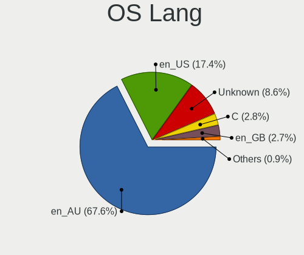
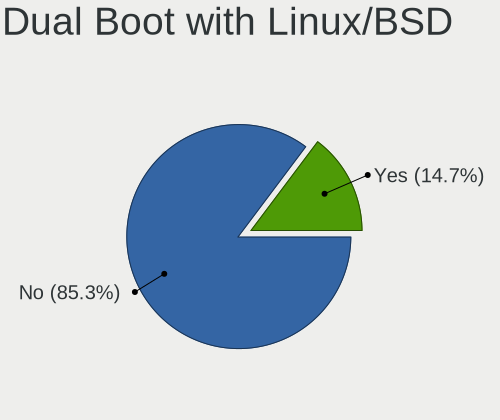
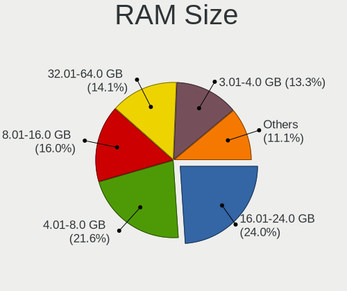
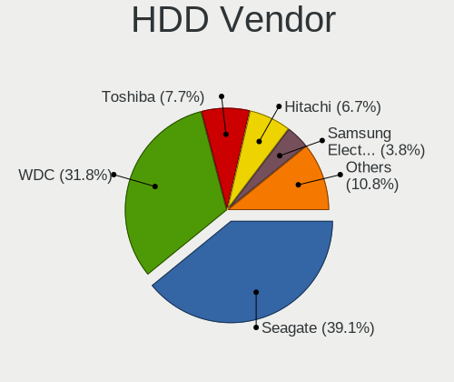
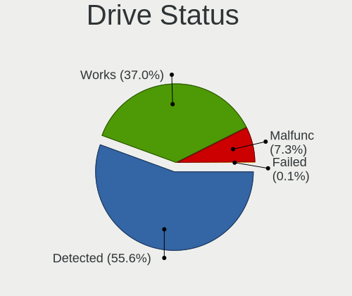
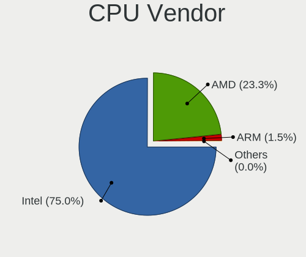
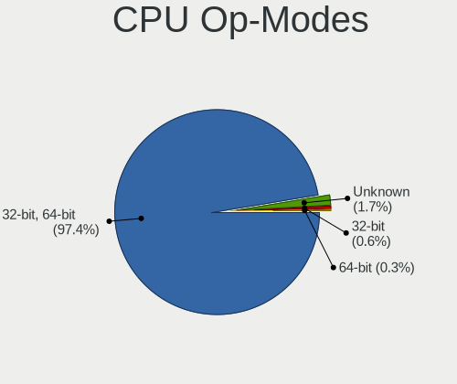
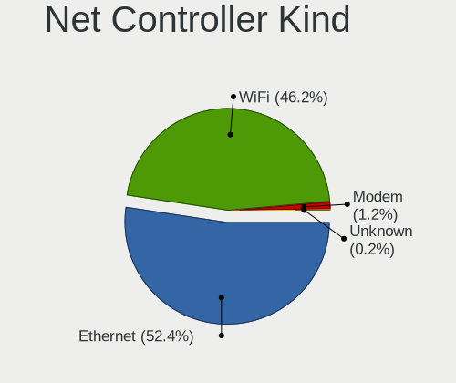

Linux in Australia - Tested Hardware & Statistics
-------------------------------------------------

A project to collect tested hardware configurations for Linux in Australia.

Anyone can contribute to this report by the [hw-probe](https://github.com/linuxhw/hw-probe) tool:

    sudo -E hw-probe -all -upload

Please contribute! Especially if your hardware is rare.

This is a report for all computer types. See also reports for [desktops](/Location/Australia/Desktop/README.md) and [notebooks](/Location/Australia/Notebook/README.md).

Contents
--------

* [ Test Cases ](#test-cases)

* [ System ](#system)
  - [ OS                       ](#os)
  - [ OS Family                ](#os-family)
  - [ Kernel                   ](#kernel)
  - [ Kernel Family            ](#kernel-family)
  - [ Kernel Major Ver.        ](#kernel-major-ver)
  - [ Arch                     ](#arch)
  - [ DE                       ](#de)
  - [ Display Server           ](#display-server)
  - [ Display Manager          ](#display-manager)
  - [ OS Lang                  ](#os-lang)
  - [ Boot Mode                ](#boot-mode)
  - [ Filesystem               ](#filesystem)
  - [ Part. scheme             ](#part-scheme)
  - [ Dual Boot with Linux/BSD ](#dual-boot-with-linuxbsd)
  - [ Dual Boot (Win)          ](#dual-boot-win)

* [ Board ](#board)
  - [ Vendor                   ](#vendor)
  - [ Model                    ](#model)
  - [ Model Family             ](#model-family)
  - [ MFG Year                 ](#mfg-year)
  - [ Form Factor              ](#form-factor)
  - [ Secure Boot              ](#secure-boot)
  - [ Coreboot                 ](#coreboot)
  - [ RAM Size                 ](#ram-size)
  - [ RAM Used                 ](#ram-used)
  - [ Total Drives             ](#total-drives)
  - [ Has CD-ROM               ](#has-cd-rom)
  - [ Has Ethernet             ](#has-ethernet)
  - [ Has WiFi                 ](#has-wifi)
  - [ Has Bluetooth            ](#has-bluetooth)

* [ Location ](#location)
  - [ Country                  ](#country)
  - [ City                     ](#city)

* [ Drives ](#drives)
  - [ Drive Vendor             ](#drive-vendor)
  - [ Drive Model              ](#drive-model)
  - [ HDD Vendor               ](#hdd-vendor)
  - [ SSD Vendor               ](#ssd-vendor)
  - [ Drive Kind               ](#drive-kind)
  - [ Drive Connector          ](#drive-connector)
  - [ Drive Size               ](#drive-size)
  - [ Space Total              ](#space-total)
  - [ Space Used               ](#space-used)
  - [ Malfunc. Drives          ](#malfunc-drives)
  - [ Malfunc. Drive Vendor    ](#malfunc-drive-vendor)
  - [ Malfunc. HDD Vendor      ](#malfunc-hdd-vendor)
  - [ Malfunc. Drive Kind      ](#malfunc-drive-kind)
  - [ Failed Drives            ](#failed-drives)
  - [ Failed Drive Vendor      ](#failed-drive-vendor)
  - [ Drive Status             ](#drive-status)

* [ Storage controller ](#storage-controller)
  - [ Storage Vendor           ](#storage-vendor)
  - [ Storage Model            ](#storage-model)
  - [ Storage Kind             ](#storage-kind)

* [ Processor ](#processor)
  - [ CPU Vendor               ](#cpu-vendor)
  - [ CPU Model                ](#cpu-model)
  - [ CPU Model Family         ](#cpu-model-family)
  - [ CPU Cores                ](#cpu-cores)
  - [ CPU Sockets              ](#cpu-sockets)
  - [ CPU Threads              ](#cpu-threads)
  - [ CPU Op-Modes             ](#cpu-op-modes)
  - [ CPU Microcode            ](#cpu-microcode)
  - [ CPU Microarch            ](#cpu-microarch)

* [ Graphics ](#graphics)
  - [ GPU Vendor               ](#gpu-vendor)
  - [ GPU Model                ](#gpu-model)
  - [ GPU Combo                ](#gpu-combo)
  - [ GPU Driver               ](#gpu-driver)
  - [ GPU Memory               ](#gpu-memory)

* [ Monitor ](#monitor)
  - [ Monitor Vendor           ](#monitor-vendor)
  - [ Monitor Model            ](#monitor-model)
  - [ Monitor Resolution       ](#monitor-resolution)
  - [ Monitor Diagonal         ](#monitor-diagonal)
  - [ Monitor Width            ](#monitor-width)
  - [ Aspect Ratio             ](#aspect-ratio)
  - [ Monitor Area             ](#monitor-area)
  - [ Pixel Density            ](#pixel-density)
  - [ Multiple Monitors        ](#multiple-monitors)

* [ Network ](#network)
  - [ Net Controller Vendor    ](#net-controller-vendor)
  - [ Net Controller Model     ](#net-controller-model)
  - [ Wireless Vendor          ](#wireless-vendor)
  - [ Wireless Model           ](#wireless-model)
  - [ Ethernet Vendor          ](#ethernet-vendor)
  - [ Ethernet Model           ](#ethernet-model)
  - [ Net Controller Kind      ](#net-controller-kind)
  - [ Used Controller          ](#used-controller)
  - [ NICs                     ](#nics)
  - [ IPv6                     ](#ipv6)

* [ Bluetooth ](#bluetooth)
  - [ Bluetooth Vendor         ](#bluetooth-vendor)
  - [ Bluetooth Model          ](#bluetooth-model)

* [ Sound ](#sound)
  - [ Sound Vendor             ](#sound-vendor)
  - [ Sound Model              ](#sound-model)

* [ Memory ](#memory)
  - [ Memory Vendor            ](#memory-vendor)
  - [ Memory Model             ](#memory-model)
  - [ Memory Kind              ](#memory-kind)
  - [ Memory Form Factor       ](#memory-form-factor)
  - [ Memory Size              ](#memory-size)
  - [ Memory Speed             ](#memory-speed)

* [ Printers & scanners ](#printers--scanners)
  - [ Printer Vendor           ](#printer-vendor)
  - [ Printer Model            ](#printer-model)
  - [ Scanner Vendor           ](#scanner-vendor)
  - [ Scanner Model            ](#scanner-model)

* [ Camera ](#camera)
  - [ Camera Vendor            ](#camera-vendor)
  - [ Camera Model             ](#camera-model)

* [ Security ](#security)
  - [ Fingerprint Vendor       ](#fingerprint-vendor)
  - [ Fingerprint Model        ](#fingerprint-model)
  - [ Chipcard Vendor          ](#chipcard-vendor)
  - [ Chipcard Model           ](#chipcard-model)

* [ Unsupported ](#unsupported)
  - [ Unsupported Devices      ](#unsupported-devices)
  - [ Unsupported Device Types ](#unsupported-device-types)

Test Cases
----------

Total: 3977

| Vendor        | Model                       | Form-Factor | Probe                                                      | Date         |
|---------------|-----------------------------|-------------|------------------------------------------------------------|--------------|
| Gigabyte      | GA-MA785G-UD3H              | Desktop     | [dcccfd1beb](https://linux-hardware.org/?probe=dcccfd1beb) | Aug 01, 2022 |
| QIYIDA        | X99-H9 V2.0                 | Desktop     | [e1fa8ab12b](https://linux-hardware.org/?probe=e1fa8ab12b) | Aug 01, 2022 |
| ASUSTek       | ROG Strix G513QY_G513QY     | Notebook    | [370b872aa5](https://linux-hardware.org/?probe=370b872aa5) | Aug 01, 2022 |
| Gigabyte      | B450 AORUS PRO-CF           | Desktop     | [81c46b891f](https://linux-hardware.org/?probe=81c46b891f) | Aug 01, 2022 |
| ASUSTek       | P7P55D-E PRO                | Desktop     | [d58be7b6d1](https://linux-hardware.org/?probe=d58be7b6d1) | Aug 01, 2022 |
| Unknown       | Unknown                     | Soc         | [9ebddaa953](https://linux-hardware.org/?probe=9ebddaa953) | Jul 31, 2022 |
| ASRock        | Z170 Pro4                   | Desktop     | [e8dba6ab7e](https://linux-hardware.org/?probe=e8dba6ab7e) | Jul 31, 2022 |
| Gigabyte      | GA-880GM-UD2H               | Desktop     | [f6a106d6df](https://linux-hardware.org/?probe=f6a106d6df) | Jul 31, 2022 |
| Intel         | NUC7i5BNB J31144-302        | Mini pc     | [638275ad97](https://linux-hardware.org/?probe=638275ad97) | Jul 31, 2022 |
| HP            | 82F2                        | Desktop     | [0c2d091c2e](https://linux-hardware.org/?probe=0c2d091c2e) | Jul 31, 2022 |
| Acer          | ConceptD CN315-71P          | Notebook    | [c7ed484a1f](https://linux-hardware.org/?probe=c7ed484a1f) | Jul 30, 2022 |
| Dell          | Inspiron M5010              | Notebook    | [bd4cf45b33](https://linux-hardware.org/?probe=bd4cf45b33) | Jul 30, 2022 |
| Intel         | NUC6i5SYB H81131-505        | Mini pc     | [51695dd3ea](https://linux-hardware.org/?probe=51695dd3ea) | Jul 29, 2022 |
| Intel         | NUC6i5SYB H81131-505        | Mini pc     | [2381ee35c0](https://linux-hardware.org/?probe=2381ee35c0) | Jul 29, 2022 |
| ASRock        | Z170 Pro4                   | Desktop     | [73c8bc2ae1](https://linux-hardware.org/?probe=73c8bc2ae1) | Jul 28, 2022 |
| Lenovo        | 3717 SDK0R32862 WIN 3258... | Desktop     | [757ba0f252](https://linux-hardware.org/?probe=757ba0f252) | Jul 28, 2022 |
| Gigabyte      | B450M H                     | Desktop     | [1357e3b3d3](https://linux-hardware.org/?probe=1357e3b3d3) | Jul 28, 2022 |
| Acer          | Aspire 5742G                | Notebook    | [e42501aacb](https://linux-hardware.org/?probe=e42501aacb) | Jul 28, 2022 |
| ASUSTek       | X555YA                      | Notebook    | [ddd00fbeea](https://linux-hardware.org/?probe=ddd00fbeea) | Jul 28, 2022 |
| Unknown       | HX90                        | Desktop     | [1594710372](https://linux-hardware.org/?probe=1594710372) | Jul 28, 2022 |
| Dell          | Latitude E7250              | Notebook    | [26a8591f1d](https://linux-hardware.org/?probe=26a8591f1d) | Jul 27, 2022 |
| HP            | Laptop 17-cp0xxx            | Notebook    | [761563e485](https://linux-hardware.org/?probe=761563e485) | Jul 27, 2022 |
| Apple         | MacBookAir7,2               | Notebook    | [5e7b9f2b14](https://linux-hardware.org/?probe=5e7b9f2b14) | Jul 26, 2022 |
| Gigabyte      | X570 AORUS ULTRA            | Desktop     | [331a99ef9a](https://linux-hardware.org/?probe=331a99ef9a) | Jul 26, 2022 |
| Gigabyte      | X570 AORUS ULTRA            | Desktop     | [1f3433b9e1](https://linux-hardware.org/?probe=1f3433b9e1) | Jul 26, 2022 |
| ASRock        | Z170 Pro4                   | Desktop     | [876c60188f](https://linux-hardware.org/?probe=876c60188f) | Jul 26, 2022 |
| Gigabyte      | B75M-D3H                    | Desktop     | [050aa57cb4](https://linux-hardware.org/?probe=050aa57cb4) | Jul 26, 2022 |
| Dell          | Latitude 3400               | Notebook    | [3412e8deac](https://linux-hardware.org/?probe=3412e8deac) | Jul 26, 2022 |
| Lenovo        | G570 4334                   | Notebook    | [e4c223e83e](https://linux-hardware.org/?probe=e4c223e83e) | Jul 25, 2022 |
| Gigabyte      | X570 AORUS MASTER           | Desktop     | [7af6c5cebe](https://linux-hardware.org/?probe=7af6c5cebe) | Jul 24, 2022 |
| Lenovo        | 3702 SDK0J40700 WIN 3258... | All in one  | [95af4e4f8e](https://linux-hardware.org/?probe=95af4e4f8e) | Jul 23, 2022 |
| Apple         | MacBookAir6,1               | Notebook    | [ede7f6cdae](https://linux-hardware.org/?probe=ede7f6cdae) | Jul 23, 2022 |
| Acer          | Nitro AN515-55              | Notebook    | [85f2ffe45a](https://linux-hardware.org/?probe=85f2ffe45a) | Jul 22, 2022 |
| Lenovo        | ThinkCentre M58p 7220A72    | Desktop     | [d57e35934f](https://linux-hardware.org/?probe=d57e35934f) | Jul 22, 2022 |
| Acer          | ConceptD CN315-71P          | Notebook    | [2723b19c18](https://linux-hardware.org/?probe=2723b19c18) | Jul 22, 2022 |
| Gigabyte      | B75M-D3H                    | Desktop     | [80dcd8a0f7](https://linux-hardware.org/?probe=80dcd8a0f7) | Jul 22, 2022 |
| Google        | Peppy                       | Notebook    | [3bfdae8e5e](https://linux-hardware.org/?probe=3bfdae8e5e) | Jul 21, 2022 |
| Acer          | Aspire One 753              | Notebook    | [eff74923d7](https://linux-hardware.org/?probe=eff74923d7) | Jul 21, 2022 |
| MSI           | Z97 GAMING 5                | Desktop     | [89e0889e94](https://linux-hardware.org/?probe=89e0889e94) | Jul 21, 2022 |
| Dell          | Latitude 5430               | Notebook    | [f02c4072c1](https://linux-hardware.org/?probe=f02c4072c1) | Jul 21, 2022 |
| Acer          | Aspire R3-131T              | Notebook    | [c3722806fe](https://linux-hardware.org/?probe=c3722806fe) | Jul 21, 2022 |
| Apple         | MacBookPro9,2               | Notebook    | [add1e46d7e](https://linux-hardware.org/?probe=add1e46d7e) | Jul 20, 2022 |
| Dell          | Inspiron MM061              | Notebook    | [2360c35ac1](https://linux-hardware.org/?probe=2360c35ac1) | Jul 20, 2022 |
| Dell          | Inspiron MM061              | Notebook    | [5cb9487776](https://linux-hardware.org/?probe=5cb9487776) | Jul 20, 2022 |
| ASUSTek       | Z170M-PLUS                  | Desktop     | [85df5dd7a2](https://linux-hardware.org/?probe=85df5dd7a2) | Jul 19, 2022 |
| Dell          | Inspiron 1545               | Notebook    | [b0e3b75c3b](https://linux-hardware.org/?probe=b0e3b75c3b) | Jul 19, 2022 |
| Gigabyte      | GA-880GM-UD2H               | Desktop     | [a5082efd70](https://linux-hardware.org/?probe=a5082efd70) | Jul 19, 2022 |
| Acer          | TravelMate 8572T            | Notebook    | [54e7b50fc7](https://linux-hardware.org/?probe=54e7b50fc7) | Jul 18, 2022 |
| ASRock        | AD2700-ITX                  | Desktop     | [870cda5796](https://linux-hardware.org/?probe=870cda5796) | Jul 17, 2022 |
| ReachingTe... | Dream Quest Office 2021     | Mini pc     | [662e59e904](https://linux-hardware.org/?probe=662e59e904) | Jul 17, 2022 |
| Alienware     | x17 R1                      | Notebook    | [9fc2d6416d](https://linux-hardware.org/?probe=9fc2d6416d) | Jul 16, 2022 |
| Gigabyte      | GA-A55M-S2V                 | Desktop     | [713765e224](https://linux-hardware.org/?probe=713765e224) | Jul 16, 2022 |
| Apple         | MacBookAir7,2               | Notebook    | [a1a565d211](https://linux-hardware.org/?probe=a1a565d211) | Jul 16, 2022 |
| Gigabyte      | GA-870A-UD3                 | Desktop     | [950542a4a3](https://linux-hardware.org/?probe=950542a4a3) | Jul 16, 2022 |
| HP            | 802E                        | Desktop     | [c86ddd647b](https://linux-hardware.org/?probe=c86ddd647b) | Jul 16, 2022 |
| HP            | Spectre 13-SMB Pro Ultra... | Notebook    | [5fd8a1dcf4](https://linux-hardware.org/?probe=5fd8a1dcf4) | Jul 15, 2022 |
| Gigabyte      | H77N-WIFI                   | Desktop     | [f655a34cc1](https://linux-hardware.org/?probe=f655a34cc1) | Jul 15, 2022 |
| Acer          | ConceptD CN315-71P          | Notebook    | [de83d4ef43](https://linux-hardware.org/?probe=de83d4ef43) | Jul 15, 2022 |
| HP            | 0B4Ch D                     | Desktop     | [a27d53815e](https://linux-hardware.org/?probe=a27d53815e) | Jul 15, 2022 |
| Acer          | ConceptD CN315-71P          | Notebook    | [01e6c30eff](https://linux-hardware.org/?probe=01e6c30eff) | Jul 15, 2022 |
| Dell          | Inspiron 16 Plus 7620       | Notebook    | [73be4f7864](https://linux-hardware.org/?probe=73be4f7864) | Jul 14, 2022 |
| Acer          | Nitro AN515-56              | Notebook    | [2418745195](https://linux-hardware.org/?probe=2418745195) | Jul 14, 2022 |
| Dell          | Inspiron M5010              | Notebook    | [56be64f444](https://linux-hardware.org/?probe=56be64f444) | Jul 14, 2022 |
| ASUSTek       | GL702ZC                     | Notebook    | [755f571a3e](https://linux-hardware.org/?probe=755f571a3e) | Jul 14, 2022 |
| Dell          | 0W2F8G A01                  | Desktop     | [77f2181e08](https://linux-hardware.org/?probe=77f2181e08) | Jul 13, 2022 |
| Dell          | 0GXM1W A02                  | Desktop     | [ff67056edc](https://linux-hardware.org/?probe=ff67056edc) | Jul 13, 2022 |
| Gigabyte      | J1900M-D2P                  | Desktop     | [29602ec66f](https://linux-hardware.org/?probe=29602ec66f) | Jul 13, 2022 |
| Dell          | XPS 13 9360                 | Notebook    | [ef3bc84295](https://linux-hardware.org/?probe=ef3bc84295) | Jul 13, 2022 |
| ASUSTek       | P8Z77-M PRO                 | Desktop     | [0c70241041](https://linux-hardware.org/?probe=0c70241041) | Jul 13, 2022 |
| Acer          | Aspire R3-131T              | Notebook    | [4126a95603](https://linux-hardware.org/?probe=4126a95603) | Jul 13, 2022 |
| Apple         | MacBook9,1                  | Notebook    | [0ce6078768](https://linux-hardware.org/?probe=0ce6078768) | Jul 12, 2022 |
| Unknown       | Unknown                     | Soc         | [d3742575fd](https://linux-hardware.org/?probe=d3742575fd) | Jul 12, 2022 |
| Apple         | MacBookPro10,2              | Notebook    | [facbace782](https://linux-hardware.org/?probe=facbace782) | Jul 12, 2022 |
| Apple         | MacBookPro10,2              | Notebook    | [9cc1538196](https://linux-hardware.org/?probe=9cc1538196) | Jul 12, 2022 |
| MSI           | X99S GAMING 9 AC            | Desktop     | [5f682aadd5](https://linux-hardware.org/?probe=5f682aadd5) | Jul 12, 2022 |
| ASUSTek       | P8Z77-M PRO                 | Desktop     | [4929b942aa](https://linux-hardware.org/?probe=4929b942aa) | Jul 12, 2022 |
| Intel         | LADPNVMO AAE76523-300       | Desktop     | [07a37c99cb](https://linux-hardware.org/?probe=07a37c99cb) | Jul 11, 2022 |
| Apple         | MacBook9,1                  | Notebook    | [7373f62fa5](https://linux-hardware.org/?probe=7373f62fa5) | Jul 10, 2022 |
| Acer          | Aspire 1830T                | Notebook    | [d2ff08ade8](https://linux-hardware.org/?probe=d2ff08ade8) | Jul 10, 2022 |
| Gigabyte      | GA-MA780G-UD3H              | Desktop     | [cdf7b9a4d1](https://linux-hardware.org/?probe=cdf7b9a4d1) | Jul 10, 2022 |
| Gigabyte      | H170N-WIFI-CF               | Desktop     | [2f3e59dc30](https://linux-hardware.org/?probe=2f3e59dc30) | Jul 09, 2022 |
| MSI           | B450M MORTAR MAX            | Desktop     | [60d115ad0c](https://linux-hardware.org/?probe=60d115ad0c) | Jul 09, 2022 |
| ASRock        | Z77 Extreme6                | Desktop     | [fd8bd29c03](https://linux-hardware.org/?probe=fd8bd29c03) | Jul 09, 2022 |
| Acer          | Aspire Z3-710               | All in one  | [5f7d41a8ae](https://linux-hardware.org/?probe=5f7d41a8ae) | Jul 09, 2022 |
| Gigabyte      | J1900M-D2P                  | Desktop     | [36fa61e21d](https://linux-hardware.org/?probe=36fa61e21d) | Jul 09, 2022 |
| Gigabyte      | EP45-DS3L                   | Desktop     | [4b7c20d75e](https://linux-hardware.org/?probe=4b7c20d75e) | Jul 09, 2022 |
| Gigabyte      | X570 AORUS PRO WIFI         | Desktop     | [fb5a2ac873](https://linux-hardware.org/?probe=fb5a2ac873) | Jul 09, 2022 |
| HP            | EliteBook 8470p             | Notebook    | [c048bb9697](https://linux-hardware.org/?probe=c048bb9697) | Jul 09, 2022 |
| Apple         | MacBookPro9,2               | Notebook    | [663a6c9413](https://linux-hardware.org/?probe=663a6c9413) | Jul 08, 2022 |
| ASUSTek       | ROG STRIX B660-I GAMING ... | Desktop     | [48bd0906cf](https://linux-hardware.org/?probe=48bd0906cf) | Jul 08, 2022 |
| Acer          | Aspire R3-131T              | Notebook    | [749a597089](https://linux-hardware.org/?probe=749a597089) | Jul 08, 2022 |
| Gigabyte      | B550 AORUS PRO AX           | Desktop     | [9ad45447d4](https://linux-hardware.org/?probe=9ad45447d4) | Jul 08, 2022 |
| Lenovo        | ThinkPad X1 Carbon 3460A... | Notebook    | [e34a9c3166](https://linux-hardware.org/?probe=e34a9c3166) | Jul 08, 2022 |
| Gigabyte      | GA-MA785G-UD3H              | Desktop     | [4da61d3e61](https://linux-hardware.org/?probe=4da61d3e61) | Jul 07, 2022 |
| Gigabyte      | X570 AORUS PRO WIFI         | Desktop     | [503c38154f](https://linux-hardware.org/?probe=503c38154f) | Jul 07, 2022 |
| HP            | EliteBook 850 G1            | Notebook    | [1a2485b399](https://linux-hardware.org/?probe=1a2485b399) | Jul 06, 2022 |
| Acer          | Nitro AN515-55              | Notebook    | [8e7d7a945f](https://linux-hardware.org/?probe=8e7d7a945f) | Jul 06, 2022 |
| Lenovo        | ThinkPad T470s W10DG 20J... | Notebook    | [ce6d3ec137](https://linux-hardware.org/?probe=ce6d3ec137) | Jul 06, 2022 |
| Lenovo        | Legion S7 15ACH6 82K8       | Notebook    | [e24a6dd845](https://linux-hardware.org/?probe=e24a6dd845) | Jul 05, 2022 |
| HP            | EliteBook 840 G6            | Notebook    | [d6dccd6ed7](https://linux-hardware.org/?probe=d6dccd6ed7) | Jul 05, 2022 |
| HUAWEI        | KLVD-WXX9                   | Notebook    | [422a12c217](https://linux-hardware.org/?probe=422a12c217) | Jul 05, 2022 |
| HP            | Pavilion g6                 | Notebook    | [0cd693879d](https://linux-hardware.org/?probe=0cd693879d) | Jul 05, 2022 |
| Acer          | ConceptD CN315-71P          | Notebook    | [76d6073818](https://linux-hardware.org/?probe=76d6073818) | Jul 05, 2022 |
| Raspberry ... | Raspberry Pi                | Soc         | [e69b07f3e9](https://linux-hardware.org/?probe=e69b07f3e9) | Jul 05, 2022 |
| Dell          | Precision M4700             | Notebook    | [48cbbf8dd2](https://linux-hardware.org/?probe=48cbbf8dd2) | Jul 05, 2022 |
| ASRock        | 990FX Killer                | Desktop     | [28b0984086](https://linux-hardware.org/?probe=28b0984086) | Jul 05, 2022 |
| Gigabyte      | H77N-WIFI                   | Desktop     | [e795477a20](https://linux-hardware.org/?probe=e795477a20) | Jul 05, 2022 |
| Acer          | Aspire R3-131T              | Notebook    | [748f42be21](https://linux-hardware.org/?probe=748f42be21) | Jul 05, 2022 |
| Apple         | MacBookPro10,2              | Notebook    | [40d0cb89c5](https://linux-hardware.org/?probe=40d0cb89c5) | Jul 04, 2022 |
| Dell          | 0T10XW A01                  | Desktop     | [e165fd805c](https://linux-hardware.org/?probe=e165fd805c) | Jul 04, 2022 |
| Apple         | MacBook9,1                  | Notebook    | [ac5093fe3d](https://linux-hardware.org/?probe=ac5093fe3d) | Jul 04, 2022 |
| HP            | 3646h                       | Desktop     | [9e0737f23f](https://linux-hardware.org/?probe=9e0737f23f) | Jul 04, 2022 |
| Dell          | 0Y5DDC A00                  | Desktop     | [e99c8ae46f](https://linux-hardware.org/?probe=e99c8ae46f) | Jul 04, 2022 |
| HP            | EliteBook 8470p             | Notebook    | [4600681149](https://linux-hardware.org/?probe=4600681149) | Jul 03, 2022 |
| HP            | EliteBook 8470p             | Notebook    | [85c5a62101](https://linux-hardware.org/?probe=85c5a62101) | Jul 03, 2022 |
| Acer          | Aspire A315-21G             | Notebook    | [bcc3835be5](https://linux-hardware.org/?probe=bcc3835be5) | Jul 03, 2022 |
| Intel         | NUC10i7FNB K61360-303       | Mini pc     | [fc29bb14e9](https://linux-hardware.org/?probe=fc29bb14e9) | Jul 03, 2022 |
| Acer          | Aspire A315-21G             | Notebook    | [5f3197f581](https://linux-hardware.org/?probe=5f3197f581) | Jul 03, 2022 |
| Dell          | Inspiron 14 7420 2-in-1     | Convertible | [f2a1afe8eb](https://linux-hardware.org/?probe=f2a1afe8eb) | Jul 03, 2022 |
| Dell          | Inspiron 14 7420 2-in-1     | Convertible | [1295c3de55](https://linux-hardware.org/?probe=1295c3de55) | Jul 03, 2022 |
| Acer          | Swift SF114-34              | Notebook    | [dd9610011c](https://linux-hardware.org/?probe=dd9610011c) | Jul 02, 2022 |
| Lenovo        | Yoga 9 14IAP7 82LU          | Convertible | [4044d76f9b](https://linux-hardware.org/?probe=4044d76f9b) | Jul 02, 2022 |
| Intel         | DH67BL AAG10189-211         | Desktop     | [ef2f004b52](https://linux-hardware.org/?probe=ef2f004b52) | Jul 02, 2022 |
| ASRock        | Z390 Pro4                   | Desktop     | [25bd784ca6](https://linux-hardware.org/?probe=25bd784ca6) | Jul 02, 2022 |
| Apple         | MacBookPro9,2               | Notebook    | [4f6364d861](https://linux-hardware.org/?probe=4f6364d861) | Jul 02, 2022 |
| Dell          | Inspiron M5010              | Notebook    | [14b9aa33d2](https://linux-hardware.org/?probe=14b9aa33d2) | Jul 01, 2022 |
| Gigabyte      | Z97X-Gaming 3               | Desktop     | [9b8bb163d3](https://linux-hardware.org/?probe=9b8bb163d3) | Jul 01, 2022 |
| Gigabyte      | X570 I AORUS PRO WIFI       | Desktop     | [d82f88e20c](https://linux-hardware.org/?probe=d82f88e20c) | Jul 01, 2022 |
| Lenovo        | ThinkCentre M58p 7220A72    | Desktop     | [cea6c9ea52](https://linux-hardware.org/?probe=cea6c9ea52) | Jun 30, 2022 |
| HP            | EliteBook 8470p             | Notebook    | [cd488e4f64](https://linux-hardware.org/?probe=cd488e4f64) | Jun 30, 2022 |
| HP            | EliteBook 8470p             | Notebook    | [52dfa0a4ee](https://linux-hardware.org/?probe=52dfa0a4ee) | Jun 30, 2022 |
| Apple         | MacBook9,1                  | Notebook    | [4d1e0cc30c](https://linux-hardware.org/?probe=4d1e0cc30c) | Jun 30, 2022 |
| Apple         | MacBook9,1                  | Notebook    | [f97c981688](https://linux-hardware.org/?probe=f97c981688) | Jun 30, 2022 |
| ASUSTek       | VivoBook_ASUSLaptop X515... | Notebook    | [3a423eae14](https://linux-hardware.org/?probe=3a423eae14) | Jun 30, 2022 |
| HP            | ENVY x360 Convertible 15... | Convertible | [af29dc9fe1](https://linux-hardware.org/?probe=af29dc9fe1) | Jun 30, 2022 |
| Lenovo        | Legion Y540-15IRH 81SX      | Notebook    | [1b5babe2aa](https://linux-hardware.org/?probe=1b5babe2aa) | Jun 29, 2022 |
| AMI           | Intel                       | Notebook    | [2b592e2f4a](https://linux-hardware.org/?probe=2b592e2f4a) | Jun 29, 2022 |
| MSI           | Z77A-G43                    | Desktop     | [909e3e3c2e](https://linux-hardware.org/?probe=909e3e3c2e) | Jun 29, 2022 |
| Dell          | Latitude 5430               | Notebook    | [119502eddb](https://linux-hardware.org/?probe=119502eddb) | Jun 29, 2022 |
| Gigabyte      | D525TUD                     | Desktop     | [b6cfc5d2df](https://linux-hardware.org/?probe=b6cfc5d2df) | Jun 28, 2022 |
| Gigabyte      | G41MT-D3                    | Desktop     | [20de16a046](https://linux-hardware.org/?probe=20de16a046) | Jun 28, 2022 |
| Dell          | XPS 13 9310 2-in-1          | Convertible | [d2034a53b8](https://linux-hardware.org/?probe=d2034a53b8) | Jun 28, 2022 |
| ASUSTek       | A88X-GAMER                  | Desktop     | [b7e193f50c](https://linux-hardware.org/?probe=b7e193f50c) | Jun 28, 2022 |
| Dell          | G3 3500                     | Notebook    | [0df1b9607c](https://linux-hardware.org/?probe=0df1b9607c) | Jun 27, 2022 |
| Dell          | 051FJ8 A02                  | Desktop     | [5b997790f1](https://linux-hardware.org/?probe=5b997790f1) | Jun 27, 2022 |
| HUAWEI        | KLVD-WXX9                   | Notebook    | [b947b14fe4](https://linux-hardware.org/?probe=b947b14fe4) | Jun 27, 2022 |
| Gigabyte      | J1900M-D2P                  | Desktop     | [d703a63932](https://linux-hardware.org/?probe=d703a63932) | Jun 26, 2022 |
| MSI           | PRO Z690-A                  | Desktop     | [34a2f4f726](https://linux-hardware.org/?probe=34a2f4f726) | Jun 26, 2022 |
| Microsoft     | Surface Pro 7               | Tablet      | [2f4500ddad](https://linux-hardware.org/?probe=2f4500ddad) | Jun 26, 2022 |
| Gigabyte      | B250M-D3H-CF                | Desktop     | [bd52209b2a](https://linux-hardware.org/?probe=bd52209b2a) | Jun 24, 2022 |
| Alienware     | 14                          | Notebook    | [8846f2e474](https://linux-hardware.org/?probe=8846f2e474) | Jun 24, 2022 |
| Raspberry ... | Raspberry Pi Compute Mod... | Soc         | [015aa87271](https://linux-hardware.org/?probe=015aa87271) | Jun 24, 2022 |
| Apple         | MacBook9,1                  | Notebook    | [e6f1068c91](https://linux-hardware.org/?probe=e6f1068c91) | Jun 24, 2022 |
| HP            | Presario CQ62               | Notebook    | [2f136051c9](https://linux-hardware.org/?probe=2f136051c9) | Jun 24, 2022 |
| HP            | Presario CQ62               | Notebook    | [9beeb6d3c2](https://linux-hardware.org/?probe=9beeb6d3c2) | Jun 23, 2022 |
| Lenovo        | ThinkPad E490s 20NG0002A... | Notebook    | [4cce05dc1c](https://linux-hardware.org/?probe=4cce05dc1c) | Jun 23, 2022 |
| Acer          | Nitro AN515-55              | Notebook    | [c4b2a02630](https://linux-hardware.org/?probe=c4b2a02630) | Jun 23, 2022 |
| Apple         | MacBook9,1                  | Notebook    | [3656b8227f](https://linux-hardware.org/?probe=3656b8227f) | Jun 23, 2022 |
| Toshiba       | TECRA A40-D                 | Notebook    | [6307594332](https://linux-hardware.org/?probe=6307594332) | Jun 23, 2022 |
| Gigabyte      | B450 AORUS PRO-CF           | Desktop     | [989b450d8b](https://linux-hardware.org/?probe=989b450d8b) | Jun 23, 2022 |
| Dell          | 0W2F8G A01                  | Desktop     | [447653d4f2](https://linux-hardware.org/?probe=447653d4f2) | Jun 22, 2022 |
| Dell          | 0W2F8G A01                  | Desktop     | [4610c38358](https://linux-hardware.org/?probe=4610c38358) | Jun 22, 2022 |
| ASUSTek       | PRIME X570-PRO              | Desktop     | [ae30cadddf](https://linux-hardware.org/?probe=ae30cadddf) | Jun 22, 2022 |
| Gigabyte      | Z690 AORUS ELITE AX DDR4    | Desktop     | [b65a5020db](https://linux-hardware.org/?probe=b65a5020db) | Jun 22, 2022 |
| Acer          | Nitro AN515-55              | Notebook    | [bc159b637c](https://linux-hardware.org/?probe=bc159b637c) | Jun 22, 2022 |
| Microsoft     | Surface Laptop 3            | Tablet      | [d5098cc011](https://linux-hardware.org/?probe=d5098cc011) | Jun 22, 2022 |
| Toshiba       | PORTEGE X20W-E              | Convertible | [20cf9d2706](https://linux-hardware.org/?probe=20cf9d2706) | Jun 21, 2022 |
| HP            | 250 G6 Notebook PC          | Notebook    | [30d0a46d81](https://linux-hardware.org/?probe=30d0a46d81) | Jun 21, 2022 |
| ASUSTek       | ROG CROSSHAIR VIII DARK ... | Desktop     | [ecc6e0f4ef](https://linux-hardware.org/?probe=ecc6e0f4ef) | Jun 21, 2022 |
| Lenovo        | ThinkPad X1 Carbon 4th 2... | Notebook    | [f013ebb91b](https://linux-hardware.org/?probe=f013ebb91b) | Jun 20, 2022 |
| Acer          | Iconia                      | Notebook    | [2d1f1a2c32](https://linux-hardware.org/?probe=2d1f1a2c32) | Jun 20, 2022 |
| ASUSTek       | VivoBook_ASUSLaptop M350... | Notebook    | [b3da04a3af](https://linux-hardware.org/?probe=b3da04a3af) | Jun 20, 2022 |
| Framework     | Laptop                      | Notebook    | [f5ece7ce85](https://linux-hardware.org/?probe=f5ece7ce85) | Jun 19, 2022 |
| MSI           | MAG B550M MORTAR WIFI       | Desktop     | [a59676f7be](https://linux-hardware.org/?probe=a59676f7be) | Jun 19, 2022 |
| Apple         | MacBookPro11,1              | Notebook    | [b88b88ba84](https://linux-hardware.org/?probe=b88b88ba84) | Jun 19, 2022 |
| Apple         | MacBookPro11,1              | Notebook    | [ec132b0ba5](https://linux-hardware.org/?probe=ec132b0ba5) | Jun 19, 2022 |
| Acer          | ConceptD CN315-71P          | Notebook    | [66d09f029f](https://linux-hardware.org/?probe=66d09f029f) | Jun 18, 2022 |
| Gigabyte      | GA-MA785G-UD3H              | Desktop     | [dfed0867e1](https://linux-hardware.org/?probe=dfed0867e1) | Jun 17, 2022 |
| Dell          | Precision 5540              | Notebook    | [6d3f2c188b](https://linux-hardware.org/?probe=6d3f2c188b) | Jun 17, 2022 |
| ASUSTek       | M5A99X EVO R2.0             | Desktop     | [0d4c3d0c10](https://linux-hardware.org/?probe=0d4c3d0c10) | Jun 17, 2022 |
| Acer          | Aspire TC-230               | Desktop     | [ac205eb1ec](https://linux-hardware.org/?probe=ac205eb1ec) | Jun 17, 2022 |
| Acer          | ConceptD CN315-71P          | Notebook    | [9b162f339b](https://linux-hardware.org/?probe=9b162f339b) | Jun 16, 2022 |
| ASUSTek       | PRIME A320M-K               | Desktop     | [17e9f5a71f](https://linux-hardware.org/?probe=17e9f5a71f) | Jun 16, 2022 |
| ASUSTek       | PRIME B550M-A               | Desktop     | [527aea0d6e](https://linux-hardware.org/?probe=527aea0d6e) | Jun 16, 2022 |
| HUAWEI        | KLVD-WXX9                   | Notebook    | [4c97b8cc3a](https://linux-hardware.org/?probe=4c97b8cc3a) | Jun 16, 2022 |
| Alienware     | m15 R7                      | Notebook    | [9775a12e11](https://linux-hardware.org/?probe=9775a12e11) | Jun 16, 2022 |
| Acer          | Nitro AN515-55              | Notebook    | [bb631825e3](https://linux-hardware.org/?probe=bb631825e3) | Jun 15, 2022 |
| MSI           | B350M MORTAR ARCTIC         | Desktop     | [57ad2e9147](https://linux-hardware.org/?probe=57ad2e9147) | Jun 15, 2022 |
| Gigabyte      | J1900M-D2P                  | Desktop     | [8ded20d82b](https://linux-hardware.org/?probe=8ded20d82b) | Jun 15, 2022 |
| Acer          | Nitro AN515-55              | Notebook    | [670d05fbe3](https://linux-hardware.org/?probe=670d05fbe3) | Jun 15, 2022 |
| Timi          | Redmi Book Pro 15 2022      | Notebook    | [76fd9cba2e](https://linux-hardware.org/?probe=76fd9cba2e) | Jun 15, 2022 |
| Gigabyte      | H61M-S2PV                   | Desktop     | [cc88cec642](https://linux-hardware.org/?probe=cc88cec642) | Jun 14, 2022 |
| Timi          | Redmi Book Pro 15 2022      | Notebook    | [b3259c0af4](https://linux-hardware.org/?probe=b3259c0af4) | Jun 14, 2022 |
| MSI           | Modern 15 A5M               | Notebook    | [bd16d5829c](https://linux-hardware.org/?probe=bd16d5829c) | Jun 14, 2022 |
| Lenovo        | 312D SDK0J40697 WIN 3305... | Mini pc     | [848f1d55c8](https://linux-hardware.org/?probe=848f1d55c8) | Jun 14, 2022 |
| Gigabyte      | H110-D3A-CF                 | Desktop     | [aca5883c17](https://linux-hardware.org/?probe=aca5883c17) | Jun 14, 2022 |
| Lenovo        | Yoga 520-14IKB 80X8         | Convertible | [fb157585e5](https://linux-hardware.org/?probe=fb157585e5) | Jun 14, 2022 |
| Apple         | MacBookPro11,1              | Notebook    | [57b90afcda](https://linux-hardware.org/?probe=57b90afcda) | Jun 14, 2022 |
| Intel         | DH67BL AAG10189-211         | Desktop     | [8bb84d5aaf](https://linux-hardware.org/?probe=8bb84d5aaf) | Jun 14, 2022 |
| Gigabyte      | AB350-Gaming 3-CF           | Desktop     | [f9e74fdcd3](https://linux-hardware.org/?probe=f9e74fdcd3) | Jun 13, 2022 |
| Unknown       | Unknown                     | Desktop     | [c62add2d70](https://linux-hardware.org/?probe=c62add2d70) | Jun 13, 2022 |
| Hardkernel    | ODROID-N2Plus               | Soc         | [94abe2c8af](https://linux-hardware.org/?probe=94abe2c8af) | Jun 13, 2022 |
| ASUSTek       | P5KPL/1600                  | Desktop     | [0c6a9f5dff](https://linux-hardware.org/?probe=0c6a9f5dff) | Jun 13, 2022 |
| ASUSTek       | P5KPL/1600                  | Desktop     | [aeec9e715d](https://linux-hardware.org/?probe=aeec9e715d) | Jun 13, 2022 |
| Dell          | Vostro 1500                 | Notebook    | [748a8a831b](https://linux-hardware.org/?probe=748a8a831b) | Jun 12, 2022 |
| ASUSTek       | P6T DELUXE V2               | Desktop     | [db209b6bf1](https://linux-hardware.org/?probe=db209b6bf1) | Jun 12, 2022 |
| ASUSTek       | A8R32-MVP Deluxe            | Desktop     | [0c0715a9b2](https://linux-hardware.org/?probe=0c0715a9b2) | Jun 12, 2022 |
| Dell          | 0T10XW A01                  | Desktop     | [1e3a9647e9](https://linux-hardware.org/?probe=1e3a9647e9) | Jun 12, 2022 |
| Gigabyte      | H77N-WIFI                   | Desktop     | [23fa842567](https://linux-hardware.org/?probe=23fa842567) | Jun 11, 2022 |
| HP            | Compaq 6730b                | Notebook    | [dd94c9145b](https://linux-hardware.org/?probe=dd94c9145b) | Jun 11, 2022 |
| ASUSTek       | ROG STRIX Z390-E GAMING     | Desktop     | [576fc8e8ed](https://linux-hardware.org/?probe=576fc8e8ed) | Jun 11, 2022 |
| Gigabyte      | H77N-WIFI                   | Desktop     | [fd1478145b](https://linux-hardware.org/?probe=fd1478145b) | Jun 11, 2022 |
| ASUSTek       | ROG STRIX B560-F GAMING ... | Desktop     | [a4277bcba9](https://linux-hardware.org/?probe=a4277bcba9) | Jun 11, 2022 |
| ASUSTek       | TUF B360M-E GAMING          | Desktop     | [b1e492c444](https://linux-hardware.org/?probe=b1e492c444) | Jun 10, 2022 |
| Gigabyte      | GA-MA785G-UD3H              | Desktop     | [b771c75e31](https://linux-hardware.org/?probe=b771c75e31) | Jun 10, 2022 |
| ASUSTek       | P6T DELUXE V2               | Desktop     | [9198e2d64c](https://linux-hardware.org/?probe=9198e2d64c) | Jun 10, 2022 |
| Gigabyte      | GA-880GM-UD2H               | Desktop     | [267db233fa](https://linux-hardware.org/?probe=267db233fa) | Jun 10, 2022 |
| Gigabyte      | GA-990FXA-UD5               | Desktop     | [b33d07af6c](https://linux-hardware.org/?probe=b33d07af6c) | Jun 09, 2022 |
| ASUSTek       | Unknown                     | Notebook    | [1cc4adfa36](https://linux-hardware.org/?probe=1cc4adfa36) | Jun 09, 2022 |
| Alienware     | x17 R2                      | Notebook    | [78b867a06e](https://linux-hardware.org/?probe=78b867a06e) | Jun 08, 2022 |
| Lenovo        | ThinkPad T410 2522PT3       | Notebook    | [75d6b8489b](https://linux-hardware.org/?probe=75d6b8489b) | Jun 08, 2022 |
| Gigabyte      | G41MT-D3                    | Desktop     | [2ac69cc327](https://linux-hardware.org/?probe=2ac69cc327) | Jun 08, 2022 |
| ASRock        | AD2700-ITX                  | Desktop     | [9342f5c46b](https://linux-hardware.org/?probe=9342f5c46b) | Jun 08, 2022 |
| Gigabyte      | D525TUD                     | Desktop     | [fdba6d0041](https://linux-hardware.org/?probe=fdba6d0041) | Jun 08, 2022 |
| Gigabyte      | X570 I AORUS PRO WIFI       | Desktop     | [d984f403e9](https://linux-hardware.org/?probe=d984f403e9) | Jun 08, 2022 |
| Gigabyte      | B360M D3H-CF                | Desktop     | [73e68df88c](https://linux-hardware.org/?probe=73e68df88c) | Jun 08, 2022 |
| Gigabyte      | GA-MA785G-UD3H              | Desktop     | [bfa4e4ff74](https://linux-hardware.org/?probe=bfa4e4ff74) | Jun 07, 2022 |
| Lenovo        | 0B98401 PRO                 | Desktop     | [67cfa56623](https://linux-hardware.org/?probe=67cfa56623) | Jun 07, 2022 |
| Acer          | Aspire R3-131T              | Notebook    | [1dab354de2](https://linux-hardware.org/?probe=1dab354de2) | Jun 07, 2022 |
| Gigabyte      | Z690 AORUS PRO DDR4         | Desktop     | [1196dd3b41](https://linux-hardware.org/?probe=1196dd3b41) | Jun 06, 2022 |
| Gigabyte      | Z690 AORUS PRO DDR4         | Desktop     | [15efe8a0a2](https://linux-hardware.org/?probe=15efe8a0a2) | Jun 06, 2022 |
| Acer          | Nitro AN515-55              | Notebook    | [0546f2fdfd](https://linux-hardware.org/?probe=0546f2fdfd) | Jun 06, 2022 |
| Acer          | Nitro AN515-55              | Notebook    | [4ab9f94abe](https://linux-hardware.org/?probe=4ab9f94abe) | Jun 06, 2022 |
| Lenovo        | ThinkPad Edge E531 6885C... | Notebook    | [d98f987b46](https://linux-hardware.org/?probe=d98f987b46) | Jun 06, 2022 |
| Lenovo        | ThinkPad X1 Yoga 4th 20Q... | Convertible | [8f496dbb19](https://linux-hardware.org/?probe=8f496dbb19) | Jun 06, 2022 |
| Lenovo        | ThinkPad T470s 20HGS2KW1... | Notebook    | [686fcbebd3](https://linux-hardware.org/?probe=686fcbebd3) | Jun 06, 2022 |
| Lenovo        | Yoga710-14ISK 80TY          | Notebook    | [116abb675e](https://linux-hardware.org/?probe=116abb675e) | Jun 06, 2022 |
| Lenovo        | ThinkPad Edge E531 6885C... | Notebook    | [1b09ad54c8](https://linux-hardware.org/?probe=1b09ad54c8) | Jun 05, 2022 |
| Acer          | Veriton N4670G              | Desktop     | [0b85f95c4c](https://linux-hardware.org/?probe=0b85f95c4c) | Jun 05, 2022 |
| ASUSTek       | PRIME X570-P                | Desktop     | [3b4483236d](https://linux-hardware.org/?probe=3b4483236d) | Jun 05, 2022 |
| ASUSTek       | PRIME H510M-E               | Desktop     | [9207d2f2d8](https://linux-hardware.org/?probe=9207d2f2d8) | Jun 04, 2022 |
| Intel         | NUC5i5RYB H40999-503        | Mini pc     | [a77acb5d89](https://linux-hardware.org/?probe=a77acb5d89) | Jun 04, 2022 |
| Lenovo        | ThinkPad P15 Gen 2i 20YQ... | Notebook    | [57e7433cc5](https://linux-hardware.org/?probe=57e7433cc5) | Jun 04, 2022 |
| Gigabyte      | B85M-D3H                    | Desktop     | [4bbee9909a](https://linux-hardware.org/?probe=4bbee9909a) | Jun 04, 2022 |
| Gigabyte      | H77M-D3H                    | Desktop     | [f770ece55b](https://linux-hardware.org/?probe=f770ece55b) | Jun 03, 2022 |
| Gigabyte      | Z77MX-D3H                   | Desktop     | [24c8a035ac](https://linux-hardware.org/?probe=24c8a035ac) | Jun 03, 2022 |
| Lenovo        | IdeaPad L340-17IWL 81M0     | Notebook    | [b5bb3c0725](https://linux-hardware.org/?probe=b5bb3c0725) | Jun 02, 2022 |
| Apple         | MacBookAir4,2               | Notebook    | [86902cb11f](https://linux-hardware.org/?probe=86902cb11f) | Jun 02, 2022 |
| Dell          | G15 5515                    | Notebook    | [24ddbd70dc](https://linux-hardware.org/?probe=24ddbd70dc) | Jun 02, 2022 |
| Gigabyte      | B85M-D3H                    | Desktop     | [0ddfd77617](https://linux-hardware.org/?probe=0ddfd77617) | Jun 02, 2022 |
| HP            | 250 G6 Notebook PC          | Notebook    | [878274dbce](https://linux-hardware.org/?probe=878274dbce) | Jun 02, 2022 |
| Acer          | Aspire A315-58              | Notebook    | [b63e54900e](https://linux-hardware.org/?probe=b63e54900e) | Jun 02, 2022 |
| Dell          | Latitude E6540              | Notebook    | [9cbdc3f892](https://linux-hardware.org/?probe=9cbdc3f892) | Jun 02, 2022 |
| Lenovo        | IdeaPad 5 Pro 14ACN6 82L... | Notebook    | [ae39e96b1a](https://linux-hardware.org/?probe=ae39e96b1a) | Jun 01, 2022 |
| Alienware     | 0XJKKD A00                  | Desktop     | [ae3a750f2e](https://linux-hardware.org/?probe=ae3a750f2e) | Jun 01, 2022 |
| HP            | 1632                        | Desktop     | [4f7993cf34](https://linux-hardware.org/?probe=4f7993cf34) | Jun 01, 2022 |
| HP            | 1632                        | Desktop     | [9e69c11025](https://linux-hardware.org/?probe=9e69c11025) | Jun 01, 2022 |
| Lenovo        | Yoga Slim 7 Pro 14ACH5 D... | Notebook    | [57f540db26](https://linux-hardware.org/?probe=57f540db26) | Jun 01, 2022 |
| Raspberry ... | Raspberry Pi                | Soc         | [20de61bf9f](https://linux-hardware.org/?probe=20de61bf9f) | Jun 01, 2022 |
| ASUSTek       | A8R32-MVP Deluxe            | Desktop     | [0faa61f3a9](https://linux-hardware.org/?probe=0faa61f3a9) | May 31, 2022 |
| ASUSTek       | A8R32-MVP Deluxe            | Desktop     | [9f5906337b](https://linux-hardware.org/?probe=9f5906337b) | May 31, 2022 |
| Intel         | NUC8BEB J72693-306          | Mini pc     | [ec75dd8324](https://linux-hardware.org/?probe=ec75dd8324) | May 31, 2022 |
| Lenovo        | IdeaPad Gaming 3 15IHU6 ... | Notebook    | [6378f52a92](https://linux-hardware.org/?probe=6378f52a92) | May 31, 2022 |
| Dell          | Inspiron 5770               | Notebook    | [02b32c935c](https://linux-hardware.org/?probe=02b32c935c) | May 31, 2022 |
| IT Channel... | PA70Hx                      | Notebook    | [091ad22c2d](https://linux-hardware.org/?probe=091ad22c2d) | May 30, 2022 |
| Gigabyte      | GA-78LMT-USB3               | Desktop     | [33ac99c04e](https://linux-hardware.org/?probe=33ac99c04e) | May 30, 2022 |
| ASUSTek       | SABERTOOTH Z77              | Desktop     | [3bb74db496](https://linux-hardware.org/?probe=3bb74db496) | May 30, 2022 |
| Dell          | 0C522T A03                  | Desktop     | [b1323f0c11](https://linux-hardware.org/?probe=b1323f0c11) | May 29, 2022 |
| Lenovo        | ThinkCentre M58p 7220A72    | Desktop     | [96cd8abf05](https://linux-hardware.org/?probe=96cd8abf05) | May 29, 2022 |
| ASUSTek       | SABERTOOTH 990FX R2.0       | Desktop     | [9c69f7b836](https://linux-hardware.org/?probe=9c69f7b836) | May 29, 2022 |
| Apple         | MacBookPro9,1               | Notebook    | [6fe2c4a416](https://linux-hardware.org/?probe=6fe2c4a416) | May 29, 2022 |
| HP            | EW7-I7D22875GR1             | Notebook    | [e34608096b](https://linux-hardware.org/?probe=e34608096b) | May 29, 2022 |
| HP            | EW7-I7D22875GR1             | Notebook    | [d21454c335](https://linux-hardware.org/?probe=d21454c335) | May 29, 2022 |
| MSI           | GT70 2OC/2OD                | Notebook    | [43144c3166](https://linux-hardware.org/?probe=43144c3166) | May 28, 2022 |
| Gigabyte      | GA-MA785G-UD3H              | Desktop     | [b810bd52cc](https://linux-hardware.org/?probe=b810bd52cc) | May 28, 2022 |
| Gigabyte      | GA-870A-UD3                 | Desktop     | [719fe6db76](https://linux-hardware.org/?probe=719fe6db76) | May 28, 2022 |
| Gigabyte      | B560M AORUS PRO             | Desktop     | [31f246f96e](https://linux-hardware.org/?probe=31f246f96e) | May 27, 2022 |
| Gigabyte      | B560M AORUS PRO             | Desktop     | [1d381d6ec9](https://linux-hardware.org/?probe=1d381d6ec9) | May 27, 2022 |
| HP            | Pavilion x360 Convertibl... | Convertible | [6e7b6eddea](https://linux-hardware.org/?probe=6e7b6eddea) | May 27, 2022 |
| Lenovo        | IdeaPad 520-15IKB 81BF      | Notebook    | [37d87b9245](https://linux-hardware.org/?probe=37d87b9245) | May 27, 2022 |
| AMI           | Aptio CRB                   | Mini pc     | [3302c5de16](https://linux-hardware.org/?probe=3302c5de16) | May 27, 2022 |
| HP            | 0AECh D                     | Desktop     | [ee3f56c60e](https://linux-hardware.org/?probe=ee3f56c60e) | May 27, 2022 |
| AMI           | Aptio CRB                   | Mini pc     | [9011cf0a9b](https://linux-hardware.org/?probe=9011cf0a9b) | May 27, 2022 |
| Gigabyte      | H77N-WIFI                   | Desktop     | [ac41fb756c](https://linux-hardware.org/?probe=ac41fb756c) | May 26, 2022 |
| Acer          | Seawolf                     | Desktop     | [dccbcb7ef3](https://linux-hardware.org/?probe=dccbcb7ef3) | May 25, 2022 |
| Toshiba       | Satellite P850              | Notebook    | [9ec49310ff](https://linux-hardware.org/?probe=9ec49310ff) | May 25, 2022 |
| Intel         | NUC11PABi5 K90634-305       | Mini pc     | [18427eddde](https://linux-hardware.org/?probe=18427eddde) | May 25, 2022 |
| Gigabyte      | AB350-Gaming 3-CF           | Desktop     | [4738560555](https://linux-hardware.org/?probe=4738560555) | May 25, 2022 |
| Gigabyte      | G41MT-D3                    | Desktop     | [89927eb8f5](https://linux-hardware.org/?probe=89927eb8f5) | May 25, 2022 |
| Gigabyte      | B450 AORUS PRO WIFI-CF      | Desktop     | [6e45ae9f7c](https://linux-hardware.org/?probe=6e45ae9f7c) | May 24, 2022 |
| Lenovo        | ThinkPad T14 Gen 1 20UDC... | Notebook    | [00baf8a2ff](https://linux-hardware.org/?probe=00baf8a2ff) | May 24, 2022 |
| Lenovo        | ThinkPad X1 Carbon 7th 2... | Notebook    | [32f7f3aa4b](https://linux-hardware.org/?probe=32f7f3aa4b) | May 24, 2022 |
| ASUSTek       | B85M-E                      | Desktop     | [4ea6883bee](https://linux-hardware.org/?probe=4ea6883bee) | May 23, 2022 |
| ASUSTek       | ROG Zephyrus G14 GA401QM... | Notebook    | [43a374c1d4](https://linux-hardware.org/?probe=43a374c1d4) | May 23, 2022 |
| Acer          | Nitro AN515-45              | Notebook    | [293712cc51](https://linux-hardware.org/?probe=293712cc51) | May 23, 2022 |
| Apple         | MacBookPro6,1               | Notebook    | [40d33cea3f](https://linux-hardware.org/?probe=40d33cea3f) | May 23, 2022 |
| Lenovo        | ThinkPad X1 Extreme 20MF... | Notebook    | [1d8684d1f5](https://linux-hardware.org/?probe=1d8684d1f5) | May 23, 2022 |
| Gigabyte      | P34V5                       | Notebook    | [6fa844b91e](https://linux-hardware.org/?probe=6fa844b91e) | May 23, 2022 |
| Gigabyte      | P34V5                       | Notebook    | [3ad8e4b239](https://linux-hardware.org/?probe=3ad8e4b239) | May 23, 2022 |
| ASUSTek       | TUF Z390-PLUS GAMING        | Desktop     | [192f2ac212](https://linux-hardware.org/?probe=192f2ac212) | May 23, 2022 |
| Toshiba       | TECRA R850                  | Notebook    | [aa0bfd6c6a](https://linux-hardware.org/?probe=aa0bfd6c6a) | May 22, 2022 |
| HP            | EliteBook x360 1030 G2      | Convertible | [0ea1ce7372](https://linux-hardware.org/?probe=0ea1ce7372) | May 22, 2022 |
| Dell          | G3 3500                     | Notebook    | [49f86cc226](https://linux-hardware.org/?probe=49f86cc226) | May 22, 2022 |
| MSI           | MAG X570S TORPEDO MAX       | Desktop     | [eaf9e6332b](https://linux-hardware.org/?probe=eaf9e6332b) | May 21, 2022 |
| Dell          | Inspiron 1545               | Notebook    | [890010e793](https://linux-hardware.org/?probe=890010e793) | May 21, 2022 |
| Acer          | Aspire A515-55              | Notebook    | [445a484f8d](https://linux-hardware.org/?probe=445a484f8d) | May 21, 2022 |
| Gigabyte      | EP45-DS3L                   | Desktop     | [81360dffcc](https://linux-hardware.org/?probe=81360dffcc) | May 21, 2022 |
| HP            | 0A08h                       | Desktop     | [86c65b6b1f](https://linux-hardware.org/?probe=86c65b6b1f) | May 21, 2022 |
| HP            | 0A08h                       | Desktop     | [18b2ce1297](https://linux-hardware.org/?probe=18b2ce1297) | May 21, 2022 |
| Unknown       | Unknown                     | Soc         | [3028420085](https://linux-hardware.org/?probe=3028420085) | May 20, 2022 |
| HP            | ENVY x360 Convertible 15... | Convertible | [acbead429c](https://linux-hardware.org/?probe=acbead429c) | May 20, 2022 |
| HP            | 8053                        | Desktop     | [53c0148d64](https://linux-hardware.org/?probe=53c0148d64) | May 20, 2022 |
| ECS           | P67H2-A3                    | Desktop     | [2bc21b9c81](https://linux-hardware.org/?probe=2bc21b9c81) | May 20, 2022 |
| HP            | 8381 1000                   | All in one  | [04684aee01](https://linux-hardware.org/?probe=04684aee01) | May 19, 2022 |
| HP            | 8381 1000                   | All in one  | [57e63582bf](https://linux-hardware.org/?probe=57e63582bf) | May 19, 2022 |
| ASUSTek       | ROG CROSSHAIR VIII IMPAC... | Desktop     | [d94f4b0a43](https://linux-hardware.org/?probe=d94f4b0a43) | May 19, 2022 |
| Lenovo        | ThinkPad E595 20NFA000AU    | Notebook    | [5d150789cb](https://linux-hardware.org/?probe=5d150789cb) | May 19, 2022 |
| Dell          | Inspiron 7572               | Notebook    | [b7747e3ea4](https://linux-hardware.org/?probe=b7747e3ea4) | May 19, 2022 |
| ASUSTek       | P8Z68-V                     | Desktop     | [c3438d922b](https://linux-hardware.org/?probe=c3438d922b) | May 19, 2022 |
| Dell          | XPS 13 7390                 | Notebook    | [98752f9fb4](https://linux-hardware.org/?probe=98752f9fb4) | May 18, 2022 |
| Acer          | Aspire A515-55              | Notebook    | [c01f14c77f](https://linux-hardware.org/?probe=c01f14c77f) | May 18, 2022 |
| Dell          | Latitude E7450              | Notebook    | [26b07c8dfc](https://linux-hardware.org/?probe=26b07c8dfc) | May 18, 2022 |
| Gigabyte      | AX370M-DS3H-CF              | Desktop     | [2f7a99c28b](https://linux-hardware.org/?probe=2f7a99c28b) | May 17, 2022 |
| Toshiba       | Satellite C850              | Notebook    | [5927aac0b7](https://linux-hardware.org/?probe=5927aac0b7) | May 17, 2022 |
| ASUSTek       | M4A785TD-V EVO              | Desktop     | [ee4e4a7bc7](https://linux-hardware.org/?probe=ee4e4a7bc7) | May 17, 2022 |
| ASUSTek       | ROG Zephyrus G14 GA401QM... | Notebook    | [031c2ec486](https://linux-hardware.org/?probe=031c2ec486) | May 16, 2022 |
| ASUSTek       | ROG Zephyrus G14 GA401QM... | Notebook    | [d4f9f894b6](https://linux-hardware.org/?probe=d4f9f894b6) | May 16, 2022 |
| Dell          | Inspiron 5570               | Notebook    | [faf97fa9a0](https://linux-hardware.org/?probe=faf97fa9a0) | May 16, 2022 |
| Apple         | Mac-AA95B1DDAB278B95 iMa... | All in one  | [c831b3937a](https://linux-hardware.org/?probe=c831b3937a) | May 16, 2022 |
| Gigabyte      | MQLP7AP-00                  | Desktop     | [3c99b8d861](https://linux-hardware.org/?probe=3c99b8d861) | May 16, 2022 |
| Gigabyte      | A7 K1                       | Notebook    | [9cd1ec32e4](https://linux-hardware.org/?probe=9cd1ec32e4) | May 16, 2022 |
| ASUSTek       | Z170I PRO GAMING            | Desktop     | [a58685906f](https://linux-hardware.org/?probe=a58685906f) | May 15, 2022 |
| Dell          | 0CRH6C A02                  | Desktop     | [655afd62e6](https://linux-hardware.org/?probe=655afd62e6) | May 14, 2022 |
| Intel         | LADPNVMO AAE76523-300       | Desktop     | [9161d40357](https://linux-hardware.org/?probe=9161d40357) | May 14, 2022 |
| Gigabyte      | EX58-UD4P                   | Desktop     | [e34d9464b2](https://linux-hardware.org/?probe=e34d9464b2) | May 14, 2022 |
| MSI           | 970A SLI Krait Edition      | Desktop     | [45a26a9322](https://linux-hardware.org/?probe=45a26a9322) | May 14, 2022 |
| Dell          | XPS 15 9560                 | Notebook    | [04f0e074cb](https://linux-hardware.org/?probe=04f0e074cb) | May 14, 2022 |
| MSI           | B450M MORTAR MAX            | Desktop     | [3a07cc7daf](https://linux-hardware.org/?probe=3a07cc7daf) | May 14, 2022 |
| AMI           | Aptio CRB                   | Mini pc     | [91730625e9](https://linux-hardware.org/?probe=91730625e9) | May 14, 2022 |
| Apple         | Mac-942B59F58194171B iMa... | All in one  | [b31c3ee2d6](https://linux-hardware.org/?probe=b31c3ee2d6) | May 14, 2022 |
| HP            | EliteBook x360 1030 G2      | Convertible | [210d27dd90](https://linux-hardware.org/?probe=210d27dd90) | May 14, 2022 |
| Toshiba       | Satellite L50-A             | Notebook    | [30a7bebcd3](https://linux-hardware.org/?probe=30a7bebcd3) | May 14, 2022 |
| HP            | 82B4                        | Desktop     | [3a1723a2ee](https://linux-hardware.org/?probe=3a1723a2ee) | May 13, 2022 |
| Gigabyte      | G41MT-D3                    | Desktop     | [78c64b498b](https://linux-hardware.org/?probe=78c64b498b) | May 13, 2022 |
| ASUSTek       | ROG Zephyrus G14 GA401QM... | Notebook    | [6251446c92](https://linux-hardware.org/?probe=6251446c92) | May 13, 2022 |
| Intel         | DH67BL AAG10189-210         | Desktop     | [2340d530cd](https://linux-hardware.org/?probe=2340d530cd) | May 13, 2022 |
| ASRock        | X570M Pro4                  | Desktop     | [fca86a854a](https://linux-hardware.org/?probe=fca86a854a) | May 13, 2022 |
| HP            | EliteBook x360 1030 G3      | Convertible | [602289ad13](https://linux-hardware.org/?probe=602289ad13) | May 13, 2022 |
| Dell          | Inspiron 15 3515            | Notebook    | [dd8e112250](https://linux-hardware.org/?probe=dd8e112250) | May 12, 2022 |
| Raspberry ... | Raspberry Pi 4 Model B R... | Soc         | [05b277774e](https://linux-hardware.org/?probe=05b277774e) | May 12, 2022 |
| HP            | 8526 MVB, A                 | Desktop     | [50b2aa8de2](https://linux-hardware.org/?probe=50b2aa8de2) | May 12, 2022 |
| ASUSTek       | P8H61                       | Desktop     | [d2b843c446](https://linux-hardware.org/?probe=d2b843c446) | May 12, 2022 |
| HP            | Pavilion g6                 | Notebook    | [5662b515c3](https://linux-hardware.org/?probe=5662b515c3) | May 12, 2022 |
| Acer          | Aspire V5-573G              | Notebook    | [4477112f3a](https://linux-hardware.org/?probe=4477112f3a) | May 11, 2022 |
| Acer          | Aspire X3990                | Desktop     | [c6753ff37f](https://linux-hardware.org/?probe=c6753ff37f) | May 11, 2022 |
| Lenovo        | ThinkPad E570 20H5CTO1WW    | Notebook    | [a22c347eaf](https://linux-hardware.org/?probe=a22c347eaf) | May 11, 2022 |
| Lenovo        | Yoga 720-13IKB 80X6         | Convertible | [9797dc24f1](https://linux-hardware.org/?probe=9797dc24f1) | May 11, 2022 |
| HP            | 250 G6 Notebook PC          | Notebook    | [f2f010a36d](https://linux-hardware.org/?probe=f2f010a36d) | May 11, 2022 |
| Apple         | MacBookPro12,1              | Notebook    | [0d9616886e](https://linux-hardware.org/?probe=0d9616886e) | May 11, 2022 |
| MSI           | H97M-E35                    | Desktop     | [fdd0f51b46](https://linux-hardware.org/?probe=fdd0f51b46) | May 10, 2022 |
| Gigabyte      | H370M D3H-CF                | Desktop     | [ffc3d3cf27](https://linux-hardware.org/?probe=ffc3d3cf27) | May 10, 2022 |
| ASUSTek       | ROG Zephyrus G14 GA401QM... | Notebook    | [ce3addb8a4](https://linux-hardware.org/?probe=ce3addb8a4) | May 10, 2022 |
| Lenovo        | Legion S7 15ACH6 82K8       | Notebook    | [7d146e5dec](https://linux-hardware.org/?probe=7d146e5dec) | May 10, 2022 |
| ASRock        | H87M                        | Desktop     | [9c031f1e71](https://linux-hardware.org/?probe=9c031f1e71) | May 09, 2022 |
| MSI           | MPG B550I GAMING EDGE WI... | Desktop     | [89f0b017b1](https://linux-hardware.org/?probe=89f0b017b1) | May 09, 2022 |
| MSI           | MPG B550I GAMING EDGE WI... | Desktop     | [bd7335e1cd](https://linux-hardware.org/?probe=bd7335e1cd) | May 09, 2022 |
| Acer          | Aspire XC-603               | Desktop     | [3d806cb212](https://linux-hardware.org/?probe=3d806cb212) | May 08, 2022 |
| Apple         | MacBookPro7,1               | Notebook    | [7ff6997105](https://linux-hardware.org/?probe=7ff6997105) | May 08, 2022 |
| Dell          | Studio XPS 1645             | Notebook    | [0d213120b4](https://linux-hardware.org/?probe=0d213120b4) | May 08, 2022 |
| HP            | Compaq Presario CQ60        | Notebook    | [9d27bd494e](https://linux-hardware.org/?probe=9d27bd494e) | May 08, 2022 |
| ASUSTek       | PRIME B250M-K               | Desktop     | [e4340f1707](https://linux-hardware.org/?probe=e4340f1707) | May 07, 2022 |
| Lenovo        | Yoga C930-13IKB 81C4        | Convertible | [3d921b618b](https://linux-hardware.org/?probe=3d921b618b) | May 07, 2022 |
| Dell          | 00V62H A00                  | Desktop     | [5c5f2f2b5c](https://linux-hardware.org/?probe=5c5f2f2b5c) | May 07, 2022 |
| Gigabyte      | Z68A-D3H-B3                 | Desktop     | [1441dfb79e](https://linux-hardware.org/?probe=1441dfb79e) | May 07, 2022 |
| Gigabyte      | GA-78LMT-USB3 SEx           | Desktop     | [79c87fe48c](https://linux-hardware.org/?probe=79c87fe48c) | May 07, 2022 |
| MSI           | C236A WORKSTATION           | Desktop     | [57d0654584](https://linux-hardware.org/?probe=57d0654584) | May 06, 2022 |
| HP            | Folio 13 - 2000             | Notebook    | [e859aed666](https://linux-hardware.org/?probe=e859aed666) | May 06, 2022 |
| ASRock        | AD2700-ITX                  | Desktop     | [c44c5e8931](https://linux-hardware.org/?probe=c44c5e8931) | May 06, 2022 |
| Lenovo        | Yoga 720-15IKB 80X7         | Convertible | [f99b5cee66](https://linux-hardware.org/?probe=f99b5cee66) | May 06, 2022 |
| Lenovo        | IdeaPad 3 15ALC6 82KU       | Notebook    | [3d07e8a45e](https://linux-hardware.org/?probe=3d07e8a45e) | May 05, 2022 |
| Gigabyte      | GA-MA785G-UD3H              | Desktop     | [46adc67882](https://linux-hardware.org/?probe=46adc67882) | May 05, 2022 |
| Dell          | Studio 1555                 | Notebook    | [c02949a388](https://linux-hardware.org/?probe=c02949a388) | May 05, 2022 |
| Acer          | Aspire A315-34              | Notebook    | [3ed5a6d961](https://linux-hardware.org/?probe=3ed5a6d961) | May 04, 2022 |
| ASUSTek       | B85M-E                      | Desktop     | [2b6338d755](https://linux-hardware.org/?probe=2b6338d755) | May 04, 2022 |
| Gigabyte      | H77M-D3H                    | Desktop     | [ba7fe58d02](https://linux-hardware.org/?probe=ba7fe58d02) | May 03, 2022 |
| Lenovo        | ThinkPad E595 20NFA000AU    | Notebook    | [43dcfa4094](https://linux-hardware.org/?probe=43dcfa4094) | May 03, 2022 |
| Dell          | 0NC2VH A01                  | Desktop     | [f05a6e7d31](https://linux-hardware.org/?probe=f05a6e7d31) | May 03, 2022 |
| ASUSTek       | B85M-E                      | Desktop     | [9645231d87](https://linux-hardware.org/?probe=9645231d87) | May 03, 2022 |
| Gigabyte      | X570S AORUS MASTER          | Desktop     | [c6da7b776e](https://linux-hardware.org/?probe=c6da7b776e) | May 03, 2022 |
| MSI           | B450M MORTAR MAX            | Desktop     | [1d6bcd7320](https://linux-hardware.org/?probe=1d6bcd7320) | May 02, 2022 |
| MSI           | B450M MORTAR MAX            | Desktop     | [8e220517f5](https://linux-hardware.org/?probe=8e220517f5) | May 02, 2022 |
| Framework     | Laptop                      | Notebook    | [0d35134041](https://linux-hardware.org/?probe=0d35134041) | May 02, 2022 |
| HP            | 250 G5 Notebook PC          | Notebook    | [0e6717d54b](https://linux-hardware.org/?probe=0e6717d54b) | May 02, 2022 |
| Gigabyte      | H77M-D3H                    | Desktop     | [579cadce96](https://linux-hardware.org/?probe=579cadce96) | May 02, 2022 |
| Gigabyte      | Z77MX-D3H                   | Desktop     | [42067d196a](https://linux-hardware.org/?probe=42067d196a) | May 02, 2022 |
| HP            | EliteBook 850 G3            | Notebook    | [ab86c0118b](https://linux-hardware.org/?probe=ab86c0118b) | May 02, 2022 |
| Dell          | Inspiron 14 7420 2-in-1     | Convertible | [6203143b59](https://linux-hardware.org/?probe=6203143b59) | May 02, 2022 |
| Lenovo        | IdeaPad 3 15ALC6 82KU       | Notebook    | [7206b41211](https://linux-hardware.org/?probe=7206b41211) | May 01, 2022 |
| MSI           | A320M-A PRO MAX             | Desktop     | [c396021a33](https://linux-hardware.org/?probe=c396021a33) | May 01, 2022 |
| Lenovo        | Legion Y9000X 2020 81TH     | Notebook    | [c335cbb270](https://linux-hardware.org/?probe=c335cbb270) | May 01, 2022 |
| HUAWEI        | BOM-WXX9                    | Notebook    | [faa7213f5c](https://linux-hardware.org/?probe=faa7213f5c) | Apr 30, 2022 |
| Apple         | MacBookPro8,1               | Notebook    | [8826e1d451](https://linux-hardware.org/?probe=8826e1d451) | Apr 30, 2022 |
| HP            | ZBook 15 G6                 | Notebook    | [f948921cba](https://linux-hardware.org/?probe=f948921cba) | Apr 30, 2022 |
| Dell          | Inspiron 14 7420 2-in-1     | Convertible | [71fee7e383](https://linux-hardware.org/?probe=71fee7e383) | Apr 29, 2022 |
| Gigabyte      | B365M H                     | Desktop     | [6755ed2aa6](https://linux-hardware.org/?probe=6755ed2aa6) | Apr 29, 2022 |
| HP            | Spectre x360 Convertible... | Convertible | [64cb392628](https://linux-hardware.org/?probe=64cb392628) | Apr 28, 2022 |
| Apple         | Mac-81E3E92DD6088272 iMa... | All in one  | [1f26415f58](https://linux-hardware.org/?probe=1f26415f58) | Apr 28, 2022 |
| Dell          | Inspiron 3543               | Notebook    | [6165b0554d](https://linux-hardware.org/?probe=6165b0554d) | Apr 28, 2022 |
| Gigabyte      | EX58-UD4P                   | Desktop     | [910da71dd2](https://linux-hardware.org/?probe=910da71dd2) | Apr 28, 2022 |
| ASUSTek       | VANGUARD B85                | Desktop     | [d591002039](https://linux-hardware.org/?probe=d591002039) | Apr 27, 2022 |
| ASUSTek       | TUF Z390-PLUS GAMING        | Desktop     | [77c2b99e9b](https://linux-hardware.org/?probe=77c2b99e9b) | Apr 27, 2022 |
| Lenovo        | ThinkPad X250 20CLS52P0F    | Notebook    | [a4d291ccda](https://linux-hardware.org/?probe=a4d291ccda) | Apr 27, 2022 |
| Acer          | Aspire 5750G                | Notebook    | [3a96bf8237](https://linux-hardware.org/?probe=3a96bf8237) | Apr 27, 2022 |
| Unknown       | Unknown                     | Soc         | [5937b60f18](https://linux-hardware.org/?probe=5937b60f18) | Apr 26, 2022 |
| MSI           | A320M-A PRO MAX             | Desktop     | [e06fd46729](https://linux-hardware.org/?probe=e06fd46729) | Apr 26, 2022 |
| Lenovo        | 3106 SDK0J40705 WIN 3425... | Desktop     | [93c883ef59](https://linux-hardware.org/?probe=93c883ef59) | Apr 26, 2022 |
| Gigabyte      | H77N-WIFI                   | Desktop     | [205ae74d07](https://linux-hardware.org/?probe=205ae74d07) | Apr 26, 2022 |
| HP            | ProBook 4710s               | Notebook    | [03d5c4c5b2](https://linux-hardware.org/?probe=03d5c4c5b2) | Apr 25, 2022 |
| HP            | Laptop 15s-eq2xxx           | Notebook    | [981d5e03b3](https://linux-hardware.org/?probe=981d5e03b3) | Apr 25, 2022 |
| HP            | Laptop 15s-eq2xxx           | Notebook    | [0b3a1039fb](https://linux-hardware.org/?probe=0b3a1039fb) | Apr 25, 2022 |
| HP            | Spectre x360 Convertible... | Convertible | [973e161bd9](https://linux-hardware.org/?probe=973e161bd9) | Apr 25, 2022 |
| HP            | 0AACh                       | Desktop     | [f9e511945d](https://linux-hardware.org/?probe=f9e511945d) | Apr 25, 2022 |
| Dell          | Inspiron 15 7000 Gaming     | Notebook    | [b1b4ea439d](https://linux-hardware.org/?probe=b1b4ea439d) | Apr 25, 2022 |
| HP            | ProBook 470 G5              | Notebook    | [e0def5bddc](https://linux-hardware.org/?probe=e0def5bddc) | Apr 25, 2022 |
| ASUSTek       | PRIME Z690M-PLUS D4         | Desktop     | [f0aea29124](https://linux-hardware.org/?probe=f0aea29124) | Apr 25, 2022 |
| HUAWEI        | BOM-WXX9                    | Notebook    | [a771d771b2](https://linux-hardware.org/?probe=a771d771b2) | Apr 24, 2022 |
| HUAWEI        | BOM-WXX9                    | Notebook    | [1a195527a4](https://linux-hardware.org/?probe=1a195527a4) | Apr 24, 2022 |
| Gigabyte      | H110M-S2PV-CF               | Desktop     | [d076b5c763](https://linux-hardware.org/?probe=d076b5c763) | Apr 24, 2022 |
| Gigabyte      | B360 AORUS GAMING 3 WIFI... | Desktop     | [fabaa5b3ab](https://linux-hardware.org/?probe=fabaa5b3ab) | Apr 24, 2022 |
| Dell          | Latitude E5500              | Notebook    | [c954cb4ba4](https://linux-hardware.org/?probe=c954cb4ba4) | Apr 24, 2022 |
| Dell          | Latitude E5500              | Notebook    | [ab88dc2482](https://linux-hardware.org/?probe=ab88dc2482) | Apr 24, 2022 |
| Lenovo        | ThinkCentre M58p 7220A72    | Desktop     | [e686789a94](https://linux-hardware.org/?probe=e686789a94) | Apr 24, 2022 |
| ASRock        | B85M Pro3                   | Desktop     | [551ea1b91f](https://linux-hardware.org/?probe=551ea1b91f) | Apr 23, 2022 |
| Dell          | 00V62H A00                  | Desktop     | [2da43c32a4](https://linux-hardware.org/?probe=2da43c32a4) | Apr 23, 2022 |
| Microsoft     | Surface Pro 7               | Tablet      | [8ff97fd246](https://linux-hardware.org/?probe=8ff97fd246) | Apr 23, 2022 |
| HP            | EliteBook 2530p             | Notebook    | [bfaeba4483](https://linux-hardware.org/?probe=bfaeba4483) | Apr 22, 2022 |
| Dell          | Latitude 7490               | Notebook    | [2b8d24f8ae](https://linux-hardware.org/?probe=2b8d24f8ae) | Apr 22, 2022 |
| HP            | EliteBook 2530p             | Notebook    | [a68c57ea30](https://linux-hardware.org/?probe=a68c57ea30) | Apr 22, 2022 |
| Lenovo        | Gardenia CRB SDK0J40709 ... | All in one  | [e8e0b5fd5d](https://linux-hardware.org/?probe=e8e0b5fd5d) | Apr 22, 2022 |
| Microsoft     | Surface Book 2              | Tablet      | [c32d394b3a](https://linux-hardware.org/?probe=c32d394b3a) | Apr 21, 2022 |
| MSI           | GS65 Stealth Thin 8RE       | Notebook    | [cbb3f353a5](https://linux-hardware.org/?probe=cbb3f353a5) | Apr 21, 2022 |
| Lenovo        | Gardenia CRB SDK0J40709 ... | All in one  | [df18833e16](https://linux-hardware.org/?probe=df18833e16) | Apr 21, 2022 |
| ASUSTek       | ROG CROSSHAIR VIII DARK ... | Desktop     | [fc1fd7355c](https://linux-hardware.org/?probe=fc1fd7355c) | Apr 21, 2022 |
| Gigabyte      | GA-MA785G-UD3H              | Desktop     | [1c54ba7a0c](https://linux-hardware.org/?probe=1c54ba7a0c) | Apr 21, 2022 |
| Gigabyte      | B85M-D3H                    | Desktop     | [3e69787ee4](https://linux-hardware.org/?probe=3e69787ee4) | Apr 21, 2022 |
| HP            | Laptop 14s-dk0xxx           | Notebook    | [ec7bef597a](https://linux-hardware.org/?probe=ec7bef597a) | Apr 20, 2022 |
| MSI           | Z97 GAMING 5                | Desktop     | [a6bd59cad3](https://linux-hardware.org/?probe=a6bd59cad3) | Apr 20, 2022 |
| HP            | Laptop 14s-dk0xxx           | Notebook    | [1edc356b52](https://linux-hardware.org/?probe=1edc356b52) | Apr 20, 2022 |
| Lenovo        | ThinkPad T590 20N5S2NC0V    | Notebook    | [d6bf3c27ef](https://linux-hardware.org/?probe=d6bf3c27ef) | Apr 20, 2022 |
| ASUSTek       | A8R32-MVP Deluxe            | Desktop     | [7969fc986b](https://linux-hardware.org/?probe=7969fc986b) | Apr 20, 2022 |
| MSI           | Z97 GAMING 5                | Desktop     | [350979cb0a](https://linux-hardware.org/?probe=350979cb0a) | Apr 19, 2022 |
| Dell          | XPS 13 7390                 | Notebook    | [80c38b1425](https://linux-hardware.org/?probe=80c38b1425) | Apr 19, 2022 |
| Unknown       | Unknown                     | Soc         | [290d2ba979](https://linux-hardware.org/?probe=290d2ba979) | Apr 19, 2022 |
| Timi          | A35S                        | Notebook    | [e7d8adf61f](https://linux-hardware.org/?probe=e7d8adf61f) | Apr 19, 2022 |
| Razer         | Blade 15 Base Model (Ear... | Notebook    | [4c845dc459](https://linux-hardware.org/?probe=4c845dc459) | Apr 19, 2022 |
| Gigabyte      | GA-78LMT-USB3 SEx           | Desktop     | [179b76718e](https://linux-hardware.org/?probe=179b76718e) | Apr 18, 2022 |
| Dell          | 0X9M3X A05                  | Desktop     | [f049c88dfe](https://linux-hardware.org/?probe=f049c88dfe) | Apr 18, 2022 |
| Gigabyte      | J1900M-D2P                  | Desktop     | [170db82573](https://linux-hardware.org/?probe=170db82573) | Apr 18, 2022 |
| ASRock        | AD525PV3                    | Desktop     | [b5c71cfdef](https://linux-hardware.org/?probe=b5c71cfdef) | Apr 18, 2022 |
| HP            | 250 G5 Notebook PC          | Notebook    | [5cb8325ed4](https://linux-hardware.org/?probe=5cb8325ed4) | Apr 18, 2022 |
| Acer          | Aspire R3-131T              | Notebook    | [48f584f713](https://linux-hardware.org/?probe=48f584f713) | Apr 17, 2022 |
| Apple         | MacBookPro5,4               | Notebook    | [918fef81c3](https://linux-hardware.org/?probe=918fef81c3) | Apr 17, 2022 |
| HP            | EliteBook x360 1030 G2      | Convertible | [69fdb71a72](https://linux-hardware.org/?probe=69fdb71a72) | Apr 16, 2022 |
| Dell          | Studio XPS 1645             | Notebook    | [6e722019b4](https://linux-hardware.org/?probe=6e722019b4) | Apr 16, 2022 |
| Gigabyte      | GA-MA785G-UD3H              | Desktop     | [7c4882a4ef](https://linux-hardware.org/?probe=7c4882a4ef) | Apr 16, 2022 |
| Gigabyte      | GA-870A-UD3                 | Desktop     | [2bc3cb42bb](https://linux-hardware.org/?probe=2bc3cb42bb) | Apr 16, 2022 |
| MSI           | MAG B460M MORTAR            | Desktop     | [eeccee9c29](https://linux-hardware.org/?probe=eeccee9c29) | Apr 15, 2022 |
| Dell          | Inspiron 1012               | Notebook    | [4659a757bf](https://linux-hardware.org/?probe=4659a757bf) | Apr 15, 2022 |
| Dell          | Inspiron 1012               | Notebook    | [ebfcf670fc](https://linux-hardware.org/?probe=ebfcf670fc) | Apr 15, 2022 |
| Lenovo        | ThinkPad E570 20H5CTO1WW    | Notebook    | [c43bc1fcba](https://linux-hardware.org/?probe=c43bc1fcba) | Apr 15, 2022 |
| Dell          | Latitude 7210 2-in-1        | Tablet      | [568ce07bd0](https://linux-hardware.org/?probe=568ce07bd0) | Apr 15, 2022 |
| Dell          | Latitude E6530              | Notebook    | [d6f985e2ca](https://linux-hardware.org/?probe=d6f985e2ca) | Apr 15, 2022 |
| Lenovo        | Yoga C740-14IML 81TC        | Convertible | [2b32ed7311](https://linux-hardware.org/?probe=2b32ed7311) | Apr 14, 2022 |
| ASRock        | X570 Steel Legend           | Desktop     | [bbd732b5ca](https://linux-hardware.org/?probe=bbd732b5ca) | Apr 14, 2022 |
| Intel         | S5520UR E22554-752          | Server      | [476430304c](https://linux-hardware.org/?probe=476430304c) | Apr 14, 2022 |
| MSI           | Z97 PC Mate                 | Desktop     | [930c18b320](https://linux-hardware.org/?probe=930c18b320) | Apr 14, 2022 |
| Dell          | 0H7TGR A00                  | Desktop     | [70bdc97d85](https://linux-hardware.org/?probe=70bdc97d85) | Apr 14, 2022 |
| Dell          | 01J90F A09                  | Server      | [a42e535407](https://linux-hardware.org/?probe=a42e535407) | Apr 14, 2022 |
| Gigabyte      | J1900M-D2P                  | Desktop     | [794fbc68d8](https://linux-hardware.org/?probe=794fbc68d8) | Apr 14, 2022 |
| HP            | ProLiant ML330 G6           | Desktop     | [a62736690a](https://linux-hardware.org/?probe=a62736690a) | Apr 14, 2022 |
| Gigabyte      | GA-MA780G-UD3H              | Desktop     | [43aa5ccd47](https://linux-hardware.org/?probe=43aa5ccd47) | Apr 14, 2022 |
| Dell          | Latitude E6230              | Notebook    | [19e2fe3c97](https://linux-hardware.org/?probe=19e2fe3c97) | Apr 14, 2022 |
| Dell          | Latitude 5590               | Notebook    | [c306b97fcd](https://linux-hardware.org/?probe=c306b97fcd) | Apr 14, 2022 |
| Lenovo        | ThinkPad X220 4291IU6       | Notebook    | [a4c2a2bff9](https://linux-hardware.org/?probe=a4c2a2bff9) | Apr 14, 2022 |
| Lenovo        | ThinkPad T430 2350BC6       | Notebook    | [c2ffb2a421](https://linux-hardware.org/?probe=c2ffb2a421) | Apr 14, 2022 |
| HP            | 805D                        | Desktop     | [56634964fb](https://linux-hardware.org/?probe=56634964fb) | Apr 13, 2022 |
| ASUSTek       | X580VD                      | Notebook    | [4c5ccfbe60](https://linux-hardware.org/?probe=4c5ccfbe60) | Apr 12, 2022 |
| Acer          | Aspire Z5801                | All in one  | [b1f38ece1e](https://linux-hardware.org/?probe=b1f38ece1e) | Apr 12, 2022 |
| Lenovo        | ThinkCentre A55 8982A48     | Desktop     | [8de4cd1654](https://linux-hardware.org/?probe=8de4cd1654) | Apr 12, 2022 |
| ASUSTek       | PRIME X299-A                | Desktop     | [3cfaa62e07](https://linux-hardware.org/?probe=3cfaa62e07) | Apr 11, 2022 |
| Lenovo        | IdeaPadFlex 5 14ITL05 82... | Convertible | [8cdc4f4558](https://linux-hardware.org/?probe=8cdc4f4558) | Apr 10, 2022 |
| ASUSTek       | ProArt X570-CREATOR WIFI    | Desktop     | [e4fc7cc2cc](https://linux-hardware.org/?probe=e4fc7cc2cc) | Apr 10, 2022 |
| ASUSTek       | H87M-PRO                    | Desktop     | [0d2b6aaa56](https://linux-hardware.org/?probe=0d2b6aaa56) | Apr 10, 2022 |
| ASUSTek       | P8Z77-V DELUXE              | Desktop     | [e890c4c2f7](https://linux-hardware.org/?probe=e890c4c2f7) | Apr 10, 2022 |
| Lenovo        | IdeaPadFlex 5 14ITL05 82... | Convertible | [aa7db96c10](https://linux-hardware.org/?probe=aa7db96c10) | Apr 09, 2022 |
| Toshiba       | Satellite L50-A             | Notebook    | [9a4f7c7381](https://linux-hardware.org/?probe=9a4f7c7381) | Apr 09, 2022 |
| Lenovo        | IdeaPadFlex 5 14ITL05 82... | Convertible | [28b5efd5f1](https://linux-hardware.org/?probe=28b5efd5f1) | Apr 09, 2022 |
| Toshiba       | Satellite L50-A             | Notebook    | [ce1ec01972](https://linux-hardware.org/?probe=ce1ec01972) | Apr 09, 2022 |
| ASUSTek       | P8H67-V                     | Desktop     | [a2ae5eb5b9](https://linux-hardware.org/?probe=a2ae5eb5b9) | Apr 09, 2022 |
| ASRock        | X299 Gaming K6              | Desktop     | [86fc074c1f](https://linux-hardware.org/?probe=86fc074c1f) | Apr 09, 2022 |
| ASUSTek       | H87M-PRO                    | Desktop     | [86b82467fd](https://linux-hardware.org/?probe=86b82467fd) | Apr 08, 2022 |
| ASRock        | X399 Taichi                 | Desktop     | [2e37b66578](https://linux-hardware.org/?probe=2e37b66578) | Apr 08, 2022 |
| ASRock        | X399 Taichi                 | Desktop     | [e7b1a0df67](https://linux-hardware.org/?probe=e7b1a0df67) | Apr 08, 2022 |
| Lenovo        | SHARKBAY SDK0E50510 PRO ... | Desktop     | [10458d0000](https://linux-hardware.org/?probe=10458d0000) | Apr 08, 2022 |
| Gigabyte      | Z77M-D3H-MVP                | Desktop     | [8ee23e0e96](https://linux-hardware.org/?probe=8ee23e0e96) | Apr 08, 2022 |
| ASRock        | Z77 Extreme4                | Desktop     | [3524c0ef61](https://linux-hardware.org/?probe=3524c0ef61) | Apr 08, 2022 |
| Apple         | MacBookPro9,2               | Notebook    | [8ae799c372](https://linux-hardware.org/?probe=8ae799c372) | Apr 08, 2022 |
| Lenovo        | MAHOBAY NO DPK              | Desktop     | [1592895310](https://linux-hardware.org/?probe=1592895310) | Apr 07, 2022 |
| ASUSTek       | P8B75-M                     | Desktop     | [bc01cf4afc](https://linux-hardware.org/?probe=bc01cf4afc) | Apr 05, 2022 |
| HP            | Spectre 13-SMB Pro Ultra... | Notebook    | [c8a1f60191](https://linux-hardware.org/?probe=c8a1f60191) | Apr 05, 2022 |
| HP            | Pavilion g6                 | Notebook    | [a2d8dcb1bf](https://linux-hardware.org/?probe=a2d8dcb1bf) | Apr 05, 2022 |
| ASUSTek       | TUF Gaming B550-PLUS        | Desktop     | [403a6830d9](https://linux-hardware.org/?probe=403a6830d9) | Apr 04, 2022 |
| Toshiba       | Satellite L50-A             | Notebook    | [b51d99ad47](https://linux-hardware.org/?probe=b51d99ad47) | Apr 04, 2022 |
| MSI           | MAG X570 TOMAHAWK WIFI      | Desktop     | [e12e7fdd89](https://linux-hardware.org/?probe=e12e7fdd89) | Apr 04, 2022 |
| Kogan         | KAL11C250SB                 | Notebook    | [ea426eda5e](https://linux-hardware.org/?probe=ea426eda5e) | Apr 03, 2022 |
| ASUSTek       | H81M-PLUS                   | Desktop     | [a517bb6633](https://linux-hardware.org/?probe=a517bb6633) | Apr 03, 2022 |
| MSI           | A88XM-E35 V2                | Desktop     | [2366707e2c](https://linux-hardware.org/?probe=2366707e2c) | Apr 03, 2022 |
| Lenovo        | ThinkPad T470s W10DG 20J... | Notebook    | [6154972f18](https://linux-hardware.org/?probe=6154972f18) | Apr 03, 2022 |
| ASUSTek       | P552LA                      | Notebook    | [94ef2678d5](https://linux-hardware.org/?probe=94ef2678d5) | Apr 03, 2022 |
| ASUSTek       | P552LA                      | Notebook    | [9166f15878](https://linux-hardware.org/?probe=9166f15878) | Apr 03, 2022 |
| Apple         | Mac-942B59F58194171B iMa... | All in one  | [c5df2732a7](https://linux-hardware.org/?probe=c5df2732a7) | Apr 02, 2022 |
| ASRock        | B85M Pro3                   | Desktop     | [8d14068c4b](https://linux-hardware.org/?probe=8d14068c4b) | Apr 02, 2022 |
| ASUSTek       | ROG CROSSHAIR VIII FORMU... | Desktop     | [e94a772f2b](https://linux-hardware.org/?probe=e94a772f2b) | Apr 02, 2022 |
| ASUSTek       | ROG STRIX X470-F GAMING     | Desktop     | [3bcc5c9790](https://linux-hardware.org/?probe=3bcc5c9790) | Apr 02, 2022 |
| Lenovo        | ThinkPad T410s 2912BR7      | Notebook    | [04098ae404](https://linux-hardware.org/?probe=04098ae404) | Apr 02, 2022 |
| Gigabyte      | X570 GAMING X               | Desktop     | [348ccc5750](https://linux-hardware.org/?probe=348ccc5750) | Apr 01, 2022 |
| Gigabyte      | X570 GAMING X               | Desktop     | [32eabd9ac8](https://linux-hardware.org/?probe=32eabd9ac8) | Apr 01, 2022 |
| Toshiba       | TECRA M11                   | Notebook    | [c81e18c0f3](https://linux-hardware.org/?probe=c81e18c0f3) | Apr 01, 2022 |
| Acer          | Aspire Z24-880              | All in one  | [7df055cfac](https://linux-hardware.org/?probe=7df055cfac) | Apr 01, 2022 |
| Dell          | Precision 5540              | Notebook    | [d923ae2736](https://linux-hardware.org/?probe=d923ae2736) | Apr 01, 2022 |
| Lenovo        | ThinkPad E14 Gen 3 20YDC... | Notebook    | [39b70e2f99](https://linux-hardware.org/?probe=39b70e2f99) | Apr 01, 2022 |
| Pegatron      | 2AD5                        | Desktop     | [0e27c2feb0](https://linux-hardware.org/?probe=0e27c2feb0) | Mar 31, 2022 |
| MSI           | MEG X570 ACE                | Desktop     | [55572b8a7e](https://linux-hardware.org/?probe=55572b8a7e) | Mar 31, 2022 |
| Lenovo        | ThinkPad T420 4180MBM       | Notebook    | [339d70da8c](https://linux-hardware.org/?probe=339d70da8c) | Mar 30, 2022 |
| MSI           | MAG X570 TOMAHAWK WIFI      | Desktop     | [d5b2536b95](https://linux-hardware.org/?probe=d5b2536b95) | Mar 30, 2022 |
| Unknown       | Unknown                     | Soc         | [509d960112](https://linux-hardware.org/?probe=509d960112) | Mar 30, 2022 |
| Dell          | Studio 1555                 | Notebook    | [db9f06343c](https://linux-hardware.org/?probe=db9f06343c) | Mar 30, 2022 |
| HP            | ENVY x360 Convertible 13... | Convertible | [01f1ca7f9d](https://linux-hardware.org/?probe=01f1ca7f9d) | Mar 29, 2022 |
| HP            | ENVY x360 Convertible 13... | Convertible | [d299b01a23](https://linux-hardware.org/?probe=d299b01a23) | Mar 29, 2022 |
| HP            | ENVY x360 Convertible 13... | Convertible | [1b9e12b8fb](https://linux-hardware.org/?probe=1b9e12b8fb) | Mar 29, 2022 |
| Toshiba       | Satellite Radius L10W-C     | Notebook    | [fc18e171f3](https://linux-hardware.org/?probe=fc18e171f3) | Mar 29, 2022 |
| HP            | Notebook                    | Notebook    | [c53a6a41a2](https://linux-hardware.org/?probe=c53a6a41a2) | Mar 29, 2022 |
| Pine Micro... | Pine64 PinePhonePro         | Phone       | [235c763f19](https://linux-hardware.org/?probe=235c763f19) | Mar 28, 2022 |
| ASUSTek       | K55VD                       | Notebook    | [5c65461fe1](https://linux-hardware.org/?probe=5c65461fe1) | Mar 28, 2022 |
| Gigabyte      | AB350-Gaming 3-CF           | Desktop     | [756231c2f0](https://linux-hardware.org/?probe=756231c2f0) | Mar 27, 2022 |
| Dell          | Inspiron 1545               | Notebook    | [0521ab3bd7](https://linux-hardware.org/?probe=0521ab3bd7) | Mar 27, 2022 |
| Apple         | MacBook7,1                  | Notebook    | [70413280df](https://linux-hardware.org/?probe=70413280df) | Mar 26, 2022 |
| Gigabyte      | B360 AORUS GAMING 3 WIFI... | Desktop     | [296d97246f](https://linux-hardware.org/?probe=296d97246f) | Mar 26, 2022 |
| Gigabyte      | B360 AORUS GAMING 3 WIFI... | Desktop     | [1272ec27ff](https://linux-hardware.org/?probe=1272ec27ff) | Mar 26, 2022 |
| Dell          | 0C522T A00                  | Desktop     | [33ae998152](https://linux-hardware.org/?probe=33ae998152) | Mar 26, 2022 |
| Dell          | 0C522T A00                  | Desktop     | [90242bb090](https://linux-hardware.org/?probe=90242bb090) | Mar 26, 2022 |
| Apple         | MacBookPro10,1              | Notebook    | [a9caf3d428](https://linux-hardware.org/?probe=a9caf3d428) | Mar 25, 2022 |
| Raspberry ... | Raspberry Pi 3 Model B P... | Soc         | [f3f6025791](https://linux-hardware.org/?probe=f3f6025791) | Mar 25, 2022 |
| ASRock        | B560M-HDV                   | Desktop     | [f54eafc909](https://linux-hardware.org/?probe=f54eafc909) | Mar 23, 2022 |
| MSI           | B450 TOMAHAWK               | Desktop     | [e7181d25ff](https://linux-hardware.org/?probe=e7181d25ff) | Mar 23, 2022 |
| ASUSTek       | ROG CROSSHAIR VIII HERO     | Desktop     | [fc5cdc4595](https://linux-hardware.org/?probe=fc5cdc4595) | Mar 23, 2022 |
| Lenovo        | ThinkPad X1 Extreme 2nd ... | Notebook    | [20f2d24112](https://linux-hardware.org/?probe=20f2d24112) | Mar 23, 2022 |
| Dell          | Vostro 5402                 | Notebook    | [64718709d1](https://linux-hardware.org/?probe=64718709d1) | Mar 23, 2022 |
| Dell          | Vostro 5402                 | Notebook    | [f123e292b9](https://linux-hardware.org/?probe=f123e292b9) | Mar 23, 2022 |
| ASRock        | FM2A75M-DGS R2.0            | Desktop     | [35f8ba571f](https://linux-hardware.org/?probe=35f8ba571f) | Mar 22, 2022 |
| HP            | ProBook 430 G2              | Notebook    | [57038c6fd7](https://linux-hardware.org/?probe=57038c6fd7) | Mar 21, 2022 |
| Gigabyte      | Z97X-Gaming 3               | Desktop     | [f2fb8fc533](https://linux-hardware.org/?probe=f2fb8fc533) | Mar 21, 2022 |
| ASRock        | FM2A75M-DGS R2.0            | Desktop     | [db394898e7](https://linux-hardware.org/?probe=db394898e7) | Mar 20, 2022 |
| HP            | 1906                        | Desktop     | [5a67de9420](https://linux-hardware.org/?probe=5a67de9420) | Mar 19, 2022 |
| Lenovo        | ThinkPad X1 Extreme 20MF... | Notebook    | [fef247389a](https://linux-hardware.org/?probe=fef247389a) | Mar 19, 2022 |
| Lenovo        | ThinkPad X1 Extreme 20MF... | Notebook    | [7dcf73063d](https://linux-hardware.org/?probe=7dcf73063d) | Mar 19, 2022 |
| Raspberry ... | Raspberry Pi 3 Model B P... | Soc         | [7a933d9603](https://linux-hardware.org/?probe=7a933d9603) | Mar 19, 2022 |
| Lenovo        | ThinkPad X1 Yoga Gen 6 2... | Convertible | [05780b53fa](https://linux-hardware.org/?probe=05780b53fa) | Mar 19, 2022 |
| Dell          | Inspiron 5770               | Notebook    | [77492abdcf](https://linux-hardware.org/?probe=77492abdcf) | Mar 19, 2022 |
| Raspberry ... | Raspberry Pi 3 Model A P... | Soc         | [4d8ff799cd](https://linux-hardware.org/?probe=4d8ff799cd) | Mar 18, 2022 |
| ASUSTek       | H81M-PLUS                   | Desktop     | [191c15c66b](https://linux-hardware.org/?probe=191c15c66b) | Mar 18, 2022 |
| ASUSTek       | H81M-PLUS                   | Desktop     | [3001c43eca](https://linux-hardware.org/?probe=3001c43eca) | Mar 18, 2022 |
| HP            | ZBook Firefly 14 inch G8... | Notebook    | [207eca584c](https://linux-hardware.org/?probe=207eca584c) | Mar 17, 2022 |
| Toshiba       | TECRA M11                   | Notebook    | [34167a6878](https://linux-hardware.org/?probe=34167a6878) | Mar 17, 2022 |
| Intel         | NUC8i7HVB J68196-503        | Mini pc     | [690ba35870](https://linux-hardware.org/?probe=690ba35870) | Mar 17, 2022 |
| Dell          | 0D24M8 A00                  | Desktop     | [24314627ac](https://linux-hardware.org/?probe=24314627ac) | Mar 16, 2022 |
| Dell          | 0D24M8 A00                  | Desktop     | [cb51b4388f](https://linux-hardware.org/?probe=cb51b4388f) | Mar 16, 2022 |
| Dell          | XPS 13 9310 2-in-1          | Convertible | [7bdb7d2aeb](https://linux-hardware.org/?probe=7bdb7d2aeb) | Mar 16, 2022 |
| MSI           | A320M-A PRO MAX             | Desktop     | [dceb87e505](https://linux-hardware.org/?probe=dceb87e505) | Mar 16, 2022 |
| Dell          | XPS 17 9710                 | Notebook    | [34da0f3cdb](https://linux-hardware.org/?probe=34da0f3cdb) | Mar 16, 2022 |
| Microsoft     | Surface Pro 7               | Tablet      | [3d7949b20c](https://linux-hardware.org/?probe=3d7949b20c) | Mar 16, 2022 |
| Microsoft     | Surface Pro 7               | Tablet      | [84c03a7952](https://linux-hardware.org/?probe=84c03a7952) | Mar 16, 2022 |
| Lenovo        | IdeaPad Flex-14API 81SS     | Notebook    | [f1f12206d5](https://linux-hardware.org/?probe=f1f12206d5) | Mar 15, 2022 |
| HP            | Pavilion g6                 | Notebook    | [378424911d](https://linux-hardware.org/?probe=378424911d) | Mar 15, 2022 |
| ASUSTek       | VANGUARD B85                | Desktop     | [26090e1618](https://linux-hardware.org/?probe=26090e1618) | Mar 15, 2022 |
| Raspberry ... | Raspberry Pi                | Soc         | [2efb1bd4db](https://linux-hardware.org/?probe=2efb1bd4db) | Mar 15, 2022 |
| Dell          | XPS 15 7590                 | Notebook    | [527b0d7066](https://linux-hardware.org/?probe=527b0d7066) | Mar 14, 2022 |
| Toshiba       | Satellite P850              | Notebook    | [0cd9132f27](https://linux-hardware.org/?probe=0cd9132f27) | Mar 14, 2022 |
| ASRock        | Z490 Phantom Gaming 4       | Desktop     | [1a1f571027](https://linux-hardware.org/?probe=1a1f571027) | Mar 14, 2022 |
| Lenovo        | G40-30 80FY                 | Notebook    | [7b54425ba2](https://linux-hardware.org/?probe=7b54425ba2) | Mar 13, 2022 |
| Acer          | Aspire A315-21G             | Notebook    | [4e85fcd677](https://linux-hardware.org/?probe=4e85fcd677) | Mar 13, 2022 |
| HP            | 250 G5 Notebook PC          | Notebook    | [3e67ab27db](https://linux-hardware.org/?probe=3e67ab27db) | Mar 13, 2022 |
| Lenovo        | ThinkCentre M71e 3132B7M    | Desktop     | [fe771db462](https://linux-hardware.org/?probe=fe771db462) | Mar 13, 2022 |
| ASUSTek       | Z97M-PLUS                   | Desktop     | [ed5eba97e9](https://linux-hardware.org/?probe=ed5eba97e9) | Mar 13, 2022 |
| ASUSTek       | TUF Gaming FX505DD_FX505... | Notebook    | [ab25401c99](https://linux-hardware.org/?probe=ab25401c99) | Mar 12, 2022 |
| ASUSTek       | PRIME B460M-K               | Desktop     | [a93650d1a2](https://linux-hardware.org/?probe=a93650d1a2) | Mar 12, 2022 |
| ASRock        | B560M-HDV                   | Desktop     | [45e9c424b0](https://linux-hardware.org/?probe=45e9c424b0) | Mar 12, 2022 |
| Dell          | 0M863N A01                  | Desktop     | [b8bdf93d55](https://linux-hardware.org/?probe=b8bdf93d55) | Mar 12, 2022 |
| ASUSTek       | TUF Gaming B550M-PLUS       | Desktop     | [639e7361ef](https://linux-hardware.org/?probe=639e7361ef) | Mar 12, 2022 |
| Dell          | Latitude E5450              | Notebook    | [3d2d8b93fe](https://linux-hardware.org/?probe=3d2d8b93fe) | Mar 12, 2022 |
| Apple         | Mac-942B59F58194171B iMa... | All in one  | [36aa2f932e](https://linux-hardware.org/?probe=36aa2f932e) | Mar 12, 2022 |
| Metabox       | Edge-Pro NS50MU             | Notebook    | [1371afa6ac](https://linux-hardware.org/?probe=1371afa6ac) | Mar 11, 2022 |
| HP            | 3647h                       | Desktop     | [fd6766aabb](https://linux-hardware.org/?probe=fd6766aabb) | Mar 11, 2022 |
| Lenovo        | ThinkPad T480 20L5A07TAU    | Notebook    | [755854f7d4](https://linux-hardware.org/?probe=755854f7d4) | Mar 11, 2022 |
| Dell          | 0F3KHR A00                  | Desktop     | [f486888101](https://linux-hardware.org/?probe=f486888101) | Mar 10, 2022 |
| Gigabyte      | B550I AORUS PRO AX          | Desktop     | [b979165379](https://linux-hardware.org/?probe=b979165379) | Mar 10, 2022 |
| Lenovo        | ThinkPad T14s Gen 1 20T1... | Notebook    | [4f65353f3e](https://linux-hardware.org/?probe=4f65353f3e) | Mar 10, 2022 |
| Gigabyte      | HA65M-D2H-B3                | Desktop     | [313e83e0ef](https://linux-hardware.org/?probe=313e83e0ef) | Mar 10, 2022 |
| HP            | Pavilion x360 Convertibl... | Convertible | [89ef99bd01](https://linux-hardware.org/?probe=89ef99bd01) | Mar 09, 2022 |
| Lenovo        | ThinkPad T420 4180MBM       | Notebook    | [a83a1ffe1a](https://linux-hardware.org/?probe=a83a1ffe1a) | Mar 09, 2022 |
| Microsoft     | Surface Laptop 3            | Tablet      | [d55f23484e](https://linux-hardware.org/?probe=d55f23484e) | Mar 09, 2022 |
| Lenovo        | IdeaPad C340-14IML 81TK     | Convertible | [7eea4038f0](https://linux-hardware.org/?probe=7eea4038f0) | Mar 09, 2022 |
| Lenovo        | IdeaPad C340-14IML 81TK     | Convertible | [fe3e35f15b](https://linux-hardware.org/?probe=fe3e35f15b) | Mar 09, 2022 |
| Gigabyte      | X58A-UD3R                   | Desktop     | [97bb5e5628](https://linux-hardware.org/?probe=97bb5e5628) | Mar 08, 2022 |
| MSI           | B450M PRO-VDH MAX           | Desktop     | [a27291e807](https://linux-hardware.org/?probe=a27291e807) | Mar 08, 2022 |
| Gigabyte      | Z68XP-UD3                   | Desktop     | [5fb0149650](https://linux-hardware.org/?probe=5fb0149650) | Mar 08, 2022 |
| Apple         | MacBookPro6,1               | Notebook    | [b227e92b83](https://linux-hardware.org/?probe=b227e92b83) | Mar 07, 2022 |
| Apple         | MacBookPro6,1               | Notebook    | [ef72c023ac](https://linux-hardware.org/?probe=ef72c023ac) | Mar 07, 2022 |
| Toshiba       | Satellite Radius L10W-C     | Notebook    | [db90921ddd](https://linux-hardware.org/?probe=db90921ddd) | Mar 07, 2022 |
| HP            | ENVY TS 15                  | Notebook    | [c2305ed449](https://linux-hardware.org/?probe=c2305ed449) | Mar 06, 2022 |
| Gigabyte      | H110M-S2PV-CF               | Desktop     | [87bffb084f](https://linux-hardware.org/?probe=87bffb084f) | Mar 06, 2022 |
| Lenovo        | IdeaPad 5 15ITL05 82FG      | Notebook    | [2d5c05af33](https://linux-hardware.org/?probe=2d5c05af33) | Mar 06, 2022 |
| Raspberry ... | Raspberry Pi                | Soc         | [aff575b483](https://linux-hardware.org/?probe=aff575b483) | Mar 05, 2022 |
| HP            | Notebook                    | Notebook    | [d8b2e4567e](https://linux-hardware.org/?probe=d8b2e4567e) | Mar 05, 2022 |
| HP            | Notebook                    | Notebook    | [cafa2c6f1a](https://linux-hardware.org/?probe=cafa2c6f1a) | Mar 05, 2022 |
| ASUSTek       | H87M-PRO                    | Desktop     | [99effa6921](https://linux-hardware.org/?probe=99effa6921) | Mar 05, 2022 |
| HP            | 2187 A01                    | Desktop     | [fa0949ca91](https://linux-hardware.org/?probe=fa0949ca91) | Mar 05, 2022 |
| HP            | 802E                        | Desktop     | [14c73a40e0](https://linux-hardware.org/?probe=14c73a40e0) | Mar 05, 2022 |
| HP            | ProBook 430 G5              | Notebook    | [9b130dbcb5](https://linux-hardware.org/?probe=9b130dbcb5) | Mar 04, 2022 |
| Acer          | Aspire R3-131T              | Notebook    | [98d5649b75](https://linux-hardware.org/?probe=98d5649b75) | Mar 03, 2022 |
| Apple         | Mac-942B59F58194171B iMa... | All in one  | [ef4029185f](https://linux-hardware.org/?probe=ef4029185f) | Mar 03, 2022 |
| ASRock        | X470 Gaming K4              | Desktop     | [a5070f4f7a](https://linux-hardware.org/?probe=a5070f4f7a) | Mar 03, 2022 |
| Gigabyte      | B560M GAMING HD             | Desktop     | [e9ed858ae7](https://linux-hardware.org/?probe=e9ed858ae7) | Mar 03, 2022 |
| Acer          | Aspire V3-371               | Notebook    | [038cc99ead](https://linux-hardware.org/?probe=038cc99ead) | Mar 02, 2022 |
| Microsoft     | Surface Pro 6               | Tablet      | [daef2e33ab](https://linux-hardware.org/?probe=daef2e33ab) | Mar 01, 2022 |
| Gigabyte      | Z77MX-D3H                   | Desktop     | [7a24cb7e43](https://linux-hardware.org/?probe=7a24cb7e43) | Feb 28, 2022 |
| ASUSTek       | ROG STRIX Z370-E GAMING     | Desktop     | [0da8223b4e](https://linux-hardware.org/?probe=0da8223b4e) | Feb 28, 2022 |
| Gigabyte      | GA-990FXA-D3                | Desktop     | [67943c7786](https://linux-hardware.org/?probe=67943c7786) | Feb 27, 2022 |
| Gigabyte      | GA-990FXA-D3                | Desktop     | [badbd8817c](https://linux-hardware.org/?probe=badbd8817c) | Feb 27, 2022 |
| Acer          | Aspire U5-620               | All in one  | [5114fbe445](https://linux-hardware.org/?probe=5114fbe445) | Feb 26, 2022 |
| ASUSTek       | M4A89TD PRO USB3            | Desktop     | [66c0fc8423](https://linux-hardware.org/?probe=66c0fc8423) | Feb 26, 2022 |
| Acer          | Aspire U5-620               | All in one  | [271e991a95](https://linux-hardware.org/?probe=271e991a95) | Feb 26, 2022 |
| Apple         | MacBookPro5,5               | Notebook    | [678e1eb19b](https://linux-hardware.org/?probe=678e1eb19b) | Feb 26, 2022 |
| Raspberry ... | Raspberry Pi                | Soc         | [e6ee79f80e](https://linux-hardware.org/?probe=e6ee79f80e) | Feb 25, 2022 |
| HP            | 870C                        | Desktop     | [619268c318](https://linux-hardware.org/?probe=619268c318) | Feb 25, 2022 |
| Gigabyte      | Z77M-D3H                    | Desktop     | [7adb11305e](https://linux-hardware.org/?probe=7adb11305e) | Feb 25, 2022 |
| Samsung       | 355V4C/355V4X/355V5C/355... | Notebook    | [f3ec55a392](https://linux-hardware.org/?probe=f3ec55a392) | Feb 25, 2022 |
| ASRock        | P55 Pro/USB3                | Desktop     | [a251cf49af](https://linux-hardware.org/?probe=a251cf49af) | Feb 24, 2022 |
| HP            | ProBook 450 G1              | Notebook    | [1f26dfd88f](https://linux-hardware.org/?probe=1f26dfd88f) | Feb 22, 2022 |
| HP            | ProBook 430 G5              | Notebook    | [b9cb7cad60](https://linux-hardware.org/?probe=b9cb7cad60) | Feb 22, 2022 |
| ASUSTek       | ROG CROSSHAIR VIII HERO     | Desktop     | [03aa2b6723](https://linux-hardware.org/?probe=03aa2b6723) | Feb 21, 2022 |
| HP            | ZBook 15 G6                 | Notebook    | [c5079e020e](https://linux-hardware.org/?probe=c5079e020e) | Feb 21, 2022 |
| Gigabyte      | EP45-DS4                    | Desktop     | [a679fc7402](https://linux-hardware.org/?probe=a679fc7402) | Feb 21, 2022 |
| Dell          | Precision 3561              | Notebook    | [d46fbe1d5f](https://linux-hardware.org/?probe=d46fbe1d5f) | Feb 21, 2022 |
| ASUSTek       | TUF Gaming FX505DD_FX505... | Notebook    | [8a6f28fc9d](https://linux-hardware.org/?probe=8a6f28fc9d) | Feb 21, 2022 |
| Raspberry ... | Raspberry Pi                | Soc         | [b75534890a](https://linux-hardware.org/?probe=b75534890a) | Feb 21, 2022 |
| Raspberry ... | Raspberry Pi                | Soc         | [9130546637](https://linux-hardware.org/?probe=9130546637) | Feb 21, 2022 |
| Toshiba       | Satellite Pro C850          | Notebook    | [132557a51b](https://linux-hardware.org/?probe=132557a51b) | Feb 20, 2022 |
| Lenovo        | ThinkPad T14 Gen 1 20UDC... | Notebook    | [fb981fe5b0](https://linux-hardware.org/?probe=fb981fe5b0) | Feb 20, 2022 |
| ASUSTek       | TUF Gaming FX505DD_FX505... | Notebook    | [f08a9db4fb](https://linux-hardware.org/?probe=f08a9db4fb) | Feb 20, 2022 |
| MSI           | 970A SLI Krait Edition      | Desktop     | [794369f273](https://linux-hardware.org/?probe=794369f273) | Feb 19, 2022 |
| MSI           | MAG B550 TOMAHAWK           | Desktop     | [70de36a2bb](https://linux-hardware.org/?probe=70de36a2bb) | Feb 19, 2022 |
| ASUSTek       | ROG STRIX X570-F GAMING     | Desktop     | [50b1c22625](https://linux-hardware.org/?probe=50b1c22625) | Feb 19, 2022 |
| HP            | Notebook                    | Notebook    | [1e57c317b4](https://linux-hardware.org/?probe=1e57c317b4) | Feb 19, 2022 |
| HP            | Notebook                    | Notebook    | [583b61ead6](https://linux-hardware.org/?probe=583b61ead6) | Feb 19, 2022 |
| Gigabyte      | H170-HD3-CF                 | Desktop     | [eb3ca47cd7](https://linux-hardware.org/?probe=eb3ca47cd7) | Feb 19, 2022 |
| Gigabyte      | GA-MA780G-UD3H              | Desktop     | [3d816cc71a](https://linux-hardware.org/?probe=3d816cc71a) | Feb 19, 2022 |
| IT Channel... | P95xER                      | Notebook    | [c8add471fb](https://linux-hardware.org/?probe=c8add471fb) | Feb 18, 2022 |
| Lenovo        | ThinkPad X1 Extreme 2nd ... | Notebook    | [f7e1ab4276](https://linux-hardware.org/?probe=f7e1ab4276) | Feb 18, 2022 |
| ASUSTek       | H81M-E                      | Desktop     | [fd7702ea67](https://linux-hardware.org/?probe=fd7702ea67) | Feb 18, 2022 |
| HP            | ProBook x360 435 G7         | Convertible | [0747de6777](https://linux-hardware.org/?probe=0747de6777) | Feb 18, 2022 |
| HP            | 0AACh                       | Desktop     | [5a45fe2b9b](https://linux-hardware.org/?probe=5a45fe2b9b) | Feb 18, 2022 |
| HP            | ProBook 470 G2              | Notebook    | [0ef953e74d](https://linux-hardware.org/?probe=0ef953e74d) | Feb 18, 2022 |
| Lenovo        | ThinkPad X1 Extreme 2nd ... | Notebook    | [8791991562](https://linux-hardware.org/?probe=8791991562) | Feb 17, 2022 |
| Apple         | MacBookPro8,1               | Notebook    | [983c62bf72](https://linux-hardware.org/?probe=983c62bf72) | Feb 17, 2022 |
| Lenovo        | MAHOBAY NO DPK              | Desktop     | [7fa47971c2](https://linux-hardware.org/?probe=7fa47971c2) | Feb 17, 2022 |
| Apple         | MacBookPro16,1              | Notebook    | [3e35c49d6c](https://linux-hardware.org/?probe=3e35c49d6c) | Feb 16, 2022 |
| Dell          | Inspiron 7591               | Notebook    | [f5cc709342](https://linux-hardware.org/?probe=f5cc709342) | Feb 16, 2022 |
| ASRock        | Z390 Taichi                 | Desktop     | [6355b5cd92](https://linux-hardware.org/?probe=6355b5cd92) | Feb 15, 2022 |
| Toshiba       | Satellite C50-A             | Notebook    | [e88fd90806](https://linux-hardware.org/?probe=e88fd90806) | Feb 15, 2022 |
| HP            | ProBook 450 G6              | Notebook    | [e54664c1be](https://linux-hardware.org/?probe=e54664c1be) | Feb 15, 2022 |
| ASRock        | B150M Pro4                  | Desktop     | [fc9675169c](https://linux-hardware.org/?probe=fc9675169c) | Feb 14, 2022 |
| Dell          | System Vostro 3750          | Notebook    | [4a5289bfbe](https://linux-hardware.org/?probe=4a5289bfbe) | Feb 14, 2022 |
| Toshiba       | QOSMIO X70-A                | Notebook    | [c3c921f8e2](https://linux-hardware.org/?probe=c3c921f8e2) | Feb 14, 2022 |
| Lenovo        | ThinkPad T420 4178A47       | Notebook    | [cda9da09dc](https://linux-hardware.org/?probe=cda9da09dc) | Feb 14, 2022 |
| Gigabyte      | X58A-UD7                    | Desktop     | [b34c0f52a5](https://linux-hardware.org/?probe=b34c0f52a5) | Feb 14, 2022 |
| ASUSTek       | UX330UAK                    | Notebook    | [8731a73bfa](https://linux-hardware.org/?probe=8731a73bfa) | Feb 13, 2022 |
| ASRock        | X299 Taichi                 | Desktop     | [cb4047cf07](https://linux-hardware.org/?probe=cb4047cf07) | Feb 13, 2022 |
| Gigabyte      | X58A-UD7                    | Desktop     | [1e9983d9ed](https://linux-hardware.org/?probe=1e9983d9ed) | Feb 13, 2022 |
| Dell          | 0P301D A02                  | Desktop     | [d1d9e8d131](https://linux-hardware.org/?probe=d1d9e8d131) | Feb 13, 2022 |
| Lenovo        | IdeaPad 3 15ITL6 82H8       | Notebook    | [2afbdea066](https://linux-hardware.org/?probe=2afbdea066) | Feb 13, 2022 |
| Gigabyte      | EP45-UD3P                   | Desktop     | [5b1d12de98](https://linux-hardware.org/?probe=5b1d12de98) | Feb 13, 2022 |
| Toshiba       | Satellite C50-A283          | Notebook    | [66f810c5f5](https://linux-hardware.org/?probe=66f810c5f5) | Feb 13, 2022 |
| Gigabyte      | Z170X-Gaming 7              | Desktop     | [a1e2d401fe](https://linux-hardware.org/?probe=a1e2d401fe) | Feb 13, 2022 |
| Dell          | 0XCR8D A02                  | Desktop     | [879dbc6171](https://linux-hardware.org/?probe=879dbc6171) | Feb 12, 2022 |
| Kogan         | KAL11C250SB                 | Notebook    | [600104b8e2](https://linux-hardware.org/?probe=600104b8e2) | Feb 12, 2022 |
| Gigabyte      | B85M-D3H                    | Desktop     | [9aabe7c08f](https://linux-hardware.org/?probe=9aabe7c08f) | Feb 12, 2022 |
| Dell          | 0PC5F7 A00                  | Desktop     | [db9f96cef3](https://linux-hardware.org/?probe=db9f96cef3) | Feb 12, 2022 |
| Dell          | 05YDCW A01                  | Desktop     | [569f5a48d8](https://linux-hardware.org/?probe=569f5a48d8) | Feb 12, 2022 |
| HP            | Pavilion Laptop 15-cc1xx    | Notebook    | [9ce361abd3](https://linux-hardware.org/?probe=9ce361abd3) | Feb 12, 2022 |
| Gigabyte      | GA-990FXA-D3                | Desktop     | [3d9251af74](https://linux-hardware.org/?probe=3d9251af74) | Feb 11, 2022 |
| Gigabyte      | GA-990FXA-D3                | Desktop     | [f92c7dd18b](https://linux-hardware.org/?probe=f92c7dd18b) | Feb 11, 2022 |
| ASUSTek       | A88X-PLUS                   | Desktop     | [64281aefaa](https://linux-hardware.org/?probe=64281aefaa) | Feb 11, 2022 |
| ASRock        | J4125-ITX                   | Desktop     | [bea5cd5426](https://linux-hardware.org/?probe=bea5cd5426) | Feb 11, 2022 |
| Samsung       | 700T                        | Notebook    | [076ad3b906](https://linux-hardware.org/?probe=076ad3b906) | Feb 11, 2022 |
| Lenovo        | IdeaPad C340-14IML 81TK     | Convertible | [fc3d05ce13](https://linux-hardware.org/?probe=fc3d05ce13) | Feb 11, 2022 |
| Acer          | Aspire 5600                 | Notebook    | [4b2259f040](https://linux-hardware.org/?probe=4b2259f040) | Feb 10, 2022 |
| Intel         | D945GCLF2 AAE46416-103      | Desktop     | [b3977cd496](https://linux-hardware.org/?probe=b3977cd496) | Feb 10, 2022 |
| Intel         | LADPNVMO AAE76523-300       | Desktop     | [e6ca2fb62e](https://linux-hardware.org/?probe=e6ca2fb62e) | Feb 10, 2022 |
| Gigabyte      | G41MT-D3                    | Desktop     | [ac4b2855c6](https://linux-hardware.org/?probe=ac4b2855c6) | Feb 10, 2022 |
| HP            | Compaq CQ45                 | Notebook    | [3c75fd14fb](https://linux-hardware.org/?probe=3c75fd14fb) | Feb 09, 2022 |
| ASUSTek       | A8R32-MVP Deluxe            | Desktop     | [87d3fd2916](https://linux-hardware.org/?probe=87d3fd2916) | Feb 09, 2022 |
| Gigabyte      | Z370 HD3-CF                 | Desktop     | [48bdfd6acb](https://linux-hardware.org/?probe=48bdfd6acb) | Feb 09, 2022 |
| Gigabyte      | X58A-UD3R                   | Desktop     | [f4c4b60509](https://linux-hardware.org/?probe=f4c4b60509) | Feb 09, 2022 |
| HP            | Pavilion dv6                | Notebook    | [efb945cc4f](https://linux-hardware.org/?probe=efb945cc4f) | Feb 09, 2022 |
| ASUSTek       | PN50                        | Mini pc     | [2f6df3fff6](https://linux-hardware.org/?probe=2f6df3fff6) | Feb 09, 2022 |
| Gigabyte      | Z68X-UD3-B3                 | Desktop     | [933f07a2d6](https://linux-hardware.org/?probe=933f07a2d6) | Feb 09, 2022 |
| ASUSTek       | TUF Gaming X570-PLUS        | Desktop     | [59c28827db](https://linux-hardware.org/?probe=59c28827db) | Feb 08, 2022 |
| HP            | 3395                        | All in one  | [7814e00461](https://linux-hardware.org/?probe=7814e00461) | Feb 08, 2022 |
| Fanless Mi... | PCG02 GLE                   | Stick pc    | [9670ac12a4](https://linux-hardware.org/?probe=9670ac12a4) | Feb 08, 2022 |
| Fanless Mi... | PCG02 GLE                   | Stick pc    | [fe65919edc](https://linux-hardware.org/?probe=fe65919edc) | Feb 08, 2022 |
| ASUSTek       | G74Sx                       | Notebook    | [d0f48fef55](https://linux-hardware.org/?probe=d0f48fef55) | Feb 08, 2022 |
| ASRock        | FM2A88M Extreme4+           | Desktop     | [43af5ac17f](https://linux-hardware.org/?probe=43af5ac17f) | Feb 08, 2022 |
| ASUSTek       | G20CB                       | Desktop     | [ea2e422fb5](https://linux-hardware.org/?probe=ea2e422fb5) | Feb 08, 2022 |
| Samsung       | R580                        | Notebook    | [f822930ecf](https://linux-hardware.org/?probe=f822930ecf) | Feb 08, 2022 |
| MSI           | A88XM-E35 V2                | Desktop     | [ef9a71e704](https://linux-hardware.org/?probe=ef9a71e704) | Feb 08, 2022 |
| Dell          | 00V62H A00                  | Desktop     | [7135f3c638](https://linux-hardware.org/?probe=7135f3c638) | Feb 07, 2022 |
| Dell          | 00V62H A00                  | Desktop     | [d6aefe2df6](https://linux-hardware.org/?probe=d6aefe2df6) | Feb 07, 2022 |
| HP            | Spectre 13-SMB Pro Ultra... | Notebook    | [1110112a7f](https://linux-hardware.org/?probe=1110112a7f) | Feb 06, 2022 |
| Star Labs     | StarBook                    | Notebook    | [e53bcff920](https://linux-hardware.org/?probe=e53bcff920) | Feb 06, 2022 |
| ASUSTek       | M5A78L-M LX V2              | Desktop     | [148979565d](https://linux-hardware.org/?probe=148979565d) | Feb 06, 2022 |
| AMI           | Aptio CRB                   | Mini pc     | [97911feaef](https://linux-hardware.org/?probe=97911feaef) | Feb 06, 2022 |
| Intel         | NUC11PABi7 K90104-302       | Mini pc     | [2b0f2f8139](https://linux-hardware.org/?probe=2b0f2f8139) | Feb 06, 2022 |
| Apple         | Mac-F2218EA9                | All in one  | [a17e7fe261](https://linux-hardware.org/?probe=a17e7fe261) | Feb 06, 2022 |
| Dell          | 0DN075                      | Desktop     | [eb385877ae](https://linux-hardware.org/?probe=eb385877ae) | Feb 05, 2022 |
| Unknown       | Unknown                     | Notebook    | [7848918b1d](https://linux-hardware.org/?probe=7848918b1d) | Feb 05, 2022 |
| Gigabyte      | D525TUD                     | Desktop     | [08962dc9f9](https://linux-hardware.org/?probe=08962dc9f9) | Feb 05, 2022 |
| Fanless Mi... | PCG02 GLE                   | Stick pc    | [8853c3aff1](https://linux-hardware.org/?probe=8853c3aff1) | Feb 05, 2022 |
| Intel         | NUC11PABi7 K90104-302       | Mini pc     | [6f0d26a803](https://linux-hardware.org/?probe=6f0d26a803) | Feb 05, 2022 |
| HP            | 339A                        | Desktop     | [2a3e077d71](https://linux-hardware.org/?probe=2a3e077d71) | Feb 05, 2022 |
| HP            | 802E                        | Desktop     | [31e2fe159c](https://linux-hardware.org/?probe=31e2fe159c) | Feb 05, 2022 |
| Biostar       | A320MH                      | Desktop     | [e024e56329](https://linux-hardware.org/?probe=e024e56329) | Feb 05, 2022 |
| Biostar       | A320MH                      | Desktop     | [9bf3504bc1](https://linux-hardware.org/?probe=9bf3504bc1) | Feb 05, 2022 |
| MSI           | B450I GAMING PLUS AC        | Desktop     | [36bac5a046](https://linux-hardware.org/?probe=36bac5a046) | Feb 04, 2022 |
| Acer          | Aspire A515-43              | Notebook    | [6bc39a1855](https://linux-hardware.org/?probe=6bc39a1855) | Feb 04, 2022 |
| ASUSTek       | PRIME Z590-A                | Desktop     | [872772f278](https://linux-hardware.org/?probe=872772f278) | Feb 04, 2022 |
| Lenovo        | ThinkCentre M58p 7220A72    | Desktop     | [4df88dcf23](https://linux-hardware.org/?probe=4df88dcf23) | Feb 03, 2022 |
| ASUSTek       | TUF Z390M-PRO GAMING        | Desktop     | [f4a6341837](https://linux-hardware.org/?probe=f4a6341837) | Feb 03, 2022 |
| Gigabyte      | D525TUD                     | Desktop     | [83678f76fc](https://linux-hardware.org/?probe=83678f76fc) | Feb 03, 2022 |
| Lenovo        | ThinkPad Mini10 3507A31     | Notebook    | [f49f0801c0](https://linux-hardware.org/?probe=f49f0801c0) | Feb 03, 2022 |
| Dell          | 0XDN97 A02                  | Server      | [02e5c56a80](https://linux-hardware.org/?probe=02e5c56a80) | Feb 03, 2022 |
| Dell          | 0XDN97 A02                  | Server      | [4aa06b4edd](https://linux-hardware.org/?probe=4aa06b4edd) | Feb 03, 2022 |
| Acer          | Aspire 5741                 | Notebook    | [175d1e66d3](https://linux-hardware.org/?probe=175d1e66d3) | Feb 02, 2022 |
| Toshiba       | Satellite P500              | Notebook    | [2403a2d0f9](https://linux-hardware.org/?probe=2403a2d0f9) | Feb 02, 2022 |
| ASUSTek       | H61M-E                      | Desktop     | [6075abc821](https://linux-hardware.org/?probe=6075abc821) | Feb 02, 2022 |
| HP            | EliteBook x360 1030 G2      | Convertible | [34cd69898b](https://linux-hardware.org/?probe=34cd69898b) | Feb 02, 2022 |
| HP            | ProBook 450 G6              | Notebook    | [1de51c3e3b](https://linux-hardware.org/?probe=1de51c3e3b) | Feb 01, 2022 |
| ASRock        | 4X4-4000 Series             | Desktop     | [4b00e6b290](https://linux-hardware.org/?probe=4b00e6b290) | Feb 01, 2022 |
| ASUSTek       | H81M-K                      | Desktop     | [c29b15a852](https://linux-hardware.org/?probe=c29b15a852) | Feb 01, 2022 |
| HP            | ProBook 450 G6              | Notebook    | [e6dfa0f8ec](https://linux-hardware.org/?probe=e6dfa0f8ec) | Feb 01, 2022 |
| Apple         | MacBookPro8,1               | Notebook    | [1615c253fc](https://linux-hardware.org/?probe=1615c253fc) | Feb 01, 2022 |
| Dell          | 0C522T A03                  | Desktop     | [b08503a021](https://linux-hardware.org/?probe=b08503a021) | Feb 01, 2022 |
| Dell          | XPS 15 9550                 | Notebook    | [e8acac784c](https://linux-hardware.org/?probe=e8acac784c) | Jan 31, 2022 |
| Dell          | XPS 15 9550                 | Notebook    | [33a9d5357e](https://linux-hardware.org/?probe=33a9d5357e) | Jan 31, 2022 |
| Apple         | MacBookPro8,1               | Notebook    | [0591806d5c](https://linux-hardware.org/?probe=0591806d5c) | Jan 31, 2022 |
| ASUSTek       | ProArt X570-CREATOR WIFI    | Desktop     | [5d06ba826f](https://linux-hardware.org/?probe=5d06ba826f) | Jan 31, 2022 |
| Gigabyte      | EP45-DS3L                   | Desktop     | [294d18eb2b](https://linux-hardware.org/?probe=294d18eb2b) | Jan 30, 2022 |
| Gigabyte      | Z590 AORUS MASTER           | Desktop     | [b2a956b143](https://linux-hardware.org/?probe=b2a956b143) | Jan 30, 2022 |
| ASUSTek       | PRIME Z590-A                | Desktop     | [4aedd751a2](https://linux-hardware.org/?probe=4aedd751a2) | Jan 30, 2022 |
| ASRock        | B550M-ITX/ac                | Desktop     | [03ef8065a5](https://linux-hardware.org/?probe=03ef8065a5) | Jan 29, 2022 |
| MSI           | 970A SLI Krait Edition      | Desktop     | [73d451f169](https://linux-hardware.org/?probe=73d451f169) | Jan 29, 2022 |
| Dell          | 0WK833                      | Desktop     | [c06d1c1645](https://linux-hardware.org/?probe=c06d1c1645) | Jan 28, 2022 |
| HP            | EliteBook 840 G5            | Notebook    | [01c1515f57](https://linux-hardware.org/?probe=01c1515f57) | Jan 28, 2022 |
| ASUSTek       | X550WA                      | Notebook    | [e146d6a0f8](https://linux-hardware.org/?probe=e146d6a0f8) | Jan 27, 2022 |
| Toshiba       | Satellite P850              | Notebook    | [9fed64bb7e](https://linux-hardware.org/?probe=9fed64bb7e) | Jan 27, 2022 |
| Lenovo        | Yoga S740-14IIL 81RS        | Notebook    | [c021622ad4](https://linux-hardware.org/?probe=c021622ad4) | Jan 27, 2022 |
| MSI           | B450I GAMING PLUS AC        | Desktop     | [c3278bb973](https://linux-hardware.org/?probe=c3278bb973) | Jan 26, 2022 |
| Lenovo        | IdeaPad 3 15ADA05 81W1      | Notebook    | [f7c5fb7450](https://linux-hardware.org/?probe=f7c5fb7450) | Jan 26, 2022 |
| Gigabyte      | P55A-UD7                    | Desktop     | [084f158a19](https://linux-hardware.org/?probe=084f158a19) | Jan 26, 2022 |
| Intel         | S1200RP G62251-405          | Server      | [7023226f81](https://linux-hardware.org/?probe=7023226f81) | Jan 26, 2022 |
| Intel         | S1200RP G62251-405          | Server      | [d3e6916421](https://linux-hardware.org/?probe=d3e6916421) | Jan 26, 2022 |
| MSI           | CR61 2M/CX61 2OC/CX61 2O... | Notebook    | [36a39bf7eb](https://linux-hardware.org/?probe=36a39bf7eb) | Jan 26, 2022 |
| MSI           | CR61 2M/CX61 2OC/CX61 2O... | Notebook    | [9d12ae4f9a](https://linux-hardware.org/?probe=9d12ae4f9a) | Jan 26, 2022 |
| ASRock        | AD525PV3                    | Desktop     | [59739aa694](https://linux-hardware.org/?probe=59739aa694) | Jan 26, 2022 |
| Intel Clie... | LAPBC710                    | Notebook    | [586a7bef92](https://linux-hardware.org/?probe=586a7bef92) | Jan 25, 2022 |
| ASUSTek       | Z97M-PLUS                   | Desktop     | [fb556ab9a8](https://linux-hardware.org/?probe=fb556ab9a8) | Jan 24, 2022 |
| Gigabyte      | GA-MA74GMT-S2               | Desktop     | [3bc656f465](https://linux-hardware.org/?probe=3bc656f465) | Jan 24, 2022 |
| Kogan         | KAL11C250SB                 | Notebook    | [ba3fd61313](https://linux-hardware.org/?probe=ba3fd61313) | Jan 23, 2022 |
| Gigabyte      | GA-880GM-UD2H               | Desktop     | [38c5a8b4f6](https://linux-hardware.org/?probe=38c5a8b4f6) | Jan 23, 2022 |
| Lenovo        | SHARKBAY NOK                | Desktop     | [bea3694e30](https://linux-hardware.org/?probe=bea3694e30) | Jan 23, 2022 |
| Toshiba       | Satellite L640              | Notebook    | [280b5d9630](https://linux-hardware.org/?probe=280b5d9630) | Jan 22, 2022 |
| Gigabyte      | H77N-WIFI                   | Desktop     | [b006be0c8b](https://linux-hardware.org/?probe=b006be0c8b) | Jan 22, 2022 |
| Gigabyte      | D525TUD                     | Desktop     | [db0a0adc46](https://linux-hardware.org/?probe=db0a0adc46) | Jan 22, 2022 |
| ASUSTek       | P8Z77-V PRO                 | Desktop     | [d2c416e76d](https://linux-hardware.org/?probe=d2c416e76d) | Jan 22, 2022 |
| Lenovo        | ThinkPad W530 2463B87       | Notebook    | [bb1640db6c](https://linux-hardware.org/?probe=bb1640db6c) | Jan 21, 2022 |
| Gigabyte      | D525TUD                     | Desktop     | [b3622bb011](https://linux-hardware.org/?probe=b3622bb011) | Jan 21, 2022 |
| Gigabyte      | X99-UD3-CF                  | Desktop     | [ac32945d37](https://linux-hardware.org/?probe=ac32945d37) | Jan 21, 2022 |
| HP            | ProBook 6560b               | Notebook    | [d5dc02b800](https://linux-hardware.org/?probe=d5dc02b800) | Jan 21, 2022 |
| Dell          | Inspiron 7591               | Notebook    | [2f1c294587](https://linux-hardware.org/?probe=2f1c294587) | Jan 21, 2022 |
| Gigabyte      | H77N-WIFI                   | Desktop     | [c4760a5fc7](https://linux-hardware.org/?probe=c4760a5fc7) | Jan 21, 2022 |
| ASRock        | B560M-ITX/ac                | Desktop     | [a09767a55e](https://linux-hardware.org/?probe=a09767a55e) | Jan 20, 2022 |
| Gigabyte      | X58A-UD3R                   | Desktop     | [93b6fafb6e](https://linux-hardware.org/?probe=93b6fafb6e) | Jan 19, 2022 |
| Gigabyte      | Z390 I AORUS PRO WIFI-CF    | Desktop     | [977a09eecc](https://linux-hardware.org/?probe=977a09eecc) | Jan 18, 2022 |
| HP            | ProBook 470 G5              | Notebook    | [b4c6ea0b27](https://linux-hardware.org/?probe=b4c6ea0b27) | Jan 18, 2022 |
| ASUSTek       | ROG CROSSHAIR VII HERO      | Desktop     | [01f17fdaa9](https://linux-hardware.org/?probe=01f17fdaa9) | Jan 16, 2022 |
| Lenovo        | ThinkPad T410 2522PT3       | Notebook    | [a61f1b9d56](https://linux-hardware.org/?probe=a61f1b9d56) | Jan 16, 2022 |
| Dell          | Latitude 7280               | Notebook    | [d05eb9657d](https://linux-hardware.org/?probe=d05eb9657d) | Jan 16, 2022 |
| ASUSTek       | Z97M-PLUS                   | Desktop     | [baafe7b86f](https://linux-hardware.org/?probe=baafe7b86f) | Jan 16, 2022 |
| ASUSTek       | Unknown                     | Notebook    | [0baed0f9c8](https://linux-hardware.org/?probe=0baed0f9c8) | Jan 16, 2022 |
| Lenovo        | ThinkPad T470s W10DG 20J... | Notebook    | [6bda3e5854](https://linux-hardware.org/?probe=6bda3e5854) | Jan 15, 2022 |
| Dell          | 0KC9NP A00                  | Desktop     | [9cc01ad5c0](https://linux-hardware.org/?probe=9cc01ad5c0) | Jan 15, 2022 |
| ASUSTek       | ZenBook UX534FTC_UX534FT    | Notebook    | [d62f3c4bf5](https://linux-hardware.org/?probe=d62f3c4bf5) | Jan 14, 2022 |
| ASUSTek       | TP500LNG                    | Notebook    | [85762ec0a0](https://linux-hardware.org/?probe=85762ec0a0) | Jan 14, 2022 |
| Gigabyte      | B550M AORUS PRO-P           | Desktop     | [9b8c21a3d0](https://linux-hardware.org/?probe=9b8c21a3d0) | Jan 14, 2022 |
| Dell          | Inspiron M5010              | Notebook    | [21dddfe6a8](https://linux-hardware.org/?probe=21dddfe6a8) | Jan 14, 2022 |
| Acer          | Swift SF514-54T             | Notebook    | [dffa1b1708](https://linux-hardware.org/?probe=dffa1b1708) | Jan 14, 2022 |
| Apple         | MacBookPro16,1              | Notebook    | [ca163c9952](https://linux-hardware.org/?probe=ca163c9952) | Jan 14, 2022 |
| Acer          | Swift SF514-54T             | Notebook    | [cf529c7ad0](https://linux-hardware.org/?probe=cf529c7ad0) | Jan 14, 2022 |
| Raspberry ... | Raspberry Pi                | Soc         | [8105b661fc](https://linux-hardware.org/?probe=8105b661fc) | Jan 14, 2022 |
| Raspberry ... | Raspberry Pi                | Soc         | [a7674e0031](https://linux-hardware.org/?probe=a7674e0031) | Jan 14, 2022 |
| ASRock        | AD525PV3                    | Desktop     | [fc3b3de53f](https://linux-hardware.org/?probe=fc3b3de53f) | Jan 13, 2022 |
| HP            | EliteBook 8770w             | Notebook    | [d78d315a83](https://linux-hardware.org/?probe=d78d315a83) | Jan 13, 2022 |
| ASUSTek       | A8R32-MVP Deluxe            | Desktop     | [0ddae870e9](https://linux-hardware.org/?probe=0ddae870e9) | Jan 13, 2022 |
| MSI           | B550-A PRO                  | Desktop     | [f07e46deec](https://linux-hardware.org/?probe=f07e46deec) | Jan 13, 2022 |
| Lenovo        | Yoga 520-14IKB 80X8         | Convertible | [6b3f8bf812](https://linux-hardware.org/?probe=6b3f8bf812) | Jan 13, 2022 |
| Lenovo        | ThinkPad L14 Gen 1 20U50... | Notebook    | [f7ea85c311](https://linux-hardware.org/?probe=f7ea85c311) | Jan 13, 2022 |
| HP            | Pavilion g6                 | Notebook    | [e14f742bb9](https://linux-hardware.org/?probe=e14f742bb9) | Jan 12, 2022 |
| HP            | Pavilion g6                 | Notebook    | [62f049acf1](https://linux-hardware.org/?probe=62f049acf1) | Jan 12, 2022 |
| ASRock        | A320M-HDV R4.0              | Desktop     | [88ef58f2e7](https://linux-hardware.org/?probe=88ef58f2e7) | Jan 11, 2022 |
| ASRock        | AD2700-ITX                  | Desktop     | [5c082420d7](https://linux-hardware.org/?probe=5c082420d7) | Jan 11, 2022 |
| Apple         | MacBookPro8,1               | Notebook    | [a462f4b26f](https://linux-hardware.org/?probe=a462f4b26f) | Jan 11, 2022 |
| HP            | Pavilion Gaming Laptop 1... | Notebook    | [c781a61663](https://linux-hardware.org/?probe=c781a61663) | Jan 11, 2022 |
| Gigabyte      | B550M AORUS PRO-P           | Desktop     | [2afab06632](https://linux-hardware.org/?probe=2afab06632) | Jan 11, 2022 |
| Dell          | Precision 7550              | Notebook    | [0b72e489be](https://linux-hardware.org/?probe=0b72e489be) | Jan 10, 2022 |
| Gigabyte      | Z97X-Gaming 3               | Desktop     | [fa8fb92b35](https://linux-hardware.org/?probe=fa8fb92b35) | Jan 09, 2022 |
| ASUSTek       | TUF Gaming B550M-PLUS       | Desktop     | [230373b3ff](https://linux-hardware.org/?probe=230373b3ff) | Jan 09, 2022 |
| MSI           | B350M MORTAR ARCTIC         | Desktop     | [8d51630dcf](https://linux-hardware.org/?probe=8d51630dcf) | Jan 09, 2022 |
| MSI           | H61M-P23                    | Desktop     | [14690b4128](https://linux-hardware.org/?probe=14690b4128) | Jan 08, 2022 |
| Dell          | Latitude E7440              | Notebook    | [9d89ac124e](https://linux-hardware.org/?probe=9d89ac124e) | Jan 08, 2022 |
| Acer          | Aspire A315-35              | Notebook    | [1e6abae11a](https://linux-hardware.org/?probe=1e6abae11a) | Jan 08, 2022 |
| Dell          | 0CRH6C A00                  | Desktop     | [e6e6da8cf0](https://linux-hardware.org/?probe=e6e6da8cf0) | Jan 07, 2022 |
| Lenovo        | ThinkPad T460s 20F9CTO1W... | Notebook    | [7ba01d7327](https://linux-hardware.org/?probe=7ba01d7327) | Jan 07, 2022 |
| Gigabyte      | Z170M-D3H-CF                | Desktop     | [10ea73ec7b](https://linux-hardware.org/?probe=10ea73ec7b) | Jan 07, 2022 |
| Kogan         | KAL11C250SB                 | Notebook    | [a153354498](https://linux-hardware.org/?probe=a153354498) | Jan 07, 2022 |
| MSI           | GE62 2QD                    | Notebook    | [5f35b0b1ab](https://linux-hardware.org/?probe=5f35b0b1ab) | Jan 07, 2022 |
| Intel         | NUC10i5FNB K61361-303       | Mini pc     | [83a99cba20](https://linux-hardware.org/?probe=83a99cba20) | Jan 06, 2022 |
| Lenovo        | ThinkPad T560 20FJS4FV00    | Notebook    | [4bd9bb5f20](https://linux-hardware.org/?probe=4bd9bb5f20) | Jan 05, 2022 |
| HP            | EliteBook 8570p             | Notebook    | [f49baae9b5](https://linux-hardware.org/?probe=f49baae9b5) | Jan 05, 2022 |
| Lenovo        | ThinkPad X1 Carbon 6th 2... | Notebook    | [5496b24a51](https://linux-hardware.org/?probe=5496b24a51) | Jan 05, 2022 |
| Dell          | 0V8DVD A01                  | All in one  | [1645dd96fd](https://linux-hardware.org/?probe=1645dd96fd) | Jan 04, 2022 |
| Apple         | MacBookAir6,2               | Notebook    | [faaaf3cc89](https://linux-hardware.org/?probe=faaaf3cc89) | Jan 04, 2022 |
| Lenovo        | ThinkPad X13 Gen 1 20UFS... | Notebook    | [c61ed9ea15](https://linux-hardware.org/?probe=c61ed9ea15) | Jan 04, 2022 |
| HP            | 0AACh                       | Desktop     | [fb95b0029a](https://linux-hardware.org/?probe=fb95b0029a) | Jan 04, 2022 |
| Intel         | NUC6i7KYB H90766-410        | Mini pc     | [dc32208597](https://linux-hardware.org/?probe=dc32208597) | Jan 03, 2022 |
| Alienware     | m17                         | Notebook    | [13da9fa1b3](https://linux-hardware.org/?probe=13da9fa1b3) | Jan 02, 2022 |
| HP            | ENVY 17                     | Notebook    | [bd8db07a0a](https://linux-hardware.org/?probe=bd8db07a0a) | Jan 02, 2022 |
| Gigabyte      | Z170X-Gaming 3              | Desktop     | [d0db4072bf](https://linux-hardware.org/?probe=d0db4072bf) | Jan 02, 2022 |
| Dell          | Inspiron 5770               | Notebook    | [0e81199f2c](https://linux-hardware.org/?probe=0e81199f2c) | Jan 02, 2022 |
| Apple         | MacBookPro11,5              | Notebook    | [1c88a2bad0](https://linux-hardware.org/?probe=1c88a2bad0) | Jan 02, 2022 |
| HP            | ENVY 17                     | Notebook    | [a140a1a272](https://linux-hardware.org/?probe=a140a1a272) | Jan 02, 2022 |
| ASRock        | AD525PV3                    | Desktop     | [51870f0b25](https://linux-hardware.org/?probe=51870f0b25) | Jan 01, 2022 |
| Dell          | 088DT1 A01                  | Desktop     | [2126000e67](https://linux-hardware.org/?probe=2126000e67) | Jan 01, 2022 |
| Gigabyte      | G41MT-D3                    | Desktop     | [9c2f65c964](https://linux-hardware.org/?probe=9c2f65c964) | Jan 01, 2022 |
| Dell          | Latitude E5430 vPro         | Notebook    | [a073f421c1](https://linux-hardware.org/?probe=a073f421c1) | Jan 01, 2022 |
| ASRock        | Z77 Extreme3                | Desktop     | [f54096617a](https://linux-hardware.org/?probe=f54096617a) | Jan 01, 2022 |
| Gigabyte      | X570 AORUS ELITE            | Desktop     | [a5cac4ea05](https://linux-hardware.org/?probe=a5cac4ea05) | Jan 01, 2022 |
| Notebook      | P65xHP                      | Notebook    | [37db5af302](https://linux-hardware.org/?probe=37db5af302) | Dec 31, 2021 |
| Notebook      | P65xHP                      | Notebook    | [fc81fedcf3](https://linux-hardware.org/?probe=fc81fedcf3) | Dec 31, 2021 |
| Intel         | NUC11PABi7 K90104-302       | Mini pc     | [66aea34547](https://linux-hardware.org/?probe=66aea34547) | Dec 31, 2021 |
| Intel         | NUC11PABi7 K90104-302       | Mini pc     | [d88a39fa09](https://linux-hardware.org/?probe=d88a39fa09) | Dec 31, 2021 |
| ASRock        | Z77 Extreme3                | Desktop     | [b56de60b1e](https://linux-hardware.org/?probe=b56de60b1e) | Dec 31, 2021 |
| Apple         | MacBookPro9,2               | Notebook    | [601fb323dc](https://linux-hardware.org/?probe=601fb323dc) | Dec 30, 2021 |
| Dell          | Latitude E5420              | Notebook    | [dc28d41913](https://linux-hardware.org/?probe=dc28d41913) | Dec 30, 2021 |
| Gigabyte      | X570 AORUS ELITE            | Desktop     | [a0aa27eb79](https://linux-hardware.org/?probe=a0aa27eb79) | Dec 30, 2021 |
| HP            | EliteBook x360 1030 G2      | Convertible | [5cbf982807](https://linux-hardware.org/?probe=5cbf982807) | Dec 29, 2021 |
| Gigabyte      | Z97X-Gaming 3               | Desktop     | [c187684143](https://linux-hardware.org/?probe=c187684143) | Dec 29, 2021 |
| HP            | 250 G7 Notebook PC          | Notebook    | [9ee8c0f205](https://linux-hardware.org/?probe=9ee8c0f205) | Dec 29, 2021 |
| ASUSTek       | PRIME X370-PRO              | Desktop     | [a810f7c0fb](https://linux-hardware.org/?probe=a810f7c0fb) | Dec 28, 2021 |
| Gigabyte      | B550M DS3H                  | Desktop     | [21a8a676d1](https://linux-hardware.org/?probe=21a8a676d1) | Dec 28, 2021 |
| Gigabyte      | B550M DS3H                  | Desktop     | [61561f50ba](https://linux-hardware.org/?probe=61561f50ba) | Dec 28, 2021 |
| MSI           | MAG X570 TOMAHAWK WIFI      | Desktop     | [be8d1e3f5d](https://linux-hardware.org/?probe=be8d1e3f5d) | Dec 28, 2021 |
| HP            | EliteBook 2760p             | Notebook    | [1cd129ee35](https://linux-hardware.org/?probe=1cd129ee35) | Dec 27, 2021 |
| HP            | EliteBook 2760p             | Notebook    | [f2deb9ec59](https://linux-hardware.org/?probe=f2deb9ec59) | Dec 27, 2021 |
| Intel         | Cherry Trail CR H91596-3... | Desktop     | [cb83ad3d6c](https://linux-hardware.org/?probe=cb83ad3d6c) | Dec 27, 2021 |
| Dell          | Inspiron M5010              | Notebook    | [e576e17ed7](https://linux-hardware.org/?probe=e576e17ed7) | Dec 26, 2021 |
| Intel         | Cherry Trail CR H91596-3... | Desktop     | [76e7cab82a](https://linux-hardware.org/?probe=76e7cab82a) | Dec 26, 2021 |
| Lenovo        | ThinkPad W530 2463B87       | Notebook    | [e82b5e9a8a](https://linux-hardware.org/?probe=e82b5e9a8a) | Dec 26, 2021 |
| HP            | Spectre x360 Convertible... | Convertible | [f99a66e4ad](https://linux-hardware.org/?probe=f99a66e4ad) | Dec 25, 2021 |
| Dell          | XPS 15 9550                 | Notebook    | [fc814dc489](https://linux-hardware.org/?probe=fc814dc489) | Dec 25, 2021 |
| Gigabyte      | GA-MA780G-UD3H              | Desktop     | [ea153b6c44](https://linux-hardware.org/?probe=ea153b6c44) | Dec 25, 2021 |
| LEADER        | NH5BT11                     | Notebook    | [763efa7eb2](https://linux-hardware.org/?probe=763efa7eb2) | Dec 25, 2021 |
| Toshiba       | Satellite C660              | Notebook    | [b13c6ceb2c](https://linux-hardware.org/?probe=b13c6ceb2c) | Dec 25, 2021 |
| Dell          | 0F3KHR A00                  | Desktop     | [3efe58bf92](https://linux-hardware.org/?probe=3efe58bf92) | Dec 24, 2021 |
| HP            | 1495                        | Desktop     | [62e7060ad2](https://linux-hardware.org/?probe=62e7060ad2) | Dec 24, 2021 |
| Lenovo        | Yoga 520-14IKB 80X8         | Convertible | [ea1ada5cdf](https://linux-hardware.org/?probe=ea1ada5cdf) | Dec 24, 2021 |
| HP            | EliteBook 2560p             | Notebook    | [4081d9b42b](https://linux-hardware.org/?probe=4081d9b42b) | Dec 24, 2021 |
| Dell          | XPS 13 9365                 | Convertible | [ea7740294a](https://linux-hardware.org/?probe=ea7740294a) | Dec 24, 2021 |
| ASRock        | 880GM-LE FX                 | Desktop     | [ed79d730cd](https://linux-hardware.org/?probe=ed79d730cd) | Dec 24, 2021 |
| Lenovo        | IdeaPad D330-10IGM 81H3     | Tablet      | [ae7af1351c](https://linux-hardware.org/?probe=ae7af1351c) | Dec 24, 2021 |
| Acer          | Aspire 5740                 | Notebook    | [baf5d23f31](https://linux-hardware.org/?probe=baf5d23f31) | Dec 24, 2021 |
| ASUSTek       | CROSSHAIR VI HERO           | Desktop     | [82a81d9287](https://linux-hardware.org/?probe=82a81d9287) | Dec 24, 2021 |
| ASUSTek       | CROSSHAIR VI HERO           | Desktop     | [a54f9967ef](https://linux-hardware.org/?probe=a54f9967ef) | Dec 23, 2021 |
| ASUSTek       | CROSSHAIR VI HERO           | Desktop     | [2ca39a2067](https://linux-hardware.org/?probe=2ca39a2067) | Dec 23, 2021 |
| ASUSTek       | Z170 PRO GAMING             | Desktop     | [b73f1f9cb1](https://linux-hardware.org/?probe=b73f1f9cb1) | Dec 23, 2021 |
| Gigabyte      | G41MT-D3                    | Desktop     | [703f2f070d](https://linux-hardware.org/?probe=703f2f070d) | Dec 23, 2021 |
| Samsung       | 700T                        | Notebook    | [dcd96a051e](https://linux-hardware.org/?probe=dcd96a051e) | Dec 23, 2021 |
| Dell          | XPS 15 7590                 | Notebook    | [5cbe59259b](https://linux-hardware.org/?probe=5cbe59259b) | Dec 23, 2021 |
| ASRock        | X570 Steel Legend           | Desktop     | [2669356169](https://linux-hardware.org/?probe=2669356169) | Dec 23, 2021 |
| ASUSTek       | ZenBook UX363EA_UX363EA     | Convertible | [2bc32958f5](https://linux-hardware.org/?probe=2bc32958f5) | Dec 23, 2021 |
| MSI           | X399 GAMING PRO CARBON A... | Desktop     | [44387d9605](https://linux-hardware.org/?probe=44387d9605) | Dec 23, 2021 |
| MSI           | X399 GAMING PRO CARBON A... | Desktop     | [ed6afea189](https://linux-hardware.org/?probe=ed6afea189) | Dec 23, 2021 |
| Dell          | Latitude E6400              | Notebook    | [46422c0062](https://linux-hardware.org/?probe=46422c0062) | Dec 22, 2021 |
| Google        | Edgar                       | Notebook    | [dc1b8b8c81](https://linux-hardware.org/?probe=dc1b8b8c81) | Dec 20, 2021 |
| Google        | Edgar                       | Notebook    | [96597eb5fd](https://linux-hardware.org/?probe=96597eb5fd) | Dec 20, 2021 |
| Apple         | MacBookPro8,1               | Notebook    | [70ebf43f36](https://linux-hardware.org/?probe=70ebf43f36) | Dec 20, 2021 |
| Dell          | XPS 15 9500                 | Notebook    | [e5592dfde0](https://linux-hardware.org/?probe=e5592dfde0) | Dec 20, 2021 |
| ASRock        | X370 Taichi                 | Desktop     | [579e134016](https://linux-hardware.org/?probe=579e134016) | Dec 20, 2021 |
| Gigabyte      | B450M GAMING                | Desktop     | [78ed3730cc](https://linux-hardware.org/?probe=78ed3730cc) | Dec 19, 2021 |
| Lenovo        | SHARKBAY 0B98401 WIN        | Desktop     | [0236bd49b2](https://linux-hardware.org/?probe=0236bd49b2) | Dec 19, 2021 |
| Intel         | NUC6i7KYB H90766-410        | Mini pc     | [c5f8ba42bd](https://linux-hardware.org/?probe=c5f8ba42bd) | Dec 19, 2021 |
| Lenovo        | SHARKBAY 0B98401 WIN        | Desktop     | [01884ae9f1](https://linux-hardware.org/?probe=01884ae9f1) | Dec 19, 2021 |
| ASRock        | Z68 Extreme4 Gen3           | Desktop     | [8e9f7296a1](https://linux-hardware.org/?probe=8e9f7296a1) | Dec 19, 2021 |
| ASRock        | Z68 Extreme4 Gen3           | Desktop     | [6732863f05](https://linux-hardware.org/?probe=6732863f05) | Dec 19, 2021 |
| ASUSTek       | PRIME A320M-E               | Desktop     | [c008e360e7](https://linux-hardware.org/?probe=c008e360e7) | Dec 19, 2021 |
| Toshiba       | Satellite C660              | Notebook    | [6f860db242](https://linux-hardware.org/?probe=6f860db242) | Dec 18, 2021 |
| Apple         | Mac-F2268DAE                | All in one  | [f9560b6fe3](https://linux-hardware.org/?probe=f9560b6fe3) | Dec 18, 2021 |
| ASUSTek       | P5GC-MX                     | Desktop     | [499a024e97](https://linux-hardware.org/?probe=499a024e97) | Dec 18, 2021 |
| Intel         | DQ965GF AAD41016-601        | Desktop     | [5e63f816a2](https://linux-hardware.org/?probe=5e63f816a2) | Dec 17, 2021 |
| Apple         | MacBookPro8,1               | Notebook    | [08df885431](https://linux-hardware.org/?probe=08df885431) | Dec 17, 2021 |
| ASUSTek       | P5K SE                      | Desktop     | [bd3d222214](https://linux-hardware.org/?probe=bd3d222214) | Dec 17, 2021 |
| ASUSTek       | PRIME B450M-A               | Desktop     | [b639c498bb](https://linux-hardware.org/?probe=b639c498bb) | Dec 17, 2021 |
| Gigabyte      | Z370N WIFI-CF               | Desktop     | [9a047a98b7](https://linux-hardware.org/?probe=9a047a98b7) | Dec 17, 2021 |
| Dell          | XPS 15 9500                 | Notebook    | [4d52a02213](https://linux-hardware.org/?probe=4d52a02213) | Dec 16, 2021 |
| Gigabyte      | Z68X-UD3H-B3                | Desktop     | [100a29da37](https://linux-hardware.org/?probe=100a29da37) | Dec 16, 2021 |
| Apple         | MacBookPro9,2               | Notebook    | [ef78b011ef](https://linux-hardware.org/?probe=ef78b011ef) | Dec 16, 2021 |
| HP            | 3395                        | All in one  | [d7848619de](https://linux-hardware.org/?probe=d7848619de) | Dec 16, 2021 |
| Lenovo        | ThinkPad W540 20BG0011US    | Notebook    | [ead3a18508](https://linux-hardware.org/?probe=ead3a18508) | Dec 15, 2021 |
| Dell          | Inspiron 15 7000 Gaming     | Notebook    | [ba92d0772e](https://linux-hardware.org/?probe=ba92d0772e) | Dec 14, 2021 |
| HP            | 2B01                        | Desktop     | [f4cb17bb56](https://linux-hardware.org/?probe=f4cb17bb56) | Dec 14, 2021 |
| HP            | 3395                        | All in one  | [5e9c4e401e](https://linux-hardware.org/?probe=5e9c4e401e) | Dec 13, 2021 |
| MSI           | PS42 Modern 8RC             | Notebook    | [2686d73cb8](https://linux-hardware.org/?probe=2686d73cb8) | Dec 13, 2021 |
| ASUSTek       | TUF Z390M-PRO GAMING        | Desktop     | [fd1da12c59](https://linux-hardware.org/?probe=fd1da12c59) | Dec 13, 2021 |
| ASUSTek       | P8Z68-V                     | Desktop     | [8febc9ddd7](https://linux-hardware.org/?probe=8febc9ddd7) | Dec 13, 2021 |
| MSI           | A88XM-E35 V2                | Desktop     | [ecd99b833d](https://linux-hardware.org/?probe=ecd99b833d) | Dec 13, 2021 |
| Lenovo        | ThinkPad T440 20B7S02A00    | Notebook    | [5b3ec8682e](https://linux-hardware.org/?probe=5b3ec8682e) | Dec 13, 2021 |
| Acer          | Aspire 5600                 | Notebook    | [25b1e50c64](https://linux-hardware.org/?probe=25b1e50c64) | Dec 12, 2021 |
| Gigabyte      | Z590I VISION D              | Desktop     | [45870c5046](https://linux-hardware.org/?probe=45870c5046) | Dec 12, 2021 |
| Raspberry ... | Raspberry Pi                | Soc         | [33593b35b3](https://linux-hardware.org/?probe=33593b35b3) | Dec 12, 2021 |
| Acer          | ConceptD CN315-71P          | Notebook    | [ac834a5768](https://linux-hardware.org/?probe=ac834a5768) | Dec 11, 2021 |
| Apple         | Mac-F60DEB81FF30ACF6 Mac... | Desktop     | [bcaea0ba44](https://linux-hardware.org/?probe=bcaea0ba44) | Dec 11, 2021 |
| Dell          | Latitude 7370               | Notebook    | [d2bbf57105](https://linux-hardware.org/?probe=d2bbf57105) | Dec 11, 2021 |
| HP            | ProBook 470 G5              | Notebook    | [3a17215293](https://linux-hardware.org/?probe=3a17215293) | Dec 11, 2021 |
| HP            | ProBook 470 G5              | Notebook    | [36e4d31312](https://linux-hardware.org/?probe=36e4d31312) | Dec 10, 2021 |
| Intel         | DQ965GF AAD41016-601        | Desktop     | [d738b2d041](https://linux-hardware.org/?probe=d738b2d041) | Dec 10, 2021 |
| HP            | 0AA8h                       | Desktop     | [44396b5880](https://linux-hardware.org/?probe=44396b5880) | Dec 10, 2021 |
| HP            | Pavilion g6                 | Notebook    | [a50dca2bf2](https://linux-hardware.org/?probe=a50dca2bf2) | Dec 10, 2021 |
| ASUSTek       | X550JX                      | Notebook    | [818c536fda](https://linux-hardware.org/?probe=818c536fda) | Dec 10, 2021 |
| HP            | 250 G6 Notebook PC          | Notebook    | [3b955f362a](https://linux-hardware.org/?probe=3b955f362a) | Dec 10, 2021 |
| ASRock        | X370 Gaming X               | Desktop     | [27c454c72c](https://linux-hardware.org/?probe=27c454c72c) | Dec 10, 2021 |
| ASUSTek       | P8Z77-V PRO                 | Desktop     | [bc8f942a1a](https://linux-hardware.org/?probe=bc8f942a1a) | Dec 10, 2021 |
| Medion        | D3F3-EM                     | Desktop     | [d9c377c7f5](https://linux-hardware.org/?probe=d9c377c7f5) | Dec 09, 2021 |
| HP            | ZBook 14u G5                | Notebook    | [21df45023e](https://linux-hardware.org/?probe=21df45023e) | Dec 09, 2021 |
| HP            | ZBook 14u G5                | Notebook    | [b01068d8cc](https://linux-hardware.org/?probe=b01068d8cc) | Dec 09, 2021 |
| Gigabyte      | Z87X-D3H-CF                 | Desktop     | [a69abc7731](https://linux-hardware.org/?probe=a69abc7731) | Dec 09, 2021 |
| ASUSTek       | P6X58D-E                    | Desktop     | [816038a4ca](https://linux-hardware.org/?probe=816038a4ca) | Dec 09, 2021 |
| Apple         | MacBookPro14,3              | Notebook    | [6e7dbbfd7a](https://linux-hardware.org/?probe=6e7dbbfd7a) | Dec 08, 2021 |
| ASUSTek       | PRIME B350-PLUS             | Desktop     | [70d51853a0](https://linux-hardware.org/?probe=70d51853a0) | Dec 07, 2021 |
| Pine Micro... | Pine64 PinePhone (1.2)      | Phone       | [50d5c7e182](https://linux-hardware.org/?probe=50d5c7e182) | Dec 06, 2021 |
| HP            | 2B01                        | Desktop     | [7c9875bdcf](https://linux-hardware.org/?probe=7c9875bdcf) | Dec 06, 2021 |
| ASUSTek       | ROG STRIX B550-F GAMING     | Desktop     | [1c12810a81](https://linux-hardware.org/?probe=1c12810a81) | Dec 06, 2021 |
| ASUSTek       | ASUS TUF Gaming F15 FX50... | Notebook    | [6f3bd18b3f](https://linux-hardware.org/?probe=6f3bd18b3f) | Dec 06, 2021 |
| MSI           | GE62 2QD                    | Notebook    | [f37c114570](https://linux-hardware.org/?probe=f37c114570) | Dec 05, 2021 |
| HUAWEI        | HN-WX9X                     | Notebook    | [a4266720ec](https://linux-hardware.org/?probe=a4266720ec) | Dec 05, 2021 |
| Raspberry ... | Raspberry Pi                | Soc         | [56a5d7c15f](https://linux-hardware.org/?probe=56a5d7c15f) | Dec 05, 2021 |
| Lenovo        | Legion Y7000 2019 81NS      | Notebook    | [fbe30211c6](https://linux-hardware.org/?probe=fbe30211c6) | Dec 05, 2021 |
| MSI           | Summit E13FlipEvo A11MT     | Convertible | [ed656c15ad](https://linux-hardware.org/?probe=ed656c15ad) | Dec 05, 2021 |
| Lenovo        | Yoga 3 Pro-1370 80HE        | Notebook    | [ee5c6147f7](https://linux-hardware.org/?probe=ee5c6147f7) | Dec 04, 2021 |
| Toshiba       | Satellite C660              | Notebook    | [47b40007ee](https://linux-hardware.org/?probe=47b40007ee) | Dec 04, 2021 |
| Toshiba       | Satellite C660              | Notebook    | [4d64247a8a](https://linux-hardware.org/?probe=4d64247a8a) | Dec 04, 2021 |
| Acer          | Aspire R3-131T              | Notebook    | [3fd499b264](https://linux-hardware.org/?probe=3fd499b264) | Dec 04, 2021 |
| Gigabyte      | AERO 15 KB                  | Notebook    | [a7d3041cd2](https://linux-hardware.org/?probe=a7d3041cd2) | Dec 03, 2021 |
| ASRock        | B550 Phantom Gaming 4/ac    | Desktop     | [f0e9159f45](https://linux-hardware.org/?probe=f0e9159f45) | Dec 03, 2021 |
| Unknown       | Unknown                     | Desktop     | [0b08c43da5](https://linux-hardware.org/?probe=0b08c43da5) | Dec 03, 2021 |
| Microsoft     | Surface Book 2              | Tablet      | [9850bbe64e](https://linux-hardware.org/?probe=9850bbe64e) | Dec 01, 2021 |
| ASUSTek       | X99-PRO                     | Desktop     | [63ca6eaff3](https://linux-hardware.org/?probe=63ca6eaff3) | Dec 01, 2021 |
| Raspberry ... | Raspberry Pi                | Soc         | [b3fc9b3ec5](https://linux-hardware.org/?probe=b3fc9b3ec5) | Dec 01, 2021 |
| ASUSTek       | ROG STRIX B550-F GAMING     | Desktop     | [acadafa3aa](https://linux-hardware.org/?probe=acadafa3aa) | Nov 30, 2021 |
| ASUSTek       | ROG STRIX B550-F GAMING     | Desktop     | [fc34582970](https://linux-hardware.org/?probe=fc34582970) | Nov 29, 2021 |
| Panasonic     | CF-19RDRAMGA                | Notebook    | [5aaebfbf19](https://linux-hardware.org/?probe=5aaebfbf19) | Nov 29, 2021 |
| Raspberry ... | Raspberry Pi                | Soc         | [2310ed4d7c](https://linux-hardware.org/?probe=2310ed4d7c) | Nov 28, 2021 |
| Gigabyte      | GA-MA780G-UD3H              | Desktop     | [b84bde4b26](https://linux-hardware.org/?probe=b84bde4b26) | Nov 28, 2021 |
| Gigabyte      | H170-Gaming 3               | Desktop     | [e83680db56](https://linux-hardware.org/?probe=e83680db56) | Nov 28, 2021 |
| ASUSTek       | PRIME X570-P                | Desktop     | [6b7ec76b64](https://linux-hardware.org/?probe=6b7ec76b64) | Nov 28, 2021 |
| Toshiba       | Satellite C660              | Notebook    | [2799629c61](https://linux-hardware.org/?probe=2799629c61) | Nov 28, 2021 |
| Toshiba       | Satellite C660              | Notebook    | [1e80d1c181](https://linux-hardware.org/?probe=1e80d1c181) | Nov 28, 2021 |
| Apple         | MacBook7,1                  | Notebook    | [22e54de439](https://linux-hardware.org/?probe=22e54de439) | Nov 27, 2021 |
| HP            | 304Ah                       | Desktop     | [59b148e524](https://linux-hardware.org/?probe=59b148e524) | Nov 27, 2021 |
| Raspberry ... | Raspberry Pi                | Soc         | [921e1bd601](https://linux-hardware.org/?probe=921e1bd601) | Nov 27, 2021 |
| MSI           | B350M MORTAR ARCTIC         | Desktop     | [50608748f0](https://linux-hardware.org/?probe=50608748f0) | Nov 27, 2021 |
| HP            | Pavilion Notebook           | Notebook    | [092ae35663](https://linux-hardware.org/?probe=092ae35663) | Nov 27, 2021 |
| Gigabyte      | AB350-Gaming 3-CF           | Desktop     | [3ca0fbac27](https://linux-hardware.org/?probe=3ca0fbac27) | Nov 27, 2021 |
| Apple         | MacBookPro8,1               | Notebook    | [a0b9aec393](https://linux-hardware.org/?probe=a0b9aec393) | Nov 26, 2021 |
| ASUSTek       | B150M-A D3                  | Desktop     | [9f95a1d036](https://linux-hardware.org/?probe=9f95a1d036) | Nov 26, 2021 |
| Apple         | MacBookPro8,1               | Notebook    | [62a1aeadc4](https://linux-hardware.org/?probe=62a1aeadc4) | Nov 26, 2021 |
| MSI           | B450M MORTAR MAX            | Desktop     | [cbf00405ff](https://linux-hardware.org/?probe=cbf00405ff) | Nov 26, 2021 |
| ASUSTek       | Unknown                     | Notebook    | [1627a50b96](https://linux-hardware.org/?probe=1627a50b96) | Nov 25, 2021 |
| Toshiba       | Satellite L640              | Notebook    | [0a00178792](https://linux-hardware.org/?probe=0a00178792) | Nov 25, 2021 |
| Toshiba       | Satellite P50t-A            | Notebook    | [33add9e294](https://linux-hardware.org/?probe=33add9e294) | Nov 25, 2021 |
| Apple         | MacBookPro9,2               | Notebook    | [ab60997b9e](https://linux-hardware.org/?probe=ab60997b9e) | Nov 24, 2021 |
| LG Electro... | 14Z960-GR3HK                | Notebook    | [7dd0d53cef](https://linux-hardware.org/?probe=7dd0d53cef) | Nov 24, 2021 |
| ASUSTek       | ROG CROSSHAIR VIII DARK ... | Desktop     | [d3b80da0a1](https://linux-hardware.org/?probe=d3b80da0a1) | Nov 24, 2021 |
| Gigabyte      | Z68X-UD3P-B3                | Desktop     | [6e6ea10e87](https://linux-hardware.org/?probe=6e6ea10e87) | Nov 24, 2021 |
| HP            | Pavilion g6                 | Notebook    | [f7da6c6d2d](https://linux-hardware.org/?probe=f7da6c6d2d) | Nov 23, 2021 |
| Dell          | G5 5590                     | Notebook    | [3a149ffc5e](https://linux-hardware.org/?probe=3a149ffc5e) | Nov 23, 2021 |
| Apple         | MacBookPro16,1              | Notebook    | [9d02768642](https://linux-hardware.org/?probe=9d02768642) | Nov 23, 2021 |
| MSI           | Creator Z16 Hiroshi F A1... | Notebook    | [40f615079d](https://linux-hardware.org/?probe=40f615079d) | Nov 23, 2021 |
| Lenovo        | Legion Y7000 2019 81NS      | Notebook    | [19ce916e45](https://linux-hardware.org/?probe=19ce916e45) | Nov 22, 2021 |
| Acer          | Aspire Z3-715               | All in one  | [654a051a24](https://linux-hardware.org/?probe=654a051a24) | Nov 22, 2021 |
| ASUSTek       | STRIX X99 GAMING            | Desktop     | [62c85691b8](https://linux-hardware.org/?probe=62c85691b8) | Nov 22, 2021 |
| Dell          | Latitude 3400               | Notebook    | [62dd7a6ea2](https://linux-hardware.org/?probe=62dd7a6ea2) | Nov 21, 2021 |
| Dell          | 0Y5DDC A00                  | Desktop     | [9f04ac4715](https://linux-hardware.org/?probe=9f04ac4715) | Nov 20, 2021 |
| Lenovo        | G50-45 80E3                 | Notebook    | [024686087f](https://linux-hardware.org/?probe=024686087f) | Nov 20, 2021 |
| Acer          | Aspire 5560                 | Notebook    | [5725ae4593](https://linux-hardware.org/?probe=5725ae4593) | Nov 20, 2021 |
| ASRock        | B550 Phantom Gaming 4/ac    | Desktop     | [0cb154dc0b](https://linux-hardware.org/?probe=0cb154dc0b) | Nov 20, 2021 |
| ASUSTek       | Rampage IV EXTREME          | Desktop     | [50dbf1ce3d](https://linux-hardware.org/?probe=50dbf1ce3d) | Nov 19, 2021 |
| AFTERSHOCK... | VAPOR 15X                   | Notebook    | [6433612bed](https://linux-hardware.org/?probe=6433612bed) | Nov 18, 2021 |
| Lenovo        | IdeaPad D330-10IGM 81H3     | Tablet      | [5967b7122e](https://linux-hardware.org/?probe=5967b7122e) | Nov 18, 2021 |
| Lenovo        | IdeaPad D330-10IGM 81H3     | Tablet      | [4b7026b949](https://linux-hardware.org/?probe=4b7026b949) | Nov 18, 2021 |
| ASUSTek       | PRIME Z390-A                | Desktop     | [347bee4bb2](https://linux-hardware.org/?probe=347bee4bb2) | Nov 18, 2021 |
| ASUSTek       | K50IJ                       | Notebook    | [9e28f131eb](https://linux-hardware.org/?probe=9e28f131eb) | Nov 18, 2021 |
| HP            | 0AECh D                     | Desktop     | [e52cea7894](https://linux-hardware.org/?probe=e52cea7894) | Nov 18, 2021 |
| Gigabyte      | Z77X-UD5H                   | Desktop     | [f1cd45b49a](https://linux-hardware.org/?probe=f1cd45b49a) | Nov 17, 2021 |
| Dell          | Inspiron 7586               | Notebook    | [188923fc9c](https://linux-hardware.org/?probe=188923fc9c) | Nov 17, 2021 |
| ASUSTek       | B150M-A D3                  | Desktop     | [fe4ea79cb7](https://linux-hardware.org/?probe=fe4ea79cb7) | Nov 17, 2021 |
| MSI           | MAG B550M BAZOOKA           | Desktop     | [1d214241f5](https://linux-hardware.org/?probe=1d214241f5) | Nov 17, 2021 |
| Toshiba       | Satellite L50-B             | Notebook    | [867287fb63](https://linux-hardware.org/?probe=867287fb63) | Nov 16, 2021 |
| ASRock        | H370M Pro4                  | Desktop     | [478821310b](https://linux-hardware.org/?probe=478821310b) | Nov 16, 2021 |
| Gigabyte      | Z390 AORUS PRO WIFI-CF      | Desktop     | [9ec818514b](https://linux-hardware.org/?probe=9ec818514b) | Nov 16, 2021 |
| Lenovo        | IdeaPad 120S-14IAP 81A5     | Notebook    | [d8acfef1ef](https://linux-hardware.org/?probe=d8acfef1ef) | Nov 16, 2021 |
| Dell          | Inspiron 7566               | Notebook    | [b868de3306](https://linux-hardware.org/?probe=b868de3306) | Nov 16, 2021 |
| Lenovo        | V110-15IAP 80TG             | Notebook    | [c6aebae4da](https://linux-hardware.org/?probe=c6aebae4da) | Nov 16, 2021 |
| HP            | Pavilion dv5                | Notebook    | [ec4890a33b](https://linux-hardware.org/?probe=ec4890a33b) | Nov 15, 2021 |
| ASUSTek       | PRIME X299-A                | Desktop     | [054c672916](https://linux-hardware.org/?probe=054c672916) | Nov 15, 2021 |
| HP            | Pavilion dv5                | Notebook    | [4ddaeca48c](https://linux-hardware.org/?probe=4ddaeca48c) | Nov 15, 2021 |
| MSI           | MAG B550M BAZOOKA           | Desktop     | [b0f2e6dca1](https://linux-hardware.org/?probe=b0f2e6dca1) | Nov 15, 2021 |
| ASUSTek       | PRIME X570-P                | Desktop     | [5eae60bada](https://linux-hardware.org/?probe=5eae60bada) | Nov 14, 2021 |
| ASUSTek       | Z87-EXPERT                  | Desktop     | [445090e2b7](https://linux-hardware.org/?probe=445090e2b7) | Nov 14, 2021 |
| Apple         | Mac-942B59F58194171B iMa... | All in one  | [3acec9e006](https://linux-hardware.org/?probe=3acec9e006) | Nov 14, 2021 |
| Apple         | Mac-942B59F58194171B iMa... | All in one  | [dad15363d9](https://linux-hardware.org/?probe=dad15363d9) | Nov 14, 2021 |
| LG Electro... | 16Z90P-G.AA75A              | Notebook    | [d15e199bb4](https://linux-hardware.org/?probe=d15e199bb4) | Nov 14, 2021 |
| ASRock        | H370M Pro4                  | Desktop     | [d5943ad1c4](https://linux-hardware.org/?probe=d5943ad1c4) | Nov 14, 2021 |
| Apple         | MacBookPro8,1               | Notebook    | [ea402fa75e](https://linux-hardware.org/?probe=ea402fa75e) | Nov 14, 2021 |
| MSI           | MS-6579                     | Desktop     | [7f38d38147](https://linux-hardware.org/?probe=7f38d38147) | Nov 14, 2021 |
| Gigabyte      | X470 AORUS ULTRA GAMING-... | Desktop     | [9a7d3c310f](https://linux-hardware.org/?probe=9a7d3c310f) | Nov 14, 2021 |
| Raspberry ... | Raspberry Pi 3 Model A P... | Soc         | [a0c3f02d18](https://linux-hardware.org/?probe=a0c3f02d18) | Nov 13, 2021 |
| HP            | Pavilion 15                 | Notebook    | [6b4486db02](https://linux-hardware.org/?probe=6b4486db02) | Nov 13, 2021 |
| HP            | Pavilion 15                 | Notebook    | [d0e343d3b7](https://linux-hardware.org/?probe=d0e343d3b7) | Nov 13, 2021 |
| Raspberry ... | Raspberry Pi 3 Model A P... | Soc         | [5d2fda6628](https://linux-hardware.org/?probe=5d2fda6628) | Nov 13, 2021 |
| ASUSTek       | K55A                        | Notebook    | [60377bce60](https://linux-hardware.org/?probe=60377bce60) | Nov 13, 2021 |
| Dell          | 0Y5DDC A00                  | Desktop     | [66188284bd](https://linux-hardware.org/?probe=66188284bd) | Nov 13, 2021 |
| HP            | Pavilion dv6                | Notebook    | [30c1df8961](https://linux-hardware.org/?probe=30c1df8961) | Nov 13, 2021 |
| Apple         | MacBook7,1                  | Notebook    | [b898d5a09c](https://linux-hardware.org/?probe=b898d5a09c) | Nov 13, 2021 |
| MSI           | MS-7255                     | Desktop     | [063f5be918](https://linux-hardware.org/?probe=063f5be918) | Nov 13, 2021 |
| Toshiba       | Satellite Pro L50-A         | Notebook    | [36bc6d2ebd](https://linux-hardware.org/?probe=36bc6d2ebd) | Nov 12, 2021 |
| Acer          | Aspire 5720Z                | Notebook    | [ba74c7653a](https://linux-hardware.org/?probe=ba74c7653a) | Nov 12, 2021 |
| Acer          | Aspire 5720Z                | Notebook    | [d11d9b16b0](https://linux-hardware.org/?probe=d11d9b16b0) | Nov 12, 2021 |
| COM1          | NBINF-O5-4R5G5              | Notebook    | [b8a99864aa](https://linux-hardware.org/?probe=b8a99864aa) | Nov 12, 2021 |
| Acer          | Aspire 3000                 | Notebook    | [86d2f89f59](https://linux-hardware.org/?probe=86d2f89f59) | Nov 12, 2021 |
| Acer          | Aspire 3000                 | Notebook    | [dad287d5a1](https://linux-hardware.org/?probe=dad287d5a1) | Nov 11, 2021 |
| MSI           | B450M PRO-VDH MAX           | Desktop     | [426b3eb01d](https://linux-hardware.org/?probe=426b3eb01d) | Nov 11, 2021 |
| Apple         | MacBookAir6,1               | Notebook    | [588c351d40](https://linux-hardware.org/?probe=588c351d40) | Nov 10, 2021 |
| Dell          | 0CRH6C A00                  | Desktop     | [0741aa1566](https://linux-hardware.org/?probe=0741aa1566) | Nov 10, 2021 |
| LG Electro... | 14Z90P-G.AR53A              | Notebook    | [a1fb8771db](https://linux-hardware.org/?probe=a1fb8771db) | Nov 10, 2021 |
| COM1          | NBINF-O5-4R5G5              | Notebook    | [e1cd2bd1cc](https://linux-hardware.org/?probe=e1cd2bd1cc) | Nov 10, 2021 |
| ASUSTek       | P8Z68 DELUXE                | Desktop     | [16bd2f56cf](https://linux-hardware.org/?probe=16bd2f56cf) | Nov 10, 2021 |
| Apple         | MacBookPro8,1               | Notebook    | [d499b22b03](https://linux-hardware.org/?probe=d499b22b03) | Nov 09, 2021 |
| Toshiba       | Satellite Pro L50-A         | Notebook    | [6212422e34](https://linux-hardware.org/?probe=6212422e34) | Nov 09, 2021 |
| Dell          | 0HD5W2 A00                  | Desktop     | [09cae8a245](https://linux-hardware.org/?probe=09cae8a245) | Nov 09, 2021 |
| Unknown       | NF-MCP78                    | Desktop     | [54e66411a9](https://linux-hardware.org/?probe=54e66411a9) | Nov 08, 2021 |
| Rockchip      | Unknown                     | Soc         | [de559ac6d9](https://linux-hardware.org/?probe=de559ac6d9) | Nov 08, 2021 |
| Unknown       | D15D                        | Notebook    | [5b15ae8ff3](https://linux-hardware.org/?probe=5b15ae8ff3) | Nov 07, 2021 |
| Unknown       | Amlogic Meson GXL (S905X... | Soc         | [c12f791f17](https://linux-hardware.org/?probe=c12f791f17) | Nov 07, 2021 |
| AFTERSHOCK... | VAPOR 15X                   | Notebook    | [cc21cf13c8](https://linux-hardware.org/?probe=cc21cf13c8) | Nov 07, 2021 |
| Samsung       | RF511/RF411/RF711           | Notebook    | [899657b967](https://linux-hardware.org/?probe=899657b967) | Nov 07, 2021 |
| HP            | Pavilion dv6                | Notebook    | [bd084f3ccd](https://linux-hardware.org/?probe=bd084f3ccd) | Nov 07, 2021 |
| Acer          | Aspire ES1-521              | Notebook    | [5ef4af5924](https://linux-hardware.org/?probe=5ef4af5924) | Nov 06, 2021 |
| MSI           | GT72 2QD                    | Notebook    | [d558e0270e](https://linux-hardware.org/?probe=d558e0270e) | Nov 06, 2021 |
| ASRock        | TRX40 Taichi                | Desktop     | [167b601e11](https://linux-hardware.org/?probe=167b601e11) | Nov 05, 2021 |
| Samsung       | RV411/RV511/E3511/S3511/... | Notebook    | [e2180a6c85](https://linux-hardware.org/?probe=e2180a6c85) | Nov 04, 2021 |
| HP            | Pavilion g6                 | Notebook    | [c289308c14](https://linux-hardware.org/?probe=c289308c14) | Nov 04, 2021 |
| Raspberry ... | Raspberry Pi                | Soc         | [3c068749f4](https://linux-hardware.org/?probe=3c068749f4) | Nov 04, 2021 |
| HP            | 82FE 11                     | Desktop     | [948a167989](https://linux-hardware.org/?probe=948a167989) | Nov 03, 2021 |
| ASUSTek       | BU403UA                     | Notebook    | [acb1038124](https://linux-hardware.org/?probe=acb1038124) | Nov 03, 2021 |
| HP            | EliteBook 840 G3            | Notebook    | [a2ddc44da4](https://linux-hardware.org/?probe=a2ddc44da4) | Nov 02, 2021 |
| Toshiba       | Satellite L750D             | Notebook    | [143e009499](https://linux-hardware.org/?probe=143e009499) | Nov 02, 2021 |
| ASRock        | AD2700-ITX                  | Desktop     | [c963a16f9b](https://linux-hardware.org/?probe=c963a16f9b) | Nov 02, 2021 |
| Toshiba       | Satellite P500              | Notebook    | [e69f994b81](https://linux-hardware.org/?probe=e69f994b81) | Nov 02, 2021 |
| MSI           | B85M-E45                    | Desktop     | [e4ccf8ab9d](https://linux-hardware.org/?probe=e4ccf8ab9d) | Nov 02, 2021 |
| Gigabyte      | GA-880GM-UD2H               | Desktop     | [f5b93984c3](https://linux-hardware.org/?probe=f5b93984c3) | Nov 01, 2021 |
| ASRock        | B550 Phantom Gaming 4/ac    | Desktop     | [dfc6f722bc](https://linux-hardware.org/?probe=dfc6f722bc) | Nov 01, 2021 |
| ASUSTek       | M5A78L-M LX V2              | Desktop     | [472f0140ca](https://linux-hardware.org/?probe=472f0140ca) | Nov 01, 2021 |
| Dell          | 0D883F A05                  | Desktop     | [e09ea3c02d](https://linux-hardware.org/?probe=e09ea3c02d) | Nov 01, 2021 |
| MSI           | GT72VR 6RE                  | Notebook    | [4e8a3e6a15](https://linux-hardware.org/?probe=4e8a3e6a15) | Nov 01, 2021 |
| MSI           | GT72VR 6RE                  | Notebook    | [343f246595](https://linux-hardware.org/?probe=343f246595) | Nov 01, 2021 |
| HP            | 0AACh                       | Desktop     | [74cfc314c6](https://linux-hardware.org/?probe=74cfc314c6) | Oct 31, 2021 |
| COM1          | NBINF-O5-4R5G5              | Notebook    | [a3b154116b](https://linux-hardware.org/?probe=a3b154116b) | Oct 31, 2021 |
| HP            | 0AACh                       | Desktop     | [98553fa55a](https://linux-hardware.org/?probe=98553fa55a) | Oct 30, 2021 |
| Lenovo        | ThinkPad R400 7439CTO       | Notebook    | [9a7be426f5](https://linux-hardware.org/?probe=9a7be426f5) | Oct 30, 2021 |
| ASUSTek       | A8R32-MVP Deluxe            | Desktop     | [1739e3b05d](https://linux-hardware.org/?probe=1739e3b05d) | Oct 30, 2021 |
| Raspberry ... | Raspberry Pi 4 Model B R... | Soc         | [cb0d8d901a](https://linux-hardware.org/?probe=cb0d8d901a) | Oct 29, 2021 |
| Toshiba       | Satellite Pro L50-A         | Notebook    | [a817ed896e](https://linux-hardware.org/?probe=a817ed896e) | Oct 29, 2021 |
| ASUSTek       | B150M-ET M2 SERIES          | Desktop     | [eb594b6eb5](https://linux-hardware.org/?probe=eb594b6eb5) | Oct 29, 2021 |
| HP            | 0AECh D                     | Desktop     | [665bae2867](https://linux-hardware.org/?probe=665bae2867) | Oct 29, 2021 |
| Toshiba       | Satellite Pro L50-A         | Notebook    | [5c23460bb8](https://linux-hardware.org/?probe=5c23460bb8) | Oct 27, 2021 |
| Unknown       | NF-MCP78                    | Desktop     | [50a93243d2](https://linux-hardware.org/?probe=50a93243d2) | Oct 26, 2021 |
| Acer          | Aspire 5600                 | Notebook    | [7e2da6d3e9](https://linux-hardware.org/?probe=7e2da6d3e9) | Oct 26, 2021 |
| HP            | Laptop 15s-du1xxx           | Notebook    | [23c770232c](https://linux-hardware.org/?probe=23c770232c) | Oct 25, 2021 |
| Dell          | Inspiron 3505               | Notebook    | [fe09832e42](https://linux-hardware.org/?probe=fe09832e42) | Oct 25, 2021 |
| Toshiba       | Satellite L850              | Notebook    | [066f99ecbc](https://linux-hardware.org/?probe=066f99ecbc) | Oct 25, 2021 |
| ASUSTek       | ROG CROSSHAIR VIII HERO     | Desktop     | [eaf56ad62b](https://linux-hardware.org/?probe=eaf56ad62b) | Oct 25, 2021 |
| Lenovo        | ThinkPad T410 2522PT3       | Notebook    | [98720c7a44](https://linux-hardware.org/?probe=98720c7a44) | Oct 24, 2021 |
| Acidanther... | Mac-AA95B1DDAB278B95 iMa... | All in one  | [26d008c895](https://linux-hardware.org/?probe=26d008c895) | Oct 24, 2021 |
| Dell          | 0MD99X A07                  | Server      | [246f93c093](https://linux-hardware.org/?probe=246f93c093) | Oct 24, 2021 |
| HP            | 3395                        | All in one  | [c032ea9e60](https://linux-hardware.org/?probe=c032ea9e60) | Oct 24, 2021 |
| Gigabyte      | Z87X-D3H-CF                 | Desktop     | [9499ebddd8](https://linux-hardware.org/?probe=9499ebddd8) | Oct 24, 2021 |
| Acer          | Aspire ES1-521              | Notebook    | [248ab157b8](https://linux-hardware.org/?probe=248ab157b8) | Oct 23, 2021 |
| Dell          | 051FJ8 A02                  | Desktop     | [d04dae2a56](https://linux-hardware.org/?probe=d04dae2a56) | Oct 23, 2021 |
| HP            | 250 G3                      | Notebook    | [820dcd95a7](https://linux-hardware.org/?probe=820dcd95a7) | Oct 23, 2021 |
| Apple         | Mac-BE088AF8C5EB4FA2 iMa... | All in one  | [be5c338f64](https://linux-hardware.org/?probe=be5c338f64) | Oct 22, 2021 |
| Dell          | Latitude E7450              | Notebook    | [2d94d751ff](https://linux-hardware.org/?probe=2d94d751ff) | Oct 22, 2021 |
| HP            | Stream Laptop               | Notebook    | [95df1a4e45](https://linux-hardware.org/?probe=95df1a4e45) | Oct 22, 2021 |
| IT Channel... | PCX0DX                      | Notebook    | [fb1bf80085](https://linux-hardware.org/?probe=fb1bf80085) | Oct 22, 2021 |
| Rockchip      | Unknown                     | Soc         | [51c7d1655a](https://linux-hardware.org/?probe=51c7d1655a) | Oct 22, 2021 |
| Rockchip      | Unknown                     | Soc         | [e7c44d5f41](https://linux-hardware.org/?probe=e7c44d5f41) | Oct 22, 2021 |
| Lenovo        | ThinkPad E490s 20NGA000A... | Notebook    | [c2a180845c](https://linux-hardware.org/?probe=c2a180845c) | Oct 21, 2021 |
| Gigabyte      | B550M DS3H                  | Desktop     | [7beeabb20e](https://linux-hardware.org/?probe=7beeabb20e) | Oct 21, 2021 |
| Gigabyte      | B550M DS3H                  | Desktop     | [8ae998a002](https://linux-hardware.org/?probe=8ae998a002) | Oct 21, 2021 |
| Lenovo        | ThinkPad X1 Carbon 3rd 2... | Notebook    | [463b15301d](https://linux-hardware.org/?probe=463b15301d) | Oct 21, 2021 |
| ASUSTek       | ROG STRIX Z390-F GAMING     | Desktop     | [a84cb3ee36](https://linux-hardware.org/?probe=a84cb3ee36) | Oct 20, 2021 |
| ASUSTek       | ROG STRIX Z390-E GAMING     | Desktop     | [298c73eb51](https://linux-hardware.org/?probe=298c73eb51) | Oct 20, 2021 |
| ASUSTek       | ROG STRIX Z390-E GAMING     | Desktop     | [64e97deba6](https://linux-hardware.org/?probe=64e97deba6) | Oct 20, 2021 |
| Notebook      | W840SN Series               | Notebook    | [4baeb2cafc](https://linux-hardware.org/?probe=4baeb2cafc) | Oct 20, 2021 |
| Raspberry ... | Raspberry Pi 3 Model B P... | Soc         | [ae8b1a239b](https://linux-hardware.org/?probe=ae8b1a239b) | Oct 20, 2021 |
| Apple         | MacBookPro8,1               | Notebook    | [e72b8e6ba0](https://linux-hardware.org/?probe=e72b8e6ba0) | Oct 20, 2021 |
| Gigabyte      | X570 UD                     | Desktop     | [bf0960a5a3](https://linux-hardware.org/?probe=bf0960a5a3) | Oct 19, 2021 |
| MSI           | H170M PRO-VDH               | Desktop     | [63cab5e07f](https://linux-hardware.org/?probe=63cab5e07f) | Oct 19, 2021 |
| MSI           | H170M PRO-VDH               | Desktop     | [355e464f7f](https://linux-hardware.org/?probe=355e464f7f) | Oct 19, 2021 |
| HP            | Pavilion Notebook           | Notebook    | [fe8dbfde1b](https://linux-hardware.org/?probe=fe8dbfde1b) | Oct 19, 2021 |
| Acer          | Aspire E5-571               | Notebook    | [aec49e7b35](https://linux-hardware.org/?probe=aec49e7b35) | Oct 19, 2021 |
| ASUSTek       | ROG STRIX B450-F GAMING     | Desktop     | [0eabe998d2](https://linux-hardware.org/?probe=0eabe998d2) | Oct 19, 2021 |
| HP            | Pavilion Notebook           | Notebook    | [4b53959f48](https://linux-hardware.org/?probe=4b53959f48) | Oct 19, 2021 |
| ASRock        | AB350 Pro4                  | Desktop     | [7b2b9d46df](https://linux-hardware.org/?probe=7b2b9d46df) | Oct 19, 2021 |
| MSI           | CX70 2QF                    | Notebook    | [f91a0f1380](https://linux-hardware.org/?probe=f91a0f1380) | Oct 19, 2021 |
| Lenovo        | ThinkCentre M58p 7220A72    | Desktop     | [1a170cd208](https://linux-hardware.org/?probe=1a170cd208) | Oct 18, 2021 |
| ASRock        | X570M Pro4                  | Desktop     | [87f4100aef](https://linux-hardware.org/?probe=87f4100aef) | Oct 18, 2021 |
| ASRock        | X570M Pro4                  | Desktop     | [efb8291f4c](https://linux-hardware.org/?probe=efb8291f4c) | Oct 18, 2021 |
| MSI           | CX70 2QF                    | Notebook    | [9d4c9ccf89](https://linux-hardware.org/?probe=9d4c9ccf89) | Oct 18, 2021 |
| ASUSTek       | X501A                       | Notebook    | [b3e4d8035d](https://linux-hardware.org/?probe=b3e4d8035d) | Oct 17, 2021 |
| ASUSTek       | ROG CROSSHAIR VIII DARK ... | Desktop     | [a13f872e3b](https://linux-hardware.org/?probe=a13f872e3b) | Oct 17, 2021 |
| Unknown       | Unknown                     | Desktop     | [7a2742f439](https://linux-hardware.org/?probe=7a2742f439) | Oct 17, 2021 |
| Intel         | NUC8BEB J72688-307          | Mini pc     | [0c063b9772](https://linux-hardware.org/?probe=0c063b9772) | Oct 17, 2021 |
| Acer          | ConceptD CN315-71P          | Notebook    | [50385dde8b](https://linux-hardware.org/?probe=50385dde8b) | Oct 16, 2021 |
| Apple         | MacBookAir7,2               | Notebook    | [370b129f3f](https://linux-hardware.org/?probe=370b129f3f) | Oct 16, 2021 |
| HP            | 3397                        | Desktop     | [bf9875c5ac](https://linux-hardware.org/?probe=bf9875c5ac) | Oct 16, 2021 |
| Gigabyte      | H310N x.x                   | Desktop     | [659221a869](https://linux-hardware.org/?probe=659221a869) | Oct 16, 2021 |
| ASRock        | B460M Pro4                  | Desktop     | [1a90b22456](https://linux-hardware.org/?probe=1a90b22456) | Oct 16, 2021 |
| Lenovo        | SHARKBAY 0B98401 WIN        | Desktop     | [7f15c21293](https://linux-hardware.org/?probe=7f15c21293) | Oct 16, 2021 |
| ASUSTek       | ROG CROSSHAIR VIII DARK ... | Desktop     | [bb94faa2b1](https://linux-hardware.org/?probe=bb94faa2b1) | Oct 15, 2021 |
| HP            | 0AA8h                       | Desktop     | [9ee2459910](https://linux-hardware.org/?probe=9ee2459910) | Oct 15, 2021 |
| ASUSTek       | A8R32-MVP Deluxe            | Desktop     | [a034c42ddd](https://linux-hardware.org/?probe=a034c42ddd) | Oct 15, 2021 |
| MSI           | MAG B550M MORTAR            | Desktop     | [0eaaaa663b](https://linux-hardware.org/?probe=0eaaaa663b) | Oct 15, 2021 |
| Dell          | G7 7700                     | Notebook    | [273e51402c](https://linux-hardware.org/?probe=273e51402c) | Oct 15, 2021 |
| ASUSTek       | PRIME B350-PLUS             | Desktop     | [e646d30e4f](https://linux-hardware.org/?probe=e646d30e4f) | Oct 15, 2021 |
| ASUSTek       | Pro WS X570-ACE             | Desktop     | [152b670fcb](https://linux-hardware.org/?probe=152b670fcb) | Oct 15, 2021 |
| Alienware     | M17xR4                      | Notebook    | [98464fe67b](https://linux-hardware.org/?probe=98464fe67b) | Oct 15, 2021 |
| Alienware     | M17xR4                      | Notebook    | [ea79d2496d](https://linux-hardware.org/?probe=ea79d2496d) | Oct 15, 2021 |
| Lenovo        | ThinkPad T410 2522PT3       | Notebook    | [b2214c65d5](https://linux-hardware.org/?probe=b2214c65d5) | Oct 15, 2021 |
| Raspberry ... | Raspberry Pi 3 Model A P... | Soc         | [a2ba242795](https://linux-hardware.org/?probe=a2ba242795) | Oct 15, 2021 |
| MSI           | B450 GAMING PLUS MAX        | Desktop     | [93a6db5830](https://linux-hardware.org/?probe=93a6db5830) | Oct 14, 2021 |
| Gigabyte      | AX370-Gaming 5              | Desktop     | [b5c229711c](https://linux-hardware.org/?probe=b5c229711c) | Oct 14, 2021 |
| ASRock        | 970A-G                      | Desktop     | [be8559f8a6](https://linux-hardware.org/?probe=be8559f8a6) | Oct 14, 2021 |
| Samsung       | RF511/RF411/RF711           | Notebook    | [ebd0874d7c](https://linux-hardware.org/?probe=ebd0874d7c) | Oct 13, 2021 |
| Microsoft     | Surface Book 2              | Tablet      | [c864cce720](https://linux-hardware.org/?probe=c864cce720) | Oct 13, 2021 |
| Samsung       | RF511/RF411/RF711           | Notebook    | [7a4ede4a67](https://linux-hardware.org/?probe=7a4ede4a67) | Oct 13, 2021 |
| HP            | Laptop 15s-du1xxx           | Notebook    | [6b3505b5f2](https://linux-hardware.org/?probe=6b3505b5f2) | Oct 13, 2021 |
| Gigabyte      | G41MT-D3                    | Desktop     | [42387af777](https://linux-hardware.org/?probe=42387af777) | Oct 12, 2021 |
| ASUSTek       | M51AC                       | Desktop     | [ff2fe04224](https://linux-hardware.org/?probe=ff2fe04224) | Oct 12, 2021 |
| Gigabyte      | GA-MA785G-UD3H              | Desktop     | [e3683dfc6a](https://linux-hardware.org/?probe=e3683dfc6a) | Oct 12, 2021 |
| ASUSTek       | M5A78L-M LX V2              | Desktop     | [5e8ae97908](https://linux-hardware.org/?probe=5e8ae97908) | Oct 12, 2021 |
| Lenovo        | ThinkPad X220 4286CTO       | Notebook    | [471414140c](https://linux-hardware.org/?probe=471414140c) | Oct 11, 2021 |
| ASUSTek       | ASUS TUF Gaming F15 FX50... | Notebook    | [e3a8d1ca32](https://linux-hardware.org/?probe=e3a8d1ca32) | Oct 11, 2021 |
| Dell          | Inspiron 3505               | Notebook    | [8628621ed3](https://linux-hardware.org/?probe=8628621ed3) | Oct 11, 2021 |
| MSI           | H170M PRO-VDH               | Desktop     | [56135a7fa6](https://linux-hardware.org/?probe=56135a7fa6) | Oct 11, 2021 |
| MSI           | H170M PRO-VDH               | Desktop     | [d7676eeb32](https://linux-hardware.org/?probe=d7676eeb32) | Oct 11, 2021 |
| ASUSTek       | ASUS TUF Gaming F15 FX50... | Notebook    | [c7c4a74bb8](https://linux-hardware.org/?probe=c7c4a74bb8) | Oct 11, 2021 |
| ASRock        | 990FX Extreme3              | Desktop     | [5de7270820](https://linux-hardware.org/?probe=5de7270820) | Oct 11, 2021 |
| ASRock        | 990FX Extreme3              | Desktop     | [b4eb4dbe24](https://linux-hardware.org/?probe=b4eb4dbe24) | Oct 11, 2021 |
| Lenovo        | ThinkPad T410 2522ED2       | Notebook    | [c8c010b75c](https://linux-hardware.org/?probe=c8c010b75c) | Oct 11, 2021 |
| Lenovo        | ThinkPad E15 20RD0011AU     | Notebook    | [85c8487ca5](https://linux-hardware.org/?probe=85c8487ca5) | Oct 11, 2021 |
| Toshiba       | Satellite L830              | Notebook    | [e8652672c3](https://linux-hardware.org/?probe=e8652672c3) | Oct 10, 2021 |
| MSI           | Z97 GAMING 7                | Desktop     | [208eaa8038](https://linux-hardware.org/?probe=208eaa8038) | Oct 10, 2021 |
| ASUSTek       | ASUS TUF Gaming F15 FX50... | Notebook    | [68865693c7](https://linux-hardware.org/?probe=68865693c7) | Oct 09, 2021 |
| Lenovo        | ThinkPad E14 20RA0020AU     | Notebook    | [f8efee6741](https://linux-hardware.org/?probe=f8efee6741) | Oct 09, 2021 |
| Gigabyte      | B85M-HD3                    | Desktop     | [cc7d0245a7](https://linux-hardware.org/?probe=cc7d0245a7) | Oct 09, 2021 |
| Gigabyte      | X570 UD                     | Desktop     | [581155acb0](https://linux-hardware.org/?probe=581155acb0) | Oct 09, 2021 |
| Gigabyte      | GA-MA78LMT-S2               | Desktop     | [566b587dd9](https://linux-hardware.org/?probe=566b587dd9) | Oct 08, 2021 |
| Dell          | Latitude 5400               | Notebook    | [77c9ee3548](https://linux-hardware.org/?probe=77c9ee3548) | Oct 07, 2021 |
| Gigabyte      | X570 AORUS ELITE WIFI       | Desktop     | [0a88ff958d](https://linux-hardware.org/?probe=0a88ff958d) | Oct 07, 2021 |
| HP            | 18E9                        | Desktop     | [ff91fbfbe5](https://linux-hardware.org/?probe=ff91fbfbe5) | Oct 07, 2021 |
| Dell          | Inspiron 7586               | Notebook    | [2ecf794b47](https://linux-hardware.org/?probe=2ecf794b47) | Oct 07, 2021 |
| MSI           | MS-7142                     | Desktop     | [4c0b236c8b](https://linux-hardware.org/?probe=4c0b236c8b) | Oct 06, 2021 |
| Acer          | Aspire E5-571               | Notebook    | [8e65153ce2](https://linux-hardware.org/?probe=8e65153ce2) | Oct 06, 2021 |
| ASUSTek       | ROG CROSSHAIR VIII DARK ... | Desktop     | [2d985f6122](https://linux-hardware.org/?probe=2d985f6122) | Oct 04, 2021 |
| Dell          | 0KV62T A01                  | Desktop     | [fbf1a41e0e](https://linux-hardware.org/?probe=fbf1a41e0e) | Oct 04, 2021 |
| ASUSTek       | PRIME B250M-PLUS            | Desktop     | [f9ad2204b1](https://linux-hardware.org/?probe=f9ad2204b1) | Oct 03, 2021 |
| Lenovo        | ThinkPad X1 Carbon 5th 2... | Notebook    | [c86e0b677e](https://linux-hardware.org/?probe=c86e0b677e) | Oct 03, 2021 |
| Gigabyte      | G41MT-D3                    | Desktop     | [5add233ca1](https://linux-hardware.org/?probe=5add233ca1) | Oct 03, 2021 |
| ASRock        | H97M Pro4                   | Desktop     | [4a45a79a05](https://linux-hardware.org/?probe=4a45a79a05) | Oct 03, 2021 |
| Gigabyte      | GA-880GM-UD2H               | Desktop     | [58205ac600](https://linux-hardware.org/?probe=58205ac600) | Oct 03, 2021 |
| ASUSTek       | TUF Z390M-PRO GAMING        | Desktop     | [1129266f95](https://linux-hardware.org/?probe=1129266f95) | Oct 03, 2021 |
| Toshiba       | Satellite C55t-C            | Notebook    | [a6f33aa565](https://linux-hardware.org/?probe=a6f33aa565) | Oct 03, 2021 |
| Gigabyte      | B550 AORUS ELITE AX V2      | Desktop     | [6fcd78d4fa](https://linux-hardware.org/?probe=6fcd78d4fa) | Oct 02, 2021 |
| Gigabyte      | H310M S2H x.x               | Desktop     | [4f0c804d51](https://linux-hardware.org/?probe=4f0c804d51) | Oct 02, 2021 |
| HP            | 82FE 11                     | Desktop     | [05d9e6d0e5](https://linux-hardware.org/?probe=05d9e6d0e5) | Oct 02, 2021 |
| ASUSTek       | Z170-K                      | Desktop     | [c709ff2c57](https://linux-hardware.org/?probe=c709ff2c57) | Oct 02, 2021 |
| Gigabyte      | MZBAYAB-00                  | Desktop     | [3040e45974](https://linux-hardware.org/?probe=3040e45974) | Oct 02, 2021 |
| ASRock        | AD525PV3                    | Desktop     | [04426b1a9d](https://linux-hardware.org/?probe=04426b1a9d) | Oct 02, 2021 |
| ASRock        | H97M Pro4                   | Desktop     | [55a744f106](https://linux-hardware.org/?probe=55a744f106) | Oct 02, 2021 |
| MSI           | X470 GAMING PLUS MAX        | Desktop     | [5ce182d7ae](https://linux-hardware.org/?probe=5ce182d7ae) | Oct 01, 2021 |
| Gigabyte      | GA-MA780G-UD3H              | Desktop     | [f76f23b18b](https://linux-hardware.org/?probe=f76f23b18b) | Oct 01, 2021 |
| Dell          | Latitude 5410               | Notebook    | [6928f4237f](https://linux-hardware.org/?probe=6928f4237f) | Oct 01, 2021 |
| Apple         | Mac-BE088AF8C5EB4FA2 iMa... | All in one  | [2642c47cca](https://linux-hardware.org/?probe=2642c47cca) | Sep 30, 2021 |
| Dell          | 0NYCKR A00                  | All in one  | [aefac2fb50](https://linux-hardware.org/?probe=aefac2fb50) | Sep 27, 2021 |
| Gigabyte      | B450M H                     | Desktop     | [c9a6edfda9](https://linux-hardware.org/?probe=c9a6edfda9) | Sep 27, 2021 |
| Dell          | 0KV62T A01                  | Desktop     | [5792f11670](https://linux-hardware.org/?probe=5792f11670) | Sep 27, 2021 |
| Lenovo        | IdeaPad 120S-14IAP 81A5     | Notebook    | [00b95678dd](https://linux-hardware.org/?probe=00b95678dd) | Sep 27, 2021 |
| Lenovo        | IdeaPad 120S-14IAP 81A5     | Notebook    | [55c08d7759](https://linux-hardware.org/?probe=55c08d7759) | Sep 27, 2021 |
| Dell          | 0NYCKR A00                  | All in one  | [e0e687f0f9](https://linux-hardware.org/?probe=e0e687f0f9) | Sep 27, 2021 |
| Gigabyte      | B450 I AORUS PRO WIFI-CF    | Desktop     | [26897714a0](https://linux-hardware.org/?probe=26897714a0) | Sep 26, 2021 |
| ASUSTek       | ROG Strix G512LU_G512LU     | Notebook    | [23dbed3ab1](https://linux-hardware.org/?probe=23dbed3ab1) | Sep 26, 2021 |
| Intel         | NUC5CPYB H61145-413         | Mini pc     | [be6ac18b04](https://linux-hardware.org/?probe=be6ac18b04) | Sep 25, 2021 |
| Lenovo        | ThinkPad X61s 7667DE3       | Notebook    | [9d3daab4b3](https://linux-hardware.org/?probe=9d3daab4b3) | Sep 25, 2021 |
| Dell          | 0Y5DDC A00                  | Desktop     | [df95ea94b8](https://linux-hardware.org/?probe=df95ea94b8) | Sep 25, 2021 |
| Dell          | 0Y5DDC A00                  | Desktop     | [10ee1abc07](https://linux-hardware.org/?probe=10ee1abc07) | Sep 25, 2021 |
| Dell          | Inspiron 11-3168            | Notebook    | [4c7c72b321](https://linux-hardware.org/?probe=4c7c72b321) | Sep 25, 2021 |
| Dell          | 0DFRFW A01                  | Desktop     | [22132026c3](https://linux-hardware.org/?probe=22132026c3) | Sep 24, 2021 |
| Pegatron      | 2ACB                        | Desktop     | [3778d365d0](https://linux-hardware.org/?probe=3778d365d0) | Sep 24, 2021 |
| Kogan         | KAL11C250SB                 | Notebook    | [b76a44f6d5](https://linux-hardware.org/?probe=b76a44f6d5) | Sep 24, 2021 |
| Dell          | 0DFRFW A01                  | Desktop     | [166930508c](https://linux-hardware.org/?probe=166930508c) | Sep 24, 2021 |
| MSI           | Z87 MPOWER MAX              | Desktop     | [9405707012](https://linux-hardware.org/?probe=9405707012) | Sep 23, 2021 |
| Notebook      | W840SN Series               | Notebook    | [15f25a62a8](https://linux-hardware.org/?probe=15f25a62a8) | Sep 23, 2021 |
| Acer          | Aspire Z3771                | All in one  | [b31e4d7238](https://linux-hardware.org/?probe=b31e4d7238) | Sep 23, 2021 |
| Acer          | Aspire Z3771                | All in one  | [b5fc5f1ee1](https://linux-hardware.org/?probe=b5fc5f1ee1) | Sep 23, 2021 |
| Raspberry ... | Raspberry Pi 3 Model A P... | Soc         | [719c744caf](https://linux-hardware.org/?probe=719c744caf) | Sep 23, 2021 |
| HP            | 3397                        | Desktop     | [a5cffbed73](https://linux-hardware.org/?probe=a5cffbed73) | Sep 23, 2021 |
| Lenovo        | Mixx-700-12ISK 80QL         | Notebook    | [090e25b77c](https://linux-hardware.org/?probe=090e25b77c) | Sep 22, 2021 |
| Dell          | 0KV62T A01                  | Desktop     | [70b115b474](https://linux-hardware.org/?probe=70b115b474) | Sep 21, 2021 |
| Dell          | Precision 5560              | Notebook    | [c31c2d637b](https://linux-hardware.org/?probe=c31c2d637b) | Sep 21, 2021 |
| Dell          | Precision 5560              | Notebook    | [7b8db74bd5](https://linux-hardware.org/?probe=7b8db74bd5) | Sep 21, 2021 |
| Intel         | DQ35JO AAD82085-800         | Desktop     | [3751d2399e](https://linux-hardware.org/?probe=3751d2399e) | Sep 21, 2021 |
| Lenovo        | ThinkPad P1 Gen 4i 20Y3C... | Notebook    | [4698844ec0](https://linux-hardware.org/?probe=4698844ec0) | Sep 20, 2021 |
| Microsoft     | Surface Laptop              | Tablet      | [2eb3995867](https://linux-hardware.org/?probe=2eb3995867) | Sep 20, 2021 |
| Toshiba       | Satellite L20               | Notebook    | [654c60e971](https://linux-hardware.org/?probe=654c60e971) | Sep 20, 2021 |
| Gigabyte      | GA-MA785G-UD3H              | Desktop     | [a460a3a6fb](https://linux-hardware.org/?probe=a460a3a6fb) | Sep 19, 2021 |
| Acer          | Aspire 5600                 | Notebook    | [6d6b90c8e8](https://linux-hardware.org/?probe=6d6b90c8e8) | Sep 19, 2021 |
| ASUSTek       | U31F                        | Notebook    | [908a7184ae](https://linux-hardware.org/?probe=908a7184ae) | Sep 19, 2021 |
| Microsoft     | Surface Go 2                | Tablet      | [b5a28c62ac](https://linux-hardware.org/?probe=b5a28c62ac) | Sep 19, 2021 |
| Microsoft     | Surface Go 2                | Tablet      | [d577efb9f2](https://linux-hardware.org/?probe=d577efb9f2) | Sep 18, 2021 |
| ASRock        | B550 Phantom Gaming 4/ac    | Desktop     | [2bffdf4c3d](https://linux-hardware.org/?probe=2bffdf4c3d) | Sep 18, 2021 |
| Gigabyte      | Z170M-D3H-CF                | Desktop     | [726aef28e3](https://linux-hardware.org/?probe=726aef28e3) | Sep 18, 2021 |
| ASUSTek       | H110M-E                     | Desktop     | [0458950388](https://linux-hardware.org/?probe=0458950388) | Sep 18, 2021 |
| ASUSTek       | U31F                        | Notebook    | [7cf4ac39de](https://linux-hardware.org/?probe=7cf4ac39de) | Sep 18, 2021 |
| MSI           | X99A SLI Krait Edition      | Desktop     | [90189bed4e](https://linux-hardware.org/?probe=90189bed4e) | Sep 17, 2021 |
| Dell          | 0T10XW A01                  | Desktop     | [01c5fcb988](https://linux-hardware.org/?probe=01c5fcb988) | Sep 16, 2021 |
| Dell          | 0T10XW A01                  | Desktop     | [b06052fc53](https://linux-hardware.org/?probe=b06052fc53) | Sep 16, 2021 |
| Samsung       | Galaxy TabPro S LTE         | Tablet      | [b5a56360d5](https://linux-hardware.org/?probe=b5a56360d5) | Sep 15, 2021 |
| Gigabyte      | B450 AORUS PRO-CF           | Desktop     | [73d4452fc3](https://linux-hardware.org/?probe=73d4452fc3) | Sep 15, 2021 |
| MSI           | B450 TOMAHAWK MAX II        | Desktop     | [a0d3015e21](https://linux-hardware.org/?probe=a0d3015e21) | Sep 15, 2021 |
| Gigabyte      | J1900M-D2P                  | Desktop     | [3e73db1984](https://linux-hardware.org/?probe=3e73db1984) | Sep 15, 2021 |
| ASRock        | H270 Performance            | Desktop     | [978760849a](https://linux-hardware.org/?probe=978760849a) | Sep 15, 2021 |
| Lenovo        | ThinkCentre XXXX 8813AA2    | Desktop     | [3800ed0406](https://linux-hardware.org/?probe=3800ed0406) | Sep 15, 2021 |
| Unknown       | Unknown                     | Notebook    | [f620b10ff0](https://linux-hardware.org/?probe=f620b10ff0) | Sep 14, 2021 |
| Apple         | Mac-F4208EAA PVT            | Mini pc     | [68ad9fb8e9](https://linux-hardware.org/?probe=68ad9fb8e9) | Sep 14, 2021 |
| Dell          | 0XHGV1 A00                  | Desktop     | [c7f133cbb9](https://linux-hardware.org/?probe=c7f133cbb9) | Sep 14, 2021 |
| Gigabyte      | H77M-D3H                    | Desktop     | [55da61bcf3](https://linux-hardware.org/?probe=55da61bcf3) | Sep 14, 2021 |
| HP            | Pavilion Laptop 15-ck0xx    | Notebook    | [d238092077](https://linux-hardware.org/?probe=d238092077) | Sep 14, 2021 |
| Pegatron      | 0B1Ch                       | Desktop     | [f03950e98d](https://linux-hardware.org/?probe=f03950e98d) | Sep 13, 2021 |
| HP            | Pavilion Laptop 15-ck0xx    | Notebook    | [68eacd0e30](https://linux-hardware.org/?probe=68eacd0e30) | Sep 13, 2021 |
| MSI           | H81M-P33                    | Desktop     | [b5b64471de](https://linux-hardware.org/?probe=b5b64471de) | Sep 13, 2021 |
| HP            | Pavilion dv6                | Notebook    | [b0e257ccca](https://linux-hardware.org/?probe=b0e257ccca) | Sep 13, 2021 |
| ASRock        | X570 Steel Legend WiFi a... | Desktop     | [9a74edd6fb](https://linux-hardware.org/?probe=9a74edd6fb) | Sep 12, 2021 |
| HP            | 802E                        | Desktop     | [26d6af0b9d](https://linux-hardware.org/?probe=26d6af0b9d) | Sep 12, 2021 |
| Acer          | Aspire R3-131T              | Notebook    | [e872ba288e](https://linux-hardware.org/?probe=e872ba288e) | Sep 12, 2021 |
| Intel         | NUC11PABi5 K90634-302       | Mini pc     | [5306165bd6](https://linux-hardware.org/?probe=5306165bd6) | Sep 12, 2021 |
| Lenovo        | SDK0E50519 WIN              | Desktop     | [7c58527193](https://linux-hardware.org/?probe=7c58527193) | Sep 11, 2021 |
| ASUSTek       | N750JV                      | Notebook    | [e24cb69cc0](https://linux-hardware.org/?probe=e24cb69cc0) | Sep 11, 2021 |
| Metabox       | Alpha-X NH77DC              | Notebook    | [0b6122c2ce](https://linux-hardware.org/?probe=0b6122c2ce) | Sep 10, 2021 |
| Metabox       | Alpha-X NH77DC              | Notebook    | [98364c4883](https://linux-hardware.org/?probe=98364c4883) | Sep 10, 2021 |
| HP            | 82FE 11                     | Desktop     | [7c34370942](https://linux-hardware.org/?probe=7c34370942) | Sep 10, 2021 |
| Dell          | XPS 13 9370                 | Notebook    | [db0606cb42](https://linux-hardware.org/?probe=db0606cb42) | Sep 10, 2021 |
| ASUSTek       | P5GC-MX/1333                | Desktop     | [1ff7b16ce4](https://linux-hardware.org/?probe=1ff7b16ce4) | Sep 10, 2021 |
| Dell          | XPS 15 9560                 | Notebook    | [b33af6d329](https://linux-hardware.org/?probe=b33af6d329) | Sep 10, 2021 |
| Lenovo        | ThinkPad R400 7439CTO       | Notebook    | [5b2fb97960](https://linux-hardware.org/?probe=5b2fb97960) | Sep 10, 2021 |
| Gigabyte      | X58A-UD3R                   | Desktop     | [2dbdb6bae9](https://linux-hardware.org/?probe=2dbdb6bae9) | Sep 10, 2021 |
| Gigabyte      | X58A-UD3R                   | Desktop     | [8d533fe75f](https://linux-hardware.org/?probe=8d533fe75f) | Sep 10, 2021 |
| MSI           | H81M-P33                    | Desktop     | [a232384305](https://linux-hardware.org/?probe=a232384305) | Sep 09, 2021 |
| Dell          | 0XCR8D A01                  | Desktop     | [faf5326da4](https://linux-hardware.org/?probe=faf5326da4) | Sep 09, 2021 |
| Alienware     | 17                          | Notebook    | [49c757651f](https://linux-hardware.org/?probe=49c757651f) | Sep 09, 2021 |
| Intel         | DH67CL AAG10212-204         | Desktop     | [e9d68ab5e4](https://linux-hardware.org/?probe=e9d68ab5e4) | Sep 09, 2021 |
| Lenovo        | IdeaPadFlex 5 14ARE05 81... | Convertible | [5c44d97d66](https://linux-hardware.org/?probe=5c44d97d66) | Sep 08, 2021 |
| HP            | 1589                        | Desktop     | [0a77f3540b](https://linux-hardware.org/?probe=0a77f3540b) | Sep 08, 2021 |
| Gigabyte      | Z370N WIFI-CF               | Desktop     | [8a2bfaec4d](https://linux-hardware.org/?probe=8a2bfaec4d) | Sep 08, 2021 |
| Gigabyte      | H61M-DS2                    | Desktop     | [738dcc25e0](https://linux-hardware.org/?probe=738dcc25e0) | Sep 07, 2021 |
| Apple         | Mac-F227BEC8 PVT            | All in one  | [eac6bb47c1](https://linux-hardware.org/?probe=eac6bb47c1) | Sep 07, 2021 |
| Gigabyte      | H61M-DS2                    | Desktop     | [331f684a47](https://linux-hardware.org/?probe=331f684a47) | Sep 07, 2021 |
| Apple         | MacBookPro8,1               | Notebook    | [5be67e3cb8](https://linux-hardware.org/?probe=5be67e3cb8) | Sep 07, 2021 |
| Dell          | Latitude E6430s             | Notebook    | [0995d2317b](https://linux-hardware.org/?probe=0995d2317b) | Sep 06, 2021 |
| Timi          | TM1613                      | Notebook    | [530a9daa43](https://linux-hardware.org/?probe=530a9daa43) | Sep 06, 2021 |
| Toshiba       | Satellite P750              | Notebook    | [ee2674ad2e](https://linux-hardware.org/?probe=ee2674ad2e) | Sep 06, 2021 |
| Dell          | Latitude E5430 non-vPro     | Notebook    | [e26b6d083b](https://linux-hardware.org/?probe=e26b6d083b) | Sep 06, 2021 |
| Dell          | Latitude E5430 non-vPro     | Notebook    | [f4d430c0f9](https://linux-hardware.org/?probe=f4d430c0f9) | Sep 06, 2021 |
| Apple         | MacBookPro8,1               | Notebook    | [a865b060fa](https://linux-hardware.org/?probe=a865b060fa) | Sep 06, 2021 |
| HP            | 2AF7                        | Desktop     | [ea75e63661](https://linux-hardware.org/?probe=ea75e63661) | Sep 06, 2021 |
| Metabox       | NP50DE                      | Notebook    | [355939bc8d](https://linux-hardware.org/?probe=355939bc8d) | Sep 05, 2021 |
| ASUSTek       | K72F                        | Notebook    | [718b264baf](https://linux-hardware.org/?probe=718b264baf) | Sep 05, 2021 |
| ASUSTek       | K72F                        | Notebook    | [68b6deb2e1](https://linux-hardware.org/?probe=68b6deb2e1) | Sep 05, 2021 |
| ASUSTek       | ROG CROSSHAIR VIII HERO     | Desktop     | [9a1ae9ad8d](https://linux-hardware.org/?probe=9a1ae9ad8d) | Sep 05, 2021 |
| Toshiba       | Satellite L50-B             | Notebook    | [e8f5eb9453](https://linux-hardware.org/?probe=e8f5eb9453) | Sep 04, 2021 |
| HP            | Presario CQ62               | Notebook    | [4cdec89015](https://linux-hardware.org/?probe=4cdec89015) | Sep 04, 2021 |
| Gigabyte      | X570 AORUS PRO WIFI         | Desktop     | [e92353130f](https://linux-hardware.org/?probe=e92353130f) | Sep 04, 2021 |
| IP3 Tech      | AB3                         | Mini pc     | [60cd252284](https://linux-hardware.org/?probe=60cd252284) | Sep 04, 2021 |
| Metabox       | Alpha-S NP70HJ              | Notebook    | [7b477b4fae](https://linux-hardware.org/?probe=7b477b4fae) | Sep 04, 2021 |
| Metabox       | Alpha-S NP70HJ              | Notebook    | [a72cca0cf9](https://linux-hardware.org/?probe=a72cca0cf9) | Sep 04, 2021 |
| Gigabyte      | GA-870A-UD3                 | Desktop     | [abc4e152fe](https://linux-hardware.org/?probe=abc4e152fe) | Sep 04, 2021 |
| Toshiba       | Satellite L50-B             | Notebook    | [696718d602](https://linux-hardware.org/?probe=696718d602) | Sep 03, 2021 |
| Gigabyte      | Z68X-UD3R-B3                | Desktop     | [6f559ea046](https://linux-hardware.org/?probe=6f559ea046) | Sep 03, 2021 |
| Gigabyte      | Z68X-UD3R-B3                | Desktop     | [f847666130](https://linux-hardware.org/?probe=f847666130) | Sep 03, 2021 |
| Dell          | XPS 15 9510                 | Notebook    | [d606dd2010](https://linux-hardware.org/?probe=d606dd2010) | Sep 03, 2021 |
| Dell          | Latitude E6430s             | Notebook    | [92a767fd0b](https://linux-hardware.org/?probe=92a767fd0b) | Sep 03, 2021 |
| ASUSTek       | PRIME A320M-K               | Desktop     | [0e08e4b191](https://linux-hardware.org/?probe=0e08e4b191) | Sep 03, 2021 |
| Toshiba       | TECRA A40-D                 | Notebook    | [5afac0ef07](https://linux-hardware.org/?probe=5afac0ef07) | Sep 02, 2021 |
| Dell          | XPS 15 9500                 | Notebook    | [bf06fd5933](https://linux-hardware.org/?probe=bf06fd5933) | Sep 02, 2021 |
| Dell          | XPS 15 9500                 | Notebook    | [740118101a](https://linux-hardware.org/?probe=740118101a) | Sep 02, 2021 |
| ASUSTek       | STRIX X99 GAMING            | Desktop     | [b25d89596f](https://linux-hardware.org/?probe=b25d89596f) | Sep 02, 2021 |
| ASUSTek       | ROG STRIX Z390-E GAMING     | Desktop     | [d4c78cc3c4](https://linux-hardware.org/?probe=d4c78cc3c4) | Sep 02, 2021 |
| ASUSTek       | Z87-EXPERT                  | Desktop     | [f8846969fd](https://linux-hardware.org/?probe=f8846969fd) | Sep 02, 2021 |
| ASUSTek       | V9-P7H55E                   | Desktop     | [3ad463e2f0](https://linux-hardware.org/?probe=3ad463e2f0) | Sep 01, 2021 |
| HP            | Pavilion dv6                | Notebook    | [20e136bd56](https://linux-hardware.org/?probe=20e136bd56) | Aug 31, 2021 |
| Toshiba       | Satellite L670              | Notebook    | [4610a7f835](https://linux-hardware.org/?probe=4610a7f835) | Aug 31, 2021 |
| MSI           | B460M PRO                   | Desktop     | [31716268f1](https://linux-hardware.org/?probe=31716268f1) | Aug 31, 2021 |
| HP            | Presario CQ62               | Notebook    | [da35a133c7](https://linux-hardware.org/?probe=da35a133c7) | Aug 31, 2021 |
| ASUSTek       | STRIX X99 GAMING            | Desktop     | [52c6a16aa8](https://linux-hardware.org/?probe=52c6a16aa8) | Aug 31, 2021 |
| HP            | Pavilion Notebook           | Notebook    | [846b2e2a87](https://linux-hardware.org/?probe=846b2e2a87) | Aug 30, 2021 |
| ASUSTek       | STRIX X99 GAMING            | Desktop     | [c380f2c8bd](https://linux-hardware.org/?probe=c380f2c8bd) | Aug 30, 2021 |
| Dell          | Latitude E6230              | Notebook    | [055cc1b72a](https://linux-hardware.org/?probe=055cc1b72a) | Aug 30, 2021 |
| Dell          | G5 5590                     | Notebook    | [268f4cffb4](https://linux-hardware.org/?probe=268f4cffb4) | Aug 30, 2021 |
| MSI           | B450M BAZOOKA PLUS          | Desktop     | [3642f15ab7](https://linux-hardware.org/?probe=3642f15ab7) | Aug 30, 2021 |
| Lenovo        | IdeaPad 520-15IKB 81BF      | Notebook    | [a900c9c170](https://linux-hardware.org/?probe=a900c9c170) | Aug 30, 2021 |
| HP            | 18E7                        | Desktop     | [003dd4297d](https://linux-hardware.org/?probe=003dd4297d) | Aug 30, 2021 |
| HP            | 18E7                        | Desktop     | [9687d4008f](https://linux-hardware.org/?probe=9687d4008f) | Aug 30, 2021 |
| Dell          | 0N4YC8 A00                  | Desktop     | [dd6f75f7cf](https://linux-hardware.org/?probe=dd6f75f7cf) | Aug 30, 2021 |
| Gigabyte      | 970A-DS3P                   | Desktop     | [9a3be042e0](https://linux-hardware.org/?probe=9a3be042e0) | Aug 30, 2021 |
| ASUSTek       | BU403UA                     | Notebook    | [685da500ca](https://linux-hardware.org/?probe=685da500ca) | Aug 30, 2021 |
| Lenovo        | ThinkPad X1 Carbon 4th 2... | Notebook    | [b7c59b9453](https://linux-hardware.org/?probe=b7c59b9453) | Aug 30, 2021 |
| Timi          | TM1607                      | Notebook    | [0dcb7e6611](https://linux-hardware.org/?probe=0dcb7e6611) | Aug 30, 2021 |
| Toshiba       | Satellite C55t-C            | Notebook    | [2bf7dba42f](https://linux-hardware.org/?probe=2bf7dba42f) | Aug 30, 2021 |
| Gigabyte      | 970A-DS3P                   | Desktop     | [e539faacf5](https://linux-hardware.org/?probe=e539faacf5) | Aug 29, 2021 |
| Dell          | Latitude E7470              | Notebook    | [e047247ab4](https://linux-hardware.org/?probe=e047247ab4) | Aug 29, 2021 |
| ASUSTek       | P8Z77-V PRO                 | Desktop     | [a113806a4a](https://linux-hardware.org/?probe=a113806a4a) | Aug 29, 2021 |
| ASUSTek       | A8R32-MVP Deluxe            | Desktop     | [5fd92a80fa](https://linux-hardware.org/?probe=5fd92a80fa) | Aug 28, 2021 |
| HP            | 1495                        | Desktop     | [a4d665960a](https://linux-hardware.org/?probe=a4d665960a) | Aug 28, 2021 |
| Toshiba       | PORTEGE M780                | Notebook    | [3062a1ac2f](https://linux-hardware.org/?probe=3062a1ac2f) | Aug 28, 2021 |
| Lenovo        | ThinkPad SL 27464RM         | Notebook    | [612cb5f7a2](https://linux-hardware.org/?probe=612cb5f7a2) | Aug 28, 2021 |
| Apple         | MacBookPro5,5               | Notebook    | [97ed1ed910](https://linux-hardware.org/?probe=97ed1ed910) | Aug 28, 2021 |
| Apple         | MacBookPro5,5               | Notebook    | [e035ede092](https://linux-hardware.org/?probe=e035ede092) | Aug 27, 2021 |
| Gigabyte      | X58A-UD3R                   | Desktop     | [43ea780a3f](https://linux-hardware.org/?probe=43ea780a3f) | Aug 27, 2021 |
| ASRock        | Z77 Extreme6                | Desktop     | [cebea97ec1](https://linux-hardware.org/?probe=cebea97ec1) | Aug 27, 2021 |
| Gigabyte      | X58A-UD5                    | Desktop     | [5a3a1ce0b4](https://linux-hardware.org/?probe=5a3a1ce0b4) | Aug 26, 2021 |
| ASUSTek       | A88XM-A                     | Desktop     | [608a529334](https://linux-hardware.org/?probe=608a529334) | Aug 26, 2021 |
| ASUSTek       | ROG STRIX Z390-E GAMING     | Desktop     | [f4f4a32442](https://linux-hardware.org/?probe=f4f4a32442) | Aug 25, 2021 |
| ASUSTek       | ROG STRIX Z390-E GAMING     | Desktop     | [46e5ae55be](https://linux-hardware.org/?probe=46e5ae55be) | Aug 25, 2021 |
| ASRock        | H77 Pro4/MVP                | Desktop     | [c2179206a9](https://linux-hardware.org/?probe=c2179206a9) | Aug 24, 2021 |
| Kogan         | KAL11C250SB                 | Notebook    | [1c38937a42](https://linux-hardware.org/?probe=1c38937a42) | Aug 24, 2021 |
| Apple         | MacBookPro8,1               | Notebook    | [7b296604b3](https://linux-hardware.org/?probe=7b296604b3) | Aug 24, 2021 |
| ASUSTek       | M5A97 R2.0                  | Desktop     | [f6ba67ee86](https://linux-hardware.org/?probe=f6ba67ee86) | Aug 23, 2021 |
| MSI           | MAG X570 TOMAHAWK WIFI      | Desktop     | [d847aa8cfb](https://linux-hardware.org/?probe=d847aa8cfb) | Aug 23, 2021 |
| Dell          | Latitude E5500              | Notebook    | [5af91644f4](https://linux-hardware.org/?probe=5af91644f4) | Aug 22, 2021 |
| HP            | Notebook                    | Notebook    | [5ac3618644](https://linux-hardware.org/?probe=5ac3618644) | Aug 22, 2021 |
| Intel         | NUC11PABi7 K90104-302       | Mini pc     | [8eed93b589](https://linux-hardware.org/?probe=8eed93b589) | Aug 22, 2021 |
| Gigabyte      | GA-880GM-UD2H               | Desktop     | [b2190e55e8](https://linux-hardware.org/?probe=b2190e55e8) | Aug 22, 2021 |
| ASUSTek       | ROG Zephyrus G14 GA401II... | Notebook    | [ff1e83e570](https://linux-hardware.org/?probe=ff1e83e570) | Aug 22, 2021 |
| ASUSTek       | ROG Zephyrus G14 GA401II... | Notebook    | [4128c360ba](https://linux-hardware.org/?probe=4128c360ba) | Aug 22, 2021 |
| Raspberry ... | Raspberry Pi 3 Model B P... | Soc         | [b341aaca9a](https://linux-hardware.org/?probe=b341aaca9a) | Aug 21, 2021 |
| HP            | 18E7                        | Desktop     | [06affdb518](https://linux-hardware.org/?probe=06affdb518) | Aug 21, 2021 |
| HP            | Laptop 15s-du1xxx           | Notebook    | [0db32c3e7e](https://linux-hardware.org/?probe=0db32c3e7e) | Aug 21, 2021 |
| Dell          | XPS 15 9570                 | Notebook    | [1114f42cd0](https://linux-hardware.org/?probe=1114f42cd0) | Aug 21, 2021 |
| ASRock        | X399M Taichi                | Desktop     | [7387be39e6](https://linux-hardware.org/?probe=7387be39e6) | Aug 21, 2021 |
| Dell          | XPS 15 9570                 | Notebook    | [44188d0e94](https://linux-hardware.org/?probe=44188d0e94) | Aug 21, 2021 |
| ASUSTek       | P6T                         | Desktop     | [ec64baf8fc](https://linux-hardware.org/?probe=ec64baf8fc) | Aug 20, 2021 |
| Gigabyte      | G41MT-D3                    | Desktop     | [e49dbd40b5](https://linux-hardware.org/?probe=e49dbd40b5) | Aug 20, 2021 |
| Gigabyte      | GA-880GM-UD2H               | Desktop     | [41874518ea](https://linux-hardware.org/?probe=41874518ea) | Aug 20, 2021 |
| Gigabyte      | GA-MA780G-UD3H              | Desktop     | [78feb5ae08](https://linux-hardware.org/?probe=78feb5ae08) | Aug 20, 2021 |
| ASUSTek       | Maximus VI FORMULA          | Desktop     | [4318befaa6](https://linux-hardware.org/?probe=4318befaa6) | Aug 19, 2021 |
| Gigabyte      | GA-880GM-UD2H               | Desktop     | [5c3e90c735](https://linux-hardware.org/?probe=5c3e90c735) | Aug 19, 2021 |
| ASUSTek       | G60JX                       | Notebook    | [d3844a2f0d](https://linux-hardware.org/?probe=d3844a2f0d) | Aug 19, 2021 |
| ASUSTek       | G60JX                       | Notebook    | [9cbac37f77](https://linux-hardware.org/?probe=9cbac37f77) | Aug 19, 2021 |
| ASUSTek       | Maximus VI FORMULA          | Desktop     | [59729b62ce](https://linux-hardware.org/?probe=59729b62ce) | Aug 19, 2021 |
| HP            | 245 G7 Notebook PC          | Notebook    | [5f26581582](https://linux-hardware.org/?probe=5f26581582) | Aug 19, 2021 |
| Apple         | MacBookPro8,1               | Notebook    | [4678cd0f57](https://linux-hardware.org/?probe=4678cd0f57) | Aug 19, 2021 |
| Panasonic     | CF-19RDRAMGA                | Notebook    | [b11b688d14](https://linux-hardware.org/?probe=b11b688d14) | Aug 18, 2021 |
| Gigabyte      | B360 AORUS GAMING 3 WIFI... | Desktop     | [9aef583909](https://linux-hardware.org/?probe=9aef583909) | Aug 18, 2021 |
| Gigabyte      | X570 AORUS XTREME           | Desktop     | [8596bc4b0e](https://linux-hardware.org/?probe=8596bc4b0e) | Aug 18, 2021 |
| Lenovo        | G560 0679                   | Notebook    | [897bce191e](https://linux-hardware.org/?probe=897bce191e) | Aug 18, 2021 |
| Gigabyte      | B85M-D3H-A                  | Desktop     | [a3d97103bf](https://linux-hardware.org/?probe=a3d97103bf) | Aug 18, 2021 |
| HP            | 2AF7                        | Desktop     | [724cb04aac](https://linux-hardware.org/?probe=724cb04aac) | Aug 17, 2021 |
| HP            | 2AF7                        | Desktop     | [bb7ef780bc](https://linux-hardware.org/?probe=bb7ef780bc) | Aug 17, 2021 |
| HP            | 2AFA                        | Desktop     | [acc18f350e](https://linux-hardware.org/?probe=acc18f350e) | Aug 17, 2021 |
| ASUSTek       | A88X-PLUS                   | Desktop     | [5a126bf926](https://linux-hardware.org/?probe=5a126bf926) | Aug 17, 2021 |
| ASUSTek       | Rampage IV EXTREME          | Desktop     | [e34b72bca6](https://linux-hardware.org/?probe=e34b72bca6) | Aug 17, 2021 |
| Gigabyte      | GA-880GM-UD2H               | Desktop     | [78a3158393](https://linux-hardware.org/?probe=78a3158393) | Aug 16, 2021 |
| Intel         | NUC5CPYB H61145-413         | Mini pc     | [100ee97108](https://linux-hardware.org/?probe=100ee97108) | Aug 16, 2021 |
| HP            | EliteBook 745 G5            | Notebook    | [7154f86bd2](https://linux-hardware.org/?probe=7154f86bd2) | Aug 15, 2021 |
| Lenovo        | 3130 SDK0J40697 WIN 3305... | Mini pc     | [87e9a528f7](https://linux-hardware.org/?probe=87e9a528f7) | Aug 15, 2021 |
| Gigabyte      | AX370M-DS3H-CF              | Desktop     | [ef49956885](https://linux-hardware.org/?probe=ef49956885) | Aug 15, 2021 |
| Gigabyte      | AX370-Gaming 5              | Desktop     | [66a20e46fe](https://linux-hardware.org/?probe=66a20e46fe) | Aug 15, 2021 |
| HP            | EliteBook 820 G3            | Notebook    | [9e40c4d015](https://linux-hardware.org/?probe=9e40c4d015) | Aug 15, 2021 |
| Lenovo        | ThinkCentre M58p 7220A72    | Desktop     | [cd8825c8d0](https://linux-hardware.org/?probe=cd8825c8d0) | Aug 15, 2021 |
| Gigabyte      | B75M-D2V                    | Desktop     | [eed153a879](https://linux-hardware.org/?probe=eed153a879) | Aug 14, 2021 |
| Panasonic     | CF-19RDRAMGA                | Notebook    | [3d6f06387e](https://linux-hardware.org/?probe=3d6f06387e) | Aug 14, 2021 |
| Lenovo        | SHARKBAY SDK0E50510 PRO ... | Desktop     | [4965a3ff60](https://linux-hardware.org/?probe=4965a3ff60) | Aug 14, 2021 |
| Lenovo        | 3729 SDK0J40700 WIN 3258... | All in one  | [19272ae8a6](https://linux-hardware.org/?probe=19272ae8a6) | Aug 14, 2021 |
| ASUSTek       | A8R32-MVP Deluxe            | Desktop     | [5f49d58f42](https://linux-hardware.org/?probe=5f49d58f42) | Aug 14, 2021 |
| ASUSTek       | N550JV                      | Notebook    | [f56a2bd3fa](https://linux-hardware.org/?probe=f56a2bd3fa) | Aug 14, 2021 |
| Lenovo        | IdeaPad C340-14IML 81TK     | Convertible | [843279faa7](https://linux-hardware.org/?probe=843279faa7) | Aug 13, 2021 |
| ASUSTek       | A8R32-MVP Deluxe            | Desktop     | [0b46a87be6](https://linux-hardware.org/?probe=0b46a87be6) | Aug 13, 2021 |
| ASUSTek       | UX21E                       | Notebook    | [d334eaddee](https://linux-hardware.org/?probe=d334eaddee) | Aug 13, 2021 |
| ASUSTek       | N550JV                      | Notebook    | [631e697061](https://linux-hardware.org/?probe=631e697061) | Aug 13, 2021 |
| ASUSTek       | N550JV                      | Notebook    | [191ce05579](https://linux-hardware.org/?probe=191ce05579) | Aug 13, 2021 |
| Dell          | G7 7790                     | Notebook    | [99dd172940](https://linux-hardware.org/?probe=99dd172940) | Aug 12, 2021 |
| Lenovo        | ThinkPad P14s Gen 1 20Y1... | Notebook    | [c1fe9dc989](https://linux-hardware.org/?probe=c1fe9dc989) | Aug 12, 2021 |
| Lenovo        | G50-45 80E3                 | Notebook    | [deb2b65c2b](https://linux-hardware.org/?probe=deb2b65c2b) | Aug 12, 2021 |
| Dell          | 0D6H9T A01                  | Desktop     | [1f6e069ee8](https://linux-hardware.org/?probe=1f6e069ee8) | Aug 12, 2021 |
| HP            | Laptop 15s-du1xxx           | Notebook    | [19412614ef](https://linux-hardware.org/?probe=19412614ef) | Aug 11, 2021 |
| Dell          | 0XGMD0 A00                  | All in one  | [cd01c1ddbd](https://linux-hardware.org/?probe=cd01c1ddbd) | Aug 11, 2021 |
| Dell          | 0XGMD0 A00                  | All in one  | [9fe670524b](https://linux-hardware.org/?probe=9fe670524b) | Aug 11, 2021 |
| MSI           | B85M-P33 V2                 | Desktop     | [a906d9d2b5](https://linux-hardware.org/?probe=a906d9d2b5) | Aug 10, 2021 |
| Dell          | Latitude E7470              | Notebook    | [d9dfcc1b21](https://linux-hardware.org/?probe=d9dfcc1b21) | Aug 10, 2021 |
| ASUSTek       | P8Z77-V PRO                 | Desktop     | [e3508d3cd3](https://linux-hardware.org/?probe=e3508d3cd3) | Aug 10, 2021 |
| HP            | ENVY Laptop 13-aq1xxx       | Notebook    | [52118232ff](https://linux-hardware.org/?probe=52118232ff) | Aug 10, 2021 |
| Acer          | Swift SF314-57              | Notebook    | [215a6c3074](https://linux-hardware.org/?probe=215a6c3074) | Aug 10, 2021 |
| Lenovo        | MAHOBAY NO DPK              | Desktop     | [c7ea2e5f09](https://linux-hardware.org/?probe=c7ea2e5f09) | Aug 09, 2021 |
| Gigabyte      | H470M DS3H                  | Desktop     | [29de4693d8](https://linux-hardware.org/?probe=29de4693d8) | Aug 09, 2021 |
| ASRock        | AB350 Pro4                  | Desktop     | [09efdaba88](https://linux-hardware.org/?probe=09efdaba88) | Aug 08, 2021 |
| Gigabyte      | G41MT-D3                    | Desktop     | [feacdb6873](https://linux-hardware.org/?probe=feacdb6873) | Aug 08, 2021 |
| HP            | 1998                        | Desktop     | [38acf34efb](https://linux-hardware.org/?probe=38acf34efb) | Aug 08, 2021 |
| MSI           | MAG B560 TORPEDO            | Desktop     | [8e1e7782d9](https://linux-hardware.org/?probe=8e1e7782d9) | Aug 08, 2021 |
| Gigabyte      | Z77-D3H                     | Desktop     | [07b9b49adb](https://linux-hardware.org/?probe=07b9b49adb) | Aug 07, 2021 |
| MSI           | MAG B560 TORPEDO            | Desktop     | [4d2a5f5d27](https://linux-hardware.org/?probe=4d2a5f5d27) | Aug 07, 2021 |
| Dell          | Inspiron 5547               | Notebook    | [b0404fbe46](https://linux-hardware.org/?probe=b0404fbe46) | Aug 07, 2021 |
| HP            | Compaq Presario CQ60        | Notebook    | [4f08d66d45](https://linux-hardware.org/?probe=4f08d66d45) | Aug 06, 2021 |
| Acer          | Aspire 5600                 | Notebook    | [0f2143b2b8](https://linux-hardware.org/?probe=0f2143b2b8) | Aug 06, 2021 |
| Acer          | Aspire 5750G                | Notebook    | [1309d808df](https://linux-hardware.org/?probe=1309d808df) | Aug 06, 2021 |
| Acer          | Aspire 5750G                | Notebook    | [d8031b12b6](https://linux-hardware.org/?probe=d8031b12b6) | Aug 06, 2021 |
| HP            | Compaq Presario CQ60        | Notebook    | [78e707b9f9](https://linux-hardware.org/?probe=78e707b9f9) | Aug 06, 2021 |
| Intel         | E5 M2L-8D                   | Desktop     | [e5498362e9](https://linux-hardware.org/?probe=e5498362e9) | Aug 06, 2021 |
| Intel         | E5 M2L-8D                   | Desktop     | [7df5f6d911](https://linux-hardware.org/?probe=7df5f6d911) | Aug 06, 2021 |
| Dell          | Precision 5540              | Notebook    | [f0e5719b08](https://linux-hardware.org/?probe=f0e5719b08) | Aug 06, 2021 |
| HP            | 0B4Ch D                     | Desktop     | [41314c12cb](https://linux-hardware.org/?probe=41314c12cb) | Aug 05, 2021 |
| ASUSTek       | Z170I PRO GAMING            | Desktop     | [2fbf46c559](https://linux-hardware.org/?probe=2fbf46c559) | Aug 05, 2021 |
| Lenovo        | MIIX 510-12IKB 80XE         | Tablet      | [2825ad59d4](https://linux-hardware.org/?probe=2825ad59d4) | Aug 04, 2021 |
| ASUSTek       | ZenBook UX433FN_UX433FN     | Notebook    | [1b40831803](https://linux-hardware.org/?probe=1b40831803) | Aug 04, 2021 |
| Lenovo        | MIIX 510-12IKB 80XE         | Tablet      | [aac2be8d2e](https://linux-hardware.org/?probe=aac2be8d2e) | Aug 04, 2021 |
| Lenovo        | ThinkPad E560 20EVCTO1WW    | Notebook    | [8f5a4ed54c](https://linux-hardware.org/?probe=8f5a4ed54c) | Aug 04, 2021 |
| Toshiba       | PORTEGE R30-A               | Notebook    | [084f842b96](https://linux-hardware.org/?probe=084f842b96) | Aug 03, 2021 |
| Toshiba       | PORTEGE R30-A               | Notebook    | [6f6ac5daf9](https://linux-hardware.org/?probe=6f6ac5daf9) | Aug 03, 2021 |
| Toshiba       | PORTEGE M780                | Notebook    | [0b4712cca4](https://linux-hardware.org/?probe=0b4712cca4) | Aug 03, 2021 |
| ASUSTek       | E205SA                      | Notebook    | [43c5f73997](https://linux-hardware.org/?probe=43c5f73997) | Aug 03, 2021 |
| ASUSTek       | PN50                        | Mini pc     | [1af0342def](https://linux-hardware.org/?probe=1af0342def) | Aug 03, 2021 |
| Acer          | Swift SF314-41              | Notebook    | [b4e22213f2](https://linux-hardware.org/?probe=b4e22213f2) | Aug 03, 2021 |
| Toshiba       | Satellite C665D             | Notebook    | [d59b8d5f1d](https://linux-hardware.org/?probe=d59b8d5f1d) | Aug 03, 2021 |
| HP            | ENVY 17                     | Notebook    | [062df6e72a](https://linux-hardware.org/?probe=062df6e72a) | Aug 03, 2021 |
| Dell          | Precision 5540              | Notebook    | [beac3a4550](https://linux-hardware.org/?probe=beac3a4550) | Aug 02, 2021 |
| Dell          | 0Y2MRG A00                  | Desktop     | [47b53dce26](https://linux-hardware.org/?probe=47b53dce26) | Aug 02, 2021 |
| Lenovo        | 3729 SDK0J40700 WIN 3258... | All in one  | [238be84c8e](https://linux-hardware.org/?probe=238be84c8e) | Aug 02, 2021 |
| HP            | Pavilion 13 x360 PC         | Notebook    | [a58c2624f5](https://linux-hardware.org/?probe=a58c2624f5) | Aug 02, 2021 |
| HP            | Pavilion 13 x360 PC         | Notebook    | [6500790c35](https://linux-hardware.org/?probe=6500790c35) | Aug 02, 2021 |
| HP            | 21EF                        | Desktop     | [04c40fc70c](https://linux-hardware.org/?probe=04c40fc70c) | Aug 01, 2021 |
| HP            | 21EF                        | Desktop     | [4b5e7f3fba](https://linux-hardware.org/?probe=4b5e7f3fba) | Aug 01, 2021 |
| ASUSTek       | M5A99X EVO R2.0             | Desktop     | [26612b84b1](https://linux-hardware.org/?probe=26612b84b1) | Aug 01, 2021 |
| ASUSTek       | M5A99X EVO R2.0             | Desktop     | [e426587b38](https://linux-hardware.org/?probe=e426587b38) | Aug 01, 2021 |
| Lenovo        | Yoga 910-13IKB 80VF         | Convertible | [8f40021fde](https://linux-hardware.org/?probe=8f40021fde) | Aug 01, 2021 |
| ASUSTek       | ROG CROSSHAIR VIII FORMU... | Desktop     | [454fecb7fb](https://linux-hardware.org/?probe=454fecb7fb) | Aug 01, 2021 |
| Gigabyte      | EP45-DS3L                   | Desktop     | [597de4e10b](https://linux-hardware.org/?probe=597de4e10b) | Aug 01, 2021 |
| Dell          | 0XGMD0 A00                  | All in one  | [3f41042f35](https://linux-hardware.org/?probe=3f41042f35) | Jul 31, 2021 |
| MSI           | B85M-E45                    | Desktop     | [0e20d4cea9](https://linux-hardware.org/?probe=0e20d4cea9) | Jul 30, 2021 |
| Raspberry ... | Raspberry Pi 3 Model B P... | Soc         | [0ede3b5268](https://linux-hardware.org/?probe=0ede3b5268) | Jul 30, 2021 |
| MSI           | B85M-E45                    | Desktop     | [f34a799c28](https://linux-hardware.org/?probe=f34a799c28) | Jul 29, 2021 |
| Acer          | Aspire 5750G                | Notebook    | [0be9e70a0e](https://linux-hardware.org/?probe=0be9e70a0e) | Jul 29, 2021 |
| Acer          | Aspire 5750G                | Notebook    | [f99d763e4e](https://linux-hardware.org/?probe=f99d763e4e) | Jul 29, 2021 |
| Acer          | Aspire ES1-523              | Notebook    | [8c4ca90fbe](https://linux-hardware.org/?probe=8c4ca90fbe) | Jul 28, 2021 |
| HP            | 81B7 0100                   | All in one  | [a0df6ba7d1](https://linux-hardware.org/?probe=a0df6ba7d1) | Jul 28, 2021 |
| Acer          | Aspire 5600                 | Notebook    | [10fca9ad05](https://linux-hardware.org/?probe=10fca9ad05) | Jul 28, 2021 |
| Lenovo        | ThinkCentre M55 8810E56     | Desktop     | [3670302b63](https://linux-hardware.org/?probe=3670302b63) | Jul 28, 2021 |
| Dell          | Latitude 7370               | Notebook    | [8844c61431](https://linux-hardware.org/?probe=8844c61431) | Jul 27, 2021 |
| Dell          | Latitude 7370               | Notebook    | [65b034f3f3](https://linux-hardware.org/?probe=65b034f3f3) | Jul 27, 2021 |
| Intel         | BTC-T37                     | Desktop     | [bb5051b598](https://linux-hardware.org/?probe=bb5051b598) | Jul 27, 2021 |
| Alienware     | M17xR4                      | Notebook    | [bd3bf6b728](https://linux-hardware.org/?probe=bd3bf6b728) | Jul 27, 2021 |
| Lenovo        | IdeaPad S540-13ITL 82H1     | Notebook    | [730c33a1b0](https://linux-hardware.org/?probe=730c33a1b0) | Jul 27, 2021 |
| HP            | 2AF7                        | Desktop     | [a24b46f292](https://linux-hardware.org/?probe=a24b46f292) | Jul 26, 2021 |
| Acer          | Predator G3-571             | Notebook    | [8391b40344](https://linux-hardware.org/?probe=8391b40344) | Jul 25, 2021 |
| Lenovo        | ThinkPad T14 Gen 2i 20W0... | Notebook    | [10fb3b6e94](https://linux-hardware.org/?probe=10fb3b6e94) | Jul 25, 2021 |
| Lenovo        | ThinkPad T14 Gen 2i 20W0... | Notebook    | [96fd57ba79](https://linux-hardware.org/?probe=96fd57ba79) | Jul 25, 2021 |
| ASUSTek       | TUF B450M-PLUS GAMING       | Desktop     | [556f43dd3d](https://linux-hardware.org/?probe=556f43dd3d) | Jul 25, 2021 |
| Gigabyte      | 970A-D3P                    | Desktop     | [c564faffdb](https://linux-hardware.org/?probe=c564faffdb) | Jul 25, 2021 |
| Dell          | 0D441T A03                  | Desktop     | [41283af596](https://linux-hardware.org/?probe=41283af596) | Jul 25, 2021 |
| ASUSTek       | PRIME B450M-K               | Desktop     | [eb1c986098](https://linux-hardware.org/?probe=eb1c986098) | Jul 24, 2021 |
| HP            | Pavilion Gaming Laptop 1... | Notebook    | [7757049c0f](https://linux-hardware.org/?probe=7757049c0f) | Jul 24, 2021 |
| Gigabyte      | GA-MA780G-UD3H              | Desktop     | [f2c2beb7da](https://linux-hardware.org/?probe=f2c2beb7da) | Jul 24, 2021 |
| Gigabyte      | X570 AORUS ULTRA            | Desktop     | [3d2cd06389](https://linux-hardware.org/?probe=3d2cd06389) | Jul 24, 2021 |
| Gigabyte      | B75M-D2V                    | Desktop     | [0c45392e8a](https://linux-hardware.org/?probe=0c45392e8a) | Jul 24, 2021 |
| Gigabyte      | F2A75M-D3H                  | Desktop     | [64e6c72b7c](https://linux-hardware.org/?probe=64e6c72b7c) | Jul 24, 2021 |
| ASUSTek       | G74Sx                       | Notebook    | [fb80932ddd](https://linux-hardware.org/?probe=fb80932ddd) | Jul 23, 2021 |
| HP            | Pavilion 15                 | Notebook    | [7a0695e6bb](https://linux-hardware.org/?probe=7a0695e6bb) | Jul 23, 2021 |
| Intel         | WADE-8321-DSM               | Desktop     | [c196142007](https://linux-hardware.org/?probe=c196142007) | Jul 23, 2021 |
| Intel         | WADE-8321-DSM               | Desktop     | [ab5654219b](https://linux-hardware.org/?probe=ab5654219b) | Jul 23, 2021 |
| Dell          | XPS 17 9700                 | Notebook    | [400d8e67ef](https://linux-hardware.org/?probe=400d8e67ef) | Jul 23, 2021 |
| MSI           | B450M GAMING PLUS           | Desktop     | [d66a72ff0f](https://linux-hardware.org/?probe=d66a72ff0f) | Jul 23, 2021 |
| MSI           | B450M GAMING PLUS           | Desktop     | [419dbad2df](https://linux-hardware.org/?probe=419dbad2df) | Jul 22, 2021 |
| Gigabyte      | B250M-HD3-CF                | Desktop     | [4fc44dd1a8](https://linux-hardware.org/?probe=4fc44dd1a8) | Jul 22, 2021 |
| Acer          | Aspire ES1-523              | Notebook    | [b7b78a52d1](https://linux-hardware.org/?probe=b7b78a52d1) | Jul 22, 2021 |
| Gigabyte      | H110-D3-CF                  | Desktop     | [7d25217f50](https://linux-hardware.org/?probe=7d25217f50) | Jul 22, 2021 |
| Gigabyte      | GA-MA780G-UD3H              | Desktop     | [831024faec](https://linux-hardware.org/?probe=831024faec) | Jul 22, 2021 |
| HP            | 097Ch                       | Desktop     | [0fabce4d91](https://linux-hardware.org/?probe=0fabce4d91) | Jul 21, 2021 |
| Acer          | Aspire Z3-715               | All in one  | [3273d1d45a](https://linux-hardware.org/?probe=3273d1d45a) | Jul 21, 2021 |
| HP            | ENVY TS 15                  | Notebook    | [345c92d5c3](https://linux-hardware.org/?probe=345c92d5c3) | Jul 21, 2021 |
| System76      | Gazelle                     | Notebook    | [a6df2bb1a8](https://linux-hardware.org/?probe=a6df2bb1a8) | Jul 21, 2021 |
| Dell          | Inspiron 15 5510            | Notebook    | [49660ef55a](https://linux-hardware.org/?probe=49660ef55a) | Jul 21, 2021 |
| Toshiba       | Satellite L500              | Notebook    | [8a51f94bcc](https://linux-hardware.org/?probe=8a51f94bcc) | Jul 21, 2021 |
| Acer          | Aspire ES1-523              | Notebook    | [cbbd57725a](https://linux-hardware.org/?probe=cbbd57725a) | Jul 20, 2021 |
| Toshiba       | TECRA A40-D                 | Notebook    | [76816bad4a](https://linux-hardware.org/?probe=76816bad4a) | Jul 20, 2021 |
| Lenovo        | ThinkPad E15 20RDCTO1WW     | Notebook    | [570d86d845](https://linux-hardware.org/?probe=570d86d845) | Jul 20, 2021 |
| ASUSTek       | PRIME Z390-P                | Desktop     | [eb20131cd9](https://linux-hardware.org/?probe=eb20131cd9) | Jul 19, 2021 |
| Dell          | 00V62H A00                  | Desktop     | [59e8d7d296](https://linux-hardware.org/?probe=59e8d7d296) | Jul 19, 2021 |
| HP            | 250 G6 Notebook PC          | Notebook    | [14945dd66b](https://linux-hardware.org/?probe=14945dd66b) | Jul 19, 2021 |
| Dynabook      | Satellite Pro C50-H         | Notebook    | [593e35f7de](https://linux-hardware.org/?probe=593e35f7de) | Jul 18, 2021 |
| Gigabyte      | B85M-HD3                    | Desktop     | [03df4c60d3](https://linux-hardware.org/?probe=03df4c60d3) | Jul 18, 2021 |
| HP            | 3646h                       | Desktop     | [b4dd06e5ce](https://linux-hardware.org/?probe=b4dd06e5ce) | Jul 18, 2021 |
| ASRock        | X570 Phantom Gaming-ITX/... | Desktop     | [fc5b2992bd](https://linux-hardware.org/?probe=fc5b2992bd) | Jul 18, 2021 |
| ASRock        | X570 Phantom Gaming-ITX/... | Desktop     | [935d18ed23](https://linux-hardware.org/?probe=935d18ed23) | Jul 18, 2021 |
| Dynabook      | Satellite Pro C50-H         | Notebook    | [30760fd197](https://linux-hardware.org/?probe=30760fd197) | Jul 18, 2021 |
| ONE-NETBOO... | A1                          | Notebook    | [9b9734f000](https://linux-hardware.org/?probe=9b9734f000) | Jul 17, 2021 |
| Intel         | NUC11PABi5 K90634-302       | Mini pc     | [7988a9c084](https://linux-hardware.org/?probe=7988a9c084) | Jul 17, 2021 |
| ASUSTek       | X99-DELUXE II               | Desktop     | [f7c2e4c1ff](https://linux-hardware.org/?probe=f7c2e4c1ff) | Jul 17, 2021 |
| ASUSTek       | X99-DELUXE II               | Desktop     | [279539af23](https://linux-hardware.org/?probe=279539af23) | Jul 17, 2021 |
| Gigabyte      | X570 AORUS PRO WIFI         | Desktop     | [6f6f7c6f5b](https://linux-hardware.org/?probe=6f6f7c6f5b) | Jul 16, 2021 |
| Gigabyte      | X570 AORUS PRO WIFI         | Desktop     | [02c451c80b](https://linux-hardware.org/?probe=02c451c80b) | Jul 16, 2021 |
| Intel         | NUC11PABi5 K90634-302       | Mini pc     | [a776d1ea9c](https://linux-hardware.org/?probe=a776d1ea9c) | Jul 16, 2021 |
| Microsoft     | Surface Pro 4               | Tablet      | [afa612eab2](https://linux-hardware.org/?probe=afa612eab2) | Jul 16, 2021 |
| Notebook      | W840SN Series               | Notebook    | [4414afdecf](https://linux-hardware.org/?probe=4414afdecf) | Jul 16, 2021 |
| Raspberry ... | Raspberry Pi 3 Model B P... | Soc         | [fef5e29664](https://linux-hardware.org/?probe=fef5e29664) | Jul 16, 2021 |
| Dell          | Inspiron 7500 2n1 Silver    | Convertible | [e6123179c2](https://linux-hardware.org/?probe=e6123179c2) | Jul 15, 2021 |
| Dell          | Inspiron 7500 2n1 Silver    | Convertible | [6930735dae](https://linux-hardware.org/?probe=6930735dae) | Jul 15, 2021 |
| Acer          | Predator G3-571             | Notebook    | [99c16ec7fb](https://linux-hardware.org/?probe=99c16ec7fb) | Jul 15, 2021 |
| ASRock        | 990FX Extreme3              | Desktop     | [0621ec449f](https://linux-hardware.org/?probe=0621ec449f) | Jul 15, 2021 |
| HP            | Laptop 15-bs1xx             | Notebook    | [3d1c92e425](https://linux-hardware.org/?probe=3d1c92e425) | Jul 15, 2021 |
| Dell          | 03NVJ6 A01                  | Desktop     | [8d1152ff75](https://linux-hardware.org/?probe=8d1152ff75) | Jul 14, 2021 |
| ASUSTek       | ROG STRIX Z390-H GAMING     | Desktop     | [9e27318e84](https://linux-hardware.org/?probe=9e27318e84) | Jul 14, 2021 |
| Dell          | 0D6H9T A01                  | Desktop     | [895f38efc3](https://linux-hardware.org/?probe=895f38efc3) | Jul 13, 2021 |
| One Educat... | Infinity:One                | Notebook    | [2f6016cb80](https://linux-hardware.org/?probe=2f6016cb80) | Jul 12, 2021 |
| Toshiba       | Satellite L750              | Notebook    | [6e7debda59](https://linux-hardware.org/?probe=6e7debda59) | Jul 12, 2021 |
| ASUSTek       | TUF Gaming B550M-PLUS       | Desktop     | [af549dc0a9](https://linux-hardware.org/?probe=af549dc0a9) | Jul 12, 2021 |
| Dell          | Precision 5540              | Notebook    | [29bcf08396](https://linux-hardware.org/?probe=29bcf08396) | Jul 11, 2021 |
| Gigabyte      | J1900M-D2P                  | Desktop     | [836a8eb41d](https://linux-hardware.org/?probe=836a8eb41d) | Jul 11, 2021 |
| Dell          | 0XCR8D A02                  | Desktop     | [b918423898](https://linux-hardware.org/?probe=b918423898) | Jul 11, 2021 |
| Dell          | 0XCR8D A02                  | Desktop     | [01e642b870](https://linux-hardware.org/?probe=01e642b870) | Jul 11, 2021 |
| Lenovo        | ThinkPad X1 Titanium Gen... | Notebook    | [6279f113cf](https://linux-hardware.org/?probe=6279f113cf) | Jul 10, 2021 |
| Kogan         | KAL11D600PA                 | Tablet      | [7d5490c589](https://linux-hardware.org/?probe=7d5490c589) | Jul 10, 2021 |
| Gigabyte      | X570 AORUS MASTER           | Desktop     | [5d1e267153](https://linux-hardware.org/?probe=5d1e267153) | Jul 10, 2021 |
| Lenovo        | ThinkPad X1 Titanium Gen... | Notebook    | [577f7a44f7](https://linux-hardware.org/?probe=577f7a44f7) | Jul 10, 2021 |
| Intel         | DH77EB AAG39073-304         | Desktop     | [e1aabfff9e](https://linux-hardware.org/?probe=e1aabfff9e) | Jul 10, 2021 |
| HP            | 2B43                        | Desktop     | [990d8bae5e](https://linux-hardware.org/?probe=990d8bae5e) | Jul 09, 2021 |
| Gigabyte      | AERO 15 KB                  | Notebook    | [e689bf94fe](https://linux-hardware.org/?probe=e689bf94fe) | Jul 09, 2021 |
| Lenovo        | Yoga Duet 7 13IML05 82AS    | Tablet      | [f42d2049ab](https://linux-hardware.org/?probe=f42d2049ab) | Jul 09, 2021 |
| Gigabyte      | B75M-D3V                    | Desktop     | [b77857df6b](https://linux-hardware.org/?probe=b77857df6b) | Jul 09, 2021 |
| Google        | Cave                        | Notebook    | [80261a92eb](https://linux-hardware.org/?probe=80261a92eb) | Jul 08, 2021 |
| Google        | Cave                        | Notebook    | [4a7d6ffd00](https://linux-hardware.org/?probe=4a7d6ffd00) | Jul 08, 2021 |
| ASUSTek       | A88X-PLUS                   | Desktop     | [a0aa040344](https://linux-hardware.org/?probe=a0aa040344) | Jul 08, 2021 |
| HP            | 212B                        | Desktop     | [150ca5d868](https://linux-hardware.org/?probe=150ca5d868) | Jul 08, 2021 |
| MACHINIST     | X99-K9 V2.0                 | Desktop     | [11cb60efc3](https://linux-hardware.org/?probe=11cb60efc3) | Jul 07, 2021 |
| Sony          | SVF15A16CGS                 | Notebook    | [93408236cc](https://linux-hardware.org/?probe=93408236cc) | Jul 07, 2021 |
| ASUSTek       | ROG STRIX X570-F GAMING     | Desktop     | [5ecd5863a5](https://linux-hardware.org/?probe=5ecd5863a5) | Jul 07, 2021 |
| Sony          | SVF15A16CGS                 | Notebook    | [afe44e2c41](https://linux-hardware.org/?probe=afe44e2c41) | Jul 07, 2021 |
| HP            | Pavilion dv6                | Notebook    | [9f8f5b0ce9](https://linux-hardware.org/?probe=9f8f5b0ce9) | Jul 06, 2021 |
| Lenovo        | ThinkPad T14 Gen 2i 20W0... | Notebook    | [9fb071c117](https://linux-hardware.org/?probe=9fb071c117) | Jul 06, 2021 |
| ASRock        | AD2700-ITX                  | Desktop     | [9b868b0c9b](https://linux-hardware.org/?probe=9b868b0c9b) | Jul 06, 2021 |
| Lenovo        | ThinkStation D10 6493RT8    | Desktop     | [8adc2b3a82](https://linux-hardware.org/?probe=8adc2b3a82) | Jul 06, 2021 |
| MSI           | Z68A-GD65                   | Desktop     | [fdad3d0ed9](https://linux-hardware.org/?probe=fdad3d0ed9) | Jul 06, 2021 |
| Dell          | 0VFV2M A00                  | All in one  | [5aaae47639](https://linux-hardware.org/?probe=5aaae47639) | Jul 05, 2021 |
| Dell          | 0VFV2M A00                  | All in one  | [66d0cdb512](https://linux-hardware.org/?probe=66d0cdb512) | Jul 05, 2021 |
| MSI           | X99A SLI Krait Edition      | Desktop     | [0b81121648](https://linux-hardware.org/?probe=0b81121648) | Jul 05, 2021 |
| Dell          | Latitude E5520              | Notebook    | [11a20a01eb](https://linux-hardware.org/?probe=11a20a01eb) | Jul 05, 2021 |
| HP            | 8430 1000                   | All in one  | [2f519d5ae4](https://linux-hardware.org/?probe=2f519d5ae4) | Jul 05, 2021 |
| Lenovo        | Legion 5 15IMH05H 81Y6      | Notebook    | [afe362114a](https://linux-hardware.org/?probe=afe362114a) | Jul 05, 2021 |
| HP            | EliteBook 8540w             | Notebook    | [6130e48df9](https://linux-hardware.org/?probe=6130e48df9) | Jul 05, 2021 |
| HP            | EliteBook 8540w             | Notebook    | [8fcf62f37c](https://linux-hardware.org/?probe=8fcf62f37c) | Jul 05, 2021 |
| Gigabyte      | J1900M-D2P                  | Desktop     | [e0cb0f2571](https://linux-hardware.org/?probe=e0cb0f2571) | Jul 04, 2021 |
| HP            | 82FE 11                     | Desktop     | [6b7bf6d029](https://linux-hardware.org/?probe=6b7bf6d029) | Jul 04, 2021 |
| ASUSTek       | PRIME X570-P                | Desktop     | [e477f1c8c6](https://linux-hardware.org/?probe=e477f1c8c6) | Jul 04, 2021 |
| Dell          | Inspiron 5567               | Notebook    | [1387eb5740](https://linux-hardware.org/?probe=1387eb5740) | Jul 03, 2021 |
| Notebook      | P95_HP                      | Notebook    | [8aa8037e16](https://linux-hardware.org/?probe=8aa8037e16) | Jul 03, 2021 |
| Gigabyte      | G41M-ES2L                   | Desktop     | [d3e26d256d](https://linux-hardware.org/?probe=d3e26d256d) | Jul 03, 2021 |
| HP            | 82FE 11                     | Desktop     | [6d390e63e0](https://linux-hardware.org/?probe=6d390e63e0) | Jul 02, 2021 |
| HP            | 82FE 11                     | Desktop     | [962889fb52](https://linux-hardware.org/?probe=962889fb52) | Jul 02, 2021 |
| MSI           | X99A SLI Krait Edition      | Desktop     | [fb4f9b3ace](https://linux-hardware.org/?probe=fb4f9b3ace) | Jul 01, 2021 |
| Gigabyte      | G41MT-D3                    | Desktop     | [ed64b27c12](https://linux-hardware.org/?probe=ed64b27c12) | Jul 01, 2021 |
| Dell          | Latitude 3440               | Notebook    | [6139da799f](https://linux-hardware.org/?probe=6139da799f) | Jun 30, 2021 |
| ASUSTek       | H81M-PLUS                   | Desktop     | [cb13ff6570](https://linux-hardware.org/?probe=cb13ff6570) | Jun 30, 2021 |
| ASUSTek       | ROG STRIX X570-F GAMING     | Desktop     | [d6fb94e774](https://linux-hardware.org/?probe=d6fb94e774) | Jun 28, 2021 |
| ASRock        | H170M Pro4                  | Desktop     | [a94e75db80](https://linux-hardware.org/?probe=a94e75db80) | Jun 28, 2021 |
| Gigabyte      | GA-890FXA-UD5               | Desktop     | [32053882c2](https://linux-hardware.org/?probe=32053882c2) | Jun 27, 2021 |
| HP            | 0A68h                       | Desktop     | [36cfa6a366](https://linux-hardware.org/?probe=36cfa6a366) | Jun 27, 2021 |
| Lenovo        | Yoga S740-15IRH 81NX        | Convertible | [5c409fa78e](https://linux-hardware.org/?probe=5c409fa78e) | Jun 26, 2021 |
| Unknown       | NF-MCP78                    | Desktop     | [39a0c32be8](https://linux-hardware.org/?probe=39a0c32be8) | Jun 26, 2021 |
| Sony          | VGN-FW47GY_H                | Notebook    | [d66a6e2b5d](https://linux-hardware.org/?probe=d66a6e2b5d) | Jun 25, 2021 |
| Gigabyte      | Z68X-UD3P-B3                | Desktop     | [106e382ecc](https://linux-hardware.org/?probe=106e382ecc) | Jun 23, 2021 |
| ASRock        | AD2700-ITX                  | Desktop     | [a1c7155352](https://linux-hardware.org/?probe=a1c7155352) | Jun 23, 2021 |
| ASUSTek       | TUF Gaming FX505DT_FX505... | Notebook    | [663b4e4994](https://linux-hardware.org/?probe=663b4e4994) | Jun 22, 2021 |
| HP            | 82FE 11                     | Desktop     | [acabfe917b](https://linux-hardware.org/?probe=acabfe917b) | Jun 22, 2021 |
| Dell          | Latitude 3440               | Notebook    | [abc3010962](https://linux-hardware.org/?probe=abc3010962) | Jun 22, 2021 |
| ASUSTek       | ROG ZENITH II EXTREME AL... | Desktop     | [a92a7a7f7f](https://linux-hardware.org/?probe=a92a7a7f7f) | Jun 22, 2021 |
| Dell          | Inspiron M5010              | Notebook    | [1776eab993](https://linux-hardware.org/?probe=1776eab993) | Jun 22, 2021 |
| ASRock        | H97M Pro4                   | Desktop     | [b57edde05d](https://linux-hardware.org/?probe=b57edde05d) | Jun 22, 2021 |
| Dell          | Inspiron 3531               | Notebook    | [afe609b492](https://linux-hardware.org/?probe=afe609b492) | Jun 22, 2021 |
| Dell          | Latitude E7450              | Notebook    | [0bb4d0ad6d](https://linux-hardware.org/?probe=0bb4d0ad6d) | Jun 22, 2021 |
| Lenovo        | ThinkPad T410 2522PT3       | Notebook    | [4d638e6ba4](https://linux-hardware.org/?probe=4d638e6ba4) | Jun 21, 2021 |
| Gigabyte      | H77N-WIFI                   | Desktop     | [0c1eb0be4f](https://linux-hardware.org/?probe=0c1eb0be4f) | Jun 21, 2021 |
| Gigabyte      | B85M-HD3                    | Desktop     | [0da2654313](https://linux-hardware.org/?probe=0da2654313) | Jun 21, 2021 |
| ASRock        | Z68 Extreme4 Gen3           | Desktop     | [913c59fc58](https://linux-hardware.org/?probe=913c59fc58) | Jun 21, 2021 |
| Gigabyte      | P55A-UD3P                   | Desktop     | [0f3ec45b87](https://linux-hardware.org/?probe=0f3ec45b87) | Jun 21, 2021 |
| Gigabyte      | P55A-UD3P                   | Desktop     | [62e1810ad9](https://linux-hardware.org/?probe=62e1810ad9) | Jun 21, 2021 |
| Dell          | 0Y5FXV A00                  | Desktop     | [280fffcf13](https://linux-hardware.org/?probe=280fffcf13) | Jun 21, 2021 |
| Dell          | XPS 13 7390                 | Notebook    | [ffd6111ce0](https://linux-hardware.org/?probe=ffd6111ce0) | Jun 21, 2021 |
| Dell          | 0XCR8D A03                  | Desktop     | [7a94c5e5b2](https://linux-hardware.org/?probe=7a94c5e5b2) | Jun 21, 2021 |
| ASRock        | Z68 Extreme4 Gen3           | Desktop     | [617842a492](https://linux-hardware.org/?probe=617842a492) | Jun 21, 2021 |
| Acer          | A515-52-572L                | Notebook    | [50624d3e67](https://linux-hardware.org/?probe=50624d3e67) | Jun 21, 2021 |
| MSI           | B85M-E45                    | Desktop     | [46cf9d56c2](https://linux-hardware.org/?probe=46cf9d56c2) | Jun 20, 2021 |
| ASUSTek       | P8B75-M                     | Desktop     | [4bf8b23f31](https://linux-hardware.org/?probe=4bf8b23f31) | Jun 19, 2021 |
| Apple         | Mac-942B59F58194171B iMa... | All in one  | [145eae9158](https://linux-hardware.org/?probe=145eae9158) | Jun 19, 2021 |
| HP            | ProBook 430 G2              | Notebook    | [477a2d94ef](https://linux-hardware.org/?probe=477a2d94ef) | Jun 18, 2021 |
| ASUSTek       | ROG ZENITH II EXTREME AL... | Desktop     | [70c81260fe](https://linux-hardware.org/?probe=70c81260fe) | Jun 18, 2021 |
| ASUSTek       | ROG ZENITH II EXTREME AL... | Desktop     | [90f62d9ea2](https://linux-hardware.org/?probe=90f62d9ea2) | Jun 18, 2021 |
| Gigabyte      | H77N-WIFI                   | Desktop     | [c9cf129666](https://linux-hardware.org/?probe=c9cf129666) | Jun 17, 2021 |
| Gigabyte      | H61MA-D2V                   | Desktop     | [4d09439ef7](https://linux-hardware.org/?probe=4d09439ef7) | Jun 17, 2021 |
| HP            | ProBook 430 G2              | Notebook    | [f2e2545c0a](https://linux-hardware.org/?probe=f2e2545c0a) | Jun 17, 2021 |
| Lenovo        | IdeaPad 110-15AST 80TR      | Notebook    | [32538ae4b8](https://linux-hardware.org/?probe=32538ae4b8) | Jun 17, 2021 |
| Lenovo        | IdeaPad 110-15AST 80TR      | Notebook    | [882855d037](https://linux-hardware.org/?probe=882855d037) | Jun 17, 2021 |
| ASUSTek       | M2N68-AM                    | Desktop     | [21b5888299](https://linux-hardware.org/?probe=21b5888299) | Jun 16, 2021 |
| ASRock        | Z68 Extreme4 Gen3           | Desktop     | [b13c355a3c](https://linux-hardware.org/?probe=b13c355a3c) | Jun 16, 2021 |
| ASRock        | Z68 Extreme4 Gen3           | Desktop     | [d9eb5348a1](https://linux-hardware.org/?probe=d9eb5348a1) | Jun 16, 2021 |
| Apple         | Mac-F4238CC8 PVT            | All in one  | [1c71cb5c48](https://linux-hardware.org/?probe=1c71cb5c48) | Jun 15, 2021 |
| Lenovo        | ThinkPad T410 2522PT3       | Notebook    | [0f830d98f5](https://linux-hardware.org/?probe=0f830d98f5) | Jun 15, 2021 |
| Lenovo        | Yoga S730-13IML 81U4        | Notebook    | [a357c549d3](https://linux-hardware.org/?probe=a357c549d3) | Jun 15, 2021 |
| Alienware     | 0P0JWX A00                  | Desktop     | [57f50f8ddb](https://linux-hardware.org/?probe=57f50f8ddb) | Jun 15, 2021 |
| Alienware     | 0P0JWX A00                  | Desktop     | [0908a1e93e](https://linux-hardware.org/?probe=0908a1e93e) | Jun 15, 2021 |
| ASUSTek       | N550JV                      | Notebook    | [0379830a1b](https://linux-hardware.org/?probe=0379830a1b) | Jun 15, 2021 |
| HP            | EliteBook 2560p             | Notebook    | [b8cf45e412](https://linux-hardware.org/?probe=b8cf45e412) | Jun 15, 2021 |
| Toshiba       | Satellite L750              | Notebook    | [572807c3ac](https://linux-hardware.org/?probe=572807c3ac) | Jun 14, 2021 |
| Lenovo        | ThinkPad T460s 20FAS5ML0... | Notebook    | [6ea1914144](https://linux-hardware.org/?probe=6ea1914144) | Jun 14, 2021 |
| Toshiba       | Satellite L750              | Notebook    | [df0e59887e](https://linux-hardware.org/?probe=df0e59887e) | Jun 14, 2021 |
| MSI           | MAG X570 TOMAHAWK WIFI      | Desktop     | [0616fdb086](https://linux-hardware.org/?probe=0616fdb086) | Jun 14, 2021 |
| ASUSTek       | H97M-E                      | Desktop     | [0bc409e14c](https://linux-hardware.org/?probe=0bc409e14c) | Jun 13, 2021 |
| Toshiba       | Satellite C55t-C            | Notebook    | [0519b9a79c](https://linux-hardware.org/?probe=0519b9a79c) | Jun 13, 2021 |
| LEADER        | NH5BT11                     | Notebook    | [572655ab08](https://linux-hardware.org/?probe=572655ab08) | Jun 12, 2021 |
| LEADER        | NH5BT11                     | Notebook    | [5a6ffecdb6](https://linux-hardware.org/?probe=5a6ffecdb6) | Jun 12, 2021 |
| ASUSTek       | Z170 PRO GAMING/AURA        | Desktop     | [6b3ad983d3](https://linux-hardware.org/?probe=6b3ad983d3) | Jun 11, 2021 |
| Dell          | Inspiron 5447               | Notebook    | [0a7b01f59f](https://linux-hardware.org/?probe=0a7b01f59f) | Jun 11, 2021 |
| Intel         | NUC10i5FNB K61361-303       | Mini pc     | [ab1a6eabd9](https://linux-hardware.org/?probe=ab1a6eabd9) | Jun 11, 2021 |
| Dell          | Inspiron M5010              | Notebook    | [a3931de055](https://linux-hardware.org/?probe=a3931de055) | Jun 10, 2021 |
| ASUSTek       | PRIME X370-PRO              | Desktop     | [1a569668af](https://linux-hardware.org/?probe=1a569668af) | Jun 10, 2021 |
| Lenovo        | ThinkPad T420 4180BJ7       | Notebook    | [4291003ff9](https://linux-hardware.org/?probe=4291003ff9) | Jun 10, 2021 |
| Acer          | AS E5-523G                  | Notebook    | [72c24f6db7](https://linux-hardware.org/?probe=72c24f6db7) | Jun 10, 2021 |
| Acer          | AS E5-523G                  | Notebook    | [302cf7c629](https://linux-hardware.org/?probe=302cf7c629) | Jun 10, 2021 |
| LEADER        | NH5BT11                     | Notebook    | [14e4c44337](https://linux-hardware.org/?probe=14e4c44337) | Jun 09, 2021 |
| LEADER        | NH5BT11                     | Notebook    | [45fb29e07f](https://linux-hardware.org/?probe=45fb29e07f) | Jun 09, 2021 |
| Lenovo        | Yoga C940-14IIL 81Q9        | Convertible | [5b227c826f](https://linux-hardware.org/?probe=5b227c826f) | Jun 09, 2021 |
| Dell          | Inspiron 5559               | Notebook    | [3ee94aa452](https://linux-hardware.org/?probe=3ee94aa452) | Jun 08, 2021 |
| IBM           | 264070A                     | Notebook    | [c057e54603](https://linux-hardware.org/?probe=c057e54603) | Jun 08, 2021 |
| Gigabyte      | GA-870A-UD3                 | Desktop     | [89462c851a](https://linux-hardware.org/?probe=89462c851a) | Jun 08, 2021 |
| Lenovo        | ThinkPad T460s 20FAS5ML0... | Notebook    | [808e20707f](https://linux-hardware.org/?probe=808e20707f) | Jun 08, 2021 |
| Intel         | DH55TC AAE70932-206         | Desktop     | [2dc0c2024d](https://linux-hardware.org/?probe=2dc0c2024d) | Jun 07, 2021 |
| Dell          | Latitude E6400              | Notebook    | [1b6485896d](https://linux-hardware.org/?probe=1b6485896d) | Jun 07, 2021 |
| ASRock        | H97M Pro4                   | Desktop     | [8ba65755ff](https://linux-hardware.org/?probe=8ba65755ff) | Jun 06, 2021 |
| Dell          | Inspiron 5559               | Notebook    | [21879d77bc](https://linux-hardware.org/?probe=21879d77bc) | Jun 05, 2021 |
| Apple         | MacBookAir5,2               | Notebook    | [f0b2632ba4](https://linux-hardware.org/?probe=f0b2632ba4) | Jun 05, 2021 |
| Apple         | MacBookAir5,2               | Notebook    | [5b087dd571](https://linux-hardware.org/?probe=5b087dd571) | Jun 05, 2021 |
| Dell          | 0XFWHV A00                  | Desktop     | [b72695b34f](https://linux-hardware.org/?probe=b72695b34f) | Jun 05, 2021 |
| Dell          | XPS 15 9500                 | Notebook    | [d9848a2007](https://linux-hardware.org/?probe=d9848a2007) | Jun 05, 2021 |
| MSI           | 970 GAMING                  | Desktop     | [dcae361982](https://linux-hardware.org/?probe=dcae361982) | Jun 05, 2021 |
| MSI           | 970 GAMING                  | Desktop     | [fe8cc5a05e](https://linux-hardware.org/?probe=fe8cc5a05e) | Jun 04, 2021 |
| Gigabyte      | Z490 AORUS PRO AX           | Desktop     | [5ba9aae44b](https://linux-hardware.org/?probe=5ba9aae44b) | Jun 04, 2021 |
| Dell          | XPS 15 9550                 | Notebook    | [a06f0af7cd](https://linux-hardware.org/?probe=a06f0af7cd) | Jun 04, 2021 |
| HP            | ENVY Laptop 13-ba1xxx       | Notebook    | [645e867e65](https://linux-hardware.org/?probe=645e867e65) | Jun 04, 2021 |
| Gigabyte      | B150M-D3H-CF                | Desktop     | [59e0d6d4ab](https://linux-hardware.org/?probe=59e0d6d4ab) | Jun 03, 2021 |
| ASUSTek       | A8R32-MVP Deluxe            | Desktop     | [0e54cb2214](https://linux-hardware.org/?probe=0e54cb2214) | Jun 03, 2021 |
| Gigabyte      | H77N-WIFI                   | Desktop     | [ceb72d0ae7](https://linux-hardware.org/?probe=ceb72d0ae7) | Jun 03, 2021 |
| Gigabyte      | G41MT-D3                    | Desktop     | [9bae888d70](https://linux-hardware.org/?probe=9bae888d70) | Jun 03, 2021 |
| Lenovo        | ThinkCentre M58p 7220A72    | Desktop     | [4c17a95dc1](https://linux-hardware.org/?probe=4c17a95dc1) | Jun 03, 2021 |
| Lenovo        | ThinkPad X1 Carbon 7th 2... | Notebook    | [9bf0354917](https://linux-hardware.org/?probe=9bf0354917) | Jun 02, 2021 |
| MSI           | B85M-E45                    | Desktop     | [882dfafbdf](https://linux-hardware.org/?probe=882dfafbdf) | Jun 02, 2021 |
| MSI           | B85M-E45                    | Desktop     | [e43accda6b](https://linux-hardware.org/?probe=e43accda6b) | Jun 02, 2021 |
| Dell          | XPS 15 9560                 | Notebook    | [f788fd5e9d](https://linux-hardware.org/?probe=f788fd5e9d) | Jun 02, 2021 |
| HP            | EliteBook Folio 9470m       | Notebook    | [48a10324d0](https://linux-hardware.org/?probe=48a10324d0) | Jun 02, 2021 |
| ASUSTek       | M4A87TD/USB3                | Desktop     | [ff0e3ee951](https://linux-hardware.org/?probe=ff0e3ee951) | Jun 01, 2021 |
| HP            | ENVY Laptop 13-ba1xxx       | Notebook    | [70fe8a9832](https://linux-hardware.org/?probe=70fe8a9832) | Jun 01, 2021 |
| Gigabyte      | GA-MA785G-UD3H              | Desktop     | [f7ca87e974](https://linux-hardware.org/?probe=f7ca87e974) | Jun 01, 2021 |
| Gigabyte      | GA-870A-UD3                 | Desktop     | [3f2f789273](https://linux-hardware.org/?probe=3f2f789273) | Jun 01, 2021 |
| Dell          | 0D6H9T A01                  | Desktop     | [959e3dde54](https://linux-hardware.org/?probe=959e3dde54) | Jun 01, 2021 |
| Dell          | 0D6H9T A01                  | Desktop     | [46a6a9a2fa](https://linux-hardware.org/?probe=46a6a9a2fa) | Jun 01, 2021 |
| HP            | Presario CQ56               | Notebook    | [70a720b401](https://linux-hardware.org/?probe=70a720b401) | May 31, 2021 |
| ASUSTek       | M5A97 R2.0                  | Desktop     | [d33cce58a1](https://linux-hardware.org/?probe=d33cce58a1) | May 31, 2021 |
| Dell          | XPS 13 9310                 | Notebook    | [f94ced9a41](https://linux-hardware.org/?probe=f94ced9a41) | May 31, 2021 |
| MSI           | MPG B550I GAMING EDGE WI... | Desktop     | [a82d785d77](https://linux-hardware.org/?probe=a82d785d77) | May 31, 2021 |
| ASUSTek       | PRIME B450M-A               | Desktop     | [115ec5eca4](https://linux-hardware.org/?probe=115ec5eca4) | May 31, 2021 |
| ASUSTek       | PRIME B450M-A               | Desktop     | [7740f5a978](https://linux-hardware.org/?probe=7740f5a978) | May 31, 2021 |
| Medion        | Z370H4-EM                   | Desktop     | [88279b78cf](https://linux-hardware.org/?probe=88279b78cf) | May 30, 2021 |
| ASUSTek       | G73Jh                       | Notebook    | [fbc93a495c](https://linux-hardware.org/?probe=fbc93a495c) | May 30, 2021 |
| HP            | Notebook                    | Notebook    | [d6508e6e5d](https://linux-hardware.org/?probe=d6508e6e5d) | May 30, 2021 |
| ASUSTek       | K43TA                       | Notebook    | [bed31dbcef](https://linux-hardware.org/?probe=bed31dbcef) | May 30, 2021 |
| ASRock        | H110M-DGS                   | Desktop     | [3a2a9bd626](https://linux-hardware.org/?probe=3a2a9bd626) | May 30, 2021 |
| ASRock        | B150M Pro4                  | Desktop     | [2be44df65d](https://linux-hardware.org/?probe=2be44df65d) | May 30, 2021 |
| Dell          | 00V62H A01                  | Desktop     | [73da9f35d4](https://linux-hardware.org/?probe=73da9f35d4) | May 29, 2021 |
| ASUSTek       | X555UA                      | Notebook    | [163fd0376e](https://linux-hardware.org/?probe=163fd0376e) | May 29, 2021 |
| Lenovo        | ThinkPad E595 20NFCTO1WW    | Notebook    | [1268e75895](https://linux-hardware.org/?probe=1268e75895) | May 29, 2021 |
| HP            | 2AF7                        | Desktop     | [6b18579ffa](https://linux-hardware.org/?probe=6b18579ffa) | May 29, 2021 |
| ASUSTek       | CROSSHAIR VI HERO           | Desktop     | [dfe212da86](https://linux-hardware.org/?probe=dfe212da86) | May 28, 2021 |
| Acer          | Spin SP314-21N              | Convertible | [d000862005](https://linux-hardware.org/?probe=d000862005) | May 28, 2021 |
| MSI           | 970 GAMING                  | Desktop     | [d0fd1ce0e8](https://linux-hardware.org/?probe=d0fd1ce0e8) | May 28, 2021 |
| HP            | Stream Laptop               | Notebook    | [f8e609a883](https://linux-hardware.org/?probe=f8e609a883) | May 28, 2021 |
| HP            | 82FE 11                     | Desktop     | [d44462515f](https://linux-hardware.org/?probe=d44462515f) | May 28, 2021 |
| Lenovo        | ThinkCentre M58 7360BB6     | Desktop     | [7e76e404ec](https://linux-hardware.org/?probe=7e76e404ec) | May 28, 2021 |
| HP            | Pavilion g6                 | Notebook    | [1dbb8065d8](https://linux-hardware.org/?probe=1dbb8065d8) | May 28, 2021 |
| Dell          | 00V62H A01                  | Desktop     | [927f339e68](https://linux-hardware.org/?probe=927f339e68) | May 28, 2021 |
| Acer          | Spin SP314-21N              | Convertible | [3488b60732](https://linux-hardware.org/?probe=3488b60732) | May 28, 2021 |
| Acer          | Aspire A515-55              | Notebook    | [09499164b9](https://linux-hardware.org/?probe=09499164b9) | May 28, 2021 |
| ASRock        | B450M-HDV R4.0              | Desktop     | [482139060c](https://linux-hardware.org/?probe=482139060c) | May 28, 2021 |
| Acer          | Aspire A515-55              | Notebook    | [3cfa12f511](https://linux-hardware.org/?probe=3cfa12f511) | May 27, 2021 |
| Microsoft     | Surface Pro 2               | Tablet      | [ba2b6488c2](https://linux-hardware.org/?probe=ba2b6488c2) | May 27, 2021 |
| ASUSTek       | TUF Gaming X570-PLUS        | Desktop     | [d89a4d7338](https://linux-hardware.org/?probe=d89a4d7338) | May 27, 2021 |
| ADLINK Tec... | Bayer-AL A1                 | Desktop     | [07636087fa](https://linux-hardware.org/?probe=07636087fa) | May 27, 2021 |
| Intel         | NUC7i7DNB J83500-202        | Mini pc     | [71e7571e26](https://linux-hardware.org/?probe=71e7571e26) | May 27, 2021 |
| HP            | 2AF6 100                    | Desktop     | [824a23bf00](https://linux-hardware.org/?probe=824a23bf00) | May 27, 2021 |
| HP            | 2AF6 100                    | Desktop     | [7ebd04ef88](https://linux-hardware.org/?probe=7ebd04ef88) | May 26, 2021 |
| HP            | Stream Laptop               | Notebook    | [8bde0490c1](https://linux-hardware.org/?probe=8bde0490c1) | May 26, 2021 |
| Gigabyte      | P55M-UD2                    | Desktop     | [25153d8586](https://linux-hardware.org/?probe=25153d8586) | May 26, 2021 |
| Lenovo        | Legion Y7000 2019 81NS      | Notebook    | [c332c85dcf](https://linux-hardware.org/?probe=c332c85dcf) | May 26, 2021 |
| HP            | ProBook 650 G2              | Notebook    | [896cc06116](https://linux-hardware.org/?probe=896cc06116) | May 26, 2021 |
| ASUSTek       | Q170M2/CDM/SI               | Desktop     | [a09a2634a7](https://linux-hardware.org/?probe=a09a2634a7) | May 25, 2021 |
| MSI           | IONA                        | Desktop     | [9a3c939249](https://linux-hardware.org/?probe=9a3c939249) | May 25, 2021 |
| HP            | Pavilion dv6                | Notebook    | [b9fd7914e2](https://linux-hardware.org/?probe=b9fd7914e2) | May 25, 2021 |
| ASUSTek       | X550LB                      | Notebook    | [435091e995](https://linux-hardware.org/?probe=435091e995) | May 24, 2021 |
| ASUSTek       | X550LB                      | Notebook    | [fb64646c9b](https://linux-hardware.org/?probe=fb64646c9b) | May 24, 2021 |
| MSI           | B450M MORTAR TITANIUM       | Desktop     | [43a19d8280](https://linux-hardware.org/?probe=43a19d8280) | May 23, 2021 |
| Gigabyte      | AB350M-D3H-CF               | Desktop     | [1ad175fddc](https://linux-hardware.org/?probe=1ad175fddc) | May 23, 2021 |
| ASUSTek       | S400CA                      | Notebook    | [89061a323a](https://linux-hardware.org/?probe=89061a323a) | May 22, 2021 |
| Dell          | 0RK936                      | Desktop     | [27b342b50b](https://linux-hardware.org/?probe=27b342b50b) | May 22, 2021 |
| ASUSTek       | TUF H310-PLUS GAMING        | Desktop     | [201d213aee](https://linux-hardware.org/?probe=201d213aee) | May 22, 2021 |
| Dell          | 0RK936                      | Desktop     | [6c12a5edf2](https://linux-hardware.org/?probe=6c12a5edf2) | May 22, 2021 |
| Toshiba       | Satellite L50-A             | Notebook    | [e93fda84e6](https://linux-hardware.org/?probe=e93fda84e6) | May 21, 2021 |
| Intel         | NUC5CPYB H61145-413         | Mini pc     | [9e568ef477](https://linux-hardware.org/?probe=9e568ef477) | May 21, 2021 |
| Gigabyte      | G31M-S2L                    | Desktop     | [b1208dac2c](https://linux-hardware.org/?probe=b1208dac2c) | May 20, 2021 |
| HP            | EliteBook x360 1030 G4      | Convertible | [f30d3f55ad](https://linux-hardware.org/?probe=f30d3f55ad) | May 20, 2021 |
| Toshiba       | Satellite C55t-C            | Notebook    | [ee59c663f5](https://linux-hardware.org/?probe=ee59c663f5) | May 20, 2021 |
| ASUSTek       | P8P67 LE                    | Desktop     | [6f03b103e7](https://linux-hardware.org/?probe=6f03b103e7) | May 19, 2021 |
| MSI           | B250M BAZOOKA               | Desktop     | [3635b229af](https://linux-hardware.org/?probe=3635b229af) | May 19, 2021 |
| Intel         | NUC5CPYB H61145-413         | Mini pc     | [3040782614](https://linux-hardware.org/?probe=3040782614) | May 18, 2021 |
| Dell          | 0RK936                      | Desktop     | [c3c620590f](https://linux-hardware.org/?probe=c3c620590f) | May 18, 2021 |
| Acer          | Aspire A515-52              | Notebook    | [d2e4a69c16](https://linux-hardware.org/?probe=d2e4a69c16) | May 18, 2021 |
| HP            | Laptop 15-bw0xx             | Notebook    | [30c73729a4](https://linux-hardware.org/?probe=30c73729a4) | May 17, 2021 |
| Gigabyte      | H77N-WIFI                   | Desktop     | [4f755869d0](https://linux-hardware.org/?probe=4f755869d0) | May 17, 2021 |
| MSI           | B450 GAMING PLUS MAX        | Desktop     | [e7113ce6ee](https://linux-hardware.org/?probe=e7113ce6ee) | May 17, 2021 |
| Alienware     | 14                          | Notebook    | [b8ff373a37](https://linux-hardware.org/?probe=b8ff373a37) | May 16, 2021 |
| HP            | 843B                        | Desktop     | [08f01868cf](https://linux-hardware.org/?probe=08f01868cf) | May 16, 2021 |
| ASUSTek       | P8Z77-V PRO                 | Desktop     | [9bc4105913](https://linux-hardware.org/?probe=9bc4105913) | May 16, 2021 |
| Dell          | 0D28YY A02                  | Desktop     | [14edf3bd00](https://linux-hardware.org/?probe=14edf3bd00) | May 16, 2021 |
| Dell          | 0Y5DDC A00                  | Desktop     | [7694ca4dfd](https://linux-hardware.org/?probe=7694ca4dfd) | May 16, 2021 |
| Metabox       | Alpha-X NH58RHQ             | Notebook    | [bae61addd8](https://linux-hardware.org/?probe=bae61addd8) | May 16, 2021 |
| Acer          | ConceptD CN315-71P          | Notebook    | [5ecea84320](https://linux-hardware.org/?probe=5ecea84320) | May 15, 2021 |
| Gigabyte      | Z390 AORUS ULTRA-CF         | Desktop     | [be75687645](https://linux-hardware.org/?probe=be75687645) | May 15, 2021 |
| Dell          | 0RK936                      | Desktop     | [869744e4b9](https://linux-hardware.org/?probe=869744e4b9) | May 15, 2021 |
| Notebook      | P65_67HSHP                  | Notebook    | [37da45fe3f](https://linux-hardware.org/?probe=37da45fe3f) | May 14, 2021 |
| Unknown       | NF-MCP78                    | Desktop     | [a419bff4a3](https://linux-hardware.org/?probe=a419bff4a3) | May 14, 2021 |
| Intel         | NUC8i7HVB J68196-601        | Mini pc     | [d186af4ee3](https://linux-hardware.org/?probe=d186af4ee3) | May 14, 2021 |
| ASUSTek       | A8R32-MVP Deluxe            | Desktop     | [0c04cd404a](https://linux-hardware.org/?probe=0c04cd404a) | May 14, 2021 |
| ASUSTek       | K43TA                       | Notebook    | [1fdd91dbde](https://linux-hardware.org/?probe=1fdd91dbde) | May 14, 2021 |
| Microsoft     | Surface Book                | Tablet      | [2e9226c53f](https://linux-hardware.org/?probe=2e9226c53f) | May 13, 2021 |
| ASUSTek       | TUF X299 MARK 1             | Desktop     | [eb55e9a1cd](https://linux-hardware.org/?probe=eb55e9a1cd) | May 12, 2021 |
| ASUSTek       | TUF X299 MARK 1             | Desktop     | [e1ebffb1f6](https://linux-hardware.org/?probe=e1ebffb1f6) | May 12, 2021 |
| Lenovo        | ThinkPad P15v Gen 1 20TQ... | Notebook    | [79fa3f7509](https://linux-hardware.org/?probe=79fa3f7509) | May 12, 2021 |
| Gigabyte      | B450 AORUS PRO WIFI-CF      | Desktop     | [3fd70c5b87](https://linux-hardware.org/?probe=3fd70c5b87) | May 12, 2021 |
| Gigabyte      | AERO 15 KB                  | Notebook    | [dceb3210ff](https://linux-hardware.org/?probe=dceb3210ff) | May 12, 2021 |
| HP            | Laptop 15-bw0xx             | Notebook    | [c984136679](https://linux-hardware.org/?probe=c984136679) | May 11, 2021 |
| Dell          | 0WF810                      | Desktop     | [8939e63ade](https://linux-hardware.org/?probe=8939e63ade) | May 11, 2021 |
| HP            | Laptop 15-bw0xx             | Notebook    | [35322060c7](https://linux-hardware.org/?probe=35322060c7) | May 11, 2021 |
| HP            | 2B43                        | Desktop     | [354c1b840d](https://linux-hardware.org/?probe=354c1b840d) | May 10, 2021 |
| Dell          | 0X2MKR A00                  | All in one  | [0e09b99fc0](https://linux-hardware.org/?probe=0e09b99fc0) | May 10, 2021 |
| Dell          | Inspiron M5010              | Notebook    | [4121360b58](https://linux-hardware.org/?probe=4121360b58) | May 10, 2021 |
| Apple         | MacBookPro8,1               | Notebook    | [8afdfe2827](https://linux-hardware.org/?probe=8afdfe2827) | May 10, 2021 |
| Apple         | MacBookPro8,1               | Notebook    | [5da4e125b2](https://linux-hardware.org/?probe=5da4e125b2) | May 09, 2021 |
| Acer          | Aspire One 753              | Notebook    | [78e58cd9e7](https://linux-hardware.org/?probe=78e58cd9e7) | May 09, 2021 |
| Gigabyte      | B75M-D3H                    | Desktop     | [86ad9d1053](https://linux-hardware.org/?probe=86ad9d1053) | May 08, 2021 |
| Gigabyte      | B75M-D3H                    | Desktop     | [d10ab90f7b](https://linux-hardware.org/?probe=d10ab90f7b) | May 08, 2021 |
| MSI           | X570-A PRO                  | Desktop     | [65a9e6774c](https://linux-hardware.org/?probe=65a9e6774c) | May 08, 2021 |
| Acer          | Aspire E5-571               | Notebook    | [2c91167099](https://linux-hardware.org/?probe=2c91167099) | May 07, 2021 |
| Acer          | Aspire E5-571               | Notebook    | [c0b2f54ba4](https://linux-hardware.org/?probe=c0b2f54ba4) | May 07, 2021 |
| Dell          | 09M8Y8 A01                  | Desktop     | [8c9dd0e965](https://linux-hardware.org/?probe=8c9dd0e965) | May 06, 2021 |
| Dell          | Precision 5530              | Notebook    | [ec979f10db](https://linux-hardware.org/?probe=ec979f10db) | May 06, 2021 |
| ASUSTek       | S400CA                      | Notebook    | [15f5f5c525](https://linux-hardware.org/?probe=15f5f5c525) | May 05, 2021 |
| Acer          | Aspire R3-471TG             | Notebook    | [7fff1e0b4e](https://linux-hardware.org/?probe=7fff1e0b4e) | May 05, 2021 |
| AMI           | T3 MRD                      | Notebook    | [5be7ed690e](https://linux-hardware.org/?probe=5be7ed690e) | May 05, 2021 |
| AMI           | T3 MRD                      | Notebook    | [e7942d97e3](https://linux-hardware.org/?probe=e7942d97e3) | May 05, 2021 |
| Gigabyte      | G41MT-D3                    | Desktop     | [118d002c73](https://linux-hardware.org/?probe=118d002c73) | May 04, 2021 |
| ASUSTek       | S400CA                      | Notebook    | [759a043b60](https://linux-hardware.org/?probe=759a043b60) | May 03, 2021 |
| Lenovo        | ThinkPad X1 Extreme 20MF... | Notebook    | [49d47a37d7](https://linux-hardware.org/?probe=49d47a37d7) | May 03, 2021 |
| ASUSTek       | Q304UAK                     | Convertible | [7ad86811c5](https://linux-hardware.org/?probe=7ad86811c5) | May 03, 2021 |
| Apple         | MacBookPro10,2              | Notebook    | [ff18f266ee](https://linux-hardware.org/?probe=ff18f266ee) | May 03, 2021 |
| ASUSTek       | Z170M-PLUS                  | Desktop     | [30b02cf768](https://linux-hardware.org/?probe=30b02cf768) | May 02, 2021 |
| Acer          | Aspire R3-471TG             | Notebook    | [302e5f483d](https://linux-hardware.org/?probe=302e5f483d) | May 02, 2021 |
| Dell          | Precision 5530              | Notebook    | [0fe92c8a70](https://linux-hardware.org/?probe=0fe92c8a70) | May 02, 2021 |
| ASUSTek       | ROG STRIX Z390-H GAMING     | Desktop     | [8260769b47](https://linux-hardware.org/?probe=8260769b47) | May 01, 2021 |
| Dell          | Latitude E6400              | Notebook    | [fbe4173413](https://linux-hardware.org/?probe=fbe4173413) | May 01, 2021 |
| Lenovo        | ThinkPad X1 Carbon 3rd 2... | Notebook    | [ed31cafb3f](https://linux-hardware.org/?probe=ed31cafb3f) | Apr 30, 2021 |
| Dell          | 0Y5DDC A00                  | Desktop     | [29206c06a9](https://linux-hardware.org/?probe=29206c06a9) | Apr 30, 2021 |
| Dell          | G3 3590                     | Notebook    | [1e15ce5e51](https://linux-hardware.org/?probe=1e15ce5e51) | Apr 29, 2021 |
| Dell          | G3 3590                     | Notebook    | [8c3a77febc](https://linux-hardware.org/?probe=8c3a77febc) | Apr 29, 2021 |
| Gigabyte      | AORUS 5 SB                  | Notebook    | [ace32de58d](https://linux-hardware.org/?probe=ace32de58d) | Apr 29, 2021 |
| ASUSTek       | Z170M-PLUS                  | Desktop     | [61235db641](https://linux-hardware.org/?probe=61235db641) | Apr 29, 2021 |
| Gigabyte      | B450M DS3H V2               | Desktop     | [a750eb14f5](https://linux-hardware.org/?probe=a750eb14f5) | Apr 29, 2021 |
| Gigabyte      | B450M DS3H V2               | Desktop     | [60d38446fa](https://linux-hardware.org/?probe=60d38446fa) | Apr 29, 2021 |
| HP            | 81C3                        | Desktop     | [579e1f3d79](https://linux-hardware.org/?probe=579e1f3d79) | Apr 29, 2021 |
| ASUSTek       | A8R32-MVP Deluxe            | Desktop     | [776e230716](https://linux-hardware.org/?probe=776e230716) | Apr 29, 2021 |
| ASRock        | H97M Pro4                   | Desktop     | [40b183317e](https://linux-hardware.org/?probe=40b183317e) | Apr 29, 2021 |
| Dell          | Inspiron M5010              | Notebook    | [7a3c6ec0cb](https://linux-hardware.org/?probe=7a3c6ec0cb) | Apr 29, 2021 |
| HP            | ENVY Notebook               | Notebook    | [61cb15af98](https://linux-hardware.org/?probe=61cb15af98) | Apr 28, 2021 |
| Apple         | MacBookPro12,1              | Notebook    | [f96442f3e2](https://linux-hardware.org/?probe=f96442f3e2) | Apr 27, 2021 |
| Apple         | MacBookPro12,1              | Notebook    | [36d9c14fcd](https://linux-hardware.org/?probe=36d9c14fcd) | Apr 27, 2021 |
| Gigabyte      | AORUS 5 SB                  | Notebook    | [186fd87862](https://linux-hardware.org/?probe=186fd87862) | Apr 26, 2021 |
| Razer         | Blade 15 Base Model (Ear... | Notebook    | [2338b3504c](https://linux-hardware.org/?probe=2338b3504c) | Apr 26, 2021 |
| Razer         | Blade 15 Base Model (Ear... | Notebook    | [6cea24fbd6](https://linux-hardware.org/?probe=6cea24fbd6) | Apr 26, 2021 |
| MSI           | A68HM GRENADE               | Desktop     | [44ac92329a](https://linux-hardware.org/?probe=44ac92329a) | Apr 26, 2021 |
| HP            | Spectre x360 Convertible... | Convertible | [5d1a4158b9](https://linux-hardware.org/?probe=5d1a4158b9) | Apr 25, 2021 |
| ASUSTek       | M4N68T-M                    | Desktop     | [d70b695753](https://linux-hardware.org/?probe=d70b695753) | Apr 25, 2021 |
| Gigabyte      | B550M DS3H                  | Desktop     | [a5c965e04e](https://linux-hardware.org/?probe=a5c965e04e) | Apr 24, 2021 |
| Gigabyte      | B550M DS3H                  | Desktop     | [1634e0ae56](https://linux-hardware.org/?probe=1634e0ae56) | Apr 24, 2021 |
| ASUSTek       | Maximus VIII IMPACT         | Desktop     | [2c0a43e573](https://linux-hardware.org/?probe=2c0a43e573) | Apr 24, 2021 |
| ASUSTek       | K55VM                       | Notebook    | [cc3271f828](https://linux-hardware.org/?probe=cc3271f828) | Apr 24, 2021 |
| Dell          | Vostro 5402                 | Notebook    | [bd53dff836](https://linux-hardware.org/?probe=bd53dff836) | Apr 23, 2021 |
| Dell          | 0Y5DDC A00                  | Desktop     | [f748132793](https://linux-hardware.org/?probe=f748132793) | Apr 23, 2021 |
| Gigabyte      | D525TUD                     | Desktop     | [30224d297f](https://linux-hardware.org/?probe=30224d297f) | Apr 23, 2021 |
| ASUSTek       | X550ZE                      | Notebook    | [a9699f83eb](https://linux-hardware.org/?probe=a9699f83eb) | Apr 23, 2021 |
| HP            | Pavilion dv6                | Notebook    | [482481e697](https://linux-hardware.org/?probe=482481e697) | Apr 23, 2021 |
| Acer          | Aspire R3-131T              | Notebook    | [1d52101f3a](https://linux-hardware.org/?probe=1d52101f3a) | Apr 23, 2021 |
| HP            | EliteBook x360 1030 G4      | Convertible | [5766a48398](https://linux-hardware.org/?probe=5766a48398) | Apr 22, 2021 |
| HP            | EliteBook x360 1030 G4      | Convertible | [289c9f01d3](https://linux-hardware.org/?probe=289c9f01d3) | Apr 22, 2021 |
| ASUSTek       | P5K                         | Desktop     | [0149b6c450](https://linux-hardware.org/?probe=0149b6c450) | Apr 22, 2021 |
| Gigabyte      | GA-MA780G-UD3H              | Desktop     | [5981996b9d](https://linux-hardware.org/?probe=5981996b9d) | Apr 22, 2021 |
| ASUSTek       | N550JV                      | Notebook    | [1a2e40a1a3](https://linux-hardware.org/?probe=1a2e40a1a3) | Apr 22, 2021 |
| HP            | Pavilion dv6                | Notebook    | [5c28876cd8](https://linux-hardware.org/?probe=5c28876cd8) | Apr 21, 2021 |
| Dell          | 02GDWG A00                  | Desktop     | [08ba06f7f2](https://linux-hardware.org/?probe=08ba06f7f2) | Apr 21, 2021 |
| Notebook      | P570WM                      | Notebook    | [de166d9bf2](https://linux-hardware.org/?probe=de166d9bf2) | Apr 21, 2021 |
| ASUSTek       | N53SV                       | Notebook    | [f17ed783f4](https://linux-hardware.org/?probe=f17ed783f4) | Apr 21, 2021 |
| HP            | EliteBook x360 1030 G2      | Convertible | [d384c6f71c](https://linux-hardware.org/?probe=d384c6f71c) | Apr 21, 2021 |
| Dell          | Inspiron 3593               | Notebook    | [caffbbc328](https://linux-hardware.org/?probe=caffbbc328) | Apr 20, 2021 |
| Dell          | G3 3500                     | Notebook    | [d1a4723065](https://linux-hardware.org/?probe=d1a4723065) | Apr 20, 2021 |
| Dell          | G3 3500                     | Notebook    | [3295e38ea9](https://linux-hardware.org/?probe=3295e38ea9) | Apr 20, 2021 |
| ASUSTek       | ZenBook UX434FLC_UX434FL... | Notebook    | [66c0c59e60](https://linux-hardware.org/?probe=66c0c59e60) | Apr 20, 2021 |
| ASRock        | B550 Pro4                   | Desktop     | [cbcc14d7cd](https://linux-hardware.org/?probe=cbcc14d7cd) | Apr 19, 2021 |
| Lenovo        | ThinkPad P15s Gen 1 20T4... | Notebook    | [b15e3f2469](https://linux-hardware.org/?probe=b15e3f2469) | Apr 19, 2021 |
| HP            | 212B                        | Desktop     | [7ce03af897](https://linux-hardware.org/?probe=7ce03af897) | Apr 19, 2021 |
| ASUSTek       | A55M-E                      | Desktop     | [672ec9fed4](https://linux-hardware.org/?probe=672ec9fed4) | Apr 19, 2021 |
| ASUSTek       | N550JV                      | Notebook    | [28ca0db888](https://linux-hardware.org/?probe=28ca0db888) | Apr 19, 2021 |
| MSI           | GS65 Stealth Thin 8RF       | Notebook    | [91bed95d04](https://linux-hardware.org/?probe=91bed95d04) | Apr 19, 2021 |
| ASUSTek       | G74Sx                       | Notebook    | [e7a0651458](https://linux-hardware.org/?probe=e7a0651458) | Apr 18, 2021 |
| ASUSTek       | G74Sx                       | Notebook    | [59569e3bcd](https://linux-hardware.org/?probe=59569e3bcd) | Apr 18, 2021 |
| Dell          | 0Y5DDC A00                  | Desktop     | [de510a5e54](https://linux-hardware.org/?probe=de510a5e54) | Apr 18, 2021 |
| Dell          | 0T10XW A01                  | Desktop     | [a7618303f2](https://linux-hardware.org/?probe=a7618303f2) | Apr 16, 2021 |
| MSI           | GL75 9SD                    | Notebook    | [0d103513e8](https://linux-hardware.org/?probe=0d103513e8) | Apr 16, 2021 |
| Intel         | NUC5PPYB H76558-107         | Mini pc     | [ae03803bc4](https://linux-hardware.org/?probe=ae03803bc4) | Apr 16, 2021 |
| Dell          | Inspiron N5010              | Notebook    | [48e6d0cfc8](https://linux-hardware.org/?probe=48e6d0cfc8) | Apr 15, 2021 |
| ASUSTek       | ROG STRIX B550-I GAMING     | Desktop     | [49b26c9aa9](https://linux-hardware.org/?probe=49b26c9aa9) | Apr 15, 2021 |
| Gigabyte      | P55V5                       | Notebook    | [d1ae3cbd0a](https://linux-hardware.org/?probe=d1ae3cbd0a) | Apr 15, 2021 |
| Lenovo        | ThinkPad P53 20QQS2KB00     | Notebook    | [9f7d3fce4b](https://linux-hardware.org/?probe=9f7d3fce4b) | Apr 14, 2021 |
| MSI           | GX60 3CC                    | Notebook    | [0725dd67d5](https://linux-hardware.org/?probe=0725dd67d5) | Apr 14, 2021 |
| Lenovo        | ThinkPad P53 20QQS2KB00     | Notebook    | [33efde8314](https://linux-hardware.org/?probe=33efde8314) | Apr 14, 2021 |
| Acer          | Aspire A515-52              | Notebook    | [7df51d92eb](https://linux-hardware.org/?probe=7df51d92eb) | Apr 13, 2021 |
| HP            | ProBook 450 G3              | Notebook    | [37502c4abe](https://linux-hardware.org/?probe=37502c4abe) | Apr 12, 2021 |
| Intel         | H61M-DS2                    | Desktop     | [7dfe1f3a3c](https://linux-hardware.org/?probe=7dfe1f3a3c) | Apr 12, 2021 |
| HP            | ProBook 450 G3              | Notebook    | [416997431c](https://linux-hardware.org/?probe=416997431c) | Apr 11, 2021 |
| Dell          | Precision 5530              | Notebook    | [d49ad63dc7](https://linux-hardware.org/?probe=d49ad63dc7) | Apr 11, 2021 |
| MSI           | GS65 Stealth Thin 8RF       | Notebook    | [68a28aad12](https://linux-hardware.org/?probe=68a28aad12) | Apr 11, 2021 |
| MSI           | GX60 3CC                    | Notebook    | [9db9934ac7](https://linux-hardware.org/?probe=9db9934ac7) | Apr 11, 2021 |
| Toshiba       | Satellite P750              | Notebook    | [d248a5f049](https://linux-hardware.org/?probe=d248a5f049) | Apr 11, 2021 |
| Toshiba       | PORTEGE Z30t-C              | Notebook    | [39dd5ca43b](https://linux-hardware.org/?probe=39dd5ca43b) | Apr 11, 2021 |
| ASUSTek       | PRIME A520M-K               | Desktop     | [b5a2d9e2e7](https://linux-hardware.org/?probe=b5a2d9e2e7) | Apr 10, 2021 |
| HP            | Spectre x360 Convertible... | Convertible | [2c533be257](https://linux-hardware.org/?probe=2c533be257) | Apr 09, 2021 |
| ASUSTek       | K53SV                       | Notebook    | [1598c6ea75](https://linux-hardware.org/?probe=1598c6ea75) | Apr 09, 2021 |
| ASUSTek       | PRIME X570-P                | Desktop     | [0d2ebe98da](https://linux-hardware.org/?probe=0d2ebe98da) | Apr 08, 2021 |
| Dell          | Precision 5540              | Notebook    | [35b7cbfdb5](https://linux-hardware.org/?probe=35b7cbfdb5) | Apr 08, 2021 |
| Lenovo        | IdeaPadFlex 5 14IIL05 81... | Convertible | [a60117c096](https://linux-hardware.org/?probe=a60117c096) | Apr 08, 2021 |
| Dell          | Precision 5540              | Notebook    | [530164fc1f](https://linux-hardware.org/?probe=530164fc1f) | Apr 08, 2021 |
| Lenovo        | ThinkPad T470 20HES18S03    | Notebook    | [8b6474986c](https://linux-hardware.org/?probe=8b6474986c) | Apr 08, 2021 |
| HP            | Pavilion g6                 | Notebook    | [651c2af060](https://linux-hardware.org/?probe=651c2af060) | Apr 08, 2021 |
| HP            | 250 G6 Notebook PC          | Notebook    | [24826280c1](https://linux-hardware.org/?probe=24826280c1) | Apr 07, 2021 |
| ASRock        | H97M Pro4                   | Desktop     | [059a0dddda](https://linux-hardware.org/?probe=059a0dddda) | Apr 06, 2021 |
| Intel         | DH55PJ AAE93812-302         | Desktop     | [d22e7d78b2](https://linux-hardware.org/?probe=d22e7d78b2) | Apr 06, 2021 |
| Gigabyte      | H270-HD3-CF                 | Desktop     | [987824d49a](https://linux-hardware.org/?probe=987824d49a) | Apr 05, 2021 |
| HP            | 8598                        | Desktop     | [d83b9990d4](https://linux-hardware.org/?probe=d83b9990d4) | Apr 05, 2021 |
| Gigabyte      | 970A-D3P                    | Desktop     | [5a979dcc15](https://linux-hardware.org/?probe=5a979dcc15) | Apr 05, 2021 |
| Lenovo        | ThinkPad E590 20NBCTO1WW    | Notebook    | [13c09f3c3e](https://linux-hardware.org/?probe=13c09f3c3e) | Apr 05, 2021 |
| ASRock        | 990FX Extreme3              | Desktop     | [89b9f20e1b](https://linux-hardware.org/?probe=89b9f20e1b) | Apr 04, 2021 |
| Dell          | XPS 13 9360                 | Notebook    | [a7a9af4a65](https://linux-hardware.org/?probe=a7a9af4a65) | Apr 04, 2021 |
| Gigabyte      | GA-MA780G-UD3H              | Desktop     | [7420f51c1d](https://linux-hardware.org/?probe=7420f51c1d) | Apr 04, 2021 |
| ASUSTek       | P8B WS                      | Desktop     | [ff9a9203bd](https://linux-hardware.org/?probe=ff9a9203bd) | Apr 04, 2021 |
| Google        | Panther                     | Desktop     | [fb6cc7a510](https://linux-hardware.org/?probe=fb6cc7a510) | Apr 04, 2021 |
| Pine Micro... | Pine64 PinePhone (1.2)      | Phone       | [d97055c68d](https://linux-hardware.org/?probe=d97055c68d) | Apr 04, 2021 |
| Pine Micro... | Pine64 Pinebook Pro         | Notebook    | [8e270876a9](https://linux-hardware.org/?probe=8e270876a9) | Apr 03, 2021 |
| Gigabyte      | X570 AORUS ULTRA            | Desktop     | [a39019a6ea](https://linux-hardware.org/?probe=a39019a6ea) | Apr 03, 2021 |
| Gigabyte      | B460M D3H                   | Desktop     | [c4404ce63e](https://linux-hardware.org/?probe=c4404ce63e) | Apr 03, 2021 |
| ASUSTek       | Z170M-PLUS                  | Desktop     | [55b83624c4](https://linux-hardware.org/?probe=55b83624c4) | Apr 03, 2021 |
| Acer          | ConceptD CN315-71P          | Notebook    | [422ddf3da8](https://linux-hardware.org/?probe=422ddf3da8) | Apr 02, 2021 |
| ASUSTek       | X556UJ                      | Notebook    | [7f47843935](https://linux-hardware.org/?probe=7f47843935) | Apr 02, 2021 |
| ASUSTek       | X556UJ                      | Notebook    | [5a44d1e055](https://linux-hardware.org/?probe=5a44d1e055) | Apr 02, 2021 |
| HP            | Laptop 14s-cf2xxx           | Notebook    | [cdfe8eefc3](https://linux-hardware.org/?probe=cdfe8eefc3) | Apr 02, 2021 |
| ASUSTek       | TUF B450M-PLUS GAMING       | Desktop     | [603ab0f72f](https://linux-hardware.org/?probe=603ab0f72f) | Apr 02, 2021 |
| ASUSTek       | P8B WS                      | Desktop     | [cfb82f0287](https://linux-hardware.org/?probe=cfb82f0287) | Apr 02, 2021 |
| Gigabyte      | B450 AORUS PRO-CF           | Desktop     | [3fbb701f78](https://linux-hardware.org/?probe=3fbb701f78) | Apr 02, 2021 |
| ASUSTek       | P8B WS                      | Desktop     | [fa77d3ca58](https://linux-hardware.org/?probe=fa77d3ca58) | Apr 01, 2021 |
| Gigabyte      | B450 AORUS PRO WIFI-CF      | Desktop     | [4080e1b43f](https://linux-hardware.org/?probe=4080e1b43f) | Apr 01, 2021 |
| Acer          | ConceptD CN315-71P          | Notebook    | [ac8676921b](https://linux-hardware.org/?probe=ac8676921b) | Mar 30, 2021 |
| Lenovo        | ThinkPad T470 20HDS09Q00    | Notebook    | [00ff6acc13](https://linux-hardware.org/?probe=00ff6acc13) | Mar 30, 2021 |
| Gigabyte      | X99-SOC Force-CF            | Desktop     | [59d87d964b](https://linux-hardware.org/?probe=59d87d964b) | Mar 29, 2021 |
| Lenovo        | ThinkPad E590 20NBCTO1WW    | Notebook    | [0ebc38ebdb](https://linux-hardware.org/?probe=0ebc38ebdb) | Mar 29, 2021 |
| Acer          | ConceptD CN315-71P          | Notebook    | [d4999bb577](https://linux-hardware.org/?probe=d4999bb577) | Mar 28, 2021 |
| Intel         | NUC8i5INB K29935-402        | Mini pc     | [985aa77681](https://linux-hardware.org/?probe=985aa77681) | Mar 28, 2021 |
| Gigabyte      | GA-MA780G-UD3H              | Desktop     | [fd1bbcb407](https://linux-hardware.org/?probe=fd1bbcb407) | Mar 28, 2021 |
| Intel         | DN2820FYK H24582-201        | Desktop     | [99634b5e29](https://linux-hardware.org/?probe=99634b5e29) | Mar 28, 2021 |
| HP            | Stream x360 Convertible ... | Convertible | [8638532eeb](https://linux-hardware.org/?probe=8638532eeb) | Mar 28, 2021 |
| Lenovo        | ThinkPad T470 20HDS09Q00    | Notebook    | [63b0fd0a7c](https://linux-hardware.org/?probe=63b0fd0a7c) | Mar 28, 2021 |
| Intel         | NUC8i5INB K29935-402        | Mini pc     | [39245df30b](https://linux-hardware.org/?probe=39245df30b) | Mar 27, 2021 |
| ASUSTek       | TUF X299 MARK 1             | Desktop     | [f1a8a66d95](https://linux-hardware.org/?probe=f1a8a66d95) | Mar 27, 2021 |
| Gigabyte      | X99-SOC Force-CF            | Desktop     | [093f930032](https://linux-hardware.org/?probe=093f930032) | Mar 27, 2021 |
| ASUSTek       | PRIME B450M-K               | Desktop     | [c937c20854](https://linux-hardware.org/?probe=c937c20854) | Mar 27, 2021 |
| Lenovo        | ThinkPad E15 Gen 2 20T8S... | Notebook    | [327b8352df](https://linux-hardware.org/?probe=327b8352df) | Mar 27, 2021 |
| ASUSTek       | TUF Gaming FX505DT_FX505... | Notebook    | [2e4a587783](https://linux-hardware.org/?probe=2e4a587783) | Mar 26, 2021 |
| Acer          | Predator PO3-600 V:1.1      | Desktop     | [6ea75bdbb5](https://linux-hardware.org/?probe=6ea75bdbb5) | Mar 26, 2021 |
| HP            | 1495                        | Desktop     | [eb985f6687](https://linux-hardware.org/?probe=eb985f6687) | Mar 26, 2021 |
| ASUSTek       | P8P67 LE                    | Desktop     | [96b3063e44](https://linux-hardware.org/?probe=96b3063e44) | Mar 25, 2021 |
| HP            | EliteBook x360 1030 G2      | Convertible | [d9ff2eb5c1](https://linux-hardware.org/?probe=d9ff2eb5c1) | Mar 25, 2021 |
| Dell          | Latitude E4300              | Notebook    | [7734046382](https://linux-hardware.org/?probe=7734046382) | Mar 25, 2021 |
| Dell          | Inspiron 5447               | Notebook    | [233f101468](https://linux-hardware.org/?probe=233f101468) | Mar 24, 2021 |
| Dell          | Inspiron 5447               | Notebook    | [2d71a291d0](https://linux-hardware.org/?probe=2d71a291d0) | Mar 24, 2021 |
| Dell          | Latitude E7450              | Notebook    | [d3fcc88154](https://linux-hardware.org/?probe=d3fcc88154) | Mar 23, 2021 |
| Apple         | Mac-F227BEC8 PVT            | All in one  | [29fdfc8c36](https://linux-hardware.org/?probe=29fdfc8c36) | Mar 23, 2021 |
| Acer          | A515-52-572L                | Notebook    | [dc02be1e73](https://linux-hardware.org/?probe=dc02be1e73) | Mar 23, 2021 |
| Gigabyte      | EP45-DS3L                   | Desktop     | [c724df2a1a](https://linux-hardware.org/?probe=c724df2a1a) | Mar 23, 2021 |
| Raspberry ... | Raspberry Pi 4 Model B R... | Soc         | [fbd81069cc](https://linux-hardware.org/?probe=fbd81069cc) | Mar 23, 2021 |
| HP            | 0AECh D                     | Desktop     | [7a76e2a9bf](https://linux-hardware.org/?probe=7a76e2a9bf) | Mar 22, 2021 |
| ASUSTek       | P8P67 LE                    | Desktop     | [ca18bbfb95](https://linux-hardware.org/?probe=ca18bbfb95) | Mar 22, 2021 |
| Lenovo        | ThinkCentre M58p 7220A72    | Desktop     | [0b4015f1a0](https://linux-hardware.org/?probe=0b4015f1a0) | Mar 21, 2021 |
| Microsoft     | Surface Pro 4               | Tablet      | [ec38221f00](https://linux-hardware.org/?probe=ec38221f00) | Mar 21, 2021 |
| Microsoft     | Surface Pro 4               | Tablet      | [f01e771b66](https://linux-hardware.org/?probe=f01e771b66) | Mar 20, 2021 |
| ASUSTek       | TUF Gaming FA506II_FX506... | Notebook    | [c0efc99078](https://linux-hardware.org/?probe=c0efc99078) | Mar 20, 2021 |
| Gigabyte      | H61M-S2P                    | Desktop     | [c8ad1c9857](https://linux-hardware.org/?probe=c8ad1c9857) | Mar 20, 2021 |
| Kogan         | KAMPCZ310PA                 | Mini pc     | [859a8d53f5](https://linux-hardware.org/?probe=859a8d53f5) | Mar 20, 2021 |
| ASUSTek       | TUF H310-PLUS GAMING        | Desktop     | [6615b738b6](https://linux-hardware.org/?probe=6615b738b6) | Mar 20, 2021 |
| Dell          | 09M8Y8 A01                  | Desktop     | [e1adceeeeb](https://linux-hardware.org/?probe=e1adceeeeb) | Mar 20, 2021 |
| Gigabyte      | X79-UD3                     | Desktop     | [6ea71754af](https://linux-hardware.org/?probe=6ea71754af) | Mar 20, 2021 |
| HP            | 2AF8                        | Desktop     | [73fe3f4ee7](https://linux-hardware.org/?probe=73fe3f4ee7) | Mar 19, 2021 |
| HP            | 2AF8                        | Desktop     | [7d07b928b5](https://linux-hardware.org/?probe=7d07b928b5) | Mar 19, 2021 |
| HP            | Pavilion x360 Convertibl... | Convertible | [0bb3f77c75](https://linux-hardware.org/?probe=0bb3f77c75) | Mar 19, 2021 |
| ASUSTek       | P4VP-MX                     | Desktop     | [ce116189a9](https://linux-hardware.org/?probe=ce116189a9) | Mar 19, 2021 |
| Microsoft     | Surface Pro 3               | Tablet      | [f6063d0c33](https://linux-hardware.org/?probe=f6063d0c33) | Mar 19, 2021 |
| ASUSTek       | P4VP-MX                     | Desktop     | [1f7de7a842](https://linux-hardware.org/?probe=1f7de7a842) | Mar 19, 2021 |
| Apple         | MacBook7,1                  | Notebook    | [241e284e59](https://linux-hardware.org/?probe=241e284e59) | Mar 18, 2021 |
| Dell          | 0XGMD0 A00                  | All in one  | [e86d77e44d](https://linux-hardware.org/?probe=e86d77e44d) | Mar 18, 2021 |
| Lenovo        | ThinkPad T470s 20HFS18P0... | Notebook    | [cec59e71bd](https://linux-hardware.org/?probe=cec59e71bd) | Mar 18, 2021 |
| Gigabyte      | GA-MA780G-UD3H              | Desktop     | [7e62b77f62](https://linux-hardware.org/?probe=7e62b77f62) | Mar 18, 2021 |
| HP            | ENVY 17                     | Notebook    | [e646c8567b](https://linux-hardware.org/?probe=e646c8567b) | Mar 17, 2021 |
| HP            | EliteBook 8570p             | Notebook    | [354577bc9f](https://linux-hardware.org/?probe=354577bc9f) | Mar 17, 2021 |
| HP            | Spectre x360 Convertible... | Convertible | [1a8bf52aef](https://linux-hardware.org/?probe=1a8bf52aef) | Mar 17, 2021 |
| HP            | EliteBook 8770w             | Notebook    | [0af42b4958](https://linux-hardware.org/?probe=0af42b4958) | Mar 17, 2021 |
| Toshiba       | Satellite L750              | Notebook    | [06207199fa](https://linux-hardware.org/?probe=06207199fa) | Mar 16, 2021 |
| MSI           | Z270 SLI PLUS               | Desktop     | [035ab8c6ba](https://linux-hardware.org/?probe=035ab8c6ba) | Mar 15, 2021 |
| HP            | EliteBook x360 1030 G4      | Convertible | [f2f1180971](https://linux-hardware.org/?probe=f2f1180971) | Mar 14, 2021 |
| Dell          | Inspiron M5010              | Notebook    | [253636da10](https://linux-hardware.org/?probe=253636da10) | Mar 14, 2021 |
| ASUSTek       | ZenBook S UX391UA           | Notebook    | [9745f88be2](https://linux-hardware.org/?probe=9745f88be2) | Mar 14, 2021 |
| Acer          | Swift SF514-55T             | Notebook    | [900bf00d80](https://linux-hardware.org/?probe=900bf00d80) | Mar 14, 2021 |
| Apple         | Mac-942B59F58194171B iMa... | All in one  | [e7f228cd7e](https://linux-hardware.org/?probe=e7f228cd7e) | Mar 14, 2021 |
| HP            | 3029h                       | Desktop     | [b4fdf8793a](https://linux-hardware.org/?probe=b4fdf8793a) | Mar 13, 2021 |
| ASUSTek       | TUF Gaming FX505DU_FX505... | Notebook    | [85703241b5](https://linux-hardware.org/?probe=85703241b5) | Mar 13, 2021 |
| HP            | EliteBook x360 1030 G4      | Convertible | [e6376e8b8b](https://linux-hardware.org/?probe=e6376e8b8b) | Mar 13, 2021 |
| Pine Micro... | Pine64 PinePhone (1.2)      | Phone       | [8518d83259](https://linux-hardware.org/?probe=8518d83259) | Mar 12, 2021 |
| Pine Micro... | Pine64 PinePhone (1.2)      | Phone       | [2ad000987e](https://linux-hardware.org/?probe=2ad000987e) | Mar 12, 2021 |
| ASUSTek       | ROG CROSSHAIR VIII DARK ... | Desktop     | [97ed27d04f](https://linux-hardware.org/?probe=97ed27d04f) | Mar 12, 2021 |
| ASUSTek       | ROG CROSSHAIR VIII DARK ... | Desktop     | [d04788b246](https://linux-hardware.org/?probe=d04788b246) | Mar 12, 2021 |
| Gigabyte      | H110M-H-CF                  | Desktop     | [c03ee07523](https://linux-hardware.org/?probe=c03ee07523) | Mar 12, 2021 |
| Unknown       | Unknown                     | Desktop     | [34cf8c6b04](https://linux-hardware.org/?probe=34cf8c6b04) | Mar 12, 2021 |
| Dell          | 0HD5W2 A00                  | Desktop     | [720a29c4d4](https://linux-hardware.org/?probe=720a29c4d4) | Mar 11, 2021 |
| ASUSTek       | TUF Gaming B550M-PLUS       | Desktop     | [323c65cc17](https://linux-hardware.org/?probe=323c65cc17) | Mar 11, 2021 |
| Apple         | MacBookPro7,1               | Notebook    | [6e1df6e5b2](https://linux-hardware.org/?probe=6e1df6e5b2) | Mar 10, 2021 |
| Acer          | Aspire VN7-791G             | Notebook    | [57a8f079ed](https://linux-hardware.org/?probe=57a8f079ed) | Mar 10, 2021 |
| Dell          | 0XGMD0 A00                  | All in one  | [45f80a56db](https://linux-hardware.org/?probe=45f80a56db) | Mar 10, 2021 |
| Dell          | Inspiron 7520               | Notebook    | [cbdb004752](https://linux-hardware.org/?probe=cbdb004752) | Mar 10, 2021 |
| ASUSTek       | P6T DELUXE V2               | Desktop     | [fcae94c1de](https://linux-hardware.org/?probe=fcae94c1de) | Mar 10, 2021 |
| Lenovo        | ThinkCentre M57 6077AW2     | Desktop     | [65e6921d81](https://linux-hardware.org/?probe=65e6921d81) | Mar 09, 2021 |
| Apple         | MacBookPro9,2               | Notebook    | [562cc9937b](https://linux-hardware.org/?probe=562cc9937b) | Mar 09, 2021 |
| Apple         | MacBookPro9,2               | Notebook    | [e56549e9d4](https://linux-hardware.org/?probe=e56549e9d4) | Mar 09, 2021 |
| OEM           | KabyLake                    | Notebook    | [86a8483829](https://linux-hardware.org/?probe=86a8483829) | Mar 09, 2021 |
| MSI           | B450M PRO-M2 MAX            | Desktop     | [fae92e4bc1](https://linux-hardware.org/?probe=fae92e4bc1) | Mar 08, 2021 |
| ASUSTek       | ROG STRIX Z390-H GAMING     | Desktop     | [26c69c1a34](https://linux-hardware.org/?probe=26c69c1a34) | Mar 07, 2021 |
| Gigabyte      | D525TUD                     | Desktop     | [ebccc0596e](https://linux-hardware.org/?probe=ebccc0596e) | Mar 07, 2021 |
| Intel         | DH55PJ AAE93812-302         | Desktop     | [abf1d2eb05](https://linux-hardware.org/?probe=abf1d2eb05) | Mar 07, 2021 |
| ASUSTek       | PRIME B450-PLUS             | Desktop     | [79b5c4e048](https://linux-hardware.org/?probe=79b5c4e048) | Mar 07, 2021 |
| ASUSTek       | S400CA                      | Notebook    | [c8cb796749](https://linux-hardware.org/?probe=c8cb796749) | Mar 07, 2021 |
| HP            | 14                          | Notebook    | [ef6bcb5c8d](https://linux-hardware.org/?probe=ef6bcb5c8d) | Mar 07, 2021 |
| Lenovo        | ThinkPad P53 20QQS2KB00     | Notebook    | [cb038c74a8](https://linux-hardware.org/?probe=cb038c74a8) | Mar 06, 2021 |
| HP            | 15                          | Notebook    | [c90ddcf433](https://linux-hardware.org/?probe=c90ddcf433) | Mar 06, 2021 |
| ASUSTek       | ROG STRIX Z390-E GAMING     | Desktop     | [6fb7dbb267](https://linux-hardware.org/?probe=6fb7dbb267) | Mar 06, 2021 |
| ASUSTek       | ROG STRIX Z390-E GAMING     | Desktop     | [5b08e601dd](https://linux-hardware.org/?probe=5b08e601dd) | Mar 06, 2021 |
| Apple         | MacBookPro7,1               | Notebook    | [90797ad437](https://linux-hardware.org/?probe=90797ad437) | Mar 06, 2021 |
| Gigabyte      | EP45-UD3R                   | Desktop     | [f15aef02eb](https://linux-hardware.org/?probe=f15aef02eb) | Mar 06, 2021 |
| Toshiba       | Satellite A660              | Notebook    | [ba7e627a1a](https://linux-hardware.org/?probe=ba7e627a1a) | Mar 06, 2021 |
| Apple         | Mac-CFF7D910A743CAAF iMa... | All in one  | [b4d54cac9d](https://linux-hardware.org/?probe=b4d54cac9d) | Mar 05, 2021 |
| MSI           | B450M MORTAR TITANIUM       | Desktop     | [cae2ff4590](https://linux-hardware.org/?probe=cae2ff4590) | Mar 05, 2021 |
| MSI           | B450M MORTAR TITANIUM       | Desktop     | [d3787c56f3](https://linux-hardware.org/?probe=d3787c56f3) | Mar 05, 2021 |
| Dell          | 0Y5DDC A00                  | Desktop     | [4889751aff](https://linux-hardware.org/?probe=4889751aff) | Mar 05, 2021 |
| ASRock        | B550M-ITX/ac                | Desktop     | [a6097e7501](https://linux-hardware.org/?probe=a6097e7501) | Mar 04, 2021 |
| Gigabyte      | Z68X-UD3H-B3                | Desktop     | [c783507abb](https://linux-hardware.org/?probe=c783507abb) | Mar 04, 2021 |
| Acer          | Aspire XC100A               | Desktop     | [e342cbf4cc](https://linux-hardware.org/?probe=e342cbf4cc) | Mar 03, 2021 |
| ASUSTek       | PRIME Z370-P II             | Desktop     | [ff88c7bc9f](https://linux-hardware.org/?probe=ff88c7bc9f) | Mar 03, 2021 |
| Gigabyte      | A520I AC                    | Desktop     | [a2b18bf64b](https://linux-hardware.org/?probe=a2b18bf64b) | Mar 03, 2021 |
| ASRock        | B450M Pro4                  | Desktop     | [3784a3c0f9](https://linux-hardware.org/?probe=3784a3c0f9) | Mar 03, 2021 |
| Dell          | 0XGMD0 A00                  | All in one  | [73b0a20610](https://linux-hardware.org/?probe=73b0a20610) | Mar 02, 2021 |
| Dell          | Latitude E6400              | Notebook    | [212d32c384](https://linux-hardware.org/?probe=212d32c384) | Mar 01, 2021 |
| Dell          | 00V62H A01                  | Desktop     | [e16aa381aa](https://linux-hardware.org/?probe=e16aa381aa) | Mar 01, 2021 |
| HP            | Pavilion g6                 | Notebook    | [eed61b0bc0](https://linux-hardware.org/?probe=eed61b0bc0) | Mar 01, 2021 |
| HP            | 82FE 11                     | Desktop     | [7da51eb367](https://linux-hardware.org/?probe=7da51eb367) | Feb 28, 2021 |
| ASUSTek       | K53E                        | Notebook    | [d99d3ab698](https://linux-hardware.org/?probe=d99d3ab698) | Feb 28, 2021 |
| Dell          | 09M8Y8 A01                  | Desktop     | [3ed340b3ba](https://linux-hardware.org/?probe=3ed340b3ba) | Feb 28, 2021 |
| HP            | 1495                        | Desktop     | [c93afa32c0](https://linux-hardware.org/?probe=c93afa32c0) | Feb 28, 2021 |
| HP            | Laptop 14-ck2xxx            | Notebook    | [f2c632cbf6](https://linux-hardware.org/?probe=f2c632cbf6) | Feb 28, 2021 |
| HP            | Laptop 14-ck2xxx            | Notebook    | [df60969a16](https://linux-hardware.org/?probe=df60969a16) | Feb 28, 2021 |
| Toshiba       | Satellite NB10t-A           | Notebook    | [c1c084e42c](https://linux-hardware.org/?probe=c1c084e42c) | Feb 28, 2021 |
| Lenovo        | ThinkPad T410 2522PT3       | Notebook    | [53121d2f0c](https://linux-hardware.org/?probe=53121d2f0c) | Feb 28, 2021 |
| Lenovo        | ThinkCentre M58p 7220A72    | Desktop     | [74d713a185](https://linux-hardware.org/?probe=74d713a185) | Feb 28, 2021 |
| HP            | 14                          | Notebook    | [0c2506dfcb](https://linux-hardware.org/?probe=0c2506dfcb) | Feb 28, 2021 |
| Gigabyte      | H77N-WIFI                   | Desktop     | [4a960e15b7](https://linux-hardware.org/?probe=4a960e15b7) | Feb 28, 2021 |
| Intel         | DN2820FYK H24582-201        | Desktop     | [3e6ef85ae4](https://linux-hardware.org/?probe=3e6ef85ae4) | Feb 27, 2021 |
| ASUSTek       | ROG STRIX Z370-G GAMING     | Desktop     | [388efb1f0e](https://linux-hardware.org/?probe=388efb1f0e) | Feb 27, 2021 |
| Lenovo        | ThinkPad E14 20RA0020AU     | Notebook    | [2714c728ca](https://linux-hardware.org/?probe=2714c728ca) | Feb 26, 2021 |
| Lenovo        | ThinkPad E14 20RA0020AU     | Notebook    | [23a9c674a0](https://linux-hardware.org/?probe=23a9c674a0) | Feb 26, 2021 |
| HP            | Pavilion Laptop 15-cc5xx    | Notebook    | [f334e59af6](https://linux-hardware.org/?probe=f334e59af6) | Feb 26, 2021 |
| Intel         | D945GCLF2 AAE46416-103      | Desktop     | [47d5daa739](https://linux-hardware.org/?probe=47d5daa739) | Feb 25, 2021 |
| Lenovo        | ThinkCentre M57 6077AW2     | Desktop     | [53aec95224](https://linux-hardware.org/?probe=53aec95224) | Feb 25, 2021 |
| Dell          | 0HD5W2 A00                  | Desktop     | [bfec28c4bb](https://linux-hardware.org/?probe=bfec28c4bb) | Feb 25, 2021 |
| HP            | ENVY Notebook               | Notebook    | [f71898211e](https://linux-hardware.org/?probe=f71898211e) | Feb 25, 2021 |
| Dell          | 04075X A00                  | All in one  | [69820330aa](https://linux-hardware.org/?probe=69820330aa) | Feb 24, 2021 |
| ASUSTek       | TUF Gaming FA506II_FX506... | Notebook    | [bb213bc74e](https://linux-hardware.org/?probe=bb213bc74e) | Feb 24, 2021 |
| Dell          | XPS 15 7590                 | Notebook    | [bded62870c](https://linux-hardware.org/?probe=bded62870c) | Feb 23, 2021 |
| HP            | 82FE 11                     | Desktop     | [43accdb68f](https://linux-hardware.org/?probe=43accdb68f) | Feb 23, 2021 |
| Lenovo        | ThinkCentre M57 6077AW2     | Desktop     | [07be2f2bdf](https://linux-hardware.org/?probe=07be2f2bdf) | Feb 23, 2021 |
| Metabox       | NP50DE                      | Notebook    | [be44203723](https://linux-hardware.org/?probe=be44203723) | Feb 23, 2021 |
| Lenovo        | G570 4334                   | Notebook    | [9a911f329d](https://linux-hardware.org/?probe=9a911f329d) | Feb 23, 2021 |
| Gigabyte      | D525TUD                     | Desktop     | [cb4ffb3a9f](https://linux-hardware.org/?probe=cb4ffb3a9f) | Feb 23, 2021 |
| Lenovo        | IdeaPadFlex 5 14ARE05 81... | Convertible | [499162aec8](https://linux-hardware.org/?probe=499162aec8) | Feb 23, 2021 |
| Gigabyte      | D525TUD                     | Desktop     | [c1b3ef728b](https://linux-hardware.org/?probe=c1b3ef728b) | Feb 22, 2021 |
| ASUSTek       | PRIME Z390-P                | Desktop     | [d8644f31a7](https://linux-hardware.org/?probe=d8644f31a7) | Feb 22, 2021 |
| HP            | Laptop 15s-fq2xxx           | Notebook    | [600c3dc4c1](https://linux-hardware.org/?probe=600c3dc4c1) | Feb 21, 2021 |
| ASUSTek       | PRIME X570-P                | Desktop     | [b788054606](https://linux-hardware.org/?probe=b788054606) | Feb 21, 2021 |
| MSI           | MS-7142                     | Desktop     | [f1ffafce15](https://linux-hardware.org/?probe=f1ffafce15) | Feb 21, 2021 |
| Dell          | Latitude E4310              | Notebook    | [6b4c3b36ec](https://linux-hardware.org/?probe=6b4c3b36ec) | Feb 20, 2021 |
| Gigabyte      | D525TUD                     | Desktop     | [59b1050f5f](https://linux-hardware.org/?probe=59b1050f5f) | Feb 19, 2021 |
| Gigabyte      | H61M-S2P                    | Desktop     | [581ec6a7f1](https://linux-hardware.org/?probe=581ec6a7f1) | Feb 18, 2021 |
| HP            | 3397                        | Desktop     | [97fdf07a5c](https://linux-hardware.org/?probe=97fdf07a5c) | Feb 18, 2021 |
| ASUSTek       | ROG STRIX B550-F GAMING     | Desktop     | [593ec6c2a4](https://linux-hardware.org/?probe=593ec6c2a4) | Feb 17, 2021 |
| Gigabyte      | G41MT-D3                    | Desktop     | [61e1682afc](https://linux-hardware.org/?probe=61e1682afc) | Feb 17, 2021 |
| HP            | Laptop 15-da1xxx            | Notebook    | [8936cf8775](https://linux-hardware.org/?probe=8936cf8775) | Feb 17, 2021 |
| Lenovo        | 30BC SDK0J40697 WIN 3305... | Desktop     | [daf5aceca0](https://linux-hardware.org/?probe=daf5aceca0) | Feb 16, 2021 |
| Gigabyte      | G41MT-D3                    | Desktop     | [6fd49202b4](https://linux-hardware.org/?probe=6fd49202b4) | Feb 16, 2021 |
| Gigabyte      | B85M-HD3                    | Desktop     | [8e48f0dabc](https://linux-hardware.org/?probe=8e48f0dabc) | Feb 16, 2021 |
| Dell          | Inspiron 3531               | Notebook    | [9b7d31497f](https://linux-hardware.org/?probe=9b7d31497f) | Feb 16, 2021 |
| Dell          | 0Y5DDC A00                  | Desktop     | [40316ce4ab](https://linux-hardware.org/?probe=40316ce4ab) | Feb 16, 2021 |
| Dell          | Latitude E7470              | Notebook    | [948d3a3f16](https://linux-hardware.org/?probe=948d3a3f16) | Feb 16, 2021 |
| ASUSTek       | TUF Gaming X570-PLUS        | Desktop     | [cd896e34fc](https://linux-hardware.org/?probe=cd896e34fc) | Feb 16, 2021 |
| Lenovo        | ThinkPad L380 20M5S01800    | Notebook    | [7fb3a9661b](https://linux-hardware.org/?probe=7fb3a9661b) | Feb 15, 2021 |
| Gigabyte      | H61M-S2P                    | Desktop     | [ef1c9e227c](https://linux-hardware.org/?probe=ef1c9e227c) | Feb 15, 2021 |
| Gigabyte      | P55V5                       | Notebook    | [07a460cf6e](https://linux-hardware.org/?probe=07a460cf6e) | Feb 15, 2021 |
| Toshiba       | Satellite Pro C650          | Notebook    | [61032d50eb](https://linux-hardware.org/?probe=61032d50eb) | Feb 14, 2021 |
| HP            | Unknown                     | Notebook    | [50213b8aab](https://linux-hardware.org/?probe=50213b8aab) | Feb 14, 2021 |
| Toshiba       | Satellite C650              | Notebook    | [4f53ceeaaa](https://linux-hardware.org/?probe=4f53ceeaaa) | Feb 14, 2021 |
| Gigabyte      | Z68X-UD3H-B3                | Desktop     | [7fbf195b30](https://linux-hardware.org/?probe=7fbf195b30) | Feb 14, 2021 |
| MSI           | B450M PRO-VDH MAX           | Desktop     | [ddebd9ef2f](https://linux-hardware.org/?probe=ddebd9ef2f) | Feb 14, 2021 |
| Toshiba       | Satellite C50D-A            | Notebook    | [5407989bf0](https://linux-hardware.org/?probe=5407989bf0) | Feb 14, 2021 |
| Gigabyte      | AB350-Gaming 3-CF           | Desktop     | [5142678499](https://linux-hardware.org/?probe=5142678499) | Feb 14, 2021 |
| Gigabyte      | A320M-H-CF                  | Desktop     | [610eab835e](https://linux-hardware.org/?probe=610eab835e) | Feb 13, 2021 |
| MSI           | B85M-E45                    | Desktop     | [16c99d1061](https://linux-hardware.org/?probe=16c99d1061) | Feb 13, 2021 |
| HP            | Laptop 15-db0xxx            | Notebook    | [c337c59497](https://linux-hardware.org/?probe=c337c59497) | Feb 13, 2021 |
| Timi          | TM1607                      | Notebook    | [1829f7f2ed](https://linux-hardware.org/?probe=1829f7f2ed) | Feb 13, 2021 |
| Toshiba       | Satellite L50-B             | Notebook    | [c313cf094e](https://linux-hardware.org/?probe=c313cf094e) | Feb 13, 2021 |
| Apple         | MacBookPro11,3              | Notebook    | [cf05c4a095](https://linux-hardware.org/?probe=cf05c4a095) | Feb 13, 2021 |
| Dell          | Precision M4700             | Notebook    | [1950e661e8](https://linux-hardware.org/?probe=1950e661e8) | Feb 12, 2021 |
| Toshiba       | Satellite P750              | Notebook    | [65db006d0a](https://linux-hardware.org/?probe=65db006d0a) | Feb 12, 2021 |
| Acer          | ConceptD CN315-71P          | Notebook    | [eab21b0deb](https://linux-hardware.org/?probe=eab21b0deb) | Feb 11, 2021 |
| Lenovo        | IdeaPad 110-15AST 80TR      | Notebook    | [791eb1281b](https://linux-hardware.org/?probe=791eb1281b) | Feb 11, 2021 |
| HP            | Pavilion x360 Convertibl... | Convertible | [bc77e670a5](https://linux-hardware.org/?probe=bc77e670a5) | Feb 11, 2021 |
| HP            | Pavilion x360 Convertibl... | Convertible | [35210d10ff](https://linux-hardware.org/?probe=35210d10ff) | Feb 11, 2021 |
| ASUSTek       | TUF Z390-PLUS GAMING        | Desktop     | [332ae3e89f](https://linux-hardware.org/?probe=332ae3e89f) | Feb 11, 2021 |
| ASUSTek       | TUF Z390-PLUS GAMING        | Desktop     | [3ca46c99ef](https://linux-hardware.org/?probe=3ca46c99ef) | Feb 11, 2021 |
| ASRock        | K8Upgrade-VM800             | Desktop     | [0f084ce1b4](https://linux-hardware.org/?probe=0f084ce1b4) | Feb 11, 2021 |
| HP            | EliteBook 8440p             | Notebook    | [2e2711b55d](https://linux-hardware.org/?probe=2e2711b55d) | Feb 10, 2021 |
| Foxconn       | H55M-S                      | Desktop     | [e133630c13](https://linux-hardware.org/?probe=e133630c13) | Feb 10, 2021 |
| Foxconn       | H55M-S                      | Desktop     | [2f458fcd69](https://linux-hardware.org/?probe=2f458fcd69) | Feb 10, 2021 |
| HP            | Pavilion TS 14              | Notebook    | [a0971ac9cd](https://linux-hardware.org/?probe=a0971ac9cd) | Feb 09, 2021 |
| Lenovo        | ThinkCentre M58p 7220A72    | Desktop     | [a3d30eba4a](https://linux-hardware.org/?probe=a3d30eba4a) | Feb 09, 2021 |
| Lenovo        | ThinkPad T410 2522PT3       | Notebook    | [cc4047200e](https://linux-hardware.org/?probe=cc4047200e) | Feb 09, 2021 |
| Gigabyte      | B550 AORUS PRO AC           | Desktop     | [a82b69905f](https://linux-hardware.org/?probe=a82b69905f) | Feb 09, 2021 |
| Intel         | D945GCLF2 AAE46416-103      | Desktop     | [a8af34d0ee](https://linux-hardware.org/?probe=a8af34d0ee) | Feb 08, 2021 |
| Toshiba       | TECRA A50-C                 | Notebook    | [3e0a273baf](https://linux-hardware.org/?probe=3e0a273baf) | Feb 08, 2021 |
| HP            | 0A54h                       | Desktop     | [0c92dc3ab0](https://linux-hardware.org/?probe=0c92dc3ab0) | Feb 08, 2021 |
| ASUSTek       | X550LA                      | Notebook    | [1660bfd2c3](https://linux-hardware.org/?probe=1660bfd2c3) | Feb 07, 2021 |
| Toshiba       | Satellite Pro L550          | Notebook    | [b6870f2fea](https://linux-hardware.org/?probe=b6870f2fea) | Feb 07, 2021 |
| Lenovo        | ThinkCentre M58p 7220A72    | Desktop     | [3df87e6206](https://linux-hardware.org/?probe=3df87e6206) | Feb 06, 2021 |
| MSI           | B350M MORTAR                | Desktop     | [6b0f675fd7](https://linux-hardware.org/?probe=6b0f675fd7) | Feb 04, 2021 |
| Apple         | Mac-F227BEC8 PVT            | All in one  | [ba2ed1e2ad](https://linux-hardware.org/?probe=ba2ed1e2ad) | Feb 03, 2021 |
| Apple         | Mac-F227BEC8 PVT            | All in one  | [fe3422fd47](https://linux-hardware.org/?probe=fe3422fd47) | Feb 03, 2021 |
| Gigabyte      | EP45-DS4P                   | Desktop     | [727833ec2b](https://linux-hardware.org/?probe=727833ec2b) | Feb 03, 2021 |
| ASRock        | Z370 Extreme4               | Desktop     | [0d567a35c2](https://linux-hardware.org/?probe=0d567a35c2) | Feb 03, 2021 |
| ASRock        | Z490 Steel Legend           | Desktop     | [368c2d1b72](https://linux-hardware.org/?probe=368c2d1b72) | Feb 02, 2021 |
| HP            | Pavilion TS 14              | Notebook    | [392683ec7a](https://linux-hardware.org/?probe=392683ec7a) | Feb 01, 2021 |
| Gigabyte      | 970A-D3P                    | Desktop     | [80bf719546](https://linux-hardware.org/?probe=80bf719546) | Feb 01, 2021 |
| Dell          | 0X37H9 A01                  | Desktop     | [b917844990](https://linux-hardware.org/?probe=b917844990) | Feb 01, 2021 |
| ASUSTek       | ROG STRIX Z370-G GAMING     | Desktop     | [8d090bbca3](https://linux-hardware.org/?probe=8d090bbca3) | Jan 31, 2021 |
| Gigabyte      | B550 AORUS PRO AC           | Desktop     | [171d106a5d](https://linux-hardware.org/?probe=171d106a5d) | Jan 31, 2021 |
| HP            | ENVY x360 Convertible 13... | Convertible | [0d766d0c3d](https://linux-hardware.org/?probe=0d766d0c3d) | Jan 30, 2021 |
| Gigabyte      | B250M-HD3-CF                | Desktop     | [73d2b0650d](https://linux-hardware.org/?probe=73d2b0650d) | Jan 30, 2021 |
| HP            | ENVY x360 Convertible 13... | Convertible | [a6f86b037c](https://linux-hardware.org/?probe=a6f86b037c) | Jan 30, 2021 |
| HP            | EliteBook Folio 1040 G3     | Notebook    | [2f2fafc282](https://linux-hardware.org/?probe=2f2fafc282) | Jan 30, 2021 |
| Gigabyte      | B550 AORUS PRO AC           | Desktop     | [f1d00fff81](https://linux-hardware.org/?probe=f1d00fff81) | Jan 30, 2021 |
| ASUSTek       | P5QL-EM                     | Desktop     | [8c8f8273f1](https://linux-hardware.org/?probe=8c8f8273f1) | Jan 29, 2021 |
| Raspberry ... | Raspberry Pi                | Soc         | [b8f93edb66](https://linux-hardware.org/?probe=b8f93edb66) | Jan 29, 2021 |
| ASUSTek       | PRIME A320M-E               | Desktop     | [f654ae8b0e](https://linux-hardware.org/?probe=f654ae8b0e) | Jan 29, 2021 |
| Avalue        | EQM-APL A1                  | Desktop     | [ecb3c7dd35](https://linux-hardware.org/?probe=ecb3c7dd35) | Jan 29, 2021 |
| Dell          | Inspiron 3583               | Notebook    | [92e2969440](https://linux-hardware.org/?probe=92e2969440) | Jan 28, 2021 |
| Gigabyte      | H77N-WIFI                   | Desktop     | [ccf2a5f0c9](https://linux-hardware.org/?probe=ccf2a5f0c9) | Jan 28, 2021 |
| Raspberry ... | Raspberry Pi                | Soc         | [5e4eda0c93](https://linux-hardware.org/?probe=5e4eda0c93) | Jan 28, 2021 |
| Lenovo        | MAHOBAY                     | Desktop     | [3de53503f3](https://linux-hardware.org/?probe=3de53503f3) | Jan 28, 2021 |
| ASUSTek       | VivoBook_ASUSLaptop X510... | Notebook    | [24443e3cd8](https://linux-hardware.org/?probe=24443e3cd8) | Jan 28, 2021 |
| Dell          | Inspiron 3583               | Notebook    | [63fbd32eae](https://linux-hardware.org/?probe=63fbd32eae) | Jan 28, 2021 |
| Gigabyte      | G33M-DS2R                   | Desktop     | [78e3ef3145](https://linux-hardware.org/?probe=78e3ef3145) | Jan 27, 2021 |
| Apple         | Mac-F226BEC8 PVT            | All in one  | [429f841bf8](https://linux-hardware.org/?probe=429f841bf8) | Jan 27, 2021 |
| ASUSTek       | ZenBook UX433FN_UX433FN     | Notebook    | [00f0257410](https://linux-hardware.org/?probe=00f0257410) | Jan 27, 2021 |
| Acer          | Aspire VN7-791G             | Notebook    | [5b5e1cffd7](https://linux-hardware.org/?probe=5b5e1cffd7) | Jan 26, 2021 |
| HP            | 86EE                        | All in one  | [8579540a18](https://linux-hardware.org/?probe=8579540a18) | Jan 25, 2021 |
| Acer          | Aspire 5741G                | Notebook    | [cc02b6680a](https://linux-hardware.org/?probe=cc02b6680a) | Jan 25, 2021 |
| Sony          | VGN-AR790U                  | Notebook    | [66d5beabc0](https://linux-hardware.org/?probe=66d5beabc0) | Jan 25, 2021 |
| Gigabyte      | G41M-Combo                  | Desktop     | [f807e41c16](https://linux-hardware.org/?probe=f807e41c16) | Jan 24, 2021 |
| Acer          | ConceptD CN315-71P          | Notebook    | [4a3ac0d8c3](https://linux-hardware.org/?probe=4a3ac0d8c3) | Jan 24, 2021 |
| Gigabyte      | Z97N-WIFI                   | Desktop     | [6b29ba1067](https://linux-hardware.org/?probe=6b29ba1067) | Jan 24, 2021 |
| ASUSTek       | VivoBook_ASUSLaptop X510... | Notebook    | [d545ab25da](https://linux-hardware.org/?probe=d545ab25da) | Jan 24, 2021 |
| HP            | Laptop 14s-cf1xxx           | Notebook    | [736b9119df](https://linux-hardware.org/?probe=736b9119df) | Jan 23, 2021 |
| ASUSTek       | ROG CROSSHAIR VIII DARK ... | Desktop     | [1c4b1fc17b](https://linux-hardware.org/?probe=1c4b1fc17b) | Jan 23, 2021 |
| ASUSTek       | ROG CROSSHAIR VIII DARK ... | Desktop     | [6013879c9c](https://linux-hardware.org/?probe=6013879c9c) | Jan 23, 2021 |
| ASUSTek       | ROG CROSSHAIR VIII DARK ... | Desktop     | [d45f876465](https://linux-hardware.org/?probe=d45f876465) | Jan 23, 2021 |
| ASUSTek       | ZenBook UX433FN_UX433FN     | Notebook    | [158b3578e3](https://linux-hardware.org/?probe=158b3578e3) | Jan 23, 2021 |
| Kogan         | KAL10D400SA                 | Tablet      | [360e45b53b](https://linux-hardware.org/?probe=360e45b53b) | Jan 23, 2021 |
| Dell          | 00V62H A01                  | Desktop     | [0861b33243](https://linux-hardware.org/?probe=0861b33243) | Jan 22, 2021 |
| Shuttle       | FG33 V10                    | Desktop     | [1a253ff292](https://linux-hardware.org/?probe=1a253ff292) | Jan 22, 2021 |
| Shuttle       | FG33 V10                    | Desktop     | [8fae80cd36](https://linux-hardware.org/?probe=8fae80cd36) | Jan 22, 2021 |
| ASUSTek       | P5QL-EM                     | Desktop     | [f62286a15a](https://linux-hardware.org/?probe=f62286a15a) | Jan 21, 2021 |
| Dell          | 0D28YY A03                  | Desktop     | [e74dbb590d](https://linux-hardware.org/?probe=e74dbb590d) | Jan 21, 2021 |
| HP            | Pavilion 15                 | Notebook    | [da8215cc9f](https://linux-hardware.org/?probe=da8215cc9f) | Jan 21, 2021 |
| Dell          | Latitude E6420              | Notebook    | [06614b2764](https://linux-hardware.org/?probe=06614b2764) | Jan 20, 2021 |
| ASUSTek       | ZenBook UX425EA_UX425EA     | Notebook    | [a147ddbe9d](https://linux-hardware.org/?probe=a147ddbe9d) | Jan 20, 2021 |
| Gigabyte      | 970A-D3P                    | Desktop     | [d68ea816e8](https://linux-hardware.org/?probe=d68ea816e8) | Jan 20, 2021 |
| Toshiba       | Satellite C55t-C            | Notebook    | [11afc1ec52](https://linux-hardware.org/?probe=11afc1ec52) | Jan 20, 2021 |
| ASUSTek       | P5QL-EM                     | Desktop     | [61a278e2b6](https://linux-hardware.org/?probe=61a278e2b6) | Jan 19, 2021 |
| Lenovo        | Yoga 2 Pro 20266            | Notebook    | [1511a3d0d3](https://linux-hardware.org/?probe=1511a3d0d3) | Jan 18, 2021 |
| Lenovo        | Yoga 2 Pro 20266            | Notebook    | [1679dc9ba6](https://linux-hardware.org/?probe=1679dc9ba6) | Jan 17, 2021 |
| Acer          | ConceptD CN315-71P          | Notebook    | [000ff9d93d](https://linux-hardware.org/?probe=000ff9d93d) | Jan 17, 2021 |
| Dell          | XPS 17 9700                 | Notebook    | [3b0c45f89b](https://linux-hardware.org/?probe=3b0c45f89b) | Jan 16, 2021 |
| MSI           | X470 GAMING PLUS            | Desktop     | [96664f7b59](https://linux-hardware.org/?probe=96664f7b59) | Jan 16, 2021 |
| Lenovo        | Yoga 910-13IKB 80VF         | Convertible | [5d8c7f7b30](https://linux-hardware.org/?probe=5d8c7f7b30) | Jan 15, 2021 |
| ASRock        | B550M-ITX/ac                | Desktop     | [f69556d436](https://linux-hardware.org/?probe=f69556d436) | Jan 15, 2021 |
| Acer          | ConceptD CN315-71P          | Notebook    | [afc9f2fe8f](https://linux-hardware.org/?probe=afc9f2fe8f) | Jan 14, 2021 |
| Sony          | VGN-AR790U                  | Notebook    | [11fcbb8475](https://linux-hardware.org/?probe=11fcbb8475) | Jan 14, 2021 |
| ASUSTek       | K53SV                       | Notebook    | [08e5ee9fd0](https://linux-hardware.org/?probe=08e5ee9fd0) | Jan 13, 2021 |
| IT Channel... | N8xEJEK                     | Notebook    | [4c9fbdacd6](https://linux-hardware.org/?probe=4c9fbdacd6) | Jan 13, 2021 |
| HP            | 3397                        | Desktop     | [ab9617667b](https://linux-hardware.org/?probe=ab9617667b) | Jan 13, 2021 |
| Dell          | Precision 5520              | Notebook    | [f9f79d8342](https://linux-hardware.org/?probe=f9f79d8342) | Jan 13, 2021 |
| Dell          | 0200DY A03                  | Desktop     | [5e5ca98e54](https://linux-hardware.org/?probe=5e5ca98e54) | Jan 13, 2021 |
| ASUSTek       | X75VC                       | Notebook    | [2671d3a6b9](https://linux-hardware.org/?probe=2671d3a6b9) | Jan 13, 2021 |
| ASUSTek       | TUF H310-PLUS GAMING        | Desktop     | [1cfbf4ee71](https://linux-hardware.org/?probe=1cfbf4ee71) | Jan 12, 2021 |
| Lenovo        | XiaoXinAir-14ARE 2020 81... | Notebook    | [39f6977c43](https://linux-hardware.org/?probe=39f6977c43) | Jan 12, 2021 |
| Toshiba       | Satellite L850              | Notebook    | [6845fbfca8](https://linux-hardware.org/?probe=6845fbfca8) | Jan 12, 2021 |
| Toshiba       | Satellite L850              | Notebook    | [8ba8c9df90](https://linux-hardware.org/?probe=8ba8c9df90) | Jan 12, 2021 |
| Gigabyte      | EP45T-DS3R                  | Desktop     | [3d53099402](https://linux-hardware.org/?probe=3d53099402) | Jan 11, 2021 |
| Lenovo        | XiaoXinAir-14ARE 2020 81... | Notebook    | [8533711db5](https://linux-hardware.org/?probe=8533711db5) | Jan 11, 2021 |
| ASUSTek       | ROG Zephyrus G14 GA401II... | Notebook    | [8af9e9da10](https://linux-hardware.org/?probe=8af9e9da10) | Jan 11, 2021 |
| HP            | 3397                        | Desktop     | [3808daab30](https://linux-hardware.org/?probe=3808daab30) | Jan 11, 2021 |
| IT Channel... | PA70ES                      | Notebook    | [f5671ea0b0](https://linux-hardware.org/?probe=f5671ea0b0) | Jan 11, 2021 |
| Apple         | MacBookPro14,1              | Notebook    | [5512b6d80e](https://linux-hardware.org/?probe=5512b6d80e) | Jan 11, 2021 |
| Acer          | ConceptD CN315-71P          | Notebook    | [de5493361d](https://linux-hardware.org/?probe=de5493361d) | Jan 10, 2021 |
| Apple         | MacBookPro14,1              | Notebook    | [6be2d69228](https://linux-hardware.org/?probe=6be2d69228) | Jan 10, 2021 |
| ASUSTek       | P8Z68-V LX                  | Desktop     | [3ff4a460a2](https://linux-hardware.org/?probe=3ff4a460a2) | Jan 10, 2021 |
| Dell          | Inspiron MM061              | Notebook    | [3e50fa5e32](https://linux-hardware.org/?probe=3e50fa5e32) | Jan 09, 2021 |
| Apple         | MacBookPro14,1              | Notebook    | [2bf80eb09d](https://linux-hardware.org/?probe=2bf80eb09d) | Jan 09, 2021 |
| MSI           | B450 TOMAHAWK               | Desktop     | [224e801996](https://linux-hardware.org/?probe=224e801996) | Jan 09, 2021 |
| MSI           | B450 TOMAHAWK               | Desktop     | [9c6ca52484](https://linux-hardware.org/?probe=9c6ca52484) | Jan 09, 2021 |
| Raspberry ... | Raspberry Pi 3 Model B P... | Soc         | [a237b8550d](https://linux-hardware.org/?probe=a237b8550d) | Jan 09, 2021 |
| Gigabyte      | 970A-D3P                    | Desktop     | [e49687f789](https://linux-hardware.org/?probe=e49687f789) | Jan 09, 2021 |
| Apple         | MacBookPro14,1              | Notebook    | [52ee8ee598](https://linux-hardware.org/?probe=52ee8ee598) | Jan 08, 2021 |
| Intel         | DQ67SW AAG12527-310         | Desktop     | [41fa59ad16](https://linux-hardware.org/?probe=41fa59ad16) | Jan 08, 2021 |
| Acer          | Aspire XC-603               | Desktop     | [09fa25e223](https://linux-hardware.org/?probe=09fa25e223) | Jan 07, 2021 |
| Acer          | Aspire XC-603               | Desktop     | [8222f74dda](https://linux-hardware.org/?probe=8222f74dda) | Jan 07, 2021 |
| Lenovo        | Legion Y7000 2019 81NS      | Notebook    | [0ca56a26db](https://linux-hardware.org/?probe=0ca56a26db) | Jan 07, 2021 |
| Dell          | 0MD99X A07                  | Server      | [336c4b5ce6](https://linux-hardware.org/?probe=336c4b5ce6) | Jan 06, 2021 |
| HP            | 2AAC                        | Desktop     | [38c7433b40](https://linux-hardware.org/?probe=38c7433b40) | Jan 06, 2021 |
| Lenovo        | ThinkStation E20 4220CTO    | Desktop     | [f963a2e7f9](https://linux-hardware.org/?probe=f963a2e7f9) | Jan 06, 2021 |
| Apple         | MacBookAir6,1               | Notebook    | [ec134d7095](https://linux-hardware.org/?probe=ec134d7095) | Jan 05, 2021 |
| Microsoft     | Surface Pro 3               | Tablet      | [d164ce2c59](https://linux-hardware.org/?probe=d164ce2c59) | Jan 05, 2021 |
| MSI           | GL65 9SDK                   | Notebook    | [73f68ff4ab](https://linux-hardware.org/?probe=73f68ff4ab) | Jan 04, 2021 |
| Gigabyte      | X79-UP4                     | Desktop     | [03f15793e4](https://linux-hardware.org/?probe=03f15793e4) | Jan 04, 2021 |
| ASUSTek       | K55VD                       | Notebook    | [2df37718ac](https://linux-hardware.org/?probe=2df37718ac) | Jan 04, 2021 |
| ASRock        | H110M-HDV R3.0              | Desktop     | [2d4610a61e](https://linux-hardware.org/?probe=2d4610a61e) | Jan 04, 2021 |
| Gigabyte      | Z87X-UD3H-CF                | Desktop     | [cadcefa96c](https://linux-hardware.org/?probe=cadcefa96c) | Jan 03, 2021 |
| ASRock        | B450M-HDV R4.0              | Desktop     | [8cc571bfd7](https://linux-hardware.org/?probe=8cc571bfd7) | Jan 03, 2021 |
| Gigabyte      | D525TUD                     | Desktop     | [e9f1445d02](https://linux-hardware.org/?probe=e9f1445d02) | Jan 03, 2021 |
| Dell          | XPS 13 9370                 | Notebook    | [9d15cd8aa2](https://linux-hardware.org/?probe=9d15cd8aa2) | Jan 02, 2021 |
| ASUSTek       | PRIME Z370-P                | Desktop     | [04dbbb2d51](https://linux-hardware.org/?probe=04dbbb2d51) | Jan 02, 2021 |
| Acer          | Nitro AN515-42              | Notebook    | [0be07f5f14](https://linux-hardware.org/?probe=0be07f5f14) | Jan 02, 2021 |
| Acer          | Nitro AN515-42              | Notebook    | [6d5de6f384](https://linux-hardware.org/?probe=6d5de6f384) | Jan 02, 2021 |
| HP            | 3048h                       | Desktop     | [50bee9d1b7](https://linux-hardware.org/?probe=50bee9d1b7) | Jan 02, 2021 |
| Dell          | Precision 5520              | Notebook    | [ef99780abf](https://linux-hardware.org/?probe=ef99780abf) | Jan 02, 2021 |
| Intel         | DH55TC AAE70932-302         | Desktop     | [109c618c60](https://linux-hardware.org/?probe=109c618c60) | Jan 01, 2021 |
| Intel         | DH55TC AAE70932-302         | Desktop     | [e18eb6f896](https://linux-hardware.org/?probe=e18eb6f896) | Jan 01, 2021 |
| Timi          | RedmiBook 16                | Notebook    | [2244a8bffc](https://linux-hardware.org/?probe=2244a8bffc) | Jan 01, 2021 |
| Timi          | RedmiBook 16                | Notebook    | [d6495cd51b](https://linux-hardware.org/?probe=d6495cd51b) | Jan 01, 2021 |
| Dell          | Vostro 3550                 | Notebook    | [8a537f6354](https://linux-hardware.org/?probe=8a537f6354) | Jan 01, 2021 |
| ASRock        | B450M-HDV R4.0              | Desktop     | [1cd6e6f2b6](https://linux-hardware.org/?probe=1cd6e6f2b6) | Jan 01, 2021 |
| Dell          | 0Y5DDC A00                  | Desktop     | [efa10dcaaa](https://linux-hardware.org/?probe=efa10dcaaa) | Jan 01, 2021 |
| IP3 Tech      | AB3                         | Mini pc     | [985c0d7d76](https://linux-hardware.org/?probe=985c0d7d76) | Dec 31, 2020 |
| Intel         | NUC10i7FNB K61360-303       | Mini pc     | [18f1dbd61b](https://linux-hardware.org/?probe=18f1dbd61b) | Dec 30, 2020 |
| MSI           | GP62 6QF                    | Notebook    | [853a7450b3](https://linux-hardware.org/?probe=853a7450b3) | Dec 30, 2020 |
| ASUSTek       | Maximus VIII RANGER         | Desktop     | [faedc4f719](https://linux-hardware.org/?probe=faedc4f719) | Dec 30, 2020 |
| Gigabyte      | H110M-H-CF                  | Desktop     | [879303c98c](https://linux-hardware.org/?probe=879303c98c) | Dec 29, 2020 |
| Toshiba       | TECRA A40-D                 | Notebook    | [eb2e2b45d7](https://linux-hardware.org/?probe=eb2e2b45d7) | Dec 29, 2020 |
| Acer          | Aspire R3-131T              | Notebook    | [934454c9c1](https://linux-hardware.org/?probe=934454c9c1) | Dec 29, 2020 |
| Toshiba       | Satellite P750              | Notebook    | [3d7045dbbf](https://linux-hardware.org/?probe=3d7045dbbf) | Dec 28, 2020 |
| Toshiba       | Satellite L50-A             | Notebook    | [67b8796477](https://linux-hardware.org/?probe=67b8796477) | Dec 28, 2020 |
| Gigabyte      | P55A-UD7                    | Desktop     | [4daf4006ca](https://linux-hardware.org/?probe=4daf4006ca) | Dec 28, 2020 |
| Dell          | Inspiron 7348               | Notebook    | [51a8ca6051](https://linux-hardware.org/?probe=51a8ca6051) | Dec 27, 2020 |
| ASUSTek       | K55VD                       | Notebook    | [d4567c6f8a](https://linux-hardware.org/?probe=d4567c6f8a) | Dec 27, 2020 |
| Lenovo        | ThinkPad E595 20NFCTO1WW    | Notebook    | [a5a46d7b6e](https://linux-hardware.org/?probe=a5a46d7b6e) | Dec 26, 2020 |
| Lenovo        | ThinkPad E595 20NFCTO1WW    | Notebook    | [5bf1ae5d55](https://linux-hardware.org/?probe=5bf1ae5d55) | Dec 26, 2020 |
| Gigabyte      | H110M-H-CF                  | Desktop     | [17c5fab58a](https://linux-hardware.org/?probe=17c5fab58a) | Dec 25, 2020 |
| Lenovo        | ThinkPad E420 1141CTO       | Notebook    | [538782e856](https://linux-hardware.org/?probe=538782e856) | Dec 25, 2020 |
| Intel         | S1200RP G62251-407          | Server      | [f3c8ac67b6](https://linux-hardware.org/?probe=f3c8ac67b6) | Dec 25, 2020 |
| Lenovo        | ThinkPad E420 1141CTO       | Notebook    | [909a4cc0ae](https://linux-hardware.org/?probe=909a4cc0ae) | Dec 25, 2020 |
| Gigabyte      | B450 AORUS PRO WIFI-CF      | Desktop     | [8aa7af4255](https://linux-hardware.org/?probe=8aa7af4255) | Dec 25, 2020 |
| Gigabyte      | B450 AORUS PRO WIFI-CF      | Desktop     | [bc6add6b47](https://linux-hardware.org/?probe=bc6add6b47) | Dec 25, 2020 |
| HP            | EliteBook 8570p             | Notebook    | [07cd03e84f](https://linux-hardware.org/?probe=07cd03e84f) | Dec 25, 2020 |
| Dell          | Precision 5540              | Notebook    | [bbcf47fb33](https://linux-hardware.org/?probe=bbcf47fb33) | Dec 25, 2020 |
| Dell          | Latitude E6520              | Notebook    | [01048967fe](https://linux-hardware.org/?probe=01048967fe) | Dec 24, 2020 |
| Acer          | Veriton S6610G              | Desktop     | [f9c8854f20](https://linux-hardware.org/?probe=f9c8854f20) | Dec 24, 2020 |
| ASRock        | AB350M-HDV                  | Desktop     | [4c62fa2cf0](https://linux-hardware.org/?probe=4c62fa2cf0) | Dec 24, 2020 |
| MSI           | CR61 2M/CX61 2OC/CX61 2O... | Notebook    | [4e0ee0b34f](https://linux-hardware.org/?probe=4e0ee0b34f) | Dec 23, 2020 |
| HP            | Pavilion dv6                | Notebook    | [f20439ec23](https://linux-hardware.org/?probe=f20439ec23) | Dec 23, 2020 |
| Lenovo        | ThinkPad P1 Gen 3 20THS0... | Notebook    | [8ff388292b](https://linux-hardware.org/?probe=8ff388292b) | Dec 23, 2020 |
| ASUSTek       | P8Z68-V LX                  | Desktop     | [927e009109](https://linux-hardware.org/?probe=927e009109) | Dec 23, 2020 |
| ASUSTek       | P8Z68-V LX                  | Desktop     | [1cefb1eb1c](https://linux-hardware.org/?probe=1cefb1eb1c) | Dec 23, 2020 |
| Dell          | 06NWYK A01                  | Desktop     | [102f20c8e3](https://linux-hardware.org/?probe=102f20c8e3) | Dec 23, 2020 |
| HP            | EliteBook 8540p             | Notebook    | [883a00c1dc](https://linux-hardware.org/?probe=883a00c1dc) | Dec 23, 2020 |
| HP            | EliteBook 8540p             | Notebook    | [a45dd985f3](https://linux-hardware.org/?probe=a45dd985f3) | Dec 23, 2020 |
| HP            | Pavilion dv6                | Notebook    | [5e3b4a96ff](https://linux-hardware.org/?probe=5e3b4a96ff) | Dec 22, 2020 |
| Unknown       | mqmaker MiQi                | Desktop     | [7113abee46](https://linux-hardware.org/?probe=7113abee46) | Dec 21, 2020 |
| Raspberry ... | Raspberry Pi 4 Model B R... | Soc         | [4332bc902d](https://linux-hardware.org/?probe=4332bc902d) | Dec 21, 2020 |
| Dell          | 01CTXG A07                  | Server      | [1f6afdc077](https://linux-hardware.org/?probe=1f6afdc077) | Dec 20, 2020 |
| Gigabyte      | H77N-WIFI                   | Desktop     | [1cc60a3826](https://linux-hardware.org/?probe=1cc60a3826) | Dec 20, 2020 |
| HP            | EliteBook 8440p             | Notebook    | [d63fa9d025](https://linux-hardware.org/?probe=d63fa9d025) | Dec 20, 2020 |
| HP            | Notebook                    | Notebook    | [d417c4b8e7](https://linux-hardware.org/?probe=d417c4b8e7) | Dec 20, 2020 |
| Dell          | Latitude E7270              | Notebook    | [3f83788d56](https://linux-hardware.org/?probe=3f83788d56) | Dec 19, 2020 |
| Lenovo        | ThinkCentre M58p 7220A72    | Desktop     | [12920a4f76](https://linux-hardware.org/?probe=12920a4f76) | Dec 19, 2020 |
| Gigabyte      | AB350-Gaming 3-CF           | Desktop     | [cb416ccb5a](https://linux-hardware.org/?probe=cb416ccb5a) | Dec 19, 2020 |
| ASUSTek       | G74Sx                       | Notebook    | [41316000b4](https://linux-hardware.org/?probe=41316000b4) | Dec 19, 2020 |
| Lenovo        | ThinkStation E20 4220CTO    | Desktop     | [aac28ba905](https://linux-hardware.org/?probe=aac28ba905) | Dec 19, 2020 |
| HP            | 82FE 11                     | Desktop     | [3e456d586d](https://linux-hardware.org/?probe=3e456d586d) | Dec 19, 2020 |
| HP            | 82FE 11                     | Desktop     | [f85ff71eee](https://linux-hardware.org/?probe=f85ff71eee) | Dec 19, 2020 |
| ASUSTek       | G74Sx                       | Notebook    | [d64b54378d](https://linux-hardware.org/?probe=d64b54378d) | Dec 19, 2020 |
| ASRock        | B75M-GL                     | Desktop     | [33a88829d7](https://linux-hardware.org/?probe=33a88829d7) | Dec 18, 2020 |
| ASUSTek       | M5A97 R2.0                  | Desktop     | [86c86d1454](https://linux-hardware.org/?probe=86c86d1454) | Dec 18, 2020 |
| Gigabyte      | H55-USB3                    | Desktop     | [1a4be8e99e](https://linux-hardware.org/?probe=1a4be8e99e) | Dec 18, 2020 |
| Gigabyte      | M720-US3                    | Desktop     | [5a23275111](https://linux-hardware.org/?probe=5a23275111) | Dec 18, 2020 |
| ASUSTek       | M4A78-EM-1394               | Desktop     | [907596904f](https://linux-hardware.org/?probe=907596904f) | Dec 18, 2020 |
| Dell          | Precision 5520              | Notebook    | [a6655b7a1a](https://linux-hardware.org/?probe=a6655b7a1a) | Dec 17, 2020 |
| HP            | ProBook 430 G7              | Notebook    | [44a2d7030c](https://linux-hardware.org/?probe=44a2d7030c) | Dec 16, 2020 |
| Raspberry ... | Raspberry Pi 4 Model B R... | Soc         | [df2fe4f113](https://linux-hardware.org/?probe=df2fe4f113) | Dec 16, 2020 |
| HP            | 805D                        | Desktop     | [00e8a69994](https://linux-hardware.org/?probe=00e8a69994) | Dec 16, 2020 |
| Dell          | Inspiron 13-5368            | Notebook    | [e5f6eedb4e](https://linux-hardware.org/?probe=e5f6eedb4e) | Dec 15, 2020 |
| ASRock        | H110M-HDV R3.0              | Desktop     | [828060a4b7](https://linux-hardware.org/?probe=828060a4b7) | Dec 15, 2020 |
| Toshiba       | Satellite L750              | Notebook    | [8f2d45f210](https://linux-hardware.org/?probe=8f2d45f210) | Dec 14, 2020 |
| ASUSTek       | K52F                        | Notebook    | [a7c0e33ab1](https://linux-hardware.org/?probe=a7c0e33ab1) | Dec 14, 2020 |
| Dell          | 0WPG9H A01                  | All in one  | [24b92d8c70](https://linux-hardware.org/?probe=24b92d8c70) | Dec 13, 2020 |
| Gigabyte      | GA-890GPA-UD3H              | Desktop     | [2a90485fea](https://linux-hardware.org/?probe=2a90485fea) | Dec 13, 2020 |
| Gigabyte      | GA-890GPA-UD3H              | Desktop     | [2d4b18b143](https://linux-hardware.org/?probe=2d4b18b143) | Dec 13, 2020 |
| Intel         | NUC10i5FNB K61361-303       | Mini pc     | [3e0abb1780](https://linux-hardware.org/?probe=3e0abb1780) | Dec 12, 2020 |
| MSI           | A320M PRO-VH PLUS           | Desktop     | [7c01d1d5ca](https://linux-hardware.org/?probe=7c01d1d5ca) | Dec 12, 2020 |
| HP            | EliteBook 8440p             | Notebook    | [a8a956b2f7](https://linux-hardware.org/?probe=a8a956b2f7) | Dec 12, 2020 |
| HP            | EliteBook 8440p             | Notebook    | [0a6dda5809](https://linux-hardware.org/?probe=0a6dda5809) | Dec 12, 2020 |
| ASUSTek       | FX503VD                     | Notebook    | [1e7bfbf17d](https://linux-hardware.org/?probe=1e7bfbf17d) | Dec 11, 2020 |
| ASUSTek       | FX503VD                     | Notebook    | [17dfa29b6f](https://linux-hardware.org/?probe=17dfa29b6f) | Dec 11, 2020 |
| Gigabyte      | H77N-WIFI                   | Desktop     | [dafb436ee4](https://linux-hardware.org/?probe=dafb436ee4) | Dec 11, 2020 |
| Dell          | Latitude 7390               | Notebook    | [cfdbbe6a7f](https://linux-hardware.org/?probe=cfdbbe6a7f) | Dec 09, 2020 |
| GMK           | NucBox                      | Stick pc    | [c9d263f2fa](https://linux-hardware.org/?probe=c9d263f2fa) | Dec 07, 2020 |
| Gigabyte      | TRX40 DESIGNARE             | Desktop     | [25ff6d84d0](https://linux-hardware.org/?probe=25ff6d84d0) | Dec 07, 2020 |
| Toshiba       | TECRA M10                   | Notebook    | [f1d9b9f299](https://linux-hardware.org/?probe=f1d9b9f299) | Dec 06, 2020 |
| Gigabyte      | G31M-ES2L                   | Desktop     | [898bc4b97a](https://linux-hardware.org/?probe=898bc4b97a) | Dec 06, 2020 |
| Toshiba       | TECRA M10                   | Notebook    | [47d9361979](https://linux-hardware.org/?probe=47d9361979) | Dec 05, 2020 |
| Acer          | ConceptD CN315-71P          | Notebook    | [e4be0bc9bc](https://linux-hardware.org/?probe=e4be0bc9bc) | Dec 05, 2020 |
| ASUSTek       | TUF Z390-PLUS GAMING        | Desktop     | [6b5e465683](https://linux-hardware.org/?probe=6b5e465683) | Dec 05, 2020 |
| Pegatron      | 2ADC                        | Desktop     | [043f4ab102](https://linux-hardware.org/?probe=043f4ab102) | Dec 05, 2020 |
| Dell          | XPS 13 9370                 | Notebook    | [bd8f5aa7df](https://linux-hardware.org/?probe=bd8f5aa7df) | Dec 05, 2020 |
| AMI           | PB_1900A                    | Desktop     | [d040a8b426](https://linux-hardware.org/?probe=d040a8b426) | Dec 05, 2020 |
| ASUSTek       | TUF Z390-PLUS GAMING        | Desktop     | [c21cc4592d](https://linux-hardware.org/?probe=c21cc4592d) | Dec 04, 2020 |
| Pegatron      | 2ADC                        | Desktop     | [c298be67be](https://linux-hardware.org/?probe=c298be67be) | Dec 03, 2020 |
| Lenovo        | IdeaPad 1 14IGL05 81VU      | Notebook    | [6ea56336d8](https://linux-hardware.org/?probe=6ea56336d8) | Dec 03, 2020 |
| ASUSTek       | X555LD                      | Notebook    | [697914b405](https://linux-hardware.org/?probe=697914b405) | Dec 03, 2020 |
| ASUSTek       | X555LD                      | Notebook    | [c7124c8a62](https://linux-hardware.org/?probe=c7124c8a62) | Dec 03, 2020 |
| Lenovo        | IdeaPad 1 14IGL05 81VU      | Notebook    | [a4e4cd792d](https://linux-hardware.org/?probe=a4e4cd792d) | Dec 02, 2020 |
| Acer          | Veriton S6610G              | Desktop     | [4b6dca4fb0](https://linux-hardware.org/?probe=4b6dca4fb0) | Dec 02, 2020 |
| HP            | Pavilion Laptop 15-cw0xx... | Notebook    | [246bca0206](https://linux-hardware.org/?probe=246bca0206) | Dec 02, 2020 |
| Dell          | Precision 5530              | Notebook    | [58300e8f45](https://linux-hardware.org/?probe=58300e8f45) | Dec 02, 2020 |
| ASUSTek       | STRIX B250G GAMING          | Desktop     | [442ae34c4c](https://linux-hardware.org/?probe=442ae34c4c) | Dec 02, 2020 |
| Gigabyte      | X79-UD5                     | Desktop     | [11bdc9f732](https://linux-hardware.org/?probe=11bdc9f732) | Dec 02, 2020 |
| Fujitsu       | LIFEBOOK E546               | Notebook    | [f78dea085c](https://linux-hardware.org/?probe=f78dea085c) | Dec 01, 2020 |
| HP            | 15                          | Notebook    | [41d03f4883](https://linux-hardware.org/?probe=41d03f4883) | Dec 01, 2020 |
| Lenovo        | IdeaPad 1 14IGL05 81VU      | Notebook    | [67aeba9d99](https://linux-hardware.org/?probe=67aeba9d99) | Dec 01, 2020 |
| ASUSTek       | M3N78-EH                    | Desktop     | [e1a7bf166a](https://linux-hardware.org/?probe=e1a7bf166a) | Nov 30, 2020 |
| Fujitsu       | LIFEBOOK E546               | Notebook    | [5e2d11df3e](https://linux-hardware.org/?probe=5e2d11df3e) | Nov 29, 2020 |
| Dell          | XPS 13 9370                 | Notebook    | [60ec1448d4](https://linux-hardware.org/?probe=60ec1448d4) | Nov 29, 2020 |
| ASUSTek       | P5KPL-CM                    | Desktop     | [c7ed541c6b](https://linux-hardware.org/?probe=c7ed541c6b) | Nov 29, 2020 |
| Dell          | XPS 13 9360                 | Notebook    | [c0542c238c](https://linux-hardware.org/?probe=c0542c238c) | Nov 29, 2020 |
| Gigabyte      | Z270X-Gaming 5              | Desktop     | [8db8ef1598](https://linux-hardware.org/?probe=8db8ef1598) | Nov 28, 2020 |
| HP            | ENVY x360 Convertible 15... | Convertible | [5d1f932bca](https://linux-hardware.org/?probe=5d1f932bca) | Nov 28, 2020 |
| HP            | ENVY x360 Convertible 15... | Convertible | [9f26fa9d2f](https://linux-hardware.org/?probe=9f26fa9d2f) | Nov 27, 2020 |
| Gigabyte      | MZBSWBP-00                  | Desktop     | [2801714be8](https://linux-hardware.org/?probe=2801714be8) | Nov 27, 2020 |
| MSI           | Z77A-G43                    | Desktop     | [f84b5ae9c8](https://linux-hardware.org/?probe=f84b5ae9c8) | Nov 27, 2020 |
| Gigabyte      | D525TUD                     | Desktop     | [0c13d73ba0](https://linux-hardware.org/?probe=0c13d73ba0) | Nov 27, 2020 |
| Intel         | DH55PJ AAE93812-302         | Desktop     | [269a2d01ee](https://linux-hardware.org/?probe=269a2d01ee) | Nov 26, 2020 |
| Intel         | DH55PJ AAE93812-302         | Desktop     | [e65b673b20](https://linux-hardware.org/?probe=e65b673b20) | Nov 26, 2020 |
| ASUSTek       | PRIME H310M-K R2.0          | Desktop     | [971de5dff2](https://linux-hardware.org/?probe=971de5dff2) | Nov 25, 2020 |
| Lenovo        | MAHOBAY NO DPK              | Desktop     | [10068dc857](https://linux-hardware.org/?probe=10068dc857) | Nov 25, 2020 |
| HP            | ENVY 14 SPECTRE             | Notebook    | [d2fdd9e4a1](https://linux-hardware.org/?probe=d2fdd9e4a1) | Nov 25, 2020 |
| Gigabyte      | B450M DS3H-CF               | Desktop     | [0de089ee31](https://linux-hardware.org/?probe=0de089ee31) | Nov 24, 2020 |
| HP            | 245 G7 Notebook PC          | Notebook    | [db6aa00d98](https://linux-hardware.org/?probe=db6aa00d98) | Nov 24, 2020 |
| ASUSTek       | X555UA                      | Notebook    | [a965bf53dc](https://linux-hardware.org/?probe=a965bf53dc) | Nov 23, 2020 |
| ASRock        | X99 Extreme3                | Desktop     | [ad70beb392](https://linux-hardware.org/?probe=ad70beb392) | Nov 22, 2020 |
| ASRock        | X99 Extreme3                | Desktop     | [71c3e1d49b](https://linux-hardware.org/?probe=71c3e1d49b) | Nov 22, 2020 |
| ASUSTek       | K52F                        | Notebook    | [75ece06e87](https://linux-hardware.org/?probe=75ece06e87) | Nov 22, 2020 |
| HP            | Laptop 15-bw0xx             | Notebook    | [9107ef95ba](https://linux-hardware.org/?probe=9107ef95ba) | Nov 22, 2020 |
| HP            | EliteBook 8440p             | Notebook    | [06aacaf618](https://linux-hardware.org/?probe=06aacaf618) | Nov 21, 2020 |
| Lenovo        | ThinkPad X1 Carbon 4th 2... | Notebook    | [787a27f86a](https://linux-hardware.org/?probe=787a27f86a) | Nov 21, 2020 |
| ASUSTek       | P5KPL-CM                    | Desktop     | [e9de877c06](https://linux-hardware.org/?probe=e9de877c06) | Nov 21, 2020 |
| Acer          | Veriton N6640G              | Desktop     | [a4740fed61](https://linux-hardware.org/?probe=a4740fed61) | Nov 21, 2020 |
| Samsung       | QX310/QX410/QX510/SF310/... | Notebook    | [fae50bc56b](https://linux-hardware.org/?probe=fae50bc56b) | Nov 20, 2020 |
| Lenovo        | ThinkPad X1 Carbon 4th 2... | Notebook    | [50d7c09035](https://linux-hardware.org/?probe=50d7c09035) | Nov 20, 2020 |
| Lenovo        | ThinkPad X1 Carbon 4th 2... | Notebook    | [d7efd90636](https://linux-hardware.org/?probe=d7efd90636) | Nov 20, 2020 |
| Lenovo        | MIIX 310-10ICR 80SG         | Tablet      | [102160869d](https://linux-hardware.org/?probe=102160869d) | Nov 19, 2020 |
| Gigabyte      | X570 AORUS PRO WIFI         | Desktop     | [11c79940a4](https://linux-hardware.org/?probe=11c79940a4) | Nov 19, 2020 |
| Lenovo        | ThinkPad T460 20FN001CAU    | Notebook    | [0d5fd7ae5e](https://linux-hardware.org/?probe=0d5fd7ae5e) | Nov 18, 2020 |
| MSI           | P65 Creator 9SE             | Notebook    | [019b50c38e](https://linux-hardware.org/?probe=019b50c38e) | Nov 18, 2020 |
| Dell          | Inspiron 5370               | Notebook    | [bc1ea3128a](https://linux-hardware.org/?probe=bc1ea3128a) | Nov 17, 2020 |
| HP            | ProBook 430 G4              | Notebook    | [b014373a62](https://linux-hardware.org/?probe=b014373a62) | Nov 17, 2020 |
| MSI           | P65 Creator 9SE             | Notebook    | [2fa8d3ea2f](https://linux-hardware.org/?probe=2fa8d3ea2f) | Nov 17, 2020 |
| Toshiba       | Satellite Pro L550          | Notebook    | [0bd37ae304](https://linux-hardware.org/?probe=0bd37ae304) | Nov 16, 2020 |
| Gigabyte      | 970A-D3P                    | Desktop     | [13e0aa9885](https://linux-hardware.org/?probe=13e0aa9885) | Nov 16, 2020 |
| HP            | Pavilion dv7                | Notebook    | [24264b602c](https://linux-hardware.org/?probe=24264b602c) | Nov 15, 2020 |
| Gigabyte      | B550M AORUS ELITE           | Desktop     | [0c4561c928](https://linux-hardware.org/?probe=0c4561c928) | Nov 15, 2020 |
| Gigabyte      | P57V6                       | Notebook    | [ec76a0907c](https://linux-hardware.org/?probe=ec76a0907c) | Nov 15, 2020 |
| Dell          | Latitude 5285               | Tablet      | [736badea83](https://linux-hardware.org/?probe=736badea83) | Nov 15, 2020 |
| Dell          | Latitude 5285               | Tablet      | [c815da01bb](https://linux-hardware.org/?probe=c815da01bb) | Nov 15, 2020 |
| Dell          | Latitude E4310              | Notebook    | [6ac04963c3](https://linux-hardware.org/?probe=6ac04963c3) | Nov 14, 2020 |
| ASUSTek       | K55VD                       | Notebook    | [39f6968ff4](https://linux-hardware.org/?probe=39f6968ff4) | Nov 14, 2020 |
| Dell          | Latitude E4310              | Notebook    | [fd33949d5e](https://linux-hardware.org/?probe=fd33949d5e) | Nov 14, 2020 |
| ASUSTek       | P5KPL-CM                    | Desktop     | [d0c696bf06](https://linux-hardware.org/?probe=d0c696bf06) | Nov 14, 2020 |
| ASRock        | X99 Taichi                  | Desktop     | [45908e2b41](https://linux-hardware.org/?probe=45908e2b41) | Nov 13, 2020 |
| MiPi PC       | Mini PC                     | Mini pc     | [7576a2bc33](https://linux-hardware.org/?probe=7576a2bc33) | Nov 13, 2020 |
| ASRock        | X99 Taichi                  | Desktop     | [c4bc0bc2a6](https://linux-hardware.org/?probe=c4bc0bc2a6) | Nov 13, 2020 |
| Samsung       | 355V4C/355V4X/355V5C/355... | Notebook    | [0fbe5f08d7](https://linux-hardware.org/?probe=0fbe5f08d7) | Nov 13, 2020 |
| Lenovo        | Legion 5 15ARH05 82B5       | Notebook    | [2af5cbaa83](https://linux-hardware.org/?probe=2af5cbaa83) | Nov 13, 2020 |
| Lenovo        | Legion 5 15ARH05 82B5       | Notebook    | [5c89a7e29a](https://linux-hardware.org/?probe=5c89a7e29a) | Nov 13, 2020 |
| Toshiba       | PORTEGE Z20t-B              | Notebook    | [6dbb8b1101](https://linux-hardware.org/?probe=6dbb8b1101) | Nov 13, 2020 |
| Gigabyte      | EP35-DS3                    | Desktop     | [262a709d45](https://linux-hardware.org/?probe=262a709d45) | Nov 13, 2020 |
| ASUSTek       | M4A79T Deluxe               | Desktop     | [94d75dbd8c](https://linux-hardware.org/?probe=94d75dbd8c) | Nov 12, 2020 |
| ASUSTek       | K61IC                       | Notebook    | [43c2ce50c9](https://linux-hardware.org/?probe=43c2ce50c9) | Nov 12, 2020 |
| ASUSTek       | TUF Gaming FX505DT_FX505... | Notebook    | [503972d942](https://linux-hardware.org/?probe=503972d942) | Nov 11, 2020 |
| MSI           | Z77A-G45 GAMING             | Desktop     | [3b4ab9fc75](https://linux-hardware.org/?probe=3b4ab9fc75) | Nov 10, 2020 |
| Lenovo        | 0B98401 PRO                 | Desktop     | [dc1d672e21](https://linux-hardware.org/?probe=dc1d672e21) | Nov 10, 2020 |
| Dell          | XPS 13 9360                 | Notebook    | [30fdf8e198](https://linux-hardware.org/?probe=30fdf8e198) | Nov 10, 2020 |
| ASUSTek       | PRIME Z390M-PLUS            | Desktop     | [93dd102ae8](https://linux-hardware.org/?probe=93dd102ae8) | Nov 10, 2020 |
| ASUSTek       | P5KPL-CM                    | Desktop     | [79bb9df8ef](https://linux-hardware.org/?probe=79bb9df8ef) | Nov 09, 2020 |
| Toshiba       | Satellite L750              | Notebook    | [12f811448a](https://linux-hardware.org/?probe=12f811448a) | Nov 08, 2020 |
| Gigabyte      | B550M AORUS ELITE           | Desktop     | [6ca6b2214e](https://linux-hardware.org/?probe=6ca6b2214e) | Nov 08, 2020 |
| Dell          | 06X1TJ A00                  | Desktop     | [e99fa60a82](https://linux-hardware.org/?probe=e99fa60a82) | Nov 08, 2020 |
| Dell          | XPS 15 7590                 | Notebook    | [a8975cefb4](https://linux-hardware.org/?probe=a8975cefb4) | Nov 08, 2020 |
| HP            | 82FE 11                     | Desktop     | [8f277d3387](https://linux-hardware.org/?probe=8f277d3387) | Nov 08, 2020 |
| Gigabyte      | D525TUD                     | Desktop     | [d917ae12cd](https://linux-hardware.org/?probe=d917ae12cd) | Nov 08, 2020 |
| Gigabyte      | Z77MX-D3H                   | Desktop     | [85d94c05ce](https://linux-hardware.org/?probe=85d94c05ce) | Nov 08, 2020 |
| Gigabyte      | D525TUD                     | Desktop     | [cd08ac380a](https://linux-hardware.org/?probe=cd08ac380a) | Nov 08, 2020 |
| MSI           | 970 GAMING                  | Desktop     | [0839de4e0a](https://linux-hardware.org/?probe=0839de4e0a) | Nov 07, 2020 |
| Lenovo        | ThinkCentre M58p 7220A72    | Desktop     | [e3d8fc66dc](https://linux-hardware.org/?probe=e3d8fc66dc) | Nov 07, 2020 |
| Gigabyte      | X570 AORUS PRO WIFI         | Desktop     | [79608bd849](https://linux-hardware.org/?probe=79608bd849) | Nov 06, 2020 |
| Dell          | Latitude E5420              | Notebook    | [50ca87836b](https://linux-hardware.org/?probe=50ca87836b) | Nov 06, 2020 |
| Intel         | DN2820FYK H24582-204        | Desktop     | [8e9b17def9](https://linux-hardware.org/?probe=8e9b17def9) | Nov 05, 2020 |
| Toshiba       | Satellite L750              | Notebook    | [44061b6a41](https://linux-hardware.org/?probe=44061b6a41) | Nov 05, 2020 |
| ASUSTek       | P5KPL-CM                    | Desktop     | [2e173e5f82](https://linux-hardware.org/?probe=2e173e5f82) | Nov 04, 2020 |
| ASUSTek       | P5KPL-CM                    | Desktop     | [e21502330a](https://linux-hardware.org/?probe=e21502330a) | Nov 03, 2020 |
| Raspberry ... | Raspberry Pi                | Soc         | [a617383c6f](https://linux-hardware.org/?probe=a617383c6f) | Nov 02, 2020 |
| MSI           | B250M BAZOOKA               | Desktop     | [fb75297be9](https://linux-hardware.org/?probe=fb75297be9) | Nov 01, 2020 |
| HP            | Pavilion dv7                | Notebook    | [1ae53742c2](https://linux-hardware.org/?probe=1ae53742c2) | Nov 01, 2020 |
| MSI           | Z77A-G43                    | Desktop     | [5bd2119953](https://linux-hardware.org/?probe=5bd2119953) | Nov 01, 2020 |
| Toshiba       | Satellite L750              | Notebook    | [7f0b8fb732](https://linux-hardware.org/?probe=7f0b8fb732) | Nov 01, 2020 |
| Gigabyte      | TRX40 DESIGNARE             | Desktop     | [eb2134b274](https://linux-hardware.org/?probe=eb2134b274) | Oct 31, 2020 |
| Lenovo        | IdeaPad 5 14IIL05 81YH      | Notebook    | [1574f92337](https://linux-hardware.org/?probe=1574f92337) | Oct 31, 2020 |
| ASUSTek       | G73Jw                       | Notebook    | [515684db56](https://linux-hardware.org/?probe=515684db56) | Oct 31, 2020 |
| Gigabyte      | GA-78LMT-USB3               | Desktop     | [2b0011cc86](https://linux-hardware.org/?probe=2b0011cc86) | Oct 30, 2020 |
| ASRock        | Z87 Extreme6                | Desktop     | [14106045c9](https://linux-hardware.org/?probe=14106045c9) | Oct 30, 2020 |
| ASRock        | Z87 Extreme6                | Desktop     | [ecc8de5db0](https://linux-hardware.org/?probe=ecc8de5db0) | Oct 30, 2020 |
| MSI           | B450 GAMING PRO CARBON A... | Desktop     | [a619d68574](https://linux-hardware.org/?probe=a619d68574) | Oct 30, 2020 |
| Gigabyte      | X58A-UD3R                   | Desktop     | [fb8d81c3d7](https://linux-hardware.org/?probe=fb8d81c3d7) | Oct 29, 2020 |
| Gigabyte      | X79-UP4                     | Desktop     | [4177e5f443](https://linux-hardware.org/?probe=4177e5f443) | Oct 29, 2020 |
| Apple         | Mac-35C5E08120C7EEAF Mac... | Mini pc     | [08a04f55ca](https://linux-hardware.org/?probe=08a04f55ca) | Oct 29, 2020 |
| Dell          | Latitude E6230              | Notebook    | [3ba2ff52a1](https://linux-hardware.org/?probe=3ba2ff52a1) | Oct 29, 2020 |
| Gigabyte      | X570 AORUS PRO WIFI         | Desktop     | [4e573bc6ff](https://linux-hardware.org/?probe=4e573bc6ff) | Oct 28, 2020 |
| Gigabyte      | H87N-WIFI                   | Desktop     | [be8f0b83d8](https://linux-hardware.org/?probe=be8f0b83d8) | Oct 28, 2020 |
| Gigabyte      | B550M AORUS ELITE           | Desktop     | [5d9222f9e0](https://linux-hardware.org/?probe=5d9222f9e0) | Oct 28, 2020 |
| Lenovo        | ThinkPad X230 Tablet 343... | Notebook    | [e318eef11b](https://linux-hardware.org/?probe=e318eef11b) | Oct 28, 2020 |
| HP            | 250 G2                      | Notebook    | [c342ae8daf](https://linux-hardware.org/?probe=c342ae8daf) | Oct 28, 2020 |
| Gigabyte      | 970A-D3P                    | Desktop     | [44b75d2984](https://linux-hardware.org/?probe=44b75d2984) | Oct 28, 2020 |
| MSI           | Z77A-G43                    | Desktop     | [af1a3d078a](https://linux-hardware.org/?probe=af1a3d078a) | Oct 28, 2020 |
| Dell          | 0DR845                      | Desktop     | [958876c9d6](https://linux-hardware.org/?probe=958876c9d6) | Oct 27, 2020 |
| Acer          | Aspire V5-571PG             | Notebook    | [b7284d0ac3](https://linux-hardware.org/?probe=b7284d0ac3) | Oct 27, 2020 |
| Lenovo        | ThinkPad T490 20N2S01900    | Notebook    | [106852121a](https://linux-hardware.org/?probe=106852121a) | Oct 27, 2020 |
| HP            | 1998                        | Desktop     | [c74d9d54e9](https://linux-hardware.org/?probe=c74d9d54e9) | Oct 27, 2020 |
| ASUSTek       | V-P5G31                     | Desktop     | [4fa33541b4](https://linux-hardware.org/?probe=4fa33541b4) | Oct 26, 2020 |
| Acer          | Aspire VN7-791G             | Notebook    | [2a5ae3d5dc](https://linux-hardware.org/?probe=2a5ae3d5dc) | Oct 26, 2020 |
| Gigabyte      | B550 AORUS MASTER           | Desktop     | [871b949fa7](https://linux-hardware.org/?probe=871b949fa7) | Oct 25, 2020 |
| Pegatron      | 2AB6                        | Desktop     | [76215ab0f8](https://linux-hardware.org/?probe=76215ab0f8) | Oct 25, 2020 |
| Dell          | 0Y5DDC A00                  | Desktop     | [4a6901b354](https://linux-hardware.org/?probe=4a6901b354) | Oct 25, 2020 |
| HP            | Pavilion x360 Convertibl... | Convertible | [64b71d130b](https://linux-hardware.org/?probe=64b71d130b) | Oct 24, 2020 |
| ASUSTek       | Maximus VIII IMPACT         | Desktop     | [b5a98b7ffa](https://linux-hardware.org/?probe=b5a98b7ffa) | Oct 24, 2020 |
| Lenovo        | IdeaPad L340-17IWL 81M0     | Notebook    | [5c035b6d82](https://linux-hardware.org/?probe=5c035b6d82) | Oct 23, 2020 |
| ASUSTek       | PRIME Z370-A                | Desktop     | [0ced1627dc](https://linux-hardware.org/?probe=0ced1627dc) | Oct 23, 2020 |
| Dell          | Inspiron 3558               | Notebook    | [cd2323eece](https://linux-hardware.org/?probe=cd2323eece) | Oct 23, 2020 |
| Gigabyte      | 970A-D3P                    | Desktop     | [a2b0c1d3d2](https://linux-hardware.org/?probe=a2b0c1d3d2) | Oct 23, 2020 |
| Gigabyte      | B450 AORUS M                | Desktop     | [5f07d88f75](https://linux-hardware.org/?probe=5f07d88f75) | Oct 22, 2020 |
| Lenovo        | ThinkPad T480s 20L7S0A80... | Notebook    | [b153943acd](https://linux-hardware.org/?probe=b153943acd) | Oct 21, 2020 |
| HP            | 2000                        | Notebook    | [34a7ae5739](https://linux-hardware.org/?probe=34a7ae5739) | Oct 19, 2020 |
| ASUSTek       | Z87-EXPERT                  | Desktop     | [01432cf159](https://linux-hardware.org/?probe=01432cf159) | Oct 19, 2020 |
| ASUSTek       | Z87-EXPERT                  | Desktop     | [7ee5e750a7](https://linux-hardware.org/?probe=7ee5e750a7) | Oct 18, 2020 |
| Intel         | JV10_CS                     | Notebook    | [8c95378d1f](https://linux-hardware.org/?probe=8c95378d1f) | Oct 18, 2020 |
| Pegatron      | 2AB6                        | Desktop     | [714b2c1bdb](https://linux-hardware.org/?probe=714b2c1bdb) | Oct 18, 2020 |
| Gigabyte      | P55-UD4                     | Desktop     | [7f556e8bc0](https://linux-hardware.org/?probe=7f556e8bc0) | Oct 17, 2020 |
| Lenovo        | ThinkPad P14s Gen 1 20S4... | Notebook    | [f01a975a20](https://linux-hardware.org/?probe=f01a975a20) | Oct 17, 2020 |
| ASRock        | X470 Taichi Ultimate        | Desktop     | [94117c1046](https://linux-hardware.org/?probe=94117c1046) | Oct 16, 2020 |
| Gigabyte      | 970A-DS3P                   | Desktop     | [df54038ec3](https://linux-hardware.org/?probe=df54038ec3) | Oct 16, 2020 |
| Acer          | Swift SF314-57              | Notebook    | [c49aa23f27](https://linux-hardware.org/?probe=c49aa23f27) | Oct 16, 2020 |
| Acer          | Swift SF314-57              | Notebook    | [3646c1a6a3](https://linux-hardware.org/?probe=3646c1a6a3) | Oct 16, 2020 |
| Sony          | VGN-FW47GY_H                | Notebook    | [ecbcde26b6](https://linux-hardware.org/?probe=ecbcde26b6) | Oct 16, 2020 |
| Microsoft     | Surface Laptop              | Tablet      | [26578393cc](https://linux-hardware.org/?probe=26578393cc) | Oct 15, 2020 |
| Lenovo        | ThinkPad S2 20GK0018AU      | Notebook    | [9c5fa8b927](https://linux-hardware.org/?probe=9c5fa8b927) | Oct 15, 2020 |
| HP            | OMEN by Laptop 17-cb0xxx    | Notebook    | [838612d080](https://linux-hardware.org/?probe=838612d080) | Oct 13, 2020 |
| HP            | OMEN by Laptop 17-cb0xxx    | Notebook    | [ae2e268dda](https://linux-hardware.org/?probe=ae2e268dda) | Oct 13, 2020 |
| HP            | ProLiant DL380 G7           | Server      | [d25963238b](https://linux-hardware.org/?probe=d25963238b) | Oct 13, 2020 |
| Dell          | Inspiron 3558               | Notebook    | [05af0c7f40](https://linux-hardware.org/?probe=05af0c7f40) | Oct 12, 2020 |
| Dell          | 0T2HR0 A00                  | Desktop     | [0746d41dd1](https://linux-hardware.org/?probe=0746d41dd1) | Oct 12, 2020 |
| Hardkernel    | ODROID-H2                   | Desktop     | [d980904eb0](https://linux-hardware.org/?probe=d980904eb0) | Oct 11, 2020 |
| ASUSTek       | M5A78L-M/USB3               | Desktop     | [964d90f42f](https://linux-hardware.org/?probe=964d90f42f) | Oct 11, 2020 |
| Xunlong       | Orange Pi Zero              | Soc         | [eb00e0198c](https://linux-hardware.org/?probe=eb00e0198c) | Oct 10, 2020 |
| Gigabyte      | GA-990FXA-UD3               | Desktop     | [52a4af03ce](https://linux-hardware.org/?probe=52a4af03ce) | Oct 10, 2020 |
| Gigabyte      | GA-990FXA-UD3               | Desktop     | [a3c720d741](https://linux-hardware.org/?probe=a3c720d741) | Oct 10, 2020 |
| Lenovo        | ThinkPad Mini10 3507A31     | Notebook    | [03d64c9c3d](https://linux-hardware.org/?probe=03d64c9c3d) | Oct 10, 2020 |
| ASUSTek       | ROG STRIX Z370-G GAMING     | Desktop     | [efaf5fc4f3](https://linux-hardware.org/?probe=efaf5fc4f3) | Oct 09, 2020 |
| MSI           | Z77MA-G45                   | Desktop     | [ed2b3f0ee3](https://linux-hardware.org/?probe=ed2b3f0ee3) | Oct 09, 2020 |
| System76      | Oryx Pro                    | Notebook    | [3b1217e88c](https://linux-hardware.org/?probe=3b1217e88c) | Oct 08, 2020 |
| Gigabyte      | X570 AORUS ULTRA            | Desktop     | [7fa866ddd1](https://linux-hardware.org/?probe=7fa866ddd1) | Oct 08, 2020 |
| Dell          | XPS 13 9380                 | Notebook    | [f1ec778131](https://linux-hardware.org/?probe=f1ec778131) | Oct 08, 2020 |
| Dell          | 0T2HR0 A00                  | Desktop     | [95485c3f4f](https://linux-hardware.org/?probe=95485c3f4f) | Oct 08, 2020 |
| Dell          | 0T2HR0 A00                  | Desktop     | [9613b8146e](https://linux-hardware.org/?probe=9613b8146e) | Oct 08, 2020 |
| Lenovo        | Bantry CRB SDK0J40709 WI... | Desktop     | [c7f1300238](https://linux-hardware.org/?probe=c7f1300238) | Oct 08, 2020 |
| Lenovo        | Bantry CRB SDK0J40709 WI... | Desktop     | [f93738e752](https://linux-hardware.org/?probe=f93738e752) | Oct 08, 2020 |
| ASUSTek       | ROG STRIX B450-F GAMING     | Desktop     | [d02c580dc1](https://linux-hardware.org/?probe=d02c580dc1) | Oct 07, 2020 |
| Gigabyte      | B150M-HD3-CF                | Desktop     | [393ee605a8](https://linux-hardware.org/?probe=393ee605a8) | Oct 07, 2020 |
| Sony          | VGN-FW47GY_H                | Notebook    | [43f6e02f6a](https://linux-hardware.org/?probe=43f6e02f6a) | Oct 07, 2020 |
| Gigabyte      | B450 AORUS PRO-CF           | Desktop     | [68e81fade2](https://linux-hardware.org/?probe=68e81fade2) | Oct 06, 2020 |
| ASUSTek       | PRIME B450M-A               | Desktop     | [fddef3c751](https://linux-hardware.org/?probe=fddef3c751) | Oct 05, 2020 |
| Gigabyte      | B450 AORUS PRO-CF           | Desktop     | [3ec7976654](https://linux-hardware.org/?probe=3ec7976654) | Oct 05, 2020 |
| HP            | 8381 1000                   | All in one  | [b4a3ec103b](https://linux-hardware.org/?probe=b4a3ec103b) | Oct 05, 2020 |
| Gigabyte      | B450 AORUS PRO-CF           | Desktop     | [2a6683bac9](https://linux-hardware.org/?probe=2a6683bac9) | Oct 05, 2020 |
| Dell          | Latitude E6430s             | Notebook    | [947eefca44](https://linux-hardware.org/?probe=947eefca44) | Oct 05, 2020 |
| Dell          | 0XCR8D A03                  | Desktop     | [c0aa41e500](https://linux-hardware.org/?probe=c0aa41e500) | Oct 05, 2020 |
| Dell          | 0KV62T A00                  | Desktop     | [db6cddf213](https://linux-hardware.org/?probe=db6cddf213) | Oct 05, 2020 |
| Gigabyte      | Z77M-D3H                    | Desktop     | [a9323fe1d6](https://linux-hardware.org/?probe=a9323fe1d6) | Oct 05, 2020 |
| ASRock        | B250 Gaming K4              | Desktop     | [ac0669edeb](https://linux-hardware.org/?probe=ac0669edeb) | Oct 04, 2020 |
| HP            | 0AA0h                       | Desktop     | [d212a39b85](https://linux-hardware.org/?probe=d212a39b85) | Oct 04, 2020 |
| Dell          | Inspiron 7500 2n1 Silver    | Convertible | [bf66d2665b](https://linux-hardware.org/?probe=bf66d2665b) | Oct 04, 2020 |
| Panasonic     | FZ-M1CFAALBA                | Notebook    | [a2064bfa97](https://linux-hardware.org/?probe=a2064bfa97) | Oct 03, 2020 |
| MSI           | MPG Z390 GAMING EDGE AC     | Desktop     | [6fbe88df01](https://linux-hardware.org/?probe=6fbe88df01) | Oct 03, 2020 |
| MSI           | MPG Z390 GAMING EDGE AC     | Desktop     | [4fd0f333de](https://linux-hardware.org/?probe=4fd0f333de) | Oct 03, 2020 |
| Gigabyte      | Z77M-D3H                    | Desktop     | [cdb056d20c](https://linux-hardware.org/?probe=cdb056d20c) | Oct 03, 2020 |
| Acer          | Aspire E1-522               | Notebook    | [e003fb98be](https://linux-hardware.org/?probe=e003fb98be) | Oct 03, 2020 |
| Gigabyte      | EP45-DS4P                   | Desktop     | [358a36e406](https://linux-hardware.org/?probe=358a36e406) | Oct 03, 2020 |
| Lenovo        | Yoga 510-14IKB 80VB         | Convertible | [8d23390737](https://linux-hardware.org/?probe=8d23390737) | Oct 03, 2020 |
| Dell          | Precision 5520              | Notebook    | [c7cf5ea90e](https://linux-hardware.org/?probe=c7cf5ea90e) | Oct 02, 2020 |
| MSI           | 2A9C                        | Desktop     | [171c273e3e](https://linux-hardware.org/?probe=171c273e3e) | Oct 02, 2020 |
| HP            | Pavilion g6                 | Notebook    | [877d5394f3](https://linux-hardware.org/?probe=877d5394f3) | Oct 02, 2020 |
| Intel         | NUC7i7BNB J31145-303        | Mini pc     | [13353e2037](https://linux-hardware.org/?probe=13353e2037) | Oct 02, 2020 |
| Dell          | Precision 5520              | Notebook    | [bd50732b09](https://linux-hardware.org/?probe=bd50732b09) | Oct 02, 2020 |
| Lenovo        | Yoga 720-12IKB 81B5         | Convertible | [67ee746c78](https://linux-hardware.org/?probe=67ee746c78) | Oct 01, 2020 |
| Toshiba       | Satellite C50D-A            | Notebook    | [274cc7c139](https://linux-hardware.org/?probe=274cc7c139) | Oct 01, 2020 |
| Lenovo        | ThinkPad T590 20N5S2NC0V    | Notebook    | [2bc1a5b44a](https://linux-hardware.org/?probe=2bc1a5b44a) | Oct 01, 2020 |
| ASRock        | X99 Extreme3                | Desktop     | [932842dd8c](https://linux-hardware.org/?probe=932842dd8c) | Oct 01, 2020 |
| Apple         | MacBookPro6,1               | Notebook    | [31e29ab546](https://linux-hardware.org/?probe=31e29ab546) | Oct 01, 2020 |
| ECS           | P43T-A2                     | Desktop     | [02ecfdd61d](https://linux-hardware.org/?probe=02ecfdd61d) | Sep 30, 2020 |
| HP            | 81C3                        | Desktop     | [b61ab49008](https://linux-hardware.org/?probe=b61ab49008) | Sep 30, 2020 |
| Gigabyte      | B450M DS3H-CF               | Desktop     | [0064adc4e6](https://linux-hardware.org/?probe=0064adc4e6) | Sep 30, 2020 |
| HUAWEI        | BOHK-WAX9X                  | Notebook    | [f6eb8cdb32](https://linux-hardware.org/?probe=f6eb8cdb32) | Sep 30, 2020 |
| Toshiba       | Satellite C50D-A            | Notebook    | [c3550fd1e6](https://linux-hardware.org/?probe=c3550fd1e6) | Sep 29, 2020 |
| Dell          | XPS 15 9560                 | Notebook    | [29feb8d92e](https://linux-hardware.org/?probe=29feb8d92e) | Sep 29, 2020 |
| HP            | ProBook 440 G7              | Notebook    | [2230d28a9a](https://linux-hardware.org/?probe=2230d28a9a) | Sep 29, 2020 |
| Dell          | 06FW8P A01                  | Desktop     | [8a567dc364](https://linux-hardware.org/?probe=8a567dc364) | Sep 29, 2020 |
| MSI           | B450 GAMING PRO CARBON A... | Desktop     | [77c33537e5](https://linux-hardware.org/?probe=77c33537e5) | Sep 28, 2020 |
| Acer          | Aspire M3985                | Desktop     | [3725c311ad](https://linux-hardware.org/?probe=3725c311ad) | Sep 28, 2020 |
| HASEE Comp... | CW37                        | Notebook    | [66d7e9ca70](https://linux-hardware.org/?probe=66d7e9ca70) | Sep 27, 2020 |
| Gigabyte      | B450 AORUS PRO-CF           | Desktop     | [5087d6770f](https://linux-hardware.org/?probe=5087d6770f) | Sep 27, 2020 |
| Intel         | DQ67SW AAG12527-310         | Desktop     | [bf0f03e92a](https://linux-hardware.org/?probe=bf0f03e92a) | Sep 26, 2020 |
| Alienware     | 14                          | Notebook    | [0aab46a1a5](https://linux-hardware.org/?probe=0aab46a1a5) | Sep 26, 2020 |
| ASUSTek       | P5KPL/1600                  | Desktop     | [e203a567d5](https://linux-hardware.org/?probe=e203a567d5) | Sep 26, 2020 |
| HP            | 18E7                        | Desktop     | [3bc77fdc35](https://linux-hardware.org/?probe=3bc77fdc35) | Sep 26, 2020 |
| HP            | 1791                        | Desktop     | [f41fcdc019](https://linux-hardware.org/?probe=f41fcdc019) | Sep 26, 2020 |
| ASUSTek       | UX301LAA                    | Notebook    | [382cae10b1](https://linux-hardware.org/?probe=382cae10b1) | Sep 26, 2020 |
| Gigabyte      | H270M-D3H-CF                | Desktop     | [d26c5aba41](https://linux-hardware.org/?probe=d26c5aba41) | Sep 25, 2020 |
| ASUSTek       | UX301LAA                    | Notebook    | [22b97e3cdb](https://linux-hardware.org/?probe=22b97e3cdb) | Sep 25, 2020 |
| Lenovo        | IdeaPad L340-15IWL 81LG     | Notebook    | [7a7ec7b2ed](https://linux-hardware.org/?probe=7a7ec7b2ed) | Sep 24, 2020 |
| Intel         | D945GCLF2 AAE46416-103      | Desktop     | [426bdc3586](https://linux-hardware.org/?probe=426bdc3586) | Sep 24, 2020 |
| Acer          | Aspire M3985                | Desktop     | [479a064f43](https://linux-hardware.org/?probe=479a064f43) | Sep 23, 2020 |
| MSI           | 2A9C                        | Desktop     | [427dc7fc8c](https://linux-hardware.org/?probe=427dc7fc8c) | Sep 23, 2020 |
| HP            | 18E7                        | Desktop     | [4c27309ea9](https://linux-hardware.org/?probe=4c27309ea9) | Sep 23, 2020 |
| eMachines     | MCP61PM-GM                  | Desktop     | [f43b4c8fe3](https://linux-hardware.org/?probe=f43b4c8fe3) | Sep 23, 2020 |
| Dell          | XPS 13 9365                 | Convertible | [d666eadd11](https://linux-hardware.org/?probe=d666eadd11) | Sep 23, 2020 |
| Gigabyte      | X48-DQ6                     | Desktop     | [8b0b1256f0](https://linux-hardware.org/?probe=8b0b1256f0) | Sep 23, 2020 |
| HP            | 2000                        | Notebook    | [6eb8578dcd](https://linux-hardware.org/?probe=6eb8578dcd) | Sep 23, 2020 |
| ASUSTek       | W7J                         | Notebook    | [70078e77fa](https://linux-hardware.org/?probe=70078e77fa) | Sep 22, 2020 |
| HP            | EliteBook 8460p             | Notebook    | [019718dd5c](https://linux-hardware.org/?probe=019718dd5c) | Sep 22, 2020 |
| Gigabyte      | B450 AORUS M                | Desktop     | [18efcabe69](https://linux-hardware.org/?probe=18efcabe69) | Sep 22, 2020 |
| Dell          | 0WXD1Y A02                  | Server      | [e9a1fc86f9](https://linux-hardware.org/?probe=e9a1fc86f9) | Sep 22, 2020 |
| HP            | Pavilion dm1                | Notebook    | [68f4209e08](https://linux-hardware.org/?probe=68f4209e08) | Sep 22, 2020 |
| HP            | Pavilion dm1                | Notebook    | [8883917f69](https://linux-hardware.org/?probe=8883917f69) | Sep 22, 2020 |
| Gigabyte      | B365M D3H-CF                | Desktop     | [15a0e73c26](https://linux-hardware.org/?probe=15a0e73c26) | Sep 22, 2020 |
| Acer          | Aspire M3985                | Desktop     | [e0595d76f8](https://linux-hardware.org/?probe=e0595d76f8) | Sep 21, 2020 |
| HP            | OMEN by Laptop              | Notebook    | [c2bda973c7](https://linux-hardware.org/?probe=c2bda973c7) | Sep 21, 2020 |
| Raspberry ... | Raspberry Pi                | Soc         | [44857fe932](https://linux-hardware.org/?probe=44857fe932) | Sep 20, 2020 |
| Gigabyte      | X99-UD4-CF                  | Desktop     | [a7c3b5036c](https://linux-hardware.org/?probe=a7c3b5036c) | Sep 20, 2020 |
| Gigabyte      | B450M DS3H WIFI-CF          | Desktop     | [66ce091236](https://linux-hardware.org/?probe=66ce091236) | Sep 20, 2020 |
| Acer          | Aspire E1-522               | Notebook    | [c967f263f6](https://linux-hardware.org/?probe=c967f263f6) | Sep 20, 2020 |
| Acer          | Aspire A515-52              | Notebook    | [b8d0ee1687](https://linux-hardware.org/?probe=b8d0ee1687) | Sep 20, 2020 |
| ASUSTek       | P6T                         | Desktop     | [6faaaa2819](https://linux-hardware.org/?probe=6faaaa2819) | Sep 19, 2020 |
| Gigabyte      | B75M-D3V                    | Desktop     | [f97dc9f806](https://linux-hardware.org/?probe=f97dc9f806) | Sep 19, 2020 |
| Dell          | Inspiron 1545               | Notebook    | [49c8bf31d0](https://linux-hardware.org/?probe=49c8bf31d0) | Sep 19, 2020 |
| Dell          | Inspiron 1545               | Notebook    | [48d9540d52](https://linux-hardware.org/?probe=48d9540d52) | Sep 19, 2020 |
| Gigabyte      | Z77M-D3H-MVP                | Desktop     | [79536133c5](https://linux-hardware.org/?probe=79536133c5) | Sep 18, 2020 |
| Dell          | 0HJ054                      | Desktop     | [e25047a3fa](https://linux-hardware.org/?probe=e25047a3fa) | Sep 18, 2020 |
| HP            | 1998                        | Desktop     | [4217b92c39](https://linux-hardware.org/?probe=4217b92c39) | Sep 18, 2020 |
| MSI           | A320M PRO-VH PLUS           | Desktop     | [11187f528a](https://linux-hardware.org/?probe=11187f528a) | Sep 18, 2020 |
| HP            | 1998                        | Desktop     | [b60febd211](https://linux-hardware.org/?probe=b60febd211) | Sep 18, 2020 |
| ASUSTek       | N750JV                      | Notebook    | [f4a17e8331](https://linux-hardware.org/?probe=f4a17e8331) | Sep 17, 2020 |
| MSI           | B450M PRO-VDH MAX           | Desktop     | [547caf6d70](https://linux-hardware.org/?probe=547caf6d70) | Sep 17, 2020 |
| MSI           | B450M PRO-VDH MAX           | Desktop     | [5d7bf8e3bf](https://linux-hardware.org/?probe=5d7bf8e3bf) | Sep 17, 2020 |
| HP            | 1905                        | Desktop     | [7b6a97c9a8](https://linux-hardware.org/?probe=7b6a97c9a8) | Sep 17, 2020 |
| Lenovo        | Legion Y7000 2019 81NS      | Notebook    | [4db89f572d](https://linux-hardware.org/?probe=4db89f572d) | Sep 16, 2020 |
| Gigabyte      | Gaming B8-CF                | Desktop     | [28bdcf2d51](https://linux-hardware.org/?probe=28bdcf2d51) | Sep 15, 2020 |
| Gigabyte      | Gaming B8-CF                | Desktop     | [fc402eb35d](https://linux-hardware.org/?probe=fc402eb35d) | Sep 15, 2020 |
| Acer          | Aspire M3985                | Desktop     | [ec61701cf8](https://linux-hardware.org/?probe=ec61701cf8) | Sep 15, 2020 |
| Gigabyte      | Z77M-D3H-MVP                | Desktop     | [af00ed96e8](https://linux-hardware.org/?probe=af00ed96e8) | Sep 15, 2020 |
| Getac         | V110                        | Notebook    | [f0d3292b48](https://linux-hardware.org/?probe=f0d3292b48) | Sep 15, 2020 |
| Gigabyte      | H61M-S2P                    | Desktop     | [69754a6955](https://linux-hardware.org/?probe=69754a6955) | Sep 15, 2020 |
| Gigabyte      | Z77M-D3H-MVP                | Desktop     | [74e0bf9d9b](https://linux-hardware.org/?probe=74e0bf9d9b) | Sep 15, 2020 |
| Dell          | Latitude E7450              | Notebook    | [f377288fa5](https://linux-hardware.org/?probe=f377288fa5) | Sep 14, 2020 |
| ASUSTek       | ROG STRIX Z370-G GAMING     | Desktop     | [cf4ae4089d](https://linux-hardware.org/?probe=cf4ae4089d) | Sep 14, 2020 |
| Intel         | NUC7i7BNB J31145-303        | Mini pc     | [54e7b188f7](https://linux-hardware.org/?probe=54e7b188f7) | Sep 13, 2020 |
| HP            | ENVY x360 Convertible 15... | Convertible | [b38d991272](https://linux-hardware.org/?probe=b38d991272) | Sep 12, 2020 |
| ASUSTek       | PRIME B365M-K               | Desktop     | [678569fc61](https://linux-hardware.org/?probe=678569fc61) | Sep 12, 2020 |
| ASRock        | B550M-ITX/ac                | Desktop     | [396dd32667](https://linux-hardware.org/?probe=396dd32667) | Sep 12, 2020 |
| Dell          | MXG071                      | Notebook    | [5fc63c5480](https://linux-hardware.org/?probe=5fc63c5480) | Sep 12, 2020 |
| HP            | Pavilion 10                 | Notebook    | [0f84a0af6c](https://linux-hardware.org/?probe=0f84a0af6c) | Sep 12, 2020 |
| Gigabyte      | GA-78LMT-USB3 R2 sex        | Desktop     | [08cf073ce1](https://linux-hardware.org/?probe=08cf073ce1) | Sep 12, 2020 |
| Lenovo        | ThinkPad E595 20NFCTO1WW    | Notebook    | [9a7e630311](https://linux-hardware.org/?probe=9a7e630311) | Sep 12, 2020 |
| Lenovo        | ThinkPad T61 7660A34        | Notebook    | [e672d3211c](https://linux-hardware.org/?probe=e672d3211c) | Sep 12, 2020 |
| ASUSTek       | PRIME B365M-K               | Desktop     | [7ccabf96be](https://linux-hardware.org/?probe=7ccabf96be) | Sep 11, 2020 |
| ASUSTek       | Maximus V GENE              | Desktop     | [6e9e930fb0](https://linux-hardware.org/?probe=6e9e930fb0) | Sep 11, 2020 |
| HP            | 530                         | Notebook    | [e0ea19e1dc](https://linux-hardware.org/?probe=e0ea19e1dc) | Sep 10, 2020 |
| Gigabyte      | Z97X-UD5H                   | Desktop     | [779949fca8](https://linux-hardware.org/?probe=779949fca8) | Sep 09, 2020 |
| Intel         | DQ67SW AAG12527-310         | Desktop     | [5b06da110d](https://linux-hardware.org/?probe=5b06da110d) | Sep 09, 2020 |
| ASUSTek       | H110M-K                     | Desktop     | [62da313c04](https://linux-hardware.org/?probe=62da313c04) | Sep 09, 2020 |
| ASUSTek       | K52Jc                       | Notebook    | [c40b176e0b](https://linux-hardware.org/?probe=c40b176e0b) | Sep 09, 2020 |
| HP            | 8053                        | Desktop     | [b00f600647](https://linux-hardware.org/?probe=b00f600647) | Sep 09, 2020 |
| ASUSTek       | PRIME X570-PRO              | Desktop     | [9317756a6c](https://linux-hardware.org/?probe=9317756a6c) | Sep 09, 2020 |
| Acer          | Aspire M3985                | Desktop     | [30a468ed65](https://linux-hardware.org/?probe=30a468ed65) | Sep 08, 2020 |
| HP            | 530                         | Notebook    | [8d751d7d91](https://linux-hardware.org/?probe=8d751d7d91) | Sep 07, 2020 |
| Medion        | MS-7728                     | Desktop     | [8ca2b85ccf](https://linux-hardware.org/?probe=8ca2b85ccf) | Sep 07, 2020 |
| Medion        | MS-7728                     | Desktop     | [8f0933300c](https://linux-hardware.org/?probe=8f0933300c) | Sep 07, 2020 |
| Toshiba       | Satellite L50-B             | Notebook    | [f57000b8a3](https://linux-hardware.org/?probe=f57000b8a3) | Sep 06, 2020 |
| Toshiba       | Satellite L50-B             | Notebook    | [d0468f01e6](https://linux-hardware.org/?probe=d0468f01e6) | Sep 06, 2020 |
| HP            | Pavilion dv6                | Notebook    | [483e46122e](https://linux-hardware.org/?probe=483e46122e) | Sep 06, 2020 |
| Apple         | Mac-35C5E08120C7EEAF Mac... | Mini pc     | [8c8f559378](https://linux-hardware.org/?probe=8c8f559378) | Sep 06, 2020 |
| ASUSTek       | W7J                         | Notebook    | [c505a80ea5](https://linux-hardware.org/?probe=c505a80ea5) | Sep 06, 2020 |
| Acer          | Aspire M3985                | Desktop     | [c557c40673](https://linux-hardware.org/?probe=c557c40673) | Sep 05, 2020 |
| Timi          | RedmiBook 16                | Notebook    | [a52786c26a](https://linux-hardware.org/?probe=a52786c26a) | Sep 05, 2020 |
| ASUSTek       | PN50                        | Mini pc     | [56597849ba](https://linux-hardware.org/?probe=56597849ba) | Sep 04, 2020 |
| Dell          | 00V62H A00                  | Desktop     | [193f88548b](https://linux-hardware.org/?probe=193f88548b) | Sep 04, 2020 |
| AMI           | Aptio CRB                   | Mini pc     | [af1f6c2cd7](https://linux-hardware.org/?probe=af1f6c2cd7) | Sep 04, 2020 |
| Dell          | 0Y5DDC A00                  | Desktop     | [beef376967](https://linux-hardware.org/?probe=beef376967) | Sep 04, 2020 |
| HP            | EliteBook 6930p             | Notebook    | [8fdba744ec](https://linux-hardware.org/?probe=8fdba744ec) | Sep 03, 2020 |
| Dell          | Inspiron 5567               | Notebook    | [d7700d73c4](https://linux-hardware.org/?probe=d7700d73c4) | Sep 03, 2020 |
| MSI           | MAG B550 TOMAHAWK           | Desktop     | [84ab08b92f](https://linux-hardware.org/?probe=84ab08b92f) | Sep 03, 2020 |
| MSI           | MAG B550 TOMAHAWK           | Desktop     | [57787ad63d](https://linux-hardware.org/?probe=57787ad63d) | Sep 03, 2020 |
| ASUSTek       | G53SX                       | Notebook    | [ad9cc8dddd](https://linux-hardware.org/?probe=ad9cc8dddd) | Sep 03, 2020 |
| ASRock        | B250 Gaming K4              | Desktop     | [2c70bd1224](https://linux-hardware.org/?probe=2c70bd1224) | Sep 03, 2020 |
| ASRock        | B250 Gaming K4              | Desktop     | [7111d1ce18](https://linux-hardware.org/?probe=7111d1ce18) | Sep 03, 2020 |
| MSI           | MPG X570 GAMING EDGE WIF... | Desktop     | [1765bcf206](https://linux-hardware.org/?probe=1765bcf206) | Sep 03, 2020 |
| ASUSTek       | ROG CROSSHAIR VIII HERO     | Desktop     | [03b12fcf36](https://linux-hardware.org/?probe=03b12fcf36) | Sep 03, 2020 |
| ASUSTek       | ROG ZENITH II EXTREME AL... | Desktop     | [5044783c2a](https://linux-hardware.org/?probe=5044783c2a) | Sep 03, 2020 |
| ASUSTek       | PRIME X370-PRO              | Desktop     | [4bf504d82b](https://linux-hardware.org/?probe=4bf504d82b) | Sep 03, 2020 |
| Gigabyte      | X570 AORUS ULTRA            | Desktop     | [e644062b65](https://linux-hardware.org/?probe=e644062b65) | Sep 03, 2020 |
| Dell          | System XPS L502X            | Notebook    | [7c8c985dad](https://linux-hardware.org/?probe=7c8c985dad) | Sep 03, 2020 |
| Apple         | Mac-35C5E08120C7EEAF Mac... | Mini pc     | [84736dbaef](https://linux-hardware.org/?probe=84736dbaef) | Sep 01, 2020 |
| MSI           | Boston                      | Desktop     | [90c8e43351](https://linux-hardware.org/?probe=90c8e43351) | Aug 31, 2020 |
| Dell          | 0DR845                      | Desktop     | [f9dfefaf63](https://linux-hardware.org/?probe=f9dfefaf63) | Aug 31, 2020 |
| HP            | 8381 1000                   | All in one  | [9843a619c6](https://linux-hardware.org/?probe=9843a619c6) | Aug 31, 2020 |
| Gigabyte      | X570 AORUS PRO WIFI         | Desktop     | [59e7827848](https://linux-hardware.org/?probe=59e7827848) | Aug 31, 2020 |
| Gigabyte      | P57V6                       | Notebook    | [7f8d44d28e](https://linux-hardware.org/?probe=7f8d44d28e) | Aug 30, 2020 |
| Toshiba       | Satellite C50D-A            | Notebook    | [ee2f367a62](https://linux-hardware.org/?probe=ee2f367a62) | Aug 30, 2020 |
| Toshiba       | Satellite C50D-A            | Notebook    | [1c71e56075](https://linux-hardware.org/?probe=1c71e56075) | Aug 30, 2020 |
| MSI           | MAG X570 TOMAHAWK WIFI      | Desktop     | [e68f6177b8](https://linux-hardware.org/?probe=e68f6177b8) | Aug 30, 2020 |
| Toshiba       | Satellite Pro L550          | Notebook    | [02e28c5706](https://linux-hardware.org/?probe=02e28c5706) | Aug 30, 2020 |
| MSI           | Unknown                     | Notebook    | [1423aa97c3](https://linux-hardware.org/?probe=1423aa97c3) | Aug 30, 2020 |
| HP            | ENVY 17                     | Notebook    | [b1a6b4d3d7](https://linux-hardware.org/?probe=b1a6b4d3d7) | Aug 29, 2020 |
| Lenovo        | ThinkPad E595 20NFCTO1WW    | Notebook    | [30dc8a4149](https://linux-hardware.org/?probe=30dc8a4149) | Aug 29, 2020 |
| HP            | ENVY 17                     | Notebook    | [ec6c27c261](https://linux-hardware.org/?probe=ec6c27c261) | Aug 28, 2020 |
| HP            | Notebook                    | Notebook    | [ca918a71a5](https://linux-hardware.org/?probe=ca918a71a5) | Aug 28, 2020 |
| Toshiba       | Satellite A350              | Notebook    | [0f1ec4ce4e](https://linux-hardware.org/?probe=0f1ec4ce4e) | Aug 28, 2020 |
| Lenovo        | ThinkPad E595 20NFCTO1WW    | Notebook    | [de8a6967b6](https://linux-hardware.org/?probe=de8a6967b6) | Aug 28, 2020 |
| HP            | 82F2                        | Desktop     | [dbe43bbf75](https://linux-hardware.org/?probe=dbe43bbf75) | Aug 28, 2020 |
| Apple         | MacBookPro16,2              | Notebook    | [d1084122c1](https://linux-hardware.org/?probe=d1084122c1) | Aug 27, 2020 |
| HP            | ENVY 17                     | Notebook    | [da77079ac4](https://linux-hardware.org/?probe=da77079ac4) | Aug 27, 2020 |
| Apple         | MacBookPro16,2              | Notebook    | [b4dab6087c](https://linux-hardware.org/?probe=b4dab6087c) | Aug 27, 2020 |
| HP            | ENVY 17                     | Notebook    | [6d9d3d912c](https://linux-hardware.org/?probe=6d9d3d912c) | Aug 26, 2020 |
| Gigabyte      | X570 AORUS PRO WIFI         | Desktop     | [22aa54d886](https://linux-hardware.org/?probe=22aa54d886) | Aug 26, 2020 |
| Gigabyte      | X570 AORUS PRO WIFI         | Desktop     | [c3918ae3a4](https://linux-hardware.org/?probe=c3918ae3a4) | Aug 26, 2020 |
| Intel Clie... | LAPQC71A                    | Notebook    | [72f50ea576](https://linux-hardware.org/?probe=72f50ea576) | Aug 26, 2020 |
| HP            | EliteBook 8570p             | Notebook    | [d54dcde59f](https://linux-hardware.org/?probe=d54dcde59f) | Aug 23, 2020 |
| Lenovo        | 81LB                        | Notebook    | [eb247d5acf](https://linux-hardware.org/?probe=eb247d5acf) | Aug 23, 2020 |
| Lenovo        | ThinkCentre M58p 7220A72    | Desktop     | [b57213e97f](https://linux-hardware.org/?probe=b57213e97f) | Aug 22, 2020 |
| HP            | ENVY x360 Convertible 15... | Convertible | [f9e17d0b02](https://linux-hardware.org/?probe=f9e17d0b02) | Aug 21, 2020 |
| MSI           | 2AE0                        | Desktop     | [3db97efe31](https://linux-hardware.org/?probe=3db97efe31) | Aug 20, 2020 |
| HP            | ZBook Studio x360 G5        | Notebook    | [69afb4aed8](https://linux-hardware.org/?probe=69afb4aed8) | Aug 20, 2020 |
| Gigabyte      | X470 AORUS ULTRA GAMING-... | Desktop     | [784c9e3251](https://linux-hardware.org/?probe=784c9e3251) | Aug 20, 2020 |
| ASUSTek       | PRIME B350M-A               | Desktop     | [6561d27ae2](https://linux-hardware.org/?probe=6561d27ae2) | Aug 19, 2020 |
| Gigabyte      | P55-UD6                     | Desktop     | [2695db8975](https://linux-hardware.org/?probe=2695db8975) | Aug 19, 2020 |
| Lenovo        | ThinkPad E470 20H20003BR    | Notebook    | [61dc6ea167](https://linux-hardware.org/?probe=61dc6ea167) | Aug 18, 2020 |
| HP            | Pavilion 15                 | Notebook    | [ab95b210b7](https://linux-hardware.org/?probe=ab95b210b7) | Aug 18, 2020 |
| Dell          | Inspiron 5575               | Notebook    | [093435f2ff](https://linux-hardware.org/?probe=093435f2ff) | Aug 18, 2020 |
| ASUSTek       | Maximus V GENE              | Desktop     | [22f64ebe22](https://linux-hardware.org/?probe=22f64ebe22) | Aug 18, 2020 |
| Dell          | Inspiron 5459               | Notebook    | [9cb6d69d68](https://linux-hardware.org/?probe=9cb6d69d68) | Aug 17, 2020 |
| Lenovo        | ThinkCentre M58p 7220A72    | Desktop     | [3f1af50f3e](https://linux-hardware.org/?probe=3f1af50f3e) | Aug 17, 2020 |
| Gigabyte      | H310M S2V x.x               | Desktop     | [6a153608dc](https://linux-hardware.org/?probe=6a153608dc) | Aug 17, 2020 |
| Gigabyte      | H81M-DS2                    | Desktop     | [7b5ea03d22](https://linux-hardware.org/?probe=7b5ea03d22) | Aug 16, 2020 |
| Gigabyte      | P35T-DQ6                    | Desktop     | [5a25041427](https://linux-hardware.org/?probe=5a25041427) | Aug 15, 2020 |
| HP            | 1791                        | Desktop     | [5a21e91155](https://linux-hardware.org/?probe=5a21e91155) | Aug 15, 2020 |
| ASUSTek       | X555LJ                      | Notebook    | [0648fbc9e6](https://linux-hardware.org/?probe=0648fbc9e6) | Aug 15, 2020 |
| Toshiba       | Satellite L50-A             | Notebook    | [84f1fbc9bd](https://linux-hardware.org/?probe=84f1fbc9bd) | Aug 14, 2020 |
| ASUSTek       | M4A79T Deluxe               | Desktop     | [f2e845a1df](https://linux-hardware.org/?probe=f2e845a1df) | Aug 14, 2020 |
| Raspberry ... | Raspberry Pi 3 Model A P... | Soc         | [7127187a55](https://linux-hardware.org/?probe=7127187a55) | Aug 14, 2020 |
| Acer          | Aspire E1-522               | Notebook    | [3b0047b4f9](https://linux-hardware.org/?probe=3b0047b4f9) | Aug 14, 2020 |
| HP            | ENVY 17                     | Notebook    | [34a8efb95b](https://linux-hardware.org/?probe=34a8efb95b) | Aug 14, 2020 |
| Gigabyte      | 970A-D3P                    | Desktop     | [b8df732bbf](https://linux-hardware.org/?probe=b8df732bbf) | Aug 14, 2020 |
| ASUSTek       | X555LJ                      | Notebook    | [d1c401a30d](https://linux-hardware.org/?probe=d1c401a30d) | Aug 13, 2020 |
| HP            | ProBook 650 G1              | Notebook    | [e978e92b30](https://linux-hardware.org/?probe=e978e92b30) | Aug 13, 2020 |
| Dell          | 00V62H A01                  | Desktop     | [8ff1d70139](https://linux-hardware.org/?probe=8ff1d70139) | Aug 13, 2020 |
| HP            | Pavilion x360 Convertibl... | Convertible | [99a524ec01](https://linux-hardware.org/?probe=99a524ec01) | Aug 12, 2020 |
| Gigabyte      | AX370-Gaming K3             | Desktop     | [80473753df](https://linux-hardware.org/?probe=80473753df) | Aug 12, 2020 |
| Raspberry ... | Raspberry Pi 3 Model B R... | Soc         | [6790c6df7b](https://linux-hardware.org/?probe=6790c6df7b) | Aug 12, 2020 |
| HP            | Pavilion x360 Convertibl... | Convertible | [658a289c6f](https://linux-hardware.org/?probe=658a289c6f) | Aug 12, 2020 |
| Apple         | MacBookPro6,1               | Notebook    | [1ac4454e71](https://linux-hardware.org/?probe=1ac4454e71) | Aug 12, 2020 |
| Acer          | Aspire A515-52              | Notebook    | [0c9a24e591](https://linux-hardware.org/?probe=0c9a24e591) | Aug 12, 2020 |
| Apple         | Mac-81E3E92DD6088272 iMa... | All in one  | [2f7b60e4cd](https://linux-hardware.org/?probe=2f7b60e4cd) | Aug 12, 2020 |
| ASUSTek       | Maximus V GENE              | Desktop     | [328a5323e1](https://linux-hardware.org/?probe=328a5323e1) | Aug 11, 2020 |
| HP            | 0B4Ch D                     | Desktop     | [fe39d25754](https://linux-hardware.org/?probe=fe39d25754) | Aug 11, 2020 |
| Lenovo        | ThinkPad T420s 417328M      | Notebook    | [52bcb73a37](https://linux-hardware.org/?probe=52bcb73a37) | Aug 10, 2020 |
| ASUSTek       | TP500LN                     | Notebook    | [3a6dc90025](https://linux-hardware.org/?probe=3a6dc90025) | Aug 10, 2020 |
| MSI           | GL65 Leopard 9SCXR          | Notebook    | [b5229e17b7](https://linux-hardware.org/?probe=b5229e17b7) | Aug 10, 2020 |
| Dell          | Inspiron 3542               | Notebook    | [30ccb3ac4d](https://linux-hardware.org/?probe=30ccb3ac4d) | Aug 10, 2020 |
| Raspberry ... | Raspberry Pi 3 Model A P... | Soc         | [4451a7b51f](https://linux-hardware.org/?probe=4451a7b51f) | Aug 10, 2020 |
| Dell          | 0FM586 A00                  | Desktop     | [2897aeb958](https://linux-hardware.org/?probe=2897aeb958) | Aug 10, 2020 |
| Dell          | 0FM586 A00                  | Desktop     | [361c36ff6f](https://linux-hardware.org/?probe=361c36ff6f) | Aug 10, 2020 |
| HP            | ENVY 17                     | Notebook    | [3391466edb](https://linux-hardware.org/?probe=3391466edb) | Aug 10, 2020 |
| ASUSTek       | PRIME B460M-A               | Desktop     | [0af3102e30](https://linux-hardware.org/?probe=0af3102e30) | Aug 08, 2020 |
| Dell          | 0PU052                      | Desktop     | [27383c3ed1](https://linux-hardware.org/?probe=27383c3ed1) | Aug 08, 2020 |
| Dell          | Inspiron 3542               | Notebook    | [c0bee3b8fa](https://linux-hardware.org/?probe=c0bee3b8fa) | Aug 07, 2020 |
| Toshiba       | Satellite P850              | Notebook    | [f9856b60e4](https://linux-hardware.org/?probe=f9856b60e4) | Aug 07, 2020 |
| Dell          | Precision 5520              | Notebook    | [9e42aa0a4f](https://linux-hardware.org/?probe=9e42aa0a4f) | Aug 05, 2020 |
| Toshiba       | Satellite P850              | Notebook    | [0999434a29](https://linux-hardware.org/?probe=0999434a29) | Aug 05, 2020 |
| Lenovo        | ThinkPad X240 20AMS01E01    | Notebook    | [b2481530b6](https://linux-hardware.org/?probe=b2481530b6) | Aug 04, 2020 |
| Dell          | 0CRH6C A02                  | Desktop     | [36c73814a2](https://linux-hardware.org/?probe=36c73814a2) | Aug 04, 2020 |
| Gigabyte      | 970A-DS3P                   | Desktop     | [a59be938e8](https://linux-hardware.org/?probe=a59be938e8) | Aug 04, 2020 |
| HP            | Pavilion g6                 | Notebook    | [00924be0fb](https://linux-hardware.org/?probe=00924be0fb) | Aug 04, 2020 |
| Toshiba       | Satellite L310              | Notebook    | [bf2bd8711e](https://linux-hardware.org/?probe=bf2bd8711e) | Aug 03, 2020 |
| Toshiba       | Satellite L310              | Notebook    | [eba63dd806](https://linux-hardware.org/?probe=eba63dd806) | Aug 03, 2020 |
| MSI           | PS42 8RB                    | Notebook    | [6d57ffa48f](https://linux-hardware.org/?probe=6d57ffa48f) | Aug 03, 2020 |
| Gigabyte      | P67X-UD3-B3                 | Desktop     | [2a8cccd919](https://linux-hardware.org/?probe=2a8cccd919) | Aug 02, 2020 |
| Dell          | 09WH54 A00                  | Desktop     | [2c6fe76da1](https://linux-hardware.org/?probe=2c6fe76da1) | Aug 02, 2020 |
| ASUSTek       | M4A79T Deluxe               | Desktop     | [5d9290414d](https://linux-hardware.org/?probe=5d9290414d) | Aug 02, 2020 |
| Razer         | Blade                       | Notebook    | [a1c9cb80d5](https://linux-hardware.org/?probe=a1c9cb80d5) | Aug 02, 2020 |
| ASUSTek       | K53SV                       | Notebook    | [d41df71725](https://linux-hardware.org/?probe=d41df71725) | Aug 01, 2020 |
| Gigabyte      | AX370-Gaming 5              | Desktop     | [eb3c05e96f](https://linux-hardware.org/?probe=eb3c05e96f) | Aug 01, 2020 |
| Dell          | Precision M4800             | Notebook    | [defc3ac914](https://linux-hardware.org/?probe=defc3ac914) | Aug 01, 2020 |
| Gigabyte      | B250M-HD3-CF                | Desktop     | [7469a4d10d](https://linux-hardware.org/?probe=7469a4d10d) | Jul 31, 2020 |
| Gigabyte      | H170-HD3-CF                 | Desktop     | [beec8e6fef](https://linux-hardware.org/?probe=beec8e6fef) | Jul 31, 2020 |
| Gigabyte      | H170-HD3-CF                 | Desktop     | [bf28b88aaf](https://linux-hardware.org/?probe=bf28b88aaf) | Jul 31, 2020 |
| Apple         | Mac-F4208DC8 PVT            | Desktop     | [1ea05cd96b](https://linux-hardware.org/?probe=1ea05cd96b) | Jul 31, 2020 |
| ASUSTek       | Z97-PRO                     | Desktop     | [c4a2d44a9c](https://linux-hardware.org/?probe=c4a2d44a9c) | Jul 30, 2020 |
| Dell          | 0DR845                      | Desktop     | [a70d949ebc](https://linux-hardware.org/?probe=a70d949ebc) | Jul 30, 2020 |
| HP            | 3031h                       | Desktop     | [205dd10b09](https://linux-hardware.org/?probe=205dd10b09) | Jul 29, 2020 |
| HP            | 3031h                       | Desktop     | [22ebc88fac](https://linux-hardware.org/?probe=22ebc88fac) | Jul 29, 2020 |
| ASUSTek       | H81M-K                      | Desktop     | [1747f35b23](https://linux-hardware.org/?probe=1747f35b23) | Jul 29, 2020 |
| Raspberry ... | Raspberry Pi 3 Model A P... | Soc         | [95d3f57397](https://linux-hardware.org/?probe=95d3f57397) | Jul 29, 2020 |
| Lenovo        | ThinkPad E595 20NFCTO1WW    | Notebook    | [a98468bc7d](https://linux-hardware.org/?probe=a98468bc7d) | Jul 29, 2020 |
| Lenovo        | ThinkPad T410 2522PT3       | Notebook    | [3296498c0b](https://linux-hardware.org/?probe=3296498c0b) | Jul 29, 2020 |
| Gigabyte      | Z68AP-D3                    | Desktop     | [69ebcb63de](https://linux-hardware.org/?probe=69ebcb63de) | Jul 28, 2020 |
| Gigabyte      | B450M DS3H-CF               | Desktop     | [c355efc65f](https://linux-hardware.org/?probe=c355efc65f) | Jul 28, 2020 |
| Gigabyte      | B450M DS3H-CF               | Desktop     | [9ef6abc39e](https://linux-hardware.org/?probe=9ef6abc39e) | Jul 28, 2020 |
| HP            | Pavilion 15                 | Notebook    | [6476e14ba3](https://linux-hardware.org/?probe=6476e14ba3) | Jul 28, 2020 |
| Gigabyte      | 970A-DS3P                   | Desktop     | [81b006fdd8](https://linux-hardware.org/?probe=81b006fdd8) | Jul 27, 2020 |
| HP            | 09F8h                       | Desktop     | [879d0da534](https://linux-hardware.org/?probe=879d0da534) | Jul 27, 2020 |
| Gigabyte      | AX370-Gaming 5              | Desktop     | [0b50e382a9](https://linux-hardware.org/?probe=0b50e382a9) | Jul 27, 2020 |
| HP            | EliteBook 840 G1            | Notebook    | [5b04d1ce05](https://linux-hardware.org/?probe=5b04d1ce05) | Jul 26, 2020 |
| System76      | Oryx Pro                    | Notebook    | [0a073334c7](https://linux-hardware.org/?probe=0a073334c7) | Jul 26, 2020 |
| ASUSTek       | STRIX H270F GAMING          | Desktop     | [52b8fcb9b0](https://linux-hardware.org/?probe=52b8fcb9b0) | Jul 26, 2020 |
| Gigabyte      | GA-990FXA-UD3               | Desktop     | [8f9b82e1a0](https://linux-hardware.org/?probe=8f9b82e1a0) | Jul 26, 2020 |
| Lenovo        | ThinkPad X240 20AMS01E01    | Notebook    | [b8f2f0a8fb](https://linux-hardware.org/?probe=b8f2f0a8fb) | Jul 26, 2020 |
| Samsung       | R580                        | Notebook    | [437a53c6d1](https://linux-hardware.org/?probe=437a53c6d1) | Jul 26, 2020 |
| Dell          | XPS 15 7590                 | Notebook    | [8a290ec270](https://linux-hardware.org/?probe=8a290ec270) | Jul 25, 2020 |
| Dell          | XPS 15 9570                 | Notebook    | [cd998c43ae](https://linux-hardware.org/?probe=cd998c43ae) | Jul 25, 2020 |
| MSI           | X470 GAMING PLUS MAX        | Desktop     | [bc166ba79d](https://linux-hardware.org/?probe=bc166ba79d) | Jul 24, 2020 |
| Lenovo        | ThinkPad R400 7439CTO       | Notebook    | [a2ac1628fc](https://linux-hardware.org/?probe=a2ac1628fc) | Jul 24, 2020 |
| Gigabyte      | 970A-D3P                    | Desktop     | [9d3900f6f0](https://linux-hardware.org/?probe=9d3900f6f0) | Jul 24, 2020 |
| HP            | EliteBook 840 G3            | Notebook    | [8b28c1e0d0](https://linux-hardware.org/?probe=8b28c1e0d0) | Jul 23, 2020 |
| ASUSTek       | PRIME X570-P                | Desktop     | [ebcb18e673](https://linux-hardware.org/?probe=ebcb18e673) | Jul 23, 2020 |
| Lenovo        | IdeaPad L340-17IWL 81M0     | Notebook    | [a32aea01b7](https://linux-hardware.org/?probe=a32aea01b7) | Jul 22, 2020 |
| Dell          | Latitude 5280               | Notebook    | [19b99f6527](https://linux-hardware.org/?probe=19b99f6527) | Jul 22, 2020 |
| Dell          | Latitude 5280               | Notebook    | [42b94c5b0b](https://linux-hardware.org/?probe=42b94c5b0b) | Jul 22, 2020 |
| Dell          | Inspiron 5459               | Notebook    | [71eeefcdd4](https://linux-hardware.org/?probe=71eeefcdd4) | Jul 22, 2020 |
| Dell          | Latitude E7270              | Notebook    | [f54fc0cb9c](https://linux-hardware.org/?probe=f54fc0cb9c) | Jul 21, 2020 |
| MSI           | X470 GAMING PRO CARBON      | Desktop     | [24e526017c](https://linux-hardware.org/?probe=24e526017c) | Jul 21, 2020 |
| Dell          | 0200DY A03                  | Desktop     | [9dbcace7db](https://linux-hardware.org/?probe=9dbcace7db) | Jul 21, 2020 |
| Lenovo        | ThinkPad X1 Yoga 3rd 20L... | Convertible | [8a7232ae39](https://linux-hardware.org/?probe=8a7232ae39) | Jul 21, 2020 |
| Raspberry ... | Raspberry Pi 3 Model B P... | Soc         | [bddba77985](https://linux-hardware.org/?probe=bddba77985) | Jul 21, 2020 |
| Medion        | E7220                       | Notebook    | [964f9c8fab](https://linux-hardware.org/?probe=964f9c8fab) | Jul 21, 2020 |
| MSI           | MAG B550M MORTAR            | Desktop     | [625f59b3a7](https://linux-hardware.org/?probe=625f59b3a7) | Jul 20, 2020 |
| Gigabyte      | B450M H                     | Desktop     | [0791fd6fb2](https://linux-hardware.org/?probe=0791fd6fb2) | Jul 20, 2020 |
| ASUSTek       | G75VW                       | Notebook    | [0ebe77b7d3](https://linux-hardware.org/?probe=0ebe77b7d3) | Jul 18, 2020 |
| ASUSTek       | G75VW                       | Notebook    | [7b8e364724](https://linux-hardware.org/?probe=7b8e364724) | Jul 18, 2020 |
| Lenovo        | Yoga 720-12IKB 81B5         | Convertible | [6579168a52](https://linux-hardware.org/?probe=6579168a52) | Jul 18, 2020 |
| Gigabyte      | 970A-D3P                    | Desktop     | [2a1d929182](https://linux-hardware.org/?probe=2a1d929182) | Jul 18, 2020 |
| Gigabyte      | 970A-D3P                    | Desktop     | [80e667b0a3](https://linux-hardware.org/?probe=80e667b0a3) | Jul 18, 2020 |
| MSI           | B450 GAMING PRO CARBON A... | Desktop     | [713eb96a2b](https://linux-hardware.org/?probe=713eb96a2b) | Jul 17, 2020 |
| Shuttle       | FH61R                       | Desktop     | [1a7617066e](https://linux-hardware.org/?probe=1a7617066e) | Jul 17, 2020 |
| Dell          | 0W2F8G A00                  | Desktop     | [ebb4d65a15](https://linux-hardware.org/?probe=ebb4d65a15) | Jul 17, 2020 |
| Gigabyte      | B360 AORUS GAMING 3 WIFI... | Desktop     | [534a204796](https://linux-hardware.org/?probe=534a204796) | Jul 17, 2020 |
| ASUSTek       | ROG STRIX Z370-G GAMING     | Desktop     | [c4662d87ed](https://linux-hardware.org/?probe=c4662d87ed) | Jul 16, 2020 |
| Dell          | 00V62H A01                  | Desktop     | [6d4845ef55](https://linux-hardware.org/?probe=6d4845ef55) | Jul 15, 2020 |
| Dell          | XPS 17 9700                 | Notebook    | [94b7f2b238](https://linux-hardware.org/?probe=94b7f2b238) | Jul 15, 2020 |
| Dell          | XPS 17 9700                 | Notebook    | [c43dd9b57e](https://linux-hardware.org/?probe=c43dd9b57e) | Jul 15, 2020 |
| MSI           | B450M MORTAR MAX            | Desktop     | [4c28eb0591](https://linux-hardware.org/?probe=4c28eb0591) | Jul 15, 2020 |
| MSI           | B450M MORTAR MAX            | Desktop     | [c777e36d7e](https://linux-hardware.org/?probe=c777e36d7e) | Jul 15, 2020 |
| Acer          | Swift SF314-41              | Notebook    | [b3575cf8d4](https://linux-hardware.org/?probe=b3575cf8d4) | Jul 15, 2020 |
| ASUSTek       | PRIME Z390-A                | Desktop     | [f38b83b306](https://linux-hardware.org/?probe=f38b83b306) | Jul 14, 2020 |
| MSI           | X470 GAMING PLUS            | Desktop     | [1b8863b0ea](https://linux-hardware.org/?probe=1b8863b0ea) | Jul 14, 2020 |
| Dell          | Latitude E6430              | Notebook    | [be82e4e7ab](https://linux-hardware.org/?probe=be82e4e7ab) | Jul 14, 2020 |
| HP            | Pavilion g6                 | Notebook    | [2f3bbd8f00](https://linux-hardware.org/?probe=2f3bbd8f00) | Jul 14, 2020 |
| Acer          | Aspire E5-551G              | Notebook    | [060f13b588](https://linux-hardware.org/?probe=060f13b588) | Jul 14, 2020 |
| HP            | Pavilion g6                 | Notebook    | [9b58a00a91](https://linux-hardware.org/?probe=9b58a00a91) | Jul 14, 2020 |
| Dell          | 0FJ030                      | Desktop     | [b5fe0df11e](https://linux-hardware.org/?probe=b5fe0df11e) | Jul 14, 2020 |
| Lenovo        | ThinkPad E595 20NFCTO1WW    | Notebook    | [47ba61aa4c](https://linux-hardware.org/?probe=47ba61aa4c) | Jul 13, 2020 |
| HP            | Notebook                    | Notebook    | [d76cc83c72](https://linux-hardware.org/?probe=d76cc83c72) | Jul 13, 2020 |
| HP            | ProLiant MicroServer        | Desktop     | [e787e4467d](https://linux-hardware.org/?probe=e787e4467d) | Jul 13, 2020 |
| MSI           | Z270 GAMING M3              | Desktop     | [3d5bf35051](https://linux-hardware.org/?probe=3d5bf35051) | Jul 13, 2020 |
| Lenovo        | ThinkPad E595 20NFCTO1WW    | Notebook    | [c7fe50fbc0](https://linux-hardware.org/?probe=c7fe50fbc0) | Jul 12, 2020 |
| HP            | Pavilion 15                 | Notebook    | [dc84824889](https://linux-hardware.org/?probe=dc84824889) | Jul 12, 2020 |
| Lenovo        | ThinkPad 11e 3rd Gen 20G... | Notebook    | [6594ee8b64](https://linux-hardware.org/?probe=6594ee8b64) | Jul 12, 2020 |
| HP            | Pavilion 15                 | Notebook    | [afe39279ef](https://linux-hardware.org/?probe=afe39279ef) | Jul 12, 2020 |
| HP            | ProBook 4520s               | Notebook    | [2fbd3d9b6a](https://linux-hardware.org/?probe=2fbd3d9b6a) | Jul 11, 2020 |
| Gigabyte      | 970A-D3P                    | Desktop     | [63357b82f7](https://linux-hardware.org/?probe=63357b82f7) | Jul 11, 2020 |
| Gigabyte      | GA-78LMT-USB3 R2 sex        | Desktop     | [3b7277f7f8](https://linux-hardware.org/?probe=3b7277f7f8) | Jul 11, 2020 |
| Apple         | Mac-7BA5B2DFE22DDD8C Mac... | Mini pc     | [1acf3d27c4](https://linux-hardware.org/?probe=1acf3d27c4) | Jul 11, 2020 |
| HP            | 0B4Ch D                     | Desktop     | [8a1cc0ea02](https://linux-hardware.org/?probe=8a1cc0ea02) | Jul 11, 2020 |
| HP            | 0B4Ch D                     | Desktop     | [33ab28c151](https://linux-hardware.org/?probe=33ab28c151) | Jul 10, 2020 |
| Gigabyte      | AX370-Gaming 5              | Desktop     | [e6c4f709a7](https://linux-hardware.org/?probe=e6c4f709a7) | Jul 10, 2020 |
| HP            | ProBook 4520s               | Notebook    | [f06e70b4b1](https://linux-hardware.org/?probe=f06e70b4b1) | Jul 10, 2020 |
| Toshiba       | Satellite Pro C870          | Notebook    | [88022fd734](https://linux-hardware.org/?probe=88022fd734) | Jul 10, 2020 |
| Lenovo        | ThinkPad Edge E540 20C60... | Notebook    | [9a8e43100b](https://linux-hardware.org/?probe=9a8e43100b) | Jul 09, 2020 |
| ASUSTek       | X550LA                      | Notebook    | [76575d7b26](https://linux-hardware.org/?probe=76575d7b26) | Jul 09, 2020 |
| Jetway        | 1.0                         | Desktop     | [be6565ccdc](https://linux-hardware.org/?probe=be6565ccdc) | Jul 09, 2020 |
| Gigabyte      | 970A-D3P                    | Desktop     | [fd7ecd1780](https://linux-hardware.org/?probe=fd7ecd1780) | Jul 09, 2020 |
| Dell          | Latitude E7270              | Notebook    | [a4e36dcb8e](https://linux-hardware.org/?probe=a4e36dcb8e) | Jul 09, 2020 |
| Sony          | VGN-TX37GP_B                | Notebook    | [63e4911a68](https://linux-hardware.org/?probe=63e4911a68) | Jul 08, 2020 |
| Gigabyte      | Z77MX-D3H                   | Desktop     | [d3a72a4472](https://linux-hardware.org/?probe=d3a72a4472) | Jul 08, 2020 |
| ASUSTek       | H110M-E                     | Desktop     | [9597e47aa0](https://linux-hardware.org/?probe=9597e47aa0) | Jul 08, 2020 |
| Dell          | Latitude E7270              | Notebook    | [360112322b](https://linux-hardware.org/?probe=360112322b) | Jul 07, 2020 |
| Panasonic     | CF-53AACHYDA                | Notebook    | [f0793114a4](https://linux-hardware.org/?probe=f0793114a4) | Jul 07, 2020 |
| Lenovo        | ThinkPad E14 20RA001WAU     | Notebook    | [1814a5a478](https://linux-hardware.org/?probe=1814a5a478) | Jul 07, 2020 |
| Lenovo        | ThinkPad X1 Yoga 1st 20F... | Convertible | [f21365cb62](https://linux-hardware.org/?probe=f21365cb62) | Jul 05, 2020 |
| Lenovo        | ThinkPad X1 Yoga 1st 20F... | Convertible | [846fb47bfe](https://linux-hardware.org/?probe=846fb47bfe) | Jul 05, 2020 |
| ASUSTek       | H110M-E                     | Desktop     | [687f859668](https://linux-hardware.org/?probe=687f859668) | Jul 05, 2020 |
| Lenovo        | V145-15AST 81MT             | Notebook    | [2243f96b4f](https://linux-hardware.org/?probe=2243f96b4f) | Jul 05, 2020 |
| Gigabyte      | B365M D3H-CF                | Desktop     | [847603fa22](https://linux-hardware.org/?probe=847603fa22) | Jul 05, 2020 |
| Raspberry ... | Raspberry Pi 4 Model B R... | Soc         | [bccab0e704](https://linux-hardware.org/?probe=bccab0e704) | Jul 04, 2020 |
| HP            | 3646h                       | Desktop     | [cc631da96c](https://linux-hardware.org/?probe=cc631da96c) | Jul 04, 2020 |
| Dell          | XPS 13 7390                 | Notebook    | [a24b93898c](https://linux-hardware.org/?probe=a24b93898c) | Jul 04, 2020 |
| MSI           | B450M MORTAR MAX            | Desktop     | [533dc578d2](https://linux-hardware.org/?probe=533dc578d2) | Jul 04, 2020 |
| Gigabyte      | EP45-UD3P                   | Desktop     | [f5fe7c30a0](https://linux-hardware.org/?probe=f5fe7c30a0) | Jul 04, 2020 |
| Gigabyte      | 970A-D3P                    | Desktop     | [980705b118](https://linux-hardware.org/?probe=980705b118) | Jul 04, 2020 |
| ASUSTek       | UX430UNR                    | Notebook    | [84daa7abc8](https://linux-hardware.org/?probe=84daa7abc8) | Jul 04, 2020 |
| Gigabyte      | 965P-S3                     | Desktop     | [a1bd9cbad0](https://linux-hardware.org/?probe=a1bd9cbad0) | Jul 03, 2020 |
| ASUSTek       | SABERTOOTH X99              | Desktop     | [d014e3ba24](https://linux-hardware.org/?probe=d014e3ba24) | Jul 03, 2020 |
| Lenovo        | ThinkPad E595 20NFCTO1WW    | Notebook    | [620cd3e3ac](https://linux-hardware.org/?probe=620cd3e3ac) | Jul 02, 2020 |
| HP            | Laptop 14s-dk0xxx           | Notebook    | [3363946c70](https://linux-hardware.org/?probe=3363946c70) | Jul 01, 2020 |
| Toshiba       | Satellite P500              | Notebook    | [cecad53985](https://linux-hardware.org/?probe=cecad53985) | Jul 01, 2020 |
| Gigabyte      | B75M-D3H                    | Desktop     | [fafe7f7647](https://linux-hardware.org/?probe=fafe7f7647) | Jul 01, 2020 |
| Dell          | Precision 5520              | Notebook    | [0502c58d02](https://linux-hardware.org/?probe=0502c58d02) | Jul 01, 2020 |
| Dell          | 084J0R A00                  | Desktop     | [1d98c0ae1e](https://linux-hardware.org/?probe=1d98c0ae1e) | Jun 30, 2020 |
| Toshiba       | Satellite P500              | Notebook    | [4945176c48](https://linux-hardware.org/?probe=4945176c48) | Jun 30, 2020 |
| MSI           | G31M3                       | Desktop     | [4f925fa70b](https://linux-hardware.org/?probe=4f925fa70b) | Jun 30, 2020 |
| ASUSTek       | UX430UNR                    | Notebook    | [bcca587692](https://linux-hardware.org/?probe=bcca587692) | Jun 30, 2020 |
| Toshiba       | Satellite P50t-A            | Notebook    | [3533edb5d8](https://linux-hardware.org/?probe=3533edb5d8) | Jun 30, 2020 |
| Toshiba       | Satellite P50t-A            | Notebook    | [0957bf424d](https://linux-hardware.org/?probe=0957bf424d) | Jun 30, 2020 |
| ASUSTek       | VivoBook_ASUSLaptop X712... | Notebook    | [93392ef293](https://linux-hardware.org/?probe=93392ef293) | Jun 29, 2020 |
| Lenovo        | ThinkPad Mini10 3507A31     | Notebook    | [890520f887](https://linux-hardware.org/?probe=890520f887) | Jun 29, 2020 |
| Razer         | Blade 15 Base Model (Ear... | Notebook    | [c7c8369ab1](https://linux-hardware.org/?probe=c7c8369ab1) | Jun 28, 2020 |
| Gigabyte      | AX370-Gaming 5              | Desktop     | [5b5e3e040d](https://linux-hardware.org/?probe=5b5e3e040d) | Jun 28, 2020 |
| Gigabyte      | 965P-S3                     | Desktop     | [cc0925a796](https://linux-hardware.org/?probe=cc0925a796) | Jun 28, 2020 |
| Raspberry ... | Raspberry Pi 3 Model B P... | Soc         | [571cca14b8](https://linux-hardware.org/?probe=571cca14b8) | Jun 28, 2020 |
| ASRock        | B150M Pro4                  | Desktop     | [eb6325a717](https://linux-hardware.org/?probe=eb6325a717) | Jun 27, 2020 |
| Raspberry ... | Raspberry Pi 3 Model B P... | Soc         | [fca4a1d03b](https://linux-hardware.org/?probe=fca4a1d03b) | Jun 27, 2020 |
| Toshiba       | Satellite L20               | Notebook    | [06b394c839](https://linux-hardware.org/?probe=06b394c839) | Jun 27, 2020 |
| Gigabyte      | X570 AORUS ULTRA            | Desktop     | [e79a9780c6](https://linux-hardware.org/?probe=e79a9780c6) | Jun 27, 2020 |
| HP            | EliteBook 2740p             | Notebook    | [374a38251d](https://linux-hardware.org/?probe=374a38251d) | Jun 27, 2020 |
| Apple         | MacBookPro6,1               | Notebook    | [4083ca3480](https://linux-hardware.org/?probe=4083ca3480) | Jun 27, 2020 |
| Acer          | Aspire 5750G                | Notebook    | [1f45c104e4](https://linux-hardware.org/?probe=1f45c104e4) | Jun 26, 2020 |
| Acer          | Aspire 5750G                | Notebook    | [5613253a47](https://linux-hardware.org/?probe=5613253a47) | Jun 26, 2020 |
| Lenovo        | V145-15AST 81MT             | Notebook    | [95fed56504](https://linux-hardware.org/?probe=95fed56504) | Jun 26, 2020 |
| HUAWEI        | WRT-WX9                     | Notebook    | [2b773dd71e](https://linux-hardware.org/?probe=2b773dd71e) | Jun 26, 2020 |
| Gigabyte      | 965P-S3                     | Desktop     | [e811eb9589](https://linux-hardware.org/?probe=e811eb9589) | Jun 26, 2020 |
| ASRock        | B150M Pro4                  | Desktop     | [6bff3c4137](https://linux-hardware.org/?probe=6bff3c4137) | Jun 26, 2020 |
| ASUSTek       | Pro WS X570-ACE             | Desktop     | [9292d7b9df](https://linux-hardware.org/?probe=9292d7b9df) | Jun 25, 2020 |
| ASUSTek       | P8H61-M LX                  | Desktop     | [1ac71fee87](https://linux-hardware.org/?probe=1ac71fee87) | Jun 25, 2020 |
| MSI           | B450M MORTAR TITANIUM       | Desktop     | [b637c7701d](https://linux-hardware.org/?probe=b637c7701d) | Jun 23, 2020 |
| MSI           | X570-A PRO                  | Desktop     | [8d3308bf38](https://linux-hardware.org/?probe=8d3308bf38) | Jun 23, 2020 |
| Panasonic     | CF-53AACHYDA                | Notebook    | [3d4da8f72f](https://linux-hardware.org/?probe=3d4da8f72f) | Jun 21, 2020 |
| Lenovo        | ThinkPad Edge E440 20C5C... | Notebook    | [adec500939](https://linux-hardware.org/?probe=adec500939) | Jun 21, 2020 |
| Dell          | 0CRWCR A01                  | All in one  | [fe89daec6e](https://linux-hardware.org/?probe=fe89daec6e) | Jun 20, 2020 |
| Gigabyte      | 970A-DS3P                   | Desktop     | [4519b7ebf8](https://linux-hardware.org/?probe=4519b7ebf8) | Jun 20, 2020 |
| Lenovo        | G450 2949                   | Notebook    | [584972e832](https://linux-hardware.org/?probe=584972e832) | Jun 20, 2020 |
| ASUSTek       | P8Z77-V LK                  | Desktop     | [a486f62b51](https://linux-hardware.org/?probe=a486f62b51) | Jun 20, 2020 |
| HP            | 8441                        | Desktop     | [09ddbf573a](https://linux-hardware.org/?probe=09ddbf573a) | Jun 19, 2020 |
| Acer          | Aspire F5-573G              | Notebook    | [ea6286246d](https://linux-hardware.org/?probe=ea6286246d) | Jun 18, 2020 |
| ASUSTek       | Z97-DELUXE                  | Desktop     | [7758a4bc7d](https://linux-hardware.org/?probe=7758a4bc7d) | Jun 18, 2020 |
| Dell          | 054KM3 A01                  | Desktop     | [59451c84ff](https://linux-hardware.org/?probe=59451c84ff) | Jun 17, 2020 |
| ASRock        | B85M Pro4                   | Desktop     | [d427080ed1](https://linux-hardware.org/?probe=d427080ed1) | Jun 17, 2020 |
| Dell          | Vostro 5490                 | Notebook    | [28b7bc5321](https://linux-hardware.org/?probe=28b7bc5321) | Jun 17, 2020 |
| Dell          | 054KM3 A01                  | Desktop     | [43c2648d7f](https://linux-hardware.org/?probe=43c2648d7f) | Jun 17, 2020 |
| HP            | Pro x2 612 G2               | Tablet      | [5ff09a0dfc](https://linux-hardware.org/?probe=5ff09a0dfc) | Jun 17, 2020 |
| Dell          | 0XCR8D A03                  | Desktop     | [54d7cda54f](https://linux-hardware.org/?probe=54d7cda54f) | Jun 16, 2020 |
| HP            | ENVY 17                     | Notebook    | [8ee27ae156](https://linux-hardware.org/?probe=8ee27ae156) | Jun 16, 2020 |
| ASRock        | 970 Extreme4                | Desktop     | [8e1a43ee92](https://linux-hardware.org/?probe=8e1a43ee92) | Jun 16, 2020 |
| ASRock        | 970 Extreme4                | Desktop     | [ad6d2b24db](https://linux-hardware.org/?probe=ad6d2b24db) | Jun 16, 2020 |
| Dell          | Latitude E6430s             | Notebook    | [c40e118caf](https://linux-hardware.org/?probe=c40e118caf) | Jun 16, 2020 |
| Acer          | Aspire F5-573G              | Notebook    | [8606d10d2b](https://linux-hardware.org/?probe=8606d10d2b) | Jun 16, 2020 |
| Gigabyte      | 970A-DS3P                   | Desktop     | [00856de815](https://linux-hardware.org/?probe=00856de815) | Jun 16, 2020 |
| Gigabyte      | B450M DS3H-CF               | Desktop     | [3eb5259cd5](https://linux-hardware.org/?probe=3eb5259cd5) | Jun 16, 2020 |
| Dell          | Latitude 5580               | Notebook    | [ac7ddc8019](https://linux-hardware.org/?probe=ac7ddc8019) | Jun 15, 2020 |
| Dell          | 0KWVT8 A03                  | Desktop     | [1075d4a024](https://linux-hardware.org/?probe=1075d4a024) | Jun 15, 2020 |
| Lenovo        | ThinkPad T470 20HES18S03    | Notebook    | [3774af564d](https://linux-hardware.org/?probe=3774af564d) | Jun 14, 2020 |
| HP            | ENVY 17                     | Notebook    | [6717ca8025](https://linux-hardware.org/?probe=6717ca8025) | Jun 14, 2020 |
| Gigabyte      | B360 AORUS GAMING 3 WIFI... | Desktop     | [a3681caed5](https://linux-hardware.org/?probe=a3681caed5) | Jun 14, 2020 |
| Apple         | Mac-F4238CC8 PVT            | All in one  | [337bb40471](https://linux-hardware.org/?probe=337bb40471) | Jun 14, 2020 |
| Lenovo        | ThinkPad T470 20HES18S03    | Notebook    | [9ff1f3ffa5](https://linux-hardware.org/?probe=9ff1f3ffa5) | Jun 14, 2020 |
| HP            | Pavilion g6                 | Notebook    | [e9a8a177fa](https://linux-hardware.org/?probe=e9a8a177fa) | Jun 13, 2020 |
| HP            | Pavilion dv7                | Notebook    | [718ad0114e](https://linux-hardware.org/?probe=718ad0114e) | Jun 13, 2020 |
| Gigabyte      | B75M-D3V                    | Desktop     | [adcf8459e6](https://linux-hardware.org/?probe=adcf8459e6) | Jun 13, 2020 |
| MSI           | MS-7142                     | Desktop     | [5b19665990](https://linux-hardware.org/?probe=5b19665990) | Jun 12, 2020 |
| HP            | ENVY 17                     | Notebook    | [19571ad1c9](https://linux-hardware.org/?probe=19571ad1c9) | Jun 11, 2020 |
| ASUSTek       | P5KPL/1600                  | Desktop     | [d1a955b709](https://linux-hardware.org/?probe=d1a955b709) | Jun 11, 2020 |
| Gigabyte      | B450 AORUS M                | Desktop     | [cc160766c0](https://linux-hardware.org/?probe=cc160766c0) | Jun 11, 2020 |
| Gigabyte      | H77N-WIFI                   | Desktop     | [2e78384c4b](https://linux-hardware.org/?probe=2e78384c4b) | Jun 11, 2020 |
| ASUSTek       | P6X58D-E                    | Desktop     | [ef17c503e0](https://linux-hardware.org/?probe=ef17c503e0) | Jun 11, 2020 |
| ASRock        | H67DE3                      | Desktop     | [cf3a2b04bb](https://linux-hardware.org/?probe=cf3a2b04bb) | Jun 11, 2020 |
| Lenovo        | G550 2958                   | Notebook    | [6cfc44a819](https://linux-hardware.org/?probe=6cfc44a819) | Jun 11, 2020 |
| Lenovo        | G550 2958                   | Notebook    | [95b68a8144](https://linux-hardware.org/?probe=95b68a8144) | Jun 11, 2020 |
| ASRock        | B75 Pro3-M                  | Desktop     | [83788eaf01](https://linux-hardware.org/?probe=83788eaf01) | Jun 10, 2020 |
| Toshiba       | TECRA R940                  | Notebook    | [3c4e99be53](https://linux-hardware.org/?probe=3c4e99be53) | Jun 10, 2020 |
| Toshiba       | TECRA R940                  | Notebook    | [feceb292e9](https://linux-hardware.org/?probe=feceb292e9) | Jun 10, 2020 |
| Gigabyte      | GA-MA780G-UD3H              | Desktop     | [8112a45866](https://linux-hardware.org/?probe=8112a45866) | Jun 10, 2020 |
| ASRock        | H370M-ITX/ac                | Desktop     | [1013a7bdeb](https://linux-hardware.org/?probe=1013a7bdeb) | Jun 10, 2020 |
| Apple         | MacBookAir3,1               | Notebook    | [e31264d63b](https://linux-hardware.org/?probe=e31264d63b) | Jun 09, 2020 |
| Apple         | MacBookAir3,1               | Notebook    | [7ebb47dc43](https://linux-hardware.org/?probe=7ebb47dc43) | Jun 09, 2020 |
| Intel         | DQ57TM AAE70931-401         | Desktop     | [b8f20b5b98](https://linux-hardware.org/?probe=b8f20b5b98) | Jun 09, 2020 |
| Gigabyte      | Z68X-UD4-B3                 | Desktop     | [de2e3d1b26](https://linux-hardware.org/?probe=de2e3d1b26) | Jun 09, 2020 |
| Lenovo        | IdeaPad S145-15IWL 81MV     | Notebook    | [1918921467](https://linux-hardware.org/?probe=1918921467) | Jun 09, 2020 |
| ASUSTek       | PRIME X570-PRO              | Desktop     | [b96f436f43](https://linux-hardware.org/?probe=b96f436f43) | Jun 08, 2020 |
| HP            | ENVY 17                     | Notebook    | [16c895ce30](https://linux-hardware.org/?probe=16c895ce30) | Jun 07, 2020 |
| HP            | ProBook 450 G7              | Notebook    | [1a1e8a9af4](https://linux-hardware.org/?probe=1a1e8a9af4) | Jun 07, 2020 |
| Toshiba       | PORTEGE Z20t-C              | Notebook    | [4e2285206e](https://linux-hardware.org/?probe=4e2285206e) | Jun 07, 2020 |
| HP            | ProBook 450 G3              | Notebook    | [f8490b0b7f](https://linux-hardware.org/?probe=f8490b0b7f) | Jun 07, 2020 |
| ASUSTek       | ROG STRIX Z370-G GAMING     | Desktop     | [6c98d313e5](https://linux-hardware.org/?probe=6c98d313e5) | Jun 06, 2020 |
| ASUSTek       | P5G41T-M LX                 | Desktop     | [46cd5c392d](https://linux-hardware.org/?probe=46cd5c392d) | Jun 06, 2020 |
| Gigabyte      | X79-UP4                     | Desktop     | [3ca3578830](https://linux-hardware.org/?probe=3ca3578830) | Jun 05, 2020 |
| Lenovo        | 364F SDK0J40700 WIN 3258... | Desktop     | [b5ec96f91b](https://linux-hardware.org/?probe=b5ec96f91b) | Jun 05, 2020 |
| HP            | Pavilion 15                 | Notebook    | [e557ea1bb6](https://linux-hardware.org/?probe=e557ea1bb6) | Jun 04, 2020 |
| HP            | Pavilion 15                 | Notebook    | [fc772730a2](https://linux-hardware.org/?probe=fc772730a2) | Jun 04, 2020 |
| Gigabyte      | B360 AORUS GAMING 3 WIFI... | Desktop     | [546a8d0043](https://linux-hardware.org/?probe=546a8d0043) | Jun 04, 2020 |
| Alienware     | M17xR4                      | Notebook    | [a14f462417](https://linux-hardware.org/?probe=a14f462417) | Jun 03, 2020 |
| Lenovo        | ThinkPad W540 20BHS11M00    | Notebook    | [24c95f1611](https://linux-hardware.org/?probe=24c95f1611) | Jun 02, 2020 |
| ASUSTek       | PRIME X570-P                | Desktop     | [691d5249d8](https://linux-hardware.org/?probe=691d5249d8) | May 31, 2020 |
| Gigabyte      | 970A-DS3P                   | Desktop     | [bccdf10b15](https://linux-hardware.org/?probe=bccdf10b15) | May 31, 2020 |
| Lenovo        | ThinkCentre M58p 7220A72    | Desktop     | [53336c3457](https://linux-hardware.org/?probe=53336c3457) | May 31, 2020 |
| ASUSTek       | P7P55D PRO                  | Desktop     | [a741bca173](https://linux-hardware.org/?probe=a741bca173) | May 31, 2020 |
| ASUSTek       | P5QL PRO                    | Desktop     | [4671ff4c4c](https://linux-hardware.org/?probe=4671ff4c4c) | May 31, 2020 |
| Acer          | Aspire V5-571PG             | Notebook    | [0f259fd889](https://linux-hardware.org/?probe=0f259fd889) | May 30, 2020 |
| Acer          | Aspire V5-571PG             | Notebook    | [df3fe229f9](https://linux-hardware.org/?probe=df3fe229f9) | May 30, 2020 |
| ASUSTek       | PRIME B450M-A               | Desktop     | [ea5a4c049d](https://linux-hardware.org/?probe=ea5a4c049d) | May 30, 2020 |
| ASUSTek       | PRIME B450M-A               | Desktop     | [517a37f376](https://linux-hardware.org/?probe=517a37f376) | May 30, 2020 |
| HP            | ENVY x360 Convertible 15... | Convertible | [58fe053a71](https://linux-hardware.org/?probe=58fe053a71) | May 29, 2020 |
| Dell          | 0DR845                      | Desktop     | [4b8a511c08](https://linux-hardware.org/?probe=4b8a511c08) | May 29, 2020 |
| Apple         | MacBookPro10,1              | Notebook    | [fcb77c0b07](https://linux-hardware.org/?probe=fcb77c0b07) | May 29, 2020 |
| Gigabyte      | Z68X-UD4-B3                 | Desktop     | [b45cb6193e](https://linux-hardware.org/?probe=b45cb6193e) | May 29, 2020 |
| Gigabyte      | Z77-D3H                     | Desktop     | [87c774d9a5](https://linux-hardware.org/?probe=87c774d9a5) | May 28, 2020 |
| HP            | Pavilion dv7                | Notebook    | [029dda08df](https://linux-hardware.org/?probe=029dda08df) | May 28, 2020 |
| ASUSTek       | PRIME Z390M-PLUS            | Desktop     | [54d159fe98](https://linux-hardware.org/?probe=54d159fe98) | May 28, 2020 |
| HP            | ENVY x360 Convertible 15... | Convertible | [caecb86e1b](https://linux-hardware.org/?probe=caecb86e1b) | May 27, 2020 |
| Intel         | E5 M2L-8D                   | Desktop     | [4b2805ee25](https://linux-hardware.org/?probe=4b2805ee25) | May 27, 2020 |
| Dell          | Precision M4800             | Notebook    | [4f404379b5](https://linux-hardware.org/?probe=4f404379b5) | May 27, 2020 |
| HP            | ENVY 17                     | Notebook    | [0bb6be8c85](https://linux-hardware.org/?probe=0bb6be8c85) | May 27, 2020 |
| ASUSTek       | P8H61-M LX3                 | Desktop     | [06180623f7](https://linux-hardware.org/?probe=06180623f7) | May 27, 2020 |
| HP            | ENVY 17                     | Notebook    | [4f1caa50f6](https://linux-hardware.org/?probe=4f1caa50f6) | May 27, 2020 |
| Gigabyte      | B75M-D3H                    | Desktop     | [5c59a473f1](https://linux-hardware.org/?probe=5c59a473f1) | May 27, 2020 |
| Lenovo        | ThinkPad E580 20KSCTO1WW    | Notebook    | [607831716d](https://linux-hardware.org/?probe=607831716d) | May 26, 2020 |
| Unknown       | Unknown                     | Notebook    | [504c61d531](https://linux-hardware.org/?probe=504c61d531) | May 26, 2020 |
| Gigabyte      | Z77-D3H                     | Desktop     | [6686580983](https://linux-hardware.org/?probe=6686580983) | May 26, 2020 |
| Lenovo        | ThinkCentre M58p 7220A72    | Desktop     | [95be952138](https://linux-hardware.org/?probe=95be952138) | May 26, 2020 |
| Unknown       | Unknown                     | Notebook    | [e049edfd4a](https://linux-hardware.org/?probe=e049edfd4a) | May 26, 2020 |
| Dell          | 0D6H9T A00                  | Desktop     | [ee695b3845](https://linux-hardware.org/?probe=ee695b3845) | May 25, 2020 |
| Intel         | NUC8CCHB K44767-503         | Mini pc     | [745c35e31c](https://linux-hardware.org/?probe=745c35e31c) | May 25, 2020 |
| HP            | ENVY 17                     | Notebook    | [0c49cafa69](https://linux-hardware.org/?probe=0c49cafa69) | May 23, 2020 |
| Gigabyte      | B75M-D3V                    | Desktop     | [0fc9f8d1f9](https://linux-hardware.org/?probe=0fc9f8d1f9) | May 23, 2020 |
| Dell          | 0XCR8D A00                  | Desktop     | [9950e1ded5](https://linux-hardware.org/?probe=9950e1ded5) | May 23, 2020 |
| Toshiba       | Satellite U920t             | Notebook    | [11c58a8344](https://linux-hardware.org/?probe=11c58a8344) | May 23, 2020 |
| Dell          | XPS 13 9370                 | Notebook    | [297a1f1aa3](https://linux-hardware.org/?probe=297a1f1aa3) | May 23, 2020 |
| Dell          | 0KV62T A00                  | Desktop     | [37035bb021](https://linux-hardware.org/?probe=37035bb021) | May 23, 2020 |
| Gigabyte      | GA-870A-UD3                 | Desktop     | [f4b0bf03de](https://linux-hardware.org/?probe=f4b0bf03de) | May 23, 2020 |
| Gigabyte      | Z77X-UD5H                   | Desktop     | [ae425c8b24](https://linux-hardware.org/?probe=ae425c8b24) | May 23, 2020 |
| Gigabyte      | Z77X-D3H                    | Desktop     | [3cb001d28f](https://linux-hardware.org/?probe=3cb001d28f) | May 22, 2020 |
| Lenovo        | 364F SDK0J40700 WIN 3258... | Desktop     | [ee075ceec9](https://linux-hardware.org/?probe=ee075ceec9) | May 22, 2020 |
| Intel         | NUC8CCHB K44767-503         | Mini pc     | [72ebdbecbe](https://linux-hardware.org/?probe=72ebdbecbe) | May 22, 2020 |
| Lenovo        | 364F SDK0J40700 WIN 3258... | Desktop     | [4c4b91f061](https://linux-hardware.org/?probe=4c4b91f061) | May 22, 2020 |
| HP            | ENVY 17                     | Notebook    | [8ad079156b](https://linux-hardware.org/?probe=8ad079156b) | May 22, 2020 |
| HP            | Pavilion dv6                | Notebook    | [5c5a495911](https://linux-hardware.org/?probe=5c5a495911) | May 21, 2020 |
| Lenovo        | ThinkPad X220 Tablet 429... | Notebook    | [78df8e8526](https://linux-hardware.org/?probe=78df8e8526) | May 21, 2020 |
| IT Channel... | P95_96_97Ex,Rx              | Notebook    | [1218aa3144](https://linux-hardware.org/?probe=1218aa3144) | May 21, 2020 |
| Gigabyte      | P55-USB3                    | Desktop     | [901dfafdbf](https://linux-hardware.org/?probe=901dfafdbf) | May 21, 2020 |
| ASRock        | Z77 Extreme4-M              | Desktop     | [abaac828a6](https://linux-hardware.org/?probe=abaac828a6) | May 20, 2020 |
| ADLINK Tec... | Express-SL                  | Notebook    | [f1179effbd](https://linux-hardware.org/?probe=f1179effbd) | May 20, 2020 |
| Gigabyte      | 970A-DS3P                   | Desktop     | [b32e20898b](https://linux-hardware.org/?probe=b32e20898b) | May 20, 2020 |
| Gigabyte      | H77N-WIFI                   | Desktop     | [131bbe5c67](https://linux-hardware.org/?probe=131bbe5c67) | May 20, 2020 |
| ASUSTek       | H110M-E                     | Desktop     | [2ea2cef4d0](https://linux-hardware.org/?probe=2ea2cef4d0) | May 19, 2020 |
| HP            | ENVY 17                     | Notebook    | [d23283d49c](https://linux-hardware.org/?probe=d23283d49c) | May 19, 2020 |
| Intel         | E5 M2L-8D                   | Desktop     | [d10bf2cf94](https://linux-hardware.org/?probe=d10bf2cf94) | May 19, 2020 |
| Gigabyte      | B75M-D3V                    | Desktop     | [6a38c54834](https://linux-hardware.org/?probe=6a38c54834) | May 19, 2020 |
| ADLINK Tec... | Express-SL                  | Notebook    | [77d6e0fae9](https://linux-hardware.org/?probe=77d6e0fae9) | May 19, 2020 |
| ASUSTek       | 1025C                       | Notebook    | [07004f4178](https://linux-hardware.org/?probe=07004f4178) | May 18, 2020 |
| Gigabyte      | GA-78LMT-USB3 SEx           | Desktop     | [9c6790a49a](https://linux-hardware.org/?probe=9c6790a49a) | May 17, 2020 |
| MSI           | 2AE0                        | Desktop     | [d31e81f96c](https://linux-hardware.org/?probe=d31e81f96c) | May 17, 2020 |
| ASRock        | A320M-HDV R4.0              | Desktop     | [309db58240](https://linux-hardware.org/?probe=309db58240) | May 17, 2020 |

...

See full list of test cases in the file [Test_Cases.md](</Location/Australia/All/Test_Cases.md>).

System
------

OS
--

Installed operating systems

| Name                         | Computers | Percent |
|------------------------------|-----------|---------|
| Ubuntu 20.04                 | 415       | 15.79%  |
| Ubuntu 18.04                 | 170       | 6.47%   |
| KDE neon 20.04               | 67        | 2.55%   |
| Pop!_OS 21.04                | 64        | 2.44%   |
| OpenMandriva 4.3             | 57        | 2.17%   |
| OpenMandriva 4.2             | 56        | 2.13%   |
| Debian 11                    | 51        | 1.94%   |
| Pop!_OS 20.04                | 50        | 1.9%    |
| Pop!_OS 20.10                | 48        | 1.83%   |
| Linux Mint 20.3              | 47        | 1.79%   |
| Ubuntu 21.10                 | 46        | 1.75%   |
| Linux Mint 20.2              | 45        | 1.71%   |
| Fedora 35                    | 42        | 1.6%    |
| Ubuntu 19.04                 | 41        | 1.56%   |
| Linux Mint 20.1              | 41        | 1.56%   |
| Fedora 33                    | 41        | 1.56%   |
| Zorin 16                     | 40        | 1.52%   |
| Ubuntu 20.10                 | 40        | 1.52%   |
| Arch                         | 40        | 1.52%   |
| Ubuntu 22.04                 | 39        | 1.48%   |
| Fedora 34                    | 38        | 1.45%   |
| Ubuntu 21.04                 | 37        | 1.41%   |
| Ubuntu 19.10                 | 37        | 1.41%   |
| Manjaro                      | 36        | 1.37%   |
| Linux Mint 19.3              | 34        | 1.29%   |
| Arch Rolling                 | 33        | 1.26%   |
| Linux Mint 20                | 32        | 1.22%   |
| Fedora 36                    | 32        | 1.22%   |
| Pop!_OS 22.04                | 30        | 1.14%   |
| Pop!_OS 21.10                | 30        | 1.14%   |
| ArcoLinux Rolling            | 30        | 1.14%   |
| Fedora 32                    | 29        | 1.1%    |
| Xubuntu 18.04                | 28        | 1.07%   |
| Xubuntu 20.04                | 27        | 1.03%   |
| Ubuntu 18.10                 | 26        | 0.99%   |
| Zorin 15                     | 24        | 0.91%   |
| ClearOS 7                    | 23        | 0.88%   |
| Debian 10                    | 21        | 0.8%    |
| Fedora 31                    | 19        | 0.72%   |
| Kubuntu 20.04                | 17        | 0.65%   |
| BlackPanther 18.1            | 17        | 0.65%   |
| Linux Mint 19.1              | 16        | 0.61%   |
| Ubuntu 16.04                 | 15        | 0.57%   |
| Elementary 6.1               | 14        | 0.53%   |
| ROSA R10                     | 12        | 0.46%   |
| Fedora 30                    | 12        | 0.46%   |
| KDE neon 18.04               | 11        | 0.42%   |
| Xubuntu 19.10                | 10        | 0.38%   |
| Lubuntu 20.04                | 10        | 0.38%   |
| Linux Mint 19.2              | 10        | 0.38%   |
| Kubuntu 21.04                | 10        | 0.38%   |
| Gentoo 2.7                   | 10        | 0.38%   |
| Debian Testing               | 10        | 0.38%   |
| Zorin 12                     | 9         | 0.34%   |
| ROSA R9                      | 9         | 0.34%   |
| OpenMandriva 4.50            | 9         | 0.34%   |
| LMDE 4                       | 9         | 0.34%   |
| EndeavourOS Rolling          | 9         | 0.34%   |
| openSUSE Tumbleweed-XXXXXXXX | 8         | 0.3%    |
| CentOS 7                     | 8         | 0.3%    |

OS Family
---------

OS without a version

| Name           | Computers | Percent |
|----------------|-----------|---------|
| Ubuntu         | 827       | 33.58%  |
| Linux Mint     | 216       | 8.77%   |
| Pop!_OS        | 209       | 8.49%   |
| Fedora         | 165       | 6.7%    |
| OpenMandriva   | 128       | 5.2%    |
| Debian         | 98        | 3.98%   |
| Manjaro        | 77        | 3.13%   |
| KDE neon       | 77        | 3.13%   |
| Zorin          | 73        | 2.96%   |
| Xubuntu        | 73        | 2.96%   |
| Arch           | 73        | 2.96%   |
| Kubuntu        | 46        | 1.87%   |
| ArcoLinux      | 31        | 1.26%   |
| Elementary     | 29        | 1.18%   |
| ROSA           | 28        | 1.14%   |
| ClearOS        | 23        | 0.93%   |
| Clear Linux    | 22        | 0.89%   |
| Gentoo         | 20        | 0.81%   |
| Ubuntu MATE    | 19        | 0.77%   |
| Kali           | 19        | 0.77%   |
| Lubuntu        | 18        | 0.73%   |
| openSUSE       | 17        | 0.69%   |
| Endless        | 17        | 0.69%   |
| BlackPanther   | 17        | 0.69%   |
| LMDE           | 12        | 0.49%   |
| EndeavourOS    | 10        | 0.41%   |
| CentOS         | 10        | 0.41%   |
| Ubuntu Budgie  | 8         | 0.32%   |
| MX             | 7         | 0.28%   |
| LinuxFX        | 7         | 0.28%   |
| Feren OS       | 7         | 0.28%   |
| Reborn OS      | 6         | 0.24%   |
| Raspbian       | 6         | 0.24%   |
| Parrot         | 6         | 0.24%   |
| Solus          | 5         | 0.2%    |
| Manjaro-ARM    | 5         | 0.2%    |
| Garuda Linux   | 4         | 0.16%   |
| Ubuntu Studio  | 3         | 0.12%   |
| SteamOS        | 3         | 0.12%   |
| Oracle Linux   | 3         | 0.12%   |
| Makulu         | 3         | 0.12%   |
| Devuan         | 3         | 0.12%   |
| Xero           | 2         | 0.08%   |
| Void Linux     | 2         | 0.08%   |
| Rocky Linux    | 2         | 0.08%   |
| RHEL           | 2         | 0.08%   |
| PureOS         | 2         | 0.08%   |
| Peppermint     | 2         | 0.08%   |
| Linux Lite     | 2         | 0.08%   |
| Calculate      | 2         | 0.08%   |
| Artix          | 2         | 0.08%   |
| antiX          | 2         | 0.08%   |
| Alpine         | 2         | 0.08%   |
| UbuntuDDE      | 1         | 0.04%   |
| Salient OS     | 1         | 0.04%   |
| Progress Linux | 1         | 0.04%   |
| Pearl          | 1         | 0.04%   |
| PCLinuxOS      | 1         | 0.04%   |
| Obarun         | 1         | 0.04%   |
| Kaisen         | 1         | 0.04%   |

Kernel
------

Version of the Linux kernel

| Version                   | Computers | Percent |
|---------------------------|-----------|---------|
| 5.4.0-42-generic          | 64        | 2.1%    |
| 5.16.7-desktop-1omv4003   | 54        | 1.77%   |
| 5.10.14-desktop-1omv4002  | 52        | 1.7%    |
| 5.4.0-40-generic          | 30        | 0.98%   |
| 5.11.0-7620-generic       | 30        | 0.98%   |
| 5.4.0-58-generic          | 28        | 0.92%   |
| 5.4.0-48-generic          | 27        | 0.88%   |
| 5.4.0-26-generic          | 24        | 0.79%   |
| 5.3.0-46-generic          | 24        | 0.79%   |
| 5.4.0-52-generic          | 23        | 0.75%   |
| 5.11.0-37-generic         | 23        | 0.75%   |
| 5.4.0-29-generic          | 22        | 0.72%   |
| 5.3.0-40-generic          | 22        | 0.72%   |
| 5.3.0-28-generic          | 22        | 0.72%   |
| 5.17.5-76051705-generic   | 21        | 0.69%   |
| 5.4.0-7634-generic        | 19        | 0.62%   |
| 5.11.0-27-generic         | 19        | 0.62%   |
| 5.4.0-47-generic          | 18        | 0.59%   |
| 5.4.0-74-generic          | 17        | 0.56%   |
| 5.13.0-7620-generic       | 17        | 0.56%   |
| 5.8.0-7630-generic        | 16        | 0.52%   |
| 5.8.0-44-generic          | 16        | 0.52%   |
| 5.4.0-65-generic          | 16        | 0.52%   |
| 5.13.0-40-generic         | 16        | 0.52%   |
| 4.15.0-99-generic         | 16        | 0.52%   |
| 5.8.0-7642-generic        | 15        | 0.49%   |
| 5.8.0-63-generic          | 15        | 0.49%   |
| 5.4.0-66-generic          | 15        | 0.49%   |
| 5.4.0-54-generic          | 15        | 0.49%   |
| 5.8.0-55-generic          | 14        | 0.46%   |
| 5.8.0-50-generic          | 14        | 0.46%   |
| 5.4.0-91-generic          | 14        | 0.46%   |
| 5.4.0-7642-generic        | 14        | 0.46%   |
| 5.13.0-39-generic         | 14        | 0.46%   |
| 5.13.0-30-generic         | 14        | 0.46%   |
| 5.11.0-34-generic         | 14        | 0.46%   |
| 5.11.0-25-generic         | 14        | 0.46%   |
| 5.0.0-13-generic          | 14        | 0.46%   |
| 3.10.0-862.11.6.v7.x86_64 | 14        | 0.46%   |
| 5.4.0-37-generic          | 13        | 0.43%   |
| 5.13.0-7614-generic       | 13        | 0.43%   |
| 5.13.0-35-generic         | 13        | 0.43%   |
| 5.11.0-7612-generic       | 13        | 0.43%   |
| 5.11.0-43-generic         | 13        | 0.43%   |
| 5.11.0-41-generic         | 13        | 0.43%   |
| 5.11.0-40-generic         | 13        | 0.43%   |
| 5.11.0-38-generic         | 13        | 0.43%   |
| 5.10.0-8-amd64            | 13        | 0.43%   |
| 5.0.0-27-generic          | 13        | 0.43%   |
| 5.4.0-33-generic          | 12        | 0.39%   |
| 5.4.0-31-generic          | 12        | 0.39%   |
| 5.0.0-32-generic          | 12        | 0.39%   |
| 4.18.0-17-generic         | 12        | 0.39%   |
| 4.15.0-54-generic         | 12        | 0.39%   |
| 5.8.0-59-generic          | 11        | 0.36%   |
| 5.8.0-53-generic          | 11        | 0.36%   |
| 5.4.0-73-generic          | 11        | 0.36%   |
| 5.16.11-76051611-generic  | 11        | 0.36%   |
| 5.13.0-27-generic         | 11        | 0.36%   |
| 4.15.0-91-generic         | 11        | 0.36%   |

Kernel Family
-------------

Linux kernel without a distro release

| Version | Computers | Percent |
|---------|-----------|---------|
| 5.4.0   | 535       | 19.16%  |
| 5.11.0  | 227       | 8.13%   |
| 5.13.0  | 182       | 6.52%   |
| 5.8.0   | 180       | 6.45%   |
| 4.15.0  | 158       | 5.66%   |
| 5.3.0   | 128       | 4.58%   |
| 5.0.0   | 86        | 3.08%   |
| 5.10.0  | 60        | 2.15%   |
| 4.18.0  | 59        | 2.11%   |
| 5.16.7  | 55        | 1.97%   |
| 5.15.0  | 53        | 1.9%    |
| 5.10.14 | 52        | 1.86%   |
| 4.19.0  | 35        | 1.25%   |
| 3.10.0  | 29        | 1.04%   |
| 5.17.5  | 27        | 0.97%   |
| 5.16.11 | 14        | 0.5%    |
| 5.16.0  | 13        | 0.47%   |
| 4.4.0   | 12        | 0.43%   |
| 5.17.0  | 11        | 0.39%   |
| 5.9.16  | 10        | 0.36%   |
| 5.6.14  | 10        | 0.36%   |
| 5.15.11 | 10        | 0.36%   |
| 5.13.13 | 10        | 0.36%   |
| 5.11.12 | 10        | 0.36%   |
| 4.9.60  | 10        | 0.36%   |
| 5.16.19 | 9         | 0.32%   |
| 5.14.0  | 9         | 0.32%   |
| 5.13.12 | 9         | 0.32%   |
| 5.12.4  | 9         | 0.32%   |
| 4.18.16 | 9         | 0.32%   |
| 5.8.16  | 8         | 0.29%   |
| 5.7.0   | 8         | 0.29%   |
| 5.6.6   | 8         | 0.29%   |
| 5.3.18  | 8         | 0.29%   |
| 5.12.8  | 8         | 0.29%   |
| 4.9.20  | 8         | 0.29%   |
| 5.18.12 | 7         | 0.25%   |
| 5.18.11 | 7         | 0.25%   |
| 5.17.15 | 7         | 0.25%   |
| 5.16.18 | 7         | 0.25%   |
| 5.16.12 | 7         | 0.25%   |
| 5.15.5  | 7         | 0.25%   |
| 5.15.15 | 7         | 0.25%   |
| 4.9.0   | 7         | 0.25%   |
| 5.9.0   | 6         | 0.21%   |
| 5.8.12  | 6         | 0.21%   |
| 5.18.7  | 6         | 0.21%   |
| 5.17.12 | 6         | 0.21%   |
| 5.16.2  | 6         | 0.21%   |
| 5.16.13 | 6         | 0.21%   |
| 5.15.8  | 6         | 0.21%   |
| 5.15.12 | 6         | 0.21%   |
| 5.15.10 | 6         | 0.21%   |
| 5.14.11 | 6         | 0.21%   |
| 5.11.16 | 6         | 0.21%   |
| 5.8.18  | 5         | 0.18%   |
| 5.8.13  | 5         | 0.18%   |
| 5.6.19  | 5         | 0.18%   |
| 5.6.12  | 5         | 0.18%   |
| 5.6.0   | 5         | 0.18%   |

Kernel Major Ver.
-----------------

Linux kernel major version

| Version | Computers | Percent |
|---------|-----------|---------|
| 5.4     | 585       | 21.54%  |
| 5.11    | 266       | 9.79%   |
| 5.13    | 228       | 8.39%   |
| 5.8     | 227       | 8.36%   |
| 5.10    | 172       | 6.33%   |
| 4.15    | 158       | 5.82%   |
| 5.3     | 143       | 5.27%   |
| 5.16    | 136       | 5.01%   |
| 5.15    | 126       | 4.64%   |
| 5.0     | 95        | 3.5%    |
| 5.17    | 78        | 2.87%   |
| 4.18    | 70        | 2.58%   |
| 5.12    | 46        | 1.69%   |
| 5.6     | 45        | 1.66%   |
| 5.18    | 45        | 1.66%   |
| 4.19    | 45        | 1.66%   |
| 5.14    | 40        | 1.47%   |
| 5.9     | 38        | 1.4%    |
| 4.9     | 30        | 1.1%    |
| 3.10    | 29        | 1.07%   |
| 5.5     | 26        | 0.96%   |
| 5.7     | 25        | 0.92%   |
| 5.2     | 17        | 0.63%   |
| 4.4     | 13        | 0.48%   |
| 5.1     | 9         | 0.33%   |
| 4.1     | 4         | 0.15%   |
| 4.20    | 3         | 0.11%   |
| 4.14    | 3         | 0.11%   |
| 4.13    | 3         | 0.11%   |
| 3.16    | 2         | 0.07%   |
| 5.19    | 1         | 0.04%   |
| 5       | 1         | 0.04%   |
| 4.8     | 1         | 0.04%   |
| 4.17    | 1         | 0.04%   |
| 4.16    | 1         | 0.04%   |
| 4.11    | 1         | 0.04%   |
| 4.10    | 1         | 0.04%   |
| 3.9     | 1         | 0.04%   |
| Unknown | 1         | 0.04%   |

Arch
----

OS architecture (x86_64, i586, etc.)

| Name    | Computers | Percent |
|---------|-----------|---------|
| x86_64  | 2266      | 96.43%  |
| i686    | 44        | 1.87%   |
| aarch64 | 27        | 1.15%   |
| armv7l  | 10        | 0.43%   |
| i586    | 2         | 0.09%   |
| Unknown | 1         | 0.04%   |

DE
--

Desktop Environment

| Name            | Computers | Percent |
|-----------------|-----------|---------|
| GNOME           | 1096      | 44.02%  |
| Unknown         | 347       | 13.94%  |
| KDE5            | 323       | 12.97%  |
| X-Cinnamon      | 188       | 7.55%   |
| XFCE            | 168       | 6.75%   |
| KDE             | 100       | 4.02%   |
| MATE            | 62        | 2.49%   |
| Cinnamon        | 45        | 1.81%   |
| Pantheon        | 27        | 1.08%   |
| LXQt            | 20        | 0.8%    |
| KDE4            | 18        | 0.72%   |
| Unity           | 17        | 0.68%   |
| Budgie          | 15        | 0.6%    |
| LXDE            | 14        | 0.56%   |
| i3              | 10        | 0.4%    |
| Deepin          | 7         | 0.28%   |
| awesome         | 7         | 0.28%   |
| openbox         | 5         | 0.2%    |
| GNOME Flashback | 4         | 0.16%   |
| GNOME Classic   | 4         | 0.16%   |
| xmonad          | 3         | 0.12%   |
| qtile           | 2         | 0.08%   |
| Trinity         | 1         | 0.04%   |
| sway            | 1         | 0.04%   |
| pop             | 1         | 0.04%   |
| Phosh:GNOME     | 1         | 0.04%   |
| icewm           | 1         | 0.04%   |
| GNUstep         | 1         | 0.04%   |
| DWM             | 1         | 0.04%   |
| dusk            | 1         | 0.04%   |

Display Server
--------------

X11 or Wayland

| Name    | Computers | Percent |
|---------|-----------|---------|
| X11     | 1937      | 79.65%  |
| Wayland | 256       | 10.53%  |
| Unknown | 158       | 6.5%    |
| Tty     | 80        | 3.29%   |
| Web     | 1         | 0.04%   |

Display Manager
---------------

SDDM, LightDM, etc.

| Name    | Computers | Percent |
|---------|-----------|---------|
| Unknown | 1435      | 58.81%  |
| SDDM    | 288       | 11.8%   |
| GDM     | 265       | 10.86%  |
| LightDM | 194       | 7.95%   |
| GDM3    | 140       | 5.74%   |
| TDM     | 86        | 3.52%   |
| KDM     | 17        | 0.7%    |
| SLiM    | 6         | 0.25%   |
| XDM     | 3         | 0.12%   |
| LXDM    | 3         | 0.12%   |
| Ly      | 2         | 0.08%   |
| GREETD  | 1         | 0.04%   |

OS Lang
-------

Language

| Lang    | Computers | Percent |
|---------|-----------|---------|
| en_AU   | 1713      | 70.46%  |
| Unknown | 316       | 13%     |
| en_US   | 315       | 12.96%  |
| C       | 54        | 2.22%   |
| en_GB   | 24        | 0.99%   |
| C.UTF8  | 2         | 0.08%   |
| zh_CN   | 1         | 0.04%   |
| ru_RU   | 1         | 0.04%   |
| POSIX   | 1         | 0.04%   |
| es_ES   | 1         | 0.04%   |
| en_IN   | 1         | 0.04%   |
| en_CA   | 1         | 0.04%   |
| de_DE   | 1         | 0.04%   |

Boot Mode
---------

EFI or BIOS

| Mode | Computers | Percent |
|------|-----------|---------|
| BIOS | 1288      | 53.71%  |
| EFI  | 1110      | 46.29%  |

Filesystem
----------

Type of filesystem

| Type    | Computers | Percent |
|---------|-----------|---------|
| Ext4    | 1855      | 76.94%  |
| Btrfs   | 173       | 7.18%   |
| Overlay | 166       | 6.89%   |
| Unknown | 100       | 4.15%   |
| Xfs     | 65        | 2.7%    |
| Zfs     | 31        | 1.29%   |
| Ext2    | 8         | 0.33%   |
| Ext3    | 5         | 0.21%   |
| Tmpfs   | 4         | 0.17%   |
| Aufs    | 2         | 0.08%   |
| Jfs     | 1         | 0.04%   |
| F2fs    | 1         | 0.04%   |

Part. scheme
------------

Scheme of partitioning

| Type    | Computers | Percent |
|---------|-----------|---------|
| Unknown | 1503      | 62.7%   |
| GPT     | 640       | 26.7%   |
| MBR     | 254       | 10.6%   |

Dual Boot with Linux/BSD
------------------------

Hosting more than one Linux/BSD

| Dual boot | Computers | Percent |
|-----------|-----------|---------|
| No        | 2030      | 84.58%  |
| Yes       | 370       | 15.42%  |

Dual Boot (Win)
---------------

Hosting Linux and Windows

| Dual boot | Computers | Percent |
|-----------|-----------|---------|
| No        | 1759      | 73.38%  |
| Yes       | 638       | 26.62%  |

Board
-----

Vendor
------

Motherboard manufacturer

| Name                           | Computers | Percent |
|--------------------------------|-----------|---------|
| ASUSTek Computer               | 339       | 14.46%  |
| Hewlett-Packard                | 318       | 13.57%  |
| Dell                           | 308       | 13.14%  |
| Gigabyte Technology            | 300       | 12.8%   |
| Lenovo                         | 234       | 9.98%   |
| MSI                            | 142       | 6.06%   |
| Acer                           | 119       | 5.08%   |
| ASRock                         | 92        | 3.92%   |
| Apple                          | 92        | 3.92%   |
| Toshiba                        | 84        | 3.58%   |
| Intel                          | 69        | 2.94%   |
| Raspberry Pi Foundation        | 25        | 1.07%   |
| Microsoft                      | 23        | 0.98%   |
| Alienware                      | 18        | 0.77%   |
| Unknown                        | 13        | 0.55%   |
| Samsung Electronics            | 11        | 0.47%   |
| Sony                           | 10        | 0.43%   |
| Notebook                       | 9         | 0.38%   |
| AMI                            | 8         | 0.34%   |
| Timi                           | 7         | 0.3%    |
| Pegatron                       | 7         | 0.3%    |
| Medion                         | 7         | 0.3%    |
| Metabox                        | 6         | 0.26%   |
| IT Channel Pty                 | 6         | 0.26%   |
| Supermicro                     | 5         | 0.21%   |
| Pine Microsystems              | 5         | 0.21%   |
| Panasonic                      | 5         | 0.21%   |
| Kogan                          | 5         | 0.21%   |
| HUAWEI                         | 5         | 0.21%   |
| Google                         | 5         | 0.21%   |
| ECS                            | 5         | 0.21%   |
| Razer                          | 4         | 0.17%   |
| IBM                            | 4         | 0.17%   |
| System76                       | 3         | 0.13%   |
| LG Electronics                 | 3         | 0.13%   |
| Hardkernel                     | 3         | 0.13%   |
| Shuttle                        | 2         | 0.09%   |
| IP3 Tech                       | 2         | 0.09%   |
| Intel Client Systems           | 2         | 0.09%   |
| Framework                      | 2         | 0.09%   |
| Foxconn                        | 2         | 0.09%   |
| eMachines                      | 2         | 0.09%   |
| Biostar                        | 2         | 0.09%   |
| ADLINK Technology              | 2         | 0.09%   |
| Xunlong                        | 1         | 0.04%   |
| Visage Telecom Pty             | 1         | 0.04%   |
| Star Labs                      | 1         | 0.04%   |
| Rockchip                       | 1         | 0.04%   |
| ReachingTech                   | 1         | 0.04%   |
| QIYIDA                         | 1         | 0.04%   |
| Purism                         | 1         | 0.04%   |
| Pendo Industries               | 1         | 0.04%   |
| ONE-NETBOOK TECHNOLOGY         | 1         | 0.04%   |
| One Education                  | 1         | 0.04%   |
| ONDA                           | 1         | 0.04%   |
| OEM                            | 1         | 0.04%   |
| MiPi PC                        | 1         | 0.04%   |
| Matsushita Electric Industrial | 1         | 0.04%   |
| MACHINIST                      | 1         | 0.04%   |
| LEADER                         | 1         | 0.04%   |

Model
-----

Motherboard model

| Name                              | Computers | Percent |
|-----------------------------------|-----------|---------|
| ASUS All Series                   | 22        | 0.94%   |
| Dell OptiPlex 9020                | 21        | 0.9%    |
| Unknown                           | 17        | 0.73%   |
| HP Pavilion dv6                   | 13        | 0.55%   |
| HP Pavilion g6                    | 11        | 0.47%   |
| RPi Raspberry Pi                  | 10        | 0.43%   |
| Gigabyte 970A-D3P                 | 10        | 0.43%   |
| MSI MS-7B89                       | 8         | 0.34%   |
| HP Pavilion 15                    | 8         | 0.34%   |
| HP Notebook                       | 8         | 0.34%   |
| MSI MS-7817                       | 7         | 0.3%    |
| Dell OptiPlex 780                 | 7         | 0.3%    |
| Apple MacBookPro9,2               | 7         | 0.3%    |
| Apple iMac12,2                    | 7         | 0.3%    |
| MSI MS-7C84                       | 6         | 0.26%   |
| Gigabyte X58A-UD3R                | 6         | 0.26%   |
| Dell OptiPlex 9010                | 6         | 0.26%   |
| Apple MacBookPro10,1              | 6         | 0.26%   |
| Acer ConceptD CN315-71P           | 6         | 0.26%   |
| MSI MS-7C37                       | 5         | 0.21%   |
| Gigabyte X570 AORUS PRO WIFI      | 5         | 0.21%   |
| Gigabyte B75M-D3H                 | 5         | 0.21%   |
| Dell XPS 15 9560                  | 5         | 0.21%   |
| Dell OptiPlex 3010                | 5         | 0.21%   |
| Acer Aspire 5750G                 | 5         | 0.21%   |
| Toshiba Satellite P750            | 4         | 0.17%   |
| Toshiba Satellite L50-A           | 4         | 0.17%   |
| MSI MS-7C02                       | 4         | 0.17%   |
| MSI MS-7A38                       | 4         | 0.17%   |
| MSI MS-7A37                       | 4         | 0.17%   |
| Microsoft Surface Book 2          | 4         | 0.17%   |
| Lenovo G50-45 80E3                | 4         | 0.17%   |
| HP ProDesk 600 G2 SFF             | 4         | 0.17%   |
| HP Pavilion x360 Convertible      | 4         | 0.17%   |
| HP Compaq 8200 Elite SFF PC       | 4         | 0.17%   |
| HP Compaq 8000 Elite SFF PC       | 4         | 0.17%   |
| HP All-in-One                     | 4         | 0.17%   |
| Gigabyte Z77MX-D3H                | 4         | 0.17%   |
| Gigabyte GA-870A-UD3              | 4         | 0.17%   |
| Gigabyte B85M-HD3                 | 4         | 0.17%   |
| Gigabyte B450M DS3H               | 4         | 0.17%   |
| Gigabyte B450 AORUS PRO           | 4         | 0.17%   |
| Gigabyte AB350-Gaming 3           | 4         | 0.17%   |
| Gigabyte 970A-DS3P                | 4         | 0.17%   |
| Dell XPS 15 9570                  | 4         | 0.17%   |
| Dell XPS 13 9370                  | 4         | 0.17%   |
| Dell XPS 13 9360                  | 4         | 0.17%   |
| Dell Precision WorkStation T5500  | 4         | 0.17%   |
| Dell Precision 5530               | 4         | 0.17%   |
| Dell OptiPlex 990                 | 4         | 0.17%   |
| Dell OptiPlex 980                 | 4         | 0.17%   |
| Dell OptiPlex 9020M               | 4         | 0.17%   |
| Dell OptiPlex 790                 | 4         | 0.17%   |
| Dell Inspiron 1545                | 4         | 0.17%   |
| ASUS ROG STRIX Z390-E GAMING      | 4         | 0.17%   |
| ASUS ROG CROSSHAIR VIII HERO      | 4         | 0.17%   |
| ASUS ROG CROSSHAIR VIII DARK HERO | 4         | 0.17%   |
| ASUS PRIME X370-PRO               | 4         | 0.17%   |
| ASUS PRIME B450M-A                | 4         | 0.17%   |
| ASRock B550M-ITX/ac               | 4         | 0.17%   |

Model Family
------------

Motherboard model prefix

| Name                     | Computers | Percent |
|--------------------------|-----------|---------|
| Lenovo ThinkPad          | 111       | 4.74%   |
| Acer Aspire              | 83        | 3.54%   |
| Dell OptiPlex            | 76        | 3.24%   |
| Toshiba Satellite        | 68        | 2.9%    |
| HP Pavilion              | 68        | 2.9%    |
| Dell Inspiron            | 63        | 2.69%   |
| Dell Latitude            | 61        | 2.6%    |
| ASUS PRIME               | 48        | 2.05%   |
| Dell XPS                 | 44        | 1.88%   |
| ASUS ROG                 | 42        | 1.79%   |
| HP EliteBook             | 39        | 1.66%   |
| HP Compaq                | 35        | 1.49%   |
| Dell Precision           | 31        | 1.32%   |
| Lenovo ThinkCentre       | 27        | 1.15%   |
| Lenovo IdeaPad           | 27        | 1.15%   |
| RPi Raspberry            | 25        | 1.07%   |
| Lenovo Yoga              | 25        | 1.07%   |
| HP ProBook               | 24        | 1.02%   |
| Microsoft Surface        | 23        | 0.98%   |
| ASUS All                 | 22        | 0.94%   |
| ASUS TUF                 | 20        | 0.85%   |
| HP ENVY                  | 18        | 0.77%   |
| Gigabyte X570            | 17        | 0.73%   |
| Unknown                  | 17        | 0.73%   |
| HP Laptop                | 16        | 0.68%   |
| Gigabyte B450            | 13        | 0.55%   |
| Dell Vostro              | 13        | 0.55%   |
| Gigabyte B450M           | 12        | 0.51%   |
| HP ProDesk               | 10        | 0.43%   |
| Gigabyte 970A-D3P        | 10        | 0.43%   |
| ASUS ZenBook             | 10        | 0.43%   |
| Apple MacBookPro10       | 9         | 0.38%   |
| Acer Swift               | 9         | 0.38%   |
| MSI MS-7B89              | 8         | 0.34%   |
| HP Spectre               | 8         | 0.34%   |
| HP Notebook              | 8         | 0.34%   |
| HP 250                   | 8         | 0.34%   |
| Gigabyte GA-78LMT-USB3   | 8         | 0.34%   |
| Apple MacBookPro9        | 8         | 0.34%   |
| Toshiba PORTEGE          | 7         | 0.3%    |
| MSI MS-7817              | 7         | 0.3%    |
| Lenovo Legion            | 7         | 0.3%    |
| Gigabyte Z390            | 7         | 0.3%    |
| Apple iMac12             | 7         | 0.3%    |
| Acer Veriton             | 7         | 0.3%    |
| Toshiba TECRA            | 6         | 0.26%   |
| MSI MS-7C84              | 6         | 0.26%   |
| Lenovo IdeaPadFlex       | 6         | 0.26%   |
| Lenovo IdeaCentre        | 6         | 0.26%   |
| HP ZBook                 | 6         | 0.26%   |
| Gigabyte X58A-UD3R       | 6         | 0.26%   |
| ASUS P8Z77-V             | 6         | 0.26%   |
| Acer ConceptD            | 6         | 0.26%   |
| Pine Microsystems Pine64 | 5         | 0.21%   |
| MSI MS-7C37              | 5         | 0.21%   |
| Lenovo ThinkStation      | 5         | 0.21%   |
| HP ProLiant              | 5         | 0.21%   |
| HP All-in-One            | 5         | 0.21%   |
| Gigabyte B75M-D3H        | 5         | 0.21%   |
| Gigabyte B550            | 5         | 0.21%   |

MFG Year
--------

Motherboard manufacture year

| Year    | Computers | Percent |
|---------|-----------|---------|
| 2019    | 229       | 9.77%   |
| 2018    | 228       | 9.73%   |
| 2012    | 191       | 8.15%   |
| 2020    | 188       | 8.02%   |
| 2013    | 186       | 7.94%   |
| 2011    | 183       | 7.81%   |
| 2017    | 168       | 7.17%   |
| 2014    | 146       | 6.23%   |
| 2016    | 136       | 5.8%    |
| 2010    | 127       | 5.42%   |
| 2015    | 126       | 5.38%   |
| 2021    | 101       | 4.31%   |
| 2009    | 101       | 4.31%   |
| 2008    | 101       | 4.31%   |
| 2007    | 47        | 2.01%   |
| Unknown | 38        | 1.62%   |
| 2006    | 19        | 0.81%   |
| 2022    | 15        | 0.64%   |
| 2005    | 10        | 0.43%   |
| 2004    | 2         | 0.09%   |
| 2003    | 1         | 0.04%   |
| 2002    | 1         | 0.04%   |

Form Factor
-----------

Physical design of the computer

| Name           | Computers | Percent |
|----------------|-----------|---------|
| Desktop        | 1073      | 45.78%  |
| Notebook       | 1005      | 42.88%  |
| Convertible    | 73        | 3.11%   |
| All in one     | 56        | 2.39%   |
| Mini pc        | 49        | 2.09%   |
| Tablet         | 35        | 1.49%   |
| System on chip | 31        | 1.32%   |
| Server         | 17        | 0.73%   |
| Phone          | 3         | 0.13%   |
| Stick pc       | 2         | 0.09%   |

Secure Boot
-----------

Enabled or disabled

| State    | Computers | Percent |
|----------|-----------|---------|
| Disabled | 2175      | 92.32%  |
| Enabled  | 181       | 7.68%   |

Coreboot
--------

Have coreboot on board

| Used | Computers | Percent |
|------|-----------|---------|
| No   | 2335      | 99.62%  |
| Yes  | 9         | 0.38%   |

RAM Size
--------

Total RAM memory

| Size in GB      | Computers | Percent |
|-----------------|-----------|---------|
| 16.01-24.0      | 582       | 24.23%  |
| 4.01-8.0        | 481       | 20.02%  |
| 8.01-16.0       | 414       | 17.24%  |
| 3.01-4.0        | 411       | 17.11%  |
| 32.01-64.0      | 282       | 11.74%  |
| 1.01-2.0        | 89        | 3.71%   |
| 64.01-256.0     | 70        | 2.91%   |
| 24.01-32.0      | 36        | 1.5%    |
| 2.01-3.0        | 17        | 0.71%   |
| 0.51-1.0        | 11        | 0.46%   |
| 0.01-0.5        | 6         | 0.25%   |
| More than 256.0 | 2         | 0.08%   |
| Unknown         | 1         | 0.04%   |

RAM Used
--------

Used RAM memory

| Used GB     | Computers | Percent |
|-------------|-----------|---------|
| 1.01-2.0    | 944       | 35.07%  |
| 2.01-3.0    | 665       | 24.7%   |
| 4.01-8.0    | 361       | 13.41%  |
| 3.01-4.0    | 336       | 12.48%  |
| 0.51-1.0    | 203       | 7.54%   |
| 8.01-16.0   | 117       | 4.35%   |
| 0.01-0.5    | 38        | 1.41%   |
| 16.01-24.0  | 16        | 0.59%   |
| 24.01-32.0  | 6         | 0.22%   |
| 64.01-256.0 | 2         | 0.07%   |
| 0           | 2         | 0.07%   |
| Unknown     | 2         | 0.07%   |

Total Drives
------------

Number of drives on board

| Drives  | Computers | Percent |
|---------|-----------|---------|
| 1       | 1335      | 53.94%  |
| 2       | 584       | 23.6%   |
| 3       | 255       | 10.3%   |
| 4       | 138       | 5.58%   |
| 5       | 61        | 2.46%   |
| 6       | 34        | 1.37%   |
| 0       | 25        | 1.01%   |
| 7       | 16        | 0.65%   |
| 8       | 13        | 0.53%   |
| 9       | 5         | 0.2%    |
| 10      | 3         | 0.12%   |
| 13      | 2         | 0.08%   |
| 36      | 1         | 0.04%   |
| 14      | 1         | 0.04%   |
| 11      | 1         | 0.04%   |
| Unknown | 1         | 0.04%   |

Has CD-ROM
----------

Has CD-ROM on board

| Presented | Computers | Percent |
|-----------|-----------|---------|
| No        | 1355      | 57.08%  |
| Yes       | 1019      | 42.92%  |

Has Ethernet
------------

Has Ethernet on board

| Presented | Computers | Percent |
|-----------|-----------|---------|
| Yes       | 2050      | 87.27%  |
| No        | 299       | 12.73%  |

Has WiFi
--------

Has WiFi module

| Presented | Computers | Percent |
|-----------|-----------|---------|
| Yes       | 1706      | 71.98%  |
| No        | 664       | 28.02%  |

Has Bluetooth
-------------

Has Bluetooth module

| Presented | Computers | Percent |
|-----------|-----------|---------|
| Yes       | 1301      | 54.57%  |
| No        | 1083      | 45.43%  |

Location
--------

Country
-------

Geographic location (country)

| Country   | Computers | Percent |
|-----------|-----------|---------|
| Australia | 2344      | 100%    |

City
----

Geographic location (city)

| City           | Computers | Percent |
|----------------|-----------|---------|
| Sydney         | 665       | 26.4%   |
| Melbourne      | 462       | 18.34%  |
| Brisbane       | 347       | 13.78%  |
| Perth          | 214       | 8.5%    |
| Adelaide       | 152       | 6.03%   |
| Canberra       | 51        | 2.02%   |
| Wahroonga      | 39        | 1.55%   |
| Hobart         | 26        | 1.03%   |
| Launceston     | 20        | 0.79%   |
| Alexandria     | 19        | 0.75%   |
| Surry Hills    | 17        | 0.67%   |
| Gold Coast     | 11        | 0.44%   |
| Woolloongabba  | 10        | 0.4%    |
| Traralgon      | 8         | 0.32%   |
| Richmond       | 8         | 0.32%   |
| Mitcham        | 8         | 0.32%   |
| Lane Cove      | 8         | 0.32%   |
| Geelong        | 8         | 0.32%   |
| Central Coast  | 8         | 0.32%   |
| Townsville     | 7         | 0.28%   |
| Southport      | 7         | 0.28%   |
| Parramatta     | 7         | 0.28%   |
| Newcastle      | 7         | 0.28%   |
| Artarmon       | 7         | 0.28%   |
| Wollongong     | 6         | 0.24%   |
| West End       | 6         | 0.24%   |
| Point Cook     | 6         | 0.24%   |
| North Sydney   | 6         | 0.24%   |
| Mount Waverley | 6         | 0.24%   |
| Macquarie Park | 6         | 0.24%   |
| Brighton       | 6         | 0.24%   |
| Spring Field   | 5         | 0.2%    |
| Ringwood East  | 5         | 0.2%    |
| Northcote      | 5         | 0.2%    |
| Mascot         | 5         | 0.2%    |
| Clifton Hill   | 5         | 0.2%    |
| Buderim        | 5         | 0.2%    |
| Brownlow Hill  | 5         | 0.2%    |
| Blacktown      | 5         | 0.2%    |
| Mandurah       | 4         | 0.16%   |
| Kew            | 4         | 0.16%   |
| Hawthorn       | 4         | 0.16%   |
| Grovedale      | 4         | 0.16%   |
| Geraldton      | 4         | 0.16%   |
| Doncaster      | 4         | 0.16%   |
| Brunswick West | 4         | 0.16%   |
| Balwyn North   | 4         | 0.16%   |
| Warragul       | 3         | 0.12%   |
| South Yarra    | 3         | 0.12%   |
| Ryde           | 3         | 0.12%   |
| Rockhampton    | 3         | 0.12%   |
| Quinns Rocks   | 3         | 0.12%   |
| Parkdale       | 3         | 0.12%   |
| Oakleigh East  | 3         | 0.12%   |
| Mooroolbark    | 3         | 0.12%   |
| Kenthurst      | 3         | 0.12%   |
| Fitzroy North  | 3         | 0.12%   |
| Cheltenham     | 3         | 0.12%   |
| Cairns         | 3         | 0.12%   |
| Burpengary     | 3         | 0.12%   |

Drives
------

Drive Vendor
------------

Hard drive vendors

| Vendor                       | Computers | Drives | Percent |
|------------------------------|-----------|--------|---------|
| Samsung Electronics          | 664       | 1160   | 18.5%   |
| Seagate                      | 645       | 1221   | 17.97%  |
| WDC                          | 574       | 1088   | 15.99%  |
| Toshiba                      | 193       | 277    | 5.38%   |
| Crucial                      | 178       | 264    | 4.96%   |
| Kingston                     | 165       | 216    | 4.6%    |
| Unknown                      | 139       | 210    | 3.87%   |
| SanDisk                      | 134       | 178    | 3.73%   |
| Intel                        | 134       | 239    | 3.73%   |
| Hitachi                      | 124       | 192    | 3.45%   |
| SK hynix                     | 68        | 82     | 1.89%   |
| HGST                         | 59        | 82     | 1.64%   |
| Apple                        | 51        | 62     | 1.42%   |
| Micron Technology            | 36        | 46     | 1%      |
| Phison                       | 32        | 50     | 0.89%   |
| OCZ                          | 26        | 37     | 0.72%   |
| A-DATA Technology            | 25        | 34     | 0.7%    |
| KIOXIA                       | 24        | 26     | 0.67%   |
| Micron/Crucial Technology    | 23        | 36     | 0.64%   |
| SPCC                         | 20        | 26     | 0.56%   |
| Corsair                      | 16        | 28     | 0.45%   |
| LITEON                       | 14        | 21     | 0.39%   |
| JMicron Technology           | 14        | 17     | 0.39%   |
| LITEONIT                     | 13        | 18     | 0.36%   |
| KingSpec                     | 13        | 28     | 0.36%   |
| Fujitsu                      | 12        | 16     | 0.33%   |
| Transcend                    | 11        | 17     | 0.31%   |
| Patriot                      | 11        | 16     | 0.31%   |
| LaCie                        | 11        | 18     | 0.31%   |
| Gigabyte Technology          | 9         | 12     | 0.25%   |
| ASMT                         | 9         | 15     | 0.25%   |
| Maxtor                       | 8         | 10     | 0.22%   |
| Silicon Motion               | 7         | 17     | 0.19%   |
| Realtek Semiconductor        | 7         | 9      | 0.19%   |
| China                        | 7         | 9      | 0.19%   |
| TO Exter                     | 6         | 6      | 0.17%   |
| OWC                          | 6         | 11     | 0.17%   |
| Hewlett-Packard              | 6         | 7      | 0.17%   |
| XPG                          | 5         | 6      | 0.14%   |
| Plextor                      | 5         | 16     | 0.14%   |
| Unknown                      | 5         | 5      | 0.14%   |
| Team                         | 4         | 5      | 0.11%   |
| USB                          | 3         | 4      | 0.08%   |
| Lite-On                      | 3         | 3      | 0.08%   |
| Lexar                        | 3         | 4      | 0.08%   |
| KingFast                     | 3         | 3      | 0.08%   |
| Vaseky                       | 2         | 3      | 0.06%   |
| Union Memory (Shenzhen)      | 2         | 2      | 0.06%   |
| SSSTC                        | 2         | 2      | 0.06%   |
| Shenzhen Longsys Electronics | 2         | 2      | 0.06%   |
| Realtek                      | 2         | 2      | 0.06%   |
| Lenovo                       | 2         | 3      | 0.06%   |
| HGST HUS                     | 2         | 2      | 0.06%   |
| External                     | 2         | 2      | 0.06%   |
| BIWIN                        | 2         | 2      | 0.06%   |
| AMD                          | 2         | 10     | 0.06%   |
| USB3.0                       | 1         | 2      | 0.03%   |
| Union Memory                 | 1         | 1      | 0.03%   |
| UKINGS                       | 1         | 1      | 0.03%   |
| Star Drive                   | 1         | 1      | 0.03%   |

Drive Model
-----------

Hard drive models

| Model                              | Computers | Percent |
|------------------------------------|-----------|---------|
| Samsung SSD 860 EVO 500GB          | 47        | 1.13%   |
| Samsung SSD 850 EVO 250GB          | 40        | 0.96%   |
| Unknown MMC Card  32GB             | 33        | 0.79%   |
| Seagate ST1000DM010-2EP102 1TB     | 29        | 0.7%    |
| Samsung NVMe SSD Drive 1TB         | 29        | 0.7%    |
| Seagate ST500DM002-1BD142 500GB    | 28        | 0.67%   |
| Samsung NVMe SSD Drive 512GB       | 28        | 0.67%   |
| Samsung SSD 850 EVO 500GB          | 27        | 0.65%   |
| Samsung NVMe SSD Drive 500GB       | 27        | 0.65%   |
| Crucial CT240BX500SSD1 240GB       | 27        | 0.65%   |
| Unknown MMC Card  64GB             | 26        | 0.63%   |
| Seagate Expansion Desk 4TB         | 26        | 0.63%   |
| Seagate ST4000DM004-2CV104 4TB     | 25        | 0.6%    |
| Seagate ST2000DM008-2FR102 2TB     | 25        | 0.6%    |
| Seagate ST2000DM001-1ER164 2TB     | 25        | 0.6%    |
| Seagate Expansion 1TB              | 24        | 0.58%   |
| Seagate ST3500418AS 500GB          | 22        | 0.53%   |
| Samsung NVMe SSD Drive 256GB       | 22        | 0.53%   |
| Crucial CT480BX500SSD1 480GB       | 22        | 0.53%   |
| Samsung SSD 860 EVO 1TB            | 21        | 0.51%   |
| Crucial CT500MX500SSD1 500GB       | 21        | 0.51%   |
| Toshiba MQ01ABD100 1TB             | 20        | 0.48%   |
| Seagate ST2000DM001-1CH164 2TB     | 20        | 0.48%   |
| Kingston SV300S37A120G 120GB SSD   | 19        | 0.46%   |
| Kingston SA400S37240G 240GB SSD    | 19        | 0.46%   |
| Seagate ST1000LM035-1RK172 1TB     | 18        | 0.43%   |
| Seagate ST1000LM024 HN-M101MBB 1TB | 18        | 0.43%   |
| Seagate ST1000DM003-1ER162 1TB     | 18        | 0.43%   |
| SanDisk NVMe SSD Drive 512GB       | 18        | 0.43%   |
| Samsung SSD 970 EVO Plus 500GB     | 18        | 0.43%   |
| Kingston SA400S37120G 120GB SSD    | 18        | 0.43%   |
| Intel NVMe SSD Drive 512GB         | 18        | 0.43%   |
| Seagate ST2000DM006-2DM164 2TB     | 17        | 0.41%   |
| Seagate ST2000DL003-9VT166 2TB     | 17        | 0.41%   |
| Samsung SSD 860 QVO 1TB            | 17        | 0.41%   |
| Crucial CT1000MX500SSD1 1TB        | 17        | 0.41%   |
| Seagate ST31000528AS 1TB           | 16        | 0.39%   |
| WDC WDS240G2G0A-00JH30 240GB SSD   | 15        | 0.36%   |
| WDC WD20EARX-00PASB0 2TB           | 15        | 0.36%   |
| Seagate ST500LT012-1DG142 500GB    | 14        | 0.34%   |
| WDC WDS240G2G0B-00EPW0 240GB SSD   | 13        | 0.31%   |
| Unknown SD/MMC/MS PRO 64GB         | 13        | 0.31%   |
| Unknown MMC Card  128GB            | 13        | 0.31%   |
| Toshiba DT01ACA100 1TB             | 13        | 0.31%   |
| Samsung SSD 860 EVO 250GB          | 13        | 0.31%   |
| Samsung SSD 840 EVO 120GB          | 13        | 0.31%   |
| Micron/Crucial NVMe SSD Drive 1TB  | 13        | 0.31%   |
| Kingston SA400S37480G 480GB SSD    | 13        | 0.31%   |
| Hitachi HTS547575A9E384 752GB      | 13        | 0.31%   |
| HGST HTS721010A9E630 1TB           | 13        | 0.31%   |
| WDC WDS500G2B0A-00SM50 500GB SSD   | 12        | 0.29%   |
| WDC WD40EFRX-68N32N0 4TB           | 12        | 0.29%   |
| Toshiba MQ01ABF050 500GB           | 12        | 0.29%   |
| Seagate ST2000LM007-1R8174 2TB     | 12        | 0.29%   |
| Seagate ST1000DM003-1CH162 1TB     | 12        | 0.29%   |
| Samsung SSD 970 EVO Plus 1TB       | 12        | 0.29%   |
| Hitachi HTS545050B9A300 500GB      | 12        | 0.29%   |
| Crucial CT1000P1SSD8 1TB           | 12        | 0.29%   |
| WDC WD10EZEX-08WN4A0 1TB           | 11        | 0.26%   |
| Unknown MMC Card  16GB             | 11        | 0.26%   |

HDD Vendor
----------

Hard disk drive vendors

| Vendor              | Computers | Drives | Percent |
|---------------------|-----------|--------|---------|
| Seagate             | 636       | 1186   | 40.08%  |
| WDC                 | 472       | 907    | 29.74%  |
| Toshiba             | 136       | 204    | 8.57%   |
| Hitachi             | 124       | 192    | 7.81%   |
| Samsung Electronics | 86        | 178    | 5.42%   |
| HGST                | 57        | 80     | 3.59%   |
| Unknown             | 14        | 24     | 0.88%   |
| Apple               | 14        | 18     | 0.88%   |
| Fujitsu             | 11        | 15     | 0.69%   |
| LaCie               | 9         | 15     | 0.57%   |
| Maxtor              | 8         | 10     | 0.5%    |
| ASMT                | 6         | 10     | 0.38%   |
| USB                 | 2         | 3      | 0.13%   |
| HGST HUS            | 2         | 2      | 0.13%   |
| Hewlett-Packard     | 2         | 3      | 0.13%   |
| USB3.0              | 1         | 2      | 0.06%   |
| SABRENT             | 1         | 1      | 0.06%   |
| MaxDigital          | 1         | 1      | 0.06%   |
| KESU                | 1         | 1      | 0.06%   |
| IBM/Hitachi         | 1         | 1      | 0.06%   |
| HPE                 | 1         | 1      | 0.06%   |
| DAS                 | 1         | 1      | 0.06%   |
| AAPL                | 1         | 1      | 0.06%   |

SSD Vendor
----------

Solid state drive vendors

| Vendor              | Computers | Drives | Percent |
|---------------------|-----------|--------|---------|
| Samsung Electronics | 383       | 628    | 31.57%  |
| Crucial             | 156       | 237    | 12.86%  |
| Kingston            | 125       | 161    | 10.31%  |
| SanDisk             | 92        | 120    | 7.58%   |
| WDC                 | 91        | 121    | 7.5%    |
| Intel               | 72        | 139    | 5.94%   |
| Apple               | 29        | 29     | 2.39%   |
| OCZ                 | 26        | 37     | 2.14%   |
| SK hynix            | 25        | 30     | 2.06%   |
| Toshiba             | 19        | 26     | 1.57%   |
| SPCC                | 19        | 24     | 1.57%   |
| Micron Technology   | 18        | 21     | 1.48%   |
| A-DATA Technology   | 15        | 20     | 1.24%   |
| LITEONIT            | 13        | 18     | 1.07%   |
| LITEON              | 12        | 19     | 0.99%   |
| Transcend           | 11        | 17     | 0.91%   |
| Seagate             | 11        | 15     | 0.91%   |
| Patriot             | 11        | 16     | 0.91%   |
| KingSpec            | 11        | 26     | 0.91%   |
| Corsair             | 11        | 23     | 0.91%   |
| China               | 7         | 9      | 0.58%   |
| TO Exter            | 6         | 6      | 0.49%   |
| OWC                 | 6         | 11     | 0.49%   |
| Plextor             | 5         | 16     | 0.41%   |
| Gigabyte Technology | 5         | 5      | 0.41%   |
| Team                | 3         | 4      | 0.25%   |
| Vaseky              | 2         | 3      | 0.16%   |
| Lexar               | 2         | 2      | 0.16%   |
| KingFast            | 2         | 2      | 0.16%   |
| ASMT                | 2         | 4      | 0.16%   |
| Unknown             | 1         | 1      | 0.08%   |
| SATA3 12            | 1         | 1      | 0.08%   |
| SAMSWEET            | 1         | 1      | 0.08%   |
| Radeon              | 1         | 1      | 0.08%   |
| PNY                 | 1         | 1      | 0.08%   |
| OCZ-VERTEX3         | 1         | 1      | 0.08%   |
| Netac               | 1         | 1      | 0.08%   |
| MyDigitalSSD        | 1         | 1      | 0.08%   |
| Mushkin             | 1         | 1      | 0.08%   |
| KUIJIA              | 1         | 2      | 0.08%   |
| Kston               | 1         | 1      | 0.08%   |
| KingDian            | 1         | 1      | 0.08%   |
| KING                | 1         | 1      | 0.08%   |
| Innodisk            | 1         | 1      | 0.08%   |
| Fujitsu             | 1         | 1      | 0.08%   |
| FORESEE             | 1         | 1      | 0.08%   |
| Faspeed             | 1         | 1      | 0.08%   |
| Drevo               | 1         | 1      | 0.08%   |
| Dogfish             | 1         | 1      | 0.08%   |
| CT480BX5            | 1         | 1      | 0.08%   |
| Colorful            | 1         | 1      | 0.08%   |
| BP4e                | 1         | 2      | 0.08%   |
| BIWIN               | 1         | 1      | 0.08%   |

Drive Kind
----------

HDD or SSD

| Kind    | Computers | Drives | Percent |
|---------|-----------|--------|---------|
| HDD     | 1286      | 2856   | 40.49%  |
| SSD     | 1060      | 1814   | 33.38%  |
| NVMe    | 668       | 1026   | 21.03%  |
| MMC     | 119       | 176    | 3.75%   |
| Unknown | 43        | 53     | 1.35%   |

Drive Connector
---------------

SATA, SAS, NVMe, etc.

| Type | Computers | Drives | Percent |
|------|-----------|--------|---------|
| SATA | 1837      | 4421   | 65.37%  |
| NVMe | 664       | 1013   | 23.63%  |
| SAS  | 190       | 315    | 6.76%   |
| MMC  | 119       | 176    | 4.23%   |

Drive Size
----------

Size of hard drive

| Size in TB | Computers | Drives | Percent |
|------------|-----------|--------|---------|
| 0.01-0.5   | 1346      | 2468   | 52.7%   |
| 0.51-1.0   | 679       | 1207   | 26.59%  |
| 1.01-2.0   | 282       | 513    | 11.04%  |
| 3.01-4.0   | 123       | 236    | 4.82%   |
| 2.01-3.0   | 60        | 107    | 2.35%   |
| 4.01-10.0  | 58        | 131    | 2.27%   |
| 10.01-20.0 | 5         | 7      | 0.2%    |
| 0          | 1         | 1      | 0.04%   |

Space Total
-----------

Amount of disk space available on the file system

| Size in GB     | Computers | Percent |
|----------------|-----------|---------|
| 101-250        | 578       | 22.79%  |
| 251-500        | 541       | 21.33%  |
| 501-1000       | 386       | 15.22%  |
| 1001-2000      | 233       | 9.19%   |
| More than 3000 | 189       | 7.45%   |
| 1-20           | 181       | 7.14%   |
| 51-100         | 179       | 7.06%   |
| 2001-3000      | 98        | 3.86%   |
| 21-50          | 78        | 3.08%   |
| Unknown        | 73        | 2.88%   |

Space Used
----------

Amount of used disk space

| Used GB        | Computers | Percent |
|----------------|-----------|---------|
| 1-20           | 1018      | 38.16%  |
| 21-50          | 428       | 16.04%  |
| 101-250        | 306       | 11.47%  |
| 51-100         | 266       | 9.97%   |
| 251-500        | 217       | 8.13%   |
| 501-1000       | 142       | 5.32%   |
| 1001-2000      | 99        | 3.71%   |
| More than 3000 | 82        | 3.07%   |
| Unknown        | 73        | 2.74%   |
| 2001-3000      | 37        | 1.39%   |

Malfunc. Drives
---------------

Drive models with a malfunction

| Model                                   | Computers | Drives | Percent |
|-----------------------------------------|-----------|--------|---------|
| Intel SSDSC2CT120A3 120GB               | 7         | 22     | 3.3%    |
| Seagate ST3500418AS 500GB               | 5         | 11     | 2.36%   |
| Hitachi HDS721010DLE630 1TB             | 5         | 7      | 2.36%   |
| WDC WD20EARX-00PASB0 2TB                | 3         | 3      | 1.42%   |
| Seagate ST9500325AS 500GB               | 3         | 3      | 1.42%   |
| Seagate ST500DM002-1BD142 500GB         | 3         | 3      | 1.42%   |
| Seagate ST1000LM024 HN-M101MBB 1TB      | 3         | 4      | 1.42%   |
| Maxtor 6Y080L0 82GB                     | 3         | 4      | 1.42%   |
| Maxtor 6L200M0 208GB                    | 3         | 4      | 1.42%   |
| Kingston SV300S37A120G 120GB SSD        | 3         | 3      | 1.42%   |
| HGST HTS725050A7E630 500GB              | 3         | 3      | 1.42%   |
| WDC WDS500G1X0E-00AFY0 500GB            | 2         | 2      | 0.94%   |
| WDC WD30EZRX-00DC0B0 3TB                | 2         | 2      | 0.94%   |
| WDC WD20EFRX-68EUZN0 2TB                | 2         | 2      | 0.94%   |
| WDC WD2002FAEX-007BA0 2TB               | 2         | 3      | 0.94%   |
| WDC WD1600AVVS-63L2B0 160GB             | 2         | 5      | 0.94%   |
| WDC WD10EZEX-60WN4A0 1TB                | 2         | 3      | 0.94%   |
| WDC WD10EFRX-68FYTN0 1TB                | 2         | 2      | 0.94%   |
| WDC WD1003FZEX-00K3CA0 1TB              | 2         | 2      | 0.94%   |
| Toshiba THNSNK128GCS8 SATA 128GB SSD    | 2         | 2      | 0.94%   |
| Seagate ST9320423AS 320GB               | 2         | 3      | 0.94%   |
| Seagate ST500LT012-9WS142 500GB         | 2         | 4      | 0.94%   |
| Seagate ST500LM021-1KJ152 500GB         | 2         | 2      | 0.94%   |
| Seagate ST3500413AS 500GB               | 2         | 2      | 0.94%   |
| Seagate ST31000333AS 1TB                | 2         | 4      | 0.94%   |
| Seagate ST2000DM001-9YN164 2TB          | 2         | 2      | 0.94%   |
| Seagate ST2000DM001-1ER164 2TB          | 2         | 2      | 0.94%   |
| Seagate ST1000DX001-1CM162 1TB          | 2         | 2      | 0.94%   |
| Seagate ST1000DM010-2EP102 1TB          | 2         | 2      | 0.94%   |
| Seagate ST1000DM003-1ER162 1TB          | 2         | 6      | 0.94%   |
| Samsung Electronics HD501LJ 500GB       | 2         | 18     | 0.94%   |
| Samsung Electronics HD154UI 1TB         | 2         | 3      | 0.94%   |
| Samsung Electronics HD103UJ 1TB         | 2         | 13     | 0.94%   |
| Kingston RBU-SNS8350DES3128GP 128GB SSD | 2         | 2      | 0.94%   |
| HGST HTS545050A7E680 500GB              | 2         | 3      | 0.94%   |
| WDC WDS240G2G0A-00JH30 240GB SSD        | 1         | 1      | 0.47%   |
| WDC WD60EFRX-68L0BN1 6TB                | 1         | 1      | 0.47%   |
| WDC WD5000BEVT-60ZAT1 500GB             | 1         | 3      | 0.47%   |
| WDC WD5000AVCS-632DY1 500GB             | 1         | 1      | 0.47%   |
| WDC WD5000AAKX-083CA1 500GB             | 1         | 1      | 0.47%   |
| WDC WD5000AAKS-22V1A0 500GB             | 1         | 1      | 0.47%   |
| WDC WD40EZRZ-00GXCB0 4TB                | 1         | 1      | 0.47%   |
| WDC WD40EFRX-68WT0N0 4TB                | 1         | 4      | 0.47%   |
| WDC WD3200BPVT-22ZEST0 320GB            | 1         | 1      | 0.47%   |
| WDC WD3200AAVS-00ZTB0 320GB             | 1         | 1      | 0.47%   |
| WDC WD2500BEVT-35A23T0 250GB            | 1         | 1      | 0.47%   |
| WDC WD20EURS-73TLHY0 2TB                | 1         | 1      | 0.47%   |
| WDC WD20EARS-60MVWB0 2TB                | 1         | 6      | 0.47%   |
| WDC WD20EARS-00MVWB0 2TB                | 1         | 1      | 0.47%   |
| WDC WD20EARS-00J2GB0 2TB                | 1         | 1      | 0.47%   |
| WDC WD2003FZEX-00Z4SA0 2TB              | 1         | 1      | 0.47%   |
| WDC WD1600AAJS-08L7A0 160GB             | 1         | 2      | 0.47%   |
| WDC WD10SPZX-21Z10T0 1TB                | 1         | 2      | 0.47%   |
| WDC WD10JPVX-22JC3T0 1TB                | 1         | 2      | 0.47%   |
| WDC WD10EZEX-60ZF5A0 1TB                | 1         | 1      | 0.47%   |
| WDC WD10EZEX-08WN4A0 1TB                | 1         | 1      | 0.47%   |
| WDC WD10EARS-00MVWB0 1TB                | 1         | 1      | 0.47%   |
| WDC WD10EADS-65M2B1 1TB                 | 1         | 1      | 0.47%   |
| WDC WD10EADS-11M2B1 1TB                 | 1         | 1      | 0.47%   |
| WDC WD1003FBYX-01Y7B1 752GB             | 1         | 1      | 0.47%   |

Malfunc. Drive Vendor
---------------------

Vendors of faulty drives

| Vendor              | Computers | Drives | Percent |
|---------------------|-----------|--------|---------|
| Seagate             | 54        | 81     | 27.41%  |
| WDC                 | 36        | 64     | 18.27%  |
| Samsung Electronics | 24        | 57     | 12.18%  |
| Intel               | 14        | 35     | 7.11%   |
| Hitachi             | 14        | 17     | 7.11%   |
| Toshiba             | 8         | 11     | 4.06%   |
| Kingston            | 8         | 8      | 4.06%   |
| HGST                | 7         | 8      | 3.55%   |
| Maxtor              | 6         | 8      | 3.05%   |
| Corsair             | 4         | 5      | 2.03%   |
| SanDisk             | 3         | 3      | 1.52%   |
| Fujitsu             | 3         | 3      | 1.52%   |
| Crucial             | 3         | 3      | 1.52%   |
| SK hynix            | 2         | 2      | 1.02%   |
| SPCC                | 1         | 1      | 0.51%   |
| OCZ                 | 1         | 1      | 0.51%   |
| Netac               | 1         | 1      | 0.51%   |
| MaxDigital          | 1         | 1      | 0.51%   |
| KingSpec            | 1         | 3      | 0.51%   |
| KingFast            | 1         | 1      | 0.51%   |
| HPE                 | 1         | 1      | 0.51%   |
| Hewlett-Packard     | 1         | 2      | 0.51%   |
| Gigabyte Technology | 1         | 1      | 0.51%   |
| Apple               | 1         | 1      | 0.51%   |
| A-DATA Technology   | 1         | 1      | 0.51%   |

Malfunc. HDD Vendor
-------------------

Vendors of faulty HDD drives

| Vendor              | Computers | Drives | Percent |
|---------------------|-----------|--------|---------|
| Seagate             | 54        | 81     | 38.3%   |
| WDC                 | 35        | 61     | 24.82%  |
| Hitachi             | 14        | 17     | 9.93%   |
| Samsung Electronics | 13        | 45     | 9.22%   |
| HGST                | 7         | 8      | 4.96%   |
| Toshiba             | 6         | 9      | 4.26%   |
| Maxtor              | 6         | 8      | 4.26%   |
| Fujitsu             | 3         | 3      | 2.13%   |
| MaxDigital          | 1         | 1      | 0.71%   |
| HPE                 | 1         | 1      | 0.71%   |
| Hewlett-Packard     | 1         | 2      | 0.71%   |

Malfunc. Drive Kind
-------------------

Kinds of faulty drives

| Kind | Computers | Drives | Percent |
|------|-----------|--------|---------|
| HDD  | 128       | 236    | 68.82%  |
| SSD  | 49        | 73     | 26.34%  |
| NVMe | 9         | 10     | 4.84%   |

Failed Drives
-------------

Failed drive models

| Model                       | Computers | Drives | Percent |
|-----------------------------|-----------|--------|---------|
| WDC WD3200AAJS-40RYA0 320GB | 1         | 1      | 50%     |
| Hitachi HDS721010DLE630 1TB | 1         | 6      | 50%     |

Failed Drive Vendor
-------------------

Failed drive vendors

| Vendor  | Computers | Drives | Percent |
|---------|-----------|--------|---------|
| WDC     | 1         | 1      | 50%     |
| Hitachi | 1         | 6      | 50%     |

Drive Status
------------

Number of failed and malfunc. drives

| Status   | Computers | Drives | Percent |
|----------|-----------|--------|---------|
| Detected | 1570      | 3586   | 61.84%  |
| Works    | 787       | 2013   | 31%     |
| Malfunc  | 180       | 319    | 7.09%   |
| Failed   | 2         | 7      | 0.08%   |

Storage controller
------------------

Storage Vendor
--------------

Storage controller vendors

| Vendor                           | Computers | Percent |
|----------------------------------|-----------|---------|
| Intel                            | 1582      | 52.63%  |
| AMD                              | 469       | 15.6%   |
| Samsung Electronics              | 283       | 9.41%   |
| SanDisk                          | 74        | 2.46%   |
| Marvell Technology Group         | 74        | 2.46%   |
| JMicron Technology               | 64        | 2.13%   |
| ASMedia Technology               | 54        | 1.8%    |
| Micron/Crucial Technology        | 45        | 1.5%    |
| SK hynix                         | 44        | 1.46%   |
| Phison Electronics               | 43        | 1.43%   |
| Kingston Technology Company      | 43        | 1.43%   |
| Toshiba America Info Systems     | 41        | 1.36%   |
| Nvidia                           | 23        | 0.77%   |
| KIOXIA                           | 22        | 0.73%   |
| Micron Technology                | 18        | 0.6%    |
| ADATA Technology                 | 16        | 0.53%   |
| LSI Logic / Symbios Logic        | 14        | 0.47%   |
| Silicon Motion                   | 11        | 0.37%   |
| VIA Technologies                 | 10        | 0.33%   |
| Realtek Semiconductor            | 10        | 0.33%   |
| Apple                            | 8         | 0.27%   |
| Integrated Technology Express    | 7         | 0.23%   |
| Silicon Image                    | 6         | 0.2%    |
| Seagate Technology               | 5         | 0.17%   |
| Lite-On Technology               | 5         | 0.17%   |
| Broadcom / LSI                   | 5         | 0.17%   |
| Union Memory (Shenzhen)          | 4         | 0.13%   |
| Solid State Storage Technology   | 4         | 0.13%   |
| Hewlett-Packard                  | 4         | 0.13%   |
| ULi Electronics                  | 3         | 0.1%    |
| Silicon Integrated Systems [SiS] | 3         | 0.1%    |
| Adaptec                          | 3         | 0.1%    |
| Shenzhen Longsys Electronics     | 2         | 0.07%   |
| Lenovo                           | 2         | 0.07%   |
| 3ware                            | 2         | 0.07%   |
| Promise Technology               | 1         | 0.03%   |
| Lite-On IT Corp. / Plextor       | 1         | 0.03%   |
| Biwin Storage Technology         | 1         | 0.03%   |

Storage Model
-------------

Storage controller models

| Model                                                                                   | Computers | Percent |
|-----------------------------------------------------------------------------------------|-----------|---------|
| AMD FCH SATA Controller [AHCI mode]                                                     | 318       | 8.98%   |
| Samsung NVMe SSD Controller SM981/PM981/PM983                                           | 158       | 4.46%   |
| Intel 8 Series/C220 Series Chipset Family 6-port SATA Controller 1 [AHCI mode]          | 119       | 3.36%   |
| Intel Sunrise Point-LP SATA Controller [AHCI mode]                                      | 94        | 2.65%   |
| Intel 7 Series Chipset Family 6-port SATA Controller [AHCI mode]                        | 85        | 2.4%    |
| Intel 82801 Mobile SATA Controller [RAID mode]                                          | 82        | 2.31%   |
| AMD 400 Series Chipset SATA Controller                                                  | 76        | 2.15%   |
| Intel 6 Series/C200 Series Chipset Family 6 port Mobile SATA AHCI Controller            | 72        | 2.03%   |
| Intel SATA Controller [RAID mode]                                                       | 69        | 1.95%   |
| Intel Q170/Q150/B150/H170/H110/Z170/CM236 Chipset SATA Controller [AHCI Mode]           | 65        | 1.83%   |
| AMD SB7x0/SB8x0/SB9x0 SATA Controller [AHCI mode]                                       | 64        | 1.81%   |
| Intel 6 Series/C200 Series Chipset Family 6 port Desktop SATA AHCI Controller           | 61        | 1.72%   |
| AMD SB7x0/SB8x0/SB9x0 IDE Controller                                                    | 58        | 1.64%   |
| Intel 7 Series/C210 Series Chipset Family 6-port SATA Controller [AHCI mode]            | 56        | 1.58%   |
| Samsung NVMe SSD Controller SM961/PM961/SM963                                           | 54        | 1.52%   |
| JMicron JMB363 SATA/IDE Controller                                                      | 50        | 1.41%   |
| Intel 8 Series SATA Controller 1 [AHCI mode]                                            | 48        | 1.35%   |
| ASMedia ASM1062 Serial ATA Controller                                                   | 48        | 1.35%   |
| Intel 200 Series PCH SATA controller [AHCI mode]                                        | 47        | 1.33%   |
| Intel Cannon Lake Mobile PCH SATA AHCI Controller                                       | 44        | 1.24%   |
| Intel Cannon Lake PCH SATA AHCI Controller                                              | 43        | 1.21%   |
| Intel 5 Series/3400 Series Chipset 4 port SATA AHCI Controller                          | 41        | 1.16%   |
| Intel 5 Series/3400 Series Chipset 6 port SATA AHCI Controller                          | 39        | 1.1%    |
| AMD 500 Series Chipset SATA Controller                                                  | 35        | 0.99%   |
| Intel Wildcat Point-LP SATA Controller [AHCI Mode]                                      | 32        | 0.9%    |
| Intel NM10/ICH7 Family SATA Controller [IDE mode]                                       | 30        | 0.85%   |
| Intel 82801IBM/IEM (ICH9M/ICH9M-E) 4 port SATA Controller [AHCI mode]                   | 30        | 0.85%   |
| Intel 82801G (ICH7 Family) IDE Controller                                               | 30        | 0.85%   |
| Intel 6 Series/C200 Series Chipset Family Desktop SATA Controller (IDE mode, ports 0-3) | 30        | 0.85%   |
| AMD SB7x0/SB8x0/SB9x0 SATA Controller [IDE mode]                                        | 30        | 0.85%   |
| Intel 6 Series/C200 Series Chipset Family Desktop SATA Controller (IDE mode, ports 4-5) | 29        | 0.82%   |
| Intel Volume Management Device NVMe RAID Controller                                     | 28        | 0.79%   |
| Intel SSD 660P Series                                                                   | 27        | 0.76%   |
| Intel Atom Processor E3800 Series SATA AHCI Controller                                  | 27        | 0.76%   |
| Samsung NVMe SSD Controller 980                                                         | 26        | 0.73%   |
| Intel Comet Lake SATA AHCI Controller                                                   | 26        | 0.73%   |
| Samsung NVMe SSD Controller PM9A1/PM9A3/980PRO                                          | 25        | 0.71%   |
| Intel 82801JI (ICH10 Family) 4 port SATA IDE Controller #1                              | 25        | 0.71%   |
| Intel 82801JI (ICH10 Family) SATA AHCI Controller                                       | 23        | 0.65%   |
| Intel 82801JI (ICH10 Family) 2 port SATA IDE Controller #2                              | 23        | 0.65%   |
| Intel HM170/QM170 Chipset SATA Controller [AHCI Mode]                                   | 22        | 0.62%   |
| Intel 400 Series Chipset Family SATA AHCI Controller                                    | 22        | 0.62%   |
| AMD 300 Series Chipset SATA Controller                                                  | 22        | 0.62%   |
| Micron/Crucial NVMe Controller                                                          | 21        | 0.59%   |
| KIOXIA NVMe SSD Controller BG4                                                          | 20        | 0.56%   |
| Intel 82801HM/HEM (ICH8M/ICH8M-E) IDE Controller                                        | 20        | 0.56%   |
| Marvell Group 88SE9172 SATA 6Gb/s Controller                                            | 19        | 0.54%   |
| Intel 82801HM/HEM (ICH8M/ICH8M-E) SATA Controller [AHCI mode]                           | 19        | 0.54%   |
| Intel 5 Series/3400 Series Chipset 4 port SATA IDE Controller                           | 19        | 0.54%   |
| Phison E16 PCIe4 NVMe Controller                                                        | 18        | 0.51%   |
| Kingston Company A2000 NVMe SSD                                                         | 18        | 0.51%   |
| Intel SSD 600P Series                                                                   | 18        | 0.51%   |
| SanDisk WD Black 2018/SN750 / PC SN720 NVMe SSD                                         | 17        | 0.48%   |
| Micron Non-Volatile memory controller                                                   | 17        | 0.48%   |
| Intel Cannon Point-LP SATA Controller [AHCI Mode]                                       | 17        | 0.48%   |
| Intel 5 Series/3400 Series Chipset 2 port SATA IDE Controller                           | 17        | 0.48%   |
| Intel 4 Series Chipset PT IDER Controller                                               | 17        | 0.48%   |
| SanDisk WD Black SN750 / PC SN730 NVMe SSD                                              | 16        | 0.45%   |
| Samsung NVMe SSD Controller SM951/PM951                                                 | 16        | 0.45%   |
| Intel Celeron N3350/Pentium N4200/Atom E3900 Series SATA AHCI Controller                | 16        | 0.45%   |

Storage Kind
------------

Kind of storage controller (IDE, SATA, NVMe, SAS, ...)

| Kind | Computers | Percent |
|------|-----------|---------|
| SATA | 1682      | 56.56%  |
| NVMe | 669       | 22.49%  |
| IDE  | 385       | 12.95%  |
| RAID | 220       | 7.4%    |
| SAS  | 11        | 0.37%   |
| SCSI | 7         | 0.24%   |

Processor
---------

CPU Vendor
----------

Processor vendors

| Vendor | Computers | Percent |
|--------|-----------|---------|
| Intel  | 1786      | 76.19%  |
| AMD    | 521       | 22.23%  |
| ARM    | 37        | 1.58%   |

CPU Model
---------

Processor models

| Model                                   | Computers | Percent |
|-----------------------------------------|-----------|---------|
| Intel Core i7-2600 CPU @ 3.40GHz        | 32        | 1.36%   |
| Intel Core i7-9750H CPU @ 2.60GHz       | 29        | 1.24%   |
| AMD Ryzen 5 3600 6-Core Processor       | 29        | 1.24%   |
| ARM Processor                           | 27        | 1.15%   |
| Intel Core i7-8550U CPU @ 1.80GHz       | 26        | 1.11%   |
| Intel Core 2 Duo CPU E8400 @ 3.00GHz    | 24        | 1.02%   |
| AMD Ryzen 7 3700X 8-Core Processor      | 24        | 1.02%   |
| Intel Core i5-7200U CPU @ 2.50GHz       | 23        | 0.98%   |
| Intel Core i7-3770 CPU @ 3.40GHz        | 21        | 0.89%   |
| Intel Core i5-3470 CPU @ 3.20GHz        | 21        | 0.89%   |
| AMD Ryzen 9 3900X 12-Core Processor     | 21        | 0.89%   |
| Intel Core i7-10510U CPU @ 1.80GHz      | 20        | 0.85%   |
| Intel Core i7-10750H CPU @ 2.60GHz      | 18        | 0.77%   |
| Intel Core i5-8250U CPU @ 1.60GHz       | 18        | 0.77%   |
| Intel Core i5-6200U CPU @ 2.30GHz       | 18        | 0.77%   |
| Intel Core i7-7700HQ CPU @ 2.80GHz      | 17        | 0.72%   |
| Intel Core i7-4790 CPU @ 3.60GHz        | 17        | 0.72%   |
| Intel 11th Gen Core i7-1165G7 @ 2.80GHz | 17        | 0.72%   |
| Intel Core i7-8650U CPU @ 1.90GHz       | 16        | 0.68%   |
| AMD Ryzen 5 2600 Six-Core Processor     | 16        | 0.68%   |
| Intel Core i5-8265U CPU @ 1.60GHz       | 15        | 0.64%   |
| Intel Core i7-8565U CPU @ 1.80GHz       | 14        | 0.6%    |
| Intel Core i7-7500U CPU @ 2.70GHz       | 13        | 0.55%   |
| Intel Core i7-6500U CPU @ 2.50GHz       | 13        | 0.55%   |
| Intel Core i7-4770 CPU @ 3.40GHz        | 13        | 0.55%   |
| Intel Core i7-4700MQ CPU @ 2.40GHz      | 13        | 0.55%   |
| Intel Core i5-2520M CPU @ 2.50GHz       | 13        | 0.55%   |
| Intel 11th Gen Core i5-1135G7 @ 2.40GHz | 13        | 0.55%   |
| AMD Ryzen 9 5950X 16-Core Processor     | 13        | 0.55%   |
| AMD FX-6300 Six-Core Processor          | 13        | 0.55%   |
| Intel Core i7-8750H CPU @ 2.20GHz       | 12        | 0.51%   |
| Intel Core i7-3770K CPU @ 3.50GHz       | 12        | 0.51%   |
| Intel Core i5-6500 CPU @ 3.20GHz        | 12        | 0.51%   |
| Intel Core i5-2400 CPU @ 3.10GHz        | 12        | 0.51%   |
| Intel Core i5-10210U CPU @ 1.60GHz      | 12        | 0.51%   |
| Intel Core i7-6700 CPU @ 3.40GHz        | 11        | 0.47%   |
| Intel Core i5-6300U CPU @ 2.40GHz       | 11        | 0.47%   |
| AMD Ryzen 7 1700 Eight-Core Processor   | 11        | 0.47%   |
| AMD Ryzen 5 5600X 6-Core Processor      | 11        | 0.47%   |
| Intel Core i7-6600U CPU @ 2.60GHz       | 10        | 0.43%   |
| Intel Core i7-1065G7 CPU @ 1.30GHz      | 10        | 0.43%   |
| Intel Core i5-5200U CPU @ 2.20GHz       | 10        | 0.43%   |
| Intel Core i7-7700 CPU @ 3.60GHz        | 9         | 0.38%   |
| Intel Core i7-6700HQ CPU @ 2.60GHz      | 9         | 0.38%   |
| Intel Core i7-3740QM CPU @ 2.70GHz      | 9         | 0.38%   |
| Intel Core i7-3610QM CPU @ 2.30GHz      | 9         | 0.38%   |
| Intel Core i7-2630QM CPU @ 2.00GHz      | 9         | 0.38%   |
| Intel Core i7 CPU Q 720 @ 1.60GHz       | 9         | 0.38%   |
| Intel Core i5-4200U CPU @ 1.60GHz       | 9         | 0.38%   |
| Intel Core i5-3210M CPU @ 2.50GHz       | 9         | 0.38%   |
| Intel Core 2 Duo CPU P8700 @ 2.53GHz    | 9         | 0.38%   |
| Intel Celeron CPU N3350 @ 1.10GHz       | 9         | 0.38%   |
| Intel Core i9-9900K CPU @ 3.60GHz       | 8         | 0.34%   |
| Intel Core i7-4790K CPU @ 4.00GHz       | 8         | 0.34%   |
| Intel Core i7-4510U CPU @ 2.00GHz       | 8         | 0.34%   |
| Intel Core i7 CPU 920 @ 2.67GHz         | 8         | 0.34%   |
| Intel Core i5-4570 CPU @ 3.20GHz        | 8         | 0.34%   |
| Intel Core i5-4460 CPU @ 3.20GHz        | 8         | 0.34%   |
| Intel Core i5-3570K CPU @ 3.40GHz       | 8         | 0.34%   |
| Intel Core i5 CPU M 480 @ 2.67GHz       | 8         | 0.34%   |

CPU Model Family
----------------

Processor model prefix

| Model                   | Computers | Percent |
|-------------------------|-----------|---------|
| Intel Core i7           | 648       | 27.62%  |
| Intel Core i5           | 523       | 22.29%  |
| AMD Ryzen 5             | 117       | 4.99%   |
| Other                   | 108       | 4.6%    |
| Intel Core 2 Duo        | 108       | 4.6%    |
| Intel Core i3           | 104       | 4.43%   |
| AMD Ryzen 7             | 91        | 3.88%   |
| Intel Celeron           | 79        | 3.37%   |
| Intel Xeon              | 59        | 2.51%   |
| AMD Ryzen 9             | 52        | 2.22%   |
| AMD FX                  | 42        | 1.79%   |
| Intel Pentium           | 38        | 1.62%   |
| Intel Atom              | 30        | 1.28%   |
| AMD A6                  | 24        | 1.02%   |
| Intel Core 2            | 22        | 0.94%   |
| Intel Core 2 Quad       | 20        | 0.85%   |
| AMD Ryzen 3             | 20        | 0.85%   |
| AMD A4                  | 20        | 0.85%   |
| AMD A8                  | 19        | 0.81%   |
| Intel Core i9           | 15        | 0.64%   |
| Intel Pentium Dual-Core | 14        | 0.6%    |
| AMD Phenom II X4        | 14        | 0.6%    |
| AMD E2                  | 13        | 0.55%   |
| AMD A10                 | 13        | 0.55%   |
| AMD Phenom II X6        | 9         | 0.38%   |
| AMD Athlon              | 9         | 0.38%   |
| Intel Genuine           | 8         | 0.34%   |
| ARM BCM                 | 8         | 0.34%   |
| Intel Pentium D         | 7         | 0.3%    |
| Intel Core m3           | 7         | 0.3%    |
| AMD Ryzen Threadripper  | 7         | 0.3%    |
| AMD E1                  | 7         | 0.3%    |
| AMD Ryzen 7 PRO         | 6         | 0.26%   |
| Intel Pentium 4         | 5         | 0.21%   |
| AMD Phenom II X2        | 5         | 0.21%   |
| AMD E                   | 5         | 0.21%   |
| AMD Athlon II X4        | 5         | 0.21%   |
| AMD Athlon II X2        | 5         | 0.21%   |
| AMD Athlon 64 X2        | 5         | 0.21%   |
| Intel Pentium Dual      | 4         | 0.17%   |
| Intel Core M            | 4         | 0.17%   |
| Intel Celeron Dual-Core | 4         | 0.17%   |
| AMD Sempron             | 4         | 0.17%   |
| AMD Turion II Neo       | 3         | 0.13%   |
| Intel Pentium Silver    | 2         | 0.09%   |
| Intel Pentium Gold      | 2         | 0.09%   |
| Intel Core m7           | 2         | 0.09%   |
| Intel Core Duo          | 2         | 0.09%   |
| Intel Celeron M         | 2         | 0.09%   |
| AMD V120                | 2         | 0.09%   |
| AMD Phenom II           | 2         | 0.09%   |
| AMD GX                  | 2         | 0.09%   |
| AMD Athlon Dual Core    | 2         | 0.09%   |
| AMD A12                 | 2         | 0.09%   |
| Intel Xeon Gold         | 1         | 0.04%   |
| Intel Pentium M         | 1         | 0.04%   |
| Intel Mobile Pentium 4  | 1         | 0.04%   |
| Intel Core m5           | 1         | 0.04%   |
| Intel Core 2 Extreme    | 1         | 0.04%   |
| ARM Allwinner           | 1         | 0.04%   |

CPU Cores
---------

Number of processor cores

| Number  | Computers | Percent |
|---------|-----------|---------|
| 4       | 955       | 40.69%  |
| 2       | 816       | 34.77%  |
| 6       | 262       | 11.16%  |
| 8       | 161       | 6.86%   |
| 1       | 47        | 2%      |
| 12      | 46        | 1.96%   |
| 16      | 19        | 0.81%   |
| 3       | 18        | 0.77%   |
| 10      | 10        | 0.43%   |
| 24      | 5         | 0.21%   |
| 14      | 4         | 0.17%   |
| 32      | 2         | 0.09%   |
| 128     | 1         | 0.04%   |
| Unknown | 1         | 0.04%   |

CPU Sockets
-----------

Number of sockets

| Number  | Computers | Percent |
|---------|-----------|---------|
| 1       | 2311      | 98.55%  |
| 2       | 32        | 1.36%   |
| 4       | 1         | 0.04%   |
| Unknown | 1         | 0.04%   |

CPU Threads
-----------

Threads per core (Hyper-Threading)

| Number  | Computers | Percent |
|---------|-----------|---------|
| 2       | 1570      | 66.89%  |
| 1       | 774       | 32.98%  |
| 8       | 1         | 0.04%   |
| 4       | 1         | 0.04%   |
| Unknown | 1         | 0.04%   |

CPU Op-Modes
------------

CPU Operation Modes (32-bit, 64-bit)

| Op mode        | Computers | Percent |
|----------------|-----------|---------|
| 32-bit, 64-bit | 2265      | 96.22%  |
| Unknown        | 63        | 2.68%   |
| 32-bit         | 20        | 0.85%   |
| 64-bit         | 6         | 0.25%   |

CPU Microcode
-------------

Microcode number

| Number     | Computers | Percent |
|------------|-----------|---------|
| Unknown    | 560       | 23.03%  |
| 0x206a7    | 149       | 6.13%   |
| 0x306a9    | 144       | 5.92%   |
| 0x306c3    | 117       | 4.81%   |
| 0x1067a    | 84        | 3.45%   |
| 0x906ea    | 69        | 2.84%   |
| 0x506e3    | 57        | 2.34%   |
| 0x906e9    | 54        | 2.22%   |
| 0x806ea    | 49        | 2.01%   |
| 0x40651    | 49        | 2.01%   |
| 0x806e9    | 48        | 1.97%   |
| 0x406e3    | 48        | 1.97%   |
| 0x806ec    | 45        | 1.85%   |
| 0x08701021 | 44        | 1.81%   |
| 0x20655    | 39        | 1.6%    |
| 0x306d4    | 34        | 1.4%    |
| 0x806c1    | 33        | 1.36%   |
| 0x08701013 | 30        | 1.23%   |
| 0x106e5    | 27        | 1.11%   |
| 0x0800820d | 27        | 1.11%   |
| 0x30678    | 24        | 0.99%   |
| 0x20652    | 23        | 0.95%   |
| 0x10676    | 22        | 0.9%    |
| 0x06000852 | 21        | 0.86%   |
| 0xa0652    | 18        | 0.74%   |
| 0x906ed    | 18        | 0.74%   |
| 0x010000c8 | 18        | 0.74%   |
| 0x106a5    | 17        | 0.7%    |
| 0x06001119 | 17        | 0.7%    |
| 0x6fb      | 16        | 0.66%   |
| 0x6f6      | 16        | 0.66%   |
| 0x806eb    | 15        | 0.62%   |
| 0x206c2    | 15        | 0.62%   |
| 0x08001138 | 15        | 0.62%   |
| 0x706e5    | 14        | 0.58%   |
| 0x08108109 | 14        | 0.58%   |
| 0x07030105 | 14        | 0.58%   |
| 0x06006705 | 14        | 0.58%   |
| 0x406c4    | 13        | 0.53%   |
| 0x0a50000c | 13        | 0.53%   |
| 0x0a201009 | 13        | 0.53%   |
| 0x6fd      | 12        | 0.49%   |
| 0x08001137 | 12        | 0.49%   |
| 0x0700010f | 12        | 0.49%   |
| 0x906ec    | 11        | 0.45%   |
| 0x506c9    | 11        | 0.45%   |
| 0x406c3    | 11        | 0.45%   |
| 0x06003106 | 11        | 0.45%   |
| 0x306f2    | 10        | 0.41%   |
| 0x0a201016 | 10        | 0.41%   |
| 0x08108102 | 10        | 0.41%   |
| 0x0810100b | 10        | 0.41%   |
| 0x0600063e | 10        | 0.41%   |
| 0x03000027 | 9         | 0.37%   |
| 0x010000db | 9         | 0.37%   |
| 0xa0653    | 8         | 0.33%   |
| 0x806d1    | 8         | 0.33%   |
| 0x08600106 | 8         | 0.33%   |
| 0xa0655    | 7         | 0.29%   |
| 0x206d7    | 7         | 0.29%   |

CPU Microarch
-------------

Microarchitecture

| Name             | Computers | Percent |
|------------------|-----------|---------|
| KabyLake         | 384       | 16.36%  |
| Haswell          | 232       | 9.88%   |
| SandyBridge      | 187       | 7.97%   |
| IvyBridge        | 186       | 7.93%   |
| Skylake          | 139       | 5.92%   |
| Penryn           | 124       | 5.28%   |
| Zen 2            | 123       | 5.24%   |
| Westmere         | 93        | 3.96%   |
| Core             | 61        | 2.6%    |
| Zen+             | 60        | 2.56%   |
| Zen 3            | 58        | 2.47%   |
| Silvermont       | 58        | 2.47%   |
| Zen              | 55        | 2.34%   |
| Nehalem          | 55        | 2.34%   |
| Unknown          | 55        | 2.34%   |
| CometLake        | 53        | 2.26%   |
| Piledriver       | 51        | 2.17%   |
| K10              | 50        | 2.13%   |
| Broadwell        | 46        | 1.96%   |
| TigerLake        | 40        | 1.7%    |
| Icelake          | 33        | 1.41%   |
| Excavator        | 29        | 1.24%   |
| Puma             | 19        | 0.81%   |
| Goldmont plus    | 18        | 0.77%   |
| Goldmont         | 16        | 0.68%   |
| Bonnell          | 15        | 0.64%   |
| Steamroller      | 14        | 0.6%    |
| NetBurst         | 14        | 0.6%    |
| K8 Hammer        | 12        | 0.51%   |
| Jaguar           | 12        | 0.51%   |
| Bulldozer        | 12        | 0.51%   |
| P6               | 11        | 0.47%   |
| K10 Llano        | 10        | 0.43%   |
| Alderlake Hybrid | 9         | 0.38%   |
| Bobcat           | 8         | 0.34%   |
| Tremont          | 3         | 0.13%   |
| K8 & K10 hybrid  | 2         | 0.09%   |

Graphics
--------

GPU Vendor
----------

Vendors of graphics cards

| Vendor                           | Computers | Percent |
|----------------------------------|-----------|---------|
| Intel                            | 1240      | 45.34%  |
| Nvidia                           | 860       | 31.44%  |
| AMD                              | 614       | 22.45%  |
| Matrox Electronics Systems       | 11        | 0.4%    |
| VIA Technologies                 | 3         | 0.11%   |
| Silicon Integrated Systems [SiS] | 3         | 0.11%   |
| Neomagic                         | 2         | 0.07%   |
| ASPEED Technology                | 2         | 0.07%   |

GPU Model
---------

Graphics card models

| Model                                                                                    | Computers | Percent |
|------------------------------------------------------------------------------------------|-----------|---------|
| Intel 2nd Generation Core Processor Family Integrated Graphics Controller                | 126       | 4.46%   |
| Intel 3rd Gen Core processor Graphics Controller                                         | 80        | 2.83%   |
| AMD Ellesmere [Radeon RX 470/480/570/570X/580/580X/590]                                  | 66        | 2.33%   |
| Intel UHD Graphics 620                                                                   | 61        | 2.16%   |
| Intel Haswell-ULT Integrated Graphics Controller                                         | 59        | 2.09%   |
| Intel Xeon E3-1200 v3/4th Gen Core Processor Integrated Graphics Controller              | 57        | 2.02%   |
| Intel CoffeeLake-H GT2 [UHD Graphics 630]                                                | 54        | 1.91%   |
| Intel Skylake GT2 [HD Graphics 520]                                                      | 53        | 1.87%   |
| Intel Core Processor Integrated Graphics Controller                                      | 50        | 1.77%   |
| Intel HD Graphics 620                                                                    | 46        | 1.63%   |
| Intel HD Graphics 530                                                                    | 42        | 1.49%   |
| Intel 4th Gen Core Processor Integrated Graphics Controller                              | 40        | 1.41%   |
| Nvidia GK208B [GeForce GT 710]                                                           | 37        | 1.31%   |
| Intel TigerLake-LP GT2 [Iris Xe Graphics]                                                | 37        | 1.31%   |
| Intel CometLake-U GT2 [UHD Graphics]                                                     | 35        | 1.24%   |
| Intel HD Graphics 630                                                                    | 33        | 1.17%   |
| Intel WhiskeyLake-U GT2 [UHD Graphics 620]                                               | 32        | 1.13%   |
| Intel Atom Processor Z36xxx/Z37xxx Series Graphics & Display                             | 32        | 1.13%   |
| Intel HD Graphics 5500                                                                   | 29        | 1.03%   |
| Intel CometLake-H GT2 [UHD Graphics]                                                     | 29        | 1.03%   |
| Intel Mobile 4 Series Chipset Integrated Graphics Controller                             | 27        | 0.96%   |
| Intel Atom/Celeron/Pentium Processor x5-E8000/J3xxx/N3xxx Integrated Graphics Controller | 26        | 0.92%   |
| Intel Xeon E3-1200 v2/3rd Gen Core processor Graphics Controller                         | 25        | 0.88%   |
| AMD Picasso/Raven 2 [Radeon Vega Series / Radeon Vega Mobile Series]                     | 24        | 0.85%   |
| Intel CoffeeLake-S GT2 [UHD Graphics 630]                                                | 23        | 0.81%   |
| AMD Stoney [Radeon R2/R3/R4/R5 Graphics]                                                 | 22        | 0.78%   |
| AMD Renoir                                                                               | 22        | 0.78%   |
| AMD Cezanne                                                                              | 22        | 0.78%   |
| Intel 4 Series Chipset Integrated Graphics Controller                                    | 21        | 0.74%   |
| Nvidia GP108 [GeForce GT 1030]                                                           | 20        | 0.71%   |
| Nvidia GP104 [GeForce GTX 1070]                                                          | 19        | 0.67%   |
| Intel IvyBridge GT2 [HD Graphics 4000]                                                   | 19        | 0.67%   |
| AMD Topaz XT [Radeon R7 M260/M265 / M340/M360 / M440/M445 / 530/535 / 620/625 Mobile]    | 19        | 0.67%   |
| Nvidia GP107 [GeForce GTX 1050 Ti]                                                       | 18        | 0.64%   |
| Nvidia GM107 [GeForce GTX 750 Ti]                                                        | 18        | 0.64%   |
| AMD Navi 10 [Radeon RX 5600 OEM/5600 XT / 5700/5700 XT]                                  | 18        | 0.64%   |
| Nvidia GP102 [GeForce GTX 1080 Ti]                                                       | 16        | 0.57%   |
| Intel GeminiLake [UHD Graphics 600]                                                      | 16        | 0.57%   |
| AMD Raven Ridge [Radeon Vega Series / Radeon Vega Mobile Series]                         | 16        | 0.57%   |
| Nvidia GP107M [GeForce GTX 1050 Mobile]                                                  | 14        | 0.5%    |
| Intel HD Graphics 500                                                                    | 14        | 0.5%    |
| AMD Sun XT [Radeon HD 8670A/8670M/8690M / R5 M330 / M430 / Radeon 520 Mobile]            | 14        | 0.5%    |
| Nvidia GP106 [GeForce GTX 1060 6GB]                                                      | 13        | 0.46%   |
| Nvidia GM206 [GeForce GTX 960]                                                           | 13        | 0.46%   |
| Nvidia GM204 [GeForce GTX 970]                                                           | 13        | 0.46%   |
| Nvidia GK208M [GeForce GT 740M]                                                          | 13        | 0.46%   |
| Intel 82G33/G31 Express Integrated Graphics Controller                                   | 13        | 0.46%   |
| Nvidia TU116M [GeForce GTX 1660 Ti Mobile]                                               | 12        | 0.42%   |
| Intel Iris Plus Graphics G7                                                              | 12        | 0.42%   |
| AMD Thames [Radeon HD 7500M/7600M Series]                                                | 12        | 0.42%   |
| AMD Caicos XT [Radeon HD 7470/8470 / R5 235/310 OEM]                                     | 12        | 0.42%   |
| Nvidia TU117M [GeForce GTX 1650 Mobile / Max-Q]                                          | 11        | 0.39%   |
| Nvidia GP104 [GeForce GTX 1080]                                                          | 11        | 0.39%   |
| Nvidia TU106M [GeForce RTX 2060 Mobile]                                                  | 10        | 0.35%   |
| Nvidia TU106 [GeForce RTX 2060 Rev. A]                                                   | 10        | 0.35%   |
| Nvidia GP107M [GeForce GTX 1050 Ti Mobile]                                               | 10        | 0.35%   |
| Nvidia GP107 [GeForce GTX 1050]                                                          | 10        | 0.35%   |
| Nvidia GF119 [GeForce GT 610]                                                            | 10        | 0.35%   |
| Nvidia TU117 [GeForce GTX 1650]                                                          | 9         | 0.32%   |
| Nvidia TU116 [GeForce GTX 1660 SUPER]                                                    | 9         | 0.32%   |

GPU Combo
---------

Combinations of graphics cards

| Name                     | Computers | Percent |
|--------------------------|-----------|---------|
| 1 x Intel                | 860       | 36.24%  |
| 1 x Nvidia               | 550       | 23.18%  |
| 1 x AMD                  | 485       | 20.44%  |
| Intel + Nvidia           | 280       | 11.8%   |
| Intel + AMD              | 59        | 2.49%   |
| 2 x AMD                  | 46        | 1.94%   |
| Other                    | 37        | 1.56%   |
| AMD + Nvidia             | 24        | 1.01%   |
| 1 x Matrox               | 10        | 0.42%   |
| 2 x Nvidia               | 7         | 0.29%   |
| 1 x VIA                  | 3         | 0.13%   |
| 1 x SiS                  | 3         | 0.13%   |
| Intel + AMD + 1 x Nvidia | 3         | 0.13%   |
| Nvidia + ASPEED          | 2         | 0.08%   |
| 1 x Neomagic             | 2         | 0.08%   |
| Nvidia + Matrox          | 1         | 0.04%   |
| Intel + 2 x AMD          | 1         | 0.04%   |

GPU Driver
----------

Free vs proprietary

| Driver      | Computers | Percent |
|-------------|-----------|---------|
| Free        | 1801      | 74.98%  |
| Proprietary | 479       | 19.94%  |
| Unknown     | 122       | 5.08%   |

GPU Memory
----------

Total video memory

| Size in GB | Computers | Percent |
|------------|-----------|---------|
| Unknown    | 1201      | 49.44%  |
| 1.01-2.0   | 335       | 13.79%  |
| 0.01-0.5   | 229       | 9.43%   |
| 0.51-1.0   | 210       | 8.65%   |
| 3.01-4.0   | 189       | 7.78%   |
| 7.01-8.0   | 135       | 5.56%   |
| 5.01-6.0   | 63        | 2.59%   |
| 8.01-16.0  | 33        | 1.36%   |
| 2.01-3.0   | 26        | 1.07%   |
| 16.01-24.0 | 7         | 0.29%   |
| 4.01-5.0   | 1         | 0.04%   |

Monitor
-------

Monitor Vendor
--------------

Monitor vendors

| Vendor                  | Computers | Percent |
|-------------------------|-----------|---------|
| Samsung Electronics     | 340       | 12.76%  |
| AU Optronics            | 245       | 9.2%    |
| Dell                    | 201       | 7.55%   |
| LG Display              | 198       | 7.43%   |
| Chimei Innolux          | 153       | 5.74%   |
| Acer                    | 131       | 4.92%   |
| Goldstar                | 118       | 4.43%   |
| BOE                     | 113       | 4.24%   |
| Hewlett-Packard         | 110       | 4.13%   |
| BenQ                    | 108       | 4.05%   |
| Apple                   | 86        | 3.23%   |
| Ancor Communications    | 86        | 3.23%   |
| Philips                 | 84        | 3.15%   |
| AOC                     | 59        | 2.21%   |
| ViewSonic               | 55        | 2.06%   |
| Sharp                   | 54        | 2.03%   |
| Lenovo                  | 54        | 2.03%   |
| Unknown                 | 49        | 1.84%   |
| Chi Mei Optoelectronics | 42        | 1.58%   |
| Sony                    | 32        | 1.2%    |
| ASUSTek Computer        | 26        | 0.98%   |
| ___                     | 25        | 0.94%   |
| LG Electronics          | 24        | 0.9%    |
| Panasonic               | 22        | 0.83%   |
| Kogan                   | 16        | 0.6%    |
| GKK                     | 16        | 0.6%    |
| Toshiba                 | 13        | 0.49%   |
| PANDA                   | 12        | 0.45%   |
| SAC                     | 11        | 0.41%   |
| Hitachi                 | 10        | 0.38%   |
| Unknown (XXX)           | 9         | 0.34%   |
| CVT                     | 8         | 0.3%    |
| MStar                   | 7         | 0.26%   |
| MSI                     | 7         | 0.26%   |
| eMachines               | 7         | 0.26%   |
| MiTAC                   | 6         | 0.23%   |
| LG Philips              | 6         | 0.23%   |
| CPT                     | 6         | 0.23%   |
| InfoVision              | 5         | 0.19%   |
| Eizo                    | 5         | 0.19%   |
| TCL                     | 4         | 0.15%   |
| RTK                     | 4         | 0.15%   |
| NEC Computers           | 4         | 0.15%   |
| LGD                     | 4         | 0.15%   |
| HannStar                | 4         | 0.15%   |
| QUS                     | 3         | 0.11%   |
| Plain Tree Systems      | 3         | 0.11%   |
| MLK                     | 3         | 0.11%   |
| KON                     | 3         | 0.11%   |
| InnoLux Display         | 3         | 0.11%   |
| Gigabyte Technology     | 3         | 0.11%   |
| GDH                     | 3         | 0.11%   |
| CSO                     | 3         | 0.11%   |
| CHO                     | 3         | 0.11%   |
| AUS                     | 3         | 0.11%   |
| Seiko/Epson             | 2         | 0.08%   |
| PRI                     | 2         | 0.08%   |
| ODH                     | 2         | 0.08%   |
| Medion Akoya            | 2         | 0.08%   |
| Medion                  | 2         | 0.08%   |

Monitor Model
-------------

Monitor models

| Model                                                                    | Computers | Percent |
|--------------------------------------------------------------------------|-----------|---------|
| Samsung Electronics SyncMaster SAM01D3 1440x900 408x225mm 18.3-inch      | 21        | 0.75%   |
| ___ LCD TV ___0101 1360x768                                              | 19        | 0.68%   |
| LG Display LCD Monitor LGD02DC 1366x768 344x194mm 15.5-inch              | 15        | 0.54%   |
| ViewSonic VA2226w-3 VSC2051 1680x1050 490x290mm 22.4-inch                | 12        | 0.43%   |
| Panasonic TDM13O56 MEI96A2 3000x2000 285x190mm 13.5-inch                 | 10        | 0.36%   |
| Unknown LCDTV16 0101 1920x1080 1600x900mm 72.3-inch                      | 9         | 0.32%   |
| Samsung Electronics LCD Monitor SEC5441 1366x768 344x194mm 15.5-inch     | 9         | 0.32%   |
| Goldstar ULTRAWIDE GSM59F1 2560x1080 673x284mm 28.8-inch                 | 9         | 0.32%   |
| AU Optronics LCD Monitor AUO22EC 1366x768 344x193mm 15.5-inch            | 9         | 0.32%   |
| AU Optronics LCD Monitor AUO21ED 1920x1080 344x194mm 15.5-inch           | 9         | 0.32%   |
| Sharp LCD Monitor SHP148D 3840x2160 344x194mm 15.5-inch                  | 8         | 0.29%   |
| Samsung Electronics LCD Monitor SAM2C35 1024x768 280x210mm 13.8-inch     | 8         | 0.29%   |
| BenQ GL2460 BNQ78CE 1920x1080 531x299mm 24.0-inch                        | 8         | 0.29%   |
| AU Optronics LCD Monitor AUO26EC 1366x768 344x193mm 15.5-inch            | 8         | 0.29%   |
| ___ LCD TV ___9000 1360x768                                              | 7         | 0.25%   |
| SAC LED MONITOR SAC952D 1920x1080 480x270mm 21.7-inch                    | 7         | 0.25%   |
| CVT LCD Monitor CVT0003 1920x1080 575x323mm 26.0-inch                    | 7         | 0.25%   |
| Chimei Innolux LCD Monitor CMN15AB 1366x768 344x193mm 15.5-inch          | 7         | 0.25%   |
| Chimei Innolux LCD Monitor CMN1514 1920x1080 344x193mm 15.5-inch         | 7         | 0.25%   |
| Chimei Innolux LCD Monitor CMN14D4 1920x1080 309x173mm 13.9-inch         | 7         | 0.25%   |
| BenQ G2420HD BNQ7840 1920x1080 531x299mm 24.0-inch                       | 7         | 0.25%   |
| AOC 2470W AOC2470 1920x1080 521x293mm 23.5-inch                          | 7         | 0.25%   |
| Ancor Communications MW221 ACI22B1 1680x1050 473x296mm 22.0-inch         | 7         | 0.25%   |
| Unknown (XXX) Beyond TV XXX2851 3840x2160 1209x680mm 54.6-inch           | 6         | 0.21%   |
| eMachines E190HQV EMA0212 1280x1024 440x250mm 19.9-inch                  | 6         | 0.21%   |
| Chi Mei Optoelectronics LCD Monitor CMO15A2 1366x768 344x193mm 15.5-inch | 6         | 0.21%   |
| AU Optronics LCD Monitor AUO38ED 1920x1080 344x193mm 15.5-inch           | 6         | 0.21%   |
| Apple iMac APPA007 2560x1440 597x336mm 27.0-inch                         | 6         | 0.21%   |
| Apple Color LCD APP9CC7 1280x800 286x179mm 13.3-inch                     | 6         | 0.21%   |
| Acer ET322QR ACR0568 1920x1080 698x393mm 31.5-inch                       | 6         | 0.21%   |
| Sharp LCD Monitor SHP1476 3840x2160 346x194mm 15.6-inch                  | 5         | 0.18%   |
| Samsung Electronics U28E590 SAM0C4D 3840x2160 607x345mm 27.5-inch        | 5         | 0.18%   |
| Samsung Electronics LCD Monitor SEC5541 1366x768 344x193mm 15.5-inch     | 5         | 0.18%   |
| Philips 190S PHL082F 1280x1024 380x300mm 19.1-inch                       | 5         | 0.18%   |
| LG Display LCD Monitor LGD0555 1536x1024 263x175mm 12.4-inch             | 5         | 0.18%   |
| LG Display LCD Monitor LGD02D8 1366x768 277x156mm 12.5-inch              | 5         | 0.18%   |
| Lenovo LEN L1711pC LEN13B7 1280x1024 360x300mm 18.4-inch                 | 5         | 0.18%   |
| Goldstar MP59HT GSM5B44 1920x1080 480x270mm 21.7-inch                    | 5         | 0.18%   |
| Goldstar HDR 4K GSM7707 3840x2160 600x340mm 27.2-inch                    | 5         | 0.18%   |
| Goldstar FULL HD GSM5B55 1920x1080 480x270mm 21.7-inch                   | 5         | 0.18%   |
| Dell 2408WFP DELA02C 1920x1200 519x324mm 24.1-inch                       | 5         | 0.18%   |
| Chimei Innolux LCD Monitor CMN15E7 1920x1080 344x193mm 15.5-inch         | 5         | 0.18%   |
| Chimei Innolux LCD Monitor CMN15DB 1366x768 344x193mm 15.5-inch          | 5         | 0.18%   |
| BOE LCD Monitor BOE07CE 1366x768 344x193mm 15.5-inch                     | 5         | 0.18%   |
| BOE LCD Monitor BOE0672 1366x768 344x194mm 15.5-inch                     | 5         | 0.18%   |
| BenQ FP91G+ BNQ76A5 1280x1024 380x300mm 19.1-inch                        | 5         | 0.18%   |
| AU Optronics LCD Monitor AUO70EC 1366x768 344x193mm 15.5-inch            | 5         | 0.18%   |
| AU Optronics LCD Monitor AUO2E3C 1366x768 309x173mm 13.9-inch            | 5         | 0.18%   |
| Apple Color LCD APP9CDF 1440x900 286x179mm 13.3-inch                     | 5         | 0.18%   |
| AOC 2436 AOC2436 1920x1080 521x293mm 23.5-inch                           | 5         | 0.18%   |
| Ancor Communications VE248 ACI2494 1920x1080 531x299mm 24.0-inch         | 5         | 0.18%   |
| Ancor Communications ROG PG279Q ACI27EC 2560x1440 598x336mm 27.0-inch    | 5         | 0.18%   |
| Ancor Communications ASUS VP247 ACI24C7 1920x1080 521x293mm 23.5-inch    | 5         | 0.18%   |
| Ancor Communications ASUS VC239 ACI23C4 1920x1080 509x286mm 23.0-inch    | 5         | 0.18%   |
| ViewSonic VX3276-QHD VSCE635 2560x1440 698x393mm 31.5-inch               | 4         | 0.14%   |
| Unknown LCDTV16 9000 1360x768 1600x900mm 72.3-inch                       | 4         | 0.14%   |
| Unknown LCD TV 0101 1920x1080 1600x900mm 72.3-inch                       | 4         | 0.14%   |
| Sony TV SNYEE01 1920x1080                                                | 4         | 0.14%   |
| Sony TV SNYA401 1920x1080                                                | 4         | 0.14%   |
| Samsung Electronics U28E590 SAM0C4E 3840x2160 610x350mm 27.7-inch        | 4         | 0.14%   |

Monitor Resolution
------------------

Monitor screen resolution

| Resolution         | Computers | Percent |
|--------------------|-----------|---------|
| 1920x1080 (FHD)    | 1071      | 42.4%   |
| 1366x768 (WXGA)    | 386       | 15.28%  |
| 3840x2160 (4K)     | 207       | 8.19%   |
| 2560x1440 (QHD)    | 125       | 4.95%   |
| 1680x1050 (WSXGA+) | 103       | 4.08%   |
| 1280x1024 (SXGA)   | 99        | 3.92%   |
| 1440x900 (WXGA+)   | 74        | 2.93%   |
| 1920x1200 (WUXGA)  | 66        | 2.61%   |
| 1600x900 (HD+)     | 58        | 2.3%    |
| 1280x800 (WXGA)    | 50        | 1.98%   |
| Unknown            | 44        | 1.74%   |
| 3440x1440          | 27        | 1.07%   |
| 3840x1080          | 21        | 0.83%   |
| 2560x1600          | 20        | 0.79%   |
| 2560x1080          | 18        | 0.71%   |
| 1360x768           | 17        | 0.67%   |
| 3840x2400          | 11        | 0.44%   |
| 2880x1800          | 11        | 0.44%   |
| 1280x768           | 9         | 0.36%   |
| 2736x1824          | 8         | 0.32%   |
| 1920x540           | 8         | 0.32%   |
| 3200x1800 (QHD+)   | 6         | 0.24%   |
| 2160x1440          | 6         | 0.24%   |
| 1280x720 (HD)      | 6         | 0.24%   |
| 1024x768 (XGA)     | 5         | 0.2%    |
| 1024x600           | 5         | 0.2%    |
| 5120x1440          | 4         | 0.16%   |
| 4480x1440          | 4         | 0.16%   |
| 3840x1600          | 4         | 0.16%   |
| 3600x1080          | 4         | 0.16%   |
| 3072x1920          | 4         | 0.16%   |
| 1920x1280          | 4         | 0.16%   |
| 1600x1200          | 4         | 0.16%   |
| 5760x2160          | 3         | 0.12%   |
| 2256x1504          | 3         | 0.12%   |
| 7680x2160          | 2         | 0.08%   |
| 3286x1080          | 2         | 0.08%   |
| 3200x1080          | 2         | 0.08%   |
| 8246x2160          | 1         | 0.04%   |
| 7040x2160          | 1         | 0.04%   |
| 6400x2160          | 1         | 0.04%   |
| 5760x1080          | 1         | 0.04%   |
| 4566x1080          | 1         | 0.04%   |
| 4480x1200          | 1         | 0.04%   |
| 4096x2160          | 1         | 0.04%   |
| 3840x1200          | 1         | 0.04%   |
| 3520x1200          | 1         | 0.04%   |
| 3456x2160          | 1         | 0.04%   |
| 3240x2160          | 1         | 0.04%   |
| 3200x2000          | 1         | 0.04%   |
| 2726x768           | 1         | 0.04%   |
| 2646x768           | 1         | 0.04%   |
| 2496x1664          | 1         | 0.04%   |
| 2390x768           | 1         | 0.04%   |
| 2304x1440          | 1         | 0.04%   |
| 2288x1287          | 1         | 0.04%   |
| 2240x1400          | 1         | 0.04%   |
| 2160x1350          | 1         | 0.04%   |
| 1720x1440          | 1         | 0.04%   |
| 1680x945           | 1         | 0.04%   |

Monitor Diagonal
----------------

Diagonal size in inches

| Inches  | Computers | Percent |
|---------|-----------|---------|
| 15      | 501       | 19.02%  |
| 27      | 250       | 9.49%   |
| 13      | 208       | 7.9%    |
| 24      | 201       | 7.63%   |
| 23      | 196       | 7.44%   |
| Unknown | 188       | 7.14%   |
| 21      | 152       | 5.77%   |
| 14      | 137       | 5.2%    |
| 19      | 118       | 4.48%   |
| 17      | 112       | 4.25%   |
| 31      | 78        | 2.96%   |
| 22      | 74        | 2.81%   |
| 12      | 48        | 1.82%   |
| 72      | 42        | 1.59%   |
| 20      | 41        | 1.56%   |
| 34      | 40        | 1.52%   |
| 11      | 35        | 1.33%   |
| 18      | 28        | 1.06%   |
| 84      | 20        | 0.76%   |
| 26      | 19        | 0.72%   |
| 32      | 17        | 0.65%   |
| 54      | 14        | 0.53%   |
| 52      | 13        | 0.49%   |
| 40      | 12        | 0.46%   |
| 16      | 11        | 0.42%   |
| 48      | 10        | 0.38%   |
| 25      | 8         | 0.3%    |
| 29      | 7         | 0.27%   |
| 10      | 7         | 0.27%   |
| 55      | 6         | 0.23%   |
| 37      | 6         | 0.23%   |
| 46      | 5         | 0.19%   |
| 42      | 5         | 0.19%   |
| 49      | 4         | 0.15%   |
| 35      | 4         | 0.15%   |
| 36      | 3         | 0.11%   |
| 75      | 2         | 0.08%   |
| 47      | 2         | 0.08%   |
| 8       | 2         | 0.08%   |
| 74      | 1         | 0.04%   |
| 65      | 1         | 0.04%   |
| 64      | 1         | 0.04%   |
| 59      | 1         | 0.04%   |
| 43      | 1         | 0.04%   |
| 30      | 1         | 0.04%   |
| 28      | 1         | 0.04%   |
| 9       | 1         | 0.04%   |

Monitor Width
-------------

Physical width

| Width in mm | Computers | Percent |
|-------------|-----------|---------|
| 301-350     | 733       | 28.4%   |
| 501-600     | 593       | 22.98%  |
| 401-500     | 330       | 12.79%  |
| 201-300     | 220       | 8.52%   |
| Unknown     | 188       | 7.28%   |
| 351-400     | 180       | 6.97%   |
| 601-700     | 126       | 4.88%   |
| 1501-2000   | 65        | 2.52%   |
| 701-800     | 57        | 2.21%   |
| 1001-1500   | 57        | 2.21%   |
| 801-900     | 24        | 0.93%   |
| 901-1000    | 6         | 0.23%   |
| 101-200     | 2         | 0.08%   |

Aspect Ratio
------------

Proportional relationship between the width and the height

| Ratio   | Computers | Percent |
|---------|-----------|---------|
| 16/9    | 1667      | 70.91%  |
| 16/10   | 314       | 13.36%  |
| Unknown | 159       | 6.76%   |
| 5/4     | 87        | 3.7%    |
| 21/9    | 48        | 2.04%   |
| 3/2     | 29        | 1.23%   |
| 4/3     | 26        | 1.11%   |
| 6/5     | 10        | 0.43%   |
| 32/9    | 10        | 0.43%   |
| 0.62    | 1         | 0.04%   |

Monitor Area
------------

Area in inch

| Area in inch | Computers | Percent |
|----------------|-----------|---------|
| 201-250        | 521       | 19.99%  |
| 101-110        | 502       | 19.26%  |
| 301-350        | 262       | 10.05%  |
| 81-90          | 241       | 9.25%   |
| 151-200        | 191       | 7.33%   |
| Unknown        | 188       | 7.21%   |
| 351-500        | 141       | 5.41%   |
| 71-80          | 106       | 4.07%   |
| More than 1000 | 105       | 4.03%   |
| 121-130        | 77        | 2.95%   |
| 251-300        | 74        | 2.84%   |
| 501-1000       | 44        | 1.69%   |
| 141-150        | 41        | 1.57%   |
| 61-70          | 39        | 1.5%    |
| 51-60          | 36        | 1.38%   |
| 131-140        | 10        | 0.38%   |
| 91-100         | 10        | 0.38%   |
| 111-120        | 9         | 0.35%   |
| 41-50          | 7         | 0.27%   |
| 1-40           | 2         | 0.08%   |

Pixel Density
-------------

Pixels per inch

| Density       | Computers | Percent |
|---------------|-----------|---------|
| 51-100        | 926       | 37.05%  |
| 101-120       | 583       | 23.33%  |
| 121-160       | 485       | 19.41%  |
| Unknown       | 188       | 7.52%   |
| 161-240       | 141       | 5.64%   |
| 1-50          | 90        | 3.6%    |
| More than 240 | 86        | 3.44%   |

Multiple Monitors
-----------------

Total monitors connected

| Total | Computers | Percent |
|-------|-----------|---------|
| 1     | 1869      | 76.44%  |
| 2     | 416       | 17.01%  |
| 0     | 109       | 4.46%   |
| 3     | 46        | 1.88%   |
| 4     | 5         | 0.2%    |

Network
-------

Net Controller Vendor
---------------------

Controller vendors

| Vendor                            | Computers | Percent |
|-----------------------------------|-----------|---------|
| Intel                             | 1212      | 33.68%  |
| Realtek Semiconductor             | 1185      | 32.93%  |
| Qualcomm Atheros                  | 396       | 11%     |
| Broadcom                          | 240       | 6.67%   |
| Marvell Technology Group          | 51        | 1.42%   |
| Ralink                            | 50        | 1.39%   |
| Broadcom Limited                  | 50        | 1.39%   |
| Ralink Technology                 | 35        | 0.97%   |
| TP-Link                           | 33        | 0.92%   |
| Samsung Electronics               | 23        | 0.64%   |
| NetGear                           | 19        | 0.53%   |
| D-Link                            | 17        | 0.47%   |
| Nvidia                            | 16        | 0.44%   |
| DisplayLink                       | 16        | 0.44%   |
| Huawei Technologies               | 15        | 0.42%   |
| D-Link System                     | 15        | 0.42%   |
| Microsoft                         | 14        | 0.39%   |
| MediaTek                          | 14        | 0.39%   |
| Edimax Technology                 | 14        | 0.39%   |
| Dell                              | 13        | 0.36%   |
| Sierra Wireless                   | 12        | 0.33%   |
| Lenovo                            | 10        | 0.28%   |
| ASIX Electronics                  | 10        | 0.28%   |
| Aquantia                          | 10        | 0.28%   |
| ZTE WCDMA Technologies MSM        | 9         | 0.25%   |
| ASUSTek Computer                  | 9         | 0.25%   |
| Motorola PCS                      | 8         | 0.22%   |
| Apple                             | 8         | 0.22%   |
| Google                            | 7         | 0.19%   |
| VIA Technologies                  | 6         | 0.17%   |
| Qualcomm Atheros Communications   | 6         | 0.17%   |
| OPPO Electronics                  | 5         | 0.14%   |
| Hewlett-Packard                   | 5         | 0.14%   |
| Arduino SA                        | 5         | 0.14%   |
| Standard Microsystems             | 4         | 0.11%   |
| Mellanox Technologies             | 4         | 0.11%   |
| JMicron Technology                | 4         | 0.11%   |
| Xiaomi                            | 3         | 0.08%   |
| Qualcomm                          | 3         | 0.08%   |
| Wacom                             | 2         | 0.06%   |
| Toshiba                           | 2         | 0.06%   |
| Silicon Integrated Systems [SiS]  | 2         | 0.06%   |
| Sigma Designs                     | 2         | 0.06%   |
| Microchip Technology              | 2         | 0.06%   |
| Manta                             | 2         | 0.06%   |
| Linksys                           | 2         | 0.06%   |
| ICS Advent                        | 2         | 0.06%   |
| Ericsson Business Mobile Networks | 2         | 0.06%   |
| BUFFALO                           | 2         | 0.06%   |
| Belkin Components                 | 2         | 0.06%   |
| vivo                              | 1         | 0.03%   |
| ULi Electronics                   | 1         | 0.03%   |
| U-Blox                            | 1         | 0.03%   |
| Texas Instruments                 | 1         | 0.03%   |
| T & A Mobile Phones               | 1         | 0.03%   |
| Sagem                             | 1         | 0.03%   |
| MicroPython                       | 1         | 0.03%   |
| LSI                               | 1         | 0.03%   |
| LG Electronics                    | 1         | 0.03%   |
| IMC Networks                      | 1         | 0.03%   |

Net Controller Model
--------------------

Controller models

| Model                                                             | Computers | Percent |
|-------------------------------------------------------------------|-----------|---------|
| Realtek RTL8111/8168/8411 PCI Express Gigabit Ethernet Controller | 825       | 19.58%  |
| Intel Wi-Fi 6 AX200                                               | 112       | 2.66%   |
| Realtek RTL810xE PCI Express Fast Ethernet controller             | 102       | 2.42%   |
| Intel I211 Gigabit Network Connection                             | 99        | 2.35%   |
| Intel 82579LM Gigabit Network Connection (Lewisville)             | 94        | 2.23%   |
| Realtek RTL8153 Gigabit Ethernet Adapter                          | 76        | 1.8%    |
| Intel Wireless 8265 / 8275                                        | 62        | 1.47%   |
| Intel Wireless 8260                                               | 56        | 1.33%   |
| Qualcomm Atheros QCA6174 802.11ac Wireless Network Adapter        | 51        | 1.21%   |
| Intel Ethernet Connection (2) I219-V                              | 49        | 1.16%   |
| Realtek RTL8125 2.5GbE Controller                                 | 46        | 1.09%   |
| Qualcomm Atheros AR9285 Wireless Network Adapter (PCI-Express)    | 46        | 1.09%   |
| Intel Ethernet Connection I217-LM                                 | 46        | 1.09%   |
| Intel Wireless 7260                                               | 44        | 1.04%   |
| Qualcomm Atheros AR9485 Wireless Network Adapter                  | 43        | 1.02%   |
| Intel Cannon Lake PCH CNVi WiFi                                   | 40        | 0.95%   |
| Intel Wireless 7265                                               | 39        | 0.93%   |
| Intel Wireless 3165                                               | 38        | 0.9%    |
| Intel Dual Band Wireless-AC 3168NGW [Stone Peak]                  | 38        | 0.9%    |
| Qualcomm Atheros QCA9377 802.11ac Wireless Network Adapter        | 36        | 0.85%   |
| Intel Ethernet Connection (7) I219-V                              | 35        | 0.83%   |
| Qualcomm Atheros QCA9565 / AR9565 Wireless Network Adapter        | 33        | 0.78%   |
| Qualcomm Atheros AR8151 v2.0 Gigabit Ethernet                     | 33        | 0.78%   |
| Intel Wireless-AC 9260                                            | 32        | 0.76%   |
| Intel Comet Lake PCH CNVi WiFi                                    | 32        | 0.76%   |
| Intel Wi-Fi 6 AX201                                               | 31        | 0.74%   |
| Intel Comet Lake PCH-LP CNVi WiFi                                 | 30        | 0.71%   |
| Intel Centrino Advanced-N 6205 [Taylor Peak]                      | 30        | 0.71%   |
| Broadcom BCM4360 802.11ac Wireless Network Adapter                | 28        | 0.66%   |
| Realtek RTL8821CE 802.11ac PCIe Wireless Network Adapter          | 27        | 0.64%   |
| Intel Centrino Ultimate-N 6300                                    | 26        | 0.62%   |
| Intel Cannon Point-LP CNVi [Wireless-AC]                          | 25        | 0.59%   |
| Qualcomm Atheros Killer E220x Gigabit Ethernet Controller         | 24        | 0.57%   |
| Intel Ethernet Connection (2) I219-LM                             | 24        | 0.57%   |
| Intel 82579V Gigabit Network Connection                           | 23        | 0.55%   |
| Qualcomm Atheros AR8161 Gigabit Ethernet                          | 22        | 0.52%   |
| Realtek 802.11ac NIC                                              | 21        | 0.5%    |
| Qualcomm Atheros AR9462 Wireless Network Adapter                  | 21        | 0.5%    |
| Intel Ethernet Connection I219-LM                                 | 21        | 0.5%    |
| Intel 82567LM-3 Gigabit Network Connection                        | 21        | 0.5%    |
| Realtek RTL8822CE 802.11ac PCIe Wireless Network Adapter          | 20        | 0.47%   |
| Intel Ethernet Controller I225-V                                  | 20        | 0.47%   |
| Realtek RTL8822BE 802.11a/b/g/n/ac WiFi adapter                   | 19        | 0.45%   |
| Intel Ice Lake-LP PCH CNVi WiFi                                   | 19        | 0.45%   |
| Broadcom NetXtreme BCM57765 Gigabit Ethernet PCIe                 | 19        | 0.45%   |
| Samsung Galaxy series, misc. (tethering mode)                     | 18        | 0.43%   |
| Qualcomm Atheros AR93xx Wireless Network Adapter                  | 18        | 0.43%   |
| Intel Wireless 3160                                               | 18        | 0.43%   |
| Intel Wi-Fi 6 AX210/AX211/AX411 160MHz                            | 18        | 0.43%   |
| Intel 82577LM Gigabit Network Connection                          | 18        | 0.43%   |
| Broadcom BCM4313 802.11bgn Wireless Network Adapter               | 18        | 0.43%   |
| Intel Ethernet Connection I217-V                                  | 17        | 0.4%    |
| Ralink RT3290 Wireless 802.11n 1T/1R PCIe                         | 16        | 0.38%   |
| Marvell Group 88W8897 [AVASTAR] 802.11ac Wireless                 | 16        | 0.38%   |
| Broadcom NetXtreme BCM5764M Gigabit Ethernet PCIe                 | 16        | 0.38%   |
| Realtek RTL88x2bu [AC1200 Techkey]                                | 15        | 0.36%   |
| Intel Ethernet Connection (4) I219-LM                             | 15        | 0.36%   |
| Intel 82574L Gigabit Network Connection                           | 15        | 0.36%   |
| Broadcom BCM4331 802.11a/b/g/n                                    | 15        | 0.36%   |
| Broadcom BCM43228 802.11a/b/g/n                                   | 15        | 0.36%   |

Wireless Vendor
---------------

Wireless vendors

| Vendor                          | Computers | Percent |
|---------------------------------|-----------|---------|
| Intel                           | 823       | 45.17%  |
| Qualcomm Atheros                | 291       | 15.97%  |
| Realtek Semiconductor           | 259       | 14.22%  |
| Broadcom                        | 164       | 9%      |
| Ralink                          | 50        | 2.74%   |
| Ralink Technology               | 35        | 1.92%   |
| Broadcom Limited                | 32        | 1.76%   |
| TP-Link                         | 31        | 1.7%    |
| NetGear                         | 18        | 0.99%   |
| Marvell Technology Group        | 17        | 0.93%   |
| Edimax Technology               | 14        | 0.77%   |
| Sierra Wireless                 | 12        | 0.66%   |
| Microsoft                       | 10        | 0.55%   |
| MediaTek                        | 10        | 0.55%   |
| D-Link System                   | 10        | 0.55%   |
| D-Link                          | 10        | 0.55%   |
| ASUSTek Computer                | 9         | 0.49%   |
| Dell                            | 7         | 0.38%   |
| Qualcomm Atheros Communications | 6         | 0.33%   |
| Wacom                           | 2         | 0.11%   |
| Linksys                         | 2         | 0.11%   |
| BUFFALO                         | 2         | 0.11%   |
| Belkin Components               | 2         | 0.11%   |
| Xiaomi                          | 1         | 0.05%   |
| Toshiba                         | 1         | 0.05%   |
| Qualcomm                        | 1         | 0.05%   |
| IMC Networks                    | 1         | 0.05%   |
| Hewlett-Packard                 | 1         | 0.05%   |
| AboCom Systems                  | 1         | 0.05%   |

Wireless Model
--------------

Wireless models

| Model                                                                   | Computers | Percent |
|-------------------------------------------------------------------------|-----------|---------|
| Intel Wi-Fi 6 AX200                                                     | 112       | 6.11%   |
| Intel Wireless 8265 / 8275                                              | 62        | 3.38%   |
| Intel Wireless 8260                                                     | 56        | 3.06%   |
| Qualcomm Atheros QCA6174 802.11ac Wireless Network Adapter              | 51        | 2.78%   |
| Qualcomm Atheros AR9285 Wireless Network Adapter (PCI-Express)          | 46        | 2.51%   |
| Intel Wireless 7260                                                     | 44        | 2.4%    |
| Qualcomm Atheros AR9485 Wireless Network Adapter                        | 43        | 2.35%   |
| Intel Cannon Lake PCH CNVi WiFi                                         | 40        | 2.18%   |
| Intel Wireless 7265                                                     | 39        | 2.13%   |
| Intel Wireless 3165                                                     | 38        | 2.07%   |
| Intel Dual Band Wireless-AC 3168NGW [Stone Peak]                        | 38        | 2.07%   |
| Qualcomm Atheros QCA9377 802.11ac Wireless Network Adapter              | 36        | 1.97%   |
| Qualcomm Atheros QCA9565 / AR9565 Wireless Network Adapter              | 33        | 1.8%    |
| Intel Wireless-AC 9260                                                  | 32        | 1.75%   |
| Intel Comet Lake PCH CNVi WiFi                                          | 32        | 1.75%   |
| Intel Wi-Fi 6 AX201                                                     | 31        | 1.69%   |
| Intel Comet Lake PCH-LP CNVi WiFi                                       | 30        | 1.64%   |
| Intel Centrino Advanced-N 6205 [Taylor Peak]                            | 30        | 1.64%   |
| Broadcom BCM4360 802.11ac Wireless Network Adapter                      | 28        | 1.53%   |
| Realtek RTL8821CE 802.11ac PCIe Wireless Network Adapter                | 27        | 1.47%   |
| Intel Centrino Ultimate-N 6300                                          | 26        | 1.42%   |
| Intel Cannon Point-LP CNVi [Wireless-AC]                                | 25        | 1.36%   |
| Realtek 802.11ac NIC                                                    | 21        | 1.15%   |
| Qualcomm Atheros AR9462 Wireless Network Adapter                        | 21        | 1.15%   |
| Realtek RTL8822CE 802.11ac PCIe Wireless Network Adapter                | 20        | 1.09%   |
| Realtek RTL8822BE 802.11a/b/g/n/ac WiFi adapter                         | 19        | 1.04%   |
| Intel Ice Lake-LP PCH CNVi WiFi                                         | 19        | 1.04%   |
| Qualcomm Atheros AR93xx Wireless Network Adapter                        | 18        | 0.98%   |
| Intel Wireless 3160                                                     | 18        | 0.98%   |
| Intel Wi-Fi 6 AX210/AX211/AX411 160MHz                                  | 18        | 0.98%   |
| Broadcom BCM4313 802.11bgn Wireless Network Adapter                     | 18        | 0.98%   |
| Ralink RT3290 Wireless 802.11n 1T/1R PCIe                               | 16        | 0.87%   |
| Marvell Group 88W8897 [AVASTAR] 802.11ac Wireless                       | 16        | 0.87%   |
| Realtek RTL88x2bu [AC1200 Techkey]                                      | 15        | 0.82%   |
| Broadcom BCM4331 802.11a/b/g/n                                          | 15        | 0.82%   |
| Broadcom BCM43228 802.11a/b/g/n                                         | 15        | 0.82%   |
| Broadcom BCM43224 802.11a/b/g/n                                         | 15        | 0.82%   |
| Realtek RTL8192CE PCIe Wireless Network Adapter                         | 14        | 0.76%   |
| Realtek RTL8188EUS 802.11n Wireless Network Adapter                     | 14        | 0.76%   |
| Realtek RTL8192EE PCIe Wireless Network Adapter                         | 13        | 0.71%   |
| Intel Centrino Advanced-N 6200                                          | 13        | 0.71%   |
| Broadcom Limited BCM4360 802.11ac Wireless Network Adapter              | 13        | 0.71%   |
| Intel WiFi Link 5100                                                    | 12        | 0.66%   |
| Intel PRO/Wireless 3945ABG [Golan] Network Connection                   | 12        | 0.66%   |
| Intel Centrino Wireless-N 2230                                          | 12        | 0.66%   |
| Broadcom BCM43142 802.11b/g/n                                           | 12        | 0.66%   |
| Realtek RTL8188CE 802.11b/g/n WiFi Adapter                              | 11        | 0.6%    |
| Ralink MT7601U Wireless Adapter                                         | 11        | 0.6%    |
| Intel PRO/Wireless 5100 AGN [Shiloh] Network Connection                 | 11        | 0.6%    |
| Realtek RTL8723AE PCIe Wireless Network Adapter                         | 10        | 0.55%   |
| Qualcomm Atheros AR242x / AR542x Wireless Network Adapter (PCI-Express) | 10        | 0.55%   |
| Edimax 802.11ac WLAN Adapter                                            | 10        | 0.55%   |
| Realtek RTL8821AE 802.11ac PCIe Wireless Network Adapter                | 9         | 0.49%   |
| Realtek RTL8192EU 802.11b/g/n WLAN Adapter                              | 9         | 0.49%   |
| Realtek RTL8188EE Wireless Network Adapter                              | 9         | 0.49%   |
| Qualcomm Atheros AR9287 Wireless Network Adapter (PCI-Express)          | 9         | 0.49%   |
| Intel Ultimate N WiFi Link 5300                                         | 9         | 0.49%   |
| Intel PRO/Wireless 4965 AG or AGN [Kedron] Network Connection           | 9         | 0.49%   |
| Intel Dual Band Wireless-AC 3165 Plus Bluetooth                         | 9         | 0.49%   |
| Intel Alder Lake-P PCH CNVi WiFi                                        | 9         | 0.49%   |

Ethernet Vendor
---------------

Ethernet vendors

| Vendor                           | Computers | Percent |
|----------------------------------|-----------|---------|
| Realtek Semiconductor            | 1058      | 46.81%  |
| Intel                            | 696       | 30.8%   |
| Qualcomm Atheros                 | 150       | 6.64%   |
| Broadcom                         | 119       | 5.27%   |
| Marvell Technology Group         | 34        | 1.5%    |
| Samsung Electronics              | 23        | 1.02%   |
| Broadcom Limited                 | 18        | 0.8%    |
| Nvidia                           | 16        | 0.71%   |
| DisplayLink                      | 16        | 0.71%   |
| Huawei Technologies              | 12        | 0.53%   |
| Lenovo                           | 10        | 0.44%   |
| ASIX Electronics                 | 10        | 0.44%   |
| Aquantia                         | 10        | 0.44%   |
| ZTE WCDMA Technologies MSM       | 9         | 0.4%    |
| Apple                            | 8         | 0.35%   |
| Google                           | 7         | 0.31%   |
| D-Link                           | 7         | 0.31%   |
| VIA Technologies                 | 6         | 0.27%   |
| OPPO Electronics                 | 5         | 0.22%   |
| D-Link System                    | 5         | 0.22%   |
| Standard Microsystems            | 4         | 0.18%   |
| Motorola PCS                     | 4         | 0.18%   |
| JMicron Technology               | 4         | 0.18%   |
| Microsoft                        | 3         | 0.13%   |
| MediaTek                         | 3         | 0.13%   |
| Xiaomi                           | 2         | 0.09%   |
| Silicon Integrated Systems [SiS] | 2         | 0.09%   |
| NetGear                          | 2         | 0.09%   |
| Microchip Technology             | 2         | 0.09%   |
| Mellanox Technologies            | 2         | 0.09%   |
| ICS Advent                       | 2         | 0.09%   |
| Hewlett-Packard                  | 2         | 0.09%   |
| vivo                             | 1         | 0.04%   |
| TP-Link                          | 1         | 0.04%   |
| T & A Mobile Phones              | 1         | 0.04%   |
| Qualcomm                         | 1         | 0.04%   |
| IBM                              | 1         | 0.04%   |
| HMD Global                       | 1         | 0.04%   |
| Cypress Semiconductor            | 1         | 0.04%   |
| Attansic Technology              | 1         | 0.04%   |
| Alteon Networks                  | 1         | 0.04%   |

Ethernet Model
--------------

Ethernet models

| Model                                                             | Computers | Percent |
|-------------------------------------------------------------------|-----------|---------|
| Realtek RTL8111/8168/8411 PCI Express Gigabit Ethernet Controller | 825       | 35.39%  |
| Realtek RTL810xE PCI Express Fast Ethernet controller             | 102       | 4.38%   |
| Intel I211 Gigabit Network Connection                             | 99        | 4.25%   |
| Intel 82579LM Gigabit Network Connection (Lewisville)             | 94        | 4.03%   |
| Realtek RTL8153 Gigabit Ethernet Adapter                          | 76        | 3.26%   |
| Intel Ethernet Connection (2) I219-V                              | 49        | 2.1%    |
| Realtek RTL8125 2.5GbE Controller                                 | 46        | 1.97%   |
| Intel Ethernet Connection I217-LM                                 | 46        | 1.97%   |
| Intel Ethernet Connection (7) I219-V                              | 35        | 1.5%    |
| Qualcomm Atheros AR8151 v2.0 Gigabit Ethernet                     | 33        | 1.42%   |
| Qualcomm Atheros Killer E220x Gigabit Ethernet Controller         | 24        | 1.03%   |
| Intel Ethernet Connection (2) I219-LM                             | 24        | 1.03%   |
| Intel 82579V Gigabit Network Connection                           | 23        | 0.99%   |
| Qualcomm Atheros AR8161 Gigabit Ethernet                          | 22        | 0.94%   |
| Intel Ethernet Connection I219-LM                                 | 21        | 0.9%    |
| Intel 82567LM-3 Gigabit Network Connection                        | 21        | 0.9%    |
| Intel Ethernet Controller I225-V                                  | 20        | 0.86%   |
| Broadcom NetXtreme BCM57765 Gigabit Ethernet PCIe                 | 19        | 0.82%   |
| Samsung Galaxy series, misc. (tethering mode)                     | 18        | 0.77%   |
| Intel 82577LM Gigabit Network Connection                          | 18        | 0.77%   |
| Intel Ethernet Connection I217-V                                  | 17        | 0.73%   |
| Broadcom NetXtreme BCM5764M Gigabit Ethernet PCIe                 | 16        | 0.69%   |
| Intel Ethernet Connection (4) I219-LM                             | 15        | 0.64%   |
| Intel 82574L Gigabit Network Connection                           | 15        | 0.64%   |
| Qualcomm Atheros Killer E2500 Gigabit Ethernet Controller         | 14        | 0.6%    |
| Intel I210 Gigabit Network Connection                             | 14        | 0.6%    |
| Intel Ethernet Connection (2) I218-V                              | 14        | 0.6%    |
| Realtek RTL-8100/8101L/8139 PCI Fast Ethernet Adapter             | 13        | 0.56%   |
| Intel Ethernet Connection (4) I219-V                              | 12        | 0.51%   |
| Qualcomm Atheros QCA8171 Gigabit Ethernet                         | 11        | 0.47%   |
| Intel Ethernet Connection I219-V                                  | 11        | 0.47%   |
| Intel 82546EB Gigabit Ethernet Controller (Copper)                | 11        | 0.47%   |
| Intel 82578DM Gigabit Network Connection                          | 10        | 0.43%   |
| Broadcom NetXtreme BCM57786 Gigabit Ethernet PCIe                 | 10        | 0.43%   |
| Qualcomm Atheros AR8131 Gigabit Ethernet                          | 9         | 0.39%   |
| Intel Ethernet Connection (6) I219-V                              | 9         | 0.39%   |
| Intel Ethernet Connection (3) I218-LM                             | 9         | 0.39%   |
| Intel 82567LM Gigabit Network Connection                          | 9         | 0.39%   |
| Intel 82566DM-2 Gigabit Network Connection                        | 9         | 0.39%   |
| Broadcom NetLink BCM57785 Gigabit Ethernet PCIe                   | 9         | 0.39%   |
| Broadcom NetLink BCM57780 Gigabit Ethernet PCIe                   | 9         | 0.39%   |
| Qualcomm Atheros AR8152 v2.0 Fast Ethernet                        | 8         | 0.34%   |
| Qualcomm Atheros AR8121/AR8113/AR8114 Gigabit or Fast Ethernet    | 8         | 0.34%   |
| Intel Ethernet Connection (7) I219-LM                             | 8         | 0.34%   |
| Broadcom NetXtreme BCM57766 Gigabit Ethernet PCIe                 | 8         | 0.34%   |
| Broadcom NetXtreme BCM5761 Gigabit Ethernet PCIe                  | 8         | 0.34%   |
| Marvell Group 88E8056 PCI-E Gigabit Ethernet Controller           | 7         | 0.3%    |
| Intel Ethernet Connection I218-LM                                 | 7         | 0.3%    |
| Intel Ethernet Connection (10) I219-V                             | 7         | 0.3%    |
| Intel 82541PI Gigabit Ethernet Controller                         | 7         | 0.3%    |
| Huawei E353/E3131                                                 | 7         | 0.3%    |
| D-Link DUB-1312 Gigabit Ethernet Adapter                          | 7         | 0.3%    |
| ASIX AX88179 Gigabit Ethernet                                     | 7         | 0.3%    |
| Realtek RTL8152 Fast Ethernet Adapter                             | 6         | 0.26%   |
| Qualcomm Atheros AR8152 v1.1 Fast Ethernet                        | 6         | 0.26%   |
| Marvell Group 88E8058 PCI-E Gigabit Ethernet Controller           | 6         | 0.26%   |
| Intel 82573L Gigabit Ethernet Controller                          | 6         | 0.26%   |
| DisplayLink Dell Universal Dock D6000                             | 6         | 0.26%   |
| Broadcom NetXtreme II BCM5709 Gigabit Ethernet                    | 6         | 0.26%   |
| Broadcom NetLink BCM57781 Gigabit Ethernet PCIe                   | 6         | 0.26%   |

Net Controller Kind
-------------------

Ethernet, WiFi or modem

| Kind     | Computers | Percent |
|----------|-----------|---------|
| Ethernet | 2046      | 53.9%   |
| WiFi     | 1701      | 44.81%  |
| Modem    | 35        | 0.92%   |
| Unknown  | 14        | 0.37%   |

Used Controller
---------------

Currently used network controller

| Kind     | Computers | Percent |
|----------|-----------|---------|
| WiFi     | 1288      | 53.22%  |
| Ethernet | 1131      | 46.74%  |
| Unknown  | 1         | 0.04%   |

NICs
----

Total network controllers on board

| Total | Computers | Percent |
|-------|-----------|---------|
| 2     | 1246      | 52.68%  |
| 1     | 951       | 40.21%  |
| 3     | 84        | 3.55%   |
| 0     | 61        | 2.58%   |
| 4     | 14        | 0.59%   |
| 5     | 6         | 0.25%   |
| 6     | 3         | 0.13%   |

IPv6
----

IPv6 vs IPv4

| Used | Computers | Percent |
|------|-----------|---------|
| No   | 2164      | 90.77%  |
| Yes  | 220       | 9.23%   |

Bluetooth
---------

Bluetooth Vendor
----------------

Controller vendors

| Vendor                          | Computers | Percent |
|---------------------------------|-----------|---------|
| Intel                           | 655       | 49.51%  |
| Broadcom                        | 96        | 7.26%   |
| Cambridge Silicon Radio         | 89        | 6.73%   |
| Apple                           | 87        | 6.58%   |
| Qualcomm Atheros Communications | 86        | 6.5%    |
| Realtek Semiconductor           | 73        | 5.52%   |
| Lite-On Technology              | 36        | 2.72%   |
| Toshiba                         | 34        | 2.57%   |
| IMC Networks                    | 31        | 2.34%   |
| Foxconn / Hon Hai               | 29        | 2.19%   |
| ASUSTek Computer                | 20        | 1.51%   |
| Ralink                          | 16        | 1.21%   |
| Marvell Semiconductor           | 15        | 1.13%   |
| Dell                            | 15        | 1.13%   |
| Hewlett-Packard                 | 14        | 1.06%   |
| Alps Electric                   | 6         | 0.45%   |
| Realtek                         | 4         | 0.3%    |
| Ralink Technology               | 3         | 0.23%   |
| Edimax Technology               | 3         | 0.23%   |
| USI                             | 2         | 0.15%   |
| Integrated System Solution      | 2         | 0.15%   |
| Belkin Components               | 2         | 0.15%   |
| TP-Link                         | 1         | 0.08%   |
| Opticis                         | 1         | 0.08%   |
| MediaTek                        | 1         | 0.08%   |
| Logitech                        | 1         | 0.08%   |
| Creative Technology             | 1         | 0.08%   |

Bluetooth Model
---------------

Controller models

| Model                                               | Computers | Percent |
|-----------------------------------------------------|-----------|---------|
| Intel Bluetooth wireless interface                  | 242       | 18.26%  |
| Intel AX200 Bluetooth                               | 108       | 8.15%   |
| Intel AX201 Bluetooth                               | 104       | 7.85%   |
| Cambridge Silicon Radio Bluetooth Dongle (HCI mode) | 89        | 6.72%   |
| Intel Bluetooth 9460/9560 Jefferson Peak (JfP)      | 80        | 6.04%   |
| Qualcomm Atheros  Bluetooth Device                  | 56        | 4.23%   |
| Intel Bluetooth Device                              | 50        | 3.77%   |
| Intel Wireless-AC 3168 Bluetooth                    | 38        | 2.87%   |
| Broadcom BCM20702A0 Bluetooth 4.0                   | 34        | 2.57%   |
| Realtek Bluetooth Radio                             | 33        | 2.49%   |
| Apple Bluetooth Host Controller                     | 32        | 2.42%   |
| Realtek  Bluetooth 4.2 Adapter                      | 29        | 2.19%   |
| Apple Bluetooth USB Host Controller                 | 29        | 2.19%   |
| Qualcomm Atheros AR3011 Bluetooth                   | 18        | 1.36%   |
| Intel Centrino Bluetooth Wireless Transceiver       | 18        | 1.36%   |
| Ralink RT3290 Bluetooth                             | 16        | 1.21%   |
| Apple Built-in Bluetooth 2.0+EDR HCI                | 16        | 1.21%   |
| Intel AX210 Bluetooth                               | 15        | 1.13%   |
| Broadcom BCM2045B (BDC-2.1)                         | 14        | 1.06%   |
| Lite-On Qualcomm Atheros QCA9377 Bluetooth          | 13        | 0.98%   |
| Toshiba Bluetooth Device                            | 12        | 0.91%   |
| Marvell Bluetooth and Wireless LAN Composite        | 12        | 0.91%   |
| Foxconn / Hon Hai Bluetooth Device                  | 12        | 0.91%   |
| Lite-On Bluetooth Device                            | 11        | 0.83%   |
| Lite-On Atheros AR3012 Bluetooth                    | 10        | 0.75%   |
| Apple Bluetooth HCI                                 | 10        | 0.75%   |
| HP Broadcom 2070 Bluetooth Combo                    | 9         | 0.68%   |
| Toshiba Integrated Bluetooth HCI                    | 8         | 0.6%    |
| IMC Networks Bluetooth Radio                        | 8         | 0.6%    |
| Broadcom HP Portable Bumble Bee                     | 8         | 0.6%    |
| Dell BCM20702A0 Bluetooth Module                    | 7         | 0.53%   |
| Broadcom HP Portable SoftSailing                    | 7         | 0.53%   |
| Qualcomm Atheros AR3012 Bluetooth 4.0               | 6         | 0.45%   |
| Toshiba Askey Bluetooth Module                      | 5         | 0.38%   |
| IMC Networks Bluetooth Device                       | 5         | 0.38%   |
| IMC Networks Bluetooth                              | 5         | 0.38%   |
| IMC Networks Atheros AR3012 Bluetooth 4.0 Adapter   | 5         | 0.38%   |
| HP Bluetooth 2.0 Interface [Broadcom BCM2045]       | 5         | 0.38%   |
| Dell DW375 Bluetooth Module                         | 5         | 0.38%   |
| Broadcom BCM20702 Bluetooth 4.0 [ThinkPad]          | 5         | 0.38%   |
| Realtek RTL8822BE Bluetooth 4.2 Adapter             | 4         | 0.3%    |
| Realtek RTL8821A Bluetooth                          | 4         | 0.3%    |
| Realtek Bluetooth Radio                             | 4         | 0.3%    |
| ASUS Qualcomm Bluetooth 4.1                         | 4         | 0.3%    |
| ASUS BCM20702A0                                     | 4         | 0.3%    |
| Toshiba RT Bluetooth Radio                          | 3         | 0.23%   |
| Toshiba BCM43142A0                                  | 3         | 0.23%   |
| Qualcomm Atheros AR9462 Bluetooth                   | 3         | 0.23%   |
| Marvell Bluetooth and Wireless LAN Composite Device | 3         | 0.23%   |
| IMC Networks Wireless_Device                        | 3         | 0.23%   |
| IMC Networks BCM20702A0                             | 3         | 0.23%   |
| Foxconn / Hon Hai BT                                | 3         | 0.23%   |
| Foxconn / Hon Hai Bluetooth USB Host Controller     | 3         | 0.23%   |
| Foxconn / Hon Hai Acer Module                       | 3         | 0.23%   |
| Broadcom BCM43142A0 Bluetooth Device                | 3         | 0.23%   |
| Broadcom BCM43142A0 Bluetooth 4.0                   | 3         | 0.23%   |
| Broadcom BCM20702A0                                 | 3         | 0.23%   |
| Broadcom BCM2045 Bluetooth                          | 3         | 0.23%   |
| ASUS Bluetooth Radio                                | 3         | 0.23%   |
| ASUS Bluetooth Adapter                              | 3         | 0.23%   |

Sound
-----

Sound Vendor
------------

Sound card vendors

| Vendor                                          | Computers | Percent |
|-------------------------------------------------|-----------|---------|
| Intel                                           | 1705      | 50.04%  |
| AMD                                             | 684       | 20.08%  |
| Nvidia                                          | 638       | 18.73%  |
| C-Media Electronics                             | 47        | 1.38%   |
| Logitech                                        | 35        | 1.03%   |
| Creative Labs                                   | 20        | 0.59%   |
| Realtek Semiconductor                           | 18        | 0.53%   |
| Texas Instruments                               | 16        | 0.47%   |
| Kingston Technology                             | 13        | 0.38%   |
| Plantronics                                     | 12        | 0.35%   |
| GN Netcom                                       | 12        | 0.35%   |
| Creative Technology                             | 12        | 0.35%   |
| RODE Microphones                                | 9         | 0.26%   |
| Razer USA                                       | 9         | 0.26%   |
| Apple                                           | 8         | 0.23%   |
| SteelSeries ApS                                 | 7         | 0.21%   |
| Lenovo                                          | 7         | 0.21%   |
| Generalplus Technology                          | 7         | 0.21%   |
| Blue Microphones                                | 7         | 0.21%   |
| VIA Technologies                                | 6         | 0.18%   |
| Sennheiser Communications                       | 6         | 0.18%   |
| JMTek                                           | 6         | 0.18%   |
| Corsair                                         | 6         | 0.18%   |
| OPPO Electronics                                | 5         | 0.15%   |
| Hewlett-Packard                                 | 5         | 0.15%   |
| Dell                                            | 5         | 0.15%   |
| Cambridge Silicon Radio                         | 5         | 0.15%   |
| Thesycon Systemsoftware & Consulting            | 4         | 0.12%   |
| M-Audio                                         | 4         | 0.12%   |
| Audio-Technica                                  | 4         | 0.12%   |
| ULi Electronics                                 | 3         | 0.09%   |
| Turtle Beach                                    | 3         | 0.09%   |
| Silicon Integrated Systems [SiS]                | 3         | 0.09%   |
| Samson Technologies                             | 3         | 0.09%   |
| PreSonus Audio Electronics                      | 3         | 0.09%   |
| Native Instruments                              | 3         | 0.09%   |
| Microsoft                                       | 3         | 0.09%   |
| Logic3                                          | 3         | 0.09%   |
| Giga-Byte Technology                            | 3         | 0.09%   |
| Focusrite-Novation                              | 3         | 0.09%   |
| ASUSTek Computer                                | 3         | 0.09%   |
| Astro Gaming                                    | 3         | 0.09%   |
| Yamaha                                          | 2         | 0.06%   |
| XMOS                                            | 2         | 0.06%   |
| Unknown                                         | 2         | 0.06%   |
| Thermaltake                                     | 2         | 0.06%   |
| Licensed by Sony Computer Entertainment America | 2         | 0.06%   |
| Digidesign                                      | 2         | 0.06%   |
| Conexant Systems                                | 2         | 0.06%   |
| Chicony Electronics                             | 2         | 0.06%   |
| Cambridge Audio                                 | 2         | 0.06%   |
| BEHRINGER International                         | 2         | 0.06%   |
| Zoran Co. Personal Media Division (Nogatech)    | 1         | 0.03%   |
| ZOOM                                            | 1         | 0.03%   |
| Yealink Network Technology                      | 1         | 0.03%   |
| Xilinx                                          | 1         | 0.03%   |
| Tenx Technology                                 | 1         | 0.03%   |
| szmy-power                                      | 1         | 0.03%   |
| Syntek                                          | 1         | 0.03%   |
| Sony                                            | 1         | 0.03%   |

Sound Model
-----------

Sound card models

| Model                                                                             | Computers | Percent |
|-----------------------------------------------------------------------------------|-----------|---------|
| Intel Sunrise Point-LP HD Audio                                                   | 180       | 4.55%   |
| Intel 7 Series/C216 Chipset Family High Definition Audio Controller               | 178       | 4.5%    |
| Intel 6 Series/C200 Series Chipset Family High Definition Audio Controller        | 173       | 4.37%   |
| Intel 8 Series/C220 Series Chipset High Definition Audio Controller               | 140       | 3.54%   |
| AMD Starship/Matisse HD Audio Controller                                          | 133       | 3.36%   |
| Intel 5 Series/3400 Series Chipset High Definition Audio                          | 106       | 2.68%   |
| Intel Cannon Lake PCH cAVS                                                        | 104       | 2.63%   |
| Intel Xeon E3-1200 v3/4th Gen Core Processor HD Audio Controller                  | 99        | 2.5%    |
| AMD Family 17h/19h HD Audio Controller                                            | 97        | 2.45%   |
| AMD SBx00 Azalia (Intel HDA)                                                      | 84        | 2.12%   |
| AMD FCH Azalia Controller                                                         | 78        | 1.97%   |
| Intel 100 Series/C230 Series Chipset Family HD Audio Controller                   | 76        | 1.92%   |
| AMD Ellesmere HDMI Audio [Radeon RX 470/480 / 570/580/590]                        | 66        | 1.67%   |
| Intel 82801I (ICH9 Family) HD Audio Controller                                    | 65        | 1.64%   |
| AMD Family 17h (Models 00h-0fh) HD Audio Controller                               | 65        | 1.64%   |
| Intel 8 Series HD Audio Controller                                                | 60        | 1.52%   |
| Intel Haswell-ULT HD Audio Controller                                             | 59        | 1.49%   |
| Intel 200 Series PCH HD Audio                                                     | 54        | 1.36%   |
| Intel NM10/ICH7 Family High Definition Audio Controller                           | 53        | 1.34%   |
| Nvidia GK208 HDMI/DP Audio Controller                                             | 52        | 1.31%   |
| Intel 82801JI (ICH10 Family) HD Audio Controller                                  | 50        | 1.26%   |
| AMD Renoir Radeon High Definition Audio Controller                                | 45        | 1.14%   |
| Nvidia TU116 High Definition Audio Controller                                     | 43        | 1.09%   |
| Intel Wildcat Point-LP High Definition Audio Controller                           | 40        | 1.01%   |
| Intel Tiger Lake-LP Smart Sound Technology Audio Controller                       | 40        | 1.01%   |
| Intel Broadwell-U Audio Controller                                                | 40        | 1.01%   |
| Nvidia GP104 High Definition Audio Controller                                     | 39        | 0.99%   |
| Intel Comet Lake PCH-LP cAVS                                                      | 39        | 0.99%   |
| Intel Comet Lake PCH cAVS                                                         | 38        | 0.96%   |
| Intel Cannon Point-LP High Definition Audio Controller                            | 38        | 0.96%   |
| Nvidia GP107GL High Definition Audio Controller                                   | 37        | 0.94%   |
| AMD Raven/Raven2/Fenghuang HDMI/DP Audio Controller                               | 37        | 0.94%   |
| AMD Oland/Hainan/Cape Verde/Pitcairn HDMI Audio [Radeon HD 7000 Series]           | 37        | 0.94%   |
| Nvidia TU106 High Definition Audio Controller                                     | 36        | 0.91%   |
| AMD Kabini HDMI/DP Audio                                                          | 36        | 0.91%   |
| Nvidia TU107 GeForce GTX 1650 High Definition Audio Controller                    | 31        | 0.78%   |
| Nvidia GF108 High Definition Audio Controller                                     | 31        | 0.78%   |
| Nvidia GK107 HDMI Audio Controller                                                | 30        | 0.76%   |
| AMD Caicos HDMI Audio [Radeon HD 6450 / 7450/8450/8490 OEM / R5 230/235/235X OEM] | 30        | 0.76%   |
| AMD Family 15h (Models 60h-6fh) Audio Controller                                  | 29        | 0.73%   |
| Nvidia GP106 High Definition Audio Controller                                     | 28        | 0.71%   |
| Intel 82801H (ICH8 Family) HD Audio Controller                                    | 28        | 0.71%   |
| Nvidia GK104 HDMI Audio Controller                                                | 26        | 0.66%   |
| Intel CM238 HD Audio Controller                                                   | 26        | 0.66%   |
| Intel Atom Processor Z36xxx/Z37xxx Series High Definition Audio Controller        | 26        | 0.66%   |
| AMD Navi 10 HDMI Audio                                                            | 25        | 0.63%   |
| Nvidia GM204 High Definition Audio Controller                                     | 23        | 0.58%   |
| Nvidia GF119 HDMI Audio Controller                                                | 23        | 0.58%   |
| Nvidia GM107 High Definition Audio Controller [GeForce 940MX]                     | 22        | 0.56%   |
| AMD High Definition Audio Controller                                              | 22        | 0.56%   |
| Intel 82801JD/DO (ICH10 Family) HD Audio Controller                               | 21        | 0.53%   |
| Nvidia High Definition Audio Controller                                           | 20        | 0.51%   |
| Nvidia GT216 HDMI Audio Controller                                                | 20        | 0.51%   |
| Nvidia GP108 High Definition Audio Controller                                     | 20        | 0.51%   |
| Intel Ice Lake-LP Smart Sound Technology Audio Controller                         | 20        | 0.51%   |
| AMD Turks HDMI Audio [Radeon HD 6500/6600 / 6700M Series]                         | 20        | 0.51%   |
| AMD Baffin HDMI/DP Audio [Radeon RX 550 640SP / RX 560/560X]                      | 20        | 0.51%   |
| Nvidia TU104 HD Audio Controller                                                  | 19        | 0.48%   |
| Intel Celeron/Pentium Silver Processor High Definition Audio                      | 18        | 0.45%   |
| AMD Navi 21/23 HDMI/DP Audio Controller                                           | 18        | 0.45%   |

Memory
------

Memory Vendor
-------------

Memory module vendors

| Vendor                     | Computers | Percent |
|----------------------------|-----------|---------|
| Samsung Electronics        | 252       | 20.47%  |
| SK hynix                   | 209       | 16.98%  |
| Kingston                   | 148       | 12.02%  |
| Corsair                    | 118       | 9.59%   |
| Unknown                    | 113       | 9.18%   |
| Micron Technology          | 110       | 8.94%   |
| G.Skill                    | 68        | 5.52%   |
| Crucial                    | 67        | 5.44%   |
| Team                       | 22        | 1.79%   |
| Nanya Technology           | 21        | 1.71%   |
| Elpida                     | 19        | 1.54%   |
| Ramaxel Technology         | 12        | 0.97%   |
| Patriot                    | 12        | 0.97%   |
| Transcend                  | 8         | 0.65%   |
| Apacer                     | 8         | 0.65%   |
| A-DATA Technology          | 6         | 0.49%   |
| Unknown                    | 5         | 0.41%   |
| Neo Forza                  | 4         | 0.32%   |
| GeIL                       | 4         | 0.32%   |
| Strontium                  | 2         | 0.16%   |
| Silicon Power              | 2         | 0.16%   |
| pqi                        | 2         | 0.16%   |
| Unknown (ABCD)             | 1         | 0.08%   |
| Unknown (0x89AD)           | 1         | 0.08%   |
| Unknown (0x873E)           | 1         | 0.08%   |
| Unknown (0x0562)           | 1         | 0.08%   |
| Undefi                     | 1         | 0.08%   |
| Toshiba                    | 1         | 0.08%   |
| Smart                      | 1         | 0.08%   |
| Qimonda                    | 1         | 0.08%   |
| Princeton                  | 1         | 0.08%   |
| PNY                        | 1         | 0.08%   |
| Netlist                    | 1         | 0.08%   |
| Innodisk                   | 1         | 0.08%   |
| GSkill                     | 1         | 0.08%   |
| Goldenmars                 | 1         | 0.08%   |
| Golden Empire              | 1         | 0.08%   |
| CSX                        | 1         | 0.08%   |
| Avant                      | 1         | 0.08%   |
| ASint Technology           | 1         | 0.08%   |
| Anucell Technology Holding | 1         | 0.08%   |

Memory Model
------------

Memory module models

| Model                                                         | Computers | Percent |
|---------------------------------------------------------------|-----------|---------|
| Samsung RAM M471B5273DH0-CH9 4GB SODIMM DDR3 1334MT/s         | 15        | 1.12%   |
| Samsung RAM M471B5173DB0-YK0 4GB SODIMM DDR3 1600MT/s         | 12        | 0.89%   |
| Corsair RAM CMK16GX4M2B3200C16 8GB DIMM DDR4 3600MT/s         | 12        | 0.89%   |
| Corsair RAM CMK16GX4M2B3000C15 8GB DIMM DDR4 3000MT/s         | 10        | 0.74%   |
| SK hynix RAM HMT41GS6AFR8A-PB 8GB SODIMM DDR3 1600MT/s        | 9         | 0.67%   |
| SK hynix RAM HMA81GS6AFR8N-UH 8GB SODIMM DDR4 2667MT/s        | 9         | 0.67%   |
| Unknown RAM Module 4096MB DIMM 1333MT/s                       | 8         | 0.6%    |
| Samsung RAM M471B1G73DB0-YK0 8GB SODIMM DDR3 1600MT/s         | 8         | 0.6%    |
| Samsung RAM M471A1K43CB1-CRC 8GB SODIMM DDR4 2667MT/s         | 8         | 0.6%    |
| Corsair RAM CMK32GX4M2B3200C16 16GB DIMM DDR4 3400MT/s        | 8         | 0.6%    |
| Unknown RAM Module 2048MB DIMM 800MT/s                        | 7         | 0.52%   |
| Samsung RAM M471B5273CH0-CH9 4GB SODIMM DDR3 1334MT/s         | 7         | 0.52%   |
| Samsung RAM M471A5244CB0-CTD 4096MB SODIMM DDR4 3266MT/s      | 7         | 0.52%   |
| Micron RAM MT52L1G32D4PG-093 8GB Row Of Chips LPDDR3 2133MT/s | 7         | 0.52%   |
| SK hynix RAM HMT451S6BFR8A-PB 4GB SODIMM DDR3 1600MT/s        | 6         | 0.45%   |
| SK hynix RAM HMT41GS6BFR8A-PB 8GB SODIMM DDR3 1600MT/s        | 6         | 0.45%   |
| SK hynix RAM HMT351S6CFR8C-PB 4GB SODIMM DDR3 1600MT/s        | 6         | 0.45%   |
| SK hynix RAM HMA82GS6AFR8N-UH 16GB SODIMM DDR4 2667MT/s       | 6         | 0.45%   |
| SK hynix RAM HMA81GS6CJR8N-VK 8GB SODIMM DDR4 2667MT/s        | 6         | 0.45%   |
| Samsung RAM M471A1K43DB1-CWE 8GB SODIMM DDR4 3200MT/s         | 6         | 0.45%   |
| Samsung RAM M471A1K43CB1-CTD 8GB SODIMM DDR4 2667MT/s         | 6         | 0.45%   |
| Samsung RAM M471A1K43BB0-CPB 8GB SODIMM DDR4 2133MT/s         | 6         | 0.45%   |
| Samsung RAM M471A1G44AB0-CWE 8192MB SODIMM DDR4 3200MT/s      | 6         | 0.45%   |
| Micron RAM 4ATF1G64HZ-3G2E1 8GB SODIMM DDR4 3200MT/s          | 6         | 0.45%   |
| Unknown RAM Module 4GB DIMM 1333MT/s                          | 5         | 0.37%   |
| SK hynix RAM HMT351S6EFR8A-PB 4GB SODIMM DDR3 1600MT/s        | 5         | 0.37%   |
| SK hynix RAM HMA81GS6JJR8N-VK 8GB SODIMM DDR4 2667MT/s        | 5         | 0.37%   |
| SK hynix RAM HMA41GS6AFR8N-TF 8192MB SODIMM DDR4 2667MT/s     | 5         | 0.37%   |
| Samsung RAM M471B5773DH0-CH9 2GB SODIMM DDR3 1600MT/s         | 5         | 0.37%   |
| Samsung RAM M471B5173QH0-YK0 4GB SODIMM DDR3 1600MT/s         | 5         | 0.37%   |
| Samsung RAM M471B1G73QH0-YK0 8GB SODIMM DDR3 1600MT/s         | 5         | 0.37%   |
| Samsung RAM M471A2K43CB1-CTD 16GB SODIMM DDR4 8400MT/s        | 5         | 0.37%   |
| Samsung RAM M471A1K43DB1-CTD 8192MB SODIMM DDR4 2667MT/s      | 5         | 0.37%   |
| Micron RAM 8ATF1G64HZ-2G6E1 8GB SODIMM DDR4 2667MT/s          | 5         | 0.37%   |
| Micron RAM 16KTF1G64HZ-1G6E1 8GB SODIMM DDR3 1600MT/s         | 5         | 0.37%   |
| Corsair RAM CMK32GX4M2A2666C16 16GB DIMM DDR4 3100MT/s        | 5         | 0.37%   |
| Corsair RAM CMK16GX4M2A2666C16 8192MB DIMM DDR4 3200MT/s      | 5         | 0.37%   |
| Unknown                                                       | 5         | 0.37%   |
| Unknown RAM Module 8192MB DIMM 1333MT/s                       | 4         | 0.3%    |
| Unknown RAM Module 4096MB DIMM DDR3 1333MT/s                  | 4         | 0.3%    |
| Unknown RAM Module 2GB DIMM DDR2 800MT/s                      | 4         | 0.3%    |
| Unknown RAM Module 2GB DIMM 800MT/s                           | 4         | 0.3%    |
| Unknown RAM Module 2GB DIMM 1333MT/s                          | 4         | 0.3%    |
| Team RAM TEAMGROUP-UD4-3200 16GB DIMM DDR4 3200MT/s           | 4         | 0.3%    |
| SK hynix RAM HMAA1GS6CJR6N-XN 8GB SODIMM DDR4 3200MT/s        | 4         | 0.3%    |
| SK hynix RAM HMA851S6CJR6N-VK 4GB SODIMM DDR4 2667MT/s        | 4         | 0.3%    |
| Samsung RAM Module 4GB SODIMM DDR4 2133MT/s                   | 4         | 0.3%    |
| Samsung RAM M471B5173EB0-YK0 4GB SODIMM DDR3 1600MT/s         | 4         | 0.3%    |
| Samsung RAM M471A2K43DB1-CTD 16GB SODIMM DDR4 2667MT/s        | 4         | 0.3%    |
| Samsung RAM M471A2K43CB1-CRC 16384MB SODIMM DDR4 2667MT/s     | 4         | 0.3%    |
| Samsung RAM M471A1G44AB0-CWE 8GB Row Of Chips DDR4 3200MT/s   | 4         | 0.3%    |
| Kingston RAM KHX2400C15/8G 8GB DIMM DDR4 2933MT/s             | 4         | 0.3%    |
| Kingston RAM KHX1866C10D3/8G 8GB DIMM DDR3 1867MT/s           | 4         | 0.3%    |
| G.Skill RAM F4-3600C16-16GTZNC 16384MB DIMM DDR4 3600MT/s     | 4         | 0.3%    |
| G.Skill RAM F4-3200C16-8GVKB 8GB DIMM DDR4 3200MT/s           | 4         | 0.3%    |
| G.Skill RAM F4-3200C16-16GVK 16GB DIMM DDR4 3600MT/s          | 4         | 0.3%    |
| G.Skill RAM F3-12800CL8-4GBXM 4096MB DIMM DDR3 1600MT/s       | 4         | 0.3%    |
| Elpida RAM EBJ21UE8BDS0-DJ-F 2GB SODIMM DDR3 1334MT/s         | 4         | 0.3%    |
| Corsair RAM CMZ16GX3M2A1600C10 8192MB DIMM DDR3 1600MT/s      | 4         | 0.3%    |
| Corsair RAM CMW32GX4M2C3200C16 16GB DIMM DDR4 3200MT/s        | 4         | 0.3%    |

Memory Kind
-----------

Memory module kinds

| Kind    | Computers | Percent |
|---------|-----------|---------|
| DDR4    | 489       | 45.32%  |
| DDR3    | 384       | 35.59%  |
| Unknown | 61        | 5.65%   |
| LPDDR3  | 49        | 4.54%   |
| DDR2    | 47        | 4.36%   |
| LPDDR4  | 22        | 2.04%   |
| SDRAM   | 15        | 1.39%   |
| DDR     | 8         | 0.74%   |
| LPDDR5  | 2         | 0.19%   |
| DRAM    | 1         | 0.09%   |
| DDR5    | 1         | 0.09%   |

Memory Form Factor
------------------

Physical design of the memory module

| Name         | Computers | Percent |
|--------------|-----------|---------|
| SODIMM       | 511       | 47.53%  |
| DIMM         | 480       | 44.65%  |
| Row Of Chips | 74        | 6.88%   |
| Chip         | 7         | 0.65%   |
| FB-DIMM      | 2         | 0.19%   |
| Unknown      | 1         | 0.09%   |

Memory Size
-----------

Memory module size

| Size  | Computers | Percent |
|-------|-----------|---------|
| 8192  | 451       | 39.18%  |
| 4096  | 307       | 26.67%  |
| 16384 | 174       | 15.12%  |
| 2048  | 150       | 13.03%  |
| 32768 | 32        | 2.78%   |
| 1024  | 30        | 2.61%   |
| 512   | 6         | 0.52%   |
| 256   | 1         | 0.09%   |

Memory Speed
------------

Memory module speed

| Speed   | Computers | Percent |
|---------|-----------|---------|
| 1600    | 249       | 21.28%  |
| 2667    | 163       | 13.93%  |
| 3200    | 118       | 10.09%  |
| 1333    | 102       | 8.72%   |
| 2133    | 77        | 6.58%   |
| 2400    | 64        | 5.47%   |
| 3600    | 47        | 4.02%   |
| 1334    | 41        | 3.5%    |
| 800     | 40        | 3.42%   |
| 667     | 31        | 2.65%   |
| 1867    | 26        | 2.22%   |
| 1067    | 20        | 1.71%   |
| 3000    | 16        | 1.37%   |
| Unknown | 15        | 1.28%   |
| 3466    | 14        | 1.2%    |
| 1066    | 13        | 1.11%   |
| 4267    | 12        | 1.03%   |
| 1866    | 10        | 0.85%   |
| 2933    | 9         | 0.77%   |
| 3733    | 8         | 0.68%   |
| 3400    | 8         | 0.68%   |
| 8400    | 7         | 0.6%    |
| 3266    | 7         | 0.6%    |
| 2666    | 7         | 0.6%    |
| 4800    | 6         | 0.51%   |
| 3100    | 5         | 0.43%   |
| 2800    | 5         | 0.43%   |
| 2048    | 4         | 0.34%   |
| 533     | 4         | 0.34%   |
| 400     | 4         | 0.34%   |
| 3500    | 3         | 0.26%   |
| 1800    | 3         | 0.26%   |
| 933     | 3         | 0.26%   |
| 333     | 3         | 0.26%   |
| 6400    | 2         | 0.17%   |
| 4199    | 2         | 0.17%   |
| 4133    | 2         | 0.17%   |
| 4000    | 2         | 0.17%   |
| 3007    | 2         | 0.17%   |
| 2934    | 2         | 0.17%   |
| 975     | 2         | 0.17%   |
| 49926   | 1         | 0.09%   |
| 5200    | 1         | 0.09%   |
| 4266    | 1         | 0.09%   |
| 3866    | 1         | 0.09%   |
| 3800    | 1         | 0.09%   |
| 3151    | 1         | 0.09%   |
| 3067    | 1         | 0.09%   |
| 3066    | 1         | 0.09%   |
| 2747    | 1         | 0.09%   |
| 2733    | 1         | 0.09%   |
| 2000    | 1         | 0.09%   |
| 1400    | 1         | 0.09%   |

Printers & scanners
-------------------

Printer Vendor
--------------

Printer device vendors

| Vendor                 | Computers | Percent |
|------------------------|-----------|---------|
| Hewlett-Packard        | 24        | 25.53%  |
| Brother Industries     | 23        | 24.47%  |
| Canon                  | 15        | 15.96%  |
| Fuji Xerox             | 7         | 7.45%   |
| Samsung Electronics    | 6         | 6.38%   |
| Prolific Technology    | 6         | 6.38%   |
| Seiko Epson            | 4         | 4.26%   |
| Lexmark International  | 2         | 2.13%   |
| Dymo-CoStar            | 2         | 2.13%   |
| Xerox                  | 1         | 1.06%   |
| Ricoh                  | 1         | 1.06%   |
| Kyocera                | 1         | 1.06%   |
| Custom Engineering SPA | 1         | 1.06%   |
| BIXOLON                | 1         | 1.06%   |

Printer Model
-------------

Printer device models

| Model                                        | Computers | Percent |
|----------------------------------------------|-----------|---------|
| HP DeskJet 2620 All-in-One Printer           | 8         | 8.33%   |
| Prolific PL2305 Parallel Port                | 6         | 6.25%   |
| HP DeskJet 2130 series                       | 4         | 4.17%   |
| Fuji Xerox DocuPrint CM215 fw                | 3         | 3.13%   |
| Brother HL-2130 series                       | 3         | 3.13%   |
| Brother HL-1110 series                       | 3         | 3.13%   |
| HP ENVY 5000 series                          | 2         | 2.08%   |
| HP DeskJet F2100 Printer series              | 2         | 2.08%   |
| Canon TR8500 series                          | 2         | 2.08%   |
| Canon PIXMA MX920 Series                     | 2         | 2.08%   |
| Canon PIXMA MG2500 Series                    | 2         | 2.08%   |
| Canon MG5600 series                          | 2         | 2.08%   |
| Brother MFC-L8690CDW series                  | 2         | 2.08%   |
| Brother HL-L3230CDW series                   | 2         | 2.08%   |
| Xerox Phaser 8400N                           | 1         | 1.04%   |
| Seiko Epson XP-243 245 247 Series            | 1         | 1.04%   |
| Seiko Epson WF-5190 Series                   | 1         | 1.04%   |
| Seiko Epson TM-T20                           | 1         | 1.04%   |
| Seiko Epson ME 320/330 Series [Stylus SX125] | 1         | 1.04%   |
| Samsung ML-2010P Mono Laser Printer          | 1         | 1.04%   |
| Samsung ML-1865                              | 1         | 1.04%   |
| Samsung ML-1640 Series Laser Printer         | 1         | 1.04%   |
| Samsung ML-1450                              | 1         | 1.04%   |
| Samsung M267x 287x Series                    | 1         | 1.04%   |
| Samsung M2020 Series                         | 1         | 1.04%   |
| Ricoh Printer                                | 1         | 1.04%   |
| Lexmark International Lexmark E260dn         | 1         | 1.04%   |
| Lexmark International CX410de                | 1         | 1.04%   |
| Kyocera FS-1100                              | 1         | 1.04%   |
| HP OfficeJet 5200 series                     | 1         | 1.04%   |
| HP LaserJet Professional P 1102w             | 1         | 1.04%   |
| HP ENVY Photo 7100 series                    | 1         | 1.04%   |
| HP ENVY 4520 series                          | 1         | 1.04%   |
| HP DeskJet 3630 series                       | 1         | 1.04%   |
| HP Deskjet 3520 series                       | 1         | 1.04%   |
| HP DeskJet 2300 series                       | 1         | 1.04%   |
| HP Deskjet 1050 J410                         | 1         | 1.04%   |
| Fuji Xerox DocuPrint P355 d                  | 1         | 1.04%   |
| Fuji Xerox DocuPrint P205 b                  | 1         | 1.04%   |
| Fuji Xerox DocuPrint CM315/318 z             | 1         | 1.04%   |
| Fuji Xerox DocuPrint CM305 df                | 1         | 1.04%   |
| Dymo-CoStar LabelWriter 450                  | 1         | 1.04%   |
| Dymo-CoStar DYMO LabelWriter 4XL             | 1         | 1.04%   |
| Dymo-CoStar DYMO LabelWriter 450 Turbo       | 1         | 1.04%   |
| Custom Engineering SPA KUBE USB              | 1         | 1.04%   |
| Canon TS3100 series                          | 1         | 1.04%   |
| Canon TR4500 series                          | 1         | 1.04%   |
| Canon PIXMA MP495                            | 1         | 1.04%   |
| Canon PIXMA MG2900 Series                    | 1         | 1.04%   |
| Canon MG5700 series                          | 1         | 1.04%   |
| Canon LiDE 400                               | 1         | 1.04%   |
| Canon LiDE 300                               | 1         | 1.04%   |
| Canon LBP3500                                | 1         | 1.04%   |
| Brother QL-570 Label Printer                 | 1         | 1.04%   |
| Brother Printer                              | 1         | 1.04%   |
| Brother MFC-L3745CDW series                  | 1         | 1.04%   |
| Brother MFC-L2750DW series                   | 1         | 1.04%   |
| Brother MFC-L2730DW series                   | 1         | 1.04%   |
| Brother MFC-1810                             | 1         | 1.04%   |
| Brother HL-L2375DW series                    | 1         | 1.04%   |

Scanner Vendor
--------------

Scanner device vendors

| Vendor         | Computers | Percent |
|----------------|-----------|---------|
| Canon          | 9         | 60%     |
| Seiko Epson    | 4         | 26.67%  |
| Syscan         | 1         | 6.67%   |
| Mustek Systems | 1         | 6.67%   |

Scanner Model
-------------

Scanner device models

| Model                                                   | Computers | Percent |
|---------------------------------------------------------|-----------|---------|
| Canon CanoScan LIDE 25                                  | 2         | 13.33%  |
| Canon CanoScan LiDE 210                                 | 2         | 13.33%  |
| Syscan TravelScan 460/464                               | 1         | 6.67%   |
| Seiko Epson Scanner                                     | 1         | 6.67%   |
| Seiko Epson GT-X820 [Perfection V600 Photo]             | 1         | 6.67%   |
| Seiko Epson GT-F730 [GT-S630/Perfection V33/V330 Photo] | 1         | 6.67%   |
| Seiko Epson GT-7300U [Perfection 1260/1260 PHOTO]       | 1         | 6.67%   |
| Mustek Systems BearPaw 2448 TA Plus                     | 1         | 6.67%   |
| Canon CanoScan N670U/N676U/LiDE 20                      | 1         | 6.67%   |
| Canon CanoScan N1240U/LiDE 30                           | 1         | 6.67%   |
| Canon CanoScan LiDE 220                                 | 1         | 6.67%   |
| Canon CanoScan LiDE 200                                 | 1         | 6.67%   |
| Canon CanoScan LiDE 110                                 | 1         | 6.67%   |

Camera
------

Camera Vendor
-------------

Camera device vendors

| Vendor                                 | Computers | Percent |
|----------------------------------------|-----------|---------|
| Chicony Electronics                    | 277       | 21.62%  |
| Logitech                               | 125       | 9.76%   |
| Microdia                               | 107       | 8.35%   |
| Realtek Semiconductor                  | 102       | 7.96%   |
| Sunplus Innovation Technology          | 94        | 7.34%   |
| Apple                                  | 82        | 6.4%    |
| IMC Networks                           | 79        | 6.17%   |
| Acer                                   | 68        | 5.31%   |
| Suyin                                  | 45        | 3.51%   |
| Quanta                                 | 45        | 3.51%   |
| Cheng Uei Precision Industry (Foxlink) | 42        | 3.28%   |
| Microsoft                              | 29        | 2.26%   |
| Lite-On Technology                     | 25        | 1.95%   |
| Samsung Electronics                    | 19        | 1.48%   |
| Syntek                                 | 18        | 1.41%   |
| Importek                               | 10        | 0.78%   |
| Silicon Motion                         | 9         | 0.7%    |
| Ricoh                                  | 9         | 0.7%    |
| Alcor Micro                            | 8         | 0.62%   |
| Lenovo                                 | 7         | 0.55%   |
| GEMBIRD                                | 7         | 0.55%   |
| Primax Electronics                     | 6         | 0.47%   |
| Luxvisions Innotech Limited            | 6         | 0.47%   |
| Generalplus Technology                 | 5         | 0.39%   |
| OmniVision Technologies                | 4         | 0.31%   |
| Magic Control Technology               | 4         | 0.31%   |
| Genesys Logic                          | 4         | 0.31%   |
| Cubeternet                             | 4         | 0.31%   |
| Z-Star Microelectronics                | 3         | 0.23%   |
| LG Electronics                         | 3         | 0.23%   |
| DigiTech                               | 3         | 0.23%   |
| ALi                                    | 3         | 0.23%   |
| Unknown                                | 2         | 0.16%   |
| Sonix Technology                       | 2         | 0.16%   |
| Razer USA                              | 2         | 0.16%   |
| Asuscom Network                        | 2         | 0.16%   |
| Tobii Technology AB                    | 1         | 0.08%   |
| T & A Mobile Phones                    | 1         | 0.08%   |
| SunplusIT                              | 1         | 0.08%   |
| Sunplus Technology                     | 1         | 0.08%   |
| Sony                                   | 1         | 0.08%   |
| Solid Year                             | 1         | 0.08%   |
| OPPO Electronics                       | 1         | 0.08%   |
| Novatek Microelectronics               | 1         | 0.08%   |
| Nintendo                               | 1         | 0.08%   |
| Mimaki Engineering                     | 1         | 0.08%   |
| KYE Systems (Mouse Systems)            | 1         | 0.08%   |
| Intel                                  | 1         | 0.08%   |
| icSpring                               | 1         | 0.08%   |
| Huawei Technologies                    | 1         | 0.08%   |
| Hewlett-Packard                        | 1         | 0.08%   |
| Google                                 | 1         | 0.08%   |
| Fushicai                               | 1         | 0.08%   |
| Dell                                   | 1         | 0.08%   |
| AVer Information                       | 1         | 0.08%   |
| Aveo Technology                        | 1         | 0.08%   |
| 2M UVC CAMERA                          | 1         | 0.08%   |

Camera Model
------------

Camera device models

| Model                                                   | Computers | Percent |
|---------------------------------------------------------|-----------|---------|
| Microdia Integrated_Webcam_HD                           | 51        | 3.91%   |
| Chicony Integrated Camera                               | 34        | 2.61%   |
| Sunplus Integrated_Webcam_HD                            | 27        | 2.07%   |
| Realtek Integrated_Webcam_HD                            | 26        | 1.99%   |
| IMC Networks Integrated Camera                          | 25        | 1.92%   |
| Apple FaceTime HD Camera (Built-in)                     | 24        | 1.84%   |
| Chicony TOSHIBA Web Camera - HD                         | 23        | 1.76%   |
| Chicony HD WebCam                                       | 23        | 1.76%   |
| Apple Built-in iSight                                   | 23        | 1.76%   |
| Acer Integrated Camera                                  | 21        | 1.61%   |
| Samsung Galaxy A5 (MTP)                                 | 19        | 1.46%   |
| Apple iPhone 5/5C/5S/6/SE                               | 18        | 1.38%   |
| Logitech HD Pro Webcam C920                             | 17        | 1.3%    |
| Logitech Webcam C270                                    | 15        | 1.15%   |
| IMC Networks USB2.0 HD UVC WebCam                       | 15        | 1.15%   |
| Syntek Integrated Camera                                | 13        | 1%      |
| Chicony HP TrueVision HD Camera                         | 13        | 1%      |
| Chicony HP Truevision HD                                | 12        | 0.92%   |
| Chicony HP HD Camera                                    | 12        | 0.92%   |
| Apple FaceTime HD Camera                                | 12        | 0.92%   |
| Sunplus HD WebCam                                       | 11        | 0.84%   |
| Realtek USB Camera                                      | 11        | 0.84%   |
| Logitech Webcam C930e                                   | 11        | 0.84%   |
| Lite-On Integrated Camera                               | 11        | 0.84%   |
| Chicony USB 2.0 Camera                                  | 11        | 0.84%   |
| Acer EasyCamera                                         | 11        | 0.84%   |
| Microsoft LifeCam HD-3000                               | 10        | 0.77%   |
| Chicony HD User Facing                                  | 10        | 0.77%   |
| Cheng Uei Precision Industry (Foxlink) HP Truevision HD | 10        | 0.77%   |
| Quanta HD User Facing                                   | 9         | 0.69%   |
| Microdia Integrated Webcam                              | 9         | 0.69%   |
| Logitech Webcam C170                                    | 9         | 0.69%   |
| Logitech C922 Pro Stream Webcam                         | 9         | 0.69%   |
| Chicony USB2.0 Camera                                   | 9         | 0.69%   |
| Quanta HP TrueVision HD Camera                          | 8         | 0.61%   |
| Logitech HD Webcam C910                                 | 8         | 0.61%   |
| Chicony CNF9055 Toshiba Webcam                          | 8         | 0.61%   |
| Suyin HP Truevision HD                                  | 7         | 0.54%   |
| Realtek HP Webcam-101                                   | 7         | 0.54%   |
| Chicony EasyCamera                                      | 7         | 0.54%   |
| Acer HD Webcam                                          | 7         | 0.54%   |
| Realtek USB2.0 HD UVC WebCam                            | 6         | 0.46%   |
| Realtek Integrated Webcam HD                            | 6         | 0.46%   |
| Quanta HP Webcam                                        | 6         | 0.46%   |
| Quanta HD Webcam                                        | 6         | 0.46%   |
| Microdia Integrated_Webcam_FHD                          | 6         | 0.46%   |
| Logitech StreamCam                                      | 6         | 0.46%   |
| Logitech QuickCam Pro 9000                              | 6         | 0.46%   |
| Logitech HD Webcam C615                                 | 6         | 0.46%   |
| Logitech HD Webcam C525                                 | 6         | 0.46%   |
| Lite-On HP HD Camera                                    | 6         | 0.46%   |
| Chicony USB2.0 VGA UVC WebCam                           | 6         | 0.46%   |
| Chicony Integrated Camera (1280x720@30)                 | 6         | 0.46%   |
| Chicony HP Wide Vision HD Camera                        | 6         | 0.46%   |
| Cheng Uei Precision Industry (Foxlink) Webcam           | 6         | 0.46%   |
| Sunplus Laptop_Integrated_Webcam_FHD                    | 5         | 0.38%   |
| Logitech QuickCam Communicate MP/S5500                  | 5         | 0.38%   |
| Importek TOSHIBA Web Camera - HD                        | 5         | 0.38%   |
| IMC Networks UVC VGA Webcam                             | 5         | 0.38%   |
| Chicony USB2.0 UVC WebCam                               | 5         | 0.38%   |

Security
--------

Fingerprint Vendor
------------------

Fingerprint sensor vendors

| Vendor                     | Computers | Percent |
|----------------------------|-----------|---------|
| Validity Sensors           | 99        | 40.57%  |
| Synaptics                  | 59        | 24.18%  |
| Shenzhen Goodix Technology | 28        | 11.48%  |
| LighTuning Technology      | 17        | 6.97%   |
| AuthenTec                  | 13        | 5.33%   |
| Upek                       | 12        | 4.92%   |
| Elan Microelectronics      | 10        | 4.1%    |
| STMicroelectronics         | 6         | 2.46%   |

Fingerprint Model
-----------------

Fingerprint sensor models

| Model                                                                      | Computers | Percent |
|----------------------------------------------------------------------------|-----------|---------|
| Unknown                                                                    | 18        | 7.38%   |
| Synaptics Prometheus MIS Touch Fingerprint Reader                          | 16        | 6.56%   |
| Validity Sensors VFS495 Fingerprint Reader                                 | 15        | 6.15%   |
| Shenzhen Goodix Fingerprint Reader                                         | 13        | 5.33%   |
| Upek Biometric Touchchip/Touchstrip Fingerprint Sensor                     | 12        | 4.92%   |
| LighTuning EgisTec Touch Fingerprint Sensor                                | 12        | 4.92%   |
| Synaptics  WBDI                                                            | 9         | 3.69%   |
| Validity Sensors VFS7552 Touch Fingerprint Sensor                          | 8         | 3.28%   |
| Validity Sensors VFS491                                                    | 8         | 3.28%   |
| Validity Sensors Synaptics WBDI                                            | 8         | 3.28%   |
| Validity Sensors Fingerprint scanner                                       | 8         | 3.28%   |
| Shenzhen Goodix  Fingerprint Device                                        | 8         | 3.28%   |
| Validity Sensors VFS471 Fingerprint Reader                                 | 7         | 2.87%   |
| Validity Sensors VFS 5011 fingerprint sensor                               | 7         | 2.87%   |
| Synaptics Metallica MIS Touch Fingerprint Reader                           | 7         | 2.87%   |
| Shenzhen Goodix FingerPrint                                                | 7         | 2.87%   |
| Validity Sensors VFS451 Fingerprint Reader                                 | 6         | 2.46%   |
| Validity Sensors Synaptics VFS7552 Touch Fingerprint Sensor                | 6         | 2.46%   |
| Validity Sensors Swipe Fingerprint Sensor                                  | 6         | 2.46%   |
| STMicroelectronics Fingerprint Reader                                      | 6         | 2.46%   |
| Elan ELAN:Fingerprint                                                      | 6         | 2.46%   |
| Validity Sensors VFS7500 Touch Fingerprint Sensor                          | 5         | 2.05%   |
| Validity Sensors Synaptics VFS7552 Touch Fingerprint Sensor with PurePrint | 5         | 2.05%   |
| Synaptics WBDI Device                                                      | 5         | 2.05%   |
| Validity Sensors VFS Fingerprint sensor                                    | 4         | 1.64%   |
| LighTuning ES603 Swipe Fingerprint Sensor                                  | 4         | 1.64%   |
| Elan ELAN:ARM-M4                                                           | 4         | 1.64%   |
| AuthenTec AES1600                                                          | 4         | 1.64%   |
| Validity Sensors VFS5011 Fingerprint Reader                                | 3         | 1.23%   |
| Validity Sensors VFS301 Fingerprint Reader                                 | 3         | 1.23%   |
| AuthenTec Fingerprint Sensor                                               | 3         | 1.23%   |
| AuthenTec AES2501 Fingerprint Sensor                                       | 3         | 1.23%   |
| Synaptics  VFS7552 Touch Fingerprint Sensor with PurePrint                 | 2         | 0.82%   |
| AuthenTec AES2810                                                          | 2         | 0.82%   |
| Synaptics  FS7604 Touch Fingerprint Sensor with PurePrint                  | 1         | 0.41%   |
| Synaptics Metallica MOH Touch Fingerprint Reader                           | 1         | 0.41%   |
| LighTuning Fingerprint Reader                                              | 1         | 0.41%   |
| AuthenTec AES2550 Fingerprint Sensor                                       | 1         | 0.41%   |

Chipcard Vendor
---------------

Chipcard module vendors

| Vendor                | Computers | Percent |
|-----------------------|-----------|---------|
| Broadcom              | 27        | 62.79%  |
| Alcor Micro           | 10        | 23.26%  |
| Upek                  | 2         | 4.65%   |
| Lenovo                | 2         | 4.65%   |
| O2 Micro              | 1         | 2.33%   |
| Advanced Card Systems | 1         | 2.33%   |

Chipcard Model
--------------

Chipcard module models

| Model                                                                        | Computers | Percent |
|------------------------------------------------------------------------------|-----------|---------|
| Broadcom BCM5880 Secure Applications Processor                               | 14        | 32.56%  |
| Alcor Micro AU9540 Smartcard Reader                                          | 10        | 23.26%  |
| Broadcom BCM5880 Secure Applications Processor with fingerprint swipe sensor | 5         | 11.63%  |
| Broadcom 5880                                                                | 5         | 11.63%  |
| Broadcom 58200                                                               | 3         | 6.98%   |
| Upek TouchChip Fingerprint Coprocessor (WBF advanced mode)                   | 2         | 4.65%   |
| Lenovo Integrated Smart Card Reader                                          | 2         | 4.65%   |
| O2 Micro OZ776 CCID Smartcard Reader                                         | 1         | 2.33%   |
| Advanced Card Systems ACR122U                                                | 1         | 2.33%   |

Unsupported
-----------

Unsupported Devices
-------------------

Total unsupported devices on board

| Total | Computers | Percent |
|-------|-----------|---------|
| 0     | 1727      | 71.01%  |
| 1     | 586       | 24.1%   |
| 2     | 92        | 3.78%   |
| 3     | 20        | 0.82%   |
| 4     | 7         | 0.29%   |

Unsupported Device Types
------------------------

Types of unsupported devices

| Type                     | Computers | Percent |
|--------------------------|-----------|---------|
| Fingerprint reader       | 243       | 30.15%  |
| Graphics card            | 172       | 21.34%  |
| Net/wireless             | 123       | 15.26%  |
| Multimedia controller    | 45        | 5.58%   |
| Chipcard                 | 40        | 4.96%   |
| Communication controller | 36        | 4.47%   |
| Bluetooth                | 25        | 3.1%    |
| Camera                   | 24        | 2.98%   |
| Unassigned class         | 21        | 2.61%   |
| Sound                    | 15        | 1.86%   |
| Net/ethernet             | 15        | 1.86%   |
| Storage                  | 9         | 1.12%   |
| Network                  | 7         | 0.87%   |
| Modem                    | 7         | 0.87%   |
| Dvb card                 | 7         | 0.87%   |
| Card reader              | 7         | 0.87%   |
| Video                    | 2         | 0.25%   |
| Storage/raid             | 2         | 0.25%   |
| Storage/ata              | 2         | 0.25%   |
| Tv card                  | 1         | 0.12%   |
| Storage/nvme             | 1         | 0.12%   |
| Storage/ide              | 1         | 0.12%   |
| Firewire controller      | 1         | 0.12%   |

