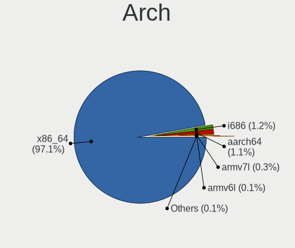
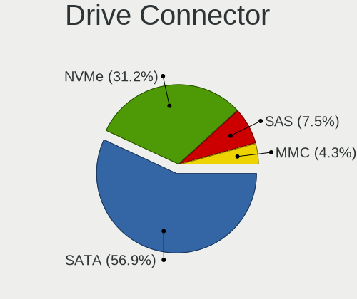
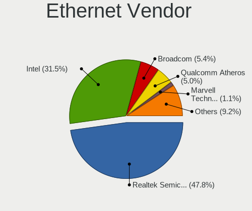
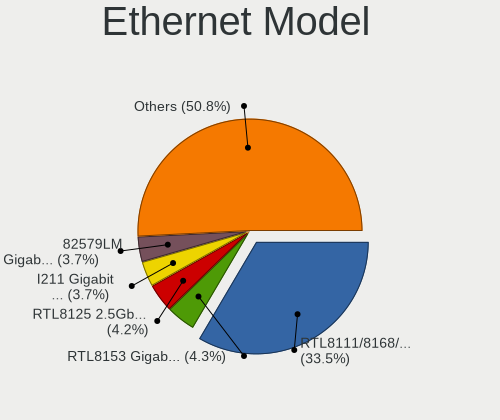
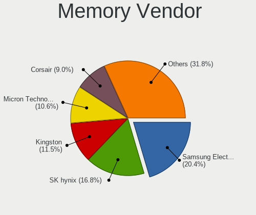

Linux in Australia - Tested Hardware & Statistics
-------------------------------------------------

A project to collect tested hardware configurations for Linux in Australia.

Anyone can contribute to this report by the [hw-probe](https://github.com/linuxhw/hw-probe) tool:

    sudo -E hw-probe -all -upload

Please contribute! Especially if your hardware is rare.

This is a report for all computer types. See also reports for [desktops](/Location/Australia/Desktop/README.md) and [notebooks](/Location/Australia/Notebook/README.md).

Contents
--------

* [ Test Cases ](#test-cases)

* [ System ](#system)
  - [ OS                       ](#os)
  - [ OS Family                ](#os-family)
  - [ Kernel                   ](#kernel)
  - [ Kernel Family            ](#kernel-family)
  - [ Kernel Major Ver.        ](#kernel-major-ver)
  - [ Arch                     ](#arch)
  - [ DE                       ](#de)
  - [ Display Server           ](#display-server)
  - [ Display Manager          ](#display-manager)
  - [ OS Lang                  ](#os-lang)
  - [ Boot Mode                ](#boot-mode)
  - [ Filesystem               ](#filesystem)
  - [ Part. scheme             ](#part-scheme)
  - [ Dual Boot with Linux/BSD ](#dual-boot-with-linuxbsd)
  - [ Dual Boot (Win)          ](#dual-boot-win)

* [ Board ](#board)
  - [ Vendor                   ](#vendor)
  - [ Model                    ](#model)
  - [ Model Family             ](#model-family)
  - [ MFG Year                 ](#mfg-year)
  - [ Form Factor              ](#form-factor)
  - [ Secure Boot              ](#secure-boot)
  - [ Coreboot                 ](#coreboot)
  - [ RAM Size                 ](#ram-size)
  - [ RAM Used                 ](#ram-used)
  - [ Total Drives             ](#total-drives)
  - [ Has CD-ROM               ](#has-cd-rom)
  - [ Has Ethernet             ](#has-ethernet)
  - [ Has WiFi                 ](#has-wifi)
  - [ Has Bluetooth            ](#has-bluetooth)

* [ Location ](#location)
  - [ Country                  ](#country)
  - [ City                     ](#city)

* [ Drives ](#drives)
  - [ Drive Vendor             ](#drive-vendor)
  - [ Drive Model              ](#drive-model)
  - [ HDD Vendor               ](#hdd-vendor)
  - [ SSD Vendor               ](#ssd-vendor)
  - [ Drive Kind               ](#drive-kind)
  - [ Drive Connector          ](#drive-connector)
  - [ Drive Size               ](#drive-size)
  - [ Space Total              ](#space-total)
  - [ Space Used               ](#space-used)
  - [ Malfunc. Drives          ](#malfunc-drives)
  - [ Malfunc. Drive Vendor    ](#malfunc-drive-vendor)
  - [ Malfunc. HDD Vendor      ](#malfunc-hdd-vendor)
  - [ Malfunc. Drive Kind      ](#malfunc-drive-kind)
  - [ Failed Drives            ](#failed-drives)
  - [ Failed Drive Vendor      ](#failed-drive-vendor)
  - [ Drive Status             ](#drive-status)

* [ Storage controller ](#storage-controller)
  - [ Storage Vendor           ](#storage-vendor)
  - [ Storage Model            ](#storage-model)
  - [ Storage Kind             ](#storage-kind)

* [ Processor ](#processor)
  - [ CPU Vendor               ](#cpu-vendor)
  - [ CPU Model                ](#cpu-model)
  - [ CPU Model Family         ](#cpu-model-family)
  - [ CPU Cores                ](#cpu-cores)
  - [ CPU Sockets              ](#cpu-sockets)
  - [ CPU Threads              ](#cpu-threads)
  - [ CPU Op-Modes             ](#cpu-op-modes)
  - [ CPU Microcode            ](#cpu-microcode)
  - [ CPU Microarch            ](#cpu-microarch)

* [ Graphics ](#graphics)
  - [ GPU Vendor               ](#gpu-vendor)
  - [ GPU Model                ](#gpu-model)
  - [ GPU Combo                ](#gpu-combo)
  - [ GPU Driver               ](#gpu-driver)
  - [ GPU Memory               ](#gpu-memory)

* [ Monitor ](#monitor)
  - [ Monitor Vendor           ](#monitor-vendor)
  - [ Monitor Model            ](#monitor-model)
  - [ Monitor Resolution       ](#monitor-resolution)
  - [ Monitor Diagonal         ](#monitor-diagonal)
  - [ Monitor Width            ](#monitor-width)
  - [ Aspect Ratio             ](#aspect-ratio)
  - [ Monitor Area             ](#monitor-area)
  - [ Pixel Density            ](#pixel-density)
  - [ Multiple Monitors        ](#multiple-monitors)

* [ Network ](#network)
  - [ Net Controller Vendor    ](#net-controller-vendor)
  - [ Net Controller Model     ](#net-controller-model)
  - [ Wireless Vendor          ](#wireless-vendor)
  - [ Wireless Model           ](#wireless-model)
  - [ Ethernet Vendor          ](#ethernet-vendor)
  - [ Ethernet Model           ](#ethernet-model)
  - [ Net Controller Kind      ](#net-controller-kind)
  - [ Used Controller          ](#used-controller)
  - [ NICs                     ](#nics)
  - [ IPv6                     ](#ipv6)

* [ Bluetooth ](#bluetooth)
  - [ Bluetooth Vendor         ](#bluetooth-vendor)
  - [ Bluetooth Model          ](#bluetooth-model)

* [ Sound ](#sound)
  - [ Sound Vendor             ](#sound-vendor)
  - [ Sound Model              ](#sound-model)

* [ Memory ](#memory)
  - [ Memory Vendor            ](#memory-vendor)
  - [ Memory Model             ](#memory-model)
  - [ Memory Kind              ](#memory-kind)
  - [ Memory Form Factor       ](#memory-form-factor)
  - [ Memory Size              ](#memory-size)
  - [ Memory Speed             ](#memory-speed)

* [ Printers & scanners ](#printers--scanners)
  - [ Printer Vendor           ](#printer-vendor)
  - [ Printer Model            ](#printer-model)
  - [ Scanner Vendor           ](#scanner-vendor)
  - [ Scanner Model            ](#scanner-model)

* [ Camera ](#camera)
  - [ Camera Vendor            ](#camera-vendor)
  - [ Camera Model             ](#camera-model)

* [ Security ](#security)
  - [ Fingerprint Vendor       ](#fingerprint-vendor)
  - [ Fingerprint Model        ](#fingerprint-model)
  - [ Chipcard Vendor          ](#chipcard-vendor)
  - [ Chipcard Model           ](#chipcard-model)

* [ Unsupported ](#unsupported)
  - [ Unsupported Devices      ](#unsupported-devices)
  - [ Unsupported Device Types ](#unsupported-device-types)

Test Cases
----------

Total: 4685

| Vendor        | Model                       | Form-Factor | Probe                                                      | Date         |
|---------------|-----------------------------|-------------|------------------------------------------------------------|--------------|
| Lenovo        | ThinkPad X220 4286CTO       | Notebook    | [465114aa14](https://linux-hardware.org/?probe=465114aa14) | Feb 01, 2023 |
| Gigabyte      | Z170X-Gaming 3              | Desktop     | [b0697611f6](https://linux-hardware.org/?probe=b0697611f6) | Feb 01, 2023 |
| Gigabyte      | G41MT-D3                    | Desktop     | [99127d4bed](https://linux-hardware.org/?probe=99127d4bed) | Feb 01, 2023 |
| Acer          | Predator PH315-52           | Notebook    | [b1c77eb9c7](https://linux-hardware.org/?probe=b1c77eb9c7) | Jan 31, 2023 |
| ASRock        | AD2700-ITX                  | Desktop     | [2f14c18867](https://linux-hardware.org/?probe=2f14c18867) | Jan 31, 2023 |
| Acer          | MCP73VE NVIDIA MCP73        | Desktop     | [840102fa91](https://linux-hardware.org/?probe=840102fa91) | Jan 31, 2023 |
| ASUSTek       | X550LC                      | Notebook    | [4c50999862](https://linux-hardware.org/?probe=4c50999862) | Jan 30, 2023 |
| ASUSTek       | X550LC                      | Notebook    | [41d606bbe8](https://linux-hardware.org/?probe=41d606bbe8) | Jan 30, 2023 |
| Dell          | 0D6H9T A00                  | Desktop     | [2c34aba28a](https://linux-hardware.org/?probe=2c34aba28a) | Jan 30, 2023 |
| Dell          | Inspiron 5770               | Notebook    | [b5612c2501](https://linux-hardware.org/?probe=b5612c2501) | Jan 29, 2023 |
| Dell          | Latitude 5400               | Notebook    | [80651273e4](https://linux-hardware.org/?probe=80651273e4) | Jan 29, 2023 |
| Dell          | Latitude 5400               | Notebook    | [eb97e73f08](https://linux-hardware.org/?probe=eb97e73f08) | Jan 29, 2023 |
| ASUSTek       | PRIME B560M-K               | Desktop     | [c74b6b90f0](https://linux-hardware.org/?probe=c74b6b90f0) | Jan 28, 2023 |
| Gigabyte      | EP45-DS3L                   | Desktop     | [684748c9b4](https://linux-hardware.org/?probe=684748c9b4) | Jan 28, 2023 |
| MSI           | TRX40 PRO WIFI              | Desktop     | [d9508d5b22](https://linux-hardware.org/?probe=d9508d5b22) | Jan 27, 2023 |
| Lenovo        | 0B98401 PRO                 | Desktop     | [06086e6112](https://linux-hardware.org/?probe=06086e6112) | Jan 27, 2023 |
| Apple         | MacBook8,1                  | Notebook    | [02cd28549c](https://linux-hardware.org/?probe=02cd28549c) | Jan 27, 2023 |
| ASRock        | AD2700-ITX                  | Desktop     | [7b711bee4f](https://linux-hardware.org/?probe=7b711bee4f) | Jan 26, 2023 |
| Gigabyte      | J1900M-D2P                  | Desktop     | [4213c95d3d](https://linux-hardware.org/?probe=4213c95d3d) | Jan 26, 2023 |
| Gigabyte      | J1900M-D2P                  | Desktop     | [b44aa465bc](https://linux-hardware.org/?probe=b44aa465bc) | Jan 26, 2023 |
| Shenzhen M... | F6BFC                       | Desktop     | [fab7cead8c](https://linux-hardware.org/?probe=fab7cead8c) | Jan 26, 2023 |
| Lenovo        | Yoga Slim 7 Pro 14ACH5 D... | Notebook    | [d2a46bd14a](https://linux-hardware.org/?probe=d2a46bd14a) | Jan 26, 2023 |
| Apple         | MacBook5,1                  | Notebook    | [b7759508d9](https://linux-hardware.org/?probe=b7759508d9) | Jan 26, 2023 |
| Apple         | MacBook5,1                  | Notebook    | [72f2c3fddc](https://linux-hardware.org/?probe=72f2c3fddc) | Jan 26, 2023 |
| Panasonic     | FZ55-2                      | Notebook    | [dd9ddb12b6](https://linux-hardware.org/?probe=dd9ddb12b6) | Jan 25, 2023 |
| ASUSTek       | VivoBook_ASUSLaptop X712... | Notebook    | [26abf66da5](https://linux-hardware.org/?probe=26abf66da5) | Jan 25, 2023 |
| Acer          | Aspire A315-22              | Notebook    | [7c048a8058](https://linux-hardware.org/?probe=7c048a8058) | Jan 24, 2023 |
| MeLE          | Rev GMLR1                   | Mini pc     | [1f294d6a67](https://linux-hardware.org/?probe=1f294d6a67) | Jan 24, 2023 |
| Pegatron      | 2AEE                        | Desktop     | [1c59133176](https://linux-hardware.org/?probe=1c59133176) | Jan 24, 2023 |
| ASUSTek       | PRIME Z690-A                | Desktop     | [ea5c2d01c2](https://linux-hardware.org/?probe=ea5c2d01c2) | Jan 24, 2023 |
| HP            | OMEN Laptop 15-en0xxx       | Notebook    | [c2226035ce](https://linux-hardware.org/?probe=c2226035ce) | Jan 24, 2023 |
| Dell          | 0X2MKR A00                  | All in one  | [5b29ed7213](https://linux-hardware.org/?probe=5b29ed7213) | Jan 23, 2023 |
| HP            | 8860 A                      | Desktop     | [ffb17b2c42](https://linux-hardware.org/?probe=ffb17b2c42) | Jan 23, 2023 |
| Alienware     | 15 R4                       | Notebook    | [8833335118](https://linux-hardware.org/?probe=8833335118) | Jan 23, 2023 |
| MSI           | B450 TOMAHAWK MAX II        | Desktop     | [447e624609](https://linux-hardware.org/?probe=447e624609) | Jan 22, 2023 |
| ASUSTek       | Z87-EXPERT                  | Desktop     | [852add0d4b](https://linux-hardware.org/?probe=852add0d4b) | Jan 22, 2023 |
| Dell          | XPS 13 9350                 | Notebook    | [223ab1f016](https://linux-hardware.org/?probe=223ab1f016) | Jan 22, 2023 |
| Lenovo        | ThinkPad X250 20CLS2JV01    | Notebook    | [932148f478](https://linux-hardware.org/?probe=932148f478) | Jan 21, 2023 |
| Intel         | NUC11ATBPE M49844-202       | Mini pc     | [74d7964357](https://linux-hardware.org/?probe=74d7964357) | Jan 21, 2023 |
| Dell          | XPS 9315                    | Notebook    | [9dfb19b7c1](https://linux-hardware.org/?probe=9dfb19b7c1) | Jan 21, 2023 |
| ASUSTek       | TUF X470-PLUS GAMING        | Desktop     | [46a3691da9](https://linux-hardware.org/?probe=46a3691da9) | Jan 21, 2023 |
| Dell          | Latitude 5300               | Notebook    | [e8c4218110](https://linux-hardware.org/?probe=e8c4218110) | Jan 21, 2023 |
| MSI           | B550M PRO-VDH WIFI          | Desktop     | [bd601f83d3](https://linux-hardware.org/?probe=bd601f83d3) | Jan 21, 2023 |
| Apple         | MacBookPro11,3              | Notebook    | [28b4d041ad](https://linux-hardware.org/?probe=28b4d041ad) | Jan 20, 2023 |
| MSI           | B450 TOMAHAWK MAX II        | Desktop     | [1b41330a7e](https://linux-hardware.org/?probe=1b41330a7e) | Jan 20, 2023 |
| ASUSTek       | Z87-EXPERT                  | Desktop     | [ff72c387c7](https://linux-hardware.org/?probe=ff72c387c7) | Jan 20, 2023 |
| Apple         | MacBookAir7,2               | Notebook    | [ead0a07135](https://linux-hardware.org/?probe=ead0a07135) | Jan 20, 2023 |
| ASUSTek       | TUF Gaming B550-PLUS        | Desktop     | [1a80b30106](https://linux-hardware.org/?probe=1a80b30106) | Jan 20, 2023 |
| Apple         | MacBookAir5,2               | Notebook    | [03e73c44b7](https://linux-hardware.org/?probe=03e73c44b7) | Jan 20, 2023 |
| Apple         | MacBookPro14,3              | Notebook    | [82a49878eb](https://linux-hardware.org/?probe=82a49878eb) | Jan 19, 2023 |
| ASUSTek       | Z87-EXPERT                  | Desktop     | [91a963e420](https://linux-hardware.org/?probe=91a963e420) | Jan 19, 2023 |
| AZW           | SER V01                     | Mini pc     | [b209807db5](https://linux-hardware.org/?probe=b209807db5) | Jan 19, 2023 |
| ASUSTek       | PRIME Z690-A                | Desktop     | [ed9e94399a](https://linux-hardware.org/?probe=ed9e94399a) | Jan 18, 2023 |
| Lenovo        | 0B98401 WIN                 | Desktop     | [8d4e5b4499](https://linux-hardware.org/?probe=8d4e5b4499) | Jan 18, 2023 |
| Dell          | XPS 15 7590                 | Notebook    | [9a7659a260](https://linux-hardware.org/?probe=9a7659a260) | Jan 18, 2023 |
| Gigabyte      | Z68M-D2H                    | Desktop     | [c7f31be903](https://linux-hardware.org/?probe=c7f31be903) | Jan 18, 2023 |
| Gigabyte      | B650M GAMING X AX           | Desktop     | [fb01eafa41](https://linux-hardware.org/?probe=fb01eafa41) | Jan 18, 2023 |
| Dell          | Precision 3561              | Notebook    | [9528d74be6](https://linux-hardware.org/?probe=9528d74be6) | Jan 18, 2023 |
| Dell          | Precision 3561              | Notebook    | [5f23addbde](https://linux-hardware.org/?probe=5f23addbde) | Jan 18, 2023 |
| Gigabyte      | G41MT-D3                    | Desktop     | [16be0552b2](https://linux-hardware.org/?probe=16be0552b2) | Jan 17, 2023 |
| Lenovo        | ThinkPad X230 2325CW1       | Notebook    | [44a8ae0b56](https://linux-hardware.org/?probe=44a8ae0b56) | Jan 17, 2023 |
| HP            | Spectre x360 Convertible... | Convertible | [d87fb3cf65](https://linux-hardware.org/?probe=d87fb3cf65) | Jan 17, 2023 |
| Gigabyte      | B550I AORUS PRO AX          | Desktop     | [564482477e](https://linux-hardware.org/?probe=564482477e) | Jan 17, 2023 |
| Intel         | NUC12WSBi7 M46422-302       | Mini pc     | [0d7c3e0009](https://linux-hardware.org/?probe=0d7c3e0009) | Jan 17, 2023 |
| Dell          | 075CGM A00                  | Mini pc     | [5df3707c20](https://linux-hardware.org/?probe=5df3707c20) | Jan 17, 2023 |
| HP            | ProBook 440 G8 Notebook ... | Notebook    | [a80f36a4eb](https://linux-hardware.org/?probe=a80f36a4eb) | Jan 16, 2023 |
| Samsung       | 350V5C/350V5X/350V4C/350... | Notebook    | [f0b2886993](https://linux-hardware.org/?probe=f0b2886993) | Jan 15, 2023 |
| HP            | ProLiant DL380 G6           | Server      | [73b5a8c763](https://linux-hardware.org/?probe=73b5a8c763) | Jan 15, 2023 |
| Acer          | Aspire R3-131T              | Notebook    | [268413b274](https://linux-hardware.org/?probe=268413b274) | Jan 15, 2023 |
| ASUSTek       | PRIME X570-P                | Desktop     | [ab5933911d](https://linux-hardware.org/?probe=ab5933911d) | Jan 15, 2023 |
| Valve         | Jupiter                     | Notebook    | [8830efc64d](https://linux-hardware.org/?probe=8830efc64d) | Jan 15, 2023 |
| HP            | Laptop 14s-dk0xxx           | Notebook    | [6efb68b8da](https://linux-hardware.org/?probe=6efb68b8da) | Jan 14, 2023 |
| MSI           | H310M PRO-VDH PLUS          | Desktop     | [dc3317fe82](https://linux-hardware.org/?probe=dc3317fe82) | Jan 14, 2023 |
| ASUSTek       | GL10DH                      | Desktop     | [c1f3c3b1c4](https://linux-hardware.org/?probe=c1f3c3b1c4) | Jan 14, 2023 |
| ASUSTek       | TUF Gaming B660M-E D4       | Desktop     | [79753b9bcd](https://linux-hardware.org/?probe=79753b9bcd) | Jan 14, 2023 |
| Pegatron      | 2ACB                        | Desktop     | [6a129c6fde](https://linux-hardware.org/?probe=6a129c6fde) | Jan 13, 2023 |
| Lenovo        | V14-IIL 82C4                | Notebook    | [3837db6f8a](https://linux-hardware.org/?probe=3837db6f8a) | Jan 13, 2023 |
| ASUSTek       | Z170-DELUXE                 | Desktop     | [433bc4fddd](https://linux-hardware.org/?probe=433bc4fddd) | Jan 13, 2023 |
| Intel Clie... | LAPBC510                    | Notebook    | [493f0e9608](https://linux-hardware.org/?probe=493f0e9608) | Jan 13, 2023 |
| Dell          | Latitude 5300               | Notebook    | [148745c883](https://linux-hardware.org/?probe=148745c883) | Jan 13, 2023 |
| Intel Clie... | LAPBC510                    | Notebook    | [ac0b81bf2e](https://linux-hardware.org/?probe=ac0b81bf2e) | Jan 13, 2023 |
| Acer          | Predator PH315-52           | Notebook    | [c6a710b940](https://linux-hardware.org/?probe=c6a710b940) | Jan 13, 2023 |
| ASUSTek       | Z87-EXPERT                  | Desktop     | [7c8a02d00a](https://linux-hardware.org/?probe=7c8a02d00a) | Jan 13, 2023 |
| ASUSTek       | PRIME H510M-A               | Desktop     | [252041601b](https://linux-hardware.org/?probe=252041601b) | Jan 12, 2023 |
| Dell          | Inspiron 5770               | Notebook    | [7435d85aca](https://linux-hardware.org/?probe=7435d85aca) | Jan 12, 2023 |
| Dell          | XPS 17 9700                 | Notebook    | [09f6a754d6](https://linux-hardware.org/?probe=09f6a754d6) | Jan 12, 2023 |
| Dell          | 09KPNV A00                  | Desktop     | [1859af08ff](https://linux-hardware.org/?probe=1859af08ff) | Jan 11, 2023 |
| Acer          | Swift SF514-54T             | Notebook    | [98a18475e8](https://linux-hardware.org/?probe=98a18475e8) | Jan 11, 2023 |
| ASUSTek       | H87-PRO                     | Desktop     | [4ac36f25a9](https://linux-hardware.org/?probe=4ac36f25a9) | Jan 11, 2023 |
| Lenovo        | IdeaPad 5 15ITL05 82FG      | Notebook    | [511306775e](https://linux-hardware.org/?probe=511306775e) | Jan 11, 2023 |
| Dell          | Inspiron 3543               | Notebook    | [c7c7419fd5](https://linux-hardware.org/?probe=c7c7419fd5) | Jan 10, 2023 |
| Gigabyte      | H97M-Gaming 3               | Desktop     | [22ee51c3f8](https://linux-hardware.org/?probe=22ee51c3f8) | Jan 10, 2023 |
| HP            | 2179                        | Desktop     | [ad75cc2104](https://linux-hardware.org/?probe=ad75cc2104) | Jan 10, 2023 |
| ReachingTe... | DreamQuest Pro 2022         | Mini pc     | [06eee6367f](https://linux-hardware.org/?probe=06eee6367f) | Jan 10, 2023 |
| HP            | ProBook 440 G8 Notebook ... | Notebook    | [17dc10d7bb](https://linux-hardware.org/?probe=17dc10d7bb) | Jan 10, 2023 |
| Intel         | NUC10i7FNB K61360-306       | Mini pc     | [f03ae5d905](https://linux-hardware.org/?probe=f03ae5d905) | Jan 10, 2023 |
| Intel         | NUC10i7FNB K61360-306       | Mini pc     | [9645ad91cc](https://linux-hardware.org/?probe=9645ad91cc) | Jan 10, 2023 |
| ASUSTek       | H110M-A/M.2                 | Desktop     | [5656924057](https://linux-hardware.org/?probe=5656924057) | Jan 10, 2023 |
| SYWZ          | S210HA Series               | Desktop     | [0cabf3b51e](https://linux-hardware.org/?probe=0cabf3b51e) | Jan 09, 2023 |
| Lenovo        | ThinkPad T430s 2356AF9      | Notebook    | [eca34fb600](https://linux-hardware.org/?probe=eca34fb600) | Jan 09, 2023 |
| MSI           | MAG B550M MORTAR WIFI       | Desktop     | [29ac3deef8](https://linux-hardware.org/?probe=29ac3deef8) | Jan 09, 2023 |
| Gigabyte      | H77N-WIFI                   | Desktop     | [95cfb68187](https://linux-hardware.org/?probe=95cfb68187) | Jan 09, 2023 |
| Techvision    | TVI7309X B0                 | Desktop     | [e336a260d6](https://linux-hardware.org/?probe=e336a260d6) | Jan 09, 2023 |
| Gigabyte      | B560M DS3H AC               | Desktop     | [3b4f027444](https://linux-hardware.org/?probe=3b4f027444) | Jan 09, 2023 |
| Techvision    | TVI7309X B0                 | Desktop     | [43cc06ef1d](https://linux-hardware.org/?probe=43cc06ef1d) | Jan 09, 2023 |
| Dell          | XPS 13 9333                 | Notebook    | [f291c4d057](https://linux-hardware.org/?probe=f291c4d057) | Jan 09, 2023 |
| MSI           | PRO B550M-P GEN3            | Desktop     | [5b62f9f024](https://linux-hardware.org/?probe=5b62f9f024) | Jan 09, 2023 |
| HP            | EliteBook Folio 9470m       | Notebook    | [1c4f7f2f2a](https://linux-hardware.org/?probe=1c4f7f2f2a) | Jan 09, 2023 |
| ASUSTek       | ROG CROSSHAIR VIII DARK ... | Desktop     | [36ed66f057](https://linux-hardware.org/?probe=36ed66f057) | Jan 08, 2023 |
| Dell          | Latitude 7280               | Notebook    | [931dcfb8be](https://linux-hardware.org/?probe=931dcfb8be) | Jan 08, 2023 |
| Dell          | Latitude E7450              | Notebook    | [635ef7be4a](https://linux-hardware.org/?probe=635ef7be4a) | Jan 08, 2023 |
| Lenovo        | ThinkPad W530 2463B87       | Notebook    | [5ac9828d4c](https://linux-hardware.org/?probe=5ac9828d4c) | Jan 08, 2023 |
| ASUSTek       | PRIME Z270-A                | Desktop     | [b4c192526f](https://linux-hardware.org/?probe=b4c192526f) | Jan 08, 2023 |
| Unknown       | Unknown                     | Desktop     | [8df8f7c51f](https://linux-hardware.org/?probe=8df8f7c51f) | Jan 07, 2023 |
| Acer          | Veriton N4640G              | Desktop     | [3392dd3c90](https://linux-hardware.org/?probe=3392dd3c90) | Jan 07, 2023 |
| Acer          | Predator G9-793             | Notebook    | [5256ec6943](https://linux-hardware.org/?probe=5256ec6943) | Jan 07, 2023 |
| Lenovo        | ThinkPad Helix 2nd 20CHS... | Tablet      | [e6190d3469](https://linux-hardware.org/?probe=e6190d3469) | Jan 07, 2023 |
| HP            | 212A                        | Desktop     | [21acb67653](https://linux-hardware.org/?probe=21acb67653) | Jan 06, 2023 |
| Apple         | MacBookPro12,1              | Notebook    | [67f40c78ec](https://linux-hardware.org/?probe=67f40c78ec) | Jan 06, 2023 |
| Apple         | MacBookPro12,1              | Notebook    | [58f2e834d8](https://linux-hardware.org/?probe=58f2e834d8) | Jan 06, 2023 |
| GPU Compan... | GWTN156-2BK                 | Notebook    | [263354b92e](https://linux-hardware.org/?probe=263354b92e) | Jan 06, 2023 |
| Dell          | Precision M4700             | Notebook    | [414d8c4701](https://linux-hardware.org/?probe=414d8c4701) | Jan 06, 2023 |
| HP            | 1905                        | Desktop     | [01fb70526d](https://linux-hardware.org/?probe=01fb70526d) | Jan 06, 2023 |
| GPU Compan... | GWTN156-2BK                 | Notebook    | [99bf8fff2f](https://linux-hardware.org/?probe=99bf8fff2f) | Jan 06, 2023 |
| GPU Compan... | GWTN156-2BK                 | Notebook    | [d9fa2355b0](https://linux-hardware.org/?probe=d9fa2355b0) | Jan 05, 2023 |
| HP            | 821D                        | Desktop     | [d859c928b8](https://linux-hardware.org/?probe=d859c928b8) | Jan 05, 2023 |
| ASRock        | H310M-HDV/M.2               | Desktop     | [cf98b88234](https://linux-hardware.org/?probe=cf98b88234) | Jan 05, 2023 |
| Microsoft     | Surface Laptop 3            | Tablet      | [88ea27e220](https://linux-hardware.org/?probe=88ea27e220) | Jan 04, 2023 |
| Gigabyte      | X570S AORUS ELITE AX        | Desktop     | [02b3cbc8c6](https://linux-hardware.org/?probe=02b3cbc8c6) | Jan 04, 2023 |
| Gigabyte      | J1900M-D2P                  | Desktop     | [ad776cdf84](https://linux-hardware.org/?probe=ad776cdf84) | Jan 04, 2023 |
| Dell          | 0RRXFP A00                  | All in one  | [38be4b535f](https://linux-hardware.org/?probe=38be4b535f) | Jan 04, 2023 |
| Intel         | NUC13SBBi9 M58736-302       | Mini pc     | [f30031a156](https://linux-hardware.org/?probe=f30031a156) | Jan 04, 2023 |
| HP            | Laptop 15s-fq1xxx           | Notebook    | [488e1f656c](https://linux-hardware.org/?probe=488e1f656c) | Jan 03, 2023 |
| ASUSTek       | M5A97 EVO R2.0              | Desktop     | [c2c723d7b2](https://linux-hardware.org/?probe=c2c723d7b2) | Jan 03, 2023 |
| Gigabyte      | X58A-UD7                    | Desktop     | [5b07c849cc](https://linux-hardware.org/?probe=5b07c849cc) | Jan 03, 2023 |
| HP            | Laptop 15s-fq1xxx           | Notebook    | [d0ac402ed9](https://linux-hardware.org/?probe=d0ac402ed9) | Jan 03, 2023 |
| HP            | Pavilion                    | Notebook    | [466e855af1](https://linux-hardware.org/?probe=466e855af1) | Jan 03, 2023 |
| Lenovo        | ThinkPad X260 20F5005NAU    | Notebook    | [3f68b8438c](https://linux-hardware.org/?probe=3f68b8438c) | Jan 02, 2023 |
| Intel         | NUC6i7KYB H90766-404        | Mini pc     | [961f0cc73a](https://linux-hardware.org/?probe=961f0cc73a) | Jan 02, 2023 |
| Gigabyte      | Z68X-UD3H-B3                | Desktop     | [1de40c1ae3](https://linux-hardware.org/?probe=1de40c1ae3) | Jan 02, 2023 |
| ASUSTek       | H81M-PLUS                   | Desktop     | [752fe53b7c](https://linux-hardware.org/?probe=752fe53b7c) | Jan 01, 2023 |
| Gigabyte      | X570S AORUS ELITE AX        | Desktop     | [13ae6c7e25](https://linux-hardware.org/?probe=13ae6c7e25) | Jan 01, 2023 |
| ASUSTek       | TUF Gaming B550M-PLUS       | Desktop     | [28f9b91b32](https://linux-hardware.org/?probe=28f9b91b32) | Jan 01, 2023 |
| HP            | EliteBook 2760p             | Notebook    | [91741e63eb](https://linux-hardware.org/?probe=91741e63eb) | Jan 01, 2023 |
| ASUSTek       | TUF Gaming B550M-PLUS       | Desktop     | [6b98637c82](https://linux-hardware.org/?probe=6b98637c82) | Jan 01, 2023 |
| Lenovo        | ThinkPad Yoga 370 20JJ00... | Convertible | [1e4997593d](https://linux-hardware.org/?probe=1e4997593d) | Jan 01, 2023 |
| Lenovo        | ThinkPad Yoga 370 20JJ00... | Convertible | [99d2f193c4](https://linux-hardware.org/?probe=99d2f193c4) | Jan 01, 2023 |
| ASUSTek       | H87-PRO                     | Desktop     | [f95906c714](https://linux-hardware.org/?probe=f95906c714) | Jan 01, 2023 |
| HP            | EliteBook 2760p             | Notebook    | [6ac462efda](https://linux-hardware.org/?probe=6ac462efda) | Jan 01, 2023 |
| Lenovo        | IdeaPad 5 Pro 14ACN6 82L... | Notebook    | [cf40d3f30c](https://linux-hardware.org/?probe=cf40d3f30c) | Dec 31, 2022 |
| Apple         | MacBookAir7,2               | Notebook    | [8b84042dc6](https://linux-hardware.org/?probe=8b84042dc6) | Dec 30, 2022 |
| Apple         | MacBookAir7,2               | Notebook    | [dae09ec15f](https://linux-hardware.org/?probe=dae09ec15f) | Dec 30, 2022 |
| Intel         | LADPNVMO AAE76523-300       | Desktop     | [4e6065532f](https://linux-hardware.org/?probe=4e6065532f) | Dec 30, 2022 |
| Dell          | XPS 15 9570                 | Notebook    | [cc31efb32d](https://linux-hardware.org/?probe=cc31efb32d) | Dec 30, 2022 |
| ASUSTek       | X555UJ                      | Notebook    | [f4ba8643aa](https://linux-hardware.org/?probe=f4ba8643aa) | Dec 30, 2022 |
| AMI           | F3C2                        | Notebook    | [ed7d4a2a13](https://linux-hardware.org/?probe=ed7d4a2a13) | Dec 30, 2022 |
| Dell          | Inspiron 7506 2n1           | Convertible | [716ba7f970](https://linux-hardware.org/?probe=716ba7f970) | Dec 29, 2022 |
| Dell          | Inspiron 7506 2n1           | Convertible | [7881f027ea](https://linux-hardware.org/?probe=7881f027ea) | Dec 29, 2022 |
| HP            | Pavilion Gaming Laptop 1... | Notebook    | [1cf63ef1ad](https://linux-hardware.org/?probe=1cf63ef1ad) | Dec 28, 2022 |
| HP            | 1905                        | Desktop     | [5c576316f8](https://linux-hardware.org/?probe=5c576316f8) | Dec 28, 2022 |
| ASUSTek       | Z87-C                       | Desktop     | [4929f6a6c9](https://linux-hardware.org/?probe=4929f6a6c9) | Dec 28, 2022 |
| Dell          | Inspiron 7586               | Convertible | [d670af270f](https://linux-hardware.org/?probe=d670af270f) | Dec 28, 2022 |
| Acer          | Aspire 5742G                | Notebook    | [f58bb411b8](https://linux-hardware.org/?probe=f58bb411b8) | Dec 28, 2022 |
| ASUSTek       | ROG Zephyrus G14 GA401IU... | Notebook    | [d1f63174e4](https://linux-hardware.org/?probe=d1f63174e4) | Dec 28, 2022 |
| Lenovo        | ThinkPad X131e 33672K5      | Notebook    | [70d10e91fb](https://linux-hardware.org/?probe=70d10e91fb) | Dec 28, 2022 |
| MSI           | Z97 GAMING 3                | Desktop     | [7aab4546f6](https://linux-hardware.org/?probe=7aab4546f6) | Dec 28, 2022 |
| ASUSTek       | ROG Zephyrus G14 GA401IU... | Notebook    | [6eaa690ff2](https://linux-hardware.org/?probe=6eaa690ff2) | Dec 28, 2022 |
| Toshiba       | PORTEGE Z30-C               | Notebook    | [03dad182bb](https://linux-hardware.org/?probe=03dad182bb) | Dec 28, 2022 |
| MSI           | Raider GE77HX 12UGS         | Notebook    | [9f7185ccd7](https://linux-hardware.org/?probe=9f7185ccd7) | Dec 27, 2022 |
| ASRock        | AD2700-ITX                  | Desktop     | [d4fff49f31](https://linux-hardware.org/?probe=d4fff49f31) | Dec 27, 2022 |
| Lenovo        | ThinkStation D30 42234T7    | Desktop     | [6ad649ad46](https://linux-hardware.org/?probe=6ad649ad46) | Dec 26, 2022 |
| Lenovo        | ThinkStation D30 42234T7    | Desktop     | [6ac63aca4f](https://linux-hardware.org/?probe=6ac63aca4f) | Dec 25, 2022 |
| Gigabyte      | X570 I AORUS PRO WIFI       | Desktop     | [8d9b11c617](https://linux-hardware.org/?probe=8d9b11c617) | Dec 25, 2022 |
| MSI           | GP62M 7REX                  | Notebook    | [f49c90b8dc](https://linux-hardware.org/?probe=f49c90b8dc) | Dec 25, 2022 |
| MSI           | B450 GAMING PRO CARBON A... | Desktop     | [82de75771e](https://linux-hardware.org/?probe=82de75771e) | Dec 25, 2022 |
| Dell          | Inspiron 7506 2n1           | Convertible | [b5eaa2b6aa](https://linux-hardware.org/?probe=b5eaa2b6aa) | Dec 25, 2022 |
| Gigabyte      | EP45-DS3L                   | Desktop     | [b95d3d3c7a](https://linux-hardware.org/?probe=b95d3d3c7a) | Dec 25, 2022 |
| Dell          | Latitude E6520              | Notebook    | [33a51c934d](https://linux-hardware.org/?probe=33a51c934d) | Dec 25, 2022 |
| MSI           | X470 GAMING PRO CARBON      | Desktop     | [10b9f48473](https://linux-hardware.org/?probe=10b9f48473) | Dec 25, 2022 |
| MSI           | GS60 6QE                    | Notebook    | [aa2f6b0f24](https://linux-hardware.org/?probe=aa2f6b0f24) | Dec 24, 2022 |
| MSI           | B450M MORTAR TITANIUM       | Desktop     | [2a7ce79df8](https://linux-hardware.org/?probe=2a7ce79df8) | Dec 24, 2022 |
| Lenovo        | MIIX 510-12IKB 80XE         | Tablet      | [d88bd74acf](https://linux-hardware.org/?probe=d88bd74acf) | Dec 24, 2022 |
| Toshiba       | Satellite C50D-C            | Notebook    | [5f2debe594](https://linux-hardware.org/?probe=5f2debe594) | Dec 23, 2022 |
| Gigabyte      | Z170X-Gaming 3              | Desktop     | [3073d2d4e1](https://linux-hardware.org/?probe=3073d2d4e1) | Dec 23, 2022 |
| Lenovo        | ThinkPad X260 20F5005NAU    | Notebook    | [5f75bb423d](https://linux-hardware.org/?probe=5f75bb423d) | Dec 23, 2022 |
| Lenovo        | ThinkPad X260 20F5005NAU    | Notebook    | [844f589d20](https://linux-hardware.org/?probe=844f589d20) | Dec 22, 2022 |
| Raspberry ... | Raspberry Pi 4 Model B R... | Soc         | [29e02a10bf](https://linux-hardware.org/?probe=29e02a10bf) | Dec 22, 2022 |
| MSI           | B450M MORTAR                | Desktop     | [2279954594](https://linux-hardware.org/?probe=2279954594) | Dec 22, 2022 |
| Acer          | Nitro AN515-52              | Notebook    | [4732443b9e](https://linux-hardware.org/?probe=4732443b9e) | Dec 22, 2022 |
| Apple         | Mac-AA95B1DDAB278B95 iMa... | All in one  | [36fbefc790](https://linux-hardware.org/?probe=36fbefc790) | Dec 22, 2022 |
| MSI           | B85M-E45                    | Desktop     | [b60edb092f](https://linux-hardware.org/?probe=b60edb092f) | Dec 21, 2022 |
| Acer          | Nitro AN515-52              | Notebook    | [354b048898](https://linux-hardware.org/?probe=354b048898) | Dec 21, 2022 |
| ASRock        | Z170 Pro4                   | Desktop     | [ca027f264a](https://linux-hardware.org/?probe=ca027f264a) | Dec 20, 2022 |
| HP            | Pavilion dv6                | Notebook    | [8b0f82599c](https://linux-hardware.org/?probe=8b0f82599c) | Dec 20, 2022 |
| HUAWEI        | NBD-WXX9                    | Notebook    | [1fec8c22dc](https://linux-hardware.org/?probe=1fec8c22dc) | Dec 20, 2022 |
| Lenovo        | ThinkPad X1 Yoga Gen 6 2... | Convertible | [b8b3b4f2bd](https://linux-hardware.org/?probe=b8b3b4f2bd) | Dec 19, 2022 |
| Pegatron      | 2ACB                        | Desktop     | [f77ff3b9b5](https://linux-hardware.org/?probe=f77ff3b9b5) | Dec 19, 2022 |
| Lenovo        | Yoga C740-14IML 81TC        | Convertible | [d45689035c](https://linux-hardware.org/?probe=d45689035c) | Dec 19, 2022 |
| HP            | 0B4Ch D                     | Desktop     | [2318fda45f](https://linux-hardware.org/?probe=2318fda45f) | Dec 19, 2022 |
| MSI           | Boston                      | Desktop     | [8587c9cf45](https://linux-hardware.org/?probe=8587c9cf45) | Dec 19, 2022 |
| HUAWEI        | NBD-WXX9                    | Notebook    | [b0a4a9919c](https://linux-hardware.org/?probe=b0a4a9919c) | Dec 18, 2022 |
| Gigabyte      | J1900M-D2P                  | Desktop     | [26ecfabc95](https://linux-hardware.org/?probe=26ecfabc95) | Dec 17, 2022 |
| Lenovo        | Yoga C740-14IML 81TC        | Convertible | [a17338c77a](https://linux-hardware.org/?probe=a17338c77a) | Dec 17, 2022 |
| Gigabyte      | Z77MX-D3H                   | Desktop     | [50ba321b50](https://linux-hardware.org/?probe=50ba321b50) | Dec 16, 2022 |
| Lenovo        | ThinkPad X1 Yoga Gen 6 2... | Convertible | [d54bfbf8ff](https://linux-hardware.org/?probe=d54bfbf8ff) | Dec 16, 2022 |
| Lenovo        | ThinkPad X1 Yoga Gen 6 2... | Convertible | [310076ab4f](https://linux-hardware.org/?probe=310076ab4f) | Dec 16, 2022 |
| ASUSTek       | X550LD                      | Notebook    | [2960bdb195](https://linux-hardware.org/?probe=2960bdb195) | Dec 16, 2022 |
| Intel         | NUC13SBBi9 M58736-302       | Mini pc     | [de15eb8246](https://linux-hardware.org/?probe=de15eb8246) | Dec 16, 2022 |
| Lenovo        | ThinkPad X1 Yoga Gen 6 2... | Convertible | [aad215d28c](https://linux-hardware.org/?probe=aad215d28c) | Dec 15, 2022 |
| Lenovo        | ThinkPad X1 Yoga Gen 6 2... | Convertible | [0f506ff34d](https://linux-hardware.org/?probe=0f506ff34d) | Dec 15, 2022 |
| HP            | 212A                        | Desktop     | [c21bb6d20d](https://linux-hardware.org/?probe=c21bb6d20d) | Dec 14, 2022 |
| Apple         | MacBookPro14,2              | Notebook    | [702a622854](https://linux-hardware.org/?probe=702a622854) | Dec 14, 2022 |
| Apple         | MacBookAir7,2               | Notebook    | [b1386d66d5](https://linux-hardware.org/?probe=b1386d66d5) | Dec 13, 2022 |
| Kogan         | KAL11C250SB                 | Notebook    | [e7ad1c21ad](https://linux-hardware.org/?probe=e7ad1c21ad) | Dec 13, 2022 |
| Lenovo        | ThinkPad T470s W10DG 20J... | Notebook    | [265ba7b252](https://linux-hardware.org/?probe=265ba7b252) | Dec 13, 2022 |
| ASUSTek       | M5A99FX PRO R2.0            | Desktop     | [259f85d65b](https://linux-hardware.org/?probe=259f85d65b) | Dec 12, 2022 |
| ASUSTek       | B85M-E                      | Desktop     | [6c3fcfbb13](https://linux-hardware.org/?probe=6c3fcfbb13) | Dec 12, 2022 |
| Gigabyte      | J1900M-D2P                  | Desktop     | [8111a18c7c](https://linux-hardware.org/?probe=8111a18c7c) | Dec 12, 2022 |
| Dell          | XPS L521X                   | Notebook    | [c69c906797](https://linux-hardware.org/?probe=c69c906797) | Dec 12, 2022 |
| ASUSTek       | K56CB                       | Notebook    | [94b056f1f4](https://linux-hardware.org/?probe=94b056f1f4) | Dec 12, 2022 |
| MSI           | MAG B550M MORTAR WIFI       | Desktop     | [4f1f6fde97](https://linux-hardware.org/?probe=4f1f6fde97) | Dec 10, 2022 |
| Gigabyte      | Z77MX-D3H                   | Desktop     | [b77b64cc48](https://linux-hardware.org/?probe=b77b64cc48) | Dec 09, 2022 |
| Acer          | Aspire A515-45              | Notebook    | [26f5bfeb45](https://linux-hardware.org/?probe=26f5bfeb45) | Dec 09, 2022 |
| ASUSTek       | ROG STRIX X570-I GAMING     | Desktop     | [e95599a479](https://linux-hardware.org/?probe=e95599a479) | Dec 09, 2022 |
| Gigabyte      | EP45-DS4P                   | Desktop     | [5acdccf7c0](https://linux-hardware.org/?probe=5acdccf7c0) | Dec 09, 2022 |
| HP            | Laptop 15-db0xxx            | Notebook    | [b0de030271](https://linux-hardware.org/?probe=b0de030271) | Dec 09, 2022 |
| Dell          | 0WPG9H A00                  | All in one  | [3a67010b28](https://linux-hardware.org/?probe=3a67010b28) | Dec 08, 2022 |
| Gigabyte      | B550M S2H                   | Desktop     | [5e56097f25](https://linux-hardware.org/?probe=5e56097f25) | Dec 08, 2022 |
| MSI           | PRO B650-P WIFI             | Desktop     | [b74866314e](https://linux-hardware.org/?probe=b74866314e) | Dec 08, 2022 |
| HP            | 0B4Ch D                     | Desktop     | [bede7701b9](https://linux-hardware.org/?probe=bede7701b9) | Dec 08, 2022 |
| HP            | 3395                        | All in one  | [daedb871f5](https://linux-hardware.org/?probe=daedb871f5) | Dec 08, 2022 |
| HP            | ProLiant DL380 Gen9         | Server      | [d368f224c8](https://linux-hardware.org/?probe=d368f224c8) | Dec 08, 2022 |
| MSI           | PRO B660M-A WIFI DDR4       | Desktop     | [6f715ffe60](https://linux-hardware.org/?probe=6f715ffe60) | Dec 08, 2022 |
| ASUSTek       | VivoBook_ASUSLaptop X421... | Notebook    | [b5f311cc8f](https://linux-hardware.org/?probe=b5f311cc8f) | Dec 07, 2022 |
| Microsoft     | Surface Laptop 3            | Tablet      | [d1e2a097a9](https://linux-hardware.org/?probe=d1e2a097a9) | Dec 07, 2022 |
| Gigabyte      | D525TUD                     | Desktop     | [cfddc4ddef](https://linux-hardware.org/?probe=cfddc4ddef) | Dec 06, 2022 |
| Dell          | G15 5511                    | Notebook    | [999ed53283](https://linux-hardware.org/?probe=999ed53283) | Dec 05, 2022 |
| Apple         | MacBookPro15,1              | Notebook    | [36732e2602](https://linux-hardware.org/?probe=36732e2602) | Dec 05, 2022 |
| Dell          | Latitude 7390 2-in-1        | Convertible | [32594286ae](https://linux-hardware.org/?probe=32594286ae) | Dec 05, 2022 |
| Lenovo        | IdeaPad S145-14IIL 81W6     | Notebook    | [c458ba13c3](https://linux-hardware.org/?probe=c458ba13c3) | Dec 05, 2022 |
| Lenovo        | IdeaPad S145-14IIL 81W6     | Notebook    | [bd9f0dc967](https://linux-hardware.org/?probe=bd9f0dc967) | Dec 05, 2022 |
| Dell          | 0C2XKD A01                  | Desktop     | [e3d7eb48ec](https://linux-hardware.org/?probe=e3d7eb48ec) | Dec 05, 2022 |
| Gigabyte      | B550M S2H                   | Desktop     | [dd012c9f92](https://linux-hardware.org/?probe=dd012c9f92) | Dec 04, 2022 |
| Lenovo        | ThinkPad T470s W10DG 20J... | Notebook    | [fb96bd56ad](https://linux-hardware.org/?probe=fb96bd56ad) | Dec 04, 2022 |
| ASUSTek       | A8R32-MVP Deluxe            | Desktop     | [cbb4692837](https://linux-hardware.org/?probe=cbb4692837) | Dec 04, 2022 |
| Unknown       | Unknown                     | Notebook    | [54c6593c53](https://linux-hardware.org/?probe=54c6593c53) | Dec 03, 2022 |
| ASRock        | Z68 Extreme4 Gen3           | Desktop     | [c2a68eb192](https://linux-hardware.org/?probe=c2a68eb192) | Dec 03, 2022 |
| Unknown       | Unknown                     | Notebook    | [7668b4d9a2](https://linux-hardware.org/?probe=7668b4d9a2) | Dec 03, 2022 |
| Apple         | MacBookPro8,1               | Notebook    | [af40c4e286](https://linux-hardware.org/?probe=af40c4e286) | Dec 03, 2022 |
| Acer          | ConceptD CN315-71P          | Notebook    | [370356b4a8](https://linux-hardware.org/?probe=370356b4a8) | Dec 02, 2022 |
| Acer          | ConceptD CN315-71P          | Notebook    | [bbdfc25e56](https://linux-hardware.org/?probe=bbdfc25e56) | Dec 02, 2022 |
| Gigabyte      | X58A-UD3R                   | Desktop     | [7e188d7537](https://linux-hardware.org/?probe=7e188d7537) | Dec 02, 2022 |
| Intel Clie... | LAPBC510                    | Notebook    | [e903f5edea](https://linux-hardware.org/?probe=e903f5edea) | Dec 02, 2022 |
| Lenovo        | ThinkPad T420 4236GY3       | Notebook    | [63dd78fcec](https://linux-hardware.org/?probe=63dd78fcec) | Dec 02, 2022 |
| IBM           | 90Y4784                     | Server      | [a9289ca04c](https://linux-hardware.org/?probe=a9289ca04c) | Dec 02, 2022 |
| Dell          | 01V648 A02                  | Server      | [b8747a97b7](https://linux-hardware.org/?probe=b8747a97b7) | Dec 02, 2022 |
| Intel         | S1200RP G62251-405          | Server      | [28f4ceb8ee](https://linux-hardware.org/?probe=28f4ceb8ee) | Dec 02, 2022 |
| IBM           | 00MV214                     | Server      | [f2d1382390](https://linux-hardware.org/?probe=f2d1382390) | Dec 02, 2022 |
| Dell          | XPS 13 9310                 | Notebook    | [ca1fab4db1](https://linux-hardware.org/?probe=ca1fab4db1) | Dec 02, 2022 |
| ASUSTek       | SABERTOOTH X79              | Desktop     | [85f6854ce5](https://linux-hardware.org/?probe=85f6854ce5) | Dec 02, 2022 |
| Lenovo        | SHARKBAY SDK0E50510 WIN     | Desktop     | [919c5d80c8](https://linux-hardware.org/?probe=919c5d80c8) | Dec 02, 2022 |
| Gigabyte      | X570 I AORUS PRO WIFI       | Desktop     | [0949d0916c](https://linux-hardware.org/?probe=0949d0916c) | Dec 02, 2022 |
| Shuttle       | FS81                        | Desktop     | [6352050887](https://linux-hardware.org/?probe=6352050887) | Dec 02, 2022 |
| Dell          | XPS 13 9310                 | Notebook    | [2adab1a5b2](https://linux-hardware.org/?probe=2adab1a5b2) | Dec 02, 2022 |
| Gigabyte      | B360M D3H-CF                | Desktop     | [e902390c9c](https://linux-hardware.org/?probe=e902390c9c) | Dec 02, 2022 |
| Gigabyte      | X570 I AORUS PRO WIFI       | Desktop     | [f9ff6b9e31](https://linux-hardware.org/?probe=f9ff6b9e31) | Dec 02, 2022 |
| ASRock        | Z68 Extreme4 Gen3           | Desktop     | [717d165f0e](https://linux-hardware.org/?probe=717d165f0e) | Dec 02, 2022 |
| ASRock        | AD525PV3                    | Desktop     | [da83c87218](https://linux-hardware.org/?probe=da83c87218) | Dec 01, 2022 |
| ASRock        | Z68 Extreme4 Gen3           | Desktop     | [c14e2149eb](https://linux-hardware.org/?probe=c14e2149eb) | Dec 01, 2022 |
| Dell          | 0WR7PY A03                  | Desktop     | [ba1e414d62](https://linux-hardware.org/?probe=ba1e414d62) | Nov 30, 2022 |
| Gigabyte      | H77N-WIFI                   | Desktop     | [f4fa3a4e7f](https://linux-hardware.org/?probe=f4fa3a4e7f) | Nov 30, 2022 |
| Gigabyte      | GA-MA780G-UD3H              | Desktop     | [bc3188dd75](https://linux-hardware.org/?probe=bc3188dd75) | Nov 29, 2022 |
| AMI           | Intel                       | Notebook    | [3e2e312c6e](https://linux-hardware.org/?probe=3e2e312c6e) | Nov 29, 2022 |
| Razer         | Blade                       | Notebook    | [de6f0ebcad](https://linux-hardware.org/?probe=de6f0ebcad) | Nov 28, 2022 |
| Lenovo        | IdeaPad 3 15ADA05 81W1      | Notebook    | [3433fd5db6](https://linux-hardware.org/?probe=3433fd5db6) | Nov 28, 2022 |
| MSI           | IONA                        | Desktop     | [255f7f8dc4](https://linux-hardware.org/?probe=255f7f8dc4) | Nov 28, 2022 |
| Apple         | MacBookAir6,2               | Notebook    | [ed4692d2a7](https://linux-hardware.org/?probe=ed4692d2a7) | Nov 28, 2022 |
| Lenovo        | ThinkPad P15s Gen 2i 20W... | Notebook    | [ea6f1fc82e](https://linux-hardware.org/?probe=ea6f1fc82e) | Nov 28, 2022 |
| MSI           | IONA                        | Desktop     | [94841f2b61](https://linux-hardware.org/?probe=94841f2b61) | Nov 28, 2022 |
| ASUSTek       | M5A88-M                     | Desktop     | [f4b2035429](https://linux-hardware.org/?probe=f4b2035429) | Nov 28, 2022 |
| Dell          | XPS 15 9500                 | Notebook    | [f149afb5d1](https://linux-hardware.org/?probe=f149afb5d1) | Nov 28, 2022 |
| Intel Clie... | LAPBC510                    | Notebook    | [f58ff7b6fa](https://linux-hardware.org/?probe=f58ff7b6fa) | Nov 27, 2022 |
| Dell          | Latitude E7440              | Notebook    | [3709af0366](https://linux-hardware.org/?probe=3709af0366) | Nov 27, 2022 |
| Apple         | MacBookPro15,2              | Notebook    | [446ef54cb5](https://linux-hardware.org/?probe=446ef54cb5) | Nov 26, 2022 |
| Apple         | MacBookAir8,1               | Notebook    | [6656b4e315](https://linux-hardware.org/?probe=6656b4e315) | Nov 26, 2022 |
| Kogan         | KAL11C250SB                 | Notebook    | [9ca4f71bb9](https://linux-hardware.org/?probe=9ca4f71bb9) | Nov 26, 2022 |
| Lenovo        | Yoga C940-14IIL 81Q9        | Convertible | [2d8e324570](https://linux-hardware.org/?probe=2d8e324570) | Nov 26, 2022 |
| Razer         | Blade Pro                   | Notebook    | [dabfd64904](https://linux-hardware.org/?probe=dabfd64904) | Nov 25, 2022 |
| MSI           | GS60 6QE                    | Notebook    | [80d61ee685](https://linux-hardware.org/?probe=80d61ee685) | Nov 25, 2022 |
| HP            | 18E9                        | Desktop     | [dab5e242fd](https://linux-hardware.org/?probe=dab5e242fd) | Nov 25, 2022 |
| ASUSTek       | ROG Zephyrus G14 GA401II... | Notebook    | [16f086de33](https://linux-hardware.org/?probe=16f086de33) | Nov 25, 2022 |
| Dell          | Inspiron 7586               | Convertible | [91dcb3265a](https://linux-hardware.org/?probe=91dcb3265a) | Nov 24, 2022 |
| ASUSTek       | ROG ZENITH EXTREME ALPHA    | Desktop     | [1d224863f2](https://linux-hardware.org/?probe=1d224863f2) | Nov 24, 2022 |
| Acer          | Aspire R3-131T              | Notebook    | [5395a2556c](https://linux-hardware.org/?probe=5395a2556c) | Nov 24, 2022 |
| ASRock        | Z170 Pro4                   | Desktop     | [ac6ad8d54d](https://linux-hardware.org/?probe=ac6ad8d54d) | Nov 24, 2022 |
| Acer          | ConceptD CN315-71P          | Notebook    | [db3ccac179](https://linux-hardware.org/?probe=db3ccac179) | Nov 23, 2022 |
| Gigabyte      | B550M S2H                   | Desktop     | [8ea3c120c6](https://linux-hardware.org/?probe=8ea3c120c6) | Nov 23, 2022 |
| Apple         | MacBookPro5,1               | Notebook    | [62c77a0e63](https://linux-hardware.org/?probe=62c77a0e63) | Nov 23, 2022 |
| Lenovo        | IdeaPadFlex 5 14ALC05 82... | Convertible | [f396cc27ff](https://linux-hardware.org/?probe=f396cc27ff) | Nov 23, 2022 |
| Intel         | LADPNVMO AAE76523-300       | Desktop     | [db4e4c9c5b](https://linux-hardware.org/?probe=db4e4c9c5b) | Nov 22, 2022 |
| MSI           | IONA                        | Desktop     | [280083cfa1](https://linux-hardware.org/?probe=280083cfa1) | Nov 22, 2022 |
| MSI           | IONA                        | Desktop     | [39bcd0f2d8](https://linux-hardware.org/?probe=39bcd0f2d8) | Nov 22, 2022 |
| Apple         | MacBookPro5,1               | Notebook    | [06c02ff303](https://linux-hardware.org/?probe=06c02ff303) | Nov 21, 2022 |
| Acer          | TravelMate Spin B118-R      | Convertible | [16dc5dd369](https://linux-hardware.org/?probe=16dc5dd369) | Nov 20, 2022 |
| Lenovo        | ThinkPad X240 20AMA0LTAU    | Notebook    | [54ce03d1f1](https://linux-hardware.org/?probe=54ce03d1f1) | Nov 20, 2022 |
| Lenovo        | 312D SDK0J40697 WIN 3305... | Mini pc     | [cb18ed6ab1](https://linux-hardware.org/?probe=cb18ed6ab1) | Nov 20, 2022 |
| Samsung       | RC410/RC510/RC710           | Notebook    | [06a337fda3](https://linux-hardware.org/?probe=06a337fda3) | Nov 20, 2022 |
| Samsung       | RC410/RC510/RC710           | Notebook    | [965d9d2f5c](https://linux-hardware.org/?probe=965d9d2f5c) | Nov 20, 2022 |
| HP            | 1495                        | Desktop     | [3ac774a6d6](https://linux-hardware.org/?probe=3ac774a6d6) | Nov 19, 2022 |
| HP            | 1495                        | Desktop     | [659062ad1d](https://linux-hardware.org/?probe=659062ad1d) | Nov 19, 2022 |
| MSI           | GP62M 7REX                  | Notebook    | [2125546b68](https://linux-hardware.org/?probe=2125546b68) | Nov 19, 2022 |
| MSI           | GP62M 7REX                  | Notebook    | [6ea684de8c](https://linux-hardware.org/?probe=6ea684de8c) | Nov 19, 2022 |
| ASRock        | AD2700-ITX                  | Desktop     | [806ac66c75](https://linux-hardware.org/?probe=806ac66c75) | Nov 19, 2022 |
| Gigabyte      | X570 GAMING X               | Desktop     | [587db1b08f](https://linux-hardware.org/?probe=587db1b08f) | Nov 19, 2022 |
| ASRock        | AD525PV3                    | Desktop     | [4bba69ecd9](https://linux-hardware.org/?probe=4bba69ecd9) | Nov 18, 2022 |
| Gigabyte      | B550M DS3H                  | Desktop     | [884474637c](https://linux-hardware.org/?probe=884474637c) | Nov 18, 2022 |
| Gigabyte      | B550M DS3H                  | Desktop     | [0b7bd42177](https://linux-hardware.org/?probe=0b7bd42177) | Nov 18, 2022 |
| Lenovo        | ThinkPad X1 Yoga 2nd 20J... | Convertible | [dbbfcd826c](https://linux-hardware.org/?probe=dbbfcd826c) | Nov 18, 2022 |
| Lenovo        | IdeaPad 720S-13ARR 81BR     | Notebook    | [2cb56b8c63](https://linux-hardware.org/?probe=2cb56b8c63) | Nov 17, 2022 |
| Gigabyte      | GA-MA780G-UD3H              | Desktop     | [e9eb63ca62](https://linux-hardware.org/?probe=e9eb63ca62) | Nov 17, 2022 |
| Dell          | 0D6H9T A01                  | Desktop     | [a50bca5670](https://linux-hardware.org/?probe=a50bca5670) | Nov 17, 2022 |
| Gigabyte      | X570 AORUS ULTRA            | Desktop     | [07d80f1783](https://linux-hardware.org/?probe=07d80f1783) | Nov 16, 2022 |
| Intel         | NUC6i7KYB H90766-406        | Mini pc     | [769e7a63d1](https://linux-hardware.org/?probe=769e7a63d1) | Nov 16, 2022 |
| Lenovo        | ThinkPad X1 Yoga 2nd 20J... | Convertible | [5e42accb39](https://linux-hardware.org/?probe=5e42accb39) | Nov 16, 2022 |
| Lenovo        | ThinkPad P1 Gen 3 20TJS2... | Notebook    | [2d0fb1c5d1](https://linux-hardware.org/?probe=2d0fb1c5d1) | Nov 16, 2022 |
| AMI           | Intel                       | Notebook    | [ac36a02403](https://linux-hardware.org/?probe=ac36a02403) | Nov 16, 2022 |
| HP            | Spectre x360 Convertible... | Convertible | [22b0ad0cb0](https://linux-hardware.org/?probe=22b0ad0cb0) | Nov 15, 2022 |
| ASUSTek       | Zenbook UM3402YA_UM3402Y... | Notebook    | [66737bb1cc](https://linux-hardware.org/?probe=66737bb1cc) | Nov 15, 2022 |
| MSI           | MAG Z590 TOMAHAWK WIFI      | Notebook    | [ccbda507a9](https://linux-hardware.org/?probe=ccbda507a9) | Nov 14, 2022 |
| Acer          | Aspire XC-840               | Desktop     | [fe8db55aac](https://linux-hardware.org/?probe=fe8db55aac) | Nov 14, 2022 |
| Gigabyte      | EP45-DS3L                   | Desktop     | [fd017849be](https://linux-hardware.org/?probe=fd017849be) | Nov 13, 2022 |
| Gigabyte      | GA-MA780G-UD3H              | Desktop     | [97bfce0a04](https://linux-hardware.org/?probe=97bfce0a04) | Nov 13, 2022 |
| Lenovo        | ThinkCentre A70z 0401G6M    | Desktop     | [a84e5c2107](https://linux-hardware.org/?probe=a84e5c2107) | Nov 13, 2022 |
| ASUSTek       | X550CC                      | Notebook    | [d37b8f7bbd](https://linux-hardware.org/?probe=d37b8f7bbd) | Nov 13, 2022 |
| Dell          | Latitude 7210 2-in-1        | Tablet      | [acce4cc1af](https://linux-hardware.org/?probe=acce4cc1af) | Nov 13, 2022 |
| Apple         | Mac-4BC72D62AD45599E Mac... | Mini pc     | [67c110e0a7](https://linux-hardware.org/?probe=67c110e0a7) | Nov 13, 2022 |
| Acer          | ConceptD CN315-71P          | Notebook    | [2d3a3f4ac8](https://linux-hardware.org/?probe=2d3a3f4ac8) | Nov 13, 2022 |
| Intel         | LADPNVMO AAE76523-300       | Desktop     | [ea94d443c9](https://linux-hardware.org/?probe=ea94d443c9) | Nov 12, 2022 |
| ASUSTek       | PRIME A320M-E               | Desktop     | [2eacb090ee](https://linux-hardware.org/?probe=2eacb090ee) | Nov 12, 2022 |
| ASUSTek       | PRIME A320M-E               | Desktop     | [a35ca3673b](https://linux-hardware.org/?probe=a35ca3673b) | Nov 12, 2022 |
| ASRock        | B75M                        | Desktop     | [7da4910326](https://linux-hardware.org/?probe=7da4910326) | Nov 12, 2022 |
| ASUSTek       | VivoBook_ASUSLaptop X513... | Notebook    | [57368a1129](https://linux-hardware.org/?probe=57368a1129) | Nov 12, 2022 |
| Apple         | MacBook9,1                  | Notebook    | [755a70132f](https://linux-hardware.org/?probe=755a70132f) | Nov 12, 2022 |
| Apple         | MacBook9,1                  | Notebook    | [4371465097](https://linux-hardware.org/?probe=4371465097) | Nov 12, 2022 |
| HP            | Pavilion Notebook           | Notebook    | [1d6ae45d45](https://linux-hardware.org/?probe=1d6ae45d45) | Nov 11, 2022 |
| MSI           | GS60 6QE                    | Notebook    | [a571dc503c](https://linux-hardware.org/?probe=a571dc503c) | Nov 11, 2022 |
| Toshiba       | TECRA A40-D                 | Notebook    | [ab2d9e2712](https://linux-hardware.org/?probe=ab2d9e2712) | Nov 11, 2022 |
| Acer          | Aspire A315-22              | Notebook    | [cde0b24cde](https://linux-hardware.org/?probe=cde0b24cde) | Nov 10, 2022 |
| ASRock        | Z68 Extreme3 Gen3           | Desktop     | [01cb4ff120](https://linux-hardware.org/?probe=01cb4ff120) | Nov 10, 2022 |
| ASUSTek       | Rampage V EDITION 10        | Desktop     | [4ff6488cb2](https://linux-hardware.org/?probe=4ff6488cb2) | Nov 10, 2022 |
| Lenovo        | ThinkPad T420 4180PEM       | Notebook    | [ad4d7f338d](https://linux-hardware.org/?probe=ad4d7f338d) | Nov 09, 2022 |
| HP            | ProBook 640 G1              | Notebook    | [3189f08179](https://linux-hardware.org/?probe=3189f08179) | Nov 09, 2022 |
| HP            | Pavilion Notebook           | Notebook    | [a7de751ce8](https://linux-hardware.org/?probe=a7de751ce8) | Nov 09, 2022 |
| Lenovo        | 364F SDK0J40700 WIN 3258... | Desktop     | [dbf32417df](https://linux-hardware.org/?probe=dbf32417df) | Nov 09, 2022 |
| Lenovo        | ThinkCentre A70z 0401G6M    | Desktop     | [f2afc66464](https://linux-hardware.org/?probe=f2afc66464) | Nov 09, 2022 |
| ASRock        | B550 Steel Legend           | Desktop     | [8c775416b9](https://linux-hardware.org/?probe=8c775416b9) | Nov 08, 2022 |
| Microsoft     | Surface Laptop 2            | Tablet      | [43bf170205](https://linux-hardware.org/?probe=43bf170205) | Nov 08, 2022 |
| ASRock        | X570 Steel Legend           | Desktop     | [638b6a52ff](https://linux-hardware.org/?probe=638b6a52ff) | Nov 08, 2022 |
| Gigabyte      | B360M D3H-CF                | Desktop     | [ee895bde1f](https://linux-hardware.org/?probe=ee895bde1f) | Nov 08, 2022 |
| Gigabyte      | X570 I AORUS PRO WIFI       | Desktop     | [0e2747c7ab](https://linux-hardware.org/?probe=0e2747c7ab) | Nov 08, 2022 |
| Dell          | XPS 13 9310                 | Notebook    | [5f358af327](https://linux-hardware.org/?probe=5f358af327) | Nov 08, 2022 |
| MSI           | GS60 6QE                    | Notebook    | [c843b1ff5e](https://linux-hardware.org/?probe=c843b1ff5e) | Nov 08, 2022 |
| Dell          | 0DF42J A00                  | Desktop     | [67928f8921](https://linux-hardware.org/?probe=67928f8921) | Nov 07, 2022 |
| Microsoft     | Surface Laptop 2            | Tablet      | [27acb96a8f](https://linux-hardware.org/?probe=27acb96a8f) | Nov 07, 2022 |
| ASUSTek       | ROG STRIX X570-E GAMING     | Desktop     | [a38da64b4f](https://linux-hardware.org/?probe=a38da64b4f) | Nov 07, 2022 |
| Gigabyte      | B660M D3H DDR4              | Desktop     | [64aed4564c](https://linux-hardware.org/?probe=64aed4564c) | Nov 07, 2022 |
| ASUSTek       | K53E                        | Notebook    | [07d6d01b99](https://linux-hardware.org/?probe=07d6d01b99) | Nov 06, 2022 |
| Gigabyte      | J1900M-D2P                  | Desktop     | [7ea9f2df61](https://linux-hardware.org/?probe=7ea9f2df61) | Nov 06, 2022 |
| ASUSTek       | M5A99X EVO R2.0             | Desktop     | [dd757fb650](https://linux-hardware.org/?probe=dd757fb650) | Nov 06, 2022 |
| Dell          | Latitude E6430              | Notebook    | [fcd82d5966](https://linux-hardware.org/?probe=fcd82d5966) | Nov 06, 2022 |
| Toshiba       | Satellite L500              | Notebook    | [0d6bb9cde0](https://linux-hardware.org/?probe=0d6bb9cde0) | Nov 05, 2022 |
| Toshiba       | Satellite L500              | Notebook    | [3d7692d178](https://linux-hardware.org/?probe=3d7692d178) | Nov 05, 2022 |
| HP            | 3396                        | Desktop     | [d6867789ca](https://linux-hardware.org/?probe=d6867789ca) | Nov 04, 2022 |
| MSI           | Katana GF76 12UC            | Notebook    | [3cb05bdb95](https://linux-hardware.org/?probe=3cb05bdb95) | Nov 04, 2022 |
| Framework     | Laptop (12th Gen Intel C... | Notebook    | [c39a19fa2f](https://linux-hardware.org/?probe=c39a19fa2f) | Nov 04, 2022 |
| ASRock        | X570 Phantom Gaming 4       | Desktop     | [4be0967ca1](https://linux-hardware.org/?probe=4be0967ca1) | Nov 04, 2022 |
| ASUSTek       | VivoBook_ASUSLaptop X712... | Notebook    | [cc28dc5c8b](https://linux-hardware.org/?probe=cc28dc5c8b) | Nov 04, 2022 |
| HP            | Pavilion Notebook           | Notebook    | [a8f3260004](https://linux-hardware.org/?probe=a8f3260004) | Nov 04, 2022 |
| MSI           | B450 TOMAHAWK               | Desktop     | [c4b2b4072b](https://linux-hardware.org/?probe=c4b2b4072b) | Nov 04, 2022 |
| Dell          | 0200DY A01                  | Desktop     | [a473b71b4e](https://linux-hardware.org/?probe=a473b71b4e) | Nov 03, 2022 |
| Gigabyte      | G41MT-D3                    | Desktop     | [921a646464](https://linux-hardware.org/?probe=921a646464) | Nov 03, 2022 |
| Intel         | NUC7JYB J67967-404          | Mini pc     | [80e0ccbf42](https://linux-hardware.org/?probe=80e0ccbf42) | Nov 03, 2022 |
| HP            | Pavilion Notebook           | Notebook    | [e24f2a2f57](https://linux-hardware.org/?probe=e24f2a2f57) | Nov 03, 2022 |
| ASUSTek       | 1005HA                      | Notebook    | [1d386943d6](https://linux-hardware.org/?probe=1d386943d6) | Nov 02, 2022 |
| HP            | Pavilion Notebook           | Notebook    | [9fef9a6a8a](https://linux-hardware.org/?probe=9fef9a6a8a) | Nov 02, 2022 |
| Cube          | i18-BL                      | Notebook    | [725100a829](https://linux-hardware.org/?probe=725100a829) | Nov 02, 2022 |
| Lenovo        | IdeaPad 720S-13ARR 81BR     | Notebook    | [fefe8e5d04](https://linux-hardware.org/?probe=fefe8e5d04) | Nov 01, 2022 |
| HP            | Notebook                    | Notebook    | [27d097b522](https://linux-hardware.org/?probe=27d097b522) | Nov 01, 2022 |
| Acer          | Aspire 3000                 | Notebook    | [02693e03ca](https://linux-hardware.org/?probe=02693e03ca) | Nov 01, 2022 |
| Lenovo        | IdeaPad 720S-13ARR 81BR     | Notebook    | [df949b6e10](https://linux-hardware.org/?probe=df949b6e10) | Nov 01, 2022 |
| ASUSTek       | X501A                       | Notebook    | [d5a34df414](https://linux-hardware.org/?probe=d5a34df414) | Nov 01, 2022 |
| Lenovo        | SHARKBAY NOK                | Desktop     | [722ae37952](https://linux-hardware.org/?probe=722ae37952) | Nov 01, 2022 |
| ASUSTek       | B150M-V PLUS                | Desktop     | [a451844625](https://linux-hardware.org/?probe=a451844625) | Nov 01, 2022 |
| ASUSTek       | A8R32-MVP Deluxe            | Desktop     | [a2a8473e4b](https://linux-hardware.org/?probe=a2a8473e4b) | Oct 31, 2022 |
| ASRock        | X670E Pro RS                | Desktop     | [5ebdf73c67](https://linux-hardware.org/?probe=5ebdf73c67) | Oct 31, 2022 |
| HP            | 8653 A                      | Desktop     | [9c19089f51](https://linux-hardware.org/?probe=9c19089f51) | Oct 29, 2022 |
| Gigabyte      | B550M DS3H                  | Desktop     | [1c5d979ba1](https://linux-hardware.org/?probe=1c5d979ba1) | Oct 29, 2022 |
| Dell          | 0478VN A00                  | Desktop     | [883100c74f](https://linux-hardware.org/?probe=883100c74f) | Oct 29, 2022 |
| MSI           | X570-A PRO                  | Desktop     | [1d3ff229c6](https://linux-hardware.org/?probe=1d3ff229c6) | Oct 29, 2022 |
| HP            | OMEN Laptop 15-en0xxx       | Notebook    | [c3ea4065c4](https://linux-hardware.org/?probe=c3ea4065c4) | Oct 29, 2022 |
| Dell          | 0478VN A00                  | Desktop     | [629858e96c](https://linux-hardware.org/?probe=629858e96c) | Oct 29, 2022 |
| Intel         | NUC11PABi5 K90634-305       | Mini pc     | [af4751bfcf](https://linux-hardware.org/?probe=af4751bfcf) | Oct 28, 2022 |
| Gigabyte      | G41MT-D3                    | Desktop     | [2e4153161f](https://linux-hardware.org/?probe=2e4153161f) | Oct 28, 2022 |
| ASUSTek       | U50Vg                       | Notebook    | [5f2997ec95](https://linux-hardware.org/?probe=5f2997ec95) | Oct 28, 2022 |
| HP            | 829B                        | All in one  | [1f8f75d1c0](https://linux-hardware.org/?probe=1f8f75d1c0) | Oct 27, 2022 |
| HP            | ProBook 640 G1              | Notebook    | [b096155d39](https://linux-hardware.org/?probe=b096155d39) | Oct 27, 2022 |
| HP            | 8653 A                      | Desktop     | [92b68870ca](https://linux-hardware.org/?probe=92b68870ca) | Oct 27, 2022 |
| Lenovo        | ThinkPad E14 Gen 2 20TA0... | Notebook    | [73d5bfb13a](https://linux-hardware.org/?probe=73d5bfb13a) | Oct 27, 2022 |
| Apple         | MacBookAir6,2               | Notebook    | [cca0d420fe](https://linux-hardware.org/?probe=cca0d420fe) | Oct 27, 2022 |
| HP            | G71                         | Notebook    | [3223e2fcc8](https://linux-hardware.org/?probe=3223e2fcc8) | Oct 27, 2022 |
| Lenovo        | ThinkPad E14 Gen 2 20TA0... | Notebook    | [7290786792](https://linux-hardware.org/?probe=7290786792) | Oct 26, 2022 |
| Microsoft     | Surface Pro                 | Tablet      | [df069d17c5](https://linux-hardware.org/?probe=df069d17c5) | Oct 26, 2022 |
| Apple         | Mac-942B5BF58194151B        | All in one  | [54f6493d11](https://linux-hardware.org/?probe=54f6493d11) | Oct 26, 2022 |
| Apple         | Mac-942B59F58194171B iMa... | All in one  | [3848afd2c8](https://linux-hardware.org/?probe=3848afd2c8) | Oct 26, 2022 |
| ASUSTek       | A8R32-MVP Deluxe            | Desktop     | [6896f337ab](https://linux-hardware.org/?probe=6896f337ab) | Oct 25, 2022 |
| Gigabyte      | Z590I VISION D              | Desktop     | [be4c6573cd](https://linux-hardware.org/?probe=be4c6573cd) | Oct 25, 2022 |
| MSI           | X470 GAMING PLUS MAX        | Desktop     | [82fb357322](https://linux-hardware.org/?probe=82fb357322) | Oct 25, 2022 |
| ASUSTek       | VivoBook_ASUSLaptop X509... | Notebook    | [4ffd604fea](https://linux-hardware.org/?probe=4ffd604fea) | Oct 25, 2022 |
| Gigabyte      | H81M-S2PV                   | Desktop     | [23be2713d2](https://linux-hardware.org/?probe=23be2713d2) | Oct 24, 2022 |
| MSI           | PRO Z690-A DDR4             | Desktop     | [6331b122dc](https://linux-hardware.org/?probe=6331b122dc) | Oct 24, 2022 |
| Apple         | MacBookAir7,2               | Notebook    | [6f72d6443c](https://linux-hardware.org/?probe=6f72d6443c) | Oct 23, 2022 |
| HP            | 0B40h                       | Desktop     | [981b4e9553](https://linux-hardware.org/?probe=981b4e9553) | Oct 23, 2022 |
| Apple         | MacBookAir6,2               | Notebook    | [edd13bcc76](https://linux-hardware.org/?probe=edd13bcc76) | Oct 23, 2022 |
| Notebook      | W650EH                      | Notebook    | [6bb1a8b1f1](https://linux-hardware.org/?probe=6bb1a8b1f1) | Oct 23, 2022 |
| ASUSTek       | ROG CROSSHAIR VIII EXTRE... | Desktop     | [32cd9cd246](https://linux-hardware.org/?probe=32cd9cd246) | Oct 22, 2022 |
| Gigabyte      | H77N-WIFI                   | Desktop     | [3e2bd05f56](https://linux-hardware.org/?probe=3e2bd05f56) | Oct 22, 2022 |
| Purism        | Librem 13 v2                | Notebook    | [5296ed1e19](https://linux-hardware.org/?probe=5296ed1e19) | Oct 21, 2022 |
| HP            | EliteBook 840 G7 Noteboo... | Notebook    | [cb901021a7](https://linux-hardware.org/?probe=cb901021a7) | Oct 21, 2022 |
| Lenovo        | IdeaPad 5 15ALC05 82LN      | Notebook    | [63751816bc](https://linux-hardware.org/?probe=63751816bc) | Oct 21, 2022 |
| Gigabyte      | GA-MA780G-UD3H              | Desktop     | [1ab730c85c](https://linux-hardware.org/?probe=1ab730c85c) | Oct 21, 2022 |
| Gigabyte      | X570S AORUS ELITE           | Desktop     | [bc75d3cc30](https://linux-hardware.org/?probe=bc75d3cc30) | Oct 21, 2022 |
| MSI           | MPG X570 GAMING PLUS        | Desktop     | [60d4787bb7](https://linux-hardware.org/?probe=60d4787bb7) | Oct 21, 2022 |
| HP            | Pavilion Notebook           | Notebook    | [31d7e67080](https://linux-hardware.org/?probe=31d7e67080) | Oct 21, 2022 |
| Acer          | Aspire 5600                 | Notebook    | [202a7e570e](https://linux-hardware.org/?probe=202a7e570e) | Oct 20, 2022 |
| MSI           | MPG X570 GAMING PLUS        | Desktop     | [502ae94f8f](https://linux-hardware.org/?probe=502ae94f8f) | Oct 20, 2022 |
| Lenovo        | ThinkPad T410 2522PT3       | Notebook    | [2cd92a7da8](https://linux-hardware.org/?probe=2cd92a7da8) | Oct 19, 2022 |
| HUAWEI        | MACHD-WXX9                  | Notebook    | [5086e64fed](https://linux-hardware.org/?probe=5086e64fed) | Oct 19, 2022 |
| Intel         | NUC11PABi5 K90634-302       | Mini pc     | [4c9eafcd7f](https://linux-hardware.org/?probe=4c9eafcd7f) | Oct 19, 2022 |
| Dell          | Inspiron M5010              | Notebook    | [026a7a8cd3](https://linux-hardware.org/?probe=026a7a8cd3) | Oct 18, 2022 |
| HP            | 2B21 A01                    | All in one  | [8a8935ed07](https://linux-hardware.org/?probe=8a8935ed07) | Oct 18, 2022 |
| HP            | EliteBook 840 G7 Noteboo... | Notebook    | [926d661756](https://linux-hardware.org/?probe=926d661756) | Oct 17, 2022 |
| HP            | G71                         | Notebook    | [46b6033e1e](https://linux-hardware.org/?probe=46b6033e1e) | Oct 17, 2022 |
| HP            | Pavilion Notebook           | Notebook    | [50c44df4fb](https://linux-hardware.org/?probe=50c44df4fb) | Oct 17, 2022 |
| Apple         | Mac-F227BEC8 PVT            | All in one  | [f30aab43b6](https://linux-hardware.org/?probe=f30aab43b6) | Oct 16, 2022 |
| Dell          | Inspiron 1545               | Notebook    | [d9928a4ee9](https://linux-hardware.org/?probe=d9928a4ee9) | Oct 16, 2022 |
| System76      | Galago Pro                  | Notebook    | [ec92c5a918](https://linux-hardware.org/?probe=ec92c5a918) | Oct 14, 2022 |
| Gigabyte      | B450 AORUS ELITE            | Desktop     | [79eba98b95](https://linux-hardware.org/?probe=79eba98b95) | Oct 14, 2022 |
| HUAWEI        | MACHD-WXX9                  | Notebook    | [5f0c4b3acb](https://linux-hardware.org/?probe=5f0c4b3acb) | Oct 13, 2022 |
| Acer          | Aspire XC100A               | Desktop     | [6fade2c77f](https://linux-hardware.org/?probe=6fade2c77f) | Oct 13, 2022 |
| Apple         | MacBookPro15,2              | Notebook    | [705e4f406a](https://linux-hardware.org/?probe=705e4f406a) | Oct 13, 2022 |
| HP            | EliteBook 8540p             | Notebook    | [cd65876f22](https://linux-hardware.org/?probe=cd65876f22) | Oct 12, 2022 |
| HP            | 1497                        | Desktop     | [ff6d690da4](https://linux-hardware.org/?probe=ff6d690da4) | Oct 12, 2022 |
| Gigabyte      | X570S GAMING X              | Desktop     | [e966aea162](https://linux-hardware.org/?probe=e966aea162) | Oct 12, 2022 |
| Lenovo        | 3129 SDK0J40700 WIN 3258... | Desktop     | [1798dba7f1](https://linux-hardware.org/?probe=1798dba7f1) | Oct 12, 2022 |
| Gigabyte      | B75M-D3H                    | Desktop     | [4bc40092b2](https://linux-hardware.org/?probe=4bc40092b2) | Oct 11, 2022 |
| Apple         | MacBookPro15,2              | Notebook    | [56fc798c2e](https://linux-hardware.org/?probe=56fc798c2e) | Oct 11, 2022 |
| Dell          | 07WJF3 A00                  | Desktop     | [62f8858433](https://linux-hardware.org/?probe=62f8858433) | Oct 11, 2022 |
| Gigabyte      | J1900M-D2P                  | Desktop     | [dde4a94108](https://linux-hardware.org/?probe=dde4a94108) | Oct 11, 2022 |
| Acer          | Aspire A315-22              | Notebook    | [07870a3cde](https://linux-hardware.org/?probe=07870a3cde) | Oct 11, 2022 |
| Gigabyte      | H410M DS2V                  | Desktop     | [bd9d9e10c7](https://linux-hardware.org/?probe=bd9d9e10c7) | Oct 11, 2022 |
| Lenovo        | IdeaPad 5 15ITL05 82FG      | Notebook    | [1ae81569dd](https://linux-hardware.org/?probe=1ae81569dd) | Oct 11, 2022 |
| Dell          | Inspiron 16 5620            | Notebook    | [72151cd0e8](https://linux-hardware.org/?probe=72151cd0e8) | Oct 10, 2022 |
| Gigabyte      | P34V7                       | Notebook    | [c1423fce9e](https://linux-hardware.org/?probe=c1423fce9e) | Oct 10, 2022 |
| System76      | Galago Pro                  | Notebook    | [28e36afa26](https://linux-hardware.org/?probe=28e36afa26) | Oct 10, 2022 |
| HP            | ProBook 470 G5              | Notebook    | [a7b96649da](https://linux-hardware.org/?probe=a7b96649da) | Oct 09, 2022 |
| Gigabyte      | AB350-Gaming 3-CF           | Desktop     | [e26fca4929](https://linux-hardware.org/?probe=e26fca4929) | Oct 09, 2022 |
| Panasonic     | CF-19-8                     | Notebook    | [439e2c8122](https://linux-hardware.org/?probe=439e2c8122) | Oct 09, 2022 |
| Panasonic     | CF-19-8                     | Notebook    | [bc5820629b](https://linux-hardware.org/?probe=bc5820629b) | Oct 09, 2022 |
| Dell          | XPS 15 9510                 | Notebook    | [6b62586012](https://linux-hardware.org/?probe=6b62586012) | Oct 09, 2022 |
| MSI           | X399 SLI PLUS               | Desktop     | [027504f861](https://linux-hardware.org/?probe=027504f861) | Oct 08, 2022 |
| Gigabyte      | B365M D3H-CF                | Desktop     | [2ad7a0c296](https://linux-hardware.org/?probe=2ad7a0c296) | Oct 08, 2022 |
| Apple         | MacBookAir7,2               | Notebook    | [e26911cff6](https://linux-hardware.org/?probe=e26911cff6) | Oct 08, 2022 |
| Shuttle       | FS81                        | Desktop     | [ba7c22e135](https://linux-hardware.org/?probe=ba7c22e135) | Oct 07, 2022 |
| Shuttle       | FS81                        | Desktop     | [63ec5c8971](https://linux-hardware.org/?probe=63ec5c8971) | Oct 07, 2022 |
| Apple         | Mac-942B5BF58194151B        | All in one  | [e05dbad108](https://linux-hardware.org/?probe=e05dbad108) | Oct 07, 2022 |
| MSI           | H110M PRO-VH PLUS           | Desktop     | [9dc72dc357](https://linux-hardware.org/?probe=9dc72dc357) | Oct 07, 2022 |
| Gigabyte      | GA-MA780G-UD3H              | Desktop     | [3ea8d4d25e](https://linux-hardware.org/?probe=3ea8d4d25e) | Oct 06, 2022 |
| HP            | Presario V4000 (EQ608PA#... | Notebook    | [f462d80b2a](https://linux-hardware.org/?probe=f462d80b2a) | Oct 06, 2022 |
| Gigabyte      | Z270X-Gaming 5              | Desktop     | [9ad9a1c969](https://linux-hardware.org/?probe=9ad9a1c969) | Oct 06, 2022 |
| Gigabyte      | B250M-D3H-CF                | Desktop     | [2e57f97484](https://linux-hardware.org/?probe=2e57f97484) | Oct 06, 2022 |
| ASUSTek       | Rampage V EDITION 10        | Desktop     | [9232451f1a](https://linux-hardware.org/?probe=9232451f1a) | Oct 06, 2022 |
| Gigabyte      | B450 AORUS ELITE            | Desktop     | [b5cf733c51](https://linux-hardware.org/?probe=b5cf733c51) | Oct 06, 2022 |
| ASUSTek       | PRIME X299-DELUXE II        | Desktop     | [4f3856c8f0](https://linux-hardware.org/?probe=4f3856c8f0) | Oct 06, 2022 |
| MSI           | B450-A PRO                  | Desktop     | [5ff1f9c5c3](https://linux-hardware.org/?probe=5ff1f9c5c3) | Oct 05, 2022 |
| Lenovo        | ThinkStation S30 0569BE3    | Desktop     | [026d1ee25e](https://linux-hardware.org/?probe=026d1ee25e) | Oct 05, 2022 |
| Dell          | XPS 15 9510                 | Notebook    | [99f16967b2](https://linux-hardware.org/?probe=99f16967b2) | Oct 05, 2022 |
| Gigabyte      | GA-MA785G-UD3H              | Desktop     | [ca81117136](https://linux-hardware.org/?probe=ca81117136) | Oct 05, 2022 |
| Gigabyte      | AORUS 7 SB                  | Notebook    | [444224d1e0](https://linux-hardware.org/?probe=444224d1e0) | Oct 04, 2022 |
| Dell          | 0WF810                      | Desktop     | [dd24119965](https://linux-hardware.org/?probe=dd24119965) | Oct 04, 2022 |
| Acer          | TravelMate 8572T            | Notebook    | [6abaaf4aa6](https://linux-hardware.org/?probe=6abaaf4aa6) | Oct 03, 2022 |
| Gigabyte      | D525TUD                     | Desktop     | [47d31ff25c](https://linux-hardware.org/?probe=47d31ff25c) | Oct 03, 2022 |
| HP            | ENVY x360 Convertible 15... | Convertible | [a7e31149f2](https://linux-hardware.org/?probe=a7e31149f2) | Oct 02, 2022 |
| Dell          | 0XCR8D A00                  | Desktop     | [82e52ab722](https://linux-hardware.org/?probe=82e52ab722) | Oct 02, 2022 |
| Dell          | 0XCR8D A00                  | Desktop     | [a6db1f5075](https://linux-hardware.org/?probe=a6db1f5075) | Oct 02, 2022 |
| Dell          | Inspiron 15 7510            | Notebook    | [521636075a](https://linux-hardware.org/?probe=521636075a) | Oct 02, 2022 |
| Lenovo        | IdeaPad 1 14IGL05 81VU      | Notebook    | [c555fbbf75](https://linux-hardware.org/?probe=c555fbbf75) | Oct 01, 2022 |
| HP            | ProBook 450 G4              | Notebook    | [9c6340e585](https://linux-hardware.org/?probe=9c6340e585) | Oct 01, 2022 |
| Lenovo        | ThinkPad Yoga 260 20FE00... | Convertible | [4eaeb1d5ad](https://linux-hardware.org/?probe=4eaeb1d5ad) | Oct 01, 2022 |
| ASRock        | AD2700-ITX                  | Desktop     | [4275ef3653](https://linux-hardware.org/?probe=4275ef3653) | Oct 01, 2022 |
| MSI           | PRO X670-P WIFI             | Desktop     | [64299c7b4a](https://linux-hardware.org/?probe=64299c7b4a) | Oct 01, 2022 |
| Toshiba       | PORTEGE Z10t-A              | Notebook    | [1aa913c010](https://linux-hardware.org/?probe=1aa913c010) | Oct 01, 2022 |
| ASUSTek       | UX360UAK                    | Convertible | [4662cb1d99](https://linux-hardware.org/?probe=4662cb1d99) | Oct 01, 2022 |
| Lenovo        | ThinkPad E14 Gen 2 20TA0... | Notebook    | [025a55eab7](https://linux-hardware.org/?probe=025a55eab7) | Sep 30, 2022 |
| Lenovo        | ThinkPad E14 Gen 2 20TA0... | Notebook    | [875b1df312](https://linux-hardware.org/?probe=875b1df312) | Sep 30, 2022 |
| ASUSTek       | GRYPHON Z87                 | Desktop     | [3f01bbaa12](https://linux-hardware.org/?probe=3f01bbaa12) | Sep 30, 2022 |
| Acer          | TravelMate 8572T            | Notebook    | [927bf01e34](https://linux-hardware.org/?probe=927bf01e34) | Sep 30, 2022 |
| Gigabyte      | AORUS 17 YE5                | Notebook    | [54b271c3fd](https://linux-hardware.org/?probe=54b271c3fd) | Sep 30, 2022 |
| Lenovo        | Yoga 310-11IAP 80U2         | Convertible | [cc7ad91815](https://linux-hardware.org/?probe=cc7ad91815) | Sep 29, 2022 |
| Acer          | Aspire 5742G                | Notebook    | [354a9c2bc2](https://linux-hardware.org/?probe=354a9c2bc2) | Sep 29, 2022 |
| Dell          | Inspiron 7347               | Notebook    | [ac3079df8c](https://linux-hardware.org/?probe=ac3079df8c) | Sep 29, 2022 |
| Dell          | Inspiron 7347               | Notebook    | [144cad649c](https://linux-hardware.org/?probe=144cad649c) | Sep 29, 2022 |
| ASUSTek       | ROG Strix G513QY_G513QY     | Notebook    | [fbc4f29134](https://linux-hardware.org/?probe=fbc4f29134) | Sep 28, 2022 |
| HP            | EliteBook 8770w             | Notebook    | [e5ec559da4](https://linux-hardware.org/?probe=e5ec559da4) | Sep 28, 2022 |
| Dell          | Latitude E7450              | Notebook    | [daeb4afb69](https://linux-hardware.org/?probe=daeb4afb69) | Sep 28, 2022 |
| ASUSTek       | ROG CROSSHAIR VIII HERO     | Desktop     | [76aac25208](https://linux-hardware.org/?probe=76aac25208) | Sep 28, 2022 |
| Acer          | Spin SP314-53               | Convertible | [ce95ade177](https://linux-hardware.org/?probe=ce95ade177) | Sep 27, 2022 |
| Raspberry ... | Raspberry Pi 3 Model B R... | Soc         | [565d46fb85](https://linux-hardware.org/?probe=565d46fb85) | Sep 27, 2022 |
| MSI           | MPG X570 GAMING EDGE WIF... | Desktop     | [2c69225287](https://linux-hardware.org/?probe=2c69225287) | Sep 27, 2022 |
| Gigabyte      | P34V7                       | Notebook    | [27b9651432](https://linux-hardware.org/?probe=27b9651432) | Sep 27, 2022 |
| Intel         | NUC12WSBi7 M46422-302       | Mini pc     | [1b2f7b8972](https://linux-hardware.org/?probe=1b2f7b8972) | Sep 27, 2022 |
| ASUSTek       | TUF Gaming FX505DV          | Notebook    | [2154b531c9](https://linux-hardware.org/?probe=2154b531c9) | Sep 26, 2022 |
| System76      | Galago Pro                  | Notebook    | [6b2de473b7](https://linux-hardware.org/?probe=6b2de473b7) | Sep 26, 2022 |
| MSI           | B450M-A PRO MAX             | Desktop     | [dce9d30a10](https://linux-hardware.org/?probe=dce9d30a10) | Sep 26, 2022 |
| Gigabyte      | AORUS 7 SB                  | Notebook    | [3e8222ad7c](https://linux-hardware.org/?probe=3e8222ad7c) | Sep 26, 2022 |
| ASUSTek       | TUF Gaming FX505DV          | Notebook    | [6b3be4af70](https://linux-hardware.org/?probe=6b3be4af70) | Sep 26, 2022 |
| Dell          | G15 5511                    | Notebook    | [f960f38940](https://linux-hardware.org/?probe=f960f38940) | Sep 26, 2022 |
| ASUSTek       | 970 PRO GAMING/AURA         | Desktop     | [f61a736922](https://linux-hardware.org/?probe=f61a736922) | Sep 26, 2022 |
| ASUSTek       | 970 PRO GAMING/AURA         | Desktop     | [1ecfe379e7](https://linux-hardware.org/?probe=1ecfe379e7) | Sep 26, 2022 |
| Apple         | Mac-A369DDC4E67F1C45 iMa... | All in one  | [a96f37005a](https://linux-hardware.org/?probe=a96f37005a) | Sep 26, 2022 |
| Lenovo        | ThinkPad E14 Gen 4 21EB0... | Notebook    | [6c0c9c0037](https://linux-hardware.org/?probe=6c0c9c0037) | Sep 25, 2022 |
| ASRock        | B450M-HDV R4.0              | Desktop     | [479dfeae74](https://linux-hardware.org/?probe=479dfeae74) | Sep 25, 2022 |
| Lenovo        | Yoga 310-11IAP 80U2         | Convertible | [6c8a53f608](https://linux-hardware.org/?probe=6c8a53f608) | Sep 25, 2022 |
| MSI           | H170M PRO-VDH               | Desktop     | [f7254adff2](https://linux-hardware.org/?probe=f7254adff2) | Sep 25, 2022 |
| Apple         | MacBookAir7,2               | Notebook    | [93dd525100](https://linux-hardware.org/?probe=93dd525100) | Sep 25, 2022 |
| MSI           | MAG Z590 TORPEDO            | Desktop     | [cedbd8909f](https://linux-hardware.org/?probe=cedbd8909f) | Sep 25, 2022 |
| Gigabyte      | GA-MA785G-UD3H              | Desktop     | [66b5b65077](https://linux-hardware.org/?probe=66b5b65077) | Sep 25, 2022 |
| Microsoft     | Surface Pro 3               | Tablet      | [05dc7a54c7](https://linux-hardware.org/?probe=05dc7a54c7) | Sep 25, 2022 |
| Gigabyte      | GA-MA780G-UD3H              | Desktop     | [a35dda8c10](https://linux-hardware.org/?probe=a35dda8c10) | Sep 25, 2022 |
| Gigabyte      | GA-870A-UD3                 | Desktop     | [33a0b663ea](https://linux-hardware.org/?probe=33a0b663ea) | Sep 25, 2022 |
| Lenovo        | Yoga 310-11IAP 80U2         | Convertible | [b598ecc4f8](https://linux-hardware.org/?probe=b598ecc4f8) | Sep 24, 2022 |
| HP            | Pavilion dv6                | Notebook    | [ae43d0bbce](https://linux-hardware.org/?probe=ae43d0bbce) | Sep 24, 2022 |
| Lenovo        | IdeaPad 5 15ALC05 82LN      | Notebook    | [24b2810c64](https://linux-hardware.org/?probe=24b2810c64) | Sep 24, 2022 |
| ASUSTek       | P8B75-M                     | Desktop     | [0299e4f7b1](https://linux-hardware.org/?probe=0299e4f7b1) | Sep 24, 2022 |
| ASUSTek       | P8B75-M                     | Desktop     | [cad0f6f375](https://linux-hardware.org/?probe=cad0f6f375) | Sep 24, 2022 |
| MSI           | C236A WORKSTATION           | Desktop     | [67432a461e](https://linux-hardware.org/?probe=67432a461e) | Sep 24, 2022 |
| ASUSTek       | P8B75-M                     | Desktop     | [91d179670c](https://linux-hardware.org/?probe=91d179670c) | Sep 23, 2022 |
| Acer          | TMP645-M                    | Notebook    | [83b27c389c](https://linux-hardware.org/?probe=83b27c389c) | Sep 23, 2022 |
| Dell          | 0KV62T A01                  | Desktop     | [d8d21241de](https://linux-hardware.org/?probe=d8d21241de) | Sep 23, 2022 |
| ASUSTek       | P6T                         | Desktop     | [612682c52d](https://linux-hardware.org/?probe=612682c52d) | Sep 23, 2022 |
| Dell          | Precision 7760              | Notebook    | [f47fe0314b](https://linux-hardware.org/?probe=f47fe0314b) | Sep 23, 2022 |
| Timi          | Redmi Book Pro 15 2022      | Notebook    | [accc831d30](https://linux-hardware.org/?probe=accc831d30) | Sep 23, 2022 |
| Lenovo        | ThinkPad E595 20NFA000AU    | Notebook    | [a01352810a](https://linux-hardware.org/?probe=a01352810a) | Sep 22, 2022 |
| Lenovo        | ThinkPad X1 Extreme Gen2... | Notebook    | [87a3d977b1](https://linux-hardware.org/?probe=87a3d977b1) | Sep 22, 2022 |
| Dell          | 09M8Y8 A01                  | Desktop     | [aa3088ed0e](https://linux-hardware.org/?probe=aa3088ed0e) | Sep 22, 2022 |
| Apple         | MacBookPro8,1               | Notebook    | [d97b8fc0ed](https://linux-hardware.org/?probe=d97b8fc0ed) | Sep 21, 2022 |
| ASRock        | Z690 Pro RS                 | Desktop     | [787589762f](https://linux-hardware.org/?probe=787589762f) | Sep 21, 2022 |
| Shuttle       | FS81                        | Desktop     | [4c1fb942aa](https://linux-hardware.org/?probe=4c1fb942aa) | Sep 20, 2022 |
| ASRock        | HM55-HT                     | Desktop     | [64fff8f065](https://linux-hardware.org/?probe=64fff8f065) | Sep 20, 2022 |
| ASUSTek       | Z97-AR                      | Desktop     | [5cf4494f07](https://linux-hardware.org/?probe=5cf4494f07) | Sep 20, 2022 |
| ASRock        | H610M-HDV/M.2               | Desktop     | [02a5a10d7a](https://linux-hardware.org/?probe=02a5a10d7a) | Sep 20, 2022 |
| ASUSTek       | Maximus VI HERO             | Desktop     | [7c7043ad0f](https://linux-hardware.org/?probe=7c7043ad0f) | Sep 19, 2022 |
| ASUSTek       | Maximus VI HERO             | Desktop     | [48d71b12fc](https://linux-hardware.org/?probe=48d71b12fc) | Sep 19, 2022 |
| Apple         | MacBookPro10,2              | Notebook    | [ecc3b7e71d](https://linux-hardware.org/?probe=ecc3b7e71d) | Sep 19, 2022 |
| MSI           | Z370-A PRO                  | Desktop     | [43fbf9fec9](https://linux-hardware.org/?probe=43fbf9fec9) | Sep 19, 2022 |
| MSI           | Z370-A PRO                  | Desktop     | [850e17ede5](https://linux-hardware.org/?probe=850e17ede5) | Sep 19, 2022 |
| Gigabyte      | GA-MA780G-UD3H              | Desktop     | [6c63c03b9f](https://linux-hardware.org/?probe=6c63c03b9f) | Sep 19, 2022 |
| ASUSTek       | 1005HA                      | Notebook    | [3b5d6a5b1d](https://linux-hardware.org/?probe=3b5d6a5b1d) | Sep 18, 2022 |
| ASUSTek       | 1005HA                      | Notebook    | [3b1ce0471e](https://linux-hardware.org/?probe=3b1ce0471e) | Sep 18, 2022 |
| ASUSTek       | TUF Gaming X570-PRO         | Desktop     | [126b3ed209](https://linux-hardware.org/?probe=126b3ed209) | Sep 14, 2022 |
| ASUSTek       | TUF Gaming X570-PRO         | Desktop     | [08c270ce3d](https://linux-hardware.org/?probe=08c270ce3d) | Sep 14, 2022 |
| Lenovo        | V310-15ISK 80SY             | Notebook    | [fbd66d36f4](https://linux-hardware.org/?probe=fbd66d36f4) | Sep 14, 2022 |
| Apple         | MacBookAir7,2               | Notebook    | [03ba2808d7](https://linux-hardware.org/?probe=03ba2808d7) | Sep 13, 2022 |
| Acer          | Aspire A315-42              | Notebook    | [6121dfd67d](https://linux-hardware.org/?probe=6121dfd67d) | Sep 13, 2022 |
| HP            | ENVY 15                     | Notebook    | [fdb07294df](https://linux-hardware.org/?probe=fdb07294df) | Sep 13, 2022 |
| ASUSTek       | P5KPL-CM                    | Desktop     | [ebd7ab6202](https://linux-hardware.org/?probe=ebd7ab6202) | Sep 12, 2022 |
| Inventec      | C CLASS A01                 | Desktop     | [613f741235](https://linux-hardware.org/?probe=613f741235) | Sep 12, 2022 |
| HP            | Pavilion x360 Convertibl... | Convertible | [491242ea90](https://linux-hardware.org/?probe=491242ea90) | Sep 11, 2022 |
| Inventec      | C CLASS A01                 | Desktop     | [21ae14e7a0](https://linux-hardware.org/?probe=21ae14e7a0) | Sep 11, 2022 |
| Inventec      | C CLASS A01                 | Desktop     | [3ddd0d7aa0](https://linux-hardware.org/?probe=3ddd0d7aa0) | Sep 11, 2022 |
| Intel         | NUC7JYB J67967-404          | Mini pc     | [c3ceb9c38b](https://linux-hardware.org/?probe=c3ceb9c38b) | Sep 11, 2022 |
| Lenovo        | Legion S7 15ACH6 82K8       | Notebook    | [d477c1084d](https://linux-hardware.org/?probe=d477c1084d) | Sep 10, 2022 |
| Gigabyte      | GA-MA780G-UD3H              | Desktop     | [2cb423c8e7](https://linux-hardware.org/?probe=2cb423c8e7) | Sep 10, 2022 |
| HP            | Spectre x360 Convertible... | Convertible | [1e8c2730c9](https://linux-hardware.org/?probe=1e8c2730c9) | Sep 10, 2022 |
| Acer          | Aspire A315-22              | Notebook    | [82058771f7](https://linux-hardware.org/?probe=82058771f7) | Sep 09, 2022 |
| Gigabyte      | H77N-WIFI                   | Desktop     | [3c454664b0](https://linux-hardware.org/?probe=3c454664b0) | Sep 09, 2022 |
| Dell          | Latitude E7470              | Notebook    | [4a2f647549](https://linux-hardware.org/?probe=4a2f647549) | Sep 08, 2022 |
| ASRock        | J5040-ITX                   | Desktop     | [e36022370b](https://linux-hardware.org/?probe=e36022370b) | Sep 08, 2022 |
| Acer          | Aspire A315-22              | Notebook    | [49d54ac5c5](https://linux-hardware.org/?probe=49d54ac5c5) | Sep 07, 2022 |
| ASUSTek       | X99-E WS/USB                | Desktop     | [56357e3cc7](https://linux-hardware.org/?probe=56357e3cc7) | Sep 07, 2022 |
| ASUSTek       | X99-E WS/USB                | Desktop     | [3432790e95](https://linux-hardware.org/?probe=3432790e95) | Sep 07, 2022 |
| ASUSTek       | Z97-AR                      | Desktop     | [01dbdc3b29](https://linux-hardware.org/?probe=01dbdc3b29) | Sep 06, 2022 |
| ASUSTek       | K55VD                       | Notebook    | [c1ca471555](https://linux-hardware.org/?probe=c1ca471555) | Sep 06, 2022 |
| Gigabyte      | Z690 AERO G DDR4            | Desktop     | [ccd383a106](https://linux-hardware.org/?probe=ccd383a106) | Sep 05, 2022 |
| HP            | Pavilion dv6500             | Notebook    | [c37bace401](https://linux-hardware.org/?probe=c37bace401) | Sep 05, 2022 |
| Gigabyte      | AB350M-HD3-CF se1           | Desktop     | [0859dbdb1c](https://linux-hardware.org/?probe=0859dbdb1c) | Sep 04, 2022 |
| Dell          | 0D24M8 A01                  | Desktop     | [a746f6faa6](https://linux-hardware.org/?probe=a746f6faa6) | Sep 04, 2022 |
| HP            | 2AF3                        | Desktop     | [58eae39fe2](https://linux-hardware.org/?probe=58eae39fe2) | Sep 03, 2022 |
| Gigabyte      | Z590 AORUS ELITE AX         | Desktop     | [e03d937610](https://linux-hardware.org/?probe=e03d937610) | Sep 02, 2022 |
| MSI           | MAG B550M BAZOOKA           | Desktop     | [a1b5555512](https://linux-hardware.org/?probe=a1b5555512) | Sep 02, 2022 |
| Gigabyte      | GA-MA780G-UD3H              | Desktop     | [0a1de8a406](https://linux-hardware.org/?probe=0a1de8a406) | Sep 02, 2022 |
| ASUSTek       | ROG CROSSHAIR VIII HERO     | Desktop     | [ac65980e25](https://linux-hardware.org/?probe=ac65980e25) | Sep 02, 2022 |
| ASUSTek       | PRIME B250M-PLUS            | Desktop     | [888ed47bbe](https://linux-hardware.org/?probe=888ed47bbe) | Sep 02, 2022 |
| Dell          | XPS 13 9350                 | Notebook    | [dc37712dfc](https://linux-hardware.org/?probe=dc37712dfc) | Sep 02, 2022 |
| Dell          | 0WPG9H A00                  | All in one  | [67aeed6eb1](https://linux-hardware.org/?probe=67aeed6eb1) | Sep 01, 2022 |
| Gigabyte      | GA-MA785G-UD3H              | Desktop     | [2cf98644bc](https://linux-hardware.org/?probe=2cf98644bc) | Sep 01, 2022 |
| Lenovo        | Z50-70 20354                | Notebook    | [8ac8531142](https://linux-hardware.org/?probe=8ac8531142) | Sep 01, 2022 |
| Toshiba       | Satellite C850              | Notebook    | [6cf6d8fca8](https://linux-hardware.org/?probe=6cf6d8fca8) | Sep 01, 2022 |
| ASUSTek       | X550CC                      | Notebook    | [21f3eb8b1d](https://linux-hardware.org/?probe=21f3eb8b1d) | Sep 01, 2022 |
| Lenovo        | Z50-70 20354                | Notebook    | [6e245e4c63](https://linux-hardware.org/?probe=6e245e4c63) | Sep 01, 2022 |
| HP            | Notebook                    | Notebook    | [ee135c3930](https://linux-hardware.org/?probe=ee135c3930) | Aug 31, 2022 |
| Toshiba       | Satellite C850              | Notebook    | [5d7cb36794](https://linux-hardware.org/?probe=5d7cb36794) | Aug 31, 2022 |
| Lenovo        | MAHOBAY                     | Desktop     | [53af4f5de7](https://linux-hardware.org/?probe=53af4f5de7) | Aug 30, 2022 |
| HP            | EliteBook 830 G6            | Notebook    | [897046248f](https://linux-hardware.org/?probe=897046248f) | Aug 30, 2022 |
| Lenovo        | V14-ADA 82C6                | Notebook    | [ce25a77e25](https://linux-hardware.org/?probe=ce25a77e25) | Aug 29, 2022 |
| HP            | EW7-I7D22875GR1             | Notebook    | [307b75624e](https://linux-hardware.org/?probe=307b75624e) | Aug 29, 2022 |
| ASRock        | Z170 Pro4                   | Desktop     | [eaa574481f](https://linux-hardware.org/?probe=eaa574481f) | Aug 29, 2022 |
| Unknown       | Unknown                     | Desktop     | [fd4ab67b77](https://linux-hardware.org/?probe=fd4ab67b77) | Aug 29, 2022 |
| Toshiba       | Satellite L850              | Notebook    | [fe1480794c](https://linux-hardware.org/?probe=fe1480794c) | Aug 29, 2022 |
| IT Channel... | NH5xAx                      | Notebook    | [66573b4b48](https://linux-hardware.org/?probe=66573b4b48) | Aug 28, 2022 |
| ASUSTek       | B85M-E                      | Desktop     | [a0f47aaaa7](https://linux-hardware.org/?probe=a0f47aaaa7) | Aug 28, 2022 |
| ASUSTek       | PRIME Z390-A                | Desktop     | [459c7c1eee](https://linux-hardware.org/?probe=459c7c1eee) | Aug 27, 2022 |
| ASUSTek       | Z170-K                      | Desktop     | [137641269c](https://linux-hardware.org/?probe=137641269c) | Aug 27, 2022 |
| Lenovo        | ThinkPad L15 Gen 2a 20X7... | Notebook    | [f30320f76e](https://linux-hardware.org/?probe=f30320f76e) | Aug 27, 2022 |
| Acer          | Aspire V5-531               | Notebook    | [75b841b0b8](https://linux-hardware.org/?probe=75b841b0b8) | Aug 26, 2022 |
| HP            | Laptop 15-da1xxx            | Notebook    | [51e23209a4](https://linux-hardware.org/?probe=51e23209a4) | Aug 26, 2022 |
| Dell          | Latitude 5300               | Notebook    | [f336b3aeaf](https://linux-hardware.org/?probe=f336b3aeaf) | Aug 26, 2022 |
| Gigabyte      | B550 GAMING X V2            | Desktop     | [f37ee1975e](https://linux-hardware.org/?probe=f37ee1975e) | Aug 26, 2022 |
| Lenovo        | Yoga S940-14IWL 81Q7        | Notebook    | [416e5db831](https://linux-hardware.org/?probe=416e5db831) | Aug 26, 2022 |
| Lenovo        | 1046 NO DPK                 | Desktop     | [e21e07827d](https://linux-hardware.org/?probe=e21e07827d) | Aug 26, 2022 |
| Acer          | Aspire V5-531               | Notebook    | [4ae228e219](https://linux-hardware.org/?probe=4ae228e219) | Aug 25, 2022 |
| ASUSTek       | ROG STRIX B550-F GAMING     | Desktop     | [2388b95ce9](https://linux-hardware.org/?probe=2388b95ce9) | Aug 25, 2022 |
| ASUSTek       | Z97-AR                      | Desktop     | [a766ce2d5a](https://linux-hardware.org/?probe=a766ce2d5a) | Aug 24, 2022 |
| ASUSTek       | B85M-E                      | Desktop     | [fda9abd530](https://linux-hardware.org/?probe=fda9abd530) | Aug 24, 2022 |
| HP            | 1905                        | Desktop     | [6693a2b3c7](https://linux-hardware.org/?probe=6693a2b3c7) | Aug 24, 2022 |
| Gigabyte      | B360 AORUS GAMING 3 WIFI... | Desktop     | [18102e8a9a](https://linux-hardware.org/?probe=18102e8a9a) | Aug 24, 2022 |
| Gigabyte      | EP45-DS3L                   | Desktop     | [738a69419b](https://linux-hardware.org/?probe=738a69419b) | Aug 24, 2022 |
| Dell          | XPS 13 7390                 | Notebook    | [d609bf3253](https://linux-hardware.org/?probe=d609bf3253) | Aug 24, 2022 |
| Gigabyte      | B550M AORUS PRO-P           | Desktop     | [7dae220687](https://linux-hardware.org/?probe=7dae220687) | Aug 23, 2022 |
| Alienware     | 15 R4                       | Notebook    | [f53260e0c2](https://linux-hardware.org/?probe=f53260e0c2) | Aug 23, 2022 |
| Dell          | Inspiron 5770               | Notebook    | [49314a1dfe](https://linux-hardware.org/?probe=49314a1dfe) | Aug 23, 2022 |
| Apple         | MacBook9,1                  | Notebook    | [a6726b8439](https://linux-hardware.org/?probe=a6726b8439) | Aug 22, 2022 |
| Apple         | MacBook9,1                  | Notebook    | [aff9259c2c](https://linux-hardware.org/?probe=aff9259c2c) | Aug 22, 2022 |
| Samsung       | 550P5C/550P7C               | Notebook    | [75f94f8fa5](https://linux-hardware.org/?probe=75f94f8fa5) | Aug 21, 2022 |
| ASRock        | AD2700-ITX                  | Desktop     | [4be47e3738](https://linux-hardware.org/?probe=4be47e3738) | Aug 21, 2022 |
| Samsung       | 550P5C/550P7C               | Notebook    | [c369daf6b0](https://linux-hardware.org/?probe=c369daf6b0) | Aug 21, 2022 |
| ASRock        | Z77 Extreme6                | Desktop     | [660091e5bb](https://linux-hardware.org/?probe=660091e5bb) | Aug 20, 2022 |
| Google        | Teemo                       | Desktop     | [4cc9295e6d](https://linux-hardware.org/?probe=4cc9295e6d) | Aug 20, 2022 |
| ASUSTek       | ROG Flow Z13 GZ301ZE_GZ3... | Tablet      | [7a8fee05aa](https://linux-hardware.org/?probe=7a8fee05aa) | Aug 20, 2022 |
| Gigabyte      | GA-MA780G-UD3H              | Desktop     | [c9738d69e9](https://linux-hardware.org/?probe=c9738d69e9) | Aug 20, 2022 |
| Gigabyte      | X570 AORUS MASTER           | Desktop     | [9bfc03d98e](https://linux-hardware.org/?probe=9bfc03d98e) | Aug 20, 2022 |
| MSI           | MAG B550 TOMAHAWK           | Desktop     | [ed2076bba5](https://linux-hardware.org/?probe=ed2076bba5) | Aug 20, 2022 |
| ASUSTek       | X756UAK                     | Notebook    | [6db3b2a7bc](https://linux-hardware.org/?probe=6db3b2a7bc) | Aug 20, 2022 |
| Dell          | G3 3779                     | Notebook    | [a2b721ca15](https://linux-hardware.org/?probe=a2b721ca15) | Aug 19, 2022 |
| Dell          | XPS 15 9530                 | Notebook    | [9e6a3e80b4](https://linux-hardware.org/?probe=9e6a3e80b4) | Aug 19, 2022 |
| Dell          | Inspiron M5010              | Notebook    | [266f9fc41d](https://linux-hardware.org/?probe=266f9fc41d) | Aug 19, 2022 |
| ASUSTek       | VivoBook 15_ASUS Laptop ... | Notebook    | [e500790878](https://linux-hardware.org/?probe=e500790878) | Aug 18, 2022 |
| Gigabyte      | B360 AORUS GAMING 3 WIFI... | Desktop     | [1e4e125d11](https://linux-hardware.org/?probe=1e4e125d11) | Aug 17, 2022 |
| Lenovo        | ThinkPad T480s 20L70044A... | Notebook    | [f90559618b](https://linux-hardware.org/?probe=f90559618b) | Aug 17, 2022 |
| ASUSTek       | P8B75-M LX                  | Desktop     | [1efeb7be2c](https://linux-hardware.org/?probe=1efeb7be2c) | Aug 17, 2022 |
| HP            | EliteBook 8460p             | Notebook    | [26f646cca0](https://linux-hardware.org/?probe=26f646cca0) | Aug 17, 2022 |
| Gigabyte      | D525TUD                     | Desktop     | [125fdc6af1](https://linux-hardware.org/?probe=125fdc6af1) | Aug 17, 2022 |
| Dell          | 0WPG9H A00                  | All in one  | [87ba9f4be1](https://linux-hardware.org/?probe=87ba9f4be1) | Aug 17, 2022 |
| HP            | EliteBook 8460p             | Notebook    | [98b5311ef6](https://linux-hardware.org/?probe=98b5311ef6) | Aug 17, 2022 |
| Gigabyte      | D525TUD                     | Desktop     | [e68748c0f1](https://linux-hardware.org/?probe=e68748c0f1) | Aug 16, 2022 |
| Gigabyte      | B660M DS3H AX DDR4          | Desktop     | [171a797c22](https://linux-hardware.org/?probe=171a797c22) | Aug 16, 2022 |
| Gigabyte      | B660M DS3H AX DDR4          | Desktop     | [f882fcbe3a](https://linux-hardware.org/?probe=f882fcbe3a) | Aug 16, 2022 |
| Gigabyte      | GA-MA785G-UD3H              | Desktop     | [8072e15459](https://linux-hardware.org/?probe=8072e15459) | Aug 15, 2022 |
| Lenovo        | ThinkPad X131e 33672K5      | Notebook    | [e32eeecfaa](https://linux-hardware.org/?probe=e32eeecfaa) | Aug 15, 2022 |
| Gigabyte      | H77N-WIFI                   | Desktop     | [20d9ba44b5](https://linux-hardware.org/?probe=20d9ba44b5) | Aug 15, 2022 |
| Gigabyte      | Z77MX-D3H                   | Desktop     | [be0b70efdb](https://linux-hardware.org/?probe=be0b70efdb) | Aug 15, 2022 |
| MSI           | H61M-P20                    | Desktop     | [9adc2fa427](https://linux-hardware.org/?probe=9adc2fa427) | Aug 15, 2022 |
| HP            | 1493                        | Desktop     | [e5d0f16bbc](https://linux-hardware.org/?probe=e5d0f16bbc) | Aug 14, 2022 |
| Apple         | MacBookAir6,2               | Notebook    | [2c210a5825](https://linux-hardware.org/?probe=2c210a5825) | Aug 14, 2022 |
| Microsoft     | Surface Pro 6               | Tablet      | [dc9013cc44](https://linux-hardware.org/?probe=dc9013cc44) | Aug 14, 2022 |
| ASRock        | AB350 Gaming K4             | Desktop     | [8a6141848a](https://linux-hardware.org/?probe=8a6141848a) | Aug 13, 2022 |
| Toshiba       | Satellite L500              | Notebook    | [0d58c17039](https://linux-hardware.org/?probe=0d58c17039) | Aug 13, 2022 |
| MSI           | H61M-P20                    | Desktop     | [acc2520058](https://linux-hardware.org/?probe=acc2520058) | Aug 13, 2022 |
| Lenovo        | ThinkPad X1 Carbon 7th 2... | Notebook    | [26c131aca1](https://linux-hardware.org/?probe=26c131aca1) | Aug 13, 2022 |
| Gigabyte      | EP35C-DS3R                  | Desktop     | [762d78160d](https://linux-hardware.org/?probe=762d78160d) | Aug 12, 2022 |
| HP            | OMEN Laptop 15-ek0xxx       | Notebook    | [662f0801b7](https://linux-hardware.org/?probe=662f0801b7) | Aug 12, 2022 |
| Lenovo        | ThinkPad L15 Gen 2a 20X7... | Notebook    | [166edbd7db](https://linux-hardware.org/?probe=166edbd7db) | Aug 12, 2022 |
| Dell          | Latitude 6430U              | Notebook    | [d21ca8c2e6](https://linux-hardware.org/?probe=d21ca8c2e6) | Aug 11, 2022 |
| Gigabyte      | Z87M-D3HP                   | Desktop     | [b6612680e2](https://linux-hardware.org/?probe=b6612680e2) | Aug 11, 2022 |
| ASRock        | X58 Extreme3                | Desktop     | [81f68d4fc7](https://linux-hardware.org/?probe=81f68d4fc7) | Aug 10, 2022 |
| Unknown       | Unknown                     | Desktop     | [dc354e0b4f](https://linux-hardware.org/?probe=dc354e0b4f) | Aug 10, 2022 |
| ASUSTek       | TUF B360-PRO GAMING         | Desktop     | [62d813423e](https://linux-hardware.org/?probe=62d813423e) | Aug 10, 2022 |
| Gigabyte      | GA-MA780G-UD3H              | Desktop     | [e74a95c4d9](https://linux-hardware.org/?probe=e74a95c4d9) | Aug 09, 2022 |
| Gigabyte      | GA-MA785G-UD3H              | Desktop     | [42d32cdfda](https://linux-hardware.org/?probe=42d32cdfda) | Aug 09, 2022 |
| MSI           | Z97 GAMING 5                | Desktop     | [7f1e38b57b](https://linux-hardware.org/?probe=7f1e38b57b) | Aug 07, 2022 |
| HP            | 2B21 A01                    | All in one  | [aba1a53f52](https://linux-hardware.org/?probe=aba1a53f52) | Aug 07, 2022 |
| HP            | EliteBook x360 1030 G2      | Convertible | [6a73917b78](https://linux-hardware.org/?probe=6a73917b78) | Aug 07, 2022 |
| Apple         | Mac-942B59F58194171B iMa... | All in one  | [db3d9f24c6](https://linux-hardware.org/?probe=db3d9f24c6) | Aug 07, 2022 |
| ASUSTek       | ET2701I-W8                  | Desktop     | [5f9c4b50db](https://linux-hardware.org/?probe=5f9c4b50db) | Aug 07, 2022 |
| Unknown       | Unknown                     | Soc         | [9efd347024](https://linux-hardware.org/?probe=9efd347024) | Aug 06, 2022 |
| Gigabyte      | 945GCM-S2L                  | Desktop     | [fd6cf872ae](https://linux-hardware.org/?probe=fd6cf872ae) | Aug 06, 2022 |
| Gigabyte      | GA-MA785G-UD3H              | Desktop     | [1798c25088](https://linux-hardware.org/?probe=1798c25088) | Aug 05, 2022 |
| HP            | ProBook 430 G5              | Notebook    | [72a09e7b69](https://linux-hardware.org/?probe=72a09e7b69) | Aug 05, 2022 |
| Lenovo        | XiaoXinPro 16 ARH7 82SN     | Notebook    | [abaec227ae](https://linux-hardware.org/?probe=abaec227ae) | Aug 05, 2022 |
| Lenovo        | XiaoXinPro 16 ARH7 82SN     | Notebook    | [a1effa04c3](https://linux-hardware.org/?probe=a1effa04c3) | Aug 05, 2022 |
| ASUSTek       | ASUS TUF Gaming A15 FA50... | Notebook    | [209cd4bc66](https://linux-hardware.org/?probe=209cd4bc66) | Aug 05, 2022 |
| Gigabyte      | H77N-WIFI                   | Desktop     | [caa404d4c6](https://linux-hardware.org/?probe=caa404d4c6) | Aug 05, 2022 |
| Acer          | Nitro AN515-52              | Notebook    | [8b737740c3](https://linux-hardware.org/?probe=8b737740c3) | Aug 05, 2022 |
| Gigabyte      | H61M-D2-B3                  | Desktop     | [e477bf9f83](https://linux-hardware.org/?probe=e477bf9f83) | Aug 05, 2022 |
| Acer          | Aspire A515-55              | Notebook    | [3ef0714d78](https://linux-hardware.org/?probe=3ef0714d78) | Aug 04, 2022 |
| Gigabyte      | Z77MX-D3H                   | Desktop     | [360447806b](https://linux-hardware.org/?probe=360447806b) | Aug 04, 2022 |
| Dell          | 06WXJT A02                  | Server      | [424b1059df](https://linux-hardware.org/?probe=424b1059df) | Aug 03, 2022 |
| Toshiba       | Satellite Pro L670          | Notebook    | [302749341d](https://linux-hardware.org/?probe=302749341d) | Aug 03, 2022 |
| Lenovo        | 3102                        | Desktop     | [73e0fee2bc](https://linux-hardware.org/?probe=73e0fee2bc) | Aug 03, 2022 |
| Dell          | 06WXJT A07                  | Server      | [e0b1ede266](https://linux-hardware.org/?probe=e0b1ede266) | Aug 03, 2022 |
| Dell          | 06WXJT A02                  | Server      | [fcf7baab04](https://linux-hardware.org/?probe=fcf7baab04) | Aug 03, 2022 |
| Lenovo        | IdeaPadFlex 5 14ALC7 82R... | Convertible | [713884d2c8](https://linux-hardware.org/?probe=713884d2c8) | Aug 03, 2022 |
| ASUSTek       | P8Z77-M PRO                 | Desktop     | [b81c8578b9](https://linux-hardware.org/?probe=b81c8578b9) | Aug 03, 2022 |
| Dell          | XPS 9320                    | Notebook    | [9b24b29553](https://linux-hardware.org/?probe=9b24b29553) | Aug 03, 2022 |
| HP            | ProLiant DL380p Gen8        | Server      | [63553d673b](https://linux-hardware.org/?probe=63553d673b) | Aug 03, 2022 |
| Toshiba       | Satellite Pro L670          | Notebook    | [e6189ba78c](https://linux-hardware.org/?probe=e6189ba78c) | Aug 02, 2022 |
| Hardkernel    | ODROID-C4                   | Soc         | [85ed0f33f0](https://linux-hardware.org/?probe=85ed0f33f0) | Aug 02, 2022 |
| Lenovo        | Yoga Slim 7 Pro 14IHU5 8... | Notebook    | [a67d881d6f](https://linux-hardware.org/?probe=a67d881d6f) | Aug 02, 2022 |
| HP            | EliteBook 2570p             | Notebook    | [b352b7e051](https://linux-hardware.org/?probe=b352b7e051) | Aug 02, 2022 |
| Fanless Mi... | Rev GMLR1                   | Mini pc     | [2de5d5cf8a](https://linux-hardware.org/?probe=2de5d5cf8a) | Aug 02, 2022 |
| Apple         | MacBook9,1                  | Notebook    | [77687a9bac](https://linux-hardware.org/?probe=77687a9bac) | Aug 02, 2022 |
| ASRock        | X370 Gaming-ITX/ac          | Desktop     | [6127d6e7a3](https://linux-hardware.org/?probe=6127d6e7a3) | Aug 02, 2022 |
| ASRock        | Z390 Extreme4               | Desktop     | [9983a0cc64](https://linux-hardware.org/?probe=9983a0cc64) | Aug 02, 2022 |
| Gigabyte      | GA-MA785G-UD3H              | Desktop     | [dcccfd1beb](https://linux-hardware.org/?probe=dcccfd1beb) | Aug 01, 2022 |
| QIYIDA        | X99-H9 V2.0                 | Desktop     | [e1fa8ab12b](https://linux-hardware.org/?probe=e1fa8ab12b) | Aug 01, 2022 |
| ASUSTek       | ROG Strix G513QY_G513QY     | Notebook    | [370b872aa5](https://linux-hardware.org/?probe=370b872aa5) | Aug 01, 2022 |
| Gigabyte      | B450 AORUS PRO-CF           | Desktop     | [81c46b891f](https://linux-hardware.org/?probe=81c46b891f) | Aug 01, 2022 |
| ASUSTek       | P7P55D-E PRO                | Desktop     | [d58be7b6d1](https://linux-hardware.org/?probe=d58be7b6d1) | Aug 01, 2022 |
| Unknown       | Unknown                     | Soc         | [9ebddaa953](https://linux-hardware.org/?probe=9ebddaa953) | Jul 31, 2022 |
| ASRock        | Z170 Pro4                   | Desktop     | [e8dba6ab7e](https://linux-hardware.org/?probe=e8dba6ab7e) | Jul 31, 2022 |
| Gigabyte      | GA-880GM-UD2H               | Desktop     | [f6a106d6df](https://linux-hardware.org/?probe=f6a106d6df) | Jul 31, 2022 |
| Intel         | NUC7i5BNB J31144-302        | Mini pc     | [638275ad97](https://linux-hardware.org/?probe=638275ad97) | Jul 31, 2022 |
| HP            | 82F2                        | Desktop     | [0c2d091c2e](https://linux-hardware.org/?probe=0c2d091c2e) | Jul 31, 2022 |
| Acer          | ConceptD CN315-71P          | Notebook    | [c7ed484a1f](https://linux-hardware.org/?probe=c7ed484a1f) | Jul 30, 2022 |
| Dell          | Inspiron M5010              | Notebook    | [bd4cf45b33](https://linux-hardware.org/?probe=bd4cf45b33) | Jul 30, 2022 |
| Intel         | NUC6i5SYB H81131-505        | Mini pc     | [51695dd3ea](https://linux-hardware.org/?probe=51695dd3ea) | Jul 29, 2022 |
| Intel         | NUC6i5SYB H81131-505        | Mini pc     | [2381ee35c0](https://linux-hardware.org/?probe=2381ee35c0) | Jul 29, 2022 |
| ASRock        | Z170 Pro4                   | Desktop     | [73c8bc2ae1](https://linux-hardware.org/?probe=73c8bc2ae1) | Jul 28, 2022 |
| Lenovo        | 3717 SDK0R32862 WIN 3258... | Desktop     | [757ba0f252](https://linux-hardware.org/?probe=757ba0f252) | Jul 28, 2022 |
| Gigabyte      | B450M H                     | Desktop     | [1357e3b3d3](https://linux-hardware.org/?probe=1357e3b3d3) | Jul 28, 2022 |
| Acer          | Aspire 5742G                | Notebook    | [e42501aacb](https://linux-hardware.org/?probe=e42501aacb) | Jul 28, 2022 |
| ASUSTek       | X555YA                      | Notebook    | [ddd00fbeea](https://linux-hardware.org/?probe=ddd00fbeea) | Jul 28, 2022 |
| Unknown       | HX90                        | Desktop     | [1594710372](https://linux-hardware.org/?probe=1594710372) | Jul 28, 2022 |
| Dell          | Latitude E7250              | Notebook    | [26a8591f1d](https://linux-hardware.org/?probe=26a8591f1d) | Jul 27, 2022 |
| HP            | Laptop 17-cp0xxx            | Notebook    | [761563e485](https://linux-hardware.org/?probe=761563e485) | Jul 27, 2022 |
| Apple         | MacBookAir7,2               | Notebook    | [5e7b9f2b14](https://linux-hardware.org/?probe=5e7b9f2b14) | Jul 26, 2022 |
| Gigabyte      | X570 AORUS ULTRA            | Desktop     | [331a99ef9a](https://linux-hardware.org/?probe=331a99ef9a) | Jul 26, 2022 |
| Gigabyte      | X570 AORUS ULTRA            | Desktop     | [1f3433b9e1](https://linux-hardware.org/?probe=1f3433b9e1) | Jul 26, 2022 |
| ASRock        | Z170 Pro4                   | Desktop     | [876c60188f](https://linux-hardware.org/?probe=876c60188f) | Jul 26, 2022 |
| Gigabyte      | B75M-D3H                    | Desktop     | [050aa57cb4](https://linux-hardware.org/?probe=050aa57cb4) | Jul 26, 2022 |
| Dell          | Latitude 3400               | Notebook    | [3412e8deac](https://linux-hardware.org/?probe=3412e8deac) | Jul 26, 2022 |
| Lenovo        | G570 4334                   | Notebook    | [e4c223e83e](https://linux-hardware.org/?probe=e4c223e83e) | Jul 25, 2022 |
| Gigabyte      | X570 AORUS MASTER           | Desktop     | [7af6c5cebe](https://linux-hardware.org/?probe=7af6c5cebe) | Jul 24, 2022 |
| Lenovo        | 3702 SDK0J40700 WIN 3258... | All in one  | [95af4e4f8e](https://linux-hardware.org/?probe=95af4e4f8e) | Jul 23, 2022 |
| Apple         | MacBookAir6,1               | Notebook    | [ede7f6cdae](https://linux-hardware.org/?probe=ede7f6cdae) | Jul 23, 2022 |
| Acer          | Nitro AN515-55              | Notebook    | [85f2ffe45a](https://linux-hardware.org/?probe=85f2ffe45a) | Jul 22, 2022 |
| Lenovo        | ThinkCentre M58p 7220A72    | Desktop     | [d57e35934f](https://linux-hardware.org/?probe=d57e35934f) | Jul 22, 2022 |
| Acer          | ConceptD CN315-71P          | Notebook    | [2723b19c18](https://linux-hardware.org/?probe=2723b19c18) | Jul 22, 2022 |
| Gigabyte      | B75M-D3H                    | Desktop     | [80dcd8a0f7](https://linux-hardware.org/?probe=80dcd8a0f7) | Jul 22, 2022 |
| Google        | Peppy                       | Notebook    | [3bfdae8e5e](https://linux-hardware.org/?probe=3bfdae8e5e) | Jul 21, 2022 |
| Acer          | Aspire One 753              | Notebook    | [eff74923d7](https://linux-hardware.org/?probe=eff74923d7) | Jul 21, 2022 |
| MSI           | Z97 GAMING 5                | Desktop     | [89e0889e94](https://linux-hardware.org/?probe=89e0889e94) | Jul 21, 2022 |
| Dell          | Latitude 5430               | Notebook    | [f02c4072c1](https://linux-hardware.org/?probe=f02c4072c1) | Jul 21, 2022 |
| Acer          | Aspire R3-131T              | Notebook    | [c3722806fe](https://linux-hardware.org/?probe=c3722806fe) | Jul 21, 2022 |
| Apple         | MacBookPro9,2               | Notebook    | [add1e46d7e](https://linux-hardware.org/?probe=add1e46d7e) | Jul 20, 2022 |
| Dell          | Inspiron MM061              | Notebook    | [2360c35ac1](https://linux-hardware.org/?probe=2360c35ac1) | Jul 20, 2022 |
| Dell          | Inspiron MM061              | Notebook    | [5cb9487776](https://linux-hardware.org/?probe=5cb9487776) | Jul 20, 2022 |
| ASUSTek       | Z170M-PLUS                  | Desktop     | [85df5dd7a2](https://linux-hardware.org/?probe=85df5dd7a2) | Jul 19, 2022 |
| Dell          | Inspiron 1545               | Notebook    | [b0e3b75c3b](https://linux-hardware.org/?probe=b0e3b75c3b) | Jul 19, 2022 |
| Gigabyte      | GA-880GM-UD2H               | Desktop     | [a5082efd70](https://linux-hardware.org/?probe=a5082efd70) | Jul 19, 2022 |
| Acer          | TravelMate 8572T            | Notebook    | [54e7b50fc7](https://linux-hardware.org/?probe=54e7b50fc7) | Jul 18, 2022 |
| ASRock        | AD2700-ITX                  | Desktop     | [870cda5796](https://linux-hardware.org/?probe=870cda5796) | Jul 17, 2022 |
| ReachingTe... | Dream Quest Office 2021     | Mini pc     | [662e59e904](https://linux-hardware.org/?probe=662e59e904) | Jul 17, 2022 |
| Alienware     | x17 R1                      | Notebook    | [9fc2d6416d](https://linux-hardware.org/?probe=9fc2d6416d) | Jul 16, 2022 |
| Gigabyte      | GA-A55M-S2V                 | Desktop     | [713765e224](https://linux-hardware.org/?probe=713765e224) | Jul 16, 2022 |
| Apple         | MacBookAir7,2               | Notebook    | [a1a565d211](https://linux-hardware.org/?probe=a1a565d211) | Jul 16, 2022 |
| Gigabyte      | GA-870A-UD3                 | Desktop     | [950542a4a3](https://linux-hardware.org/?probe=950542a4a3) | Jul 16, 2022 |
| HP            | 802E                        | Desktop     | [c86ddd647b](https://linux-hardware.org/?probe=c86ddd647b) | Jul 16, 2022 |
| HP            | Spectre 13-SMB Pro Ultra... | Notebook    | [5fd8a1dcf4](https://linux-hardware.org/?probe=5fd8a1dcf4) | Jul 15, 2022 |
| Gigabyte      | H77N-WIFI                   | Desktop     | [f655a34cc1](https://linux-hardware.org/?probe=f655a34cc1) | Jul 15, 2022 |
| Acer          | ConceptD CN315-71P          | Notebook    | [de83d4ef43](https://linux-hardware.org/?probe=de83d4ef43) | Jul 15, 2022 |
| HP            | 0B4Ch D                     | Desktop     | [a27d53815e](https://linux-hardware.org/?probe=a27d53815e) | Jul 15, 2022 |
| Acer          | ConceptD CN315-71P          | Notebook    | [01e6c30eff](https://linux-hardware.org/?probe=01e6c30eff) | Jul 15, 2022 |
| Dell          | Inspiron 16 Plus 7620       | Notebook    | [73be4f7864](https://linux-hardware.org/?probe=73be4f7864) | Jul 14, 2022 |
| Acer          | Nitro AN515-56              | Notebook    | [2418745195](https://linux-hardware.org/?probe=2418745195) | Jul 14, 2022 |
| Dell          | Inspiron M5010              | Notebook    | [56be64f444](https://linux-hardware.org/?probe=56be64f444) | Jul 14, 2022 |
| ASUSTek       | GL702ZC                     | Notebook    | [755f571a3e](https://linux-hardware.org/?probe=755f571a3e) | Jul 14, 2022 |
| Dell          | 0W2F8G A01                  | Desktop     | [77f2181e08](https://linux-hardware.org/?probe=77f2181e08) | Jul 13, 2022 |
| Dell          | 0GXM1W A02                  | Desktop     | [ff67056edc](https://linux-hardware.org/?probe=ff67056edc) | Jul 13, 2022 |
| Gigabyte      | J1900M-D2P                  | Desktop     | [29602ec66f](https://linux-hardware.org/?probe=29602ec66f) | Jul 13, 2022 |
| Dell          | XPS 13 9360                 | Notebook    | [ef3bc84295](https://linux-hardware.org/?probe=ef3bc84295) | Jul 13, 2022 |
| ASUSTek       | P8Z77-M PRO                 | Desktop     | [0c70241041](https://linux-hardware.org/?probe=0c70241041) | Jul 13, 2022 |
| Acer          | Aspire R3-131T              | Notebook    | [4126a95603](https://linux-hardware.org/?probe=4126a95603) | Jul 13, 2022 |
| Apple         | MacBook9,1                  | Notebook    | [0ce6078768](https://linux-hardware.org/?probe=0ce6078768) | Jul 12, 2022 |
| Unknown       | Unknown                     | Soc         | [d3742575fd](https://linux-hardware.org/?probe=d3742575fd) | Jul 12, 2022 |
| Apple         | MacBookPro10,2              | Notebook    | [facbace782](https://linux-hardware.org/?probe=facbace782) | Jul 12, 2022 |
| MSI           | X99S GAMING 9 AC            | Desktop     | [5f682aadd5](https://linux-hardware.org/?probe=5f682aadd5) | Jul 12, 2022 |
| ASUSTek       | P8Z77-M PRO                 | Desktop     | [4929b942aa](https://linux-hardware.org/?probe=4929b942aa) | Jul 12, 2022 |
| Intel         | LADPNVMO AAE76523-300       | Desktop     | [07a37c99cb](https://linux-hardware.org/?probe=07a37c99cb) | Jul 11, 2022 |
| Acer          | Aspire 1830T                | Notebook    | [d2ff08ade8](https://linux-hardware.org/?probe=d2ff08ade8) | Jul 10, 2022 |
| Gigabyte      | GA-MA780G-UD3H              | Desktop     | [cdf7b9a4d1](https://linux-hardware.org/?probe=cdf7b9a4d1) | Jul 10, 2022 |
| Gigabyte      | H170N-WIFI-CF               | Desktop     | [2f3e59dc30](https://linux-hardware.org/?probe=2f3e59dc30) | Jul 09, 2022 |
| MSI           | B450M MORTAR MAX            | Desktop     | [60d115ad0c](https://linux-hardware.org/?probe=60d115ad0c) | Jul 09, 2022 |
| ASRock        | Z77 Extreme6                | Desktop     | [fd8bd29c03](https://linux-hardware.org/?probe=fd8bd29c03) | Jul 09, 2022 |
| Acer          | Aspire Z3-710               | All in one  | [5f7d41a8ae](https://linux-hardware.org/?probe=5f7d41a8ae) | Jul 09, 2022 |
| Gigabyte      | J1900M-D2P                  | Desktop     | [36fa61e21d](https://linux-hardware.org/?probe=36fa61e21d) | Jul 09, 2022 |
| Gigabyte      | EP45-DS3L                   | Desktop     | [4b7c20d75e](https://linux-hardware.org/?probe=4b7c20d75e) | Jul 09, 2022 |
| Gigabyte      | X570 AORUS PRO WIFI         | Desktop     | [fb5a2ac873](https://linux-hardware.org/?probe=fb5a2ac873) | Jul 09, 2022 |
| HP            | EliteBook 8470p             | Notebook    | [c048bb9697](https://linux-hardware.org/?probe=c048bb9697) | Jul 09, 2022 |
| Apple         | MacBookPro9,2               | Notebook    | [663a6c9413](https://linux-hardware.org/?probe=663a6c9413) | Jul 08, 2022 |
| ASUSTek       | ROG STRIX B660-I GAMING ... | Desktop     | [48bd0906cf](https://linux-hardware.org/?probe=48bd0906cf) | Jul 08, 2022 |
| Acer          | Aspire R3-131T              | Notebook    | [749a597089](https://linux-hardware.org/?probe=749a597089) | Jul 08, 2022 |
| Gigabyte      | B550 AORUS PRO AX           | Desktop     | [9ad45447d4](https://linux-hardware.org/?probe=9ad45447d4) | Jul 08, 2022 |
| Lenovo        | ThinkPad X1 Carbon 3460A... | Notebook    | [e34a9c3166](https://linux-hardware.org/?probe=e34a9c3166) | Jul 08, 2022 |
| Gigabyte      | GA-MA785G-UD3H              | Desktop     | [4da61d3e61](https://linux-hardware.org/?probe=4da61d3e61) | Jul 07, 2022 |
| Gigabyte      | X570 AORUS PRO WIFI         | Desktop     | [503c38154f](https://linux-hardware.org/?probe=503c38154f) | Jul 07, 2022 |
| HP            | EliteBook 850 G1            | Notebook    | [1a2485b399](https://linux-hardware.org/?probe=1a2485b399) | Jul 06, 2022 |
| Lenovo        | ThinkPad T470s W10DG 20J... | Notebook    | [ce6d3ec137](https://linux-hardware.org/?probe=ce6d3ec137) | Jul 06, 2022 |
| Lenovo        | Legion S7 15ACH6 82K8       | Notebook    | [e24a6dd845](https://linux-hardware.org/?probe=e24a6dd845) | Jul 05, 2022 |
| HP            | EliteBook 840 G6            | Notebook    | [d6dccd6ed7](https://linux-hardware.org/?probe=d6dccd6ed7) | Jul 05, 2022 |
| HUAWEI        | KLVD-WXX9                   | Notebook    | [422a12c217](https://linux-hardware.org/?probe=422a12c217) | Jul 05, 2022 |
| HP            | Pavilion g6                 | Notebook    | [0cd693879d](https://linux-hardware.org/?probe=0cd693879d) | Jul 05, 2022 |
| Acer          | ConceptD CN315-71P          | Notebook    | [76d6073818](https://linux-hardware.org/?probe=76d6073818) | Jul 05, 2022 |
| Raspberry ... | Raspberry Pi                | Soc         | [e69b07f3e9](https://linux-hardware.org/?probe=e69b07f3e9) | Jul 05, 2022 |
| Dell          | Precision M4700             | Notebook    | [48cbbf8dd2](https://linux-hardware.org/?probe=48cbbf8dd2) | Jul 05, 2022 |
| ASRock        | 990FX Killer                | Desktop     | [28b0984086](https://linux-hardware.org/?probe=28b0984086) | Jul 05, 2022 |
| Gigabyte      | H77N-WIFI                   | Desktop     | [e795477a20](https://linux-hardware.org/?probe=e795477a20) | Jul 05, 2022 |
| Acer          | Aspire R3-131T              | Notebook    | [748f42be21](https://linux-hardware.org/?probe=748f42be21) | Jul 05, 2022 |
| Apple         | MacBookPro10,2              | Notebook    | [40d0cb89c5](https://linux-hardware.org/?probe=40d0cb89c5) | Jul 04, 2022 |
| Dell          | 0T10XW A01                  | Desktop     | [e165fd805c](https://linux-hardware.org/?probe=e165fd805c) | Jul 04, 2022 |
| HP            | 3646h                       | Desktop     | [9e0737f23f](https://linux-hardware.org/?probe=9e0737f23f) | Jul 04, 2022 |
| Dell          | 0Y5DDC A00                  | Desktop     | [e99c8ae46f](https://linux-hardware.org/?probe=e99c8ae46f) | Jul 04, 2022 |
| HP            | EliteBook 8470p             | Notebook    | [4600681149](https://linux-hardware.org/?probe=4600681149) | Jul 03, 2022 |
| HP            | EliteBook 8470p             | Notebook    | [85c5a62101](https://linux-hardware.org/?probe=85c5a62101) | Jul 03, 2022 |
| Acer          | Aspire A315-21G             | Notebook    | [bcc3835be5](https://linux-hardware.org/?probe=bcc3835be5) | Jul 03, 2022 |
| Intel         | NUC10i7FNB K61360-303       | Mini pc     | [fc29bb14e9](https://linux-hardware.org/?probe=fc29bb14e9) | Jul 03, 2022 |
| Acer          | Aspire A315-21G             | Notebook    | [5f3197f581](https://linux-hardware.org/?probe=5f3197f581) | Jul 03, 2022 |
| Dell          | Inspiron 14 7420 2-in-1     | Convertible | [f2a1afe8eb](https://linux-hardware.org/?probe=f2a1afe8eb) | Jul 03, 2022 |
| Dell          | Inspiron 14 7420 2-in-1     | Convertible | [1295c3de55](https://linux-hardware.org/?probe=1295c3de55) | Jul 03, 2022 |
| Acer          | Swift SF114-34              | Notebook    | [dd9610011c](https://linux-hardware.org/?probe=dd9610011c) | Jul 02, 2022 |
| Lenovo        | Yoga 9 14IAP7 82LU          | Convertible | [4044d76f9b](https://linux-hardware.org/?probe=4044d76f9b) | Jul 02, 2022 |
| Intel         | DH67BL AAG10189-211         | Desktop     | [ef2f004b52](https://linux-hardware.org/?probe=ef2f004b52) | Jul 02, 2022 |
| ASRock        | Z390 Pro4                   | Desktop     | [25bd784ca6](https://linux-hardware.org/?probe=25bd784ca6) | Jul 02, 2022 |
| Apple         | MacBookPro9,2               | Notebook    | [4f6364d861](https://linux-hardware.org/?probe=4f6364d861) | Jul 02, 2022 |
| Dell          | Inspiron M5010              | Notebook    | [14b9aa33d2](https://linux-hardware.org/?probe=14b9aa33d2) | Jul 01, 2022 |
| Gigabyte      | Z97X-Gaming 3               | Desktop     | [9b8bb163d3](https://linux-hardware.org/?probe=9b8bb163d3) | Jul 01, 2022 |
| Gigabyte      | X570 I AORUS PRO WIFI       | Desktop     | [d82f88e20c](https://linux-hardware.org/?probe=d82f88e20c) | Jul 01, 2022 |
| Lenovo        | ThinkCentre M58p 7220A72    | Desktop     | [cea6c9ea52](https://linux-hardware.org/?probe=cea6c9ea52) | Jun 30, 2022 |
| HP            | EliteBook 8470p             | Notebook    | [cd488e4f64](https://linux-hardware.org/?probe=cd488e4f64) | Jun 30, 2022 |
| HP            | EliteBook 8470p             | Notebook    | [52dfa0a4ee](https://linux-hardware.org/?probe=52dfa0a4ee) | Jun 30, 2022 |
| ASUSTek       | VivoBook_ASUSLaptop X515... | Notebook    | [3a423eae14](https://linux-hardware.org/?probe=3a423eae14) | Jun 30, 2022 |
| HP            | ENVY x360 Convertible 15... | Convertible | [af29dc9fe1](https://linux-hardware.org/?probe=af29dc9fe1) | Jun 30, 2022 |
| Lenovo        | Legion Y540-15IRH 81SX      | Notebook    | [1b5babe2aa](https://linux-hardware.org/?probe=1b5babe2aa) | Jun 29, 2022 |
| AMI           | Intel                       | Notebook    | [2b592e2f4a](https://linux-hardware.org/?probe=2b592e2f4a) | Jun 29, 2022 |
| MSI           | Z77A-G43                    | Desktop     | [909e3e3c2e](https://linux-hardware.org/?probe=909e3e3c2e) | Jun 29, 2022 |
| Dell          | Latitude 5430               | Notebook    | [119502eddb](https://linux-hardware.org/?probe=119502eddb) | Jun 29, 2022 |
| Gigabyte      | D525TUD                     | Desktop     | [b6cfc5d2df](https://linux-hardware.org/?probe=b6cfc5d2df) | Jun 28, 2022 |
| Gigabyte      | G41MT-D3                    | Desktop     | [20de16a046](https://linux-hardware.org/?probe=20de16a046) | Jun 28, 2022 |
| Dell          | XPS 13 9310 2-in-1          | Convertible | [d2034a53b8](https://linux-hardware.org/?probe=d2034a53b8) | Jun 28, 2022 |
| ASUSTek       | A88X-GAMER                  | Desktop     | [b7e193f50c](https://linux-hardware.org/?probe=b7e193f50c) | Jun 28, 2022 |
| Dell          | G3 3500                     | Notebook    | [0df1b9607c](https://linux-hardware.org/?probe=0df1b9607c) | Jun 27, 2022 |
| Dell          | 051FJ8 A02                  | Desktop     | [5b997790f1](https://linux-hardware.org/?probe=5b997790f1) | Jun 27, 2022 |
| HUAWEI        | KLVD-WXX9                   | Notebook    | [b947b14fe4](https://linux-hardware.org/?probe=b947b14fe4) | Jun 27, 2022 |
| Gigabyte      | J1900M-D2P                  | Desktop     | [d703a63932](https://linux-hardware.org/?probe=d703a63932) | Jun 26, 2022 |
| MSI           | PRO Z690-A                  | Desktop     | [34a2f4f726](https://linux-hardware.org/?probe=34a2f4f726) | Jun 26, 2022 |
| Microsoft     | Surface Pro 7               | Tablet      | [2f4500ddad](https://linux-hardware.org/?probe=2f4500ddad) | Jun 26, 2022 |
| Gigabyte      | B250M-D3H-CF                | Desktop     | [bd52209b2a](https://linux-hardware.org/?probe=bd52209b2a) | Jun 24, 2022 |
| Alienware     | 14                          | Notebook    | [8846f2e474](https://linux-hardware.org/?probe=8846f2e474) | Jun 24, 2022 |
| Raspberry ... | Raspberry Pi Compute Mod... | Soc         | [015aa87271](https://linux-hardware.org/?probe=015aa87271) | Jun 24, 2022 |
| Apple         | MacBook9,1                  | Notebook    | [e6f1068c91](https://linux-hardware.org/?probe=e6f1068c91) | Jun 24, 2022 |
| HP            | Presario CQ62               | Notebook    | [2f136051c9](https://linux-hardware.org/?probe=2f136051c9) | Jun 24, 2022 |
| HP            | Presario CQ62               | Notebook    | [9beeb6d3c2](https://linux-hardware.org/?probe=9beeb6d3c2) | Jun 23, 2022 |
| Lenovo        | ThinkPad E490s 20NG0002A... | Notebook    | [4cce05dc1c](https://linux-hardware.org/?probe=4cce05dc1c) | Jun 23, 2022 |
| Apple         | MacBook9,1                  | Notebook    | [3656b8227f](https://linux-hardware.org/?probe=3656b8227f) | Jun 23, 2022 |
| Toshiba       | TECRA A40-D                 | Notebook    | [6307594332](https://linux-hardware.org/?probe=6307594332) | Jun 23, 2022 |
| Gigabyte      | B450 AORUS PRO-CF           | Desktop     | [989b450d8b](https://linux-hardware.org/?probe=989b450d8b) | Jun 23, 2022 |
| Dell          | 0W2F8G A01                  | Desktop     | [4610c38358](https://linux-hardware.org/?probe=4610c38358) | Jun 22, 2022 |
| ASUSTek       | PRIME X570-PRO              | Desktop     | [ae30cadddf](https://linux-hardware.org/?probe=ae30cadddf) | Jun 22, 2022 |
| Gigabyte      | Z690 AORUS ELITE AX DDR4    | Desktop     | [b65a5020db](https://linux-hardware.org/?probe=b65a5020db) | Jun 22, 2022 |
| Acer          | Nitro AN515-55              | Notebook    | [bc159b637c](https://linux-hardware.org/?probe=bc159b637c) | Jun 22, 2022 |
| Microsoft     | Surface Laptop 3            | Tablet      | [d5098cc011](https://linux-hardware.org/?probe=d5098cc011) | Jun 22, 2022 |
| Toshiba       | PORTEGE X20W-E              | Convertible | [20cf9d2706](https://linux-hardware.org/?probe=20cf9d2706) | Jun 21, 2022 |
| HP            | 250 G6 Notebook PC          | Notebook    | [30d0a46d81](https://linux-hardware.org/?probe=30d0a46d81) | Jun 21, 2022 |
| ASUSTek       | ROG CROSSHAIR VIII DARK ... | Desktop     | [ecc6e0f4ef](https://linux-hardware.org/?probe=ecc6e0f4ef) | Jun 21, 2022 |
| Lenovo        | ThinkPad X1 Carbon 4th 2... | Notebook    | [f013ebb91b](https://linux-hardware.org/?probe=f013ebb91b) | Jun 20, 2022 |
| Acer          | Iconia                      | Notebook    | [2d1f1a2c32](https://linux-hardware.org/?probe=2d1f1a2c32) | Jun 20, 2022 |
| ASUSTek       | VivoBook_ASUSLaptop M350... | Notebook    | [b3da04a3af](https://linux-hardware.org/?probe=b3da04a3af) | Jun 20, 2022 |
| Framework     | Laptop                      | Notebook    | [f5ece7ce85](https://linux-hardware.org/?probe=f5ece7ce85) | Jun 19, 2022 |
| MSI           | MAG B550M MORTAR WIFI       | Desktop     | [a59676f7be](https://linux-hardware.org/?probe=a59676f7be) | Jun 19, 2022 |
| Apple         | MacBookPro11,1              | Notebook    | [b88b88ba84](https://linux-hardware.org/?probe=b88b88ba84) | Jun 19, 2022 |
| Apple         | MacBookPro11,1              | Notebook    | [ec132b0ba5](https://linux-hardware.org/?probe=ec132b0ba5) | Jun 19, 2022 |
| Acer          | ConceptD CN315-71P          | Notebook    | [66d09f029f](https://linux-hardware.org/?probe=66d09f029f) | Jun 18, 2022 |
| Gigabyte      | GA-MA785G-UD3H              | Desktop     | [dfed0867e1](https://linux-hardware.org/?probe=dfed0867e1) | Jun 17, 2022 |
| Dell          | Precision 5540              | Notebook    | [6d3f2c188b](https://linux-hardware.org/?probe=6d3f2c188b) | Jun 17, 2022 |
| ASUSTek       | M5A99X EVO R2.0             | Desktop     | [0d4c3d0c10](https://linux-hardware.org/?probe=0d4c3d0c10) | Jun 17, 2022 |
| Acer          | Aspire TC-230               | Desktop     | [ac205eb1ec](https://linux-hardware.org/?probe=ac205eb1ec) | Jun 17, 2022 |
| Acer          | ConceptD CN315-71P          | Notebook    | [9b162f339b](https://linux-hardware.org/?probe=9b162f339b) | Jun 16, 2022 |
| ASUSTek       | PRIME A320M-K               | Desktop     | [17e9f5a71f](https://linux-hardware.org/?probe=17e9f5a71f) | Jun 16, 2022 |
| ASUSTek       | PRIME B550M-A               | Desktop     | [527aea0d6e](https://linux-hardware.org/?probe=527aea0d6e) | Jun 16, 2022 |
| HUAWEI        | KLVD-WXX9                   | Notebook    | [4c97b8cc3a](https://linux-hardware.org/?probe=4c97b8cc3a) | Jun 16, 2022 |
| Alienware     | m15 R7                      | Notebook    | [9775a12e11](https://linux-hardware.org/?probe=9775a12e11) | Jun 16, 2022 |
| Acer          | Nitro AN515-55              | Notebook    | [bb631825e3](https://linux-hardware.org/?probe=bb631825e3) | Jun 15, 2022 |
| MSI           | B350M MORTAR ARCTIC         | Desktop     | [57ad2e9147](https://linux-hardware.org/?probe=57ad2e9147) | Jun 15, 2022 |
| Gigabyte      | J1900M-D2P                  | Desktop     | [8ded20d82b](https://linux-hardware.org/?probe=8ded20d82b) | Jun 15, 2022 |
| Timi          | Redmi Book Pro 15 2022      | Notebook    | [76fd9cba2e](https://linux-hardware.org/?probe=76fd9cba2e) | Jun 15, 2022 |
| Gigabyte      | H61M-S2PV                   | Desktop     | [cc88cec642](https://linux-hardware.org/?probe=cc88cec642) | Jun 14, 2022 |
| Timi          | Redmi Book Pro 15 2022      | Notebook    | [b3259c0af4](https://linux-hardware.org/?probe=b3259c0af4) | Jun 14, 2022 |
| MSI           | Modern 15 A5M               | Notebook    | [bd16d5829c](https://linux-hardware.org/?probe=bd16d5829c) | Jun 14, 2022 |
| Lenovo        | 312D SDK0J40697 WIN 3305... | Mini pc     | [848f1d55c8](https://linux-hardware.org/?probe=848f1d55c8) | Jun 14, 2022 |
| Gigabyte      | H110-D3A-CF                 | Desktop     | [aca5883c17](https://linux-hardware.org/?probe=aca5883c17) | Jun 14, 2022 |
| Lenovo        | Yoga 520-14IKB 80X8         | Convertible | [fb157585e5](https://linux-hardware.org/?probe=fb157585e5) | Jun 14, 2022 |
| Apple         | MacBookPro11,1              | Notebook    | [57b90afcda](https://linux-hardware.org/?probe=57b90afcda) | Jun 14, 2022 |
| Intel         | DH67BL AAG10189-211         | Desktop     | [8bb84d5aaf](https://linux-hardware.org/?probe=8bb84d5aaf) | Jun 14, 2022 |
| Gigabyte      | AB350-Gaming 3-CF           | Desktop     | [f9e74fdcd3](https://linux-hardware.org/?probe=f9e74fdcd3) | Jun 13, 2022 |
| Unknown       | Unknown                     | Desktop     | [c62add2d70](https://linux-hardware.org/?probe=c62add2d70) | Jun 13, 2022 |
| Hardkernel    | ODROID-N2Plus               | Soc         | [94abe2c8af](https://linux-hardware.org/?probe=94abe2c8af) | Jun 13, 2022 |
| ASUSTek       | P5KPL/1600                  | Desktop     | [0c6a9f5dff](https://linux-hardware.org/?probe=0c6a9f5dff) | Jun 13, 2022 |
| ASUSTek       | P5KPL/1600                  | Desktop     | [aeec9e715d](https://linux-hardware.org/?probe=aeec9e715d) | Jun 13, 2022 |
| Dell          | Vostro 1500                 | Notebook    | [748a8a831b](https://linux-hardware.org/?probe=748a8a831b) | Jun 12, 2022 |
| ASUSTek       | P6T DELUXE V2               | Desktop     | [db209b6bf1](https://linux-hardware.org/?probe=db209b6bf1) | Jun 12, 2022 |
| ASUSTek       | A8R32-MVP Deluxe            | Desktop     | [0c0715a9b2](https://linux-hardware.org/?probe=0c0715a9b2) | Jun 12, 2022 |
| Dell          | 0T10XW A01                  | Desktop     | [1e3a9647e9](https://linux-hardware.org/?probe=1e3a9647e9) | Jun 12, 2022 |
| Gigabyte      | H77N-WIFI                   | Desktop     | [23fa842567](https://linux-hardware.org/?probe=23fa842567) | Jun 11, 2022 |
| HP            | Compaq 6730b                | Notebook    | [dd94c9145b](https://linux-hardware.org/?probe=dd94c9145b) | Jun 11, 2022 |
| ASUSTek       | ROG STRIX Z390-E GAMING     | Desktop     | [576fc8e8ed](https://linux-hardware.org/?probe=576fc8e8ed) | Jun 11, 2022 |
| Gigabyte      | H77N-WIFI                   | Desktop     | [fd1478145b](https://linux-hardware.org/?probe=fd1478145b) | Jun 11, 2022 |
| ASUSTek       | ROG STRIX B560-F GAMING ... | Desktop     | [a4277bcba9](https://linux-hardware.org/?probe=a4277bcba9) | Jun 11, 2022 |
| ASUSTek       | TUF B360M-E GAMING          | Desktop     | [b1e492c444](https://linux-hardware.org/?probe=b1e492c444) | Jun 10, 2022 |
| Gigabyte      | GA-MA785G-UD3H              | Desktop     | [b771c75e31](https://linux-hardware.org/?probe=b771c75e31) | Jun 10, 2022 |
| ASUSTek       | P6T DELUXE V2               | Desktop     | [9198e2d64c](https://linux-hardware.org/?probe=9198e2d64c) | Jun 10, 2022 |
| Gigabyte      | GA-880GM-UD2H               | Desktop     | [267db233fa](https://linux-hardware.org/?probe=267db233fa) | Jun 10, 2022 |
| Gigabyte      | GA-990FXA-UD5               | Desktop     | [b33d07af6c](https://linux-hardware.org/?probe=b33d07af6c) | Jun 09, 2022 |
| ASUSTek       | Unknown                     | Notebook    | [1cc4adfa36](https://linux-hardware.org/?probe=1cc4adfa36) | Jun 09, 2022 |
| Alienware     | x17 R2                      | Notebook    | [78b867a06e](https://linux-hardware.org/?probe=78b867a06e) | Jun 08, 2022 |
| Lenovo        | ThinkPad T410 2522PT3       | Notebook    | [75d6b8489b](https://linux-hardware.org/?probe=75d6b8489b) | Jun 08, 2022 |
| Gigabyte      | G41MT-D3                    | Desktop     | [2ac69cc327](https://linux-hardware.org/?probe=2ac69cc327) | Jun 08, 2022 |
| ASRock        | AD2700-ITX                  | Desktop     | [9342f5c46b](https://linux-hardware.org/?probe=9342f5c46b) | Jun 08, 2022 |
| Gigabyte      | D525TUD                     | Desktop     | [fdba6d0041](https://linux-hardware.org/?probe=fdba6d0041) | Jun 08, 2022 |
| Gigabyte      | X570 I AORUS PRO WIFI       | Desktop     | [d984f403e9](https://linux-hardware.org/?probe=d984f403e9) | Jun 08, 2022 |
| Gigabyte      | B360M D3H-CF                | Desktop     | [73e68df88c](https://linux-hardware.org/?probe=73e68df88c) | Jun 08, 2022 |
| Gigabyte      | GA-MA785G-UD3H              | Desktop     | [bfa4e4ff74](https://linux-hardware.org/?probe=bfa4e4ff74) | Jun 07, 2022 |
| Lenovo        | 0B98401 PRO                 | Desktop     | [67cfa56623](https://linux-hardware.org/?probe=67cfa56623) | Jun 07, 2022 |
| Acer          | Aspire R3-131T              | Notebook    | [1dab354de2](https://linux-hardware.org/?probe=1dab354de2) | Jun 07, 2022 |
| Gigabyte      | Z690 AORUS PRO DDR4         | Desktop     | [1196dd3b41](https://linux-hardware.org/?probe=1196dd3b41) | Jun 06, 2022 |
| Gigabyte      | Z690 AORUS PRO DDR4         | Desktop     | [15efe8a0a2](https://linux-hardware.org/?probe=15efe8a0a2) | Jun 06, 2022 |
| Acer          | Nitro AN515-55              | Notebook    | [4ab9f94abe](https://linux-hardware.org/?probe=4ab9f94abe) | Jun 06, 2022 |
| Lenovo        | ThinkPad Edge E531 6885C... | Notebook    | [d98f987b46](https://linux-hardware.org/?probe=d98f987b46) | Jun 06, 2022 |
| Lenovo        | ThinkPad X1 Yoga 4th 20Q... | Convertible | [8f496dbb19](https://linux-hardware.org/?probe=8f496dbb19) | Jun 06, 2022 |
| Lenovo        | ThinkPad T470s 20HGS2KW1... | Notebook    | [686fcbebd3](https://linux-hardware.org/?probe=686fcbebd3) | Jun 06, 2022 |
| Lenovo        | Yoga710-14ISK 80TY          | Notebook    | [116abb675e](https://linux-hardware.org/?probe=116abb675e) | Jun 06, 2022 |
| Lenovo        | ThinkPad Edge E531 6885C... | Notebook    | [1b09ad54c8](https://linux-hardware.org/?probe=1b09ad54c8) | Jun 05, 2022 |
| Acer          | Veriton N4670G              | Desktop     | [0b85f95c4c](https://linux-hardware.org/?probe=0b85f95c4c) | Jun 05, 2022 |
| ASUSTek       | PRIME X570-P                | Desktop     | [3b4483236d](https://linux-hardware.org/?probe=3b4483236d) | Jun 05, 2022 |
| ASUSTek       | PRIME H510M-E               | Desktop     | [9207d2f2d8](https://linux-hardware.org/?probe=9207d2f2d8) | Jun 04, 2022 |
| Intel         | NUC5i5RYB H40999-503        | Mini pc     | [a77acb5d89](https://linux-hardware.org/?probe=a77acb5d89) | Jun 04, 2022 |
| Lenovo        | ThinkPad P15 Gen 2i 20YQ... | Notebook    | [57e7433cc5](https://linux-hardware.org/?probe=57e7433cc5) | Jun 04, 2022 |
| Gigabyte      | B85M-D3H                    | Desktop     | [4bbee9909a](https://linux-hardware.org/?probe=4bbee9909a) | Jun 04, 2022 |
| Gigabyte      | H77M-D3H                    | Desktop     | [f770ece55b](https://linux-hardware.org/?probe=f770ece55b) | Jun 03, 2022 |
| Gigabyte      | Z77MX-D3H                   | Desktop     | [24c8a035ac](https://linux-hardware.org/?probe=24c8a035ac) | Jun 03, 2022 |
| Lenovo        | IdeaPad L340-17IWL 81M0     | Notebook    | [b5bb3c0725](https://linux-hardware.org/?probe=b5bb3c0725) | Jun 02, 2022 |
| Apple         | MacBookAir4,2               | Notebook    | [86902cb11f](https://linux-hardware.org/?probe=86902cb11f) | Jun 02, 2022 |
| Dell          | G15 5515                    | Notebook    | [24ddbd70dc](https://linux-hardware.org/?probe=24ddbd70dc) | Jun 02, 2022 |
| Gigabyte      | B85M-D3H                    | Desktop     | [0ddfd77617](https://linux-hardware.org/?probe=0ddfd77617) | Jun 02, 2022 |
| HP            | 250 G6 Notebook PC          | Notebook    | [878274dbce](https://linux-hardware.org/?probe=878274dbce) | Jun 02, 2022 |
| Acer          | Aspire A315-58              | Notebook    | [b63e54900e](https://linux-hardware.org/?probe=b63e54900e) | Jun 02, 2022 |
| Dell          | Latitude E6540              | Notebook    | [9cbdc3f892](https://linux-hardware.org/?probe=9cbdc3f892) | Jun 02, 2022 |
| Lenovo        | IdeaPad 5 Pro 14ACN6 82L... | Notebook    | [ae39e96b1a](https://linux-hardware.org/?probe=ae39e96b1a) | Jun 01, 2022 |
| Alienware     | 0XJKKD A00                  | Desktop     | [ae3a750f2e](https://linux-hardware.org/?probe=ae3a750f2e) | Jun 01, 2022 |
| HP            | 1632                        | Desktop     | [4f7993cf34](https://linux-hardware.org/?probe=4f7993cf34) | Jun 01, 2022 |
| HP            | 1632                        | Desktop     | [9e69c11025](https://linux-hardware.org/?probe=9e69c11025) | Jun 01, 2022 |
| Lenovo        | Yoga Slim 7 Pro 14ACH5 D... | Notebook    | [57f540db26](https://linux-hardware.org/?probe=57f540db26) | Jun 01, 2022 |
| Raspberry ... | Raspberry Pi                | Soc         | [20de61bf9f](https://linux-hardware.org/?probe=20de61bf9f) | Jun 01, 2022 |
| ASUSTek       | A8R32-MVP Deluxe            | Desktop     | [0faa61f3a9](https://linux-hardware.org/?probe=0faa61f3a9) | May 31, 2022 |
| ASUSTek       | A8R32-MVP Deluxe            | Desktop     | [9f5906337b](https://linux-hardware.org/?probe=9f5906337b) | May 31, 2022 |
| Intel         | NUC8BEB J72693-306          | Mini pc     | [ec75dd8324](https://linux-hardware.org/?probe=ec75dd8324) | May 31, 2022 |
| Lenovo        | IdeaPad Gaming 3 15IHU6 ... | Notebook    | [6378f52a92](https://linux-hardware.org/?probe=6378f52a92) | May 31, 2022 |
| Dell          | Inspiron 5770               | Notebook    | [02b32c935c](https://linux-hardware.org/?probe=02b32c935c) | May 31, 2022 |
| IT Channel... | PA70Hx                      | Notebook    | [091ad22c2d](https://linux-hardware.org/?probe=091ad22c2d) | May 30, 2022 |
| Gigabyte      | GA-78LMT-USB3               | Desktop     | [33ac99c04e](https://linux-hardware.org/?probe=33ac99c04e) | May 30, 2022 |
| ASUSTek       | SABERTOOTH Z77              | Desktop     | [3bb74db496](https://linux-hardware.org/?probe=3bb74db496) | May 30, 2022 |
| Dell          | 0C522T A03                  | Desktop     | [b1323f0c11](https://linux-hardware.org/?probe=b1323f0c11) | May 29, 2022 |
| Lenovo        | ThinkCentre M58p 7220A72    | Desktop     | [96cd8abf05](https://linux-hardware.org/?probe=96cd8abf05) | May 29, 2022 |
| ASUSTek       | SABERTOOTH 990FX R2.0       | Desktop     | [9c69f7b836](https://linux-hardware.org/?probe=9c69f7b836) | May 29, 2022 |
| Apple         | MacBookPro9,1               | Notebook    | [6fe2c4a416](https://linux-hardware.org/?probe=6fe2c4a416) | May 29, 2022 |
| HP            | EW7-I7D22875GR1             | Notebook    | [e34608096b](https://linux-hardware.org/?probe=e34608096b) | May 29, 2022 |
| HP            | EW7-I7D22875GR1             | Notebook    | [d21454c335](https://linux-hardware.org/?probe=d21454c335) | May 29, 2022 |
| MSI           | GT70 2OC/2OD                | Notebook    | [43144c3166](https://linux-hardware.org/?probe=43144c3166) | May 28, 2022 |
| Gigabyte      | GA-MA785G-UD3H              | Desktop     | [b810bd52cc](https://linux-hardware.org/?probe=b810bd52cc) | May 28, 2022 |
| Gigabyte      | GA-870A-UD3                 | Desktop     | [719fe6db76](https://linux-hardware.org/?probe=719fe6db76) | May 28, 2022 |
| Gigabyte      | B560M AORUS PRO             | Desktop     | [31f246f96e](https://linux-hardware.org/?probe=31f246f96e) | May 27, 2022 |
| Gigabyte      | B560M AORUS PRO             | Desktop     | [1d381d6ec9](https://linux-hardware.org/?probe=1d381d6ec9) | May 27, 2022 |
| HP            | Pavilion x360 Convertibl... | Convertible | [6e7b6eddea](https://linux-hardware.org/?probe=6e7b6eddea) | May 27, 2022 |
| Lenovo        | IdeaPad 520-15IKB 81BF      | Notebook    | [37d87b9245](https://linux-hardware.org/?probe=37d87b9245) | May 27, 2022 |
| AMI           | Aptio CRB                   | Mini pc     | [3302c5de16](https://linux-hardware.org/?probe=3302c5de16) | May 27, 2022 |
| HP            | 0AECh D                     | Desktop     | [ee3f56c60e](https://linux-hardware.org/?probe=ee3f56c60e) | May 27, 2022 |
| AMI           | Aptio CRB                   | Mini pc     | [9011cf0a9b](https://linux-hardware.org/?probe=9011cf0a9b) | May 27, 2022 |
| Gigabyte      | H77N-WIFI                   | Desktop     | [ac41fb756c](https://linux-hardware.org/?probe=ac41fb756c) | May 26, 2022 |
| Acer          | Seawolf                     | Desktop     | [dccbcb7ef3](https://linux-hardware.org/?probe=dccbcb7ef3) | May 25, 2022 |
| Toshiba       | Satellite P850              | Notebook    | [9ec49310ff](https://linux-hardware.org/?probe=9ec49310ff) | May 25, 2022 |
| Intel         | NUC11PABi5 K90634-305       | Mini pc     | [18427eddde](https://linux-hardware.org/?probe=18427eddde) | May 25, 2022 |
| Gigabyte      | AB350-Gaming 3-CF           | Desktop     | [4738560555](https://linux-hardware.org/?probe=4738560555) | May 25, 2022 |
| Gigabyte      | G41MT-D3                    | Desktop     | [89927eb8f5](https://linux-hardware.org/?probe=89927eb8f5) | May 25, 2022 |

...

See full list of test cases in the file [Test_Cases.md](</Location/Australia/All/Test_Cases.md>).

System
------

OS
--

Installed operating systems

| Name               | Computers | Percent |
|--------------------|-----------|---------|
| Ubuntu 20.04       | 426       | 13.65%  |
| Ubuntu 18.04       | 173       | 5.54%   |
| Ubuntu 22.04       | 93        | 2.98%   |
| Debian 11          | 82        | 2.63%   |
| OpenMandriva 4.3   | 73        | 2.34%   |
| KDE neon 20.04     | 70        | 2.24%   |
| Pop!_OS 22.04      | 65        | 2.08%   |
| Fedora 36          | 65        | 2.08%   |
| Pop!_OS 21.04      | 64        | 2.05%   |
| Linux Mint 20.3    | 64        | 2.05%   |
| Zorin 16           | 58        | 1.86%   |
| OpenMandriva 4.2   | 56        | 1.79%   |
| Arch Rolling       | 51        | 1.63%   |
| Pop!_OS 20.04      | 50        | 1.6%    |
| Pop!_OS 20.10      | 48        | 1.54%   |
| Ubuntu 21.10       | 46        | 1.47%   |
| Linux Mint 20.2    | 46        | 1.47%   |
| Arch               | 44        | 1.41%   |
| Linux Mint 20.1    | 42        | 1.35%   |
| Fedora 35          | 42        | 1.35%   |
| Ubuntu 19.04       | 41        | 1.31%   |
| Fedora 33          | 41        | 1.31%   |
| Manjaro            | 40        | 1.28%   |
| Ubuntu 20.10       | 39        | 1.25%   |
| Fedora 34          | 38        | 1.22%   |
| Ubuntu 21.04       | 37        | 1.19%   |
| Ubuntu 19.10       | 37        | 1.19%   |
| Linux Mint 19.3    | 35        | 1.12%   |
| Linux Mint 20      | 32        | 1.03%   |
| Fedora 37          | 32        | 1.03%   |
| ArcoLinux Rolling  | 32        | 1.03%   |
| Pop!_OS 21.10      | 30        | 0.96%   |
| Xubuntu 20.04      | 29        | 0.93%   |
| Fedora 32          | 29        | 0.93%   |
| Xubuntu 18.04      | 28        | 0.9%    |
| Ubuntu 18.10       | 26        | 0.83%   |
| OpenMandriva 23.01 | 26        | 0.83%   |
| Linux Mint 21      | 26        | 0.83%   |
| Zorin 15           | 24        | 0.77%   |
| ClearOS 7          | 23        | 0.74%   |

OS Family
---------

OS without a version

| Name          | Computers | Percent |
|---------------|-----------|---------|
| Ubuntu        | 895       | 30.63%  |
| Linux Mint    | 268       | 9.17%   |
| Pop!_OS       | 244       | 8.35%   |
| Fedora        | 224       | 7.67%   |
| OpenMandriva  | 175       | 5.99%   |
| Debian        | 132       | 4.52%   |
| Arch          | 95        | 3.25%   |
| Zorin         | 91        | 3.11%   |
| Manjaro       | 90        | 3.08%   |
| KDE neon      | 86        | 2.94%   |
| Xubuntu       | 77        | 2.64%   |
| Kubuntu       | 63        | 2.16%   |
| ArcoLinux     | 33        | 1.13%   |
| Elementary    | 32        | 1.1%    |
| Gentoo        | 29        | 0.99%   |
| ROSA          | 28        | 0.96%   |
| Kali          | 27        | 0.92%   |
| Ubuntu MATE   | 23        | 0.79%   |
| ClearOS       | 23        | 0.79%   |
| Clear Linux   | 22        | 0.75%   |
| openSUSE      | 21        | 0.72%   |
| Lubuntu       | 19        | 0.65%   |
| Endless       | 17        | 0.58%   |
| BlackPanther  | 17        | 0.58%   |
| EndeavourOS   | 16        | 0.55%   |
| Ubuntu Unity  | 14        | 0.48%   |
| LMDE          | 12        | 0.41%   |
| CentOS        | 10        | 0.34%   |
| Ubuntu Budgie | 9         | 0.31%   |
| MX            | 9         | 0.31%   |
| Raspbian      | 8         | 0.27%   |
| Parrot        | 8         | 0.27%   |
| LinuxFX       | 7         | 0.24%   |
| Feren OS      | 7         | 0.24%   |
| SteamOS       | 6         | 0.21%   |
| Rocky Linux   | 6         | 0.21%   |
| Reborn OS     | 6         | 0.21%   |
| Solus         | 5         | 0.17%   |
| Manjaro-ARM   | 5         | 0.17%   |
| Garuda Linux  | 5         | 0.17%   |

Kernel
------

Version of the Linux kernel

| Version                  | Computers | Percent |
|--------------------------|-----------|---------|
| 5.16.7-desktop-1omv4003  | 70        | 1.93%   |
| 5.4.0-42-generic         | 64        | 1.77%   |
| 5.10.14-desktop-1omv4002 | 52        | 1.44%   |
| 5.4.0-40-generic         | 30        | 0.83%   |
| 5.11.0-7620-generic      | 30        | 0.83%   |
| 5.4.0-58-generic         | 29        | 0.8%    |
| 5.15.0-56-generic        | 28        | 0.77%   |
| 5.4.0-48-generic         | 27        | 0.75%   |
| 6.1.1-desktop-1omv2290   | 26        | 0.72%   |
| 5.4.0-26-generic         | 24        | 0.66%   |
| 5.3.0-46-generic         | 24        | 0.66%   |
| 5.15.0-52-generic        | 24        | 0.66%   |
| 5.4.0-52-generic         | 23        | 0.64%   |
| 5.11.0-37-generic        | 23        | 0.64%   |
| 5.4.0-29-generic         | 22        | 0.61%   |
| 5.3.0-40-generic         | 22        | 0.61%   |
| 5.3.0-28-generic         | 22        | 0.61%   |
| 5.17.5-76051705-generic  | 21        | 0.58%   |
| 5.15.0-48-generic        | 21        | 0.58%   |
| 5.11.0-27-generic        | 20        | 0.55%   |
| 5.4.0-7634-generic       | 19        | 0.53%   |
| 5.4.0-47-generic         | 18        | 0.5%    |
| 5.15.0-58-generic        | 18        | 0.5%    |
| 5.15.0-46-generic        | 18        | 0.5%    |
| 5.4.0-74-generic         | 17        | 0.47%   |
| 5.13.0-7620-generic      | 17        | 0.47%   |
| 5.8.0-7630-generic       | 16        | 0.44%   |
| 5.8.0-44-generic         | 16        | 0.44%   |
| 5.4.0-91-generic         | 16        | 0.44%   |
| 5.4.0-65-generic         | 16        | 0.44%   |
| 5.13.0-40-generic        | 16        | 0.44%   |
| 4.15.0-99-generic        | 16        | 0.44%   |
| 5.8.0-7642-generic       | 15        | 0.41%   |
| 5.8.0-63-generic         | 15        | 0.41%   |
| 5.4.0-66-generic         | 15        | 0.41%   |
| 5.4.0-54-generic         | 15        | 0.41%   |
| 5.15.0-41-generic        | 15        | 0.41%   |
| 5.8.0-55-generic         | 14        | 0.39%   |
| 5.8.0-50-generic         | 14        | 0.39%   |
| 5.4.0-7642-generic       | 14        | 0.39%   |

Kernel Family
-------------

Linux kernel without a distro release

| Version | Computers | Percent |
|---------|-----------|---------|
| 5.4.0   | 554       | 16.64%  |
| 5.11.0  | 228       | 6.85%   |
| 5.15.0  | 212       | 6.37%   |
| 5.13.0  | 185       | 5.56%   |
| 5.8.0   | 181       | 5.44%   |
| 4.15.0  | 160       | 4.8%    |
| 5.3.0   | 128       | 3.84%   |
| 5.0.0   | 86        | 2.58%   |
| 5.10.0  | 82        | 2.46%   |
| 5.16.7  | 71        | 2.13%   |
| 4.18.0  | 62        | 1.86%   |
| 5.10.14 | 52        | 1.56%   |
| 5.19.0  | 38        | 1.14%   |
| 4.19.0  | 35        | 1.05%   |
| 6.1.1   | 32        | 0.96%   |
| 5.17.5  | 31        | 0.93%   |
| 3.10.0  | 29        | 0.87%   |
| 6.0.12  | 15        | 0.45%   |
| 5.18.0  | 14        | 0.42%   |
| 5.16.11 | 14        | 0.42%   |
| 6.0.0   | 13        | 0.39%   |
| 5.18.10 | 13        | 0.39%   |
| 5.16.0  | 13        | 0.39%   |
| 5.14.0  | 12        | 0.36%   |
| 4.4.0   | 12        | 0.36%   |
| 5.17.0  | 11        | 0.33%   |
| 6.0.7   | 10        | 0.3%    |
| 5.9.16  | 10        | 0.3%    |
| 5.6.14  | 10        | 0.3%    |
| 5.18.12 | 10        | 0.3%    |
| 5.15.11 | 10        | 0.3%    |
| 5.13.13 | 10        | 0.3%    |
| 5.11.12 | 10        | 0.3%    |
| 4.9.60  | 10        | 0.3%    |
| 4.18.16 | 10        | 0.3%    |
| 6.0.6   | 9         | 0.27%   |
| 5.19.16 | 9         | 0.27%   |
| 5.16.19 | 9         | 0.27%   |
| 5.13.12 | 9         | 0.27%   |
| 5.12.4  | 9         | 0.27%   |

Kernel Major Ver.
-----------------

Linux kernel major version

| Version | Computers | Percent |
|---------|-----------|---------|
| 5.4     | 605       | 18.71%  |
| 5.15    | 310       | 9.59%   |
| 5.11    | 267       | 8.26%   |
| 5.13    | 231       | 7.14%   |
| 5.8     | 228       | 7.05%   |
| 5.10    | 195       | 6.03%   |
| 4.15    | 160       | 4.95%   |
| 5.16    | 153       | 4.73%   |
| 5.3     | 143       | 4.42%   |
| 5.0     | 95        | 2.94%   |
| 6.0     | 87        | 2.69%   |
| 5.19    | 84        | 2.6%    |
| 5.17    | 83        | 2.57%   |
| 5.18    | 79        | 2.44%   |
| 4.18    | 74        | 2.29%   |
| 6.1     | 50        | 1.55%   |
| 5.12    | 46        | 1.42%   |
| 5.6     | 45        | 1.39%   |
| 4.19    | 45        | 1.39%   |
| 5.14    | 43        | 1.33%   |
| 5.9     | 38        | 1.18%   |
| 4.9     | 30        | 0.93%   |
| 3.10    | 29        | 0.9%    |
| 5.5     | 26        | 0.8%    |
| 5.7     | 25        | 0.77%   |
| 5.2     | 17        | 0.53%   |
| 4.4     | 13        | 0.4%    |
| 5.1     | 9         | 0.28%   |
| 4.1     | 4         | 0.12%   |
| 4.20    | 3         | 0.09%   |
| 4.14    | 3         | 0.09%   |
| 4.13    | 3         | 0.09%   |
| 3.16    | 2         | 0.06%   |
| 6.2     | 1         | 0.03%   |
| 5       | 1         | 0.03%   |
| 4.8     | 1         | 0.03%   |
| 4.17    | 1         | 0.03%   |
| 4.16    | 1         | 0.03%   |
| 4.11    | 1         | 0.03%   |
| 4.10    | 1         | 0.03%   |

Arch
----

OS architecture (x86_64, i586, etc.)

| Name    | Computers | Percent |
|---------|-----------|---------|
| x86_64  | 2693      | 96.7%   |
| i686    | 47        | 1.69%   |
| aarch64 | 28        | 1.01%   |
| armv7l  | 12        | 0.43%   |
| riscv64 | 2         | 0.07%   |
| i586    | 2         | 0.07%   |
| Unknown | 1         | 0.04%   |

DE
--

Desktop Environment

| Name            | Computers | Percent |
|-----------------|-----------|---------|
| GNOME           | 1285      | 43.6%   |
| KDE5            | 439       | 14.9%   |
| Unknown         | 377       | 12.79%  |
| X-Cinnamon      | 220       | 7.47%   |
| XFCE            | 206       | 6.99%   |
| KDE             | 100       | 3.39%   |
| MATE            | 84        | 2.85%   |
| Cinnamon        | 55        | 1.87%   |
| Pantheon        | 30        | 1.02%   |
| LXQt            | 21        | 0.71%   |
| Unity           | 19        | 0.64%   |
| KDE4            | 18        | 0.61%   |
| LXDE            | 17        | 0.58%   |
| Budgie          | 17        | 0.58%   |
| i3              | 15        | 0.51%   |
| Deepin          | 7         | 0.24%   |
| awesome         | 7         | 0.24%   |
| Openbox         | 6         | 0.2%    |
| GNOME Flashback | 4         | 0.14%   |
| GNOME Classic   | 4         | 0.14%   |
| xmonad          | 3         | 0.1%    |
| qtile           | 2         | 0.07%   |
| Trinity         | 1         | 0.03%   |
| sway            | 1         | 0.03%   |
| pop             | 1         | 0.03%   |
| Phosh:GNOME     | 1         | 0.03%   |
| LeftWM          | 1         | 0.03%   |
| icewm           | 1         | 0.03%   |
| GNUstep         | 1         | 0.03%   |
| DWM             | 1         | 0.03%   |
| dusk            | 1         | 0.03%   |
| BunsenLabs      | 1         | 0.03%   |
| bspwm           | 1         | 0.03%   |

Display Server
--------------

X11 or Wayland

| Name    | Computers | Percent |
|---------|-----------|---------|
| X11     | 2247      | 77.86%  |
| Wayland | 356       | 12.34%  |
| Unknown | 173       | 5.99%   |
| Tty     | 109       | 3.78%   |
| Web     | 1         | 0.03%   |

Display Manager
---------------

SDDM, LightDM, etc.

| Name    | Computers | Percent |
|---------|-----------|---------|
| Unknown | 1602      | 55.28%  |
| SDDM    | 384       | 13.25%  |
| GDM     | 313       | 10.8%   |
| LightDM | 267       | 9.21%   |
| GDM3    | 212       | 7.32%   |
| TDM     | 85        | 2.93%   |
| KDM     | 17        | 0.59%   |
| SLiM    | 6         | 0.21%   |
| LXDM    | 5         | 0.17%   |
| XDM     | 4         | 0.14%   |
| Ly      | 2         | 0.07%   |
| GREETD  | 1         | 0.03%   |

OS Lang
-------

Language

| Lang         | Computers | Percent |
|--------------|-----------|---------|
| en_AU        | 2031      | 70.59%  |
| en_US        | 407       | 14.15%  |
| Unknown      | 319       | 11.09%  |
| C            | 67        | 2.33%   |
| en_GB        | 36        | 1.25%   |
| C.UTF8       | 6         | 0.21%   |
| zh_CN        | 2         | 0.07%   |
| de_DE        | 2         | 0.07%   |
| ru_RU        | 1         | 0.03%   |
| POSIX        | 1         | 0.03%   |
| fr_FR        | 1         | 0.03%   |
| es_ES        | 1         | 0.03%   |
| en_IN        | 1         | 0.03%   |
| en_GB.UTF-12 | 1         | 0.03%   |
| en_CA        | 1         | 0.03%   |

Boot Mode
---------

EFI or BIOS

| Mode | Computers | Percent |
|------|-----------|---------|
| BIOS | 1474      | 51.74%  |
| EFI  | 1375      | 48.26%  |

Filesystem
----------

Type of filesystem

| Type    | Computers | Percent |
|---------|-----------|---------|
| Ext4    | 2161      | 75.59%  |
| Btrfs   | 240       | 8.39%   |
| Overlay | 210       | 7.35%   |
| Unknown | 100       | 3.5%    |
| Xfs     | 78        | 2.73%   |
| Zfs     | 43        | 1.5%    |
| Ext2    | 8         | 0.28%   |
| Tmpfs   | 5         | 0.17%   |
| Ext3    | 5         | 0.17%   |
| XXXXXXX | 4         | 0.14%   |
| F2fs    | 3         | 0.1%    |
| Jfs     | 1         | 0.03%   |
| Aufs    | 1         | 0.03%   |

Part. scheme
------------

Scheme of partitioning

| Type    | Computers | Percent |
|---------|-----------|---------|
| Unknown | 1662      | 58.21%  |
| GPT     | 905       | 31.7%   |
| MBR     | 288       | 10.09%  |

Dual Boot with Linux/BSD
------------------------

Hosting more than one Linux/BSD

| Dual boot | Computers | Percent |
|-----------|-----------|---------|
| No        | 2399      | 84.2%   |
| Yes       | 450       | 15.8%   |

Dual Boot (Win)
---------------

Hosting Linux and Windows

| Dual boot | Computers | Percent |
|-----------|-----------|---------|
| No        | 2082      | 73.23%  |
| Yes       | 761       | 26.77%  |

Board
-----

Vendor
------

Motherboard manufacturer

| Name                    | Computers | Percent |
|-------------------------|-----------|---------|
| ASUSTek Computer        | 405       | 14.57%  |
| Hewlett-Packard         | 367       | 13.21%  |
| Dell                    | 361       | 12.99%  |
| Gigabyte Technology     | 342       | 12.31%  |
| Lenovo                  | 291       | 10.47%  |
| MSI                     | 177       | 6.37%   |
| Acer                    | 138       | 4.97%   |
| Apple                   | 119       | 4.28%   |
| ASRock                  | 109       | 3.92%   |
| Toshiba                 | 91        | 3.27%   |
| Intel                   | 81        | 2.91%   |
| Microsoft               | 29        | 1.04%   |
| Raspberry Pi Foundation | 27        | 0.97%   |
| Alienware               | 19        | 0.68%   |
| Unknown                 | 17        | 0.61%   |
| Samsung Electronics     | 14        | 0.5%    |
| Sony                    | 10        | 0.36%   |
| Pegatron                | 10        | 0.36%   |
| Notebook                | 10        | 0.36%   |
| AMI                     | 10        | 0.36%   |
| Timi                    | 8         | 0.29%   |
| Panasonic               | 7         | 0.25%   |
| Medion                  | 7         | 0.25%   |
| IT Channel Pty          | 7         | 0.25%   |
| HUAWEI                  | 7         | 0.25%   |
| Razer                   | 6         | 0.22%   |
| Metabox                 | 6         | 0.22%   |
| IBM                     | 6         | 0.22%   |
| Google                  | 6         | 0.22%   |
| Supermicro              | 5         | 0.18%   |
| Pine Microsystems       | 5         | 0.18%   |
| Kogan                   | 5         | 0.18%   |
| ECS                     | 5         | 0.18%   |
| System76                | 4         | 0.14%   |
| Shuttle                 | 4         | 0.14%   |
| Hardkernel              | 4         | 0.14%   |
| LG Electronics          | 3         | 0.11%   |
| Intel Client Systems    | 3         | 0.11%   |
| Framework               | 3         | 0.11%   |
| ReachingTech            | 2         | 0.07%   |

Model
-----

Motherboard model

| Name                              | Computers | Percent |
|-----------------------------------|-----------|---------|
| ASUS All Series                   | 31        | 1.12%   |
| Dell OptiPlex 9020                | 22        | 0.79%   |
| Unknown                           | 21        | 0.76%   |
| HP Pavilion dv6                   | 14        | 0.5%    |
| HP Pavilion g6                    | 11        | 0.4%    |
| RPi Raspberry Pi                  | 10        | 0.36%   |
| MSI MS-7B89                       | 10        | 0.36%   |
| Gigabyte 970A-D3P                 | 10        | 0.36%   |
| HP Notebook                       | 9         | 0.32%   |
| Apple iMac12,2                    | 9         | 0.32%   |
| MSI MS-7817                       | 8         | 0.29%   |
| HP Pavilion 15                    | 8         | 0.29%   |
| Dell OptiPlex 780                 | 8         | 0.29%   |
| MSI MS-7C37                       | 7         | 0.25%   |
| Gigabyte X58A-UD3R                | 7         | 0.25%   |
| Apple MacBookPro9,2               | 7         | 0.25%   |
| MSI MS-7C84                       | 6         | 0.22%   |
| MSI MS-7C02                       | 6         | 0.22%   |
| Gigabyte B75M-D3H                 | 6         | 0.22%   |
| Dell OptiPlex 9010                | 6         | 0.22%   |
| Apple MacBookPro8,1               | 6         | 0.22%   |
| Apple MacBookPro10,1              | 6         | 0.22%   |
| Acer ConceptD CN315-71P           | 6         | 0.22%   |
| HP Compaq 8200 Elite SFF PC       | 5         | 0.18%   |
| Gigabyte X570 AORUS PRO WIFI      | 5         | 0.18%   |
| Gigabyte GA-870A-UD3              | 5         | 0.18%   |
| Dell XPS 15 9570                  | 5         | 0.18%   |
| Dell XPS 15 9560                  | 5         | 0.18%   |
| Dell OptiPlex 990                 | 5         | 0.18%   |
| Dell OptiPlex 3010                | 5         | 0.18%   |
| Dell Latitude E7450               | 5         | 0.18%   |
| ASUS ROG CROSSHAIR VIII HERO      | 5         | 0.18%   |
| ASUS ROG CROSSHAIR VIII DARK HERO | 5         | 0.18%   |
| Apple MacBookAir7,2               | 5         | 0.18%   |
| Acer Aspire 5750G                 | 5         | 0.18%   |
| Toshiba Satellite P750            | 4         | 0.14%   |
| Toshiba Satellite L850            | 4         | 0.14%   |
| Toshiba Satellite L500            | 4         | 0.14%   |
| Toshiba Satellite L50-A           | 4         | 0.14%   |
| MSI MS-7C94                       | 4         | 0.14%   |

Model Family
------------

Motherboard model prefix

| Name                | Computers | Percent |
|---------------------|-----------|---------|
| Lenovo ThinkPad     | 136       | 4.89%   |
| Acer Aspire         | 93        | 3.35%   |
| Dell OptiPlex       | 84        | 3.02%   |
| HP Pavilion         | 76        | 2.73%   |
| Toshiba Satellite   | 73        | 2.63%   |
| Dell Latitude       | 72        | 2.59%   |
| Dell Inspiron       | 72        | 2.59%   |
| Dell XPS            | 58        | 2.09%   |
| ASUS PRIME          | 57        | 2.05%   |
| ASUS ROG            | 53        | 1.91%   |
| HP EliteBook        | 48        | 1.73%   |
| HP Compaq           | 39        | 1.4%    |
| Dell Precision      | 36        | 1.3%    |
| Lenovo IdeaPad      | 33        | 1.19%   |
| Lenovo Yoga         | 31        | 1.12%   |
| Lenovo ThinkCentre  | 31        | 1.12%   |
| ASUS All            | 31        | 1.12%   |
| Microsoft Surface   | 29        | 1.04%   |
| HP ProBook          | 28        | 1.01%   |
| RPi Raspberry       | 27        | 0.97%   |
| ASUS TUF            | 27        | 0.97%   |
| Unknown             | 21        | 0.76%   |
| HP Laptop           | 20        | 0.72%   |
| Gigabyte X570       | 20        | 0.72%   |
| HP ENVY             | 19        | 0.68%   |
| Gigabyte B450       | 15        | 0.54%   |
| Dell Vostro         | 14        | 0.5%    |
| Gigabyte B450M      | 12        | 0.43%   |
| HP ProDesk          | 11        | 0.4%    |
| ASUS ZenBook        | 11        | 0.4%    |
| Apple iMac12        | 11        | 0.4%    |
| MSI MS-7B89         | 10        | 0.36%   |
| Lenovo ThinkStation | 10        | 0.36%   |
| HP Spectre          | 10        | 0.36%   |
| Gigabyte 970A-D3P   | 10        | 0.36%   |
| Acer Swift          | 10        | 0.36%   |
| Toshiba PORTEGE     | 9         | 0.32%   |
| HP Notebook         | 9         | 0.32%   |
| ASUS VivoBook       | 9         | 0.32%   |
| Apple MacBookPro10  | 9         | 0.32%   |

MFG Year
--------

Motherboard manufacture year

| Year    | Computers | Percent |
|---------|-----------|---------|
| 2019    | 272       | 9.79%   |
| 2018    | 259       | 9.32%   |
| 2020    | 236       | 8.49%   |
| 2012    | 231       | 8.31%   |
| 2013    | 213       | 7.66%   |
| 2011    | 208       | 7.48%   |
| 2017    | 195       | 7.02%   |
| 2014    | 176       | 6.33%   |
| 2016    | 161       | 5.79%   |
| 2021    | 155       | 5.58%   |
| 2010    | 140       | 5.04%   |
| 2015    | 139       | 5%      |
| 2009    | 112       | 4.03%   |
| 2008    | 105       | 3.78%   |
| 2022    | 53        | 1.91%   |
| 2007    | 50        | 1.8%    |
| Unknown | 40        | 1.44%   |
| 2006    | 19        | 0.68%   |
| 2005    | 11        | 0.4%    |
| 2004    | 2         | 0.07%   |
| 2003    | 1         | 0.04%   |
| 2002    | 1         | 0.04%   |

Form Factor
-----------

Physical design of the computer

| Name           | Computers | Percent |
|----------------|-----------|---------|
| Desktop        | 1255      | 45.16%  |
| Notebook       | 1189      | 42.79%  |
| Convertible    | 92        | 3.31%   |
| All in one     | 68        | 2.45%   |
| Mini pc        | 66        | 2.37%   |
| Tablet         | 44        | 1.58%   |
| System on chip | 34        | 1.22%   |
| Server         | 26        | 0.94%   |
| Phone          | 3         | 0.11%   |
| Stick pc       | 2         | 0.07%   |

Secure Boot
-----------

Enabled or disabled

| State    | Computers | Percent |
|----------|-----------|---------|
| Disabled | 2568      | 91.85%  |
| Enabled  | 228       | 8.15%   |

Coreboot
--------

Have coreboot on board

| Used | Computers | Percent |
|------|-----------|---------|
| No   | 2768      | 99.6%   |
| Yes  | 11        | 0.4%    |

RAM Size
--------

Total RAM memory

| Size in GB      | Computers | Percent |
|-----------------|-----------|---------|
| 16.01-24.0      | 691       | 24.31%  |
| 4.01-8.0        | 582       | 20.47%  |
| 8.01-16.0       | 478       | 16.81%  |
| 3.01-4.0        | 459       | 16.14%  |
| 32.01-64.0      | 353       | 12.42%  |
| 64.01-256.0     | 95        | 3.34%   |
| 1.01-2.0        | 95        | 3.34%   |
| 24.01-32.0      | 48        | 1.69%   |
| 2.01-3.0        | 18        | 0.63%   |
| 0.51-1.0        | 13        | 0.46%   |
| 0.01-0.5        | 6         | 0.21%   |
| More than 256.0 | 4         | 0.14%   |
| Unknown         | 1         | 0.04%   |

RAM Used
--------

Used RAM memory

| Used GB     | Computers | Percent |
|-------------|-----------|---------|
| 1.01-2.0    | 1076      | 33.78%  |
| 2.01-3.0    | 807       | 25.34%  |
| 4.01-8.0    | 438       | 13.75%  |
| 3.01-4.0    | 406       | 12.75%  |
| 0.51-1.0    | 217       | 6.81%   |
| 8.01-16.0   | 153       | 4.8%    |
| 0.01-0.5    | 46        | 1.44%   |
| 16.01-24.0  | 26        | 0.82%   |
| 24.01-32.0  | 7         | 0.22%   |
| 64.01-256.0 | 3         | 0.09%   |
| 32.01-64.0  | 2         | 0.06%   |
| 0           | 2         | 0.06%   |
| Unknown     | 2         | 0.06%   |

Total Drives
------------

Number of drives on board

| Drives  | Computers | Percent |
|---------|-----------|---------|
| 1       | 1572      | 53.69%  |
| 2       | 692       | 23.63%  |
| 3       | 293       | 10.01%  |
| 4       | 167       | 5.7%    |
| 5       | 74        | 2.53%   |
| 6       | 44        | 1.5%    |
| 0       | 33        | 1.13%   |
| 7       | 22        | 0.75%   |
| 8       | 14        | 0.48%   |
| 9       | 7         | 0.24%   |
| 13      | 3         | 0.1%    |
| 10      | 3         | 0.1%    |
| 36      | 1         | 0.03%   |
| 14      | 1         | 0.03%   |
| 11      | 1         | 0.03%   |
| Unknown | 1         | 0.03%   |

Has CD-ROM
----------

Has CD-ROM on board

| Presented | Computers | Percent |
|-----------|-----------|---------|
| No        | 1660      | 59.01%  |
| Yes       | 1153      | 40.99%  |

Has Ethernet
------------

Has Ethernet on board

| Presented | Computers | Percent |
|-----------|-----------|---------|
| Yes       | 2425      | 87.07%  |
| No        | 360       | 12.93%  |

Has WiFi
--------

Has WiFi module

| Presented | Computers | Percent |
|-----------|-----------|---------|
| Yes       | 2049      | 72.89%  |
| No        | 762       | 27.11%  |

Has Bluetooth
-------------

Has Bluetooth module

| Presented | Computers | Percent |
|-----------|-----------|---------|
| Yes       | 1580      | 55.97%  |
| No        | 1243      | 44.03%  |

Location
--------

Country
-------

Geographic location (country)

| Country   | Computers | Percent |
|-----------|-----------|---------|
| Australia | 2779      | 100%    |

City
----

Geographic location (city)

| City           | Computers | Percent |
|----------------|-----------|---------|
| Sydney         | 770       | 25.74%  |
| Melbourne      | 566       | 18.92%  |
| Brisbane       | 433       | 14.47%  |
| Perth          | 251       | 8.39%   |
| Adelaide       | 180       | 6.02%   |
| Canberra       | 63        | 2.11%   |
| Wahroonga      | 39        | 1.3%    |
| Hobart         | 28        | 0.94%   |
| Launceston     | 23        | 0.77%   |
| Alexandria     | 20        | 0.67%   |
| Surry Hills    | 17        | 0.57%   |
| Lane Cove      | 12        | 0.4%    |
| Gold Coast     | 12        | 0.4%    |
| Geelong        | 12        | 0.4%    |
| Mitcham        | 11        | 0.37%   |
| Woolloongabba  | 10        | 0.33%   |
| Newcastle      | 10        | 0.33%   |
| Central Coast  | 10        | 0.33%   |
| Southport      | 9         | 0.3%    |
| Richmond       | 9         | 0.3%    |
| Brighton       | 9         | 0.3%    |
| Traralgon      | 8         | 0.27%   |
| Wollongong     | 7         | 0.23%   |
| Townsville     | 7         | 0.23%   |
| Parramatta     | 7         | 0.23%   |
| Mandurah       | 7         | 0.23%   |
| Artarmon       | 7         | 0.23%   |
| West End       | 6         | 0.2%    |
| Point Cook     | 6         | 0.2%    |
| North Sydney   | 6         | 0.2%    |
| Mount Waverley | 6         | 0.2%    |
| Macquarie Park | 6         | 0.2%    |
| Spring Field   | 5         | 0.17%   |
| Ringwood East  | 5         | 0.17%   |
| Northcote      | 5         | 0.17%   |
| Mascot         | 5         | 0.17%   |
| Hawthorn       | 5         | 0.17%   |
| Geraldton      | 5         | 0.17%   |
| Doncaster      | 5         | 0.17%   |
| Clifton Hill   | 5         | 0.17%   |

Drives
------

Drive Vendor
------------

Hard drive vendors

| Vendor                    | Computers | Drives | Percent |
|---------------------------|-----------|--------|---------|
| Samsung Electronics       | 788       | 1420   | 18.39%  |
| Seagate                   | 732       | 1366   | 17.09%  |
| WDC                       | 677       | 1280   | 15.8%   |
| Toshiba                   | 228       | 322    | 5.32%   |
| Crucial                   | 222       | 332    | 5.18%   |
| Kingston                  | 194       | 248    | 4.53%   |
| SanDisk                   | 166       | 219    | 3.87%   |
| Intel                     | 165       | 297    | 3.85%   |
| Unknown                   | 160       | 241    | 3.73%   |
| Hitachi                   | 138       | 218    | 3.22%   |
| SK hynix                  | 83        | 100    | 1.94%   |
| Apple                     | 67        | 92     | 1.56%   |
| HGST                      | 65        | 95     | 1.52%   |
| Micron Technology         | 55        | 71     | 1.28%   |
| Micron/Crucial Technology | 40        | 56     | 0.93%   |
| Phison                    | 36        | 54     | 0.84%   |
| OCZ                       | 33        | 49     | 0.77%   |
| SPCC                      | 26        | 33     | 0.61%   |
| KIOXIA                    | 26        | 28     | 0.61%   |
| A-DATA Technology         | 26        | 35     | 0.61%   |
| Corsair                   | 19        | 32     | 0.44%   |
| LITEON                    | 18        | 26     | 0.42%   |
| JMicron Technology        | 18        | 21     | 0.42%   |
| LITEONIT                  | 15        | 20     | 0.35%   |
| KingSpec                  | 15        | 33     | 0.35%   |
| Fujitsu                   | 15        | 19     | 0.35%   |
| Transcend                 | 13        | 20     | 0.3%    |
| Patriot                   | 13        | 18     | 0.3%    |
| Phison Electronics        | 11        | 13     | 0.26%   |
| LaCie                     | 11        | 18     | 0.26%   |
| Gigabyte Technology       | 11        | 14     | 0.26%   |
| ASMT                      | 11        | 17     | 0.26%   |
| Unknown                   | 10        | 11     | 0.23%   |
| Maxtor                    | 9         | 11     | 0.21%   |
| China                     | 9         | 11     | 0.21%   |
| Silicon Motion            | 8         | 18     | 0.19%   |
| Realtek Semiconductor     | 8         | 11     | 0.19%   |
| Hewlett-Packard           | 8         | 12     | 0.19%   |
| XPG                       | 7         | 8      | 0.16%   |
| TO Exter                  | 7         | 7      | 0.16%   |

Drive Model
-----------

Hard drive models

| Model                                               | Computers | Percent |
|-----------------------------------------------------|-----------|---------|
| Samsung SSD 860 EVO 500GB                           | 53        | 1.07%   |
| Samsung SSD 850 EVO 250GB                           | 42        | 0.85%   |
| Unknown MMC Card  32GB                              | 35        | 0.71%   |
| Seagate ST500DM002-1BD142 500GB                     | 32        | 0.65%   |
| Seagate Expansion Desk 6TB                          | 32        | 0.65%   |
| Samsung NVMe SSD Drive 1TB                          | 32        | 0.65%   |
| Seagate ST1000DM010-2EP102 1TB                      | 31        | 0.63%   |
| Crucial CT240BX500SSD1 240GB                        | 31        | 0.63%   |
| Samsung SSD 850 EVO 500GB                           | 30        | 0.61%   |
| Unknown MMC Card  64GB                              | 29        | 0.59%   |
| Seagate ST2000DM008-2FR102 2TB                      | 29        | 0.59%   |
| Seagate Expansion 240GB                             | 29        | 0.59%   |
| Samsung NVMe SSD Drive 512GB                        | 28        | 0.57%   |
| Samsung NVMe SSD Drive 500GB                        | 28        | 0.57%   |
| Seagate ST4000DM004-2CV104 4TB                      | 27        | 0.55%   |
| Seagate ST2000DM001-1ER164 2TB                      | 26        | 0.52%   |
| Seagate ST2000DM001-1CH164 2TB                      | 25        | 0.5%    |
| Samsung SSD 860 EVO 1TB                             | 25        | 0.5%    |
| Kingston SA400S37240G 240GB SSD                     | 25        | 0.5%    |
| Crucial CT500MX500SSD1 500GB                        | 25        | 0.5%    |
| Samsung NVMe SSD Controller SM981/PM981/PM983 500GB | 24        | 0.48%   |
| Crucial CT480BX500SSD1 480GB                        | 24        | 0.48%   |
| Seagate ST3500418AS 500GB                           | 23        | 0.46%   |
| Crucial CT1000MX500SSD1 1TB                         | 23        | 0.46%   |
| Toshiba MQ01ABD100 1TB                              | 22        | 0.44%   |
| Samsung SM963 2.5" NVMe PCIe SSD 256GB              | 22        | 0.44%   |
| Seagate ST1000LM024 HN-M101MBB 1TB                  | 21        | 0.42%   |
| Kingston SA400S37120G 120GB SSD                     | 21        | 0.42%   |
| Kingston SV300S37A120G 120GB SSD                    | 20        | 0.4%    |
| WDC WD20EARX-00PASB0 2TB                            | 19        | 0.38%   |
| Seagate ST1000LM035-1RK172 1TB                      | 19        | 0.38%   |
| Samsung SSD 970 EVO Plus 500GB                      | 19        | 0.38%   |
| Samsung SSD 860 QVO 1TB                             | 19        | 0.38%   |
| Seagate ST31000528AS 1TB                            | 18        | 0.36%   |
| Seagate ST2000DM006-2DM164 2TB                      | 18        | 0.36%   |
| Seagate ST2000DL003-9VT166 2TB                      | 18        | 0.36%   |
| Seagate ST1000DM003-1ER162 1TB                      | 18        | 0.36%   |
| SanDisk NVMe SSD Drive 512GB                        | 18        | 0.36%   |
| Intel NVMe SSD Drive 512GB                          | 18        | 0.36%   |
| WDC WDS240G2G0A-00JH30 240GB SSD                    | 17        | 0.34%   |

HDD Vendor
----------

Hard disk drive vendors

| Vendor              | Computers | Drives | Percent |
|---------------------|-----------|--------|---------|
| Seagate             | 719       | 1324   | 39.75%  |
| WDC                 | 550       | 1057   | 30.4%   |
| Toshiba             | 157       | 232    | 8.68%   |
| Hitachi             | 138       | 218    | 7.63%   |
| Samsung Electronics | 89        | 211    | 4.92%   |
| HGST                | 63        | 93     | 3.48%   |
| Unknown             | 16        | 26     | 0.88%   |
| Apple               | 16        | 21     | 0.88%   |
| Fujitsu             | 14        | 18     | 0.77%   |
| ASMT                | 10        | 16     | 0.55%   |
| Maxtor              | 9         | 11     | 0.5%    |
| LaCie               | 9         | 15     | 0.5%    |
| USB                 | 3         | 4      | 0.17%   |
| Hewlett-Packard     | 3         | 4      | 0.17%   |
| SABRENT             | 2         | 2      | 0.11%   |
| KESU                | 2         | 2      | 0.11%   |
| HGST HUS            | 2         | 2      | 0.11%   |
| USB3.0              | 1         | 2      | 0.06%   |
| MaxDigital          | 1         | 1      | 0.06%   |
| IBM/Hitachi         | 1         | 1      | 0.06%   |
| HPE                 | 1         | 1      | 0.06%   |
| Hajaan              | 1         | 1      | 0.06%   |
| DAS                 | 1         | 1      | 0.06%   |
| AAPL                | 1         | 1      | 0.06%   |

SSD Vendor
----------

Solid state drive vendors

| Vendor              | Computers | Drives | Percent |
|---------------------|-----------|--------|---------|
| Samsung Electronics | 450       | 744    | 30.95%  |
| Crucial             | 193       | 294    | 13.27%  |
| Kingston            | 142       | 180    | 9.77%   |
| WDC                 | 116       | 153    | 7.98%   |
| SanDisk             | 109       | 139    | 7.5%    |
| Intel               | 82        | 167    | 5.64%   |
| Apple               | 36        | 41     | 2.48%   |
| OCZ                 | 33        | 49     | 2.27%   |
| SK hynix            | 28        | 34     | 1.93%   |
| SPCC                | 25        | 31     | 1.72%   |
| Toshiba             | 24        | 32     | 1.65%   |
| Micron Technology   | 22        | 25     | 1.51%   |
| LITEON              | 16        | 24     | 1.1%    |
| LITEONIT            | 15        | 20     | 1.03%   |
| A-DATA Technology   | 15        | 20     | 1.03%   |
| Transcend           | 13        | 20     | 0.89%   |
| Patriot             | 13        | 18     | 0.89%   |
| KingSpec            | 13        | 31     | 0.89%   |
| Seagate             | 12        | 19     | 0.83%   |
| Corsair             | 12        | 25     | 0.83%   |
| JMicron Technology  | 10        | 11     | 0.69%   |
| China               | 9         | 11     | 0.62%   |
| TO Exter            | 7         | 7      | 0.48%   |
| OWC                 | 6         | 13     | 0.41%   |
| Gigabyte Technology | 6         | 6      | 0.41%   |
| Plextor             | 5         | 17     | 0.34%   |
| Team                | 3         | 4      | 0.21%   |
| Vaseky              | 2         | 5      | 0.14%   |
| T-CREATE            | 2         | 2      | 0.14%   |
| Lexar               | 2         | 2      | 0.14%   |
| KingFast            | 2         | 2      | 0.14%   |
| Hajaan              | 2         | 2      | 0.14%   |
| FORESEE             | 2         | 2      | 0.14%   |
| XPG                 | 1         | 1      | 0.07%   |
| Unknown             | 1         | 1      | 0.07%   |
| SATA3 12            | 1         | 1      | 0.07%   |
| SAMSWEET            | 1         | 1      | 0.07%   |
| Radeon              | 1         | 1      | 0.07%   |
| PNY                 | 1         | 1      | 0.07%   |
| OCZ-VERTEX3         | 1         | 1      | 0.07%   |

Drive Kind
----------

HDD or SSD

| Kind    | Computers | Drives | Percent |
|---------|-----------|--------|---------|
| HDD     | 1465      | 3264   | 38.59%  |
| SSD     | 1260      | 2182   | 33.19%  |
| NVMe    | 872       | 1335   | 22.97%  |
| MMC     | 138       | 199    | 3.64%   |
| Unknown | 61        | 88     | 1.61%   |

Drive Connector
---------------

SATA, SAS, NVMe, etc.

| Type | Computers | Drives | Percent |
|------|-----------|--------|---------|
| SATA | 2125      | 5153   | 63.09%  |
| NVMe | 872       | 1330   | 25.89%  |
| SAS  | 233       | 386    | 6.92%   |
| MMC  | 138       | 199    | 4.1%    |

Drive Size
----------

Size of hard drive

| Size in TB | Computers | Drives | Percent |
|------------|-----------|--------|---------|
| 0.01-0.5   | 1561      | 2920   | 52.44%  |
| 0.51-1.0   | 769       | 1339   | 25.83%  |
| 1.01-2.0   | 343       | 605    | 11.52%  |
| 3.01-4.0   | 113       | 230    | 3.8%    |
| 4.01-10.0  | 112       | 217    | 3.76%   |
| 2.01-3.0   | 72        | 126    | 2.42%   |
| 10.01-20.0 | 6         | 8      | 0.2%    |
| 0          | 1         | 1      | 0.03%   |

Space Total
-----------

Amount of disk space available on the file system

| Size in GB     | Computers | Percent |
|----------------|-----------|---------|
| 101-250        | 674       | 22.48%  |
| 251-500        | 621       | 20.71%  |
| 501-1000       | 454       | 15.14%  |
| 1001-2000      | 270       | 9.01%   |
| 1-20           | 254       | 8.47%   |
| More than 3000 | 233       | 7.77%   |
| 51-100         | 201       | 6.7%    |
| 2001-3000      | 113       | 3.77%   |
| 21-50          | 89        | 2.97%   |
| Unknown        | 89        | 2.97%   |

Space Used
----------

Amount of used disk space

| Used GB        | Computers | Percent |
|----------------|-----------|---------|
| 1-20           | 1205      | 38.22%  |
| 21-50          | 503       | 15.95%  |
| 101-250        | 353       | 11.2%   |
| 51-100         | 316       | 10.02%  |
| 251-500        | 261       | 8.28%   |
| 501-1000       | 167       | 5.3%    |
| 1001-2000      | 116       | 3.68%   |
| More than 3000 | 97        | 3.08%   |
| Unknown        | 89        | 2.82%   |
| 2001-3000      | 45        | 1.43%   |
| 0              | 1         | 0.03%   |

Malfunc. Drives
---------------

Drive models with a malfunction

| Model                                   | Computers | Drives | Percent |
|-----------------------------------------|-----------|--------|---------|
| Intel SSDSC2CT120A3 120GB               | 7         | 31     | 2.72%   |
| Seagate ST500DM002-1BD142 500GB         | 5         | 8      | 1.95%   |
| Seagate ST3500418AS 500GB               | 5         | 11     | 1.95%   |
| Hitachi HDS721010DLE630 1TB             | 5         | 7      | 1.95%   |
| Kingston SV300S37A120G 120GB SSD        | 4         | 4      | 1.56%   |
| WDC WD20EARX-00PASB0 2TB                | 3         | 3      | 1.17%   |
| Seagate ST9500325AS 500GB               | 3         | 3      | 1.17%   |
| Seagate ST2000DM001-9YN164 2TB          | 3         | 3      | 1.17%   |
| Seagate ST2000DM001-1CH164 2TB          | 3         | 3      | 1.17%   |
| Seagate ST1000LM024 HN-M101MBB 1TB      | 3         | 4      | 1.17%   |
| Maxtor 6Y080L0 81GB                     | 3         | 4      | 1.17%   |
| Maxtor 6L200M0 208GB                    | 3         | 4      | 1.17%   |
| Kingston RBU-SNS8350DES3128GP 128GB SSD | 3         | 3      | 1.17%   |
| HGST HTS725050A7E630 500GB              | 3         | 3      | 1.17%   |
| WDC WDS500G1X0E-00AFY0 500GB            | 2         | 2      | 0.78%   |
| WDC WD30EZRX-00DC0B0 3TB                | 2         | 2      | 0.78%   |
| WDC WD20EFRX-68EUZN0 2TB                | 2         | 2      | 0.78%   |
| WDC WD2002FAEX-007BA0 2TB               | 2         | 3      | 0.78%   |
| WDC WD1600AVVS-63L2B0 160GB             | 2         | 5      | 0.78%   |
| WDC WD10EZEX-60ZF5A0 1TB                | 2         | 2      | 0.78%   |
| WDC WD10EZEX-60WN4A0 1TB                | 2         | 3      | 0.78%   |
| WDC WD10EFRX-68FYTN0 1TB                | 2         | 2      | 0.78%   |
| WDC WD1003FZEX-00K3CA0 1TB              | 2         | 2      | 0.78%   |
| Toshiba THNSNK128GCS8 SATA 128GB SSD    | 2         | 2      | 0.78%   |
| Toshiba MQ01ABF050 500GB                | 2         | 2      | 0.78%   |
| Seagate ST9320423AS 320GB               | 2         | 3      | 0.78%   |
| Seagate ST500LT012-9WS142 500GB         | 2         | 4      | 0.78%   |
| Seagate ST500LT012-1DG142 500GB         | 2         | 2      | 0.78%   |
| Seagate ST500LM021-1KJ152 500GB         | 2         | 2      | 0.78%   |
| Seagate ST3500413AS 500GB               | 2         | 2      | 0.78%   |
| Seagate ST31000333AS 1TB                | 2         | 4      | 0.78%   |
| Seagate ST2000DM001-1ER164 2TB          | 2         | 2      | 0.78%   |
| Seagate ST1000DX001-1CM162 1TB          | 2         | 2      | 0.78%   |
| Seagate ST1000DM010-2EP102 1TB          | 2         | 2      | 0.78%   |
| Seagate ST1000DM003-1ER162 1TB          | 2         | 6      | 0.78%   |
| Samsung Electronics HD501LJ 500GB       | 2         | 26     | 0.78%   |
| Samsung Electronics HD154UI 1TB         | 2         | 3      | 0.78%   |
| Samsung Electronics HD103UJ 1TB         | 2         | 13     | 0.78%   |
| Intel SSDSC2KW010T8 1TB                 | 2         | 2      | 0.78%   |
| HGST HTS545050A7E680 500GB              | 2         | 3      | 0.78%   |

Malfunc. Drive Vendor
---------------------

Vendors of faulty drives

| Vendor                | Computers | Drives | Percent |
|-----------------------|-----------|--------|---------|
| Seagate               | 67        | 99     | 27.69%  |
| WDC                   | 49        | 83     | 20.25%  |
| Samsung Electronics   | 25        | 66     | 10.33%  |
| Intel                 | 19        | 54     | 7.85%   |
| Hitachi               | 18        | 21     | 7.44%   |
| Kingston              | 11        | 11     | 4.55%   |
| Toshiba               | 10        | 13     | 4.13%   |
| HGST                  | 7         | 8      | 2.89%   |
| Maxtor                | 6         | 8      | 2.48%   |
| Crucial               | 5         | 6      | 2.07%   |
| Corsair               | 4         | 5      | 1.65%   |
| SanDisk               | 3         | 3      | 1.24%   |
| Fujitsu               | 3         | 3      | 1.24%   |
| SK hynix              | 2         | 2      | 0.83%   |
| SPCC                  | 1         | 1      | 0.41%   |
| Realtek Semiconductor | 1         | 2      | 0.41%   |
| OCZ                   | 1         | 1      | 0.41%   |
| Netac                 | 1         | 1      | 0.41%   |
| MaxDigital            | 1         | 1      | 0.41%   |
| KingSpec              | 1         | 3      | 0.41%   |
| KingFast              | 1         | 1      | 0.41%   |
| HPE                   | 1         | 1      | 0.41%   |
| Hewlett-Packard       | 1         | 2      | 0.41%   |
| Gigabyte Technology   | 1         | 1      | 0.41%   |
| ASMT                  | 1         | 1      | 0.41%   |
| Apple                 | 1         | 1      | 0.41%   |
| A-DATA Technology     | 1         | 1      | 0.41%   |

Malfunc. HDD Vendor
-------------------

Vendors of faulty HDD drives

| Vendor              | Computers | Drives | Percent |
|---------------------|-----------|--------|---------|
| Seagate             | 67        | 99     | 38.51%  |
| WDC                 | 48        | 80     | 27.59%  |
| Hitachi             | 18        | 21     | 10.34%  |
| Samsung Electronics | 13        | 53     | 7.47%   |
| Toshiba             | 8         | 11     | 4.6%    |
| HGST                | 7         | 8      | 4.02%   |
| Maxtor              | 6         | 8      | 3.45%   |
| Fujitsu             | 3         | 3      | 1.72%   |
| MaxDigital          | 1         | 1      | 0.57%   |
| HPE                 | 1         | 1      | 0.57%   |
| Hewlett-Packard     | 1         | 2      | 0.57%   |
| ASMT                | 1         | 1      | 0.57%   |

Malfunc. Drive Kind
-------------------

Kinds of faulty drives

| Kind | Computers | Drives | Percent |
|------|-----------|--------|---------|
| HDD  | 156       | 288    | 69.33%  |
| SSD  | 59        | 98     | 26.22%  |
| NVMe | 10        | 13     | 4.44%   |

Failed Drives
-------------

Failed drive models

| Model                       | Computers | Drives | Percent |
|-----------------------------|-----------|--------|---------|
| WDC WD3200AAJS-40RYA0 320GB | 1         | 1      | 50%     |
| Hitachi HDS721010DLE630 1TB | 1         | 6      | 50%     |

Failed Drive Vendor
-------------------

Failed drive vendors

| Vendor  | Computers | Drives | Percent |
|---------|-----------|--------|---------|
| WDC     | 1         | 1      | 50%     |
| Hitachi | 1         | 6      | 50%     |

Drive Status
------------

Number of failed and malfunc. drives

| Status   | Computers | Drives | Percent |
|----------|-----------|--------|---------|
| Detected | 1807      | 4164   | 59.74%  |
| Works    | 998       | 2498   | 32.99%  |
| Malfunc  | 218       | 399    | 7.21%   |
| Failed   | 2         | 7      | 0.07%   |

Storage controller
------------------

Storage Vendor
--------------

Storage controller vendors

| Vendor                           | Computers | Percent |
|----------------------------------|-----------|---------|
| Intel                            | 1859      | 51.33%  |
| AMD                              | 554       | 15.3%   |
| Samsung Electronics              | 357       | 9.86%   |
| SanDisk                          | 99        | 2.73%   |
| Marvell Technology Group         | 84        | 2.32%   |
| ASMedia Technology               | 71        | 1.96%   |
| Micron/Crucial Technology        | 70        | 1.93%   |
| JMicron Technology               | 67        | 1.85%   |
| Phison Electronics               | 59        | 1.63%   |
| Kingston Technology Company      | 58        | 1.6%    |
| SK hynix                         | 56        | 1.55%   |
| Toshiba America Info Systems     | 48        | 1.33%   |
| Micron Technology                | 34        | 0.94%   |
| Nvidia                           | 26        | 0.72%   |
| KIOXIA                           | 25        | 0.69%   |
| ADATA Technology                 | 19        | 0.52%   |
| LSI Logic / Symbios Logic        | 17        | 0.47%   |
| Silicon Motion                   | 15        | 0.41%   |
| Apple                            | 14        | 0.39%   |
| VIA Technologies                 | 11        | 0.3%    |
| Realtek Semiconductor            | 10        | 0.28%   |
| Broadcom / LSI                   | 10        | 0.28%   |
| Integrated Technology Express    | 8         | 0.22%   |
| Seagate Technology               | 7         | 0.19%   |
| Silicon Image                    | 6         | 0.17%   |
| Hewlett-Packard                  | 6         | 0.17%   |
| Lite-On Technology               | 5         | 0.14%   |
| Union Memory (Shenzhen)          | 4         | 0.11%   |
| Solid State Storage Technology   | 4         | 0.11%   |
| ULi Electronics                  | 3         | 0.08%   |
| Silicon Integrated Systems [SiS] | 3         | 0.08%   |
| Lenovo                           | 3         | 0.08%   |
| Adaptec                          | 3         | 0.08%   |
| Shenzhen Longsys Electronics     | 2         | 0.06%   |
| 3ware                            | 2         | 0.06%   |
| Promise Technology               | 1         | 0.03%   |
| Lite-On IT Corp. / Plextor       | 1         | 0.03%   |
| Biwin Storage Technology         | 1         | 0.03%   |

Storage Model
-------------

Storage controller models

| Model                                                                                   | Computers | Percent |
|-----------------------------------------------------------------------------------------|-----------|---------|
| AMD FCH SATA Controller [AHCI mode]                                                     | 375       | 8.84%   |
| Samsung NVMe SSD Controller SM981/PM981/PM983                                           | 195       | 4.6%    |
| Intel 8 Series/C220 Series Chipset Family 6-port SATA Controller 1 [AHCI mode]          | 142       | 3.35%   |
| Intel Sunrise Point-LP SATA Controller [AHCI mode]                                      | 112       | 2.64%   |
| Intel 7 Series Chipset Family 6-port SATA Controller [AHCI mode]                        | 103       | 2.43%   |
| Intel 82801 Mobile SATA Controller [RAID mode]                                          | 97        | 2.29%   |
| AMD 400 Series Chipset SATA Controller                                                  | 91        | 2.15%   |
| Intel 6 Series/C200 Series Chipset Family 6 port Mobile SATA AHCI Controller            | 80        | 1.89%   |
| Intel SATA Controller [RAID mode]                                                       | 76        | 1.79%   |
| Intel Q170/Q150/B150/H170/H110/Z170/CM236 Chipset SATA Controller [AHCI Mode]           | 74        | 1.74%   |
| Intel 6 Series/C200 Series Chipset Family 6 port Desktop SATA AHCI Controller           | 70        | 1.65%   |
| AMD SB7x0/SB8x0/SB9x0 SATA Controller [AHCI mode]                                       | 68        | 1.6%    |
| Samsung NVMe SSD Controller SM961/PM961/SM963                                           | 67        | 1.58%   |
| Intel 7 Series/C210 Series Chipset Family 6-port SATA Controller [AHCI mode]            | 62        | 1.46%   |
| ASMedia ASM1062 Serial ATA Controller                                                   | 62        | 1.46%   |
| AMD SB7x0/SB8x0/SB9x0 IDE Controller                                                    | 61        | 1.44%   |
| Intel 200 Series PCH SATA controller [AHCI mode]                                        | 59        | 1.39%   |
| Intel 8 Series SATA Controller 1 [AHCI mode]                                            | 58        | 1.37%   |
| JMicron JMB363 SATA/IDE Controller                                                      | 53        | 1.25%   |
| Intel Cannon Lake Mobile PCH SATA AHCI Controller                                       | 50        | 1.18%   |
| Intel Cannon Lake PCH SATA AHCI Controller                                              | 49        | 1.16%   |
| AMD 500 Series Chipset SATA Controller                                                  | 49        | 1.16%   |
| Intel 5 Series/3400 Series Chipset 4 port SATA AHCI Controller                          | 46        | 1.08%   |
| Intel Volume Management Device NVMe RAID Controller                                     | 43        | 1.01%   |
| Samsung NVMe SSD Controller 980                                                         | 40        | 0.94%   |
| Intel 5 Series/3400 Series Chipset 6 port SATA AHCI Controller                          | 40        | 0.94%   |
| Intel Wildcat Point-LP SATA Controller [AHCI Mode]                                      | 37        | 0.87%   |
| Intel 6 Series/C200 Series Chipset Family Desktop SATA Controller (IDE mode, ports 0-3) | 35        | 0.83%   |
| Intel 6 Series/C200 Series Chipset Family Desktop SATA Controller (IDE mode, ports 4-5) | 34        | 0.8%    |
| Samsung NVMe SSD Controller PM9A1/PM9A3/980PRO                                          | 33        | 0.78%   |
| Micron Non-Volatile memory controller                                                   | 33        | 0.78%   |
| Intel NM10/ICH7 Family SATA Controller [IDE mode]                                       | 33        | 0.78%   |
| Intel 82801IBM/IEM (ICH9M/ICH9M-E) 4 port SATA Controller [AHCI mode]                   | 33        | 0.78%   |
| Intel SSD 660P Series                                                                   | 32        | 0.75%   |
| AMD SB7x0/SB8x0/SB9x0 SATA Controller [IDE mode]                                        | 32        | 0.75%   |
| Intel 82801JI (ICH10 Family) 4 port SATA IDE Controller #1                              | 31        | 0.73%   |
| Intel 82801G (ICH7 Family) IDE Controller                                               | 31        | 0.73%   |
| Intel Comet Lake SATA AHCI Controller                                                   | 29        | 0.68%   |
| Intel 82801JI (ICH10 Family) 2 port SATA IDE Controller #2                              | 28        | 0.66%   |
| Micron/Crucial NVMe Controller                                                          | 27        | 0.64%   |

Storage Kind
------------

Kind of storage controller (IDE, SATA, NVMe, SAS, ...)

| Kind | Computers | Percent |
|------|-----------|---------|
| SATA | 2009      | 56.02%  |
| NVMe | 877       | 24.46%  |
| IDE  | 411       | 11.46%  |
| RAID | 262       | 7.31%   |
| SAS  | 20        | 0.56%   |
| SCSI | 7         | 0.2%    |

Processor
---------

CPU Vendor
----------

Processor vendors

| Vendor        | Computers | Percent |
|---------------|-----------|---------|
| Intel         | 2113      | 76.03%  |
| AMD           | 623       | 22.42%  |
| ARM           | 40        | 1.44%   |
| sifive,u74-mc | 1         | 0.04%   |
| CentaurHauls  | 1         | 0.04%   |
| Unknown       | 1         | 0.04%   |

CPU Model
---------

Processor models

| Model                                   | Computers | Percent |
|-----------------------------------------|-----------|---------|
| AMD Ryzen 5 3600 6-Core Processor       | 37        | 1.33%   |
| Intel Core i7-2600 CPU @ 3.40GHz        | 33        | 1.18%   |
| Intel Core i7-9750H CPU @ 2.60GHz       | 32        | 1.15%   |
| Intel Core i7-8550U CPU @ 1.80GHz       | 28        | 1.01%   |
| Intel Core i5-7200U CPU @ 2.50GHz       | 28        | 1.01%   |
| ARM Processor                           | 28        | 1.01%   |
| Intel Core 2 Duo CPU E8400 @ 3.00GHz    | 27        | 0.97%   |
| AMD Ryzen 7 3700X 8-Core Processor      | 26        | 0.93%   |
| Intel 11th Gen Core i5-1135G7 @ 2.40GHz | 23        | 0.83%   |
| Intel Core i7-7700HQ CPU @ 2.80GHz      | 22        | 0.79%   |
| Intel Core i7-10510U CPU @ 1.80GHz      | 22        | 0.79%   |
| Intel Core i5-6200U CPU @ 2.30GHz       | 22        | 0.79%   |
| Intel 11th Gen Core i7-1165G7 @ 2.80GHz | 22        | 0.79%   |
| AMD Ryzen 9 3900X 12-Core Processor     | 22        | 0.79%   |
| Intel Core i7-3770 CPU @ 3.40GHz        | 21        | 0.75%   |
| Intel Core i7-10750H CPU @ 2.60GHz      | 21        | 0.75%   |
| Intel Core i5-8250U CPU @ 1.60GHz       | 21        | 0.75%   |
| Intel Core i5-3470 CPU @ 3.20GHz        | 21        | 0.75%   |
| AMD Ryzen 5 5600X 6-Core Processor      | 21        | 0.75%   |
| Intel Core i7-4790 CPU @ 3.60GHz        | 20        | 0.72%   |
| Intel Core i5-8265U CPU @ 1.60GHz       | 18        | 0.65%   |
| AMD Ryzen 5 2600 Six-Core Processor     | 18        | 0.65%   |
| Intel Core i7-8650U CPU @ 1.90GHz       | 17        | 0.61%   |
| Intel Core i7-8565U CPU @ 1.80GHz       | 17        | 0.61%   |
| Intel Core i7-4770 CPU @ 3.40GHz        | 17        | 0.61%   |
| Intel Core i5-2520M CPU @ 2.50GHz       | 17        | 0.61%   |
| AMD Ryzen 9 5950X 16-Core Processor     | 17        | 0.61%   |
| Intel Core i7-6500U CPU @ 2.50GHz       | 16        | 0.57%   |
| Intel Core i7-8750H CPU @ 2.20GHz       | 15        | 0.54%   |
| Intel Core i7-1065G7 CPU @ 1.30GHz      | 15        | 0.54%   |
| Intel Core i7-7500U CPU @ 2.70GHz       | 14        | 0.5%    |
| Intel Core i5-2400 CPU @ 3.10GHz        | 14        | 0.5%    |
| Intel Core i7-6600U CPU @ 2.60GHz       | 13        | 0.47%   |
| Intel Core i7-4700MQ CPU @ 2.40GHz      | 13        | 0.47%   |
| Intel Core i5-6500 CPU @ 3.20GHz        | 13        | 0.47%   |
| Intel Core i5-6300U CPU @ 2.40GHz       | 13        | 0.47%   |
| Intel Core i5-10210U CPU @ 1.60GHz      | 13        | 0.47%   |
| AMD Ryzen 7 1700 Eight-Core Processor   | 13        | 0.47%   |
| AMD FX-6300 Six-Core Processor          | 13        | 0.47%   |
| Intel Core i7-6700 CPU @ 3.40GHz        | 12        | 0.43%   |

CPU Model Family
----------------

Processor model prefix

| Model                   | Computers | Percent |
|-------------------------|-----------|---------|
| Intel Core i7           | 743       | 26.71%  |
| Intel Core i5           | 624       | 22.43%  |
| Other                   | 162       | 5.82%   |
| AMD Ryzen 5             | 156       | 5.61%   |
| Intel Core i3           | 122       | 4.39%   |
| Intel Core 2 Duo        | 119       | 4.28%   |
| AMD Ryzen 7             | 118       | 4.24%   |
| Intel Celeron           | 96        | 3.45%   |
| Intel Xeon              | 74        | 2.66%   |
| AMD Ryzen 9             | 62        | 2.23%   |
| AMD FX                  | 46        | 1.65%   |
| Intel Pentium           | 44        | 1.58%   |
| Intel Atom              | 32        | 1.15%   |
| AMD A6                  | 28        | 1.01%   |
| AMD Ryzen 3             | 23        | 0.83%   |
| AMD A4                  | 23        | 0.83%   |
| Intel Core 2            | 22        | 0.79%   |
| Intel Core 2 Quad       | 20        | 0.72%   |
| AMD A8                  | 20        | 0.72%   |
| Intel Core i9           | 18        | 0.65%   |
| Intel Pentium Dual-Core | 16        | 0.58%   |
| AMD Phenom II X4        | 14        | 0.5%    |
| AMD E2                  | 14        | 0.5%    |
| AMD A10                 | 13        | 0.47%   |
| AMD Ryzen Threadripper  | 11        | 0.4%    |
| ARM BCM                 | 10        | 0.36%   |
| AMD Phenom II X6        | 10        | 0.36%   |
| AMD Athlon              | 9         | 0.32%   |
| Intel Genuine           | 8         | 0.29%   |
| Intel Core m3           | 8         | 0.29%   |
| AMD E1                  | 8         | 0.29%   |
| Intel Pentium D         | 7         | 0.25%   |
| AMD Ryzen 7 PRO         | 7         | 0.25%   |
| Intel Core M            | 6         | 0.22%   |
| Intel Pentium Dual      | 5         | 0.18%   |
| Intel Pentium 4         | 5         | 0.18%   |
| AMD Phenom II X2        | 5         | 0.18%   |
| AMD E                   | 5         | 0.18%   |
| AMD Athlon II X4        | 5         | 0.18%   |
| AMD Athlon II X2        | 5         | 0.18%   |

CPU Cores
---------

Number of processor cores

| Number  | Computers | Percent |
|---------|-----------|---------|
| 4       | 1104      | 39.66%  |
| 2       | 945       | 33.94%  |
| 6       | 332       | 11.93%  |
| 8       | 201       | 7.22%   |
| 12      | 56        | 2.01%   |
| 1       | 54        | 1.94%   |
| 16      | 36        | 1.29%   |
| 3       | 19        | 0.68%   |
| 10      | 13        | 0.47%   |
| 14      | 7         | 0.25%   |
| 24      | 6         | 0.22%   |
| 32      | 4         | 0.14%   |
| Unknown | 4         | 0.14%   |
| 40      | 2         | 0.07%   |
| 128     | 1         | 0.04%   |

CPU Sockets
-----------

Number of sockets

| Number  | Computers | Percent |
|---------|-----------|---------|
| 1       | 2734      | 98.35%  |
| 2       | 41        | 1.47%   |
| Unknown | 4         | 0.14%   |
| 4       | 1         | 0.04%   |

CPU Threads
-----------

Threads per core (Hyper-Threading)

| Number  | Computers | Percent |
|---------|-----------|---------|
| 2       | 1898      | 68.22%  |
| 1       | 877       | 31.52%  |
| Unknown | 4         | 0.14%   |
| 8       | 2         | 0.07%   |
| 4       | 1         | 0.04%   |

CPU Op-Modes
------------

CPU Operation Modes (32-bit, 64-bit)

| Op mode        | Computers | Percent |
|----------------|-----------|---------|
| 32-bit, 64-bit | 2693      | 96.56%  |
| Unknown        | 68        | 2.44%   |
| 32-bit         | 22        | 0.79%   |
| 64-bit         | 6         | 0.22%   |

CPU Microcode
-------------

Microcode number

| Number     | Computers | Percent |
|------------|-----------|---------|
| Unknown    | 707       | 24.5%   |
| 0x206a7    | 170       | 5.89%   |
| 0x306a9    | 157       | 5.44%   |
| 0x306c3    | 135       | 4.68%   |
| 0x1067a    | 89        | 3.08%   |
| 0x906ea    | 80        | 2.77%   |
| 0x906e9    | 65        | 2.25%   |
| 0x506e3    | 63        | 2.18%   |
| 0x806e9    | 59        | 2.04%   |
| 0x406e3    | 56        | 1.94%   |
| 0x40651    | 55        | 1.91%   |
| 0x806ea    | 54        | 1.87%   |
| 0x08701021 | 53        | 1.84%   |
| 0x806ec    | 52        | 1.8%    |
| 0x806c1    | 48        | 1.66%   |
| 0x306d4    | 43        | 1.49%   |
| 0x20655    | 42        | 1.46%   |
| 0x08701013 | 33        | 1.14%   |
| 0x0800820d | 30        | 1.04%   |
| 0x106e5    | 29        | 1%      |
| 0x10676    | 27        | 0.94%   |
| 0x30678    | 24        | 0.83%   |
| 0x20652    | 24        | 0.83%   |
| 0xa0652    | 22        | 0.76%   |
| 0x06000852 | 22        | 0.76%   |
| 0x706e5    | 21        | 0.73%   |
| 0x106a5    | 21        | 0.73%   |
| 0x0a50000c | 21        | 0.73%   |
| 0x906ed    | 19        | 0.66%   |
| 0x08108109 | 18        | 0.62%   |
| 0x06006705 | 18        | 0.62%   |
| 0x010000c8 | 18        | 0.62%   |
| 0x806eb    | 17        | 0.59%   |
| 0x06001119 | 17        | 0.59%   |
| 0x6fb      | 16        | 0.55%   |
| 0x6f6      | 16        | 0.55%   |
| 0x206c2    | 16        | 0.55%   |
| 0x08001138 | 16        | 0.55%   |
| 0x406c4    | 15        | 0.52%   |
| 0x0a201016 | 15        | 0.52%   |

CPU Microarch
-------------

Microarchitecture

| Name             | Computers | Percent |
|------------------|-----------|---------|
| KabyLake         | 453       | 16.27%  |
| Haswell          | 276       | 9.91%   |
| SandyBridge      | 218       | 7.83%   |
| IvyBridge        | 214       | 7.68%   |
| Skylake          | 164       | 5.89%   |
| Zen 2            | 146       | 5.24%   |
| Penryn           | 135       | 4.85%   |
| Westmere         | 102       | 3.66%   |
| Zen 3            | 92        | 3.3%    |
| Unknown          | 83        | 2.98%   |
| Zen+             | 72        | 2.59%   |
| CometLake        | 66        | 2.37%   |
| Core             | 64        | 2.3%    |
| Zen              | 62        | 2.23%   |
| Nehalem          | 61        | 2.19%   |
| Silvermont       | 60        | 2.15%   |
| TigerLake        | 59        | 2.12%   |
| Broadwell        | 59        | 2.12%   |
| Piledriver       | 55        | 1.97%   |
| K10              | 51        | 1.83%   |
| Icelake          | 47        | 1.69%   |
| Excavator        | 35        | 1.26%   |
| Goldmont plus    | 28        | 1.01%   |
| Alderlake Hybrid | 23        | 0.83%   |
| Puma             | 20        | 0.72%   |
| Goldmont         | 18        | 0.65%   |
| Bonnell          | 16        | 0.57%   |
| Steamroller      | 14        | 0.5%    |
| NetBurst         | 14        | 0.5%    |
| Jaguar           | 13        | 0.47%   |
| Bulldozer        | 13        | 0.47%   |
| P6               | 12        | 0.43%   |
| K8 Hammer        | 12        | 0.43%   |
| K10 Llano        | 12        | 0.43%   |
| Bobcat           | 9         | 0.32%   |
| Tremont          | 5         | 0.18%   |
| K8 & K10 hybrid  | 2         | 0.07%   |

Graphics
--------

GPU Vendor
----------

Vendors of graphics cards

| Vendor                           | Computers | Percent |
|----------------------------------|-----------|---------|
| Intel                            | 1479      | 45.54%  |
| Nvidia                           | 1011      | 31.13%  |
| AMD                              | 728       | 22.41%  |
| Matrox Electronics Systems       | 19        | 0.58%   |
| VIA Technologies                 | 4         | 0.12%   |
| Silicon Integrated Systems [SiS] | 3         | 0.09%   |
| Neomagic                         | 2         | 0.06%   |
| ASPEED Technology                | 2         | 0.06%   |

GPU Model
---------

Graphics card models

| Model                                                                                    | Computers | Percent |
|------------------------------------------------------------------------------------------|-----------|---------|
| Intel 2nd Generation Core Processor Family Integrated Graphics Controller                | 146       | 4.36%   |
| Intel 3rd Gen Core processor Graphics Controller                                         | 97        | 2.9%    |
| AMD Ellesmere [Radeon RX 470/480/570/570X/580/580X/590]                                  | 78        | 2.33%   |
| Intel Haswell-ULT Integrated Graphics Controller                                         | 71        | 2.12%   |
| Intel Xeon E3-1200 v3/4th Gen Core Processor Integrated Graphics Controller              | 70        | 2.09%   |
| Intel UHD Graphics 620                                                                   | 67        | 2%      |
| Intel Skylake GT2 [HD Graphics 520]                                                      | 65        | 1.94%   |
| Intel CoffeeLake-H GT2 [UHD Graphics 630]                                                | 62        | 1.85%   |
| Intel TigerLake-LP GT2 [Iris Xe Graphics]                                                | 56        | 1.67%   |
| Intel HD Graphics 620                                                                    | 56        | 1.67%   |
| Intel Core Processor Integrated Graphics Controller                                      | 52        | 1.55%   |
| Intel HD Graphics 530                                                                    | 46        | 1.37%   |
| Intel 4th Gen Core Processor Integrated Graphics Controller                              | 44        | 1.31%   |
| Intel HD Graphics 630                                                                    | 42        | 1.25%   |
| Nvidia GK208B [GeForce GT 710]                                                           | 41        | 1.22%   |
| Intel CometLake-U GT2 [UHD Graphics]                                                     | 40        | 1.19%   |
| Intel WhiskeyLake-U GT2 [UHD Graphics 620]                                               | 39        | 1.16%   |
| Intel HD Graphics 5500                                                                   | 34        | 1.01%   |
| Intel CometLake-H GT2 [UHD Graphics]                                                     | 33        | 0.99%   |
| Intel Atom Processor Z36xxx/Z37xxx Series Graphics & Display                             | 32        | 0.96%   |
| AMD Picasso/Raven 2 [Radeon Vega Series / Radeon Vega Mobile Series]                     | 31        | 0.93%   |
| AMD Cezanne [Radeon Vega Series / Radeon Vega Mobile Series]                             | 31        | 0.93%   |
| AMD Renoir                                                                               | 29        | 0.87%   |
| Intel Xeon E3-1200 v2/3rd Gen Core processor Graphics Controller                         | 28        | 0.84%   |
| Intel Atom/Celeron/Pentium Processor x5-E8000/J3xxx/N3xxx Integrated Graphics Controller | 28        | 0.84%   |
| Intel Mobile 4 Series Chipset Integrated Graphics Controller                             | 27        | 0.81%   |
| AMD Stoney [Radeon R2/R3/R4/R5 Graphics]                                                 | 27        | 0.81%   |
| Intel GeminiLake [UHD Graphics 600]                                                      | 25        | 0.75%   |
| Intel CoffeeLake-S GT2 [UHD Graphics 630]                                                | 25        | 0.75%   |
| AMD Navi 10 [Radeon RX 5600 OEM/5600 XT / 5700/5700 XT]                                  | 25        | 0.75%   |
| Nvidia GP108 [GeForce GT 1030]                                                           | 23        | 0.69%   |
| Nvidia GP104 [GeForce GTX 1070]                                                          | 23        | 0.69%   |
| Intel 4 Series Chipset Integrated Graphics Controller                                    | 23        | 0.69%   |
| Nvidia GP107 [GeForce GTX 1050 Ti]                                                       | 22        | 0.66%   |
| Intel IvyBridge GT2 [HD Graphics 4000]                                                   | 20        | 0.6%    |
| AMD Topaz XT [Radeon R7 M260/M265 / M340/M360 / M440/M445 / 530/535 / 620/625 Mobile]    | 20        | 0.6%    |
| Nvidia GM107 [GeForce GTX 750 Ti]                                                        | 19        | 0.57%   |
| Nvidia GP107M [GeForce GTX 1050 Mobile]                                                  | 18        | 0.54%   |
| Nvidia GP102 [GeForce GTX 1080 Ti]                                                       | 17        | 0.51%   |
| Intel Iris Plus Graphics G7                                                              | 17        | 0.51%   |

GPU Combo
---------

Combinations of graphics cards

| Name                     | Computers | Percent |
|--------------------------|-----------|---------|
| 1 x Intel                | 1031      | 36.63%  |
| 1 x Nvidia               | 635       | 22.56%  |
| 1 x AMD                  | 579       | 20.57%  |
| Intel + Nvidia           | 332       | 11.79%  |
| Intel + AMD              | 66        | 2.34%   |
| 2 x AMD                  | 51        | 1.81%   |
| Other                    | 41        | 1.46%   |
| AMD + Nvidia             | 34        | 1.21%   |
| 1 x Matrox               | 16        | 0.57%   |
| 2 x Nvidia               | 10        | 0.36%   |
| 1 x VIA                  | 4         | 0.14%   |
| 1 x SiS                  | 3         | 0.11%   |
| Nvidia + Matrox          | 3         | 0.11%   |
| Intel + AMD + 1 x Nvidia | 3         | 0.11%   |
| 2 x Intel                | 2         | 0.07%   |
| Nvidia + ASPEED          | 2         | 0.07%   |
| 1 x Neomagic             | 2         | 0.07%   |
| Intel + 2 x AMD          | 1         | 0.04%   |

GPU Driver
----------

Free vs proprietary

| Driver      | Computers | Percent |
|-------------|-----------|---------|
| Free        | 2136      | 74.89%  |
| Proprietary | 569       | 19.95%  |
| Unknown     | 147       | 5.15%   |

GPU Memory
----------

Total video memory

| Size in GB | Computers | Percent |
|------------|-----------|---------|
| Unknown    | 1487      | 51.63%  |
| 1.01-2.0   | 370       | 12.85%  |
| 0.01-0.5   | 259       | 8.99%   |
| 0.51-1.0   | 230       | 7.99%   |
| 3.01-4.0   | 210       | 7.29%   |
| 7.01-8.0   | 172       | 5.97%   |
| 5.01-6.0   | 71        | 2.47%   |
| 8.01-16.0  | 42        | 1.46%   |
| 2.01-3.0   | 28        | 0.97%   |
| 16.01-24.0 | 8         | 0.28%   |
| 4.01-5.0   | 2         | 0.07%   |
| 32.01-64.0 | 1         | 0.03%   |

Monitor
-------

Monitor Vendor
--------------

Monitor vendors

| Vendor                  | Computers | Percent |
|-------------------------|-----------|---------|
| Samsung Electronics     | 390       | 12.37%  |
| AU Optronics            | 308       | 9.77%   |
| Dell                    | 241       | 7.64%   |
| LG Display              | 229       | 7.26%   |
| Chimei Innolux          | 175       | 5.55%   |
| Acer                    | 155       | 4.91%   |
| Goldstar                | 143       | 4.53%   |
| BOE                     | 134       | 4.25%   |
| Hewlett-Packard         | 128       | 4.06%   |
| BenQ                    | 127       | 4.03%   |
| Apple                   | 110       | 3.49%   |
| Philips                 | 101       | 3.2%    |
| Ancor Communications    | 94        | 2.98%   |
| AOC                     | 79        | 2.5%    |
| Sharp                   | 71        | 2.25%   |
| Lenovo                  | 63        | 2%      |
| ViewSonic               | 62        | 1.97%   |
| Unknown                 | 54        | 1.71%   |
| Chi Mei Optoelectronics | 42        | 1.33%   |
| ASUSTek Computer        | 36        | 1.14%   |
| Sony                    | 33        | 1.05%   |
| ___                     | 28        | 0.89%   |
| Panasonic               | 25        | 0.79%   |
| LG Electronics          | 25        | 0.79%   |
| Kogan                   | 20        | 0.63%   |
| PANDA                   | 18        | 0.57%   |
| GKK                     | 16        | 0.51%   |
| Toshiba                 | 14        | 0.44%   |
| Hitachi                 | 13        | 0.41%   |
| SAC                     | 11        | 0.35%   |
| Unknown (XXX)           | 10        | 0.32%   |
| MSI                     | 10        | 0.32%   |
| TCL                     | 8         | 0.25%   |
| CVT                     | 8         | 0.25%   |
| MStar                   | 7         | 0.22%   |
| InfoVision              | 7         | 0.22%   |
| Gigabyte Technology     | 7         | 0.22%   |
| eMachines               | 7         | 0.22%   |
| Eizo                    | 7         | 0.22%   |
| MiTAC                   | 6         | 0.19%   |

Monitor Model
-------------

Monitor models

| Model                                                                    | Computers | Percent |
|--------------------------------------------------------------------------|-----------|---------|
| Samsung Electronics SyncMaster SAM01D3 1440x900 408x225mm 18.3-inch      | 21        | 0.63%   |
| ___ LCDTV16 ___0101 1360x768                                             | 19        | 0.57%   |
| LG Display LCD Monitor LGD02DC 1366x768 344x194mm 15.5-inch              | 16        | 0.48%   |
| ViewSonic VA2226w-3 VSC2051 1680x1050 490x290mm 22.4-inch                | 12        | 0.36%   |
| Samsung Electronics LCD Monitor SEC5441 1366x768 344x194mm 15.5-inch     | 11        | 0.33%   |
| Panasonic VVX14P048M00 MEI96A2 3000x2000 285x190mm 13.5-inch             | 11        | 0.33%   |
| AU Optronics LCD Monitor AUO21ED 1920x1080 344x194mm 15.5-inch           | 11        | 0.33%   |
| ___ LCD TV ___9000 1360x768                                              | 10        | 0.3%    |
| Unknown LCDTV16 0101 1920x1080 1600x900mm 72.3-inch                      | 9         | 0.27%   |
| Sharp LCD Monitor SHP148D 3840x2160 344x194mm 15.5-inch                  | 9         | 0.27%   |
| Goldstar LG ULTRAWIDE GSM59F1 2560x1080 670x280mm 28.6-inch              | 9         | 0.27%   |
| Chimei Innolux LCD Monitor CMN14D4 1920x1080 309x173mm 13.9-inch         | 9         | 0.27%   |
| BenQ G2420HD BNQ7840 1920x1080 530x300mm 24.0-inch                       | 9         | 0.27%   |
| AU Optronics LCD Monitor AUO22EC 1366x768 344x193mm 15.5-inch            | 9         | 0.27%   |
| Samsung Electronics LCD Monitor SAM2C35 1024x768 280x210mm 13.8-inch     | 8         | 0.24%   |
| Goldstar HDR 4K GSM7707 3840x2160 600x340mm 27.2-inch                    | 8         | 0.24%   |
| BenQ GL2460 BNQ78CE 1920x1080 531x299mm 24.0-inch                        | 8         | 0.24%   |
| AU Optronics LCD Monitor AUO46EC 1366x768 344x193mm 15.5-inch            | 8         | 0.24%   |
| AU Optronics LCD Monitor AUO26EC 1366x768 344x193mm 15.5-inch            | 8         | 0.24%   |
| Apple iMac APPA007 2560x1440 597x336mm 27.0-inch                         | 8         | 0.24%   |
| Unknown (XXX) Beyond TV XXX2851 3840x2160 1209x680mm 54.6-inch           | 7         | 0.21%   |
| SAC LED MONITOR SAC952D 1920x1080 443x249mm 20.0-inch                    | 7         | 0.21%   |
| LG Display LCD Monitor LGD0555 1536x1024 263x175mm 12.4-inch             | 7         | 0.21%   |
| CVT CVTE TV CVT0003 1360x768 575x323mm 26.0-inch                         | 7         | 0.21%   |
| Chimei Innolux LCD Monitor CMN15AB 1366x768 344x194mm 15.5-inch          | 7         | 0.21%   |
| Chimei Innolux LCD Monitor CMN1514 1920x1080 344x193mm 15.5-inch         | 7         | 0.21%   |
| Apple Color LCD APP9CC7 1280x800 286x179mm 13.3-inch                     | 7         | 0.21%   |
| AOC 2470W AOC2470 1920x1080 521x293mm 23.5-inch                          | 7         | 0.21%   |
| Ancor Communications MW221 ACI22B1 1680x1050 473x296mm 22.0-inch         | 7         | 0.21%   |
| Unknown LCDTV16 9000 1360x768 1600x900mm 72.3-inch                       | 6         | 0.18%   |
| Samsung Electronics U28E590 SAM0C4D 3840x2160 607x345mm 27.5-inch        | 6         | 0.18%   |
| LG Display LCD Monitor LGD02D8 1366x768 277x156mm 12.5-inch              | 6         | 0.18%   |
| eMachines E190HQV EMA0212 1366x768 409x230mm 18.5-inch                   | 6         | 0.18%   |
| Dell S2721DGF DEL41D9 2560x1440 597x336mm 27.0-inch                      | 6         | 0.18%   |
| Chimei Innolux LCD Monitor CMN15E7 1920x1080 344x193mm 15.5-inch         | 6         | 0.18%   |
| Chimei Innolux LCD Monitor CMN15DB 1366x768 344x193mm 15.5-inch          | 6         | 0.18%   |
| Chi Mei Optoelectronics LCD Monitor CMO15A2 1366x768 344x193mm 15.5-inch | 6         | 0.18%   |
| BOE LCD Monitor BOE07CE 1366x768 344x193mm 15.5-inch                     | 6         | 0.18%   |
| AU Optronics LCD Monitor AUO70EC 1366x768 344x193mm 15.5-inch            | 6         | 0.18%   |
| AU Optronics LCD Monitor AUO38ED 1920x1080 344x193mm 15.5-inch           | 6         | 0.18%   |

Monitor Resolution
------------------

Monitor screen resolution

| Resolution         | Computers | Percent |
|--------------------|-----------|---------|
| 1920x1080 (FHD)    | 1280      | 42.72%  |
| 1366x768 (WXGA)    | 438       | 14.62%  |
| 3840x2160 (4K)     | 261       | 8.71%   |
| 2560x1440 (QHD)    | 159       | 5.31%   |
| 1680x1050 (WSXGA+) | 115       | 3.84%   |
| 1280x1024 (SXGA)   | 107       | 3.57%   |
| 1440x900 (WXGA+)   | 87        | 2.9%    |
| 1920x1200 (WUXGA)  | 84        | 2.8%    |
| 1600x900 (HD+)     | 67        | 2.24%   |
| 1280x800 (WXGA)    | 56        | 1.87%   |
| Unknown            | 47        | 1.57%   |
| 3440x1440          | 35        | 1.17%   |
| 3840x1080          | 27        | 0.9%    |
| 2560x1600          | 25        | 0.83%   |
| 1360x768           | 20        | 0.67%   |
| 2560x1080          | 19        | 0.63%   |
| 2880x1800          | 16        | 0.53%   |
| 3840x2400          | 12        | 0.4%    |
| 2736x1824          | 10        | 0.33%   |
| 1920x540           | 9         | 0.3%    |
| 1280x768           | 9         | 0.3%    |
| 3200x1800 (QHD+)   | 8         | 0.27%   |
| 2160x1440          | 7         | 0.23%   |
| 1280x720 (HD)      | 7         | 0.23%   |
| 1024x768 (XGA)     | 6         | 0.2%    |
| 1024x600           | 6         | 0.2%    |
| 3840x1600          | 5         | 0.17%   |
| 2256x1504          | 5         | 0.17%   |
| 1920x1280          | 5         | 0.17%   |
| 5760x2160          | 4         | 0.13%   |
| 5120x1440          | 4         | 0.13%   |
| 4480x1440          | 4         | 0.13%   |
| 3600x1080          | 4         | 0.13%   |
| 3072x1920          | 4         | 0.13%   |
| 1600x1200          | 4         | 0.13%   |
| 2240x1400          | 3         | 0.1%    |
| 7680x2160          | 2         | 0.07%   |
| 3456x2160          | 2         | 0.07%   |
| 3286x1080          | 2         | 0.07%   |
| 3200x2000          | 2         | 0.07%   |

Monitor Diagonal
----------------

Diagonal size in inches

| Inches  | Computers | Percent |
|---------|-----------|---------|
| 15      | 585       | 18.67%  |
| 27      | 316       | 10.08%  |
| 13      | 260       | 8.3%    |
| 24      | 253       | 8.07%   |
| 23      | 234       | 7.47%   |
| Unknown | 203       | 6.48%   |
| 21      | 175       | 5.58%   |
| 14      | 171       | 5.46%   |
| 17      | 125       | 3.99%   |
| 19      | 124       | 3.96%   |
| 31      | 100       | 3.19%   |
| 22      | 82        | 2.62%   |
| 12      | 60        | 1.91%   |
| 34      | 48        | 1.53%   |
| 72      | 47        | 1.5%    |
| 20      | 47        | 1.5%    |
| 11      | 41        | 1.31%   |
| 18      | 34        | 1.08%   |
| 84      | 24        | 0.77%   |
| 26      | 20        | 0.64%   |
| 54      | 18        | 0.57%   |
| 32      | 17        | 0.54%   |
| 40      | 14        | 0.45%   |
| 52      | 13        | 0.41%   |
| 48      | 13        | 0.41%   |
| 16      | 13        | 0.41%   |
| 42      | 9         | 0.29%   |
| 25      | 9         | 0.29%   |
| 37      | 8         | 0.26%   |
| 29      | 8         | 0.26%   |
| 10      | 8         | 0.26%   |
| 55      | 6         | 0.19%   |
| 35      | 6         | 0.19%   |
| 49      | 5         | 0.16%   |
| 46      | 5         | 0.16%   |
| 63      | 4         | 0.13%   |
| 36      | 4         | 0.13%   |
| 75      | 2         | 0.06%   |
| 65      | 2         | 0.06%   |
| 60      | 2         | 0.06%   |

Monitor Width
-------------

Physical width

| Width in mm    | Computers | Percent |
|----------------|-----------|---------|
| 301-350        | 865       | 28.28%  |
| 501-600        | 726       | 23.73%  |
| 401-500        | 370       | 12.1%   |
| 201-300        | 277       | 9.06%   |
| Unknown        | 203       | 6.64%   |
| 351-400        | 200       | 6.54%   |
| 601-700        | 158       | 5.17%   |
| 1501-2000      | 75        | 2.45%   |
| 1001-1500      | 73        | 2.39%   |
| 701-800        | 67        | 2.19%   |
| 801-900        | 31        | 1.01%   |
| 901-1000       | 10        | 0.33%   |
| 101-200        | 2         | 0.07%   |
| More than 2000 | 1         | 0.03%   |
| 1-100          | 1         | 0.03%   |

Aspect Ratio
------------

Proportional relationship between the width and the height

| Ratio   | Computers | Percent |
|---------|-----------|---------|
| 16/9    | 1992      | 71.45%  |
| 16/10   | 379       | 13.59%  |
| Unknown | 170       | 6.1%    |
| 5/4     | 94        | 3.37%   |
| 21/9    | 60        | 2.15%   |
| 3/2     | 38        | 1.36%   |
| 4/3     | 27        | 0.97%   |
| 32/9    | 15        | 0.54%   |
| 6/5     | 10        | 0.36%   |
| 1.00    | 1         | 0.04%   |
| 0.67    | 1         | 0.04%   |
| 0.62    | 1         | 0.04%   |

Monitor Area
------------

Area in inch

| Area in inch | Computers | Percent |
|----------------|-----------|---------|
| 201-250        | 608       | 19.66%  |
| 101-110        | 584       | 18.89%  |
| 301-350        | 330       | 10.67%  |
| 81-90          | 302       | 9.77%   |
| 151-200        | 210       | 6.79%   |
| Unknown        | 203       | 6.57%   |
| 351-500        | 175       | 5.66%   |
| 71-80          | 132       | 4.27%   |
| More than 1000 | 127       | 4.11%   |
| 251-300        | 94        | 3.04%   |
| 121-130        | 88        | 2.85%   |
| 501-1000       | 58        | 1.88%   |
| 61-70          | 49        | 1.58%   |
| 141-150        | 46        | 1.49%   |
| 51-60          | 42        | 1.36%   |
| 111-120        | 13        | 0.42%   |
| 131-140        | 10        | 0.32%   |
| 91-100         | 10        | 0.32%   |
| 41-50          | 8         | 0.26%   |
| 1-40           | 3         | 0.1%    |

Pixel Density
-------------

Pixels per inch

| Density       | Computers | Percent |
|---------------|-----------|---------|
| 51-100        | 1097      | 36.91%  |
| 101-120       | 681       | 22.91%  |
| 121-160       | 595       | 20.02%  |
| Unknown       | 203       | 6.83%   |
| 161-240       | 191       | 6.43%   |
| 1-50          | 103       | 3.47%   |
| More than 240 | 102       | 3.43%   |

Multiple Monitors
-----------------

Total monitors connected

| Total | Computers | Percent |
|-------|-----------|---------|
| 1     | 2198      | 75.9%   |
| 2     | 490       | 16.92%  |
| 0     | 140       | 4.83%   |
| 3     | 61        | 2.11%   |
| 4     | 7         | 0.24%   |

Network
-------

Net Controller Vendor
---------------------

Controller vendors

| Vendor                          | Computers | Percent |
|---------------------------------|-----------|---------|
| Intel                           | 1446      | 33.75%  |
| Realtek Semiconductor           | 1420      | 33.14%  |
| Qualcomm Atheros                | 450       | 10.5%   |
| Broadcom                        | 287       | 6.7%    |
| Broadcom Limited                | 60        | 1.4%    |
| Ralink                          | 56        | 1.31%   |
| Marvell Technology Group        | 54        | 1.26%   |
| Ralink Technology               | 41        | 0.96%   |
| TP-Link                         | 40        | 0.93%   |
| Samsung Electronics             | 30        | 0.7%    |
| MediaTek                        | 25        | 0.58%   |
| NetGear                         | 22        | 0.51%   |
| DisplayLink                     | 21        | 0.49%   |
| Sierra Wireless                 | 19        | 0.44%   |
| Nvidia                          | 19        | 0.44%   |
| D-Link                          | 19        | 0.44%   |
| Huawei Technologies             | 18        | 0.42%   |
| D-Link System                   | 17        | 0.4%    |
| Edimax Technology               | 16        | 0.37%   |
| Dell                            | 15        | 0.35%   |
| Aquantia                        | 15        | 0.35%   |
| Microsoft                       | 14        | 0.33%   |
| ASIX Electronics                | 13        | 0.3%    |
| ZTE WCDMA Technologies MSM      | 12        | 0.28%   |
| Apple                           | 11        | 0.26%   |
| Lenovo                          | 10        | 0.23%   |
| Motorola PCS                    | 9         | 0.21%   |
| ASUSTek Computer                | 9         | 0.21%   |
| OPPO Electronics                | 8         | 0.19%   |
| VIA Technologies                | 7         | 0.16%   |
| Hewlett-Packard                 | 7         | 0.16%   |
| Google                          | 7         | 0.16%   |
| Qualcomm Atheros Communications | 6         | 0.14%   |
| ICS Advent                      | 6         | 0.14%   |
| Mellanox Technologies           | 5         | 0.12%   |
| Arduino SA                      | 5         | 0.12%   |
| Standard Microsystems           | 4         | 0.09%   |
| Qualcomm                        | 4         | 0.09%   |
| JMicron Technology              | 4         | 0.09%   |
| Xiaomi                          | 3         | 0.07%   |

Net Controller Model
--------------------

Controller models

| Model                                                             | Computers | Percent |
|-------------------------------------------------------------------|-----------|---------|
| Realtek RTL8111/8168/8411 PCI Express Gigabit Ethernet Controller | 970       | 19.3%   |
| Intel Wi-Fi 6 AX200                                               | 141       | 2.81%   |
| Intel 82579LM Gigabit Network Connection (Lewisville)             | 117       | 2.33%   |
| Intel I211 Gigabit Network Connection                             | 116       | 2.31%   |
| Realtek RTL810xE PCI Express Fast Ethernet controller             | 113       | 2.25%   |
| Realtek RTL8153 Gigabit Ethernet Adapter                          | 104       | 2.07%   |
| Intel Wireless 8265 / 8275                                        | 75        | 1.49%   |
| Realtek RTL8125 2.5GbE Controller                                 | 69        | 1.37%   |
| Intel Wireless 8260                                               | 67        | 1.33%   |
| Qualcomm Atheros QCA6174 802.11ac Wireless Network Adapter        | 60        | 1.19%   |
| Intel Ethernet Connection (2) I219-V                              | 57        | 1.13%   |
| Intel Wireless 7265                                               | 54        | 1.07%   |
| Qualcomm Atheros AR9485 Wireless Network Adapter                  | 53        | 1.05%   |
| Intel Wireless 7260                                               | 51        | 1.01%   |
| Intel Ethernet Connection I217-LM                                 | 50        | 0.99%   |
| Qualcomm Atheros AR9285 Wireless Network Adapter (PCI-Express)    | 48        | 0.96%   |
| Intel Wi-Fi 6 AX201                                               | 47        | 0.94%   |
| Qualcomm Atheros QCA9377 802.11ac Wireless Network Adapter        | 45        | 0.9%    |
| Intel Cannon Lake PCH CNVi WiFi                                   | 44        | 0.88%   |
| Intel Dual Band Wireless-AC 3168NGW [Stone Peak]                  | 41        | 0.82%   |
| Intel Wireless 3165                                               | 40        | 0.8%    |
| Intel Ethernet Connection (7) I219-V                              | 40        | 0.8%    |
| Intel Ethernet Controller I225-V                                  | 38        | 0.76%   |
| Intel Wireless-AC 9260                                            | 37        | 0.74%   |
| Realtek RTL8821CE 802.11ac PCIe Wireless Network Adapter          | 36        | 0.72%   |
| Intel Comet Lake PCH CNVi WiFi                                    | 36        | 0.72%   |
| Intel Comet Lake PCH-LP CNVi WiFi                                 | 35        | 0.7%    |
| Qualcomm Atheros QCA9565 / AR9565 Wireless Network Adapter        | 34        | 0.68%   |
| Qualcomm Atheros AR8151 v2.0 Gigabit Ethernet                     | 34        | 0.68%   |
| Intel Centrino Advanced-N 6205 [Taylor Peak]                      | 34        | 0.68%   |
| Broadcom BCM4360 802.11ac Wireless Network Adapter                | 34        | 0.68%   |
| Intel Centrino Ultimate-N 6300                                    | 31        | 0.62%   |
| Intel Cannon Point-LP CNVi [Wireless-AC]                          | 28        | 0.56%   |
| Realtek RTL8822CE 802.11ac PCIe Wireless Network Adapter          | 27        | 0.54%   |
| Qualcomm Atheros Killer E220x Gigabit Ethernet Controller         | 27        | 0.54%   |
| Intel Ethernet Connection (2) I219-LM                             | 27        | 0.54%   |
| Realtek 802.11ac NIC                                              | 26        | 0.52%   |
| Intel Wi-Fi 6 AX210/AX211/AX411 160MHz                            | 26        | 0.52%   |
| Intel Ethernet Connection I219-LM                                 | 26        | 0.52%   |
| Broadcom NetXtreme BCM57765 Gigabit Ethernet PCIe                 | 26        | 0.52%   |

Wireless Vendor
---------------

Wireless vendors

| Vendor                          | Computers | Percent |
|---------------------------------|-----------|---------|
| Intel                           | 1004      | 45.87%  |
| Qualcomm Atheros                | 336       | 15.35%  |
| Realtek Semiconductor           | 309       | 14.12%  |
| Broadcom                        | 195       | 8.91%   |
| Ralink                          | 56        | 2.56%   |
| Ralink Technology               | 41        | 1.87%   |
| Broadcom Limited                | 41        | 1.87%   |
| TP-Link                         | 38        | 1.74%   |
| NetGear                         | 21        | 0.96%   |
| MediaTek                        | 21        | 0.96%   |
| Sierra Wireless                 | 19        | 0.87%   |
| Marvell Technology Group        | 19        | 0.87%   |
| Edimax Technology               | 16        | 0.73%   |
| D-Link System                   | 12        | 0.55%   |
| D-Link                          | 11        | 0.5%    |
| Microsoft                       | 10        | 0.46%   |
| ASUSTek Computer                | 9         | 0.41%   |
| Dell                            | 8         | 0.37%   |
| Qualcomm Atheros Communications | 6         | 0.27%   |
| BUFFALO                         | 3         | 0.14%   |
| Belkin Components               | 3         | 0.14%   |
| Wacom                           | 2         | 0.09%   |
| Linksys                         | 2         | 0.09%   |
| Xiaomi                          | 1         | 0.05%   |
| Wilocity                        | 1         | 0.05%   |
| Toshiba                         | 1         | 0.05%   |
| Qualcomm                        | 1         | 0.05%   |
| IMC Networks                    | 1         | 0.05%   |
| Hewlett-Packard                 | 1         | 0.05%   |
| AboCom Systems                  | 1         | 0.05%   |

Wireless Model
--------------

Wireless models

| Model                                                          | Computers | Percent |
|----------------------------------------------------------------|-----------|---------|
| Intel Wi-Fi 6 AX200                                            | 141       | 6.4%    |
| Intel Wireless 8265 / 8275                                     | 75        | 3.41%   |
| Intel Wireless 8260                                            | 67        | 3.04%   |
| Qualcomm Atheros QCA6174 802.11ac Wireless Network Adapter     | 60        | 2.72%   |
| Intel Wireless 7265                                            | 54        | 2.45%   |
| Qualcomm Atheros AR9485 Wireless Network Adapter               | 53        | 2.41%   |
| Intel Wireless 7260                                            | 51        | 2.32%   |
| Qualcomm Atheros AR9285 Wireless Network Adapter (PCI-Express) | 48        | 2.18%   |
| Intel Wi-Fi 6 AX201                                            | 47        | 2.13%   |
| Qualcomm Atheros QCA9377 802.11ac Wireless Network Adapter     | 45        | 2.04%   |
| Intel Cannon Lake PCH CNVi WiFi                                | 44        | 2%      |
| Intel Dual Band Wireless-AC 3168NGW [Stone Peak]               | 41        | 1.86%   |
| Intel Wireless 3165                                            | 40        | 1.82%   |
| Intel Wireless-AC 9260                                         | 37        | 1.68%   |
| Realtek RTL8821CE 802.11ac PCIe Wireless Network Adapter       | 36        | 1.63%   |
| Intel Comet Lake PCH CNVi WiFi                                 | 36        | 1.63%   |
| Intel Comet Lake PCH-LP CNVi WiFi                              | 35        | 1.59%   |
| Qualcomm Atheros QCA9565 / AR9565 Wireless Network Adapter     | 34        | 1.54%   |
| Intel Centrino Advanced-N 6205 [Taylor Peak]                   | 34        | 1.54%   |
| Broadcom BCM4360 802.11ac Wireless Network Adapter             | 34        | 1.54%   |
| Intel Centrino Ultimate-N 6300                                 | 31        | 1.41%   |
| Intel Cannon Point-LP CNVi [Wireless-AC]                       | 28        | 1.27%   |
| Realtek RTL8822CE 802.11ac PCIe Wireless Network Adapter       | 27        | 1.23%   |
| Realtek 802.11ac NIC                                           | 26        | 1.18%   |
| Intel Wi-Fi 6 AX210/AX211/AX411 160MHz                         | 26        | 1.18%   |
| Qualcomm Atheros AR9462 Wireless Network Adapter               | 25        | 1.14%   |
| Intel Ice Lake-LP PCH CNVi WiFi                                | 25        | 1.14%   |
| Qualcomm Atheros AR93xx Wireless Network Adapter               | 23        | 1.04%   |
| Intel Wireless 3160                                            | 20        | 0.91%   |
| Broadcom BCM4313 802.11bgn Wireless Network Adapter            | 20        | 0.91%   |
| Realtek RTL88x2bu [AC1200 Techkey]                             | 19        | 0.86%   |
| Realtek RTL8822BE 802.11a/b/g/n/ac WiFi adapter                | 19        | 0.86%   |
| Realtek RTL8188EUS 802.11n Wireless Network Adapter            | 19        | 0.86%   |
| Marvell Group 88W8897 [AVASTAR] 802.11ac Wireless              | 18        | 0.82%   |
| Broadcom Limited BCM4360 802.11ac Wireless Network Adapter     | 18        | 0.82%   |
| Intel Alder Lake-P PCH CNVi WiFi                               | 17        | 0.77%   |
| Broadcom BCM4331 802.11a/b/g/n                                 | 17        | 0.77%   |
| Broadcom BCM43228 802.11a/b/g/n                                | 17        | 0.77%   |
| Ralink RT3290 Wireless 802.11n 1T/1R PCIe                      | 16        | 0.73%   |
| Broadcom BCM43224 802.11a/b/g/n                                | 16        | 0.73%   |

Ethernet Vendor
---------------

Ethernet vendors

| Vendor                           | Computers | Percent |
|----------------------------------|-----------|---------|
| Realtek Semiconductor            | 1266      | 47.22%  |
| Intel                            | 825       | 30.77%  |
| Qualcomm Atheros                 | 164       | 6.12%   |
| Broadcom                         | 139       | 5.18%   |
| Marvell Technology Group         | 35        | 1.31%   |
| Samsung Electronics              | 30        | 1.12%   |
| DisplayLink                      | 21        | 0.78%   |
| Nvidia                           | 19        | 0.71%   |
| Broadcom Limited                 | 19        | 0.71%   |
| Aquantia                         | 15        | 0.56%   |
| Huawei Technologies              | 13        | 0.48%   |
| ASIX Electronics                 | 13        | 0.48%   |
| ZTE WCDMA Technologies MSM       | 12        | 0.45%   |
| Apple                            | 11        | 0.41%   |
| Lenovo                           | 10        | 0.37%   |
| OPPO Electronics                 | 8         | 0.3%    |
| D-Link                           | 8         | 0.3%    |
| VIA Technologies                 | 7         | 0.26%   |
| Google                           | 7         | 0.26%   |
| ICS Advent                       | 6         | 0.22%   |
| Motorola PCS                     | 5         | 0.19%   |
| D-Link System                    | 5         | 0.19%   |
| Standard Microsystems            | 4         | 0.15%   |
| JMicron Technology               | 4         | 0.15%   |
| Microsoft                        | 3         | 0.11%   |
| Microchip Technology             | 3         | 0.11%   |
| MediaTek                         | 3         | 0.11%   |
| IBM                              | 3         | 0.11%   |
| Xiaomi                           | 2         | 0.07%   |
| Silicon Integrated Systems [SiS] | 2         | 0.07%   |
| Qualcomm                         | 2         | 0.07%   |
| QLogic                           | 2         | 0.07%   |
| NetGear                          | 2         | 0.07%   |
| Mellanox Technologies            | 2         | 0.07%   |
| Hewlett-Packard                  | 2         | 0.07%   |
| Dell                             | 2         | 0.07%   |
| vivo                             | 1         | 0.04%   |
| TP-Link                          | 1         | 0.04%   |
| T & A Mobile Phones              | 1         | 0.04%   |
| HMD Global                       | 1         | 0.04%   |

Ethernet Model
--------------

Ethernet models

| Model                                                             | Computers | Percent |
|-------------------------------------------------------------------|-----------|---------|
| Realtek RTL8111/8168/8411 PCI Express Gigabit Ethernet Controller | 970       | 35.06%  |
| Intel 82579LM Gigabit Network Connection (Lewisville)             | 117       | 4.23%   |
| Intel I211 Gigabit Network Connection                             | 116       | 4.19%   |
| Realtek RTL810xE PCI Express Fast Ethernet controller             | 113       | 4.08%   |
| Realtek RTL8153 Gigabit Ethernet Adapter                          | 104       | 3.76%   |
| Realtek RTL8125 2.5GbE Controller                                 | 69        | 2.49%   |
| Intel Ethernet Connection (2) I219-V                              | 57        | 2.06%   |
| Intel Ethernet Connection I217-LM                                 | 50        | 1.81%   |
| Intel Ethernet Connection (7) I219-V                              | 40        | 1.45%   |
| Intel Ethernet Controller I225-V                                  | 38        | 1.37%   |
| Qualcomm Atheros AR8151 v2.0 Gigabit Ethernet                     | 34        | 1.23%   |
| Qualcomm Atheros Killer E220x Gigabit Ethernet Controller         | 27        | 0.98%   |
| Intel Ethernet Connection (2) I219-LM                             | 27        | 0.98%   |
| Intel Ethernet Connection I219-LM                                 | 26        | 0.94%   |
| Broadcom NetXtreme BCM57765 Gigabit Ethernet PCIe                 | 26        | 0.94%   |
| Intel 82579V Gigabit Network Connection                           | 24        | 0.87%   |
| Qualcomm Atheros AR8161 Gigabit Ethernet                          | 22        | 0.8%    |
| Intel 82567LM-3 Gigabit Network Connection                        | 22        | 0.8%    |
| Samsung Galaxy series, misc. (tethering mode)                     | 21        | 0.76%   |
| Intel Ethernet Connection I217-V                                  | 20        | 0.72%   |
| Intel 82577LM Gigabit Network Connection                          | 19        | 0.69%   |
| Qualcomm Atheros Killer E2500 Gigabit Ethernet Controller         | 17        | 0.61%   |
| Intel Ethernet Connection (4) I219-LM                             | 17        | 0.61%   |
| Intel 82574L Gigabit Network Connection                           | 17        | 0.61%   |
| Broadcom NetXtreme BCM5764M Gigabit Ethernet PCIe                 | 17        | 0.61%   |
| Realtek RTL-8100/8101L/8139 PCI Fast Ethernet Adapter             | 16        | 0.58%   |
| Intel I210 Gigabit Network Connection                             | 16        | 0.58%   |
| Intel Ethernet Connection (2) I218-V                              | 16        | 0.58%   |
| Intel Ethernet Connection (4) I219-V                              | 14        | 0.51%   |
| Intel Ethernet Connection I219-V                                  | 12        | 0.43%   |
| Intel Ethernet Connection (3) I218-LM                             | 12        | 0.43%   |
| Qualcomm Atheros QCA8171 Gigabit Ethernet                         | 11        | 0.4%    |
| Intel Ethernet Connection I218-LM                                 | 11        | 0.4%    |
| Intel Ethernet Connection (6) I219-V                              | 11        | 0.4%    |
| Intel 82578DM Gigabit Network Connection                          | 11        | 0.4%    |
| Intel 82546EB Gigabit Ethernet Controller (Copper)                | 11        | 0.4%    |
| Qualcomm Atheros AR8131 Gigabit Ethernet                          | 10        | 0.36%   |
| Intel Ethernet Connection (10) I219-V                             | 10        | 0.36%   |
| Broadcom NetXtreme BCM57786 Gigabit Ethernet PCIe                 | 10        | 0.36%   |
| Broadcom NetXtreme BCM57766 Gigabit Ethernet PCIe                 | 10        | 0.36%   |

Net Controller Kind
-------------------

Ethernet, WiFi or modem

| Kind     | Computers | Percent |
|----------|-----------|---------|
| Ethernet | 2416      | 53.51%  |
| WiFi     | 2043      | 45.25%  |
| Modem    | 43        | 0.95%   |
| Unknown  | 13        | 0.29%   |

Used Controller
---------------

Currently used network controller

| Kind     | Computers | Percent |
|----------|-----------|---------|
| WiFi     | 1540      | 53.49%  |
| Ethernet | 1339      | 46.51%  |

NICs
----

Total network controllers on board

| Total | Computers | Percent |
|-------|-----------|---------|
| 2     | 1465      | 52.23%  |
| 1     | 1132      | 40.36%  |
| 3     | 104       | 3.71%   |
| 0     | 72        | 2.57%   |
| 4     | 20        | 0.71%   |
| 5     | 8         | 0.29%   |
| 6     | 3         | 0.11%   |
| 8     | 1         | 0.04%   |

IPv6
----

IPv6 vs IPv4

| Used | Computers | Percent |
|------|-----------|---------|
| No   | 2500      | 88.31%  |
| Yes  | 331       | 11.69%  |

Bluetooth
---------

Bluetooth Vendor
----------------

Controller vendors

| Vendor                          | Computers | Percent |
|---------------------------------|-----------|---------|
| Intel                           | 813       | 50.53%  |
| Broadcom                        | 114       | 7.09%   |
| Cambridge Silicon Radio         | 106       | 6.59%   |
| Apple                           | 106       | 6.59%   |
| Qualcomm Atheros Communications | 100       | 6.22%   |
| Realtek Semiconductor           | 95        | 5.9%    |
| Lite-On Technology              | 42        | 2.61%   |
| IMC Networks                    | 40        | 2.49%   |
| Toshiba                         | 36        | 2.24%   |
| Foxconn / Hon Hai               | 33        | 2.05%   |
| ASUSTek Computer                | 24        | 1.49%   |
| Marvell Semiconductor           | 17        | 1.06%   |
| Hewlett-Packard                 | 17        | 1.06%   |
| Ralink                          | 16        | 0.99%   |
| Dell                            | 15        | 0.93%   |
| MediaTek                        | 6         | 0.37%   |
| Alps Electric                   | 6         | 0.37%   |
| Realtek                         | 5         | 0.31%   |
| Edimax Technology               | 4         | 0.25%   |
| Ralink Technology               | 3         | 0.19%   |
| USI                             | 2         | 0.12%   |
| TP-Link                         | 2         | 0.12%   |
| Integrated System Solution      | 2         | 0.12%   |
| Belkin Components               | 2         | 0.12%   |
| Opticis                         | 1         | 0.06%   |
| Logitech                        | 1         | 0.06%   |
| Creative Technology             | 1         | 0.06%   |

Bluetooth Model
---------------

Controller models

| Model                                               | Computers | Percent |
|-----------------------------------------------------|-----------|---------|
| Intel Bluetooth wireless interface                  | 291       | 18.06%  |
| Intel Bluetooth Device                              | 159       | 9.87%   |
| Intel AX200 Bluetooth                               | 137       | 8.5%    |
| Cambridge Silicon Radio Bluetooth Dongle (HCI mode) | 106       | 6.58%   |
| Intel Bluetooth 9460/9560 Jefferson Peak (JfP)      | 95        | 5.9%    |
| Realtek Bluetooth Radio                             | 50        | 3.1%    |
| Broadcom BCM20702A0 Bluetooth 4.0                   | 42        | 2.61%   |
| Intel Wireless-AC 3168 Bluetooth                    | 41        | 2.55%   |
| Qualcomm Atheros  Bluetooth Device                  | 40        | 2.48%   |
| Apple Bluetooth Host Controller                     | 39        | 2.42%   |
| Apple Bluetooth USB Host Controller                 | 35        | 2.17%   |
| Intel Wireless-AC 9260 Bluetooth Adapter            | 34        | 2.11%   |
| Realtek  Bluetooth 4.2 Adapter                      | 33        | 2.05%   |
| Lite-On Bluetooth Device                            | 30        | 1.86%   |
| Qualcomm Atheros QCA61x4 Bluetooth 4.0              | 27        | 1.68%   |
| Intel AX210 Bluetooth                               | 23        | 1.43%   |
| Intel Centrino Bluetooth Wireless Transceiver       | 22        | 1.37%   |
| Apple Built-in Bluetooth 2.0+EDR HCI                | 21        | 1.3%    |
| Qualcomm Atheros AR3011 Bluetooth                   | 18        | 1.12%   |
| Ralink RT3290 Bluetooth                             | 16        | 0.99%   |
| Broadcom BCM2045B (BDC-2.1)                         | 15        | 0.93%   |
| Marvell Bluetooth and Wireless LAN Composite        | 14        | 0.87%   |
| Foxconn / Hon Hai Bluetooth Device                  | 13        | 0.81%   |
| Toshiba Bluetooth Device                            | 12        | 0.74%   |
| IMC Networks Bluetooth Radio                        | 12        | 0.74%   |
| Intel Centrino Advanced-N 6230 Bluetooth adapter    | 11        | 0.68%   |
| Apple Bluetooth HCI                                 | 11        | 0.68%   |
| Lite-On Atheros AR3012 Bluetooth                    | 10        | 0.62%   |
| HP Broadcom 2070 Bluetooth Combo                    | 10        | 0.62%   |
| Broadcom HP Portable Bumble Bee                     | 10        | 0.62%   |
| Qualcomm Atheros AR3012 Bluetooth 4.0               | 9         | 0.56%   |
| Toshiba Integrated Bluetooth HCI                    | 8         | 0.5%    |
| Broadcom HP Portable SoftSailing                    | 8         | 0.5%    |
| IMC Networks Bluetooth Device                       | 7         | 0.43%   |
| HP Bluetooth 2.0 Interface [Broadcom BCM2045]       | 7         | 0.43%   |
| Dell BCM20702A0 Bluetooth Module                    | 7         | 0.43%   |
| Broadcom BCM20702 Bluetooth 4.0 [ThinkPad]          | 7         | 0.43%   |
| MediaTek Wireless_Device                            | 6         | 0.37%   |
| Toshiba Askey Bluetooth Module                      | 5         | 0.31%   |
| Realtek RTL8821A Bluetooth                          | 5         | 0.31%   |

Sound
-----

Sound Vendor
------------

Sound card vendors

| Vendor                               | Computers | Percent |
|--------------------------------------|-----------|---------|
| Intel                                | 2014      | 49.41%  |
| AMD                                  | 821       | 20.14%  |
| Nvidia                               | 755       | 18.52%  |
| C-Media Electronics                  | 54        | 1.32%   |
| Logitech                             | 47        | 1.15%   |
| Creative Labs                        | 26        | 0.64%   |
| Realtek Semiconductor                | 24        | 0.59%   |
| Kingston Technology                  | 18        | 0.44%   |
| Texas Instruments                    | 17        | 0.42%   |
| Creative Technology                  | 16        | 0.39%   |
| Razer USA                            | 15        | 0.37%   |
| Generalplus Technology               | 14        | 0.34%   |
| Plantronics                          | 13        | 0.32%   |
| GN Netcom                            | 13        | 0.32%   |
| Apple                                | 12        | 0.29%   |
| RODE Microphones                     | 11        | 0.27%   |
| Lenovo                               | 8         | 0.2%    |
| Blue Microphones                     | 8         | 0.2%    |
| VIA Technologies                     | 7         | 0.17%   |
| SteelSeries ApS                      | 7         | 0.17%   |
| JMTek                                | 7         | 0.17%   |
| Dell                                 | 7         | 0.17%   |
| Corsair                              | 7         | 0.17%   |
| Astro Gaming                         | 7         | 0.17%   |
| M-Audio                              | 6         | 0.15%   |
| Hewlett-Packard                      | 6         | 0.15%   |
| Thesycon Systemsoftware & Consulting | 5         | 0.12%   |
| OPPO Electronics                     | 5         | 0.12%   |
| Microsoft                            | 5         | 0.12%   |
| Micro Star International             | 5         | 0.12%   |
| Cambridge Silicon Radio              | 5         | 0.12%   |
| Sennheiser Communications            | 4         | 0.1%    |
| Samson Technologies                  | 4         | 0.1%    |
| PreSonus Audio Electronics           | 4         | 0.1%    |
| Giga-Byte Technology                 | 4         | 0.1%    |
| DSEA A/S                             | 4         | 0.1%    |
| Chicony Electronics                  | 4         | 0.1%    |
| Audio-Technica                       | 4         | 0.1%    |
| ASUSTek Computer                     | 4         | 0.1%    |
| Unknown                              | 3         | 0.07%   |

Sound Model
-----------

Sound card models

| Model                                                                             | Computers | Percent |
|-----------------------------------------------------------------------------------|-----------|---------|
| Intel Sunrise Point-LP HD Audio                                                   | 212       | 4.47%   |
| Intel 7 Series/C216 Chipset Family High Definition Audio Controller               | 206       | 4.34%   |
| Intel 6 Series/C200 Series Chipset Family High Definition Audio Controller        | 197       | 4.15%   |
| AMD Starship/Matisse HD Audio Controller                                          | 169       | 3.56%   |
| Intel 8 Series/C220 Series Chipset High Definition Audio Controller               | 163       | 3.44%   |
| AMD Family 17h/19h HD Audio Controller                                            | 135       | 2.85%   |
| Intel Cannon Lake PCH cAVS                                                        | 118       | 2.49%   |
| Intel Xeon E3-1200 v3/4th Gen Core Processor HD Audio Controller                  | 117       | 2.47%   |
| Intel 5 Series/3400 Series Chipset High Definition Audio                          | 114       | 2.4%    |
| Intel 100 Series/C230 Series Chipset Family HD Audio Controller                   | 90        | 1.9%    |
| AMD SBx00 Azalia (Intel HDA)                                                      | 90        | 1.9%    |
| AMD FCH Azalia Controller                                                         | 83        | 1.75%   |
| AMD Ellesmere HDMI Audio [Radeon RX 470/480 / 570/580/590]                        | 78        | 1.64%   |
| Intel 8 Series HD Audio Controller                                                | 73        | 1.54%   |
| AMD Family 17h (Models 00h-0fh) HD Audio Controller                               | 73        | 1.54%   |
| Intel Haswell-ULT HD Audio Controller                                             | 72        | 1.52%   |
| Intel 82801I (ICH9 Family) HD Audio Controller                                    | 68        | 1.43%   |
| Intel 200 Series PCH HD Audio                                                     | 66        | 1.39%   |
| AMD Renoir Radeon High Definition Audio Controller                                | 64        | 1.35%   |
| Nvidia GK208 HDMI/DP Audio Controller                                             | 61        | 1.29%   |
| Intel Tiger Lake-LP Smart Sound Technology Audio Controller                       | 58        | 1.22%   |
| Intel NM10/ICH7 Family High Definition Audio Controller                           | 57        | 1.2%    |
| Intel 82801JI (ICH10 Family) HD Audio Controller                                  | 54        | 1.14%   |
| Nvidia TU116 High Definition Audio Controller                                     | 51        | 1.08%   |
| Intel Broadwell-U Audio Controller                                                | 51        | 1.08%   |
| Intel Wildcat Point-LP High Definition Audio Controller                           | 50        | 1.05%   |
| Nvidia GP107GL High Definition Audio Controller                                   | 49        | 1.03%   |
| Nvidia GP104 High Definition Audio Controller                                     | 48        | 1.01%   |
| Intel Cannon Point-LP High Definition Audio Controller                            | 47        | 0.99%   |
| Intel Comet Lake PCH-LP cAVS                                                      | 45        | 0.95%   |
| Nvidia TU106 High Definition Audio Controller                                     | 44        | 0.93%   |
| Intel Comet Lake PCH cAVS                                                         | 44        | 0.93%   |
| AMD Raven/Raven2/Fenghuang HDMI/DP Audio Controller                               | 43        | 0.91%   |
| AMD Oland/Hainan/Cape Verde/Pitcairn HDMI Audio [Radeon HD 7000 Series]           | 43        | 0.91%   |
| Nvidia TU107 GeForce GTX 1650 High Definition Audio Controller                    | 38        | 0.8%    |
| AMD Kabini HDMI/DP Audio                                                          | 38        | 0.8%    |
| Nvidia GF108 High Definition Audio Controller                                     | 37        | 0.78%   |
| AMD Navi 21/23 HDMI/DP Audio Controller                                           | 36        | 0.76%   |
| AMD Caicos HDMI Audio [Radeon HD 6450 / 7450/8450/8490 OEM / R5 230/235/235X OEM] | 36        | 0.76%   |
| Nvidia GK107 HDMI Audio Controller                                                | 35        | 0.74%   |

Memory
------

Memory Vendor
-------------

Memory module vendors

| Vendor              | Computers | Percent |
|---------------------|-----------|---------|
| Samsung Electronics | 313       | 20.63%  |
| SK hynix            | 259       | 17.07%  |
| Kingston            | 174       | 11.47%  |
| Micron Technology   | 145       | 9.56%   |
| Corsair             | 142       | 9.36%   |
| Unknown             | 129       | 8.5%    |
| Crucial             | 92        | 6.06%   |
| G.Skill             | 85        | 5.6%    |
| Team                | 26        | 1.71%   |
| Nanya Technology    | 23        | 1.52%   |
| Elpida              | 22        | 1.45%   |
| Patriot             | 15        | 0.99%   |
| Ramaxel Technology  | 14        | 0.92%   |
| A-DATA Technology   | 12        | 0.79%   |
| Transcend           | 8         | 0.53%   |
| Apacer              | 8         | 0.53%   |
| Unknown             | 8         | 0.53%   |
| Strontium           | 4         | 0.26%   |
| Neo Forza           | 4         | 0.26%   |
| GeIL                | 4         | 0.26%   |
| Unknown (ABCD)      | 3         | 0.2%    |
| Silicon Power       | 3         | 0.2%    |
| Smart               | 2         | 0.13%   |
| pqi                 | 2         | 0.13%   |
| Hewlett-Packard     | 2         | 0.13%   |
| Avant               | 2         | 0.13%   |
| Unknown (0x89AD)    | 1         | 0.07%   |
| Unknown (0x873E)    | 1         | 0.07%   |
| Unknown (0x0562)    | 1         | 0.07%   |
| Undefi              | 1         | 0.07%   |
| Toshiba             | 1         | 0.07%   |
| Qimonda             | 1         | 0.07%   |
| Princeton           | 1         | 0.07%   |
| PNY                 | 1         | 0.07%   |
| Netlist             | 1         | 0.07%   |
| Innodisk            | 1         | 0.07%   |
| GSkill              | 1         | 0.07%   |
| Goldenmars          | 1         | 0.07%   |
| Golden Empire       | 1         | 0.07%   |
| CSX                 | 1         | 0.07%   |

Memory Model
------------

Memory module models

| Model                                                         | Computers | Percent |
|---------------------------------------------------------------|-----------|---------|
| Samsung RAM M471B5273DH0-CH9 4GB SODIMM DDR3 1334MT/s         | 17        | 1.03%   |
| Corsair RAM CMK16GX4M2B3200C16 8GB DIMM DDR4 3600MT/s         | 15        | 0.91%   |
| Corsair RAM CMK16GX4M2B3000C15 8GB DIMM DDR4 3200MT/s         | 13        | 0.79%   |
| Samsung RAM M471B5173DB0-YK0 4GB SODIMM DDR3 1600MT/s         | 12        | 0.73%   |
| Samsung RAM M471A5244CB0-CTD 4GB SODIMM DDR4 3266MT/s         | 11        | 0.67%   |
| SK hynix RAM HMT41GS6AFR8A-PB 8GB SODIMM DDR3 1600MT/s        | 10        | 0.61%   |
| SK hynix RAM HMA81GS6AFR8N-UH 8192MB SODIMM DDR4 2667MT/s     | 10        | 0.61%   |
| Samsung RAM M471B1G73DB0-YK0 8GB SODIMM DDR3 1600MT/s         | 10        | 0.61%   |
| Samsung RAM M471A1K43DB1-CWE 8GB SODIMM DDR4 3200MT/s         | 10        | 0.61%   |
| Corsair RAM CMK32GX4M2B3200C16 16GB DIMM DDR4 3400MT/s        | 10        | 0.61%   |
| SK hynix RAM HMT41GS6BFR8A-PB 8GB SODIMM DDR3 1600MT/s        | 9         | 0.55%   |
| Samsung RAM M471A1K43CB1-CTD 8GB SODIMM DDR4 2667MT/s         | 9         | 0.55%   |
| Unknown RAM Module 4096MB DIMM 1333MT/s                       | 8         | 0.49%   |
| Samsung RAM M471A1K43CB1-CRC 8GB SODIMM DDR4 2667MT/s         | 8         | 0.49%   |
| Unknown                                                       | 8         | 0.49%   |
| Unknown RAM Module 2048MB DIMM 800MT/s                        | 7         | 0.43%   |
| SK hynix RAM HMA82GS6AFR8N-UH 16GB SODIMM DDR4 2667MT/s       | 7         | 0.43%   |
| SK hynix RAM HMA81GS6JJR8N-VK 8GB SODIMM DDR4 2667MT/s        | 7         | 0.43%   |
| Samsung RAM M471B5273CH0-CH9 4GB SODIMM DDR3 1334MT/s         | 7         | 0.43%   |
| Samsung RAM M471B5173QH0-YK0 4GB SODIMM DDR3 1600MT/s         | 7         | 0.43%   |
| Samsung RAM M471B1G73QH0-YK0 8GB SODIMM DDR3 1867MT/s         | 7         | 0.43%   |
| Samsung RAM M471A1G44AB0-CWE 8GB SODIMM DDR4 3200MT/s         | 7         | 0.43%   |
| Micron RAM MT52L1G32D4PG-093 8GB Row Of Chips LPDDR3 2133MT/s | 7         | 0.43%   |
| Micron RAM 4ATF1G64HZ-3G2E1 8GB SODIMM DDR4 3200MT/s          | 7         | 0.43%   |
| SK hynix RAM HMT451U6AFR8C-PB 4GB DIMM DDR3 1600MT/s          | 6         | 0.37%   |
| SK hynix RAM HMT351S6EFR8A-PB 4GB SODIMM DDR3 1600MT/s        | 6         | 0.37%   |
| SK hynix RAM HMT351S6CFR8C-PB 4GB SODIMM DDR3 1600MT/s        | 6         | 0.37%   |
| SK hynix RAM HMA81GS6CJR8N-VK 8GB SODIMM DDR4 2667MT/s        | 6         | 0.37%   |
| SK hynix RAM HMA41GS6AFR8N-TF 8GB SODIMM DDR4 2667MT/s        | 6         | 0.37%   |
| Samsung RAM M471A5244CB0-CRC 4GB SODIMM DDR4 2667MT/s         | 6         | 0.37%   |
| Samsung RAM M471A1K43BB0-CPB 8GB SODIMM DDR4 2133MT/s         | 6         | 0.37%   |
| Micron RAM 8ATF1G64HZ-2G6E1 8GB SODIMM DDR4 2667MT/s          | 6         | 0.37%   |
| Micron RAM 16KTF1G64HZ-1G6E1 8GB SODIMM DDR3 1600MT/s         | 6         | 0.37%   |
| Unknown RAM Module 4GB DIMM 1333MT/s                          | 5         | 0.3%    |
| Unknown RAM Module 2GB DIMM 800MT/s                           | 5         | 0.3%    |
| SK hynix RAM HMT451S6BFR8A-PB 4096MB SODIMM DDR3 1600MT/s     | 5         | 0.3%    |
| SK hynix RAM HMAA1GS6CJR6N-XN 8GB SODIMM DDR4 3200MT/s        | 5         | 0.3%    |
| Samsung RAM M471B5773DH0-CH9 2GB SODIMM DDR3 1600MT/s         | 5         | 0.3%    |
| Samsung RAM M471A2K43CB1-CTD 16384MB SODIMM DDR4 8400MT/s     | 5         | 0.3%    |
| Samsung RAM M471A2K43CB1-CRC 16GB SODIMM DDR4 2667MT/s        | 5         | 0.3%    |

Memory Kind
-----------

Memory module kinds

| Kind    | Computers | Percent |
|---------|-----------|---------|
| DDR4    | 624       | 46.71%  |
| DDR3    | 455       | 34.06%  |
| LPDDR3  | 64        | 4.79%   |
| Unknown | 63        | 4.72%   |
| DDR2    | 49        | 3.67%   |
| LPDDR4  | 35        | 2.62%   |
| SDRAM   | 18        | 1.35%   |
| DDR5    | 10        | 0.75%   |
| DDR     | 9         | 0.67%   |
| LPDDR5  | 7         | 0.52%   |
| DRAM    | 2         | 0.15%   |

Memory Form Factor
------------------

Physical design of the memory module

| Name         | Computers | Percent |
|--------------|-----------|---------|
| SODIMM       | 643       | 48.27%  |
| DIMM         | 574       | 43.09%  |
| Row Of Chips | 102       | 7.66%   |
| Chip         | 9         | 0.68%   |
| FB-DIMM      | 2         | 0.15%   |
| Unknown      | 2         | 0.15%   |

Memory Size
-----------

Memory module size

| Size  | Computers | Percent |
|-------|-----------|---------|
| 8192  | 558       | 39.32%  |
| 4096  | 374       | 26.36%  |
| 16384 | 230       | 16.21%  |
| 2048  | 171       | 12.05%  |
| 32768 | 45        | 3.17%   |
| 1024  | 31        | 2.18%   |
| 512   | 7         | 0.49%   |
| 65536 | 2         | 0.14%   |
| 256   | 1         | 0.07%   |

Memory Speed
------------

Memory module speed

| Speed   | Computers | Percent |
|---------|-----------|---------|
| 1600    | 303       | 20.87%  |
| 2667    | 202       | 13.91%  |
| 3200    | 160       | 11.02%  |
| 1333    | 119       | 8.2%    |
| 2133    | 95        | 6.54%   |
| 2400    | 84        | 5.79%   |
| 3600    | 55        | 3.79%   |
| 1334    | 44        | 3.03%   |
| 800     | 42        | 2.89%   |
| 1867    | 36        | 2.48%   |
| 667     | 32        | 2.2%    |
| 3400    | 22        | 1.52%   |
| 1067    | 21        | 1.45%   |
| 4267    | 19        | 1.31%   |
| 3000    | 18        | 1.24%   |
| Unknown | 18        | 1.24%   |
| 3466    | 16        | 1.1%    |
| 4800    | 14        | 0.96%   |
| 1066    | 13        | 0.9%    |
| 1866    | 12        | 0.83%   |
| 3266    | 11        | 0.76%   |
| 2933    | 10        | 0.69%   |
| 3733    | 8         | 0.55%   |
| 2666    | 8         | 0.55%   |
| 8400    | 7         | 0.48%   |
| 6400    | 6         | 0.41%   |
| 3866    | 6         | 0.41%   |
| 2800    | 6         | 0.41%   |
| 3800    | 5         | 0.34%   |
| 3100    | 5         | 0.34%   |
| 2048    | 5         | 0.34%   |
| 400     | 5         | 0.34%   |
| 4266    | 4         | 0.28%   |
| 3500    | 4         | 0.28%   |
| 533     | 4         | 0.28%   |
| 4199    | 3         | 0.21%   |
| 4000    | 3         | 0.21%   |
| 1800    | 3         | 0.21%   |
| 333     | 3         | 0.21%   |
| 49926   | 2         | 0.14%   |

Printers & scanners
-------------------

Printer Vendor
--------------

Printer device vendors

| Vendor                 | Computers | Percent |
|------------------------|-----------|---------|
| Brother Industries     | 27        | 25%     |
| Hewlett-Packard        | 26        | 24.07%  |
| Canon                  | 19        | 17.59%  |
| Fuji Xerox             | 7         | 6.48%   |
| Seiko Epson            | 6         | 5.56%   |
| Samsung Electronics    | 6         | 5.56%   |
| Prolific Technology    | 6         | 5.56%   |
| Lexmark International  | 2         | 1.85%   |
| Kyocera                | 2         | 1.85%   |
| Dymo-CoStar            | 2         | 1.85%   |
| Zebra                  | 1         | 0.93%   |
| Xerox                  | 1         | 0.93%   |
| Ricoh                  | 1         | 0.93%   |
| Custom Engineering SPA | 1         | 0.93%   |
| BIXOLON                | 1         | 0.93%   |

Printer Model
-------------

Printer device models

| Model                                        | Computers | Percent |
|----------------------------------------------|-----------|---------|
| HP DeskJet 2600 series                       | 8         | 7.27%   |
| Prolific PL2305 Parallel Port                | 6         | 5.45%   |
| Brother HL-2130 series                       | 5         | 4.55%   |
| HP DeskJet 2130 series                       | 4         | 3.64%   |
| HP ENVY 5000 series                          | 3         | 2.73%   |
| Fuji Xerox DocuPrint CM215 fw                | 3         | 2.73%   |
| Brother HL-1110 series                       | 3         | 2.73%   |
| HP DeskJet F2100 Printer series              | 2         | 1.82%   |
| HP DeskJet 3630 series                       | 2         | 1.82%   |
| Canon TS3100 series                          | 2         | 1.82%   |
| Canon TR8500 series                          | 2         | 1.82%   |
| Canon PIXMA MX920 Series                     | 2         | 1.82%   |
| Canon PIXMA MG2500 Series                    | 2         | 1.82%   |
| Canon MG5600 series                          | 2         | 1.82%   |
| Brother MFC-L8690CDW series                  | 2         | 1.82%   |
| Brother HL-L3230CDW series                   | 2         | 1.82%   |
| Brother HL-L2305 series                      | 2         | 1.82%   |
| Zebra ZTC LP2844-Z-200dpi                    | 1         | 0.91%   |
| Xerox Phaser 8400N                           | 1         | 0.91%   |
| Seiko Epson XP-4100 Series                   | 1         | 0.91%   |
| Seiko Epson XP-243 245 247 Series            | 1         | 0.91%   |
| Seiko Epson WF-5190 Series                   | 1         | 0.91%   |
| Seiko Epson TM-T20                           | 1         | 0.91%   |
| Seiko Epson ME 320/330 Series [Stylus SX125] | 1         | 0.91%   |
| Seiko Epson ET-2820 Series                   | 1         | 0.91%   |
| Samsung ML-2010P Mono Laser Printer          | 1         | 0.91%   |
| Samsung ML-1865                              | 1         | 0.91%   |
| Samsung ML-1640 Series Laser Printer         | 1         | 0.91%   |
| Samsung ML-1450                              | 1         | 0.91%   |
| Samsung M267x 287x Series                    | 1         | 0.91%   |
| Samsung M2020 Series                         | 1         | 0.91%   |
| Ricoh Printer                                | 1         | 0.91%   |
| Lexmark International E260dn                 | 1         | 0.91%   |
| Lexmark International CX410de                | 1         | 0.91%   |
| Kyocera FS-1100                              | 1         | 0.91%   |
| Kyocera ECOSYS P5021cdn                      | 1         | 0.91%   |
| HP OfficeJet 5200 series                     | 1         | 0.91%   |
| HP LaserJet Professional P 1102w             | 1         | 0.91%   |
| HP ENVY Photo 7100 series                    | 1         | 0.91%   |
| HP ENVY 4520 series                          | 1         | 0.91%   |

Scanner Vendor
--------------

Scanner device vendors

| Vendor         | Computers | Percent |
|----------------|-----------|---------|
| Canon          | 9         | 60%     |
| Seiko Epson    | 4         | 26.67%  |
| Syscan         | 1         | 6.67%   |
| Mustek Systems | 1         | 6.67%   |

Scanner Model
-------------

Scanner device models

| Model                                                   | Computers | Percent |
|---------------------------------------------------------|-----------|---------|
| Canon CanoScan LIDE 25                                  | 2         | 13.33%  |
| Canon CanoScan LiDE 210                                 | 2         | 13.33%  |
| Syscan TravelScan 460/464                               | 1         | 6.67%   |
| Seiko Epson Scanner                                     | 1         | 6.67%   |
| Seiko Epson GT-X820 [Perfection V600 Photo]             | 1         | 6.67%   |
| Seiko Epson GT-F730 [GT-S630/Perfection V33/V330 Photo] | 1         | 6.67%   |
| Seiko Epson GT-7300U [Perfection 1260/1260 PHOTO]       | 1         | 6.67%   |
| Mustek Systems BearPaw 2448 TA Plus                     | 1         | 6.67%   |
| Canon CanoScan N670U/N676U/LiDE 20                      | 1         | 6.67%   |
| Canon CanoScan N1240U/LiDE 30                           | 1         | 6.67%   |
| Canon CanoScan LiDE 220                                 | 1         | 6.67%   |
| Canon CanoScan LiDE 200                                 | 1         | 6.67%   |
| Canon CanoScan LiDE 110                                 | 1         | 6.67%   |

Camera
------

Camera Vendor
-------------

Camera device vendors

| Vendor                                 | Computers | Percent |
|----------------------------------------|-----------|---------|
| Chicony Electronics                    | 336       | 21.88%  |
| Logitech                               | 148       | 9.64%   |
| Microdia                               | 126       | 8.2%    |
| Realtek Semiconductor                  | 123       | 8.01%   |
| Apple                                  | 109       | 7.1%    |
| Sunplus Innovation Technology          | 103       | 6.71%   |
| IMC Networks                           | 98        | 6.38%   |
| Acer                                   | 76        | 4.95%   |
| Quanta                                 | 55        | 3.58%   |
| Cheng Uei Precision Industry (Foxlink) | 49        | 3.19%   |
| Suyin                                  | 48        | 3.13%   |
| Microsoft                              | 39        | 2.54%   |
| Lite-On Technology                     | 26        | 1.69%   |
| Syntek                                 | 20        | 1.3%    |
| Samsung Electronics                    | 20        | 1.3%    |
| Luxvisions Innotech Limited            | 15        | 0.98%   |
| Silicon Motion                         | 11        | 0.72%   |
| Importek                               | 10        | 0.65%   |
| Ricoh                                  | 9         | 0.59%   |
| Lenovo                                 | 9         | 0.59%   |
| Alcor Micro                            | 8         | 0.52%   |
| Razer USA                              | 7         | 0.46%   |
| Primax Electronics                     | 7         | 0.46%   |
| GEMBIRD                                | 7         | 0.46%   |
| OPPO Electronics                       | 5         | 0.33%   |
| LG Electronics                         | 5         | 0.33%   |
| Generalplus Technology                 | 5         | 0.33%   |
| OmniVision Technologies                | 4         | 0.26%   |
| Magic Control Technology               | 4         | 0.26%   |
| Genesys Logic                          | 4         | 0.26%   |
| DigiTech                               | 4         | 0.26%   |
| Cubeternet                             | 4         | 0.26%   |
| Z-Star Microelectronics                | 3         | 0.2%    |
| Sonix Technology                       | 3         | 0.2%    |
| ALi                                    | 3         | 0.2%    |
| Unknown                                | 2         | 0.13%   |
| SunplusIT                              | 2         | 0.13%   |
| Intel                                  | 2         | 0.13%   |
| icSpring                               | 2         | 0.13%   |
| Asuscom Network                        | 2         | 0.13%   |

Camera Model
------------

Camera device models

| Model                                                   | Computers | Percent |
|---------------------------------------------------------|-----------|---------|
| Microdia Integrated_Webcam_HD                           | 61        | 3.9%    |
| Chicony Integrated Camera                               | 52        | 3.32%   |
| Realtek Integrated_Webcam_HD                            | 36        | 2.3%    |
| Apple FaceTime HD Camera (Built-in)                     | 33        | 2.11%   |
| Apple iPhone 5/5C/5S/6/SE                               | 30        | 1.92%   |
| IMC Networks Integrated Camera                          | 28        | 1.79%   |
| Chicony HD WebCam                                       | 27        | 1.72%   |
| Apple Built-in iSight                                   | 26        | 1.66%   |
| Sunplus Integrated_Webcam_HD                            | 24        | 1.53%   |
| Acer Integrated Camera                                  | 23        | 1.47%   |
| Logitech HD Pro Webcam C920                             | 21        | 1.34%   |
| Samsung Galaxy A5 (MTP)                                 | 20        | 1.28%   |
| IMC Networks USB2.0 HD UVC WebCam                       | 20        | 1.28%   |
| Realtek USB Camera                                      | 19        | 1.21%   |
| Logitech Webcam C270                                    | 18        | 1.15%   |
| Chicony TOSHIBA Web Camera - HD                         | 17        | 1.09%   |
| Chicony HP TrueVision HD Camera                         | 16        | 1.02%   |
| Syntek Integrated Camera                                | 15        | 0.96%   |
| Chicony USB 2.0 Camera                                  | 14        | 0.89%   |
| Chicony HP HD Camera                                    | 14        | 0.89%   |
| Sunplus HD WebCam                                       | 13        | 0.83%   |
| Chicony HP Truevision HD                                | 13        | 0.83%   |
| Apple FaceTime HD Camera                                | 13        | 0.83%   |
| Quanta HD User Facing                                   | 12        | 0.77%   |
| Logitech C922 Pro Stream Webcam                         | 12        | 0.77%   |
| Chicony HD User Facing                                  | 12        | 0.77%   |
| Microsoft LifeCam HD-3000                               | 11        | 0.7%    |
| Logitech Webcam C930e                                   | 11        | 0.7%    |
| Lite-On Integrated Camera                               | 11        | 0.7%    |
| Chicony USB2.0 Camera                                   | 11        | 0.7%    |
| Acer EasyCamera                                         | 11        | 0.7%    |
| Logitech Webcam C170                                    | 10        | 0.64%   |
| Cheng Uei Precision Industry (Foxlink) HP Truevision HD | 10        | 0.64%   |
| Microdia Integrated Webcam                              | 9         | 0.57%   |
| Logitech StreamCam                                      | 9         | 0.57%   |
| Chicony EasyCamera                                      | 9         | 0.57%   |
| Chicony CNF9055 Toshiba Webcam                          | 9         | 0.57%   |
| Cheng Uei Precision Industry (Foxlink) HP HD Camera     | 9         | 0.57%   |
| Suyin HP Truevision HD                                  | 8         | 0.51%   |
| Quanta HP TrueVision HD Camera                          | 8         | 0.51%   |

Security
--------

Fingerprint Vendor
------------------

Fingerprint sensor vendors

| Vendor                     | Computers | Percent |
|----------------------------|-----------|---------|
| Validity Sensors           | 114       | 39.72%  |
| Synaptics                  | 73        | 25.44%  |
| Shenzhen Goodix Technology | 34        | 11.85%  |
| LighTuning Technology      | 19        | 6.62%   |
| AuthenTec                  | 14        | 4.88%   |
| Upek                       | 13        | 4.53%   |
| Elan Microelectronics      | 13        | 4.53%   |
| STMicroelectronics         | 6         | 2.09%   |
| Focal-systems.Corp         | 1         | 0.35%   |

Fingerprint Model
-----------------

Fingerprint sensor models

| Model                                                                      | Computers | Percent |
|----------------------------------------------------------------------------|-----------|---------|
| Unknown                                                                    | 22        | 7.67%   |
| Synaptics Prometheus MIS Touch Fingerprint Reader                          | 21        | 7.32%   |
| Validity Sensors VFS495 Fingerprint Reader                                 | 18        | 6.27%   |
| Shenzhen Goodix Fingerprint Reader                                         | 15        | 5.23%   |
| Upek Biometric Touchchip/Touchstrip Fingerprint Sensor                     | 13        | 4.53%   |
| LighTuning EgisTec Touch Fingerprint Sensor                                | 13        | 4.53%   |
| Validity Sensors VFS491                                                    | 10        | 3.48%   |
| Validity Sensors VFS 5011 fingerprint sensor                               | 10        | 3.48%   |
| Validity Sensors Synaptics WBDI                                            | 10        | 3.48%   |
| Synaptics  WBDI                                                            | 10        | 3.48%   |
| Shenzhen Goodix  FingerPrint Device                                        | 10        | 3.48%   |
| Validity Sensors VFS471 Fingerprint Reader                                 | 9         | 3.14%   |
| Shenzhen Goodix FingerPrint                                                | 9         | 3.14%   |
| Validity Sensors VFS7552 Touch Fingerprint Sensor                          | 8         | 2.79%   |
| Validity Sensors Fingerprint scanner                                       | 8         | 2.79%   |
| Synaptics Metallica MIS Touch Fingerprint Reader                           | 8         | 2.79%   |
| Validity Sensors Synaptics VFS7552 Touch Fingerprint Sensor                | 7         | 2.44%   |
| Elan ELAN:Fingerprint                                                      | 7         | 2.44%   |
| Validity Sensors VFS7500 Touch Fingerprint Sensor                          | 6         | 2.09%   |
| Validity Sensors VFS451 Fingerprint Reader                                 | 6         | 2.09%   |
| Validity Sensors Swipe Fingerprint Sensor                                  | 6         | 2.09%   |
| STMicroelectronics Fingerprint Reader                                      | 6         | 2.09%   |
| Elan ELAN:ARM-M4                                                           | 6         | 2.09%   |
| Validity Sensors VFS Fingerprint sensor                                    | 5         | 1.74%   |
| Validity Sensors Synaptics VFS7552 Touch Fingerprint Sensor with PurePrint | 5         | 1.74%   |
| Synaptics WBDI Device                                                      | 5         | 1.74%   |
| LighTuning ES603 Swipe Fingerprint Sensor                                  | 5         | 1.74%   |
| AuthenTec AES2501 Fingerprint Sensor                                       | 4         | 1.39%   |
| AuthenTec AES1600                                                          | 4         | 1.39%   |
| Validity Sensors VFS5011 Fingerprint Reader                                | 3         | 1.05%   |
| Validity Sensors VFS301 Fingerprint Reader                                 | 3         | 1.05%   |
| Synaptics  VFS7552 Touch Fingerprint Sensor with PurePrint                 | 3         | 1.05%   |
| Synaptics  FS7604 Touch Fingerprint Sensor with PurePrint                  | 3         | 1.05%   |
| AuthenTec Fingerprint Sensor                                               | 3         | 1.05%   |
| AuthenTec AES2810                                                          | 2         | 0.7%    |
| Synaptics Metallica MOH Touch Fingerprint Reader                           | 1         | 0.35%   |
| LighTuning Fingerprint Reader                                              | 1         | 0.35%   |
| Focal-systems.Corp FT9201Fingerprint.                                      | 1         | 0.35%   |
| AuthenTec AES2550 Fingerprint Sensor                                       | 1         | 0.35%   |

Chipcard Vendor
---------------

Chipcard module vendors

| Vendor                | Computers | Percent |
|-----------------------|-----------|---------|
| Broadcom              | 31        | 58.49%  |
| Alcor Micro           | 12        | 22.64%  |
| Upek                  | 4         | 7.55%   |
| Lenovo                | 3         | 5.66%   |
| O2 Micro              | 2         | 3.77%   |
| Advanced Card Systems | 1         | 1.89%   |

Chipcard Model
--------------

Chipcard module models

| Model                                                                        | Computers | Percent |
|------------------------------------------------------------------------------|-----------|---------|
| Broadcom BCM5880 Secure Applications Processor                               | 15        | 28.3%   |
| Alcor Micro AU9540 Smartcard Reader                                          | 12        | 22.64%  |
| Broadcom BCM5880 Secure Applications Processor with fingerprint swipe sensor | 6         | 11.32%  |
| Broadcom 5880                                                                | 5         | 9.43%   |
| Broadcom 58200                                                               | 5         | 9.43%   |
| Upek TouchChip Fingerprint Coprocessor (WBF advanced mode)                   | 4         | 7.55%   |
| Lenovo Integrated Smart Card Reader                                          | 3         | 5.66%   |
| O2 Micro OZ776 CCID Smartcard Reader                                         | 2         | 3.77%   |
| Advanced Card Systems ACR122U                                                | 1         | 1.89%   |

Unsupported
-----------

Unsupported Devices
-------------------

Total unsupported devices on board

| Total | Computers | Percent |
|-------|-----------|---------|
| 0     | 2027      | 70.31%  |
| 1     | 705       | 24.45%  |
| 2     | 118       | 4.09%   |
| 3     | 24        | 0.83%   |
| 4     | 8         | 0.28%   |
| 7     | 1         | 0.03%   |

Unsupported Device Types
------------------------

Types of unsupported devices

| Type                     | Computers | Percent |
|--------------------------|-----------|---------|
| Fingerprint reader       | 286       | 28.86%  |
| Graphics card            | 232       | 23.41%  |
| Net/wireless             | 146       | 14.73%  |
| Multimedia controller    | 59        | 5.95%   |
| Chipcard                 | 48        | 4.84%   |
| Communication controller | 44        | 4.44%   |
| Camera                   | 32        | 3.23%   |
| Bluetooth                | 29        | 2.93%   |
| Unassigned class         | 27        | 2.72%   |
| Sound                    | 17        | 1.72%   |
| Net/ethernet             | 17        | 1.72%   |
| Storage                  | 11        | 1.11%   |
| Network                  | 8         | 0.81%   |
| Modem                    | 8         | 0.81%   |
| Dvb card                 | 8         | 0.81%   |
| Card reader              | 7         | 0.71%   |
| Storage/raid             | 3         | 0.3%    |
| Video                    | 2         | 0.2%    |
| Storage/ata              | 2         | 0.2%    |
| Unclassified device      | 1         | 0.1%    |
| Tv card                  | 1         | 0.1%    |
| Storage/nvme             | 1         | 0.1%    |
| Storage/ide              | 1         | 0.1%    |
| Firewire controller      | 1         | 0.1%    |

