Linux in Australia - Tested Hardware & Statistics (Desktops)
------------------------------------------------------------

A project to collect tested hardware configurations for Linux in Australia.

Anyone can contribute to this report by the [hw-probe](https://github.com/linuxhw/hw-probe) tool:

    sudo -E hw-probe -all -upload

Please contribute! Especially if your hardware is rare.

Contents
--------

* [ Test Cases ](#test-cases)

* [ System ](#system)
  - [ OS                       ](#os)
  - [ OS Family                ](#os-family)
  - [ Kernel                   ](#kernel)
  - [ Kernel Family            ](#kernel-family)
  - [ Kernel Major Ver.        ](#kernel-major-ver)
  - [ Arch                     ](#arch)
  - [ DE                       ](#de)
  - [ Display Server           ](#display-server)
  - [ Display Manager          ](#display-manager)
  - [ OS Lang                  ](#os-lang)
  - [ Boot Mode                ](#boot-mode)
  - [ Filesystem               ](#filesystem)
  - [ Part. scheme             ](#part-scheme)
  - [ Dual Boot with Linux/BSD ](#dual-boot-with-linuxbsd)
  - [ Dual Boot (Win)          ](#dual-boot-win)

* [ Board ](#board)
  - [ Vendor                   ](#vendor)
  - [ Model                    ](#model)
  - [ Model Family             ](#model-family)
  - [ MFG Year                 ](#mfg-year)
  - [ Form Factor              ](#form-factor)
  - [ Secure Boot              ](#secure-boot)
  - [ Coreboot                 ](#coreboot)
  - [ RAM Size                 ](#ram-size)
  - [ RAM Used                 ](#ram-used)
  - [ Total Drives             ](#total-drives)
  - [ Has CD-ROM               ](#has-cd-rom)
  - [ Has Ethernet             ](#has-ethernet)
  - [ Has WiFi                 ](#has-wifi)
  - [ Has Bluetooth            ](#has-bluetooth)

* [ Location ](#location)
  - [ Country                  ](#country)
  - [ City                     ](#city)

* [ Drives ](#drives)
  - [ Drive Vendor             ](#drive-vendor)
  - [ Drive Model              ](#drive-model)
  - [ HDD Vendor               ](#hdd-vendor)
  - [ SSD Vendor               ](#ssd-vendor)
  - [ Drive Kind               ](#drive-kind)
  - [ Drive Connector          ](#drive-connector)
  - [ Drive Size               ](#drive-size)
  - [ Space Total              ](#space-total)
  - [ Space Used               ](#space-used)
  - [ Malfunc. Drives          ](#malfunc-drives)
  - [ Malfunc. Drive Vendor    ](#malfunc-drive-vendor)
  - [ Malfunc. HDD Vendor      ](#malfunc-hdd-vendor)
  - [ Malfunc. Drive Kind      ](#malfunc-drive-kind)
  - [ Failed Drives            ](#failed-drives)
  - [ Failed Drive Vendor      ](#failed-drive-vendor)
  - [ Drive Status             ](#drive-status)

* [ Storage controller ](#storage-controller)
  - [ Storage Vendor           ](#storage-vendor)
  - [ Storage Model            ](#storage-model)
  - [ Storage Kind             ](#storage-kind)

* [ Processor ](#processor)
  - [ CPU Vendor               ](#cpu-vendor)
  - [ CPU Model                ](#cpu-model)
  - [ CPU Model Family         ](#cpu-model-family)
  - [ CPU Cores                ](#cpu-cores)
  - [ CPU Sockets              ](#cpu-sockets)
  - [ CPU Threads              ](#cpu-threads)
  - [ CPU Op-Modes             ](#cpu-op-modes)
  - [ CPU Microcode            ](#cpu-microcode)
  - [ CPU Microarch            ](#cpu-microarch)

* [ Graphics ](#graphics)
  - [ GPU Vendor               ](#gpu-vendor)
  - [ GPU Model                ](#gpu-model)
  - [ GPU Combo                ](#gpu-combo)
  - [ GPU Driver               ](#gpu-driver)
  - [ GPU Memory               ](#gpu-memory)

* [ Monitor ](#monitor)
  - [ Monitor Vendor           ](#monitor-vendor)
  - [ Monitor Model            ](#monitor-model)
  - [ Monitor Resolution       ](#monitor-resolution)
  - [ Monitor Diagonal         ](#monitor-diagonal)
  - [ Monitor Width            ](#monitor-width)
  - [ Aspect Ratio             ](#aspect-ratio)
  - [ Monitor Area             ](#monitor-area)
  - [ Pixel Density            ](#pixel-density)
  - [ Multiple Monitors        ](#multiple-monitors)

* [ Network ](#network)
  - [ Net Controller Vendor    ](#net-controller-vendor)
  - [ Net Controller Model     ](#net-controller-model)
  - [ Wireless Vendor          ](#wireless-vendor)
  - [ Wireless Model           ](#wireless-model)
  - [ Ethernet Vendor          ](#ethernet-vendor)
  - [ Ethernet Model           ](#ethernet-model)
  - [ Net Controller Kind      ](#net-controller-kind)
  - [ Used Controller          ](#used-controller)
  - [ NICs                     ](#nics)
  - [ IPv6                     ](#ipv6)

* [ Bluetooth ](#bluetooth)
  - [ Bluetooth Vendor         ](#bluetooth-vendor)
  - [ Bluetooth Model          ](#bluetooth-model)

* [ Sound ](#sound)
  - [ Sound Vendor             ](#sound-vendor)
  - [ Sound Model              ](#sound-model)

* [ Memory ](#memory)
  - [ Memory Vendor            ](#memory-vendor)
  - [ Memory Model             ](#memory-model)
  - [ Memory Kind              ](#memory-kind)
  - [ Memory Form Factor       ](#memory-form-factor)
  - [ Memory Size              ](#memory-size)
  - [ Memory Speed             ](#memory-speed)

* [ Printers & scanners ](#printers--scanners)
  - [ Printer Vendor           ](#printer-vendor)
  - [ Printer Model            ](#printer-model)
  - [ Scanner Vendor           ](#scanner-vendor)
  - [ Scanner Model            ](#scanner-model)

* [ Camera ](#camera)
  - [ Camera Vendor            ](#camera-vendor)
  - [ Camera Model             ](#camera-model)

* [ Security ](#security)
  - [ Fingerprint Vendor       ](#fingerprint-vendor)
  - [ Fingerprint Model        ](#fingerprint-model)
  - [ Chipcard Vendor          ](#chipcard-vendor)
  - [ Chipcard Model           ](#chipcard-model)

* [ Unsupported ](#unsupported)
  - [ Unsupported Devices      ](#unsupported-devices)
  - [ Unsupported Device Types ](#unsupported-device-types)

Test Cases
----------

Total: 4818

| Vendor        | Model                       | Probe                                                      | Date         |
|---------------|-----------------------------|------------------------------------------------------------|--------------|
| ASUSTek       | ROG STRIX Z890-F GAMING ... | [2a4cd20a6b](https://linux-hardware.org/?probe=2a4cd20a6b) | Jan 03, 2026 |
| Gigabyte      | GA-MA780G-UD3H              | [22accc92d1](https://linux-hardware.org/?probe=22accc92d1) | Jan 02, 2026 |
| Intel         | LADPNVMO AAE76523-300       | [bc622b603e](https://linux-hardware.org/?probe=bc622b603e) | Jan 01, 2026 |
| Gigabyte      | B650M GAMING PLUS WIFI      | [515f2ee055](https://linux-hardware.org/?probe=515f2ee055) | Dec 31, 2025 |
| ASUSTek       | TUF Gaming B850-E WIFI      | [a6bd95cd3b](https://linux-hardware.org/?probe=a6bd95cd3b) | Dec 31, 2025 |
| Lenovo        | ThinkCentre M58p 7220A72    | [d3b7fe4ec3](https://linux-hardware.org/?probe=d3b7fe4ec3) | Dec 31, 2025 |
| ASUSTek       | ROG STRIX Z490-F GAMING     | [f21df5d989](https://linux-hardware.org/?probe=f21df5d989) | Dec 31, 2025 |
| Gigabyte      | Z790 AORUS MASTER X         | [824aaaa70f](https://linux-hardware.org/?probe=824aaaa70f) | Dec 30, 2025 |
| ASUSTek       | TUF Gaming B650M-PLUS WI... | [f79d52879e](https://linux-hardware.org/?probe=f79d52879e) | Dec 30, 2025 |
| MSI           | Boston                      | [de93c9b60b](https://linux-hardware.org/?probe=de93c9b60b) | Dec 29, 2025 |
| MSI           | Boston                      | [eed6eb3599](https://linux-hardware.org/?probe=eed6eb3599) | Dec 29, 2025 |
| Gigabyte      | B450 AORUS ELITE            | [08be31f6a6](https://linux-hardware.org/?probe=08be31f6a6) | Dec 29, 2025 |
| HP            | 8768 A                      | [13903e5dfb](https://linux-hardware.org/?probe=13903e5dfb) | Dec 29, 2025 |
| Gigabyte      | X870E AORUS MASTER X3D I... | [5e2afa243c](https://linux-hardware.org/?probe=5e2afa243c) | Dec 29, 2025 |
| ASUSTek       | TUF Gaming B650M-E WIFI     | [078833cd8a](https://linux-hardware.org/?probe=078833cd8a) | Dec 29, 2025 |
| ASRock        | X870E Nova WiFi             | [c0d197bc18](https://linux-hardware.org/?probe=c0d197bc18) | Dec 29, 2025 |
| Intel         | ETH-B75                     | [43e675ab52](https://linux-hardware.org/?probe=43e675ab52) | Dec 28, 2025 |
| ASUSTek       | PRIME B550M-K ARGB          | [d724da8270](https://linux-hardware.org/?probe=d724da8270) | Dec 28, 2025 |
| MSI           | Z390-A PRO                  | [513aafd69e](https://linux-hardware.org/?probe=513aafd69e) | Dec 28, 2025 |
| Gigabyte      | P35-DS4                     | [f3700cb1d1](https://linux-hardware.org/?probe=f3700cb1d1) | Dec 28, 2025 |
| ASUSTek       | TUF Gaming X870-PLUS WIF... | [3136c7a111](https://linux-hardware.org/?probe=3136c7a111) | Dec 27, 2025 |
| Gigabyte      | G41MT-D3                    | [3e1aa8faa2](https://linux-hardware.org/?probe=3e1aa8faa2) | Dec 27, 2025 |
| ASUSTek       | STRIX X99 GAMING            | [7b114d25e3](https://linux-hardware.org/?probe=7b114d25e3) | Dec 27, 2025 |
| Medion        | D3F3-EM                     | [f1b0dbb508](https://linux-hardware.org/?probe=f1b0dbb508) | Dec 25, 2025 |
| Dell          | 0D24M8 A00                  | [f9eca797b1](https://linux-hardware.org/?probe=f9eca797b1) | Dec 25, 2025 |
| Gigabyte      | B650 GAMING X AX V2         | [f33ea17dcc](https://linux-hardware.org/?probe=f33ea17dcc) | Dec 25, 2025 |
| Gigabyte      | B650 GAMING X AX V2         | [1dc9ef857b](https://linux-hardware.org/?probe=1dc9ef857b) | Dec 24, 2025 |
| ASUSTek       | B760M-AYW WIFI              | [183c4b09e8](https://linux-hardware.org/?probe=183c4b09e8) | Dec 24, 2025 |
| ASUSTek       | B760M-AYW WIFI              | [a1a741f665](https://linux-hardware.org/?probe=a1a741f665) | Dec 24, 2025 |
| ASUSTek       | B650M-AYW WIFI              | [75d340360f](https://linux-hardware.org/?probe=75d340360f) | Dec 24, 2025 |
| ASRock        | B450 Gaming-ITX/ac          | [c59d4df9a3](https://linux-hardware.org/?probe=c59d4df9a3) | Dec 23, 2025 |
| ASRock        | B450 Gaming-ITX/ac          | [13970206e8](https://linux-hardware.org/?probe=13970206e8) | Dec 23, 2025 |
| ASRock        | B450 Gaming-ITX/ac          | [cfa95b2b63](https://linux-hardware.org/?probe=cfa95b2b63) | Dec 23, 2025 |
| MSI           | MAG X570S TOMAHAWK MAX W... | [bb1ae0af8f](https://linux-hardware.org/?probe=bb1ae0af8f) | Dec 23, 2025 |
| ASRock        | X870 Steel Legend WiFi      | [571874ba51](https://linux-hardware.org/?probe=571874ba51) | Dec 23, 2025 |
| MSI           | MEG Z690 ACE                | [c6898aee14](https://linux-hardware.org/?probe=c6898aee14) | Dec 23, 2025 |
| ASUSTek       | ROG STRIX Z490-F GAMING     | [99d3f9648f](https://linux-hardware.org/?probe=99d3f9648f) | Dec 23, 2025 |
| ASUSTek       | TUF Gaming Z890-PLUS WIF... | [45a4e57f5a](https://linux-hardware.org/?probe=45a4e57f5a) | Dec 23, 2025 |
| Gigabyte      | P35-DS4                     | [38ce53e2a7](https://linux-hardware.org/?probe=38ce53e2a7) | Dec 22, 2025 |
| MSI           | MAG X570 TOMAHAWK WIFI      | [6b5cf067cc](https://linux-hardware.org/?probe=6b5cf067cc) | Dec 22, 2025 |
| Dell          | 04JGCK A00                  | [e7aa2bd08f](https://linux-hardware.org/?probe=e7aa2bd08f) | Dec 22, 2025 |
| MSI           | B450M MORTAR MAX            | [b9e4df4e42](https://linux-hardware.org/?probe=b9e4df4e42) | Dec 22, 2025 |
| Gigabyte      | B650 EAGLE AX               | [819b645423](https://linux-hardware.org/?probe=819b645423) | Dec 22, 2025 |
| ASUSTek       | PRIME Z790-P WIFI           | [c25701b713](https://linux-hardware.org/?probe=c25701b713) | Dec 21, 2025 |
| ASUSTek       | TUF Gaming Z790-PLUS WIF... | [ddf2cd8d93](https://linux-hardware.org/?probe=ddf2cd8d93) | Dec 21, 2025 |
| ASUSTek       | TUF Gaming B650-PLUS WIF... | [8d1f5e130f](https://linux-hardware.org/?probe=8d1f5e130f) | Dec 21, 2025 |
| ASUSTek       | P8B75-M LX                  | [bd3b7f01d8](https://linux-hardware.org/?probe=bd3b7f01d8) | Dec 20, 2025 |
| Gigabyte      | H77N-WIFI                   | [5960efa74d](https://linux-hardware.org/?probe=5960efa74d) | Dec 20, 2025 |
| Gigabyte      | GA-870A-UD3                 | [0032f75da5](https://linux-hardware.org/?probe=0032f75da5) | Dec 20, 2025 |
| ASUSTek       | TUF Gaming B550M-PLUS       | [a4500bee01](https://linux-hardware.org/?probe=a4500bee01) | Dec 20, 2025 |
| Gigabyte      | B650 GAMING X AX V2         | [c1851fc457](https://linux-hardware.org/?probe=c1851fc457) | Dec 20, 2025 |
| MSI           | MAG B650 TOMAHAWK WIFI      | [d2f60f1b35](https://linux-hardware.org/?probe=d2f60f1b35) | Dec 19, 2025 |
| Lenovo        | 30D0 SDK0J40705 WIN 3425... | [18d3f8c1e5](https://linux-hardware.org/?probe=18d3f8c1e5) | Dec 18, 2025 |
| Gigabyte      | GA-MA785G-UD3H              | [b8390dbcbb](https://linux-hardware.org/?probe=b8390dbcbb) | Dec 18, 2025 |
| ASRock        | B450M Steel Legend          | [e48edcca1d](https://linux-hardware.org/?probe=e48edcca1d) | Dec 17, 2025 |
| MSI           | B650M GAMING PLUS WIFI      | [fbac8fd687](https://linux-hardware.org/?probe=fbac8fd687) | Dec 17, 2025 |
| Gigabyte      | B550 AORUS PRO              | [e2c95430eb](https://linux-hardware.org/?probe=e2c95430eb) | Dec 16, 2025 |
| ASRock        | B550M-HDV                   | [04bb587818](https://linux-hardware.org/?probe=04bb587818) | Dec 16, 2025 |
| MSI           | X570-A PRO                  | [db16c3f07d](https://linux-hardware.org/?probe=db16c3f07d) | Dec 16, 2025 |
| ASUSTek       | P8B75-M LX                  | [0b8ed34fca](https://linux-hardware.org/?probe=0b8ed34fca) | Dec 16, 2025 |
| MSI           | B550M PRO-VDH WIFI          | [7a06675fc9](https://linux-hardware.org/?probe=7a06675fc9) | Dec 15, 2025 |
| ASRock        | B550M-ITX/ac                | [e43d1fdb88](https://linux-hardware.org/?probe=e43d1fdb88) | Dec 15, 2025 |
| Gigabyte      | Z77MX-D3H                   | [2d88653466](https://linux-hardware.org/?probe=2d88653466) | Dec 14, 2025 |
| Dell          | 00V62H A00                  | [c583dc8823](https://linux-hardware.org/?probe=c583dc8823) | Dec 13, 2025 |
| Gigabyte      | G41MT-D3                    | [e2bea1211b](https://linux-hardware.org/?probe=e2bea1211b) | Dec 13, 2025 |
| JGINYUE       | B450I-PLUS/ARGB V2.0        | [75d0f79d8f](https://linux-hardware.org/?probe=75d0f79d8f) | Dec 13, 2025 |
| Gigabyte      | Z77MX-D3H                   | [e44f2efa19](https://linux-hardware.org/?probe=e44f2efa19) | Dec 12, 2025 |
| Gigabyte      | Z68X-UD3R-B3                | [366f654d8e](https://linux-hardware.org/?probe=366f654d8e) | Dec 12, 2025 |
| Gigabyte      | B460M DS3H AC               | [efeda61bad](https://linux-hardware.org/?probe=efeda61bad) | Dec 11, 2025 |
| MSI           | MPG B650I EDGE WIFI         | [8dc2b1d1e8](https://linux-hardware.org/?probe=8dc2b1d1e8) | Dec 11, 2025 |
| ASUSTek       | TUF Gaming B550M-PLUS       | [52267ac3ee](https://linux-hardware.org/?probe=52267ac3ee) | Dec 10, 2025 |
| Gigabyte      | H77N-WIFI                   | [716df8dc43](https://linux-hardware.org/?probe=716df8dc43) | Dec 10, 2025 |
| ASUSTek       | B760M-AYW WIFI              | [10d837c012](https://linux-hardware.org/?probe=10d837c012) | Dec 10, 2025 |
| ASUSTek       | ROG STRIX Z590-E GAMING ... | [a02d670a41](https://linux-hardware.org/?probe=a02d670a41) | Dec 10, 2025 |
| ASUSTek       | ROG STRIX Z590-E GAMING ... | [ba1f61fde7](https://linux-hardware.org/?probe=ba1f61fde7) | Dec 10, 2025 |
| Gigabyte      | B550 GAMING X V2            | [9a929d2d2a](https://linux-hardware.org/?probe=9a929d2d2a) | Dec 09, 2025 |
| ASRock        | B850M Pro-A WiFi            | [5bf5833b8c](https://linux-hardware.org/?probe=5bf5833b8c) | Dec 09, 2025 |
| ASRock        | X370 Gaming-ITX/ac          | [e46e529197](https://linux-hardware.org/?probe=e46e529197) | Dec 09, 2025 |
| ASUSTek       | SABERTOOTH X79              | [d427e55fe7](https://linux-hardware.org/?probe=d427e55fe7) | Dec 09, 2025 |
| HP            | 8054                        | [3474aaf11c](https://linux-hardware.org/?probe=3474aaf11c) | Dec 09, 2025 |
| Fujitsu       | D3403-U1 S26361-D3403-U1    | [4bf70ddc61](https://linux-hardware.org/?probe=4bf70ddc61) | Dec 08, 2025 |
| ASUSTek       | ROG STRIX X870-A GAMING ... | [4c84b48a32](https://linux-hardware.org/?probe=4c84b48a32) | Dec 08, 2025 |
| Gigabyte      | B650M GAMING WIFI           | [18212be286](https://linux-hardware.org/?probe=18212be286) | Dec 08, 2025 |
| ASUSTek       | SABERTOOTH X79              | [4a2fc0acbe](https://linux-hardware.org/?probe=4a2fc0acbe) | Dec 08, 2025 |
| Dell          | 0XCR8D A03                  | [8ba38f8a21](https://linux-hardware.org/?probe=8ba38f8a21) | Dec 08, 2025 |
| MSI           | B450M-A PRO MAX II          | [672df2e588](https://linux-hardware.org/?probe=672df2e588) | Dec 08, 2025 |
| Gigabyte      | Z170-HD3-CF                 | [db42fcbc8b](https://linux-hardware.org/?probe=db42fcbc8b) | Dec 07, 2025 |
| Gigabyte      | Z170-HD3-CF                 | [ee0dfcae36](https://linux-hardware.org/?probe=ee0dfcae36) | Dec 07, 2025 |
| ASUSTek       | PRIME A320M-K               | [587d914e27](https://linux-hardware.org/?probe=587d914e27) | Dec 07, 2025 |
| Shenzhen M... | MTBSD                       | [675cf428e5](https://linux-hardware.org/?probe=675cf428e5) | Dec 07, 2025 |
| MSI           | MAG B550 TOMAHAWK MAX WI... | [100d679613](https://linux-hardware.org/?probe=100d679613) | Dec 07, 2025 |
| MSI           | Z87-G45 GAMING              | [6c1d38dc7c](https://linux-hardware.org/?probe=6c1d38dc7c) | Dec 07, 2025 |
| ASUSTek       | Z97-K                       | [73ed599f65](https://linux-hardware.org/?probe=73ed599f65) | Dec 06, 2025 |
| Gigabyte      | B650 GAMING X AX V2         | [d5d90af507](https://linux-hardware.org/?probe=d5d90af507) | Dec 06, 2025 |
| Gigabyte      | GA-870A-UD3                 | [18a732a77f](https://linux-hardware.org/?probe=18a732a77f) | Dec 06, 2025 |
| Gigabyte      | B650 EAGLE AX               | [9279f80aeb](https://linux-hardware.org/?probe=9279f80aeb) | Dec 05, 2025 |
| ASUSTek       | PRIME B550M-A WIFI II       | [657991261f](https://linux-hardware.org/?probe=657991261f) | Dec 05, 2025 |
| ASUSTek       | PRIME B450-PLUS             | [1a4bfec717](https://linux-hardware.org/?probe=1a4bfec717) | Dec 05, 2025 |
| Gigabyte      | GA-78LMT-USB3 x.x           | [e1837257cc](https://linux-hardware.org/?probe=e1837257cc) | Dec 05, 2025 |
| Gigabyte      | X570 AORUS ULTRA            | [8e7ddf5f36](https://linux-hardware.org/?probe=8e7ddf5f36) | Dec 05, 2025 |
| HP            | 18E7                        | [eb504e9ccd](https://linux-hardware.org/?probe=eb504e9ccd) | Dec 03, 2025 |
| ASUSTek       | Z97I-PLUS                   | [a3a0f16201](https://linux-hardware.org/?probe=a3a0f16201) | Dec 02, 2025 |
| Gigabyte      | GA-MA785G-UD3H              | [76f60ff146](https://linux-hardware.org/?probe=76f60ff146) | Dec 02, 2025 |
| Acer          | Nitro N50-600 V:1.1         | [5703c8bd49](https://linux-hardware.org/?probe=5703c8bd49) | Dec 01, 2025 |
| ASUSTek       | M5A78L-M LX PLUS            | [212a29eda9](https://linux-hardware.org/?probe=212a29eda9) | Dec 01, 2025 |
| Gigabyte      | B650M GAMING PLUS WIFI      | [b9bbf375a4](https://linux-hardware.org/?probe=b9bbf375a4) | Dec 01, 2025 |
| MSI           | MAG X570 TOMAHAWK WIFI      | [f2afa6cc6f](https://linux-hardware.org/?probe=f2afa6cc6f) | Dec 01, 2025 |
| Unknown       | Unknown                     | [d8cec39953](https://linux-hardware.org/?probe=d8cec39953) | Dec 01, 2025 |
| HP            | 18E5                        | [10bbe9c235](https://linux-hardware.org/?probe=10bbe9c235) | Dec 01, 2025 |
| MSI           | B650 GAMING PLUS WIFI       | [cc548475f7](https://linux-hardware.org/?probe=cc548475f7) | Nov 30, 2025 |
| Dell          | 0P096C A00                  | [116936a6a0](https://linux-hardware.org/?probe=116936a6a0) | Nov 29, 2025 |
| MSI           | MAG X870E TOMAHAWK WIFI     | [4d7004ff72](https://linux-hardware.org/?probe=4d7004ff72) | Nov 29, 2025 |
| MSI           | B840 GAMING PLUS WIFI       | [4484e8acdb](https://linux-hardware.org/?probe=4484e8acdb) | Nov 29, 2025 |
| ASUSTek       | ROG STRIX X570-E GAMING     | [f5b5f005ea](https://linux-hardware.org/?probe=f5b5f005ea) | Nov 29, 2025 |
| Gigabyte      | G41MT-D3                    | [6cb4d6073b](https://linux-hardware.org/?probe=6cb4d6073b) | Nov 29, 2025 |
| ASUSTek       | PRIME A520M-E               | [de1aa147be](https://linux-hardware.org/?probe=de1aa147be) | Nov 28, 2025 |
| ASUSTek       | PRIME A520M-E               | [d8d76d1b3d](https://linux-hardware.org/?probe=d8d76d1b3d) | Nov 28, 2025 |
| ASUSTek       | PRIME A520M-E               | [113070c6fa](https://linux-hardware.org/?probe=113070c6fa) | Nov 28, 2025 |
| ASUSTek       | TUF Gaming B550-PLUS WIF... | [2b50bcc6d4](https://linux-hardware.org/?probe=2b50bcc6d4) | Nov 28, 2025 |
| ASRock        | X870 Steel Legend WiFi      | [3b4b86409b](https://linux-hardware.org/?probe=3b4b86409b) | Nov 28, 2025 |
| MSI           | B450M MORTAR MAX            | [d6907534a6](https://linux-hardware.org/?probe=d6907534a6) | Nov 27, 2025 |
| ASRock        | X870 Steel Legend WiFi      | [2348b578d0](https://linux-hardware.org/?probe=2348b578d0) | Nov 27, 2025 |
| ASUSTek       | TUF Gaming B650M-E WIFI     | [0a21d0d546](https://linux-hardware.org/?probe=0a21d0d546) | Nov 27, 2025 |
| ASUSTek       | TUF Gaming B650M-E WIFI     | [fe26dda7f0](https://linux-hardware.org/?probe=fe26dda7f0) | Nov 27, 2025 |
| HP            | 889C                        | [a4d7e81ddc](https://linux-hardware.org/?probe=a4d7e81ddc) | Nov 26, 2025 |
| Gigabyte      | B450 AORUS ELITE            | [9056a5b001](https://linux-hardware.org/?probe=9056a5b001) | Nov 26, 2025 |
| Gigabyte      | H77N-WIFI                   | [deee2f0964](https://linux-hardware.org/?probe=deee2f0964) | Nov 25, 2025 |
| Gigabyte      | F2A85XM-D3H                 | [8123258192](https://linux-hardware.org/?probe=8123258192) | Nov 24, 2025 |
| Gigabyte      | X570 GAMING X               | [ff80a5ce29](https://linux-hardware.org/?probe=ff80a5ce29) | Nov 24, 2025 |
| Gigabyte      | B850 AORUS ELITE WIFI7      | [665bf85a19](https://linux-hardware.org/?probe=665bf85a19) | Nov 23, 2025 |
| MSI           | MAG B550 TOMAHAWK           | [acae63b02f](https://linux-hardware.org/?probe=acae63b02f) | Nov 22, 2025 |
| Dell          | 0HD5W2 A00                  | [a49706a700](https://linux-hardware.org/?probe=a49706a700) | Nov 22, 2025 |
| Gigabyte      | GA-870A-UD3                 | [42ba8641c7](https://linux-hardware.org/?probe=42ba8641c7) | Nov 22, 2025 |
| Gigabyte      | Z77MX-D3H                   | [da8ff5f05f](https://linux-hardware.org/?probe=da8ff5f05f) | Nov 22, 2025 |
| Gigabyte      | Z390 AORUS PRO WIFI-CF      | [54173dc424](https://linux-hardware.org/?probe=54173dc424) | Nov 21, 2025 |
| Gigabyte      | AX370-Gaming-CF             | [6918f08066](https://linux-hardware.org/?probe=6918f08066) | Nov 21, 2025 |
| HP            | 1495                        | [fbe7c29b8d](https://linux-hardware.org/?probe=fbe7c29b8d) | Nov 21, 2025 |
| Gigabyte      | AX370-Gaming-CF             | [994cb23a25](https://linux-hardware.org/?probe=994cb23a25) | Nov 21, 2025 |
| Gigabyte      | X570 GAMING X               | [70bc25979a](https://linux-hardware.org/?probe=70bc25979a) | Nov 21, 2025 |
| HP            | 889C                        | [030adc37de](https://linux-hardware.org/?probe=030adc37de) | Nov 21, 2025 |
| ASUSTek       | PRIME B550M-A WIFI II       | [ba5c68e240](https://linux-hardware.org/?probe=ba5c68e240) | Nov 20, 2025 |
| Gigabyte      | GA-MA785G-UD3H              | [e76c1d618b](https://linux-hardware.org/?probe=e76c1d618b) | Nov 20, 2025 |
| ASUSTek       | Z97-PRO                     | [fed27f25cf](https://linux-hardware.org/?probe=fed27f25cf) | Nov 20, 2025 |
| HP            | ProLiant ML350p Gen8        | [3210436591](https://linux-hardware.org/?probe=3210436591) | Nov 20, 2025 |
| MSI           | MPG B550 GAMING PLUS        | [09122963f7](https://linux-hardware.org/?probe=09122963f7) | Nov 20, 2025 |
| ASRock        | 970 Extreme3 R2.0           | [bf27fec529](https://linux-hardware.org/?probe=bf27fec529) | Nov 18, 2025 |
| Gigabyte      | X48-DS5                     | [751ca229ec](https://linux-hardware.org/?probe=751ca229ec) | Nov 16, 2025 |
| ASRock        | B550M Pro4                  | [7b906e539d](https://linux-hardware.org/?probe=7b906e539d) | Nov 16, 2025 |
| Shenzhen M... | AHBNB OEM                   | [c21acad161](https://linux-hardware.org/?probe=c21acad161) | Nov 16, 2025 |
| Gigabyte      | X570 AORUS PRO WIFI         | [88d9327b5f](https://linux-hardware.org/?probe=88d9327b5f) | Nov 15, 2025 |
| ASUSTek       | ROG STRIX B365-G GAMING     | [87bbf0ba91](https://linux-hardware.org/?probe=87bbf0ba91) | Nov 15, 2025 |
| Gigabyte      | G41MT-D3                    | [569795ac00](https://linux-hardware.org/?probe=569795ac00) | Nov 15, 2025 |
| ASRock        | H97 Performance             | [8f7e3a02e7](https://linux-hardware.org/?probe=8f7e3a02e7) | Nov 13, 2025 |
| ASUSTek       | Z170-K                      | [034355eb93](https://linux-hardware.org/?probe=034355eb93) | Nov 12, 2025 |
| Dell          | 00V62H A01                  | [ffafa00306](https://linux-hardware.org/?probe=ffafa00306) | Nov 12, 2025 |
| ASRock        | B650M PG Lightning WiFi     | [81eb34c101](https://linux-hardware.org/?probe=81eb34c101) | Nov 11, 2025 |
| Gigabyte      | P55A-UD4                    | [2ea99fa2c4](https://linux-hardware.org/?probe=2ea99fa2c4) | Nov 11, 2025 |
| Dell          | 0MWYPT A00                  | [1f6d88bf03](https://linux-hardware.org/?probe=1f6d88bf03) | Nov 11, 2025 |
| MACHINIST     | E5 MR9A PRO MAX V1.1        | [344e937d99](https://linux-hardware.org/?probe=344e937d99) | Nov 11, 2025 |
| ASUSTek       | ROG STRIX B550-F GAMING ... | [4bd2812510](https://linux-hardware.org/?probe=4bd2812510) | Nov 10, 2025 |
| Gigabyte      | X570 AORUS PRO WIFI         | [46e1789571](https://linux-hardware.org/?probe=46e1789571) | Nov 10, 2025 |
| Huanan        | X99-F8                      | [ce4c490d58](https://linux-hardware.org/?probe=ce4c490d58) | Nov 09, 2025 |
| ASUSTek       | TUF Gaming X570-PLUS        | [1271abceda](https://linux-hardware.org/?probe=1271abceda) | Nov 09, 2025 |
| MSI           | H170A GAMING PRO            | [833c9ec52b](https://linux-hardware.org/?probe=833c9ec52b) | Nov 08, 2025 |
| HP            | 8643 SMVB                   | [7e0c614ff7](https://linux-hardware.org/?probe=7e0c614ff7) | Nov 08, 2025 |
| Gigabyte      | H110M-H-CF                  | [0b41ad9567](https://linux-hardware.org/?probe=0b41ad9567) | Nov 08, 2025 |
| Gigabyte      | H110M-H-CF                  | [fb1f21aa7d](https://linux-hardware.org/?probe=fb1f21aa7d) | Nov 08, 2025 |
| ASUSTek       | P8Z77-V PRO                 | [ca9eb7be48](https://linux-hardware.org/?probe=ca9eb7be48) | Nov 08, 2025 |
| Gigabyte      | X870 AORUS ELITE WIFI7      | [56e207664c](https://linux-hardware.org/?probe=56e207664c) | Nov 07, 2025 |
| Dell          | 00V62H A01                  | [828b626da5](https://linux-hardware.org/?probe=828b626da5) | Nov 07, 2025 |
| HP            | 0AECh D                     | [7b4eecc421](https://linux-hardware.org/?probe=7b4eecc421) | Nov 06, 2025 |
| MSI           | B450M MORTAR MAX            | [3cf344e190](https://linux-hardware.org/?probe=3cf344e190) | Nov 06, 2025 |
| ASRock        | H97 Performance             | [e64b31d37a](https://linux-hardware.org/?probe=e64b31d37a) | Nov 06, 2025 |
| Gigabyte      | GA-MA785G-UD3H              | [630843f29f](https://linux-hardware.org/?probe=630843f29f) | Nov 06, 2025 |
| HP            | 8055                        | [1ba9b40b48](https://linux-hardware.org/?probe=1ba9b40b48) | Nov 05, 2025 |
| ASUSTek       | P8Z77-V PRO                 | [a8d7605e8b](https://linux-hardware.org/?probe=a8d7605e8b) | Nov 05, 2025 |
| Gigabyte      | B650M GAMING WIFI           | [a13a506773](https://linux-hardware.org/?probe=a13a506773) | Nov 05, 2025 |
| ASUSTek       | A88XM-A                     | [d8c455b0cd](https://linux-hardware.org/?probe=d8c455b0cd) | Nov 04, 2025 |
| MSI           | B450I GAMING PLUS MAX WI... | [271ecdffdd](https://linux-hardware.org/?probe=271ecdffdd) | Nov 04, 2025 |
| Gigabyte      | B450M GAMING                | [6c729f2b80](https://linux-hardware.org/?probe=6c729f2b80) | Nov 03, 2025 |
| Dell          | 0215PR A04                  | [75501d2430](https://linux-hardware.org/?probe=75501d2430) | Nov 03, 2025 |
| ASUSTek       | P8Z77-V PRO                 | [06ccaea129](https://linux-hardware.org/?probe=06ccaea129) | Nov 03, 2025 |
| ASUSTek       | P8Z77-V PRO                 | [4f34a52fb3](https://linux-hardware.org/?probe=4f34a52fb3) | Nov 02, 2025 |
| Gigabyte      | Z68MA-D2H-B3                | [fb789da6e4](https://linux-hardware.org/?probe=fb789da6e4) | Nov 02, 2025 |
| Gigabyte      | EP45-DS3L                   | [d72bb5fcee](https://linux-hardware.org/?probe=d72bb5fcee) | Nov 02, 2025 |
| ASRock        | AD2700-ITX                  | [4b134d380d](https://linux-hardware.org/?probe=4b134d380d) | Nov 02, 2025 |
| Gigabyte      | B650M K                     | [25d1413152](https://linux-hardware.org/?probe=25d1413152) | Nov 02, 2025 |
| Gigabyte      | B450 AORUS PRO WIFI-CF      | [8f871e8791](https://linux-hardware.org/?probe=8f871e8791) | Nov 01, 2025 |
| HP            | 1495                        | [82994fd671](https://linux-hardware.org/?probe=82994fd671) | Nov 01, 2025 |
| Gigabyte      | Z590 UD                     | [4157de7281](https://linux-hardware.org/?probe=4157de7281) | Nov 01, 2025 |
| Gigabyte      | G41MT-D3                    | [eb730fd041](https://linux-hardware.org/?probe=eb730fd041) | Nov 01, 2025 |
| HP            | 1905                        | [e4b5ab9d39](https://linux-hardware.org/?probe=e4b5ab9d39) | Nov 01, 2025 |
| Gigabyte      | GA-870A-UD3                 | [f0174b6d7e](https://linux-hardware.org/?probe=f0174b6d7e) | Oct 31, 2025 |
| Gigabyte      | H77N-WIFI                   | [f7337affda](https://linux-hardware.org/?probe=f7337affda) | Oct 31, 2025 |
| Gigabyte      | Z77MX-D3H                   | [86e0948beb](https://linux-hardware.org/?probe=86e0948beb) | Oct 31, 2025 |
| MSI           | B450 TOMAHAWK MAX           | [89b9f87d41](https://linux-hardware.org/?probe=89b9f87d41) | Oct 31, 2025 |
| Gigabyte      | B450 AORUS PRO-CF           | [6d2c29aa18](https://linux-hardware.org/?probe=6d2c29aa18) | Oct 30, 2025 |
| Gigabyte      | X870E AORUS MASTER          | [3ff0611cf2](https://linux-hardware.org/?probe=3ff0611cf2) | Oct 30, 2025 |
| Gigabyte      | GA-MA780G-UD3H              | [e7aee1cc1a](https://linux-hardware.org/?probe=e7aee1cc1a) | Oct 30, 2025 |
| Gigabyte      | B550 AORUS PRO              | [1e99e20990](https://linux-hardware.org/?probe=1e99e20990) | Oct 30, 2025 |
| Intel         | LADPNVMO AAE76523-300       | [2a1b74f47f](https://linux-hardware.org/?probe=2a1b74f47f) | Oct 30, 2025 |
| Gigabyte      | J1900M-D2P                  | [a87ceeb26c](https://linux-hardware.org/?probe=a87ceeb26c) | Oct 30, 2025 |
| Gigabyte      | H61M-S2P-B3                 | [41efc484af](https://linux-hardware.org/?probe=41efc484af) | Oct 29, 2025 |
| Lenovo        | ThinkCentre M58p 7220A72    | [481e705a8a](https://linux-hardware.org/?probe=481e705a8a) | Oct 29, 2025 |
| Gigabyte      | H61M-S2P-B3                 | [9a0f7d2e37](https://linux-hardware.org/?probe=9a0f7d2e37) | Oct 29, 2025 |
| Gigabyte      | GA-MA785G-UD3H              | [f2e4162c28](https://linux-hardware.org/?probe=f2e4162c28) | Oct 29, 2025 |
| Gigabyte      | B550 AORUS PRO              | [3fab91435a](https://linux-hardware.org/?probe=3fab91435a) | Oct 29, 2025 |
| Gigabyte      | B550 AORUS ELITE AX V2      | [d3401a493d](https://linux-hardware.org/?probe=d3401a493d) | Oct 29, 2025 |
| ASUSTek       | PRIME B360M-A               | [4c7ae8d005](https://linux-hardware.org/?probe=4c7ae8d005) | Oct 29, 2025 |
| MSI           | MAG X670E TOMAHAWK WIFI     | [66070b9c22](https://linux-hardware.org/?probe=66070b9c22) | Oct 28, 2025 |
| MSI           | MAG X870E TOMAHAWK WIFI     | [c8075a9089](https://linux-hardware.org/?probe=c8075a9089) | Oct 28, 2025 |
| MSI           | B450M PRO-M2 MAX            | [e796448dab](https://linux-hardware.org/?probe=e796448dab) | Oct 27, 2025 |
| ASUSTek       | TUF Gaming B650E-E WIFI     | [c9c6979a5d](https://linux-hardware.org/?probe=c9c6979a5d) | Oct 27, 2025 |
| Gigabyte      | GA-MA785G-UD3H              | [1134e7c665](https://linux-hardware.org/?probe=1134e7c665) | Oct 27, 2025 |
| MSI           | MAG B550M MORTAR            | [7ce7f1a9e8](https://linux-hardware.org/?probe=7ce7f1a9e8) | Oct 27, 2025 |
| Gigabyte      | X870 GAMING X WIFI7         | [b600fd6078](https://linux-hardware.org/?probe=b600fd6078) | Oct 27, 2025 |
| MSI           | MS-B0A81                    | [6c2793905e](https://linux-hardware.org/?probe=6c2793905e) | Oct 26, 2025 |
| Gigabyte      | H77N-WIFI                   | [4a957cb553](https://linux-hardware.org/?probe=4a957cb553) | Oct 26, 2025 |
| MSI           | B450M PRO-VDH MAX           | [288e9690ff](https://linux-hardware.org/?probe=288e9690ff) | Oct 26, 2025 |
| MSI           | B450M PRO-VDH MAX           | [492060ebf6](https://linux-hardware.org/?probe=492060ebf6) | Oct 25, 2025 |
| Gigabyte      | H310M S2H                   | [954bf14de1](https://linux-hardware.org/?probe=954bf14de1) | Oct 24, 2025 |
| Unknown       | B360D4-10                   | [a8afaf5ccc](https://linux-hardware.org/?probe=a8afaf5ccc) | Oct 23, 2025 |
| Unknown       | B360D4-10                   | [6fe630007f](https://linux-hardware.org/?probe=6fe630007f) | Oct 23, 2025 |
| ASUSTek       | PRIME Z690-A                | [115aeba913](https://linux-hardware.org/?probe=115aeba913) | Oct 22, 2025 |
| Gigabyte      | B550M K                     | [fa4024d7ae](https://linux-hardware.org/?probe=fa4024d7ae) | Oct 22, 2025 |
| Gigabyte      | Z790 AORUS ELITE AX         | [8141feda01](https://linux-hardware.org/?probe=8141feda01) | Oct 21, 2025 |
| Gigabyte      | Z790 AORUS ELITE AX         | [eea6005b19](https://linux-hardware.org/?probe=eea6005b19) | Oct 21, 2025 |
| MSI           | MAG B550 TOMAHAWK           | [423ed801ef](https://linux-hardware.org/?probe=423ed801ef) | Oct 21, 2025 |
| MSI           | MS-B0A81                    | [72470b06c3](https://linux-hardware.org/?probe=72470b06c3) | Oct 20, 2025 |
| MSI           | MAG X670E TOMAHAWK WIFI     | [886524cce8](https://linux-hardware.org/?probe=886524cce8) | Oct 20, 2025 |
| Gigabyte      | H61M-HD2                    | [35669283fb](https://linux-hardware.org/?probe=35669283fb) | Oct 20, 2025 |
| ASUSTek       | ROG CROSSHAIR VIII HERO     | [db5a5ef43f](https://linux-hardware.org/?probe=db5a5ef43f) | Oct 20, 2025 |
| Dell          | 0MWYPT A01                  | [8157423928](https://linux-hardware.org/?probe=8157423928) | Oct 19, 2025 |
| Dell          | 0TDG4V A01                  | [2a4806d0e2](https://linux-hardware.org/?probe=2a4806d0e2) | Oct 18, 2025 |
| Gigabyte      | GA-MA785G-UD3H              | [cb9fce3e3e](https://linux-hardware.org/?probe=cb9fce3e3e) | Oct 18, 2025 |
| Gigabyte      | H310M S2H                   | [8565237ff5](https://linux-hardware.org/?probe=8565237ff5) | Oct 18, 2025 |
| Gigabyte      | J1900M-D2P                  | [0631a91e44](https://linux-hardware.org/?probe=0631a91e44) | Oct 18, 2025 |
| Gigabyte      | J1900M-D2P                  | [ac49e223cc](https://linux-hardware.org/?probe=ac49e223cc) | Oct 17, 2025 |
| Gigabyte      | Z790 AORUS MASTER           | [a473305aee](https://linux-hardware.org/?probe=a473305aee) | Oct 16, 2025 |
| ASUSTek       | H81M-K                      | [80b3888480](https://linux-hardware.org/?probe=80b3888480) | Oct 15, 2025 |
| MSI           | PRO B650-S WIFI             | [cafadcab2c](https://linux-hardware.org/?probe=cafadcab2c) | Oct 14, 2025 |
| ASRock        | H110M-ITX                   | [45a209f1a9](https://linux-hardware.org/?probe=45a209f1a9) | Oct 14, 2025 |
| ASRock        | H110M-ITX                   | [c8384cf78a](https://linux-hardware.org/?probe=c8384cf78a) | Oct 14, 2025 |
| Lenovo        | SHARKBAY 0B98401 PRO        | [cb1e843e38](https://linux-hardware.org/?probe=cb1e843e38) | Oct 13, 2025 |
| Gigabyte      | GA-MA780G-UD3H              | [00305ce4e7](https://linux-hardware.org/?probe=00305ce4e7) | Oct 13, 2025 |
| Dell          | 0D24M8 A01                  | [c701c275ee](https://linux-hardware.org/?probe=c701c275ee) | Oct 11, 2025 |
| ASRock        | X570 Phantom Gaming 4       | [67d05fe626](https://linux-hardware.org/?probe=67d05fe626) | Oct 10, 2025 |
| Dell          | 0HD5W2 A00                  | [99bd9978e2](https://linux-hardware.org/?probe=99bd9978e2) | Oct 10, 2025 |
| Gigabyte      | H310M S2H                   | [e71fa5c816](https://linux-hardware.org/?probe=e71fa5c816) | Oct 09, 2025 |
| Lenovo        | SHARKBAY NO DPK             | [df53b13ac4](https://linux-hardware.org/?probe=df53b13ac4) | Oct 09, 2025 |
| Lenovo        | SHARKBAY NO DPK             | [25b4ce13f0](https://linux-hardware.org/?probe=25b4ce13f0) | Oct 08, 2025 |
| Gigabyte      | B650 GAMING X AX            | [af2bac18da](https://linux-hardware.org/?probe=af2bac18da) | Oct 08, 2025 |
| ASUSTek       | H81M-PLUS                   | [46f79260e5](https://linux-hardware.org/?probe=46f79260e5) | Oct 08, 2025 |
| MSI           | MS-B0A81                    | [b1696a0f31](https://linux-hardware.org/?probe=b1696a0f31) | Oct 07, 2025 |
| ASUSTek       | ROG STRIX B650E-E GAMING... | [d99e2b7d06](https://linux-hardware.org/?probe=d99e2b7d06) | Oct 06, 2025 |
| Gigabyte      | B760M GAMING X AX           | [c39582f682](https://linux-hardware.org/?probe=c39582f682) | Oct 06, 2025 |
| Gigabyte      | H610M S2H DDR4              | [b037873cb6](https://linux-hardware.org/?probe=b037873cb6) | Oct 06, 2025 |
| Gigabyte      | X470 AORUS GAMING 7 WIFI... | [bfb40d8675](https://linux-hardware.org/?probe=bfb40d8675) | Oct 05, 2025 |
| Dell          | 0D6H9T A00                  | [65167fefd5](https://linux-hardware.org/?probe=65167fefd5) | Oct 05, 2025 |
| ASUSTek       | P8Z68-V LX                  | [cf87ac56c0](https://linux-hardware.org/?probe=cf87ac56c0) | Oct 05, 2025 |
| ASRock        | B550M-HDV                   | [919e62ce5b](https://linux-hardware.org/?probe=919e62ce5b) | Oct 04, 2025 |
| Gigabyte      | B660M DS3H AX DDR4          | [9d07d58ff2](https://linux-hardware.org/?probe=9d07d58ff2) | Oct 02, 2025 |
| Gigabyte      | B550 AORUS ELITE AX V2      | [e502b7a014](https://linux-hardware.org/?probe=e502b7a014) | Oct 02, 2025 |
| HP            | 2AF8                        | [35d5a9c154](https://linux-hardware.org/?probe=35d5a9c154) | Oct 02, 2025 |
| Gigabyte      | Z68MA-D2H-B3                | [f9146549da](https://linux-hardware.org/?probe=f9146549da) | Oct 02, 2025 |
| Gigabyte      | H310M S2H                   | [2cafe37cb3](https://linux-hardware.org/?probe=2cafe37cb3) | Oct 02, 2025 |
| Dell          | 0HD5W2 A00                  | [4a76959f28](https://linux-hardware.org/?probe=4a76959f28) | Oct 01, 2025 |
| Dell          | 0HD5W2 A00                  | [b1ce088521](https://linux-hardware.org/?probe=b1ce088521) | Oct 01, 2025 |
| Gigabyte      | GA-990FXA-D3                | [b2f7953e2c](https://linux-hardware.org/?probe=b2f7953e2c) | Oct 01, 2025 |
| ASUSTek       | ProArt X870E-CREATOR WIF... | [f052362090](https://linux-hardware.org/?probe=f052362090) | Sep 30, 2025 |
| Quanta        | 2ABB 101                    | [09afc765ac](https://linux-hardware.org/?probe=09afc765ac) | Sep 29, 2025 |
| ASUSTek       | TUF Gaming B650M-E WIFI     | [c326851265](https://linux-hardware.org/?probe=c326851265) | Sep 29, 2025 |
| ASRock        | Z270 Gaming K6              | [4aed7fe737](https://linux-hardware.org/?probe=4aed7fe737) | Sep 28, 2025 |
| Dell          | 0NC2VH A01                  | [734551f197](https://linux-hardware.org/?probe=734551f197) | Sep 28, 2025 |
| MSI           | MPG Z690 EDGE WIFI DDR4     | [b18feb6aa3](https://linux-hardware.org/?probe=b18feb6aa3) | Sep 28, 2025 |
| MSI           | MAG B550 TOMAHAWK           | [2a76edf3be](https://linux-hardware.org/?probe=2a76edf3be) | Sep 27, 2025 |
| Gigabyte      | B650M GAMING PLUS WIFI      | [75153e26b6](https://linux-hardware.org/?probe=75153e26b6) | Sep 27, 2025 |
| Gigabyte      | Z68X-UD3R-B3                | [14431725ef](https://linux-hardware.org/?probe=14431725ef) | Sep 27, 2025 |
| Gigabyte      | Z690 GAMING X DDR4 V2       | [8e8f810fcf](https://linux-hardware.org/?probe=8e8f810fcf) | Sep 26, 2025 |
| Gigabyte      | Z87X-D3H-CF                 | [2cf7d013f6](https://linux-hardware.org/?probe=2cf7d013f6) | Sep 26, 2025 |
| Gigabyte      | B450 AORUS M                | [e21a24dfa6](https://linux-hardware.org/?probe=e21a24dfa6) | Sep 25, 2025 |
| Dell          | 0KV62T A02                  | [a0fafb3bfc](https://linux-hardware.org/?probe=a0fafb3bfc) | Sep 25, 2025 |
| ASUSTek       | TUF Gaming B650M-E WIFI     | [1ab9d22415](https://linux-hardware.org/?probe=1ab9d22415) | Sep 25, 2025 |
| MSI           | PRO B550M-P GEN3            | [f9a9b2593a](https://linux-hardware.org/?probe=f9a9b2593a) | Sep 24, 2025 |
| ASUSTek       | PRIME A520M-E               | [d60f9c7522](https://linux-hardware.org/?probe=d60f9c7522) | Sep 23, 2025 |
| MSI           | MAG X570 TOMAHAWK WIFI      | [a4ef1ee843](https://linux-hardware.org/?probe=a4ef1ee843) | Sep 23, 2025 |
| MSI           | MPG B550 GAMING EDGE WIF... | [37d2f7d21a](https://linux-hardware.org/?probe=37d2f7d21a) | Sep 23, 2025 |
| ASUSTek       | ROG STRIX X570-E GAMING     | [255174c273](https://linux-hardware.org/?probe=255174c273) | Sep 22, 2025 |
| Gigabyte      | B550 AORUS ELITE AX V2      | [94e3b26e0a](https://linux-hardware.org/?probe=94e3b26e0a) | Sep 22, 2025 |
| MSI           | MS-B0A81                    | [0bbcc42820](https://linux-hardware.org/?probe=0bbcc42820) | Sep 21, 2025 |
| ASUSTek       | ROG STRIX X670E-E GAMING... | [dfee697c04](https://linux-hardware.org/?probe=dfee697c04) | Sep 21, 2025 |
| Acer          | Aspire TC-1660 V:1.1        | [ad8c40cf99](https://linux-hardware.org/?probe=ad8c40cf99) | Sep 21, 2025 |
| ASUSTek       | Z87-A                       | [e5b80bb88d](https://linux-hardware.org/?probe=e5b80bb88d) | Sep 21, 2025 |
| ASUSTek       | TUF Gaming B650M-E WIFI     | [87d2d3beac](https://linux-hardware.org/?probe=87d2d3beac) | Sep 20, 2025 |
| ASUSTek       | PRIME B650M-A AX6           | [6cad9525eb](https://linux-hardware.org/?probe=6cad9525eb) | Sep 20, 2025 |
| ASUSTek       | PRIME B650M-A AX6           | [c4d6e724c6](https://linux-hardware.org/?probe=c4d6e724c6) | Sep 20, 2025 |
| Lenovo        | 30D0 SDK0J40697 WIN 3305... | [8e582851f6](https://linux-hardware.org/?probe=8e582851f6) | Sep 20, 2025 |
| ASUSTek       | PRIME A320M-K               | [5edbf4ffe6](https://linux-hardware.org/?probe=5edbf4ffe6) | Sep 19, 2025 |
| Gigabyte      | B550 AORUS ELITE AX V2      | [b6f12e31f0](https://linux-hardware.org/?probe=b6f12e31f0) | Sep 18, 2025 |
| Gigabyte      | B550 AORUS PRO              | [8be0af7d56](https://linux-hardware.org/?probe=8be0af7d56) | Sep 18, 2025 |
| TOPC          | TR124B V1.0                 | [ace06268ac](https://linux-hardware.org/?probe=ace06268ac) | Sep 18, 2025 |
| ASUSTek       | ROG STRIX X670E-E GAMING... | [5e443aa06e](https://linux-hardware.org/?probe=5e443aa06e) | Sep 18, 2025 |
| ASRock        | AD2700-ITX                  | [85069c8370](https://linux-hardware.org/?probe=85069c8370) | Sep 17, 2025 |
| ASRock        | B660M-HDV                   | [e6501950c9](https://linux-hardware.org/?probe=e6501950c9) | Sep 17, 2025 |
| MSI           | PRO Z890-A WIFI             | [6d0c4c676f](https://linux-hardware.org/?probe=6d0c4c676f) | Sep 16, 2025 |
| MSI           | PRO Z890-A WIFI             | [8d167ae16e](https://linux-hardware.org/?probe=8d167ae16e) | Sep 16, 2025 |
| HP            | 82A2                        | [1c1e48eaa3](https://linux-hardware.org/?probe=1c1e48eaa3) | Sep 16, 2025 |
| HP            | 82A2                        | [2e83d879db](https://linux-hardware.org/?probe=2e83d879db) | Sep 16, 2025 |
| Lenovo        | SHARKBAY NOK                | [55badf2d7d](https://linux-hardware.org/?probe=55badf2d7d) | Sep 15, 2025 |
| Lenovo        | SHARKBAY NOK                | [701d9fd714](https://linux-hardware.org/?probe=701d9fd714) | Sep 15, 2025 |
| Gigabyte      | F2A85X-UP4                  | [00f0bd4eb0](https://linux-hardware.org/?probe=00f0bd4eb0) | Sep 14, 2025 |
| ASUSTek       | TUF Gaming B550-PLUS WIF... | [aff9cdaed9](https://linux-hardware.org/?probe=aff9cdaed9) | Sep 14, 2025 |
| MSI           | B550-A PRO                  | [c5beafa77c](https://linux-hardware.org/?probe=c5beafa77c) | Sep 14, 2025 |
| MSI           | B550-A PRO                  | [c91250a157](https://linux-hardware.org/?probe=c91250a157) | Sep 14, 2025 |
| MSI           | B550-A PRO                  | [a110e25e09](https://linux-hardware.org/?probe=a110e25e09) | Sep 14, 2025 |
| ASRock        | B850 Pro-A WiFi             | [5c624a8487](https://linux-hardware.org/?probe=5c624a8487) | Sep 13, 2025 |
| MSI           | MPG B650I EDGE WIFI         | [9e29fc6076](https://linux-hardware.org/?probe=9e29fc6076) | Sep 12, 2025 |
| MSI           | MS-B0A81                    | [4d7724e411](https://linux-hardware.org/?probe=4d7724e411) | Sep 12, 2025 |
| MSI           | MAG B550 TOMAHAWK MAX WI... | [a6ca3ad92d](https://linux-hardware.org/?probe=a6ca3ad92d) | Sep 12, 2025 |
| ASUSTek       | M5A78L-M/USB3               | [44a8bcf386](https://linux-hardware.org/?probe=44a8bcf386) | Sep 11, 2025 |
| MSI           | MAG B650M MORTAR WIFI       | [93f847fba7](https://linux-hardware.org/?probe=93f847fba7) | Sep 11, 2025 |
| JINGSHA       | X99S D4 PLUS                | [342c44440f](https://linux-hardware.org/?probe=342c44440f) | Sep 11, 2025 |
| JINGSHA       | X99S D4 PLUS                | [14c0e15a4d](https://linux-hardware.org/?probe=14c0e15a4d) | Sep 11, 2025 |
| ASUSTek       | PRIME H510M-A WIFI          | [986aff8049](https://linux-hardware.org/?probe=986aff8049) | Sep 10, 2025 |
| MSI           | PRO B650M-A WIFI            | [b7b81bf68f](https://linux-hardware.org/?probe=b7b81bf68f) | Sep 09, 2025 |
| ASUSTek       | P8Z68-V PRO GEN3            | [2d0bfcb03b](https://linux-hardware.org/?probe=2d0bfcb03b) | Sep 09, 2025 |
| ASUSTek       | PRIME B550M-K               | [e2d050b3e2](https://linux-hardware.org/?probe=e2d050b3e2) | Sep 08, 2025 |
| ASUSTek       | G13CH                       | [a26370797b](https://linux-hardware.org/?probe=a26370797b) | Sep 08, 2025 |
| Gigabyte      | B550 GAMING X V2            | [809aeebb59](https://linux-hardware.org/?probe=809aeebb59) | Sep 08, 2025 |
| Colorful T... | C.A78K PRO V16              | [3165a0e047](https://linux-hardware.org/?probe=3165a0e047) | Sep 07, 2025 |
| Dell          | 07PR60 A02                  | [5b9c01c574](https://linux-hardware.org/?probe=5b9c01c574) | Sep 07, 2025 |
| ASUSTek       | E2KM1I-DELUXE               | [46aa537b71](https://linux-hardware.org/?probe=46aa537b71) | Sep 06, 2025 |
| Pegatron      | 2ADC                        | [74117a10f2](https://linux-hardware.org/?probe=74117a10f2) | Sep 06, 2025 |
| MSI           | MPG X570 GAMING PRO CARB... | [a0e45ca946](https://linux-hardware.org/?probe=a0e45ca946) | Sep 06, 2025 |
| Dell          | 0NC2VH A01                  | [1d4eb3157a](https://linux-hardware.org/?probe=1d4eb3157a) | Sep 06, 2025 |
| ASRock        | B450M-HDV R4.0              | [18ad37391c](https://linux-hardware.org/?probe=18ad37391c) | Sep 05, 2025 |
| Pegatron      | 2AB6                        | [66d7a4ef2c](https://linux-hardware.org/?probe=66d7a4ef2c) | Sep 05, 2025 |
| Gigabyte      | GA-990FXA-D3                | [daf8beea09](https://linux-hardware.org/?probe=daf8beea09) | Sep 05, 2025 |
| Dell          | 0XCR8D A03                  | [0e12da5184](https://linux-hardware.org/?probe=0e12da5184) | Sep 05, 2025 |
| MSI           | MS-B0A81                    | [7772f71247](https://linux-hardware.org/?probe=7772f71247) | Sep 05, 2025 |
| MSI           | MAG X570S TOMAHAWK MAX W... | [ca2abb74f1](https://linux-hardware.org/?probe=ca2abb74f1) | Sep 04, 2025 |
| Gigabyte      | GA-990FXA-D3                | [d0e70b9305](https://linux-hardware.org/?probe=d0e70b9305) | Sep 03, 2025 |
| Gigabyte      | Z890 EAGLE WIFI7            | [a399dadbfc](https://linux-hardware.org/?probe=a399dadbfc) | Sep 03, 2025 |
| Lenovo        | MAHOBAY No DPK              | [007d6e0401](https://linux-hardware.org/?probe=007d6e0401) | Sep 03, 2025 |
| ASUSTek       | PRIME B550M-K               | [7a52ab9423](https://linux-hardware.org/?probe=7a52ab9423) | Sep 03, 2025 |
| TOPC          | TR124B V1.0                 | [c59a7fe6f9](https://linux-hardware.org/?probe=c59a7fe6f9) | Sep 03, 2025 |
| eMachines     | EL1350                      | [bd82a38e11](https://linux-hardware.org/?probe=bd82a38e11) | Sep 03, 2025 |
| Gigabyte      | X870 AORUS ELITE WIFI7      | [8dc061911a](https://linux-hardware.org/?probe=8dc061911a) | Sep 02, 2025 |
| Gigabyte      | Z790 GAMING X               | [98d0a6b74d](https://linux-hardware.org/?probe=98d0a6b74d) | Sep 02, 2025 |
| Dell          | 00V62H A01                  | [d2f3c5f1a7](https://linux-hardware.org/?probe=d2f3c5f1a7) | Sep 02, 2025 |
| Gigabyte      | GA-MA780G-UD3H              | [9e2dbfebaf](https://linux-hardware.org/?probe=9e2dbfebaf) | Sep 02, 2025 |
| ASUSTek       | ROG STRIX Z370-E GAMING     | [97285d6d01](https://linux-hardware.org/?probe=97285d6d01) | Sep 02, 2025 |
| Intel         | H81                         | [32b6e1f6c5](https://linux-hardware.org/?probe=32b6e1f6c5) | Sep 01, 2025 |
| Gigabyte      | GA-MA780G-UD3H              | [59e7f327f5](https://linux-hardware.org/?probe=59e7f327f5) | Sep 01, 2025 |
| MSI           | MAG B650M MORTAR WIFI       | [bf4aa9e63a](https://linux-hardware.org/?probe=bf4aa9e63a) | Sep 01, 2025 |
| Google        | Ninja                       | [29e1c04fa2](https://linux-hardware.org/?probe=29e1c04fa2) | Aug 31, 2025 |
| MSI           | B450 TOMAHAWK MAX           | [3130918064](https://linux-hardware.org/?probe=3130918064) | Aug 31, 2025 |
| ASUSTek       | PRIME B365M-A               | [bd6bd52e98](https://linux-hardware.org/?probe=bd6bd52e98) | Aug 31, 2025 |
| MSI           | B450 GAMING PLUS MAX        | [b8bc1b4876](https://linux-hardware.org/?probe=b8bc1b4876) | Aug 31, 2025 |
| MSI           | B450 GAMING PLUS MAX        | [822131bd80](https://linux-hardware.org/?probe=822131bd80) | Aug 31, 2025 |
| MSI           | MAG X570S TORPEDO MAX       | [73feef3176](https://linux-hardware.org/?probe=73feef3176) | Aug 31, 2025 |
| ASUSTek       | PRIME B550M-A WIFI II       | [6ff36a9311](https://linux-hardware.org/?probe=6ff36a9311) | Aug 30, 2025 |
| MSI           | MAG X570 TOMAHAWK WIFI      | [b686e56f2b](https://linux-hardware.org/?probe=b686e56f2b) | Aug 30, 2025 |
| Gigabyte      | Z68XP-D3                    | [f2f708df1e](https://linux-hardware.org/?probe=f2f708df1e) | Aug 28, 2025 |
| Gigabyte      | Z68XP-D3                    | [badf7b7a8e](https://linux-hardware.org/?probe=badf7b7a8e) | Aug 28, 2025 |
| ASRock        | B450 Steel Legend           | [a3a47626de](https://linux-hardware.org/?probe=a3a47626de) | Aug 28, 2025 |
| AZW           | Green G2                    | [4c39c7b15d](https://linux-hardware.org/?probe=4c39c7b15d) | Aug 27, 2025 |
| ASUSTek       | PRIME B250M-K               | [34f51cf685](https://linux-hardware.org/?probe=34f51cf685) | Aug 27, 2025 |
| Gigabyte      | Z77X-D3H                    | [1b537f6f11](https://linux-hardware.org/?probe=1b537f6f11) | Aug 27, 2025 |
| Dell          | 02K9CR A02                  | [90717112f1](https://linux-hardware.org/?probe=90717112f1) | Aug 27, 2025 |
| ASUSTek       | TUF B450M-PRO GAMING        | [d9c5afbaf8](https://linux-hardware.org/?probe=d9c5afbaf8) | Aug 26, 2025 |
| MSI           | MAG B650 TOMAHAWK WIFI      | [e0f5ca411e](https://linux-hardware.org/?probe=e0f5ca411e) | Aug 26, 2025 |
| Gigabyte      | H77N-WIFI                   | [ca3a91754f](https://linux-hardware.org/?probe=ca3a91754f) | Aug 25, 2025 |
| MSI           | B450M MORTAR                | [0b7493863d](https://linux-hardware.org/?probe=0b7493863d) | Aug 25, 2025 |
| TOPC          | TR124B V1.0                 | [88d7add953](https://linux-hardware.org/?probe=88d7add953) | Aug 25, 2025 |
| MSI           | MAG B650 TOMAHAWK WIFI      | [572154889e](https://linux-hardware.org/?probe=572154889e) | Aug 24, 2025 |
| MSI           | PRO B650-S WIFI             | [9e4f360888](https://linux-hardware.org/?probe=9e4f360888) | Aug 23, 2025 |
| Gigabyte      | GA-MA785G-UD3H              | [dc23026192](https://linux-hardware.org/?probe=dc23026192) | Aug 22, 2025 |
| NZXT          | N7 B650E                    | [af713004c5](https://linux-hardware.org/?probe=af713004c5) | Aug 22, 2025 |
| Gigabyte      | GA-870A-UD3                 | [04b0d20ba6](https://linux-hardware.org/?probe=04b0d20ba6) | Aug 22, 2025 |
| Gigabyte      | Z77MX-D3H                   | [198d167c21](https://linux-hardware.org/?probe=198d167c21) | Aug 22, 2025 |
| MSI           | MEG X670E ACE               | [4f8070894f](https://linux-hardware.org/?probe=4f8070894f) | Aug 20, 2025 |
| MSI           | X399 GAMING PRO CARBON A... | [0acc4d26b2](https://linux-hardware.org/?probe=0acc4d26b2) | Aug 20, 2025 |
| MSI           | Z490-A PRO                  | [a803f8d203](https://linux-hardware.org/?probe=a803f8d203) | Aug 20, 2025 |
| MSI           | Z490-A PRO                  | [008379cc8d](https://linux-hardware.org/?probe=008379cc8d) | Aug 20, 2025 |
| ASUSTek       | G13CH                       | [6529127944](https://linux-hardware.org/?probe=6529127944) | Aug 19, 2025 |
| Gigabyte      | B75M-D3H                    | [5cebf36938](https://linux-hardware.org/?probe=5cebf36938) | Aug 19, 2025 |
| IceWhale T... | ZimaBoard 432 ZMB           | [d857122479](https://linux-hardware.org/?probe=d857122479) | Aug 19, 2025 |
| ASRock        | B650E PG Riptide WiFi       | [c2cf331637](https://linux-hardware.org/?probe=c2cf331637) | Aug 19, 2025 |
| ASUSTek       | PRIME B550M-A WIFI II       | [6258dba124](https://linux-hardware.org/?probe=6258dba124) | Aug 19, 2025 |
| Gigabyte      | Z77X-UD5H                   | [edd1d08901](https://linux-hardware.org/?probe=edd1d08901) | Aug 18, 2025 |
| HP            | 3399                        | [b7eced24ef](https://linux-hardware.org/?probe=b7eced24ef) | Aug 18, 2025 |
| Gigabyte      | X58A-UD5                    | [85c404d2e6](https://linux-hardware.org/?probe=85c404d2e6) | Aug 18, 2025 |
| ASRock        | A320M/ac                    | [59150d870f](https://linux-hardware.org/?probe=59150d870f) | Aug 17, 2025 |
| MSI           | B550-A PRO                  | [ca267ecd1b](https://linux-hardware.org/?probe=ca267ecd1b) | Aug 17, 2025 |
| Unknown       | Unknown                     | [bca26e9d2b](https://linux-hardware.org/?probe=bca26e9d2b) | Aug 17, 2025 |
| MSI           | MPG B550 GAMING PLUS        | [15a23dc004](https://linux-hardware.org/?probe=15a23dc004) | Aug 15, 2025 |
| ASRock        | B450 Steel Legend           | [606a58a84f](https://linux-hardware.org/?probe=606a58a84f) | Aug 15, 2025 |
| Gigabyte      | X870E AORUS PRO ICE         | [b37ddafcae](https://linux-hardware.org/?probe=b37ddafcae) | Aug 14, 2025 |
| Gigabyte      | B650 GAMING X AX V2         | [3a4b503a59](https://linux-hardware.org/?probe=3a4b503a59) | Aug 13, 2025 |
| Dell          | 03NVJ6 A01                  | [2782c71b9c](https://linux-hardware.org/?probe=2782c71b9c) | Aug 12, 2025 |
| Gigabyte      | Z87X-OC-CF                  | [3335b39fe4](https://linux-hardware.org/?probe=3335b39fe4) | Aug 12, 2025 |
| ASRock        | B850 Steel Legend WiFi      | [b79de15dbd](https://linux-hardware.org/?probe=b79de15dbd) | Aug 11, 2025 |
| ASRock        | B850 Pro RS WiFi            | [3356d523fb](https://linux-hardware.org/?probe=3356d523fb) | Aug 11, 2025 |
| Gigabyte      | B760M H DDR4                | [7cd0b149d2](https://linux-hardware.org/?probe=7cd0b149d2) | Aug 11, 2025 |
| MSI           | Z97M-G43                    | [44bc7de6b6](https://linux-hardware.org/?probe=44bc7de6b6) | Aug 10, 2025 |
| ASUSTek       | TUF B360M-PLUS GAMING       | [b60b009cfe](https://linux-hardware.org/?probe=b60b009cfe) | Aug 10, 2025 |
| ASUSTek       | ROG Maximus XII EXTREME     | [be566719b7](https://linux-hardware.org/?probe=be566719b7) | Aug 10, 2025 |
| ASUSTek       | ROG Maximus XII EXTREME     | [580d98624e](https://linux-hardware.org/?probe=580d98624e) | Aug 10, 2025 |
| ASUSTek       | TUF Gaming Z790-PLUS WIF... | [5e0a9e2022](https://linux-hardware.org/?probe=5e0a9e2022) | Aug 10, 2025 |
| ASUSTek       | TUF Gaming Z790-PLUS WIF... | [6e23450507](https://linux-hardware.org/?probe=6e23450507) | Aug 10, 2025 |
| ASUSTek       | ROG CROSSHAIR X870E APEX    | [b804780d6e](https://linux-hardware.org/?probe=b804780d6e) | Aug 09, 2025 |
| Gigabyte      | G41MT-D3                    | [a554598463](https://linux-hardware.org/?probe=a554598463) | Aug 09, 2025 |
| Gigabyte      | X58A-UD3R                   | [66465ad3ee](https://linux-hardware.org/?probe=66465ad3ee) | Aug 09, 2025 |
| ASRock        | X670E Steel Legend          | [812e3bec43](https://linux-hardware.org/?probe=812e3bec43) | Aug 08, 2025 |
| MSI           | B360M BAZOOKA               | [96bf63e8ff](https://linux-hardware.org/?probe=96bf63e8ff) | Aug 08, 2025 |
| ASUSTek       | PRIME Z390-P                | [a1301eed78](https://linux-hardware.org/?probe=a1301eed78) | Aug 07, 2025 |
| MSI           | MAG X570S TOMAHAWK MAX W... | [72f0c4494c](https://linux-hardware.org/?probe=72f0c4494c) | Aug 07, 2025 |
| ASRock        | B450M-HDV R4.0              | [c0a072c7d9](https://linux-hardware.org/?probe=c0a072c7d9) | Aug 07, 2025 |
| Gigabyte      | Z87X-UD5 TH-CF              | [bf2e38d7e3](https://linux-hardware.org/?probe=bf2e38d7e3) | Aug 06, 2025 |
| Gigabyte      | B650 AORUS ELITE AX         | [a8b8105feb](https://linux-hardware.org/?probe=a8b8105feb) | Aug 06, 2025 |
| Gigabyte      | B850 AORUS ELITE WIFI7 I... | [4b564e102c](https://linux-hardware.org/?probe=4b564e102c) | Aug 06, 2025 |
| Gigabyte      | Z890 AORUS ELITE WIFI7      | [26b71c4d47](https://linux-hardware.org/?probe=26b71c4d47) | Aug 06, 2025 |
| HP            | 3397                        | [26a56c4b31](https://linux-hardware.org/?probe=26a56c4b31) | Aug 05, 2025 |
| ASRock        | B560M-ITX/ac                | [2b0349c448](https://linux-hardware.org/?probe=2b0349c448) | Aug 05, 2025 |
| MSI           | PRO B550M-P GEN3            | [3ae0574855](https://linux-hardware.org/?probe=3ae0574855) | Aug 05, 2025 |
| Gigabyte      | B650M GAMING WIFI           | [5a70a62cf0](https://linux-hardware.org/?probe=5a70a62cf0) | Aug 05, 2025 |
| ASUSTek       | PRIME B840M-A WIFI          | [ead8791309](https://linux-hardware.org/?probe=ead8791309) | Aug 04, 2025 |
| Pegatron      | 2AB6                        | [aaefc60c00](https://linux-hardware.org/?probe=aaefc60c00) | Aug 04, 2025 |
| MSI           | PRO Z690-A DDR4             | [9f8b219a3f](https://linux-hardware.org/?probe=9f8b219a3f) | Aug 04, 2025 |
| Lenovo        | 3132 SDK0J40697 WIN 3305... | [972314d8b0](https://linux-hardware.org/?probe=972314d8b0) | Aug 04, 2025 |
| MSI           | MAG B560 TORPEDO            | [f3b227c08a](https://linux-hardware.org/?probe=f3b227c08a) | Aug 02, 2025 |
| Gigabyte      | H61MA-D3V                   | [75623a56d4](https://linux-hardware.org/?probe=75623a56d4) | Aug 02, 2025 |
| Lenovo        | SHARKBAY 0B98401 PRO        | [d1b7e6b41b](https://linux-hardware.org/?probe=d1b7e6b41b) | Aug 02, 2025 |
| Gigabyte      | B75M-D3H                    | [4d725c252c](https://linux-hardware.org/?probe=4d725c252c) | Aug 02, 2025 |
| ASUSTek       | TUF Gaming Z890-PRO WIFI    | [dff452f8a8](https://linux-hardware.org/?probe=dff452f8a8) | Aug 01, 2025 |
| Gigabyte      | Z790 D AC                   | [587da6c64c](https://linux-hardware.org/?probe=587da6c64c) | Aug 01, 2025 |
| Gigabyte      | Z68MA-D2H-B3                | [23bf5ed6ee](https://linux-hardware.org/?probe=23bf5ed6ee) | Jul 31, 2025 |
| HP            | 1589                        | [5a9ff5753b](https://linux-hardware.org/?probe=5a9ff5753b) | Jul 30, 2025 |
| Gigabyte      | H77N-WIFI                   | [8a0b36b74e](https://linux-hardware.org/?probe=8a0b36b74e) | Jul 29, 2025 |
| Lenovo        | ThinkCentre M58p 7220A72    | [46d5c2b663](https://linux-hardware.org/?probe=46d5c2b663) | Jul 29, 2025 |
| ASRock        | B550 Taichi                 | [b0250d57bb](https://linux-hardware.org/?probe=b0250d57bb) | Jul 29, 2025 |
| MSI           | MPG B550 GAMING PLUS        | [b19ec0ef75](https://linux-hardware.org/?probe=b19ec0ef75) | Jul 29, 2025 |
| HP            | 3397                        | [1a34e435fd](https://linux-hardware.org/?probe=1a34e435fd) | Jul 28, 2025 |
| Gigabyte      | B250M-D3H-CF                | [f6eef88c78](https://linux-hardware.org/?probe=f6eef88c78) | Jul 28, 2025 |
| Dell          | 0D441T A03                  | [83129fda1e](https://linux-hardware.org/?probe=83129fda1e) | Jul 28, 2025 |
| HP            | 82B4                        | [30e11addff](https://linux-hardware.org/?probe=30e11addff) | Jul 27, 2025 |
| ASUSTek       | PRIME B365M-K               | [702604640c](https://linux-hardware.org/?probe=702604640c) | Jul 26, 2025 |
| Gigabyte      | GA-870A-UD3                 | [19de46ab5a](https://linux-hardware.org/?probe=19de46ab5a) | Jul 26, 2025 |
| Intel         | LADPNVMO AAE76523-300       | [d1fdfaaff1](https://linux-hardware.org/?probe=d1fdfaaff1) | Jul 25, 2025 |
| ASRock        | AD2700-ITX                  | [2a842e2b75](https://linux-hardware.org/?probe=2a842e2b75) | Jul 25, 2025 |
| Gigabyte      | A520I AC                    | [799da018a7](https://linux-hardware.org/?probe=799da018a7) | Jul 23, 2025 |
| ASUSTek       | PRIME H470-PLUS             | [08f05cc5df](https://linux-hardware.org/?probe=08f05cc5df) | Jul 23, 2025 |
| Dell          | 0TDG4V A01                  | [eb5873ad98](https://linux-hardware.org/?probe=eb5873ad98) | Jul 22, 2025 |
| MSI           | B450M-A PRO MAX             | [1dff4241ee](https://linux-hardware.org/?probe=1dff4241ee) | Jul 22, 2025 |
| MSI           | B360M BAZOOKA               | [ad191284af](https://linux-hardware.org/?probe=ad191284af) | Jul 21, 2025 |
| ASUSTek       | TUF Gaming B550-PLUS        | [c9d0fe3426](https://linux-hardware.org/?probe=c9d0fe3426) | Jul 21, 2025 |
| ASUSTek       | ROG STRIX Z890-F GAMING ... | [d0c7e55a0d](https://linux-hardware.org/?probe=d0c7e55a0d) | Jul 20, 2025 |
| Lenovo        | SHARKBAY 0B98401 PRO        | [c792193016](https://linux-hardware.org/?probe=c792193016) | Jul 19, 2025 |
| ASUSTek       | PRIME B550M-A WIFI II       | [a13f87d335](https://linux-hardware.org/?probe=a13f87d335) | Jul 19, 2025 |
| ASUSTek       | TUF Gaming B650M-E WIFI     | [65e39cdec0](https://linux-hardware.org/?probe=65e39cdec0) | Jul 19, 2025 |
| Gigabyte      | G41MT-D3                    | [5173beeef0](https://linux-hardware.org/?probe=5173beeef0) | Jul 19, 2025 |
| ASUSTek       | TUF Gaming B550-PLUS        | [be33b04225](https://linux-hardware.org/?probe=be33b04225) | Jul 18, 2025 |
| MSI           | Z370-A PRO                  | [b260fbd8d0](https://linux-hardware.org/?probe=b260fbd8d0) | Jul 18, 2025 |
| MSI           | MAG X570S TOMAHAWK MAX W... | [42e1008009](https://linux-hardware.org/?probe=42e1008009) | Jul 17, 2025 |
| ASUSTek       | G13CH                       | [3246b79241](https://linux-hardware.org/?probe=3246b79241) | Jul 17, 2025 |
| Gigabyte      | GA-MA785G-UD3H              | [50b203fe6d](https://linux-hardware.org/?probe=50b203fe6d) | Jul 17, 2025 |
| HP            | 1850                        | [9525760814](https://linux-hardware.org/?probe=9525760814) | Jul 16, 2025 |
| ASRock        | A320M/ac                    | [b8e32a7916](https://linux-hardware.org/?probe=b8e32a7916) | Jul 16, 2025 |
| Gigabyte      | H97-D3H-CF                  | [aa15c0784c](https://linux-hardware.org/?probe=aa15c0784c) | Jul 16, 2025 |
| MSI           | MAG B550M MORTAR WIFI       | [4013a7d975](https://linux-hardware.org/?probe=4013a7d975) | Jul 16, 2025 |
| Lenovo        | 377E SDK0T76463 WIN 3422... | [233e977542](https://linux-hardware.org/?probe=233e977542) | Jul 16, 2025 |
| HP            | 3399                        | [f7a1c5bea4](https://linux-hardware.org/?probe=f7a1c5bea4) | Jul 16, 2025 |
| Gigabyte      | Z690 AORUS ELITE AX DDR4    | [8e3d8ddd01](https://linux-hardware.org/?probe=8e3d8ddd01) | Jul 15, 2025 |
| ASUSTek       | ROG STRIX B560-G GAMING ... | [28416c6e48](https://linux-hardware.org/?probe=28416c6e48) | Jul 15, 2025 |
| Gigabyte      | H610M H DDR4                | [fa10652dcc](https://linux-hardware.org/?probe=fa10652dcc) | Jul 14, 2025 |
| Gigabyte      | H610M H DDR4                | [a8dec61e9c](https://linux-hardware.org/?probe=a8dec61e9c) | Jul 14, 2025 |
| ASRock        | A320M/ac                    | [096ece1c1a](https://linux-hardware.org/?probe=096ece1c1a) | Jul 14, 2025 |
| HP            | 8592                        | [8dbcc643b2](https://linux-hardware.org/?probe=8dbcc643b2) | Jul 13, 2025 |
| Lenovo        | SHARKBAY 0B98401 PRO        | [7208dbcd79](https://linux-hardware.org/?probe=7208dbcd79) | Jul 13, 2025 |
| ASUSTek       | TUF Gaming Z690-PLUS WIF... | [d6e252aae6](https://linux-hardware.org/?probe=d6e252aae6) | Jul 13, 2025 |
| ASRock        | X870E Nova WiFi             | [1f7bde1736](https://linux-hardware.org/?probe=1f7bde1736) | Jul 13, 2025 |
| Gigabyte      | X570 AORUS PRO WIFI         | [3d4a65d64c](https://linux-hardware.org/?probe=3d4a65d64c) | Jul 13, 2025 |
| Lenovo        | SHARKBAY 0B98401 PRO        | [f676ee09f6](https://linux-hardware.org/?probe=f676ee09f6) | Jul 12, 2025 |
| Gigabyte      | GA-870A-UD3                 | [c7e625ad7e](https://linux-hardware.org/?probe=c7e625ad7e) | Jul 12, 2025 |
| ASRock        | A320M/ac                    | [9b0cf5f625](https://linux-hardware.org/?probe=9b0cf5f625) | Jul 12, 2025 |
| Gigabyte      | GA-MA785G-UD3H              | [570c0c0fb2](https://linux-hardware.org/?probe=570c0c0fb2) | Jul 12, 2025 |
| ASUSTek       | G13CH                       | [1fcfca59a2](https://linux-hardware.org/?probe=1fcfca59a2) | Jul 12, 2025 |
| MSI           | B450M MORTAR MAX            | [ebe36d0cf1](https://linux-hardware.org/?probe=ebe36d0cf1) | Jul 12, 2025 |
| ASUSTek       | M4A78LT-M-LE                | [235e0fbff2](https://linux-hardware.org/?probe=235e0fbff2) | Jul 12, 2025 |
| Dell          | 0K240Y A03                  | [fb3d66c294](https://linux-hardware.org/?probe=fb3d66c294) | Jul 11, 2025 |
| Gigabyte      | Z77MX-D3H                   | [742e432483](https://linux-hardware.org/?probe=742e432483) | Jul 11, 2025 |
| MSI           | MS-B0A81                    | [94d81feeaa](https://linux-hardware.org/?probe=94d81feeaa) | Jul 10, 2025 |
| MSI           | MS-B1831                    | [3a1d8084a1](https://linux-hardware.org/?probe=3a1d8084a1) | Jul 10, 2025 |
| Gigabyte      | H410M H                     | [1be43d119e](https://linux-hardware.org/?probe=1be43d119e) | Jul 10, 2025 |
| Gigabyte      | H410M H                     | [3acc46261e](https://linux-hardware.org/?probe=3acc46261e) | Jul 10, 2025 |
| HP            | 1998                        | [73a02bcf9b](https://linux-hardware.org/?probe=73a02bcf9b) | Jul 10, 2025 |
| MSI           | B450M-A PRO MAX             | [7ff84116f9](https://linux-hardware.org/?probe=7ff84116f9) | Jul 09, 2025 |
| MSI           | B450M-A PRO MAX             | [80d1c824bf](https://linux-hardware.org/?probe=80d1c824bf) | Jul 09, 2025 |
| MSI           | PRO B650M-P                 | [b115bc9f0c](https://linux-hardware.org/?probe=b115bc9f0c) | Jul 09, 2025 |
| Gigabyte      | GA-990FXA-UD3               | [9b5bc44fe3](https://linux-hardware.org/?probe=9b5bc44fe3) | Jul 09, 2025 |
| Gigabyte      | GA-990FXA-UD3               | [7ae41c06c0](https://linux-hardware.org/?probe=7ae41c06c0) | Jul 09, 2025 |
| Dell          | 0K240Y A03                  | [7fc8b18c6f](https://linux-hardware.org/?probe=7fc8b18c6f) | Jul 09, 2025 |
| Gigabyte      | H77N-WIFI                   | [12306e815d](https://linux-hardware.org/?probe=12306e815d) | Jul 08, 2025 |
| Gigabyte      | X570 GAMING X               | [fdfa8fa291](https://linux-hardware.org/?probe=fdfa8fa291) | Jul 08, 2025 |
| Gigabyte      | X570 GAMING X               | [580d45504e](https://linux-hardware.org/?probe=580d45504e) | Jul 08, 2025 |
| Gigabyte      | B850 AORUS ELITE WIFI7      | [aefa40a69b](https://linux-hardware.org/?probe=aefa40a69b) | Jul 08, 2025 |
| ASUSTek       | PRIME X570-P                | [c90018d2d1](https://linux-hardware.org/?probe=c90018d2d1) | Jul 08, 2025 |
| ASUSTek       | ROG STRIX B550-F GAMING ... | [0f9f8156b3](https://linux-hardware.org/?probe=0f9f8156b3) | Jul 07, 2025 |
| Gigabyte      | B650 GAMING X AX V2         | [7cf362ff9b](https://linux-hardware.org/?probe=7cf362ff9b) | Jul 07, 2025 |
| ASUSTek       | PRIME B460M-A               | [b095c29a82](https://linux-hardware.org/?probe=b095c29a82) | Jul 07, 2025 |
| ASUSTek       | PRIME B450M-K               | [85cb686e73](https://linux-hardware.org/?probe=85cb686e73) | Jul 07, 2025 |
| HP            | 2AF8                        | [6e705ade71](https://linux-hardware.org/?probe=6e705ade71) | Jul 07, 2025 |
| Gigabyte      | B550 VISION D               | [ecdcd53d87](https://linux-hardware.org/?probe=ecdcd53d87) | Jul 06, 2025 |
| ASUSTek       | H110M-E                     | [e2cac20534](https://linux-hardware.org/?probe=e2cac20534) | Jul 06, 2025 |
| ASUSTek       | PRIME B365M-K               | [1a0025b489](https://linux-hardware.org/?probe=1a0025b489) | Jul 06, 2025 |
| ASUSTek       | H81M-PLUS                   | [8927869ecf](https://linux-hardware.org/?probe=8927869ecf) | Jul 06, 2025 |
| Gigabyte      | B550 VISION D               | [950eccfa68](https://linux-hardware.org/?probe=950eccfa68) | Jul 05, 2025 |
| ASUSTek       | TUF Gaming B650M-PLUS WI... | [df40a7c61c](https://linux-hardware.org/?probe=df40a7c61c) | Jul 05, 2025 |
| Gigabyte      | X870 EAGLE WIFI7            | [501669215a](https://linux-hardware.org/?probe=501669215a) | Jul 05, 2025 |
| ASUSTek       | ROG STRIX X670E-F GAMING... | [7493b312bd](https://linux-hardware.org/?probe=7493b312bd) | Jul 05, 2025 |
| Gigabyte      | H77N-WIFI                   | [41998078d1](https://linux-hardware.org/?probe=41998078d1) | Jul 05, 2025 |
| Gigabyte      | B75M-D3V                    | [81a157f422](https://linux-hardware.org/?probe=81a157f422) | Jul 05, 2025 |
| Gigabyte      | B75M-D3V                    | [a56310ca94](https://linux-hardware.org/?probe=a56310ca94) | Jul 05, 2025 |
| ASUSTek       | PRIME B460M-A               | [f5e7d4109b](https://linux-hardware.org/?probe=f5e7d4109b) | Jul 05, 2025 |
| ASUSTek       | PRIME B550M-K               | [d892b7bd6d](https://linux-hardware.org/?probe=d892b7bd6d) | Jul 05, 2025 |
| ASUSTek       | PRIME B350-PLUS             | [b2de007120](https://linux-hardware.org/?probe=b2de007120) | Jul 04, 2025 |
| ASUSTek       | PRIME B350-PLUS             | [da768d748f](https://linux-hardware.org/?probe=da768d748f) | Jul 04, 2025 |
| MSI           | MAG X670E TOMAHAWK WIFI     | [603da84c4d](https://linux-hardware.org/?probe=603da84c4d) | Jul 04, 2025 |
| MSI           | PRO B650M-P                 | [a724dbdcd7](https://linux-hardware.org/?probe=a724dbdcd7) | Jul 04, 2025 |
| Gigabyte      | B650 AORUS ELITE AX V2      | [1d5906260a](https://linux-hardware.org/?probe=1d5906260a) | Jul 03, 2025 |
| MSI           | PRO B650M-P                 | [9223bbe0ec](https://linux-hardware.org/?probe=9223bbe0ec) | Jul 03, 2025 |
| ASUSTek       | PRIME B550M-K               | [2ee41d4f06](https://linux-hardware.org/?probe=2ee41d4f06) | Jul 03, 2025 |
| ASUSTek       | Maximus VII FORMULA         | [c75893eac5](https://linux-hardware.org/?probe=c75893eac5) | Jul 03, 2025 |
| Intel         | X99                         | [f9e99ab20e](https://linux-hardware.org/?probe=f9e99ab20e) | Jul 03, 2025 |
| ASRock        | X399 Professional Gaming    | [7ae0eea6ff](https://linux-hardware.org/?probe=7ae0eea6ff) | Jul 02, 2025 |
| MSI           | B450-A PRO MAX              | [4ac1f8238e](https://linux-hardware.org/?probe=4ac1f8238e) | Jul 02, 2025 |
| Alienware     | 0PGRP5 A02                  | [8276e080d9](https://linux-hardware.org/?probe=8276e080d9) | Jul 01, 2025 |
| ASUSTek       | TUF Gaming B650M-E WIFI     | [b022087197](https://linux-hardware.org/?probe=b022087197) | Jun 30, 2025 |
| Gigabyte      | H87M-HD3                    | [7d51a9399e](https://linux-hardware.org/?probe=7d51a9399e) | Jun 29, 2025 |
| ASRock        | A320M/ac                    | [6cd99e3387](https://linux-hardware.org/?probe=6cd99e3387) | Jun 28, 2025 |
| ASUSTek       | H97M-PLUS                   | [ffd3dca4ce](https://linux-hardware.org/?probe=ffd3dca4ce) | Jun 28, 2025 |
| ASUSTek       | P8H77-V                     | [f351d02179](https://linux-hardware.org/?probe=f351d02179) | Jun 27, 2025 |
| Gigabyte      | B450M GAMING                | [78e88aacc8](https://linux-hardware.org/?probe=78e88aacc8) | Jun 27, 2025 |
| Gigabyte      | G41MT-D3                    | [b9d5b32295](https://linux-hardware.org/?probe=b9d5b32295) | Jun 27, 2025 |
| ASUSTek       | ROG STRIX B550-I GAMING     | [5cb951c929](https://linux-hardware.org/?probe=5cb951c929) | Jun 26, 2025 |
| HP            | 82F2 A01                    | [cc54e0fb98](https://linux-hardware.org/?probe=cc54e0fb98) | Jun 25, 2025 |
| Gigabyte      | GA-MA785G-UD3H              | [d32013773d](https://linux-hardware.org/?probe=d32013773d) | Jun 24, 2025 |
| Gigabyte      | X570 UD                     | [9f1ee3e355](https://linux-hardware.org/?probe=9f1ee3e355) | Jun 24, 2025 |
| HP            | 83EE                        | [8ae99d526a](https://linux-hardware.org/?probe=8ae99d526a) | Jun 23, 2025 |
| Gigabyte      | X399 AORUS Gaming 7         | [f53fcf9e5d](https://linux-hardware.org/?probe=f53fcf9e5d) | Jun 23, 2025 |
| Gigabyte      | B650 AORUS ELITE AX V2      | [e46b596eb1](https://linux-hardware.org/?probe=e46b596eb1) | Jun 21, 2025 |
| Dell          | 014GRG A00                  | [5f9f078341](https://linux-hardware.org/?probe=5f9f078341) | Jun 21, 2025 |
| Dell          | 014GRG A00                  | [5b5a5cccfa](https://linux-hardware.org/?probe=5b5a5cccfa) | Jun 21, 2025 |
| Unknown       | Unknown                     | [c3dc4e02cf](https://linux-hardware.org/?probe=c3dc4e02cf) | Jun 21, 2025 |
| MSI           | B650 GAMING PLUS WIFI       | [09336011ef](https://linux-hardware.org/?probe=09336011ef) | Jun 20, 2025 |
| MSI           | MEG Z490I UNIFY             | [6cf6430b88](https://linux-hardware.org/?probe=6cf6430b88) | Jun 20, 2025 |
| ASUSTek       | PRIME B460M-A               | [8e72cab2ed](https://linux-hardware.org/?probe=8e72cab2ed) | Jun 19, 2025 |
| MSI           | B550M PRO-VDH WIFI          | [59ef6e793d](https://linux-hardware.org/?probe=59ef6e793d) | Jun 19, 2025 |
| Gigabyte      | Z77MX-D3H                   | [e429ec2f1f](https://linux-hardware.org/?probe=e429ec2f1f) | Jun 19, 2025 |
| MSI           | MPG B550 GAMING PLUS        | [460d5044d9](https://linux-hardware.org/?probe=460d5044d9) | Jun 17, 2025 |
| MSI           | MAG X570S TOMAHAWK MAX W... | [6f88333723](https://linux-hardware.org/?probe=6f88333723) | Jun 17, 2025 |
| HP            | 1998                        | [c1d4ed824b](https://linux-hardware.org/?probe=c1d4ed824b) | Jun 17, 2025 |
| ASUSTek       | ProArt Z890-CREATOR WIFI    | [0f9febe9f6](https://linux-hardware.org/?probe=0f9febe9f6) | Jun 17, 2025 |
| Gigabyte      | B450M DS3H WIFI-CF          | [8b5a278c11](https://linux-hardware.org/?probe=8b5a278c11) | Jun 17, 2025 |
| Intel         | X99                         | [f65fa6c74a](https://linux-hardware.org/?probe=f65fa6c74a) | Jun 16, 2025 |
| MSI           | B450M MORTAR MAX            | [a0c1ba2070](https://linux-hardware.org/?probe=a0c1ba2070) | Jun 16, 2025 |
| MSI           | B450M MORTAR MAX            | [e336acdd91](https://linux-hardware.org/?probe=e336acdd91) | Jun 16, 2025 |
| MSI           | MPG B550 GAMING PLUS        | [afe71c2e31](https://linux-hardware.org/?probe=afe71c2e31) | Jun 15, 2025 |
| Gigabyte      | X870E AORUS PRO             | [a802cd0a64](https://linux-hardware.org/?probe=a802cd0a64) | Jun 14, 2025 |
| MSI           | B450M MORTAR MAX            | [7417d19ca3](https://linux-hardware.org/?probe=7417d19ca3) | Jun 14, 2025 |
| ASUSTek       | X99-DELUXE                  | [61098dfeae](https://linux-hardware.org/?probe=61098dfeae) | Jun 13, 2025 |
| HP            | 8299                        | [8e3c179541](https://linux-hardware.org/?probe=8e3c179541) | Jun 13, 2025 |
| Pegatron      | 2ADC                        | [63af44a8af](https://linux-hardware.org/?probe=63af44a8af) | Jun 13, 2025 |
| ASUSTek       | PRIME Z370-A II             | [c40de95cc6](https://linux-hardware.org/?probe=c40de95cc6) | Jun 12, 2025 |
| ASUSTek       | ROG STRIX B550-F GAMING ... | [c1cb60a674](https://linux-hardware.org/?probe=c1cb60a674) | Jun 12, 2025 |
| ASUSTek       | ROG STRIX B550-F GAMING ... | [34c3d89f0d](https://linux-hardware.org/?probe=34c3d89f0d) | Jun 12, 2025 |
| Alienware     | 0PGRP5 A02                  | [7644c0a107](https://linux-hardware.org/?probe=7644c0a107) | Jun 12, 2025 |
| MSI           | MAG X570S TOMAHAWK MAX W... | [50719072f3](https://linux-hardware.org/?probe=50719072f3) | Jun 11, 2025 |
| ASUSTek       | P8H61-M LX                  | [b4bc28a035](https://linux-hardware.org/?probe=b4bc28a035) | Jun 11, 2025 |
| GEEKOM        | A5                          | [8e3bc2bfa6](https://linux-hardware.org/?probe=8e3bc2bfa6) | Jun 11, 2025 |
| ASUSTek       | ROG STRIX B550-F GAMING ... | [83ca5f8c86](https://linux-hardware.org/?probe=83ca5f8c86) | Jun 11, 2025 |
| MSI           | PRO B650M-P                 | [b7bcb936ee](https://linux-hardware.org/?probe=b7bcb936ee) | Jun 11, 2025 |
| ASUSTek       | ROG STRIX B550-I GAMING     | [08a817eb9b](https://linux-hardware.org/?probe=08a817eb9b) | Jun 10, 2025 |
| MSI           | B450M MORTAR MAX            | [604f5a3d51](https://linux-hardware.org/?probe=604f5a3d51) | Jun 10, 2025 |
| ASUSTek       | PRIME X870-P WIFI           | [e317fa9dce](https://linux-hardware.org/?probe=e317fa9dce) | Jun 09, 2025 |
| MSI           | B550M PRO-VDH WIFI          | [0e139536fe](https://linux-hardware.org/?probe=0e139536fe) | Jun 09, 2025 |
| MSI           | MAG B650M MORTAR WIFI       | [61ff2a9aa0](https://linux-hardware.org/?probe=61ff2a9aa0) | Jun 08, 2025 |
| ASUSTek       | A8R32-MVP Deluxe            | [d3c81f628c](https://linux-hardware.org/?probe=d3c81f628c) | Jun 08, 2025 |
| MSI           | MPG B650 EDGE WIFI          | [5bea767c94](https://linux-hardware.org/?probe=5bea767c94) | Jun 08, 2025 |
| Gigabyte      | B550 AORUS PRO              | [bd20a6fc0c](https://linux-hardware.org/?probe=bd20a6fc0c) | Jun 08, 2025 |
| Gigabyte      | GA-870A-UD3                 | [368dfcf3c8](https://linux-hardware.org/?probe=368dfcf3c8) | Jun 07, 2025 |
| Gigabyte      | G41MT-D3                    | [da622f771a](https://linux-hardware.org/?probe=da622f771a) | Jun 07, 2025 |
| Gigabyte      | EP45-DS3L                   | [bb143acf01](https://linux-hardware.org/?probe=bb143acf01) | Jun 07, 2025 |
| MSI           | MEG X570 UNIFY              | [9da154d113](https://linux-hardware.org/?probe=9da154d113) | Jun 06, 2025 |
| ASRock        | Z790 LiveMixer              | [6b7ec4a2aa](https://linux-hardware.org/?probe=6b7ec4a2aa) | Jun 06, 2025 |
| ASUSTek       | ROG STRIX H370-I GAMING     | [bf20c7ba8a](https://linux-hardware.org/?probe=bf20c7ba8a) | Jun 06, 2025 |
| ASRock        | X670E Pro RS                | [5499fc163b](https://linux-hardware.org/?probe=5499fc163b) | Jun 05, 2025 |
| HP            | 18E5                        | [cce5bfafe1](https://linux-hardware.org/?probe=cce5bfafe1) | Jun 05, 2025 |
| ASUSTek       | G13CH                       | [a9b27a53e7](https://linux-hardware.org/?probe=a9b27a53e7) | Jun 04, 2025 |
| MSI           | A320M-A PRO                 | [d918b23546](https://linux-hardware.org/?probe=d918b23546) | Jun 03, 2025 |
| ASRock        | Z790 LiveMixer              | [90a060e09e](https://linux-hardware.org/?probe=90a060e09e) | Jun 02, 2025 |
| Gigabyte      | GA-MA785G-UD3H              | [8d5dc5db43](https://linux-hardware.org/?probe=8d5dc5db43) | Jun 01, 2025 |
| ASUSTek       | TUF Gaming B650M-E WIFI     | [35535ac912](https://linux-hardware.org/?probe=35535ac912) | Jun 01, 2025 |
| MSI           | Z68A-GD65                   | [684ada1e7b](https://linux-hardware.org/?probe=684ada1e7b) | Jun 01, 2025 |
| ASUSTek       | M5A99FX PRO R2.0            | [20faa7e25e](https://linux-hardware.org/?probe=20faa7e25e) | Jun 01, 2025 |
| MSI           | Z68A-GD65                   | [b6c987d3a9](https://linux-hardware.org/?probe=b6c987d3a9) | May 31, 2025 |
| Gigabyte      | EP45-DS3L                   | [a69dd50769](https://linux-hardware.org/?probe=a69dd50769) | May 31, 2025 |
| ASRock        | X670E Pro RS                | [cc79a3efb6](https://linux-hardware.org/?probe=cc79a3efb6) | May 31, 2025 |
| Gigabyte      | G41MT-D3                    | [f40ccc0452](https://linux-hardware.org/?probe=f40ccc0452) | May 31, 2025 |
| ZOTAC         | H87ITX-A-E Rev.00           | [0a8fb6305f](https://linux-hardware.org/?probe=0a8fb6305f) | May 31, 2025 |
| Dell          | 0HD5W2 A01                  | [23bcc35b18](https://linux-hardware.org/?probe=23bcc35b18) | May 29, 2025 |
| Gigabyte      | B450 AORUS M                | [068ab2f77d](https://linux-hardware.org/?probe=068ab2f77d) | May 29, 2025 |
| Gigabyte      | Z77MX-D3H                   | [c20b379f3e](https://linux-hardware.org/?probe=c20b379f3e) | May 29, 2025 |
| ASRock        | AD2700-ITX                  | [30234642aa](https://linux-hardware.org/?probe=30234642aa) | May 28, 2025 |
| ASUSTek       | G13CH                       | [0d99920a3b](https://linux-hardware.org/?probe=0d99920a3b) | May 28, 2025 |
| Gigabyte      | X570 AORUS PRO WIFI         | [09cea83aab](https://linux-hardware.org/?probe=09cea83aab) | May 28, 2025 |
| ASRock        | B760M-ITX/D4 WiFi           | [19fb1a3c33](https://linux-hardware.org/?probe=19fb1a3c33) | May 27, 2025 |
| Gigabyte      | X58A-UD7                    | [8de6146741](https://linux-hardware.org/?probe=8de6146741) | May 26, 2025 |
| ASUSTek       | A8R32-MVP Deluxe            | [3febfbdf50](https://linux-hardware.org/?probe=3febfbdf50) | May 26, 2025 |
| Gigabyte      | H81M-S2PV                   | [84d5da6113](https://linux-hardware.org/?probe=84d5da6113) | May 26, 2025 |
| Dell          | 05YDCW A02                  | [c036333aee](https://linux-hardware.org/?probe=c036333aee) | May 26, 2025 |
| MSI           | B360M PRO-VH                | [c09f75a3c4](https://linux-hardware.org/?probe=c09f75a3c4) | May 26, 2025 |
| ASUSTek       | H110M-K                     | [8239ce60f7](https://linux-hardware.org/?probe=8239ce60f7) | May 26, 2025 |
| MSI           | H110M PRO-VH PLUS           | [0031078ca5](https://linux-hardware.org/?probe=0031078ca5) | May 26, 2025 |
| MSI           | B250M PRO-VH                | [dc1eecbed9](https://linux-hardware.org/?probe=dc1eecbed9) | May 26, 2025 |
| MSI           | B360M PRO-VH                | [c471ec8871](https://linux-hardware.org/?probe=c471ec8871) | May 26, 2025 |
| MSI           | B360M PRO-VH                | [545c9004ac](https://linux-hardware.org/?probe=545c9004ac) | May 26, 2025 |
| MSI           | B360M PRO-VH                | [8fe2da3613](https://linux-hardware.org/?probe=8fe2da3613) | May 26, 2025 |
| MSI           | B360M PRO-VH                | [9fc0d33d0d](https://linux-hardware.org/?probe=9fc0d33d0d) | May 26, 2025 |
| Gigabyte      | H81M-S2H                    | [3914f81eab](https://linux-hardware.org/?probe=3914f81eab) | May 26, 2025 |
| MSI           | B360M PRO-VH                | [fa5b869e60](https://linux-hardware.org/?probe=fa5b869e60) | May 26, 2025 |
| MSI           | H110M PRO-VH PLUS           | [66a0218d15](https://linux-hardware.org/?probe=66a0218d15) | May 26, 2025 |
| MSI           | B250M PRO-VH                | [03f03bc5b2](https://linux-hardware.org/?probe=03f03bc5b2) | May 26, 2025 |
| MSI           | H110M PRO-VH PLUS           | [1bbbe3a59d](https://linux-hardware.org/?probe=1bbbe3a59d) | May 26, 2025 |
| Gigabyte      | H81M-S2PV                   | [bcf905ca2c](https://linux-hardware.org/?probe=bcf905ca2c) | May 26, 2025 |
| ASUSTek       | M5A78L-M LX V2              | [ca88605b60](https://linux-hardware.org/?probe=ca88605b60) | May 26, 2025 |
| MSI           | H110M PRO-VH PLUS           | [04833456bf](https://linux-hardware.org/?probe=04833456bf) | May 26, 2025 |
| MSI           | B250M PRO-VH                | [f8659033e3](https://linux-hardware.org/?probe=f8659033e3) | May 26, 2025 |
| MSI           | H110M PRO-VH PLUS           | [4301966886](https://linux-hardware.org/?probe=4301966886) | May 26, 2025 |
| Gigabyte      | H81M-S2H                    | [d1f2fb5323](https://linux-hardware.org/?probe=d1f2fb5323) | May 26, 2025 |
| Gigabyte      | H81M-S2H                    | [8891268e27](https://linux-hardware.org/?probe=8891268e27) | May 26, 2025 |
| MSI           | H110M PRO-VH PLUS           | [f1a19c97f2](https://linux-hardware.org/?probe=f1a19c97f2) | May 26, 2025 |
| MSI           | B250M PRO-VH                | [0ffd837b57](https://linux-hardware.org/?probe=0ffd837b57) | May 26, 2025 |
| MSI           | B250M PRO-VH                | [8a6af89b86](https://linux-hardware.org/?probe=8a6af89b86) | May 26, 2025 |
| Gigabyte      | H81M-S2H                    | [a68fc1976a](https://linux-hardware.org/?probe=a68fc1976a) | May 26, 2025 |
| MSI           | H110M PRO-VH PLUS           | [f32916ad8f](https://linux-hardware.org/?probe=f32916ad8f) | May 26, 2025 |
| Gigabyte      | H81M-S2H                    | [4c64acc642](https://linux-hardware.org/?probe=4c64acc642) | May 26, 2025 |
| Gigabyte      | H81M-S2H                    | [1ac1a756fc](https://linux-hardware.org/?probe=1ac1a756fc) | May 26, 2025 |
| Gigabyte      | H81M-DS2                    | [c9a0b32efd](https://linux-hardware.org/?probe=c9a0b32efd) | May 26, 2025 |
| Gigabyte      | H81M-S2H                    | [41acea4a64](https://linux-hardware.org/?probe=41acea4a64) | May 26, 2025 |
| Gigabyte      | H81M-DS2                    | [af49c97530](https://linux-hardware.org/?probe=af49c97530) | May 26, 2025 |
| Gigabyte      | H81M-S2H                    | [0dff8a8d71](https://linux-hardware.org/?probe=0dff8a8d71) | May 26, 2025 |
| Gigabyte      | H81M-S2H                    | [c2d0e60cc8](https://linux-hardware.org/?probe=c2d0e60cc8) | May 26, 2025 |
| Gigabyte      | B560M AORUS PRO             | [259d6904d6](https://linux-hardware.org/?probe=259d6904d6) | May 26, 2025 |
| MSI           | B365M PRO-VH                | [31741688a3](https://linux-hardware.org/?probe=31741688a3) | May 26, 2025 |
| Gigabyte      | H81M-S2H                    | [35905098c1](https://linux-hardware.org/?probe=35905098c1) | May 26, 2025 |
| Gigabyte      | H81M-S2H                    | [eda94bffbe](https://linux-hardware.org/?probe=eda94bffbe) | May 26, 2025 |
| MSI           | B365M PRO-VH                | [337b2b92d2](https://linux-hardware.org/?probe=337b2b92d2) | May 26, 2025 |
| Gigabyte      | H81M-S2H                    | [02257bc5c9](https://linux-hardware.org/?probe=02257bc5c9) | May 26, 2025 |
| Gigabyte      | H81M-S2H                    | [92bfc4525f](https://linux-hardware.org/?probe=92bfc4525f) | May 26, 2025 |
| MSI           | B365M PRO-VH                | [e7ba18ec48](https://linux-hardware.org/?probe=e7ba18ec48) | May 26, 2025 |
| Gigabyte      | H81M-S2H                    | [86c87c2067](https://linux-hardware.org/?probe=86c87c2067) | May 26, 2025 |
| MSI           | B365M PRO-VH                | [6dfc4547ba](https://linux-hardware.org/?probe=6dfc4547ba) | May 26, 2025 |
| MSI           | B365M PRO-VH                | [00ac3502fc](https://linux-hardware.org/?probe=00ac3502fc) | May 26, 2025 |
| Gigabyte      | H81M-S2H                    | [5cf622038b](https://linux-hardware.org/?probe=5cf622038b) | May 26, 2025 |
| MSI           | B365M PRO-VH                | [608b484f4a](https://linux-hardware.org/?probe=608b484f4a) | May 26, 2025 |
| MSI           | B365M PRO-VH                | [9c11b886ae](https://linux-hardware.org/?probe=9c11b886ae) | May 26, 2025 |
| MSI           | B365M PRO-VH                | [40b5e9355c](https://linux-hardware.org/?probe=40b5e9355c) | May 26, 2025 |
| MSI           | B365M PRO-VH                | [a87540c0d5](https://linux-hardware.org/?probe=a87540c0d5) | May 26, 2025 |
| MSI           | B365M PRO-VH                | [1cb3a15ee6](https://linux-hardware.org/?probe=1cb3a15ee6) | May 26, 2025 |
| MSI           | MAG B660M MORTAR DDR4       | [8993926618](https://linux-hardware.org/?probe=8993926618) | May 24, 2025 |
| ASUSTek       | PRIME B450-PLUS             | [edd666c984](https://linux-hardware.org/?probe=edd666c984) | May 24, 2025 |
| ASUSTek       | TUF Gaming X570-PRO         | [ee326e3821](https://linux-hardware.org/?probe=ee326e3821) | May 24, 2025 |
| MSI           | MAG X570 TOMAHAWK WIFI      | [85ea447940](https://linux-hardware.org/?probe=85ea447940) | May 23, 2025 |
| MSI           | MPG B650I EDGE WIFI         | [252e7f53a5](https://linux-hardware.org/?probe=252e7f53a5) | May 23, 2025 |
| Lenovo        | ThinkCentre M58p 7220A72    | [5c2ce55f8d](https://linux-hardware.org/?probe=5c2ce55f8d) | May 23, 2025 |
| Intel         | LADPNVMO AAE76523-300       | [cec9f923a4](https://linux-hardware.org/?probe=cec9f923a4) | May 23, 2025 |
| Gigabyte      | B650M K                     | [999f1396cb](https://linux-hardware.org/?probe=999f1396cb) | May 23, 2025 |
| Gigabyte      | H77N-WIFI                   | [4821cea750](https://linux-hardware.org/?probe=4821cea750) | May 22, 2025 |
| Gigabyte      | B550 AORUS PRO              | [876cf06e66](https://linux-hardware.org/?probe=876cf06e66) | May 22, 2025 |
| GMKtec        | NucBox K11                  | [c5fedc42ef](https://linux-hardware.org/?probe=c5fedc42ef) | May 21, 2025 |
| Gigabyte      | GA-870A-UD3                 | [d8d7af5b30](https://linux-hardware.org/?probe=d8d7af5b30) | May 21, 2025 |
| ASRock        | B365M-HDV                   | [1d78596c0f](https://linux-hardware.org/?probe=1d78596c0f) | May 21, 2025 |
| HP            | 82FE 11                     | [d88f112be8](https://linux-hardware.org/?probe=d88f112be8) | May 21, 2025 |
| HP            | 1998                        | [2787ea4bb3](https://linux-hardware.org/?probe=2787ea4bb3) | May 21, 2025 |
| Gigabyte      | Z68MA-D2H-B3                | [a22db060e9](https://linux-hardware.org/?probe=a22db060e9) | May 20, 2025 |
| Dell          | 0KYJ8C A00                  | [b8995bc33f](https://linux-hardware.org/?probe=b8995bc33f) | May 20, 2025 |
| Gigabyte      | Z68MA-D2H-B3                | [408bd9530d](https://linux-hardware.org/?probe=408bd9530d) | May 20, 2025 |
| Gigabyte      | B550M K                     | [82f521b56f](https://linux-hardware.org/?probe=82f521b56f) | May 20, 2025 |
| Gigabyte      | B650I AX                    | [81c1e619bd](https://linux-hardware.org/?probe=81c1e619bd) | May 19, 2025 |
| HP            | 8054                        | [a33eed6e8b](https://linux-hardware.org/?probe=a33eed6e8b) | May 19, 2025 |
| Dell          | 07WP95 A01                  | [fe8ef64f59](https://linux-hardware.org/?probe=fe8ef64f59) | May 18, 2025 |
| Gigabyte      | GA-870A-UD3                 | [bb694388e1](https://linux-hardware.org/?probe=bb694388e1) | May 18, 2025 |
| ASUSTek       | G13CH                       | [f8bff35bfc](https://linux-hardware.org/?probe=f8bff35bfc) | May 18, 2025 |
| MSI           | MAG X570S TOMAHAWK MAX W... | [6ef68ebeeb](https://linux-hardware.org/?probe=6ef68ebeeb) | May 17, 2025 |
| Gigabyte      | B650M AORUS ELITE AX        | [096c5fae6b](https://linux-hardware.org/?probe=096c5fae6b) | May 16, 2025 |
| Arsenal+      | B760ARS                     | [c991a011f6](https://linux-hardware.org/?probe=c991a011f6) | May 16, 2025 |
| ASUSTek       | PRIME B550M-K               | [3ab81516ed](https://linux-hardware.org/?probe=3ab81516ed) | May 15, 2025 |
| MSI           | B550M PRO-VDH WIFI          | [43489e2a32](https://linux-hardware.org/?probe=43489e2a32) | May 15, 2025 |
| Dell          | 014GRG A00                  | [126157f84d](https://linux-hardware.org/?probe=126157f84d) | May 14, 2025 |
| ASUSTek       | M4A88TD-M EVO               | [5ab3a7ecff](https://linux-hardware.org/?probe=5ab3a7ecff) | May 14, 2025 |
| Gigabyte      | B850I AORUS PRO             | [62571d13f7](https://linux-hardware.org/?probe=62571d13f7) | May 14, 2025 |
| HP            | 1998                        | [fcc19727ea](https://linux-hardware.org/?probe=fcc19727ea) | May 14, 2025 |
| Arsenal+      | B760ARS                     | [20bc39c4c5](https://linux-hardware.org/?probe=20bc39c4c5) | May 13, 2025 |
| ASRock        | X870E Nova WiFi             | [c41cdbc44c](https://linux-hardware.org/?probe=c41cdbc44c) | May 13, 2025 |
| Gigabyte      | Z97X-Gaming 3               | [e97e45f1bb](https://linux-hardware.org/?probe=e97e45f1bb) | May 11, 2025 |
| Gigabyte      | H97-D3H-CF                  | [0fb1287e34](https://linux-hardware.org/?probe=0fb1287e34) | May 11, 2025 |
| HP            | 8054                        | [e597a1f510](https://linux-hardware.org/?probe=e597a1f510) | May 10, 2025 |
| ASUSTek       | TUF Gaming B650M-E WIFI     | [471c6c1c4a](https://linux-hardware.org/?probe=471c6c1c4a) | May 10, 2025 |
| Gigabyte      | EP45-DS3L                   | [3005266cd4](https://linux-hardware.org/?probe=3005266cd4) | May 10, 2025 |
| ASRock        | B850M Steel Legend WiFi     | [86a2d94374](https://linux-hardware.org/?probe=86a2d94374) | May 09, 2025 |
| Gigabyte      | B650M GAMING PLUS WIFI      | [85e86f79c0](https://linux-hardware.org/?probe=85e86f79c0) | May 09, 2025 |
| HP            | 8054                        | [7384d97f25](https://linux-hardware.org/?probe=7384d97f25) | May 09, 2025 |
| Gigabyte      | G41MT-D3                    | [ae75f741e3](https://linux-hardware.org/?probe=ae75f741e3) | May 08, 2025 |
| Gigabyte      | GA-MA785G-UD3H              | [fb87812712](https://linux-hardware.org/?probe=fb87812712) | May 07, 2025 |
| HP            | 304Ah                       | [d0617e8196](https://linux-hardware.org/?probe=d0617e8196) | May 06, 2025 |
| Alienware     | 0PGRP5 A02                  | [a5e755e7a0](https://linux-hardware.org/?probe=a5e755e7a0) | May 05, 2025 |
| Alienware     | 0PGRP5 A02                  | [2074546cd7](https://linux-hardware.org/?probe=2074546cd7) | May 05, 2025 |
| Gigabyte      | EP43T-UD3L                  | [29d4fcc839](https://linux-hardware.org/?probe=29d4fcc839) | May 04, 2025 |
| Dell          | 014GRG A00                  | [cfe6306fac](https://linux-hardware.org/?probe=cfe6306fac) | May 04, 2025 |
| Gigabyte      | Z77X-UD3H                   | [79b707713e](https://linux-hardware.org/?probe=79b707713e) | May 04, 2025 |
| Medion        | D3F3-EM                     | [3da8979639](https://linux-hardware.org/?probe=3da8979639) | May 03, 2025 |
| Gigabyte      | B650 EAGLE AX               | [dd9c133c82](https://linux-hardware.org/?probe=dd9c133c82) | May 03, 2025 |
| Gigabyte      | B650 EAGLE AX               | [98373b2176](https://linux-hardware.org/?probe=98373b2176) | May 03, 2025 |
| Phoenix       | 945GM                       | [becf687ce4](https://linux-hardware.org/?probe=becf687ce4) | May 03, 2025 |
| MSI           | PRO B650-S WIFI             | [7d8ab84c12](https://linux-hardware.org/?probe=7d8ab84c12) | May 03, 2025 |
| HP            | 3647h                       | [6c9639ca6d](https://linux-hardware.org/?probe=6c9639ca6d) | May 02, 2025 |
| MSI           | MAG B550 TOMAHAWK           | [887e9d4a92](https://linux-hardware.org/?probe=887e9d4a92) | May 02, 2025 |
| MSI           | MAG B550 TOMAHAWK           | [3711075319](https://linux-hardware.org/?probe=3711075319) | May 02, 2025 |
| ASRock        | X670E Pro RS                | [a179f2e1ce](https://linux-hardware.org/?probe=a179f2e1ce) | May 01, 2025 |
| ASRock        | X670E Pro RS                | [db13d57180](https://linux-hardware.org/?probe=db13d57180) | May 01, 2025 |
| ASUSTek       | ROG CROSSHAIR X670E EXTR... | [f35a75d349](https://linux-hardware.org/?probe=f35a75d349) | May 01, 2025 |
| Unknown       | YL-SKUL6-7 Series           | [e0d40f5373](https://linux-hardware.org/?probe=e0d40f5373) | Apr 30, 2025 |
| ASRock        | B550 Phantom Gaming 4       | [60df0e48c2](https://linux-hardware.org/?probe=60df0e48c2) | Apr 30, 2025 |
| MSI           | MS-B9241                    | [c250fa30e0](https://linux-hardware.org/?probe=c250fa30e0) | Apr 30, 2025 |
| MSI           | MS-B9241                    | [2642e349b4](https://linux-hardware.org/?probe=2642e349b4) | Apr 30, 2025 |
| MSI           | X570-A PRO                  | [a16f84ab0e](https://linux-hardware.org/?probe=a16f84ab0e) | Apr 29, 2025 |
| Gigabyte      | B550 AORUS PRO V2           | [0cce30641a](https://linux-hardware.org/?probe=0cce30641a) | Apr 29, 2025 |
| ASUSTek       | ROG STRIX Z790-A GAMING ... | [4e297b616f](https://linux-hardware.org/?probe=4e297b616f) | Apr 29, 2025 |
| ASUSTek       | ROG STRIX Z790-A GAMING ... | [9563cdf50b](https://linux-hardware.org/?probe=9563cdf50b) | Apr 28, 2025 |
| MSI           | B450 GAMING PLUS MAX        | [e539ee8987](https://linux-hardware.org/?probe=e539ee8987) | Apr 28, 2025 |
| Gigabyte      | B650M DS3H                  | [eb8465cf36](https://linux-hardware.org/?probe=eb8465cf36) | Apr 28, 2025 |
| MSI           | B560M-A PRO                 | [f6abca08d0](https://linux-hardware.org/?probe=f6abca08d0) | Apr 28, 2025 |
| MSI           | PRO B650M-P                 | [4098f83ef6](https://linux-hardware.org/?probe=4098f83ef6) | Apr 27, 2025 |
| ASUSTek       | PRIME Z690-P WIFI D4        | [0272075fe8](https://linux-hardware.org/?probe=0272075fe8) | Apr 27, 2025 |
| Unknown       | Unknown                     | [529e8e9245](https://linux-hardware.org/?probe=529e8e9245) | Apr 27, 2025 |
| Dell          | 08NPPY A00                  | [481eab02f0](https://linux-hardware.org/?probe=481eab02f0) | Apr 26, 2025 |
| Gigabyte      | Z77X-UD3H                   | [4dc83fc8b3](https://linux-hardware.org/?probe=4dc83fc8b3) | Apr 26, 2025 |
| ASUSTek       | P6T DELUXE V2               | [817145ba57](https://linux-hardware.org/?probe=817145ba57) | Apr 26, 2025 |
| Gigabyte      | X58A-UD5                    | [eb399a256a](https://linux-hardware.org/?probe=eb399a256a) | Apr 26, 2025 |
| Gigabyte      | EP45-DS3L                   | [cb2a1c77f7](https://linux-hardware.org/?probe=cb2a1c77f7) | Apr 26, 2025 |
| Lenovo        | 32E9 SDK0T76461 WIN 3422... | [b6b1173309](https://linux-hardware.org/?probe=b6b1173309) | Apr 26, 2025 |
| ASUSTek       | P8Z77-V PRO                 | [7ec8ae5e3a](https://linux-hardware.org/?probe=7ec8ae5e3a) | Apr 25, 2025 |
| Gigabyte      | X570 AORUS MASTER           | [db76565f55](https://linux-hardware.org/?probe=db76565f55) | Apr 25, 2025 |
| Gigabyte      | B550 AORUS ELITE V2         | [f6c69f91f7](https://linux-hardware.org/?probe=f6c69f91f7) | Apr 24, 2025 |
| Gigabyte      | B650M K                     | [36941bd54b](https://linux-hardware.org/?probe=36941bd54b) | Apr 23, 2025 |
| ASUSTek       | TUF Z390-PLUS GAMING        | [3c0d522c6e](https://linux-hardware.org/?probe=3c0d522c6e) | Apr 23, 2025 |
| Silicom       | 80300-0225-G00 R200         | [b28f16c00a](https://linux-hardware.org/?probe=b28f16c00a) | Apr 23, 2025 |
| Gigabyte      | GA-MA785G-UD3H              | [566a6bfb02](https://linux-hardware.org/?probe=566a6bfb02) | Apr 23, 2025 |
| Gigabyte      | Z77X-UD3H                   | [2b54550849](https://linux-hardware.org/?probe=2b54550849) | Apr 23, 2025 |
| ASUSTek       | STRIX Z270F GAMING          | [d7743c4206](https://linux-hardware.org/?probe=d7743c4206) | Apr 23, 2025 |
| ASUSTek       | TUF Gaming B550M-PLUS       | [47596d3fd4](https://linux-hardware.org/?probe=47596d3fd4) | Apr 22, 2025 |
| Gigabyte      | X870I AORUS PRO ICE         | [cce47c96d7](https://linux-hardware.org/?probe=cce47c96d7) | Apr 22, 2025 |
| Lenovo        | MAHOBAY NO DPK              | [6b658e129e](https://linux-hardware.org/?probe=6b658e129e) | Apr 22, 2025 |
| MSI           | PRO X870-P WIFI             | [d1b072116c](https://linux-hardware.org/?probe=d1b072116c) | Apr 21, 2025 |
| Gigabyte      | B760M GAMING X AX DDR4      | [e418168e79](https://linux-hardware.org/?probe=e418168e79) | Apr 20, 2025 |
| Gigabyte      | X870 GAMING X WIFI7         | [c8d024b581](https://linux-hardware.org/?probe=c8d024b581) | Apr 19, 2025 |
| ASUSTek       | TUF Gaming B650-E WIFI      | [35b6d4d5e4](https://linux-hardware.org/?probe=35b6d4d5e4) | Apr 19, 2025 |
| ASRock        | Z890 Pro-A WiFi             | [5122b99e2b](https://linux-hardware.org/?probe=5122b99e2b) | Apr 19, 2025 |
| Gigabyte      | G41MT-D3                    | [661964e5bf](https://linux-hardware.org/?probe=661964e5bf) | Apr 19, 2025 |
| ASRock        | 980DE3/U3S3                 | [c8fccdc2f9](https://linux-hardware.org/?probe=c8fccdc2f9) | Apr 19, 2025 |
| Dell          | 096JG8 A00                  | [efa936e6bf](https://linux-hardware.org/?probe=efa936e6bf) | Apr 19, 2025 |
| ASUSTek       | P9X79                       | [859c9cb904](https://linux-hardware.org/?probe=859c9cb904) | Apr 18, 2025 |
| MSI           | MS-7142                     | [67b96b40ba](https://linux-hardware.org/?probe=67b96b40ba) | Apr 18, 2025 |
| Gigabyte      | H77N-WIFI                   | [743af92762](https://linux-hardware.org/?probe=743af92762) | Apr 18, 2025 |
| Gigabyte      | Z170-HD3-CF                 | [74db4dde81](https://linux-hardware.org/?probe=74db4dde81) | Apr 18, 2025 |
| Gigabyte      | X870 GAMING X WIFI7         | [35a1bed816](https://linux-hardware.org/?probe=35a1bed816) | Apr 18, 2025 |
| MSI           | A320M-A PRO                 | [80ffc790c8](https://linux-hardware.org/?probe=80ffc790c8) | Apr 16, 2025 |
| ASRock        | B550M-ITX/ac                | [238170a2cd](https://linux-hardware.org/?probe=238170a2cd) | Apr 15, 2025 |
| Gigabyte      | Z87X-D3H-CF                 | [d09f42f70b](https://linux-hardware.org/?probe=d09f42f70b) | Apr 15, 2025 |
| ASUSTek       | TUF Gaming X570-PLUS        | [7bf03dfa60](https://linux-hardware.org/?probe=7bf03dfa60) | Apr 15, 2025 |
| Gigabyte      | GA-MA780G-UD3H              | [b1fe37a275](https://linux-hardware.org/?probe=b1fe37a275) | Apr 15, 2025 |
| ASUSTek       | TUF Gaming X570-PLUS        | [9815295f73](https://linux-hardware.org/?probe=9815295f73) | Apr 15, 2025 |
| ASUSTek       | G13CH                       | [4723f02a29](https://linux-hardware.org/?probe=4723f02a29) | Apr 13, 2025 |
| MSI           | MPG Z390 GAMING PLUS        | [6a4194527c](https://linux-hardware.org/?probe=6a4194527c) | Apr 13, 2025 |
| ASUSTek       | PRIME X670-P WIFI           | [7bf90d17e1](https://linux-hardware.org/?probe=7bf90d17e1) | Apr 13, 2025 |
| ASRock        | B550M PG Riptide            | [09e979f060](https://linux-hardware.org/?probe=09e979f060) | Apr 13, 2025 |
| ASUSTek       | P8H67-M LE                  | [0248bf60eb](https://linux-hardware.org/?probe=0248bf60eb) | Apr 12, 2025 |
| Gigabyte      | Z790 GAMING PLUS AX         | [f2c7e256eb](https://linux-hardware.org/?probe=f2c7e256eb) | Apr 12, 2025 |
| MSI           | MAG B850 TOMAHAWK MAX WI... | [19daac61d3](https://linux-hardware.org/?probe=19daac61d3) | Apr 12, 2025 |
| ASRock        | X570 Phantom Gaming-ITX/... | [ee0719d768](https://linux-hardware.org/?probe=ee0719d768) | Apr 11, 2025 |
| Gigabyte      | GA-MA780G-UD3H              | [7539103a21](https://linux-hardware.org/?probe=7539103a21) | Apr 11, 2025 |
| MACHINIST     | X99-K9 V2.0                 | [617de38e87](https://linux-hardware.org/?probe=617de38e87) | Apr 11, 2025 |
| ASRock        | A320M/ac                    | [fe27891555](https://linux-hardware.org/?probe=fe27891555) | Apr 11, 2025 |
| MSI           | B550 GAMING GEN3            | [f49da05109](https://linux-hardware.org/?probe=f49da05109) | Apr 10, 2025 |
| Gigabyte      | H370 HD3-CF                 | [447c926b8d](https://linux-hardware.org/?probe=447c926b8d) | Apr 09, 2025 |
| ASUSTek       | ROG STRIX B650-A GAMING ... | [8d755c7a4b](https://linux-hardware.org/?probe=8d755c7a4b) | Apr 09, 2025 |
| Gigabyte      | H77N-WIFI                   | [894bdce1aa](https://linux-hardware.org/?probe=894bdce1aa) | Apr 09, 2025 |
| MSI           | B450M-A PRO MAX             | [1ffa3c5fa2](https://linux-hardware.org/?probe=1ffa3c5fa2) | Apr 09, 2025 |
| MSI           | Z170A GAMING M7             | [d2bbca4c03](https://linux-hardware.org/?probe=d2bbca4c03) | Apr 08, 2025 |
| Gigabyte      | B650M DS3H                  | [1e3825cdda](https://linux-hardware.org/?probe=1e3825cdda) | Apr 08, 2025 |
| ASUSTek       | M5A97 R2.0                  | [280c538a38](https://linux-hardware.org/?probe=280c538a38) | Apr 08, 2025 |
| ASRock        | A320M/ac                    | [fe783822eb](https://linux-hardware.org/?probe=fe783822eb) | Apr 08, 2025 |
| Lenovo        | ThinkCentre M58p 7220A72    | [bc3667862c](https://linux-hardware.org/?probe=bc3667862c) | Apr 07, 2025 |
| Gigabyte      | GA-880GM-UD2H               | [8921e27858](https://linux-hardware.org/?probe=8921e27858) | Apr 07, 2025 |
| Unknown       | Unknown                     | [8ebdd472d1](https://linux-hardware.org/?probe=8ebdd472d1) | Apr 06, 2025 |
| MSI           | B550 GAMING GEN3            | [eefa92de0f](https://linux-hardware.org/?probe=eefa92de0f) | Apr 06, 2025 |
| Gigabyte      | G41MT-D3                    | [97be8d1575](https://linux-hardware.org/?probe=97be8d1575) | Apr 05, 2025 |
| Gigabyte      | Z77MX-D3H                   | [798934e15b](https://linux-hardware.org/?probe=798934e15b) | Apr 04, 2025 |
| HP            | 8954                        | [657413b51b](https://linux-hardware.org/?probe=657413b51b) | Apr 03, 2025 |
| Gigabyte      | GA-MA785G-UD3H              | [6937d24690](https://linux-hardware.org/?probe=6937d24690) | Apr 03, 2025 |
| Gigabyte      | EP45-DS3L                   | [0d2501da82](https://linux-hardware.org/?probe=0d2501da82) | Apr 03, 2025 |
| ASUSTek       | ROG STRIX X870-I GAMING ... | [13d90c4baf](https://linux-hardware.org/?probe=13d90c4baf) | Apr 02, 2025 |
| ASRock        | Z170 Extreme4               | [4f579fc5d0](https://linux-hardware.org/?probe=4f579fc5d0) | Apr 01, 2025 |
| ASUSTek       | TUF Gaming B650M-E WIFI     | [44c79d5216](https://linux-hardware.org/?probe=44c79d5216) | Apr 01, 2025 |
| Gigabyte      | Z170-HD3-CF                 | [1cd1eff9f6](https://linux-hardware.org/?probe=1cd1eff9f6) | Apr 01, 2025 |
| ASUSTek       | STRIX Z270F GAMING          | [6a8b8291bd](https://linux-hardware.org/?probe=6a8b8291bd) | Mar 31, 2025 |
| ASUSTek       | STRIX Z270F GAMING          | [70aa9aa04a](https://linux-hardware.org/?probe=70aa9aa04a) | Mar 31, 2025 |
| Dell          | 0VNP2H A01                  | [16919facbb](https://linux-hardware.org/?probe=16919facbb) | Mar 31, 2025 |
| HP            | 83EE                        | [524eab73e8](https://linux-hardware.org/?probe=524eab73e8) | Mar 30, 2025 |
| ASUSTek       | P8Z68-V LE                  | [3dacc79fef](https://linux-hardware.org/?probe=3dacc79fef) | Mar 30, 2025 |
| HP            | 3646h                       | [7a972469e3](https://linux-hardware.org/?probe=7a972469e3) | Mar 30, 2025 |
| ASRock        | H610M/ac                    | [0175b2d8ba](https://linux-hardware.org/?probe=0175b2d8ba) | Mar 30, 2025 |
| ASRock        | H610M/ac                    | [68320b81d8](https://linux-hardware.org/?probe=68320b81d8) | Mar 30, 2025 |
| HP            | 83EE                        | [29999db987](https://linux-hardware.org/?probe=29999db987) | Mar 30, 2025 |
| HP            | 83EE                        | [8092943aca](https://linux-hardware.org/?probe=8092943aca) | Mar 30, 2025 |
| MSI           | PRO X670-P WIFI             | [278a1c44cf](https://linux-hardware.org/?probe=278a1c44cf) | Mar 29, 2025 |
| Gigabyte      | Z690 AORUS PRO              | [fda9d36cec](https://linux-hardware.org/?probe=fda9d36cec) | Mar 28, 2025 |
| MSI           | X99S GAMING 9 AC            | [8ac8943c67](https://linux-hardware.org/?probe=8ac8943c67) | Mar 28, 2025 |
| ASRock        | A320M-HDV R4.0              | [77e553ca96](https://linux-hardware.org/?probe=77e553ca96) | Mar 28, 2025 |
| ASUSTek       | G13CH                       | [7b896a0a6a](https://linux-hardware.org/?probe=7b896a0a6a) | Mar 28, 2025 |
| MSI           | B450M-A PRO MAX             | [eada826835](https://linux-hardware.org/?probe=eada826835) | Mar 27, 2025 |
| Gigabyte      | B650M AORUS ELITE           | [e0e6d5ba0b](https://linux-hardware.org/?probe=e0e6d5ba0b) | Mar 27, 2025 |
| Gigabyte      | EP45-DS3L                   | [8458c1d533](https://linux-hardware.org/?probe=8458c1d533) | Mar 26, 2025 |
| HP            | 8768 A                      | [29b234e515](https://linux-hardware.org/?probe=29b234e515) | Mar 25, 2025 |
| HP            | 8768 A                      | [43a89b4954](https://linux-hardware.org/?probe=43a89b4954) | Mar 25, 2025 |
| ASUSTek       | A8R32-MVP Deluxe            | [19d61c23a6](https://linux-hardware.org/?probe=19d61c23a6) | Mar 24, 2025 |
| MSI           | MS-B0A81                    | [12d03da9be](https://linux-hardware.org/?probe=12d03da9be) | Mar 24, 2025 |
| Gigabyte      | EP45-DS3L                   | [b4af1b43c0](https://linux-hardware.org/?probe=b4af1b43c0) | Mar 23, 2025 |
| Gigabyte      | Z170-HD3-CF                 | [e465868c32](https://linux-hardware.org/?probe=e465868c32) | Mar 23, 2025 |
| Gigabyte      | B365M HD3                   | [d85c5b9e52](https://linux-hardware.org/?probe=d85c5b9e52) | Mar 23, 2025 |
| Gigabyte      | Z170-HD3-CF                 | [e98704bb5d](https://linux-hardware.org/?probe=e98704bb5d) | Mar 22, 2025 |
| ASUSTek       | ROG STRIX Z370-H GAMING     | [7f9c7c2d66](https://linux-hardware.org/?probe=7f9c7c2d66) | Mar 22, 2025 |
| Gigabyte      | G41MT-D3                    | [3c47cfb3a2](https://linux-hardware.org/?probe=3c47cfb3a2) | Mar 22, 2025 |
| ASUSTek       | ROG Maximus XII EXTREME     | [79926f523c](https://linux-hardware.org/?probe=79926f523c) | Mar 20, 2025 |
| Gigabyte      | J1900M-D2P                  | [0b2c9b6a72](https://linux-hardware.org/?probe=0b2c9b6a72) | Mar 20, 2025 |
| HP            | 3397                        | [5341451d21](https://linux-hardware.org/?probe=5341451d21) | Mar 20, 2025 |
| HP            | 8954                        | [7f032d130e](https://linux-hardware.org/?probe=7f032d130e) | Mar 19, 2025 |
| Gigabyte      | H77N-WIFI                   | [a65e0e8d01](https://linux-hardware.org/?probe=a65e0e8d01) | Mar 19, 2025 |
| Lenovo        | 1036 SDK0Q40104 WIN 3305... | [c9a6b905bd](https://linux-hardware.org/?probe=c9a6b905bd) | Mar 18, 2025 |
| Gigabyte      | Z790 GAMING PLUS AX         | [00c27a4ac8](https://linux-hardware.org/?probe=00c27a4ac8) | Mar 18, 2025 |
| ASUSTek       | X99-E WS                    | [6471c6fd31](https://linux-hardware.org/?probe=6471c6fd31) | Mar 18, 2025 |
| Gigabyte      | B450 AORUS PRO WIFI-CF      | [2ac5c8173a](https://linux-hardware.org/?probe=2ac5c8173a) | Mar 18, 2025 |
| Gigabyte      | B360 AORUS GAMING 3 WIFI... | [9ef8b8ee50](https://linux-hardware.org/?probe=9ef8b8ee50) | Mar 17, 2025 |
| Gigabyte      | B360 AORUS GAMING 3 WIFI... | [3c28e6c95c](https://linux-hardware.org/?probe=3c28e6c95c) | Mar 17, 2025 |
| ASUSTek       | G13CH                       | [339398800c](https://linux-hardware.org/?probe=339398800c) | Mar 17, 2025 |
| ASUSTek       | ROG STRIX B550-F GAMING ... | [e2849a19f5](https://linux-hardware.org/?probe=e2849a19f5) | Mar 16, 2025 |
| Gigabyte      | G41M-Combo                  | [58bc54e964](https://linux-hardware.org/?probe=58bc54e964) | Mar 16, 2025 |
| Gigabyte      | G41MT-D3                    | [72d861ab67](https://linux-hardware.org/?probe=72d861ab67) | Mar 15, 2025 |
| Gigabyte      | EX58-UD3R                   | [4efabae78b](https://linux-hardware.org/?probe=4efabae78b) | Mar 14, 2025 |
| Gigabyte      | X570 UD                     | [6beb75c3e8](https://linux-hardware.org/?probe=6beb75c3e8) | Mar 14, 2025 |
| Gigabyte      | X399 AORUS PRO-CF           | [e3b96050d6](https://linux-hardware.org/?probe=e3b96050d6) | Mar 14, 2025 |
| ASRock        | X570 Phantom Gaming 4       | [cb3f09cda8](https://linux-hardware.org/?probe=cb3f09cda8) | Mar 14, 2025 |
| Gigabyte      | Z77MX-D3H                   | [547e937269](https://linux-hardware.org/?probe=547e937269) | Mar 14, 2025 |
| Gigabyte      | B850 AORUS ELITE WIFI7      | [fc3f73e063](https://linux-hardware.org/?probe=fc3f73e063) | Mar 14, 2025 |
| Gigabyte      | B450M H                     | [7d498b78a2](https://linux-hardware.org/?probe=7d498b78a2) | Mar 13, 2025 |
| ASRock        | B450M-HDV R4.0              | [67aa686838](https://linux-hardware.org/?probe=67aa686838) | Mar 12, 2025 |
| Gigabyte      | 970A-D3P                    | [e8a39c93f4](https://linux-hardware.org/?probe=e8a39c93f4) | Mar 12, 2025 |
| ASUSTek       | G13CH                       | [dacf4cefda](https://linux-hardware.org/?probe=dacf4cefda) | Mar 11, 2025 |
| ASUSTek       | Maximus IV GENE-Z/GEN3      | [66176fb5b0](https://linux-hardware.org/?probe=66176fb5b0) | Mar 10, 2025 |
| MSI           | B450M-A PRO MAX             | [88708a58a9](https://linux-hardware.org/?probe=88708a58a9) | Mar 10, 2025 |
| Gigabyte      | B360M D3H-CF                | [4f90451623](https://linux-hardware.org/?probe=4f90451623) | Mar 10, 2025 |
| Gigabyte      | GA-870A-UD3                 | [167b3dd1b5](https://linux-hardware.org/?probe=167b3dd1b5) | Mar 10, 2025 |
| ASUSTek       | ROG STRIX Z790-A GAMING ... | [a04fdb06e2](https://linux-hardware.org/?probe=a04fdb06e2) | Mar 09, 2025 |
| ASUSTek       | ROG STRIX Z790-A GAMING ... | [6c01247d42](https://linux-hardware.org/?probe=6c01247d42) | Mar 09, 2025 |
| MSI           | Z370 GAMING PLUS            | [489e7ceb8d](https://linux-hardware.org/?probe=489e7ceb8d) | Mar 08, 2025 |
| Gigabyte      | X570 AORUS ELITE WIFI       | [a51bd128fa](https://linux-hardware.org/?probe=a51bd128fa) | Mar 08, 2025 |
| Gigabyte      | X570 AORUS ELITE WIFI       | [6f79c499a7](https://linux-hardware.org/?probe=6f79c499a7) | Mar 08, 2025 |
| Dell          | 0YGWFV A03                  | [f9cdfc586d](https://linux-hardware.org/?probe=f9cdfc586d) | Mar 08, 2025 |
| Gigabyte      | G41MT-D3                    | [56a1701746](https://linux-hardware.org/?probe=56a1701746) | Mar 08, 2025 |
| Dell          | 00V62H A01                  | [ceefdf2e2f](https://linux-hardware.org/?probe=ceefdf2e2f) | Mar 07, 2025 |
| ASUSTek       | ROG STRIX Z390-F GAMING     | [a2301dd44c](https://linux-hardware.org/?probe=a2301dd44c) | Mar 07, 2025 |
| MSI           | MPG B550 GAMING EDGE WIF... | [63982ebd7d](https://linux-hardware.org/?probe=63982ebd7d) | Mar 07, 2025 |
| HP            | 1905                        | [439ff93377](https://linux-hardware.org/?probe=439ff93377) | Mar 06, 2025 |
| MSI           | PRO B650M-A WIFI            | [8493034d4c](https://linux-hardware.org/?probe=8493034d4c) | Mar 05, 2025 |
| Gigabyte      | GA-880GM-UD2H               | [030951058c](https://linux-hardware.org/?probe=030951058c) | Mar 04, 2025 |
| Gigabyte      | B450M GAMING                | [83a73a7ff5](https://linux-hardware.org/?probe=83a73a7ff5) | Mar 04, 2025 |
| Lenovo        | ThinkCentre M58p 7220A72    | [abf355e407](https://linux-hardware.org/?probe=abf355e407) | Mar 03, 2025 |
| Acer          | Aspire XC-885 V:1.1         | [5cb1ad1d11](https://linux-hardware.org/?probe=5cb1ad1d11) | Mar 01, 2025 |
| ASUSTek       | ROG STRIX X870-A GAMING ... | [b92e0448d0](https://linux-hardware.org/?probe=b92e0448d0) | Mar 01, 2025 |
| Dell          | 0NC2VH A01                  | [9387c7c9f8](https://linux-hardware.org/?probe=9387c7c9f8) | Feb 28, 2025 |
| ASRock        | B550M-HDV                   | [113575c717](https://linux-hardware.org/?probe=113575c717) | Feb 28, 2025 |
| MSI           | B450 TOMAHAWK MAX II        | [c93476499a](https://linux-hardware.org/?probe=c93476499a) | Feb 27, 2025 |
| Intel         | X99-P4 V5.0                 | [f5bf50764c](https://linux-hardware.org/?probe=f5bf50764c) | Feb 27, 2025 |
| ASUSTek       | ROG STRIX X570-E GAMING     | [2e3447274a](https://linux-hardware.org/?probe=2e3447274a) | Feb 27, 2025 |
| MSI           | MPG X670E CARBON WIFI       | [142d280deb](https://linux-hardware.org/?probe=142d280deb) | Feb 27, 2025 |
| ASUSTek       | ROG CROSSHAIR VIII FORMU... | [09de09fae7](https://linux-hardware.org/?probe=09de09fae7) | Feb 27, 2025 |
| ASUSTek       | ROG CROSSHAIR VIII FORMU... | [e1d0676d38](https://linux-hardware.org/?probe=e1d0676d38) | Feb 27, 2025 |
| ASUSTek       | ROG CROSSHAIR VIII FORMU... | [9ff149d6d4](https://linux-hardware.org/?probe=9ff149d6d4) | Feb 27, 2025 |
| ASUSTek       | ProArt B760-CREATOR         | [a7c79f129d](https://linux-hardware.org/?probe=a7c79f129d) | Feb 27, 2025 |
| ASRock        | AD2700-ITX                  | [8e5824963b](https://linux-hardware.org/?probe=8e5824963b) | Feb 27, 2025 |
| Gigabyte      | J1900M-D2P                  | [6dca82aa6a](https://linux-hardware.org/?probe=6dca82aa6a) | Feb 27, 2025 |
| Gigabyte      | B550M AORUS ELITE           | [54113a6367](https://linux-hardware.org/?probe=54113a6367) | Feb 27, 2025 |
| ASUSTek       | P8Z68-V PRO GEN3            | [d8491144d0](https://linux-hardware.org/?probe=d8491144d0) | Feb 26, 2025 |
| ASUSTek       | P8Z68-V PRO GEN3            | [2fab9a04d8](https://linux-hardware.org/?probe=2fab9a04d8) | Feb 26, 2025 |
| Dell          | 0DF42J A00                  | [b5d2c521e4](https://linux-hardware.org/?probe=b5d2c521e4) | Feb 26, 2025 |
| ASUSTek       | Pro WS X570-ACE             | [70a8866671](https://linux-hardware.org/?probe=70a8866671) | Feb 26, 2025 |
| Gigabyte      | EP41-UD3L                   | [31bd84a264](https://linux-hardware.org/?probe=31bd84a264) | Feb 26, 2025 |
| Gigabyte      | H77N-WIFI                   | [0e01af744e](https://linux-hardware.org/?probe=0e01af744e) | Feb 26, 2025 |
| Gigabyte      | EP41-UD3L                   | [8488dc5105](https://linux-hardware.org/?probe=8488dc5105) | Feb 25, 2025 |
| HP            | 8954                        | [6c46d570d1](https://linux-hardware.org/?probe=6c46d570d1) | Feb 24, 2025 |
| Gigabyte      | B360 AORUS GAMING 3 WIFI... | [2acd057348](https://linux-hardware.org/?probe=2acd057348) | Feb 24, 2025 |
| ASUSTek       | PRIME B450M-A               | [d75650ad8e](https://linux-hardware.org/?probe=d75650ad8e) | Feb 24, 2025 |
| MSI           | B550-A PRO                  | [c46ef2e167](https://linux-hardware.org/?probe=c46ef2e167) | Feb 23, 2025 |
| ASUSTek       | PRIME B450M-A               | [61cb684566](https://linux-hardware.org/?probe=61cb684566) | Feb 23, 2025 |
| ASUSTek       | GRYPHON Z87                 | [4c0f1db971](https://linux-hardware.org/?probe=4c0f1db971) | Feb 23, 2025 |
| Lenovo        | 3168 SDK0J40697 WIN 3305... | [b9c2375807](https://linux-hardware.org/?probe=b9c2375807) | Feb 23, 2025 |
| Gigabyte      | NF-CK804                    | [c615aef88b](https://linux-hardware.org/?probe=c615aef88b) | Feb 23, 2025 |
| MSI           | MPG Z390 GAMING PLUS        | [658f3cd2c1](https://linux-hardware.org/?probe=658f3cd2c1) | Feb 22, 2025 |
| AZW           | GTR V02                     | [331eef30af](https://linux-hardware.org/?probe=331eef30af) | Feb 22, 2025 |
| ASUSTek       | PRIME Z390-A                | [bc074515db](https://linux-hardware.org/?probe=bc074515db) | Feb 21, 2025 |
| Gigabyte      | 970A-D3P                    | [bc71152519](https://linux-hardware.org/?probe=bc71152519) | Feb 21, 2025 |
| Intel         | LADPNVMO AAE76523-300       | [80c146284f](https://linux-hardware.org/?probe=80c146284f) | Feb 21, 2025 |
| MSI           | B450M PRO-M2 MAX            | [e73ce19f54](https://linux-hardware.org/?probe=e73ce19f54) | Feb 20, 2025 |
| ASRock        | B75 Pro3-M                  | [a1e4876517](https://linux-hardware.org/?probe=a1e4876517) | Feb 20, 2025 |
| ASUSTek       | PRIME B550M-A WIFI II       | [8d4a81c3dd](https://linux-hardware.org/?probe=8d4a81c3dd) | Feb 19, 2025 |
| Lenovo        | SHARKBAY NOK                | [8586b5069c](https://linux-hardware.org/?probe=8586b5069c) | Feb 18, 2025 |
| ASUSTek       | TUF Gaming Z890-PRO WIFI    | [39354c5b34](https://linux-hardware.org/?probe=39354c5b34) | Feb 18, 2025 |
| Lenovo        | 3140 SDK0J40700 WIN 3258... | [5c6a88aab4](https://linux-hardware.org/?probe=5c6a88aab4) | Feb 16, 2025 |
| Lenovo        | 3140 SDK0J40700 WIN 3258... | [39bde368a1](https://linux-hardware.org/?probe=39bde368a1) | Feb 16, 2025 |
| Gigabyte      | Z690 AORUS PRO              | [85035afcc5](https://linux-hardware.org/?probe=85035afcc5) | Feb 16, 2025 |
| MSI           | 970A GAMING PRO CARBON      | [d50ef07331](https://linux-hardware.org/?probe=d50ef07331) | Feb 16, 2025 |
| ASUSTek       | A8R32-MVP Deluxe            | [4d94e41a62](https://linux-hardware.org/?probe=4d94e41a62) | Feb 16, 2025 |
| System76      | Thelio Major thelio-majo... | [3ca99ad44f](https://linux-hardware.org/?probe=3ca99ad44f) | Feb 15, 2025 |
| Gigabyte      | G1.Sniper A88X-CF           | [943844fa6c](https://linux-hardware.org/?probe=943844fa6c) | Feb 15, 2025 |
| ASRock        | B550 Phantom Gaming 4/ac    | [7955d2a38c](https://linux-hardware.org/?probe=7955d2a38c) | Feb 14, 2025 |
| ASUSTek       | PRIME B550M-K               | [f8dbc7c340](https://linux-hardware.org/?probe=f8dbc7c340) | Feb 14, 2025 |
| Sony          | TROGDOR                     | [f115cb1750](https://linux-hardware.org/?probe=f115cb1750) | Feb 13, 2025 |
| ASUSTek       | TUF B450-PLUS GAMING        | [d636eb1427](https://linux-hardware.org/?probe=d636eb1427) | Feb 13, 2025 |
| ASUSTek       | TUF B450-PLUS GAMING        | [03b30f85d1](https://linux-hardware.org/?probe=03b30f85d1) | Feb 13, 2025 |
| ASUSTek       | TUF Gaming B850-PLUS WIF... | [fa9d27d032](https://linux-hardware.org/?probe=fa9d27d032) | Feb 13, 2025 |
| ASUSTek       | ROG Maximus X FORMULA       | [6a9e90809e](https://linux-hardware.org/?probe=6a9e90809e) | Feb 13, 2025 |
| Gigabyte      | EP45-DS3R                   | [abf71e3d69](https://linux-hardware.org/?probe=abf71e3d69) | Feb 12, 2025 |
| Gigabyte      | B450M GAMING                | [c95d80e436](https://linux-hardware.org/?probe=c95d80e436) | Feb 11, 2025 |
| Dell          | 014GRG A00                  | [bd780c1010](https://linux-hardware.org/?probe=bd780c1010) | Feb 11, 2025 |
| Dell          | 014GRG A00                  | [802b9bf7ac](https://linux-hardware.org/?probe=802b9bf7ac) | Feb 11, 2025 |
| NZXT          | N7 Z790                     | [1bd09508e2](https://linux-hardware.org/?probe=1bd09508e2) | Feb 09, 2025 |
| ASUSTek       | ROG CROSSHAIR VIII FORMU... | [7255db5bbd](https://linux-hardware.org/?probe=7255db5bbd) | Feb 08, 2025 |
| Gigabyte      | X470 AORUS GAMING 7 WIFI... | [a17e84d790](https://linux-hardware.org/?probe=a17e84d790) | Feb 08, 2025 |
| Gigabyte      | B550 AORUS PRO AX           | [d64105b3be](https://linux-hardware.org/?probe=d64105b3be) | Feb 08, 2025 |
| Gigabyte      | X58A-UD3R                   | [69f88eaf5f](https://linux-hardware.org/?probe=69f88eaf5f) | Feb 07, 2025 |
| MSI           | B650M GAMING WIFI           | [c589c07fac](https://linux-hardware.org/?probe=c589c07fac) | Feb 05, 2025 |
| HP            | 8954                        | [b64d6620e6](https://linux-hardware.org/?probe=b64d6620e6) | Feb 04, 2025 |
| Gigabyte      | F2A85XM-D3H                 | [7d96c985f5](https://linux-hardware.org/?probe=7d96c985f5) | Feb 04, 2025 |
| Gigabyte      | J1900M-D2P                  | [d89baeb7fc](https://linux-hardware.org/?probe=d89baeb7fc) | Feb 04, 2025 |
| Acer          | Veriton N4640G              | [ba24d0a651](https://linux-hardware.org/?probe=ba24d0a651) | Feb 03, 2025 |
| Gigabyte      | GA-MA785G-UD3H              | [3f62de6e08](https://linux-hardware.org/?probe=3f62de6e08) | Feb 03, 2025 |
| Shenzhen M... | AHBNB OEM                   | [94cd000450](https://linux-hardware.org/?probe=94cd000450) | Feb 03, 2025 |
| MSI           | B450M MORTAR MAX            | [ddbf52ceaf](https://linux-hardware.org/?probe=ddbf52ceaf) | Feb 03, 2025 |
| ASUSTek       | TUF Gaming B650M-PLUS       | [fd14067d70](https://linux-hardware.org/?probe=fd14067d70) | Feb 03, 2025 |
| Gigabyte      | B650 AORUS ELITE AX V2      | [5dbafdbb93](https://linux-hardware.org/?probe=5dbafdbb93) | Feb 02, 2025 |
| MSI           | A78M-E45 V2                 | [5514fb334d](https://linux-hardware.org/?probe=5514fb334d) | Feb 02, 2025 |
| Gigabyte      | B650I AX                    | [fec905dedf](https://linux-hardware.org/?probe=fec905dedf) | Feb 02, 2025 |
| ASUSTek       | PRIME X570-PRO              | [97599528d9](https://linux-hardware.org/?probe=97599528d9) | Feb 01, 2025 |
| HP            | 8299                        | [727e9e7220](https://linux-hardware.org/?probe=727e9e7220) | Feb 01, 2025 |
| ASUSTek       | G13CH                       | [124325519f](https://linux-hardware.org/?probe=124325519f) | Feb 01, 2025 |
| HP            | 8299                        | [298ecfe6fe](https://linux-hardware.org/?probe=298ecfe6fe) | Feb 01, 2025 |
| Gigabyte      | G41MT-D3                    | [eee435cfa8](https://linux-hardware.org/?probe=eee435cfa8) | Feb 01, 2025 |
| ASUSTek       | PRIME X370-PRO              | [e5af740f33](https://linux-hardware.org/?probe=e5af740f33) | Jan 31, 2025 |
| HP            | 82B4                        | [e8214e71ad](https://linux-hardware.org/?probe=e8214e71ad) | Jan 31, 2025 |
| Intel         | DQ77MK AAG39642-500         | [5b663fe349](https://linux-hardware.org/?probe=5b663fe349) | Jan 31, 2025 |
| Gigabyte      | B360 AORUS GAMING 3 WIFI... | [d8b19e71b3](https://linux-hardware.org/?probe=d8b19e71b3) | Jan 30, 2025 |
| Gigabyte      | Z77MX-D3H                   | [1e22e3662d](https://linux-hardware.org/?probe=1e22e3662d) | Jan 29, 2025 |
| Gigabyte      | H77N-WIFI                   | [2d06a20389](https://linux-hardware.org/?probe=2d06a20389) | Jan 29, 2025 |
| Gigabyte      | B360M D3H-CF                | [f504240ba5](https://linux-hardware.org/?probe=f504240ba5) | Jan 29, 2025 |
| Dell          | 0P096C A00                  | [f7df2c08e9](https://linux-hardware.org/?probe=f7df2c08e9) | Jan 29, 2025 |
| ASRock        | AD2700-ITX                  | [122f4792b1](https://linux-hardware.org/?probe=122f4792b1) | Jan 29, 2025 |
| NZXT          | N7 B650E                    | [e992aa297d](https://linux-hardware.org/?probe=e992aa297d) | Jan 29, 2025 |
| ASRock        | N68-VS3 UCC                 | [4b87f6c6a7](https://linux-hardware.org/?probe=4b87f6c6a7) | Jan 28, 2025 |
| Gigabyte      | GA-A55M-S2V                 | [3ae6037e95](https://linux-hardware.org/?probe=3ae6037e95) | Jan 27, 2025 |
| Gigabyte      | B550M DS3H AC               | [0a3c465cc2](https://linux-hardware.org/?probe=0a3c465cc2) | Jan 27, 2025 |
| ASRock        | B550M WiFi SE               | [3e8bbf0f8f](https://linux-hardware.org/?probe=3e8bbf0f8f) | Jan 26, 2025 |
| MSI           | B450 GAMING PLUS MAX        | [ff266dfbea](https://linux-hardware.org/?probe=ff266dfbea) | Jan 25, 2025 |
| ASUSTek       | PRIME B365M-A               | [c93e3ec916](https://linux-hardware.org/?probe=c93e3ec916) | Jan 25, 2025 |
| Gigabyte      | B550M K                     | [776f8e9b16](https://linux-hardware.org/?probe=776f8e9b16) | Jan 25, 2025 |
| Gigabyte      | G41MT-D3                    | [c99516fbfa](https://linux-hardware.org/?probe=c99516fbfa) | Jan 25, 2025 |
| Lenovo        | 1036 SDK0Q40104 WIN 3305... | [946a71f7c5](https://linux-hardware.org/?probe=946a71f7c5) | Jan 25, 2025 |
| MSI           | MPG X570 GAMING PRO CARB... | [57c4face54](https://linux-hardware.org/?probe=57c4face54) | Jan 25, 2025 |
| ASUSTek       | P9X79 PRO                   | [b01f447f1b](https://linux-hardware.org/?probe=b01f447f1b) | Jan 24, 2025 |
| ASUSTek       | P8H67-M LE                  | [5c9871fa27](https://linux-hardware.org/?probe=5c9871fa27) | Jan 24, 2025 |
| Nvidia        | M750SLI-DS4                 | [aff61e643a](https://linux-hardware.org/?probe=aff61e643a) | Jan 24, 2025 |
| Gigabyte      | B550M K                     | [e7dcccb8aa](https://linux-hardware.org/?probe=e7dcccb8aa) | Jan 23, 2025 |
| Gigabyte      | X470 AORUS GAMING 7 WIFI... | [1d845afb9d](https://linux-hardware.org/?probe=1d845afb9d) | Jan 21, 2025 |
| Gigabyte      | X470 AORUS GAMING 7 WIFI... | [e10ddcba96](https://linux-hardware.org/?probe=e10ddcba96) | Jan 21, 2025 |
| Gigabyte      | B650M AORUS ELITE AX        | [93b73171b3](https://linux-hardware.org/?probe=93b73171b3) | Jan 21, 2025 |
| HP            | 18E7                        | [dfb4a6c392](https://linux-hardware.org/?probe=dfb4a6c392) | Jan 21, 2025 |
| ASUSTek       | TUF Gaming B760-PLUS WIF... | [79f0507a31](https://linux-hardware.org/?probe=79f0507a31) | Jan 21, 2025 |
| HP            | 3029h                       | [69df08db7b](https://linux-hardware.org/?probe=69df08db7b) | Jan 20, 2025 |
| Gigabyte      | X570S GAMING X              | [a2ff6dc19d](https://linux-hardware.org/?probe=a2ff6dc19d) | Jan 20, 2025 |
| Intel         | LADPNVMO AAE76523-300       | [1c40cea6a6](https://linux-hardware.org/?probe=1c40cea6a6) | Jan 19, 2025 |

...

See full list of test cases in the file [Test_Cases.md](</Location/Australia/Desktop/Test_Cases.md>).

System
------

OS
--

Installed operating systems

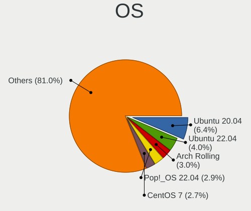

| Name                         | Desktops | Percent |
|------------------------------|----------|---------|
| Ubuntu 20.04                 | 197      | 6.41%   |
| Ubuntu 22.04                 | 123      | 4%      |
| Arch Rolling                 | 91       | 2.96%   |
| Pop!_OS 22.04                | 88       | 2.86%   |
| CentOS 7                     | 84       | 2.73%   |
| Ubuntu 24.04                 | 77       | 2.5%    |
| Ubuntu 18.04                 | 74       | 2.41%   |
| Fedora 40                    | 64       | 2.08%   |
| Debian 12                    | 52       | 1.69%   |
| Debian 11                    | 52       | 1.69%   |
| OpenMandriva 24.12           | 48       | 1.56%   |
| Fedora 38                    | 46       | 1.5%    |
| OpenMandriva 4.3             | 45       | 1.46%   |
| Fedora 39                    | 44       | 1.43%   |
| Linux Mint 20.3              | 41       | 1.33%   |
| Fedora 42                    | 41       | 1.33%   |
| Bazzite 42                   | 41       | 1.33%   |
| Fedora 41                    | 40       | 1.3%    |
| Linux Mint 22.1              | 38       | 1.24%   |
| ArcoLinux Rolling            | 36       | 1.17%   |
| Zorin 17                     | 35       | 1.14%   |
| Pop!_OS 21.04                | 35       | 1.14%   |
| Linux Mint 21.2              | 35       | 1.14%   |
| OpenMandriva 4.2             | 33       | 1.07%   |
| KDE neon 20.04               | 33       | 1.07%   |
| Manjaro                      | 31       | 1.01%   |
| Linux Mint 22.2              | 31       | 1.01%   |
| Fedora 36                    | 31       | 1.01%   |
| Zorin 16                     | 29       | 0.94%   |
| OpenMandriva 25.90           | 28       | 0.91%   |
| Fedora 37                    | 26       | 0.85%   |
| Fedora 34                    | 26       | 0.85%   |
| Linux Mint 21.1              | 25       | 0.81%   |
| Linux Mint 19.3              | 25       | 0.81%   |
| Fedora 43                    | 25       | 0.81%   |
| EndeavourOS Rolling          | 25       | 0.81%   |
| Pop!_OS 20.10                | 24       | 0.78%   |
| Bazzite 43                   | 24       | 0.78%   |
| Pop!_OS 20.04                | 23       | 0.75%   |
| openSUSE Tumbleweed-XXXXXXXX | 23       | 0.75%   |

OS Family
---------

OS without a version

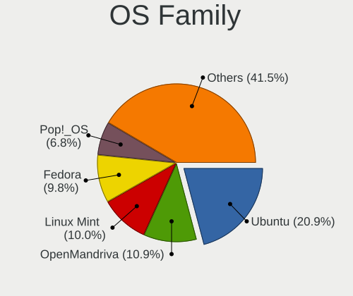

| Name          | Desktops | Percent |
|---------------|----------|---------|
| Ubuntu        | 580      | 20.89%  |
| OpenMandriva  | 302      | 10.88%  |
| Linux Mint    | 278      | 10.01%  |
| Fedora        | 273      | 9.83%   |
| Pop!_OS       | 190      | 6.84%   |
| Debian        | 149      | 5.37%   |
| Arch          | 107      | 3.85%   |
| CentOS        | 88       | 3.17%   |
| Zorin         | 87       | 3.13%   |
| Bazzite       | 75       | 2.7%    |
| KDE neon      | 66       | 2.38%   |
| Manjaro       | 57       | 2.05%   |
| Kubuntu       | 54       | 1.95%   |
| Xubuntu       | 49       | 1.77%   |
| openSUSE      | 38       | 1.37%   |
| ArcoLinux     | 37       | 1.33%   |
| Nobara        | 32       | 1.15%   |
| EndeavourOS   | 26       | 0.94%   |
| ClearOS       | 23       | 0.83%   |
| MX            | 18       | 0.65%   |
| Ubuntu MATE   | 17       | 0.61%   |
| ROSA          | 16       | 0.58%   |
| CachyOS       | 15       | 0.54%   |
| Kali          | 14       | 0.5%    |
| Gentoo        | 14       | 0.5%    |
| Lubuntu       | 12       | 0.43%   |
| Elementary    | 12       | 0.43%   |
| LMDE          | 11       | 0.4%    |
| NixOS         | 10       | 0.36%   |
| BlackPanther  | 10       | 0.36%   |
| Garuda Linux  | 9        | 0.32%   |
| Clear Linux   | 9        | 0.32%   |
| SteamOS       | 8        | 0.29%   |
| Ubuntu Budgie | 7        | 0.25%   |
| Rocky Linux   | 7        | 0.25%   |
| ChimeraOS     | 6        | 0.22%   |
| Ubuntu Unity  | 5        | 0.18%   |
| Feren OS      | 5        | 0.18%   |
| Endless       | 5        | 0.18%   |
| Parrot        | 4        | 0.14%   |

Kernel
------

Version of the Linux kernel

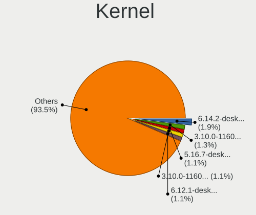

| Version                      | Desktops | Percent |
|------------------------------|----------|---------|
| 6.14.2-desktop-3omv2590      | 71       | 1.87%   |
| 3.10.0-1160.114.2.el7.x86_64 | 48       | 1.26%   |
| 5.16.7-desktop-1omv4003      | 43       | 1.13%   |
| 3.10.0-1160.102.1.el7.x86_64 | 43       | 1.13%   |
| 6.12.1-desktop-1omv2490      | 41       | 1.08%   |
| 5.10.14-desktop-1omv4002     | 29       | 0.76%   |
| 6.6.2-desktop-1omv2390       | 23       | 0.61%   |
| 5.4.0-42-generic             | 23       | 0.61%   |
| 6.9.3-76060903-generic       | 19       | 0.5%    |
| 6.12.10-76061203-generic     | 18       | 0.47%   |
| 6.4.11-desktop-1omv2390      | 17       | 0.45%   |
| 6.1.1-desktop-1omv2290       | 17       | 0.45%   |
| 6.2.6-desktop-1omv2390       | 15       | 0.4%    |
| 6.2.0-39-generic             | 15       | 0.4%    |
| 6.12.9-desktop-1omv2490      | 15       | 0.4%    |
| 5.11.0-7620-generic          | 15       | 0.4%    |
| 6.8.0-51-generic             | 14       | 0.37%   |
| 6.14.0-29-generic            | 14       | 0.37%   |
| 3.10.0-862.11.6.v7.x86_64    | 14       | 0.37%   |
| 6.8.0-49-generic             | 13       | 0.34%   |
| 6.5.0-35-generic             | 13       | 0.34%   |
| 6.14.0-36-generic            | 13       | 0.34%   |
| 5.4.0-40-generic             | 13       | 0.34%   |
| 5.3.0-46-generic             | 13       | 0.34%   |
| 6.8.7-300.fc40.x86_64        | 12       | 0.32%   |
| 5.4.0-52-generic             | 12       | 0.32%   |
| 5.4.0-48-generic             | 12       | 0.32%   |
| 5.11.0-37-generic            | 12       | 0.32%   |
| 6.8.0-52-generic             | 11       | 0.29%   |
| 6.17.7-ba20.fc43.x86_64      | 11       | 0.29%   |
| 6.17.7-ba19.fc43.x86_64      | 11       | 0.29%   |
| 6.17.5-300.fc43.x86_64       | 11       | 0.29%   |
| 6.14.0-37-generic            | 11       | 0.29%   |
| 5.4.0-47-generic             | 11       | 0.29%   |
| 5.3.0-28-generic             | 11       | 0.29%   |
| 5.15.0-48-generic            | 11       | 0.29%   |
| 3.10.0-1160.90.1.el7.x86_64  | 11       | 0.29%   |
| 6.8.0-63-generic             | 10       | 0.26%   |
| 6.8.0-60-generic             | 10       | 0.26%   |
| 6.8.0-45-generic             | 10       | 0.26%   |

Kernel Family
-------------

Linux kernel without a distro release

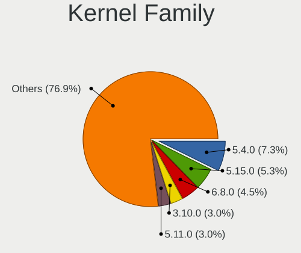

| Version | Desktops | Percent |
|---------|----------|---------|
| 5.4.0   | 255      | 7.32%   |
| 5.15.0  | 186      | 5.34%   |
| 6.8.0   | 155      | 4.45%   |
| 3.10.0  | 105      | 3.02%   |
| 5.11.0  | 104      | 2.99%   |
| 6.14.0  | 83       | 2.38%   |
| 5.8.0   | 82       | 2.35%   |
| 5.13.0  | 82       | 2.35%   |
| 4.15.0  | 79       | 2.27%   |
| 6.14.2  | 73       | 2.1%    |
| 6.5.0   | 70       | 2.01%   |
| 5.3.0   | 60       | 1.72%   |
| 6.2.0   | 59       | 1.69%   |
| 5.19.0  | 58       | 1.67%   |
| 6.1.0   | 52       | 1.49%   |
| 5.10.0  | 46       | 1.32%   |
| 6.12.1  | 43       | 1.23%   |
| 5.16.7  | 43       | 1.23%   |
| 5.0.0   | 39       | 1.12%   |
| 6.6.2   | 29       | 0.83%   |
| 6.17.7  | 29       | 0.83%   |
| 6.11.0  | 29       | 0.83%   |
| 5.10.14 | 29       | 0.83%   |
| 6.2.6   | 27       | 0.78%   |
| 4.18.0  | 26       | 0.75%   |
| 6.12.10 | 23       | 0.66%   |
| 6.9.3   | 22       | 0.63%   |
| 4.19.0  | 22       | 0.63%   |
| 6.4.11  | 20       | 0.57%   |
| 6.14.6  | 20       | 0.57%   |
| 6.1.1   | 19       | 0.55%   |
| 6.16.4  | 18       | 0.52%   |
| 6.12.9  | 18       | 0.52%   |
| 6.8.7   | 17       | 0.49%   |
| 6.5.11  | 13       | 0.37%   |
| 6.11.5  | 13       | 0.37%   |
| 6.8.9   | 12       | 0.34%   |
| 6.5.6   | 12       | 0.34%   |
| 6.17.5  | 12       | 0.34%   |
| 6.15.9  | 12       | 0.34%   |

Kernel Major Ver.
-----------------

Linux kernel major version

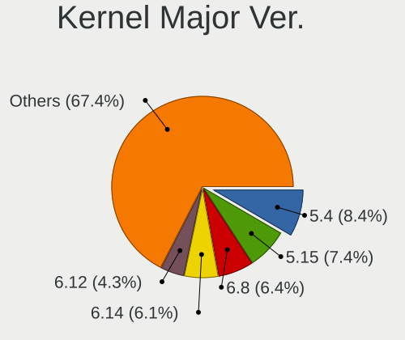

| Version | Desktops | Percent |
|---------|----------|---------|
| 5.4     | 278      | 8.41%   |
| 5.15    | 244      | 7.38%   |
| 6.8     | 211      | 6.39%   |
| 6.14    | 201      | 6.08%   |
| 6.12    | 142      | 4.3%    |
| 5.11    | 123      | 3.72%   |
| 6.5     | 121      | 3.66%   |
| 5.13    | 111      | 3.36%   |
| 6.2     | 109      | 3.3%    |
| 6.1     | 109      | 3.3%    |
| 3.10    | 105      | 3.18%   |
| 5.8     | 101      | 3.06%   |
| 5.10    | 101      | 3.06%   |
| 5.19    | 87       | 2.63%   |
| 6.11    | 85       | 2.57%   |
| 6.6     | 82       | 2.48%   |
| 5.16    | 82       | 2.48%   |
| 4.15    | 79       | 2.39%   |
| 6.17    | 74       | 2.24%   |
| 5.3     | 68       | 2.06%   |
| 6.4     | 66       | 2%      |
| 6.9     | 64       | 1.94%   |
| 6.15    | 62       | 1.88%   |
| 6.10    | 54       | 1.63%   |
| 6.16    | 45       | 1.36%   |
| 5.0     | 44       | 1.33%   |
| 6.13    | 43       | 1.3%    |
| 6.0     | 43       | 1.3%    |
| 5.17    | 37       | 1.12%   |
| 5.18    | 36       | 1.09%   |
| 4.18    | 35       | 1.06%   |
| 6.7     | 34       | 1.03%   |
| 6.3     | 34       | 1.03%   |
| 5.14    | 31       | 0.94%   |
| 5.12    | 27       | 0.82%   |
| 4.19    | 24       | 0.73%   |
| 5.6     | 22       | 0.67%   |
| 4.9     | 16       | 0.48%   |
| 5.9     | 14       | 0.42%   |
| 5.5     | 14       | 0.42%   |

Arch
----

OS architecture (x86_64, i586, etc.)

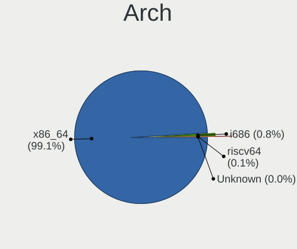

| Name    | Desktops | Percent |
|---------|----------|---------|
| x86_64  | 2628     | 99.06%  |
| i686    | 20       | 0.75%   |
| riscv64 | 3        | 0.11%   |
| armv7l  | 1        | 0.04%   |
| Unknown | 1        | 0.04%   |

DE
--

Desktop Environment

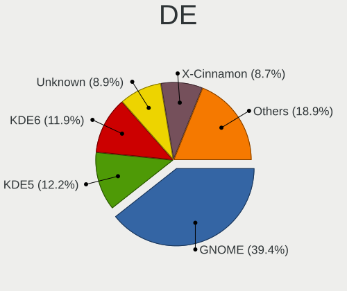

| Name            | Desktops | Percent |
|-----------------|----------|---------|
| GNOME           | 1102     | 39.36%  |
| KDE5            | 343      | 12.25%  |
| KDE6            | 333      | 11.89%  |
| Unknown         | 249      | 8.89%   |
| X-Cinnamon      | 243      | 8.68%   |
| XFCE            | 180      | 6.43%   |
| MATE            | 82       | 2.93%   |
| KDE             | 71       | 2.54%   |
| Cinnamon        | 49       | 1.75%   |
| LXQt            | 32       | 1.14%   |
| Budgie          | 18       | 0.64%   |
| Hyprland        | 16       | 0.57%   |
| KDE4            | 14       | 0.5%    |
| Pantheon        | 12       | 0.43%   |
| GNOME Classic   | 9        | 0.32%   |
| COSMIC          | 8        | 0.29%   |
| i3              | 7        | 0.25%   |
| Unity           | 5        | 0.18%   |
| LXDE            | 5        | 0.18%   |
| awesome         | 5        | 0.18%   |
| Openbox         | 3        | 0.11%   |
| xmonad          | 2        | 0.07%   |
| sway            | 2        | 0.07%   |
| GNOME Flashback | 2        | 0.07%   |
| wlroots         | 1        | 0.04%   |
| Trinity         | 1        | 0.04%   |
| qtile           | 1        | 0.04%   |
| ICEWM           | 1        | 0.04%   |
| GNUstep         | 1        | 0.04%   |
| DDE             | 1        | 0.04%   |
| chadwm          | 1        | 0.04%   |
| bspwm           | 1        | 0.04%   |

Display Server
--------------

X11 or Wayland

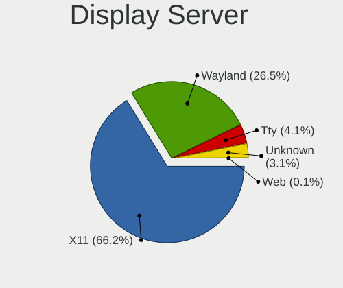

| Name    | Desktops | Percent |
|---------|----------|---------|
| X11     | 1842     | 66.24%  |
| Wayland | 738      | 26.54%  |
| Tty     | 113      | 4.06%   |
| Unknown | 86       | 3.09%   |
| Web     | 2        | 0.07%   |

Display Manager
---------------

SDDM, LightDM, etc.

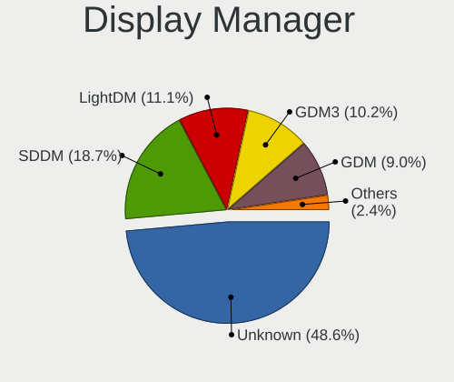

| Name    | Desktops | Percent |
|---------|----------|---------|
| Unknown | 1344     | 48.57%  |
| SDDM    | 517      | 18.68%  |
| LightDM | 308      | 11.13%  |
| GDM3    | 283      | 10.23%  |
| GDM     | 249      | 9%      |
| TDM     | 38       | 1.37%   |
| KDM     | 7        | 0.25%   |
| SLiM    | 6        | 0.22%   |
| LY-DM   | 6        | 0.22%   |
| XDM     | 3        | 0.11%   |
| Ly      | 2        | 0.07%   |
| GREETD  | 2        | 0.07%   |
| LXDM    | 1        | 0.04%   |
| LEMURS  | 1        | 0.04%   |

OS Lang
-------

Language

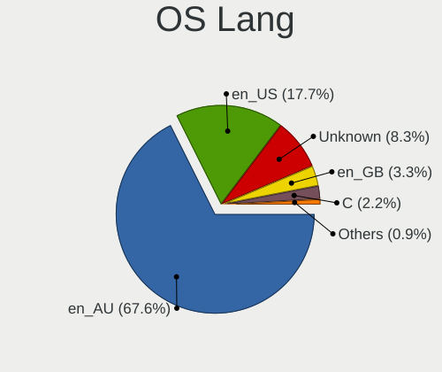

| Lang        | Desktops | Percent |
|-------------|----------|---------|
| en_AU       | 1882     | 67.6%   |
| en_US       | 493      | 17.71%  |
| Unknown     | 232      | 8.33%   |
| en_GB       | 92       | 3.3%    |
| C           | 60       | 2.16%   |
| en_NZ       | 5        | 0.18%   |
| zh_CN       | 4        | 0.14%   |
| POSIX       | 3        | 0.11%   |
| en_BW       | 3        | 0.11%   |
| en_DK       | 2        | 0.07%   |
| de_DE       | 2        | 0.07%   |
| ko_KR       | 1        | 0.04%   |
| it_IT       | 1        | 0.04%   |
| en_CA       | 1        | 0.04%   |
| en-AU       | 1        | 0.04%   |
| C.UTF8      | 1        | 0.04%   |
| be_BY@latin | 1        | 0.04%   |

Boot Mode
---------

EFI or BIOS

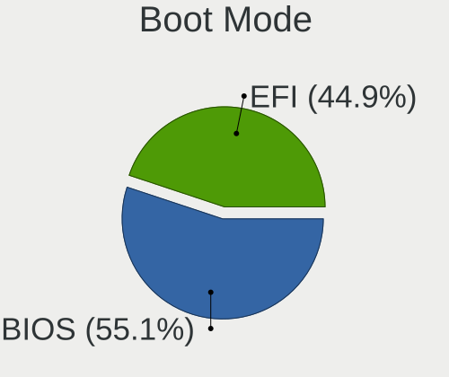

| Mode | Desktops | Percent |
|------|----------|---------|
| BIOS | 1502     | 55.1%   |
| EFI  | 1224     | 44.9%   |

Filesystem
----------

Type of filesystem

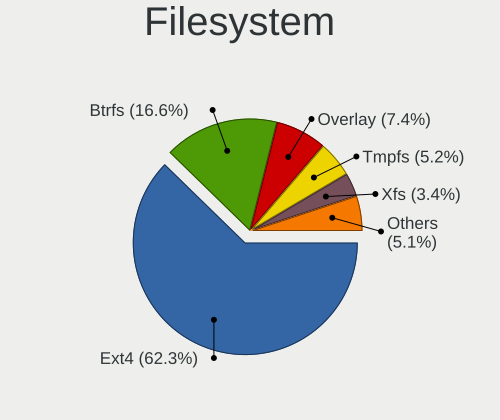

| Type     | Desktops | Percent |
|----------|----------|---------|
| Ext4     | 1718     | 62.29%  |
| Btrfs    | 458      | 16.61%  |
| Overlay  | 204      | 7.4%    |
| Tmpfs    | 144      | 5.22%   |
| Xfs      | 94       | 3.41%   |
| Unknown  | 52       | 1.89%   |
| Ext3     | 39       | 1.41%   |
| Zfs      | 38       | 1.38%   |
| Ext2     | 5        | 0.18%   |
| Reiserfs | 3        | 0.11%   |
| XXXXXXX  | 1        | 0.04%   |
| F2fs     | 1        | 0.04%   |
| Aufs     | 1        | 0.04%   |

Part. scheme
------------

Scheme of partitioning

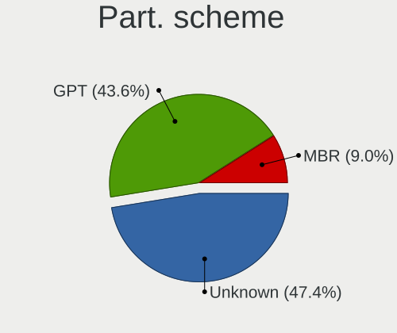

| Type    | Desktops | Percent |
|---------|----------|---------|
| Unknown | 1302     | 47.43%  |
| GPT     | 1196     | 43.57%  |
| MBR     | 247      | 9%      |

Dual Boot with Linux/BSD
------------------------

Hosting more than one Linux/BSD

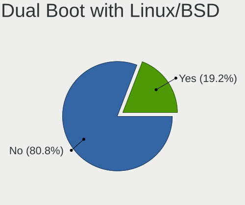

| Dual boot | Desktops | Percent |
|-----------|----------|---------|
| No        | 2205     | 80.83%  |
| Yes       | 523      | 19.17%  |

Dual Boot (Win)
---------------

Hosting Linux and Windows

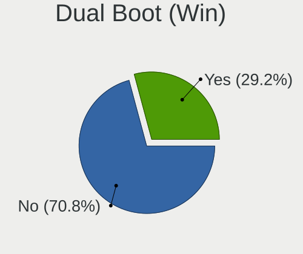

| Dual boot | Desktops | Percent |
|-----------|----------|---------|
| No        | 1923     | 70.83%  |
| Yes       | 792      | 29.17%  |

Board
-----

Vendor
------

Motherboard manufacturer

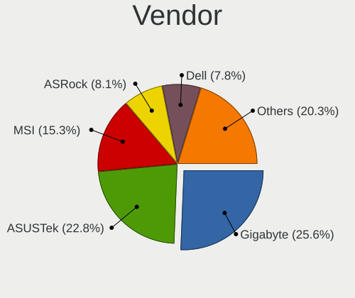

| Name                                 | Desktops | Percent |
|--------------------------------------|----------|---------|
| Gigabyte Technology                  | 679      | 25.64%  |
| ASUSTek Computer                     | 605      | 22.85%  |
| MSI                                  | 405      | 15.29%  |
| ASRock                               | 215      | 8.12%   |
| Dell                                 | 207      | 7.82%   |
| Hewlett-Packard                      | 196      | 7.4%    |
| Lenovo                               | 87       | 3.29%   |
| Intel                                | 53       | 2%      |
| Acer                                 | 34       | 1.28%   |
| Unknown                              | 22       | 0.83%   |
| Pegatron                             | 17       | 0.64%   |
| Apple                                | 11       | 0.42%   |
| Shenzhen Meigao Electronic Equipment | 9        | 0.34%   |
| AZW                                  | 8        | 0.3%    |
| Medion                               | 7        | 0.26%   |
| Alienware                            | 7        | 0.26%   |
| Shuttle                              | 6        | 0.23%   |
| ECS                                  | 6        | 0.23%   |
| Google                               | 5        | 0.19%   |
| NZXT                                 | 3        | 0.11%   |
| MACHINIST                            | 3        | 0.11%   |
| JGINYUE                              | 3        | 0.11%   |
| Biostar                              | 3        | 0.11%   |
| Avalue                               | 3        | 0.11%   |
| AMI                                  | 3        | 0.11%   |
| SYWZ                                 | 2        | 0.08%   |
| Red Hat                              | 2        | 0.08%   |
| Nvidia                               | 2        | 0.08%   |
| Huanan                               | 2        | 0.08%   |
| Hardkernel                           | 2        | 0.08%   |
| Foxconn                              | 2        | 0.08%   |
| eMachines                            | 2        | 0.08%   |
| AAEON                                | 2        | 0.08%   |
| ZOTAC                                | 1        | 0.04%   |
| TOPC                                 | 1        | 0.04%   |
| Techvision                           | 1        | 0.04%   |
| SZMZ                                 | 1        | 0.04%   |
| System76                             | 1        | 0.04%   |
| Supermicro                           | 1        | 0.04%   |
| Sony                                 | 1        | 0.04%   |

Model
-----

Motherboard model

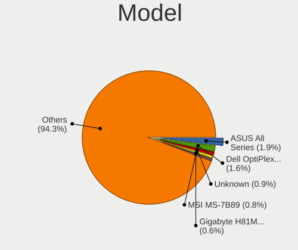

| Name                         | Desktops | Percent |
|------------------------------|----------|---------|
| ASUS All Series              | 50       | 1.89%   |
| Dell OptiPlex 9020           | 42       | 1.59%   |
| Unknown                      | 23       | 0.87%   |
| MSI MS-7B89                  | 20       | 0.76%   |
| Gigabyte H81M-S2H            | 17       | 0.64%   |
| MSI MS-7C31                  | 16       | 0.6%    |
| MSI MS-7C94                  | 15       | 0.57%   |
| MSI MS-7B86                  | 15       | 0.57%   |
| Dell OptiPlex 7040           | 14       | 0.53%   |
| ASUS TUF Gaming B650M-E WIFI | 14       | 0.53%   |
| MSI MS-7C37                  | 12       | 0.45%   |
| MSI MS-7C02                  | 12       | 0.45%   |
| MSI MS-7A15                  | 12       | 0.45%   |
| Gigabyte 970A-D3P            | 12       | 0.45%   |
| MSI MS-7C84                  | 11       | 0.42%   |
| MSI MS-7C56                  | 11       | 0.42%   |
| Dell OptiPlex 780            | 11       | 0.42%   |
| MSI MS-7C95                  | 10       | 0.38%   |
| MSI MS-7A74                  | 10       | 0.38%   |
| MSI MS-7C91                  | 9        | 0.34%   |
| MSI MS-7817                  | 9        | 0.34%   |
| Gigabyte X58A-UD3R           | 9        | 0.34%   |
| Gigabyte B75M-D3H            | 9        | 0.34%   |
| Dell OptiPlex 990            | 9        | 0.34%   |
| Dell OptiPlex 9010           | 9        | 0.34%   |
| MSI MS-7A38                  | 8        | 0.3%    |
| HP Compaq 8200 Elite SFF PC  | 8        | 0.3%    |
| Gigabyte X570 AORUS PRO WIFI | 8        | 0.3%    |
| ASUS TUF Gaming B550M-PLUS   | 8        | 0.3%    |
| ASUS PRIME B550M-K           | 8        | 0.3%    |
| ASUS PRIME B550M-A WIFI II   | 8        | 0.3%    |
| ASUS PRIME B450M-A           | 8        | 0.3%    |
| MSI MS-7B53                  | 7        | 0.26%   |
| HP Compaq Elite 8300 SFF     | 7        | 0.26%   |
| Gigabyte X570 AORUS MASTER   | 7        | 0.26%   |
| Gigabyte H81M-DS2            | 7        | 0.26%   |
| Gigabyte B450M GAMING        | 7        | 0.26%   |
| Gigabyte B450M DS3H          | 7        | 0.26%   |
| Gigabyte B450 AORUS PRO WIFI | 7        | 0.26%   |
| Gigabyte B450 AORUS ELITE    | 7        | 0.26%   |

Model Family
------------

Motherboard model prefix

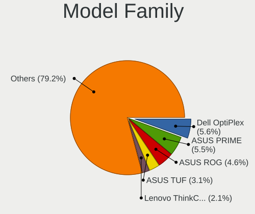

| Name                | Desktops | Percent |
|---------------------|----------|---------|
| Dell OptiPlex       | 147      | 5.55%   |
| ASUS PRIME          | 146      | 5.51%   |
| ASUS ROG            | 121      | 4.57%   |
| ASUS TUF            | 82       | 3.1%    |
| Lenovo ThinkCentre  | 55       | 2.08%   |
| ASUS All            | 50       | 1.89%   |
| HP Compaq           | 48       | 1.81%   |
| Gigabyte X570       | 41       | 1.55%   |
| Dell Precision      | 30       | 1.13%   |
| Gigabyte B450       | 27       | 1.02%   |
| HP EliteDesk        | 26       | 0.98%   |
| HP ProDesk          | 25       | 0.94%   |
| Gigabyte B450M      | 24       | 0.91%   |
| Gigabyte B550       | 23       | 0.87%   |
| Unknown             | 23       | 0.87%   |
| MSI MS-7B89         | 20       | 0.76%   |
| Gigabyte B550M      | 18       | 0.68%   |
| Acer Aspire         | 18       | 0.68%   |
| Lenovo ThinkStation | 17       | 0.64%   |
| Gigabyte H81M-S2H   | 17       | 0.64%   |
| MSI MS-7C31         | 16       | 0.6%    |
| Gigabyte B650       | 16       | 0.6%    |
| MSI MS-7C94         | 15       | 0.57%   |
| MSI MS-7B86         | 15       | 0.57%   |
| ASRock X570         | 15       | 0.57%   |
| Gigabyte Z390       | 13       | 0.49%   |
| Acer Veriton        | 13       | 0.49%   |
| MSI MS-7C37         | 12       | 0.45%   |
| MSI MS-7C02         | 12       | 0.45%   |
| MSI MS-7A15         | 12       | 0.45%   |
| Gigabyte B650M      | 12       | 0.45%   |
| Gigabyte 970A-D3P   | 12       | 0.45%   |
| MSI MS-7C84         | 11       | 0.42%   |
| MSI MS-7C56         | 11       | 0.42%   |
| HP Pavilion         | 11       | 0.42%   |
| Gigabyte Z790       | 11       | 0.42%   |
| Dell Vostro         | 11       | 0.42%   |
| ASUS P8Z77-V        | 11       | 0.42%   |
| MSI MS-7C95         | 10       | 0.38%   |
| MSI MS-7A74         | 10       | 0.38%   |

MFG Year
--------

Motherboard manufacture year

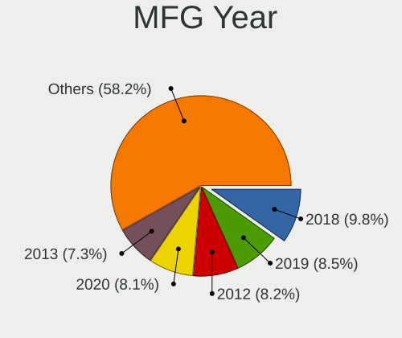

| Year    | Desktops | Percent |
|---------|----------|---------|
| 2018    | 260      | 9.82%   |
| 2019    | 224      | 8.46%   |
| 2012    | 216      | 8.16%   |
| 2020    | 214      | 8.08%   |
| 2013    | 194      | 7.33%   |
| 2014    | 179      | 6.76%   |
| 2021    | 163      | 6.16%   |
| 2022    | 144      | 5.44%   |
| 2017    | 138      | 5.21%   |
| 2011    | 136      | 5.14%   |
| 2016    | 134      | 5.06%   |
| 2023    | 111      | 4.19%   |
| 2009    | 100      | 3.78%   |
| 2015    | 97       | 3.66%   |
| 2010    | 90       | 3.4%    |
| 2024    | 83       | 3.13%   |
| 2008    | 74       | 2.79%   |
| 2007    | 43       | 1.62%   |
| 2006    | 17       | 0.64%   |
| 2025    | 14       | 0.53%   |
| 2005    | 8        | 0.3%    |
| Unknown | 6        | 0.23%   |
| 2004    | 2        | 0.08%   |
| 2002    | 1        | 0.04%   |

Form Factor
-----------

Physical design of the computer

| Name    | Desktops | Percent |
|---------|----------|---------|
| Desktop | 2648     | 100%    |

Secure Boot
-----------

Enabled or disabled

| State    | Desktops | Percent |
|----------|----------|---------|
| Disabled | 2572     | 96.76%  |
| Enabled  | 86       | 3.24%   |

Coreboot
--------

Have coreboot on board

| Used | Desktops | Percent |
|------|----------|---------|
| No   | 2641     | 99.74%  |
| Yes  | 7        | 0.26%   |

RAM Size
--------

Total RAM memory

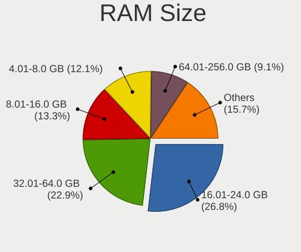

| Size in GB      | Desktops | Percent |
|-----------------|----------|---------|
| 16.01-24.0      | 735      | 26.82%  |
| 32.01-64.0      | 628      | 22.92%  |
| 8.01-16.0       | 365      | 13.32%  |
| 4.01-8.0        | 332      | 12.12%  |
| 64.01-256.0     | 249      | 9.09%   |
| 3.01-4.0        | 206      | 7.52%   |
| 24.01-32.0      | 158      | 5.77%   |
| 1.01-2.0        | 49       | 1.79%   |
| 2.01-3.0        | 10       | 0.36%   |
| More than 256.0 | 4        | 0.15%   |
| 0.51-1.0        | 2        | 0.07%   |
| 0.01-0.5        | 1        | 0.04%   |
| Unknown         | 1        | 0.04%   |

RAM Used
--------

Used RAM memory

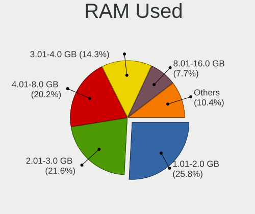

| Used GB     | Desktops | Percent |
|-------------|----------|---------|
| 1.01-2.0    | 805      | 25.84%  |
| 2.01-3.0    | 673      | 21.61%  |
| 4.01-8.0    | 628      | 20.16%  |
| 3.01-4.0    | 446      | 14.32%  |
| 8.01-16.0   | 239      | 7.67%   |
| 0.51-1.0    | 211      | 6.77%   |
| 16.01-24.0  | 53       | 1.7%    |
| 0.01-0.5    | 25       | 0.8%    |
| 24.01-32.0  | 19       | 0.61%   |
| 32.01-64.0  | 11       | 0.35%   |
| 64.01-256.0 | 3        | 0.1%    |
| Unknown     | 2        | 0.06%   |

Total Drives
------------

Number of drives on board

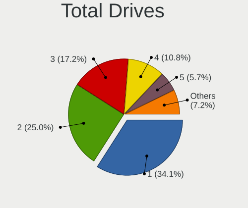

| Drives | Desktops | Percent |
|--------|----------|---------|
| 1      | 966      | 34.05%  |
| 2      | 709      | 24.99%  |
| 3      | 488      | 17.2%   |
| 4      | 306      | 10.79%  |
| 5      | 163      | 5.75%   |
| 6      | 86       | 3.03%   |
| 7      | 36       | 1.27%   |
| 8      | 29       | 1.02%   |
| 0      | 24       | 0.85%   |
| 9      | 15       | 0.53%   |
| 10     | 7        | 0.25%   |
| 14     | 2        | 0.07%   |
| 12     | 2        | 0.07%   |
| 11     | 2        | 0.07%   |
| 26     | 1        | 0.04%   |
| 13     | 1        | 0.04%   |

Has CD-ROM
----------

Has CD-ROM on board

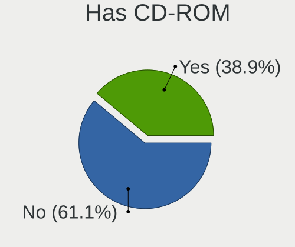

| Presented | Desktops | Percent |
|-----------|----------|---------|
| No        | 1649     | 61.1%   |
| Yes       | 1050     | 38.9%   |

Has Ethernet
------------

Has Ethernet on board

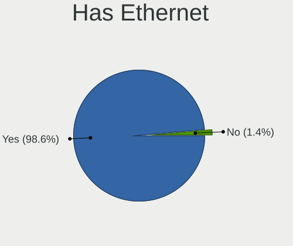

| Presented | Desktops | Percent |
|-----------|----------|---------|
| Yes       | 2611     | 98.57%  |
| No        | 38       | 1.43%   |

Has WiFi
--------

Has WiFi module

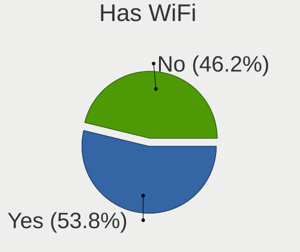

| Presented | Desktops | Percent |
|-----------|----------|---------|
| Yes       | 1458     | 53.78%  |
| No        | 1253     | 46.22%  |

Has Bluetooth
-------------

Has Bluetooth module

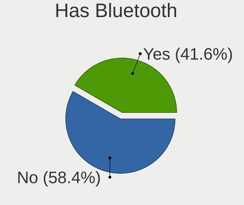

| Presented | Desktops | Percent |
|-----------|----------|---------|
| No        | 1575     | 58.35%  |
| Yes       | 1124     | 41.65%  |

Location
--------

Country
-------

Geographic location (country)

| Country   | Desktops | Percent |
|-----------|----------|---------|
| Australia | 2648     | 100%    |

City
----

Geographic location (city)

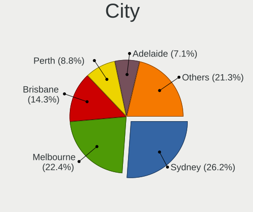

| City           | Desktops | Percent |
|----------------|----------|---------|
| Sydney         | 738      | 26.16%  |
| Melbourne      | 633      | 22.44%  |
| Brisbane       | 404      | 14.32%  |
| Perth          | 247      | 8.76%   |
| Adelaide       | 199      | 7.05%   |
| Canberra       | 55       | 1.95%   |
| Wahroonga      | 33       | 1.17%   |
| Geelong        | 25       | 0.89%   |
| Launceston     | 23       | 0.82%   |
| Hobart         | 23       | 0.82%   |
| Alexandria     | 15       | 0.53%   |
| Surry Hills    | 13       | 0.46%   |
| Newcastle      | 13       | 0.46%   |
| Gold Coast     | 12       | 0.43%   |
| Richmond       | 9        | 0.32%   |
| Nyngan         | 9        | 0.32%   |
| Lane Cove      | 9        | 0.32%   |
| Central Coast  | 9        | 0.32%   |
| Morwell        | 7        | 0.25%   |
| Leinster       | 7        | 0.25%   |
| Townsville     | 6        | 0.21%   |
| Sunshine Coast | 6        | 0.21%   |
| Darwin         | 6        | 0.21%   |
| Brighton       | 6        | 0.21%   |
| Woolloongabba  | 5        | 0.18%   |
| North Sydney   | 5        | 0.18%   |
| Macquarie Park | 5        | 0.18%   |
| Devonport      | 5        | 0.18%   |
| Campbellfield  | 5        | 0.18%   |
| Cairns         | 5        | 0.18%   |
| Warrnambool    | 4        | 0.14%   |
| Northcote      | 4        | 0.14%   |
| Mitcham        | 4        | 0.14%   |
| Buderim        | 4        | 0.14%   |
| Zetland        | 3        | 0.11%   |
| Wollongong     | 3        | 0.11%   |
| Warragul       | 3        | 0.11%   |
| Traralgon      | 3        | 0.11%   |
| Southport      | 3        | 0.11%   |
| Ringwood East  | 3        | 0.11%   |

Drives
------

Drive Vendor
------------

Hard drive vendors

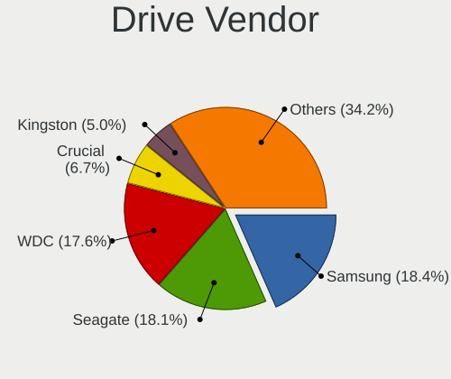

| Vendor                       | Desktops | Drives | Percent |
|------------------------------|----------|--------|---------|
| Samsung Electronics          | 967      | 2232   | 18.41%  |
| Seagate                      | 949      | 2038   | 18.06%  |
| WDC                          | 923      | 1983   | 17.57%  |
| Crucial                      | 354      | 598    | 6.74%   |
| Kingston                     | 263      | 367    | 5.01%   |
| SanDisk                      | 232      | 311    | 4.42%   |
| Intel                        | 148      | 320    | 2.82%   |
| Micron/Crucial Technology    | 146      | 219    | 2.78%   |
| Toshiba                      | 127      | 192    | 2.42%   |
| Hitachi                      | 109      | 221    | 2.07%   |
| Phison Electronics           | 66       | 93     | 1.26%   |
| Kingston Technology Company  | 65       | 76     | 1.24%   |
| SPCC                         | 63       | 84     | 1.2%    |
| Micron Technology            | 54       | 80     | 1.03%   |
| SK hynix                     | 50       | 61     | 0.95%   |
| Unknown                      | 41       | 87     | 0.78%   |
| MAXIO Technology (Hangzhou)  | 41       | 58     | 0.78%   |
| HGST                         | 41       | 75     | 0.78%   |
| OCZ                          | 40       | 57     | 0.76%   |
| Realtek Semiconductor        | 29       | 32     | 0.55%   |
| A-DATA Technology            | 29       | 38     | 0.55%   |
| Phison                       | 28       | 45     | 0.53%   |
| China                        | 26       | 33     | 0.49%   |
| Silicon Motion               | 24       | 36     | 0.46%   |
| Corsair                      | 24       | 40     | 0.46%   |
| Team                         | 21       | 27     | 0.4%    |
| JMicron Technology           | 21       | 25     | 0.4%    |
| Apple                        | 19       | 21     | 0.36%   |
| Patriot                      | 17       | 22     | 0.32%   |
| KingSpec                     | 17       | 48     | 0.32%   |
| Transcend                    | 15       | 24     | 0.29%   |
| LITEONIT                     | 14       | 36     | 0.27%   |
| Maxtor                       | 13       | 18     | 0.25%   |
| ADATA Technology             | 13       | 14     | 0.25%   |
| Shenzhen Longsys Electronics | 11       | 14     | 0.21%   |
| Lexar                        | 11       | 14     | 0.21%   |
| Hewlett-Packard              | 11       | 34     | 0.21%   |
| Realtek                      | 10       | 12     | 0.19%   |
| Gigabyte Technology          | 10       | 11     | 0.19%   |
| LITEON                       | 9        | 29     | 0.17%   |

Drive Model
-----------

Hard drive models

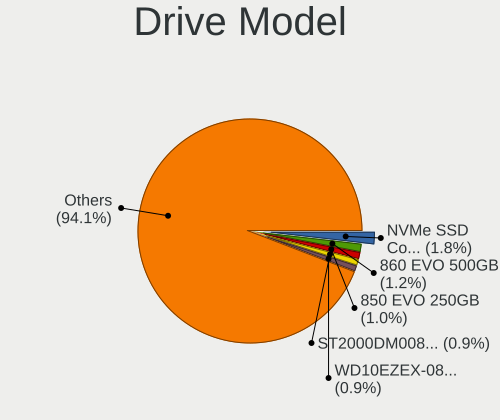

| Model                                                | Desktops | Percent |
|------------------------------------------------------|----------|---------|
| Samsung NVMe SSD Controller SM981/PM981/PM983 1TB    | 116      | 1.81%   |
| Samsung SSD 860 EVO 500GB                            | 77       | 1.2%    |
| Samsung SSD 850 EVO 250GB                            | 66       | 1.03%   |
| Seagate ST2000DM008-2FR102 2TB                       | 60       | 0.94%   |
| WDC WD10EZEX-08WN4A0 1TB                             | 56       | 0.87%   |
| Seagate ST4000DM004-2CV104 4TB                       | 56       | 0.87%   |
| Samsung NVMe SSD Controller PM9A1/PM9A3/980PRO 1TB   | 52       | 0.81%   |
| Micron/Crucial P2 NVMe PCIe SSD 2TB                  | 52       | 0.81%   |
| Seagate ST1000DM010-2EP102 1TB                       | 51       | 0.8%    |
| Seagate ST500DM002-1BD142 500GB                      | 50       | 0.78%   |
| Samsung SSD 860 EVO 1TB                              | 48       | 0.75%   |
| Crucial CT1000BX500SSD1 1TB                          | 46       | 0.72%   |
| Seagate ST2000DM001-1ER164 2TB                       | 45       | 0.7%    |
| Crucial CT240BX500SSD1 240GB                         | 44       | 0.69%   |
| Samsung SSD 850 EVO 500GB                            | 42       | 0.66%   |
| Seagate ST2000DM001-1CH164 2TB                       | 41       | 0.64%   |
| Seagate ST3500418AS 500GB                            | 38       | 0.59%   |
| Crucial CT500MX500SSD1 500GB                         | 38       | 0.59%   |
| Crucial CT1000MX500SSD1 1TB                          | 36       | 0.56%   |
| Samsung SSD 860 QVO 1TB                              | 35       | 0.55%   |
| Seagate Expansion Desk 4TB                           | 34       | 0.53%   |
| Kingston SA400S37480G 480GB SSD                      | 32       | 0.5%    |
| Kingston SA400S37240G 240GB SSD                      | 31       | 0.48%   |
| Seagate Expansion 2TB                                | 30       | 0.47%   |
| Crucial CT480BX500SSD1 480GB                         | 30       | 0.47%   |
| WDC WD20EARX-00PASB0 2TB                             | 29       | 0.45%   |
| Seagate ST4000DM000-1F2168 4TB                       | 29       | 0.45%   |
| Samsung NVMe SSD Controller SM961/PM961/SM963 1024GB | 29       | 0.45%   |
| Kingston SV300S37A120G 120GB SSD                     | 28       | 0.44%   |
| WDC WD20EZRZ-00Z5HB0 2TB                             | 27       | 0.42%   |
| Seagate ST2000DM006-2DM164 2TB                       | 27       | 0.42%   |
| Seagate ST2000DL003-9VT166 2TB                       | 27       | 0.42%   |
| Samsung NVMe SSD Drive 1TB                           | 26       | 0.41%   |
| Seagate ST1000DM003-1CH162 1TB                       | 25       | 0.39%   |
| WDC WDS500G2B0A-00SM50 500GB                         | 24       | 0.37%   |
| Seagate ST31000528AS 1TB                             | 24       | 0.37%   |
| Seagate ST1000DM003-1ER162 1TB                       | 24       | 0.37%   |
| WDC WD40EFRX-68N32N0 4TB                             | 23       | 0.36%   |
| WDC WD10EZEX-00MFCA0 1TB                             | 22       | 0.34%   |
| Seagate ST31000524AS 1TB                             | 22       | 0.34%   |

HDD Vendor
----------

Hard disk drive vendors

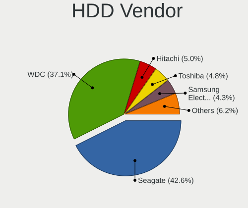

| Vendor              | Desktops | Drives | Percent |
|---------------------|----------|--------|---------|
| Seagate             | 929      | 1977   | 42.6%   |
| WDC                 | 809      | 1721   | 37.09%  |
| Hitachi             | 109      | 221    | 5%      |
| Toshiba             | 104      | 159    | 4.77%   |
| Samsung Electronics | 94       | 356    | 4.31%   |
| HGST                | 39       | 73     | 1.79%   |
| Unknown             | 13       | 24     | 0.6%    |
| Maxtor              | 13       | 18     | 0.6%    |
| Apple               | 12       | 14     | 0.55%   |
| JMicron Technology  | 10       | 13     | 0.46%   |
| Hewlett-Packard     | 7        | 30     | 0.32%   |
| ASMT                | 6        | 8      | 0.28%   |
| TO Exter            | 5        | 5      | 0.23%   |
| LaCie               | 5        | 7      | 0.23%   |
| USB                 | 4        | 4      | 0.18%   |
| QNAP                | 3        | 13     | 0.14%   |
| T-FORCE             | 2        | 3      | 0.09%   |
| IET                 | 2        | 2      | 0.09%   |
| HPE                 | 2        | 2      | 0.09%   |
| Fujitsu             | 2        | 2      | 0.09%   |
| External            | 2        | 5      | 0.09%   |
| WUH72181            | 1        | 2      | 0.05%   |
| USB3.0              | 1        | 2      | 0.05%   |
| SABRENT             | 1        | 1      | 0.05%   |
| MaxDigital          | 1        | 1      | 0.05%   |
| MARVELL             | 1        | 1      | 0.05%   |
| Hajaan              | 1        | 1      | 0.05%   |
| Esmart              | 1        | 1      | 0.05%   |
| DAS                 | 1        | 1      | 0.05%   |
| Unknown             | 1        | 7      | 0.05%   |

SSD Vendor
----------

Solid state drive vendors

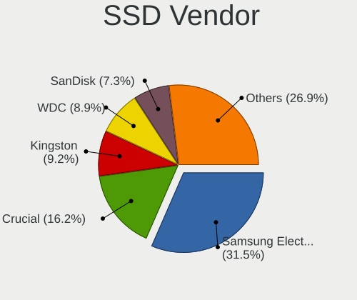

| Vendor              | Desktops | Drives | Percent |
|---------------------|----------|--------|---------|
| Samsung Electronics | 595      | 1185   | 31.55%  |
| Crucial             | 306      | 538    | 16.22%  |
| Kingston            | 173      | 244    | 9.17%   |
| WDC                 | 167      | 233    | 8.85%   |
| SanDisk             | 137      | 163    | 7.26%   |
| Intel               | 98       | 248    | 5.2%    |
| SPCC                | 54       | 73     | 2.86%   |
| OCZ                 | 40       | 57     | 2.12%   |
| China               | 26       | 33     | 1.38%   |
| Micron Technology   | 21       | 27     | 1.11%   |
| SK hynix            | 20       | 24     | 1.06%   |
| Corsair             | 19       | 34     | 1.01%   |
| Team                | 16       | 21     | 0.85%   |
| Patriot             | 16       | 21     | 0.85%   |
| KingSpec            | 16       | 47     | 0.85%   |
| A-DATA Technology   | 16       | 21     | 0.85%   |
| Transcend           | 15       | 24     | 0.8%    |
| LITEONIT            | 14       | 36     | 0.74%   |
| Seagate             | 12       | 20     | 0.64%   |
| Toshiba             | 10       | 12     | 0.53%   |
| LITEON              | 8        | 28     | 0.42%   |
| PNY                 | 7        | 12     | 0.37%   |
| Lexar               | 7        | 10     | 0.37%   |
| Apple               | 6        | 6      | 0.32%   |
| Plextor             | 4        | 12     | 0.21%   |
| OWC                 | 4        | 8      | 0.21%   |
| Netac               | 4        | 7      | 0.21%   |
| Gigabyte Technology | 4        | 4      | 0.21%   |
| Vaseky              | 3        | 10     | 0.16%   |
| SABRENT             | 3        | 3      | 0.16%   |
| KingFast            | 3        | 7      | 0.16%   |
| Hajaan              | 3        | 6      | 0.16%   |
| Fujitsu             | 3        | 3      | 0.16%   |
| ASMT                | 3        | 3      | 0.16%   |
| Unknown             | 2        | 2      | 0.11%   |
| Thinkplus           | 2        | 4      | 0.11%   |
| OCZ-VERTEX3         | 2        | 2      | 0.11%   |
| EAGET               | 2        | 4      | 0.11%   |
| CT500BX5            | 2        | 2      | 0.11%   |
| Apacer              | 2        | 3      | 0.11%   |

Drive Kind
----------

HDD or SSD

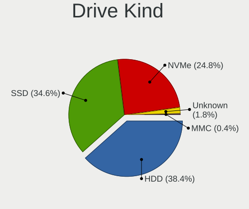

| Kind    | Desktops | Drives | Percent |
|---------|----------|--------|---------|
| HDD     | 1667     | 4674   | 38.4%   |
| SSD     | 1503     | 3254   | 34.62%  |
| NVMe    | 1075     | 1959   | 24.76%  |
| Unknown | 79       | 126    | 1.82%   |
| MMC     | 17       | 21     | 0.39%   |

Drive Connector
---------------

SATA, SAS, NVMe, etc.

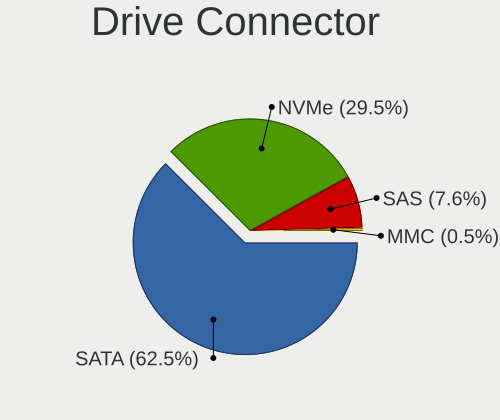

| Type | Desktops | Drives | Percent |
|------|----------|--------|---------|
| SATA | 2273     | 7617   | 62.48%  |
| NVMe | 1073     | 1932   | 29.49%  |
| SAS  | 275      | 464    | 7.56%   |
| MMC  | 17       | 21     | 0.47%   |

Drive Size
----------

Size of hard drive

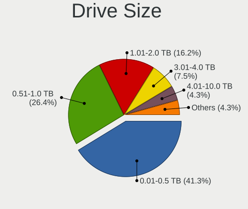

| Size in TB | Desktops | Drives | Percent |
|------------|----------|--------|---------|
| 0.01-0.5   | 1517     | 3619   | 41.29%  |
| 0.51-1.0   | 970      | 2020   | 26.4%   |
| 1.01-2.0   | 596      | 1073   | 16.22%  |
| 3.01-4.0   | 276      | 612    | 7.51%   |
| 4.01-10.0  | 157      | 332    | 4.27%   |
| 2.01-3.0   | 130      | 210    | 3.54%   |
| 10.01-20.0 | 26       | 59     | 0.71%   |
| 20.01-50.0 | 2        | 3      | 0.05%   |

Space Total
-----------

Amount of disk space available on the file system

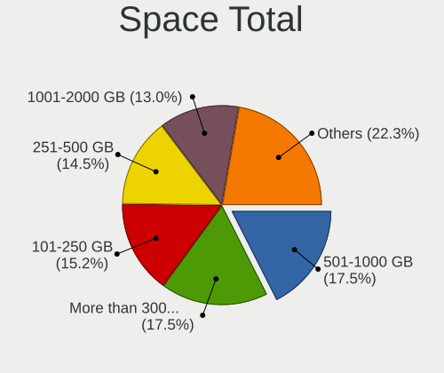

| Size in GB     | Desktops | Percent |
|----------------|----------|---------|
| 501-1000       | 511      | 17.55%  |
| More than 3000 | 509      | 17.48%  |
| 101-250        | 442      | 15.18%  |
| 251-500        | 422      | 14.49%  |
| 1001-2000      | 379      | 13.02%  |
| 1-20           | 188      | 6.46%   |
| 2001-3000      | 183      | 6.28%   |
| 51-100         | 123      | 4.22%   |
| Unknown        | 104      | 3.57%   |
| 21-50          | 51       | 1.75%   |

Space Used
----------

Amount of used disk space

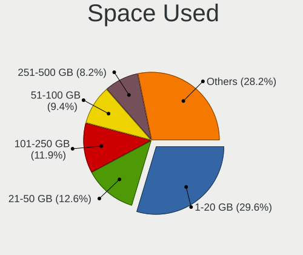

| Used GB        | Desktops | Percent |
|----------------|----------|---------|
| 1-20           | 911      | 29.65%  |
| 21-50          | 386      | 12.56%  |
| 101-250        | 366      | 11.91%  |
| 51-100         | 289      | 9.4%    |
| 251-500        | 253      | 8.23%   |
| 501-1000       | 249      | 8.1%    |
| 1001-2000      | 216      | 7.03%   |
| More than 3000 | 208      | 6.77%   |
| Unknown        | 104      | 3.38%   |
| 2001-3000      | 89       | 2.9%    |
| 0              | 2        | 0.07%   |

Malfunc. Drives
---------------

Drive models with a malfunction

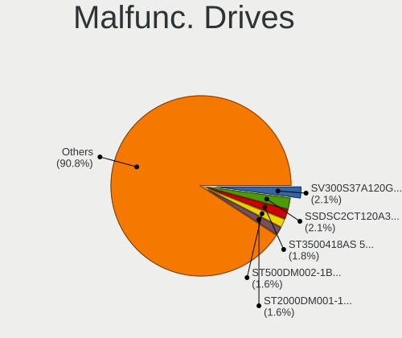

| Model                                                         | Desktops | Drives | Percent |
|---------------------------------------------------------------|----------|--------|---------|
| Kingston SV300S37A120G 120GB SSD                              | 8        | 8      | 2.09%   |
| Intel SSDSC2CT120A3 120GB                                     | 8        | 76     | 2.09%   |
| Seagate ST3500418AS 500GB                                     | 7        | 21     | 1.83%   |
| Seagate ST500DM002-1BD142 500GB                               | 6        | 19     | 1.57%   |
| Seagate ST2000DM001-1CH164 2TB                                | 6        | 8      | 1.57%   |
| Samsung Electronics NVMe SSD Controller SM981/PM981/PM983 1TB | 6        | 6      | 1.57%   |
| Hitachi HDS721010DLE630 1TB                                   | 6        | 8      | 1.57%   |
| WDC WD20EARX-00PASB0 2TB                                      | 5        | 5      | 1.31%   |
| Seagate ST31000528AS 1TB                                      | 5        | 6      | 1.31%   |
| Seagate ST2000DM001-1ER164 2TB                                | 5        | 5      | 1.31%   |
| Samsung Electronics HD501LJ 500GB                             | 5        | 59     | 1.31%   |
| WDC WD40EFRX-68N32N0 4TB                                      | 4        | 17     | 1.05%   |
| WDC WD20EARS-00MVWB0 2TB                                      | 4        | 4      | 1.05%   |
| WDC WD2002FAEX-007BA0 2TB                                     | 4        | 5      | 1.05%   |
| WDC WD10EZEX-08WN4A0 1TB                                      | 4        | 5      | 1.05%   |
| Seagate ST31000524AS 1TB                                      | 4        | 19     | 1.05%   |
| Maxtor 6Y080L0 81GB                                           | 4        | 8      | 1.05%   |
| Kingston SA400S37240G 240GB SSD                               | 4        | 5      | 1.05%   |
| Crucial CT525MX300SSD1 528GB                                  | 4        | 7      | 1.05%   |
| WDC WD20EFRX-68EUZN0 2TB                                      | 3        | 7      | 0.79%   |
| WDC WD2003FZEX-00Z4SA0 2TB                                    | 3        | 3      | 0.79%   |
| WDC WD10EFRX-68FYTN0 1TB                                      | 3        | 3      | 0.79%   |
| WDC WD10EARS-00Y5B1 1TB                                       | 3        | 4      | 0.79%   |
| Toshiba MQ01ABD100 1TB                                        | 3        | 3      | 0.79%   |
| Seagate ST4000DM000-1F2168 4TB                                | 3        | 3      | 0.79%   |
| Seagate ST3500413AS 500GB                                     | 3        | 3      | 0.79%   |
| Seagate ST3320620AS 320GB                                     | 3        | 3      | 0.79%   |
| Seagate ST31000333AS 1TB                                      | 3        | 32     | 0.79%   |
| Seagate ST2000DX002-2DV164 2TB                                | 3        | 3      | 0.79%   |
| Seagate ST2000DL003-9VT166 2TB                                | 3        | 3      | 0.79%   |
| Seagate ST1000DM010-2EP102 1TB                                | 3        | 3      | 0.79%   |
| Seagate ST1000DM003-1ER162 1TB                                | 3        | 8      | 0.79%   |
| Samsung Electronics SSD 870 EVO 500GB                         | 3        | 3      | 0.79%   |
| Realtek Semiconductor RTS5763DL NVMe SSD Controller 512GB     | 3        | 4      | 0.79%   |
| Maxtor 6L200M0 208GB                                          | 3        | 4      | 0.79%   |
| WDC WDS500G1X0E-00AFY0 500GB                                  | 2        | 2      | 0.52%   |
| WDC WD5000AVCS-632DY1 500GB                                   | 2        | 25     | 0.52%   |
| WDC WD40EZRX-00SPEB0 4TB                                      | 2        | 2      | 0.52%   |
| WDC WD30EZRX-00DC0B0 3TB                                      | 2        | 2      | 0.52%   |
| WDC WD20EZRZ-00Z5HB0 2TB                                      | 2        | 2      | 0.52%   |

Malfunc. Drive Vendor
---------------------

Vendors of faulty drives

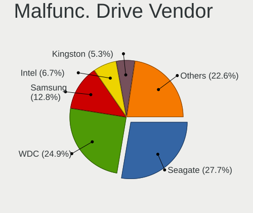

| Vendor                | Desktops | Drives | Percent |
|-----------------------|----------|--------|---------|
| Seagate               | 99       | 193    | 27.65%  |
| WDC                   | 89       | 179    | 24.86%  |
| Samsung Electronics   | 46       | 157    | 12.85%  |
| Intel                 | 24       | 121    | 6.7%    |
| Kingston              | 19       | 22     | 5.31%   |
| Hitachi               | 16       | 22     | 4.47%   |
| Crucial               | 8        | 11     | 2.23%   |
| Toshiba               | 7        | 8      | 1.96%   |
| Maxtor                | 7        | 12     | 1.96%   |
| SanDisk               | 6        | 7      | 1.68%   |
| Corsair               | 5        | 6      | 1.4%    |
| SK hynix              | 3        | 3      | 0.84%   |
| Realtek Semiconductor | 3        | 4      | 0.84%   |
| Micron Technology     | 3        | 4      | 0.84%   |
| HGST                  | 3        | 3      | 0.84%   |
| OCZ                   | 2        | 2      | 0.56%   |
| HPE                   | 2        | 2      | 0.56%   |
| Fujitsu               | 2        | 2      | 0.56%   |
| SPCC M.2              | 1        | 1      | 0.28%   |
| SPCC                  | 1        | 1      | 0.28%   |
| Realtek               | 1        | 1      | 0.28%   |
| Phison Electronics    | 1        | 1      | 0.28%   |
| Patriot               | 1        | 1      | 0.28%   |
| Netac                 | 1        | 1      | 0.28%   |
| MaxDigital            | 1        | 1      | 0.28%   |
| LITEON                | 1        | 1      | 0.28%   |
| Lite-On Technology    | 1        | 1      | 0.28%   |
| Hewlett-Packard       | 1        | 2      | 0.28%   |
| Gigabyte Technology   | 1        | 1      | 0.28%   |
| ASMT                  | 1        | 1      | 0.28%   |
| Apple                 | 1        | 1      | 0.28%   |
| Apacer                | 1        | 1      | 0.28%   |

Malfunc. HDD Vendor
-------------------

Vendors of faulty HDD drives

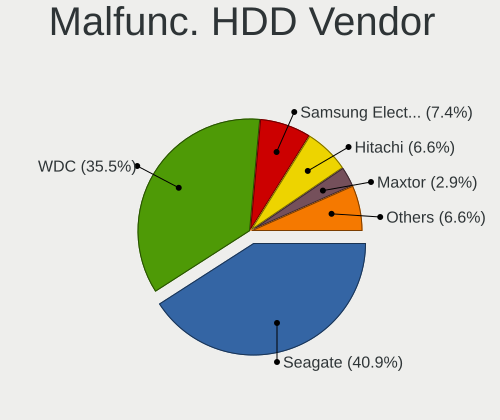

| Vendor              | Desktops | Drives | Percent |
|---------------------|----------|--------|---------|
| Seagate             | 99       | 193    | 40.91%  |
| WDC                 | 86       | 172    | 35.54%  |
| Samsung Electronics | 18       | 126    | 7.44%   |
| Hitachi             | 16       | 22     | 6.61%   |
| Maxtor              | 7        | 12     | 2.89%   |
| Toshiba             | 6        | 7      | 2.48%   |
| HGST                | 3        | 3      | 1.24%   |
| HPE                 | 2        | 2      | 0.83%   |
| MaxDigital          | 1        | 1      | 0.41%   |
| Hewlett-Packard     | 1        | 2      | 0.41%   |
| Fujitsu             | 1        | 1      | 0.41%   |
| ASMT                | 1        | 1      | 0.41%   |
| Apple               | 1        | 1      | 0.41%   |

Malfunc. Drive Kind
-------------------

Kinds of faulty drives

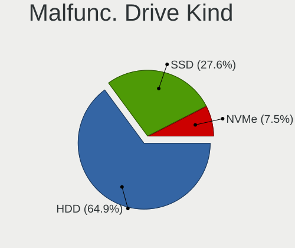

| Kind | Desktops | Drives | Percent |
|------|----------|--------|---------|
| HDD  | 207      | 543    | 64.89%  |
| SSD  | 88       | 199    | 27.59%  |
| NVMe | 24       | 31     | 7.52%   |

Failed Drives
-------------

Failed drive models

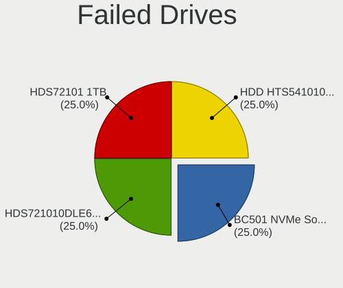

| Model                                       | Desktops | Drives | Percent |
|---------------------------------------------|----------|--------|---------|
| SK hynix BC501 NVMe Solid State Drive 512GB | 1        | 1      | 25%     |
| Hitachi HDS721010DLE630 1TB                 | 1        | 12     | 25%     |
| Hitachi HDS72101 1TB                        | 1        | 1      | 25%     |
| Apple HDD HTS541010A9E662 1TB               | 1        | 1      | 25%     |

Failed Drive Vendor
-------------------

Failed drive vendors

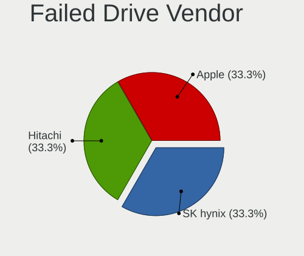

| Vendor   | Desktops | Drives | Percent |
|----------|----------|--------|---------|
| SK hynix | 1        | 1      | 33.33%  |
| Hitachi  | 1        | 13     | 33.33%  |
| Apple    | 1        | 1      | 33.33%  |

Drive Status
------------

Number of failed and malfunc. drives

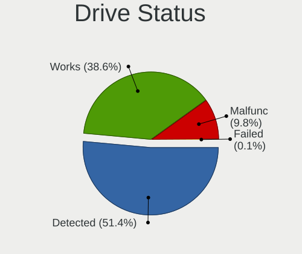

| Status   | Desktops | Drives | Percent |
|----------|----------|--------|---------|
| Detected | 1547     | 5000   | 51.45%  |
| Works    | 1162     | 4246   | 38.64%  |
| Malfunc  | 295      | 773    | 9.81%   |
| Failed   | 3        | 15     | 0.1%    |

Storage controller
------------------

Storage Vendor
--------------

Storage controller vendors

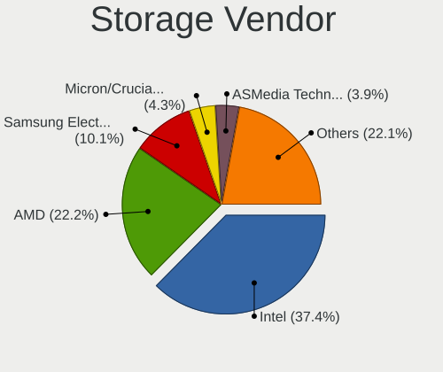

| Vendor                           | Desktops | Percent |
|----------------------------------|----------|---------|
| Intel                            | 1638     | 37.41%  |
| AMD                              | 973      | 22.22%  |
| Samsung Electronics              | 442      | 10.09%  |
| Micron/Crucial Technology        | 188      | 4.29%   |
| ASMedia Technology               | 169      | 3.86%   |
| Kingston Technology Company      | 151      | 3.45%   |
| Marvell Technology Group         | 129      | 2.95%   |
| SanDisk                          | 117      | 2.67%   |
| Phison Electronics               | 106      | 2.42%   |
| JMicron Technology               | 98       | 2.24%   |
| MAXIO Technology (Hangzhou)      | 46       | 1.05%   |
| Micron Technology                | 39       | 0.89%   |
| Realtek Semiconductor            | 35       | 0.8%    |
| Silicon Motion                   | 31       | 0.71%   |
| SK hynix                         | 30       | 0.69%   |
| ADATA Technology                 | 27       | 0.62%   |
| Nvidia                           | 16       | 0.37%   |
| Toshiba America Info Systems     | 15       | 0.34%   |
| Shenzhen Longsys Electronics     | 14       | 0.32%   |
| Seagate Technology               | 14       | 0.32%   |
| VIA Technologies                 | 13       | 0.3%    |
| LSI Logic / Symbios Logic        | 13       | 0.3%    |
| Integrated Technology Express    | 12       | 0.27%   |
| Broadcom / LSI                   | 9        | 0.21%   |
| Adaptec                          | 8        | 0.18%   |
| Silicon Image                    | 7        | 0.16%   |
| Lite-On Technology               | 5        | 0.11%   |
| KIOXIA                           | 4        | 0.09%   |
| INNOGRIT                         | 4        | 0.09%   |
| Hewlett-Packard                  | 4        | 0.09%   |
| Hosin Global Electronics         | 3        | 0.07%   |
| Biwin Storage Technology         | 3        | 0.07%   |
| Apple                            | 3        | 0.07%   |
| 3ware                            | 3        | 0.07%   |
| ULi Electronics                  | 2        | 0.05%   |
| Solid State Storage Technology   | 1        | 0.02%   |
| Silicon Integrated Systems [SiS] | 1        | 0.02%   |
| Promise Technology               | 1        | 0.02%   |
| Netac Technology                 | 1        | 0.02%   |
| Lite-On IT Corp. / Plextor       | 1        | 0.02%   |

Storage Model
-------------

Storage controller models

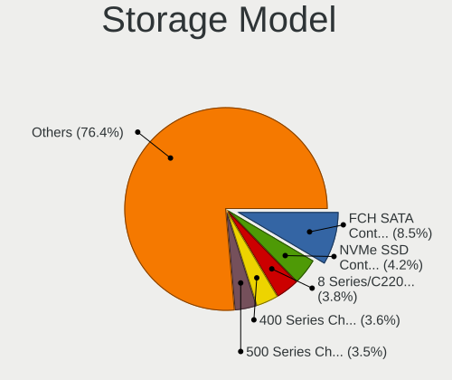

| Model                                                                                   | Desktops | Percent |
|-----------------------------------------------------------------------------------------|----------|---------|
| AMD FCH SATA Controller [AHCI mode]                                                     | 445      | 8.49%   |
| Samsung NVMe SSD Controller SM981/PM981/PM983                                           | 221      | 4.22%   |
| Intel 8 Series/C220 Series Chipset Family 6-port SATA Controller 1 [AHCI mode]          | 198      | 3.78%   |
| AMD 400 Series Chipset SATA Controller                                                  | 190      | 3.63%   |
| AMD 500 Series Chipset SATA Controller                                                  | 184      | 3.51%   |
| AMD 600 Series Chipset SATA Controller                                                  | 167      | 3.19%   |
| ASMedia ASM1061/ASM1062 Serial ATA Controller                                           | 147      | 2.81%   |
| Intel Q170/Q150/B150/H170/H110/Z170/CM236 Chipset SATA Controller [AHCI Mode]           | 141      | 2.69%   |
| Intel 200 Series PCH SATA controller [AHCI mode]                                        | 140      | 2.67%   |
| Intel SATA Controller [RAID mode]                                                       | 138      | 2.63%   |
| Intel Cannon Lake PCH SATA AHCI Controller                                              | 117      | 2.23%   |
| Intel 7 Series/C210 Series Chipset Family 6-port SATA Controller [AHCI mode]            | 102      | 1.95%   |
| Intel 6 Series/C200 Series Chipset Family 6 port Desktop SATA AHCI Controller           | 85       | 1.62%   |
| Samsung NVMe SSD Controller PM9A1/PM9A3/980PRO                                          | 81       | 1.55%   |
| Micron/Crucial P2 [Nick P2] / P3 / P3 Plus NVMe PCIe SSD (DRAM-less)                    | 78       | 1.49%   |
| AMD SB7x0/SB8x0/SB9x0 IDE Controller                                                    | 78       | 1.49%   |
| JMicron JMB363 SATA/IDE Controller                                                      | 73       | 1.39%   |
| AMD SB7x0/SB8x0/SB9x0 SATA Controller [AHCI mode]                                       | 72       | 1.37%   |
| Intel Alder Lake-S PCH SATA Controller [AHCI Mode]                                      | 64       | 1.22%   |
| Samsung NVMe SSD Controller SM961/PM961/SM963                                           | 62       | 1.18%   |
| Samsung NVMe SSD Controller 980 (DRAM-less)                                             | 50       | 0.95%   |
| Intel 6 Series/C200 Series Chipset Family Desktop SATA Controller (IDE mode, ports 4-5) | 48       | 0.92%   |
| Intel Raptor Lake SATA AHCI Controller                                                  | 47       | 0.9%    |
| Intel 6 Series/C200 Series Chipset Family Desktop SATA Controller (IDE mode, ports 0-3) | 47       | 0.9%    |
| AMD SB7x0/SB8x0/SB9x0 SATA Controller [IDE mode]                                        | 45       | 0.86%   |
| Phison E16 PCIe4 NVMe Controller                                                        | 42       | 0.8%    |
| Intel NM10/ICH7 Family SATA Controller [IDE mode]                                       | 42       | 0.8%    |
| Intel 500 Series Chipset Family SATA AHCI Controller                                    | 41       | 0.78%   |
| Samsung NVMe SSD Controller S4LV008[Pascal]                                             | 39       | 0.74%   |
| Marvell Group 88SE9172 SATA 6Gb/s Controller                                            | 34       | 0.65%   |
| Kingston Company KC3000/FURY Renegade NVMe SSD [E18]                                    | 33       | 0.63%   |
| Intel 9 Series Chipset Family SATA Controller [AHCI Mode]                               | 33       | 0.63%   |
| Intel 82801JI (ICH10 Family) 4 port SATA IDE Controller #1                              | 33       | 0.63%   |
| AMD 300 Series Chipset SATA Controller                                                  | 33       | 0.63%   |
| Intel 82801JI (ICH10 Family) SATA AHCI Controller                                       | 32       | 0.61%   |
| Intel 82801JI (ICH10 Family) 2 port SATA IDE Controller #2                              | 32       | 0.61%   |
| Intel Volume Management Device NVMe RAID Controller                                     | 31       | 0.59%   |
| Micron/Crucial P1 NVMe PCIe SSD[Frampton2]                                              | 29       | 0.55%   |
| Intel C610/X99 series chipset 6-Port SATA Controller [AHCI mode]                        | 28       | 0.53%   |
| Intel 82801G (ICH7 Family) IDE Controller                                               | 28       | 0.53%   |

Storage Kind
------------

Kind of storage controller (IDE, SATA, NVMe, SAS, ...)

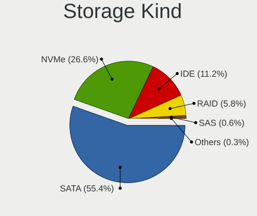

| Kind | Desktops | Percent |
|------|----------|---------|
| SATA | 2240     | 55.4%   |
| NVMe | 1077     | 26.64%  |
| IDE  | 454      | 11.23%  |
| RAID | 235      | 5.81%   |
| SAS  | 26       | 0.64%   |
| SCSI | 11       | 0.27%   |

Processor
---------

CPU Vendor
----------

Processor vendors

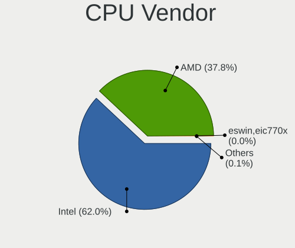

| Vendor        | Desktops | Percent |
|---------------|----------|---------|
| Intel         | 1641     | 61.97%  |
| AMD           | 1002     | 37.84%  |
| sifive,u74-mc | 1        | 0.04%   |
| eswin,eic770x | 1        | 0.04%   |
| CentaurHauls  | 1        | 0.04%   |
| ARM           | 1        | 0.04%   |
| Unknown       | 1        | 0.04%   |

CPU Model
---------

Processor models

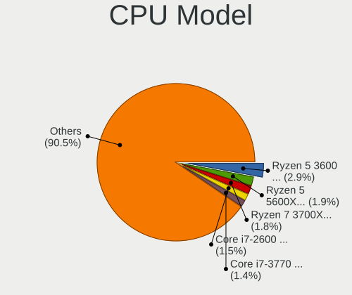

| Model                                  | Desktops | Percent |
|----------------------------------------|----------|---------|
| AMD Ryzen 5 3600 6-Core Processor      | 78       | 2.93%   |
| AMD Ryzen 5 5600X 6-Core Processor     | 51       | 1.91%   |
| AMD Ryzen 7 3700X 8-Core Processor     | 47       | 1.76%   |
| Intel Core i7-2600 CPU @ 3.40GHz       | 39       | 1.46%   |
| Intel Core i7-3770 CPU @ 3.40GHz       | 38       | 1.43%   |
| AMD Ryzen 9 5950X 16-Core Processor    | 37       | 1.39%   |
| Intel Core i5-4460 CPU @ 3.20GHz       | 36       | 1.35%   |
| AMD Ryzen 9 3900X 12-Core Processor    | 35       | 1.31%   |
| Intel Core i7-4790 CPU @ 3.60GHz       | 33       | 1.24%   |
| Intel Core i5-3470 CPU @ 3.20GHz       | 33       | 1.24%   |
| Intel Core 2 Duo CPU E8400 @ 3.00GHz   | 33       | 1.24%   |
| AMD Ryzen 5 2600 Six-Core Processor    | 33       | 1.24%   |
| Intel Core i5-7400 CPU @ 3.00GHz       | 32       | 1.2%    |
| Intel Core i5-9400 CPU @ 2.90GHz       | 30       | 1.13%   |
| AMD Ryzen 7 7800X3D 8-Core Processor   | 30       | 1.13%   |
| Intel Core i7-4770 CPU @ 3.40GHz       | 28       | 1.05%   |
| AMD Ryzen 9 5900X 12-Core Processor    | 28       | 1.05%   |
| AMD Ryzen 7 5800X 8-Core Processor     | 27       | 1.01%   |
| Intel Core i7-6700 CPU @ 3.40GHz       | 26       | 0.98%   |
| AMD Ryzen 7 5700G with Radeon Graphics | 24       | 0.9%    |
| AMD Ryzen 5 5600G with Radeon Graphics | 24       | 0.9%    |
| Intel Core i7-8700 CPU @ 3.20GHz       | 23       | 0.86%   |
| Intel Core i7-7700 CPU @ 3.60GHz       | 22       | 0.83%   |
| Intel Core i7-3770K CPU @ 3.50GHz      | 21       | 0.79%   |
| Intel Core i5-4590 CPU @ 3.30GHz       | 21       | 0.79%   |
| AMD Ryzen 7 5700X 8-Core Processor     | 21       | 0.79%   |
| Intel Core i5-6500 CPU @ 3.20GHz       | 20       | 0.75%   |
| AMD Ryzen 7 9800X3D 8-Core Processor   | 20       | 0.75%   |
| Intel Core i7-6700K CPU @ 4.00GHz      | 18       | 0.68%   |
| Intel Core i5-2400 CPU @ 3.10GHz       | 18       | 0.68%   |
| AMD FX-6300 Six-Core Processor         | 17       | 0.64%   |
| Intel Core i5-9400F CPU @ 2.90GHz      | 16       | 0.6%    |
| Intel Core i5-4570 CPU @ 3.20GHz       | 16       | 0.6%    |
| AMD Ryzen 5 3600X 6-Core Processor     | 16       | 0.6%    |
| AMD Ryzen 5 1600 Six-Core Processor    | 16       | 0.6%    |
| Intel Core i7-4790K CPU @ 4.00GHz      | 15       | 0.56%   |
| Intel Core i7-4770K CPU @ 3.50GHz      | 15       | 0.56%   |
| Intel Core i7-9700K CPU @ 3.60GHz      | 14       | 0.53%   |
| Intel Core i5-2500 CPU @ 3.30GHz       | 14       | 0.53%   |
| AMD Ryzen 5 7600X 6-Core Processor     | 14       | 0.53%   |

CPU Model Family
----------------

Processor model prefix

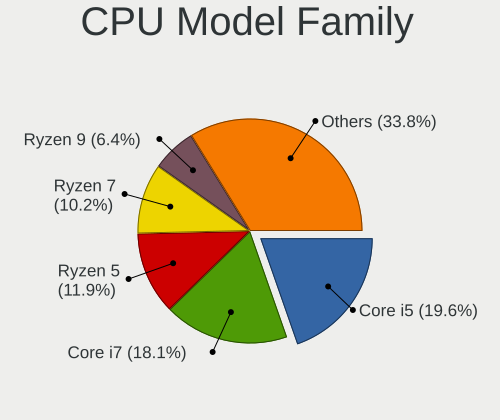

| Model                   | Desktops | Percent |
|-------------------------|----------|---------|
| Intel Core i5           | 522      | 19.65%  |
| Intel Core i7           | 480      | 18.07%  |
| AMD Ryzen 5             | 317      | 11.93%  |
| AMD Ryzen 7             | 270      | 10.16%  |
| AMD Ryzen 9             | 170      | 6.4%    |
| Other                   | 143      | 5.38%   |
| Intel Xeon              | 117      | 4.4%    |
| Intel Core i3           | 92       | 3.46%   |
| Intel Core 2 Duo        | 75       | 2.82%   |
| AMD FX                  | 59       | 2.22%   |
| Intel Celeron           | 43       | 1.62%   |
| Intel Core i9           | 34       | 1.28%   |
| AMD Ryzen 3             | 30       | 1.13%   |
| Intel Core 2 Quad       | 28       | 1.05%   |
| Intel Pentium           | 25       | 0.94%   |
| AMD A8                  | 22       | 0.83%   |
| AMD Phenom II X4        | 21       | 0.79%   |
| Intel Core 2            | 18       | 0.68%   |
| Intel Pentium Dual-Core | 16       | 0.6%    |
| AMD Ryzen Threadripper  | 16       | 0.6%    |
| Intel Core              | 11       | 0.41%   |
| Intel Atom              | 11       | 0.41%   |
| AMD Phenom II X6        | 11       | 0.41%   |
| AMD A10                 | 11       | 0.41%   |
| Intel Pentium D         | 9        | 0.34%   |
| AMD Athlon II X2        | 9        | 0.34%   |
| AMD A4                  | 9        | 0.34%   |
| AMD Athlon              | 8        | 0.3%    |
| AMD A6                  | 8        | 0.3%    |
| AMD Athlon 64 X2        | 7        | 0.26%   |
| AMD Phenom II X2        | 6        | 0.23%   |
| AMD Athlon II X4        | 6        | 0.23%   |
| Intel Pentium 4         | 5        | 0.19%   |
| AMD E2                  | 5        | 0.19%   |
| Intel Pentium Dual      | 4        | 0.15%   |
| Intel Genuine           | 4        | 0.15%   |
| AMD Sempron             | 4        | 0.15%   |
| AMD GX                  | 4        | 0.15%   |
| Intel Pentium Silver    | 3        | 0.11%   |
| Intel Pentium Gold      | 3        | 0.11%   |

CPU Cores
---------

Number of processor cores

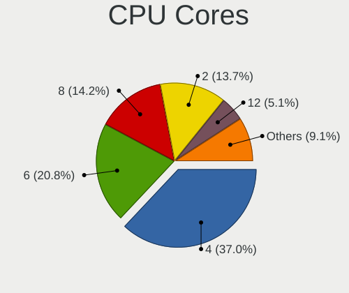

| Number  | Desktops | Percent |
|---------|----------|---------|
| 4       | 985      | 37%     |
| 6       | 554      | 20.81%  |
| 8       | 379      | 14.24%  |
| 2       | 366      | 13.75%  |
| 12      | 135      | 5.07%   |
| 16      | 101      | 3.79%   |
| 1       | 29       | 1.09%   |
| 24      | 26       | 0.98%   |
| 10      | 25       | 0.94%   |
| 3       | 20       | 0.75%   |
| 20      | 13       | 0.49%   |
| 14      | 13       | 0.49%   |
| 32      | 5        | 0.19%   |
| 18      | 5        | 0.19%   |
| Unknown | 3        | 0.11%   |
| 44      | 1        | 0.04%   |
| 36      | 1        | 0.04%   |
| 28      | 1        | 0.04%   |

CPU Sockets
-----------

Number of sockets

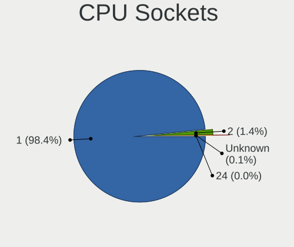

| Number  | Desktops | Percent |
|---------|----------|---------|
| 1       | 2606     | 98.38%  |
| 2       | 37       | 1.4%    |
| Unknown | 3        | 0.11%   |
| 20      | 2        | 0.08%   |
| 24      | 1        | 0.04%   |

CPU Threads
-----------

Threads per core (Hyper-Threading)

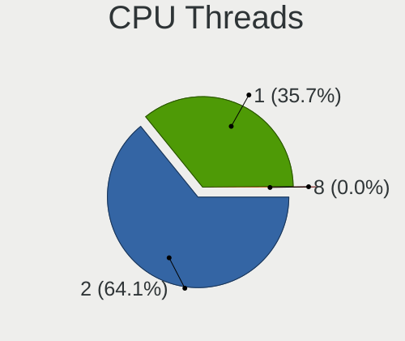

| Number  | Desktops | Percent |
|---------|----------|---------|
| 2       | 1705     | 64.15%  |
| 1       | 949      | 35.7%   |
| Unknown | 3        | 0.11%   |
| 8       | 1        | 0.04%   |

CPU Op-Modes
------------

CPU Operation Modes (32-bit, 64-bit)

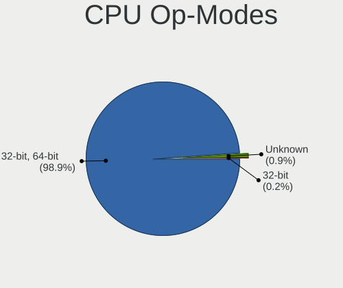

| Op mode        | Desktops | Percent |
|----------------|----------|---------|
| 32-bit, 64-bit | 2621     | 98.87%  |
| Unknown        | 25       | 0.94%   |
| 32-bit         | 5        | 0.19%   |

CPU Microcode
-------------

Microcode number

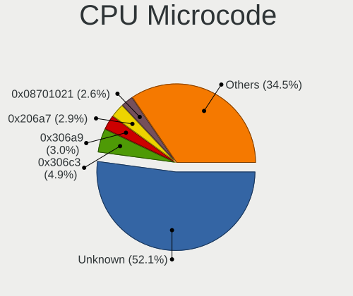

| Number     | Desktops | Percent |
|------------|----------|---------|
| Unknown    | 1450     | 52.12%  |
| 0x306c3    | 137      | 4.92%   |
| 0x306a9    | 84       | 3.02%   |
| 0x206a7    | 81       | 2.91%   |
| 0x08701021 | 71       | 2.55%   |
| 0x906e9    | 65       | 2.34%   |
| 0x506e3    | 59       | 2.12%   |
| 0x1067a    | 54       | 1.94%   |
| 0x906ea    | 49       | 1.76%   |
| 0x08701013 | 37       | 1.33%   |
| 0x0800820d | 37       | 1.33%   |
| 0x06000852 | 24       | 0.86%   |
| 0x0a201016 | 23       | 0.83%   |
| 0x906ed    | 21       | 0.75%   |
| 0x106e5    | 21       | 0.75%   |
| 0x010000c8 | 19       | 0.68%   |
| 0x106a5    | 18       | 0.65%   |
| 0x6fb      | 17       | 0.61%   |
| 0x08001138 | 17       | 0.61%   |
| 0x906ec    | 16       | 0.58%   |
| 0x0a201009 | 16       | 0.58%   |
| 0x10676    | 15       | 0.54%   |
| 0xa0653    | 14       | 0.5%    |
| 0x206c2    | 14       | 0.5%    |
| 0x0a601203 | 14       | 0.5%    |
| 0x306f2    | 13       | 0.47%   |
| 0x08108109 | 13       | 0.47%   |
| 0x06001119 | 13       | 0.47%   |
| 0x90672    | 12       | 0.43%   |
| 0x0600063e | 12       | 0.43%   |
| 0x08001137 | 11       | 0.4%    |
| 0x06003106 | 11       | 0.4%    |
| 0xa0655    | 10       | 0.36%   |
| 0x6fd      | 10       | 0.36%   |
| 0x206d7    | 10       | 0.36%   |
| 0x0a50000c | 10       | 0.36%   |
| 0xa0671    | 9        | 0.32%   |
| 0x6f6      | 9        | 0.32%   |
| 0x30678    | 9        | 0.32%   |
| 0x010000db | 9        | 0.32%   |

CPU Microarch
-------------

Microarchitecture

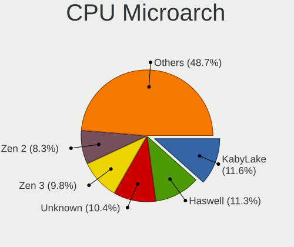

| Name              | Desktops | Percent |
|-------------------|----------|---------|
| KabyLake          | 309      | 11.59%  |
| Haswell           | 301      | 11.29%  |
| Unknown           | 277      | 10.39%  |
| Zen 3             | 261      | 9.79%   |
| Zen 2             | 220      | 8.25%   |
| IvyBridge         | 172      | 6.45%   |
| SandyBridge       | 152      | 5.7%    |
| Skylake           | 134      | 5.03%   |
| Penryn            | 95       | 3.56%   |
| Zen+              | 86       | 3.23%   |
| Zen               | 69       | 2.59%   |
| Piledriver        | 66       | 2.48%   |
| Nehalem           | 62       | 2.33%   |
| K10               | 60       | 2.25%   |
| Alderlake Hybrid  | 60       | 2.25%   |
| Core              | 59       | 2.21%   |
| CometLake         | 59       | 2.21%   |
| Westmere          | 45       | 1.69%   |
| Silvermont        | 21       | 0.79%   |
| Broadwell         | 20       | 0.75%   |
| Steamroller       | 18       | 0.68%   |
| NetBurst          | 15       | 0.56%   |
| K8 Hammer         | 15       | 0.56%   |
| Bulldozer         | 15       | 0.56%   |
| Icelake           | 13       | 0.49%   |
| Goldmont plus     | 9        | 0.34%   |
| Bonnell           | 8        | 0.3%    |
| Excavator         | 7        | 0.26%   |
| K10 Llano         | 6        | 0.23%   |
| Goldmont          | 6        | 0.23%   |
| Lunarlake Hybrid  | 5        | 0.19%   |
| Bobcat            | 5        | 0.19%   |
| Gracemont         | 4        | 0.15%   |
| Tremont           | 3        | 0.11%   |
| Puma              | 3        | 0.11%   |
| Jaguar            | 2        | 0.08%   |
| TigerLake         | 1        | 0.04%   |
| Sapphire Rapids   | 1        | 0.04%   |
| P6                | 1        | 0.04%   |
| Meteorlake Hybrid | 1        | 0.04%   |

Graphics
--------

GPU Vendor
----------

Vendors of graphics cards

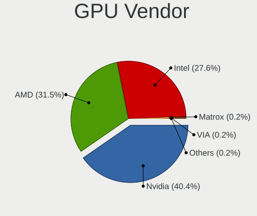

| Vendor                           | Desktops | Percent |
|----------------------------------|----------|---------|
| Nvidia                           | 1190     | 40.37%  |
| AMD                              | 928      | 31.48%  |
| Intel                            | 813      | 27.58%  |
| Matrox Electronics Systems       | 6        | 0.2%    |
| VIA Technologies                 | 5        | 0.17%   |
| Red Hat                          | 2        | 0.07%   |
| ASPEED Technology                | 2        | 0.07%   |
| Silicon Integrated Systems [SiS] | 1        | 0.03%   |
| Racore Computer Products         | 1        | 0.03%   |

GPU Model
---------

Graphics card models

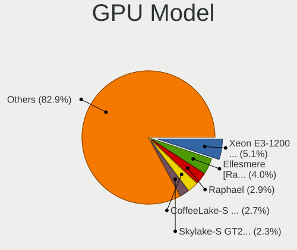

| Model                                                                       | Desktops | Percent |
|-----------------------------------------------------------------------------|----------|---------|
| Intel Xeon E3-1200 v3/4th Gen Core Processor Integrated Graphics Controller | 159      | 5.11%   |
| AMD Ellesmere [Radeon RX 470/480/570/570X/580/580X/590]                     | 124      | 3.99%   |
| AMD Raphael                                                                 | 90       | 2.89%   |
| Intel CoffeeLake-S GT2 [UHD Graphics 630]                                   | 85       | 2.73%   |
| Intel Skylake-S GT2 [HD Graphics 530]                                       | 73       | 2.35%   |
| Nvidia GK208B [GeForce GT 710]                                              | 72       | 2.32%   |
| Intel 2nd Generation Core Processor Family Integrated Graphics Controller   | 63       | 2.03%   |
| Intel Kaby Lake-S GT2 [HD Graphics 630]                                     | 60       | 1.93%   |
| AMD Navi 23 [Radeon RX 6600/6600 XT/6600M]                                  | 60       | 1.93%   |
| Nvidia GP107 [GeForce GTX 1050 Ti]                                          | 46       | 1.48%   |
| AMD Navi 10 [Radeon RX 5600 OEM/5600 XT / 5700/5700 XT]                     | 46       | 1.48%   |
| Nvidia GP108 [GeForce GT 1030]                                              | 42       | 1.35%   |
| Intel Xeon E3-1200 v2/3rd Gen Core processor Graphics Controller            | 42       | 1.35%   |
| AMD Cezanne [Radeon Vega Series / Radeon Vega Mobile Series]                | 42       | 1.35%   |
| AMD Granite Ridge [Radeon Graphics]                                         | 41       | 1.32%   |
| AMD Navi 31 [Radeon RX 7900 XT/7900 XTX/7900 GRE/7900M]                     | 40       | 1.29%   |
| Nvidia GP104 [GeForce GTX 1070]                                             | 37       | 1.19%   |
| AMD Navi 22 [Radeon RX 6700/6700 XT/6750 XT / 6800M/6850M XT]               | 35       | 1.13%   |
| AMD Navi 21 [Radeon RX 6800/6800 XT / 6900 XT]                              | 35       | 1.13%   |
| Nvidia GP102 [GeForce GTX 1080 Ti]                                          | 29       | 0.93%   |
| Intel IvyBridge GT2 [HD Graphics 4000]                                      | 29       | 0.93%   |
| Intel 4 Series Chipset Integrated Graphics Controller                       | 29       | 0.93%   |
| Nvidia GP106 [GeForce GTX 1060 6GB]                                         | 28       | 0.9%    |
| Nvidia GP104 [GeForce GTX 1080]                                             | 28       | 0.9%    |
| Intel Alder Lake-S GT1 [UHD Graphics 770]                                   | 28       | 0.9%    |
| Nvidia GA106 [GeForce RTX 3060 Lite Hash Rate]                              | 27       | 0.87%   |
| Nvidia GM107 [GeForce GTX 750 Ti]                                           | 26       | 0.84%   |
| AMD Navi 48 [Radeon RX 9070/9070 XT/9070 GRE]                               | 25       | 0.8%    |
| AMD Navi 32 [Radeon RX 7700 XT / 7800 XT]                                   | 25       | 0.8%    |
| Nvidia TU106 [GeForce RTX 2060 Rev. A]                                      | 23       | 0.74%   |
| Nvidia GM206 [GeForce GTX 960]                                              | 23       | 0.74%   |
| Nvidia GK208B [GeForce GT 730]                                              | 23       | 0.74%   |
| Nvidia GA102 [GeForce RTX 3090]                                             | 22       | 0.71%   |
| Nvidia TU116 [GeForce GTX 1660 SUPER]                                       | 21       | 0.68%   |
| Intel Raptor Lake-S GT1 [UHD Graphics 770]                                  | 21       | 0.68%   |
| Nvidia TU104 [GeForce RTX 2070 SUPER]                                       | 20       | 0.64%   |
| Nvidia GF119 [GeForce GT 610]                                               | 20       | 0.64%   |
| Intel CometLake-S GT2 [UHD Graphics 630]                                    | 20       | 0.64%   |
| Nvidia GM204 [GeForce GTX 970]                                              | 19       | 0.61%   |
| Nvidia TU116 [GeForce GTX 1660 Ti]                                          | 18       | 0.58%   |

GPU Combo
---------

Combinations of graphics cards

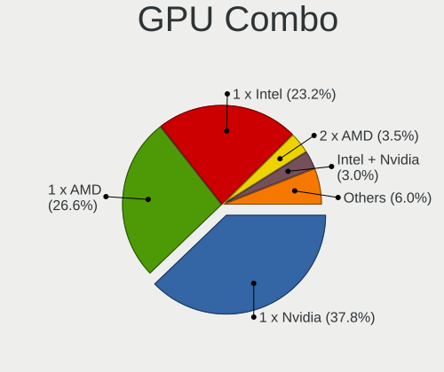

| Name                                      | Desktops | Percent |
|-------------------------------------------|----------|---------|
| 1 x Nvidia                                | 1029     | 37.82%  |
| 1 x AMD                                   | 724      | 26.61%  |
| 1 x Intel                                 | 630      | 23.15%  |
| 2 x AMD                                   | 95       | 3.49%   |
| Intel + Nvidia                            | 81       | 2.98%   |
| AMD + Nvidia                              | 75       | 2.76%   |
| Intel + AMD                               | 35       | 1.29%   |
| 2 x Nvidia                                | 15       | 0.55%   |
| Other                                     | 8        | 0.29%   |
| 2 x Intel                                 | 7        | 0.26%   |
| 1 x Matrox                                | 6        | 0.22%   |
| 1 x VIA                                   | 5        | 0.18%   |
| 3 x AMD                                   | 2        | 0.07%   |
| 1 x Red Hat                               | 2        | 0.07%   |
| 3 x Nvidia + 1 x Racore Computer Products | 1        | 0.04%   |
| 1 x SiS                                   | 1        | 0.04%   |
| Nvidia + ASPEED                           | 1        | 0.04%   |
| Intel + 2 x AMD                           | 1        | 0.04%   |
| Intel + AMD + 1 x Nvidia                  | 1        | 0.04%   |
| 1 x ASPEED                                | 1        | 0.04%   |
| 1 x AMD + 3 x Nvidia                      | 1        | 0.04%   |

GPU Driver
----------

Free vs proprietary

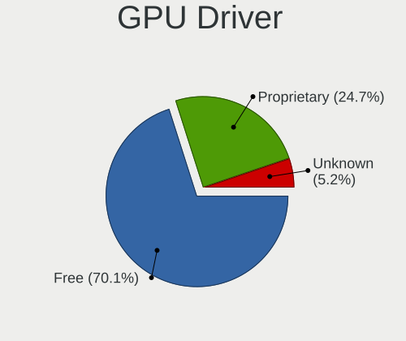

| Driver      | Desktops | Percent |
|-------------|----------|---------|
| Free        | 1919     | 70.09%  |
| Proprietary | 677      | 24.73%  |
| Unknown     | 142      | 5.19%   |

GPU Memory
----------

Total video memory

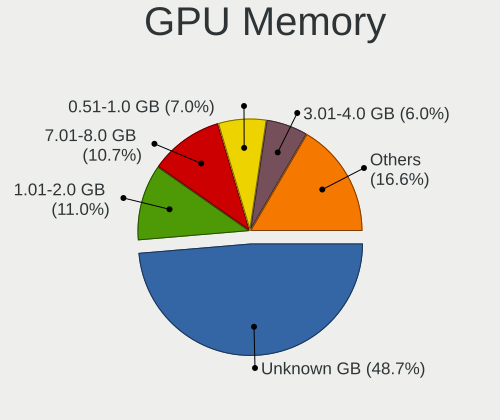

| Size in GB | Desktops | Percent |
|------------|----------|---------|
| Unknown    | 1353     | 48.67%  |
| 1.01-2.0   | 307      | 11.04%  |
| 7.01-8.0   | 297      | 10.68%  |
| 0.51-1.0   | 194      | 6.98%   |
| 3.01-4.0   | 168      | 6.04%   |
| 0.01-0.5   | 160      | 5.76%   |
| 8.01-16.0  | 150      | 5.4%    |
| 5.01-6.0   | 84       | 3.02%   |
| 16.01-24.0 | 38       | 1.37%   |
| 2.01-3.0   | 26       | 0.94%   |
| 4.01-5.0   | 2        | 0.07%   |
| 32.01-64.0 | 1        | 0.04%   |

Monitor
-------

Monitor Vendor
--------------

Monitor vendors

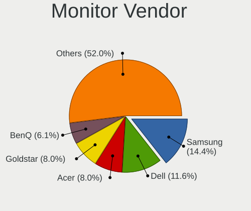

| Vendor                  | Desktops | Percent |
|-------------------------|----------|---------|
| Samsung Electronics     | 434      | 14.39%  |
| Dell                    | 350      | 11.6%   |
| Acer                    | 241      | 7.99%   |
| Goldstar                | 240      | 7.95%   |
| BenQ                    | 184      | 6.1%    |
| Hewlett-Packard         | 180      | 5.97%   |
| Philips                 | 175      | 5.8%    |
| AOC                     | 166      | 5.5%    |
| Ancor Communications    | 145      | 4.81%   |
| ViewSonic               | 98       | 3.25%   |
| Lenovo                  | 81       | 2.68%   |
| ASUSTek Computer        | 78       | 2.59%   |
| Unknown                 | 60       | 1.99%   |
| MSI                     | 57       | 1.89%   |
| Gigabyte Technology     | 49       | 1.62%   |
| Sony                    | 41       | 1.36%   |
| Kogan                   | 40       | 1.33%   |
| LG Electronics          | 31       | 1.03%   |
| ___                     | 30       | 0.99%   |
| Panasonic               | 21       | 0.7%    |
| Hitachi                 | 20       | 0.66%   |
| Unknown (XXX)           | 17       | 0.56%   |
| GKK                     | 16       | 0.53%   |
| TCL                     | 14       | 0.46%   |
| MiTAC                   | 13       | 0.43%   |
| MStar                   | 12       | 0.4%    |
| Unknown                 | 12       | 0.4%    |
| Toshiba                 | 11       | 0.36%   |
| SAC                     | 9        | 0.3%    |
| Eizo                    | 8        | 0.27%   |
| Mi                      | 7        | 0.23%   |
| PRI                     | 6        | 0.2%    |
| CVT                     | 6        | 0.2%    |
| CHO                     | 6        | 0.2%    |
| JXC                     | 5        | 0.17%   |
| Denver                  | 5        | 0.17%   |
| Chi Mei Optoelectronics | 5        | 0.17%   |
| Apple                   | 5        | 0.17%   |
| SKG                     | 4        | 0.13%   |
| ODH                     | 4        | 0.13%   |

Monitor Model
-------------

Monitor models

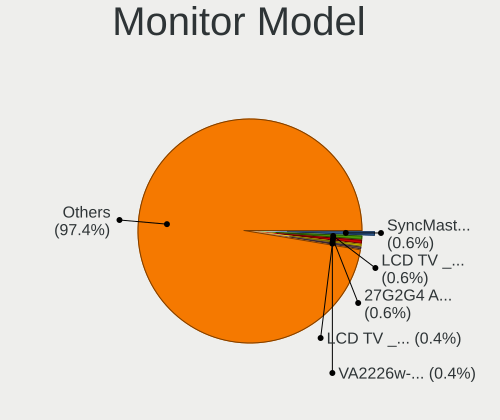

| Model                                                                 | Desktops | Percent |
|-----------------------------------------------------------------------|----------|---------|
| Samsung Electronics SyncMaster SAM01D3 1440x900 410x260mm 19.1-inch   | 21       | 0.64%   |
| ___ LCD TV ___0101 1360x768                                           | 20       | 0.61%   |
| AOC 27G2G4 AOC2702 1920x1080 598x336mm 27.0-inch                      | 19       | 0.58%   |
| ___ LCD TV ___9000 1360x768                                           | 13       | 0.4%    |
| ViewSonic VA2226w-3 VSC2051 1680x1050 490x290mm 22.4-inch             | 13       | 0.4%    |
| Dell U2412M DELA07A 1920x1200 518x324mm 24.1-inch                     | 13       | 0.4%    |
| BenQ GL2460 BNQ78CE 1920x1080 531x299mm 24.0-inch                     | 13       | 0.4%    |
| BenQ G2420HD BNQ7840 1920x1080 531x299mm 24.0-inch                    | 13       | 0.4%    |
| Goldstar LG ULTRAWIDE GSM59F1 2560x1080 670x280mm 28.6-inch           | 12       | 0.37%   |
| Goldstar HDR WFHD GSM7714 2560x1080 798x334mm 34.1-inch               | 12       | 0.37%   |
| Dell S2721DGF DEL41D9 2560x1440 597x336mm 27.0-inch                   | 12       | 0.37%   |
| AOC 32G2WG3 AOC3202 1920x1080 698x393mm 31.5-inch                     | 12       | 0.37%   |
| Unknown                                                               | 12       | 0.37%   |
| Unknown (XXX) Beyond TV XXX2851 3840x2160 1209x680mm 54.6-inch        | 11       | 0.34%   |
| Philips PHL 243V7 PHLC155 1920x1080 527x296mm 23.8-inch               | 11       | 0.34%   |
| Hitachi HISENSE HEC0030 3840x2160 1872x1053mm 84.6-inch               | 11       | 0.34%   |
| Goldstar FULL HD GSM5B55 1920x1080 480x270mm 21.7-inch                | 11       | 0.34%   |
| Ancor Communications VE248 ACI2494 1920x1080 531x299mm 24.0-inch      | 11       | 0.34%   |
| Unknown LCDTV16 0101 1920x1080 1600x900mm 72.3-inch                   | 10       | 0.3%    |
| Samsung Electronics U28E590 SAM0C4D 3840x2160 607x345mm 27.5-inch     | 10       | 0.3%    |
| Ancor Communications VE247 ACI2493 1920x1080 530x300mm 24.0-inch      | 10       | 0.3%    |
| Unknown LCDTV16 9000 1360x768 1600x900mm 72.3-inch                    | 9        | 0.27%   |
| Samsung Electronics SAMTRON 5EI SAM2C35 1024x768 267x200mm 13.1-inch  | 9        | 0.27%   |
| Gigabyte Technology M27Q GBT270D 2560x1440 597x336mm 27.0-inch        | 9        | 0.27%   |
| AOC 2752 AOC2752 1920x1080 579x336mm 26.4-inch                        | 9        | 0.27%   |
| ViewSonic VX2758-SERIES VSCA738 2560x1440 598x336mm 27.0-inch         | 8        | 0.24%   |
| Samsung Electronics C27R50x SAM0F9D 1920x1080 598x336mm 27.0-inch     | 8        | 0.24%   |
| Goldstar LG TV SSCR2 GSMC0C8 3840x2160                                | 8        | 0.24%   |
| Goldstar LG IPS FULLHD GSM5AB8 1920x1080 480x270mm 21.7-inch          | 8        | 0.24%   |
| GKK MONITOR GKK0509 1920x1080                                         | 8        | 0.24%   |
| AOC 2470W AOC2470 1920x1080 521x293mm 23.5-inch                       | 8        | 0.24%   |
| Ancor Communications ASUS VS247 ACI249A 1920x1080 521x293mm 23.5-inch | 8        | 0.24%   |
| Samsung Electronics S24D300 SAM0B43 1920x1080 531x299mm 24.0-inch     | 7        | 0.21%   |
| Samsung Electronics C24F390 SAM0D2C 1920x1080 521x293mm 23.5-inch     | 7        | 0.21%   |
| SAC LED MONITOR SAC952D 1920x1080 480x270mm 21.7-inch                 | 7        | 0.21%   |
| Philips PHL BDM3201FD PHLC12E 1920x1080 698x393mm 31.5-inch           | 7        | 0.21%   |
| Philips PHL 328E9Q PHLC180 1920x1080 698x393mm 31.5-inch              | 7        | 0.21%   |
| MStar Demo MST0030 1920x1080 708x398mm 32.0-inch                      | 7        | 0.21%   |
| Lenovo LEN L1711pC LEN13B7 1280x1024 338x270mm 17.0-inch              | 7        | 0.21%   |
| Kogan KAMN34FXQULA KGN3400 3440x1440 797x334mm 34.0-inch              | 7        | 0.21%   |

Monitor Resolution
------------------

Monitor screen resolution

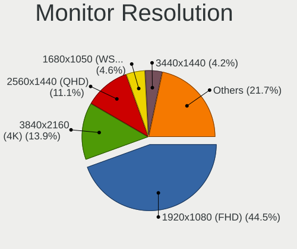

| Resolution         | Desktops | Percent |
|--------------------|----------|---------|
| 1920x1080 (FHD)    | 1278     | 44.45%  |
| 3840x2160 (4K)     | 401      | 13.95%  |
| 2560x1440 (QHD)    | 320      | 11.13%  |
| 1680x1050 (WSXGA+) | 133      | 4.63%   |
| 3440x1440          | 120      | 4.17%   |
| 1280x1024 (SXGA)   | 120      | 4.17%   |
| 1920x1200 (WUXGA)  | 82       | 2.85%   |
| 1440x900 (WXGA+)   | 69       | 2.4%    |
| Unknown            | 64       | 2.23%   |
| 2560x1080          | 43       | 1.5%    |
| 3840x1080          | 35       | 1.22%   |
| 1600x900 (HD+)     | 32       | 1.11%   |
| 1366x768 (WXGA)    | 27       | 0.94%   |
| 1360x768           | 26       | 0.9%    |
| 1920x540           | 14       | 0.49%   |
| 2560x1600          | 12       | 0.42%   |
| 1280x768           | 11       | 0.38%   |
| 1280x720 (HD)      | 9        | 0.31%   |
| 5120x1440          | 6        | 0.21%   |
| 2288x1287          | 6        | 0.21%   |
| 1600x1200          | 5        | 0.17%   |
| 4480x1440          | 4        | 0.14%   |
| 3840x1600          | 4        | 0.14%   |
| 3600x1080          | 4        | 0.14%   |
| 3200x1080          | 4        | 0.14%   |
| 1024x768 (XGA)     | 4        | 0.14%   |
| 7680x2160          | 3        | 0.1%    |
| 5760x2160          | 3        | 0.1%    |
| 5760x1080          | 3        | 0.1%    |
| 1280x800 (WXGA)    | 3        | 0.1%    |
| 3360x1440          | 2        | 0.07%   |
| 2560x1397          | 2        | 0.07%   |
| 2048x1152          | 2        | 0.07%   |
| 8246x2160          | 1        | 0.03%   |
| 800x1280           | 1        | 0.03%   |
| 7680x1080          | 1        | 0.03%   |
| 7040x2160          | 1        | 0.03%   |
| 640x480            | 1        | 0.03%   |
| 5760x1373          | 1        | 0.03%   |
| 5280x2160          | 1        | 0.03%   |

Monitor Diagonal
----------------

Diagonal size in inches

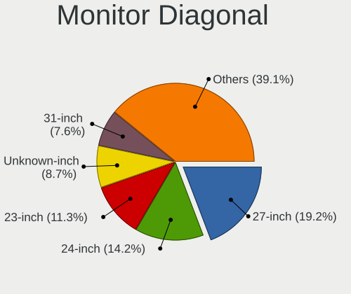

| Inches  | Desktops | Percent |
|---------|----------|---------|
| 27      | 575      | 19.22%  |
| 24      | 424      | 14.18%  |
| 23      | 337      | 11.27%  |
| Unknown | 259      | 8.66%   |
| 31      | 226      | 7.56%   |
| 21      | 213      | 7.12%   |
| 19      | 146      | 4.88%   |
| 34      | 131      | 4.38%   |
| 22      | 112      | 3.74%   |
| 72      | 58       | 1.94%   |
| 20      | 45       | 1.5%    |
| 32      | 40       | 1.34%   |
| 84      | 38       | 1.27%   |
| 17      | 36       | 1.2%    |
| 18      | 32       | 1.07%   |
| 63      | 31       | 1.04%   |
| 26      | 22       | 0.74%   |
| 54      | 21       | 0.7%    |
| 42      | 21       | 0.7%    |
| 40      | 21       | 0.7%    |
| 28      | 18       | 0.6%    |
| 48      | 16       | 0.53%   |
| 15      | 15       | 0.5%    |
| 25      | 14       | 0.47%   |
| 65      | 13       | 0.43%   |
| 13      | 13       | 0.43%   |
| 29      | 12       | 0.4%    |
| 52      | 11       | 0.37%   |
| 37      | 9        | 0.3%    |
| 35      | 8        | 0.27%   |
| 49      | 7        | 0.23%   |
| 43      | 6        | 0.2%    |
| 30      | 6        | 0.2%    |
| 142     | 5        | 0.17%   |
| 46      | 5        | 0.17%   |
| 36      | 5        | 0.17%   |
| 85      | 4        | 0.13%   |
| 55      | 4        | 0.13%   |
| 44      | 4        | 0.13%   |
| 16      | 4        | 0.13%   |

Monitor Width
-------------

Physical width

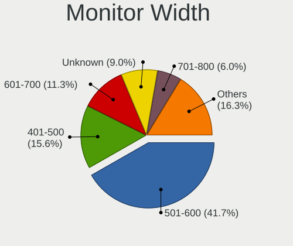

| Width in mm    | Desktops | Percent |
|----------------|----------|---------|
| 501-600        | 1196     | 41.75%  |
| 401-500        | 448      | 15.64%  |
| 601-700        | 324      | 11.31%  |
| Unknown        | 259      | 9.04%   |
| 701-800        | 171      | 5.97%   |
| 1001-1500      | 122      | 4.26%   |
| 1501-2000      | 104      | 3.63%   |
| 351-400        | 96       | 3.35%   |
| 301-350        | 48       | 1.68%   |
| 801-900        | 45       | 1.57%   |
| 901-1000       | 30       | 1.05%   |
| 201-300        | 16       | 0.56%   |
| More than 2000 | 5        | 0.17%   |
| 101-200        | 1        | 0.03%   |

Aspect Ratio
------------

Proportional relationship between the width and the height

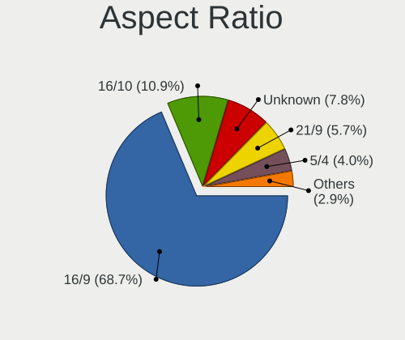

| Ratio   | Desktops | Percent |
|---------|----------|---------|
| 16/9    | 1817     | 68.67%  |
| 16/10   | 289      | 10.92%  |
| Unknown | 206      | 7.79%   |
| 21/9    | 151      | 5.71%   |
| 5/4     | 107      | 4.04%   |
| 4/3     | 27       | 1.02%   |
| 32/9    | 23       | 0.87%   |
| 6/5     | 11       | 0.42%   |
| 3/2     | 8        | 0.3%    |
| 1.00    | 5        | 0.19%   |
| 0.62    | 1        | 0.04%   |
| 0.31    | 1        | 0.04%   |

Monitor Area
------------

Area in inch²

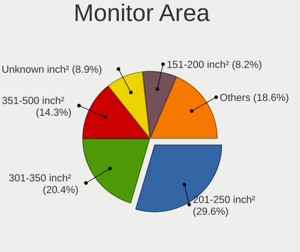

| Area in inch² | Desktops | Percent |
|----------------|----------|---------|
| 201-250        | 859      | 29.57%  |
| 301-350        | 594      | 20.45%  |
| 351-500        | 415      | 14.29%  |
| Unknown        | 259      | 8.92%   |
| 151-200        | 239      | 8.23%   |
| More than 1000 | 200      | 6.88%   |
| 251-300        | 158      | 5.44%   |
| 501-1000       | 94       | 3.24%   |
| 141-150        | 45       | 1.55%   |
| 101-110        | 14       | 0.48%   |
| 91-100         | 10       | 0.34%   |
| 71-80          | 4        | 0.14%   |
| 131-140        | 4        | 0.14%   |
| 111-120        | 4        | 0.14%   |
| 51-60          | 3        | 0.1%    |
| 121-130        | 2        | 0.07%   |
| 1-40           | 1        | 0.03%   |

Pixel Density
-------------

Pixels per inch

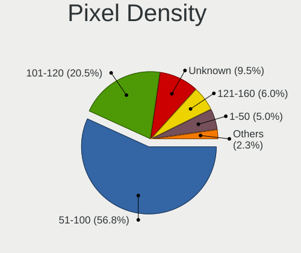

| Density       | Desktops | Percent |
|---------------|----------|---------|
| 51-100        | 1555     | 56.79%  |
| 101-120       | 561      | 20.49%  |
| Unknown       | 259      | 9.46%   |
| 121-160       | 163      | 5.95%   |
| 1-50          | 137      | 5%      |
| 161-240       | 62       | 2.26%   |
| More than 240 | 1        | 0.04%   |

Multiple Monitors
-----------------

Total monitors connected

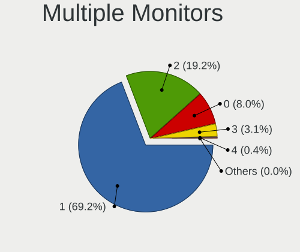

| Total | Desktops | Percent |
|-------|----------|---------|
| 1     | 1920     | 69.19%  |
| 2     | 533      | 19.21%  |
| 0     | 222      | 8%      |
| 3     | 87       | 3.14%   |
| 4     | 12       | 0.43%   |
| 5     | 1        | 0.04%   |

Network
-------

Net Controller Vendor
---------------------

Controller vendors

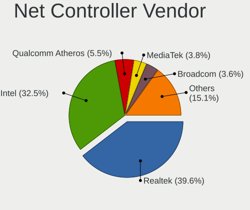

| Vendor                          | Desktops | Percent |
|---------------------------------|----------|---------|
| Realtek Semiconductor           | 1620     | 39.56%  |
| Intel                           | 1332     | 32.53%  |
| Qualcomm Atheros                | 224      | 5.47%   |
| MediaTek                        | 154      | 3.76%   |
| Broadcom                        | 148      | 3.61%   |
| Ralink Technology               | 63       | 1.54%   |
| TP-Link                         | 61       | 1.49%   |
| Ralink                          | 40       | 0.98%   |
| Microsoft                       | 38       | 0.93%   |
| Aquantia                        | 36       | 0.88%   |
| NetGear                         | 35       | 0.85%   |
| Samsung Electronics             | 31       | 0.76%   |
| D-Link                          | 25       | 0.61%   |
| D-Link System                   | 20       | 0.49%   |
| ASUSTek Computer                | 19       | 0.46%   |
| Marvell Technology Group        | 17       | 0.42%   |
| Broadcom Limited                | 17       | 0.42%   |
| Qualcomm Atheros Communications | 15       | 0.37%   |
| Nvidia                          | 14       | 0.34%   |
| Edimax Technology               | 14       | 0.34%   |
| DisplayLink                     | 14       | 0.34%   |
| ASIX Electronics                | 12       | 0.29%   |
| Google                          | 11       | 0.27%   |
| Motorola PCS                    | 10       | 0.24%   |
| Huawei Technologies             | 10       | 0.24%   |
| VIA Technologies                | 9        | 0.22%   |
| Qualcomm Technologies           | 9        | 0.22%   |
| ZTE WCDMA Technologies MSM      | 6        | 0.15%   |
| QinHeng Electronics             | 6        | 0.15%   |
| Realtek                         | 5        | 0.12%   |
| Mellanox Technologies           | 5        | 0.12%   |
| Arduino SA                      | 5        | 0.12%   |
| STMicroelectronics              | 4        | 0.1%    |
| OPPO Electronics                | 4        | 0.1%    |
| ICS Advent                      | 4        | 0.1%    |
| BUFFALO                         | 4        | 0.1%    |
| Belkin Components               | 4        | 0.1%    |
| Wacom                           | 3        | 0.07%   |
| Sigma Designs                   | 3        | 0.07%   |
| Texas Instruments               | 2        | 0.05%   |

Net Controller Model
--------------------

Controller models

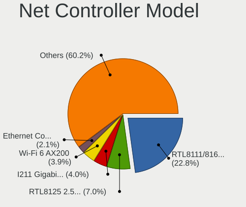

| Model                                                                  | Desktops | Percent |
|------------------------------------------------------------------------|----------|---------|
| Realtek RTL8111/8168/8211/8411 PCI Express Gigabit Ethernet Controller | 1086     | 22.83%  |
| Realtek RTL8125 2.5GbE Controller                                      | 335      | 7.04%   |
| Intel I211 Gigabit Network Connection                                  | 188      | 3.95%   |
| Intel Wi-Fi 6 AX200                                                    | 184      | 3.87%   |
| Intel Ethernet Controller I225-V                                       | 100      | 2.1%    |
| Intel Ethernet Connection (2) I219-V                                   | 97       | 2.04%   |
| Intel 82579LM Gigabit Network Connection (Lewisville)                  | 92       | 1.93%   |
| Intel Ethernet Connection I217-LM                                      | 91       | 1.91%   |
| Intel Wi-Fi 6E(802.11ax) AX210/AX1675* 2x2 [Typhoon Peak]              | 75       | 1.58%   |
| MediaTek MT7922 802.11ax PCI Express Wireless Network Adapter          | 71       | 1.49%   |
| Intel Ethernet Connection (7) I219-V                                   | 67       | 1.41%   |
| Intel Dual Band Wireless-AC 3168NGW [Stone Peak]                       | 54       | 1.14%   |
| Realtek 802.11ac NIC                                                   | 53       | 1.11%   |
| Intel Ethernet Connection (2) I219-LM                                  | 49       | 1.03%   |
| Broadcom BCM4360 802.11ac Dual Band Wireless Network Adapter           | 47       | 0.99%   |
| Intel 82579V Gigabit Network Connection                                | 42       | 0.88%   |
| Realtek RTL8153 Gigabit Ethernet Adapter                               | 38       | 0.8%    |
| Intel Ethernet Connection I217-V                                       | 37       | 0.78%   |
| Intel 82574L Gigabit Network Connection                                | 35       | 0.74%   |
| Intel Cannon Lake PCH CNVi WiFi                                        | 33       | 0.69%   |
| Realtek RTL88x2bu [AC1200 Techkey]                                     | 32       | 0.67%   |
| Intel Wi-Fi 5(802.11ac) Wireless-AC 9x6x [Thunder Peak]                | 31       | 0.65%   |
| Qualcomm Atheros Killer E220x Gigabit Ethernet Controller              | 30       | 0.63%   |
| Intel 82567LM-3 Gigabit Network Connection                             | 30       | 0.63%   |
| Realtek RTL8188EUS 802.11n Wireless Network Adapter                    | 29       | 0.61%   |
| Intel Wireless 7265                                                    | 29       | 0.61%   |
| Intel Wireless 7260                                                    | 29       | 0.61%   |
| Intel Ethernet Connection (2) I218-V                                   | 29       | 0.61%   |
| Samsung Galaxy series, misc. (tethering mode)                          | 28       | 0.59%   |
| Intel Alder Lake-S PCH CNVi WiFi                                       | 28       | 0.59%   |
| Ralink MT7601U Wireless Adapter                                        | 26       | 0.55%   |
| Qualcomm Atheros AR8151 v2.0 Gigabit Ethernet                          | 25       | 0.53%   |
| Intel 700 Series Chipset CNVi WiFi                                     | 25       | 0.53%   |
| Realtek RTL8821CE 802.11ac PCIe Wireless Network Adapter               | 24       | 0.5%    |
| Microsoft Xbox Wireless Adapter for Windows                            | 24       | 0.5%    |
| Realtek RTL8192EE PCIe Wireless Network Adapter                        | 23       | 0.48%   |
| Intel Ethernet Controller I226-V                                       | 23       | 0.48%   |
| Realtek RTL8192EU 802.11b/g/n WLAN Adapter                             | 22       | 0.46%   |
| Qualcomm Atheros AR9287 Wireless Network Adapter (PCI-Express)         | 21       | 0.44%   |
| MediaTek MT7921K (RZ608) Wi-Fi 6E 80MHz                                | 21       | 0.44%   |

Wireless Vendor
---------------

Wireless vendors

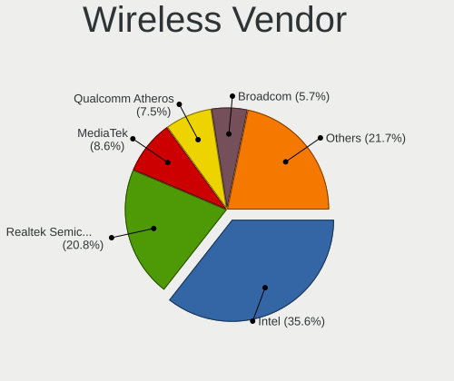

| Vendor                          | Desktops | Percent |
|---------------------------------|----------|---------|
| Intel                           | 566      | 35.58%  |
| Realtek Semiconductor           | 331      | 20.8%   |
| MediaTek                        | 137      | 8.61%   |
| Qualcomm Atheros                | 120      | 7.54%   |
| Broadcom                        | 91       | 5.72%   |
| Ralink Technology               | 63       | 3.96%   |
| TP-Link                         | 60       | 3.77%   |
| Ralink                          | 40       | 2.51%   |
| Microsoft                       | 38       | 2.39%   |
| NetGear                         | 34       | 2.14%   |
| ASUSTek Computer                | 19       | 1.19%   |
| D-Link                          | 16       | 1.01%   |
| Qualcomm Atheros Communications | 15       | 0.94%   |
| Edimax Technology               | 14       | 0.88%   |
| D-Link System                   | 14       | 0.88%   |
| Realtek                         | 5        | 0.31%   |
| Broadcom Limited                | 5        | 0.31%   |
| BUFFALO                         | 4        | 0.25%   |
| Belkin Components               | 4        | 0.25%   |
| Wacom                           | 3        | 0.19%   |
| Qualcomm Technologies           | 3        | 0.19%   |
| Linksys                         | 2        | 0.13%   |
| Toshiba                         | 1        | 0.06%   |
| Ovislink                        | 1        | 0.06%   |
| Micro Star International        | 1        | 0.06%   |
| Mercucys                        | 1        | 0.06%   |
| Marvell Technology Group        | 1        | 0.06%   |
| IMC Networks                    | 1        | 0.06%   |
| AboCom Systems                  | 1        | 0.06%   |

Wireless Model
--------------

Wireless models

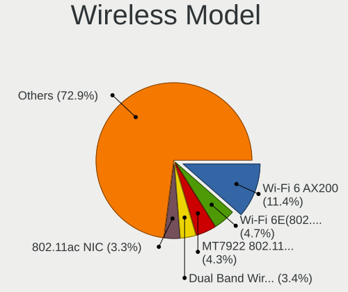

| Model                                                                | Desktops | Percent |
|----------------------------------------------------------------------|----------|---------|
| Intel Wi-Fi 6 AX200                                                  | 184      | 11.44%  |
| Intel Wi-Fi 6E(802.11ax) AX210/AX1675* 2x2 [Typhoon Peak]            | 75       | 4.66%   |
| MediaTek MT7922 802.11ax PCI Express Wireless Network Adapter        | 69       | 4.29%   |
| Intel Dual Band Wireless-AC 3168NGW [Stone Peak]                     | 54       | 3.36%   |
| Realtek 802.11ac NIC                                                 | 53       | 3.3%    |
| Broadcom BCM4360 802.11ac Dual Band Wireless Network Adapter         | 47       | 2.92%   |
| Intel Cannon Lake PCH CNVi WiFi                                      | 33       | 2.05%   |
| Realtek RTL88x2bu [AC1200 Techkey]                                   | 32       | 1.99%   |
| Intel Wi-Fi 5(802.11ac) Wireless-AC 9x6x [Thunder Peak]              | 31       | 1.93%   |
| Realtek RTL8188EUS 802.11n Wireless Network Adapter                  | 29       | 1.8%    |
| Intel Wireless 7265                                                  | 29       | 1.8%    |
| Intel Wireless 7260                                                  | 29       | 1.8%    |
| Ralink MT7601U Wireless Adapter                                      | 26       | 1.62%   |
| Intel 700 Series Chipset CNVi WiFi                                   | 25       | 1.55%   |
| Realtek RTL8821CE 802.11ac PCIe Wireless Network Adapter             | 24       | 1.49%   |
| Microsoft Xbox Wireless Adapter for Windows                          | 24       | 1.49%   |
| Realtek RTL8192EE PCIe Wireless Network Adapter                      | 23       | 1.43%   |
| Realtek RTL8192EU 802.11b/g/n WLAN Adapter                           | 22       | 1.37%   |
| Qualcomm Atheros AR9287 Wireless Network Adapter (PCI-Express)       | 21       | 1.31%   |
| MediaTek MT7921K (RZ608) Wi-Fi 6E 80MHz                              | 21       | 1.31%   |
| Realtek RTL8192CE PCIe Wireless Network Adapter                      | 20       | 1.24%   |
| Qualcomm Atheros AR93xx Wireless Network Adapter                     | 19       | 1.18%   |
| MediaTek MT7902 802.11ax PCIe Wireless Network Adapter [Filogic 310] | 18       | 1.12%   |
| Intel Alder Lake-S PCH CNVi WiFi                                     | 18       | 1.12%   |
| Qualcomm Atheros AR9485 Wireless Network Adapter                     | 16       | 1%      |
| Intel Wireless 8260                                                  | 16       | 1%      |
| Realtek RTL8852CE PCIe 802.11ax Wireless Network Controller          | 15       | 0.93%   |
| Broadcom BCM4352 802.11ac Dual Band Wireless Network Adapter         | 15       | 0.93%   |
| Realtek RTL8852BE PCIe 802.11ax Wireless Network Controller          | 14       | 0.87%   |
| TP-Link TL-WN823N v2/v3 [Realtek RTL8192EU]                          | 13       | 0.81%   |
| Realtek RTL8188CUS 802.11n WLAN Adapter                              | 12       | 0.75%   |
| Ralink RT2870/RT3070 Wireless Adapter                                | 12       | 0.75%   |
| Qualcomm Atheros AR9271 802.11n                                      | 12       | 0.75%   |
| Intel Wireless 8265 / 8275                                           | 12       | 0.75%   |
| Qualcomm Atheros QCA6174 802.11ac Wireless Network Adapter           | 11       | 0.68%   |
| Qualcomm Atheros AR9462 Wireless Network Adapter                     | 11       | 0.68%   |
| Realtek RTL8822BE 802.11a/b/g/n/ac WiFi adapter                      | 10       | 0.62%   |
| Realtek RTL8812AE 802.11ac PCIe Wireless Network Adapter             | 10       | 0.62%   |
| Ralink RT5370 Wireless Adapter                                       | 10       | 0.62%   |
| Ralink RT5392 PCIe Wireless Network Adapter                          | 10       | 0.62%   |

Ethernet Vendor
---------------

Ethernet vendors

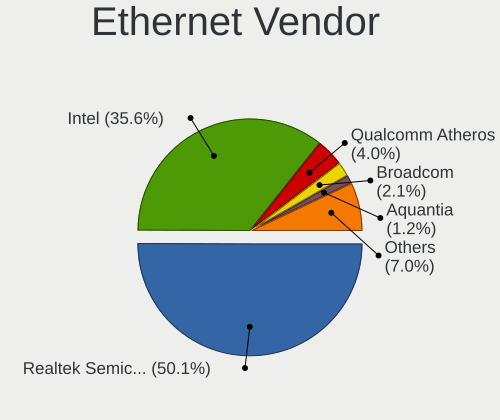

| Vendor                                 | Desktops | Percent |
|----------------------------------------|----------|---------|
| Realtek Semiconductor                  | 1476     | 50.07%  |
| Intel                                  | 1050     | 35.62%  |
| Qualcomm Atheros                       | 117      | 3.97%   |
| Broadcom                               | 62       | 2.1%    |
| Aquantia                               | 36       | 1.22%   |
| Samsung Electronics                    | 31       | 1.05%   |
| Marvell Technology Group               | 16       | 0.54%   |
| Nvidia                                 | 14       | 0.47%   |
| DisplayLink                            | 14       | 0.47%   |
| MediaTek                               | 13       | 0.44%   |
| Broadcom Limited                       | 12       | 0.41%   |
| ASIX Electronics                       | 12       | 0.41%   |
| Google                                 | 11       | 0.37%   |
| Motorola PCS                           | 10       | 0.34%   |
| VIA Technologies                       | 9        | 0.31%   |
| D-Link                                 | 9        | 0.31%   |
| Huawei Technologies                    | 8        | 0.27%   |
| Qualcomm Technologies                  | 6        | 0.2%    |
| D-Link System                          | 6        | 0.2%    |
| Mellanox Technologies                  | 5        | 0.17%   |
| OPPO Electronics                       | 4        | 0.14%   |
| ICS Advent                             | 4        | 0.14%   |
| ZTE WCDMA Technologies MSM             | 3        | 0.1%    |
| Qualcomm                               | 2        | 0.07%   |
| QLogic                                 | 2        | 0.07%   |
| NetGear                                | 2        | 0.07%   |
| Lenovo                                 | 2        | 0.07%   |
| HMD Global                             | 2        | 0.07%   |
| Apple                                  | 2        | 0.07%   |
| vivo                                   | 1        | 0.03%   |
| TP-Link                                | 1        | 0.03%   |
| Suzhou Motorcomm Electronic Technology | 1        | 0.03%   |
| OnePlus Technology (Shenzhen)          | 1        | 0.03%   |
| National Semiconductor                 | 1        | 0.03%   |
| LG Electronics                         | 1        | 0.03%   |
| Emulex                                 | 1        | 0.03%   |
| Alteon Networks                        | 1        | 0.03%   |

Ethernet Model
--------------

Ethernet models

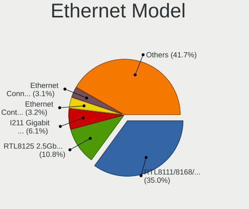

| Model                                                                          | Desktops | Percent |
|--------------------------------------------------------------------------------|----------|---------|
| Realtek RTL8111/8168/8211/8411 PCI Express Gigabit Ethernet Controller         | 1086     | 35.04%  |
| Realtek RTL8125 2.5GbE Controller                                              | 335      | 10.81%  |
| Intel I211 Gigabit Network Connection                                          | 188      | 6.07%   |
| Intel Ethernet Controller I225-V                                               | 100      | 3.23%   |
| Intel Ethernet Connection (2) I219-V                                           | 97       | 3.13%   |
| Intel 82579LM Gigabit Network Connection (Lewisville)                          | 92       | 2.97%   |
| Intel Ethernet Connection I217-LM                                              | 91       | 2.94%   |
| Intel Ethernet Connection (7) I219-V                                           | 67       | 2.16%   |
| Intel Ethernet Connection (2) I219-LM                                          | 49       | 1.58%   |
| Intel 82579V Gigabit Network Connection                                        | 42       | 1.36%   |
| Realtek RTL8153 Gigabit Ethernet Adapter                                       | 38       | 1.23%   |
| Intel Ethernet Connection I217-V                                               | 37       | 1.19%   |
| Intel 82574L Gigabit Network Connection                                        | 35       | 1.13%   |
| Qualcomm Atheros Killer E220x Gigabit Ethernet Controller                      | 30       | 0.97%   |
| Intel 82567LM-3 Gigabit Network Connection                                     | 30       | 0.97%   |
| Intel Ethernet Connection (2) I218-V                                           | 29       | 0.94%   |
| Samsung Galaxy series, misc. (tethering mode)                                  | 28       | 0.9%    |
| Qualcomm Atheros AR8151 v2.0 Gigabit Ethernet                                  | 25       | 0.81%   |
| Intel Ethernet Controller I226-V                                               | 23       | 0.74%   |
| Intel Ethernet Connection (7) I219-LM                                          | 20       | 0.65%   |
| Aquantia AQtion AQC107 NBase-T/IEEE 802.3an Ethernet Controller [Atlantic 10G] | 19       | 0.61%   |
| Qualcomm Atheros AR8161 Gigabit Ethernet                                       | 17       | 0.55%   |
| Intel 82578DM Gigabit Network Connection                                       | 15       | 0.48%   |
| Realtek RTL8126 5GbE Controller                                                | 14       | 0.45%   |
| Intel Ethernet Connection (17) I219-V                                          | 14       | 0.45%   |
| Qualcomm Atheros Killer E2500 Gigabit Ethernet Controller                      | 13       | 0.42%   |
| Intel Ethernet Connection (5) I219-LM                                          | 13       | 0.42%   |
| Broadcom NetXtreme BCM5764M Gigabit Ethernet PCIe                              | 13       | 0.42%   |
| Realtek RTL810xE PCI Express Fast Ethernet controller                          | 12       | 0.39%   |
| Marvell Group 88E8056 PCI-E Gigabit Ethernet Controller                        | 12       | 0.39%   |
| Intel I210 Gigabit Network Connection                                          | 12       | 0.39%   |
| Intel 82566DM-2 Gigabit Network Connection                                     | 12       | 0.39%   |
| Intel 82546EB Gigabit Ethernet Controller (Copper)                             | 12       | 0.39%   |
| Realtek RTL8922AE 802.11be PCIe Wireless Network Adapter                       | 11       | 0.35%   |
| Realtek RTL-8100/8101L/8139 PCI Fast Ethernet Adapter                          | 11       | 0.35%   |
| Qualcomm Atheros Killer E2400 Gigabit Ethernet Controller                      | 10       | 0.32%   |
| Intel Alder Lake-S PCH CNVi WiFi                                               | 10       | 0.32%   |
| Google Pixel 9a                                                                | 10       | 0.32%   |
| ASIX AX88179 Gigabit Ethernet                                                  | 10       | 0.32%   |
| Intel Ethernet Connection (14) I219-V                                          | 9        | 0.29%   |

Net Controller Kind
-------------------

Ethernet, WiFi or modem

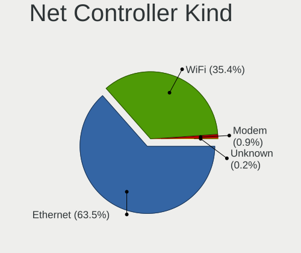

| Kind     | Desktops | Percent |
|----------|----------|---------|
| Ethernet | 2610     | 63.49%  |
| WiFi     | 1455     | 35.39%  |
| Modem    | 37       | 0.9%    |
| Unknown  | 9        | 0.22%   |

Used Controller
---------------

Currently used network controller

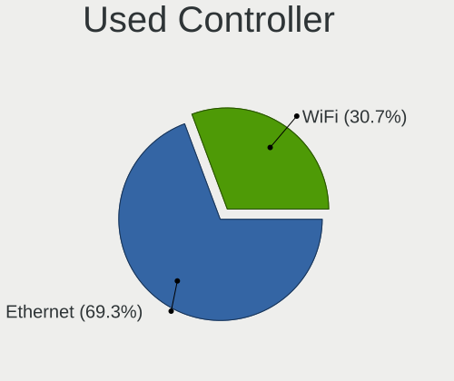

| Kind     | Desktops | Percent |
|----------|----------|---------|
| Ethernet | 1973     | 69.33%  |
| WiFi     | 873      | 30.67%  |

NICs
----

Total network controllers on board

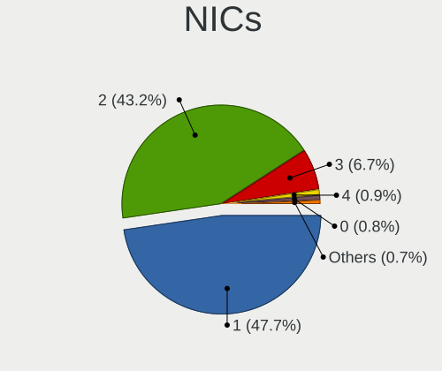

| Total | Desktops | Percent |
|-------|----------|---------|
| 1     | 1286     | 47.68%  |
| 2     | 1165     | 43.2%   |
| 3     | 181      | 6.71%   |
| 4     | 25       | 0.93%   |
| 0     | 22       | 0.82%   |
| 5     | 9        | 0.33%   |
| 6     | 5        | 0.19%   |
| 7     | 2        | 0.07%   |
| 9     | 1        | 0.04%   |
| 8     | 1        | 0.04%   |

IPv6
----

IPv6 vs IPv4

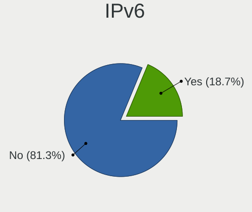

| Used | Desktops | Percent |
|------|----------|---------|
| No   | 2209     | 81.27%  |
| Yes  | 509      | 18.73%  |

Bluetooth
---------

Bluetooth Vendor
----------------

Controller vendors

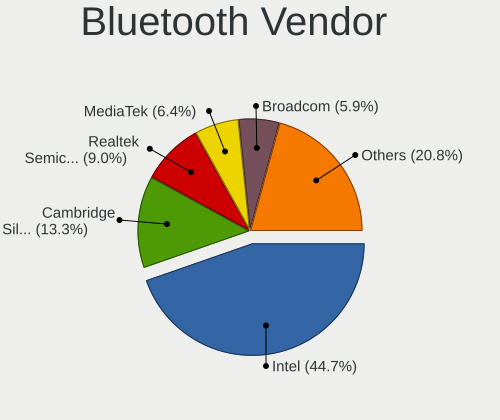

| Vendor                          | Desktops | Percent |
|---------------------------------|----------|---------|
| Intel                           | 523      | 44.66%  |
| Cambridge Silicon Radio         | 156      | 13.32%  |
| Realtek Semiconductor           | 105      | 8.97%   |
| MediaTek                        | 75       | 6.4%    |
| Broadcom                        | 69       | 5.89%   |
| IMC Networks                    | 68       | 5.81%   |
| Foxconn / Hon Hai               | 36       | 3.07%   |
| ASUSTek Computer                | 33       | 2.82%   |
| TP-Link                         | 29       | 2.48%   |
| Qualcomm Atheros Communications | 20       | 1.71%   |
| Apple                           | 20       | 1.71%   |
| Edimax Technology               | 6        | 0.51%   |
| Lite-On Technology              | 4        | 0.34%   |
| Actions                         | 4        | 0.34%   |
| Ralink                          | 3        | 0.26%   |
| Integrated System Solution      | 3        | 0.26%   |
| Unknown                         | 3        | 0.26%   |
| Toshiba                         | 2        | 0.17%   |
| SINO WEALTH                     | 2        | 0.17%   |
| Logitech                        | 2        | 0.17%   |
| Realtek                         | 1        | 0.09%   |
| Mobile Action Technology        | 1        | 0.09%   |
| Mercucys                        | 1        | 0.09%   |
| HTC (High Tech Computer)        | 1        | 0.09%   |
| Hewlett-Packard                 | 1        | 0.09%   |
| Dell                            | 1        | 0.09%   |
| Creative Technology             | 1        | 0.09%   |
| Belkin Components               | 1        | 0.09%   |

Bluetooth Model
---------------

Controller models

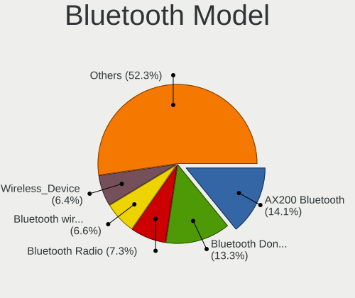

| Model                                                   | Desktops | Percent |
|---------------------------------------------------------|----------|---------|
| Intel AX200 Bluetooth                                   | 166      | 14.12%  |
| Cambridge Silicon Radio Bluetooth Dongle (HCI mode)     | 156      | 13.27%  |
| Realtek Bluetooth Radio                                 | 86       | 7.31%   |
| Intel Bluetooth wireless interface                      | 78       | 6.63%   |
| MediaTek Wireless_Device                                | 75       | 6.38%   |
| Intel AX210 Bluetooth                                   | 69       | 5.87%   |
| Broadcom BCM20702A0 Bluetooth 4.0                       | 54       | 4.59%   |
| Intel Wireless-AC 3168 Bluetooth                        | 53       | 4.51%   |
| Intel AX201 Bluetooth                                   | 42       | 3.57%   |
| Intel Bluetooth 9460/9560 Jefferson Peak (JfP)          | 41       | 3.49%   |
| Intel Bluetooth Device                                  | 40       | 3.4%    |
| IMC Networks Wireless_Device                            | 36       | 3.06%   |
| TP-Link TP-T@- UB500 Adapter                            | 29       | 2.47%   |
| Intel Wireless-AC 9260 Bluetooth Adapter                | 28       | 2.38%   |
| IMC Networks Bluetooth Radio                            | 28       | 2.38%   |
| Foxconn / Hon Hai Wireless_Device                       | 22       | 1.87%   |
| Realtek  Bluetooth 4.2 Adapter                          | 13       | 1.11%   |
| Foxconn / Hon Hai Bluetooth Device                      | 12       | 1.02%   |
| Apple Bluetooth Host Controller                         | 12       | 1.02%   |
| Qualcomm Atheros  Bluetooth Device                      | 8        | 0.68%   |
| Intel Centrino Bluetooth Wireless Transceiver           | 8        | 0.68%   |
| ASUS Bluetooth Radio                                    | 8        | 0.68%   |
| Broadcom HP Portable Bumble Bee                         | 7        | 0.6%    |
| ASUS BCM20702A0                                         | 7        | 0.6%    |
| Qualcomm Atheros QCA61x4 Bluetooth 4.0                  | 5        | 0.43%   |
| ASUS Broadcom BCM20702 Single-Chip Bluetooth 4.0 + LE   | 5        | 0.43%   |
| ASUS Bluetooth Adapter                                  | 5        | 0.43%   |
| Apple Built-in Bluetooth 2.0+EDR HCI                    | 5        | 0.43%   |
| ASUS Qualcomm Bluetooth 4.1                             | 4        | 0.34%   |
| Actions general adapter                                 | 4        | 0.34%   |
| Realtek RTL8821A Bluetooth                              | 3        | 0.26%   |
| Realtek Bluetooth 5.4 Radio                             | 3        | 0.26%   |
| Ralink RT3290 Bluetooth                                 | 3        | 0.26%   |
| Edimax EW-7611ULB 802.11b/g/n and Bluetooth 4.0 Adapter | 3        | 0.26%   |
| Edimax Bluetooth Device                                 | 3        | 0.26%   |
| Unknown                                                 | 3        | 0.26%   |
| Qualcomm Atheros Bluetooth USB Host Controller          | 2        | 0.17%   |
| Qualcomm Atheros AR3012 Bluetooth 4.0                   | 2        | 0.17%   |
| Qualcomm Atheros AR3011 Bluetooth                       | 2        | 0.17%   |
| Logitech BT Mini-Receiver (HCI mode)                    | 2        | 0.17%   |

Sound
-----

Sound Vendor
------------

Sound card vendors

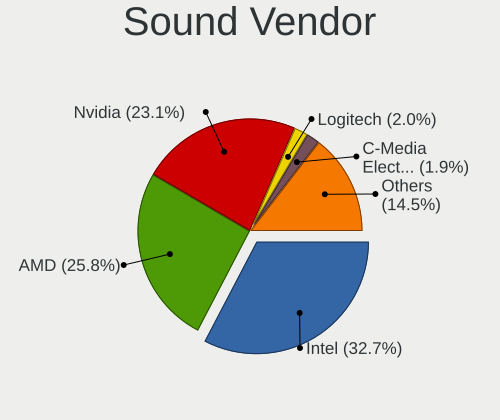

| Vendor                               | Desktops | Percent |
|--------------------------------------|----------|---------|
| Intel                                | 1580     | 32.66%  |
| AMD                                  | 1246     | 25.75%  |
| Nvidia                               | 1119     | 23.13%  |
| Logitech                             | 97       | 2%      |
| C-Media Electronics                  | 93       | 1.92%   |
| Creative Labs                        | 47       | 0.97%   |
| SteelSeries ApS                      | 39       | 0.81%   |
| Micro Star International             | 34       | 0.7%    |
| ASUSTek Computer                     | 29       | 0.6%    |
| Razer USA                            | 28       | 0.58%   |
| JMTek                                | 28       | 0.58%   |
| Texas Instruments                    | 26       | 0.54%   |
| Corsair                              | 25       | 0.52%   |
| Focusrite-Novation                   | 23       | 0.48%   |
| Kingston Technology                  | 22       | 0.45%   |
| Creative Technology                  | 22       | 0.45%   |
| RODE Microphones                     | 20       | 0.41%   |
| Plantronics                          | 17       | 0.35%   |
| Hewlett-Packard                      | 16       | 0.33%   |
| GN Netcom                            | 16       | 0.33%   |
| Audio-Technica                       | 16       | 0.33%   |
| DSEA A/S                             | 15       | 0.31%   |
| Blue Microphones                     | 14       | 0.29%   |
| Astro Gaming                         | 14       | 0.29%   |
| Generalplus Technology               | 12       | 0.25%   |
| Thesycon Systemsoftware & Consulting | 11       | 0.23%   |
| Giga-Byte Technology                 | 9        | 0.19%   |
| VIA Technologies                     | 8        | 0.17%   |
| Realtek Semiconductor                | 8        | 0.17%   |
| M-Audio                              | 8        | 0.17%   |
| Dell                                 | 8        | 0.17%   |
| BEHRINGER International              | 8        | 0.17%   |
| ASRock                               | 8        | 0.17%   |
| Sony                                 | 7        | 0.14%   |
| Samson Technologies                  | 7        | 0.14%   |
| Turtle Beach                         | 6        | 0.12%   |
| PreSonus Audio Electronics           | 6        | 0.12%   |
| Tenx Technology                      | 5        | 0.1%    |
| Jieli Technology                     | 5        | 0.1%    |
| Walmart                              | 4        | 0.08%   |

Sound Model
-----------

Sound card models

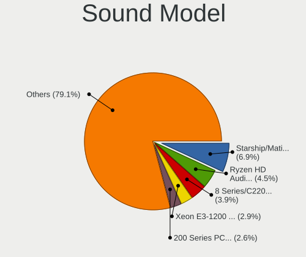

| Model                                                                             | Desktops | Percent |
|-----------------------------------------------------------------------------------|----------|---------|
| AMD Starship/Matisse HD Audio Controller                                          | 399      | 6.92%   |
| AMD Ryzen HD Audio Controller                                                     | 262      | 4.54%   |
| Intel 8 Series/C220 Series Chipset High Definition Audio Controller               | 224      | 3.89%   |
| Intel Xeon E3-1200 v3/4th Gen Core Processor HD Audio Controller                  | 167      | 2.9%    |
| Intel 200 Series PCH HD Audio                                                     | 152      | 2.64%   |
| Intel 100 Series/C230 Series Chipset Family HD Audio Controller                   | 149      | 2.58%   |
| AMD Radeon High Definition Audio Controller                                       | 144      | 2.5%    |
| AMD Navi 21/23 HDMI/DP Audio Controller                                           | 139      | 2.41%   |
| Intel 6 Series/C200 Series Chipset Family High Definition Audio Controller        | 137      | 2.38%   |
| AMD Ellesmere HDMI Audio [Radeon RX 470/480 / 570/580/590]                        | 135      | 2.34%   |
| Intel 7 Series/C216 Chipset Family High Definition Audio Controller               | 134      | 2.32%   |
| Intel Cannon Lake PCH cAVS                                                        | 122      | 2.12%   |
| AMD Family 17h (Models 00h-0fh) HD Audio Controller                               | 111      | 1.93%   |
| AMD SBx00 Azalia (Intel HDA)                                                      | 108      | 1.87%   |
| Nvidia GK208 HDMI/DP Audio Controller                                             | 98       | 1.7%    |
| Intel 82801JI (ICH10 Family) HD Audio Controller                                  | 75       | 1.3%    |
| Nvidia GP104 High Definition Audio Controller                                     | 74       | 1.28%   |
| Nvidia GA104 High Definition Audio Controller                                     | 70       | 1.21%   |
| AMD Renoir/Cezanne HDMI/DP Audio Controller                                       | 69       | 1.2%    |
| AMD Navi 31 HDMI/DP Audio                                                         | 69       | 1.2%    |
| Nvidia TU116 High Definition Audio Controller                                     | 68       | 1.18%   |
| AMD Oland/Hainan/Cape Verde/Pitcairn HDMI Audio [Radeon HD 7000 Series]           | 65       | 1.13%   |
| Nvidia GP107GL High Definition Audio Controller                                   | 63       | 1.09%   |
| Intel Alder Lake-S HD Audio Controller                                            | 63       | 1.09%   |
| Nvidia TU106 High Definition Audio Controller                                     | 57       | 0.99%   |
| AMD Navi 10 HDMI Audio                                                            | 54       | 0.94%   |
| Intel 5 Series/3400 Series Chipset High Definition Audio                          | 52       | 0.9%    |
| Nvidia GA102 High Definition Audio Controller                                     | 51       | 0.88%   |
| AMD FCH Azalia Controller                                                         | 49       | 0.85%   |
| Nvidia GM107 High Definition Audio Controller [GeForce 940MX]                     | 48       | 0.83%   |
| Intel Raptor Lake High Definition Audio Controller                                | 46       | 0.8%    |
| Intel NM10/ICH7 Family High Definition Audio Controller                           | 46       | 0.8%    |
| Nvidia TU104 HD Audio Controller                                                  | 45       | 0.78%   |
| Nvidia GA106 High Definition Audio Controller                                     | 45       | 0.78%   |
| Nvidia GP106 High Definition Audio Controller                                     | 44       | 0.76%   |
| AMD Caicos HDMI Audio [Radeon HD 6450 / 7450/8450/8490 OEM / R5 230/235/235X OEM] | 44       | 0.76%   |
| Nvidia GP108 High Definition Audio Controller                                     | 42       | 0.73%   |
| Intel C610/X99 series chipset HD Audio Controller                                 | 41       | 0.71%   |
| Intel 9 Series Chipset Family HD Audio Controller                                 | 39       | 0.68%   |
| Intel C600/X79 series chipset High Definition Audio Controller                    | 37       | 0.64%   |

Memory
------

Memory Vendor
-------------

Memory module vendors

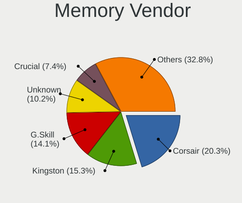

| Vendor                                  | Desktops | Percent |
|-----------------------------------------|----------|---------|
| Corsair                                 | 311      | 20.27%  |
| Kingston                                | 234      | 15.25%  |
| G.Skill                                 | 217      | 14.15%  |
| Unknown                                 | 156      | 10.17%  |
| Crucial                                 | 113      | 7.37%   |
| Samsung Electronics                     | 108      | 7.04%   |
| SK hynix                                | 100      | 6.52%   |
| Micron Technology                       | 71       | 4.63%   |
| Team                                    | 41       | 2.67%   |
| Unknown                                 | 20       | 1.3%    |
| Patriot                                 | 17       | 1.11%   |
| GeIL                                    | 16       | 1.04%   |
| A-DATA Technology                       | 16       | 1.04%   |
| Nanya Technology                        | 15       | 0.98%   |
| Transcend                               | 11       | 0.72%   |
| Ramaxel Technology                      | 11       | 0.72%   |
| Apacer                                  | 11       | 0.72%   |
| Strontium                               | 5        | 0.33%   |
| PNY                                     | 4        | 0.26%   |
| Hewlett-Packard                         | 4        | 0.26%   |
| Elpida                                  | 4        | 0.26%   |
| Unknown (ABCD)                          | 3        | 0.2%    |
| Silicon Power                           | 3        | 0.2%    |
| Neo Forza                               | 3        | 0.2%    |
| Lexar                                   | 3        | 0.2%    |
| Unknown (0x0B45)                        | 2        | 0.13%   |
| Timetec                                 | 2        | 0.13%   |
| Thermaltake                             | 2        | 0.13%   |
| TeamGroup                               | 2        | 0.13%   |
| Silicon Power Computer & Communications | 2        | 0.13%   |
| Red Hat                                 | 2        | 0.13%   |
| Hyundai lnc                             | 2        | 0.13%   |
| Golden Empire                           | 2        | 0.13%   |
| Acer                                    | 2        | 0.13%   |
| Wodposit                                | 1        | 0.07%   |
| Unknown (AB)                            | 1        | 0.07%   |
| Unknown (0x0562)                        | 1        | 0.07%   |
| Unknown (00009E0010BE)                  | 1        | 0.07%   |
| Undefi                                  | 1        | 0.07%   |
| Qimonda                                 | 1        | 0.07%   |

Memory Model
------------

Memory module models

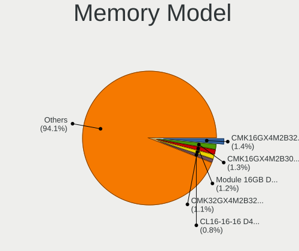

| Model                                                   | Desktops | Percent |
|---------------------------------------------------------|----------|---------|
| Corsair RAM CMK16GX4M2B3200C16 8GB DIMM DDR4 3600MT/s   | 24       | 1.44%   |
| Corsair RAM CMK16GX4M2B3000C15 8GB DIMM DDR4 3600MT/s   | 22       | 1.32%   |
| Unknown                                                 | 20       | 1.2%    |
| Corsair RAM CMK32GX4M2B3200C16 16GB DIMM DDR4 3800MT/s  | 19       | 1.14%   |
| Kingston RAM CL16-16-16 D4-2400 8GB DIMM DDR4 2400MT/s  | 14       | 0.84%   |
| Corsair RAM CMK32GX4M2E3200C16 16GB DIMM DDR4 3600MT/s  | 13       | 0.78%   |
| Kingston RAM KF3200C16D4/16GX 16GB DIMM DDR4 3733MT/s   | 12       | 0.72%   |
| Corsair RAM CMK16GX4M2A2133C13 8GB DIMM DDR4 3000MT/s   | 12       | 0.72%   |
| Unknown RAM Module 4GB DIMM 1333MT/s                    | 11       | 0.66%   |
| GeIL RAM CL11-11-11 D3-1600 4GB DIMM 1866MT/s           | 11       | 0.66%   |
| G.Skill RAM F4-3600C16-16GTZNC 16GiB DIMM DDR4 3600MT/s | 11       | 0.66%   |
| G.Skill RAM F3-1600C11-8GNT 8GB DIMM DDR3 1600MT/s      | 10       | 0.6%    |
| Crucial RAM CT102464BD160B.M16 8GB DIMM DDR3 1600MT/s   | 10       | 0.6%    |
| Team RAM TEAMGROUP-UD4-3200 8GB DIMM DDR4 3800MT/s      | 9        | 0.54%   |
| G.Skill RAM F4-3200C16-8GVKB 8GB DIMM DDR4 4000MT/s     | 9        | 0.54%   |
| G.Skill RAM F4-2666C19-8GIS 8GB DIMM DDR4 3200MT/s      | 9        | 0.54%   |
| Crucial RAM CT8G4DFD8213.C16FBD2 8GB DIMM DDR4 2500MT/s | 9        | 0.54%   |
| Unknown RAM Module 4096MB DIMM 1333MT/s                 | 8        | 0.48%   |
| Unknown RAM Module 2GB DIMM 800MT/s                     | 8        | 0.48%   |
| Samsung RAM M378B5173DB0-CK0 4096MB DIMM DDR3 1600MT/s  | 8        | 0.48%   |
| Kingston RAM KF560C36-16 16GB DIMM DDR5 6000MT/s        | 8        | 0.48%   |
| G.Skill RAM F5-6000J3038F16G 16GB DIMM DDR5 6000MT/s    | 8        | 0.48%   |
| G.Skill RAM F3-12800CL10-8GBXL 8GB DIMM DDR3 1600MT/s   | 8        | 0.48%   |
| Corsair RAM CMW32GX4M2C3200C16 16GB DIMM DDR4 3400MT/s  | 8        | 0.48%   |
| Corsair RAM CMK64GX4M2E3200C16 32GB DIMM DDR4 3600MT/s  | 8        | 0.48%   |
| Unknown RAM Module 4GB DIMM DDR3 1333MT/s               | 7        | 0.42%   |
| Unknown RAM Module 2GB DIMM 400MT/s                     | 7        | 0.42%   |
| Unknown RAM Module 2GB DIMM 1333MT/s                    | 7        | 0.42%   |
| Unknown RAM Module 2048MB DIMM 800MT/s                  | 7        | 0.42%   |
| Team RAM TEAMGROUP-UD4-2400 8GB DIMM DDR4 3000MT/s      | 7        | 0.42%   |
| SK hynix RAM HMT451U6AFR8C-PB 4GB DIMM DDR3 1600MT/s    | 7        | 0.42%   |
| Kingston RAM 9905678-173.A00G 8GB DIMM DDR4 2400MT/s    | 7        | 0.42%   |
| Corsair RAM CMK32GX4M2A2666C16 16GB DIMM DDR4 2667MT/s  | 7        | 0.42%   |
| Corsair RAM CMK16GX4M2A2666C16 8GB DIMM DDR4 3400MT/s   | 7        | 0.42%   |
| Unknown RAM Module 2GB DIMM 667MT/s                     | 6        | 0.36%   |
| SK hynix RAM HMT351U6EFR8C-PB 4GB DIMM DDR3 1600MT/s    | 6        | 0.36%   |
| Samsung RAM M378B5173QH0-CK0 4GB DIMM DDR3              | 6        | 0.36%   |
| Micron RAM 8ATF1G64AZ-2G6E1 8GB DIMM DDR4 2667MT/s      | 6        | 0.36%   |
| Kingston RAM KHX3200C16D4/8GX 8GB DIMM DDR4 3733MT/s    | 6        | 0.36%   |
| Kingston RAM KHX3200C16D4/16GX 16GB DIMM DDR4 3600MT/s  | 6        | 0.36%   |

Memory Kind
-----------

Memory module kinds

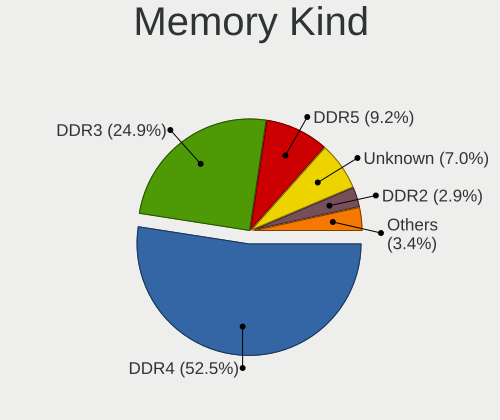

| Kind    | Desktops | Percent |
|---------|----------|---------|
| DDR4    | 716      | 52.45%  |
| DDR3    | 340      | 24.91%  |
| DDR5    | 126      | 9.23%   |
| Unknown | 96       | 7.03%   |
| DDR2    | 40       | 2.93%   |
| SDRAM   | 26       | 1.9%    |
| DDR     | 11       | 0.81%   |
| LPDDR4  | 4        | 0.29%   |
| RAM     | 2        | 0.15%   |
| LPDDR5  | 2        | 0.15%   |
| DRAM    | 2        | 0.15%   |

Memory Form Factor
------------------

Physical design of the memory module

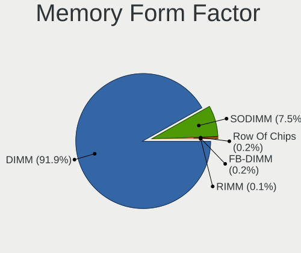

| Name         | Desktops | Percent |
|--------------|----------|---------|
| DIMM         | 1241     | 91.86%  |
| SODIMM       | 102      | 7.55%   |
| Row Of Chips | 3        | 0.22%   |
| FB-DIMM      | 3        | 0.22%   |
| RIMM         | 2        | 0.15%   |

Memory Size
-----------

Memory module size

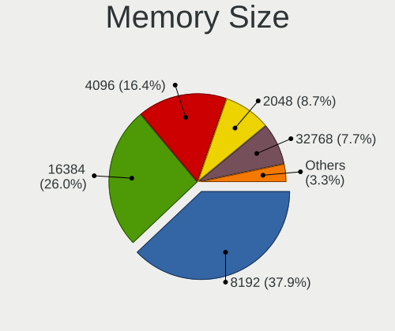

| Size  | Desktops | Percent |
|-------|----------|---------|
| 8192  | 551      | 37.92%  |
| 16384 | 378      | 26.02%  |
| 4096  | 238      | 16.38%  |
| 2048  | 126      | 8.67%   |
| 32768 | 112      | 7.71%   |
| 1024  | 31       | 2.13%   |
| 49152 | 7        | 0.48%   |
| 512   | 6        | 0.41%   |
| 24576 | 3        | 0.21%   |
| 65536 | 1        | 0.07%   |

Memory Speed
------------

Memory module speed

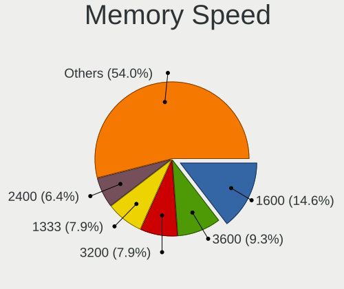

| Speed   | Desktops | Percent |
|---------|----------|---------|
| 1600    | 222      | 14.58%  |
| 3600    | 141      | 9.26%   |
| 3200    | 120      | 7.88%   |
| 1333    | 120      | 7.88%   |
| 2400    | 98       | 6.43%   |
| 2667    | 94       | 6.17%   |
| 2133    | 77       | 5.06%   |
| 6000    | 61       | 4.01%   |
| 800     | 49       | 3.22%   |
| 3800    | 45       | 2.95%   |
| 3000    | 42       | 2.76%   |
| 1866    | 36       | 2.36%   |
| 3733    | 35       | 2.3%    |
| 667     | 33       | 2.17%   |
| 3400    | 27       | 1.77%   |
| 4000    | 21       | 1.38%   |
| 2666    | 21       | 1.38%   |
| 4800    | 20       | 1.31%   |
| 3866    | 19       | 1.25%   |
| 2933    | 17       | 1.12%   |
| Unknown | 16       | 1.05%   |
| 1800    | 13       | 0.85%   |
| 5600    | 11       | 0.72%   |
| 3466    | 11       | 0.72%   |
| 2800    | 11       | 0.72%   |
| 1867    | 11       | 0.72%   |
| 12800   | 10       | 0.66%   |
| 2500    | 9        | 0.59%   |
| 400     | 9        | 0.59%   |
| 6200    | 8        | 0.53%   |
| 3100    | 7        | 0.46%   |
| 6400    | 6        | 0.39%   |
| 5200    | 6        | 0.39%   |
| 2733    | 6        | 0.39%   |
| 1066    | 6        | 0.39%   |
| 3500    | 5        | 0.33%   |
| 3666    | 4        | 0.26%   |
| 2000    | 4        | 0.26%   |
| 533     | 4        | 0.26%   |
| 8400    | 3        | 0.2%    |

Printers & scanners
-------------------

Printer Vendor
--------------

Printer device vendors

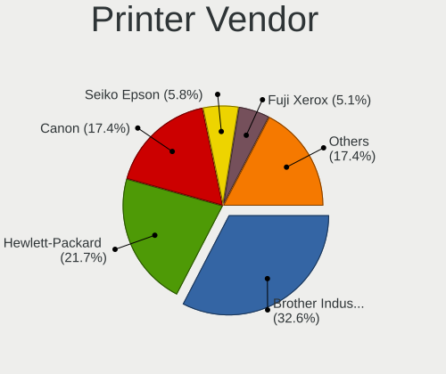

| Vendor                 | Desktops | Percent |
|------------------------|----------|---------|
| Brother Industries     | 45       | 32.61%  |
| Hewlett-Packard        | 30       | 21.74%  |
| Canon                  | 24       | 17.39%  |
| Seiko Epson            | 8        | 5.8%    |
| Fuji Xerox             | 7        | 5.07%   |
| Prolific Technology    | 6        | 4.35%   |
| Samsung Electronics    | 5        | 3.62%   |
| Dymo-CoStar            | 3        | 2.17%   |
| Xerox                  | 2        | 1.45%   |
| Lexmark International  | 2        | 1.45%   |
| Kyocera                | 2        | 1.45%   |
| Zebra                  | 1        | 0.72%   |
| STMicroelectronics     | 1        | 0.72%   |
| Custom Engineering SPA | 1        | 0.72%   |
| BIXOLON                | 1        | 0.72%   |

Printer Model
-------------

Printer device models

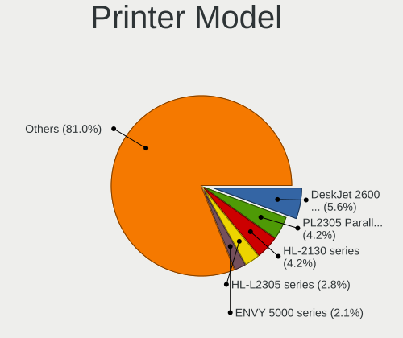

| Model                                                     | Desktops | Percent |
|-----------------------------------------------------------|----------|---------|
| HP DeskJet 2600 series                                    | 8        | 5.63%   |
| Prolific PL2305 Parallel Port                             | 6        | 4.23%   |
| Brother HL-2130 series                                    | 6        | 4.23%   |
| Brother HL-L2305 series                                   | 4        | 2.82%   |
| HP ENVY 5000 series                                       | 3        | 2.11%   |
| HP DeskJet 2130 series                                    | 3        | 2.11%   |
| Fuji Xerox DocuPrint CM215 fw                             | 3        | 2.11%   |
| Canon LiDE 400                                            | 3        | 2.11%   |
| Canon LiDE 300                                            | 3        | 2.11%   |
| Brother HL-L3230CDW series                                | 3        | 2.11%   |
| Seiko Epson XP-240 Series                                 | 2        | 1.41%   |
| HP OfficeJet 5200 series                                  | 2        | 1.41%   |
| HP DeskJet F2100 Printer series                           | 2        | 1.41%   |
| HP Deskjet 2540 series                                    | 2        | 1.41%   |
| Dymo-CoStar DYMO LabelWriter 450 Turbo                    | 2        | 1.41%   |
| Canon TR8500 series                                       | 2        | 1.41%   |
| Canon PIXMA MX920 Series                                  | 2        | 1.41%   |
| Canon PIXMA MG5600 Series                                 | 2        | 1.41%   |
| Canon PIXMA MG2500 Series                                 | 2        | 1.41%   |
| Brother QL-570 Label Printer                              | 2        | 1.41%   |
| Brother MFC-L8690CDW series                               | 2        | 1.41%   |
| Brother HL-1210W series                                   | 2        | 1.41%   |
| Brother HL-1110 series                                    | 2        | 1.41%   |
| Zebra ZTC LP2844-Z-200dpi                                 | 1        | 0.7%    |
| Xerox Phaser 8400N                                        | 1        | 0.7%    |
| Xerox Phaser 3160                                         | 1        | 0.7%    |
| STMicroelectronics LED badge -- mini LED display -- 11x44 | 1        | 0.7%    |
| Seiko Epson XP-4100 Series                                | 1        | 0.7%    |
| Seiko Epson WF-5190 Series                                | 1        | 0.7%    |
| Seiko Epson WF-4830 Series                                | 1        | 0.7%    |
| Seiko Epson ME 320/330 Series [Stylus SX125]              | 1        | 0.7%    |
| Seiko Epson ET-2820 Series                                | 1        | 0.7%    |
| Seiko Epson ET-2810 Series                                | 1        | 0.7%    |
| Samsung ML-2010P Mono Laser Printer                       | 1        | 0.7%    |
| Samsung ML-1640 Series Laser Printer                      | 1        | 0.7%    |
| Samsung ML-1450                                           | 1        | 0.7%    |
| Samsung M267x 287x Series                                 | 1        | 0.7%    |
| Samsung M2020 Series                                      | 1        | 0.7%    |
| Lexmark International E260dn                              | 1        | 0.7%    |
| Lexmark International CX410de                             | 1        | 0.7%    |

Scanner Vendor
--------------

Scanner device vendors

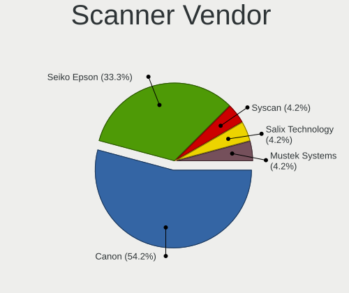

| Vendor           | Desktops | Percent |
|------------------|----------|---------|
| Canon            | 13       | 54.17%  |
| Seiko Epson      | 8        | 33.33%  |
| Syscan           | 1        | 4.17%   |
| Salix Technology | 1        | 4.17%   |
| Mustek Systems   | 1        | 4.17%   |

Scanner Model
-------------

Scanner device models

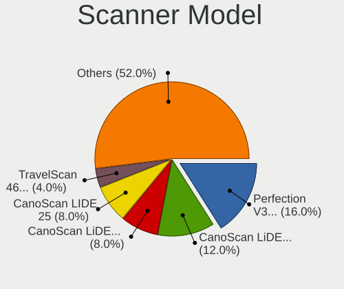

| Model                                                   | Desktops | Percent |
|---------------------------------------------------------|----------|---------|
| Seiko Epson Perfection V37/V370                         | 4        | 16%     |
| Canon CanoScan LiDE 210                                 | 3        | 12%     |
| Canon CanoScan LiDE 50/LiDE 35/LiDE 40                  | 2        | 8%      |
| Canon CanoScan LIDE 25                                  | 2        | 8%      |
| Syscan TravelScan 460/464                               | 1        | 4%      |
| Seiko Epson Scanner                                     | 1        | 4%      |
| Seiko Epson GT-X820 [Perfection V600 Photo]             | 1        | 4%      |
| Seiko Epson GT-F730 [GT-S630/Perfection V33/V330 Photo] | 1        | 4%      |
| Seiko Epson GT-F720 [GT-S620/Perfection V30/V300 Photo] | 1        | 4%      |
| Seiko Epson GT-7300U [Perfection 1260/1260 PHOTO]       | 1        | 4%      |
| Salix USB Scanner.                                      | 1        | 4%      |
| Mustek Systems BearPaw 2448 TA Plus                     | 1        | 4%      |
| Canon CanoScan N670U/N676U/LiDE 20                      | 1        | 4%      |
| Canon CanoScan N1240U/LiDE 30                           | 1        | 4%      |
| Canon CanoScan LiDE 500F                                | 1        | 4%      |
| Canon CanoScan LiDE 220                                 | 1        | 4%      |
| Canon CanoScan LiDE 200                                 | 1        | 4%      |
| Canon CanoScan LiDE 110                                 | 1        | 4%      |

Camera
------

Camera Vendor
-------------

Camera device vendors

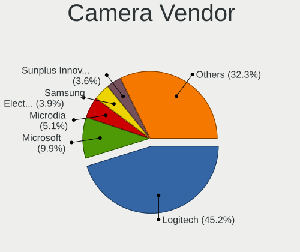

| Vendor                                 | Desktops | Percent |
|----------------------------------------|----------|---------|
| Logitech                               | 241      | 45.22%  |
| Microsoft                              | 53       | 9.94%   |
| Microdia                               | 27       | 5.07%   |
| Samsung Electronics                    | 21       | 3.94%   |
| Sunplus Innovation Technology          | 19       | 3.56%   |
| Apple                                  | 19       | 3.56%   |
| Realtek Semiconductor                  | 17       | 3.19%   |
| Chicony Electronics                    | 12       | 2.25%   |
| Razer USA                              | 10       | 1.88%   |
| Generalplus Technology                 | 8        | 1.5%    |
| GEMBIRD                                | 7        | 1.31%   |
| MacroSilicon                           | 6        | 1.13%   |
| Z-Star Microelectronics                | 5        | 0.94%   |
| Lenovo                                 | 4        | 0.75%   |
| Cubeternet                             | 4        | 0.75%   |
| Cheng Uei Precision Industry (Foxlink) | 4        | 0.75%   |
| webcam                                 | 3        | 0.56%   |
| Sonix Technology                       | 3        | 0.56%   |
| OPPO Electronics                       | 3        | 0.56%   |
| LG Electronics                         | 3        | 0.56%   |
| Jieli Technology                       | 3        | 0.56%   |
| Insta360                               | 3        | 0.56%   |
| Hewlett-Packard                        | 3        | 0.56%   |
| Genesys Logic                          | 3        | 0.56%   |
| AVerMedia Technologies                 | 3        | 0.56%   |
| Aveo Technology                        | 3        | 0.56%   |
| Asuscom Network                        | 3        | 0.56%   |
| Valve Software                         | 2        | 0.38%   |
| Owon                                   | 2        | 0.38%   |
| Novatek Microelectronics               | 2        | 0.38%   |
| Linux Foundation                       | 2        | 0.38%   |
| Google                                 | 2        | 0.38%   |
| Elgato Systems                         | 2        | 0.38%   |
| ARC International                      | 2        | 0.38%   |
| Alcor Micro                            | 2        | 0.38%   |
| Yealink Network Technology             | 1        | 0.19%   |
| XHT-220428-ZW                          | 1        | 0.19%   |
| XF                                     | 1        | 0.19%   |
| WJZ_USB                                | 1        | 0.19%   |
| Web Camera                             | 1        | 0.19%   |

Camera Model
------------

Camera device models

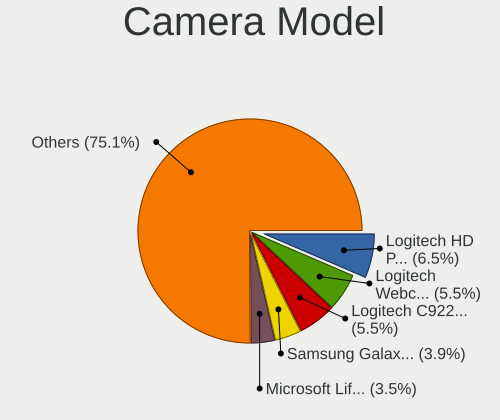

| Model                                                                | Desktops | Percent |
|----------------------------------------------------------------------|----------|---------|
| Logitech HD Pro Webcam C920                                          | 35       | 6.46%   |
| Logitech Webcam C270                                                 | 30       | 5.54%   |
| Logitech C922 Pro Stream Webcam                                      | 30       | 5.54%   |
| Samsung Galaxy series, misc. (MTP mode)                              | 21       | 3.87%   |
| Microsoft LifeCam HD-3000                                            | 19       | 3.51%   |
| Microsoft LifeCam Studio                                             | 14       | 2.58%   |
| Apple iPhone 5/5C/5S/6/SE/7/8/X                                      | 14       | 2.58%   |
| Logitech Webcam C930e                                                | 13       | 2.4%    |
| Logitech BRIO Ultra HD Webcam                                        | 13       | 2.4%    |
| Microdia USB 2.0 Camera                                              | 12       | 2.21%   |
| Logitech StreamCam                                                   | 12       | 2.21%   |
| Logitech Webcam C170                                                 | 10       | 1.85%   |
| Logitech HD Webcam C910                                              | 10       | 1.85%   |
| Logitech HD Webcam C615                                              | 10       | 1.85%   |
| Microsoft LifeCam Cinema                                             | 7        | 1.29%   |
| Microdia Webcam Vitade AF                                            | 7        | 1.29%   |
| Logitech Webcam Pro 9000                                             | 7        | 1.29%   |
| Logitech C920 PRO HD Webcam                                          | 7        | 1.29%   |
| Chicony HP High Definition 1MP Webcam                                | 7        | 1.29%   |
| Logitech QuickCam Pro 9000                                           | 6        | 1.11%   |
| Logitech QuickCam Communicate MP/S5500                               | 6        | 1.11%   |
| Logitech Logitech Webcam C925e                                       | 6        | 1.11%   |
| Logitech HD Webcam C525                                              | 6        | 1.11%   |
| Sunplus Integrated Camera                                            | 5        | 0.92%   |
| Logitech C505 HD Webcam                                              | 5        | 0.92%   |
| Sunplus HK 5M WebCAM                                                 | 4        | 0.74%   |
| Razer USA Gaming Webcam [Kiyo]                                       | 4        | 0.74%   |
| Microsoft Microsoft LifeCam Cinema                                   | 4        | 0.74%   |
| MacroSilicon USB Video                                               | 4        | 0.74%   |
| Logitech Webcam B500                                                 | 4        | 0.74%   |
| Logitech Brio 100                                                    | 4        | 0.74%   |
| Generalplus 808 Camera #9 (web-cam mode)                             | 4        | 0.74%   |
| GEMBIRD USB2.0 PC CAMERA                                             | 4        | 0.74%   |
| Cheng Uei Precision Industry (Foxlink) HP High Definition 1MP Webcam | 4        | 0.74%   |
| Z-Star Venus USB2.0 Camera                                           | 3        | 0.55%   |
| webcam webcam                                                        | 3        | 0.55%   |
| Sunplus Full HD webcam                                               | 3        | 0.55%   |
| Sonix GENERAL WEBCAM                                                 | 3        | 0.55%   |
| Realtek HP 1.0MP High Definition Webcam                              | 3        | 0.55%   |
| Realtek FULL HD 1080P Webcam                                         | 3        | 0.55%   |

Security
--------

Fingerprint Vendor
------------------

Fingerprint sensor vendors

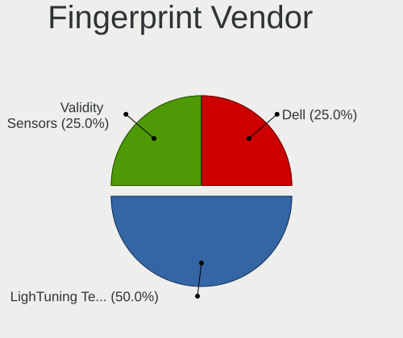

| Vendor                | Desktops | Percent |
|-----------------------|----------|---------|
| LighTuning Technology | 2        | 50%     |
| Validity Sensors      | 1        | 25%     |
| Dell                  | 1        | 25%     |

Fingerprint Model
-----------------

Fingerprint sensor models

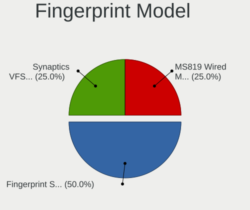

| Model                                                       | Desktops | Percent |
|-------------------------------------------------------------|----------|---------|
| LighTuning Fingerprint Sensor                               | 2        | 50%     |
| Validity Sensors Synaptics VFS7552 Touch Fingerprint Sensor | 1        | 25%     |
| Dell MS819 Wired Mouse With Fingerprint Reader              | 1        | 25%     |

Chipcard Vendor
---------------

Chipcard module vendors

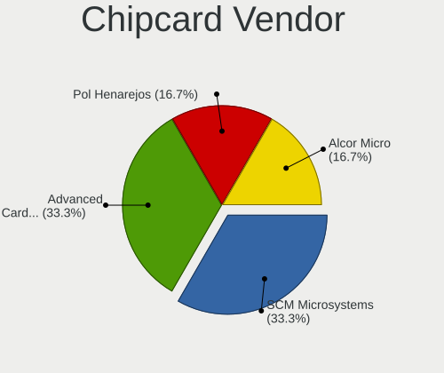

| Vendor                | Desktops | Percent |
|-----------------------|----------|---------|
| SCM Microsystems      | 2        | 33.33%  |
| Advanced Card Systems | 2        | 33.33%  |
| Pol Henarejos         | 1        | 16.67%  |
| Alcor Micro           | 1        | 16.67%  |

Chipcard Model
--------------

Chipcard module models

| Model                                     | Desktops | Percent |
|-------------------------------------------|----------|---------|
| SCM Microsystems SCR3500 C Contact Reader | 2        | 33.33%  |
| Advanced Card Systems ACR122U             | 2        | 33.33%  |
| Pol Henarejos Pico Key                    | 1        | 16.67%  |
| Alcor Micro AU9540 Smartcard Reader       | 1        | 16.67%  |

Unsupported
-----------

Unsupported Devices
-------------------

Total unsupported devices on board

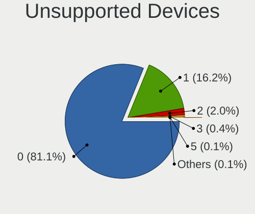

| Total | Desktops | Percent |
|-------|----------|---------|
| 0     | 2228     | 81.14%  |
| 1     | 445      | 16.21%  |
| 2     | 54       | 1.97%   |
| 3     | 12       | 0.44%   |
| 5     | 4        | 0.15%   |
| 4     | 3        | 0.11%   |

Unsupported Device Types
------------------------

Types of unsupported devices

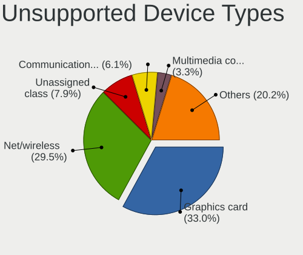

| Type                     | Desktops | Percent |
|--------------------------|----------|---------|
| Graphics card            | 189      | 32.98%  |
| Net/wireless             | 169      | 29.49%  |
| Unassigned class         | 45       | 7.85%   |
| Communication controller | 35       | 6.11%   |
| Multimedia controller    | 19       | 3.32%   |
| Sound                    | 18       | 3.14%   |
| Bluetooth                | 17       | 2.97%   |
| Net/ethernet             | 16       | 2.79%   |
| Camera                   | 16       | 2.79%   |
| Network                  | 13       | 2.27%   |
| Storage/raid             | 11       | 1.92%   |
| Firewire controller      | 6        | 1.05%   |
| Dvb card                 | 4        | 0.7%    |
| Chipcard                 | 4        | 0.7%    |
| Storage/ata              | 3        | 0.52%   |
| Fingerprint reader       | 3        | 0.52%   |
| Card reader              | 2        | 0.35%   |
| Tv card                  | 1        | 0.17%   |
| Storage                  | 1        | 0.17%   |
| Modem                    | 1        | 0.17%   |

