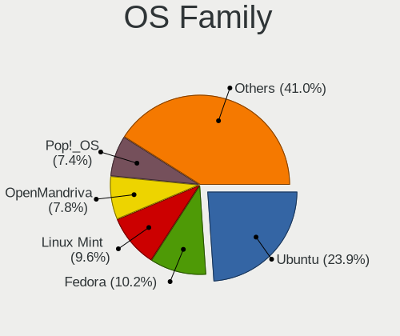
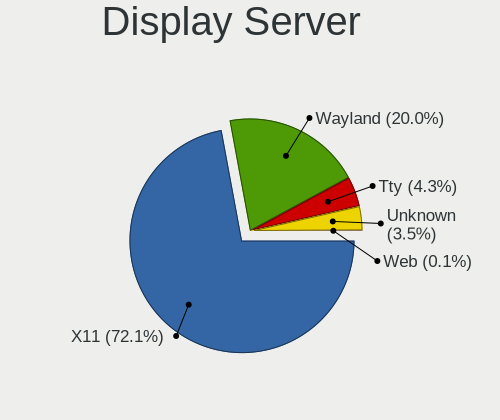
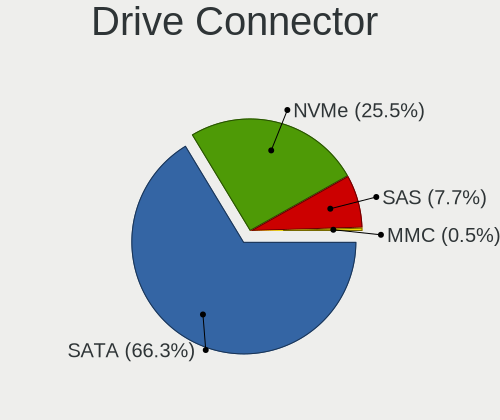
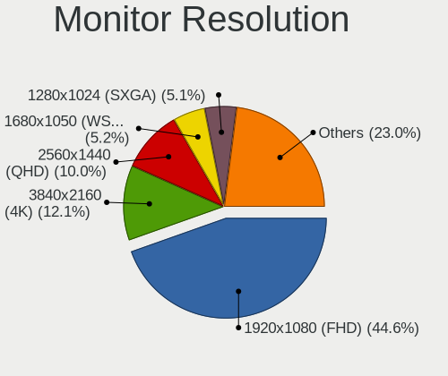
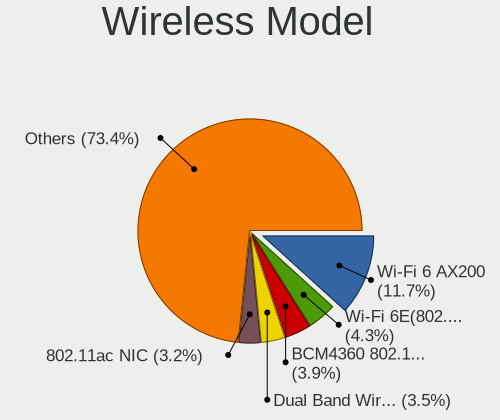
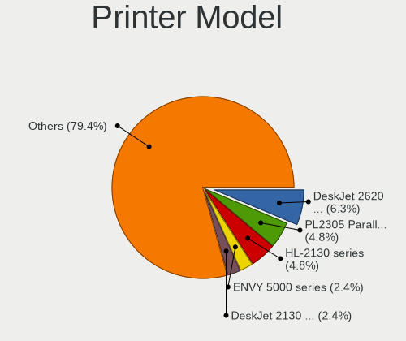
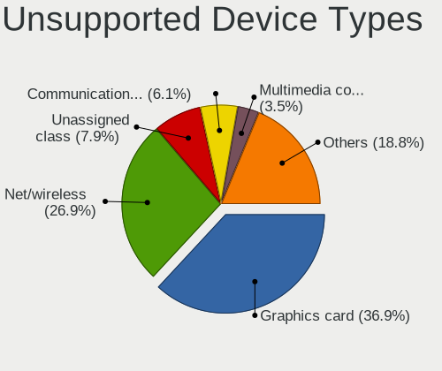

Linux in Australia - Tested Hardware & Statistics (Desktops)
------------------------------------------------------------

A project to collect tested hardware configurations for Linux in Australia.

Anyone can contribute to this report by the [hw-probe](https://github.com/linuxhw/hw-probe) tool:

    sudo -E hw-probe -all -upload

Please contribute! Especially if your hardware is rare.

Contents
--------

* [ Test Cases ](#test-cases)

* [ System ](#system)
  - [ OS                       ](#os)
  - [ OS Family                ](#os-family)
  - [ Kernel                   ](#kernel)
  - [ Kernel Family            ](#kernel-family)
  - [ Kernel Major Ver.        ](#kernel-major-ver)
  - [ Arch                     ](#arch)
  - [ DE                       ](#de)
  - [ Display Server           ](#display-server)
  - [ Display Manager          ](#display-manager)
  - [ OS Lang                  ](#os-lang)
  - [ Boot Mode                ](#boot-mode)
  - [ Filesystem               ](#filesystem)
  - [ Part. scheme             ](#part-scheme)
  - [ Dual Boot with Linux/BSD ](#dual-boot-with-linuxbsd)
  - [ Dual Boot (Win)          ](#dual-boot-win)

* [ Board ](#board)
  - [ Vendor                   ](#vendor)
  - [ Model                    ](#model)
  - [ Model Family             ](#model-family)
  - [ MFG Year                 ](#mfg-year)
  - [ Form Factor              ](#form-factor)
  - [ Secure Boot              ](#secure-boot)
  - [ Coreboot                 ](#coreboot)
  - [ RAM Size                 ](#ram-size)
  - [ RAM Used                 ](#ram-used)
  - [ Total Drives             ](#total-drives)
  - [ Has CD-ROM               ](#has-cd-rom)
  - [ Has Ethernet             ](#has-ethernet)
  - [ Has WiFi                 ](#has-wifi)
  - [ Has Bluetooth            ](#has-bluetooth)

* [ Location ](#location)
  - [ Country                  ](#country)
  - [ City                     ](#city)

* [ Drives ](#drives)
  - [ Drive Vendor             ](#drive-vendor)
  - [ Drive Model              ](#drive-model)
  - [ HDD Vendor               ](#hdd-vendor)
  - [ SSD Vendor               ](#ssd-vendor)
  - [ Drive Kind               ](#drive-kind)
  - [ Drive Connector          ](#drive-connector)
  - [ Drive Size               ](#drive-size)
  - [ Space Total              ](#space-total)
  - [ Space Used               ](#space-used)
  - [ Malfunc. Drives          ](#malfunc-drives)
  - [ Malfunc. Drive Vendor    ](#malfunc-drive-vendor)
  - [ Malfunc. HDD Vendor      ](#malfunc-hdd-vendor)
  - [ Malfunc. Drive Kind      ](#malfunc-drive-kind)
  - [ Failed Drives            ](#failed-drives)
  - [ Failed Drive Vendor      ](#failed-drive-vendor)
  - [ Drive Status             ](#drive-status)

* [ Storage controller ](#storage-controller)
  - [ Storage Vendor           ](#storage-vendor)
  - [ Storage Model            ](#storage-model)
  - [ Storage Kind             ](#storage-kind)

* [ Processor ](#processor)
  - [ CPU Vendor               ](#cpu-vendor)
  - [ CPU Model                ](#cpu-model)
  - [ CPU Model Family         ](#cpu-model-family)
  - [ CPU Cores                ](#cpu-cores)
  - [ CPU Sockets              ](#cpu-sockets)
  - [ CPU Threads              ](#cpu-threads)
  - [ CPU Op-Modes             ](#cpu-op-modes)
  - [ CPU Microcode            ](#cpu-microcode)
  - [ CPU Microarch            ](#cpu-microarch)

* [ Graphics ](#graphics)
  - [ GPU Vendor               ](#gpu-vendor)
  - [ GPU Model                ](#gpu-model)
  - [ GPU Combo                ](#gpu-combo)
  - [ GPU Driver               ](#gpu-driver)
  - [ GPU Memory               ](#gpu-memory)

* [ Monitor ](#monitor)
  - [ Monitor Vendor           ](#monitor-vendor)
  - [ Monitor Model            ](#monitor-model)
  - [ Monitor Resolution       ](#monitor-resolution)
  - [ Monitor Diagonal         ](#monitor-diagonal)
  - [ Monitor Width            ](#monitor-width)
  - [ Aspect Ratio             ](#aspect-ratio)
  - [ Monitor Area             ](#monitor-area)
  - [ Pixel Density            ](#pixel-density)
  - [ Multiple Monitors        ](#multiple-monitors)

* [ Network ](#network)
  - [ Net Controller Vendor    ](#net-controller-vendor)
  - [ Net Controller Model     ](#net-controller-model)
  - [ Wireless Vendor          ](#wireless-vendor)
  - [ Wireless Model           ](#wireless-model)
  - [ Ethernet Vendor          ](#ethernet-vendor)
  - [ Ethernet Model           ](#ethernet-model)
  - [ Net Controller Kind      ](#net-controller-kind)
  - [ Used Controller          ](#used-controller)
  - [ NICs                     ](#nics)
  - [ IPv6                     ](#ipv6)

* [ Bluetooth ](#bluetooth)
  - [ Bluetooth Vendor         ](#bluetooth-vendor)
  - [ Bluetooth Model          ](#bluetooth-model)

* [ Sound ](#sound)
  - [ Sound Vendor             ](#sound-vendor)
  - [ Sound Model              ](#sound-model)

* [ Memory ](#memory)
  - [ Memory Vendor            ](#memory-vendor)
  - [ Memory Model             ](#memory-model)
  - [ Memory Kind              ](#memory-kind)
  - [ Memory Form Factor       ](#memory-form-factor)
  - [ Memory Size              ](#memory-size)
  - [ Memory Speed             ](#memory-speed)

* [ Printers & scanners ](#printers--scanners)
  - [ Printer Vendor           ](#printer-vendor)
  - [ Printer Model            ](#printer-model)
  - [ Scanner Vendor           ](#scanner-vendor)
  - [ Scanner Model            ](#scanner-model)

* [ Camera ](#camera)
  - [ Camera Vendor            ](#camera-vendor)
  - [ Camera Model             ](#camera-model)

* [ Security ](#security)
  - [ Fingerprint Vendor       ](#fingerprint-vendor)
  - [ Fingerprint Model        ](#fingerprint-model)
  - [ Chipcard Vendor          ](#chipcard-vendor)
  - [ Chipcard Model           ](#chipcard-model)

* [ Unsupported ](#unsupported)
  - [ Unsupported Devices      ](#unsupported-devices)
  - [ Unsupported Device Types ](#unsupported-device-types)

Test Cases
----------

Total: 3240

| Vendor        | Model                       | Probe                                                      | Date         |
|---------------|-----------------------------|------------------------------------------------------------|--------------|
| ASUSTek       | A8R32-MVP Deluxe            | [7ad1e2a464](https://linux-hardware.org/?probe=7ad1e2a464) | May 08, 2024 |
| MSI           | H110M PRO-VH PLUS           | [d9c35695a3](https://linux-hardware.org/?probe=d9c35695a3) | May 08, 2024 |
| Gigabyte      | A520I AC                    | [199cd47039](https://linux-hardware.org/?probe=199cd47039) | May 08, 2024 |
| ASRock        | B450M Steel Legend          | [072fd0ea79](https://linux-hardware.org/?probe=072fd0ea79) | May 07, 2024 |
| ASRock        | B450M Steel Legend          | [c2a2f067b4](https://linux-hardware.org/?probe=c2a2f067b4) | May 07, 2024 |
| ASUSTek       | ROG STRIX B650E-I GAMING... | [961d8a2758](https://linux-hardware.org/?probe=961d8a2758) | May 07, 2024 |
| MSI           | MPG X570 GAMING PLUS        | [60ef8abb02](https://linux-hardware.org/?probe=60ef8abb02) | May 07, 2024 |
| Gigabyte      | EP45-DS3L                   | [9a1d11cc26](https://linux-hardware.org/?probe=9a1d11cc26) | May 06, 2024 |
| HP            | 843B                        | [ed0c184996](https://linux-hardware.org/?probe=ed0c184996) | May 06, 2024 |
| HP            | 843B                        | [bf812339be](https://linux-hardware.org/?probe=bf812339be) | May 06, 2024 |
| ASRock        | X570 Phantom Gaming 4       | [b9519853cd](https://linux-hardware.org/?probe=b9519853cd) | May 05, 2024 |
| ASRock        | X570 Phantom Gaming 4       | [08cb15cda7](https://linux-hardware.org/?probe=08cb15cda7) | May 05, 2024 |
| Gigabyte      | EP45-DS3L                   | [9bc9ab2e35](https://linux-hardware.org/?probe=9bc9ab2e35) | May 04, 2024 |
| Gigabyte      | B365M H                     | [26c29ceb49](https://linux-hardware.org/?probe=26c29ceb49) | May 04, 2024 |
| Gigabyte      | Z68MA-D2H-B3                | [b7c53048d5](https://linux-hardware.org/?probe=b7c53048d5) | May 04, 2024 |
| Gigabyte      | GA-870A-UD3                 | [ac3f4b6ccb](https://linux-hardware.org/?probe=ac3f4b6ccb) | May 04, 2024 |
| Gigabyte      | P35-DQ6                     | [c448c676a8](https://linux-hardware.org/?probe=c448c676a8) | May 03, 2024 |
| MSI           | MAG B460M MORTAR            | [4c66dab9c1](https://linux-hardware.org/?probe=4c66dab9c1) | May 03, 2024 |
| ASRock        | X570 Phantom Gaming 4 Wi... | [181b08bd87](https://linux-hardware.org/?probe=181b08bd87) | May 02, 2024 |
| MSI           | B250M PRO OPT BOOST         | [d6c113d53c](https://linux-hardware.org/?probe=d6c113d53c) | May 02, 2024 |
| HP            | 8643 SMVB                   | [8c77e42bdd](https://linux-hardware.org/?probe=8c77e42bdd) | May 02, 2024 |
| ASUSTek       | ROG STRIX Z790-A GAMING ... | [5d4a138b2f](https://linux-hardware.org/?probe=5d4a138b2f) | May 01, 2024 |
| Gigabyte      | H97-HD3                     | [98d2071b97](https://linux-hardware.org/?probe=98d2071b97) | May 01, 2024 |
| Gigabyte      | Z77MX-D3H                   | [7faebd43a1](https://linux-hardware.org/?probe=7faebd43a1) | May 01, 2024 |
| ASRock        | AD2700-ITX                  | [a146dd8039](https://linux-hardware.org/?probe=a146dd8039) | Apr 30, 2024 |
| Gigabyte      | D525TUD                     | [e332a20422](https://linux-hardware.org/?probe=e332a20422) | Apr 30, 2024 |
| ASRock        | H97M Pro4                   | [daeb522dd6](https://linux-hardware.org/?probe=daeb522dd6) | Apr 29, 2024 |
| Intel         | LADPNVMO AAE76523-300       | [b30f7742a0](https://linux-hardware.org/?probe=b30f7742a0) | Apr 28, 2024 |
| Gigabyte      | B760M AORUS ELITE AX        | [d48aa1e751](https://linux-hardware.org/?probe=d48aa1e751) | Apr 28, 2024 |
| Gigabyte      | GA-880GM-UD2H               | [4d6c9aae19](https://linux-hardware.org/?probe=4d6c9aae19) | Apr 28, 2024 |
| ASUSTek       | A8R32-MVP Deluxe            | [7f9fdeb912](https://linux-hardware.org/?probe=7f9fdeb912) | Apr 28, 2024 |
| Lenovo        | ThinkCentre M58p 7220A72    | [a7638ef3b1](https://linux-hardware.org/?probe=a7638ef3b1) | Apr 28, 2024 |
| Gigabyte      | B760M AORUS ELITE AX        | [8541225188](https://linux-hardware.org/?probe=8541225188) | Apr 27, 2024 |
| Gigabyte      | G41MT-D3                    | [80fc4c1829](https://linux-hardware.org/?probe=80fc4c1829) | Apr 27, 2024 |
| ASRock        | Z490 Phantom Gaming 4       | [95011d3e78](https://linux-hardware.org/?probe=95011d3e78) | Apr 27, 2024 |
| MSI           | MAG B460M MORTAR            | [eaf2da7d85](https://linux-hardware.org/?probe=eaf2da7d85) | Apr 27, 2024 |
| ASRock        | Z790 LiveMixer              | [4fbb7b2214](https://linux-hardware.org/?probe=4fbb7b2214) | Apr 25, 2024 |
| QTQD          | Unknown                     | [d4f651ab36](https://linux-hardware.org/?probe=d4f651ab36) | Apr 25, 2024 |
| Gigabyte      | GA-MA785G-UD3H              | [2d5a0348a2](https://linux-hardware.org/?probe=2d5a0348a2) | Apr 24, 2024 |
| Gigabyte      | GA-A55M-S2V                 | [cc1a7f7fef](https://linux-hardware.org/?probe=cc1a7f7fef) | Apr 24, 2024 |
| ASRock        | X570 Phantom Gaming 4 Wi... | [a0877e2a20](https://linux-hardware.org/?probe=a0877e2a20) | Apr 23, 2024 |
| Dell          | 0HD5W2 A01                  | [a42417ee6b](https://linux-hardware.org/?probe=a42417ee6b) | Apr 23, 2024 |
| ASRock        | H87 Performance             | [955886052e](https://linux-hardware.org/?probe=955886052e) | Apr 23, 2024 |
| Gigabyte      | B760M H DDR4                | [f833bd4bad](https://linux-hardware.org/?probe=f833bd4bad) | Apr 22, 2024 |
| MSI           | B550M PRO-VDH WIFI          | [40c04cd535](https://linux-hardware.org/?probe=40c04cd535) | Apr 21, 2024 |
| ASRock        | B460M Pro4                  | [431b8beccc](https://linux-hardware.org/?probe=431b8beccc) | Apr 21, 2024 |
| MSI           | MPG Z790 EDGE TI MAX WIF... | [34da91dacf](https://linux-hardware.org/?probe=34da91dacf) | Apr 21, 2024 |
| ASRock        | Z490 Phantom Gaming 4       | [887025a038](https://linux-hardware.org/?probe=887025a038) | Apr 21, 2024 |
| Gigabyte      | Z270X-Gaming 5              | [eb8b3c8970](https://linux-hardware.org/?probe=eb8b3c8970) | Apr 21, 2024 |
| ASUSTek       | PRIME X570-PRO              | [2d02398d8e](https://linux-hardware.org/?probe=2d02398d8e) | Apr 20, 2024 |
| Dell          | 0HD5W2 A01                  | [6346aaf37d](https://linux-hardware.org/?probe=6346aaf37d) | Apr 19, 2024 |
| Gigabyte      | H170-HD3-CF                 | [4f5d1a37c3](https://linux-hardware.org/?probe=4f5d1a37c3) | Apr 19, 2024 |
| Dell          | 0HD5W2 A01                  | [47d879fa41](https://linux-hardware.org/?probe=47d879fa41) | Apr 19, 2024 |
| Gigabyte      | Z68X-UD3H-B3                | [e0caa04752](https://linux-hardware.org/?probe=e0caa04752) | Apr 19, 2024 |
| Dell          | 0HD5W2 A01                  | [6074f97307](https://linux-hardware.org/?probe=6074f97307) | Apr 18, 2024 |
| MSI           | PRO B650-S WIFI             | [580df50da1](https://linux-hardware.org/?probe=580df50da1) | Apr 16, 2024 |
| MSI           | B250M BAZOOKA               | [b2b7ae9a04](https://linux-hardware.org/?probe=b2b7ae9a04) | Apr 15, 2024 |
| MSI           | MPG B650I EDGE WIFI         | [ad026e12f6](https://linux-hardware.org/?probe=ad026e12f6) | Apr 15, 2024 |
| ASUSTek       | P8P67 PRO                   | [3992b48eff](https://linux-hardware.org/?probe=3992b48eff) | Apr 14, 2024 |
| ASUSTek       | ROG STRIX B550-F GAMING ... | [5b7d416743](https://linux-hardware.org/?probe=5b7d416743) | Apr 14, 2024 |
| MSI           | MAG B550 TOMAHAWK           | [66b49c3998](https://linux-hardware.org/?probe=66b49c3998) | Apr 12, 2024 |
| ASUSTek       | ROG STRIX B550-F GAMING ... | [72d66a084e](https://linux-hardware.org/?probe=72d66a084e) | Apr 12, 2024 |
| Gigabyte      | GA-970A-D3                  | [1a6e8ab59b](https://linux-hardware.org/?probe=1a6e8ab59b) | Apr 12, 2024 |
| Gigabyte      | Z77MX-D3H                   | [1234bcb2a4](https://linux-hardware.org/?probe=1234bcb2a4) | Apr 11, 2024 |
| Gigabyte      | GA-870A-UD3                 | [ef8d387984](https://linux-hardware.org/?probe=ef8d387984) | Apr 10, 2024 |
| Gigabyte      | G41MT-D3                    | [4ec86b2e5d](https://linux-hardware.org/?probe=4ec86b2e5d) | Apr 10, 2024 |
| Dell          | 0HD5W2 A00                  | [12d872ff99](https://linux-hardware.org/?probe=12d872ff99) | Apr 10, 2024 |
| ASRock        | H87 Performance             | [ac785ab02e](https://linux-hardware.org/?probe=ac785ab02e) | Apr 10, 2024 |
| Pegatron      | EVE                         | [7e19a19e0d](https://linux-hardware.org/?probe=7e19a19e0d) | Apr 09, 2024 |
| Gigabyte      | GA-MA785G-UD3H              | [7e40bc4b0a](https://linux-hardware.org/?probe=7e40bc4b0a) | Apr 09, 2024 |
| Gigabyte      | Z68MA-D2H-B3                | [cc080ae6d6](https://linux-hardware.org/?probe=cc080ae6d6) | Apr 08, 2024 |
| ASUSTek       | B85M-E                      | [d0c05466dd](https://linux-hardware.org/?probe=d0c05466dd) | Apr 08, 2024 |
| Gigabyte      | X570 AORUS ELITE WIFI       | [ee31a1ab57](https://linux-hardware.org/?probe=ee31a1ab57) | Apr 07, 2024 |
| ASRock        | H87 Performance             | [2ecb846389](https://linux-hardware.org/?probe=2ecb846389) | Apr 06, 2024 |
| Gigabyte      | GA-MA785G-UD3H              | [f675a67959](https://linux-hardware.org/?probe=f675a67959) | Apr 06, 2024 |
| Gigabyte      | GA-870A-UD3                 | [b99319c775](https://linux-hardware.org/?probe=b99319c775) | Apr 06, 2024 |
| Gigabyte      | G41MT-D3                    | [ae8d66a693](https://linux-hardware.org/?probe=ae8d66a693) | Apr 06, 2024 |
| AZW           | MINI S                      | [e99fd9580a](https://linux-hardware.org/?probe=e99fd9580a) | Apr 05, 2024 |
| Intel         | D54250WYK H13922-301        | [a0ccb10e69](https://linux-hardware.org/?probe=a0ccb10e69) | Apr 05, 2024 |
| ASUSTek       | PRIME Z270-AR               | [d994e7a27c](https://linux-hardware.org/?probe=d994e7a27c) | Apr 05, 2024 |
| ASUSTek       | PRIME Z270-AR               | [f4fc63ac25](https://linux-hardware.org/?probe=f4fc63ac25) | Apr 05, 2024 |
| AAEON         | GENE-EHL5 V1.0              | [02bd4acd6a](https://linux-hardware.org/?probe=02bd4acd6a) | Apr 04, 2024 |
| MSI           | B450 TOMAHAWK MAX           | [7046f53f7c](https://linux-hardware.org/?probe=7046f53f7c) | Apr 03, 2024 |
| ASUSTek       | P8H61-MX R2.0               | [2f768997ff](https://linux-hardware.org/?probe=2f768997ff) | Apr 02, 2024 |
| HP            | 89D8 SMVB                   | [32e0d11ee9](https://linux-hardware.org/?probe=32e0d11ee9) | Apr 02, 2024 |
| Gigabyte      | X570S AORUS PRO AX          | [f0329002c8](https://linux-hardware.org/?probe=f0329002c8) | Apr 01, 2024 |
| MSI           | B560M-A PRO                 | [e365e673d0](https://linux-hardware.org/?probe=e365e673d0) | Mar 31, 2024 |
| HP            | 1998                        | [210c696e70](https://linux-hardware.org/?probe=210c696e70) | Mar 30, 2024 |
| MSI           | MAG B460M MORTAR            | [0a8f92ffe1](https://linux-hardware.org/?probe=0a8f92ffe1) | Mar 30, 2024 |
| Unknown       | Unknown                     | [c59c69645d](https://linux-hardware.org/?probe=c59c69645d) | Mar 30, 2024 |
| ASRock        | AD2700-ITX                  | [52eb0a99d1](https://linux-hardware.org/?probe=52eb0a99d1) | Mar 29, 2024 |
| MSI           | B250M BAZOOKA               | [f942d827e4](https://linux-hardware.org/?probe=f942d827e4) | Mar 29, 2024 |
| Gigabyte      | Z87X-OC-CF                  | [ef8f367c13](https://linux-hardware.org/?probe=ef8f367c13) | Mar 29, 2024 |
| Gigabyte      | Z77MX-D3H                   | [6d24bca5f3](https://linux-hardware.org/?probe=6d24bca5f3) | Mar 27, 2024 |
| Gigabyte      | H310M S2P x.x               | [082e7d4b5b](https://linux-hardware.org/?probe=082e7d4b5b) | Mar 27, 2024 |
| Apple         | Mac-F221BEC8                | [35cbc2ccda](https://linux-hardware.org/?probe=35cbc2ccda) | Mar 27, 2024 |
| ASUSTek       | TUF Gaming B650M-E WIFI     | [a2edfcd860](https://linux-hardware.org/?probe=a2edfcd860) | Mar 24, 2024 |
| MSI           | B560M-A PRO                 | [d7b459656b](https://linux-hardware.org/?probe=d7b459656b) | Mar 24, 2024 |
| Gigabyte      | J1900M-D2P                  | [2c072e707c](https://linux-hardware.org/?probe=2c072e707c) | Mar 23, 2024 |
| ASUSTek       | ROG CROSSHAIR X670E HERO    | [b12ff3e977](https://linux-hardware.org/?probe=b12ff3e977) | Mar 21, 2024 |
| ASUSTek       | PRIME B550M-A WIFI II       | [caecf9a750](https://linux-hardware.org/?probe=caecf9a750) | Mar 21, 2024 |
| Lenovo        | ThinkCentre M58p 7220A72    | [9d5723ac83](https://linux-hardware.org/?probe=9d5723ac83) | Mar 20, 2024 |
| ASUSTek       | PRIME B450M-A               | [a4d1af3576](https://linux-hardware.org/?probe=a4d1af3576) | Mar 18, 2024 |
| ASUSTek       | P8Z77-M PRO                 | [b7bd99bd72](https://linux-hardware.org/?probe=b7bd99bd72) | Mar 18, 2024 |
| MSI           | B560M-A PRO                 | [5e5b0f7c8e](https://linux-hardware.org/?probe=5e5b0f7c8e) | Mar 18, 2024 |
| MSI           | Z390 PLUS                   | [8aabf6b948](https://linux-hardware.org/?probe=8aabf6b948) | Mar 17, 2024 |
| MSI           | Z390 PLUS                   | [d2c68bfc8c](https://linux-hardware.org/?probe=d2c68bfc8c) | Mar 17, 2024 |
| ASRock        | H87 Performance             | [7ae25f5115](https://linux-hardware.org/?probe=7ae25f5115) | Mar 17, 2024 |
| Gigabyte      | Z68X-UD3H-B3                | [8431302a73](https://linux-hardware.org/?probe=8431302a73) | Mar 14, 2024 |
| MSI           | B450 GAMING PLUS MAX        | [3f04ef51a7](https://linux-hardware.org/?probe=3f04ef51a7) | Mar 14, 2024 |
| MSI           | B450 GAMING PLUS MAX        | [f09e6a0599](https://linux-hardware.org/?probe=f09e6a0599) | Mar 14, 2024 |
| Dell          | 0KV62T A00                  | [fba62e6832](https://linux-hardware.org/?probe=fba62e6832) | Mar 11, 2024 |
| Gigabyte      | J1900M-D2P                  | [f638c5db6a](https://linux-hardware.org/?probe=f638c5db6a) | Mar 10, 2024 |
| ASRock        | Z170 Extreme4               | [8d517d208f](https://linux-hardware.org/?probe=8d517d208f) | Mar 10, 2024 |
| Gigabyte      | Z68X-UD3H-B3                | [67494d2e60](https://linux-hardware.org/?probe=67494d2e60) | Mar 10, 2024 |
| ASUSTek       | ProArt B550-CREATOR         | [34bed62abf](https://linux-hardware.org/?probe=34bed62abf) | Mar 10, 2024 |
| Lenovo        | MAHOBAY NOK                 | [4bd7a64be3](https://linux-hardware.org/?probe=4bd7a64be3) | Mar 09, 2024 |
| ASUSTek       | P6X58D PREMIUM              | [ffc080a6f0](https://linux-hardware.org/?probe=ffc080a6f0) | Mar 09, 2024 |
| ASUSTek       | P6X58D PREMIUM              | [3a33a36874](https://linux-hardware.org/?probe=3a33a36874) | Mar 09, 2024 |
| Gigabyte      | Z68MA-D2H-B3                | [94f8b9a5ec](https://linux-hardware.org/?probe=94f8b9a5ec) | Mar 08, 2024 |
| Dell          | 0PGKWF A00                  | [02a56701f5](https://linux-hardware.org/?probe=02a56701f5) | Mar 05, 2024 |
| MSI           | MAG B460M MORTAR            | [af1796876f](https://linux-hardware.org/?probe=af1796876f) | Mar 04, 2024 |
| MSI           | B450M PRO-M2                | [c7ea528f52](https://linux-hardware.org/?probe=c7ea528f52) | Mar 02, 2024 |
| Apple         | Mac-F60DEB81FF30ACF6 Mac... | [4df9489f39](https://linux-hardware.org/?probe=4df9489f39) | Mar 02, 2024 |
| Gigabyte      | GA-990FXA-UD3               | [9cb50666e2](https://linux-hardware.org/?probe=9cb50666e2) | Mar 02, 2024 |
| ASUSTek       | V-P7H55E                    | [03f88ec2a5](https://linux-hardware.org/?probe=03f88ec2a5) | Mar 02, 2024 |
| ASRock        | 990FX Killer                | [0e0a9543b3](https://linux-hardware.org/?probe=0e0a9543b3) | Mar 01, 2024 |
| Gigabyte      | A620M GAMING X AX           | [bcf877e80c](https://linux-hardware.org/?probe=bcf877e80c) | Mar 01, 2024 |
| ASUSTek       | A8R32-MVP Deluxe            | [8fa6673f0c](https://linux-hardware.org/?probe=8fa6673f0c) | Feb 29, 2024 |
| ASRock        | Z170 Extreme4               | [20b4c67043](https://linux-hardware.org/?probe=20b4c67043) | Feb 28, 2024 |
| ASRock        | FM2A68M-HD+                 | [4869de3185](https://linux-hardware.org/?probe=4869de3185) | Feb 28, 2024 |
| ASUSTek       | VANGUARD B85                | [70712f8f34](https://linux-hardware.org/?probe=70712f8f34) | Feb 28, 2024 |
| MSI           | A88XI AC                    | [7170053c3f](https://linux-hardware.org/?probe=7170053c3f) | Feb 26, 2024 |
| Gigabyte      | GA-970A-UD3                 | [1be2150566](https://linux-hardware.org/?probe=1be2150566) | Feb 26, 2024 |
| Gigabyte      | Z77MX-D3H                   | [e2f7db70cc](https://linux-hardware.org/?probe=e2f7db70cc) | Feb 26, 2024 |
| ASUSTek       | PRIME B450M-A II            | [ad4c84d385](https://linux-hardware.org/?probe=ad4c84d385) | Feb 25, 2024 |
| ASRock        | FM2A68M-HD+                 | [daafafcf94](https://linux-hardware.org/?probe=daafafcf94) | Feb 25, 2024 |
| Gigabyte      | X570 AORUS PRO WIFI         | [48aeafb576](https://linux-hardware.org/?probe=48aeafb576) | Feb 25, 2024 |
| ASRock        | HM55-HT                     | [f6669716da](https://linux-hardware.org/?probe=f6669716da) | Feb 24, 2024 |
| Gigabyte      | B760M D3H DDR4              | [18fe47d14d](https://linux-hardware.org/?probe=18fe47d14d) | Feb 24, 2024 |
| Dell          | 03NVJ6 A01                  | [fb985c5296](https://linux-hardware.org/?probe=fb985c5296) | Feb 24, 2024 |
| MSI           | MAG B550M MORTAR MAX WIF... | [05d02786fd](https://linux-hardware.org/?probe=05d02786fd) | Feb 24, 2024 |
| Gigabyte      | GA-MA785G-UD3H              | [8784f6d9f3](https://linux-hardware.org/?probe=8784f6d9f3) | Feb 24, 2024 |
| Gigabyte      | Z370M DS3H-CF               | [e290f43bee](https://linux-hardware.org/?probe=e290f43bee) | Feb 24, 2024 |
| Gigabyte      | Z370M DS3H-CF               | [b7a3d79295](https://linux-hardware.org/?probe=b7a3d79295) | Feb 24, 2024 |
| Gigabyte      | G41MT-D3                    | [dd00b434af](https://linux-hardware.org/?probe=dd00b434af) | Feb 24, 2024 |
| Gigabyte      | GA-870A-UD3                 | [e6acbeff7e](https://linux-hardware.org/?probe=e6acbeff7e) | Feb 24, 2024 |
| Gigabyte      | J1900M-D2P                  | [5339633565](https://linux-hardware.org/?probe=5339633565) | Feb 24, 2024 |
| MSI           | B450M PRO-M2                | [cb4de14dbc](https://linux-hardware.org/?probe=cb4de14dbc) | Feb 23, 2024 |
| Shenzhen M... | F7BSC                       | [5d927b9be1](https://linux-hardware.org/?probe=5d927b9be1) | Feb 22, 2024 |
| Gigabyte      | X570 AORUS MASTER           | [973fbe0a55](https://linux-hardware.org/?probe=973fbe0a55) | Feb 22, 2024 |
| Shenzhen M... | F7BSC                       | [4af6eadc22](https://linux-hardware.org/?probe=4af6eadc22) | Feb 21, 2024 |
| Gigabyte      | B450 AORUS PRO WIFI-CF      | [dd7412b565](https://linux-hardware.org/?probe=dd7412b565) | Feb 21, 2024 |
| Gigabyte      | Z68MA-D2H-B3                | [cc456069d3](https://linux-hardware.org/?probe=cc456069d3) | Feb 21, 2024 |
| BESSTAR Te... | B550                        | [3404bc2a3f](https://linux-hardware.org/?probe=3404bc2a3f) | Feb 19, 2024 |
| ASUSTek       | P8H67-M LE                  | [1a7ee5510e](https://linux-hardware.org/?probe=1a7ee5510e) | Feb 19, 2024 |
| Dell          | 00V62H A01                  | [9ca137827d](https://linux-hardware.org/?probe=9ca137827d) | Feb 19, 2024 |
| Gigabyte      | Q87M-MK                     | [31f52cfaa6](https://linux-hardware.org/?probe=31f52cfaa6) | Feb 18, 2024 |
| Gigabyte      | X570 GAMING X               | [fab0b459e0](https://linux-hardware.org/?probe=fab0b459e0) | Feb 18, 2024 |
| Gigabyte      | X79-UP4                     | [b3ef558527](https://linux-hardware.org/?probe=b3ef558527) | Feb 17, 2024 |
| Dell          | 0Y5DDC A00                  | [cdc54dee02](https://linux-hardware.org/?probe=cdc54dee02) | Feb 17, 2024 |
| Gigabyte      | G41MT-D3                    | [1478dc157c](https://linux-hardware.org/?probe=1478dc157c) | Feb 17, 2024 |
| Lenovo        | 364A SDK0J40709 WIN 3259... | [9170eac593](https://linux-hardware.org/?probe=9170eac593) | Feb 15, 2024 |
| Lenovo        | ThinkCentre M91p 4518A4M    | [56739f7004](https://linux-hardware.org/?probe=56739f7004) | Feb 15, 2024 |
| Dell          | 0RY007                      | [945b06c45b](https://linux-hardware.org/?probe=945b06c45b) | Feb 15, 2024 |
| Shenzhen M... | F7BSC                       | [490a0623db](https://linux-hardware.org/?probe=490a0623db) | Feb 14, 2024 |
| MSI           | B350M PRO-VDH               | [126f1d417c](https://linux-hardware.org/?probe=126f1d417c) | Feb 14, 2024 |
| HP            | 8643 SMVB                   | [74b837c864](https://linux-hardware.org/?probe=74b837c864) | Feb 13, 2024 |
| ASUSTek       | P8H67-M                     | [71548e247c](https://linux-hardware.org/?probe=71548e247c) | Feb 12, 2024 |
| Apple         | Mac-F221BEC8                | [6e8ebecbf2](https://linux-hardware.org/?probe=6e8ebecbf2) | Feb 11, 2024 |
| Gigabyte      | Z77MX-D3H                   | [e3d87c07aa](https://linux-hardware.org/?probe=e3d87c07aa) | Feb 11, 2024 |
| Intel         | DQ57TM AAE70931-402         | [1c8831a84d](https://linux-hardware.org/?probe=1c8831a84d) | Feb 11, 2024 |
| Gigabyte      | GA-MA785G-UD3H              | [179f28f8e3](https://linux-hardware.org/?probe=179f28f8e3) | Feb 10, 2024 |
| MSI           | MAG B460M BAZOOKA           | [f788e74135](https://linux-hardware.org/?probe=f788e74135) | Feb 10, 2024 |
| Gigabyte      | GA-870A-UD3                 | [b69eecd28e](https://linux-hardware.org/?probe=b69eecd28e) | Feb 10, 2024 |
| Lenovo        | SHARKBAY NOK                | [26e47cc707](https://linux-hardware.org/?probe=26e47cc707) | Feb 09, 2024 |
| Avalue        | NCM-EHL E9697JAQ001R        | [d9d73704a2](https://linux-hardware.org/?probe=d9d73704a2) | Feb 09, 2024 |
| Gigabyte      | J1900M-D2P                  | [86467d10dc](https://linux-hardware.org/?probe=86467d10dc) | Feb 09, 2024 |
| ASUSTek       | P8H67-M                     | [cedc4f1aee](https://linux-hardware.org/?probe=cedc4f1aee) | Feb 08, 2024 |
| Dell          | 0TDG4V A01                  | [aae07824f6](https://linux-hardware.org/?probe=aae07824f6) | Feb 08, 2024 |
| ASUSTek       | ROG CROSSHAIR X670E HERO    | [26ac3e2d7d](https://linux-hardware.org/?probe=26ac3e2d7d) | Feb 08, 2024 |
| Gigabyte      | Z87-D3HP-CF                 | [610bbee5a7](https://linux-hardware.org/?probe=610bbee5a7) | Feb 07, 2024 |
| Gigabyte      | Z87-D3HP-CF                 | [96e1473d51](https://linux-hardware.org/?probe=96e1473d51) | Feb 07, 2024 |
| Lenovo        | ThinkCentre M58p 7220A72    | [3fda097acd](https://linux-hardware.org/?probe=3fda097acd) | Feb 07, 2024 |
| Avalue        | NCM-EHL E9697JAQ001R        | [771e763ae7](https://linux-hardware.org/?probe=771e763ae7) | Feb 07, 2024 |
| Gigabyte      | Z68MA-D2H-B3                | [48146cfed7](https://linux-hardware.org/?probe=48146cfed7) | Feb 06, 2024 |
| ASUSTek       | X99-DELUXE II               | [cde1b607e4](https://linux-hardware.org/?probe=cde1b607e4) | Feb 06, 2024 |
| Dell          | 0TDG4V A01                  | [b9c30c77d0](https://linux-hardware.org/?probe=b9c30c77d0) | Feb 06, 2024 |
| AZW           | EQ MINI 10                  | [17aec34e47](https://linux-hardware.org/?probe=17aec34e47) | Feb 05, 2024 |
| Gigabyte      | GA-MA785G-UD3H              | [72838f01dc](https://linux-hardware.org/?probe=72838f01dc) | Feb 05, 2024 |
| Lenovo        | SHARKBAY 0B98401 PRO        | [927466a797](https://linux-hardware.org/?probe=927466a797) | Feb 05, 2024 |
| AZW           | EQ                          | [8923cbe776](https://linux-hardware.org/?probe=8923cbe776) | Feb 04, 2024 |
| Dell          | 0NW6H5 A00                  | [668520d376](https://linux-hardware.org/?probe=668520d376) | Feb 03, 2024 |
| Gigabyte      | G41MT-D3                    | [966b04c0cc](https://linux-hardware.org/?probe=966b04c0cc) | Feb 03, 2024 |
| ASUSTek       | SABERTOOTH Z77              | [75c314c9bb](https://linux-hardware.org/?probe=75c314c9bb) | Feb 02, 2024 |
| Gigabyte      | Z170X-Gaming 7              | [656bb7827a](https://linux-hardware.org/?probe=656bb7827a) | Feb 02, 2024 |
| Lenovo        | SHARKBAY 0B98401 PRO        | [62dc25b8b6](https://linux-hardware.org/?probe=62dc25b8b6) | Feb 02, 2024 |
| HP            | 843B                        | [161ffc2ea0](https://linux-hardware.org/?probe=161ffc2ea0) | Feb 01, 2024 |
| Dell          | 0TDG4V A01                  | [d921cc13e3](https://linux-hardware.org/?probe=d921cc13e3) | Feb 01, 2024 |
| Gigabyte      | G41MT-D3                    | [88c563b03e](https://linux-hardware.org/?probe=88c563b03e) | Feb 01, 2024 |
| HP            | 8598                        | [cc6faa2bfa](https://linux-hardware.org/?probe=cc6faa2bfa) | Feb 01, 2024 |
| Acer          | Veriton X4620G v1.0         | [0ce3db389e](https://linux-hardware.org/?probe=0ce3db389e) | Feb 01, 2024 |
| MSI           | PRO B660M-A WIFI DDR4       | [aabd02c85c](https://linux-hardware.org/?probe=aabd02c85c) | Jan 30, 2024 |
| Dell          | 0TDG4V A01                  | [240d51778b](https://linux-hardware.org/?probe=240d51778b) | Jan 30, 2024 |
| Dell          | 0HD5W2 A01                  | [fd88489b46](https://linux-hardware.org/?probe=fd88489b46) | Jan 30, 2024 |
| HP            | 1495                        | [4fe224eb89](https://linux-hardware.org/?probe=4fe224eb89) | Jan 30, 2024 |
| ASUSTek       | ROG STRIX X670E-E GAMING... | [cecfacb5dc](https://linux-hardware.org/?probe=cecfacb5dc) | Jan 29, 2024 |
| HP            | ProLiant ML10 v2            | [b16f323611](https://linux-hardware.org/?probe=b16f323611) | Jan 28, 2024 |
| Gigabyte      | P35-DS3P                    | [43b4bbf15f](https://linux-hardware.org/?probe=43b4bbf15f) | Jan 28, 2024 |
| Gigabyte      | X79-UP4                     | [32cafc74cf](https://linux-hardware.org/?probe=32cafc74cf) | Jan 28, 2024 |
| Medion        | D3F3-EM                     | [b49f3c529a](https://linux-hardware.org/?probe=b49f3c529a) | Jan 28, 2024 |
| MSI           | MAG B550M MORTAR WIFI       | [59ce08f802](https://linux-hardware.org/?probe=59ce08f802) | Jan 28, 2024 |
| Gigabyte      | Z77MX-D3H                   | [618155f762](https://linux-hardware.org/?probe=618155f762) | Jan 27, 2024 |
| MSI           | Z97 PC Mate                 | [f4242c1634](https://linux-hardware.org/?probe=f4242c1634) | Jan 27, 2024 |
| Gigabyte      | EP45-DS3L                   | [7c90f3665f](https://linux-hardware.org/?probe=7c90f3665f) | Jan 27, 2024 |
| Gigabyte      | G41MT-D3                    | [327217e107](https://linux-hardware.org/?probe=327217e107) | Jan 27, 2024 |
| Dell          | 0HD5W2 A00                  | [9f1b82d7b4](https://linux-hardware.org/?probe=9f1b82d7b4) | Jan 26, 2024 |
| Gigabyte      | B450M S2H                   | [b010be0d2f](https://linux-hardware.org/?probe=b010be0d2f) | Jan 26, 2024 |
| ASUSTek       | A8R32-MVP Deluxe            | [f59710809d](https://linux-hardware.org/?probe=f59710809d) | Jan 26, 2024 |
| Gigabyte      | Z68MA-D2H-B3                | [ac31169eb1](https://linux-hardware.org/?probe=ac31169eb1) | Jan 25, 2024 |
| ASUSTek       | SABERTOOTH Z77              | [013bd103c2](https://linux-hardware.org/?probe=013bd103c2) | Jan 23, 2024 |
| ASUSTek       | SABERTOOTH Z77              | [ff02cafda6](https://linux-hardware.org/?probe=ff02cafda6) | Jan 23, 2024 |
| HP            | 843B                        | [cd727d0994](https://linux-hardware.org/?probe=cd727d0994) | Jan 23, 2024 |
| ASUSTek       | PRIME Z690M-PLUS D4         | [2c38517137](https://linux-hardware.org/?probe=2c38517137) | Jan 22, 2024 |
| ASUSTek       | PRIME B450-PLUS             | [dfd9b8e3b0](https://linux-hardware.org/?probe=dfd9b8e3b0) | Jan 21, 2024 |
| ASUSTek       | PRIME B650M-A WIFI II       | [e9c31264ef](https://linux-hardware.org/?probe=e9c31264ef) | Jan 20, 2024 |
| HP            | 8055                        | [e895f1b502](https://linux-hardware.org/?probe=e895f1b502) | Jan 20, 2024 |
| ASUSTek       | PRIME B650M-A WIFI II       | [1fa1595fb5](https://linux-hardware.org/?probe=1fa1595fb5) | Jan 20, 2024 |
| Gigabyte      | GA-870A-UD3                 | [7c13b83bff](https://linux-hardware.org/?probe=7c13b83bff) | Jan 20, 2024 |
| Gigabyte      | 970A-D3P                    | [08462b24ba](https://linux-hardware.org/?probe=08462b24ba) | Jan 19, 2024 |
| Gigabyte      | GA-MA780G-UD3H              | [9e1182e93f](https://linux-hardware.org/?probe=9e1182e93f) | Jan 19, 2024 |
| Gigabyte      | GA-MA785G-UD3H              | [16f764cb39](https://linux-hardware.org/?probe=16f764cb39) | Jan 18, 2024 |
| ASRock        | AD2700-ITX                  | [93eee675be](https://linux-hardware.org/?probe=93eee675be) | Jan 18, 2024 |
| Gigabyte      | J1900M-D2P                  | [3c5d80f1e7](https://linux-hardware.org/?probe=3c5d80f1e7) | Jan 18, 2024 |
| ASUSTek       | ROG STRIX B450-I GAMING     | [42e7298c19](https://linux-hardware.org/?probe=42e7298c19) | Jan 17, 2024 |
| Lenovo        | ThinkCentre M58p 7220A72    | [9d8436f707](https://linux-hardware.org/?probe=9d8436f707) | Jan 17, 2024 |
| ASRock        | Z390 Taichi                 | [84a79a7e97](https://linux-hardware.org/?probe=84a79a7e97) | Jan 16, 2024 |
| Gigabyte      | H270M-D3H-CF                | [636ad953ab](https://linux-hardware.org/?probe=636ad953ab) | Jan 16, 2024 |
| Dell          | 0TDG4V A01                  | [41ac0edbe0](https://linux-hardware.org/?probe=41ac0edbe0) | Jan 14, 2024 |
| ASRock        | B85M Pro3                   | [4c6a4813b0](https://linux-hardware.org/?probe=4c6a4813b0) | Jan 14, 2024 |
| Gigabyte      | Z590 UD AC                  | [17dc5fdc19](https://linux-hardware.org/?probe=17dc5fdc19) | Jan 13, 2024 |
| ASUSTek       | P5G41T-M LX                 | [4560285085](https://linux-hardware.org/?probe=4560285085) | Jan 13, 2024 |
| MSI           | B250M PRO-VD                | [5f11aaf980](https://linux-hardware.org/?probe=5f11aaf980) | Jan 12, 2024 |
| HP            | 8055                        | [f92ba3c747](https://linux-hardware.org/?probe=f92ba3c747) | Jan 12, 2024 |
| Gigabyte      | GA-990FXA-UD3               | [8a634f1a99](https://linux-hardware.org/?probe=8a634f1a99) | Jan 11, 2024 |
| Gigabyte      | J1900M-D2P                  | [b48b4a8698](https://linux-hardware.org/?probe=b48b4a8698) | Jan 10, 2024 |
| MSI           | B250M PRO-VD                | [fc9099926d](https://linux-hardware.org/?probe=fc9099926d) | Jan 09, 2024 |
| Dell          | 00V62H A01                  | [81043fcda6](https://linux-hardware.org/?probe=81043fcda6) | Jan 09, 2024 |
| MSI           | MAG X570 TOMAHAWK WIFI      | [8b1e8e6fe4](https://linux-hardware.org/?probe=8b1e8e6fe4) | Jan 08, 2024 |
| ASUSTek       | ROG STRIX B350-I GAMING     | [d0756ed224](https://linux-hardware.org/?probe=d0756ed224) | Jan 08, 2024 |
| ASUSTek       | X99-DELUXE II               | [8362692262](https://linux-hardware.org/?probe=8362692262) | Jan 08, 2024 |
| MACHINIST     | X99-K9 V2.0                 | [56376a3558](https://linux-hardware.org/?probe=56376a3558) | Jan 07, 2024 |
| Gigabyte      | Z68MA-D2H-B3                | [96907e78c1](https://linux-hardware.org/?probe=96907e78c1) | Jan 07, 2024 |
| Gigabyte      | GA-MA785G-UD3H              | [dda07da31a](https://linux-hardware.org/?probe=dda07da31a) | Jan 06, 2024 |
| Gigabyte      | GA-870A-UD3                 | [d273ae013f](https://linux-hardware.org/?probe=d273ae013f) | Jan 06, 2024 |
| Gigabyte      | G41MT-D3                    | [a78a3d75b9](https://linux-hardware.org/?probe=a78a3d75b9) | Jan 06, 2024 |
| MSI           | MS-7142                     | [f2d4db6983](https://linux-hardware.org/?probe=f2d4db6983) | Jan 05, 2024 |
| MSI           | MS-7142                     | [679ea97c9a](https://linux-hardware.org/?probe=679ea97c9a) | Jan 04, 2024 |
| ASUSTek       | TUF B360M-E GAMING          | [453e5e7b1a](https://linux-hardware.org/?probe=453e5e7b1a) | Jan 04, 2024 |
| Gigabyte      | G31M-S2L                    | [14ef56bddf](https://linux-hardware.org/?probe=14ef56bddf) | Jan 03, 2024 |
| ASUSTek       | X99-DELUXE II               | [73c3f784f9](https://linux-hardware.org/?probe=73c3f784f9) | Jan 03, 2024 |
| ASUSTek       | PRIME B760-PLUS             | [59769c2318](https://linux-hardware.org/?probe=59769c2318) | Jan 03, 2024 |
| Lenovo        | 30C0 SDK0J40697 WIN 3305... | [2b1a79920a](https://linux-hardware.org/?probe=2b1a79920a) | Jan 03, 2024 |
| ASUSTek       | A8R32-MVP Deluxe            | [0f0e24cce5](https://linux-hardware.org/?probe=0f0e24cce5) | Jan 03, 2024 |
| Gigabyte      | X570 AORUS ELITE WIFI       | [e5c35b5d54](https://linux-hardware.org/?probe=e5c35b5d54) | Jan 02, 2024 |
| ASUSTek       | P8H67-M LE                  | [82877fbf5e](https://linux-hardware.org/?probe=82877fbf5e) | Jan 01, 2024 |
| MSI           | B250M PRO-VD                | [f0cb030b5f](https://linux-hardware.org/?probe=f0cb030b5f) | Jan 01, 2024 |
| Unknown       | Unknown                     | [3be8582d82](https://linux-hardware.org/?probe=3be8582d82) | Jan 01, 2024 |
| ASUSTek       | P5G41T-M LX                 | [ab74a1228a](https://linux-hardware.org/?probe=ab74a1228a) | Jan 01, 2024 |
| MSI           | MAG B550M MORTAR MAX WIF... | [586b998af3](https://linux-hardware.org/?probe=586b998af3) | Dec 31, 2023 |
| Gigabyte      | Z370 HD3P-CF                | [83ef33bf03](https://linux-hardware.org/?probe=83ef33bf03) | Dec 31, 2023 |
| MACHINIST     | X99-RS9 V2.0                | [daee98e116](https://linux-hardware.org/?probe=daee98e116) | Dec 31, 2023 |
| ASUSTek       | B85M-E                      | [5ded7ca887](https://linux-hardware.org/?probe=5ded7ca887) | Dec 30, 2023 |
| Gigabyte      | GA-870A-UD3                 | [090ed6d6f3](https://linux-hardware.org/?probe=090ed6d6f3) | Dec 30, 2023 |
| Gigabyte      | G41MT-D3                    | [442c87e7d9](https://linux-hardware.org/?probe=442c87e7d9) | Dec 30, 2023 |
| ASRock        | AD2700-ITX                  | [3296b05cf8](https://linux-hardware.org/?probe=3296b05cf8) | Dec 29, 2023 |
| MSI           | B550-A PRO                  | [c607e5ffec](https://linux-hardware.org/?probe=c607e5ffec) | Dec 29, 2023 |
| Gigabyte      | B450M GAMING                | [d91ba814ed](https://linux-hardware.org/?probe=d91ba814ed) | Dec 29, 2023 |
| Gigabyte      | Z77MX-D3H                   | [3357d873d5](https://linux-hardware.org/?probe=3357d873d5) | Dec 28, 2023 |
| HP            | 8055                        | [0829ea2c26](https://linux-hardware.org/?probe=0829ea2c26) | Dec 28, 2023 |
| ASUSTek       | TUF Gaming B650M-E WIFI     | [d476db4ac3](https://linux-hardware.org/?probe=d476db4ac3) | Dec 27, 2023 |
| Gigabyte      | D525TUD                     | [8625448d34](https://linux-hardware.org/?probe=8625448d34) | Dec 27, 2023 |
| Shuttle       | DS10U                       | [333bcd6641](https://linux-hardware.org/?probe=333bcd6641) | Dec 26, 2023 |
| MACHINIST     | X99-K9 V2.0                 | [53f503a6e5](https://linux-hardware.org/?probe=53f503a6e5) | Dec 26, 2023 |
| MACHINIST     | X99-K9 V2.0                 | [4736deb84b](https://linux-hardware.org/?probe=4736deb84b) | Dec 26, 2023 |
| Gigabyte      | J1900M-D2P                  | [96c4736340](https://linux-hardware.org/?probe=96c4736340) | Dec 26, 2023 |
| ASRock        | 990FX Killer                | [1003211f6d](https://linux-hardware.org/?probe=1003211f6d) | Dec 26, 2023 |
| ASRock        | 990FX Killer                | [034adc4ac8](https://linux-hardware.org/?probe=034adc4ac8) | Dec 26, 2023 |
| Gigabyte      | H77N-WIFI                   | [22bbfabce0](https://linux-hardware.org/?probe=22bbfabce0) | Dec 25, 2023 |
| Gigabyte      | D525TUD                     | [357709050e](https://linux-hardware.org/?probe=357709050e) | Dec 25, 2023 |
| Lenovo        | 30C0 SDK0J40697 WIN 3305... | [b29541d467](https://linux-hardware.org/?probe=b29541d467) | Dec 24, 2023 |
| ASUSTek       | M5A97 EVO R2.0              | [cccb18ead9](https://linux-hardware.org/?probe=cccb18ead9) | Dec 24, 2023 |
| MACHINIST     | X99-K9 V2.0                 | [7f4061fd49](https://linux-hardware.org/?probe=7f4061fd49) | Dec 23, 2023 |
| Gigabyte      | D525TUD                     | [dd2248530b](https://linux-hardware.org/?probe=dd2248530b) | Dec 23, 2023 |
| Lenovo        | 30C0 SDK0J40697 WIN 3305... | [da46ad37d3](https://linux-hardware.org/?probe=da46ad37d3) | Dec 23, 2023 |
| Gigabyte      | EP45-DS3L                   | [7cf925bed4](https://linux-hardware.org/?probe=7cf925bed4) | Dec 23, 2023 |
| ASUSTek       | M4A89GTD-PRO                | [05b49062ef](https://linux-hardware.org/?probe=05b49062ef) | Dec 23, 2023 |
| Gigabyte      | G41MT-D3                    | [d7f5fd2175](https://linux-hardware.org/?probe=d7f5fd2175) | Dec 23, 2023 |
| MSI           | B250M PRO-VD                | [1a4d75f062](https://linux-hardware.org/?probe=1a4d75f062) | Dec 22, 2023 |
| Gigabyte      | Z68MA-D2H-B3                | [f3f83a4f0a](https://linux-hardware.org/?probe=f3f83a4f0a) | Dec 22, 2023 |
| Gigabyte      | B360M HD3                   | [9acf6baf05](https://linux-hardware.org/?probe=9acf6baf05) | Dec 22, 2023 |
| ASUSTek       | H110M-K                     | [55109c1bbc](https://linux-hardware.org/?probe=55109c1bbc) | Dec 22, 2023 |
| Gigabyte      | H81M-S2H                    | [bbd22340fc](https://linux-hardware.org/?probe=bbd22340fc) | Dec 22, 2023 |
| MSI           | B250M PRO-VH                | [6911b47a19](https://linux-hardware.org/?probe=6911b47a19) | Dec 22, 2023 |
| Gigabyte      | H81M-S2H                    | [fd80bdeaed](https://linux-hardware.org/?probe=fd80bdeaed) | Dec 22, 2023 |
| ASUSTek       | H110M-K                     | [ac7383c630](https://linux-hardware.org/?probe=ac7383c630) | Dec 22, 2023 |
| MSI           | H110M PRO-VH PLUS           | [7b862a6a81](https://linux-hardware.org/?probe=7b862a6a81) | Dec 22, 2023 |
| MSI           | H110M PRO-VH PLUS           | [17dd42b383](https://linux-hardware.org/?probe=17dd42b383) | Dec 22, 2023 |
| Gigabyte      | H81M-DS2                    | [e50bd82756](https://linux-hardware.org/?probe=e50bd82756) | Dec 22, 2023 |
| Gigabyte      | H81M-S2H                    | [2194b0ad9c](https://linux-hardware.org/?probe=2194b0ad9c) | Dec 22, 2023 |
| MSI           | H110M PRO-VH PLUS           | [c334514b1f](https://linux-hardware.org/?probe=c334514b1f) | Dec 22, 2023 |
| Gigabyte      | H81M-S2PV                   | [761eebee94](https://linux-hardware.org/?probe=761eebee94) | Dec 22, 2023 |
| Gigabyte      | H81M-S2PH                   | [b6608c7603](https://linux-hardware.org/?probe=b6608c7603) | Dec 22, 2023 |
| MSI           | B365M PRO-VH                | [33bccf75e0](https://linux-hardware.org/?probe=33bccf75e0) | Dec 22, 2023 |
| MSI           | H110M PRO-VH PLUS           | [59b5ebb0c3](https://linux-hardware.org/?probe=59b5ebb0c3) | Dec 22, 2023 |
| MSI           | H110M PRO-VH PLUS           | [0c51eb213d](https://linux-hardware.org/?probe=0c51eb213d) | Dec 22, 2023 |
| Gigabyte      | B250M-HD3-CF                | [347eec7ee9](https://linux-hardware.org/?probe=347eec7ee9) | Dec 22, 2023 |
| MSI           | B365M PRO-VH                | [561a4c0809](https://linux-hardware.org/?probe=561a4c0809) | Dec 22, 2023 |
| MSI           | H110M PRO-VH PLUS           | [27115feb62](https://linux-hardware.org/?probe=27115feb62) | Dec 22, 2023 |
| Gigabyte      | B560M AORUS PRO             | [3ce597e06a](https://linux-hardware.org/?probe=3ce597e06a) | Dec 22, 2023 |
| Gigabyte      | H81M-S2H                    | [be34427eb1](https://linux-hardware.org/?probe=be34427eb1) | Dec 22, 2023 |
| Gigabyte      | H81M-S2H                    | [496ad2d93b](https://linux-hardware.org/?probe=496ad2d93b) | Dec 22, 2023 |
| MSI           | B360M PRO-VH                | [d0bce14740](https://linux-hardware.org/?probe=d0bce14740) | Dec 22, 2023 |
| Gigabyte      | H81M-S2H                    | [5fb5668250](https://linux-hardware.org/?probe=5fb5668250) | Dec 22, 2023 |
| ASUSTek       | H110M-K                     | [caad19d314](https://linux-hardware.org/?probe=caad19d314) | Dec 22, 2023 |
| MSI           | B360M PRO-VH                | [b1c0126e05](https://linux-hardware.org/?probe=b1c0126e05) | Dec 22, 2023 |
| MSI           | B365M PRO-VH                | [d1c63c1a0b](https://linux-hardware.org/?probe=d1c63c1a0b) | Dec 22, 2023 |
| Gigabyte      | H81M-S2H                    | [a42bd5e717](https://linux-hardware.org/?probe=a42bd5e717) | Dec 22, 2023 |
| MSI           | B365M PRO-VH                | [a75998d2da](https://linux-hardware.org/?probe=a75998d2da) | Dec 22, 2023 |
| MSI           | B365M PRO-VH                | [b55f33d76e](https://linux-hardware.org/?probe=b55f33d76e) | Dec 22, 2023 |
| MSI           | B365M PRO-VH                | [49e9a2f26f](https://linux-hardware.org/?probe=49e9a2f26f) | Dec 22, 2023 |
| MSI           | B365M PRO-VH                | [8c3370c21e](https://linux-hardware.org/?probe=8c3370c21e) | Dec 22, 2023 |
| Gigabyte      | B560M AORUS PRO             | [94de79174c](https://linux-hardware.org/?probe=94de79174c) | Dec 22, 2023 |
| MSI           | B365M PRO-VH                | [59bc9b5d02](https://linux-hardware.org/?probe=59bc9b5d02) | Dec 22, 2023 |
| MSI           | B250M PRO-VH                | [87af1005b8](https://linux-hardware.org/?probe=87af1005b8) | Dec 22, 2023 |
| Gigabyte      | H81M-S2H                    | [55570e65a7](https://linux-hardware.org/?probe=55570e65a7) | Dec 22, 2023 |
| Gigabyte      | H81M-DS2                    | [eea4397d45](https://linux-hardware.org/?probe=eea4397d45) | Dec 22, 2023 |
| MSI           | B365M PRO-VH                | [b32df5066d](https://linux-hardware.org/?probe=b32df5066d) | Dec 22, 2023 |
| MSI           | B365M PRO-VH                | [a949e7fa06](https://linux-hardware.org/?probe=a949e7fa06) | Dec 22, 2023 |
| MSI           | B365M PRO-VH                | [e2b4e10140](https://linux-hardware.org/?probe=e2b4e10140) | Dec 22, 2023 |
| MSI           | B365M PRO-VH                | [87c9436145](https://linux-hardware.org/?probe=87c9436145) | Dec 22, 2023 |
| MSI           | B365M PRO-VH                | [b3a3b91d1d](https://linux-hardware.org/?probe=b3a3b91d1d) | Dec 22, 2023 |
| ASUSTek       | M5A78L-M LX V2              | [0ae8561f0a](https://linux-hardware.org/?probe=0ae8561f0a) | Dec 22, 2023 |
| Gigabyte      | H81M-S2PV                   | [2f23b66d3b](https://linux-hardware.org/?probe=2f23b66d3b) | Dec 22, 2023 |
| ASUSTek       | H110M-K                     | [617899113a](https://linux-hardware.org/?probe=617899113a) | Dec 22, 2023 |
| Gigabyte      | H81M-S2PV                   | [3092182d1d](https://linux-hardware.org/?probe=3092182d1d) | Dec 22, 2023 |
| Gigabyte      | H81M-S2H                    | [3f48c50868](https://linux-hardware.org/?probe=3f48c50868) | Dec 22, 2023 |
| MSI           | B250M PRO-VH                | [cac98c44ed](https://linux-hardware.org/?probe=cac98c44ed) | Dec 22, 2023 |
| Gigabyte      | H81M-S2H                    | [6d0e82b783](https://linux-hardware.org/?probe=6d0e82b783) | Dec 22, 2023 |
| Gigabyte      | H81M-DS2                    | [afd422517d](https://linux-hardware.org/?probe=afd422517d) | Dec 22, 2023 |
| MSI           | B360M PRO-VH                | [1db23ed649](https://linux-hardware.org/?probe=1db23ed649) | Dec 22, 2023 |
| MSI           | B360M PRO-VH                | [8ed791bd6d](https://linux-hardware.org/?probe=8ed791bd6d) | Dec 22, 2023 |
| Gigabyte      | H81M-S2H                    | [5a63cf039d](https://linux-hardware.org/?probe=5a63cf039d) | Dec 22, 2023 |
| MSI           | H110M PRO-VH PLUS           | [46e2b13b34](https://linux-hardware.org/?probe=46e2b13b34) | Dec 22, 2023 |
| MSI           | B250M PRO-VH                | [d09a9c1d0b](https://linux-hardware.org/?probe=d09a9c1d0b) | Dec 22, 2023 |
| Gigabyte      | H81M-S2H                    | [9181bd8696](https://linux-hardware.org/?probe=9181bd8696) | Dec 22, 2023 |
| MSI           | H110M PRO-VH PLUS           | [67188e1b67](https://linux-hardware.org/?probe=67188e1b67) | Dec 22, 2023 |
| Gigabyte      | H81M-DS2                    | [75e2601753](https://linux-hardware.org/?probe=75e2601753) | Dec 22, 2023 |
| MSI           | B250M PRO-VH                | [83d6013a05](https://linux-hardware.org/?probe=83d6013a05) | Dec 22, 2023 |
| Gigabyte      | H81M-S2H                    | [86e58bba42](https://linux-hardware.org/?probe=86e58bba42) | Dec 22, 2023 |
| Gigabyte      | H81M-S2H                    | [6b6c41afa2](https://linux-hardware.org/?probe=6b6c41afa2) | Dec 22, 2023 |
| Gigabyte      | B360M HD3                   | [635fdfc9be](https://linux-hardware.org/?probe=635fdfc9be) | Dec 22, 2023 |
| MSI           | B365M PRO-VH                | [057ea7f38a](https://linux-hardware.org/?probe=057ea7f38a) | Dec 22, 2023 |
| ASUSTek       | H110M-K                     | [0318224393](https://linux-hardware.org/?probe=0318224393) | Dec 22, 2023 |
| Gigabyte      | H81M-S2H                    | [6f2b8275b2](https://linux-hardware.org/?probe=6f2b8275b2) | Dec 22, 2023 |
| MSI           | B365M PRO-VH                | [4cd5825edf](https://linux-hardware.org/?probe=4cd5825edf) | Dec 22, 2023 |
| MSI           | B360M PRO-VH                | [3e070bb5d3](https://linux-hardware.org/?probe=3e070bb5d3) | Dec 22, 2023 |
| MSI           | H110M PRO-VH PLUS           | [c3140237d9](https://linux-hardware.org/?probe=c3140237d9) | Dec 22, 2023 |
| MSI           | B360M PRO-VH                | [2169da8737](https://linux-hardware.org/?probe=2169da8737) | Dec 22, 2023 |
| MSI           | B250M PRO-VH                | [968400d838](https://linux-hardware.org/?probe=968400d838) | Dec 22, 2023 |
| Gigabyte      | Z87-HD3                     | [49e514e9c4](https://linux-hardware.org/?probe=49e514e9c4) | Dec 21, 2023 |
| Gigabyte      | B550M S2H                   | [0cf7feafe8](https://linux-hardware.org/?probe=0cf7feafe8) | Dec 21, 2023 |
| ASUSTek       | X99-DELUXE II               | [dca266a251](https://linux-hardware.org/?probe=dca266a251) | Dec 21, 2023 |
| ASUSTek       | X99-DELUXE II               | [b9409f01d5](https://linux-hardware.org/?probe=b9409f01d5) | Dec 21, 2023 |
| ASUSTek       | ROG STRIX Z690-E GAMING ... | [47d1d26375](https://linux-hardware.org/?probe=47d1d26375) | Dec 21, 2023 |
| Shenzhen M... | F7BSC                       | [70147072be](https://linux-hardware.org/?probe=70147072be) | Dec 21, 2023 |
| ASUSTek       | P8Z77-M PRO                 | [58517da295](https://linux-hardware.org/?probe=58517da295) | Dec 20, 2023 |
| ASUSTek       | ROG STRIX Z690-E GAMING ... | [6a962e40ec](https://linux-hardware.org/?probe=6a962e40ec) | Dec 19, 2023 |
| MSI           | B250M PRO-VD                | [925bd9bbac](https://linux-hardware.org/?probe=925bd9bbac) | Dec 19, 2023 |
| Gigabyte      | GA-A55M-S2V                 | [c66e6657fe](https://linux-hardware.org/?probe=c66e6657fe) | Dec 18, 2023 |
| ASUSTek       | PRIME A520M-E               | [02e1fcae39](https://linux-hardware.org/?probe=02e1fcae39) | Dec 17, 2023 |
| ASUSTek       | PRIME A520M-E               | [c878de7adb](https://linux-hardware.org/?probe=c878de7adb) | Dec 17, 2023 |
| Intel         | LADPNVMO AAE76523-300       | [9f0d5821e3](https://linux-hardware.org/?probe=9f0d5821e3) | Dec 16, 2023 |
| ASRock        | X570 Taichi                 | [6458d64d28](https://linux-hardware.org/?probe=6458d64d28) | Dec 16, 2023 |
| Gigabyte      | G41MT-D3                    | [39e7517ac6](https://linux-hardware.org/?probe=39e7517ac6) | Dec 16, 2023 |
| Dell          | 0RY007                      | [162add826a](https://linux-hardware.org/?probe=162add826a) | Dec 16, 2023 |
| Gigabyte      | X570 AORUS MASTER           | [68a9708e6a](https://linux-hardware.org/?probe=68a9708e6a) | Dec 16, 2023 |
| Gigabyte      | D525TUD                     | [34a66d3cef](https://linux-hardware.org/?probe=34a66d3cef) | Dec 15, 2023 |
| Gigabyte      | B760M D3H DDR4              | [339b5b1b33](https://linux-hardware.org/?probe=339b5b1b33) | Dec 15, 2023 |
| Shuttle       | DS10U                       | [2b28414f3d](https://linux-hardware.org/?probe=2b28414f3d) | Dec 14, 2023 |
| Shuttle       | DS10U                       | [0a9d211454](https://linux-hardware.org/?probe=0a9d211454) | Dec 14, 2023 |
| HP            | 212B                        | [1ce8b8d929](https://linux-hardware.org/?probe=1ce8b8d929) | Dec 14, 2023 |
| Dell          | 0TDG4V A01                  | [6da01d5871](https://linux-hardware.org/?probe=6da01d5871) | Dec 14, 2023 |
| Unknown       | Unknown                     | [7c84d77c07](https://linux-hardware.org/?probe=7c84d77c07) | Dec 14, 2023 |
| Gigabyte      | H77N-WIFI                   | [017252c955](https://linux-hardware.org/?probe=017252c955) | Dec 13, 2023 |
| Gigabyte      | Q87M-MK                     | [25a03e3488](https://linux-hardware.org/?probe=25a03e3488) | Dec 13, 2023 |
| Gigabyte      | D525TUD                     | [12c2204715](https://linux-hardware.org/?probe=12c2204715) | Dec 12, 2023 |
| Gigabyte      | Z77MX-D3H                   | [45cc0c507d](https://linux-hardware.org/?probe=45cc0c507d) | Dec 12, 2023 |
| Dell          | 0MGK50 A01                  | [7471a7b26e](https://linux-hardware.org/?probe=7471a7b26e) | Dec 12, 2023 |
| ASUSTek       | Maximus V GENE              | [fb88caee81](https://linux-hardware.org/?probe=fb88caee81) | Dec 12, 2023 |
| ASRock        | Z170 Extreme4               | [dceaa713f6](https://linux-hardware.org/?probe=dceaa713f6) | Dec 12, 2023 |
| Gigabyte      | Z97N-WIFI                   | [514227865f](https://linux-hardware.org/?probe=514227865f) | Dec 12, 2023 |
| MSI           | NIGHTBLADE Z97              | [90fce6c777](https://linux-hardware.org/?probe=90fce6c777) | Dec 11, 2023 |
| Gigabyte      | J1900M-D2P                  | [f706bd9261](https://linux-hardware.org/?probe=f706bd9261) | Dec 11, 2023 |
| MSI           | NIGHTBLADE Z97              | [6c83c2bec6](https://linux-hardware.org/?probe=6c83c2bec6) | Dec 11, 2023 |
| ASUSTek       | ROG STRIX Z690-E GAMING ... | [4e40941aef](https://linux-hardware.org/?probe=4e40941aef) | Dec 11, 2023 |
| ASUSTek       | A8R32-MVP Deluxe            | [069b020cd5](https://linux-hardware.org/?probe=069b020cd5) | Dec 10, 2023 |
| LattePanda    | Sigma                       | [4c33e7d514](https://linux-hardware.org/?probe=4c33e7d514) | Dec 10, 2023 |
| Gigabyte      | P55A-UD4                    | [f7a1a6172f](https://linux-hardware.org/?probe=f7a1a6172f) | Dec 09, 2023 |
| MSI           | B150M PRO-VDH               | [e35af0e70a](https://linux-hardware.org/?probe=e35af0e70a) | Dec 09, 2023 |
| Gigabyte      | Z87-HD3                     | [9f3fb37b64](https://linux-hardware.org/?probe=9f3fb37b64) | Dec 09, 2023 |
| Gigabyte      | Z87-HD3                     | [26c99ed573](https://linux-hardware.org/?probe=26c99ed573) | Dec 09, 2023 |
| MSI           | B150M PRO-VDH               | [634d1d56b8](https://linux-hardware.org/?probe=634d1d56b8) | Dec 09, 2023 |
| Dell          | 0GWHMW A00                  | [7843d89bd3](https://linux-hardware.org/?probe=7843d89bd3) | Dec 07, 2023 |
| Lenovo        | Win8 Pro DPK TPG            | [5183612439](https://linux-hardware.org/?probe=5183612439) | Dec 07, 2023 |
| ASUSTek       | M4A89GTD-PRO                | [086d8b6cd1](https://linux-hardware.org/?probe=086d8b6cd1) | Dec 06, 2023 |
| BESSTAR Te... | B550                        | [fb50a6bd26](https://linux-hardware.org/?probe=fb50a6bd26) | Dec 06, 2023 |
| ASUSTek       | PRIME B660M-A D4            | [12c6da7b14](https://linux-hardware.org/?probe=12c6da7b14) | Dec 05, 2023 |
| ASUSTek       | V-P7H55E                    | [c20a63636f](https://linux-hardware.org/?probe=c20a63636f) | Dec 05, 2023 |
| ASRock        | AD2700-ITX                  | [3681f281ac](https://linux-hardware.org/?probe=3681f281ac) | Dec 05, 2023 |
| Gigabyte      | Z97N-WIFI                   | [aeae361474](https://linux-hardware.org/?probe=aeae361474) | Dec 04, 2023 |
| Lenovo        | SHARKBAY NOK                | [4c8abee905](https://linux-hardware.org/?probe=4c8abee905) | Dec 03, 2023 |
| Dell          | 07F37C A00                  | [685253bf96](https://linux-hardware.org/?probe=685253bf96) | Dec 03, 2023 |
| HP            | 3397                        | [b6c4db2738](https://linux-hardware.org/?probe=b6c4db2738) | Dec 03, 2023 |
| ASRock        | B650E PG-ITX WiFi           | [94317ffd1f](https://linux-hardware.org/?probe=94317ffd1f) | Dec 02, 2023 |
| Gigabyte      | GA-870A-UD3                 | [a827e0cc16](https://linux-hardware.org/?probe=a827e0cc16) | Dec 02, 2023 |
| Gigabyte      | J1900M-D2P                  | [0d2ac061a9](https://linux-hardware.org/?probe=0d2ac061a9) | Dec 02, 2023 |
| ASUSTek       | TUF Gaming B760-PLUS WIF... | [a9f72ce2ae](https://linux-hardware.org/?probe=a9f72ce2ae) | Dec 01, 2023 |
| HP            | 805D                        | [4733a9082a](https://linux-hardware.org/?probe=4733a9082a) | Dec 01, 2023 |
| Intel         | LADPNVMO AAE76523-300       | [0ed139ee9c](https://linux-hardware.org/?probe=0ed139ee9c) | Dec 01, 2023 |
| Dell          | 014GRG A03                  | [581d6ec42f](https://linux-hardware.org/?probe=581d6ec42f) | Nov 30, 2023 |
| ASRock        | AD2700-ITX                  | [215e772a98](https://linux-hardware.org/?probe=215e772a98) | Nov 30, 2023 |
| AZW           | MINI S 10                   | [f71053bf5c](https://linux-hardware.org/?probe=f71053bf5c) | Nov 30, 2023 |
| MSI           | PRO H610M-G DDR4            | [81aca77f2e](https://linux-hardware.org/?probe=81aca77f2e) | Nov 30, 2023 |
| Gigabyte      | H81M-S2H                    | [b23f24b006](https://linux-hardware.org/?probe=b23f24b006) | Nov 30, 2023 |
| Lenovo        | SHARKBAY NOK                | [be4ecb6dfa](https://linux-hardware.org/?probe=be4ecb6dfa) | Nov 29, 2023 |
| ASUSTek       | ROG Maximus XII EXTREME     | [e6c589b9b0](https://linux-hardware.org/?probe=e6c589b9b0) | Nov 29, 2023 |
| ASUSTek       | B85M-E                      | [028d79b006](https://linux-hardware.org/?probe=028d79b006) | Nov 29, 2023 |
| ASUSTek       | ROG Maximus XII EXTREME     | [62cb0079ed](https://linux-hardware.org/?probe=62cb0079ed) | Nov 29, 2023 |
| ASUSTek       | TUF Gaming B650M-E WIFI     | [bb86b33f71](https://linux-hardware.org/?probe=bb86b33f71) | Nov 28, 2023 |
| HP            | 8055                        | [a35b553ba1](https://linux-hardware.org/?probe=a35b553ba1) | Nov 28, 2023 |
| ASRock        | H97M Pro4                   | [88bee4d4f2](https://linux-hardware.org/?probe=88bee4d4f2) | Nov 28, 2023 |
| Gigabyte      | Z77MX-D3H                   | [af4437b421](https://linux-hardware.org/?probe=af4437b421) | Nov 27, 2023 |
| ASUSTek       | X99-DELUXE II               | [2bb0010426](https://linux-hardware.org/?probe=2bb0010426) | Nov 27, 2023 |
| Gigabyte      | H77N-WIFI                   | [b71948f3b9](https://linux-hardware.org/?probe=b71948f3b9) | Nov 27, 2023 |
| Gigabyte      | B560M DS3H AC               | [906f471cf6](https://linux-hardware.org/?probe=906f471cf6) | Nov 26, 2023 |
| Gigabyte      | Z590 GAMING X               | [4b886fb042](https://linux-hardware.org/?probe=4b886fb042) | Nov 26, 2023 |
| Gigabyte      | Z370 HD3-CF                 | [4f4c868c9a](https://linux-hardware.org/?probe=4f4c868c9a) | Nov 26, 2023 |
| Dell          | 0TDG4V A01                  | [f8200e619a](https://linux-hardware.org/?probe=f8200e619a) | Nov 25, 2023 |
| Gigabyte      | G41MT-D3                    | [39af83330a](https://linux-hardware.org/?probe=39af83330a) | Nov 25, 2023 |
| Gigabyte      | B450M DS3H-CF               | [436499a8a7](https://linux-hardware.org/?probe=436499a8a7) | Nov 25, 2023 |
| ASUSTek       | A8R32-MVP Deluxe            | [a4af0718ed](https://linux-hardware.org/?probe=a4af0718ed) | Nov 23, 2023 |
| Unknown       | Unknown                     | [b3287ea2f2](https://linux-hardware.org/?probe=b3287ea2f2) | Nov 23, 2023 |
| ASUSTek       | P5G41T-M LX                 | [fca11dfd70](https://linux-hardware.org/?probe=fca11dfd70) | Nov 23, 2023 |
| Acer          | Aspire TC-780               | [dbce2ba706](https://linux-hardware.org/?probe=dbce2ba706) | Nov 23, 2023 |
| ASUSTek       | ROG CROSSHAIR VIII HERO     | [abb0181b70](https://linux-hardware.org/?probe=abb0181b70) | Nov 22, 2023 |
| Dell          | 0HD5W2 A00                  | [cc99141ae2](https://linux-hardware.org/?probe=cc99141ae2) | Nov 19, 2023 |
| Dell          | 0HD5W2 A00                  | [ac3283c49b](https://linux-hardware.org/?probe=ac3283c49b) | Nov 19, 2023 |
| Dell          | 0TDG4V A01                  | [737ddab002](https://linux-hardware.org/?probe=737ddab002) | Nov 19, 2023 |
| Gigabyte      | G41MT-D3                    | [2ccdec1495](https://linux-hardware.org/?probe=2ccdec1495) | Nov 19, 2023 |
| ASUSTek       | G10DK                       | [253859ae2a](https://linux-hardware.org/?probe=253859ae2a) | Nov 19, 2023 |
| Gigabyte      | Z790 AORUS ELITE AX DDR4    | [866a100b18](https://linux-hardware.org/?probe=866a100b18) | Nov 19, 2023 |
| Gigabyte      | GA-870A-UD3                 | [aebca817af](https://linux-hardware.org/?probe=aebca817af) | Nov 18, 2023 |
| HP            | 83E2                        | [89267eedbb](https://linux-hardware.org/?probe=89267eedbb) | Nov 17, 2023 |
| HPE           | ProLiant MicroServer Gen... | [11a05c0944](https://linux-hardware.org/?probe=11a05c0944) | Nov 17, 2023 |
| HPE           | ProLiant MicroServer Gen... | [3486cc9544](https://linux-hardware.org/?probe=3486cc9544) | Nov 17, 2023 |
| HPE           | ProLiant MicroServer Gen... | [24ea543d99](https://linux-hardware.org/?probe=24ea543d99) | Nov 17, 2023 |
| Gigabyte      | J1900M-D2P                  | [d7673aaf5a](https://linux-hardware.org/?probe=d7673aaf5a) | Nov 17, 2023 |
| Gigabyte      | Z68MA-D2H-B3                | [f072eeb8d6](https://linux-hardware.org/?probe=f072eeb8d6) | Nov 17, 2023 |
| Dell          | 0HGFJM A00                  | [7ef2b1b168](https://linux-hardware.org/?probe=7ef2b1b168) | Nov 17, 2023 |
| ASRock        | B650M PG Riptide            | [ce6593b1f0](https://linux-hardware.org/?probe=ce6593b1f0) | Nov 17, 2023 |
| MSI           | PRO B650-P WIFI             | [19753f50b2](https://linux-hardware.org/?probe=19753f50b2) | Nov 16, 2023 |
| HP            | 1998                        | [eb9bb55c96](https://linux-hardware.org/?probe=eb9bb55c96) | Nov 16, 2023 |
| Gigabyte      | X570 AORUS ULTRA            | [1c21a56b5c](https://linux-hardware.org/?probe=1c21a56b5c) | Nov 15, 2023 |
| Gigabyte      | H77N-WIFI                   | [c33072abbc](https://linux-hardware.org/?probe=c33072abbc) | Nov 14, 2023 |
| Gigabyte      | Z77MX-D3H                   | [121f68381f](https://linux-hardware.org/?probe=121f68381f) | Nov 14, 2023 |
| Gigabyte      | J1900M-D2P                  | [95eda79d27](https://linux-hardware.org/?probe=95eda79d27) | Nov 14, 2023 |
| Gigabyte      | H170N-WIFI-CF               | [73ef67d393](https://linux-hardware.org/?probe=73ef67d393) | Nov 13, 2023 |
| Dell          | 0TDG4V A01                  | [f886eb50fa](https://linux-hardware.org/?probe=f886eb50fa) | Nov 13, 2023 |
| Gigabyte      | Z790 AORUS ELITE AX DDR4    | [27f69cd90a](https://linux-hardware.org/?probe=27f69cd90a) | Nov 12, 2023 |
| ASUSTek       | CROSSHAIR VI HERO           | [018fda89b5](https://linux-hardware.org/?probe=018fda89b5) | Nov 12, 2023 |
| Lenovo        | ThinkCentre M58p 7220A72    | [687a21becc](https://linux-hardware.org/?probe=687a21becc) | Nov 11, 2023 |
| ASUSTek       | PRIME A320M-E               | [36bbafb1f9](https://linux-hardware.org/?probe=36bbafb1f9) | Nov 11, 2023 |
| Gigabyte      | GA-MA785G-UD3H              | [9fcef5c1ff](https://linux-hardware.org/?probe=9fcef5c1ff) | Nov 10, 2023 |
| Apple         | Mac-F60DEB81FF30ACF6 Mac... | [ecc5d08bd8](https://linux-hardware.org/?probe=ecc5d08bd8) | Nov 10, 2023 |
| HP            | 8054                        | [6883c29ae6](https://linux-hardware.org/?probe=6883c29ae6) | Nov 10, 2023 |
| HP            | 3397                        | [67e178009d](https://linux-hardware.org/?probe=67e178009d) | Nov 09, 2023 |
| Gigabyte      | J1900M-D2P                  | [b1610ff76c](https://linux-hardware.org/?probe=b1610ff76c) | Nov 09, 2023 |
| Intel         | LADPNVMO AAE76523-300       | [27e7e9866d](https://linux-hardware.org/?probe=27e7e9866d) | Nov 09, 2023 |
| ASUSTek       | B85M-E                      | [cf1d5863ed](https://linux-hardware.org/?probe=cf1d5863ed) | Nov 08, 2023 |
| ASUSTek       | B85M-E                      | [fa4f95f3e2](https://linux-hardware.org/?probe=fa4f95f3e2) | Nov 08, 2023 |
| MSI           | B75MA-P45                   | [bfe1423965](https://linux-hardware.org/?probe=bfe1423965) | Nov 06, 2023 |
| ASUSTek       | ROG STRIX Z390-E GAMING     | [e1d50d8743](https://linux-hardware.org/?probe=e1d50d8743) | Nov 05, 2023 |
| ASUSTek       | H110M-A/M.2                 | [2cc662a279](https://linux-hardware.org/?probe=2cc662a279) | Nov 05, 2023 |
| HP            | 83E1                        | [c82d34ebac](https://linux-hardware.org/?probe=c82d34ebac) | Nov 04, 2023 |
| HP            | 843B                        | [8fdaf74414](https://linux-hardware.org/?probe=8fdaf74414) | Nov 03, 2023 |
| HP            | 843B                        | [ba22079238](https://linux-hardware.org/?probe=ba22079238) | Nov 03, 2023 |
| Dell          | 0TDG4V A01                  | [9d9b09db51](https://linux-hardware.org/?probe=9d9b09db51) | Nov 03, 2023 |
| Gigabyte      | G41MT-D3                    | [3a4be91563](https://linux-hardware.org/?probe=3a4be91563) | Nov 03, 2023 |
| Dell          | 03KWTV A00                  | [ae11e0443c](https://linux-hardware.org/?probe=ae11e0443c) | Nov 02, 2023 |
| Dell          | 03KWTV A00                  | [4bce32e210](https://linux-hardware.org/?probe=4bce32e210) | Nov 01, 2023 |
| MSI           | B450M PRO-VDH MAX           | [d73c8ca742](https://linux-hardware.org/?probe=d73c8ca742) | Nov 01, 2023 |
| ASUSTek       | Z170M-PLUS                  | [92b5f4172e](https://linux-hardware.org/?probe=92b5f4172e) | Nov 01, 2023 |
| Gigabyte      | GA-MA780G-UD3H              | [168597b33e](https://linux-hardware.org/?probe=168597b33e) | Nov 01, 2023 |
| HP            | 2AF7                        | [0a2c239b75](https://linux-hardware.org/?probe=0a2c239b75) | Nov 01, 2023 |
| ASRock        | Z170 Extreme4               | [90fc87e07a](https://linux-hardware.org/?probe=90fc87e07a) | Oct 31, 2023 |
| ASRock        | Z170 Extreme4               | [5d99367248](https://linux-hardware.org/?probe=5d99367248) | Oct 31, 2023 |
| Gigabyte      | B450 GAMING X               | [c1785bec94](https://linux-hardware.org/?probe=c1785bec94) | Oct 29, 2023 |
| Gigabyte      | D525TUD                     | [944bb2ecb2](https://linux-hardware.org/?probe=944bb2ecb2) | Oct 28, 2023 |
| HP            | 158A                        | [f8fe5be681](https://linux-hardware.org/?probe=f8fe5be681) | Oct 28, 2023 |
| HP            | 8399                        | [35351ed170](https://linux-hardware.org/?probe=35351ed170) | Oct 27, 2023 |
| MSI           | MAG B760 TOMAHAWK WIFI      | [db2952a9d8](https://linux-hardware.org/?probe=db2952a9d8) | Oct 27, 2023 |
| HP            | 21B4 A01                    | [8f2a8dec3a](https://linux-hardware.org/?probe=8f2a8dec3a) | Oct 26, 2023 |
| HP            | 158A                        | [86f988197b](https://linux-hardware.org/?probe=86f988197b) | Oct 26, 2023 |
| MSI           | B560M-A PRO                 | [1fde726024](https://linux-hardware.org/?probe=1fde726024) | Oct 25, 2023 |
| Acer          | Veriton N4640G              | [ccba40d7a9](https://linux-hardware.org/?probe=ccba40d7a9) | Oct 24, 2023 |
| Gigabyte      | Z97X-Gaming 3               | [279929b8c5](https://linux-hardware.org/?probe=279929b8c5) | Oct 24, 2023 |
| MSI           | MAG B550M BAZOOKA           | [492563a83c](https://linux-hardware.org/?probe=492563a83c) | Oct 24, 2023 |
| MSI           | MAG B550M BAZOOKA           | [3e4b32b047](https://linux-hardware.org/?probe=3e4b32b047) | Oct 24, 2023 |
| Dell          | 0TDG4V A01                  | [932adc1d60](https://linux-hardware.org/?probe=932adc1d60) | Oct 23, 2023 |
| Gigabyte      | GA-MA785G-UD3H              | [7c86d9f1e5](https://linux-hardware.org/?probe=7c86d9f1e5) | Oct 23, 2023 |
| HP            | 8055                        | [aeee934c45](https://linux-hardware.org/?probe=aeee934c45) | Oct 23, 2023 |
| Dell          | 096JG8 A01                  | [ce5ff412d1](https://linux-hardware.org/?probe=ce5ff412d1) | Oct 23, 2023 |
| Gigabyte      | Z77MX-D3H                   | [1f16388df7](https://linux-hardware.org/?probe=1f16388df7) | Oct 23, 2023 |
| Unknown       | GB01                        | [5c0f72d3f0](https://linux-hardware.org/?probe=5c0f72d3f0) | Oct 22, 2023 |
| ASRock        | B650M PG Riptide            | [218908299a](https://linux-hardware.org/?probe=218908299a) | Oct 21, 2023 |
| Dell          | 00V62H A01                  | [85894d27fe](https://linux-hardware.org/?probe=85894d27fe) | Oct 21, 2023 |
| Gigabyte      | EP45-DS3L                   | [8b5e97d193](https://linux-hardware.org/?probe=8b5e97d193) | Oct 21, 2023 |
| Gigabyte      | GA-MA780G-UD3H              | [984eba244a](https://linux-hardware.org/?probe=984eba244a) | Oct 20, 2023 |
| Gigabyte      | Z97X-Gaming 3               | [7cd181ad3b](https://linux-hardware.org/?probe=7cd181ad3b) | Oct 20, 2023 |
| ASUSTek       | PRIME B550M-A WIFI II       | [8f7a837f4f](https://linux-hardware.org/?probe=8f7a837f4f) | Oct 19, 2023 |
| Gigabyte      | H77N-WIFI                   | [0c16d31374](https://linux-hardware.org/?probe=0c16d31374) | Oct 18, 2023 |
| ASRock        | AB350 Pro4                  | [71eba7e232](https://linux-hardware.org/?probe=71eba7e232) | Oct 18, 2023 |
| ASRock        | B550 Steel Legend           | [b605b832db](https://linux-hardware.org/?probe=b605b832db) | Oct 16, 2023 |
| Shuttle       | FD37V10                     | [929e944dd3](https://linux-hardware.org/?probe=929e944dd3) | Oct 15, 2023 |
| Shuttle       | FD37V10                     | [d9043c11bd](https://linux-hardware.org/?probe=d9043c11bd) | Oct 15, 2023 |
| Gigabyte      | J1900M-D2P                  | [27881eaaac](https://linux-hardware.org/?probe=27881eaaac) | Oct 15, 2023 |
| ASUSTek       | ROG STRIX B660-F GAMING ... | [618fcf6a1e](https://linux-hardware.org/?probe=618fcf6a1e) | Oct 14, 2023 |
| ASRock        | H87 Performance             | [5d1713de03](https://linux-hardware.org/?probe=5d1713de03) | Oct 13, 2023 |
| Unknown       | Unknown                     | [73219cd20b](https://linux-hardware.org/?probe=73219cd20b) | Oct 10, 2023 |
| Gigabyte      | J1900M-D2P                  | [8091bb0ceb](https://linux-hardware.org/?probe=8091bb0ceb) | Oct 10, 2023 |
| Gigabyte      | Z77MX-D3H                   | [2d033cba6c](https://linux-hardware.org/?probe=2d033cba6c) | Oct 08, 2023 |
| ASUSTek       | P8Z77-V DELUXE              | [8ea6db3dbb](https://linux-hardware.org/?probe=8ea6db3dbb) | Oct 08, 2023 |
| Gigabyte      | EP43T-UD3L                  | [335b7035bc](https://linux-hardware.org/?probe=335b7035bc) | Oct 08, 2023 |
| HP            | 158A                        | [c2cb1b9180](https://linux-hardware.org/?probe=c2cb1b9180) | Oct 07, 2023 |
| Dell          | 0X9M3X A01                  | [59c96d1008](https://linux-hardware.org/?probe=59c96d1008) | Oct 07, 2023 |
| MSI           | B450 TOMAHAWK MAX II        | [ad60cd6e18](https://linux-hardware.org/?probe=ad60cd6e18) | Oct 06, 2023 |
| Unknown       | Unknown                     | [dd213b27e1](https://linux-hardware.org/?probe=dd213b27e1) | Oct 06, 2023 |
| MSI           | PRO X670-P WIFI             | [d8f9e7b32a](https://linux-hardware.org/?probe=d8f9e7b32a) | Oct 05, 2023 |
| MSI           | PRO X670-P WIFI             | [ae798c007e](https://linux-hardware.org/?probe=ae798c007e) | Oct 05, 2023 |
| ASRock        | AD2700-ITX                  | [3aea9e7d2f](https://linux-hardware.org/?probe=3aea9e7d2f) | Oct 05, 2023 |
| ASUSTek       | TUF Gaming B450M-PRO II     | [1deaeb248b](https://linux-hardware.org/?probe=1deaeb248b) | Oct 04, 2023 |
| ASUSTek       | A8R32-MVP Deluxe            | [08f5cef7f3](https://linux-hardware.org/?probe=08f5cef7f3) | Oct 04, 2023 |
| MSI           | B450M MORTAR MAX            | [42b70488ca](https://linux-hardware.org/?probe=42b70488ca) | Oct 03, 2023 |
| HP            | 802E                        | [2d84b83c17](https://linux-hardware.org/?probe=2d84b83c17) | Oct 03, 2023 |
| HP            | 802E                        | [10fcb68621](https://linux-hardware.org/?probe=10fcb68621) | Oct 03, 2023 |
| MSI           | MPG X570 GAMING PLUS        | [b992cbe7ae](https://linux-hardware.org/?probe=b992cbe7ae) | Oct 02, 2023 |
| MSI           | MPG X570 GAMING EDGE WIF... | [b5fcc0da7b](https://linux-hardware.org/?probe=b5fcc0da7b) | Oct 02, 2023 |
| Gigabyte      | Z77X-UD5H                   | [def4633785](https://linux-hardware.org/?probe=def4633785) | Oct 01, 2023 |
| Gigabyte      | D525TUD                     | [913e98318d](https://linux-hardware.org/?probe=913e98318d) | Oct 01, 2023 |
| Gigabyte      | D525TUD                     | [f48a538837](https://linux-hardware.org/?probe=f48a538837) | Oct 01, 2023 |
| ASUSTek       | TUF Gaming B550M-PLUS       | [288f5f8266](https://linux-hardware.org/?probe=288f5f8266) | Sep 30, 2023 |
| Gigabyte      | X99-UD3-CF                  | [f1cc7e5a93](https://linux-hardware.org/?probe=f1cc7e5a93) | Sep 30, 2023 |
| Gigabyte      | X99-UD3-CF                  | [51d10770c6](https://linux-hardware.org/?probe=51d10770c6) | Sep 30, 2023 |
| Gigabyte      | GA-870A-UD3                 | [5a507ec4da](https://linux-hardware.org/?probe=5a507ec4da) | Sep 30, 2023 |
| Gigabyte      | GA-MA785G-UD3H              | [4f0651ccc2](https://linux-hardware.org/?probe=4f0651ccc2) | Sep 27, 2023 |
| Gigabyte      | GA-970A-D3                  | [a4d1820df5](https://linux-hardware.org/?probe=a4d1820df5) | Sep 27, 2023 |
| MSI           | B550-A PRO                  | [c60600b4f0](https://linux-hardware.org/?probe=c60600b4f0) | Sep 27, 2023 |
| ASUSTek       | B85M-E                      | [25c109d366](https://linux-hardware.org/?probe=25c109d366) | Sep 24, 2023 |
| ASUSTek       | TUF Gaming X670E-PLUS       | [3346cccd71](https://linux-hardware.org/?probe=3346cccd71) | Sep 24, 2023 |
| HP            | 843B                        | [4e11e8ae1a](https://linux-hardware.org/?probe=4e11e8ae1a) | Sep 24, 2023 |
| HP            | 1905                        | [786257c0e1](https://linux-hardware.org/?probe=786257c0e1) | Sep 23, 2023 |
| Gigabyte      | EP45-DS3L                   | [2867e39109](https://linux-hardware.org/?probe=2867e39109) | Sep 23, 2023 |
| HP            | 3397                        | [fa230ba389](https://linux-hardware.org/?probe=fa230ba389) | Sep 23, 2023 |
| Gigabyte      | GA-870A-UD3                 | [e57a830f9c](https://linux-hardware.org/?probe=e57a830f9c) | Sep 21, 2023 |
| ASUSTek       | PRIME Z690-P WIFI D4        | [3762f344e9](https://linux-hardware.org/?probe=3762f344e9) | Sep 21, 2023 |
| Dell          | 03NVJ6 A00                  | [af48b03e82](https://linux-hardware.org/?probe=af48b03e82) | Sep 20, 2023 |
| Gigabyte      | Z77MX-D3H                   | [624ebbd6c1](https://linux-hardware.org/?probe=624ebbd6c1) | Sep 20, 2023 |
| ASUSTek       | Z97M-PLUS                   | [01e90212e5](https://linux-hardware.org/?probe=01e90212e5) | Sep 20, 2023 |
| Dell          | 00V62H A01                  | [71d11373aa](https://linux-hardware.org/?probe=71d11373aa) | Sep 20, 2023 |
| Gigabyte      | J1900M-D2P                  | [1bd6653d3e](https://linux-hardware.org/?probe=1bd6653d3e) | Sep 19, 2023 |
| Lenovo        | ThinkCentre M58p 7220A72    | [39d6e8a728](https://linux-hardware.org/?probe=39d6e8a728) | Sep 18, 2023 |
| Gigabyte      | GA-880GM-UD2H               | [7e05f3299f](https://linux-hardware.org/?probe=7e05f3299f) | Sep 18, 2023 |
| HP            | 1998                        | [4af6b915c2](https://linux-hardware.org/?probe=4af6b915c2) | Sep 17, 2023 |
| Dell          | 0Y56T3 A01                  | [0ecd730eca](https://linux-hardware.org/?probe=0ecd730eca) | Sep 16, 2023 |
| Lenovo        | ThinkCentre M58 7360BB6     | [cb32849dcc](https://linux-hardware.org/?probe=cb32849dcc) | Sep 16, 2023 |
| Dell          | 0TDG4V A01                  | [7c2d7aeafa](https://linux-hardware.org/?probe=7c2d7aeafa) | Sep 15, 2023 |
| Gigabyte      | B250M-D3H-CF                | [e9d6d94486](https://linux-hardware.org/?probe=e9d6d94486) | Sep 15, 2023 |
| MSI           | B450M PRO-VDH MAX           | [dd637b6425](https://linux-hardware.org/?probe=dd637b6425) | Sep 15, 2023 |
| Dell          | 0TDG4V A01                  | [7d79af3d22](https://linux-hardware.org/?probe=7d79af3d22) | Sep 13, 2023 |
| Gigabyte      | GA-870A-UD3                 | [20ec05f55b](https://linux-hardware.org/?probe=20ec05f55b) | Sep 13, 2023 |
| Gigabyte      | GA-870A-UD3                 | [172b7a1d48](https://linux-hardware.org/?probe=172b7a1d48) | Sep 13, 2023 |
| ASRock        | B360M-HDV                   | [d4b0ae4d0c](https://linux-hardware.org/?probe=d4b0ae4d0c) | Sep 11, 2023 |
| Dell          | 0GM819                      | [f7d8bdb2a3](https://linux-hardware.org/?probe=f7d8bdb2a3) | Sep 10, 2023 |
| ASRock        | H97M Pro4                   | [a875b11982](https://linux-hardware.org/?probe=a875b11982) | Sep 10, 2023 |
| MSI           | MAG B550M MORTAR MAX WIF... | [5cb0ed682a](https://linux-hardware.org/?probe=5cb0ed682a) | Sep 10, 2023 |
| Pegatron      | 2AB6                        | [5b2fda7ad6](https://linux-hardware.org/?probe=5b2fda7ad6) | Sep 09, 2023 |
| Dell          | 00V62H A01                  | [7b02c70750](https://linux-hardware.org/?probe=7b02c70750) | Sep 09, 2023 |
| Gigabyte      | Q87M-MK                     | [1c45c834fe](https://linux-hardware.org/?probe=1c45c834fe) | Sep 09, 2023 |
| Gigabyte      | G41MT-D3                    | [0940dc7ebd](https://linux-hardware.org/?probe=0940dc7ebd) | Sep 08, 2023 |
| Dell          | 0J37VM A01                  | [7781be38be](https://linux-hardware.org/?probe=7781be38be) | Sep 07, 2023 |
| Gigabyte      | Z87X-UD3H-CF                | [43f205483a](https://linux-hardware.org/?probe=43f205483a) | Sep 07, 2023 |
| Gigabyte      | G41MT-D3                    | [f0c3188082](https://linux-hardware.org/?probe=f0c3188082) | Sep 07, 2023 |
| Gigabyte      | B75M-D3H                    | [2285c5c493](https://linux-hardware.org/?probe=2285c5c493) | Sep 06, 2023 |
| Dell          | 0PC5F7 A00                  | [9ffb575d81](https://linux-hardware.org/?probe=9ffb575d81) | Sep 06, 2023 |
| Lenovo        | MAHOBAY Win8 Pro DPK TPG    | [c43f7a6e53](https://linux-hardware.org/?probe=c43f7a6e53) | Sep 06, 2023 |
| ASRock        | B650E PG-ITX WiFi           | [9dd5c2a861](https://linux-hardware.org/?probe=9dd5c2a861) | Sep 06, 2023 |
| Gigabyte      | Z68MA-D2H-B3                | [7db6779b5c](https://linux-hardware.org/?probe=7db6779b5c) | Sep 06, 2023 |
| Dell          | 00V62H A01                  | [51b40f3137](https://linux-hardware.org/?probe=51b40f3137) | Sep 05, 2023 |
| ASRock        | AD525PV3                    | [0fa982f7ad](https://linux-hardware.org/?probe=0fa982f7ad) | Sep 05, 2023 |
| ASRock        | AD525PV3                    | [9ab25d4913](https://linux-hardware.org/?probe=9ab25d4913) | Sep 05, 2023 |
| ASUSTek       | A8R32-MVP Deluxe            | [d20cf2e835](https://linux-hardware.org/?probe=d20cf2e835) | Sep 05, 2023 |
| Gigabyte      | Z590 AORUS MASTER           | [40785211e9](https://linux-hardware.org/?probe=40785211e9) | Sep 05, 2023 |
| MSI           | Z390-A PRO                  | [16b96480a2](https://linux-hardware.org/?probe=16b96480a2) | Sep 03, 2023 |
| ASUSTek       | ROG Maximus XII EXTREME     | [7cfd1c36d1](https://linux-hardware.org/?probe=7cfd1c36d1) | Sep 02, 2023 |
| Dell          | 00V62H A01                  | [f3c99a0cc5](https://linux-hardware.org/?probe=f3c99a0cc5) | Sep 01, 2023 |
| Gigabyte      | X570 UD                     | [17e3dd86e8](https://linux-hardware.org/?probe=17e3dd86e8) | Sep 01, 2023 |
| Gigabyte      | H77N-WIFI                   | [84ed05802d](https://linux-hardware.org/?probe=84ed05802d) | Aug 31, 2023 |
| Gigabyte      | D525TUD                     | [9a459d2372](https://linux-hardware.org/?probe=9a459d2372) | Aug 31, 2023 |
| Gigabyte      | Z77MX-D3H                   | [ffb1e72844](https://linux-hardware.org/?probe=ffb1e72844) | Aug 31, 2023 |
| HP            | 843B                        | [472228092a](https://linux-hardware.org/?probe=472228092a) | Aug 31, 2023 |
| Dell          | 0Y5DDC A00                  | [21ec7587ed](https://linux-hardware.org/?probe=21ec7587ed) | Aug 30, 2023 |
| Apple         | Mac-F221BEC8                | [13b77d8273](https://linux-hardware.org/?probe=13b77d8273) | Aug 30, 2023 |
| Gigabyte      | G41MT-D3                    | [a2f594cf56](https://linux-hardware.org/?probe=a2f594cf56) | Aug 29, 2023 |
| Dell          | 00V62H A01                  | [714c46e2fd](https://linux-hardware.org/?probe=714c46e2fd) | Aug 28, 2023 |
| Dell          | 03NVJ6 A01                  | [00a28522c2](https://linux-hardware.org/?probe=00a28522c2) | Aug 27, 2023 |
| ASUSTek       | TUF Gaming X570-PLUS        | [883d4fbfeb](https://linux-hardware.org/?probe=883d4fbfeb) | Aug 27, 2023 |
| Gigabyte      | H77N-WIFI                   | [d80e4744e9](https://linux-hardware.org/?probe=d80e4744e9) | Aug 27, 2023 |
| ASUSTek       | PRIME A520M-K               | [ea6d90ba09](https://linux-hardware.org/?probe=ea6d90ba09) | Aug 27, 2023 |
| Gigabyte      | H97N-WIFI                   | [6edcb45992](https://linux-hardware.org/?probe=6edcb45992) | Aug 26, 2023 |
| ASUSTek       | P5K-E                       | [aa48da4e34](https://linux-hardware.org/?probe=aa48da4e34) | Aug 26, 2023 |
| HP            | ProLiant ML10 v2            | [86cb962a7d](https://linux-hardware.org/?probe=86cb962a7d) | Aug 26, 2023 |
| Unknown       | Unknown                     | [e78b6b1077](https://linux-hardware.org/?probe=e78b6b1077) | Aug 26, 2023 |
| ASUSTek       | ROG STRIX B660-F GAMING ... | [fc8e4dd4ff](https://linux-hardware.org/?probe=fc8e4dd4ff) | Aug 25, 2023 |
| Gigabyte      | Z68MX-UD2H-B3               | [93cce7551b](https://linux-hardware.org/?probe=93cce7551b) | Aug 25, 2023 |
| Gigabyte      | X79-UP4                     | [58ae6791f0](https://linux-hardware.org/?probe=58ae6791f0) | Aug 25, 2023 |
| Dell          | 06D7TR A02                  | [d0b04a9056](https://linux-hardware.org/?probe=d0b04a9056) | Aug 24, 2023 |
| ASUSTek       | B85M-E                      | [a06cf8de37](https://linux-hardware.org/?probe=a06cf8de37) | Aug 24, 2023 |
| ASUSTek       | B85M-E                      | [b6591e9fd9](https://linux-hardware.org/?probe=b6591e9fd9) | Aug 24, 2023 |
| Gigabyte      | GA-A55M-S2V                 | [e9b32aa827](https://linux-hardware.org/?probe=e9b32aa827) | Aug 23, 2023 |
| HP            | 212B                        | [a186c2ccf3](https://linux-hardware.org/?probe=a186c2ccf3) | Aug 23, 2023 |
| ASUSTek       | P7P55-M                     | [0f5028d5fc](https://linux-hardware.org/?probe=0f5028d5fc) | Aug 22, 2023 |
| ASUSTek       | B85M-E                      | [158cc5fe6f](https://linux-hardware.org/?probe=158cc5fe6f) | Aug 20, 2023 |
| HP            | 158A                        | [ba0211611f](https://linux-hardware.org/?probe=ba0211611f) | Aug 19, 2023 |
| HP            | 158A                        | [25e8725a35](https://linux-hardware.org/?probe=25e8725a35) | Aug 19, 2023 |
| Unknown       | Unknown                     | [c642878288](https://linux-hardware.org/?probe=c642878288) | Aug 19, 2023 |
| Intel         | D53427RKE G87971-402        | [433dcaffa6](https://linux-hardware.org/?probe=433dcaffa6) | Aug 17, 2023 |
| MSI           | MAG Z390 TOMAHAWK           | [1d389611a3](https://linux-hardware.org/?probe=1d389611a3) | Aug 16, 2023 |
| ASUSTek       | TUF Gaming B450M-PRO II     | [122b800eae](https://linux-hardware.org/?probe=122b800eae) | Aug 16, 2023 |
| Gigabyte      | B550M DS3H AC               | [881b50cb6f](https://linux-hardware.org/?probe=881b50cb6f) | Aug 16, 2023 |
| Gigabyte      | X570 UD                     | [290298fd99](https://linux-hardware.org/?probe=290298fd99) | Aug 15, 2023 |
| MSI           | B450-A PRO MAX              | [bf2f7b52d1](https://linux-hardware.org/?probe=bf2f7b52d1) | Aug 15, 2023 |
| MSI           | B450-A PRO MAX              | [7b94897e1a](https://linux-hardware.org/?probe=7b94897e1a) | Aug 15, 2023 |
| ASUSTek       | ROG STRIX B550-F GAMING     | [b62ff7f358](https://linux-hardware.org/?probe=b62ff7f358) | Aug 14, 2023 |
| Gigabyte      | P55A-UD3                    | [b950177908](https://linux-hardware.org/?probe=b950177908) | Aug 14, 2023 |
| ASUSTek       | ROG STRIX B660-F GAMING ... | [d2ccdc066b](https://linux-hardware.org/?probe=d2ccdc066b) | Aug 14, 2023 |
| Gigabyte      | Z77M-D3H-MVP                | [c939a92f1d](https://linux-hardware.org/?probe=c939a92f1d) | Aug 14, 2023 |
| Apple         | Mac-F223BEC8                | [74a3be9a4a](https://linux-hardware.org/?probe=74a3be9a4a) | Aug 14, 2023 |
| Gigabyte      | Z77M-D3H-MVP                | [56efab026f](https://linux-hardware.org/?probe=56efab026f) | Aug 14, 2023 |
| ASUSTek       | PRIME B550M-A WIFI II       | [9a8e4bc08d](https://linux-hardware.org/?probe=9a8e4bc08d) | Aug 14, 2023 |
| Gigabyte      | B85M-D3H                    | [6602bb3d0a](https://linux-hardware.org/?probe=6602bb3d0a) | Aug 13, 2023 |
| Gigabyte      | B85M-D3H                    | [5a809fe1c3](https://linux-hardware.org/?probe=5a809fe1c3) | Aug 13, 2023 |
| ASUSTek       | PRIME X670-P WIFI           | [1de4045fb5](https://linux-hardware.org/?probe=1de4045fb5) | Aug 13, 2023 |
| ASUSTek       | TUF B450M-PLUS GAMING       | [3ac1be3b93](https://linux-hardware.org/?probe=3ac1be3b93) | Aug 13, 2023 |
| ASUSTek       | CROSSHAIR VI HERO           | [c28cbbd2a1](https://linux-hardware.org/?probe=c28cbbd2a1) | Aug 13, 2023 |
| ASUSTek       | CROSSHAIR VI HERO           | [6d1e3a24e8](https://linux-hardware.org/?probe=6d1e3a24e8) | Aug 13, 2023 |
| MSI           | MAG B550M MORTAR WIFI       | [b6b99bf7bd](https://linux-hardware.org/?probe=b6b99bf7bd) | Aug 12, 2023 |
| Gigabyte      | G1.Sniper M3-CF             | [f4d0fd6811](https://linux-hardware.org/?probe=f4d0fd6811) | Aug 12, 2023 |
| Gigabyte      | G1.Sniper M3-CF             | [a5681e12d3](https://linux-hardware.org/?probe=a5681e12d3) | Aug 12, 2023 |
| ASUSTek       | ROG STRIX Z690-E GAMING ... | [025afcb20d](https://linux-hardware.org/?probe=025afcb20d) | Aug 10, 2023 |
| Gigabyte      | Z390 AORUS ULTRA-CF         | [5264c46571](https://linux-hardware.org/?probe=5264c46571) | Aug 10, 2023 |
| ASUSTek       | ROG STRIX B660-F GAMING ... | [c5491b8e9f](https://linux-hardware.org/?probe=c5491b8e9f) | Aug 10, 2023 |
| ASUSTek       | ROG STRIX B450-F GAMING     | [2be2a9d5f4](https://linux-hardware.org/?probe=2be2a9d5f4) | Aug 09, 2023 |
| ASUSTek       | STRIX H270F GAMING          | [ab74b5c684](https://linux-hardware.org/?probe=ab74b5c684) | Aug 08, 2023 |
| ASUSTek       | STRIX H270F GAMING          | [85ffbedac4](https://linux-hardware.org/?probe=85ffbedac4) | Aug 08, 2023 |
| HP            | 212B                        | [b7de4a2b0a](https://linux-hardware.org/?probe=b7de4a2b0a) | Aug 07, 2023 |
| ASUSTek       | CROSSHAIR VI HERO           | [51c3d4511a](https://linux-hardware.org/?probe=51c3d4511a) | Aug 07, 2023 |
| Lenovo        | 3111 SDK0J40697 WIN 3305... | [c003e20331](https://linux-hardware.org/?probe=c003e20331) | Aug 06, 2023 |
| Gigabyte      | EP45-DS3L                   | [b9d8025a54](https://linux-hardware.org/?probe=b9d8025a54) | Aug 05, 2023 |
| ASUSTek       | ROG Maximus XII EXTREME     | [f5ebaad3b1](https://linux-hardware.org/?probe=f5ebaad3b1) | Aug 05, 2023 |
| ASUSTek       | CROSSHAIR VI HERO           | [dd1767aec1](https://linux-hardware.org/?probe=dd1767aec1) | Aug 04, 2023 |
| Gigabyte      | GA-MA785G-UD3H              | [a02f0405a3](https://linux-hardware.org/?probe=a02f0405a3) | Aug 04, 2023 |
| HP            | ProLiant MicroServer Gen... | [fe0a1dbc45](https://linux-hardware.org/?probe=fe0a1dbc45) | Aug 04, 2023 |
| Apple         | Mac-F221BEC8                | [90aecb9ada](https://linux-hardware.org/?probe=90aecb9ada) | Aug 04, 2023 |
| Gigabyte      | Z490M GAMING X              | [ad51d2548b](https://linux-hardware.org/?probe=ad51d2548b) | Aug 03, 2023 |
| Dell          | 09M8Y8 A01                  | [e5649696d0](https://linux-hardware.org/?probe=e5649696d0) | Aug 03, 2023 |
| HP            | 2B2C                        | [3f0b3f8811](https://linux-hardware.org/?probe=3f0b3f8811) | Aug 01, 2023 |
| Dell          | 06NWYK A00                  | [1c3a3db0ec](https://linux-hardware.org/?probe=1c3a3db0ec) | Aug 01, 2023 |
| ASUSTek       | ROG CROSSHAIR VIII DARK ... | [888c56f232](https://linux-hardware.org/?probe=888c56f232) | Aug 01, 2023 |
| Dell          | 0Y5DDC A00                  | [43624df7d4](https://linux-hardware.org/?probe=43624df7d4) | Jul 30, 2023 |
| MSI           | Z87-G45 GAMING              | [6c5528a787](https://linux-hardware.org/?probe=6c5528a787) | Jul 30, 2023 |
| Gigabyte      | H77N-WIFI                   | [4fb6a46f65](https://linux-hardware.org/?probe=4fb6a46f65) | Jul 30, 2023 |
| ASUSTek       | CROSSHAIR VI HERO           | [60bf32a368](https://linux-hardware.org/?probe=60bf32a368) | Jul 29, 2023 |
| MSI           | MPG Z390 GAMING PRO CARB... | [580c4fb755](https://linux-hardware.org/?probe=580c4fb755) | Jul 29, 2023 |
| Lenovo        | 30D0 SDK0J40705 WIN 3425... | [8c930cc5e4](https://linux-hardware.org/?probe=8c930cc5e4) | Jul 29, 2023 |
| ASUSTek       | WS C246 PRO                 | [cfffc2ba92](https://linux-hardware.org/?probe=cfffc2ba92) | Jul 28, 2023 |
| Gigabyte      | J1900M-D2P                  | [7864dbf54c](https://linux-hardware.org/?probe=7864dbf54c) | Jul 28, 2023 |
| Gigabyte      | H77N-WIFI                   | [abf0e5979c](https://linux-hardware.org/?probe=abf0e5979c) | Jul 27, 2023 |
| ASUSTek       | CROSSHAIR VI HERO           | [0b04075e09](https://linux-hardware.org/?probe=0b04075e09) | Jul 27, 2023 |
| Gigabyte      | J1900M-D2P                  | [31b7924358](https://linux-hardware.org/?probe=31b7924358) | Jul 25, 2023 |
| Google        | Sumo                        | [71a7167d22](https://linux-hardware.org/?probe=71a7167d22) | Jul 25, 2023 |
| HP            | 1998                        | [ef5201611b](https://linux-hardware.org/?probe=ef5201611b) | Jul 24, 2023 |
| HP            | 1998                        | [5a95ac128d](https://linux-hardware.org/?probe=5a95ac128d) | Jul 24, 2023 |
| ASUSTek       | CROSSHAIR VI HERO           | [579d5d5771](https://linux-hardware.org/?probe=579d5d5771) | Jul 24, 2023 |
| Dell          | 0NW6H5 A00                  | [25ab3b442b](https://linux-hardware.org/?probe=25ab3b442b) | Jul 22, 2023 |
| MSI           | Z97 PC Mate                 | [f4cddb5e86](https://linux-hardware.org/?probe=f4cddb5e86) | Jul 22, 2023 |
| Intel         | DQ57TM AAE70931-402         | [01621f8578](https://linux-hardware.org/?probe=01621f8578) | Jul 21, 2023 |
| Gigabyte      | 945GCMX-S2                  | [46e297492f](https://linux-hardware.org/?probe=46e297492f) | Jul 21, 2023 |
| Gigabyte      | Z77MX-D3H                   | [044cf93e31](https://linux-hardware.org/?probe=044cf93e31) | Jul 20, 2023 |
| Gigabyte      | Z97X-Gaming 3               | [3da3da07e9](https://linux-hardware.org/?probe=3da3da07e9) | Jul 19, 2023 |
| ASUSTek       | ROG Maximus XII EXTREME     | [0f7fea54eb](https://linux-hardware.org/?probe=0f7fea54eb) | Jul 19, 2023 |
| ASUSTek       | PRIME Z370-A II             | [6ca4720242](https://linux-hardware.org/?probe=6ca4720242) | Jul 18, 2023 |
| ASRock        | B660M-HDV                   | [3a0685bcf0](https://linux-hardware.org/?probe=3a0685bcf0) | Jul 18, 2023 |
| ASUSTek       | CROSSHAIR VI HERO           | [553cbdb79d](https://linux-hardware.org/?probe=553cbdb79d) | Jul 17, 2023 |
| Gigabyte      | B550 GAMING X V2            | [60d7a077dc](https://linux-hardware.org/?probe=60d7a077dc) | Jul 17, 2023 |
| Acidanther... | Mac-27AD2F918AE68F61 Mac... | [20ee7f8016](https://linux-hardware.org/?probe=20ee7f8016) | Jul 16, 2023 |
| MSI           | MPG Z390 GAMING PRO CARB... | [5bf40815d5](https://linux-hardware.org/?probe=5bf40815d5) | Jul 16, 2023 |
| Gigabyte      | Z490 AORUS PRO AX           | [1b32b611bf](https://linux-hardware.org/?probe=1b32b611bf) | Jul 16, 2023 |
| ASUSTek       | X99-DELUXE II               | [d132761a85](https://linux-hardware.org/?probe=d132761a85) | Jul 14, 2023 |
| ASUSTek       | X99-DELUXE II               | [70345fff08](https://linux-hardware.org/?probe=70345fff08) | Jul 14, 2023 |
| Gigabyte      | H77N-WIFI                   | [8ee665fb8f](https://linux-hardware.org/?probe=8ee665fb8f) | Jul 14, 2023 |
| Gigabyte      | GA-A55M-S2V                 | [fadd5eeba6](https://linux-hardware.org/?probe=fadd5eeba6) | Jul 13, 2023 |
| Dell          | 03NVJ6 A01                  | [b575153979](https://linux-hardware.org/?probe=b575153979) | Jul 13, 2023 |
| Dell          | 03NVJ6 A01                  | [05e8a2652e](https://linux-hardware.org/?probe=05e8a2652e) | Jul 13, 2023 |
| ASUSTek       | TUF Gaming X670E-PLUS WI... | [5c12592f23](https://linux-hardware.org/?probe=5c12592f23) | Jul 11, 2023 |
| Gigabyte      | J1900M-D2P                  | [a9e19d3887](https://linux-hardware.org/?probe=a9e19d3887) | Jul 11, 2023 |
| MSI           | PRO H610M-G DDR4            | [4ff789de3b](https://linux-hardware.org/?probe=4ff789de3b) | Jul 11, 2023 |
| Gigabyte      | Z77MX-D3H                   | [ac8df9628d](https://linux-hardware.org/?probe=ac8df9628d) | Jul 10, 2023 |
| ASUSTek       | TUF Gaming B550-PLUS WIF... | [f4f002c37a](https://linux-hardware.org/?probe=f4f002c37a) | Jul 10, 2023 |
| MSI           | MPG B650I EDGE WIFI         | [dcf418007d](https://linux-hardware.org/?probe=dcf418007d) | Jul 10, 2023 |
| MSI           | MPG B650I EDGE WIFI         | [b515a2980e](https://linux-hardware.org/?probe=b515a2980e) | Jul 10, 2023 |
| Avalue        | NUC-APL E9697JAI006R        | [8e289dc3f9](https://linux-hardware.org/?probe=8e289dc3f9) | Jul 10, 2023 |
| Avalue        | NUC-APL E9697JAI006R        | [8f7a02d8b5](https://linux-hardware.org/?probe=8f7a02d8b5) | Jul 10, 2023 |
| Gigabyte      | X570S AORUS ELITE           | [6381f6da84](https://linux-hardware.org/?probe=6381f6da84) | Jul 09, 2023 |
| HP            | 1791                        | [a2bf914a45](https://linux-hardware.org/?probe=a2bf914a45) | Jul 08, 2023 |
| ASRock        | X670E Pro RS                | [d41838c540](https://linux-hardware.org/?probe=d41838c540) | Jul 08, 2023 |
| Gigabyte      | GA-A55M-S2V                 | [6cac69cac1](https://linux-hardware.org/?probe=6cac69cac1) | Jul 08, 2023 |
| MSI           | MPG B650I EDGE WIFI         | [bdaa09e52c](https://linux-hardware.org/?probe=bdaa09e52c) | Jul 08, 2023 |
| Dell          | 09D2HH A00                  | [2885be7e12](https://linux-hardware.org/?probe=2885be7e12) | Jul 07, 2023 |
| Dell          | 00V62H A01                  | [0d98ce8578](https://linux-hardware.org/?probe=0d98ce8578) | Jul 07, 2023 |
| MSI           | Z97S SLI Krait Edition      | [c353b62b15](https://linux-hardware.org/?probe=c353b62b15) | Jul 07, 2023 |
| MSI           | MS-7142                     | [3247a2f71c](https://linux-hardware.org/?probe=3247a2f71c) | Jul 06, 2023 |
| MSI           | B150 GAMING M3              | [a8018be55a](https://linux-hardware.org/?probe=a8018be55a) | Jul 06, 2023 |
| ASUSTek       | A8R32-MVP Deluxe            | [3af1e33a01](https://linux-hardware.org/?probe=3af1e33a01) | Jul 06, 2023 |
| Gigabyte      | Z68MA-D2H-B3                | [04d7534d9e](https://linux-hardware.org/?probe=04d7534d9e) | Jul 06, 2023 |
| MSI           | Z97 PC Mate                 | [495b6e6e4a](https://linux-hardware.org/?probe=495b6e6e4a) | Jul 06, 2023 |
| MSI           | Z97 PC Mate                 | [0d9ce2b3d2](https://linux-hardware.org/?probe=0d9ce2b3d2) | Jul 05, 2023 |
| ASUSTek       | CROSSHAIR VI HERO           | [407e00921f](https://linux-hardware.org/?probe=407e00921f) | Jul 04, 2023 |
| Gigabyte      | G41MT-D3                    | [da0ca66579](https://linux-hardware.org/?probe=da0ca66579) | Jul 04, 2023 |
| Dell          | 0TY565                      | [98f290cadd](https://linux-hardware.org/?probe=98f290cadd) | Jul 02, 2023 |
| MSI           | MAG X570S TOMAHAWK MAX W... | [b6b1cf5b68](https://linux-hardware.org/?probe=b6b1cf5b68) | Jul 02, 2023 |
| Gigabyte      | EP45-DS3L                   | [49c764507c](https://linux-hardware.org/?probe=49c764507c) | Jul 01, 2023 |
| Gigabyte      | P67A-UD5-B3                 | [b763c860fa](https://linux-hardware.org/?probe=b763c860fa) | Jun 30, 2023 |
| Dell          | 0NW6H5 A00                  | [593512053f](https://linux-hardware.org/?probe=593512053f) | Jun 30, 2023 |
| Gigabyte      | H170-HD3-CF                 | [59d1be1c5d](https://linux-hardware.org/?probe=59d1be1c5d) | Jun 30, 2023 |
| ASRock        | Z690 Steel Legend WiFi 6... | [d09ee66df1](https://linux-hardware.org/?probe=d09ee66df1) | Jun 29, 2023 |
| Intel         | LADPNVMO AAE76523-300       | [76cc7bbb86](https://linux-hardware.org/?probe=76cc7bbb86) | Jun 27, 2023 |
| ASRock        | X370 Gaming-ITX/ac          | [975e5164c6](https://linux-hardware.org/?probe=975e5164c6) | Jun 27, 2023 |
| Gigabyte      | Z77MX-D3H                   | [ac084eba06](https://linux-hardware.org/?probe=ac084eba06) | Jun 24, 2023 |
| ASUSTek       | Z170M-PLUS                  | [a3a840a283](https://linux-hardware.org/?probe=a3a840a283) | Jun 23, 2023 |
| ASRock        | B365M Pro4-F                | [16a5102512](https://linux-hardware.org/?probe=16a5102512) | Jun 23, 2023 |
| Gigabyte      | Z97X-Gaming 3               | [efc582d761](https://linux-hardware.org/?probe=efc582d761) | Jun 23, 2023 |
| ASUSTek       | PRIME X670-P WIFI           | [d3a63bb6aa](https://linux-hardware.org/?probe=d3a63bb6aa) | Jun 22, 2023 |
| Lenovo        | 30C0 SDK0J40697 WIN 3305... | [8c4bd347a7](https://linux-hardware.org/?probe=8c4bd347a7) | Jun 21, 2023 |
| HP            | 1588h                       | [abe5412cf6](https://linux-hardware.org/?probe=abe5412cf6) | Jun 21, 2023 |
| HP            | 1588h                       | [f08e230cd3](https://linux-hardware.org/?probe=f08e230cd3) | Jun 21, 2023 |
| Gigabyte      | Z77MX-D3H                   | [c1aac2f0a4](https://linux-hardware.org/?probe=c1aac2f0a4) | Jun 19, 2023 |
| Gigabyte      | GA-MA785G-UD3H              | [e5740353af](https://linux-hardware.org/?probe=e5740353af) | Jun 19, 2023 |
| Dell          | 06NWYK A00                  | [5e065b17cf](https://linux-hardware.org/?probe=5e065b17cf) | Jun 18, 2023 |
| Gigabyte      | GA-880GM-UD2H               | [fdbe50b1d6](https://linux-hardware.org/?probe=fdbe50b1d6) | Jun 18, 2023 |
| Gigabyte      | Z690 AORUS PRO              | [e9dd574827](https://linux-hardware.org/?probe=e9dd574827) | Jun 18, 2023 |
| ASUSTek       | A8R32-MVP Deluxe            | [29ff056f4a](https://linux-hardware.org/?probe=29ff056f4a) | Jun 16, 2023 |
| Unknown       | Unknown                     | [613aa12940](https://linux-hardware.org/?probe=613aa12940) | Jun 14, 2023 |
| Gigabyte      | D525TUD                     | [2d854be38a](https://linux-hardware.org/?probe=2d854be38a) | Jun 14, 2023 |
| ASUSTek       | PRIME X670-P WIFI           | [993f00eca6](https://linux-hardware.org/?probe=993f00eca6) | Jun 14, 2023 |
| Gigabyte      | D525TUD                     | [be2c796ab2](https://linux-hardware.org/?probe=be2c796ab2) | Jun 13, 2023 |
| ASRock        | X570 Phantom Gaming-ITX/... | [7689518326](https://linux-hardware.org/?probe=7689518326) | Jun 13, 2023 |
| Lenovo        | ThinkCentre M58 7360PL9     | [da837e8612](https://linux-hardware.org/?probe=da837e8612) | Jun 13, 2023 |
| Seco          | C40 C                       | [37b8e950d0](https://linux-hardware.org/?probe=37b8e950d0) | Jun 12, 2023 |
| ASRock        | X570 Phantom Gaming-ITX/... | [e68b78c037](https://linux-hardware.org/?probe=e68b78c037) | Jun 12, 2023 |
| ASRock        | Z690 Steel Legend WiFi 6... | [0190531869](https://linux-hardware.org/?probe=0190531869) | Jun 12, 2023 |
| ASRock        | Z690 Steel Legend WiFi 6... | [648161a6ff](https://linux-hardware.org/?probe=648161a6ff) | Jun 12, 2023 |
| BESSTAR Te... | B550                        | [b74cc9dfff](https://linux-hardware.org/?probe=b74cc9dfff) | Jun 11, 2023 |
| Pegatron      | 2ACB                        | [61e759f7db](https://linux-hardware.org/?probe=61e759f7db) | Jun 11, 2023 |
| Dell          | 0N4YC8 A00                  | [bc832400b4](https://linux-hardware.org/?probe=bc832400b4) | Jun 10, 2023 |
| ASRock        | X570 Phantom Gaming X       | [0c4db9b922](https://linux-hardware.org/?probe=0c4db9b922) | Jun 10, 2023 |
| Dell          | 0XCR8D A03                  | [e37bceb6fb](https://linux-hardware.org/?probe=e37bceb6fb) | Jun 09, 2023 |
| ASUSTek       | A8R32-MVP Deluxe            | [f02bc23dd0](https://linux-hardware.org/?probe=f02bc23dd0) | Jun 09, 2023 |
| Gigabyte      | B450M GAMING                | [8ab2ec8df4](https://linux-hardware.org/?probe=8ab2ec8df4) | Jun 09, 2023 |
| MSI           | B450M PRO-VDH MAX           | [c96be9f4cd](https://linux-hardware.org/?probe=c96be9f4cd) | Jun 08, 2023 |
| Gigabyte      | B75M-D3H                    | [65e06561cf](https://linux-hardware.org/?probe=65e06561cf) | Jun 08, 2023 |
| Gigabyte      | Z77MX-D3H                   | [e1fdfde650](https://linux-hardware.org/?probe=e1fdfde650) | Jun 08, 2023 |
| ASUSTek       | B85M-E                      | [9ea0a82205](https://linux-hardware.org/?probe=9ea0a82205) | Jun 07, 2023 |
| Gigabyte      | H77N-WIFI                   | [1c8078b748](https://linux-hardware.org/?probe=1c8078b748) | Jun 07, 2023 |
| ASUSTek       | TUF Gaming X670E-PLUS WI... | [3a1c1daa3d](https://linux-hardware.org/?probe=3a1c1daa3d) | Jun 05, 2023 |
| HP            | 83E2                        | [522273fe60](https://linux-hardware.org/?probe=522273fe60) | Jun 05, 2023 |
| HP            | 83E2                        | [3684f8562d](https://linux-hardware.org/?probe=3684f8562d) | Jun 04, 2023 |
| HP            | 8643 SMVB                   | [88fbd57dac](https://linux-hardware.org/?probe=88fbd57dac) | Jun 04, 2023 |
| Dell          | 0Y5DDC A00                  | [5713168678](https://linux-hardware.org/?probe=5713168678) | Jun 04, 2023 |
| ASUSTek       | ROG STRIX B360-I GAMING     | [0c8afa948b](https://linux-hardware.org/?probe=0c8afa948b) | Jun 04, 2023 |
| Lenovo        | ThinkStation D30 42234T7    | [18cb6a946b](https://linux-hardware.org/?probe=18cb6a946b) | Jun 03, 2023 |
| Gigabyte      | B450 AORUS ELITE            | [8e46a969c7](https://linux-hardware.org/?probe=8e46a969c7) | Jun 03, 2023 |
| Intel         | DB85FL AAG89861-202         | [8ededa47e6](https://linux-hardware.org/?probe=8ededa47e6) | Jun 02, 2023 |
| Intel         | DB85FL AAG89861-202         | [7bd893ebe1](https://linux-hardware.org/?probe=7bd893ebe1) | Jun 02, 2023 |
| Supermicro    | X11SCD-F                    | [4646e2fe85](https://linux-hardware.org/?probe=4646e2fe85) | Jun 01, 2023 |
| Gigabyte      | J1900M-D2P                  | [0e89db7255](https://linux-hardware.org/?probe=0e89db7255) | Jun 01, 2023 |
| Dell          | 03NVJ6 A00                  | [1f295f3ec2](https://linux-hardware.org/?probe=1f295f3ec2) | Jun 01, 2023 |
| Gigabyte      | Z790 AORUS ELITE AX DDR4    | [5f1045564e](https://linux-hardware.org/?probe=5f1045564e) | Jun 01, 2023 |
| ASUSTek       | TUF Gaming X570-PLUS        | [1383313bbb](https://linux-hardware.org/?probe=1383313bbb) | May 31, 2023 |
| Gigabyte      | H270-HD3-CF                 | [d2912dfb69](https://linux-hardware.org/?probe=d2912dfb69) | May 31, 2023 |
| HP            | 8648                        | [11e777087a](https://linux-hardware.org/?probe=11e777087a) | May 31, 2023 |
| ASRock        | AB350M Pro4                 | [4f23de2827](https://linux-hardware.org/?probe=4f23de2827) | May 30, 2023 |
| Gigabyte      | X570 AORUS MASTER           | [528f7440b7](https://linux-hardware.org/?probe=528f7440b7) | May 29, 2023 |
| HP            | 83E2                        | [0db8dcbc23](https://linux-hardware.org/?probe=0db8dcbc23) | May 28, 2023 |
| Gigabyte      | Z77MX-D3H                   | [3c001962b0](https://linux-hardware.org/?probe=3c001962b0) | May 28, 2023 |
| HP            | 83E2                        | [6eea8879ca](https://linux-hardware.org/?probe=6eea8879ca) | May 28, 2023 |
| ASUSTek       | ROG STRIX X399-E GAMING     | [4f1ff269d2](https://linux-hardware.org/?probe=4f1ff269d2) | May 28, 2023 |
| Lenovo        | SHARKBAY SDK0E50512 STD     | [5a39bd1d78](https://linux-hardware.org/?probe=5a39bd1d78) | May 28, 2023 |
| Lenovo        | SHARKBAY SDK0E50512 STD     | [a36d2b541a](https://linux-hardware.org/?probe=a36d2b541a) | May 28, 2023 |
| Gigabyte      | Z77MX-D3H                   | [9cb2973f2f](https://linux-hardware.org/?probe=9cb2973f2f) | May 27, 2023 |
| Gigabyte      | Z77MX-D3H                   | [2cea143017](https://linux-hardware.org/?probe=2cea143017) | May 26, 2023 |
| ASUSTek       | G20AJ                       | [92223e639f](https://linux-hardware.org/?probe=92223e639f) | May 26, 2023 |
| ASUSTek       | G20AJ                       | [9a58438669](https://linux-hardware.org/?probe=9a58438669) | May 26, 2023 |
| Gigabyte      | J1900M-D2P                  | [f0c2fede02](https://linux-hardware.org/?probe=f0c2fede02) | May 25, 2023 |
| Gigabyte      | J1900M-D2P                  | [a167562cba](https://linux-hardware.org/?probe=a167562cba) | May 25, 2023 |
| MSI           | X99A GAMING 7               | [ec94d173a7](https://linux-hardware.org/?probe=ec94d173a7) | May 23, 2023 |
| Gigabyte      | GA-880GM-UD2H               | [e110548f6e](https://linux-hardware.org/?probe=e110548f6e) | May 22, 2023 |
| Lenovo        | ThinkCentre M58p 7220A72    | [c2965aff69](https://linux-hardware.org/?probe=c2965aff69) | May 22, 2023 |
| ASUSTek       | P8H77-M LE                  | [e9b749f2ba](https://linux-hardware.org/?probe=e9b749f2ba) | May 21, 2023 |
| ASUSTek       | M5A99FX PRO R2.0            | [8dcb326301](https://linux-hardware.org/?probe=8dcb326301) | May 21, 2023 |
| ASUSTek       | P5B                         | [3effc437bb](https://linux-hardware.org/?probe=3effc437bb) | May 20, 2023 |
| Gigabyte      | H77N-WIFI                   | [b59b0160fb](https://linux-hardware.org/?probe=b59b0160fb) | May 19, 2023 |
| ASRock        | Z390 Phantom Gaming 9       | [5ca1acbf9b](https://linux-hardware.org/?probe=5ca1acbf9b) | May 19, 2023 |
| Dell          | 0VNP2H A01                  | [6e51bd033e](https://linux-hardware.org/?probe=6e51bd033e) | May 19, 2023 |
| MSI           | MAG Z690 TOMAHAWK WIFI D... | [64b9ba417c](https://linux-hardware.org/?probe=64b9ba417c) | May 19, 2023 |
| MSI           | MAG Z690 TOMAHAWK WIFI D... | [5c07806ab1](https://linux-hardware.org/?probe=5c07806ab1) | May 19, 2023 |
| MSI           | MPG B650I EDGE WIFI         | [c15ff8f4c4](https://linux-hardware.org/?probe=c15ff8f4c4) | May 18, 2023 |
| Gigabyte      | B450M H                     | [4bd367b4c7](https://linux-hardware.org/?probe=4bd367b4c7) | May 17, 2023 |
| ASUSTek       | PRIME X570-PRO              | [09e723be6f](https://linux-hardware.org/?probe=09e723be6f) | May 17, 2023 |
| Gigabyte      | X99-Gaming 5                | [81eee33114](https://linux-hardware.org/?probe=81eee33114) | May 17, 2023 |
| Gigabyte      | H170-Gaming 3               | [ae5f06df99](https://linux-hardware.org/?probe=ae5f06df99) | May 16, 2023 |
| Google        | Sumo                        | [1455a81901](https://linux-hardware.org/?probe=1455a81901) | May 15, 2023 |
| ASRock        | AD2700-ITX                  | [fe80771d2e](https://linux-hardware.org/?probe=fe80771d2e) | May 14, 2023 |
| MSI           | MAG B560M MORTAR            | [1556b05d13](https://linux-hardware.org/?probe=1556b05d13) | May 14, 2023 |
| ASUSTek       | P8Z77-V LX                  | [07bf228811](https://linux-hardware.org/?probe=07bf228811) | May 14, 2023 |
| Gigabyte      | G41MT-D3                    | [393b2da4bc](https://linux-hardware.org/?probe=393b2da4bc) | May 11, 2023 |
| Gigabyte      | H77N-WIFI                   | [3dc1af6df9](https://linux-hardware.org/?probe=3dc1af6df9) | May 11, 2023 |
| AOpen         | aA70Mx-VW R1.01 55DE8100... | [400b616f1c](https://linux-hardware.org/?probe=400b616f1c) | May 10, 2023 |
| Dell          | 03NVJ6 A02                  | [9f509a2647](https://linux-hardware.org/?probe=9f509a2647) | May 10, 2023 |
| ASUSTek       | ROG STRIX X570-F GAMING     | [36f1aa431d](https://linux-hardware.org/?probe=36f1aa431d) | May 08, 2023 |
| Lenovo        | 30C0 SDK0J40697 WIN 3305... | [94ab5e431c](https://linux-hardware.org/?probe=94ab5e431c) | May 07, 2023 |
| MSI           | MAG B560M MORTAR            | [db1ad69341](https://linux-hardware.org/?probe=db1ad69341) | May 06, 2023 |
| MSI           | MAG B560M MORTAR            | [8c41580881](https://linux-hardware.org/?probe=8c41580881) | May 06, 2023 |
| Gigabyte      | J1900M-D2P                  | [f743e9293e](https://linux-hardware.org/?probe=f743e9293e) | May 06, 2023 |
| Gigabyte      | EP45-DS3L                   | [1515a37b97](https://linux-hardware.org/?probe=1515a37b97) | May 06, 2023 |
| Gigabyte      | H310M H x.x                 | [fec056072d](https://linux-hardware.org/?probe=fec056072d) | May 05, 2023 |
| Gigabyte      | X99-Gaming 5                | [e1d1bdef81](https://linux-hardware.org/?probe=e1d1bdef81) | May 04, 2023 |
| Gigabyte      | GA-880GM-UD2H               | [a23cace014](https://linux-hardware.org/?probe=a23cace014) | May 02, 2023 |
| Gigabyte      | Z77MX-D3H                   | [fa4e32fe2c](https://linux-hardware.org/?probe=fa4e32fe2c) | May 01, 2023 |
| ASRock        | B660M-HDV                   | [a137e6ab62](https://linux-hardware.org/?probe=a137e6ab62) | May 01, 2023 |
| Dell          | 0NC2VH A01                  | [7fb1708706](https://linux-hardware.org/?probe=7fb1708706) | May 01, 2023 |
| Gigabyte      | AB350-Gaming 3-CF           | [01311e320c](https://linux-hardware.org/?probe=01311e320c) | Apr 30, 2023 |
| MSI           | MPG B650I EDGE WIFI         | [eda4874295](https://linux-hardware.org/?probe=eda4874295) | Apr 30, 2023 |
| ASUSTek       | TUF B450M-PRO GAMING        | [081551c776](https://linux-hardware.org/?probe=081551c776) | Apr 29, 2023 |
| MSI           | MAG Z790 TOMAHAWK WIFI D... | [c880b8dcdd](https://linux-hardware.org/?probe=c880b8dcdd) | Apr 29, 2023 |
| ASUSTek       | PRIME A520M-E               | [048fda2c60](https://linux-hardware.org/?probe=048fda2c60) | Apr 28, 2023 |
| MSI           | MPG X570S CARBON MAX WIF... | [d472fb0a32](https://linux-hardware.org/?probe=d472fb0a32) | Apr 28, 2023 |
| Intel         | DZ68DB AAG27985-101         | [b3323dcc11](https://linux-hardware.org/?probe=b3323dcc11) | Apr 28, 2023 |
| ASRock        | X470 Master SLI             | [cded55a936](https://linux-hardware.org/?probe=cded55a936) | Apr 28, 2023 |
| ASUSTek       | X99-A                       | [6788eea8d2](https://linux-hardware.org/?probe=6788eea8d2) | Apr 26, 2023 |
| ASUSTek       | PRIME B350M-A               | [b8b51b29ef](https://linux-hardware.org/?probe=b8b51b29ef) | Apr 25, 2023 |
| Gigabyte      | Z77MX-D3H                   | [373372bf75](https://linux-hardware.org/?probe=373372bf75) | Apr 25, 2023 |
| Dell          | 08WXMX A02                  | [5f68c6a285](https://linux-hardware.org/?probe=5f68c6a285) | Apr 24, 2023 |
| MSI           | Z97S SLI Krait Edition      | [6ed93f8338](https://linux-hardware.org/?probe=6ed93f8338) | Apr 24, 2023 |
| HP            | 0AA8h                       | [071191ddf3](https://linux-hardware.org/?probe=071191ddf3) | Apr 23, 2023 |
| ASRock        | A520M-ITX/ac                | [ef59f5ff9b](https://linux-hardware.org/?probe=ef59f5ff9b) | Apr 23, 2023 |
| ASUSTek       | ROG STRIX B660-I GAMING ... | [03a331aa44](https://linux-hardware.org/?probe=03a331aa44) | Apr 22, 2023 |
| Gigabyte      | H77N-WIFI                   | [80312ab34c](https://linux-hardware.org/?probe=80312ab34c) | Apr 22, 2023 |
| Shuttle       | DS10U                       | [ffcce61d82](https://linux-hardware.org/?probe=ffcce61d82) | Apr 22, 2023 |
| Gigabyte      | X79-UD3                     | [1dd1bcd00e](https://linux-hardware.org/?probe=1dd1bcd00e) | Apr 22, 2023 |
| ASRock        | AD2700-ITX                  | [e688e656cd](https://linux-hardware.org/?probe=e688e656cd) | Apr 21, 2023 |
| Shuttle       | FS81                        | [051b7f4753](https://linux-hardware.org/?probe=051b7f4753) | Apr 20, 2023 |
| ASRock        | Z170 Gaming K4              | [cbd09f0f67](https://linux-hardware.org/?probe=cbd09f0f67) | Apr 18, 2023 |
| Shuttle       | DS10U                       | [b25013d04f](https://linux-hardware.org/?probe=b25013d04f) | Apr 18, 2023 |
| Gigabyte      | GA-MA780G-UD3H              | [07a49303af](https://linux-hardware.org/?probe=07a49303af) | Apr 17, 2023 |
| MSI           | MS-B0A41                    | [5950f6e73c](https://linux-hardware.org/?probe=5950f6e73c) | Apr 17, 2023 |
| Gigabyte      | GA-880GM-UD2H               | [1fa07cd218](https://linux-hardware.org/?probe=1fa07cd218) | Apr 16, 2023 |
| HP            | 212B                        | [343f1f5eba](https://linux-hardware.org/?probe=343f1f5eba) | Apr 16, 2023 |
| Gigabyte      | X79-UD5                     | [369c3cfdb2](https://linux-hardware.org/?probe=369c3cfdb2) | Apr 15, 2023 |
| Lenovo        | ThinkCentre M58p 7220A72    | [2be395131f](https://linux-hardware.org/?probe=2be395131f) | Apr 15, 2023 |
| Lenovo        | ThinkCentre M58p 7220A72    | [0ca4b7045e](https://linux-hardware.org/?probe=0ca4b7045e) | Apr 15, 2023 |
| Gigabyte      | Z97X-Gaming 3               | [ffa823032e](https://linux-hardware.org/?probe=ffa823032e) | Apr 14, 2023 |
| Gigabyte      | B560M DS3H V2               | [fe75c98b15](https://linux-hardware.org/?probe=fe75c98b15) | Apr 14, 2023 |
| Lenovo        | ThinkStation D30 42234T7    | [7730eb04fa](https://linux-hardware.org/?probe=7730eb04fa) | Apr 14, 2023 |
| ECS           | H61H2-MV                    | [5a3fbafb75](https://linux-hardware.org/?probe=5a3fbafb75) | Apr 12, 2023 |
| HP            | 843B                        | [90de5c4ff1](https://linux-hardware.org/?probe=90de5c4ff1) | Apr 12, 2023 |
| Gigabyte      | X79-UP4                     | [8f9b60caf3](https://linux-hardware.org/?probe=8f9b60caf3) | Apr 12, 2023 |
| HP            | 3646h                       | [c36653d824](https://linux-hardware.org/?probe=c36653d824) | Apr 12, 2023 |
| ASRock        | X370 Gaming-ITX/ac          | [29ed28536e](https://linux-hardware.org/?probe=29ed28536e) | Apr 12, 2023 |
| MSI           | H81M-P33                    | [129abe0b90](https://linux-hardware.org/?probe=129abe0b90) | Apr 10, 2023 |
| MSI           | B450M MORTAR MAX            | [7d5fb1a311](https://linux-hardware.org/?probe=7d5fb1a311) | Apr 10, 2023 |
| Unknown       | Unknown                     | [2765290b8c](https://linux-hardware.org/?probe=2765290b8c) | Apr 09, 2023 |
| SYWZ          | S210H Series                | [5989537064](https://linux-hardware.org/?probe=5989537064) | Apr 09, 2023 |
| ASUSTek       | PRIME Z590-P WIFI           | [e579aabfdb](https://linux-hardware.org/?probe=e579aabfdb) | Apr 09, 2023 |
| MSI           | B550M-A PRO                 | [e3fcf877c0](https://linux-hardware.org/?probe=e3fcf877c0) | Apr 08, 2023 |
| MSI           | MS-B1831                    | [9ea2ec4f47](https://linux-hardware.org/?probe=9ea2ec4f47) | Apr 06, 2023 |
| MSI           | A88XM-E35 V2                | [bf4c16404e](https://linux-hardware.org/?probe=bf4c16404e) | Apr 06, 2023 |
| ASUSTek       | Z170M-PLUS                  | [be741560b8](https://linux-hardware.org/?probe=be741560b8) | Apr 06, 2023 |
| Gigabyte      | Z690 UD DDR4                | [7644d4a8fa](https://linux-hardware.org/?probe=7644d4a8fa) | Apr 06, 2023 |
| ASUSTek       | H87-PRO                     | [085dc66a77](https://linux-hardware.org/?probe=085dc66a77) | Apr 05, 2023 |
| Shenzhen M... | F7BFD                       | [7f6103b394](https://linux-hardware.org/?probe=7f6103b394) | Apr 05, 2023 |
| Shenzhen M... | F7BFD                       | [ac039ed7e6](https://linux-hardware.org/?probe=ac039ed7e6) | Apr 05, 2023 |
| HP            | 843B                        | [aa679005d3](https://linux-hardware.org/?probe=aa679005d3) | Apr 04, 2023 |
| HP            | 843B                        | [ba686ac542](https://linux-hardware.org/?probe=ba686ac542) | Apr 04, 2023 |
| Shuttle       | DS10U                       | [a35fd102f2](https://linux-hardware.org/?probe=a35fd102f2) | Apr 04, 2023 |
| ASRock        | FM2A55M-DGS                 | [250384a794](https://linux-hardware.org/?probe=250384a794) | Apr 02, 2023 |
| Dell          | 096JG8 A01                  | [d016e78eab](https://linux-hardware.org/?probe=d016e78eab) | Apr 02, 2023 |
| Acer          | EQ45LM                      | [5bafe47784](https://linux-hardware.org/?probe=5bafe47784) | Apr 02, 2023 |
| Gigabyte      | X99-UD3-CF                  | [82a3b55b60](https://linux-hardware.org/?probe=82a3b55b60) | Apr 02, 2023 |
| Dell          | 09M8Y8 A01                  | [17d5390549](https://linux-hardware.org/?probe=17d5390549) | Apr 01, 2023 |
| Gigabyte      | Z97X-Gaming 3               | [89ca656f30](https://linux-hardware.org/?probe=89ca656f30) | Apr 01, 2023 |
| Gigabyte      | Z77X-UD5H                   | [2be0fa6524](https://linux-hardware.org/?probe=2be0fa6524) | Apr 01, 2023 |
| Lenovo        | ThinkStation D30 42234T7    | [47f6f4653b](https://linux-hardware.org/?probe=47f6f4653b) | Mar 31, 2023 |
| Unknown       | Unknown                     | [1f64d2db28](https://linux-hardware.org/?probe=1f64d2db28) | Mar 31, 2023 |
| ASRock        | FM2A55M-DGS                 | [3ab2e2c720](https://linux-hardware.org/?probe=3ab2e2c720) | Mar 31, 2023 |
| Gigabyte      | B85M-HD3                    | [3d24b75a10](https://linux-hardware.org/?probe=3d24b75a10) | Mar 31, 2023 |
| Dell          | 00V62H A01                  | [05d42527df](https://linux-hardware.org/?probe=05d42527df) | Mar 31, 2023 |
| Dell          | 09M8Y8 A01                  | [2c13e40cd2](https://linux-hardware.org/?probe=2c13e40cd2) | Mar 30, 2023 |
| ASUSTek       | TUF Gaming B550M-PLUS       | [92981c741d](https://linux-hardware.org/?probe=92981c741d) | Mar 30, 2023 |
| Gigabyte      | B450 AORUS PRO WIFI-CF      | [af4901f141](https://linux-hardware.org/?probe=af4901f141) | Mar 30, 2023 |
| Gigabyte      | J1900M-D2P                  | [881f70cb12](https://linux-hardware.org/?probe=881f70cb12) | Mar 30, 2023 |
| Gigabyte      | H55M-USB3                   | [140b984b9f](https://linux-hardware.org/?probe=140b984b9f) | Mar 28, 2023 |
| Lenovo        | SHARKBAY 31900058 STD       | [5064a5267e](https://linux-hardware.org/?probe=5064a5267e) | Mar 28, 2023 |
| Lenovo        | 0x36A017AA SDK0J40709 WI... | [562426633d](https://linux-hardware.org/?probe=562426633d) | Mar 28, 2023 |
| ASRock        | FM2A88X+ Killer             | [6180e562dd](https://linux-hardware.org/?probe=6180e562dd) | Mar 27, 2023 |
| Unknown       | Unknown                     | [de6a63685a](https://linux-hardware.org/?probe=de6a63685a) | Mar 27, 2023 |
| Lenovo        | ThinkStation D30 42234T7    | [cfb8c9d396](https://linux-hardware.org/?probe=cfb8c9d396) | Mar 27, 2023 |
| HP            | 0B54h D                     | [540caaf04c](https://linux-hardware.org/?probe=540caaf04c) | Mar 26, 2023 |
| ASUSTek       | Maximus VIII HERO ALPHA     | [cc262bb41a](https://linux-hardware.org/?probe=cc262bb41a) | Mar 26, 2023 |
| ASRock        | AD525PV3                    | [84545fd0ea](https://linux-hardware.org/?probe=84545fd0ea) | Mar 25, 2023 |
| Gigabyte      | J1900M-D2P                  | [5acd2b0492](https://linux-hardware.org/?probe=5acd2b0492) | Mar 25, 2023 |
| Dell          | 00V62H A01                  | [5312ec3cc9](https://linux-hardware.org/?probe=5312ec3cc9) | Mar 25, 2023 |
| Gigabyte      | H77N-WIFI                   | [1503a33123](https://linux-hardware.org/?probe=1503a33123) | Mar 24, 2023 |
| ASRock        | AD525PV3                    | [0749ec7b44](https://linux-hardware.org/?probe=0749ec7b44) | Mar 23, 2023 |
| AMI           | Intel                       | [5e7b21c227](https://linux-hardware.org/?probe=5e7b21c227) | Mar 23, 2023 |
| ASUSTek       | B85M-E                      | [10269c811b](https://linux-hardware.org/?probe=10269c811b) | Mar 22, 2023 |
| MSI           | MS-7142                     | [1cb67ac1ca](https://linux-hardware.org/?probe=1cb67ac1ca) | Mar 22, 2023 |
| ASUSTek       | M5A99FX PRO R2.0            | [8c50d5ae87](https://linux-hardware.org/?probe=8c50d5ae87) | Mar 21, 2023 |
| ASUSTek       | Z170M-PLUS                  | [a1e76aa5c1](https://linux-hardware.org/?probe=a1e76aa5c1) | Mar 21, 2023 |
| ASRock        | B550M Pro4                  | [16253cadcf](https://linux-hardware.org/?probe=16253cadcf) | Mar 21, 2023 |
| MACHINIST     | X99-RS9 V2.0                | [ad4c43dd09](https://linux-hardware.org/?probe=ad4c43dd09) | Mar 21, 2023 |
| Gigabyte      | H610M H DDR4                | [b7cf9d91ee](https://linux-hardware.org/?probe=b7cf9d91ee) | Mar 20, 2023 |
| ASUSTek       | Maximus Extreme             | [c6215ec2f3](https://linux-hardware.org/?probe=c6215ec2f3) | Mar 20, 2023 |
| ASUSTek       | PRIME B250M-K               | [99cb000a4e](https://linux-hardware.org/?probe=99cb000a4e) | Mar 19, 2023 |
| Gigabyte      | G41MT-D3                    | [b4483fd4e2](https://linux-hardware.org/?probe=b4483fd4e2) | Mar 16, 2023 |
| MSI           | B450M MORTAR TITANIUM       | [a4c449eef4](https://linux-hardware.org/?probe=a4c449eef4) | Mar 16, 2023 |
| Huanan        | X99-AD3 GAMING V2.0         | [0586633e29](https://linux-hardware.org/?probe=0586633e29) | Mar 15, 2023 |
| ASUSTek       | A8R32-MVP Deluxe            | [b324afc6f8](https://linux-hardware.org/?probe=b324afc6f8) | Mar 14, 2023 |
| Intel         | DB85FL AAG89861-203         | [e17dae3447](https://linux-hardware.org/?probe=e17dae3447) | Mar 14, 2023 |
| Intel         | DB85FL AAG89861-203         | [f1004a32e1](https://linux-hardware.org/?probe=f1004a32e1) | Mar 14, 2023 |
| QIYIDA        | X99-H9 V2.0                 | [0f440670f2](https://linux-hardware.org/?probe=0f440670f2) | Mar 14, 2023 |
| MSI           | B450M MORTAR TITANIUM       | [61af17e1cd](https://linux-hardware.org/?probe=61af17e1cd) | Mar 13, 2023 |
| MSI           | MAG B550M MORTAR WIFI       | [e45386803e](https://linux-hardware.org/?probe=e45386803e) | Mar 12, 2023 |
| Gigabyte      | Z590I AORUS ULTRA           | [47ea9647d3](https://linux-hardware.org/?probe=47ea9647d3) | Mar 12, 2023 |
| Gigabyte      | X670E AORUS XTREME          | [83cb566647](https://linux-hardware.org/?probe=83cb566647) | Mar 12, 2023 |
| ASUSTek       | A88X-PLUS                   | [3624df5386](https://linux-hardware.org/?probe=3624df5386) | Mar 11, 2023 |
| Gigabyte      | EP45-DS3L                   | [23b5dbe59d](https://linux-hardware.org/?probe=23b5dbe59d) | Mar 11, 2023 |
| ASRock        | 990FX Killer                | [23bd30e79e](https://linux-hardware.org/?probe=23bd30e79e) | Mar 11, 2023 |
| Gigabyte      | Z590 AORUS ELITE            | [790a51e99f](https://linux-hardware.org/?probe=790a51e99f) | Mar 11, 2023 |
| Acer          | Veriton X4640G V:1.1        | [dd3e15feee](https://linux-hardware.org/?probe=dd3e15feee) | Mar 10, 2023 |
| Gigabyte      | X570 AORUS ULTRA            | [35ab0f32c5](https://linux-hardware.org/?probe=35ab0f32c5) | Mar 10, 2023 |
| Gigabyte      | G41MT-D3                    | [e27d91ea6f](https://linux-hardware.org/?probe=e27d91ea6f) | Mar 09, 2023 |
| Gigabyte      | G41MT-D3                    | [790877da61](https://linux-hardware.org/?probe=790877da61) | Mar 09, 2023 |
| ASUSTek       | PRIME B450M-A II            | [7413353e38](https://linux-hardware.org/?probe=7413353e38) | Mar 09, 2023 |
| ASUSTek       | TUF Gaming B550M-PLUS       | [89647ee142](https://linux-hardware.org/?probe=89647ee142) | Mar 08, 2023 |
| Gigabyte      | J1900M-D2P                  | [dfe7f75406](https://linux-hardware.org/?probe=dfe7f75406) | Mar 08, 2023 |
| Gigabyte      | H77N-WIFI                   | [ffaa232ea2](https://linux-hardware.org/?probe=ffaa232ea2) | Mar 08, 2023 |
| Gigabyte      | Z77MX-D3H                   | [916862cd66](https://linux-hardware.org/?probe=916862cd66) | Mar 08, 2023 |
| Gigabyte      | H77N-WIFI                   | [dfc84acc1a](https://linux-hardware.org/?probe=dfc84acc1a) | Mar 05, 2023 |
| Gigabyte      | X570 AORUS ELITE            | [3d1560d3d1](https://linux-hardware.org/?probe=3d1560d3d1) | Mar 05, 2023 |
| MSI           | X570-A PRO                  | [7d1b3a73f9](https://linux-hardware.org/?probe=7d1b3a73f9) | Mar 05, 2023 |
| ASUSTek       | PRIME A520M-K               | [3be3c8d79d](https://linux-hardware.org/?probe=3be3c8d79d) | Mar 03, 2023 |
| Dell          | 0KC9NP A00                  | [45397750b4](https://linux-hardware.org/?probe=45397750b4) | Mar 02, 2023 |
| MSI           | PRO H610M-G DDR4            | [8ecbea06f8](https://linux-hardware.org/?probe=8ecbea06f8) | Mar 02, 2023 |
| ASUSTek       | PRIME Z270-A                | [25c46b6f70](https://linux-hardware.org/?probe=25c46b6f70) | Mar 01, 2023 |
| Dell          | 09KPNV A01                  | [08346526f3](https://linux-hardware.org/?probe=08346526f3) | Mar 01, 2023 |
| Biostar       | B450MH                      | [aa05ee87d1](https://linux-hardware.org/?probe=aa05ee87d1) | Mar 01, 2023 |
| Gigabyte      | Z97X-Gaming 3               | [131f94f213](https://linux-hardware.org/?probe=131f94f213) | Mar 01, 2023 |
| Dell          | 0XHGV1 A00                  | [75249be116](https://linux-hardware.org/?probe=75249be116) | Feb 27, 2023 |
| MSI           | B450M MORTAR TITANIUM       | [b27fb5e204](https://linux-hardware.org/?probe=b27fb5e204) | Feb 26, 2023 |
| Pegatron      | 2ACB                        | [13355a7d07](https://linux-hardware.org/?probe=13355a7d07) | Feb 26, 2023 |
| MSI           | B450M MORTAR TITANIUM       | [a2356a66ba](https://linux-hardware.org/?probe=a2356a66ba) | Feb 26, 2023 |
| Gigabyte      | B450 AORUS PRO-CF           | [7f2823a756](https://linux-hardware.org/?probe=7f2823a756) | Feb 26, 2023 |
| HP            | 0AECh D                     | [5baf25e8af](https://linux-hardware.org/?probe=5baf25e8af) | Feb 26, 2023 |
| Gigabyte      | B450 AORUS PRO-CF           | [0b1c4036b1](https://linux-hardware.org/?probe=0b1c4036b1) | Feb 26, 2023 |
| Medion        | MAG Z390M MORTAR            | [e2445cf24c](https://linux-hardware.org/?probe=e2445cf24c) | Feb 25, 2023 |
| MSI           | MAG B550M MORTAR WIFI       | [4a0d65f6b5](https://linux-hardware.org/?probe=4a0d65f6b5) | Feb 24, 2023 |
| Gigabyte      | Z77M-D3H-MVP                | [e27e1cd0e8](https://linux-hardware.org/?probe=e27e1cd0e8) | Feb 24, 2023 |
| ASUSTek       | B85M-E                      | [8a09d5e812](https://linux-hardware.org/?probe=8a09d5e812) | Feb 23, 2023 |
| MSI           | MPG X570 GAMING PLUS        | [d65a9c975d](https://linux-hardware.org/?probe=d65a9c975d) | Feb 23, 2023 |
| ASUSTek       | ROG CROSSHAIR VIII DARK ... | [2d36b57c9c](https://linux-hardware.org/?probe=2d36b57c9c) | Feb 22, 2023 |

...

See full list of test cases in the file [Test_Cases.md](</Location/Australia/Desktop/Test_Cases.md>).

System
------

OS
--

Installed operating systems

| Name               | Desktops | Percent |
|--------------------|----------|---------|
| Ubuntu 20.04       | 192      | 9.36%   |
| Ubuntu 22.04       | 111      | 5.41%   |
| CentOS 7           | 76       | 3.71%   |
| Ubuntu 18.04       | 72       | 3.51%   |
| Pop!_OS 22.04      | 53       | 2.58%   |
| Debian 11          | 50       | 2.44%   |
| Fedora 38          | 46       | 2.24%   |
| OpenMandriva 4.3   | 45       | 2.19%   |
| Fedora 39          | 43       | 2.1%    |
| Linux Mint 20.3    | 41       | 2%      |
| Arch Rolling       | 39       | 1.9%    |
| Pop!_OS 21.04      | 35       | 1.71%   |
| OpenMandriva 4.2   | 33       | 1.61%   |
| Linux Mint 21.2    | 33       | 1.61%   |
| KDE neon 20.04     | 33       | 1.61%   |
| Fedora 36          | 31       | 1.51%   |
| ArcoLinux Rolling  | 30       | 1.46%   |
| Zorin 16           | 29       | 1.41%   |
| Fedora 34          | 26       | 1.27%   |
| Linux Mint 19.3    | 25       | 1.22%   |
| Fedora 37          | 25       | 1.22%   |
| Pop!_OS 20.10      | 24       | 1.17%   |
| Pop!_OS 20.04      | 23       | 1.12%   |
| Manjaro            | 23       | 1.12%   |
| Linux Mint 21.1    | 23       | 1.12%   |
| Fedora 35          | 23       | 1.12%   |
| ClearOS 7          | 23       | 1.12%   |
| Ubuntu 19.04       | 20       | 0.98%   |
| Pop!_OS 21.10      | 20       | 0.98%   |
| Fedora 33          | 20       | 0.98%   |
| Linux Mint 20.1    | 19       | 0.93%   |
| Fedora 40          | 19       | 0.93%   |
| Debian 12          | 19       | 0.93%   |
| Ubuntu 21.10       | 18       | 0.88%   |
| OpenMandriva 23.01 | 18       | 0.88%   |
| Xubuntu 20.04      | 17       | 0.83%   |
| OpenMandriva 23.08 | 17       | 0.83%   |
| OpenMandriva 23.03 | 17       | 0.83%   |
| Ubuntu 23.04       | 16       | 0.78%   |
| Ubuntu 21.04       | 16       | 0.78%   |

OS Family
---------

OS without a version

| Name          | Desktops | Percent |
|---------------|----------|---------|
| Ubuntu        | 475      | 25.46%  |
| Linux Mint    | 186      | 9.97%   |
| Fedora        | 175      | 9.38%   |
| Pop!_OS       | 148      | 7.93%   |
| OpenMandriva  | 138      | 7.4%    |
| Debian        | 100      | 5.36%   |
| CentOS        | 79       | 4.23%   |
| Arch          | 55       | 2.95%   |
| KDE neon      | 54       | 2.89%   |
| Zorin         | 46       | 2.47%   |
| Manjaro       | 46       | 2.47%   |
| Xubuntu       | 44       | 2.36%   |
| Kubuntu       | 41       | 2.2%    |
| ArcoLinux     | 31       | 1.66%   |
| openSUSE      | 23       | 1.23%   |
| ClearOS       | 23       | 1.23%   |
| ROSA          | 16       | 0.86%   |
| Ubuntu MATE   | 15       | 0.8%    |
| Gentoo        | 11       | 0.59%   |
| MX            | 10       | 0.54%   |
| BlackPanther  | 10       | 0.54%   |
| Nobara        | 9        | 0.48%   |
| Lubuntu       | 9        | 0.48%   |
| EndeavourOS   | 9        | 0.48%   |
| LMDE          | 8        | 0.43%   |
| Kali          | 8        | 0.43%   |
| Elementary    | 8        | 0.43%   |
| Clear Linux   | 8        | 0.43%   |
| Ubuntu Budgie | 7        | 0.38%   |
| NixOS         | 6        | 0.32%   |
| SteamOS       | 5        | 0.27%   |
| Garuda Linux  | 5        | 0.27%   |
| Feren OS      | 5        | 0.27%   |
| Endless       | 5        | 0.27%   |
| Ubuntu Unity  | 4        | 0.21%   |
| ChimeraOS     | 4        | 0.21%   |
| Rocky Linux   | 3        | 0.16%   |
| Parrot        | 3        | 0.16%   |
| Devuan        | 3        | 0.16%   |
| Xero          | 2        | 0.11%   |

Kernel
------

Version of the Linux kernel

| Version                      | Desktops | Percent |
|------------------------------|----------|---------|
| 5.16.7-desktop-1omv4003      | 43       | 1.7%    |
| 3.10.0-1160.102.1.el7.x86_64 | 43       | 1.7%    |
| 5.10.14-desktop-1omv4002     | 29       | 1.15%   |
| 5.4.0-42-generic             | 23       | 0.91%   |
| 6.1.1-desktop-1omv2290       | 17       | 0.67%   |
| 6.4.11-desktop-1omv2390      | 15       | 0.59%   |
| 6.2.6-desktop-1omv2390       | 15       | 0.59%   |
| 6.2.0-39-generic             | 15       | 0.59%   |
| 5.11.0-7620-generic          | 15       | 0.59%   |
| 3.10.0-862.11.6.v7.x86_64    | 14       | 0.55%   |
| 5.4.0-40-generic             | 13       | 0.51%   |
| 5.3.0-46-generic             | 13       | 0.51%   |
| 6.8.7-300.fc40.x86_64        | 12       | 0.47%   |
| 5.4.0-52-generic             | 12       | 0.47%   |
| 5.4.0-48-generic             | 12       | 0.47%   |
| 5.11.0-37-generic            | 12       | 0.47%   |
| 5.4.0-47-generic             | 11       | 0.43%   |
| 5.3.0-28-generic             | 11       | 0.43%   |
| 5.15.0-48-generic            | 11       | 0.43%   |
| 3.10.0-1160.90.1.el7.x86_64  | 11       | 0.43%   |
| 6.5.11-300.fc39.x86_64       | 10       | 0.4%    |
| 6.2.6-76060206-generic       | 10       | 0.4%    |
| 6.2.0-37-generic             | 10       | 0.4%    |
| 5.4.0-7634-generic           | 10       | 0.4%    |
| 5.4.0-58-generic             | 10       | 0.4%    |
| 5.3.0-40-generic             | 10       | 0.4%    |
| 5.15.0-91-generic            | 10       | 0.4%    |
| 5.15.0-58-generic            | 10       | 0.4%    |
| 5.15.0-56-generic            | 10       | 0.4%    |
| 5.15.0-52-generic            | 10       | 0.4%    |
| 5.15.0-46-generic            | 10       | 0.4%    |
| 4.15.0-99-generic            | 10       | 0.4%    |
| 6.5.0-15-generic             | 9        | 0.36%   |
| 5.4.0-66-generic             | 9        | 0.36%   |
| 5.13.0-7620-generic          | 9        | 0.36%   |
| 5.13.0-7614-generic          | 9        | 0.36%   |
| 6.6.2-desktop-1omv2390       | 8        | 0.32%   |
| 6.3.11-200.fc38.x86_64       | 8        | 0.32%   |
| 6.2.0-20-generic             | 8        | 0.32%   |
| 5.4.0-29-generic             | 8        | 0.32%   |

Kernel Family
-------------

Linux kernel without a distro release

| Version | Desktops | Percent |
|---------|----------|---------|
| 5.4.0   | 251      | 10.8%   |
| 5.15.0  | 169      | 7.28%   |
| 5.11.0  | 104      | 4.48%   |
| 3.10.0  | 97       | 4.18%   |
| 5.8.0   | 82       | 3.53%   |
| 5.13.0  | 82       | 3.53%   |
| 4.15.0  | 79       | 3.4%    |
| 6.2.0   | 60       | 2.58%   |
| 5.3.0   | 60       | 2.58%   |
| 5.19.0  | 58       | 2.5%    |
| 5.10.0  | 44       | 1.89%   |
| 6.5.0   | 43       | 1.85%   |
| 5.16.7  | 43       | 1.85%   |
| 5.0.0   | 39       | 1.68%   |
| 5.10.14 | 29       | 1.25%   |
| 6.2.6   | 27       | 1.16%   |
| 4.18.0  | 25       | 1.08%   |
| 4.19.0  | 22       | 0.95%   |
| 6.1.0   | 21       | 0.9%    |
| 6.1.1   | 19       | 0.82%   |
| 6.4.11  | 18       | 0.77%   |
| 6.8.7   | 17       | 0.73%   |
| 6.6.2   | 14       | 0.6%    |
| 6.5.11  | 13       | 0.56%   |
| 6.5.6   | 12       | 0.52%   |
| 6.0.12  | 9        | 0.39%   |
| 5.17.5  | 9        | 0.39%   |
| 6.7.9   | 8        | 0.34%   |
| 6.6.9   | 8        | 0.34%   |
| 6.5.5   | 8        | 0.34%   |
| 6.3.11  | 8        | 0.34%   |
| 5.19.16 | 8        | 0.34%   |
| 5.17.0  | 8        | 0.34%   |
| 5.16.11 | 8        | 0.34%   |
| 4.4.0   | 8        | 0.34%   |
| 6.4.6   | 7        | 0.3%    |
| 6.4.12  | 7        | 0.3%    |
| 6.3.8   | 7        | 0.3%    |
| 6.1.12  | 7        | 0.3%    |
| 5.16.0  | 7        | 0.3%    |

Kernel Major Ver.
-----------------

Linux kernel major version

| Version | Desktops | Percent |
|---------|----------|---------|
| 5.4     | 274      | 12.36%  |
| 5.15    | 227      | 10.24%  |
| 5.11    | 123      | 5.55%   |
| 5.13    | 111      | 5.01%   |
| 6.2     | 110      | 4.96%   |
| 5.8     | 101      | 4.56%   |
| 5.10    | 99       | 4.47%   |
| 3.10    | 97       | 4.38%   |
| 6.5     | 93       | 4.2%    |
| 5.19    | 87       | 3.93%   |
| 5.16    | 82       | 3.7%    |
| 4.15    | 79       | 3.56%   |
| 6.1     | 76       | 3.43%   |
| 5.3     | 68       | 3.07%   |
| 6.4     | 57       | 2.57%   |
| 6.6     | 52       | 2.35%   |
| 6.0     | 44       | 1.99%   |
| 5.0     | 44       | 1.99%   |
| 5.18    | 36       | 1.62%   |
| 5.17    | 36       | 1.62%   |
| 6.3     | 34       | 1.53%   |
| 4.18    | 34       | 1.53%   |
| 6.7     | 33       | 1.49%   |
| 6.8     | 31       | 1.4%    |
| 5.12    | 27       | 1.22%   |
| 5.14    | 26       | 1.17%   |
| 4.19    | 24       | 1.08%   |
| 5.6     | 22       | 0.99%   |
| 4.9     | 16       | 0.72%   |
| 5.9     | 14       | 0.63%   |
| 5.5     | 14       | 0.63%   |
| 5.7     | 11       | 0.5%    |
| 5.2     | 8        | 0.36%   |
| 4.4     | 8        | 0.36%   |
| 5.1     | 7        | 0.32%   |
| 4.14    | 2        | 0.09%   |
| 4.13    | 2        | 0.09%   |
| Unknown | 2        | 0.09%   |
| 4.20    | 1        | 0.05%   |
| 4.16    | 1        | 0.05%   |

Arch
----

OS architecture (x86_64, i586, etc.)

| Name    | Desktops | Percent |
|---------|----------|---------|
| x86_64  | 1761     | 98.77%  |
| i686    | 18       | 1.01%   |
| riscv64 | 2        | 0.11%   |
| armv7l  | 1        | 0.06%   |
| Unknown | 1        | 0.06%   |

DE
--

Desktop Environment

| Name            | Desktops | Percent |
|-----------------|----------|---------|
| GNOME           | 819      | 43.68%  |
| KDE5            | 301      | 16.05%  |
| Unknown         | 194      | 10.35%  |
| X-Cinnamon      | 152      | 8.11%   |
| XFCE            | 135      | 7.2%    |
| MATE            | 70       | 3.73%   |
| KDE             | 59       | 3.15%   |
| Cinnamon        | 44       | 2.35%   |
| LXQt            | 19       | 1.01%   |
| Budgie          | 14       | 0.75%   |
| KDE6            | 9        | 0.48%   |
| Pantheon        | 8        | 0.43%   |
| KDE4            | 8        | 0.43%   |
| Hyprland        | 6        | 0.32%   |
| GNOME Classic   | 6        | 0.32%   |
| Unity           | 5        | 0.27%   |
| LXDE            | 5        | 0.27%   |
| awesome         | 5        | 0.27%   |
| i3              | 4        | 0.21%   |
| Openbox         | 3        | 0.16%   |
| xmonad          | 2        | 0.11%   |
| GNOME Flashback | 2        | 0.11%   |
| Trinity         | 1        | 0.05%   |
| qtile           | 1        | 0.05%   |
| GNUstep         | 1        | 0.05%   |
| DDE             | 1        | 0.05%   |
| bspwm           | 1        | 0.05%   |

Display Server
--------------

X11 or Wayland

| Name    | Desktops | Percent |
|---------|----------|---------|
| X11     | 1423     | 76.38%  |
| Wayland | 288      | 15.46%  |
| Tty     | 84       | 4.51%   |
| Unknown | 67       | 3.6%    |
| Web     | 1        | 0.05%   |

Display Manager
---------------

SDDM, LightDM, etc.

| Name    | Desktops | Percent |
|---------|----------|---------|
| Unknown | 936      | 50.19%  |
| SDDM    | 280      | 15.01%  |
| LightDM | 208      | 11.15%  |
| GDM     | 206      | 11.05%  |
| GDM3    | 178      | 9.54%   |
| TDM     | 38       | 2.04%   |
| KDM     | 7        | 0.38%   |
| SLiM    | 5        | 0.27%   |
| XDM     | 3        | 0.16%   |
| Ly      | 2        | 0.11%   |
| LY-DM   | 1        | 0.05%   |
| LXDM    | 1        | 0.05%   |

OS Lang
-------

Language

| Lang    | Desktops | Percent |
|---------|----------|---------|
| en_AU   | 1263     | 68.79%  |
| en_US   | 276      | 15.03%  |
| Unknown | 226      | 12.31%  |
| C       | 34       | 1.85%   |
| en_GB   | 25       | 1.36%   |
| POSIX   | 3        | 0.16%   |
| zh_CN   | 2        | 0.11%   |
| de_DE   | 2        | 0.11%   |
| en_NZ   | 1        | 0.05%   |
| en_CA   | 1        | 0.05%   |
| en_BW   | 1        | 0.05%   |
| en-AU   | 1        | 0.05%   |
| C.UTF8  | 1        | 0.05%   |

Boot Mode
---------

EFI or BIOS

| Mode | Desktops | Percent |
|------|----------|---------|
| BIOS | 1018     | 55.57%  |
| EFI  | 814      | 44.43%  |

Filesystem
----------

Type of filesystem

| Type     | Desktops | Percent |
|----------|----------|---------|
| Ext4     | 1247     | 67.33%  |
| Btrfs    | 199      | 10.75%  |
| Overlay  | 136      | 7.34%   |
| Xfs      | 77       | 4.16%   |
| Tmpfs    | 69       | 3.73%   |
| Unknown  | 50       | 2.7%    |
| Ext3     | 33       | 1.78%   |
| Zfs      | 31       | 1.67%   |
| Ext2     | 5        | 0.27%   |
| Reiserfs | 2        | 0.11%   |
| XXXXXXX  | 1        | 0.05%   |
| F2fs     | 1        | 0.05%   |
| Aufs     | 1        | 0.05%   |

Part. scheme
------------

Scheme of partitioning

| Type    | Desktops | Percent |
|---------|----------|---------|
| Unknown | 933      | 50.41%  |
| GPT     | 707      | 38.2%   |
| MBR     | 211      | 11.4%   |

Dual Boot with Linux/BSD
------------------------

Hosting more than one Linux/BSD

| Dual boot | Desktops | Percent |
|-----------|----------|---------|
| No        | 1490     | 80.89%  |
| Yes       | 352      | 19.11%  |

Dual Boot (Win)
---------------

Hosting Linux and Windows

| Dual boot | Desktops | Percent |
|-----------|----------|---------|
| No        | 1279     | 69.85%  |
| Yes       | 552      | 30.15%  |

Board
-----

Vendor
------

Motherboard manufacturer

| Name                                 | Desktops | Percent |
|--------------------------------------|----------|---------|
| Gigabyte Technology                  | 460      | 25.86%  |
| ASUSTek Computer                     | 384      | 21.59%  |
| MSI                                  | 252      | 14.17%  |
| Dell                                 | 158      | 8.88%   |
| ASRock                               | 144      | 8.09%   |
| Hewlett-Packard                      | 142      | 7.98%   |
| Lenovo                               | 62       | 3.49%   |
| Intel                                | 41       | 2.3%    |
| Acer                                 | 26       | 1.46%   |
| Unknown                              | 15       | 0.84%   |
| Pegatron                             | 13       | 0.73%   |
| Apple                                | 10       | 0.56%   |
| Shuttle                              | 6        | 0.34%   |
| Medion                               | 6        | 0.34%   |
| ECS                                  | 6        | 0.34%   |
| AZW                                  | 5        | 0.28%   |
| Alienware                            | 5        | 0.28%   |
| Shenzhen Meigao Electronic Equipment | 4        | 0.22%   |
| Google                               | 4        | 0.22%   |
| Biostar                              | 3        | 0.17%   |
| Avalue                               | 3        | 0.17%   |
| AMI                                  | 3        | 0.17%   |
| SYWZ                                 | 2        | 0.11%   |
| MACHINIST                            | 2        | 0.11%   |
| Hardkernel                           | 2        | 0.11%   |
| Foxconn                              | 2        | 0.11%   |
| Techvision                           | 1        | 0.06%   |
| Supermicro                           | 1        | 0.06%   |
| Seco                                 | 1        | 0.06%   |
| QTQD                                 | 1        | 0.06%   |
| QIYIDA                               | 1        | 0.06%   |
| ONDA                                 | 1        | 0.06%   |
| LattePanda                           | 1        | 0.06%   |
| Jetway                               | 1        | 0.06%   |
| Inventec                             | 1        | 0.06%   |
| IBM                                  | 1        | 0.06%   |
| Huanan                               | 1        | 0.06%   |
| HPE                                  | 1        | 0.06%   |
| eMachines                            | 1        | 0.06%   |
| BESSTAR Tech                         | 1        | 0.06%   |

Model
-----

Motherboard model

| Name                              | Desktops | Percent |
|-----------------------------------|----------|---------|
| ASUS All Series                   | 36       | 2.02%   |
| Dell OptiPlex 9020                | 33       | 1.85%   |
| Gigabyte H81M-S2H                 | 16       | 0.9%    |
| Unknown                           | 16       | 0.9%    |
| MSI MS-7C31                       | 15       | 0.84%   |
| MSI MS-7B89                       | 11       | 0.62%   |
| MSI MS-7A15                       | 11       | 0.62%   |
| Gigabyte 970A-D3P                 | 11       | 0.62%   |
| Dell OptiPlex 780                 | 11       | 0.62%   |
| MSI MS-7C94                       | 9        | 0.51%   |
| MSI MS-7C37                       | 9        | 0.51%   |
| MSI MS-7817                       | 9        | 0.51%   |
| Dell OptiPlex 7040                | 9        | 0.51%   |
| MSI MS-7C02                       | 8        | 0.45%   |
| MSI MS-7A74                       | 8        | 0.45%   |
| Dell OptiPlex 990                 | 8        | 0.45%   |
| MSI MS-7C84                       | 7        | 0.39%   |
| MSI MS-7B86                       | 7        | 0.39%   |
| MSI MS-7A38                       | 7        | 0.39%   |
| Gigabyte X58A-UD3R                | 7        | 0.39%   |
| Gigabyte B75M-D3H                 | 7        | 0.39%   |
| Dell OptiPlex 9010                | 7        | 0.39%   |
| MSI MS-7B53                       | 6        | 0.34%   |
| HP Compaq 8200 Elite SFF PC       | 6        | 0.34%   |
| Gigabyte Z77MX-D3H                | 6        | 0.34%   |
| Gigabyte H81M-DS2                 | 6        | 0.34%   |
| ASUS TUF Gaming B550M-PLUS        | 6        | 0.34%   |
| ASUS ROG CROSSHAIR VIII HERO      | 6        | 0.34%   |
| ASUS ROG CROSSHAIR VIII DARK HERO | 6        | 0.34%   |
| MSI MS-7C95                       | 5        | 0.28%   |
| HP ProDesk 600 G2 SFF             | 5        | 0.28%   |
| HP EliteDesk 800 G1 SFF           | 5        | 0.28%   |
| HP Compaq Elite 8300 SFF          | 5        | 0.28%   |
| Gigabyte X570 AORUS PRO WIFI      | 5        | 0.28%   |
| Gigabyte X570 AORUS MASTER        | 5        | 0.28%   |
| Gigabyte GA-870A-UD3              | 5        | 0.28%   |
| Gigabyte B85M-HD3                 | 5        | 0.28%   |
| Gigabyte B450M DS3H               | 5        | 0.28%   |
| Gigabyte B450 AORUS PRO WIFI      | 5        | 0.28%   |
| Gigabyte B450 AORUS PRO           | 5        | 0.28%   |

Model Family
------------

Motherboard model prefix

| Name                   | Desktops | Percent |
|------------------------|----------|---------|
| Dell OptiPlex          | 112      | 6.3%    |
| ASUS PRIME             | 83       | 4.67%   |
| ASUS ROG               | 66       | 3.71%   |
| Lenovo ThinkCentre     | 40       | 2.25%   |
| HP Compaq              | 38       | 2.14%   |
| ASUS All               | 36       | 2.02%   |
| ASUS TUF               | 35       | 1.97%   |
| Gigabyte X570          | 28       | 1.57%   |
| Gigabyte B450          | 20       | 1.12%   |
| Dell Precision         | 20       | 1.12%   |
| Gigabyte H81M-S2H      | 16       | 0.9%    |
| Gigabyte B450M         | 16       | 0.9%    |
| Unknown                | 16       | 0.9%    |
| MSI MS-7C31            | 15       | 0.84%   |
| HP ProDesk             | 13       | 0.73%   |
| HP EliteDesk           | 13       | 0.73%   |
| Acer Aspire            | 13       | 0.73%   |
| Lenovo ThinkStation    | 12       | 0.67%   |
| Acer Veriton           | 12       | 0.67%   |
| MSI MS-7B89            | 11       | 0.62%   |
| MSI MS-7A15            | 11       | 0.62%   |
| Gigabyte 970A-D3P      | 11       | 0.62%   |
| ASRock X570            | 11       | 0.62%   |
| Gigabyte B550M         | 10       | 0.56%   |
| Dell Vostro            | 10       | 0.56%   |
| MSI MS-7C94            | 9        | 0.51%   |
| MSI MS-7C37            | 9        | 0.51%   |
| MSI MS-7817            | 9        | 0.51%   |
| HP Pavilion            | 9        | 0.51%   |
| Dell Inspiron          | 9        | 0.51%   |
| MSI MS-7C02            | 8        | 0.45%   |
| MSI MS-7A74            | 8        | 0.45%   |
| Gigabyte Z390          | 8        | 0.45%   |
| Gigabyte GA-78LMT-USB3 | 8        | 0.45%   |
| ASUS SABERTOOTH        | 8        | 0.45%   |
| ASUS P8Z77-V           | 8        | 0.45%   |
| MSI MS-7C84            | 7        | 0.39%   |
| MSI MS-7B86            | 7        | 0.39%   |
| MSI MS-7A38            | 7        | 0.39%   |
| HP ProLiant            | 7        | 0.39%   |

MFG Year
--------

Motherboard manufacture year

| Year    | Desktops | Percent |
|---------|----------|---------|
| 2018    | 190      | 10.68%  |
| 2012    | 161      | 9.05%   |
| 2013    | 150      | 8.43%   |
| 2019    | 144      | 8.09%   |
| 2020    | 129      | 7.25%   |
| 2014    | 126      | 7.08%   |
| 2011    | 113      | 6.35%   |
| 2021    | 108      | 6.07%   |
| 2016    | 107      | 6.01%   |
| 2017    | 100      | 5.62%   |
| 2009    | 83       | 4.67%   |
| 2015    | 80       | 4.5%    |
| 2010    | 77       | 4.33%   |
| 2008    | 65       | 3.65%   |
| 2022    | 53       | 2.98%   |
| 2007    | 38       | 2.14%   |
| 2023    | 26       | 1.46%   |
| 2006    | 14       | 0.79%   |
| 2005    | 7        | 0.39%   |
| Unknown | 5        | 0.28%   |
| 2004    | 2        | 0.11%   |
| 2002    | 1        | 0.06%   |

Form Factor
-----------

Physical design of the computer

| Name    | Desktops | Percent |
|---------|----------|---------|
| Desktop | 1779     | 100%    |

Secure Boot
-----------

Enabled or disabled

| State    | Desktops | Percent |
|----------|----------|---------|
| Disabled | 1728     | 96.86%  |
| Enabled  | 56       | 3.14%   |

Coreboot
--------

Have coreboot on board

| Used | Desktops | Percent |
|------|----------|---------|
| No   | 1775     | 99.78%  |
| Yes  | 4        | 0.22%   |

RAM Size
--------

Total RAM memory

| Size in GB      | Desktops | Percent |
|-----------------|----------|---------|
| 16.01-24.0      | 530      | 28.62%  |
| 32.01-64.0      | 338      | 18.25%  |
| 8.01-16.0       | 301      | 16.25%  |
| 4.01-8.0        | 272      | 14.69%  |
| 3.01-4.0        | 175      | 9.45%   |
| 64.01-256.0     | 126      | 6.8%    |
| 24.01-32.0      | 55       | 2.97%   |
| 1.01-2.0        | 41       | 2.21%   |
| 2.01-3.0        | 9        | 0.49%   |
| More than 256.0 | 2        | 0.11%   |
| 0.51-1.0        | 2        | 0.11%   |
| Unknown         | 1        | 0.05%   |

RAM Used
--------

Used RAM memory

| Used GB     | Desktops | Percent |
|-------------|----------|---------|
| 1.01-2.0    | 654      | 31.28%  |
| 2.01-3.0    | 462      | 22.09%  |
| 4.01-8.0    | 356      | 17.03%  |
| 3.01-4.0    | 292      | 13.96%  |
| 0.51-1.0    | 148      | 7.08%   |
| 8.01-16.0   | 113      | 5.4%    |
| 16.01-24.0  | 29       | 1.39%   |
| 0.01-0.5    | 20       | 0.96%   |
| 24.01-32.0  | 11       | 0.53%   |
| 32.01-64.0  | 3        | 0.14%   |
| Unknown     | 2        | 0.1%    |
| 64.01-256.0 | 1        | 0.05%   |

Total Drives
------------

Number of drives on board

| Drives | Desktops | Percent |
|--------|----------|---------|
| 1      | 690      | 36.13%  |
| 2      | 486      | 25.45%  |
| 3      | 297      | 15.55%  |
| 4      | 206      | 10.79%  |
| 5      | 95       | 4.97%   |
| 6      | 55       | 2.88%   |
| 7      | 24       | 1.26%   |
| 8      | 23       | 1.2%    |
| 0      | 16       | 0.84%   |
| 9      | 9        | 0.47%   |
| 10     | 5        | 0.26%   |
| 11     | 2        | 0.1%    |
| 14     | 1        | 0.05%   |
| 13     | 1        | 0.05%   |

Has CD-ROM
----------

Has CD-ROM on board

| Presented | Desktops | Percent |
|-----------|----------|---------|
| No        | 1012     | 55.79%  |
| Yes       | 802      | 44.21%  |

Has Ethernet
------------

Has Ethernet on board

| Presented | Desktops | Percent |
|-----------|----------|---------|
| Yes       | 1754     | 98.54%  |
| No        | 26       | 1.46%   |

Has WiFi
--------

Has WiFi module

| Presented | Desktops | Percent |
|-----------|----------|---------|
| No        | 942      | 51.64%  |
| Yes       | 882      | 48.36%  |

Has Bluetooth
-------------

Has Bluetooth module

| Presented | Desktops | Percent |
|-----------|----------|---------|
| No        | 1188     | 65.6%   |
| Yes       | 623      | 34.4%   |

Location
--------

Country
-------

Geographic location (country)

| Country   | Desktops | Percent |
|-----------|----------|---------|
| Australia | 1779     | 100%    |

City
----

Geographic location (city)

| City            | Desktops | Percent |
|-----------------|----------|---------|
| Sydney          | 490      | 25.67%  |
| Melbourne       | 415      | 21.74%  |
| Brisbane        | 254      | 13.31%  |
| Perth           | 166      | 8.7%    |
| Adelaide        | 117      | 6.13%   |
| Canberra        | 44       | 2.3%    |
| Wahroonga       | 33       | 1.73%   |
| Launceston      | 17       | 0.89%   |
| Alexandria      | 15       | 0.79%   |
| Hobart          | 14       | 0.73%   |
| Surry Hills     | 13       | 0.68%   |
| Geelong         | 11       | 0.58%   |
| Richmond        | 9        | 0.47%   |
| Lane Cove       | 9        | 0.47%   |
| Gold Coast      | 9        | 0.47%   |
| Nyngan          | 6        | 0.31%   |
| Central Coast   | 6        | 0.31%   |
| Brighton        | 6        | 0.31%   |
| Woolloongabba   | 5        | 0.26%   |
| North Sydney    | 5        | 0.26%   |
| Macquarie Park  | 5        | 0.26%   |
| Campbellfield   | 5        | 0.26%   |
| Northcote       | 4        | 0.21%   |
| Newcastle       | 4        | 0.21%   |
| Mitcham         | 4        | 0.21%   |
| Leinster        | 4        | 0.21%   |
| Buderim         | 4        | 0.21%   |
| Traralgon       | 3        | 0.16%   |
| Sunshine Coast  | 3        | 0.16%   |
| Southport       | 3        | 0.16%   |
| Ringwood East   | 3        | 0.16%   |
| Morwell         | 3        | 0.16%   |
| Mascot          | 3        | 0.16%   |
| Mandurah        | 3        | 0.16%   |
| Kew             | 3        | 0.16%   |
| Geraldton       | 3        | 0.16%   |
| Devonport       | 3        | 0.16%   |
| Croydon         | 3        | 0.16%   |
| Caulfield South | 3        | 0.16%   |
| Cairns          | 3        | 0.16%   |

Drives
------

Drive Vendor
------------

Hard drive vendors

| Vendor                      | Desktops | Drives | Percent |
|-----------------------------|----------|--------|---------|
| WDC                         | 686      | 1410   | 20.26%  |
| Seagate                     | 661      | 1372   | 19.52%  |
| Samsung Electronics         | 602      | 1414   | 17.78%  |
| Crucial                     | 227      | 371    | 6.7%    |
| Kingston                    | 175      | 239    | 5.17%   |
| SanDisk                     | 133      | 181    | 3.93%   |
| Intel                       | 106      | 225    | 3.13%   |
| Toshiba                     | 93       | 143    | 2.75%   |
| Hitachi                     | 92       | 184    | 2.72%   |
| Micron/Crucial Technology   | 58       | 91     | 1.71%   |
| Unknown                     | 33       | 70     | 0.97%   |
| SPCC                        | 33       | 41     | 0.97%   |
| HGST                        | 31       | 54     | 0.92%   |
| OCZ                         | 30       | 44     | 0.89%   |
| Phison                      | 23       | 38     | 0.68%   |
| Phison Electronics          | 21       | 26     | 0.62%   |
| SK hynix                    | 20       | 25     | 0.59%   |
| Micron Technology           | 20       | 25     | 0.59%   |
| A-DATA Technology           | 20       | 27     | 0.59%   |
| Kingston Technology Company | 19       | 22     | 0.56%   |
| Corsair                     | 19       | 34     | 0.56%   |
| Silicon Motion              | 13       | 25     | 0.38%   |
| KingSpec                    | 13       | 36     | 0.38%   |
| China                       | 13       | 18     | 0.38%   |
| Apple                       | 13       | 15     | 0.38%   |
| Maxtor                      | 12       | 16     | 0.35%   |
| JMicron Technology          | 12       | 14     | 0.35%   |
| MAXIO Technology (Hangzhou) | 11       | 15     | 0.32%   |
| LITEONIT                    | 11       | 22     | 0.32%   |
| Transcend                   | 10       | 15     | 0.3%    |
| Gigabyte Technology         | 10       | 11     | 0.3%    |
| Team                        | 9        | 13     | 0.27%   |
| Realtek Semiconductor       | 9        | 11     | 0.27%   |
| Patriot                     | 9        | 13     | 0.27%   |
| ASMT                        | 9        | 11     | 0.27%   |
| LaCie                       | 7        | 9      | 0.21%   |
| Hewlett-Packard             | 7        | 9      | 0.21%   |
| LITEON                      | 6        | 15     | 0.18%   |
| Lexar                       | 6        | 6      | 0.18%   |
| TO Exter                    | 5        | 5      | 0.15%   |

Drive Model
-----------

Hard drive models

| Model                                             | Desktops | Percent |
|---------------------------------------------------|----------|---------|
| Samsung SSD 860 EVO 500GB                         | 51       | 1.22%   |
| WDC WD10EZEX-08WN4A0 1TB                          | 48       | 1.15%   |
| Seagate ST1000DM010-2EP102 1TB                    | 42       | 1.01%   |
| Samsung NVMe SSD Controller SM981/PM981/PM983 1TB | 42       | 1.01%   |
| Samsung SSD 850 EVO 250GB                         | 40       | 0.96%   |
| Seagate ST500DM002-1BD142 500GB                   | 38       | 0.91%   |
| Seagate ST4000DM004-2CV104 4TB                    | 37       | 0.89%   |
| Seagate ST2000DM008-2FR102 2TB                    | 36       | 0.86%   |
| Crucial CT240BX500SSD1 240GB                      | 34       | 0.82%   |
| Seagate ST2000DM001-1ER164 2TB                    | 33       | 0.79%   |
| Seagate ST2000DM001-1CH164 2TB                    | 31       | 0.74%   |
| Crucial CT500MX500SSD1 500GB                      | 31       | 0.74%   |
| Samsung SSD 860 EVO 1TB                           | 28       | 0.67%   |
| Samsung SSD 850 EVO 500GB                         | 28       | 0.67%   |
| Seagate ST3500418AS 500GB                         | 27       | 0.65%   |
| Seagate Expansion+ Desk 4TB                       | 27       | 0.65%   |
| Samsung NVMe SSD Drive 1TB                        | 26       | 0.62%   |
| Seagate ST2000DL003-9VT166 2TB                    | 23       | 0.55%   |
| Kingston SA400S37240G 240GB SSD                   | 23       | 0.55%   |
| Crucial CT480BX500SSD1 480GB                      | 22       | 0.53%   |
| WDC WD10EZEX-00MFCA0 1TB                          | 21       | 0.5%    |
| Seagate ST2000DM006-2DM164 2TB                    | 21       | 0.5%    |
| Seagate ST1000DM003-1ER162 1TB                    | 21       | 0.5%    |
| Kingston SV300S37A120G 120GB SSD                  | 21       | 0.5%    |
| Seagate ST31000528AS 1TB                          | 20       | 0.48%   |
| Kingston SA400S37480G 480GB SSD                   | 20       | 0.48%   |
| Crucial CT1000MX500SSD1 1TB                       | 20       | 0.48%   |
| WDC WDS500G2B0A-00SM50 500GB SSD                  | 19       | 0.46%   |
| WDC WD20EARX-00PASB0 2TB                          | 19       | 0.46%   |
| Seagate Expansion 2TB                             | 19       | 0.46%   |
| Samsung NVMe SSD Drive 500GB                      | 19       | 0.46%   |
| Crucial CT1000BX500SSD1 1TB                       | 19       | 0.46%   |
| WDC WD40EFRX-68N32N0 4TB                          | 18       | 0.43%   |
| Seagate ST4000DM000-1F2168 4TB                    | 18       | 0.43%   |
| Samsung SSD 860 QVO 1TB                           | 18       | 0.43%   |
| Samsung SSD 840 EVO 250GB                         | 18       | 0.43%   |
| Micron/Crucial P2 NVMe PCIe SSD 4TB               | 18       | 0.43%   |
| Toshiba DT01ACA200 2TB                            | 17       | 0.41%   |
| Seagate ST1000DM003-1CH162 1TB                    | 17       | 0.41%   |
| WDC WD20EZRZ-00Z5HB0 2TB                          | 16       | 0.38%   |

HDD Vendor
----------

Hard disk drive vendors

| Vendor              | Desktops | Drives | Percent |
|---------------------|----------|--------|---------|
| Seagate             | 653      | 1336   | 40.46%  |
| WDC                 | 605      | 1234   | 37.48%  |
| Hitachi             | 92       | 184    | 5.7%    |
| Toshiba             | 83       | 128    | 5.14%   |
| Samsung Electronics | 83       | 272    | 5.14%   |
| HGST                | 29       | 52     | 1.8%    |
| Maxtor              | 12       | 16     | 0.74%   |
| Unknown             | 11       | 22     | 0.68%   |
| Apple               | 8        | 10     | 0.5%    |
| TO Exter            | 5        | 5      | 0.31%   |
| LaCie               | 5        | 7      | 0.31%   |
| Hewlett-Packard     | 5        | 7      | 0.31%   |
| ASMT                | 5        | 7      | 0.31%   |
| SABRENT             | 4        | 4      | 0.25%   |
| JMicron Technology  | 4        | 5      | 0.25%   |
| USB                 | 2        | 2      | 0.12%   |
| USB3.0              | 1        | 2      | 0.06%   |
| QNAP                | 1        | 2      | 0.06%   |
| MaxDigital          | 1        | 1      | 0.06%   |
| IET                 | 1        | 1      | 0.06%   |
| HPE                 | 1        | 1      | 0.06%   |
| Hajaan              | 1        | 1      | 0.06%   |
| Fujitsu             | 1        | 1      | 0.06%   |
| DAS                 | 1        | 1      | 0.06%   |

SSD Vendor
----------

Solid state drive vendors

| Vendor              | Desktops | Drives | Percent |
|---------------------|----------|--------|---------|
| Samsung Electronics | 381      | 761    | 30.98%  |
| Crucial             | 197      | 332    | 16.02%  |
| Kingston            | 124      | 169    | 10.08%  |
| WDC                 | 111      | 153    | 9.02%   |
| SanDisk             | 89       | 109    | 7.24%   |
| Intel               | 72       | 174    | 5.85%   |
| OCZ                 | 30       | 44     | 2.44%   |
| SPCC                | 29       | 35     | 2.36%   |
| Corsair             | 14       | 28     | 1.14%   |
| Micron Technology   | 13       | 16     | 1.06%   |
| China               | 13       | 18     | 1.06%   |
| A-DATA Technology   | 13       | 17     | 1.06%   |
| KingSpec            | 12       | 35     | 0.98%   |
| SK hynix            | 11       | 12     | 0.89%   |
| LITEONIT            | 11       | 22     | 0.89%   |
| Transcend           | 10       | 15     | 0.81%   |
| Seagate             | 9        | 15     | 0.73%   |
| Patriot             | 9        | 13     | 0.73%   |
| Team                | 8        | 12     | 0.65%   |
| Toshiba             | 5        | 7      | 0.41%   |
| LITEON              | 5        | 14     | 0.41%   |
| Lexar               | 5        | 5      | 0.41%   |
| Apple               | 5        | 5      | 0.41%   |
| PNY                 | 4        | 8      | 0.33%   |
| OWC                 | 4        | 8      | 0.33%   |
| Gigabyte Technology | 4        | 4      | 0.33%   |
| ASMT                | 4        | 4      | 0.33%   |
| Vaseky              | 3        | 8      | 0.24%   |
| Plextor             | 3        | 11     | 0.24%   |
| KingFast            | 2        | 2      | 0.16%   |
| Hajaan              | 2        | 2      | 0.16%   |
| Fujitsu             | 2        | 2      | 0.16%   |
| 2.0TB               | 2        | 4      | 0.16%   |
| ZXFZ                | 1        | 1      | 0.08%   |
| XrayDisk            | 1        | 1      | 0.08%   |
| XPG                 | 1        | 1      | 0.08%   |
| WDC WDS1            | 1        | 1      | 0.08%   |
| USB                 | 1        | 1      | 0.08%   |
| Unknown             | 1        | 1      | 0.08%   |
| T-FORCE             | 1        | 1      | 0.08%   |

Drive Kind
----------

HDD or SSD

| Kind    | Desktops | Drives | Percent |
|---------|----------|--------|---------|
| HDD     | 1222     | 3301   | 43.6%   |
| SSD     | 992      | 2100   | 35.39%  |
| NVMe    | 535      | 980    | 19.09%  |
| Unknown | 42       | 70     | 1.5%    |
| MMC     | 12       | 15     | 0.43%   |

Drive Connector
---------------

SATA, SAS, NVMe, etc.

| Type | Desktops | Drives | Percent |
|------|----------|--------|---------|
| SATA | 1595     | 5209   | 68.87%  |
| NVMe | 534      | 972    | 23.06%  |
| SAS  | 175      | 270    | 7.56%   |
| MMC  | 12       | 15     | 0.52%   |

Drive Size
----------

Size of hard drive

| Size in TB | Desktops | Drives | Percent |
|------------|----------|--------|---------|
| 0.01-0.5   | 1105     | 2613   | 43.42%  |
| 0.51-1.0   | 690      | 1362   | 27.11%  |
| 1.01-2.0   | 390      | 711    | 15.32%  |
| 3.01-4.0   | 158      | 352    | 6.21%   |
| 4.01-10.0  | 96       | 195    | 3.77%   |
| 2.01-3.0   | 91       | 148    | 3.58%   |
| 10.01-20.0 | 15       | 20     | 0.59%   |

Space Total
-----------

Amount of disk space available on the file system

| Size in GB     | Desktops | Percent |
|----------------|----------|---------|
| 501-1000       | 374      | 19.09%  |
| 101-250        | 326      | 16.64%  |
| 251-500        | 298      | 15.21%  |
| More than 3000 | 282      | 14.4%   |
| 1001-2000      | 236      | 12.05%  |
| 1-20           | 136      | 6.94%   |
| 2001-3000      | 105      | 5.36%   |
| 51-100         | 102      | 5.21%   |
| Unknown        | 62       | 3.16%   |
| 21-50          | 38       | 1.94%   |

Space Used
----------

Amount of used disk space

| Used GB        | Desktops | Percent |
|----------------|----------|---------|
| 1-20           | 627      | 30.59%  |
| 21-50          | 277      | 13.51%  |
| 101-250        | 254      | 12.39%  |
| 51-100         | 212      | 10.34%  |
| 251-500        | 187      | 9.12%   |
| 501-1000       | 144      | 7.02%   |
| More than 3000 | 119      | 5.8%    |
| 1001-2000      | 118      | 5.76%   |
| Unknown        | 62       | 3.02%   |
| 2001-3000      | 50       | 2.44%   |

Malfunc. Drives
---------------

Drive models with a malfunction

| Model                                 | Desktops | Drives | Percent |
|---------------------------------------|----------|--------|---------|
| Intel SSDSC2CT120A3 120GB             | 8        | 50     | 3.2%    |
| Seagate ST500DM002-1BD142 500GB       | 5        | 18     | 2%      |
| Seagate ST3500418AS 500GB             | 5        | 16     | 2%      |
| Hitachi HDS721010DLE630 1TB           | 5        | 7      | 2%      |
| WDC WD40EFRX-68N32N0 4TB              | 4        | 5      | 1.6%    |
| WDC WD2002FAEX-007BA0 2TB             | 4        | 5      | 1.6%    |
| Seagate ST31000528AS 1TB              | 4        | 4      | 1.6%    |
| Seagate ST2000DM001-1CH164 2TB        | 4        | 4      | 1.6%    |
| Samsung Electronics HD501LJ 500GB     | 4        | 38     | 1.6%    |
| Maxtor 6Y080L0 82GB                   | 4        | 7      | 1.6%    |
| Kingston SV300S37A120G 120GB SSD      | 4        | 4      | 1.6%    |
| WDC WD20EARX-00PASB0 2TB              | 3        | 3      | 1.2%    |
| WDC WD10EZEX-08WN4A0 1TB              | 3        | 3      | 1.2%    |
| Seagate ST31000333AS 1TB              | 3        | 8      | 1.2%    |
| Seagate ST2000DM001-1ER164 2TB        | 3        | 3      | 1.2%    |
| Seagate ST1000DM003-1ER162 1TB        | 3        | 8      | 1.2%    |
| Maxtor 6L200M0 208GB                  | 3        | 4      | 1.2%    |
| Crucial CT525MX300SSD1 528GB          | 3        | 5      | 1.2%    |
| WDC WDS500G1X0E-00AFY0 500GB          | 2        | 2      | 0.8%    |
| WDC WD5000AVCS-632DY1 500GB           | 2        | 8      | 0.8%    |
| WDC WD30EZRX-00DC0B0 3TB              | 2        | 2      | 0.8%    |
| WDC WD20EFRX-68EUZN0 2TB              | 2        | 4      | 0.8%    |
| WDC WD20EARS-00MVWB0 2TB              | 2        | 2      | 0.8%    |
| WDC WD20EARS-00J2GB0 2TB              | 2        | 3      | 0.8%    |
| WDC WD1600AVVS-63L2B0 160GB           | 2        | 6      | 0.8%    |
| WDC WD10EZEX-60ZF5A0 1TB              | 2        | 2      | 0.8%    |
| WDC WD10EZEX-60WN4A0 1TB              | 2        | 3      | 0.8%    |
| WDC WD10EFRX-68FYTN0 1TB              | 2        | 2      | 0.8%    |
| WDC WD10EARS-00Y5B1 1TB               | 2        | 2      | 0.8%    |
| WDC WD10EADS-11M2B1 1TB               | 2        | 3      | 0.8%    |
| WDC WD10EADS-00P8B0 1TB               | 2        | 2      | 0.8%    |
| WDC WD1003FZEX-00K3CA0 1TB            | 2        | 4      | 0.8%    |
| Toshiba MQ01ABD100 1TB                | 2        | 2      | 0.8%    |
| Seagate ST3500413AS 500GB             | 2        | 2      | 0.8%    |
| Seagate ST31000524AS 1TB              | 2        | 6      | 0.8%    |
| Seagate ST2000DM001-9YN164 2TB        | 2        | 2      | 0.8%    |
| Seagate ST1000DX001-1CM162 1TB        | 2        | 2      | 0.8%    |
| Seagate ST1000DM010-2EP102 1TB        | 2        | 2      | 0.8%    |
| Samsung Electronics SSD 840 EVO 250GB | 2        | 2      | 0.8%    |
| Samsung Electronics HD154UI 1TB       | 2        | 3      | 0.8%    |

Malfunc. Drive Vendor
---------------------

Vendors of faulty drives

| Vendor                | Desktops | Drives | Percent |
|-----------------------|----------|--------|---------|
| Seagate               | 62       | 109    | 26.84%  |
| WDC                   | 61       | 109    | 26.41%  |
| Samsung Electronics   | 27       | 92     | 11.69%  |
| Intel                 | 17       | 78     | 7.36%   |
| Hitachi               | 11       | 16     | 4.76%   |
| Kingston              | 9        | 9      | 3.9%    |
| Maxtor                | 7        | 11     | 3.03%   |
| Crucial               | 6        | 8      | 2.6%    |
| Toshiba               | 5        | 5      | 2.16%   |
| Sandisk               | 5        | 6      | 2.16%   |
| Corsair               | 4        | 5      | 1.73%   |
| HGST                  | 3        | 3      | 1.3%    |
| SK hynix              | 2        | 2      | 0.87%   |
| Realtek Semiconductor | 2        | 3      | 0.87%   |
| SPCC                  | 1        | 1      | 0.43%   |
| OCZ                   | 1        | 1      | 0.43%   |
| Netac                 | 1        | 1      | 0.43%   |
| Micron Technology     | 1        | 1      | 0.43%   |
| MaxDigital            | 1        | 1      | 0.43%   |
| HPE                   | 1        | 1      | 0.43%   |
| Hewlett-Packard       | 1        | 2      | 0.43%   |
| Gigabyte Technology   | 1        | 1      | 0.43%   |
| ASMT                  | 1        | 1      | 0.43%   |
| Apple                 | 1        | 1      | 0.43%   |

Malfunc. HDD Vendor
-------------------

Vendors of faulty HDD drives

| Vendor              | Desktops | Drives | Percent |
|---------------------|----------|--------|---------|
| Seagate             | 62       | 109    | 37.35%  |
| WDC                 | 59       | 105    | 35.54%  |
| Samsung Electronics | 15       | 79     | 9.04%   |
| Hitachi             | 11       | 16     | 6.63%   |
| Maxtor              | 7        | 11     | 4.22%   |
| Toshiba             | 4        | 4      | 2.41%   |
| HGST                | 3        | 3      | 1.81%   |
| MaxDigital          | 1        | 1      | 0.6%    |
| HPE                 | 1        | 1      | 0.6%    |
| Hewlett-Packard     | 1        | 2      | 0.6%    |
| ASMT                | 1        | 1      | 0.6%    |
| Apple               | 1        | 1      | 0.6%    |

Malfunc. Drive Kind
-------------------

Kinds of faulty drives

| Kind | Desktops | Drives | Percent |
|------|----------|--------|---------|
| HDD  | 138      | 333    | 67.98%  |
| SSD  | 53       | 117    | 26.11%  |
| NVMe | 12       | 17     | 5.91%   |

Failed Drives
-------------

Failed drive models

| Model                                       | Desktops | Drives | Percent |
|---------------------------------------------|----------|--------|---------|
| SK hynix BC501 NVMe Solid State Drive 512GB | 1        | 1      | 33.33%  |
| Hitachi HDS721010DLE630 1TB                 | 1        | 12     | 33.33%  |
| Apple HDD HTS541010A9E662 1TB               | 1        | 1      | 33.33%  |

Failed Drive Vendor
-------------------

Failed drive vendors

| Vendor   | Desktops | Drives | Percent |
|----------|----------|--------|---------|
| SK hynix | 1        | 1      | 33.33%  |
| Hitachi  | 1        | 12     | 33.33%  |
| Apple    | 1        | 1      | 33.33%  |

Drive Status
------------

Number of failed and malfunc. drives

| Status   | Desktops | Drives | Percent |
|----------|----------|--------|---------|
| Detected | 1072     | 3364   | 53.33%  |
| Works    | 742      | 2621   | 36.92%  |
| Malfunc  | 193      | 467    | 9.6%    |
| Failed   | 3        | 14     | 0.15%   |

Storage controller
------------------

Storage Vendor
--------------

Storage controller vendors

| Vendor                           | Desktops | Percent |
|----------------------------------|----------|---------|
| Intel                            | 1190     | 43.98%  |
| AMD                              | 560      | 20.69%  |
| Samsung Electronics              | 239      | 8.83%   |
| ASMedia Technology               | 100      | 3.7%    |
| Marvell Technology Group         | 94       | 3.47%   |
| Micron/Crucial Technology        | 88       | 3.25%   |
| JMicron Technology               | 79       | 2.92%   |
| Kingston Technology Company      | 71       | 2.62%   |
| Sandisk                          | 57       | 2.11%   |
| Phison Electronics               | 55       | 2.03%   |
| Silicon Motion                   | 19       | 0.7%    |
| VIA Technologies                 | 13       | 0.48%   |
| Realtek Semiconductor            | 13       | 0.48%   |
| ADATA Technology                 | 13       | 0.48%   |
| MAXIO Technology (Hangzhou)      | 12       | 0.44%   |
| Nvidia                           | 11       | 0.41%   |
| Seagate Technology               | 10       | 0.37%   |
| LSI Logic / Symbios Logic        | 10       | 0.37%   |
| Integrated Technology Express    | 10       | 0.37%   |
| SK hynix                         | 9        | 0.33%   |
| Micron Technology                | 8        | 0.3%    |
| Toshiba America Info Systems     | 7        | 0.26%   |
| Silicon Image                    | 6        | 0.22%   |
| Broadcom / LSI                   | 5        | 0.18%   |
| Adaptec                          | 5        | 0.18%   |
| Lite-On Technology               | 4        | 0.15%   |
| Hewlett-Packard                  | 3        | 0.11%   |
| 3ware                            | 3        | 0.11%   |
| ULi Electronics                  | 2        | 0.07%   |
| Apple                            | 2        | 0.07%   |
| Silicon Integrated Systems [SiS] | 1        | 0.04%   |
| Shenzhen Longsys Electronics     | 1        | 0.04%   |
| Promise Technology               | 1        | 0.04%   |
| Lite-On IT Corp. / Plextor       | 1        | 0.04%   |
| Lenovo                           | 1        | 0.04%   |
| KIOXIA                           | 1        | 0.04%   |
| Biwin Storage Technology         | 1        | 0.04%   |
| Advanced System Products         | 1        | 0.04%   |

Storage Model
-------------

Storage controller models

| Model                                                                                   | Desktops | Percent |
|-----------------------------------------------------------------------------------------|----------|---------|
| AMD FCH SATA Controller [AHCI mode]                                                     | 326      | 9.76%   |
| Intel 8 Series/C220 Series Chipset Family 6-port SATA Controller 1 [AHCI mode]          | 156      | 4.67%   |
| Samsung NVMe SSD Controller SM981/PM981/PM983                                           | 131      | 3.92%   |
| AMD 400 Series Chipset SATA Controller                                                  | 121      | 3.62%   |
| Intel Q170/Q150/B150/H170/H110/Z170/CM236 Chipset SATA Controller [AHCI Mode]           | 104      | 3.11%   |
| Intel SATA Controller [RAID mode]                                                       | 101      | 3.02%   |
| Intel 200 Series PCH SATA controller [AHCI mode]                                        | 97       | 2.91%   |
| ASMedia ASM1061/ASM1062 Serial ATA Controller                                           | 83       | 2.49%   |
| Intel 7 Series/C210 Series Chipset Family 6-port SATA Controller [AHCI mode]            | 81       | 2.43%   |
| AMD 500 Series Chipset SATA Controller                                                  | 80       | 2.4%    |
| Intel Cannon Lake PCH SATA AHCI Controller                                              | 75       | 2.25%   |
| Intel 6 Series/C200 Series Chipset Family 6 port Desktop SATA AHCI Controller           | 67       | 2.01%   |
| AMD SB7x0/SB8x0/SB9x0 IDE Controller                                                    | 66       | 1.98%   |
| JMicron JMB363 SATA/IDE Controller                                                      | 60       | 1.8%    |
| AMD SB7x0/SB8x0/SB9x0 SATA Controller [AHCI mode]                                       | 60       | 1.8%    |
| Samsung NVMe SSD Controller SM961/PM961/SM963                                           | 48       | 1.44%   |
| Intel 6 Series/C200 Series Chipset Family Desktop SATA Controller (IDE mode, ports 4-5) | 39       | 1.17%   |
| Intel 6 Series/C200 Series Chipset Family Desktop SATA Controller (IDE mode, ports 0-3) | 38       | 1.14%   |
| Micron/Crucial P2 [Nick P2] / P3 / P3 Plus NVMe PCIe SSD (DRAM-less)                    | 37       | 1.11%   |
| AMD SB7x0/SB8x0/SB9x0 SATA Controller [IDE mode]                                        | 37       | 1.11%   |
| Intel NM10/ICH7 Family SATA Controller [IDE mode]                                       | 35       | 1.05%   |
| Samsung NVMe SSD Controller PM9A1/PM9A3/980PRO                                          | 34       | 1.02%   |
| Intel Alder Lake-S PCH SATA Controller [AHCI Mode]                                      | 32       | 0.96%   |
| AMD 300 Series Chipset SATA Controller                                                  | 30       | 0.9%    |
| Intel 500 Series Chipset Family SATA AHCI Controller                                    | 29       | 0.87%   |
| Intel 82801JI (ICH10 Family) SATA AHCI Controller                                       | 28       | 0.84%   |
| Intel 82801JI (ICH10 Family) 4 port SATA IDE Controller #1                              | 27       | 0.81%   |
| Marvell Group 88SE9172 SATA 6Gb/s Controller                                            | 26       | 0.78%   |
| Intel 9 Series Chipset Family SATA Controller [AHCI Mode]                               | 26       | 0.78%   |
| Intel 82801JI (ICH10 Family) 2 port SATA IDE Controller #2                              | 26       | 0.78%   |
| Samsung NVMe SSD Controller 980 (DRAM-less)                                             | 25       | 0.75%   |
| AMD 600 Series Chipset SATA Controller                                                  | 25       | 0.75%   |
| Phison E16 PCIe4 NVMe Controller                                                        | 24       | 0.72%   |
| Micron/Crucial P1 NVMe PCIe SSD[Frampton2]                                              | 22       | 0.66%   |
| Intel 82801I (ICH9 Family) 2 port SATA Controller [IDE mode]                            | 22       | 0.66%   |
| Intel 82801G (ICH7 Family) IDE Controller                                               | 22       | 0.66%   |
| Kingston Company A2000 NVMe SSD SM2263EN                                                | 21       | 0.63%   |
| Intel 4 Series Chipset PT IDER Controller                                               | 21       | 0.63%   |
| Intel C610/X99 series chipset 6-Port SATA Controller [AHCI mode]                        | 20       | 0.6%    |
| Intel 82801JD/DO (ICH10 Family) SATA AHCI Controller                                    | 20       | 0.6%    |

Storage Kind
------------

Kind of storage controller (IDE, SATA, NVMe, SAS, ...)

| Kind | Desktops | Percent |
|------|----------|---------|
| SATA | 1454     | 56.86%  |
| NVMe | 537      | 21%     |
| IDE  | 378      | 14.78%  |
| RAID | 162      | 6.34%   |
| SAS  | 19       | 0.74%   |
| SCSI | 7        | 0.27%   |

Processor
---------

CPU Vendor
----------

Processor vendors

| Vendor        | Desktops | Percent |
|---------------|----------|---------|
| Intel         | 1195     | 67.17%  |
| AMD           | 580      | 32.6%   |
| sifive,u74-mc | 1        | 0.06%   |
| CentaurHauls  | 1        | 0.06%   |
| ARM           | 1        | 0.06%   |
| Unknown       | 1        | 0.06%   |

CPU Model
---------

Processor models

| Model                                  | Desktops | Percent |
|----------------------------------------|----------|---------|
| AMD Ryzen 5 3600 6-Core Processor      | 49       | 2.74%   |
| Intel Core i7-2600 CPU @ 3.40GHz       | 35       | 1.96%   |
| AMD Ryzen 7 3700X 8-Core Processor     | 34       | 1.9%    |
| Intel Core i5-4460 CPU @ 3.20GHz       | 31       | 1.74%   |
| Intel Core i7-3770 CPU @ 3.40GHz       | 30       | 1.68%   |
| Intel Core 2 Duo CPU E8400 @ 3.00GHz   | 30       | 1.68%   |
| Intel Core i7-4790 CPU @ 3.60GHz       | 29       | 1.62%   |
| Intel Core i5-3470 CPU @ 3.20GHz       | 29       | 1.62%   |
| AMD Ryzen 9 3900X 12-Core Processor    | 27       | 1.51%   |
| Intel Core i5-9400 CPU @ 2.90GHz       | 26       | 1.46%   |
| Intel Core i5-7400 CPU @ 3.00GHz       | 26       | 1.46%   |
| AMD Ryzen 5 5600X 6-Core Processor     | 26       | 1.46%   |
| AMD Ryzen 9 5950X 16-Core Processor    | 25       | 1.4%    |
| Intel Core i7-6700 CPU @ 3.40GHz       | 23       | 1.29%   |
| AMD Ryzen 5 2600 Six-Core Processor    | 22       | 1.23%   |
| Intel Core i7-4770 CPU @ 3.40GHz       | 21       | 1.18%   |
| Intel Core i7-3770K CPU @ 3.50GHz      | 16       | 0.9%    |
| Intel Core i7-7700 CPU @ 3.60GHz       | 15       | 0.84%   |
| Intel Core i5-6500 CPU @ 3.20GHz       | 15       | 0.84%   |
| Intel Core i5-2400 CPU @ 3.10GHz       | 15       | 0.84%   |
| AMD Ryzen 9 5900X 12-Core Processor    | 15       | 0.84%   |
| AMD Ryzen 5 1600 Six-Core Processor    | 14       | 0.78%   |
| Intel Core i7-8700 CPU @ 3.20GHz       | 13       | 0.73%   |
| Intel Core i7-4770K CPU @ 3.50GHz      | 13       | 0.73%   |
| Intel Core i5-4590 CPU @ 3.30GHz       | 13       | 0.73%   |
| AMD FX-6300 Six-Core Processor         | 13       | 0.73%   |
| Intel Core i7-6700K CPU @ 4.00GHz      | 12       | 0.67%   |
| Intel Core i7-4790K CPU @ 4.00GHz      | 12       | 0.67%   |
| Intel Core i5-9400F CPU @ 2.90GHz      | 12       | 0.67%   |
| Intel Core i5-4570 CPU @ 3.20GHz       | 12       | 0.67%   |
| Intel Core i5-2500 CPU @ 3.30GHz       | 12       | 0.67%   |
| AMD Ryzen 7 5700G with Radeon Graphics | 12       | 0.67%   |
| AMD Ryzen 7 1700 Eight-Core Processor  | 12       | 0.67%   |
| AMD Ryzen 5 3600X 6-Core Processor     | 11       | 0.62%   |
| AMD FX-8350 Eight-Core Processor       | 11       | 0.62%   |
| Intel Core i9-9900K CPU @ 3.60GHz      | 10       | 0.56%   |
| Intel Core i7-7700K CPU @ 4.20GHz      | 10       | 0.56%   |
| Intel Core i7-2600K CPU @ 3.40GHz      | 10       | 0.56%   |
| Intel Core i5-6500T CPU @ 2.50GHz      | 10       | 0.56%   |
| Intel Core 2 Quad CPU Q6600 @ 2.40GHz  | 10       | 0.56%   |

CPU Model Family
----------------

Processor model prefix

| Model                   | Desktops | Percent |
|-------------------------|----------|---------|
| Intel Core i5           | 383      | 21.48%  |
| Intel Core i7           | 358      | 20.08%  |
| AMD Ryzen 5             | 170      | 9.53%   |
| AMD Ryzen 7             | 115      | 6.45%   |
| AMD Ryzen 9             | 92       | 5.16%   |
| Intel Xeon              | 81       | 4.54%   |
| Intel Core i3           | 74       | 4.15%   |
| Intel Core 2 Duo        | 67       | 3.76%   |
| Other                   | 66       | 3.7%    |
| AMD FX                  | 47       | 2.64%   |
| Intel Celeron           | 38       | 2.13%   |
| Intel Core 2 Quad       | 26       | 1.46%   |
| AMD Ryzen 3             | 25       | 1.4%    |
| Intel Core i9           | 21       | 1.18%   |
| Intel Pentium           | 20       | 1.12%   |
| AMD Phenom II X4        | 18       | 1.01%   |
| Intel Core 2            | 17       | 0.95%   |
| AMD A8                  | 15       | 0.84%   |
| Intel Pentium Dual-Core | 12       | 0.67%   |
| AMD Ryzen Threadripper  | 12       | 0.67%   |
| Intel Atom              | 11       | 0.62%   |
| AMD Phenom II X6        | 11       | 0.62%   |
| AMD A10                 | 9        | 0.5%    |
| AMD Athlon              | 8        | 0.45%   |
| AMD A6                  | 8        | 0.45%   |
| AMD A4                  | 8        | 0.45%   |
| Intel Pentium D         | 7        | 0.39%   |
| AMD Phenom II X2        | 6        | 0.34%   |
| AMD Athlon II X2        | 6        | 0.34%   |
| Intel Pentium 4         | 5        | 0.28%   |
| AMD Athlon II X4        | 5        | 0.28%   |
| AMD Athlon 64 X2        | 5        | 0.28%   |
| Intel Pentium Dual      | 4        | 0.22%   |
| AMD Sempron             | 4        | 0.22%   |
| Intel Pentium Silver    | 3        | 0.17%   |
| Intel Pentium Gold      | 3        | 0.17%   |
| AMD Turion II Neo       | 3        | 0.17%   |
| AMD GX                  | 3        | 0.17%   |
| AMD E2                  | 3        | 0.17%   |
| AMD Ryzen Embedded      | 2        | 0.11%   |

CPU Cores
---------

Number of processor cores

| Number  | Desktops | Percent |
|---------|----------|---------|
| 4       | 756      | 42.38%  |
| 6       | 322      | 18.05%  |
| 2       | 308      | 17.26%  |
| 8       | 188      | 10.54%  |
| 12      | 79       | 4.43%   |
| 16      | 55       | 3.08%   |
| 1       | 27       | 1.51%   |
| 3       | 19       | 1.07%   |
| 24      | 10       | 0.56%   |
| 10      | 10       | 0.56%   |
| 14      | 5        | 0.28%   |
| 32      | 3        | 0.17%   |
| Unknown | 2        | 0.11%   |

CPU Sockets
-----------

Number of sockets

| Number  | Desktops | Percent |
|---------|----------|---------|
| 1       | 1749     | 98.31%  |
| 2       | 28       | 1.57%   |
| Unknown | 2        | 0.11%   |

CPU Threads
-----------

Threads per core (Hyper-Threading)

| Number  | Desktops | Percent |
|---------|----------|---------|
| 2       | 1070     | 59.98%  |
| 1       | 711      | 39.85%  |
| Unknown | 2        | 0.11%   |
| 8       | 1        | 0.06%   |

CPU Op-Modes
------------

CPU Operation Modes (32-bit, 64-bit)

| Op mode        | Desktops | Percent |
|----------------|----------|---------|
| 32-bit, 64-bit | 1754     | 98.43%  |
| Unknown        | 24       | 1.35%   |
| 32-bit         | 4        | 0.22%   |

CPU Microcode
-------------

Microcode number

| Number     | Desktops | Percent |
|------------|----------|---------|
| Unknown    | 627      | 33.19%  |
| 0x306c3    | 133      | 7.04%   |
| 0x306a9    | 83       | 4.39%   |
| 0x206a7    | 78       | 4.13%   |
| 0x08701021 | 68       | 3.6%    |
| 0x906e9    | 59       | 3.12%   |
| 0x506e3    | 55       | 2.91%   |
| 0x1067a    | 53       | 2.81%   |
| 0x906ea    | 46       | 2.44%   |
| 0x08701013 | 35       | 1.85%   |
| 0x0800820d | 35       | 1.85%   |
| 0x06000852 | 23       | 1.22%   |
| 0x0a201016 | 22       | 1.16%   |
| 0x906ed    | 20       | 1.06%   |
| 0x106e5    | 20       | 1.06%   |
| 0x010000c8 | 19       | 1.01%   |
| 0x6fb      | 17       | 0.9%    |
| 0x106a5    | 17       | 0.9%    |
| 0x08001138 | 17       | 0.9%    |
| 0x906ec    | 15       | 0.79%   |
| 0x10676    | 15       | 0.79%   |
| 0x0a201009 | 15       | 0.79%   |
| 0xa0653    | 13       | 0.69%   |
| 0x306f2    | 13       | 0.69%   |
| 0x206c2    | 13       | 0.69%   |
| 0x0a601203 | 12       | 0.64%   |
| 0x08108109 | 12       | 0.64%   |
| 0x0600063e | 12       | 0.64%   |
| 0x90672    | 11       | 0.58%   |
| 0x08001137 | 11       | 0.58%   |
| 0x06003106 | 11       | 0.58%   |
| 0x06001119 | 11       | 0.58%   |
| 0xa0655    | 10       | 0.53%   |
| 0x6fd      | 10       | 0.53%   |
| 0x206d7    | 10       | 0.53%   |
| 0x0a50000c | 10       | 0.53%   |
| 0x6f6      | 9        | 0.48%   |
| 0x30678    | 9        | 0.48%   |
| 0x010000db | 9        | 0.48%   |
| 0xa0671    | 8        | 0.42%   |

CPU Microarch
-------------

Microarchitecture

| Name             | Desktops | Percent |
|------------------|----------|---------|
| Haswell          | 231      | 12.93%  |
| KabyLake         | 209      | 11.7%   |
| Zen 2            | 157      | 8.79%   |
| IvyBridge        | 136      | 7.61%   |
| SandyBridge      | 122      | 6.83%   |
| Zen 3            | 113      | 6.32%   |
| Skylake          | 95       | 5.32%   |
| Penryn           | 83       | 4.64%   |
| Unknown          | 67       | 3.75%   |
| Zen+             | 63       | 3.53%   |
| Zen              | 61       | 3.41%   |
| Core             | 54       | 3.02%   |
| K10              | 52       | 2.91%   |
| Nehalem          | 50       | 2.8%    |
| Piledriver       | 49       | 2.74%   |
| CometLake        | 41       | 2.29%   |
| Westmere         | 39       | 2.18%   |
| Alderlake Hybrid | 26       | 1.45%   |
| Silvermont       | 19       | 1.06%   |
| Steamroller      | 15       | 0.84%   |
| Bulldozer        | 14       | 0.78%   |
| NetBurst         | 13       | 0.73%   |
| K8 Hammer        | 12       | 0.67%   |
| Broadwell        | 11       | 0.62%   |
| Icelake          | 9        | 0.5%    |
| Goldmont plus    | 9        | 0.5%    |
| Bonnell          | 8        | 0.45%   |
| K10 Llano        | 6        | 0.34%   |
| Excavator        | 6        | 0.34%   |
| Goldmont         | 5        | 0.28%   |
| Tremont          | 3        | 0.17%   |
| Bobcat           | 3        | 0.17%   |
| Puma             | 2        | 0.11%   |
| Jaguar           | 2        | 0.11%   |
| TigerLake        | 1        | 0.06%   |
| Gracemont        | 1        | 0.06%   |

Graphics
--------

GPU Vendor
----------

Vendors of graphics cards

| Vendor                           | Desktops | Percent |
|----------------------------------|----------|---------|
| Nvidia                           | 801      | 40.99%  |
| Intel                            | 584      | 29.89%  |
| AMD                              | 557      | 28.51%  |
| VIA Technologies                 | 5        | 0.26%   |
| Matrox Electronics Systems       | 4        | 0.2%    |
| ASPEED Technology                | 2        | 0.1%    |
| Silicon Integrated Systems [SiS] | 1        | 0.05%   |

GPU Model
---------

Graphics card models

| Model                                                                       | Desktops | Percent |
|-----------------------------------------------------------------------------|----------|---------|
| Intel Xeon E3-1200 v3/4th Gen Core Processor Integrated Graphics Controller | 120      | 5.95%   |
| AMD Ellesmere [Radeon RX 470/480/570/570X/580/580X/590]                     | 89       | 4.41%   |
| Intel CoffeeLake-S GT2 [UHD Graphics 630]                                   | 53       | 2.63%   |
| Intel HD Graphics 530                                                       | 52       | 2.58%   |
| Intel 2nd Generation Core Processor Family Integrated Graphics Controller   | 52       | 2.58%   |
| Nvidia GK208B [GeForce GT 710]                                              | 51       | 2.53%   |
| Intel HD Graphics 630                                                       | 42       | 2.08%   |
| Nvidia GP108 [GeForce GT 1030]                                              | 33       | 1.64%   |
| AMD Navi 10 [Radeon RX 5600 OEM/5600 XT / 5700/5700 XT]                     | 33       | 1.64%   |
| Intel Xeon E3-1200 v2/3rd Gen Core processor Graphics Controller            | 32       | 1.59%   |
| Nvidia GP107 [GeForce GTX 1050 Ti]                                          | 30       | 1.49%   |
| Nvidia GP104 [GeForce GTX 1070]                                             | 27       | 1.34%   |
| Intel 4 Series Chipset Integrated Graphics Controller                       | 27       | 1.34%   |
| Intel IvyBridge GT2 [HD Graphics 4000]                                      | 23       | 1.14%   |
| Nvidia GM107 [GeForce GTX 750 Ti]                                           | 21       | 1.04%   |
| AMD Raphael                                                                 | 21       | 1.04%   |
| AMD Cezanne [Radeon Vega Series / Radeon Vega Mobile Series]                | 21       | 1.04%   |
| Nvidia GP106 [GeForce GTX 1060 6GB]                                         | 20       | 0.99%   |
| AMD Navi 23 [Radeon RX 6600/6600 XT/6600M]                                  | 20       | 0.99%   |
| AMD Navi 21 [Radeon RX 6800/6800 XT / 6900 XT]                              | 20       | 0.99%   |
| Nvidia GP104 [GeForce GTX 1080]                                             | 19       | 0.94%   |
| Nvidia GP102 [GeForce GTX 1080 Ti]                                          | 19       | 0.94%   |
| Nvidia GK208B [GeForce GT 730]                                              | 19       | 0.94%   |
| Nvidia GM206 [GeForce GTX 960]                                              | 18       | 0.89%   |
| Intel AlderLake-S GT1                                                       | 17       | 0.84%   |
| Nvidia TU117 [GeForce GTX 1650]                                             | 16       | 0.79%   |
| Nvidia GP107 [GeForce GTX 1050]                                             | 16       | 0.79%   |
| AMD Oland [Radeon HD 8570 / R5 430 OEM / R7 240/340 / Radeon 520 OEM]       | 16       | 0.79%   |
| Nvidia GM204 [GeForce GTX 970]                                              | 15       | 0.74%   |
| Nvidia GA106 [GeForce RTX 3060 Lite Hash Rate]                              | 15       | 0.74%   |
| Nvidia GA102 [GeForce RTX 3090]                                             | 15       | 0.74%   |
| Intel CometLake-S GT2 [UHD Graphics 630]                                    | 15       | 0.74%   |
| Intel 82G33/G31 Express Integrated Graphics Controller                      | 15       | 0.74%   |
| Nvidia TU116 [GeForce GTX 1660 SUPER]                                       | 14       | 0.69%   |
| Nvidia GF119 [GeForce GT 610]                                               | 14       | 0.69%   |
| Intel Atom Processor Z36xxx/Z37xxx Series Graphics & Display                | 14       | 0.69%   |
| Intel 4th Generation Core Processor Family Integrated Graphics Controller   | 14       | 0.69%   |
| AMD Navi 22 [Radeon RX 6700/6700 XT/6750 XT / 6800M/6850M XT]               | 14       | 0.69%   |
| Nvidia TU116 [GeForce GTX 1660 Ti]                                          | 13       | 0.64%   |
| Nvidia TU106 [GeForce RTX 2060 Rev. A]                                      | 13       | 0.64%   |

GPU Combo
---------

Combinations of graphics cards

| Name                     | Desktops | Percent |
|--------------------------|----------|---------|
| 1 x Nvidia               | 725      | 39.62%  |
| 1 x AMD                  | 485      | 26.5%   |
| 1 x Intel                | 463      | 25.3%   |
| Intel + Nvidia           | 49       | 2.68%   |
| Intel + AMD              | 27       | 1.48%   |
| 2 x AMD                  | 26       | 1.42%   |
| AMD + Nvidia             | 24       | 1.31%   |
| 2 x Nvidia               | 10       | 0.55%   |
| 1 x VIA                  | 5        | 0.27%   |
| Other                    | 4        | 0.22%   |
| 1 x Matrox               | 4        | 0.22%   |
| 2 x Intel                | 3        | 0.16%   |
| 1 x SiS                  | 1        | 0.05%   |
| Nvidia + ASPEED          | 1        | 0.05%   |
| Intel + 2 x AMD          | 1        | 0.05%   |
| Intel + AMD + 1 x Nvidia | 1        | 0.05%   |
| 1 x ASPEED               | 1        | 0.05%   |

GPU Driver
----------

Free vs proprietary

| Driver      | Desktops | Percent |
|-------------|----------|---------|
| Free        | 1273     | 69.11%  |
| Proprietary | 483      | 26.22%  |
| Unknown     | 86       | 4.67%   |

GPU Memory
----------

Total video memory

| Size in GB | Desktops | Percent |
|------------|----------|---------|
| Unknown    | 794      | 42.44%  |
| 1.01-2.0   | 267      | 14.27%  |
| 7.01-8.0   | 194      | 10.37%  |
| 0.51-1.0   | 174      | 9.3%    |
| 3.01-4.0   | 139      | 7.43%   |
| 0.01-0.5   | 126      | 6.73%   |
| 5.01-6.0   | 65       | 3.47%   |
| 8.01-16.0  | 65       | 3.47%   |
| 2.01-3.0   | 22       | 1.18%   |
| 16.01-24.0 | 22       | 1.18%   |
| 4.01-5.0   | 2        | 0.11%   |
| 32.01-64.0 | 1        | 0.05%   |

Monitor
-------

Monitor Vendor
--------------

Monitor vendors

| Vendor                  | Desktops | Percent |
|-------------------------|----------|---------|
| Samsung Electronics     | 294      | 14.91%  |
| Dell                    | 242      | 12.27%  |
| Acer                    | 161      | 8.16%   |
| Goldstar                | 145      | 7.35%   |
| Hewlett-Packard         | 132      | 6.69%   |
| BenQ                    | 131      | 6.64%   |
| Philips                 | 107      | 5.43%   |
| Ancor Communications    | 103      | 5.22%   |
| AOC                     | 99       | 5.02%   |
| ViewSonic               | 75       | 3.8%    |
| Unknown                 | 55       | 2.79%   |
| ASUSTek Computer        | 43       | 2.18%   |
| Lenovo                  | 42       | 2.13%   |
| ___                     | 28       | 1.42%   |
| LG Electronics          | 27       | 1.37%   |
| Sony                    | 26       | 1.32%   |
| Kogan                   | 24       | 1.22%   |
| Gigabyte Technology     | 20       | 1.01%   |
| MSI                     | 15       | 0.76%   |
| Unknown (XXX)           | 13       | 0.66%   |
| GKK                     | 13       | 0.66%   |
| Panasonic               | 11       | 0.56%   |
| Toshiba                 | 9        | 0.46%   |
| MiTAC                   | 9        | 0.46%   |
| MStar                   | 8        | 0.41%   |
| Unknown                 | 8        | 0.41%   |
| SAC                     | 7        | 0.35%   |
| Hitachi                 | 7        | 0.35%   |
| TCL                     | 6        | 0.3%    |
| CVT                     | 6        | 0.3%    |
| Eizo                    | 5        | 0.25%   |
| PRI                     | 4        | 0.2%    |
| KON                     | 4        | 0.2%    |
| CHO                     | 4        | 0.2%    |
| Chi Mei Optoelectronics | 4        | 0.2%    |
| AUS                     | 4        | 0.2%    |
| Plain Tree Systems      | 3        | 0.15%   |
| NEC Computers           | 3        | 0.15%   |
| MLK                     | 3        | 0.15%   |
| eMachines               | 3        | 0.15%   |

Monitor Model
-------------

Monitor models

| Model                                                                 | Desktops | Percent |
|-----------------------------------------------------------------------|----------|---------|
| Samsung Electronics SyncMaster SAM01D3 1440x900 408x225mm 18.3-inch   | 21       | 0.97%   |
| ___ LCD TV ___0101 1920x1080                                          | 20       | 0.93%   |
| ViewSonic VA2226w-3 VSC2051 1680x1050 495x291mm 22.6-inch             | 13       | 0.6%    |
| ___ LCDTV16 ___9000 1360x768                                          | 10       | 0.46%   |
| Unknown LCDTV16 0101 1920x1080 1600x900mm 72.3-inch                   | 10       | 0.46%   |
| Goldstar ULTRAWIDE GSM59F1 2560x1080 673x284mm 28.8-inch              | 10       | 0.46%   |
| BenQ GL2460 BNQ78CE 1920x1080 531x299mm 24.0-inch                     | 10       | 0.46%   |
| Unknown (XXX) Beyond TV XXX2851 3840x2160 1209x680mm 54.6-inch        | 9        | 0.42%   |
| BenQ G2420HD BNQ7840 1920x1080 531x299mm 24.0-inch                    | 9        | 0.42%   |
| Samsung Electronics U28E590 SAM0C4D 3840x2160 607x345mm 27.5-inch     | 8        | 0.37%   |
| Samsung Electronics LCD Monitor SAM2C35 1024x768 280x210mm 13.8-inch  | 8        | 0.37%   |
| Dell U2412M DELA07A 1920x1200 518x324mm 24.1-inch                     | 8        | 0.37%   |
| Unknown                                                               | 8        | 0.37%   |
| Unknown LCDTV16 9000 1360x768 1600x900mm 72.3-inch                    | 7        | 0.32%   |
| Lenovo LEN L1711pC LEN13B7 1280x1024 338x270mm 17.0-inch              | 7        | 0.32%   |
| Kogan KAMN34FXQULA KGN3400 3440x1440 797x334mm 34.0-inch              | 7        | 0.32%   |
| Goldstar IPS FULLHD GSM5AB8 1920x1080 480x270mm 21.7-inch             | 7        | 0.32%   |
| Goldstar HDR WFHD GSM7714 2560x1080 798x334mm 34.1-inch               | 7        | 0.32%   |
| Dell S2721DGF DEL41D9 2560x1440 597x336mm 27.0-inch                   | 7        | 0.32%   |
| AOC 2470W AOC2470 1920x1080 521x293mm 23.5-inch                       | 7        | 0.32%   |
| Ancor Communications MW221 ACI22B1 1680x1050 473x296mm 22.0-inch      | 7        | 0.32%   |
| Ancor Communications ASUS VP247 ACI24C7 1920x1080 521x293mm 23.5-inch | 7        | 0.32%   |
| ViewSonic VA2719-2K VSC6B34 2560x1440 597x336mm 27.0-inch             | 6        | 0.28%   |
| Philips PHL 328E9Q PHLC180 1920x1080 698x393mm 31.5-inch              | 6        | 0.28%   |
| Philips PHL 243V7 PHLC155 1920x1080 527x296mm 23.8-inch               | 6        | 0.28%   |
| CVT CVTE TV CVT0003 1360x768 575x323mm 26.0-inch                      | 6        | 0.28%   |
| AOC Q32G2WG3 AOC3202 2560x1440 697x392mm 31.5-inch                    | 6        | 0.28%   |
| AOC 27G2G3 AOC2702 1920x1080 598x336mm 27.0-inch                      | 6        | 0.28%   |
| Ancor Communications VE248 ACI2494 1920x1080 531x299mm 24.0-inch      | 6        | 0.28%   |
| Ancor Communications VE247 ACI2493 1920x1080 531x299mm 24.0-inch      | 6        | 0.28%   |
| Ancor Communications ASUS VE278 ACI27F6 1920x1080 598x336mm 27.0-inch | 6        | 0.28%   |
| Unknown LCD TV 0101 1920x1080 1600x900mm 72.3-inch                    | 5        | 0.23%   |
| Samsung Electronics S24D300 SAM0B43 1920x1080 531x299mm 24.0-inch     | 5        | 0.23%   |
| Samsung Electronics S23B350 SAM08D6 1920x1080 510x287mm 23.0-inch     | 5        | 0.23%   |
| SAC DM-MONB2205 SAC952D 1920x1080 450x270mm 20.7-inch                 | 5        | 0.23%   |
| Philips PHL BDM3201FD PHLC12E 1920x1080 698x393mm 31.5-inch           | 5        | 0.23%   |
| Philips PHL 243V5 PHLC0D1 1920x1080 521x293mm 23.5-inch               | 5        | 0.23%   |
| Philips 190S PHL082F 1280x1024 380x300mm 19.1-inch                    | 5        | 0.23%   |
| Hewlett-Packard w1907 HWP26A3 1440x900 408x255mm 18.9-inch            | 5        | 0.23%   |
| Goldstar TV SSCR2 GSMC0C8 3840x2160                                   | 5        | 0.23%   |

Monitor Resolution
------------------

Monitor screen resolution

| Resolution         | Desktops | Percent |
|--------------------|----------|---------|
| 1920x1080 (FHD)    | 858      | 45.23%  |
| 3840x2160 (4K)     | 207      | 10.91%  |
| 2560x1440 (QHD)    | 175      | 9.23%   |
| 1680x1050 (WSXGA+) | 108      | 5.69%   |
| 1280x1024 (SXGA)   | 105      | 5.54%   |
| 1440x900 (WXGA+)   | 66       | 3.48%   |
| 1920x1200 (WUXGA)  | 61       | 3.22%   |
| 3440x1440          | 56       | 2.95%   |
| Unknown            | 55       | 2.9%    |
| 1600x900 (HD+)     | 27       | 1.42%   |
| 3840x1080          | 25       | 1.32%   |
| 2560x1080          | 24       | 1.27%   |
| 1366x768 (WXGA)    | 23       | 1.21%   |
| 1360x768           | 19       | 1%      |
| 1920x540           | 11       | 0.58%   |
| 2560x1600          | 9        | 0.47%   |
| 1280x768           | 9        | 0.47%   |
| 1280x720 (HD)      | 5        | 0.26%   |
| 5120x1440          | 4        | 0.21%   |
| 3840x1600          | 4        | 0.21%   |
| 3600x1080          | 4        | 0.21%   |
| 3200x1080          | 4        | 0.21%   |
| 4480x1440          | 3        | 0.16%   |
| 2288x1287          | 3        | 0.16%   |
| 1600x1200          | 3        | 0.16%   |
| 1024x768 (XGA)     | 3        | 0.16%   |
| 7680x2160          | 2        | 0.11%   |
| 5760x2160          | 2        | 0.11%   |
| 5760x1080          | 2        | 0.11%   |
| 8246x2160          | 1        | 0.05%   |
| 7680x1080          | 1        | 0.05%   |
| 7040x2160          | 1        | 0.05%   |
| 5280x2160          | 1        | 0.05%   |
| 4566x1080          | 1        | 0.05%   |
| 4480x1200          | 1        | 0.05%   |
| 4096x2160          | 1        | 0.05%   |
| 3840x1200          | 1        | 0.05%   |
| 3520x1200          | 1        | 0.05%   |
| 3440x2880          | 1        | 0.05%   |
| 3200x1200          | 1        | 0.05%   |

Monitor Diagonal
----------------

Diagonal size in inches

| Inches  | Desktops | Percent |
|---------|----------|---------|
| 27      | 321      | 16.44%  |
| 24      | 273      | 13.98%  |
| 23      | 225      | 11.52%  |
| Unknown | 216      | 11.06%  |
| 21      | 170      | 8.7%    |
| 19      | 129      | 6.61%   |
| 31      | 110      | 5.63%   |
| 22      | 88       | 4.51%   |
| 34      | 71       | 3.64%   |
| 72      | 45       | 2.3%    |
| 20      | 37       | 1.89%   |
| 18      | 27       | 1.38%   |
| 17      | 26       | 1.33%   |
| 32      | 23       | 1.18%   |
| 54      | 19       | 0.97%   |
| 84      | 17       | 0.87%   |
| 42      | 13       | 0.67%   |
| 48      | 11       | 0.56%   |
| 40      | 11       | 0.56%   |
| 26      | 11       | 0.56%   |
| 25      | 11       | 0.56%   |
| 52      | 10       | 0.51%   |
| 13      | 10       | 0.51%   |
| 37      | 8        | 0.41%   |
| 29      | 7        | 0.36%   |
| 15      | 7        | 0.36%   |
| 55      | 6        | 0.31%   |
| 35      | 6        | 0.31%   |
| 28      | 6        | 0.31%   |
| 65      | 4        | 0.2%    |
| 63      | 4        | 0.2%    |
| 46      | 4        | 0.2%    |
| 49      | 3        | 0.15%   |
| 43      | 3        | 0.15%   |
| 36      | 3        | 0.15%   |
| 30      | 3        | 0.15%   |
| 142     | 2        | 0.1%    |
| 85      | 2        | 0.1%    |
| 60      | 2        | 0.1%    |
| 47      | 2        | 0.1%    |

Monitor Width
-------------

Physical width

| Width in mm    | Desktops | Percent |
|----------------|----------|---------|
| 501-600        | 734      | 39.27%  |
| 401-500        | 357      | 19.1%   |
| Unknown        | 216      | 11.56%  |
| 601-700        | 164      | 8.77%   |
| 701-800        | 95       | 5.08%   |
| 351-400        | 83       | 4.44%   |
| 1001-1500      | 66       | 3.53%   |
| 1501-2000      | 65       | 3.48%   |
| 301-350        | 31       | 1.66%   |
| 801-900        | 28       | 1.5%    |
| 901-1000       | 16       | 0.86%   |
| 201-300        | 12       | 0.64%   |
| More than 2000 | 2        | 0.11%   |

Aspect Ratio
------------

Proportional relationship between the width and the height

| Ratio   | Desktops | Percent |
|---------|----------|---------|
| 16/9    | 1133     | 64.45%  |
| 16/10   | 220      | 12.51%  |
| Unknown | 185      | 10.52%  |
| 5/4     | 93       | 5.29%   |
| 21/9    | 81       | 4.61%   |
| 4/3     | 19       | 1.08%   |
| 6/5     | 10       | 0.57%   |
| 32/9    | 10       | 0.57%   |
| 3/2     | 5        | 0.28%   |
| 1.00    | 2        | 0.11%   |

Monitor Area
------------

Area in inch

| Area in inch | Desktops | Percent |
|----------------|----------|---------|
| 201-250        | 605      | 31.96%  |
| 301-350        | 327      | 17.27%  |
| 351-500        | 216      | 11.41%  |
| Unknown        | 216      | 11.41%  |
| 151-200        | 199      | 10.51%  |
| More than 1000 | 117      | 6.18%   |
| 251-300        | 103      | 5.44%   |
| 501-1000       | 53       | 2.8%    |
| 141-150        | 35       | 1.85%   |
| 91-100         | 8        | 0.42%   |
| 101-110        | 6        | 0.32%   |
| 71-80          | 2        | 0.11%   |
| 51-60          | 2        | 0.11%   |
| 131-140        | 2        | 0.11%   |
| 121-130        | 1        | 0.05%   |
| 111-120        | 1        | 0.05%   |

Pixel Density
-------------

Pixels per inch

| Density       | Desktops | Percent |
|---------------|----------|---------|
| 51-100        | 1019     | 56.8%   |
| 101-120       | 348      | 19.4%   |
| Unknown       | 216      | 12.04%  |
| 1-50          | 93       | 5.18%   |
| 121-160       | 83       | 4.63%   |
| 161-240       | 34       | 1.9%    |
| More than 240 | 1        | 0.06%   |

Multiple Monitors
-----------------

Total monitors connected

| Total | Desktops | Percent |
|-------|----------|---------|
| 1     | 1310     | 70.09%  |
| 2     | 345      | 18.46%  |
| 0     | 166      | 8.88%   |
| 3     | 40       | 2.14%   |
| 4     | 7        | 0.37%   |
| 5     | 1        | 0.05%   |

Network
-------

Net Controller Vendor
---------------------

Controller vendors

| Vendor                          | Desktops | Percent |
|---------------------------------|----------|---------|
| Realtek Semiconductor           | 1038     | 39.1%   |
| Intel                           | 893      | 33.63%  |
| Qualcomm Atheros                | 181      | 6.82%   |
| Broadcom                        | 124      | 4.67%   |
| Ralink Technology               | 43       | 1.62%   |
| TP-Link                         | 40       | 1.51%   |
| MediaTek                        | 34       | 1.28%   |
| Ralink                          | 32       | 1.21%   |
| Aquantia                        | 22       | 0.83%   |
| NetGear                         | 20       | 0.75%   |
| Samsung Electronics             | 17       | 0.64%   |
| Marvell Technology Group        | 15       | 0.56%   |
| D-Link System                   | 15       | 0.56%   |
| D-Link                          | 15       | 0.56%   |
| Microsoft                       | 12       | 0.45%   |
| Broadcom Limited                | 12       | 0.45%   |
| ASUSTek Computer                | 12       | 0.45%   |
| Qualcomm Atheros Communications | 10       | 0.38%   |
| DisplayLink                     | 10       | 0.38%   |
| Nvidia                          | 9        | 0.34%   |
| Huawei Technologies             | 9        | 0.34%   |
| ASIX Electronics                | 9        | 0.34%   |
| VIA Technologies                | 8        | 0.3%    |
| Edimax Technology               | 8        | 0.3%    |
| Motorola PCS                    | 7        | 0.26%   |
| ZTE WCDMA Technologies MSM      | 5        | 0.19%   |
| Google                          | 5        | 0.19%   |
| OPPO Electronics                | 4        | 0.15%   |
| BUFFALO                         | 4        | 0.15%   |
| ICS Advent                      | 3        | 0.11%   |
| Belkin Components               | 3        | 0.11%   |
| Arduino SA                      | 3        | 0.11%   |
| Wacom                           | 2        | 0.08%   |
| STMicroelectronics              | 2        | 0.08%   |
| Sigma Designs                   | 2        | 0.08%   |
| QLogic                          | 2        | 0.08%   |
| Mellanox Technologies           | 2        | 0.08%   |
| Linksys                         | 2        | 0.08%   |
| HMD Global                      | 2        | 0.08%   |
| vivo                            | 1        | 0.04%   |

Net Controller Model
--------------------

Controller models

| Model                                                                          | Desktops | Percent |
|--------------------------------------------------------------------------------|----------|---------|
| Realtek RTL8111/8168/8211/8411 PCI Express Gigabit Ethernet Controller         | 778      | 25.52%  |
| Intel I211 Gigabit Network Connection                                          | 143      | 4.69%   |
| Realtek RTL8125 2.5GbE Controller                                              | 123      | 4.03%   |
| Intel Wi-Fi 6 AX200                                                            | 109      | 3.57%   |
| Intel 82579LM Gigabit Network Connection (Lewisville)                          | 79       | 2.59%   |
| Intel Ethernet Connection (2) I219-V                                           | 72       | 2.36%   |
| Intel Ethernet Connection I217-LM                                              | 65       | 2.13%   |
| Intel Ethernet Controller I225-V                                               | 54       | 1.77%   |
| Intel Ethernet Connection (7) I219-V                                           | 45       | 1.48%   |
| Broadcom BCM4360 802.11ac Dual Band Wireless Network Adapter                   | 40       | 1.31%   |
| Intel Dual Band Wireless-AC 3168NGW [Stone Peak]                               | 36       | 1.18%   |
| Intel Wi-Fi 6E(802.11ax) AX210/AX1675* 2x2 [Typhoon Peak]                      | 31       | 1.02%   |
| Intel 82579V Gigabit Network Connection                                        | 31       | 1.02%   |
| Intel Ethernet Connection (2) I219-LM                                          | 30       | 0.98%   |
| Realtek 802.11ac NIC                                                           | 29       | 0.95%   |
| Intel 82567LM-3 Gigabit Network Connection                                     | 28       | 0.92%   |
| Intel 82574L Gigabit Network Connection                                        | 27       | 0.89%   |
| Qualcomm Atheros Killer E220x Gigabit Ethernet Controller                      | 26       | 0.85%   |
| Intel Ethernet Connection I217-V                                               | 25       | 0.82%   |
| Intel Ethernet Connection (2) I218-V                                           | 22       | 0.72%   |
| Realtek RTL88x2bu [AC1200 Techkey]                                             | 20       | 0.66%   |
| Qualcomm Atheros AR8151 v2.0 Gigabit Ethernet                                  | 20       | 0.66%   |
| Intel Wireless 7260                                                            | 20       | 0.66%   |
| Intel Wi-Fi 5(802.11ac) Wireless-AC 9x6x [Thunder Peak]                        | 20       | 0.66%   |
| Intel Cannon Lake PCH CNVi WiFi                                                | 20       | 0.66%   |
| Realtek RTL8153 Gigabit Ethernet Adapter                                       | 19       | 0.62%   |
| Intel Wireless 7265                                                            | 19       | 0.62%   |
| Realtek RTL8188EUS 802.11n Wireless Network Adapter                            | 18       | 0.59%   |
| Ralink MT7601U Wireless Adapter                                                | 18       | 0.59%   |
| Qualcomm Atheros AR93xx Wireless Network Adapter                               | 17       | 0.56%   |
| Realtek RTL8192EU 802.11b/g/n WLAN Adapter                                     | 16       | 0.52%   |
| Realtek RTL8192CE PCIe Wireless Network Adapter                                | 16       | 0.52%   |
| Realtek RTL8192EE PCIe Wireless Network Adapter                                | 15       | 0.49%   |
| Qualcomm Atheros AR9287 Wireless Network Adapter (PCI-Express)                 | 15       | 0.49%   |
| Qualcomm Atheros AR8161 Gigabit Ethernet                                       | 15       | 0.49%   |
| Intel Alder Lake-S PCH CNVi WiFi                                               | 15       | 0.49%   |
| Aquantia AQtion AQC107 NBase-T/IEEE 802.3an Ethernet Controller [Atlantic 10G] | 15       | 0.49%   |
| Samsung Galaxy series, misc. (tethering mode)                                  | 14       | 0.46%   |
| Qualcomm Atheros AR9485 Wireless Network Adapter                               | 13       | 0.43%   |
| Realtek RTL8821CE 802.11ac PCIe Wireless Network Adapter                       | 12       | 0.39%   |

Wireless Vendor
---------------

Wireless vendors

| Vendor                          | Desktops | Percent |
|---------------------------------|----------|---------|
| Intel                           | 337      | 35.55%  |
| Realtek Semiconductor           | 204      | 21.52%  |
| Qualcomm Atheros                | 93       | 9.81%   |
| Broadcom                        | 73       | 7.7%    |
| Ralink Technology               | 43       | 4.54%   |
| TP-Link                         | 39       | 4.11%   |
| Ralink                          | 32       | 3.38%   |
| MediaTek                        | 31       | 3.27%   |
| NetGear                         | 19       | 2%      |
| Microsoft                       | 12       | 1.27%   |
| ASUSTek Computer                | 12       | 1.27%   |
| Qualcomm Atheros Communications | 10       | 1.05%   |
| D-Link System                   | 10       | 1.05%   |
| Edimax Technology               | 8        | 0.84%   |
| D-Link                          | 7        | 0.74%   |
| BUFFALO                         | 4        | 0.42%   |
| Belkin Components               | 3        | 0.32%   |
| Wacom                           | 2        | 0.21%   |
| Linksys                         | 2        | 0.21%   |
| Broadcom Limited                | 2        | 0.21%   |
| Toshiba                         | 1        | 0.11%   |
| Qualcomm Technologies           | 1        | 0.11%   |
| Marvell Technology Group        | 1        | 0.11%   |
| IMC Networks                    | 1        | 0.11%   |
| AboCom Systems                  | 1        | 0.11%   |

Wireless Model
--------------

Wireless models

| Model                                                          | Desktops | Percent |
|----------------------------------------------------------------|----------|---------|
| Intel Wi-Fi 6 AX200                                            | 109      | 11.4%   |
| Broadcom BCM4360 802.11ac Dual Band Wireless Network Adapter   | 40       | 4.18%   |
| Intel Dual Band Wireless-AC 3168NGW [Stone Peak]               | 36       | 3.77%   |
| Intel Wi-Fi 6E(802.11ax) AX210/AX1675* 2x2 [Typhoon Peak]      | 31       | 3.24%   |
| Realtek 802.11ac NIC                                           | 29       | 3.03%   |
| Realtek RTL88x2bu [AC1200 Techkey]                             | 20       | 2.09%   |
| Intel Wireless 7260                                            | 20       | 2.09%   |
| Intel Wi-Fi 5(802.11ac) Wireless-AC 9x6x [Thunder Peak]        | 20       | 2.09%   |
| Intel Cannon Lake PCH CNVi WiFi                                | 20       | 2.09%   |
| Intel Wireless 7265                                            | 19       | 1.99%   |
| Realtek RTL8188EUS 802.11n Wireless Network Adapter            | 18       | 1.88%   |
| Ralink MT7601U Wireless Adapter                                | 18       | 1.88%   |
| Qualcomm Atheros AR93xx Wireless Network Adapter               | 17       | 1.78%   |
| Realtek RTL8192EU 802.11b/g/n WLAN Adapter                     | 16       | 1.67%   |
| Realtek RTL8192CE PCIe Wireless Network Adapter                | 16       | 1.67%   |
| Realtek RTL8192EE PCIe Wireless Network Adapter                | 15       | 1.57%   |
| Qualcomm Atheros AR9287 Wireless Network Adapter (PCI-Express) | 15       | 1.57%   |
| Intel Alder Lake-S PCH CNVi WiFi                               | 15       | 1.57%   |
| Qualcomm Atheros AR9485 Wireless Network Adapter               | 13       | 1.36%   |
| Realtek RTL8821CE 802.11ac PCIe Wireless Network Adapter       | 12       | 1.26%   |
| MediaTek MT7921K (RZ608) Wi-Fi 6E 80MHz                        | 11       | 1.15%   |
| Intel Wireless 8260                                            | 11       | 1.15%   |
| TP-Link TL-WN823N v2/v3 [Realtek RTL8192EU]                    | 9        | 0.94%   |
| Realtek RTL8822BE 802.11a/b/g/n/ac WiFi adapter                | 9        | 0.94%   |
| Realtek RTL8192CU 802.11n WLAN Adapter                         | 9        | 0.94%   |
| Realtek RTL8188CUS 802.11n WLAN Adapter                        | 9        | 0.94%   |
| Qualcomm Atheros QCA6174 802.11ac Wireless Network Adapter     | 9        | 0.94%   |
| MediaTek MT7922 802.11ax PCI Express Wireless Network Adapter  | 9        | 0.94%   |
| Intel Wireless 8265 / 8275                                     | 9        | 0.94%   |
| Broadcom BCM43228 802.11a/b/g/n                                | 9        | 0.94%   |
| Ralink RT5370 Wireless Adapter                                 | 8        | 0.84%   |
| Qualcomm Atheros AR9462 Wireless Network Adapter               | 8        | 0.84%   |
| Broadcom BCM4352 802.11ac Dual Band Wireless Network Adapter   | 8        | 0.84%   |
| Realtek RTL8812AE 802.11ac PCIe Wireless Network Adapter       | 7        | 0.73%   |
| Ralink RT2870/RT3070 Wireless Adapter                          | 7        | 0.73%   |
| Ralink RT5392 PCIe Wireless Network Adapter                    | 7        | 0.73%   |
| Qualcomm Atheros AR9271 802.11n                                | 7        | 0.73%   |
| Qualcomm Atheros AR9227 Wireless Network Adapter               | 7        | 0.73%   |
| Microsoft XBOX ACC                                             | 7        | 0.73%   |
| Intel Comet Lake PCH CNVi WiFi                                 | 7        | 0.73%   |

Ethernet Vendor
---------------

Ethernet vendors

| Vendor                     | Desktops | Percent |
|----------------------------|----------|---------|
| Realtek Semiconductor      | 932      | 46.95%  |
| Intel                      | 739      | 37.23%  |
| Qualcomm Atheros           | 99       | 4.99%   |
| Broadcom                   | 56       | 2.82%   |
| Aquantia                   | 22       | 1.11%   |
| Samsung Electronics        | 17       | 0.86%   |
| Marvell Technology Group   | 14       | 0.71%   |
| DisplayLink                | 10       | 0.5%    |
| Broadcom Limited           | 10       | 0.5%    |
| Nvidia                     | 9        | 0.45%   |
| ASIX Electronics           | 9        | 0.45%   |
| VIA Technologies           | 8        | 0.4%    |
| D-Link                     | 8        | 0.4%    |
| Huawei Technologies        | 7        | 0.35%   |
| ZTE WCDMA Technologies MSM | 5        | 0.25%   |
| Motorola PCS               | 5        | 0.25%   |
| Google                     | 5        | 0.25%   |
| D-Link System              | 5        | 0.25%   |
| OPPO Electronics           | 4        | 0.2%    |
| MediaTek                   | 3        | 0.15%   |
| ICS Advent                 | 3        | 0.15%   |
| QLogic                     | 2        | 0.1%    |
| NetGear                    | 2        | 0.1%    |
| Mellanox Technologies      | 2        | 0.1%    |
| HMD Global                 | 2        | 0.1%    |
| vivo                       | 1        | 0.05%   |
| TP-Link                    | 1        | 0.05%   |
| National Semiconductor     | 1        | 0.05%   |
| Lenovo                     | 1        | 0.05%   |
| Emulex                     | 1        | 0.05%   |
| Apple                      | 1        | 0.05%   |
| Alteon Networks            | 1        | 0.05%   |

Ethernet Model
--------------

Ethernet models

| Model                                                                          | Desktops | Percent |
|--------------------------------------------------------------------------------|----------|---------|
| Realtek RTL8111/8168/8211/8411 PCI Express Gigabit Ethernet Controller         | 778      | 37.58%  |
| Intel I211 Gigabit Network Connection                                          | 143      | 6.91%   |
| Realtek RTL8125 2.5GbE Controller                                              | 123      | 5.94%   |
| Intel 82579LM Gigabit Network Connection (Lewisville)                          | 79       | 3.82%   |
| Intel Ethernet Connection (2) I219-V                                           | 72       | 3.48%   |
| Intel Ethernet Connection I217-LM                                              | 65       | 3.14%   |
| Intel Ethernet Controller I225-V                                               | 54       | 2.61%   |
| Intel Ethernet Connection (7) I219-V                                           | 45       | 2.17%   |
| Intel 82579V Gigabit Network Connection                                        | 31       | 1.5%    |
| Intel Ethernet Connection (2) I219-LM                                          | 30       | 1.45%   |
| Intel 82567LM-3 Gigabit Network Connection                                     | 28       | 1.35%   |
| Intel 82574L Gigabit Network Connection                                        | 27       | 1.3%    |
| Qualcomm Atheros Killer E220x Gigabit Ethernet Controller                      | 26       | 1.26%   |
| Intel Ethernet Connection I217-V                                               | 25       | 1.21%   |
| Intel Ethernet Connection (2) I218-V                                           | 22       | 1.06%   |
| Qualcomm Atheros AR8151 v2.0 Gigabit Ethernet                                  | 20       | 0.97%   |
| Realtek RTL8153 Gigabit Ethernet Adapter                                       | 19       | 0.92%   |
| Qualcomm Atheros AR8161 Gigabit Ethernet                                       | 15       | 0.72%   |
| Aquantia AQtion AQC107 NBase-T/IEEE 802.3an Ethernet Controller [Atlantic 10G] | 15       | 0.72%   |
| Samsung Galaxy series, misc. (tethering mode)                                  | 14       | 0.68%   |
| Intel 82578DM Gigabit Network Connection                                       | 12       | 0.58%   |
| Intel 82546EB Gigabit Ethernet Controller (Copper)                             | 12       | 0.58%   |
| Realtek RTL-8100/8101L/8139 PCI Fast Ethernet Adapter                          | 11       | 0.53%   |
| Qualcomm Atheros Killer E2500 Gigabit Ethernet Controller                      | 11       | 0.53%   |
| Marvell Group 88E8056 PCI-E Gigabit Ethernet Controller                        | 11       | 0.53%   |
| Intel 82566DM-2 Gigabit Network Connection                                     | 11       | 0.53%   |
| Broadcom NetXtreme BCM5764M Gigabit Ethernet PCIe                              | 11       | 0.53%   |
| Intel I210 Gigabit Network Connection                                          | 8        | 0.39%   |
| D-Link DUB-1312 Gigabit Ethernet Adapter                                       | 8        | 0.39%   |
| Broadcom NetXtreme BCM5761 Gigabit Ethernet PCIe                               | 8        | 0.39%   |
| Realtek RTL8169 PCI Gigabit Ethernet Controller                                | 7        | 0.34%   |
| Realtek RTL810xE PCI Express Fast Ethernet controller                          | 7        | 0.34%   |
| Qualcomm Atheros Killer E2400 Gigabit Ethernet Controller                      | 7        | 0.34%   |
| Intel Ethernet Connection (7) I219-LM                                          | 7        | 0.34%   |
| Intel Ethernet Connection (17) I219-V                                          | 7        | 0.34%   |
| Intel 82541PI Gigabit Ethernet Controller                                      | 7        | 0.34%   |
| Broadcom NetLink BCM57781 Gigabit Ethernet PCIe                                | 7        | 0.34%   |
| ASIX AX88179 Gigabit Ethernet                                                  | 7        | 0.34%   |
| VIA VT6102/VT6103 [Rhine-II]                                                   | 6        | 0.29%   |
| Qualcomm Atheros AR8121/AR8113/AR8114 Gigabit or Fast Ethernet                 | 6        | 0.29%   |

Net Controller Kind
-------------------

Ethernet, WiFi or modem

| Kind     | Desktops | Percent |
|----------|----------|---------|
| Ethernet | 1753     | 66%     |
| WiFi     | 880      | 33.13%  |
| Modem    | 18       | 0.68%   |
| Unknown  | 5        | 0.19%   |

Used Controller
---------------

Currently used network controller

| Kind     | Desktops | Percent |
|----------|----------|---------|
| Ethernet | 1371     | 71.82%  |
| WiFi     | 538      | 28.18%  |

NICs
----

Total network controllers on board

| Total | Desktops | Percent |
|-------|----------|---------|
| 1     | 949      | 52.29%  |
| 2     | 689      | 37.96%  |
| 3     | 132      | 7.27%   |
| 4     | 17       | 0.94%   |
| 0     | 16       | 0.88%   |
| 5     | 7        | 0.39%   |
| 6     | 3        | 0.17%   |
| 9     | 1        | 0.06%   |
| 8     | 1        | 0.06%   |

IPv6
----

IPv6 vs IPv4

| Used | Desktops | Percent |
|------|----------|---------|
| No   | 1561     | 85.72%  |
| Yes  | 260      | 14.28%  |

Bluetooth
---------

Bluetooth Vendor
----------------

Controller vendors

| Vendor                          | Desktops | Percent |
|---------------------------------|----------|---------|
| Intel                           | 302      | 46.89%  |
| Cambridge Silicon Radio         | 115      | 17.86%  |
| Broadcom                        | 60       | 9.32%   |
| Realtek Semiconductor           | 46       | 7.14%   |
| ASUSTek Computer                | 25       | 3.88%   |
| MediaTek                        | 19       | 2.95%   |
| Apple                           | 17       | 2.64%   |
| IMC Networks                    | 14       | 2.17%   |
| Qualcomm Atheros Communications | 13       | 2.02%   |
| TP-Link                         | 11       | 1.71%   |
| Edimax Technology               | 6        | 0.93%   |
| Lite-On Technology              | 3        | 0.47%   |
| Toshiba                         | 2        | 0.31%   |
| Ralink                          | 2        | 0.31%   |
| Logitech                        | 2        | 0.31%   |
| Integrated System Solution      | 2        | 0.31%   |
| Foxconn / Hon Hai               | 2        | 0.31%   |
| Hewlett-Packard                 | 1        | 0.16%   |
| Creative Technology             | 1        | 0.16%   |
| Belkin Components               | 1        | 0.16%   |

Bluetooth Model
---------------

Controller models

| Model                                                   | Desktops | Percent |
|---------------------------------------------------------|----------|---------|
| Cambridge Silicon Radio Bluetooth Dongle (HCI mode)     | 115      | 17.8%   |
| Intel AX200 Bluetooth                                   | 100      | 15.48%  |
| Broadcom BCM20702A0 Bluetooth 4.0                       | 48       | 7.43%   |
| Intel Bluetooth wireless interface                      | 43       | 6.66%   |
| Intel Wireless-AC 3168 Bluetooth                        | 36       | 5.57%   |
| Realtek Bluetooth Radio                                 | 35       | 5.42%   |
| Intel AX210 Bluetooth                                   | 27       | 4.18%   |
| Intel AX201 Bluetooth                                   | 27       | 4.18%   |
| Intel Bluetooth 9460/9560 Jefferson Peak (JfP)          | 23       | 3.56%   |
| MediaTek Wireless_Device                                | 19       | 2.94%   |
| Intel Wireless-AC 9260 Bluetooth Adapter                | 18       | 2.79%   |
| Intel Bluetooth Device                                  | 15       | 2.32%   |
| TP-Link UB500 Adapter                                   | 11       | 1.7%    |
| Apple Bluetooth Host Controller                         | 9        | 1.39%   |
| Realtek  Bluetooth 4.2 Adapter                          | 8        | 1.24%   |
| Intel AX211 Bluetooth                                   | 8        | 1.24%   |
| IMC Networks Bluetooth Radio                            | 7        | 1.08%   |
| Broadcom HP Portable Bumble Bee                         | 6        | 0.93%   |
| ASUS Bluetooth Radio                                    | 6        | 0.93%   |
| Qualcomm Atheros  Bluetooth Device                      | 5        | 0.77%   |
| Intel Centrino Bluetooth Wireless Transceiver           | 5        | 0.77%   |
| IMC Networks Wireless_Device                            | 5        | 0.77%   |
| ASUS BCM20702A0                                         | 5        | 0.77%   |
| Apple Built-in Bluetooth 2.0+EDR HCI                    | 5        | 0.77%   |
| Qualcomm Atheros QCA61x4 Bluetooth 4.0                  | 4        | 0.62%   |
| ASUS Qualcomm Bluetooth 4.1                             | 4        | 0.62%   |
| ASUS Broadcom BCM20702 Single-Chip Bluetooth 4.0 + LE   | 4        | 0.62%   |
| ASUS Bluetooth Adapter                                  | 4        | 0.62%   |
| Realtek RTL8821A Bluetooth                              | 3        | 0.46%   |
| Edimax EW-7611ULB 802.11b/g/n and Bluetooth 4.0 Adapter | 3        | 0.46%   |
| Edimax Edimax Bluetooth Adapter                         | 3        | 0.46%   |
| Ralink RT3290 Bluetooth                                 | 2        | 0.31%   |
| Logitech BT Mini-Receiver (HCI mode)                    | 2        | 0.31%   |
| Lite-On Bluetooth Device                                | 2        | 0.31%   |
| Integrated System Solution KY-BT100 Bluetooth Adapter   | 2        | 0.31%   |
| IMC Networks Bluetooth Device                           | 2        | 0.31%   |
| Broadcom BCM43142A0 Bluetooth 4.0                       | 2        | 0.31%   |
| Apple Bluetooth HCI                                     | 2        | 0.31%   |
| Toshiba Atheros AR3012 Bluetooth                        | 1        | 0.15%   |
| Toshiba Askey Bluetooth Module                          | 1        | 0.15%   |

Sound
-----

Sound Vendor
------------

Sound card vendors

| Vendor                               | Desktops | Percent |
|--------------------------------------|----------|---------|
| Intel                                | 1146     | 36.86%  |
| AMD                                  | 765      | 24.61%  |
| Nvidia                               | 732      | 23.54%  |
| C-Media Electronics                  | 65       | 2.09%   |
| Logitech                             | 56       | 1.8%    |
| Creative Labs                        | 32       | 1.03%   |
| Kingston Technology                  | 15       | 0.48%   |
| Texas Instruments                    | 14       | 0.45%   |
| RODE Microphones                     | 13       | 0.42%   |
| Plantronics                          | 13       | 0.42%   |
| Corsair                              | 13       | 0.42%   |
| Razer USA                            | 12       | 0.39%   |
| Creative Technology                  | 12       | 0.39%   |
| Micro Star International             | 11       | 0.35%   |
| GN Netcom                            | 11       | 0.35%   |
| ASUSTek Computer                     | 11       | 0.35%   |
| SteelSeries ApS                      | 10       | 0.32%   |
| Generalplus Technology               | 10       | 0.32%   |
| VIA Technologies                     | 8        | 0.26%   |
| JMTek                                | 8        | 0.26%   |
| Focusrite-Novation                   | 7        | 0.23%   |
| DSEA A/S                             | 7        | 0.23%   |
| Blue Microphones                     | 7        | 0.23%   |
| Astro Gaming                         | 7        | 0.23%   |
| Audio-Technica                       | 6        | 0.19%   |
| Thesycon Systemsoftware & Consulting | 5        | 0.16%   |
| Sony                                 | 5        | 0.16%   |
| M-Audio                              | 5        | 0.16%   |
| Giga-Byte Technology                 | 5        | 0.16%   |
| BEHRINGER International              | 5        | 0.16%   |
| Samson Technologies                  | 4        | 0.13%   |
| PreSonus Audio Electronics           | 4        | 0.13%   |
| Cambridge Silicon Radio              | 4        | 0.13%   |
| Turtle Beach                         | 3        | 0.1%    |
| Logic3                               | 3        | 0.1%    |
| Dell                                 | 3        | 0.1%    |
| ZOOM                                 | 2        | 0.06%   |
| Yamaha                               | 2        | 0.06%   |
| ULi Electronics                      | 2        | 0.06%   |
| Stadium USB microphone               | 2        | 0.06%   |

Sound Model
-----------

Sound card models

| Model                                                                             | Desktops | Percent |
|-----------------------------------------------------------------------------------|----------|---------|
| AMD Starship/Matisse HD Audio Controller                                          | 235      | 6.52%   |
| Intel 8 Series/C220 Series Chipset High Definition Audio Controller               | 174      | 4.83%   |
| Intel Xeon E3-1200 v3/4th Gen Core Processor HD Audio Controller                  | 128      | 3.55%   |
| Intel 6 Series/C200 Series Chipset Family High Definition Audio Controller        | 111      | 3.08%   |
| Intel 100 Series/C230 Series Chipset Family HD Audio Controller                   | 109      | 3.02%   |
| Intel 7 Series/C216 Chipset Family High Definition Audio Controller               | 107      | 2.97%   |
| Intel 200 Series PCH HD Audio                                                     | 107      | 2.97%   |
| AMD Ellesmere HDMI Audio [Radeon RX 470/480 / 570/580/590]                        | 91       | 2.52%   |
| AMD SBx00 Azalia (Intel HDA)                                                      | 88       | 2.44%   |
| AMD Family 17h (Models 00h-0fh) HD Audio Controller                               | 88       | 2.44%   |
| AMD Family 17h/19h HD Audio Controller                                            | 85       | 2.36%   |
| Intel Cannon Lake PCH cAVS                                                        | 74       | 2.05%   |
| Nvidia GK208 HDMI/DP Audio Controller                                             | 73       | 2.02%   |
| Intel 82801JI (ICH10 Family) HD Audio Controller                                  | 63       | 1.75%   |
| AMD Navi 21/23 HDMI/DP Audio Controller                                           | 57       | 1.58%   |
| AMD Oland/Hainan/Cape Verde/Pitcairn HDMI Audio [Radeon HD 7000 Series]           | 50       | 1.39%   |
| Nvidia GP104 High Definition Audio Controller                                     | 48       | 1.33%   |
| Nvidia TU116 High Definition Audio Controller                                     | 47       | 1.3%    |
| Nvidia GP107GL High Definition Audio Controller                                   | 47       | 1.3%    |
| Intel 5 Series/3400 Series Chipset High Definition Audio                          | 44       | 1.22%   |
| AMD FCH Azalia Controller                                                         | 40       | 1.11%   |
| Intel NM10/ICH7 Family High Definition Audio Controller                           | 39       | 1.08%   |
| AMD Navi 10 HDMI Audio                                                            | 39       | 1.08%   |
| AMD Caicos HDMI Audio [Radeon HD 6450 / 7450/8450/8490 OEM / R5 230/235/235X OEM] | 39       | 1.08%   |
| Nvidia TU106 High Definition Audio Controller                                     | 37       | 1.03%   |
| Nvidia GM107 High Definition Audio Controller [GeForce 940MX]                     | 37       | 1.03%   |
| Nvidia GA104 High Definition Audio Controller                                     | 37       | 1.03%   |
| Nvidia GP108 High Definition Audio Controller                                     | 33       | 0.92%   |
| Nvidia GP106 High Definition Audio Controller                                     | 32       | 0.89%   |
| Intel 82801I (ICH9 Family) HD Audio Controller                                    | 32       | 0.89%   |
| Intel Alder Lake-S HD Audio Controller                                            | 31       | 0.86%   |
| Intel C600/X79 series chipset High Definition Audio Controller                    | 29       | 0.8%    |
| Intel 9 Series Chipset Family HD Audio Controller                                 | 29       | 0.8%    |
| Intel 82801JD/DO (ICH10 Family) HD Audio Controller                               | 29       | 0.8%    |
| Intel C610/X99 series chipset HD Audio Controller                                 | 28       | 0.78%   |
| AMD Renoir Radeon High Definition Audio Controller                                | 28       | 0.78%   |
| Nvidia GK104 HDMI Audio Controller                                                | 26       | 0.72%   |
| Nvidia GF119 HDMI Audio Controller                                                | 26       | 0.72%   |
| Nvidia GM204 High Definition Audio Controller                                     | 25       | 0.69%   |
| Nvidia GA106 High Definition Audio Controller                                     | 24       | 0.67%   |

Memory
------

Memory Vendor
-------------

Memory module vendors

| Vendor              | Desktops | Percent |
|---------------------|----------|---------|
| Corsair             | 185      | 18.24%  |
| Kingston            | 162      | 15.98%  |
| Unknown             | 125      | 12.33%  |
| G.Skill             | 125      | 12.33%  |
| Samsung Electronics | 77       | 7.59%   |
| Crucial             | 77       | 7.59%   |
| SK hynix            | 76       | 7.5%    |
| Micron Technology   | 44       | 4.34%   |
| Team                | 28       | 2.76%   |
| Patriot             | 15       | 1.48%   |
| Nanya Technology    | 14       | 1.38%   |
| GeIL                | 13       | 1.28%   |
| A-DATA Technology   | 10       | 0.99%   |
| Apacer              | 9        | 0.89%   |
| Transcend           | 8        | 0.79%   |
| Unknown             | 7        | 0.69%   |
| Ramaxel Technology  | 6        | 0.59%   |
| Strontium           | 4        | 0.39%   |
| PNY                 | 3        | 0.3%    |
| Neo Forza           | 3        | 0.3%    |
| Elpida              | 3        | 0.3%    |
| Unknown (ABCD)      | 2        | 0.2%    |
| Silicon Power       | 2        | 0.2%    |
| Hewlett-Packard     | 2        | 0.2%    |
| Wodposit            | 1        | 0.1%    |
| Unknown (0x0562)    | 1        | 0.1%    |
| Undefi              | 1        | 0.1%    |
| Timetec             | 1        | 0.1%    |
| pqi                 | 1        | 0.1%    |
| KingFast            | 1        | 0.1%    |
| Kimtigo             | 1        | 0.1%    |
| Innodisk            | 1        | 0.1%    |
| HPE                 | 1        | 0.1%    |
| Goldenmars          | 1        | 0.1%    |
| Golden Empire       | 1        | 0.1%    |
| GIGA-BYTE           | 1        | 0.1%    |
| CSX                 | 1        | 0.1%    |
| ASint Technology    | 1        | 0.1%    |

Memory Model
------------

Memory module models

| Model                                                      | Desktops | Percent |
|------------------------------------------------------------|----------|---------|
| Corsair RAM CMK16GX4M2B3200C16 8GB DIMM DDR4 3600MT/s      | 17       | 1.52%   |
| Corsair RAM CMK16GX4M2B3000C15 8GB DIMM DDR4 3600MT/s      | 17       | 1.52%   |
| Kingston RAM CL16-16-16 D4-2400 8GB DIMM DDR4 2400MT/s     | 12       | 1.08%   |
| Corsair RAM CMK32GX4M2B3200C16 16GB DIMM DDR4 3800MT/s     | 11       | 0.99%   |
| GeIL RAM CL11-11-11 D3-1600 4GB DIMM 1600MT/s              | 10       | 0.9%    |
| Unknown RAM Module 4GB DIMM 1333MT/s                       | 9        | 0.81%   |
| G.Skill RAM F4-2666C19-8GIS 8192MB DIMM DDR4 3200MT/s      | 9        | 0.81%   |
| Unknown RAM Module 4096MB DIMM 1333MT/s                    | 8        | 0.72%   |
| Unknown RAM Module 2048MB DIMM 800MT/s                     | 7        | 0.63%   |
| SK hynix RAM HMT451U6AFR8C-PB 4GB DIMM DDR3 1600MT/s       | 7        | 0.63%   |
| Kingston RAM KF3200C16D4/16GX 16GB DIMM DDR4 3200MT/s      | 7        | 0.63%   |
| G.Skill RAM F3-1600C11-8GNT 8GB DIMM DDR3 1600MT/s         | 7        | 0.63%   |
| Crucial RAM CT8G4DFD8213.C16FBD2 8192MB DIMM DDR4 2500MT/s | 7        | 0.63%   |
| Unknown                                                    | 7        | 0.63%   |
| Unknown RAM Module 2GB DIMM 800MT/s                        | 6        | 0.54%   |
| Team RAM TEAMGROUP-UD4-3200 8GB DIMM DDR4 3800MT/s         | 6        | 0.54%   |
| Team RAM TEAMGROUP-UD4-2400 8GB DIMM DDR4 2400MT/s         | 6        | 0.54%   |
| SK hynix RAM HMT351U6EFR8C-PB 4GB DIMM DDR3 1600MT/s       | 6        | 0.54%   |
| Kingston RAM 9905678-173.A00G 8GB DIMM DDR4 2400MT/s       | 6        | 0.54%   |
| Crucial RAM CT102464BD160B.M16 8GB DIMM DDR3 1600MT/s      | 6        | 0.54%   |
| Unknown RAM Module 8192MB DIMM 1333MT/s                    | 5        | 0.45%   |
| Unknown RAM Module 4GB DIMM DDR3 1333MT/s                  | 5        | 0.45%   |
| Unknown RAM Module 2GB DIMM 667MT/s                        | 5        | 0.45%   |
| Unknown RAM Module 2GB DIMM 1333MT/s                       | 5        | 0.45%   |
| SK hynix RAM HMT351U6CFR8C-PB 4GB DIMM DDR3 1800MT/s       | 5        | 0.45%   |
| Samsung RAM M378B5173DB0-CK0 4GB DIMM DDR3 1600MT/s        | 5        | 0.45%   |
| Kingston RAM KHX3200C16D4/8GX 8GB DIMM DDR4 3733MT/s       | 5        | 0.45%   |
| Kingston RAM KHX3200C16D4/16GX 16GB DIMM DDR4 3600MT/s     | 5        | 0.45%   |
| Kingston RAM KHX1866C10D3/8G 8GB DIMM DDR3 2133MT/s        | 5        | 0.45%   |
| G.Skill RAM F4-3600C16-16GTZNC 16GB DIMM DDR4 3866MT/s     | 5        | 0.45%   |
| G.Skill RAM F4-3200C16-8GVKB 8GB DIMM DDR4 3866MT/s        | 5        | 0.45%   |
| G.Skill RAM F4-3200C16-16GVK 16GB DIMM DDR4 3600MT/s       | 5        | 0.45%   |
| G.Skill RAM F3-12800CL8-4GBXM 4GB DIMM DDR3 1600MT/s       | 5        | 0.45%   |
| G.Skill RAM F3-12800CL10-8GBXL 8GB DIMM DDR3 1600MT/s      | 5        | 0.45%   |
| Crucial RAM CT8G4DFS8213.C8FDD1 8GB DIMM DDR4 2400MT/s     | 5        | 0.45%   |
| Corsair RAM CMW32GX4M2C3200C16 16GB DIMM DDR4 3400MT/s     | 5        | 0.45%   |
| Corsair RAM CMK32GX4M2E3200C16 16GB DIMM DDR4 3534MT/s     | 5        | 0.45%   |
| Corsair RAM CMK32GX4M2A2666C16 16GB DIMM DDR4 3100MT/s     | 5        | 0.45%   |
| Corsair RAM CMK16GX4M2A2666C16 8GB DIMM DDR4 3400MT/s      | 5        | 0.45%   |
| Corsair RAM CMK16GX4M2A2400C14 8GB DIMM DDR4 2800MT/s      | 5        | 0.45%   |

Memory Kind
-----------

Memory module kinds

| Kind    | Desktops | Percent |
|---------|----------|---------|
| DDR4    | 460      | 51.22%  |
| DDR3    | 269      | 29.96%  |
| Unknown | 77       | 8.57%   |
| DDR2    | 34       | 3.79%   |
| DDR5    | 27       | 3.01%   |
| SDRAM   | 16       | 1.78%   |
| DDR     | 10       | 1.11%   |
| LPDDR4  | 3        | 0.33%   |
| DRAM    | 2        | 0.22%   |

Memory Form Factor
------------------

Physical design of the memory module

| Name         | Desktops | Percent |
|--------------|----------|---------|
| DIMM         | 822      | 92.57%  |
| SODIMM       | 61       | 6.87%   |
| FB-DIMM      | 3        | 0.34%   |
| Row Of Chips | 1        | 0.11%   |
| RIMM         | 1        | 0.11%   |

Memory Size
-----------

Memory module size

| Size  | Desktops | Percent |
|-------|----------|---------|
| 8192  | 394      | 40.96%  |
| 16384 | 194      | 20.17%  |
| 4096  | 188      | 19.54%  |
| 2048  | 103      | 10.71%  |
| 32768 | 51       | 5.3%    |
| 1024  | 25       | 2.6%    |
| 512   | 6        | 0.62%   |
| 49152 | 1        | 0.1%    |

Memory Speed
------------

Memory module speed

| Speed   | Desktops | Percent |
|---------|----------|---------|
| 1600    | 186      | 18.58%  |
| 1333    | 99       | 9.89%   |
| 3600    | 86       | 8.59%   |
| 3200    | 85       | 8.49%   |
| 2400    | 76       | 7.59%   |
| 2133    | 56       | 5.59%   |
| 2667    | 55       | 5.49%   |
| 800     | 40       | 4%      |
| 667     | 29       | 2.9%    |
| 3800    | 19       | 1.9%    |
| 3400    | 19       | 1.9%    |
| 3000    | 19       | 1.9%    |
| 1866    | 18       | 1.8%    |
| 3733    | 16       | 1.6%    |
| 4800    | 15       | 1.5%    |
| 1800    | 13       | 1.3%    |
| 3866    | 12       | 1.2%    |
| 2666    | 12       | 1.2%    |
| 2933    | 11       | 1.1%    |
| Unknown | 11       | 1.1%    |
| 2800    | 9        | 0.9%    |
| 3666    | 7        | 0.7%    |
| 2500    | 7        | 0.7%    |
| 1867    | 7        | 0.7%    |
| 4000    | 6        | 0.6%    |
| 5200    | 5        | 0.5%    |
| 3534    | 5        | 0.5%    |
| 3100    | 5        | 0.5%    |
| 1066    | 5        | 0.5%    |
| 400     | 5        | 0.5%    |
| 3500    | 4        | 0.4%    |
| 2733    | 4        | 0.4%    |
| 6000    | 3        | 0.3%    |
| 5600    | 3        | 0.3%    |
| 4133    | 3        | 0.3%    |
| 3466    | 3        | 0.3%    |
| 3066    | 3        | 0.3%    |
| 1334    | 3        | 0.3%    |
| 533     | 3        | 0.3%    |
| 333     | 3        | 0.3%    |

Printers & scanners
-------------------

Printer Vendor
--------------

Printer device vendors

| Vendor                 | Desktops | Percent |
|------------------------|----------|---------|
| Brother Industries     | 30       | 26.55%  |
| Hewlett-Packard        | 28       | 24.78%  |
| Canon                  | 19       | 16.81%  |
| Seiko Epson            | 7        | 6.19%   |
| Fuji Xerox             | 7        | 6.19%   |
| Prolific Technology    | 6        | 5.31%   |
| Samsung Electronics    | 5        | 4.42%   |
| Dymo-CoStar            | 3        | 2.65%   |
| Lexmark International  | 2        | 1.77%   |
| Kyocera                | 2        | 1.77%   |
| Zebra                  | 1        | 0.88%   |
| Xerox                  | 1        | 0.88%   |
| Custom Engineering SPA | 1        | 0.88%   |
| BIXOLON                | 1        | 0.88%   |

Printer Model
-------------

Printer device models

| Model                                        | Desktops | Percent |
|----------------------------------------------|----------|---------|
| HP DeskJet 2600 series                       | 8        | 6.9%    |
| Prolific PL2305 Parallel Port                | 6        | 5.17%   |
| Brother HL-2130 series                       | 5        | 4.31%   |
| HP ENVY 5000 series                          | 3        | 2.59%   |
| HP DeskJet 2130 series                       | 3        | 2.59%   |
| Fuji Xerox DocuPrint CM215 fw                | 3        | 2.59%   |
| Brother HL-L3230CDW series                   | 3        | 2.59%   |
| HP OfficeJet 5200 series                     | 2        | 1.72%   |
| HP DeskJet F2100 Printer series              | 2        | 1.72%   |
| HP Deskjet 2540 series                       | 2        | 1.72%   |
| Dymo-CoStar DYMO LabelWriter 450 Turbo       | 2        | 1.72%   |
| Canon TR8500 series                          | 2        | 1.72%   |
| Canon PIXMA MX920 Series                     | 2        | 1.72%   |
| Canon PIXMA MG5600 Series                    | 2        | 1.72%   |
| Canon PIXMA MG2500 Series                    | 2        | 1.72%   |
| Canon LiDE 400                               | 2        | 1.72%   |
| Brother QL-570 Label Printer                 | 2        | 1.72%   |
| Brother MFC-L8690CDW series                  | 2        | 1.72%   |
| Brother HL-L2305 series                      | 2        | 1.72%   |
| Brother HL-1210W series                      | 2        | 1.72%   |
| Brother HL-1110 series                       | 2        | 1.72%   |
| Zebra ZTC LP2844-Z-200dpi                    | 1        | 0.86%   |
| Xerox Phaser 8400N                           | 1        | 0.86%   |
| Seiko Epson XP-4100 Series                   | 1        | 0.86%   |
| Seiko Epson XP-240 Series                    | 1        | 0.86%   |
| Seiko Epson WF-5190 Series                   | 1        | 0.86%   |
| Seiko Epson WF-4830 Series                   | 1        | 0.86%   |
| Seiko Epson ME 320/330 Series [Stylus SX125] | 1        | 0.86%   |
| Seiko Epson L3250 Series                     | 1        | 0.86%   |
| Seiko Epson ET-2820 Series                   | 1        | 0.86%   |
| Samsung ML-2010P Mono Laser Printer          | 1        | 0.86%   |
| Samsung ML-1640 Series Laser Printer         | 1        | 0.86%   |
| Samsung ML-1450                              | 1        | 0.86%   |
| Samsung M267x 287x Series                    | 1        | 0.86%   |
| Samsung M2020 Series                         | 1        | 0.86%   |
| Lexmark International E260dn                 | 1        | 0.86%   |
| Lexmark International CX410de                | 1        | 0.86%   |
| Kyocera FS-1100                              | 1        | 0.86%   |
| Kyocera ECOSYS P5021cdn                      | 1        | 0.86%   |
| HP OfficeJet Pro 8020 series                 | 1        | 0.86%   |

Scanner Vendor
--------------

Scanner device vendors

| Vendor           | Desktops | Percent |
|------------------|----------|---------|
| Canon            | 10       | 58.82%  |
| Seiko Epson      | 4        | 23.53%  |
| Syscan           | 1        | 5.88%   |
| Salix Technology | 1        | 5.88%   |
| Mustek Systems   | 1        | 5.88%   |

Scanner Model
-------------

Scanner device models

| Model                                                   | Desktops | Percent |
|---------------------------------------------------------|----------|---------|
| Canon CanoScan LiDE 210                                 | 3        | 17.65%  |
| Canon CanoScan LIDE 25                                  | 2        | 11.76%  |
| Syscan TravelScan 460/464                               | 1        | 5.88%   |
| Seiko Epson Scanner                                     | 1        | 5.88%   |
| Seiko Epson GT-X820 [Perfection V600 Photo]             | 1        | 5.88%   |
| Seiko Epson GT-F730 [GT-S630/Perfection V33/V330 Photo] | 1        | 5.88%   |
| Seiko Epson GT-7300U [Perfection 1260/1260 PHOTO]       | 1        | 5.88%   |
| Salix USB Scanner.                                      | 1        | 5.88%   |
| Mustek Systems BearPaw 2448 TA Plus                     | 1        | 5.88%   |
| Canon CanoScan N670U/N676U/LiDE 20                      | 1        | 5.88%   |
| Canon CanoScan N1240U/LiDE 30                           | 1        | 5.88%   |
| Canon CanoScan LiDE 500F                                | 1        | 5.88%   |
| Canon CanoScan LiDE 50/LiDE 35/LiDE 40                  | 1        | 5.88%   |
| Canon CanoScan LiDE 200                                 | 1        | 5.88%   |

Camera
------

Camera Vendor
-------------

Camera device vendors

| Vendor                                 | Desktops | Percent |
|----------------------------------------|----------|---------|
| Logitech                               | 153      | 45.4%   |
| Microsoft                              | 37       | 10.98%  |
| Microdia                               | 18       | 5.34%   |
| Samsung Electronics                    | 13       | 3.86%   |
| Apple                                  | 13       | 3.86%   |
| Realtek Semiconductor                  | 10       | 2.97%   |
| Sunplus Innovation Technology          | 9        | 2.67%   |
| Chicony Electronics                    | 9        | 2.67%   |
| Razer USA                              | 6        | 1.78%   |
| Generalplus Technology                 | 6        | 1.78%   |
| GEMBIRD                                | 5        | 1.48%   |
| Cubeternet                             | 4        | 1.19%   |
| Cheng Uei Precision Industry (Foxlink) | 4        | 1.19%   |
| Z-Star Microelectronics                | 3        | 0.89%   |
| OPPO Electronics                       | 3        | 0.89%   |
| MacroSilicon                           | 3        | 0.89%   |
| LG Electronics                         | 3        | 0.89%   |
| 2M UVC CAMERA                          | 3        | 0.89%   |
| Lenovo                                 | 2        | 0.59%   |
| Jieli Technology                       | 2        | 0.59%   |
| Genesys Logic                          | 2        | 0.59%   |
| Aveo Technology                        | 2        | 0.59%   |
| Alcor Micro                            | 2        | 0.59%   |
| Valve Software                         | 1        | 0.3%    |
| Unknown                                | 1        | 0.3%    |
| T & A Mobile Phones                    | 1        | 0.3%    |
| Suyin                                  | 1        | 0.3%    |
| Sony                                   | 1        | 0.3%    |
| Sonix Technology                       | 1        | 0.3%    |
| Polycom                                | 1        | 0.3%    |
| Owon                                   | 1        | 0.3%    |
| OmniVision Technologies                | 1        | 0.3%    |
| Novatek Microelectronics               | 1        | 0.3%    |
| Nintendo                               | 1        | 0.3%    |
| Magic Control Technology               | 1        | 0.3%    |
| Linux Foundation                       | 1        | 0.3%    |
| KYE Systems (Mouse Systems)            | 1        | 0.3%    |
| icSpring                               | 1        | 0.3%    |
| Huawei Technologies                    | 1        | 0.3%    |
| Hewlett-Packard                        | 1        | 0.3%    |

Camera Model
------------

Camera device models

| Model                                                                | Desktops | Percent |
|----------------------------------------------------------------------|----------|---------|
| Logitech HD Pro Webcam C920                                          | 21       | 6.1%    |
| Logitech C922 Pro Stream Webcam                                      | 20       | 5.81%   |
| Logitech Webcam C270                                                 | 16       | 4.65%   |
| Samsung Galaxy series, misc. (MTP mode)                              | 13       | 3.78%   |
| Microsoft LifeCam HD-3000                                            | 12       | 3.49%   |
| Logitech Webcam C930e                                                | 10       | 2.91%   |
| Logitech HD Webcam C615                                              | 10       | 2.91%   |
| Logitech Webcam C170                                                 | 9        | 2.62%   |
| Apple iPhone 5/5C/5S/6/SE/7/8/X                                      | 9        | 2.62%   |
| Microdia USB 2.0 Camera                                              | 8        | 2.33%   |
| Logitech StreamCam                                                   | 8        | 2.33%   |
| Logitech HD Webcam C910                                              | 8        | 2.33%   |
| Microsoft Microsoft LifeCam Studio                                 | 6        | 1.74%   |
| Microsoft LifeCam Studio                                             | 6        | 1.74%   |
| Logitech QuickCam Pro 9000                                           | 6        | 1.74%   |
| Microsoft LifeCam Cinema                                             | 5        | 1.45%   |
| Microdia Webcam Vitade AF                                            | 5        | 1.45%   |
| Logitech QuickCam Communicate MP/S5500                               | 5        | 1.45%   |
| Chicony HP High Definition 1MP Webcam                                | 5        | 1.45%   |
| Razer USA Gaming Webcam [Kiyo]                                       | 4        | 1.16%   |
| Logitech Webcam Pro 9000                                             | 4        | 1.16%   |
| Logitech HD Webcam C525                                              | 4        | 1.16%   |
| Cheng Uei Precision Industry (Foxlink) HP High Definition 1MP Webcam | 4        | 1.16%   |
| Sunplus PC Camera                                                    | 3        | 0.87%   |
| Microdia Camera                                                      | 3        | 0.87%   |
| Logitech Webcam C925e                                                | 3        | 0.87%   |
| Logitech Webcam C600                                                 | 3        | 0.87%   |
| Logitech Webcam C200                                                 | 3        | 0.87%   |
| Logitech C920 PRO HD Webcam                                          | 3        | 0.87%   |
| Logitech C505 HD Webcam                                              | 3        | 0.87%   |
| LG LM-X420xxx/G2/G3 Android Phone (MTP/download mode)                | 3        | 0.87%   |
| Generalplus 808 Camera                                               | 3        | 0.87%   |
| GEMBIRD USB2.0 PC CAMERA                                             | 3        | 0.87%   |
| 2M UVC CAMERA NexiGo N60 FHD Webcam                                  | 3        | 0.87%   |
| Z-Star Venus USB2.0 Camera                                           | 2        | 0.58%   |
| Sunplus ezcap U3 capture-04                                          | 2        | 0.58%   |
| Sunplus ABTWPDQ-0222-W                                               | 2        | 0.58%   |
| Realtek HP 1.0MP High Definition Webcam                              | 2        | 0.58%   |
| Realtek HK 2M CAM                                                    | 2        | 0.58%   |
| Realtek HD 720P Webcam                                               | 2        | 0.58%   |

Security
--------

Fingerprint Vendor
------------------

Fingerprint sensor vendors

| Vendor                | Desktops | Percent |
|-----------------------|----------|---------|
| Validity Sensors      | 1        | 50%     |
| LighTuning Technology | 1        | 50%     |

Fingerprint Model
-----------------

Fingerprint sensor models

| Model                                                       | Desktops | Percent |
|-------------------------------------------------------------|----------|---------|
| Validity Sensors Synaptics VFS7552 Touch Fingerprint Sensor | 1        | 50%     |
| LighTuning Fingerprint Sensor                               | 1        | 50%     |

Chipcard Vendor
---------------

Chipcard module vendors

| Vendor                | Desktops | Percent |
|-----------------------|----------|---------|
| Advanced Card Systems | 2        | 66.67%  |
| Alcor Micro           | 1        | 33.33%  |

Chipcard Model
--------------

Chipcard module models

| Model                               | Desktops | Percent |
|-------------------------------------|----------|---------|
| Advanced Card Systems ACR122U       | 2        | 66.67%  |
| Alcor Micro AU9540 Smartcard Reader | 1        | 33.33%  |

Unsupported
-----------

Unsupported Devices
-------------------

Total unsupported devices on board

| Total | Desktops | Percent |
|-------|----------|---------|
| 0     | 1502     | 81.1%   |
| 1     | 293      | 15.82%  |
| 2     | 42       | 2.27%   |
| 3     | 12       | 0.65%   |
| 4     | 3        | 0.16%   |

Unsupported Device Types
------------------------

Types of unsupported devices

| Type                     | Desktops | Percent |
|--------------------------|----------|---------|
| Graphics card            | 138      | 34.85%  |
| Net/wireless             | 106      | 26.77%  |
| Unassigned class         | 30       | 7.58%   |
| Communication controller | 27       | 6.82%   |
| Multimedia controller    | 14       | 3.54%   |
| Camera                   | 14       | 3.54%   |
| Sound                    | 13       | 3.28%   |
| Bluetooth                | 12       | 3.03%   |
| Net/ethernet             | 11       | 2.78%   |
| Storage/raid             | 9        | 2.27%   |
| Network                  | 7        | 1.77%   |
| Firewire controller      | 4        | 1.01%   |
| Dvb card                 | 3        | 0.76%   |
| Fingerprint reader       | 2        | 0.51%   |
| Chipcard                 | 2        | 0.51%   |
| Tv card                  | 1        | 0.25%   |
| Storage/ata              | 1        | 0.25%   |
| Storage                  | 1        | 0.25%   |
| Modem                    | 1        | 0.25%   |

