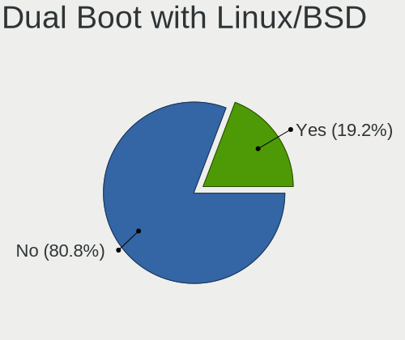
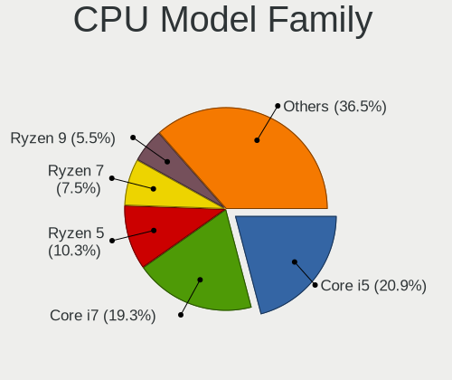
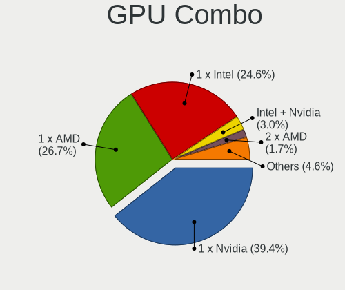
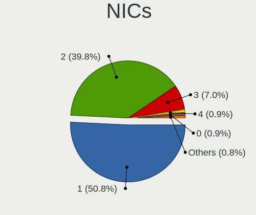
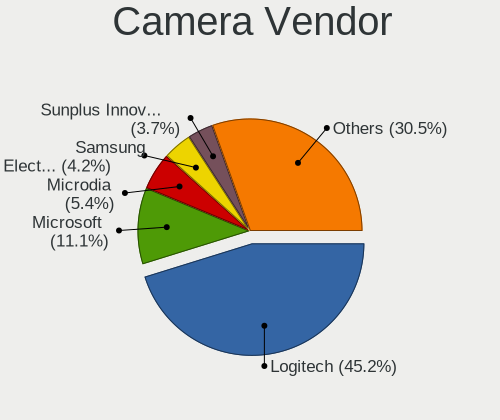

Linux in Australia - Tested Hardware & Statistics (Desktops)
------------------------------------------------------------

A project to collect tested hardware configurations for Linux in Australia.

Anyone can contribute to this report by the [hw-probe](https://github.com/linuxhw/hw-probe) tool:

    sudo -E hw-probe -all -upload

Please contribute! Especially if your hardware is rare.

Contents
--------

* [ Test Cases ](#test-cases)

* [ System ](#system)
  - [ OS                       ](#os)
  - [ OS Family                ](#os-family)
  - [ Kernel                   ](#kernel)
  - [ Kernel Family            ](#kernel-family)
  - [ Kernel Major Ver.        ](#kernel-major-ver)
  - [ Arch                     ](#arch)
  - [ DE                       ](#de)
  - [ Display Server           ](#display-server)
  - [ Display Manager          ](#display-manager)
  - [ OS Lang                  ](#os-lang)
  - [ Boot Mode                ](#boot-mode)
  - [ Filesystem               ](#filesystem)
  - [ Part. scheme             ](#part-scheme)
  - [ Dual Boot with Linux/BSD ](#dual-boot-with-linuxbsd)
  - [ Dual Boot (Win)          ](#dual-boot-win)

* [ Board ](#board)
  - [ Vendor                   ](#vendor)
  - [ Model                    ](#model)
  - [ Model Family             ](#model-family)
  - [ MFG Year                 ](#mfg-year)
  - [ Form Factor              ](#form-factor)
  - [ Secure Boot              ](#secure-boot)
  - [ Coreboot                 ](#coreboot)
  - [ RAM Size                 ](#ram-size)
  - [ RAM Used                 ](#ram-used)
  - [ Total Drives             ](#total-drives)
  - [ Has CD-ROM               ](#has-cd-rom)
  - [ Has Ethernet             ](#has-ethernet)
  - [ Has WiFi                 ](#has-wifi)
  - [ Has Bluetooth            ](#has-bluetooth)

* [ Location ](#location)
  - [ Country                  ](#country)
  - [ City                     ](#city)

* [ Drives ](#drives)
  - [ Drive Vendor             ](#drive-vendor)
  - [ Drive Model              ](#drive-model)
  - [ HDD Vendor               ](#hdd-vendor)
  - [ SSD Vendor               ](#ssd-vendor)
  - [ Drive Kind               ](#drive-kind)
  - [ Drive Connector          ](#drive-connector)
  - [ Drive Size               ](#drive-size)
  - [ Space Total              ](#space-total)
  - [ Space Used               ](#space-used)
  - [ Malfunc. Drives          ](#malfunc-drives)
  - [ Malfunc. Drive Vendor    ](#malfunc-drive-vendor)
  - [ Malfunc. HDD Vendor      ](#malfunc-hdd-vendor)
  - [ Malfunc. Drive Kind      ](#malfunc-drive-kind)
  - [ Failed Drives            ](#failed-drives)
  - [ Failed Drive Vendor      ](#failed-drive-vendor)
  - [ Drive Status             ](#drive-status)

* [ Storage controller ](#storage-controller)
  - [ Storage Vendor           ](#storage-vendor)
  - [ Storage Model            ](#storage-model)
  - [ Storage Kind             ](#storage-kind)

* [ Processor ](#processor)
  - [ CPU Vendor               ](#cpu-vendor)
  - [ CPU Model                ](#cpu-model)
  - [ CPU Model Family         ](#cpu-model-family)
  - [ CPU Cores                ](#cpu-cores)
  - [ CPU Sockets              ](#cpu-sockets)
  - [ CPU Threads              ](#cpu-threads)
  - [ CPU Op-Modes             ](#cpu-op-modes)
  - [ CPU Microcode            ](#cpu-microcode)
  - [ CPU Microarch            ](#cpu-microarch)

* [ Graphics ](#graphics)
  - [ GPU Vendor               ](#gpu-vendor)
  - [ GPU Model                ](#gpu-model)
  - [ GPU Combo                ](#gpu-combo)
  - [ GPU Driver               ](#gpu-driver)
  - [ GPU Memory               ](#gpu-memory)

* [ Monitor ](#monitor)
  - [ Monitor Vendor           ](#monitor-vendor)
  - [ Monitor Model            ](#monitor-model)
  - [ Monitor Resolution       ](#monitor-resolution)
  - [ Monitor Diagonal         ](#monitor-diagonal)
  - [ Monitor Width            ](#monitor-width)
  - [ Aspect Ratio             ](#aspect-ratio)
  - [ Monitor Area             ](#monitor-area)
  - [ Pixel Density            ](#pixel-density)
  - [ Multiple Monitors        ](#multiple-monitors)

* [ Network ](#network)
  - [ Net Controller Vendor    ](#net-controller-vendor)
  - [ Net Controller Model     ](#net-controller-model)
  - [ Wireless Vendor          ](#wireless-vendor)
  - [ Wireless Model           ](#wireless-model)
  - [ Ethernet Vendor          ](#ethernet-vendor)
  - [ Ethernet Model           ](#ethernet-model)
  - [ Net Controller Kind      ](#net-controller-kind)
  - [ Used Controller          ](#used-controller)
  - [ NICs                     ](#nics)
  - [ IPv6                     ](#ipv6)

* [ Bluetooth ](#bluetooth)
  - [ Bluetooth Vendor         ](#bluetooth-vendor)
  - [ Bluetooth Model          ](#bluetooth-model)

* [ Sound ](#sound)
  - [ Sound Vendor             ](#sound-vendor)
  - [ Sound Model              ](#sound-model)

* [ Memory ](#memory)
  - [ Memory Vendor            ](#memory-vendor)
  - [ Memory Model             ](#memory-model)
  - [ Memory Kind              ](#memory-kind)
  - [ Memory Form Factor       ](#memory-form-factor)
  - [ Memory Size              ](#memory-size)
  - [ Memory Speed             ](#memory-speed)

* [ Printers & scanners ](#printers--scanners)
  - [ Printer Vendor           ](#printer-vendor)
  - [ Printer Model            ](#printer-model)
  - [ Scanner Vendor           ](#scanner-vendor)
  - [ Scanner Model            ](#scanner-model)

* [ Camera ](#camera)
  - [ Camera Vendor            ](#camera-vendor)
  - [ Camera Model             ](#camera-model)

* [ Security ](#security)
  - [ Fingerprint Vendor       ](#fingerprint-vendor)
  - [ Fingerprint Model        ](#fingerprint-model)
  - [ Chipcard Vendor          ](#chipcard-vendor)
  - [ Chipcard Model           ](#chipcard-model)

* [ Unsupported ](#unsupported)
  - [ Unsupported Devices      ](#unsupported-devices)
  - [ Unsupported Device Types ](#unsupported-device-types)

Test Cases
----------

Total: 1936

| Vendor        | Model                       | Probe                                                      | Date         |
|---------------|-----------------------------|------------------------------------------------------------|--------------|
| Gigabyte      | GA-MA785G-UD3H              | [2cf98644bc](https://linux-hardware.org/?probe=2cf98644bc) | Sep 01, 2022 |
| Lenovo        | MAHOBAY                     | [53af4f5de7](https://linux-hardware.org/?probe=53af4f5de7) | Aug 30, 2022 |
| ASUSTek       | P5KPL-CM                    | [dc62f3b267](https://linux-hardware.org/?probe=dc62f3b267) | Aug 30, 2022 |
| ASRock        | Z170 Pro4                   | [eaa574481f](https://linux-hardware.org/?probe=eaa574481f) | Aug 29, 2022 |
| Unknown       | Unknown                     | [fd4ab67b77](https://linux-hardware.org/?probe=fd4ab67b77) | Aug 29, 2022 |
| Unknown       | Unknown                     | [4d1df25a9f](https://linux-hardware.org/?probe=4d1df25a9f) | Aug 29, 2022 |
| ASUSTek       | B85M-E                      | [a0f47aaaa7](https://linux-hardware.org/?probe=a0f47aaaa7) | Aug 28, 2022 |
| ASUSTek       | PRIME Z390-A                | [459c7c1eee](https://linux-hardware.org/?probe=459c7c1eee) | Aug 27, 2022 |
| ASUSTek       | Z170-K                      | [137641269c](https://linux-hardware.org/?probe=137641269c) | Aug 27, 2022 |
| Gigabyte      | B550 GAMING X V2            | [f37ee1975e](https://linux-hardware.org/?probe=f37ee1975e) | Aug 26, 2022 |
| Lenovo        | 1046 NO DPK                 | [e21e07827d](https://linux-hardware.org/?probe=e21e07827d) | Aug 26, 2022 |
| ASUSTek       | ROG STRIX B550-F GAMING     | [2388b95ce9](https://linux-hardware.org/?probe=2388b95ce9) | Aug 25, 2022 |
| ASUSTek       | Z97-AR                      | [a766ce2d5a](https://linux-hardware.org/?probe=a766ce2d5a) | Aug 24, 2022 |
| ASUSTek       | B85M-E                      | [fda9abd530](https://linux-hardware.org/?probe=fda9abd530) | Aug 24, 2022 |
| HP            | 1905                        | [6693a2b3c7](https://linux-hardware.org/?probe=6693a2b3c7) | Aug 24, 2022 |
| Gigabyte      | B360 AORUS GAMING 3 WIFI... | [18102e8a9a](https://linux-hardware.org/?probe=18102e8a9a) | Aug 24, 2022 |
| Gigabyte      | EP45-DS3L                   | [738a69419b](https://linux-hardware.org/?probe=738a69419b) | Aug 24, 2022 |
| Gigabyte      | B550M AORUS PRO-P           | [7dae220687](https://linux-hardware.org/?probe=7dae220687) | Aug 23, 2022 |
| ASRock        | AD2700-ITX                  | [4be47e3738](https://linux-hardware.org/?probe=4be47e3738) | Aug 21, 2022 |
| ASRock        | Z77 Extreme6                | [660091e5bb](https://linux-hardware.org/?probe=660091e5bb) | Aug 20, 2022 |
| Google        | Teemo                       | [4cc9295e6d](https://linux-hardware.org/?probe=4cc9295e6d) | Aug 20, 2022 |
| Gigabyte      | GA-MA780G-UD3H              | [c9738d69e9](https://linux-hardware.org/?probe=c9738d69e9) | Aug 20, 2022 |
| Gigabyte      | X570 AORUS MASTER           | [9bfc03d98e](https://linux-hardware.org/?probe=9bfc03d98e) | Aug 20, 2022 |
| MSI           | MAG B550 TOMAHAWK           | [ed2076bba5](https://linux-hardware.org/?probe=ed2076bba5) | Aug 20, 2022 |
| Gigabyte      | B360 AORUS GAMING 3 WIFI... | [1e4e125d11](https://linux-hardware.org/?probe=1e4e125d11) | Aug 17, 2022 |
| ASUSTek       | P8B75-M LX                  | [1efeb7be2c](https://linux-hardware.org/?probe=1efeb7be2c) | Aug 17, 2022 |
| Gigabyte      | D525TUD                     | [125fdc6af1](https://linux-hardware.org/?probe=125fdc6af1) | Aug 17, 2022 |
| Gigabyte      | D525TUD                     | [e68748c0f1](https://linux-hardware.org/?probe=e68748c0f1) | Aug 16, 2022 |
| Gigabyte      | B660M DS3H AX DDR4          | [171a797c22](https://linux-hardware.org/?probe=171a797c22) | Aug 16, 2022 |
| Gigabyte      | B660M DS3H AX DDR4          | [f882fcbe3a](https://linux-hardware.org/?probe=f882fcbe3a) | Aug 16, 2022 |
| Gigabyte      | GA-MA785G-UD3H              | [8072e15459](https://linux-hardware.org/?probe=8072e15459) | Aug 15, 2022 |
| Gigabyte      | H77N-WIFI                   | [20d9ba44b5](https://linux-hardware.org/?probe=20d9ba44b5) | Aug 15, 2022 |
| Gigabyte      | Z77MX-D3H                   | [be0b70efdb](https://linux-hardware.org/?probe=be0b70efdb) | Aug 15, 2022 |
| MSI           | H61M-P20                    | [9adc2fa427](https://linux-hardware.org/?probe=9adc2fa427) | Aug 15, 2022 |
| HP            | 1493                        | [e5d0f16bbc](https://linux-hardware.org/?probe=e5d0f16bbc) | Aug 14, 2022 |
| ASRock        | AB350 Gaming K4             | [8a6141848a](https://linux-hardware.org/?probe=8a6141848a) | Aug 13, 2022 |
| MSI           | H61M-P20                    | [acc2520058](https://linux-hardware.org/?probe=acc2520058) | Aug 13, 2022 |
| Gigabyte      | EP35C-DS3R                  | [762d78160d](https://linux-hardware.org/?probe=762d78160d) | Aug 12, 2022 |
| Gigabyte      | Z87M-D3HP                   | [b6612680e2](https://linux-hardware.org/?probe=b6612680e2) | Aug 11, 2022 |
| ASRock        | X58 Extreme3                | [81f68d4fc7](https://linux-hardware.org/?probe=81f68d4fc7) | Aug 10, 2022 |
| Unknown       | Unknown                     | [dc354e0b4f](https://linux-hardware.org/?probe=dc354e0b4f) | Aug 10, 2022 |
| ASUSTek       | TUF B360-PRO GAMING         | [62d813423e](https://linux-hardware.org/?probe=62d813423e) | Aug 10, 2022 |
| Gigabyte      | GA-MA780G-UD3H              | [e74a95c4d9](https://linux-hardware.org/?probe=e74a95c4d9) | Aug 09, 2022 |
| Gigabyte      | GA-MA785G-UD3H              | [42d32cdfda](https://linux-hardware.org/?probe=42d32cdfda) | Aug 09, 2022 |
| MSI           | Z97 GAMING 5                | [7f1e38b57b](https://linux-hardware.org/?probe=7f1e38b57b) | Aug 07, 2022 |
| ASUSTek       | ET2701I-W8                  | [5f9c4b50db](https://linux-hardware.org/?probe=5f9c4b50db) | Aug 07, 2022 |
| Gigabyte      | 945GCM-S2L                  | [fd6cf872ae](https://linux-hardware.org/?probe=fd6cf872ae) | Aug 06, 2022 |
| Gigabyte      | GA-MA785G-UD3H              | [1798c25088](https://linux-hardware.org/?probe=1798c25088) | Aug 05, 2022 |
| Gigabyte      | H77N-WIFI                   | [caa404d4c6](https://linux-hardware.org/?probe=caa404d4c6) | Aug 05, 2022 |
| Gigabyte      | H61M-D2-B3                  | [e477bf9f83](https://linux-hardware.org/?probe=e477bf9f83) | Aug 05, 2022 |
| Gigabyte      | Z77MX-D3H                   | [360447806b](https://linux-hardware.org/?probe=360447806b) | Aug 04, 2022 |
| Lenovo        | 3102                        | [73e0fee2bc](https://linux-hardware.org/?probe=73e0fee2bc) | Aug 03, 2022 |
| ASUSTek       | P8Z77-M PRO                 | [b81c8578b9](https://linux-hardware.org/?probe=b81c8578b9) | Aug 03, 2022 |
| ASRock        | X370 Gaming-ITX/ac          | [6127d6e7a3](https://linux-hardware.org/?probe=6127d6e7a3) | Aug 02, 2022 |
| ASRock        | Z390 Extreme4               | [9983a0cc64](https://linux-hardware.org/?probe=9983a0cc64) | Aug 02, 2022 |
| Gigabyte      | GA-MA785G-UD3H              | [dcccfd1beb](https://linux-hardware.org/?probe=dcccfd1beb) | Aug 01, 2022 |
| QIYIDA        | X99-H9 V2.0                 | [e1fa8ab12b](https://linux-hardware.org/?probe=e1fa8ab12b) | Aug 01, 2022 |
| Gigabyte      | B450 AORUS PRO-CF           | [81c46b891f](https://linux-hardware.org/?probe=81c46b891f) | Aug 01, 2022 |
| ASUSTek       | P7P55D-E PRO                | [d58be7b6d1](https://linux-hardware.org/?probe=d58be7b6d1) | Aug 01, 2022 |
| ASRock        | Z170 Pro4                   | [e8dba6ab7e](https://linux-hardware.org/?probe=e8dba6ab7e) | Jul 31, 2022 |
| Gigabyte      | GA-880GM-UD2H               | [f6a106d6df](https://linux-hardware.org/?probe=f6a106d6df) | Jul 31, 2022 |
| HP            | 82F2                        | [0c2d091c2e](https://linux-hardware.org/?probe=0c2d091c2e) | Jul 31, 2022 |
| ASRock        | Z170 Pro4                   | [73c8bc2ae1](https://linux-hardware.org/?probe=73c8bc2ae1) | Jul 28, 2022 |
| Lenovo        | 3717 SDK0R32862 WIN 3258... | [757ba0f252](https://linux-hardware.org/?probe=757ba0f252) | Jul 28, 2022 |
| Gigabyte      | B450M H                     | [1357e3b3d3](https://linux-hardware.org/?probe=1357e3b3d3) | Jul 28, 2022 |
| Unknown       | HX90                        | [1594710372](https://linux-hardware.org/?probe=1594710372) | Jul 28, 2022 |
| Gigabyte      | X570 AORUS ULTRA            | [331a99ef9a](https://linux-hardware.org/?probe=331a99ef9a) | Jul 26, 2022 |
| Gigabyte      | X570 AORUS ULTRA            | [1f3433b9e1](https://linux-hardware.org/?probe=1f3433b9e1) | Jul 26, 2022 |
| ASRock        | Z170 Pro4                   | [876c60188f](https://linux-hardware.org/?probe=876c60188f) | Jul 26, 2022 |
| Gigabyte      | B75M-D3H                    | [050aa57cb4](https://linux-hardware.org/?probe=050aa57cb4) | Jul 26, 2022 |
| Gigabyte      | X570 AORUS MASTER           | [7af6c5cebe](https://linux-hardware.org/?probe=7af6c5cebe) | Jul 24, 2022 |
| Lenovo        | ThinkCentre M58p 7220A72    | [d57e35934f](https://linux-hardware.org/?probe=d57e35934f) | Jul 22, 2022 |
| Gigabyte      | B75M-D3H                    | [80dcd8a0f7](https://linux-hardware.org/?probe=80dcd8a0f7) | Jul 22, 2022 |
| MSI           | Z97 GAMING 5                | [89e0889e94](https://linux-hardware.org/?probe=89e0889e94) | Jul 21, 2022 |
| ASUSTek       | Z170M-PLUS                  | [85df5dd7a2](https://linux-hardware.org/?probe=85df5dd7a2) | Jul 19, 2022 |
| Gigabyte      | GA-880GM-UD2H               | [a5082efd70](https://linux-hardware.org/?probe=a5082efd70) | Jul 19, 2022 |
| ASRock        | AD2700-ITX                  | [870cda5796](https://linux-hardware.org/?probe=870cda5796) | Jul 17, 2022 |
| Gigabyte      | GA-A55M-S2V                 | [713765e224](https://linux-hardware.org/?probe=713765e224) | Jul 16, 2022 |
| Gigabyte      | GA-870A-UD3                 | [950542a4a3](https://linux-hardware.org/?probe=950542a4a3) | Jul 16, 2022 |
| HP            | 802E                        | [c86ddd647b](https://linux-hardware.org/?probe=c86ddd647b) | Jul 16, 2022 |
| Gigabyte      | H77N-WIFI                   | [f655a34cc1](https://linux-hardware.org/?probe=f655a34cc1) | Jul 15, 2022 |
| HP            | 0B4Ch D                     | [a27d53815e](https://linux-hardware.org/?probe=a27d53815e) | Jul 15, 2022 |
| Dell          | 0W2F8G A01                  | [77f2181e08](https://linux-hardware.org/?probe=77f2181e08) | Jul 13, 2022 |
| Dell          | 0GXM1W A02                  | [ff67056edc](https://linux-hardware.org/?probe=ff67056edc) | Jul 13, 2022 |
| Gigabyte      | J1900M-D2P                  | [29602ec66f](https://linux-hardware.org/?probe=29602ec66f) | Jul 13, 2022 |
| ASUSTek       | P8Z77-M PRO                 | [0c70241041](https://linux-hardware.org/?probe=0c70241041) | Jul 13, 2022 |
| MSI           | X99S GAMING 9 AC            | [5f682aadd5](https://linux-hardware.org/?probe=5f682aadd5) | Jul 12, 2022 |
| ASUSTek       | P8Z77-M PRO                 | [4929b942aa](https://linux-hardware.org/?probe=4929b942aa) | Jul 12, 2022 |
| Intel         | LADPNVMO AAE76523-300       | [07a37c99cb](https://linux-hardware.org/?probe=07a37c99cb) | Jul 11, 2022 |
| Gigabyte      | GA-MA780G-UD3H              | [cdf7b9a4d1](https://linux-hardware.org/?probe=cdf7b9a4d1) | Jul 10, 2022 |
| Gigabyte      | H170N-WIFI-CF               | [2f3e59dc30](https://linux-hardware.org/?probe=2f3e59dc30) | Jul 09, 2022 |
| MSI           | B450M MORTAR MAX            | [60d115ad0c](https://linux-hardware.org/?probe=60d115ad0c) | Jul 09, 2022 |
| ASRock        | Z77 Extreme6                | [fd8bd29c03](https://linux-hardware.org/?probe=fd8bd29c03) | Jul 09, 2022 |
| Gigabyte      | J1900M-D2P                  | [36fa61e21d](https://linux-hardware.org/?probe=36fa61e21d) | Jul 09, 2022 |
| Gigabyte      | EP45-DS3L                   | [4b7c20d75e](https://linux-hardware.org/?probe=4b7c20d75e) | Jul 09, 2022 |
| Gigabyte      | X570 AORUS PRO WIFI         | [fb5a2ac873](https://linux-hardware.org/?probe=fb5a2ac873) | Jul 09, 2022 |
| ASUSTek       | ROG STRIX B660-I GAMING ... | [48bd0906cf](https://linux-hardware.org/?probe=48bd0906cf) | Jul 08, 2022 |
| Gigabyte      | B550 AORUS PRO AX           | [9ad45447d4](https://linux-hardware.org/?probe=9ad45447d4) | Jul 08, 2022 |
| Gigabyte      | GA-MA785G-UD3H              | [4da61d3e61](https://linux-hardware.org/?probe=4da61d3e61) | Jul 07, 2022 |
| Gigabyte      | X570 AORUS PRO WIFI         | [503c38154f](https://linux-hardware.org/?probe=503c38154f) | Jul 07, 2022 |
| ASRock        | 990FX Killer                | [28b0984086](https://linux-hardware.org/?probe=28b0984086) | Jul 05, 2022 |
| Gigabyte      | H77N-WIFI                   | [e795477a20](https://linux-hardware.org/?probe=e795477a20) | Jul 05, 2022 |
| Dell          | 0T10XW A01                  | [e165fd805c](https://linux-hardware.org/?probe=e165fd805c) | Jul 04, 2022 |
| HP            | 3646h                       | [9e0737f23f](https://linux-hardware.org/?probe=9e0737f23f) | Jul 04, 2022 |
| Dell          | 0Y5DDC A00                  | [e99c8ae46f](https://linux-hardware.org/?probe=e99c8ae46f) | Jul 04, 2022 |
| Intel         | DH67BL AAG10189-211         | [ef2f004b52](https://linux-hardware.org/?probe=ef2f004b52) | Jul 02, 2022 |
| ASRock        | Z390 Pro4                   | [25bd784ca6](https://linux-hardware.org/?probe=25bd784ca6) | Jul 02, 2022 |
| Gigabyte      | Z97X-Gaming 3               | [9b8bb163d3](https://linux-hardware.org/?probe=9b8bb163d3) | Jul 01, 2022 |
| Gigabyte      | X570 I AORUS PRO WIFI       | [d82f88e20c](https://linux-hardware.org/?probe=d82f88e20c) | Jul 01, 2022 |
| Lenovo        | ThinkCentre M58p 7220A72    | [cea6c9ea52](https://linux-hardware.org/?probe=cea6c9ea52) | Jun 30, 2022 |
| MSI           | Z77A-G43                    | [909e3e3c2e](https://linux-hardware.org/?probe=909e3e3c2e) | Jun 29, 2022 |
| Gigabyte      | D525TUD                     | [b6cfc5d2df](https://linux-hardware.org/?probe=b6cfc5d2df) | Jun 28, 2022 |
| Gigabyte      | G41MT-D3                    | [20de16a046](https://linux-hardware.org/?probe=20de16a046) | Jun 28, 2022 |
| ASUSTek       | A88X-GAMER                  | [b7e193f50c](https://linux-hardware.org/?probe=b7e193f50c) | Jun 28, 2022 |
| Dell          | 051FJ8 A02                  | [5b997790f1](https://linux-hardware.org/?probe=5b997790f1) | Jun 27, 2022 |
| Gigabyte      | J1900M-D2P                  | [d703a63932](https://linux-hardware.org/?probe=d703a63932) | Jun 26, 2022 |
| MSI           | PRO Z690-A                  | [34a2f4f726](https://linux-hardware.org/?probe=34a2f4f726) | Jun 26, 2022 |
| Gigabyte      | B250M-D3H-CF                | [bd52209b2a](https://linux-hardware.org/?probe=bd52209b2a) | Jun 24, 2022 |
| Gigabyte      | B450 AORUS PRO-CF           | [989b450d8b](https://linux-hardware.org/?probe=989b450d8b) | Jun 23, 2022 |
| Dell          | 0W2F8G A01                  | [447653d4f2](https://linux-hardware.org/?probe=447653d4f2) | Jun 22, 2022 |
| Dell          | 0W2F8G A01                  | [4610c38358](https://linux-hardware.org/?probe=4610c38358) | Jun 22, 2022 |
| ASUSTek       | PRIME X570-PRO              | [ae30cadddf](https://linux-hardware.org/?probe=ae30cadddf) | Jun 22, 2022 |
| Gigabyte      | Z690 AORUS ELITE AX DDR4    | [b65a5020db](https://linux-hardware.org/?probe=b65a5020db) | Jun 22, 2022 |
| ASUSTek       | ROG CROSSHAIR VIII DARK ... | [ecc6e0f4ef](https://linux-hardware.org/?probe=ecc6e0f4ef) | Jun 21, 2022 |
| MSI           | MAG B550M MORTAR WIFI       | [a59676f7be](https://linux-hardware.org/?probe=a59676f7be) | Jun 19, 2022 |
| Gigabyte      | GA-MA785G-UD3H              | [dfed0867e1](https://linux-hardware.org/?probe=dfed0867e1) | Jun 17, 2022 |
| ASUSTek       | M5A99X EVO R2.0             | [0d4c3d0c10](https://linux-hardware.org/?probe=0d4c3d0c10) | Jun 17, 2022 |
| Acer          | Aspire TC-230               | [ac205eb1ec](https://linux-hardware.org/?probe=ac205eb1ec) | Jun 17, 2022 |
| ASUSTek       | PRIME A320M-K               | [17e9f5a71f](https://linux-hardware.org/?probe=17e9f5a71f) | Jun 16, 2022 |
| ASUSTek       | PRIME B550M-A               | [527aea0d6e](https://linux-hardware.org/?probe=527aea0d6e) | Jun 16, 2022 |
| MSI           | B350M MORTAR ARCTIC         | [57ad2e9147](https://linux-hardware.org/?probe=57ad2e9147) | Jun 15, 2022 |
| Gigabyte      | J1900M-D2P                  | [8ded20d82b](https://linux-hardware.org/?probe=8ded20d82b) | Jun 15, 2022 |
| Gigabyte      | H61M-S2PV                   | [cc88cec642](https://linux-hardware.org/?probe=cc88cec642) | Jun 14, 2022 |
| Gigabyte      | H110-D3A-CF                 | [aca5883c17](https://linux-hardware.org/?probe=aca5883c17) | Jun 14, 2022 |
| Intel         | DH67BL AAG10189-211         | [8bb84d5aaf](https://linux-hardware.org/?probe=8bb84d5aaf) | Jun 14, 2022 |
| Gigabyte      | AB350-Gaming 3-CF           | [f9e74fdcd3](https://linux-hardware.org/?probe=f9e74fdcd3) | Jun 13, 2022 |
| Unknown       | Unknown                     | [c62add2d70](https://linux-hardware.org/?probe=c62add2d70) | Jun 13, 2022 |
| ASUSTek       | P5KPL/1600                  | [0c6a9f5dff](https://linux-hardware.org/?probe=0c6a9f5dff) | Jun 13, 2022 |
| ASUSTek       | P5KPL/1600                  | [aeec9e715d](https://linux-hardware.org/?probe=aeec9e715d) | Jun 13, 2022 |
| ASUSTek       | P6T DELUXE V2               | [db209b6bf1](https://linux-hardware.org/?probe=db209b6bf1) | Jun 12, 2022 |
| ASUSTek       | A8R32-MVP Deluxe            | [0c0715a9b2](https://linux-hardware.org/?probe=0c0715a9b2) | Jun 12, 2022 |
| Dell          | 0T10XW A01                  | [1e3a9647e9](https://linux-hardware.org/?probe=1e3a9647e9) | Jun 12, 2022 |
| Gigabyte      | H77N-WIFI                   | [23fa842567](https://linux-hardware.org/?probe=23fa842567) | Jun 11, 2022 |
| ASUSTek       | ROG STRIX Z390-E GAMING     | [576fc8e8ed](https://linux-hardware.org/?probe=576fc8e8ed) | Jun 11, 2022 |
| Gigabyte      | H77N-WIFI                   | [fd1478145b](https://linux-hardware.org/?probe=fd1478145b) | Jun 11, 2022 |
| ASUSTek       | ROG STRIX B560-F GAMING ... | [a4277bcba9](https://linux-hardware.org/?probe=a4277bcba9) | Jun 11, 2022 |
| ASUSTek       | TUF B360M-E GAMING          | [b1e492c444](https://linux-hardware.org/?probe=b1e492c444) | Jun 10, 2022 |
| Gigabyte      | GA-MA785G-UD3H              | [b771c75e31](https://linux-hardware.org/?probe=b771c75e31) | Jun 10, 2022 |
| ASUSTek       | P6T DELUXE V2               | [9198e2d64c](https://linux-hardware.org/?probe=9198e2d64c) | Jun 10, 2022 |
| Gigabyte      | GA-880GM-UD2H               | [267db233fa](https://linux-hardware.org/?probe=267db233fa) | Jun 10, 2022 |
| Gigabyte      | GA-990FXA-UD5               | [b33d07af6c](https://linux-hardware.org/?probe=b33d07af6c) | Jun 09, 2022 |
| Gigabyte      | G41MT-D3                    | [2ac69cc327](https://linux-hardware.org/?probe=2ac69cc327) | Jun 08, 2022 |
| ASRock        | AD2700-ITX                  | [9342f5c46b](https://linux-hardware.org/?probe=9342f5c46b) | Jun 08, 2022 |
| Gigabyte      | D525TUD                     | [fdba6d0041](https://linux-hardware.org/?probe=fdba6d0041) | Jun 08, 2022 |
| Gigabyte      | X570 I AORUS PRO WIFI       | [d984f403e9](https://linux-hardware.org/?probe=d984f403e9) | Jun 08, 2022 |
| Gigabyte      | B360M D3H-CF                | [73e68df88c](https://linux-hardware.org/?probe=73e68df88c) | Jun 08, 2022 |
| Gigabyte      | GA-MA785G-UD3H              | [bfa4e4ff74](https://linux-hardware.org/?probe=bfa4e4ff74) | Jun 07, 2022 |
| Lenovo        | 0B98401 PRO                 | [67cfa56623](https://linux-hardware.org/?probe=67cfa56623) | Jun 07, 2022 |
| Gigabyte      | Z690 AORUS PRO DDR4         | [1196dd3b41](https://linux-hardware.org/?probe=1196dd3b41) | Jun 06, 2022 |
| Gigabyte      | Z690 AORUS PRO DDR4         | [15efe8a0a2](https://linux-hardware.org/?probe=15efe8a0a2) | Jun 06, 2022 |
| Acer          | Veriton N4670G              | [0b85f95c4c](https://linux-hardware.org/?probe=0b85f95c4c) | Jun 05, 2022 |
| ASUSTek       | PRIME X570-P                | [3b4483236d](https://linux-hardware.org/?probe=3b4483236d) | Jun 05, 2022 |
| ASUSTek       | PRIME H510M-E               | [9207d2f2d8](https://linux-hardware.org/?probe=9207d2f2d8) | Jun 04, 2022 |
| Gigabyte      | B85M-D3H                    | [4bbee9909a](https://linux-hardware.org/?probe=4bbee9909a) | Jun 04, 2022 |
| Gigabyte      | H77M-D3H                    | [f770ece55b](https://linux-hardware.org/?probe=f770ece55b) | Jun 03, 2022 |
| Gigabyte      | Z77MX-D3H                   | [24c8a035ac](https://linux-hardware.org/?probe=24c8a035ac) | Jun 03, 2022 |
| Gigabyte      | B85M-D3H                    | [0ddfd77617](https://linux-hardware.org/?probe=0ddfd77617) | Jun 02, 2022 |
| Alienware     | 0XJKKD A00                  | [ae3a750f2e](https://linux-hardware.org/?probe=ae3a750f2e) | Jun 01, 2022 |
| HP            | 1632                        | [4f7993cf34](https://linux-hardware.org/?probe=4f7993cf34) | Jun 01, 2022 |
| HP            | 1632                        | [9e69c11025](https://linux-hardware.org/?probe=9e69c11025) | Jun 01, 2022 |
| ASUSTek       | A8R32-MVP Deluxe            | [0faa61f3a9](https://linux-hardware.org/?probe=0faa61f3a9) | May 31, 2022 |
| ASUSTek       | A8R32-MVP Deluxe            | [9f5906337b](https://linux-hardware.org/?probe=9f5906337b) | May 31, 2022 |
| Gigabyte      | GA-78LMT-USB3               | [33ac99c04e](https://linux-hardware.org/?probe=33ac99c04e) | May 30, 2022 |
| ASUSTek       | SABERTOOTH Z77              | [3bb74db496](https://linux-hardware.org/?probe=3bb74db496) | May 30, 2022 |
| Dell          | 0C522T A03                  | [b1323f0c11](https://linux-hardware.org/?probe=b1323f0c11) | May 29, 2022 |
| Lenovo        | ThinkCentre M58p 7220A72    | [96cd8abf05](https://linux-hardware.org/?probe=96cd8abf05) | May 29, 2022 |
| ASUSTek       | SABERTOOTH 990FX R2.0       | [9c69f7b836](https://linux-hardware.org/?probe=9c69f7b836) | May 29, 2022 |
| Gigabyte      | GA-MA785G-UD3H              | [b810bd52cc](https://linux-hardware.org/?probe=b810bd52cc) | May 28, 2022 |
| Gigabyte      | GA-870A-UD3                 | [719fe6db76](https://linux-hardware.org/?probe=719fe6db76) | May 28, 2022 |
| Gigabyte      | B560M AORUS PRO             | [31f246f96e](https://linux-hardware.org/?probe=31f246f96e) | May 27, 2022 |
| Gigabyte      | B560M AORUS PRO             | [1d381d6ec9](https://linux-hardware.org/?probe=1d381d6ec9) | May 27, 2022 |
| HP            | 0AECh D                     | [ee3f56c60e](https://linux-hardware.org/?probe=ee3f56c60e) | May 27, 2022 |
| Gigabyte      | H77N-WIFI                   | [ac41fb756c](https://linux-hardware.org/?probe=ac41fb756c) | May 26, 2022 |
| Acer          | Seawolf                     | [dccbcb7ef3](https://linux-hardware.org/?probe=dccbcb7ef3) | May 25, 2022 |
| Gigabyte      | AB350-Gaming 3-CF           | [4738560555](https://linux-hardware.org/?probe=4738560555) | May 25, 2022 |
| Gigabyte      | G41MT-D3                    | [89927eb8f5](https://linux-hardware.org/?probe=89927eb8f5) | May 25, 2022 |
| Gigabyte      | B450 AORUS PRO WIFI-CF      | [6e45ae9f7c](https://linux-hardware.org/?probe=6e45ae9f7c) | May 24, 2022 |
| ASUSTek       | B85M-E                      | [4ea6883bee](https://linux-hardware.org/?probe=4ea6883bee) | May 23, 2022 |
| ASUSTek       | TUF Z390-PLUS GAMING        | [192f2ac212](https://linux-hardware.org/?probe=192f2ac212) | May 23, 2022 |
| MSI           | MAG X570S TORPEDO MAX       | [eaf9e6332b](https://linux-hardware.org/?probe=eaf9e6332b) | May 21, 2022 |
| Gigabyte      | EP45-DS3L                   | [81360dffcc](https://linux-hardware.org/?probe=81360dffcc) | May 21, 2022 |
| HP            | 0A08h                       | [86c65b6b1f](https://linux-hardware.org/?probe=86c65b6b1f) | May 21, 2022 |
| HP            | 0A08h                       | [18b2ce1297](https://linux-hardware.org/?probe=18b2ce1297) | May 21, 2022 |
| HP            | 8053                        | [53c0148d64](https://linux-hardware.org/?probe=53c0148d64) | May 20, 2022 |
| ECS           | P67H2-A3                    | [2bc21b9c81](https://linux-hardware.org/?probe=2bc21b9c81) | May 20, 2022 |
| ASUSTek       | ROG CROSSHAIR VIII IMPAC... | [d94f4b0a43](https://linux-hardware.org/?probe=d94f4b0a43) | May 19, 2022 |
| ASUSTek       | P8Z68-V                     | [c3438d922b](https://linux-hardware.org/?probe=c3438d922b) | May 19, 2022 |
| Gigabyte      | AX370M-DS3H-CF              | [2f7a99c28b](https://linux-hardware.org/?probe=2f7a99c28b) | May 17, 2022 |
| ASUSTek       | M4A785TD-V EVO              | [ee4e4a7bc7](https://linux-hardware.org/?probe=ee4e4a7bc7) | May 17, 2022 |
| Gigabyte      | MQLP7AP-00                  | [3c99b8d861](https://linux-hardware.org/?probe=3c99b8d861) | May 16, 2022 |
| ASUSTek       | Z170I PRO GAMING            | [a58685906f](https://linux-hardware.org/?probe=a58685906f) | May 15, 2022 |
| Dell          | 0CRH6C A02                  | [655afd62e6](https://linux-hardware.org/?probe=655afd62e6) | May 14, 2022 |
| Intel         | LADPNVMO AAE76523-300       | [9161d40357](https://linux-hardware.org/?probe=9161d40357) | May 14, 2022 |
| Gigabyte      | EX58-UD4P                   | [e34d9464b2](https://linux-hardware.org/?probe=e34d9464b2) | May 14, 2022 |
| MSI           | 970A SLI Krait Edition      | [45a26a9322](https://linux-hardware.org/?probe=45a26a9322) | May 14, 2022 |
| MSI           | B450M MORTAR MAX            | [3a07cc7daf](https://linux-hardware.org/?probe=3a07cc7daf) | May 14, 2022 |
| HP            | 82B4                        | [3a1723a2ee](https://linux-hardware.org/?probe=3a1723a2ee) | May 13, 2022 |
| Gigabyte      | G41MT-D3                    | [78c64b498b](https://linux-hardware.org/?probe=78c64b498b) | May 13, 2022 |
| Intel         | DH67BL AAG10189-210         | [2340d530cd](https://linux-hardware.org/?probe=2340d530cd) | May 13, 2022 |
| ASRock        | X570M Pro4                  | [fca86a854a](https://linux-hardware.org/?probe=fca86a854a) | May 13, 2022 |
| HP            | 8526 MVB, A                 | [50b2aa8de2](https://linux-hardware.org/?probe=50b2aa8de2) | May 12, 2022 |
| ASUSTek       | P8H61                       | [d2b843c446](https://linux-hardware.org/?probe=d2b843c446) | May 12, 2022 |
| Acer          | Aspire X3990                | [c6753ff37f](https://linux-hardware.org/?probe=c6753ff37f) | May 11, 2022 |
| MSI           | H97M-E35                    | [fdd0f51b46](https://linux-hardware.org/?probe=fdd0f51b46) | May 10, 2022 |
| Gigabyte      | H370M D3H-CF                | [ffc3d3cf27](https://linux-hardware.org/?probe=ffc3d3cf27) | May 10, 2022 |
| ASRock        | H87M                        | [9c031f1e71](https://linux-hardware.org/?probe=9c031f1e71) | May 09, 2022 |
| MSI           | MPG B550I GAMING EDGE WI... | [89f0b017b1](https://linux-hardware.org/?probe=89f0b017b1) | May 09, 2022 |
| MSI           | MPG B550I GAMING EDGE WI... | [bd7335e1cd](https://linux-hardware.org/?probe=bd7335e1cd) | May 09, 2022 |
| Acer          | Aspire XC-603               | [3d806cb212](https://linux-hardware.org/?probe=3d806cb212) | May 08, 2022 |
| ASUSTek       | PRIME B250M-K               | [e4340f1707](https://linux-hardware.org/?probe=e4340f1707) | May 07, 2022 |
| Dell          | 00V62H A00                  | [5c5f2f2b5c](https://linux-hardware.org/?probe=5c5f2f2b5c) | May 07, 2022 |
| Gigabyte      | Z68A-D3H-B3                 | [1441dfb79e](https://linux-hardware.org/?probe=1441dfb79e) | May 07, 2022 |
| Gigabyte      | GA-78LMT-USB3 SEx           | [79c87fe48c](https://linux-hardware.org/?probe=79c87fe48c) | May 07, 2022 |
| MSI           | C236A WORKSTATION           | [57d0654584](https://linux-hardware.org/?probe=57d0654584) | May 06, 2022 |
| ASRock        | AD2700-ITX                  | [c44c5e8931](https://linux-hardware.org/?probe=c44c5e8931) | May 06, 2022 |
| Gigabyte      | GA-MA785G-UD3H              | [46adc67882](https://linux-hardware.org/?probe=46adc67882) | May 05, 2022 |
| ASUSTek       | B85M-E                      | [2b6338d755](https://linux-hardware.org/?probe=2b6338d755) | May 04, 2022 |
| Gigabyte      | H77M-D3H                    | [ba7fe58d02](https://linux-hardware.org/?probe=ba7fe58d02) | May 03, 2022 |
| Dell          | 0NC2VH A01                  | [f05a6e7d31](https://linux-hardware.org/?probe=f05a6e7d31) | May 03, 2022 |
| ASUSTek       | B85M-E                      | [9645231d87](https://linux-hardware.org/?probe=9645231d87) | May 03, 2022 |
| Gigabyte      | X570S AORUS MASTER          | [c6da7b776e](https://linux-hardware.org/?probe=c6da7b776e) | May 03, 2022 |
| MSI           | B450M MORTAR MAX            | [1d6bcd7320](https://linux-hardware.org/?probe=1d6bcd7320) | May 02, 2022 |
| MSI           | B450M MORTAR MAX            | [8e220517f5](https://linux-hardware.org/?probe=8e220517f5) | May 02, 2022 |
| Gigabyte      | H77M-D3H                    | [579cadce96](https://linux-hardware.org/?probe=579cadce96) | May 02, 2022 |
| Gigabyte      | Z77MX-D3H                   | [42067d196a](https://linux-hardware.org/?probe=42067d196a) | May 02, 2022 |
| MSI           | A320M-A PRO MAX             | [c396021a33](https://linux-hardware.org/?probe=c396021a33) | May 01, 2022 |
| Gigabyte      | B365M H                     | [6755ed2aa6](https://linux-hardware.org/?probe=6755ed2aa6) | Apr 29, 2022 |
| Gigabyte      | EX58-UD4P                   | [910da71dd2](https://linux-hardware.org/?probe=910da71dd2) | Apr 28, 2022 |
| ASUSTek       | VANGUARD B85                | [d591002039](https://linux-hardware.org/?probe=d591002039) | Apr 27, 2022 |
| ASUSTek       | TUF Z390-PLUS GAMING        | [77c2b99e9b](https://linux-hardware.org/?probe=77c2b99e9b) | Apr 27, 2022 |
| MSI           | A320M-A PRO MAX             | [e06fd46729](https://linux-hardware.org/?probe=e06fd46729) | Apr 26, 2022 |
| Lenovo        | 3106 SDK0J40705 WIN 3425... | [93c883ef59](https://linux-hardware.org/?probe=93c883ef59) | Apr 26, 2022 |
| Gigabyte      | H77N-WIFI                   | [205ae74d07](https://linux-hardware.org/?probe=205ae74d07) | Apr 26, 2022 |
| HP            | 0AACh                       | [f9e511945d](https://linux-hardware.org/?probe=f9e511945d) | Apr 25, 2022 |
| ASUSTek       | PRIME Z690M-PLUS D4         | [f0aea29124](https://linux-hardware.org/?probe=f0aea29124) | Apr 25, 2022 |
| Gigabyte      | H110M-S2PV-CF               | [d076b5c763](https://linux-hardware.org/?probe=d076b5c763) | Apr 24, 2022 |
| Gigabyte      | B360 AORUS GAMING 3 WIFI... | [fabaa5b3ab](https://linux-hardware.org/?probe=fabaa5b3ab) | Apr 24, 2022 |
| Lenovo        | ThinkCentre M58p 7220A72    | [e686789a94](https://linux-hardware.org/?probe=e686789a94) | Apr 24, 2022 |
| ASRock        | B85M Pro3                   | [551ea1b91f](https://linux-hardware.org/?probe=551ea1b91f) | Apr 23, 2022 |
| Dell          | 00V62H A00                  | [2da43c32a4](https://linux-hardware.org/?probe=2da43c32a4) | Apr 23, 2022 |
| ASUSTek       | ROG CROSSHAIR VIII DARK ... | [fc1fd7355c](https://linux-hardware.org/?probe=fc1fd7355c) | Apr 21, 2022 |
| Gigabyte      | GA-MA785G-UD3H              | [1c54ba7a0c](https://linux-hardware.org/?probe=1c54ba7a0c) | Apr 21, 2022 |
| Gigabyte      | B85M-D3H                    | [3e69787ee4](https://linux-hardware.org/?probe=3e69787ee4) | Apr 21, 2022 |
| MSI           | Z97 GAMING 5                | [a6bd59cad3](https://linux-hardware.org/?probe=a6bd59cad3) | Apr 20, 2022 |
| ASUSTek       | A8R32-MVP Deluxe            | [7969fc986b](https://linux-hardware.org/?probe=7969fc986b) | Apr 20, 2022 |
| MSI           | Z97 GAMING 5                | [350979cb0a](https://linux-hardware.org/?probe=350979cb0a) | Apr 19, 2022 |
| Gigabyte      | GA-78LMT-USB3 SEx           | [179b76718e](https://linux-hardware.org/?probe=179b76718e) | Apr 18, 2022 |
| Dell          | 0X9M3X A05                  | [f049c88dfe](https://linux-hardware.org/?probe=f049c88dfe) | Apr 18, 2022 |
| Gigabyte      | J1900M-D2P                  | [170db82573](https://linux-hardware.org/?probe=170db82573) | Apr 18, 2022 |
| ASRock        | AD525PV3                    | [b5c71cfdef](https://linux-hardware.org/?probe=b5c71cfdef) | Apr 18, 2022 |
| Gigabyte      | GA-MA785G-UD3H              | [7c4882a4ef](https://linux-hardware.org/?probe=7c4882a4ef) | Apr 16, 2022 |
| Gigabyte      | GA-870A-UD3                 | [2bc3cb42bb](https://linux-hardware.org/?probe=2bc3cb42bb) | Apr 16, 2022 |
| MSI           | MAG B460M MORTAR            | [eeccee9c29](https://linux-hardware.org/?probe=eeccee9c29) | Apr 15, 2022 |
| ASRock        | X570 Steel Legend           | [bbd732b5ca](https://linux-hardware.org/?probe=bbd732b5ca) | Apr 14, 2022 |
| MSI           | Z97 PC Mate                 | [930c18b320](https://linux-hardware.org/?probe=930c18b320) | Apr 14, 2022 |
| Dell          | 0H7TGR A00                  | [70bdc97d85](https://linux-hardware.org/?probe=70bdc97d85) | Apr 14, 2022 |
| Gigabyte      | J1900M-D2P                  | [794fbc68d8](https://linux-hardware.org/?probe=794fbc68d8) | Apr 14, 2022 |
| HP            | ProLiant ML330 G6           | [a62736690a](https://linux-hardware.org/?probe=a62736690a) | Apr 14, 2022 |
| Gigabyte      | GA-MA780G-UD3H              | [43aa5ccd47](https://linux-hardware.org/?probe=43aa5ccd47) | Apr 14, 2022 |
| HP            | 805D                        | [56634964fb](https://linux-hardware.org/?probe=56634964fb) | Apr 13, 2022 |
| Lenovo        | ThinkCentre A55 8982A48     | [8de4cd1654](https://linux-hardware.org/?probe=8de4cd1654) | Apr 12, 2022 |
| ASUSTek       | PRIME X299-A                | [3cfaa62e07](https://linux-hardware.org/?probe=3cfaa62e07) | Apr 11, 2022 |
| ASUSTek       | ProArt X570-CREATOR WIFI    | [e4fc7cc2cc](https://linux-hardware.org/?probe=e4fc7cc2cc) | Apr 10, 2022 |
| ASUSTek       | H87M-PRO                    | [0d2b6aaa56](https://linux-hardware.org/?probe=0d2b6aaa56) | Apr 10, 2022 |
| ASUSTek       | P8Z77-V DELUXE              | [e890c4c2f7](https://linux-hardware.org/?probe=e890c4c2f7) | Apr 10, 2022 |
| ASUSTek       | P8H67-V                     | [a2ae5eb5b9](https://linux-hardware.org/?probe=a2ae5eb5b9) | Apr 09, 2022 |
| ASRock        | X299 Gaming K6              | [86fc074c1f](https://linux-hardware.org/?probe=86fc074c1f) | Apr 09, 2022 |
| ASUSTek       | H87M-PRO                    | [86b82467fd](https://linux-hardware.org/?probe=86b82467fd) | Apr 08, 2022 |
| ASRock        | X399 Taichi                 | [2e37b66578](https://linux-hardware.org/?probe=2e37b66578) | Apr 08, 2022 |
| ASRock        | X399 Taichi                 | [e7b1a0df67](https://linux-hardware.org/?probe=e7b1a0df67) | Apr 08, 2022 |
| Lenovo        | SHARKBAY SDK0E50510 PRO ... | [10458d0000](https://linux-hardware.org/?probe=10458d0000) | Apr 08, 2022 |
| Gigabyte      | Z77M-D3H-MVP                | [8ee23e0e96](https://linux-hardware.org/?probe=8ee23e0e96) | Apr 08, 2022 |
| ASRock        | Z77 Extreme4                | [3524c0ef61](https://linux-hardware.org/?probe=3524c0ef61) | Apr 08, 2022 |
| Lenovo        | MAHOBAY NO DPK              | [1592895310](https://linux-hardware.org/?probe=1592895310) | Apr 07, 2022 |
| ASUSTek       | P8B75-M                     | [bc01cf4afc](https://linux-hardware.org/?probe=bc01cf4afc) | Apr 05, 2022 |
| ASUSTek       | TUF Gaming B550-PLUS        | [403a6830d9](https://linux-hardware.org/?probe=403a6830d9) | Apr 04, 2022 |
| MSI           | MAG X570 TOMAHAWK WIFI      | [e12e7fdd89](https://linux-hardware.org/?probe=e12e7fdd89) | Apr 04, 2022 |
| ASUSTek       | H81M-PLUS                   | [a517bb6633](https://linux-hardware.org/?probe=a517bb6633) | Apr 03, 2022 |
| MSI           | A88XM-E35 V2                | [2366707e2c](https://linux-hardware.org/?probe=2366707e2c) | Apr 03, 2022 |
| ASRock        | B85M Pro3                   | [8d14068c4b](https://linux-hardware.org/?probe=8d14068c4b) | Apr 02, 2022 |
| ASUSTek       | ROG CROSSHAIR VIII FORMU... | [e94a772f2b](https://linux-hardware.org/?probe=e94a772f2b) | Apr 02, 2022 |
| ASUSTek       | ROG STRIX X470-F GAMING     | [3bcc5c9790](https://linux-hardware.org/?probe=3bcc5c9790) | Apr 02, 2022 |
| Gigabyte      | X570 GAMING X               | [348ccc5750](https://linux-hardware.org/?probe=348ccc5750) | Apr 01, 2022 |
| Gigabyte      | X570 GAMING X               | [32eabd9ac8](https://linux-hardware.org/?probe=32eabd9ac8) | Apr 01, 2022 |
| Pegatron      | 2AD5                        | [0e27c2feb0](https://linux-hardware.org/?probe=0e27c2feb0) | Mar 31, 2022 |
| MSI           | MEG X570 ACE                | [55572b8a7e](https://linux-hardware.org/?probe=55572b8a7e) | Mar 31, 2022 |
| MSI           | MAG X570 TOMAHAWK WIFI      | [d5b2536b95](https://linux-hardware.org/?probe=d5b2536b95) | Mar 30, 2022 |
| Gigabyte      | AB350-Gaming 3-CF           | [756231c2f0](https://linux-hardware.org/?probe=756231c2f0) | Mar 27, 2022 |
| Gigabyte      | B360 AORUS GAMING 3 WIFI... | [296d97246f](https://linux-hardware.org/?probe=296d97246f) | Mar 26, 2022 |
| Gigabyte      | B360 AORUS GAMING 3 WIFI... | [1272ec27ff](https://linux-hardware.org/?probe=1272ec27ff) | Mar 26, 2022 |
| Dell          | 0C522T A00                  | [33ae998152](https://linux-hardware.org/?probe=33ae998152) | Mar 26, 2022 |
| Dell          | 0C522T A00                  | [90242bb090](https://linux-hardware.org/?probe=90242bb090) | Mar 26, 2022 |
| ASRock        | B560M-HDV                   | [f54eafc909](https://linux-hardware.org/?probe=f54eafc909) | Mar 23, 2022 |
| MSI           | B450 TOMAHAWK               | [e7181d25ff](https://linux-hardware.org/?probe=e7181d25ff) | Mar 23, 2022 |
| ASUSTek       | ROG CROSSHAIR VIII HERO     | [fc5cdc4595](https://linux-hardware.org/?probe=fc5cdc4595) | Mar 23, 2022 |
| ASRock        | FM2A75M-DGS R2.0            | [35f8ba571f](https://linux-hardware.org/?probe=35f8ba571f) | Mar 22, 2022 |
| Gigabyte      | Z97X-Gaming 3               | [f2fb8fc533](https://linux-hardware.org/?probe=f2fb8fc533) | Mar 21, 2022 |
| ASRock        | FM2A75M-DGS R2.0            | [db394898e7](https://linux-hardware.org/?probe=db394898e7) | Mar 20, 2022 |
| HP            | 1906                        | [5a67de9420](https://linux-hardware.org/?probe=5a67de9420) | Mar 19, 2022 |
| ASUSTek       | H81M-PLUS                   | [191c15c66b](https://linux-hardware.org/?probe=191c15c66b) | Mar 18, 2022 |
| ASUSTek       | H81M-PLUS                   | [3001c43eca](https://linux-hardware.org/?probe=3001c43eca) | Mar 18, 2022 |
| Dell          | 0D24M8 A00                  | [24314627ac](https://linux-hardware.org/?probe=24314627ac) | Mar 16, 2022 |
| Dell          | 0D24M8 A00                  | [cb51b4388f](https://linux-hardware.org/?probe=cb51b4388f) | Mar 16, 2022 |
| MSI           | A320M-A PRO MAX             | [dceb87e505](https://linux-hardware.org/?probe=dceb87e505) | Mar 16, 2022 |
| ASUSTek       | VANGUARD B85                | [26090e1618](https://linux-hardware.org/?probe=26090e1618) | Mar 15, 2022 |
| ASRock        | Z490 Phantom Gaming 4       | [1a1f571027](https://linux-hardware.org/?probe=1a1f571027) | Mar 14, 2022 |
| Lenovo        | ThinkCentre M71e 3132B7M    | [fe771db462](https://linux-hardware.org/?probe=fe771db462) | Mar 13, 2022 |
| ASUSTek       | Z97M-PLUS                   | [ed5eba97e9](https://linux-hardware.org/?probe=ed5eba97e9) | Mar 13, 2022 |
| ASUSTek       | PRIME B460M-K               | [a93650d1a2](https://linux-hardware.org/?probe=a93650d1a2) | Mar 12, 2022 |
| ASRock        | B560M-HDV                   | [45e9c424b0](https://linux-hardware.org/?probe=45e9c424b0) | Mar 12, 2022 |
| Dell          | 0M863N A01                  | [b8bdf93d55](https://linux-hardware.org/?probe=b8bdf93d55) | Mar 12, 2022 |
| ASUSTek       | TUF Gaming B550M-PLUS       | [639e7361ef](https://linux-hardware.org/?probe=639e7361ef) | Mar 12, 2022 |
| HP            | 3647h                       | [fd6766aabb](https://linux-hardware.org/?probe=fd6766aabb) | Mar 11, 2022 |
| Dell          | 0F3KHR A00                  | [f486888101](https://linux-hardware.org/?probe=f486888101) | Mar 10, 2022 |
| Gigabyte      | B550I AORUS PRO AX          | [b979165379](https://linux-hardware.org/?probe=b979165379) | Mar 10, 2022 |
| Gigabyte      | HA65M-D2H-B3                | [313e83e0ef](https://linux-hardware.org/?probe=313e83e0ef) | Mar 10, 2022 |
| Gigabyte      | X58A-UD3R                   | [97bb5e5628](https://linux-hardware.org/?probe=97bb5e5628) | Mar 08, 2022 |
| MSI           | B450M PRO-VDH MAX           | [a27291e807](https://linux-hardware.org/?probe=a27291e807) | Mar 08, 2022 |
| Gigabyte      | Z68XP-UD3                   | [5fb0149650](https://linux-hardware.org/?probe=5fb0149650) | Mar 08, 2022 |
| Gigabyte      | H110M-S2PV-CF               | [87bffb084f](https://linux-hardware.org/?probe=87bffb084f) | Mar 06, 2022 |
| ASUSTek       | H87M-PRO                    | [99effa6921](https://linux-hardware.org/?probe=99effa6921) | Mar 05, 2022 |
| HP            | 2187 A01                    | [fa0949ca91](https://linux-hardware.org/?probe=fa0949ca91) | Mar 05, 2022 |
| HP            | 802E                        | [14c73a40e0](https://linux-hardware.org/?probe=14c73a40e0) | Mar 05, 2022 |
| ASRock        | X470 Gaming K4              | [a5070f4f7a](https://linux-hardware.org/?probe=a5070f4f7a) | Mar 03, 2022 |
| Gigabyte      | B560M GAMING HD             | [e9ed858ae7](https://linux-hardware.org/?probe=e9ed858ae7) | Mar 03, 2022 |
| Gigabyte      | Z77MX-D3H                   | [7a24cb7e43](https://linux-hardware.org/?probe=7a24cb7e43) | Feb 28, 2022 |
| ASUSTek       | ROG STRIX Z370-E GAMING     | [0da8223b4e](https://linux-hardware.org/?probe=0da8223b4e) | Feb 28, 2022 |
| Gigabyte      | GA-990FXA-D3                | [67943c7786](https://linux-hardware.org/?probe=67943c7786) | Feb 27, 2022 |
| Gigabyte      | GA-990FXA-D3                | [badbd8817c](https://linux-hardware.org/?probe=badbd8817c) | Feb 27, 2022 |
| ASUSTek       | M4A89TD PRO USB3            | [66c0fc8423](https://linux-hardware.org/?probe=66c0fc8423) | Feb 26, 2022 |
| HP            | 870C                        | [619268c318](https://linux-hardware.org/?probe=619268c318) | Feb 25, 2022 |
| Gigabyte      | Z77M-D3H                    | [7adb11305e](https://linux-hardware.org/?probe=7adb11305e) | Feb 25, 2022 |
| ASRock        | P55 Pro/USB3                | [a251cf49af](https://linux-hardware.org/?probe=a251cf49af) | Feb 24, 2022 |
| ASUSTek       | ROG CROSSHAIR VIII HERO     | [03aa2b6723](https://linux-hardware.org/?probe=03aa2b6723) | Feb 21, 2022 |
| Gigabyte      | EP45-DS4                    | [a679fc7402](https://linux-hardware.org/?probe=a679fc7402) | Feb 21, 2022 |
| MSI           | 970A SLI Krait Edition      | [794369f273](https://linux-hardware.org/?probe=794369f273) | Feb 19, 2022 |
| MSI           | MAG B550 TOMAHAWK           | [70de36a2bb](https://linux-hardware.org/?probe=70de36a2bb) | Feb 19, 2022 |
| ASUSTek       | ROG STRIX X570-F GAMING     | [50b1c22625](https://linux-hardware.org/?probe=50b1c22625) | Feb 19, 2022 |
| Gigabyte      | H170-HD3-CF                 | [eb3ca47cd7](https://linux-hardware.org/?probe=eb3ca47cd7) | Feb 19, 2022 |
| Gigabyte      | GA-MA780G-UD3H              | [3d816cc71a](https://linux-hardware.org/?probe=3d816cc71a) | Feb 19, 2022 |
| ASUSTek       | H81M-E                      | [fd7702ea67](https://linux-hardware.org/?probe=fd7702ea67) | Feb 18, 2022 |
| HP            | 0AACh                       | [5a45fe2b9b](https://linux-hardware.org/?probe=5a45fe2b9b) | Feb 18, 2022 |
| Lenovo        | MAHOBAY NO DPK              | [7fa47971c2](https://linux-hardware.org/?probe=7fa47971c2) | Feb 17, 2022 |
| ASRock        | Z390 Taichi                 | [6355b5cd92](https://linux-hardware.org/?probe=6355b5cd92) | Feb 15, 2022 |
| ASRock        | B150M Pro4                  | [fc9675169c](https://linux-hardware.org/?probe=fc9675169c) | Feb 14, 2022 |
| Gigabyte      | X58A-UD7                    | [b34c0f52a5](https://linux-hardware.org/?probe=b34c0f52a5) | Feb 14, 2022 |
| ASRock        | X299 Taichi                 | [cb4047cf07](https://linux-hardware.org/?probe=cb4047cf07) | Feb 13, 2022 |
| Gigabyte      | X58A-UD7                    | [1e9983d9ed](https://linux-hardware.org/?probe=1e9983d9ed) | Feb 13, 2022 |
| Dell          | 0P301D A02                  | [d1d9e8d131](https://linux-hardware.org/?probe=d1d9e8d131) | Feb 13, 2022 |
| Gigabyte      | EP45-UD3P                   | [5b1d12de98](https://linux-hardware.org/?probe=5b1d12de98) | Feb 13, 2022 |
| Gigabyte      | Z170X-Gaming 7              | [a1e2d401fe](https://linux-hardware.org/?probe=a1e2d401fe) | Feb 13, 2022 |
| Dell          | 0XCR8D A02                  | [879dbc6171](https://linux-hardware.org/?probe=879dbc6171) | Feb 12, 2022 |
| Gigabyte      | B85M-D3H                    | [9aabe7c08f](https://linux-hardware.org/?probe=9aabe7c08f) | Feb 12, 2022 |
| Dell          | 0PC5F7 A00                  | [db9f96cef3](https://linux-hardware.org/?probe=db9f96cef3) | Feb 12, 2022 |
| Dell          | 05YDCW A01                  | [569f5a48d8](https://linux-hardware.org/?probe=569f5a48d8) | Feb 12, 2022 |
| Gigabyte      | GA-990FXA-D3                | [3d9251af74](https://linux-hardware.org/?probe=3d9251af74) | Feb 11, 2022 |
| Gigabyte      | GA-990FXA-D3                | [f92c7dd18b](https://linux-hardware.org/?probe=f92c7dd18b) | Feb 11, 2022 |
| ASUSTek       | A88X-PLUS                   | [64281aefaa](https://linux-hardware.org/?probe=64281aefaa) | Feb 11, 2022 |
| ASRock        | J4125-ITX                   | [bea5cd5426](https://linux-hardware.org/?probe=bea5cd5426) | Feb 11, 2022 |
| Intel         | D945GCLF2 AAE46416-103      | [b3977cd496](https://linux-hardware.org/?probe=b3977cd496) | Feb 10, 2022 |
| Intel         | LADPNVMO AAE76523-300       | [e6ca2fb62e](https://linux-hardware.org/?probe=e6ca2fb62e) | Feb 10, 2022 |
| Gigabyte      | G41MT-D3                    | [ac4b2855c6](https://linux-hardware.org/?probe=ac4b2855c6) | Feb 10, 2022 |
| ASUSTek       | A8R32-MVP Deluxe            | [87d3fd2916](https://linux-hardware.org/?probe=87d3fd2916) | Feb 09, 2022 |
| Gigabyte      | Z370 HD3-CF                 | [48bdfd6acb](https://linux-hardware.org/?probe=48bdfd6acb) | Feb 09, 2022 |
| Gigabyte      | X58A-UD3R                   | [f4c4b60509](https://linux-hardware.org/?probe=f4c4b60509) | Feb 09, 2022 |
| Gigabyte      | Z68X-UD3-B3                 | [933f07a2d6](https://linux-hardware.org/?probe=933f07a2d6) | Feb 09, 2022 |
| ASUSTek       | TUF Gaming X570-PLUS        | [59c28827db](https://linux-hardware.org/?probe=59c28827db) | Feb 08, 2022 |
| ASRock        | FM2A88M Extreme4+           | [43af5ac17f](https://linux-hardware.org/?probe=43af5ac17f) | Feb 08, 2022 |
| ASUSTek       | G20CB                       | [ea2e422fb5](https://linux-hardware.org/?probe=ea2e422fb5) | Feb 08, 2022 |
| MSI           | A88XM-E35 V2                | [ef9a71e704](https://linux-hardware.org/?probe=ef9a71e704) | Feb 08, 2022 |
| Dell          | 00V62H A00                  | [7135f3c638](https://linux-hardware.org/?probe=7135f3c638) | Feb 07, 2022 |
| Dell          | 00V62H A00                  | [d6aefe2df6](https://linux-hardware.org/?probe=d6aefe2df6) | Feb 07, 2022 |
| ASUSTek       | M5A78L-M LX V2              | [148979565d](https://linux-hardware.org/?probe=148979565d) | Feb 06, 2022 |
| Dell          | 0DN075                      | [eb385877ae](https://linux-hardware.org/?probe=eb385877ae) | Feb 05, 2022 |
| Gigabyte      | D525TUD                     | [08962dc9f9](https://linux-hardware.org/?probe=08962dc9f9) | Feb 05, 2022 |
| HP            | 339A                        | [2a3e077d71](https://linux-hardware.org/?probe=2a3e077d71) | Feb 05, 2022 |
| HP            | 802E                        | [31e2fe159c](https://linux-hardware.org/?probe=31e2fe159c) | Feb 05, 2022 |
| Biostar       | A320MH                      | [e024e56329](https://linux-hardware.org/?probe=e024e56329) | Feb 05, 2022 |
| Biostar       | A320MH                      | [9bf3504bc1](https://linux-hardware.org/?probe=9bf3504bc1) | Feb 05, 2022 |
| MSI           | B450I GAMING PLUS AC        | [36bac5a046](https://linux-hardware.org/?probe=36bac5a046) | Feb 04, 2022 |
| ASUSTek       | PRIME Z590-A                | [872772f278](https://linux-hardware.org/?probe=872772f278) | Feb 04, 2022 |
| Lenovo        | ThinkCentre M58p 7220A72    | [4df88dcf23](https://linux-hardware.org/?probe=4df88dcf23) | Feb 03, 2022 |
| ASUSTek       | TUF Z390M-PRO GAMING        | [f4a6341837](https://linux-hardware.org/?probe=f4a6341837) | Feb 03, 2022 |
| Gigabyte      | D525TUD                     | [83678f76fc](https://linux-hardware.org/?probe=83678f76fc) | Feb 03, 2022 |
| ASUSTek       | H61M-E                      | [6075abc821](https://linux-hardware.org/?probe=6075abc821) | Feb 02, 2022 |
| ASRock        | 4X4-4000 Series             | [4b00e6b290](https://linux-hardware.org/?probe=4b00e6b290) | Feb 01, 2022 |
| ASUSTek       | H81M-K                      | [c29b15a852](https://linux-hardware.org/?probe=c29b15a852) | Feb 01, 2022 |
| Dell          | 0C522T A03                  | [b08503a021](https://linux-hardware.org/?probe=b08503a021) | Feb 01, 2022 |
| ASUSTek       | ProArt X570-CREATOR WIFI    | [5d06ba826f](https://linux-hardware.org/?probe=5d06ba826f) | Jan 31, 2022 |
| Gigabyte      | EP45-DS3L                   | [294d18eb2b](https://linux-hardware.org/?probe=294d18eb2b) | Jan 30, 2022 |
| Gigabyte      | Z590 AORUS MASTER           | [b2a956b143](https://linux-hardware.org/?probe=b2a956b143) | Jan 30, 2022 |
| ASUSTek       | PRIME Z590-A                | [4aedd751a2](https://linux-hardware.org/?probe=4aedd751a2) | Jan 30, 2022 |
| ASRock        | B550M-ITX/ac                | [03ef8065a5](https://linux-hardware.org/?probe=03ef8065a5) | Jan 29, 2022 |
| MSI           | 970A SLI Krait Edition      | [73d451f169](https://linux-hardware.org/?probe=73d451f169) | Jan 29, 2022 |
| Dell          | 0WK833                      | [c06d1c1645](https://linux-hardware.org/?probe=c06d1c1645) | Jan 28, 2022 |
| MSI           | B450I GAMING PLUS AC        | [c3278bb973](https://linux-hardware.org/?probe=c3278bb973) | Jan 26, 2022 |
| Gigabyte      | P55A-UD7                    | [084f158a19](https://linux-hardware.org/?probe=084f158a19) | Jan 26, 2022 |
| ASRock        | AD525PV3                    | [59739aa694](https://linux-hardware.org/?probe=59739aa694) | Jan 26, 2022 |
| ASUSTek       | Z97M-PLUS                   | [fb556ab9a8](https://linux-hardware.org/?probe=fb556ab9a8) | Jan 24, 2022 |
| Gigabyte      | GA-MA74GMT-S2               | [3bc656f465](https://linux-hardware.org/?probe=3bc656f465) | Jan 24, 2022 |
| Gigabyte      | GA-880GM-UD2H               | [38c5a8b4f6](https://linux-hardware.org/?probe=38c5a8b4f6) | Jan 23, 2022 |
| Lenovo        | SHARKBAY NOK                | [bea3694e30](https://linux-hardware.org/?probe=bea3694e30) | Jan 23, 2022 |
| Gigabyte      | H77N-WIFI                   | [b006be0c8b](https://linux-hardware.org/?probe=b006be0c8b) | Jan 22, 2022 |
| Gigabyte      | D525TUD                     | [db0a0adc46](https://linux-hardware.org/?probe=db0a0adc46) | Jan 22, 2022 |
| ASUSTek       | P8Z77-V PRO                 | [d2c416e76d](https://linux-hardware.org/?probe=d2c416e76d) | Jan 22, 2022 |
| Gigabyte      | D525TUD                     | [b3622bb011](https://linux-hardware.org/?probe=b3622bb011) | Jan 21, 2022 |
| Gigabyte      | X99-UD3-CF                  | [ac32945d37](https://linux-hardware.org/?probe=ac32945d37) | Jan 21, 2022 |
| Gigabyte      | H77N-WIFI                   | [c4760a5fc7](https://linux-hardware.org/?probe=c4760a5fc7) | Jan 21, 2022 |
| ASRock        | B560M-ITX/ac                | [a09767a55e](https://linux-hardware.org/?probe=a09767a55e) | Jan 20, 2022 |
| Gigabyte      | X58A-UD3R                   | [93b6fafb6e](https://linux-hardware.org/?probe=93b6fafb6e) | Jan 19, 2022 |
| Gigabyte      | Z390 I AORUS PRO WIFI-CF    | [977a09eecc](https://linux-hardware.org/?probe=977a09eecc) | Jan 18, 2022 |
| ASUSTek       | ROG CROSSHAIR VII HERO      | [01f17fdaa9](https://linux-hardware.org/?probe=01f17fdaa9) | Jan 16, 2022 |
| ASUSTek       | Z97M-PLUS                   | [baafe7b86f](https://linux-hardware.org/?probe=baafe7b86f) | Jan 16, 2022 |
| Dell          | 0KC9NP A00                  | [9cc01ad5c0](https://linux-hardware.org/?probe=9cc01ad5c0) | Jan 15, 2022 |
| Gigabyte      | B550M AORUS PRO-P           | [9b8c21a3d0](https://linux-hardware.org/?probe=9b8c21a3d0) | Jan 14, 2022 |
| ASRock        | AD525PV3                    | [fc3b3de53f](https://linux-hardware.org/?probe=fc3b3de53f) | Jan 13, 2022 |
| ASUSTek       | A8R32-MVP Deluxe            | [0ddae870e9](https://linux-hardware.org/?probe=0ddae870e9) | Jan 13, 2022 |
| MSI           | B550-A PRO                  | [f07e46deec](https://linux-hardware.org/?probe=f07e46deec) | Jan 13, 2022 |
| ASRock        | A320M-HDV R4.0              | [88ef58f2e7](https://linux-hardware.org/?probe=88ef58f2e7) | Jan 11, 2022 |
| ASRock        | AD2700-ITX                  | [5c082420d7](https://linux-hardware.org/?probe=5c082420d7) | Jan 11, 2022 |
| Gigabyte      | B550M AORUS PRO-P           | [2afab06632](https://linux-hardware.org/?probe=2afab06632) | Jan 11, 2022 |
| Gigabyte      | Z97X-Gaming 3               | [fa8fb92b35](https://linux-hardware.org/?probe=fa8fb92b35) | Jan 09, 2022 |
| ASUSTek       | TUF Gaming B550M-PLUS       | [230373b3ff](https://linux-hardware.org/?probe=230373b3ff) | Jan 09, 2022 |
| MSI           | B350M MORTAR ARCTIC         | [8d51630dcf](https://linux-hardware.org/?probe=8d51630dcf) | Jan 09, 2022 |
| MSI           | H61M-P23                    | [14690b4128](https://linux-hardware.org/?probe=14690b4128) | Jan 08, 2022 |
| Dell          | 0CRH6C A00                  | [e6e6da8cf0](https://linux-hardware.org/?probe=e6e6da8cf0) | Jan 07, 2022 |
| Gigabyte      | Z170M-D3H-CF                | [10ea73ec7b](https://linux-hardware.org/?probe=10ea73ec7b) | Jan 07, 2022 |
| HP            | 0AACh                       | [fb95b0029a](https://linux-hardware.org/?probe=fb95b0029a) | Jan 04, 2022 |
| Gigabyte      | Z170X-Gaming 3              | [d0db4072bf](https://linux-hardware.org/?probe=d0db4072bf) | Jan 02, 2022 |
| ASRock        | AD525PV3                    | [51870f0b25](https://linux-hardware.org/?probe=51870f0b25) | Jan 01, 2022 |
| Dell          | 088DT1 A01                  | [2126000e67](https://linux-hardware.org/?probe=2126000e67) | Jan 01, 2022 |
| Gigabyte      | G41MT-D3                    | [9c2f65c964](https://linux-hardware.org/?probe=9c2f65c964) | Jan 01, 2022 |
| ASRock        | Z77 Extreme3                | [f54096617a](https://linux-hardware.org/?probe=f54096617a) | Jan 01, 2022 |
| Gigabyte      | X570 AORUS ELITE            | [a5cac4ea05](https://linux-hardware.org/?probe=a5cac4ea05) | Jan 01, 2022 |
| ASRock        | Z77 Extreme3                | [b56de60b1e](https://linux-hardware.org/?probe=b56de60b1e) | Dec 31, 2021 |
| Gigabyte      | X570 AORUS ELITE            | [a0aa27eb79](https://linux-hardware.org/?probe=a0aa27eb79) | Dec 30, 2021 |
| Gigabyte      | Z97X-Gaming 3               | [c187684143](https://linux-hardware.org/?probe=c187684143) | Dec 29, 2021 |
| ASUSTek       | PRIME X370-PRO              | [a810f7c0fb](https://linux-hardware.org/?probe=a810f7c0fb) | Dec 28, 2021 |
| Gigabyte      | B550M DS3H                  | [21a8a676d1](https://linux-hardware.org/?probe=21a8a676d1) | Dec 28, 2021 |
| Gigabyte      | B550M DS3H                  | [61561f50ba](https://linux-hardware.org/?probe=61561f50ba) | Dec 28, 2021 |
| MSI           | MAG X570 TOMAHAWK WIFI      | [be8d1e3f5d](https://linux-hardware.org/?probe=be8d1e3f5d) | Dec 28, 2021 |
| Intel         | Cherry Trail CR H91596-3... | [cb83ad3d6c](https://linux-hardware.org/?probe=cb83ad3d6c) | Dec 27, 2021 |
| Intel         | Cherry Trail CR H91596-3... | [76e7cab82a](https://linux-hardware.org/?probe=76e7cab82a) | Dec 26, 2021 |
| Gigabyte      | GA-MA780G-UD3H              | [ea153b6c44](https://linux-hardware.org/?probe=ea153b6c44) | Dec 25, 2021 |
| Dell          | 0F3KHR A00                  | [3efe58bf92](https://linux-hardware.org/?probe=3efe58bf92) | Dec 24, 2021 |
| HP            | 1495                        | [62e7060ad2](https://linux-hardware.org/?probe=62e7060ad2) | Dec 24, 2021 |
| ASRock        | 880GM-LE FX                 | [ed79d730cd](https://linux-hardware.org/?probe=ed79d730cd) | Dec 24, 2021 |
| ASUSTek       | CROSSHAIR VI HERO           | [82a81d9287](https://linux-hardware.org/?probe=82a81d9287) | Dec 24, 2021 |
| ASUSTek       | CROSSHAIR VI HERO           | [a54f9967ef](https://linux-hardware.org/?probe=a54f9967ef) | Dec 23, 2021 |
| ASUSTek       | CROSSHAIR VI HERO           | [2ca39a2067](https://linux-hardware.org/?probe=2ca39a2067) | Dec 23, 2021 |
| ASUSTek       | Z170 PRO GAMING             | [b73f1f9cb1](https://linux-hardware.org/?probe=b73f1f9cb1) | Dec 23, 2021 |
| Gigabyte      | G41MT-D3                    | [703f2f070d](https://linux-hardware.org/?probe=703f2f070d) | Dec 23, 2021 |
| ASRock        | X570 Steel Legend           | [2669356169](https://linux-hardware.org/?probe=2669356169) | Dec 23, 2021 |
| MSI           | X399 GAMING PRO CARBON A... | [44387d9605](https://linux-hardware.org/?probe=44387d9605) | Dec 23, 2021 |
| MSI           | X399 GAMING PRO CARBON A... | [ed6afea189](https://linux-hardware.org/?probe=ed6afea189) | Dec 23, 2021 |
| ASRock        | X370 Taichi                 | [579e134016](https://linux-hardware.org/?probe=579e134016) | Dec 20, 2021 |
| Gigabyte      | B450M GAMING                | [78ed3730cc](https://linux-hardware.org/?probe=78ed3730cc) | Dec 19, 2021 |
| Lenovo        | SHARKBAY 0B98401 WIN        | [0236bd49b2](https://linux-hardware.org/?probe=0236bd49b2) | Dec 19, 2021 |
| Lenovo        | SHARKBAY 0B98401 WIN        | [01884ae9f1](https://linux-hardware.org/?probe=01884ae9f1) | Dec 19, 2021 |
| ASRock        | Z68 Extreme4 Gen3           | [8e9f7296a1](https://linux-hardware.org/?probe=8e9f7296a1) | Dec 19, 2021 |
| ASRock        | Z68 Extreme4 Gen3           | [6732863f05](https://linux-hardware.org/?probe=6732863f05) | Dec 19, 2021 |
| ASUSTek       | PRIME A320M-E               | [c008e360e7](https://linux-hardware.org/?probe=c008e360e7) | Dec 19, 2021 |
| ASUSTek       | P5GC-MX                     | [499a024e97](https://linux-hardware.org/?probe=499a024e97) | Dec 18, 2021 |
| Intel         | DQ965GF AAD41016-601        | [5e63f816a2](https://linux-hardware.org/?probe=5e63f816a2) | Dec 17, 2021 |
| ASUSTek       | P5K SE                      | [bd3d222214](https://linux-hardware.org/?probe=bd3d222214) | Dec 17, 2021 |
| ASUSTek       | PRIME B450M-A               | [b639c498bb](https://linux-hardware.org/?probe=b639c498bb) | Dec 17, 2021 |
| Gigabyte      | Z370N WIFI-CF               | [9a047a98b7](https://linux-hardware.org/?probe=9a047a98b7) | Dec 17, 2021 |
| Gigabyte      | Z68X-UD3H-B3                | [100a29da37](https://linux-hardware.org/?probe=100a29da37) | Dec 16, 2021 |
| HP            | 2B01                        | [f4cb17bb56](https://linux-hardware.org/?probe=f4cb17bb56) | Dec 14, 2021 |
| ASUSTek       | TUF Z390M-PRO GAMING        | [fd1da12c59](https://linux-hardware.org/?probe=fd1da12c59) | Dec 13, 2021 |
| ASUSTek       | P8Z68-V                     | [8febc9ddd7](https://linux-hardware.org/?probe=8febc9ddd7) | Dec 13, 2021 |
| MSI           | A88XM-E35 V2                | [ecd99b833d](https://linux-hardware.org/?probe=ecd99b833d) | Dec 13, 2021 |
| Gigabyte      | Z590I VISION D              | [45870c5046](https://linux-hardware.org/?probe=45870c5046) | Dec 12, 2021 |
| Apple         | Mac-F60DEB81FF30ACF6 Mac... | [bcaea0ba44](https://linux-hardware.org/?probe=bcaea0ba44) | Dec 11, 2021 |
| Intel         | DQ965GF AAD41016-601        | [d738b2d041](https://linux-hardware.org/?probe=d738b2d041) | Dec 10, 2021 |
| HP            | 0AA8h                       | [44396b5880](https://linux-hardware.org/?probe=44396b5880) | Dec 10, 2021 |
| ASRock        | X370 Gaming X               | [27c454c72c](https://linux-hardware.org/?probe=27c454c72c) | Dec 10, 2021 |
| ASUSTek       | P8Z77-V PRO                 | [bc8f942a1a](https://linux-hardware.org/?probe=bc8f942a1a) | Dec 10, 2021 |
| Medion        | D3F3-EM                     | [d9c377c7f5](https://linux-hardware.org/?probe=d9c377c7f5) | Dec 09, 2021 |
| Gigabyte      | Z87X-D3H-CF                 | [a69abc7731](https://linux-hardware.org/?probe=a69abc7731) | Dec 09, 2021 |
| ASUSTek       | P6X58D-E                    | [816038a4ca](https://linux-hardware.org/?probe=816038a4ca) | Dec 09, 2021 |
| ASUSTek       | PRIME B350-PLUS             | [70d51853a0](https://linux-hardware.org/?probe=70d51853a0) | Dec 07, 2021 |
| HP            | 2B01                        | [7c9875bdcf](https://linux-hardware.org/?probe=7c9875bdcf) | Dec 06, 2021 |
| ASUSTek       | ROG STRIX B550-F GAMING     | [1c12810a81](https://linux-hardware.org/?probe=1c12810a81) | Dec 06, 2021 |
| ASRock        | B550 Phantom Gaming 4/ac    | [f0e9159f45](https://linux-hardware.org/?probe=f0e9159f45) | Dec 03, 2021 |
| Unknown       | Unknown                     | [0b08c43da5](https://linux-hardware.org/?probe=0b08c43da5) | Dec 03, 2021 |
| ASUSTek       | X99-PRO                     | [63ca6eaff3](https://linux-hardware.org/?probe=63ca6eaff3) | Dec 01, 2021 |
| ASUSTek       | ROG STRIX B550-F GAMING     | [acadafa3aa](https://linux-hardware.org/?probe=acadafa3aa) | Nov 30, 2021 |
| ASUSTek       | ROG STRIX B550-F GAMING     | [fc34582970](https://linux-hardware.org/?probe=fc34582970) | Nov 29, 2021 |
| Gigabyte      | GA-MA780G-UD3H              | [b84bde4b26](https://linux-hardware.org/?probe=b84bde4b26) | Nov 28, 2021 |
| Gigabyte      | H170-Gaming 3               | [e83680db56](https://linux-hardware.org/?probe=e83680db56) | Nov 28, 2021 |
| ASUSTek       | PRIME X570-P                | [6b7ec76b64](https://linux-hardware.org/?probe=6b7ec76b64) | Nov 28, 2021 |
| HP            | 304Ah                       | [59b148e524](https://linux-hardware.org/?probe=59b148e524) | Nov 27, 2021 |
| MSI           | B350M MORTAR ARCTIC         | [50608748f0](https://linux-hardware.org/?probe=50608748f0) | Nov 27, 2021 |
| Gigabyte      | AB350-Gaming 3-CF           | [3ca0fbac27](https://linux-hardware.org/?probe=3ca0fbac27) | Nov 27, 2021 |
| ASUSTek       | B150M-A D3                  | [9f95a1d036](https://linux-hardware.org/?probe=9f95a1d036) | Nov 26, 2021 |
| MSI           | B450M MORTAR MAX            | [cbf00405ff](https://linux-hardware.org/?probe=cbf00405ff) | Nov 26, 2021 |
| ASUSTek       | ROG CROSSHAIR VIII DARK ... | [d3b80da0a1](https://linux-hardware.org/?probe=d3b80da0a1) | Nov 24, 2021 |
| Gigabyte      | Z68X-UD3P-B3                | [6e6ea10e87](https://linux-hardware.org/?probe=6e6ea10e87) | Nov 24, 2021 |
| ASUSTek       | STRIX X99 GAMING            | [62c85691b8](https://linux-hardware.org/?probe=62c85691b8) | Nov 22, 2021 |
| Dell          | 0Y5DDC A00                  | [9f04ac4715](https://linux-hardware.org/?probe=9f04ac4715) | Nov 20, 2021 |
| ASRock        | B550 Phantom Gaming 4/ac    | [0cb154dc0b](https://linux-hardware.org/?probe=0cb154dc0b) | Nov 20, 2021 |
| ASUSTek       | Rampage IV EXTREME          | [50dbf1ce3d](https://linux-hardware.org/?probe=50dbf1ce3d) | Nov 19, 2021 |
| ASUSTek       | PRIME Z390-A                | [347bee4bb2](https://linux-hardware.org/?probe=347bee4bb2) | Nov 18, 2021 |
| HP            | 0AECh D                     | [e52cea7894](https://linux-hardware.org/?probe=e52cea7894) | Nov 18, 2021 |
| Gigabyte      | Z77X-UD5H                   | [f1cd45b49a](https://linux-hardware.org/?probe=f1cd45b49a) | Nov 17, 2021 |
| ASUSTek       | B150M-A D3                  | [fe4ea79cb7](https://linux-hardware.org/?probe=fe4ea79cb7) | Nov 17, 2021 |
| MSI           | MAG B550M BAZOOKA           | [1d214241f5](https://linux-hardware.org/?probe=1d214241f5) | Nov 17, 2021 |
| ASRock        | H370M Pro4                  | [478821310b](https://linux-hardware.org/?probe=478821310b) | Nov 16, 2021 |
| Gigabyte      | Z390 AORUS PRO WIFI-CF      | [9ec818514b](https://linux-hardware.org/?probe=9ec818514b) | Nov 16, 2021 |
| ASUSTek       | PRIME X299-A                | [054c672916](https://linux-hardware.org/?probe=054c672916) | Nov 15, 2021 |
| MSI           | MAG B550M BAZOOKA           | [b0f2e6dca1](https://linux-hardware.org/?probe=b0f2e6dca1) | Nov 15, 2021 |
| ASUSTek       | PRIME X570-P                | [5eae60bada](https://linux-hardware.org/?probe=5eae60bada) | Nov 14, 2021 |
| ASUSTek       | Z87-EXPERT                  | [445090e2b7](https://linux-hardware.org/?probe=445090e2b7) | Nov 14, 2021 |
| ASRock        | H370M Pro4                  | [d5943ad1c4](https://linux-hardware.org/?probe=d5943ad1c4) | Nov 14, 2021 |
| MSI           | MS-6579                     | [7f38d38147](https://linux-hardware.org/?probe=7f38d38147) | Nov 14, 2021 |
| Gigabyte      | X470 AORUS ULTRA GAMING-... | [9a7d3c310f](https://linux-hardware.org/?probe=9a7d3c310f) | Nov 14, 2021 |
| Dell          | 0Y5DDC A00                  | [66188284bd](https://linux-hardware.org/?probe=66188284bd) | Nov 13, 2021 |
| MSI           | MS-7255                     | [063f5be918](https://linux-hardware.org/?probe=063f5be918) | Nov 13, 2021 |
| MSI           | B450M PRO-VDH MAX           | [426b3eb01d](https://linux-hardware.org/?probe=426b3eb01d) | Nov 11, 2021 |
| Dell          | 0CRH6C A00                  | [0741aa1566](https://linux-hardware.org/?probe=0741aa1566) | Nov 10, 2021 |
| ASUSTek       | P8Z68 DELUXE                | [16bd2f56cf](https://linux-hardware.org/?probe=16bd2f56cf) | Nov 10, 2021 |
| Dell          | 0HD5W2 A00                  | [09cae8a245](https://linux-hardware.org/?probe=09cae8a245) | Nov 09, 2021 |
| Unknown       | NF-MCP78                    | [54e66411a9](https://linux-hardware.org/?probe=54e66411a9) | Nov 08, 2021 |
| ASRock        | TRX40 Taichi                | [167b601e11](https://linux-hardware.org/?probe=167b601e11) | Nov 05, 2021 |
| HP            | 82FE 11                     | [948a167989](https://linux-hardware.org/?probe=948a167989) | Nov 03, 2021 |
| ASRock        | AD2700-ITX                  | [c963a16f9b](https://linux-hardware.org/?probe=c963a16f9b) | Nov 02, 2021 |
| MSI           | B85M-E45                    | [e4ccf8ab9d](https://linux-hardware.org/?probe=e4ccf8ab9d) | Nov 02, 2021 |
| Gigabyte      | GA-880GM-UD2H               | [f5b93984c3](https://linux-hardware.org/?probe=f5b93984c3) | Nov 01, 2021 |
| ASRock        | B550 Phantom Gaming 4/ac    | [dfc6f722bc](https://linux-hardware.org/?probe=dfc6f722bc) | Nov 01, 2021 |
| ASUSTek       | M5A78L-M LX V2              | [472f0140ca](https://linux-hardware.org/?probe=472f0140ca) | Nov 01, 2021 |
| Dell          | 0D883F A05                  | [e09ea3c02d](https://linux-hardware.org/?probe=e09ea3c02d) | Nov 01, 2021 |
| HP            | 0AACh                       | [74cfc314c6](https://linux-hardware.org/?probe=74cfc314c6) | Oct 31, 2021 |
| HP            | 0AACh                       | [98553fa55a](https://linux-hardware.org/?probe=98553fa55a) | Oct 30, 2021 |
| ASUSTek       | A8R32-MVP Deluxe            | [1739e3b05d](https://linux-hardware.org/?probe=1739e3b05d) | Oct 30, 2021 |
| ASUSTek       | B150M-ET M2 SERIES          | [eb594b6eb5](https://linux-hardware.org/?probe=eb594b6eb5) | Oct 29, 2021 |
| HP            | 0AECh D                     | [665bae2867](https://linux-hardware.org/?probe=665bae2867) | Oct 29, 2021 |
| Unknown       | NF-MCP78                    | [50a93243d2](https://linux-hardware.org/?probe=50a93243d2) | Oct 26, 2021 |
| ASUSTek       | ROG CROSSHAIR VIII HERO     | [eaf56ad62b](https://linux-hardware.org/?probe=eaf56ad62b) | Oct 25, 2021 |
| Gigabyte      | Z87X-D3H-CF                 | [9499ebddd8](https://linux-hardware.org/?probe=9499ebddd8) | Oct 24, 2021 |
| Dell          | 051FJ8 A02                  | [d04dae2a56](https://linux-hardware.org/?probe=d04dae2a56) | Oct 23, 2021 |
| Gigabyte      | B550M DS3H                  | [7beeabb20e](https://linux-hardware.org/?probe=7beeabb20e) | Oct 21, 2021 |
| Gigabyte      | B550M DS3H                  | [8ae998a002](https://linux-hardware.org/?probe=8ae998a002) | Oct 21, 2021 |
| ASUSTek       | ROG STRIX Z390-F GAMING     | [a84cb3ee36](https://linux-hardware.org/?probe=a84cb3ee36) | Oct 20, 2021 |
| ASUSTek       | ROG STRIX Z390-E GAMING     | [298c73eb51](https://linux-hardware.org/?probe=298c73eb51) | Oct 20, 2021 |
| ASUSTek       | ROG STRIX Z390-E GAMING     | [64e97deba6](https://linux-hardware.org/?probe=64e97deba6) | Oct 20, 2021 |
| Gigabyte      | X570 UD                     | [bf0960a5a3](https://linux-hardware.org/?probe=bf0960a5a3) | Oct 19, 2021 |
| MSI           | H170M PRO-VDH               | [63cab5e07f](https://linux-hardware.org/?probe=63cab5e07f) | Oct 19, 2021 |
| MSI           | H170M PRO-VDH               | [355e464f7f](https://linux-hardware.org/?probe=355e464f7f) | Oct 19, 2021 |
| ASUSTek       | ROG STRIX B450-F GAMING     | [0eabe998d2](https://linux-hardware.org/?probe=0eabe998d2) | Oct 19, 2021 |
| ASRock        | AB350 Pro4                  | [7b2b9d46df](https://linux-hardware.org/?probe=7b2b9d46df) | Oct 19, 2021 |
| Lenovo        | ThinkCentre M58p 7220A72    | [1a170cd208](https://linux-hardware.org/?probe=1a170cd208) | Oct 18, 2021 |
| ASRock        | X570M Pro4                  | [87f4100aef](https://linux-hardware.org/?probe=87f4100aef) | Oct 18, 2021 |
| ASRock        | X570M Pro4                  | [efb8291f4c](https://linux-hardware.org/?probe=efb8291f4c) | Oct 18, 2021 |
| ASUSTek       | ROG CROSSHAIR VIII DARK ... | [a13f872e3b](https://linux-hardware.org/?probe=a13f872e3b) | Oct 17, 2021 |
| Unknown       | Unknown                     | [7a2742f439](https://linux-hardware.org/?probe=7a2742f439) | Oct 17, 2021 |
| HP            | 3397                        | [bf9875c5ac](https://linux-hardware.org/?probe=bf9875c5ac) | Oct 16, 2021 |
| Gigabyte      | H310N x.x                   | [659221a869](https://linux-hardware.org/?probe=659221a869) | Oct 16, 2021 |
| ASRock        | B460M Pro4                  | [1a90b22456](https://linux-hardware.org/?probe=1a90b22456) | Oct 16, 2021 |
| Lenovo        | SHARKBAY 0B98401 WIN        | [7f15c21293](https://linux-hardware.org/?probe=7f15c21293) | Oct 16, 2021 |
| ASUSTek       | ROG CROSSHAIR VIII DARK ... | [bb94faa2b1](https://linux-hardware.org/?probe=bb94faa2b1) | Oct 15, 2021 |
| HP            | 0AA8h                       | [9ee2459910](https://linux-hardware.org/?probe=9ee2459910) | Oct 15, 2021 |
| ASUSTek       | A8R32-MVP Deluxe            | [a034c42ddd](https://linux-hardware.org/?probe=a034c42ddd) | Oct 15, 2021 |
| MSI           | MAG B550M MORTAR            | [0eaaaa663b](https://linux-hardware.org/?probe=0eaaaa663b) | Oct 15, 2021 |
| ASUSTek       | PRIME B350-PLUS             | [e646d30e4f](https://linux-hardware.org/?probe=e646d30e4f) | Oct 15, 2021 |
| ASUSTek       | Pro WS X570-ACE             | [152b670fcb](https://linux-hardware.org/?probe=152b670fcb) | Oct 15, 2021 |
| MSI           | B450 GAMING PLUS MAX        | [93a6db5830](https://linux-hardware.org/?probe=93a6db5830) | Oct 14, 2021 |
| Gigabyte      | AX370-Gaming 5              | [b5c229711c](https://linux-hardware.org/?probe=b5c229711c) | Oct 14, 2021 |
| ASRock        | 970A-G                      | [be8559f8a6](https://linux-hardware.org/?probe=be8559f8a6) | Oct 14, 2021 |
| Gigabyte      | G41MT-D3                    | [42387af777](https://linux-hardware.org/?probe=42387af777) | Oct 12, 2021 |
| ASUSTek       | M51AC                       | [ff2fe04224](https://linux-hardware.org/?probe=ff2fe04224) | Oct 12, 2021 |
| Gigabyte      | GA-MA785G-UD3H              | [e3683dfc6a](https://linux-hardware.org/?probe=e3683dfc6a) | Oct 12, 2021 |
| ASUSTek       | M5A78L-M LX V2              | [5e8ae97908](https://linux-hardware.org/?probe=5e8ae97908) | Oct 12, 2021 |
| MSI           | H170M PRO-VDH               | [56135a7fa6](https://linux-hardware.org/?probe=56135a7fa6) | Oct 11, 2021 |
| MSI           | H170M PRO-VDH               | [d7676eeb32](https://linux-hardware.org/?probe=d7676eeb32) | Oct 11, 2021 |
| ASRock        | 990FX Extreme3              | [5de7270820](https://linux-hardware.org/?probe=5de7270820) | Oct 11, 2021 |
| ASRock        | 990FX Extreme3              | [b4eb4dbe24](https://linux-hardware.org/?probe=b4eb4dbe24) | Oct 11, 2021 |
| MSI           | Z97 GAMING 7                | [208eaa8038](https://linux-hardware.org/?probe=208eaa8038) | Oct 10, 2021 |
| Gigabyte      | B85M-HD3                    | [cc7d0245a7](https://linux-hardware.org/?probe=cc7d0245a7) | Oct 09, 2021 |
| Gigabyte      | X570 UD                     | [581155acb0](https://linux-hardware.org/?probe=581155acb0) | Oct 09, 2021 |
| Gigabyte      | GA-MA78LMT-S2               | [566b587dd9](https://linux-hardware.org/?probe=566b587dd9) | Oct 08, 2021 |
| Gigabyte      | X570 AORUS ELITE WIFI       | [0a88ff958d](https://linux-hardware.org/?probe=0a88ff958d) | Oct 07, 2021 |
| HP            | 18E9                        | [ff91fbfbe5](https://linux-hardware.org/?probe=ff91fbfbe5) | Oct 07, 2021 |
| MSI           | MS-7142                     | [4c0b236c8b](https://linux-hardware.org/?probe=4c0b236c8b) | Oct 06, 2021 |
| ASUSTek       | ROG CROSSHAIR VIII DARK ... | [2d985f6122](https://linux-hardware.org/?probe=2d985f6122) | Oct 04, 2021 |
| Dell          | 0KV62T A01                  | [fbf1a41e0e](https://linux-hardware.org/?probe=fbf1a41e0e) | Oct 04, 2021 |
| ASUSTek       | PRIME B250M-PLUS            | [f9ad2204b1](https://linux-hardware.org/?probe=f9ad2204b1) | Oct 03, 2021 |
| Gigabyte      | G41MT-D3                    | [5add233ca1](https://linux-hardware.org/?probe=5add233ca1) | Oct 03, 2021 |
| ASRock        | H97M Pro4                   | [4a45a79a05](https://linux-hardware.org/?probe=4a45a79a05) | Oct 03, 2021 |
| Gigabyte      | GA-880GM-UD2H               | [58205ac600](https://linux-hardware.org/?probe=58205ac600) | Oct 03, 2021 |
| ASUSTek       | TUF Z390M-PRO GAMING        | [1129266f95](https://linux-hardware.org/?probe=1129266f95) | Oct 03, 2021 |
| Gigabyte      | B550 AORUS ELITE AX V2      | [6fcd78d4fa](https://linux-hardware.org/?probe=6fcd78d4fa) | Oct 02, 2021 |
| Gigabyte      | H310M S2H x.x               | [4f0c804d51](https://linux-hardware.org/?probe=4f0c804d51) | Oct 02, 2021 |
| HP            | 82FE 11                     | [05d9e6d0e5](https://linux-hardware.org/?probe=05d9e6d0e5) | Oct 02, 2021 |
| ASUSTek       | Z170-K                      | [c709ff2c57](https://linux-hardware.org/?probe=c709ff2c57) | Oct 02, 2021 |
| Gigabyte      | MZBAYAB-00                  | [3040e45974](https://linux-hardware.org/?probe=3040e45974) | Oct 02, 2021 |
| ASRock        | AD525PV3                    | [04426b1a9d](https://linux-hardware.org/?probe=04426b1a9d) | Oct 02, 2021 |
| ASRock        | H97M Pro4                   | [55a744f106](https://linux-hardware.org/?probe=55a744f106) | Oct 02, 2021 |
| MSI           | X470 GAMING PLUS MAX        | [5ce182d7ae](https://linux-hardware.org/?probe=5ce182d7ae) | Oct 01, 2021 |
| Gigabyte      | GA-MA780G-UD3H              | [f76f23b18b](https://linux-hardware.org/?probe=f76f23b18b) | Oct 01, 2021 |
| Gigabyte      | B450M H                     | [c9a6edfda9](https://linux-hardware.org/?probe=c9a6edfda9) | Sep 27, 2021 |
| Dell          | 0KV62T A01                  | [5792f11670](https://linux-hardware.org/?probe=5792f11670) | Sep 27, 2021 |
| Gigabyte      | B450 I AORUS PRO WIFI-CF    | [26897714a0](https://linux-hardware.org/?probe=26897714a0) | Sep 26, 2021 |
| Dell          | 0Y5DDC A00                  | [df95ea94b8](https://linux-hardware.org/?probe=df95ea94b8) | Sep 25, 2021 |
| Dell          | 0Y5DDC A00                  | [10ee1abc07](https://linux-hardware.org/?probe=10ee1abc07) | Sep 25, 2021 |
| Dell          | 0DFRFW A01                  | [22132026c3](https://linux-hardware.org/?probe=22132026c3) | Sep 24, 2021 |
| Pegatron      | 2ACB                        | [3778d365d0](https://linux-hardware.org/?probe=3778d365d0) | Sep 24, 2021 |
| Dell          | 0DFRFW A01                  | [166930508c](https://linux-hardware.org/?probe=166930508c) | Sep 24, 2021 |
| MSI           | Z87 MPOWER MAX              | [9405707012](https://linux-hardware.org/?probe=9405707012) | Sep 23, 2021 |
| HP            | 3397                        | [a5cffbed73](https://linux-hardware.org/?probe=a5cffbed73) | Sep 23, 2021 |
| Dell          | 0KV62T A01                  | [70b115b474](https://linux-hardware.org/?probe=70b115b474) | Sep 21, 2021 |
| Intel         | DQ35JO AAD82085-800         | [3751d2399e](https://linux-hardware.org/?probe=3751d2399e) | Sep 21, 2021 |
| Gigabyte      | GA-MA785G-UD3H              | [a460a3a6fb](https://linux-hardware.org/?probe=a460a3a6fb) | Sep 19, 2021 |
| ASRock        | B550 Phantom Gaming 4/ac    | [2bffdf4c3d](https://linux-hardware.org/?probe=2bffdf4c3d) | Sep 18, 2021 |
| Gigabyte      | Z170M-D3H-CF                | [726aef28e3](https://linux-hardware.org/?probe=726aef28e3) | Sep 18, 2021 |
| ASUSTek       | H110M-E                     | [0458950388](https://linux-hardware.org/?probe=0458950388) | Sep 18, 2021 |
| MSI           | X99A SLI Krait Edition      | [90189bed4e](https://linux-hardware.org/?probe=90189bed4e) | Sep 17, 2021 |
| Dell          | 0T10XW A01                  | [01c5fcb988](https://linux-hardware.org/?probe=01c5fcb988) | Sep 16, 2021 |
| Dell          | 0T10XW A01                  | [b06052fc53](https://linux-hardware.org/?probe=b06052fc53) | Sep 16, 2021 |
| Gigabyte      | B450 AORUS PRO-CF           | [73d4452fc3](https://linux-hardware.org/?probe=73d4452fc3) | Sep 15, 2021 |
| MSI           | B450 TOMAHAWK MAX II        | [a0d3015e21](https://linux-hardware.org/?probe=a0d3015e21) | Sep 15, 2021 |
| Gigabyte      | J1900M-D2P                  | [3e73db1984](https://linux-hardware.org/?probe=3e73db1984) | Sep 15, 2021 |
| ASRock        | H270 Performance            | [978760849a](https://linux-hardware.org/?probe=978760849a) | Sep 15, 2021 |
| Lenovo        | ThinkCentre XXXX 8813AA2    | [3800ed0406](https://linux-hardware.org/?probe=3800ed0406) | Sep 15, 2021 |
| Dell          | 0XHGV1 A00                  | [c7f133cbb9](https://linux-hardware.org/?probe=c7f133cbb9) | Sep 14, 2021 |
| Gigabyte      | H77M-D3H                    | [55da61bcf3](https://linux-hardware.org/?probe=55da61bcf3) | Sep 14, 2021 |
| Pegatron      | 0B1Ch                       | [f03950e98d](https://linux-hardware.org/?probe=f03950e98d) | Sep 13, 2021 |
| MSI           | H81M-P33                    | [b5b64471de](https://linux-hardware.org/?probe=b5b64471de) | Sep 13, 2021 |
| ASRock        | X570 Steel Legend WiFi a... | [9a74edd6fb](https://linux-hardware.org/?probe=9a74edd6fb) | Sep 12, 2021 |
| HP            | 802E                        | [26d6af0b9d](https://linux-hardware.org/?probe=26d6af0b9d) | Sep 12, 2021 |
| Lenovo        | SDK0E50519 WIN              | [7c58527193](https://linux-hardware.org/?probe=7c58527193) | Sep 11, 2021 |
| HP            | 82FE 11                     | [7c34370942](https://linux-hardware.org/?probe=7c34370942) | Sep 10, 2021 |
| ASUSTek       | P5GC-MX/1333                | [1ff7b16ce4](https://linux-hardware.org/?probe=1ff7b16ce4) | Sep 10, 2021 |
| Gigabyte      | X58A-UD3R                   | [2dbdb6bae9](https://linux-hardware.org/?probe=2dbdb6bae9) | Sep 10, 2021 |
| Gigabyte      | X58A-UD3R                   | [8d533fe75f](https://linux-hardware.org/?probe=8d533fe75f) | Sep 10, 2021 |
| MSI           | H81M-P33                    | [a232384305](https://linux-hardware.org/?probe=a232384305) | Sep 09, 2021 |
| Dell          | 0XCR8D A01                  | [faf5326da4](https://linux-hardware.org/?probe=faf5326da4) | Sep 09, 2021 |
| Intel         | DH67CL AAG10212-204         | [e9d68ab5e4](https://linux-hardware.org/?probe=e9d68ab5e4) | Sep 09, 2021 |
| HP            | 1589                        | [0a77f3540b](https://linux-hardware.org/?probe=0a77f3540b) | Sep 08, 2021 |
| Gigabyte      | Z370N WIFI-CF               | [8a2bfaec4d](https://linux-hardware.org/?probe=8a2bfaec4d) | Sep 08, 2021 |
| Gigabyte      | H61M-DS2                    | [738dcc25e0](https://linux-hardware.org/?probe=738dcc25e0) | Sep 07, 2021 |
| Gigabyte      | H61M-DS2                    | [331f684a47](https://linux-hardware.org/?probe=331f684a47) | Sep 07, 2021 |
| HP            | 2AF7                        | [ea75e63661](https://linux-hardware.org/?probe=ea75e63661) | Sep 06, 2021 |
| ASUSTek       | ROG CROSSHAIR VIII HERO     | [9a1ae9ad8d](https://linux-hardware.org/?probe=9a1ae9ad8d) | Sep 05, 2021 |
| Gigabyte      | X570 AORUS PRO WIFI         | [e92353130f](https://linux-hardware.org/?probe=e92353130f) | Sep 04, 2021 |
| Gigabyte      | GA-870A-UD3                 | [abc4e152fe](https://linux-hardware.org/?probe=abc4e152fe) | Sep 04, 2021 |
| Gigabyte      | Z68X-UD3R-B3                | [6f559ea046](https://linux-hardware.org/?probe=6f559ea046) | Sep 03, 2021 |
| Gigabyte      | Z68X-UD3R-B3                | [f847666130](https://linux-hardware.org/?probe=f847666130) | Sep 03, 2021 |
| ASUSTek       | PRIME A320M-K               | [0e08e4b191](https://linux-hardware.org/?probe=0e08e4b191) | Sep 03, 2021 |
| ASUSTek       | STRIX X99 GAMING            | [b25d89596f](https://linux-hardware.org/?probe=b25d89596f) | Sep 02, 2021 |
| ASUSTek       | ROG STRIX Z390-E GAMING     | [d4c78cc3c4](https://linux-hardware.org/?probe=d4c78cc3c4) | Sep 02, 2021 |
| ASUSTek       | Z87-EXPERT                  | [f8846969fd](https://linux-hardware.org/?probe=f8846969fd) | Sep 02, 2021 |
| ASUSTek       | V9-P7H55E                   | [3ad463e2f0](https://linux-hardware.org/?probe=3ad463e2f0) | Sep 01, 2021 |
| MSI           | B460M PRO                   | [31716268f1](https://linux-hardware.org/?probe=31716268f1) | Aug 31, 2021 |
| ASUSTek       | STRIX X99 GAMING            | [52c6a16aa8](https://linux-hardware.org/?probe=52c6a16aa8) | Aug 31, 2021 |
| ASUSTek       | STRIX X99 GAMING            | [c380f2c8bd](https://linux-hardware.org/?probe=c380f2c8bd) | Aug 30, 2021 |
| MSI           | B450M BAZOOKA PLUS          | [3642f15ab7](https://linux-hardware.org/?probe=3642f15ab7) | Aug 30, 2021 |
| HP            | 18E7                        | [003dd4297d](https://linux-hardware.org/?probe=003dd4297d) | Aug 30, 2021 |
| HP            | 18E7                        | [9687d4008f](https://linux-hardware.org/?probe=9687d4008f) | Aug 30, 2021 |
| Dell          | 0N4YC8 A00                  | [dd6f75f7cf](https://linux-hardware.org/?probe=dd6f75f7cf) | Aug 30, 2021 |
| Gigabyte      | 970A-DS3P                   | [9a3be042e0](https://linux-hardware.org/?probe=9a3be042e0) | Aug 30, 2021 |
| Gigabyte      | 970A-DS3P                   | [e539faacf5](https://linux-hardware.org/?probe=e539faacf5) | Aug 29, 2021 |
| ASUSTek       | P8Z77-V PRO                 | [a113806a4a](https://linux-hardware.org/?probe=a113806a4a) | Aug 29, 2021 |
| ASUSTek       | A8R32-MVP Deluxe            | [5fd92a80fa](https://linux-hardware.org/?probe=5fd92a80fa) | Aug 28, 2021 |
| HP            | 1495                        | [a4d665960a](https://linux-hardware.org/?probe=a4d665960a) | Aug 28, 2021 |
| Gigabyte      | X58A-UD3R                   | [43ea780a3f](https://linux-hardware.org/?probe=43ea780a3f) | Aug 27, 2021 |
| ASRock        | Z77 Extreme6                | [cebea97ec1](https://linux-hardware.org/?probe=cebea97ec1) | Aug 27, 2021 |
| Gigabyte      | X58A-UD5                    | [5a3a1ce0b4](https://linux-hardware.org/?probe=5a3a1ce0b4) | Aug 26, 2021 |
| ASUSTek       | A88XM-A                     | [608a529334](https://linux-hardware.org/?probe=608a529334) | Aug 26, 2021 |
| ASUSTek       | ROG STRIX Z390-E GAMING     | [f4f4a32442](https://linux-hardware.org/?probe=f4f4a32442) | Aug 25, 2021 |
| ASUSTek       | ROG STRIX Z390-E GAMING     | [46e5ae55be](https://linux-hardware.org/?probe=46e5ae55be) | Aug 25, 2021 |
| ASRock        | H77 Pro4/MVP                | [c2179206a9](https://linux-hardware.org/?probe=c2179206a9) | Aug 24, 2021 |
| ASUSTek       | M5A97 R2.0                  | [f6ba67ee86](https://linux-hardware.org/?probe=f6ba67ee86) | Aug 23, 2021 |
| MSI           | MAG X570 TOMAHAWK WIFI      | [d847aa8cfb](https://linux-hardware.org/?probe=d847aa8cfb) | Aug 23, 2021 |
| Gigabyte      | GA-880GM-UD2H               | [b2190e55e8](https://linux-hardware.org/?probe=b2190e55e8) | Aug 22, 2021 |
| HP            | 18E7                        | [06affdb518](https://linux-hardware.org/?probe=06affdb518) | Aug 21, 2021 |
| ASRock        | X399M Taichi                | [7387be39e6](https://linux-hardware.org/?probe=7387be39e6) | Aug 21, 2021 |
| ASUSTek       | P6T                         | [ec64baf8fc](https://linux-hardware.org/?probe=ec64baf8fc) | Aug 20, 2021 |
| Gigabyte      | G41MT-D3                    | [e49dbd40b5](https://linux-hardware.org/?probe=e49dbd40b5) | Aug 20, 2021 |
| Gigabyte      | GA-880GM-UD2H               | [41874518ea](https://linux-hardware.org/?probe=41874518ea) | Aug 20, 2021 |
| Gigabyte      | GA-MA780G-UD3H              | [78feb5ae08](https://linux-hardware.org/?probe=78feb5ae08) | Aug 20, 2021 |
| ASUSTek       | Maximus VI FORMULA          | [4318befaa6](https://linux-hardware.org/?probe=4318befaa6) | Aug 19, 2021 |
| Gigabyte      | GA-880GM-UD2H               | [5c3e90c735](https://linux-hardware.org/?probe=5c3e90c735) | Aug 19, 2021 |
| ASUSTek       | Maximus VI FORMULA          | [59729b62ce](https://linux-hardware.org/?probe=59729b62ce) | Aug 19, 2021 |
| Gigabyte      | B360 AORUS GAMING 3 WIFI... | [9aef583909](https://linux-hardware.org/?probe=9aef583909) | Aug 18, 2021 |
| Gigabyte      | X570 AORUS XTREME           | [8596bc4b0e](https://linux-hardware.org/?probe=8596bc4b0e) | Aug 18, 2021 |
| Gigabyte      | B85M-D3H-A                  | [a3d97103bf](https://linux-hardware.org/?probe=a3d97103bf) | Aug 18, 2021 |
| HP            | 2AF7                        | [724cb04aac](https://linux-hardware.org/?probe=724cb04aac) | Aug 17, 2021 |
| HP            | 2AF7                        | [bb7ef780bc](https://linux-hardware.org/?probe=bb7ef780bc) | Aug 17, 2021 |
| HP            | 2AFA                        | [acc18f350e](https://linux-hardware.org/?probe=acc18f350e) | Aug 17, 2021 |
| ASUSTek       | A88X-PLUS                   | [5a126bf926](https://linux-hardware.org/?probe=5a126bf926) | Aug 17, 2021 |
| ASUSTek       | Rampage IV EXTREME          | [e34b72bca6](https://linux-hardware.org/?probe=e34b72bca6) | Aug 17, 2021 |
| Gigabyte      | GA-880GM-UD2H               | [78a3158393](https://linux-hardware.org/?probe=78a3158393) | Aug 16, 2021 |
| Gigabyte      | AX370M-DS3H-CF              | [ef49956885](https://linux-hardware.org/?probe=ef49956885) | Aug 15, 2021 |
| Gigabyte      | AX370-Gaming 5              | [66a20e46fe](https://linux-hardware.org/?probe=66a20e46fe) | Aug 15, 2021 |
| Lenovo        | ThinkCentre M58p 7220A72    | [cd8825c8d0](https://linux-hardware.org/?probe=cd8825c8d0) | Aug 15, 2021 |
| Gigabyte      | B75M-D2V                    | [eed153a879](https://linux-hardware.org/?probe=eed153a879) | Aug 14, 2021 |
| Lenovo        | SHARKBAY SDK0E50510 PRO ... | [4965a3ff60](https://linux-hardware.org/?probe=4965a3ff60) | Aug 14, 2021 |
| ASUSTek       | A8R32-MVP Deluxe            | [5f49d58f42](https://linux-hardware.org/?probe=5f49d58f42) | Aug 14, 2021 |
| ASUSTek       | A8R32-MVP Deluxe            | [0b46a87be6](https://linux-hardware.org/?probe=0b46a87be6) | Aug 13, 2021 |
| Dell          | 0D6H9T A01                  | [1f6e069ee8](https://linux-hardware.org/?probe=1f6e069ee8) | Aug 12, 2021 |
| MSI           | B85M-P33 V2                 | [a906d9d2b5](https://linux-hardware.org/?probe=a906d9d2b5) | Aug 10, 2021 |
| ASUSTek       | P8Z77-V PRO                 | [e3508d3cd3](https://linux-hardware.org/?probe=e3508d3cd3) | Aug 10, 2021 |
| Lenovo        | MAHOBAY NO DPK              | [c7ea2e5f09](https://linux-hardware.org/?probe=c7ea2e5f09) | Aug 09, 2021 |
| Gigabyte      | H470M DS3H                  | [29de4693d8](https://linux-hardware.org/?probe=29de4693d8) | Aug 09, 2021 |
| ASRock        | AB350 Pro4                  | [09efdaba88](https://linux-hardware.org/?probe=09efdaba88) | Aug 08, 2021 |
| Gigabyte      | G41MT-D3                    | [feacdb6873](https://linux-hardware.org/?probe=feacdb6873) | Aug 08, 2021 |
| HP            | 1998                        | [38acf34efb](https://linux-hardware.org/?probe=38acf34efb) | Aug 08, 2021 |
| MSI           | MAG B560 TORPEDO            | [8e1e7782d9](https://linux-hardware.org/?probe=8e1e7782d9) | Aug 08, 2021 |
| Gigabyte      | Z77-D3H                     | [07b9b49adb](https://linux-hardware.org/?probe=07b9b49adb) | Aug 07, 2021 |
| MSI           | MAG B560 TORPEDO            | [4d2a5f5d27](https://linux-hardware.org/?probe=4d2a5f5d27) | Aug 07, 2021 |
| Intel         | E5 M2L-8D                   | [e5498362e9](https://linux-hardware.org/?probe=e5498362e9) | Aug 06, 2021 |
| Intel         | E5 M2L-8D                   | [7df5f6d911](https://linux-hardware.org/?probe=7df5f6d911) | Aug 06, 2021 |
| HP            | 0B4Ch D                     | [41314c12cb](https://linux-hardware.org/?probe=41314c12cb) | Aug 05, 2021 |
| ASUSTek       | Z170I PRO GAMING            | [2fbf46c559](https://linux-hardware.org/?probe=2fbf46c559) | Aug 05, 2021 |
| Dell          | 0Y2MRG A00                  | [47b53dce26](https://linux-hardware.org/?probe=47b53dce26) | Aug 02, 2021 |
| HP            | 21EF                        | [04c40fc70c](https://linux-hardware.org/?probe=04c40fc70c) | Aug 01, 2021 |
| HP            | 21EF                        | [4b5e7f3fba](https://linux-hardware.org/?probe=4b5e7f3fba) | Aug 01, 2021 |
| ASUSTek       | M5A99X EVO R2.0             | [26612b84b1](https://linux-hardware.org/?probe=26612b84b1) | Aug 01, 2021 |
| ASUSTek       | M5A99X EVO R2.0             | [e426587b38](https://linux-hardware.org/?probe=e426587b38) | Aug 01, 2021 |
| ASUSTek       | ROG CROSSHAIR VIII FORMU... | [454fecb7fb](https://linux-hardware.org/?probe=454fecb7fb) | Aug 01, 2021 |
| Gigabyte      | EP45-DS3L                   | [597de4e10b](https://linux-hardware.org/?probe=597de4e10b) | Aug 01, 2021 |
| MSI           | B85M-E45                    | [0e20d4cea9](https://linux-hardware.org/?probe=0e20d4cea9) | Jul 30, 2021 |
| MSI           | B85M-E45                    | [f34a799c28](https://linux-hardware.org/?probe=f34a799c28) | Jul 29, 2021 |
| Lenovo        | ThinkCentre M55 8810E56     | [3670302b63](https://linux-hardware.org/?probe=3670302b63) | Jul 28, 2021 |
| Intel         | BTC-T37                     | [bb5051b598](https://linux-hardware.org/?probe=bb5051b598) | Jul 27, 2021 |
| HP            | 2AF7                        | [a24b46f292](https://linux-hardware.org/?probe=a24b46f292) | Jul 26, 2021 |
| ASUSTek       | TUF B450M-PLUS GAMING       | [556f43dd3d](https://linux-hardware.org/?probe=556f43dd3d) | Jul 25, 2021 |
| Gigabyte      | 970A-D3P                    | [c564faffdb](https://linux-hardware.org/?probe=c564faffdb) | Jul 25, 2021 |
| Dell          | 0D441T A03                  | [41283af596](https://linux-hardware.org/?probe=41283af596) | Jul 25, 2021 |
| ASUSTek       | PRIME B450M-K               | [eb1c986098](https://linux-hardware.org/?probe=eb1c986098) | Jul 24, 2021 |
| Gigabyte      | GA-MA780G-UD3H              | [f2c2beb7da](https://linux-hardware.org/?probe=f2c2beb7da) | Jul 24, 2021 |
| Gigabyte      | X570 AORUS ULTRA            | [3d2cd06389](https://linux-hardware.org/?probe=3d2cd06389) | Jul 24, 2021 |
| Gigabyte      | B75M-D2V                    | [0c45392e8a](https://linux-hardware.org/?probe=0c45392e8a) | Jul 24, 2021 |
| Gigabyte      | F2A75M-D3H                  | [64e6c72b7c](https://linux-hardware.org/?probe=64e6c72b7c) | Jul 24, 2021 |
| Intel         | WADE-8321-DSM               | [c196142007](https://linux-hardware.org/?probe=c196142007) | Jul 23, 2021 |
| Intel         | WADE-8321-DSM               | [ab5654219b](https://linux-hardware.org/?probe=ab5654219b) | Jul 23, 2021 |
| MSI           | B450M GAMING PLUS           | [d66a72ff0f](https://linux-hardware.org/?probe=d66a72ff0f) | Jul 23, 2021 |
| MSI           | B450M GAMING PLUS           | [419dbad2df](https://linux-hardware.org/?probe=419dbad2df) | Jul 22, 2021 |
| Gigabyte      | B250M-HD3-CF                | [4fc44dd1a8](https://linux-hardware.org/?probe=4fc44dd1a8) | Jul 22, 2021 |
| Gigabyte      | H110-D3-CF                  | [7d25217f50](https://linux-hardware.org/?probe=7d25217f50) | Jul 22, 2021 |
| Gigabyte      | GA-MA780G-UD3H              | [831024faec](https://linux-hardware.org/?probe=831024faec) | Jul 22, 2021 |
| HP            | 097Ch                       | [0fabce4d91](https://linux-hardware.org/?probe=0fabce4d91) | Jul 21, 2021 |
| ASUSTek       | PRIME Z390-P                | [eb20131cd9](https://linux-hardware.org/?probe=eb20131cd9) | Jul 19, 2021 |
| Dell          | 00V62H A00                  | [59e8d7d296](https://linux-hardware.org/?probe=59e8d7d296) | Jul 19, 2021 |
| Gigabyte      | B85M-HD3                    | [03df4c60d3](https://linux-hardware.org/?probe=03df4c60d3) | Jul 18, 2021 |
| HP            | 3646h                       | [b4dd06e5ce](https://linux-hardware.org/?probe=b4dd06e5ce) | Jul 18, 2021 |
| ASRock        | X570 Phantom Gaming-ITX/... | [fc5b2992bd](https://linux-hardware.org/?probe=fc5b2992bd) | Jul 18, 2021 |
| ASRock        | X570 Phantom Gaming-ITX/... | [935d18ed23](https://linux-hardware.org/?probe=935d18ed23) | Jul 18, 2021 |
| ASUSTek       | X99-DELUXE II               | [f7c2e4c1ff](https://linux-hardware.org/?probe=f7c2e4c1ff) | Jul 17, 2021 |
| ASUSTek       | X99-DELUXE II               | [279539af23](https://linux-hardware.org/?probe=279539af23) | Jul 17, 2021 |
| Gigabyte      | X570 AORUS PRO WIFI         | [6f6f7c6f5b](https://linux-hardware.org/?probe=6f6f7c6f5b) | Jul 16, 2021 |
| Gigabyte      | X570 AORUS PRO WIFI         | [02c451c80b](https://linux-hardware.org/?probe=02c451c80b) | Jul 16, 2021 |
| ASRock        | 990FX Extreme3              | [0621ec449f](https://linux-hardware.org/?probe=0621ec449f) | Jul 15, 2021 |
| Dell          | 03NVJ6 A01                  | [8d1152ff75](https://linux-hardware.org/?probe=8d1152ff75) | Jul 14, 2021 |
| ASUSTek       | ROG STRIX Z390-H GAMING     | [9e27318e84](https://linux-hardware.org/?probe=9e27318e84) | Jul 14, 2021 |
| Dell          | 0D6H9T A01                  | [895f38efc3](https://linux-hardware.org/?probe=895f38efc3) | Jul 13, 2021 |
| ASUSTek       | TUF Gaming B550M-PLUS       | [af549dc0a9](https://linux-hardware.org/?probe=af549dc0a9) | Jul 12, 2021 |
| Gigabyte      | J1900M-D2P                  | [836a8eb41d](https://linux-hardware.org/?probe=836a8eb41d) | Jul 11, 2021 |
| Dell          | 0XCR8D A02                  | [b918423898](https://linux-hardware.org/?probe=b918423898) | Jul 11, 2021 |
| Dell          | 0XCR8D A02                  | [01e642b870](https://linux-hardware.org/?probe=01e642b870) | Jul 11, 2021 |
| Gigabyte      | X570 AORUS MASTER           | [5d1e267153](https://linux-hardware.org/?probe=5d1e267153) | Jul 10, 2021 |
| Intel         | DH77EB AAG39073-304         | [e1aabfff9e](https://linux-hardware.org/?probe=e1aabfff9e) | Jul 10, 2021 |
| HP            | 2B43                        | [990d8bae5e](https://linux-hardware.org/?probe=990d8bae5e) | Jul 09, 2021 |
| Gigabyte      | B75M-D3V                    | [b77857df6b](https://linux-hardware.org/?probe=b77857df6b) | Jul 09, 2021 |
| ASUSTek       | A88X-PLUS                   | [a0aa040344](https://linux-hardware.org/?probe=a0aa040344) | Jul 08, 2021 |
| HP            | 212B                        | [150ca5d868](https://linux-hardware.org/?probe=150ca5d868) | Jul 08, 2021 |
| MACHINIST     | X99-K9 V2.0                 | [11cb60efc3](https://linux-hardware.org/?probe=11cb60efc3) | Jul 07, 2021 |
| ASUSTek       | ROG STRIX X570-F GAMING     | [5ecd5863a5](https://linux-hardware.org/?probe=5ecd5863a5) | Jul 07, 2021 |
| ASRock        | AD2700-ITX                  | [9b868b0c9b](https://linux-hardware.org/?probe=9b868b0c9b) | Jul 06, 2021 |
| Lenovo        | ThinkStation D10 6493RT8    | [8adc2b3a82](https://linux-hardware.org/?probe=8adc2b3a82) | Jul 06, 2021 |
| MSI           | Z68A-GD65                   | [fdad3d0ed9](https://linux-hardware.org/?probe=fdad3d0ed9) | Jul 06, 2021 |
| MSI           | X99A SLI Krait Edition      | [0b81121648](https://linux-hardware.org/?probe=0b81121648) | Jul 05, 2021 |
| Gigabyte      | J1900M-D2P                  | [e0cb0f2571](https://linux-hardware.org/?probe=e0cb0f2571) | Jul 04, 2021 |
| HP            | 82FE 11                     | [6b7bf6d029](https://linux-hardware.org/?probe=6b7bf6d029) | Jul 04, 2021 |
| ASUSTek       | PRIME X570-P                | [e477f1c8c6](https://linux-hardware.org/?probe=e477f1c8c6) | Jul 04, 2021 |
| Gigabyte      | G41M-ES2L                   | [d3e26d256d](https://linux-hardware.org/?probe=d3e26d256d) | Jul 03, 2021 |
| HP            | 82FE 11                     | [6d390e63e0](https://linux-hardware.org/?probe=6d390e63e0) | Jul 02, 2021 |
| HP            | 82FE 11                     | [962889fb52](https://linux-hardware.org/?probe=962889fb52) | Jul 02, 2021 |
| MSI           | X99A SLI Krait Edition      | [fb4f9b3ace](https://linux-hardware.org/?probe=fb4f9b3ace) | Jul 01, 2021 |
| Gigabyte      | G41MT-D3                    | [ed64b27c12](https://linux-hardware.org/?probe=ed64b27c12) | Jul 01, 2021 |
| ASUSTek       | H81M-PLUS                   | [cb13ff6570](https://linux-hardware.org/?probe=cb13ff6570) | Jun 30, 2021 |
| ASUSTek       | ROG STRIX X570-F GAMING     | [d6fb94e774](https://linux-hardware.org/?probe=d6fb94e774) | Jun 28, 2021 |
| ASRock        | H170M Pro4                  | [a94e75db80](https://linux-hardware.org/?probe=a94e75db80) | Jun 28, 2021 |
| Gigabyte      | GA-890FXA-UD5               | [32053882c2](https://linux-hardware.org/?probe=32053882c2) | Jun 27, 2021 |
| HP            | 0A68h                       | [36cfa6a366](https://linux-hardware.org/?probe=36cfa6a366) | Jun 27, 2021 |
| Unknown       | NF-MCP78                    | [39a0c32be8](https://linux-hardware.org/?probe=39a0c32be8) | Jun 26, 2021 |
| Gigabyte      | Z68X-UD3P-B3                | [106e382ecc](https://linux-hardware.org/?probe=106e382ecc) | Jun 23, 2021 |
| ASRock        | AD2700-ITX                  | [a1c7155352](https://linux-hardware.org/?probe=a1c7155352) | Jun 23, 2021 |
| HP            | 82FE 11                     | [acabfe917b](https://linux-hardware.org/?probe=acabfe917b) | Jun 22, 2021 |
| ASUSTek       | ROG ZENITH II EXTREME AL... | [a92a7a7f7f](https://linux-hardware.org/?probe=a92a7a7f7f) | Jun 22, 2021 |
| ASRock        | H97M Pro4                   | [b57edde05d](https://linux-hardware.org/?probe=b57edde05d) | Jun 22, 2021 |
| Gigabyte      | H77N-WIFI                   | [0c1eb0be4f](https://linux-hardware.org/?probe=0c1eb0be4f) | Jun 21, 2021 |
| Gigabyte      | B85M-HD3                    | [0da2654313](https://linux-hardware.org/?probe=0da2654313) | Jun 21, 2021 |
| ASRock        | Z68 Extreme4 Gen3           | [913c59fc58](https://linux-hardware.org/?probe=913c59fc58) | Jun 21, 2021 |
| Gigabyte      | P55A-UD3P                   | [0f3ec45b87](https://linux-hardware.org/?probe=0f3ec45b87) | Jun 21, 2021 |
| Gigabyte      | P55A-UD3P                   | [62e1810ad9](https://linux-hardware.org/?probe=62e1810ad9) | Jun 21, 2021 |
| Dell          | 0Y5FXV A00                  | [280fffcf13](https://linux-hardware.org/?probe=280fffcf13) | Jun 21, 2021 |
| Dell          | 0XCR8D A03                  | [7a94c5e5b2](https://linux-hardware.org/?probe=7a94c5e5b2) | Jun 21, 2021 |
| ASRock        | Z68 Extreme4 Gen3           | [617842a492](https://linux-hardware.org/?probe=617842a492) | Jun 21, 2021 |
| MSI           | B85M-E45                    | [46cf9d56c2](https://linux-hardware.org/?probe=46cf9d56c2) | Jun 20, 2021 |
| ASUSTek       | P8B75-M                     | [4bf8b23f31](https://linux-hardware.org/?probe=4bf8b23f31) | Jun 19, 2021 |
| ASUSTek       | ROG ZENITH II EXTREME AL... | [70c81260fe](https://linux-hardware.org/?probe=70c81260fe) | Jun 18, 2021 |
| ASUSTek       | ROG ZENITH II EXTREME AL... | [90f62d9ea2](https://linux-hardware.org/?probe=90f62d9ea2) | Jun 18, 2021 |
| Gigabyte      | H77N-WIFI                   | [c9cf129666](https://linux-hardware.org/?probe=c9cf129666) | Jun 17, 2021 |
| Gigabyte      | H61MA-D2V                   | [4d09439ef7](https://linux-hardware.org/?probe=4d09439ef7) | Jun 17, 2021 |
| ASUSTek       | M2N68-AM                    | [21b5888299](https://linux-hardware.org/?probe=21b5888299) | Jun 16, 2021 |
| ASRock        | Z68 Extreme4 Gen3           | [b13c355a3c](https://linux-hardware.org/?probe=b13c355a3c) | Jun 16, 2021 |
| ASRock        | Z68 Extreme4 Gen3           | [d9eb5348a1](https://linux-hardware.org/?probe=d9eb5348a1) | Jun 16, 2021 |
| Alienware     | 0P0JWX A00                  | [57f50f8ddb](https://linux-hardware.org/?probe=57f50f8ddb) | Jun 15, 2021 |
| Alienware     | 0P0JWX A00                  | [0908a1e93e](https://linux-hardware.org/?probe=0908a1e93e) | Jun 15, 2021 |
| MSI           | MAG X570 TOMAHAWK WIFI      | [0616fdb086](https://linux-hardware.org/?probe=0616fdb086) | Jun 14, 2021 |
| ASUSTek       | H97M-E                      | [0bc409e14c](https://linux-hardware.org/?probe=0bc409e14c) | Jun 13, 2021 |
| ASUSTek       | Z170 PRO GAMING/AURA        | [6b3ad983d3](https://linux-hardware.org/?probe=6b3ad983d3) | Jun 11, 2021 |
| ASUSTek       | PRIME X370-PRO              | [1a569668af](https://linux-hardware.org/?probe=1a569668af) | Jun 10, 2021 |
| Gigabyte      | GA-870A-UD3                 | [89462c851a](https://linux-hardware.org/?probe=89462c851a) | Jun 08, 2021 |
| Intel         | DH55TC AAE70932-206         | [2dc0c2024d](https://linux-hardware.org/?probe=2dc0c2024d) | Jun 07, 2021 |
| ASRock        | H97M Pro4                   | [8ba65755ff](https://linux-hardware.org/?probe=8ba65755ff) | Jun 06, 2021 |
| Dell          | 0XFWHV A00                  | [b72695b34f](https://linux-hardware.org/?probe=b72695b34f) | Jun 05, 2021 |
| MSI           | 970 GAMING                  | [dcae361982](https://linux-hardware.org/?probe=dcae361982) | Jun 05, 2021 |
| MSI           | 970 GAMING                  | [fe8cc5a05e](https://linux-hardware.org/?probe=fe8cc5a05e) | Jun 04, 2021 |
| Gigabyte      | Z490 AORUS PRO AX           | [5ba9aae44b](https://linux-hardware.org/?probe=5ba9aae44b) | Jun 04, 2021 |
| Gigabyte      | B150M-D3H-CF                | [59e0d6d4ab](https://linux-hardware.org/?probe=59e0d6d4ab) | Jun 03, 2021 |
| ASUSTek       | A8R32-MVP Deluxe            | [0e54cb2214](https://linux-hardware.org/?probe=0e54cb2214) | Jun 03, 2021 |
| Gigabyte      | H77N-WIFI                   | [ceb72d0ae7](https://linux-hardware.org/?probe=ceb72d0ae7) | Jun 03, 2021 |
| Gigabyte      | G41MT-D3                    | [9bae888d70](https://linux-hardware.org/?probe=9bae888d70) | Jun 03, 2021 |
| Lenovo        | ThinkCentre M58p 7220A72    | [4c17a95dc1](https://linux-hardware.org/?probe=4c17a95dc1) | Jun 03, 2021 |
| MSI           | B85M-E45                    | [882dfafbdf](https://linux-hardware.org/?probe=882dfafbdf) | Jun 02, 2021 |
| MSI           | B85M-E45                    | [e43accda6b](https://linux-hardware.org/?probe=e43accda6b) | Jun 02, 2021 |
| ASUSTek       | M4A87TD/USB3                | [ff0e3ee951](https://linux-hardware.org/?probe=ff0e3ee951) | Jun 01, 2021 |
| Gigabyte      | GA-MA785G-UD3H              | [f7ca87e974](https://linux-hardware.org/?probe=f7ca87e974) | Jun 01, 2021 |
| Gigabyte      | GA-870A-UD3                 | [3f2f789273](https://linux-hardware.org/?probe=3f2f789273) | Jun 01, 2021 |
| Dell          | 0D6H9T A01                  | [959e3dde54](https://linux-hardware.org/?probe=959e3dde54) | Jun 01, 2021 |
| Dell          | 0D6H9T A01                  | [46a6a9a2fa](https://linux-hardware.org/?probe=46a6a9a2fa) | Jun 01, 2021 |
| ASUSTek       | M5A97 R2.0                  | [d33cce58a1](https://linux-hardware.org/?probe=d33cce58a1) | May 31, 2021 |
| MSI           | MPG B550I GAMING EDGE WI... | [a82d785d77](https://linux-hardware.org/?probe=a82d785d77) | May 31, 2021 |
| ASUSTek       | PRIME B450M-A               | [115ec5eca4](https://linux-hardware.org/?probe=115ec5eca4) | May 31, 2021 |
| ASUSTek       | PRIME B450M-A               | [7740f5a978](https://linux-hardware.org/?probe=7740f5a978) | May 31, 2021 |
| Medion        | Z370H4-EM                   | [88279b78cf](https://linux-hardware.org/?probe=88279b78cf) | May 30, 2021 |
| ASRock        | H110M-DGS                   | [3a2a9bd626](https://linux-hardware.org/?probe=3a2a9bd626) | May 30, 2021 |
| ASRock        | B150M Pro4                  | [2be44df65d](https://linux-hardware.org/?probe=2be44df65d) | May 30, 2021 |
| Dell          | 00V62H A01                  | [73da9f35d4](https://linux-hardware.org/?probe=73da9f35d4) | May 29, 2021 |
| HP            | 2AF7                        | [6b18579ffa](https://linux-hardware.org/?probe=6b18579ffa) | May 29, 2021 |
| ASUSTek       | CROSSHAIR VI HERO           | [dfe212da86](https://linux-hardware.org/?probe=dfe212da86) | May 28, 2021 |
| MSI           | 970 GAMING                  | [d0fd1ce0e8](https://linux-hardware.org/?probe=d0fd1ce0e8) | May 28, 2021 |
| HP            | 82FE 11                     | [d44462515f](https://linux-hardware.org/?probe=d44462515f) | May 28, 2021 |
| Lenovo        | ThinkCentre M58 7360BB6     | [7e76e404ec](https://linux-hardware.org/?probe=7e76e404ec) | May 28, 2021 |
| Dell          | 00V62H A01                  | [927f339e68](https://linux-hardware.org/?probe=927f339e68) | May 28, 2021 |
| ASRock        | B450M-HDV R4.0              | [482139060c](https://linux-hardware.org/?probe=482139060c) | May 28, 2021 |
| ASUSTek       | TUF Gaming X570-PLUS        | [d89a4d7338](https://linux-hardware.org/?probe=d89a4d7338) | May 27, 2021 |
| ADLINK Tec... | Bayer-AL A1                 | [07636087fa](https://linux-hardware.org/?probe=07636087fa) | May 27, 2021 |
| HP            | 2AF6 100                    | [824a23bf00](https://linux-hardware.org/?probe=824a23bf00) | May 27, 2021 |
| HP            | 2AF6 100                    | [7ebd04ef88](https://linux-hardware.org/?probe=7ebd04ef88) | May 26, 2021 |
| Gigabyte      | P55M-UD2                    | [25153d8586](https://linux-hardware.org/?probe=25153d8586) | May 26, 2021 |
| ASUSTek       | Q170M2/CDM/SI               | [a09a2634a7](https://linux-hardware.org/?probe=a09a2634a7) | May 25, 2021 |
| MSI           | IONA                        | [9a3c939249](https://linux-hardware.org/?probe=9a3c939249) | May 25, 2021 |
| MSI           | B450M MORTAR TITANIUM       | [43a19d8280](https://linux-hardware.org/?probe=43a19d8280) | May 23, 2021 |
| Gigabyte      | AB350M-D3H-CF               | [1ad175fddc](https://linux-hardware.org/?probe=1ad175fddc) | May 23, 2021 |
| Dell          | 0RK936                      | [27b342b50b](https://linux-hardware.org/?probe=27b342b50b) | May 22, 2021 |
| ASUSTek       | TUF H310-PLUS GAMING        | [201d213aee](https://linux-hardware.org/?probe=201d213aee) | May 22, 2021 |
| Dell          | 0RK936                      | [6c12a5edf2](https://linux-hardware.org/?probe=6c12a5edf2) | May 22, 2021 |
| Gigabyte      | G31M-S2L                    | [b1208dac2c](https://linux-hardware.org/?probe=b1208dac2c) | May 20, 2021 |
| ASUSTek       | P8P67 LE                    | [6f03b103e7](https://linux-hardware.org/?probe=6f03b103e7) | May 19, 2021 |
| MSI           | B250M BAZOOKA               | [3635b229af](https://linux-hardware.org/?probe=3635b229af) | May 19, 2021 |
| Dell          | 0RK936                      | [c3c620590f](https://linux-hardware.org/?probe=c3c620590f) | May 18, 2021 |
| Gigabyte      | H77N-WIFI                   | [4f755869d0](https://linux-hardware.org/?probe=4f755869d0) | May 17, 2021 |
| MSI           | B450 GAMING PLUS MAX        | [e7113ce6ee](https://linux-hardware.org/?probe=e7113ce6ee) | May 17, 2021 |
| HP            | 843B                        | [08f01868cf](https://linux-hardware.org/?probe=08f01868cf) | May 16, 2021 |
| ASUSTek       | P8Z77-V PRO                 | [9bc4105913](https://linux-hardware.org/?probe=9bc4105913) | May 16, 2021 |
| Dell          | 0D28YY A02                  | [14edf3bd00](https://linux-hardware.org/?probe=14edf3bd00) | May 16, 2021 |
| Dell          | 0Y5DDC A00                  | [7694ca4dfd](https://linux-hardware.org/?probe=7694ca4dfd) | May 16, 2021 |
| Gigabyte      | Z390 AORUS ULTRA-CF         | [be75687645](https://linux-hardware.org/?probe=be75687645) | May 15, 2021 |
| Dell          | 0RK936                      | [869744e4b9](https://linux-hardware.org/?probe=869744e4b9) | May 15, 2021 |
| Unknown       | NF-MCP78                    | [a419bff4a3](https://linux-hardware.org/?probe=a419bff4a3) | May 14, 2021 |
| ASUSTek       | A8R32-MVP Deluxe            | [0c04cd404a](https://linux-hardware.org/?probe=0c04cd404a) | May 14, 2021 |
| ASUSTek       | TUF X299 MARK 1             | [eb55e9a1cd](https://linux-hardware.org/?probe=eb55e9a1cd) | May 12, 2021 |
| ASUSTek       | TUF X299 MARK 1             | [e1ebffb1f6](https://linux-hardware.org/?probe=e1ebffb1f6) | May 12, 2021 |
| Gigabyte      | B450 AORUS PRO WIFI-CF      | [3fd70c5b87](https://linux-hardware.org/?probe=3fd70c5b87) | May 12, 2021 |
| Dell          | 0WF810                      | [8939e63ade](https://linux-hardware.org/?probe=8939e63ade) | May 11, 2021 |
| HP            | 2B43                        | [354c1b840d](https://linux-hardware.org/?probe=354c1b840d) | May 10, 2021 |
| Gigabyte      | B75M-D3H                    | [86ad9d1053](https://linux-hardware.org/?probe=86ad9d1053) | May 08, 2021 |
| Gigabyte      | B75M-D3H                    | [d10ab90f7b](https://linux-hardware.org/?probe=d10ab90f7b) | May 08, 2021 |
| MSI           | X570-A PRO                  | [65a9e6774c](https://linux-hardware.org/?probe=65a9e6774c) | May 08, 2021 |
| Dell          | 09M8Y8 A01                  | [8c9dd0e965](https://linux-hardware.org/?probe=8c9dd0e965) | May 06, 2021 |
| Gigabyte      | G41MT-D3                    | [118d002c73](https://linux-hardware.org/?probe=118d002c73) | May 04, 2021 |
| ASUSTek       | Z170M-PLUS                  | [30b02cf768](https://linux-hardware.org/?probe=30b02cf768) | May 02, 2021 |
| ASUSTek       | ROG STRIX Z390-H GAMING     | [8260769b47](https://linux-hardware.org/?probe=8260769b47) | May 01, 2021 |
| Dell          | 0Y5DDC A00                  | [29206c06a9](https://linux-hardware.org/?probe=29206c06a9) | Apr 30, 2021 |
| ASUSTek       | Z170M-PLUS                  | [61235db641](https://linux-hardware.org/?probe=61235db641) | Apr 29, 2021 |
| Gigabyte      | B450M DS3H V2               | [a750eb14f5](https://linux-hardware.org/?probe=a750eb14f5) | Apr 29, 2021 |
| Gigabyte      | B450M DS3H V2               | [60d38446fa](https://linux-hardware.org/?probe=60d38446fa) | Apr 29, 2021 |
| HP            | 81C3                        | [579e1f3d79](https://linux-hardware.org/?probe=579e1f3d79) | Apr 29, 2021 |
| ASUSTek       | A8R32-MVP Deluxe            | [776e230716](https://linux-hardware.org/?probe=776e230716) | Apr 29, 2021 |
| ASRock        | H97M Pro4                   | [40b183317e](https://linux-hardware.org/?probe=40b183317e) | Apr 29, 2021 |
| MSI           | A68HM GRENADE               | [44ac92329a](https://linux-hardware.org/?probe=44ac92329a) | Apr 26, 2021 |
| ASUSTek       | M4N68T-M                    | [d70b695753](https://linux-hardware.org/?probe=d70b695753) | Apr 25, 2021 |
| Gigabyte      | B550M DS3H                  | [a5c965e04e](https://linux-hardware.org/?probe=a5c965e04e) | Apr 24, 2021 |
| Gigabyte      | B550M DS3H                  | [1634e0ae56](https://linux-hardware.org/?probe=1634e0ae56) | Apr 24, 2021 |
| ASUSTek       | Maximus VIII IMPACT         | [2c0a43e573](https://linux-hardware.org/?probe=2c0a43e573) | Apr 24, 2021 |
| Dell          | 0Y5DDC A00                  | [f748132793](https://linux-hardware.org/?probe=f748132793) | Apr 23, 2021 |
| Gigabyte      | D525TUD                     | [30224d297f](https://linux-hardware.org/?probe=30224d297f) | Apr 23, 2021 |
| ASUSTek       | P5K                         | [0149b6c450](https://linux-hardware.org/?probe=0149b6c450) | Apr 22, 2021 |
| Gigabyte      | GA-MA780G-UD3H              | [5981996b9d](https://linux-hardware.org/?probe=5981996b9d) | Apr 22, 2021 |
| Dell          | 02GDWG A00                  | [08ba06f7f2](https://linux-hardware.org/?probe=08ba06f7f2) | Apr 21, 2021 |
| ASRock        | B550 Pro4                   | [cbcc14d7cd](https://linux-hardware.org/?probe=cbcc14d7cd) | Apr 19, 2021 |
| HP            | 212B                        | [7ce03af897](https://linux-hardware.org/?probe=7ce03af897) | Apr 19, 2021 |
| ASUSTek       | A55M-E                      | [672ec9fed4](https://linux-hardware.org/?probe=672ec9fed4) | Apr 19, 2021 |
| Dell          | 0Y5DDC A00                  | [de510a5e54](https://linux-hardware.org/?probe=de510a5e54) | Apr 18, 2021 |
| Dell          | 0T10XW A01                  | [a7618303f2](https://linux-hardware.org/?probe=a7618303f2) | Apr 16, 2021 |
| ASUSTek       | ROG STRIX B550-I GAMING     | [49b26c9aa9](https://linux-hardware.org/?probe=49b26c9aa9) | Apr 15, 2021 |
| Intel         | H61M-DS2                    | [7dfe1f3a3c](https://linux-hardware.org/?probe=7dfe1f3a3c) | Apr 12, 2021 |
| ASUSTek       | PRIME A520M-K               | [b5a2d9e2e7](https://linux-hardware.org/?probe=b5a2d9e2e7) | Apr 10, 2021 |
| ASUSTek       | PRIME X570-P                | [0d2ebe98da](https://linux-hardware.org/?probe=0d2ebe98da) | Apr 08, 2021 |
| ASRock        | H97M Pro4                   | [059a0dddda](https://linux-hardware.org/?probe=059a0dddda) | Apr 06, 2021 |
| Intel         | DH55PJ AAE93812-302         | [d22e7d78b2](https://linux-hardware.org/?probe=d22e7d78b2) | Apr 06, 2021 |
| Gigabyte      | H270-HD3-CF                 | [987824d49a](https://linux-hardware.org/?probe=987824d49a) | Apr 05, 2021 |
| HP            | 8598                        | [d83b9990d4](https://linux-hardware.org/?probe=d83b9990d4) | Apr 05, 2021 |
| Gigabyte      | 970A-D3P                    | [5a979dcc15](https://linux-hardware.org/?probe=5a979dcc15) | Apr 05, 2021 |
| ASRock        | 990FX Extreme3              | [89b9f20e1b](https://linux-hardware.org/?probe=89b9f20e1b) | Apr 04, 2021 |
| Gigabyte      | GA-MA780G-UD3H              | [7420f51c1d](https://linux-hardware.org/?probe=7420f51c1d) | Apr 04, 2021 |
| ASUSTek       | P8B WS                      | [ff9a9203bd](https://linux-hardware.org/?probe=ff9a9203bd) | Apr 04, 2021 |
| Google        | Panther                     | [fb6cc7a510](https://linux-hardware.org/?probe=fb6cc7a510) | Apr 04, 2021 |
| Gigabyte      | X570 AORUS ULTRA            | [a39019a6ea](https://linux-hardware.org/?probe=a39019a6ea) | Apr 03, 2021 |
| Gigabyte      | B460M D3H                   | [c4404ce63e](https://linux-hardware.org/?probe=c4404ce63e) | Apr 03, 2021 |
| ASUSTek       | Z170M-PLUS                  | [55b83624c4](https://linux-hardware.org/?probe=55b83624c4) | Apr 03, 2021 |
| ASUSTek       | TUF B450M-PLUS GAMING       | [603ab0f72f](https://linux-hardware.org/?probe=603ab0f72f) | Apr 02, 2021 |
| ASUSTek       | P8B WS                      | [cfb82f0287](https://linux-hardware.org/?probe=cfb82f0287) | Apr 02, 2021 |
| Gigabyte      | B450 AORUS PRO-CF           | [3fbb701f78](https://linux-hardware.org/?probe=3fbb701f78) | Apr 02, 2021 |
| ASUSTek       | P8B WS                      | [fa77d3ca58](https://linux-hardware.org/?probe=fa77d3ca58) | Apr 01, 2021 |
| Gigabyte      | B450 AORUS PRO WIFI-CF      | [4080e1b43f](https://linux-hardware.org/?probe=4080e1b43f) | Apr 01, 2021 |
| Gigabyte      | X99-SOC Force-CF            | [59d87d964b](https://linux-hardware.org/?probe=59d87d964b) | Mar 29, 2021 |
| Gigabyte      | GA-MA780G-UD3H              | [fd1bbcb407](https://linux-hardware.org/?probe=fd1bbcb407) | Mar 28, 2021 |
| Intel         | DN2820FYK H24582-201        | [99634b5e29](https://linux-hardware.org/?probe=99634b5e29) | Mar 28, 2021 |
| ASUSTek       | TUF X299 MARK 1             | [f1a8a66d95](https://linux-hardware.org/?probe=f1a8a66d95) | Mar 27, 2021 |
| Gigabyte      | X99-SOC Force-CF            | [093f930032](https://linux-hardware.org/?probe=093f930032) | Mar 27, 2021 |
| ASUSTek       | PRIME B450M-K               | [c937c20854](https://linux-hardware.org/?probe=c937c20854) | Mar 27, 2021 |
| Acer          | Predator PO3-600 V:1.1      | [6ea75bdbb5](https://linux-hardware.org/?probe=6ea75bdbb5) | Mar 26, 2021 |
| HP            | 1495                        | [eb985f6687](https://linux-hardware.org/?probe=eb985f6687) | Mar 26, 2021 |
| ASUSTek       | P8P67 LE                    | [96b3063e44](https://linux-hardware.org/?probe=96b3063e44) | Mar 25, 2021 |
| Gigabyte      | EP45-DS3L                   | [c724df2a1a](https://linux-hardware.org/?probe=c724df2a1a) | Mar 23, 2021 |
| HP            | 0AECh D                     | [7a76e2a9bf](https://linux-hardware.org/?probe=7a76e2a9bf) | Mar 22, 2021 |
| ASUSTek       | P8P67 LE                    | [ca18bbfb95](https://linux-hardware.org/?probe=ca18bbfb95) | Mar 22, 2021 |
| Lenovo        | ThinkCentre M58p 7220A72    | [0b4015f1a0](https://linux-hardware.org/?probe=0b4015f1a0) | Mar 21, 2021 |
| Gigabyte      | H61M-S2P                    | [c8ad1c9857](https://linux-hardware.org/?probe=c8ad1c9857) | Mar 20, 2021 |
| ASUSTek       | TUF H310-PLUS GAMING        | [6615b738b6](https://linux-hardware.org/?probe=6615b738b6) | Mar 20, 2021 |
| Dell          | 09M8Y8 A01                  | [e1adceeeeb](https://linux-hardware.org/?probe=e1adceeeeb) | Mar 20, 2021 |
| Gigabyte      | X79-UD3                     | [6ea71754af](https://linux-hardware.org/?probe=6ea71754af) | Mar 20, 2021 |
| HP            | 2AF8                        | [73fe3f4ee7](https://linux-hardware.org/?probe=73fe3f4ee7) | Mar 19, 2021 |
| HP            | 2AF8                        | [7d07b928b5](https://linux-hardware.org/?probe=7d07b928b5) | Mar 19, 2021 |
| ASUSTek       | P4VP-MX                     | [ce116189a9](https://linux-hardware.org/?probe=ce116189a9) | Mar 19, 2021 |
| ASUSTek       | P4VP-MX                     | [1f7de7a842](https://linux-hardware.org/?probe=1f7de7a842) | Mar 19, 2021 |
| Gigabyte      | GA-MA780G-UD3H              | [7e62b77f62](https://linux-hardware.org/?probe=7e62b77f62) | Mar 18, 2021 |
| MSI           | Z270 SLI PLUS               | [035ab8c6ba](https://linux-hardware.org/?probe=035ab8c6ba) | Mar 15, 2021 |
| HP            | 3029h                       | [b4fdf8793a](https://linux-hardware.org/?probe=b4fdf8793a) | Mar 13, 2021 |
| ASUSTek       | ROG CROSSHAIR VIII DARK ... | [97ed27d04f](https://linux-hardware.org/?probe=97ed27d04f) | Mar 12, 2021 |
| ASUSTek       | ROG CROSSHAIR VIII DARK ... | [d04788b246](https://linux-hardware.org/?probe=d04788b246) | Mar 12, 2021 |
| Gigabyte      | H110M-H-CF                  | [c03ee07523](https://linux-hardware.org/?probe=c03ee07523) | Mar 12, 2021 |
| Unknown       | Unknown                     | [34cf8c6b04](https://linux-hardware.org/?probe=34cf8c6b04) | Mar 12, 2021 |
| Dell          | 0HD5W2 A00                  | [720a29c4d4](https://linux-hardware.org/?probe=720a29c4d4) | Mar 11, 2021 |
| ASUSTek       | TUF Gaming B550M-PLUS       | [323c65cc17](https://linux-hardware.org/?probe=323c65cc17) | Mar 11, 2021 |
| ASUSTek       | P6T DELUXE V2               | [fcae94c1de](https://linux-hardware.org/?probe=fcae94c1de) | Mar 10, 2021 |
| Lenovo        | ThinkCentre M57 6077AW2     | [65e6921d81](https://linux-hardware.org/?probe=65e6921d81) | Mar 09, 2021 |
| MSI           | B450M PRO-M2 MAX            | [fae92e4bc1](https://linux-hardware.org/?probe=fae92e4bc1) | Mar 08, 2021 |
| ASUSTek       | ROG STRIX Z390-H GAMING     | [26c69c1a34](https://linux-hardware.org/?probe=26c69c1a34) | Mar 07, 2021 |
| Gigabyte      | D525TUD                     | [ebccc0596e](https://linux-hardware.org/?probe=ebccc0596e) | Mar 07, 2021 |
| Intel         | DH55PJ AAE93812-302         | [abf1d2eb05](https://linux-hardware.org/?probe=abf1d2eb05) | Mar 07, 2021 |
| ASUSTek       | PRIME B450-PLUS             | [79b5c4e048](https://linux-hardware.org/?probe=79b5c4e048) | Mar 07, 2021 |
| ASUSTek       | ROG STRIX Z390-E GAMING     | [6fb7dbb267](https://linux-hardware.org/?probe=6fb7dbb267) | Mar 06, 2021 |
| ASUSTek       | ROG STRIX Z390-E GAMING     | [5b08e601dd](https://linux-hardware.org/?probe=5b08e601dd) | Mar 06, 2021 |
| Gigabyte      | EP45-UD3R                   | [f15aef02eb](https://linux-hardware.org/?probe=f15aef02eb) | Mar 06, 2021 |
| MSI           | B450M MORTAR TITANIUM       | [cae2ff4590](https://linux-hardware.org/?probe=cae2ff4590) | Mar 05, 2021 |
| MSI           | B450M MORTAR TITANIUM       | [d3787c56f3](https://linux-hardware.org/?probe=d3787c56f3) | Mar 05, 2021 |
| Dell          | 0Y5DDC A00                  | [4889751aff](https://linux-hardware.org/?probe=4889751aff) | Mar 05, 2021 |
| ASRock        | B550M-ITX/ac                | [a6097e7501](https://linux-hardware.org/?probe=a6097e7501) | Mar 04, 2021 |
| Gigabyte      | Z68X-UD3H-B3                | [c783507abb](https://linux-hardware.org/?probe=c783507abb) | Mar 04, 2021 |
| Acer          | Aspire XC100A               | [e342cbf4cc](https://linux-hardware.org/?probe=e342cbf4cc) | Mar 03, 2021 |
| ASUSTek       | PRIME Z370-P II             | [ff88c7bc9f](https://linux-hardware.org/?probe=ff88c7bc9f) | Mar 03, 2021 |
| Gigabyte      | A520I AC                    | [a2b18bf64b](https://linux-hardware.org/?probe=a2b18bf64b) | Mar 03, 2021 |
| ASRock        | B450M Pro4                  | [3784a3c0f9](https://linux-hardware.org/?probe=3784a3c0f9) | Mar 03, 2021 |
| Dell          | 00V62H A01                  | [e16aa381aa](https://linux-hardware.org/?probe=e16aa381aa) | Mar 01, 2021 |
| HP            | 82FE 11                     | [7da51eb367](https://linux-hardware.org/?probe=7da51eb367) | Feb 28, 2021 |
| Dell          | 09M8Y8 A01                  | [3ed340b3ba](https://linux-hardware.org/?probe=3ed340b3ba) | Feb 28, 2021 |
| HP            | 1495                        | [c93afa32c0](https://linux-hardware.org/?probe=c93afa32c0) | Feb 28, 2021 |
| Lenovo        | ThinkCentre M58p 7220A72    | [74d713a185](https://linux-hardware.org/?probe=74d713a185) | Feb 28, 2021 |
| Gigabyte      | H77N-WIFI                   | [4a960e15b7](https://linux-hardware.org/?probe=4a960e15b7) | Feb 28, 2021 |
| Intel         | DN2820FYK H24582-201        | [3e6ef85ae4](https://linux-hardware.org/?probe=3e6ef85ae4) | Feb 27, 2021 |
| ASUSTek       | ROG STRIX Z370-G GAMING     | [388efb1f0e](https://linux-hardware.org/?probe=388efb1f0e) | Feb 27, 2021 |
| Intel         | D945GCLF2 AAE46416-103      | [47d5daa739](https://linux-hardware.org/?probe=47d5daa739) | Feb 25, 2021 |
| Lenovo        | ThinkCentre M57 6077AW2     | [53aec95224](https://linux-hardware.org/?probe=53aec95224) | Feb 25, 2021 |
| Dell          | 0HD5W2 A00                  | [bfec28c4bb](https://linux-hardware.org/?probe=bfec28c4bb) | Feb 25, 2021 |
| HP            | 82FE 11                     | [43accdb68f](https://linux-hardware.org/?probe=43accdb68f) | Feb 23, 2021 |
| Lenovo        | ThinkCentre M57 6077AW2     | [07be2f2bdf](https://linux-hardware.org/?probe=07be2f2bdf) | Feb 23, 2021 |
| Gigabyte      | D525TUD                     | [cb4ffb3a9f](https://linux-hardware.org/?probe=cb4ffb3a9f) | Feb 23, 2021 |
| Gigabyte      | D525TUD                     | [c1b3ef728b](https://linux-hardware.org/?probe=c1b3ef728b) | Feb 22, 2021 |
| ASUSTek       | PRIME Z390-P                | [d8644f31a7](https://linux-hardware.org/?probe=d8644f31a7) | Feb 22, 2021 |
| ASUSTek       | PRIME X570-P                | [b788054606](https://linux-hardware.org/?probe=b788054606) | Feb 21, 2021 |
| MSI           | MS-7142                     | [f1ffafce15](https://linux-hardware.org/?probe=f1ffafce15) | Feb 21, 2021 |
| Gigabyte      | D525TUD                     | [59b1050f5f](https://linux-hardware.org/?probe=59b1050f5f) | Feb 19, 2021 |
| Gigabyte      | H61M-S2P                    | [581ec6a7f1](https://linux-hardware.org/?probe=581ec6a7f1) | Feb 18, 2021 |
| HP            | 3397                        | [97fdf07a5c](https://linux-hardware.org/?probe=97fdf07a5c) | Feb 18, 2021 |
| ASUSTek       | ROG STRIX B550-F GAMING     | [593ec6c2a4](https://linux-hardware.org/?probe=593ec6c2a4) | Feb 17, 2021 |
| Gigabyte      | G41MT-D3                    | [61e1682afc](https://linux-hardware.org/?probe=61e1682afc) | Feb 17, 2021 |
| Lenovo        | 30BC SDK0J40697 WIN 3305... | [daf5aceca0](https://linux-hardware.org/?probe=daf5aceca0) | Feb 16, 2021 |
| Gigabyte      | G41MT-D3                    | [6fd49202b4](https://linux-hardware.org/?probe=6fd49202b4) | Feb 16, 2021 |
| Gigabyte      | B85M-HD3                    | [8e48f0dabc](https://linux-hardware.org/?probe=8e48f0dabc) | Feb 16, 2021 |
| Dell          | 0Y5DDC A00                  | [40316ce4ab](https://linux-hardware.org/?probe=40316ce4ab) | Feb 16, 2021 |
| ASUSTek       | TUF Gaming X570-PLUS        | [cd896e34fc](https://linux-hardware.org/?probe=cd896e34fc) | Feb 16, 2021 |
| Gigabyte      | H61M-S2P                    | [ef1c9e227c](https://linux-hardware.org/?probe=ef1c9e227c) | Feb 15, 2021 |
| Gigabyte      | Z68X-UD3H-B3                | [7fbf195b30](https://linux-hardware.org/?probe=7fbf195b30) | Feb 14, 2021 |
| MSI           | B450M PRO-VDH MAX           | [ddebd9ef2f](https://linux-hardware.org/?probe=ddebd9ef2f) | Feb 14, 2021 |
| Gigabyte      | AB350-Gaming 3-CF           | [5142678499](https://linux-hardware.org/?probe=5142678499) | Feb 14, 2021 |
| Gigabyte      | A320M-H-CF                  | [610eab835e](https://linux-hardware.org/?probe=610eab835e) | Feb 13, 2021 |
| MSI           | B85M-E45                    | [16c99d1061](https://linux-hardware.org/?probe=16c99d1061) | Feb 13, 2021 |
| ASUSTek       | TUF Z390-PLUS GAMING        | [332ae3e89f](https://linux-hardware.org/?probe=332ae3e89f) | Feb 11, 2021 |
| ASUSTek       | TUF Z390-PLUS GAMING        | [3ca46c99ef](https://linux-hardware.org/?probe=3ca46c99ef) | Feb 11, 2021 |
| ASRock        | K8Upgrade-VM800             | [0f084ce1b4](https://linux-hardware.org/?probe=0f084ce1b4) | Feb 11, 2021 |
| Foxconn       | H55M-S                      | [e133630c13](https://linux-hardware.org/?probe=e133630c13) | Feb 10, 2021 |
| Foxconn       | H55M-S                      | [2f458fcd69](https://linux-hardware.org/?probe=2f458fcd69) | Feb 10, 2021 |
| Lenovo        | ThinkCentre M58p 7220A72    | [a3d30eba4a](https://linux-hardware.org/?probe=a3d30eba4a) | Feb 09, 2021 |
| Gigabyte      | B550 AORUS PRO AC           | [a82b69905f](https://linux-hardware.org/?probe=a82b69905f) | Feb 09, 2021 |
| Intel         | D945GCLF2 AAE46416-103      | [a8af34d0ee](https://linux-hardware.org/?probe=a8af34d0ee) | Feb 08, 2021 |
| HP            | 0A54h                       | [0c92dc3ab0](https://linux-hardware.org/?probe=0c92dc3ab0) | Feb 08, 2021 |
| Lenovo        | ThinkCentre M58p 7220A72    | [3df87e6206](https://linux-hardware.org/?probe=3df87e6206) | Feb 06, 2021 |
| MSI           | B350M MORTAR                | [6b0f675fd7](https://linux-hardware.org/?probe=6b0f675fd7) | Feb 04, 2021 |
| Gigabyte      | EP45-DS4P                   | [727833ec2b](https://linux-hardware.org/?probe=727833ec2b) | Feb 03, 2021 |
| ASRock        | Z370 Extreme4               | [0d567a35c2](https://linux-hardware.org/?probe=0d567a35c2) | Feb 03, 2021 |
| ASRock        | Z490 Steel Legend           | [368c2d1b72](https://linux-hardware.org/?probe=368c2d1b72) | Feb 02, 2021 |
| Gigabyte      | 970A-D3P                    | [80bf719546](https://linux-hardware.org/?probe=80bf719546) | Feb 01, 2021 |
| Dell          | 0X37H9 A01                  | [b917844990](https://linux-hardware.org/?probe=b917844990) | Feb 01, 2021 |
| ASUSTek       | ROG STRIX Z370-G GAMING     | [8d090bbca3](https://linux-hardware.org/?probe=8d090bbca3) | Jan 31, 2021 |
| Gigabyte      | B550 AORUS PRO AC           | [171d106a5d](https://linux-hardware.org/?probe=171d106a5d) | Jan 31, 2021 |
| Gigabyte      | B250M-HD3-CF                | [73d2b0650d](https://linux-hardware.org/?probe=73d2b0650d) | Jan 30, 2021 |
| Gigabyte      | B550 AORUS PRO AC           | [f1d00fff81](https://linux-hardware.org/?probe=f1d00fff81) | Jan 30, 2021 |
| ASUSTek       | P5QL-EM                     | [8c8f8273f1](https://linux-hardware.org/?probe=8c8f8273f1) | Jan 29, 2021 |
| ASUSTek       | PRIME A320M-E               | [f654ae8b0e](https://linux-hardware.org/?probe=f654ae8b0e) | Jan 29, 2021 |
| Avalue        | EQM-APL A1                  | [ecb3c7dd35](https://linux-hardware.org/?probe=ecb3c7dd35) | Jan 29, 2021 |
| Gigabyte      | H77N-WIFI                   | [ccf2a5f0c9](https://linux-hardware.org/?probe=ccf2a5f0c9) | Jan 28, 2021 |
| Lenovo        | MAHOBAY                     | [3de53503f3](https://linux-hardware.org/?probe=3de53503f3) | Jan 28, 2021 |
| Gigabyte      | G33M-DS2R                   | [78e3ef3145](https://linux-hardware.org/?probe=78e3ef3145) | Jan 27, 2021 |
| Gigabyte      | G41M-Combo                  | [f807e41c16](https://linux-hardware.org/?probe=f807e41c16) | Jan 24, 2021 |
| Gigabyte      | Z97N-WIFI                   | [6b29ba1067](https://linux-hardware.org/?probe=6b29ba1067) | Jan 24, 2021 |
| ASUSTek       | ROG CROSSHAIR VIII DARK ... | [1c4b1fc17b](https://linux-hardware.org/?probe=1c4b1fc17b) | Jan 23, 2021 |
| ASUSTek       | ROG CROSSHAIR VIII DARK ... | [6013879c9c](https://linux-hardware.org/?probe=6013879c9c) | Jan 23, 2021 |
| ASUSTek       | ROG CROSSHAIR VIII DARK ... | [d45f876465](https://linux-hardware.org/?probe=d45f876465) | Jan 23, 2021 |
| Dell          | 00V62H A01                  | [0861b33243](https://linux-hardware.org/?probe=0861b33243) | Jan 22, 2021 |
| Shuttle       | FG33 V10                    | [1a253ff292](https://linux-hardware.org/?probe=1a253ff292) | Jan 22, 2021 |
| Shuttle       | FG33 V10                    | [8fae80cd36](https://linux-hardware.org/?probe=8fae80cd36) | Jan 22, 2021 |
| ASUSTek       | P5QL-EM                     | [f62286a15a](https://linux-hardware.org/?probe=f62286a15a) | Jan 21, 2021 |
| Dell          | 0D28YY A03                  | [e74dbb590d](https://linux-hardware.org/?probe=e74dbb590d) | Jan 21, 2021 |
| Gigabyte      | 970A-D3P                    | [d68ea816e8](https://linux-hardware.org/?probe=d68ea816e8) | Jan 20, 2021 |
| ASUSTek       | P5QL-EM                     | [61a278e2b6](https://linux-hardware.org/?probe=61a278e2b6) | Jan 19, 2021 |
| MSI           | X470 GAMING PLUS            | [96664f7b59](https://linux-hardware.org/?probe=96664f7b59) | Jan 16, 2021 |
| ASRock        | B550M-ITX/ac                | [f69556d436](https://linux-hardware.org/?probe=f69556d436) | Jan 15, 2021 |
| HP            | 3397                        | [ab9617667b](https://linux-hardware.org/?probe=ab9617667b) | Jan 13, 2021 |
| Dell          | 0200DY A03                  | [5e5ca98e54](https://linux-hardware.org/?probe=5e5ca98e54) | Jan 13, 2021 |
| ASUSTek       | TUF H310-PLUS GAMING        | [1cfbf4ee71](https://linux-hardware.org/?probe=1cfbf4ee71) | Jan 12, 2021 |
| Gigabyte      | EP45T-DS3R                  | [3d53099402](https://linux-hardware.org/?probe=3d53099402) | Jan 11, 2021 |
| HP            | 3397                        | [3808daab30](https://linux-hardware.org/?probe=3808daab30) | Jan 11, 2021 |
| ASUSTek       | P8Z68-V LX                  | [3ff4a460a2](https://linux-hardware.org/?probe=3ff4a460a2) | Jan 10, 2021 |
| MSI           | B450 TOMAHAWK               | [224e801996](https://linux-hardware.org/?probe=224e801996) | Jan 09, 2021 |
| MSI           | B450 TOMAHAWK               | [9c6ca52484](https://linux-hardware.org/?probe=9c6ca52484) | Jan 09, 2021 |
| Gigabyte      | 970A-D3P                    | [e49687f789](https://linux-hardware.org/?probe=e49687f789) | Jan 09, 2021 |
| Intel         | DQ67SW AAG12527-310         | [41fa59ad16](https://linux-hardware.org/?probe=41fa59ad16) | Jan 08, 2021 |
| Acer          | Aspire XC-603               | [09fa25e223](https://linux-hardware.org/?probe=09fa25e223) | Jan 07, 2021 |
| Acer          | Aspire XC-603               | [8222f74dda](https://linux-hardware.org/?probe=8222f74dda) | Jan 07, 2021 |
| HP            | 2AAC                        | [38c7433b40](https://linux-hardware.org/?probe=38c7433b40) | Jan 06, 2021 |
| Lenovo        | ThinkStation E20 4220CTO    | [f963a2e7f9](https://linux-hardware.org/?probe=f963a2e7f9) | Jan 06, 2021 |
| Gigabyte      | X79-UP4                     | [03f15793e4](https://linux-hardware.org/?probe=03f15793e4) | Jan 04, 2021 |
| ASRock        | H110M-HDV R3.0              | [2d4610a61e](https://linux-hardware.org/?probe=2d4610a61e) | Jan 04, 2021 |
| Gigabyte      | Z87X-UD3H-CF                | [cadcefa96c](https://linux-hardware.org/?probe=cadcefa96c) | Jan 03, 2021 |
| ASRock        | B450M-HDV R4.0              | [8cc571bfd7](https://linux-hardware.org/?probe=8cc571bfd7) | Jan 03, 2021 |
| Gigabyte      | D525TUD                     | [e9f1445d02](https://linux-hardware.org/?probe=e9f1445d02) | Jan 03, 2021 |
| ASUSTek       | PRIME Z370-P                | [04dbbb2d51](https://linux-hardware.org/?probe=04dbbb2d51) | Jan 02, 2021 |
| HP            | 3048h                       | [50bee9d1b7](https://linux-hardware.org/?probe=50bee9d1b7) | Jan 02, 2021 |
| Intel         | DH55TC AAE70932-302         | [109c618c60](https://linux-hardware.org/?probe=109c618c60) | Jan 01, 2021 |
| Intel         | DH55TC AAE70932-302         | [e18eb6f896](https://linux-hardware.org/?probe=e18eb6f896) | Jan 01, 2021 |
| ASRock        | B450M-HDV R4.0              | [1cd6e6f2b6](https://linux-hardware.org/?probe=1cd6e6f2b6) | Jan 01, 2021 |
| Dell          | 0Y5DDC A00                  | [efa10dcaaa](https://linux-hardware.org/?probe=efa10dcaaa) | Jan 01, 2021 |
| ASUSTek       | Maximus VIII RANGER         | [faedc4f719](https://linux-hardware.org/?probe=faedc4f719) | Dec 30, 2020 |
| Gigabyte      | H110M-H-CF                  | [879303c98c](https://linux-hardware.org/?probe=879303c98c) | Dec 29, 2020 |
| Gigabyte      | P55A-UD7                    | [4daf4006ca](https://linux-hardware.org/?probe=4daf4006ca) | Dec 28, 2020 |
| Gigabyte      | H110M-H-CF                  | [17c5fab58a](https://linux-hardware.org/?probe=17c5fab58a) | Dec 25, 2020 |
| Gigabyte      | B450 AORUS PRO WIFI-CF      | [8aa7af4255](https://linux-hardware.org/?probe=8aa7af4255) | Dec 25, 2020 |
| Gigabyte      | B450 AORUS PRO WIFI-CF      | [bc6add6b47](https://linux-hardware.org/?probe=bc6add6b47) | Dec 25, 2020 |
| Acer          | Veriton S6610G              | [f9c8854f20](https://linux-hardware.org/?probe=f9c8854f20) | Dec 24, 2020 |
| ASRock        | AB350M-HDV                  | [4c62fa2cf0](https://linux-hardware.org/?probe=4c62fa2cf0) | Dec 24, 2020 |
| ASUSTek       | P8Z68-V LX                  | [927e009109](https://linux-hardware.org/?probe=927e009109) | Dec 23, 2020 |
| ASUSTek       | P8Z68-V LX                  | [1cefb1eb1c](https://linux-hardware.org/?probe=1cefb1eb1c) | Dec 23, 2020 |
| Dell          | 06NWYK A01                  | [102f20c8e3](https://linux-hardware.org/?probe=102f20c8e3) | Dec 23, 2020 |
| Unknown       | mqmaker MiQi                | [7113abee46](https://linux-hardware.org/?probe=7113abee46) | Dec 21, 2020 |
| Gigabyte      | H77N-WIFI                   | [1cc60a3826](https://linux-hardware.org/?probe=1cc60a3826) | Dec 20, 2020 |
| Lenovo        | ThinkCentre M58p 7220A72    | [12920a4f76](https://linux-hardware.org/?probe=12920a4f76) | Dec 19, 2020 |
| Gigabyte      | AB350-Gaming 3-CF           | [cb416ccb5a](https://linux-hardware.org/?probe=cb416ccb5a) | Dec 19, 2020 |
| Lenovo        | ThinkStation E20 4220CTO    | [aac28ba905](https://linux-hardware.org/?probe=aac28ba905) | Dec 19, 2020 |
| HP            | 82FE 11                     | [3e456d586d](https://linux-hardware.org/?probe=3e456d586d) | Dec 19, 2020 |
| HP            | 82FE 11                     | [f85ff71eee](https://linux-hardware.org/?probe=f85ff71eee) | Dec 19, 2020 |
| ASRock        | B75M-GL                     | [33a88829d7](https://linux-hardware.org/?probe=33a88829d7) | Dec 18, 2020 |
| ASUSTek       | M5A97 R2.0                  | [86c86d1454](https://linux-hardware.org/?probe=86c86d1454) | Dec 18, 2020 |
| Gigabyte      | H55-USB3                    | [1a4be8e99e](https://linux-hardware.org/?probe=1a4be8e99e) | Dec 18, 2020 |
| Gigabyte      | M720-US3                    | [5a23275111](https://linux-hardware.org/?probe=5a23275111) | Dec 18, 2020 |
| ASUSTek       | M4A78-EM-1394               | [907596904f](https://linux-hardware.org/?probe=907596904f) | Dec 18, 2020 |
| HP            | 805D                        | [00e8a69994](https://linux-hardware.org/?probe=00e8a69994) | Dec 16, 2020 |
| ASRock        | H110M-HDV R3.0              | [828060a4b7](https://linux-hardware.org/?probe=828060a4b7) | Dec 15, 2020 |
| Gigabyte      | GA-890GPA-UD3H              | [2a90485fea](https://linux-hardware.org/?probe=2a90485fea) | Dec 13, 2020 |
| Gigabyte      | GA-890GPA-UD3H              | [2d4b18b143](https://linux-hardware.org/?probe=2d4b18b143) | Dec 13, 2020 |
| MSI           | A320M PRO-VH PLUS           | [7c01d1d5ca](https://linux-hardware.org/?probe=7c01d1d5ca) | Dec 12, 2020 |
| Gigabyte      | H77N-WIFI                   | [dafb436ee4](https://linux-hardware.org/?probe=dafb436ee4) | Dec 11, 2020 |
| Gigabyte      | TRX40 DESIGNARE             | [25ff6d84d0](https://linux-hardware.org/?probe=25ff6d84d0) | Dec 07, 2020 |
| Gigabyte      | G31M-ES2L                   | [898bc4b97a](https://linux-hardware.org/?probe=898bc4b97a) | Dec 06, 2020 |
| ASUSTek       | TUF Z390-PLUS GAMING        | [6b5e465683](https://linux-hardware.org/?probe=6b5e465683) | Dec 05, 2020 |
| Pegatron      | 2ADC                        | [043f4ab102](https://linux-hardware.org/?probe=043f4ab102) | Dec 05, 2020 |
| AMI           | PB_1900A                    | [d040a8b426](https://linux-hardware.org/?probe=d040a8b426) | Dec 05, 2020 |
| ASUSTek       | TUF Z390-PLUS GAMING        | [c21cc4592d](https://linux-hardware.org/?probe=c21cc4592d) | Dec 04, 2020 |
| Pegatron      | 2ADC                        | [c298be67be](https://linux-hardware.org/?probe=c298be67be) | Dec 03, 2020 |
| Acer          | Veriton S6610G              | [4b6dca4fb0](https://linux-hardware.org/?probe=4b6dca4fb0) | Dec 02, 2020 |
| ASUSTek       | STRIX B250G GAMING          | [442ae34c4c](https://linux-hardware.org/?probe=442ae34c4c) | Dec 02, 2020 |
| Gigabyte      | X79-UD5                     | [11bdc9f732](https://linux-hardware.org/?probe=11bdc9f732) | Dec 02, 2020 |
| ASUSTek       | M3N78-EH                    | [e1a7bf166a](https://linux-hardware.org/?probe=e1a7bf166a) | Nov 30, 2020 |
| ASUSTek       | P5KPL-CM                    | [c7ed541c6b](https://linux-hardware.org/?probe=c7ed541c6b) | Nov 29, 2020 |
| Gigabyte      | Z270X-Gaming 5              | [8db8ef1598](https://linux-hardware.org/?probe=8db8ef1598) | Nov 28, 2020 |
| Gigabyte      | MZBSWBP-00                  | [2801714be8](https://linux-hardware.org/?probe=2801714be8) | Nov 27, 2020 |
| MSI           | Z77A-G43                    | [f84b5ae9c8](https://linux-hardware.org/?probe=f84b5ae9c8) | Nov 27, 2020 |
| Gigabyte      | D525TUD                     | [0c13d73ba0](https://linux-hardware.org/?probe=0c13d73ba0) | Nov 27, 2020 |
| Intel         | DH55PJ AAE93812-302         | [269a2d01ee](https://linux-hardware.org/?probe=269a2d01ee) | Nov 26, 2020 |
| Intel         | DH55PJ AAE93812-302         | [e65b673b20](https://linux-hardware.org/?probe=e65b673b20) | Nov 26, 2020 |
| ASUSTek       | PRIME H310M-K R2.0          | [971de5dff2](https://linux-hardware.org/?probe=971de5dff2) | Nov 25, 2020 |
| Lenovo        | MAHOBAY NO DPK              | [10068dc857](https://linux-hardware.org/?probe=10068dc857) | Nov 25, 2020 |
| Gigabyte      | B450M DS3H-CF               | [0de089ee31](https://linux-hardware.org/?probe=0de089ee31) | Nov 24, 2020 |
| ASRock        | X99 Extreme3                | [ad70beb392](https://linux-hardware.org/?probe=ad70beb392) | Nov 22, 2020 |
| ASRock        | X99 Extreme3                | [71c3e1d49b](https://linux-hardware.org/?probe=71c3e1d49b) | Nov 22, 2020 |
| ASUSTek       | P5KPL-CM                    | [e9de877c06](https://linux-hardware.org/?probe=e9de877c06) | Nov 21, 2020 |
| Acer          | Veriton N6640G              | [a4740fed61](https://linux-hardware.org/?probe=a4740fed61) | Nov 21, 2020 |
| Gigabyte      | X570 AORUS PRO WIFI         | [11c79940a4](https://linux-hardware.org/?probe=11c79940a4) | Nov 19, 2020 |
| Gigabyte      | 970A-D3P                    | [13e0aa9885](https://linux-hardware.org/?probe=13e0aa9885) | Nov 16, 2020 |
| Gigabyte      | B550M AORUS ELITE           | [0c4561c928](https://linux-hardware.org/?probe=0c4561c928) | Nov 15, 2020 |
| ASUSTek       | P5KPL-CM                    | [d0c696bf06](https://linux-hardware.org/?probe=d0c696bf06) | Nov 14, 2020 |
| ASRock        | X99 Taichi                  | [45908e2b41](https://linux-hardware.org/?probe=45908e2b41) | Nov 13, 2020 |
| ASRock        | X99 Taichi                  | [c4bc0bc2a6](https://linux-hardware.org/?probe=c4bc0bc2a6) | Nov 13, 2020 |
| Gigabyte      | EP35-DS3                    | [262a709d45](https://linux-hardware.org/?probe=262a709d45) | Nov 13, 2020 |
| ASUSTek       | M4A79T Deluxe               | [94d75dbd8c](https://linux-hardware.org/?probe=94d75dbd8c) | Nov 12, 2020 |
| MSI           | Z77A-G45 GAMING             | [3b4ab9fc75](https://linux-hardware.org/?probe=3b4ab9fc75) | Nov 10, 2020 |
| Lenovo        | 0B98401 PRO                 | [dc1d672e21](https://linux-hardware.org/?probe=dc1d672e21) | Nov 10, 2020 |
| ASUSTek       | PRIME Z390M-PLUS            | [93dd102ae8](https://linux-hardware.org/?probe=93dd102ae8) | Nov 10, 2020 |
| ASUSTek       | P5KPL-CM                    | [79bb9df8ef](https://linux-hardware.org/?probe=79bb9df8ef) | Nov 09, 2020 |
| Gigabyte      | B550M AORUS ELITE           | [6ca6b2214e](https://linux-hardware.org/?probe=6ca6b2214e) | Nov 08, 2020 |
| Dell          | 06X1TJ A00                  | [e99fa60a82](https://linux-hardware.org/?probe=e99fa60a82) | Nov 08, 2020 |
| HP            | 82FE 11                     | [8f277d3387](https://linux-hardware.org/?probe=8f277d3387) | Nov 08, 2020 |
| Gigabyte      | D525TUD                     | [d917ae12cd](https://linux-hardware.org/?probe=d917ae12cd) | Nov 08, 2020 |
| Gigabyte      | Z77MX-D3H                   | [85d94c05ce](https://linux-hardware.org/?probe=85d94c05ce) | Nov 08, 2020 |
| Gigabyte      | D525TUD                     | [cd08ac380a](https://linux-hardware.org/?probe=cd08ac380a) | Nov 08, 2020 |
| MSI           | 970 GAMING                  | [0839de4e0a](https://linux-hardware.org/?probe=0839de4e0a) | Nov 07, 2020 |
| Lenovo        | ThinkCentre M58p 7220A72    | [e3d8fc66dc](https://linux-hardware.org/?probe=e3d8fc66dc) | Nov 07, 2020 |
| Gigabyte      | X570 AORUS PRO WIFI         | [79608bd849](https://linux-hardware.org/?probe=79608bd849) | Nov 06, 2020 |
| Intel         | DN2820FYK H24582-204        | [8e9b17def9](https://linux-hardware.org/?probe=8e9b17def9) | Nov 05, 2020 |
| ASUSTek       | P5KPL-CM                    | [2e173e5f82](https://linux-hardware.org/?probe=2e173e5f82) | Nov 04, 2020 |
| ASUSTek       | P5KPL-CM                    | [e21502330a](https://linux-hardware.org/?probe=e21502330a) | Nov 03, 2020 |
| MSI           | B250M BAZOOKA               | [fb75297be9](https://linux-hardware.org/?probe=fb75297be9) | Nov 01, 2020 |
| MSI           | Z77A-G43                    | [5bd2119953](https://linux-hardware.org/?probe=5bd2119953) | Nov 01, 2020 |
| Gigabyte      | TRX40 DESIGNARE             | [eb2134b274](https://linux-hardware.org/?probe=eb2134b274) | Oct 31, 2020 |
| Gigabyte      | GA-78LMT-USB3               | [2b0011cc86](https://linux-hardware.org/?probe=2b0011cc86) | Oct 30, 2020 |
| ASRock        | Z87 Extreme6                | [14106045c9](https://linux-hardware.org/?probe=14106045c9) | Oct 30, 2020 |
| ASRock        | Z87 Extreme6                | [ecc8de5db0](https://linux-hardware.org/?probe=ecc8de5db0) | Oct 30, 2020 |
| MSI           | B450 GAMING PRO CARBON A... | [a619d68574](https://linux-hardware.org/?probe=a619d68574) | Oct 30, 2020 |
| Gigabyte      | X58A-UD3R                   | [fb8d81c3d7](https://linux-hardware.org/?probe=fb8d81c3d7) | Oct 29, 2020 |
| Gigabyte      | X79-UP4                     | [4177e5f443](https://linux-hardware.org/?probe=4177e5f443) | Oct 29, 2020 |
| Gigabyte      | X570 AORUS PRO WIFI         | [4e573bc6ff](https://linux-hardware.org/?probe=4e573bc6ff) | Oct 28, 2020 |
| Gigabyte      | H87N-WIFI                   | [be8f0b83d8](https://linux-hardware.org/?probe=be8f0b83d8) | Oct 28, 2020 |
| Gigabyte      | B550M AORUS ELITE           | [5d9222f9e0](https://linux-hardware.org/?probe=5d9222f9e0) | Oct 28, 2020 |
| Gigabyte      | 970A-D3P                    | [44b75d2984](https://linux-hardware.org/?probe=44b75d2984) | Oct 28, 2020 |
| MSI           | Z77A-G43                    | [af1a3d078a](https://linux-hardware.org/?probe=af1a3d078a) | Oct 28, 2020 |
| Dell          | 0DR845                      | [958876c9d6](https://linux-hardware.org/?probe=958876c9d6) | Oct 27, 2020 |
| HP            | 1998                        | [c74d9d54e9](https://linux-hardware.org/?probe=c74d9d54e9) | Oct 27, 2020 |
| ASUSTek       | V-P5G31                     | [4fa33541b4](https://linux-hardware.org/?probe=4fa33541b4) | Oct 26, 2020 |
| Gigabyte      | B550 AORUS MASTER           | [871b949fa7](https://linux-hardware.org/?probe=871b949fa7) | Oct 25, 2020 |
| Pegatron      | 2AB6                        | [76215ab0f8](https://linux-hardware.org/?probe=76215ab0f8) | Oct 25, 2020 |
| Dell          | 0Y5DDC A00                  | [4a6901b354](https://linux-hardware.org/?probe=4a6901b354) | Oct 25, 2020 |
| ASUSTek       | Maximus VIII IMPACT         | [b5a98b7ffa](https://linux-hardware.org/?probe=b5a98b7ffa) | Oct 24, 2020 |
| ASUSTek       | PRIME Z370-A                | [0ced1627dc](https://linux-hardware.org/?probe=0ced1627dc) | Oct 23, 2020 |
| Gigabyte      | 970A-D3P                    | [a2b0c1d3d2](https://linux-hardware.org/?probe=a2b0c1d3d2) | Oct 23, 2020 |
| Gigabyte      | B450 AORUS M                | [5f07d88f75](https://linux-hardware.org/?probe=5f07d88f75) | Oct 22, 2020 |
| ASUSTek       | Z87-EXPERT                  | [01432cf159](https://linux-hardware.org/?probe=01432cf159) | Oct 19, 2020 |
| ASUSTek       | Z87-EXPERT                  | [7ee5e750a7](https://linux-hardware.org/?probe=7ee5e750a7) | Oct 18, 2020 |
| Pegatron      | 2AB6                        | [714b2c1bdb](https://linux-hardware.org/?probe=714b2c1bdb) | Oct 18, 2020 |
| Gigabyte      | P55-UD4                     | [7f556e8bc0](https://linux-hardware.org/?probe=7f556e8bc0) | Oct 17, 2020 |
| ASRock        | X470 Taichi Ultimate        | [94117c1046](https://linux-hardware.org/?probe=94117c1046) | Oct 16, 2020 |
| Gigabyte      | 970A-DS3P                   | [df54038ec3](https://linux-hardware.org/?probe=df54038ec3) | Oct 16, 2020 |
| Dell          | 0T2HR0 A00                  | [0746d41dd1](https://linux-hardware.org/?probe=0746d41dd1) | Oct 12, 2020 |
| Hardkernel    | ODROID-H2                   | [d980904eb0](https://linux-hardware.org/?probe=d980904eb0) | Oct 11, 2020 |
| ASUSTek       | M5A78L-M/USB3               | [964d90f42f](https://linux-hardware.org/?probe=964d90f42f) | Oct 11, 2020 |
| Gigabyte      | GA-990FXA-UD3               | [52a4af03ce](https://linux-hardware.org/?probe=52a4af03ce) | Oct 10, 2020 |
| Gigabyte      | GA-990FXA-UD3               | [a3c720d741](https://linux-hardware.org/?probe=a3c720d741) | Oct 10, 2020 |
| ASUSTek       | ROG STRIX Z370-G GAMING     | [efaf5fc4f3](https://linux-hardware.org/?probe=efaf5fc4f3) | Oct 09, 2020 |
| MSI           | Z77MA-G45                   | [ed2b3f0ee3](https://linux-hardware.org/?probe=ed2b3f0ee3) | Oct 09, 2020 |
| Gigabyte      | X570 AORUS ULTRA            | [7fa866ddd1](https://linux-hardware.org/?probe=7fa866ddd1) | Oct 08, 2020 |
| Dell          | 0T2HR0 A00                  | [95485c3f4f](https://linux-hardware.org/?probe=95485c3f4f) | Oct 08, 2020 |
| Dell          | 0T2HR0 A00                  | [9613b8146e](https://linux-hardware.org/?probe=9613b8146e) | Oct 08, 2020 |
| Lenovo        | Bantry CRB SDK0J40709 WI... | [c7f1300238](https://linux-hardware.org/?probe=c7f1300238) | Oct 08, 2020 |
| Lenovo        | Bantry CRB SDK0J40709 WI... | [f93738e752](https://linux-hardware.org/?probe=f93738e752) | Oct 08, 2020 |
| ASUSTek       | ROG STRIX B450-F GAMING     | [d02c580dc1](https://linux-hardware.org/?probe=d02c580dc1) | Oct 07, 2020 |
| Gigabyte      | B150M-HD3-CF                | [393ee605a8](https://linux-hardware.org/?probe=393ee605a8) | Oct 07, 2020 |
| Gigabyte      | B450 AORUS PRO-CF           | [68e81fade2](https://linux-hardware.org/?probe=68e81fade2) | Oct 06, 2020 |
| ASUSTek       | PRIME B450M-A               | [fddef3c751](https://linux-hardware.org/?probe=fddef3c751) | Oct 05, 2020 |
| Gigabyte      | B450 AORUS PRO-CF           | [3ec7976654](https://linux-hardware.org/?probe=3ec7976654) | Oct 05, 2020 |
| Gigabyte      | B450 AORUS PRO-CF           | [2a6683bac9](https://linux-hardware.org/?probe=2a6683bac9) | Oct 05, 2020 |
| Dell          | 0XCR8D A03                  | [c0aa41e500](https://linux-hardware.org/?probe=c0aa41e500) | Oct 05, 2020 |
| Dell          | 0KV62T A00                  | [db6cddf213](https://linux-hardware.org/?probe=db6cddf213) | Oct 05, 2020 |
| Gigabyte      | Z77M-D3H                    | [a9323fe1d6](https://linux-hardware.org/?probe=a9323fe1d6) | Oct 05, 2020 |
| ASRock        | B250 Gaming K4              | [ac0669edeb](https://linux-hardware.org/?probe=ac0669edeb) | Oct 04, 2020 |
| HP            | 0AA0h                       | [d212a39b85](https://linux-hardware.org/?probe=d212a39b85) | Oct 04, 2020 |
| MSI           | MPG Z390 GAMING EDGE AC     | [6fbe88df01](https://linux-hardware.org/?probe=6fbe88df01) | Oct 03, 2020 |
| MSI           | MPG Z390 GAMING EDGE AC     | [4fd0f333de](https://linux-hardware.org/?probe=4fd0f333de) | Oct 03, 2020 |
| Gigabyte      | Z77M-D3H                    | [cdb056d20c](https://linux-hardware.org/?probe=cdb056d20c) | Oct 03, 2020 |
| Gigabyte      | EP45-DS4P                   | [358a36e406](https://linux-hardware.org/?probe=358a36e406) | Oct 03, 2020 |
| MSI           | 2A9C                        | [171c273e3e](https://linux-hardware.org/?probe=171c273e3e) | Oct 02, 2020 |
| ASRock        | X99 Extreme3                | [932842dd8c](https://linux-hardware.org/?probe=932842dd8c) | Oct 01, 2020 |
| ECS           | P43T-A2                     | [02ecfdd61d](https://linux-hardware.org/?probe=02ecfdd61d) | Sep 30, 2020 |
| HP            | 81C3                        | [b61ab49008](https://linux-hardware.org/?probe=b61ab49008) | Sep 30, 2020 |
| Gigabyte      | B450M DS3H-CF               | [0064adc4e6](https://linux-hardware.org/?probe=0064adc4e6) | Sep 30, 2020 |
| Dell          | 06FW8P A01                  | [8a567dc364](https://linux-hardware.org/?probe=8a567dc364) | Sep 29, 2020 |
| MSI           | B450 GAMING PRO CARBON A... | [77c33537e5](https://linux-hardware.org/?probe=77c33537e5) | Sep 28, 2020 |
| Acer          | Aspire M3985                | [3725c311ad](https://linux-hardware.org/?probe=3725c311ad) | Sep 28, 2020 |
| Gigabyte      | B450 AORUS PRO-CF           | [5087d6770f](https://linux-hardware.org/?probe=5087d6770f) | Sep 27, 2020 |
| Intel         | DQ67SW AAG12527-310         | [bf0f03e92a](https://linux-hardware.org/?probe=bf0f03e92a) | Sep 26, 2020 |
| ASUSTek       | P5KPL/1600                  | [e203a567d5](https://linux-hardware.org/?probe=e203a567d5) | Sep 26, 2020 |
| HP            | 18E7                        | [3bc77fdc35](https://linux-hardware.org/?probe=3bc77fdc35) | Sep 26, 2020 |
| HP            | 1791                        | [f41fcdc019](https://linux-hardware.org/?probe=f41fcdc019) | Sep 26, 2020 |
| Gigabyte      | H270M-D3H-CF                | [d26c5aba41](https://linux-hardware.org/?probe=d26c5aba41) | Sep 25, 2020 |
| Intel         | D945GCLF2 AAE46416-103      | [426bdc3586](https://linux-hardware.org/?probe=426bdc3586) | Sep 24, 2020 |
| Acer          | Aspire M3985                | [479a064f43](https://linux-hardware.org/?probe=479a064f43) | Sep 23, 2020 |
| MSI           | 2A9C                        | [427dc7fc8c](https://linux-hardware.org/?probe=427dc7fc8c) | Sep 23, 2020 |
| HP            | 18E7                        | [4c27309ea9](https://linux-hardware.org/?probe=4c27309ea9) | Sep 23, 2020 |
| eMachines     | MCP61PM-GM                  | [f43b4c8fe3](https://linux-hardware.org/?probe=f43b4c8fe3) | Sep 23, 2020 |
| Gigabyte      | X48-DQ6                     | [8b0b1256f0](https://linux-hardware.org/?probe=8b0b1256f0) | Sep 23, 2020 |
| Gigabyte      | B450 AORUS M                | [18efcabe69](https://linux-hardware.org/?probe=18efcabe69) | Sep 22, 2020 |
| Gigabyte      | B365M D3H-CF                | [15a0e73c26](https://linux-hardware.org/?probe=15a0e73c26) | Sep 22, 2020 |
| Acer          | Aspire M3985                | [e0595d76f8](https://linux-hardware.org/?probe=e0595d76f8) | Sep 21, 2020 |
| Gigabyte      | X99-UD4-CF                  | [a7c3b5036c](https://linux-hardware.org/?probe=a7c3b5036c) | Sep 20, 2020 |
| Gigabyte      | B450M DS3H WIFI-CF          | [66ce091236](https://linux-hardware.org/?probe=66ce091236) | Sep 20, 2020 |
| ASUSTek       | P6T                         | [6faaaa2819](https://linux-hardware.org/?probe=6faaaa2819) | Sep 19, 2020 |
| Gigabyte      | B75M-D3V                    | [f97dc9f806](https://linux-hardware.org/?probe=f97dc9f806) | Sep 19, 2020 |
| Gigabyte      | Z77M-D3H-MVP                | [79536133c5](https://linux-hardware.org/?probe=79536133c5) | Sep 18, 2020 |
| Dell          | 0HJ054                      | [e25047a3fa](https://linux-hardware.org/?probe=e25047a3fa) | Sep 18, 2020 |
| HP            | 1998                        | [4217b92c39](https://linux-hardware.org/?probe=4217b92c39) | Sep 18, 2020 |
| MSI           | A320M PRO-VH PLUS           | [11187f528a](https://linux-hardware.org/?probe=11187f528a) | Sep 18, 2020 |
| HP            | 1998                        | [b60febd211](https://linux-hardware.org/?probe=b60febd211) | Sep 18, 2020 |
| MSI           | B450M PRO-VDH MAX           | [547caf6d70](https://linux-hardware.org/?probe=547caf6d70) | Sep 17, 2020 |
| MSI           | B450M PRO-VDH MAX           | [5d7bf8e3bf](https://linux-hardware.org/?probe=5d7bf8e3bf) | Sep 17, 2020 |
| HP            | 1905                        | [7b6a97c9a8](https://linux-hardware.org/?probe=7b6a97c9a8) | Sep 17, 2020 |
| Gigabyte      | Gaming B8-CF                | [28bdcf2d51](https://linux-hardware.org/?probe=28bdcf2d51) | Sep 15, 2020 |
| Gigabyte      | Gaming B8-CF                | [fc402eb35d](https://linux-hardware.org/?probe=fc402eb35d) | Sep 15, 2020 |
| Acer          | Aspire M3985                | [ec61701cf8](https://linux-hardware.org/?probe=ec61701cf8) | Sep 15, 2020 |
| Gigabyte      | Z77M-D3H-MVP                | [af00ed96e8](https://linux-hardware.org/?probe=af00ed96e8) | Sep 15, 2020 |
| Gigabyte      | H61M-S2P                    | [69754a6955](https://linux-hardware.org/?probe=69754a6955) | Sep 15, 2020 |
| Gigabyte      | Z77M-D3H-MVP                | [74e0bf9d9b](https://linux-hardware.org/?probe=74e0bf9d9b) | Sep 15, 2020 |
| ASUSTek       | ROG STRIX Z370-G GAMING     | [cf4ae4089d](https://linux-hardware.org/?probe=cf4ae4089d) | Sep 14, 2020 |
| ASUSTek       | PRIME B365M-K               | [678569fc61](https://linux-hardware.org/?probe=678569fc61) | Sep 12, 2020 |
| ASRock        | B550M-ITX/ac                | [396dd32667](https://linux-hardware.org/?probe=396dd32667) | Sep 12, 2020 |
| Gigabyte      | GA-78LMT-USB3 R2 sex        | [08cf073ce1](https://linux-hardware.org/?probe=08cf073ce1) | Sep 12, 2020 |
| ASUSTek       | PRIME B365M-K               | [7ccabf96be](https://linux-hardware.org/?probe=7ccabf96be) | Sep 11, 2020 |
| ASUSTek       | Maximus V GENE              | [6e9e930fb0](https://linux-hardware.org/?probe=6e9e930fb0) | Sep 11, 2020 |
| Gigabyte      | Z97X-UD5H                   | [779949fca8](https://linux-hardware.org/?probe=779949fca8) | Sep 09, 2020 |
| Intel         | DQ67SW AAG12527-310         | [5b06da110d](https://linux-hardware.org/?probe=5b06da110d) | Sep 09, 2020 |
| ASUSTek       | H110M-K                     | [62da313c04](https://linux-hardware.org/?probe=62da313c04) | Sep 09, 2020 |
| HP            | 8053                        | [b00f600647](https://linux-hardware.org/?probe=b00f600647) | Sep 09, 2020 |
| ASUSTek       | PRIME X570-PRO              | [9317756a6c](https://linux-hardware.org/?probe=9317756a6c) | Sep 09, 2020 |
| Acer          | Aspire M3985                | [30a468ed65](https://linux-hardware.org/?probe=30a468ed65) | Sep 08, 2020 |
| Medion        | MS-7728                     | [8ca2b85ccf](https://linux-hardware.org/?probe=8ca2b85ccf) | Sep 07, 2020 |
| Medion        | MS-7728                     | [8f0933300c](https://linux-hardware.org/?probe=8f0933300c) | Sep 07, 2020 |
| Acer          | Aspire M3985                | [c557c40673](https://linux-hardware.org/?probe=c557c40673) | Sep 05, 2020 |
| Dell          | 00V62H A00                  | [193f88548b](https://linux-hardware.org/?probe=193f88548b) | Sep 04, 2020 |
| Dell          | 0Y5DDC A00                  | [beef376967](https://linux-hardware.org/?probe=beef376967) | Sep 04, 2020 |
| MSI           | MAG B550 TOMAHAWK           | [84ab08b92f](https://linux-hardware.org/?probe=84ab08b92f) | Sep 03, 2020 |
| MSI           | MAG B550 TOMAHAWK           | [57787ad63d](https://linux-hardware.org/?probe=57787ad63d) | Sep 03, 2020 |
| ASRock        | B250 Gaming K4              | [2c70bd1224](https://linux-hardware.org/?probe=2c70bd1224) | Sep 03, 2020 |
| ASRock        | B250 Gaming K4              | [7111d1ce18](https://linux-hardware.org/?probe=7111d1ce18) | Sep 03, 2020 |
| MSI           | MPG X570 GAMING EDGE WIF... | [1765bcf206](https://linux-hardware.org/?probe=1765bcf206) | Sep 03, 2020 |
| ASUSTek       | ROG CROSSHAIR VIII HERO     | [03b12fcf36](https://linux-hardware.org/?probe=03b12fcf36) | Sep 03, 2020 |
| ASUSTek       | ROG ZENITH II EXTREME AL... | [5044783c2a](https://linux-hardware.org/?probe=5044783c2a) | Sep 03, 2020 |
| ASUSTek       | PRIME X370-PRO              | [4bf504d82b](https://linux-hardware.org/?probe=4bf504d82b) | Sep 03, 2020 |
| Gigabyte      | X570 AORUS ULTRA            | [e644062b65](https://linux-hardware.org/?probe=e644062b65) | Sep 03, 2020 |
| MSI           | Boston                      | [90c8e43351](https://linux-hardware.org/?probe=90c8e43351) | Aug 31, 2020 |
| Dell          | 0DR845                      | [f9dfefaf63](https://linux-hardware.org/?probe=f9dfefaf63) | Aug 31, 2020 |
| Gigabyte      | X570 AORUS PRO WIFI         | [59e7827848](https://linux-hardware.org/?probe=59e7827848) | Aug 31, 2020 |
| MSI           | MAG X570 TOMAHAWK WIFI      | [e68f6177b8](https://linux-hardware.org/?probe=e68f6177b8) | Aug 30, 2020 |
| HP            | 82F2                        | [dbe43bbf75](https://linux-hardware.org/?probe=dbe43bbf75) | Aug 28, 2020 |
| Gigabyte      | X570 AORUS PRO WIFI         | [22aa54d886](https://linux-hardware.org/?probe=22aa54d886) | Aug 26, 2020 |
| Gigabyte      | X570 AORUS PRO WIFI         | [c3918ae3a4](https://linux-hardware.org/?probe=c3918ae3a4) | Aug 26, 2020 |
| Lenovo        | ThinkCentre M58p 7220A72    | [b57213e97f](https://linux-hardware.org/?probe=b57213e97f) | Aug 22, 2020 |
| MSI           | 2AE0                        | [3db97efe31](https://linux-hardware.org/?probe=3db97efe31) | Aug 20, 2020 |
| Gigabyte      | X470 AORUS ULTRA GAMING-... | [784c9e3251](https://linux-hardware.org/?probe=784c9e3251) | Aug 20, 2020 |
| ASUSTek       | PRIME B350M-A               | [6561d27ae2](https://linux-hardware.org/?probe=6561d27ae2) | Aug 19, 2020 |
| Gigabyte      | P55-UD6                     | [2695db8975](https://linux-hardware.org/?probe=2695db8975) | Aug 19, 2020 |
| ASUSTek       | Maximus V GENE              | [22f64ebe22](https://linux-hardware.org/?probe=22f64ebe22) | Aug 18, 2020 |
| Lenovo        | ThinkCentre M58p 7220A72    | [3f1af50f3e](https://linux-hardware.org/?probe=3f1af50f3e) | Aug 17, 2020 |
| Gigabyte      | H310M S2V x.x               | [6a153608dc](https://linux-hardware.org/?probe=6a153608dc) | Aug 17, 2020 |
| Gigabyte      | H81M-DS2                    | [7b5ea03d22](https://linux-hardware.org/?probe=7b5ea03d22) | Aug 16, 2020 |
| Gigabyte      | P35T-DQ6                    | [5a25041427](https://linux-hardware.org/?probe=5a25041427) | Aug 15, 2020 |
| HP            | 1791                        | [5a21e91155](https://linux-hardware.org/?probe=5a21e91155) | Aug 15, 2020 |
| ASUSTek       | M4A79T Deluxe               | [f2e845a1df](https://linux-hardware.org/?probe=f2e845a1df) | Aug 14, 2020 |
| Gigabyte      | 970A-D3P                    | [b8df732bbf](https://linux-hardware.org/?probe=b8df732bbf) | Aug 14, 2020 |
| Dell          | 00V62H A01                  | [8ff1d70139](https://linux-hardware.org/?probe=8ff1d70139) | Aug 13, 2020 |
| Gigabyte      | AX370-Gaming K3             | [80473753df](https://linux-hardware.org/?probe=80473753df) | Aug 12, 2020 |
| ASUSTek       | Maximus V GENE              | [328a5323e1](https://linux-hardware.org/?probe=328a5323e1) | Aug 11, 2020 |
| HP            | 0B4Ch D                     | [fe39d25754](https://linux-hardware.org/?probe=fe39d25754) | Aug 11, 2020 |
| Dell          | 0FM586 A00                  | [2897aeb958](https://linux-hardware.org/?probe=2897aeb958) | Aug 10, 2020 |
| Dell          | 0FM586 A00                  | [361c36ff6f](https://linux-hardware.org/?probe=361c36ff6f) | Aug 10, 2020 |
| ASUSTek       | PRIME B460M-A               | [0af3102e30](https://linux-hardware.org/?probe=0af3102e30) | Aug 08, 2020 |
| Dell          | 0PU052                      | [27383c3ed1](https://linux-hardware.org/?probe=27383c3ed1) | Aug 08, 2020 |
| Dell          | 0CRH6C A02                  | [36c73814a2](https://linux-hardware.org/?probe=36c73814a2) | Aug 04, 2020 |
| Gigabyte      | 970A-DS3P                   | [a59be938e8](https://linux-hardware.org/?probe=a59be938e8) | Aug 04, 2020 |
| Gigabyte      | P67X-UD3-B3                 | [2a8cccd919](https://linux-hardware.org/?probe=2a8cccd919) | Aug 02, 2020 |
| Dell          | 09WH54 A00                  | [2c6fe76da1](https://linux-hardware.org/?probe=2c6fe76da1) | Aug 02, 2020 |
| ASUSTek       | M4A79T Deluxe               | [5d9290414d](https://linux-hardware.org/?probe=5d9290414d) | Aug 02, 2020 |
| Gigabyte      | AX370-Gaming 5              | [eb3c05e96f](https://linux-hardware.org/?probe=eb3c05e96f) | Aug 01, 2020 |
| Gigabyte      | B250M-HD3-CF                | [7469a4d10d](https://linux-hardware.org/?probe=7469a4d10d) | Jul 31, 2020 |
| Gigabyte      | H170-HD3-CF                 | [beec8e6fef](https://linux-hardware.org/?probe=beec8e6fef) | Jul 31, 2020 |
| Gigabyte      | H170-HD3-CF                 | [bf28b88aaf](https://linux-hardware.org/?probe=bf28b88aaf) | Jul 31, 2020 |
| Apple         | Mac-F4208DC8 PVT            | [1ea05cd96b](https://linux-hardware.org/?probe=1ea05cd96b) | Jul 31, 2020 |
| ASUSTek       | Z97-PRO                     | [c4a2d44a9c](https://linux-hardware.org/?probe=c4a2d44a9c) | Jul 30, 2020 |
| Dell          | 0DR845                      | [a70d949ebc](https://linux-hardware.org/?probe=a70d949ebc) | Jul 30, 2020 |
| HP            | 3031h                       | [205dd10b09](https://linux-hardware.org/?probe=205dd10b09) | Jul 29, 2020 |
| HP            | 3031h                       | [22ebc88fac](https://linux-hardware.org/?probe=22ebc88fac) | Jul 29, 2020 |
| ASUSTek       | H81M-K                      | [1747f35b23](https://linux-hardware.org/?probe=1747f35b23) | Jul 29, 2020 |
| Gigabyte      | Z68AP-D3                    | [69ebcb63de](https://linux-hardware.org/?probe=69ebcb63de) | Jul 28, 2020 |
| Gigabyte      | B450M DS3H-CF               | [c355efc65f](https://linux-hardware.org/?probe=c355efc65f) | Jul 28, 2020 |
| Gigabyte      | B450M DS3H-CF               | [9ef6abc39e](https://linux-hardware.org/?probe=9ef6abc39e) | Jul 28, 2020 |
| Gigabyte      | 970A-DS3P                   | [81b006fdd8](https://linux-hardware.org/?probe=81b006fdd8) | Jul 27, 2020 |
| HP            | 09F8h                       | [879d0da534](https://linux-hardware.org/?probe=879d0da534) | Jul 27, 2020 |
| Gigabyte      | AX370-Gaming 5              | [0b50e382a9](https://linux-hardware.org/?probe=0b50e382a9) | Jul 27, 2020 |
| ASUSTek       | STRIX H270F GAMING          | [52b8fcb9b0](https://linux-hardware.org/?probe=52b8fcb9b0) | Jul 26, 2020 |
| Gigabyte      | GA-990FXA-UD3               | [8f9b82e1a0](https://linux-hardware.org/?probe=8f9b82e1a0) | Jul 26, 2020 |
| MSI           | X470 GAMING PLUS MAX        | [bc166ba79d](https://linux-hardware.org/?probe=bc166ba79d) | Jul 24, 2020 |
| Gigabyte      | 970A-D3P                    | [9d3900f6f0](https://linux-hardware.org/?probe=9d3900f6f0) | Jul 24, 2020 |
| ASUSTek       | PRIME X570-P                | [ebcb18e673](https://linux-hardware.org/?probe=ebcb18e673) | Jul 23, 2020 |
| MSI           | X470 GAMING PRO CARBON      | [24e526017c](https://linux-hardware.org/?probe=24e526017c) | Jul 21, 2020 |
| Dell          | 0200DY A03                  | [9dbcace7db](https://linux-hardware.org/?probe=9dbcace7db) | Jul 21, 2020 |
| MSI           | MAG B550M MORTAR            | [625f59b3a7](https://linux-hardware.org/?probe=625f59b3a7) | Jul 20, 2020 |
| Gigabyte      | B450M H                     | [0791fd6fb2](https://linux-hardware.org/?probe=0791fd6fb2) | Jul 20, 2020 |
| Gigabyte      | 970A-D3P                    | [2a1d929182](https://linux-hardware.org/?probe=2a1d929182) | Jul 18, 2020 |
| Gigabyte      | 970A-D3P                    | [80e667b0a3](https://linux-hardware.org/?probe=80e667b0a3) | Jul 18, 2020 |
| MSI           | B450 GAMING PRO CARBON A... | [713eb96a2b](https://linux-hardware.org/?probe=713eb96a2b) | Jul 17, 2020 |
| Shuttle       | FH61R                       | [1a7617066e](https://linux-hardware.org/?probe=1a7617066e) | Jul 17, 2020 |
| Dell          | 0W2F8G A00                  | [ebb4d65a15](https://linux-hardware.org/?probe=ebb4d65a15) | Jul 17, 2020 |
| Gigabyte      | B360 AORUS GAMING 3 WIFI... | [534a204796](https://linux-hardware.org/?probe=534a204796) | Jul 17, 2020 |
| ASUSTek       | ROG STRIX Z370-G GAMING     | [c4662d87ed](https://linux-hardware.org/?probe=c4662d87ed) | Jul 16, 2020 |
| Dell          | 00V62H A01                  | [6d4845ef55](https://linux-hardware.org/?probe=6d4845ef55) | Jul 15, 2020 |
| MSI           | B450M MORTAR MAX            | [4c28eb0591](https://linux-hardware.org/?probe=4c28eb0591) | Jul 15, 2020 |
| MSI           | B450M MORTAR MAX            | [c777e36d7e](https://linux-hardware.org/?probe=c777e36d7e) | Jul 15, 2020 |
| ASUSTek       | PRIME Z390-A                | [f38b83b306](https://linux-hardware.org/?probe=f38b83b306) | Jul 14, 2020 |
| MSI           | X470 GAMING PLUS            | [1b8863b0ea](https://linux-hardware.org/?probe=1b8863b0ea) | Jul 14, 2020 |
| Dell          | 0FJ030                      | [b5fe0df11e](https://linux-hardware.org/?probe=b5fe0df11e) | Jul 14, 2020 |
| HP            | ProLiant MicroServer        | [e787e4467d](https://linux-hardware.org/?probe=e787e4467d) | Jul 13, 2020 |
| MSI           | Z270 GAMING M3              | [3d5bf35051](https://linux-hardware.org/?probe=3d5bf35051) | Jul 13, 2020 |
| Gigabyte      | 970A-D3P                    | [63357b82f7](https://linux-hardware.org/?probe=63357b82f7) | Jul 11, 2020 |
| Gigabyte      | GA-78LMT-USB3 R2 sex        | [3b7277f7f8](https://linux-hardware.org/?probe=3b7277f7f8) | Jul 11, 2020 |
| HP            | 0B4Ch D                     | [8a1cc0ea02](https://linux-hardware.org/?probe=8a1cc0ea02) | Jul 11, 2020 |
| HP            | 0B4Ch D                     | [33ab28c151](https://linux-hardware.org/?probe=33ab28c151) | Jul 10, 2020 |
| Gigabyte      | AX370-Gaming 5              | [e6c4f709a7](https://linux-hardware.org/?probe=e6c4f709a7) | Jul 10, 2020 |
| Jetway        | 1.0                         | [be6565ccdc](https://linux-hardware.org/?probe=be6565ccdc) | Jul 09, 2020 |
| Gigabyte      | 970A-D3P                    | [fd7ecd1780](https://linux-hardware.org/?probe=fd7ecd1780) | Jul 09, 2020 |
| Gigabyte      | Z77MX-D3H                   | [d3a72a4472](https://linux-hardware.org/?probe=d3a72a4472) | Jul 08, 2020 |
| ASUSTek       | H110M-E                     | [9597e47aa0](https://linux-hardware.org/?probe=9597e47aa0) | Jul 08, 2020 |
| ASUSTek       | H110M-E                     | [687f859668](https://linux-hardware.org/?probe=687f859668) | Jul 05, 2020 |
| Gigabyte      | B365M D3H-CF                | [847603fa22](https://linux-hardware.org/?probe=847603fa22) | Jul 05, 2020 |
| HP            | 3646h                       | [cc631da96c](https://linux-hardware.org/?probe=cc631da96c) | Jul 04, 2020 |
| MSI           | B450M MORTAR MAX            | [533dc578d2](https://linux-hardware.org/?probe=533dc578d2) | Jul 04, 2020 |
| Gigabyte      | EP45-UD3P                   | [f5fe7c30a0](https://linux-hardware.org/?probe=f5fe7c30a0) | Jul 04, 2020 |
| Gigabyte      | 970A-D3P                    | [980705b118](https://linux-hardware.org/?probe=980705b118) | Jul 04, 2020 |
| Gigabyte      | 965P-S3                     | [a1bd9cbad0](https://linux-hardware.org/?probe=a1bd9cbad0) | Jul 03, 2020 |
| ASUSTek       | SABERTOOTH X99              | [d014e3ba24](https://linux-hardware.org/?probe=d014e3ba24) | Jul 03, 2020 |
| Gigabyte      | B75M-D3H                    | [fafe7f7647](https://linux-hardware.org/?probe=fafe7f7647) | Jul 01, 2020 |
| Dell          | 084J0R A00                  | [1d98c0ae1e](https://linux-hardware.org/?probe=1d98c0ae1e) | Jun 30, 2020 |
| MSI           | G31M3                       | [4f925fa70b](https://linux-hardware.org/?probe=4f925fa70b) | Jun 30, 2020 |
| Gigabyte      | AX370-Gaming 5              | [5b5e3e040d](https://linux-hardware.org/?probe=5b5e3e040d) | Jun 28, 2020 |
| Gigabyte      | 965P-S3                     | [cc0925a796](https://linux-hardware.org/?probe=cc0925a796) | Jun 28, 2020 |
| ASRock        | B150M Pro4                  | [eb6325a717](https://linux-hardware.org/?probe=eb6325a717) | Jun 27, 2020 |
| Gigabyte      | X570 AORUS ULTRA            | [e79a9780c6](https://linux-hardware.org/?probe=e79a9780c6) | Jun 27, 2020 |
| Gigabyte      | 965P-S3                     | [e811eb9589](https://linux-hardware.org/?probe=e811eb9589) | Jun 26, 2020 |
| ASRock        | B150M Pro4                  | [6bff3c4137](https://linux-hardware.org/?probe=6bff3c4137) | Jun 26, 2020 |
| ASUSTek       | Pro WS X570-ACE             | [9292d7b9df](https://linux-hardware.org/?probe=9292d7b9df) | Jun 25, 2020 |
| ASUSTek       | P8H61-M LX                  | [1ac71fee87](https://linux-hardware.org/?probe=1ac71fee87) | Jun 25, 2020 |
| MSI           | B450M MORTAR TITANIUM       | [b637c7701d](https://linux-hardware.org/?probe=b637c7701d) | Jun 23, 2020 |
| MSI           | X570-A PRO                  | [8d3308bf38](https://linux-hardware.org/?probe=8d3308bf38) | Jun 23, 2020 |
| Gigabyte      | 970A-DS3P                   | [4519b7ebf8](https://linux-hardware.org/?probe=4519b7ebf8) | Jun 20, 2020 |
| ASUSTek       | P8Z77-V LK                  | [a486f62b51](https://linux-hardware.org/?probe=a486f62b51) | Jun 20, 2020 |
| HP            | 8441                        | [09ddbf573a](https://linux-hardware.org/?probe=09ddbf573a) | Jun 19, 2020 |
| ASUSTek       | Z97-DELUXE                  | [7758a4bc7d](https://linux-hardware.org/?probe=7758a4bc7d) | Jun 18, 2020 |
| Dell          | 054KM3 A01                  | [59451c84ff](https://linux-hardware.org/?probe=59451c84ff) | Jun 17, 2020 |
| ASRock        | B85M Pro4                   | [d427080ed1](https://linux-hardware.org/?probe=d427080ed1) | Jun 17, 2020 |
| Dell          | 054KM3 A01                  | [43c2648d7f](https://linux-hardware.org/?probe=43c2648d7f) | Jun 17, 2020 |
| Dell          | 0XCR8D A03                  | [54d7cda54f](https://linux-hardware.org/?probe=54d7cda54f) | Jun 16, 2020 |
| ASRock        | 970 Extreme4                | [8e1a43ee92](https://linux-hardware.org/?probe=8e1a43ee92) | Jun 16, 2020 |
| ASRock        | 970 Extreme4                | [ad6d2b24db](https://linux-hardware.org/?probe=ad6d2b24db) | Jun 16, 2020 |
| Gigabyte      | 970A-DS3P                   | [00856de815](https://linux-hardware.org/?probe=00856de815) | Jun 16, 2020 |
| Gigabyte      | B450M DS3H-CF               | [3eb5259cd5](https://linux-hardware.org/?probe=3eb5259cd5) | Jun 16, 2020 |
| Dell          | 0KWVT8 A03                  | [1075d4a024](https://linux-hardware.org/?probe=1075d4a024) | Jun 15, 2020 |
| Gigabyte      | B360 AORUS GAMING 3 WIFI... | [a3681caed5](https://linux-hardware.org/?probe=a3681caed5) | Jun 14, 2020 |
| Gigabyte      | B75M-D3V                    | [adcf8459e6](https://linux-hardware.org/?probe=adcf8459e6) | Jun 13, 2020 |
| MSI           | MS-7142                     | [5b19665990](https://linux-hardware.org/?probe=5b19665990) | Jun 12, 2020 |
| ASUSTek       | P5KPL/1600                  | [d1a955b709](https://linux-hardware.org/?probe=d1a955b709) | Jun 11, 2020 |
| Gigabyte      | B450 AORUS M                | [cc160766c0](https://linux-hardware.org/?probe=cc160766c0) | Jun 11, 2020 |
| Gigabyte      | H77N-WIFI                   | [2e78384c4b](https://linux-hardware.org/?probe=2e78384c4b) | Jun 11, 2020 |
| ASUSTek       | P6X58D-E                    | [ef17c503e0](https://linux-hardware.org/?probe=ef17c503e0) | Jun 11, 2020 |
| ASRock        | H67DE3                      | [cf3a2b04bb](https://linux-hardware.org/?probe=cf3a2b04bb) | Jun 11, 2020 |
| ASRock        | B75 Pro3-M                  | [83788eaf01](https://linux-hardware.org/?probe=83788eaf01) | Jun 10, 2020 |
| Gigabyte      | GA-MA780G-UD3H              | [8112a45866](https://linux-hardware.org/?probe=8112a45866) | Jun 10, 2020 |
| ASRock        | H370M-ITX/ac                | [1013a7bdeb](https://linux-hardware.org/?probe=1013a7bdeb) | Jun 10, 2020 |
| Intel         | DQ57TM AAE70931-401         | [b8f20b5b98](https://linux-hardware.org/?probe=b8f20b5b98) | Jun 09, 2020 |
| Gigabyte      | Z68X-UD4-B3                 | [de2e3d1b26](https://linux-hardware.org/?probe=de2e3d1b26) | Jun 09, 2020 |
| ASUSTek       | PRIME X570-PRO              | [b96f436f43](https://linux-hardware.org/?probe=b96f436f43) | Jun 08, 2020 |
| ASUSTek       | ROG STRIX Z370-G GAMING     | [6c98d313e5](https://linux-hardware.org/?probe=6c98d313e5) | Jun 06, 2020 |
| ASUSTek       | P5G41T-M LX                 | [46cd5c392d](https://linux-hardware.org/?probe=46cd5c392d) | Jun 06, 2020 |
| Gigabyte      | X79-UP4                     | [3ca3578830](https://linux-hardware.org/?probe=3ca3578830) | Jun 05, 2020 |
| Lenovo        | 364F SDK0J40700 WIN 3258... | [b5ec96f91b](https://linux-hardware.org/?probe=b5ec96f91b) | Jun 05, 2020 |
| Gigabyte      | B360 AORUS GAMING 3 WIFI... | [546a8d0043](https://linux-hardware.org/?probe=546a8d0043) | Jun 04, 2020 |
| ASUSTek       | PRIME X570-P                | [691d5249d8](https://linux-hardware.org/?probe=691d5249d8) | May 31, 2020 |
| Gigabyte      | 970A-DS3P                   | [bccdf10b15](https://linux-hardware.org/?probe=bccdf10b15) | May 31, 2020 |
| Lenovo        | ThinkCentre M58p 7220A72    | [53336c3457](https://linux-hardware.org/?probe=53336c3457) | May 31, 2020 |
| ASUSTek       | P7P55D PRO                  | [a741bca173](https://linux-hardware.org/?probe=a741bca173) | May 31, 2020 |
| ASUSTek       | P5QL PRO                    | [4671ff4c4c](https://linux-hardware.org/?probe=4671ff4c4c) | May 31, 2020 |
| ASUSTek       | PRIME B450M-A               | [ea5a4c049d](https://linux-hardware.org/?probe=ea5a4c049d) | May 30, 2020 |
| ASUSTek       | PRIME B450M-A               | [517a37f376](https://linux-hardware.org/?probe=517a37f376) | May 30, 2020 |
| Dell          | 0DR845                      | [4b8a511c08](https://linux-hardware.org/?probe=4b8a511c08) | May 29, 2020 |
| Gigabyte      | Z68X-UD4-B3                 | [b45cb6193e](https://linux-hardware.org/?probe=b45cb6193e) | May 29, 2020 |
| Gigabyte      | Z77-D3H                     | [87c774d9a5](https://linux-hardware.org/?probe=87c774d9a5) | May 28, 2020 |
| ASUSTek       | PRIME Z390M-PLUS            | [54d159fe98](https://linux-hardware.org/?probe=54d159fe98) | May 28, 2020 |
| Intel         | E5 M2L-8D                   | [4b2805ee25](https://linux-hardware.org/?probe=4b2805ee25) | May 27, 2020 |
| ASUSTek       | P8H61-M LX3                 | [06180623f7](https://linux-hardware.org/?probe=06180623f7) | May 27, 2020 |
| Gigabyte      | B75M-D3H                    | [5c59a473f1](https://linux-hardware.org/?probe=5c59a473f1) | May 27, 2020 |
| Gigabyte      | Z77-D3H                     | [6686580983](https://linux-hardware.org/?probe=6686580983) | May 26, 2020 |
| Lenovo        | ThinkCentre M58p 7220A72    | [95be952138](https://linux-hardware.org/?probe=95be952138) | May 26, 2020 |
| Dell          | 0D6H9T A00                  | [ee695b3845](https://linux-hardware.org/?probe=ee695b3845) | May 25, 2020 |
| Gigabyte      | B75M-D3V                    | [0fc9f8d1f9](https://linux-hardware.org/?probe=0fc9f8d1f9) | May 23, 2020 |
| Dell          | 0XCR8D A00                  | [9950e1ded5](https://linux-hardware.org/?probe=9950e1ded5) | May 23, 2020 |
| Dell          | 0KV62T A00                  | [37035bb021](https://linux-hardware.org/?probe=37035bb021) | May 23, 2020 |
| Gigabyte      | GA-870A-UD3                 | [f4b0bf03de](https://linux-hardware.org/?probe=f4b0bf03de) | May 23, 2020 |
| Gigabyte      | Z77X-UD5H                   | [ae425c8b24](https://linux-hardware.org/?probe=ae425c8b24) | May 23, 2020 |
| Gigabyte      | Z77X-D3H                    | [3cb001d28f](https://linux-hardware.org/?probe=3cb001d28f) | May 22, 2020 |
| Lenovo        | 364F SDK0J40700 WIN 3258... | [ee075ceec9](https://linux-hardware.org/?probe=ee075ceec9) | May 22, 2020 |
| Lenovo        | 364F SDK0J40700 WIN 3258... | [4c4b91f061](https://linux-hardware.org/?probe=4c4b91f061) | May 22, 2020 |
| Gigabyte      | P55-USB3                    | [901dfafdbf](https://linux-hardware.org/?probe=901dfafdbf) | May 21, 2020 |
| ASRock        | Z77 Extreme4-M              | [abaac828a6](https://linux-hardware.org/?probe=abaac828a6) | May 20, 2020 |
| Gigabyte      | 970A-DS3P                   | [b32e20898b](https://linux-hardware.org/?probe=b32e20898b) | May 20, 2020 |
| Gigabyte      | H77N-WIFI                   | [131bbe5c67](https://linux-hardware.org/?probe=131bbe5c67) | May 20, 2020 |
| ASUSTek       | H110M-E                     | [2ea2cef4d0](https://linux-hardware.org/?probe=2ea2cef4d0) | May 19, 2020 |
| Intel         | E5 M2L-8D                   | [d10bf2cf94](https://linux-hardware.org/?probe=d10bf2cf94) | May 19, 2020 |
| Gigabyte      | B75M-D3V                    | [6a38c54834](https://linux-hardware.org/?probe=6a38c54834) | May 19, 2020 |
| Gigabyte      | GA-78LMT-USB3 SEx           | [9c6790a49a](https://linux-hardware.org/?probe=9c6790a49a) | May 17, 2020 |
| MSI           | 2AE0                        | [d31e81f96c](https://linux-hardware.org/?probe=d31e81f96c) | May 17, 2020 |
| ASRock        | A320M-HDV R4.0              | [309db58240](https://linux-hardware.org/?probe=309db58240) | May 17, 2020 |
| Gigabyte      | X79-UD3                     | [ec671e5363](https://linux-hardware.org/?probe=ec671e5363) | May 17, 2020 |
| Gigabyte      | EP45-DS4P                   | [76d153554c](https://linux-hardware.org/?probe=76d153554c) | May 17, 2020 |
| Gigabyte      | EP45-DS4P                   | [4e568f1676](https://linux-hardware.org/?probe=4e568f1676) | May 17, 2020 |
| MSI           | 2AE0                        | [13318e8a38](https://linux-hardware.org/?probe=13318e8a38) | May 16, 2020 |
| Dell          | 0T10XW A00                  | [f832c6fc60](https://linux-hardware.org/?probe=f832c6fc60) | May 16, 2020 |
| Gigabyte      | B450 GAMING X               | [3555781939](https://linux-hardware.org/?probe=3555781939) | May 16, 2020 |
| Gigabyte      | P55A-UD3R                   | [f85d27011a](https://linux-hardware.org/?probe=f85d27011a) | May 16, 2020 |
| Dell          | 0T10XW A00                  | [a37da9c441](https://linux-hardware.org/?probe=a37da9c441) | May 16, 2020 |
| Gigabyte      | GA-970A-D3                  | [bcea163943](https://linux-hardware.org/?probe=bcea163943) | May 14, 2020 |
| ASUSTek       | PRIME A320M-A               | [22b6faabb9](https://linux-hardware.org/?probe=22b6faabb9) | May 14, 2020 |
| Alienware     | 04VWF2 A02                  | [adf483376c](https://linux-hardware.org/?probe=adf483376c) | May 13, 2020 |
| Gigabyte      | GA-990FXA-UD3               | [60d448dab3](https://linux-hardware.org/?probe=60d448dab3) | May 13, 2020 |
| Dell          | 042P49 A02                  | [2854d1140a](https://linux-hardware.org/?probe=2854d1140a) | May 13, 2020 |
| ASUSTek       | Z170-AR                     | [6027ca5b22](https://linux-hardware.org/?probe=6027ca5b22) | May 09, 2020 |
| HP            | 8441                        | [ff465cb33f](https://linux-hardware.org/?probe=ff465cb33f) | May 08, 2020 |
| Lenovo        | 36C5 SDK0J40700 WIN 3258... | [4b238a750e](https://linux-hardware.org/?probe=4b238a750e) | May 08, 2020 |
| Gigabyte      | EP45-DS3L                   | [6a3f0afa07](https://linux-hardware.org/?probe=6a3f0afa07) | May 07, 2020 |
| Gigabyte      | B75M-D3V                    | [8d3a942150](https://linux-hardware.org/?probe=8d3a942150) | May 07, 2020 |
| ASUSTek       | SABERTOOTH 990FX            | [cd4f25d48b](https://linux-hardware.org/?probe=cd4f25d48b) | May 06, 2020 |
| ASUSTek       | SABERTOOTH 990FX            | [1f61a40a83](https://linux-hardware.org/?probe=1f61a40a83) | May 06, 2020 |
| ASUSTek       | SABERTOOTH 990FX            | [a235aa88dc](https://linux-hardware.org/?probe=a235aa88dc) | May 06, 2020 |
| Dell          | 0G679R A00                  | [7b104f285f](https://linux-hardware.org/?probe=7b104f285f) | May 05, 2020 |
| Gigabyte      | 970A-DS3P                   | [5098c6aeee](https://linux-hardware.org/?probe=5098c6aeee) | May 05, 2020 |
| Alienware     | 0T76PD A01                  | [828c1a720e](https://linux-hardware.org/?probe=828c1a720e) | May 05, 2020 |
| Dell          | 042P49 A02                  | [1823e1f092](https://linux-hardware.org/?probe=1823e1f092) | May 05, 2020 |
| Dell          | 042P49 A02                  | [a1c63f4773](https://linux-hardware.org/?probe=a1c63f4773) | May 05, 2020 |
| ASUSTek       | P5KPL/1600                  | [aae48b0356](https://linux-hardware.org/?probe=aae48b0356) | May 04, 2020 |
| Hardkernel    | ODROID-H2                   | [b11aa2a7c0](https://linux-hardware.org/?probe=b11aa2a7c0) | May 04, 2020 |
| Hardkernel    | ODROID-H2                   | [ca08d335bf](https://linux-hardware.org/?probe=ca08d335bf) | May 04, 2020 |
| Gigabyte      | GA-A75-D3H                  | [3ddbe90f67](https://linux-hardware.org/?probe=3ddbe90f67) | May 04, 2020 |
| Gigabyte      | F2A68HM-DS2                 | [4ca0187464](https://linux-hardware.org/?probe=4ca0187464) | May 03, 2020 |
| Gigabyte      | GA-990FXA-UD3               | [700a12d5ba](https://linux-hardware.org/?probe=700a12d5ba) | May 03, 2020 |
| ASUSTek       | PRIME H310T R2.0            | [5d5267a2db](https://linux-hardware.org/?probe=5d5267a2db) | May 03, 2020 |
| Gigabyte      | GA-A75-D3H                  | [2db603f7f4](https://linux-hardware.org/?probe=2db603f7f4) | May 03, 2020 |
| ASUSTek       | PRIME H310T R2.0            | [da2431e0c8](https://linux-hardware.org/?probe=da2431e0c8) | May 03, 2020 |
| ASUSTek       | P5Q                         | [26fc5e4799](https://linux-hardware.org/?probe=26fc5e4799) | May 03, 2020 |
| Gigabyte      | GA-A75-D3H                  | [88dd0cfbcb](https://linux-hardware.org/?probe=88dd0cfbcb) | May 02, 2020 |
| Gigabyte      | GA-A75-D3H                  | [530009d42a](https://linux-hardware.org/?probe=530009d42a) | May 02, 2020 |
| HP            | ProLiant MicroServer        | [03507487c0](https://linux-hardware.org/?probe=03507487c0) | May 02, 2020 |
| Apple         | Mac-7BA5B2D9E42DDD94        | [2fac2cfee8](https://linux-hardware.org/?probe=2fac2cfee8) | May 01, 2020 |
| Gigabyte      | P55A-UD3R                   | [3afe2e07f1](https://linux-hardware.org/?probe=3afe2e07f1) | Apr 30, 2020 |
| Gigabyte      | X79-UD3                     | [d86968521e](https://linux-hardware.org/?probe=d86968521e) | Apr 30, 2020 |
| Gigabyte      | EP45-DS4P                   | [eed4e98a74](https://linux-hardware.org/?probe=eed4e98a74) | Apr 30, 2020 |
| Intel         | DN2800MT AAG23738-801       | [eba41acd95](https://linux-hardware.org/?probe=eba41acd95) | Apr 29, 2020 |
| MSI           | X470 GAMING M7 AC           | [66b75d7bff](https://linux-hardware.org/?probe=66b75d7bff) | Apr 28, 2020 |
| Dell          | 0XR1GT A00                  | [19396eeae5](https://linux-hardware.org/?probe=19396eeae5) | Apr 28, 2020 |
| ECS           | G31T-M7                     | [0927536b39](https://linux-hardware.org/?probe=0927536b39) | Apr 28, 2020 |
| ECS           | G31T-M7                     | [715ebe1918](https://linux-hardware.org/?probe=715ebe1918) | Apr 28, 2020 |
| Gigabyte      | G33M-DS2R                   | [0c4464f0ce](https://linux-hardware.org/?probe=0c4464f0ce) | Apr 27, 2020 |
| Dell          | 0NKW6Y A00                  | [c6cf8e8fdc](https://linux-hardware.org/?probe=c6cf8e8fdc) | Apr 27, 2020 |
| Gigabyte      | 970A-DS3P                   | [681ccaab61](https://linux-hardware.org/?probe=681ccaab61) | Apr 27, 2020 |
| MSI           | B450M MORTAR TITANIUM       | [f347a42df8](https://linux-hardware.org/?probe=f347a42df8) | Apr 27, 2020 |
| ASUSTek       | P8P67 LE                    | [cb659ce929](https://linux-hardware.org/?probe=cb659ce929) | Apr 26, 2020 |
| ASRock        | X370 Gaming X               | [35f82111b3](https://linux-hardware.org/?probe=35f82111b3) | Apr 26, 2020 |
| ASRock        | X370 Gaming X               | [792563dbd0](https://linux-hardware.org/?probe=792563dbd0) | Apr 26, 2020 |
| Gigabyte      | G33M-DS2R                   | [ce2d20c545](https://linux-hardware.org/?probe=ce2d20c545) | Apr 25, 2020 |
| Gigabyte      | B450 AORUS ELITE            | [9608bfdcc2](https://linux-hardware.org/?probe=9608bfdcc2) | Apr 25, 2020 |
| MSI           | B450M MORTAR TITANIUM       | [4037a9fe71](https://linux-hardware.org/?probe=4037a9fe71) | Apr 24, 2020 |
| Gigabyte      | GA-78LMT-USB3 R2 sex        | [208cce85dd](https://linux-hardware.org/?probe=208cce85dd) | Apr 24, 2020 |
| ASUSTek       | P5KPL-CM                    | [91cb7092d9](https://linux-hardware.org/?probe=91cb7092d9) | Apr 24, 2020 |
| ASRock        | X370 Gaming X               | [ce85fbdbf8](https://linux-hardware.org/?probe=ce85fbdbf8) | Apr 24, 2020 |
| HP            | 3033h                       | [4b83f7fbc4](https://linux-hardware.org/?probe=4b83f7fbc4) | Apr 23, 2020 |
| ASRock        | X370 Gaming X               | [ee40a22fd6](https://linux-hardware.org/?probe=ee40a22fd6) | Apr 23, 2020 |
| ASUSTek       | A8N-SLI Premium             | [3904127037](https://linux-hardware.org/?probe=3904127037) | Apr 23, 2020 |
| Apple         | Mac-7BA5B2D9E42DDD94        | [b3f6a35f3f](https://linux-hardware.org/?probe=b3f6a35f3f) | Apr 23, 2020 |
| ASUSTek       | PRIME B350M-A               | [da172ed7c3](https://linux-hardware.org/?probe=da172ed7c3) | Apr 23, 2020 |
| Intel         | X79 V2.72A                  | [23524199aa](https://linux-hardware.org/?probe=23524199aa) | Apr 23, 2020 |
| Foxconn       | H67M-S/H67M-V/H67           | [67789aaf38](https://linux-hardware.org/?probe=67789aaf38) | Apr 23, 2020 |
| Apple         | Mac-7BA5B2D9E42DDD94        | [73e1804637](https://linux-hardware.org/?probe=73e1804637) | Apr 22, 2020 |
| ASUSTek       | Maximus V GENE              | [7645628555](https://linux-hardware.org/?probe=7645628555) | Apr 22, 2020 |
| HP            | 8441                        | [fdb9b9b513](https://linux-hardware.org/?probe=fdb9b9b513) | Apr 22, 2020 |
| Foxconn       | H67M-S/H67M-V/H67           | [f876dc27b5](https://linux-hardware.org/?probe=f876dc27b5) | Apr 21, 2020 |
| Gigabyte      | Z77X-UD3H                   | [407432a954](https://linux-hardware.org/?probe=407432a954) | Apr 20, 2020 |
| MSI           | Z97I GAMING AC              | [0ecedca18a](https://linux-hardware.org/?probe=0ecedca18a) | Apr 20, 2020 |
| MSI           | H81M-P33                    | [d3fb8c5682](https://linux-hardware.org/?probe=d3fb8c5682) | Apr 18, 2020 |
| MSI           | H81M-P33                    | [af669bec04](https://linux-hardware.org/?probe=af669bec04) | Apr 18, 2020 |
| MSI           | H81M-P33                    | [6873e0a1ef](https://linux-hardware.org/?probe=6873e0a1ef) | Apr 18, 2020 |
| ASUSTek       | P5K                         | [f1bc760b7e](https://linux-hardware.org/?probe=f1bc760b7e) | Apr 18, 2020 |
| ASUSTek       | P5KPL/1600                  | [8d3a61c5be](https://linux-hardware.org/?probe=8d3a61c5be) | Apr 18, 2020 |
| MSI           | MS-B1831                    | [4254cd9f67](https://linux-hardware.org/?probe=4254cd9f67) | Apr 17, 2020 |
| ASUSTek       | A8N-SLI Premium             | [fcea9c6713](https://linux-hardware.org/?probe=fcea9c6713) | Apr 17, 2020 |
| MSI           | Z97I GAMING AC              | [38c8205309](https://linux-hardware.org/?probe=38c8205309) | Apr 16, 2020 |
| Intel         | STK1AW32SC H91596-302       | [3523d1886b](https://linux-hardware.org/?probe=3523d1886b) | Apr 15, 2020 |
| ASUSTek       | PRIME Z390-A                | [17ca76ee48](https://linux-hardware.org/?probe=17ca76ee48) | Apr 15, 2020 |
| MSI           | Z77A-G43                    | [9649733a10](https://linux-hardware.org/?probe=9649733a10) | Apr 15, 2020 |
| MSI           | Z77A-G43                    | [242a97c310](https://linux-hardware.org/?probe=242a97c310) | Apr 14, 2020 |
| Dell          | 0PU052                      | [87ddd73283](https://linux-hardware.org/?probe=87ddd73283) | Apr 14, 2020 |
| Gigabyte      | Z77X-UD3H                   | [d0417a1afb](https://linux-hardware.org/?probe=d0417a1afb) | Apr 13, 2020 |
| ASUSTek       | P5KPL-CM                    | [5469510a6c](https://linux-hardware.org/?probe=5469510a6c) | Apr 12, 2020 |
| HP            | 0A54h                       | [e44ccc20b4](https://linux-hardware.org/?probe=e44ccc20b4) | Apr 12, 2020 |
| Dell          | 0MM599                      | [19e2d2af44](https://linux-hardware.org/?probe=19e2d2af44) | Apr 11, 2020 |
| Gigabyte      | Z68X-UD3H-B3                | [797d63547c](https://linux-hardware.org/?probe=797d63547c) | Apr 11, 2020 |
| Gigabyte      | Z68X-UD3H-B3                | [d24437cce5](https://linux-hardware.org/?probe=d24437cce5) | Apr 11, 2020 |
| ASUSTek       | Rampage V EDITION 10        | [25c59807fb](https://linux-hardware.org/?probe=25c59807fb) | Apr 09, 2020 |
| ASUSTek       | Rampage V EDITION 10        | [175385911b](https://linux-hardware.org/?probe=175385911b) | Apr 09, 2020 |
| Google        | Panther                     | [a637e732c5](https://linux-hardware.org/?probe=a637e732c5) | Apr 09, 2020 |
| Google        | Panther                     | [c89967a3af](https://linux-hardware.org/?probe=c89967a3af) | Apr 09, 2020 |
| ASUSTek       | PRIME B350M-A               | [203434d1a8](https://linux-hardware.org/?probe=203434d1a8) | Apr 09, 2020 |
| ASUSTek       | PRIME B350M-A               | [7eebc9f6a9](https://linux-hardware.org/?probe=7eebc9f6a9) | Apr 09, 2020 |
| MSI           | X570-A PRO                  | [aff66dce75](https://linux-hardware.org/?probe=aff66dce75) | Apr 08, 2020 |
| MSI           | X570-A PRO                  | [3412f16b4c](https://linux-hardware.org/?probe=3412f16b4c) | Apr 07, 2020 |
| Intel         | DG33FB AAD81072-308         | [456f1952dc](https://linux-hardware.org/?probe=456f1952dc) | Apr 07, 2020 |
| Intel         | DG33FB AAD81072-308         | [c128872254](https://linux-hardware.org/?probe=c128872254) | Apr 07, 2020 |
| Gigabyte      | B75M-D3V                    | [240d0b4197](https://linux-hardware.org/?probe=240d0b4197) | Apr 06, 2020 |
| ASRock        | H97M Pro4                   | [0a19863b1e](https://linux-hardware.org/?probe=0a19863b1e) | Apr 05, 2020 |
| Intel         | D54250WYK H13922-304        | [34c11d1843](https://linux-hardware.org/?probe=34c11d1843) | Apr 05, 2020 |
| HP            | 3646h                       | [60bcf8e9b9](https://linux-hardware.org/?probe=60bcf8e9b9) | Apr 04, 2020 |
| MSI           | X470 GAMING M7 AC           | [47f06299cb](https://linux-hardware.org/?probe=47f06299cb) | Apr 04, 2020 |
| HP            | 3646h                       | [1efa7377c7](https://linux-hardware.org/?probe=1efa7377c7) | Apr 04, 2020 |
| Intel         | D54250WYK H13922-304        | [901aa88a5b](https://linux-hardware.org/?probe=901aa88a5b) | Apr 04, 2020 |
| Pegatron      | Narra6                      | [3020d5712e](https://linux-hardware.org/?probe=3020d5712e) | Apr 04, 2020 |
| Intel         | D54250WYK H13922-304        | [870dfd498e](https://linux-hardware.org/?probe=870dfd498e) | Apr 04, 2020 |
| Intel         | D915GAG AAC64259-501        | [5bf017321b](https://linux-hardware.org/?probe=5bf017321b) | Mar 31, 2020 |
| Gigabyte      | Z77MX-D3H                   | [7e686b721e](https://linux-hardware.org/?probe=7e686b721e) | Mar 31, 2020 |
| ASUSTek       | PRIME Z390M-PLUS            | [6781f52a16](https://linux-hardware.org/?probe=6781f52a16) | Mar 31, 2020 |
| Intel         | D945GCLF2 AAE46416-103      | [8e8dbf13fb](https://linux-hardware.org/?probe=8e8dbf13fb) | Mar 30, 2020 |
| Gigabyte      | B450M GAMING                | [781e5a8e82](https://linux-hardware.org/?probe=781e5a8e82) | Mar 30, 2020 |
| Gigabyte      | GA-990FXA-UD3               | [dc5b99505c](https://linux-hardware.org/?probe=dc5b99505c) | Mar 29, 2020 |
| Gigabyte      | H97M-HD3                    | [fcd2ba1426](https://linux-hardware.org/?probe=fcd2ba1426) | Mar 28, 2020 |
| Gigabyte      | P55A-UD3R                   | [8a4ca57245](https://linux-hardware.org/?probe=8a4ca57245) | Mar 27, 2020 |
| Gigabyte      | B75M-D3V                    | [fd7670bee9](https://linux-hardware.org/?probe=fd7670bee9) | Mar 25, 2020 |
| ASUSTek       | PRIME B450M-A               | [0872f27561](https://linux-hardware.org/?probe=0872f27561) | Mar 25, 2020 |
| ASRock        | P43DE                       | [31b8ce8654](https://linux-hardware.org/?probe=31b8ce8654) | Mar 24, 2020 |
| ASUSTek       | PRIME B450M-A               | [00fdf518c5](https://linux-hardware.org/?probe=00fdf518c5) | Mar 21, 2020 |
| HP            | 339A                        | [55c889ddf0](https://linux-hardware.org/?probe=55c889ddf0) | Mar 18, 2020 |
| Gigabyte      | P55A-UD3R                   | [b6ee3133ae](https://linux-hardware.org/?probe=b6ee3133ae) | Mar 18, 2020 |
| Dell          | 0RK936                      | [8bf1df5cc0](https://linux-hardware.org/?probe=8bf1df5cc0) | Mar 18, 2020 |
| Dell          | 0RK936                      | [f8a0fd5846](https://linux-hardware.org/?probe=f8a0fd5846) | Mar 18, 2020 |
| Gigabyte      | B75M-D3V                    | [5fb3ab8334](https://linux-hardware.org/?probe=5fb3ab8334) | Mar 17, 2020 |
| ASUSTek       | M5A97 R2.0                  | [e12e8bd518](https://linux-hardware.org/?probe=e12e8bd518) | Mar 17, 2020 |
| Gigabyte      | P67A-UD3R-B3                | [c28f54a273](https://linux-hardware.org/?probe=c28f54a273) | Mar 17, 2020 |
| MSI           | Boston                      | [883ba74fb4](https://linux-hardware.org/?probe=883ba74fb4) | Mar 16, 2020 |
| Intel         | D54250WYK H13922-304        | [407d5575d8](https://linux-hardware.org/?probe=407d5575d8) | Mar 15, 2020 |
| Intel         | D54250WYK H13922-304        | [5c11e849b1](https://linux-hardware.org/?probe=5c11e849b1) | Mar 15, 2020 |
| Gigabyte      | GA-MA780G-UD3H              | [16db1089e5](https://linux-hardware.org/?probe=16db1089e5) | Mar 15, 2020 |
| Gigabyte      | GA-78LMT-USB3               | [b9acc1abc9](https://linux-hardware.org/?probe=b9acc1abc9) | Mar 15, 2020 |
| Gigabyte      | GA-870A-UD3                 | [c7bcbaa3a9](https://linux-hardware.org/?probe=c7bcbaa3a9) | Mar 15, 2020 |
| Gigabyte      | GA-870A-UD3                 | [60d8c5fbf4](https://linux-hardware.org/?probe=60d8c5fbf4) | Mar 11, 2020 |
| ASUSTek       | Maximus V GENE              | [4e6b34249d](https://linux-hardware.org/?probe=4e6b34249d) | Mar 10, 2020 |
| MSI           | Boston                      | [978133e3b4](https://linux-hardware.org/?probe=978133e3b4) | Mar 10, 2020 |
| Gigabyte      | EP45-DS3L                   | [6fc52e234a](https://linux-hardware.org/?probe=6fc52e234a) | Mar 09, 2020 |
| MSI           | Boston                      | [32846b22f9](https://linux-hardware.org/?probe=32846b22f9) | Mar 09, 2020 |
| ASUSTek       | Maximus VIII IMPACT         | [9ca13583bb](https://linux-hardware.org/?probe=9ca13583bb) | Mar 09, 2020 |
| Gigabyte      | EP45-DS3L                   | [906db6cad1](https://linux-hardware.org/?probe=906db6cad1) | Mar 09, 2020 |
| ASUSTek       | Z87-EXPERT                  | [bf50ba13d5](https://linux-hardware.org/?probe=bf50ba13d5) | Mar 09, 2020 |
| Gigabyte      | G31M-ES2L                   | [fd3e654c44](https://linux-hardware.org/?probe=fd3e654c44) | Mar 08, 2020 |
| ASRock        | HM65-MXM                    | [562432b5af](https://linux-hardware.org/?probe=562432b5af) | Mar 07, 2020 |
| Gigabyte      | EP45-DS3L                   | [1d4076768e](https://linux-hardware.org/?probe=1d4076768e) | Mar 06, 2020 |
| Lenovo        | ThinkCentre M58p 7220A72    | [150ce1ab7f](https://linux-hardware.org/?probe=150ce1ab7f) | Mar 06, 2020 |
| Gigabyte      | GA-870A-UD3                 | [30304f3e96](https://linux-hardware.org/?probe=30304f3e96) | Mar 04, 2020 |
| Gigabyte      | H77N-WIFI                   | [f296060d94](https://linux-hardware.org/?probe=f296060d94) | Mar 02, 2020 |
| Gigabyte      | 970A-DS3P                   | [f8f1f94768](https://linux-hardware.org/?probe=f8f1f94768) | Mar 02, 2020 |
| Lenovo        | ThinkCentre M58p 7220A72    | [08f0672a36](https://linux-hardware.org/?probe=08f0672a36) | Mar 02, 2020 |
| Intel         | DP55WG AAE57269-404         | [571c40c04e](https://linux-hardware.org/?probe=571c40c04e) | Feb 29, 2020 |
| ASUSTek       | PRIME B350-PLUS             | [4072a33564](https://linux-hardware.org/?probe=4072a33564) | Feb 28, 2020 |
| Gigabyte      | 970A-DS3P                   | [47026c2888](https://linux-hardware.org/?probe=47026c2888) | Feb 28, 2020 |
| Gigabyte      | 970A-DS3P                   | [5147d80598](https://linux-hardware.org/?probe=5147d80598) | Feb 28, 2020 |
| Gigabyte      | GA-78LMT-USB3               | [7fbe66c4d4](https://linux-hardware.org/?probe=7fbe66c4d4) | Feb 26, 2020 |
| ASUSTek       | ROG Maximus XI CODE         | [9f6a7e94eb](https://linux-hardware.org/?probe=9f6a7e94eb) | Feb 25, 2020 |
| ASRock        | H97M Pro4                   | [cb1376d501](https://linux-hardware.org/?probe=cb1376d501) | Feb 25, 2020 |
| Acer          | EQ45M                       | [96ed3b9ca2](https://linux-hardware.org/?probe=96ed3b9ca2) | Feb 25, 2020 |
| Lenovo        | ThinkCentre M58p 7220A72    | [5a554490a1](https://linux-hardware.org/?probe=5a554490a1) | Feb 24, 2020 |
| ASRockRack    | E3C232D4U                   | [7b434e7d8f](https://linux-hardware.org/?probe=7b434e7d8f) | Feb 23, 2020 |
| ASRockRack    | E3C232D4U                   | [4b842c6d08](https://linux-hardware.org/?probe=4b842c6d08) | Feb 23, 2020 |
| ASRock        | H97M Pro4                   | [b6ad073700](https://linux-hardware.org/?probe=b6ad073700) | Feb 23, 2020 |
| ASUSTek       | M3A78-T                     | [a869a9a418](https://linux-hardware.org/?probe=a869a9a418) | Feb 23, 2020 |
| ASUSTek       | M3A78-T                     | [32d432a9fd](https://linux-hardware.org/?probe=32d432a9fd) | Feb 23, 2020 |
| MSI           | X470 GAMING PRO CARBON      | [0adf24e159](https://linux-hardware.org/?probe=0adf24e159) | Feb 22, 2020 |
| ASRock        | H97M Pro4                   | [e37f2be5b9](https://linux-hardware.org/?probe=e37f2be5b9) | Feb 21, 2020 |
| ASRock        | H97M Pro4                   | [ff37f6c702](https://linux-hardware.org/?probe=ff37f6c702) | Feb 20, 2020 |
| ASRock        | A320M-HDV R4.0              | [9a8566cfd7](https://linux-hardware.org/?probe=9a8566cfd7) | Feb 20, 2020 |
| HP            | 0B54h D                     | [263e9a7269](https://linux-hardware.org/?probe=263e9a7269) | Feb 20, 2020 |
| Gigabyte      | 970A-DS3P                   | [87571a753a](https://linux-hardware.org/?probe=87571a753a) | Feb 19, 2020 |
| Gigabyte      | B450 AORUS ELITE            | [8ec6a3b2e3](https://linux-hardware.org/?probe=8ec6a3b2e3) | Feb 18, 2020 |
| HP            | 1495                        | [6e22729eea](https://linux-hardware.org/?probe=6e22729eea) | Feb 18, 2020 |
| Gigabyte      | P67A-UD3R-B3                | [495b9cc6a9](https://linux-hardware.org/?probe=495b9cc6a9) | Feb 18, 2020 |
| ASRock        | J3455M                      | [e58eff8049](https://linux-hardware.org/?probe=e58eff8049) | Feb 17, 2020 |
| ASRock        | D1800B-ITX                  | [25635c6dd1](https://linux-hardware.org/?probe=25635c6dd1) | Feb 16, 2020 |
| ASRock        | D1800B-ITX                  | [e972726cce](https://linux-hardware.org/?probe=e972726cce) | Feb 16, 2020 |
| Gigabyte      | B450 AORUS PRO WIFI-CF      | [a8d0df7780](https://linux-hardware.org/?probe=a8d0df7780) | Feb 15, 2020 |
| Gigabyte      | B450 AORUS PRO WIFI-CF      | [0aae65d959](https://linux-hardware.org/?probe=0aae65d959) | Feb 15, 2020 |
| Apple         | Mac-F221BEC8                | [fdc617f021](https://linux-hardware.org/?probe=fdc617f021) | Feb 14, 2020 |
| Intel         | LADPNVMO AAE76523-300       | [53be5db473](https://linux-hardware.org/?probe=53be5db473) | Feb 12, 2020 |
| Gigabyte      | B450M S2H                   | [698e04f353](https://linux-hardware.org/?probe=698e04f353) | Feb 12, 2020 |
| Gigabyte      | Z390 AORUS MASTER-CF        | [a708959c5d](https://linux-hardware.org/?probe=a708959c5d) | Feb 12, 2020 |
| Gigabyte      | Z390 AORUS MASTER-CF        | [8f09b5d8a7](https://linux-hardware.org/?probe=8f09b5d8a7) | Feb 12, 2020 |
| Gigabyte      | 970A-DS3P                   | [8407aff50a](https://linux-hardware.org/?probe=8407aff50a) | Feb 10, 2020 |
| Gigabyte      | H77N-WIFI                   | [b3f886643f](https://linux-hardware.org/?probe=b3f886643f) | Feb 10, 2020 |
| ECS           | P4M800-M7                   | [ee0a059ddd](https://linux-hardware.org/?probe=ee0a059ddd) | Feb 08, 2020 |
| ECS           | P4M800-M7                   | [34afb35e30](https://linux-hardware.org/?probe=34afb35e30) | Feb 08, 2020 |
| Gigabyte      | Z390 AORUS ELITE-CF         | [771600b1ae](https://linux-hardware.org/?probe=771600b1ae) | Feb 07, 2020 |
| MSI           | B85M-E45                    | [c2531e2fc1](https://linux-hardware.org/?probe=c2531e2fc1) | Feb 05, 2020 |
| Gigabyte      | B85M-D2V                    | [614dbaa6d1](https://linux-hardware.org/?probe=614dbaa6d1) | Feb 05, 2020 |
| Lenovo        | SHARKBAY 0B98405 STD        | [f410662fb1](https://linux-hardware.org/?probe=f410662fb1) | Feb 05, 2020 |
| Google        | Panther                     | [245abb63bc](https://linux-hardware.org/?probe=245abb63bc) | Feb 01, 2020 |
| Shuttle       | FH61R                       | [dbb4939e22](https://linux-hardware.org/?probe=dbb4939e22) | Jan 31, 2020 |
| Gigabyte      | B85M-D2V                    | [bd25832b46](https://linux-hardware.org/?probe=bd25832b46) | Jan 28, 2020 |
| ASUSTek       | M5A97 R2.0                  | [fc59f91254](https://linux-hardware.org/?probe=fc59f91254) | Jan 27, 2020 |
| ONDA          | D1800 BTC V1.06 Ver:1.06    | [01a2b399d2](https://linux-hardware.org/?probe=01a2b399d2) | Jan 27, 2020 |
| Gigabyte      | H55M-UD2H                   | [610eb308ac](https://linux-hardware.org/?probe=610eb308ac) | Jan 27, 2020 |
| Pegatron      | Narra6                      | [2d9505b5e6](https://linux-hardware.org/?probe=2d9505b5e6) | Jan 27, 2020 |
| Google        | Panther                     | [7109c12141](https://linux-hardware.org/?probe=7109c12141) | Jan 26, 2020 |
| Medion        | MAG Z390M MORTAR            | [9f48194d07](https://linux-hardware.org/?probe=9f48194d07) | Jan 26, 2020 |
| ASUSTek       | P8Z77-V LK                  | [cad0116074](https://linux-hardware.org/?probe=cad0116074) | Jan 26, 2020 |
| ASRock        | FM2A88M-HD+ R3.0            | [2c2ab85591](https://linux-hardware.org/?probe=2c2ab85591) | Jan 25, 2020 |
| Medion        | MAG Z390M MORTAR            | [44f33d2ddf](https://linux-hardware.org/?probe=44f33d2ddf) | Jan 25, 2020 |
| ASUSTek       | PRIME H310M-K               | [ed464b4172](https://linux-hardware.org/?probe=ed464b4172) | Jan 23, 2020 |
| Gigabyte      | H55M-UD2H                   | [a1e90ebe83](https://linux-hardware.org/?probe=a1e90ebe83) | Jan 22, 2020 |
| ASRock        | Z97M Pro4                   | [d2f6df886e](https://linux-hardware.org/?probe=d2f6df886e) | Jan 17, 2020 |
| HP            | 1495                        | [25dd45a7d1](https://linux-hardware.org/?probe=25dd45a7d1) | Jan 15, 2020 |
| HP            | 1495                        | [c46d3b66fb](https://linux-hardware.org/?probe=c46d3b66fb) | Jan 15, 2020 |
| Gigabyte      | J1900M-D2P                  | [4bc55155f5](https://linux-hardware.org/?probe=4bc55155f5) | Jan 11, 2020 |
| Gigabyte      | D525TUD                     | [3c58d48568](https://linux-hardware.org/?probe=3c58d48568) | Jan 10, 2020 |
| MSI           | B450 TOMAHAWK MAX           | [664ec602f3](https://linux-hardware.org/?probe=664ec602f3) | Jan 10, 2020 |
| Gigabyte      | J1900M-D2P                  | [a8dc75f51b](https://linux-hardware.org/?probe=a8dc75f51b) | Jan 08, 2020 |
| Gigabyte      | GA-MA780G-UD3H              | [52f139cc1c](https://linux-hardware.org/?probe=52f139cc1c) | Jan 08, 2020 |
| HP            | 805D                        | [0186c3baa6](https://linux-hardware.org/?probe=0186c3baa6) | Jan 07, 2020 |
| Intel         | D945GCLF2 AAE46416-103      | [947354716f](https://linux-hardware.org/?probe=947354716f) | Jan 07, 2020 |
| HP            | 1589                        | [432a651cbe](https://linux-hardware.org/?probe=432a651cbe) | Jan 03, 2020 |
| ASRock        | H71M-DGS                    | [ba7dc88831](https://linux-hardware.org/?probe=ba7dc88831) | Dec 29, 2019 |
| ASUSTek       | ROG STRIX Z370-G GAMING     | [c5832fbabd](https://linux-hardware.org/?probe=c5832fbabd) | Dec 27, 2019 |
| ASUSTek       | ROG STRIX Z370-G GAMING     | [93336ae34f](https://linux-hardware.org/?probe=93336ae34f) | Dec 27, 2019 |
| Medion        | MAG Z390M MORTAR            | [d043fcbc96](https://linux-hardware.org/?probe=d043fcbc96) | Dec 26, 2019 |
| ASUSTek       | ROG STRIX Z370-G GAMING     | [345bba3c1f](https://linux-hardware.org/?probe=345bba3c1f) | Dec 26, 2019 |
| Gigabyte      | J1900M-D2P                  | [2ad366f4c0](https://linux-hardware.org/?probe=2ad366f4c0) | Dec 21, 2019 |
| Gigabyte      | 970A-DS3P                   | [b2da218ff6](https://linux-hardware.org/?probe=b2da218ff6) | Dec 19, 2019 |
| HP            | ProLiant MicroServer        | [363851a935](https://linux-hardware.org/?probe=363851a935) | Dec 19, 2019 |
| HP            | ProLiant MicroServer        | [708dff507f](https://linux-hardware.org/?probe=708dff507f) | Dec 19, 2019 |
| Gigabyte      | M61PME-S2                   | [b1d7110d4d](https://linux-hardware.org/?probe=b1d7110d4d) | Dec 15, 2019 |
| Gigabyte      | 945GZM-S2                   | [f0ee63090a](https://linux-hardware.org/?probe=f0ee63090a) | Dec 14, 2019 |
| Gigabyte      | 945GZM-S2                   | [b945ceecb8](https://linux-hardware.org/?probe=b945ceecb8) | Dec 14, 2019 |
| HP            | 805D                        | [7ea80b167d](https://linux-hardware.org/?probe=7ea80b167d) | Dec 14, 2019 |
| Gigabyte      | 970A-DS3P                   | [decb992186](https://linux-hardware.org/?probe=decb992186) | Dec 11, 2019 |
| Gigabyte      | H77N-WIFI                   | [ce3eea01ef](https://linux-hardware.org/?probe=ce3eea01ef) | Dec 09, 2019 |
| Gigabyte      | H77N-WIFI                   | [11e669d1cb](https://linux-hardware.org/?probe=11e669d1cb) | Dec 08, 2019 |
| Gigabyte      | GA-MA78GPM-DS2H             | [2a8fb37b8c](https://linux-hardware.org/?probe=2a8fb37b8c) | Dec 08, 2019 |
| Gigabyte      | GA-MA78GPM-DS2H             | [c24e81c893](https://linux-hardware.org/?probe=c24e81c893) | Dec 08, 2019 |
| Intel         | DQ57TM AAE70931-403         | [94b8c23eef](https://linux-hardware.org/?probe=94b8c23eef) | Dec 08, 2019 |
| MSI           | P43T-C51                    | [6cc13b6c09](https://linux-hardware.org/?probe=6cc13b6c09) | Dec 06, 2019 |
| MSI           | P43T-C51                    | [e9a1a916ea](https://linux-hardware.org/?probe=e9a1a916ea) | Dec 06, 2019 |
| Gigabyte      | J1900M-D2P                  | [e1685d9ba3](https://linux-hardware.org/?probe=e1685d9ba3) | Dec 06, 2019 |
| ASRock        | D1800B-ITX                  | [13eafdefca](https://linux-hardware.org/?probe=13eafdefca) | Dec 06, 2019 |
| Gigabyte      | D525TUD                     | [2ece09c60b](https://linux-hardware.org/?probe=2ece09c60b) | Dec 06, 2019 |
| HP            | 1495                        | [e41db4241b](https://linux-hardware.org/?probe=e41db4241b) | Dec 03, 2019 |
| MSI           | MS-7142                     | [4037234f60](https://linux-hardware.org/?probe=4037234f60) | Nov 29, 2019 |
| ASRock        | AD2700-ITX                  | [fd83493705](https://linux-hardware.org/?probe=fd83493705) | Nov 26, 2019 |
| Dell          | 0PC5F7 A01                  | [ba442e31fa](https://linux-hardware.org/?probe=ba442e31fa) | Nov 24, 2019 |
| HP            | 3048h                       | [733b76a48e](https://linux-hardware.org/?probe=733b76a48e) | Nov 22, 2019 |
| Acer          | Veriton L4610G              | [3ecef52093](https://linux-hardware.org/?probe=3ecef52093) | Nov 20, 2019 |
| Acer          | Veriton L4610G              | [87f1127b7c](https://linux-hardware.org/?probe=87f1127b7c) | Nov 20, 2019 |
| Medion        | MAG Z390M MORTAR            | [a88ce5d1e8](https://linux-hardware.org/?probe=a88ce5d1e8) | Nov 18, 2019 |
| Gigabyte      | X48-DQ6                     | [56f0c1e96b](https://linux-hardware.org/?probe=56f0c1e96b) | Nov 17, 2019 |
| Gigabyte      | X48-DQ6                     | [ac50e526ec](https://linux-hardware.org/?probe=ac50e526ec) | Nov 17, 2019 |
| Medion        | MAG Z390M MORTAR            | [7425b24dc3](https://linux-hardware.org/?probe=7425b24dc3) | Nov 17, 2019 |
| Dell          | 0DR845                      | [4c957e3fc9](https://linux-hardware.org/?probe=4c957e3fc9) | Nov 16, 2019 |
| MSI           | MPG X570 GAMING PLUS        | [f48fe985ca](https://linux-hardware.org/?probe=f48fe985ca) | Nov 14, 2019 |
| Gigabyte      | 970A-DS3P                   | [c839446b4b](https://linux-hardware.org/?probe=c839446b4b) | Nov 13, 2019 |
| HP            | 2B28                        | [70306922d3](https://linux-hardware.org/?probe=70306922d3) | Nov 12, 2019 |
| ASRock        | K8Upgrade-VM800             | [6fac734286](https://linux-hardware.org/?probe=6fac734286) | Nov 10, 2019 |
| ASRock        | AD2700-ITX                  | [e568c873e2](https://linux-hardware.org/?probe=e568c873e2) | Nov 10, 2019 |
| ASUSTek       | M4A88TD-M EVO               | [891f7e03d0](https://linux-hardware.org/?probe=891f7e03d0) | Nov 10, 2019 |
| HP            | 2B28                        | [a80b5e4c72](https://linux-hardware.org/?probe=a80b5e4c72) | Nov 09, 2019 |
| ASUSTek       | Z87-EXPERT                  | [15bb8982dc](https://linux-hardware.org/?probe=15bb8982dc) | Nov 08, 2019 |
| ASUSTek       | Z87-EXPERT                  | [c342ffefb6](https://linux-hardware.org/?probe=c342ffefb6) | Nov 06, 2019 |
| Gigabyte      | H77N-WIFI                   | [0f299f6005](https://linux-hardware.org/?probe=0f299f6005) | Nov 06, 2019 |
| Gigabyte      | GA-970A-D3                  | [791ebd9fde](https://linux-hardware.org/?probe=791ebd9fde) | Nov 03, 2019 |
| ASUSTek       | M4A88TD-M EVO               | [953835fc09](https://linux-hardware.org/?probe=953835fc09) | Nov 03, 2019 |
| Gigabyte      | GA-990FXA-UD3               | [1b3b77e4c1](https://linux-hardware.org/?probe=1b3b77e4c1) | Oct 31, 2019 |
| ASUSTek       | M4A88TD-M EVO               | [2e459a054e](https://linux-hardware.org/?probe=2e459a054e) | Oct 30, 2019 |
| ASUSTek       | M4A88TD-M EVO               | [adfe27a574](https://linux-hardware.org/?probe=adfe27a574) | Oct 30, 2019 |
| Gigabyte      | GA-990FXA-D3                | [9dad280a53](https://linux-hardware.org/?probe=9dad280a53) | Oct 28, 2019 |
| ASRock        | J3455M                      | [bee386acf2](https://linux-hardware.org/?probe=bee386acf2) | Oct 26, 2019 |
| ASRock        | J3455M                      | [b269ddef80](https://linux-hardware.org/?probe=b269ddef80) | Oct 26, 2019 |
| HP            | 3648h                       | [20dfdbf35b](https://linux-hardware.org/?probe=20dfdbf35b) | Oct 24, 2019 |
| Gigabyte      | GA-990FXA-D3                | [ea03943650](https://linux-hardware.org/?probe=ea03943650) | Oct 24, 2019 |
| MSI           | Boston                      | [b8a641f295](https://linux-hardware.org/?probe=b8a641f295) | Oct 22, 2019 |
| ASUSTek       | Z87-EXPERT                  | [04e47b3347](https://linux-hardware.org/?probe=04e47b3347) | Oct 20, 2019 |
| ASUSTek       | Z87-EXPERT                  | [810b776feb](https://linux-hardware.org/?probe=810b776feb) | Oct 18, 2019 |
| ASRock        | D1800B-ITX                  | [1c2c965bff](https://linux-hardware.org/?probe=1c2c965bff) | Oct 16, 2019 |
| ASRock        | B250 Gaming K4              | [edb0cb4893](https://linux-hardware.org/?probe=edb0cb4893) | Oct 14, 2019 |
| Gigabyte      | H81M-DS2                    | [a8f06b84fd](https://linux-hardware.org/?probe=a8f06b84fd) | Oct 13, 2019 |
| Gigabyte      | J1900M-D2P                  | [0a473fe232](https://linux-hardware.org/?probe=0a473fe232) | Oct 11, 2019 |
| Gigabyte      | J1900M-D2P                  | [23a87404be](https://linux-hardware.org/?probe=23a87404be) | Oct 11, 2019 |
| Gigabyte      | J1900M-D2P                  | [79d776a451](https://linux-hardware.org/?probe=79d776a451) | Oct 11, 2019 |
| Gigabyte      | AB350M-D3H-CF               | [157442565a](https://linux-hardware.org/?probe=157442565a) | Oct 08, 2019 |
| MSI           | B450M MORTAR                | [01693744fc](https://linux-hardware.org/?probe=01693744fc) | Oct 05, 2019 |
| Gigabyte      | GA-990FXA-D3                | [46081265d6](https://linux-hardware.org/?probe=46081265d6) | Oct 01, 2019 |
| Gigabyte      | G1.Assassin2                | [73857fa33c](https://linux-hardware.org/?probe=73857fa33c) | Oct 01, 2019 |
| Gigabyte      | 970A-DS3P                   | [dfcef55e4c](https://linux-hardware.org/?probe=dfcef55e4c) | Sep 30, 2019 |
| ASUSTek       | PRIME Z370-A                | [096c87ac8d](https://linux-hardware.org/?probe=096c87ac8d) | Sep 27, 2019 |
| Acer          | Aspire M3970                | [6ab5a93942](https://linux-hardware.org/?probe=6ab5a93942) | Sep 25, 2019 |
| Gigabyte      | H77N-WIFI                   | [d35a2e44c8](https://linux-hardware.org/?probe=d35a2e44c8) | Sep 19, 2019 |
| Lenovo        | ThinkCentre M58p 7220A72    | [128fc416e3](https://linux-hardware.org/?probe=128fc416e3) | Sep 19, 2019 |
| ASRock        | D1800B-ITX                  | [ea920a2bb8](https://linux-hardware.org/?probe=ea920a2bb8) | Sep 16, 2019 |
| Gigabyte      | A320M-S2H-CF                | [6d716fd307](https://linux-hardware.org/?probe=6d716fd307) | Sep 12, 2019 |
| ASUSTek       | P6T SE                      | [1ebc9a96c9](https://linux-hardware.org/?probe=1ebc9a96c9) | Sep 11, 2019 |
| Gigabyte      | GA-990FXA-UD3               | [8f99628f42](https://linux-hardware.org/?probe=8f99628f42) | Sep 10, 2019 |
| Intel         | DQ77MK AAG39642-500         | [1835a4db0b](https://linux-hardware.org/?probe=1835a4db0b) | Sep 08, 2019 |
| Lenovo        | MAHOBAY                     | [875a197a28](https://linux-hardware.org/?probe=875a197a28) | Sep 06, 2019 |
| Lenovo        | MAHOBAY                     | [c27cd32674](https://linux-hardware.org/?probe=c27cd32674) | Sep 06, 2019 |
| Acer          | Veriton S680G               | [2b5fea7253](https://linux-hardware.org/?probe=2b5fea7253) | Sep 03, 2019 |
| Dell          | 0P301D A00                  | [54074823c6](https://linux-hardware.org/?probe=54074823c6) | Aug 31, 2019 |
| Dell          | 0P301D A00                  | [c3ac1969b0](https://linux-hardware.org/?probe=c3ac1969b0) | Aug 29, 2019 |
| Gigabyte      | G1.Assassin2                | [c4d0d1a2d6](https://linux-hardware.org/?probe=c4d0d1a2d6) | Aug 28, 2019 |
| Intel         | D945GCLF2 AAE46416-103      | [59fbd049bb](https://linux-hardware.org/?probe=59fbd049bb) | Aug 25, 2019 |
| MSI           | 2AE0                        | [eca0e999de](https://linux-hardware.org/?probe=eca0e999de) | Aug 24, 2019 |
| Lenovo        | MAHOBAY                     | [95cf6e9052](https://linux-hardware.org/?probe=95cf6e9052) | Aug 23, 2019 |
| Intel         | D945GCLF2 AAE46416-103      | [0b0497458b](https://linux-hardware.org/?probe=0b0497458b) | Aug 22, 2019 |
| Gigabyte      | D525TUD                     | [aac6218619](https://linux-hardware.org/?probe=aac6218619) | Aug 17, 2019 |
| Gigabyte      | EP45-DS3P                   | [74f6993afc](https://linux-hardware.org/?probe=74f6993afc) | Aug 15, 2019 |
| Intel         | LADPNVMO AAE76523-300       | [f9331b7e6e](https://linux-hardware.org/?probe=f9331b7e6e) | Aug 11, 2019 |
| Gigabyte      | Z77MX-D3H                   | [d29d8e6525](https://linux-hardware.org/?probe=d29d8e6525) | Aug 11, 2019 |
| MSI           | MS-7142                     | [5597a4ecbc](https://linux-hardware.org/?probe=5597a4ecbc) | Aug 09, 2019 |
| MSI           | MS-7142                     | [62cb880370](https://linux-hardware.org/?probe=62cb880370) | Aug 09, 2019 |
| Gigabyte      | Z270X-Gaming K5             | [f09211d726](https://linux-hardware.org/?probe=f09211d726) | Aug 09, 2019 |
| ASUSTek       | Z87-EXPERT                  | [5c52e7b2f6](https://linux-hardware.org/?probe=5c52e7b2f6) | Aug 07, 2019 |
| Dell          | 0DR845                      | [8f6e58712a](https://linux-hardware.org/?probe=8f6e58712a) | Aug 07, 2019 |
| MSI           | B360M MORTAR TITANIUM       | [37076cebe8](https://linux-hardware.org/?probe=37076cebe8) | Aug 06, 2019 |
| Dell          | 00V62H A01                  | [c05a269e91](https://linux-hardware.org/?probe=c05a269e91) | Aug 06, 2019 |
| Gigabyte      | GA-MA780G-UD3H              | [059b3e7104](https://linux-hardware.org/?probe=059b3e7104) | Aug 06, 2019 |
| ASRock        | K8Upgrade-VM800             | [4cf5bafe24](https://linux-hardware.org/?probe=4cf5bafe24) | Aug 05, 2019 |
| Dell          | 06D7TR A01                  | [bfab07c61f](https://linux-hardware.org/?probe=bfab07c61f) | Aug 05, 2019 |
| ASUSTek       | AT5NM10-I                   | [47e870b0b9](https://linux-hardware.org/?probe=47e870b0b9) | Aug 05, 2019 |
| Gigabyte      | Z390 AORUS PRO-CF           | [9e5d9b5d92](https://linux-hardware.org/?probe=9e5d9b5d92) | Aug 03, 2019 |
| Gigabyte      | EP45-DS3P                   | [f8ca116cfb](https://linux-hardware.org/?probe=f8ca116cfb) | Jul 30, 2019 |
| MSI           | 740GM-P25                   | [5b95bd72c4](https://linux-hardware.org/?probe=5b95bd72c4) | Jul 28, 2019 |
| AMI           | Cherry Trail CR             | [fe652a02c9](https://linux-hardware.org/?probe=fe652a02c9) | Jul 25, 2019 |
| Dell          | 09KPNV A00                  | [a72c60b73b](https://linux-hardware.org/?probe=a72c60b73b) | Jul 24, 2019 |
| Gigabyte      | H77M-D3H                    | [d3ffe4fda2](https://linux-hardware.org/?probe=d3ffe4fda2) | Jul 23, 2019 |
| Lenovo        | SHARKBAY 0B98401 PRO        | [46324f79ea](https://linux-hardware.org/?probe=46324f79ea) | Jul 23, 2019 |
| Lenovo        | SHARKBAY 0B98401 PRO        | [b452e5560d](https://linux-hardware.org/?probe=b452e5560d) | Jul 23, 2019 |
| Gigabyte      | H77N-WIFI                   | [7d1a3490aa](https://linux-hardware.org/?probe=7d1a3490aa) | Jul 22, 2019 |
| Gigabyte      | H77M-D3H                    | [32d650ef19](https://linux-hardware.org/?probe=32d650ef19) | Jul 21, 2019 |
| Gigabyte      | H77N-WIFI                   | [9ff94de707](https://linux-hardware.org/?probe=9ff94de707) | Jul 21, 2019 |
| Lenovo        | ThinkCentre M58p 7220A72    | [d44e51f592](https://linux-hardware.org/?probe=d44e51f592) | Jul 19, 2019 |
| MSI           | B450M PRO-M2 V2             | [327877ab6e](https://linux-hardware.org/?probe=327877ab6e) | Jul 17, 2019 |
| ASRock        | AD525PV3                    | [27e239601b](https://linux-hardware.org/?probe=27e239601b) | Jul 14, 2019 |
| Dell          | 0NKW6Y A00                  | [266522e52b](https://linux-hardware.org/?probe=266522e52b) | Jul 14, 2019 |
| Gigabyte      | EP45-DS3P                   | [578c9d6510](https://linux-hardware.org/?probe=578c9d6510) | Jul 11, 2019 |
| ASUSTek       | P5G41T-M LX                 | [e267629a35](https://linux-hardware.org/?probe=e267629a35) | Jul 08, 2019 |
| Gigabyte      | Z270X-Gaming K5             | [d5352fae41](https://linux-hardware.org/?probe=d5352fae41) | Jul 07, 2019 |
| ASRock        | AD525PV3                    | [a77743a828](https://linux-hardware.org/?probe=a77743a828) | Jul 06, 2019 |
| Gigabyte      | X58A-UD3R                   | [3d5d3f552c](https://linux-hardware.org/?probe=3d5d3f552c) | Jul 05, 2019 |
| Dell          | 0200DY A03                  | [1c7aadae84](https://linux-hardware.org/?probe=1c7aadae84) | Jul 05, 2019 |
| Dell          | 0P301D A00                  | [3991181c75](https://linux-hardware.org/?probe=3991181c75) | Jul 04, 2019 |
| ASRock        | AD525PV3                    | [682bc26535](https://linux-hardware.org/?probe=682bc26535) | Jul 03, 2019 |
| Dell          | 0200DY A01                  | [36e10b1ca0](https://linux-hardware.org/?probe=36e10b1ca0) | Jun 29, 2019 |
| Dell          | 0F642F A00                  | [92bf714334](https://linux-hardware.org/?probe=92bf714334) | Jun 28, 2019 |
| Dell          | 0F642F A00                  | [2a72b05f9d](https://linux-hardware.org/?probe=2a72b05f9d) | Jun 25, 2019 |
| ASUSTek       | PRIME B350-PLUS             | [e661404057](https://linux-hardware.org/?probe=e661404057) | Jun 25, 2019 |
| HP            | 0A54h                       | [27e091d483](https://linux-hardware.org/?probe=27e091d483) | Jun 23, 2019 |
| Gigabyte      | H61N-D2V                    | [cbacaef6b7](https://linux-hardware.org/?probe=cbacaef6b7) | Jun 14, 2019 |
| Pegatron      | 2ACF                        | [acdbcd6a13](https://linux-hardware.org/?probe=acdbcd6a13) | Jun 14, 2019 |
| Pegatron      | 2ACF                        | [c7fa5c6ef9](https://linux-hardware.org/?probe=c7fa5c6ef9) | Jun 14, 2019 |
| Dell          | 0F373D A00                  | [14bbb3f7c2](https://linux-hardware.org/?probe=14bbb3f7c2) | Jun 09, 2019 |
| Lenovo        | ThinkCentre M58p 7220A72    | [31ca13b6d1](https://linux-hardware.org/?probe=31ca13b6d1) | Jun 07, 2019 |
| HP            | 304Ah                       | [845fa55b5a](https://linux-hardware.org/?probe=845fa55b5a) | Jun 06, 2019 |
| ASUSTek       | Maximus V GENE              | [ac8d08d10f](https://linux-hardware.org/?probe=ac8d08d10f) | Jun 06, 2019 |
| Dell          | 0P301D A00                  | [d1d79f8840](https://linux-hardware.org/?probe=d1d79f8840) | Jun 05, 2019 |
| Dell          | 0P301D A00                  | [cb99435d47](https://linux-hardware.org/?probe=cb99435d47) | Jun 05, 2019 |
| Gigabyte      | EP45-DS3P                   | [e7a426cd46](https://linux-hardware.org/?probe=e7a426cd46) | Jun 02, 2019 |
| Dell          | 0P301D A00                  | [cd140966dc](https://linux-hardware.org/?probe=cd140966dc) | May 25, 2019 |
| Gigabyte      | B75MS                       | [2a8827687e](https://linux-hardware.org/?probe=2a8827687e) | May 24, 2019 |
| Gigabyte      | EP45-DS3P                   | [bb032a2769](https://linux-hardware.org/?probe=bb032a2769) | May 24, 2019 |
| Gigabyte      | EP45-DS3P                   | [115040d084](https://linux-hardware.org/?probe=115040d084) | May 24, 2019 |
| Dell          | 0XCR8D A03                  | [2608caecb9](https://linux-hardware.org/?probe=2608caecb9) | May 23, 2019 |
| ASUSTek       | PRIME B350M-K               | [53836c8567](https://linux-hardware.org/?probe=53836c8567) | May 23, 2019 |
| Acer          | Aspire M3970                | [d449b12340](https://linux-hardware.org/?probe=d449b12340) | May 21, 2019 |
| ASUSTek       | M5A97 EVO                   | [a4624c2a32](https://linux-hardware.org/?probe=a4624c2a32) | May 19, 2019 |
| Gigabyte      | Z390 M GAMING-CF            | [1892fabbff](https://linux-hardware.org/?probe=1892fabbff) | May 17, 2019 |
| ASRock        | H87 Performance             | [ebd6f598a0](https://linux-hardware.org/?probe=ebd6f598a0) | May 16, 2019 |
| Lenovo        | ThinkCentre M58p 7220A72    | [1733f843e8](https://linux-hardware.org/?probe=1733f843e8) | May 16, 2019 |
| Alienware     | 06G6JW A00                  | [528cc2ff0c](https://linux-hardware.org/?probe=528cc2ff0c) | May 14, 2019 |
| Gigabyte      | H61M-D2-B3                  | [ce5131224f](https://linux-hardware.org/?probe=ce5131224f) | May 12, 2019 |
| Gigabyte      | Z77MX-D3H                   | [0818f19e7a](https://linux-hardware.org/?probe=0818f19e7a) | May 10, 2019 |
| MSI           | Boston                      | [bc7e387b39](https://linux-hardware.org/?probe=bc7e387b39) | May 07, 2019 |
| IBM           | 9228 SVT                    | [6c58761dea](https://linux-hardware.org/?probe=6c58761dea) | May 06, 2019 |
| IBM           | 9228 SVT                    | [d947341a09](https://linux-hardware.org/?probe=d947341a09) | May 06, 2019 |
| IBM           | 9228 SVT                    | [8b9a841354](https://linux-hardware.org/?probe=8b9a841354) | May 06, 2019 |
| ASUSTek       | P5G41T-M LX                 | [9e51c15360](https://linux-hardware.org/?probe=9e51c15360) | May 06, 2019 |
| Dell          | 0P301D A00                  | [2eb10ab143](https://linux-hardware.org/?probe=2eb10ab143) | May 05, 2019 |
| Dell          | 0P301D A00                  | [a8dcf9953e](https://linux-hardware.org/?probe=a8dcf9953e) | May 05, 2019 |
| ASUSTek       | PRIME B450M-A               | [5cb7fc0ca6](https://linux-hardware.org/?probe=5cb7fc0ca6) | May 04, 2019 |
| ASUSTek       | P7P55D-E PRO                | [c5b8862a26](https://linux-hardware.org/?probe=c5b8862a26) | May 03, 2019 |
| ASUSTek       | P7P55D-E PRO                | [79e066d476](https://linux-hardware.org/?probe=79e066d476) | May 03, 2019 |
| ASUSTek       | SABERTOOTH 990FX R2.0       | [60ea185b06](https://linux-hardware.org/?probe=60ea185b06) | May 01, 2019 |
| Dell          | 0KV62T A00                  | [3fbc94ed2e](https://linux-hardware.org/?probe=3fbc94ed2e) | May 01, 2019 |
| Dell          | 0F373D A00                  | [058e140ac0](https://linux-hardware.org/?probe=058e140ac0) | Apr 29, 2019 |
| Intel         | STK2M3W64CC                 | [b1eb5d5f20](https://linux-hardware.org/?probe=b1eb5d5f20) | Apr 28, 2019 |
| Acer          | EG31M R01-A4                | [b7e74540b3](https://linux-hardware.org/?probe=b7e74540b3) | Apr 23, 2019 |
| ASUSTek       | STRIX Z270E GAMING          | [cbb4c96e3c](https://linux-hardware.org/?probe=cbb4c96e3c) | Apr 22, 2019 |
| Intel         | D945GCLF2 AAE46416-103      | [1b11619ec9](https://linux-hardware.org/?probe=1b11619ec9) | Apr 19, 2019 |
| ASRock        | AD2700-ITX                  | [9a4c5de0dd](https://linux-hardware.org/?probe=9a4c5de0dd) | Apr 17, 2019 |
| Gigabyte      | Z77MX-D3H                   | [84474e86fe](https://linux-hardware.org/?probe=84474e86fe) | Apr 14, 2019 |
| ASRock        | H370M-ITX/ac                | [035cb4b9fd](https://linux-hardware.org/?probe=035cb4b9fd) | Apr 14, 2019 |
| Intel         | D915GAG AAC64259-501        | [ba24a11b18](https://linux-hardware.org/?probe=ba24a11b18) | Apr 13, 2019 |
| Intel         | D915GAG AAC64259-501        | [fcf73c7090](https://linux-hardware.org/?probe=fcf73c7090) | Apr 13, 2019 |
| Pegatron      | Narra6                      | [d6f7d32b32](https://linux-hardware.org/?probe=d6f7d32b32) | Apr 13, 2019 |
| ASUSTek       | CROSSHAIR VI HERO           | [fdf978126d](https://linux-hardware.org/?probe=fdf978126d) | Apr 11, 2019 |
| Lenovo        | MAHOBAY 0B98401 PRO         | [4d5c23ab21](https://linux-hardware.org/?probe=4d5c23ab21) | Apr 10, 2019 |
| Dell          | 0PGKWF A01                  | [361162f063](https://linux-hardware.org/?probe=361162f063) | Apr 03, 2019 |
| Dell          | 0PGKWF A01                  | [9e92f2058c](https://linux-hardware.org/?probe=9e92f2058c) | Apr 03, 2019 |
| MSI           | B350M GAMING PRO            | [fdd644e86f](https://linux-hardware.org/?probe=fdd644e86f) | Apr 01, 2019 |
| Intel         | D5400XS AAD94664-501        | [48b2ed99ae](https://linux-hardware.org/?probe=48b2ed99ae) | Mar 30, 2019 |
| HP            | 0AA0h                       | [e54f528920](https://linux-hardware.org/?probe=e54f528920) | Mar 28, 2019 |
| Dell          | 0478VN A00                  | [9ed34a7310](https://linux-hardware.org/?probe=9ed34a7310) | Mar 22, 2019 |
| ASUSTek       | PRIME X370-PRO              | [cc894a09ce](https://linux-hardware.org/?probe=cc894a09ce) | Mar 21, 2019 |
| Dell          | 0P301D A00                  | [d49249d475](https://linux-hardware.org/?probe=d49249d475) | Mar 07, 2019 |
| ASUSTek       | PRIME B350-PLUS             | [eb0efb227a](https://linux-hardware.org/?probe=eb0efb227a) | Mar 05, 2019 |
| HP            | 0AA0h                       | [7cb4f25b27](https://linux-hardware.org/?probe=7cb4f25b27) | Mar 03, 2019 |
| ASUSTek       | Z170 PRO GAMING             | [9de181c491](https://linux-hardware.org/?probe=9de181c491) | Mar 01, 2019 |
| ECS           | A785GM-M                    | [fa3c7b9361](https://linux-hardware.org/?probe=fa3c7b9361) | Feb 27, 2019 |
| ASUSTek       | PRIME X370-PRO              | [c08cfbd2ac](https://linux-hardware.org/?probe=c08cfbd2ac) | Feb 25, 2019 |
| ASUSTek       | PRIME A320M-E               | [0e234a6e13](https://linux-hardware.org/?probe=0e234a6e13) | Feb 22, 2019 |
| Lenovo        | ThinkStation S20 4157RF5    | [e67addd458](https://linux-hardware.org/?probe=e67addd458) | Feb 21, 2019 |
| ASUSTek       | ROG STRIX B350-F GAMING     | [c3d71b4061](https://linux-hardware.org/?probe=c3d71b4061) | Feb 17, 2019 |
| Pegatron      | 2AD5                        | [0d182eb1f6](https://linux-hardware.org/?probe=0d182eb1f6) | Feb 08, 2019 |
| Pegatron      | 2AD5                        | [d27d812000](https://linux-hardware.org/?probe=d27d812000) | Feb 08, 2019 |
| MSI           | Boston                      | [dc11b3c363](https://linux-hardware.org/?probe=dc11b3c363) | Feb 07, 2019 |
| MSI           | Boston                      | [f451170f91](https://linux-hardware.org/?probe=f451170f91) | Feb 05, 2019 |
| Gigabyte      | D525TUD                     | [e42fb17101](https://linux-hardware.org/?probe=e42fb17101) | Jan 24, 2019 |
| ASUSTek       | STRIKER II FORMULA          | [17ab95ea83](https://linux-hardware.org/?probe=17ab95ea83) | Jan 22, 2019 |
| ASUSTek       | STRIKER II FORMULA          | [a9a4ca4d08](https://linux-hardware.org/?probe=a9a4ca4d08) | Jan 21, 2019 |
| ASUSTek       | A88XM-E/USB                 | [0e4e505931](https://linux-hardware.org/?probe=0e4e505931) | Jan 09, 2019 |
| Lenovo        | ThinkCentre M58p 7220A72    | [950d1eb289](https://linux-hardware.org/?probe=950d1eb289) | Jan 07, 2019 |
| Gigabyte      | GA-990FXA-D3                | [04595a2160](https://linux-hardware.org/?probe=04595a2160) | Dec 23, 2018 |
| Gigabyte      | Z77MX-D3H                   | [66d5165338](https://linux-hardware.org/?probe=66d5165338) | Dec 23, 2018 |
| Gigabyte      | GA-990FXA-D3                | [6f5833f2e6](https://linux-hardware.org/?probe=6f5833f2e6) | Dec 20, 2018 |
| Gigabyte      | GA-890FXA-UD5               | [6e57a5e180](https://linux-hardware.org/?probe=6e57a5e180) | Dec 05, 2018 |
| Gigabyte      | 970A-DS3P                   | [21cf5ac2d5](https://linux-hardware.org/?probe=21cf5ac2d5) | Dec 03, 2018 |
| ASUSTek       | PRIME B350-PLUS             | [80209c7666](https://linux-hardware.org/?probe=80209c7666) | Nov 29, 2018 |
| Gigabyte      | 970A-DS3P                   | [f0831b789a](https://linux-hardware.org/?probe=f0831b789a) | Nov 20, 2018 |
| ASUSTek       | PRIME X370-PRO              | [45c7226742](https://linux-hardware.org/?probe=45c7226742) | Nov 20, 2018 |
| Gigabyte      | 970A-DS3P                   | [e84f35cfae](https://linux-hardware.org/?probe=e84f35cfae) | Nov 17, 2018 |
| ASRock        | AB350 Gaming-ITX/ac         | [06a35ac8f9](https://linux-hardware.org/?probe=06a35ac8f9) | Nov 11, 2018 |
| ASUSTek       | Z87-EXPERT                  | [5f3b5ba14e](https://linux-hardware.org/?probe=5f3b5ba14e) | Nov 06, 2018 |
| ASUSTek       | Z87-EXPERT                  | [ded1c54fe1](https://linux-hardware.org/?probe=ded1c54fe1) | Nov 06, 2018 |
| Biostar       | A68N-5545                   | [79a3746d2c](https://linux-hardware.org/?probe=79a3746d2c) | Nov 03, 2018 |
| Gigabyte      | H97-D3H-CF                  | [45f5886922](https://linux-hardware.org/?probe=45f5886922) | Oct 31, 2018 |
| Gigabyte      | AB350-Gaming 3-CF           | [c23ca49e1e](https://linux-hardware.org/?probe=c23ca49e1e) | Oct 31, 2018 |
| ASRock        | K8Upgrade-VM800             | [f078674842](https://linux-hardware.org/?probe=f078674842) | Oct 29, 2018 |
| ASRock        | K8Upgrade-VM800             | [700f075a1a](https://linux-hardware.org/?probe=700f075a1a) | Oct 29, 2018 |
| Intel         | LADPNVMO AAE76523-300       | [8812da1475](https://linux-hardware.org/?probe=8812da1475) | Oct 29, 2018 |
| Intel         | D945GCLF2 AAE46416-103      | [ec75fd707d](https://linux-hardware.org/?probe=ec75fd707d) | Oct 29, 2018 |
| Intel         | LADPNVMO AAE76523-300       | [a1f047ea98](https://linux-hardware.org/?probe=a1f047ea98) | Oct 29, 2018 |
| ASUSTek       | AT5NM10-I                   | [835a1b97e7](https://linux-hardware.org/?probe=835a1b97e7) | Oct 29, 2018 |
| ASRock        | AD2700-ITX                  | [68112b4fbd](https://linux-hardware.org/?probe=68112b4fbd) | Oct 29, 2018 |
| ASRock        | D1800B-ITX                  | [7c2537a197](https://linux-hardware.org/?probe=7c2537a197) | Oct 29, 2018 |
| Gigabyte      | H77N-WIFI                   | [b2163edd64](https://linux-hardware.org/?probe=b2163edd64) | Oct 29, 2018 |
| Gigabyte      | GA-MA780G-UD3H              | [a54a34840f](https://linux-hardware.org/?probe=a54a34840f) | Oct 29, 2018 |
| Gigabyte      | Z77MX-D3H                   | [775d3afac4](https://linux-hardware.org/?probe=775d3afac4) | Oct 29, 2018 |
| ASUSTek       | P8Z77-V LK                  | [28e565d704](https://linux-hardware.org/?probe=28e565d704) | Oct 27, 2018 |
| ASUSTek       | P8Z77-V LK                  | [bb98a5c04e](https://linux-hardware.org/?probe=bb98a5c04e) | Oct 27, 2018 |
| Acer          | FX58M                       | [245cd58a89](https://linux-hardware.org/?probe=245cd58a89) | Oct 25, 2018 |
| Gigabyte      | G31M-ES2L                   | [98cecc7420](https://linux-hardware.org/?probe=98cecc7420) | Oct 24, 2018 |
| ASUSTek       | PRIME B350-PLUS             | [9166f79098](https://linux-hardware.org/?probe=9166f79098) | Oct 22, 2018 |
| Gigabyte      | G31M-ES2L                   | [e0bfa78087](https://linux-hardware.org/?probe=e0bfa78087) | Oct 19, 2018 |
| MSI           | Z270 PC MATE                | [4e79d761e4](https://linux-hardware.org/?probe=4e79d761e4) | Oct 16, 2018 |
| ASUSTek       | PRIME H270-PLUS             | [8fff1fca35](https://linux-hardware.org/?probe=8fff1fca35) | Oct 15, 2018 |
| MSI           | Z270 PC MATE                | [e901e1f935](https://linux-hardware.org/?probe=e901e1f935) | Oct 13, 2018 |
| HP            | 2AF8                        | [cf7972f23a](https://linux-hardware.org/?probe=cf7972f23a) | Sep 29, 2018 |
| ECS           | A785GM-M                    | [293eeb8c62](https://linux-hardware.org/?probe=293eeb8c62) | Aug 13, 2018 |
| ASUSTek       | STRIX Z270H GAMING          | [304cf5bc20](https://linux-hardware.org/?probe=304cf5bc20) | Aug 08, 2018 |
| ECS           | A785GM-M                    | [fee59113b1](https://linux-hardware.org/?probe=fee59113b1) | Jun 20, 2018 |
| Dell          | 0Y2MRG A01                  | [27a04bbf10](https://linux-hardware.org/?probe=27a04bbf10) | Apr 24, 2018 |
| ASRock        | H87 Performance             | [1d5c4b9c0b](https://linux-hardware.org/?probe=1d5c4b9c0b) | Jan 07, 2018 |
| ASUSTek       | SABERTOOTH 990FX R2.0       | [f4b0571fae](https://linux-hardware.org/?probe=f4b0571fae) | Jan 04, 2018 |
| Gigabyte      | B75M-D3H                    | [539a022ba2](https://linux-hardware.org/?probe=539a022ba2) | Dec 19, 2017 |
| Dell          | 0200DY A01                  | [82587aa085](https://linux-hardware.org/?probe=82587aa085) | Jul 08, 2017 |
| Dell          | 03NVJ6 A01                  | [ea352724e6](https://linux-hardware.org/?probe=ea352724e6) | Jul 07, 2017 |
| ASRock        | H87 Performance             | [8b1229cb4c](https://linux-hardware.org/?probe=8b1229cb4c) | Jun 25, 2017 |
| Dell          | 0TP412                      | [17d6c4be41](https://linux-hardware.org/?probe=17d6c4be41) | May 25, 2017 |
| MSI           | MS-7514                     | [b7bcfdf040](https://linux-hardware.org/?probe=b7bcfdf040) | May 04, 2017 |
| Lenovo        | SHARKBAY SDK0J40700 WIN ... | [ce8555bf7f](https://linux-hardware.org/?probe=ce8555bf7f) | Apr 25, 2017 |
| Lenovo        | SHARKBAY SDK0J40700 WIN ... | [d0f65b37da](https://linux-hardware.org/?probe=d0f65b37da) | Apr 21, 2017 |
| ASUSTek       | GRYPHON Z87                 | [f5aa911ba7](https://linux-hardware.org/?probe=f5aa911ba7) | Dec 12, 2016 |

...

See full list of test cases in the file [Test_Cases.md](</Location/Australia/Desktop/Test_Cases.md>).

System
------

OS
--

Installed operating systems

| Name                | Desktops | Percent |
|---------------------|----------|---------|
| Ubuntu 20.04        | 181      | 14.68%  |
| Ubuntu 18.04        | 69       | 5.6%    |
| OpenMandriva 4.3    | 40       | 3.24%   |
| Pop!_OS 21.04       | 35       | 2.84%   |
| OpenMandriva 4.2    | 33       | 2.68%   |
| KDE neon 20.04      | 32       | 2.6%    |
| Debian 11           | 28       | 2.27%   |
| Fedora 34           | 26       | 2.11%   |
| Pop!_OS 20.10       | 24       | 1.95%   |
| Linux Mint 19.3     | 24       | 1.95%   |
| Pop!_OS 20.04       | 23       | 1.87%   |
| Linux Mint 20.3     | 23       | 1.87%   |
| Fedora 35           | 23       | 1.87%   |
| ClearOS 7           | 23       | 1.87%   |
| Ubuntu 22.04        | 21       | 1.7%    |
| Ubuntu 19.04        | 20       | 1.62%   |
| Pop!_OS 21.10       | 20       | 1.62%   |
| Fedora 36           | 20       | 1.62%   |
| Fedora 33           | 20       | 1.62%   |
| Linux Mint 20.1     | 19       | 1.54%   |
| Ubuntu 21.10        | 18       | 1.46%   |
| Zorin 16            | 17       | 1.38%   |
| Arch Rolling        | 17       | 1.38%   |
| Xubuntu 20.04       | 16       | 1.3%    |
| Ubuntu 21.04        | 16       | 1.3%    |
| Manjaro             | 16       | 1.3%    |
| Ubuntu 18.10        | 15       | 1.22%   |
| ArcoLinux Rolling   | 15       | 1.22%   |
| Ubuntu 19.10        | 14       | 1.14%   |
| Linux Mint 20.2     | 14       | 1.14%   |
| Fedora 32           | 14       | 1.14%   |
| Arch                | 14       | 1.14%   |
| Xubuntu 18.04       | 13       | 1.05%   |
| Debian 10           | 13       | 1.05%   |
| Pop!_OS 22.04       | 12       | 0.97%   |
| Ubuntu 20.10        | 11       | 0.89%   |
| Fedora 31           | 11       | 0.89%   |
| BlackPanther 18.1   | 10       | 0.81%   |
| Linux Mint 20       | 9        | 0.73%   |
| Linux Mint 19.1     | 9        | 0.73%   |
| Zorin 15            | 8        | 0.65%   |
| Kubuntu 20.04       | 8        | 0.65%   |
| KDE neon 18.04      | 7        | 0.57%   |
| Ubuntu 16.04        | 6        | 0.49%   |
| ROSA R10            | 6        | 0.49%   |
| Kubuntu 21.04       | 6        | 0.49%   |
| Fedora 30           | 6        | 0.49%   |
| Debian Testing      | 6        | 0.49%   |
| CentOS 7            | 6        | 0.49%   |
| ROSA R9             | 5        | 0.41%   |
| Kubuntu 20.10       | 5        | 0.41%   |
| Debian 9            | 5        | 0.41%   |
| Xubuntu 19.10       | 4        | 0.32%   |
| ROSA R11            | 4        | 0.32%   |
| OpenMandriva 4.50   | 4        | 0.32%   |
| Lubuntu 20.04       | 4        | 0.32%   |
| Linux Mint 19.2     | 4        | 0.32%   |
| Xubuntu 16.04       | 3        | 0.24%   |
| Ubuntu MATE 18.04   | 3        | 0.24%   |
| Ubuntu Budgie 20.04 | 3        | 0.24%   |

OS Family
---------

OS without a version

| Name           | Desktops | Percent |
|----------------|----------|---------|
| Ubuntu         | 354      | 30.76%  |
| Pop!_OS        | 107      | 9.3%    |
| Linux Mint     | 103      | 8.95%   |
| Fedora         | 87       | 7.56%   |
| OpenMandriva   | 80       | 6.95%   |
| Debian         | 55       | 4.78%   |
| KDE neon       | 39       | 3.39%   |
| Xubuntu        | 38       | 3.3%    |
| Arch           | 31       | 2.69%   |
| Manjaro        | 30       | 2.61%   |
| Zorin          | 27       | 2.35%   |
| Kubuntu        | 24       | 2.09%   |
| ClearOS        | 23       | 2%      |
| ArcoLinux      | 16       | 1.39%   |
| ROSA           | 14       | 1.22%   |
| Ubuntu MATE    | 11       | 0.96%   |
| openSUSE       | 10       | 0.87%   |
| BlackPanther   | 10       | 0.87%   |
| CentOS         | 8        | 0.7%    |
| Gentoo         | 7        | 0.61%   |
| Clear Linux    | 7        | 0.61%   |
| Lubuntu        | 6        | 0.52%   |
| Ubuntu Budgie  | 5        | 0.43%   |
| LMDE           | 5        | 0.43%   |
| Kali           | 5        | 0.43%   |
| Feren OS       | 5        | 0.43%   |
| Endless        | 5        | 0.43%   |
| Elementary     | 5        | 0.43%   |
| MX             | 4        | 0.35%   |
| Garuda Linux   | 4        | 0.35%   |
| SteamOS        | 3        | 0.26%   |
| Devuan         | 3        | 0.26%   |
| Ubuntu Studio  | 2        | 0.17%   |
| Solus          | 2        | 0.17%   |
| Makulu         | 2        | 0.17%   |
| EndeavourOS    | 2        | 0.17%   |
| Xero           | 1        | 0.09%   |
| Void Linux     | 1        | 0.09%   |
| Slackware      | 1        | 0.09%   |
| Salient OS     | 1        | 0.09%   |
| Rocky Linux    | 1        | 0.09%   |
| Reborn OS      | 1        | 0.09%   |
| Progress Linux | 1        | 0.09%   |
| Peppermint     | 1        | 0.09%   |
| Parrot         | 1        | 0.09%   |
| Oracle Linux   | 1        | 0.09%   |
| Obarun         | 1        | 0.09%   |
| Artix          | 1        | 0.09%   |

Kernel
------

Version of the Linux kernel

| Version                     | Desktops | Percent |
|-----------------------------|----------|---------|
| 5.16.7-desktop-1omv4003     | 38       | 2.52%   |
| 5.10.14-desktop-1omv4002    | 29       | 1.92%   |
| 5.4.0-42-generic            | 23       | 1.53%   |
| 5.11.0-7620-generic         | 15       | 0.99%   |
| 3.10.0-862.11.6.v7.x86_64   | 14       | 0.93%   |
| 5.4.0-40-generic            | 13       | 0.86%   |
| 5.3.0-46-generic            | 13       | 0.86%   |
| 5.4.0-52-generic            | 12       | 0.8%    |
| 5.4.0-48-generic            | 12       | 0.8%    |
| 5.11.0-37-generic           | 12       | 0.8%    |
| 5.4.0-47-generic            | 11       | 0.73%   |
| 5.3.0-28-generic            | 11       | 0.73%   |
| 5.4.0-7634-generic          | 10       | 0.66%   |
| 5.4.0-58-generic            | 10       | 0.66%   |
| 5.3.0-40-generic            | 10       | 0.66%   |
| 4.15.0-99-generic           | 10       | 0.66%   |
| 5.4.0-66-generic            | 9        | 0.6%    |
| 5.13.0-7620-generic         | 9        | 0.6%    |
| 5.13.0-7614-generic         | 9        | 0.6%    |
| 5.4.0-29-generic            | 8        | 0.53%   |
| 5.4.0-26-generic            | 8        | 0.53%   |
| 5.16.11-76051611-generic    | 8        | 0.53%   |
| 5.11.0-41-generic           | 8        | 0.53%   |
| 5.0.0-32-generic            | 8        | 0.53%   |
| 5.8.0-7642-generic          | 7        | 0.46%   |
| 5.8.0-55-generic            | 7        | 0.46%   |
| 5.8.0-50-generic            | 7        | 0.46%   |
| 5.8.0-44-generic            | 7        | 0.46%   |
| 5.8.0-43-generic            | 7        | 0.46%   |
| 5.4.0-77-generic            | 7        | 0.46%   |
| 5.4.0-7642-generic          | 7        | 0.46%   |
| 5.4.0-54-generic            | 7        | 0.46%   |
| 5.4.0-37-generic            | 7        | 0.46%   |
| 5.4.0-33-generic            | 7        | 0.46%   |
| 5.17.5-76051705-generic     | 7        | 0.46%   |
| 5.13.0-39-generic           | 7        | 0.46%   |
| 5.11.0-34-generic           | 7        | 0.46%   |
| 5.11.0-27-generic           | 7        | 0.46%   |
| 5.10.0-8-amd64              | 7        | 0.46%   |
| 3.10.0-957.21.3.v7.x86_64   | 7        | 0.46%   |
| 5.8.0-7630-generic          | 6        | 0.4%    |
| 5.8.0-41-generic            | 6        | 0.4%    |
| 5.4.0-73-generic            | 6        | 0.4%    |
| 5.4.0-65-generic            | 6        | 0.4%    |
| 5.3.0-26-generic            | 6        | 0.4%    |
| 5.13.0-40-generic           | 6        | 0.4%    |
| 5.13.0-27-generic           | 6        | 0.4%    |
| 5.13.0-19-generic           | 6        | 0.4%    |
| 5.11.0-7614-generic         | 6        | 0.4%    |
| 5.11.0-7612-generic         | 6        | 0.4%    |
| 5.11.0-25-generic           | 6        | 0.4%    |
| 5.11.0-18-generic           | 6        | 0.4%    |
| 5.0.0-27-generic            | 6        | 0.4%    |
| 4.18.16-desktop-1bP         | 6        | 0.4%    |
| 3.10.0-1160.71.1.el7.x86_64 | 6        | 0.4%    |
| 3.10.0-1160.62.1.el7.x86_64 | 6        | 0.4%    |
| 5.8.0-63-generic            | 5        | 0.33%   |
| 5.4.0-91-generic            | 5        | 0.33%   |
| 5.4.0-88-generic            | 5        | 0.33%   |
| 5.4.0-74-generic            | 5        | 0.33%   |

Kernel Family
-------------

Linux kernel without a distro release

| Version | Desktops | Percent |
|---------|----------|---------|
| 5.4.0   | 236      | 17.35%  |
| 5.11.0  | 104      | 7.65%   |
| 5.8.0   | 81       | 5.96%   |
| 5.13.0  | 80       | 5.88%   |
| 4.15.0  | 75       | 5.51%   |
| 5.3.0   | 60       | 4.41%   |
| 5.0.0   | 39       | 2.87%   |
| 5.16.7  | 38       | 2.79%   |
| 5.15.0  | 35       | 2.57%   |
| 5.10.14 | 29       | 2.13%   |
| 5.10.0  | 27       | 1.99%   |
| 3.10.0  | 27       | 1.99%   |
| 4.18.0  | 22       | 1.62%   |
| 4.19.0  | 21       | 1.54%   |
| 5.17.5  | 9        | 0.66%   |
| 5.16.11 | 8        | 0.59%   |
| 4.4.0   | 8        | 0.59%   |
| 5.17.0  | 7        | 0.51%   |
| 5.16.0  | 7        | 0.51%   |
| 5.13.13 | 7        | 0.51%   |
| 5.6.14  | 6        | 0.44%   |
| 5.3.18  | 6        | 0.44%   |
| 5.15.15 | 6        | 0.44%   |
| 5.12.8  | 6        | 0.44%   |
| 5.11.12 | 6        | 0.44%   |
| 4.18.16 | 6        | 0.44%   |
| 5.18.13 | 5        | 0.37%   |
| 5.18.11 | 5        | 0.37%   |
| 5.17.12 | 5        | 0.37%   |
| 5.16.12 | 5        | 0.37%   |
| 5.15.10 | 5        | 0.37%   |
| 5.13.12 | 5        | 0.37%   |
| 4.9.60  | 5        | 0.37%   |
| 4.9.20  | 5        | 0.37%   |
| 4.9.0   | 5        | 0.37%   |
| 5.9.16  | 4        | 0.29%   |
| 5.7.0   | 4        | 0.29%   |
| 5.6.6   | 4        | 0.29%   |
| 5.6.12  | 4        | 0.29%   |
| 5.18.12 | 4        | 0.29%   |
| 5.18.10 | 4        | 0.29%   |
| 5.16.13 | 4        | 0.29%   |
| 5.15.8  | 4        | 0.29%   |
| 5.15.5  | 4        | 0.29%   |
| 5.15.11 | 4        | 0.29%   |
| 5.13.19 | 4        | 0.29%   |
| 5.12.4  | 4        | 0.29%   |
| 5.12.15 | 4        | 0.29%   |
| 5.8.16  | 3        | 0.22%   |
| 5.8.13  | 3        | 0.22%   |
| 5.7.10  | 3        | 0.22%   |
| 5.6.0   | 3        | 0.22%   |
| 5.5.6   | 3        | 0.22%   |
| 5.5.0   | 3        | 0.22%   |
| 5.4.17  | 3        | 0.22%   |
| 5.18.18 | 3        | 0.22%   |
| 5.18.0  | 3        | 0.22%   |
| 5.17.9  | 3        | 0.22%   |
| 5.17.6  | 3        | 0.22%   |
| 5.16.19 | 3        | 0.22%   |

Kernel Major Ver.
-----------------

Linux kernel major version

| Version | Desktops | Percent |
|---------|----------|---------|
| 5.4     | 259      | 19.71%  |
| 5.11    | 123      | 9.36%   |
| 5.13    | 109      | 8.3%    |
| 5.8     | 101      | 7.69%   |
| 5.10    | 80       | 6.09%   |
| 5.16    | 76       | 5.78%   |
| 4.15    | 75       | 5.71%   |
| 5.15    | 74       | 5.63%   |
| 5.3     | 68       | 5.18%   |
| 5.0     | 44       | 3.35%   |
| 5.17    | 35       | 2.66%   |
| 5.18    | 32       | 2.44%   |
| 4.18    | 29       | 2.21%   |
| 5.12    | 27       | 2.05%   |
| 3.10    | 27       | 2.05%   |
| 4.19    | 23       | 1.75%   |
| 5.6     | 22       | 1.67%   |
| 5.14    | 19       | 1.45%   |
| 4.9     | 16       | 1.22%   |
| 5.9     | 14       | 1.07%   |
| 5.5     | 14       | 1.07%   |
| 5.7     | 11       | 0.84%   |
| 5.2     | 8        | 0.61%   |
| 4.4     | 8        | 0.61%   |
| 5.1     | 7        | 0.53%   |
| 5.19    | 2        | 0.15%   |
| 4.14    | 2        | 0.15%   |
| 4.13    | 2        | 0.15%   |
| 4.20    | 1        | 0.08%   |
| 4.17    | 1        | 0.08%   |
| 4.16    | 1        | 0.08%   |
| 4.10    | 1        | 0.08%   |
| 4.1     | 1        | 0.08%   |
| 3.9     | 1        | 0.08%   |
| Unknown | 1        | 0.08%   |

Arch
----

OS architecture (x86_64, i586, etc.)

| Name    | Desktops | Percent |
|---------|----------|---------|
| x86_64  | 1086     | 98.28%  |
| i686    | 16       | 1.45%   |
| riscv64 | 1        | 0.09%   |
| armv7l  | 1        | 0.09%   |
| Unknown | 1        | 0.09%   |

DE
--

Desktop Environment

| Name            | Desktops | Percent |
|-----------------|----------|---------|
| GNOME           | 481      | 41.5%   |
| KDE5            | 165      | 14.24%  |
| Unknown         | 156      | 13.46%  |
| XFCE            | 86       | 7.42%   |
| X-Cinnamon      | 86       | 7.42%   |
| KDE             | 58       | 5%      |
| MATE            | 39       | 3.36%   |
| Cinnamon        | 27       | 2.33%   |
| LXQt            | 11       | 0.95%   |
| Budgie          | 9        | 0.78%   |
| KDE4            | 8        | 0.69%   |
| Pantheon        | 5        | 0.43%   |
| Unity           | 4        | 0.35%   |
| LXDE            | 4        | 0.35%   |
| GNOME Classic   | 4        | 0.35%   |
| awesome         | 4        | 0.35%   |
| Openbox         | 3        | 0.26%   |
| xmonad          | 2        | 0.17%   |
| GNOME Flashback | 2        | 0.17%   |
| Trinity         | 1        | 0.09%   |
| qtile           | 1        | 0.09%   |
| i3              | 1        | 0.09%   |
| GNUstep         | 1        | 0.09%   |
| Deepin          | 1        | 0.09%   |

Display Server
--------------

X11 or Wayland

| Name    | Desktops | Percent |
|---------|----------|---------|
| X11     | 949      | 83.32%  |
| Wayland | 89       | 7.81%   |
| Unknown | 54       | 4.74%   |
| Tty     | 46       | 4.04%   |
| Web     | 1        | 0.09%   |

Display Manager
---------------

SDDM, LightDM, etc.

| Name    | Desktops | Percent |
|---------|----------|---------|
| Unknown | 669      | 58.63%  |
| SDDM    | 163      | 14.29%  |
| GDM     | 99       | 8.68%   |
| LightDM | 96       | 8.41%   |
| GDM3    | 60       | 5.26%   |
| TDM     | 38       | 3.33%   |
| KDM     | 7        | 0.61%   |
| SLiM    | 4        | 0.35%   |
| XDM     | 3        | 0.26%   |
| Ly      | 2        | 0.18%   |

OS Lang
-------

Language

| Lang    | Desktops | Percent |
|---------|----------|---------|
| en_AU   | 809      | 71.03%  |
| Unknown | 152      | 13.35%  |
| en_US   | 148      | 12.99%  |
| C       | 19       | 1.67%   |
| en_GB   | 8        | 0.7%    |
| zh_CN   | 1        | 0.09%   |
| POSIX   | 1        | 0.09%   |
| de_DE   | 1        | 0.09%   |

Boot Mode
---------

EFI or BIOS

| Mode | Desktops | Percent |
|------|----------|---------|
| BIOS | 686      | 61.03%  |
| EFI  | 438      | 38.97%  |

Filesystem
----------

Type of filesystem

| Type    | Desktops | Percent |
|---------|----------|---------|
| Ext4    | 825      | 73.07%  |
| Overlay | 89       | 7.88%   |
| Btrfs   | 87       | 7.71%   |
| Xfs     | 53       | 4.69%   |
| Unknown | 50       | 4.43%   |
| Zfs     | 17       | 1.51%   |
| Ext2    | 4        | 0.35%   |
| Ext3    | 2        | 0.18%   |
| Tmpfs   | 1        | 0.09%   |
| Aufs    | 1        | 0.09%   |

Part. scheme
------------

Scheme of partitioning

| Type    | Desktops | Percent |
|---------|----------|---------|
| Unknown | 694      | 61.36%  |
| GPT     | 295      | 26.08%  |
| MBR     | 142      | 12.56%  |

Dual Boot with Linux/BSD
------------------------

Hosting more than one Linux/BSD

| Dual boot | Desktops | Percent |
|-----------|----------|---------|
| No        | 904      | 79.44%  |
| Yes       | 234      | 20.56%  |

Dual Boot (Win)
---------------

Hosting Linux and Windows

| Dual boot | Desktops | Percent |
|-----------|----------|---------|
| No        | 768      | 67.84%  |
| Yes       | 364      | 32.16%  |

Board
-----

Vendor
------

Motherboard manufacturer

| Name                | Desktops | Percent |
|---------------------|----------|---------|
| Gigabyte Technology | 302      | 27.43%  |
| ASUSTek Computer    | 247      | 22.43%  |
| MSI                 | 120      | 10.9%   |
| Dell                | 103      | 9.36%   |
| ASRock              | 96       | 8.72%   |
| Hewlett-Packard     | 92       | 8.36%   |
| Lenovo              | 37       | 3.36%   |
| Intel               | 34       | 3.09%   |
| Acer                | 16       | 1.45%   |
| Pegatron            | 7        | 0.64%   |
| Unknown             | 7        | 0.64%   |
| ECS                 | 5        | 0.45%   |
| Alienware           | 5        | 0.45%   |
| Medion              | 4        | 0.36%   |
| Apple               | 4        | 0.36%   |
| Google              | 3        | 0.27%   |
| Shuttle             | 2        | 0.18%   |
| Hardkernel          | 2        | 0.18%   |
| Foxconn             | 2        | 0.18%   |
| Biostar             | 2        | 0.18%   |
| AMI                 | 2        | 0.18%   |
| QIYIDA              | 1        | 0.09%   |
| ONDA                | 1        | 0.09%   |
| MACHINIST           | 1        | 0.09%   |
| Jetway              | 1        | 0.09%   |
| IBM                 | 1        | 0.09%   |
| eMachines           | 1        | 0.09%   |
| Avalue              | 1        | 0.09%   |
| ASRockRack          | 1        | 0.09%   |
| ADLINK Technology   | 1        | 0.09%   |

Model
-----

Motherboard model

| Name                              | Desktops | Percent |
|-----------------------------------|----------|---------|
| ASUS All Series                   | 24       | 2.18%   |
| Dell OptiPlex 9020                | 21       | 1.91%   |
| Gigabyte 970A-D3P                 | 10       | 0.91%   |
| MSI MS-7B89                       | 8        | 0.73%   |
| MSI MS-7817                       | 7        | 0.64%   |
| Dell OptiPlex 780                 | 7        | 0.64%   |
| Unknown                           | 7        | 0.64%   |
| MSI MS-7C84                       | 6        | 0.54%   |
| Gigabyte X58A-UD3R                | 6        | 0.54%   |
| Dell OptiPlex 9010                | 6        | 0.54%   |
| MSI MS-7C37                       | 5        | 0.45%   |
| Gigabyte X570 AORUS PRO WIFI      | 5        | 0.45%   |
| Gigabyte B75M-D3H                 | 5        | 0.45%   |
| Dell OptiPlex 3010                | 5        | 0.45%   |
| MSI MS-7C02                       | 4        | 0.36%   |
| MSI MS-7A38                       | 4        | 0.36%   |
| MSI MS-7A37                       | 4        | 0.36%   |
| HP ProDesk 600 G2 SFF             | 4        | 0.36%   |
| HP Compaq 8200 Elite SFF PC       | 4        | 0.36%   |
| HP Compaq 8000 Elite SFF PC       | 4        | 0.36%   |
| Gigabyte Z77MX-D3H                | 4        | 0.36%   |
| Gigabyte GA-870A-UD3              | 4        | 0.36%   |
| Gigabyte B85M-HD3                 | 4        | 0.36%   |
| Gigabyte B450M DS3H               | 4        | 0.36%   |
| Gigabyte B450 AORUS PRO           | 4        | 0.36%   |
| Gigabyte AB350-Gaming 3           | 4        | 0.36%   |
| Gigabyte 970A-DS3P                | 4        | 0.36%   |
| Dell Precision WorkStation T5500  | 4        | 0.36%   |
| Dell OptiPlex 990                 | 4        | 0.36%   |
| Dell OptiPlex 980                 | 4        | 0.36%   |
| Dell OptiPlex 9020M               | 4        | 0.36%   |
| Dell OptiPlex 790                 | 4        | 0.36%   |
| ASUS ROG STRIX Z390-E GAMING      | 4        | 0.36%   |
| ASUS ROG CROSSHAIR VIII HERO      | 4        | 0.36%   |
| ASUS ROG CROSSHAIR VIII DARK HERO | 4        | 0.36%   |
| ASUS PRIME X370-PRO               | 4        | 0.36%   |
| ASUS PRIME B450M-A                | 4        | 0.36%   |
| ASRock B550M-ITX/ac               | 4        | 0.36%   |
| MSI MS-7C94                       | 3        | 0.27%   |
| MSI MS-7B85                       | 3        | 0.27%   |
| MSI MS-7B79                       | 3        | 0.27%   |
| MSI MS-7693                       | 3        | 0.27%   |
| HP Z800 Workstation               | 3        | 0.27%   |
| HP Z400 Workstation               | 3        | 0.27%   |
| HP Z240 SFF Workstation           | 3        | 0.27%   |
| HP ProLiant MicroServer           | 3        | 0.27%   |
| HP ProDesk 600 G1 SFF             | 3        | 0.27%   |
| HP Pavilion Desktop PC 570-p0xx   | 3        | 0.27%   |
| Gigabyte X570 AORUS MASTER        | 3        | 0.27%   |
| Gigabyte H77M-D3H                 | 3        | 0.27%   |
| Gigabyte GA-MA780G-UD3H           | 3        | 0.27%   |
| Gigabyte GA-990FXA-D3             | 3        | 0.27%   |
| Gigabyte GA-78LMT-USB3 6.0        | 3        | 0.27%   |
| Gigabyte GA-78LMT-USB3            | 3        | 0.27%   |
| Gigabyte B450M H                  | 3        | 0.27%   |
| Gigabyte B450 AORUS PRO WIFI      | 3        | 0.27%   |
| Gigabyte AX370-Gaming 5           | 3        | 0.27%   |
| Dell OptiPlex 755                 | 3        | 0.27%   |
| Dell OptiPlex 745                 | 3        | 0.27%   |
| ASUS TUF Gaming X570-PLUS         | 3        | 0.27%   |

Model Family
------------

Motherboard model prefix

| Name                   | Desktops | Percent |
|------------------------|----------|---------|
| Dell OptiPlex          | 71       | 6.45%   |
| ASUS PRIME             | 49       | 4.45%   |
| ASUS ROG               | 37       | 3.36%   |
| HP Compaq              | 30       | 2.72%   |
| Lenovo ThinkCentre     | 25       | 2.27%   |
| ASUS All               | 24       | 2.18%   |
| Gigabyte X570          | 18       | 1.63%   |
| ASUS TUF               | 16       | 1.45%   |
| Gigabyte B450          | 13       | 1.18%   |
| Gigabyte B450M         | 12       | 1.09%   |
| Dell Precision         | 12       | 1.09%   |
| HP ProDesk             | 10       | 0.91%   |
| Gigabyte 970A-D3P      | 10       | 0.91%   |
| Dell Vostro            | 9        | 0.82%   |
| MSI MS-7B89            | 8        | 0.73%   |
| Gigabyte GA-78LMT-USB3 | 8        | 0.73%   |
| Acer Aspire            | 8        | 0.73%   |
| MSI MS-7817            | 7        | 0.64%   |
| Gigabyte Z390          | 7        | 0.64%   |
| Acer Veriton           | 7        | 0.64%   |
| Unknown                | 7        | 0.64%   |
| MSI MS-7C84            | 6        | 0.54%   |
| Lenovo ThinkStation    | 6        | 0.54%   |
| Gigabyte X58A-UD3R     | 6        | 0.54%   |
| Gigabyte B550          | 6        | 0.54%   |
| Dell Inspiron          | 6        | 0.54%   |
| ASUS P8Z77-V           | 6        | 0.54%   |
| MSI MS-7C37            | 5        | 0.45%   |
| Gigabyte B75M-D3H      | 5        | 0.45%   |
| Gigabyte B550M         | 5        | 0.45%   |
| ASUS SABERTOOTH        | 5        | 0.45%   |
| ASRock Z77             | 5        | 0.45%   |
| MSI MS-7C02            | 4        | 0.36%   |
| MSI MS-7A38            | 4        | 0.36%   |
| MSI MS-7A37            | 4        | 0.36%   |
| HP ProLiant            | 4        | 0.36%   |
| HP Pavilion            | 4        | 0.36%   |
| HP EliteDesk           | 4        | 0.36%   |
| Gigabyte Z77MX-D3H     | 4        | 0.36%   |
| Gigabyte GA-870A-UD3   | 4        | 0.36%   |
| Gigabyte B85M-HD3      | 4        | 0.36%   |
| Gigabyte AX370-Gaming  | 4        | 0.36%   |
| Gigabyte AB350-Gaming  | 4        | 0.36%   |
| Gigabyte 970A-DS3P     | 4        | 0.36%   |
| ASUS STRIX             | 4        | 0.36%   |
| ASUS P6T               | 4        | 0.36%   |
| ASRock X570            | 4        | 0.36%   |
| ASRock X370            | 4        | 0.36%   |
| ASRock B550M-ITX       | 4        | 0.36%   |
| ASRock AB350           | 4        | 0.36%   |
| MSI MS-7C94            | 3        | 0.27%   |
| MSI MS-7B85            | 3        | 0.27%   |
| MSI MS-7B79            | 3        | 0.27%   |
| MSI MS-7693            | 3        | 0.27%   |
| Lenovo IdeaCentre      | 3        | 0.27%   |
| Intel DN2820FYK        | 3        | 0.27%   |
| Intel DH67BL           | 3        | 0.27%   |
| HP Z800                | 3        | 0.27%   |
| HP Z400                | 3        | 0.27%   |
| HP Z240                | 3        | 0.27%   |

MFG Year
--------

Motherboard manufacture year

| Year    | Desktops | Percent |
|---------|----------|---------|
| 2018    | 126      | 11.44%  |
| 2012    | 111      | 10.08%  |
| 2013    | 107      | 9.72%   |
| 2019    | 85       | 7.72%   |
| 2011    | 81       | 7.36%   |
| 2017    | 75       | 6.81%   |
| 2020    | 73       | 6.63%   |
| 2009    | 66       | 5.99%   |
| 2014    | 65       | 5.9%    |
| 2010    | 59       | 5.36%   |
| 2016    | 53       | 4.81%   |
| 2008    | 53       | 4.81%   |
| 2015    | 50       | 4.54%   |
| 2021    | 40       | 3.63%   |
| 2007    | 29       | 2.63%   |
| 2006    | 13       | 1.18%   |
| 2005    | 6        | 0.54%   |
| 2022    | 3        | 0.27%   |
| Unknown | 3        | 0.27%   |
| 2004    | 2        | 0.18%   |
| 2002    | 1        | 0.09%   |

Form Factor
-----------

Physical design of the computer

| Name    | Desktops | Percent |
|---------|----------|---------|
| Desktop | 1101     | 100%    |

Secure Boot
-----------

Enabled or disabled

| State    | Desktops | Percent |
|----------|----------|---------|
| Disabled | 1073     | 97.28%  |
| Enabled  | 30       | 2.72%   |

Coreboot
--------

Have coreboot on board

| Used | Desktops | Percent |
|------|----------|---------|
| No   | 1098     | 99.73%  |
| Yes  | 3        | 0.27%   |

RAM Size
--------

Total RAM memory

| Size in GB  | Desktops | Percent |
|-------------|----------|---------|
| 16.01-24.0  | 328      | 28.67%  |
| 8.01-16.0   | 223      | 19.49%  |
| 32.01-64.0  | 192      | 16.78%  |
| 3.01-4.0    | 143      | 12.5%   |
| 4.01-8.0    | 131      | 11.45%  |
| 64.01-256.0 | 57       | 4.98%   |
| 1.01-2.0    | 37       | 3.23%   |
| 24.01-32.0  | 22       | 1.92%   |
| 2.01-3.0    | 8        | 0.7%    |
| 0.51-1.0    | 2        | 0.17%   |
| Unknown     | 1        | 0.09%   |

RAM Used
--------

Used RAM memory

| Used GB     | Desktops | Percent |
|-------------|----------|---------|
| 1.01-2.0    | 447      | 34.87%  |
| 2.01-3.0    | 279      | 21.76%  |
| 4.01-8.0    | 179      | 13.96%  |
| 3.01-4.0    | 168      | 13.1%   |
| 0.51-1.0    | 105      | 8.19%   |
| 8.01-16.0   | 69       | 5.38%   |
| 0.01-0.5    | 15       | 1.17%   |
| 16.01-24.0  | 13       | 1.01%   |
| 24.01-32.0  | 4        | 0.31%   |
| Unknown     | 2        | 0.16%   |
| 64.01-256.0 | 1        | 0.08%   |

Total Drives
------------

Number of drives on board

| Drives | Desktops | Percent |
|--------|----------|---------|
| 1      | 411      | 34.86%  |
| 2      | 306      | 25.95%  |
| 3      | 195      | 16.54%  |
| 4      | 129      | 10.94%  |
| 5      | 60       | 5.09%   |
| 6      | 34       | 2.88%   |
| 8      | 12       | 1.02%   |
| 7      | 12       | 1.02%   |
| 0      | 9        | 0.76%   |
| 9      | 5        | 0.42%   |
| 10     | 3        | 0.25%   |
| 14     | 1        | 0.08%   |
| 13     | 1        | 0.08%   |
| 11     | 1        | 0.08%   |

Has CD-ROM
----------

Has CD-ROM on board

| Presented | Desktops | Percent |
|-----------|----------|---------|
| Yes       | 565      | 50.22%  |
| No        | 560      | 49.78%  |

Has Ethernet
------------

Has Ethernet on board

| Presented | Desktops | Percent |
|-----------|----------|---------|
| Yes       | 1083     | 98.28%  |
| No        | 19       | 1.72%   |

Has WiFi
--------

Has WiFi module

| Presented | Desktops | Percent |
|-----------|----------|---------|
| No        | 603      | 53.65%  |
| Yes       | 521      | 46.35%  |

Has Bluetooth
-------------

Has Bluetooth module

| Presented | Desktops | Percent |
|-----------|----------|---------|
| No        | 777      | 69.38%  |
| Yes       | 343      | 30.63%  |

Location
--------

Country
-------

Geographic location (country)

| Country   | Desktops | Percent |
|-----------|----------|---------|
| Australia | 1101     | 100%    |

City
----

Geographic location (city)

| City            | Desktops | Percent |
|-----------------|----------|---------|
| Sydney          | 305      | 25.5%   |
| Melbourne       | 201      | 16.81%  |
| Brisbane        | 164      | 13.71%  |
| Perth           | 104      | 8.7%    |
| Adelaide        | 78       | 6.52%   |
| Wahroonga       | 32       | 2.68%   |
| Canberra        | 26       | 2.17%   |
| Surry Hills     | 14       | 1.17%   |
| Launceston      | 14       | 1.17%   |
| Alexandria      | 14       | 1.17%   |
| Hobart          | 9        | 0.75%   |
| Geelong         | 8        | 0.67%   |
| Lane Cove       | 7        | 0.59%   |
| Richmond        | 6        | 0.5%    |
| Woolloongabba   | 5        | 0.42%   |
| North Sydney    | 5        | 0.42%   |
| Macquarie Park  | 5        | 0.42%   |
| Northcote       | 4        | 0.33%   |
| Gold Coast      | 4        | 0.33%   |
| Buderim         | 4        | 0.33%   |
| Brighton        | 4        | 0.33%   |
| Traralgon       | 3        | 0.25%   |
| Ringwood East   | 3        | 0.25%   |
| Newcastle       | 3        | 0.25%   |
| Mitcham         | 3        | 0.25%   |
| Mascot          | 3        | 0.25%   |
| Mandurah        | 3        | 0.25%   |
| Kew             | 3        | 0.25%   |
| Blacktown       | 3        | 0.25%   |
| Artarmon        | 3        | 0.25%   |
| Wollongong      | 2        | 0.17%   |
| West End        | 2        | 0.17%   |
| Townsville      | 2        | 0.17%   |
| Timor           | 2        | 0.17%   |
| Sunshine Coast  | 2        | 0.17%   |
| Point Cook      | 2        | 0.17%   |
| Mount Waverley  | 2        | 0.17%   |
| Mount Duneed    | 2        | 0.17%   |
| Malvern         | 2        | 0.17%   |
| Maitland        | 2        | 0.17%   |
| Glen Waverley   | 2        | 0.17%   |
| Croydon         | 2        | 0.17%   |
| Central Coast   | 2        | 0.17%   |
| Caulfield South | 2        | 0.17%   |
| Busselton       | 2        | 0.17%   |
| Burpengary      | 2        | 0.17%   |
| Brunswick West  | 2        | 0.17%   |
| Brownlow Hill   | 2        | 0.17%   |
| Blackburn       | 2        | 0.17%   |
| Berwick         | 2        | 0.17%   |
| Abbotsford      | 2        | 0.17%   |
| Yarragon        | 1        | 0.08%   |
| Yallourn        | 1        | 0.08%   |
| Wodonga         | 1        | 0.08%   |
| Wheelers Hill   | 1        | 0.08%   |
| Wantirna        | 1        | 0.08%   |
| Toowoomba       | 1        | 0.08%   |
| Toowong         | 1        | 0.08%   |
| Toorak          | 1        | 0.08%   |
| The Channon     | 1        | 0.08%   |

Drives
------

Drive Vendor
------------

Hard drive vendors

| Vendor                       | Desktops | Drives | Percent |
|------------------------------|----------|--------|---------|
| Seagate                      | 462      | 917    | 22.47%  |
| WDC                          | 409      | 846    | 19.89%  |
| Samsung Electronics          | 380      | 827    | 18.48%  |
| Crucial                      | 133      | 207    | 6.47%   |
| Kingston                     | 108      | 144    | 5.25%   |
| Hitachi                      | 75       | 136    | 3.65%   |
| Intel                        | 72       | 139    | 3.5%    |
| SanDisk                      | 69       | 92     | 3.36%   |
| Toshiba                      | 58       | 81     | 2.82%   |
| OCZ                          | 21       | 31     | 1.02%   |
| Phison                       | 20       | 35     | 0.97%   |
| Micron/Crucial Technology    | 19       | 29     | 0.92%   |
| Unknown                      | 18       | 34     | 0.88%   |
| HGST                         | 18       | 23     | 0.88%   |
| A-DATA Technology            | 16       | 22     | 0.78%   |
| SPCC                         | 13       | 16     | 0.63%   |
| Corsair                      | 12       | 24     | 0.58%   |
| SK hynix                     | 9        | 9      | 0.44%   |
| Maxtor                       | 9        | 11     | 0.44%   |
| KingSpec                     | 9        | 22     | 0.44%   |
| Transcend                    | 8        | 13     | 0.39%   |
| Micron Technology            | 8        | 11     | 0.39%   |
| LITEONIT                     | 7        | 10     | 0.34%   |
| Silicon Motion               | 6        | 16     | 0.29%   |
| LaCie                        | 6        | 8      | 0.29%   |
| JMicron Technology           | 6        | 7      | 0.29%   |
| Gigabyte Technology          | 6        | 6      | 0.29%   |
| Patriot                      | 5        | 8      | 0.24%   |
| Hewlett-Packard              | 5        | 6      | 0.24%   |
| China                        | 5        | 7      | 0.24%   |
| Apple                        | 5        | 7      | 0.24%   |
| Realtek Semiconductor        | 4        | 5      | 0.19%   |
| ASMT                         | 4        | 5      | 0.19%   |
| TO Exter                     | 3        | 3      | 0.15%   |
| Plextor                      | 3        | 10     | 0.15%   |
| OWC                          | 3        | 7      | 0.15%   |
| LITEON                       | 3        | 8      | 0.15%   |
| XPG                          | 2        | 3      | 0.1%    |
| Vaseky                       | 2        | 3      | 0.1%    |
| USB                          | 2        | 2      | 0.1%    |
| Team                         | 2        | 3      | 0.1%    |
| Lexar                        | 2        | 2      | 0.1%    |
| Fujitsu                      | 2        | 2      | 0.1%    |
| USB3.0                       | 1        | 2      | 0.05%   |
| T-CREATE                     | 1        | 1      | 0.05%   |
| SR2611-2S-S2R                | 1        | 1      | 0.05%   |
| ShiJi                        | 1        | 1      | 0.05%   |
| Shenzhen Longsys Electronics | 1        | 1      | 0.05%   |
| SABRENT                      | 1        | 1      | 0.05%   |
| Realtek                      | 1        | 1      | 0.05%   |
| Radeon                       | 1        | 1      | 0.05%   |
| PNY                          | 1        | 1      | 0.05%   |
| OCZ-VERTEX3                  | 1        | 1      | 0.05%   |
| NVMe                         | 1        | 1      | 0.05%   |
| Netac                        | 1        | 1      | 0.05%   |
| MyDigitalSSD                 | 1        | 1      | 0.05%   |
| MaxDigital                   | 1        | 1      | 0.05%   |
| KUIJIA                       | 1        | 2      | 0.05%   |
| Kingchuxing                  | 1        | 1      | 0.05%   |
| KING                         | 1        | 1      | 0.05%   |

Drive Model
-----------

Hard drive models

| Model                             | Desktops | Percent |
|-----------------------------------|----------|---------|
| Samsung SSD 860 EVO 500GB         | 35       | 1.37%   |
| Seagate ST1000DM010-2EP102 1TB    | 29       | 1.14%   |
| Samsung SSD 850 EVO 250GB         | 29       | 1.14%   |
| Seagate ST500DM002-1BD142 500GB   | 28       | 1.1%    |
| Crucial CT240BX500SSD1 240GB      | 26       | 1.02%   |
| Seagate ST4000DM004-2CV104 4TB    | 25       | 0.98%   |
| Seagate ST2000DM008-2FR102 2TB    | 25       | 0.98%   |
| Samsung NVMe SSD Drive 1TB        | 25       | 0.98%   |
| Seagate ST2000DM001-1ER164 2TB    | 24       | 0.94%   |
| Seagate ST3500418AS 500GB         | 22       | 0.86%   |
| Seagate Expansion Desk 4TB        | 21       | 0.82%   |
| Seagate ST2000DM001-1CH164 2TB    | 20       | 0.78%   |
| Samsung NVMe SSD Drive 500GB      | 19       | 0.74%   |
| Seagate ST2000DL003-9VT166 2TB    | 18       | 0.71%   |
| Seagate ST1000DM003-1ER162 1TB    | 18       | 0.71%   |
| Samsung SSD 850 EVO 500GB         | 18       | 0.71%   |
| Samsung SSD 860 EVO 1TB           | 17       | 0.67%   |
| Kingston SV300S37A120G 120GB SSD  | 16       | 0.63%   |
| Seagate ST2000DM006-2DM164 2TB    | 15       | 0.59%   |
| Crucial CT500MX500SSD1 500GB      | 15       | 0.59%   |
| Crucial CT480BX500SSD1 480GB      | 15       | 0.59%   |
| WDC WDS500G2B0A-00SM50 500GB SSD  | 14       | 0.55%   |
| WDC WD20EARX-00PASB0 2TB          | 14       | 0.55%   |
| Samsung SSD 970 EVO Plus 500GB    | 14       | 0.55%   |
| WDC WD40EFRX-68N32N0 4TB          | 12       | 0.47%   |
| WDC WD20EZRZ-00Z5HB0 2TB          | 12       | 0.47%   |
| Seagate ST1000DM003-1CH162 1TB    | 12       | 0.47%   |
| Seagate Expansion 500GB           | 12       | 0.47%   |
| WDC WD10EZEX-08WN4A0 1TB          | 11       | 0.43%   |
| Toshiba DT01ACA100 1TB            | 11       | 0.43%   |
| Seagate ST4000DM000-1F2168 4TB    | 11       | 0.43%   |
| Seagate ST31000528AS 1TB          | 11       | 0.43%   |
| Samsung SSD 860 QVO 1TB           | 11       | 0.43%   |
| Micron/Crucial NVMe SSD Drive 1TB | 11       | 0.43%   |
| Kingston SA400S37120G 120GB SSD   | 11       | 0.43%   |
| Crucial CT1000P1SSD8 1TB          | 11       | 0.43%   |
| Toshiba DT01ACA200 2TB            | 10       | 0.39%   |
| Seagate ST3500413AS 500GB         | 10       | 0.39%   |
| Samsung SSD 860 EVO 250GB         | 10       | 0.39%   |
| Samsung SSD 840 EVO 120GB         | 10       | 0.39%   |
| Kingston SA400S37480G 480GB SSD   | 10       | 0.39%   |
| Kingston SA400S37240G 240GB SSD   | 10       | 0.39%   |
| Crucial CT1000MX500SSD1 1TB       | 10       | 0.39%   |
| WDC WDS240G2G0B-00EPW0 240GB SSD  | 9        | 0.35%   |
| WDC WDS240G2G0A-00JH30 240GB SSD  | 9        | 0.35%   |
| WDC WDS120G2G0A-00JH30 120GB SSD  | 9        | 0.35%   |
| WDC WD10EZEX-00BN5A0 1TB          | 9        | 0.35%   |
| Seagate ST4000VN008-2DR166 4TB    | 9        | 0.35%   |
| Seagate ST3320620AS 320GB         | 9        | 0.35%   |
| Seagate ST31000524AS 1TB          | 9        | 0.35%   |
| Samsung SSD 970 EVO Plus 1TB      | 9        | 0.35%   |
| Samsung SSD 840 PRO Series 256GB  | 9        | 0.35%   |
| Samsung SSD 840 EVO 250GB         | 9        | 0.35%   |
| Samsung HD103UJ 1TB               | 9        | 0.35%   |
| Samsung HD103SJ 1TB               | 9        | 0.35%   |
| Intel SSDSC2KW256G8 256GB         | 9        | 0.35%   |
| WDC WD30EZRX-00DC0B0 3TB          | 8        | 0.31%   |
| WDC WD20EARS-00MVWB0 2TB          | 8        | 0.31%   |
| WDC WD10EZEX-60WN4A0 1TB          | 8        | 0.31%   |
| WDC WD10EARS-00Y5B1 1TB           | 8        | 0.31%   |

HDD Vendor
----------

Hard disk drive vendors

| Vendor              | Desktops | Drives | Percent |
|---------------------|----------|--------|---------|
| Seagate             | 457      | 888    | 42.91%  |
| WDC                 | 355      | 733    | 33.33%  |
| Hitachi             | 75       | 136    | 7.04%   |
| Samsung Electronics | 73       | 171    | 6.85%   |
| Toshiba             | 53       | 76     | 4.98%   |
| HGST                | 16       | 21     | 1.5%    |
| Maxtor              | 9        | 11     | 0.85%   |
| Unknown             | 5        | 15     | 0.47%   |
| LaCie               | 5        | 7      | 0.47%   |
| ASMT                | 4        | 5      | 0.38%   |
| Hewlett-Packard     | 3        | 4      | 0.28%   |
| Apple               | 3        | 5      | 0.28%   |
| USB3.0              | 1        | 2      | 0.09%   |
| USB                 | 1        | 1      | 0.09%   |
| SABRENT             | 1        | 1      | 0.09%   |
| MaxDigital          | 1        | 1      | 0.09%   |
| HPE                 | 1        | 1      | 0.09%   |
| Fujitsu             | 1        | 1      | 0.09%   |
| DAS                 | 1        | 1      | 0.09%   |

SSD Vendor
----------

Solid state drive vendors

| Vendor              | Desktops | Drives | Percent |
|---------------------|----------|--------|---------|
| Samsung Electronics | 240      | 452    | 31.7%   |
| Crucial             | 115      | 183    | 15.19%  |
| Kingston            | 84       | 108    | 11.1%   |
| WDC                 | 70       | 94     | 9.25%   |
| SanDisk             | 58       | 75     | 7.66%   |
| Intel               | 49       | 105    | 6.47%   |
| OCZ                 | 21       | 31     | 2.77%   |
| SPCC                | 12       | 14     | 1.59%   |
| KingSpec            | 9        | 22     | 1.19%   |
| Corsair             | 9        | 21     | 1.19%   |
| A-DATA Technology   | 9        | 12     | 1.19%   |
| Transcend           | 8        | 13     | 1.06%   |
| Seagate             | 8        | 12     | 1.06%   |
| LITEONIT            | 7        | 10     | 0.92%   |
| SK hynix            | 6        | 6      | 0.79%   |
| Patriot             | 5        | 8      | 0.66%   |
| Micron Technology   | 5        | 6      | 0.66%   |
| China               | 5        | 7      | 0.66%   |
| TO Exter            | 3        | 3      | 0.4%    |
| Plextor             | 3        | 10     | 0.4%    |
| OWC                 | 3        | 7      | 0.4%    |
| Gigabyte Technology | 3        | 3      | 0.4%    |
| Vaseky              | 2        | 3      | 0.26%   |
| Toshiba             | 2        | 2      | 0.26%   |
| Team                | 2        | 3      | 0.26%   |
| LITEON              | 2        | 7      | 0.26%   |
| Lexar               | 2        | 2      | 0.26%   |
| Apple               | 2        | 2      | 0.26%   |
| Unknown             | 1        | 1      | 0.13%   |
| T-CREATE            | 1        | 1      | 0.13%   |
| Radeon              | 1        | 1      | 0.13%   |
| PNY                 | 1        | 1      | 0.13%   |
| OCZ-VERTEX3         | 1        | 1      | 0.13%   |
| Netac               | 1        | 1      | 0.13%   |
| MyDigitalSSD        | 1        | 1      | 0.13%   |
| KUIJIA              | 1        | 2      | 0.13%   |
| KING                | 1        | 1      | 0.13%   |
| JMicron Technology  | 1        | 1      | 0.13%   |
| Innodisk            | 1        | 1      | 0.13%   |
| Fujitsu             | 1        | 1      | 0.13%   |
| Dogfish             | 1        | 1      | 0.13%   |

Drive Kind
----------

HDD or SSD

| Kind    | Desktops | Drives | Percent |
|---------|----------|--------|---------|
| HDD     | 800      | 2080   | 46.35%  |
| SSD     | 629      | 1235   | 36.44%  |
| NVMe    | 267      | 479    | 15.47%  |
| Unknown | 22       | 30     | 1.27%   |
| MMC     | 8        | 10     | 0.46%   |

Drive Connector
---------------

SATA, SAS, NVMe, etc.

| Type | Desktops | Drives | Percent |
|------|----------|--------|---------|
| SATA | 1024     | 3204   | 73.3%   |
| NVMe | 267      | 478    | 19.11%  |
| SAS  | 98       | 142    | 7.02%   |
| MMC  | 8        | 10     | 0.57%   |

Drive Size
----------

Size of hard drive

| Size in TB | Desktops | Drives | Percent |
|------------|----------|--------|---------|
| 0.01-0.5   | 775      | 1687   | 47.55%  |
| 0.51-1.0   | 394      | 779    | 24.17%  |
| 1.01-2.0   | 236      | 407    | 14.48%  |
| 3.01-4.0   | 107      | 214    | 6.56%   |
| 2.01-3.0   | 60       | 103    | 3.68%   |
| 4.01-10.0  | 53       | 118    | 3.25%   |
| 10.01-20.0 | 5        | 7      | 0.31%   |

Space Total
-----------

Amount of disk space available on the file system

| Size in GB     | Desktops | Percent |
|----------------|----------|---------|
| 251-500        | 214      | 17.85%  |
| 101-250        | 213      | 17.76%  |
| 501-1000       | 186      | 15.51%  |
| More than 3000 | 151      | 12.59%  |
| 1001-2000      | 145      | 12.09%  |
| 1-20           | 82       | 6.84%   |
| 2001-3000      | 70       | 5.84%   |
| 51-100         | 68       | 5.67%   |
| Unknown        | 42       | 3.5%    |
| 21-50          | 28       | 2.34%   |

Space Used
----------

Amount of used disk space

| Used GB        | Desktops | Percent |
|----------------|----------|---------|
| 1-20           | 413      | 32.8%   |
| 21-50          | 167      | 13.26%  |
| 101-250        | 151      | 11.99%  |
| 251-500        | 116      | 9.21%   |
| 51-100         | 116      | 9.21%   |
| 501-1000       | 87       | 6.91%   |
| 1001-2000      | 70       | 5.56%   |
| More than 3000 | 68       | 5.4%    |
| Unknown        | 42       | 3.34%   |
| 2001-3000      | 29       | 2.3%    |

Malfunc. Drives
---------------

Drive models with a malfunction

| Model                                | Desktops | Drives | Percent |
|--------------------------------------|----------|--------|---------|
| Intel SSDSC2CT120A3 120GB            | 7        | 23     | 4.43%   |
| Seagate ST3500418AS 500GB            | 5        | 11     | 3.16%   |
| Hitachi HDS721010DLE630 1TB          | 5        | 7      | 3.16%   |
| WDC WD20EARX-00PASB0 2TB             | 3        | 3      | 1.9%    |
| Seagate ST500DM002-1BD142 500GB      | 3        | 3      | 1.9%    |
| Maxtor 6Y080L0 82GB                  | 3        | 4      | 1.9%    |
| Maxtor 6L200M0 208GB                 | 3        | 4      | 1.9%    |
| Kingston SV300S37A120G 120GB SSD     | 3        | 3      | 1.9%    |
| WDC WDS500G1X0E-00AFY0 500GB         | 2        | 2      | 1.27%   |
| WDC WD30EZRX-00DC0B0 3TB             | 2        | 2      | 1.27%   |
| WDC WD20EFRX-68EUZN0 2TB             | 2        | 2      | 1.27%   |
| WDC WD2002FAEX-007BA0 2TB            | 2        | 3      | 1.27%   |
| WDC WD1600AVVS-63L2B0 160GB          | 2        | 5      | 1.27%   |
| WDC WD10EZEX-60WN4A0 1TB             | 2        | 3      | 1.27%   |
| WDC WD10EFRX-68FYTN0 1TB             | 2        | 2      | 1.27%   |
| WDC WD1003FZEX-00K3CA0 1TB           | 2        | 2      | 1.27%   |
| Seagate ST3500413AS 500GB            | 2        | 2      | 1.27%   |
| Seagate ST31000333AS 1TB             | 2        | 4      | 1.27%   |
| Seagate ST2000DM001-1ER164 2TB       | 2        | 2      | 1.27%   |
| Seagate ST1000DX001-1CM162 1TB       | 2        | 2      | 1.27%   |
| Seagate ST1000DM010-2EP102 1TB       | 2        | 2      | 1.27%   |
| Seagate ST1000DM003-1ER162 1TB       | 2        | 6      | 1.27%   |
| Samsung Electronics HD501LJ 500GB    | 2        | 20     | 1.27%   |
| Samsung Electronics HD154UI 1TB      | 2        | 3      | 1.27%   |
| Samsung Electronics HD103UJ 1TB      | 2        | 13     | 1.27%   |
| HGST HTS725050A7E630 500GB           | 2        | 2      | 1.27%   |
| WDC WDS240G2G0A-00JH30 240GB SSD     | 1        | 1      | 0.63%   |
| WDC WD60EFRX-68L0BN1 6TB             | 1        | 1      | 0.63%   |
| WDC WD5000AVCS-632DY1 500GB          | 1        | 1      | 0.63%   |
| WDC WD5000AAKX-083CA1 500GB          | 1        | 1      | 0.63%   |
| WDC WD5000AAKS-22V1A0 500GB          | 1        | 1      | 0.63%   |
| WDC WD40EZRZ-00GXCB0 4TB             | 1        | 1      | 0.63%   |
| WDC WD40EFRX-68WT0N0 4TB             | 1        | 4      | 0.63%   |
| WDC WD3200AAVS-00ZTB0 320GB          | 1        | 1      | 0.63%   |
| WDC WD20EZRZ-00Z5HB0 2TB             | 1        | 1      | 0.63%   |
| WDC WD20EURS-73TLHY0 2TB             | 1        | 1      | 0.63%   |
| WDC WD20EARS-60MVWB0 2TB             | 1        | 6      | 0.63%   |
| WDC WD20EARS-00MVWB0 2TB             | 1        | 1      | 0.63%   |
| WDC WD20EARS-00J2GB0 2TB             | 1        | 1      | 0.63%   |
| WDC WD2003FZEX-00Z4SA0 2TB           | 1        | 1      | 0.63%   |
| WDC WD1600AAJS-08L7A0 160GB          | 1        | 2      | 0.63%   |
| WDC WD10EZEX-60ZF5A0 1TB             | 1        | 1      | 0.63%   |
| WDC WD10EZEX-08WN4A0 1TB             | 1        | 1      | 0.63%   |
| WDC WD10EARS-00Y5B1 1TB              | 1        | 1      | 0.63%   |
| WDC WD10EARS-00MVWB0 1TB             | 1        | 1      | 0.63%   |
| WDC WD10EADS-65M2B1 1TB              | 1        | 1      | 0.63%   |
| WDC WD10EADS-11M2B1 1TB              | 1        | 1      | 0.63%   |
| WDC WD1003FBYX-01Y7B1 1TB            | 1        | 2      | 0.63%   |
| WDC WD1002FAEX-00Z3A0 1TB            | 1        | 2      | 0.63%   |
| Toshiba THNSNK128GCS8 SATA 128GB SSD | 1        | 1      | 0.63%   |
| Toshiba MK1665GSX 160GB              | 1        | 1      | 0.63%   |
| Toshiba MK1646GSX 160GB              | 1        | 1      | 0.63%   |
| SPCC 2.5" SSD 512GB                  | 1        | 1      | 0.63%   |
| SK hynix SC308 SATA 128GB SSD        | 1        | 1      | 0.63%   |
| Seagate ST9500420AS 500GB            | 1        | 1      | 0.63%   |
| Seagate ST9500325AS 500GB            | 1        | 1      | 0.63%   |
| Seagate ST9320423AS 320GB            | 1        | 1      | 0.63%   |
| Seagate ST500LT012-9WS142 500GB      | 1        | 2      | 0.63%   |
| Seagate ST500DM002-1BC142 500GB      | 1        | 1      | 0.63%   |
| Seagate ST5000DM000-1FK178 5TB       | 1        | 1      | 0.63%   |

Malfunc. Drive Vendor
---------------------

Vendors of faulty drives

| Vendor              | Desktops | Drives | Percent |
|---------------------|----------|--------|---------|
| Seagate             | 38       | 58     | 26.57%  |
| WDC                 | 33       | 58     | 23.08%  |
| Samsung Electronics | 19       | 54     | 13.29%  |
| Intel               | 13       | 36     | 9.09%   |
| Hitachi             | 7        | 10     | 4.9%    |
| Maxtor              | 6        | 8      | 4.2%    |
| Kingston            | 5        | 5      | 3.5%    |
| Corsair             | 4        | 5      | 2.8%    |
| Toshiba             | 3        | 3      | 2.1%    |
| SanDisk             | 3        | 3      | 2.1%    |
| HGST                | 3        | 3      | 2.1%    |
| SPCC                | 1        | 1      | 0.7%    |
| SK hynix            | 1        | 1      | 0.7%    |
| OCZ                 | 1        | 1      | 0.7%    |
| Netac               | 1        | 1      | 0.7%    |
| MaxDigital          | 1        | 1      | 0.7%    |
| HPE                 | 1        | 1      | 0.7%    |
| Hewlett-Packard     | 1        | 2      | 0.7%    |
| Gigabyte Technology | 1        | 1      | 0.7%    |
| Crucial             | 1        | 1      | 0.7%    |

Malfunc. HDD Vendor
-------------------

Vendors of faulty HDD drives

| Vendor              | Desktops | Drives | Percent |
|---------------------|----------|--------|---------|
| Seagate             | 38       | 58     | 36.89%  |
| WDC                 | 32       | 55     | 31.07%  |
| Samsung Electronics | 12       | 46     | 11.65%  |
| Hitachi             | 7        | 10     | 6.8%    |
| Maxtor              | 6        | 8      | 5.83%   |
| HGST                | 3        | 3      | 2.91%   |
| Toshiba             | 2        | 2      | 1.94%   |
| MaxDigital          | 1        | 1      | 0.97%   |
| HPE                 | 1        | 1      | 0.97%   |
| Hewlett-Packard     | 1        | 2      | 0.97%   |

Malfunc. Drive Kind
-------------------

Kinds of faulty drives

| Kind | Desktops | Drives | Percent |
|------|----------|--------|---------|
| HDD  | 90       | 186    | 68.18%  |
| SSD  | 35       | 59     | 26.52%  |
| NVMe | 7        | 8      | 5.3%    |

Failed Drives
-------------

Failed drive models

| Model                       | Desktops | Drives | Percent |
|-----------------------------|----------|--------|---------|
| Hitachi HDS721010DLE630 1TB | 1        | 6      | 100%    |

Failed Drive Vendor
-------------------

Failed drive vendors

| Vendor  | Desktops | Drives | Percent |
|---------|----------|--------|---------|
| Hitachi | 1        | 6      | 100%    |

Drive Status
------------

Number of failed and malfunc. drives

| Status   | Desktops | Drives | Percent |
|----------|----------|--------|---------|
| Detected | 720      | 2143   | 57.78%  |
| Works    | 399      | 1432   | 32.02%  |
| Malfunc  | 126      | 253    | 10.11%  |
| Failed   | 1        | 6      | 0.08%   |

Storage controller
------------------

Storage Vendor
--------------

Storage controller vendors

| Vendor                           | Desktops | Percent |
|----------------------------------|----------|---------|
| Intel                            | 727      | 45.13%  |
| AMD                              | 356      | 22.1%   |
| Samsung Electronics              | 134      | 8.32%   |
| Marvell Technology Group         | 70       | 4.35%   |
| JMicron Technology               | 64       | 3.97%   |
| ASMedia Technology               | 53       | 3.29%   |
| Micron/Crucial Technology        | 37       | 2.3%    |
| Phison Electronics               | 27       | 1.68%   |
| Kingston Technology Company      | 27       | 1.68%   |
| SanDisk                          | 21       | 1.3%    |
| VIA Technologies                 | 10       | 0.62%   |
| Nvidia                           | 10       | 0.62%   |
| Silicon Motion                   | 9        | 0.56%   |
| ADATA Technology                 | 9        | 0.56%   |
| Realtek Semiconductor            | 7        | 0.43%   |
| Integrated Technology Express    | 7        | 0.43%   |
| Silicon Image                    | 6        | 0.37%   |
| LSI Logic / Symbios Logic        | 6        | 0.37%   |
| Seagate Technology               | 5        | 0.31%   |
| Toshiba America Info Systems     | 3        | 0.19%   |
| SK hynix                         | 3        | 0.19%   |
| Micron Technology                | 3        | 0.19%   |
| Hewlett-Packard                  | 3        | 0.19%   |
| ULi Electronics                  | 2        | 0.12%   |
| Broadcom / LSI                   | 2        | 0.12%   |
| Adaptec                          | 2        | 0.12%   |
| 3ware                            | 2        | 0.12%   |
| Silicon Integrated Systems [SiS] | 1        | 0.06%   |
| Shenzhen Longsys Electronics     | 1        | 0.06%   |
| Promise Technology               | 1        | 0.06%   |
| Lite-On Technology               | 1        | 0.06%   |
| Lite-On IT Corp. / Plextor       | 1        | 0.06%   |
| Biwin Storage Technology         | 1        | 0.06%   |

Storage Model
-------------

Storage controller models

| Model                                                                                   | Desktops | Percent |
|-----------------------------------------------------------------------------------------|----------|---------|
| AMD FCH SATA Controller [AHCI mode]                                                     | 218      | 10.59%  |
| Samsung NVMe SSD Controller SM981/PM981/PM983                                           | 82       | 3.98%   |
| Intel 8 Series/C220 Series Chipset Family 6-port SATA Controller 1 [AHCI mode]          | 79       | 3.84%   |
| AMD 400 Series Chipset SATA Controller                                                  | 76       | 3.69%   |
| Intel SATA Controller [RAID mode]                                                       | 64       | 3.11%   |
| Intel 7 Series/C210 Series Chipset Family 6-port SATA Controller [AHCI mode]            | 56       | 2.72%   |
| AMD SB7x0/SB8x0/SB9x0 IDE Controller                                                    | 55       | 2.67%   |
| Intel Q170/Q150/B150/H170/H110/Z170/CM236 Chipset SATA Controller [AHCI Mode]           | 53       | 2.57%   |
| Intel 6 Series/C200 Series Chipset Family 6 port Desktop SATA AHCI Controller           | 52       | 2.53%   |
| AMD SB7x0/SB8x0/SB9x0 SATA Controller [AHCI mode]                                       | 52       | 2.53%   |
| JMicron JMB363 SATA/IDE Controller                                                      | 51       | 2.48%   |
| Intel 200 Series PCH SATA controller [AHCI mode]                                        | 47       | 2.28%   |
| ASMedia ASM1062 Serial ATA Controller                                                   | 47       | 2.28%   |
| Intel Cannon Lake PCH SATA AHCI Controller                                              | 43       | 2.09%   |
| AMD 500 Series Chipset SATA Controller                                                  | 38       | 1.85%   |
| Samsung NVMe SSD Controller SM961/PM961/SM963                                           | 31       | 1.51%   |
| Intel NM10/ICH7 Family SATA Controller [IDE mode]                                       | 30       | 1.46%   |
| Intel 6 Series/C200 Series Chipset Family Desktop SATA Controller (IDE mode, ports 4-5) | 30       | 1.46%   |
| AMD SB7x0/SB8x0/SB9x0 SATA Controller [IDE mode]                                        | 30       | 1.46%   |
| Intel 6 Series/C200 Series Chipset Family Desktop SATA Controller (IDE mode, ports 0-3) | 29       | 1.41%   |
| Intel 82801JI (ICH10 Family) 4 port SATA IDE Controller #1                              | 23       | 1.12%   |
| Intel 82801JI (ICH10 Family) SATA AHCI Controller                                       | 22       | 1.07%   |
| Intel 82801JI (ICH10 Family) 2 port SATA IDE Controller #2                              | 22       | 1.07%   |
| AMD 300 Series Chipset SATA Controller                                                  | 22       | 1.07%   |
| Intel 82801G (ICH7 Family) IDE Controller                                               | 21       | 1.02%   |
| Marvell Group 88SE9172 SATA 6Gb/s Controller                                            | 19       | 0.92%   |
| Phison E16 PCIe4 NVMe Controller                                                        | 17       | 0.83%   |
| Intel 82801I (ICH9 Family) 2 port SATA Controller [IDE mode]                            | 17       | 0.83%   |
| Intel 4 Series Chipset PT IDER Controller                                               | 17       | 0.83%   |
| AMD X370 Series Chipset SATA Controller                                                 | 17       | 0.83%   |
| Micron/Crucial NVMe Controller                                                          | 16       | 0.78%   |
| Intel 9 Series Chipset Family SATA Controller [AHCI Mode]                               | 16       | 0.78%   |
| Intel 7 Series/C210 Series Chipset Family 4-port SATA Controller [IDE mode]             | 16       | 0.78%   |
| Intel 7 Series/C210 Series Chipset Family 2-port SATA Controller [IDE mode]             | 16       | 0.78%   |
| Kingston Company A2000 NVMe SSD                                                         | 15       | 0.73%   |
| Intel 82801JD/DO (ICH10 Family) SATA AHCI Controller                                    | 15       | 0.73%   |
| Intel 5 Series/3400 Series Chipset 4 port SATA IDE Controller                           | 15       | 0.73%   |
| AMD FCH SATA Controller D                                                               | 15       | 0.73%   |
| Intel 82801IR/IO/IH (ICH9R/DO/DH) 4 port SATA Controller [IDE mode]                     | 14       | 0.68%   |
| Intel 5 Series/3400 Series Chipset 6 port SATA AHCI Controller                          | 14       | 0.68%   |
| Intel 5 Series/3400 Series Chipset 2 port SATA IDE Controller                           | 14       | 0.68%   |
| Samsung NVMe SSD Controller PM9A1/PM9A3/980PRO                                          | 13       | 0.63%   |
| Intel C610/X99 series chipset 6-Port SATA Controller [AHCI mode]                        | 13       | 0.63%   |
| Marvell Group 88SE91A3 SATA-600 Controller                                              | 12       | 0.58%   |
| Intel Atom Processor E3800 Series SATA AHCI Controller                                  | 12       | 0.58%   |
| Intel SSD 660P Series                                                                   | 11       | 0.53%   |
| Samsung NVMe SSD Controller 980                                                         | 10       | 0.49%   |
| Intel SSD 600P Series                                                                   | 10       | 0.49%   |
| Intel 82801H (ICH8 Family) 4 port SATA Controller [IDE mode]                            | 10       | 0.49%   |
| Intel 500 Series Chipset Family SATA AHCI Controller                                    | 10       | 0.49%   |
| Micron/Crucial P2 NVMe PCIe SSD                                                         | 9        | 0.44%   |
| Micron/Crucial P1 NVMe PCIe SSD                                                         | 9        | 0.44%   |
| JMicron JMB368 IDE controller                                                           | 9        | 0.44%   |
| Intel C610/X99 series chipset sSATA Controller [AHCI mode]                              | 9        | 0.44%   |
| ADATA XPG SX8200 Pro PCIe Gen3x4 M.2 2280 Solid State Drive                             | 9        | 0.44%   |
| Marvell Group 88SE9215 PCIe 2.0 x1 4-port SATA 6 Gb/s Controller                        | 8        | 0.39%   |
| Marvell Group 88SE9172 SATA III 6Gb/s RAID Controller                                   | 8        | 0.39%   |
| Intel C600/X79 series chipset 6-Port SATA AHCI Controller                               | 8        | 0.39%   |
| Intel 5 Series/3400 Series Chipset PT IDER Controller                                   | 8        | 0.39%   |
| AMD FCH SATA Controller [IDE mode]                                                      | 8        | 0.39%   |

Storage Kind
------------

Kind of storage controller (IDE, SATA, NVMe, SAS, ...)

| Kind | Desktops | Percent |
|------|----------|---------|
| SATA | 853      | 55.61%  |
| IDE  | 303      | 19.75%  |
| NVMe | 269      | 17.54%  |
| RAID | 98       | 6.39%   |
| SAS  | 7        | 0.46%   |
| SCSI | 4        | 0.26%   |

Processor
---------

CPU Vendor
----------

Processor vendors

| Vendor  | Desktops | Percent |
|---------|----------|---------|
| Intel   | 727      | 66.03%  |
| AMD     | 372      | 33.79%  |
| ARM     | 1        | 0.09%   |
| Unknown | 1        | 0.09%   |

CPU Model
---------

Processor models

| Model                                  | Desktops | Percent |
|----------------------------------------|----------|---------|
| AMD Ryzen 5 3600 6-Core Processor      | 29       | 2.63%   |
| Intel Core i7-2600 CPU @ 3.40GHz       | 28       | 2.54%   |
| Intel Core 2 Duo CPU E8400 @ 3.00GHz   | 26       | 2.36%   |
| AMD Ryzen 7 3700X 8-Core Processor     | 24       | 2.18%   |
| AMD Ryzen 9 3900X 12-Core Processor    | 22       | 1.99%   |
| Intel Core i7-3770 CPU @ 3.40GHz       | 21       | 1.9%    |
| Intel Core i5-3470 CPU @ 3.20GHz       | 21       | 1.9%    |
| Intel Core i7-4790 CPU @ 3.60GHz       | 18       | 1.63%   |
| AMD Ryzen 5 2600 Six-Core Processor    | 17       | 1.54%   |
| Intel Core i7-4770 CPU @ 3.40GHz       | 13       | 1.18%   |
| AMD Ryzen 9 5950X 16-Core Processor    | 13       | 1.18%   |
| AMD FX-6300 Six-Core Processor         | 13       | 1.18%   |
| Intel Core i7-3770K CPU @ 3.50GHz      | 12       | 1.09%   |
| Intel Core i5-2400 CPU @ 3.10GHz       | 12       | 1.09%   |
| AMD Ryzen 5 5600X 6-Core Processor     | 12       | 1.09%   |
| Intel Core i7-6700 CPU @ 3.40GHz       | 11       | 1%      |
| Intel Core i5-6500 CPU @ 3.20GHz       | 11       | 1%      |
| AMD Ryzen 7 1700 Eight-Core Processor  | 11       | 1%      |
| Intel Core i7-7700 CPU @ 3.60GHz       | 9        | 0.82%   |
| Intel Core i7-4790K CPU @ 4.00GHz      | 9        | 0.82%   |
| Intel Core i9-9900K CPU @ 3.60GHz      | 8        | 0.73%   |
| Intel Core i7 CPU 920 @ 2.67GHz        | 8        | 0.73%   |
| Intel Core i5-4570 CPU @ 3.20GHz       | 8        | 0.73%   |
| Intel Core i5-3570K CPU @ 3.40GHz      | 8        | 0.73%   |
| Intel Core i5-2500 CPU @ 3.30GHz       | 8        | 0.73%   |
| AMD Ryzen 9 5900X 12-Core Processor    | 8        | 0.73%   |
| AMD Ryzen 7 5700G with Radeon Graphics | 8        | 0.73%   |
| AMD FX-8350 Eight-Core Processor       | 8        | 0.73%   |
| Intel Core i7-8700 CPU @ 3.20GHz       | 7        | 0.63%   |
| Intel Core i7-7700K CPU @ 4.20GHz      | 7        | 0.63%   |
| Intel Core i5-9400F CPU @ 2.90GHz      | 7        | 0.63%   |
| Intel Core i5-4590 CPU @ 3.30GHz       | 7        | 0.63%   |
| Intel Core i5-4460 CPU @ 3.20GHz       | 7        | 0.63%   |
| Intel Core i5 CPU 650 @ 3.20GHz        | 7        | 0.63%   |
| Intel Core i3-2120 CPU @ 3.30GHz       | 7        | 0.63%   |
| Intel Core 2 Quad CPU Q6600 @ 2.40GHz  | 7        | 0.63%   |
| AMD Ryzen 7 2700X Eight-Core Processor | 7        | 0.63%   |
| AMD Ryzen 5 3600X 6-Core Processor     | 7        | 0.63%   |
| AMD Phenom II X4 955 Processor         | 7        | 0.63%   |
| AMD FX-8320 Eight-Core Processor       | 7        | 0.63%   |
| Intel Core i7-9700K CPU @ 3.60GHz      | 6        | 0.54%   |
| Intel Core i7-6700K CPU @ 4.00GHz      | 6        | 0.54%   |
| Intel Core i7-4770K CPU @ 3.50GHz      | 6        | 0.54%   |
| Intel Core i7-2600K CPU @ 3.40GHz      | 6        | 0.54%   |
| Intel Core i5-9600K CPU @ 3.70GHz      | 6        | 0.54%   |
| Intel Core i5-6600 CPU @ 3.30GHz       | 6        | 0.54%   |
| Intel Core i5-6400 CPU @ 2.70GHz       | 6        | 0.54%   |
| Intel Core i5-3570 CPU @ 3.40GHz       | 6        | 0.54%   |
| Intel Core i5 CPU 750 @ 2.67GHz        | 6        | 0.54%   |
| Intel Core i3-3220 CPU @ 3.30GHz       | 6        | 0.54%   |
| Intel Core 2 Quad CPU Q9400 @ 2.66GHz  | 6        | 0.54%   |
| Intel Core 2 Duo CPU E7400 @ 2.80GHz   | 6        | 0.54%   |
| Intel Core 2 Duo CPU E6550 @ 2.33GHz   | 6        | 0.54%   |
| Intel Celeron CPU J1900 @ 1.99GHz      | 6        | 0.54%   |
| AMD Ryzen 5 2600X Six-Core Processor   | 6        | 0.54%   |
| AMD FX-4100 Quad-Core Processor        | 6        | 0.54%   |
| Intel Pentium CPU G4560 @ 3.50GHz      | 5        | 0.45%   |
| Intel Core i7-8700K CPU @ 3.70GHz      | 5        | 0.45%   |
| Intel Core i7 CPU 950 @ 3.07GHz        | 5        | 0.45%   |
| Intel Core i7 CPU 870 @ 2.93GHz        | 5        | 0.45%   |

CPU Model Family
----------------

Processor model prefix

| Model                   | Desktops | Percent |
|-------------------------|----------|---------|
| Intel Core i7           | 237      | 21.51%  |
| Intel Core i5           | 209      | 18.97%  |
| AMD Ryzen 5             | 91       | 8.26%   |
| AMD Ryzen 7             | 70       | 6.35%   |
| Intel Core 2 Duo        | 54       | 4.9%    |
| Intel Core i3           | 49       | 4.45%   |
| AMD Ryzen 9             | 48       | 4.36%   |
| Intel Xeon              | 42       | 3.81%   |
| AMD FX                  | 40       | 3.63%   |
| Intel Celeron           | 24       | 2.18%   |
| Intel Core 2 Quad       | 20       | 1.81%   |
| AMD Ryzen 3             | 17       | 1.54%   |
| Other                   | 15       | 1.36%   |
| Intel Pentium           | 15       | 1.36%   |
| Intel Core 2            | 15       | 1.36%   |
| AMD Phenom II X4        | 14       | 1.27%   |
| AMD A8                  | 12       | 1.09%   |
| Intel Atom              | 11       | 1%      |
| Intel Core i9           | 10       | 0.91%   |
| AMD Phenom II X6        | 9        | 0.82%   |
| Intel Pentium Dual-Core | 8        | 0.73%   |
| AMD Ryzen Threadripper  | 8        | 0.73%   |
| AMD Athlon              | 8        | 0.73%   |
| Intel Pentium D         | 7        | 0.64%   |
| AMD A10                 | 7        | 0.64%   |
| AMD A6                  | 6        | 0.54%   |
| AMD A4                  | 6        | 0.54%   |
| Intel Pentium 4         | 5        | 0.45%   |
| AMD Phenom II X2        | 5        | 0.45%   |
| AMD Athlon II X4        | 5        | 0.45%   |
| AMD Athlon II X2        | 5        | 0.45%   |
| AMD Athlon 64 X2        | 5        | 0.45%   |
| AMD Turion II Neo       | 3        | 0.27%   |
| AMD Sempron             | 3        | 0.27%   |
| Intel Pentium Gold      | 2        | 0.18%   |
| Intel Pentium Dual      | 2        | 0.18%   |
| AMD GX                  | 2        | 0.18%   |
| AMD E2                  | 2        | 0.18%   |
| AMD Athlon Dual Core    | 2        | 0.18%   |
| Intel Pentium Silver    | 1        | 0.09%   |
| Intel Genuine           | 1        | 0.09%   |
| Intel Core m3           | 1        | 0.09%   |
| Intel Core 2 Extreme    | 1        | 0.09%   |
| AMD Ryzen 3 PRO         | 1        | 0.09%   |
| AMD Phenom II           | 1        | 0.09%   |
| AMD E1                  | 1        | 0.09%   |
| AMD Athlon X4           | 1        | 0.09%   |
| AMD Athlon II X3        | 1        | 0.09%   |

CPU Cores
---------

Number of processor cores

| Number  | Desktops | Percent |
|---------|----------|---------|
| 4       | 470      | 42.65%  |
| 2       | 241      | 21.87%  |
| 6       | 167      | 15.15%  |
| 8       | 110      | 9.98%   |
| 12      | 43       | 3.9%    |
| 16      | 21       | 1.91%   |
| 1       | 21       | 1.91%   |
| 3       | 18       | 1.63%   |
| 10      | 5        | 0.45%   |
| 24      | 3        | 0.27%   |
| 32      | 1        | 0.09%   |
| 14      | 1        | 0.09%   |
| Unknown | 1        | 0.09%   |

CPU Sockets
-----------

Number of sockets

| Number  | Desktops | Percent |
|---------|----------|---------|
| 1       | 1083     | 98.37%  |
| 2       | 17       | 1.54%   |
| Unknown | 1        | 0.09%   |

CPU Threads
-----------

Threads per core (Hyper-Threading)

| Number  | Desktops | Percent |
|---------|----------|---------|
| 2       | 647      | 58.66%  |
| 1       | 454      | 41.16%  |
| 8       | 1        | 0.09%   |
| Unknown | 1        | 0.09%   |

CPU Op-Modes
------------

CPU Operation Modes (32-bit, 64-bit)

| Op mode        | Desktops | Percent |
|----------------|----------|---------|
| 32-bit, 64-bit | 1078     | 97.73%  |
| Unknown        | 22       | 1.99%   |
| 32-bit         | 3        | 0.27%   |

CPU Microcode
-------------

Microcode number

| Number     | Desktops | Percent |
|------------|----------|---------|
| Unknown    | 255      | 22.29%  |
| 0x306c3    | 82       | 7.17%   |
| 0x306a9    | 74       | 6.47%   |
| 0x206a7    | 66       | 5.77%   |
| 0x1067a    | 48       | 4.2%    |
| 0x08701021 | 44       | 3.85%   |
| 0x506e3    | 42       | 3.67%   |
| 0x08701013 | 31       | 2.71%   |
| 0x906e9    | 28       | 2.45%   |
| 0x0800820d | 27       | 2.36%   |
| 0x906ea    | 23       | 2.01%   |
| 0x06000852 | 20       | 1.75%   |
| 0x106e5    | 16       | 1.4%    |
| 0x106a5    | 15       | 1.31%   |
| 0x08001138 | 15       | 1.31%   |
| 0x906ed    | 14       | 1.22%   |
| 0x010000c8 | 14       | 1.22%   |
| 0x6fb      | 13       | 1.14%   |
| 0x0a201009 | 13       | 1.14%   |
| 0x906ec    | 11       | 0.96%   |
| 0x206c2    | 11       | 0.96%   |
| 0x10676    | 11       | 0.96%   |
| 0x0a201016 | 11       | 0.96%   |
| 0x08001137 | 11       | 0.96%   |
| 0x06003106 | 10       | 0.87%   |
| 0x06001119 | 10       | 0.87%   |
| 0x0600063e | 10       | 0.87%   |
| 0x30678    | 9        | 0.79%   |
| 0x010000db | 9        | 0.79%   |
| 0xa0653    | 8        | 0.7%    |
| 0x6f6      | 8        | 0.7%    |
| 0x306f2    | 8        | 0.7%    |
| 0x6fd      | 7        | 0.61%   |
| 0x08108109 | 7        | 0.61%   |
| 0x0810100b | 7        | 0.61%   |
| 0xa0655    | 6        | 0.52%   |
| 0x6f2      | 6        | 0.52%   |
| 0x206d7    | 6        | 0.52%   |
| 0xa0671    | 5        | 0.44%   |
| 0x906eb    | 5        | 0.44%   |
| 0x406f1    | 5        | 0.44%   |
| 0x20655    | 5        | 0.44%   |
| 0x20652    | 5        | 0.44%   |
| 0x0a50000c | 5        | 0.44%   |
| 0x010000dc | 5        | 0.44%   |
| 0xf65      | 4        | 0.35%   |
| 0x106ca    | 4        | 0.35%   |
| 0x03000027 | 4        | 0.35%   |
| 0xf64      | 3        | 0.26%   |
| 0x50654    | 3        | 0.26%   |
| 0x40651    | 3        | 0.26%   |
| 0x306e4    | 3        | 0.26%   |
| 0x08301039 | 3        | 0.26%   |
| 0x08001126 | 3        | 0.26%   |
| 0x0600611a | 3        | 0.26%   |
| 0x06000817 | 3        | 0.26%   |
| 0xf49      | 2        | 0.17%   |
| 0x90672    | 2        | 0.17%   |
| 0x706a1    | 2        | 0.17%   |
| 0x506c9    | 2        | 0.17%   |

CPU Microarch
-------------

Microarchitecture

| Name             | Desktops | Percent |
|------------------|----------|---------|
| Haswell          | 126      | 11.42%  |
| KabyLake         | 104      | 9.43%   |
| Zen 2            | 103      | 9.34%   |
| IvyBridge        | 93       | 8.43%   |
| SandyBridge      | 89       | 8.07%   |
| Penryn           | 67       | 6.07%   |
| Skylake          | 57       | 5.17%   |
| Zen 3            | 49       | 4.44%   |
| Zen              | 46       | 4.17%   |
| K10              | 44       | 3.99%   |
| Zen+             | 43       | 3.9%    |
| Piledriver       | 41       | 3.72%   |
| Nehalem          | 41       | 3.72%   |
| Core             | 41       | 3.72%   |
| Westmere         | 27       | 2.45%   |
| Silvermont       | 17       | 1.54%   |
| CometLake        | 17       | 1.54%   |
| NetBurst         | 13       | 1.18%   |
| Bulldozer        | 12       | 1.09%   |
| Steamroller      | 11       | 1%      |
| K8 Hammer        | 11       | 1%      |
| Unknown          | 10       | 0.91%   |
| Bonnell          | 8        | 0.73%   |
| Broadwell        | 7        | 0.63%   |
| K10 Llano        | 4        | 0.36%   |
| Icelake          | 4        | 0.36%   |
| Goldmont plus    | 4        | 0.36%   |
| Excavator        | 4        | 0.36%   |
| Goldmont         | 3        | 0.27%   |
| Puma             | 2        | 0.18%   |
| Bobcat           | 2        | 0.18%   |
| Tremont          | 1        | 0.09%   |
| Jaguar           | 1        | 0.09%   |
| Alderlake Hybrid | 1        | 0.09%   |

Graphics
--------

GPU Vendor
----------

Vendors of graphics cards

| Vendor                           | Desktops | Percent |
|----------------------------------|----------|---------|
| Nvidia                           | 510      | 42.82%  |
| AMD                              | 355      | 29.81%  |
| Intel                            | 321      | 26.95%  |
| VIA Technologies                 | 3        | 0.25%   |
| Silicon Integrated Systems [SiS] | 1        | 0.08%   |
| ASPEED Technology                | 1        | 0.08%   |

GPU Model
---------

Graphics card models

| Model                                                                       | Desktops | Percent |
|-----------------------------------------------------------------------------|----------|---------|
| AMD Ellesmere [Radeon RX 470/480/570/570X/580/580X/590]                     | 60       | 4.87%   |
| Intel Xeon E3-1200 v3/4th Gen Core Processor Integrated Graphics Controller | 54       | 4.39%   |
| Intel 2nd Generation Core Processor Family Integrated Graphics Controller   | 38       | 3.09%   |
| Nvidia GK208B [GeForce GT 710]                                              | 36       | 2.92%   |
| Intel HD Graphics 530                                                       | 27       | 2.19%   |
| Intel Xeon E3-1200 v2/3rd Gen Core processor Graphics Controller            | 24       | 1.95%   |
| Intel 4 Series Chipset Integrated Graphics Controller                       | 22       | 1.79%   |
| Nvidia GP108 [GeForce GT 1030]                                              | 20       | 1.62%   |
| Intel IvyBridge GT2 [HD Graphics 4000]                                      | 20       | 1.62%   |
| Intel CoffeeLake-S GT2 [UHD Graphics 630]                                   | 20       | 1.62%   |
| Nvidia GP107 [GeForce GTX 1050 Ti]                                          | 19       | 1.54%   |
| Nvidia GP104 [GeForce GTX 1070]                                             | 19       | 1.54%   |
| Nvidia GM107 [GeForce GTX 750 Ti]                                           | 18       | 1.46%   |
| AMD Navi 10 [Radeon RX 5600 OEM/5600 XT / 5700/5700 XT]                     | 18       | 1.46%   |
| Nvidia GP102 [GeForce GTX 1080 Ti]                                          | 17       | 1.38%   |
| Nvidia GM206 [GeForce GTX 960]                                              | 14       | 1.14%   |
| Nvidia GP106 [GeForce GTX 1060 6GB]                                         | 13       | 1.06%   |
| Intel Atom Processor Z36xxx/Z37xxx Series Graphics & Display                | 13       | 1.06%   |
| Intel 82G33/G31 Express Integrated Graphics Controller                      | 13       | 1.06%   |
| Nvidia GM204 [GeForce GTX 970]                                              | 12       | 0.97%   |
| Intel HD Graphics 630                                                       | 12       | 0.97%   |
| AMD Caicos XT [Radeon HD 7470/8470 / R5 235/310 OEM]                        | 12       | 0.97%   |
| Nvidia GP104 [GeForce GTX 1080]                                             | 11       | 0.89%   |
| AMD Cezanne                                                                 | 11       | 0.89%   |
| Nvidia TU106 [GeForce RTX 2060 Rev. A]                                      | 10       | 0.81%   |
| Nvidia GT218 [GeForce 210]                                                  | 10       | 0.81%   |
| Nvidia GP107 [GeForce GTX 1050]                                             | 10       | 0.81%   |
| Nvidia GK208B [GeForce GT 730]                                              | 10       | 0.81%   |
| Nvidia GF119 [GeForce GT 610]                                               | 10       | 0.81%   |
| Nvidia TU117 [GeForce GTX 1650]                                             | 9        | 0.73%   |
| Nvidia TU116 [GeForce GTX 1660 SUPER]                                       | 9        | 0.73%   |
| Nvidia TU116 [GeForce GTX 1650 SUPER]                                       | 9        | 0.73%   |
| AMD Oland [Radeon HD 8570 / R5 430 OEM / R7 240/340 / Radeon 520 OEM]       | 9        | 0.73%   |
| AMD Navi 21 [Radeon RX 6800/6800 XT / 6900 XT]                              | 9        | 0.73%   |
| Nvidia GP106 [GeForce GTX 1060 3GB]                                         | 8        | 0.65%   |
| Nvidia GK104 [GeForce GTX 670]                                              | 8        | 0.65%   |
| Nvidia GA102 [GeForce RTX 3090]                                             | 8        | 0.65%   |
| Intel Core Processor Integrated Graphics Controller                         | 8        | 0.65%   |
| Intel CometLake-S GT2 [UHD Graphics 630]                                    | 8        | 0.65%   |
| Intel 4th Generation Core Processor Family Integrated Graphics Controller   | 8        | 0.65%   |
| AMD Raven Ridge [Radeon Vega Series / Radeon Vega Mobile Series]            | 8        | 0.65%   |
| AMD Cedar [Radeon HD 5000/6000/7350/8350 Series]                            | 8        | 0.65%   |
| AMD Caicos [Radeon HD 6450/7450/8450 / R5 230 OEM]                          | 8        | 0.65%   |
| AMD Caicos XTX [Radeon HD 8490 / R5 235X OEM]                               | 8        | 0.65%   |
| Nvidia TU106 [GeForce RTX 2060 SUPER]                                       | 7        | 0.57%   |
| Nvidia GK106 [GeForce GTX 660]                                              | 7        | 0.57%   |
| Nvidia G98 [GeForce 8400 GS Rev. 2]                                         | 7        | 0.57%   |
| Nvidia G86 [GeForce 8500 GT]                                                | 7        | 0.57%   |
| AMD Vega 10 XL/XT [Radeon RX Vega 56/64]                                    | 7        | 0.57%   |
| AMD Lexa PRO [Radeon 540/540X/550/550X / RX 540X/550/550X]                  | 7        | 0.57%   |
| AMD Kaveri [Radeon R7 Graphics]                                             | 7        | 0.57%   |
| Nvidia TU116 [GeForce GTX 1660]                                             | 6        | 0.49%   |
| Nvidia TU116 [GeForce GTX 1660 Ti]                                          | 6        | 0.49%   |
| Nvidia TU104 [GeForce RTX 2070 SUPER]                                       | 6        | 0.49%   |
| Nvidia GT216 [GeForce GT 220]                                               | 6        | 0.49%   |
| Nvidia GF119 [GeForce GT 520]                                               | 6        | 0.49%   |
| Nvidia GF116 [GeForce GTX 550 Ti]                                           | 6        | 0.49%   |
| Nvidia GA104 [GeForce RTX 3060 Ti Lite Hash Rate]                           | 6        | 0.49%   |
| AMD Turks PRO [Radeon HD 6570/7570/8550 / R5 230]                           | 6        | 0.49%   |
| AMD Tahiti XT [Radeon HD 7970/8970 OEM / R9 280X]                           | 6        | 0.49%   |

GPU Combo
---------

Combinations of graphics cards

| Name                     | Desktops | Percent |
|--------------------------|----------|---------|
| 1 x Nvidia               | 472      | 42.03%  |
| 1 x AMD                  | 323      | 28.76%  |
| 1 x Intel                | 258      | 22.97%  |
| Intel + Nvidia           | 21       | 1.87%   |
| 2 x AMD                  | 11       | 0.98%   |
| Intel + AMD              | 11       | 0.98%   |
| AMD + Nvidia             | 10       | 0.89%   |
| 2 x Nvidia               | 8        | 0.71%   |
| 1 x VIA                  | 3        | 0.27%   |
| Other                    | 2        | 0.18%   |
| 1 x SiS                  | 1        | 0.09%   |
| Nvidia + ASPEED          | 1        | 0.09%   |
| Intel + 2 x AMD          | 1        | 0.09%   |
| Intel + AMD + 1 x Nvidia | 1        | 0.09%   |

GPU Driver
----------

Free vs proprietary

| Driver      | Desktops | Percent |
|-------------|----------|---------|
| Free        | 768      | 67.9%   |
| Proprietary | 315      | 27.85%  |
| Unknown     | 48       | 4.24%   |

GPU Memory
----------

Total video memory

| Size in GB | Desktops | Percent |
|------------|----------|---------|
| Unknown    | 402      | 34.9%   |
| 1.01-2.0   | 187      | 16.23%  |
| 0.51-1.0   | 137      | 11.89%  |
| 7.01-8.0   | 123      | 10.68%  |
| 3.01-4.0   | 102      | 8.85%   |
| 0.01-0.5   | 99       | 8.59%   |
| 5.01-6.0   | 42       | 3.65%   |
| 8.01-16.0  | 32       | 2.78%   |
| 2.01-3.0   | 19       | 1.65%   |
| 16.01-24.0 | 7        | 0.61%   |
| 32.01-64.0 | 1        | 0.09%   |
| 4.01-5.0   | 1        | 0.09%   |

Monitor
-------

Monitor Vendor
--------------

Monitor vendors

| Vendor                  | Desktops | Percent |
|-------------------------|----------|---------|
| Samsung Electronics     | 195      | 15.26%  |
| Dell                    | 150      | 11.74%  |
| Acer                    | 101      | 7.9%    |
| BenQ                    | 94       | 7.36%   |
| Goldstar                | 92       | 7.2%    |
| Hewlett-Packard         | 82       | 6.42%   |
| Ancor Communications    | 78       | 6.1%    |
| Philips                 | 70       | 5.48%   |
| AOC                     | 51       | 3.99%   |
| ViewSonic               | 49       | 3.83%   |
| Unknown                 | 46       | 3.6%    |
| ___                     | 25       | 1.96%   |
| LG Electronics          | 24       | 1.88%   |
| Lenovo                  | 24       | 1.88%   |
| ASUSTek Computer        | 21       | 1.64%   |
| Sony                    | 17       | 1.33%   |
| Kogan                   | 13       | 1.02%   |
| GKK                     | 11       | 0.86%   |
| Panasonic               | 8        | 0.63%   |
| MStar                   | 7        | 0.55%   |
| Unknown (XXX)           | 6        | 0.47%   |
| Toshiba                 | 6        | 0.47%   |
| SAC                     | 6        | 0.47%   |
| Hitachi                 | 6        | 0.47%   |
| CVT                     | 6        | 0.47%   |
| MSI                     | 5        | 0.39%   |
| MiTAC                   | 5        | 0.39%   |
| Gigabyte Technology     | 5        | 0.39%   |
| Eizo                    | 5        | 0.39%   |
| Chi Mei Optoelectronics | 4        | 0.31%   |
| Plain Tree Systems      | 3        | 0.23%   |
| NEC Computers           | 3        | 0.23%   |
| MLK                     | 3        | 0.23%   |
| KON                     | 3        | 0.23%   |
| eMachines               | 3        | 0.23%   |
| AUS                     | 3        | 0.23%   |
| Apple                   | 3        | 0.23%   |
| TCL                     | 2        | 0.16%   |
| QUS                     | 2        | 0.16%   |
| PRI                     | 2        | 0.16%   |
| ODH                     | 2        | 0.16%   |
| Medion Akoya            | 2        | 0.16%   |
| Medion                  | 2        | 0.16%   |
| HYO                     | 2        | 0.16%   |
| HPN                     | 2        | 0.16%   |
| DPL                     | 2        | 0.16%   |
| CHO                     | 2        | 0.16%   |
| Unknown                 | 2        | 0.16%   |
| YUK                     | 1        | 0.08%   |
| VMO                     | 1        | 0.08%   |
| VHT                     | 1        | 0.08%   |
| Unknown (AAA)           | 1        | 0.08%   |
| UGD                     | 1        | 0.08%   |
| Tech Concepts           | 1        | 0.08%   |
| SGT                     | 1        | 0.08%   |
| RTK                     | 1        | 0.08%   |
| Pioneer Electronic      | 1        | 0.08%   |
| Pioneer                 | 1        | 0.08%   |
| Microstep               | 1        | 0.08%   |
| Mi                      | 1        | 0.08%   |

Monitor Model
-------------

Monitor models

| Model                                                                  | Desktops | Percent |
|------------------------------------------------------------------------|----------|---------|
| Samsung Electronics SyncMaster SAM01D3 1440x900 408x225mm 18.3-inch    | 21       | 1.51%   |
| ___ LCDTV16 ___0101 1920x1080                                          | 19       | 1.37%   |
| ViewSonic VA2226w-3 VSC2051 1680x1050 490x290mm 22.4-inch              | 12       | 0.86%   |
| Unknown LCDTV16 0101 1920x1080 1600x900mm 72.3-inch                    | 9        | 0.65%   |
| Samsung Electronics LCD Monitor SAM2C35 1024x768 280x210mm 13.8-inch   | 8        | 0.58%   |
| Goldstar ULTRAWIDE GSM59F1 2560x1080 673x284mm 28.8-inch               | 8        | 0.58%   |
| ___ LCDTV16 ___9000 1360x768                                           | 7        | 0.5%    |
| BenQ GL2460 BNQ78CE 1920x1080 531x299mm 24.0-inch                      | 7        | 0.5%    |
| Ancor Communications MW221 ACI22B1 1680x1050 473x296mm 22.0-inch       | 7        | 0.5%    |
| CVT CVTE TV CVT0003 1360x768 575x323mm 26.0-inch                       | 6        | 0.43%   |
| BenQ G2420HD BNQ7840 1920x1080 531x299mm 24.0-inch                     | 6        | 0.43%   |
| AOC 2470W AOC2470 1920x1080 521x293mm 23.5-inch                        | 6        | 0.43%   |
| Unknown (XXX) Beyond TV XXX2851 3840x2160 1209x680mm 54.6-inch         | 5        | 0.36%   |
| Samsung Electronics U28E590 SAM0C4D 3840x2160 607x345mm 27.5-inch      | 5        | 0.36%   |
| Philips 190S PHL082F 1280x1024 380x300mm 19.1-inch                     | 5        | 0.36%   |
| Lenovo LEN L1711pC LEN13B7 1280x1024 360x300mm 18.4-inch               | 5        | 0.36%   |
| Kogan HDMI1 KGN3400 3440x1440 796x334mm 34.0-inch                      | 5        | 0.36%   |
| BenQ FP91G+ BNQ76A5 1280x1024 380x300mm 19.1-inch                      | 5        | 0.36%   |
| Ancor Communications VE248 ACI2494 1920x1080 531x299mm 24.0-inch       | 5        | 0.36%   |
| Ancor Communications ROG PG279Q ACI27EC 2560x1440 598x336mm 27.0-inch  | 5        | 0.36%   |
| ViewSonic VA2719-2K VSC6B34 2560x1440 597x336mm 27.0-inch              | 4        | 0.29%   |
| Unknown LCDTV16 9000 1360x768 1600x900mm 72.3-inch                     | 4        | 0.29%   |
| Unknown LCD TV 0101 1920x1080 1600x900mm 72.3-inch                     | 4        | 0.29%   |
| SAC LED MONITOR SAC952D 1920x1080 480x270mm 21.7-inch                  | 4        | 0.29%   |
| Philips PHL BDM3201FD PHLC12E 1920x1080 698x393mm 31.5-inch            | 4        | 0.29%   |
| Philips PHL 328E9Q PHLC180 1920x1080 698x393mm 31.5-inch               | 4        | 0.29%   |
| Philips PHL 243V7 PHLC155 1920x1080 527x296mm 23.8-inch                | 4        | 0.29%   |
| MStar Demo MST0030 1920x540 708x398mm 32.0-inch                        | 4        | 0.29%   |
| Goldstar FULL HD GSM5B55 1920x1080 480x270mm 21.7-inch                 | 4        | 0.29%   |
| GKK MONITOR GKK0509 1920x1080                                          | 4        | 0.29%   |
| Dell U2412M DELA07A 1920x1200 518x324mm 24.1-inch                      | 4        | 0.29%   |
| Dell E228WFP DELD015 1680x1050 473x296mm 22.0-inch                     | 4        | 0.29%   |
| BenQ GW2760 BNQ78C6 1920x1080 598x336mm 27.0-inch                      | 4        | 0.29%   |
| AOC 2436 AOC2436 1920x1080 521x293mm 23.5-inch                         | 4        | 0.29%   |
| Ancor Communications ASUS VE278 ACI27F6 1920x1080 598x336mm 27.0-inch  | 4        | 0.29%   |
| Acer V233H ACR0090 1920x1080 510x290mm 23.1-inch                       | 4        | 0.29%   |
| Acer KA240H ACR0538 1920x1080 531x299mm 24.0-inch                      | 4        | 0.29%   |
| Acer ET322QR ACR0568 1920x1080 698x393mm 31.5-inch                     | 4        | 0.29%   |
| ViewSonic VX3209-2K VSC328E 2560x1440 698x393mm 31.5-inch              | 3        | 0.22%   |
| Unknown LCD Monitor SAMSUNG 1920x1080                                  | 3        | 0.22%   |
| Samsung Electronics SyncMaster SAM0014 1280x1024 376x301mm 19.0-inch   | 3        | 0.22%   |
| Samsung Electronics S24E390 SAM0C1A 1920x1080 521x293mm 23.5-inch      | 3        | 0.22%   |
| Samsung Electronics S23B350 SAM08D6 1920x1080 510x287mm 23.0-inch      | 3        | 0.22%   |
| Samsung Electronics LCD Monitor SAM0DF6 3840x2160 1020x570mm 46.0-inch | 3        | 0.22%   |
| Samsung Electronics LCD Monitor SAM0A7A 1920x1080 1060x626mm 48.5-inch | 3        | 0.22%   |
| Samsung Electronics LCD Monitor SAM0509 1920x1080                      | 3        | 0.22%   |
| Philips PHL 276E9Q PHLC17B 1920x1080 598x336mm 27.0-inch               | 3        | 0.22%   |
| LG Electronics LCD Monitor LG TV 1920x1080                             | 3        | 0.22%   |
| Hitachi HISENSE HEC002F 3840x2160 1872x1053mm 84.6-inch                | 3        | 0.22%   |
| Hewlett-Packard w2448h HWP2814 1920x1200 518x324mm 24.1-inch           | 3        | 0.22%   |
| Hewlett-Packard E221 HWP3061 1920x1080 496x292mm 22.7-inch             | 3        | 0.22%   |
| Goldstar HDR WFHD GSM7714 2560x1080 798x334mm 34.1-inch                | 3        | 0.22%   |
| Goldstar HDR 4K GSM7707 3840x2160 600x340mm 27.2-inch                  | 3        | 0.22%   |
| Dell S2721DGF DEL41D9 2560x1440 597x336mm 27.0-inch                    | 3        | 0.22%   |
| Dell P2319H DELD0D5 1920x1080 509x286mm 23.0-inch                      | 3        | 0.22%   |
| Dell P1917S DELD093 1280x1024 375x300mm 18.9-inch                      | 3        | 0.22%   |
| Dell P1917S DELD091 1280x1024 380x300mm 19.1-inch                      | 3        | 0.22%   |
| Dell E196FP DELA015 1280x1024 338x270mm 17.0-inch                      | 3        | 0.22%   |
| Dell 2408WFP DELA02C 1920x1200 520x320mm 24.0-inch                     | 3        | 0.22%   |
| Dell 1905FP DEL400D 1280x1024 380x310mm 19.3-inch                      | 3        | 0.22%   |

Monitor Resolution
------------------

Monitor screen resolution

| Resolution         | Desktops | Percent |
|--------------------|----------|---------|
| 1920x1080 (FHD)    | 559      | 45.01%  |
| 3840x2160 (4K)     | 116      | 9.34%   |
| 2560x1440 (QHD)    | 91       | 7.33%   |
| 1680x1050 (WSXGA+) | 87       | 7%      |
| 1280x1024 (SXGA)   | 87       | 7%      |
| 1440x900 (WXGA+)   | 51       | 4.11%   |
| 1920x1200 (WUXGA)  | 39       | 3.14%   |
| Unknown            | 39       | 3.14%   |
| 3440x1440          | 26       | 2.09%   |
| 1600x900 (HD+)     | 19       | 1.53%   |
| 1366x768 (WXGA)    | 18       | 1.45%   |
| 3840x1080          | 16       | 1.29%   |
| 2560x1080          | 15       | 1.21%   |
| 1360x768           | 13       | 1.05%   |
| 1280x768           | 9        | 0.72%   |
| 2560x1600          | 6        | 0.48%   |
| 1920x540           | 6        | 0.48%   |
| 5120x1440          | 4        | 0.32%   |
| 3600x1080          | 4        | 0.32%   |
| 1280x720 (HD)      | 4        | 0.32%   |
| 4480x1440          | 3        | 0.24%   |
| 3840x1600          | 3        | 0.24%   |
| 1600x1200          | 3        | 0.24%   |
| 1024x768 (XGA)     | 3        | 0.24%   |
| 7680x2160          | 2        | 0.16%   |
| 5760x2160          | 2        | 0.16%   |
| 3200x1080          | 2        | 0.16%   |
| 8246x2160          | 1        | 0.08%   |
| 7040x2160          | 1        | 0.08%   |
| 5760x1080          | 1        | 0.08%   |
| 4566x1080          | 1        | 0.08%   |
| 4480x1200          | 1        | 0.08%   |
| 4096x2160          | 1        | 0.08%   |
| 3840x1200          | 1        | 0.08%   |
| 3520x1200          | 1        | 0.08%   |
| 2646x768           | 1        | 0.08%   |
| 2390x768           | 1        | 0.08%   |
| 2288x1287          | 1        | 0.08%   |
| 1418x886           | 1        | 0.08%   |
| 1400x1050          | 1        | 0.08%   |
| 1280x960           | 1        | 0.08%   |
| 1280x800 (WXGA)    | 1        | 0.08%   |

Monitor Diagonal
----------------

Diagonal size in inches

| Inches  | Desktops | Percent |
|---------|----------|---------|
| 27      | 181      | 14.43%  |
| Unknown | 164      | 13.08%  |
| 24      | 153      | 12.2%   |
| 23      | 143      | 11.4%   |
| 21      | 117      | 9.33%   |
| 19      | 104      | 8.29%   |
| 22      | 67       | 5.34%   |
| 31      | 58       | 4.63%   |
| 34      | 38       | 3.03%   |
| 72      | 33       | 2.63%   |
| 20      | 28       | 2.23%   |
| 17      | 22       | 1.75%   |
| 18      | 20       | 1.59%   |
| 84      | 14       | 1.12%   |
| 32      | 14       | 1.12%   |
| 26      | 9        | 0.72%   |
| 13      | 9        | 0.72%   |
| 54      | 8        | 0.64%   |
| 52      | 7        | 0.56%   |
| 48      | 7        | 0.56%   |
| 25      | 7        | 0.56%   |
| 40      | 6        | 0.48%   |
| 15      | 6        | 0.48%   |
| 55      | 5        | 0.4%    |
| 42      | 5        | 0.4%    |
| 37      | 4        | 0.32%   |
| 29      | 4        | 0.32%   |
| 35      | 3        | 0.24%   |
| 65      | 2        | 0.16%   |
| 49      | 2        | 0.16%   |
| 47      | 2        | 0.16%   |
| 46      | 2        | 0.16%   |
| 36      | 2        | 0.16%   |
| 11      | 2        | 0.16%   |
| 74      | 1        | 0.08%   |
| 64      | 1        | 0.08%   |
| 59      | 1        | 0.08%   |
| 43      | 1        | 0.08%   |
| 30      | 1        | 0.08%   |
| 28      | 1        | 0.08%   |

Monitor Width
-------------

Physical width

| Width in mm | Desktops | Percent |
|-------------|----------|---------|
| 501-600     | 434      | 35.87%  |
| 401-500     | 255      | 21.07%  |
| Unknown     | 164      | 13.55%  |
| 601-700     | 91       | 7.52%   |
| 351-400     | 72       | 5.95%   |
| 701-800     | 51       | 4.21%   |
| 1501-2000   | 48       | 3.97%   |
| 1001-1500   | 37       | 3.06%   |
| 301-350     | 26       | 2.15%   |
| 801-900     | 15       | 1.24%   |
| 201-300     | 11       | 0.91%   |
| 901-1000    | 6        | 0.5%    |

Aspect Ratio
------------

Proportional relationship between the width and the height

| Ratio   | Desktops | Percent |
|---------|----------|---------|
| 16/9    | 696      | 60.52%  |
| 16/10   | 156      | 13.57%  |
| Unknown | 142      | 12.35%  |
| 5/4     | 79       | 6.87%   |
| 21/9    | 43       | 3.74%   |
| 4/3     | 19       | 1.65%   |
| 6/5     | 8        | 0.7%    |
| 32/9    | 4        | 0.35%   |
| 3/2     | 3        | 0.26%   |

Monitor Area
------------

Area in inch

| Area in inch | Desktops | Percent |
|----------------|----------|---------|
| 201-250        | 398      | 32.41%  |
| 301-350        | 184      | 14.98%  |
| Unknown        | 164      | 13.36%  |
| 151-200        | 156      | 12.7%   |
| 351-500        | 112      | 9.12%   |
| More than 1000 | 76       | 6.19%   |
| 251-300        | 63       | 5.13%   |
| 141-150        | 28       | 2.28%   |
| 501-1000       | 27       | 2.2%    |
| 91-100         | 8        | 0.65%   |
| 101-110        | 5        | 0.41%   |
| 51-60          | 2        | 0.16%   |
| 131-140        | 2        | 0.16%   |
| 71-80          | 1        | 0.08%   |
| 121-130        | 1        | 0.08%   |
| 111-120        | 1        | 0.08%   |

Pixel Density
-------------

Pixels per inch

| Density       | Desktops | Percent |
|---------------|----------|---------|
| 51-100        | 659      | 56.86%  |
| 101-120       | 204      | 17.6%   |
| Unknown       | 164      | 14.15%  |
| 1-50          | 62       | 5.35%   |
| 121-160       | 48       | 4.14%   |
| 161-240       | 21       | 1.81%   |
| More than 240 | 1        | 0.09%   |

Multiple Monitors
-----------------

Total monitors connected

| Total | Desktops | Percent |
|-------|----------|---------|
| 1     | 867      | 75.13%  |
| 2     | 221      | 19.15%  |
| 0     | 46       | 3.99%   |
| 3     | 19       | 1.65%   |
| 4     | 1        | 0.09%   |

Network
-------

Net Controller Vendor
---------------------

Controller vendors

| Vendor                          | Desktops | Percent |
|---------------------------------|----------|---------|
| Realtek Semiconductor           | 623      | 38.06%  |
| Intel                           | 546      | 33.35%  |
| Qualcomm Atheros                | 133      | 8.12%   |
| Broadcom                        | 78       | 4.76%   |
| Ralink Technology               | 26       | 1.59%   |
| TP-Link                         | 24       | 1.47%   |
| Ralink                          | 24       | 1.47%   |
| D-Link System                   | 15       | 0.92%   |
| Samsung Electronics             | 13       | 0.79%   |
| D-Link                          | 13       | 0.79%   |
| NetGear                         | 11       | 0.67%   |
| Marvell Technology Group        | 11       | 0.67%   |
| Aquantia                        | 11       | 0.67%   |
| Microsoft                       | 10       | 0.61%   |
| Broadcom Limited                | 9        | 0.55%   |
| Nvidia                          | 8        | 0.49%   |
| Huawei Technologies             | 7        | 0.43%   |
| Edimax Technology               | 7        | 0.43%   |
| VIA Technologies                | 6        | 0.37%   |
| Motorola PCS                    | 6        | 0.37%   |
| ASUSTek Computer                | 5        | 0.31%   |
| ZTE WCDMA Technologies MSM      | 4        | 0.24%   |
| MediaTek                        | 4        | 0.24%   |
| DisplayLink                     | 4        | 0.24%   |
| OPPO Electronics                | 3        | 0.18%   |
| Google                          | 3        | 0.18%   |
| ASIX Electronics                | 3        | 0.18%   |
| Arduino SA                      | 3        | 0.18%   |
| Wacom                           | 2        | 0.12%   |
| Qualcomm Atheros Communications | 2        | 0.12%   |
| Mellanox Technologies           | 2        | 0.12%   |
| Linksys                         | 2        | 0.12%   |
| BUFFALO                         | 2        | 0.12%   |
| Belkin Components               | 2        | 0.12%   |
| vivo                            | 1        | 0.06%   |
| Toshiba                         | 1        | 0.06%   |
| Texas Instruments               | 1        | 0.06%   |
| Sigma Designs                   | 1        | 0.06%   |
| Manta                           | 1        | 0.06%   |
| LSI                             | 1        | 0.06%   |
| Lenovo                          | 1        | 0.06%   |
| IMC Networks                    | 1        | 0.06%   |
| ICS Advent                      | 1        | 0.06%   |
| HMD Global                      | 1        | 0.06%   |
| Exar                            | 1        | 0.06%   |
| Atmel                           | 1        | 0.06%   |
| Apple                           | 1        | 0.06%   |
| Alteon Networks                 | 1        | 0.06%   |
| AboCom Systems                  | 1        | 0.06%   |

Net Controller Model
--------------------

Controller models

| Model                                                             | Desktops | Percent |
|-------------------------------------------------------------------|----------|---------|
| Realtek RTL8111/8168/8411 PCI Express Gigabit Ethernet Controller | 487      | 26.2%   |
| Intel I211 Gigabit Network Connection                             | 97       | 5.22%   |
| Intel Wi-Fi 6 AX200                                               | 67       | 3.6%    |
| Intel Ethernet Connection (2) I219-V                              | 48       | 2.58%   |
| Realtek RTL8125 2.5GbE Controller                                 | 46       | 2.47%   |
| Intel 82579LM Gigabit Network Connection (Lewisville)             | 46       | 2.47%   |
| Intel Ethernet Connection I217-LM                                 | 38       | 2.04%   |
| Intel Ethernet Connection (7) I219-V                              | 35       | 1.88%   |
| Broadcom BCM4360 802.11ac Wireless Network Adapter                | 25       | 1.34%   |
| Intel Dual Band Wireless-AC 3168NGW [Stone Peak]                  | 23       | 1.24%   |
| Intel 82579V Gigabit Network Connection                           | 22       | 1.18%   |
| Intel 82567LM-3 Gigabit Network Connection                        | 21       | 1.13%   |
| Realtek 802.11ac NIC                                              | 18       | 0.97%   |
| Qualcomm Atheros AR8151 v2.0 Gigabit Ethernet                     | 17       | 0.91%   |
| Intel Cannon Lake PCH CNVi WiFi                                   | 16       | 0.86%   |
| Qualcomm Atheros Killer E220x Gigabit Ethernet Controller         | 15       | 0.81%   |
| Intel Ethernet Controller I225-V                                  | 15       | 0.81%   |
| Intel Ethernet Connection (2) I219-LM                             | 15       | 0.81%   |
| Intel Ethernet Connection (2) I218-V                              | 15       | 0.81%   |
| Intel 82574L Gigabit Network Connection                           | 15       | 0.81%   |
| Realtek RTL8192CE PCIe Wireless Network Adapter                   | 14       | 0.75%   |
| Intel Wireless-AC 9260                                            | 14       | 0.75%   |
| Intel Wireless 7260                                               | 14       | 0.75%   |
| Intel Ethernet Connection I217-V                                  | 14       | 0.75%   |
| Realtek RTL8192EE PCIe Wireless Network Adapter                   | 12       | 0.65%   |
| Realtek RTL8188EUS 802.11n Wireless Network Adapter               | 12       | 0.65%   |
| Realtek RTL8153 Gigabit Ethernet Adapter                          | 12       | 0.65%   |
| Qualcomm Atheros AR9485 Wireless Network Adapter                  | 11       | 0.59%   |
| Qualcomm Atheros AR93xx Wireless Network Adapter                  | 11       | 0.59%   |
| Qualcomm Atheros AR8161 Gigabit Ethernet                          | 11       | 0.59%   |
| Intel Wireless 7265                                               | 11       | 0.59%   |
| Intel 82546EB Gigabit Ethernet Controller (Copper)                | 11       | 0.59%   |
| Samsung Galaxy series, misc. (tethering mode)                     | 10       | 0.54%   |
| Ralink MT7601U Wireless Adapter                                   | 10       | 0.54%   |
| Qualcomm Atheros AR9287 Wireless Network Adapter (PCI-Express)    | 10       | 0.54%   |
| Intel 82578DM Gigabit Network Connection                          | 10       | 0.54%   |
| Realtek RTL88x2bu [AC1200 Techkey]                                | 9        | 0.48%   |
| Qualcomm Atheros Killer E2500 Gigabit Ethernet Controller         | 9        | 0.48%   |
| Intel 82566DM-2 Gigabit Network Connection                        | 9        | 0.48%   |
| Realtek RTL8192EU 802.11b/g/n WLAN Adapter                        | 8        | 0.43%   |
| Realtek RTL-8100/8101L/8139 PCI Fast Ethernet Adapter             | 8        | 0.43%   |
| Intel Wireless 8260                                               | 8        | 0.43%   |
| Broadcom NetXtreme BCM5764M Gigabit Ethernet PCIe                 | 8        | 0.43%   |
| Realtek RTL8192CU 802.11n WLAN Adapter                            | 7        | 0.38%   |
| Qualcomm Atheros QCA6174 802.11ac Wireless Network Adapter        | 7        | 0.38%   |
| Qualcomm Atheros AR9462 Wireless Network Adapter                  | 7        | 0.38%   |
| Marvell Group 88E8056 PCI-E Gigabit Ethernet Controller           | 7        | 0.38%   |
| Intel 82541PI Gigabit Ethernet Controller                         | 7        | 0.38%   |
| D-Link DUB-1312                                                   | 7        | 0.38%   |
| Aquantia AQC107 NBase-T/IEEE 802.3bz Ethernet Controller [AQtion] | 7        | 0.38%   |
| Realtek RTL8188CUS 802.11n WLAN Adapter                           | 6        | 0.32%   |
| Qualcomm Atheros AR8121/AR8113/AR8114 Gigabit or Fast Ethernet    | 6        | 0.32%   |
| Qualcomm Atheros AR5212/5213/2414 Wireless Network Adapter        | 6        | 0.32%   |
| Microsoft XBOX ACC                                                | 6        | 0.32%   |
| Intel Wireless 8265 / 8275                                        | 6        | 0.32%   |
| Intel Wi-Fi 6 AX210/AX211/AX411 160MHz                            | 6        | 0.32%   |
| Broadcom NetXtreme BCM5761 Gigabit Ethernet PCIe                  | 6        | 0.32%   |
| Broadcom NetLink BCM57781 Gigabit Ethernet PCIe                   | 6        | 0.32%   |
| VIA VT6102/VT6103 [Rhine-II]                                      | 5        | 0.27%   |
| TP-Link TL-WN823N v2/v3 [Realtek RTL8192EU]                       | 5        | 0.27%   |

Wireless Vendor
---------------

Wireless vendors

| Vendor                          | Desktops | Percent |
|---------------------------------|----------|---------|
| Intel                           | 187      | 33.16%  |
| Realtek Semiconductor           | 129      | 22.87%  |
| Qualcomm Atheros                | 67       | 11.88%  |
| Broadcom                        | 42       | 7.45%   |
| Ralink Technology               | 26       | 4.61%   |
| Ralink                          | 24       | 4.26%   |
| TP-Link                         | 23       | 4.08%   |
| NetGear                         | 11       | 1.95%   |
| Microsoft                       | 10       | 1.77%   |
| D-Link System                   | 10       | 1.77%   |
| Edimax Technology               | 7        | 1.24%   |
| D-Link                          | 6        | 1.06%   |
| ASUSTek Computer                | 5        | 0.89%   |
| Wacom                           | 2        | 0.35%   |
| Qualcomm Atheros Communications | 2        | 0.35%   |
| MediaTek                        | 2        | 0.35%   |
| Linksys                         | 2        | 0.35%   |
| BUFFALO                         | 2        | 0.35%   |
| Belkin Components               | 2        | 0.35%   |
| Toshiba                         | 1        | 0.18%   |
| Marvell Technology Group        | 1        | 0.18%   |
| IMC Networks                    | 1        | 0.18%   |
| Broadcom Limited                | 1        | 0.18%   |
| AboCom Systems                  | 1        | 0.18%   |

Wireless Model
--------------

Wireless models

| Model                                                          | Desktops | Percent |
|----------------------------------------------------------------|----------|---------|
| Intel Wi-Fi 6 AX200                                            | 67       | 11.8%   |
| Broadcom BCM4360 802.11ac Wireless Network Adapter             | 25       | 4.4%    |
| Intel Dual Band Wireless-AC 3168NGW [Stone Peak]               | 23       | 4.05%   |
| Realtek 802.11ac NIC                                           | 18       | 3.17%   |
| Intel Cannon Lake PCH CNVi WiFi                                | 16       | 2.82%   |
| Realtek RTL8192CE PCIe Wireless Network Adapter                | 14       | 2.46%   |
| Intel Wireless-AC 9260                                         | 14       | 2.46%   |
| Intel Wireless 7260                                            | 14       | 2.46%   |
| Realtek RTL8192EE PCIe Wireless Network Adapter                | 12       | 2.11%   |
| Realtek RTL8188EUS 802.11n Wireless Network Adapter            | 12       | 2.11%   |
| Qualcomm Atheros AR9485 Wireless Network Adapter               | 11       | 1.94%   |
| Qualcomm Atheros AR93xx Wireless Network Adapter               | 11       | 1.94%   |
| Intel Wireless 7265                                            | 11       | 1.94%   |
| Ralink MT7601U Wireless Adapter                                | 10       | 1.76%   |
| Qualcomm Atheros AR9287 Wireless Network Adapter (PCI-Express) | 10       | 1.76%   |
| Realtek RTL88x2bu [AC1200 Techkey]                             | 9        | 1.58%   |
| Realtek RTL8192EU 802.11b/g/n WLAN Adapter                     | 8        | 1.41%   |
| Intel Wireless 8260                                            | 8        | 1.41%   |
| Realtek RTL8192CU 802.11n WLAN Adapter                         | 7        | 1.23%   |
| Qualcomm Atheros QCA6174 802.11ac Wireless Network Adapter     | 7        | 1.23%   |
| Qualcomm Atheros AR9462 Wireless Network Adapter               | 7        | 1.23%   |
| Realtek RTL8188CUS 802.11n WLAN Adapter                        | 6        | 1.06%   |
| Qualcomm Atheros AR5212/5213/2414 Wireless Network Adapter     | 6        | 1.06%   |
| Microsoft XBOX ACC                                             | 6        | 1.06%   |
| Intel Wireless 8265 / 8275                                     | 6        | 1.06%   |
| Intel Wi-Fi 6 AX210/AX211/AX411 160MHz                         | 6        | 1.06%   |
| TP-Link TL-WN823N v2/v3 [Realtek RTL8192EU]                    | 5        | 0.88%   |
| Realtek RTL8822BE 802.11a/b/g/n/ac WiFi adapter                | 5        | 0.88%   |
| Realtek RTL8821CE 802.11ac PCIe Wireless Network Adapter       | 5        | 0.88%   |
| Realtek RTL8191SU 802.11n WLAN Adapter                         | 5        | 0.88%   |
| Ralink RT5392 PCIe Wireless Network Adapter                    | 5        | 0.88%   |
| Broadcom BCM4352 802.11ac Wireless Network Adapter             | 5        | 0.88%   |
| Broadcom BCM43228 802.11a/b/g/n                                | 5        | 0.88%   |
| Realtek RTL8821AE 802.11ac PCIe Wireless Network Adapter       | 4        | 0.7%    |
| Realtek RTL8188EE Wireless Network Adapter                     | 4        | 0.7%    |
| Ralink RT5370 Wireless Adapter                                 | 4        | 0.7%    |
| Ralink RT2870/RT3070 Wireless Adapter                          | 4        | 0.7%    |
| Ralink RT3090 Wireless 802.11n 1T/1R PCIe                      | 4        | 0.7%    |
| Intel Wireless 3160                                            | 4        | 0.7%    |
| Intel Centrino Wireless-N 2230                                 | 4        | 0.7%    |
| Edimax 802.11ac WLAN Adapter                                   | 4        | 0.7%    |
| TP-Link 802.11ac WLAN Adapter                                  | 3        | 0.53%   |
| Realtek RTL8812AU 802.11a/b/g/n/ac 2T2R DB WLAN Adapter        | 3        | 0.53%   |
| Realtek RTL8812AE 802.11ac PCIe Wireless Network Adapter       | 3        | 0.53%   |
| Realtek RTL8188FTV 802.11b/g/n 1T1R 2.4G WLAN Adapter          | 3        | 0.53%   |
| Realtek 8821CE Wireless LAN 802.11ac PCIe NIC                  | 3        | 0.53%   |
| Realtek 802.11n WLAN Adapter                                   | 3        | 0.53%   |
| Ralink RT5390R 802.11bgn PCIe Wireless Network Adapter         | 3        | 0.53%   |
| Ralink RT2790 Wireless 802.11n 1T/2R PCIe                      | 3        | 0.53%   |
| Qualcomm Atheros QCA9565 / AR9565 Wireless Network Adapter     | 3        | 0.53%   |
| Qualcomm Atheros AR9227 Wireless Network Adapter               | 3        | 0.53%   |
| NetGear WG111v3 54 Mbps Wireless [realtek RTL8187B]            | 3        | 0.53%   |
| NetGear WG111v2 54 Mbps Wireless [RealTek RTL8187L]            | 3        | 0.53%   |
| Microsoft Wireless XBox Controller Dongle                      | 3        | 0.53%   |
| Intel Comet Lake PCH CNVi WiFi                                 | 3        | 0.53%   |
| Intel Alder Lake-S PCH CNVi WiFi                               | 3        | 0.53%   |
| Wacom ACK-40401 [Wireless Accessory Kit]                       | 2        | 0.35%   |
| TP-Link TL-WN822N Version 4 RTL8192EU                          | 2        | 0.35%   |
| TP-Link TL-WN821N v5/v6 [RTL8192EU]                            | 2        | 0.35%   |
| TP-Link TL-WN722N v2                                           | 2        | 0.35%   |

Ethernet Vendor
---------------

Ethernet vendors

| Vendor                     | Desktops | Percent |
|----------------------------|----------|---------|
| Realtek Semiconductor      | 552      | 44.88%  |
| Intel                      | 461      | 37.48%  |
| Qualcomm Atheros           | 73       | 5.93%   |
| Broadcom                   | 39       | 3.17%   |
| Samsung Electronics        | 13       | 1.06%   |
| Aquantia                   | 11       | 0.89%   |
| Marvell Technology Group   | 10       | 0.81%   |
| Nvidia                     | 8        | 0.65%   |
| Broadcom Limited           | 8        | 0.65%   |
| D-Link                     | 7        | 0.57%   |
| VIA Technologies           | 6        | 0.49%   |
| Huawei Technologies        | 6        | 0.49%   |
| D-Link System              | 5        | 0.41%   |
| Motorola PCS               | 4        | 0.33%   |
| DisplayLink                | 4        | 0.33%   |
| OPPO Electronics           | 3        | 0.24%   |
| Google                     | 3        | 0.24%   |
| ASIX Electronics           | 3        | 0.24%   |
| ZTE WCDMA Technologies MSM | 2        | 0.16%   |
| Mellanox Technologies      | 2        | 0.16%   |
| MediaTek                   | 2        | 0.16%   |
| vivo                       | 1        | 0.08%   |
| TP-Link                    | 1        | 0.08%   |
| NetGear                    | 1        | 0.08%   |
| Lenovo                     | 1        | 0.08%   |
| ICS Advent                 | 1        | 0.08%   |
| HMD Global                 | 1        | 0.08%   |
| Apple                      | 1        | 0.08%   |
| Alteon Networks            | 1        | 0.08%   |

Ethernet Model
--------------

Ethernet models

| Model                                                                         | Desktops | Percent |
|-------------------------------------------------------------------------------|----------|---------|
| Realtek RTL8111/8168/8411 PCI Express Gigabit Ethernet Controller             | 487      | 38.17%  |
| Intel I211 Gigabit Network Connection                                         | 97       | 7.6%    |
| Intel Ethernet Connection (2) I219-V                                          | 48       | 3.76%   |
| Realtek RTL8125 2.5GbE Controller                                             | 46       | 3.61%   |
| Intel 82579LM Gigabit Network Connection (Lewisville)                         | 46       | 3.61%   |
| Intel Ethernet Connection I217-LM                                             | 38       | 2.98%   |
| Intel Ethernet Connection (7) I219-V                                          | 35       | 2.74%   |
| Intel 82579V Gigabit Network Connection                                       | 22       | 1.72%   |
| Intel 82567LM-3 Gigabit Network Connection                                    | 21       | 1.65%   |
| Qualcomm Atheros AR8151 v2.0 Gigabit Ethernet                                 | 17       | 1.33%   |
| Qualcomm Atheros Killer E220x Gigabit Ethernet Controller                     | 15       | 1.18%   |
| Intel Ethernet Controller I225-V                                              | 15       | 1.18%   |
| Intel Ethernet Connection (2) I219-LM                                         | 15       | 1.18%   |
| Intel Ethernet Connection (2) I218-V                                          | 15       | 1.18%   |
| Intel 82574L Gigabit Network Connection                                       | 15       | 1.18%   |
| Intel Ethernet Connection I217-V                                              | 14       | 1.1%    |
| Realtek RTL8153 Gigabit Ethernet Adapter                                      | 12       | 0.94%   |
| Qualcomm Atheros AR8161 Gigabit Ethernet                                      | 11       | 0.86%   |
| Intel 82546EB Gigabit Ethernet Controller (Copper)                            | 11       | 0.86%   |
| Samsung Galaxy series, misc. (tethering mode)                                 | 10       | 0.78%   |
| Intel 82578DM Gigabit Network Connection                                      | 10       | 0.78%   |
| Qualcomm Atheros Killer E2500 Gigabit Ethernet Controller                     | 9        | 0.71%   |
| Intel 82566DM-2 Gigabit Network Connection                                    | 9        | 0.71%   |
| Realtek RTL-8100/8101L/8139 PCI Fast Ethernet Adapter                         | 8        | 0.63%   |
| Broadcom NetXtreme BCM5764M Gigabit Ethernet PCIe                             | 8        | 0.63%   |
| Marvell Group 88E8056 PCI-E Gigabit Ethernet Controller                       | 7        | 0.55%   |
| Intel 82541PI Gigabit Ethernet Controller                                     | 7        | 0.55%   |
| D-Link DUB-1312                                                               | 7        | 0.55%   |
| Aquantia AQC107 NBase-T/IEEE 802.3bz Ethernet Controller [AQtion]             | 7        | 0.55%   |
| Qualcomm Atheros AR8121/AR8113/AR8114 Gigabit or Fast Ethernet                | 6        | 0.47%   |
| Broadcom NetXtreme BCM5761 Gigabit Ethernet PCIe                              | 6        | 0.47%   |
| Broadcom NetLink BCM57781 Gigabit Ethernet PCIe                               | 6        | 0.47%   |
| VIA VT6102/VT6103 [Rhine-II]                                                  | 5        | 0.39%   |
| Realtek RTL810xE PCI Express Fast Ethernet controller                         | 5        | 0.39%   |
| Intel 82571EB/82571GB Gigabit Ethernet Controller D0/D1 (copper applications) | 5        | 0.39%   |
| Intel 82566DM Gigabit Network Connection                                      | 5        | 0.39%   |
| Realtek RTL-8110SC/8169SC Gigabit Ethernet                                    | 4        | 0.31%   |
| Motorola PCS Moto E (4) Plus                                                  | 4        | 0.31%   |
| Intel I210 Gigabit Network Connection                                         | 4        | 0.31%   |
| Intel 82578DC Gigabit Network Connection                                      | 4        | 0.31%   |
| Intel 82562V-2 10/100 Network Connection                                      | 4        | 0.31%   |
| Intel 82557/8/9/0/1 Ethernet Pro 100                                          | 4        | 0.31%   |
| Huawei E353/E3131                                                             | 4        | 0.31%   |
| Broadcom NetXtreme BCM5754 Gigabit Ethernet PCI Express                       | 4        | 0.31%   |
| Samsung GT-I9070 (network tethering, USB debugging enabled)                   | 3        | 0.24%   |
| Realtek RTL8169 PCI Gigabit Ethernet Controller                               | 3        | 0.24%   |
| Qualcomm Atheros Attansic L2 Fast Ethernet                                    | 3        | 0.24%   |
| Qualcomm Atheros Attansic L1 Gigabit Ethernet                                 | 3        | 0.24%   |
| Qualcomm Atheros AR8131 Gigabit Ethernet                                      | 3        | 0.24%   |
| OPPO 9R                                                                       | 3        | 0.24%   |
| Nvidia MCP61 Ethernet                                                         | 3        | 0.24%   |
| Marvell Group 88E8001 Gigabit Ethernet Controller                             | 3        | 0.24%   |
| Intel Ethernet Connection (5) I219-LM                                         | 3        | 0.24%   |
| Intel Ethernet Connection (14) I219-V                                         | 3        | 0.24%   |
| Intel 82575EB Gigabit Network Connection                                      | 3        | 0.24%   |
| Intel 82546GB Gigabit Ethernet Controller                                     | 3        | 0.24%   |
| Broadcom NetXtreme BCM5723 Gigabit Ethernet PCIe                              | 3        | 0.24%   |
| ZTE WCDMA MSM Z6201V                                                          | 2        | 0.16%   |
| Realtek RTL8150 Fast Ethernet Adapter                                         | 2        | 0.16%   |
| Qualcomm Atheros QCA8171 Gigabit Ethernet                                     | 2        | 0.16%   |

Net Controller Kind
-------------------

Ethernet, WiFi or modem

| Kind     | Desktops | Percent |
|----------|----------|---------|
| Ethernet | 1083     | 66.93%  |
| WiFi     | 520      | 32.14%  |
| Modem    | 11       | 0.68%   |
| Unknown  | 4        | 0.25%   |

Used Controller
---------------

Currently used network controller

| Kind     | Desktops | Percent |
|----------|----------|---------|
| Ethernet | 850      | 72.84%  |
| WiFi     | 317      | 27.16%  |

NICs
----

Total network controllers on board

| Total | Desktops | Percent |
|-------|----------|---------|
| 1     | 640      | 57.25%  |
| 2     | 377      | 33.72%  |
| 3     | 75       | 6.71%   |
| 0     | 11       | 0.98%   |
| 4     | 9        | 0.81%   |
| 5     | 4        | 0.36%   |
| 6     | 2        | 0.18%   |

IPv6
----

IPv6 vs IPv4

| Used | Desktops | Percent |
|------|----------|---------|
| No   | 1019     | 90.74%  |
| Yes  | 104      | 9.26%   |

Bluetooth
---------

Bluetooth Vendor
----------------

Controller vendors

| Vendor                          | Desktops | Percent |
|---------------------------------|----------|---------|
| Intel                           | 166      | 47.16%  |
| Cambridge Silicon Radio         | 79       | 22.44%  |
| Broadcom                        | 39       | 11.08%  |
| Realtek Semiconductor           | 17       | 4.83%   |
| ASUSTek Computer                | 16       | 4.55%   |
| Apple                           | 9        | 2.56%   |
| Qualcomm Atheros Communications | 7        | 1.99%   |
| IMC Networks                    | 4        | 1.14%   |
| Edimax Technology               | 3        | 0.85%   |
| Toshiba                         | 2        | 0.57%   |
| Ralink                          | 2        | 0.57%   |
| Lite-On Technology              | 2        | 0.57%   |
| Integrated System Solution      | 2        | 0.57%   |
| TP-Link                         | 1        | 0.28%   |
| Logitech                        | 1        | 0.28%   |
| Creative Technology             | 1        | 0.28%   |
| Belkin Components               | 1        | 0.28%   |

Bluetooth Model
---------------

Controller models

| Model                                                 | Desktops | Percent |
|-------------------------------------------------------|----------|---------|
| Cambridge Silicon Radio Bluetooth Dongle (HCI mode)   | 79       | 22.38%  |
| Intel AX200 Bluetooth                                 | 62       | 17.56%  |
| Intel Bluetooth wireless interface                    | 36       | 10.2%   |
| Broadcom BCM20702A0 Bluetooth 4.0                     | 31       | 8.78%   |
| Intel Wireless-AC 3168 Bluetooth                      | 23       | 6.52%   |
| Intel Bluetooth 9460/9560 Jefferson Peak (JfP)        | 17       | 4.82%   |
| Intel Wireless-AC 9260 Bluetooth Adapter              | 13       | 3.68%   |
| Realtek Bluetooth Radio                               | 8        | 2.27%   |
| Realtek  Bluetooth 4.2 Adapter                        | 7        | 1.98%   |
| Intel AX201 Bluetooth                                 | 6        | 1.7%    |
| Intel AX210 Bluetooth                                 | 5        | 1.42%   |
| Apple Bluetooth USB Host Controller                   | 5        | 1.42%   |
| Intel Centrino Bluetooth Wireless Transceiver         | 4        | 1.13%   |
| Broadcom HP Portable Bumble Bee                       | 4        | 1.13%   |
| ASUS Qualcomm Bluetooth 4.1                           | 4        | 1.13%   |
| ASUS BCM20702A0                                       | 4        | 1.13%   |
| ASUS Bluetooth Radio                                  | 3        | 0.85%   |
| ASUS Bluetooth Adapter                                | 3        | 0.85%   |
| Realtek RTL8821A Bluetooth                            | 2        | 0.57%   |
| Ralink RT3290 Bluetooth                               | 2        | 0.57%   |
| Qualcomm Atheros  Bluetooth Device                    | 2        | 0.57%   |
| Qualcomm Atheros QCA61x4 Bluetooth 4.0                | 2        | 0.57%   |
| Lite-On Bluetooth Device                              | 2        | 0.57%   |
| Integrated System Solution KY-BT100 Bluetooth Adapter | 2        | 0.57%   |
| IMC Networks Bluetooth Radio                          | 2        | 0.57%   |
| IMC Networks Bluetooth Device                         | 2        | 0.57%   |
| Edimax Wi-Fi N150 Bluetooth4.0 USB Adapter            | 2        | 0.57%   |
| Broadcom BCM43142A0 Bluetooth 4.0                     | 2        | 0.57%   |
| Apple Built-in Bluetooth 2.0+EDR HCI                  | 2        | 0.57%   |
| TP-Link UB500 Adapter                                 | 1        | 0.28%   |
| Toshiba Atheros AR3012 Bluetooth                      | 1        | 0.28%   |
| Toshiba Askey Bluetooth Module                        | 1        | 0.28%   |
| Qualcomm Atheros Bluetooth USB Host Controller        | 1        | 0.28%   |
| Qualcomm Atheros AR9462 Bluetooth                     | 1        | 0.28%   |
| Qualcomm Atheros AR3011 Bluetooth                     | 1        | 0.28%   |
| Logitech BT Mini-Receiver (HCI mode)                  | 1        | 0.28%   |
| Edimax Bluetooth Adapter                              | 1        | 0.28%   |
| Creative Bluetooth Audio W2                           | 1        | 0.28%   |
| Broadcom Bluetooth 3.0+HS USB Adapter                 | 1        | 0.28%   |
| Broadcom Bluetooth 3.0 Device                         | 1        | 0.28%   |
| Broadcom BCM2045 Bluetooth                            | 1        | 0.28%   |
| Belkin Components Bluetooth Mini Dongle               | 1        | 0.28%   |
| ASUS Broadcom BCM20702 Single-Chip Bluetooth 4.0 + LE | 1        | 0.28%   |
| ASUS Bluetooth Device                                 | 1        | 0.28%   |
| Apple Bluetooth Host Controller                       | 1        | 0.28%   |
| Apple Bluetooth HCI                                   | 1        | 0.28%   |

Sound
-----

Sound Vendor
------------

Sound card vendors

| Vendor                                          | Desktops | Percent |
|-------------------------------------------------|----------|---------|
| Intel                                           | 691      | 36.23%  |
| AMD                                             | 486      | 25.49%  |
| Nvidia                                          | 454      | 23.81%  |
| C-Media Electronics                             | 42       | 2.2%    |
| Logitech                                        | 30       | 1.57%   |
| Creative Labs                                   | 21       | 1.1%    |
| Texas Instruments                               | 13       | 0.68%   |
| Kingston Technology                             | 11       | 0.58%   |
| RODE Microphones                                | 9        | 0.47%   |
| Plantronics                                     | 9        | 0.47%   |
| VIA Technologies                                | 6        | 0.31%   |
| Sennheiser Communications                       | 6        | 0.31%   |
| Generalplus Technology                          | 6        | 0.31%   |
| Creative Technology                             | 6        | 0.31%   |
| Corsair                                         | 6        | 0.31%   |
| Blue Microphones                                | 6        | 0.31%   |
| SteelSeries ApS                                 | 5        | 0.26%   |
| Razer USA                                       | 5        | 0.26%   |
| Thesycon Systemsoftware & Consulting            | 4        | 0.21%   |
| GN Netcom                                       | 4        | 0.21%   |
| Cambridge Silicon Radio                         | 4        | 0.21%   |
| Unknown                                         | 3        | 0.16%   |
| Turtle Beach                                    | 3        | 0.16%   |
| Samson Technologies                             | 3        | 0.16%   |
| PreSonus Audio Electronics                      | 3        | 0.16%   |
| Logic3                                          | 3        | 0.16%   |
| JMTek                                           | 3        | 0.16%   |
| Giga-Byte Technology                            | 3        | 0.16%   |
| Focusrite-Novation                              | 3        | 0.16%   |
| Audio-Technica                                  | 3        | 0.16%   |
| ASUSTek Computer                                | 3        | 0.16%   |
| Astro Gaming                                    | 3        | 0.16%   |
| Yamaha                                          | 2        | 0.1%    |
| ULi Electronics                                 | 2        | 0.1%    |
| OPPO Electronics                                | 2        | 0.1%    |
| M-Audio                                         | 2        | 0.1%    |
| Licensed by Sony Computer Entertainment America | 2        | 0.1%    |
| Hewlett-Packard                                 | 2        | 0.1%    |
| Digidesign                                      | 2        | 0.1%    |
| Dell                                            | 2        | 0.1%    |
| Chicony Electronics                             | 2        | 0.1%    |
| BEHRINGER International                         | 2        | 0.1%    |
| Apple                                           | 2        | 0.1%    |
| Zoran Co. Personal Media Division (Nogatech)    | 1        | 0.05%   |
| Yealink Network Technology                      | 1        | 0.05%   |
| Xilinx                                          | 1        | 0.05%   |
| Tenx Technology                                 | 1        | 0.05%   |
| szmy-power                                      | 1        | 0.05%   |
| Syntek                                          | 1        | 0.05%   |
| Sony                                            | 1        | 0.05%   |
| Silicon Integrated Systems [SiS]                | 1        | 0.05%   |
| PS Audio                                        | 1        | 0.05%   |
| No brand                                        | 1        | 0.05%   |
| Native Instruments                              | 1        | 0.05%   |
| Nam Tai E&E Products                            | 1        | 0.05%   |
| Microsoft                                       | 1        | 0.05%   |
| Meridian                                        | 1        | 0.05%   |
| Meizu                                           | 1        | 0.05%   |
| Mark of the Unicorn                             | 1        | 0.05%   |
| Magic Control Technology                        | 1        | 0.05%   |

Sound Model
-----------

Sound card models

| Model                                                                             | Desktops | Percent |
|-----------------------------------------------------------------------------------|----------|---------|
| AMD Starship/Matisse HD Audio Controller                                          | 136      | 6.23%   |
| Intel 8 Series/C220 Series Chipset High Definition Audio Controller               | 93       | 4.26%   |
| Intel 6 Series/C200 Series Chipset Family High Definition Audio Controller        | 84       | 3.85%   |
| Intel 7 Series/C216 Chipset Family High Definition Audio Controller               | 77       | 3.53%   |
| AMD SBx00 Azalia (Intel HDA)                                                      | 72       | 3.3%    |
| AMD Family 17h (Models 00h-0fh) HD Audio Controller                               | 66       | 3.02%   |
| AMD Ellesmere HDMI Audio [Radeon RX 470/480 / 570/580/590]                        | 60       | 2.75%   |
| Intel Xeon E3-1200 v3/4th Gen Core Processor HD Audio Controller                  | 58       | 2.66%   |
| Intel 100 Series/C230 Series Chipset Family HD Audio Controller                   | 55       | 2.52%   |
| Intel 200 Series PCH HD Audio                                                     | 53       | 2.43%   |
| Intel 82801JI (ICH10 Family) HD Audio Controller                                  | 50       | 2.29%   |
| Nvidia GK208 HDMI/DP Audio Controller                                             | 48       | 2.2%    |
| Intel Cannon Lake PCH cAVS                                                        | 46       | 2.11%   |
| Intel NM10/ICH7 Family High Definition Audio Controller                           | 33       | 1.51%   |
| Intel 5 Series/3400 Series Chipset High Definition Audio                          | 33       | 1.51%   |
| Nvidia GP104 High Definition Audio Controller                                     | 32       | 1.47%   |
| AMD Oland/Hainan/Cape Verde/Pitcairn HDMI Audio [Radeon HD 7000 Series]           | 32       | 1.47%   |
| AMD Family 17h/19h HD Audio Controller                                            | 32       | 1.47%   |
| Nvidia TU116 High Definition Audio Controller                                     | 31       | 1.42%   |
| AMD FCH Azalia Controller                                                         | 31       | 1.42%   |
| AMD Caicos HDMI Audio [Radeon HD 6450 / 7450/8450/8490 OEM / R5 230/235/235X OEM] | 31       | 1.42%   |
| Nvidia GP107GL High Definition Audio Controller                                   | 29       | 1.33%   |
| Intel 82801I (ICH9 Family) HD Audio Controller                                    | 25       | 1.15%   |
| Nvidia TU106 High Definition Audio Controller                                     | 22       | 1.01%   |
| Intel 82801JD/DO (ICH10 Family) HD Audio Controller                               | 22       | 1.01%   |
| Nvidia GM107 High Definition Audio Controller [GeForce 940MX]                     | 21       | 0.96%   |
| AMD Navi 10 HDMI Audio                                                            | 21       | 0.96%   |
| Nvidia GP108 High Definition Audio Controller                                     | 20       | 0.92%   |
| Nvidia GP106 High Definition Audio Controller                                     | 20       | 0.92%   |
| Nvidia GF119 HDMI Audio Controller                                                | 20       | 0.92%   |
| Nvidia GM204 High Definition Audio Controller                                     | 19       | 0.87%   |
| AMD Baffin HDMI/DP Audio [Radeon RX 550 640SP / RX 560/560X]                      | 19       | 0.87%   |
| Nvidia TU104 HD Audio Controller                                                  | 18       | 0.82%   |
| Nvidia GK104 HDMI Audio Controller                                                | 18       | 0.82%   |
| Intel 9 Series Chipset Family HD Audio Controller                                 | 18       | 0.82%   |
| AMD Navi 21/23 HDMI/DP Audio Controller                                           | 18       | 0.82%   |
| Nvidia GP102 HDMI Audio Controller                                                | 17       | 0.78%   |
| Nvidia GM206 High Definition Audio Controller                                     | 16       | 0.73%   |
| Nvidia GK107 HDMI Audio Controller                                                | 16       | 0.73%   |
| Intel C610/X99 series chipset HD Audio Controller                                 | 16       | 0.73%   |
| Intel C600/X79 series chipset High Definition Audio Controller                    | 13       | 0.6%    |
| AMD Raven/Raven2/Fenghuang HDMI/DP Audio Controller                               | 13       | 0.6%    |
| Nvidia High Definition Audio Controller                                           | 12       | 0.55%   |
| Nvidia GK106 HDMI Audio Controller                                                | 12       | 0.55%   |
| Nvidia GA104 High Definition Audio Controller                                     | 12       | 0.55%   |
| Nvidia GA102 High Definition Audio Controller                                     | 12       | 0.55%   |
| AMD Renoir Radeon High Definition Audio Controller                                | 12       | 0.55%   |
| Intel Atom Processor Z36xxx/Z37xxx Series High Definition Audio Controller        | 11       | 0.5%    |
| AMD Turks HDMI Audio [Radeon HD 6500/6600 / 6700M Series]                         | 11       | 0.5%    |
| Texas Instruments PCM2902 Audio Codec                                             | 10       | 0.46%   |
| Nvidia GF116 High Definition Audio Controller                                     | 10       | 0.46%   |
| C-Media Electronics CMI8788 [Oxygen HD Audio]                                     | 10       | 0.46%   |
| AMD Tahiti HDMI Audio [Radeon HD 7870 XT / 7950/7970]                             | 10       | 0.46%   |
| AMD Juniper HDMI Audio [Radeon HD 5700 Series]                                    | 10       | 0.46%   |
| Nvidia GF114 HDMI Audio Controller                                                | 9        | 0.41%   |
| Nvidia GF108 High Definition Audio Controller                                     | 9        | 0.41%   |
| AMD Cedar HDMI Audio [Radeon HD 5400/6300/7300 Series]                            | 9        | 0.41%   |
| Nvidia TU107 GeForce GTX 1650 High Definition Audio Controller                    | 8        | 0.37%   |
| Intel 82801H (ICH8 Family) HD Audio Controller                                    | 8        | 0.37%   |
| Creative Labs Sound Core3D [Sound Blaster Recon3D / Z-Series]                     | 8        | 0.37%   |

Memory
------

Memory Vendor
-------------

Memory module vendors

| Vendor              | Desktops | Percent |
|---------------------|----------|---------|
| Corsair             | 113      | 19.28%  |
| Unknown             | 93       | 15.87%  |
| Kingston            | 92       | 15.7%   |
| G.Skill             | 69       | 11.77%  |
| Samsung Electronics | 44       | 7.51%   |
| Crucial             | 36       | 6.14%   |
| SK hynix            | 34       | 5.8%    |
| Micron Technology   | 25       | 4.27%   |
| Team                | 17       | 2.9%    |
| Nanya Technology    | 12       | 2.05%   |
| Patriot             | 11       | 1.88%   |
| Transcend           | 7        | 1.19%   |
| Apacer              | 5        | 0.85%   |
| GeIL                | 4        | 0.68%   |
| Ramaxel Technology  | 3        | 0.51%   |
| Neo Forza           | 3        | 0.51%   |
| Unknown             | 3        | 0.51%   |
| Strontium           | 2        | 0.34%   |
| Silicon Power       | 2        | 0.34%   |
| Elpida              | 2        | 0.34%   |
| Unknown (0x0562)    | 1        | 0.17%   |
| Undefi              | 1        | 0.17%   |
| pqi                 | 1        | 0.17%   |
| PNY                 | 1        | 0.17%   |
| Innodisk            | 1        | 0.17%   |
| Goldenmars          | 1        | 0.17%   |
| Golden Empire       | 1        | 0.17%   |
| CSX                 | 1        | 0.17%   |
| A-DATA Technology   | 1        | 0.17%   |

Memory Model
------------

Memory module models

| Model                                                     | Desktops | Percent |
|-----------------------------------------------------------|----------|---------|
| Corsair RAM CMK16GX4M2B3200C16 8GB DIMM DDR4 3600MT/s     | 12       | 1.85%   |
| Corsair RAM CMK16GX4M2B3000C15 8GB DIMM DDR4 3000MT/s     | 11       | 1.7%    |
| Unknown RAM Module 4096MB DIMM 1333MT/s                   | 8        | 1.24%   |
| Corsair RAM CMK32GX4M2B3200C16 16GB DIMM DDR4 3400MT/s    | 8        | 1.24%   |
| Unknown RAM Module 2048MB DIMM 800MT/s                    | 7        | 1.08%   |
| Unknown RAM Module 4GB DIMM 1333MT/s                      | 5        | 0.77%   |
| G.Skill RAM F4-3200C16-8GVKB 8GB DIMM DDR4 3200MT/s       | 5        | 0.77%   |
| Corsair RAM CMK32GX4M2A2666C16 16384MB DIMM DDR4 3100MT/s | 5        | 0.77%   |
| Corsair RAM CMK16GX4M2A2666C16 8GB DIMM DDR4 3200MT/s     | 5        | 0.77%   |
| Unknown RAM Module 8192MB DIMM 1333MT/s                   | 4        | 0.62%   |
| Unknown RAM Module 4096MB DIMM DDR3 1333MT/s              | 4        | 0.62%   |
| Unknown RAM Module 2GB DIMM DDR2 800MT/s                  | 4        | 0.62%   |
| Unknown RAM Module 2GB DIMM 800MT/s                       | 4        | 0.62%   |
| Unknown RAM Module 2GB DIMM 400MT/s                       | 4        | 0.62%   |
| Unknown RAM Module 2GB DIMM 1333MT/s                      | 4        | 0.62%   |
| Team RAM TEAMGROUP-UD4-3200 32GB DIMM DDR4 3200MT/s       | 4        | 0.62%   |
| Kingston RAM KHX2400C15/8G 8GB DIMM DDR4 2933MT/s         | 4        | 0.62%   |
| Kingston RAM KHX1866C10D3/8G 8GB DIMM DDR3 1867MT/s       | 4        | 0.62%   |
| G.Skill RAM F4-3600C16-16GTZNC 16GB DIMM DDR4 3600MT/s    | 4        | 0.62%   |
| G.Skill RAM F4-3200C16-16GVK 16GB DIMM DDR4 3600MT/s      | 4        | 0.62%   |
| G.Skill RAM F3-12800CL8-4GBXM 4096MB DIMM DDR3 1600MT/s   | 4        | 0.62%   |
| Corsair RAM CMZ16GX3M2A1600C10 8GB DIMM DDR3 1600MT/s     | 4        | 0.62%   |
| Corsair RAM CMW32GX4M2C3200C16 16GB DIMM DDR4 3200MT/s    | 4        | 0.62%   |
| Corsair RAM CMK16GX4M2A2400C16 8GB DIMM DDR4 2933MT/s     | 4        | 0.62%   |
| Unknown RAM Module 4096MB DIMM 1600MT/s                   | 3        | 0.46%   |
| Unknown RAM Module 2GB DIMM 667MT/s                       | 3        | 0.46%   |
| Unknown RAM Module 2048MB DIMM 667MT/s                    | 3        | 0.46%   |
| Unknown RAM Module 1GB DIMM DDR2 800MT/s                  | 3        | 0.46%   |
| SK hynix RAM HMT451U6AFR8C-PB 4GB DIMM DDR3               | 3        | 0.46%   |
| Samsung RAM M378B5673FH0-CH9 2048MB DIMM DDR3 1600MT/s    | 3        | 0.46%   |
| Samsung RAM M378B5273DH0-CH9 4096MB DIMM DDR3 2133MT/s    | 3        | 0.46%   |
| Samsung RAM M378B5173DB0-CK0 4GB DIMM DDR3 1600MT/s       | 3        | 0.46%   |
| Samsung RAM M378A1K43CB2-CRC 8192MB DIMM DDR4 3500MT/s    | 3        | 0.46%   |
| Kingston RAM KHX3200C16D4/8GX 8GB DIMM DDR4 3600MT/s      | 3        | 0.46%   |
| Kingston RAM 99U5471-011.A 2048MB DIMM DDR3 667MT/s       | 3        | 0.46%   |
| Kingston RAM 99U5471-002.A 2048MB DIMM DDR3 667MT/s       | 3        | 0.46%   |
| G.Skill RAM F4-3200C16-8GTZR 8GB DIMM DDR4 3200MT/s       | 3        | 0.46%   |
| Crucial RAM CT51264BA160B.C16F 4GB DIMM DDR3 1600MT/s     | 3        | 0.46%   |
| Corsair RAM CMK16GX4M2E3200C16 8GB DIMM DDR4 3200MT/s     | 3        | 0.46%   |
| Corsair RAM CMK16GX4M2A2400C14 8GB DIMM DDR4 2800MT/s     | 3        | 0.46%   |
| Corsair RAM CMK16GX4M2A2133C13 8GB DIMM DDR4 3000MT/s     | 3        | 0.46%   |
| Unknown                                                   | 3        | 0.46%   |
| Unknown RAM Module 8GB DIMM 1600MT/s                      | 2        | 0.31%   |
| Unknown RAM Module 8192MB DIMM                            | 2        | 0.31%   |
| Unknown RAM Module 4096MB DIMM                            | 2        | 0.31%   |
| Unknown RAM Module 2048MB SODIMM DDR2 800MT/s             | 2        | 0.31%   |
| Unknown RAM Module 2048MB DIMM 1333MT/s                   | 2        | 0.31%   |
| Unknown RAM Module 1GB DIMM DDR 333MT/s                   | 2        | 0.31%   |
| Unknown RAM Module 1024MB DIMM DDR2 800MT/s               | 2        | 0.31%   |
| Unknown RAM CL17-17-17 D4-2400 16384MB DIMM DDR4 2400MT/s | 2        | 0.31%   |
| Unknown RAM 3600 C18 Series 16GB DIMM DDR4 2933MT/s       | 2        | 0.31%   |
| Transcend RAM JM4GDDR2-8K 2GB DIMM DDR 667MT/s            | 2        | 0.31%   |
| Team RAM TEAMGROUP-UD4-2666 8GB DIMM DDR4 2667MT/s        | 2        | 0.31%   |
| Team RAM TEAMGROUP-UD4-2400 8GB DIMM DDR4 3007MT/s        | 2        | 0.31%   |
| Team RAM TEAMGROUP-UD4-2400 8GB DIMM DDR4 2400MT/s        | 2        | 0.31%   |
| Team RAM Elite-1333 4GB DIMM DDR3 1333MT/s                | 2        | 0.31%   |
| SK hynix RAM HMT351U6CFR8C-PB 4GB DIMM DDR3 1800MT/s      | 2        | 0.31%   |
| SK hynix RAM HMT125U6TFR8C-H9 2GB DIMM DDR3 1333MT/s      | 2        | 0.31%   |
| Samsung RAM Module 8GB DIMM DDR4 2133MT/s                 | 2        | 0.31%   |
| Samsung RAM M471B5273DH0-YK0 4GB DIMM DDR3 1333MT/s       | 2        | 0.31%   |

Memory Kind
-----------

Memory module kinds

| Kind    | Desktops | Percent |
|---------|----------|---------|
| DDR4    | 241      | 47.53%  |
| DDR3    | 162      | 31.95%  |
| Unknown | 58       | 11.44%  |
| DDR2    | 28       | 5.52%   |
| SDRAM   | 9        | 1.78%   |
| DDR     | 8        | 1.58%   |
| LPDDR4  | 1        | 0.2%    |

Memory Form Factor
------------------

Physical design of the memory module

| Name         | Desktops | Percent |
|--------------|----------|---------|
| DIMM         | 475      | 94.81%  |
| SODIMM       | 23       | 4.59%   |
| FB-DIMM      | 2        | 0.4%    |
| Row Of Chips | 1        | 0.2%    |

Memory Size
-----------

Memory module size

| Size  | Desktops | Percent |
|-------|----------|---------|
| 8192  | 219      | 40.11%  |
| 4096  | 125      | 22.89%  |
| 16384 | 85       | 15.57%  |
| 2048  | 75       | 13.74%  |
| 1024  | 19       | 3.48%   |
| 32768 | 18       | 3.3%    |
| 512   | 5        | 0.92%   |

Memory Speed
------------

Memory module speed

| Speed   | Desktops | Percent |
|---------|----------|---------|
| 1600    | 102      | 18.05%  |
| 1333    | 73       | 12.92%  |
| 3600    | 48       | 8.5%    |
| 3200    | 48       | 8.5%    |
| 2133    | 35       | 6.19%   |
| 800     | 34       | 6.02%   |
| 2400    | 29       | 5.13%   |
| 2667    | 28       | 4.96%   |
| 667     | 22       | 3.89%   |
| 3000    | 17       | 3.01%   |
| 3466    | 16       | 2.83%   |
| 2933    | 11       | 1.95%   |
| 1866    | 10       | 1.77%   |
| 3400    | 8        | 1.42%   |
| 2666    | 8        | 1.42%   |
| Unknown | 8        | 1.42%   |
| 3733    | 5        | 0.88%   |
| 3100    | 5        | 0.88%   |
| 2800    | 5        | 0.88%   |
| 400     | 5        | 0.88%   |
| 1867    | 4        | 0.71%   |
| 1066    | 4        | 0.71%   |
| 3500    | 3        | 0.53%   |
| 1800    | 3        | 0.53%   |
| 933     | 3        | 0.53%   |
| 533     | 3        | 0.53%   |
| 333     | 3        | 0.53%   |
| 4133    | 2        | 0.35%   |
| 4000    | 2        | 0.35%   |
| 3007    | 2        | 0.35%   |
| 2934    | 2        | 0.35%   |
| 1334    | 2        | 0.35%   |
| 1067    | 2        | 0.35%   |
| 49926   | 1        | 0.18%   |
| 5200    | 1        | 0.18%   |
| 3866    | 1        | 0.18%   |
| 3800    | 1        | 0.18%   |
| 3151    | 1        | 0.18%   |
| 3067    | 1        | 0.18%   |
| 3066    | 1        | 0.18%   |
| 3020    | 1        | 0.18%   |
| 2747    | 1        | 0.18%   |
| 2733    | 1        | 0.18%   |
| 2048    | 1        | 0.18%   |
| 2000    | 1        | 0.18%   |
| 1400    | 1        | 0.18%   |

Printers & scanners
-------------------

Printer Vendor
--------------

Printer device vendors

| Vendor                 | Desktops | Percent |
|------------------------|----------|---------|
| Brother Industries     | 22       | 25.58%  |
| Hewlett-Packard        | 21       | 24.42%  |
| Canon                  | 14       | 16.28%  |
| Fuji Xerox             | 7        | 8.14%   |
| Prolific Technology    | 6        | 6.98%   |
| Samsung Electronics    | 5        | 5.81%   |
| Seiko Epson            | 3        | 3.49%   |
| Lexmark International  | 2        | 2.33%   |
| Dymo-CoStar            | 2        | 2.33%   |
| Xerox                  | 1        | 1.16%   |
| Kyocera                | 1        | 1.16%   |
| Custom Engineering SPA | 1        | 1.16%   |
| BIXOLON                | 1        | 1.16%   |

Printer Model
-------------

Printer device models

| Model                                        | Desktops | Percent |
|----------------------------------------------|----------|---------|
| HP DeskJet 2620 All-in-One Printer           | 8        | 9.09%   |
| Prolific PL2305 Parallel Port                | 6        | 6.82%   |
| HP DeskJet 2130 series                       | 3        | 3.41%   |
| Fuji Xerox DocuPrint CM215 fw                | 3        | 3.41%   |
| Brother HL-2130 series                       | 3        | 3.41%   |
| HP ENVY 5000 series                          | 2        | 2.27%   |
| HP DeskJet F2100 Printer series              | 2        | 2.27%   |
| Canon TR8500 series                          | 2        | 2.27%   |
| Canon PIXMA MX920 Series                     | 2        | 2.27%   |
| Canon PIXMA MG2500 Series                    | 2        | 2.27%   |
| Canon MG5600 series                          | 2        | 2.27%   |
| Brother MFC-L8690CDW series                  | 2        | 2.27%   |
| Brother HL-L3230CDW series                   | 2        | 2.27%   |
| Brother HL-1110 series                       | 2        | 2.27%   |
| Xerox Phaser 8400N                           | 1        | 1.14%   |
| Seiko Epson XP-243 245 247 Series            | 1        | 1.14%   |
| Seiko Epson WF-5190 Series                   | 1        | 1.14%   |
| Seiko Epson ME 320/330 Series [Stylus SX125] | 1        | 1.14%   |
| Samsung ML-2010P Mono Laser Printer          | 1        | 1.14%   |
| Samsung ML-1640 Series Laser Printer         | 1        | 1.14%   |
| Samsung ML-1450                              | 1        | 1.14%   |
| Samsung M267x 287x Series                    | 1        | 1.14%   |
| Samsung M2020 Series                         | 1        | 1.14%   |
| Lexmark International Lexmark E260dn         | 1        | 1.14%   |
| Lexmark International CX410de                | 1        | 1.14%   |
| Kyocera FS-1100                              | 1        | 1.14%   |
| HP OfficeJet 5200 series                     | 1        | 1.14%   |
| HP LaserJet Professional P 1102w             | 1        | 1.14%   |
| HP ENVY Photo 7100 series                    | 1        | 1.14%   |
| HP ENVY 4520 series                          | 1        | 1.14%   |
| HP Deskjet 3520 series                       | 1        | 1.14%   |
| HP Deskjet 1050 J410                         | 1        | 1.14%   |
| Fuji Xerox DocuPrint P355 d                  | 1        | 1.14%   |
| Fuji Xerox DocuPrint P205 b                  | 1        | 1.14%   |
| Fuji Xerox DocuPrint CM315/318 z             | 1        | 1.14%   |
| Fuji Xerox DocuPrint CM305 df                | 1        | 1.14%   |
| Dymo-CoStar LabelWriter 450                  | 1        | 1.14%   |
| Dymo-CoStar DYMO LabelWriter 4XL             | 1        | 1.14%   |
| Dymo-CoStar DYMO LabelWriter 450 Turbo       | 1        | 1.14%   |
| Custom Engineering SPA KUBE USB              | 1        | 1.14%   |
| Canon TS3100 series                          | 1        | 1.14%   |
| Canon TR4500 series                          | 1        | 1.14%   |
| Canon PIXMA MP495                            | 1        | 1.14%   |
| Canon PIXMA MG2900 Series                    | 1        | 1.14%   |
| Canon MG5700 series                          | 1        | 1.14%   |
| Canon LBP3500                                | 1        | 1.14%   |
| Canon CanoScan LiDE 300                      | 1        | 1.14%   |
| Brother QL-570 Label Printer                 | 1        | 1.14%   |
| Brother Printer                              | 1        | 1.14%   |
| Brother MFC-L3745CDW series                  | 1        | 1.14%   |
| Brother MFC-L2750DW series                   | 1        | 1.14%   |
| Brother MFC-L2730DW series                   | 1        | 1.14%   |
| Brother MFC-9335CDW                          | 1        | 1.14%   |
| Brother MFC-1810                             | 1        | 1.14%   |
| Brother HL-L2375DW series                    | 1        | 1.14%   |
| Brother HL-L2350DW series                    | 1        | 1.14%   |
| Brother HL-L2305 series                      | 1        | 1.14%   |
| Brother HL-5370DW series                     | 1        | 1.14%   |
| Brother HL-3040CN series                     | 1        | 1.14%   |
| Brother HL-1210W series                      | 1        | 1.14%   |

Scanner Vendor
--------------

Scanner device vendors

| Vendor         | Desktops | Percent |
|----------------|----------|---------|
| Canon          | 7        | 53.85%  |
| Seiko Epson    | 4        | 30.77%  |
| Syscan         | 1        | 7.69%   |
| Mustek Systems | 1        | 7.69%   |

Scanner Model
-------------

Scanner device models

| Model                                                   | Desktops | Percent |
|---------------------------------------------------------|----------|---------|
| Canon CanoScan LIDE 25                                  | 2        | 15.38%  |
| Canon CanoScan LiDE 210                                 | 2        | 15.38%  |
| Syscan TravelScan 460/464                               | 1        | 7.69%   |
| Seiko Epson Scanner                                     | 1        | 7.69%   |
| Seiko Epson GT-X820 [Perfection V600 Photo]             | 1        | 7.69%   |
| Seiko Epson GT-F730 [GT-S630/Perfection V33/V330 Photo] | 1        | 7.69%   |
| Seiko Epson GT-7300U [Perfection 1260/1260 PHOTO]       | 1        | 7.69%   |
| Mustek Systems BearPaw 2448 TA Plus                     | 1        | 7.69%   |
| Canon CanoScan N670U/N676U/LiDE 20                      | 1        | 7.69%   |
| Canon CanoScan N1240U/LiDE 30                           | 1        | 7.69%   |
| Canon CanoScan LiDE 200                                 | 1        | 7.69%   |

Camera
------

Camera Vendor
-------------

Camera device vendors

| Vendor                                 | Desktops | Percent |
|----------------------------------------|----------|---------|
| Logitech                               | 95       | 48.22%  |
| Microsoft                              | 22       | 11.17%  |
| Microdia                               | 9        | 4.57%   |
| Apple                                  | 8        | 4.06%   |
| Samsung Electronics                    | 7        | 3.55%   |
| Realtek Semiconductor                  | 6        | 3.05%   |
| Sunplus Innovation Technology          | 5        | 2.54%   |
| GEMBIRD                                | 5        | 2.54%   |
| Generalplus Technology                 | 4        | 2.03%   |
| Cubeternet                             | 4        | 2.03%   |
| Chicony Electronics                    | 4        | 2.03%   |
| Cheng Uei Precision Industry (Foxlink) | 3        | 1.52%   |
| Razer USA                              | 2        | 1.02%   |
| Genesys Logic                          | 2        | 1.02%   |
| Alcor Micro                            | 2        | 1.02%   |
| Z-Star Microelectronics                | 1        | 0.51%   |
| webcam                                 | 1        | 0.51%   |
| Unknown                                | 1        | 0.51%   |
| T & A Mobile Phones                    | 1        | 0.51%   |
| Sony                                   | 1        | 0.51%   |
| Polycom                                | 1        | 0.51%   |
| OPPO Electronics                       | 1        | 0.51%   |
| OmniVision Technologies                | 1        | 0.51%   |
| Novatek Microelectronics               | 1        | 0.51%   |
| Nintendo                               | 1        | 0.51%   |
| KYE Systems (Mouse Systems)            | 1        | 0.51%   |
| icSpring                               | 1        | 0.51%   |
| Huawei Technologies                    | 1        | 0.51%   |
| Hewlett-Packard                        | 1        | 0.51%   |
| Google                                 | 1        | 0.51%   |
| Fushicai                               | 1        | 0.51%   |
| AVer Information                       | 1        | 0.51%   |
| Aveo Technology                        | 1        | 0.51%   |
| Asuscom Network                        | 1        | 0.51%   |

Camera Model
------------

Camera device models

| Model                                                                | Desktops | Percent |
|----------------------------------------------------------------------|----------|---------|
| Logitech HD Pro Webcam C920                                          | 13       | 6.4%    |
| Microsoft LifeCam HD-3000                                            | 9        | 4.43%   |
| Logitech Webcam C930e                                                | 8        | 3.94%   |
| Logitech Webcam C270                                                 | 8        | 3.94%   |
| Logitech Webcam C170                                                 | 8        | 3.94%   |
| Logitech C922 Pro Stream Webcam                                      | 8        | 3.94%   |
| Samsung Galaxy series, misc. (MTP mode)                              | 7        | 3.45%   |
| Apple iPhone 5/5C/5S/6/SE                                            | 6        | 2.96%   |
| Logitech QuickCam Pro 9000                                           | 5        | 2.46%   |
| Logitech QuickCam Communicate MP/S5500                               | 5        | 2.46%   |
| Logitech HD Webcam C910                                              | 5        | 2.46%   |
| Logitech HD Webcam C615                                              | 5        | 2.46%   |
| Microdia USB 2.0 Camera                                              | 4        | 1.97%   |
| Logitech StreamCam                                                   | 4        | 1.97%   |
| Logitech HD Webcam C525                                              | 4        | 1.97%   |
| Microsoft Microsoft LifeCam Studio                                 | 3        | 1.48%   |
| Microsoft LifeCam Studio                                             | 3        | 1.48%   |
| Logitech Webcam C600                                                 | 3        | 1.48%   |
| Logitech Webcam C200                                                 | 3        | 1.48%   |
| GEMBIRD USB2.0 PC CAMERA                                             | 3        | 1.48%   |
| Cheng Uei Precision Industry (Foxlink) HP High Definition 1MP Webcam | 3        | 1.48%   |
| Sunplus ezcap U3 capture-04                                          | 2        | 0.99%   |
| Sunplus Depstech webcam MIC                                          | 2        | 0.99%   |
| Realtek USB CAMERA                                                   | 2        | 0.99%   |
| Realtek HP 1.0MP High Definition Webcam                              | 2        | 0.99%   |
| Realtek HK 2M CAM                                                    | 2        | 0.99%   |
| Razer USA Gaming Webcam [Kiyo]                                       | 2        | 0.99%   |
| Microsoft LifeCam HD-5000                                            | 2        | 0.99%   |
| Microsoft LifeCam Cinema                                             | 2        | 0.99%   |
| Microdia Webcam Vitade AF                                            | 2        | 0.99%   |
| Microdia Camera                                                      | 2        | 0.99%   |
| Logitech Webcam Pro 9000                                             | 2        | 0.99%   |
| Logitech Webcam C300                                                 | 2        | 0.99%   |
| Logitech Webcam C120                                                 | 2        | 0.99%   |
| Logitech Logitech Webcam C160                                        | 2        | 0.99%   |
| Logitech C920 PRO HD Webcam                                          | 2        | 0.99%   |
| Logitech C670i FHD Webcam                                            | 2        | 0.99%   |
| Genesys Logic Camera                                                 | 2        | 0.99%   |
| Generalplus 808 Camera #9 (web-cam mode)                             | 2        | 0.99%   |
| Cubeternet WebCam                                                    | 2        | 0.99%   |
| Cubeternet USB2.0 Camera                                             | 2        | 0.99%   |
| Chicony HP High Definition 1MP Webcam                                | 2        | 0.99%   |
| Z-Star Venus USB2.0 Camera                                           | 1        | 0.49%   |
| webcam webcam                                                        | 1        | 0.49%   |
| Unknown HD 720P                                                      | 1        | 0.49%   |
| T & A Mobile Phones VFD 529                                          | 1        | 0.49%   |
| Sunplus Integrated Camera                                            | 1        | 0.49%   |
| Sony CEVCECM                                                         | 1        | 0.49%   |
| Polycom Poly Studio P5 webcam                                        | 1        | 0.49%   |
| OPPO Reno4 5G                                                        | 1        | 0.49%   |
| OmniVision Monitor Integrated Webcam                                 | 1        | 0.49%   |
| Novatek USB HD Camera                                                | 1        | 0.49%   |
| Nintendo USB Camera                                                  | 1        | 0.49%   |
| Microsoft Xbox NUI Camera                                            | 1        | 0.49%   |
| Microsoft LifeCam VX-2000                                            | 1        | 0.49%   |
| Microsoft LifeCam NX-6000                                            | 1        | 0.49%   |
| Microdia Sonix USB 2.0 Camera                                        | 1        | 0.49%   |
| Logitech Webcam C925e                                                | 1        | 0.49%   |
| Logitech Webcam C210                                                 | 1        | 0.49%   |
| Logitech Webcam C110                                                 | 1        | 0.49%   |

Security
--------

Fingerprint Vendor
------------------

Fingerprint sensor vendors

| Vendor           | Desktops | Percent |
|------------------|----------|---------|
| Validity Sensors | 1        | 100%    |

Fingerprint Model
-----------------

Fingerprint sensor models

| Model                                                       | Desktops | Percent |
|-------------------------------------------------------------|----------|---------|
| Validity Sensors Synaptics VFS7552 Touch Fingerprint Sensor | 1        | 100%    |

Chipcard Vendor
---------------

Chipcard module vendors

| Vendor      | Desktops | Percent |
|-------------|----------|---------|
| Alcor Micro | 1        | 100%    |

Chipcard Model
--------------

Chipcard module models

| Model                               | Desktops | Percent |
|-------------------------------------|----------|---------|
| Alcor Micro AU9540 Smartcard Reader | 1        | 100%    |

Unsupported
-----------

Unsupported Devices
-------------------

Total unsupported devices on board

| Total | Desktops | Percent |
|-------|----------|---------|
| 0     | 952      | 83.22%  |
| 1     | 166      | 14.51%  |
| 2     | 17       | 1.49%   |
| 3     | 7        | 0.61%   |
| 4     | 2        | 0.17%   |

Unsupported Device Types
------------------------

Types of unsupported devices

| Type                     | Desktops | Percent |
|--------------------------|----------|---------|
| Net/wireless             | 69       | 32.09%  |
| Graphics card            | 63       | 29.3%   |
| Communication controller | 18       | 8.37%   |
| Unassigned class         | 17       | 7.91%   |
| Sound                    | 8        | 3.72%   |
| Net/ethernet             | 6        | 2.79%   |
| Multimedia controller    | 6        | 2.79%   |
| Camera                   | 6        | 2.79%   |
| Bluetooth                | 6        | 2.79%   |
| Network                  | 4        | 1.86%   |
| Dvb card                 | 3        | 1.4%    |
| Storage/raid             | 2        | 0.93%   |
| Tv card                  | 1        | 0.47%   |
| Storage/ata              | 1        | 0.47%   |
| Storage                  | 1        | 0.47%   |
| Modem                    | 1        | 0.47%   |
| Firewire controller      | 1        | 0.47%   |
| Fingerprint reader       | 1        | 0.47%   |
| Chipcard                 | 1        | 0.47%   |

