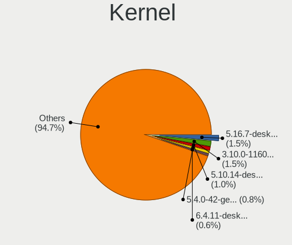
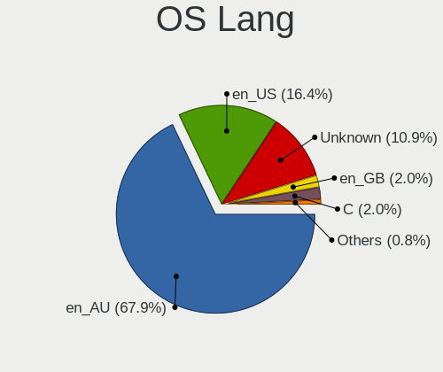
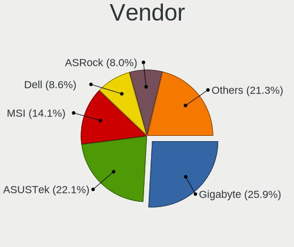
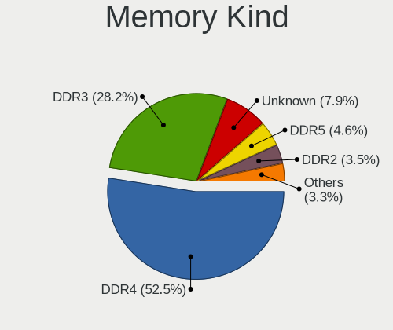

Linux in Australia - Tested Hardware & Statistics (Desktops)
------------------------------------------------------------

A project to collect tested hardware configurations for Linux in Australia.

Anyone can contribute to this report by the [hw-probe](https://github.com/linuxhw/hw-probe) tool:

    sudo -E hw-probe -all -upload

Please contribute! Especially if your hardware is rare.

Contents
--------

* [ Test Cases ](#test-cases)

* [ System ](#system)
  - [ OS                       ](#os)
  - [ OS Family                ](#os-family)
  - [ Kernel                   ](#kernel)
  - [ Kernel Family            ](#kernel-family)
  - [ Kernel Major Ver.        ](#kernel-major-ver)
  - [ Arch                     ](#arch)
  - [ DE                       ](#de)
  - [ Display Server           ](#display-server)
  - [ Display Manager          ](#display-manager)
  - [ OS Lang                  ](#os-lang)
  - [ Boot Mode                ](#boot-mode)
  - [ Filesystem               ](#filesystem)
  - [ Part. scheme             ](#part-scheme)
  - [ Dual Boot with Linux/BSD ](#dual-boot-with-linuxbsd)
  - [ Dual Boot (Win)          ](#dual-boot-win)

* [ Board ](#board)
  - [ Vendor                   ](#vendor)
  - [ Model                    ](#model)
  - [ Model Family             ](#model-family)
  - [ MFG Year                 ](#mfg-year)
  - [ Form Factor              ](#form-factor)
  - [ Secure Boot              ](#secure-boot)
  - [ Coreboot                 ](#coreboot)
  - [ RAM Size                 ](#ram-size)
  - [ RAM Used                 ](#ram-used)
  - [ Total Drives             ](#total-drives)
  - [ Has CD-ROM               ](#has-cd-rom)
  - [ Has Ethernet             ](#has-ethernet)
  - [ Has WiFi                 ](#has-wifi)
  - [ Has Bluetooth            ](#has-bluetooth)

* [ Location ](#location)
  - [ Country                  ](#country)
  - [ City                     ](#city)

* [ Drives ](#drives)
  - [ Drive Vendor             ](#drive-vendor)
  - [ Drive Model              ](#drive-model)
  - [ HDD Vendor               ](#hdd-vendor)
  - [ SSD Vendor               ](#ssd-vendor)
  - [ Drive Kind               ](#drive-kind)
  - [ Drive Connector          ](#drive-connector)
  - [ Drive Size               ](#drive-size)
  - [ Space Total              ](#space-total)
  - [ Space Used               ](#space-used)
  - [ Malfunc. Drives          ](#malfunc-drives)
  - [ Malfunc. Drive Vendor    ](#malfunc-drive-vendor)
  - [ Malfunc. HDD Vendor      ](#malfunc-hdd-vendor)
  - [ Malfunc. Drive Kind      ](#malfunc-drive-kind)
  - [ Failed Drives            ](#failed-drives)
  - [ Failed Drive Vendor      ](#failed-drive-vendor)
  - [ Drive Status             ](#drive-status)

* [ Storage controller ](#storage-controller)
  - [ Storage Vendor           ](#storage-vendor)
  - [ Storage Model            ](#storage-model)
  - [ Storage Kind             ](#storage-kind)

* [ Processor ](#processor)
  - [ CPU Vendor               ](#cpu-vendor)
  - [ CPU Model                ](#cpu-model)
  - [ CPU Model Family         ](#cpu-model-family)
  - [ CPU Cores                ](#cpu-cores)
  - [ CPU Sockets              ](#cpu-sockets)
  - [ CPU Threads              ](#cpu-threads)
  - [ CPU Op-Modes             ](#cpu-op-modes)
  - [ CPU Microcode            ](#cpu-microcode)
  - [ CPU Microarch            ](#cpu-microarch)

* [ Graphics ](#graphics)
  - [ GPU Vendor               ](#gpu-vendor)
  - [ GPU Model                ](#gpu-model)
  - [ GPU Combo                ](#gpu-combo)
  - [ GPU Driver               ](#gpu-driver)
  - [ GPU Memory               ](#gpu-memory)

* [ Monitor ](#monitor)
  - [ Monitor Vendor           ](#monitor-vendor)
  - [ Monitor Model            ](#monitor-model)
  - [ Monitor Resolution       ](#monitor-resolution)
  - [ Monitor Diagonal         ](#monitor-diagonal)
  - [ Monitor Width            ](#monitor-width)
  - [ Aspect Ratio             ](#aspect-ratio)
  - [ Monitor Area             ](#monitor-area)
  - [ Pixel Density            ](#pixel-density)
  - [ Multiple Monitors        ](#multiple-monitors)

* [ Network ](#network)
  - [ Net Controller Vendor    ](#net-controller-vendor)
  - [ Net Controller Model     ](#net-controller-model)
  - [ Wireless Vendor          ](#wireless-vendor)
  - [ Wireless Model           ](#wireless-model)
  - [ Ethernet Vendor          ](#ethernet-vendor)
  - [ Ethernet Model           ](#ethernet-model)
  - [ Net Controller Kind      ](#net-controller-kind)
  - [ Used Controller          ](#used-controller)
  - [ NICs                     ](#nics)
  - [ IPv6                     ](#ipv6)

* [ Bluetooth ](#bluetooth)
  - [ Bluetooth Vendor         ](#bluetooth-vendor)
  - [ Bluetooth Model          ](#bluetooth-model)

* [ Sound ](#sound)
  - [ Sound Vendor             ](#sound-vendor)
  - [ Sound Model              ](#sound-model)

* [ Memory ](#memory)
  - [ Memory Vendor            ](#memory-vendor)
  - [ Memory Model             ](#memory-model)
  - [ Memory Kind              ](#memory-kind)
  - [ Memory Form Factor       ](#memory-form-factor)
  - [ Memory Size              ](#memory-size)
  - [ Memory Speed             ](#memory-speed)

* [ Printers & scanners ](#printers--scanners)
  - [ Printer Vendor           ](#printer-vendor)
  - [ Printer Model            ](#printer-model)
  - [ Scanner Vendor           ](#scanner-vendor)
  - [ Scanner Model            ](#scanner-model)

* [ Camera ](#camera)
  - [ Camera Vendor            ](#camera-vendor)
  - [ Camera Model             ](#camera-model)

* [ Security ](#security)
  - [ Fingerprint Vendor       ](#fingerprint-vendor)
  - [ Fingerprint Model        ](#fingerprint-model)
  - [ Chipcard Vendor          ](#chipcard-vendor)
  - [ Chipcard Model           ](#chipcard-model)

* [ Unsupported ](#unsupported)
  - [ Unsupported Devices      ](#unsupported-devices)
  - [ Unsupported Device Types ](#unsupported-device-types)

Test Cases
----------

Total: 2574

| Vendor        | Model                       | Probe                                                      | Date         |
|---------------|-----------------------------|------------------------------------------------------------|--------------|
| MSI           | MAG B550M MORTAR WIFI       | [b6b99bf7bd](https://linux-hardware.org/?probe=b6b99bf7bd) | Aug 12, 2023 |
| Gigabyte      | G1.Sniper M3-CF             | [f4d0fd6811](https://linux-hardware.org/?probe=f4d0fd6811) | Aug 12, 2023 |
| Gigabyte      | G1.Sniper M3-CF             | [a5681e12d3](https://linux-hardware.org/?probe=a5681e12d3) | Aug 12, 2023 |
| ASUSTek       | ROG STRIX Z690-E GAMING ... | [025afcb20d](https://linux-hardware.org/?probe=025afcb20d) | Aug 10, 2023 |
| Gigabyte      | Z390 AORUS ULTRA-CF         | [5264c46571](https://linux-hardware.org/?probe=5264c46571) | Aug 10, 2023 |
| ASUSTek       | ROG STRIX B660-F GAMING ... | [c5491b8e9f](https://linux-hardware.org/?probe=c5491b8e9f) | Aug 10, 2023 |
| ASUSTek       | ROG STRIX B450-F GAMING     | [2be2a9d5f4](https://linux-hardware.org/?probe=2be2a9d5f4) | Aug 09, 2023 |
| ASUSTek       | STRIX H270F GAMING          | [ab74b5c684](https://linux-hardware.org/?probe=ab74b5c684) | Aug 08, 2023 |
| ASUSTek       | STRIX H270F GAMING          | [85ffbedac4](https://linux-hardware.org/?probe=85ffbedac4) | Aug 08, 2023 |
| HP            | 212B                        | [b7de4a2b0a](https://linux-hardware.org/?probe=b7de4a2b0a) | Aug 07, 2023 |
| ASUSTek       | CROSSHAIR VI HERO           | [51c3d4511a](https://linux-hardware.org/?probe=51c3d4511a) | Aug 07, 2023 |
| Lenovo        | 3111 SDK0J40697 WIN 3305... | [c003e20331](https://linux-hardware.org/?probe=c003e20331) | Aug 06, 2023 |
| Gigabyte      | EP45-DS3L                   | [b9d8025a54](https://linux-hardware.org/?probe=b9d8025a54) | Aug 05, 2023 |
| ASUSTek       | ROG Maximus XII EXTREME     | [f5ebaad3b1](https://linux-hardware.org/?probe=f5ebaad3b1) | Aug 05, 2023 |
| ASUSTek       | CROSSHAIR VI HERO           | [dd1767aec1](https://linux-hardware.org/?probe=dd1767aec1) | Aug 04, 2023 |
| Gigabyte      | GA-MA785G-UD3H              | [a02f0405a3](https://linux-hardware.org/?probe=a02f0405a3) | Aug 04, 2023 |
| HP            | ProLiant MicroServer Gen... | [fe0a1dbc45](https://linux-hardware.org/?probe=fe0a1dbc45) | Aug 04, 2023 |
| Apple         | Mac-F221BEC8                | [90aecb9ada](https://linux-hardware.org/?probe=90aecb9ada) | Aug 04, 2023 |
| Gigabyte      | Z490M GAMING X              | [ad51d2548b](https://linux-hardware.org/?probe=ad51d2548b) | Aug 03, 2023 |
| Dell          | 09M8Y8 A01                  | [e5649696d0](https://linux-hardware.org/?probe=e5649696d0) | Aug 03, 2023 |
| HP            | 2B2C                        | [3f0b3f8811](https://linux-hardware.org/?probe=3f0b3f8811) | Aug 01, 2023 |
| Dell          | 06NWYK A00                  | [1c3a3db0ec](https://linux-hardware.org/?probe=1c3a3db0ec) | Aug 01, 2023 |
| ASUSTek       | ROG CROSSHAIR VIII DARK ... | [888c56f232](https://linux-hardware.org/?probe=888c56f232) | Aug 01, 2023 |
| Dell          | 0Y5DDC A00                  | [43624df7d4](https://linux-hardware.org/?probe=43624df7d4) | Jul 30, 2023 |
| MSI           | Z87-G45 GAMING              | [6c5528a787](https://linux-hardware.org/?probe=6c5528a787) | Jul 30, 2023 |
| Gigabyte      | H77N-WIFI                   | [4fb6a46f65](https://linux-hardware.org/?probe=4fb6a46f65) | Jul 30, 2023 |
| ASUSTek       | CROSSHAIR VI HERO           | [60bf32a368](https://linux-hardware.org/?probe=60bf32a368) | Jul 29, 2023 |
| MSI           | MPG Z390 GAMING PRO CARB... | [580c4fb755](https://linux-hardware.org/?probe=580c4fb755) | Jul 29, 2023 |
| Lenovo        | 30D0 SDK0J40705 WIN 3425... | [8c930cc5e4](https://linux-hardware.org/?probe=8c930cc5e4) | Jul 29, 2023 |
| ASUSTek       | WS C246 PRO                 | [cfffc2ba92](https://linux-hardware.org/?probe=cfffc2ba92) | Jul 28, 2023 |
| Gigabyte      | J1900M-D2P                  | [7864dbf54c](https://linux-hardware.org/?probe=7864dbf54c) | Jul 28, 2023 |
| Gigabyte      | H77N-WIFI                   | [abf0e5979c](https://linux-hardware.org/?probe=abf0e5979c) | Jul 27, 2023 |
| ASUSTek       | CROSSHAIR VI HERO           | [0b04075e09](https://linux-hardware.org/?probe=0b04075e09) | Jul 27, 2023 |
| Gigabyte      | J1900M-D2P                  | [31b7924358](https://linux-hardware.org/?probe=31b7924358) | Jul 25, 2023 |
| Google        | Sumo                        | [71a7167d22](https://linux-hardware.org/?probe=71a7167d22) | Jul 25, 2023 |
| HP            | 1998                        | [ef5201611b](https://linux-hardware.org/?probe=ef5201611b) | Jul 24, 2023 |
| HP            | 1998                        | [5a95ac128d](https://linux-hardware.org/?probe=5a95ac128d) | Jul 24, 2023 |
| ASUSTek       | CROSSHAIR VI HERO           | [579d5d5771](https://linux-hardware.org/?probe=579d5d5771) | Jul 24, 2023 |
| Dell          | 0NW6H5 A00                  | [25ab3b442b](https://linux-hardware.org/?probe=25ab3b442b) | Jul 22, 2023 |
| MSI           | Z97 PC Mate                 | [f4cddb5e86](https://linux-hardware.org/?probe=f4cddb5e86) | Jul 22, 2023 |
| Intel         | DQ57TM AAE70931-402         | [01621f8578](https://linux-hardware.org/?probe=01621f8578) | Jul 21, 2023 |
| Gigabyte      | 945GCMX-S2                  | [46e297492f](https://linux-hardware.org/?probe=46e297492f) | Jul 21, 2023 |
| Gigabyte      | Z77MX-D3H                   | [044cf93e31](https://linux-hardware.org/?probe=044cf93e31) | Jul 20, 2023 |
| Gigabyte      | Z97X-Gaming 3               | [3da3da07e9](https://linux-hardware.org/?probe=3da3da07e9) | Jul 19, 2023 |
| ASUSTek       | ROG Maximus XII EXTREME     | [0f7fea54eb](https://linux-hardware.org/?probe=0f7fea54eb) | Jul 19, 2023 |
| ASUSTek       | PRIME Z370-A II             | [6ca4720242](https://linux-hardware.org/?probe=6ca4720242) | Jul 18, 2023 |
| ASRock        | B660M-HDV                   | [3a0685bcf0](https://linux-hardware.org/?probe=3a0685bcf0) | Jul 18, 2023 |
| ASUSTek       | CROSSHAIR VI HERO           | [553cbdb79d](https://linux-hardware.org/?probe=553cbdb79d) | Jul 17, 2023 |
| Gigabyte      | B550 GAMING X V2            | [60d7a077dc](https://linux-hardware.org/?probe=60d7a077dc) | Jul 17, 2023 |
| Acidanther... | Mac-27AD2F918AE68F61 Mac... | [20ee7f8016](https://linux-hardware.org/?probe=20ee7f8016) | Jul 16, 2023 |
| MSI           | MPG Z390 GAMING PRO CARB... | [5bf40815d5](https://linux-hardware.org/?probe=5bf40815d5) | Jul 16, 2023 |
| Gigabyte      | Z490 AORUS PRO AX           | [1b32b611bf](https://linux-hardware.org/?probe=1b32b611bf) | Jul 16, 2023 |
| ASUSTek       | X99-DELUXE II               | [d132761a85](https://linux-hardware.org/?probe=d132761a85) | Jul 14, 2023 |
| ASUSTek       | X99-DELUXE II               | [70345fff08](https://linux-hardware.org/?probe=70345fff08) | Jul 14, 2023 |
| Gigabyte      | H77N-WIFI                   | [8ee665fb8f](https://linux-hardware.org/?probe=8ee665fb8f) | Jul 14, 2023 |
| Gigabyte      | GA-A55M-S2V                 | [fadd5eeba6](https://linux-hardware.org/?probe=fadd5eeba6) | Jul 13, 2023 |
| Dell          | 03NVJ6 A01                  | [b575153979](https://linux-hardware.org/?probe=b575153979) | Jul 13, 2023 |
| Dell          | 03NVJ6 A01                  | [05e8a2652e](https://linux-hardware.org/?probe=05e8a2652e) | Jul 13, 2023 |
| ASUSTek       | TUF Gaming X670E-PLUS WI... | [5c12592f23](https://linux-hardware.org/?probe=5c12592f23) | Jul 11, 2023 |
| Gigabyte      | J1900M-D2P                  | [a9e19d3887](https://linux-hardware.org/?probe=a9e19d3887) | Jul 11, 2023 |
| MSI           | PRO H610M-G DDR4            | [4ff789de3b](https://linux-hardware.org/?probe=4ff789de3b) | Jul 11, 2023 |
| Gigabyte      | Z77MX-D3H                   | [ac8df9628d](https://linux-hardware.org/?probe=ac8df9628d) | Jul 10, 2023 |
| ASUSTek       | TUF Gaming B550-PLUS WIF... | [f4f002c37a](https://linux-hardware.org/?probe=f4f002c37a) | Jul 10, 2023 |
| MSI           | MPG B650I EDGE WIFI         | [dcf418007d](https://linux-hardware.org/?probe=dcf418007d) | Jul 10, 2023 |
| MSI           | MPG B650I EDGE WIFI         | [b515a2980e](https://linux-hardware.org/?probe=b515a2980e) | Jul 10, 2023 |
| Avalue        | NUC-APL E9697JAI006R        | [8e289dc3f9](https://linux-hardware.org/?probe=8e289dc3f9) | Jul 10, 2023 |
| Avalue        | NUC-APL E9697JAI006R        | [8f7a02d8b5](https://linux-hardware.org/?probe=8f7a02d8b5) | Jul 10, 2023 |
| Gigabyte      | X570S AORUS ELITE           | [6381f6da84](https://linux-hardware.org/?probe=6381f6da84) | Jul 09, 2023 |
| HP            | 1791                        | [a2bf914a45](https://linux-hardware.org/?probe=a2bf914a45) | Jul 08, 2023 |
| ASRock        | X670E Pro RS                | [d41838c540](https://linux-hardware.org/?probe=d41838c540) | Jul 08, 2023 |
| Gigabyte      | GA-A55M-S2V                 | [6cac69cac1](https://linux-hardware.org/?probe=6cac69cac1) | Jul 08, 2023 |
| MSI           | MPG B650I EDGE WIFI         | [bdaa09e52c](https://linux-hardware.org/?probe=bdaa09e52c) | Jul 08, 2023 |
| Dell          | 09D2HH A00                  | [2885be7e12](https://linux-hardware.org/?probe=2885be7e12) | Jul 07, 2023 |
| Dell          | 00V62H A01                  | [0d98ce8578](https://linux-hardware.org/?probe=0d98ce8578) | Jul 07, 2023 |
| MSI           | Z97S SLI Krait Edition      | [c353b62b15](https://linux-hardware.org/?probe=c353b62b15) | Jul 07, 2023 |
| MSI           | MS-7142                     | [3247a2f71c](https://linux-hardware.org/?probe=3247a2f71c) | Jul 06, 2023 |
| MSI           | B150 GAMING M3              | [a8018be55a](https://linux-hardware.org/?probe=a8018be55a) | Jul 06, 2023 |
| ASUSTek       | A8R32-MVP Deluxe            | [3af1e33a01](https://linux-hardware.org/?probe=3af1e33a01) | Jul 06, 2023 |
| Gigabyte      | Z68MA-D2H-B3                | [04d7534d9e](https://linux-hardware.org/?probe=04d7534d9e) | Jul 06, 2023 |
| MSI           | Z97 PC Mate                 | [495b6e6e4a](https://linux-hardware.org/?probe=495b6e6e4a) | Jul 06, 2023 |
| MSI           | Z97 PC Mate                 | [0d9ce2b3d2](https://linux-hardware.org/?probe=0d9ce2b3d2) | Jul 05, 2023 |
| ASUSTek       | CROSSHAIR VI HERO           | [407e00921f](https://linux-hardware.org/?probe=407e00921f) | Jul 04, 2023 |
| Gigabyte      | G41MT-D3                    | [da0ca66579](https://linux-hardware.org/?probe=da0ca66579) | Jul 04, 2023 |
| Dell          | 0TY565                      | [98f290cadd](https://linux-hardware.org/?probe=98f290cadd) | Jul 02, 2023 |
| MSI           | MAG X570S TOMAHAWK MAX W... | [b6b1cf5b68](https://linux-hardware.org/?probe=b6b1cf5b68) | Jul 02, 2023 |
| Gigabyte      | EP45-DS3L                   | [49c764507c](https://linux-hardware.org/?probe=49c764507c) | Jul 01, 2023 |
| Gigabyte      | P67A-UD5-B3                 | [b763c860fa](https://linux-hardware.org/?probe=b763c860fa) | Jun 30, 2023 |
| Dell          | 0NW6H5 A00                  | [593512053f](https://linux-hardware.org/?probe=593512053f) | Jun 30, 2023 |
| Gigabyte      | H170-HD3-CF                 | [59d1be1c5d](https://linux-hardware.org/?probe=59d1be1c5d) | Jun 30, 2023 |
| ASRock        | Z690 Steel Legend WiFi 6... | [d09ee66df1](https://linux-hardware.org/?probe=d09ee66df1) | Jun 29, 2023 |
| Intel         | LADPNVMO AAE76523-300       | [76cc7bbb86](https://linux-hardware.org/?probe=76cc7bbb86) | Jun 27, 2023 |
| ASRock        | X370 Gaming-ITX/ac          | [975e5164c6](https://linux-hardware.org/?probe=975e5164c6) | Jun 27, 2023 |
| Gigabyte      | Z77MX-D3H                   | [ac084eba06](https://linux-hardware.org/?probe=ac084eba06) | Jun 24, 2023 |
| ASUSTek       | Z170M-PLUS                  | [a3a840a283](https://linux-hardware.org/?probe=a3a840a283) | Jun 23, 2023 |
| ASRock        | B365M Pro4-F                | [16a5102512](https://linux-hardware.org/?probe=16a5102512) | Jun 23, 2023 |
| Gigabyte      | Z97X-Gaming 3               | [efc582d761](https://linux-hardware.org/?probe=efc582d761) | Jun 23, 2023 |
| ASUSTek       | PRIME X670-P WIFI           | [d3a63bb6aa](https://linux-hardware.org/?probe=d3a63bb6aa) | Jun 22, 2023 |
| Lenovo        | 30C0 SDK0J40697 WIN 3305... | [8c4bd347a7](https://linux-hardware.org/?probe=8c4bd347a7) | Jun 21, 2023 |
| HP            | 1588h                       | [abe5412cf6](https://linux-hardware.org/?probe=abe5412cf6) | Jun 21, 2023 |
| HP            | 1588h                       | [f08e230cd3](https://linux-hardware.org/?probe=f08e230cd3) | Jun 21, 2023 |
| Gigabyte      | Z77MX-D3H                   | [c1aac2f0a4](https://linux-hardware.org/?probe=c1aac2f0a4) | Jun 19, 2023 |
| Gigabyte      | GA-MA785G-UD3H              | [e5740353af](https://linux-hardware.org/?probe=e5740353af) | Jun 19, 2023 |
| Dell          | 06NWYK A00                  | [5e065b17cf](https://linux-hardware.org/?probe=5e065b17cf) | Jun 18, 2023 |
| Gigabyte      | GA-880GM-UD2H               | [fdbe50b1d6](https://linux-hardware.org/?probe=fdbe50b1d6) | Jun 18, 2023 |
| Gigabyte      | Z690 AORUS PRO              | [e9dd574827](https://linux-hardware.org/?probe=e9dd574827) | Jun 18, 2023 |
| ASUSTek       | A8R32-MVP Deluxe            | [29ff056f4a](https://linux-hardware.org/?probe=29ff056f4a) | Jun 16, 2023 |
| Unknown       | Unknown                     | [613aa12940](https://linux-hardware.org/?probe=613aa12940) | Jun 14, 2023 |
| Gigabyte      | D525TUD                     | [2d854be38a](https://linux-hardware.org/?probe=2d854be38a) | Jun 14, 2023 |
| ASUSTek       | PRIME X670-P WIFI           | [993f00eca6](https://linux-hardware.org/?probe=993f00eca6) | Jun 14, 2023 |
| Gigabyte      | D525TUD                     | [be2c796ab2](https://linux-hardware.org/?probe=be2c796ab2) | Jun 13, 2023 |
| ASRock        | X570 Phantom Gaming-ITX/... | [7689518326](https://linux-hardware.org/?probe=7689518326) | Jun 13, 2023 |
| Lenovo        | ThinkCentre M58 7360PL9     | [da837e8612](https://linux-hardware.org/?probe=da837e8612) | Jun 13, 2023 |
| Seco          | C40 C                       | [37b8e950d0](https://linux-hardware.org/?probe=37b8e950d0) | Jun 12, 2023 |
| ASRock        | X570 Phantom Gaming-ITX/... | [e68b78c037](https://linux-hardware.org/?probe=e68b78c037) | Jun 12, 2023 |
| ASRock        | Z690 Steel Legend WiFi 6... | [0190531869](https://linux-hardware.org/?probe=0190531869) | Jun 12, 2023 |
| ASRock        | Z690 Steel Legend WiFi 6... | [648161a6ff](https://linux-hardware.org/?probe=648161a6ff) | Jun 12, 2023 |
| BESSTAR Te... | B550                        | [b74cc9dfff](https://linux-hardware.org/?probe=b74cc9dfff) | Jun 11, 2023 |
| Pegatron      | 2ACB                        | [61e759f7db](https://linux-hardware.org/?probe=61e759f7db) | Jun 11, 2023 |
| Dell          | 0N4YC8 A00                  | [bc832400b4](https://linux-hardware.org/?probe=bc832400b4) | Jun 10, 2023 |
| ASRock        | X570 Phantom Gaming X       | [0c4db9b922](https://linux-hardware.org/?probe=0c4db9b922) | Jun 10, 2023 |
| Dell          | 0XCR8D A03                  | [e37bceb6fb](https://linux-hardware.org/?probe=e37bceb6fb) | Jun 09, 2023 |
| ASUSTek       | A8R32-MVP Deluxe            | [f02bc23dd0](https://linux-hardware.org/?probe=f02bc23dd0) | Jun 09, 2023 |
| Gigabyte      | B450M GAMING                | [8ab2ec8df4](https://linux-hardware.org/?probe=8ab2ec8df4) | Jun 09, 2023 |
| MSI           | B450M PRO-VDH MAX           | [c96be9f4cd](https://linux-hardware.org/?probe=c96be9f4cd) | Jun 08, 2023 |
| Gigabyte      | B75M-D3H                    | [65e06561cf](https://linux-hardware.org/?probe=65e06561cf) | Jun 08, 2023 |
| Gigabyte      | Z77MX-D3H                   | [e1fdfde650](https://linux-hardware.org/?probe=e1fdfde650) | Jun 08, 2023 |
| ASUSTek       | B85M-E                      | [9ea0a82205](https://linux-hardware.org/?probe=9ea0a82205) | Jun 07, 2023 |
| Gigabyte      | H77N-WIFI                   | [1c8078b748](https://linux-hardware.org/?probe=1c8078b748) | Jun 07, 2023 |
| ASUSTek       | TUF Gaming X670E-PLUS WI... | [3a1c1daa3d](https://linux-hardware.org/?probe=3a1c1daa3d) | Jun 05, 2023 |
| HP            | 83E2                        | [522273fe60](https://linux-hardware.org/?probe=522273fe60) | Jun 05, 2023 |
| HP            | 83E2                        | [3684f8562d](https://linux-hardware.org/?probe=3684f8562d) | Jun 04, 2023 |
| HP            | 8643 SMVB                   | [88fbd57dac](https://linux-hardware.org/?probe=88fbd57dac) | Jun 04, 2023 |
| Dell          | 0Y5DDC A00                  | [5713168678](https://linux-hardware.org/?probe=5713168678) | Jun 04, 2023 |
| ASUSTek       | ROG STRIX B360-I GAMING     | [0c8afa948b](https://linux-hardware.org/?probe=0c8afa948b) | Jun 04, 2023 |
| Lenovo        | ThinkStation D30 42234T7    | [18cb6a946b](https://linux-hardware.org/?probe=18cb6a946b) | Jun 03, 2023 |
| Gigabyte      | B450 AORUS ELITE            | [8e46a969c7](https://linux-hardware.org/?probe=8e46a969c7) | Jun 03, 2023 |
| Intel         | DB85FL AAG89861-202         | [8ededa47e6](https://linux-hardware.org/?probe=8ededa47e6) | Jun 02, 2023 |
| Intel         | DB85FL AAG89861-202         | [7bd893ebe1](https://linux-hardware.org/?probe=7bd893ebe1) | Jun 02, 2023 |
| Supermicro    | X11SCD-F                    | [4646e2fe85](https://linux-hardware.org/?probe=4646e2fe85) | Jun 01, 2023 |
| Gigabyte      | J1900M-D2P                  | [0e89db7255](https://linux-hardware.org/?probe=0e89db7255) | Jun 01, 2023 |
| Dell          | 03NVJ6 A00                  | [1f295f3ec2](https://linux-hardware.org/?probe=1f295f3ec2) | Jun 01, 2023 |
| Gigabyte      | Z790 AORUS ELITE AX DDR4    | [5f1045564e](https://linux-hardware.org/?probe=5f1045564e) | Jun 01, 2023 |
| ASUSTek       | TUF Gaming X570-PLUS        | [1383313bbb](https://linux-hardware.org/?probe=1383313bbb) | May 31, 2023 |
| Gigabyte      | H270-HD3-CF                 | [d2912dfb69](https://linux-hardware.org/?probe=d2912dfb69) | May 31, 2023 |
| HP            | 8648                        | [11e777087a](https://linux-hardware.org/?probe=11e777087a) | May 31, 2023 |
| ASRock        | AB350M Pro4                 | [4f23de2827](https://linux-hardware.org/?probe=4f23de2827) | May 30, 2023 |
| Gigabyte      | X570 AORUS MASTER           | [528f7440b7](https://linux-hardware.org/?probe=528f7440b7) | May 29, 2023 |
| HP            | 83E2                        | [0db8dcbc23](https://linux-hardware.org/?probe=0db8dcbc23) | May 28, 2023 |
| Gigabyte      | Z77MX-D3H                   | [3c001962b0](https://linux-hardware.org/?probe=3c001962b0) | May 28, 2023 |
| HP            | 83E2                        | [6eea8879ca](https://linux-hardware.org/?probe=6eea8879ca) | May 28, 2023 |
| ASUSTek       | ROG STRIX X399-E GAMING     | [4f1ff269d2](https://linux-hardware.org/?probe=4f1ff269d2) | May 28, 2023 |
| Lenovo        | SHARKBAY SDK0E50512 STD     | [5a39bd1d78](https://linux-hardware.org/?probe=5a39bd1d78) | May 28, 2023 |
| Lenovo        | SHARKBAY SDK0E50512 STD     | [a36d2b541a](https://linux-hardware.org/?probe=a36d2b541a) | May 28, 2023 |
| Gigabyte      | Z77MX-D3H                   | [9cb2973f2f](https://linux-hardware.org/?probe=9cb2973f2f) | May 27, 2023 |
| Gigabyte      | Z77MX-D3H                   | [2cea143017](https://linux-hardware.org/?probe=2cea143017) | May 26, 2023 |
| ASUSTek       | G20AJ                       | [92223e639f](https://linux-hardware.org/?probe=92223e639f) | May 26, 2023 |
| ASUSTek       | G20AJ                       | [9a58438669](https://linux-hardware.org/?probe=9a58438669) | May 26, 2023 |
| Gigabyte      | J1900M-D2P                  | [f0c2fede02](https://linux-hardware.org/?probe=f0c2fede02) | May 25, 2023 |
| Gigabyte      | J1900M-D2P                  | [a167562cba](https://linux-hardware.org/?probe=a167562cba) | May 25, 2023 |
| MSI           | X99A GAMING 7               | [ec94d173a7](https://linux-hardware.org/?probe=ec94d173a7) | May 23, 2023 |
| Gigabyte      | GA-880GM-UD2H               | [e110548f6e](https://linux-hardware.org/?probe=e110548f6e) | May 22, 2023 |
| Lenovo        | ThinkCentre M58p 7220A72    | [c2965aff69](https://linux-hardware.org/?probe=c2965aff69) | May 22, 2023 |
| ASUSTek       | P8H77-M LE                  | [e9b749f2ba](https://linux-hardware.org/?probe=e9b749f2ba) | May 21, 2023 |
| ASUSTek       | M5A99FX PRO R2.0            | [8dcb326301](https://linux-hardware.org/?probe=8dcb326301) | May 21, 2023 |
| ASUSTek       | P5B                         | [3effc437bb](https://linux-hardware.org/?probe=3effc437bb) | May 20, 2023 |
| Gigabyte      | H77N-WIFI                   | [b59b0160fb](https://linux-hardware.org/?probe=b59b0160fb) | May 19, 2023 |
| ASRock        | Z390 Phantom Gaming 9       | [5ca1acbf9b](https://linux-hardware.org/?probe=5ca1acbf9b) | May 19, 2023 |
| Dell          | 0VNP2H A01                  | [6e51bd033e](https://linux-hardware.org/?probe=6e51bd033e) | May 19, 2023 |
| MSI           | MAG Z690 TOMAHAWK WIFI D... | [64b9ba417c](https://linux-hardware.org/?probe=64b9ba417c) | May 19, 2023 |
| MSI           | MAG Z690 TOMAHAWK WIFI D... | [5c07806ab1](https://linux-hardware.org/?probe=5c07806ab1) | May 19, 2023 |
| MSI           | MPG B650I EDGE WIFI         | [c15ff8f4c4](https://linux-hardware.org/?probe=c15ff8f4c4) | May 18, 2023 |
| Gigabyte      | B450M H                     | [4bd367b4c7](https://linux-hardware.org/?probe=4bd367b4c7) | May 17, 2023 |
| ASUSTek       | PRIME X570-PRO              | [09e723be6f](https://linux-hardware.org/?probe=09e723be6f) | May 17, 2023 |
| Gigabyte      | X99-Gaming 5                | [81eee33114](https://linux-hardware.org/?probe=81eee33114) | May 17, 2023 |
| Gigabyte      | H170-Gaming 3               | [ae5f06df99](https://linux-hardware.org/?probe=ae5f06df99) | May 16, 2023 |
| Google        | Sumo                        | [1455a81901](https://linux-hardware.org/?probe=1455a81901) | May 15, 2023 |
| ASRock        | AD2700-ITX                  | [fe80771d2e](https://linux-hardware.org/?probe=fe80771d2e) | May 14, 2023 |
| MSI           | MAG B560M MORTAR            | [1556b05d13](https://linux-hardware.org/?probe=1556b05d13) | May 14, 2023 |
| ASUSTek       | P8Z77-V LX                  | [07bf228811](https://linux-hardware.org/?probe=07bf228811) | May 14, 2023 |
| Gigabyte      | G41MT-D3                    | [393b2da4bc](https://linux-hardware.org/?probe=393b2da4bc) | May 11, 2023 |
| Gigabyte      | H77N-WIFI                   | [3dc1af6df9](https://linux-hardware.org/?probe=3dc1af6df9) | May 11, 2023 |
| AOpen         | aA70Mx-VW R1.01 55DE8100... | [400b616f1c](https://linux-hardware.org/?probe=400b616f1c) | May 10, 2023 |
| Dell          | 03NVJ6 A02                  | [9f509a2647](https://linux-hardware.org/?probe=9f509a2647) | May 10, 2023 |
| ASUSTek       | ROG STRIX X570-F GAMING     | [36f1aa431d](https://linux-hardware.org/?probe=36f1aa431d) | May 08, 2023 |
| Lenovo        | 30C0 SDK0J40697 WIN 3305... | [94ab5e431c](https://linux-hardware.org/?probe=94ab5e431c) | May 07, 2023 |
| MSI           | MAG B560M MORTAR            | [db1ad69341](https://linux-hardware.org/?probe=db1ad69341) | May 06, 2023 |
| MSI           | MAG B560M MORTAR            | [8c41580881](https://linux-hardware.org/?probe=8c41580881) | May 06, 2023 |
| Gigabyte      | J1900M-D2P                  | [f743e9293e](https://linux-hardware.org/?probe=f743e9293e) | May 06, 2023 |
| Gigabyte      | EP45-DS3L                   | [1515a37b97](https://linux-hardware.org/?probe=1515a37b97) | May 06, 2023 |
| Gigabyte      | H310M H x.x                 | [fec056072d](https://linux-hardware.org/?probe=fec056072d) | May 05, 2023 |
| Gigabyte      | X99-Gaming 5                | [e1d1bdef81](https://linux-hardware.org/?probe=e1d1bdef81) | May 04, 2023 |
| Gigabyte      | GA-880GM-UD2H               | [a23cace014](https://linux-hardware.org/?probe=a23cace014) | May 02, 2023 |
| Gigabyte      | Z77MX-D3H                   | [fa4e32fe2c](https://linux-hardware.org/?probe=fa4e32fe2c) | May 01, 2023 |
| ASRock        | B660M-HDV                   | [a137e6ab62](https://linux-hardware.org/?probe=a137e6ab62) | May 01, 2023 |
| Dell          | 0NC2VH A01                  | [7fb1708706](https://linux-hardware.org/?probe=7fb1708706) | May 01, 2023 |
| Gigabyte      | AB350-Gaming 3-CF           | [01311e320c](https://linux-hardware.org/?probe=01311e320c) | Apr 30, 2023 |
| MSI           | MPG B650I EDGE WIFI         | [eda4874295](https://linux-hardware.org/?probe=eda4874295) | Apr 30, 2023 |
| ASUSTek       | TUF B450M-PRO GAMING        | [081551c776](https://linux-hardware.org/?probe=081551c776) | Apr 29, 2023 |
| MSI           | MAG Z790 TOMAHAWK WIFI D... | [c880b8dcdd](https://linux-hardware.org/?probe=c880b8dcdd) | Apr 29, 2023 |
| ASUSTek       | PRIME A520M-E               | [048fda2c60](https://linux-hardware.org/?probe=048fda2c60) | Apr 28, 2023 |
| MSI           | MPG X570S CARBON MAX WIF... | [d472fb0a32](https://linux-hardware.org/?probe=d472fb0a32) | Apr 28, 2023 |
| Intel         | DZ68DB AAG27985-101         | [b3323dcc11](https://linux-hardware.org/?probe=b3323dcc11) | Apr 28, 2023 |
| ASRock        | X470 Master SLI             | [cded55a936](https://linux-hardware.org/?probe=cded55a936) | Apr 28, 2023 |
| ASUSTek       | X99-A                       | [6788eea8d2](https://linux-hardware.org/?probe=6788eea8d2) | Apr 26, 2023 |
| ASUSTek       | PRIME B350M-A               | [b8b51b29ef](https://linux-hardware.org/?probe=b8b51b29ef) | Apr 25, 2023 |
| Gigabyte      | Z77MX-D3H                   | [373372bf75](https://linux-hardware.org/?probe=373372bf75) | Apr 25, 2023 |
| Dell          | 08WXMX A02                  | [5f68c6a285](https://linux-hardware.org/?probe=5f68c6a285) | Apr 24, 2023 |
| MSI           | Z97S SLI Krait Edition      | [6ed93f8338](https://linux-hardware.org/?probe=6ed93f8338) | Apr 24, 2023 |
| HP            | 0AA8h                       | [071191ddf3](https://linux-hardware.org/?probe=071191ddf3) | Apr 23, 2023 |
| ASRock        | A520M-ITX/ac                | [ef59f5ff9b](https://linux-hardware.org/?probe=ef59f5ff9b) | Apr 23, 2023 |
| ASUSTek       | ROG STRIX B660-I GAMING ... | [03a331aa44](https://linux-hardware.org/?probe=03a331aa44) | Apr 22, 2023 |
| Gigabyte      | H77N-WIFI                   | [80312ab34c](https://linux-hardware.org/?probe=80312ab34c) | Apr 22, 2023 |
| Shuttle       | DS10U                       | [ffcce61d82](https://linux-hardware.org/?probe=ffcce61d82) | Apr 22, 2023 |
| Gigabyte      | X79-UD3                     | [1dd1bcd00e](https://linux-hardware.org/?probe=1dd1bcd00e) | Apr 22, 2023 |
| ASRock        | AD2700-ITX                  | [e688e656cd](https://linux-hardware.org/?probe=e688e656cd) | Apr 21, 2023 |
| Shuttle       | FS81                        | [051b7f4753](https://linux-hardware.org/?probe=051b7f4753) | Apr 20, 2023 |
| ASRock        | Z170 Gaming K4              | [cbd09f0f67](https://linux-hardware.org/?probe=cbd09f0f67) | Apr 18, 2023 |
| Shuttle       | DS10U                       | [b25013d04f](https://linux-hardware.org/?probe=b25013d04f) | Apr 18, 2023 |
| Gigabyte      | GA-MA780G-UD3H              | [07a49303af](https://linux-hardware.org/?probe=07a49303af) | Apr 17, 2023 |
| MSI           | MS-B0A41                    | [5950f6e73c](https://linux-hardware.org/?probe=5950f6e73c) | Apr 17, 2023 |
| Gigabyte      | GA-880GM-UD2H               | [1fa07cd218](https://linux-hardware.org/?probe=1fa07cd218) | Apr 16, 2023 |
| HP            | 212B                        | [343f1f5eba](https://linux-hardware.org/?probe=343f1f5eba) | Apr 16, 2023 |
| Gigabyte      | X79-UD5                     | [369c3cfdb2](https://linux-hardware.org/?probe=369c3cfdb2) | Apr 15, 2023 |
| Lenovo        | ThinkCentre M58p 7220A72    | [2be395131f](https://linux-hardware.org/?probe=2be395131f) | Apr 15, 2023 |
| Lenovo        | ThinkCentre M58p 7220A72    | [0ca4b7045e](https://linux-hardware.org/?probe=0ca4b7045e) | Apr 15, 2023 |
| Gigabyte      | Z97X-Gaming 3               | [ffa823032e](https://linux-hardware.org/?probe=ffa823032e) | Apr 14, 2023 |
| Gigabyte      | B560M DS3H V2               | [fe75c98b15](https://linux-hardware.org/?probe=fe75c98b15) | Apr 14, 2023 |
| Lenovo        | ThinkStation D30 42234T7    | [7730eb04fa](https://linux-hardware.org/?probe=7730eb04fa) | Apr 14, 2023 |
| ECS           | H61H2-MV                    | [5a3fbafb75](https://linux-hardware.org/?probe=5a3fbafb75) | Apr 12, 2023 |
| HP            | 843B                        | [90de5c4ff1](https://linux-hardware.org/?probe=90de5c4ff1) | Apr 12, 2023 |
| Gigabyte      | X79-UP4                     | [8f9b60caf3](https://linux-hardware.org/?probe=8f9b60caf3) | Apr 12, 2023 |
| HP            | 3646h                       | [c36653d824](https://linux-hardware.org/?probe=c36653d824) | Apr 12, 2023 |
| ASRock        | X370 Gaming-ITX/ac          | [29ed28536e](https://linux-hardware.org/?probe=29ed28536e) | Apr 12, 2023 |
| MSI           | H81M-P33                    | [129abe0b90](https://linux-hardware.org/?probe=129abe0b90) | Apr 10, 2023 |
| MSI           | B450M MORTAR MAX            | [7d5fb1a311](https://linux-hardware.org/?probe=7d5fb1a311) | Apr 10, 2023 |
| Unknown       | Unknown                     | [2765290b8c](https://linux-hardware.org/?probe=2765290b8c) | Apr 09, 2023 |
| SYWZ          | S210H Series                | [5989537064](https://linux-hardware.org/?probe=5989537064) | Apr 09, 2023 |
| ASUSTek       | PRIME Z590-P WIFI           | [e579aabfdb](https://linux-hardware.org/?probe=e579aabfdb) | Apr 09, 2023 |
| MSI           | B550M-A PRO                 | [e3fcf877c0](https://linux-hardware.org/?probe=e3fcf877c0) | Apr 08, 2023 |
| MSI           | MS-B1831                    | [9ea2ec4f47](https://linux-hardware.org/?probe=9ea2ec4f47) | Apr 06, 2023 |
| MSI           | A88XM-E35 V2                | [bf4c16404e](https://linux-hardware.org/?probe=bf4c16404e) | Apr 06, 2023 |
| ASUSTek       | Z170M-PLUS                  | [be741560b8](https://linux-hardware.org/?probe=be741560b8) | Apr 06, 2023 |
| Gigabyte      | Z690 UD DDR4                | [7644d4a8fa](https://linux-hardware.org/?probe=7644d4a8fa) | Apr 06, 2023 |
| ASUSTek       | H87-PRO                     | [085dc66a77](https://linux-hardware.org/?probe=085dc66a77) | Apr 05, 2023 |
| Shenzhen M... | F7BFD                       | [7f6103b394](https://linux-hardware.org/?probe=7f6103b394) | Apr 05, 2023 |
| Shenzhen M... | F7BFD                       | [ac039ed7e6](https://linux-hardware.org/?probe=ac039ed7e6) | Apr 05, 2023 |
| HP            | 843B                        | [aa679005d3](https://linux-hardware.org/?probe=aa679005d3) | Apr 04, 2023 |
| HP            | 843B                        | [ba686ac542](https://linux-hardware.org/?probe=ba686ac542) | Apr 04, 2023 |
| Shuttle       | DS10U                       | [a35fd102f2](https://linux-hardware.org/?probe=a35fd102f2) | Apr 04, 2023 |
| ASRock        | FM2A55M-DGS                 | [250384a794](https://linux-hardware.org/?probe=250384a794) | Apr 02, 2023 |
| Dell          | 096JG8 A01                  | [d016e78eab](https://linux-hardware.org/?probe=d016e78eab) | Apr 02, 2023 |
| Acer          | EQ45LM                      | [5bafe47784](https://linux-hardware.org/?probe=5bafe47784) | Apr 02, 2023 |
| Gigabyte      | X99-UD3-CF                  | [82a3b55b60](https://linux-hardware.org/?probe=82a3b55b60) | Apr 02, 2023 |
| Dell          | 09M8Y8 A01                  | [17d5390549](https://linux-hardware.org/?probe=17d5390549) | Apr 01, 2023 |
| Gigabyte      | Z97X-Gaming 3               | [89ca656f30](https://linux-hardware.org/?probe=89ca656f30) | Apr 01, 2023 |
| Gigabyte      | Z77X-UD5H                   | [2be0fa6524](https://linux-hardware.org/?probe=2be0fa6524) | Apr 01, 2023 |
| Lenovo        | ThinkStation D30 42234T7    | [47f6f4653b](https://linux-hardware.org/?probe=47f6f4653b) | Mar 31, 2023 |
| Unknown       | Unknown                     | [1f64d2db28](https://linux-hardware.org/?probe=1f64d2db28) | Mar 31, 2023 |
| ASRock        | FM2A55M-DGS                 | [3ab2e2c720](https://linux-hardware.org/?probe=3ab2e2c720) | Mar 31, 2023 |
| Gigabyte      | B85M-HD3                    | [3d24b75a10](https://linux-hardware.org/?probe=3d24b75a10) | Mar 31, 2023 |
| Dell          | 00V62H A01                  | [05d42527df](https://linux-hardware.org/?probe=05d42527df) | Mar 31, 2023 |
| Dell          | 09M8Y8 A01                  | [2c13e40cd2](https://linux-hardware.org/?probe=2c13e40cd2) | Mar 30, 2023 |
| ASUSTek       | TUF Gaming B550M-PLUS       | [92981c741d](https://linux-hardware.org/?probe=92981c741d) | Mar 30, 2023 |
| Gigabyte      | B450 AORUS PRO WIFI-CF      | [af4901f141](https://linux-hardware.org/?probe=af4901f141) | Mar 30, 2023 |
| Gigabyte      | J1900M-D2P                  | [881f70cb12](https://linux-hardware.org/?probe=881f70cb12) | Mar 30, 2023 |
| Gigabyte      | H55M-USB3                   | [140b984b9f](https://linux-hardware.org/?probe=140b984b9f) | Mar 28, 2023 |
| Lenovo        | SHARKBAY 31900058 STD       | [5064a5267e](https://linux-hardware.org/?probe=5064a5267e) | Mar 28, 2023 |
| Lenovo        | 0x36A017AA SDK0J40709 WI... | [562426633d](https://linux-hardware.org/?probe=562426633d) | Mar 28, 2023 |
| ASRock        | FM2A88X+ Killer             | [6180e562dd](https://linux-hardware.org/?probe=6180e562dd) | Mar 27, 2023 |
| Unknown       | Unknown                     | [de6a63685a](https://linux-hardware.org/?probe=de6a63685a) | Mar 27, 2023 |
| Lenovo        | ThinkStation D30 42234T7    | [cfb8c9d396](https://linux-hardware.org/?probe=cfb8c9d396) | Mar 27, 2023 |
| HP            | 0B54h D                     | [540caaf04c](https://linux-hardware.org/?probe=540caaf04c) | Mar 26, 2023 |
| ASUSTek       | Maximus VIII HERO ALPHA     | [cc262bb41a](https://linux-hardware.org/?probe=cc262bb41a) | Mar 26, 2023 |
| ASRock        | AD525PV3                    | [84545fd0ea](https://linux-hardware.org/?probe=84545fd0ea) | Mar 25, 2023 |
| Gigabyte      | J1900M-D2P                  | [5acd2b0492](https://linux-hardware.org/?probe=5acd2b0492) | Mar 25, 2023 |
| Dell          | 00V62H A01                  | [5312ec3cc9](https://linux-hardware.org/?probe=5312ec3cc9) | Mar 25, 2023 |
| Gigabyte      | H77N-WIFI                   | [1503a33123](https://linux-hardware.org/?probe=1503a33123) | Mar 24, 2023 |
| ASRock        | AD525PV3                    | [0749ec7b44](https://linux-hardware.org/?probe=0749ec7b44) | Mar 23, 2023 |
| AMI           | Intel                       | [5e7b21c227](https://linux-hardware.org/?probe=5e7b21c227) | Mar 23, 2023 |
| ASUSTek       | B85M-E                      | [10269c811b](https://linux-hardware.org/?probe=10269c811b) | Mar 22, 2023 |
| MSI           | MS-7142                     | [1cb67ac1ca](https://linux-hardware.org/?probe=1cb67ac1ca) | Mar 22, 2023 |
| ASUSTek       | M5A99FX PRO R2.0            | [8c50d5ae87](https://linux-hardware.org/?probe=8c50d5ae87) | Mar 21, 2023 |
| ASUSTek       | Z170M-PLUS                  | [a1e76aa5c1](https://linux-hardware.org/?probe=a1e76aa5c1) | Mar 21, 2023 |
| ASRock        | B550M Pro4                  | [16253cadcf](https://linux-hardware.org/?probe=16253cadcf) | Mar 21, 2023 |
| MACHINIST     | X99-RS9 V2.0                | [ad4c43dd09](https://linux-hardware.org/?probe=ad4c43dd09) | Mar 21, 2023 |
| Gigabyte      | H610M H DDR4                | [b7cf9d91ee](https://linux-hardware.org/?probe=b7cf9d91ee) | Mar 20, 2023 |
| ASUSTek       | Maximus Extreme             | [c6215ec2f3](https://linux-hardware.org/?probe=c6215ec2f3) | Mar 20, 2023 |
| ASUSTek       | PRIME B250M-K               | [99cb000a4e](https://linux-hardware.org/?probe=99cb000a4e) | Mar 19, 2023 |
| Gigabyte      | G41MT-D3                    | [b4483fd4e2](https://linux-hardware.org/?probe=b4483fd4e2) | Mar 16, 2023 |
| MSI           | B450M MORTAR TITANIUM       | [a4c449eef4](https://linux-hardware.org/?probe=a4c449eef4) | Mar 16, 2023 |
| Huanan        | X99-AD3 GAMING V2.0         | [0586633e29](https://linux-hardware.org/?probe=0586633e29) | Mar 15, 2023 |
| ASUSTek       | A8R32-MVP Deluxe            | [b324afc6f8](https://linux-hardware.org/?probe=b324afc6f8) | Mar 14, 2023 |
| Intel         | DB85FL AAG89861-203         | [e17dae3447](https://linux-hardware.org/?probe=e17dae3447) | Mar 14, 2023 |
| Intel         | DB85FL AAG89861-203         | [f1004a32e1](https://linux-hardware.org/?probe=f1004a32e1) | Mar 14, 2023 |
| QIYIDA        | X99-H9 V2.0                 | [0f440670f2](https://linux-hardware.org/?probe=0f440670f2) | Mar 14, 2023 |
| MSI           | B450M MORTAR TITANIUM       | [61af17e1cd](https://linux-hardware.org/?probe=61af17e1cd) | Mar 13, 2023 |
| MSI           | MAG B550M MORTAR WIFI       | [e45386803e](https://linux-hardware.org/?probe=e45386803e) | Mar 12, 2023 |
| Gigabyte      | Z590I AORUS ULTRA           | [47ea9647d3](https://linux-hardware.org/?probe=47ea9647d3) | Mar 12, 2023 |
| Gigabyte      | X670E AORUS XTREME          | [83cb566647](https://linux-hardware.org/?probe=83cb566647) | Mar 12, 2023 |
| ASUSTek       | A88X-PLUS                   | [3624df5386](https://linux-hardware.org/?probe=3624df5386) | Mar 11, 2023 |
| Gigabyte      | EP45-DS3L                   | [23b5dbe59d](https://linux-hardware.org/?probe=23b5dbe59d) | Mar 11, 2023 |
| ASRock        | 990FX Killer                | [23bd30e79e](https://linux-hardware.org/?probe=23bd30e79e) | Mar 11, 2023 |
| Gigabyte      | Z590 AORUS ELITE            | [790a51e99f](https://linux-hardware.org/?probe=790a51e99f) | Mar 11, 2023 |
| Acer          | Veriton X4640G V:1.1        | [dd3e15feee](https://linux-hardware.org/?probe=dd3e15feee) | Mar 10, 2023 |
| Gigabyte      | X570 AORUS ULTRA            | [35ab0f32c5](https://linux-hardware.org/?probe=35ab0f32c5) | Mar 10, 2023 |
| Gigabyte      | G41MT-D3                    | [e27d91ea6f](https://linux-hardware.org/?probe=e27d91ea6f) | Mar 09, 2023 |
| Gigabyte      | G41MT-D3                    | [790877da61](https://linux-hardware.org/?probe=790877da61) | Mar 09, 2023 |
| ASUSTek       | PRIME B450M-A II            | [7413353e38](https://linux-hardware.org/?probe=7413353e38) | Mar 09, 2023 |
| ASUSTek       | TUF Gaming B550M-PLUS       | [89647ee142](https://linux-hardware.org/?probe=89647ee142) | Mar 08, 2023 |
| Gigabyte      | J1900M-D2P                  | [dfe7f75406](https://linux-hardware.org/?probe=dfe7f75406) | Mar 08, 2023 |
| Gigabyte      | H77N-WIFI                   | [ffaa232ea2](https://linux-hardware.org/?probe=ffaa232ea2) | Mar 08, 2023 |
| Gigabyte      | Z77MX-D3H                   | [916862cd66](https://linux-hardware.org/?probe=916862cd66) | Mar 08, 2023 |
| Gigabyte      | H77N-WIFI                   | [dfc84acc1a](https://linux-hardware.org/?probe=dfc84acc1a) | Mar 05, 2023 |
| Gigabyte      | X570 AORUS ELITE            | [3d1560d3d1](https://linux-hardware.org/?probe=3d1560d3d1) | Mar 05, 2023 |
| MSI           | X570-A PRO                  | [7d1b3a73f9](https://linux-hardware.org/?probe=7d1b3a73f9) | Mar 05, 2023 |
| ASUSTek       | PRIME A520M-K               | [3be3c8d79d](https://linux-hardware.org/?probe=3be3c8d79d) | Mar 03, 2023 |
| Dell          | 0KC9NP A00                  | [45397750b4](https://linux-hardware.org/?probe=45397750b4) | Mar 02, 2023 |
| MSI           | PRO H610M-G DDR4            | [8ecbea06f8](https://linux-hardware.org/?probe=8ecbea06f8) | Mar 02, 2023 |
| ASUSTek       | PRIME Z270-A                | [25c46b6f70](https://linux-hardware.org/?probe=25c46b6f70) | Mar 01, 2023 |
| Dell          | 09KPNV A01                  | [08346526f3](https://linux-hardware.org/?probe=08346526f3) | Mar 01, 2023 |
| Biostar       | B450MH                      | [aa05ee87d1](https://linux-hardware.org/?probe=aa05ee87d1) | Mar 01, 2023 |
| Gigabyte      | Z97X-Gaming 3               | [131f94f213](https://linux-hardware.org/?probe=131f94f213) | Mar 01, 2023 |
| Dell          | 0XHGV1 A00                  | [75249be116](https://linux-hardware.org/?probe=75249be116) | Feb 27, 2023 |
| MSI           | B450M MORTAR TITANIUM       | [b27fb5e204](https://linux-hardware.org/?probe=b27fb5e204) | Feb 26, 2023 |
| Pegatron      | 2ACB                        | [13355a7d07](https://linux-hardware.org/?probe=13355a7d07) | Feb 26, 2023 |
| MSI           | B450M MORTAR TITANIUM       | [a2356a66ba](https://linux-hardware.org/?probe=a2356a66ba) | Feb 26, 2023 |
| Gigabyte      | B450 AORUS PRO-CF           | [7f2823a756](https://linux-hardware.org/?probe=7f2823a756) | Feb 26, 2023 |
| HP            | 0AECh D                     | [5baf25e8af](https://linux-hardware.org/?probe=5baf25e8af) | Feb 26, 2023 |
| Gigabyte      | B450 AORUS PRO-CF           | [0b1c4036b1](https://linux-hardware.org/?probe=0b1c4036b1) | Feb 26, 2023 |
| Medion        | MAG Z390M MORTAR            | [e2445cf24c](https://linux-hardware.org/?probe=e2445cf24c) | Feb 25, 2023 |
| MSI           | MAG B550M MORTAR WIFI       | [4a0d65f6b5](https://linux-hardware.org/?probe=4a0d65f6b5) | Feb 24, 2023 |
| Gigabyte      | Z77M-D3H-MVP                | [e27e1cd0e8](https://linux-hardware.org/?probe=e27e1cd0e8) | Feb 24, 2023 |
| ASUSTek       | B85M-E                      | [8a09d5e812](https://linux-hardware.org/?probe=8a09d5e812) | Feb 23, 2023 |
| MSI           | MPG X570 GAMING PLUS        | [d65a9c975d](https://linux-hardware.org/?probe=d65a9c975d) | Feb 23, 2023 |
| ASUSTek       | ROG CROSSHAIR VIII DARK ... | [2d36b57c9c](https://linux-hardware.org/?probe=2d36b57c9c) | Feb 22, 2023 |
| Gigabyte      | Z97X-Gaming 3               | [e293e73518](https://linux-hardware.org/?probe=e293e73518) | Feb 21, 2023 |
| MSI           | B550 GAMING GEN3            | [d92a4239ee](https://linux-hardware.org/?probe=d92a4239ee) | Feb 21, 2023 |
| Gigabyte      | J1900M-D2P                  | [edd5640ca7](https://linux-hardware.org/?probe=edd5640ca7) | Feb 21, 2023 |
| Acer          | Aspire X3950                | [f5b4a3baa3](https://linux-hardware.org/?probe=f5b4a3baa3) | Feb 20, 2023 |
| Gigabyte      | X570 AORUS PRO WIFI         | [f8a26128a4](https://linux-hardware.org/?probe=f8a26128a4) | Feb 20, 2023 |
| AZW           | GTi                         | [17bb698441](https://linux-hardware.org/?probe=17bb698441) | Feb 19, 2023 |
| Gigabyte      | Z590I AORUS ULTRA           | [9805ab5764](https://linux-hardware.org/?probe=9805ab5764) | Feb 19, 2023 |
| Gigabyte      | B365M D3H-CF                | [aa49c18960](https://linux-hardware.org/?probe=aa49c18960) | Feb 19, 2023 |
| ASUSTek       | H110M-A/M.2                 | [68f0415788](https://linux-hardware.org/?probe=68f0415788) | Feb 16, 2023 |
| ASUSTek       | H110M-A/M.2                 | [2560ba7644](https://linux-hardware.org/?probe=2560ba7644) | Feb 16, 2023 |
| ASRock        | Z77 Extreme6                | [48328ab864](https://linux-hardware.org/?probe=48328ab864) | Feb 15, 2023 |
| ASUSTek       | V-P7H55E                    | [27ddce20a1](https://linux-hardware.org/?probe=27ddce20a1) | Feb 15, 2023 |
| Gigabyte      | H410M DS2V                  | [b2e8c15dc4](https://linux-hardware.org/?probe=b2e8c15dc4) | Feb 15, 2023 |
| Dell          | 09M8Y8 A01                  | [beabc46f67](https://linux-hardware.org/?probe=beabc46f67) | Feb 14, 2023 |
| ASUSTek       | SABERTOOTH Z77              | [f298c1fc7e](https://linux-hardware.org/?probe=f298c1fc7e) | Feb 14, 2023 |
| ASUSTek       | SABERTOOTH Z77              | [45cfd72091](https://linux-hardware.org/?probe=45cfd72091) | Feb 14, 2023 |
| Dell          | 09M8Y8 A01                  | [fb1ff4a6d9](https://linux-hardware.org/?probe=fb1ff4a6d9) | Feb 14, 2023 |
| Gigabyte      | Z68X-UD3H-B3                | [0ad0fe310f](https://linux-hardware.org/?probe=0ad0fe310f) | Feb 14, 2023 |
| MSI           | B550-A PRO                  | [b563d8f052](https://linux-hardware.org/?probe=b563d8f052) | Feb 13, 2023 |
| MSI           | MEG X570 UNIFY              | [219157717b](https://linux-hardware.org/?probe=219157717b) | Feb 12, 2023 |
| MSI           | MEG X570 UNIFY              | [cdc63fb05e](https://linux-hardware.org/?probe=cdc63fb05e) | Feb 12, 2023 |
| MSI           | B450M MORTAR TITANIUM       | [7fec987264](https://linux-hardware.org/?probe=7fec987264) | Feb 12, 2023 |
| ASUSTek       | PRIME Z690-P WIFI           | [fff70a8d2c](https://linux-hardware.org/?probe=fff70a8d2c) | Feb 09, 2023 |
| Intel         | LADPNVMO AAE76523-300       | [6ced92edc7](https://linux-hardware.org/?probe=6ced92edc7) | Feb 09, 2023 |
| ASUSTek       | P5Q3 DELUXE                 | [16c72d3532](https://linux-hardware.org/?probe=16c72d3532) | Feb 08, 2023 |
| MSI           | B450 GAMING PLUS MAX        | [0f4be18646](https://linux-hardware.org/?probe=0f4be18646) | Feb 07, 2023 |
| HP            | 0AA0h                       | [921b7f0d0c](https://linux-hardware.org/?probe=921b7f0d0c) | Feb 07, 2023 |
| Gigabyte      | GA-MA780G-UD3H              | [99d0ce5421](https://linux-hardware.org/?probe=99d0ce5421) | Feb 05, 2023 |
| MSI           | B450M MORTAR MAX            | [2f0810d441](https://linux-hardware.org/?probe=2f0810d441) | Feb 05, 2023 |
| MSI           | B450 GAMING PLUS MAX        | [2b9cb5eea6](https://linux-hardware.org/?probe=2b9cb5eea6) | Feb 05, 2023 |
| Intel         | X99                         | [e8790caf8d](https://linux-hardware.org/?probe=e8790caf8d) | Feb 05, 2023 |
| Gigabyte      | Z77MX-D3H                   | [a17959ea9b](https://linux-hardware.org/?probe=a17959ea9b) | Feb 04, 2023 |
| Acer          | Aspire XC-603               | [fff64928e8](https://linux-hardware.org/?probe=fff64928e8) | Feb 03, 2023 |
| Acer          | Aspire XC-603               | [2cd1d2f51f](https://linux-hardware.org/?probe=2cd1d2f51f) | Feb 03, 2023 |
| ASUSTek       | ROG STRIX X570-I GAMING     | [866e97ab12](https://linux-hardware.org/?probe=866e97ab12) | Feb 03, 2023 |
| HP            | 212B                        | [cb1e6fa666](https://linux-hardware.org/?probe=cb1e6fa666) | Feb 02, 2023 |
| HP            | 212B                        | [e3e8d72420](https://linux-hardware.org/?probe=e3e8d72420) | Feb 02, 2023 |
| Gigabyte      | Z77M-D3H-MVP                | [9b2f47d039](https://linux-hardware.org/?probe=9b2f47d039) | Feb 02, 2023 |
| Gigabyte      | J1900M-D2P                  | [c7b6222f08](https://linux-hardware.org/?probe=c7b6222f08) | Feb 02, 2023 |
| Gigabyte      | Z170X-Gaming 3              | [b0697611f6](https://linux-hardware.org/?probe=b0697611f6) | Feb 01, 2023 |
| Gigabyte      | G41MT-D3                    | [99127d4bed](https://linux-hardware.org/?probe=99127d4bed) | Feb 01, 2023 |
| ASRock        | AD2700-ITX                  | [2f14c18867](https://linux-hardware.org/?probe=2f14c18867) | Jan 31, 2023 |
| Acer          | MCP73VE NVIDIA MCP73        | [840102fa91](https://linux-hardware.org/?probe=840102fa91) | Jan 31, 2023 |
| Dell          | 0D6H9T A00                  | [2c34aba28a](https://linux-hardware.org/?probe=2c34aba28a) | Jan 30, 2023 |
| ASUSTek       | PRIME B560M-K               | [c74b6b90f0](https://linux-hardware.org/?probe=c74b6b90f0) | Jan 28, 2023 |
| Gigabyte      | EP45-DS3L                   | [684748c9b4](https://linux-hardware.org/?probe=684748c9b4) | Jan 28, 2023 |
| MSI           | TRX40 PRO WIFI              | [d9508d5b22](https://linux-hardware.org/?probe=d9508d5b22) | Jan 27, 2023 |
| Lenovo        | 0B98401 PRO                 | [06086e6112](https://linux-hardware.org/?probe=06086e6112) | Jan 27, 2023 |
| ASRock        | AD2700-ITX                  | [7b711bee4f](https://linux-hardware.org/?probe=7b711bee4f) | Jan 26, 2023 |
| Gigabyte      | J1900M-D2P                  | [4213c95d3d](https://linux-hardware.org/?probe=4213c95d3d) | Jan 26, 2023 |
| Gigabyte      | J1900M-D2P                  | [b44aa465bc](https://linux-hardware.org/?probe=b44aa465bc) | Jan 26, 2023 |
| Shenzhen M... | F6BFC                       | [fab7cead8c](https://linux-hardware.org/?probe=fab7cead8c) | Jan 26, 2023 |
| Pegatron      | 2AEE                        | [1c59133176](https://linux-hardware.org/?probe=1c59133176) | Jan 24, 2023 |
| ASUSTek       | PRIME Z690-A                | [ea5c2d01c2](https://linux-hardware.org/?probe=ea5c2d01c2) | Jan 24, 2023 |
| HP            | 8860 A                      | [ffb17b2c42](https://linux-hardware.org/?probe=ffb17b2c42) | Jan 23, 2023 |
| MSI           | B450 TOMAHAWK MAX II        | [447e624609](https://linux-hardware.org/?probe=447e624609) | Jan 22, 2023 |
| ASUSTek       | Z87-EXPERT                  | [852add0d4b](https://linux-hardware.org/?probe=852add0d4b) | Jan 22, 2023 |
| ASUSTek       | TUF X470-PLUS GAMING        | [46a3691da9](https://linux-hardware.org/?probe=46a3691da9) | Jan 21, 2023 |
| MSI           | B550M PRO-VDH WIFI          | [bd601f83d3](https://linux-hardware.org/?probe=bd601f83d3) | Jan 21, 2023 |
| MSI           | B450 TOMAHAWK MAX II        | [1b41330a7e](https://linux-hardware.org/?probe=1b41330a7e) | Jan 20, 2023 |
| ASUSTek       | Z87-EXPERT                  | [ff72c387c7](https://linux-hardware.org/?probe=ff72c387c7) | Jan 20, 2023 |
| ASUSTek       | TUF Gaming B550-PLUS        | [1a80b30106](https://linux-hardware.org/?probe=1a80b30106) | Jan 20, 2023 |
| ASUSTek       | Z87-EXPERT                  | [91a963e420](https://linux-hardware.org/?probe=91a963e420) | Jan 19, 2023 |
| ASUSTek       | PRIME Z690-A                | [ed9e94399a](https://linux-hardware.org/?probe=ed9e94399a) | Jan 18, 2023 |
| Lenovo        | 0B98401 WIN                 | [8d4e5b4499](https://linux-hardware.org/?probe=8d4e5b4499) | Jan 18, 2023 |
| Gigabyte      | Z68M-D2H                    | [c7f31be903](https://linux-hardware.org/?probe=c7f31be903) | Jan 18, 2023 |
| Gigabyte      | B650M GAMING X AX           | [fb01eafa41](https://linux-hardware.org/?probe=fb01eafa41) | Jan 18, 2023 |
| Gigabyte      | G41MT-D3                    | [16be0552b2](https://linux-hardware.org/?probe=16be0552b2) | Jan 17, 2023 |
| Gigabyte      | B550I AORUS PRO AX          | [564482477e](https://linux-hardware.org/?probe=564482477e) | Jan 17, 2023 |
| ASUSTek       | PRIME X570-P                | [ab5933911d](https://linux-hardware.org/?probe=ab5933911d) | Jan 15, 2023 |
| MSI           | H310M PRO-VDH PLUS          | [dc3317fe82](https://linux-hardware.org/?probe=dc3317fe82) | Jan 14, 2023 |
| ASUSTek       | GL10DH                      | [c1f3c3b1c4](https://linux-hardware.org/?probe=c1f3c3b1c4) | Jan 14, 2023 |
| ASUSTek       | TUF Gaming B660M-E D4       | [79753b9bcd](https://linux-hardware.org/?probe=79753b9bcd) | Jan 14, 2023 |
| Pegatron      | 2ACB                        | [6a129c6fde](https://linux-hardware.org/?probe=6a129c6fde) | Jan 13, 2023 |
| ASUSTek       | Z170-DELUXE                 | [433bc4fddd](https://linux-hardware.org/?probe=433bc4fddd) | Jan 13, 2023 |
| ASUSTek       | Z87-EXPERT                  | [7c8a02d00a](https://linux-hardware.org/?probe=7c8a02d00a) | Jan 13, 2023 |
| ASUSTek       | PRIME H510M-A               | [252041601b](https://linux-hardware.org/?probe=252041601b) | Jan 12, 2023 |
| Dell          | 09KPNV A00                  | [1859af08ff](https://linux-hardware.org/?probe=1859af08ff) | Jan 11, 2023 |
| ASUSTek       | H87-PRO                     | [4ac36f25a9](https://linux-hardware.org/?probe=4ac36f25a9) | Jan 11, 2023 |
| Gigabyte      | H97M-Gaming 3               | [22ee51c3f8](https://linux-hardware.org/?probe=22ee51c3f8) | Jan 10, 2023 |
| HP            | 2179                        | [ad75cc2104](https://linux-hardware.org/?probe=ad75cc2104) | Jan 10, 2023 |
| ASUSTek       | H110M-A/M.2                 | [5656924057](https://linux-hardware.org/?probe=5656924057) | Jan 10, 2023 |
| SYWZ          | S210HA Series               | [0cabf3b51e](https://linux-hardware.org/?probe=0cabf3b51e) | Jan 09, 2023 |
| MSI           | MAG B550M MORTAR WIFI       | [29ac3deef8](https://linux-hardware.org/?probe=29ac3deef8) | Jan 09, 2023 |
| Gigabyte      | H77N-WIFI                   | [95cfb68187](https://linux-hardware.org/?probe=95cfb68187) | Jan 09, 2023 |
| Techvision    | TVI7309X B0                 | [e336a260d6](https://linux-hardware.org/?probe=e336a260d6) | Jan 09, 2023 |
| Gigabyte      | B560M DS3H AC               | [3b4f027444](https://linux-hardware.org/?probe=3b4f027444) | Jan 09, 2023 |
| Techvision    | TVI7309X B0                 | [43cc06ef1d](https://linux-hardware.org/?probe=43cc06ef1d) | Jan 09, 2023 |
| MSI           | PRO B550M-P GEN3            | [5b62f9f024](https://linux-hardware.org/?probe=5b62f9f024) | Jan 09, 2023 |
| ASUSTek       | ROG CROSSHAIR VIII DARK ... | [36ed66f057](https://linux-hardware.org/?probe=36ed66f057) | Jan 08, 2023 |
| ASUSTek       | PRIME Z270-A                | [b4c192526f](https://linux-hardware.org/?probe=b4c192526f) | Jan 08, 2023 |
| Unknown       | Unknown                     | [8df8f7c51f](https://linux-hardware.org/?probe=8df8f7c51f) | Jan 07, 2023 |
| Acer          | Veriton N4640G              | [3392dd3c90](https://linux-hardware.org/?probe=3392dd3c90) | Jan 07, 2023 |
| HP            | 212A                        | [21acb67653](https://linux-hardware.org/?probe=21acb67653) | Jan 06, 2023 |
| HP            | 1905                        | [01fb70526d](https://linux-hardware.org/?probe=01fb70526d) | Jan 06, 2023 |
| HP            | 821D                        | [d859c928b8](https://linux-hardware.org/?probe=d859c928b8) | Jan 05, 2023 |
| ASRock        | H310M-HDV/M.2               | [cf98b88234](https://linux-hardware.org/?probe=cf98b88234) | Jan 05, 2023 |
| Gigabyte      | X570S AORUS ELITE AX        | [02b3cbc8c6](https://linux-hardware.org/?probe=02b3cbc8c6) | Jan 04, 2023 |
| Gigabyte      | J1900M-D2P                  | [ad776cdf84](https://linux-hardware.org/?probe=ad776cdf84) | Jan 04, 2023 |
| ASUSTek       | M5A97 EVO R2.0              | [c2c723d7b2](https://linux-hardware.org/?probe=c2c723d7b2) | Jan 03, 2023 |
| Gigabyte      | X58A-UD7                    | [5b07c849cc](https://linux-hardware.org/?probe=5b07c849cc) | Jan 03, 2023 |
| Gigabyte      | Z68X-UD3H-B3                | [1de40c1ae3](https://linux-hardware.org/?probe=1de40c1ae3) | Jan 02, 2023 |
| ASUSTek       | H81M-PLUS                   | [752fe53b7c](https://linux-hardware.org/?probe=752fe53b7c) | Jan 01, 2023 |
| Gigabyte      | X570S AORUS ELITE AX        | [13ae6c7e25](https://linux-hardware.org/?probe=13ae6c7e25) | Jan 01, 2023 |
| ASUSTek       | TUF Gaming B550M-PLUS       | [28f9b91b32](https://linux-hardware.org/?probe=28f9b91b32) | Jan 01, 2023 |
| ASUSTek       | TUF Gaming B550M-PLUS       | [6b98637c82](https://linux-hardware.org/?probe=6b98637c82) | Jan 01, 2023 |
| ASUSTek       | H87-PRO                     | [f95906c714](https://linux-hardware.org/?probe=f95906c714) | Jan 01, 2023 |
| Intel         | LADPNVMO AAE76523-300       | [4e6065532f](https://linux-hardware.org/?probe=4e6065532f) | Dec 30, 2022 |
| HP            | 1905                        | [5c576316f8](https://linux-hardware.org/?probe=5c576316f8) | Dec 28, 2022 |
| ASUSTek       | Z87-C                       | [4929f6a6c9](https://linux-hardware.org/?probe=4929f6a6c9) | Dec 28, 2022 |
| MSI           | Z97 GAMING 3                | [7aab4546f6](https://linux-hardware.org/?probe=7aab4546f6) | Dec 28, 2022 |
| ASRock        | AD2700-ITX                  | [d4fff49f31](https://linux-hardware.org/?probe=d4fff49f31) | Dec 27, 2022 |
| Lenovo        | ThinkStation D30 42234T7    | [6ad649ad46](https://linux-hardware.org/?probe=6ad649ad46) | Dec 26, 2022 |
| Lenovo        | ThinkStation D30 42234T7    | [6ac63aca4f](https://linux-hardware.org/?probe=6ac63aca4f) | Dec 25, 2022 |
| Gigabyte      | X570 I AORUS PRO WIFI       | [8d9b11c617](https://linux-hardware.org/?probe=8d9b11c617) | Dec 25, 2022 |
| MSI           | B450 GAMING PRO CARBON A... | [82de75771e](https://linux-hardware.org/?probe=82de75771e) | Dec 25, 2022 |
| Gigabyte      | EP45-DS3L                   | [b95d3d3c7a](https://linux-hardware.org/?probe=b95d3d3c7a) | Dec 25, 2022 |
| MSI           | X470 GAMING PRO CARBON      | [10b9f48473](https://linux-hardware.org/?probe=10b9f48473) | Dec 25, 2022 |
| MSI           | B450M MORTAR TITANIUM       | [2a7ce79df8](https://linux-hardware.org/?probe=2a7ce79df8) | Dec 24, 2022 |
| Gigabyte      | Z170X-Gaming 3              | [3073d2d4e1](https://linux-hardware.org/?probe=3073d2d4e1) | Dec 23, 2022 |
| MSI           | B450M MORTAR                | [2279954594](https://linux-hardware.org/?probe=2279954594) | Dec 22, 2022 |
| MSI           | B85M-E45                    | [b60edb092f](https://linux-hardware.org/?probe=b60edb092f) | Dec 21, 2022 |
| ASRock        | Z170 Pro4                   | [ca027f264a](https://linux-hardware.org/?probe=ca027f264a) | Dec 20, 2022 |
| Pegatron      | 2ACB                        | [f77ff3b9b5](https://linux-hardware.org/?probe=f77ff3b9b5) | Dec 19, 2022 |
| HP            | 0B4Ch D                     | [2318fda45f](https://linux-hardware.org/?probe=2318fda45f) | Dec 19, 2022 |
| MSI           | Boston                      | [8587c9cf45](https://linux-hardware.org/?probe=8587c9cf45) | Dec 19, 2022 |
| Gigabyte      | J1900M-D2P                  | [26ecfabc95](https://linux-hardware.org/?probe=26ecfabc95) | Dec 17, 2022 |
| Gigabyte      | Z77MX-D3H                   | [50ba321b50](https://linux-hardware.org/?probe=50ba321b50) | Dec 16, 2022 |
| HP            | 212A                        | [c21bb6d20d](https://linux-hardware.org/?probe=c21bb6d20d) | Dec 14, 2022 |
| ASUSTek       | M5A99FX PRO R2.0            | [259f85d65b](https://linux-hardware.org/?probe=259f85d65b) | Dec 12, 2022 |
| ASUSTek       | B85M-E                      | [6c3fcfbb13](https://linux-hardware.org/?probe=6c3fcfbb13) | Dec 12, 2022 |
| Gigabyte      | J1900M-D2P                  | [8111a18c7c](https://linux-hardware.org/?probe=8111a18c7c) | Dec 12, 2022 |
| MSI           | MAG B550M MORTAR WIFI       | [4f1f6fde97](https://linux-hardware.org/?probe=4f1f6fde97) | Dec 10, 2022 |
| Gigabyte      | Z77MX-D3H                   | [b77b64cc48](https://linux-hardware.org/?probe=b77b64cc48) | Dec 09, 2022 |
| ASUSTek       | ROG STRIX X570-I GAMING     | [e95599a479](https://linux-hardware.org/?probe=e95599a479) | Dec 09, 2022 |
| Gigabyte      | EP45-DS4P                   | [5acdccf7c0](https://linux-hardware.org/?probe=5acdccf7c0) | Dec 09, 2022 |
| Gigabyte      | B550M S2H                   | [5e56097f25](https://linux-hardware.org/?probe=5e56097f25) | Dec 08, 2022 |
| MSI           | PRO B650-P WIFI             | [b74866314e](https://linux-hardware.org/?probe=b74866314e) | Dec 08, 2022 |
| HP            | 0B4Ch D                     | [bede7701b9](https://linux-hardware.org/?probe=bede7701b9) | Dec 08, 2022 |
| MSI           | PRO B660M-A WIFI DDR4       | [6f715ffe60](https://linux-hardware.org/?probe=6f715ffe60) | Dec 08, 2022 |
| Gigabyte      | D525TUD                     | [cfddc4ddef](https://linux-hardware.org/?probe=cfddc4ddef) | Dec 06, 2022 |
| Dell          | 0C2XKD A01                  | [e3d7eb48ec](https://linux-hardware.org/?probe=e3d7eb48ec) | Dec 05, 2022 |
| Gigabyte      | B550M S2H                   | [dd012c9f92](https://linux-hardware.org/?probe=dd012c9f92) | Dec 04, 2022 |
| ASUSTek       | A8R32-MVP Deluxe            | [cbb4692837](https://linux-hardware.org/?probe=cbb4692837) | Dec 04, 2022 |
| ASRock        | Z68 Extreme4 Gen3           | [c2a68eb192](https://linux-hardware.org/?probe=c2a68eb192) | Dec 03, 2022 |
| Gigabyte      | X58A-UD3R                   | [7e188d7537](https://linux-hardware.org/?probe=7e188d7537) | Dec 02, 2022 |
| ASUSTek       | SABERTOOTH X79              | [85f6854ce5](https://linux-hardware.org/?probe=85f6854ce5) | Dec 02, 2022 |
| Lenovo        | SHARKBAY SDK0E50510 WIN     | [919c5d80c8](https://linux-hardware.org/?probe=919c5d80c8) | Dec 02, 2022 |
| Gigabyte      | X570 I AORUS PRO WIFI       | [0949d0916c](https://linux-hardware.org/?probe=0949d0916c) | Dec 02, 2022 |
| Shuttle       | FS81                        | [6352050887](https://linux-hardware.org/?probe=6352050887) | Dec 02, 2022 |
| Gigabyte      | B360M D3H-CF                | [e902390c9c](https://linux-hardware.org/?probe=e902390c9c) | Dec 02, 2022 |
| Gigabyte      | X570 I AORUS PRO WIFI       | [f9ff6b9e31](https://linux-hardware.org/?probe=f9ff6b9e31) | Dec 02, 2022 |
| ASRock        | Z68 Extreme4 Gen3           | [717d165f0e](https://linux-hardware.org/?probe=717d165f0e) | Dec 02, 2022 |
| ASRock        | AD525PV3                    | [da83c87218](https://linux-hardware.org/?probe=da83c87218) | Dec 01, 2022 |
| ASRock        | Z68 Extreme4 Gen3           | [c14e2149eb](https://linux-hardware.org/?probe=c14e2149eb) | Dec 01, 2022 |
| Dell          | 0WR7PY A03                  | [ba1e414d62](https://linux-hardware.org/?probe=ba1e414d62) | Nov 30, 2022 |
| Gigabyte      | H77N-WIFI                   | [f4fa3a4e7f](https://linux-hardware.org/?probe=f4fa3a4e7f) | Nov 30, 2022 |
| Gigabyte      | GA-MA780G-UD3H              | [bc3188dd75](https://linux-hardware.org/?probe=bc3188dd75) | Nov 29, 2022 |
| MSI           | IONA                        | [255f7f8dc4](https://linux-hardware.org/?probe=255f7f8dc4) | Nov 28, 2022 |
| MSI           | IONA                        | [94841f2b61](https://linux-hardware.org/?probe=94841f2b61) | Nov 28, 2022 |
| ASUSTek       | M5A88-M                     | [f4b2035429](https://linux-hardware.org/?probe=f4b2035429) | Nov 28, 2022 |
| HP            | 18E9                        | [dab5e242fd](https://linux-hardware.org/?probe=dab5e242fd) | Nov 25, 2022 |
| ASUSTek       | ROG ZENITH EXTREME ALPHA    | [1d224863f2](https://linux-hardware.org/?probe=1d224863f2) | Nov 24, 2022 |
| ASRock        | Z170 Pro4                   | [ac6ad8d54d](https://linux-hardware.org/?probe=ac6ad8d54d) | Nov 24, 2022 |
| Gigabyte      | B550M S2H                   | [8ea3c120c6](https://linux-hardware.org/?probe=8ea3c120c6) | Nov 23, 2022 |
| Intel         | LADPNVMO AAE76523-300       | [db4e4c9c5b](https://linux-hardware.org/?probe=db4e4c9c5b) | Nov 22, 2022 |
| MSI           | IONA                        | [280083cfa1](https://linux-hardware.org/?probe=280083cfa1) | Nov 22, 2022 |
| MSI           | IONA                        | [39bcd0f2d8](https://linux-hardware.org/?probe=39bcd0f2d8) | Nov 22, 2022 |
| HP            | 1495                        | [3ac774a6d6](https://linux-hardware.org/?probe=3ac774a6d6) | Nov 19, 2022 |
| HP            | 1495                        | [659062ad1d](https://linux-hardware.org/?probe=659062ad1d) | Nov 19, 2022 |
| ASRock        | AD2700-ITX                  | [806ac66c75](https://linux-hardware.org/?probe=806ac66c75) | Nov 19, 2022 |
| Gigabyte      | X570 GAMING X               | [587db1b08f](https://linux-hardware.org/?probe=587db1b08f) | Nov 19, 2022 |
| ASRock        | AD525PV3                    | [4bba69ecd9](https://linux-hardware.org/?probe=4bba69ecd9) | Nov 18, 2022 |
| Gigabyte      | B550M DS3H                  | [884474637c](https://linux-hardware.org/?probe=884474637c) | Nov 18, 2022 |
| Gigabyte      | B550M DS3H                  | [0b7bd42177](https://linux-hardware.org/?probe=0b7bd42177) | Nov 18, 2022 |
| Gigabyte      | GA-MA780G-UD3H              | [e9eb63ca62](https://linux-hardware.org/?probe=e9eb63ca62) | Nov 17, 2022 |
| Dell          | 0D6H9T A01                  | [a50bca5670](https://linux-hardware.org/?probe=a50bca5670) | Nov 17, 2022 |
| Gigabyte      | X570 AORUS ULTRA            | [07d80f1783](https://linux-hardware.org/?probe=07d80f1783) | Nov 16, 2022 |
| Acer          | Aspire XC-840               | [fe8db55aac](https://linux-hardware.org/?probe=fe8db55aac) | Nov 14, 2022 |
| Gigabyte      | EP45-DS3L                   | [fd017849be](https://linux-hardware.org/?probe=fd017849be) | Nov 13, 2022 |
| Gigabyte      | GA-MA780G-UD3H              | [97bfce0a04](https://linux-hardware.org/?probe=97bfce0a04) | Nov 13, 2022 |
| Lenovo        | ThinkCentre A70z 0401G6M    | [a84e5c2107](https://linux-hardware.org/?probe=a84e5c2107) | Nov 13, 2022 |
| Intel         | LADPNVMO AAE76523-300       | [ea94d443c9](https://linux-hardware.org/?probe=ea94d443c9) | Nov 12, 2022 |
| ASUSTek       | PRIME A320M-E               | [2eacb090ee](https://linux-hardware.org/?probe=2eacb090ee) | Nov 12, 2022 |
| ASUSTek       | PRIME A320M-E               | [a35ca3673b](https://linux-hardware.org/?probe=a35ca3673b) | Nov 12, 2022 |
| ASRock        | B75M                        | [7da4910326](https://linux-hardware.org/?probe=7da4910326) | Nov 12, 2022 |
| ASRock        | Z68 Extreme3 Gen3           | [01cb4ff120](https://linux-hardware.org/?probe=01cb4ff120) | Nov 10, 2022 |
| ASUSTek       | Rampage V EDITION 10        | [4ff6488cb2](https://linux-hardware.org/?probe=4ff6488cb2) | Nov 10, 2022 |
| Lenovo        | 364F SDK0J40700 WIN 3258... | [dbf32417df](https://linux-hardware.org/?probe=dbf32417df) | Nov 09, 2022 |
| Lenovo        | ThinkCentre A70z 0401G6M    | [f2afc66464](https://linux-hardware.org/?probe=f2afc66464) | Nov 09, 2022 |
| ASRock        | B550 Steel Legend           | [8c775416b9](https://linux-hardware.org/?probe=8c775416b9) | Nov 08, 2022 |
| ASRock        | X570 Steel Legend           | [638b6a52ff](https://linux-hardware.org/?probe=638b6a52ff) | Nov 08, 2022 |
| Gigabyte      | B360M D3H-CF                | [ee895bde1f](https://linux-hardware.org/?probe=ee895bde1f) | Nov 08, 2022 |
| Gigabyte      | X570 I AORUS PRO WIFI       | [0e2747c7ab](https://linux-hardware.org/?probe=0e2747c7ab) | Nov 08, 2022 |
| Dell          | 0DF42J A00                  | [67928f8921](https://linux-hardware.org/?probe=67928f8921) | Nov 07, 2022 |
| ASUSTek       | ROG STRIX X570-E GAMING     | [a38da64b4f](https://linux-hardware.org/?probe=a38da64b4f) | Nov 07, 2022 |
| Gigabyte      | B660M D3H DDR4              | [64aed4564c](https://linux-hardware.org/?probe=64aed4564c) | Nov 07, 2022 |
| Gigabyte      | J1900M-D2P                  | [7ea9f2df61](https://linux-hardware.org/?probe=7ea9f2df61) | Nov 06, 2022 |
| ASUSTek       | M5A99X EVO R2.0             | [dd757fb650](https://linux-hardware.org/?probe=dd757fb650) | Nov 06, 2022 |
| HP            | 3396                        | [d6867789ca](https://linux-hardware.org/?probe=d6867789ca) | Nov 04, 2022 |
| ASRock        | X570 Phantom Gaming 4       | [4be0967ca1](https://linux-hardware.org/?probe=4be0967ca1) | Nov 04, 2022 |
| MSI           | B450 TOMAHAWK               | [c4b2b4072b](https://linux-hardware.org/?probe=c4b2b4072b) | Nov 04, 2022 |
| Dell          | 0200DY A01                  | [a473b71b4e](https://linux-hardware.org/?probe=a473b71b4e) | Nov 03, 2022 |
| Gigabyte      | G41MT-D3                    | [921a646464](https://linux-hardware.org/?probe=921a646464) | Nov 03, 2022 |
| Lenovo        | SHARKBAY NOK                | [722ae37952](https://linux-hardware.org/?probe=722ae37952) | Nov 01, 2022 |
| ASUSTek       | B150M-V PLUS                | [a451844625](https://linux-hardware.org/?probe=a451844625) | Nov 01, 2022 |
| ASUSTek       | A8R32-MVP Deluxe            | [a2a8473e4b](https://linux-hardware.org/?probe=a2a8473e4b) | Oct 31, 2022 |
| ASRock        | X670E Pro RS                | [5ebdf73c67](https://linux-hardware.org/?probe=5ebdf73c67) | Oct 31, 2022 |
| HP            | 8653 A                      | [9c19089f51](https://linux-hardware.org/?probe=9c19089f51) | Oct 29, 2022 |
| Gigabyte      | B550M DS3H                  | [1c5d979ba1](https://linux-hardware.org/?probe=1c5d979ba1) | Oct 29, 2022 |
| Dell          | 0478VN A00                  | [883100c74f](https://linux-hardware.org/?probe=883100c74f) | Oct 29, 2022 |
| MSI           | X570-A PRO                  | [1d3ff229c6](https://linux-hardware.org/?probe=1d3ff229c6) | Oct 29, 2022 |
| Dell          | 0478VN A00                  | [629858e96c](https://linux-hardware.org/?probe=629858e96c) | Oct 29, 2022 |
| Gigabyte      | G41MT-D3                    | [2e4153161f](https://linux-hardware.org/?probe=2e4153161f) | Oct 28, 2022 |
| HP            | 8653 A                      | [92b68870ca](https://linux-hardware.org/?probe=92b68870ca) | Oct 27, 2022 |
| ASUSTek       | A8R32-MVP Deluxe            | [6896f337ab](https://linux-hardware.org/?probe=6896f337ab) | Oct 25, 2022 |
| Gigabyte      | Z590I VISION D              | [be4c6573cd](https://linux-hardware.org/?probe=be4c6573cd) | Oct 25, 2022 |
| MSI           | X470 GAMING PLUS MAX        | [82fb357322](https://linux-hardware.org/?probe=82fb357322) | Oct 25, 2022 |
| Gigabyte      | H81M-S2PV                   | [23be2713d2](https://linux-hardware.org/?probe=23be2713d2) | Oct 24, 2022 |
| MSI           | PRO Z690-A DDR4             | [6331b122dc](https://linux-hardware.org/?probe=6331b122dc) | Oct 24, 2022 |
| HP            | 0B40h                       | [981b4e9553](https://linux-hardware.org/?probe=981b4e9553) | Oct 23, 2022 |
| ASUSTek       | ROG CROSSHAIR VIII EXTRE... | [32cd9cd246](https://linux-hardware.org/?probe=32cd9cd246) | Oct 22, 2022 |
| Gigabyte      | H77N-WIFI                   | [3e2bd05f56](https://linux-hardware.org/?probe=3e2bd05f56) | Oct 22, 2022 |
| Gigabyte      | GA-MA780G-UD3H              | [1ab730c85c](https://linux-hardware.org/?probe=1ab730c85c) | Oct 21, 2022 |
| Gigabyte      | X570S AORUS ELITE           | [bc75d3cc30](https://linux-hardware.org/?probe=bc75d3cc30) | Oct 21, 2022 |
| MSI           | MPG X570 GAMING PLUS        | [60d4787bb7](https://linux-hardware.org/?probe=60d4787bb7) | Oct 21, 2022 |
| MSI           | MPG X570 GAMING PLUS        | [502ae94f8f](https://linux-hardware.org/?probe=502ae94f8f) | Oct 20, 2022 |
| Gigabyte      | B450 AORUS ELITE            | [79eba98b95](https://linux-hardware.org/?probe=79eba98b95) | Oct 14, 2022 |
| Acer          | Aspire XC100A               | [6fade2c77f](https://linux-hardware.org/?probe=6fade2c77f) | Oct 13, 2022 |
| HP            | 1497                        | [ff6d690da4](https://linux-hardware.org/?probe=ff6d690da4) | Oct 12, 2022 |
| Gigabyte      | X570S GAMING X              | [e966aea162](https://linux-hardware.org/?probe=e966aea162) | Oct 12, 2022 |
| Lenovo        | 3129 SDK0J40700 WIN 3258... | [1798dba7f1](https://linux-hardware.org/?probe=1798dba7f1) | Oct 12, 2022 |
| Gigabyte      | B75M-D3H                    | [4bc40092b2](https://linux-hardware.org/?probe=4bc40092b2) | Oct 11, 2022 |
| Dell          | 07WJF3 A00                  | [62f8858433](https://linux-hardware.org/?probe=62f8858433) | Oct 11, 2022 |
| Gigabyte      | J1900M-D2P                  | [dde4a94108](https://linux-hardware.org/?probe=dde4a94108) | Oct 11, 2022 |
| Gigabyte      | H410M DS2V                  | [bd9d9e10c7](https://linux-hardware.org/?probe=bd9d9e10c7) | Oct 11, 2022 |
| Gigabyte      | AB350-Gaming 3-CF           | [e26fca4929](https://linux-hardware.org/?probe=e26fca4929) | Oct 09, 2022 |
| MSI           | X399 SLI PLUS               | [027504f861](https://linux-hardware.org/?probe=027504f861) | Oct 08, 2022 |
| Gigabyte      | B365M D3H-CF                | [2ad7a0c296](https://linux-hardware.org/?probe=2ad7a0c296) | Oct 08, 2022 |
| Shuttle       | FS81                        | [ba7c22e135](https://linux-hardware.org/?probe=ba7c22e135) | Oct 07, 2022 |
| Shuttle       | FS81                        | [63ec5c8971](https://linux-hardware.org/?probe=63ec5c8971) | Oct 07, 2022 |
| MSI           | H110M PRO-VH PLUS           | [9dc72dc357](https://linux-hardware.org/?probe=9dc72dc357) | Oct 07, 2022 |
| Gigabyte      | GA-MA780G-UD3H              | [3ea8d4d25e](https://linux-hardware.org/?probe=3ea8d4d25e) | Oct 06, 2022 |
| Gigabyte      | Z270X-Gaming 5              | [9ad9a1c969](https://linux-hardware.org/?probe=9ad9a1c969) | Oct 06, 2022 |
| Gigabyte      | B250M-D3H-CF                | [2e57f97484](https://linux-hardware.org/?probe=2e57f97484) | Oct 06, 2022 |
| ASUSTek       | Rampage V EDITION 10        | [9232451f1a](https://linux-hardware.org/?probe=9232451f1a) | Oct 06, 2022 |
| Gigabyte      | B450 AORUS ELITE            | [b5cf733c51](https://linux-hardware.org/?probe=b5cf733c51) | Oct 06, 2022 |
| ASUSTek       | PRIME X299-DELUXE II        | [4f3856c8f0](https://linux-hardware.org/?probe=4f3856c8f0) | Oct 06, 2022 |
| MSI           | B450-A PRO                  | [5ff1f9c5c3](https://linux-hardware.org/?probe=5ff1f9c5c3) | Oct 05, 2022 |
| Lenovo        | ThinkStation S30 0569BE3    | [026d1ee25e](https://linux-hardware.org/?probe=026d1ee25e) | Oct 05, 2022 |
| Gigabyte      | GA-MA785G-UD3H              | [ca81117136](https://linux-hardware.org/?probe=ca81117136) | Oct 05, 2022 |
| Dell          | 0WF810                      | [dd24119965](https://linux-hardware.org/?probe=dd24119965) | Oct 04, 2022 |
| Gigabyte      | D525TUD                     | [47d31ff25c](https://linux-hardware.org/?probe=47d31ff25c) | Oct 03, 2022 |
| Dell          | 0XCR8D A00                  | [82e52ab722](https://linux-hardware.org/?probe=82e52ab722) | Oct 02, 2022 |
| Dell          | 0XCR8D A00                  | [a6db1f5075](https://linux-hardware.org/?probe=a6db1f5075) | Oct 02, 2022 |
| ASRock        | AD2700-ITX                  | [4275ef3653](https://linux-hardware.org/?probe=4275ef3653) | Oct 01, 2022 |
| MSI           | PRO X670-P WIFI             | [64299c7b4a](https://linux-hardware.org/?probe=64299c7b4a) | Oct 01, 2022 |
| ASUSTek       | GRYPHON Z87                 | [3f01bbaa12](https://linux-hardware.org/?probe=3f01bbaa12) | Sep 30, 2022 |
| ASUSTek       | ROG CROSSHAIR VIII HERO     | [76aac25208](https://linux-hardware.org/?probe=76aac25208) | Sep 28, 2022 |
| MSI           | MPG X570 GAMING EDGE WIF... | [2c69225287](https://linux-hardware.org/?probe=2c69225287) | Sep 27, 2022 |
| MSI           | B450M-A PRO MAX             | [dce9d30a10](https://linux-hardware.org/?probe=dce9d30a10) | Sep 26, 2022 |
| ASUSTek       | 970 PRO GAMING/AURA         | [f61a736922](https://linux-hardware.org/?probe=f61a736922) | Sep 26, 2022 |
| ASUSTek       | 970 PRO GAMING/AURA         | [1ecfe379e7](https://linux-hardware.org/?probe=1ecfe379e7) | Sep 26, 2022 |
| ASRock        | B450M-HDV R4.0              | [479dfeae74](https://linux-hardware.org/?probe=479dfeae74) | Sep 25, 2022 |
| MSI           | H170M PRO-VDH               | [f7254adff2](https://linux-hardware.org/?probe=f7254adff2) | Sep 25, 2022 |
| MSI           | MAG Z590 TORPEDO            | [cedbd8909f](https://linux-hardware.org/?probe=cedbd8909f) | Sep 25, 2022 |
| Gigabyte      | GA-MA785G-UD3H              | [66b5b65077](https://linux-hardware.org/?probe=66b5b65077) | Sep 25, 2022 |
| Gigabyte      | GA-MA780G-UD3H              | [a35dda8c10](https://linux-hardware.org/?probe=a35dda8c10) | Sep 25, 2022 |
| Gigabyte      | GA-870A-UD3                 | [33a0b663ea](https://linux-hardware.org/?probe=33a0b663ea) | Sep 25, 2022 |
| ASUSTek       | P8B75-M                     | [0299e4f7b1](https://linux-hardware.org/?probe=0299e4f7b1) | Sep 24, 2022 |
| ASUSTek       | P8B75-M                     | [cad0f6f375](https://linux-hardware.org/?probe=cad0f6f375) | Sep 24, 2022 |
| MSI           | C236A WORKSTATION           | [67432a461e](https://linux-hardware.org/?probe=67432a461e) | Sep 24, 2022 |
| ASUSTek       | P8B75-M                     | [91d179670c](https://linux-hardware.org/?probe=91d179670c) | Sep 23, 2022 |
| Dell          | 0KV62T A01                  | [d8d21241de](https://linux-hardware.org/?probe=d8d21241de) | Sep 23, 2022 |
| ASUSTek       | P6T                         | [612682c52d](https://linux-hardware.org/?probe=612682c52d) | Sep 23, 2022 |
| Dell          | 09M8Y8 A01                  | [aa3088ed0e](https://linux-hardware.org/?probe=aa3088ed0e) | Sep 22, 2022 |
| ASRock        | Z690 Pro RS                 | [787589762f](https://linux-hardware.org/?probe=787589762f) | Sep 21, 2022 |
| Shuttle       | FS81                        | [4c1fb942aa](https://linux-hardware.org/?probe=4c1fb942aa) | Sep 20, 2022 |
| ASRock        | HM55-HT                     | [64fff8f065](https://linux-hardware.org/?probe=64fff8f065) | Sep 20, 2022 |
| ASUSTek       | Z97-AR                      | [5cf4494f07](https://linux-hardware.org/?probe=5cf4494f07) | Sep 20, 2022 |
| ASRock        | H610M-HDV/M.2               | [02a5a10d7a](https://linux-hardware.org/?probe=02a5a10d7a) | Sep 20, 2022 |
| ASUSTek       | Maximus VI HERO             | [7c7043ad0f](https://linux-hardware.org/?probe=7c7043ad0f) | Sep 19, 2022 |
| ASUSTek       | Maximus VI HERO             | [48d71b12fc](https://linux-hardware.org/?probe=48d71b12fc) | Sep 19, 2022 |
| MSI           | Z370-A PRO                  | [43fbf9fec9](https://linux-hardware.org/?probe=43fbf9fec9) | Sep 19, 2022 |
| MSI           | Z370-A PRO                  | [850e17ede5](https://linux-hardware.org/?probe=850e17ede5) | Sep 19, 2022 |
| Gigabyte      | GA-MA780G-UD3H              | [6c63c03b9f](https://linux-hardware.org/?probe=6c63c03b9f) | Sep 19, 2022 |
| ASUSTek       | TUF Gaming X570-PRO         | [126b3ed209](https://linux-hardware.org/?probe=126b3ed209) | Sep 14, 2022 |
| ASUSTek       | TUF Gaming X570-PRO         | [08c270ce3d](https://linux-hardware.org/?probe=08c270ce3d) | Sep 14, 2022 |
| ASUSTek       | P5KPL-CM                    | [ebd7ab6202](https://linux-hardware.org/?probe=ebd7ab6202) | Sep 12, 2022 |
| Inventec      | C CLASS A01                 | [613f741235](https://linux-hardware.org/?probe=613f741235) | Sep 12, 2022 |
| Inventec      | C CLASS A01                 | [21ae14e7a0](https://linux-hardware.org/?probe=21ae14e7a0) | Sep 11, 2022 |
| Inventec      | C CLASS A01                 | [3ddd0d7aa0](https://linux-hardware.org/?probe=3ddd0d7aa0) | Sep 11, 2022 |
| Gigabyte      | GA-MA780G-UD3H              | [2cb423c8e7](https://linux-hardware.org/?probe=2cb423c8e7) | Sep 10, 2022 |
| Gigabyte      | H77N-WIFI                   | [3c454664b0](https://linux-hardware.org/?probe=3c454664b0) | Sep 09, 2022 |
| ASRock        | J5040-ITX                   | [e36022370b](https://linux-hardware.org/?probe=e36022370b) | Sep 08, 2022 |
| ASUSTek       | X99-E WS/USB                | [56357e3cc7](https://linux-hardware.org/?probe=56357e3cc7) | Sep 07, 2022 |
| ASUSTek       | X99-E WS/USB                | [3432790e95](https://linux-hardware.org/?probe=3432790e95) | Sep 07, 2022 |
| ASUSTek       | Z97-AR                      | [01dbdc3b29](https://linux-hardware.org/?probe=01dbdc3b29) | Sep 06, 2022 |
| Gigabyte      | Z690 AERO G DDR4            | [ccd383a106](https://linux-hardware.org/?probe=ccd383a106) | Sep 05, 2022 |
| Gigabyte      | AB350M-HD3-CF se1           | [0859dbdb1c](https://linux-hardware.org/?probe=0859dbdb1c) | Sep 04, 2022 |
| Dell          | 0D24M8 A01                  | [a746f6faa6](https://linux-hardware.org/?probe=a746f6faa6) | Sep 04, 2022 |
| HP            | 2AF3                        | [58eae39fe2](https://linux-hardware.org/?probe=58eae39fe2) | Sep 03, 2022 |
| Gigabyte      | Z590 AORUS ELITE AX         | [e03d937610](https://linux-hardware.org/?probe=e03d937610) | Sep 02, 2022 |
| MSI           | MAG B550M BAZOOKA           | [a1b5555512](https://linux-hardware.org/?probe=a1b5555512) | Sep 02, 2022 |
| Gigabyte      | GA-MA780G-UD3H              | [0a1de8a406](https://linux-hardware.org/?probe=0a1de8a406) | Sep 02, 2022 |
| ASUSTek       | ROG CROSSHAIR VIII HERO     | [ac65980e25](https://linux-hardware.org/?probe=ac65980e25) | Sep 02, 2022 |
| ASUSTek       | PRIME B250M-PLUS            | [888ed47bbe](https://linux-hardware.org/?probe=888ed47bbe) | Sep 02, 2022 |
| Gigabyte      | GA-MA785G-UD3H              | [2cf98644bc](https://linux-hardware.org/?probe=2cf98644bc) | Sep 01, 2022 |
| Lenovo        | MAHOBAY                     | [53af4f5de7](https://linux-hardware.org/?probe=53af4f5de7) | Aug 30, 2022 |
| ASRock        | Z170 Pro4                   | [eaa574481f](https://linux-hardware.org/?probe=eaa574481f) | Aug 29, 2022 |
| Unknown       | Unknown                     | [fd4ab67b77](https://linux-hardware.org/?probe=fd4ab67b77) | Aug 29, 2022 |
| ASUSTek       | B85M-E                      | [a0f47aaaa7](https://linux-hardware.org/?probe=a0f47aaaa7) | Aug 28, 2022 |
| ASUSTek       | PRIME Z390-A                | [459c7c1eee](https://linux-hardware.org/?probe=459c7c1eee) | Aug 27, 2022 |
| ASUSTek       | Z170-K                      | [137641269c](https://linux-hardware.org/?probe=137641269c) | Aug 27, 2022 |
| Gigabyte      | B550 GAMING X V2            | [f37ee1975e](https://linux-hardware.org/?probe=f37ee1975e) | Aug 26, 2022 |
| Lenovo        | 1046 NO DPK                 | [e21e07827d](https://linux-hardware.org/?probe=e21e07827d) | Aug 26, 2022 |
| ASUSTek       | ROG STRIX B550-F GAMING     | [2388b95ce9](https://linux-hardware.org/?probe=2388b95ce9) | Aug 25, 2022 |
| ASUSTek       | Z97-AR                      | [a766ce2d5a](https://linux-hardware.org/?probe=a766ce2d5a) | Aug 24, 2022 |
| ASUSTek       | B85M-E                      | [fda9abd530](https://linux-hardware.org/?probe=fda9abd530) | Aug 24, 2022 |
| HP            | 1905                        | [6693a2b3c7](https://linux-hardware.org/?probe=6693a2b3c7) | Aug 24, 2022 |
| Gigabyte      | B360 AORUS GAMING 3 WIFI... | [18102e8a9a](https://linux-hardware.org/?probe=18102e8a9a) | Aug 24, 2022 |
| Gigabyte      | EP45-DS3L                   | [738a69419b](https://linux-hardware.org/?probe=738a69419b) | Aug 24, 2022 |
| Gigabyte      | B550M AORUS PRO-P           | [7dae220687](https://linux-hardware.org/?probe=7dae220687) | Aug 23, 2022 |
| ASRock        | AD2700-ITX                  | [4be47e3738](https://linux-hardware.org/?probe=4be47e3738) | Aug 21, 2022 |
| ASRock        | Z77 Extreme6                | [660091e5bb](https://linux-hardware.org/?probe=660091e5bb) | Aug 20, 2022 |
| Google        | Teemo                       | [4cc9295e6d](https://linux-hardware.org/?probe=4cc9295e6d) | Aug 20, 2022 |
| Gigabyte      | GA-MA780G-UD3H              | [c9738d69e9](https://linux-hardware.org/?probe=c9738d69e9) | Aug 20, 2022 |
| Gigabyte      | X570 AORUS MASTER           | [9bfc03d98e](https://linux-hardware.org/?probe=9bfc03d98e) | Aug 20, 2022 |
| MSI           | MAG B550 TOMAHAWK           | [ed2076bba5](https://linux-hardware.org/?probe=ed2076bba5) | Aug 20, 2022 |
| Gigabyte      | B360 AORUS GAMING 3 WIFI... | [1e4e125d11](https://linux-hardware.org/?probe=1e4e125d11) | Aug 17, 2022 |
| ASUSTek       | P8B75-M LX                  | [1efeb7be2c](https://linux-hardware.org/?probe=1efeb7be2c) | Aug 17, 2022 |
| Gigabyte      | D525TUD                     | [125fdc6af1](https://linux-hardware.org/?probe=125fdc6af1) | Aug 17, 2022 |
| Gigabyte      | D525TUD                     | [e68748c0f1](https://linux-hardware.org/?probe=e68748c0f1) | Aug 16, 2022 |
| Gigabyte      | B660M DS3H AX DDR4          | [171a797c22](https://linux-hardware.org/?probe=171a797c22) | Aug 16, 2022 |
| Gigabyte      | B660M DS3H AX DDR4          | [f882fcbe3a](https://linux-hardware.org/?probe=f882fcbe3a) | Aug 16, 2022 |
| Gigabyte      | GA-MA785G-UD3H              | [8072e15459](https://linux-hardware.org/?probe=8072e15459) | Aug 15, 2022 |
| Gigabyte      | H77N-WIFI                   | [20d9ba44b5](https://linux-hardware.org/?probe=20d9ba44b5) | Aug 15, 2022 |
| Gigabyte      | Z77MX-D3H                   | [be0b70efdb](https://linux-hardware.org/?probe=be0b70efdb) | Aug 15, 2022 |
| MSI           | H61M-P20                    | [9adc2fa427](https://linux-hardware.org/?probe=9adc2fa427) | Aug 15, 2022 |
| HP            | 1493                        | [e5d0f16bbc](https://linux-hardware.org/?probe=e5d0f16bbc) | Aug 14, 2022 |
| ASRock        | AB350 Gaming K4             | [8a6141848a](https://linux-hardware.org/?probe=8a6141848a) | Aug 13, 2022 |
| MSI           | H61M-P20                    | [acc2520058](https://linux-hardware.org/?probe=acc2520058) | Aug 13, 2022 |
| Gigabyte      | EP35C-DS3R                  | [762d78160d](https://linux-hardware.org/?probe=762d78160d) | Aug 12, 2022 |
| Gigabyte      | Z87M-D3HP                   | [b6612680e2](https://linux-hardware.org/?probe=b6612680e2) | Aug 11, 2022 |
| ASRock        | X58 Extreme3                | [81f68d4fc7](https://linux-hardware.org/?probe=81f68d4fc7) | Aug 10, 2022 |
| Unknown       | Unknown                     | [dc354e0b4f](https://linux-hardware.org/?probe=dc354e0b4f) | Aug 10, 2022 |
| ASUSTek       | TUF B360-PRO GAMING         | [62d813423e](https://linux-hardware.org/?probe=62d813423e) | Aug 10, 2022 |
| Gigabyte      | GA-MA780G-UD3H              | [e74a95c4d9](https://linux-hardware.org/?probe=e74a95c4d9) | Aug 09, 2022 |
| Gigabyte      | GA-MA785G-UD3H              | [42d32cdfda](https://linux-hardware.org/?probe=42d32cdfda) | Aug 09, 2022 |
| MSI           | Z97 GAMING 5                | [7f1e38b57b](https://linux-hardware.org/?probe=7f1e38b57b) | Aug 07, 2022 |
| ASUSTek       | ET2701I-W8                  | [5f9c4b50db](https://linux-hardware.org/?probe=5f9c4b50db) | Aug 07, 2022 |
| Gigabyte      | 945GCM-S2L                  | [fd6cf872ae](https://linux-hardware.org/?probe=fd6cf872ae) | Aug 06, 2022 |
| Gigabyte      | GA-MA785G-UD3H              | [1798c25088](https://linux-hardware.org/?probe=1798c25088) | Aug 05, 2022 |
| Gigabyte      | H77N-WIFI                   | [caa404d4c6](https://linux-hardware.org/?probe=caa404d4c6) | Aug 05, 2022 |
| Gigabyte      | H61M-D2-B3                  | [e477bf9f83](https://linux-hardware.org/?probe=e477bf9f83) | Aug 05, 2022 |
| Gigabyte      | Z77MX-D3H                   | [360447806b](https://linux-hardware.org/?probe=360447806b) | Aug 04, 2022 |
| Lenovo        | 3102                        | [73e0fee2bc](https://linux-hardware.org/?probe=73e0fee2bc) | Aug 03, 2022 |
| ASUSTek       | P8Z77-M PRO                 | [b81c8578b9](https://linux-hardware.org/?probe=b81c8578b9) | Aug 03, 2022 |
| ASRock        | X370 Gaming-ITX/ac          | [6127d6e7a3](https://linux-hardware.org/?probe=6127d6e7a3) | Aug 02, 2022 |
| ASRock        | Z390 Extreme4               | [9983a0cc64](https://linux-hardware.org/?probe=9983a0cc64) | Aug 02, 2022 |
| Gigabyte      | GA-MA785G-UD3H              | [dcccfd1beb](https://linux-hardware.org/?probe=dcccfd1beb) | Aug 01, 2022 |
| QIYIDA        | X99-H9 V2.0                 | [e1fa8ab12b](https://linux-hardware.org/?probe=e1fa8ab12b) | Aug 01, 2022 |
| Gigabyte      | B450 AORUS PRO-CF           | [81c46b891f](https://linux-hardware.org/?probe=81c46b891f) | Aug 01, 2022 |
| ASUSTek       | P7P55D-E PRO                | [d58be7b6d1](https://linux-hardware.org/?probe=d58be7b6d1) | Aug 01, 2022 |
| ASRock        | Z170 Pro4                   | [e8dba6ab7e](https://linux-hardware.org/?probe=e8dba6ab7e) | Jul 31, 2022 |
| Gigabyte      | GA-880GM-UD2H               | [f6a106d6df](https://linux-hardware.org/?probe=f6a106d6df) | Jul 31, 2022 |
| HP            | 82F2                        | [0c2d091c2e](https://linux-hardware.org/?probe=0c2d091c2e) | Jul 31, 2022 |
| ASRock        | Z170 Pro4                   | [73c8bc2ae1](https://linux-hardware.org/?probe=73c8bc2ae1) | Jul 28, 2022 |
| Lenovo        | 3717 SDK0R32862 WIN 3258... | [757ba0f252](https://linux-hardware.org/?probe=757ba0f252) | Jul 28, 2022 |
| Gigabyte      | B450M H                     | [1357e3b3d3](https://linux-hardware.org/?probe=1357e3b3d3) | Jul 28, 2022 |
| Unknown       | HX90                        | [1594710372](https://linux-hardware.org/?probe=1594710372) | Jul 28, 2022 |
| Gigabyte      | X570 AORUS ULTRA            | [331a99ef9a](https://linux-hardware.org/?probe=331a99ef9a) | Jul 26, 2022 |
| Gigabyte      | X570 AORUS ULTRA            | [1f3433b9e1](https://linux-hardware.org/?probe=1f3433b9e1) | Jul 26, 2022 |
| ASRock        | Z170 Pro4                   | [876c60188f](https://linux-hardware.org/?probe=876c60188f) | Jul 26, 2022 |
| Gigabyte      | B75M-D3H                    | [050aa57cb4](https://linux-hardware.org/?probe=050aa57cb4) | Jul 26, 2022 |
| Gigabyte      | X570 AORUS MASTER           | [7af6c5cebe](https://linux-hardware.org/?probe=7af6c5cebe) | Jul 24, 2022 |
| Lenovo        | ThinkCentre M58p 7220A72    | [d57e35934f](https://linux-hardware.org/?probe=d57e35934f) | Jul 22, 2022 |
| Gigabyte      | B75M-D3H                    | [80dcd8a0f7](https://linux-hardware.org/?probe=80dcd8a0f7) | Jul 22, 2022 |
| MSI           | Z97 GAMING 5                | [89e0889e94](https://linux-hardware.org/?probe=89e0889e94) | Jul 21, 2022 |
| ASUSTek       | Z170M-PLUS                  | [85df5dd7a2](https://linux-hardware.org/?probe=85df5dd7a2) | Jul 19, 2022 |
| Gigabyte      | GA-880GM-UD2H               | [a5082efd70](https://linux-hardware.org/?probe=a5082efd70) | Jul 19, 2022 |
| ASRock        | AD2700-ITX                  | [870cda5796](https://linux-hardware.org/?probe=870cda5796) | Jul 17, 2022 |
| Gigabyte      | GA-A55M-S2V                 | [713765e224](https://linux-hardware.org/?probe=713765e224) | Jul 16, 2022 |
| Gigabyte      | GA-870A-UD3                 | [950542a4a3](https://linux-hardware.org/?probe=950542a4a3) | Jul 16, 2022 |
| HP            | 802E                        | [c86ddd647b](https://linux-hardware.org/?probe=c86ddd647b) | Jul 16, 2022 |
| Gigabyte      | H77N-WIFI                   | [f655a34cc1](https://linux-hardware.org/?probe=f655a34cc1) | Jul 15, 2022 |
| HP            | 0B4Ch D                     | [a27d53815e](https://linux-hardware.org/?probe=a27d53815e) | Jul 15, 2022 |
| Dell          | 0W2F8G A01                  | [77f2181e08](https://linux-hardware.org/?probe=77f2181e08) | Jul 13, 2022 |
| Dell          | 0GXM1W A02                  | [ff67056edc](https://linux-hardware.org/?probe=ff67056edc) | Jul 13, 2022 |
| Gigabyte      | J1900M-D2P                  | [29602ec66f](https://linux-hardware.org/?probe=29602ec66f) | Jul 13, 2022 |
| ASUSTek       | P8Z77-M PRO                 | [0c70241041](https://linux-hardware.org/?probe=0c70241041) | Jul 13, 2022 |
| MSI           | X99S GAMING 9 AC            | [5f682aadd5](https://linux-hardware.org/?probe=5f682aadd5) | Jul 12, 2022 |
| ASUSTek       | P8Z77-M PRO                 | [4929b942aa](https://linux-hardware.org/?probe=4929b942aa) | Jul 12, 2022 |
| Intel         | LADPNVMO AAE76523-300       | [07a37c99cb](https://linux-hardware.org/?probe=07a37c99cb) | Jul 11, 2022 |
| Gigabyte      | GA-MA780G-UD3H              | [cdf7b9a4d1](https://linux-hardware.org/?probe=cdf7b9a4d1) | Jul 10, 2022 |
| Gigabyte      | H170N-WIFI-CF               | [2f3e59dc30](https://linux-hardware.org/?probe=2f3e59dc30) | Jul 09, 2022 |
| MSI           | B450M MORTAR MAX            | [60d115ad0c](https://linux-hardware.org/?probe=60d115ad0c) | Jul 09, 2022 |
| ASRock        | Z77 Extreme6                | [fd8bd29c03](https://linux-hardware.org/?probe=fd8bd29c03) | Jul 09, 2022 |
| Gigabyte      | J1900M-D2P                  | [36fa61e21d](https://linux-hardware.org/?probe=36fa61e21d) | Jul 09, 2022 |
| Gigabyte      | EP45-DS3L                   | [4b7c20d75e](https://linux-hardware.org/?probe=4b7c20d75e) | Jul 09, 2022 |
| Gigabyte      | X570 AORUS PRO WIFI         | [fb5a2ac873](https://linux-hardware.org/?probe=fb5a2ac873) | Jul 09, 2022 |
| ASUSTek       | ROG STRIX B660-I GAMING ... | [48bd0906cf](https://linux-hardware.org/?probe=48bd0906cf) | Jul 08, 2022 |
| Gigabyte      | B550 AORUS PRO AX           | [9ad45447d4](https://linux-hardware.org/?probe=9ad45447d4) | Jul 08, 2022 |
| Gigabyte      | GA-MA785G-UD3H              | [4da61d3e61](https://linux-hardware.org/?probe=4da61d3e61) | Jul 07, 2022 |
| Gigabyte      | X570 AORUS PRO WIFI         | [503c38154f](https://linux-hardware.org/?probe=503c38154f) | Jul 07, 2022 |
| ASRock        | 990FX Killer                | [28b0984086](https://linux-hardware.org/?probe=28b0984086) | Jul 05, 2022 |
| Gigabyte      | H77N-WIFI                   | [e795477a20](https://linux-hardware.org/?probe=e795477a20) | Jul 05, 2022 |
| Dell          | 0T10XW A01                  | [e165fd805c](https://linux-hardware.org/?probe=e165fd805c) | Jul 04, 2022 |
| HP            | 3646h                       | [9e0737f23f](https://linux-hardware.org/?probe=9e0737f23f) | Jul 04, 2022 |
| Dell          | 0Y5DDC A00                  | [e99c8ae46f](https://linux-hardware.org/?probe=e99c8ae46f) | Jul 04, 2022 |
| Intel         | DH67BL AAG10189-211         | [ef2f004b52](https://linux-hardware.org/?probe=ef2f004b52) | Jul 02, 2022 |
| ASRock        | Z390 Pro4                   | [25bd784ca6](https://linux-hardware.org/?probe=25bd784ca6) | Jul 02, 2022 |
| Gigabyte      | Z97X-Gaming 3               | [9b8bb163d3](https://linux-hardware.org/?probe=9b8bb163d3) | Jul 01, 2022 |
| Gigabyte      | X570 I AORUS PRO WIFI       | [d82f88e20c](https://linux-hardware.org/?probe=d82f88e20c) | Jul 01, 2022 |
| Lenovo        | ThinkCentre M58p 7220A72    | [cea6c9ea52](https://linux-hardware.org/?probe=cea6c9ea52) | Jun 30, 2022 |
| MSI           | Z77A-G43                    | [909e3e3c2e](https://linux-hardware.org/?probe=909e3e3c2e) | Jun 29, 2022 |
| Gigabyte      | D525TUD                     | [b6cfc5d2df](https://linux-hardware.org/?probe=b6cfc5d2df) | Jun 28, 2022 |
| Gigabyte      | G41MT-D3                    | [20de16a046](https://linux-hardware.org/?probe=20de16a046) | Jun 28, 2022 |
| ASUSTek       | A88X-GAMER                  | [b7e193f50c](https://linux-hardware.org/?probe=b7e193f50c) | Jun 28, 2022 |
| Dell          | 051FJ8 A02                  | [5b997790f1](https://linux-hardware.org/?probe=5b997790f1) | Jun 27, 2022 |
| Gigabyte      | J1900M-D2P                  | [d703a63932](https://linux-hardware.org/?probe=d703a63932) | Jun 26, 2022 |
| MSI           | PRO Z690-A                  | [34a2f4f726](https://linux-hardware.org/?probe=34a2f4f726) | Jun 26, 2022 |
| Gigabyte      | B250M-D3H-CF                | [bd52209b2a](https://linux-hardware.org/?probe=bd52209b2a) | Jun 24, 2022 |
| Gigabyte      | B450 AORUS PRO-CF           | [989b450d8b](https://linux-hardware.org/?probe=989b450d8b) | Jun 23, 2022 |
| Dell          | 0W2F8G A01                  | [4610c38358](https://linux-hardware.org/?probe=4610c38358) | Jun 22, 2022 |
| ASUSTek       | PRIME X570-PRO              | [ae30cadddf](https://linux-hardware.org/?probe=ae30cadddf) | Jun 22, 2022 |
| Gigabyte      | Z690 AORUS ELITE AX DDR4    | [b65a5020db](https://linux-hardware.org/?probe=b65a5020db) | Jun 22, 2022 |
| ASUSTek       | ROG CROSSHAIR VIII DARK ... | [ecc6e0f4ef](https://linux-hardware.org/?probe=ecc6e0f4ef) | Jun 21, 2022 |
| MSI           | MAG B550M MORTAR WIFI       | [a59676f7be](https://linux-hardware.org/?probe=a59676f7be) | Jun 19, 2022 |
| Gigabyte      | GA-MA785G-UD3H              | [dfed0867e1](https://linux-hardware.org/?probe=dfed0867e1) | Jun 17, 2022 |
| ASUSTek       | M5A99X EVO R2.0             | [0d4c3d0c10](https://linux-hardware.org/?probe=0d4c3d0c10) | Jun 17, 2022 |
| Acer          | Aspire TC-230               | [ac205eb1ec](https://linux-hardware.org/?probe=ac205eb1ec) | Jun 17, 2022 |
| ASUSTek       | PRIME A320M-K               | [17e9f5a71f](https://linux-hardware.org/?probe=17e9f5a71f) | Jun 16, 2022 |
| ASUSTek       | PRIME B550M-A               | [527aea0d6e](https://linux-hardware.org/?probe=527aea0d6e) | Jun 16, 2022 |
| MSI           | B350M MORTAR ARCTIC         | [57ad2e9147](https://linux-hardware.org/?probe=57ad2e9147) | Jun 15, 2022 |
| Gigabyte      | J1900M-D2P                  | [8ded20d82b](https://linux-hardware.org/?probe=8ded20d82b) | Jun 15, 2022 |
| Gigabyte      | H61M-S2PV                   | [cc88cec642](https://linux-hardware.org/?probe=cc88cec642) | Jun 14, 2022 |
| Gigabyte      | H110-D3A-CF                 | [aca5883c17](https://linux-hardware.org/?probe=aca5883c17) | Jun 14, 2022 |
| Intel         | DH67BL AAG10189-211         | [8bb84d5aaf](https://linux-hardware.org/?probe=8bb84d5aaf) | Jun 14, 2022 |
| Gigabyte      | AB350-Gaming 3-CF           | [f9e74fdcd3](https://linux-hardware.org/?probe=f9e74fdcd3) | Jun 13, 2022 |
| Unknown       | Unknown                     | [c62add2d70](https://linux-hardware.org/?probe=c62add2d70) | Jun 13, 2022 |
| ASUSTek       | P5KPL/1600                  | [0c6a9f5dff](https://linux-hardware.org/?probe=0c6a9f5dff) | Jun 13, 2022 |
| ASUSTek       | P5KPL/1600                  | [aeec9e715d](https://linux-hardware.org/?probe=aeec9e715d) | Jun 13, 2022 |
| ASUSTek       | P6T DELUXE V2               | [db209b6bf1](https://linux-hardware.org/?probe=db209b6bf1) | Jun 12, 2022 |
| ASUSTek       | A8R32-MVP Deluxe            | [0c0715a9b2](https://linux-hardware.org/?probe=0c0715a9b2) | Jun 12, 2022 |
| Dell          | 0T10XW A01                  | [1e3a9647e9](https://linux-hardware.org/?probe=1e3a9647e9) | Jun 12, 2022 |
| Gigabyte      | H77N-WIFI                   | [23fa842567](https://linux-hardware.org/?probe=23fa842567) | Jun 11, 2022 |
| ASUSTek       | ROG STRIX Z390-E GAMING     | [576fc8e8ed](https://linux-hardware.org/?probe=576fc8e8ed) | Jun 11, 2022 |
| Gigabyte      | H77N-WIFI                   | [fd1478145b](https://linux-hardware.org/?probe=fd1478145b) | Jun 11, 2022 |
| ASUSTek       | ROG STRIX B560-F GAMING ... | [a4277bcba9](https://linux-hardware.org/?probe=a4277bcba9) | Jun 11, 2022 |
| ASUSTek       | TUF B360M-E GAMING          | [b1e492c444](https://linux-hardware.org/?probe=b1e492c444) | Jun 10, 2022 |
| Gigabyte      | GA-MA785G-UD3H              | [b771c75e31](https://linux-hardware.org/?probe=b771c75e31) | Jun 10, 2022 |
| ASUSTek       | P6T DELUXE V2               | [9198e2d64c](https://linux-hardware.org/?probe=9198e2d64c) | Jun 10, 2022 |
| Gigabyte      | GA-880GM-UD2H               | [267db233fa](https://linux-hardware.org/?probe=267db233fa) | Jun 10, 2022 |
| Gigabyte      | GA-990FXA-UD5               | [b33d07af6c](https://linux-hardware.org/?probe=b33d07af6c) | Jun 09, 2022 |
| Gigabyte      | G41MT-D3                    | [2ac69cc327](https://linux-hardware.org/?probe=2ac69cc327) | Jun 08, 2022 |
| ASRock        | AD2700-ITX                  | [9342f5c46b](https://linux-hardware.org/?probe=9342f5c46b) | Jun 08, 2022 |
| Gigabyte      | D525TUD                     | [fdba6d0041](https://linux-hardware.org/?probe=fdba6d0041) | Jun 08, 2022 |
| Gigabyte      | X570 I AORUS PRO WIFI       | [d984f403e9](https://linux-hardware.org/?probe=d984f403e9) | Jun 08, 2022 |
| Gigabyte      | B360M D3H-CF                | [73e68df88c](https://linux-hardware.org/?probe=73e68df88c) | Jun 08, 2022 |
| Gigabyte      | GA-MA785G-UD3H              | [bfa4e4ff74](https://linux-hardware.org/?probe=bfa4e4ff74) | Jun 07, 2022 |
| Lenovo        | 0B98401 PRO                 | [67cfa56623](https://linux-hardware.org/?probe=67cfa56623) | Jun 07, 2022 |
| Gigabyte      | Z690 AORUS PRO DDR4         | [1196dd3b41](https://linux-hardware.org/?probe=1196dd3b41) | Jun 06, 2022 |
| Gigabyte      | Z690 AORUS PRO DDR4         | [15efe8a0a2](https://linux-hardware.org/?probe=15efe8a0a2) | Jun 06, 2022 |
| Acer          | Veriton N4670G              | [0b85f95c4c](https://linux-hardware.org/?probe=0b85f95c4c) | Jun 05, 2022 |
| ASUSTek       | PRIME X570-P                | [3b4483236d](https://linux-hardware.org/?probe=3b4483236d) | Jun 05, 2022 |
| ASUSTek       | PRIME H510M-E               | [9207d2f2d8](https://linux-hardware.org/?probe=9207d2f2d8) | Jun 04, 2022 |
| Gigabyte      | B85M-D3H                    | [4bbee9909a](https://linux-hardware.org/?probe=4bbee9909a) | Jun 04, 2022 |
| Gigabyte      | H77M-D3H                    | [f770ece55b](https://linux-hardware.org/?probe=f770ece55b) | Jun 03, 2022 |
| Gigabyte      | Z77MX-D3H                   | [24c8a035ac](https://linux-hardware.org/?probe=24c8a035ac) | Jun 03, 2022 |
| Gigabyte      | B85M-D3H                    | [0ddfd77617](https://linux-hardware.org/?probe=0ddfd77617) | Jun 02, 2022 |
| Alienware     | 0XJKKD A00                  | [ae3a750f2e](https://linux-hardware.org/?probe=ae3a750f2e) | Jun 01, 2022 |
| HP            | 1632                        | [4f7993cf34](https://linux-hardware.org/?probe=4f7993cf34) | Jun 01, 2022 |
| HP            | 1632                        | [9e69c11025](https://linux-hardware.org/?probe=9e69c11025) | Jun 01, 2022 |
| ASUSTek       | A8R32-MVP Deluxe            | [0faa61f3a9](https://linux-hardware.org/?probe=0faa61f3a9) | May 31, 2022 |
| ASUSTek       | A8R32-MVP Deluxe            | [9f5906337b](https://linux-hardware.org/?probe=9f5906337b) | May 31, 2022 |
| Gigabyte      | GA-78LMT-USB3               | [33ac99c04e](https://linux-hardware.org/?probe=33ac99c04e) | May 30, 2022 |
| ASUSTek       | SABERTOOTH Z77              | [3bb74db496](https://linux-hardware.org/?probe=3bb74db496) | May 30, 2022 |
| Dell          | 0C522T A03                  | [b1323f0c11](https://linux-hardware.org/?probe=b1323f0c11) | May 29, 2022 |
| Lenovo        | ThinkCentre M58p 7220A72    | [96cd8abf05](https://linux-hardware.org/?probe=96cd8abf05) | May 29, 2022 |
| ASUSTek       | SABERTOOTH 990FX R2.0       | [9c69f7b836](https://linux-hardware.org/?probe=9c69f7b836) | May 29, 2022 |
| Gigabyte      | GA-MA785G-UD3H              | [b810bd52cc](https://linux-hardware.org/?probe=b810bd52cc) | May 28, 2022 |
| Gigabyte      | GA-870A-UD3                 | [719fe6db76](https://linux-hardware.org/?probe=719fe6db76) | May 28, 2022 |
| Gigabyte      | B560M AORUS PRO             | [31f246f96e](https://linux-hardware.org/?probe=31f246f96e) | May 27, 2022 |
| Gigabyte      | B560M AORUS PRO             | [1d381d6ec9](https://linux-hardware.org/?probe=1d381d6ec9) | May 27, 2022 |
| HP            | 0AECh D                     | [ee3f56c60e](https://linux-hardware.org/?probe=ee3f56c60e) | May 27, 2022 |
| Gigabyte      | H77N-WIFI                   | [ac41fb756c](https://linux-hardware.org/?probe=ac41fb756c) | May 26, 2022 |
| Acer          | Seawolf                     | [dccbcb7ef3](https://linux-hardware.org/?probe=dccbcb7ef3) | May 25, 2022 |
| Gigabyte      | AB350-Gaming 3-CF           | [4738560555](https://linux-hardware.org/?probe=4738560555) | May 25, 2022 |
| Gigabyte      | G41MT-D3                    | [89927eb8f5](https://linux-hardware.org/?probe=89927eb8f5) | May 25, 2022 |
| Gigabyte      | B450 AORUS PRO WIFI-CF      | [6e45ae9f7c](https://linux-hardware.org/?probe=6e45ae9f7c) | May 24, 2022 |
| ASUSTek       | B85M-E                      | [4ea6883bee](https://linux-hardware.org/?probe=4ea6883bee) | May 23, 2022 |
| ASUSTek       | TUF Z390-PLUS GAMING        | [192f2ac212](https://linux-hardware.org/?probe=192f2ac212) | May 23, 2022 |
| MSI           | MAG X570S TORPEDO MAX       | [eaf9e6332b](https://linux-hardware.org/?probe=eaf9e6332b) | May 21, 2022 |
| Gigabyte      | EP45-DS3L                   | [81360dffcc](https://linux-hardware.org/?probe=81360dffcc) | May 21, 2022 |
| HP            | 0A08h                       | [86c65b6b1f](https://linux-hardware.org/?probe=86c65b6b1f) | May 21, 2022 |
| HP            | 0A08h                       | [18b2ce1297](https://linux-hardware.org/?probe=18b2ce1297) | May 21, 2022 |
| HP            | 8053                        | [53c0148d64](https://linux-hardware.org/?probe=53c0148d64) | May 20, 2022 |
| ECS           | P67H2-A3                    | [2bc21b9c81](https://linux-hardware.org/?probe=2bc21b9c81) | May 20, 2022 |
| ASUSTek       | ROG CROSSHAIR VIII IMPAC... | [d94f4b0a43](https://linux-hardware.org/?probe=d94f4b0a43) | May 19, 2022 |
| ASUSTek       | P8Z68-V                     | [c3438d922b](https://linux-hardware.org/?probe=c3438d922b) | May 19, 2022 |
| Gigabyte      | AX370M-DS3H-CF              | [2f7a99c28b](https://linux-hardware.org/?probe=2f7a99c28b) | May 17, 2022 |
| ASUSTek       | M4A785TD-V EVO              | [ee4e4a7bc7](https://linux-hardware.org/?probe=ee4e4a7bc7) | May 17, 2022 |
| Gigabyte      | MQLP7AP-00                  | [3c99b8d861](https://linux-hardware.org/?probe=3c99b8d861) | May 16, 2022 |
| ASUSTek       | Z170I PRO GAMING            | [a58685906f](https://linux-hardware.org/?probe=a58685906f) | May 15, 2022 |
| Dell          | 0CRH6C A02                  | [655afd62e6](https://linux-hardware.org/?probe=655afd62e6) | May 14, 2022 |
| Intel         | LADPNVMO AAE76523-300       | [9161d40357](https://linux-hardware.org/?probe=9161d40357) | May 14, 2022 |
| Gigabyte      | EX58-UD4P                   | [e34d9464b2](https://linux-hardware.org/?probe=e34d9464b2) | May 14, 2022 |
| MSI           | 970A SLI Krait Edition      | [45a26a9322](https://linux-hardware.org/?probe=45a26a9322) | May 14, 2022 |
| MSI           | B450M MORTAR MAX            | [3a07cc7daf](https://linux-hardware.org/?probe=3a07cc7daf) | May 14, 2022 |
| HP            | 82B4                        | [3a1723a2ee](https://linux-hardware.org/?probe=3a1723a2ee) | May 13, 2022 |
| Gigabyte      | G41MT-D3                    | [78c64b498b](https://linux-hardware.org/?probe=78c64b498b) | May 13, 2022 |
| Intel         | DH67BL AAG10189-210         | [2340d530cd](https://linux-hardware.org/?probe=2340d530cd) | May 13, 2022 |
| ASRock        | X570M Pro4                  | [fca86a854a](https://linux-hardware.org/?probe=fca86a854a) | May 13, 2022 |
| HP            | 8526 MVB, A                 | [50b2aa8de2](https://linux-hardware.org/?probe=50b2aa8de2) | May 12, 2022 |
| ASUSTek       | P8H61                       | [d2b843c446](https://linux-hardware.org/?probe=d2b843c446) | May 12, 2022 |
| Acer          | Aspire X3990                | [c6753ff37f](https://linux-hardware.org/?probe=c6753ff37f) | May 11, 2022 |
| MSI           | H97M-E35                    | [fdd0f51b46](https://linux-hardware.org/?probe=fdd0f51b46) | May 10, 2022 |
| Gigabyte      | H370M D3H-CF                | [ffc3d3cf27](https://linux-hardware.org/?probe=ffc3d3cf27) | May 10, 2022 |
| ASRock        | H87M                        | [9c031f1e71](https://linux-hardware.org/?probe=9c031f1e71) | May 09, 2022 |
| MSI           | MPG B550I GAMING EDGE WI... | [89f0b017b1](https://linux-hardware.org/?probe=89f0b017b1) | May 09, 2022 |
| MSI           | MPG B550I GAMING EDGE WI... | [bd7335e1cd](https://linux-hardware.org/?probe=bd7335e1cd) | May 09, 2022 |
| Acer          | Aspire XC-603               | [3d806cb212](https://linux-hardware.org/?probe=3d806cb212) | May 08, 2022 |
| ASUSTek       | PRIME B250M-K               | [e4340f1707](https://linux-hardware.org/?probe=e4340f1707) | May 07, 2022 |
| Dell          | 00V62H A00                  | [5c5f2f2b5c](https://linux-hardware.org/?probe=5c5f2f2b5c) | May 07, 2022 |
| Gigabyte      | Z68A-D3H-B3                 | [1441dfb79e](https://linux-hardware.org/?probe=1441dfb79e) | May 07, 2022 |
| Gigabyte      | GA-78LMT-USB3 SEx           | [79c87fe48c](https://linux-hardware.org/?probe=79c87fe48c) | May 07, 2022 |
| MSI           | C236A WORKSTATION           | [57d0654584](https://linux-hardware.org/?probe=57d0654584) | May 06, 2022 |
| ASRock        | AD2700-ITX                  | [c44c5e8931](https://linux-hardware.org/?probe=c44c5e8931) | May 06, 2022 |
| Gigabyte      | GA-MA785G-UD3H              | [46adc67882](https://linux-hardware.org/?probe=46adc67882) | May 05, 2022 |
| ASUSTek       | B85M-E                      | [2b6338d755](https://linux-hardware.org/?probe=2b6338d755) | May 04, 2022 |
| Gigabyte      | H77M-D3H                    | [ba7fe58d02](https://linux-hardware.org/?probe=ba7fe58d02) | May 03, 2022 |
| Dell          | 0NC2VH A01                  | [f05a6e7d31](https://linux-hardware.org/?probe=f05a6e7d31) | May 03, 2022 |
| ASUSTek       | B85M-E                      | [9645231d87](https://linux-hardware.org/?probe=9645231d87) | May 03, 2022 |
| Gigabyte      | X570S AORUS MASTER          | [c6da7b776e](https://linux-hardware.org/?probe=c6da7b776e) | May 03, 2022 |
| MSI           | B450M MORTAR MAX            | [1d6bcd7320](https://linux-hardware.org/?probe=1d6bcd7320) | May 02, 2022 |
| MSI           | B450M MORTAR MAX            | [8e220517f5](https://linux-hardware.org/?probe=8e220517f5) | May 02, 2022 |
| Gigabyte      | H77M-D3H                    | [579cadce96](https://linux-hardware.org/?probe=579cadce96) | May 02, 2022 |
| Gigabyte      | Z77MX-D3H                   | [42067d196a](https://linux-hardware.org/?probe=42067d196a) | May 02, 2022 |
| MSI           | A320M-A PRO MAX             | [c396021a33](https://linux-hardware.org/?probe=c396021a33) | May 01, 2022 |
| Gigabyte      | B365M H                     | [6755ed2aa6](https://linux-hardware.org/?probe=6755ed2aa6) | Apr 29, 2022 |
| Gigabyte      | EX58-UD4P                   | [910da71dd2](https://linux-hardware.org/?probe=910da71dd2) | Apr 28, 2022 |
| ASUSTek       | VANGUARD B85                | [d591002039](https://linux-hardware.org/?probe=d591002039) | Apr 27, 2022 |
| ASUSTek       | TUF Z390-PLUS GAMING        | [77c2b99e9b](https://linux-hardware.org/?probe=77c2b99e9b) | Apr 27, 2022 |
| MSI           | A320M-A PRO MAX             | [e06fd46729](https://linux-hardware.org/?probe=e06fd46729) | Apr 26, 2022 |
| Lenovo        | 3106 SDK0J40705 WIN 3425... | [93c883ef59](https://linux-hardware.org/?probe=93c883ef59) | Apr 26, 2022 |
| Gigabyte      | H77N-WIFI                   | [205ae74d07](https://linux-hardware.org/?probe=205ae74d07) | Apr 26, 2022 |
| HP            | 0AACh                       | [f9e511945d](https://linux-hardware.org/?probe=f9e511945d) | Apr 25, 2022 |
| ASUSTek       | PRIME Z690M-PLUS D4         | [f0aea29124](https://linux-hardware.org/?probe=f0aea29124) | Apr 25, 2022 |
| Gigabyte      | H110M-S2PV-CF               | [d076b5c763](https://linux-hardware.org/?probe=d076b5c763) | Apr 24, 2022 |
| Gigabyte      | B360 AORUS GAMING 3 WIFI... | [fabaa5b3ab](https://linux-hardware.org/?probe=fabaa5b3ab) | Apr 24, 2022 |
| Lenovo        | ThinkCentre M58p 7220A72    | [e686789a94](https://linux-hardware.org/?probe=e686789a94) | Apr 24, 2022 |
| ASRock        | B85M Pro3                   | [551ea1b91f](https://linux-hardware.org/?probe=551ea1b91f) | Apr 23, 2022 |
| Dell          | 00V62H A00                  | [2da43c32a4](https://linux-hardware.org/?probe=2da43c32a4) | Apr 23, 2022 |
| ASUSTek       | ROG CROSSHAIR VIII DARK ... | [fc1fd7355c](https://linux-hardware.org/?probe=fc1fd7355c) | Apr 21, 2022 |
| Gigabyte      | GA-MA785G-UD3H              | [1c54ba7a0c](https://linux-hardware.org/?probe=1c54ba7a0c) | Apr 21, 2022 |
| Gigabyte      | B85M-D3H                    | [3e69787ee4](https://linux-hardware.org/?probe=3e69787ee4) | Apr 21, 2022 |
| MSI           | Z97 GAMING 5                | [a6bd59cad3](https://linux-hardware.org/?probe=a6bd59cad3) | Apr 20, 2022 |
| ASUSTek       | A8R32-MVP Deluxe            | [7969fc986b](https://linux-hardware.org/?probe=7969fc986b) | Apr 20, 2022 |
| MSI           | Z97 GAMING 5                | [350979cb0a](https://linux-hardware.org/?probe=350979cb0a) | Apr 19, 2022 |
| Gigabyte      | GA-78LMT-USB3 SEx           | [179b76718e](https://linux-hardware.org/?probe=179b76718e) | Apr 18, 2022 |
| Dell          | 0X9M3X A05                  | [f049c88dfe](https://linux-hardware.org/?probe=f049c88dfe) | Apr 18, 2022 |
| Gigabyte      | J1900M-D2P                  | [170db82573](https://linux-hardware.org/?probe=170db82573) | Apr 18, 2022 |
| ASRock        | AD525PV3                    | [b5c71cfdef](https://linux-hardware.org/?probe=b5c71cfdef) | Apr 18, 2022 |
| Gigabyte      | GA-MA785G-UD3H              | [7c4882a4ef](https://linux-hardware.org/?probe=7c4882a4ef) | Apr 16, 2022 |
| Gigabyte      | GA-870A-UD3                 | [2bc3cb42bb](https://linux-hardware.org/?probe=2bc3cb42bb) | Apr 16, 2022 |
| MSI           | MAG B460M MORTAR            | [eeccee9c29](https://linux-hardware.org/?probe=eeccee9c29) | Apr 15, 2022 |
| ASRock        | X570 Steel Legend           | [bbd732b5ca](https://linux-hardware.org/?probe=bbd732b5ca) | Apr 14, 2022 |
| MSI           | Z97 PC Mate                 | [930c18b320](https://linux-hardware.org/?probe=930c18b320) | Apr 14, 2022 |
| Dell          | 0H7TGR A00                  | [70bdc97d85](https://linux-hardware.org/?probe=70bdc97d85) | Apr 14, 2022 |
| Gigabyte      | J1900M-D2P                  | [794fbc68d8](https://linux-hardware.org/?probe=794fbc68d8) | Apr 14, 2022 |
| HP            | ProLiant ML330 G6           | [a62736690a](https://linux-hardware.org/?probe=a62736690a) | Apr 14, 2022 |
| Gigabyte      | GA-MA780G-UD3H              | [43aa5ccd47](https://linux-hardware.org/?probe=43aa5ccd47) | Apr 14, 2022 |
| HP            | 805D                        | [56634964fb](https://linux-hardware.org/?probe=56634964fb) | Apr 13, 2022 |
| Lenovo        | ThinkCentre A55 8982A48     | [8de4cd1654](https://linux-hardware.org/?probe=8de4cd1654) | Apr 12, 2022 |
| ASUSTek       | PRIME X299-A                | [3cfaa62e07](https://linux-hardware.org/?probe=3cfaa62e07) | Apr 11, 2022 |
| ASUSTek       | ProArt X570-CREATOR WIFI    | [e4fc7cc2cc](https://linux-hardware.org/?probe=e4fc7cc2cc) | Apr 10, 2022 |
| ASUSTek       | H87M-PRO                    | [0d2b6aaa56](https://linux-hardware.org/?probe=0d2b6aaa56) | Apr 10, 2022 |
| ASUSTek       | P8Z77-V DELUXE              | [e890c4c2f7](https://linux-hardware.org/?probe=e890c4c2f7) | Apr 10, 2022 |
| ASUSTek       | P8H67-V                     | [a2ae5eb5b9](https://linux-hardware.org/?probe=a2ae5eb5b9) | Apr 09, 2022 |
| ASRock        | X299 Gaming K6              | [86fc074c1f](https://linux-hardware.org/?probe=86fc074c1f) | Apr 09, 2022 |
| ASUSTek       | H87M-PRO                    | [86b82467fd](https://linux-hardware.org/?probe=86b82467fd) | Apr 08, 2022 |
| ASRock        | X399 Taichi                 | [2e37b66578](https://linux-hardware.org/?probe=2e37b66578) | Apr 08, 2022 |
| ASRock        | X399 Taichi                 | [e7b1a0df67](https://linux-hardware.org/?probe=e7b1a0df67) | Apr 08, 2022 |
| Lenovo        | SHARKBAY SDK0E50510 PRO ... | [10458d0000](https://linux-hardware.org/?probe=10458d0000) | Apr 08, 2022 |
| Gigabyte      | Z77M-D3H-MVP                | [8ee23e0e96](https://linux-hardware.org/?probe=8ee23e0e96) | Apr 08, 2022 |
| ASRock        | Z77 Extreme4                | [3524c0ef61](https://linux-hardware.org/?probe=3524c0ef61) | Apr 08, 2022 |
| Lenovo        | MAHOBAY NO DPK              | [1592895310](https://linux-hardware.org/?probe=1592895310) | Apr 07, 2022 |
| ASUSTek       | P8B75-M                     | [bc01cf4afc](https://linux-hardware.org/?probe=bc01cf4afc) | Apr 05, 2022 |
| ASUSTek       | TUF Gaming B550-PLUS        | [403a6830d9](https://linux-hardware.org/?probe=403a6830d9) | Apr 04, 2022 |
| MSI           | MAG X570 TOMAHAWK WIFI      | [e12e7fdd89](https://linux-hardware.org/?probe=e12e7fdd89) | Apr 04, 2022 |
| ASUSTek       | H81M-PLUS                   | [a517bb6633](https://linux-hardware.org/?probe=a517bb6633) | Apr 03, 2022 |
| MSI           | A88XM-E35 V2                | [2366707e2c](https://linux-hardware.org/?probe=2366707e2c) | Apr 03, 2022 |
| ASRock        | B85M Pro3                   | [8d14068c4b](https://linux-hardware.org/?probe=8d14068c4b) | Apr 02, 2022 |
| ASUSTek       | ROG CROSSHAIR VIII FORMU... | [e94a772f2b](https://linux-hardware.org/?probe=e94a772f2b) | Apr 02, 2022 |
| ASUSTek       | ROG STRIX X470-F GAMING     | [3bcc5c9790](https://linux-hardware.org/?probe=3bcc5c9790) | Apr 02, 2022 |
| Gigabyte      | X570 GAMING X               | [348ccc5750](https://linux-hardware.org/?probe=348ccc5750) | Apr 01, 2022 |
| Gigabyte      | X570 GAMING X               | [32eabd9ac8](https://linux-hardware.org/?probe=32eabd9ac8) | Apr 01, 2022 |
| Pegatron      | 2AD5                        | [0e27c2feb0](https://linux-hardware.org/?probe=0e27c2feb0) | Mar 31, 2022 |
| MSI           | MEG X570 ACE                | [55572b8a7e](https://linux-hardware.org/?probe=55572b8a7e) | Mar 31, 2022 |
| MSI           | MAG X570 TOMAHAWK WIFI      | [d5b2536b95](https://linux-hardware.org/?probe=d5b2536b95) | Mar 30, 2022 |
| Gigabyte      | AB350-Gaming 3-CF           | [756231c2f0](https://linux-hardware.org/?probe=756231c2f0) | Mar 27, 2022 |
| Gigabyte      | B360 AORUS GAMING 3 WIFI... | [296d97246f](https://linux-hardware.org/?probe=296d97246f) | Mar 26, 2022 |
| Gigabyte      | B360 AORUS GAMING 3 WIFI... | [1272ec27ff](https://linux-hardware.org/?probe=1272ec27ff) | Mar 26, 2022 |
| Dell          | 0C522T A00                  | [33ae998152](https://linux-hardware.org/?probe=33ae998152) | Mar 26, 2022 |
| Dell          | 0C522T A00                  | [90242bb090](https://linux-hardware.org/?probe=90242bb090) | Mar 26, 2022 |
| ASRock        | B560M-HDV                   | [f54eafc909](https://linux-hardware.org/?probe=f54eafc909) | Mar 23, 2022 |
| MSI           | B450 TOMAHAWK               | [e7181d25ff](https://linux-hardware.org/?probe=e7181d25ff) | Mar 23, 2022 |
| ASUSTek       | ROG CROSSHAIR VIII HERO     | [fc5cdc4595](https://linux-hardware.org/?probe=fc5cdc4595) | Mar 23, 2022 |
| ASRock        | FM2A75M-DGS R2.0            | [35f8ba571f](https://linux-hardware.org/?probe=35f8ba571f) | Mar 22, 2022 |
| Gigabyte      | Z97X-Gaming 3               | [f2fb8fc533](https://linux-hardware.org/?probe=f2fb8fc533) | Mar 21, 2022 |
| ASRock        | FM2A75M-DGS R2.0            | [db394898e7](https://linux-hardware.org/?probe=db394898e7) | Mar 20, 2022 |
| HP            | 1906                        | [5a67de9420](https://linux-hardware.org/?probe=5a67de9420) | Mar 19, 2022 |
| ASUSTek       | H81M-PLUS                   | [191c15c66b](https://linux-hardware.org/?probe=191c15c66b) | Mar 18, 2022 |
| ASUSTek       | H81M-PLUS                   | [3001c43eca](https://linux-hardware.org/?probe=3001c43eca) | Mar 18, 2022 |
| Dell          | 0D24M8 A00                  | [24314627ac](https://linux-hardware.org/?probe=24314627ac) | Mar 16, 2022 |
| Dell          | 0D24M8 A00                  | [cb51b4388f](https://linux-hardware.org/?probe=cb51b4388f) | Mar 16, 2022 |
| MSI           | A320M-A PRO MAX             | [dceb87e505](https://linux-hardware.org/?probe=dceb87e505) | Mar 16, 2022 |
| ASUSTek       | VANGUARD B85                | [26090e1618](https://linux-hardware.org/?probe=26090e1618) | Mar 15, 2022 |
| ASRock        | Z490 Phantom Gaming 4       | [1a1f571027](https://linux-hardware.org/?probe=1a1f571027) | Mar 14, 2022 |
| Lenovo        | ThinkCentre M71e 3132B7M    | [fe771db462](https://linux-hardware.org/?probe=fe771db462) | Mar 13, 2022 |
| ASUSTek       | Z97M-PLUS                   | [ed5eba97e9](https://linux-hardware.org/?probe=ed5eba97e9) | Mar 13, 2022 |
| ASUSTek       | PRIME B460M-K               | [a93650d1a2](https://linux-hardware.org/?probe=a93650d1a2) | Mar 12, 2022 |
| ASRock        | B560M-HDV                   | [45e9c424b0](https://linux-hardware.org/?probe=45e9c424b0) | Mar 12, 2022 |
| Dell          | 0M863N A01                  | [b8bdf93d55](https://linux-hardware.org/?probe=b8bdf93d55) | Mar 12, 2022 |
| ASUSTek       | TUF Gaming B550M-PLUS       | [639e7361ef](https://linux-hardware.org/?probe=639e7361ef) | Mar 12, 2022 |
| HP            | 3647h                       | [fd6766aabb](https://linux-hardware.org/?probe=fd6766aabb) | Mar 11, 2022 |
| Dell          | 0F3KHR A00                  | [f486888101](https://linux-hardware.org/?probe=f486888101) | Mar 10, 2022 |
| Gigabyte      | B550I AORUS PRO AX          | [b979165379](https://linux-hardware.org/?probe=b979165379) | Mar 10, 2022 |
| Gigabyte      | HA65M-D2H-B3                | [313e83e0ef](https://linux-hardware.org/?probe=313e83e0ef) | Mar 10, 2022 |
| Gigabyte      | X58A-UD3R                   | [97bb5e5628](https://linux-hardware.org/?probe=97bb5e5628) | Mar 08, 2022 |
| MSI           | B450M PRO-VDH MAX           | [a27291e807](https://linux-hardware.org/?probe=a27291e807) | Mar 08, 2022 |
| Gigabyte      | Z68XP-UD3                   | [5fb0149650](https://linux-hardware.org/?probe=5fb0149650) | Mar 08, 2022 |
| Gigabyte      | H110M-S2PV-CF               | [87bffb084f](https://linux-hardware.org/?probe=87bffb084f) | Mar 06, 2022 |
| ASUSTek       | H87M-PRO                    | [99effa6921](https://linux-hardware.org/?probe=99effa6921) | Mar 05, 2022 |
| HP            | 2187 A01                    | [fa0949ca91](https://linux-hardware.org/?probe=fa0949ca91) | Mar 05, 2022 |
| HP            | 802E                        | [14c73a40e0](https://linux-hardware.org/?probe=14c73a40e0) | Mar 05, 2022 |
| ASRock        | X470 Gaming K4              | [a5070f4f7a](https://linux-hardware.org/?probe=a5070f4f7a) | Mar 03, 2022 |
| Gigabyte      | B560M GAMING HD             | [e9ed858ae7](https://linux-hardware.org/?probe=e9ed858ae7) | Mar 03, 2022 |
| Gigabyte      | Z77MX-D3H                   | [7a24cb7e43](https://linux-hardware.org/?probe=7a24cb7e43) | Feb 28, 2022 |
| ASUSTek       | ROG STRIX Z370-E GAMING     | [0da8223b4e](https://linux-hardware.org/?probe=0da8223b4e) | Feb 28, 2022 |
| Gigabyte      | GA-990FXA-D3                | [67943c7786](https://linux-hardware.org/?probe=67943c7786) | Feb 27, 2022 |
| Gigabyte      | GA-990FXA-D3                | [badbd8817c](https://linux-hardware.org/?probe=badbd8817c) | Feb 27, 2022 |
| ASUSTek       | M4A89TD PRO USB3            | [66c0fc8423](https://linux-hardware.org/?probe=66c0fc8423) | Feb 26, 2022 |
| HP            | 870C                        | [619268c318](https://linux-hardware.org/?probe=619268c318) | Feb 25, 2022 |
| Gigabyte      | Z77M-D3H                    | [7adb11305e](https://linux-hardware.org/?probe=7adb11305e) | Feb 25, 2022 |
| ASRock        | P55 Pro/USB3                | [a251cf49af](https://linux-hardware.org/?probe=a251cf49af) | Feb 24, 2022 |
| ASUSTek       | ROG CROSSHAIR VIII HERO     | [03aa2b6723](https://linux-hardware.org/?probe=03aa2b6723) | Feb 21, 2022 |
| Gigabyte      | EP45-DS4                    | [a679fc7402](https://linux-hardware.org/?probe=a679fc7402) | Feb 21, 2022 |
| MSI           | 970A SLI Krait Edition      | [794369f273](https://linux-hardware.org/?probe=794369f273) | Feb 19, 2022 |
| MSI           | MAG B550 TOMAHAWK           | [70de36a2bb](https://linux-hardware.org/?probe=70de36a2bb) | Feb 19, 2022 |
| ASUSTek       | ROG STRIX X570-F GAMING     | [50b1c22625](https://linux-hardware.org/?probe=50b1c22625) | Feb 19, 2022 |
| Gigabyte      | H170-HD3-CF                 | [eb3ca47cd7](https://linux-hardware.org/?probe=eb3ca47cd7) | Feb 19, 2022 |
| Gigabyte      | GA-MA780G-UD3H              | [3d816cc71a](https://linux-hardware.org/?probe=3d816cc71a) | Feb 19, 2022 |
| ASUSTek       | H81M-E                      | [fd7702ea67](https://linux-hardware.org/?probe=fd7702ea67) | Feb 18, 2022 |
| HP            | 0AACh                       | [5a45fe2b9b](https://linux-hardware.org/?probe=5a45fe2b9b) | Feb 18, 2022 |
| Lenovo        | MAHOBAY NO DPK              | [7fa47971c2](https://linux-hardware.org/?probe=7fa47971c2) | Feb 17, 2022 |
| ASRock        | Z390 Taichi                 | [6355b5cd92](https://linux-hardware.org/?probe=6355b5cd92) | Feb 15, 2022 |
| ASRock        | B150M Pro4                  | [fc9675169c](https://linux-hardware.org/?probe=fc9675169c) | Feb 14, 2022 |
| Gigabyte      | X58A-UD7                    | [b34c0f52a5](https://linux-hardware.org/?probe=b34c0f52a5) | Feb 14, 2022 |
| ASRock        | X299 Taichi                 | [cb4047cf07](https://linux-hardware.org/?probe=cb4047cf07) | Feb 13, 2022 |
| Gigabyte      | X58A-UD7                    | [1e9983d9ed](https://linux-hardware.org/?probe=1e9983d9ed) | Feb 13, 2022 |
| Dell          | 0P301D A02                  | [d1d9e8d131](https://linux-hardware.org/?probe=d1d9e8d131) | Feb 13, 2022 |
| Gigabyte      | EP45-UD3P                   | [5b1d12de98](https://linux-hardware.org/?probe=5b1d12de98) | Feb 13, 2022 |
| Gigabyte      | Z170X-Gaming 7              | [a1e2d401fe](https://linux-hardware.org/?probe=a1e2d401fe) | Feb 13, 2022 |
| Dell          | 0XCR8D A02                  | [879dbc6171](https://linux-hardware.org/?probe=879dbc6171) | Feb 12, 2022 |

...

See full list of test cases in the file [Test_Cases.md](</Location/Australia/Desktop/Test_Cases.md>).

System
------

OS
--

Installed operating systems

| Name               | Desktops | Percent |
|--------------------|----------|---------|
| Ubuntu 20.04       | 187      | 11.38%  |
| Ubuntu 22.04       | 79       | 4.81%   |
| Ubuntu 18.04       | 70       | 4.26%   |
| Debian 11          | 48       | 2.92%   |
| OpenMandriva 4.3   | 44       | 2.68%   |
| Linux Mint 20.3    | 36       | 2.19%   |
| Pop!_OS 22.04      | 35       | 2.13%   |
| Pop!_OS 21.04      | 35       | 2.13%   |
| Fedora 38          | 34       | 2.07%   |
| OpenMandriva 4.2   | 33       | 2.01%   |
| KDE neon 20.04     | 33       | 2.01%   |
| Fedora 36          | 30       | 1.83%   |
| Arch Rolling       | 28       | 1.7%    |
| Zorin 16           | 27       | 1.64%   |
| Fedora 34          | 26       | 1.58%   |
| Linux Mint 19.3    | 25       | 1.52%   |
| Pop!_OS 20.10      | 24       | 1.46%   |
| Pop!_OS 20.04      | 23       | 1.4%    |
| Fedora 37          | 23       | 1.4%    |
| Fedora 35          | 23       | 1.4%    |
| ClearOS 7          | 23       | 1.4%    |
| Linux Mint 21.1    | 22       | 1.34%   |
| ArcoLinux Rolling  | 21       | 1.28%   |
| Ubuntu 19.04       | 20       | 1.22%   |
| Pop!_OS 21.10      | 20       | 1.22%   |
| Manjaro            | 20       | 1.22%   |
| Fedora 33          | 20       | 1.22%   |
| Linux Mint 20.1    | 19       | 1.16%   |
| Ubuntu 21.10       | 18       | 1.1%    |
| OpenMandriva 23.01 | 18       | 1.1%    |
| Xubuntu 20.04      | 17       | 1.03%   |
| OpenMandriva 23.03 | 17       | 1.03%   |
| Ubuntu 21.04       | 16       | 0.97%   |
| Arch               | 16       | 0.97%   |
| Ubuntu 18.10       | 15       | 0.91%   |
| Xubuntu 18.04      | 14       | 0.85%   |
| Ubuntu 19.10       | 14       | 0.85%   |
| Linux Mint 20.2    | 14       | 0.85%   |
| Fedora 32          | 14       | 0.85%   |
| Debian 10          | 14       | 0.85%   |

OS Family
---------

OS without a version

| Name          | Desktops | Percent |
|---------------|----------|---------|
| Ubuntu        | 425      | 28.03%  |
| Linux Mint    | 146      | 9.63%   |
| Fedora        | 132      | 8.71%   |
| Pop!_OS       | 130      | 8.58%   |
| OpenMandriva  | 118      | 7.78%   |
| Debian        | 81       | 5.34%   |
| KDE neon      | 45       | 2.97%   |
| Arch          | 44       | 2.9%    |
| Xubuntu       | 41       | 2.7%    |
| Manjaro       | 41       | 2.7%    |
| Zorin         | 37       | 2.44%   |
| Kubuntu       | 33       | 2.18%   |
| ClearOS       | 23       | 1.52%   |
| ArcoLinux     | 22       | 1.45%   |
| openSUSE      | 19       | 1.25%   |
| ROSA          | 15       | 0.99%   |
| Ubuntu MATE   | 14       | 0.92%   |
| Gentoo        | 11       | 0.73%   |
| CentOS        | 10       | 0.66%   |
| BlackPanther  | 10       | 0.66%   |
| Elementary    | 8        | 0.53%   |
| MX            | 7        | 0.46%   |
| Lubuntu       | 7        | 0.46%   |
| Kali          | 7        | 0.46%   |
| Clear Linux   | 7        | 0.46%   |
| Ubuntu Budgie | 6        | 0.4%    |
| LMDE          | 6        | 0.4%    |
| SteamOS       | 5        | 0.33%   |
| Feren OS      | 5        | 0.33%   |
| Endless       | 5        | 0.33%   |
| EndeavourOS   | 5        | 0.33%   |
| Ubuntu Unity  | 4        | 0.26%   |
| Nobara        | 4        | 0.26%   |
| Garuda Linux  | 4        | 0.26%   |
| Rocky Linux   | 3        | 0.2%    |
| Parrot        | 3        | 0.2%    |
| NixOS         | 3        | 0.2%    |
| Devuan        | 3        | 0.2%    |
| ChimeraOS     | 3        | 0.2%    |
| Ubuntu Studio | 2        | 0.13%   |

Kernel
------

Version of the Linux kernel

| Version                     | Desktops | Percent |
|-----------------------------|----------|---------|
| 5.16.7-desktop-1omv4003     | 42       | 2.1%    |
| 5.10.14-desktop-1omv4002    | 29       | 1.45%   |
| 5.4.0-42-generic            | 23       | 1.15%   |
| 6.1.1-desktop-1omv2290      | 17       | 0.85%   |
| 6.2.6-desktop-1omv2390      | 15       | 0.75%   |
| 5.11.0-7620-generic         | 15       | 0.75%   |
| 3.10.0-862.11.6.v7.x86_64   | 14       | 0.7%    |
| 5.4.0-40-generic            | 13       | 0.65%   |
| 5.3.0-46-generic            | 13       | 0.65%   |
| 5.4.0-52-generic            | 12       | 0.6%    |
| 5.4.0-48-generic            | 12       | 0.6%    |
| 5.11.0-37-generic           | 12       | 0.6%    |
| 5.4.0-47-generic            | 11       | 0.55%   |
| 5.3.0-28-generic            | 11       | 0.55%   |
| 5.15.0-48-generic           | 11       | 0.55%   |
| 5.4.0-7634-generic          | 10       | 0.5%    |
| 5.4.0-58-generic            | 10       | 0.5%    |
| 5.3.0-40-generic            | 10       | 0.5%    |
| 5.15.0-58-generic           | 10       | 0.5%    |
| 5.15.0-52-generic           | 10       | 0.5%    |
| 5.15.0-46-generic           | 10       | 0.5%    |
| 4.15.0-99-generic           | 10       | 0.5%    |
| 6.2.6-76060206-generic      | 9        | 0.45%   |
| 5.4.0-66-generic            | 9        | 0.45%   |
| 5.15.0-56-generic           | 9        | 0.45%   |
| 5.13.0-7620-generic         | 9        | 0.45%   |
| 5.13.0-7614-generic         | 9        | 0.45%   |
| 6.3.11-200.fc38.x86_64      | 8        | 0.4%    |
| 6.2.0-20-generic            | 8        | 0.4%    |
| 5.4.0-29-generic            | 8        | 0.4%    |
| 5.4.0-26-generic            | 8        | 0.4%    |
| 5.19.0-38-generic           | 8        | 0.4%    |
| 5.16.11-76051611-generic    | 8        | 0.4%    |
| 5.15.0-41-generic           | 8        | 0.4%    |
| 5.11.0-41-generic           | 8        | 0.4%    |
| 5.0.0-32-generic            | 8        | 0.4%    |
| 3.10.0-1160.71.1.el7.x86_64 | 8        | 0.4%    |
| 5.8.0-7642-generic          | 7        | 0.35%   |
| 5.8.0-55-generic            | 7        | 0.35%   |
| 5.8.0-50-generic            | 7        | 0.35%   |

Kernel Family
-------------

Linux kernel without a distro release

| Version | Desktops | Percent |
|---------|----------|---------|
| 5.4.0   | 248      | 13.56%  |
| 5.15.0  | 124      | 6.78%   |
| 5.11.0  | 104      | 5.69%   |
| 5.8.0   | 82       | 4.48%   |
| 5.13.0  | 82       | 4.48%   |
| 4.15.0  | 77       | 4.21%   |
| 5.3.0   | 60       | 3.28%   |
| 5.19.0  | 57       | 3.12%   |
| 5.16.7  | 42       | 2.3%    |
| 5.10.0  | 42       | 2.3%    |
| 5.0.0   | 39       | 2.13%   |
| 5.10.14 | 29       | 1.59%   |
| 3.10.0  | 28       | 1.53%   |
| 6.2.6   | 26       | 1.42%   |
| 4.18.0  | 25       | 1.37%   |
| 4.19.0  | 22       | 1.2%    |
| 6.1.1   | 19       | 1.04%   |
| 6.2.0   | 11       | 0.6%    |
| 6.0.12  | 9        | 0.49%   |
| 5.17.5  | 9        | 0.49%   |
| 6.3.11  | 8        | 0.44%   |
| 5.19.16 | 8        | 0.44%   |
| 5.16.11 | 8        | 0.44%   |
| 4.4.0   | 8        | 0.44%   |
| 6.1.12  | 7        | 0.38%   |
| 5.17.0  | 7        | 0.38%   |
| 5.16.0  | 7        | 0.38%   |
| 5.13.13 | 7        | 0.38%   |
| 4.18.16 | 7        | 0.38%   |
| 6.3.8   | 6        | 0.33%   |
| 5.6.14  | 6        | 0.33%   |
| 5.3.18  | 6        | 0.33%   |
| 5.18.11 | 6        | 0.33%   |
| 5.15.15 | 6        | 0.33%   |
| 5.12.8  | 6        | 0.33%   |
| 5.11.12 | 6        | 0.33%   |
| 6.2.14  | 5        | 0.27%   |
| 6.2.13  | 5        | 0.27%   |
| 6.1.0   | 5        | 0.27%   |
| 6.0.6   | 5        | 0.27%   |

Kernel Major Ver.
-----------------

Linux kernel major version

| Version | Desktops | Percent |
|---------|----------|---------|
| 5.4     | 271      | 15.42%  |
| 5.15    | 180      | 10.24%  |
| 5.11    | 123      | 7%      |
| 5.13    | 111      | 6.32%   |
| 5.8     | 102      | 5.81%   |
| 5.10    | 96       | 5.46%   |
| 5.19    | 85       | 4.84%   |
| 5.16    | 81       | 4.61%   |
| 4.15    | 77       | 4.38%   |
| 5.3     | 68       | 3.87%   |
| 6.2     | 58       | 3.3%    |
| 6.1     | 57       | 3.24%   |
| 5.0     | 44       | 2.5%    |
| 6.0     | 43       | 2.45%   |
| 5.18    | 36       | 2.05%   |
| 5.17    | 35       | 1.99%   |
| 4.18    | 33       | 1.88%   |
| 6.3     | 30       | 1.71%   |
| 3.10    | 28       | 1.59%   |
| 5.12    | 27       | 1.54%   |
| 4.19    | 24       | 1.37%   |
| 5.14    | 23       | 1.31%   |
| 5.6     | 22       | 1.25%   |
| 4.9     | 16       | 0.91%   |
| 6.4     | 14       | 0.8%    |
| 5.9     | 14       | 0.8%    |
| 5.5     | 14       | 0.8%    |
| 5.7     | 11       | 0.63%   |
| 5.2     | 8        | 0.46%   |
| 4.4     | 8        | 0.46%   |
| 5.1     | 7        | 0.4%    |
| 4.14    | 2        | 0.11%   |
| 4.13    | 2        | 0.11%   |
| 4.20    | 1        | 0.06%   |
| 4.17    | 1        | 0.06%   |
| 4.16    | 1        | 0.06%   |
| 4.10    | 1        | 0.06%   |
| 4.1     | 1        | 0.06%   |
| 3.9     | 1        | 0.06%   |
| Unknown | 1        | 0.06%   |

Arch
----

OS architecture (x86_64, i586, etc.)

| Name    | Desktops | Percent |
|---------|----------|---------|
| x86_64  | 1430     | 98.55%  |
| i686    | 17       | 1.17%   |
| riscv64 | 2        | 0.14%   |
| armv7l  | 1        | 0.07%   |
| Unknown | 1        | 0.07%   |

DE
--

Desktop Environment

| Name            | Desktops | Percent |
|-----------------|----------|---------|
| GNOME           | 639      | 42.01%  |
| KDE5            | 247      | 16.24%  |
| Unknown         | 178      | 11.7%   |
| X-Cinnamon      | 122      | 8.02%   |
| XFCE            | 110      | 7.23%   |
| KDE             | 58       | 3.81%   |
| MATE            | 57       | 3.75%   |
| Cinnamon        | 37       | 2.43%   |
| LXQt            | 12       | 0.79%   |
| Budgie          | 10       | 0.66%   |
| Pantheon        | 8        | 0.53%   |
| KDE4            | 8        | 0.53%   |
| Unity           | 5        | 0.33%   |
| LXDE            | 5        | 0.33%   |
| GNOME Classic   | 5        | 0.33%   |
| awesome         | 5        | 0.33%   |
| Openbox         | 3        | 0.2%    |
| xmonad          | 2        | 0.13%   |
| i3              | 2        | 0.13%   |
| GNOME Flashback | 2        | 0.13%   |
| Trinity         | 1        | 0.07%   |
| qtile           | 1        | 0.07%   |
| Hyprland        | 1        | 0.07%   |
| GNUstep         | 1        | 0.07%   |
| Deepin          | 1        | 0.07%   |
| bspwm           | 1        | 0.07%   |

Display Server
--------------

X11 or Wayland

| Name    | Desktops | Percent |
|---------|----------|---------|
| X11     | 1197     | 79.8%   |
| Wayland | 171      | 11.4%   |
| Tty     | 70       | 4.67%   |
| Unknown | 61       | 4.07%   |
| Web     | 1        | 0.07%   |

Display Manager
---------------

SDDM, LightDM, etc.

| Name    | Desktops | Percent |
|---------|----------|---------|
| Unknown | 823      | 54.5%   |
| SDDM    | 229      | 15.17%  |
| LightDM | 152      | 10.07%  |
| GDM3    | 127      | 8.41%   |
| GDM     | 124      | 8.21%   |
| TDM     | 38       | 2.52%   |
| KDM     | 7        | 0.46%   |
| SLiM    | 4        | 0.26%   |
| XDM     | 3        | 0.2%    |
| Ly      | 2        | 0.13%   |
| LXDM    | 1        | 0.07%   |

OS Lang
-------

Language

| Lang    | Desktops | Percent |
|---------|----------|---------|
| en_AU   | 1057     | 70.75%  |
| en_US   | 227      | 15.19%  |
| Unknown | 155      | 10.37%  |
| C       | 26       | 1.74%   |
| en_GB   | 18       | 1.2%    |
| POSIX   | 3        | 0.2%    |
| zh_CN   | 2        | 0.13%   |
| de_DE   | 2        | 0.13%   |
| en_CA   | 1        | 0.07%   |
| en_BW   | 1        | 0.07%   |
| en-AU   | 1        | 0.07%   |
| C.UTF8  | 1        | 0.07%   |

Boot Mode
---------

EFI or BIOS

| Mode | Desktops | Percent |
|------|----------|---------|
| BIOS | 863      | 58.15%  |
| EFI  | 621      | 41.85%  |

Filesystem
----------

Type of filesystem

| Type    | Desktops | Percent |
|---------|----------|---------|
| Ext4    | 1053     | 70.62%  |
| Btrfs   | 145      | 9.73%   |
| Overlay | 120      | 8.05%   |
| Xfs     | 68       | 4.56%   |
| Unknown | 50       | 3.35%   |
| Zfs     | 26       | 1.74%   |
| Tmpfs   | 19       | 1.27%   |
| Ext2    | 5        | 0.34%   |
| Ext3    | 2        | 0.13%   |
| XXXXXXX | 1        | 0.07%   |
| F2fs    | 1        | 0.07%   |
| Aufs    | 1        | 0.07%   |

Part. scheme
------------

Scheme of partitioning

| Type    | Desktops | Percent |
|---------|----------|---------|
| Unknown | 829      | 55.38%  |
| GPT     | 495      | 33.07%  |
| MBR     | 173      | 11.56%  |

Dual Boot with Linux/BSD
------------------------

Hosting more than one Linux/BSD

| Dual boot | Desktops | Percent |
|-----------|----------|---------|
| No        | 1197     | 79.91%  |
| Yes       | 301      | 20.09%  |

Dual Boot (Win)
---------------

Hosting Linux and Windows

| Dual boot | Desktops | Percent |
|-----------|----------|---------|
| No        | 1018     | 68.37%  |
| Yes       | 471      | 31.63%  |

Board
-----

Vendor
------

Motherboard manufacturer

| Name                                 | Desktops | Percent |
|--------------------------------------|----------|---------|
| Gigabyte Technology                  | 371      | 25.64%  |
| ASUSTek Computer                     | 327      | 22.6%   |
| MSI                                  | 176      | 12.16%  |
| Dell                                 | 132      | 9.12%   |
| ASRock                               | 124      | 8.57%   |
| Hewlett-Packard                      | 118      | 8.15%   |
| Lenovo                               | 52       | 3.59%   |
| Intel                                | 39       | 2.7%    |
| Acer                                 | 23       | 1.59%   |
| Unknown                              | 11       | 0.76%   |
| Pegatron                             | 10       | 0.69%   |
| ECS                                  | 6        | 0.41%   |
| Shuttle                              | 5        | 0.35%   |
| Medion                               | 5        | 0.35%   |
| Apple                                | 5        | 0.35%   |
| Alienware                            | 5        | 0.35%   |
| Google                               | 4        | 0.28%   |
| Biostar                              | 3        | 0.21%   |
| AMI                                  | 3        | 0.21%   |
| SYWZ                                 | 2        | 0.14%   |
| Shenzhen Meigao Electronic Equipment | 2        | 0.14%   |
| MACHINIST                            | 2        | 0.14%   |
| Hardkernel                           | 2        | 0.14%   |
| Foxconn                              | 2        | 0.14%   |
| Avalue                               | 2        | 0.14%   |
| Techvision                           | 1        | 0.07%   |
| Supermicro                           | 1        | 0.07%   |
| Seco                                 | 1        | 0.07%   |
| QIYIDA                               | 1        | 0.07%   |
| ONDA                                 | 1        | 0.07%   |
| Jetway                               | 1        | 0.07%   |
| Inventec                             | 1        | 0.07%   |
| IBM                                  | 1        | 0.07%   |
| Huanan                               | 1        | 0.07%   |
| eMachines                            | 1        | 0.07%   |
| BESSTAR Tech                         | 1        | 0.07%   |
| AZW                                  | 1        | 0.07%   |
| ASRockRack                           | 1        | 0.07%   |
| AOpen                                | 1        | 0.07%   |
| ADLINK Technology                    | 1        | 0.07%   |

Model
-----

Motherboard model

| Name                              | Desktops | Percent |
|-----------------------------------|----------|---------|
| ASUS All Series                   | 34       | 2.35%   |
| Dell OptiPlex 9020                | 27       | 1.87%   |
| MSI MS-7B89                       | 11       | 0.76%   |
| Dell OptiPlex 780                 | 11       | 0.76%   |
| Unknown                           | 11       | 0.76%   |
| Gigabyte 970A-D3P                 | 10       | 0.69%   |
| MSI MS-7817                       | 9        | 0.62%   |
| MSI MS-7C37                       | 8        | 0.55%   |
| Gigabyte X58A-UD3R                | 7        | 0.48%   |
| Gigabyte B75M-D3H                 | 7        | 0.48%   |
| MSI MS-7C94                       | 6        | 0.41%   |
| MSI MS-7C84                       | 6        | 0.41%   |
| MSI MS-7C02                       | 6        | 0.41%   |
| Dell OptiPlex 990                 | 6        | 0.41%   |
| Dell OptiPlex 9010                | 6        | 0.41%   |
| ASUS ROG CROSSHAIR VIII DARK HERO | 6        | 0.41%   |
| MSI MS-7B86                       | 5        | 0.35%   |
| MSI MS-7A38                       | 5        | 0.35%   |
| HP Compaq 8200 Elite SFF PC       | 5        | 0.35%   |
| Gigabyte Z77MX-D3H                | 5        | 0.35%   |
| Gigabyte X570 AORUS PRO WIFI      | 5        | 0.35%   |
| Gigabyte GA-870A-UD3              | 5        | 0.35%   |
| Gigabyte B85M-HD3                 | 5        | 0.35%   |
| Gigabyte B450 AORUS PRO           | 5        | 0.35%   |
| Gigabyte B450 AORUS ELITE         | 5        | 0.35%   |
| Gigabyte AB350-Gaming 3           | 5        | 0.35%   |
| Dell OptiPlex 9020M               | 5        | 0.35%   |
| Dell OptiPlex 7050                | 5        | 0.35%   |
| Dell OptiPlex 3010                | 5        | 0.35%   |
| ASUS TUF Gaming B550M-PLUS        | 5        | 0.35%   |
| ASUS ROG CROSSHAIR VIII HERO      | 5        | 0.35%   |
| MSI MS-7B85                       | 4        | 0.28%   |
| MSI MS-7B79                       | 4        | 0.28%   |
| MSI MS-7A37                       | 4        | 0.28%   |
| HP Z800 Workstation               | 4        | 0.28%   |
| HP Z400 Workstation               | 4        | 0.28%   |
| HP ProDesk 600 G2 SFF             | 4        | 0.28%   |
| HP Compaq 8000 Elite SFF PC       | 4        | 0.28%   |
| Gigabyte B550M DS3H               | 4        | 0.28%   |
| Gigabyte B450M DS3H               | 4        | 0.28%   |

Model Family
------------

Motherboard model prefix

| Name                   | Desktops | Percent |
|------------------------|----------|---------|
| Dell OptiPlex          | 92       | 6.36%   |
| ASUS PRIME             | 68       | 4.7%    |
| ASUS ROG               | 54       | 3.73%   |
| HP Compaq              | 34       | 2.35%   |
| ASUS All               | 34       | 2.35%   |
| Lenovo ThinkCentre     | 32       | 2.21%   |
| ASUS TUF               | 27       | 1.87%   |
| Gigabyte X570          | 22       | 1.52%   |
| Gigabyte B450          | 18       | 1.24%   |
| Dell Precision         | 16       | 1.11%   |
| Gigabyte B450M         | 13       | 0.9%    |
| Acer Aspire            | 12       | 0.83%   |
| MSI MS-7B89            | 11       | 0.76%   |
| Lenovo ThinkStation    | 11       | 0.76%   |
| HP ProDesk             | 11       | 0.76%   |
| Unknown                | 11       | 0.76%   |
| Gigabyte 970A-D3P      | 10       | 0.69%   |
| Dell Vostro            | 10       | 0.69%   |
| Acer Veriton           | 10       | 0.69%   |
| MSI MS-7817            | 9        | 0.62%   |
| MSI MS-7C37            | 8        | 0.55%   |
| HP Pavilion            | 8        | 0.55%   |
| Gigabyte Z390          | 8        | 0.55%   |
| Gigabyte GA-78LMT-USB3 | 8        | 0.55%   |
| Gigabyte B550M         | 8        | 0.55%   |
| ASRock X570            | 8        | 0.55%   |
| Gigabyte X58A-UD3R     | 7        | 0.48%   |
| Gigabyte B75M-D3H      | 7        | 0.48%   |
| Dell Inspiron          | 7        | 0.48%   |
| ASUS SABERTOOTH        | 7        | 0.48%   |
| ASUS P8Z77-V           | 7        | 0.48%   |
| MSI MS-7C94            | 6        | 0.41%   |
| MSI MS-7C84            | 6        | 0.41%   |
| MSI MS-7C02            | 6        | 0.41%   |
| HP EliteDesk           | 6        | 0.41%   |
| Gigabyte B550          | 6        | 0.41%   |
| MSI MS-7B86            | 5        | 0.35%   |
| MSI MS-7A38            | 5        | 0.35%   |
| Lenovo IdeaCentre      | 5        | 0.35%   |
| HP ProLiant            | 5        | 0.35%   |

MFG Year
--------

Motherboard manufacture year

| Year    | Desktops | Percent |
|---------|----------|---------|
| 2018    | 161      | 11.13%  |
| 2012    | 137      | 9.47%   |
| 2013    | 127      | 8.78%   |
| 2019    | 117      | 8.09%   |
| 2020    | 110      | 7.6%    |
| 2011    | 101      | 6.98%   |
| 2017    | 86       | 5.94%   |
| 2021    | 82       | 5.67%   |
| 2014    | 81       | 5.6%    |
| 2009    | 77       | 5.32%   |
| 2016    | 76       | 5.25%   |
| 2010    | 70       | 4.84%   |
| 2015    | 64       | 4.42%   |
| 2008    | 60       | 4.15%   |
| 2007    | 32       | 2.21%   |
| 2022    | 31       | 2.14%   |
| 2006    | 14       | 0.97%   |
| 2023    | 7        | 0.48%   |
| 2005    | 7        | 0.48%   |
| Unknown | 4        | 0.28%   |
| 2004    | 2        | 0.14%   |
| 2002    | 1        | 0.07%   |

Form Factor
-----------

Physical design of the computer

| Name    | Desktops | Percent |
|---------|----------|---------|
| Desktop | 1447     | 100%    |

Secure Boot
-----------

Enabled or disabled

| State    | Desktops | Percent |
|----------|----------|---------|
| Disabled | 1401     | 96.55%  |
| Enabled  | 50       | 3.45%   |

Coreboot
--------

Have coreboot on board

| Used | Desktops | Percent |
|------|----------|---------|
| No   | 1443     | 99.72%  |
| Yes  | 4        | 0.28%   |

RAM Size
--------

Total RAM memory

| Size in GB      | Desktops | Percent |
|-----------------|----------|---------|
| 16.01-24.0      | 437      | 29.04%  |
| 32.01-64.0      | 276      | 18.34%  |
| 8.01-16.0       | 267      | 17.74%  |
| 4.01-8.0        | 175      | 11.63%  |
| 3.01-4.0        | 162      | 10.76%  |
| 64.01-256.0     | 95       | 6.31%   |
| 1.01-2.0        | 41       | 2.72%   |
| 24.01-32.0      | 38       | 2.52%   |
| 2.01-3.0        | 9        | 0.6%    |
| More than 256.0 | 2        | 0.13%   |
| 0.51-1.0        | 2        | 0.13%   |
| Unknown         | 1        | 0.07%   |

RAM Used
--------

Used RAM memory

| Used GB     | Desktops | Percent |
|-------------|----------|---------|
| 1.01-2.0    | 543      | 32.13%  |
| 2.01-3.0    | 385      | 22.78%  |
| 4.01-8.0    | 273      | 16.15%  |
| 3.01-4.0    | 230      | 13.61%  |
| 0.51-1.0    | 113      | 6.69%   |
| 8.01-16.0   | 93       | 5.5%    |
| 16.01-24.0  | 21       | 1.24%   |
| 0.01-0.5    | 18       | 1.07%   |
| 24.01-32.0  | 10       | 0.59%   |
| Unknown     | 2        | 0.12%   |
| 32.01-64.0  | 1        | 0.06%   |
| 64.01-256.0 | 1        | 0.06%   |

Total Drives
------------

Number of drives on board

| Drives | Desktops | Percent |
|--------|----------|---------|
| 1      | 517      | 33.31%  |
| 2      | 416      | 26.8%   |
| 3      | 254      | 16.37%  |
| 4      | 176      | 11.34%  |
| 5      | 80       | 5.15%   |
| 6      | 43       | 2.77%   |
| 7      | 19       | 1.22%   |
| 8      | 17       | 1.1%    |
| 0      | 13       | 0.84%   |
| 9      | 9        | 0.58%   |
| 10     | 5        | 0.32%   |
| 14     | 1        | 0.06%   |
| 13     | 1        | 0.06%   |
| 11     | 1        | 0.06%   |

Has CD-ROM
----------

Has CD-ROM on board

| Presented | Desktops | Percent |
|-----------|----------|---------|
| No        | 774      | 52.55%  |
| Yes       | 699      | 47.45%  |

Has Ethernet
------------

Has Ethernet on board

| Presented | Desktops | Percent |
|-----------|----------|---------|
| Yes       | 1423     | 98.27%  |
| No        | 25       | 1.73%   |

Has WiFi
--------

Has WiFi module

| Presented | Desktops | Percent |
|-----------|----------|---------|
| No        | 761      | 51.38%  |
| Yes       | 720      | 48.62%  |

Has Bluetooth
-------------

Has Bluetooth module

| Presented | Desktops | Percent |
|-----------|----------|---------|
| No        | 975      | 66.19%  |
| Yes       | 498      | 33.81%  |

Location
--------

Country
-------

Geographic location (country)

| Country   | Desktops | Percent |
|-----------|----------|---------|
| Australia | 1447     | 100%    |

City
----

Geographic location (city)

| City            | Desktops | Percent |
|-----------------|----------|---------|
| Sydney          | 408      | 26.05%  |
| Melbourne       | 280      | 17.88%  |
| Brisbane        | 218      | 13.92%  |
| Perth           | 140      | 8.94%   |
| Adelaide        | 103      | 6.58%   |
| Canberra        | 35       | 2.23%   |
| Wahroonga       | 32       | 2.04%   |
| Launceston      | 17       | 1.09%   |
| Alexandria      | 15       | 0.96%   |
| Surry Hills     | 14       | 0.89%   |
| Hobart          | 11       | 0.7%    |
| Lane Cove       | 9        | 0.57%   |
| Geelong         | 9        | 0.57%   |
| Gold Coast      | 7        | 0.45%   |
| Richmond        | 6        | 0.38%   |
| Brighton        | 6        | 0.38%   |
| Woolloongabba   | 5        | 0.32%   |
| North Sydney    | 5        | 0.32%   |
| Macquarie Park  | 5        | 0.32%   |
| Northcote       | 4        | 0.26%   |
| Mitcham         | 4        | 0.26%   |
| Buderim         | 4        | 0.26%   |
| Traralgon       | 3        | 0.19%   |
| Southport       | 3        | 0.19%   |
| Ringwood East   | 3        | 0.19%   |
| Newcastle       | 3        | 0.19%   |
| Morwell         | 3        | 0.19%   |
| Mascot          | 3        | 0.19%   |
| Mandurah        | 3        | 0.19%   |
| Kew             | 3        | 0.19%   |
| Croydon         | 3        | 0.19%   |
| Central Coast   | 3        | 0.19%   |
| Caulfield South | 3        | 0.19%   |
| Campbellfield   | 3        | 0.19%   |
| Blacktown       | 3        | 0.19%   |
| Berwick         | 3        | 0.19%   |
| Bargo           | 3        | 0.19%   |
| Artarmon        | 3        | 0.19%   |
| Yarragon        | 2        | 0.13%   |
| Wollongong      | 2        | 0.13%   |

Drives
------

Drive Vendor
------------

Hard drive vendors

| Vendor                      | Desktops | Drives | Percent |
|-----------------------------|----------|--------|---------|
| Seagate                     | 578      | 1146   | 20.84%  |
| WDC                         | 530      | 1110   | 19.11%  |
| Samsung Electronics         | 512      | 1144   | 18.46%  |
| Crucial                     | 190      | 304    | 6.85%   |
| Kingston                    | 148      | 198    | 5.34%   |
| SanDisk                     | 103      | 135    | 3.71%   |
| Intel                       | 93       | 187    | 3.35%   |
| Hitachi                     | 87       | 165    | 3.14%   |
| Toshiba                     | 80       | 114    | 2.88%   |
| Micron/Crucial Technology   | 43       | 63     | 1.55%   |
| Unknown                     | 28       | 52     | 1.01%   |
| OCZ                         | 27       | 41     | 0.97%   |
| HGST                        | 26       | 39     | 0.94%   |
| SPCC                        | 24       | 28     | 0.87%   |
| Phison                      | 23       | 38     | 0.83%   |
| A-DATA Technology           | 18       | 25     | 0.65%   |
| Corsair                     | 15       | 29     | 0.54%   |
| Micron Technology           | 14       | 18     | 0.5%    |
| SK hynix                    | 12       | 15     | 0.43%   |
| Maxtor                      | 11       | 14     | 0.4%    |
| KingSpec                    | 11       | 28     | 0.4%    |
| LITEONIT                    | 10       | 15     | 0.36%   |
| Transcend                   | 9        | 14     | 0.32%   |
| Phison Electronics          | 9        | 10     | 0.32%   |
| Gigabyte Technology         | 9        | 9      | 0.32%   |
| Apple                       | 9        | 11     | 0.32%   |
| Silicon Motion              | 8        | 19     | 0.29%   |
| Patriot                     | 8        | 12     | 0.29%   |
| Kingston Technology Company | 8        | 8      | 0.29%   |
| JMicron Technology          | 8        | 9      | 0.29%   |
| LaCie                       | 7        | 9      | 0.25%   |
| China                       | 7        | 9      | 0.25%   |
| LITEON                      | 6        | 15     | 0.22%   |
| Realtek Semiconductor       | 5        | 7      | 0.18%   |
| Hewlett-Packard             | 5        | 6      | 0.18%   |
| ASMT                        | 5        | 6      | 0.18%   |
| XPG                         | 4        | 5      | 0.14%   |
| TO Exter                    | 4        | 4      | 0.14%   |
| Team                        | 4        | 5      | 0.14%   |
| SABRENT                     | 4        | 4      | 0.14%   |

Drive Model
-----------

Hard drive models

| Model                                               | Desktops | Percent |
|-----------------------------------------------------|----------|---------|
| Samsung SSD 860 EVO 500GB                           | 44       | 1.29%   |
| Seagate ST500DM002-1BD142 500GB                     | 34       | 1%      |
| Seagate ST1000DM010-2EP102 1TB                      | 34       | 1%      |
| Samsung SSD 850 EVO 250GB                           | 34       | 1%      |
| Seagate ST4000DM004-2CV104 4TB                      | 33       | 0.97%   |
| Seagate ST2000DM008-2FR102 2TB                      | 32       | 0.94%   |
| Crucial CT240BX500SSD1 240GB                        | 31       | 0.91%   |
| Samsung NVMe SSD Controller SM981/PM981/PM983 500GB | 30       | 0.88%   |
| Seagate ST2000DM001-1ER164 2TB                      | 29       | 0.85%   |
| Seagate ST2000DM001-1CH164 2TB                      | 26       | 0.76%   |
| Seagate Expansion Desk 8TB                          | 26       | 0.76%   |
| Samsung NVMe SSD Drive 1TB                          | 26       | 0.76%   |
| Crucial CT500MX500SSD1 500GB                        | 25       | 0.73%   |
| Seagate ST3500418AS 500GB                           | 24       | 0.7%    |
| Samsung SSD 850 EVO 500GB                           | 23       | 0.67%   |
| Seagate ST2000DL003-9VT166 2TB                      | 22       | 0.64%   |
| Samsung SSD 860 EVO 1TB                             | 22       | 0.64%   |
| Kingston SV300S37A120G 120GB SSD                    | 20       | 0.59%   |
| Kingston SA400S37240G 240GB SSD                     | 20       | 0.59%   |
| WDC WD20EARX-00PASB0 2TB                            | 19       | 0.56%   |
| Samsung NVMe SSD Drive 500GB                        | 19       | 0.56%   |
| Seagate ST2000DM006-2DM164 2TB                      | 18       | 0.53%   |
| Seagate ST1000DM003-1ER162 1TB                      | 18       | 0.53%   |
| Crucial CT480BX500SSD1 480GB                        | 18       | 0.53%   |
| Seagate Expansion 1TB                               | 17       | 0.5%    |
| WDC WDS500G2B0A-00SM50 500GB SSD                    | 16       | 0.47%   |
| WDC WD40EFRX-68N32N0 4TB                            | 16       | 0.47%   |
| WDC WD10EZEX-08WN4A0 1TB                            | 16       | 0.47%   |
| Kingston SA400S37480G 480GB SSD                     | 16       | 0.47%   |
| Crucial CT1000MX500SSD1 1TB                         | 16       | 0.47%   |
| Seagate ST31000528AS 1TB                            | 15       | 0.44%   |
| Samsung SSD 970 EVO Plus 500GB                      | 15       | 0.44%   |
| Samsung SSD 840 EVO 250GB                           | 15       | 0.44%   |
| WDC WD20EZRZ-00Z5HB0 2TB                            | 14       | 0.41%   |
| Toshiba DT01ACA200 2TB                              | 14       | 0.41%   |
| Seagate ST4000DM000-1F2168 4TB                      | 14       | 0.41%   |
| Seagate ST1000DM003-1CH162 1TB                      | 14       | 0.41%   |
| Samsung SSD 860 QVO 1TB                             | 14       | 0.41%   |
| Samsung SSD 840 EVO 120GB                           | 14       | 0.41%   |
| Kingston SA400S37120G 120GB SSD                     | 14       | 0.41%   |

HDD Vendor
----------

Hard disk drive vendors

| Vendor              | Desktops | Drives | Percent |
|---------------------|----------|--------|---------|
| Seagate             | 570      | 1112   | 42.28%  |
| WDC                 | 463      | 965    | 34.35%  |
| Hitachi             | 87       | 165    | 6.45%   |
| Samsung Electronics | 80       | 225    | 5.93%   |
| Toshiba             | 72       | 104    | 5.34%   |
| HGST                | 24       | 37     | 1.78%   |
| Maxtor              | 11       | 14     | 0.82%   |
| Unknown             | 9        | 20     | 0.67%   |
| Apple               | 7        | 9      | 0.52%   |
| LaCie               | 5        | 7      | 0.37%   |
| ASMT                | 5        | 6      | 0.37%   |
| Hewlett-Packard     | 3        | 4      | 0.22%   |
| USB                 | 2        | 2      | 0.15%   |
| USB3.0              | 1        | 2      | 0.07%   |
| SABRENT             | 1        | 1      | 0.07%   |
| QNAP                | 1        | 2      | 0.07%   |
| MaxDigital          | 1        | 1      | 0.07%   |
| JMicron Technology  | 1        | 1      | 0.07%   |
| IET                 | 1        | 1      | 0.07%   |
| HPE                 | 1        | 1      | 0.07%   |
| Hajaan              | 1        | 1      | 0.07%   |
| Fujitsu             | 1        | 1      | 0.07%   |
| DAS                 | 1        | 1      | 0.07%   |

SSD Vendor
----------

Solid state drive vendors

| Vendor              | Desktops | Drives | Percent |
|---------------------|----------|--------|---------|
| Samsung Electronics | 317      | 609    | 31.29%  |
| Crucial             | 164      | 270    | 16.19%  |
| Kingston            | 109      | 145    | 10.76%  |
| WDC                 | 90       | 123    | 8.88%   |
| SanDisk             | 75       | 94     | 7.4%    |
| Intel               | 62       | 143    | 6.12%   |
| OCZ                 | 27       | 41     | 2.67%   |
| SPCC                | 21       | 23     | 2.07%   |
| Corsair             | 11       | 25     | 1.09%   |
| A-DATA Technology   | 11       | 15     | 1.09%   |
| Micron Technology   | 10       | 12     | 0.99%   |
| LITEONIT            | 10       | 15     | 0.99%   |
| KingSpec            | 10       | 27     | 0.99%   |
| Transcend           | 9        | 14     | 0.89%   |
| Seagate             | 8        | 14     | 0.79%   |
| Patriot             | 8        | 12     | 0.79%   |
| SK hynix            | 7        | 7      | 0.69%   |
| China               | 7        | 9      | 0.69%   |
| LITEON              | 5        | 14     | 0.49%   |
| TO Exter            | 4        | 4      | 0.39%   |
| Lexar               | 4        | 4      | 0.39%   |
| Gigabyte Technology | 4        | 4      | 0.39%   |
| Toshiba             | 3        | 4      | 0.3%    |
| Team                | 3        | 4      | 0.3%    |
| Plextor             | 3        | 11     | 0.3%    |
| OWC                 | 3        | 7      | 0.3%    |
| Vaseky              | 2        | 6      | 0.2%    |
| PNY                 | 2        | 2      | 0.2%    |
| KingFast            | 2        | 2      | 0.2%    |
| Hajaan              | 2        | 2      | 0.2%    |
| Apple               | 2        | 2      | 0.2%    |
| 2.0TB               | 2        | 2      | 0.2%    |
| XPG                 | 1        | 1      | 0.1%    |
| Unknown             | 1        | 1      | 0.1%    |
| T-FORCE             | 1        | 1      | 0.1%    |
| T-CREATE            | 1        | 1      | 0.1%    |
| Radeon              | 1        | 1      | 0.1%    |
| Phison              | 1        | 1      | 0.1%    |
| OCZ-VERTEX3         | 1        | 1      | 0.1%    |
| Netac               | 1        | 1      | 0.1%    |

Drive Kind
----------

HDD or SSD

| Kind    | Desktops | Drives | Percent |
|---------|----------|--------|---------|
| HDD     | 1012     | 2682   | 43.98%  |
| SSD     | 833      | 1690   | 36.2%   |
| NVMe    | 415      | 747    | 18.04%  |
| Unknown | 31       | 46     | 1.35%   |
| MMC     | 10       | 13     | 0.43%   |

Drive Connector
---------------

SATA, SAS, NVMe, etc.

| Type | Desktops | Drives | Percent |
|------|----------|--------|---------|
| SATA | 1319     | 4219   | 70.09%  |
| NVMe | 415      | 740    | 22.05%  |
| SAS  | 138      | 206    | 7.33%   |
| MMC  | 10       | 13     | 0.53%   |

Drive Size
----------

Size of hard drive

| Size in TB | Desktops | Drives | Percent |
|------------|----------|--------|---------|
| 0.01-0.5   | 955      | 2193   | 45.22%  |
| 0.51-1.0   | 529      | 1035   | 25.05%  |
| 1.01-2.0   | 321      | 549    | 15.2%   |
| 3.01-4.0   | 117      | 251    | 5.54%   |
| 4.01-10.0  | 107      | 210    | 5.07%   |
| 2.01-3.0   | 77       | 126    | 3.65%   |
| 10.01-20.0 | 6        | 8      | 0.28%   |

Space Total
-----------

Amount of disk space available on the file system

| Size in GB     | Desktops | Percent |
|----------------|----------|---------|
| 101-250        | 274      | 17.32%  |
| 251-500        | 262      | 16.56%  |
| 501-1000       | 247      | 15.61%  |
| More than 3000 | 223      | 14.1%   |
| 1001-2000      | 190      | 12.01%  |
| 1-20           | 117      | 7.4%    |
| 2001-3000      | 92       | 5.82%   |
| 51-100         | 89       | 5.63%   |
| Unknown        | 52       | 3.29%   |
| 21-50          | 36       | 2.28%   |

Space Used
----------

Amount of used disk space

| Used GB        | Desktops | Percent |
|----------------|----------|---------|
| 1-20           | 536      | 32.37%  |
| 21-50          | 230      | 13.89%  |
| 101-250        | 187      | 11.29%  |
| 51-100         | 155      | 9.36%   |
| 251-500        | 151      | 9.12%   |
| 501-1000       | 116      | 7%      |
| 1001-2000      | 96       | 5.8%    |
| More than 3000 | 94       | 5.68%   |
| Unknown        | 52       | 3.14%   |
| 2001-3000      | 39       | 2.36%   |

Malfunc. Drives
---------------

Drive models with a malfunction

| Model                             | Desktops | Drives | Percent |
|-----------------------------------|----------|--------|---------|
| Intel SSDSC2CT120A3 120GB         | 7        | 36     | 3.35%   |
| Seagate ST500DM002-1BD142 500GB   | 5        | 18     | 2.39%   |
| Seagate ST3500418AS 500GB         | 5        | 14     | 2.39%   |
| Hitachi HDS721010DLE630 1TB       | 5        | 7      | 2.39%   |
| Maxtor 6Y080L0 82GB               | 4        | 6      | 1.91%   |
| Kingston SV300S37A120G 120GB SSD  | 4        | 4      | 1.91%   |
| WDC WD20EARX-00PASB0 2TB          | 3        | 3      | 1.44%   |
| WDC WD2002FAEX-007BA0 2TB         | 3        | 4      | 1.44%   |
| Seagate ST2000DM001-1ER164 2TB    | 3        | 3      | 1.44%   |
| Seagate ST2000DM001-1CH164 2TB    | 3        | 3      | 1.44%   |
| Samsung Electronics HD501LJ 500GB | 3        | 32     | 1.44%   |
| Maxtor 6L200M0 208GB              | 3        | 4      | 1.44%   |
| Crucial CT525MX300SSD1 528GB      | 3        | 5      | 1.44%   |
| WDC WDS500G1X0E-00AFY0 500GB      | 2        | 2      | 0.96%   |
| WDC WD5000AVCS-632DY1 500GB       | 2        | 2      | 0.96%   |
| WDC WD30EZRX-00DC0B0 3TB          | 2        | 2      | 0.96%   |
| WDC WD20EFRX-68EUZN0 2TB          | 2        | 3      | 0.96%   |
| WDC WD20EARS-00J2GB0 2TB          | 2        | 3      | 0.96%   |
| WDC WD1600AVVS-63L2B0 160GB       | 2        | 5      | 0.96%   |
| WDC WD10EZEX-60ZF5A0 1TB          | 2        | 2      | 0.96%   |
| WDC WD10EZEX-60WN4A0 1TB          | 2        | 3      | 0.96%   |
| WDC WD10EFRX-68FYTN0 1TB          | 2        | 2      | 0.96%   |
| WDC WD10EADS-11M2B1 1TB           | 2        | 2      | 0.96%   |
| WDC WD1003FZEX-00K3CA0 1TB        | 2        | 3      | 0.96%   |
| Seagate ST3500413AS 500GB         | 2        | 2      | 0.96%   |
| Seagate ST31000528AS 1TB          | 2        | 2      | 0.96%   |
| Seagate ST31000333AS 1TB          | 2        | 4      | 0.96%   |
| Seagate ST2000DM001-9YN164 2TB    | 2        | 2      | 0.96%   |
| Seagate ST1000DX001-1CM162 1TB    | 2        | 2      | 0.96%   |
| Seagate ST1000DM010-2EP102 1TB    | 2        | 2      | 0.96%   |
| Seagate ST1000DM003-1ER162 1TB    | 2        | 6      | 0.96%   |
| Samsung Electronics HD154UI 1TB   | 2        | 3      | 0.96%   |
| Samsung Electronics HD103UJ 1TB   | 2        | 13     | 0.96%   |
| Intel SSDSC2KW010T8 1024GB        | 2        | 2      | 0.96%   |
| HGST HTS725050A7E630 500GB        | 2        | 2      | 0.96%   |
| WDC WDS240G2G0A-00JH30 240GB SSD  | 1        | 1      | 0.48%   |
| WDC WD60EFRX-68L0BN1 6TB          | 1        | 1      | 0.48%   |
| WDC WD6000HLHX-75JJPV0 600GB      | 1        | 4      | 0.48%   |
| WDC WD5000AZLX-60K2TA0 500GB      | 1        | 1      | 0.48%   |
| WDC WD5000AAKX-083CA1 500GB       | 1        | 1      | 0.48%   |

Malfunc. Drive Vendor
---------------------

Vendors of faulty drives

| Vendor                | Desktops | Drives | Percent |
|-----------------------|----------|--------|---------|
| Seagate               | 53       | 91     | 27.46%  |
| WDC                   | 48       | 82     | 24.87%  |
| Samsung Electronics   | 22       | 68     | 11.4%   |
| Intel                 | 15       | 58     | 7.77%   |
| Hitachi               | 11       | 15     | 5.7%    |
| Kingston              | 8        | 8      | 4.15%   |
| Maxtor                | 7        | 10     | 3.63%   |
| SanDisk               | 4        | 4      | 2.07%   |
| Crucial               | 4        | 6      | 2.07%   |
| Corsair               | 4        | 5      | 2.07%   |
| Toshiba               | 3        | 3      | 1.55%   |
| HGST                  | 3        | 3      | 1.55%   |
| SPCC                  | 1        | 1      | 0.52%   |
| SK hynix              | 1        | 1      | 0.52%   |
| Realtek Semiconductor | 1        | 2      | 0.52%   |
| OCZ                   | 1        | 1      | 0.52%   |
| Netac                 | 1        | 1      | 0.52%   |
| MaxDigital            | 1        | 1      | 0.52%   |
| HPE                   | 1        | 1      | 0.52%   |
| Hewlett-Packard       | 1        | 2      | 0.52%   |
| Gigabyte Technology   | 1        | 1      | 0.52%   |
| ASMT                  | 1        | 1      | 0.52%   |
| Apple                 | 1        | 1      | 0.52%   |

Malfunc. HDD Vendor
-------------------

Vendors of faulty HDD drives

| Vendor              | Desktops | Drives | Percent |
|---------------------|----------|--------|---------|
| Seagate             | 53       | 91     | 37.59%  |
| WDC                 | 47       | 79     | 33.33%  |
| Samsung Electronics | 13       | 58     | 9.22%   |
| Hitachi             | 11       | 15     | 7.8%    |
| Maxtor              | 7        | 10     | 4.96%   |
| HGST                | 3        | 3      | 2.13%   |
| Toshiba             | 2        | 2      | 1.42%   |
| MaxDigital          | 1        | 1      | 0.71%   |
| HPE                 | 1        | 1      | 0.71%   |
| Hewlett-Packard     | 1        | 2      | 0.71%   |
| ASMT                | 1        | 1      | 0.71%   |
| Apple               | 1        | 1      | 0.71%   |

Malfunc. Drive Kind
-------------------

Kinds of faulty drives

| Kind | Desktops | Drives | Percent |
|------|----------|--------|---------|
| HDD  | 120      | 264    | 69.77%  |
| SSD  | 43       | 89     | 25%     |
| NVMe | 9        | 13     | 5.23%   |

Failed Drives
-------------

Failed drive models

| Model                         | Desktops | Drives | Percent |
|-------------------------------|----------|--------|---------|
| Hitachi HDS721010DLE630 1TB   | 1        | 6      | 50%     |
| Apple HDD HTS541010A9E662 1TB | 1        | 1      | 50%     |

Failed Drive Vendor
-------------------

Failed drive vendors

| Vendor  | Desktops | Drives | Percent |
|---------|----------|--------|---------|
| Hitachi | 1        | 6      | 50%     |
| Apple   | 1        | 1      | 50%     |

Drive Status
------------

Number of failed and malfunc. drives

| Status   | Desktops | Drives | Percent |
|----------|----------|--------|---------|
| Detected | 916      | 2766   | 55.82%  |
| Works    | 559      | 2039   | 34.06%  |
| Malfunc  | 164      | 366    | 9.99%   |
| Failed   | 2        | 7      | 0.12%   |

Storage controller
------------------

Storage Vendor
--------------

Storage controller vendors

| Vendor                           | Desktops | Percent |
|----------------------------------|----------|---------|
| Intel                            | 950      | 43.4%   |
| AMD                              | 473      | 21.61%  |
| Samsung Electronics              | 199      | 9.09%   |
| Marvell Technology Group         | 83       | 3.79%   |
| ASMedia Technology               | 83       | 3.79%   |
| JMicron Technology               | 71       | 3.24%   |
| Micron/Crucial Technology        | 68       | 3.11%   |
| Kingston Technology Company      | 50       | 2.28%   |
| SanDisk                          | 41       | 1.87%   |
| Phison Electronics               | 41       | 1.87%   |
| Silicon Motion                   | 14       | 0.64%   |
| VIA Technologies                 | 12       | 0.55%   |
| ADATA Technology                 | 12       | 0.55%   |
| Nvidia                           | 11       | 0.5%    |
| Seagate Technology               | 8        | 0.37%   |
| Realtek Semiconductor            | 8        | 0.37%   |
| LSI Logic / Symbios Logic        | 8        | 0.37%   |
| Integrated Technology Express    | 8        | 0.37%   |
| Toshiba America Info Systems     | 6        | 0.27%   |
| Silicon Image                    | 6        | 0.27%   |
| SK hynix                         | 5        | 0.23%   |
| Micron Technology                | 5        | 0.23%   |
| Broadcom / LSI                   | 4        | 0.18%   |
| MAXIO Technology (Hangzhou)      | 3        | 0.14%   |
| Hewlett-Packard                  | 3        | 0.14%   |
| Adaptec                          | 3        | 0.14%   |
| 3ware                            | 3        | 0.14%   |
| ULi Electronics                  | 2        | 0.09%   |
| Silicon Integrated Systems [SiS] | 1        | 0.05%   |
| Shenzhen Longsys Electronics     | 1        | 0.05%   |
| Promise Technology               | 1        | 0.05%   |
| Lite-On Technology               | 1        | 0.05%   |
| Lite-On IT Corp. / Plextor       | 1        | 0.05%   |
| Lenovo                           | 1        | 0.05%   |
| KIOXIA                           | 1        | 0.05%   |
| Biwin Storage Technology         | 1        | 0.05%   |
| Advanced System Products         | 1        | 0.05%   |

Storage Model
-------------

Storage controller models

| Model                                                                                   | Desktops | Percent |
|-----------------------------------------------------------------------------------------|----------|---------|
| AMD FCH SATA Controller [AHCI mode]                                                     | 300      | 10.92%  |
| Samsung NVMe SSD Controller SM981/PM981/PM983                                           | 117      | 4.26%   |
| Intel 8 Series/C220 Series Chipset Family 6-port SATA Controller 1 [AHCI mode]          | 110      | 4%      |
| AMD 400 Series Chipset SATA Controller                                                  | 103      | 3.75%   |
| Intel SATA Controller [RAID mode]                                                       | 81       | 2.95%   |
| ASMedia ASM1062 Serial ATA Controller                                                   | 70       | 2.55%   |
| Intel Q170/Q150/B150/H170/H110/Z170/CM236 Chipset SATA Controller [AHCI Mode]           | 69       | 2.51%   |
| Intel 7 Series/C210 Series Chipset Family 6-port SATA Controller [AHCI mode]            | 68       | 2.47%   |
| Intel 200 Series PCH SATA controller [AHCI mode]                                        | 63       | 2.29%   |
| AMD 500 Series Chipset SATA Controller                                                  | 61       | 2.22%   |
| AMD SB7x0/SB8x0/SB9x0 IDE Controller                                                    | 59       | 2.15%   |
| Intel 6 Series/C200 Series Chipset Family 6 port Desktop SATA AHCI Controller           | 58       | 2.11%   |
| AMD SB7x0/SB8x0/SB9x0 SATA Controller [AHCI mode]                                       | 57       | 2.07%   |
| JMicron JMB363 SATA/IDE Controller                                                      | 56       | 2.04%   |
| Intel Cannon Lake PCH SATA AHCI Controller                                              | 56       | 2.04%   |
| Samsung NVMe SSD Controller SM961/PM961/SM963                                           | 41       | 1.49%   |
| Intel 6 Series/C200 Series Chipset Family Desktop SATA Controller (IDE mode, ports 4-5) | 36       | 1.31%   |
| Intel 6 Series/C200 Series Chipset Family Desktop SATA Controller (IDE mode, ports 0-3) | 35       | 1.27%   |
| Intel NM10/ICH7 Family SATA Controller [IDE mode]                                       | 33       | 1.2%    |
| AMD SB7x0/SB8x0/SB9x0 SATA Controller [IDE mode]                                        | 32       | 1.16%   |
| Intel Alder Lake-S PCH SATA Controller [AHCI Mode]                                      | 26       | 0.95%   |
| Intel 82801JI (ICH10 Family) 4 port SATA IDE Controller #1                              | 26       | 0.95%   |
| AMD 300 Series Chipset SATA Controller                                                  | 26       | 0.95%   |
| Intel 82801JI (ICH10 Family) 2 port SATA IDE Controller #2                              | 25       | 0.91%   |
| Intel 82801JI (ICH10 Family) SATA AHCI Controller                                       | 24       | 0.87%   |
| Samsung NVMe SSD Controller PM9A1/PM9A3/980PRO                                          | 23       | 0.84%   |
| Phison E16 PCIe4 NVMe Controller                                                        | 23       | 0.84%   |
| Marvell Group 88SE9172 SATA 6Gb/s Controller                                            | 23       | 0.84%   |
| Samsung NVMe SSD Controller 980                                                         | 22       | 0.8%    |
| Micron/Crucial P2 [Nick P2] / P3 / P3 Plus NVMe PCIe SSD (DRAM-less)                    | 22       | 0.8%    |
| Intel 9 Series Chipset Family SATA Controller [AHCI Mode]                               | 22       | 0.8%    |
| Intel 500 Series Chipset Family SATA AHCI Controller                                    | 22       | 0.8%    |
| Micron/Crucial P1 NVMe PCIe SSD[Frampton2]                                              | 21       | 0.76%   |
| Intel 82801G (ICH7 Family) IDE Controller                                               | 21       | 0.76%   |
| Intel 4 Series Chipset PT IDER Controller                                               | 21       | 0.76%   |
| Intel C610/X99 series chipset 6-Port SATA Controller [AHCI mode]                        | 20       | 0.73%   |
| Intel 82801JD/DO (ICH10 Family) SATA AHCI Controller                                    | 20       | 0.73%   |
| Intel 7 Series/C210 Series Chipset Family 4-port SATA Controller [IDE mode]             | 19       | 0.69%   |
| Intel 7 Series/C210 Series Chipset Family 2-port SATA Controller [IDE mode]             | 19       | 0.69%   |
| Kingston Company A2000 NVMe SSD                                                         | 18       | 0.66%   |

Storage Kind
------------

Kind of storage controller (IDE, SATA, NVMe, SAS, ...)

| Kind | Desktops | Percent |
|------|----------|---------|
| SATA | 1153     | 55.67%  |
| NVMe | 418      | 20.18%  |
| IDE  | 350      | 16.9%   |
| RAID | 132      | 6.37%   |
| SAS  | 11       | 0.53%   |
| SCSI | 7        | 0.34%   |

Processor
---------

CPU Vendor
----------

Processor vendors

| Vendor        | Desktops | Percent |
|---------------|----------|---------|
| Intel         | 952      | 65.79%  |
| AMD           | 491      | 33.93%  |
| sifive,u74-mc | 1        | 0.07%   |
| CentaurHauls  | 1        | 0.07%   |
| ARM           | 1        | 0.07%   |
| Unknown       | 1        | 0.07%   |

CPU Model
---------

Processor models

| Model                                  | Desktops | Percent |
|----------------------------------------|----------|---------|
| AMD Ryzen 5 3600 6-Core Processor      | 42       | 2.89%   |
| Intel Core i7-2600 CPU @ 3.40GHz       | 32       | 2.2%    |
| Intel Core 2 Duo CPU E8400 @ 3.00GHz   | 30       | 2.06%   |
| AMD Ryzen 7 3700X 8-Core Processor     | 28       | 1.93%   |
| Intel Core i7-4790 CPU @ 3.60GHz       | 26       | 1.79%   |
| Intel Core i7-3770 CPU @ 3.40GHz       | 25       | 1.72%   |
| AMD Ryzen 5 5600X 6-Core Processor     | 24       | 1.65%   |
| Intel Core i5-3470 CPU @ 3.20GHz       | 23       | 1.58%   |
| AMD Ryzen 9 3900X 12-Core Processor    | 23       | 1.58%   |
| AMD Ryzen 9 5950X 16-Core Processor    | 20       | 1.38%   |
| AMD Ryzen 5 2600 Six-Core Processor    | 20       | 1.38%   |
| Intel Core i7-4770 CPU @ 3.40GHz       | 19       | 1.31%   |
| Intel Core i7-3770K CPU @ 3.50GHz      | 15       | 1.03%   |
| Intel Core i7-6700 CPU @ 3.40GHz       | 14       | 0.96%   |
| Intel Core i5-2400 CPU @ 3.10GHz       | 13       | 0.89%   |
| AMD FX-6300 Six-Core Processor         | 13       | 0.89%   |
| Intel Core i7-4790K CPU @ 4.00GHz      | 12       | 0.83%   |
| AMD Ryzen 9 5900X 12-Core Processor    | 12       | 0.83%   |
| AMD Ryzen 7 1700 Eight-Core Processor  | 12       | 0.83%   |
| Intel Core i7-7700 CPU @ 3.60GHz       | 11       | 0.76%   |
| Intel Core i7-6700K CPU @ 4.00GHz      | 11       | 0.76%   |
| Intel Core i5-6500 CPU @ 3.20GHz       | 11       | 0.76%   |
| Intel Core i5-2500 CPU @ 3.30GHz       | 11       | 0.76%   |
| Intel Core i5-9400F CPU @ 2.90GHz      | 10       | 0.69%   |
| Intel Core i5-4570 CPU @ 3.20GHz       | 10       | 0.69%   |
| AMD Ryzen 7 5700G with Radeon Graphics | 10       | 0.69%   |
| AMD Ryzen 5 3600X 6-Core Processor     | 10       | 0.69%   |
| AMD FX-8350 Eight-Core Processor       | 10       | 0.69%   |
| Intel Core i9-9900K CPU @ 3.60GHz      | 9        | 0.62%   |
| Intel Core i7-8700 CPU @ 3.20GHz       | 9        | 0.62%   |
| Intel Core i7-7700K CPU @ 4.20GHz      | 9        | 0.62%   |
| Intel Core i7-4770K CPU @ 3.50GHz      | 9        | 0.62%   |
| Intel Core i7-2600K CPU @ 3.40GHz      | 9        | 0.62%   |
| Intel Core i5-6400 CPU @ 2.70GHz       | 9        | 0.62%   |
| AMD Ryzen 7 5800X 8-Core Processor     | 9        | 0.62%   |
| AMD Ryzen 5 1600 Six-Core Processor    | 9        | 0.62%   |
| AMD FX-8320 Eight-Core Processor       | 9        | 0.62%   |
| Intel Core i7-5820K CPU @ 3.30GHz      | 8        | 0.55%   |
| Intel Core i7 CPU 920 @ 2.67GHz        | 8        | 0.55%   |
| Intel Core i5-4590 CPU @ 3.30GHz       | 8        | 0.55%   |

CPU Model Family
----------------

Processor model prefix

| Model                   | Desktops | Percent |
|-------------------------|----------|---------|
| Intel Core i7           | 307      | 21.17%  |
| Intel Core i5           | 255      | 17.59%  |
| AMD Ryzen 5             | 142      | 9.79%   |
| AMD Ryzen 7             | 93       | 6.41%   |
| AMD Ryzen 9             | 70       | 4.83%   |
| Intel Core i3           | 68       | 4.69%   |
| Intel Xeon              | 64       | 4.41%   |
| Intel Core 2 Duo        | 62       | 4.28%   |
| Other                   | 49       | 3.38%   |
| AMD FX                  | 45       | 3.1%    |
| Intel Celeron           | 34       | 2.34%   |
| Intel Core 2 Quad       | 24       | 1.66%   |
| AMD Ryzen 3             | 19       | 1.31%   |
| Intel Pentium           | 18       | 1.24%   |
| Intel Core 2            | 15       | 1.03%   |
| AMD Phenom II X4        | 15       | 1.03%   |
| Intel Core i9           | 13       | 0.9%    |
| AMD A8                  | 13       | 0.9%    |
| AMD Ryzen Threadripper  | 12       | 0.83%   |
| Intel Pentium Dual-Core | 11       | 0.76%   |
| Intel Atom              | 11       | 0.76%   |
| AMD Phenom II X6        | 10       | 0.69%   |
| AMD Athlon              | 8        | 0.55%   |
| AMD A6                  | 8        | 0.55%   |
| AMD A4                  | 8        | 0.55%   |
| AMD A10                 | 8        | 0.55%   |
| Intel Pentium D         | 7        | 0.48%   |
| Intel Pentium 4         | 5        | 0.34%   |
| AMD Phenom II X2        | 5        | 0.34%   |
| AMD Athlon II X4        | 5        | 0.34%   |
| AMD Athlon II X2        | 5        | 0.34%   |
| AMD Athlon 64 X2        | 5        | 0.34%   |
| Intel Pentium Dual      | 4        | 0.28%   |
| AMD Sempron             | 4        | 0.28%   |
| Intel Pentium Silver    | 3        | 0.21%   |
| Intel Pentium Gold      | 3        | 0.21%   |
| AMD Turion II Neo       | 3        | 0.21%   |
| AMD E2                  | 3        | 0.21%   |
| AMD Ryzen Embedded      | 2        | 0.14%   |
| AMD GX                  | 2        | 0.14%   |

CPU Cores
---------

Number of processor cores

| Number  | Desktops | Percent |
|---------|----------|---------|
| 4       | 595      | 41.01%  |
| 2       | 284      | 19.57%  |
| 6       | 252      | 17.37%  |
| 8       | 151      | 10.41%  |
| 12      | 59       | 4.07%   |
| 16      | 43       | 2.96%   |
| 1       | 26       | 1.79%   |
| 3       | 19       | 1.31%   |
| 10      | 8        | 0.55%   |
| 24      | 6        | 0.41%   |
| 32      | 3        | 0.21%   |
| 14      | 3        | 0.21%   |
| Unknown | 2        | 0.14%   |

CPU Sockets
-----------

Number of sockets

| Number  | Desktops | Percent |
|---------|----------|---------|
| 1       | 1423     | 98.34%  |
| 2       | 22       | 1.52%   |
| Unknown | 2        | 0.14%   |

CPU Threads
-----------

Threads per core (Hyper-Threading)

| Number  | Desktops | Percent |
|---------|----------|---------|
| 2       | 894      | 61.66%  |
| 1       | 553      | 38.14%  |
| Unknown | 2        | 0.14%   |
| 8       | 1        | 0.07%   |

CPU Op-Modes
------------

CPU Operation Modes (32-bit, 64-bit)

| Op mode        | Desktops | Percent |
|----------------|----------|---------|
| 32-bit, 64-bit | 1422     | 98.07%  |
| Unknown        | 24       | 1.66%   |
| 32-bit         | 4        | 0.28%   |

CPU Microcode
-------------

Microcode number

| Number     | Desktops | Percent |
|------------|----------|---------|
| Unknown    | 423      | 27.92%  |
| 0x306c3    | 100      | 6.6%    |
| 0x306a9    | 79       | 5.21%   |
| 0x206a7    | 75       | 4.95%   |
| 0x08701021 | 58       | 3.83%   |
| 0x1067a    | 52       | 3.43%   |
| 0x506e3    | 51       | 3.37%   |
| 0x906e9    | 36       | 2.38%   |
| 0x08701013 | 33       | 2.18%   |
| 0x0800820d | 32       | 2.11%   |
| 0x906ea    | 30       | 1.98%   |
| 0x06000852 | 21       | 1.39%   |
| 0x106e5    | 19       | 1.25%   |
| 0x0a201016 | 19       | 1.25%   |
| 0x106a5    | 17       | 1.12%   |
| 0x08001138 | 17       | 1.12%   |
| 0x906ed    | 16       | 1.06%   |
| 0x6fb      | 16       | 1.06%   |
| 0x10676    | 15       | 0.99%   |
| 0x0a201009 | 15       | 0.99%   |
| 0x010000c8 | 15       | 0.99%   |
| 0x306f2    | 13       | 0.86%   |
| 0x206c2    | 13       | 0.86%   |
| 0xa0653    | 11       | 0.73%   |
| 0x906ec    | 11       | 0.73%   |
| 0x08001137 | 11       | 0.73%   |
| 0x06003106 | 11       | 0.73%   |
| 0x06001119 | 11       | 0.73%   |
| 0x0600063e | 11       | 0.73%   |
| 0xa0655    | 10       | 0.66%   |
| 0x6fd      | 9        | 0.59%   |
| 0x30678    | 9        | 0.59%   |
| 0x206d7    | 9        | 0.59%   |
| 0x08108109 | 9        | 0.59%   |
| 0x010000db | 9        | 0.59%   |
| 0x90672    | 8        | 0.53%   |
| 0x6f6      | 8        | 0.53%   |
| 0x0a50000c | 8        | 0.53%   |
| 0xa0671    | 7        | 0.46%   |
| 0x0810100b | 7        | 0.46%   |

CPU Microarch
-------------

Microarchitecture

| Name             | Desktops | Percent |
|------------------|----------|---------|
| Haswell          | 172      | 11.83%  |
| KabyLake         | 139      | 9.56%   |
| Zen 2            | 132      | 9.08%   |
| IvyBridge        | 113      | 7.77%   |
| SandyBridge      | 108      | 7.43%   |
| Zen 3            | 93       | 6.4%    |
| Penryn           | 80       | 5.5%    |
| Skylake          | 74       | 5.09%   |
| Zen+             | 55       | 3.78%   |
| Zen              | 55       | 3.78%   |
| Piledriver       | 48       | 3.3%    |
| Core             | 47       | 3.23%   |
| Nehalem          | 46       | 3.16%   |
| K10              | 46       | 3.16%   |
| Unknown          | 37       | 2.54%   |
| Westmere         | 35       | 2.41%   |
| CometLake        | 29       | 1.99%   |
| Silvermont       | 19       | 1.31%   |
| Alderlake Hybrid | 18       | 1.24%   |
| NetBurst         | 13       | 0.89%   |
| Bulldozer        | 13       | 0.89%   |
| Steamroller      | 12       | 0.83%   |
| K8 Hammer        | 12       | 0.83%   |
| Broadwell        | 10       | 0.69%   |
| Bonnell          | 8        | 0.55%   |
| Icelake          | 7        | 0.48%   |
| Goldmont plus    | 7        | 0.48%   |
| K10 Llano        | 6        | 0.41%   |
| Excavator        | 6        | 0.41%   |
| Goldmont         | 5        | 0.34%   |
| Bobcat           | 3        | 0.21%   |
| Tremont          | 2        | 0.14%   |
| Puma             | 2        | 0.14%   |
| TigerLake        | 1        | 0.07%   |
| Jaguar           | 1        | 0.07%   |

Graphics
--------

GPU Vendor
----------

Vendors of graphics cards

| Vendor                           | Desktops | Percent |
|----------------------------------|----------|---------|
| Nvidia                           | 676      | 42.89%  |
| AMD                              | 465      | 29.51%  |
| Intel                            | 426      | 27.03%  |
| VIA Technologies                 | 5        | 0.32%   |
| ASPEED Technology                | 2        | 0.13%   |
| Silicon Integrated Systems [SiS] | 1        | 0.06%   |
| Matrox Electronics Systems       | 1        | 0.06%   |

GPU Model
---------

Graphics card models

| Model                                                                       | Desktops | Percent |
|-----------------------------------------------------------------------------|----------|---------|
| AMD Ellesmere [Radeon RX 470/480/570/570X/580/580X/590]                     | 77       | 4.73%   |
| Intel Xeon E3-1200 v3/4th Gen Core Processor Integrated Graphics Controller | 75       | 4.6%    |
| Intel 2nd Generation Core Processor Family Integrated Graphics Controller   | 45       | 2.76%   |
| Nvidia GK208B [GeForce GT 710]                                              | 43       | 2.64%   |
| Intel HD Graphics 530                                                       | 37       | 2.27%   |
| AMD Navi 10 [Radeon RX 5600 OEM/5600 XT / 5700/5700 XT]                     | 29       | 1.78%   |
| Nvidia GP108 [GeForce GT 1030]                                              | 28       | 1.72%   |
| Intel Xeon E3-1200 v2/3rd Gen Core processor Graphics Controller            | 27       | 1.66%   |
| Intel CoffeeLake-S GT2 [UHD Graphics 630]                                   | 27       | 1.66%   |
| Intel 4 Series Chipset Integrated Graphics Controller                       | 27       | 1.66%   |
| Nvidia GP107 [GeForce GTX 1050 Ti]                                          | 25       | 1.53%   |
| Nvidia GP104 [GeForce GTX 1070]                                             | 23       | 1.41%   |
| Intel IvyBridge GT2 [HD Graphics 4000]                                      | 22       | 1.35%   |
| Nvidia GM107 [GeForce GTX 750 Ti]                                           | 19       | 1.17%   |
| Nvidia GP102 [GeForce GTX 1080 Ti]                                          | 18       | 1.1%    |
| Nvidia GP106 [GeForce GTX 1060 6GB]                                         | 17       | 1.04%   |
| Intel HD Graphics 630                                                       | 17       | 1.04%   |
| AMD Cezanne [Radeon Vega Series / Radeon Vega Mobile Series]                | 17       | 1.04%   |
| Nvidia GP104 [GeForce GTX 1080]                                             | 16       | 0.98%   |
| Nvidia GM206 [GeForce GTX 960]                                              | 16       | 0.98%   |
| AMD Navi 23 [Radeon RX 6600/6600 XT/6600M]                                  | 16       | 0.98%   |
| AMD Navi 21 [Radeon RX 6800/6800 XT / 6900 XT]                              | 16       | 0.98%   |
| Nvidia TU117 [GeForce GTX 1650]                                             | 15       | 0.92%   |
| Nvidia GM204 [GeForce GTX 970]                                              | 15       | 0.92%   |
| Nvidia GK208B [GeForce GT 730]                                              | 15       | 0.92%   |
| AMD Oland [Radeon HD 8570 / R5 430 OEM / R7 240/340 / Radeon 520 OEM]       | 15       | 0.92%   |
| Nvidia GP107 [GeForce GTX 1050]                                             | 14       | 0.86%   |
| Intel Atom Processor Z36xxx/Z37xxx Series Graphics & Display                | 14       | 0.86%   |
| Intel AlderLake-S GT1                                                       | 14       | 0.86%   |
| Intel 82G33/G31 Express Integrated Graphics Controller                      | 14       | 0.86%   |
| Nvidia GA102 [GeForce RTX 3090]                                             | 13       | 0.8%    |
| Intel 4th Generation Core Processor Family Integrated Graphics Controller   | 13       | 0.8%    |
| AMD Caicos XT [Radeon HD 7470/8470 / R5 235/310 OEM]                        | 13       | 0.8%    |
| Nvidia TU116 [GeForce GTX 1660 SUPER]                                       | 12       | 0.74%   |
| Nvidia TU106 [GeForce RTX 2060 Rev. A]                                      | 12       | 0.74%   |
| Nvidia TU106 [GeForce RTX 2060 SUPER]                                       | 11       | 0.68%   |
| Nvidia GF119 [GeForce GT 610]                                               | 11       | 0.68%   |
| Nvidia GA106 [GeForce RTX 3060 Lite Hash Rate]                              | 11       | 0.68%   |
| AMD Navi 22 [Radeon RX 6700/6700 XT/6750 XT / 6800M/6850M XT]               | 11       | 0.68%   |
| Nvidia TU116 [GeForce GTX 1660 Ti]                                          | 10       | 0.61%   |

GPU Combo
---------

Combinations of graphics cards

| Name                     | Desktops | Percent |
|--------------------------|----------|---------|
| 1 x Nvidia               | 620      | 41.92%  |
| 1 x AMD                  | 415      | 28.06%  |
| 1 x Intel                | 330      | 22.31%  |
| Intel + Nvidia           | 35       | 2.37%   |
| 2 x AMD                  | 18       | 1.22%   |
| Intel + AMD              | 18       | 1.22%   |
| AMD + Nvidia             | 17       | 1.15%   |
| 2 x Nvidia               | 9        | 0.61%   |
| 1 x VIA                  | 5        | 0.34%   |
| Other                    | 4        | 0.27%   |
| 2 x Intel                | 2        | 0.14%   |
| 1 x SiS                  | 1        | 0.07%   |
| Nvidia + ASPEED          | 1        | 0.07%   |
| 1 x Matrox               | 1        | 0.07%   |
| Intel + 2 x AMD          | 1        | 0.07%   |
| Intel + AMD + 1 x Nvidia | 1        | 0.07%   |
| 1 x ASPEED               | 1        | 0.07%   |

GPU Driver
----------

Free vs proprietary

| Driver      | Desktops | Percent |
|-------------|----------|---------|
| Free        | 1000     | 67.07%  |
| Proprietary | 417      | 27.97%  |
| Unknown     | 74       | 4.96%   |

GPU Memory
----------

Total video memory

| Size in GB | Desktops | Percent |
|------------|----------|---------|
| Unknown    | 587      | 38.8%   |
| 1.01-2.0   | 227      | 15%     |
| 7.01-8.0   | 165      | 10.91%  |
| 0.51-1.0   | 160      | 10.58%  |
| 3.01-4.0   | 122      | 8.06%   |
| 0.01-0.5   | 114      | 7.53%   |
| 5.01-6.0   | 54       | 3.57%   |
| 8.01-16.0  | 48       | 3.17%   |
| 2.01-3.0   | 19       | 1.26%   |
| 16.01-24.0 | 14       | 0.93%   |
| 4.01-5.0   | 2        | 0.13%   |
| 32.01-64.0 | 1        | 0.07%   |

Monitor
-------

Monitor Vendor
--------------

Monitor vendors

| Vendor                  | Desktops | Percent |
|-------------------------|----------|---------|
| Samsung Electronics     | 241      | 14.63%  |
| Dell                    | 197      | 11.96%  |
| Acer                    | 135      | 8.2%    |
| Goldstar                | 117      | 7.1%    |
| BenQ                    | 112      | 6.8%    |
| Hewlett-Packard         | 109      | 6.62%   |
| Philips                 | 91       | 5.53%   |
| Ancor Communications    | 90       | 5.46%   |
| AOC                     | 80       | 4.86%   |
| ViewSonic               | 66       | 4.01%   |
| Unknown                 | 53       | 3.22%   |
| ASUSTek Computer        | 33       | 2%      |
| Lenovo                  | 32       | 1.94%   |
| ___                     | 27       | 1.64%   |
| LG Electronics          | 26       | 1.58%   |
| Sony                    | 20       | 1.21%   |
| Kogan                   | 19       | 1.15%   |
| MSI                     | 12       | 0.73%   |
| GKK                     | 12       | 0.73%   |
| Gigabyte Technology     | 11       | 0.67%   |
| Toshiba                 | 8        | 0.49%   |
| Panasonic               | 8        | 0.49%   |
| MiTAC                   | 8        | 0.49%   |
| Unknown (XXX)           | 7        | 0.43%   |
| MStar                   | 7        | 0.43%   |
| Unknown                 | 7        | 0.43%   |
| SAC                     | 6        | 0.36%   |
| Hitachi                 | 6        | 0.36%   |
| CVT                     | 6        | 0.36%   |
| TCL                     | 5        | 0.3%    |
| Eizo                    | 5        | 0.3%    |
| PRI                     | 4        | 0.24%   |
| KON                     | 4        | 0.24%   |
| CHO                     | 4        | 0.24%   |
| Chi Mei Optoelectronics | 4        | 0.24%   |
| AUS                     | 4        | 0.24%   |
| Plain Tree Systems      | 3        | 0.18%   |
| NEC Computers           | 3        | 0.18%   |
| MLK                     | 3        | 0.18%   |
| eMachines               | 3        | 0.18%   |

Monitor Model
-------------

Monitor models

| Model                                                                 | Desktops | Percent |
|-----------------------------------------------------------------------|----------|---------|
| Samsung Electronics SyncMaster SAM01D3 1440x900 408x225mm 18.3-inch   | 21       | 1.16%   |
| ___ LCDTV16 ___0101 1920x1080                                         | 19       | 1.05%   |
| ViewSonic VA2226w-3 VSC2051 1680x1050 490x290mm 22.4-inch             | 13       | 0.72%   |
| ___ LCDTV16 ___9000 1360x768                                          | 10       | 0.55%   |
| Unknown LCDTV16 0101 1920x1080 1600x900mm 72.3-inch                   | 10       | 0.55%   |
| Goldstar ULTRAWIDE GSM59F1 2560x1080 673x284mm 28.8-inch              | 10       | 0.55%   |
| BenQ GL2460 BNQ78CE 1920x1080 531x299mm 24.0-inch                     | 9        | 0.5%    |
| Samsung Electronics U28E590 SAM0C4D 3840x2160 607x345mm 27.5-inch     | 8        | 0.44%   |
| Samsung Electronics LCD Monitor SAM2C35 1024x768 280x210mm 13.8-inch  | 8        | 0.44%   |
| BenQ G2420HD BNQ7840 1920x1080 531x299mm 24.0-inch                    | 8        | 0.44%   |
| Unknown LCDTV16 9000 1360x768 1600x900mm 72.3-inch                    | 7        | 0.39%   |
| Ancor Communications MW221 ACI22B1 1680x1050 473x296mm 22.0-inch      | 7        | 0.39%   |
| Unknown                                                               | 7        | 0.39%   |
| Unknown (XXX) Beyond TV XXX2851 3840x2160 1209x680mm 54.6-inch        | 6        | 0.33%   |
| Philips PHL 243V7 PHLC155 1920x1080 530x300mm 24.0-inch               | 6        | 0.33%   |
| Kogan HDMI1 KGN3400 3440x1440 796x334mm 34.0-inch                     | 6        | 0.33%   |
| Dell U2412M DELA07A 1920x1200 518x324mm 24.1-inch                     | 6        | 0.33%   |
| Dell S2721DGF DEL41D9 2560x1440 597x336mm 27.0-inch                   | 6        | 0.33%   |
| CVT CVTE TV CVT0003 1360x768 575x323mm 26.0-inch                      | 6        | 0.33%   |
| AOC 2470W AOC2470 1920x1080 521x293mm 23.5-inch                       | 6        | 0.33%   |
| ViewSonic VA2719-2K VSC6B34 2560x1440 597x336mm 27.0-inch             | 5        | 0.28%   |
| Samsung Electronics S23B350 SAM08D6 1920x1080 510x287mm 23.0-inch     | 5        | 0.28%   |
| SAC DM-MONB2205 SAC952D 1920x1080 450x270mm 20.7-inch                 | 5        | 0.28%   |
| Philips PHL 328E9Q PHLC180 1920x1080 698x393mm 31.5-inch              | 5        | 0.28%   |
| Philips 190S PHL082F 1280x1024 338x270mm 17.0-inch                    | 5        | 0.28%   |
| Lenovo LEN L1711pC LEN13B7 1280x1024 360x300mm 18.4-inch              | 5        | 0.28%   |
| Goldstar LG IPS FULLHD GSM5AB8 1920x1080 480x270mm 21.7-inch          | 5        | 0.28%   |
| Goldstar LG HDR WFHD GSM7714 2560x1080 800x340mm 34.2-inch            | 5        | 0.28%   |
| GKK MONITOR GKK0509 1920x1080                                         | 5        | 0.28%   |
| BenQ FP91G+ BNQ76A5 1280x1024 376x301mm 19.0-inch                     | 5        | 0.28%   |
| AOC 2436 AOC2436 1920x1080 521x293mm 23.5-inch                        | 5        | 0.28%   |
| Ancor Communications VE248 ACI2494 1920x1080 531x299mm 24.0-inch      | 5        | 0.28%   |
| Ancor Communications ROG PG279Q ACI27EC 2560x1440 598x336mm 27.0-inch | 5        | 0.28%   |
| Ancor Communications ASUS VP247 ACI24C7 1920x1080 521x293mm 23.5-inch | 5        | 0.28%   |
| Ancor Communications ASUS VE278 ACI27F6 1920x1080 598x336mm 27.0-inch | 5        | 0.28%   |
| Acer KA240H ACR0538 1920x1080 531x299mm 24.0-inch                     | 5        | 0.28%   |
| Unknown LCD TV 0101 1920x1080 1600x900mm 72.3-inch                    | 4        | 0.22%   |
| Samsung Electronics S24E390 SAM0C1A 1920x1080 521x293mm 23.5-inch     | 4        | 0.22%   |
| Samsung Electronics S24D300 SAM0B43 1920x1080 531x299mm 24.0-inch     | 4        | 0.22%   |
| Samsung Electronics C34H89x SAM0E25 3440x1440 797x333mm 34.0-inch     | 4        | 0.22%   |

Monitor Resolution
------------------

Monitor screen resolution

| Resolution         | Desktops | Percent |
|--------------------|----------|---------|
| 1920x1080 (FHD)    | 716      | 44.67%  |
| 3840x2160 (4K)     | 166      | 10.36%  |
| 2560x1440 (QHD)    | 141      | 8.8%    |
| 1680x1050 (WSXGA+) | 100      | 6.24%   |
| 1280x1024 (SXGA)   | 94       | 5.86%   |
| 1440x900 (WXGA+)   | 60       | 3.74%   |
| Unknown            | 52       | 3.24%   |
| 1920x1200 (WUXGA)  | 48       | 2.99%   |
| 3440x1440          | 46       | 2.87%   |
| 1600x900 (HD+)     | 23       | 1.43%   |
| 2560x1080          | 20       | 1.25%   |
| 3840x1080          | 19       | 1.19%   |
| 1366x768 (WXGA)    | 19       | 1.19%   |
| 1360x768           | 17       | 1.06%   |
| 1920x540           | 9        | 0.56%   |
| 1280x768           | 9        | 0.56%   |
| 2560x1600          | 8        | 0.5%    |
| 5120x1440          | 4        | 0.25%   |
| 3840x1600          | 4        | 0.25%   |
| 3600x1080          | 4        | 0.25%   |
| 1280x720 (HD)      | 4        | 0.25%   |
| 4480x1440          | 3        | 0.19%   |
| 3200x1080          | 3        | 0.19%   |
| 1600x1200          | 3        | 0.19%   |
| 1024x768 (XGA)     | 3        | 0.19%   |
| 7680x2160          | 2        | 0.12%   |
| 5760x2160          | 2        | 0.12%   |
| 5760x1080          | 2        | 0.12%   |
| 2288x1287          | 2        | 0.12%   |
| 8246x2160          | 1        | 0.06%   |
| 7680x1080          | 1        | 0.06%   |
| 7040x2160          | 1        | 0.06%   |
| 5280x2160          | 1        | 0.06%   |
| 4566x1080          | 1        | 0.06%   |
| 4480x1200          | 1        | 0.06%   |
| 4096x2160          | 1        | 0.06%   |
| 3840x1200          | 1        | 0.06%   |
| 3520x1200          | 1        | 0.06%   |
| 3440x2880          | 1        | 0.06%   |
| 3200x1200          | 1        | 0.06%   |

Monitor Diagonal
----------------

Diagonal size in inches

| Inches  | Desktops | Percent |
|---------|----------|---------|
| 27      | 261      | 15.99%  |
| 24      | 213      | 13.05%  |
| Unknown | 198      | 12.13%  |
| 23      | 189      | 11.58%  |
| 21      | 144      | 8.82%   |
| 19      | 113      | 6.92%   |
| 31      | 83       | 5.09%   |
| 22      | 79       | 4.84%   |
| 34      | 59       | 3.62%   |
| 72      | 38       | 2.33%   |
| 20      | 34       | 2.08%   |
| 18      | 23       | 1.41%   |
| 17      | 23       | 1.41%   |
| 32      | 20       | 1.23%   |
| 84      | 16       | 0.98%   |
| 54      | 12       | 0.74%   |
| 42      | 11       | 0.67%   |
| 26      | 10       | 0.61%   |
| 13      | 10       | 0.61%   |
| 52      | 9        | 0.55%   |
| 25      | 9        | 0.55%   |
| 48      | 8        | 0.49%   |
| 35      | 8        | 0.49%   |
| 37      | 7        | 0.43%   |
| 15      | 7        | 0.43%   |
| 40      | 5        | 0.31%   |
| 29      | 5        | 0.31%   |
| 63      | 4        | 0.25%   |
| 55      | 4        | 0.25%   |
| 65      | 3        | 0.18%   |
| 46      | 3        | 0.18%   |
| 36      | 3        | 0.18%   |
| 30      | 3        | 0.18%   |
| 28      | 3        | 0.18%   |
| 60      | 2        | 0.12%   |
| 47      | 2        | 0.12%   |
| 43      | 2        | 0.12%   |
| 11      | 2        | 0.12%   |
| 142     | 1        | 0.06%   |
| 85      | 1        | 0.06%   |

Monitor Width
-------------

Physical width

| Width in mm    | Desktops | Percent |
|----------------|----------|---------|
| 501-600        | 595      | 37.87%  |
| 401-500        | 311      | 19.8%   |
| Unknown        | 198      | 12.6%   |
| 601-700        | 131      | 8.34%   |
| 701-800        | 79       | 5.03%   |
| 351-400        | 74       | 4.71%   |
| 1501-2000      | 56       | 3.56%   |
| 1001-1500      | 50       | 3.18%   |
| 301-350        | 28       | 1.78%   |
| 801-900        | 23       | 1.46%   |
| 901-1000       | 13       | 0.83%   |
| 201-300        | 12       | 0.76%   |
| More than 2000 | 1        | 0.06%   |

Aspect Ratio
------------

Proportional relationship between the width and the height

| Ratio   | Desktops | Percent |
|---------|----------|---------|
| 16/9    | 932      | 62.85%  |
| 16/10   | 191      | 12.88%  |
| Unknown | 170      | 11.46%  |
| 5/4     | 82       | 5.53%   |
| 21/9    | 69       | 4.65%   |
| 4/3     | 19       | 1.28%   |
| 6/5     | 8        | 0.54%   |
| 32/9    | 6        | 0.4%    |
| 3/2     | 5        | 0.34%   |
| 1.00    | 1        | 0.07%   |

Monitor Area
------------

Area in inch

| Area in inch | Desktops | Percent |
|----------------|----------|---------|
| 201-250        | 515      | 32.37%  |
| 301-350        | 265      | 16.66%  |
| Unknown        | 198      | 12.45%  |
| 151-200        | 174      | 10.94%  |
| 351-500        | 173      | 10.87%  |
| More than 1000 | 96       | 6.03%   |
| 251-300        | 80       | 5.03%   |
| 501-1000       | 38       | 2.39%   |
| 141-150        | 30       | 1.89%   |
| 91-100         | 8        | 0.5%    |
| 101-110        | 6        | 0.38%   |
| 71-80          | 2        | 0.13%   |
| 51-60          | 2        | 0.13%   |
| 131-140        | 2        | 0.13%   |
| 121-130        | 1        | 0.06%   |
| 111-120        | 1        | 0.06%   |

Pixel Density
-------------

Pixels per inch

| Density       | Desktops | Percent |
|---------------|----------|---------|
| 51-100        | 849      | 56.3%   |
| 101-120       | 288      | 19.1%   |
| Unknown       | 198      | 13.13%  |
| 1-50          | 76       | 5.04%   |
| 121-160       | 70       | 4.64%   |
| 161-240       | 26       | 1.72%   |
| More than 240 | 1        | 0.07%   |

Multiple Monitors
-----------------

Total monitors connected

| Total | Desktops | Percent |
|-------|----------|---------|
| 1     | 1112     | 73.21%  |
| 2     | 289      | 19.03%  |
| 0     | 85       | 5.6%    |
| 3     | 27       | 1.78%   |
| 4     | 5        | 0.33%   |
| 5     | 1        | 0.07%   |

Network
-------

Net Controller Vendor
---------------------

Controller vendors

| Vendor                          | Desktops | Percent |
|---------------------------------|----------|---------|
| Realtek Semiconductor           | 818      | 37.77%  |
| Intel                           | 736      | 33.98%  |
| Qualcomm Atheros                | 162      | 7.48%   |
| Broadcom                        | 105      | 4.85%   |
| Ralink Technology               | 35       | 1.62%   |
| TP-Link                         | 34       | 1.57%   |
| Ralink                          | 30       | 1.39%   |
| Aquantia                        | 19       | 0.88%   |
| Samsung Electronics             | 16       | 0.74%   |
| MediaTek                        | 16       | 0.74%   |
| NetGear                         | 15       | 0.69%   |
| D-Link System                   | 15       | 0.69%   |
| D-Link                          | 14       | 0.65%   |
| Marvell Technology Group        | 13       | 0.6%    |
| Broadcom Limited                | 12       | 0.55%   |
| Microsoft                       | 11       | 0.51%   |
| Nvidia                          | 9        | 0.42%   |
| Huawei Technologies             | 9        | 0.42%   |
| VIA Technologies                | 8        | 0.37%   |
| Edimax Technology               | 8        | 0.37%   |
| DisplayLink                     | 8        | 0.37%   |
| ASUSTek Computer                | 8        | 0.37%   |
| Motorola PCS                    | 7        | 0.32%   |
| ASIX Electronics                | 6        | 0.28%   |
| ZTE WCDMA Technologies MSM      | 5        | 0.23%   |
| Google                          | 4        | 0.18%   |
| Qualcomm Atheros Communications | 3        | 0.14%   |
| OPPO Electronics                | 3        | 0.14%   |
| ICS Advent                      | 3        | 0.14%   |
| BUFFALO                         | 3        | 0.14%   |
| Belkin Components               | 3        | 0.14%   |
| Arduino SA                      | 3        | 0.14%   |
| Wacom                           | 2        | 0.09%   |
| STMicroelectronics              | 2        | 0.09%   |
| Sigma Designs                   | 2        | 0.09%   |
| Mellanox Technologies           | 2        | 0.09%   |
| Linksys                         | 2        | 0.09%   |
| vivo                            | 1        | 0.05%   |
| Toshiba                         | 1        | 0.05%   |
| Texas Instruments               | 1        | 0.05%   |

Net Controller Model
--------------------

Controller models

| Model                                                             | Desktops | Percent |
|-------------------------------------------------------------------|----------|---------|
| Realtek RTL8111/8168/8411 PCI Express Gigabit Ethernet Controller | 615      | 24.73%  |
| Intel I211 Gigabit Network Connection                             | 128      | 5.15%   |
| Intel Wi-Fi 6 AX200                                               | 95       | 3.82%   |
| Realtek RTL8125 2.5GbE Controller                                 | 87       | 3.5%    |
| Intel Ethernet Connection (2) I219-V                              | 62       | 2.49%   |
| Intel 82579LM Gigabit Network Connection (Lewisville)             | 62       | 2.49%   |
| Intel Ethernet Connection I217-LM                                 | 49       | 1.97%   |
| Intel Ethernet Connection (7) I219-V                              | 40       | 1.61%   |
| Intel Ethernet Controller I225-V                                  | 37       | 1.49%   |
| Broadcom BCM4360 802.11ac Wireless Network Adapter                | 32       | 1.29%   |
| Intel Dual Band Wireless-AC 3168NGW [Stone Peak]                  | 28       | 1.13%   |
| Intel 82579V Gigabit Network Connection                           | 28       | 1.13%   |
| Intel 82567LM-3 Gigabit Network Connection                        | 28       | 1.13%   |
| Qualcomm Atheros Killer E220x Gigabit Ethernet Controller         | 25       | 1.01%   |
| Realtek 802.11ac NIC                                              | 22       | 0.88%   |
| Intel Wi-Fi 6 AX210/AX211/AX411 160MHz                            | 22       | 0.88%   |
| Intel Ethernet Connection (2) I218-V                              | 20       | 0.8%    |
| Intel 82574L Gigabit Network Connection                           | 20       | 0.8%    |
| Intel Wireless-AC 9260                                            | 19       | 0.76%   |
| Qualcomm Atheros AR8151 v2.0 Gigabit Ethernet                     | 18       | 0.72%   |
| Intel Ethernet Connection I217-V                                  | 18       | 0.72%   |
| Intel Ethernet Connection (2) I219-LM                             | 18       | 0.72%   |
| Intel Cannon Lake PCH CNVi WiFi                                   | 18       | 0.72%   |
| Realtek RTL8192CE PCIe Wireless Network Adapter                   | 16       | 0.64%   |
| Realtek RTL8188EUS 802.11n Wireless Network Adapter               | 16       | 0.64%   |
| Intel Wireless 7260                                               | 16       | 0.64%   |
| Realtek RTL88x2bu [AC1200 Techkey]                                | 15       | 0.6%    |
| Realtek RTL8153 Gigabit Ethernet Adapter                          | 15       | 0.6%    |
| Intel Wireless 7265                                               | 15       | 0.6%    |
| Realtek RTL8192EE PCIe Wireless Network Adapter                   | 14       | 0.56%   |
| Ralink MT7601U Wireless Adapter                                   | 14       | 0.56%   |
| Qualcomm Atheros AR93xx Wireless Network Adapter                  | 14       | 0.56%   |
| Samsung Galaxy series, misc. (tethering mode)                     | 13       | 0.52%   |
| Qualcomm Atheros AR9485 Wireless Network Adapter                  | 13       | 0.52%   |
| Qualcomm Atheros AR9287 Wireless Network Adapter (PCI-Express)    | 13       | 0.52%   |
| Qualcomm Atheros AR8161 Gigabit Ethernet                          | 13       | 0.52%   |
| Realtek RTL8821CE 802.11ac PCIe Wireless Network Adapter          | 12       | 0.48%   |
| Realtek RTL8192EU 802.11b/g/n WLAN Adapter                        | 12       | 0.48%   |
| Intel Alder Lake-S PCH CNVi WiFi                                  | 12       | 0.48%   |
| Intel 82578DM Gigabit Network Connection                          | 12       | 0.48%   |

Wireless Vendor
---------------

Wireless vendors

| Vendor                          | Desktops | Percent |
|---------------------------------|----------|---------|
| Intel                           | 274      | 35.4%   |
| Realtek Semiconductor           | 171      | 22.09%  |
| Qualcomm Atheros                | 82       | 10.59%  |
| Broadcom                        | 59       | 7.62%   |
| Ralink Technology               | 35       | 4.52%   |
| TP-Link                         | 33       | 4.26%   |
| Ralink                          | 30       | 3.88%   |
| NetGear                         | 14       | 1.81%   |
| MediaTek                        | 14       | 1.81%   |
| Microsoft                       | 11       | 1.42%   |
| D-Link System                   | 10       | 1.29%   |
| Edimax Technology               | 8        | 1.03%   |
| ASUSTek Computer                | 8        | 1.03%   |
| D-Link                          | 6        | 0.78%   |
| Qualcomm Atheros Communications | 3        | 0.39%   |
| BUFFALO                         | 3        | 0.39%   |
| Belkin Components               | 3        | 0.39%   |
| Wacom                           | 2        | 0.26%   |
| Linksys                         | 2        | 0.26%   |
| Broadcom Limited                | 2        | 0.26%   |
| Toshiba                         | 1        | 0.13%   |
| Marvell Technology Group        | 1        | 0.13%   |
| IMC Networks                    | 1        | 0.13%   |
| AboCom Systems                  | 1        | 0.13%   |

Wireless Model
--------------

Wireless models

| Model                                                          | Desktops | Percent |
|----------------------------------------------------------------|----------|---------|
| Intel Wi-Fi 6 AX200                                            | 95       | 12.2%   |
| Broadcom BCM4360 802.11ac Wireless Network Adapter             | 32       | 4.11%   |
| Intel Dual Band Wireless-AC 3168NGW [Stone Peak]               | 28       | 3.59%   |
| Realtek 802.11ac NIC                                           | 22       | 2.82%   |
| Intel Wi-Fi 6 AX210/AX211/AX411 160MHz                         | 22       | 2.82%   |
| Intel Wireless-AC 9260                                         | 19       | 2.44%   |
| Intel Cannon Lake PCH CNVi WiFi                                | 18       | 2.31%   |
| Realtek RTL8192CE PCIe Wireless Network Adapter                | 16       | 2.05%   |
| Realtek RTL8188EUS 802.11n Wireless Network Adapter            | 16       | 2.05%   |
| Intel Wireless 7260                                            | 16       | 2.05%   |
| Realtek RTL88x2bu [AC1200 Techkey]                             | 15       | 1.93%   |
| Intel Wireless 7265                                            | 15       | 1.93%   |
| Realtek RTL8192EE PCIe Wireless Network Adapter                | 14       | 1.8%    |
| Ralink MT7601U Wireless Adapter                                | 14       | 1.8%    |
| Qualcomm Atheros AR93xx Wireless Network Adapter               | 14       | 1.8%    |
| Qualcomm Atheros AR9485 Wireless Network Adapter               | 13       | 1.67%   |
| Qualcomm Atheros AR9287 Wireless Network Adapter (PCI-Express) | 13       | 1.67%   |
| Realtek RTL8821CE 802.11ac PCIe Wireless Network Adapter       | 12       | 1.54%   |
| Realtek RTL8192EU 802.11b/g/n WLAN Adapter                     | 12       | 1.54%   |
| Intel Alder Lake-S PCH CNVi WiFi                               | 12       | 1.54%   |
| Microsoft Xbox Wireless Adapter for Windows                    | 10       | 1.28%   |
| Intel Wireless 8265 / 8275                                     | 9        | 1.16%   |
| Intel Wireless 8260                                            | 9        | 1.16%   |
| TP-Link TL-WN823N v2/v3 [Realtek RTL8192EU]                    | 8        | 1.03%   |
| Realtek RTL8192CU 802.11n WLAN Adapter                         | 8        | 1.03%   |
| Qualcomm Atheros QCA6174 802.11ac Wireless Network Adapter     | 8        | 1.03%   |
| Broadcom BCM4352 802.11ac Wireless Network Adapter             | 8        | 1.03%   |
| Realtek RTL8188CUS 802.11n WLAN Adapter                        | 7        | 0.9%    |
| Qualcomm Atheros AR9462 Wireless Network Adapter               | 7        | 0.9%    |
| Realtek RTL8822BE 802.11a/b/g/n/ac WiFi adapter                | 6        | 0.77%   |
| Ralink RT5370 Wireless Adapter                                 | 6        | 0.77%   |
| Ralink RT5392 PCIe Wireless Network Adapter                    | 6        | 0.77%   |
| Qualcomm Atheros AR5212/5213/2414 Wireless Network Adapter     | 6        | 0.77%   |
| MediaTek MT7921K (RZ608) Wi-Fi 6E 80MHz                        | 6        | 0.77%   |
| Intel Comet Lake PCH CNVi WiFi                                 | 6        | 0.77%   |
| Broadcom BCM43228 802.11a/b/g/n                                | 6        | 0.77%   |
| TP-Link 802.11ac WLAN Adapter                                  | 5        | 0.64%   |
| Realtek RTL8821AE 802.11ac PCIe Wireless Network Adapter       | 5        | 0.64%   |
| Realtek RTL8191SU 802.11n WLAN Adapter                         | 5        | 0.64%   |
| Realtek RTL8188FTV 802.11b/g/n 1T1R 2.4G WLAN Adapter          | 5        | 0.64%   |

Ethernet Vendor
---------------

Ethernet vendors

| Vendor                     | Desktops | Percent |
|----------------------------|----------|---------|
| Realtek Semiconductor      | 727      | 44.88%  |
| Intel                      | 615      | 37.96%  |
| Qualcomm Atheros           | 90       | 5.56%   |
| Broadcom                   | 49       | 3.02%   |
| Aquantia                   | 19       | 1.17%   |
| Samsung Electronics        | 13       | 0.8%    |
| Marvell Technology Group   | 12       | 0.74%   |
| Broadcom Limited           | 10       | 0.62%   |
| Nvidia                     | 9        | 0.56%   |
| VIA Technologies           | 8        | 0.49%   |
| DisplayLink                | 8        | 0.49%   |
| D-Link                     | 8        | 0.49%   |
| Huawei Technologies        | 7        | 0.43%   |
| ASIX Electronics           | 6        | 0.37%   |
| ZTE WCDMA Technologies MSM | 5        | 0.31%   |
| Motorola PCS               | 5        | 0.31%   |
| D-Link System              | 5        | 0.31%   |
| Google                     | 4        | 0.25%   |
| OPPO Electronics           | 3        | 0.19%   |
| ICS Advent                 | 3        | 0.19%   |
| NetGear                    | 2        | 0.12%   |
| Mellanox Technologies      | 2        | 0.12%   |
| MediaTek                   | 2        | 0.12%   |
| vivo                       | 1        | 0.06%   |
| TP-Link                    | 1        | 0.06%   |
| QLogic                     | 1        | 0.06%   |
| Lenovo                     | 1        | 0.06%   |
| HMD Global                 | 1        | 0.06%   |
| Emulex                     | 1        | 0.06%   |
| Apple                      | 1        | 0.06%   |
| Alteon Networks            | 1        | 0.06%   |

Ethernet Model
--------------

Ethernet models

| Model                                                             | Desktops | Percent |
|-------------------------------------------------------------------|----------|---------|
| Realtek RTL8111/8168/8411 PCI Express Gigabit Ethernet Controller | 615      | 36.43%  |
| Intel I211 Gigabit Network Connection                             | 128      | 7.58%   |
| Realtek RTL8125 2.5GbE Controller                                 | 87       | 5.15%   |
| Intel Ethernet Connection (2) I219-V                              | 62       | 3.67%   |
| Intel 82579LM Gigabit Network Connection (Lewisville)             | 62       | 3.67%   |
| Intel Ethernet Connection I217-LM                                 | 49       | 2.9%    |
| Intel Ethernet Connection (7) I219-V                              | 40       | 2.37%   |
| Intel Ethernet Controller I225-V                                  | 37       | 2.19%   |
| Intel 82579V Gigabit Network Connection                           | 28       | 1.66%   |
| Intel 82567LM-3 Gigabit Network Connection                        | 28       | 1.66%   |
| Qualcomm Atheros Killer E220x Gigabit Ethernet Controller         | 25       | 1.48%   |
| Intel Ethernet Connection (2) I218-V                              | 20       | 1.18%   |
| Intel 82574L Gigabit Network Connection                           | 20       | 1.18%   |
| Qualcomm Atheros AR8151 v2.0 Gigabit Ethernet                     | 18       | 1.07%   |
| Intel Ethernet Connection I217-V                                  | 18       | 1.07%   |
| Intel Ethernet Connection (2) I219-LM                             | 18       | 1.07%   |
| Realtek RTL8153 Gigabit Ethernet Adapter                          | 15       | 0.89%   |
| Samsung Galaxy series, misc. (tethering mode)                     | 13       | 0.77%   |
| Qualcomm Atheros AR8161 Gigabit Ethernet                          | 13       | 0.77%   |
| Intel 82578DM Gigabit Network Connection                          | 12       | 0.71%   |
| Aquantia AQC107 NBase-T/IEEE 802.3bz Ethernet Controller [AQtion] | 12       | 0.71%   |
| Intel 82546EB Gigabit Ethernet Controller (Copper)                | 11       | 0.65%   |
| Broadcom NetXtreme BCM5764M Gigabit Ethernet PCIe                 | 11       | 0.65%   |
| Realtek RTL-8100/8101L/8139 PCI Fast Ethernet Adapter             | 10       | 0.59%   |
| Qualcomm Atheros Killer E2500 Gigabit Ethernet Controller         | 10       | 0.59%   |
| Intel 82566DM-2 Gigabit Network Connection                        | 10       | 0.59%   |
| Marvell Group 88E8056 PCI-E Gigabit Ethernet Controller           | 9        | 0.53%   |
| D-Link DUB-1312 Gigabit Ethernet Adapter                          | 8        | 0.47%   |
| Realtek RTL810xE PCI Express Fast Ethernet controller             | 7        | 0.41%   |
| Intel 82541PI Gigabit Ethernet Controller                         | 7        | 0.41%   |
| Broadcom NetXtreme BCM5761 Gigabit Ethernet PCIe                  | 7        | 0.41%   |
| VIA VT6102/VT6103 [Rhine-II]                                      | 6        | 0.36%   |
| Qualcomm Atheros AR8121/AR8113/AR8114 Gigabit or Fast Ethernet    | 6        | 0.36%   |
| Intel I210 Gigabit Network Connection                             | 6        | 0.36%   |
| Intel Ethernet Connection (5) I219-LM                             | 6        | 0.36%   |
| Broadcom NetLink BCM57781 Gigabit Ethernet PCIe                   | 6        | 0.36%   |
| Realtek RTL8169 PCI Gigabit Ethernet Controller                   | 5        | 0.3%    |
| Realtek RTL-8110SC/8169SC Gigabit Ethernet                        | 5        | 0.3%    |
| Qualcomm Atheros Killer E2400 Gigabit Ethernet Controller         | 5        | 0.3%    |
| Motorola PCS XT1032                                               | 5        | 0.3%    |

Net Controller Kind
-------------------

Ethernet, WiFi or modem

| Kind     | Desktops | Percent |
|----------|----------|---------|
| Ethernet | 1423     | 65.85%  |
| WiFi     | 718      | 33.23%  |
| Modem    | 16       | 0.74%   |
| Unknown  | 4        | 0.19%   |

Used Controller
---------------

Currently used network controller

| Kind     | Desktops | Percent |
|----------|----------|---------|
| Ethernet | 1109     | 71.87%  |
| WiFi     | 434      | 28.13%  |

NICs
----

Total network controllers on board

| Total | Desktops | Percent |
|-------|----------|---------|
| 1     | 811      | 54.91%  |
| 2     | 520      | 35.21%  |
| 3     | 108      | 7.31%   |
| 0     | 15       | 1.02%   |
| 4     | 14       | 0.95%   |
| 5     | 5        | 0.34%   |
| 6     | 3        | 0.2%    |
| 9     | 1        | 0.07%   |

IPv6
----

IPv6 vs IPv4

| Used | Desktops | Percent |
|------|----------|---------|
| No   | 1287     | 87.02%  |
| Yes  | 192      | 12.98%  |

Bluetooth
---------

Bluetooth Vendor
----------------

Controller vendors

| Vendor                          | Desktops | Percent |
|---------------------------------|----------|---------|
| Intel                           | 243      | 47.28%  |
| Cambridge Silicon Radio         | 98       | 19.07%  |
| Broadcom                        | 54       | 10.51%  |
| Realtek Semiconductor           | 34       | 6.61%   |
| ASUSTek Computer                | 21       | 4.09%   |
| Apple                           | 13       | 2.53%   |
| Qualcomm Atheros Communications | 10       | 1.95%   |
| MediaTek                        | 10       | 1.95%   |
| TP-Link                         | 7        | 1.36%   |
| IMC Networks                    | 7        | 1.36%   |
| Edimax Technology               | 5        | 0.97%   |
| Lite-On Technology              | 3        | 0.58%   |
| Toshiba                         | 2        | 0.39%   |
| Ralink                          | 2        | 0.39%   |
| Integrated System Solution      | 2        | 0.39%   |
| Logitech                        | 1        | 0.19%   |
| Creative Technology             | 1        | 0.19%   |
| Belkin Components               | 1        | 0.19%   |

Bluetooth Model
---------------

Controller models

| Model                                                   | Desktops | Percent |
|---------------------------------------------------------|----------|---------|
| Cambridge Silicon Radio Bluetooth Dongle (HCI mode)     | 98       | 18.99%  |
| Intel AX200 Bluetooth                                   | 88       | 17.05%  |
| Intel Bluetooth wireless interface                      | 47       | 9.11%   |
| Broadcom BCM20702A0 Bluetooth 4.0                       | 44       | 8.53%   |
| Intel Wireless-AC 3168 Bluetooth                        | 28       | 5.43%   |
| Realtek Bluetooth Radio                                 | 21       | 4.07%   |
| Intel Bluetooth 9460/9560 Jefferson Peak (JfP)          | 19       | 3.68%   |
| Intel AX210 Bluetooth                                   | 18       | 3.49%   |
| Intel AX201 Bluetooth                                   | 18       | 3.49%   |
| Intel Wireless-AC 9260 Bluetooth Adapter                | 17       | 3.29%   |
| Realtek  Bluetooth 4.2 Adapter                          | 10       | 1.94%   |
| MediaTek Wireless_Device                                | 10       | 1.94%   |
| TP-Link UB500 Adapter                                   | 7        | 1.36%   |
| Apple Bluetooth USB Host Controller                     | 7        | 1.36%   |
| IMC Networks Bluetooth Radio                            | 5        | 0.97%   |
| Broadcom HP Portable Bumble Bee                         | 5        | 0.97%   |
| Intel Centrino Bluetooth Wireless Transceiver           | 4        | 0.78%   |
| Intel Bluetooth Device                                  | 4        | 0.78%   |
| ASUS Qualcomm Bluetooth 4.1                             | 4        | 0.78%   |
| ASUS Broadcom BCM20702 Single-Chip Bluetooth 4.0 + LE   | 4        | 0.78%   |
| ASUS Bluetooth Radio                                    | 4        | 0.78%   |
| ASUS BCM20702A0                                         | 4        | 0.78%   |
| Realtek RTL8821A Bluetooth                              | 3        | 0.58%   |
| Qualcomm Atheros  Bluetooth Device                      | 3        | 0.58%   |
| Qualcomm Atheros QCA61x4 Bluetooth 4.0                  | 3        | 0.58%   |
| Edimax EW-7611ULB 802.11b/g/n and Bluetooth 4.0 Adapter | 3        | 0.58%   |
| ASUS Bluetooth Adapter                                  | 3        | 0.58%   |
| Apple Built-in Bluetooth 2.0+EDR HCI                    | 3        | 0.58%   |
| Ralink RT3290 Bluetooth                                 | 2        | 0.39%   |
| Lite-On Bluetooth Device                                | 2        | 0.39%   |
| Integrated System Solution KY-BT100 Bluetooth Adapter   | 2        | 0.39%   |
| IMC Networks Bluetooth Device                           | 2        | 0.39%   |
| Edimax Bluetooth Adapter                                | 2        | 0.39%   |
| Broadcom BCM43142A0 Bluetooth 4.0                       | 2        | 0.39%   |
| Apple Bluetooth HCI                                     | 2        | 0.39%   |
| Toshiba Atheros AR3012 Bluetooth                        | 1        | 0.19%   |
| Toshiba Askey Bluetooth Module                          | 1        | 0.19%   |
| Realtek Bluetooth 5.1 Radio                             | 1        | 0.19%   |
| Qualcomm Atheros Bluetooth USB Host Controller          | 1        | 0.19%   |
| Qualcomm Atheros AR9462 Bluetooth                       | 1        | 0.19%   |

Sound
-----

Sound Vendor
------------

Sound card vendors

| Vendor                               | Desktops | Percent |
|--------------------------------------|----------|---------|
| Intel                                | 907      | 35.46%  |
| AMD                                  | 646      | 25.25%  |
| Nvidia                               | 613      | 23.96%  |
| C-Media Electronics                  | 53       | 2.07%   |
| Logitech                             | 47       | 1.84%   |
| Creative Labs                        | 29       | 1.13%   |
| Kingston Technology                  | 15       | 0.59%   |
| Texas Instruments                    | 14       | 0.55%   |
| RODE Microphones                     | 11       | 0.43%   |
| Plantronics                          | 11       | 0.43%   |
| Razer USA                            | 10       | 0.39%   |
| Creative Technology                  | 10       | 0.39%   |
| Corsair                              | 10       | 0.39%   |
| SteelSeries ApS                      | 9        | 0.35%   |
| Generalplus Technology               | 9        | 0.35%   |
| VIA Technologies                     | 8        | 0.31%   |
| Micro Star International             | 8        | 0.31%   |
| GN Netcom                            | 8        | 0.31%   |
| Astro Gaming                         | 7        | 0.27%   |
| DSEA A/S                             | 6        | 0.23%   |
| Blue Microphones                     | 6        | 0.23%   |
| ASUSTek Computer                     | 6        | 0.23%   |
| Thesycon Systemsoftware & Consulting | 5        | 0.2%    |
| Giga-Byte Technology                 | 5        | 0.2%    |
| Focusrite-Novation                   | 5        | 0.2%    |
| Audio-Technica                       | 5        | 0.2%    |
| Sony                                 | 4        | 0.16%   |
| PreSonus Audio Electronics           | 4        | 0.16%   |
| M-Audio                              | 4        | 0.16%   |
| JMTek                                | 4        | 0.16%   |
| Cambridge Silicon Radio              | 4        | 0.16%   |
| Turtle Beach                         | 3        | 0.12%   |
| Samson Technologies                  | 3        | 0.12%   |
| Logic3                               | 3        | 0.12%   |
| Dell                                 | 3        | 0.12%   |
| BEHRINGER International              | 3        | 0.12%   |
| Yamaha                               | 2        | 0.08%   |
| ULi Electronics                      | 2        | 0.08%   |
| OPPO Electronics                     | 2        | 0.08%   |
| Microsoft                            | 2        | 0.08%   |

Sound Model
-----------

Sound card models

| Model                                                                             | Desktops | Percent |
|-----------------------------------------------------------------------------------|----------|---------|
| AMD Starship/Matisse HD Audio Controller                                          | 198      | 6.74%   |
| Intel 8 Series/C220 Series Chipset High Definition Audio Controller               | 125      | 4.25%   |
| Intel 6 Series/C200 Series Chipset Family High Definition Audio Controller        | 98       | 3.33%   |
| Intel 7 Series/C216 Chipset Family High Definition Audio Controller               | 92       | 3.13%   |
| Intel Xeon E3-1200 v3/4th Gen Core Processor HD Audio Controller                  | 82       | 2.79%   |
| AMD SBx00 Azalia (Intel HDA)                                                      | 80       | 2.72%   |
| AMD Family 17h (Models 00h-0fh) HD Audio Controller                               | 79       | 2.69%   |
| AMD Ellesmere HDMI Audio [Radeon RX 470/480 / 570/580/590]                        | 78       | 2.65%   |
| Intel 200 Series PCH HD Audio                                                     | 72       | 2.45%   |
| Intel 100 Series/C230 Series Chipset Family HD Audio Controller                   | 72       | 2.45%   |
| Nvidia GK208 HDMI/DP Audio Controller                                             | 60       | 2.04%   |
| AMD Family 17h/19h HD Audio Controller                                            | 59       | 2.01%   |
| Intel 82801JI (ICH10 Family) HD Audio Controller                                  | 57       | 1.94%   |
| Intel Cannon Lake PCH cAVS                                                        | 56       | 1.91%   |
| AMD Oland/Hainan/Cape Verde/Pitcairn HDMI Audio [Radeon HD 7000 Series]           | 45       | 1.53%   |
| AMD Navi 21/23 HDMI/DP Audio Controller                                           | 43       | 1.46%   |
| Nvidia GP104 High Definition Audio Controller                                     | 41       | 1.4%    |
| Nvidia TU116 High Definition Audio Controller                                     | 40       | 1.36%   |
| Nvidia GP107GL High Definition Audio Controller                                   | 40       | 1.36%   |
| Intel 5 Series/3400 Series Chipset High Definition Audio                          | 40       | 1.36%   |
| AMD FCH Azalia Controller                                                         | 37       | 1.26%   |
| AMD Caicos HDMI Audio [Radeon HD 6450 / 7450/8450/8490 OEM / R5 230/235/235X OEM] | 37       | 1.26%   |
| Intel NM10/ICH7 Family High Definition Audio Controller                           | 36       | 1.22%   |
| AMD Navi 10 HDMI Audio                                                            | 34       | 1.16%   |
| Nvidia TU106 High Definition Audio Controller                                     | 32       | 1.09%   |
| Nvidia GA104 High Definition Audio Controller                                     | 30       | 1.02%   |
| Intel 82801JD/DO (ICH10 Family) HD Audio Controller                               | 29       | 0.99%   |
| Nvidia GP108 High Definition Audio Controller                                     | 28       | 0.95%   |
| Intel 82801I (ICH9 Family) HD Audio Controller                                    | 28       | 0.95%   |
| Nvidia GP106 High Definition Audio Controller                                     | 26       | 0.88%   |
| Intel Alder Lake-S HD Audio Controller                                            | 26       | 0.88%   |
| Intel C610/X99 series chipset HD Audio Controller                                 | 25       | 0.85%   |
| Nvidia GM204 High Definition Audio Controller                                     | 24       | 0.82%   |
| Nvidia GM107 High Definition Audio Controller [GeForce 940MX]                     | 24       | 0.82%   |
| Intel 9 Series Chipset Family HD Audio Controller                                 | 23       | 0.78%   |
| Nvidia GK104 HDMI Audio Controller                                                | 22       | 0.75%   |
| Nvidia GF119 HDMI Audio Controller                                                | 22       | 0.75%   |
| Intel C600/X79 series chipset High Definition Audio Controller                    | 22       | 0.75%   |
| Nvidia GK107 HDMI Audio Controller                                                | 21       | 0.71%   |
| AMD Renoir Radeon High Definition Audio Controller                                | 21       | 0.71%   |

Memory
------

Memory Vendor
-------------

Memory module vendors

| Vendor              | Desktops | Percent |
|---------------------|----------|---------|
| Corsair             | 154      | 19.57%  |
| Kingston            | 117      | 14.87%  |
| Unknown             | 108      | 13.72%  |
| G.Skill             | 92       | 11.69%  |
| Samsung Electronics | 61       | 7.75%   |
| Crucial             | 57       | 7.24%   |
| SK hynix            | 56       | 7.12%   |
| Micron Technology   | 35       | 4.45%   |
| Team                | 20       | 2.54%   |
| Patriot             | 15       | 1.91%   |
| Nanya Technology    | 13       | 1.65%   |
| Transcend           | 8        | 1.02%   |
| Apacer              | 8        | 1.02%   |
| A-DATA Technology   | 6        | 0.76%   |
| Unknown             | 5        | 0.64%   |
| Strontium           | 4        | 0.51%   |
| Ramaxel Technology  | 4        | 0.51%   |
| GeIL                | 4        | 0.51%   |
| Neo Forza           | 3        | 0.38%   |
| Silicon Power       | 2        | 0.25%   |
| Elpida              | 2        | 0.25%   |
| Unknown (ABCD)      | 1        | 0.13%   |
| Unknown (0x0562)    | 1        | 0.13%   |
| Undefi              | 1        | 0.13%   |
| Timetec             | 1        | 0.13%   |
| pqi                 | 1        | 0.13%   |
| PNY                 | 1        | 0.13%   |
| Innodisk            | 1        | 0.13%   |
| Hewlett-Packard     | 1        | 0.13%   |
| Goldenmars          | 1        | 0.13%   |
| Golden Empire       | 1        | 0.13%   |
| GIGA-BYTE           | 1        | 0.13%   |
| CSX                 | 1        | 0.13%   |
| ASint Technology    | 1        | 0.13%   |

Memory Model
------------

Memory module models

| Model                                                     | Desktops | Percent |
|-----------------------------------------------------------|----------|---------|
| Corsair RAM CMK16GX4M2B3200C16 8GB DIMM DDR4 3600MT/s     | 15       | 1.73%   |
| Corsair RAM CMK16GX4M2B3000C15 8GB DIMM DDR4 3533MT/s     | 14       | 1.62%   |
| Corsair RAM CMK32GX4M2B3200C16 16384MB DIMM DDR4 3400MT/s | 10       | 1.16%   |
| Unknown RAM Module 4096MB DIMM 1333MT/s                   | 8        | 0.92%   |
| Unknown RAM Module 2048MB DIMM 800MT/s                    | 7        | 0.81%   |
| SK hynix RAM HMT451U6AFR8C-PB 4GB DIMM DDR3 1600MT/s      | 6        | 0.69%   |
| Unknown RAM Module 4GB DIMM 1333MT/s                      | 5        | 0.58%   |
| Unknown RAM Module 2GB DIMM 800MT/s                       | 5        | 0.58%   |
| Unknown RAM Module 2GB DIMM 1333MT/s                      | 5        | 0.58%   |
| Team RAM TEAMGROUP-UD4-3200 8GB DIMM DDR4 3800MT/s        | 5        | 0.58%   |
| G.Skill RAM F4-3200C16-8GVKB 8GB DIMM DDR4 3866MT/s       | 5        | 0.58%   |
| G.Skill RAM F3-12800CL8-4GBXM 4GB DIMM DDR3 1600MT/s      | 5        | 0.58%   |
| Corsair RAM CMK32GX4M2A2666C16 16GB DIMM DDR4 3100MT/s    | 5        | 0.58%   |
| Corsair RAM CMK16GX4M2A2666C16 8GB DIMM DDR4 3400MT/s     | 5        | 0.58%   |
| Unknown                                                   | 5        | 0.58%   |
| Unknown RAM Module 8192MB DIMM 1333MT/s                   | 4        | 0.46%   |
| Unknown RAM Module 4096MB DIMM DDR3 1333MT/s              | 4        | 0.46%   |
| Unknown RAM Module 2GB DIMM DDR2 800MT/s                  | 4        | 0.46%   |
| Unknown RAM Module 2GB DIMM 667MT/s                       | 4        | 0.46%   |
| Unknown RAM Module 2GB DIMM 400MT/s                       | 4        | 0.46%   |
| Unknown RAM Module 2048MB DIMM 667MT/s                    | 4        | 0.46%   |
| SK hynix RAM HMT125U6TFR8C-H9 2GB DIMM DDR3 1333MT/s      | 4        | 0.46%   |
| Samsung RAM M378B5173DB0-CK0 4GB DIMM DDR3 1600MT/s       | 4        | 0.46%   |
| Samsung RAM M378A1K43CB2-CRC 8GB DIMM DDR4 3500MT/s       | 4        | 0.46%   |
| Kingston RAM KHX3200C16D4/8GX 8GB DIMM DDR4 3600MT/s      | 4        | 0.46%   |
| Kingston RAM KHX2400C15/8G 8GB DIMM DDR4 3400MT/s         | 4        | 0.46%   |
| Kingston RAM KHX1866C10D3/8G 8GB DIMM DDR3 2133MT/s       | 4        | 0.46%   |
| Kingston RAM KF3200C16D4/8GX 8GB DIMM DDR4 3600MT/s       | 4        | 0.46%   |
| G.Skill RAM F4-3600C16-16GTZNC 16GB DIMM DDR4 3600MT/s    | 4        | 0.46%   |
| G.Skill RAM F4-3200C16-16GVK 16GB DIMM DDR4 3600MT/s      | 4        | 0.46%   |
| Corsair RAM CMZ16GX3M2A1600C10 8GB DIMM DDR3 1600MT/s     | 4        | 0.46%   |
| Corsair RAM CMW32GX4M2C3200C16 16GB DIMM DDR4 3200MT/s    | 4        | 0.46%   |
| Corsair RAM CMK16GX4M2A2400C16 8GB DIMM DDR4 2933MT/s     | 4        | 0.46%   |
| Corsair RAM CMK16GX4M2A2133C13 8GB DIMM DDR4 3000MT/s     | 4        | 0.46%   |
| Unknown RAM Module 4GB DIMM DDR3 1333MT/s                 | 3        | 0.35%   |
| Unknown RAM Module 4096MB DIMM 1600MT/s                   | 3        | 0.35%   |
| Unknown RAM Module 1GB DIMM DDR2 800MT/s                  | 3        | 0.35%   |
| Unknown RAM CL17-17-17 D4-2400 16384MB DIMM DDR4 2400MT/s | 3        | 0.35%   |
| SK hynix RAM HMT351U6CFR8C-PB 4GB DIMM DDR3 1800MT/s      | 3        | 0.35%   |
| Samsung RAM M378B5673FH0-CH9 2GB DIMM DDR3 1600MT/s       | 3        | 0.35%   |

Memory Kind
-----------

Memory module kinds

| Kind    | Desktops | Percent |
|---------|----------|---------|
| DDR4    | 345      | 50%     |
| DDR3    | 210      | 30.43%  |
| Unknown | 67       | 9.71%   |
| DDR2    | 32       | 4.64%   |
| SDRAM   | 13       | 1.88%   |
| DDR5    | 11       | 1.59%   |
| DDR     | 9        | 1.3%    |
| LPDDR4  | 2        | 0.29%   |
| DRAM    | 1        | 0.14%   |

Memory Form Factor
------------------

Physical design of the memory module

| Name         | Desktops | Percent |
|--------------|----------|---------|
| DIMM         | 628      | 92.22%  |
| SODIMM       | 49       | 7.2%    |
| FB-DIMM      | 3        | 0.44%   |
| Row Of Chips | 1        | 0.15%   |

Memory Size
-----------

Memory module size

| Size  | Desktops | Percent |
|-------|----------|---------|
| 8192  | 296      | 40.33%  |
| 4096  | 152      | 20.71%  |
| 16384 | 128      | 17.44%  |
| 2048  | 94       | 12.81%  |
| 32768 | 37       | 5.04%   |
| 1024  | 21       | 2.86%   |
| 512   | 5        | 0.68%   |
| 49152 | 1        | 0.14%   |

Memory Speed
------------

Memory module speed

| Speed   | Desktops | Percent |
|---------|----------|---------|
| 1600    | 143      | 18.52%  |
| 1333    | 86       | 11.14%  |
| 3200    | 64       | 8.29%   |
| 3600    | 60       | 7.77%   |
| 2667    | 45       | 5.83%   |
| 2400    | 44       | 5.7%    |
| 2133    | 42       | 5.44%   |
| 800     | 37       | 4.79%   |
| 667     | 25       | 3.24%   |
| 3400    | 23       | 2.98%   |
| 3000    | 22       | 2.85%   |
| 3533    | 14       | 1.81%   |
| 1866    | 14       | 1.81%   |
| 2933    | 10       | 1.3%    |
| Unknown | 10       | 1.3%    |
| 4800    | 8        | 1.04%   |
| 2800    | 8        | 1.04%   |
| 3866    | 7        | 0.91%   |
| 3733    | 7        | 0.91%   |
| 2666    | 7        | 0.91%   |
| 1800    | 7        | 0.91%   |
| 4000    | 6        | 0.78%   |
| 3800    | 6        | 0.78%   |
| 3100    | 5        | 0.65%   |
| 1867    | 5        | 0.65%   |
| 400     | 5        | 0.65%   |
| 5200    | 4        | 0.52%   |
| 3500    | 4        | 0.52%   |
| 1066    | 4        | 0.52%   |
| 4133    | 3        | 0.39%   |
| 3666    | 3        | 0.39%   |
| 3534    | 3        | 0.39%   |
| 3466    | 3        | 0.39%   |
| 2733    | 3        | 0.39%   |
| 533     | 3        | 0.39%   |
| 333     | 3        | 0.39%   |
| 49926   | 2        | 0.26%   |
| 3333    | 2        | 0.26%   |
| 3266    | 2        | 0.26%   |
| 3007    | 2        | 0.26%   |

Printers & scanners
-------------------

Printer Vendor
--------------

Printer device vendors

| Vendor                 | Desktops | Percent |
|------------------------|----------|---------|
| Brother Industries     | 29       | 27.36%  |
| Hewlett-Packard        | 24       | 22.64%  |
| Canon                  | 18       | 16.98%  |
| Fuji Xerox             | 7        | 6.6%    |
| Seiko Epson            | 6        | 5.66%   |
| Prolific Technology    | 6        | 5.66%   |
| Samsung Electronics    | 5        | 4.72%   |
| Dymo-CoStar            | 3        | 2.83%   |
| Lexmark International  | 2        | 1.89%   |
| Kyocera                | 2        | 1.89%   |
| Zebra                  | 1        | 0.94%   |
| Xerox                  | 1        | 0.94%   |
| Custom Engineering SPA | 1        | 0.94%   |
| BIXOLON                | 1        | 0.94%   |

Printer Model
-------------

Printer device models

| Model                                        | Desktops | Percent |
|----------------------------------------------|----------|---------|
| HP DeskJet 2620 All-in-One Printer           | 8        | 7.34%   |
| Prolific PL2305 Parallel Port                | 6        | 5.5%    |
| Brother HL-2130 series                       | 5        | 4.59%   |
| HP ENVY 5000 series                          | 3        | 2.75%   |
| HP DeskJet 2130 series                       | 3        | 2.75%   |
| Fuji Xerox DocuPrint CM215 fw                | 3        | 2.75%   |
| HP OfficeJet 5200 series                     | 2        | 1.83%   |
| HP DeskJet F2100 Printer series              | 2        | 1.83%   |
| Dymo-CoStar DYMO LabelWriter 450 Turbo       | 2        | 1.83%   |
| Canon TR8500 series                          | 2        | 1.83%   |
| Canon PIXMA MX920 Series                     | 2        | 1.83%   |
| Canon PIXMA MG2500 Series                    | 2        | 1.83%   |
| Canon MG5600 series                          | 2        | 1.83%   |
| Brother QL-570 Label Printer                 | 2        | 1.83%   |
| Brother MFC-L8690CDW series                  | 2        | 1.83%   |
| Brother HL-L3230CDW series                   | 2        | 1.83%   |
| Brother HL-L2305 series                      | 2        | 1.83%   |
| Brother HL-1210W series                      | 2        | 1.83%   |
| Brother HL-1110 series                       | 2        | 1.83%   |
| Zebra ZTC LP2844-Z-200dpi                    | 1        | 0.92%   |
| Xerox Phaser 8400N                           | 1        | 0.92%   |
| Seiko Epson XP-4100 Series                   | 1        | 0.92%   |
| Seiko Epson XP-240 Series                    | 1        | 0.92%   |
| Seiko Epson WF-5190 Series                   | 1        | 0.92%   |
| Seiko Epson WF-4830 Series                   | 1        | 0.92%   |
| Seiko Epson ME 320/330 Series [Stylus SX125] | 1        | 0.92%   |
| Seiko Epson ET-2820 Series                   | 1        | 0.92%   |
| Samsung ML-2010P Mono Laser Printer          | 1        | 0.92%   |
| Samsung ML-1640 Series Laser Printer         | 1        | 0.92%   |
| Samsung ML-1450                              | 1        | 0.92%   |
| Samsung M267x 287x Series                    | 1        | 0.92%   |
| Samsung M2020 Series                         | 1        | 0.92%   |
| Lexmark International E260dn                 | 1        | 0.92%   |
| Lexmark International CX410de                | 1        | 0.92%   |
| Kyocera FS-1100                              | 1        | 0.92%   |
| Kyocera ECOSYS P5021cdn                      | 1        | 0.92%   |
| HP LaserJet Professional P 1102w             | 1        | 0.92%   |
| HP ENVY Photo 7100 series                    | 1        | 0.92%   |
| HP ENVY 4520 series                          | 1        | 0.92%   |
| HP DeskJet 3630 series                       | 1        | 0.92%   |

Scanner Vendor
--------------

Scanner device vendors

| Vendor           | Desktops | Percent |
|------------------|----------|---------|
| Canon            | 7        | 50%     |
| Seiko Epson      | 4        | 28.57%  |
| Syscan           | 1        | 7.14%   |
| Salix Technology | 1        | 7.14%   |
| Mustek Systems   | 1        | 7.14%   |

Scanner Model
-------------

Scanner device models

| Model                                                   | Desktops | Percent |
|---------------------------------------------------------|----------|---------|
| Canon CanoScan LIDE 25                                  | 2        | 14.29%  |
| Canon CanoScan LiDE 210                                 | 2        | 14.29%  |
| Syscan TravelScan 460/464                               | 1        | 7.14%   |
| Seiko Epson Scanner                                     | 1        | 7.14%   |
| Seiko Epson GT-X820 [Perfection V600 Photo]             | 1        | 7.14%   |
| Seiko Epson GT-F730 [GT-S630/Perfection V33/V330 Photo] | 1        | 7.14%   |
| Seiko Epson GT-7300U [Perfection 1260/1260 PHOTO]       | 1        | 7.14%   |
| Salix USB Scanner.                                      | 1        | 7.14%   |
| Mustek Systems BearPaw 2448 TA Plus                     | 1        | 7.14%   |
| Canon CanoScan N670U/N676U/LiDE 20                      | 1        | 7.14%   |
| Canon CanoScan N1240U/LiDE 30                           | 1        | 7.14%   |
| Canon CanoScan LiDE 200                                 | 1        | 7.14%   |

Camera
------

Camera Vendor
-------------

Camera device vendors

| Vendor                                 | Desktops | Percent |
|----------------------------------------|----------|---------|
| Logitech                               | 126      | 45%     |
| Microsoft                              | 35       | 12.5%   |
| Microdia                               | 16       | 5.71%   |
| Apple                                  | 11       | 3.93%   |
| Samsung Electronics                    | 9        | 3.21%   |
| Chicony Electronics                    | 8        | 2.86%   |
| Realtek Semiconductor                  | 7        | 2.5%    |
| Sunplus Innovation Technology          | 6        | 2.14%   |
| Razer USA                              | 5        | 1.79%   |
| Generalplus Technology                 | 5        | 1.79%   |
| GEMBIRD                                | 5        | 1.79%   |
| Cubeternet                             | 4        | 1.43%   |
| Cheng Uei Precision Industry (Foxlink) | 4        | 1.43%   |
| OPPO Electronics                       | 3        | 1.07%   |
| LG Electronics                         | 3        | 1.07%   |
| Z-Star Microelectronics                | 2        | 0.71%   |
| Lenovo                                 | 2        | 0.71%   |
| Genesys Logic                          | 2        | 0.71%   |
| Alcor Micro                            | 2        | 0.71%   |
| 2M UVC CAMERA                          | 2        | 0.71%   |
| Unknown                                | 1        | 0.36%   |
| T & A Mobile Phones                    | 1        | 0.36%   |
| Suyin                                  | 1        | 0.36%   |
| Sony                                   | 1        | 0.36%   |
| Polycom                                | 1        | 0.36%   |
| Owon                                   | 1        | 0.36%   |
| OmniVision Technologies                | 1        | 0.36%   |
| Novatek Microelectronics               | 1        | 0.36%   |
| Nintendo                               | 1        | 0.36%   |
| MacroSilicon                           | 1        | 0.36%   |
| KYE Systems (Mouse Systems)            | 1        | 0.36%   |
| Jieli Technology                       | 1        | 0.36%   |
| icSpring                               | 1        | 0.36%   |
| Huawei Technologies                    | 1        | 0.36%   |
| Hewlett-Packard                        | 1        | 0.36%   |
| Google                                 | 1        | 0.36%   |
| Fushicai                               | 1        | 0.36%   |
| Elgato Systems                         | 1        | 0.36%   |
| AVerMedia Technologies                 | 1        | 0.36%   |
| AVer Information                       | 1        | 0.36%   |

Camera Model
------------

Camera device models

| Model                                                                | Desktops | Percent |
|----------------------------------------------------------------------|----------|---------|
| Logitech HD Pro Webcam C920                                          | 17       | 5.94%   |
| Logitech Webcam C270                                                 | 13       | 4.55%   |
| Logitech C922 Pro Stream Webcam                                      | 13       | 4.55%   |
| Microsoft LifeCam HD-3000                                            | 11       | 3.85%   |
| Samsung Galaxy series, misc. (MTP mode)                              | 9        | 3.15%   |
| Logitech Webcam C930e                                                | 9        | 3.15%   |
| Logitech Webcam C170                                                 | 9        | 3.15%   |
| Logitech HD Webcam C615                                              | 8        | 2.8%    |
| Apple iPhone 5/5C/5S/6/SE/7/8/X                                      | 8        | 2.8%    |
| Microsoft Microsoft LifeCam Studio                                 | 6        | 2.1%    |
| Microdia USB 2.0 Camera                                              | 6        | 2.1%    |
| Logitech StreamCam                                                   | 6        | 2.1%    |
| Logitech QuickCam Pro 9000                                           | 6        | 2.1%    |
| Logitech HD Webcam C910                                              | 6        | 2.1%    |
| Microsoft LifeCam Studio                                             | 5        | 1.75%   |
| Microsoft LifeCam Cinema                                             | 5        | 1.75%   |
| Logitech QuickCam Communicate MP/S5500                               | 5        | 1.75%   |
| Chicony HP High Definition 1MP Webcam                                | 5        | 1.75%   |
| Microdia Webcam Vitade AF                                            | 4        | 1.4%    |
| Logitech HD Webcam C525                                              | 4        | 1.4%    |
| Cheng Uei Precision Industry (Foxlink) HP High Definition 1MP Webcam | 4        | 1.4%    |
| Razer USA Gaming Webcam [Kiyo]                                       | 3        | 1.05%   |
| Microdia Camera                                                      | 3        | 1.05%   |
| Logitech Webcam Pro 9000                                             | 3        | 1.05%   |
| Logitech Webcam C600                                                 | 3        | 1.05%   |
| Logitech Webcam C200                                                 | 3        | 1.05%   |
| LG LM-X420xxx/G2/G3 Android Phone (MTP/download mode)                | 3        | 1.05%   |
| Generalplus 808 Camera #9 (web-cam mode)                             | 3        | 1.05%   |
| GEMBIRD USB2.0 PC CAMERA                                             | 3        | 1.05%   |
| Z-Star Venus USB2.0 Camera                                           | 2        | 0.7%    |
| Sunplus ezcap U3 capture-04                                          | 2        | 0.7%    |
| Sunplus 1080P Webcam                                                 | 2        | 0.7%    |
| Realtek HP 1.0MP High Definition Webcam                              | 2        | 0.7%    |
| Realtek HK 2M CAM                                                    | 2        | 0.7%    |
| Realtek HD 720P Webcam                                               | 2        | 0.7%    |
| OPPO OnePlus 8 Pro                                                   | 2        | 0.7%    |
| Microsoft Microsoft LifeCam Cinema                                 | 2        | 0.7%    |
| Microsoft LifeCam HD-5000                                            | 2        | 0.7%    |
| Logitech Webcam C925e                                                | 2        | 0.7%    |
| Logitech Webcam C300                                                 | 2        | 0.7%    |

Security
--------

Fingerprint Vendor
------------------

Fingerprint sensor vendors

| Vendor                | Desktops | Percent |
|-----------------------|----------|---------|
| Validity Sensors      | 1        | 50%     |
| LighTuning Technology | 1        | 50%     |

Fingerprint Model
-----------------

Fingerprint sensor models

| Model                                                       | Desktops | Percent |
|-------------------------------------------------------------|----------|---------|
| Validity Sensors Synaptics VFS7552 Touch Fingerprint Sensor | 1        | 50%     |
| LighTuning Fingerprint Sensor                               | 1        | 50%     |

Chipcard Vendor
---------------

Chipcard module vendors

| Vendor      | Desktops | Percent |
|-------------|----------|---------|
| Alcor Micro | 1        | 100%    |

Chipcard Model
--------------

Chipcard module models

| Model                               | Desktops | Percent |
|-------------------------------------|----------|---------|
| Alcor Micro AU9540 Smartcard Reader | 1        | 100%    |

Unsupported
-----------

Unsupported Devices
-------------------

Total unsupported devices on board

| Total | Desktops | Percent |
|-------|----------|---------|
| 0     | 1220     | 81.17%  |
| 1     | 236      | 15.7%   |
| 2     | 34       | 2.26%   |
| 3     | 11       | 0.73%   |
| 4     | 2        | 0.13%   |

Unsupported Device Types
------------------------

Types of unsupported devices

| Type                     | Desktops | Percent |
|--------------------------|----------|---------|
| Graphics card            | 107      | 33.23%  |
| Net/wireless             | 92       | 28.57%  |
| Unassigned class         | 27       | 8.39%   |
| Communication controller | 22       | 6.83%   |
| Multimedia controller    | 12       | 3.73%   |
| Sound                    | 11       | 3.42%   |
| Bluetooth                | 11       | 3.42%   |
| Net/ethernet             | 10       | 3.11%   |
| Camera                   | 10       | 3.11%   |
| Network                  | 6        | 1.86%   |
| Storage/raid             | 3        | 0.93%   |
| Dvb card                 | 3        | 0.93%   |
| Fingerprint reader       | 2        | 0.62%   |
| Tv card                  | 1        | 0.31%   |
| Storage/ata              | 1        | 0.31%   |
| Storage                  | 1        | 0.31%   |
| Modem                    | 1        | 0.31%   |
| Firewire controller      | 1        | 0.31%   |
| Chipcard                 | 1        | 0.31%   |

