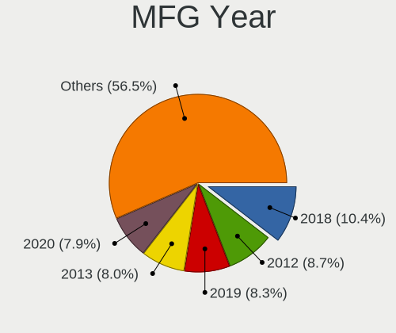
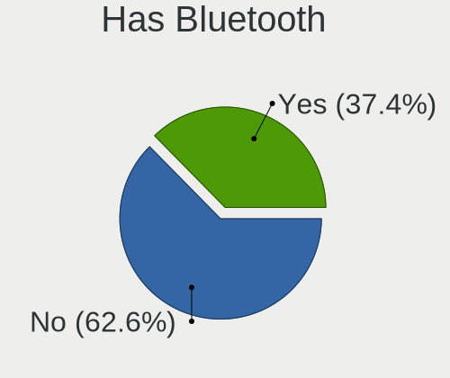
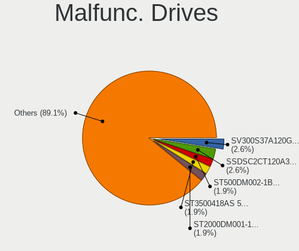
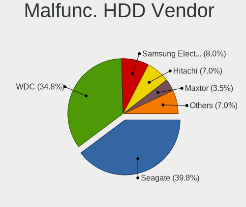
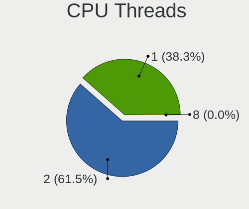
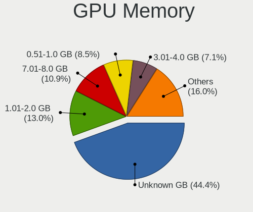
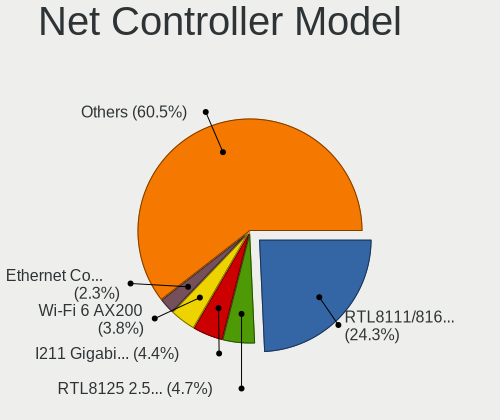
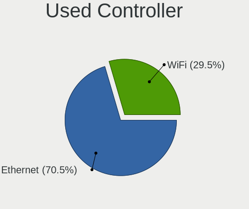
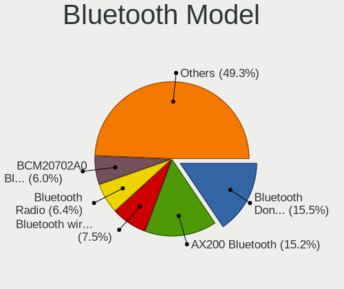
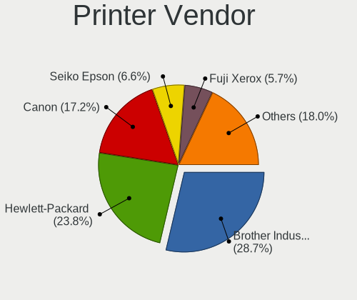

Linux in Australia - Tested Hardware & Statistics (Desktops)
------------------------------------------------------------

A project to collect tested hardware configurations for Linux in Australia.

Anyone can contribute to this report by the [hw-probe](https://github.com/linuxhw/hw-probe) tool:

    sudo -E hw-probe -all -upload

Please contribute! Especially if your hardware is rare.

Contents
--------

* [ Test Cases ](#test-cases)

* [ System ](#system)
  - [ OS                       ](#os)
  - [ OS Family                ](#os-family)
  - [ Kernel                   ](#kernel)
  - [ Kernel Family            ](#kernel-family)
  - [ Kernel Major Ver.        ](#kernel-major-ver)
  - [ Arch                     ](#arch)
  - [ DE                       ](#de)
  - [ Display Server           ](#display-server)
  - [ Display Manager          ](#display-manager)
  - [ OS Lang                  ](#os-lang)
  - [ Boot Mode                ](#boot-mode)
  - [ Filesystem               ](#filesystem)
  - [ Part. scheme             ](#part-scheme)
  - [ Dual Boot with Linux/BSD ](#dual-boot-with-linuxbsd)
  - [ Dual Boot (Win)          ](#dual-boot-win)

* [ Board ](#board)
  - [ Vendor                   ](#vendor)
  - [ Model                    ](#model)
  - [ Model Family             ](#model-family)
  - [ MFG Year                 ](#mfg-year)
  - [ Form Factor              ](#form-factor)
  - [ Secure Boot              ](#secure-boot)
  - [ Coreboot                 ](#coreboot)
  - [ RAM Size                 ](#ram-size)
  - [ RAM Used                 ](#ram-used)
  - [ Total Drives             ](#total-drives)
  - [ Has CD-ROM               ](#has-cd-rom)
  - [ Has Ethernet             ](#has-ethernet)
  - [ Has WiFi                 ](#has-wifi)
  - [ Has Bluetooth            ](#has-bluetooth)

* [ Location ](#location)
  - [ Country                  ](#country)
  - [ City                     ](#city)

* [ Drives ](#drives)
  - [ Drive Vendor             ](#drive-vendor)
  - [ Drive Model              ](#drive-model)
  - [ HDD Vendor               ](#hdd-vendor)
  - [ SSD Vendor               ](#ssd-vendor)
  - [ Drive Kind               ](#drive-kind)
  - [ Drive Connector          ](#drive-connector)
  - [ Drive Size               ](#drive-size)
  - [ Space Total              ](#space-total)
  - [ Space Used               ](#space-used)
  - [ Malfunc. Drives          ](#malfunc-drives)
  - [ Malfunc. Drive Vendor    ](#malfunc-drive-vendor)
  - [ Malfunc. HDD Vendor      ](#malfunc-hdd-vendor)
  - [ Malfunc. Drive Kind      ](#malfunc-drive-kind)
  - [ Failed Drives            ](#failed-drives)
  - [ Failed Drive Vendor      ](#failed-drive-vendor)
  - [ Drive Status             ](#drive-status)

* [ Storage controller ](#storage-controller)
  - [ Storage Vendor           ](#storage-vendor)
  - [ Storage Model            ](#storage-model)
  - [ Storage Kind             ](#storage-kind)

* [ Processor ](#processor)
  - [ CPU Vendor               ](#cpu-vendor)
  - [ CPU Model                ](#cpu-model)
  - [ CPU Model Family         ](#cpu-model-family)
  - [ CPU Cores                ](#cpu-cores)
  - [ CPU Sockets              ](#cpu-sockets)
  - [ CPU Threads              ](#cpu-threads)
  - [ CPU Op-Modes             ](#cpu-op-modes)
  - [ CPU Microcode            ](#cpu-microcode)
  - [ CPU Microarch            ](#cpu-microarch)

* [ Graphics ](#graphics)
  - [ GPU Vendor               ](#gpu-vendor)
  - [ GPU Model                ](#gpu-model)
  - [ GPU Combo                ](#gpu-combo)
  - [ GPU Driver               ](#gpu-driver)
  - [ GPU Memory               ](#gpu-memory)

* [ Monitor ](#monitor)
  - [ Monitor Vendor           ](#monitor-vendor)
  - [ Monitor Model            ](#monitor-model)
  - [ Monitor Resolution       ](#monitor-resolution)
  - [ Monitor Diagonal         ](#monitor-diagonal)
  - [ Monitor Width            ](#monitor-width)
  - [ Aspect Ratio             ](#aspect-ratio)
  - [ Monitor Area             ](#monitor-area)
  - [ Pixel Density            ](#pixel-density)
  - [ Multiple Monitors        ](#multiple-monitors)

* [ Network ](#network)
  - [ Net Controller Vendor    ](#net-controller-vendor)
  - [ Net Controller Model     ](#net-controller-model)
  - [ Wireless Vendor          ](#wireless-vendor)
  - [ Wireless Model           ](#wireless-model)
  - [ Ethernet Vendor          ](#ethernet-vendor)
  - [ Ethernet Model           ](#ethernet-model)
  - [ Net Controller Kind      ](#net-controller-kind)
  - [ Used Controller          ](#used-controller)
  - [ NICs                     ](#nics)
  - [ IPv6                     ](#ipv6)

* [ Bluetooth ](#bluetooth)
  - [ Bluetooth Vendor         ](#bluetooth-vendor)
  - [ Bluetooth Model          ](#bluetooth-model)

* [ Sound ](#sound)
  - [ Sound Vendor             ](#sound-vendor)
  - [ Sound Model              ](#sound-model)

* [ Memory ](#memory)
  - [ Memory Vendor            ](#memory-vendor)
  - [ Memory Model             ](#memory-model)
  - [ Memory Kind              ](#memory-kind)
  - [ Memory Form Factor       ](#memory-form-factor)
  - [ Memory Size              ](#memory-size)
  - [ Memory Speed             ](#memory-speed)

* [ Printers & scanners ](#printers--scanners)
  - [ Printer Vendor           ](#printer-vendor)
  - [ Printer Model            ](#printer-model)
  - [ Scanner Vendor           ](#scanner-vendor)
  - [ Scanner Model            ](#scanner-model)

* [ Camera ](#camera)
  - [ Camera Vendor            ](#camera-vendor)
  - [ Camera Model             ](#camera-model)

* [ Security ](#security)
  - [ Fingerprint Vendor       ](#fingerprint-vendor)
  - [ Fingerprint Model        ](#fingerprint-model)
  - [ Chipcard Vendor          ](#chipcard-vendor)
  - [ Chipcard Model           ](#chipcard-model)

* [ Unsupported ](#unsupported)
  - [ Unsupported Devices      ](#unsupported-devices)
  - [ Unsupported Device Types ](#unsupported-device-types)

Test Cases
----------

Total: 2132

| Vendor        | Model                       | Probe                                                      | Date         |
|---------------|-----------------------------|------------------------------------------------------------|--------------|
| Intel         | LADPNVMO AAE76523-300       | [4e6065532f](https://linux-hardware.org/?probe=4e6065532f) | Dec 30, 2022 |
| HP            | 1905                        | [5c576316f8](https://linux-hardware.org/?probe=5c576316f8) | Dec 28, 2022 |
| ASUSTek       | Z87-C                       | [4929f6a6c9](https://linux-hardware.org/?probe=4929f6a6c9) | Dec 28, 2022 |
| MSI           | Z97 GAMING 3                | [7aab4546f6](https://linux-hardware.org/?probe=7aab4546f6) | Dec 28, 2022 |
| ASRock        | AD2700-ITX                  | [d4fff49f31](https://linux-hardware.org/?probe=d4fff49f31) | Dec 27, 2022 |
| Lenovo        | ThinkStation D30 42234T7    | [6ad649ad46](https://linux-hardware.org/?probe=6ad649ad46) | Dec 26, 2022 |
| Lenovo        | ThinkStation D30 42234T7    | [6ac63aca4f](https://linux-hardware.org/?probe=6ac63aca4f) | Dec 25, 2022 |
| Gigabyte      | X570 I AORUS PRO WIFI       | [8d9b11c617](https://linux-hardware.org/?probe=8d9b11c617) | Dec 25, 2022 |
| MSI           | B450 GAMING PRO CARBON A... | [82de75771e](https://linux-hardware.org/?probe=82de75771e) | Dec 25, 2022 |
| Gigabyte      | EP45-DS3L                   | [b95d3d3c7a](https://linux-hardware.org/?probe=b95d3d3c7a) | Dec 25, 2022 |
| MSI           | X470 GAMING PRO CARBON      | [10b9f48473](https://linux-hardware.org/?probe=10b9f48473) | Dec 25, 2022 |
| MSI           | B450M MORTAR TITANIUM       | [2a7ce79df8](https://linux-hardware.org/?probe=2a7ce79df8) | Dec 24, 2022 |
| Gigabyte      | Z170X-Gaming 3              | [3073d2d4e1](https://linux-hardware.org/?probe=3073d2d4e1) | Dec 23, 2022 |
| MSI           | B450M MORTAR                | [2279954594](https://linux-hardware.org/?probe=2279954594) | Dec 22, 2022 |
| MSI           | B85M-E45                    | [b60edb092f](https://linux-hardware.org/?probe=b60edb092f) | Dec 21, 2022 |
| ASRock        | Z170 Pro4                   | [ca027f264a](https://linux-hardware.org/?probe=ca027f264a) | Dec 20, 2022 |
| Pegatron      | 2ACB                        | [f77ff3b9b5](https://linux-hardware.org/?probe=f77ff3b9b5) | Dec 19, 2022 |
| HP            | 0B4Ch D                     | [2318fda45f](https://linux-hardware.org/?probe=2318fda45f) | Dec 19, 2022 |
| MSI           | Boston                      | [8587c9cf45](https://linux-hardware.org/?probe=8587c9cf45) | Dec 19, 2022 |
| Gigabyte      | J1900M-D2P                  | [26ecfabc95](https://linux-hardware.org/?probe=26ecfabc95) | Dec 17, 2022 |
| Gigabyte      | Z77MX-D3H                   | [50ba321b50](https://linux-hardware.org/?probe=50ba321b50) | Dec 16, 2022 |
| HP            | 212A                        | [c21bb6d20d](https://linux-hardware.org/?probe=c21bb6d20d) | Dec 14, 2022 |
| ASUSTek       | M5A99FX PRO R2.0            | [259f85d65b](https://linux-hardware.org/?probe=259f85d65b) | Dec 12, 2022 |
| ASUSTek       | B85M-E                      | [6c3fcfbb13](https://linux-hardware.org/?probe=6c3fcfbb13) | Dec 12, 2022 |
| Gigabyte      | J1900M-D2P                  | [8111a18c7c](https://linux-hardware.org/?probe=8111a18c7c) | Dec 12, 2022 |
| MSI           | MAG B550M MORTAR WIFI       | [4f1f6fde97](https://linux-hardware.org/?probe=4f1f6fde97) | Dec 10, 2022 |
| Gigabyte      | Z77MX-D3H                   | [b77b64cc48](https://linux-hardware.org/?probe=b77b64cc48) | Dec 09, 2022 |
| ASUSTek       | ROG STRIX X570-I GAMING     | [e95599a479](https://linux-hardware.org/?probe=e95599a479) | Dec 09, 2022 |
| Gigabyte      | EP45-DS4P                   | [5acdccf7c0](https://linux-hardware.org/?probe=5acdccf7c0) | Dec 09, 2022 |
| Gigabyte      | B550M S2H                   | [5e56097f25](https://linux-hardware.org/?probe=5e56097f25) | Dec 08, 2022 |
| MSI           | PRO B650-P WIFI             | [b74866314e](https://linux-hardware.org/?probe=b74866314e) | Dec 08, 2022 |
| HP            | 0B4Ch D                     | [bede7701b9](https://linux-hardware.org/?probe=bede7701b9) | Dec 08, 2022 |
| MSI           | PRO B660M-A WIFI DDR4       | [6f715ffe60](https://linux-hardware.org/?probe=6f715ffe60) | Dec 08, 2022 |
| Gigabyte      | D525TUD                     | [cfddc4ddef](https://linux-hardware.org/?probe=cfddc4ddef) | Dec 06, 2022 |
| Dell          | 0C2XKD A01                  | [e3d7eb48ec](https://linux-hardware.org/?probe=e3d7eb48ec) | Dec 05, 2022 |
| Gigabyte      | B550M S2H                   | [dd012c9f92](https://linux-hardware.org/?probe=dd012c9f92) | Dec 04, 2022 |
| ASUSTek       | A8R32-MVP Deluxe            | [cbb4692837](https://linux-hardware.org/?probe=cbb4692837) | Dec 04, 2022 |
| ASRock        | Z68 Extreme4 Gen3           | [c2a68eb192](https://linux-hardware.org/?probe=c2a68eb192) | Dec 03, 2022 |
| Gigabyte      | X58A-UD3R                   | [7e188d7537](https://linux-hardware.org/?probe=7e188d7537) | Dec 02, 2022 |
| ASUSTek       | SABERTOOTH X79              | [85f6854ce5](https://linux-hardware.org/?probe=85f6854ce5) | Dec 02, 2022 |
| Lenovo        | SHARKBAY SDK0E50510 WIN     | [919c5d80c8](https://linux-hardware.org/?probe=919c5d80c8) | Dec 02, 2022 |
| Gigabyte      | X570 I AORUS PRO WIFI       | [0949d0916c](https://linux-hardware.org/?probe=0949d0916c) | Dec 02, 2022 |
| Shuttle       | FS81                        | [6352050887](https://linux-hardware.org/?probe=6352050887) | Dec 02, 2022 |
| Gigabyte      | B360M D3H-CF                | [e902390c9c](https://linux-hardware.org/?probe=e902390c9c) | Dec 02, 2022 |
| Gigabyte      | X570 I AORUS PRO WIFI       | [f9ff6b9e31](https://linux-hardware.org/?probe=f9ff6b9e31) | Dec 02, 2022 |
| ASRock        | Z68 Extreme4 Gen3           | [717d165f0e](https://linux-hardware.org/?probe=717d165f0e) | Dec 02, 2022 |
| ASRock        | AD525PV3                    | [da83c87218](https://linux-hardware.org/?probe=da83c87218) | Dec 01, 2022 |
| ASRock        | Z68 Extreme4 Gen3           | [c14e2149eb](https://linux-hardware.org/?probe=c14e2149eb) | Dec 01, 2022 |
| Dell          | 0WR7PY A03                  | [ba1e414d62](https://linux-hardware.org/?probe=ba1e414d62) | Nov 30, 2022 |
| Gigabyte      | H77N-WIFI                   | [f4fa3a4e7f](https://linux-hardware.org/?probe=f4fa3a4e7f) | Nov 30, 2022 |
| Gigabyte      | GA-MA780G-UD3H              | [bc3188dd75](https://linux-hardware.org/?probe=bc3188dd75) | Nov 29, 2022 |
| MSI           | IONA                        | [255f7f8dc4](https://linux-hardware.org/?probe=255f7f8dc4) | Nov 28, 2022 |
| MSI           | IONA                        | [94841f2b61](https://linux-hardware.org/?probe=94841f2b61) | Nov 28, 2022 |
| ASUSTek       | M5A88-M                     | [f4b2035429](https://linux-hardware.org/?probe=f4b2035429) | Nov 28, 2022 |
| HP            | 18E9                        | [dab5e242fd](https://linux-hardware.org/?probe=dab5e242fd) | Nov 25, 2022 |
| ASUSTek       | ROG ZENITH EXTREME ALPHA    | [1d224863f2](https://linux-hardware.org/?probe=1d224863f2) | Nov 24, 2022 |
| ASRock        | Z170 Pro4                   | [ac6ad8d54d](https://linux-hardware.org/?probe=ac6ad8d54d) | Nov 24, 2022 |
| Gigabyte      | B550M S2H                   | [8ea3c120c6](https://linux-hardware.org/?probe=8ea3c120c6) | Nov 23, 2022 |
| Intel         | LADPNVMO AAE76523-300       | [db4e4c9c5b](https://linux-hardware.org/?probe=db4e4c9c5b) | Nov 22, 2022 |
| MSI           | IONA                        | [280083cfa1](https://linux-hardware.org/?probe=280083cfa1) | Nov 22, 2022 |
| MSI           | IONA                        | [39bcd0f2d8](https://linux-hardware.org/?probe=39bcd0f2d8) | Nov 22, 2022 |
| HP            | 1495                        | [3ac774a6d6](https://linux-hardware.org/?probe=3ac774a6d6) | Nov 19, 2022 |
| HP            | 1495                        | [659062ad1d](https://linux-hardware.org/?probe=659062ad1d) | Nov 19, 2022 |
| ASRock        | AD2700-ITX                  | [806ac66c75](https://linux-hardware.org/?probe=806ac66c75) | Nov 19, 2022 |
| Gigabyte      | X570 GAMING X               | [587db1b08f](https://linux-hardware.org/?probe=587db1b08f) | Nov 19, 2022 |
| ASRock        | AD525PV3                    | [4bba69ecd9](https://linux-hardware.org/?probe=4bba69ecd9) | Nov 18, 2022 |
| Gigabyte      | B550M DS3H                  | [884474637c](https://linux-hardware.org/?probe=884474637c) | Nov 18, 2022 |
| Gigabyte      | B550M DS3H                  | [0b7bd42177](https://linux-hardware.org/?probe=0b7bd42177) | Nov 18, 2022 |
| Gigabyte      | GA-MA780G-UD3H              | [e9eb63ca62](https://linux-hardware.org/?probe=e9eb63ca62) | Nov 17, 2022 |
| Dell          | 0D6H9T A01                  | [a50bca5670](https://linux-hardware.org/?probe=a50bca5670) | Nov 17, 2022 |
| Gigabyte      | X570 AORUS ULTRA            | [07d80f1783](https://linux-hardware.org/?probe=07d80f1783) | Nov 16, 2022 |
| Acer          | Aspire XC-840               | [fe8db55aac](https://linux-hardware.org/?probe=fe8db55aac) | Nov 14, 2022 |
| Gigabyte      | EP45-DS3L                   | [fd017849be](https://linux-hardware.org/?probe=fd017849be) | Nov 13, 2022 |
| Gigabyte      | GA-MA780G-UD3H              | [97bfce0a04](https://linux-hardware.org/?probe=97bfce0a04) | Nov 13, 2022 |
| Lenovo        | ThinkCentre A70z 0401G6M    | [a84e5c2107](https://linux-hardware.org/?probe=a84e5c2107) | Nov 13, 2022 |
| Intel         | LADPNVMO AAE76523-300       | [ea94d443c9](https://linux-hardware.org/?probe=ea94d443c9) | Nov 12, 2022 |
| ASUSTek       | PRIME A320M-E               | [2eacb090ee](https://linux-hardware.org/?probe=2eacb090ee) | Nov 12, 2022 |
| ASUSTek       | PRIME A320M-E               | [a35ca3673b](https://linux-hardware.org/?probe=a35ca3673b) | Nov 12, 2022 |
| ASRock        | B75M                        | [7da4910326](https://linux-hardware.org/?probe=7da4910326) | Nov 12, 2022 |
| ASRock        | Z68 Extreme3 Gen3           | [01cb4ff120](https://linux-hardware.org/?probe=01cb4ff120) | Nov 10, 2022 |
| ASUSTek       | Rampage V EDITION 10        | [4ff6488cb2](https://linux-hardware.org/?probe=4ff6488cb2) | Nov 10, 2022 |
| Lenovo        | 364F SDK0J40700 WIN 3258... | [dbf32417df](https://linux-hardware.org/?probe=dbf32417df) | Nov 09, 2022 |
| Lenovo        | ThinkCentre A70z 0401G6M    | [f2afc66464](https://linux-hardware.org/?probe=f2afc66464) | Nov 09, 2022 |
| ASRock        | B550 Steel Legend           | [8c775416b9](https://linux-hardware.org/?probe=8c775416b9) | Nov 08, 2022 |
| ASRock        | X570 Steel Legend           | [638b6a52ff](https://linux-hardware.org/?probe=638b6a52ff) | Nov 08, 2022 |
| Gigabyte      | B360M D3H-CF                | [ee895bde1f](https://linux-hardware.org/?probe=ee895bde1f) | Nov 08, 2022 |
| Gigabyte      | X570 I AORUS PRO WIFI       | [0e2747c7ab](https://linux-hardware.org/?probe=0e2747c7ab) | Nov 08, 2022 |
| Dell          | 0DF42J A00                  | [67928f8921](https://linux-hardware.org/?probe=67928f8921) | Nov 07, 2022 |
| ASUSTek       | ROG STRIX X570-E GAMING     | [a38da64b4f](https://linux-hardware.org/?probe=a38da64b4f) | Nov 07, 2022 |
| Gigabyte      | B660M D3H DDR4              | [64aed4564c](https://linux-hardware.org/?probe=64aed4564c) | Nov 07, 2022 |
| Gigabyte      | J1900M-D2P                  | [7ea9f2df61](https://linux-hardware.org/?probe=7ea9f2df61) | Nov 06, 2022 |
| ASUSTek       | M5A99X EVO R2.0             | [dd757fb650](https://linux-hardware.org/?probe=dd757fb650) | Nov 06, 2022 |
| HP            | 3396                        | [d6867789ca](https://linux-hardware.org/?probe=d6867789ca) | Nov 04, 2022 |
| ASRock        | X570 Phantom Gaming 4       | [4be0967ca1](https://linux-hardware.org/?probe=4be0967ca1) | Nov 04, 2022 |
| MSI           | B450 TOMAHAWK               | [c4b2b4072b](https://linux-hardware.org/?probe=c4b2b4072b) | Nov 04, 2022 |
| Dell          | 0200DY A01                  | [a473b71b4e](https://linux-hardware.org/?probe=a473b71b4e) | Nov 03, 2022 |
| Gigabyte      | G41MT-D3                    | [921a646464](https://linux-hardware.org/?probe=921a646464) | Nov 03, 2022 |
| Lenovo        | SHARKBAY NOK                | [722ae37952](https://linux-hardware.org/?probe=722ae37952) | Nov 01, 2022 |
| ASUSTek       | B150M-V PLUS                | [a451844625](https://linux-hardware.org/?probe=a451844625) | Nov 01, 2022 |
| ASUSTek       | A8R32-MVP Deluxe            | [a2a8473e4b](https://linux-hardware.org/?probe=a2a8473e4b) | Oct 31, 2022 |
| ASRock        | X670E Pro RS                | [5ebdf73c67](https://linux-hardware.org/?probe=5ebdf73c67) | Oct 31, 2022 |
| HP            | 8653 A                      | [9c19089f51](https://linux-hardware.org/?probe=9c19089f51) | Oct 29, 2022 |
| Gigabyte      | B550M DS3H                  | [1c5d979ba1](https://linux-hardware.org/?probe=1c5d979ba1) | Oct 29, 2022 |
| Dell          | 0478VN A00                  | [883100c74f](https://linux-hardware.org/?probe=883100c74f) | Oct 29, 2022 |
| MSI           | X570-A PRO                  | [1d3ff229c6](https://linux-hardware.org/?probe=1d3ff229c6) | Oct 29, 2022 |
| Dell          | 0478VN A00                  | [629858e96c](https://linux-hardware.org/?probe=629858e96c) | Oct 29, 2022 |
| Gigabyte      | G41MT-D3                    | [2e4153161f](https://linux-hardware.org/?probe=2e4153161f) | Oct 28, 2022 |
| HP            | 8653 A                      | [92b68870ca](https://linux-hardware.org/?probe=92b68870ca) | Oct 27, 2022 |
| ASUSTek       | A8R32-MVP Deluxe            | [6896f337ab](https://linux-hardware.org/?probe=6896f337ab) | Oct 25, 2022 |
| Gigabyte      | Z590I VISION D              | [be4c6573cd](https://linux-hardware.org/?probe=be4c6573cd) | Oct 25, 2022 |
| MSI           | X470 GAMING PLUS MAX        | [82fb357322](https://linux-hardware.org/?probe=82fb357322) | Oct 25, 2022 |
| Gigabyte      | H81M-S2PV                   | [23be2713d2](https://linux-hardware.org/?probe=23be2713d2) | Oct 24, 2022 |
| MSI           | PRO Z690-A DDR4             | [6331b122dc](https://linux-hardware.org/?probe=6331b122dc) | Oct 24, 2022 |
| HP            | 0B40h                       | [981b4e9553](https://linux-hardware.org/?probe=981b4e9553) | Oct 23, 2022 |
| ASUSTek       | ROG CROSSHAIR VIII EXTRE... | [32cd9cd246](https://linux-hardware.org/?probe=32cd9cd246) | Oct 22, 2022 |
| Gigabyte      | H77N-WIFI                   | [3e2bd05f56](https://linux-hardware.org/?probe=3e2bd05f56) | Oct 22, 2022 |
| Gigabyte      | GA-MA780G-UD3H              | [1ab730c85c](https://linux-hardware.org/?probe=1ab730c85c) | Oct 21, 2022 |
| Gigabyte      | X570S AORUS ELITE           | [bc75d3cc30](https://linux-hardware.org/?probe=bc75d3cc30) | Oct 21, 2022 |
| MSI           | MPG X570 GAMING PLUS        | [60d4787bb7](https://linux-hardware.org/?probe=60d4787bb7) | Oct 21, 2022 |
| MSI           | MPG X570 GAMING PLUS        | [502ae94f8f](https://linux-hardware.org/?probe=502ae94f8f) | Oct 20, 2022 |
| Gigabyte      | B450 AORUS ELITE            | [79eba98b95](https://linux-hardware.org/?probe=79eba98b95) | Oct 14, 2022 |
| Acer          | Aspire XC100A               | [6fade2c77f](https://linux-hardware.org/?probe=6fade2c77f) | Oct 13, 2022 |
| HP            | 1497                        | [ff6d690da4](https://linux-hardware.org/?probe=ff6d690da4) | Oct 12, 2022 |
| Gigabyte      | X570S GAMING X              | [e966aea162](https://linux-hardware.org/?probe=e966aea162) | Oct 12, 2022 |
| Lenovo        | 3129 SDK0J40700 WIN 3258... | [1798dba7f1](https://linux-hardware.org/?probe=1798dba7f1) | Oct 12, 2022 |
| Gigabyte      | B75M-D3H                    | [4bc40092b2](https://linux-hardware.org/?probe=4bc40092b2) | Oct 11, 2022 |
| Dell          | 07WJF3 A00                  | [62f8858433](https://linux-hardware.org/?probe=62f8858433) | Oct 11, 2022 |
| Gigabyte      | J1900M-D2P                  | [dde4a94108](https://linux-hardware.org/?probe=dde4a94108) | Oct 11, 2022 |
| Gigabyte      | H410M DS2V                  | [bd9d9e10c7](https://linux-hardware.org/?probe=bd9d9e10c7) | Oct 11, 2022 |
| Gigabyte      | AB350-Gaming 3-CF           | [e26fca4929](https://linux-hardware.org/?probe=e26fca4929) | Oct 09, 2022 |
| MSI           | X399 SLI PLUS               | [027504f861](https://linux-hardware.org/?probe=027504f861) | Oct 08, 2022 |
| Gigabyte      | B365M D3H-CF                | [2ad7a0c296](https://linux-hardware.org/?probe=2ad7a0c296) | Oct 08, 2022 |
| Shuttle       | FS81                        | [ba7c22e135](https://linux-hardware.org/?probe=ba7c22e135) | Oct 07, 2022 |
| Shuttle       | FS81                        | [63ec5c8971](https://linux-hardware.org/?probe=63ec5c8971) | Oct 07, 2022 |
| MSI           | H110M PRO-VH PLUS           | [9dc72dc357](https://linux-hardware.org/?probe=9dc72dc357) | Oct 07, 2022 |
| Gigabyte      | GA-MA780G-UD3H              | [3ea8d4d25e](https://linux-hardware.org/?probe=3ea8d4d25e) | Oct 06, 2022 |
| Gigabyte      | Z270X-Gaming 5              | [9ad9a1c969](https://linux-hardware.org/?probe=9ad9a1c969) | Oct 06, 2022 |
| Gigabyte      | B250M-D3H-CF                | [2e57f97484](https://linux-hardware.org/?probe=2e57f97484) | Oct 06, 2022 |
| ASUSTek       | Rampage V EDITION 10        | [9232451f1a](https://linux-hardware.org/?probe=9232451f1a) | Oct 06, 2022 |
| Gigabyte      | B450 AORUS ELITE            | [b5cf733c51](https://linux-hardware.org/?probe=b5cf733c51) | Oct 06, 2022 |
| ASUSTek       | PRIME X299-DELUXE II        | [4f3856c8f0](https://linux-hardware.org/?probe=4f3856c8f0) | Oct 06, 2022 |
| MSI           | B450-A PRO                  | [5ff1f9c5c3](https://linux-hardware.org/?probe=5ff1f9c5c3) | Oct 05, 2022 |
| Lenovo        | ThinkStation S30 0569BE3    | [026d1ee25e](https://linux-hardware.org/?probe=026d1ee25e) | Oct 05, 2022 |
| Gigabyte      | GA-MA785G-UD3H              | [ca81117136](https://linux-hardware.org/?probe=ca81117136) | Oct 05, 2022 |
| Dell          | 0WF810                      | [dd24119965](https://linux-hardware.org/?probe=dd24119965) | Oct 04, 2022 |
| Gigabyte      | D525TUD                     | [47d31ff25c](https://linux-hardware.org/?probe=47d31ff25c) | Oct 03, 2022 |
| Dell          | 0XCR8D A00                  | [82e52ab722](https://linux-hardware.org/?probe=82e52ab722) | Oct 02, 2022 |
| Dell          | 0XCR8D A00                  | [a6db1f5075](https://linux-hardware.org/?probe=a6db1f5075) | Oct 02, 2022 |
| ASRock        | AD2700-ITX                  | [4275ef3653](https://linux-hardware.org/?probe=4275ef3653) | Oct 01, 2022 |
| MSI           | PRO X670-P WIFI             | [64299c7b4a](https://linux-hardware.org/?probe=64299c7b4a) | Oct 01, 2022 |
| ASUSTek       | GRYPHON Z87                 | [3f01bbaa12](https://linux-hardware.org/?probe=3f01bbaa12) | Sep 30, 2022 |
| ASUSTek       | ROG CROSSHAIR VIII HERO     | [76aac25208](https://linux-hardware.org/?probe=76aac25208) | Sep 28, 2022 |
| MSI           | MPG X570 GAMING EDGE WIF... | [2c69225287](https://linux-hardware.org/?probe=2c69225287) | Sep 27, 2022 |
| MSI           | B450M-A PRO MAX             | [dce9d30a10](https://linux-hardware.org/?probe=dce9d30a10) | Sep 26, 2022 |
| ASUSTek       | 970 PRO GAMING/AURA         | [f61a736922](https://linux-hardware.org/?probe=f61a736922) | Sep 26, 2022 |
| ASUSTek       | 970 PRO GAMING/AURA         | [1ecfe379e7](https://linux-hardware.org/?probe=1ecfe379e7) | Sep 26, 2022 |
| ASRock        | B450M-HDV R4.0              | [479dfeae74](https://linux-hardware.org/?probe=479dfeae74) | Sep 25, 2022 |
| MSI           | H170M PRO-VDH               | [f7254adff2](https://linux-hardware.org/?probe=f7254adff2) | Sep 25, 2022 |
| MSI           | MAG Z590 TORPEDO            | [cedbd8909f](https://linux-hardware.org/?probe=cedbd8909f) | Sep 25, 2022 |
| Gigabyte      | GA-MA785G-UD3H              | [66b5b65077](https://linux-hardware.org/?probe=66b5b65077) | Sep 25, 2022 |
| Gigabyte      | GA-MA780G-UD3H              | [a35dda8c10](https://linux-hardware.org/?probe=a35dda8c10) | Sep 25, 2022 |
| Gigabyte      | GA-870A-UD3                 | [33a0b663ea](https://linux-hardware.org/?probe=33a0b663ea) | Sep 25, 2022 |
| ASUSTek       | P8B75-M                     | [0299e4f7b1](https://linux-hardware.org/?probe=0299e4f7b1) | Sep 24, 2022 |
| ASUSTek       | P8B75-M                     | [cad0f6f375](https://linux-hardware.org/?probe=cad0f6f375) | Sep 24, 2022 |
| MSI           | C236A WORKSTATION           | [67432a461e](https://linux-hardware.org/?probe=67432a461e) | Sep 24, 2022 |
| ASUSTek       | P8B75-M                     | [91d179670c](https://linux-hardware.org/?probe=91d179670c) | Sep 23, 2022 |
| Dell          | 0KV62T A01                  | [d8d21241de](https://linux-hardware.org/?probe=d8d21241de) | Sep 23, 2022 |
| ASUSTek       | P6T                         | [612682c52d](https://linux-hardware.org/?probe=612682c52d) | Sep 23, 2022 |
| Dell          | 09M8Y8 A01                  | [aa3088ed0e](https://linux-hardware.org/?probe=aa3088ed0e) | Sep 22, 2022 |
| ASRock        | Z690 Pro RS                 | [787589762f](https://linux-hardware.org/?probe=787589762f) | Sep 21, 2022 |
| Shuttle       | FS81                        | [4c1fb942aa](https://linux-hardware.org/?probe=4c1fb942aa) | Sep 20, 2022 |
| ASRock        | HM55-HT                     | [64fff8f065](https://linux-hardware.org/?probe=64fff8f065) | Sep 20, 2022 |
| ASUSTek       | Z97-AR                      | [5cf4494f07](https://linux-hardware.org/?probe=5cf4494f07) | Sep 20, 2022 |
| ASRock        | H610M-HDV/M.2               | [02a5a10d7a](https://linux-hardware.org/?probe=02a5a10d7a) | Sep 20, 2022 |
| ASUSTek       | Maximus VI HERO             | [7c7043ad0f](https://linux-hardware.org/?probe=7c7043ad0f) | Sep 19, 2022 |
| ASUSTek       | Maximus VI HERO             | [48d71b12fc](https://linux-hardware.org/?probe=48d71b12fc) | Sep 19, 2022 |
| MSI           | Z370-A PRO                  | [43fbf9fec9](https://linux-hardware.org/?probe=43fbf9fec9) | Sep 19, 2022 |
| MSI           | Z370-A PRO                  | [850e17ede5](https://linux-hardware.org/?probe=850e17ede5) | Sep 19, 2022 |
| Gigabyte      | GA-MA780G-UD3H              | [6c63c03b9f](https://linux-hardware.org/?probe=6c63c03b9f) | Sep 19, 2022 |
| ASUSTek       | TUF Gaming X570-PRO         | [126b3ed209](https://linux-hardware.org/?probe=126b3ed209) | Sep 14, 2022 |
| ASUSTek       | TUF Gaming X570-PRO         | [08c270ce3d](https://linux-hardware.org/?probe=08c270ce3d) | Sep 14, 2022 |
| ASUSTek       | P5KPL-CM                    | [ebd7ab6202](https://linux-hardware.org/?probe=ebd7ab6202) | Sep 12, 2022 |
| Inventec      | C CLASS A01                 | [613f741235](https://linux-hardware.org/?probe=613f741235) | Sep 12, 2022 |
| Inventec      | C CLASS A01                 | [21ae14e7a0](https://linux-hardware.org/?probe=21ae14e7a0) | Sep 11, 2022 |
| Inventec      | C CLASS A01                 | [3ddd0d7aa0](https://linux-hardware.org/?probe=3ddd0d7aa0) | Sep 11, 2022 |
| Gigabyte      | GA-MA780G-UD3H              | [2cb423c8e7](https://linux-hardware.org/?probe=2cb423c8e7) | Sep 10, 2022 |
| Gigabyte      | H77N-WIFI                   | [3c454664b0](https://linux-hardware.org/?probe=3c454664b0) | Sep 09, 2022 |
| ASRock        | J5040-ITX                   | [e36022370b](https://linux-hardware.org/?probe=e36022370b) | Sep 08, 2022 |
| ASUSTek       | X99-E WS/USB                | [56357e3cc7](https://linux-hardware.org/?probe=56357e3cc7) | Sep 07, 2022 |
| ASUSTek       | X99-E WS/USB                | [3432790e95](https://linux-hardware.org/?probe=3432790e95) | Sep 07, 2022 |
| ASUSTek       | Z97-AR                      | [01dbdc3b29](https://linux-hardware.org/?probe=01dbdc3b29) | Sep 06, 2022 |
| Gigabyte      | Z690 AERO G DDR4            | [ccd383a106](https://linux-hardware.org/?probe=ccd383a106) | Sep 05, 2022 |
| Gigabyte      | AB350M-HD3-CF se1           | [0859dbdb1c](https://linux-hardware.org/?probe=0859dbdb1c) | Sep 04, 2022 |
| Dell          | 0D24M8 A01                  | [a746f6faa6](https://linux-hardware.org/?probe=a746f6faa6) | Sep 04, 2022 |
| HP            | 2AF3                        | [58eae39fe2](https://linux-hardware.org/?probe=58eae39fe2) | Sep 03, 2022 |
| Gigabyte      | Z590 AORUS ELITE AX         | [e03d937610](https://linux-hardware.org/?probe=e03d937610) | Sep 02, 2022 |
| MSI           | MAG B550M BAZOOKA           | [a1b5555512](https://linux-hardware.org/?probe=a1b5555512) | Sep 02, 2022 |
| Gigabyte      | GA-MA780G-UD3H              | [0a1de8a406](https://linux-hardware.org/?probe=0a1de8a406) | Sep 02, 2022 |
| ASUSTek       | ROG CROSSHAIR VIII HERO     | [ac65980e25](https://linux-hardware.org/?probe=ac65980e25) | Sep 02, 2022 |
| ASUSTek       | PRIME B250M-PLUS            | [888ed47bbe](https://linux-hardware.org/?probe=888ed47bbe) | Sep 02, 2022 |
| Gigabyte      | GA-MA785G-UD3H              | [2cf98644bc](https://linux-hardware.org/?probe=2cf98644bc) | Sep 01, 2022 |
| Lenovo        | MAHOBAY                     | [53af4f5de7](https://linux-hardware.org/?probe=53af4f5de7) | Aug 30, 2022 |
| ASRock        | Z170 Pro4                   | [eaa574481f](https://linux-hardware.org/?probe=eaa574481f) | Aug 29, 2022 |
| Unknown       | Unknown                     | [fd4ab67b77](https://linux-hardware.org/?probe=fd4ab67b77) | Aug 29, 2022 |
| ASUSTek       | B85M-E                      | [a0f47aaaa7](https://linux-hardware.org/?probe=a0f47aaaa7) | Aug 28, 2022 |
| ASUSTek       | PRIME Z390-A                | [459c7c1eee](https://linux-hardware.org/?probe=459c7c1eee) | Aug 27, 2022 |
| ASUSTek       | Z170-K                      | [137641269c](https://linux-hardware.org/?probe=137641269c) | Aug 27, 2022 |
| Gigabyte      | B550 GAMING X V2            | [f37ee1975e](https://linux-hardware.org/?probe=f37ee1975e) | Aug 26, 2022 |
| Lenovo        | 1046 NO DPK                 | [e21e07827d](https://linux-hardware.org/?probe=e21e07827d) | Aug 26, 2022 |
| ASUSTek       | ROG STRIX B550-F GAMING     | [2388b95ce9](https://linux-hardware.org/?probe=2388b95ce9) | Aug 25, 2022 |
| ASUSTek       | Z97-AR                      | [a766ce2d5a](https://linux-hardware.org/?probe=a766ce2d5a) | Aug 24, 2022 |
| ASUSTek       | B85M-E                      | [fda9abd530](https://linux-hardware.org/?probe=fda9abd530) | Aug 24, 2022 |
| HP            | 1905                        | [6693a2b3c7](https://linux-hardware.org/?probe=6693a2b3c7) | Aug 24, 2022 |
| Gigabyte      | B360 AORUS GAMING 3 WIFI... | [18102e8a9a](https://linux-hardware.org/?probe=18102e8a9a) | Aug 24, 2022 |
| Gigabyte      | EP45-DS3L                   | [738a69419b](https://linux-hardware.org/?probe=738a69419b) | Aug 24, 2022 |
| Gigabyte      | B550M AORUS PRO-P           | [7dae220687](https://linux-hardware.org/?probe=7dae220687) | Aug 23, 2022 |
| ASRock        | AD2700-ITX                  | [4be47e3738](https://linux-hardware.org/?probe=4be47e3738) | Aug 21, 2022 |
| ASRock        | Z77 Extreme6                | [660091e5bb](https://linux-hardware.org/?probe=660091e5bb) | Aug 20, 2022 |
| Google        | Teemo                       | [4cc9295e6d](https://linux-hardware.org/?probe=4cc9295e6d) | Aug 20, 2022 |
| Gigabyte      | GA-MA780G-UD3H              | [c9738d69e9](https://linux-hardware.org/?probe=c9738d69e9) | Aug 20, 2022 |
| Gigabyte      | X570 AORUS MASTER           | [9bfc03d98e](https://linux-hardware.org/?probe=9bfc03d98e) | Aug 20, 2022 |
| MSI           | MAG B550 TOMAHAWK           | [ed2076bba5](https://linux-hardware.org/?probe=ed2076bba5) | Aug 20, 2022 |
| Gigabyte      | B360 AORUS GAMING 3 WIFI... | [1e4e125d11](https://linux-hardware.org/?probe=1e4e125d11) | Aug 17, 2022 |
| ASUSTek       | P8B75-M LX                  | [1efeb7be2c](https://linux-hardware.org/?probe=1efeb7be2c) | Aug 17, 2022 |
| Gigabyte      | D525TUD                     | [125fdc6af1](https://linux-hardware.org/?probe=125fdc6af1) | Aug 17, 2022 |
| Gigabyte      | D525TUD                     | [e68748c0f1](https://linux-hardware.org/?probe=e68748c0f1) | Aug 16, 2022 |
| Gigabyte      | B660M DS3H AX DDR4          | [171a797c22](https://linux-hardware.org/?probe=171a797c22) | Aug 16, 2022 |
| Gigabyte      | B660M DS3H AX DDR4          | [f882fcbe3a](https://linux-hardware.org/?probe=f882fcbe3a) | Aug 16, 2022 |
| Gigabyte      | GA-MA785G-UD3H              | [8072e15459](https://linux-hardware.org/?probe=8072e15459) | Aug 15, 2022 |
| Gigabyte      | H77N-WIFI                   | [20d9ba44b5](https://linux-hardware.org/?probe=20d9ba44b5) | Aug 15, 2022 |
| Gigabyte      | Z77MX-D3H                   | [be0b70efdb](https://linux-hardware.org/?probe=be0b70efdb) | Aug 15, 2022 |
| MSI           | H61M-P20                    | [9adc2fa427](https://linux-hardware.org/?probe=9adc2fa427) | Aug 15, 2022 |
| HP            | 1493                        | [e5d0f16bbc](https://linux-hardware.org/?probe=e5d0f16bbc) | Aug 14, 2022 |
| ASRock        | AB350 Gaming K4             | [8a6141848a](https://linux-hardware.org/?probe=8a6141848a) | Aug 13, 2022 |
| MSI           | H61M-P20                    | [acc2520058](https://linux-hardware.org/?probe=acc2520058) | Aug 13, 2022 |
| Gigabyte      | EP35C-DS3R                  | [762d78160d](https://linux-hardware.org/?probe=762d78160d) | Aug 12, 2022 |
| Gigabyte      | Z87M-D3HP                   | [b6612680e2](https://linux-hardware.org/?probe=b6612680e2) | Aug 11, 2022 |
| ASRock        | X58 Extreme3                | [81f68d4fc7](https://linux-hardware.org/?probe=81f68d4fc7) | Aug 10, 2022 |
| Unknown       | Unknown                     | [dc354e0b4f](https://linux-hardware.org/?probe=dc354e0b4f) | Aug 10, 2022 |
| ASUSTek       | TUF B360-PRO GAMING         | [62d813423e](https://linux-hardware.org/?probe=62d813423e) | Aug 10, 2022 |
| Gigabyte      | GA-MA780G-UD3H              | [e74a95c4d9](https://linux-hardware.org/?probe=e74a95c4d9) | Aug 09, 2022 |
| Gigabyte      | GA-MA785G-UD3H              | [42d32cdfda](https://linux-hardware.org/?probe=42d32cdfda) | Aug 09, 2022 |
| MSI           | Z97 GAMING 5                | [7f1e38b57b](https://linux-hardware.org/?probe=7f1e38b57b) | Aug 07, 2022 |
| ASUSTek       | ET2701I-W8                  | [5f9c4b50db](https://linux-hardware.org/?probe=5f9c4b50db) | Aug 07, 2022 |
| Gigabyte      | 945GCM-S2L                  | [fd6cf872ae](https://linux-hardware.org/?probe=fd6cf872ae) | Aug 06, 2022 |
| Gigabyte      | GA-MA785G-UD3H              | [1798c25088](https://linux-hardware.org/?probe=1798c25088) | Aug 05, 2022 |
| Gigabyte      | H77N-WIFI                   | [caa404d4c6](https://linux-hardware.org/?probe=caa404d4c6) | Aug 05, 2022 |
| Gigabyte      | H61M-D2-B3                  | [e477bf9f83](https://linux-hardware.org/?probe=e477bf9f83) | Aug 05, 2022 |
| Gigabyte      | Z77MX-D3H                   | [360447806b](https://linux-hardware.org/?probe=360447806b) | Aug 04, 2022 |
| Lenovo        | 3102                        | [73e0fee2bc](https://linux-hardware.org/?probe=73e0fee2bc) | Aug 03, 2022 |
| ASUSTek       | P8Z77-M PRO                 | [b81c8578b9](https://linux-hardware.org/?probe=b81c8578b9) | Aug 03, 2022 |
| ASRock        | X370 Gaming-ITX/ac          | [6127d6e7a3](https://linux-hardware.org/?probe=6127d6e7a3) | Aug 02, 2022 |
| ASRock        | Z390 Extreme4               | [9983a0cc64](https://linux-hardware.org/?probe=9983a0cc64) | Aug 02, 2022 |
| Gigabyte      | GA-MA785G-UD3H              | [dcccfd1beb](https://linux-hardware.org/?probe=dcccfd1beb) | Aug 01, 2022 |
| QIYIDA        | X99-H9 V2.0                 | [e1fa8ab12b](https://linux-hardware.org/?probe=e1fa8ab12b) | Aug 01, 2022 |
| Gigabyte      | B450 AORUS PRO-CF           | [81c46b891f](https://linux-hardware.org/?probe=81c46b891f) | Aug 01, 2022 |
| ASUSTek       | P7P55D-E PRO                | [d58be7b6d1](https://linux-hardware.org/?probe=d58be7b6d1) | Aug 01, 2022 |
| ASRock        | Z170 Pro4                   | [e8dba6ab7e](https://linux-hardware.org/?probe=e8dba6ab7e) | Jul 31, 2022 |
| Gigabyte      | GA-880GM-UD2H               | [f6a106d6df](https://linux-hardware.org/?probe=f6a106d6df) | Jul 31, 2022 |
| HP            | 82F2                        | [0c2d091c2e](https://linux-hardware.org/?probe=0c2d091c2e) | Jul 31, 2022 |
| ASRock        | Z170 Pro4                   | [73c8bc2ae1](https://linux-hardware.org/?probe=73c8bc2ae1) | Jul 28, 2022 |
| Lenovo        | 3717 SDK0R32862 WIN 3258... | [757ba0f252](https://linux-hardware.org/?probe=757ba0f252) | Jul 28, 2022 |
| Gigabyte      | B450M H                     | [1357e3b3d3](https://linux-hardware.org/?probe=1357e3b3d3) | Jul 28, 2022 |
| Unknown       | HX90                        | [1594710372](https://linux-hardware.org/?probe=1594710372) | Jul 28, 2022 |
| Gigabyte      | X570 AORUS ULTRA            | [331a99ef9a](https://linux-hardware.org/?probe=331a99ef9a) | Jul 26, 2022 |
| Gigabyte      | X570 AORUS ULTRA            | [1f3433b9e1](https://linux-hardware.org/?probe=1f3433b9e1) | Jul 26, 2022 |
| ASRock        | Z170 Pro4                   | [876c60188f](https://linux-hardware.org/?probe=876c60188f) | Jul 26, 2022 |
| Gigabyte      | B75M-D3H                    | [050aa57cb4](https://linux-hardware.org/?probe=050aa57cb4) | Jul 26, 2022 |
| Gigabyte      | X570 AORUS MASTER           | [7af6c5cebe](https://linux-hardware.org/?probe=7af6c5cebe) | Jul 24, 2022 |
| Lenovo        | ThinkCentre M58p 7220A72    | [d57e35934f](https://linux-hardware.org/?probe=d57e35934f) | Jul 22, 2022 |
| Gigabyte      | B75M-D3H                    | [80dcd8a0f7](https://linux-hardware.org/?probe=80dcd8a0f7) | Jul 22, 2022 |
| MSI           | Z97 GAMING 5                | [89e0889e94](https://linux-hardware.org/?probe=89e0889e94) | Jul 21, 2022 |
| ASUSTek       | Z170M-PLUS                  | [85df5dd7a2](https://linux-hardware.org/?probe=85df5dd7a2) | Jul 19, 2022 |
| Gigabyte      | GA-880GM-UD2H               | [a5082efd70](https://linux-hardware.org/?probe=a5082efd70) | Jul 19, 2022 |
| ASRock        | AD2700-ITX                  | [870cda5796](https://linux-hardware.org/?probe=870cda5796) | Jul 17, 2022 |
| Gigabyte      | GA-A55M-S2V                 | [713765e224](https://linux-hardware.org/?probe=713765e224) | Jul 16, 2022 |
| Gigabyte      | GA-870A-UD3                 | [950542a4a3](https://linux-hardware.org/?probe=950542a4a3) | Jul 16, 2022 |
| HP            | 802E                        | [c86ddd647b](https://linux-hardware.org/?probe=c86ddd647b) | Jul 16, 2022 |
| Gigabyte      | H77N-WIFI                   | [f655a34cc1](https://linux-hardware.org/?probe=f655a34cc1) | Jul 15, 2022 |
| HP            | 0B4Ch D                     | [a27d53815e](https://linux-hardware.org/?probe=a27d53815e) | Jul 15, 2022 |
| Dell          | 0W2F8G A01                  | [77f2181e08](https://linux-hardware.org/?probe=77f2181e08) | Jul 13, 2022 |
| Dell          | 0GXM1W A02                  | [ff67056edc](https://linux-hardware.org/?probe=ff67056edc) | Jul 13, 2022 |
| Gigabyte      | J1900M-D2P                  | [29602ec66f](https://linux-hardware.org/?probe=29602ec66f) | Jul 13, 2022 |
| ASUSTek       | P8Z77-M PRO                 | [0c70241041](https://linux-hardware.org/?probe=0c70241041) | Jul 13, 2022 |
| MSI           | X99S GAMING 9 AC            | [5f682aadd5](https://linux-hardware.org/?probe=5f682aadd5) | Jul 12, 2022 |
| ASUSTek       | P8Z77-M PRO                 | [4929b942aa](https://linux-hardware.org/?probe=4929b942aa) | Jul 12, 2022 |
| Intel         | LADPNVMO AAE76523-300       | [07a37c99cb](https://linux-hardware.org/?probe=07a37c99cb) | Jul 11, 2022 |
| Gigabyte      | GA-MA780G-UD3H              | [cdf7b9a4d1](https://linux-hardware.org/?probe=cdf7b9a4d1) | Jul 10, 2022 |
| Gigabyte      | H170N-WIFI-CF               | [2f3e59dc30](https://linux-hardware.org/?probe=2f3e59dc30) | Jul 09, 2022 |
| MSI           | B450M MORTAR MAX            | [60d115ad0c](https://linux-hardware.org/?probe=60d115ad0c) | Jul 09, 2022 |
| ASRock        | Z77 Extreme6                | [fd8bd29c03](https://linux-hardware.org/?probe=fd8bd29c03) | Jul 09, 2022 |
| Gigabyte      | J1900M-D2P                  | [36fa61e21d](https://linux-hardware.org/?probe=36fa61e21d) | Jul 09, 2022 |
| Gigabyte      | EP45-DS3L                   | [4b7c20d75e](https://linux-hardware.org/?probe=4b7c20d75e) | Jul 09, 2022 |
| Gigabyte      | X570 AORUS PRO WIFI         | [fb5a2ac873](https://linux-hardware.org/?probe=fb5a2ac873) | Jul 09, 2022 |
| ASUSTek       | ROG STRIX B660-I GAMING ... | [48bd0906cf](https://linux-hardware.org/?probe=48bd0906cf) | Jul 08, 2022 |
| Gigabyte      | B550 AORUS PRO AX           | [9ad45447d4](https://linux-hardware.org/?probe=9ad45447d4) | Jul 08, 2022 |
| Gigabyte      | GA-MA785G-UD3H              | [4da61d3e61](https://linux-hardware.org/?probe=4da61d3e61) | Jul 07, 2022 |
| Gigabyte      | X570 AORUS PRO WIFI         | [503c38154f](https://linux-hardware.org/?probe=503c38154f) | Jul 07, 2022 |
| ASRock        | 990FX Killer                | [28b0984086](https://linux-hardware.org/?probe=28b0984086) | Jul 05, 2022 |
| Gigabyte      | H77N-WIFI                   | [e795477a20](https://linux-hardware.org/?probe=e795477a20) | Jul 05, 2022 |
| Dell          | 0T10XW A01                  | [e165fd805c](https://linux-hardware.org/?probe=e165fd805c) | Jul 04, 2022 |
| HP            | 3646h                       | [9e0737f23f](https://linux-hardware.org/?probe=9e0737f23f) | Jul 04, 2022 |
| Dell          | 0Y5DDC A00                  | [e99c8ae46f](https://linux-hardware.org/?probe=e99c8ae46f) | Jul 04, 2022 |
| Intel         | DH67BL AAG10189-211         | [ef2f004b52](https://linux-hardware.org/?probe=ef2f004b52) | Jul 02, 2022 |
| ASRock        | Z390 Pro4                   | [25bd784ca6](https://linux-hardware.org/?probe=25bd784ca6) | Jul 02, 2022 |
| Gigabyte      | Z97X-Gaming 3               | [9b8bb163d3](https://linux-hardware.org/?probe=9b8bb163d3) | Jul 01, 2022 |
| Gigabyte      | X570 I AORUS PRO WIFI       | [d82f88e20c](https://linux-hardware.org/?probe=d82f88e20c) | Jul 01, 2022 |
| Lenovo        | ThinkCentre M58p 7220A72    | [cea6c9ea52](https://linux-hardware.org/?probe=cea6c9ea52) | Jun 30, 2022 |
| MSI           | Z77A-G43                    | [909e3e3c2e](https://linux-hardware.org/?probe=909e3e3c2e) | Jun 29, 2022 |
| Gigabyte      | D525TUD                     | [b6cfc5d2df](https://linux-hardware.org/?probe=b6cfc5d2df) | Jun 28, 2022 |
| Gigabyte      | G41MT-D3                    | [20de16a046](https://linux-hardware.org/?probe=20de16a046) | Jun 28, 2022 |
| ASUSTek       | A88X-GAMER                  | [b7e193f50c](https://linux-hardware.org/?probe=b7e193f50c) | Jun 28, 2022 |
| Dell          | 051FJ8 A02                  | [5b997790f1](https://linux-hardware.org/?probe=5b997790f1) | Jun 27, 2022 |
| Gigabyte      | J1900M-D2P                  | [d703a63932](https://linux-hardware.org/?probe=d703a63932) | Jun 26, 2022 |
| MSI           | PRO Z690-A                  | [34a2f4f726](https://linux-hardware.org/?probe=34a2f4f726) | Jun 26, 2022 |
| Gigabyte      | B250M-D3H-CF                | [bd52209b2a](https://linux-hardware.org/?probe=bd52209b2a) | Jun 24, 2022 |
| Gigabyte      | B450 AORUS PRO-CF           | [989b450d8b](https://linux-hardware.org/?probe=989b450d8b) | Jun 23, 2022 |
| Dell          | 0W2F8G A01                  | [4610c38358](https://linux-hardware.org/?probe=4610c38358) | Jun 22, 2022 |
| ASUSTek       | PRIME X570-PRO              | [ae30cadddf](https://linux-hardware.org/?probe=ae30cadddf) | Jun 22, 2022 |
| Gigabyte      | Z690 AORUS ELITE AX DDR4    | [b65a5020db](https://linux-hardware.org/?probe=b65a5020db) | Jun 22, 2022 |
| ASUSTek       | ROG CROSSHAIR VIII DARK ... | [ecc6e0f4ef](https://linux-hardware.org/?probe=ecc6e0f4ef) | Jun 21, 2022 |
| MSI           | MAG B550M MORTAR WIFI       | [a59676f7be](https://linux-hardware.org/?probe=a59676f7be) | Jun 19, 2022 |
| Gigabyte      | GA-MA785G-UD3H              | [dfed0867e1](https://linux-hardware.org/?probe=dfed0867e1) | Jun 17, 2022 |
| ASUSTek       | M5A99X EVO R2.0             | [0d4c3d0c10](https://linux-hardware.org/?probe=0d4c3d0c10) | Jun 17, 2022 |
| Acer          | Aspire TC-230               | [ac205eb1ec](https://linux-hardware.org/?probe=ac205eb1ec) | Jun 17, 2022 |
| ASUSTek       | PRIME A320M-K               | [17e9f5a71f](https://linux-hardware.org/?probe=17e9f5a71f) | Jun 16, 2022 |
| ASUSTek       | PRIME B550M-A               | [527aea0d6e](https://linux-hardware.org/?probe=527aea0d6e) | Jun 16, 2022 |
| MSI           | B350M MORTAR ARCTIC         | [57ad2e9147](https://linux-hardware.org/?probe=57ad2e9147) | Jun 15, 2022 |
| Gigabyte      | J1900M-D2P                  | [8ded20d82b](https://linux-hardware.org/?probe=8ded20d82b) | Jun 15, 2022 |
| Gigabyte      | H61M-S2PV                   | [cc88cec642](https://linux-hardware.org/?probe=cc88cec642) | Jun 14, 2022 |
| Gigabyte      | H110-D3A-CF                 | [aca5883c17](https://linux-hardware.org/?probe=aca5883c17) | Jun 14, 2022 |
| Intel         | DH67BL AAG10189-211         | [8bb84d5aaf](https://linux-hardware.org/?probe=8bb84d5aaf) | Jun 14, 2022 |
| Gigabyte      | AB350-Gaming 3-CF           | [f9e74fdcd3](https://linux-hardware.org/?probe=f9e74fdcd3) | Jun 13, 2022 |
| Unknown       | Unknown                     | [c62add2d70](https://linux-hardware.org/?probe=c62add2d70) | Jun 13, 2022 |
| ASUSTek       | P5KPL/1600                  | [0c6a9f5dff](https://linux-hardware.org/?probe=0c6a9f5dff) | Jun 13, 2022 |
| ASUSTek       | P5KPL/1600                  | [aeec9e715d](https://linux-hardware.org/?probe=aeec9e715d) | Jun 13, 2022 |
| ASUSTek       | P6T DELUXE V2               | [db209b6bf1](https://linux-hardware.org/?probe=db209b6bf1) | Jun 12, 2022 |
| ASUSTek       | A8R32-MVP Deluxe            | [0c0715a9b2](https://linux-hardware.org/?probe=0c0715a9b2) | Jun 12, 2022 |
| Dell          | 0T10XW A01                  | [1e3a9647e9](https://linux-hardware.org/?probe=1e3a9647e9) | Jun 12, 2022 |
| Gigabyte      | H77N-WIFI                   | [23fa842567](https://linux-hardware.org/?probe=23fa842567) | Jun 11, 2022 |
| ASUSTek       | ROG STRIX Z390-E GAMING     | [576fc8e8ed](https://linux-hardware.org/?probe=576fc8e8ed) | Jun 11, 2022 |
| Gigabyte      | H77N-WIFI                   | [fd1478145b](https://linux-hardware.org/?probe=fd1478145b) | Jun 11, 2022 |
| ASUSTek       | ROG STRIX B560-F GAMING ... | [a4277bcba9](https://linux-hardware.org/?probe=a4277bcba9) | Jun 11, 2022 |
| ASUSTek       | TUF B360M-E GAMING          | [b1e492c444](https://linux-hardware.org/?probe=b1e492c444) | Jun 10, 2022 |
| Gigabyte      | GA-MA785G-UD3H              | [b771c75e31](https://linux-hardware.org/?probe=b771c75e31) | Jun 10, 2022 |
| ASUSTek       | P6T DELUXE V2               | [9198e2d64c](https://linux-hardware.org/?probe=9198e2d64c) | Jun 10, 2022 |
| Gigabyte      | GA-880GM-UD2H               | [267db233fa](https://linux-hardware.org/?probe=267db233fa) | Jun 10, 2022 |
| Gigabyte      | GA-990FXA-UD5               | [b33d07af6c](https://linux-hardware.org/?probe=b33d07af6c) | Jun 09, 2022 |
| Gigabyte      | G41MT-D3                    | [2ac69cc327](https://linux-hardware.org/?probe=2ac69cc327) | Jun 08, 2022 |
| ASRock        | AD2700-ITX                  | [9342f5c46b](https://linux-hardware.org/?probe=9342f5c46b) | Jun 08, 2022 |
| Gigabyte      | D525TUD                     | [fdba6d0041](https://linux-hardware.org/?probe=fdba6d0041) | Jun 08, 2022 |
| Gigabyte      | X570 I AORUS PRO WIFI       | [d984f403e9](https://linux-hardware.org/?probe=d984f403e9) | Jun 08, 2022 |
| Gigabyte      | B360M D3H-CF                | [73e68df88c](https://linux-hardware.org/?probe=73e68df88c) | Jun 08, 2022 |
| Gigabyte      | GA-MA785G-UD3H              | [bfa4e4ff74](https://linux-hardware.org/?probe=bfa4e4ff74) | Jun 07, 2022 |
| Lenovo        | 0B98401 PRO                 | [67cfa56623](https://linux-hardware.org/?probe=67cfa56623) | Jun 07, 2022 |
| Gigabyte      | Z690 AORUS PRO DDR4         | [1196dd3b41](https://linux-hardware.org/?probe=1196dd3b41) | Jun 06, 2022 |
| Gigabyte      | Z690 AORUS PRO DDR4         | [15efe8a0a2](https://linux-hardware.org/?probe=15efe8a0a2) | Jun 06, 2022 |
| Acer          | Veriton N4670G              | [0b85f95c4c](https://linux-hardware.org/?probe=0b85f95c4c) | Jun 05, 2022 |
| ASUSTek       | PRIME X570-P                | [3b4483236d](https://linux-hardware.org/?probe=3b4483236d) | Jun 05, 2022 |
| ASUSTek       | PRIME H510M-E               | [9207d2f2d8](https://linux-hardware.org/?probe=9207d2f2d8) | Jun 04, 2022 |
| Gigabyte      | B85M-D3H                    | [4bbee9909a](https://linux-hardware.org/?probe=4bbee9909a) | Jun 04, 2022 |
| Gigabyte      | H77M-D3H                    | [f770ece55b](https://linux-hardware.org/?probe=f770ece55b) | Jun 03, 2022 |
| Gigabyte      | Z77MX-D3H                   | [24c8a035ac](https://linux-hardware.org/?probe=24c8a035ac) | Jun 03, 2022 |
| Gigabyte      | B85M-D3H                    | [0ddfd77617](https://linux-hardware.org/?probe=0ddfd77617) | Jun 02, 2022 |
| Alienware     | 0XJKKD A00                  | [ae3a750f2e](https://linux-hardware.org/?probe=ae3a750f2e) | Jun 01, 2022 |
| HP            | 1632                        | [4f7993cf34](https://linux-hardware.org/?probe=4f7993cf34) | Jun 01, 2022 |
| HP            | 1632                        | [9e69c11025](https://linux-hardware.org/?probe=9e69c11025) | Jun 01, 2022 |
| ASUSTek       | A8R32-MVP Deluxe            | [0faa61f3a9](https://linux-hardware.org/?probe=0faa61f3a9) | May 31, 2022 |
| ASUSTek       | A8R32-MVP Deluxe            | [9f5906337b](https://linux-hardware.org/?probe=9f5906337b) | May 31, 2022 |
| Gigabyte      | GA-78LMT-USB3               | [33ac99c04e](https://linux-hardware.org/?probe=33ac99c04e) | May 30, 2022 |
| ASUSTek       | SABERTOOTH Z77              | [3bb74db496](https://linux-hardware.org/?probe=3bb74db496) | May 30, 2022 |
| Dell          | 0C522T A03                  | [b1323f0c11](https://linux-hardware.org/?probe=b1323f0c11) | May 29, 2022 |
| Lenovo        | ThinkCentre M58p 7220A72    | [96cd8abf05](https://linux-hardware.org/?probe=96cd8abf05) | May 29, 2022 |
| ASUSTek       | SABERTOOTH 990FX R2.0       | [9c69f7b836](https://linux-hardware.org/?probe=9c69f7b836) | May 29, 2022 |
| Gigabyte      | GA-MA785G-UD3H              | [b810bd52cc](https://linux-hardware.org/?probe=b810bd52cc) | May 28, 2022 |
| Gigabyte      | GA-870A-UD3                 | [719fe6db76](https://linux-hardware.org/?probe=719fe6db76) | May 28, 2022 |
| Gigabyte      | B560M AORUS PRO             | [31f246f96e](https://linux-hardware.org/?probe=31f246f96e) | May 27, 2022 |
| Gigabyte      | B560M AORUS PRO             | [1d381d6ec9](https://linux-hardware.org/?probe=1d381d6ec9) | May 27, 2022 |
| HP            | 0AECh D                     | [ee3f56c60e](https://linux-hardware.org/?probe=ee3f56c60e) | May 27, 2022 |
| Gigabyte      | H77N-WIFI                   | [ac41fb756c](https://linux-hardware.org/?probe=ac41fb756c) | May 26, 2022 |
| Acer          | Seawolf                     | [dccbcb7ef3](https://linux-hardware.org/?probe=dccbcb7ef3) | May 25, 2022 |
| Gigabyte      | AB350-Gaming 3-CF           | [4738560555](https://linux-hardware.org/?probe=4738560555) | May 25, 2022 |
| Gigabyte      | G41MT-D3                    | [89927eb8f5](https://linux-hardware.org/?probe=89927eb8f5) | May 25, 2022 |
| Gigabyte      | B450 AORUS PRO WIFI-CF      | [6e45ae9f7c](https://linux-hardware.org/?probe=6e45ae9f7c) | May 24, 2022 |
| ASUSTek       | B85M-E                      | [4ea6883bee](https://linux-hardware.org/?probe=4ea6883bee) | May 23, 2022 |
| ASUSTek       | TUF Z390-PLUS GAMING        | [192f2ac212](https://linux-hardware.org/?probe=192f2ac212) | May 23, 2022 |
| MSI           | MAG X570S TORPEDO MAX       | [eaf9e6332b](https://linux-hardware.org/?probe=eaf9e6332b) | May 21, 2022 |
| Gigabyte      | EP45-DS3L                   | [81360dffcc](https://linux-hardware.org/?probe=81360dffcc) | May 21, 2022 |
| HP            | 0A08h                       | [86c65b6b1f](https://linux-hardware.org/?probe=86c65b6b1f) | May 21, 2022 |
| HP            | 0A08h                       | [18b2ce1297](https://linux-hardware.org/?probe=18b2ce1297) | May 21, 2022 |
| HP            | 8053                        | [53c0148d64](https://linux-hardware.org/?probe=53c0148d64) | May 20, 2022 |
| ECS           | P67H2-A3                    | [2bc21b9c81](https://linux-hardware.org/?probe=2bc21b9c81) | May 20, 2022 |
| ASUSTek       | ROG CROSSHAIR VIII IMPAC... | [d94f4b0a43](https://linux-hardware.org/?probe=d94f4b0a43) | May 19, 2022 |
| ASUSTek       | P8Z68-V                     | [c3438d922b](https://linux-hardware.org/?probe=c3438d922b) | May 19, 2022 |
| Gigabyte      | AX370M-DS3H-CF              | [2f7a99c28b](https://linux-hardware.org/?probe=2f7a99c28b) | May 17, 2022 |
| ASUSTek       | M4A785TD-V EVO              | [ee4e4a7bc7](https://linux-hardware.org/?probe=ee4e4a7bc7) | May 17, 2022 |
| Gigabyte      | MQLP7AP-00                  | [3c99b8d861](https://linux-hardware.org/?probe=3c99b8d861) | May 16, 2022 |
| ASUSTek       | Z170I PRO GAMING            | [a58685906f](https://linux-hardware.org/?probe=a58685906f) | May 15, 2022 |
| Dell          | 0CRH6C A02                  | [655afd62e6](https://linux-hardware.org/?probe=655afd62e6) | May 14, 2022 |
| Intel         | LADPNVMO AAE76523-300       | [9161d40357](https://linux-hardware.org/?probe=9161d40357) | May 14, 2022 |
| Gigabyte      | EX58-UD4P                   | [e34d9464b2](https://linux-hardware.org/?probe=e34d9464b2) | May 14, 2022 |
| MSI           | 970A SLI Krait Edition      | [45a26a9322](https://linux-hardware.org/?probe=45a26a9322) | May 14, 2022 |
| MSI           | B450M MORTAR MAX            | [3a07cc7daf](https://linux-hardware.org/?probe=3a07cc7daf) | May 14, 2022 |
| HP            | 82B4                        | [3a1723a2ee](https://linux-hardware.org/?probe=3a1723a2ee) | May 13, 2022 |
| Gigabyte      | G41MT-D3                    | [78c64b498b](https://linux-hardware.org/?probe=78c64b498b) | May 13, 2022 |
| Intel         | DH67BL AAG10189-210         | [2340d530cd](https://linux-hardware.org/?probe=2340d530cd) | May 13, 2022 |
| ASRock        | X570M Pro4                  | [fca86a854a](https://linux-hardware.org/?probe=fca86a854a) | May 13, 2022 |
| HP            | 8526 MVB, A                 | [50b2aa8de2](https://linux-hardware.org/?probe=50b2aa8de2) | May 12, 2022 |
| ASUSTek       | P8H61                       | [d2b843c446](https://linux-hardware.org/?probe=d2b843c446) | May 12, 2022 |
| Acer          | Aspire X3990                | [c6753ff37f](https://linux-hardware.org/?probe=c6753ff37f) | May 11, 2022 |
| MSI           | H97M-E35                    | [fdd0f51b46](https://linux-hardware.org/?probe=fdd0f51b46) | May 10, 2022 |
| Gigabyte      | H370M D3H-CF                | [ffc3d3cf27](https://linux-hardware.org/?probe=ffc3d3cf27) | May 10, 2022 |
| ASRock        | H87M                        | [9c031f1e71](https://linux-hardware.org/?probe=9c031f1e71) | May 09, 2022 |
| MSI           | MPG B550I GAMING EDGE WI... | [89f0b017b1](https://linux-hardware.org/?probe=89f0b017b1) | May 09, 2022 |
| MSI           | MPG B550I GAMING EDGE WI... | [bd7335e1cd](https://linux-hardware.org/?probe=bd7335e1cd) | May 09, 2022 |
| Acer          | Aspire XC-603               | [3d806cb212](https://linux-hardware.org/?probe=3d806cb212) | May 08, 2022 |
| ASUSTek       | PRIME B250M-K               | [e4340f1707](https://linux-hardware.org/?probe=e4340f1707) | May 07, 2022 |
| Dell          | 00V62H A00                  | [5c5f2f2b5c](https://linux-hardware.org/?probe=5c5f2f2b5c) | May 07, 2022 |
| Gigabyte      | Z68A-D3H-B3                 | [1441dfb79e](https://linux-hardware.org/?probe=1441dfb79e) | May 07, 2022 |
| Gigabyte      | GA-78LMT-USB3 SEx           | [79c87fe48c](https://linux-hardware.org/?probe=79c87fe48c) | May 07, 2022 |
| MSI           | C236A WORKSTATION           | [57d0654584](https://linux-hardware.org/?probe=57d0654584) | May 06, 2022 |
| ASRock        | AD2700-ITX                  | [c44c5e8931](https://linux-hardware.org/?probe=c44c5e8931) | May 06, 2022 |
| Gigabyte      | GA-MA785G-UD3H              | [46adc67882](https://linux-hardware.org/?probe=46adc67882) | May 05, 2022 |
| ASUSTek       | B85M-E                      | [2b6338d755](https://linux-hardware.org/?probe=2b6338d755) | May 04, 2022 |
| Gigabyte      | H77M-D3H                    | [ba7fe58d02](https://linux-hardware.org/?probe=ba7fe58d02) | May 03, 2022 |
| Dell          | 0NC2VH A01                  | [f05a6e7d31](https://linux-hardware.org/?probe=f05a6e7d31) | May 03, 2022 |
| ASUSTek       | B85M-E                      | [9645231d87](https://linux-hardware.org/?probe=9645231d87) | May 03, 2022 |
| Gigabyte      | X570S AORUS MASTER          | [c6da7b776e](https://linux-hardware.org/?probe=c6da7b776e) | May 03, 2022 |
| MSI           | B450M MORTAR MAX            | [1d6bcd7320](https://linux-hardware.org/?probe=1d6bcd7320) | May 02, 2022 |
| MSI           | B450M MORTAR MAX            | [8e220517f5](https://linux-hardware.org/?probe=8e220517f5) | May 02, 2022 |
| Gigabyte      | H77M-D3H                    | [579cadce96](https://linux-hardware.org/?probe=579cadce96) | May 02, 2022 |
| Gigabyte      | Z77MX-D3H                   | [42067d196a](https://linux-hardware.org/?probe=42067d196a) | May 02, 2022 |
| MSI           | A320M-A PRO MAX             | [c396021a33](https://linux-hardware.org/?probe=c396021a33) | May 01, 2022 |
| Gigabyte      | B365M H                     | [6755ed2aa6](https://linux-hardware.org/?probe=6755ed2aa6) | Apr 29, 2022 |
| Gigabyte      | EX58-UD4P                   | [910da71dd2](https://linux-hardware.org/?probe=910da71dd2) | Apr 28, 2022 |
| ASUSTek       | VANGUARD B85                | [d591002039](https://linux-hardware.org/?probe=d591002039) | Apr 27, 2022 |
| ASUSTek       | TUF Z390-PLUS GAMING        | [77c2b99e9b](https://linux-hardware.org/?probe=77c2b99e9b) | Apr 27, 2022 |
| MSI           | A320M-A PRO MAX             | [e06fd46729](https://linux-hardware.org/?probe=e06fd46729) | Apr 26, 2022 |
| Lenovo        | 3106 SDK0J40705 WIN 3425... | [93c883ef59](https://linux-hardware.org/?probe=93c883ef59) | Apr 26, 2022 |
| Gigabyte      | H77N-WIFI                   | [205ae74d07](https://linux-hardware.org/?probe=205ae74d07) | Apr 26, 2022 |
| HP            | 0AACh                       | [f9e511945d](https://linux-hardware.org/?probe=f9e511945d) | Apr 25, 2022 |
| ASUSTek       | PRIME Z690M-PLUS D4         | [f0aea29124](https://linux-hardware.org/?probe=f0aea29124) | Apr 25, 2022 |
| Gigabyte      | H110M-S2PV-CF               | [d076b5c763](https://linux-hardware.org/?probe=d076b5c763) | Apr 24, 2022 |
| Gigabyte      | B360 AORUS GAMING 3 WIFI... | [fabaa5b3ab](https://linux-hardware.org/?probe=fabaa5b3ab) | Apr 24, 2022 |
| Lenovo        | ThinkCentre M58p 7220A72    | [e686789a94](https://linux-hardware.org/?probe=e686789a94) | Apr 24, 2022 |
| ASRock        | B85M Pro3                   | [551ea1b91f](https://linux-hardware.org/?probe=551ea1b91f) | Apr 23, 2022 |
| Dell          | 00V62H A00                  | [2da43c32a4](https://linux-hardware.org/?probe=2da43c32a4) | Apr 23, 2022 |
| ASUSTek       | ROG CROSSHAIR VIII DARK ... | [fc1fd7355c](https://linux-hardware.org/?probe=fc1fd7355c) | Apr 21, 2022 |
| Gigabyte      | GA-MA785G-UD3H              | [1c54ba7a0c](https://linux-hardware.org/?probe=1c54ba7a0c) | Apr 21, 2022 |
| Gigabyte      | B85M-D3H                    | [3e69787ee4](https://linux-hardware.org/?probe=3e69787ee4) | Apr 21, 2022 |
| MSI           | Z97 GAMING 5                | [a6bd59cad3](https://linux-hardware.org/?probe=a6bd59cad3) | Apr 20, 2022 |
| ASUSTek       | A8R32-MVP Deluxe            | [7969fc986b](https://linux-hardware.org/?probe=7969fc986b) | Apr 20, 2022 |
| MSI           | Z97 GAMING 5                | [350979cb0a](https://linux-hardware.org/?probe=350979cb0a) | Apr 19, 2022 |
| Gigabyte      | GA-78LMT-USB3 SEx           | [179b76718e](https://linux-hardware.org/?probe=179b76718e) | Apr 18, 2022 |
| Dell          | 0X9M3X A05                  | [f049c88dfe](https://linux-hardware.org/?probe=f049c88dfe) | Apr 18, 2022 |
| Gigabyte      | J1900M-D2P                  | [170db82573](https://linux-hardware.org/?probe=170db82573) | Apr 18, 2022 |
| ASRock        | AD525PV3                    | [b5c71cfdef](https://linux-hardware.org/?probe=b5c71cfdef) | Apr 18, 2022 |
| Gigabyte      | GA-MA785G-UD3H              | [7c4882a4ef](https://linux-hardware.org/?probe=7c4882a4ef) | Apr 16, 2022 |
| Gigabyte      | GA-870A-UD3                 | [2bc3cb42bb](https://linux-hardware.org/?probe=2bc3cb42bb) | Apr 16, 2022 |
| MSI           | MAG B460M MORTAR            | [eeccee9c29](https://linux-hardware.org/?probe=eeccee9c29) | Apr 15, 2022 |
| ASRock        | X570 Steel Legend           | [bbd732b5ca](https://linux-hardware.org/?probe=bbd732b5ca) | Apr 14, 2022 |
| MSI           | Z97 PC Mate                 | [930c18b320](https://linux-hardware.org/?probe=930c18b320) | Apr 14, 2022 |
| Dell          | 0H7TGR A00                  | [70bdc97d85](https://linux-hardware.org/?probe=70bdc97d85) | Apr 14, 2022 |
| Gigabyte      | J1900M-D2P                  | [794fbc68d8](https://linux-hardware.org/?probe=794fbc68d8) | Apr 14, 2022 |
| HP            | ProLiant ML330 G6           | [a62736690a](https://linux-hardware.org/?probe=a62736690a) | Apr 14, 2022 |
| Gigabyte      | GA-MA780G-UD3H              | [43aa5ccd47](https://linux-hardware.org/?probe=43aa5ccd47) | Apr 14, 2022 |
| HP            | 805D                        | [56634964fb](https://linux-hardware.org/?probe=56634964fb) | Apr 13, 2022 |
| Lenovo        | ThinkCentre A55 8982A48     | [8de4cd1654](https://linux-hardware.org/?probe=8de4cd1654) | Apr 12, 2022 |
| ASUSTek       | PRIME X299-A                | [3cfaa62e07](https://linux-hardware.org/?probe=3cfaa62e07) | Apr 11, 2022 |
| ASUSTek       | ProArt X570-CREATOR WIFI    | [e4fc7cc2cc](https://linux-hardware.org/?probe=e4fc7cc2cc) | Apr 10, 2022 |
| ASUSTek       | H87M-PRO                    | [0d2b6aaa56](https://linux-hardware.org/?probe=0d2b6aaa56) | Apr 10, 2022 |
| ASUSTek       | P8Z77-V DELUXE              | [e890c4c2f7](https://linux-hardware.org/?probe=e890c4c2f7) | Apr 10, 2022 |
| ASUSTek       | P8H67-V                     | [a2ae5eb5b9](https://linux-hardware.org/?probe=a2ae5eb5b9) | Apr 09, 2022 |
| ASRock        | X299 Gaming K6              | [86fc074c1f](https://linux-hardware.org/?probe=86fc074c1f) | Apr 09, 2022 |
| ASUSTek       | H87M-PRO                    | [86b82467fd](https://linux-hardware.org/?probe=86b82467fd) | Apr 08, 2022 |
| ASRock        | X399 Taichi                 | [2e37b66578](https://linux-hardware.org/?probe=2e37b66578) | Apr 08, 2022 |
| ASRock        | X399 Taichi                 | [e7b1a0df67](https://linux-hardware.org/?probe=e7b1a0df67) | Apr 08, 2022 |
| Lenovo        | SHARKBAY SDK0E50510 PRO ... | [10458d0000](https://linux-hardware.org/?probe=10458d0000) | Apr 08, 2022 |
| Gigabyte      | Z77M-D3H-MVP                | [8ee23e0e96](https://linux-hardware.org/?probe=8ee23e0e96) | Apr 08, 2022 |
| ASRock        | Z77 Extreme4                | [3524c0ef61](https://linux-hardware.org/?probe=3524c0ef61) | Apr 08, 2022 |
| Lenovo        | MAHOBAY NO DPK              | [1592895310](https://linux-hardware.org/?probe=1592895310) | Apr 07, 2022 |
| ASUSTek       | P8B75-M                     | [bc01cf4afc](https://linux-hardware.org/?probe=bc01cf4afc) | Apr 05, 2022 |
| ASUSTek       | TUF Gaming B550-PLUS        | [403a6830d9](https://linux-hardware.org/?probe=403a6830d9) | Apr 04, 2022 |
| MSI           | MAG X570 TOMAHAWK WIFI      | [e12e7fdd89](https://linux-hardware.org/?probe=e12e7fdd89) | Apr 04, 2022 |
| ASUSTek       | H81M-PLUS                   | [a517bb6633](https://linux-hardware.org/?probe=a517bb6633) | Apr 03, 2022 |
| MSI           | A88XM-E35 V2                | [2366707e2c](https://linux-hardware.org/?probe=2366707e2c) | Apr 03, 2022 |
| ASRock        | B85M Pro3                   | [8d14068c4b](https://linux-hardware.org/?probe=8d14068c4b) | Apr 02, 2022 |
| ASUSTek       | ROG CROSSHAIR VIII FORMU... | [e94a772f2b](https://linux-hardware.org/?probe=e94a772f2b) | Apr 02, 2022 |
| ASUSTek       | ROG STRIX X470-F GAMING     | [3bcc5c9790](https://linux-hardware.org/?probe=3bcc5c9790) | Apr 02, 2022 |
| Gigabyte      | X570 GAMING X               | [348ccc5750](https://linux-hardware.org/?probe=348ccc5750) | Apr 01, 2022 |
| Gigabyte      | X570 GAMING X               | [32eabd9ac8](https://linux-hardware.org/?probe=32eabd9ac8) | Apr 01, 2022 |
| Pegatron      | 2AD5                        | [0e27c2feb0](https://linux-hardware.org/?probe=0e27c2feb0) | Mar 31, 2022 |
| MSI           | MEG X570 ACE                | [55572b8a7e](https://linux-hardware.org/?probe=55572b8a7e) | Mar 31, 2022 |
| MSI           | MAG X570 TOMAHAWK WIFI      | [d5b2536b95](https://linux-hardware.org/?probe=d5b2536b95) | Mar 30, 2022 |
| Gigabyte      | AB350-Gaming 3-CF           | [756231c2f0](https://linux-hardware.org/?probe=756231c2f0) | Mar 27, 2022 |
| Gigabyte      | B360 AORUS GAMING 3 WIFI... | [296d97246f](https://linux-hardware.org/?probe=296d97246f) | Mar 26, 2022 |
| Gigabyte      | B360 AORUS GAMING 3 WIFI... | [1272ec27ff](https://linux-hardware.org/?probe=1272ec27ff) | Mar 26, 2022 |
| Dell          | 0C522T A00                  | [33ae998152](https://linux-hardware.org/?probe=33ae998152) | Mar 26, 2022 |
| Dell          | 0C522T A00                  | [90242bb090](https://linux-hardware.org/?probe=90242bb090) | Mar 26, 2022 |
| ASRock        | B560M-HDV                   | [f54eafc909](https://linux-hardware.org/?probe=f54eafc909) | Mar 23, 2022 |
| MSI           | B450 TOMAHAWK               | [e7181d25ff](https://linux-hardware.org/?probe=e7181d25ff) | Mar 23, 2022 |
| ASUSTek       | ROG CROSSHAIR VIII HERO     | [fc5cdc4595](https://linux-hardware.org/?probe=fc5cdc4595) | Mar 23, 2022 |
| ASRock        | FM2A75M-DGS R2.0            | [35f8ba571f](https://linux-hardware.org/?probe=35f8ba571f) | Mar 22, 2022 |
| Gigabyte      | Z97X-Gaming 3               | [f2fb8fc533](https://linux-hardware.org/?probe=f2fb8fc533) | Mar 21, 2022 |
| ASRock        | FM2A75M-DGS R2.0            | [db394898e7](https://linux-hardware.org/?probe=db394898e7) | Mar 20, 2022 |
| HP            | 1906                        | [5a67de9420](https://linux-hardware.org/?probe=5a67de9420) | Mar 19, 2022 |
| ASUSTek       | H81M-PLUS                   | [191c15c66b](https://linux-hardware.org/?probe=191c15c66b) | Mar 18, 2022 |
| ASUSTek       | H81M-PLUS                   | [3001c43eca](https://linux-hardware.org/?probe=3001c43eca) | Mar 18, 2022 |
| Dell          | 0D24M8 A00                  | [24314627ac](https://linux-hardware.org/?probe=24314627ac) | Mar 16, 2022 |
| Dell          | 0D24M8 A00                  | [cb51b4388f](https://linux-hardware.org/?probe=cb51b4388f) | Mar 16, 2022 |
| MSI           | A320M-A PRO MAX             | [dceb87e505](https://linux-hardware.org/?probe=dceb87e505) | Mar 16, 2022 |
| ASUSTek       | VANGUARD B85                | [26090e1618](https://linux-hardware.org/?probe=26090e1618) | Mar 15, 2022 |
| ASRock        | Z490 Phantom Gaming 4       | [1a1f571027](https://linux-hardware.org/?probe=1a1f571027) | Mar 14, 2022 |
| Lenovo        | ThinkCentre M71e 3132B7M    | [fe771db462](https://linux-hardware.org/?probe=fe771db462) | Mar 13, 2022 |
| ASUSTek       | Z97M-PLUS                   | [ed5eba97e9](https://linux-hardware.org/?probe=ed5eba97e9) | Mar 13, 2022 |
| ASUSTek       | PRIME B460M-K               | [a93650d1a2](https://linux-hardware.org/?probe=a93650d1a2) | Mar 12, 2022 |
| ASRock        | B560M-HDV                   | [45e9c424b0](https://linux-hardware.org/?probe=45e9c424b0) | Mar 12, 2022 |
| Dell          | 0M863N A01                  | [b8bdf93d55](https://linux-hardware.org/?probe=b8bdf93d55) | Mar 12, 2022 |
| ASUSTek       | TUF Gaming B550M-PLUS       | [639e7361ef](https://linux-hardware.org/?probe=639e7361ef) | Mar 12, 2022 |
| HP            | 3647h                       | [fd6766aabb](https://linux-hardware.org/?probe=fd6766aabb) | Mar 11, 2022 |
| Dell          | 0F3KHR A00                  | [f486888101](https://linux-hardware.org/?probe=f486888101) | Mar 10, 2022 |
| Gigabyte      | B550I AORUS PRO AX          | [b979165379](https://linux-hardware.org/?probe=b979165379) | Mar 10, 2022 |
| Gigabyte      | HA65M-D2H-B3                | [313e83e0ef](https://linux-hardware.org/?probe=313e83e0ef) | Mar 10, 2022 |
| Gigabyte      | X58A-UD3R                   | [97bb5e5628](https://linux-hardware.org/?probe=97bb5e5628) | Mar 08, 2022 |
| MSI           | B450M PRO-VDH MAX           | [a27291e807](https://linux-hardware.org/?probe=a27291e807) | Mar 08, 2022 |
| Gigabyte      | Z68XP-UD3                   | [5fb0149650](https://linux-hardware.org/?probe=5fb0149650) | Mar 08, 2022 |
| Gigabyte      | H110M-S2PV-CF               | [87bffb084f](https://linux-hardware.org/?probe=87bffb084f) | Mar 06, 2022 |
| ASUSTek       | H87M-PRO                    | [99effa6921](https://linux-hardware.org/?probe=99effa6921) | Mar 05, 2022 |
| HP            | 2187 A01                    | [fa0949ca91](https://linux-hardware.org/?probe=fa0949ca91) | Mar 05, 2022 |
| HP            | 802E                        | [14c73a40e0](https://linux-hardware.org/?probe=14c73a40e0) | Mar 05, 2022 |
| ASRock        | X470 Gaming K4              | [a5070f4f7a](https://linux-hardware.org/?probe=a5070f4f7a) | Mar 03, 2022 |
| Gigabyte      | B560M GAMING HD             | [e9ed858ae7](https://linux-hardware.org/?probe=e9ed858ae7) | Mar 03, 2022 |
| Gigabyte      | Z77MX-D3H                   | [7a24cb7e43](https://linux-hardware.org/?probe=7a24cb7e43) | Feb 28, 2022 |
| ASUSTek       | ROG STRIX Z370-E GAMING     | [0da8223b4e](https://linux-hardware.org/?probe=0da8223b4e) | Feb 28, 2022 |
| Gigabyte      | GA-990FXA-D3                | [67943c7786](https://linux-hardware.org/?probe=67943c7786) | Feb 27, 2022 |
| Gigabyte      | GA-990FXA-D3                | [badbd8817c](https://linux-hardware.org/?probe=badbd8817c) | Feb 27, 2022 |
| ASUSTek       | M4A89TD PRO USB3            | [66c0fc8423](https://linux-hardware.org/?probe=66c0fc8423) | Feb 26, 2022 |
| HP            | 870C                        | [619268c318](https://linux-hardware.org/?probe=619268c318) | Feb 25, 2022 |
| Gigabyte      | Z77M-D3H                    | [7adb11305e](https://linux-hardware.org/?probe=7adb11305e) | Feb 25, 2022 |
| ASRock        | P55 Pro/USB3                | [a251cf49af](https://linux-hardware.org/?probe=a251cf49af) | Feb 24, 2022 |
| ASUSTek       | ROG CROSSHAIR VIII HERO     | [03aa2b6723](https://linux-hardware.org/?probe=03aa2b6723) | Feb 21, 2022 |
| Gigabyte      | EP45-DS4                    | [a679fc7402](https://linux-hardware.org/?probe=a679fc7402) | Feb 21, 2022 |
| MSI           | 970A SLI Krait Edition      | [794369f273](https://linux-hardware.org/?probe=794369f273) | Feb 19, 2022 |
| MSI           | MAG B550 TOMAHAWK           | [70de36a2bb](https://linux-hardware.org/?probe=70de36a2bb) | Feb 19, 2022 |
| ASUSTek       | ROG STRIX X570-F GAMING     | [50b1c22625](https://linux-hardware.org/?probe=50b1c22625) | Feb 19, 2022 |
| Gigabyte      | H170-HD3-CF                 | [eb3ca47cd7](https://linux-hardware.org/?probe=eb3ca47cd7) | Feb 19, 2022 |
| Gigabyte      | GA-MA780G-UD3H              | [3d816cc71a](https://linux-hardware.org/?probe=3d816cc71a) | Feb 19, 2022 |
| ASUSTek       | H81M-E                      | [fd7702ea67](https://linux-hardware.org/?probe=fd7702ea67) | Feb 18, 2022 |
| HP            | 0AACh                       | [5a45fe2b9b](https://linux-hardware.org/?probe=5a45fe2b9b) | Feb 18, 2022 |
| Lenovo        | MAHOBAY NO DPK              | [7fa47971c2](https://linux-hardware.org/?probe=7fa47971c2) | Feb 17, 2022 |
| ASRock        | Z390 Taichi                 | [6355b5cd92](https://linux-hardware.org/?probe=6355b5cd92) | Feb 15, 2022 |
| ASRock        | B150M Pro4                  | [fc9675169c](https://linux-hardware.org/?probe=fc9675169c) | Feb 14, 2022 |
| Gigabyte      | X58A-UD7                    | [b34c0f52a5](https://linux-hardware.org/?probe=b34c0f52a5) | Feb 14, 2022 |
| ASRock        | X299 Taichi                 | [cb4047cf07](https://linux-hardware.org/?probe=cb4047cf07) | Feb 13, 2022 |
| Gigabyte      | X58A-UD7                    | [1e9983d9ed](https://linux-hardware.org/?probe=1e9983d9ed) | Feb 13, 2022 |
| Dell          | 0P301D A02                  | [d1d9e8d131](https://linux-hardware.org/?probe=d1d9e8d131) | Feb 13, 2022 |
| Gigabyte      | EP45-UD3P                   | [5b1d12de98](https://linux-hardware.org/?probe=5b1d12de98) | Feb 13, 2022 |
| Gigabyte      | Z170X-Gaming 7              | [a1e2d401fe](https://linux-hardware.org/?probe=a1e2d401fe) | Feb 13, 2022 |
| Dell          | 0XCR8D A02                  | [879dbc6171](https://linux-hardware.org/?probe=879dbc6171) | Feb 12, 2022 |
| Gigabyte      | B85M-D3H                    | [9aabe7c08f](https://linux-hardware.org/?probe=9aabe7c08f) | Feb 12, 2022 |
| Dell          | 0PC5F7 A00                  | [db9f96cef3](https://linux-hardware.org/?probe=db9f96cef3) | Feb 12, 2022 |
| Dell          | 05YDCW A01                  | [569f5a48d8](https://linux-hardware.org/?probe=569f5a48d8) | Feb 12, 2022 |
| Gigabyte      | GA-990FXA-D3                | [3d9251af74](https://linux-hardware.org/?probe=3d9251af74) | Feb 11, 2022 |
| Gigabyte      | GA-990FXA-D3                | [f92c7dd18b](https://linux-hardware.org/?probe=f92c7dd18b) | Feb 11, 2022 |
| ASUSTek       | A88X-PLUS                   | [64281aefaa](https://linux-hardware.org/?probe=64281aefaa) | Feb 11, 2022 |
| ASRock        | J4125-ITX                   | [bea5cd5426](https://linux-hardware.org/?probe=bea5cd5426) | Feb 11, 2022 |
| Intel         | D945GCLF2 AAE46416-103      | [b3977cd496](https://linux-hardware.org/?probe=b3977cd496) | Feb 10, 2022 |
| Intel         | LADPNVMO AAE76523-300       | [e6ca2fb62e](https://linux-hardware.org/?probe=e6ca2fb62e) | Feb 10, 2022 |
| Gigabyte      | G41MT-D3                    | [ac4b2855c6](https://linux-hardware.org/?probe=ac4b2855c6) | Feb 10, 2022 |
| ASUSTek       | A8R32-MVP Deluxe            | [87d3fd2916](https://linux-hardware.org/?probe=87d3fd2916) | Feb 09, 2022 |
| Gigabyte      | Z370 HD3-CF                 | [48bdfd6acb](https://linux-hardware.org/?probe=48bdfd6acb) | Feb 09, 2022 |
| Gigabyte      | X58A-UD3R                   | [f4c4b60509](https://linux-hardware.org/?probe=f4c4b60509) | Feb 09, 2022 |
| Gigabyte      | Z68X-UD3-B3                 | [933f07a2d6](https://linux-hardware.org/?probe=933f07a2d6) | Feb 09, 2022 |
| ASUSTek       | TUF Gaming X570-PLUS        | [59c28827db](https://linux-hardware.org/?probe=59c28827db) | Feb 08, 2022 |
| ASRock        | FM2A88M Extreme4+           | [43af5ac17f](https://linux-hardware.org/?probe=43af5ac17f) | Feb 08, 2022 |
| ASUSTek       | G20CB                       | [ea2e422fb5](https://linux-hardware.org/?probe=ea2e422fb5) | Feb 08, 2022 |
| MSI           | A88XM-E35 V2                | [ef9a71e704](https://linux-hardware.org/?probe=ef9a71e704) | Feb 08, 2022 |
| Dell          | 00V62H A00                  | [7135f3c638](https://linux-hardware.org/?probe=7135f3c638) | Feb 07, 2022 |
| Dell          | 00V62H A00                  | [d6aefe2df6](https://linux-hardware.org/?probe=d6aefe2df6) | Feb 07, 2022 |
| ASUSTek       | M5A78L-M LX V2              | [148979565d](https://linux-hardware.org/?probe=148979565d) | Feb 06, 2022 |
| Dell          | 0DN075                      | [eb385877ae](https://linux-hardware.org/?probe=eb385877ae) | Feb 05, 2022 |
| Gigabyte      | D525TUD                     | [08962dc9f9](https://linux-hardware.org/?probe=08962dc9f9) | Feb 05, 2022 |
| HP            | 339A                        | [2a3e077d71](https://linux-hardware.org/?probe=2a3e077d71) | Feb 05, 2022 |
| HP            | 802E                        | [31e2fe159c](https://linux-hardware.org/?probe=31e2fe159c) | Feb 05, 2022 |
| Biostar       | A320MH                      | [e024e56329](https://linux-hardware.org/?probe=e024e56329) | Feb 05, 2022 |
| Biostar       | A320MH                      | [9bf3504bc1](https://linux-hardware.org/?probe=9bf3504bc1) | Feb 05, 2022 |
| MSI           | B450I GAMING PLUS AC        | [36bac5a046](https://linux-hardware.org/?probe=36bac5a046) | Feb 04, 2022 |
| ASUSTek       | PRIME Z590-A                | [872772f278](https://linux-hardware.org/?probe=872772f278) | Feb 04, 2022 |
| Lenovo        | ThinkCentre M58p 7220A72    | [4df88dcf23](https://linux-hardware.org/?probe=4df88dcf23) | Feb 03, 2022 |
| ASUSTek       | TUF Z390M-PRO GAMING        | [f4a6341837](https://linux-hardware.org/?probe=f4a6341837) | Feb 03, 2022 |
| Gigabyte      | D525TUD                     | [83678f76fc](https://linux-hardware.org/?probe=83678f76fc) | Feb 03, 2022 |
| ASUSTek       | H61M-E                      | [6075abc821](https://linux-hardware.org/?probe=6075abc821) | Feb 02, 2022 |
| ASRock        | 4X4-4000 Series             | [4b00e6b290](https://linux-hardware.org/?probe=4b00e6b290) | Feb 01, 2022 |
| ASUSTek       | H81M-K                      | [c29b15a852](https://linux-hardware.org/?probe=c29b15a852) | Feb 01, 2022 |
| Dell          | 0C522T A03                  | [b08503a021](https://linux-hardware.org/?probe=b08503a021) | Feb 01, 2022 |
| ASUSTek       | ProArt X570-CREATOR WIFI    | [5d06ba826f](https://linux-hardware.org/?probe=5d06ba826f) | Jan 31, 2022 |
| Gigabyte      | EP45-DS3L                   | [294d18eb2b](https://linux-hardware.org/?probe=294d18eb2b) | Jan 30, 2022 |
| Gigabyte      | Z590 AORUS MASTER           | [b2a956b143](https://linux-hardware.org/?probe=b2a956b143) | Jan 30, 2022 |
| ASUSTek       | PRIME Z590-A                | [4aedd751a2](https://linux-hardware.org/?probe=4aedd751a2) | Jan 30, 2022 |
| ASRock        | B550M-ITX/ac                | [03ef8065a5](https://linux-hardware.org/?probe=03ef8065a5) | Jan 29, 2022 |
| MSI           | 970A SLI Krait Edition      | [73d451f169](https://linux-hardware.org/?probe=73d451f169) | Jan 29, 2022 |
| Dell          | 0WK833                      | [c06d1c1645](https://linux-hardware.org/?probe=c06d1c1645) | Jan 28, 2022 |
| MSI           | B450I GAMING PLUS AC        | [c3278bb973](https://linux-hardware.org/?probe=c3278bb973) | Jan 26, 2022 |
| Gigabyte      | P55A-UD7                    | [084f158a19](https://linux-hardware.org/?probe=084f158a19) | Jan 26, 2022 |
| ASRock        | AD525PV3                    | [59739aa694](https://linux-hardware.org/?probe=59739aa694) | Jan 26, 2022 |
| ASUSTek       | Z97M-PLUS                   | [fb556ab9a8](https://linux-hardware.org/?probe=fb556ab9a8) | Jan 24, 2022 |
| Gigabyte      | GA-MA74GMT-S2               | [3bc656f465](https://linux-hardware.org/?probe=3bc656f465) | Jan 24, 2022 |
| Gigabyte      | GA-880GM-UD2H               | [38c5a8b4f6](https://linux-hardware.org/?probe=38c5a8b4f6) | Jan 23, 2022 |
| Lenovo        | SHARKBAY NOK                | [bea3694e30](https://linux-hardware.org/?probe=bea3694e30) | Jan 23, 2022 |
| Gigabyte      | H77N-WIFI                   | [b006be0c8b](https://linux-hardware.org/?probe=b006be0c8b) | Jan 22, 2022 |
| Gigabyte      | D525TUD                     | [db0a0adc46](https://linux-hardware.org/?probe=db0a0adc46) | Jan 22, 2022 |
| ASUSTek       | P8Z77-V PRO                 | [d2c416e76d](https://linux-hardware.org/?probe=d2c416e76d) | Jan 22, 2022 |
| Gigabyte      | D525TUD                     | [b3622bb011](https://linux-hardware.org/?probe=b3622bb011) | Jan 21, 2022 |
| Gigabyte      | X99-UD3-CF                  | [ac32945d37](https://linux-hardware.org/?probe=ac32945d37) | Jan 21, 2022 |
| Gigabyte      | H77N-WIFI                   | [c4760a5fc7](https://linux-hardware.org/?probe=c4760a5fc7) | Jan 21, 2022 |
| ASRock        | B560M-ITX/ac                | [a09767a55e](https://linux-hardware.org/?probe=a09767a55e) | Jan 20, 2022 |
| Gigabyte      | X58A-UD3R                   | [93b6fafb6e](https://linux-hardware.org/?probe=93b6fafb6e) | Jan 19, 2022 |
| Gigabyte      | Z390 I AORUS PRO WIFI-CF    | [977a09eecc](https://linux-hardware.org/?probe=977a09eecc) | Jan 18, 2022 |
| ASUSTek       | ROG CROSSHAIR VII HERO      | [01f17fdaa9](https://linux-hardware.org/?probe=01f17fdaa9) | Jan 16, 2022 |
| ASUSTek       | Z97M-PLUS                   | [baafe7b86f](https://linux-hardware.org/?probe=baafe7b86f) | Jan 16, 2022 |
| Dell          | 0KC9NP A00                  | [9cc01ad5c0](https://linux-hardware.org/?probe=9cc01ad5c0) | Jan 15, 2022 |
| Gigabyte      | B550M AORUS PRO-P           | [9b8c21a3d0](https://linux-hardware.org/?probe=9b8c21a3d0) | Jan 14, 2022 |
| ASRock        | AD525PV3                    | [fc3b3de53f](https://linux-hardware.org/?probe=fc3b3de53f) | Jan 13, 2022 |
| ASUSTek       | A8R32-MVP Deluxe            | [0ddae870e9](https://linux-hardware.org/?probe=0ddae870e9) | Jan 13, 2022 |
| MSI           | B550-A PRO                  | [f07e46deec](https://linux-hardware.org/?probe=f07e46deec) | Jan 13, 2022 |
| ASRock        | A320M-HDV R4.0              | [88ef58f2e7](https://linux-hardware.org/?probe=88ef58f2e7) | Jan 11, 2022 |
| ASRock        | AD2700-ITX                  | [5c082420d7](https://linux-hardware.org/?probe=5c082420d7) | Jan 11, 2022 |
| Gigabyte      | B550M AORUS PRO-P           | [2afab06632](https://linux-hardware.org/?probe=2afab06632) | Jan 11, 2022 |
| Gigabyte      | Z97X-Gaming 3               | [fa8fb92b35](https://linux-hardware.org/?probe=fa8fb92b35) | Jan 09, 2022 |
| ASUSTek       | TUF Gaming B550M-PLUS       | [230373b3ff](https://linux-hardware.org/?probe=230373b3ff) | Jan 09, 2022 |
| MSI           | B350M MORTAR ARCTIC         | [8d51630dcf](https://linux-hardware.org/?probe=8d51630dcf) | Jan 09, 2022 |
| MSI           | H61M-P23                    | [14690b4128](https://linux-hardware.org/?probe=14690b4128) | Jan 08, 2022 |
| Dell          | 0CRH6C A00                  | [e6e6da8cf0](https://linux-hardware.org/?probe=e6e6da8cf0) | Jan 07, 2022 |
| Gigabyte      | Z170M-D3H-CF                | [10ea73ec7b](https://linux-hardware.org/?probe=10ea73ec7b) | Jan 07, 2022 |
| HP            | 0AACh                       | [fb95b0029a](https://linux-hardware.org/?probe=fb95b0029a) | Jan 04, 2022 |
| Gigabyte      | Z170X-Gaming 3              | [d0db4072bf](https://linux-hardware.org/?probe=d0db4072bf) | Jan 02, 2022 |
| ASRock        | AD525PV3                    | [51870f0b25](https://linux-hardware.org/?probe=51870f0b25) | Jan 01, 2022 |
| Dell          | 088DT1 A01                  | [2126000e67](https://linux-hardware.org/?probe=2126000e67) | Jan 01, 2022 |
| Gigabyte      | G41MT-D3                    | [9c2f65c964](https://linux-hardware.org/?probe=9c2f65c964) | Jan 01, 2022 |
| ASRock        | Z77 Extreme3                | [f54096617a](https://linux-hardware.org/?probe=f54096617a) | Jan 01, 2022 |
| Gigabyte      | X570 AORUS ELITE            | [a5cac4ea05](https://linux-hardware.org/?probe=a5cac4ea05) | Jan 01, 2022 |
| ASRock        | Z77 Extreme3                | [b56de60b1e](https://linux-hardware.org/?probe=b56de60b1e) | Dec 31, 2021 |
| Gigabyte      | X570 AORUS ELITE            | [a0aa27eb79](https://linux-hardware.org/?probe=a0aa27eb79) | Dec 30, 2021 |
| Gigabyte      | Z97X-Gaming 3               | [c187684143](https://linux-hardware.org/?probe=c187684143) | Dec 29, 2021 |
| ASUSTek       | PRIME X370-PRO              | [a810f7c0fb](https://linux-hardware.org/?probe=a810f7c0fb) | Dec 28, 2021 |
| Gigabyte      | B550M DS3H                  | [21a8a676d1](https://linux-hardware.org/?probe=21a8a676d1) | Dec 28, 2021 |
| Gigabyte      | B550M DS3H                  | [61561f50ba](https://linux-hardware.org/?probe=61561f50ba) | Dec 28, 2021 |
| MSI           | MAG X570 TOMAHAWK WIFI      | [be8d1e3f5d](https://linux-hardware.org/?probe=be8d1e3f5d) | Dec 28, 2021 |
| Intel         | Cherry Trail CR H91596-3... | [cb83ad3d6c](https://linux-hardware.org/?probe=cb83ad3d6c) | Dec 27, 2021 |
| Intel         | Cherry Trail CR H91596-3... | [76e7cab82a](https://linux-hardware.org/?probe=76e7cab82a) | Dec 26, 2021 |
| Gigabyte      | GA-MA780G-UD3H              | [ea153b6c44](https://linux-hardware.org/?probe=ea153b6c44) | Dec 25, 2021 |
| Dell          | 0F3KHR A00                  | [3efe58bf92](https://linux-hardware.org/?probe=3efe58bf92) | Dec 24, 2021 |
| HP            | 1495                        | [62e7060ad2](https://linux-hardware.org/?probe=62e7060ad2) | Dec 24, 2021 |
| ASRock        | 880GM-LE FX                 | [ed79d730cd](https://linux-hardware.org/?probe=ed79d730cd) | Dec 24, 2021 |
| ASUSTek       | CROSSHAIR VI HERO           | [82a81d9287](https://linux-hardware.org/?probe=82a81d9287) | Dec 24, 2021 |
| ASUSTek       | CROSSHAIR VI HERO           | [a54f9967ef](https://linux-hardware.org/?probe=a54f9967ef) | Dec 23, 2021 |
| ASUSTek       | CROSSHAIR VI HERO           | [2ca39a2067](https://linux-hardware.org/?probe=2ca39a2067) | Dec 23, 2021 |
| ASUSTek       | Z170 PRO GAMING             | [b73f1f9cb1](https://linux-hardware.org/?probe=b73f1f9cb1) | Dec 23, 2021 |
| Gigabyte      | G41MT-D3                    | [703f2f070d](https://linux-hardware.org/?probe=703f2f070d) | Dec 23, 2021 |
| ASRock        | X570 Steel Legend           | [2669356169](https://linux-hardware.org/?probe=2669356169) | Dec 23, 2021 |
| MSI           | X399 GAMING PRO CARBON A... | [44387d9605](https://linux-hardware.org/?probe=44387d9605) | Dec 23, 2021 |
| MSI           | X399 GAMING PRO CARBON A... | [ed6afea189](https://linux-hardware.org/?probe=ed6afea189) | Dec 23, 2021 |
| ASRock        | X370 Taichi                 | [579e134016](https://linux-hardware.org/?probe=579e134016) | Dec 20, 2021 |
| Gigabyte      | B450M GAMING                | [78ed3730cc](https://linux-hardware.org/?probe=78ed3730cc) | Dec 19, 2021 |
| Lenovo        | SHARKBAY 0B98401 WIN        | [0236bd49b2](https://linux-hardware.org/?probe=0236bd49b2) | Dec 19, 2021 |
| Lenovo        | SHARKBAY 0B98401 WIN        | [01884ae9f1](https://linux-hardware.org/?probe=01884ae9f1) | Dec 19, 2021 |
| ASRock        | Z68 Extreme4 Gen3           | [8e9f7296a1](https://linux-hardware.org/?probe=8e9f7296a1) | Dec 19, 2021 |
| ASRock        | Z68 Extreme4 Gen3           | [6732863f05](https://linux-hardware.org/?probe=6732863f05) | Dec 19, 2021 |
| ASUSTek       | PRIME A320M-E               | [c008e360e7](https://linux-hardware.org/?probe=c008e360e7) | Dec 19, 2021 |
| ASUSTek       | P5GC-MX                     | [499a024e97](https://linux-hardware.org/?probe=499a024e97) | Dec 18, 2021 |
| Intel         | DQ965GF AAD41016-601        | [5e63f816a2](https://linux-hardware.org/?probe=5e63f816a2) | Dec 17, 2021 |
| ASUSTek       | P5K SE                      | [bd3d222214](https://linux-hardware.org/?probe=bd3d222214) | Dec 17, 2021 |
| ASUSTek       | PRIME B450M-A               | [b639c498bb](https://linux-hardware.org/?probe=b639c498bb) | Dec 17, 2021 |
| Gigabyte      | Z370N WIFI-CF               | [9a047a98b7](https://linux-hardware.org/?probe=9a047a98b7) | Dec 17, 2021 |
| Gigabyte      | Z68X-UD3H-B3                | [100a29da37](https://linux-hardware.org/?probe=100a29da37) | Dec 16, 2021 |
| HP            | 2B01                        | [f4cb17bb56](https://linux-hardware.org/?probe=f4cb17bb56) | Dec 14, 2021 |
| ASUSTek       | TUF Z390M-PRO GAMING        | [fd1da12c59](https://linux-hardware.org/?probe=fd1da12c59) | Dec 13, 2021 |
| ASUSTek       | P8Z68-V                     | [8febc9ddd7](https://linux-hardware.org/?probe=8febc9ddd7) | Dec 13, 2021 |
| MSI           | A88XM-E35 V2                | [ecd99b833d](https://linux-hardware.org/?probe=ecd99b833d) | Dec 13, 2021 |
| Gigabyte      | Z590I VISION D              | [45870c5046](https://linux-hardware.org/?probe=45870c5046) | Dec 12, 2021 |
| Apple         | Mac-F60DEB81FF30ACF6 Mac... | [bcaea0ba44](https://linux-hardware.org/?probe=bcaea0ba44) | Dec 11, 2021 |
| Intel         | DQ965GF AAD41016-601        | [d738b2d041](https://linux-hardware.org/?probe=d738b2d041) | Dec 10, 2021 |
| HP            | 0AA8h                       | [44396b5880](https://linux-hardware.org/?probe=44396b5880) | Dec 10, 2021 |
| ASRock        | X370 Gaming X               | [27c454c72c](https://linux-hardware.org/?probe=27c454c72c) | Dec 10, 2021 |
| ASUSTek       | P8Z77-V PRO                 | [bc8f942a1a](https://linux-hardware.org/?probe=bc8f942a1a) | Dec 10, 2021 |
| Medion        | D3F3-EM                     | [d9c377c7f5](https://linux-hardware.org/?probe=d9c377c7f5) | Dec 09, 2021 |
| Gigabyte      | Z87X-D3H-CF                 | [a69abc7731](https://linux-hardware.org/?probe=a69abc7731) | Dec 09, 2021 |
| ASUSTek       | P6X58D-E                    | [816038a4ca](https://linux-hardware.org/?probe=816038a4ca) | Dec 09, 2021 |
| ASUSTek       | PRIME B350-PLUS             | [70d51853a0](https://linux-hardware.org/?probe=70d51853a0) | Dec 07, 2021 |
| HP            | 2B01                        | [7c9875bdcf](https://linux-hardware.org/?probe=7c9875bdcf) | Dec 06, 2021 |
| ASUSTek       | ROG STRIX B550-F GAMING     | [1c12810a81](https://linux-hardware.org/?probe=1c12810a81) | Dec 06, 2021 |
| ASRock        | B550 Phantom Gaming 4/ac    | [f0e9159f45](https://linux-hardware.org/?probe=f0e9159f45) | Dec 03, 2021 |
| Unknown       | Unknown                     | [0b08c43da5](https://linux-hardware.org/?probe=0b08c43da5) | Dec 03, 2021 |
| ASUSTek       | X99-PRO                     | [63ca6eaff3](https://linux-hardware.org/?probe=63ca6eaff3) | Dec 01, 2021 |
| ASUSTek       | ROG STRIX B550-F GAMING     | [acadafa3aa](https://linux-hardware.org/?probe=acadafa3aa) | Nov 30, 2021 |
| ASUSTek       | ROG STRIX B550-F GAMING     | [fc34582970](https://linux-hardware.org/?probe=fc34582970) | Nov 29, 2021 |
| Gigabyte      | GA-MA780G-UD3H              | [b84bde4b26](https://linux-hardware.org/?probe=b84bde4b26) | Nov 28, 2021 |
| Gigabyte      | H170-Gaming 3               | [e83680db56](https://linux-hardware.org/?probe=e83680db56) | Nov 28, 2021 |
| ASUSTek       | PRIME X570-P                | [6b7ec76b64](https://linux-hardware.org/?probe=6b7ec76b64) | Nov 28, 2021 |
| HP            | 304Ah                       | [59b148e524](https://linux-hardware.org/?probe=59b148e524) | Nov 27, 2021 |
| MSI           | B350M MORTAR ARCTIC         | [50608748f0](https://linux-hardware.org/?probe=50608748f0) | Nov 27, 2021 |
| Gigabyte      | AB350-Gaming 3-CF           | [3ca0fbac27](https://linux-hardware.org/?probe=3ca0fbac27) | Nov 27, 2021 |
| ASUSTek       | B150M-A D3                  | [9f95a1d036](https://linux-hardware.org/?probe=9f95a1d036) | Nov 26, 2021 |
| MSI           | B450M MORTAR MAX            | [cbf00405ff](https://linux-hardware.org/?probe=cbf00405ff) | Nov 26, 2021 |
| ASUSTek       | ROG CROSSHAIR VIII DARK ... | [d3b80da0a1](https://linux-hardware.org/?probe=d3b80da0a1) | Nov 24, 2021 |
| Gigabyte      | Z68X-UD3P-B3                | [6e6ea10e87](https://linux-hardware.org/?probe=6e6ea10e87) | Nov 24, 2021 |
| ASUSTek       | STRIX X99 GAMING            | [62c85691b8](https://linux-hardware.org/?probe=62c85691b8) | Nov 22, 2021 |
| Dell          | 0Y5DDC A00                  | [9f04ac4715](https://linux-hardware.org/?probe=9f04ac4715) | Nov 20, 2021 |
| ASRock        | B550 Phantom Gaming 4/ac    | [0cb154dc0b](https://linux-hardware.org/?probe=0cb154dc0b) | Nov 20, 2021 |
| ASUSTek       | Rampage IV EXTREME          | [50dbf1ce3d](https://linux-hardware.org/?probe=50dbf1ce3d) | Nov 19, 2021 |
| ASUSTek       | PRIME Z390-A                | [347bee4bb2](https://linux-hardware.org/?probe=347bee4bb2) | Nov 18, 2021 |
| HP            | 0AECh D                     | [e52cea7894](https://linux-hardware.org/?probe=e52cea7894) | Nov 18, 2021 |
| Gigabyte      | Z77X-UD5H                   | [f1cd45b49a](https://linux-hardware.org/?probe=f1cd45b49a) | Nov 17, 2021 |
| ASUSTek       | B150M-A D3                  | [fe4ea79cb7](https://linux-hardware.org/?probe=fe4ea79cb7) | Nov 17, 2021 |
| MSI           | MAG B550M BAZOOKA           | [1d214241f5](https://linux-hardware.org/?probe=1d214241f5) | Nov 17, 2021 |
| ASRock        | H370M Pro4                  | [478821310b](https://linux-hardware.org/?probe=478821310b) | Nov 16, 2021 |
| Gigabyte      | Z390 AORUS PRO WIFI-CF      | [9ec818514b](https://linux-hardware.org/?probe=9ec818514b) | Nov 16, 2021 |
| ASUSTek       | PRIME X299-A                | [054c672916](https://linux-hardware.org/?probe=054c672916) | Nov 15, 2021 |
| MSI           | MAG B550M BAZOOKA           | [b0f2e6dca1](https://linux-hardware.org/?probe=b0f2e6dca1) | Nov 15, 2021 |
| ASUSTek       | PRIME X570-P                | [5eae60bada](https://linux-hardware.org/?probe=5eae60bada) | Nov 14, 2021 |
| ASUSTek       | Z87-EXPERT                  | [445090e2b7](https://linux-hardware.org/?probe=445090e2b7) | Nov 14, 2021 |
| ASRock        | H370M Pro4                  | [d5943ad1c4](https://linux-hardware.org/?probe=d5943ad1c4) | Nov 14, 2021 |
| MSI           | MS-6579                     | [7f38d38147](https://linux-hardware.org/?probe=7f38d38147) | Nov 14, 2021 |
| Gigabyte      | X470 AORUS ULTRA GAMING-... | [9a7d3c310f](https://linux-hardware.org/?probe=9a7d3c310f) | Nov 14, 2021 |
| Dell          | 0Y5DDC A00                  | [66188284bd](https://linux-hardware.org/?probe=66188284bd) | Nov 13, 2021 |
| MSI           | MS-7255                     | [063f5be918](https://linux-hardware.org/?probe=063f5be918) | Nov 13, 2021 |
| MSI           | B450M PRO-VDH MAX           | [426b3eb01d](https://linux-hardware.org/?probe=426b3eb01d) | Nov 11, 2021 |
| Dell          | 0CRH6C A00                  | [0741aa1566](https://linux-hardware.org/?probe=0741aa1566) | Nov 10, 2021 |
| ASUSTek       | P8Z68 DELUXE                | [16bd2f56cf](https://linux-hardware.org/?probe=16bd2f56cf) | Nov 10, 2021 |
| Dell          | 0HD5W2 A00                  | [09cae8a245](https://linux-hardware.org/?probe=09cae8a245) | Nov 09, 2021 |
| Unknown       | NF-MCP78                    | [54e66411a9](https://linux-hardware.org/?probe=54e66411a9) | Nov 08, 2021 |
| ASRock        | TRX40 Taichi                | [167b601e11](https://linux-hardware.org/?probe=167b601e11) | Nov 05, 2021 |
| HP            | 82FE 11                     | [948a167989](https://linux-hardware.org/?probe=948a167989) | Nov 03, 2021 |
| ASRock        | AD2700-ITX                  | [c963a16f9b](https://linux-hardware.org/?probe=c963a16f9b) | Nov 02, 2021 |
| MSI           | B85M-E45                    | [e4ccf8ab9d](https://linux-hardware.org/?probe=e4ccf8ab9d) | Nov 02, 2021 |
| Gigabyte      | GA-880GM-UD2H               | [f5b93984c3](https://linux-hardware.org/?probe=f5b93984c3) | Nov 01, 2021 |
| ASRock        | B550 Phantom Gaming 4/ac    | [dfc6f722bc](https://linux-hardware.org/?probe=dfc6f722bc) | Nov 01, 2021 |
| ASUSTek       | M5A78L-M LX V2              | [472f0140ca](https://linux-hardware.org/?probe=472f0140ca) | Nov 01, 2021 |
| Dell          | 0D883F A05                  | [e09ea3c02d](https://linux-hardware.org/?probe=e09ea3c02d) | Nov 01, 2021 |
| HP            | 0AACh                       | [74cfc314c6](https://linux-hardware.org/?probe=74cfc314c6) | Oct 31, 2021 |
| HP            | 0AACh                       | [98553fa55a](https://linux-hardware.org/?probe=98553fa55a) | Oct 30, 2021 |
| ASUSTek       | A8R32-MVP Deluxe            | [1739e3b05d](https://linux-hardware.org/?probe=1739e3b05d) | Oct 30, 2021 |
| ASUSTek       | B150M-ET M2 SERIES          | [eb594b6eb5](https://linux-hardware.org/?probe=eb594b6eb5) | Oct 29, 2021 |
| HP            | 0AECh D                     | [665bae2867](https://linux-hardware.org/?probe=665bae2867) | Oct 29, 2021 |
| Unknown       | NF-MCP78                    | [50a93243d2](https://linux-hardware.org/?probe=50a93243d2) | Oct 26, 2021 |
| ASUSTek       | ROG CROSSHAIR VIII HERO     | [eaf56ad62b](https://linux-hardware.org/?probe=eaf56ad62b) | Oct 25, 2021 |
| Gigabyte      | Z87X-D3H-CF                 | [9499ebddd8](https://linux-hardware.org/?probe=9499ebddd8) | Oct 24, 2021 |
| Dell          | 051FJ8 A02                  | [d04dae2a56](https://linux-hardware.org/?probe=d04dae2a56) | Oct 23, 2021 |
| Gigabyte      | B550M DS3H                  | [7beeabb20e](https://linux-hardware.org/?probe=7beeabb20e) | Oct 21, 2021 |
| Gigabyte      | B550M DS3H                  | [8ae998a002](https://linux-hardware.org/?probe=8ae998a002) | Oct 21, 2021 |
| ASUSTek       | ROG STRIX Z390-F GAMING     | [a84cb3ee36](https://linux-hardware.org/?probe=a84cb3ee36) | Oct 20, 2021 |
| ASUSTek       | ROG STRIX Z390-E GAMING     | [298c73eb51](https://linux-hardware.org/?probe=298c73eb51) | Oct 20, 2021 |
| ASUSTek       | ROG STRIX Z390-E GAMING     | [64e97deba6](https://linux-hardware.org/?probe=64e97deba6) | Oct 20, 2021 |
| Gigabyte      | X570 UD                     | [bf0960a5a3](https://linux-hardware.org/?probe=bf0960a5a3) | Oct 19, 2021 |
| MSI           | H170M PRO-VDH               | [63cab5e07f](https://linux-hardware.org/?probe=63cab5e07f) | Oct 19, 2021 |
| MSI           | H170M PRO-VDH               | [355e464f7f](https://linux-hardware.org/?probe=355e464f7f) | Oct 19, 2021 |
| ASUSTek       | ROG STRIX B450-F GAMING     | [0eabe998d2](https://linux-hardware.org/?probe=0eabe998d2) | Oct 19, 2021 |
| ASRock        | AB350 Pro4                  | [7b2b9d46df](https://linux-hardware.org/?probe=7b2b9d46df) | Oct 19, 2021 |
| Lenovo        | ThinkCentre M58p 7220A72    | [1a170cd208](https://linux-hardware.org/?probe=1a170cd208) | Oct 18, 2021 |
| ASRock        | X570M Pro4                  | [87f4100aef](https://linux-hardware.org/?probe=87f4100aef) | Oct 18, 2021 |
| ASRock        | X570M Pro4                  | [efb8291f4c](https://linux-hardware.org/?probe=efb8291f4c) | Oct 18, 2021 |
| ASUSTek       | ROG CROSSHAIR VIII DARK ... | [a13f872e3b](https://linux-hardware.org/?probe=a13f872e3b) | Oct 17, 2021 |
| Unknown       | Unknown                     | [7a2742f439](https://linux-hardware.org/?probe=7a2742f439) | Oct 17, 2021 |
| HP            | 3397                        | [bf9875c5ac](https://linux-hardware.org/?probe=bf9875c5ac) | Oct 16, 2021 |
| Gigabyte      | H310N x.x                   | [659221a869](https://linux-hardware.org/?probe=659221a869) | Oct 16, 2021 |
| ASRock        | B460M Pro4                  | [1a90b22456](https://linux-hardware.org/?probe=1a90b22456) | Oct 16, 2021 |
| Lenovo        | SHARKBAY 0B98401 WIN        | [7f15c21293](https://linux-hardware.org/?probe=7f15c21293) | Oct 16, 2021 |
| ASUSTek       | ROG CROSSHAIR VIII DARK ... | [bb94faa2b1](https://linux-hardware.org/?probe=bb94faa2b1) | Oct 15, 2021 |
| HP            | 0AA8h                       | [9ee2459910](https://linux-hardware.org/?probe=9ee2459910) | Oct 15, 2021 |
| ASUSTek       | A8R32-MVP Deluxe            | [a034c42ddd](https://linux-hardware.org/?probe=a034c42ddd) | Oct 15, 2021 |
| MSI           | MAG B550M MORTAR            | [0eaaaa663b](https://linux-hardware.org/?probe=0eaaaa663b) | Oct 15, 2021 |
| ASUSTek       | PRIME B350-PLUS             | [e646d30e4f](https://linux-hardware.org/?probe=e646d30e4f) | Oct 15, 2021 |
| ASUSTek       | Pro WS X570-ACE             | [152b670fcb](https://linux-hardware.org/?probe=152b670fcb) | Oct 15, 2021 |
| MSI           | B450 GAMING PLUS MAX        | [93a6db5830](https://linux-hardware.org/?probe=93a6db5830) | Oct 14, 2021 |
| Gigabyte      | AX370-Gaming 5              | [b5c229711c](https://linux-hardware.org/?probe=b5c229711c) | Oct 14, 2021 |
| ASRock        | 970A-G                      | [be8559f8a6](https://linux-hardware.org/?probe=be8559f8a6) | Oct 14, 2021 |
| Gigabyte      | G41MT-D3                    | [42387af777](https://linux-hardware.org/?probe=42387af777) | Oct 12, 2021 |
| ASUSTek       | M51AC                       | [ff2fe04224](https://linux-hardware.org/?probe=ff2fe04224) | Oct 12, 2021 |
| Gigabyte      | GA-MA785G-UD3H              | [e3683dfc6a](https://linux-hardware.org/?probe=e3683dfc6a) | Oct 12, 2021 |
| ASUSTek       | M5A78L-M LX V2              | [5e8ae97908](https://linux-hardware.org/?probe=5e8ae97908) | Oct 12, 2021 |
| MSI           | H170M PRO-VDH               | [56135a7fa6](https://linux-hardware.org/?probe=56135a7fa6) | Oct 11, 2021 |
| MSI           | H170M PRO-VDH               | [d7676eeb32](https://linux-hardware.org/?probe=d7676eeb32) | Oct 11, 2021 |
| ASRock        | 990FX Extreme3              | [5de7270820](https://linux-hardware.org/?probe=5de7270820) | Oct 11, 2021 |
| ASRock        | 990FX Extreme3              | [b4eb4dbe24](https://linux-hardware.org/?probe=b4eb4dbe24) | Oct 11, 2021 |
| MSI           | Z97 GAMING 7                | [208eaa8038](https://linux-hardware.org/?probe=208eaa8038) | Oct 10, 2021 |
| Gigabyte      | B85M-HD3                    | [cc7d0245a7](https://linux-hardware.org/?probe=cc7d0245a7) | Oct 09, 2021 |
| Gigabyte      | X570 UD                     | [581155acb0](https://linux-hardware.org/?probe=581155acb0) | Oct 09, 2021 |
| Gigabyte      | GA-MA78LMT-S2               | [566b587dd9](https://linux-hardware.org/?probe=566b587dd9) | Oct 08, 2021 |
| Gigabyte      | X570 AORUS ELITE WIFI       | [0a88ff958d](https://linux-hardware.org/?probe=0a88ff958d) | Oct 07, 2021 |
| HP            | 18E9                        | [ff91fbfbe5](https://linux-hardware.org/?probe=ff91fbfbe5) | Oct 07, 2021 |
| MSI           | MS-7142                     | [4c0b236c8b](https://linux-hardware.org/?probe=4c0b236c8b) | Oct 06, 2021 |
| ASUSTek       | ROG CROSSHAIR VIII DARK ... | [2d985f6122](https://linux-hardware.org/?probe=2d985f6122) | Oct 04, 2021 |
| Dell          | 0KV62T A01                  | [fbf1a41e0e](https://linux-hardware.org/?probe=fbf1a41e0e) | Oct 04, 2021 |
| ASUSTek       | PRIME B250M-PLUS            | [f9ad2204b1](https://linux-hardware.org/?probe=f9ad2204b1) | Oct 03, 2021 |
| Gigabyte      | G41MT-D3                    | [5add233ca1](https://linux-hardware.org/?probe=5add233ca1) | Oct 03, 2021 |
| ASRock        | H97M Pro4                   | [4a45a79a05](https://linux-hardware.org/?probe=4a45a79a05) | Oct 03, 2021 |
| Gigabyte      | GA-880GM-UD2H               | [58205ac600](https://linux-hardware.org/?probe=58205ac600) | Oct 03, 2021 |
| ASUSTek       | TUF Z390M-PRO GAMING        | [1129266f95](https://linux-hardware.org/?probe=1129266f95) | Oct 03, 2021 |
| Gigabyte      | B550 AORUS ELITE AX V2      | [6fcd78d4fa](https://linux-hardware.org/?probe=6fcd78d4fa) | Oct 02, 2021 |
| Gigabyte      | H310M S2H x.x               | [4f0c804d51](https://linux-hardware.org/?probe=4f0c804d51) | Oct 02, 2021 |
| HP            | 82FE 11                     | [05d9e6d0e5](https://linux-hardware.org/?probe=05d9e6d0e5) | Oct 02, 2021 |
| ASUSTek       | Z170-K                      | [c709ff2c57](https://linux-hardware.org/?probe=c709ff2c57) | Oct 02, 2021 |
| Gigabyte      | MZBAYAB-00                  | [3040e45974](https://linux-hardware.org/?probe=3040e45974) | Oct 02, 2021 |
| ASRock        | AD525PV3                    | [04426b1a9d](https://linux-hardware.org/?probe=04426b1a9d) | Oct 02, 2021 |
| ASRock        | H97M Pro4                   | [55a744f106](https://linux-hardware.org/?probe=55a744f106) | Oct 02, 2021 |
| MSI           | X470 GAMING PLUS MAX        | [5ce182d7ae](https://linux-hardware.org/?probe=5ce182d7ae) | Oct 01, 2021 |
| Gigabyte      | GA-MA780G-UD3H              | [f76f23b18b](https://linux-hardware.org/?probe=f76f23b18b) | Oct 01, 2021 |
| Gigabyte      | B450M H                     | [c9a6edfda9](https://linux-hardware.org/?probe=c9a6edfda9) | Sep 27, 2021 |
| Dell          | 0KV62T A01                  | [5792f11670](https://linux-hardware.org/?probe=5792f11670) | Sep 27, 2021 |
| Gigabyte      | B450 I AORUS PRO WIFI-CF    | [26897714a0](https://linux-hardware.org/?probe=26897714a0) | Sep 26, 2021 |
| Dell          | 0Y5DDC A00                  | [df95ea94b8](https://linux-hardware.org/?probe=df95ea94b8) | Sep 25, 2021 |
| Dell          | 0Y5DDC A00                  | [10ee1abc07](https://linux-hardware.org/?probe=10ee1abc07) | Sep 25, 2021 |
| Dell          | 0DFRFW A01                  | [22132026c3](https://linux-hardware.org/?probe=22132026c3) | Sep 24, 2021 |
| Pegatron      | 2ACB                        | [3778d365d0](https://linux-hardware.org/?probe=3778d365d0) | Sep 24, 2021 |
| Dell          | 0DFRFW A01                  | [166930508c](https://linux-hardware.org/?probe=166930508c) | Sep 24, 2021 |
| MSI           | Z87 MPOWER MAX              | [9405707012](https://linux-hardware.org/?probe=9405707012) | Sep 23, 2021 |
| HP            | 3397                        | [a5cffbed73](https://linux-hardware.org/?probe=a5cffbed73) | Sep 23, 2021 |
| Dell          | 0KV62T A01                  | [70b115b474](https://linux-hardware.org/?probe=70b115b474) | Sep 21, 2021 |
| Intel         | DQ35JO AAD82085-800         | [3751d2399e](https://linux-hardware.org/?probe=3751d2399e) | Sep 21, 2021 |
| Gigabyte      | GA-MA785G-UD3H              | [a460a3a6fb](https://linux-hardware.org/?probe=a460a3a6fb) | Sep 19, 2021 |
| ASRock        | B550 Phantom Gaming 4/ac    | [2bffdf4c3d](https://linux-hardware.org/?probe=2bffdf4c3d) | Sep 18, 2021 |
| Gigabyte      | Z170M-D3H-CF                | [726aef28e3](https://linux-hardware.org/?probe=726aef28e3) | Sep 18, 2021 |
| ASUSTek       | H110M-E                     | [0458950388](https://linux-hardware.org/?probe=0458950388) | Sep 18, 2021 |
| MSI           | X99A SLI Krait Edition      | [90189bed4e](https://linux-hardware.org/?probe=90189bed4e) | Sep 17, 2021 |
| Dell          | 0T10XW A01                  | [01c5fcb988](https://linux-hardware.org/?probe=01c5fcb988) | Sep 16, 2021 |
| Dell          | 0T10XW A01                  | [b06052fc53](https://linux-hardware.org/?probe=b06052fc53) | Sep 16, 2021 |
| Gigabyte      | B450 AORUS PRO-CF           | [73d4452fc3](https://linux-hardware.org/?probe=73d4452fc3) | Sep 15, 2021 |
| MSI           | B450 TOMAHAWK MAX II        | [a0d3015e21](https://linux-hardware.org/?probe=a0d3015e21) | Sep 15, 2021 |
| Gigabyte      | J1900M-D2P                  | [3e73db1984](https://linux-hardware.org/?probe=3e73db1984) | Sep 15, 2021 |
| ASRock        | H270 Performance            | [978760849a](https://linux-hardware.org/?probe=978760849a) | Sep 15, 2021 |
| Lenovo        | ThinkCentre XXXX 8813AA2    | [3800ed0406](https://linux-hardware.org/?probe=3800ed0406) | Sep 15, 2021 |
| Dell          | 0XHGV1 A00                  | [c7f133cbb9](https://linux-hardware.org/?probe=c7f133cbb9) | Sep 14, 2021 |
| Gigabyte      | H77M-D3H                    | [55da61bcf3](https://linux-hardware.org/?probe=55da61bcf3) | Sep 14, 2021 |
| Pegatron      | 0B1Ch                       | [f03950e98d](https://linux-hardware.org/?probe=f03950e98d) | Sep 13, 2021 |
| MSI           | H81M-P33                    | [b5b64471de](https://linux-hardware.org/?probe=b5b64471de) | Sep 13, 2021 |
| ASRock        | X570 Steel Legend WiFi a... | [9a74edd6fb](https://linux-hardware.org/?probe=9a74edd6fb) | Sep 12, 2021 |
| HP            | 802E                        | [26d6af0b9d](https://linux-hardware.org/?probe=26d6af0b9d) | Sep 12, 2021 |
| Lenovo        | SDK0E50519 WIN              | [7c58527193](https://linux-hardware.org/?probe=7c58527193) | Sep 11, 2021 |
| HP            | 82FE 11                     | [7c34370942](https://linux-hardware.org/?probe=7c34370942) | Sep 10, 2021 |
| ASUSTek       | P5GC-MX/1333                | [1ff7b16ce4](https://linux-hardware.org/?probe=1ff7b16ce4) | Sep 10, 2021 |
| Gigabyte      | X58A-UD3R                   | [2dbdb6bae9](https://linux-hardware.org/?probe=2dbdb6bae9) | Sep 10, 2021 |
| Gigabyte      | X58A-UD3R                   | [8d533fe75f](https://linux-hardware.org/?probe=8d533fe75f) | Sep 10, 2021 |
| MSI           | H81M-P33                    | [a232384305](https://linux-hardware.org/?probe=a232384305) | Sep 09, 2021 |
| Dell          | 0XCR8D A01                  | [faf5326da4](https://linux-hardware.org/?probe=faf5326da4) | Sep 09, 2021 |
| Intel         | DH67CL AAG10212-204         | [e9d68ab5e4](https://linux-hardware.org/?probe=e9d68ab5e4) | Sep 09, 2021 |
| HP            | 1589                        | [0a77f3540b](https://linux-hardware.org/?probe=0a77f3540b) | Sep 08, 2021 |
| Gigabyte      | Z370N WIFI-CF               | [8a2bfaec4d](https://linux-hardware.org/?probe=8a2bfaec4d) | Sep 08, 2021 |
| Gigabyte      | H61M-DS2                    | [738dcc25e0](https://linux-hardware.org/?probe=738dcc25e0) | Sep 07, 2021 |
| Gigabyte      | H61M-DS2                    | [331f684a47](https://linux-hardware.org/?probe=331f684a47) | Sep 07, 2021 |
| HP            | 2AF7                        | [ea75e63661](https://linux-hardware.org/?probe=ea75e63661) | Sep 06, 2021 |
| ASUSTek       | ROG CROSSHAIR VIII HERO     | [9a1ae9ad8d](https://linux-hardware.org/?probe=9a1ae9ad8d) | Sep 05, 2021 |
| Gigabyte      | X570 AORUS PRO WIFI         | [e92353130f](https://linux-hardware.org/?probe=e92353130f) | Sep 04, 2021 |
| Gigabyte      | GA-870A-UD3                 | [abc4e152fe](https://linux-hardware.org/?probe=abc4e152fe) | Sep 04, 2021 |
| Gigabyte      | Z68X-UD3R-B3                | [6f559ea046](https://linux-hardware.org/?probe=6f559ea046) | Sep 03, 2021 |
| Gigabyte      | Z68X-UD3R-B3                | [f847666130](https://linux-hardware.org/?probe=f847666130) | Sep 03, 2021 |
| ASUSTek       | PRIME A320M-K               | [0e08e4b191](https://linux-hardware.org/?probe=0e08e4b191) | Sep 03, 2021 |
| ASUSTek       | STRIX X99 GAMING            | [b25d89596f](https://linux-hardware.org/?probe=b25d89596f) | Sep 02, 2021 |
| ASUSTek       | ROG STRIX Z390-E GAMING     | [d4c78cc3c4](https://linux-hardware.org/?probe=d4c78cc3c4) | Sep 02, 2021 |
| ASUSTek       | Z87-EXPERT                  | [f8846969fd](https://linux-hardware.org/?probe=f8846969fd) | Sep 02, 2021 |
| ASUSTek       | V9-P7H55E                   | [3ad463e2f0](https://linux-hardware.org/?probe=3ad463e2f0) | Sep 01, 2021 |
| MSI           | B460M PRO                   | [31716268f1](https://linux-hardware.org/?probe=31716268f1) | Aug 31, 2021 |
| ASUSTek       | STRIX X99 GAMING            | [52c6a16aa8](https://linux-hardware.org/?probe=52c6a16aa8) | Aug 31, 2021 |
| ASUSTek       | STRIX X99 GAMING            | [c380f2c8bd](https://linux-hardware.org/?probe=c380f2c8bd) | Aug 30, 2021 |
| MSI           | B450M BAZOOKA PLUS          | [3642f15ab7](https://linux-hardware.org/?probe=3642f15ab7) | Aug 30, 2021 |
| HP            | 18E7                        | [003dd4297d](https://linux-hardware.org/?probe=003dd4297d) | Aug 30, 2021 |
| HP            | 18E7                        | [9687d4008f](https://linux-hardware.org/?probe=9687d4008f) | Aug 30, 2021 |
| Dell          | 0N4YC8 A00                  | [dd6f75f7cf](https://linux-hardware.org/?probe=dd6f75f7cf) | Aug 30, 2021 |
| Gigabyte      | 970A-DS3P                   | [9a3be042e0](https://linux-hardware.org/?probe=9a3be042e0) | Aug 30, 2021 |
| Gigabyte      | 970A-DS3P                   | [e539faacf5](https://linux-hardware.org/?probe=e539faacf5) | Aug 29, 2021 |
| ASUSTek       | P8Z77-V PRO                 | [a113806a4a](https://linux-hardware.org/?probe=a113806a4a) | Aug 29, 2021 |
| ASUSTek       | A8R32-MVP Deluxe            | [5fd92a80fa](https://linux-hardware.org/?probe=5fd92a80fa) | Aug 28, 2021 |
| HP            | 1495                        | [a4d665960a](https://linux-hardware.org/?probe=a4d665960a) | Aug 28, 2021 |
| Gigabyte      | X58A-UD3R                   | [43ea780a3f](https://linux-hardware.org/?probe=43ea780a3f) | Aug 27, 2021 |
| ASRock        | Z77 Extreme6                | [cebea97ec1](https://linux-hardware.org/?probe=cebea97ec1) | Aug 27, 2021 |
| Gigabyte      | X58A-UD5                    | [5a3a1ce0b4](https://linux-hardware.org/?probe=5a3a1ce0b4) | Aug 26, 2021 |
| ASUSTek       | A88XM-A                     | [608a529334](https://linux-hardware.org/?probe=608a529334) | Aug 26, 2021 |
| ASUSTek       | ROG STRIX Z390-E GAMING     | [f4f4a32442](https://linux-hardware.org/?probe=f4f4a32442) | Aug 25, 2021 |
| ASUSTek       | ROG STRIX Z390-E GAMING     | [46e5ae55be](https://linux-hardware.org/?probe=46e5ae55be) | Aug 25, 2021 |
| ASRock        | H77 Pro4/MVP                | [c2179206a9](https://linux-hardware.org/?probe=c2179206a9) | Aug 24, 2021 |
| ASUSTek       | M5A97 R2.0                  | [f6ba67ee86](https://linux-hardware.org/?probe=f6ba67ee86) | Aug 23, 2021 |
| MSI           | MAG X570 TOMAHAWK WIFI      | [d847aa8cfb](https://linux-hardware.org/?probe=d847aa8cfb) | Aug 23, 2021 |
| Gigabyte      | GA-880GM-UD2H               | [b2190e55e8](https://linux-hardware.org/?probe=b2190e55e8) | Aug 22, 2021 |
| HP            | 18E7                        | [06affdb518](https://linux-hardware.org/?probe=06affdb518) | Aug 21, 2021 |
| ASRock        | X399M Taichi                | [7387be39e6](https://linux-hardware.org/?probe=7387be39e6) | Aug 21, 2021 |
| Gigabyte      | G41MT-D3                    | [e49dbd40b5](https://linux-hardware.org/?probe=e49dbd40b5) | Aug 20, 2021 |
| Gigabyte      | GA-880GM-UD2H               | [41874518ea](https://linux-hardware.org/?probe=41874518ea) | Aug 20, 2021 |
| Gigabyte      | GA-MA780G-UD3H              | [78feb5ae08](https://linux-hardware.org/?probe=78feb5ae08) | Aug 20, 2021 |
| ASUSTek       | Maximus VI FORMULA          | [4318befaa6](https://linux-hardware.org/?probe=4318befaa6) | Aug 19, 2021 |
| Gigabyte      | GA-880GM-UD2H               | [5c3e90c735](https://linux-hardware.org/?probe=5c3e90c735) | Aug 19, 2021 |
| ASUSTek       | Maximus VI FORMULA          | [59729b62ce](https://linux-hardware.org/?probe=59729b62ce) | Aug 19, 2021 |
| Gigabyte      | B360 AORUS GAMING 3 WIFI... | [9aef583909](https://linux-hardware.org/?probe=9aef583909) | Aug 18, 2021 |
| Gigabyte      | X570 AORUS XTREME           | [8596bc4b0e](https://linux-hardware.org/?probe=8596bc4b0e) | Aug 18, 2021 |
| Gigabyte      | B85M-D3H-A                  | [a3d97103bf](https://linux-hardware.org/?probe=a3d97103bf) | Aug 18, 2021 |
| HP            | 2AF7                        | [724cb04aac](https://linux-hardware.org/?probe=724cb04aac) | Aug 17, 2021 |
| HP            | 2AF7                        | [bb7ef780bc](https://linux-hardware.org/?probe=bb7ef780bc) | Aug 17, 2021 |
| HP            | 2AFA                        | [acc18f350e](https://linux-hardware.org/?probe=acc18f350e) | Aug 17, 2021 |
| ASUSTek       | A88X-PLUS                   | [5a126bf926](https://linux-hardware.org/?probe=5a126bf926) | Aug 17, 2021 |
| ASUSTek       | Rampage IV EXTREME          | [e34b72bca6](https://linux-hardware.org/?probe=e34b72bca6) | Aug 17, 2021 |
| Gigabyte      | GA-880GM-UD2H               | [78a3158393](https://linux-hardware.org/?probe=78a3158393) | Aug 16, 2021 |
| Gigabyte      | AX370M-DS3H-CF              | [ef49956885](https://linux-hardware.org/?probe=ef49956885) | Aug 15, 2021 |
| Gigabyte      | AX370-Gaming 5              | [66a20e46fe](https://linux-hardware.org/?probe=66a20e46fe) | Aug 15, 2021 |
| Lenovo        | ThinkCentre M58p 7220A72    | [cd8825c8d0](https://linux-hardware.org/?probe=cd8825c8d0) | Aug 15, 2021 |
| Gigabyte      | B75M-D2V                    | [eed153a879](https://linux-hardware.org/?probe=eed153a879) | Aug 14, 2021 |
| Lenovo        | SHARKBAY SDK0E50510 PRO ... | [4965a3ff60](https://linux-hardware.org/?probe=4965a3ff60) | Aug 14, 2021 |
| ASUSTek       | A8R32-MVP Deluxe            | [5f49d58f42](https://linux-hardware.org/?probe=5f49d58f42) | Aug 14, 2021 |
| ASUSTek       | A8R32-MVP Deluxe            | [0b46a87be6](https://linux-hardware.org/?probe=0b46a87be6) | Aug 13, 2021 |
| Dell          | 0D6H9T A01                  | [1f6e069ee8](https://linux-hardware.org/?probe=1f6e069ee8) | Aug 12, 2021 |
| MSI           | B85M-P33 V2                 | [a906d9d2b5](https://linux-hardware.org/?probe=a906d9d2b5) | Aug 10, 2021 |
| ASUSTek       | P8Z77-V PRO                 | [e3508d3cd3](https://linux-hardware.org/?probe=e3508d3cd3) | Aug 10, 2021 |
| Lenovo        | MAHOBAY NO DPK              | [c7ea2e5f09](https://linux-hardware.org/?probe=c7ea2e5f09) | Aug 09, 2021 |
| Gigabyte      | H470M DS3H                  | [29de4693d8](https://linux-hardware.org/?probe=29de4693d8) | Aug 09, 2021 |
| ASRock        | AB350 Pro4                  | [09efdaba88](https://linux-hardware.org/?probe=09efdaba88) | Aug 08, 2021 |
| Gigabyte      | G41MT-D3                    | [feacdb6873](https://linux-hardware.org/?probe=feacdb6873) | Aug 08, 2021 |
| HP            | 1998                        | [38acf34efb](https://linux-hardware.org/?probe=38acf34efb) | Aug 08, 2021 |
| MSI           | MAG B560 TORPEDO            | [8e1e7782d9](https://linux-hardware.org/?probe=8e1e7782d9) | Aug 08, 2021 |
| Gigabyte      | Z77-D3H                     | [07b9b49adb](https://linux-hardware.org/?probe=07b9b49adb) | Aug 07, 2021 |
| MSI           | MAG B560 TORPEDO            | [4d2a5f5d27](https://linux-hardware.org/?probe=4d2a5f5d27) | Aug 07, 2021 |
| Intel         | E5 M2L-8D                   | [e5498362e9](https://linux-hardware.org/?probe=e5498362e9) | Aug 06, 2021 |
| Intel         | E5 M2L-8D                   | [7df5f6d911](https://linux-hardware.org/?probe=7df5f6d911) | Aug 06, 2021 |
| HP            | 0B4Ch D                     | [41314c12cb](https://linux-hardware.org/?probe=41314c12cb) | Aug 05, 2021 |
| ASUSTek       | Z170I PRO GAMING            | [2fbf46c559](https://linux-hardware.org/?probe=2fbf46c559) | Aug 05, 2021 |
| Dell          | 0Y2MRG A00                  | [47b53dce26](https://linux-hardware.org/?probe=47b53dce26) | Aug 02, 2021 |
| HP            | 21EF                        | [04c40fc70c](https://linux-hardware.org/?probe=04c40fc70c) | Aug 01, 2021 |
| HP            | 21EF                        | [4b5e7f3fba](https://linux-hardware.org/?probe=4b5e7f3fba) | Aug 01, 2021 |
| ASUSTek       | M5A99X EVO R2.0             | [26612b84b1](https://linux-hardware.org/?probe=26612b84b1) | Aug 01, 2021 |
| ASUSTek       | M5A99X EVO R2.0             | [e426587b38](https://linux-hardware.org/?probe=e426587b38) | Aug 01, 2021 |
| ASUSTek       | ROG CROSSHAIR VIII FORMU... | [454fecb7fb](https://linux-hardware.org/?probe=454fecb7fb) | Aug 01, 2021 |
| Gigabyte      | EP45-DS3L                   | [597de4e10b](https://linux-hardware.org/?probe=597de4e10b) | Aug 01, 2021 |
| MSI           | B85M-E45                    | [0e20d4cea9](https://linux-hardware.org/?probe=0e20d4cea9) | Jul 30, 2021 |
| MSI           | B85M-E45                    | [f34a799c28](https://linux-hardware.org/?probe=f34a799c28) | Jul 29, 2021 |
| Lenovo        | ThinkCentre M55 8810E56     | [3670302b63](https://linux-hardware.org/?probe=3670302b63) | Jul 28, 2021 |
| Intel         | BTC-T37                     | [bb5051b598](https://linux-hardware.org/?probe=bb5051b598) | Jul 27, 2021 |
| HP            | 2AF7                        | [a24b46f292](https://linux-hardware.org/?probe=a24b46f292) | Jul 26, 2021 |
| ASUSTek       | TUF B450M-PLUS GAMING       | [556f43dd3d](https://linux-hardware.org/?probe=556f43dd3d) | Jul 25, 2021 |
| Gigabyte      | 970A-D3P                    | [c564faffdb](https://linux-hardware.org/?probe=c564faffdb) | Jul 25, 2021 |
| Dell          | 0D441T A03                  | [41283af596](https://linux-hardware.org/?probe=41283af596) | Jul 25, 2021 |
| ASUSTek       | PRIME B450M-K               | [eb1c986098](https://linux-hardware.org/?probe=eb1c986098) | Jul 24, 2021 |
| Gigabyte      | GA-MA780G-UD3H              | [f2c2beb7da](https://linux-hardware.org/?probe=f2c2beb7da) | Jul 24, 2021 |
| Gigabyte      | X570 AORUS ULTRA            | [3d2cd06389](https://linux-hardware.org/?probe=3d2cd06389) | Jul 24, 2021 |
| Gigabyte      | B75M-D2V                    | [0c45392e8a](https://linux-hardware.org/?probe=0c45392e8a) | Jul 24, 2021 |
| Gigabyte      | F2A75M-D3H                  | [64e6c72b7c](https://linux-hardware.org/?probe=64e6c72b7c) | Jul 24, 2021 |
| Intel         | WADE-8321-DSM               | [c196142007](https://linux-hardware.org/?probe=c196142007) | Jul 23, 2021 |
| Intel         | WADE-8321-DSM               | [ab5654219b](https://linux-hardware.org/?probe=ab5654219b) | Jul 23, 2021 |
| MSI           | B450M GAMING PLUS           | [d66a72ff0f](https://linux-hardware.org/?probe=d66a72ff0f) | Jul 23, 2021 |
| MSI           | B450M GAMING PLUS           | [419dbad2df](https://linux-hardware.org/?probe=419dbad2df) | Jul 22, 2021 |
| Gigabyte      | B250M-HD3-CF                | [4fc44dd1a8](https://linux-hardware.org/?probe=4fc44dd1a8) | Jul 22, 2021 |
| Gigabyte      | H110-D3-CF                  | [7d25217f50](https://linux-hardware.org/?probe=7d25217f50) | Jul 22, 2021 |
| Gigabyte      | GA-MA780G-UD3H              | [831024faec](https://linux-hardware.org/?probe=831024faec) | Jul 22, 2021 |
| HP            | 097Ch                       | [0fabce4d91](https://linux-hardware.org/?probe=0fabce4d91) | Jul 21, 2021 |
| ASUSTek       | PRIME Z390-P                | [eb20131cd9](https://linux-hardware.org/?probe=eb20131cd9) | Jul 19, 2021 |
| Dell          | 00V62H A00                  | [59e8d7d296](https://linux-hardware.org/?probe=59e8d7d296) | Jul 19, 2021 |
| Gigabyte      | B85M-HD3                    | [03df4c60d3](https://linux-hardware.org/?probe=03df4c60d3) | Jul 18, 2021 |
| HP            | 3646h                       | [b4dd06e5ce](https://linux-hardware.org/?probe=b4dd06e5ce) | Jul 18, 2021 |
| ASRock        | X570 Phantom Gaming-ITX/... | [fc5b2992bd](https://linux-hardware.org/?probe=fc5b2992bd) | Jul 18, 2021 |
| ASRock        | X570 Phantom Gaming-ITX/... | [935d18ed23](https://linux-hardware.org/?probe=935d18ed23) | Jul 18, 2021 |
| ASUSTek       | X99-DELUXE II               | [f7c2e4c1ff](https://linux-hardware.org/?probe=f7c2e4c1ff) | Jul 17, 2021 |
| ASUSTek       | X99-DELUXE II               | [279539af23](https://linux-hardware.org/?probe=279539af23) | Jul 17, 2021 |
| Gigabyte      | X570 AORUS PRO WIFI         | [6f6f7c6f5b](https://linux-hardware.org/?probe=6f6f7c6f5b) | Jul 16, 2021 |
| Gigabyte      | X570 AORUS PRO WIFI         | [02c451c80b](https://linux-hardware.org/?probe=02c451c80b) | Jul 16, 2021 |
| ASRock        | 990FX Extreme3              | [0621ec449f](https://linux-hardware.org/?probe=0621ec449f) | Jul 15, 2021 |
| Dell          | 03NVJ6 A01                  | [8d1152ff75](https://linux-hardware.org/?probe=8d1152ff75) | Jul 14, 2021 |
| ASUSTek       | ROG STRIX Z390-H GAMING     | [9e27318e84](https://linux-hardware.org/?probe=9e27318e84) | Jul 14, 2021 |
| Dell          | 0D6H9T A01                  | [895f38efc3](https://linux-hardware.org/?probe=895f38efc3) | Jul 13, 2021 |
| ASUSTek       | TUF Gaming B550M-PLUS       | [af549dc0a9](https://linux-hardware.org/?probe=af549dc0a9) | Jul 12, 2021 |
| Gigabyte      | J1900M-D2P                  | [836a8eb41d](https://linux-hardware.org/?probe=836a8eb41d) | Jul 11, 2021 |
| Dell          | 0XCR8D A02                  | [b918423898](https://linux-hardware.org/?probe=b918423898) | Jul 11, 2021 |
| Dell          | 0XCR8D A02                  | [01e642b870](https://linux-hardware.org/?probe=01e642b870) | Jul 11, 2021 |
| Gigabyte      | X570 AORUS MASTER           | [5d1e267153](https://linux-hardware.org/?probe=5d1e267153) | Jul 10, 2021 |
| Intel         | DH77EB AAG39073-304         | [e1aabfff9e](https://linux-hardware.org/?probe=e1aabfff9e) | Jul 10, 2021 |
| HP            | 2B43                        | [990d8bae5e](https://linux-hardware.org/?probe=990d8bae5e) | Jul 09, 2021 |
| Gigabyte      | B75M-D3V                    | [b77857df6b](https://linux-hardware.org/?probe=b77857df6b) | Jul 09, 2021 |
| ASUSTek       | A88X-PLUS                   | [a0aa040344](https://linux-hardware.org/?probe=a0aa040344) | Jul 08, 2021 |
| HP            | 212B                        | [150ca5d868](https://linux-hardware.org/?probe=150ca5d868) | Jul 08, 2021 |
| MACHINIST     | X99-K9 V2.0                 | [11cb60efc3](https://linux-hardware.org/?probe=11cb60efc3) | Jul 07, 2021 |
| ASUSTek       | ROG STRIX X570-F GAMING     | [5ecd5863a5](https://linux-hardware.org/?probe=5ecd5863a5) | Jul 07, 2021 |
| ASRock        | AD2700-ITX                  | [9b868b0c9b](https://linux-hardware.org/?probe=9b868b0c9b) | Jul 06, 2021 |
| Lenovo        | ThinkStation D10 6493RT8    | [8adc2b3a82](https://linux-hardware.org/?probe=8adc2b3a82) | Jul 06, 2021 |
| MSI           | Z68A-GD65                   | [fdad3d0ed9](https://linux-hardware.org/?probe=fdad3d0ed9) | Jul 06, 2021 |
| MSI           | X99A SLI Krait Edition      | [0b81121648](https://linux-hardware.org/?probe=0b81121648) | Jul 05, 2021 |
| Gigabyte      | J1900M-D2P                  | [e0cb0f2571](https://linux-hardware.org/?probe=e0cb0f2571) | Jul 04, 2021 |
| HP            | 82FE 11                     | [6b7bf6d029](https://linux-hardware.org/?probe=6b7bf6d029) | Jul 04, 2021 |
| ASUSTek       | PRIME X570-P                | [e477f1c8c6](https://linux-hardware.org/?probe=e477f1c8c6) | Jul 04, 2021 |
| Gigabyte      | G41M-ES2L                   | [d3e26d256d](https://linux-hardware.org/?probe=d3e26d256d) | Jul 03, 2021 |
| HP            | 82FE 11                     | [6d390e63e0](https://linux-hardware.org/?probe=6d390e63e0) | Jul 02, 2021 |
| HP            | 82FE 11                     | [962889fb52](https://linux-hardware.org/?probe=962889fb52) | Jul 02, 2021 |
| MSI           | X99A SLI Krait Edition      | [fb4f9b3ace](https://linux-hardware.org/?probe=fb4f9b3ace) | Jul 01, 2021 |
| Gigabyte      | G41MT-D3                    | [ed64b27c12](https://linux-hardware.org/?probe=ed64b27c12) | Jul 01, 2021 |
| ASUSTek       | H81M-PLUS                   | [cb13ff6570](https://linux-hardware.org/?probe=cb13ff6570) | Jun 30, 2021 |
| ASUSTek       | ROG STRIX X570-F GAMING     | [d6fb94e774](https://linux-hardware.org/?probe=d6fb94e774) | Jun 28, 2021 |
| ASRock        | H170M Pro4                  | [a94e75db80](https://linux-hardware.org/?probe=a94e75db80) | Jun 28, 2021 |
| Gigabyte      | GA-890FXA-UD5               | [32053882c2](https://linux-hardware.org/?probe=32053882c2) | Jun 27, 2021 |
| HP            | 0A68h                       | [36cfa6a366](https://linux-hardware.org/?probe=36cfa6a366) | Jun 27, 2021 |
| Unknown       | NF-MCP78                    | [39a0c32be8](https://linux-hardware.org/?probe=39a0c32be8) | Jun 26, 2021 |
| Gigabyte      | Z68X-UD3P-B3                | [106e382ecc](https://linux-hardware.org/?probe=106e382ecc) | Jun 23, 2021 |
| ASRock        | AD2700-ITX                  | [a1c7155352](https://linux-hardware.org/?probe=a1c7155352) | Jun 23, 2021 |
| HP            | 82FE 11                     | [acabfe917b](https://linux-hardware.org/?probe=acabfe917b) | Jun 22, 2021 |
| ASUSTek       | ROG ZENITH II EXTREME AL... | [a92a7a7f7f](https://linux-hardware.org/?probe=a92a7a7f7f) | Jun 22, 2021 |
| ASRock        | H97M Pro4                   | [b57edde05d](https://linux-hardware.org/?probe=b57edde05d) | Jun 22, 2021 |
| Gigabyte      | H77N-WIFI                   | [0c1eb0be4f](https://linux-hardware.org/?probe=0c1eb0be4f) | Jun 21, 2021 |
| Gigabyte      | B85M-HD3                    | [0da2654313](https://linux-hardware.org/?probe=0da2654313) | Jun 21, 2021 |
| ASRock        | Z68 Extreme4 Gen3           | [913c59fc58](https://linux-hardware.org/?probe=913c59fc58) | Jun 21, 2021 |

...

See full list of test cases in the file [Test_Cases.md](</Location/Australia/Desktop/Test_Cases.md>).

System
------

OS
--

Installed operating systems

| Name              | Desktops | Percent |
|-------------------|----------|---------|
| Ubuntu 20.04      | 183      | 13.53%  |
| Ubuntu 18.04      | 70       | 5.17%   |
| OpenMandriva 4.3  | 43       | 3.18%   |
| Ubuntu 22.04      | 38       | 2.81%   |
| Pop!_OS 21.04     | 35       | 2.59%   |
| Debian 11         | 34       | 2.51%   |
| OpenMandriva 4.2  | 33       | 2.44%   |
| KDE neon 20.04    | 33       | 2.44%   |
| Fedora 36         | 30       | 2.22%   |
| Linux Mint 20.3   | 28       | 2.07%   |
| Fedora 34         | 26       | 1.92%   |
| Pop!_OS 20.10     | 24       | 1.77%   |
| Linux Mint 19.3   | 24       | 1.77%   |
| Pop!_OS 20.04     | 23       | 1.7%    |
| Fedora 35         | 23       | 1.7%    |
| ClearOS 7         | 23       | 1.7%    |
| Arch Rolling      | 23       | 1.7%    |
| Zorin 16          | 21       | 1.55%   |
| Ubuntu 19.04      | 20       | 1.48%   |
| Pop!_OS 21.10     | 20       | 1.48%   |
| Fedora 33         | 20       | 1.48%   |
| Pop!_OS 22.04     | 19       | 1.4%    |
| Linux Mint 20.1   | 19       | 1.4%    |
| Ubuntu 21.10      | 18       | 1.33%   |
| Xubuntu 20.04     | 17       | 1.26%   |
| Ubuntu 21.04      | 16       | 1.18%   |
| Manjaro           | 16       | 1.18%   |
| Arch              | 16       | 1.18%   |
| Ubuntu 18.10      | 15       | 1.11%   |
| ArcoLinux Rolling | 15       | 1.11%   |
| Ubuntu 19.10      | 14       | 1.03%   |
| Linux Mint 20.2   | 14       | 1.03%   |
| Fedora 32         | 14       | 1.03%   |
| Xubuntu 18.04     | 13       | 0.96%   |
| Debian 10         | 13       | 0.96%   |
| Ubuntu 20.10      | 11       | 0.81%   |
| Linux Mint 21     | 11       | 0.81%   |
| Fedora 31         | 11       | 0.81%   |
| BlackPanther 18.1 | 10       | 0.74%   |
| Linux Mint 20     | 9        | 0.67%   |

OS Family
---------

OS without a version

| Name          | Desktops | Percent |
|---------------|----------|---------|
| Ubuntu        | 371      | 29.35%  |
| Linux Mint    | 118      | 9.34%   |
| Pop!_OS       | 114      | 9.02%   |
| Fedora        | 103      | 8.15%   |
| OpenMandriva  | 85       | 6.72%   |
| Debian        | 63       | 4.98%   |
| KDE neon      | 43       | 3.4%    |
| Xubuntu       | 39       | 3.09%   |
| Arch          | 39       | 3.09%   |
| Manjaro       | 34       | 2.69%   |
| Zorin         | 31       | 2.45%   |
| Kubuntu       | 30       | 2.37%   |
| ClearOS       | 23       | 1.82%   |
| ArcoLinux     | 16       | 1.27%   |
| ROSA          | 14       | 1.11%   |
| Ubuntu MATE   | 13       | 1.03%   |
| openSUSE      | 10       | 0.79%   |
| BlackPanther  | 10       | 0.79%   |
| Gentoo        | 9        | 0.71%   |
| CentOS        | 8        | 0.63%   |
| Clear Linux   | 7        | 0.55%   |
| Ubuntu Budgie | 6        | 0.47%   |
| Lubuntu       | 6        | 0.47%   |
| Kali          | 6        | 0.47%   |
| Elementary    | 6        | 0.47%   |
| LMDE          | 5        | 0.4%    |
| Feren OS      | 5        | 0.4%    |
| Endless       | 5        | 0.4%    |
| MX            | 4        | 0.32%   |
| Garuda Linux  | 4        | 0.32%   |
| EndeavourOS   | 4        | 0.32%   |
| Ubuntu Unity  | 3        | 0.24%   |
| SteamOS       | 3        | 0.24%   |
| Rocky Linux   | 3        | 0.24%   |
| Devuan        | 3        | 0.24%   |
| Ubuntu Studio | 2        | 0.16%   |
| Solus         | 2        | 0.16%   |
| Nobara        | 2        | 0.16%   |
| Makulu        | 2        | 0.16%   |
| Xero          | 1        | 0.08%   |

Kernel
------

Version of the Linux kernel

| Version                   | Desktops | Percent |
|---------------------------|----------|---------|
| 5.16.7-desktop-1omv4003   | 41       | 2.47%   |
| 5.10.14-desktop-1omv4002  | 29       | 1.75%   |
| 5.4.0-42-generic          | 23       | 1.39%   |
| 5.11.0-7620-generic       | 15       | 0.9%    |
| 3.10.0-862.11.6.v7.x86_64 | 14       | 0.84%   |
| 5.4.0-40-generic          | 13       | 0.78%   |
| 5.3.0-46-generic          | 13       | 0.78%   |
| 5.4.0-52-generic          | 12       | 0.72%   |
| 5.4.0-48-generic          | 12       | 0.72%   |
| 5.11.0-37-generic         | 12       | 0.72%   |
| 5.4.0-47-generic          | 11       | 0.66%   |
| 5.3.0-28-generic          | 11       | 0.66%   |
| 5.15.0-48-generic         | 11       | 0.66%   |
| 5.4.0-7634-generic        | 10       | 0.6%    |
| 5.4.0-58-generic          | 10       | 0.6%    |
| 5.3.0-40-generic          | 10       | 0.6%    |
| 5.15.0-52-generic         | 10       | 0.6%    |
| 5.15.0-46-generic         | 10       | 0.6%    |
| 4.15.0-99-generic         | 10       | 0.6%    |
| 5.4.0-66-generic          | 9        | 0.54%   |
| 5.13.0-7620-generic       | 9        | 0.54%   |
| 5.13.0-7614-generic       | 9        | 0.54%   |
| 5.4.0-29-generic          | 8        | 0.48%   |
| 5.4.0-26-generic          | 8        | 0.48%   |
| 5.16.11-76051611-generic  | 8        | 0.48%   |
| 5.15.0-41-generic         | 8        | 0.48%   |
| 5.11.0-41-generic         | 8        | 0.48%   |
| 5.0.0-32-generic          | 8        | 0.48%   |
| 5.8.0-7642-generic        | 7        | 0.42%   |
| 5.8.0-55-generic          | 7        | 0.42%   |
| 5.8.0-50-generic          | 7        | 0.42%   |
| 5.8.0-44-generic          | 7        | 0.42%   |
| 5.8.0-43-generic          | 7        | 0.42%   |
| 5.8.0-41-generic          | 7        | 0.42%   |
| 5.4.0-77-generic          | 7        | 0.42%   |
| 5.4.0-7642-generic        | 7        | 0.42%   |
| 5.4.0-54-generic          | 7        | 0.42%   |
| 5.4.0-37-generic          | 7        | 0.42%   |
| 5.4.0-33-generic          | 7        | 0.42%   |
| 5.17.5-76051705-generic   | 7        | 0.42%   |

Kernel Family
-------------

Linux kernel without a distro release

| Version | Desktops | Percent |
|---------|----------|---------|
| 5.4.0   | 239      | 15.89%  |
| 5.11.0  | 104      | 6.91%   |
| 5.15.0  | 84       | 5.59%   |
| 5.8.0   | 82       | 5.45%   |
| 5.13.0  | 80       | 5.32%   |
| 4.15.0  | 77       | 5.12%   |
| 5.3.0   | 60       | 3.99%   |
| 5.16.7  | 41       | 2.73%   |
| 5.0.0   | 39       | 2.59%   |
| 5.10.0  | 30       | 1.99%   |
| 5.10.14 | 29       | 1.93%   |
| 3.10.0  | 27       | 1.8%    |
| 4.18.0  | 24       | 1.6%    |
| 4.19.0  | 21       | 1.4%    |
| 5.17.5  | 9        | 0.6%    |
| 5.19.16 | 8        | 0.53%   |
| 5.19.0  | 8        | 0.53%   |
| 5.16.11 | 8        | 0.53%   |
| 4.4.0   | 8        | 0.53%   |
| 5.17.0  | 7        | 0.47%   |
| 5.16.0  | 7        | 0.47%   |
| 5.13.13 | 7        | 0.47%   |
| 4.18.16 | 7        | 0.47%   |
| 5.6.14  | 6        | 0.4%    |
| 5.3.18  | 6        | 0.4%    |
| 5.18.11 | 6        | 0.4%    |
| 5.15.15 | 6        | 0.4%    |
| 5.12.8  | 6        | 0.4%    |
| 5.11.12 | 6        | 0.4%    |
| 5.18.13 | 5        | 0.33%   |
| 5.17.12 | 5        | 0.33%   |
| 5.16.12 | 5        | 0.33%   |
| 5.15.10 | 5        | 0.33%   |
| 5.13.12 | 5        | 0.33%   |
| 4.9.60  | 5        | 0.33%   |
| 4.9.20  | 5        | 0.33%   |
| 4.9.0   | 5        | 0.33%   |
| 6.0.6   | 4        | 0.27%   |
| 6.0.11  | 4        | 0.27%   |
| 5.9.16  | 4        | 0.27%   |

Kernel Major Ver.
-----------------

Linux kernel major version

| Version | Desktops | Percent |
|---------|----------|---------|
| 5.4     | 262      | 18.04%  |
| 5.15    | 130      | 8.95%   |
| 5.11    | 123      | 8.47%   |
| 5.13    | 109      | 7.51%   |
| 5.8     | 102      | 7.02%   |
| 5.10    | 83       | 5.72%   |
| 5.16    | 79       | 5.44%   |
| 4.15    | 77       | 5.3%    |
| 5.3     | 68       | 4.68%   |
| 5.0     | 44       | 3.03%   |
| 5.19    | 35       | 2.41%   |
| 5.18    | 35       | 2.41%   |
| 5.17    | 35       | 2.41%   |
| 4.18    | 32       | 2.2%    |
| 6.0     | 29       | 2%      |
| 5.12    | 27       | 1.86%   |
| 3.10    | 27       | 1.86%   |
| 4.19    | 23       | 1.58%   |
| 5.6     | 22       | 1.52%   |
| 5.14    | 19       | 1.31%   |
| 4.9     | 16       | 1.1%    |
| 5.9     | 14       | 0.96%   |
| 5.5     | 14       | 0.96%   |
| 5.7     | 11       | 0.76%   |
| 5.2     | 8        | 0.55%   |
| 4.4     | 8        | 0.55%   |
| 5.1     | 7        | 0.48%   |
| 6.1     | 2        | 0.14%   |
| 4.14    | 2        | 0.14%   |
| 4.13    | 2        | 0.14%   |
| 4.20    | 1        | 0.07%   |
| 4.17    | 1        | 0.07%   |
| 4.16    | 1        | 0.07%   |
| 4.10    | 1        | 0.07%   |
| 4.1     | 1        | 0.07%   |
| 3.9     | 1        | 0.07%   |
| Unknown | 1        | 0.07%   |

Arch
----

OS architecture (x86_64, i586, etc.)

| Name    | Desktops | Percent |
|---------|----------|---------|
| x86_64  | 1194     | 98.35%  |
| i686    | 17       | 1.4%    |
| riscv64 | 1        | 0.08%   |
| armv7l  | 1        | 0.08%   |
| Unknown | 1        | 0.08%   |

DE
--

Desktop Environment

| Name            | Desktops | Percent |
|-----------------|----------|---------|
| GNOME           | 524      | 41.13%  |
| KDE5            | 194      | 15.23%  |
| Unknown         | 166      | 13.03%  |
| XFCE            | 95       | 7.46%   |
| X-Cinnamon      | 92       | 7.22%   |
| KDE             | 58       | 4.55%   |
| MATE            | 48       | 3.77%   |
| Cinnamon        | 32       | 2.51%   |
| LXQt            | 11       | 0.86%   |
| Budgie          | 10       | 0.78%   |
| KDE4            | 8        | 0.63%   |
| Pantheon        | 6        | 0.47%   |
| LXDE            | 5        | 0.39%   |
| Unity           | 4        | 0.31%   |
| GNOME Classic   | 4        | 0.31%   |
| awesome         | 4        | 0.31%   |
| Openbox         | 3        | 0.24%   |
| xmonad          | 2        | 0.16%   |
| GNOME Flashback | 2        | 0.16%   |
| Trinity         | 1        | 0.08%   |
| qtile           | 1        | 0.08%   |
| i3              | 1        | 0.08%   |
| GNUstep         | 1        | 0.08%   |
| Deepin          | 1        | 0.08%   |
| bspwm           | 1        | 0.08%   |

Display Server
--------------

X11 or Wayland

| Name    | Desktops | Percent |
|---------|----------|---------|
| X11     | 1031     | 82.15%  |
| Wayland | 109      | 8.69%   |
| Tty     | 57       | 4.54%   |
| Unknown | 57       | 4.54%   |
| Web     | 1        | 0.08%   |

Display Manager
---------------

SDDM, LightDM, etc.

| Name    | Desktops | Percent |
|---------|----------|---------|
| Unknown | 720      | 57.23%  |
| SDDM    | 183      | 14.55%  |
| LightDM | 118      | 9.38%   |
| GDM     | 104      | 8.27%   |
| GDM3    | 78       | 6.2%    |
| TDM     | 38       | 3.02%   |
| KDM     | 7        | 0.56%   |
| SLiM    | 4        | 0.32%   |
| XDM     | 3        | 0.24%   |
| Ly      | 2        | 0.16%   |
| LXDM    | 1        | 0.08%   |

OS Lang
-------

Language

| Lang    | Desktops | Percent |
|---------|----------|---------|
| en_AU   | 895      | 71.71%  |
| en_US   | 163      | 13.06%  |
| Unknown | 153      | 12.26%  |
| C       | 22       | 1.76%   |
| en_GB   | 11       | 0.88%   |
| zh_CN   | 1        | 0.08%   |
| POSIX   | 1        | 0.08%   |
| de_DE   | 1        | 0.08%   |
| C.UTF8  | 1        | 0.08%   |

Boot Mode
---------

EFI or BIOS

| Mode | Desktops | Percent |
|------|----------|---------|
| BIOS | 735      | 59.47%  |
| EFI  | 501      | 40.53%  |

Filesystem
----------

Type of filesystem

| Type    | Desktops | Percent |
|---------|----------|---------|
| Ext4    | 911      | 73.35%  |
| Btrfs   | 100      | 8.05%   |
| Overlay | 92       | 7.41%   |
| Xfs     | 56       | 4.51%   |
| Unknown | 50       | 4.03%   |
| Zfs     | 23       | 1.85%   |
| Ext2    | 4        | 0.32%   |
| Ext3    | 2        | 0.16%   |
| XXXXXXX | 1        | 0.08%   |
| Tmpfs   | 1        | 0.08%   |
| F2fs    | 1        | 0.08%   |
| Aufs    | 1        | 0.08%   |

Part. scheme
------------

Scheme of partitioning

| Type    | Desktops | Percent |
|---------|----------|---------|
| Unknown | 738      | 59.23%  |
| GPT     | 355      | 28.49%  |
| MBR     | 153      | 12.28%  |

Dual Boot with Linux/BSD
------------------------

Hosting more than one Linux/BSD

| Dual boot | Desktops | Percent |
|-----------|----------|---------|
| No        | 998      | 79.65%  |
| Yes       | 255      | 20.35%  |

Dual Boot (Win)
---------------

Hosting Linux and Windows

| Dual boot | Desktops | Percent |
|-----------|----------|---------|
| No        | 839      | 67.5%   |
| Yes       | 404      | 32.5%   |

Board
-----

Vendor
------

Motherboard manufacturer

| Name                | Desktops | Percent |
|---------------------|----------|---------|
| Gigabyte Technology | 326      | 26.94%  |
| ASUSTek Computer    | 267      | 22.07%  |
| MSI                 | 143      | 11.82%  |
| Dell                | 111      | 9.17%   |
| ASRock              | 108      | 8.93%   |
| Hewlett-Packard     | 101      | 8.35%   |
| Lenovo              | 44       | 3.64%   |
| Intel               | 34       | 2.81%   |
| Acer                | 18       | 1.49%   |
| Pegatron            | 8        | 0.66%   |
| Unknown             | 7        | 0.58%   |
| ECS                 | 5        | 0.41%   |
| Alienware           | 5        | 0.41%   |
| Shuttle             | 4        | 0.33%   |
| Medion              | 4        | 0.33%   |
| Apple               | 4        | 0.33%   |
| Google              | 3        | 0.25%   |
| Hardkernel          | 2        | 0.17%   |
| Foxconn             | 2        | 0.17%   |
| Biostar             | 2        | 0.17%   |
| AMI                 | 2        | 0.17%   |
| QIYIDA              | 1        | 0.08%   |
| ONDA                | 1        | 0.08%   |
| MACHINIST           | 1        | 0.08%   |
| Jetway              | 1        | 0.08%   |
| Inventec            | 1        | 0.08%   |
| IBM                 | 1        | 0.08%   |
| eMachines           | 1        | 0.08%   |
| Avalue              | 1        | 0.08%   |
| ASRockRack          | 1        | 0.08%   |
| ADLINK Technology   | 1        | 0.08%   |

Model
-----

Motherboard model

| Name                             | Desktops | Percent |
|----------------------------------|----------|---------|
| ASUS All Series                  | 29       | 2.4%    |
| Dell OptiPlex 9020               | 22       | 1.82%   |
| MSI MS-7B89                      | 10       | 0.83%   |
| Gigabyte 970A-D3P                | 10       | 0.83%   |
| MSI MS-7817                      | 8        | 0.66%   |
| Dell OptiPlex 780                | 8        | 0.66%   |
| MSI MS-7C37                      | 7        | 0.58%   |
| Gigabyte X58A-UD3R               | 7        | 0.58%   |
| Unknown                          | 7        | 0.58%   |
| MSI MS-7C84                      | 6        | 0.5%    |
| Gigabyte B75M-D3H                | 6        | 0.5%    |
| Dell OptiPlex 9010               | 6        | 0.5%    |
| HP Compaq 8200 Elite SFF PC      | 5        | 0.41%   |
| Gigabyte X570 AORUS PRO WIFI     | 5        | 0.41%   |
| Gigabyte GA-870A-UD3             | 5        | 0.41%   |
| Dell OptiPlex 3010               | 5        | 0.41%   |
| ASUS ROG CROSSHAIR VIII HERO     | 5        | 0.41%   |
| MSI MS-7C94                      | 4        | 0.33%   |
| MSI MS-7C02                      | 4        | 0.33%   |
| MSI MS-7B85                      | 4        | 0.33%   |
| MSI MS-7B79                      | 4        | 0.33%   |
| MSI MS-7A38                      | 4        | 0.33%   |
| MSI MS-7A37                      | 4        | 0.33%   |
| HP Z400 Workstation              | 4        | 0.33%   |
| HP ProDesk 600 G2 SFF            | 4        | 0.33%   |
| HP Compaq 8000 Elite SFF PC      | 4        | 0.33%   |
| Gigabyte Z77MX-D3H               | 4        | 0.33%   |
| Gigabyte B85M-HD3                | 4        | 0.33%   |
| Gigabyte B550M DS3H              | 4        | 0.33%   |
| Gigabyte B450M DS3H              | 4        | 0.33%   |
| Gigabyte B450 AORUS PRO          | 4        | 0.33%   |
| Gigabyte B450 AORUS ELITE        | 4        | 0.33%   |
| Gigabyte AB350-Gaming 3          | 4        | 0.33%   |
| Gigabyte 970A-DS3P               | 4        | 0.33%   |
| Dell Precision WorkStation T5500 | 4        | 0.33%   |
| Dell OptiPlex 990                | 4        | 0.33%   |
| Dell OptiPlex 980                | 4        | 0.33%   |
| Dell OptiPlex 9020M              | 4        | 0.33%   |
| Dell OptiPlex 790                | 4        | 0.33%   |
| ASUS ROG STRIX Z390-E GAMING     | 4        | 0.33%   |

Model Family
------------

Motherboard model prefix

| Name                   | Desktops | Percent |
|------------------------|----------|---------|
| Dell OptiPlex          | 76       | 6.28%   |
| ASUS PRIME             | 52       | 4.3%    |
| ASUS ROG               | 42       | 3.47%   |
| HP Compaq              | 33       | 2.73%   |
| ASUS All               | 29       | 2.4%    |
| Lenovo ThinkCentre     | 28       | 2.31%   |
| Gigabyte X570          | 20       | 1.65%   |
| ASUS TUF               | 17       | 1.4%    |
| Gigabyte B450          | 15       | 1.24%   |
| Gigabyte B450M         | 12       | 0.99%   |
| Dell Precision         | 12       | 0.99%   |
| HP ProDesk             | 11       | 0.91%   |
| MSI MS-7B89            | 10       | 0.83%   |
| Gigabyte 970A-D3P      | 10       | 0.83%   |
| Dell Vostro            | 10       | 0.83%   |
| Acer Aspire            | 10       | 0.83%   |
| MSI MS-7817            | 8        | 0.66%   |
| Lenovo ThinkStation    | 8        | 0.66%   |
| Gigabyte GA-78LMT-USB3 | 8        | 0.66%   |
| Gigabyte B550M         | 8        | 0.66%   |
| MSI MS-7C37            | 7        | 0.58%   |
| Gigabyte Z390          | 7        | 0.58%   |
| Gigabyte X58A-UD3R     | 7        | 0.58%   |
| Dell Inspiron          | 7        | 0.58%   |
| Acer Veriton           | 7        | 0.58%   |
| Unknown                | 7        | 0.58%   |
| MSI MS-7C84            | 6        | 0.5%    |
| Gigabyte B75M-D3H      | 6        | 0.5%    |
| Gigabyte B550          | 6        | 0.5%    |
| ASUS SABERTOOTH        | 6        | 0.5%    |
| ASUS P8Z77-V           | 6        | 0.5%    |
| ASRock X570            | 6        | 0.5%    |
| Lenovo IdeaCentre      | 5        | 0.41%   |
| HP Pavilion            | 5        | 0.41%   |
| Gigabyte GA-870A-UD3   | 5        | 0.41%   |
| ASRock Z77             | 5        | 0.41%   |
| MSI MS-7C94            | 4        | 0.33%   |
| MSI MS-7C02            | 4        | 0.33%   |
| MSI MS-7B85            | 4        | 0.33%   |
| MSI MS-7B79            | 4        | 0.33%   |

MFG Year
--------

Motherboard manufacture year

| Year    | Desktops | Percent |
|---------|----------|---------|
| 2018    | 136      | 11.24%  |
| 2012    | 122      | 10.08%  |
| 2013    | 114      | 9.42%   |
| 2019    | 97       | 8.02%   |
| 2011    | 87       | 7.19%   |
| 2020    | 83       | 6.86%   |
| 2017    | 82       | 6.78%   |
| 2009    | 72       | 5.95%   |
| 2014    | 70       | 5.79%   |
| 2016    | 62       | 5.12%   |
| 2010    | 62       | 5.12%   |
| 2008    | 54       | 4.46%   |
| 2015    | 53       | 4.38%   |
| 2021    | 50       | 4.13%   |
| 2007    | 29       | 2.4%    |
| 2006    | 13       | 1.07%   |
| 2022    | 12       | 0.99%   |
| 2005    | 6        | 0.5%    |
| Unknown | 3        | 0.25%   |
| 2004    | 2        | 0.17%   |
| 2002    | 1        | 0.08%   |

Form Factor
-----------

Physical design of the computer

| Name    | Desktops | Percent |
|---------|----------|---------|
| Desktop | 1210     | 100%    |

Secure Boot
-----------

Enabled or disabled

| State    | Desktops | Percent |
|----------|----------|---------|
| Disabled | 1173     | 96.78%  |
| Enabled  | 39       | 3.22%   |

Coreboot
--------

Have coreboot on board

| Used | Desktops | Percent |
|------|----------|---------|
| No   | 1207     | 99.75%  |
| Yes  | 3        | 0.25%   |

RAM Size
--------

Total RAM memory

| Size in GB      | Desktops | Percent |
|-----------------|----------|---------|
| 16.01-24.0      | 362      | 28.84%  |
| 8.01-16.0       | 238      | 18.96%  |
| 32.01-64.0      | 222      | 17.69%  |
| 3.01-4.0        | 148      | 11.79%  |
| 4.01-8.0        | 145      | 11.55%  |
| 64.01-256.0     | 64       | 5.1%    |
| 1.01-2.0        | 39       | 3.11%   |
| 24.01-32.0      | 25       | 1.99%   |
| 2.01-3.0        | 8        | 0.64%   |
| 0.51-1.0        | 2        | 0.16%   |
| More than 256.0 | 1        | 0.08%   |
| Unknown         | 1        | 0.08%   |

RAM Used
--------

Used RAM memory

| Used GB     | Desktops | Percent |
|-------------|----------|---------|
| 1.01-2.0    | 472      | 33.59%  |
| 2.01-3.0    | 311      | 22.14%  |
| 4.01-8.0    | 205      | 14.59%  |
| 3.01-4.0    | 190      | 13.52%  |
| 0.51-1.0    | 110      | 7.83%   |
| 8.01-16.0   | 75       | 5.34%   |
| 16.01-24.0  | 18       | 1.28%   |
| 0.01-0.5    | 17       | 1.21%   |
| 24.01-32.0  | 4        | 0.28%   |
| Unknown     | 2        | 0.14%   |
| 64.01-256.0 | 1        | 0.07%   |

Total Drives
------------

Number of drives on board

| Drives | Desktops | Percent |
|--------|----------|---------|
| 1      | 437      | 33.77%  |
| 2      | 341      | 26.35%  |
| 3      | 215      | 16.62%  |
| 4      | 146      | 11.28%  |
| 5      | 64       | 4.95%   |
| 6      | 38       | 2.94%   |
| 7      | 16       | 1.24%   |
| 8      | 13       | 1%      |
| 0      | 11       | 0.85%   |
| 9      | 7        | 0.54%   |
| 10     | 3        | 0.23%   |
| 14     | 1        | 0.08%   |
| 13     | 1        | 0.08%   |
| 11     | 1        | 0.08%   |

Has CD-ROM
----------

Has CD-ROM on board

| Presented | Desktops | Percent |
|-----------|----------|---------|
| No        | 623      | 50.53%  |
| Yes       | 610      | 49.47%  |

Has Ethernet
------------

Has Ethernet on board

| Presented | Desktops | Percent |
|-----------|----------|---------|
| Yes       | 1189     | 98.18%  |
| No        | 22       | 1.82%   |

Has WiFi
--------

Has WiFi module

| Presented | Desktops | Percent |
|-----------|----------|---------|
| No        | 655      | 52.99%  |
| Yes       | 581      | 47.01%  |

Has Bluetooth
-------------

Has Bluetooth module

| Presented | Desktops | Percent |
|-----------|----------|---------|
| No        | 842      | 68.46%  |
| Yes       | 388      | 31.54%  |

Location
--------

Country
-------

Geographic location (country)

| Country   | Desktops | Percent |
|-----------|----------|---------|
| Australia | 1210     | 100%    |

City
----

Geographic location (city)

| City            | Desktops | Percent |
|-----------------|----------|---------|
| Sydney          | 335      | 25.42%  |
| Melbourne       | 227      | 17.22%  |
| Brisbane        | 184      | 13.96%  |
| Perth           | 113      | 8.57%   |
| Adelaide        | 87       | 6.6%    |
| Wahroonga       | 32       | 2.43%   |
| Canberra        | 30       | 2.28%   |
| Launceston      | 16       | 1.21%   |
| Surry Hills     | 14       | 1.06%   |
| Alexandria      | 14       | 1.06%   |
| Lane Cove       | 9        | 0.68%   |
| Hobart          | 9        | 0.68%   |
| Geelong         | 8        | 0.61%   |
| Richmond        | 6        | 0.46%   |
| Brighton        | 6        | 0.46%   |
| Woolloongabba   | 5        | 0.38%   |
| North Sydney    | 5        | 0.38%   |
| Macquarie Park  | 5        | 0.38%   |
| Northcote       | 4        | 0.3%    |
| Mitcham         | 4        | 0.3%    |
| Gold Coast      | 4        | 0.3%    |
| Buderim         | 4        | 0.3%    |
| Traralgon       | 3        | 0.23%   |
| Ringwood East   | 3        | 0.23%   |
| Newcastle       | 3        | 0.23%   |
| Mascot          | 3        | 0.23%   |
| Mandurah        | 3        | 0.23%   |
| Kew             | 3        | 0.23%   |
| Croydon         | 3        | 0.23%   |
| Caulfield South | 3        | 0.23%   |
| Blacktown       | 3        | 0.23%   |
| Berwick         | 3        | 0.23%   |
| Bargo           | 3        | 0.23%   |
| Artarmon        | 3        | 0.23%   |
| Wollongong      | 2        | 0.15%   |
| West End        | 2        | 0.15%   |
| Townsville      | 2        | 0.15%   |
| Timor           | 2        | 0.15%   |
| Sunshine Coast  | 2        | 0.15%   |
| Sandy Bay       | 2        | 0.15%   |

Drives
------

Drive Vendor
------------

Hard drive vendors

| Vendor                    | Desktops | Drives | Percent |
|---------------------------|----------|--------|---------|
| Seagate                   | 497      | 977    | 21.68%  |
| WDC                       | 462      | 946    | 20.16%  |
| Samsung Electronics       | 426      | 937    | 18.59%  |
| Crucial                   | 151      | 240    | 6.59%   |
| Kingston                  | 116      | 155    | 5.06%   |
| SanDisk                   | 83       | 108    | 3.62%   |
| Hitachi                   | 79       | 144    | 3.45%   |
| Intel                     | 78       | 153    | 3.4%    |
| Toshiba                   | 69       | 96     | 3.01%   |
| Micron/Crucial Technology | 27       | 40     | 1.18%   |
| OCZ                       | 25       | 39     | 1.09%   |
| Phison                    | 22       | 37     | 0.96%   |
| Unknown                   | 20       | 38     | 0.87%   |
| HGST                      | 19       | 24     | 0.83%   |
| A-DATA Technology         | 16       | 22     | 0.7%    |
| SPCC                      | 15       | 18     | 0.65%   |
| Corsair                   | 13       | 26     | 0.57%   |
| SK hynix                  | 10       | 10     | 0.44%   |
| KingSpec                  | 10       | 25     | 0.44%   |
| Maxtor                    | 9        | 11     | 0.39%   |
| Transcend                 | 8        | 13     | 0.35%   |
| Micron Technology         | 8        | 11     | 0.35%   |
| JMicron Technology        | 8        | 9      | 0.35%   |
| Silicon Motion            | 7        | 17     | 0.31%   |
| Patriot                   | 7        | 10     | 0.31%   |
| LITEONIT                  | 7        | 10     | 0.31%   |
| Gigabyte Technology       | 7        | 7      | 0.31%   |
| LaCie                     | 6        | 8      | 0.26%   |
| Realtek Semiconductor     | 5        | 7      | 0.22%   |
| Hewlett-Packard           | 5        | 6      | 0.22%   |
| China                     | 5        | 7      | 0.22%   |
| Apple                     | 5        | 7      | 0.22%   |
| ASMT                      | 4        | 5      | 0.17%   |
| TO Exter                  | 3        | 3      | 0.13%   |
| Plextor                   | 3        | 10     | 0.13%   |
| Phison Electronics        | 3        | 3      | 0.13%   |
| OWC                       | 3        | 7      | 0.13%   |
| LITEON                    | 3        | 8      | 0.13%   |
| XPG                       | 2        | 3      | 0.09%   |
| Vaseky                    | 2        | 5      | 0.09%   |

Drive Model
-----------

Hard drive models

| Model                                               | Desktops | Percent |
|-----------------------------------------------------|----------|---------|
| Samsung SSD 860 EVO 500GB                           | 38       | 1.34%   |
| Seagate ST500DM002-1BD142 500GB                     | 32       | 1.13%   |
| Samsung SSD 850 EVO 250GB                           | 30       | 1.06%   |
| Seagate ST1000DM010-2EP102 1TB                      | 29       | 1.02%   |
| Crucial CT240BX500SSD1 240GB                        | 28       | 0.99%   |
| Seagate ST4000DM004-2CV104 4TB                      | 27       | 0.95%   |
| Seagate ST2000DM008-2FR102 2TB                      | 27       | 0.95%   |
| Samsung NVMe SSD Drive 1TB                          | 26       | 0.92%   |
| Seagate ST2000DM001-1ER164 2TB                      | 25       | 0.88%   |
| Seagate Expansion Desk 5TB                          | 24       | 0.84%   |
| Seagate ST2000DM001-1CH164 2TB                      | 23       | 0.81%   |
| Seagate ST3500418AS 500GB                           | 22       | 0.77%   |
| Samsung SSD 850 EVO 500GB                           | 21       | 0.74%   |
| Samsung NVMe SSD Drive 500GB                        | 19       | 0.67%   |
| WDC WD20EARX-00PASB0 2TB                            | 18       | 0.63%   |
| Seagate ST2000DL003-9VT166 2TB                      | 18       | 0.63%   |
| Seagate ST1000DM003-1ER162 1TB                      | 18       | 0.63%   |
| Samsung SSD 860 EVO 1TB                             | 18       | 0.63%   |
| Kingston SV300S37A120G 120GB SSD                    | 17       | 0.6%    |
| Seagate ST2000DM006-2DM164 2TB                      | 16       | 0.56%   |
| Crucial CT480BX500SSD1 480GB                        | 16       | 0.56%   |
| WDC WDS500G2B0A-00SM50 500GB SSD                    | 15       | 0.53%   |
| WDC WD40EFRX-68N32N0 4TB                            | 15       | 0.53%   |
| Crucial CT500MX500SSD1 500GB                        | 15       | 0.53%   |
| Samsung SSD 970 EVO Plus 500GB                      | 14       | 0.49%   |
| Crucial CT1000MX500SSD1 1TB                         | 14       | 0.49%   |
| WDC WD10EZEX-08WN4A0 1TB                            | 13       | 0.46%   |
| Toshiba DT01ACA200 2TB                              | 13       | 0.46%   |
| Seagate ST1000DM003-1CH162 1TB                      | 13       | 0.46%   |
| Seagate Expansion 4TB                               | 13       | 0.46%   |
| Samsung NVMe SSD Controller SM981/PM981/PM983 500GB | 13       | 0.46%   |
| Kingston SA400S37240G 240GB SSD                     | 13       | 0.46%   |
| WDC WD20EZRZ-00Z5HB0 2TB                            | 12       | 0.42%   |
| Toshiba DT01ACA100 1TB                              | 12       | 0.42%   |
| Seagate ST31000528AS 1TB                            | 12       | 0.42%   |
| Samsung SSD 860 QVO 1TB                             | 12       | 0.42%   |
| Samsung SSD 840 EVO 250GB                           | 12       | 0.42%   |
| Samsung SSD 840 EVO 120GB                           | 12       | 0.42%   |
| Kingston SA400S37120G 120GB SSD                     | 12       | 0.42%   |
| WDC WD20EARS-00MVWB0 2TB                            | 11       | 0.39%   |

HDD Vendor
----------

Hard disk drive vendors

| Vendor              | Desktops | Drives | Percent |
|---------------------|----------|--------|---------|
| Seagate             | 491      | 946    | 42.18%  |
| WDC                 | 401      | 816    | 34.45%  |
| Hitachi             | 79       | 144    | 6.79%   |
| Samsung Electronics | 75       | 190    | 6.44%   |
| Toshiba             | 64       | 90     | 5.5%    |
| HGST                | 17       | 22     | 1.46%   |
| Maxtor              | 9        | 11     | 0.77%   |
| Unknown             | 6        | 16     | 0.52%   |
| LaCie               | 5        | 7      | 0.43%   |
| ASMT                | 4        | 5      | 0.34%   |
| Hewlett-Packard     | 3        | 4      | 0.26%   |
| Apple               | 3        | 5      | 0.26%   |
| USB3.0              | 1        | 2      | 0.09%   |
| USB                 | 1        | 1      | 0.09%   |
| MaxDigital          | 1        | 1      | 0.09%   |
| HPE                 | 1        | 1      | 0.09%   |
| Hajaan              | 1        | 1      | 0.09%   |
| Fujitsu             | 1        | 1      | 0.09%   |
| DAS                 | 1        | 1      | 0.09%   |

SSD Vendor
----------

Solid state drive vendors

| Vendor              | Desktops | Drives | Percent |
|---------------------|----------|--------|---------|
| Samsung Electronics | 269      | 506    | 31.8%   |
| Crucial             | 132      | 215    | 15.6%   |
| Kingston            | 90       | 116    | 10.64%  |
| WDC                 | 82       | 110    | 9.69%   |
| SanDisk             | 67       | 84     | 7.92%   |
| Intel               | 52       | 115    | 6.15%   |
| OCZ                 | 25       | 39     | 2.96%   |
| SPCC                | 14       | 16     | 1.65%   |
| KingSpec            | 9        | 24     | 1.06%   |
| Corsair             | 9        | 22     | 1.06%   |
| A-DATA Technology   | 9        | 12     | 1.06%   |
| Transcend           | 8        | 13     | 0.95%   |
| Seagate             | 8        | 13     | 0.95%   |
| Patriot             | 7        | 10     | 0.83%   |
| LITEONIT            | 7        | 10     | 0.83%   |
| SK hynix            | 6        | 6      | 0.71%   |
| Micron Technology   | 5        | 6      | 0.59%   |
| China               | 5        | 7      | 0.59%   |
| Gigabyte Technology | 4        | 4      | 0.47%   |
| TO Exter            | 3        | 3      | 0.35%   |
| Plextor             | 3        | 10     | 0.35%   |
| OWC                 | 3        | 7      | 0.35%   |
| Vaseky              | 2        | 5      | 0.24%   |
| Toshiba             | 2        | 2      | 0.24%   |
| Team                | 2        | 3      | 0.24%   |
| LITEON              | 2        | 7      | 0.24%   |
| Lexar               | 2        | 2      | 0.24%   |
| Hajaan              | 2        | 2      | 0.24%   |
| Apple               | 2        | 2      | 0.24%   |
| Unknown             | 1        | 1      | 0.12%   |
| T-CREATE            | 1        | 1      | 0.12%   |
| Radeon              | 1        | 1      | 0.12%   |
| PNY                 | 1        | 1      | 0.12%   |
| OCZ-VERTEX3         | 1        | 1      | 0.12%   |
| Netac               | 1        | 1      | 0.12%   |
| MyDigitalSSD        | 1        | 1      | 0.12%   |
| KUIJIA              | 1        | 4      | 0.12%   |
| KING                | 1        | 1      | 0.12%   |
| JMicron Technology  | 1        | 1      | 0.12%   |
| Innodisk            | 1        | 1      | 0.12%   |

Drive Kind
----------

HDD or SSD

| Kind    | Desktops | Drives | Percent |
|---------|----------|--------|---------|
| HDD     | 870      | 2264   | 45.43%  |
| SSD     | 698      | 1389   | 36.45%  |
| NVMe    | 312      | 560    | 16.29%  |
| Unknown | 27       | 37     | 1.41%   |
| MMC     | 8        | 10     | 0.42%   |

Drive Connector
---------------

SATA, SAS, NVMe, etc.

| Type | Desktops | Drives | Percent |
|------|----------|--------|---------|
| SATA | 1121     | 3533   | 72.23%  |
| NVMe | 312      | 556    | 20.1%   |
| SAS  | 111      | 161    | 7.15%   |
| MMC  | 8        | 10     | 0.52%   |

Drive Size
----------

Size of hard drive

| Size in TB | Desktops | Drives | Percent |
|------------|----------|--------|---------|
| 0.01-0.5   | 832      | 1839   | 46.25%  |
| 0.51-1.0   | 438      | 860    | 24.35%  |
| 1.01-2.0   | 262      | 449    | 14.56%  |
| 3.01-4.0   | 108      | 219    | 6%      |
| 4.01-10.0  | 86       | 165    | 4.78%   |
| 2.01-3.0   | 67       | 113    | 3.72%   |
| 10.01-20.0 | 6        | 8      | 0.33%   |

Space Total
-----------

Amount of disk space available on the file system

| Size in GB     | Desktops | Percent |
|----------------|----------|---------|
| 101-250        | 230      | 17.46%  |
| 251-500        | 226      | 17.16%  |
| 501-1000       | 204      | 15.49%  |
| More than 3000 | 174      | 13.21%  |
| 1001-2000      | 158      | 12%     |
| 1-20           | 91       | 6.91%   |
| 2001-3000      | 78       | 5.92%   |
| 51-100         | 76       | 5.77%   |
| Unknown        | 47       | 3.57%   |
| 21-50          | 33       | 2.51%   |

Space Used
----------

Amount of used disk space

| Used GB        | Desktops | Percent |
|----------------|----------|---------|
| 1-20           | 448      | 32.44%  |
| 21-50          | 183      | 13.25%  |
| 101-250        | 164      | 11.88%  |
| 251-500        | 126      | 9.12%   |
| 51-100         | 125      | 9.05%   |
| 501-1000       | 96       | 6.95%   |
| 1001-2000      | 83       | 6.01%   |
| More than 3000 | 75       | 5.43%   |
| Unknown        | 47       | 3.4%    |
| 2001-3000      | 34       | 2.46%   |

Malfunc. Drives
---------------

Drive models with a malfunction

| Model                             | Desktops | Drives | Percent |
|-----------------------------------|----------|--------|---------|
| Intel SSDSC2CT120A3 120GB         | 7        | 28     | 3.89%   |
| Seagate ST500DM002-1BD142 500GB   | 5        | 8      | 2.78%   |
| Seagate ST3500418AS 500GB         | 5        | 11     | 2.78%   |
| Hitachi HDS721010DLE630 1TB       | 5        | 7      | 2.78%   |
| Kingston SV300S37A120G 120GB SSD  | 4        | 4      | 2.22%   |
| WDC WD20EARX-00PASB0 2TB          | 3        | 3      | 1.67%   |
| Maxtor 6Y080L0 81GB               | 3        | 4      | 1.67%   |
| Maxtor 6L200M0 200GB              | 3        | 4      | 1.67%   |
| WDC WDS500G1X0E-00AFY0 500GB      | 2        | 2      | 1.11%   |
| WDC WD30EZRX-00DC0B0 3TB          | 2        | 2      | 1.11%   |
| WDC WD20EFRX-68EUZN0 2TB          | 2        | 2      | 1.11%   |
| WDC WD2002FAEX-007BA0 2TB         | 2        | 3      | 1.11%   |
| WDC WD1600AVVS-63L2B0 160GB       | 2        | 5      | 1.11%   |
| WDC WD10EZEX-60WN4A0 1TB          | 2        | 3      | 1.11%   |
| WDC WD10EFRX-68FYTN0 1TB          | 2        | 2      | 1.11%   |
| WDC WD1003FZEX-00K3CA0 1TB        | 2        | 2      | 1.11%   |
| Seagate ST3500413AS 500GB         | 2        | 2      | 1.11%   |
| Seagate ST31000333AS 1TB          | 2        | 4      | 1.11%   |
| Seagate ST2000DM001-1ER164 2TB    | 2        | 2      | 1.11%   |
| Seagate ST2000DM001-1CH164 2TB    | 2        | 2      | 1.11%   |
| Seagate ST1000DX001-1CM162 1TB    | 2        | 2      | 1.11%   |
| Seagate ST1000DM010-2EP102 1TB    | 2        | 2      | 1.11%   |
| Seagate ST1000DM003-1ER162 1TB    | 2        | 6      | 1.11%   |
| Samsung Electronics HD501LJ 500GB | 2        | 26     | 1.11%   |
| Samsung Electronics HD154UI 1TB   | 2        | 3      | 1.11%   |
| Samsung Electronics HD103UJ 1TB   | 2        | 13     | 1.11%   |
| Intel SSDSC2KW010T8 1TB           | 2        | 2      | 1.11%   |
| HGST HTS725050A7E630 500GB        | 2        | 2      | 1.11%   |
| WDC WDS240G2G0A-00JH30 240GB SSD  | 1        | 1      | 0.56%   |
| WDC WD60EFRX-68L0BN1 6TB          | 1        | 1      | 0.56%   |
| WDC WD6000HLHX-75JJPV0 600GB      | 1        | 4      | 0.56%   |
| WDC WD5000AZLX-60K2TA0 500GB      | 1        | 1      | 0.56%   |
| WDC WD5000AVCS-632DY1 500GB       | 1        | 1      | 0.56%   |
| WDC WD5000AAKX-083CA1 500GB       | 1        | 1      | 0.56%   |
| WDC WD5000AAKS-22V1A0 500GB       | 1        | 1      | 0.56%   |
| WDC WD40EZRZ-00GXCB0 4TB          | 1        | 1      | 0.56%   |
| WDC WD40EFRX-68WT0N0 4TB          | 1        | 4      | 0.56%   |
| WDC WD40EFRX-68N32N0 4TB          | 1        | 1      | 0.56%   |
| WDC WD3200AAVS-00ZTB0 320GB       | 1        | 1      | 0.56%   |
| WDC WD3200AAKS-75L9A0 320GB       | 1        | 1      | 0.56%   |

Malfunc. Drive Vendor
---------------------

Vendors of faulty drives

| Vendor                | Desktops | Drives | Percent |
|-----------------------|----------|--------|---------|
| Seagate               | 44       | 68     | 26.67%  |
| WDC                   | 41       | 69     | 24.85%  |
| Samsung Electronics   | 20       | 61     | 12.12%  |
| Intel                 | 15       | 45     | 9.09%   |
| Hitachi               | 8        | 11     | 4.85%   |
| Kingston              | 7        | 7      | 4.24%   |
| Maxtor                | 6        | 8      | 3.64%   |
| Corsair               | 4        | 5      | 2.42%   |
| Toshiba               | 3        | 3      | 1.82%   |
| SanDisk               | 3        | 3      | 1.82%   |
| HGST                  | 3        | 3      | 1.82%   |
| Crucial               | 2        | 3      | 1.21%   |
| SPCC                  | 1        | 1      | 0.61%   |
| SK hynix              | 1        | 1      | 0.61%   |
| Realtek Semiconductor | 1        | 2      | 0.61%   |
| OCZ                   | 1        | 1      | 0.61%   |
| Netac                 | 1        | 1      | 0.61%   |
| MaxDigital            | 1        | 1      | 0.61%   |
| HPE                   | 1        | 1      | 0.61%   |
| Hewlett-Packard       | 1        | 2      | 0.61%   |
| Gigabyte Technology   | 1        | 1      | 0.61%   |

Malfunc. HDD Vendor
-------------------

Vendors of faulty HDD drives

| Vendor              | Desktops | Drives | Percent |
|---------------------|----------|--------|---------|
| Seagate             | 44       | 68     | 37.29%  |
| WDC                 | 40       | 66     | 33.9%   |
| Samsung Electronics | 12       | 52     | 10.17%  |
| Hitachi             | 8        | 11     | 6.78%   |
| Maxtor              | 6        | 8      | 5.08%   |
| HGST                | 3        | 3      | 2.54%   |
| Toshiba             | 2        | 2      | 1.69%   |
| MaxDigital          | 1        | 1      | 0.85%   |
| HPE                 | 1        | 1      | 0.85%   |
| Hewlett-Packard     | 1        | 2      | 0.85%   |

Malfunc. Drive Kind
-------------------

Kinds of faulty drives

| Kind | Desktops | Drives | Percent |
|------|----------|--------|---------|
| HDD  | 101      | 214    | 67.79%  |
| SSD  | 40       | 72     | 26.85%  |
| NVMe | 8        | 11     | 5.37%   |

Failed Drives
-------------

Failed drive models

| Model                       | Desktops | Drives | Percent |
|-----------------------------|----------|--------|---------|
| Hitachi HDS721010DLE630 1TB | 1        | 6      | 100%    |

Failed Drive Vendor
-------------------

Failed drive vendors

| Vendor  | Desktops | Drives | Percent |
|---------|----------|--------|---------|
| Hitachi | 1        | 6      | 100%    |

Drive Status
------------

Number of failed and malfunc. drives

| Status   | Desktops | Drives | Percent |
|----------|----------|--------|---------|
| Detected | 783      | 2339   | 56.99%  |
| Works    | 448      | 1618   | 32.61%  |
| Malfunc  | 142      | 297    | 10.33%  |
| Failed   | 1        | 6      | 0.07%   |

Storage controller
------------------

Storage Vendor
--------------

Storage controller vendors

| Vendor                           | Desktops | Percent |
|----------------------------------|----------|---------|
| Intel                            | 792      | 44.22%  |
| AMD                              | 399      | 22.28%  |
| Samsung Electronics              | 156      | 8.71%   |
| Marvell Technology Group         | 75       | 4.19%   |
| JMicron Technology               | 66       | 3.69%   |
| ASMedia Technology               | 66       | 3.69%   |
| Micron/Crucial Technology        | 46       | 2.57%   |
| Phison Electronics               | 32       | 1.79%   |
| Kingston Technology Company      | 30       | 1.68%   |
| SanDisk                          | 28       | 1.56%   |
| VIA Technologies                 | 11       | 0.61%   |
| Silicon Motion                   | 10       | 0.56%   |
| Nvidia                           | 10       | 0.56%   |
| ADATA Technology                 | 9        | 0.5%    |
| Integrated Technology Express    | 8        | 0.45%   |
| Realtek Semiconductor            | 7        | 0.39%   |
| Silicon Image                    | 6        | 0.34%   |
| Seagate Technology               | 6        | 0.34%   |
| LSI Logic / Symbios Logic        | 6        | 0.34%   |
| Toshiba America Info Systems     | 4        | 0.22%   |
| SK hynix                         | 4        | 0.22%   |
| Micron Technology                | 3        | 0.17%   |
| Hewlett-Packard                  | 3        | 0.17%   |
| ULi Electronics                  | 2        | 0.11%   |
| Broadcom / LSI                   | 2        | 0.11%   |
| Adaptec                          | 2        | 0.11%   |
| 3ware                            | 2        | 0.11%   |
| Silicon Integrated Systems [SiS] | 1        | 0.06%   |
| Shenzhen Longsys Electronics     | 1        | 0.06%   |
| Promise Technology               | 1        | 0.06%   |
| Lite-On Technology               | 1        | 0.06%   |
| Lite-On IT Corp. / Plextor       | 1        | 0.06%   |
| Biwin Storage Technology         | 1        | 0.06%   |

Storage Model
-------------

Storage controller models

| Model                                                                                   | Desktops | Percent |
|-----------------------------------------------------------------------------------------|----------|---------|
| AMD FCH SATA Controller [AHCI mode]                                                     | 244      | 10.72%  |
| Samsung NVMe SSD Controller SM981/PM981/PM983                                           | 98       | 4.3%    |
| Intel 8 Series/C220 Series Chipset Family 6-port SATA Controller 1 [AHCI mode]          | 91       | 4%      |
| AMD 400 Series Chipset SATA Controller                                                  | 86       | 3.78%   |
| Intel SATA Controller [RAID mode]                                                       | 67       | 2.94%   |
| Intel 7 Series/C210 Series Chipset Family 6-port SATA Controller [AHCI mode]            | 61       | 2.68%   |
| ASMedia ASM1062 Serial ATA Controller                                                   | 58       | 2.55%   |
| AMD SB7x0/SB8x0/SB9x0 IDE Controller                                                    | 58       | 2.55%   |
| Intel Q170/Q150/B150/H170/H110/Z170/CM236 Chipset SATA Controller [AHCI Mode]           | 57       | 2.5%    |
| Intel 200 Series PCH SATA controller [AHCI mode]                                        | 55       | 2.42%   |
| AMD SB7x0/SB8x0/SB9x0 SATA Controller [AHCI mode]                                       | 55       | 2.42%   |
| Intel 6 Series/C200 Series Chipset Family 6 port Desktop SATA AHCI Controller           | 54       | 2.37%   |
| JMicron JMB363 SATA/IDE Controller                                                      | 53       | 2.33%   |
| Intel Cannon Lake PCH SATA AHCI Controller                                              | 44       | 1.93%   |
| AMD 500 Series Chipset SATA Controller                                                  | 44       | 1.93%   |
| Samsung NVMe SSD Controller SM961/PM961/SM963                                           | 33       | 1.45%   |
| Intel 6 Series/C200 Series Chipset Family Desktop SATA Controller (IDE mode, ports 4-5) | 33       | 1.45%   |
| Intel NM10/ICH7 Family SATA Controller [IDE mode]                                       | 32       | 1.41%   |
| Intel 6 Series/C200 Series Chipset Family Desktop SATA Controller (IDE mode, ports 0-3) | 32       | 1.41%   |
| AMD SB7x0/SB8x0/SB9x0 SATA Controller [IDE mode]                                        | 32       | 1.41%   |
| Intel 82801JI (ICH10 Family) 4 port SATA IDE Controller #1                              | 25       | 1.1%    |
| Intel 82801JI (ICH10 Family) 2 port SATA IDE Controller #2                              | 24       | 1.05%   |
| AMD 300 Series Chipset SATA Controller                                                  | 23       | 1.01%   |
| Intel 82801JI (ICH10 Family) SATA AHCI Controller                                       | 22       | 0.97%   |
| Intel 82801G (ICH7 Family) IDE Controller                                               | 21       | 0.92%   |
| Phison E16 PCIe4 NVMe Controller                                                        | 19       | 0.83%   |
| Marvell Group 88SE9172 SATA 6Gb/s Controller                                            | 19       | 0.83%   |
| Micron/Crucial NVMe Controller                                                          | 18       | 0.79%   |
| Intel 7 Series/C210 Series Chipset Family 4-port SATA Controller [IDE mode]             | 18       | 0.79%   |
| Intel 7 Series/C210 Series Chipset Family 2-port SATA Controller [IDE mode]             | 18       | 0.79%   |
| Intel 4 Series Chipset PT IDER Controller                                               | 18       | 0.79%   |
| Intel 9 Series Chipset Family SATA Controller [AHCI Mode]                               | 17       | 0.75%   |
| Intel 82801I (ICH9 Family) 2 port SATA Controller [IDE mode]                            | 17       | 0.75%   |
| AMD X370 Series Chipset SATA Controller                                                 | 17       | 0.75%   |
| Kingston Company A2000 NVMe SSD                                                         | 16       | 0.7%    |
| Intel 82801JD/DO (ICH10 Family) SATA AHCI Controller                                    | 16       | 0.7%    |
| AMD FCH SATA Controller D                                                               | 16       | 0.7%    |
| Samsung NVMe SSD Controller PM9A1/PM9A3/980PRO                                          | 15       | 0.66%   |
| Intel C610/X99 series chipset 6-Port SATA Controller [AHCI mode]                        | 15       | 0.66%   |
| Intel 5 Series/3400 Series Chipset 4 port SATA IDE Controller                           | 15       | 0.66%   |

Storage Kind
------------

Kind of storage controller (IDE, SATA, NVMe, SAS, ...)

| Kind | Desktops | Percent |
|------|----------|---------|
| SATA | 953      | 56.03%  |
| IDE  | 319      | 18.75%  |
| NVMe | 314      | 18.46%  |
| RAID | 102      | 6%      |
| SAS  | 9        | 0.53%   |
| SCSI | 4        | 0.24%   |

Processor
---------

CPU Vendor
----------

Processor vendors

| Vendor       | Desktops | Percent |
|--------------|----------|---------|
| Intel        | 792      | 65.45%  |
| AMD          | 415      | 34.3%   |
| CentaurHauls | 1        | 0.08%   |
| ARM          | 1        | 0.08%   |
| Unknown      | 1        | 0.08%   |

CPU Model
---------

Processor models

| Model                                  | Desktops | Percent |
|----------------------------------------|----------|---------|
| AMD Ryzen 5 3600 6-Core Processor      | 36       | 2.97%   |
| Intel Core i7-2600 CPU @ 3.40GHz       | 29       | 2.39%   |
| Intel Core 2 Duo CPU E8400 @ 3.00GHz   | 27       | 2.22%   |
| AMD Ryzen 7 3700X 8-Core Processor     | 24       | 1.98%   |
| AMD Ryzen 9 3900X 12-Core Processor    | 22       | 1.81%   |
| Intel Core i7-3770 CPU @ 3.40GHz       | 21       | 1.73%   |
| Intel Core i5-3470 CPU @ 3.20GHz       | 21       | 1.73%   |
| Intel Core i7-4790 CPU @ 3.60GHz       | 20       | 1.65%   |
| AMD Ryzen 5 5600X 6-Core Processor     | 19       | 1.57%   |
| AMD Ryzen 5 2600 Six-Core Processor    | 18       | 1.48%   |
| AMD Ryzen 9 5950X 16-Core Processor    | 16       | 1.32%   |
| Intel Core i7-4770 CPU @ 3.40GHz       | 15       | 1.24%   |
| AMD FX-6300 Six-Core Processor         | 13       | 1.07%   |
| Intel Core i7-6700 CPU @ 3.40GHz       | 12       | 0.99%   |
| Intel Core i7-3770K CPU @ 3.50GHz      | 12       | 0.99%   |
| Intel Core i5-2400 CPU @ 3.10GHz       | 12       | 0.99%   |
| AMD Ryzen 7 1700 Eight-Core Processor  | 12       | 0.99%   |
| Intel Core i5-6500 CPU @ 3.20GHz       | 11       | 0.91%   |
| Intel Core i7-4790K CPU @ 4.00GHz      | 10       | 0.82%   |
| Intel Core i7-7700 CPU @ 3.60GHz       | 9        | 0.74%   |
| Intel Core i5-4570 CPU @ 3.20GHz       | 9        | 0.74%   |
| Intel Core i5-2500 CPU @ 3.30GHz       | 9        | 0.74%   |
| AMD Ryzen 9 5900X 12-Core Processor    | 9        | 0.74%   |
| AMD FX-8350 Eight-Core Processor       | 9        | 0.74%   |
| Intel Core i9-9900K CPU @ 3.60GHz      | 8        | 0.66%   |
| Intel Core i7-8700 CPU @ 3.20GHz       | 8        | 0.66%   |
| Intel Core i7-7700K CPU @ 4.20GHz      | 8        | 0.66%   |
| Intel Core i7-2600K CPU @ 3.40GHz      | 8        | 0.66%   |
| Intel Core i7 CPU 920 @ 2.67GHz        | 8        | 0.66%   |
| Intel Core i5-9400F CPU @ 2.90GHz      | 8        | 0.66%   |
| Intel Core i5-3570K CPU @ 3.40GHz      | 8        | 0.66%   |
| Intel Core i5-3570 CPU @ 3.40GHz       | 8        | 0.66%   |
| Intel Core i5 CPU 650 @ 3.20GHz        | 8        | 0.66%   |
| AMD Ryzen 7 5700G with Radeon Graphics | 8        | 0.66%   |
| AMD Ryzen 5 3600X 6-Core Processor     | 8        | 0.66%   |
| AMD FX-8320 Eight-Core Processor       | 8        | 0.66%   |
| Intel Core i7-6700K CPU @ 4.00GHz      | 7        | 0.58%   |
| Intel Core i7-4770K CPU @ 3.50GHz      | 7        | 0.58%   |
| Intel Core i5-4590 CPU @ 3.30GHz       | 7        | 0.58%   |
| Intel Core i5-4460 CPU @ 3.20GHz       | 7        | 0.58%   |

CPU Model Family
----------------

Processor model prefix

| Model                   | Desktops | Percent |
|-------------------------|----------|---------|
| Intel Core i7           | 257      | 21.2%   |
| Intel Core i5           | 226      | 18.65%  |
| AMD Ryzen 5             | 113      | 9.32%   |
| AMD Ryzen 7             | 76       | 6.27%   |
| Intel Core i3           | 57       | 4.7%    |
| Intel Core 2 Duo        | 56       | 4.62%   |
| AMD Ryzen 9             | 53       | 4.37%   |
| Intel Xeon              | 46       | 3.8%    |
| AMD FX                  | 43       | 3.55%   |
| Intel Celeron           | 27       | 2.23%   |
| Other                   | 22       | 1.82%   |
| Intel Core 2 Quad       | 20       | 1.65%   |
| AMD Ryzen 3             | 18       | 1.49%   |
| Intel Pentium           | 15       | 1.24%   |
| Intel Core 2            | 15       | 1.24%   |
| AMD Phenom II X4        | 14       | 1.16%   |
| AMD A8                  | 12       | 0.99%   |
| Intel Core i9           | 11       | 0.91%   |
| Intel Atom              | 11       | 0.91%   |
| Intel Pentium Dual-Core | 10       | 0.83%   |
| AMD Ryzen Threadripper  | 10       | 0.83%   |
| AMD Phenom II X6        | 10       | 0.83%   |
| AMD Athlon              | 8        | 0.66%   |
| AMD A6                  | 8        | 0.66%   |
| Intel Pentium D         | 7        | 0.58%   |
| AMD A10                 | 7        | 0.58%   |
| AMD A4                  | 6        | 0.5%    |
| Intel Pentium 4         | 5        | 0.41%   |
| AMD Phenom II X2        | 5        | 0.41%   |
| AMD Athlon II X4        | 5        | 0.41%   |
| AMD Athlon II X2        | 5        | 0.41%   |
| AMD Athlon 64 X2        | 5        | 0.41%   |
| AMD Turion II Neo       | 3        | 0.25%   |
| AMD Sempron             | 3        | 0.25%   |
| AMD E2                  | 3        | 0.25%   |
| Intel Pentium Silver    | 2        | 0.17%   |
| Intel Pentium Gold      | 2        | 0.17%   |
| Intel Pentium Dual      | 2        | 0.17%   |
| AMD GX                  | 2        | 0.17%   |
| AMD Athlon X4           | 2        | 0.17%   |

CPU Cores
---------

Number of processor cores

| Number  | Desktops | Percent |
|---------|----------|---------|
| 4       | 504      | 41.58%  |
| 2       | 259      | 21.37%  |
| 6       | 202      | 16.67%  |
| 8       | 118      | 9.74%   |
| 12      | 44       | 3.63%   |
| 16      | 30       | 2.48%   |
| 1       | 22       | 1.82%   |
| 3       | 19       | 1.57%   |
| 10      | 7        | 0.58%   |
| 24      | 3        | 0.25%   |
| 32      | 2        | 0.17%   |
| 14      | 1        | 0.08%   |
| Unknown | 1        | 0.08%   |

CPU Sockets
-----------

Number of sockets

| Number  | Desktops | Percent |
|---------|----------|---------|
| 1       | 1191     | 98.43%  |
| 2       | 18       | 1.49%   |
| Unknown | 1        | 0.08%   |

CPU Threads
-----------

Threads per core (Hyper-Threading)

| Number  | Desktops | Percent |
|---------|----------|---------|
| 2       | 726      | 59.9%   |
| 1       | 484      | 39.93%  |
| 8       | 1        | 0.08%   |
| Unknown | 1        | 0.08%   |

CPU Op-Modes
------------

CPU Operation Modes (32-bit, 64-bit)

| Op mode        | Desktops | Percent |
|----------------|----------|---------|
| 32-bit, 64-bit | 1186     | 97.85%  |
| Unknown        | 22       | 1.82%   |
| 32-bit         | 4        | 0.33%   |

CPU Microcode
-------------

Microcode number

| Number     | Desktops | Percent |
|------------|----------|---------|
| Unknown    | 293      | 23.33%  |
| 0x306c3    | 89       | 7.09%   |
| 0x306a9    | 77       | 6.13%   |
| 0x206a7    | 71       | 5.65%   |
| 0x08701021 | 51       | 4.06%   |
| 0x1067a    | 50       | 3.98%   |
| 0x506e3    | 43       | 3.42%   |
| 0x906e9    | 33       | 2.63%   |
| 0x08701013 | 32       | 2.55%   |
| 0x0800820d | 29       | 2.31%   |
| 0x906ea    | 25       | 1.99%   |
| 0x06000852 | 21       | 1.67%   |
| 0x106e5    | 17       | 1.35%   |
| 0x106a5    | 16       | 1.27%   |
| 0x08001138 | 16       | 1.27%   |
| 0x906ed    | 14       | 1.11%   |
| 0x0a201016 | 14       | 1.11%   |
| 0x0a201009 | 14       | 1.11%   |
| 0x010000c8 | 14       | 1.11%   |
| 0x6fb      | 13       | 1.04%   |
| 0x10676    | 13       | 1.04%   |
| 0x206c2    | 12       | 0.96%   |
| 0x906ec    | 11       | 0.88%   |
| 0x08001137 | 11       | 0.88%   |
| 0x0600063e | 11       | 0.88%   |
| 0xa0653    | 10       | 0.8%    |
| 0x306f2    | 10       | 0.8%    |
| 0x06003106 | 10       | 0.8%    |
| 0x06001119 | 10       | 0.8%    |
| 0x30678    | 9        | 0.72%   |
| 0x010000db | 9        | 0.72%   |
| 0xa0655    | 8        | 0.64%   |
| 0x6f6      | 8        | 0.64%   |
| 0x206d7    | 8        | 0.64%   |
| 0x08108109 | 8        | 0.64%   |
| 0x6fd      | 7        | 0.56%   |
| 0x0810100b | 7        | 0.56%   |
| 0x906eb    | 6        | 0.48%   |
| 0x6f2      | 6        | 0.48%   |
| 0x010000dc | 6        | 0.48%   |

CPU Microarch
-------------

Microarchitecture

| Name             | Desktops | Percent |
|------------------|----------|---------|
| Haswell          | 141      | 11.61%  |
| KabyLake         | 114      | 9.39%   |
| Zen 2            | 112      | 9.23%   |
| IvyBridge        | 98       | 8.07%   |
| SandyBridge      | 97       | 7.99%   |
| Penryn           | 71       | 5.85%   |
| Zen 3            | 66       | 5.44%   |
| Skylake          | 60       | 4.94%   |
| Zen              | 49       | 4.04%   |
| Zen+             | 48       | 3.95%   |
| K10              | 45       | 3.71%   |
| Piledriver       | 43       | 3.54%   |
| Nehalem          | 43       | 3.54%   |
| Core             | 41       | 3.38%   |
| Westmere         | 30       | 2.47%   |
| CometLake        | 21       | 1.73%   |
| Unknown          | 19       | 1.57%   |
| Silvermont       | 17       | 1.4%    |
| NetBurst         | 13       | 1.07%   |
| Bulldozer        | 13       | 1.07%   |
| Steamroller      | 11       | 0.91%   |
| K8 Hammer        | 11       | 0.91%   |
| Broadwell        | 8        | 0.66%   |
| Bonnell          | 8        | 0.66%   |
| Goldmont plus    | 6        | 0.49%   |
| Excavator        | 6        | 0.49%   |
| K10 Llano        | 5        | 0.41%   |
| Icelake          | 4        | 0.33%   |
| Alderlake Hybrid | 4        | 0.33%   |
| Goldmont         | 3        | 0.25%   |
| Bobcat           | 3        | 0.25%   |
| Puma             | 2        | 0.16%   |
| Tremont          | 1        | 0.08%   |
| Jaguar           | 1        | 0.08%   |

Graphics
--------

GPU Vendor
----------

Vendors of graphics cards

| Vendor                           | Desktops | Percent |
|----------------------------------|----------|---------|
| Nvidia                           | 563      | 42.88%  |
| AMD                              | 394      | 30.01%  |
| Intel                            | 350      | 26.66%  |
| VIA Technologies                 | 4        | 0.3%    |
| Silicon Integrated Systems [SiS] | 1        | 0.08%   |
| ASPEED Technology                | 1        | 0.08%   |

GPU Model
---------

Graphics card models

| Model                                                                       | Desktops | Percent |
|-----------------------------------------------------------------------------|----------|---------|
| AMD Ellesmere [Radeon RX 470/480/570/570X/580/580X/590]                     | 67       | 4.94%   |
| Intel Xeon E3-1200 v3/4th Gen Core Processor Integrated Graphics Controller | 61       | 4.5%    |
| Intel 2nd Generation Core Processor Family Integrated Graphics Controller   | 41       | 3.02%   |
| Nvidia GK208B [GeForce GT 710]                                              | 38       | 2.8%    |
| Intel HD Graphics 530                                                       | 28       | 2.06%   |
| Intel Xeon E3-1200 v2/3rd Gen Core processor Graphics Controller            | 26       | 1.92%   |
| Nvidia GP108 [GeForce GT 1030]                                              | 23       | 1.69%   |
| Nvidia GP104 [GeForce GTX 1070]                                             | 23       | 1.69%   |
| Intel 4 Series Chipset Integrated Graphics Controller                       | 23       | 1.69%   |
| Intel CoffeeLake-S GT2 [UHD Graphics 630]                                   | 22       | 1.62%   |
| AMD Navi 10 [Radeon RX 5600 OEM/5600 XT / 5700/5700 XT]                     | 22       | 1.62%   |
| Nvidia GP107 [GeForce GTX 1050 Ti]                                          | 21       | 1.55%   |
| Intel IvyBridge GT2 [HD Graphics 4000]                                      | 20       | 1.47%   |
| Nvidia GM107 [GeForce GTX 750 Ti]                                           | 19       | 1.4%    |
| Nvidia GP102 [GeForce GTX 1080 Ti]                                          | 17       | 1.25%   |
| Nvidia GP106 [GeForce GTX 1060 6GB]                                         | 14       | 1.03%   |
| Nvidia GM206 [GeForce GTX 960]                                              | 14       | 1.03%   |
| Intel HD Graphics 630                                                       | 14       | 1.03%   |
| Intel 82G33/G31 Express Integrated Graphics Controller                      | 14       | 1.03%   |
| AMD Navi 23 [Radeon RX 6600/6600 XT/6600M]                                  | 14       | 1.03%   |
| Nvidia GM204 [GeForce GTX 970]                                              | 13       | 0.96%   |
| Intel Atom Processor Z36xxx/Z37xxx Series Graphics & Display                | 13       | 0.96%   |
| AMD Caicos XT [Radeon HD 7470/8470 / R5 235/310 OEM]                        | 13       | 0.96%   |
| Nvidia TU117 [GeForce GTX 1650]                                             | 12       | 0.88%   |
| Nvidia GP107 [GeForce GTX 1050]                                             | 12       | 0.88%   |
| Nvidia GP104 [GeForce GTX 1080]                                             | 12       | 0.88%   |
| AMD Cezanne [Radeon Vega Series / Radeon Vega Mobile Series]                | 12       | 0.88%   |
| Nvidia TU116 [GeForce GTX 1660 SUPER]                                       | 11       | 0.81%   |
| Nvidia GK208B [GeForce GT 730]                                              | 11       | 0.81%   |
| AMD Oland [Radeon HD 8570 / R5 430 OEM / R7 240/340 / Radeon 520 OEM]       | 11       | 0.81%   |
| AMD Navi 21 [Radeon RX 6800/6800 XT / 6900 XT]                              | 11       | 0.81%   |
| Nvidia TU106 [GeForce RTX 2060 SUPER]                                       | 10       | 0.74%   |
| Nvidia TU106 [GeForce RTX 2060 Rev. A]                                      | 10       | 0.74%   |
| Nvidia GT218 [GeForce 210]                                                  | 10       | 0.74%   |
| Nvidia GF119 [GeForce GT 610]                                               | 10       | 0.74%   |
| Nvidia GA102 [GeForce RTX 3090]                                             | 10       | 0.74%   |
| Intel 4th Generation Core Processor Family Integrated Graphics Controller   | 10       | 0.74%   |
| AMD Caicos XTX [Radeon HD 8490 / R5 235X OEM]                               | 10       | 0.74%   |
| Nvidia TU116 [GeForce GTX 1650 SUPER]                                       | 9        | 0.66%   |
| Nvidia GP106 [GeForce GTX 1060 3GB]                                         | 9        | 0.66%   |

GPU Combo
---------

Combinations of graphics cards

| Name                     | Desktops | Percent |
|--------------------------|----------|---------|
| 1 x Nvidia               | 517      | 41.86%  |
| 1 x AMD                  | 358      | 28.99%  |
| 1 x Intel                | 277      | 22.43%  |
| Intel + Nvidia           | 26       | 2.11%   |
| 2 x AMD                  | 14       | 1.13%   |
| Intel + AMD              | 12       | 0.97%   |
| AMD + Nvidia             | 12       | 0.97%   |
| 2 x Nvidia               | 9        | 0.73%   |
| 1 x VIA                  | 4        | 0.32%   |
| Other                    | 2        | 0.16%   |
| 1 x SiS                  | 1        | 0.08%   |
| Nvidia + ASPEED          | 1        | 0.08%   |
| Intel + 2 x AMD          | 1        | 0.08%   |
| Intel + AMD + 1 x Nvidia | 1        | 0.08%   |

GPU Driver
----------

Free vs proprietary

| Driver      | Desktops | Percent |
|-------------|----------|---------|
| Free        | 837      | 67.34%  |
| Proprietary | 347      | 27.92%  |
| Unknown     | 59       | 4.75%   |

GPU Memory
----------

Total video memory

| Size in GB | Desktops | Percent |
|------------|----------|---------|
| Unknown    | 453      | 35.87%  |
| 1.01-2.0   | 199      | 15.76%  |
| 7.01-8.0   | 144      | 11.4%   |
| 0.51-1.0   | 142      | 11.24%  |
| 3.01-4.0   | 109      | 8.63%   |
| 0.01-0.5   | 104      | 8.23%   |
| 5.01-6.0   | 46       | 3.64%   |
| 8.01-16.0  | 37       | 2.93%   |
| 2.01-3.0   | 19       | 1.5%    |
| 16.01-24.0 | 8        | 0.63%   |
| 32.01-64.0 | 1        | 0.08%   |
| 4.01-5.0   | 1        | 0.08%   |

Monitor
-------

Monitor Vendor
--------------

Monitor vendors

| Vendor                  | Desktops | Percent |
|-------------------------|----------|---------|
| Samsung Electronics     | 212      | 15.15%  |
| Dell                    | 169      | 12.08%  |
| Acer                    | 110      | 7.86%   |
| Goldstar                | 107      | 7.65%   |
| BenQ                    | 103      | 7.36%   |
| Hewlett-Packard         | 91       | 6.5%    |
| Ancor Communications    | 81       | 5.79%   |
| Philips                 | 73       | 5.22%   |
| AOC                     | 58       | 4.15%   |
| ViewSonic               | 51       | 3.65%   |
| Unknown                 | 48       | 3.43%   |
| ASUSTek Computer        | 27       | 1.93%   |
| ___                     | 26       | 1.86%   |
| Lenovo                  | 26       | 1.86%   |
| LG Electronics          | 25       | 1.79%   |
| Sony                    | 17       | 1.22%   |
| Kogan                   | 14       | 1%      |
| GKK                     | 11       | 0.79%   |
| Panasonic               | 8        | 0.57%   |
| MSI                     | 8        | 0.57%   |
| MStar                   | 7        | 0.5%    |
| Unknown (XXX)           | 6        | 0.43%   |
| Toshiba                 | 6        | 0.43%   |
| SAC                     | 6        | 0.43%   |
| Hitachi                 | 6        | 0.43%   |
| Gigabyte Technology     | 6        | 0.43%   |
| CVT                     | 6        | 0.43%   |
| TCL                     | 5        | 0.36%   |
| MiTAC                   | 5        | 0.36%   |
| Eizo                    | 5        | 0.36%   |
| Chi Mei Optoelectronics | 4        | 0.29%   |
| AUS                     | 4        | 0.29%   |
| Plain Tree Systems      | 3        | 0.21%   |
| NEC Computers           | 3        | 0.21%   |
| MLK                     | 3        | 0.21%   |
| KON                     | 3        | 0.21%   |
| eMachines               | 3        | 0.21%   |
| CHO                     | 3        | 0.21%   |
| Apple                   | 3        | 0.21%   |
| Sharp                   | 2        | 0.14%   |

Monitor Model
-------------

Monitor models

| Model                                                                 | Desktops | Percent |
|-----------------------------------------------------------------------|----------|---------|
| Samsung Electronics SyncMaster SAM01D3 1440x900 408x225mm 18.3-inch   | 21       | 1.38%   |
| ___ LCDTV16 ___0101 1920x1080                                         | 19       | 1.25%   |
| ViewSonic VA2226w-3 VSC2051 1680x1050 490x290mm 22.4-inch             | 12       | 0.79%   |
| Unknown LCDTV16 0101 1920x1080 1600x900mm 72.3-inch                   | 9        | 0.59%   |
| ___ LCDTV16 ___9000 1360x768                                          | 8        | 0.53%   |
| Samsung Electronics LCD Monitor SAM2C35 1024x768 280x210mm 13.8-inch  | 8        | 0.53%   |
| Goldstar ULTRAWIDE GSM59F1 2560x1080 798x334mm 34.1-inch              | 8        | 0.53%   |
| BenQ G2420HD BNQ7840 1920x1080 530x300mm 24.0-inch                    | 8        | 0.53%   |
| BenQ GL2460 BNQ78CE 1920x1080 531x299mm 24.0-inch                     | 7        | 0.46%   |
| Ancor Communications MW221 ACI22B1 1680x1050 473x296mm 22.0-inch      | 7        | 0.46%   |
| Samsung Electronics U28E590 SAM0C4D 3840x2160 607x345mm 27.5-inch     | 6        | 0.39%   |
| CVT CVTE TV CVT0003 1920x1080 575x323mm 26.0-inch                     | 6        | 0.39%   |
| AOC 2470W AOC2470 1920x1080 521x293mm 23.5-inch                       | 6        | 0.39%   |
| Unknown LCDTV16 9000 1360x768 1600x900mm 72.3-inch                    | 5        | 0.33%   |
| Unknown (XXX) Beyond TV XXX2851 3840x2160 1209x680mm 54.6-inch        | 5        | 0.33%   |
| Philips 190S PHL082F 1280x1024 380x300mm 19.1-inch                    | 5        | 0.33%   |
| Lenovo LEN L1711pC LEN13B7 1280x1024 360x300mm 18.4-inch              | 5        | 0.33%   |
| Kogan HDMI1 KGN3400 3440x1440 796x334mm 34.0-inch                     | 5        | 0.33%   |
| Goldstar HDR 4K GSM7707 3840x2160 600x340mm 27.2-inch                 | 5        | 0.33%   |
| Dell U2412M DELA07A 1920x1200 518x324mm 24.1-inch                     | 5        | 0.33%   |
| BenQ FP91G+ BNQ76A5 1280x1024 376x301mm 19.0-inch                     | 5        | 0.33%   |
| Ancor Communications VE248 ACI2494 1920x1080 531x299mm 24.0-inch      | 5        | 0.33%   |
| Ancor Communications ROG PG279Q ACI27EC 2560x1440 598x336mm 27.0-inch | 5        | 0.33%   |
| ViewSonic VA2719-2K VSC6B34 2560x1440 597x336mm 27.0-inch             | 4        | 0.26%   |
| Unknown LCD TV 0101 1920x1080 1600x900mm 72.3-inch                    | 4        | 0.26%   |
| Samsung Electronics S23B350 SAM08D6 1920x1080 510x287mm 23.0-inch     | 4        | 0.26%   |
| SAC LED MONITOR SAC952D 1920x1080 480x270mm 21.7-inch                 | 4        | 0.26%   |
| Philips PHL BDM3201FD PHLC12E 1920x1080 698x393mm 31.5-inch           | 4        | 0.26%   |
| Philips PHL 328E9Q PHLC180 1920x1080 698x393mm 31.5-inch              | 4        | 0.26%   |
| Philips PHL 243V7 PHLC155 1920x1080 527x296mm 23.8-inch               | 4        | 0.26%   |
| MStar TV MST0030 1920x1080 708x398mm 32.0-inch                        | 4        | 0.26%   |
| Hewlett-Packard LA2205 HWP2848 1680x1050 470x300mm 22.0-inch          | 4        | 0.26%   |
| Goldstar HDR WFHD GSM7714 2560x1080 798x334mm 34.1-inch               | 4        | 0.26%   |
| Goldstar FULL HD GSM5B55 1920x1080 480x270mm 21.7-inch                | 4        | 0.26%   |
| GKK MONITOR GKK0509 1920x1080                                         | 4        | 0.26%   |
| Dell S2721DGF DEL41D9 2560x1440 597x336mm 27.0-inch                   | 4        | 0.26%   |
| Dell E228WFP DELD015 1680x1050 470x300mm 22.0-inch                    | 4        | 0.26%   |
| BenQ GW2760 BNQ78C6 1920x1080 598x336mm 27.0-inch                     | 4        | 0.26%   |
| AOC 27B1 AOC2701 1920x1080 598x336mm 27.0-inch                        | 4        | 0.26%   |
| AOC 2436 AOC2436 1920x1080 521x293mm 23.5-inch                        | 4        | 0.26%   |

Monitor Resolution
------------------

Monitor screen resolution

| Resolution         | Desktops | Percent |
|--------------------|----------|---------|
| 1920x1080 (FHD)    | 614      | 45.15%  |
| 3840x2160 (4K)     | 138      | 10.15%  |
| 2560x1440 (QHD)    | 105      | 7.72%   |
| 1680x1050 (WSXGA+) | 93       | 6.84%   |
| 1280x1024 (SXGA)   | 91       | 6.69%   |
| 1440x900 (WXGA+)   | 54       | 3.97%   |
| 1920x1200 (WUXGA)  | 43       | 3.16%   |
| Unknown            | 40       | 2.94%   |
| 3440x1440          | 28       | 2.06%   |
| 1600x900 (HD+)     | 20       | 1.47%   |
| 1366x768 (WXGA)    | 19       | 1.4%    |
| 3840x1080          | 18       | 1.32%   |
| 2560x1080          | 16       | 1.18%   |
| 1360x768           | 14       | 1.03%   |
| 1280x768           | 9        | 0.66%   |
| 1920x540           | 7        | 0.51%   |
| 2560x1600          | 6        | 0.44%   |
| 5120x1440          | 4        | 0.29%   |
| 3600x1080          | 4        | 0.29%   |
| 1280x720 (HD)      | 4        | 0.29%   |
| 4480x1440          | 3        | 0.22%   |
| 3840x1600          | 3        | 0.22%   |
| 1600x1200          | 3        | 0.22%   |
| 1024x768 (XGA)     | 3        | 0.22%   |
| 7680x2160          | 2        | 0.15%   |
| 5760x2160          | 2        | 0.15%   |
| 3200x1080          | 2        | 0.15%   |
| 8246x2160          | 1        | 0.07%   |
| 7040x2160          | 1        | 0.07%   |
| 5760x1080          | 1        | 0.07%   |
| 4566x1080          | 1        | 0.07%   |
| 4480x1200          | 1        | 0.07%   |
| 4096x2160          | 1        | 0.07%   |
| 3840x1200          | 1        | 0.07%   |
| 3520x1200          | 1        | 0.07%   |
| 2646x768           | 1        | 0.07%   |
| 2390x768           | 1        | 0.07%   |
| 2288x1287          | 1        | 0.07%   |
| 1418x886           | 1        | 0.07%   |
| 1400x1050          | 1        | 0.07%   |

Monitor Diagonal
----------------

Diagonal size in inches

| Inches  | Desktops | Percent |
|---------|----------|---------|
| 27      | 208      | 15.08%  |
| 24      | 172      | 12.47%  |
| Unknown | 172      | 12.47%  |
| 23      | 161      | 11.68%  |
| 21      | 129      | 9.35%   |
| 19      | 107      | 7.76%   |
| 22      | 72       | 5.22%   |
| 31      | 67       | 4.86%   |
| 34      | 41       | 2.97%   |
| 72      | 34       | 2.47%   |
| 20      | 30       | 2.18%   |
| 17      | 23       | 1.67%   |
| 18      | 22       | 1.6%    |
| 84      | 14       | 1.02%   |
| 32      | 13       | 0.94%   |
| 54      | 10       | 0.73%   |
| 13      | 10       | 0.73%   |
| 26      | 9        | 0.65%   |
| 25      | 8        | 0.58%   |
| 52      | 7        | 0.51%   |
| 48      | 7        | 0.51%   |
| 42      | 6        | 0.44%   |
| 40      | 6        | 0.44%   |
| 15      | 6        | 0.44%   |
| 37      | 5        | 0.36%   |
| 55      | 4        | 0.29%   |
| 35      | 4        | 0.29%   |
| 29      | 4        | 0.29%   |
| 63      | 3        | 0.22%   |
| 49      | 3        | 0.22%   |
| 36      | 3        | 0.22%   |
| 65      | 2        | 0.15%   |
| 60      | 2        | 0.15%   |
| 47      | 2        | 0.15%   |
| 46      | 2        | 0.15%   |
| 30      | 2        | 0.15%   |
| 28      | 2        | 0.15%   |
| 11      | 2        | 0.15%   |
| 74      | 1        | 0.07%   |
| 64      | 1        | 0.07%   |

Monitor Width
-------------

Physical width

| Width in mm | Desktops | Percent |
|-------------|----------|---------|
| 501-600     | 487      | 36.75%  |
| 401-500     | 277      | 20.91%  |
| Unknown     | 172      | 12.98%  |
| 601-700     | 105      | 7.92%   |
| 351-400     | 73       | 5.51%   |
| 701-800     | 55       | 4.15%   |
| 1501-2000   | 49       | 3.7%    |
| 1001-1500   | 44       | 3.32%   |
| 301-350     | 27       | 2.04%   |
| 801-900     | 17       | 1.28%   |
| 201-300     | 12       | 0.91%   |
| 901-1000    | 7        | 0.53%   |

Aspect Ratio
------------

Proportional relationship between the width and the height

| Ratio   | Desktops | Percent |
|---------|----------|---------|
| 16/9    | 774      | 61.53%  |
| 16/10   | 170      | 13.51%  |
| Unknown | 148      | 11.76%  |
| 5/4     | 81       | 6.44%   |
| 21/9    | 48       | 3.82%   |
| 4/3     | 19       | 1.51%   |
| 6/5     | 8        | 0.64%   |
| 32/9    | 6        | 0.48%   |
| 3/2     | 4        | 0.32%   |

Monitor Area
------------

Area in inch

| Area in inch | Desktops | Percent |
|----------------|----------|---------|
| 201-250        | 438      | 32.52%  |
| 301-350        | 212      | 15.74%  |
| Unknown        | 172      | 12.77%  |
| 151-200        | 163      | 12.1%   |
| 351-500        | 126      | 9.35%   |
| More than 1000 | 83       | 6.16%   |
| 251-300        | 71       | 5.27%   |
| 501-1000       | 31       | 2.3%    |
| 141-150        | 30       | 2.23%   |
| 91-100         | 8        | 0.59%   |
| 101-110        | 5        | 0.37%   |
| 71-80          | 2        | 0.15%   |
| 51-60          | 2        | 0.15%   |
| 131-140        | 2        | 0.15%   |
| 121-130        | 1        | 0.07%   |
| 111-120        | 1        | 0.07%   |

Pixel Density
-------------

Pixels per inch

| Density       | Desktops | Percent |
|---------------|----------|---------|
| 51-100        | 727      | 57.02%  |
| 101-120       | 226      | 17.73%  |
| Unknown       | 172      | 13.49%  |
| 1-50          | 66       | 5.18%   |
| 121-160       | 56       | 4.39%   |
| 161-240       | 27       | 2.12%   |
| More than 240 | 1        | 0.08%   |

Multiple Monitors
-----------------

Total monitors connected

| Total | Desktops | Percent |
|-------|----------|---------|
| 1     | 938      | 74.15%  |
| 2     | 242      | 19.13%  |
| 0     | 59       | 4.66%   |
| 3     | 24       | 1.9%    |
| 4     | 2        | 0.16%   |

Network
-------

Net Controller Vendor
---------------------

Controller vendors

| Vendor                          | Desktops | Percent |
|---------------------------------|----------|---------|
| Realtek Semiconductor           | 691      | 38.28%  |
| Intel                           | 599      | 33.19%  |
| Qualcomm Atheros                | 142      | 7.87%   |
| Broadcom                        | 87       | 4.82%   |
| TP-Link                         | 29       | 1.61%   |
| Ralink Technology               | 27       | 1.5%    |
| Ralink                          | 27       | 1.5%    |
| D-Link System                   | 15       | 0.83%   |
| Samsung Electronics             | 14       | 0.78%   |
| D-Link                          | 14       | 0.78%   |
| Aquantia                        | 14       | 0.78%   |
| NetGear                         | 12       | 0.66%   |
| Marvell Technology Group        | 11       | 0.61%   |
| Microsoft                       | 10       | 0.55%   |
| Broadcom Limited                | 10       | 0.55%   |
| Nvidia                          | 8        | 0.44%   |
| VIA Technologies                | 7        | 0.39%   |
| Motorola PCS                    | 7        | 0.39%   |
| MediaTek                        | 7        | 0.39%   |
| Huawei Technologies             | 7        | 0.39%   |
| Edimax Technology               | 7        | 0.39%   |
| DisplayLink                     | 6        | 0.33%   |
| ZTE WCDMA Technologies MSM      | 5        | 0.28%   |
| ASUSTek Computer                | 5        | 0.28%   |
| ASIX Electronics                | 5        | 0.28%   |
| OPPO Electronics                | 3        | 0.17%   |
| Google                          | 3        | 0.17%   |
| BUFFALO                         | 3        | 0.17%   |
| Arduino SA                      | 3        | 0.17%   |
| Wacom                           | 2        | 0.11%   |
| Qualcomm Atheros Communications | 2        | 0.11%   |
| Mellanox Technologies           | 2        | 0.11%   |
| Linksys                         | 2        | 0.11%   |
| ICS Advent                      | 2        | 0.11%   |
| Belkin Components               | 2        | 0.11%   |
| vivo                            | 1        | 0.06%   |
| Toshiba                         | 1        | 0.06%   |
| Texas Instruments               | 1        | 0.06%   |
| Sigma Designs                   | 1        | 0.06%   |
| QLogic                          | 1        | 0.06%   |

Net Controller Model
--------------------

Controller models

| Model                                                             | Desktops | Percent |
|-------------------------------------------------------------------|----------|---------|
| Realtek RTL8111/8168/8411 PCI Express Gigabit Ethernet Controller | 533      | 25.91%  |
| Intel I211 Gigabit Network Connection                             | 109      | 5.3%    |
| Intel Wi-Fi 6 AX200                                               | 77       | 3.74%   |
| Realtek RTL8125 2.5GbE Controller                                 | 58       | 2.82%   |
| Intel Ethernet Connection (2) I219-V                              | 53       | 2.58%   |
| Intel 82579LM Gigabit Network Connection (Lewisville)             | 52       | 2.53%   |
| Intel Ethernet Connection I217-LM                                 | 41       | 1.99%   |
| Intel Ethernet Connection (7) I219-V                              | 35       | 1.7%    |
| Broadcom BCM4360 802.11ac Wireless Network Adapter                | 28       | 1.36%   |
| Intel Dual Band Wireless-AC 3168NGW [Stone Peak]                  | 23       | 1.12%   |
| Intel 82579V Gigabit Network Connection                           | 23       | 1.12%   |
| Intel Ethernet Controller I225-V                                  | 22       | 1.07%   |
| Intel 82567LM-3 Gigabit Network Connection                        | 22       | 1.07%   |
| Realtek 802.11ac NIC                                              | 17       | 0.83%   |
| Qualcomm Atheros Killer E220x Gigabit Ethernet Controller         | 17       | 0.83%   |
| Qualcomm Atheros AR8151 v2.0 Gigabit Ethernet                     | 17       | 0.83%   |
| Intel Wireless-AC 9260                                            | 17       | 0.83%   |
| Intel 82574L Gigabit Network Connection                           | 17       | 0.83%   |
| Intel Ethernet Connection I217-V                                  | 16       | 0.78%   |
| Intel Ethernet Connection (2) I218-V                              | 16       | 0.78%   |
| Intel Cannon Lake PCH CNVi WiFi                                   | 16       | 0.78%   |
| Realtek RTL8192CE PCIe Wireless Network Adapter                   | 15       | 0.73%   |
| Intel Ethernet Connection (2) I219-LM                             | 15       | 0.73%   |
| Realtek RTL8188EUS 802.11n Wireless Network Adapter               | 14       | 0.68%   |
| Intel Wireless 7260                                               | 14       | 0.68%   |
| Realtek RTL8153 Gigabit Ethernet Adapter                          | 13       | 0.63%   |
| Intel Wireless 7265                                               | 13       | 0.63%   |
| Realtek RTL8192EE PCIe Wireless Network Adapter                   | 12       | 0.58%   |
| Qualcomm Atheros AR9485 Wireless Network Adapter                  | 12       | 0.58%   |
| Qualcomm Atheros AR9287 Wireless Network Adapter (PCI-Express)    | 12       | 0.58%   |
| Samsung Galaxy series, misc. (tethering mode)                     | 11       | 0.53%   |
| Realtek RTL88x2bu [AC1200 Techkey]                                | 11       | 0.53%   |
| Ralink MT7601U Wireless Adapter                                   | 11       | 0.53%   |
| Qualcomm Atheros AR93xx Wireless Network Adapter                  | 11       | 0.53%   |
| Qualcomm Atheros AR8161 Gigabit Ethernet                          | 11       | 0.53%   |
| Intel 82578DM Gigabit Network Connection                          | 11       | 0.53%   |
| Intel 82546EB Gigabit Ethernet Controller (Copper)                | 11       | 0.53%   |
| Realtek RTL-8100/8101L/8139 PCI Fast Ethernet Adapter             | 10       | 0.49%   |
| Qualcomm Atheros Killer E2500 Gigabit Ethernet Controller         | 10       | 0.49%   |
| Intel Wireless 8260                                               | 9        | 0.44%   |

Wireless Vendor
---------------

Wireless vendors

| Vendor                          | Desktops | Percent |
|---------------------------------|----------|---------|
| Intel                           | 213      | 34.03%  |
| Realtek Semiconductor           | 139      | 22.2%   |
| Qualcomm Atheros                | 73       | 11.66%  |
| Broadcom                        | 48       | 7.67%   |
| TP-Link                         | 28       | 4.47%   |
| Ralink Technology               | 27       | 4.31%   |
| Ralink                          | 27       | 4.31%   |
| NetGear                         | 12       | 1.92%   |
| Microsoft                       | 10       | 1.6%    |
| D-Link System                   | 10       | 1.6%    |
| Edimax Technology               | 7        | 1.12%   |
| D-Link                          | 6        | 0.96%   |
| MediaTek                        | 5        | 0.8%    |
| ASUSTek Computer                | 5        | 0.8%    |
| BUFFALO                         | 3        | 0.48%   |
| Wacom                           | 2        | 0.32%   |
| Qualcomm Atheros Communications | 2        | 0.32%   |
| Linksys                         | 2        | 0.32%   |
| Belkin Components               | 2        | 0.32%   |
| Toshiba                         | 1        | 0.16%   |
| Marvell Technology Group        | 1        | 0.16%   |
| IMC Networks                    | 1        | 0.16%   |
| Broadcom Limited                | 1        | 0.16%   |
| AboCom Systems                  | 1        | 0.16%   |

Wireless Model
--------------

Wireless models

| Model                                                          | Desktops | Percent |
|----------------------------------------------------------------|----------|---------|
| Intel Wi-Fi 6 AX200                                            | 77       | 12.2%   |
| Broadcom BCM4360 802.11ac Wireless Network Adapter             | 28       | 4.44%   |
| Intel Dual Band Wireless-AC 3168NGW [Stone Peak]               | 23       | 3.65%   |
| Realtek 802.11ac NIC                                           | 17       | 2.69%   |
| Intel Wireless-AC 9260                                         | 17       | 2.69%   |
| Intel Cannon Lake PCH CNVi WiFi                                | 16       | 2.54%   |
| Realtek RTL8192CE PCIe Wireless Network Adapter                | 15       | 2.38%   |
| Realtek RTL8188EUS 802.11n Wireless Network Adapter            | 14       | 2.22%   |
| Intel Wireless 7260                                            | 14       | 2.22%   |
| Intel Wireless 7265                                            | 13       | 2.06%   |
| Realtek RTL8192EE PCIe Wireless Network Adapter                | 12       | 1.9%    |
| Qualcomm Atheros AR9485 Wireless Network Adapter               | 12       | 1.9%    |
| Qualcomm Atheros AR9287 Wireless Network Adapter (PCI-Express) | 12       | 1.9%    |
| Realtek RTL88x2bu [AC1200 Techkey]                             | 11       | 1.74%   |
| Ralink MT7601U Wireless Adapter                                | 11       | 1.74%   |
| Qualcomm Atheros AR93xx Wireless Network Adapter               | 11       | 1.74%   |
| Intel Wireless 8260                                            | 9        | 1.43%   |
| Realtek RTL8192EU 802.11b/g/n WLAN Adapter                     | 8        | 1.27%   |
| Realtek RTL8192CU 802.11n WLAN Adapter                         | 8        | 1.27%   |
| Qualcomm Atheros QCA6174 802.11ac Wireless Network Adapter     | 8        | 1.27%   |
| Intel Wi-Fi 6 AX210/AX211/AX411 160MHz                         | 8        | 1.27%   |
| Realtek RTL8188CUS 802.11n WLAN Adapter                        | 7        | 1.11%   |
| Qualcomm Atheros AR9462 Wireless Network Adapter               | 7        | 1.11%   |
| Intel Wireless 8265 / 8275                                     | 7        | 1.11%   |
| Broadcom BCM4352 802.11ac Wireless Network Adapter             | 7        | 1.11%   |
| TP-Link TL-WN823N v2/v3 [Realtek RTL8192EU]                    | 6        | 0.95%   |
| Realtek RTL8821CE 802.11ac PCIe Wireless Network Adapter       | 6        | 0.95%   |
| Qualcomm Atheros AR5212/5213/2414 Wireless Network Adapter     | 6        | 0.95%   |
| Microsoft XBOX ACC                                             | 6        | 0.95%   |
| Realtek RTL8822BE 802.11a/b/g/n/ac WiFi adapter                | 5        | 0.79%   |
| Realtek RTL8821AE 802.11ac PCIe Wireless Network Adapter       | 5        | 0.79%   |
| Realtek RTL8191SU 802.11n WLAN Adapter                         | 5        | 0.79%   |
| Realtek 802.11n WLAN Adapter                                   | 5        | 0.79%   |
| Ralink RT5392 PCIe Wireless Network Adapter                    | 5        | 0.79%   |
| Intel Alder Lake-S PCH CNVi WiFi                               | 5        | 0.79%   |
| Broadcom BCM43228 802.11a/b/g/n                                | 5        | 0.79%   |
| TP-Link 802.11ac WLAN Adapter                                  | 4        | 0.63%   |
| Realtek RTL8188EE Wireless Network Adapter                     | 4        | 0.63%   |
| Ralink RT5370 Wireless Adapter                                 | 4        | 0.63%   |
| Ralink RT2870/RT3070 Wireless Adapter                          | 4        | 0.63%   |

Ethernet Vendor
---------------

Ethernet vendors

| Vendor                     | Desktops | Percent |
|----------------------------|----------|---------|
| Realtek Semiconductor      | 614      | 45.15%  |
| Intel                      | 505      | 37.13%  |
| Qualcomm Atheros           | 77       | 5.66%   |
| Broadcom                   | 42       | 3.09%   |
| Samsung Electronics        | 14       | 1.03%   |
| Aquantia                   | 14       | 1.03%   |
| Marvell Technology Group   | 10       | 0.74%   |
| Broadcom Limited           | 9        | 0.66%   |
| Nvidia                     | 8        | 0.59%   |
| D-Link                     | 8        | 0.59%   |
| VIA Technologies           | 7        | 0.51%   |
| Huawei Technologies        | 6        | 0.44%   |
| DisplayLink                | 6        | 0.44%   |
| ZTE WCDMA Technologies MSM | 5        | 0.37%   |
| Motorola PCS               | 5        | 0.37%   |
| D-Link System              | 5        | 0.37%   |
| ASIX Electronics           | 5        | 0.37%   |
| OPPO Electronics           | 3        | 0.22%   |
| Google                     | 3        | 0.22%   |
| Mellanox Technologies      | 2        | 0.15%   |
| MediaTek                   | 2        | 0.15%   |
| ICS Advent                 | 2        | 0.15%   |
| vivo                       | 1        | 0.07%   |
| TP-Link                    | 1        | 0.07%   |
| QLogic                     | 1        | 0.07%   |
| NetGear                    | 1        | 0.07%   |
| Lenovo                     | 1        | 0.07%   |
| HMD Global                 | 1        | 0.07%   |
| Apple                      | 1        | 0.07%   |
| Alteon Networks            | 1        | 0.07%   |

Ethernet Model
--------------

Ethernet models

| Model                                                                         | Desktops | Percent |
|-------------------------------------------------------------------------------|----------|---------|
| Realtek RTL8111/8168/8411 PCI Express Gigabit Ethernet Controller             | 533      | 37.72%  |
| Intel I211 Gigabit Network Connection                                         | 109      | 7.71%   |
| Realtek RTL8125 2.5GbE Controller                                             | 58       | 4.1%    |
| Intel Ethernet Connection (2) I219-V                                          | 53       | 3.75%   |
| Intel 82579LM Gigabit Network Connection (Lewisville)                         | 52       | 3.68%   |
| Intel Ethernet Connection I217-LM                                             | 41       | 2.9%    |
| Intel Ethernet Connection (7) I219-V                                          | 35       | 2.48%   |
| Intel 82579V Gigabit Network Connection                                       | 23       | 1.63%   |
| Intel Ethernet Controller I225-V                                              | 22       | 1.56%   |
| Intel 82567LM-3 Gigabit Network Connection                                    | 22       | 1.56%   |
| Qualcomm Atheros Killer E220x Gigabit Ethernet Controller                     | 17       | 1.2%    |
| Qualcomm Atheros AR8151 v2.0 Gigabit Ethernet                                 | 17       | 1.2%    |
| Intel 82574L Gigabit Network Connection                                       | 17       | 1.2%    |
| Intel Ethernet Connection I217-V                                              | 16       | 1.13%   |
| Intel Ethernet Connection (2) I218-V                                          | 16       | 1.13%   |
| Intel Ethernet Connection (2) I219-LM                                         | 15       | 1.06%   |
| Realtek RTL8153 Gigabit Ethernet Adapter                                      | 13       | 0.92%   |
| Samsung Galaxy series, misc. (tethering mode)                                 | 11       | 0.78%   |
| Qualcomm Atheros AR8161 Gigabit Ethernet                                      | 11       | 0.78%   |
| Intel 82578DM Gigabit Network Connection                                      | 11       | 0.78%   |
| Intel 82546EB Gigabit Ethernet Controller (Copper)                            | 11       | 0.78%   |
| Realtek RTL-8100/8101L/8139 PCI Fast Ethernet Adapter                         | 10       | 0.71%   |
| Qualcomm Atheros Killer E2500 Gigabit Ethernet Controller                     | 10       | 0.71%   |
| Intel 82566DM-2 Gigabit Network Connection                                    | 9        | 0.64%   |
| Broadcom NetXtreme BCM5764M Gigabit Ethernet PCIe                             | 9        | 0.64%   |
| D-Link DUB-1312 Gigabit Ethernet Adapter                                      | 8        | 0.57%   |
| Aquantia AQC107 NBase-T/IEEE 802.3bz Ethernet Controller [AQtion]             | 8        | 0.57%   |
| Marvell Group 88E8056 PCI-E Gigabit Ethernet Controller                       | 7        | 0.5%    |
| Intel 82541PI Gigabit Ethernet Controller                                     | 7        | 0.5%    |
| Realtek RTL810xE PCI Express Fast Ethernet controller                         | 6        | 0.42%   |
| Qualcomm Atheros AR8121/AR8113/AR8114 Gigabit or Fast Ethernet                | 6        | 0.42%   |
| Broadcom NetXtreme BCM5761 Gigabit Ethernet PCIe                              | 6        | 0.42%   |
| Broadcom NetLink BCM57781 Gigabit Ethernet PCIe                               | 6        | 0.42%   |
| VIA VT6102/VT6103 [Rhine-II]                                                  | 5        | 0.35%   |
| Motorola PCS moto g(9) play                                                   | 5        | 0.35%   |
| Intel I210 Gigabit Network Connection                                         | 5        | 0.35%   |
| Intel 82571EB/82571GB Gigabit Ethernet Controller D0/D1 (copper applications) | 5        | 0.35%   |
| Intel 82566DM Gigabit Network Connection                                      | 5        | 0.35%   |
| Realtek RTL-8110SC/8169SC Gigabit Ethernet                                    | 4        | 0.28%   |
| Intel Ethernet Connection (5) I219-LM                                         | 4        | 0.28%   |

Net Controller Kind
-------------------

Ethernet, WiFi or modem

| Kind     | Desktops | Percent |
|----------|----------|---------|
| Ethernet | 1189     | 66.72%  |
| WiFi     | 580      | 32.55%  |
| Modem    | 9        | 0.51%   |
| Unknown  | 4        | 0.22%   |

Used Controller
---------------

Currently used network controller

| Kind     | Desktops | Percent |
|----------|----------|---------|
| Ethernet | 933      | 72.55%  |
| WiFi     | 353      | 27.45%  |

NICs
----

Total network controllers on board

| Total | Desktops | Percent |
|-------|----------|---------|
| 1     | 698      | 56.66%  |
| 2     | 419      | 34.01%  |
| 3     | 86       | 6.98%   |
| 0     | 13       | 1.06%   |
| 4     | 10       | 0.81%   |
| 5     | 4        | 0.32%   |
| 6     | 2        | 0.16%   |

IPv6
----

IPv6 vs IPv4

| Used | Desktops | Percent |
|------|----------|---------|
| No   | 1109     | 89.72%  |
| Yes  | 127      | 10.28%  |

Bluetooth
---------

Bluetooth Vendor
----------------

Controller vendors

| Vendor                          | Desktops | Percent |
|---------------------------------|----------|---------|
| Intel                           | 188      | 47%     |
| Cambridge Silicon Radio         | 89       | 22.25%  |
| Broadcom                        | 42       | 10.5%   |
| Realtek Semiconductor           | 21       | 5.25%   |
| ASUSTek Computer                | 18       | 4.5%    |
| Qualcomm Atheros Communications | 9        | 2.25%   |
| Apple                           | 9        | 2.25%   |
| IMC Networks                    | 4        | 1%      |
| Edimax Technology               | 4        | 1%      |
| Lite-On Technology              | 3        | 0.75%   |
| TP-Link                         | 2        | 0.5%    |
| Toshiba                         | 2        | 0.5%    |
| Ralink                          | 2        | 0.5%    |
| MediaTek                        | 2        | 0.5%    |
| Integrated System Solution      | 2        | 0.5%    |
| Logitech                        | 1        | 0.25%   |
| Creative Technology             | 1        | 0.25%   |
| Belkin Components               | 1        | 0.25%   |

Bluetooth Model
---------------

Controller models

| Model                                                   | Desktops | Percent |
|---------------------------------------------------------|----------|---------|
| Cambridge Silicon Radio Bluetooth Dongle (HCI mode)     | 89       | 22.19%  |
| Intel AX200 Bluetooth                                   | 72       | 17.96%  |
| Intel Bluetooth wireless interface                      | 40       | 9.98%   |
| Broadcom BCM20702A0 Bluetooth 4.0                       | 34       | 8.48%   |
| Intel Wireless-AC 3168 Bluetooth                        | 23       | 5.74%   |
| Intel Bluetooth 9460/9560 Jefferson Peak (JfP)          | 17       | 4.24%   |
| Intel Wireless-AC 9260 Bluetooth Adapter                | 15       | 3.74%   |
| Realtek Bluetooth Radio                                 | 10       | 2.49%   |
| Intel AX201 Bluetooth                                   | 10       | 2.49%   |
| Realtek  Bluetooth 4.2 Adapter                          | 8        | 2%      |
| Intel AX210 Bluetooth                                   | 7        | 1.75%   |
| Apple Bluetooth USB Host Controller                     | 5        | 1.25%   |
| Intel Centrino Bluetooth Wireless Transceiver           | 4        | 1%      |
| Broadcom HP Portable Bumble Bee                         | 4        | 1%      |
| ASUS Qualcomm Bluetooth 4.1                             | 4        | 1%      |
| ASUS BCM20702A0                                         | 4        | 1%      |
| Realtek RTL8821A Bluetooth                              | 3        | 0.75%   |
| Qualcomm Atheros  Bluetooth Device                      | 3        | 0.75%   |
| Qualcomm Atheros QCA61x4 Bluetooth 4.0                  | 3        | 0.75%   |
| ASUS Bluetooth Radio                                    | 3        | 0.75%   |
| ASUS Bluetooth Adapter                                  | 3        | 0.75%   |
| TP-Link UB500 Adapter                                   | 2        | 0.5%    |
| Ralink RT3290 Bluetooth                                 | 2        | 0.5%    |
| MediaTek Wireless_Device                                | 2        | 0.5%    |
| Lite-On Bluetooth Device                                | 2        | 0.5%    |
| Integrated System Solution KY-BT100 Bluetooth Adapter   | 2        | 0.5%    |
| IMC Networks Bluetooth Radio                            | 2        | 0.5%    |
| IMC Networks Bluetooth Device                           | 2        | 0.5%    |
| Edimax EW-7611ULB 802.11b/g/n and Bluetooth 4.0 Adapter | 2        | 0.5%    |
| Edimax Bluetooth Adapter                                | 2        | 0.5%    |
| Broadcom BCM43142A0 Bluetooth 4.0                       | 2        | 0.5%    |
| ASUS Broadcom BCM20702 Single-Chip Bluetooth 4.0 + LE   | 2        | 0.5%    |
| ASUS Bluetooth Device                                   | 2        | 0.5%    |
| Apple Built-in Bluetooth 2.0+EDR HCI                    | 2        | 0.5%    |
| Toshiba Atheros AR3012 Bluetooth                        | 1        | 0.25%   |
| Toshiba Askey Bluetooth Module                          | 1        | 0.25%   |
| Qualcomm Atheros Bluetooth USB Host Controller          | 1        | 0.25%   |
| Qualcomm Atheros AR9462 Bluetooth                       | 1        | 0.25%   |
| Qualcomm Atheros AR3011 Bluetooth                       | 1        | 0.25%   |
| Logitech BT Mini-Receiver (HCI mode)                    | 1        | 0.25%   |

Sound
-----

Sound Vendor
------------

Sound card vendors

| Vendor                               | Desktops | Percent |
|--------------------------------------|----------|---------|
| Intel                                | 754      | 35.68%  |
| AMD                                  | 541      | 25.6%   |
| Nvidia                               | 503      | 23.81%  |
| C-Media Electronics                  | 43       | 2.04%   |
| Logitech                             | 35       | 1.66%   |
| Creative Labs                        | 25       | 1.18%   |
| Texas Instruments                    | 13       | 0.62%   |
| Kingston Technology                  | 13       | 0.62%   |
| RODE Microphones                     | 10       | 0.47%   |
| Plantronics                          | 10       | 0.47%   |
| Creative Technology                  | 10       | 0.47%   |
| Generalplus Technology               | 8        | 0.38%   |
| VIA Technologies                     | 7        | 0.33%   |
| Razer USA                            | 7        | 0.33%   |
| Corsair                              | 7        | 0.33%   |
| Blue Microphones                     | 6        | 0.28%   |
| SteelSeries ApS                      | 5        | 0.24%   |
| Astro Gaming                         | 5        | 0.24%   |
| Thesycon Systemsoftware & Consulting | 4        | 0.19%   |
| Sennheiser Communications            | 4        | 0.19%   |
| PreSonus Audio Electronics           | 4        | 0.19%   |
| GN Netcom                            | 4        | 0.19%   |
| Giga-Byte Technology                 | 4        | 0.19%   |
| Cambridge Silicon Radio              | 4        | 0.19%   |
| ASUSTek Computer                     | 4        | 0.19%   |
| Unknown                              | 3        | 0.14%   |
| Turtle Beach                         | 3        | 0.14%   |
| Samson Technologies                  | 3        | 0.14%   |
| M-Audio                              | 3        | 0.14%   |
| Logic3                               | 3        | 0.14%   |
| JMTek                                | 3        | 0.14%   |
| Focusrite-Novation                   | 3        | 0.14%   |
| Dell                                 | 3        | 0.14%   |
| Audio-Technica                       | 3        | 0.14%   |
| Yamaha                               | 2        | 0.09%   |
| ULi Electronics                      | 2        | 0.09%   |
| Sony                                 | 2        | 0.09%   |
| OPPO Electronics                     | 2        | 0.09%   |
| Microsoft                            | 2        | 0.09%   |
| Micro Star International             | 2        | 0.09%   |

Sound Model
-----------

Sound card models

| Model                                                                             | Desktops | Percent |
|-----------------------------------------------------------------------------------|----------|---------|
| AMD Starship/Matisse HD Audio Controller                                          | 159      | 6.55%   |
| Intel 8 Series/C220 Series Chipset High Definition Audio Controller               | 104      | 4.29%   |
| Intel 6 Series/C200 Series Chipset Family High Definition Audio Controller        | 88       | 3.63%   |
| Intel 7 Series/C216 Chipset Family High Definition Audio Controller               | 83       | 3.42%   |
| AMD SBx00 Azalia (Intel HDA)                                                      | 77       | 3.17%   |
| AMD Family 17h (Models 00h-0fh) HD Audio Controller                               | 71       | 2.93%   |
| AMD Ellesmere HDMI Audio [Radeon RX 470/480 / 570/580/590]                        | 67       | 2.76%   |
| Intel Xeon E3-1200 v3/4th Gen Core Processor HD Audio Controller                  | 66       | 2.72%   |
| Intel 200 Series PCH HD Audio                                                     | 61       | 2.51%   |
| Intel 100 Series/C230 Series Chipset Family HD Audio Controller                   | 59       | 2.43%   |
| Intel 82801JI (ICH10 Family) HD Audio Controller                                  | 53       | 2.18%   |
| Nvidia GK208 HDMI/DP Audio Controller                                             | 51       | 2.1%    |
| Intel Cannon Lake PCH cAVS                                                        | 47       | 1.94%   |
| AMD Family 17h/19h HD Audio Controller                                            | 38       | 1.57%   |
| Nvidia GP104 High Definition Audio Controller                                     | 37       | 1.53%   |
| Intel 5 Series/3400 Series Chipset High Definition Audio                          | 36       | 1.48%   |
| AMD Oland/Hainan/Cape Verde/Pitcairn HDMI Audio [Radeon HD 7000 Series]           | 36       | 1.48%   |
| Nvidia TU116 High Definition Audio Controller                                     | 35       | 1.44%   |
| Intel NM10/ICH7 Family High Definition Audio Controller                           | 35       | 1.44%   |
| AMD Caicos HDMI Audio [Radeon HD 6450 / 7450/8450/8490 OEM / R5 230/235/235X OEM] | 35       | 1.44%   |
| Nvidia GP107GL High Definition Audio Controller                                   | 34       | 1.4%    |
| AMD FCH Azalia Controller                                                         | 32       | 1.32%   |
| AMD Navi 21/23 HDMI/DP Audio Controller                                           | 31       | 1.28%   |
| Nvidia TU106 High Definition Audio Controller                                     | 25       | 1.03%   |
| Intel 82801I (ICH9 Family) HD Audio Controller                                    | 25       | 1.03%   |
| AMD Navi 10 HDMI Audio                                                            | 25       | 1.03%   |
| Nvidia GP108 High Definition Audio Controller                                     | 23       | 0.95%   |
| Intel 82801JD/DO (ICH10 Family) HD Audio Controller                               | 23       | 0.95%   |
| Nvidia GP106 High Definition Audio Controller                                     | 22       | 0.91%   |
| Nvidia GM107 High Definition Audio Controller [GeForce 940MX]                     | 22       | 0.91%   |
| Nvidia GM204 High Definition Audio Controller                                     | 20       | 0.82%   |
| Nvidia GF119 HDMI Audio Controller                                                | 20       | 0.82%   |
| AMD Baffin HDMI/DP Audio [Radeon RX 550 640SP / RX 560/560X]                      | 20       | 0.82%   |
| Intel C610/X99 series chipset HD Audio Controller                                 | 19       | 0.78%   |
| Intel 9 Series Chipset Family HD Audio Controller                                 | 19       | 0.78%   |
| Nvidia TU104 HD Audio Controller                                                  | 18       | 0.74%   |
| Nvidia GK104 HDMI Audio Controller                                                | 18       | 0.74%   |
| Nvidia GP102 HDMI Audio Controller                                                | 17       | 0.7%    |
| Nvidia GM206 High Definition Audio Controller                                     | 16       | 0.66%   |
| Nvidia GK107 HDMI Audio Controller                                                | 16       | 0.66%   |

Memory
------

Memory Vendor
-------------

Memory module vendors

| Vendor              | Desktops | Percent |
|---------------------|----------|---------|
| Corsair             | 127      | 19.63%  |
| Unknown             | 98       | 15.15%  |
| Kingston            | 97       | 14.99%  |
| G.Skill             | 77       | 11.9%   |
| Samsung Electronics | 47       | 7.26%   |
| Crucial             | 45       | 6.96%   |
| SK hynix            | 42       | 6.49%   |
| Micron Technology   | 27       | 4.17%   |
| Team                | 17       | 2.63%   |
| Patriot             | 14       | 2.16%   |
| Nanya Technology    | 13       | 2.01%   |
| Transcend           | 7        | 1.08%   |
| Apacer              | 5        | 0.77%   |
| GeIL                | 4        | 0.62%   |
| Strontium           | 3        | 0.46%   |
| Ramaxel Technology  | 3        | 0.46%   |
| Neo Forza           | 3        | 0.46%   |
| A-DATA Technology   | 3        | 0.46%   |
| Unknown             | 3        | 0.46%   |
| Silicon Power       | 2        | 0.31%   |
| Elpida              | 2        | 0.31%   |
| Unknown (0x0562)    | 1        | 0.15%   |
| Undefi              | 1        | 0.15%   |
| pqi                 | 1        | 0.15%   |
| PNY                 | 1        | 0.15%   |
| Innodisk            | 1        | 0.15%   |
| Goldenmars          | 1        | 0.15%   |
| Golden Empire       | 1        | 0.15%   |
| CSX                 | 1        | 0.15%   |

Memory Model
------------

Memory module models

| Model                                                  | Desktops | Percent |
|--------------------------------------------------------|----------|---------|
| Corsair RAM CMK16GX4M2B3200C16 8GB DIMM DDR4 3600MT/s  | 13       | 1.83%   |
| Corsair RAM CMK16GX4M2B3000C15 8GB DIMM DDR4 3200MT/s  | 13       | 1.83%   |
| Corsair RAM CMK32GX4M2B3200C16 16GB DIMM DDR4 3400MT/s | 9        | 1.26%   |
| Unknown RAM Module 4096MB DIMM 1333MT/s                | 8        | 1.12%   |
| Unknown RAM Module 2048MB DIMM 800MT/s                 | 7        | 0.98%   |
| SK hynix RAM HMT451U6AFR8C-PB 4GB DIMM DDR3 1600MT/s   | 6        | 0.84%   |
| Unknown RAM Module 4GB DIMM 1333MT/s                   | 5        | 0.7%    |
| Unknown RAM Module 2GB DIMM 800MT/s                    | 5        | 0.7%    |
| G.Skill RAM F4-3200C16-8GVKB 8GB DIMM DDR4 3866MT/s    | 5        | 0.7%    |
| Corsair RAM CMK32GX4M2A2666C16 16GB DIMM DDR4 3100MT/s | 5        | 0.7%    |
| Corsair RAM CMK16GX4M2A2666C16 8GB DIMM DDR4 3400MT/s  | 5        | 0.7%    |
| Unknown RAM Module 8192MB DIMM 1333MT/s                | 4        | 0.56%   |
| Unknown RAM Module 4096MB DIMM DDR3 1333MT/s           | 4        | 0.56%   |
| Unknown RAM Module 2GB DIMM DDR2 800MT/s               | 4        | 0.56%   |
| Unknown RAM Module 2GB DIMM 400MT/s                    | 4        | 0.56%   |
| Unknown RAM Module 2GB DIMM 1333MT/s                   | 4        | 0.56%   |
| Team RAM TEAMGROUP-UD4-3200 16GB DIMM DDR4 3800MT/s    | 4        | 0.56%   |
| Samsung RAM M378A1K43CB2-CRC 8GB DIMM DDR4 3500MT/s    | 4        | 0.56%   |
| Kingston RAM KHX3200C16D4/8GX 8GB DIMM DDR4 3600MT/s   | 4        | 0.56%   |
| Kingston RAM KHX2400C15/8G 8192MB DIMM DDR4 3400MT/s   | 4        | 0.56%   |
| Kingston RAM KHX1866C10D3/8G 8GB DIMM DDR3 2133MT/s    | 4        | 0.56%   |
| G.Skill RAM F4-3600C16-16GTZNC 16GB DIMM DDR4 3600MT/s | 4        | 0.56%   |
| G.Skill RAM F4-3200C16-16GVK 16GB DIMM DDR4 3600MT/s   | 4        | 0.56%   |
| G.Skill RAM F3-12800CL8-4GBXM 4GB DIMM DDR3 1600MT/s   | 4        | 0.56%   |
| Corsair RAM CMZ16GX3M2A1600C10 8GB DIMM DDR3 1600MT/s  | 4        | 0.56%   |
| Corsair RAM CMW32GX4M2C3200C16 16GB DIMM DDR4 3200MT/s | 4        | 0.56%   |
| Corsair RAM CMK16GX4M2A2400C16 8GB DIMM DDR4 2933MT/s  | 4        | 0.56%   |
| Unknown RAM Module 4096MB DIMM 1600MT/s                | 3        | 0.42%   |
| Unknown RAM Module 2GB DIMM 667MT/s                    | 3        | 0.42%   |
| Unknown RAM Module 2048MB DIMM 667MT/s                 | 3        | 0.42%   |
| Unknown RAM Module 1GB DIMM DDR2 800MT/s               | 3        | 0.42%   |
| Samsung RAM M378B5673FH0-CH9 2GB DIMM DDR3 1600MT/s    | 3        | 0.42%   |
| Samsung RAM M378B5273DH0-CH9 4096MB DIMM DDR3 2133MT/s | 3        | 0.42%   |
| Samsung RAM M378B5173DB0-CK0 4GB DIMM DDR3 1600MT/s    | 3        | 0.42%   |
| Micron RAM 8ATF1G64AZ-2G6E1 8GB DIMM DDR4 2667MT/s     | 3        | 0.42%   |
| Kingston RAM KF3200C16D4/16GX 16GB DIMM DDR4 3200MT/s  | 3        | 0.42%   |
| Kingston RAM 99U5471-011.A 2048MB DIMM DDR3 667MT/s    | 3        | 0.42%   |
| Kingston RAM 99U5471-002.A 2048MB DIMM DDR3 667MT/s    | 3        | 0.42%   |
| G.Skill RAM F4-3200C16-8GTZR 8GB DIMM DDR4 3200MT/s    | 3        | 0.42%   |
| G.Skill RAM F3-12800CL9-4GBRL 4GB DIMM DDR3 1866MT/s   | 3        | 0.42%   |

Memory Kind
-----------

Memory module kinds

| Kind    | Desktops | Percent |
|---------|----------|---------|
| DDR4    | 271      | 48.13%  |
| DDR3    | 182      | 32.33%  |
| Unknown | 58       | 10.3%   |
| DDR2    | 29       | 5.15%   |
| SDRAM   | 9        | 1.6%    |
| DDR     | 8        | 1.42%   |
| DDR5    | 4        | 0.71%   |
| LPDDR4  | 1        | 0.18%   |
| DRAM    | 1        | 0.18%   |

Memory Form Factor
------------------

Physical design of the memory module

| Name         | Desktops | Percent |
|--------------|----------|---------|
| DIMM         | 524      | 94.08%  |
| SODIMM       | 30       | 5.39%   |
| FB-DIMM      | 2        | 0.36%   |
| Row Of Chips | 1        | 0.18%   |

Memory Size
-----------

Memory module size

| Size  | Desktops | Percent |
|-------|----------|---------|
| 8192  | 245      | 40.56%  |
| 4096  | 135      | 22.35%  |
| 16384 | 99       | 16.39%  |
| 2048  | 81       | 13.41%  |
| 32768 | 20       | 3.31%   |
| 1024  | 19       | 3.15%   |
| 512   | 5        | 0.83%   |

Memory Speed
------------

Memory module speed

| Speed   | Desktops | Percent |
|---------|----------|---------|
| 1600    | 118      | 18.82%  |
| 1333    | 79       | 12.6%   |
| 3600    | 52       | 8.29%   |
| 3200    | 46       | 7.34%   |
| 2133    | 38       | 6.06%   |
| 2400    | 36       | 5.74%   |
| 800     | 35       | 5.58%   |
| 2667    | 32       | 5.1%    |
| 667     | 22       | 3.51%   |
| 3400    | 18       | 2.87%   |
| 3000    | 17       | 2.71%   |
| 3466    | 15       | 2.39%   |
| 1866    | 12       | 1.91%   |
| Unknown | 9        | 1.44%   |
| 2666    | 8        | 1.28%   |
| 2933    | 7        | 1.12%   |
| 3866    | 6        | 0.96%   |
| 3800    | 5        | 0.8%    |
| 3733    | 5        | 0.8%    |
| 3100    | 5        | 0.8%    |
| 2800    | 5        | 0.8%    |
| 1867    | 5        | 0.8%    |
| 400     | 5        | 0.8%    |
| 3500    | 4        | 0.64%   |
| 1066    | 4        | 0.64%   |
| 4800    | 3        | 0.48%   |
| 4000    | 3        | 0.48%   |
| 1800    | 3        | 0.48%   |
| 933     | 3        | 0.48%   |
| 533     | 3        | 0.48%   |
| 333     | 3        | 0.48%   |
| 49926   | 2        | 0.32%   |
| 4133    | 2        | 0.32%   |
| 3007    | 2        | 0.32%   |
| 2934    | 2        | 0.32%   |
| 1334    | 2        | 0.32%   |
| 1067    | 2        | 0.32%   |
| 5200    | 1        | 0.16%   |
| 3333    | 1        | 0.16%   |
| 3151    | 1        | 0.16%   |

Printers & scanners
-------------------

Printer Vendor
--------------

Printer device vendors

| Vendor                 | Desktops | Percent |
|------------------------|----------|---------|
| Brother Industries     | 24       | 26.37%  |
| Hewlett-Packard        | 22       | 24.18%  |
| Canon                  | 14       | 15.38%  |
| Fuji Xerox             | 7        | 7.69%   |
| Prolific Technology    | 6        | 6.59%   |
| Samsung Electronics    | 5        | 5.49%   |
| Seiko Epson            | 4        | 4.4%    |
| Lexmark International  | 2        | 2.2%    |
| Dymo-CoStar            | 2        | 2.2%    |
| Zebra                  | 1        | 1.1%    |
| Xerox                  | 1        | 1.1%    |
| Kyocera                | 1        | 1.1%    |
| Custom Engineering SPA | 1        | 1.1%    |
| BIXOLON                | 1        | 1.1%    |

Printer Model
-------------

Printer device models

| Model                                        | Desktops | Percent |
|----------------------------------------------|----------|---------|
| HP DeskJet 2620 All-in-One Printer           | 8        | 8.6%    |
| Prolific PL2305 Parallel Port                | 6        | 6.45%   |
| Brother HL-2130 series                       | 5        | 5.38%   |
| HP DeskJet 2130 series                       | 3        | 3.23%   |
| Fuji Xerox DocuPrint CM215 fw                | 3        | 3.23%   |
| HP ENVY 5000 series                          | 2        | 2.15%   |
| HP DeskJet F2100 Printer series              | 2        | 2.15%   |
| Canon TR8500 series                          | 2        | 2.15%   |
| Canon PIXMA MX920 Series                     | 2        | 2.15%   |
| Canon PIXMA MG2500 Series                    | 2        | 2.15%   |
| Canon MG5600 series                          | 2        | 2.15%   |
| Brother MFC-L8690CDW series                  | 2        | 2.15%   |
| Brother HL-L3230CDW series                   | 2        | 2.15%   |
| Brother HL-1110 series                       | 2        | 2.15%   |
| Zebra ZTC LP2844-Z-200dpi                    | 1        | 1.08%   |
| Xerox Phaser 8400N                           | 1        | 1.08%   |
| Seiko Epson XP-4100 Series                   | 1        | 1.08%   |
| Seiko Epson XP-243 245 247 Series            | 1        | 1.08%   |
| Seiko Epson WF-5190 Series                   | 1        | 1.08%   |
| Seiko Epson ME 320/330 Series [Stylus SX125] | 1        | 1.08%   |
| Samsung ML-2010P Mono Laser Printer          | 1        | 1.08%   |
| Samsung ML-1640 Series Laser Printer         | 1        | 1.08%   |
| Samsung ML-1450                              | 1        | 1.08%   |
| Samsung M267x 287x Series                    | 1        | 1.08%   |
| Samsung M2020 Series                         | 1        | 1.08%   |
| Lexmark International Lexmark E260dn         | 1        | 1.08%   |
| Lexmark International CX410de                | 1        | 1.08%   |
| Kyocera FS-1100                              | 1        | 1.08%   |
| HP OfficeJet 5200 series                     | 1        | 1.08%   |
| HP LaserJet Professional P 1102w             | 1        | 1.08%   |
| HP ENVY Photo 7100 series                    | 1        | 1.08%   |
| HP ENVY 4520 series                          | 1        | 1.08%   |
| HP DeskJet 3630 series                       | 1        | 1.08%   |
| HP Deskjet 3520 series                       | 1        | 1.08%   |
| HP Deskjet 1050 J410                         | 1        | 1.08%   |
| Fuji Xerox DocuPrint P355 d                  | 1        | 1.08%   |
| Fuji Xerox DocuPrint P205 b                  | 1        | 1.08%   |
| Fuji Xerox DocuPrint CM315/318 z             | 1        | 1.08%   |
| Fuji Xerox DocuPrint CM305 df                | 1        | 1.08%   |
| Dymo-CoStar LabelWriter 450                  | 1        | 1.08%   |

Scanner Vendor
--------------

Scanner device vendors

| Vendor         | Desktops | Percent |
|----------------|----------|---------|
| Canon          | 7        | 53.85%  |
| Seiko Epson    | 4        | 30.77%  |
| Syscan         | 1        | 7.69%   |
| Mustek Systems | 1        | 7.69%   |

Scanner Model
-------------

Scanner device models

| Model                                                   | Desktops | Percent |
|---------------------------------------------------------|----------|---------|
| Canon CanoScan LIDE 25                                  | 2        | 15.38%  |
| Canon CanoScan LiDE 210                                 | 2        | 15.38%  |
| Syscan TravelScan 460/464                               | 1        | 7.69%   |
| Seiko Epson Scanner                                     | 1        | 7.69%   |
| Seiko Epson GT-X820 [Perfection V600 Photo]             | 1        | 7.69%   |
| Seiko Epson GT-F730 [GT-S630/Perfection V33/V330 Photo] | 1        | 7.69%   |
| Seiko Epson GT-7300U [Perfection 1260/1260 PHOTO]       | 1        | 7.69%   |
| Mustek Systems BearPaw 2448 TA Plus                     | 1        | 7.69%   |
| Canon CanoScan N670U/N676U/LiDE 20                      | 1        | 7.69%   |
| Canon CanoScan N1240U/LiDE 30                           | 1        | 7.69%   |
| Canon CanoScan LiDE 200                                 | 1        | 7.69%   |

Camera
------

Camera Vendor
-------------

Camera device vendors

| Vendor                                 | Desktops | Percent |
|----------------------------------------|----------|---------|
| Logitech                               | 103      | 46.19%  |
| Microsoft                              | 26       | 11.66%  |
| Microdia                               | 11       | 4.93%   |
| Apple                                  | 11       | 4.93%   |
| Samsung Electronics                    | 7        | 3.14%   |
| Realtek Semiconductor                  | 6        | 2.69%   |
| Chicony Electronics                    | 6        | 2.69%   |
| Sunplus Innovation Technology          | 5        | 2.24%   |
| GEMBIRD                                | 5        | 2.24%   |
| Generalplus Technology                 | 4        | 1.79%   |
| Cubeternet                             | 4        | 1.79%   |
| Razer USA                              | 3        | 1.35%   |
| Cheng Uei Precision Industry (Foxlink) | 3        | 1.35%   |
| LG Electronics                         | 2        | 0.9%    |
| Lenovo                                 | 2        | 0.9%    |
| HD 2MP WEBCAM                          | 2        | 0.9%    |
| Genesys Logic                          | 2        | 0.9%    |
| Alcor Micro                            | 2        | 0.9%    |
| Z-Star Microelectronics                | 1        | 0.45%   |
| USB Camera                             | 1        | 0.45%   |
| Unknown                                | 1        | 0.45%   |
| T & A Mobile Phones                    | 1        | 0.45%   |
| Sony                                   | 1        | 0.45%   |
| Polycom                                | 1        | 0.45%   |
| Owon                                   | 1        | 0.45%   |
| OPPO Electronics                       | 1        | 0.45%   |
| OmniVision Technologies                | 1        | 0.45%   |
| Novatek Microelectronics               | 1        | 0.45%   |
| Nintendo                               | 1        | 0.45%   |
| KYE Systems (Mouse Systems)            | 1        | 0.45%   |
| Huawei Technologies                    | 1        | 0.45%   |
| Hewlett-Packard                        | 1        | 0.45%   |
| Google                                 | 1        | 0.45%   |
| Fushicai                               | 1        | 0.45%   |
| AVer Information                       | 1        | 0.45%   |
| Aveo Technology                        | 1        | 0.45%   |
| Asuscom Network                        | 1        | 0.45%   |

Camera Model
------------

Camera device models

| Model                                                                | Desktops | Percent |
|----------------------------------------------------------------------|----------|---------|
| Logitech HD Pro Webcam C920                                          | 15       | 6.55%   |
| Microsoft LifeCam HD-3000                                            | 10       | 4.37%   |
| Logitech Webcam C270                                                 | 10       | 4.37%   |
| Logitech C922 Pro Stream Webcam                                      | 9        | 3.93%   |
| Logitech Webcam C930e                                                | 8        | 3.49%   |
| Logitech Webcam C170                                                 | 8        | 3.49%   |
| Apple iPhone5/5C/5S/6                                                | 8        | 3.49%   |
| Samsung Galaxy A5 (MTP)                                              | 7        | 3.06%   |
| Logitech StreamCam                                                   | 5        | 2.18%   |
| Logitech QuickCam Pro 9000                                           | 5        | 2.18%   |
| Logitech QuickCam Communicate MP/S5500                               | 5        | 2.18%   |
| Logitech HD Webcam C910                                              | 5        | 2.18%   |
| Logitech HD Webcam C615                                              | 5        | 2.18%   |
| Microsoft Microsoft LifeCam Studio                                 | 4        | 1.75%   |
| Microdia USB 2.0 Camera                                              | 4        | 1.75%   |
| Logitech HD Webcam C525                                              | 4        | 1.75%   |
| Microsoft LifeCam Studio                                             | 3        | 1.31%   |
| Microsoft LifeCam Cinema                                             | 3        | 1.31%   |
| Microdia Webcam Vitade AF                                            | 3        | 1.31%   |
| Logitech Webcam C600                                                 | 3        | 1.31%   |
| Logitech Webcam C200                                                 | 3        | 1.31%   |
| GEMBIRD USB2.0 PC CAMERA                                             | 3        | 1.31%   |
| Chicony HP High Definition 1MP Webcam                                | 3        | 1.31%   |
| Cheng Uei Precision Industry (Foxlink) HP High Definition 1MP Webcam | 3        | 1.31%   |
| Sunplus SPCA2650 AV Camera                                           | 2        | 0.87%   |
| Sunplus ezcap U3 capture-04                                          | 2        | 0.87%   |
| Realtek HP 1.0MP High Definition Webcam                              | 2        | 0.87%   |
| Realtek HK 2M CAM                                                    | 2        | 0.87%   |
| Realtek HD 720P Webcam                                               | 2        | 0.87%   |
| Razer USA Gaming Webcam [Kiyo]                                       | 2        | 0.87%   |
| Microsoft LifeCam HD-5000                                            | 2        | 0.87%   |
| Microdia Camera                                                      | 2        | 0.87%   |
| Logitech Webcam Pro 9000                                             | 2        | 0.87%   |
| Logitech Webcam C925e                                                | 2        | 0.87%   |
| Logitech Webcam C300                                                 | 2        | 0.87%   |
| Logitech Webcam C120                                                 | 2        | 0.87%   |
| Logitech Webcam B500                                                 | 2        | 0.87%   |
| Logitech Logitech Webcam C160                                        | 2        | 0.87%   |
| Logitech C920 PRO HD Webcam                                          | 2        | 0.87%   |
| Logitech C670i FHD Webcam                                            | 2        | 0.87%   |

Security
--------

Fingerprint Vendor
------------------

Fingerprint sensor vendors

| Vendor           | Desktops | Percent |
|------------------|----------|---------|
| Validity Sensors | 1        | 100%    |

Fingerprint Model
-----------------

Fingerprint sensor models

| Model                                                       | Desktops | Percent |
|-------------------------------------------------------------|----------|---------|
| Validity Sensors Synaptics VFS7552 Touch Fingerprint Sensor | 1        | 100%    |

Chipcard Vendor
---------------

Chipcard module vendors

| Vendor      | Desktops | Percent |
|-------------|----------|---------|
| Alcor Micro | 1        | 100%    |

Chipcard Model
--------------

Chipcard module models

| Model                               | Desktops | Percent |
|-------------------------------------|----------|---------|
| Alcor Micro AU9540 Smartcard Reader | 1        | 100%    |

Unsupported
-----------

Unsupported Devices
-------------------

Total unsupported devices on board

| Total | Desktops | Percent |
|-------|----------|---------|
| 0     | 1037     | 82.7%   |
| 1     | 184      | 14.67%  |
| 2     | 23       | 1.83%   |
| 3     | 8        | 0.64%   |
| 4     | 2        | 0.16%   |

Unsupported Device Types
------------------------

Types of unsupported devices

| Type                     | Desktops | Percent |
|--------------------------|----------|---------|
| Graphics card            | 79       | 31.85%  |
| Net/wireless             | 77       | 31.05%  |
| Unassigned class         | 20       | 8.06%   |
| Communication controller | 19       | 7.66%   |
| Sound                    | 8        | 3.23%   |
| Camera                   | 8        | 3.23%   |
| Net/ethernet             | 7        | 2.82%   |
| Bluetooth                | 7        | 2.82%   |
| Multimedia controller    | 6        | 2.42%   |
| Network                  | 4        | 1.61%   |
| Storage/raid             | 3        | 1.21%   |
| Dvb card                 | 3        | 1.21%   |
| Tv card                  | 1        | 0.4%    |
| Storage/ata              | 1        | 0.4%    |
| Storage                  | 1        | 0.4%    |
| Modem                    | 1        | 0.4%    |
| Firewire controller      | 1        | 0.4%    |
| Fingerprint reader       | 1        | 0.4%    |
| Chipcard                 | 1        | 0.4%    |

