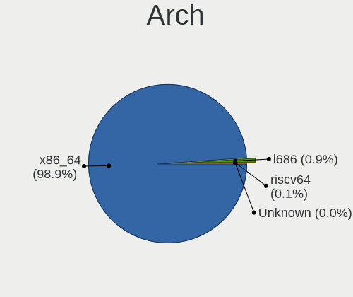
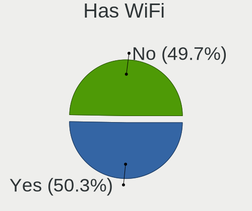
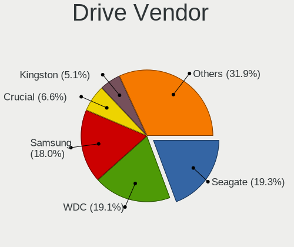
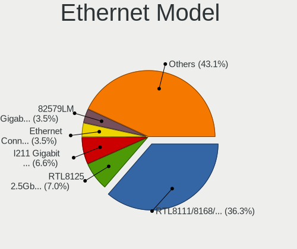

Linux in Australia - Tested Hardware & Statistics (Desktops)
------------------------------------------------------------

A project to collect tested hardware configurations for Linux in Australia.

Anyone can contribute to this report by the [hw-probe](https://github.com/linuxhw/hw-probe) tool:

    sudo -E hw-probe -all -upload

Please contribute! Especially if your hardware is rare.

Contents
--------

* [ Test Cases ](#test-cases)

* [ System ](#system)
  - [ OS                       ](#os)
  - [ OS Family                ](#os-family)
  - [ Kernel                   ](#kernel)
  - [ Kernel Family            ](#kernel-family)
  - [ Kernel Major Ver.        ](#kernel-major-ver)
  - [ Arch                     ](#arch)
  - [ DE                       ](#de)
  - [ Display Server           ](#display-server)
  - [ Display Manager          ](#display-manager)
  - [ OS Lang                  ](#os-lang)
  - [ Boot Mode                ](#boot-mode)
  - [ Filesystem               ](#filesystem)
  - [ Part. scheme             ](#part-scheme)
  - [ Dual Boot with Linux/BSD ](#dual-boot-with-linuxbsd)
  - [ Dual Boot (Win)          ](#dual-boot-win)

* [ Board ](#board)
  - [ Vendor                   ](#vendor)
  - [ Model                    ](#model)
  - [ Model Family             ](#model-family)
  - [ MFG Year                 ](#mfg-year)
  - [ Form Factor              ](#form-factor)
  - [ Secure Boot              ](#secure-boot)
  - [ Coreboot                 ](#coreboot)
  - [ RAM Size                 ](#ram-size)
  - [ RAM Used                 ](#ram-used)
  - [ Total Drives             ](#total-drives)
  - [ Has CD-ROM               ](#has-cd-rom)
  - [ Has Ethernet             ](#has-ethernet)
  - [ Has WiFi                 ](#has-wifi)
  - [ Has Bluetooth            ](#has-bluetooth)

* [ Location ](#location)
  - [ Country                  ](#country)
  - [ City                     ](#city)

* [ Drives ](#drives)
  - [ Drive Vendor             ](#drive-vendor)
  - [ Drive Model              ](#drive-model)
  - [ HDD Vendor               ](#hdd-vendor)
  - [ SSD Vendor               ](#ssd-vendor)
  - [ Drive Kind               ](#drive-kind)
  - [ Drive Connector          ](#drive-connector)
  - [ Drive Size               ](#drive-size)
  - [ Space Total              ](#space-total)
  - [ Space Used               ](#space-used)
  - [ Malfunc. Drives          ](#malfunc-drives)
  - [ Malfunc. Drive Vendor    ](#malfunc-drive-vendor)
  - [ Malfunc. HDD Vendor      ](#malfunc-hdd-vendor)
  - [ Malfunc. Drive Kind      ](#malfunc-drive-kind)
  - [ Failed Drives            ](#failed-drives)
  - [ Failed Drive Vendor      ](#failed-drive-vendor)
  - [ Drive Status             ](#drive-status)

* [ Storage controller ](#storage-controller)
  - [ Storage Vendor           ](#storage-vendor)
  - [ Storage Model            ](#storage-model)
  - [ Storage Kind             ](#storage-kind)

* [ Processor ](#processor)
  - [ CPU Vendor               ](#cpu-vendor)
  - [ CPU Model                ](#cpu-model)
  - [ CPU Model Family         ](#cpu-model-family)
  - [ CPU Cores                ](#cpu-cores)
  - [ CPU Sockets              ](#cpu-sockets)
  - [ CPU Threads              ](#cpu-threads)
  - [ CPU Op-Modes             ](#cpu-op-modes)
  - [ CPU Microcode            ](#cpu-microcode)
  - [ CPU Microarch            ](#cpu-microarch)

* [ Graphics ](#graphics)
  - [ GPU Vendor               ](#gpu-vendor)
  - [ GPU Model                ](#gpu-model)
  - [ GPU Combo                ](#gpu-combo)
  - [ GPU Driver               ](#gpu-driver)
  - [ GPU Memory               ](#gpu-memory)

* [ Monitor ](#monitor)
  - [ Monitor Vendor           ](#monitor-vendor)
  - [ Monitor Model            ](#monitor-model)
  - [ Monitor Resolution       ](#monitor-resolution)
  - [ Monitor Diagonal         ](#monitor-diagonal)
  - [ Monitor Width            ](#monitor-width)
  - [ Aspect Ratio             ](#aspect-ratio)
  - [ Monitor Area             ](#monitor-area)
  - [ Pixel Density            ](#pixel-density)
  - [ Multiple Monitors        ](#multiple-monitors)

* [ Network ](#network)
  - [ Net Controller Vendor    ](#net-controller-vendor)
  - [ Net Controller Model     ](#net-controller-model)
  - [ Wireless Vendor          ](#wireless-vendor)
  - [ Wireless Model           ](#wireless-model)
  - [ Ethernet Vendor          ](#ethernet-vendor)
  - [ Ethernet Model           ](#ethernet-model)
  - [ Net Controller Kind      ](#net-controller-kind)
  - [ Used Controller          ](#used-controller)
  - [ NICs                     ](#nics)
  - [ IPv6                     ](#ipv6)

* [ Bluetooth ](#bluetooth)
  - [ Bluetooth Vendor         ](#bluetooth-vendor)
  - [ Bluetooth Model          ](#bluetooth-model)

* [ Sound ](#sound)
  - [ Sound Vendor             ](#sound-vendor)
  - [ Sound Model              ](#sound-model)

* [ Memory ](#memory)
  - [ Memory Vendor            ](#memory-vendor)
  - [ Memory Model             ](#memory-model)
  - [ Memory Kind              ](#memory-kind)
  - [ Memory Form Factor       ](#memory-form-factor)
  - [ Memory Size              ](#memory-size)
  - [ Memory Speed             ](#memory-speed)

* [ Printers & scanners ](#printers--scanners)
  - [ Printer Vendor           ](#printer-vendor)
  - [ Printer Model            ](#printer-model)
  - [ Scanner Vendor           ](#scanner-vendor)
  - [ Scanner Model            ](#scanner-model)

* [ Camera ](#camera)
  - [ Camera Vendor            ](#camera-vendor)
  - [ Camera Model             ](#camera-model)

* [ Security ](#security)
  - [ Fingerprint Vendor       ](#fingerprint-vendor)
  - [ Fingerprint Model        ](#fingerprint-model)
  - [ Chipcard Vendor          ](#chipcard-vendor)
  - [ Chipcard Model           ](#chipcard-model)

* [ Unsupported ](#unsupported)
  - [ Unsupported Devices      ](#unsupported-devices)
  - [ Unsupported Device Types ](#unsupported-device-types)

Test Cases
----------

Total: 3784

| Vendor        | Model                       | Probe                                                      | Date         |
|---------------|-----------------------------|------------------------------------------------------------|--------------|
| ASUSTek       | PRIME H510M-K R2.0          | [5fb39d6837](https://linux-hardware.org/?probe=5fb39d6837) | Jan 06, 2025 |
| Gigabyte      | B560M AORUS PRO             | [f43945b8dd](https://linux-hardware.org/?probe=f43945b8dd) | Jan 05, 2025 |
| Gigabyte      | B760M AORUS ELITE AX        | [0181bfcd89](https://linux-hardware.org/?probe=0181bfcd89) | Jan 04, 2025 |
| ASRock        | X870E Nova WiFi             | [71b3539951](https://linux-hardware.org/?probe=71b3539951) | Jan 04, 2025 |
| Gigabyte      | G41MT-D3                    | [c5a86cbe2b](https://linux-hardware.org/?probe=c5a86cbe2b) | Jan 04, 2025 |
| Gigabyte      | H81M-S2H                    | [6a06903b4a](https://linux-hardware.org/?probe=6a06903b4a) | Jan 03, 2025 |
| ASUSTek       | PRIME B550M-A WIFI II       | [5a6a67b7a4](https://linux-hardware.org/?probe=5a6a67b7a4) | Jan 02, 2025 |
| MSI           | PRO H610M-G                 | [c0a5a2e654](https://linux-hardware.org/?probe=c0a5a2e654) | Jan 02, 2025 |
| Lenovo        | ThinkCentre M93p            | [3a7e0b811f](https://linux-hardware.org/?probe=3a7e0b811f) | Jan 02, 2025 |
| Gigabyte      | GA-MA785G-UD3H              | [61fe87d63e](https://linux-hardware.org/?probe=61fe87d63e) | Jan 01, 2025 |
| Dell          | 0P096C A00                  | [7a9c5b5c35](https://linux-hardware.org/?probe=7a9c5b5c35) | Jan 01, 2025 |
| ASUSTek       | M4A78LT-M-LE                | [65345c7ef4](https://linux-hardware.org/?probe=65345c7ef4) | Dec 31, 2024 |
| Dell          | 0P096C A00                  | [f85266bf30](https://linux-hardware.org/?probe=f85266bf30) | Dec 30, 2024 |
| ASRock        | X570 Steel Legend WiFi a... | [3fa5c306da](https://linux-hardware.org/?probe=3fa5c306da) | Dec 29, 2024 |
| Gigabyte      | GA-MA785G-UD3H              | [135c62cd91](https://linux-hardware.org/?probe=135c62cd91) | Dec 29, 2024 |
| Dell          | 08WXMX A02                  | [81f35b96d9](https://linux-hardware.org/?probe=81f35b96d9) | Dec 29, 2024 |
| Gigabyte      | H77N-WIFI                   | [e22cddb5fd](https://linux-hardware.org/?probe=e22cddb5fd) | Dec 28, 2024 |
| ASUSTek       | ROG STRIX Z390-E GAMING     | [4e361461b4](https://linux-hardware.org/?probe=4e361461b4) | Dec 28, 2024 |
| Gigabyte      | G41MT-D3                    | [dc90350a72](https://linux-hardware.org/?probe=dc90350a72) | Dec 28, 2024 |
| ASUSTek       | TUF Gaming X570-PLUS        | [b654a18eee](https://linux-hardware.org/?probe=b654a18eee) | Dec 28, 2024 |
| ASUSTek       | TUF Gaming X570-PLUS        | [81e034c5f8](https://linux-hardware.org/?probe=81e034c5f8) | Dec 28, 2024 |
| ASUSTek       | ROG STRIX Z390-E GAMING     | [3ab8537cf8](https://linux-hardware.org/?probe=3ab8537cf8) | Dec 27, 2024 |
| Gigabyte      | GA-A55M-S2V                 | [476ca1ca6d](https://linux-hardware.org/?probe=476ca1ca6d) | Dec 27, 2024 |
| HP            | 1905                        | [9566049ee0](https://linux-hardware.org/?probe=9566049ee0) | Dec 27, 2024 |
| HP            | 1905                        | [7223de1d2e](https://linux-hardware.org/?probe=7223de1d2e) | Dec 26, 2024 |
| Lenovo        | ThinkCentre M58p 7220A72    | [f41fa38fd7](https://linux-hardware.org/?probe=f41fa38fd7) | Dec 26, 2024 |
| Gigabyte      | B450 AORUS PRO WIFI-CF      | [283a58ac15](https://linux-hardware.org/?probe=283a58ac15) | Dec 26, 2024 |
| Gigabyte      | GA-MA780G-UD3H              | [b44b582e4b](https://linux-hardware.org/?probe=b44b582e4b) | Dec 25, 2024 |
| Gigabyte      | J1900M-D2P                  | [6d2e2dedfe](https://linux-hardware.org/?probe=6d2e2dedfe) | Dec 23, 2024 |
| Gigabyte      | B450M H                     | [d4e50fb2da](https://linux-hardware.org/?probe=d4e50fb2da) | Dec 23, 2024 |
| AZW           | MINI S 10                   | [2309fa6c0a](https://linux-hardware.org/?probe=2309fa6c0a) | Dec 22, 2024 |
| MSI           | B560M-A PRO                 | [814f11f38f](https://linux-hardware.org/?probe=814f11f38f) | Dec 22, 2024 |
| ASUSTek       | P8Z77-V LE PLUS             | [25d5764264](https://linux-hardware.org/?probe=25d5764264) | Dec 21, 2024 |
| HP            | 18E7                        | [4ed0c6182c](https://linux-hardware.org/?probe=4ed0c6182c) | Dec 21, 2024 |
| Gigabyte      | Z77X-UD3H                   | [1e178d7ba3](https://linux-hardware.org/?probe=1e178d7ba3) | Dec 21, 2024 |
| HP            | 1589                        | [37255e8353](https://linux-hardware.org/?probe=37255e8353) | Dec 20, 2024 |
| Gigabyte      | B550M K                     | [356514da21](https://linux-hardware.org/?probe=356514da21) | Dec 19, 2024 |
| ASUSTek       | GA15DH                      | [97bd3b6074](https://linux-hardware.org/?probe=97bd3b6074) | Dec 19, 2024 |
| ASUSTek       | PRIME B450M-A               | [52e0c1bf8f](https://linux-hardware.org/?probe=52e0c1bf8f) | Dec 19, 2024 |
| ASUSTek       | VC65R                       | [4448e95ce5](https://linux-hardware.org/?probe=4448e95ce5) | Dec 19, 2024 |
| ASUSTek       | VC65R                       | [62a516f5ab](https://linux-hardware.org/?probe=62a516f5ab) | Dec 19, 2024 |
| ASUSTek       | PRIME B660M-A D4            | [42fb938577](https://linux-hardware.org/?probe=42fb938577) | Dec 19, 2024 |
| Lenovo        | SHARKBAY 0B98401 PRO        | [ab4132ad4c](https://linux-hardware.org/?probe=ab4132ad4c) | Dec 19, 2024 |
| Lenovo        | SHARKBAY 0B98401 PRO        | [cbeebff465](https://linux-hardware.org/?probe=cbeebff465) | Dec 19, 2024 |
| Pegatron      | 2AC2                        | [98b70ae737](https://linux-hardware.org/?probe=98b70ae737) | Dec 18, 2024 |
| Gigabyte      | Z77MX-D3H                   | [9b82850a59](https://linux-hardware.org/?probe=9b82850a59) | Dec 18, 2024 |
| Dell          | 014GRG A00                  | [a68144eb72](https://linux-hardware.org/?probe=a68144eb72) | Dec 17, 2024 |
| Gigabyte      | X570 AORUS ULTRA            | [b7fa7d97c0](https://linux-hardware.org/?probe=b7fa7d97c0) | Dec 17, 2024 |
| HP            | 83E2                        | [1b12192911](https://linux-hardware.org/?probe=1b12192911) | Dec 16, 2024 |
| MSI           | X99S GAMING 9 AC            | [dd95266cf8](https://linux-hardware.org/?probe=dd95266cf8) | Dec 16, 2024 |
| MSI           | X99S GAMING 9 AC            | [5e49b2a07b](https://linux-hardware.org/?probe=5e49b2a07b) | Dec 16, 2024 |
| Lenovo        | ThinkCentre A52 8289G4M     | [d07ac546df](https://linux-hardware.org/?probe=d07ac546df) | Dec 16, 2024 |
| Lenovo        | SHARKBAY 0B98401 PRO        | [880ae3d999](https://linux-hardware.org/?probe=880ae3d999) | Dec 14, 2024 |
| Dell          | 096JG8 A01                  | [63cf395d23](https://linux-hardware.org/?probe=63cf395d23) | Dec 14, 2024 |
| ASUSTek       | P5G41T-M LX PLUS            | [9ca8033b01](https://linux-hardware.org/?probe=9ca8033b01) | Dec 14, 2024 |
| Gigabyte      | G41MT-D3                    | [51632357e5](https://linux-hardware.org/?probe=51632357e5) | Dec 14, 2024 |
| Gigabyte      | X570 AORUS ELITE WIFI       | [c3817fc2bf](https://linux-hardware.org/?probe=c3817fc2bf) | Dec 13, 2024 |
| ASUSTek       | P5G41T-M LX PLUS            | [18bf59400f](https://linux-hardware.org/?probe=18bf59400f) | Dec 13, 2024 |
| Dell          | 00V62H A00                  | [819dcf4075](https://linux-hardware.org/?probe=819dcf4075) | Dec 12, 2024 |
| MSI           | B550M PRO-VDH WIFI          | [27b32efcbb](https://linux-hardware.org/?probe=27b32efcbb) | Dec 12, 2024 |
| Gigabyte      | B760 DS3H AX DDR4           | [ff4117e2d4](https://linux-hardware.org/?probe=ff4117e2d4) | Dec 12, 2024 |
| ASRock        | H97M Pro4                   | [ad4a8c30fa](https://linux-hardware.org/?probe=ad4a8c30fa) | Dec 10, 2024 |
| ASUSTek       | Z87-PRO                     | [47f8810b21](https://linux-hardware.org/?probe=47f8810b21) | Dec 10, 2024 |
| Intel         | LADPNVMO AAE76523-300       | [e42ba66dd1](https://linux-hardware.org/?probe=e42ba66dd1) | Dec 09, 2024 |
| Lenovo        | 30D2 SDK0J40705 WIN 3425... | [2a300e3d41](https://linux-hardware.org/?probe=2a300e3d41) | Dec 08, 2024 |
| Gigabyte      | B365M H                     | [a922a7763f](https://linux-hardware.org/?probe=a922a7763f) | Dec 07, 2024 |
| ASUSTek       | ROG STRIX B660-I GAMING ... | [e12b5bdf82](https://linux-hardware.org/?probe=e12b5bdf82) | Dec 06, 2024 |
| ASRock        | AD2700-ITX                  | [5fdaccb9a8](https://linux-hardware.org/?probe=5fdaccb9a8) | Dec 05, 2024 |
| Gigabyte      | GA-MA780G-UD3H              | [bc1c756ed9](https://linux-hardware.org/?probe=bc1c756ed9) | Dec 05, 2024 |
| Lenovo        | 30D9 SDK0J40697 WIN 3305... | [8b336590d9](https://linux-hardware.org/?probe=8b336590d9) | Dec 04, 2024 |
| ASUSTek       | A8R32-MVP Deluxe            | [2c25863ae9](https://linux-hardware.org/?probe=2c25863ae9) | Dec 04, 2024 |
| HP            | 83EF                        | [8ec6753877](https://linux-hardware.org/?probe=8ec6753877) | Dec 03, 2024 |
| ASUSTek       | ROG STRIX B550-I GAMING     | [bd3553c7e3](https://linux-hardware.org/?probe=bd3553c7e3) | Dec 03, 2024 |
| Gigabyte      | H77N-WIFI                   | [fb898274e9](https://linux-hardware.org/?probe=fb898274e9) | Dec 03, 2024 |
| Gigabyte      | GA-A55M-S2V                 | [64ef142041](https://linux-hardware.org/?probe=64ef142041) | Dec 02, 2024 |
| HP            | 82B4                        | [21e739a9b4](https://linux-hardware.org/?probe=21e739a9b4) | Dec 02, 2024 |
| Gigabyte      | J1900M-D2P                  | [7997ade01f](https://linux-hardware.org/?probe=7997ade01f) | Dec 02, 2024 |
| ASRock        | Z390 Phantom Gaming 9       | [6573a24594](https://linux-hardware.org/?probe=6573a24594) | Dec 01, 2024 |
| Gigabyte      | GA-MA785G-UD3H              | [cf6a4a0297](https://linux-hardware.org/?probe=cf6a4a0297) | Dec 01, 2024 |
| Gigabyte      | B360M D3H-CF                | [7f3136b79b](https://linux-hardware.org/?probe=7f3136b79b) | Dec 01, 2024 |
| HP            | 3646h                       | [d16e3af848](https://linux-hardware.org/?probe=d16e3af848) | Dec 01, 2024 |
| ASUSTek       | Maximus IV GENE-Z/GEN3      | [df1e7231c1](https://linux-hardware.org/?probe=df1e7231c1) | Nov 30, 2024 |
| Gigabyte      | B250M-HD3-CF                | [285af8915b](https://linux-hardware.org/?probe=285af8915b) | Nov 29, 2024 |
| Nvidia        | M750SLI-DS4                 | [6e2167686c](https://linux-hardware.org/?probe=6e2167686c) | Nov 29, 2024 |
| Gigabyte      | H61M-USB3-B3                | [9233297ff7](https://linux-hardware.org/?probe=9233297ff7) | Nov 29, 2024 |
| JGINYUE       | X99-8D4G Server             | [aa29f05efb](https://linux-hardware.org/?probe=aa29f05efb) | Nov 29, 2024 |
| MSI           | Z97 PC Mate                 | [2f0201c36b](https://linux-hardware.org/?probe=2f0201c36b) | Nov 29, 2024 |
| Dell          | 014GRG A00                  | [9f1d4366ae](https://linux-hardware.org/?probe=9f1d4366ae) | Nov 29, 2024 |
| MSI           | Z97 PC Mate                 | [1bda8fbcb4](https://linux-hardware.org/?probe=1bda8fbcb4) | Nov 28, 2024 |
| Gigabyte      | Z77MX-D3H                   | [3bdd24a725](https://linux-hardware.org/?probe=3bdd24a725) | Nov 26, 2024 |
| Dell          | 08WXMX A02                  | [8bbbb8617e](https://linux-hardware.org/?probe=8bbbb8617e) | Nov 26, 2024 |
| ASUSTek       | PRIME X670-P WIFI           | [b671dd7405](https://linux-hardware.org/?probe=b671dd7405) | Nov 26, 2024 |
| ASUSTek       | PRIME H610M-D D4            | [eb2d759164](https://linux-hardware.org/?probe=eb2d759164) | Nov 26, 2024 |
| MSI           | MPG Z390I GAMING EDGE AC    | [a931a49052](https://linux-hardware.org/?probe=a931a49052) | Nov 25, 2024 |
| Gigabyte      | Z68MA-D2H-B3                | [33e54edc5c](https://linux-hardware.org/?probe=33e54edc5c) | Nov 25, 2024 |
| Gigabyte      | J1900M-D2P                  | [02184c6e08](https://linux-hardware.org/?probe=02184c6e08) | Nov 24, 2024 |
| Gigabyte      | H81M-DS2                    | [4fbe72a157](https://linux-hardware.org/?probe=4fbe72a157) | Nov 23, 2024 |
| ASUSTek       | Rampage III GENE            | [89662fc2f1](https://linux-hardware.org/?probe=89662fc2f1) | Nov 23, 2024 |
| Gigabyte      | G41MT-D3                    | [d6d09e60c8](https://linux-hardware.org/?probe=d6d09e60c8) | Nov 23, 2024 |
| Intel         | B760 M-ATX D4               | [adae845d88](https://linux-hardware.org/?probe=adae845d88) | Nov 22, 2024 |
| Dell          | 051FJ8 A02                  | [66b7975345](https://linux-hardware.org/?probe=66b7975345) | Nov 20, 2024 |
| MSI           | PRO Z690-A DDR4             | [a6a0013e52](https://linux-hardware.org/?probe=a6a0013e52) | Nov 20, 2024 |
| Gigabyte      | GA-MA785G-UD3H              | [9b9550e9cc](https://linux-hardware.org/?probe=9b9550e9cc) | Nov 19, 2024 |
| Dell          | 014GRG A00                  | [1d7c479df7](https://linux-hardware.org/?probe=1d7c479df7) | Nov 19, 2024 |
| HP            | 1587h                       | [67bbbca7d3](https://linux-hardware.org/?probe=67bbbca7d3) | Nov 17, 2024 |
| AAEON         | MIX-H310A1 V1.0             | [96b20cb963](https://linux-hardware.org/?probe=96b20cb963) | Nov 16, 2024 |
| Gigabyte      | H77N-WIFI                   | [43c9e814d8](https://linux-hardware.org/?probe=43c9e814d8) | Nov 16, 2024 |
| Gigabyte      | B450M GAMING                | [d6b505fbfd](https://linux-hardware.org/?probe=d6b505fbfd) | Nov 15, 2024 |
| Intel         | DP55WG AAE57269-404         | [c07ecda835](https://linux-hardware.org/?probe=c07ecda835) | Nov 15, 2024 |
| ASRock        | H170M Pro4                  | [eabb883a16](https://linux-hardware.org/?probe=eabb883a16) | Nov 14, 2024 |
| Gigabyte      | B650 AORUS ELITE AX V2      | [701e086dc6](https://linux-hardware.org/?probe=701e086dc6) | Nov 14, 2024 |
| ASRock        | H410M-ITX/ac                | [7b39f3b2df](https://linux-hardware.org/?probe=7b39f3b2df) | Nov 12, 2024 |
| Gigabyte      | B550 AORUS ELITE AX V2      | [2262fccd67](https://linux-hardware.org/?probe=2262fccd67) | Nov 11, 2024 |
| Gigabyte      | B550 AORUS ELITE AX V2      | [25efb695c6](https://linux-hardware.org/?probe=25efb695c6) | Nov 11, 2024 |
| HP            | ML110 G4                    | [68590d593a](https://linux-hardware.org/?probe=68590d593a) | Nov 11, 2024 |
| JGINYUE       | B550i-GAMING                | [2701fc764a](https://linux-hardware.org/?probe=2701fc764a) | Nov 11, 2024 |
| ASRock        | B550 Phantom Gaming-ITX/... | [0b8fc5b8af](https://linux-hardware.org/?probe=0b8fc5b8af) | Nov 11, 2024 |
| ASRock        | H170M Pro4                  | [aec2dc4bb0](https://linux-hardware.org/?probe=aec2dc4bb0) | Nov 10, 2024 |
| Dell          | 014GRG A00                  | [3bf779ef79](https://linux-hardware.org/?probe=3bf779ef79) | Nov 10, 2024 |
| Gigabyte      | G41M-ES2L                   | [d1d98f5e59](https://linux-hardware.org/?probe=d1d98f5e59) | Nov 10, 2024 |
| Intel         | DH55TC AAE70932-302         | [69d72435cd](https://linux-hardware.org/?probe=69d72435cd) | Nov 09, 2024 |
| ASUSTek       | ROG STRIX Z490-F GAMING     | [bd68e159f2](https://linux-hardware.org/?probe=bd68e159f2) | Nov 09, 2024 |
| ASUSTek       | G13CH                       | [4a43a09360](https://linux-hardware.org/?probe=4a43a09360) | Nov 08, 2024 |
| Gigabyte      | B360 AORUS GAMING 3 WIFI... | [856f712b05](https://linux-hardware.org/?probe=856f712b05) | Nov 08, 2024 |
| MSI           | PRO X670-P WIFI             | [489a1bd51a](https://linux-hardware.org/?probe=489a1bd51a) | Nov 08, 2024 |
| MSI           | PRO B650M-A WIFI            | [5edcef988a](https://linux-hardware.org/?probe=5edcef988a) | Nov 08, 2024 |
| Lenovo        | ThinkCentre M58p 7220A72    | [57aba2ee43](https://linux-hardware.org/?probe=57aba2ee43) | Nov 07, 2024 |
| Nvidia        | M750SLI-DS4                 | [32195a3f35](https://linux-hardware.org/?probe=32195a3f35) | Nov 05, 2024 |
| Gigabyte      | Z77MX-D3H                   | [4fbeaa34cb](https://linux-hardware.org/?probe=4fbeaa34cb) | Nov 05, 2024 |
| Gigabyte      | B660 DS3H DDR4              | [c86bce35fb](https://linux-hardware.org/?probe=c86bce35fb) | Nov 05, 2024 |
| ASUSTek       | P9X79 PRO                   | [c08e489129](https://linux-hardware.org/?probe=c08e489129) | Nov 03, 2024 |
| Unknown       | Unknown                     | [2eb724a1a3](https://linux-hardware.org/?probe=2eb724a1a3) | Nov 01, 2024 |
| ASRock        | AD2700-ITX                  | [6a162c50dd](https://linux-hardware.org/?probe=6a162c50dd) | Oct 31, 2024 |
| MSI           | Z87M GAMING                 | [127a8e1abd](https://linux-hardware.org/?probe=127a8e1abd) | Oct 31, 2024 |
| Gigabyte      | X58A-UD5                    | [5ecd8898e9](https://linux-hardware.org/?probe=5ecd8898e9) | Oct 31, 2024 |
| Gigabyte      | J1900M-D2P                  | [a12900be5b](https://linux-hardware.org/?probe=a12900be5b) | Oct 31, 2024 |
| Gigabyte      | 990FXA-UD3                  | [30395c06ea](https://linux-hardware.org/?probe=30395c06ea) | Oct 30, 2024 |
| Gigabyte      | Z68MA-D2H-B3                | [07e7c599ef](https://linux-hardware.org/?probe=07e7c599ef) | Oct 30, 2024 |
| Gigabyte      | J1900M-D2P                  | [17555d3426](https://linux-hardware.org/?probe=17555d3426) | Oct 30, 2024 |
| Gigabyte      | Z690 AORUS ULTRA            | [0718027c91](https://linux-hardware.org/?probe=0718027c91) | Oct 29, 2024 |
| ASUSTek       | TUF Gaming B660M-E D4       | [1e1cd86cb5](https://linux-hardware.org/?probe=1e1cd86cb5) | Oct 29, 2024 |
| Dell          | 096JG8 A00                  | [4a16e8e7f8](https://linux-hardware.org/?probe=4a16e8e7f8) | Oct 27, 2024 |
| Dell          | 096JG8 A00                  | [c2510e4429](https://linux-hardware.org/?probe=c2510e4429) | Oct 27, 2024 |
| Gigabyte      | Z390 GAMING X-CF            | [2d60c3fa69](https://linux-hardware.org/?probe=2d60c3fa69) | Oct 27, 2024 |
| Gigabyte      | GA-870A-UD3                 | [195e8d177d](https://linux-hardware.org/?probe=195e8d177d) | Oct 26, 2024 |
| Gigabyte      | H77N-WIFI                   | [b1fe176a80](https://linux-hardware.org/?probe=b1fe176a80) | Oct 26, 2024 |
| ASRock        | X670E Taichi                | [f0d7df377f](https://linux-hardware.org/?probe=f0d7df377f) | Oct 26, 2024 |
| Gigabyte      | B450M H                     | [8647102690](https://linux-hardware.org/?probe=8647102690) | Oct 25, 2024 |
| MSI           | PRO B650M-A WIFI            | [02c64fea57](https://linux-hardware.org/?probe=02c64fea57) | Oct 25, 2024 |
| Dell          | 03NVJ6 A01                  | [fd3d2e254d](https://linux-hardware.org/?probe=fd3d2e254d) | Oct 25, 2024 |
| ASUSTek       | PRIME B650M-A WIFI II       | [0c5c97d6d4](https://linux-hardware.org/?probe=0c5c97d6d4) | Oct 24, 2024 |
| HP            | 8643 SMVB                   | [d8f502fc39](https://linux-hardware.org/?probe=d8f502fc39) | Oct 24, 2024 |
| HP            | 212A                        | [e28d7fe1da](https://linux-hardware.org/?probe=e28d7fe1da) | Oct 23, 2024 |
| ASRock        | Z590 Phantom Gaming 4/ac    | [b6c5d66ad9](https://linux-hardware.org/?probe=b6c5d66ad9) | Oct 22, 2024 |
| ASUSTek       | ROG STRIX B650E-I GAMING... | [aa357a1b8a](https://linux-hardware.org/?probe=aa357a1b8a) | Oct 22, 2024 |
| Gigabyte      | B560 AORUS PRO AX           | [c1c6b1d019](https://linux-hardware.org/?probe=c1c6b1d019) | Oct 21, 2024 |
| ASRock        | Z690 PG Velocita            | [d6f7b880a7](https://linux-hardware.org/?probe=d6f7b880a7) | Oct 21, 2024 |
| ASUSTek       | TUF Z390-PLUS GAMING        | [d9af644b1b](https://linux-hardware.org/?probe=d9af644b1b) | Oct 20, 2024 |
| Gigabyte      | A520M DS3H                  | [d2270f1ff7](https://linux-hardware.org/?probe=d2270f1ff7) | Oct 19, 2024 |
| Gigabyte      | A520M DS3H                  | [2b6bf521eb](https://linux-hardware.org/?probe=2b6bf521eb) | Oct 19, 2024 |
| MSI           | Z87M GAMING                 | [0b431f4f2e](https://linux-hardware.org/?probe=0b431f4f2e) | Oct 19, 2024 |
| ASUSTek       | PRIME B650M-A AX6           | [061ccf9c50](https://linux-hardware.org/?probe=061ccf9c50) | Oct 19, 2024 |
| Gigabyte      | G41MT-D3                    | [8b50e7ae55](https://linux-hardware.org/?probe=8b50e7ae55) | Oct 19, 2024 |
| ASUSTek       | ROG STRIX B550-F GAMING ... | [74bfaad70a](https://linux-hardware.org/?probe=74bfaad70a) | Oct 18, 2024 |
| MSI           | B550M PRO-VDH WIFI          | [1b2b89b297](https://linux-hardware.org/?probe=1b2b89b297) | Oct 18, 2024 |
| Gigabyte      | B360 AORUS GAMING 3 WIFI... | [9644c911da](https://linux-hardware.org/?probe=9644c911da) | Oct 18, 2024 |
| Gigabyte      | J1900M-D2P                  | [f2ab342fab](https://linux-hardware.org/?probe=f2ab342fab) | Oct 18, 2024 |
| Dell          | 00V62H A01                  | [ca46fe38b0](https://linux-hardware.org/?probe=ca46fe38b0) | Oct 17, 2024 |
| Gigabyte      | GA-MA780G-UD3H              | [53be6a83c8](https://linux-hardware.org/?probe=53be6a83c8) | Oct 17, 2024 |
| Gigabyte      | P55A-UD5                    | [427287ea8d](https://linux-hardware.org/?probe=427287ea8d) | Oct 16, 2024 |
| Gigabyte      | GA-MA785G-UD3H              | [c110e51329](https://linux-hardware.org/?probe=c110e51329) | Oct 16, 2024 |
| HP            | 82B4                        | [a5022d795a](https://linux-hardware.org/?probe=a5022d795a) | Oct 16, 2024 |
| Gigabyte      | Z77MX-D3H                   | [5b988280c5](https://linux-hardware.org/?probe=5b988280c5) | Oct 16, 2024 |
| MSI           | PRO Z790-P WIFI             | [80a134427f](https://linux-hardware.org/?probe=80a134427f) | Oct 15, 2024 |
| Nvidia        | M750SLI-DS4                 | [597ea8c178](https://linux-hardware.org/?probe=597ea8c178) | Oct 14, 2024 |
| Gigabyte      | X58A-UD5                    | [cdab8fc3a6](https://linux-hardware.org/?probe=cdab8fc3a6) | Oct 14, 2024 |
| ASRock        | Z87E-ITX                    | [99a3a914fe](https://linux-hardware.org/?probe=99a3a914fe) | Oct 13, 2024 |
| ASUSTek       | PRIME B450M-A II            | [38ada20a08](https://linux-hardware.org/?probe=38ada20a08) | Oct 13, 2024 |
| MSI           | MPG X570 GAMING EDGE WIF... | [45e481e85a](https://linux-hardware.org/?probe=45e481e85a) | Oct 13, 2024 |
| MSI           | B550M PRO-VDH WIFI          | [da39a314a5](https://linux-hardware.org/?probe=da39a314a5) | Oct 13, 2024 |
| Gigabyte      | Z68XP-UD3                   | [58c0235a50](https://linux-hardware.org/?probe=58c0235a50) | Oct 13, 2024 |
| Dell          | 03KWTV A00                  | [c322e91ef2](https://linux-hardware.org/?probe=c322e91ef2) | Oct 12, 2024 |
| Intel         | X99                         | [7ca33d39bb](https://linux-hardware.org/?probe=7ca33d39bb) | Oct 12, 2024 |
| Intel         | X99                         | [99769d030a](https://linux-hardware.org/?probe=99769d030a) | Oct 12, 2024 |
| Intel         | X99                         | [d49cc77165](https://linux-hardware.org/?probe=d49cc77165) | Oct 12, 2024 |
| Gigabyte      | GA-870A-UD3                 | [729c7d3da6](https://linux-hardware.org/?probe=729c7d3da6) | Oct 12, 2024 |
| Gigabyte      | B550I AORUS PRO AX          | [9aeb802c66](https://linux-hardware.org/?probe=9aeb802c66) | Oct 11, 2024 |
| ASUSTek       | ROG STRIX Z370-E GAMING     | [21f53b5459](https://linux-hardware.org/?probe=21f53b5459) | Oct 11, 2024 |
| MSI           | PRO Z790-P WIFI             | [504f098627](https://linux-hardware.org/?probe=504f098627) | Oct 11, 2024 |
| Dell          | 084J0R A00                  | [046a21c868](https://linux-hardware.org/?probe=046a21c868) | Oct 10, 2024 |
| Gigabyte      | J1900M-D2P                  | [5064bb0b8d](https://linux-hardware.org/?probe=5064bb0b8d) | Oct 10, 2024 |
| Gigabyte      | GA-MA780G-UD3H              | [e70ba79a1b](https://linux-hardware.org/?probe=e70ba79a1b) | Oct 10, 2024 |
| Dell          | 084J0R A00                  | [f6ebb721be](https://linux-hardware.org/?probe=f6ebb721be) | Oct 09, 2024 |
| Gigabyte      | Z68AP-D3                    | [1205d137c5](https://linux-hardware.org/?probe=1205d137c5) | Oct 09, 2024 |
| ASRock        | B450M Steel Legend          | [7714ccab3e](https://linux-hardware.org/?probe=7714ccab3e) | Oct 08, 2024 |
| Unknown       | YL-SKUL6-7 Series           | [b7abec0820](https://linux-hardware.org/?probe=b7abec0820) | Oct 08, 2024 |
| Gigabyte      | B550 UD AC-Y1               | [c3897a8ae8](https://linux-hardware.org/?probe=c3897a8ae8) | Oct 07, 2024 |
| Gigabyte      | B550 UD AC-Y1               | [5a48984410](https://linux-hardware.org/?probe=5a48984410) | Oct 07, 2024 |
| MSI           | B550-A PRO                  | [00e8066675](https://linux-hardware.org/?probe=00e8066675) | Oct 06, 2024 |
| Gigabyte      | Z68MA-D2H-B3                | [493742aa29](https://linux-hardware.org/?probe=493742aa29) | Oct 06, 2024 |
| Dell          | 0K240Y A01                  | [67e40a612b](https://linux-hardware.org/?probe=67e40a612b) | Oct 05, 2024 |
| Gigabyte      | GA-A55M-S2V                 | [7039933c26](https://linux-hardware.org/?probe=7039933c26) | Oct 05, 2024 |
| Gigabyte      | GA-MA785G-UD3H              | [984497e592](https://linux-hardware.org/?probe=984497e592) | Oct 05, 2024 |
| Gigabyte      | H77N-WIFI                   | [1fd638437e](https://linux-hardware.org/?probe=1fd638437e) | Oct 05, 2024 |
| Gigabyte      | Z170-HD3-CF                 | [8ef4229227](https://linux-hardware.org/?probe=8ef4229227) | Oct 05, 2024 |
| Gigabyte      | Z170-HD3-CF                 | [b3d161f10c](https://linux-hardware.org/?probe=b3d161f10c) | Oct 05, 2024 |
| Intel         | DP55WG AAE57269-404         | [8b71ef1fb5](https://linux-hardware.org/?probe=8b71ef1fb5) | Oct 05, 2024 |
| Gigabyte      | G41MT-D3                    | [10bf4a66cb](https://linux-hardware.org/?probe=10bf4a66cb) | Oct 05, 2024 |
| Firebat_Co... | T8_Plus                     | [e570b978d0](https://linux-hardware.org/?probe=e570b978d0) | Oct 05, 2024 |
| Acer          | Aspire XC600 v1.0           | [a804ec25cb](https://linux-hardware.org/?probe=a804ec25cb) | Oct 04, 2024 |
| HP            | 83EF                        | [3799ba66c9](https://linux-hardware.org/?probe=3799ba66c9) | Oct 01, 2024 |
| MSI           | PRO B650M-A WIFI            | [2b749f43d9](https://linux-hardware.org/?probe=2b749f43d9) | Oct 01, 2024 |
| ASRock        | A320M-HDV R4.0              | [efe808d639](https://linux-hardware.org/?probe=efe808d639) | Sep 30, 2024 |
| Gigabyte      | X670 GAMING X AX            | [ddf6aa09c8](https://linux-hardware.org/?probe=ddf6aa09c8) | Sep 29, 2024 |
| MSI           | B550-A PRO                  | [354adca291](https://linux-hardware.org/?probe=354adca291) | Sep 29, 2024 |
| HP            | 212A                        | [471fc85c0b](https://linux-hardware.org/?probe=471fc85c0b) | Sep 28, 2024 |
| HP            | 212A                        | [f62f7300c0](https://linux-hardware.org/?probe=f62f7300c0) | Sep 28, 2024 |
| Gigabyte      | X58A-UD5                    | [a6c2b82581](https://linux-hardware.org/?probe=a6c2b82581) | Sep 27, 2024 |
| MSI           | B550-A PRO                  | [1a953cc7cd](https://linux-hardware.org/?probe=1a953cc7cd) | Sep 27, 2024 |
| Gigabyte      | Z77MX-D3H                   | [94429e8102](https://linux-hardware.org/?probe=94429e8102) | Sep 25, 2024 |
| ASUSTek       | P8Z68-V LX                  | [9710369443](https://linux-hardware.org/?probe=9710369443) | Sep 25, 2024 |
| Gigabyte      | X570S AORUS ELITE AX        | [617c7ae365](https://linux-hardware.org/?probe=617c7ae365) | Sep 25, 2024 |
| MSI           | B450 TOMAHAWK MAX           | [7579b1ab9b](https://linux-hardware.org/?probe=7579b1ab9b) | Sep 24, 2024 |
| Gigabyte      | X570S AORUS ELITE AX        | [0735df7dc5](https://linux-hardware.org/?probe=0735df7dc5) | Sep 24, 2024 |
| ASUSTek       | ROG STRIX B450-F GAMING     | [ed0490260d](https://linux-hardware.org/?probe=ed0490260d) | Sep 23, 2024 |
| Gigabyte      | B450M H                     | [eaf773b0b3](https://linux-hardware.org/?probe=eaf773b0b3) | Sep 23, 2024 |
| ASUSTek       | ROG STRIX Z390-E GAMING     | [2b4b738285](https://linux-hardware.org/?probe=2b4b738285) | Sep 23, 2024 |
| Gigabyte      | P55A-UD5                    | [03ad1cf760](https://linux-hardware.org/?probe=03ad1cf760) | Sep 23, 2024 |
| Gigabyte      | P55A-UD5                    | [46eade1992](https://linux-hardware.org/?probe=46eade1992) | Sep 23, 2024 |
| ASUSTek       | PRIME Z690M-PLUS D4         | [0908a175f3](https://linux-hardware.org/?probe=0908a175f3) | Sep 21, 2024 |
| Gigabyte      | H87-D3H-CF                  | [d110bb4405](https://linux-hardware.org/?probe=d110bb4405) | Sep 21, 2024 |
| Gigabyte      | B550 UD AC-Y1               | [aa5cd0be8f](https://linux-hardware.org/?probe=aa5cd0be8f) | Sep 21, 2024 |
| ASUSTek       | ROG STRIX Z390-F GAMING     | [0c52cbf1a7](https://linux-hardware.org/?probe=0c52cbf1a7) | Sep 21, 2024 |
| Gigabyte      | G41MT-D3                    | [c2816cf003](https://linux-hardware.org/?probe=c2816cf003) | Sep 21, 2024 |
| ASRock        | H170M Pro4                  | [5253f50483](https://linux-hardware.org/?probe=5253f50483) | Sep 20, 2024 |
| Lenovo        | SKYBAY SDK0J40705 WIN 34... | [ee7fddf7f2](https://linux-hardware.org/?probe=ee7fddf7f2) | Sep 20, 2024 |
| Gigabyte      | B450M H                     | [be59e2f196](https://linux-hardware.org/?probe=be59e2f196) | Sep 20, 2024 |
| ASUSTek       | ROG STRIX B550-I GAMING     | [109404b71a](https://linux-hardware.org/?probe=109404b71a) | Sep 19, 2024 |
| ASUSTek       | ROG STRIX B450-F GAMING     | [6197c34742](https://linux-hardware.org/?probe=6197c34742) | Sep 19, 2024 |
| Gigabyte      | J1900M-D2P                  | [38e7274df7](https://linux-hardware.org/?probe=38e7274df7) | Sep 18, 2024 |
| ASUSTek       | TUF Gaming B650M-E WIFI     | [55e66ff398](https://linux-hardware.org/?probe=55e66ff398) | Sep 17, 2024 |
| Apple         | Mac-7BA5B2D9E42DDD94 iMa... | [9f2ade2f11](https://linux-hardware.org/?probe=9f2ade2f11) | Sep 17, 2024 |
| Gigabyte      | GA-A55M-S2V                 | [4a6e4e03fa](https://linux-hardware.org/?probe=4a6e4e03fa) | Sep 17, 2024 |
| Intel         | LADPNVMO AAE76523-300       | [1063294051](https://linux-hardware.org/?probe=1063294051) | Sep 16, 2024 |
| MSI           | MAG B650 TOMAHAWK WIFI      | [0000a74ff9](https://linux-hardware.org/?probe=0000a74ff9) | Sep 16, 2024 |
| Intel         | X99                         | [c802e1f9ae](https://linux-hardware.org/?probe=c802e1f9ae) | Sep 16, 2024 |
| MSI           | 970 GAMING                  | [d91286acb1](https://linux-hardware.org/?probe=d91286acb1) | Sep 16, 2024 |
| Gigabyte      | X58A-UD5                    | [ace76981ef](https://linux-hardware.org/?probe=ace76981ef) | Sep 16, 2024 |
| HP            | 1589                        | [3db889216b](https://linux-hardware.org/?probe=3db889216b) | Sep 15, 2024 |
| Gigabyte      | Z68MA-D2H-B3                | [429adf372d](https://linux-hardware.org/?probe=429adf372d) | Sep 14, 2024 |
| Gigabyte      | X570S GAMING X              | [f6e2dd1616](https://linux-hardware.org/?probe=f6e2dd1616) | Sep 14, 2024 |
| Gigabyte      | GA-870A-UD3                 | [06e4677817](https://linux-hardware.org/?probe=06e4677817) | Sep 14, 2024 |
| Gigabyte      | H77N-WIFI                   | [a4898be57b](https://linux-hardware.org/?probe=a4898be57b) | Sep 14, 2024 |
| Gigabyte      | X58A-UD5                    | [9f151991ff](https://linux-hardware.org/?probe=9f151991ff) | Sep 14, 2024 |
| Gigabyte      | P55-USB3                    | [ff4e81663f](https://linux-hardware.org/?probe=ff4e81663f) | Sep 13, 2024 |
| Gigabyte      | X570 UD                     | [1fc0cb7105](https://linux-hardware.org/?probe=1fc0cb7105) | Sep 12, 2024 |
| Gigabyte      | B450M DS3H-CF               | [70ab7fabc5](https://linux-hardware.org/?probe=70ab7fabc5) | Sep 11, 2024 |
| ASUSTek       | ROG Maximus XI CODE         | [6c3c2b3468](https://linux-hardware.org/?probe=6c3c2b3468) | Sep 11, 2024 |
| ASRock        | H170M Pro4                  | [f263cf1630](https://linux-hardware.org/?probe=f263cf1630) | Sep 11, 2024 |
| Gigabyte      | GA-MA780G-UD3H              | [ae85c7dccd](https://linux-hardware.org/?probe=ae85c7dccd) | Sep 11, 2024 |
| Gigabyte      | GA-MA785G-UD3H              | [447e93d2cf](https://linux-hardware.org/?probe=447e93d2cf) | Sep 10, 2024 |
| MSI           | MAG B660 TOMAHAWK WIFI D... | [755e169171](https://linux-hardware.org/?probe=755e169171) | Sep 08, 2024 |
| Acer          | Aspire XC100A               | [1ad96742a9](https://linux-hardware.org/?probe=1ad96742a9) | Sep 08, 2024 |
| Dell          | 02YYK5 A01                  | [9f186cbc12](https://linux-hardware.org/?probe=9f186cbc12) | Sep 08, 2024 |
| Gigabyte      | X58A-UD5                    | [6634da131a](https://linux-hardware.org/?probe=6634da131a) | Sep 07, 2024 |
| Gigabyte      | X58A-UD5                    | [f606c929e5](https://linux-hardware.org/?probe=f606c929e5) | Sep 07, 2024 |
| ASUSTek       | Z170M-PLUS                  | [6532896d24](https://linux-hardware.org/?probe=6532896d24) | Sep 07, 2024 |
| ASUSTek       | Z170M-PLUS                  | [03187646eb](https://linux-hardware.org/?probe=03187646eb) | Sep 07, 2024 |
| ASUSTek       | PRIME Z690-P WIFI D4        | [44816b6c87](https://linux-hardware.org/?probe=44816b6c87) | Sep 07, 2024 |
| Gigabyte      | G41MT-D3                    | [ffa997d716](https://linux-hardware.org/?probe=ffa997d716) | Sep 07, 2024 |
| Gigabyte      | B550 AORUS PRO AC           | [af604f5866](https://linux-hardware.org/?probe=af604f5866) | Sep 07, 2024 |
| Gigabyte      | GA-MA785G-UD3H              | [254f5dac74](https://linux-hardware.org/?probe=254f5dac74) | Sep 05, 2024 |
| Gigabyte      | B550 AORUS ELITE AX V2      | [73a562487c](https://linux-hardware.org/?probe=73a562487c) | Sep 04, 2024 |
| ASRock        | B550M-ITX/ac                | [569f106b52](https://linux-hardware.org/?probe=569f106b52) | Sep 04, 2024 |
| Gigabyte      | Z77MX-D3H                   | [a7a1644414](https://linux-hardware.org/?probe=a7a1644414) | Sep 04, 2024 |
| Dell          | OptiPlex 980                | [38a8537bfe](https://linux-hardware.org/?probe=38a8537bfe) | Sep 03, 2024 |
| Dell          | 0496JX A01                  | [c38f0ceb74](https://linux-hardware.org/?probe=c38f0ceb74) | Sep 03, 2024 |
| ASRock        | H170M Pro4                  | [1846c4eb3f](https://linux-hardware.org/?probe=1846c4eb3f) | Sep 03, 2024 |
| ASRock        | H170M Pro4                  | [6e1160875e](https://linux-hardware.org/?probe=6e1160875e) | Sep 02, 2024 |
| ASUSTek       | ROG STRIX B365-G GAMING     | [3b1e843fbf](https://linux-hardware.org/?probe=3b1e843fbf) | Sep 02, 2024 |
| Gigabyte      | Z370 HD3-CF                 | [261e9b3e63](https://linux-hardware.org/?probe=261e9b3e63) | Sep 02, 2024 |
| Gigabyte      | B550 AORUS ELITE AX V2      | [1a0b6d1e93](https://linux-hardware.org/?probe=1a0b6d1e93) | Sep 02, 2024 |
| MSI           | MAG B550M MORTAR WIFI       | [9995468211](https://linux-hardware.org/?probe=9995468211) | Sep 01, 2024 |
| MSI           | B450 GAMING PRO CARBON A... | [6085a7ebcc](https://linux-hardware.org/?probe=6085a7ebcc) | Sep 01, 2024 |
| Dell          | 08NPPY A00                  | [73d12bedde](https://linux-hardware.org/?probe=73d12bedde) | Aug 29, 2024 |
| MSI           | PRO Z790-A MAX WIFI         | [e36c8d0f5d](https://linux-hardware.org/?probe=e36c8d0f5d) | Aug 29, 2024 |
| Gigabyte      | J1900M-D2P                  | [fbe5faf064](https://linux-hardware.org/?probe=fbe5faf064) | Aug 28, 2024 |
| HP            | 18E9                        | [ef77568b87](https://linux-hardware.org/?probe=ef77568b87) | Aug 28, 2024 |
| SZMZ          | B75-MS V1.0                 | [d4d6bf2159](https://linux-hardware.org/?probe=d4d6bf2159) | Aug 28, 2024 |
| ASUSTek       | ROG STRIX Z490-F GAMING     | [fafee6010b](https://linux-hardware.org/?probe=fafee6010b) | Aug 27, 2024 |
| ASRock        | H170M Pro4                  | [503ee7ab5d](https://linux-hardware.org/?probe=503ee7ab5d) | Aug 27, 2024 |
| ASUSTek       | ROG STRIX Z490-F GAMING     | [d349f84342](https://linux-hardware.org/?probe=d349f84342) | Aug 27, 2024 |
| Gigabyte      | Z170X-Gaming 7              | [65025236cb](https://linux-hardware.org/?probe=65025236cb) | Aug 26, 2024 |
| ASUSTek       | PRIME X670-P                | [527d036fe3](https://linux-hardware.org/?probe=527d036fe3) | Aug 26, 2024 |
| Dell          | 042P49 A02                  | [e4528b878c](https://linux-hardware.org/?probe=e4528b878c) | Aug 26, 2024 |
| Gigabyte      | GA-MA780G-UD3H              | [55b5d417e1](https://linux-hardware.org/?probe=55b5d417e1) | Aug 26, 2024 |
| ASUSTek       | G13CH                       | [b11e7fb2ec](https://linux-hardware.org/?probe=b11e7fb2ec) | Aug 26, 2024 |
| Acer          | Altos P10 F8                | [609a70d26a](https://linux-hardware.org/?probe=609a70d26a) | Aug 25, 2024 |
| Gigabyte      | GA-870A-UD3                 | [31e7a3a92e](https://linux-hardware.org/?probe=31e7a3a92e) | Aug 24, 2024 |
| Gigabyte      | X570 UD                     | [fc029ddca1](https://linux-hardware.org/?probe=fc029ddca1) | Aug 24, 2024 |
| Gigabyte      | Z590 AORUS ELITE            | [f133a301ef](https://linux-hardware.org/?probe=f133a301ef) | Aug 24, 2024 |
| ASRock        | Z77 Extreme4-M              | [cebaebc39f](https://linux-hardware.org/?probe=cebaebc39f) | Aug 23, 2024 |
| ASUSTek       | PRIME H610M-D D4            | [01869985af](https://linux-hardware.org/?probe=01869985af) | Aug 23, 2024 |
| Gigabyte      | GA-MA780G-UD3H              | [29c387515b](https://linux-hardware.org/?probe=29c387515b) | Aug 22, 2024 |
| Gigabyte      | GA-MA785G-UD3H              | [15facff2aa](https://linux-hardware.org/?probe=15facff2aa) | Aug 21, 2024 |
| ASRock        | Z77 Extreme4-M              | [aa44dc61f4](https://linux-hardware.org/?probe=aa44dc61f4) | Aug 21, 2024 |
| Shenzhen M... | F7BSC                       | [2fa636330a](https://linux-hardware.org/?probe=2fa636330a) | Aug 21, 2024 |
| Intel         | X99                         | [5e06934bd3](https://linux-hardware.org/?probe=5e06934bd3) | Aug 19, 2024 |
| Intel         | X99                         | [9f2e2a97db](https://linux-hardware.org/?probe=9f2e2a97db) | Aug 19, 2024 |
| Gigabyte      | Z390 I AORUS PRO WIFI-CF    | [45562667fa](https://linux-hardware.org/?probe=45562667fa) | Aug 18, 2024 |
| ASUSTek       | G13CH                       | [8ac1041239](https://linux-hardware.org/?probe=8ac1041239) | Aug 17, 2024 |
| Acer          | Aspire X1920                | [4245827fac](https://linux-hardware.org/?probe=4245827fac) | Aug 17, 2024 |
| Gigabyte      | G41MT-D3                    | [710c4ef6f8](https://linux-hardware.org/?probe=710c4ef6f8) | Aug 17, 2024 |
| MSI           | Z790 GAMING PLUS WIFI       | [0508702536](https://linux-hardware.org/?probe=0508702536) | Aug 16, 2024 |
| Gigabyte      | GA-880GM-UD2H               | [5981144a2c](https://linux-hardware.org/?probe=5981144a2c) | Aug 16, 2024 |
| Gigabyte      | H77N-WIFI                   | [913f0aed2f](https://linux-hardware.org/?probe=913f0aed2f) | Aug 16, 2024 |
| HP            | 83EF                        | [dd1df351e3](https://linux-hardware.org/?probe=dd1df351e3) | Aug 16, 2024 |
| ASUSTek       | PRIME B250M-C               | [25395694f9](https://linux-hardware.org/?probe=25395694f9) | Aug 16, 2024 |
| Gigabyte      | B550M K                     | [f0aa282c50](https://linux-hardware.org/?probe=f0aa282c50) | Aug 16, 2024 |
| HP            | 83EF                        | [1896685640](https://linux-hardware.org/?probe=1896685640) | Aug 15, 2024 |
| Gigabyte      | GA-880GM-UD2H               | [ad926e6a90](https://linux-hardware.org/?probe=ad926e6a90) | Aug 14, 2024 |
| ASRock        | B550M-HDV                   | [51181a6a08](https://linux-hardware.org/?probe=51181a6a08) | Aug 14, 2024 |
| ASRock        | AB350 Gaming-ITX/ac         | [95633b9a12](https://linux-hardware.org/?probe=95633b9a12) | Aug 14, 2024 |
| ASRock Ind... | IMB-X1316                   | [12e8462c49](https://linux-hardware.org/?probe=12e8462c49) | Aug 14, 2024 |
| Gigabyte      | B650 AORUS ELITE AX V2      | [fe6038ad0d](https://linux-hardware.org/?probe=fe6038ad0d) | Aug 14, 2024 |
| Shenzhen M... | DNBIB                       | [b96a88e34c](https://linux-hardware.org/?probe=b96a88e34c) | Aug 13, 2024 |
| ASUSTek       | G13CH                       | [eb19b5fb0e](https://linux-hardware.org/?probe=eb19b5fb0e) | Aug 13, 2024 |
| MSI           | B550M PRO-VDH WIFI          | [91a8e030f8](https://linux-hardware.org/?probe=91a8e030f8) | Aug 12, 2024 |
| Gigabyte      | GA-MA69GM-S2H               | [27116cd0ce](https://linux-hardware.org/?probe=27116cd0ce) | Aug 12, 2024 |
| Gigabyte      | J1900M-D2P                  | [d419c47ca8](https://linux-hardware.org/?probe=d419c47ca8) | Aug 12, 2024 |
| MSI           | MAG B550M MORTAR MAX WIF... | [40896227ba](https://linux-hardware.org/?probe=40896227ba) | Aug 11, 2024 |
| ASRock        | H81M-HDS R2.0               | [9506e966af](https://linux-hardware.org/?probe=9506e966af) | Aug 11, 2024 |
| ASUSTek       | PRIME X470-PRO              | [18de747300](https://linux-hardware.org/?probe=18de747300) | Aug 10, 2024 |
| Gigabyte      | GA-870A-UD3                 | [cdd1d38881](https://linux-hardware.org/?probe=cdd1d38881) | Aug 10, 2024 |
| Gigabyte      | GA-MA785G-UD3H              | [69bb0fe998](https://linux-hardware.org/?probe=69bb0fe998) | Aug 09, 2024 |
| Intel         | X99                         | [947835c542](https://linux-hardware.org/?probe=947835c542) | Aug 09, 2024 |
| MSI           | B450M MORTAR MAX            | [2ae38468fe](https://linux-hardware.org/?probe=2ae38468fe) | Aug 09, 2024 |
| Gigabyte      | B150M-D3H-CF                | [dc966fdca4](https://linux-hardware.org/?probe=dc966fdca4) | Aug 09, 2024 |
| Lenovo        | SDK0E50510 WIN              | [d073e261cc](https://linux-hardware.org/?probe=d073e261cc) | Aug 08, 2024 |
| Gigabyte      | P55-USB3                    | [d13ef904ba](https://linux-hardware.org/?probe=d13ef904ba) | Aug 08, 2024 |
| Gigabyte      | B450M H                     | [4608705c1b](https://linux-hardware.org/?probe=4608705c1b) | Aug 08, 2024 |
| Gigabyte      | H77N-WIFI                   | [6c85e3b0a4](https://linux-hardware.org/?probe=6c85e3b0a4) | Aug 08, 2024 |
| Gigabyte      | J1900M-D2P                  | [c79cc6a233](https://linux-hardware.org/?probe=c79cc6a233) | Aug 07, 2024 |
| ASRock        | B460M Pro4                  | [17c1b47990](https://linux-hardware.org/?probe=17c1b47990) | Aug 07, 2024 |
| Apple         | Mac-F221BEC8                | [c5d08d410b](https://linux-hardware.org/?probe=c5d08d410b) | Aug 05, 2024 |
| Gigabyte      | Z68MA-D2H-B3                | [3da8f2baba](https://linux-hardware.org/?probe=3da8f2baba) | Aug 05, 2024 |
| HP            | 8055                        | [92b01941af](https://linux-hardware.org/?probe=92b01941af) | Aug 04, 2024 |
| Gigabyte      | Z87X-UD3H-CF                | [c54ee32bf7](https://linux-hardware.org/?probe=c54ee32bf7) | Aug 04, 2024 |
| Gigabyte      | GA-870A-UD3                 | [6a4d9c428c](https://linux-hardware.org/?probe=6a4d9c428c) | Aug 03, 2024 |
| Dell          | 0KV62T A00                  | [bcc5c6c1aa](https://linux-hardware.org/?probe=bcc5c6c1aa) | Aug 03, 2024 |
| ASUSTek       | PRIME X570-P                | [262b4a9344](https://linux-hardware.org/?probe=262b4a9344) | Aug 02, 2024 |
| ASRock        | AD525PV3                    | [9d2648dfb7](https://linux-hardware.org/?probe=9d2648dfb7) | Aug 02, 2024 |
| Alienware     | 02XRCM A01                  | [0bed66a016](https://linux-hardware.org/?probe=0bed66a016) | Aug 02, 2024 |
| ASUSTek       | GA15DH                      | [20c5bb0dcd](https://linux-hardware.org/?probe=20c5bb0dcd) | Aug 01, 2024 |
| ASRock        | AD525PV3                    | [b219f82efc](https://linux-hardware.org/?probe=b219f82efc) | Aug 01, 2024 |
| Gigabyte      | GA-MA780G-UD3H              | [0b543fd8a4](https://linux-hardware.org/?probe=0b543fd8a4) | Aug 01, 2024 |
| Dell          | 0VNP2H A01                  | [115c8b642e](https://linux-hardware.org/?probe=115c8b642e) | Jul 31, 2024 |
| Dell          | 0PU052                      | [b9f98b68db](https://linux-hardware.org/?probe=b9f98b68db) | Jul 31, 2024 |
| Dell          | 0PU052                      | [e497fee49d](https://linux-hardware.org/?probe=e497fee49d) | Jul 31, 2024 |
| ASUSTek       | PRIME B450M-A               | [d31bc372dd](https://linux-hardware.org/?probe=d31bc372dd) | Jul 30, 2024 |
| ASUSTek       | ROG STRIX B450-F GAMING     | [ccbe9d66bb](https://linux-hardware.org/?probe=ccbe9d66bb) | Jul 29, 2024 |
| ASUSTek       | PRIME B550M-K               | [0d3c21b355](https://linux-hardware.org/?probe=0d3c21b355) | Jul 27, 2024 |
| Gigabyte      | H270M-D3H-CF                | [527bafa1a2](https://linux-hardware.org/?probe=527bafa1a2) | Jul 27, 2024 |
| Gigabyte      | H270M-D3H-CF                | [8e61c77d83](https://linux-hardware.org/?probe=8e61c77d83) | Jul 27, 2024 |
| Gigabyte      | X570 AORUS MASTER           | [5b73fc65a2](https://linux-hardware.org/?probe=5b73fc65a2) | Jul 27, 2024 |
| MSI           | MAG Z790 TOMAHAWK MAX WI... | [22446cd537](https://linux-hardware.org/?probe=22446cd537) | Jul 27, 2024 |
| MSI           | MPG X570 GAMING PLUS        | [6715f512f6](https://linux-hardware.org/?probe=6715f512f6) | Jul 26, 2024 |
| MSI           | MPG X570 GAMING PLUS        | [1dada87aeb](https://linux-hardware.org/?probe=1dada87aeb) | Jul 26, 2024 |
| Gigabyte      | G41MT-D3                    | [722d6dd4fa](https://linux-hardware.org/?probe=722d6dd4fa) | Jul 26, 2024 |
| Gigabyte      | X570 AORUS PRO WIFI         | [3c706bb452](https://linux-hardware.org/?probe=3c706bb452) | Jul 25, 2024 |
| ASRock        | H170M Pro4                  | [6cc1de4761](https://linux-hardware.org/?probe=6cc1de4761) | Jul 25, 2024 |
| HP            | 83EF                        | [705a5c32aa](https://linux-hardware.org/?probe=705a5c32aa) | Jul 24, 2024 |
| Gigabyte      | B450 AORUS PRO-CF           | [a8ee725733](https://linux-hardware.org/?probe=a8ee725733) | Jul 24, 2024 |
| Gigabyte      | GA-880GM-UD2H               | [d8795b7285](https://linux-hardware.org/?probe=d8795b7285) | Jul 24, 2024 |
| Gigabyte      | Z77MX-D3H                   | [ace50cfb7f](https://linux-hardware.org/?probe=ace50cfb7f) | Jul 24, 2024 |
| ASUSTek       | P5QL-ASUS-SE                | [1a5f561d06](https://linux-hardware.org/?probe=1a5f561d06) | Jul 24, 2024 |
| MSI           | B550 GAMING GEN3            | [f0ac757384](https://linux-hardware.org/?probe=f0ac757384) | Jul 23, 2024 |
| ASUSTek       | PRIME Z370-P                | [7a88a3f633](https://linux-hardware.org/?probe=7a88a3f633) | Jul 23, 2024 |
| Gigabyte      | Z390 UD                     | [e9c56b9e88](https://linux-hardware.org/?probe=e9c56b9e88) | Jul 22, 2024 |
| Gigabyte      | Z390 UD                     | [888191a1b0](https://linux-hardware.org/?probe=888191a1b0) | Jul 22, 2024 |
| Gigabyte      | B550 AORUS ELITE V2         | [afc41ec199](https://linux-hardware.org/?probe=afc41ec199) | Jul 22, 2024 |
| ASRock        | B550M Steel Legend          | [27d4caebac](https://linux-hardware.org/?probe=27d4caebac) | Jul 22, 2024 |
| Gigabyte      | B550 AORUS ELITE V2         | [3a615506cf](https://linux-hardware.org/?probe=3a615506cf) | Jul 22, 2024 |
| ASUSTek       | PRIME X570-P                | [1eac9b075d](https://linux-hardware.org/?probe=1eac9b075d) | Jul 20, 2024 |
| ASUSTek       | PRIME B550M-K               | [7e4b8265a6](https://linux-hardware.org/?probe=7e4b8265a6) | Jul 20, 2024 |
| ASUSTek       | ROG STRIX Z370-E GAMING     | [742fc54f71](https://linux-hardware.org/?probe=742fc54f71) | Jul 20, 2024 |
| Gigabyte      | B550 AORUS PRO AC           | [6481810eb1](https://linux-hardware.org/?probe=6481810eb1) | Jul 19, 2024 |
| Gigabyte      | GA-MA780G-UD3H              | [f2b9cc0642](https://linux-hardware.org/?probe=f2b9cc0642) | Jul 18, 2024 |
| HP            | 82B4                        | [2501c683d0](https://linux-hardware.org/?probe=2501c683d0) | Jul 17, 2024 |
| ASUSTek       | PRIME H610M-D D4            | [25c7915739](https://linux-hardware.org/?probe=25c7915739) | Jul 17, 2024 |
| Gigabyte      | J1900M-D2P                  | [204ccd6a69](https://linux-hardware.org/?probe=204ccd6a69) | Jul 17, 2024 |
| ASUSTek       | ROG STRIX B760-I GAMING ... | [75dbf5b437](https://linux-hardware.org/?probe=75dbf5b437) | Jul 16, 2024 |
| Gigabyte      | P55-USB3                    | [245504804b](https://linux-hardware.org/?probe=245504804b) | Jul 16, 2024 |
| MSI           | MAG B550M MORTAR MAX WIF... | [6a192163d7](https://linux-hardware.org/?probe=6a192163d7) | Jul 15, 2024 |
| MSI           | PRO B650M-A WIFI            | [9b5364c4d8](https://linux-hardware.org/?probe=9b5364c4d8) | Jul 14, 2024 |
| MSI           | PRO Z790-P WIFI DDR4        | [9eead908cd](https://linux-hardware.org/?probe=9eead908cd) | Jul 13, 2024 |
| Gigabyte      | Z790 UD AX                  | [fc6b6d2302](https://linux-hardware.org/?probe=fc6b6d2302) | Jul 13, 2024 |
| Gigabyte      | G41MT-D3                    | [3ec3848282](https://linux-hardware.org/?probe=3ec3848282) | Jul 13, 2024 |
| Gigabyte      | Z68MA-D2H-B3                | [5106456b87](https://linux-hardware.org/?probe=5106456b87) | Jul 13, 2024 |
| Gigabyte      | EP45-DS3L                   | [7cc9015c96](https://linux-hardware.org/?probe=7cc9015c96) | Jul 13, 2024 |
| Gigabyte      | Z790 UD AX                  | [84b3251468](https://linux-hardware.org/?probe=84b3251468) | Jul 12, 2024 |
| ASRock        | B550M Pro4                  | [a9609c5b68](https://linux-hardware.org/?probe=a9609c5b68) | Jul 12, 2024 |
| Gigabyte      | GA-MA785G-UD3H              | [22fc4247a6](https://linux-hardware.org/?probe=22fc4247a6) | Jul 12, 2024 |
| Acer          | EQ45LM                      | [b939357aca](https://linux-hardware.org/?probe=b939357aca) | Jul 12, 2024 |
| Gigabyte      | X570 UD                     | [1827c855ee](https://linux-hardware.org/?probe=1827c855ee) | Jul 12, 2024 |
| ASUSTek       | G13CH                       | [710d799cea](https://linux-hardware.org/?probe=710d799cea) | Jul 11, 2024 |
| MSI           | B550-A PRO                  | [cd3ea20f60](https://linux-hardware.org/?probe=cd3ea20f60) | Jul 09, 2024 |
| HP            | 0B4Ch D                     | [d47f31c364](https://linux-hardware.org/?probe=d47f31c364) | Jul 09, 2024 |
| MSI           | PRO X670-P WIFI             | [3620911b2d](https://linux-hardware.org/?probe=3620911b2d) | Jul 09, 2024 |
| ASUSTek       | Maximus VIII HERO           | [43820b64f9](https://linux-hardware.org/?probe=43820b64f9) | Jul 09, 2024 |
| MSI           | X570-A PRO                  | [bfa12ebd07](https://linux-hardware.org/?probe=bfa12ebd07) | Jul 09, 2024 |
| MSI           | B550-A PRO                  | [6613cedf60](https://linux-hardware.org/?probe=6613cedf60) | Jul 08, 2024 |
| ASUSTek       | Maximus VIII HERO           | [d25386744b](https://linux-hardware.org/?probe=d25386744b) | Jul 08, 2024 |
| ASRock        | B360 Pro4                   | [d18b75b081](https://linux-hardware.org/?probe=d18b75b081) | Jul 08, 2024 |
| ASRock        | X570 Phantom Gaming X       | [c4be133df4](https://linux-hardware.org/?probe=c4be133df4) | Jul 07, 2024 |
| Gigabyte      | GA-MA785G-UD3H              | [5de20c8913](https://linux-hardware.org/?probe=5de20c8913) | Jul 07, 2024 |
| MSI           | B550-A PRO                  | [bf818bb856](https://linux-hardware.org/?probe=bf818bb856) | Jul 07, 2024 |
| MSI           | B450 GAMING PLUS MAX        | [a846e8b4be](https://linux-hardware.org/?probe=a846e8b4be) | Jul 06, 2024 |
| MSI           | B550-A PRO                  | [14d5c74475](https://linux-hardware.org/?probe=14d5c74475) | Jul 06, 2024 |
| ASRock        | AD2700-ITX                  | [c53cb5d6cb](https://linux-hardware.org/?probe=c53cb5d6cb) | Jul 06, 2024 |
| ASUSTek       | ROG STRIX B650E-F GAMING... | [07e6ddc501](https://linux-hardware.org/?probe=07e6ddc501) | Jul 06, 2024 |
| Gigabyte      | GA-870A-UD3                 | [3d12f00702](https://linux-hardware.org/?probe=3d12f00702) | Jul 06, 2024 |
| Gigabyte      | H61M-USB3-B3                | [79825281cd](https://linux-hardware.org/?probe=79825281cd) | Jul 05, 2024 |
| HP            | 83EF                        | [5bf64a3a80](https://linux-hardware.org/?probe=5bf64a3a80) | Jul 05, 2024 |
| Gigabyte      | X670E AORUS MASTER          | [2000b5b97c](https://linux-hardware.org/?probe=2000b5b97c) | Jul 04, 2024 |
| Gigabyte      | GA-MA780G-UD3H              | [4c5faac06b](https://linux-hardware.org/?probe=4c5faac06b) | Jul 04, 2024 |
| Gigabyte      | Z77MX-D3H                   | [7db57df54a](https://linux-hardware.org/?probe=7db57df54a) | Jul 03, 2024 |
| Dell          | 0D6H9T A01                  | [ecaf2d712b](https://linux-hardware.org/?probe=ecaf2d712b) | Jul 03, 2024 |
| ASUSTek       | ROG STRIX B550-F GAMING     | [3de33bd3c7](https://linux-hardware.org/?probe=3de33bd3c7) | Jul 01, 2024 |
| Gigabyte      | GA-880GM-UD2H               | [89c1a6d579](https://linux-hardware.org/?probe=89c1a6d579) | Jul 01, 2024 |
| Gigabyte      | X670E AORUS MASTER          | [ed9325d6a4](https://linux-hardware.org/?probe=ed9325d6a4) | Jun 30, 2024 |
| Lenovo        | 103D SDK0J40697 WIN 3305... | [847ea17fcc](https://linux-hardware.org/?probe=847ea17fcc) | Jun 30, 2024 |
| ASUSTek       | ROG STRIX X670E-E GAMING... | [1b9874e95f](https://linux-hardware.org/?probe=1b9874e95f) | Jun 30, 2024 |
| Gigabyte      | H61M-USB3-B3                | [926ad81862](https://linux-hardware.org/?probe=926ad81862) | Jun 29, 2024 |
| Gigabyte      | J1900M-D2P                  | [5d9fa85b92](https://linux-hardware.org/?probe=5d9fa85b92) | Jun 29, 2024 |
| Gigabyte      | Z68MA-D2H-B3                | [c7f7cace9e](https://linux-hardware.org/?probe=c7f7cace9e) | Jun 29, 2024 |
| Gigabyte      | EP45-DS3L                   | [c9655947d6](https://linux-hardware.org/?probe=c9655947d6) | Jun 29, 2024 |
| Medion        | MAG Z390M MORTAR            | [01f25763d5](https://linux-hardware.org/?probe=01f25763d5) | Jun 29, 2024 |
| ASUSTek       | H110M-A/M.2                 | [ef55e011c4](https://linux-hardware.org/?probe=ef55e011c4) | Jun 28, 2024 |
| Gigabyte      | B360 AORUS GAMING 3 WIFI... | [c45e854d18](https://linux-hardware.org/?probe=c45e854d18) | Jun 28, 2024 |
| HP            | 805D                        | [06aebc26c3](https://linux-hardware.org/?probe=06aebc26c3) | Jun 28, 2024 |
| Dell          | 0KYJ8C A00                  | [ab23f339de](https://linux-hardware.org/?probe=ab23f339de) | Jun 27, 2024 |
| HP            | 83E2                        | [1a864207c6](https://linux-hardware.org/?probe=1a864207c6) | Jun 27, 2024 |
| MSI           | PRO B650M-A WIFI            | [585f404af7](https://linux-hardware.org/?probe=585f404af7) | Jun 27, 2024 |
| Gigabyte      | B760M AORUS ELITE AX        | [86cafd9087](https://linux-hardware.org/?probe=86cafd9087) | Jun 27, 2024 |
| Gigabyte      | J1900M-D2P                  | [caa26af4d9](https://linux-hardware.org/?probe=caa26af4d9) | Jun 26, 2024 |
| ASUSTek       | Maximus VI GENE             | [309582e7e2](https://linux-hardware.org/?probe=309582e7e2) | Jun 25, 2024 |
| MSI           | PRO Z790-A MAX WIFI         | [c8f9823971](https://linux-hardware.org/?probe=c8f9823971) | Jun 25, 2024 |
| MSI           | B365M PRO-VDH               | [bf340a8641](https://linux-hardware.org/?probe=bf340a8641) | Jun 25, 2024 |
| MSI           | PRO Z790-A MAX WIFI         | [4407bce46b](https://linux-hardware.org/?probe=4407bce46b) | Jun 25, 2024 |
| Gigabyte      | 970A-D3                     | [f5d4e9d9b0](https://linux-hardware.org/?probe=f5d4e9d9b0) | Jun 25, 2024 |
| Gigabyte      | B650 GAMING X AX            | [afd7e0a738](https://linux-hardware.org/?probe=afd7e0a738) | Jun 25, 2024 |
| ASUSTek       | Maximus VI GENE             | [ecadf3dd2d](https://linux-hardware.org/?probe=ecadf3dd2d) | Jun 24, 2024 |
| ASRock        | B450M Steel Legend          | [700f421434](https://linux-hardware.org/?probe=700f421434) | Jun 24, 2024 |
| MSI           | B365M PRO-VDH               | [850f3ea904](https://linux-hardware.org/?probe=850f3ea904) | Jun 24, 2024 |
| Dell          | 0NW6H5 A00                  | [90e668cba8](https://linux-hardware.org/?probe=90e668cba8) | Jun 23, 2024 |
| Dell          | 0NW6H5 A00                  | [a4bb0225dd](https://linux-hardware.org/?probe=a4bb0225dd) | Jun 23, 2024 |
| ASUSTek       | PRIME H510M-E               | [8cb5cb292d](https://linux-hardware.org/?probe=8cb5cb292d) | Jun 23, 2024 |
| ASUSTek       | PRIME H510M-E               | [bc2c867ba7](https://linux-hardware.org/?probe=bc2c867ba7) | Jun 23, 2024 |
| ASUSTek       | ROG STRIX Z690-G GAMING ... | [874da67eba](https://linux-hardware.org/?probe=874da67eba) | Jun 23, 2024 |
| Gigabyte      | GA-A55M-S2V                 | [9ffaff1b52](https://linux-hardware.org/?probe=9ffaff1b52) | Jun 21, 2024 |
| HP            | 83EF                        | [5b831d3418](https://linux-hardware.org/?probe=5b831d3418) | Jun 19, 2024 |
| Lenovo        | SHARKBAY SDK0E50510 WIN     | [1bcea64f89](https://linux-hardware.org/?probe=1bcea64f89) | Jun 18, 2024 |
| MSI           | MAG X570 TOMAHAWK WIFI      | [68d634239b](https://linux-hardware.org/?probe=68d634239b) | Jun 18, 2024 |
| Alienware     | 02XRCM A01                  | [44ed9f5f2b](https://linux-hardware.org/?probe=44ed9f5f2b) | Jun 17, 2024 |
| Intel         | D54250WYK H13922-305        | [9bb4261142](https://linux-hardware.org/?probe=9bb4261142) | Jun 17, 2024 |
| Gigabyte      | X570S UD                    | [b90e6bea36](https://linux-hardware.org/?probe=b90e6bea36) | Jun 16, 2024 |
| Gigabyte      | B450M DS3H-CF               | [c0139d445b](https://linux-hardware.org/?probe=c0139d445b) | Jun 16, 2024 |
| Lenovo        | 1055 SDK0T76557 WIN 3915... | [5900ffb655](https://linux-hardware.org/?probe=5900ffb655) | Jun 15, 2024 |
| Lenovo        | 1055 SDK0T76557 WIN 3915... | [646e60dcff](https://linux-hardware.org/?probe=646e60dcff) | Jun 15, 2024 |
| Gigabyte      | B650 AORUS ELITE AX         | [98fea18a60](https://linux-hardware.org/?probe=98fea18a60) | Jun 15, 2024 |
| ASUSTek       | TUF Gaming B550M-PLUS       | [40fe92193e](https://linux-hardware.org/?probe=40fe92193e) | Jun 14, 2024 |
| Gigabyte      | B75M-D2V                    | [1bdb0774ec](https://linux-hardware.org/?probe=1bdb0774ec) | Jun 14, 2024 |
| Dell          | 0D6H9T A01                  | [fc61008277](https://linux-hardware.org/?probe=fc61008277) | Jun 13, 2024 |
| Gigabyte      | B550 AORUS ELITE AX V2      | [d778008485](https://linux-hardware.org/?probe=d778008485) | Jun 12, 2024 |
| HP            | 3397                        | [ae5a477626](https://linux-hardware.org/?probe=ae5a477626) | Jun 12, 2024 |
| Gigabyte      | B550 AORUS PRO AX           | [efba37c03f](https://linux-hardware.org/?probe=efba37c03f) | Jun 11, 2024 |
| Gigabyte      | X570 AORUS ELITE WIFI       | [422927f9e1](https://linux-hardware.org/?probe=422927f9e1) | Jun 10, 2024 |
| MSI           | B450M MORTAR MAX            | [1d847efc24](https://linux-hardware.org/?probe=1d847efc24) | Jun 10, 2024 |
| ASUSTek       | PRIME B450-PLUS             | [25637fcd16](https://linux-hardware.org/?probe=25637fcd16) | Jun 10, 2024 |
| Dell          | 0MWYPT A00                  | [7f56e32c62](https://linux-hardware.org/?probe=7f56e32c62) | Jun 09, 2024 |
| ASUSTek       | PRIME B450-PLUS             | [29676eb2af](https://linux-hardware.org/?probe=29676eb2af) | Jun 09, 2024 |
| HP            | 212B                        | [378d35b688](https://linux-hardware.org/?probe=378d35b688) | Jun 09, 2024 |
| HP            | 212B                        | [d78752f721](https://linux-hardware.org/?probe=d78752f721) | Jun 08, 2024 |
| Dell          | 0MWYPT A00                  | [411eda45bc](https://linux-hardware.org/?probe=411eda45bc) | Jun 07, 2024 |
| MSI           | PRO B650M-A WIFI            | [64b7141ada](https://linux-hardware.org/?probe=64b7141ada) | Jun 07, 2024 |
| Dell          | 06NWYK A00                  | [b97a0543db](https://linux-hardware.org/?probe=b97a0543db) | Jun 07, 2024 |
| Gigabyte      | X570 AORUS ELITE WIFI       | [d0ac35e8b2](https://linux-hardware.org/?probe=d0ac35e8b2) | Jun 07, 2024 |
| Dell          | 00V62H A01                  | [6cc3abff8f](https://linux-hardware.org/?probe=6cc3abff8f) | Jun 06, 2024 |
| Gigabyte      | B360 AORUS GAMING 3 WIFI... | [410de4c679](https://linux-hardware.org/?probe=410de4c679) | Jun 06, 2024 |
| MSI           | MAG B550M MORTAR            | [6dc4d4c1dd](https://linux-hardware.org/?probe=6dc4d4c1dd) | Jun 06, 2024 |
| ASUSTek       | PRIME B250M-A               | [efdc1bfd41](https://linux-hardware.org/?probe=efdc1bfd41) | Jun 06, 2024 |
| HP            | 212A                        | [14d0c6a707](https://linux-hardware.org/?probe=14d0c6a707) | Jun 05, 2024 |
| MSI           | MS-B0A81                    | [fd136a4700](https://linux-hardware.org/?probe=fd136a4700) | Jun 05, 2024 |
| ASUSTek       | PRIME B550M-K               | [fe48e139bc](https://linux-hardware.org/?probe=fe48e139bc) | Jun 04, 2024 |
| ASUSTek       | PRIME B550M-K               | [41f730cf84](https://linux-hardware.org/?probe=41f730cf84) | Jun 04, 2024 |
| HP            | 8055                        | [b259f209ba](https://linux-hardware.org/?probe=b259f209ba) | Jun 03, 2024 |
| MSI           | MAG B550M MORTAR MAX WIF... | [6c57e35d9b](https://linux-hardware.org/?probe=6c57e35d9b) | Jun 03, 2024 |
| ASRock        | Z690 Steel Legend WiFi 6... | [e547ebb478](https://linux-hardware.org/?probe=e547ebb478) | Jun 02, 2024 |
| ASRock        | AD2700-ITX                  | [7aacd5a8cd](https://linux-hardware.org/?probe=7aacd5a8cd) | Jun 02, 2024 |
| Gigabyte      | X570S AORUS ELITE           | [877c3b853f](https://linux-hardware.org/?probe=877c3b853f) | Jun 02, 2024 |
| Gigabyte      | Z790 AORUS ELITE X AX       | [f1957b75d9](https://linux-hardware.org/?probe=f1957b75d9) | Jun 02, 2024 |
| Dell          | 06NWYK A00                  | [3abb4701f8](https://linux-hardware.org/?probe=3abb4701f8) | Jun 02, 2024 |
| Gigabyte      | H410M S2H                   | [2159ef7cdf](https://linux-hardware.org/?probe=2159ef7cdf) | Jun 02, 2024 |
| HP            | 805D                        | [10e72a2cf3](https://linux-hardware.org/?probe=10e72a2cf3) | Jun 02, 2024 |
| ASUSTek       | TUF Gaming B550-PLUS WIF... | [cdec32ebc4](https://linux-hardware.org/?probe=cdec32ebc4) | Jun 02, 2024 |
| Gigabyte      | B75M-D2V                    | [0c8e64428d](https://linux-hardware.org/?probe=0c8e64428d) | Jun 02, 2024 |
| Gigabyte      | Z790 D AC                   | [adbe2b9e28](https://linux-hardware.org/?probe=adbe2b9e28) | Jun 01, 2024 |
| MSI           | MAG B550M MORTAR MAX WIF... | [6319bb9b3b](https://linux-hardware.org/?probe=6319bb9b3b) | Jun 01, 2024 |
| Intel         | B75                         | [70386781c8](https://linux-hardware.org/?probe=70386781c8) | May 31, 2024 |
| ASUSTek       | ROG STRIX X670E-F GAMING... | [379cfc3d38](https://linux-hardware.org/?probe=379cfc3d38) | May 31, 2024 |
| ASUSTek       | H110M-A/M.2                 | [0e706f4bcd](https://linux-hardware.org/?probe=0e706f4bcd) | May 30, 2024 |
| ASUSTek       | TUF Z390-PLUS GAMING        | [53a93466d3](https://linux-hardware.org/?probe=53a93466d3) | May 29, 2024 |
| Gigabyte      | Z790 D AC                   | [759560dc01](https://linux-hardware.org/?probe=759560dc01) | May 29, 2024 |
| MSI           | B450 GAMING PRO CARBON M... | [f79e2971d2](https://linux-hardware.org/?probe=f79e2971d2) | May 28, 2024 |
| MSI           | B450 GAMING PRO CARBON M... | [0e655f1bfa](https://linux-hardware.org/?probe=0e655f1bfa) | May 28, 2024 |
| ASUSTek       | TUF Z390-PLUS GAMING        | [f77ceb9668](https://linux-hardware.org/?probe=f77ceb9668) | May 28, 2024 |
| ASUSTek       | P8H67-M LE                  | [571392612a](https://linux-hardware.org/?probe=571392612a) | May 27, 2024 |
| ASUSTek       | P9X79 WS                    | [f897fa7ea6](https://linux-hardware.org/?probe=f897fa7ea6) | May 27, 2024 |
| ASUSTek       | P8H67-M LE                  | [5161d0cfeb](https://linux-hardware.org/?probe=5161d0cfeb) | May 27, 2024 |
| ASUSTek       | TUF Gaming B550-PLUS        | [cca90d25ec](https://linux-hardware.org/?probe=cca90d25ec) | May 26, 2024 |
| MSI           | PRO B650M-A WIFI            | [8e9bc854b3](https://linux-hardware.org/?probe=8e9bc854b3) | May 26, 2024 |
| Gigabyte      | GA-870A-UD3                 | [c42455d47d](https://linux-hardware.org/?probe=c42455d47d) | May 25, 2024 |
| Gigabyte      | GA-880GM-UD2H               | [b67abb86bd](https://linux-hardware.org/?probe=b67abb86bd) | May 24, 2024 |
| Gigabyte      | B450M GAMING                | [93b9c87c9a](https://linux-hardware.org/?probe=93b9c87c9a) | May 24, 2024 |
| Gigabyte      | H87-D3H-CF                  | [0456c19028](https://linux-hardware.org/?probe=0456c19028) | May 22, 2024 |
| Gigabyte      | Z77MX-D3H                   | [8fafe03ab7](https://linux-hardware.org/?probe=8fafe03ab7) | May 21, 2024 |
| Gigabyte      | B450M GAMING                | [e6f7560a35](https://linux-hardware.org/?probe=e6f7560a35) | May 20, 2024 |
| Gigabyte      | GA-A55M-S2V                 | [0ab9b1bce3](https://linux-hardware.org/?probe=0ab9b1bce3) | May 20, 2024 |
| ASUSTek       | ROG STRIX X570-F GAMING     | [52ec6bbda7](https://linux-hardware.org/?probe=52ec6bbda7) | May 20, 2024 |
| FIRICH        | J1900                       | [1ea8515855](https://linux-hardware.org/?probe=1ea8515855) | May 19, 2024 |
| FIRICH        | J1900                       | [98c1d09274](https://linux-hardware.org/?probe=98c1d09274) | May 19, 2024 |
| ASUSTek       | A8R32-MVP Deluxe            | [4e6abd86a0](https://linux-hardware.org/?probe=4e6abd86a0) | May 19, 2024 |
| Gigabyte      | Z68MA-D2H-B3                | [175d681263](https://linux-hardware.org/?probe=175d681263) | May 19, 2024 |
| Gigabyte      | H87-D3H-CF                  | [a38faaee55](https://linux-hardware.org/?probe=a38faaee55) | May 19, 2024 |
| HP            | 212A                        | [13e1e86149](https://linux-hardware.org/?probe=13e1e86149) | May 19, 2024 |
| Intel         | D54250WYK H13922-305        | [c669a648f8](https://linux-hardware.org/?probe=c669a648f8) | May 18, 2024 |
| Gigabyte      | GA-MA780G-UD3H              | [a35048009c](https://linux-hardware.org/?probe=a35048009c) | May 16, 2024 |
| MSI           | MAG B550M MORTAR WIFI       | [353b508f3f](https://linux-hardware.org/?probe=353b508f3f) | May 15, 2024 |
| Gigabyte      | J1900M-D2P                  | [2d0f4a1460](https://linux-hardware.org/?probe=2d0f4a1460) | May 15, 2024 |
| MSI           | MPG X570S CARBON MAX WIF... | [c5ad34b5f5](https://linux-hardware.org/?probe=c5ad34b5f5) | May 14, 2024 |
| MSI           | H61M-P20                    | [5b41f32988](https://linux-hardware.org/?probe=5b41f32988) | May 14, 2024 |
| Gigabyte      | GA-MA785G-UD3H              | [4acd6580b9](https://linux-hardware.org/?probe=4acd6580b9) | May 12, 2024 |
| ASRock        | B450 Pro4                   | [5eb9203577](https://linux-hardware.org/?probe=5eb9203577) | May 12, 2024 |
| Gigabyte      | EP45-DS3L                   | [db2253a281](https://linux-hardware.org/?probe=db2253a281) | May 11, 2024 |
| ASRock        | B450M Steel Legend          | [291418c309](https://linux-hardware.org/?probe=291418c309) | May 09, 2024 |
| ASUSTek       | A8R32-MVP Deluxe            | [7ad1e2a464](https://linux-hardware.org/?probe=7ad1e2a464) | May 08, 2024 |
| MSI           | H110M PRO-VH PLUS           | [d9c35695a3](https://linux-hardware.org/?probe=d9c35695a3) | May 08, 2024 |
| Gigabyte      | A520I AC                    | [199cd47039](https://linux-hardware.org/?probe=199cd47039) | May 08, 2024 |
| ASRock        | B450M Steel Legend          | [072fd0ea79](https://linux-hardware.org/?probe=072fd0ea79) | May 07, 2024 |
| ASRock        | B450M Steel Legend          | [c2a2f067b4](https://linux-hardware.org/?probe=c2a2f067b4) | May 07, 2024 |
| ASUSTek       | ROG STRIX B650E-I GAMING... | [961d8a2758](https://linux-hardware.org/?probe=961d8a2758) | May 07, 2024 |
| MSI           | MPG X570 GAMING PLUS        | [60ef8abb02](https://linux-hardware.org/?probe=60ef8abb02) | May 07, 2024 |
| Gigabyte      | EP45-DS3L                   | [9a1d11cc26](https://linux-hardware.org/?probe=9a1d11cc26) | May 06, 2024 |
| HP            | 843B                        | [ed0c184996](https://linux-hardware.org/?probe=ed0c184996) | May 06, 2024 |
| HP            | 843B                        | [bf812339be](https://linux-hardware.org/?probe=bf812339be) | May 06, 2024 |
| ASRock        | X570 Phantom Gaming 4       | [b9519853cd](https://linux-hardware.org/?probe=b9519853cd) | May 05, 2024 |
| ASRock        | X570 Phantom Gaming 4       | [08cb15cda7](https://linux-hardware.org/?probe=08cb15cda7) | May 05, 2024 |
| Gigabyte      | EP45-DS3L                   | [9bc9ab2e35](https://linux-hardware.org/?probe=9bc9ab2e35) | May 04, 2024 |
| Gigabyte      | B365M H                     | [26c29ceb49](https://linux-hardware.org/?probe=26c29ceb49) | May 04, 2024 |
| Gigabyte      | Z68MA-D2H-B3                | [b7c53048d5](https://linux-hardware.org/?probe=b7c53048d5) | May 04, 2024 |
| Gigabyte      | GA-870A-UD3                 | [ac3f4b6ccb](https://linux-hardware.org/?probe=ac3f4b6ccb) | May 04, 2024 |
| Gigabyte      | P35-DQ6                     | [c448c676a8](https://linux-hardware.org/?probe=c448c676a8) | May 03, 2024 |
| MSI           | MAG B460M MORTAR            | [4c66dab9c1](https://linux-hardware.org/?probe=4c66dab9c1) | May 03, 2024 |
| ASRock        | X570 Phantom Gaming 4 Wi... | [181b08bd87](https://linux-hardware.org/?probe=181b08bd87) | May 02, 2024 |
| MSI           | B250M PRO OPT BOOST         | [d6c113d53c](https://linux-hardware.org/?probe=d6c113d53c) | May 02, 2024 |
| HP            | 8643 SMVB                   | [8c77e42bdd](https://linux-hardware.org/?probe=8c77e42bdd) | May 02, 2024 |
| ASUSTek       | ROG STRIX Z790-A GAMING ... | [5d4a138b2f](https://linux-hardware.org/?probe=5d4a138b2f) | May 01, 2024 |
| Gigabyte      | H97-HD3                     | [98d2071b97](https://linux-hardware.org/?probe=98d2071b97) | May 01, 2024 |
| Gigabyte      | Z77MX-D3H                   | [7faebd43a1](https://linux-hardware.org/?probe=7faebd43a1) | May 01, 2024 |
| ASRock        | AD2700-ITX                  | [a146dd8039](https://linux-hardware.org/?probe=a146dd8039) | Apr 30, 2024 |
| Gigabyte      | D525TUD                     | [e332a20422](https://linux-hardware.org/?probe=e332a20422) | Apr 30, 2024 |
| ASRock        | H97M Pro4                   | [daeb522dd6](https://linux-hardware.org/?probe=daeb522dd6) | Apr 29, 2024 |
| Intel         | LADPNVMO AAE76523-300       | [b30f7742a0](https://linux-hardware.org/?probe=b30f7742a0) | Apr 28, 2024 |
| Gigabyte      | B760M AORUS ELITE AX        | [d48aa1e751](https://linux-hardware.org/?probe=d48aa1e751) | Apr 28, 2024 |
| Gigabyte      | GA-880GM-UD2H               | [4d6c9aae19](https://linux-hardware.org/?probe=4d6c9aae19) | Apr 28, 2024 |
| ASUSTek       | A8R32-MVP Deluxe            | [7f9fdeb912](https://linux-hardware.org/?probe=7f9fdeb912) | Apr 28, 2024 |
| Lenovo        | ThinkCentre M58p 7220A72    | [a7638ef3b1](https://linux-hardware.org/?probe=a7638ef3b1) | Apr 28, 2024 |
| Gigabyte      | B760M AORUS ELITE AX        | [8541225188](https://linux-hardware.org/?probe=8541225188) | Apr 27, 2024 |
| Gigabyte      | G41MT-D3                    | [80fc4c1829](https://linux-hardware.org/?probe=80fc4c1829) | Apr 27, 2024 |
| ASRock        | Z490 Phantom Gaming 4       | [95011d3e78](https://linux-hardware.org/?probe=95011d3e78) | Apr 27, 2024 |
| MSI           | MAG B460M MORTAR            | [eaf2da7d85](https://linux-hardware.org/?probe=eaf2da7d85) | Apr 27, 2024 |
| ASRock        | Z790 LiveMixer              | [4fbb7b2214](https://linux-hardware.org/?probe=4fbb7b2214) | Apr 25, 2024 |
| QTQD          | Unknown                     | [d4f651ab36](https://linux-hardware.org/?probe=d4f651ab36) | Apr 25, 2024 |
| Gigabyte      | GA-MA785G-UD3H              | [2d5a0348a2](https://linux-hardware.org/?probe=2d5a0348a2) | Apr 24, 2024 |
| Gigabyte      | GA-A55M-S2V                 | [cc1a7f7fef](https://linux-hardware.org/?probe=cc1a7f7fef) | Apr 24, 2024 |
| ASRock        | X570 Phantom Gaming 4 Wi... | [a0877e2a20](https://linux-hardware.org/?probe=a0877e2a20) | Apr 23, 2024 |
| Dell          | 0HD5W2 A01                  | [a42417ee6b](https://linux-hardware.org/?probe=a42417ee6b) | Apr 23, 2024 |
| ASRock        | H87 Performance             | [955886052e](https://linux-hardware.org/?probe=955886052e) | Apr 23, 2024 |
| Gigabyte      | B760M H DDR4                | [f833bd4bad](https://linux-hardware.org/?probe=f833bd4bad) | Apr 22, 2024 |
| MSI           | B550M PRO-VDH WIFI          | [40c04cd535](https://linux-hardware.org/?probe=40c04cd535) | Apr 21, 2024 |
| ASRock        | B460M Pro4                  | [431b8beccc](https://linux-hardware.org/?probe=431b8beccc) | Apr 21, 2024 |
| MSI           | MPG Z790 EDGE TI MAX WIF... | [34da91dacf](https://linux-hardware.org/?probe=34da91dacf) | Apr 21, 2024 |
| ASRock        | Z490 Phantom Gaming 4       | [887025a038](https://linux-hardware.org/?probe=887025a038) | Apr 21, 2024 |
| Gigabyte      | Z270X-Gaming 5              | [eb8b3c8970](https://linux-hardware.org/?probe=eb8b3c8970) | Apr 21, 2024 |
| ASUSTek       | PRIME X570-PRO              | [2d02398d8e](https://linux-hardware.org/?probe=2d02398d8e) | Apr 20, 2024 |
| Dell          | 0HD5W2 A01                  | [6346aaf37d](https://linux-hardware.org/?probe=6346aaf37d) | Apr 19, 2024 |
| Gigabyte      | H170-HD3-CF                 | [4f5d1a37c3](https://linux-hardware.org/?probe=4f5d1a37c3) | Apr 19, 2024 |
| Dell          | 0HD5W2 A01                  | [47d879fa41](https://linux-hardware.org/?probe=47d879fa41) | Apr 19, 2024 |
| Gigabyte      | Z68X-UD3H-B3                | [e0caa04752](https://linux-hardware.org/?probe=e0caa04752) | Apr 19, 2024 |
| Dell          | 0HD5W2 A01                  | [6074f97307](https://linux-hardware.org/?probe=6074f97307) | Apr 18, 2024 |
| MSI           | PRO B650-S WIFI             | [580df50da1](https://linux-hardware.org/?probe=580df50da1) | Apr 16, 2024 |
| MSI           | B250M BAZOOKA               | [b2b7ae9a04](https://linux-hardware.org/?probe=b2b7ae9a04) | Apr 15, 2024 |
| MSI           | MPG B650I EDGE WIFI         | [ad026e12f6](https://linux-hardware.org/?probe=ad026e12f6) | Apr 15, 2024 |
| ASUSTek       | P8P67 PRO                   | [3992b48eff](https://linux-hardware.org/?probe=3992b48eff) | Apr 14, 2024 |
| ASUSTek       | ROG STRIX B550-F GAMING ... | [5b7d416743](https://linux-hardware.org/?probe=5b7d416743) | Apr 14, 2024 |
| MSI           | MAG B550 TOMAHAWK           | [66b49c3998](https://linux-hardware.org/?probe=66b49c3998) | Apr 12, 2024 |
| ASUSTek       | ROG STRIX B550-F GAMING ... | [72d66a084e](https://linux-hardware.org/?probe=72d66a084e) | Apr 12, 2024 |
| Gigabyte      | GA-970A-D3                  | [1a6e8ab59b](https://linux-hardware.org/?probe=1a6e8ab59b) | Apr 12, 2024 |
| Gigabyte      | Z77MX-D3H                   | [1234bcb2a4](https://linux-hardware.org/?probe=1234bcb2a4) | Apr 11, 2024 |
| Gigabyte      | GA-870A-UD3                 | [ef8d387984](https://linux-hardware.org/?probe=ef8d387984) | Apr 10, 2024 |
| Gigabyte      | G41MT-D3                    | [4ec86b2e5d](https://linux-hardware.org/?probe=4ec86b2e5d) | Apr 10, 2024 |
| Dell          | 0HD5W2 A00                  | [12d872ff99](https://linux-hardware.org/?probe=12d872ff99) | Apr 10, 2024 |
| ASRock        | H87 Performance             | [ac785ab02e](https://linux-hardware.org/?probe=ac785ab02e) | Apr 10, 2024 |
| Pegatron      | EVE                         | [7e19a19e0d](https://linux-hardware.org/?probe=7e19a19e0d) | Apr 09, 2024 |
| Gigabyte      | GA-MA785G-UD3H              | [7e40bc4b0a](https://linux-hardware.org/?probe=7e40bc4b0a) | Apr 09, 2024 |
| Gigabyte      | Z68MA-D2H-B3                | [cc080ae6d6](https://linux-hardware.org/?probe=cc080ae6d6) | Apr 08, 2024 |
| ASUSTek       | B85M-E                      | [d0c05466dd](https://linux-hardware.org/?probe=d0c05466dd) | Apr 08, 2024 |
| Gigabyte      | X570 AORUS ELITE WIFI       | [ee31a1ab57](https://linux-hardware.org/?probe=ee31a1ab57) | Apr 07, 2024 |
| ASRock        | H87 Performance             | [2ecb846389](https://linux-hardware.org/?probe=2ecb846389) | Apr 06, 2024 |
| Gigabyte      | GA-MA785G-UD3H              | [f675a67959](https://linux-hardware.org/?probe=f675a67959) | Apr 06, 2024 |
| Gigabyte      | GA-870A-UD3                 | [b99319c775](https://linux-hardware.org/?probe=b99319c775) | Apr 06, 2024 |
| Gigabyte      | G41MT-D3                    | [ae8d66a693](https://linux-hardware.org/?probe=ae8d66a693) | Apr 06, 2024 |
| AZW           | MINI S                      | [e99fd9580a](https://linux-hardware.org/?probe=e99fd9580a) | Apr 05, 2024 |
| Intel         | D54250WYK H13922-301        | [a0ccb10e69](https://linux-hardware.org/?probe=a0ccb10e69) | Apr 05, 2024 |
| ASUSTek       | PRIME Z270-AR               | [d994e7a27c](https://linux-hardware.org/?probe=d994e7a27c) | Apr 05, 2024 |
| ASUSTek       | PRIME Z270-AR               | [f4fc63ac25](https://linux-hardware.org/?probe=f4fc63ac25) | Apr 05, 2024 |
| AAEON         | GENE-EHL5 V1.0              | [02bd4acd6a](https://linux-hardware.org/?probe=02bd4acd6a) | Apr 04, 2024 |
| MSI           | B450 TOMAHAWK MAX           | [7046f53f7c](https://linux-hardware.org/?probe=7046f53f7c) | Apr 03, 2024 |
| ASUSTek       | P8H61-MX R2.0               | [2f768997ff](https://linux-hardware.org/?probe=2f768997ff) | Apr 02, 2024 |
| HP            | 89D8 SMVB                   | [32e0d11ee9](https://linux-hardware.org/?probe=32e0d11ee9) | Apr 02, 2024 |
| Gigabyte      | X570S AORUS PRO AX          | [f0329002c8](https://linux-hardware.org/?probe=f0329002c8) | Apr 01, 2024 |
| MSI           | B560M-A PRO                 | [e365e673d0](https://linux-hardware.org/?probe=e365e673d0) | Mar 31, 2024 |
| HP            | 1998                        | [210c696e70](https://linux-hardware.org/?probe=210c696e70) | Mar 30, 2024 |
| MSI           | MAG B460M MORTAR            | [0a8f92ffe1](https://linux-hardware.org/?probe=0a8f92ffe1) | Mar 30, 2024 |
| Unknown       | Unknown                     | [c59c69645d](https://linux-hardware.org/?probe=c59c69645d) | Mar 30, 2024 |
| ASRock        | AD2700-ITX                  | [52eb0a99d1](https://linux-hardware.org/?probe=52eb0a99d1) | Mar 29, 2024 |
| MSI           | B250M BAZOOKA               | [f942d827e4](https://linux-hardware.org/?probe=f942d827e4) | Mar 29, 2024 |
| Gigabyte      | Z87X-OC-CF                  | [ef8f367c13](https://linux-hardware.org/?probe=ef8f367c13) | Mar 29, 2024 |
| Gigabyte      | Z77MX-D3H                   | [6d24bca5f3](https://linux-hardware.org/?probe=6d24bca5f3) | Mar 27, 2024 |
| Gigabyte      | H310M S2P x.x               | [082e7d4b5b](https://linux-hardware.org/?probe=082e7d4b5b) | Mar 27, 2024 |
| Apple         | Mac-F221BEC8                | [35cbc2ccda](https://linux-hardware.org/?probe=35cbc2ccda) | Mar 27, 2024 |
| ASUSTek       | TUF Gaming B650M-E WIFI     | [a2edfcd860](https://linux-hardware.org/?probe=a2edfcd860) | Mar 24, 2024 |
| MSI           | B560M-A PRO                 | [d7b459656b](https://linux-hardware.org/?probe=d7b459656b) | Mar 24, 2024 |
| Gigabyte      | J1900M-D2P                  | [2c072e707c](https://linux-hardware.org/?probe=2c072e707c) | Mar 23, 2024 |
| ASUSTek       | ROG CROSSHAIR X670E HERO    | [b12ff3e977](https://linux-hardware.org/?probe=b12ff3e977) | Mar 21, 2024 |
| ASUSTek       | PRIME B550M-A WIFI II       | [caecf9a750](https://linux-hardware.org/?probe=caecf9a750) | Mar 21, 2024 |
| Lenovo        | ThinkCentre M58p 7220A72    | [9d5723ac83](https://linux-hardware.org/?probe=9d5723ac83) | Mar 20, 2024 |
| ASUSTek       | PRIME B450M-A               | [a4d1af3576](https://linux-hardware.org/?probe=a4d1af3576) | Mar 18, 2024 |
| ASUSTek       | P8Z77-M PRO                 | [b7bd99bd72](https://linux-hardware.org/?probe=b7bd99bd72) | Mar 18, 2024 |
| MSI           | B560M-A PRO                 | [5e5b0f7c8e](https://linux-hardware.org/?probe=5e5b0f7c8e) | Mar 18, 2024 |
| MSI           | Z390 PLUS                   | [8aabf6b948](https://linux-hardware.org/?probe=8aabf6b948) | Mar 17, 2024 |
| MSI           | Z390 PLUS                   | [d2c68bfc8c](https://linux-hardware.org/?probe=d2c68bfc8c) | Mar 17, 2024 |
| ASRock        | H87 Performance             | [7ae25f5115](https://linux-hardware.org/?probe=7ae25f5115) | Mar 17, 2024 |
| Gigabyte      | Z68X-UD3H-B3                | [8431302a73](https://linux-hardware.org/?probe=8431302a73) | Mar 14, 2024 |
| MSI           | B450 GAMING PLUS MAX        | [3f04ef51a7](https://linux-hardware.org/?probe=3f04ef51a7) | Mar 14, 2024 |
| MSI           | B450 GAMING PLUS MAX        | [f09e6a0599](https://linux-hardware.org/?probe=f09e6a0599) | Mar 14, 2024 |
| Dell          | 0KV62T A00                  | [fba62e6832](https://linux-hardware.org/?probe=fba62e6832) | Mar 11, 2024 |
| Gigabyte      | J1900M-D2P                  | [f638c5db6a](https://linux-hardware.org/?probe=f638c5db6a) | Mar 10, 2024 |
| ASRock        | Z170 Extreme4               | [8d517d208f](https://linux-hardware.org/?probe=8d517d208f) | Mar 10, 2024 |
| Gigabyte      | Z68X-UD3H-B3                | [67494d2e60](https://linux-hardware.org/?probe=67494d2e60) | Mar 10, 2024 |
| ASUSTek       | ProArt B550-CREATOR         | [34bed62abf](https://linux-hardware.org/?probe=34bed62abf) | Mar 10, 2024 |
| Lenovo        | MAHOBAY NOK                 | [4bd7a64be3](https://linux-hardware.org/?probe=4bd7a64be3) | Mar 09, 2024 |
| ASUSTek       | P6X58D PREMIUM              | [ffc080a6f0](https://linux-hardware.org/?probe=ffc080a6f0) | Mar 09, 2024 |
| ASUSTek       | P6X58D PREMIUM              | [3a33a36874](https://linux-hardware.org/?probe=3a33a36874) | Mar 09, 2024 |
| Gigabyte      | Z68MA-D2H-B3                | [94f8b9a5ec](https://linux-hardware.org/?probe=94f8b9a5ec) | Mar 08, 2024 |
| Dell          | 0PGKWF A00                  | [02a56701f5](https://linux-hardware.org/?probe=02a56701f5) | Mar 05, 2024 |
| MSI           | MAG B460M MORTAR            | [af1796876f](https://linux-hardware.org/?probe=af1796876f) | Mar 04, 2024 |
| MSI           | B450M PRO-M2                | [c7ea528f52](https://linux-hardware.org/?probe=c7ea528f52) | Mar 02, 2024 |
| Apple         | Mac-F60DEB81FF30ACF6 Mac... | [4df9489f39](https://linux-hardware.org/?probe=4df9489f39) | Mar 02, 2024 |
| Gigabyte      | GA-990FXA-UD3               | [9cb50666e2](https://linux-hardware.org/?probe=9cb50666e2) | Mar 02, 2024 |
| ASUSTek       | V-P7H55E                    | [03f88ec2a5](https://linux-hardware.org/?probe=03f88ec2a5) | Mar 02, 2024 |
| ASRock        | 990FX Killer                | [0e0a9543b3](https://linux-hardware.org/?probe=0e0a9543b3) | Mar 01, 2024 |
| Gigabyte      | A620M GAMING X AX           | [bcf877e80c](https://linux-hardware.org/?probe=bcf877e80c) | Mar 01, 2024 |
| ASUSTek       | A8R32-MVP Deluxe            | [8fa6673f0c](https://linux-hardware.org/?probe=8fa6673f0c) | Feb 29, 2024 |
| ASRock        | Z170 Extreme4               | [20b4c67043](https://linux-hardware.org/?probe=20b4c67043) | Feb 28, 2024 |
| ASRock        | FM2A68M-HD+                 | [4869de3185](https://linux-hardware.org/?probe=4869de3185) | Feb 28, 2024 |
| ASUSTek       | VANGUARD B85                | [70712f8f34](https://linux-hardware.org/?probe=70712f8f34) | Feb 28, 2024 |
| MSI           | A88XI AC                    | [7170053c3f](https://linux-hardware.org/?probe=7170053c3f) | Feb 26, 2024 |
| Gigabyte      | GA-970A-UD3                 | [1be2150566](https://linux-hardware.org/?probe=1be2150566) | Feb 26, 2024 |
| Gigabyte      | Z77MX-D3H                   | [e2f7db70cc](https://linux-hardware.org/?probe=e2f7db70cc) | Feb 26, 2024 |
| ASUSTek       | PRIME B450M-A II            | [ad4c84d385](https://linux-hardware.org/?probe=ad4c84d385) | Feb 25, 2024 |
| ASRock        | FM2A68M-HD+                 | [daafafcf94](https://linux-hardware.org/?probe=daafafcf94) | Feb 25, 2024 |
| Gigabyte      | X570 AORUS PRO WIFI         | [48aeafb576](https://linux-hardware.org/?probe=48aeafb576) | Feb 25, 2024 |
| ASRock        | HM55-HT                     | [f6669716da](https://linux-hardware.org/?probe=f6669716da) | Feb 24, 2024 |
| Gigabyte      | B760M D3H DDR4              | [18fe47d14d](https://linux-hardware.org/?probe=18fe47d14d) | Feb 24, 2024 |
| Dell          | 03NVJ6 A01                  | [fb985c5296](https://linux-hardware.org/?probe=fb985c5296) | Feb 24, 2024 |
| MSI           | MAG B550M MORTAR MAX WIF... | [05d02786fd](https://linux-hardware.org/?probe=05d02786fd) | Feb 24, 2024 |
| Gigabyte      | GA-MA785G-UD3H              | [8784f6d9f3](https://linux-hardware.org/?probe=8784f6d9f3) | Feb 24, 2024 |
| Gigabyte      | Z370M DS3H-CF               | [e290f43bee](https://linux-hardware.org/?probe=e290f43bee) | Feb 24, 2024 |
| Gigabyte      | Z370M DS3H-CF               | [b7a3d79295](https://linux-hardware.org/?probe=b7a3d79295) | Feb 24, 2024 |
| Gigabyte      | G41MT-D3                    | [dd00b434af](https://linux-hardware.org/?probe=dd00b434af) | Feb 24, 2024 |
| Gigabyte      | GA-870A-UD3                 | [e6acbeff7e](https://linux-hardware.org/?probe=e6acbeff7e) | Feb 24, 2024 |
| Gigabyte      | J1900M-D2P                  | [5339633565](https://linux-hardware.org/?probe=5339633565) | Feb 24, 2024 |
| MSI           | B450M PRO-M2                | [cb4de14dbc](https://linux-hardware.org/?probe=cb4de14dbc) | Feb 23, 2024 |
| Shenzhen M... | F7BSC                       | [5d927b9be1](https://linux-hardware.org/?probe=5d927b9be1) | Feb 22, 2024 |
| Gigabyte      | X570 AORUS MASTER           | [973fbe0a55](https://linux-hardware.org/?probe=973fbe0a55) | Feb 22, 2024 |
| Shenzhen M... | F7BSC                       | [4af6eadc22](https://linux-hardware.org/?probe=4af6eadc22) | Feb 21, 2024 |
| Gigabyte      | B450 AORUS PRO WIFI-CF      | [dd7412b565](https://linux-hardware.org/?probe=dd7412b565) | Feb 21, 2024 |
| Gigabyte      | Z68MA-D2H-B3                | [cc456069d3](https://linux-hardware.org/?probe=cc456069d3) | Feb 21, 2024 |
| BESSTAR Te... | B550                        | [3404bc2a3f](https://linux-hardware.org/?probe=3404bc2a3f) | Feb 19, 2024 |
| ASUSTek       | P8H67-M LE                  | [1a7ee5510e](https://linux-hardware.org/?probe=1a7ee5510e) | Feb 19, 2024 |
| Dell          | 00V62H A01                  | [9ca137827d](https://linux-hardware.org/?probe=9ca137827d) | Feb 19, 2024 |
| Gigabyte      | Q87M-MK                     | [31f52cfaa6](https://linux-hardware.org/?probe=31f52cfaa6) | Feb 18, 2024 |
| Gigabyte      | X570 GAMING X               | [fab0b459e0](https://linux-hardware.org/?probe=fab0b459e0) | Feb 18, 2024 |
| Gigabyte      | X79-UP4                     | [b3ef558527](https://linux-hardware.org/?probe=b3ef558527) | Feb 17, 2024 |
| Dell          | 0Y5DDC A00                  | [cdc54dee02](https://linux-hardware.org/?probe=cdc54dee02) | Feb 17, 2024 |
| Gigabyte      | G41MT-D3                    | [1478dc157c](https://linux-hardware.org/?probe=1478dc157c) | Feb 17, 2024 |
| Lenovo        | 364A SDK0J40709 WIN 3259... | [9170eac593](https://linux-hardware.org/?probe=9170eac593) | Feb 15, 2024 |
| Lenovo        | ThinkCentre M91p 4518A4M    | [56739f7004](https://linux-hardware.org/?probe=56739f7004) | Feb 15, 2024 |
| Dell          | 0RY007                      | [945b06c45b](https://linux-hardware.org/?probe=945b06c45b) | Feb 15, 2024 |
| Shenzhen M... | F7BSC                       | [490a0623db](https://linux-hardware.org/?probe=490a0623db) | Feb 14, 2024 |
| MSI           | B350M PRO-VDH               | [126f1d417c](https://linux-hardware.org/?probe=126f1d417c) | Feb 14, 2024 |
| HP            | 8643 SMVB                   | [74b837c864](https://linux-hardware.org/?probe=74b837c864) | Feb 13, 2024 |
| ASUSTek       | P8H67-M                     | [71548e247c](https://linux-hardware.org/?probe=71548e247c) | Feb 12, 2024 |
| Apple         | Mac-F221BEC8                | [6e8ebecbf2](https://linux-hardware.org/?probe=6e8ebecbf2) | Feb 11, 2024 |
| Gigabyte      | Z77MX-D3H                   | [e3d87c07aa](https://linux-hardware.org/?probe=e3d87c07aa) | Feb 11, 2024 |
| Intel         | DQ57TM AAE70931-402         | [1c8831a84d](https://linux-hardware.org/?probe=1c8831a84d) | Feb 11, 2024 |
| Gigabyte      | GA-MA785G-UD3H              | [179f28f8e3](https://linux-hardware.org/?probe=179f28f8e3) | Feb 10, 2024 |
| MSI           | MAG B460M BAZOOKA           | [f788e74135](https://linux-hardware.org/?probe=f788e74135) | Feb 10, 2024 |
| Gigabyte      | GA-870A-UD3                 | [b69eecd28e](https://linux-hardware.org/?probe=b69eecd28e) | Feb 10, 2024 |
| Lenovo        | SHARKBAY NOK                | [26e47cc707](https://linux-hardware.org/?probe=26e47cc707) | Feb 09, 2024 |
| Avalue        | NCM-EHL E9697JAQ001R        | [d9d73704a2](https://linux-hardware.org/?probe=d9d73704a2) | Feb 09, 2024 |
| Gigabyte      | J1900M-D2P                  | [86467d10dc](https://linux-hardware.org/?probe=86467d10dc) | Feb 09, 2024 |
| ASUSTek       | P8H67-M                     | [cedc4f1aee](https://linux-hardware.org/?probe=cedc4f1aee) | Feb 08, 2024 |
| Dell          | 0TDG4V A01                  | [aae07824f6](https://linux-hardware.org/?probe=aae07824f6) | Feb 08, 2024 |
| ASUSTek       | ROG CROSSHAIR X670E HERO    | [26ac3e2d7d](https://linux-hardware.org/?probe=26ac3e2d7d) | Feb 08, 2024 |
| Gigabyte      | Z87-D3HP-CF                 | [610bbee5a7](https://linux-hardware.org/?probe=610bbee5a7) | Feb 07, 2024 |
| Gigabyte      | Z87-D3HP-CF                 | [96e1473d51](https://linux-hardware.org/?probe=96e1473d51) | Feb 07, 2024 |
| Lenovo        | ThinkCentre M58p 7220A72    | [3fda097acd](https://linux-hardware.org/?probe=3fda097acd) | Feb 07, 2024 |
| Avalue        | NCM-EHL E9697JAQ001R        | [771e763ae7](https://linux-hardware.org/?probe=771e763ae7) | Feb 07, 2024 |
| Gigabyte      | Z68MA-D2H-B3                | [48146cfed7](https://linux-hardware.org/?probe=48146cfed7) | Feb 06, 2024 |
| ASUSTek       | X99-DELUXE II               | [cde1b607e4](https://linux-hardware.org/?probe=cde1b607e4) | Feb 06, 2024 |
| Dell          | 0TDG4V A01                  | [b9c30c77d0](https://linux-hardware.org/?probe=b9c30c77d0) | Feb 06, 2024 |
| AZW           | EQ MINI 10                  | [17aec34e47](https://linux-hardware.org/?probe=17aec34e47) | Feb 05, 2024 |
| Gigabyte      | GA-MA785G-UD3H              | [72838f01dc](https://linux-hardware.org/?probe=72838f01dc) | Feb 05, 2024 |
| Lenovo        | SHARKBAY 0B98401 PRO        | [927466a797](https://linux-hardware.org/?probe=927466a797) | Feb 05, 2024 |
| AZW           | EQ                          | [8923cbe776](https://linux-hardware.org/?probe=8923cbe776) | Feb 04, 2024 |
| Dell          | 0NW6H5 A00                  | [668520d376](https://linux-hardware.org/?probe=668520d376) | Feb 03, 2024 |
| Gigabyte      | G41MT-D3                    | [966b04c0cc](https://linux-hardware.org/?probe=966b04c0cc) | Feb 03, 2024 |
| ASUSTek       | SABERTOOTH Z77              | [75c314c9bb](https://linux-hardware.org/?probe=75c314c9bb) | Feb 02, 2024 |
| Gigabyte      | Z170X-Gaming 7              | [656bb7827a](https://linux-hardware.org/?probe=656bb7827a) | Feb 02, 2024 |
| Lenovo        | SHARKBAY 0B98401 PRO        | [62dc25b8b6](https://linux-hardware.org/?probe=62dc25b8b6) | Feb 02, 2024 |
| HP            | 843B                        | [161ffc2ea0](https://linux-hardware.org/?probe=161ffc2ea0) | Feb 01, 2024 |
| Dell          | 0TDG4V A01                  | [d921cc13e3](https://linux-hardware.org/?probe=d921cc13e3) | Feb 01, 2024 |
| Gigabyte      | G41MT-D3                    | [88c563b03e](https://linux-hardware.org/?probe=88c563b03e) | Feb 01, 2024 |
| HP            | 8598                        | [cc6faa2bfa](https://linux-hardware.org/?probe=cc6faa2bfa) | Feb 01, 2024 |
| Acer          | Veriton X4620G v1.0         | [0ce3db389e](https://linux-hardware.org/?probe=0ce3db389e) | Feb 01, 2024 |
| MSI           | PRO B660M-A WIFI DDR4       | [aabd02c85c](https://linux-hardware.org/?probe=aabd02c85c) | Jan 30, 2024 |
| Dell          | 0TDG4V A01                  | [240d51778b](https://linux-hardware.org/?probe=240d51778b) | Jan 30, 2024 |
| Dell          | 0HD5W2 A01                  | [fd88489b46](https://linux-hardware.org/?probe=fd88489b46) | Jan 30, 2024 |
| HP            | 1495                        | [4fe224eb89](https://linux-hardware.org/?probe=4fe224eb89) | Jan 30, 2024 |
| ASUSTek       | ROG STRIX X670E-E GAMING... | [cecfacb5dc](https://linux-hardware.org/?probe=cecfacb5dc) | Jan 29, 2024 |
| HP            | ProLiant ML10 v2            | [b16f323611](https://linux-hardware.org/?probe=b16f323611) | Jan 28, 2024 |
| Gigabyte      | P35-DS3P                    | [43b4bbf15f](https://linux-hardware.org/?probe=43b4bbf15f) | Jan 28, 2024 |
| Gigabyte      | X79-UP4                     | [32cafc74cf](https://linux-hardware.org/?probe=32cafc74cf) | Jan 28, 2024 |
| Medion        | D3F3-EM                     | [b49f3c529a](https://linux-hardware.org/?probe=b49f3c529a) | Jan 28, 2024 |
| MSI           | MAG B550M MORTAR WIFI       | [59ce08f802](https://linux-hardware.org/?probe=59ce08f802) | Jan 28, 2024 |
| Gigabyte      | Z77MX-D3H                   | [618155f762](https://linux-hardware.org/?probe=618155f762) | Jan 27, 2024 |
| MSI           | Z97 PC Mate                 | [f4242c1634](https://linux-hardware.org/?probe=f4242c1634) | Jan 27, 2024 |
| Gigabyte      | EP45-DS3L                   | [7c90f3665f](https://linux-hardware.org/?probe=7c90f3665f) | Jan 27, 2024 |
| Gigabyte      | G41MT-D3                    | [327217e107](https://linux-hardware.org/?probe=327217e107) | Jan 27, 2024 |
| Dell          | 0HD5W2 A00                  | [9f1b82d7b4](https://linux-hardware.org/?probe=9f1b82d7b4) | Jan 26, 2024 |
| Gigabyte      | B450M S2H                   | [b010be0d2f](https://linux-hardware.org/?probe=b010be0d2f) | Jan 26, 2024 |
| ASUSTek       | A8R32-MVP Deluxe            | [f59710809d](https://linux-hardware.org/?probe=f59710809d) | Jan 26, 2024 |
| Gigabyte      | Z68MA-D2H-B3                | [ac31169eb1](https://linux-hardware.org/?probe=ac31169eb1) | Jan 25, 2024 |
| ASUSTek       | SABERTOOTH Z77              | [013bd103c2](https://linux-hardware.org/?probe=013bd103c2) | Jan 23, 2024 |
| ASUSTek       | SABERTOOTH Z77              | [ff02cafda6](https://linux-hardware.org/?probe=ff02cafda6) | Jan 23, 2024 |
| HP            | 843B                        | [cd727d0994](https://linux-hardware.org/?probe=cd727d0994) | Jan 23, 2024 |
| ASUSTek       | PRIME Z690M-PLUS D4         | [2c38517137](https://linux-hardware.org/?probe=2c38517137) | Jan 22, 2024 |
| ASUSTek       | PRIME B450-PLUS             | [dfd9b8e3b0](https://linux-hardware.org/?probe=dfd9b8e3b0) | Jan 21, 2024 |
| ASUSTek       | PRIME B650M-A WIFI II       | [e9c31264ef](https://linux-hardware.org/?probe=e9c31264ef) | Jan 20, 2024 |
| HP            | 8055                        | [e895f1b502](https://linux-hardware.org/?probe=e895f1b502) | Jan 20, 2024 |
| ASUSTek       | PRIME B650M-A WIFI II       | [1fa1595fb5](https://linux-hardware.org/?probe=1fa1595fb5) | Jan 20, 2024 |
| Gigabyte      | GA-870A-UD3                 | [7c13b83bff](https://linux-hardware.org/?probe=7c13b83bff) | Jan 20, 2024 |
| Gigabyte      | 970A-D3P                    | [08462b24ba](https://linux-hardware.org/?probe=08462b24ba) | Jan 19, 2024 |
| Gigabyte      | GA-MA780G-UD3H              | [9e1182e93f](https://linux-hardware.org/?probe=9e1182e93f) | Jan 19, 2024 |
| Gigabyte      | GA-MA785G-UD3H              | [16f764cb39](https://linux-hardware.org/?probe=16f764cb39) | Jan 18, 2024 |
| ASRock        | AD2700-ITX                  | [93eee675be](https://linux-hardware.org/?probe=93eee675be) | Jan 18, 2024 |
| Gigabyte      | J1900M-D2P                  | [3c5d80f1e7](https://linux-hardware.org/?probe=3c5d80f1e7) | Jan 18, 2024 |
| ASUSTek       | ROG STRIX B450-I GAMING     | [42e7298c19](https://linux-hardware.org/?probe=42e7298c19) | Jan 17, 2024 |
| Lenovo        | ThinkCentre M58p 7220A72    | [9d8436f707](https://linux-hardware.org/?probe=9d8436f707) | Jan 17, 2024 |
| ASRock        | Z390 Taichi                 | [84a79a7e97](https://linux-hardware.org/?probe=84a79a7e97) | Jan 16, 2024 |
| Gigabyte      | H270M-D3H-CF                | [636ad953ab](https://linux-hardware.org/?probe=636ad953ab) | Jan 16, 2024 |
| Dell          | 0TDG4V A01                  | [41ac0edbe0](https://linux-hardware.org/?probe=41ac0edbe0) | Jan 14, 2024 |
| ASRock        | B85M Pro3                   | [4c6a4813b0](https://linux-hardware.org/?probe=4c6a4813b0) | Jan 14, 2024 |
| Gigabyte      | Z590 UD AC                  | [17dc5fdc19](https://linux-hardware.org/?probe=17dc5fdc19) | Jan 13, 2024 |
| ASUSTek       | P5G41T-M LX                 | [4560285085](https://linux-hardware.org/?probe=4560285085) | Jan 13, 2024 |
| MSI           | B250M PRO-VD                | [5f11aaf980](https://linux-hardware.org/?probe=5f11aaf980) | Jan 12, 2024 |
| HP            | 8055                        | [f92ba3c747](https://linux-hardware.org/?probe=f92ba3c747) | Jan 12, 2024 |
| Gigabyte      | GA-990FXA-UD3               | [8a634f1a99](https://linux-hardware.org/?probe=8a634f1a99) | Jan 11, 2024 |
| Gigabyte      | J1900M-D2P                  | [b48b4a8698](https://linux-hardware.org/?probe=b48b4a8698) | Jan 10, 2024 |
| MSI           | B250M PRO-VD                | [fc9099926d](https://linux-hardware.org/?probe=fc9099926d) | Jan 09, 2024 |
| Dell          | 00V62H A01                  | [81043fcda6](https://linux-hardware.org/?probe=81043fcda6) | Jan 09, 2024 |
| MSI           | MAG X570 TOMAHAWK WIFI      | [8b1e8e6fe4](https://linux-hardware.org/?probe=8b1e8e6fe4) | Jan 08, 2024 |
| ASUSTek       | ROG STRIX B350-I GAMING     | [d0756ed224](https://linux-hardware.org/?probe=d0756ed224) | Jan 08, 2024 |
| ASUSTek       | X99-DELUXE II               | [8362692262](https://linux-hardware.org/?probe=8362692262) | Jan 08, 2024 |
| MACHINIST     | X99-K9 V2.0                 | [56376a3558](https://linux-hardware.org/?probe=56376a3558) | Jan 07, 2024 |
| Gigabyte      | Z68MA-D2H-B3                | [96907e78c1](https://linux-hardware.org/?probe=96907e78c1) | Jan 07, 2024 |
| Gigabyte      | GA-MA785G-UD3H              | [dda07da31a](https://linux-hardware.org/?probe=dda07da31a) | Jan 06, 2024 |
| Gigabyte      | GA-870A-UD3                 | [d273ae013f](https://linux-hardware.org/?probe=d273ae013f) | Jan 06, 2024 |
| Gigabyte      | G41MT-D3                    | [a78a3d75b9](https://linux-hardware.org/?probe=a78a3d75b9) | Jan 06, 2024 |
| MSI           | MS-7142                     | [f2d4db6983](https://linux-hardware.org/?probe=f2d4db6983) | Jan 05, 2024 |
| MSI           | MS-7142                     | [679ea97c9a](https://linux-hardware.org/?probe=679ea97c9a) | Jan 04, 2024 |
| ASUSTek       | TUF B360M-E GAMING          | [453e5e7b1a](https://linux-hardware.org/?probe=453e5e7b1a) | Jan 04, 2024 |
| Gigabyte      | G31M-S2L                    | [14ef56bddf](https://linux-hardware.org/?probe=14ef56bddf) | Jan 03, 2024 |
| ASUSTek       | X99-DELUXE II               | [73c3f784f9](https://linux-hardware.org/?probe=73c3f784f9) | Jan 03, 2024 |
| ASUSTek       | PRIME B760-PLUS             | [59769c2318](https://linux-hardware.org/?probe=59769c2318) | Jan 03, 2024 |
| Lenovo        | 30C0 SDK0J40697 WIN 3305... | [2b1a79920a](https://linux-hardware.org/?probe=2b1a79920a) | Jan 03, 2024 |
| ASUSTek       | A8R32-MVP Deluxe            | [0f0e24cce5](https://linux-hardware.org/?probe=0f0e24cce5) | Jan 03, 2024 |
| Gigabyte      | X570 AORUS ELITE WIFI       | [e5c35b5d54](https://linux-hardware.org/?probe=e5c35b5d54) | Jan 02, 2024 |
| ASUSTek       | P8H67-M LE                  | [82877fbf5e](https://linux-hardware.org/?probe=82877fbf5e) | Jan 01, 2024 |
| MSI           | B250M PRO-VD                | [f0cb030b5f](https://linux-hardware.org/?probe=f0cb030b5f) | Jan 01, 2024 |
| Unknown       | Unknown                     | [3be8582d82](https://linux-hardware.org/?probe=3be8582d82) | Jan 01, 2024 |
| ASUSTek       | P5G41T-M LX                 | [ab74a1228a](https://linux-hardware.org/?probe=ab74a1228a) | Jan 01, 2024 |
| MSI           | MAG B550M MORTAR MAX WIF... | [586b998af3](https://linux-hardware.org/?probe=586b998af3) | Dec 31, 2023 |
| Gigabyte      | Z370 HD3P-CF                | [83ef33bf03](https://linux-hardware.org/?probe=83ef33bf03) | Dec 31, 2023 |
| MACHINIST     | X99-RS9 V2.0                | [daee98e116](https://linux-hardware.org/?probe=daee98e116) | Dec 31, 2023 |
| ASUSTek       | B85M-E                      | [5ded7ca887](https://linux-hardware.org/?probe=5ded7ca887) | Dec 30, 2023 |
| Gigabyte      | GA-870A-UD3                 | [090ed6d6f3](https://linux-hardware.org/?probe=090ed6d6f3) | Dec 30, 2023 |
| Gigabyte      | G41MT-D3                    | [442c87e7d9](https://linux-hardware.org/?probe=442c87e7d9) | Dec 30, 2023 |
| ASRock        | AD2700-ITX                  | [3296b05cf8](https://linux-hardware.org/?probe=3296b05cf8) | Dec 29, 2023 |
| MSI           | B550-A PRO                  | [c607e5ffec](https://linux-hardware.org/?probe=c607e5ffec) | Dec 29, 2023 |
| Gigabyte      | B450M GAMING                | [d91ba814ed](https://linux-hardware.org/?probe=d91ba814ed) | Dec 29, 2023 |
| Gigabyte      | Z77MX-D3H                   | [3357d873d5](https://linux-hardware.org/?probe=3357d873d5) | Dec 28, 2023 |
| HP            | 8055                        | [0829ea2c26](https://linux-hardware.org/?probe=0829ea2c26) | Dec 28, 2023 |
| ASUSTek       | TUF Gaming B650M-E WIFI     | [d476db4ac3](https://linux-hardware.org/?probe=d476db4ac3) | Dec 27, 2023 |
| Gigabyte      | D525TUD                     | [8625448d34](https://linux-hardware.org/?probe=8625448d34) | Dec 27, 2023 |
| Shuttle       | DS10U                       | [333bcd6641](https://linux-hardware.org/?probe=333bcd6641) | Dec 26, 2023 |
| MACHINIST     | X99-K9 V2.0                 | [53f503a6e5](https://linux-hardware.org/?probe=53f503a6e5) | Dec 26, 2023 |
| MACHINIST     | X99-K9 V2.0                 | [4736deb84b](https://linux-hardware.org/?probe=4736deb84b) | Dec 26, 2023 |
| Gigabyte      | J1900M-D2P                  | [96c4736340](https://linux-hardware.org/?probe=96c4736340) | Dec 26, 2023 |
| ASRock        | 990FX Killer                | [1003211f6d](https://linux-hardware.org/?probe=1003211f6d) | Dec 26, 2023 |
| ASRock        | 990FX Killer                | [034adc4ac8](https://linux-hardware.org/?probe=034adc4ac8) | Dec 26, 2023 |
| Gigabyte      | H77N-WIFI                   | [22bbfabce0](https://linux-hardware.org/?probe=22bbfabce0) | Dec 25, 2023 |
| Gigabyte      | D525TUD                     | [357709050e](https://linux-hardware.org/?probe=357709050e) | Dec 25, 2023 |
| Lenovo        | 30C0 SDK0J40697 WIN 3305... | [b29541d467](https://linux-hardware.org/?probe=b29541d467) | Dec 24, 2023 |
| ASUSTek       | M5A97 EVO R2.0              | [cccb18ead9](https://linux-hardware.org/?probe=cccb18ead9) | Dec 24, 2023 |
| MACHINIST     | X99-K9 V2.0                 | [7f4061fd49](https://linux-hardware.org/?probe=7f4061fd49) | Dec 23, 2023 |
| Gigabyte      | D525TUD                     | [dd2248530b](https://linux-hardware.org/?probe=dd2248530b) | Dec 23, 2023 |
| Lenovo        | 30C0 SDK0J40697 WIN 3305... | [da46ad37d3](https://linux-hardware.org/?probe=da46ad37d3) | Dec 23, 2023 |
| Gigabyte      | EP45-DS3L                   | [7cf925bed4](https://linux-hardware.org/?probe=7cf925bed4) | Dec 23, 2023 |
| ASUSTek       | M4A89GTD-PRO                | [05b49062ef](https://linux-hardware.org/?probe=05b49062ef) | Dec 23, 2023 |
| Gigabyte      | G41MT-D3                    | [d7f5fd2175](https://linux-hardware.org/?probe=d7f5fd2175) | Dec 23, 2023 |
| MSI           | B250M PRO-VD                | [1a4d75f062](https://linux-hardware.org/?probe=1a4d75f062) | Dec 22, 2023 |
| Gigabyte      | Z68MA-D2H-B3                | [f3f83a4f0a](https://linux-hardware.org/?probe=f3f83a4f0a) | Dec 22, 2023 |
| Gigabyte      | B360M HD3                   | [9acf6baf05](https://linux-hardware.org/?probe=9acf6baf05) | Dec 22, 2023 |
| ASUSTek       | H110M-K                     | [55109c1bbc](https://linux-hardware.org/?probe=55109c1bbc) | Dec 22, 2023 |
| Gigabyte      | H81M-S2H                    | [bbd22340fc](https://linux-hardware.org/?probe=bbd22340fc) | Dec 22, 2023 |
| MSI           | B250M PRO-VH                | [6911b47a19](https://linux-hardware.org/?probe=6911b47a19) | Dec 22, 2023 |
| Gigabyte      | H81M-S2H                    | [fd80bdeaed](https://linux-hardware.org/?probe=fd80bdeaed) | Dec 22, 2023 |
| ASUSTek       | H110M-K                     | [ac7383c630](https://linux-hardware.org/?probe=ac7383c630) | Dec 22, 2023 |
| MSI           | H110M PRO-VH PLUS           | [7b862a6a81](https://linux-hardware.org/?probe=7b862a6a81) | Dec 22, 2023 |
| MSI           | H110M PRO-VH PLUS           | [17dd42b383](https://linux-hardware.org/?probe=17dd42b383) | Dec 22, 2023 |
| Gigabyte      | H81M-DS2                    | [e50bd82756](https://linux-hardware.org/?probe=e50bd82756) | Dec 22, 2023 |
| Gigabyte      | H81M-S2H                    | [2194b0ad9c](https://linux-hardware.org/?probe=2194b0ad9c) | Dec 22, 2023 |
| MSI           | H110M PRO-VH PLUS           | [c334514b1f](https://linux-hardware.org/?probe=c334514b1f) | Dec 22, 2023 |
| Gigabyte      | H81M-S2PV                   | [761eebee94](https://linux-hardware.org/?probe=761eebee94) | Dec 22, 2023 |
| Gigabyte      | H81M-S2PH                   | [b6608c7603](https://linux-hardware.org/?probe=b6608c7603) | Dec 22, 2023 |
| MSI           | B365M PRO-VH                | [33bccf75e0](https://linux-hardware.org/?probe=33bccf75e0) | Dec 22, 2023 |
| MSI           | H110M PRO-VH PLUS           | [59b5ebb0c3](https://linux-hardware.org/?probe=59b5ebb0c3) | Dec 22, 2023 |
| MSI           | H110M PRO-VH PLUS           | [0c51eb213d](https://linux-hardware.org/?probe=0c51eb213d) | Dec 22, 2023 |
| Gigabyte      | B250M-HD3-CF                | [347eec7ee9](https://linux-hardware.org/?probe=347eec7ee9) | Dec 22, 2023 |
| MSI           | B365M PRO-VH                | [561a4c0809](https://linux-hardware.org/?probe=561a4c0809) | Dec 22, 2023 |
| MSI           | H110M PRO-VH PLUS           | [27115feb62](https://linux-hardware.org/?probe=27115feb62) | Dec 22, 2023 |
| Gigabyte      | B560M AORUS PRO             | [3ce597e06a](https://linux-hardware.org/?probe=3ce597e06a) | Dec 22, 2023 |
| Gigabyte      | H81M-S2H                    | [be34427eb1](https://linux-hardware.org/?probe=be34427eb1) | Dec 22, 2023 |
| Gigabyte      | H81M-S2H                    | [496ad2d93b](https://linux-hardware.org/?probe=496ad2d93b) | Dec 22, 2023 |
| MSI           | B360M PRO-VH                | [d0bce14740](https://linux-hardware.org/?probe=d0bce14740) | Dec 22, 2023 |
| Gigabyte      | H81M-S2H                    | [5fb5668250](https://linux-hardware.org/?probe=5fb5668250) | Dec 22, 2023 |
| ASUSTek       | H110M-K                     | [caad19d314](https://linux-hardware.org/?probe=caad19d314) | Dec 22, 2023 |
| MSI           | B360M PRO-VH                | [b1c0126e05](https://linux-hardware.org/?probe=b1c0126e05) | Dec 22, 2023 |
| MSI           | B365M PRO-VH                | [d1c63c1a0b](https://linux-hardware.org/?probe=d1c63c1a0b) | Dec 22, 2023 |
| Gigabyte      | H81M-S2H                    | [a42bd5e717](https://linux-hardware.org/?probe=a42bd5e717) | Dec 22, 2023 |
| MSI           | B365M PRO-VH                | [a75998d2da](https://linux-hardware.org/?probe=a75998d2da) | Dec 22, 2023 |
| MSI           | B365M PRO-VH                | [b55f33d76e](https://linux-hardware.org/?probe=b55f33d76e) | Dec 22, 2023 |
| MSI           | B365M PRO-VH                | [49e9a2f26f](https://linux-hardware.org/?probe=49e9a2f26f) | Dec 22, 2023 |
| MSI           | B365M PRO-VH                | [8c3370c21e](https://linux-hardware.org/?probe=8c3370c21e) | Dec 22, 2023 |
| Gigabyte      | B560M AORUS PRO             | [94de79174c](https://linux-hardware.org/?probe=94de79174c) | Dec 22, 2023 |
| MSI           | B365M PRO-VH                | [59bc9b5d02](https://linux-hardware.org/?probe=59bc9b5d02) | Dec 22, 2023 |
| MSI           | B250M PRO-VH                | [87af1005b8](https://linux-hardware.org/?probe=87af1005b8) | Dec 22, 2023 |
| Gigabyte      | H81M-S2H                    | [55570e65a7](https://linux-hardware.org/?probe=55570e65a7) | Dec 22, 2023 |
| Gigabyte      | H81M-DS2                    | [eea4397d45](https://linux-hardware.org/?probe=eea4397d45) | Dec 22, 2023 |
| MSI           | B365M PRO-VH                | [b32df5066d](https://linux-hardware.org/?probe=b32df5066d) | Dec 22, 2023 |
| MSI           | B365M PRO-VH                | [a949e7fa06](https://linux-hardware.org/?probe=a949e7fa06) | Dec 22, 2023 |
| MSI           | B365M PRO-VH                | [e2b4e10140](https://linux-hardware.org/?probe=e2b4e10140) | Dec 22, 2023 |
| MSI           | B365M PRO-VH                | [87c9436145](https://linux-hardware.org/?probe=87c9436145) | Dec 22, 2023 |
| MSI           | B365M PRO-VH                | [b3a3b91d1d](https://linux-hardware.org/?probe=b3a3b91d1d) | Dec 22, 2023 |
| ASUSTek       | M5A78L-M LX V2              | [0ae8561f0a](https://linux-hardware.org/?probe=0ae8561f0a) | Dec 22, 2023 |
| Gigabyte      | H81M-S2PV                   | [2f23b66d3b](https://linux-hardware.org/?probe=2f23b66d3b) | Dec 22, 2023 |
| ASUSTek       | H110M-K                     | [617899113a](https://linux-hardware.org/?probe=617899113a) | Dec 22, 2023 |
| Gigabyte      | H81M-S2PV                   | [3092182d1d](https://linux-hardware.org/?probe=3092182d1d) | Dec 22, 2023 |
| Gigabyte      | H81M-S2H                    | [3f48c50868](https://linux-hardware.org/?probe=3f48c50868) | Dec 22, 2023 |
| MSI           | B250M PRO-VH                | [cac98c44ed](https://linux-hardware.org/?probe=cac98c44ed) | Dec 22, 2023 |
| Gigabyte      | H81M-S2H                    | [6d0e82b783](https://linux-hardware.org/?probe=6d0e82b783) | Dec 22, 2023 |
| Gigabyte      | H81M-DS2                    | [afd422517d](https://linux-hardware.org/?probe=afd422517d) | Dec 22, 2023 |
| MSI           | B360M PRO-VH                | [1db23ed649](https://linux-hardware.org/?probe=1db23ed649) | Dec 22, 2023 |
| MSI           | B360M PRO-VH                | [8ed791bd6d](https://linux-hardware.org/?probe=8ed791bd6d) | Dec 22, 2023 |
| Gigabyte      | H81M-S2H                    | [5a63cf039d](https://linux-hardware.org/?probe=5a63cf039d) | Dec 22, 2023 |
| MSI           | H110M PRO-VH PLUS           | [46e2b13b34](https://linux-hardware.org/?probe=46e2b13b34) | Dec 22, 2023 |
| MSI           | B250M PRO-VH                | [d09a9c1d0b](https://linux-hardware.org/?probe=d09a9c1d0b) | Dec 22, 2023 |
| Gigabyte      | H81M-S2H                    | [9181bd8696](https://linux-hardware.org/?probe=9181bd8696) | Dec 22, 2023 |
| MSI           | H110M PRO-VH PLUS           | [67188e1b67](https://linux-hardware.org/?probe=67188e1b67) | Dec 22, 2023 |
| Gigabyte      | H81M-DS2                    | [75e2601753](https://linux-hardware.org/?probe=75e2601753) | Dec 22, 2023 |
| MSI           | B250M PRO-VH                | [83d6013a05](https://linux-hardware.org/?probe=83d6013a05) | Dec 22, 2023 |
| Gigabyte      | H81M-S2H                    | [86e58bba42](https://linux-hardware.org/?probe=86e58bba42) | Dec 22, 2023 |
| Gigabyte      | H81M-S2H                    | [6b6c41afa2](https://linux-hardware.org/?probe=6b6c41afa2) | Dec 22, 2023 |
| Gigabyte      | B360M HD3                   | [635fdfc9be](https://linux-hardware.org/?probe=635fdfc9be) | Dec 22, 2023 |
| MSI           | B365M PRO-VH                | [057ea7f38a](https://linux-hardware.org/?probe=057ea7f38a) | Dec 22, 2023 |
| ASUSTek       | H110M-K                     | [0318224393](https://linux-hardware.org/?probe=0318224393) | Dec 22, 2023 |
| Gigabyte      | H81M-S2H                    | [6f2b8275b2](https://linux-hardware.org/?probe=6f2b8275b2) | Dec 22, 2023 |
| MSI           | B365M PRO-VH                | [4cd5825edf](https://linux-hardware.org/?probe=4cd5825edf) | Dec 22, 2023 |
| MSI           | B360M PRO-VH                | [3e070bb5d3](https://linux-hardware.org/?probe=3e070bb5d3) | Dec 22, 2023 |
| MSI           | H110M PRO-VH PLUS           | [c3140237d9](https://linux-hardware.org/?probe=c3140237d9) | Dec 22, 2023 |
| MSI           | B360M PRO-VH                | [2169da8737](https://linux-hardware.org/?probe=2169da8737) | Dec 22, 2023 |
| MSI           | B250M PRO-VH                | [968400d838](https://linux-hardware.org/?probe=968400d838) | Dec 22, 2023 |
| Gigabyte      | Z87-HD3                     | [49e514e9c4](https://linux-hardware.org/?probe=49e514e9c4) | Dec 21, 2023 |
| Gigabyte      | B550M S2H                   | [0cf7feafe8](https://linux-hardware.org/?probe=0cf7feafe8) | Dec 21, 2023 |
| ASUSTek       | X99-DELUXE II               | [dca266a251](https://linux-hardware.org/?probe=dca266a251) | Dec 21, 2023 |
| ASUSTek       | X99-DELUXE II               | [b9409f01d5](https://linux-hardware.org/?probe=b9409f01d5) | Dec 21, 2023 |
| ASUSTek       | ROG STRIX Z690-E GAMING ... | [47d1d26375](https://linux-hardware.org/?probe=47d1d26375) | Dec 21, 2023 |
| Shenzhen M... | F7BSC                       | [70147072be](https://linux-hardware.org/?probe=70147072be) | Dec 21, 2023 |
| ASUSTek       | P8Z77-M PRO                 | [58517da295](https://linux-hardware.org/?probe=58517da295) | Dec 20, 2023 |
| ASUSTek       | ROG STRIX Z690-E GAMING ... | [6a962e40ec](https://linux-hardware.org/?probe=6a962e40ec) | Dec 19, 2023 |
| MSI           | B250M PRO-VD                | [925bd9bbac](https://linux-hardware.org/?probe=925bd9bbac) | Dec 19, 2023 |
| Gigabyte      | GA-A55M-S2V                 | [c66e6657fe](https://linux-hardware.org/?probe=c66e6657fe) | Dec 18, 2023 |
| ASUSTek       | PRIME A520M-E               | [02e1fcae39](https://linux-hardware.org/?probe=02e1fcae39) | Dec 17, 2023 |
| ASUSTek       | PRIME A520M-E               | [c878de7adb](https://linux-hardware.org/?probe=c878de7adb) | Dec 17, 2023 |
| Intel         | LADPNVMO AAE76523-300       | [9f0d5821e3](https://linux-hardware.org/?probe=9f0d5821e3) | Dec 16, 2023 |
| ASRock        | X570 Taichi                 | [6458d64d28](https://linux-hardware.org/?probe=6458d64d28) | Dec 16, 2023 |
| Gigabyte      | G41MT-D3                    | [39e7517ac6](https://linux-hardware.org/?probe=39e7517ac6) | Dec 16, 2023 |
| Dell          | 0RY007                      | [162add826a](https://linux-hardware.org/?probe=162add826a) | Dec 16, 2023 |
| Gigabyte      | X570 AORUS MASTER           | [68a9708e6a](https://linux-hardware.org/?probe=68a9708e6a) | Dec 16, 2023 |
| Gigabyte      | D525TUD                     | [34a66d3cef](https://linux-hardware.org/?probe=34a66d3cef) | Dec 15, 2023 |
| Gigabyte      | B760M D3H DDR4              | [339b5b1b33](https://linux-hardware.org/?probe=339b5b1b33) | Dec 15, 2023 |
| Shuttle       | DS10U                       | [2b28414f3d](https://linux-hardware.org/?probe=2b28414f3d) | Dec 14, 2023 |
| Shuttle       | DS10U                       | [0a9d211454](https://linux-hardware.org/?probe=0a9d211454) | Dec 14, 2023 |
| HP            | 212B                        | [1ce8b8d929](https://linux-hardware.org/?probe=1ce8b8d929) | Dec 14, 2023 |
| Dell          | 0TDG4V A01                  | [6da01d5871](https://linux-hardware.org/?probe=6da01d5871) | Dec 14, 2023 |
| Unknown       | Unknown                     | [7c84d77c07](https://linux-hardware.org/?probe=7c84d77c07) | Dec 14, 2023 |
| Gigabyte      | H77N-WIFI                   | [017252c955](https://linux-hardware.org/?probe=017252c955) | Dec 13, 2023 |
| Gigabyte      | Q87M-MK                     | [25a03e3488](https://linux-hardware.org/?probe=25a03e3488) | Dec 13, 2023 |
| Gigabyte      | D525TUD                     | [12c2204715](https://linux-hardware.org/?probe=12c2204715) | Dec 12, 2023 |
| Gigabyte      | Z77MX-D3H                   | [45cc0c507d](https://linux-hardware.org/?probe=45cc0c507d) | Dec 12, 2023 |
| Dell          | 0MGK50 A01                  | [7471a7b26e](https://linux-hardware.org/?probe=7471a7b26e) | Dec 12, 2023 |
| ASUSTek       | Maximus V GENE              | [fb88caee81](https://linux-hardware.org/?probe=fb88caee81) | Dec 12, 2023 |
| ASRock        | Z170 Extreme4               | [dceaa713f6](https://linux-hardware.org/?probe=dceaa713f6) | Dec 12, 2023 |
| Gigabyte      | Z97N-WIFI                   | [514227865f](https://linux-hardware.org/?probe=514227865f) | Dec 12, 2023 |
| MSI           | NIGHTBLADE Z97              | [90fce6c777](https://linux-hardware.org/?probe=90fce6c777) | Dec 11, 2023 |
| Gigabyte      | J1900M-D2P                  | [f706bd9261](https://linux-hardware.org/?probe=f706bd9261) | Dec 11, 2023 |
| MSI           | NIGHTBLADE Z97              | [6c83c2bec6](https://linux-hardware.org/?probe=6c83c2bec6) | Dec 11, 2023 |
| ASUSTek       | ROG STRIX Z690-E GAMING ... | [4e40941aef](https://linux-hardware.org/?probe=4e40941aef) | Dec 11, 2023 |
| ASUSTek       | A8R32-MVP Deluxe            | [069b020cd5](https://linux-hardware.org/?probe=069b020cd5) | Dec 10, 2023 |
| LattePanda    | Sigma                       | [4c33e7d514](https://linux-hardware.org/?probe=4c33e7d514) | Dec 10, 2023 |
| Gigabyte      | P55A-UD4                    | [f7a1a6172f](https://linux-hardware.org/?probe=f7a1a6172f) | Dec 09, 2023 |
| MSI           | B150M PRO-VDH               | [e35af0e70a](https://linux-hardware.org/?probe=e35af0e70a) | Dec 09, 2023 |
| Gigabyte      | Z87-HD3                     | [9f3fb37b64](https://linux-hardware.org/?probe=9f3fb37b64) | Dec 09, 2023 |
| Gigabyte      | Z87-HD3                     | [26c99ed573](https://linux-hardware.org/?probe=26c99ed573) | Dec 09, 2023 |
| MSI           | B150M PRO-VDH               | [634d1d56b8](https://linux-hardware.org/?probe=634d1d56b8) | Dec 09, 2023 |
| Dell          | 0GWHMW A00                  | [7843d89bd3](https://linux-hardware.org/?probe=7843d89bd3) | Dec 07, 2023 |
| Lenovo        | Win8 Pro DPK TPG            | [5183612439](https://linux-hardware.org/?probe=5183612439) | Dec 07, 2023 |
| ASUSTek       | M4A89GTD-PRO                | [086d8b6cd1](https://linux-hardware.org/?probe=086d8b6cd1) | Dec 06, 2023 |
| BESSTAR Te... | B550                        | [fb50a6bd26](https://linux-hardware.org/?probe=fb50a6bd26) | Dec 06, 2023 |
| ASUSTek       | PRIME B660M-A D4            | [12c6da7b14](https://linux-hardware.org/?probe=12c6da7b14) | Dec 05, 2023 |
| ASUSTek       | V-P7H55E                    | [c20a63636f](https://linux-hardware.org/?probe=c20a63636f) | Dec 05, 2023 |
| ASRock        | AD2700-ITX                  | [3681f281ac](https://linux-hardware.org/?probe=3681f281ac) | Dec 05, 2023 |
| Gigabyte      | Z97N-WIFI                   | [aeae361474](https://linux-hardware.org/?probe=aeae361474) | Dec 04, 2023 |
| Lenovo        | SHARKBAY NOK                | [4c8abee905](https://linux-hardware.org/?probe=4c8abee905) | Dec 03, 2023 |
| Dell          | 07F37C A00                  | [685253bf96](https://linux-hardware.org/?probe=685253bf96) | Dec 03, 2023 |
| HP            | 3397                        | [b6c4db2738](https://linux-hardware.org/?probe=b6c4db2738) | Dec 03, 2023 |
| ASRock        | B650E PG-ITX WiFi           | [94317ffd1f](https://linux-hardware.org/?probe=94317ffd1f) | Dec 02, 2023 |
| Gigabyte      | GA-870A-UD3                 | [a827e0cc16](https://linux-hardware.org/?probe=a827e0cc16) | Dec 02, 2023 |
| Gigabyte      | J1900M-D2P                  | [0d2ac061a9](https://linux-hardware.org/?probe=0d2ac061a9) | Dec 02, 2023 |
| ASUSTek       | TUF Gaming B760-PLUS WIF... | [a9f72ce2ae](https://linux-hardware.org/?probe=a9f72ce2ae) | Dec 01, 2023 |
| HP            | 805D                        | [4733a9082a](https://linux-hardware.org/?probe=4733a9082a) | Dec 01, 2023 |
| Intel         | LADPNVMO AAE76523-300       | [0ed139ee9c](https://linux-hardware.org/?probe=0ed139ee9c) | Dec 01, 2023 |
| Dell          | 014GRG A03                  | [581d6ec42f](https://linux-hardware.org/?probe=581d6ec42f) | Nov 30, 2023 |
| ASRock        | AD2700-ITX                  | [215e772a98](https://linux-hardware.org/?probe=215e772a98) | Nov 30, 2023 |
| AZW           | MINI S 10                   | [f71053bf5c](https://linux-hardware.org/?probe=f71053bf5c) | Nov 30, 2023 |
| MSI           | PRO H610M-G DDR4            | [81aca77f2e](https://linux-hardware.org/?probe=81aca77f2e) | Nov 30, 2023 |
| Gigabyte      | H81M-S2H                    | [b23f24b006](https://linux-hardware.org/?probe=b23f24b006) | Nov 30, 2023 |
| Lenovo        | SHARKBAY NOK                | [be4ecb6dfa](https://linux-hardware.org/?probe=be4ecb6dfa) | Nov 29, 2023 |
| ASUSTek       | ROG Maximus XII EXTREME     | [e6c589b9b0](https://linux-hardware.org/?probe=e6c589b9b0) | Nov 29, 2023 |
| ASUSTek       | B85M-E                      | [028d79b006](https://linux-hardware.org/?probe=028d79b006) | Nov 29, 2023 |
| ASUSTek       | ROG Maximus XII EXTREME     | [62cb0079ed](https://linux-hardware.org/?probe=62cb0079ed) | Nov 29, 2023 |
| ASUSTek       | TUF Gaming B650M-E WIFI     | [bb86b33f71](https://linux-hardware.org/?probe=bb86b33f71) | Nov 28, 2023 |
| HP            | 8055                        | [a35b553ba1](https://linux-hardware.org/?probe=a35b553ba1) | Nov 28, 2023 |
| ASRock        | H97M Pro4                   | [88bee4d4f2](https://linux-hardware.org/?probe=88bee4d4f2) | Nov 28, 2023 |
| Gigabyte      | Z77MX-D3H                   | [af4437b421](https://linux-hardware.org/?probe=af4437b421) | Nov 27, 2023 |
| ASUSTek       | X99-DELUXE II               | [2bb0010426](https://linux-hardware.org/?probe=2bb0010426) | Nov 27, 2023 |
| Gigabyte      | H77N-WIFI                   | [b71948f3b9](https://linux-hardware.org/?probe=b71948f3b9) | Nov 27, 2023 |
| Gigabyte      | B560M DS3H AC               | [906f471cf6](https://linux-hardware.org/?probe=906f471cf6) | Nov 26, 2023 |
| Gigabyte      | Z590 GAMING X               | [4b886fb042](https://linux-hardware.org/?probe=4b886fb042) | Nov 26, 2023 |
| Gigabyte      | Z370 HD3-CF                 | [4f4c868c9a](https://linux-hardware.org/?probe=4f4c868c9a) | Nov 26, 2023 |
| Dell          | 0TDG4V A01                  | [f8200e619a](https://linux-hardware.org/?probe=f8200e619a) | Nov 25, 2023 |
| Gigabyte      | G41MT-D3                    | [39af83330a](https://linux-hardware.org/?probe=39af83330a) | Nov 25, 2023 |
| Gigabyte      | B450M DS3H-CF               | [436499a8a7](https://linux-hardware.org/?probe=436499a8a7) | Nov 25, 2023 |
| ASUSTek       | A8R32-MVP Deluxe            | [a4af0718ed](https://linux-hardware.org/?probe=a4af0718ed) | Nov 23, 2023 |
| Unknown       | Unknown                     | [b3287ea2f2](https://linux-hardware.org/?probe=b3287ea2f2) | Nov 23, 2023 |
| ASUSTek       | P5G41T-M LX                 | [fca11dfd70](https://linux-hardware.org/?probe=fca11dfd70) | Nov 23, 2023 |
| Acer          | Aspire TC-780               | [dbce2ba706](https://linux-hardware.org/?probe=dbce2ba706) | Nov 23, 2023 |

...

See full list of test cases in the file [Test_Cases.md](</Location/Australia/Desktop/Test_Cases.md>).

System
------

OS
--

Installed operating systems

| Name                         | Desktops | Percent |
|------------------------------|----------|---------|
| Ubuntu 20.04                 | 195      | 8.15%   |
| Ubuntu 22.04                 | 121      | 5.05%   |
| CentOS 7                     | 76       | 3.17%   |
| Ubuntu 18.04                 | 73       | 3.05%   |
| Pop!_OS 22.04                | 65       | 2.72%   |
| Fedora 40                    | 63       | 2.63%   |
| Arch Rolling                 | 60       | 2.51%   |
| Debian 11                    | 51       | 2.13%   |
| Fedora 38                    | 46       | 1.92%   |
| OpenMandriva 4.3             | 45       | 1.88%   |
| Fedora 39                    | 44       | 1.84%   |
| Linux Mint 20.3              | 41       | 1.71%   |
| Debian 12                    | 38       | 1.59%   |
| ArcoLinux Rolling            | 36       | 1.5%    |
| Pop!_OS 21.04                | 35       | 1.46%   |
| Linux Mint 21.2              | 35       | 1.46%   |
| OpenMandriva 4.2             | 33       | 1.38%   |
| KDE neon 20.04               | 33       | 1.38%   |
| Fedora 36                    | 31       | 1.29%   |
| Zorin 16                     | 29       | 1.21%   |
| Ubuntu 24.04                 | 28       | 1.17%   |
| Manjaro                      | 27       | 1.13%   |
| Fedora 37                    | 26       | 1.09%   |
| Fedora 34                    | 26       | 1.09%   |
| Linux Mint 19.3              | 25       | 1.04%   |
| Fedora 41                    | 25       | 1.04%   |
| Pop!_OS 20.10                | 24       | 1%      |
| Pop!_OS 20.04                | 23       | 0.96%   |
| Linux Mint 21.1              | 23       | 0.96%   |
| Fedora 35                    | 23       | 0.96%   |
| ClearOS 7                    | 23       | 0.96%   |
| Zorin 17                     | 22       | 0.92%   |
| Ubuntu 19.04                 | 20       | 0.84%   |
| Pop!_OS 21.10                | 20       | 0.84%   |
| OpenMandriva 23.08           | 20       | 0.84%   |
| KDE neon 22.04               | 20       | 0.84%   |
| Fedora 33                    | 20       | 0.84%   |
| openSUSE Tumbleweed-XXXXXXXX | 19       | 0.79%   |
| OpenMandriva 23.01           | 19       | 0.79%   |
| Linux Mint 21.3              | 19       | 0.79%   |

OS Family
---------

OS without a version

| Name          | Desktops | Percent |
|---------------|----------|---------|
| Ubuntu        | 516      | 23.9%   |
| Fedora        | 221      | 10.24%  |
| Linux Mint    | 207      | 9.59%   |
| OpenMandriva  | 169      | 7.83%   |
| Pop!_OS       | 160      | 7.41%   |
| Debian        | 122      | 5.65%   |
| CentOS        | 80       | 3.71%   |
| Arch          | 76       | 3.52%   |
| KDE neon      | 62       | 2.87%   |
| Zorin         | 59       | 2.73%   |
| Manjaro       | 51       | 2.36%   |
| Xubuntu       | 47       | 2.18%   |
| Kubuntu       | 46       | 2.13%   |
| ArcoLinux     | 37       | 1.71%   |
| openSUSE      | 31       | 1.44%   |
| ClearOS       | 23       | 1.07%   |
| Nobara        | 19       | 0.88%   |
| EndeavourOS   | 18       | 0.83%   |
| ROSA          | 16       | 0.74%   |
| Ubuntu MATE   | 15       | 0.69%   |
| MX            | 14       | 0.65%   |
| Gentoo        | 12       | 0.56%   |
| Lubuntu       | 11       | 0.51%   |
| LMDE          | 10       | 0.46%   |
| Kali          | 10       | 0.46%   |
| Elementary    | 10       | 0.46%   |
| BlackPanther  | 10       | 0.46%   |
| Clear Linux   | 9        | 0.42%   |
| Ubuntu Budgie | 7        | 0.32%   |
| NixOS         | 7        | 0.32%   |
| ChimeraOS     | 6        | 0.28%   |
| Bazzite       | 6        | 0.28%   |
| SteamOS       | 5        | 0.23%   |
| Garuda Linux  | 5        | 0.23%   |
| Feren OS      | 5        | 0.23%   |
| Endless       | 5        | 0.23%   |
| Ubuntu Unity  | 4        | 0.19%   |
| Xero          | 3        | 0.14%   |
| Rocky Linux   | 3        | 0.14%   |
| Parrot        | 3        | 0.14%   |

Kernel
------

Version of the Linux kernel

| Version                      | Desktops | Percent |
|------------------------------|----------|---------|
| 5.16.7-desktop-1omv4003      | 43       | 1.46%   |
| 3.10.0-1160.102.1.el7.x86_64 | 43       | 1.46%   |
| 5.10.14-desktop-1omv4002     | 29       | 0.98%   |
| 5.4.0-42-generic             | 23       | 0.78%   |
| 6.4.11-desktop-1omv2390      | 17       | 0.58%   |
| 6.1.1-desktop-1omv2290       | 17       | 0.58%   |
| 6.2.6-desktop-1omv2390       | 15       | 0.51%   |
| 6.2.0-39-generic             | 15       | 0.51%   |
| 5.11.0-7620-generic          | 15       | 0.51%   |
| 3.10.0-862.11.6.v7.x86_64    | 14       | 0.47%   |
| 6.6.2-desktop-1omv2390       | 13       | 0.44%   |
| 6.5.0-35-generic             | 13       | 0.44%   |
| 6.12.1-desktop-1omv2490      | 13       | 0.44%   |
| 5.4.0-40-generic             | 13       | 0.44%   |
| 5.3.0-46-generic             | 13       | 0.44%   |
| 6.8.7-300.fc40.x86_64        | 12       | 0.41%   |
| 5.4.0-52-generic             | 12       | 0.41%   |
| 5.4.0-48-generic             | 12       | 0.41%   |
| 5.11.0-37-generic            | 12       | 0.41%   |
| 6.9.3-76060903-generic       | 11       | 0.37%   |
| 6.8.0-49-generic             | 11       | 0.37%   |
| 5.4.0-47-generic             | 11       | 0.37%   |
| 5.3.0-28-generic             | 11       | 0.37%   |
| 5.15.0-48-generic            | 11       | 0.37%   |
| 3.10.0-1160.90.1.el7.x86_64  | 11       | 0.37%   |
| 6.8.0-45-generic             | 10       | 0.34%   |
| 6.8.0-40-generic             | 10       | 0.34%   |
| 6.5.11-300.fc39.x86_64       | 10       | 0.34%   |
| 6.2.6-76060206-generic       | 10       | 0.34%   |
| 6.2.0-37-generic             | 10       | 0.34%   |
| 5.4.0-7634-generic           | 10       | 0.34%   |
| 5.4.0-58-generic             | 10       | 0.34%   |
| 5.3.0-40-generic             | 10       | 0.34%   |
| 5.15.0-91-generic            | 10       | 0.34%   |
| 5.15.0-58-generic            | 10       | 0.34%   |
| 5.15.0-56-generic            | 10       | 0.34%   |
| 5.15.0-52-generic            | 10       | 0.34%   |
| 5.15.0-46-generic            | 10       | 0.34%   |
| 4.15.0-99-generic            | 10       | 0.34%   |
| 6.5.0-15-generic             | 9        | 0.31%   |

Kernel Family
-------------

Linux kernel without a distro release

| Version | Desktops | Percent |
|---------|----------|---------|
| 5.4.0   | 253      | 9.28%   |
| 5.15.0  | 180      | 6.6%    |
| 5.11.0  | 104      | 3.82%   |
| 3.10.0  | 97       | 3.56%   |
| 5.8.0   | 82       | 3.01%   |
| 5.13.0  | 82       | 3.01%   |
| 4.15.0  | 79       | 2.9%    |
| 6.8.0   | 70       | 2.57%   |
| 6.5.0   | 70       | 2.57%   |
| 5.3.0   | 60       | 2.2%    |
| 6.2.0   | 59       | 2.16%   |
| 5.19.0  | 58       | 2.13%   |
| 5.10.0  | 45       | 1.65%   |
| 5.16.7  | 43       | 1.58%   |
| 5.0.0   | 39       | 1.43%   |
| 6.1.0   | 38       | 1.39%   |
| 5.10.14 | 29       | 1.06%   |
| 6.2.6   | 27       | 0.99%   |
| 4.18.0  | 25       | 0.92%   |
| 4.19.0  | 22       | 0.81%   |
| 6.4.11  | 20       | 0.73%   |
| 6.6.2   | 19       | 0.7%    |
| 6.1.1   | 19       | 0.7%    |
| 6.8.7   | 17       | 0.62%   |
| 6.12.1  | 15       | 0.55%   |
| 6.9.3   | 14       | 0.51%   |
| 6.5.11  | 13       | 0.48%   |
| 6.11.5  | 13       | 0.48%   |
| 6.5.6   | 12       | 0.44%   |
| 6.8.9   | 11       | 0.4%    |
| 6.9.7   | 10       | 0.37%   |
| 6.9.12  | 10       | 0.37%   |
| 6.10.3  | 10       | 0.37%   |
| 6.8.5   | 9        | 0.33%   |
| 6.6.9   | 9        | 0.33%   |
| 6.11.3  | 9        | 0.33%   |
| 6.10.6  | 9        | 0.33%   |
| 6.10.0  | 9        | 0.33%   |
| 5.17.5  | 9        | 0.33%   |
| 6.8.8   | 8        | 0.29%   |

Kernel Major Ver.
-----------------

Linux kernel major version

| Version | Desktops | Percent |
|---------|----------|---------|
| 5.4     | 276      | 10.69%  |
| 5.15    | 238      | 9.21%   |
| 6.8     | 125      | 4.84%   |
| 5.11    | 123      | 4.76%   |
| 6.5     | 121      | 4.68%   |
| 5.13    | 111      | 4.3%    |
| 6.2     | 109      | 4.22%   |
| 5.8     | 101      | 3.91%   |
| 5.10    | 100      | 3.87%   |
| 3.10    | 97       | 3.76%   |
| 6.1     | 94       | 3.64%   |
| 5.19    | 87       | 3.37%   |
| 5.16    | 82       | 3.17%   |
| 4.15    | 79       | 3.06%   |
| 6.6     | 68       | 2.63%   |
| 5.3     | 68       | 2.63%   |
| 6.4     | 62       | 2.4%    |
| 6.9     | 57       | 2.21%   |
| 6.10    | 54       | 2.09%   |
| 6.11    | 52       | 2.01%   |
| 5.0     | 44       | 1.7%    |
| 6.0     | 43       | 1.66%   |
| 5.18    | 36       | 1.39%   |
| 5.17    | 36       | 1.39%   |
| 6.7     | 34       | 1.32%   |
| 6.3     | 34       | 1.32%   |
| 4.18    | 34       | 1.32%   |
| 5.14    | 29       | 1.12%   |
| 5.12    | 27       | 1.05%   |
| 4.19    | 24       | 0.93%   |
| 6.12    | 22       | 0.85%   |
| 5.6     | 22       | 0.85%   |
| 4.9     | 16       | 0.62%   |
| 5.9     | 14       | 0.54%   |
| 5.5     | 14       | 0.54%   |
| 5.7     | 11       | 0.43%   |
| 5.2     | 8        | 0.31%   |
| 4.4     | 8        | 0.31%   |
| 5.1     | 7        | 0.27%   |
| 6.13    | 5        | 0.19%   |

Arch
----

OS architecture (x86_64, i586, etc.)

| Name    | Desktops | Percent |
|---------|----------|---------|
| x86_64  | 2032     | 98.88%  |
| i686    | 19       | 0.92%   |
| riscv64 | 2        | 0.1%    |
| armv7l  | 1        | 0.05%   |
| Unknown | 1        | 0.05%   |

DE
--

Desktop Environment

| Name            | Desktops | Percent |
|-----------------|----------|---------|
| GNOME           | 920      | 42.28%  |
| KDE5            | 326      | 14.98%  |
| Unknown         | 240      | 11.03%  |
| X-Cinnamon      | 177      | 8.13%   |
| XFCE            | 151      | 6.94%   |
| MATE            | 74       | 3.4%    |
| KDE6            | 66       | 3.03%   |
| KDE             | 64       | 2.94%   |
| Cinnamon        | 47       | 2.16%   |
| LXQt            | 23       | 1.06%   |
| Budgie          | 15       | 0.69%   |
| Pantheon        | 10       | 0.46%   |
| KDE4            | 10       | 0.46%   |
| Hyprland        | 9        | 0.41%   |
| GNOME Classic   | 7        | 0.32%   |
| i3              | 6        | 0.28%   |
| Unity           | 5        | 0.23%   |
| LXDE            | 5        | 0.23%   |
| awesome         | 5        | 0.23%   |
| Openbox         | 3        | 0.14%   |
| xmonad          | 2        | 0.09%   |
| GNOME Flashback | 2        | 0.09%   |
| wlroots         | 1        | 0.05%   |
| Trinity         | 1        | 0.05%   |
| qtile           | 1        | 0.05%   |
| ICEWM           | 1        | 0.05%   |
| GNUstep         | 1        | 0.05%   |
| DDE             | 1        | 0.05%   |
| COSMIC          | 1        | 0.05%   |
| chadwm          | 1        | 0.05%   |
| bspwm           | 1        | 0.05%   |

Display Server
--------------

X11 or Wayland

| Name    | Desktops | Percent |
|---------|----------|---------|
| X11     | 1555     | 72.09%  |
| Wayland | 432      | 20.03%  |
| Tty     | 93       | 4.31%   |
| Unknown | 75       | 3.48%   |
| Web     | 2        | 0.09%   |

Display Manager
---------------

SDDM, LightDM, etc.

| Name    | Desktops | Percent |
|---------|----------|---------|
| Unknown | 1054     | 48.95%  |
| SDDM    | 348      | 16.16%  |
| LightDM | 256      | 11.89%  |
| GDM     | 221      | 10.26%  |
| GDM3    | 216      | 10.03%  |
| TDM     | 38       | 1.76%   |
| KDM     | 7        | 0.33%   |
| SLiM    | 5        | 0.23%   |
| XDM     | 3        | 0.14%   |
| LY-DM   | 2        | 0.09%   |
| Ly      | 2        | 0.09%   |
| LXDM    | 1        | 0.05%   |

OS Lang
-------

Language

| Lang        | Desktops | Percent |
|-------------|----------|---------|
| en_AU       | 1442     | 67.92%  |
| en_US       | 348      | 16.39%  |
| Unknown     | 231      | 10.88%  |
| en_GB       | 42       | 1.98%   |
| C           | 42       | 1.98%   |
| zh_CN       | 3        | 0.14%   |
| POSIX       | 3        | 0.14%   |
| en_NZ       | 2        | 0.09%   |
| en_BW       | 2        | 0.09%   |
| de_DE       | 2        | 0.09%   |
| ko_KR       | 1        | 0.05%   |
| en_DK       | 1        | 0.05%   |
| en_CA       | 1        | 0.05%   |
| en-AU       | 1        | 0.05%   |
| C.UTF8      | 1        | 0.05%   |
| be_BY@latin | 1        | 0.05%   |

Boot Mode
---------

EFI or BIOS

| Mode | Desktops | Percent |
|------|----------|---------|
| BIOS | 1171     | 55.39%  |
| EFI  | 943      | 44.61%  |

Filesystem
----------

Type of filesystem

| Type     | Desktops | Percent |
|----------|----------|---------|
| Ext4     | 1407     | 65.66%  |
| Btrfs    | 272      | 12.69%  |
| Overlay  | 153      | 7.14%   |
| Tmpfs    | 98       | 4.57%   |
| Xfs      | 83       | 3.87%   |
| Unknown  | 51       | 2.38%   |
| Zfs      | 35       | 1.63%   |
| Ext3     | 33       | 1.54%   |
| Ext2     | 5        | 0.23%   |
| Reiserfs | 3        | 0.14%   |
| XXXXXXX  | 1        | 0.05%   |
| F2fs     | 1        | 0.05%   |
| Aufs     | 1        | 0.05%   |

Part. scheme
------------

Scheme of partitioning

| Type    | Desktops | Percent |
|---------|----------|---------|
| Unknown | 1034     | 48.45%  |
| GPT     | 875      | 41%     |
| MBR     | 225      | 10.54%  |

Dual Boot with Linux/BSD
------------------------

Hosting more than one Linux/BSD

| Dual boot | Desktops | Percent |
|-----------|----------|---------|
| No        | 1715     | 80.78%  |
| Yes       | 408      | 19.22%  |

Dual Boot (Win)
---------------

Hosting Linux and Windows

| Dual boot | Desktops | Percent |
|-----------|----------|---------|
| No        | 1467     | 69.56%  |
| Yes       | 642      | 30.44%  |

Board
-----

Vendor
------

Motherboard manufacturer

| Name                                 | Desktops | Percent |
|--------------------------------------|----------|---------|
| Gigabyte Technology                  | 531      | 25.89%  |
| ASUSTek Computer                     | 453      | 22.09%  |
| MSI                                  | 290      | 14.14%  |
| Dell                                 | 176      | 8.58%   |
| ASRock                               | 165      | 8.04%   |
| Hewlett-Packard                      | 160      | 7.8%    |
| Lenovo                               | 72       | 3.51%   |
| Intel                                | 48       | 2.34%   |
| Acer                                 | 30       | 1.46%   |
| Unknown                              | 17       | 0.83%   |
| Pegatron                             | 14       | 0.68%   |
| Apple                                | 11       | 0.54%   |
| Shuttle                              | 6        | 0.29%   |
| Shenzhen Meigao Electronic Equipment | 6        | 0.29%   |
| Medion                               | 6        | 0.29%   |
| ECS                                  | 6        | 0.29%   |
| AZW                                  | 6        | 0.29%   |
| Alienware                            | 6        | 0.29%   |
| Google                               | 4        | 0.2%    |
| Biostar                              | 3        | 0.15%   |
| Avalue                               | 3        | 0.15%   |
| AMI                                  | 3        | 0.15%   |
| SYWZ                                 | 2        | 0.1%    |
| MACHINIST                            | 2        | 0.1%    |
| JGINYUE                              | 2        | 0.1%    |
| Hardkernel                           | 2        | 0.1%    |
| Foxconn                              | 2        | 0.1%    |
| AAEON                                | 2        | 0.1%    |
| Techvision                           | 1        | 0.05%   |
| SZMZ                                 | 1        | 0.05%   |
| Supermicro                           | 1        | 0.05%   |
| Seco                                 | 1        | 0.05%   |
| QTQD                                 | 1        | 0.05%   |
| QIYIDA                               | 1        | 0.05%   |
| ONDA                                 | 1        | 0.05%   |
| Nvidia                               | 1        | 0.05%   |
| LattePanda                           | 1        | 0.05%   |
| Jetway                               | 1        | 0.05%   |
| Inventec                             | 1        | 0.05%   |
| IBM                                  | 1        | 0.05%   |

Model
-----

Motherboard model

| Name                         | Desktops | Percent |
|------------------------------|----------|---------|
| ASUS All Series              | 38       | 1.85%   |
| Dell OptiPlex 9020           | 36       | 1.76%   |
| Unknown                      | 18       | 0.88%   |
| Gigabyte H81M-S2H            | 16       | 0.78%   |
| MSI MS-7C31                  | 15       | 0.73%   |
| MSI MS-7C94                  | 13       | 0.63%   |
| MSI MS-7B89                  | 12       | 0.59%   |
| MSI MS-7A15                  | 11       | 0.54%   |
| Gigabyte 970A-D3P            | 11       | 0.54%   |
| Dell OptiPlex 780            | 11       | 0.54%   |
| MSI MS-7C37                  | 10       | 0.49%   |
| Dell OptiPlex 7040           | 10       | 0.49%   |
| MSI MS-7C02                  | 9        | 0.44%   |
| MSI MS-7B86                  | 9        | 0.44%   |
| MSI MS-7817                  | 9        | 0.44%   |
| MSI MS-7C95                  | 8        | 0.39%   |
| MSI MS-7A74                  | 8        | 0.39%   |
| Dell OptiPlex 990            | 8        | 0.39%   |
| Dell OptiPlex 9010           | 8        | 0.39%   |
| MSI MS-7C84                  | 7        | 0.34%   |
| MSI MS-7A38                  | 7        | 0.34%   |
| Gigabyte X58A-UD3R           | 7        | 0.34%   |
| Gigabyte H81M-DS2            | 7        | 0.34%   |
| Gigabyte B75M-D3H            | 7        | 0.34%   |
| Gigabyte B450M DS3H          | 7        | 0.34%   |
| ASUS TUF Gaming B550M-PLUS   | 7        | 0.34%   |
| ASUS PRIME B450M-A           | 7        | 0.34%   |
| MSI MS-7C56                  | 6        | 0.29%   |
| MSI MS-7B85                  | 6        | 0.29%   |
| MSI MS-7B53                  | 6        | 0.29%   |
| HP ProDesk 600 G2 SFF        | 6        | 0.29%   |
| HP Compaq Elite 8300 SFF     | 6        | 0.29%   |
| HP Compaq 8200 Elite SFF PC  | 6        | 0.29%   |
| Gigabyte Z77MX-D3H           | 6        | 0.29%   |
| Gigabyte X570 AORUS PRO WIFI | 6        | 0.29%   |
| Gigabyte X570 AORUS MASTER   | 6        | 0.29%   |
| Gigabyte B450M GAMING        | 6        | 0.29%   |
| Dell OptiPlex 3010           | 6        | 0.29%   |
| ASUS ROG STRIX Z390-E GAMING | 6        | 0.29%   |
| ASUS ROG STRIX B450-F GAMING | 6        | 0.29%   |

Model Family
------------

Motherboard model prefix

| Name                   | Desktops | Percent |
|------------------------|----------|---------|
| Dell OptiPlex          | 125      | 6.09%   |
| ASUS PRIME             | 107      | 5.22%   |
| ASUS ROG               | 90       | 4.39%   |
| Lenovo ThinkCentre     | 48       | 2.34%   |
| ASUS TUF               | 43       | 2.1%    |
| HP Compaq              | 40       | 1.95%   |
| ASUS All               | 38       | 1.85%   |
| Gigabyte X570          | 33       | 1.61%   |
| Dell Precision         | 23       | 1.12%   |
| Gigabyte B450M         | 22       | 1.07%   |
| Gigabyte B450          | 20       | 0.98%   |
| HP ProDesk             | 18       | 0.88%   |
| Unknown                | 18       | 0.88%   |
| HP EliteDesk           | 16       | 0.78%   |
| Gigabyte H81M-S2H      | 16       | 0.78%   |
| Acer Aspire            | 16       | 0.78%   |
| MSI MS-7C31            | 15       | 0.73%   |
| Lenovo ThinkStation    | 14       | 0.68%   |
| MSI MS-7C94            | 13       | 0.63%   |
| Gigabyte B550          | 13       | 0.63%   |
| ASRock X570            | 13       | 0.63%   |
| MSI MS-7B89            | 12       | 0.59%   |
| Gigabyte B550M         | 12       | 0.59%   |
| Acer Veriton           | 12       | 0.59%   |
| MSI MS-7A15            | 11       | 0.54%   |
| Gigabyte Z390          | 11       | 0.54%   |
| Gigabyte 970A-D3P      | 11       | 0.54%   |
| Dell Vostro            | 11       | 0.54%   |
| MSI MS-7C37            | 10       | 0.49%   |
| MSI MS-7C02            | 9        | 0.44%   |
| MSI MS-7B86            | 9        | 0.44%   |
| MSI MS-7817            | 9        | 0.44%   |
| HP Pavilion            | 9        | 0.44%   |
| Gigabyte X570S         | 9        | 0.44%   |
| Dell Inspiron          | 9        | 0.44%   |
| ASUS P8Z77-V           | 9        | 0.44%   |
| MSI MS-7C95            | 8        | 0.39%   |
| MSI MS-7A74            | 8        | 0.39%   |
| HP ProLiant            | 8        | 0.39%   |
| Gigabyte GA-78LMT-USB3 | 8        | 0.39%   |

MFG Year
--------

Motherboard manufacture year

| Year    | Desktops | Percent |
|---------|----------|---------|
| 2018    | 214      | 10.43%  |
| 2012    | 179      | 8.73%   |
| 2019    | 171      | 8.34%   |
| 2013    | 165      | 8.04%   |
| 2020    | 163      | 7.95%   |
| 2014    | 140      | 6.83%   |
| 2021    | 133      | 6.48%   |
| 2011    | 120      | 5.85%   |
| 2016    | 115      | 5.61%   |
| 2017    | 108      | 5.27%   |
| 2009    | 91       | 4.44%   |
| 2015    | 87       | 4.24%   |
| 2010    | 84       | 4.1%    |
| 2022    | 80       | 3.9%    |
| 2008    | 67       | 3.27%   |
| 2023    | 53       | 2.58%   |
| 2007    | 39       | 1.9%    |
| 2006    | 17       | 0.83%   |
| 2024    | 9        | 0.44%   |
| 2005    | 7        | 0.34%   |
| Unknown | 6        | 0.29%   |
| 2004    | 2        | 0.1%    |
| 2002    | 1        | 0.05%   |

Form Factor
-----------

Physical design of the computer

| Name    | Desktops | Percent |
|---------|----------|---------|
| Desktop | 2051     | 100%    |

Secure Boot
-----------

Enabled or disabled

| State    | Desktops | Percent |
|----------|----------|---------|
| Disabled | 1991     | 96.74%  |
| Enabled  | 67       | 3.26%   |

Coreboot
--------

Have coreboot on board

| Used | Desktops | Percent |
|------|----------|---------|
| No   | 2046     | 99.76%  |
| Yes  | 5        | 0.24%   |

RAM Size
--------

Total RAM memory

| Size in GB      | Desktops | Percent |
|-----------------|----------|---------|
| 16.01-24.0      | 600      | 28.13%  |
| 32.01-64.0      | 434      | 20.35%  |
| 8.01-16.0       | 320      | 15%     |
| 4.01-8.0        | 291      | 13.64%  |
| 3.01-4.0        | 186      | 8.72%   |
| 64.01-256.0     | 166      | 7.78%   |
| 24.01-32.0      | 75       | 3.52%   |
| 1.01-2.0        | 45       | 2.11%   |
| 2.01-3.0        | 9        | 0.42%   |
| More than 256.0 | 3        | 0.14%   |
| 0.51-1.0        | 2        | 0.09%   |
| 0.01-0.5        | 1        | 0.05%   |
| Unknown         | 1        | 0.05%   |

RAM Used
--------

Used RAM memory

| Used GB     | Desktops | Percent |
|-------------|----------|---------|
| 1.01-2.0    | 703      | 29.11%  |
| 2.01-3.0    | 529      | 21.9%   |
| 4.01-8.0    | 445      | 18.43%  |
| 3.01-4.0    | 350      | 14.49%  |
| 0.51-1.0    | 154      | 6.38%   |
| 8.01-16.0   | 152      | 6.29%   |
| 16.01-24.0  | 35       | 1.45%   |
| 0.01-0.5    | 23       | 0.95%   |
| 24.01-32.0  | 14       | 0.58%   |
| 32.01-64.0  | 7        | 0.29%   |
| Unknown     | 2        | 0.08%   |
| 64.01-256.0 | 1        | 0.04%   |

Total Drives
------------

Number of drives on board

| Drives | Desktops | Percent |
|--------|----------|---------|
| 1      | 770      | 34.83%  |
| 2      | 565      | 25.55%  |
| 3      | 361      | 16.33%  |
| 4      | 240      | 10.85%  |
| 5      | 117      | 5.29%   |
| 6      | 67       | 3.03%   |
| 7      | 26       | 1.18%   |
| 8      | 24       | 1.09%   |
| 0      | 17       | 0.77%   |
| 9      | 13       | 0.59%   |
| 10     | 6        | 0.27%   |
| 11     | 2        | 0.09%   |
| 14     | 1        | 0.05%   |
| 13     | 1        | 0.05%   |
| 12     | 1        | 0.05%   |

Has CD-ROM
----------

Has CD-ROM on board

| Presented | Desktops | Percent |
|-----------|----------|---------|
| No        | 1216     | 57.99%  |
| Yes       | 881      | 42.01%  |

Has Ethernet
------------

Has Ethernet on board

| Presented | Desktops | Percent |
|-----------|----------|---------|
| Yes       | 2020     | 98.44%  |
| No        | 32       | 1.56%   |

Has WiFi
--------

Has WiFi module

| Presented | Desktops | Percent |
|-----------|----------|---------|
| Yes       | 1058     | 50.29%  |
| No        | 1046     | 49.71%  |

Has Bluetooth
-------------

Has Bluetooth module

| Presented | Desktops | Percent |
|-----------|----------|---------|
| No        | 1309     | 62.63%  |
| Yes       | 781      | 37.37%  |

Location
--------

Country
-------

Geographic location (country)

| Country   | Desktops | Percent |
|-----------|----------|---------|
| Australia | 2051     | 100%    |

City
----

Geographic location (city)

| City           | Desktops | Percent |
|----------------|----------|---------|
| Sydney         | 571      | 25.99%  |
| Melbourne      | 479      | 21.8%   |
| Brisbane       | 300      | 13.65%  |
| Perth          | 187      | 8.51%   |
| Adelaide       | 144      | 6.55%   |
| Canberra       | 47       | 2.14%   |
| Wahroonga      | 33       | 1.5%    |
| Hobart         | 19       | 0.86%   |
| Launceston     | 18       | 0.82%   |
| Geelong        | 18       | 0.82%   |
| Alexandria     | 15       | 0.68%   |
| Surry Hills    | 13       | 0.59%   |
| Richmond       | 9        | 0.41%   |
| Lane Cove      | 9        | 0.41%   |
| Gold Coast     | 9        | 0.41%   |
| Nyngan         | 8        | 0.36%   |
| Morwell        | 7        | 0.32%   |
| Leinster       | 7        | 0.32%   |
| Central Coast  | 7        | 0.32%   |
| Brighton       | 6        | 0.27%   |
| Woolloongabba  | 5        | 0.23%   |
| North Sydney   | 5        | 0.23%   |
| Macquarie Park | 5        | 0.23%   |
| Campbellfield  | 5        | 0.23%   |
| Sunshine Coast | 4        | 0.18%   |
| Northcote      | 4        | 0.18%   |
| Newcastle      | 4        | 0.18%   |
| Mitcham        | 4        | 0.18%   |
| Darwin         | 4        | 0.18%   |
| Cairns         | 4        | 0.18%   |
| Buderim        | 4        | 0.18%   |
| Warrnambool    | 3        | 0.14%   |
| Traralgon      | 3        | 0.14%   |
| Southport      | 3        | 0.14%   |
| Ringwood East  | 3        | 0.14%   |
| Mascot         | 3        | 0.14%   |
| Mandurah       | 3        | 0.14%   |
| Longreach      | 3        | 0.14%   |
| Kew            | 3        | 0.14%   |
| Geraldton      | 3        | 0.14%   |

Drives
------

Drive Vendor
------------

Hard drive vendors

| Vendor                      | Desktops | Drives | Percent |
|-----------------------------|----------|--------|---------|
| Seagate                     | 773      | 1633   | 19.31%  |
| WDC                         | 764      | 1613   | 19.09%  |
| Samsung Electronics         | 720      | 1696   | 17.99%  |
| Crucial                     | 264      | 440    | 6.6%    |
| Kingston                    | 205      | 288    | 5.12%   |
| SanDisk                     | 168      | 224    | 4.2%    |
| Intel                       | 126      | 268    | 3.15%   |
| Toshiba                     | 109      | 170    | 2.72%   |
| Hitachi                     | 102      | 203    | 2.55%   |
| Micron/Crucial Technology   | 80       | 130    | 2%      |
| SPCC                        | 42       | 55     | 1.05%   |
| Unknown                     | 35       | 74     | 0.87%   |
| Phison Electronics          | 35       | 48     | 0.87%   |
| HGST                        | 35       | 65     | 0.87%   |
| Kingston Technology Company | 32       | 37     | 0.8%    |
| SK hynix                    | 31       | 37     | 0.77%   |
| OCZ                         | 31       | 45     | 0.77%   |
| Micron Technology           | 27       | 37     | 0.67%   |
| Phison                      | 25       | 40     | 0.62%   |
| Corsair                     | 23       | 39     | 0.57%   |
| A-DATA Technology           | 23       | 32     | 0.57%   |
| MAXIO Technology (Hangzhou) | 20       | 29     | 0.5%    |
| JMicron Technology          | 18       | 20     | 0.45%   |
| Silicon Motion              | 17       | 29     | 0.42%   |
| China                       | 16       | 21     | 0.4%    |
| Apple                       | 16       | 18     | 0.4%    |
| KingSpec                    | 14       | 39     | 0.35%   |
| LITEONIT                    | 13       | 26     | 0.32%   |
| Team                        | 12       | 16     | 0.3%    |
| Realtek Semiconductor       | 12       | 14     | 0.3%    |
| Maxtor                      | 12       | 16     | 0.3%    |
| Patriot                     | 11       | 15     | 0.27%   |
| Transcend                   | 10       | 15     | 0.25%   |
| Gigabyte Technology         | 10       | 11     | 0.25%   |
| LITEON                      | 9        | 21     | 0.22%   |
| ASMT                        | 9        | 11     | 0.22%   |
| Lexar                       | 8        | 9      | 0.2%    |
| Hewlett-Packard             | 8        | 10     | 0.2%    |
| LaCie                       | 7        | 9      | 0.17%   |
| ADATA Technology            | 6        | 6      | 0.15%   |

Drive Model
-----------

Hard drive models

| Model                                                | Desktops | Percent |
|------------------------------------------------------|----------|---------|
| Samsung NVMe SSD Controller SM981/PM981/PM983 512GB  | 69       | 1.41%   |
| Samsung SSD 860 EVO 500GB                            | 59       | 1.2%    |
| WDC WD10EZEX-08WN4A0 1TB                             | 50       | 1.02%   |
| Seagate ST2000DM008-2FR102 2TB                       | 49       | 1%      |
| Samsung SSD 850 EVO 250GB                            | 48       | 0.98%   |
| Seagate ST4000DM004-2CV104 4TB                       | 46       | 0.94%   |
| Seagate ST1000DM010-2EP102 1TB                       | 45       | 0.92%   |
| Seagate ST500DM002-1BD142 500GB                      | 42       | 0.86%   |
| Crucial CT240BX500SSD1 240GB                         | 39       | 0.8%    |
| Seagate ST2000DM001-1CH164 2TB                       | 37       | 0.75%   |
| Seagate ST2000DM001-1ER164 2TB                       | 35       | 0.71%   |
| Samsung SSD 860 EVO 1TB                              | 34       | 0.69%   |
| Crucial CT500MX500SSD1 500GB                         | 34       | 0.69%   |
| Seagate ST3500418AS 500GB                            | 31       | 0.63%   |
| Samsung SSD 850 EVO 500GB                            | 31       | 0.63%   |
| Seagate Expansion Desk 5TB                           | 29       | 0.59%   |
| Micron/Crucial P2 NVMe PCIe SSD 500GB                | 29       | 0.59%   |
| Crucial CT1000BX500SSD1 1TB                          | 29       | 0.59%   |
| Kingston SA400S37240G 240GB SSD                      | 28       | 0.57%   |
| Seagate ST2000DL003-9VT166 2TB                       | 27       | 0.55%   |
| Kingston SA400S37480G 480GB SSD                      | 27       | 0.55%   |
| Crucial CT480BX500SSD1 480GB                         | 27       | 0.55%   |
| Samsung NVMe SSD Drive 1TB                           | 26       | 0.53%   |
| Samsung NVMe SSD Controller PM9A1/PM9A3/980PRO 512GB | 25       | 0.51%   |
| Kingston SV300S37A120G 120GB SSD                     | 25       | 0.51%   |
| Seagate ST2000DM006-2DM164 2TB                       | 24       | 0.49%   |
| Seagate Expansion 1TB                                | 24       | 0.49%   |
| WDC WD20EARX-00PASB0 2TB                             | 23       | 0.47%   |
| Seagate ST4000DM000-1F2168 4TB                       | 23       | 0.47%   |
| Seagate ST1000DM003-1CH162 1TB                       | 22       | 0.45%   |
| Samsung SSD 860 QVO 1TB                              | 22       | 0.45%   |
| WDC WD40EFRX-68N32N0 4TB                             | 21       | 0.43%   |
| WDC WD10EZEX-00MFCA0 1TB                             | 21       | 0.43%   |
| Seagate ST31000528AS 1TB                             | 21       | 0.43%   |
| Seagate ST1000DM003-1ER162 1TB                       | 21       | 0.43%   |
| Samsung SSD 870 QVO 2TB                              | 21       | 0.43%   |
| Crucial CT1000MX500SSD1 1TB                          | 21       | 0.43%   |
| WDC WDS500G2B0A-00SM50 500GB SSD                     | 20       | 0.41%   |
| Samsung NVMe SSD Controller SM961/PM961/SM963 256GB  | 20       | 0.41%   |
| WDC WD20EZRZ-00Z5HB0 2TB                             | 19       | 0.39%   |

HDD Vendor
----------

Hard disk drive vendors

| Vendor              | Desktops | Drives | Percent |
|---------------------|----------|--------|---------|
| Seagate             | 759      | 1583   | 41.48%  |
| WDC                 | 671      | 1405   | 36.67%  |
| Hitachi             | 102      | 203    | 5.57%   |
| Toshiba             | 94       | 145    | 5.14%   |
| Samsung Electronics | 87       | 306    | 4.75%   |
| HGST                | 33       | 63     | 1.8%    |
| Maxtor              | 12       | 16     | 0.66%   |
| Unknown             | 11       | 22     | 0.6%    |
| Apple               | 10       | 12     | 0.55%   |
| ASMT                | 9        | 11     | 0.49%   |
| JMicron Technology  | 8        | 9      | 0.44%   |
| Hewlett-Packard     | 6        | 8      | 0.33%   |
| TO Exter            | 5        | 5      | 0.27%   |
| LaCie               | 5        | 7      | 0.27%   |
| SABRENT             | 4        | 4      | 0.22%   |
| USB                 | 3        | 3      | 0.16%   |
| QNAP                | 2        | 5      | 0.11%   |
| USB3.0              | 1        | 2      | 0.05%   |
| MaxDigital          | 1        | 1      | 0.05%   |
| IET                 | 1        | 1      | 0.05%   |
| HPE                 | 1        | 1      | 0.05%   |
| Hajaan              | 1        | 1      | 0.05%   |
| Fujitsu             | 1        | 1      | 0.05%   |
| External            | 1        | 4      | 0.05%   |
| DAS                 | 1        | 1      | 0.05%   |
| Unknown             | 1        | 2      | 0.05%   |

SSD Vendor
----------

Solid state drive vendors

| Vendor              | Desktops | Drives | Percent |
|---------------------|----------|--------|---------|
| Samsung Electronics | 453      | 919    | 31.31%  |
| Crucial             | 231      | 397    | 15.96%  |
| Kingston            | 146      | 206    | 10.09%  |
| WDC                 | 132      | 181    | 9.12%   |
| SanDisk             | 102      | 123    | 7.05%   |
| Intel               | 85       | 208    | 5.87%   |
| SPCC                | 38       | 49     | 2.63%   |
| OCZ                 | 31       | 45     | 2.14%   |
| Corsair             | 18       | 33     | 1.24%   |
| China               | 16       | 21     | 1.11%   |
| Micron Technology   | 15       | 20     | 1.04%   |
| SK hynix            | 14       | 16     | 0.97%   |
| LITEONIT            | 13       | 26     | 0.9%    |
| KingSpec            | 13       | 38     | 0.9%    |
| A-DATA Technology   | 13       | 18     | 0.9%    |
| Seagate             | 11       | 19     | 0.76%   |
| Transcend           | 10       | 15     | 0.69%   |
| Team                | 10       | 14     | 0.69%   |
| Patriot             | 10       | 14     | 0.69%   |
| LITEON              | 8        | 20     | 0.55%   |
| Toshiba             | 6        | 8      | 0.41%   |
| Lexar               | 6        | 7      | 0.41%   |
| Apple               | 5        | 5      | 0.35%   |
| PNY                 | 4        | 8      | 0.28%   |
| OWC                 | 4        | 8      | 0.28%   |
| Gigabyte Technology | 4        | 4      | 0.28%   |
| Vaseky              | 3        | 10     | 0.21%   |
| Plextor             | 3        | 11     | 0.21%   |
| Netac               | 3        | 3      | 0.21%   |
| KingFast            | 3        | 4      | 0.21%   |
| Fujitsu             | 3        | 3      | 0.21%   |
| Hajaan              | 2        | 2      | 0.14%   |
| 2.0TB               | 2        | 4      | 0.14%   |
| ZXFZ                | 1        | 1      | 0.07%   |
| XrayDisk            | 1        | 1      | 0.07%   |
| XPG                 | 1        | 1      | 0.07%   |
| WDC WDS1            | 1        | 1      | 0.07%   |
| Unknown             | 1        | 1      | 0.07%   |
| Thinkplus           | 1        | 1      | 0.07%   |
| T-FORCE             | 1        | 1      | 0.07%   |

Drive Kind
----------

HDD or SSD

| Kind    | Desktops | Drives | Percent |
|---------|----------|--------|---------|
| HDD     | 1382     | 3821   | 41.83%  |
| SSD     | 1155     | 2500   | 34.96%  |
| NVMe    | 700      | 1271   | 21.19%  |
| Unknown | 54       | 91     | 1.63%   |
| MMC     | 13       | 16     | 0.39%   |

Drive Connector
---------------

SATA, SAS, NVMe, etc.

| Type | Desktops | Drives | Percent |
|------|----------|--------|---------|
| SATA | 1817     | 6090   | 66.34%  |
| NVMe | 699      | 1265   | 25.52%  |
| SAS  | 210      | 328    | 7.67%   |
| MMC  | 13       | 16     | 0.47%   |

Drive Size
----------

Size of hard drive

| Size in TB | Desktops | Drives | Percent |
|------------|----------|--------|---------|
| 0.01-0.5   | 1244     | 2990   | 42.33%  |
| 0.51-1.0   | 789      | 1599   | 26.85%  |
| 1.01-2.0   | 455      | 824    | 15.48%  |
| 3.01-4.0   | 176      | 430    | 5.99%   |
| 4.01-10.0  | 145      | 280    | 4.93%   |
| 2.01-3.0   | 106      | 167    | 3.61%   |
| 10.01-20.0 | 24       | 31     | 0.82%   |

Space Total
-----------

Amount of disk space available on the file system

| Size in GB     | Desktops | Percent |
|----------------|----------|---------|
| 501-1000       | 422      | 18.59%  |
| 101-250        | 360      | 15.86%  |
| 251-500        | 356      | 15.68%  |
| More than 3000 | 340      | 14.98%  |
| 1001-2000      | 287      | 12.64%  |
| 1-20           | 153      | 6.74%   |
| 2001-3000      | 128      | 5.64%   |
| 51-100         | 109      | 4.8%    |
| Unknown        | 72       | 3.17%   |
| 21-50          | 43       | 1.89%   |

Space Used
----------

Amount of used disk space

| Used GB        | Desktops | Percent |
|----------------|----------|---------|
| 1-20           | 715      | 30.11%  |
| 21-50          | 314      | 13.22%  |
| 101-250        | 296      | 12.46%  |
| 51-100         | 236      | 9.94%   |
| 251-500        | 218      | 9.18%   |
| 501-1000       | 179      | 7.54%   |
| 1001-2000      | 142      | 5.98%   |
| More than 3000 | 140      | 5.89%   |
| Unknown        | 72       | 3.03%   |
| 2001-3000      | 63       | 2.65%   |

Malfunc. Drives
---------------

Drive models with a malfunction

| Model                                                           | Desktops | Drives | Percent |
|-----------------------------------------------------------------|----------|--------|---------|
| Kingston SV300S37A120G 120GB SSD                                | 8        | 8      | 2.56%   |
| Intel SSDSC2CT120A3 120GB                                       | 8        | 61     | 2.56%   |
| Seagate ST500DM002-1BD142 500GB                                 | 6        | 19     | 1.92%   |
| Seagate ST3500418AS 500GB                                       | 6        | 20     | 1.92%   |
| Seagate ST2000DM001-1CH164 2TB                                  | 6        | 7      | 1.92%   |
| Seagate ST31000528AS 1TB                                        | 5        | 6      | 1.6%    |
| Hitachi HDS721010DLE630 1TB                                     | 5        | 7      | 1.6%    |
| WDC WD40EFRX-68N32N0 4TB                                        | 4        | 12     | 1.28%   |
| WDC WD20EARS-00MVWB0 2TB                                        | 4        | 4      | 1.28%   |
| WDC WD2002FAEX-007BA0 2TB                                       | 4        | 5      | 1.28%   |
| Samsung Electronics HD501LJ 500GB                               | 4        | 50     | 1.28%   |
| Maxtor 6Y080L0 82GB                                             | 4        | 7      | 1.28%   |
| WDC WD20EFRX-68EUZN0 2TB                                        | 3        | 5      | 0.96%   |
| WDC WD20EARX-00PASB0 2TB                                        | 3        | 3      | 0.96%   |
| WDC WD10EZEX-08WN4A0 1TB                                        | 3        | 3      | 0.96%   |
| WDC WD10EARS-00Y5B1 1TB                                         | 3        | 4      | 0.96%   |
| Toshiba MQ01ABD100 1TB                                          | 3        | 3      | 0.96%   |
| Seagate ST4000DM000-1F2168 4TB                                  | 3        | 3      | 0.96%   |
| Seagate ST3500413AS 500GB                                       | 3        | 3      | 0.96%   |
| Seagate ST31000524AS 1TB                                        | 3        | 14     | 0.96%   |
| Seagate ST31000333AS 1TB                                        | 3        | 16     | 0.96%   |
| Seagate ST2000DX002-2DV164 2TB                                  | 3        | 3      | 0.96%   |
| Seagate ST2000DM001-1ER164 2TB                                  | 3        | 3      | 0.96%   |
| Seagate ST2000DL003-9VT166 2TB                                  | 3        | 3      | 0.96%   |
| Seagate ST1000DM003-1ER162 1TB                                  | 3        | 8      | 0.96%   |
| Samsung Electronics NVMe SSD Controller SM981/PM981/PM983 512GB | 3        | 3      | 0.96%   |
| Maxtor 6L200M0 208GB                                            | 3        | 4      | 0.96%   |
| Kingston SA400S37240G 240GB SSD                                 | 3        | 3      | 0.96%   |
| Crucial CT525MX300SSD1 528GB                                    | 3        | 5      | 0.96%   |
| WDC WDS500G1X0E-00AFY0 500GB                                    | 2        | 2      | 0.64%   |
| WDC WD5000AVCS-632DY1 500GB                                     | 2        | 16     | 0.64%   |
| WDC WD30EZRX-00DC0B0 3TB                                        | 2        | 2      | 0.64%   |
| WDC WD20EARS-00J2GB0 2TB                                        | 2        | 3      | 0.64%   |
| WDC WD2003FZEX-00Z4SA0 2TB                                      | 2        | 2      | 0.64%   |
| WDC WD1600AVVS-63L2B0 160GB                                     | 2        | 7      | 0.64%   |
| WDC WD10EZEX-60ZF5A0 1TB                                        | 2        | 2      | 0.64%   |
| WDC WD10EZEX-60WN4A0 1TB                                        | 2        | 3      | 0.64%   |
| WDC WD10EFRX-68FYTN0 1TB                                        | 2        | 2      | 0.64%   |
| WDC WD10EADS-11M2B1 1TB                                         | 2        | 3      | 0.64%   |
| WDC WD10EADS-00P8B0 1TB                                         | 2        | 2      | 0.64%   |

Malfunc. Drive Vendor
---------------------

Vendors of faulty drives

| Vendor                | Desktops | Drives | Percent |
|-----------------------|----------|--------|---------|
| Seagate               | 80       | 149    | 27.4%   |
| WDC                   | 72       | 138    | 24.66%  |
| Samsung Electronics   | 35       | 121    | 11.99%  |
| Intel                 | 21       | 97     | 7.19%   |
| Kingston              | 17       | 19     | 5.82%   |
| Hitachi               | 14       | 20     | 4.79%   |
| Toshiba               | 7        | 7      | 2.4%    |
| Maxtor                | 7        | 11     | 2.4%    |
| Crucial               | 7        | 9      | 2.4%    |
| Sandisk               | 5        | 6      | 1.71%   |
| Corsair               | 4        | 5      | 1.37%   |
| SK hynix              | 3        | 3      | 1.03%   |
| HGST                  | 3        | 3      | 1.03%   |
| Realtek Semiconductor | 2        | 3      | 0.68%   |
| OCZ                   | 2        | 2      | 0.68%   |
| Micron Technology     | 2        | 3      | 0.68%   |
| SPCC                  | 1        | 1      | 0.34%   |
| Netac                 | 1        | 1      | 0.34%   |
| MaxDigital            | 1        | 1      | 0.34%   |
| LITEON                | 1        | 1      | 0.34%   |
| Lite-On Technology    | 1        | 1      | 0.34%   |
| HPE                   | 1        | 1      | 0.34%   |
| Hewlett-Packard       | 1        | 2      | 0.34%   |
| Gigabyte Technology   | 1        | 1      | 0.34%   |
| Fujitsu               | 1        | 1      | 0.34%   |
| ASMT                  | 1        | 1      | 0.34%   |
| Apple                 | 1        | 1      | 0.34%   |

Malfunc. HDD Vendor
-------------------

Vendors of faulty HDD drives

| Vendor              | Desktops | Drives | Percent |
|---------------------|----------|--------|---------|
| Seagate             | 80       | 149    | 39.8%   |
| WDC                 | 70       | 133    | 34.83%  |
| Samsung Electronics | 16       | 100    | 7.96%   |
| Hitachi             | 14       | 20     | 6.97%   |
| Maxtor              | 7        | 11     | 3.48%   |
| Toshiba             | 6        | 6      | 2.99%   |
| HGST                | 3        | 3      | 1.49%   |
| MaxDigital          | 1        | 1      | 0.5%    |
| HPE                 | 1        | 1      | 0.5%    |
| Hewlett-Packard     | 1        | 2      | 0.5%    |
| ASMT                | 1        | 1      | 0.5%    |
| Apple               | 1        | 1      | 0.5%    |

Malfunc. Drive Kind
-------------------

Kinds of faulty drives

| Kind | Desktops | Drives | Percent |
|------|----------|--------|---------|
| HDD  | 170      | 428    | 65.89%  |
| SSD  | 72       | 158    | 27.91%  |
| NVMe | 16       | 22     | 6.2%    |

Failed Drives
-------------

Failed drive models

| Model                                       | Desktops | Drives | Percent |
|---------------------------------------------|----------|--------|---------|
| SK hynix BC501 NVMe Solid State Drive 512GB | 1        | 1      | 25%     |
| Hitachi HDS721010DLE630 1TB                 | 1        | 12     | 25%     |
| Hitachi HDS72101 1TB                        | 1        | 1      | 25%     |
| Apple HDD HTS541010A9E662 1TB               | 1        | 1      | 25%     |

Failed Drive Vendor
-------------------

Failed drive vendors

| Vendor   | Desktops | Drives | Percent |
|----------|----------|--------|---------|
| SK hynix | 1        | 1      | 33.33%  |
| Hitachi  | 1        | 13     | 33.33%  |
| Apple    | 1        | 1      | 33.33%  |

Drive Status
------------

Number of failed and malfunc. drives

| Status   | Desktops | Drives | Percent |
|----------|----------|--------|---------|
| Detected | 1218     | 3866   | 51.94%  |
| Works    | 884      | 3210   | 37.7%   |
| Malfunc  | 240      | 608    | 10.23%  |
| Failed   | 3        | 15     | 0.13%   |

Storage controller
------------------

Storage Vendor
--------------

Storage controller vendors

| Vendor                           | Desktops | Percent |
|----------------------------------|----------|---------|
| Intel                            | 1356     | 42.02%  |
| AMD                              | 668      | 20.7%   |
| Samsung Electronics              | 304      | 9.42%   |
| ASMedia Technology               | 124      | 3.84%   |
| Micron/Crucial Technology        | 113      | 3.5%    |
| Marvell Technology Group         | 106      | 3.28%   |
| Kingston Technology Company      | 91       | 2.82%   |
| JMicron Technology               | 85       | 2.63%   |
| Sandisk                          | 84       | 2.6%    |
| Phison Electronics               | 71       | 2.2%    |
| Silicon Motion                   | 24       | 0.74%   |
| MAXIO Technology (Hangzhou)      | 22       | 0.68%   |
| SK hynix                         | 17       | 0.53%   |
| Realtek Semiconductor            | 17       | 0.53%   |
| ADATA Technology                 | 17       | 0.53%   |
| VIA Technologies                 | 13       | 0.4%    |
| Micron Technology                | 13       | 0.4%    |
| Nvidia                           | 12       | 0.37%   |
| LSI Logic / Symbios Logic        | 12       | 0.37%   |
| Toshiba America Info Systems     | 11       | 0.34%   |
| Seagate Technology               | 11       | 0.34%   |
| Integrated Technology Express    | 11       | 0.34%   |
| Silicon Image                    | 6        | 0.19%   |
| Broadcom / LSI                   | 6        | 0.19%   |
| Adaptec                          | 6        | 0.19%   |
| Lite-On Technology               | 5        | 0.15%   |
| Shenzhen Longsys Electronics     | 3        | 0.09%   |
| Hewlett-Packard                  | 3        | 0.09%   |
| Apple                            | 3        | 0.09%   |
| 3ware                            | 3        | 0.09%   |
| ULi Electronics                  | 2        | 0.06%   |
| KIOXIA                           | 2        | 0.06%   |
| Silicon Integrated Systems [SiS] | 1        | 0.03%   |
| Promise Technology               | 1        | 0.03%   |
| Lite-On IT Corp. / Plextor       | 1        | 0.03%   |
| Lenovo                           | 1        | 0.03%   |
| Biwin Storage Technology         | 1        | 0.03%   |
| Advanced System Products         | 1        | 0.03%   |

Storage Model
-------------

Storage controller models

| Model                                                                                   | Desktops | Percent |
|-----------------------------------------------------------------------------------------|----------|---------|
| AMD FCH SATA Controller [AHCI mode]                                                     | 356      | 9.05%   |
| Intel 8 Series/C220 Series Chipset Family 6-port SATA Controller 1 [AHCI mode]          | 171      | 4.35%   |
| Samsung NVMe SSD Controller SM981/PM981/PM983                                           | 165      | 4.19%   |
| AMD 400 Series Chipset SATA Controller                                                  | 144      | 3.66%   |
| AMD 500 Series Chipset SATA Controller                                                  | 119      | 3.02%   |
| Intel SATA Controller [RAID mode]                                                       | 117      | 2.97%   |
| Intel Q170/Q150/B150/H170/H110/Z170/CM236 Chipset SATA Controller [AHCI Mode]           | 117      | 2.97%   |
| Intel 200 Series PCH SATA controller [AHCI mode]                                        | 108      | 2.74%   |
| ASMedia ASM1061/ASM1062 Serial ATA Controller                                           | 106      | 2.69%   |
| Intel Cannon Lake PCH SATA AHCI Controller                                              | 91       | 2.31%   |
| Intel 7 Series/C210 Series Chipset Family 6-port SATA Controller [AHCI mode]            | 90       | 2.29%   |
| Intel 6 Series/C200 Series Chipset Family 6 port Desktop SATA AHCI Controller           | 73       | 1.86%   |
| AMD SB7x0/SB8x0/SB9x0 IDE Controller                                                    | 69       | 1.75%   |
| JMicron JMB363 SATA/IDE Controller                                                      | 64       | 1.63%   |
| AMD SB7x0/SB8x0/SB9x0 SATA Controller [AHCI mode]                                       | 64       | 1.63%   |
| Samsung NVMe SSD Controller SM961/PM961/SM963                                           | 53       | 1.35%   |
| Samsung NVMe SSD Controller PM9A1/PM9A3/980PRO                                          | 50       | 1.27%   |
| Micron/Crucial P2 [Nick P2] / P3 / P3 Plus NVMe PCIe SSD (DRAM-less)                    | 49       | 1.25%   |
| Intel Alder Lake-S PCH SATA Controller [AHCI Mode]                                      | 48       | 1.22%   |
| AMD 600 Series Chipset SATA Controller                                                  | 48       | 1.22%   |
| Intel 6 Series/C200 Series Chipset Family Desktop SATA Controller (IDE mode, ports 4-5) | 42       | 1.07%   |
| Intel 6 Series/C200 Series Chipset Family Desktop SATA Controller (IDE mode, ports 0-3) | 41       | 1.04%   |
| Intel NM10/ICH7 Family SATA Controller [IDE mode]                                       | 39       | 0.99%   |
| AMD SB7x0/SB8x0/SB9x0 SATA Controller [IDE mode]                                        | 38       | 0.97%   |
| Samsung NVMe SSD Controller 980 (DRAM-less)                                             | 34       | 0.86%   |
| Intel 500 Series Chipset Family SATA AHCI Controller                                    | 33       | 0.84%   |
| Intel 82801JI (ICH10 Family) SATA AHCI Controller                                       | 31       | 0.79%   |
| AMD 300 Series Chipset SATA Controller                                                  | 31       | 0.79%   |
| Phison E16 PCIe4 NVMe Controller                                                        | 30       | 0.76%   |
| Marvell Group 88SE9172 SATA 6Gb/s Controller                                            | 29       | 0.74%   |
| Intel 82801JI (ICH10 Family) 4 port SATA IDE Controller #1                              | 28       | 0.71%   |
| Intel 82801JI (ICH10 Family) 2 port SATA IDE Controller #2                              | 27       | 0.69%   |
| Intel 9 Series Chipset Family SATA Controller [AHCI Mode]                               | 26       | 0.66%   |
| Intel 82801G (ICH7 Family) IDE Controller                                               | 26       | 0.66%   |
| Micron/Crucial P1 NVMe PCIe SSD[Frampton2]                                              | 24       | 0.61%   |
| Intel Volume Management Device NVMe RAID Controller                                     | 24       | 0.61%   |
| Intel Raptor Lake SATA AHCI Controller                                                  | 24       | 0.61%   |
| Kingston Company A2000 NVMe SSD [SM2263EN]                                              | 22       | 0.56%   |
| Intel C610/X99 series chipset 6-Port SATA Controller [AHCI mode]                        | 22       | 0.56%   |
| Intel 82801I (ICH9 Family) 2 port SATA Controller [IDE mode]                            | 22       | 0.56%   |

Storage Kind
------------

Kind of storage controller (IDE, SATA, NVMe, SAS, ...)

| Kind | Desktops | Percent |
|------|----------|---------|
| SATA | 1696     | 55.99%  |
| NVMe | 702      | 23.18%  |
| IDE  | 408      | 13.47%  |
| RAID | 192      | 6.34%   |
| SAS  | 23       | 0.76%   |
| SCSI | 8        | 0.26%   |

Processor
---------

CPU Vendor
----------

Processor vendors

| Vendor        | Desktops | Percent |
|---------------|----------|---------|
| Intel         | 1357     | 66.16%  |
| AMD           | 690      | 33.64%  |
| sifive,u74-mc | 1        | 0.05%   |
| CentaurHauls  | 1        | 0.05%   |
| ARM           | 1        | 0.05%   |
| Unknown       | 1        | 0.05%   |

CPU Model
---------

Processor models

| Model                                  | Desktops | Percent |
|----------------------------------------|----------|---------|
| AMD Ryzen 5 3600 6-Core Processor      | 57       | 2.77%   |
| AMD Ryzen 7 3700X 8-Core Processor     | 39       | 1.89%   |
| Intel Core i7-2600 CPU @ 3.40GHz       | 38       | 1.85%   |
| AMD Ryzen 5 5600X 6-Core Processor     | 37       | 1.8%    |
| Intel Core i7-3770 CPU @ 3.40GHz       | 32       | 1.55%   |
| Intel Core i5-4460 CPU @ 3.20GHz       | 32       | 1.55%   |
| Intel Core i5-3470 CPU @ 3.20GHz       | 32       | 1.55%   |
| Intel Core 2 Duo CPU E8400 @ 3.00GHz   | 32       | 1.55%   |
| AMD Ryzen 9 3900X 12-Core Processor    | 30       | 1.46%   |
| Intel Core i7-4790 CPU @ 3.60GHz       | 29       | 1.41%   |
| Intel Core i5-7400 CPU @ 3.00GHz       | 28       | 1.36%   |
| AMD Ryzen 9 5950X 16-Core Processor    | 27       | 1.31%   |
| Intel Core i5-9400 CPU @ 2.90GHz       | 26       | 1.26%   |
| AMD Ryzen 5 2600 Six-Core Processor    | 25       | 1.21%   |
| Intel Core i7-6700 CPU @ 3.40GHz       | 23       | 1.12%   |
| Intel Core i7-4770 CPU @ 3.40GHz       | 22       | 1.07%   |
| Intel Core i7-3770K CPU @ 3.50GHz      | 19       | 0.92%   |
| AMD Ryzen 9 5900X 12-Core Processor    | 19       | 0.92%   |
| AMD Ryzen 7 5800X 8-Core Processor     | 18       | 0.87%   |
| AMD Ryzen 7 5700G with Radeon Graphics | 18       | 0.87%   |
| Intel Core i7-7700 CPU @ 3.60GHz       | 17       | 0.83%   |
| Intel Core i5-6500 CPU @ 3.20GHz       | 17       | 0.83%   |
| Intel Core i5-4590 CPU @ 3.30GHz       | 17       | 0.83%   |
| Intel Core i7-8700 CPU @ 3.20GHz       | 15       | 0.73%   |
| Intel Core i5-2400 CPU @ 3.10GHz       | 15       | 0.73%   |
| Intel Core i7-6700K CPU @ 4.00GHz      | 14       | 0.68%   |
| Intel Core i7-4770K CPU @ 3.50GHz      | 14       | 0.68%   |
| Intel Core i5-9400F CPU @ 2.90GHz      | 14       | 0.68%   |
| AMD Ryzen 5 3600X 6-Core Processor     | 14       | 0.68%   |
| AMD Ryzen 5 1600 Six-Core Processor    | 14       | 0.68%   |
| Intel Core i5-4570 CPU @ 3.20GHz       | 13       | 0.63%   |
| AMD FX-6300 Six-Core Processor         | 13       | 0.63%   |
| Intel Core i7-4790K CPU @ 4.00GHz      | 12       | 0.58%   |
| Intel Core i5-2500 CPU @ 3.30GHz       | 12       | 0.58%   |
| AMD Ryzen 7 1700 Eight-Core Processor  | 12       | 0.58%   |
| AMD Ryzen 5 5600G with Radeon Graphics | 12       | 0.58%   |
| AMD FX-8350 Eight-Core Processor       | 12       | 0.58%   |
| Intel Core i9-9900K CPU @ 3.60GHz      | 11       | 0.53%   |
| Intel Core i5-6500T CPU @ 2.50GHz      | 11       | 0.53%   |
| Intel Core i5-3570 CPU @ 3.40GHz       | 11       | 0.53%   |

CPU Model Family
----------------

Processor model prefix

| Model                   | Desktops | Percent |
|-------------------------|----------|---------|
| Intel Core i5           | 430      | 20.92%  |
| Intel Core i7           | 397      | 19.32%  |
| AMD Ryzen 5             | 212      | 10.32%  |
| AMD Ryzen 7             | 154      | 7.49%   |
| AMD Ryzen 9             | 112      | 5.45%   |
| Intel Xeon              | 97       | 4.72%   |
| Other                   | 95       | 4.62%   |
| Intel Core i3           | 83       | 4.04%   |
| Intel Core 2 Duo        | 71       | 3.45%   |
| AMD FX                  | 50       | 2.43%   |
| Intel Celeron           | 39       | 1.9%    |
| Intel Core i9           | 29       | 1.41%   |
| Intel Core 2 Quad       | 28       | 1.36%   |
| AMD Ryzen 3             | 27       | 1.31%   |
| Intel Pentium           | 22       | 1.07%   |
| AMD Phenom II X4        | 18       | 0.88%   |
| Intel Core 2            | 17       | 0.83%   |
| AMD A8                  | 15       | 0.73%   |
| Intel Pentium Dual-Core | 13       | 0.63%   |
| AMD Ryzen Threadripper  | 12       | 0.58%   |
| Intel Atom              | 11       | 0.54%   |
| AMD Phenom II X6        | 11       | 0.54%   |
| Intel Pentium D         | 9        | 0.44%   |
| AMD A10                 | 9        | 0.44%   |
| AMD Athlon              | 8        | 0.39%   |
| AMD A6                  | 8        | 0.39%   |
| AMD A4                  | 8        | 0.39%   |
| AMD Athlon II X2        | 7        | 0.34%   |
| AMD Phenom II X2        | 6        | 0.29%   |
| AMD Athlon II X4        | 6        | 0.29%   |
| AMD Athlon 64 X2        | 6        | 0.29%   |
| Intel Pentium 4         | 5        | 0.24%   |
| Intel Pentium Dual      | 4        | 0.19%   |
| AMD Sempron             | 4        | 0.19%   |
| AMD E2                  | 4        | 0.19%   |
| Intel Pentium Silver    | 3        | 0.15%   |
| Intel Pentium Gold      | 3        | 0.15%   |
| AMD Turion II Neo       | 3        | 0.15%   |
| AMD GX                  | 3        | 0.15%   |
| Intel Genuine           | 2        | 0.1%    |

CPU Cores
---------

Number of processor cores

| Number  | Desktops | Percent |
|---------|----------|---------|
| 4       | 836      | 40.62%  |
| 6       | 392      | 19.05%  |
| 2       | 327      | 15.89%  |
| 8       | 240      | 11.66%  |
| 12      | 98       | 4.76%   |
| 16      | 64       | 3.11%   |
| 1       | 28       | 1.36%   |
| 3       | 19       | 0.92%   |
| 10      | 17       | 0.83%   |
| 24      | 15       | 0.73%   |
| 14      | 8        | 0.39%   |
| 32      | 4        | 0.19%   |
| 20      | 3        | 0.15%   |
| 18      | 3        | 0.15%   |
| Unknown | 2        | 0.1%    |
| 44      | 1        | 0.05%   |
| 28      | 1        | 0.05%   |

CPU Sockets
-----------

Number of sockets

| Number  | Desktops | Percent |
|---------|----------|---------|
| 1       | 2018     | 98.34%  |
| 2       | 32       | 1.56%   |
| Unknown | 2        | 0.1%    |

CPU Threads
-----------

Threads per core (Hyper-Threading)

| Number  | Desktops | Percent |
|---------|----------|---------|
| 2       | 1266     | 61.52%  |
| 1       | 789      | 38.34%  |
| Unknown | 2        | 0.1%    |
| 8       | 1        | 0.05%   |

CPU Op-Modes
------------

CPU Operation Modes (32-bit, 64-bit)

| Op mode        | Desktops | Percent |
|----------------|----------|---------|
| 32-bit, 64-bit | 2025     | 98.59%  |
| Unknown        | 24       | 1.17%   |
| 32-bit         | 5        | 0.24%   |

CPU Microcode
-------------

Microcode number

| Number     | Desktops | Percent |
|------------|----------|---------|
| Unknown    | 873      | 40.14%  |
| 0x306c3    | 135      | 6.21%   |
| 0x306a9    | 83       | 3.82%   |
| 0x206a7    | 79       | 3.63%   |
| 0x08701021 | 70       | 3.22%   |
| 0x906e9    | 60       | 2.76%   |
| 0x506e3    | 57       | 2.62%   |
| 0x1067a    | 54       | 2.48%   |
| 0x906ea    | 47       | 2.16%   |
| 0x08701013 | 37       | 1.7%    |
| 0x0800820d | 36       | 1.66%   |
| 0x0a201016 | 23       | 1.06%   |
| 0x06000852 | 23       | 1.06%   |
| 0x106e5    | 21       | 0.97%   |
| 0x906ed    | 20       | 0.92%   |
| 0x010000c8 | 19       | 0.87%   |
| 0x6fb      | 17       | 0.78%   |
| 0x106a5    | 17       | 0.78%   |
| 0x08001138 | 17       | 0.78%   |
| 0x906ec    | 15       | 0.69%   |
| 0x10676    | 15       | 0.69%   |
| 0x0a201009 | 15       | 0.69%   |
| 0x206c2    | 14       | 0.64%   |
| 0x0a601203 | 14       | 0.64%   |
| 0xa0653    | 13       | 0.6%    |
| 0x306f2    | 13       | 0.6%    |
| 0x08108109 | 13       | 0.6%    |
| 0x90672    | 12       | 0.55%   |
| 0x0600063e | 12       | 0.55%   |
| 0x08001137 | 11       | 0.51%   |
| 0x06003106 | 11       | 0.51%   |
| 0x06001119 | 11       | 0.51%   |
| 0xa0655    | 10       | 0.46%   |
| 0x6fd      | 10       | 0.46%   |
| 0x206d7    | 10       | 0.46%   |
| 0x0a50000c | 10       | 0.46%   |
| 0x6f6      | 9        | 0.41%   |
| 0x30678    | 9        | 0.41%   |
| 0x010000db | 9        | 0.41%   |
| 0xa0671    | 8        | 0.37%   |

CPU Microarch
-------------

Microarchitecture

| Name             | Desktops | Percent |
|------------------|----------|---------|
| Haswell          | 254      | 12.32%  |
| KabyLake         | 242      | 11.74%  |
| Zen 2            | 178      | 8.63%   |
| Zen 3            | 164      | 7.95%   |
| IvyBridge        | 151      | 7.32%   |
| SandyBridge      | 131      | 6.35%   |
| Unknown          | 112      | 5.43%   |
| Skylake          | 110      | 5.33%   |
| Penryn           | 88       | 4.27%   |
| Zen+             | 69       | 3.35%   |
| Zen              | 62       | 3.01%   |
| Nehalem          | 57       | 2.76%   |
| Core             | 56       | 2.72%   |
| K10              | 54       | 2.62%   |
| Piledriver       | 52       | 2.52%   |
| CometLake        | 47       | 2.28%   |
| Westmere         | 41       | 1.99%   |
| Alderlake Hybrid | 40       | 1.94%   |
| Silvermont       | 20       | 0.97%   |
| Steamroller      | 15       | 0.73%   |
| NetBurst         | 15       | 0.73%   |
| Broadwell        | 15       | 0.73%   |
| Bulldozer        | 14       | 0.68%   |
| K8 Hammer        | 13       | 0.63%   |
| Icelake          | 11       | 0.53%   |
| Goldmont plus    | 9        | 0.44%   |
| Bonnell          | 8        | 0.39%   |
| K10 Llano        | 6        | 0.29%   |
| Excavator        | 6        | 0.29%   |
| Goldmont         | 5        | 0.24%   |
| Bobcat           | 4        | 0.19%   |
| Tremont          | 3        | 0.15%   |
| Gracemont        | 3        | 0.15%   |
| Puma             | 2        | 0.1%    |
| Jaguar           | 2        | 0.1%    |
| TigerLake        | 1        | 0.05%   |
| Sapphire Rapids  | 1        | 0.05%   |
| P6               | 1        | 0.05%   |

Graphics
--------

GPU Vendor
----------

Vendors of graphics cards

| Vendor                           | Desktops | Percent |
|----------------------------------|----------|---------|
| Nvidia                           | 926      | 40.96%  |
| Intel                            | 665      | 29.41%  |
| AMD                              | 657      | 29.06%  |
| VIA Technologies                 | 5        | 0.22%   |
| Matrox Electronics Systems       | 5        | 0.22%   |
| ASPEED Technology                | 2        | 0.09%   |
| Silicon Integrated Systems [SiS] | 1        | 0.04%   |

GPU Model
---------

Graphics card models

| Model                                                                       | Desktops | Percent |
|-----------------------------------------------------------------------------|----------|---------|
| Intel Xeon E3-1200 v3/4th Gen Core Processor Integrated Graphics Controller | 133      | 5.68%   |
| AMD Ellesmere [Radeon RX 470/480/570/570X/580/580X/590]                     | 101      | 4.31%   |
| Intel CoffeeLake-S GT2 [UHD Graphics 630]                                   | 62       | 2.65%   |
| Intel HD Graphics 530                                                       | 61       | 2.61%   |
| Nvidia GK208B [GeForce GT 710]                                              | 59       | 2.52%   |
| Intel 2nd Generation Core Processor Family Integrated Graphics Controller   | 54       | 2.31%   |
| Intel HD Graphics 630                                                       | 45       | 1.92%   |
| Intel Xeon E3-1200 v2/3rd Gen Core processor Graphics Controller            | 38       | 1.62%   |
| AMD Navi 10 [Radeon RX 5600 OEM/5600 XT / 5700/5700 XT]                     | 38       | 1.62%   |
| Nvidia GP107 [GeForce GTX 1050 Ti]                                          | 37       | 1.58%   |
| AMD Raphael                                                                 | 35       | 1.5%    |
| Nvidia GP108 [GeForce GT 1030]                                              | 34       | 1.45%   |
| AMD Navi 23 [Radeon RX 6600/6600 XT/6600M]                                  | 32       | 1.37%   |
| Nvidia GP104 [GeForce GTX 1070]                                             | 31       | 1.32%   |
| Intel 4 Series Chipset Integrated Graphics Controller                       | 28       | 1.2%    |
| Intel IvyBridge GT2 [HD Graphics 4000]                                      | 26       | 1.11%   |
| AMD Navi 22 [Radeon RX 6700/6700 XT/6750 XT / 6800M/6850M XT]               | 26       | 1.11%   |
| AMD Navi 21 [Radeon RX 6800/6800 XT / 6900 XT]                              | 26       | 1.11%   |
| AMD Cezanne [Radeon Vega Series / Radeon Vega Mobile Series]                | 26       | 1.11%   |
| Nvidia GP106 [GeForce GTX 1060 6GB]                                         | 23       | 0.98%   |
| Intel AlderLake-S GT1                                                       | 23       | 0.98%   |
| Nvidia GP104 [GeForce GTX 1080]                                             | 22       | 0.94%   |
| Nvidia GP102 [GeForce GTX 1080 Ti]                                          | 22       | 0.94%   |
| Nvidia GM107 [GeForce GTX 750 Ti]                                           | 21       | 0.9%    |
| Nvidia GA106 [GeForce RTX 3060 Lite Hash Rate]                              | 21       | 0.9%    |
| Nvidia GM206 [GeForce GTX 960]                                              | 20       | 0.85%   |
| Nvidia GK208B [GeForce GT 730]                                              | 20       | 0.85%   |
| AMD Navi 31 [Radeon RX 7900 XT/7900 XTX/7900 GRE/7900M]                     | 18       | 0.77%   |
| Nvidia GF119 [GeForce GT 610]                                               | 17       | 0.73%   |
| Intel CometLake-S GT2 [UHD Graphics 630]                                    | 17       | 0.73%   |
| Nvidia TU117 [GeForce GTX 1650]                                             | 16       | 0.68%   |
| Nvidia TU106 [GeForce RTX 2060 Rev. A]                                      | 16       | 0.68%   |
| Nvidia GM204 [GeForce GTX 970]                                              | 16       | 0.68%   |
| Nvidia GA102 [GeForce RTX 3090]                                             | 16       | 0.68%   |
| AMD Oland [Radeon HD 8570 / R5 430 OEM / R7 240/340 / Radeon 520 OEM]       | 16       | 0.68%   |
| Nvidia GP107 [GeForce GTX 1050]                                             | 15       | 0.64%   |
| Intel Atom Processor Z36xxx/Z37xxx Series Graphics & Display                | 15       | 0.64%   |
| Intel 82G33/G31 Express Integrated Graphics Controller                      | 15       | 0.64%   |
| Nvidia TU116 [GeForce GTX 1660 Ti]                                          | 14       | 0.6%    |
| Nvidia TU116 [GeForce GTX 1660 SUPER]                                       | 14       | 0.6%    |

GPU Combo
---------

Combinations of graphics cards

| Name                     | Desktops | Percent |
|--------------------------|----------|---------|
| 1 x Nvidia               | 830      | 39.37%  |
| 1 x AMD                  | 563      | 26.71%  |
| 1 x Intel                | 518      | 24.57%  |
| Intel + Nvidia           | 63       | 2.99%   |
| 2 x AMD                  | 36       | 1.71%   |
| AMD + Nvidia             | 31       | 1.47%   |
| Intel + AMD              | 30       | 1.42%   |
| 2 x Nvidia               | 11       | 0.52%   |
| Other                    | 5        | 0.24%   |
| 1 x VIA                  | 5        | 0.24%   |
| 1 x Matrox               | 5        | 0.24%   |
| 2 x Intel                | 4        | 0.19%   |
| 3 x AMD                  | 1        | 0.05%   |
| 1 x SiS                  | 1        | 0.05%   |
| Nvidia + ASPEED          | 1        | 0.05%   |
| Intel + 2 x AMD          | 1        | 0.05%   |
| Intel + AMD + 1 x Nvidia | 1        | 0.05%   |
| 1 x ASPEED               | 1        | 0.05%   |
| 1 x AMD + 3 x Nvidia     | 1        | 0.05%   |

GPU Driver
----------

Free vs proprietary

| Driver      | Desktops | Percent |
|-------------|----------|---------|
| Free        | 1465     | 69.01%  |
| Proprietary | 556      | 26.19%  |
| Unknown     | 102      | 4.8%    |

GPU Memory
----------

Total video memory

| Size in GB | Desktops | Percent |
|------------|----------|---------|
| Unknown    | 961      | 44.45%  |
| 1.01-2.0   | 282      | 13.04%  |
| 7.01-8.0   | 235      | 10.87%  |
| 0.51-1.0   | 184      | 8.51%   |
| 3.01-4.0   | 154      | 7.12%   |
| 0.01-0.5   | 131      | 6.06%   |
| 8.01-16.0  | 95       | 4.39%   |
| 5.01-6.0   | 70       | 3.24%   |
| 16.01-24.0 | 25       | 1.16%   |
| 2.01-3.0   | 22       | 1.02%   |
| 4.01-5.0   | 2        | 0.09%   |
| 32.01-64.0 | 1        | 0.05%   |

Monitor
-------

Monitor Vendor
--------------

Monitor vendors

| Vendor                  | Desktops | Percent |
|-------------------------|----------|---------|
| Samsung Electronics     | 338      | 14.64%  |
| Dell                    | 280      | 12.13%  |
| Acer                    | 183      | 7.93%   |
| Goldstar                | 179      | 7.75%   |
| BenQ                    | 148      | 6.41%   |
| Hewlett-Packard         | 144      | 6.24%   |
| Philips                 | 130      | 5.63%   |
| AOC                     | 119      | 5.15%   |
| Ancor Communications    | 119      | 5.15%   |
| ViewSonic               | 80       | 3.46%   |
| Unknown                 | 57       | 2.47%   |
| Lenovo                  | 54       | 2.34%   |
| ASUSTek Computer        | 50       | 2.17%   |
| Sony                    | 31       | 1.34%   |
| Kogan                   | 31       | 1.34%   |
| ___                     | 30       | 1.3%    |
| LG Electronics          | 28       | 1.21%   |
| Gigabyte Technology     | 28       | 1.21%   |
| MSI                     | 24       | 1.04%   |
| Panasonic               | 16       | 0.69%   |
| GKK                     | 16       | 0.69%   |
| Unknown (XXX)           | 13       | 0.56%   |
| Hitachi                 | 13       | 0.56%   |
| MiTAC                   | 11       | 0.48%   |
| Unknown                 | 11       | 0.48%   |
| MStar                   | 10       | 0.43%   |
| Toshiba                 | 9        | 0.39%   |
| TCL                     | 9        | 0.39%   |
| SAC                     | 9        | 0.39%   |
| Eizo                    | 8        | 0.35%   |
| CVT                     | 6        | 0.26%   |
| CHO                     | 6        | 0.26%   |
| PRI                     | 5        | 0.22%   |
| Chi Mei Optoelectronics | 5        | 0.22%   |
| KON                     | 4        | 0.17%   |
| Denver                  | 4        | 0.17%   |
| AUS                     | 4        | 0.17%   |
| Apple                   | 4        | 0.17%   |
| Valve                   | 3        | 0.13%   |
| Plain Tree Systems      | 3        | 0.13%   |

Monitor Model
-------------

Monitor models

| Model                                                                 | Desktops | Percent |
|-----------------------------------------------------------------------|----------|---------|
| Samsung Electronics SyncMaster SAM01D3 1440x900 408x225mm 18.3-inch   | 21       | 0.83%   |
| ___ LCDTV16 ___0101 1920x1080                                         | 20       | 0.79%   |
| ___ LCD TV ___9000 1360x768                                           | 13       | 0.52%   |
| ViewSonic VA2226w-3 VSC2051 1680x1050 495x291mm 22.6-inch             | 13       | 0.52%   |
| Dell U2412M DELA07A 1920x1200 518x324mm 24.1-inch                     | 11       | 0.44%   |
| BenQ GL2460 BNQ78CE 1920x1080 531x299mm 24.0-inch                     | 11       | 0.44%   |
| Unknown                                                               | 11       | 0.44%   |
| Unknown LCDTV16 0101 1920x1080 1600x900mm 72.3-inch                   | 10       | 0.4%    |
| Unknown (XXX) Beyond TV XXX2851 3840x2160 1210x680mm 54.6-inch        | 10       | 0.4%    |
| Samsung Electronics U28E590 SAM0C4D 3840x2160 607x345mm 27.5-inch     | 10       | 0.4%    |
| Goldstar ULTRAWIDE GSM59F1 2560x1080 677x290mm 29.0-inch              | 10       | 0.4%    |
| Dell S2721DGF DEL41D9 2560x1440 597x336mm 27.0-inch                   | 10       | 0.4%    |
| BenQ G2420HD BNQ7840 1920x1080 531x299mm 24.0-inch                    | 10       | 0.4%    |
| Unknown LCDTV16 9000 1360x768 1600x900mm 72.3-inch                    | 9        | 0.36%   |
| Philips PHL 243V7 PHLC155 1920x1080 527x296mm 23.8-inch               | 9        | 0.36%   |
| Samsung Electronics LCD Monitor SAM2C35 1024x768 280x210mm 13.8-inch  | 8        | 0.32%   |
| Goldstar HDR WFHD GSM7714 2560x1080 798x334mm 34.1-inch               | 8        | 0.32%   |
| GKK MONITOR GKK0509 1920x1080                                         | 8        | 0.32%   |
| AOC Q32E2WG5B AOC3202 2560x1440 698x393mm 31.5-inch                   | 8        | 0.32%   |
| Ancor Communications VE248 ACI2494 1920x1080 531x299mm 24.0-inch      | 8        | 0.32%   |
| SAC LED MONITOR SAC952D 1920x1080 443x249mm 20.0-inch                 | 7        | 0.28%   |
| Philips PHL 328E9Q PHLC180 1920x1080 698x393mm 31.5-inch              | 7        | 0.28%   |
| Lenovo LEN L1711pC LEN13B7 1280x1024 338x270mm 17.0-inch              | 7        | 0.28%   |
| Kogan KAMN34FXQULA KGN3400 3440x1440 797x334mm 34.0-inch              | 7        | 0.28%   |
| Hitachi HISENSE HEC0030 3840x2160 1872x1053mm 84.6-inch               | 7        | 0.28%   |
| Goldstar LG TV SSCR2 GSMC0C8 3840x2160                                | 7        | 0.28%   |
| Goldstar IPS FULLHD GSM5AB8 1920x1080 480x270mm 21.7-inch             | 7        | 0.28%   |
| Goldstar FULL HD GSM5B55 1920x1080 480x270mm 21.7-inch                | 7        | 0.28%   |
| AOC Q27G2WG4 AOC2702 2560x1440 597x336mm 27.0-inch                    | 7        | 0.28%   |
| AOC 2470W AOC2470 1920x1080 521x293mm 23.5-inch                       | 7        | 0.28%   |
| Ancor Communications VS248 ACI2498 1920x1080 531x299mm 24.0-inch      | 7        | 0.28%   |
| Ancor Communications VE247 ACI2493 1920x1080 531x299mm 24.0-inch      | 7        | 0.28%   |
| Ancor Communications MW221 ACI22B1 1680x1050 473x296mm 22.0-inch      | 7        | 0.28%   |
| Ancor Communications ASUS VP247 ACI24C7 1920x1080 521x293mm 23.5-inch | 7        | 0.28%   |
| Ancor Communications ASUS VE278 ACI27F6 1920x1080 598x336mm 27.0-inch | 7        | 0.28%   |
| ViewSonic VA2719-2K VSC6B34 2560x1440 597x336mm 27.0-inch             | 6        | 0.24%   |
| Samsung Electronics S24D300 SAM0B43 1920x1080 531x299mm 24.0-inch     | 6        | 0.24%   |
| Gigabyte Technology M27Q GBT270D 2560x1440 596x335mm 26.9-inch        | 6        | 0.24%   |
| Dell E228WFP DELD015 1680x1050 473x296mm 22.0-inch                    | 6        | 0.24%   |
| CVT CVTE TV CVT0003 1440x900                                          | 6        | 0.24%   |

Monitor Resolution
------------------

Monitor screen resolution

| Resolution         | Desktops | Percent |
|--------------------|----------|---------|
| 1920x1080 (FHD)    | 987      | 44.58%  |
| 3840x2160 (4K)     | 268      | 12.1%   |
| 2560x1440 (QHD)    | 222      | 10.03%  |
| 1680x1050 (WSXGA+) | 115      | 5.19%   |
| 1280x1024 (SXGA)   | 113      | 5.1%    |
| 3440x1440          | 79       | 3.57%   |
| 1920x1200 (WUXGA)  | 70       | 3.16%   |
| 1440x900 (WXGA+)   | 62       | 2.8%    |
| Unknown            | 61       | 2.76%   |
| 2560x1080          | 30       | 1.36%   |
| 1600x900 (HD+)     | 30       | 1.36%   |
| 3840x1080          | 27       | 1.22%   |
| 1366x768 (WXGA)    | 24       | 1.08%   |
| 1360x768           | 24       | 1.08%   |
| 1920x540           | 12       | 0.54%   |
| 2560x1600          | 10       | 0.45%   |
| 1280x768           | 9        | 0.41%   |
| 1280x720 (HD)      | 7        | 0.32%   |
| 5120x1440          | 6        | 0.27%   |
| 1600x1200          | 5        | 0.23%   |
| 4480x1440          | 4        | 0.18%   |
| 3840x1600          | 4        | 0.18%   |
| 3600x1080          | 4        | 0.18%   |
| 3200x1080          | 4        | 0.18%   |
| 2288x1287          | 4        | 0.18%   |
| 1024x768 (XGA)     | 4        | 0.18%   |
| 7680x2160          | 3        | 0.14%   |
| 5760x2160          | 2        | 0.09%   |
| 5760x1080          | 2        | 0.09%   |
| 1280x800 (WXGA)    | 2        | 0.09%   |
| 8246x2160          | 1        | 0.05%   |
| 7680x1080          | 1        | 0.05%   |
| 7040x2160          | 1        | 0.05%   |
| 5760x1373          | 1        | 0.05%   |
| 5280x2160          | 1        | 0.05%   |
| 4566x1080          | 1        | 0.05%   |
| 4480x1200          | 1        | 0.05%   |
| 4096x2160          | 1        | 0.05%   |
| 3840x1200          | 1        | 0.05%   |
| 3520x1200          | 1        | 0.05%   |

Monitor Diagonal
----------------

Diagonal size in inches

| Inches  | Desktops | Percent |
|---------|----------|---------|
| 27      | 387      | 16.9%   |
| 24      | 329      | 14.37%  |
| 23      | 259      | 11.31%  |
| Unknown | 237      | 10.35%  |
| 21      | 178      | 7.77%   |
| 31      | 154      | 6.72%   |
| 19      | 134      | 5.85%   |
| 34      | 96       | 4.19%   |
| 22      | 92       | 4.02%   |
| 72      | 52       | 2.27%   |
| 20      | 41       | 1.79%   |
| 32      | 35       | 1.53%   |
| 17      | 30       | 1.31%   |
| 18      | 27       | 1.18%   |
| 84      | 26       | 1.14%   |
| 54      | 21       | 0.92%   |
| 42      | 14       | 0.61%   |
| 40      | 13       | 0.57%   |
| 48      | 12       | 0.52%   |
| 26      | 12       | 0.52%   |
| 52      | 11       | 0.48%   |
| 25      | 11       | 0.48%   |
| 15      | 11       | 0.48%   |
| 13      | 11       | 0.48%   |
| 37      | 9        | 0.39%   |
| 28      | 9        | 0.39%   |
| 29      | 8        | 0.35%   |
| 35      | 7        | 0.31%   |
| 63      | 6        | 0.26%   |
| 49      | 6        | 0.26%   |
| 65      | 5        | 0.22%   |
| 55      | 5        | 0.22%   |
| 46      | 5        | 0.22%   |
| 36      | 5        | 0.22%   |
| 30      | 5        | 0.22%   |
| 43      | 4        | 0.17%   |
| 142     | 3        | 0.13%   |
| 85      | 2        | 0.09%   |
| 60      | 2        | 0.09%   |
| 50      | 2        | 0.09%   |

Monitor Width
-------------

Physical width

| Width in mm    | Desktops | Percent |
|----------------|----------|---------|
| 501-600        | 875      | 39.85%  |
| 401-500        | 376      | 17.12%  |
| Unknown        | 237      | 10.79%  |
| 601-700        | 220      | 10.02%  |
| 701-800        | 133      | 6.06%   |
| 351-400        | 87       | 3.96%   |
| 1501-2000      | 81       | 3.69%   |
| 1001-1500      | 80       | 3.64%   |
| 301-350        | 39       | 1.78%   |
| 801-900        | 33       | 1.5%    |
| 901-1000       | 18       | 0.82%   |
| 201-300        | 13       | 0.59%   |
| More than 2000 | 3        | 0.14%   |
| 101-200        | 1        | 0.05%   |

Aspect Ratio
------------

Proportional relationship between the width and the height

| Ratio   | Desktops | Percent |
|---------|----------|---------|
| 16/9    | 1339     | 65.44%  |
| 16/10   | 245      | 11.97%  |
| Unknown | 195      | 9.53%   |
| 21/9    | 109      | 5.33%   |
| 5/4     | 99       | 4.84%   |
| 4/3     | 24       | 1.17%   |
| 32/9    | 16       | 0.78%   |
| 6/5     | 10       | 0.49%   |
| 3/2     | 6        | 0.29%   |
| 1.00    | 3        | 0.15%   |

Monitor Area
------------

Area in inch

| Area in inch | Desktops | Percent |
|----------------|----------|---------|
| 201-250        | 678      | 30.47%  |
| 301-350        | 395      | 17.75%  |
| 351-500        | 296      | 13.3%   |
| Unknown        | 237      | 10.65%  |
| 151-200        | 215      | 9.66%   |
| More than 1000 | 141      | 6.34%   |
| 251-300        | 127      | 5.71%   |
| 501-1000       | 67       | 3.01%   |
| 141-150        | 39       | 1.75%   |
| 101-110        | 9        | 0.4%    |
| 91-100         | 9        | 0.4%    |
| 71-80          | 3        | 0.13%   |
| 111-120        | 3        | 0.13%   |
| 51-60          | 2        | 0.09%   |
| 131-140        | 2        | 0.09%   |
| 1-40           | 1        | 0.04%   |
| 121-130        | 1        | 0.04%   |

Pixel Density
-------------

Pixels per inch

| Density       | Desktops | Percent |
|---------------|----------|---------|
| 51-100        | 1196     | 57.03%  |
| 101-120       | 409      | 19.5%   |
| Unknown       | 237      | 11.3%   |
| 121-160       | 108      | 5.15%   |
| 1-50          | 106      | 5.05%   |
| 161-240       | 40       | 1.91%   |
| More than 240 | 1        | 0.05%   |

Multiple Monitors
-----------------

Total monitors connected

| Total | Desktops | Percent |
|-------|----------|---------|
| 1     | 1507     | 69.83%  |
| 2     | 396      | 18.35%  |
| 0     | 180      | 8.34%   |
| 3     | 65       | 3.01%   |
| 4     | 9        | 0.42%   |
| 5     | 1        | 0.05%   |

Network
-------

Net Controller Vendor
---------------------

Controller vendors

| Vendor                          | Desktops | Percent |
|---------------------------------|----------|---------|
| Realtek Semiconductor           | 1207     | 38.91%  |
| Intel                           | 1053     | 33.95%  |
| Qualcomm Atheros                | 199      | 6.42%   |
| Broadcom                        | 136      | 4.38%   |
| Ralink Technology               | 56       | 1.81%   |
| MediaTek                        | 55       | 1.77%   |
| TP-Link                         | 46       | 1.48%   |
| Ralink                          | 32       | 1.03%   |
| Aquantia                        | 25       | 0.81%   |
| NetGear                         | 23       | 0.74%   |
| Samsung Electronics             | 19       | 0.61%   |
| Microsoft                       | 18       | 0.58%   |
| D-Link                          | 18       | 0.58%   |
| ASUSTek Computer                | 18       | 0.58%   |
| D-Link System                   | 16       | 0.52%   |
| Marvell Technology Group        | 15       | 0.48%   |
| DisplayLink                     | 12       | 0.39%   |
| Broadcom Limited                | 12       | 0.39%   |
| Qualcomm Atheros Communications | 10       | 0.32%   |
| Nvidia                          | 10       | 0.32%   |
| Edimax Technology               | 10       | 0.32%   |
| ASIX Electronics                | 10       | 0.32%   |
| VIA Technologies                | 9        | 0.29%   |
| Motorola PCS                    | 9        | 0.29%   |
| Huawei Technologies             | 9        | 0.29%   |
| Google                          | 8        | 0.26%   |
| ZTE WCDMA Technologies MSM      | 6        | 0.19%   |
| OPPO Electronics                | 4        | 0.13%   |
| ICS Advent                      | 4        | 0.13%   |
| BUFFALO                         | 4        | 0.13%   |
| Belkin Components               | 4        | 0.13%   |
| Arduino SA                      | 4        | 0.13%   |
| STMicroelectronics              | 3        | 0.1%    |
| Sigma Designs                   | 3        | 0.1%    |
| Qualcomm Technologies           | 3        | 0.1%    |
| Wacom                           | 2        | 0.06%   |
| QLogic                          | 2        | 0.06%   |
| Mellanox Technologies           | 2        | 0.06%   |
| Linksys                         | 2        | 0.06%   |
| HMD Global                      | 2        | 0.06%   |

Net Controller Model
--------------------

Controller models

| Model                                                                          | Desktops | Percent |
|--------------------------------------------------------------------------------|----------|---------|
| Realtek RTL8111/8168/8211/8411 PCI Express Gigabit Ethernet Controller         | 870      | 24.27%  |
| Realtek RTL8125 2.5GbE Controller                                              | 168      | 4.69%   |
| Intel I211 Gigabit Network Connection                                          | 158      | 4.41%   |
| Intel Wi-Fi 6 AX200                                                            | 136      | 3.79%   |
| Intel Ethernet Connection (2) I219-V                                           | 83       | 2.32%   |
| Intel 82579LM Gigabit Network Connection (Lewisville)                          | 83       | 2.32%   |
| Intel Ethernet Controller I225-V                                               | 78       | 2.18%   |
| Intel Ethernet Connection I217-LM                                              | 73       | 2.04%   |
| Intel Ethernet Connection (7) I219-V                                           | 55       | 1.53%   |
| Intel Wi-Fi 6E(802.11ax) AX210/AX1675* 2x2 [Typhoon Peak]                      | 50       | 1.4%    |
| Broadcom BCM4360 802.11ac Dual Band Wireless Network Adapter                   | 45       | 1.26%   |
| Intel Dual Band Wireless-AC 3168NGW [Stone Peak]                               | 41       | 1.14%   |
| Realtek 802.11ac NIC                                                           | 37       | 1.03%   |
| Intel Ethernet Connection (2) I219-LM                                          | 35       | 0.98%   |
| Intel 82579V Gigabit Network Connection                                        | 35       | 0.98%   |
| Intel Ethernet Connection I217-V                                               | 30       | 0.84%   |
| Intel 82574L Gigabit Network Connection                                        | 29       | 0.81%   |
| Intel 82567LM-3 Gigabit Network Connection                                     | 29       | 0.81%   |
| Qualcomm Atheros Killer E220x Gigabit Ethernet Controller                      | 28       | 0.78%   |
| Intel Cannon Lake PCH CNVi WiFi                                                | 26       | 0.73%   |
| Realtek RTL88x2bu [AC1200 Techkey]                                             | 25       | 0.7%    |
| Realtek RTL8153 Gigabit Ethernet Adapter                                       | 25       | 0.7%    |
| Realtek RTL8188EUS 802.11n Wireless Network Adapter                            | 24       | 0.67%   |
| Intel Wi-Fi 5(802.11ac) Wireless-AC 9x6x [Thunder Peak]                        | 24       | 0.67%   |
| Realtek RTL8192EE PCIe Wireless Network Adapter                                | 22       | 0.61%   |
| Ralink MT7601U Wireless Adapter                                                | 22       | 0.61%   |
| Qualcomm Atheros AR8151 v2.0 Gigabit Ethernet                                  | 22       | 0.61%   |
| MediaTek MT7922 802.11ax PCI Express Wireless Network Adapter                  | 22       | 0.61%   |
| Intel Wireless 7265                                                            | 22       | 0.61%   |
| Intel Ethernet Connection (2) I218-V                                           | 22       | 0.61%   |
| Intel Wireless 7260                                                            | 21       | 0.59%   |
| Intel Alder Lake-S PCH CNVi WiFi                                               | 21       | 0.59%   |
| Realtek RTL8192CE PCIe Wireless Network Adapter                                | 18       | 0.5%    |
| Qualcomm Atheros AR9287 Wireless Network Adapter (PCI-Express)                 | 18       | 0.5%    |
| Realtek RTL8192EU 802.11b/g/n WLAN Adapter                                     | 17       | 0.47%   |
| Qualcomm Atheros AR93xx Wireless Network Adapter                               | 17       | 0.47%   |
| Aquantia AQtion AQC107 NBase-T/IEEE 802.3an Ethernet Controller [Atlantic 10G] | 17       | 0.47%   |
| Samsung Galaxy series, misc. (tethering mode)                                  | 16       | 0.45%   |
| Realtek RTL8821CE 802.11ac PCIe Wireless Network Adapter                       | 15       | 0.42%   |
| Qualcomm Atheros AR8161 Gigabit Ethernet                                       | 15       | 0.42%   |

Wireless Vendor
---------------

Wireless vendors

| Vendor                          | Desktops | Percent |
|---------------------------------|----------|---------|
| Intel                           | 417      | 36.36%  |
| Realtek Semiconductor           | 245      | 21.36%  |
| Qualcomm Atheros                | 105      | 9.15%   |
| Broadcom                        | 82       | 7.15%   |
| Ralink Technology               | 56       | 4.88%   |
| TP-Link                         | 45       | 3.92%   |
| MediaTek                        | 45       | 3.92%   |
| Ralink                          | 32       | 2.79%   |
| NetGear                         | 22       | 1.92%   |
| Microsoft                       | 18       | 1.57%   |
| ASUSTek Computer                | 18       | 1.57%   |
| D-Link System                   | 11       | 0.96%   |
| Qualcomm Atheros Communications | 10       | 0.87%   |
| Edimax Technology               | 10       | 0.87%   |
| D-Link                          | 9        | 0.78%   |
| BUFFALO                         | 4        | 0.35%   |
| Belkin Components               | 4        | 0.35%   |
| Qualcomm Technologies           | 3        | 0.26%   |
| Wacom                           | 2        | 0.17%   |
| Linksys                         | 2        | 0.17%   |
| Broadcom Limited                | 2        | 0.17%   |
| Toshiba                         | 1        | 0.09%   |
| Mercucys                        | 1        | 0.09%   |
| Marvell Technology Group        | 1        | 0.09%   |
| IMC Networks                    | 1        | 0.09%   |
| AboCom Systems                  | 1        | 0.09%   |

Wireless Model
--------------

Wireless models

| Model                                                          | Desktops | Percent |
|----------------------------------------------------------------|----------|---------|
| Intel Wi-Fi 6 AX200                                            | 136      | 11.72%  |
| Intel Wi-Fi 6E(802.11ax) AX210/AX1675* 2x2 [Typhoon Peak]      | 50       | 4.31%   |
| Broadcom BCM4360 802.11ac Dual Band Wireless Network Adapter   | 45       | 3.88%   |
| Intel Dual Band Wireless-AC 3168NGW [Stone Peak]               | 41       | 3.53%   |
| Realtek 802.11ac NIC                                           | 37       | 3.19%   |
| Intel Cannon Lake PCH CNVi WiFi                                | 26       | 2.24%   |
| Realtek RTL88x2bu [AC1200 Techkey]                             | 25       | 2.16%   |
| Realtek RTL8188EUS 802.11n Wireless Network Adapter            | 24       | 2.07%   |
| Intel Wi-Fi 5(802.11ac) Wireless-AC 9x6x [Thunder Peak]        | 24       | 2.07%   |
| Realtek RTL8192EE PCIe Wireless Network Adapter                | 22       | 1.9%    |
| Ralink MT7601U Wireless Adapter                                | 22       | 1.9%    |
| Intel Wireless 7265                                            | 22       | 1.9%    |
| Intel Wireless 7260                                            | 21       | 1.81%   |
| Intel Alder Lake-S PCH CNVi WiFi                               | 21       | 1.81%   |
| Realtek RTL8192CE PCIe Wireless Network Adapter                | 18       | 1.55%   |
| Qualcomm Atheros AR9287 Wireless Network Adapter (PCI-Express) | 18       | 1.55%   |
| Realtek RTL8192EU 802.11b/g/n WLAN Adapter                     | 17       | 1.47%   |
| Qualcomm Atheros AR93xx Wireless Network Adapter               | 17       | 1.47%   |
| MediaTek MT7922 802.11ax PCI Express Wireless Network Adapter  | 16       | 1.38%   |
| Realtek RTL8821CE 802.11ac PCIe Wireless Network Adapter       | 15       | 1.29%   |
| MediaTek MT7921K (RZ608) Wi-Fi 6E 80MHz                        | 15       | 1.29%   |
| Qualcomm Atheros AR9485 Wireless Network Adapter               | 14       | 1.21%   |
| Microsoft Xbox Wireless Adapter for Windows                    | 14       | 1.21%   |
| Intel Wireless 8260                                            | 13       | 1.12%   |
| Intel Raptor Lake-S PCH CNVi WiFi                              | 13       | 1.12%   |
| TP-Link TL-WN823N v2/v3 [Realtek RTL8192EU]                    | 11       | 0.95%   |
| Ralink RT2870/RT3070 Wireless Adapter                          | 11       | 0.95%   |
| Qualcomm Atheros AR9462 Wireless Network Adapter               | 11       | 0.95%   |
| Broadcom BCM4352 802.11ac Dual Band Wireless Network Adapter   | 11       | 0.95%   |
| Realtek RTL8822BE 802.11a/b/g/n/ac WiFi adapter                | 10       | 0.86%   |
| Realtek RTL8188CUS 802.11n WLAN Adapter                        | 10       | 0.86%   |
| Ralink RT5370 Wireless Adapter                                 | 10       | 0.86%   |
| Qualcomm Atheros QCA6174 802.11ac Wireless Network Adapter     | 10       | 0.86%   |
| Intel Wireless 8265 / 8275                                     | 10       | 0.86%   |
| Realtek RTL8192CU 802.11n WLAN Adapter                         | 9        | 0.78%   |
| Broadcom BCM43228 802.11a/b/g/n                                | 9        | 0.78%   |
| TP-Link 802.11ac WLAN Adapter                                  | 8        | 0.69%   |
| Realtek RTL8812AE 802.11ac PCIe Wireless Network Adapter       | 8        | 0.69%   |
| Ralink RT5392 PCIe Wireless Network Adapter                    | 7        | 0.6%    |
| Qualcomm Atheros AR9271 802.11n                                | 7        | 0.6%    |

Ethernet Vendor
---------------

Ethernet vendors

| Vendor                        | Desktops | Percent |
|-------------------------------|----------|---------|
| Realtek Semiconductor         | 1081     | 47.21%  |
| Intel                         | 861      | 37.6%   |
| Qualcomm Atheros              | 106      | 4.63%   |
| Broadcom                      | 59       | 2.58%   |
| Aquantia                      | 25       | 1.09%   |
| Samsung Electronics           | 16       | 0.7%    |
| Marvell Technology Group      | 14       | 0.61%   |
| DisplayLink                   | 12       | 0.52%   |
| Nvidia                        | 10       | 0.44%   |
| MediaTek                      | 10       | 0.44%   |
| Broadcom Limited              | 10       | 0.44%   |
| ASIX Electronics              | 10       | 0.44%   |
| VIA Technologies              | 9        | 0.39%   |
| Motorola PCS                  | 9        | 0.39%   |
| D-Link                        | 9        | 0.39%   |
| Google                        | 8        | 0.35%   |
| Huawei Technologies           | 7        | 0.31%   |
| D-Link System                 | 5        | 0.22%   |
| OPPO Electronics              | 4        | 0.17%   |
| ICS Advent                    | 4        | 0.17%   |
| ZTE WCDMA Technologies MSM    | 3        | 0.13%   |
| QLogic                        | 2        | 0.09%   |
| NetGear                       | 2        | 0.09%   |
| Mellanox Technologies         | 2        | 0.09%   |
| HMD Global                    | 2        | 0.09%   |
| vivo                          | 1        | 0.04%   |
| TP-Link                       | 1        | 0.04%   |
| Qualcomm                      | 1        | 0.04%   |
| OnePlus Technology (Shenzhen) | 1        | 0.04%   |
| National Semiconductor        | 1        | 0.04%   |
| LG Electronics                | 1        | 0.04%   |
| Lenovo                        | 1        | 0.04%   |
| Emulex                        | 1        | 0.04%   |
| Apple                         | 1        | 0.04%   |
| Alteon Networks               | 1        | 0.04%   |

Ethernet Model
--------------

Ethernet models

| Model                                                                          | Desktops | Percent |
|--------------------------------------------------------------------------------|----------|---------|
| Realtek RTL8111/8168/8211/8411 PCI Express Gigabit Ethernet Controller         | 870      | 36.34%  |
| Realtek RTL8125 2.5GbE Controller                                              | 168      | 7.02%   |
| Intel I211 Gigabit Network Connection                                          | 158      | 6.6%    |
| Intel Ethernet Connection (2) I219-V                                           | 83       | 3.47%   |
| Intel 82579LM Gigabit Network Connection (Lewisville)                          | 83       | 3.47%   |
| Intel Ethernet Controller I225-V                                               | 78       | 3.26%   |
| Intel Ethernet Connection I217-LM                                              | 73       | 3.05%   |
| Intel Ethernet Connection (7) I219-V                                           | 55       | 2.3%    |
| Intel Ethernet Connection (2) I219-LM                                          | 35       | 1.46%   |
| Intel 82579V Gigabit Network Connection                                        | 35       | 1.46%   |
| Intel Ethernet Connection I217-V                                               | 30       | 1.25%   |
| Intel 82574L Gigabit Network Connection                                        | 29       | 1.21%   |
| Intel 82567LM-3 Gigabit Network Connection                                     | 29       | 1.21%   |
| Qualcomm Atheros Killer E220x Gigabit Ethernet Controller                      | 28       | 1.17%   |
| Realtek RTL8153 Gigabit Ethernet Adapter                                       | 25       | 1.04%   |
| Qualcomm Atheros AR8151 v2.0 Gigabit Ethernet                                  | 22       | 0.92%   |
| Intel Ethernet Connection (2) I218-V                                           | 22       | 0.92%   |
| Aquantia AQtion AQC107 NBase-T/IEEE 802.3an Ethernet Controller [Atlantic 10G] | 17       | 0.71%   |
| Samsung Galaxy series, misc. (tethering mode)                                  | 16       | 0.67%   |
| Qualcomm Atheros AR8161 Gigabit Ethernet                                       | 15       | 0.63%   |
| Intel 82578DM Gigabit Network Connection                                       | 13       | 0.54%   |
| Qualcomm Atheros Killer E2500 Gigabit Ethernet Controller                      | 12       | 0.5%    |
| Intel Ethernet Connection (7) I219-LM                                          | 12       | 0.5%    |
| Intel 82566DM-2 Gigabit Network Connection                                     | 12       | 0.5%    |
| Intel 82546EB Gigabit Ethernet Controller (Copper)                             | 12       | 0.5%    |
| Broadcom NetXtreme BCM5764M Gigabit Ethernet PCIe                              | 12       | 0.5%    |
| Realtek RTL-8100/8101L/8139 PCI Fast Ethernet Adapter                          | 11       | 0.46%   |
| Marvell Group 88E8056 PCI-E Gigabit Ethernet Controller                        | 11       | 0.46%   |
| Intel Ethernet Connection (17) I219-V                                          | 11       | 0.46%   |
| Realtek RTL810xE PCI Express Fast Ethernet controller                          | 10       | 0.42%   |
| Intel I210 Gigabit Network Connection                                          | 9        | 0.38%   |
| D-Link DUB-1312 Gigabit Ethernet Adapter                                       | 9        | 0.38%   |
| Qualcomm Atheros Killer E2400 Gigabit Ethernet Controller                      | 8        | 0.33%   |
| Broadcom NetXtreme BCM5761 Gigabit Ethernet PCIe                               | 8        | 0.33%   |
| ASIX AX88179 Gigabit Ethernet                                                  | 8        | 0.33%   |
| Realtek RTL8169 PCI Gigabit Ethernet Controller                                | 7        | 0.29%   |
| Motorola PCS moto g84 5G                                                       | 7        | 0.29%   |
| Intel Ethernet Connection (5) I219-LM                                          | 7        | 0.29%   |
| Intel Ethernet Connection (2) I218-LM                                          | 7        | 0.29%   |
| Intel Ethernet Connection (14) I219-V                                          | 7        | 0.29%   |

Net Controller Kind
-------------------

Ethernet, WiFi or modem

| Kind     | Desktops | Percent |
|----------|----------|---------|
| Ethernet | 2019     | 65.02%  |
| WiFi     | 1056     | 34.01%  |
| Modem    | 27       | 0.87%   |
| Unknown  | 3        | 0.1%    |

Used Controller
---------------

Currently used network controller

| Kind     | Desktops | Percent |
|----------|----------|---------|
| Ethernet | 1553     | 70.46%  |
| WiFi     | 651      | 29.54%  |

NICs
----

Total network controllers on board

| Total | Desktops | Percent |
|-------|----------|---------|
| 1     | 1062     | 50.76%  |
| 2     | 832      | 39.77%  |
| 3     | 146      | 6.98%   |
| 4     | 18       | 0.86%   |
| 0     | 18       | 0.86%   |
| 5     | 8        | 0.38%   |
| 6     | 5        | 0.24%   |
| 9     | 1        | 0.05%   |
| 8     | 1        | 0.05%   |
| 7     | 1        | 0.05%   |

IPv6
----

IPv6 vs IPv4

| Used | Desktops | Percent |
|------|----------|---------|
| No   | 1776     | 84.29%  |
| Yes  | 331      | 15.71%  |

Bluetooth
---------

Bluetooth Vendor
----------------

Controller vendors

| Vendor                          | Desktops | Percent |
|---------------------------------|----------|---------|
| Intel                           | 385      | 47.71%  |
| Cambridge Silicon Radio         | 126      | 15.61%  |
| Realtek Semiconductor           | 66       | 8.18%   |
| Broadcom                        | 62       | 7.68%   |
| MediaTek                        | 31       | 3.84%   |
| ASUSTek Computer                | 29       | 3.59%   |
| IMC Networks                    | 23       | 2.85%   |
| Apple                           | 18       | 2.23%   |
| Qualcomm Atheros Communications | 17       | 2.11%   |
| TP-Link                         | 16       | 1.98%   |
| Foxconn / Hon Hai               | 10       | 1.24%   |
| Edimax Technology               | 6        | 0.74%   |
| Lite-On Technology              | 3        | 0.37%   |
| Toshiba                         | 2        | 0.25%   |
| Ralink                          | 2        | 0.25%   |
| Logitech                        | 2        | 0.25%   |
| Integrated System Solution      | 2        | 0.25%   |
| Realtek                         | 1        | 0.12%   |
| Mobile Action Technology        | 1        | 0.12%   |
| Hewlett-Packard                 | 1        | 0.12%   |
| Creative Technology             | 1        | 0.12%   |
| Belkin Components               | 1        | 0.12%   |
| Actions                         | 1        | 0.12%   |
| Unknown                         | 1        | 0.12%   |

Bluetooth Model
---------------

Controller models

| Model                                                   | Desktops | Percent |
|---------------------------------------------------------|----------|---------|
| Cambridge Silicon Radio Bluetooth Dongle (HCI mode)     | 126      | 15.54%  |
| Intel AX200 Bluetooth                                   | 123      | 15.17%  |
| Intel Bluetooth wireless interface                      | 61       | 7.52%   |
| Realtek Bluetooth Radio                                 | 52       | 6.41%   |
| Broadcom BCM20702A0 Bluetooth 4.0                       | 49       | 6.04%   |
| Intel AX210 Bluetooth                                   | 47       | 5.8%    |
| Intel Wireless-AC 3168 Bluetooth                        | 41       | 5.06%   |
| Intel Bluetooth 9460/9560 Jefferson Peak (JfP)          | 32       | 3.95%   |
| Intel AX201 Bluetooth                                   | 32       | 3.95%   |
| MediaTek Wireless_Device                                | 31       | 3.82%   |
| Intel Wireless-AC 9260 Bluetooth Adapter                | 22       | 2.71%   |
| Intel AX211 Bluetooth                                   | 19       | 2.34%   |
| TP-Link TP-Link Bluetooth USB Adapter                   | 16       | 1.97%   |
| IMC Networks Bluetooth Radio                            | 12       | 1.48%   |
| Realtek  Bluetooth 4.2 Adapter                          | 11       | 1.36%   |
| Apple Bluetooth Host Controller                         | 10       | 1.23%   |
| IMC Networks Wireless_Device                            | 8        | 0.99%   |
| Qualcomm Atheros  Bluetooth Device                      | 7        | 0.86%   |
| Intel Centrino Bluetooth Wireless Transceiver           | 7        | 0.86%   |
| ASUS Bluetooth Radio                                    | 7        | 0.86%   |
| Broadcom HP Portable Bumble Bee                         | 6        | 0.74%   |
| Qualcomm Atheros QCA61x4 Bluetooth 4.0                  | 5        | 0.62%   |
| Foxconn / Hon Hai Wireless_Device                       | 5        | 0.62%   |
| ASUS Bluetooth Adapter                                  | 5        | 0.62%   |
| ASUS BCM20702A0                                         | 5        | 0.62%   |
| Apple Built-in Bluetooth 2.0+EDR HCI                    | 5        | 0.62%   |
| Foxconn / Hon Hai Bluetooth Device                      | 4        | 0.49%   |
| ASUS Qualcomm Bluetooth 4.1                             | 4        | 0.49%   |
| ASUS Broadcom BCM20702 Single-Chip Bluetooth 4.0 + LE   | 4        | 0.49%   |
| Realtek RTL8821A Bluetooth                              | 3        | 0.37%   |
| Intel Bluetooth Device                                  | 3        | 0.37%   |
| Edimax EW-7611ULB 802.11b/g/n and Bluetooth 4.0 Adapter | 3        | 0.37%   |
| Edimax Bluetooth Adapter                                | 3        | 0.37%   |
| Ralink RT3290 Bluetooth                                 | 2        | 0.25%   |
| Qualcomm Atheros AR3012 Bluetooth 4.0                   | 2        | 0.25%   |
| Logitech BT Mini-Receiver (HCI mode)                    | 2        | 0.25%   |
| Lite-On Bluetooth Device                                | 2        | 0.25%   |
| Integrated System Solution KY-BT100 Bluetooth Adapter   | 2        | 0.25%   |
| IMC Networks Bluetooth Device                           | 2        | 0.25%   |
| Broadcom Bluetooth 3.0 Device                           | 2        | 0.25%   |

Sound
-----

Sound Vendor
------------

Sound card vendors

| Vendor                               | Desktops | Percent |
|--------------------------------------|----------|---------|
| Intel                                | 1304     | 35.77%  |
| AMD                                  | 902      | 24.74%  |
| Nvidia                               | 854      | 23.42%  |
| C-Media Electronics                  | 75       | 2.06%   |
| Logitech                             | 67       | 1.84%   |
| Creative Labs                        | 37       | 1.01%   |
| Kingston Technology                  | 18       | 0.49%   |
| Texas Instruments                    | 17       | 0.47%   |
| Corsair                              | 16       | 0.44%   |
| ASUSTek Computer                     | 16       | 0.44%   |
| RODE Microphones                     | 15       | 0.41%   |
| Plantronics                          | 15       | 0.41%   |
| Micro Star International             | 15       | 0.41%   |
| Creative Technology                  | 15       | 0.41%   |
| Razer USA                            | 14       | 0.38%   |
| JMTek                                | 14       | 0.38%   |
| Focusrite-Novation                   | 13       | 0.36%   |
| GN Netcom                            | 12       | 0.33%   |
| SteelSeries ApS                      | 11       | 0.3%    |
| Astro Gaming                         | 11       | 0.3%    |
| Generalplus Technology               | 10       | 0.27%   |
| Blue Microphones                     | 9        | 0.25%   |
| Audio-Technica                       | 9        | 0.25%   |
| VIA Technologies                     | 8        | 0.22%   |
| Thesycon Systemsoftware & Consulting | 8        | 0.22%   |
| Giga-Byte Technology                 | 7        | 0.19%   |
| DSEA A/S                             | 7        | 0.19%   |
| Samson Technologies                  | 6        | 0.16%   |
| Realtek Semiconductor                | 6        | 0.16%   |
| M-Audio                              | 6        | 0.16%   |
| BEHRINGER International              | 6        | 0.16%   |
| Sony                                 | 5        | 0.14%   |
| PreSonus Audio Electronics           | 5        | 0.14%   |
| Hewlett-Packard                      | 5        | 0.14%   |
| Logic3                               | 4        | 0.11%   |
| Cambridge Silicon Radio              | 4        | 0.11%   |
| Apple                                | 4        | 0.11%   |
| Turtle Beach                         | 3        | 0.08%   |
| Microsoft                            | 3        | 0.08%   |
| Jieli Technology                     | 3        | 0.08%   |

Sound Model
-----------

Sound card models

| Model                                                                             | Desktops | Percent |
|-----------------------------------------------------------------------------------|----------|---------|
| AMD Starship/Matisse HD Audio Controller                                          | 295      | 6.95%   |
| Intel 8 Series/C220 Series Chipset High Definition Audio Controller               | 191      | 4.5%    |
| Intel Xeon E3-1200 v3/4th Gen Core Processor HD Audio Controller                  | 141      | 3.32%   |
| Intel 100 Series/C230 Series Chipset Family HD Audio Controller                   | 124      | 2.92%   |
| Intel 6 Series/C200 Series Chipset Family High Definition Audio Controller        | 121      | 2.85%   |
| Intel 200 Series PCH HD Audio                                                     | 120      | 2.83%   |
| Intel 7 Series/C216 Chipset Family High Definition Audio Controller               | 117      | 2.76%   |
| AMD Family 17h/19h/1ah HD Audio Controller                                        | 117      | 2.76%   |
| AMD Ellesmere HDMI Audio [Radeon RX 470/480 / 570/580/590]                        | 105      | 2.47%   |
| AMD SBx00 Azalia (Intel HDA)                                                      | 94       | 2.21%   |
| AMD Family 17h (Models 00h-0fh) HD Audio Controller                               | 93       | 2.19%   |
| Intel Cannon Lake PCH cAVS                                                        | 92       | 2.17%   |
| AMD Navi 21/23 HDMI/DP Audio Controller                                           | 87       | 2.05%   |
| Nvidia GK208 HDMI/DP Audio Controller                                             | 82       | 1.93%   |
| Intel 82801JI (ICH10 Family) HD Audio Controller                                  | 68       | 1.6%    |
| Nvidia GP104 High Definition Audio Controller                                     | 59       | 1.39%   |
| AMD Oland/Hainan/Cape Verde/Pitcairn HDMI Audio [Radeon HD 7000 Series]           | 55       | 1.3%    |
| Nvidia GP107GL High Definition Audio Controller                                   | 53       | 1.25%   |
| Nvidia TU116 High Definition Audio Controller                                     | 50       | 1.18%   |
| Intel 5 Series/3400 Series Chipset High Definition Audio                          | 49       | 1.15%   |
| Nvidia GA104 High Definition Audio Controller                                     | 48       | 1.13%   |
| Intel Alder Lake-S HD Audio Controller                                            | 47       | 1.11%   |
| AMD Navi 10 HDMI Audio                                                            | 45       | 1.06%   |
| Nvidia TU106 High Definition Audio Controller                                     | 44       | 1.04%   |
| AMD Rembrandt Radeon High Definition Audio Controller                             | 43       | 1.01%   |
| Intel NM10/ICH7 Family High Definition Audio Controller                           | 42       | 0.99%   |
| AMD Caicos HDMI Audio [Radeon HD 6450 / 7450/8450/8490 OEM / R5 230/235/235X OEM] | 41       | 0.97%   |
| Nvidia GM107 High Definition Audio Controller [GeForce 940MX]                     | 40       | 0.94%   |
| AMD FCH Azalia Controller                                                         | 40       | 0.94%   |
| AMD Renoir Radeon High Definition Audio Controller                                | 39       | 0.92%   |
| Nvidia GP106 High Definition Audio Controller                                     | 37       | 0.87%   |
| Nvidia GP108 High Definition Audio Controller                                     | 34       | 0.8%    |
| Nvidia GA106 High Definition Audio Controller                                     | 34       | 0.8%    |
| Intel C610/X99 series chipset HD Audio Controller                                 | 34       | 0.8%    |
| Intel C600/X79 series chipset High Definition Audio Controller                    | 33       | 0.78%   |
| Intel 82801I (ICH9 Family) HD Audio Controller                                    | 33       | 0.78%   |
| Nvidia GA102 High Definition Audio Controller                                     | 32       | 0.75%   |
| Nvidia TU104 HD Audio Controller                                                  | 31       | 0.73%   |
| Nvidia GF119 HDMI Audio Controller                                                | 30       | 0.71%   |
| Intel 82801JD/DO (ICH10 Family) HD Audio Controller                               | 30       | 0.71%   |

Memory
------

Memory Vendor
-------------

Memory module vendors

| Vendor                                  | Desktops | Percent |
|-----------------------------------------|----------|---------|
| Corsair                                 | 225      | 18.86%  |
| Kingston                                | 186      | 15.59%  |
| G.Skill                                 | 159      | 13.33%  |
| Unknown                                 | 137      | 11.48%  |
| Samsung Electronics                     | 89       | 7.46%   |
| Crucial                                 | 86       | 7.21%   |
| SK hynix                                | 83       | 6.96%   |
| Micron Technology                       | 55       | 4.61%   |
| Team                                    | 35       | 2.93%   |
| Patriot                                 | 16       | 1.34%   |
| GeIL                                    | 15       | 1.26%   |
| Nanya Technology                        | 14       | 1.17%   |
| A-DATA Technology                       | 13       | 1.09%   |
| Transcend                               | 10       | 0.84%   |
| Apacer                                  | 10       | 0.84%   |
| Unknown                                 | 10       | 0.84%   |
| Ramaxel Technology                      | 8        | 0.67%   |
| Strontium                               | 4        | 0.34%   |
| PNY                                     | 4        | 0.34%   |
| Elpida                                  | 4        | 0.34%   |
| Silicon Power                           | 3        | 0.25%   |
| Neo Forza                               | 3        | 0.25%   |
| Unknown (ABCD)                          | 2        | 0.17%   |
| Lexar                                   | 2        | 0.17%   |
| Hewlett-Packard                         | 2        | 0.17%   |
| Golden Empire                           | 2        | 0.17%   |
| Wodposit                                | 1        | 0.08%   |
| Unknown (0x0562)                        | 1        | 0.08%   |
| Undefi                                  | 1        | 0.08%   |
| Timetec                                 | 1        | 0.08%   |
| Silicon Power Computer & Communications | 1        | 0.08%   |
| pqi                                     | 1        | 0.08%   |
| Patriot Memory (PDP Systems)            | 1        | 0.08%   |
| KingFast                                | 1        | 0.08%   |
| Kimtigo                                 | 1        | 0.08%   |
| Juhor                                   | 1        | 0.08%   |
| Innodisk                                | 1        | 0.08%   |
| HPE                                     | 1        | 0.08%   |
| Goldenmars                              | 1        | 0.08%   |
| GIGA-BYTE                               | 1        | 0.08%   |

Memory Model
------------

Memory module models

| Model                                                      | Desktops | Percent |
|------------------------------------------------------------|----------|---------|
| Corsair RAM CMK16GX4M2B3200C16 8GB DIMM DDR4 3600MT/s      | 19       | 1.45%   |
| Corsair RAM CMK16GX4M2B3000C15 8GB DIMM DDR4 3600MT/s      | 19       | 1.45%   |
| Kingston RAM CL16-16-16 D4-2400 8GB DIMM DDR4 2400MT/s     | 13       | 1%      |
| Corsair RAM CMK32GX4M2B3200C16 16GB DIMM DDR4 3800MT/s     | 12       | 0.92%   |
| GeIL RAM CL11-11-11 D3-1600 8GB DIMM DDR3 1600MT/s         | 11       | 0.84%   |
| Unknown RAM Module 4GB DIMM 1333MT/s                       | 10       | 0.77%   |
| Unknown                                                    | 10       | 0.77%   |
| Kingston RAM KF3200C16D4/16GX 16GB DIMM DDR4 3200MT/s      | 9        | 0.69%   |
| G.Skill RAM F4-2666C19-8GIS 8192MB DIMM DDR4 3200MT/s      | 9        | 0.69%   |
| Corsair RAM CMK16GX4M2A2133C13 8GB DIMM DDR4 3000MT/s      | 9        | 0.69%   |
| Unknown RAM Module 4096MB DIMM 1333MT/s                    | 8        | 0.61%   |
| Samsung RAM M378B5173DB0-CK0 4096MB DIMM DDR3 1600MT/s     | 8        | 0.61%   |
| G.Skill RAM F4-3600C16-16GTZNC 16GB DIMM DDR4 3866MT/s     | 8        | 0.61%   |
| Unknown RAM Module 2GB DIMM 1333MT/s                       | 7        | 0.54%   |
| Unknown RAM Module 2048MB DIMM 800MT/s                     | 7        | 0.54%   |
| Team RAM TEAMGROUP-UD4-3200 8GB DIMM DDR4 3800MT/s         | 7        | 0.54%   |
| SK hynix RAM HMT451U6AFR8C-PB 4GB DIMM DDR3 1600MT/s       | 7        | 0.54%   |
| G.Skill RAM F4-3200C16-8GVKB 8GB DIMM DDR4 4000MT/s        | 7        | 0.54%   |
| G.Skill RAM F3-1600C11-8GNT 8GB DIMM DDR3 1600MT/s         | 7        | 0.54%   |
| G.Skill RAM F3-12800CL10-8GBXL 8GB DIMM DDR3 1600MT/s      | 7        | 0.54%   |
| Crucial RAM CT8G4DFD8213.C16FBD2 8192MB DIMM DDR4 2500MT/s | 7        | 0.54%   |
| Crucial RAM CT102464BD160B.M16 8GB DIMM DDR3 1600MT/s      | 7        | 0.54%   |
| Corsair RAM CMK32GX4M2E3200C16 16GB DIMM DDR4 3534MT/s     | 7        | 0.54%   |
| Corsair RAM CMK16GX4M2A2666C16 8GB DIMM DDR4 3400MT/s      | 7        | 0.54%   |
| Unknown RAM Module 2GB DIMM 800MT/s                        | 6        | 0.46%   |
| Team RAM TEAMGROUP-UD4-2400 8GB DIMM DDR4 2400MT/s         | 6        | 0.46%   |
| SK hynix RAM HMT351U6EFR8C-PB 4GB DIMM DDR3 1600MT/s       | 6        | 0.46%   |
| Kingston RAM 9905678-173.A00G 8GB DIMM DDR4 2400MT/s       | 6        | 0.46%   |
| Corsair RAM CMW32GX4M2C3200C16 16GB DIMM DDR4 3400MT/s     | 6        | 0.46%   |
| Corsair RAM CMK64GX4M2E3200C16 32GB DIMM DDR4 3600MT/s     | 6        | 0.46%   |
| Unknown RAM Module 8192MB DIMM 1333MT/s                    | 5        | 0.38%   |
| Unknown RAM Module 4GB DIMM DDR3 1333MT/s                  | 5        | 0.38%   |
| Unknown RAM Module 2GB DIMM DDR2 800MT/s                   | 5        | 0.38%   |
| Unknown RAM Module 2GB DIMM 667MT/s                        | 5        | 0.38%   |
| Unknown RAM Module 2GB DIMM 400MT/s                        | 5        | 0.38%   |
| SK hynix RAM HMT351U6CFR8C-PB 4GB DIMM DDR3 1800MT/s       | 5        | 0.38%   |
| Samsung RAM M378B5273DH0-CH9 4GB DIMM DDR3 2133MT/s        | 5        | 0.38%   |
| Samsung RAM M378B5173QH0-CK0 4GB DIMM DDR3 1600MT/s        | 5        | 0.38%   |
| Kingston RAM KHX3200C16D4/8GX 8GB DIMM DDR4 3733MT/s       | 5        | 0.38%   |
| Kingston RAM KHX3200C16D4/16GX 16GB DIMM DDR4 3600MT/s     | 5        | 0.38%   |

Memory Kind
-----------

Memory module kinds

| Kind    | Desktops | Percent |
|---------|----------|---------|
| DDR4    | 554      | 52.46%  |
| DDR3    | 298      | 28.22%  |
| Unknown | 83       | 7.86%   |
| DDR5    | 49       | 4.64%   |
| DDR2    | 37       | 3.5%    |
| SDRAM   | 18       | 1.7%    |
| DDR     | 11       | 1.04%   |
| LPDDR4  | 3        | 0.28%   |
| DRAM    | 2        | 0.19%   |
| LPDDR5  | 1        | 0.09%   |

Memory Form Factor
------------------

Physical design of the memory module

| Name         | Desktops | Percent |
|--------------|----------|---------|
| DIMM         | 961      | 91.96%  |
| SODIMM       | 78       | 7.46%   |
| FB-DIMM      | 3        | 0.29%   |
| Row Of Chips | 2        | 0.19%   |
| RIMM         | 1        | 0.1%    |

Memory Size
-----------

Memory module size

| Size  | Desktops | Percent |
|-------|----------|---------|
| 8192  | 442      | 39.15%  |
| 16384 | 252      | 22.32%  |
| 4096  | 210      | 18.6%   |
| 2048  | 112      | 9.92%   |
| 32768 | 76       | 6.73%   |
| 1024  | 27       | 2.39%   |
| 512   | 6        | 0.53%   |
| 49152 | 3        | 0.27%   |
| 65536 | 1        | 0.09%   |

Memory Speed
------------

Memory module speed

| Speed   | Desktops | Percent |
|---------|----------|---------|
| 1600    | 207      | 17.48%  |
| 1333    | 107      | 9.04%   |
| 3200    | 106      | 8.95%   |
| 3600    | 101      | 8.53%   |
| 2400    | 80       | 6.76%   |
| 2667    | 69       | 5.83%   |
| 2133    | 62       | 5.24%   |
| 800     | 43       | 3.63%   |
| 667     | 30       | 2.53%   |
| 3800    | 29       | 2.45%   |
| 3000    | 26       | 2.2%    |
| 1866    | 24       | 2.03%   |
| 4800    | 23       | 1.94%   |
| 3400    | 21       | 1.77%   |
| 3733    | 18       | 1.52%   |
| 6000    | 14       | 1.18%   |
| 4000    | 14       | 1.18%   |
| 2666    | 14       | 1.18%   |
| 1800    | 13       | 1.1%    |
| 3866    | 12       | 1.01%   |
| 2933    | 12       | 1.01%   |
| Unknown | 12       | 1.01%   |
| 1867    | 11       | 0.93%   |
| 3666    | 9        | 0.76%   |
| 3466    | 9        | 0.76%   |
| 2800    | 9        | 0.76%   |
| 3534    | 7        | 0.59%   |
| 2500    | 7        | 0.59%   |
| 400     | 7        | 0.59%   |
| 5200    | 6        | 0.51%   |
| 3100    | 5        | 0.42%   |
| 2733    | 5        | 0.42%   |
| 1066    | 5        | 0.42%   |
| 5600    | 4        | 0.34%   |
| 3500    | 4        | 0.34%   |
| 12800   | 3        | 0.25%   |
| 4133    | 3        | 0.25%   |
| 3467    | 3        | 0.25%   |
| 3007    | 3        | 0.25%   |
| 2000    | 3        | 0.25%   |

Printers & scanners
-------------------

Printer Vendor
--------------

Printer device vendors

| Vendor                 | Desktops | Percent |
|------------------------|----------|---------|
| Brother Industries     | 35       | 28.69%  |
| Hewlett-Packard        | 29       | 23.77%  |
| Canon                  | 21       | 17.21%  |
| Seiko Epson            | 8        | 6.56%   |
| Fuji Xerox             | 7        | 5.74%   |
| Prolific Technology    | 6        | 4.92%   |
| Samsung Electronics    | 5        | 4.1%    |
| Dymo-CoStar            | 3        | 2.46%   |
| Lexmark International  | 2        | 1.64%   |
| Kyocera                | 2        | 1.64%   |
| Zebra                  | 1        | 0.82%   |
| Xerox                  | 1        | 0.82%   |
| Custom Engineering SPA | 1        | 0.82%   |
| BIXOLON                | 1        | 0.82%   |

Printer Model
-------------

Printer device models

| Model                                        | Desktops | Percent |
|----------------------------------------------|----------|---------|
| HP DeskJet 2620 All-in-One Printer           | 8        | 6.35%   |
| Prolific PL2305 Parallel Port                | 6        | 4.76%   |
| Brother HL-2130 series                       | 6        | 4.76%   |
| HP ENVY 5000 series                          | 3        | 2.38%   |
| HP DeskJet 2130 series                       | 3        | 2.38%   |
| Fuji Xerox DocuPrint CM215 fw                | 3        | 2.38%   |
| Brother HL-L3230CDW series                   | 3        | 2.38%   |
| Seiko Epson XP-243 245 247 Series            | 2        | 1.59%   |
| HP OfficeJet 5200 series                     | 2        | 1.59%   |
| HP DeskJet F2100 Printer series              | 2        | 1.59%   |
| HP Deskjet 2540 series                       | 2        | 1.59%   |
| Dymo-CoStar DYMO LabelWriter 450 Turbo       | 2        | 1.59%   |
| Canon TR8500 series                          | 2        | 1.59%   |
| Canon PIXMA MX920 Series                     | 2        | 1.59%   |
| Canon PIXMA MG5600 Series                    | 2        | 1.59%   |
| Canon PIXMA MG2500 Series                    | 2        | 1.59%   |
| Canon LiDE 400                               | 2        | 1.59%   |
| Canon CanoScan LiDE 300                      | 2        | 1.59%   |
| Brother QL-570 Label Printer                 | 2        | 1.59%   |
| Brother MFC-L8690CDW series                  | 2        | 1.59%   |
| Brother HL-L2305 series                      | 2        | 1.59%   |
| Brother HL-1210W series                      | 2        | 1.59%   |
| Brother HL-1110 series                       | 2        | 1.59%   |
| Zebra ZTC LP2844-Z-200dpi                    | 1        | 0.79%   |
| Xerox Phaser 8400N                           | 1        | 0.79%   |
| Seiko Epson XP-4100 Series                   | 1        | 0.79%   |
| Seiko Epson WF-5190 Series                   | 1        | 0.79%   |
| Seiko Epson WF-4830 Series                   | 1        | 0.79%   |
| Seiko Epson ME 320/330 Series [Stylus SX125] | 1        | 0.79%   |
| Seiko Epson ET-2820 Series                   | 1        | 0.79%   |
| Seiko Epson ET-2810 Series                   | 1        | 0.79%   |
| Samsung ML-2010P Mono Laser Printer          | 1        | 0.79%   |
| Samsung ML-1640 Series Laser Printer         | 1        | 0.79%   |
| Samsung ML-1450                              | 1        | 0.79%   |
| Samsung M267x 287x Series                    | 1        | 0.79%   |
| Samsung M2020 Series                         | 1        | 0.79%   |
| Lexmark International E260dn                 | 1        | 0.79%   |
| Lexmark International CX410de                | 1        | 0.79%   |
| Kyocera FS-1100                              | 1        | 0.79%   |
| Kyocera ECOSYS P5021cdn                      | 1        | 0.79%   |

Scanner Vendor
--------------

Scanner device vendors

| Vendor           | Desktops | Percent |
|------------------|----------|---------|
| Canon            | 11       | 52.38%  |
| Seiko Epson      | 7        | 33.33%  |
| Syscan           | 1        | 4.76%   |
| Salix Technology | 1        | 4.76%   |
| Mustek Systems   | 1        | 4.76%   |

Scanner Model
-------------

Scanner device models

| Model                                                   | Desktops | Percent |
|---------------------------------------------------------|----------|---------|
| Seiko Epson Perfection V37/V370                         | 4        | 18.18%  |
| Canon CanoScan LiDE 210                                 | 3        | 13.64%  |
| Canon CanoScan LIDE 25                                  | 2        | 9.09%   |
| Syscan TravelScan 460/464                               | 1        | 4.55%   |
| Seiko Epson Scanner                                     | 1        | 4.55%   |
| Seiko Epson GT-X820 [Perfection V600 Photo]             | 1        | 4.55%   |
| Seiko Epson GT-F730 [GT-S630/Perfection V33/V330 Photo] | 1        | 4.55%   |
| Seiko Epson GT-7300U [Perfection 1260/1260 PHOTO]       | 1        | 4.55%   |
| Salix USB Scanner.                                      | 1        | 4.55%   |
| Mustek Systems BearPaw 2448 TA Plus                     | 1        | 4.55%   |
| Canon CanoScan N670U/N676U/LiDE 20                      | 1        | 4.55%   |
| Canon CanoScan N1240U/LiDE 30                           | 1        | 4.55%   |
| Canon CanoScan LiDE 500F                                | 1        | 4.55%   |
| Canon CanoScan LiDE 50/LiDE 35/LiDE 40                  | 1        | 4.55%   |
| Canon CanoScan LiDE 220                                 | 1        | 4.55%   |
| Canon CanoScan LiDE 200                                 | 1        | 4.55%   |

Camera
------

Camera Vendor
-------------

Camera device vendors

| Vendor                                 | Desktops | Percent |
|----------------------------------------|----------|---------|
| Logitech                               | 184      | 45.21%  |
| Microsoft                              | 45       | 11.06%  |
| Microdia                               | 22       | 5.41%   |
| Samsung Electronics                    | 17       | 4.18%   |
| Sunplus Innovation Technology          | 15       | 3.69%   |
| Apple                                  | 14       | 3.44%   |
| Realtek Semiconductor                  | 12       | 2.95%   |
| Chicony Electronics                    | 9        | 2.21%   |
| Generalplus Technology                 | 7        | 1.72%   |
| GEMBIRD                                | 7        | 1.72%   |
| Razer USA                              | 6        | 1.47%   |
| Z-Star Microelectronics                | 4        | 0.98%   |
| MacroSilicon                           | 4        | 0.98%   |
| Cubeternet                             | 4        | 0.98%   |
| Cheng Uei Precision Industry (Foxlink) | 4        | 0.98%   |
| OPPO Electronics                       | 3        | 0.74%   |
| LG Electronics                         | 3        | 0.74%   |
| Hewlett-Packard                        | 3        | 0.74%   |
| Genesys Logic                          | 3        | 0.74%   |
| Aveo Technology                        | 3        | 0.74%   |
| 2M UVC CAMERA                          | 3        | 0.74%   |
| Valve Software                         | 2        | 0.49%   |
| Linux Foundation                       | 2        | 0.49%   |
| Lenovo                                 | 2        | 0.49%   |
| Jieli Technology                       | 2        | 0.49%   |
| Alcor Micro                            | 2        | 0.49%   |
| Web Camera                             | 1        | 0.25%   |
| Unknown                                | 1        | 0.25%   |
| UltraSemi                              | 1        | 0.25%   |
| T & A Mobile Phones                    | 1        | 0.25%   |
| Suyin                                  | 1        | 0.25%   |
| Sony                                   | 1        | 0.25%   |
| Sonix Technology                       | 1        | 0.25%   |
| Polycom                                | 1        | 0.25%   |
| Owon                                   | 1        | 0.25%   |
| OmniVision Technologies                | 1        | 0.25%   |
| Novatek Microelectronics               | 1        | 0.25%   |
| Nintendo                               | 1        | 0.25%   |
| Magic Control Technology               | 1        | 0.25%   |
| KYE Systems (Mouse Systems)            | 1        | 0.25%   |

Camera Model
------------

Camera device models

| Model                                                                | Desktops | Percent |
|----------------------------------------------------------------------|----------|---------|
| Logitech HD Pro Webcam C920                                          | 34       | 8.19%   |
| Logitech C922 Pro Stream Webcam                                      | 27       | 6.51%   |
| Logitech Webcam C270                                                 | 21       | 5.06%   |
| Samsung Galaxy series, misc. (MTP mode)                              | 17       | 4.1%    |
| Microsoft LifeCam HD-3000                                            | 15       | 3.61%   |
| Microdia USB 2.0 Camera                                              | 10       | 2.41%   |
| Logitech Webcam C930e                                                | 10       | 2.41%   |
| Logitech HD Webcam C615                                              | 10       | 2.41%   |
| Apple iPhone 5/5C/5S/6/SE/7/8/X/XR                                   | 10       | 2.41%   |
| Logitech Webcam C170                                                 | 9        | 2.17%   |
| Logitech StreamCam                                                   | 9        | 2.17%   |
| Logitech HD Webcam C910                                              | 9        | 2.17%   |
| Microsoft Microsoft LifeCam Studio                                 | 7        | 1.69%   |
| Microsoft LifeCam Cinema                                             | 7        | 1.69%   |
| Microdia Webcam Vitade AF                                            | 7        | 1.69%   |
| Microsoft LifeCam Studio                                             | 6        | 1.45%   |
| Logitech QuickCam Pro 9000                                           | 6        | 1.45%   |
| Logitech QuickCam Communicate MP/S5500                               | 5        | 1.2%    |
| Logitech HD Webcam C525                                              | 5        | 1.2%    |
| Chicony HP High Definition 1MP Webcam                                | 5        | 1.2%    |
| Sunplus HK 5M WebCAM                                                 | 4        | 0.96%   |
| Razer USA Gaming Webcam [Kiyo]                                       | 4        | 0.96%   |
| Microsoft Microsoft LifeCam Cinema                                 | 4        | 0.96%   |
| Logitech Webcam Pro 9000                                             | 4        | 0.96%   |
| Logitech Logitech Webcam C925e                                       | 4        | 0.96%   |
| Logitech BRIO Ultra HD Webcam                                        | 4        | 0.96%   |
| GEMBIRD USB2.0 PC CAMERA                                             | 4        | 0.96%   |
| Cheng Uei Precision Industry (Foxlink) HP High Definition 1MP Webcam | 4        | 0.96%   |
| Sunplus Full HD webcam                                               | 3        | 0.72%   |
| Sunplus DICOTA 4K                                                    | 3        | 0.72%   |
| Microdia Camera                                                      | 3        | 0.72%   |
| MacroSilicon USB Video                                               | 3        | 0.72%   |
| Logitech Webcam C600                                                 | 3        | 0.72%   |
| Logitech Webcam C200                                                 | 3        | 0.72%   |
| Logitech Webcam B500                                                 | 3        | 0.72%   |
| Logitech C505 HD Webcam                                              | 3        | 0.72%   |
| LG LM-X420xxx/G2/G3 Android Phone (MTP/download mode)                | 3        | 0.72%   |
| Generalplus GENERAL WEBCAM                                           | 3        | 0.72%   |
| Generalplus 808 Camera #9 (web-cam mode)                             | 3        | 0.72%   |
| 2M UVC CAMERA NexiGo N60 FHD Webcam                                  | 3        | 0.72%   |

Security
--------

Fingerprint Vendor
------------------

Fingerprint sensor vendors

| Vendor                | Desktops | Percent |
|-----------------------|----------|---------|
| Validity Sensors      | 1        | 50%     |
| LighTuning Technology | 1        | 50%     |

Fingerprint Model
-----------------

Fingerprint sensor models

| Model                                                       | Desktops | Percent |
|-------------------------------------------------------------|----------|---------|
| Validity Sensors Synaptics VFS7552 Touch Fingerprint Sensor | 1        | 50%     |
| LighTuning Fingerprint Sensor                               | 1        | 50%     |

Chipcard Vendor
---------------

Chipcard module vendors

| Vendor                | Desktops | Percent |
|-----------------------|----------|---------|
| Advanced Card Systems | 2        | 66.67%  |
| Alcor Micro           | 1        | 33.33%  |

Chipcard Model
--------------

Chipcard module models

| Model                               | Desktops | Percent |
|-------------------------------------|----------|---------|
| Advanced Card Systems ACR122U       | 2        | 66.67%  |
| Alcor Micro AU9540 Smartcard Reader | 1        | 33.33%  |

Unsupported
-----------

Unsupported Devices
-------------------

Total unsupported devices on board

| Total | Desktops | Percent |
|-------|----------|---------|
| 0     | 1725     | 80.68%  |
| 1     | 351      | 16.42%  |
| 2     | 45       | 2.1%    |
| 3     | 12       | 0.56%   |
| 4     | 3        | 0.14%   |
| 5     | 2        | 0.09%   |

Unsupported Device Types
------------------------

Types of unsupported devices

| Type                     | Desktops | Percent |
|--------------------------|----------|---------|
| Graphics card            | 169      | 36.9%   |
| Net/wireless             | 123      | 26.86%  |
| Unassigned class         | 36       | 7.86%   |
| Communication controller | 28       | 6.11%   |
| Multimedia controller    | 16       | 3.49%   |
| Sound                    | 15       | 3.28%   |
| Camera                   | 15       | 3.28%   |
| Net/ethernet             | 12       | 2.62%   |
| Bluetooth                | 12       | 2.62%   |
| Storage/raid             | 9        | 1.97%   |
| Network                  | 7        | 1.53%   |
| Firewire controller      | 4        | 0.87%   |
| Dvb card                 | 3        | 0.66%   |
| Fingerprint reader       | 2        | 0.44%   |
| Chipcard                 | 2        | 0.44%   |
| Tv card                  | 1        | 0.22%   |
| Storage/ata              | 1        | 0.22%   |
| Storage                  | 1        | 0.22%   |
| Modem                    | 1        | 0.22%   |
| Card reader              | 1        | 0.22%   |

