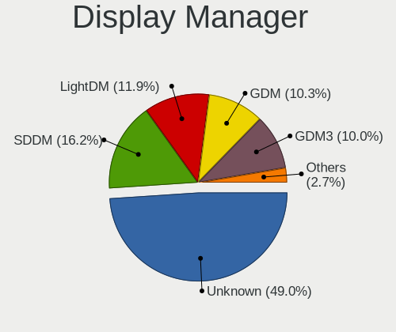
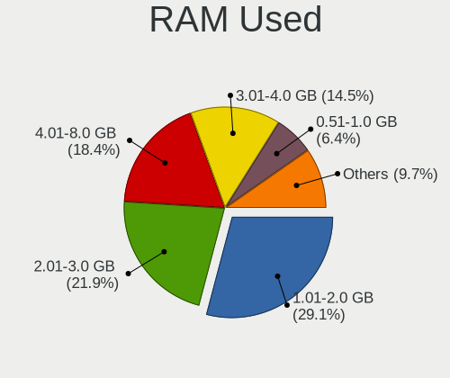
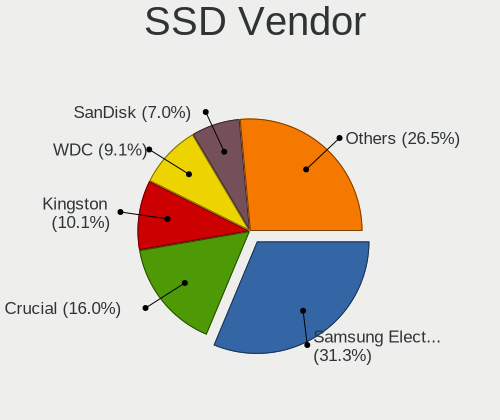
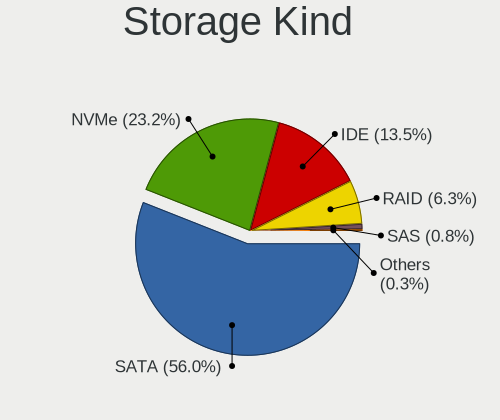
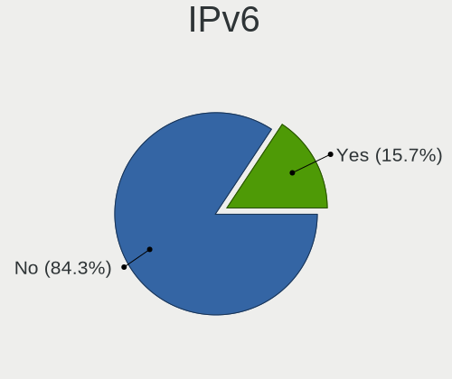
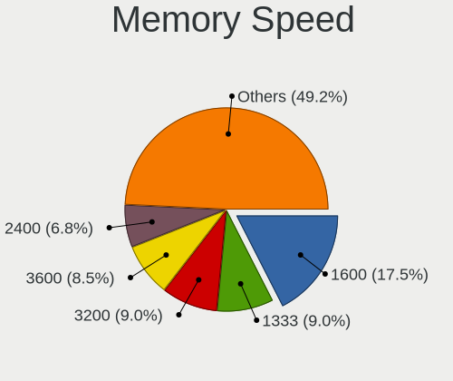

Linux in Australia - Tested Hardware & Statistics (Desktops)
------------------------------------------------------------

A project to collect tested hardware configurations for Linux in Australia.

Anyone can contribute to this report by the [hw-probe](https://github.com/linuxhw/hw-probe) tool:

    sudo -E hw-probe -all -upload

Please contribute! Especially if your hardware is rare.

Contents
--------

* [ Test Cases ](#test-cases)

* [ System ](#system)
  - [ OS                       ](#os)
  - [ OS Family                ](#os-family)
  - [ Kernel                   ](#kernel)
  - [ Kernel Family            ](#kernel-family)
  - [ Kernel Major Ver.        ](#kernel-major-ver)
  - [ Arch                     ](#arch)
  - [ DE                       ](#de)
  - [ Display Server           ](#display-server)
  - [ Display Manager          ](#display-manager)
  - [ OS Lang                  ](#os-lang)
  - [ Boot Mode                ](#boot-mode)
  - [ Filesystem               ](#filesystem)
  - [ Part. scheme             ](#part-scheme)
  - [ Dual Boot with Linux/BSD ](#dual-boot-with-linuxbsd)
  - [ Dual Boot (Win)          ](#dual-boot-win)

* [ Board ](#board)
  - [ Vendor                   ](#vendor)
  - [ Model                    ](#model)
  - [ Model Family             ](#model-family)
  - [ MFG Year                 ](#mfg-year)
  - [ Form Factor              ](#form-factor)
  - [ Secure Boot              ](#secure-boot)
  - [ Coreboot                 ](#coreboot)
  - [ RAM Size                 ](#ram-size)
  - [ RAM Used                 ](#ram-used)
  - [ Total Drives             ](#total-drives)
  - [ Has CD-ROM               ](#has-cd-rom)
  - [ Has Ethernet             ](#has-ethernet)
  - [ Has WiFi                 ](#has-wifi)
  - [ Has Bluetooth            ](#has-bluetooth)

* [ Location ](#location)
  - [ Country                  ](#country)
  - [ City                     ](#city)

* [ Drives ](#drives)
  - [ Drive Vendor             ](#drive-vendor)
  - [ Drive Model              ](#drive-model)
  - [ HDD Vendor               ](#hdd-vendor)
  - [ SSD Vendor               ](#ssd-vendor)
  - [ Drive Kind               ](#drive-kind)
  - [ Drive Connector          ](#drive-connector)
  - [ Drive Size               ](#drive-size)
  - [ Space Total              ](#space-total)
  - [ Space Used               ](#space-used)
  - [ Malfunc. Drives          ](#malfunc-drives)
  - [ Malfunc. Drive Vendor    ](#malfunc-drive-vendor)
  - [ Malfunc. HDD Vendor      ](#malfunc-hdd-vendor)
  - [ Malfunc. Drive Kind      ](#malfunc-drive-kind)
  - [ Failed Drives            ](#failed-drives)
  - [ Failed Drive Vendor      ](#failed-drive-vendor)
  - [ Drive Status             ](#drive-status)

* [ Storage controller ](#storage-controller)
  - [ Storage Vendor           ](#storage-vendor)
  - [ Storage Model            ](#storage-model)
  - [ Storage Kind             ](#storage-kind)

* [ Processor ](#processor)
  - [ CPU Vendor               ](#cpu-vendor)
  - [ CPU Model                ](#cpu-model)
  - [ CPU Model Family         ](#cpu-model-family)
  - [ CPU Cores                ](#cpu-cores)
  - [ CPU Sockets              ](#cpu-sockets)
  - [ CPU Threads              ](#cpu-threads)
  - [ CPU Op-Modes             ](#cpu-op-modes)
  - [ CPU Microcode            ](#cpu-microcode)
  - [ CPU Microarch            ](#cpu-microarch)

* [ Graphics ](#graphics)
  - [ GPU Vendor               ](#gpu-vendor)
  - [ GPU Model                ](#gpu-model)
  - [ GPU Combo                ](#gpu-combo)
  - [ GPU Driver               ](#gpu-driver)
  - [ GPU Memory               ](#gpu-memory)

* [ Monitor ](#monitor)
  - [ Monitor Vendor           ](#monitor-vendor)
  - [ Monitor Model            ](#monitor-model)
  - [ Monitor Resolution       ](#monitor-resolution)
  - [ Monitor Diagonal         ](#monitor-diagonal)
  - [ Monitor Width            ](#monitor-width)
  - [ Aspect Ratio             ](#aspect-ratio)
  - [ Monitor Area             ](#monitor-area)
  - [ Pixel Density            ](#pixel-density)
  - [ Multiple Monitors        ](#multiple-monitors)

* [ Network ](#network)
  - [ Net Controller Vendor    ](#net-controller-vendor)
  - [ Net Controller Model     ](#net-controller-model)
  - [ Wireless Vendor          ](#wireless-vendor)
  - [ Wireless Model           ](#wireless-model)
  - [ Ethernet Vendor          ](#ethernet-vendor)
  - [ Ethernet Model           ](#ethernet-model)
  - [ Net Controller Kind      ](#net-controller-kind)
  - [ Used Controller          ](#used-controller)
  - [ NICs                     ](#nics)
  - [ IPv6                     ](#ipv6)

* [ Bluetooth ](#bluetooth)
  - [ Bluetooth Vendor         ](#bluetooth-vendor)
  - [ Bluetooth Model          ](#bluetooth-model)

* [ Sound ](#sound)
  - [ Sound Vendor             ](#sound-vendor)
  - [ Sound Model              ](#sound-model)

* [ Memory ](#memory)
  - [ Memory Vendor            ](#memory-vendor)
  - [ Memory Model             ](#memory-model)
  - [ Memory Kind              ](#memory-kind)
  - [ Memory Form Factor       ](#memory-form-factor)
  - [ Memory Size              ](#memory-size)
  - [ Memory Speed             ](#memory-speed)

* [ Printers & scanners ](#printers--scanners)
  - [ Printer Vendor           ](#printer-vendor)
  - [ Printer Model            ](#printer-model)
  - [ Scanner Vendor           ](#scanner-vendor)
  - [ Scanner Model            ](#scanner-model)

* [ Camera ](#camera)
  - [ Camera Vendor            ](#camera-vendor)
  - [ Camera Model             ](#camera-model)

* [ Security ](#security)
  - [ Fingerprint Vendor       ](#fingerprint-vendor)
  - [ Fingerprint Model        ](#fingerprint-model)
  - [ Chipcard Vendor          ](#chipcard-vendor)
  - [ Chipcard Model           ](#chipcard-model)

* [ Unsupported ](#unsupported)
  - [ Unsupported Devices      ](#unsupported-devices)
  - [ Unsupported Device Types ](#unsupported-device-types)

Test Cases
----------

Total: 2749

| Vendor        | Model                       | Probe                                                      | Date         |
|---------------|-----------------------------|------------------------------------------------------------|--------------|
| MSI           | B75MA-P45                   | [bfe1423965](https://linux-hardware.org/?probe=bfe1423965) | Nov 06, 2023 |
| ASUSTek       | ROG STRIX Z390-E GAMING     | [e1d50d8743](https://linux-hardware.org/?probe=e1d50d8743) | Nov 05, 2023 |
| ASUSTek       | H110M-A/M.2                 | [2cc662a279](https://linux-hardware.org/?probe=2cc662a279) | Nov 05, 2023 |
| HP            | 83E1                        | [c82d34ebac](https://linux-hardware.org/?probe=c82d34ebac) | Nov 04, 2023 |
| HP            | 843B                        | [8fdaf74414](https://linux-hardware.org/?probe=8fdaf74414) | Nov 03, 2023 |
| HP            | 843B                        | [ba22079238](https://linux-hardware.org/?probe=ba22079238) | Nov 03, 2023 |
| Dell          | 0TDG4V A01                  | [9d9b09db51](https://linux-hardware.org/?probe=9d9b09db51) | Nov 03, 2023 |
| Gigabyte      | G41MT-D3                    | [3a4be91563](https://linux-hardware.org/?probe=3a4be91563) | Nov 03, 2023 |
| Dell          | 03KWTV A00                  | [ae11e0443c](https://linux-hardware.org/?probe=ae11e0443c) | Nov 02, 2023 |
| Dell          | 03KWTV A00                  | [4bce32e210](https://linux-hardware.org/?probe=4bce32e210) | Nov 01, 2023 |
| MSI           | B450M PRO-VDH MAX           | [d73c8ca742](https://linux-hardware.org/?probe=d73c8ca742) | Nov 01, 2023 |
| ASUSTek       | Z170M-PLUS                  | [92b5f4172e](https://linux-hardware.org/?probe=92b5f4172e) | Nov 01, 2023 |
| Gigabyte      | GA-MA780G-UD3H              | [168597b33e](https://linux-hardware.org/?probe=168597b33e) | Nov 01, 2023 |
| HP            | 2AF7                        | [0a2c239b75](https://linux-hardware.org/?probe=0a2c239b75) | Nov 01, 2023 |
| ASRock        | Z170 Extreme4               | [90fc87e07a](https://linux-hardware.org/?probe=90fc87e07a) | Oct 31, 2023 |
| ASRock        | Z170 Extreme4               | [5d99367248](https://linux-hardware.org/?probe=5d99367248) | Oct 31, 2023 |
| Gigabyte      | B450 GAMING X               | [c1785bec94](https://linux-hardware.org/?probe=c1785bec94) | Oct 29, 2023 |
| Gigabyte      | D525TUD                     | [944bb2ecb2](https://linux-hardware.org/?probe=944bb2ecb2) | Oct 28, 2023 |
| HP            | 158A                        | [f8fe5be681](https://linux-hardware.org/?probe=f8fe5be681) | Oct 28, 2023 |
| HP            | 8399                        | [35351ed170](https://linux-hardware.org/?probe=35351ed170) | Oct 27, 2023 |
| MSI           | MAG B760 TOMAHAWK WIFI      | [db2952a9d8](https://linux-hardware.org/?probe=db2952a9d8) | Oct 27, 2023 |
| HP            | 21B4 A01                    | [8f2a8dec3a](https://linux-hardware.org/?probe=8f2a8dec3a) | Oct 26, 2023 |
| HP            | 158A                        | [86f988197b](https://linux-hardware.org/?probe=86f988197b) | Oct 26, 2023 |
| MSI           | B560M-A PRO                 | [1fde726024](https://linux-hardware.org/?probe=1fde726024) | Oct 25, 2023 |
| Acer          | Veriton N4640G              | [ccba40d7a9](https://linux-hardware.org/?probe=ccba40d7a9) | Oct 24, 2023 |
| Gigabyte      | Z97X-Gaming 3               | [279929b8c5](https://linux-hardware.org/?probe=279929b8c5) | Oct 24, 2023 |
| MSI           | MAG B550M BAZOOKA           | [492563a83c](https://linux-hardware.org/?probe=492563a83c) | Oct 24, 2023 |
| MSI           | MAG B550M BAZOOKA           | [3e4b32b047](https://linux-hardware.org/?probe=3e4b32b047) | Oct 24, 2023 |
| Dell          | 0TDG4V A01                  | [932adc1d60](https://linux-hardware.org/?probe=932adc1d60) | Oct 23, 2023 |
| Gigabyte      | GA-MA785G-UD3H              | [7c86d9f1e5](https://linux-hardware.org/?probe=7c86d9f1e5) | Oct 23, 2023 |
| HP            | 8055                        | [aeee934c45](https://linux-hardware.org/?probe=aeee934c45) | Oct 23, 2023 |
| Dell          | 096JG8 A01                  | [ce5ff412d1](https://linux-hardware.org/?probe=ce5ff412d1) | Oct 23, 2023 |
| Gigabyte      | Z77MX-D3H                   | [1f16388df7](https://linux-hardware.org/?probe=1f16388df7) | Oct 23, 2023 |
| Unknown       | GB01                        | [5c0f72d3f0](https://linux-hardware.org/?probe=5c0f72d3f0) | Oct 22, 2023 |
| ASRock        | B650M PG Riptide            | [218908299a](https://linux-hardware.org/?probe=218908299a) | Oct 21, 2023 |
| Dell          | 00V62H A01                  | [85894d27fe](https://linux-hardware.org/?probe=85894d27fe) | Oct 21, 2023 |
| Gigabyte      | EP45-DS3L                   | [8b5e97d193](https://linux-hardware.org/?probe=8b5e97d193) | Oct 21, 2023 |
| Gigabyte      | GA-MA780G-UD3H              | [984eba244a](https://linux-hardware.org/?probe=984eba244a) | Oct 20, 2023 |
| Gigabyte      | Z97X-Gaming 3               | [7cd181ad3b](https://linux-hardware.org/?probe=7cd181ad3b) | Oct 20, 2023 |
| ASUSTek       | PRIME B550M-A WIFI II       | [8f7a837f4f](https://linux-hardware.org/?probe=8f7a837f4f) | Oct 19, 2023 |
| Gigabyte      | H77N-WIFI                   | [0c16d31374](https://linux-hardware.org/?probe=0c16d31374) | Oct 18, 2023 |
| ASRock        | AB350 Pro4                  | [71eba7e232](https://linux-hardware.org/?probe=71eba7e232) | Oct 18, 2023 |
| ASRock        | B550 Steel Legend           | [b605b832db](https://linux-hardware.org/?probe=b605b832db) | Oct 16, 2023 |
| Shuttle       | FD37V10                     | [929e944dd3](https://linux-hardware.org/?probe=929e944dd3) | Oct 15, 2023 |
| Shuttle       | FD37V10                     | [d9043c11bd](https://linux-hardware.org/?probe=d9043c11bd) | Oct 15, 2023 |
| Gigabyte      | J1900M-D2P                  | [27881eaaac](https://linux-hardware.org/?probe=27881eaaac) | Oct 15, 2023 |
| ASUSTek       | ROG STRIX B660-F GAMING ... | [618fcf6a1e](https://linux-hardware.org/?probe=618fcf6a1e) | Oct 14, 2023 |
| ASRock        | H87 Performance             | [5d1713de03](https://linux-hardware.org/?probe=5d1713de03) | Oct 13, 2023 |
| Unknown       | Unknown                     | [73219cd20b](https://linux-hardware.org/?probe=73219cd20b) | Oct 10, 2023 |
| Gigabyte      | J1900M-D2P                  | [8091bb0ceb](https://linux-hardware.org/?probe=8091bb0ceb) | Oct 10, 2023 |
| Gigabyte      | Z77MX-D3H                   | [2d033cba6c](https://linux-hardware.org/?probe=2d033cba6c) | Oct 08, 2023 |
| ASUSTek       | P8Z77-V DELUXE              | [8ea6db3dbb](https://linux-hardware.org/?probe=8ea6db3dbb) | Oct 08, 2023 |
| Gigabyte      | EP43T-UD3L                  | [335b7035bc](https://linux-hardware.org/?probe=335b7035bc) | Oct 08, 2023 |
| HP            | 158A                        | [c2cb1b9180](https://linux-hardware.org/?probe=c2cb1b9180) | Oct 07, 2023 |
| Dell          | 0X9M3X A01                  | [59c96d1008](https://linux-hardware.org/?probe=59c96d1008) | Oct 07, 2023 |
| MSI           | B450 TOMAHAWK MAX II        | [ad60cd6e18](https://linux-hardware.org/?probe=ad60cd6e18) | Oct 06, 2023 |
| Unknown       | Unknown                     | [dd213b27e1](https://linux-hardware.org/?probe=dd213b27e1) | Oct 06, 2023 |
| MSI           | PRO X670-P WIFI             | [d8f9e7b32a](https://linux-hardware.org/?probe=d8f9e7b32a) | Oct 05, 2023 |
| MSI           | PRO X670-P WIFI             | [ae798c007e](https://linux-hardware.org/?probe=ae798c007e) | Oct 05, 2023 |
| ASRock        | AD2700-ITX                  | [3aea9e7d2f](https://linux-hardware.org/?probe=3aea9e7d2f) | Oct 05, 2023 |
| ASUSTek       | TUF Gaming B450M-PRO II     | [1deaeb248b](https://linux-hardware.org/?probe=1deaeb248b) | Oct 04, 2023 |
| ASUSTek       | A8R32-MVP Deluxe            | [08f5cef7f3](https://linux-hardware.org/?probe=08f5cef7f3) | Oct 04, 2023 |
| MSI           | B450M MORTAR MAX            | [42b70488ca](https://linux-hardware.org/?probe=42b70488ca) | Oct 03, 2023 |
| HP            | 802E                        | [2d84b83c17](https://linux-hardware.org/?probe=2d84b83c17) | Oct 03, 2023 |
| HP            | 802E                        | [10fcb68621](https://linux-hardware.org/?probe=10fcb68621) | Oct 03, 2023 |
| MSI           | MPG X570 GAMING PLUS        | [b992cbe7ae](https://linux-hardware.org/?probe=b992cbe7ae) | Oct 02, 2023 |
| MSI           | MPG X570 GAMING EDGE WIF... | [b5fcc0da7b](https://linux-hardware.org/?probe=b5fcc0da7b) | Oct 02, 2023 |
| Gigabyte      | Z77X-UD5H                   | [def4633785](https://linux-hardware.org/?probe=def4633785) | Oct 01, 2023 |
| Gigabyte      | D525TUD                     | [913e98318d](https://linux-hardware.org/?probe=913e98318d) | Oct 01, 2023 |
| Gigabyte      | D525TUD                     | [f48a538837](https://linux-hardware.org/?probe=f48a538837) | Oct 01, 2023 |
| ASUSTek       | TUF Gaming B550M-PLUS       | [288f5f8266](https://linux-hardware.org/?probe=288f5f8266) | Sep 30, 2023 |
| Gigabyte      | X99-UD3-CF                  | [f1cc7e5a93](https://linux-hardware.org/?probe=f1cc7e5a93) | Sep 30, 2023 |
| Gigabyte      | X99-UD3-CF                  | [51d10770c6](https://linux-hardware.org/?probe=51d10770c6) | Sep 30, 2023 |
| Gigabyte      | GA-870A-UD3                 | [5a507ec4da](https://linux-hardware.org/?probe=5a507ec4da) | Sep 30, 2023 |
| Gigabyte      | GA-MA785G-UD3H              | [4f0651ccc2](https://linux-hardware.org/?probe=4f0651ccc2) | Sep 27, 2023 |
| Gigabyte      | GA-970A-D3                  | [a4d1820df5](https://linux-hardware.org/?probe=a4d1820df5) | Sep 27, 2023 |
| MSI           | B550-A PRO                  | [c60600b4f0](https://linux-hardware.org/?probe=c60600b4f0) | Sep 27, 2023 |
| ASUSTek       | B85M-E                      | [25c109d366](https://linux-hardware.org/?probe=25c109d366) | Sep 24, 2023 |
| ASUSTek       | TUF Gaming X670E-PLUS       | [3346cccd71](https://linux-hardware.org/?probe=3346cccd71) | Sep 24, 2023 |
| HP            | 843B                        | [4e11e8ae1a](https://linux-hardware.org/?probe=4e11e8ae1a) | Sep 24, 2023 |
| HP            | 1905                        | [786257c0e1](https://linux-hardware.org/?probe=786257c0e1) | Sep 23, 2023 |
| Gigabyte      | EP45-DS3L                   | [2867e39109](https://linux-hardware.org/?probe=2867e39109) | Sep 23, 2023 |
| HP            | 3397                        | [fa230ba389](https://linux-hardware.org/?probe=fa230ba389) | Sep 23, 2023 |
| Gigabyte      | GA-870A-UD3                 | [e57a830f9c](https://linux-hardware.org/?probe=e57a830f9c) | Sep 21, 2023 |
| ASUSTek       | PRIME Z690-P WIFI D4        | [3762f344e9](https://linux-hardware.org/?probe=3762f344e9) | Sep 21, 2023 |
| Dell          | 03NVJ6 A00                  | [af48b03e82](https://linux-hardware.org/?probe=af48b03e82) | Sep 20, 2023 |
| Gigabyte      | Z77MX-D3H                   | [624ebbd6c1](https://linux-hardware.org/?probe=624ebbd6c1) | Sep 20, 2023 |
| ASUSTek       | Z97M-PLUS                   | [01e90212e5](https://linux-hardware.org/?probe=01e90212e5) | Sep 20, 2023 |
| Dell          | 00V62H A01                  | [71d11373aa](https://linux-hardware.org/?probe=71d11373aa) | Sep 20, 2023 |
| Gigabyte      | J1900M-D2P                  | [1bd6653d3e](https://linux-hardware.org/?probe=1bd6653d3e) | Sep 19, 2023 |
| Lenovo        | ThinkCentre M58p 7220A72    | [39d6e8a728](https://linux-hardware.org/?probe=39d6e8a728) | Sep 18, 2023 |
| Gigabyte      | GA-880GM-UD2H               | [7e05f3299f](https://linux-hardware.org/?probe=7e05f3299f) | Sep 18, 2023 |
| HP            | 1998                        | [4af6b915c2](https://linux-hardware.org/?probe=4af6b915c2) | Sep 17, 2023 |
| Dell          | 0Y56T3 A01                  | [0ecd730eca](https://linux-hardware.org/?probe=0ecd730eca) | Sep 16, 2023 |
| Lenovo        | ThinkCentre M58 7360BB6     | [cb32849dcc](https://linux-hardware.org/?probe=cb32849dcc) | Sep 16, 2023 |
| Dell          | 0TDG4V A01                  | [7c2d7aeafa](https://linux-hardware.org/?probe=7c2d7aeafa) | Sep 15, 2023 |
| Gigabyte      | B250M-D3H-CF                | [e9d6d94486](https://linux-hardware.org/?probe=e9d6d94486) | Sep 15, 2023 |
| MSI           | B450M PRO-VDH MAX           | [dd637b6425](https://linux-hardware.org/?probe=dd637b6425) | Sep 15, 2023 |
| Dell          | 0TDG4V A01                  | [7d79af3d22](https://linux-hardware.org/?probe=7d79af3d22) | Sep 13, 2023 |
| Gigabyte      | GA-870A-UD3                 | [20ec05f55b](https://linux-hardware.org/?probe=20ec05f55b) | Sep 13, 2023 |
| Gigabyte      | GA-870A-UD3                 | [172b7a1d48](https://linux-hardware.org/?probe=172b7a1d48) | Sep 13, 2023 |
| ASRock        | B360M-HDV                   | [d4b0ae4d0c](https://linux-hardware.org/?probe=d4b0ae4d0c) | Sep 11, 2023 |
| Dell          | 0GM819                      | [f7d8bdb2a3](https://linux-hardware.org/?probe=f7d8bdb2a3) | Sep 10, 2023 |
| ASRock        | H97M Pro4                   | [a875b11982](https://linux-hardware.org/?probe=a875b11982) | Sep 10, 2023 |
| MSI           | MAG B550M MORTAR MAX WIF... | [5cb0ed682a](https://linux-hardware.org/?probe=5cb0ed682a) | Sep 10, 2023 |
| Pegatron      | 2AB6                        | [5b2fda7ad6](https://linux-hardware.org/?probe=5b2fda7ad6) | Sep 09, 2023 |
| Dell          | 00V62H A01                  | [7b02c70750](https://linux-hardware.org/?probe=7b02c70750) | Sep 09, 2023 |
| Gigabyte      | Q87M-MK                     | [1c45c834fe](https://linux-hardware.org/?probe=1c45c834fe) | Sep 09, 2023 |
| Gigabyte      | G41MT-D3                    | [0940dc7ebd](https://linux-hardware.org/?probe=0940dc7ebd) | Sep 08, 2023 |
| Dell          | 0J37VM A01                  | [7781be38be](https://linux-hardware.org/?probe=7781be38be) | Sep 07, 2023 |
| Gigabyte      | Z87X-UD3H-CF                | [43f205483a](https://linux-hardware.org/?probe=43f205483a) | Sep 07, 2023 |
| Gigabyte      | G41MT-D3                    | [f0c3188082](https://linux-hardware.org/?probe=f0c3188082) | Sep 07, 2023 |
| Gigabyte      | B75M-D3H                    | [2285c5c493](https://linux-hardware.org/?probe=2285c5c493) | Sep 06, 2023 |
| Dell          | 0PC5F7 A00                  | [9ffb575d81](https://linux-hardware.org/?probe=9ffb575d81) | Sep 06, 2023 |
| Lenovo        | MAHOBAY Win8 Pro DPK TPG    | [c43f7a6e53](https://linux-hardware.org/?probe=c43f7a6e53) | Sep 06, 2023 |
| ASRock        | B650E PG-ITX WiFi           | [9dd5c2a861](https://linux-hardware.org/?probe=9dd5c2a861) | Sep 06, 2023 |
| Gigabyte      | Z68MA-D2H-B3                | [7db6779b5c](https://linux-hardware.org/?probe=7db6779b5c) | Sep 06, 2023 |
| Dell          | 00V62H A01                  | [51b40f3137](https://linux-hardware.org/?probe=51b40f3137) | Sep 05, 2023 |
| ASRock        | AD525PV3                    | [0fa982f7ad](https://linux-hardware.org/?probe=0fa982f7ad) | Sep 05, 2023 |
| ASRock        | AD525PV3                    | [9ab25d4913](https://linux-hardware.org/?probe=9ab25d4913) | Sep 05, 2023 |
| ASUSTek       | A8R32-MVP Deluxe            | [d20cf2e835](https://linux-hardware.org/?probe=d20cf2e835) | Sep 05, 2023 |
| Gigabyte      | Z590 AORUS MASTER           | [40785211e9](https://linux-hardware.org/?probe=40785211e9) | Sep 05, 2023 |
| MSI           | Z390-A PRO                  | [16b96480a2](https://linux-hardware.org/?probe=16b96480a2) | Sep 03, 2023 |
| ASUSTek       | ROG Maximus XII EXTREME     | [7cfd1c36d1](https://linux-hardware.org/?probe=7cfd1c36d1) | Sep 02, 2023 |
| Dell          | 00V62H A01                  | [f3c99a0cc5](https://linux-hardware.org/?probe=f3c99a0cc5) | Sep 01, 2023 |
| Gigabyte      | X570 UD                     | [17e3dd86e8](https://linux-hardware.org/?probe=17e3dd86e8) | Sep 01, 2023 |
| Gigabyte      | H77N-WIFI                   | [84ed05802d](https://linux-hardware.org/?probe=84ed05802d) | Aug 31, 2023 |
| Gigabyte      | D525TUD                     | [9a459d2372](https://linux-hardware.org/?probe=9a459d2372) | Aug 31, 2023 |
| Gigabyte      | Z77MX-D3H                   | [ffb1e72844](https://linux-hardware.org/?probe=ffb1e72844) | Aug 31, 2023 |
| HP            | 843B                        | [472228092a](https://linux-hardware.org/?probe=472228092a) | Aug 31, 2023 |
| Dell          | 0Y5DDC A00                  | [21ec7587ed](https://linux-hardware.org/?probe=21ec7587ed) | Aug 30, 2023 |
| Apple         | Mac-F221BEC8                | [13b77d8273](https://linux-hardware.org/?probe=13b77d8273) | Aug 30, 2023 |
| Gigabyte      | G41MT-D3                    | [a2f594cf56](https://linux-hardware.org/?probe=a2f594cf56) | Aug 29, 2023 |
| Dell          | 00V62H A01                  | [714c46e2fd](https://linux-hardware.org/?probe=714c46e2fd) | Aug 28, 2023 |
| Dell          | 03NVJ6 A01                  | [00a28522c2](https://linux-hardware.org/?probe=00a28522c2) | Aug 27, 2023 |
| ASUSTek       | TUF Gaming X570-PLUS        | [883d4fbfeb](https://linux-hardware.org/?probe=883d4fbfeb) | Aug 27, 2023 |
| Gigabyte      | H77N-WIFI                   | [d80e4744e9](https://linux-hardware.org/?probe=d80e4744e9) | Aug 27, 2023 |
| ASUSTek       | PRIME A520M-K               | [ea6d90ba09](https://linux-hardware.org/?probe=ea6d90ba09) | Aug 27, 2023 |
| Gigabyte      | H97N-WIFI                   | [6edcb45992](https://linux-hardware.org/?probe=6edcb45992) | Aug 26, 2023 |
| ASUSTek       | P5K-E                       | [aa48da4e34](https://linux-hardware.org/?probe=aa48da4e34) | Aug 26, 2023 |
| HP            | ProLiant ML10 v2            | [86cb962a7d](https://linux-hardware.org/?probe=86cb962a7d) | Aug 26, 2023 |
| Unknown       | Unknown                     | [e78b6b1077](https://linux-hardware.org/?probe=e78b6b1077) | Aug 26, 2023 |
| ASUSTek       | ROG STRIX B660-F GAMING ... | [fc8e4dd4ff](https://linux-hardware.org/?probe=fc8e4dd4ff) | Aug 25, 2023 |
| Gigabyte      | Z68MX-UD2H-B3               | [93cce7551b](https://linux-hardware.org/?probe=93cce7551b) | Aug 25, 2023 |
| Gigabyte      | X79-UP4                     | [58ae6791f0](https://linux-hardware.org/?probe=58ae6791f0) | Aug 25, 2023 |
| Dell          | 06D7TR A02                  | [d0b04a9056](https://linux-hardware.org/?probe=d0b04a9056) | Aug 24, 2023 |
| ASUSTek       | B85M-E                      | [a06cf8de37](https://linux-hardware.org/?probe=a06cf8de37) | Aug 24, 2023 |
| ASUSTek       | B85M-E                      | [b6591e9fd9](https://linux-hardware.org/?probe=b6591e9fd9) | Aug 24, 2023 |
| Gigabyte      | GA-A55M-S2V                 | [e9b32aa827](https://linux-hardware.org/?probe=e9b32aa827) | Aug 23, 2023 |
| HP            | 212B                        | [a186c2ccf3](https://linux-hardware.org/?probe=a186c2ccf3) | Aug 23, 2023 |
| ASUSTek       | P7P55-M                     | [0f5028d5fc](https://linux-hardware.org/?probe=0f5028d5fc) | Aug 22, 2023 |
| ASUSTek       | B85M-E                      | [158cc5fe6f](https://linux-hardware.org/?probe=158cc5fe6f) | Aug 20, 2023 |
| HP            | 158A                        | [ba0211611f](https://linux-hardware.org/?probe=ba0211611f) | Aug 19, 2023 |
| HP            | 158A                        | [25e8725a35](https://linux-hardware.org/?probe=25e8725a35) | Aug 19, 2023 |
| Unknown       | Unknown                     | [c642878288](https://linux-hardware.org/?probe=c642878288) | Aug 19, 2023 |
| Intel         | D53427RKE G87971-402        | [433dcaffa6](https://linux-hardware.org/?probe=433dcaffa6) | Aug 17, 2023 |
| MSI           | MAG Z390 TOMAHAWK           | [1d389611a3](https://linux-hardware.org/?probe=1d389611a3) | Aug 16, 2023 |
| ASUSTek       | TUF Gaming B450M-PRO II     | [122b800eae](https://linux-hardware.org/?probe=122b800eae) | Aug 16, 2023 |
| Gigabyte      | B550M DS3H AC               | [881b50cb6f](https://linux-hardware.org/?probe=881b50cb6f) | Aug 16, 2023 |
| Gigabyte      | X570 UD                     | [290298fd99](https://linux-hardware.org/?probe=290298fd99) | Aug 15, 2023 |
| MSI           | B450-A PRO MAX              | [bf2f7b52d1](https://linux-hardware.org/?probe=bf2f7b52d1) | Aug 15, 2023 |
| MSI           | B450-A PRO MAX              | [7b94897e1a](https://linux-hardware.org/?probe=7b94897e1a) | Aug 15, 2023 |
| ASUSTek       | ROG STRIX B550-F GAMING     | [b62ff7f358](https://linux-hardware.org/?probe=b62ff7f358) | Aug 14, 2023 |
| Gigabyte      | P55A-UD3                    | [b950177908](https://linux-hardware.org/?probe=b950177908) | Aug 14, 2023 |
| ASUSTek       | ROG STRIX B660-F GAMING ... | [d2ccdc066b](https://linux-hardware.org/?probe=d2ccdc066b) | Aug 14, 2023 |
| Gigabyte      | Z77M-D3H-MVP                | [c939a92f1d](https://linux-hardware.org/?probe=c939a92f1d) | Aug 14, 2023 |
| Apple         | Mac-F223BEC8                | [74a3be9a4a](https://linux-hardware.org/?probe=74a3be9a4a) | Aug 14, 2023 |
| Gigabyte      | Z77M-D3H-MVP                | [56efab026f](https://linux-hardware.org/?probe=56efab026f) | Aug 14, 2023 |
| ASUSTek       | PRIME B550M-A WIFI II       | [9a8e4bc08d](https://linux-hardware.org/?probe=9a8e4bc08d) | Aug 14, 2023 |
| Gigabyte      | B85M-D3H                    | [6602bb3d0a](https://linux-hardware.org/?probe=6602bb3d0a) | Aug 13, 2023 |
| Gigabyte      | B85M-D3H                    | [5a809fe1c3](https://linux-hardware.org/?probe=5a809fe1c3) | Aug 13, 2023 |
| ASUSTek       | PRIME X670-P WIFI           | [1de4045fb5](https://linux-hardware.org/?probe=1de4045fb5) | Aug 13, 2023 |
| ASUSTek       | TUF B450M-PLUS GAMING       | [3ac1be3b93](https://linux-hardware.org/?probe=3ac1be3b93) | Aug 13, 2023 |
| ASUSTek       | CROSSHAIR VI HERO           | [c28cbbd2a1](https://linux-hardware.org/?probe=c28cbbd2a1) | Aug 13, 2023 |
| ASUSTek       | CROSSHAIR VI HERO           | [6d1e3a24e8](https://linux-hardware.org/?probe=6d1e3a24e8) | Aug 13, 2023 |
| MSI           | MAG B550M MORTAR WIFI       | [b6b99bf7bd](https://linux-hardware.org/?probe=b6b99bf7bd) | Aug 12, 2023 |
| Gigabyte      | G1.Sniper M3-CF             | [f4d0fd6811](https://linux-hardware.org/?probe=f4d0fd6811) | Aug 12, 2023 |
| Gigabyte      | G1.Sniper M3-CF             | [a5681e12d3](https://linux-hardware.org/?probe=a5681e12d3) | Aug 12, 2023 |
| ASUSTek       | ROG STRIX Z690-E GAMING ... | [025afcb20d](https://linux-hardware.org/?probe=025afcb20d) | Aug 10, 2023 |
| Gigabyte      | Z390 AORUS ULTRA-CF         | [5264c46571](https://linux-hardware.org/?probe=5264c46571) | Aug 10, 2023 |
| ASUSTek       | ROG STRIX B660-F GAMING ... | [c5491b8e9f](https://linux-hardware.org/?probe=c5491b8e9f) | Aug 10, 2023 |
| ASUSTek       | ROG STRIX B450-F GAMING     | [2be2a9d5f4](https://linux-hardware.org/?probe=2be2a9d5f4) | Aug 09, 2023 |
| ASUSTek       | STRIX H270F GAMING          | [ab74b5c684](https://linux-hardware.org/?probe=ab74b5c684) | Aug 08, 2023 |
| ASUSTek       | STRIX H270F GAMING          | [85ffbedac4](https://linux-hardware.org/?probe=85ffbedac4) | Aug 08, 2023 |
| HP            | 212B                        | [b7de4a2b0a](https://linux-hardware.org/?probe=b7de4a2b0a) | Aug 07, 2023 |
| ASUSTek       | CROSSHAIR VI HERO           | [51c3d4511a](https://linux-hardware.org/?probe=51c3d4511a) | Aug 07, 2023 |
| Lenovo        | 3111 SDK0J40697 WIN 3305... | [c003e20331](https://linux-hardware.org/?probe=c003e20331) | Aug 06, 2023 |
| Gigabyte      | EP45-DS3L                   | [b9d8025a54](https://linux-hardware.org/?probe=b9d8025a54) | Aug 05, 2023 |
| ASUSTek       | ROG Maximus XII EXTREME     | [f5ebaad3b1](https://linux-hardware.org/?probe=f5ebaad3b1) | Aug 05, 2023 |
| ASUSTek       | CROSSHAIR VI HERO           | [dd1767aec1](https://linux-hardware.org/?probe=dd1767aec1) | Aug 04, 2023 |
| Gigabyte      | GA-MA785G-UD3H              | [a02f0405a3](https://linux-hardware.org/?probe=a02f0405a3) | Aug 04, 2023 |
| HP            | ProLiant MicroServer Gen... | [fe0a1dbc45](https://linux-hardware.org/?probe=fe0a1dbc45) | Aug 04, 2023 |
| Apple         | Mac-F221BEC8                | [90aecb9ada](https://linux-hardware.org/?probe=90aecb9ada) | Aug 04, 2023 |
| Gigabyte      | Z490M GAMING X              | [ad51d2548b](https://linux-hardware.org/?probe=ad51d2548b) | Aug 03, 2023 |
| Dell          | 09M8Y8 A01                  | [e5649696d0](https://linux-hardware.org/?probe=e5649696d0) | Aug 03, 2023 |
| HP            | 2B2C                        | [3f0b3f8811](https://linux-hardware.org/?probe=3f0b3f8811) | Aug 01, 2023 |
| Dell          | 06NWYK A00                  | [1c3a3db0ec](https://linux-hardware.org/?probe=1c3a3db0ec) | Aug 01, 2023 |
| ASUSTek       | ROG CROSSHAIR VIII DARK ... | [888c56f232](https://linux-hardware.org/?probe=888c56f232) | Aug 01, 2023 |
| Dell          | 0Y5DDC A00                  | [43624df7d4](https://linux-hardware.org/?probe=43624df7d4) | Jul 30, 2023 |
| MSI           | Z87-G45 GAMING              | [6c5528a787](https://linux-hardware.org/?probe=6c5528a787) | Jul 30, 2023 |
| Gigabyte      | H77N-WIFI                   | [4fb6a46f65](https://linux-hardware.org/?probe=4fb6a46f65) | Jul 30, 2023 |
| ASUSTek       | CROSSHAIR VI HERO           | [60bf32a368](https://linux-hardware.org/?probe=60bf32a368) | Jul 29, 2023 |
| MSI           | MPG Z390 GAMING PRO CARB... | [580c4fb755](https://linux-hardware.org/?probe=580c4fb755) | Jul 29, 2023 |
| Lenovo        | 30D0 SDK0J40705 WIN 3425... | [8c930cc5e4](https://linux-hardware.org/?probe=8c930cc5e4) | Jul 29, 2023 |
| ASUSTek       | WS C246 PRO                 | [cfffc2ba92](https://linux-hardware.org/?probe=cfffc2ba92) | Jul 28, 2023 |
| Gigabyte      | J1900M-D2P                  | [7864dbf54c](https://linux-hardware.org/?probe=7864dbf54c) | Jul 28, 2023 |
| Gigabyte      | H77N-WIFI                   | [abf0e5979c](https://linux-hardware.org/?probe=abf0e5979c) | Jul 27, 2023 |
| ASUSTek       | CROSSHAIR VI HERO           | [0b04075e09](https://linux-hardware.org/?probe=0b04075e09) | Jul 27, 2023 |
| Gigabyte      | J1900M-D2P                  | [31b7924358](https://linux-hardware.org/?probe=31b7924358) | Jul 25, 2023 |
| Google        | Sumo                        | [71a7167d22](https://linux-hardware.org/?probe=71a7167d22) | Jul 25, 2023 |
| HP            | 1998                        | [ef5201611b](https://linux-hardware.org/?probe=ef5201611b) | Jul 24, 2023 |
| HP            | 1998                        | [5a95ac128d](https://linux-hardware.org/?probe=5a95ac128d) | Jul 24, 2023 |
| ASUSTek       | CROSSHAIR VI HERO           | [579d5d5771](https://linux-hardware.org/?probe=579d5d5771) | Jul 24, 2023 |
| Dell          | 0NW6H5 A00                  | [25ab3b442b](https://linux-hardware.org/?probe=25ab3b442b) | Jul 22, 2023 |
| MSI           | Z97 PC Mate                 | [f4cddb5e86](https://linux-hardware.org/?probe=f4cddb5e86) | Jul 22, 2023 |
| Intel         | DQ57TM AAE70931-402         | [01621f8578](https://linux-hardware.org/?probe=01621f8578) | Jul 21, 2023 |
| Gigabyte      | 945GCMX-S2                  | [46e297492f](https://linux-hardware.org/?probe=46e297492f) | Jul 21, 2023 |
| Gigabyte      | Z77MX-D3H                   | [044cf93e31](https://linux-hardware.org/?probe=044cf93e31) | Jul 20, 2023 |
| Gigabyte      | Z97X-Gaming 3               | [3da3da07e9](https://linux-hardware.org/?probe=3da3da07e9) | Jul 19, 2023 |
| ASUSTek       | ROG Maximus XII EXTREME     | [0f7fea54eb](https://linux-hardware.org/?probe=0f7fea54eb) | Jul 19, 2023 |
| ASUSTek       | PRIME Z370-A II             | [6ca4720242](https://linux-hardware.org/?probe=6ca4720242) | Jul 18, 2023 |
| ASRock        | B660M-HDV                   | [3a0685bcf0](https://linux-hardware.org/?probe=3a0685bcf0) | Jul 18, 2023 |
| ASUSTek       | CROSSHAIR VI HERO           | [553cbdb79d](https://linux-hardware.org/?probe=553cbdb79d) | Jul 17, 2023 |
| Gigabyte      | B550 GAMING X V2            | [60d7a077dc](https://linux-hardware.org/?probe=60d7a077dc) | Jul 17, 2023 |
| Acidanther... | Mac-27AD2F918AE68F61 Mac... | [20ee7f8016](https://linux-hardware.org/?probe=20ee7f8016) | Jul 16, 2023 |
| MSI           | MPG Z390 GAMING PRO CARB... | [5bf40815d5](https://linux-hardware.org/?probe=5bf40815d5) | Jul 16, 2023 |
| Gigabyte      | Z490 AORUS PRO AX           | [1b32b611bf](https://linux-hardware.org/?probe=1b32b611bf) | Jul 16, 2023 |
| ASUSTek       | X99-DELUXE II               | [d132761a85](https://linux-hardware.org/?probe=d132761a85) | Jul 14, 2023 |
| ASUSTek       | X99-DELUXE II               | [70345fff08](https://linux-hardware.org/?probe=70345fff08) | Jul 14, 2023 |
| Gigabyte      | H77N-WIFI                   | [8ee665fb8f](https://linux-hardware.org/?probe=8ee665fb8f) | Jul 14, 2023 |
| Gigabyte      | GA-A55M-S2V                 | [fadd5eeba6](https://linux-hardware.org/?probe=fadd5eeba6) | Jul 13, 2023 |
| Dell          | 03NVJ6 A01                  | [b575153979](https://linux-hardware.org/?probe=b575153979) | Jul 13, 2023 |
| Dell          | 03NVJ6 A01                  | [05e8a2652e](https://linux-hardware.org/?probe=05e8a2652e) | Jul 13, 2023 |
| ASUSTek       | TUF Gaming X670E-PLUS WI... | [5c12592f23](https://linux-hardware.org/?probe=5c12592f23) | Jul 11, 2023 |
| Gigabyte      | J1900M-D2P                  | [a9e19d3887](https://linux-hardware.org/?probe=a9e19d3887) | Jul 11, 2023 |
| MSI           | PRO H610M-G DDR4            | [4ff789de3b](https://linux-hardware.org/?probe=4ff789de3b) | Jul 11, 2023 |
| Gigabyte      | Z77MX-D3H                   | [ac8df9628d](https://linux-hardware.org/?probe=ac8df9628d) | Jul 10, 2023 |
| ASUSTek       | TUF Gaming B550-PLUS WIF... | [f4f002c37a](https://linux-hardware.org/?probe=f4f002c37a) | Jul 10, 2023 |
| MSI           | MPG B650I EDGE WIFI         | [dcf418007d](https://linux-hardware.org/?probe=dcf418007d) | Jul 10, 2023 |
| MSI           | MPG B650I EDGE WIFI         | [b515a2980e](https://linux-hardware.org/?probe=b515a2980e) | Jul 10, 2023 |
| Avalue        | NUC-APL E9697JAI006R        | [8e289dc3f9](https://linux-hardware.org/?probe=8e289dc3f9) | Jul 10, 2023 |
| Avalue        | NUC-APL E9697JAI006R        | [8f7a02d8b5](https://linux-hardware.org/?probe=8f7a02d8b5) | Jul 10, 2023 |
| Gigabyte      | X570S AORUS ELITE           | [6381f6da84](https://linux-hardware.org/?probe=6381f6da84) | Jul 09, 2023 |
| HP            | 1791                        | [a2bf914a45](https://linux-hardware.org/?probe=a2bf914a45) | Jul 08, 2023 |
| ASRock        | X670E Pro RS                | [d41838c540](https://linux-hardware.org/?probe=d41838c540) | Jul 08, 2023 |
| Gigabyte      | GA-A55M-S2V                 | [6cac69cac1](https://linux-hardware.org/?probe=6cac69cac1) | Jul 08, 2023 |
| MSI           | MPG B650I EDGE WIFI         | [bdaa09e52c](https://linux-hardware.org/?probe=bdaa09e52c) | Jul 08, 2023 |
| Dell          | 09D2HH A00                  | [2885be7e12](https://linux-hardware.org/?probe=2885be7e12) | Jul 07, 2023 |
| Dell          | 00V62H A01                  | [0d98ce8578](https://linux-hardware.org/?probe=0d98ce8578) | Jul 07, 2023 |
| MSI           | Z97S SLI Krait Edition      | [c353b62b15](https://linux-hardware.org/?probe=c353b62b15) | Jul 07, 2023 |
| MSI           | MS-7142                     | [3247a2f71c](https://linux-hardware.org/?probe=3247a2f71c) | Jul 06, 2023 |
| MSI           | B150 GAMING M3              | [a8018be55a](https://linux-hardware.org/?probe=a8018be55a) | Jul 06, 2023 |
| ASUSTek       | A8R32-MVP Deluxe            | [3af1e33a01](https://linux-hardware.org/?probe=3af1e33a01) | Jul 06, 2023 |
| Gigabyte      | Z68MA-D2H-B3                | [04d7534d9e](https://linux-hardware.org/?probe=04d7534d9e) | Jul 06, 2023 |
| MSI           | Z97 PC Mate                 | [495b6e6e4a](https://linux-hardware.org/?probe=495b6e6e4a) | Jul 06, 2023 |
| MSI           | Z97 PC Mate                 | [0d9ce2b3d2](https://linux-hardware.org/?probe=0d9ce2b3d2) | Jul 05, 2023 |
| ASUSTek       | CROSSHAIR VI HERO           | [407e00921f](https://linux-hardware.org/?probe=407e00921f) | Jul 04, 2023 |
| Gigabyte      | G41MT-D3                    | [da0ca66579](https://linux-hardware.org/?probe=da0ca66579) | Jul 04, 2023 |
| Dell          | 0TY565                      | [98f290cadd](https://linux-hardware.org/?probe=98f290cadd) | Jul 02, 2023 |
| MSI           | MAG X570S TOMAHAWK MAX W... | [b6b1cf5b68](https://linux-hardware.org/?probe=b6b1cf5b68) | Jul 02, 2023 |
| Gigabyte      | EP45-DS3L                   | [49c764507c](https://linux-hardware.org/?probe=49c764507c) | Jul 01, 2023 |
| Gigabyte      | P67A-UD5-B3                 | [b763c860fa](https://linux-hardware.org/?probe=b763c860fa) | Jun 30, 2023 |
| Dell          | 0NW6H5 A00                  | [593512053f](https://linux-hardware.org/?probe=593512053f) | Jun 30, 2023 |
| Gigabyte      | H170-HD3-CF                 | [59d1be1c5d](https://linux-hardware.org/?probe=59d1be1c5d) | Jun 30, 2023 |
| ASRock        | Z690 Steel Legend WiFi 6... | [d09ee66df1](https://linux-hardware.org/?probe=d09ee66df1) | Jun 29, 2023 |
| Intel         | LADPNVMO AAE76523-300       | [76cc7bbb86](https://linux-hardware.org/?probe=76cc7bbb86) | Jun 27, 2023 |
| ASRock        | X370 Gaming-ITX/ac          | [975e5164c6](https://linux-hardware.org/?probe=975e5164c6) | Jun 27, 2023 |
| Gigabyte      | Z77MX-D3H                   | [ac084eba06](https://linux-hardware.org/?probe=ac084eba06) | Jun 24, 2023 |
| ASUSTek       | Z170M-PLUS                  | [a3a840a283](https://linux-hardware.org/?probe=a3a840a283) | Jun 23, 2023 |
| ASRock        | B365M Pro4-F                | [16a5102512](https://linux-hardware.org/?probe=16a5102512) | Jun 23, 2023 |
| Gigabyte      | Z97X-Gaming 3               | [efc582d761](https://linux-hardware.org/?probe=efc582d761) | Jun 23, 2023 |
| ASUSTek       | PRIME X670-P WIFI           | [d3a63bb6aa](https://linux-hardware.org/?probe=d3a63bb6aa) | Jun 22, 2023 |
| Lenovo        | 30C0 SDK0J40697 WIN 3305... | [8c4bd347a7](https://linux-hardware.org/?probe=8c4bd347a7) | Jun 21, 2023 |
| HP            | 1588h                       | [abe5412cf6](https://linux-hardware.org/?probe=abe5412cf6) | Jun 21, 2023 |
| HP            | 1588h                       | [f08e230cd3](https://linux-hardware.org/?probe=f08e230cd3) | Jun 21, 2023 |
| Gigabyte      | Z77MX-D3H                   | [c1aac2f0a4](https://linux-hardware.org/?probe=c1aac2f0a4) | Jun 19, 2023 |
| Gigabyte      | GA-MA785G-UD3H              | [e5740353af](https://linux-hardware.org/?probe=e5740353af) | Jun 19, 2023 |
| Dell          | 06NWYK A00                  | [5e065b17cf](https://linux-hardware.org/?probe=5e065b17cf) | Jun 18, 2023 |
| Gigabyte      | GA-880GM-UD2H               | [fdbe50b1d6](https://linux-hardware.org/?probe=fdbe50b1d6) | Jun 18, 2023 |
| Gigabyte      | Z690 AORUS PRO              | [e9dd574827](https://linux-hardware.org/?probe=e9dd574827) | Jun 18, 2023 |
| ASUSTek       | A8R32-MVP Deluxe            | [29ff056f4a](https://linux-hardware.org/?probe=29ff056f4a) | Jun 16, 2023 |
| Unknown       | Unknown                     | [613aa12940](https://linux-hardware.org/?probe=613aa12940) | Jun 14, 2023 |
| Gigabyte      | D525TUD                     | [2d854be38a](https://linux-hardware.org/?probe=2d854be38a) | Jun 14, 2023 |
| ASUSTek       | PRIME X670-P WIFI           | [993f00eca6](https://linux-hardware.org/?probe=993f00eca6) | Jun 14, 2023 |
| Gigabyte      | D525TUD                     | [be2c796ab2](https://linux-hardware.org/?probe=be2c796ab2) | Jun 13, 2023 |
| ASRock        | X570 Phantom Gaming-ITX/... | [7689518326](https://linux-hardware.org/?probe=7689518326) | Jun 13, 2023 |
| Lenovo        | ThinkCentre M58 7360PL9     | [da837e8612](https://linux-hardware.org/?probe=da837e8612) | Jun 13, 2023 |
| Seco          | C40 C                       | [37b8e950d0](https://linux-hardware.org/?probe=37b8e950d0) | Jun 12, 2023 |
| ASRock        | X570 Phantom Gaming-ITX/... | [e68b78c037](https://linux-hardware.org/?probe=e68b78c037) | Jun 12, 2023 |
| ASRock        | Z690 Steel Legend WiFi 6... | [0190531869](https://linux-hardware.org/?probe=0190531869) | Jun 12, 2023 |
| ASRock        | Z690 Steel Legend WiFi 6... | [648161a6ff](https://linux-hardware.org/?probe=648161a6ff) | Jun 12, 2023 |
| BESSTAR Te... | B550                        | [b74cc9dfff](https://linux-hardware.org/?probe=b74cc9dfff) | Jun 11, 2023 |
| Pegatron      | 2ACB                        | [61e759f7db](https://linux-hardware.org/?probe=61e759f7db) | Jun 11, 2023 |
| Dell          | 0N4YC8 A00                  | [bc832400b4](https://linux-hardware.org/?probe=bc832400b4) | Jun 10, 2023 |
| ASRock        | X570 Phantom Gaming X       | [0c4db9b922](https://linux-hardware.org/?probe=0c4db9b922) | Jun 10, 2023 |
| Dell          | 0XCR8D A03                  | [e37bceb6fb](https://linux-hardware.org/?probe=e37bceb6fb) | Jun 09, 2023 |
| ASUSTek       | A8R32-MVP Deluxe            | [f02bc23dd0](https://linux-hardware.org/?probe=f02bc23dd0) | Jun 09, 2023 |
| Gigabyte      | B450M GAMING                | [8ab2ec8df4](https://linux-hardware.org/?probe=8ab2ec8df4) | Jun 09, 2023 |
| MSI           | B450M PRO-VDH MAX           | [c96be9f4cd](https://linux-hardware.org/?probe=c96be9f4cd) | Jun 08, 2023 |
| Gigabyte      | B75M-D3H                    | [65e06561cf](https://linux-hardware.org/?probe=65e06561cf) | Jun 08, 2023 |
| Gigabyte      | Z77MX-D3H                   | [e1fdfde650](https://linux-hardware.org/?probe=e1fdfde650) | Jun 08, 2023 |
| ASUSTek       | B85M-E                      | [9ea0a82205](https://linux-hardware.org/?probe=9ea0a82205) | Jun 07, 2023 |
| Gigabyte      | H77N-WIFI                   | [1c8078b748](https://linux-hardware.org/?probe=1c8078b748) | Jun 07, 2023 |
| ASUSTek       | TUF Gaming X670E-PLUS WI... | [3a1c1daa3d](https://linux-hardware.org/?probe=3a1c1daa3d) | Jun 05, 2023 |
| HP            | 83E2                        | [522273fe60](https://linux-hardware.org/?probe=522273fe60) | Jun 05, 2023 |
| HP            | 83E2                        | [3684f8562d](https://linux-hardware.org/?probe=3684f8562d) | Jun 04, 2023 |
| HP            | 8643 SMVB                   | [88fbd57dac](https://linux-hardware.org/?probe=88fbd57dac) | Jun 04, 2023 |
| Dell          | 0Y5DDC A00                  | [5713168678](https://linux-hardware.org/?probe=5713168678) | Jun 04, 2023 |
| ASUSTek       | ROG STRIX B360-I GAMING     | [0c8afa948b](https://linux-hardware.org/?probe=0c8afa948b) | Jun 04, 2023 |
| Lenovo        | ThinkStation D30 42234T7    | [18cb6a946b](https://linux-hardware.org/?probe=18cb6a946b) | Jun 03, 2023 |
| Gigabyte      | B450 AORUS ELITE            | [8e46a969c7](https://linux-hardware.org/?probe=8e46a969c7) | Jun 03, 2023 |
| Intel         | DB85FL AAG89861-202         | [8ededa47e6](https://linux-hardware.org/?probe=8ededa47e6) | Jun 02, 2023 |
| Intel         | DB85FL AAG89861-202         | [7bd893ebe1](https://linux-hardware.org/?probe=7bd893ebe1) | Jun 02, 2023 |
| Supermicro    | X11SCD-F                    | [4646e2fe85](https://linux-hardware.org/?probe=4646e2fe85) | Jun 01, 2023 |
| Gigabyte      | J1900M-D2P                  | [0e89db7255](https://linux-hardware.org/?probe=0e89db7255) | Jun 01, 2023 |
| Dell          | 03NVJ6 A00                  | [1f295f3ec2](https://linux-hardware.org/?probe=1f295f3ec2) | Jun 01, 2023 |
| Gigabyte      | Z790 AORUS ELITE AX DDR4    | [5f1045564e](https://linux-hardware.org/?probe=5f1045564e) | Jun 01, 2023 |
| ASUSTek       | TUF Gaming X570-PLUS        | [1383313bbb](https://linux-hardware.org/?probe=1383313bbb) | May 31, 2023 |
| Gigabyte      | H270-HD3-CF                 | [d2912dfb69](https://linux-hardware.org/?probe=d2912dfb69) | May 31, 2023 |
| HP            | 8648                        | [11e777087a](https://linux-hardware.org/?probe=11e777087a) | May 31, 2023 |
| ASRock        | AB350M Pro4                 | [4f23de2827](https://linux-hardware.org/?probe=4f23de2827) | May 30, 2023 |
| Gigabyte      | X570 AORUS MASTER           | [528f7440b7](https://linux-hardware.org/?probe=528f7440b7) | May 29, 2023 |
| HP            | 83E2                        | [0db8dcbc23](https://linux-hardware.org/?probe=0db8dcbc23) | May 28, 2023 |
| Gigabyte      | Z77MX-D3H                   | [3c001962b0](https://linux-hardware.org/?probe=3c001962b0) | May 28, 2023 |
| HP            | 83E2                        | [6eea8879ca](https://linux-hardware.org/?probe=6eea8879ca) | May 28, 2023 |
| ASUSTek       | ROG STRIX X399-E GAMING     | [4f1ff269d2](https://linux-hardware.org/?probe=4f1ff269d2) | May 28, 2023 |
| Lenovo        | SHARKBAY SDK0E50512 STD     | [5a39bd1d78](https://linux-hardware.org/?probe=5a39bd1d78) | May 28, 2023 |
| Lenovo        | SHARKBAY SDK0E50512 STD     | [a36d2b541a](https://linux-hardware.org/?probe=a36d2b541a) | May 28, 2023 |
| Gigabyte      | Z77MX-D3H                   | [9cb2973f2f](https://linux-hardware.org/?probe=9cb2973f2f) | May 27, 2023 |
| Gigabyte      | Z77MX-D3H                   | [2cea143017](https://linux-hardware.org/?probe=2cea143017) | May 26, 2023 |
| ASUSTek       | G20AJ                       | [92223e639f](https://linux-hardware.org/?probe=92223e639f) | May 26, 2023 |
| ASUSTek       | G20AJ                       | [9a58438669](https://linux-hardware.org/?probe=9a58438669) | May 26, 2023 |
| Gigabyte      | J1900M-D2P                  | [f0c2fede02](https://linux-hardware.org/?probe=f0c2fede02) | May 25, 2023 |
| Gigabyte      | J1900M-D2P                  | [a167562cba](https://linux-hardware.org/?probe=a167562cba) | May 25, 2023 |
| MSI           | X99A GAMING 7               | [ec94d173a7](https://linux-hardware.org/?probe=ec94d173a7) | May 23, 2023 |
| Gigabyte      | GA-880GM-UD2H               | [e110548f6e](https://linux-hardware.org/?probe=e110548f6e) | May 22, 2023 |
| Lenovo        | ThinkCentre M58p 7220A72    | [c2965aff69](https://linux-hardware.org/?probe=c2965aff69) | May 22, 2023 |
| ASUSTek       | P8H77-M LE                  | [e9b749f2ba](https://linux-hardware.org/?probe=e9b749f2ba) | May 21, 2023 |
| ASUSTek       | M5A99FX PRO R2.0            | [8dcb326301](https://linux-hardware.org/?probe=8dcb326301) | May 21, 2023 |
| ASUSTek       | P5B                         | [3effc437bb](https://linux-hardware.org/?probe=3effc437bb) | May 20, 2023 |
| Gigabyte      | H77N-WIFI                   | [b59b0160fb](https://linux-hardware.org/?probe=b59b0160fb) | May 19, 2023 |
| ASRock        | Z390 Phantom Gaming 9       | [5ca1acbf9b](https://linux-hardware.org/?probe=5ca1acbf9b) | May 19, 2023 |
| Dell          | 0VNP2H A01                  | [6e51bd033e](https://linux-hardware.org/?probe=6e51bd033e) | May 19, 2023 |
| MSI           | MAG Z690 TOMAHAWK WIFI D... | [64b9ba417c](https://linux-hardware.org/?probe=64b9ba417c) | May 19, 2023 |
| MSI           | MAG Z690 TOMAHAWK WIFI D... | [5c07806ab1](https://linux-hardware.org/?probe=5c07806ab1) | May 19, 2023 |
| MSI           | MPG B650I EDGE WIFI         | [c15ff8f4c4](https://linux-hardware.org/?probe=c15ff8f4c4) | May 18, 2023 |
| Gigabyte      | B450M H                     | [4bd367b4c7](https://linux-hardware.org/?probe=4bd367b4c7) | May 17, 2023 |
| ASUSTek       | PRIME X570-PRO              | [09e723be6f](https://linux-hardware.org/?probe=09e723be6f) | May 17, 2023 |
| Gigabyte      | X99-Gaming 5                | [81eee33114](https://linux-hardware.org/?probe=81eee33114) | May 17, 2023 |
| Gigabyte      | H170-Gaming 3               | [ae5f06df99](https://linux-hardware.org/?probe=ae5f06df99) | May 16, 2023 |
| Google        | Sumo                        | [1455a81901](https://linux-hardware.org/?probe=1455a81901) | May 15, 2023 |
| ASRock        | AD2700-ITX                  | [fe80771d2e](https://linux-hardware.org/?probe=fe80771d2e) | May 14, 2023 |
| MSI           | MAG B560M MORTAR            | [1556b05d13](https://linux-hardware.org/?probe=1556b05d13) | May 14, 2023 |
| ASUSTek       | P8Z77-V LX                  | [07bf228811](https://linux-hardware.org/?probe=07bf228811) | May 14, 2023 |
| Gigabyte      | G41MT-D3                    | [393b2da4bc](https://linux-hardware.org/?probe=393b2da4bc) | May 11, 2023 |
| Gigabyte      | H77N-WIFI                   | [3dc1af6df9](https://linux-hardware.org/?probe=3dc1af6df9) | May 11, 2023 |
| AOpen         | aA70Mx-VW R1.01 55DE8100... | [400b616f1c](https://linux-hardware.org/?probe=400b616f1c) | May 10, 2023 |
| Dell          | 03NVJ6 A02                  | [9f509a2647](https://linux-hardware.org/?probe=9f509a2647) | May 10, 2023 |
| ASUSTek       | ROG STRIX X570-F GAMING     | [36f1aa431d](https://linux-hardware.org/?probe=36f1aa431d) | May 08, 2023 |
| Lenovo        | 30C0 SDK0J40697 WIN 3305... | [94ab5e431c](https://linux-hardware.org/?probe=94ab5e431c) | May 07, 2023 |
| MSI           | MAG B560M MORTAR            | [db1ad69341](https://linux-hardware.org/?probe=db1ad69341) | May 06, 2023 |
| MSI           | MAG B560M MORTAR            | [8c41580881](https://linux-hardware.org/?probe=8c41580881) | May 06, 2023 |
| Gigabyte      | J1900M-D2P                  | [f743e9293e](https://linux-hardware.org/?probe=f743e9293e) | May 06, 2023 |
| Gigabyte      | EP45-DS3L                   | [1515a37b97](https://linux-hardware.org/?probe=1515a37b97) | May 06, 2023 |
| Gigabyte      | H310M H x.x                 | [fec056072d](https://linux-hardware.org/?probe=fec056072d) | May 05, 2023 |
| Gigabyte      | X99-Gaming 5                | [e1d1bdef81](https://linux-hardware.org/?probe=e1d1bdef81) | May 04, 2023 |
| Gigabyte      | GA-880GM-UD2H               | [a23cace014](https://linux-hardware.org/?probe=a23cace014) | May 02, 2023 |
| Gigabyte      | Z77MX-D3H                   | [fa4e32fe2c](https://linux-hardware.org/?probe=fa4e32fe2c) | May 01, 2023 |
| ASRock        | B660M-HDV                   | [a137e6ab62](https://linux-hardware.org/?probe=a137e6ab62) | May 01, 2023 |
| Dell          | 0NC2VH A01                  | [7fb1708706](https://linux-hardware.org/?probe=7fb1708706) | May 01, 2023 |
| Gigabyte      | AB350-Gaming 3-CF           | [01311e320c](https://linux-hardware.org/?probe=01311e320c) | Apr 30, 2023 |
| MSI           | MPG B650I EDGE WIFI         | [eda4874295](https://linux-hardware.org/?probe=eda4874295) | Apr 30, 2023 |
| ASUSTek       | TUF B450M-PRO GAMING        | [081551c776](https://linux-hardware.org/?probe=081551c776) | Apr 29, 2023 |
| MSI           | MAG Z790 TOMAHAWK WIFI D... | [c880b8dcdd](https://linux-hardware.org/?probe=c880b8dcdd) | Apr 29, 2023 |
| ASUSTek       | PRIME A520M-E               | [048fda2c60](https://linux-hardware.org/?probe=048fda2c60) | Apr 28, 2023 |
| MSI           | MPG X570S CARBON MAX WIF... | [d472fb0a32](https://linux-hardware.org/?probe=d472fb0a32) | Apr 28, 2023 |
| Intel         | DZ68DB AAG27985-101         | [b3323dcc11](https://linux-hardware.org/?probe=b3323dcc11) | Apr 28, 2023 |
| ASRock        | X470 Master SLI             | [cded55a936](https://linux-hardware.org/?probe=cded55a936) | Apr 28, 2023 |
| ASUSTek       | X99-A                       | [6788eea8d2](https://linux-hardware.org/?probe=6788eea8d2) | Apr 26, 2023 |
| ASUSTek       | PRIME B350M-A               | [b8b51b29ef](https://linux-hardware.org/?probe=b8b51b29ef) | Apr 25, 2023 |
| Gigabyte      | Z77MX-D3H                   | [373372bf75](https://linux-hardware.org/?probe=373372bf75) | Apr 25, 2023 |
| Dell          | 08WXMX A02                  | [5f68c6a285](https://linux-hardware.org/?probe=5f68c6a285) | Apr 24, 2023 |
| MSI           | Z97S SLI Krait Edition      | [6ed93f8338](https://linux-hardware.org/?probe=6ed93f8338) | Apr 24, 2023 |
| HP            | 0AA8h                       | [071191ddf3](https://linux-hardware.org/?probe=071191ddf3) | Apr 23, 2023 |
| ASRock        | A520M-ITX/ac                | [ef59f5ff9b](https://linux-hardware.org/?probe=ef59f5ff9b) | Apr 23, 2023 |
| ASUSTek       | ROG STRIX B660-I GAMING ... | [03a331aa44](https://linux-hardware.org/?probe=03a331aa44) | Apr 22, 2023 |
| Gigabyte      | H77N-WIFI                   | [80312ab34c](https://linux-hardware.org/?probe=80312ab34c) | Apr 22, 2023 |
| Shuttle       | DS10U                       | [ffcce61d82](https://linux-hardware.org/?probe=ffcce61d82) | Apr 22, 2023 |
| Gigabyte      | X79-UD3                     | [1dd1bcd00e](https://linux-hardware.org/?probe=1dd1bcd00e) | Apr 22, 2023 |
| ASRock        | AD2700-ITX                  | [e688e656cd](https://linux-hardware.org/?probe=e688e656cd) | Apr 21, 2023 |
| Shuttle       | FS81                        | [051b7f4753](https://linux-hardware.org/?probe=051b7f4753) | Apr 20, 2023 |
| ASRock        | Z170 Gaming K4              | [cbd09f0f67](https://linux-hardware.org/?probe=cbd09f0f67) | Apr 18, 2023 |
| Shuttle       | DS10U                       | [b25013d04f](https://linux-hardware.org/?probe=b25013d04f) | Apr 18, 2023 |
| Gigabyte      | GA-MA780G-UD3H              | [07a49303af](https://linux-hardware.org/?probe=07a49303af) | Apr 17, 2023 |
| MSI           | MS-B0A41                    | [5950f6e73c](https://linux-hardware.org/?probe=5950f6e73c) | Apr 17, 2023 |
| Gigabyte      | GA-880GM-UD2H               | [1fa07cd218](https://linux-hardware.org/?probe=1fa07cd218) | Apr 16, 2023 |
| HP            | 212B                        | [343f1f5eba](https://linux-hardware.org/?probe=343f1f5eba) | Apr 16, 2023 |
| Gigabyte      | X79-UD5                     | [369c3cfdb2](https://linux-hardware.org/?probe=369c3cfdb2) | Apr 15, 2023 |
| Lenovo        | ThinkCentre M58p 7220A72    | [2be395131f](https://linux-hardware.org/?probe=2be395131f) | Apr 15, 2023 |
| Lenovo        | ThinkCentre M58p 7220A72    | [0ca4b7045e](https://linux-hardware.org/?probe=0ca4b7045e) | Apr 15, 2023 |
| Gigabyte      | Z97X-Gaming 3               | [ffa823032e](https://linux-hardware.org/?probe=ffa823032e) | Apr 14, 2023 |
| Gigabyte      | B560M DS3H V2               | [fe75c98b15](https://linux-hardware.org/?probe=fe75c98b15) | Apr 14, 2023 |
| Lenovo        | ThinkStation D30 42234T7    | [7730eb04fa](https://linux-hardware.org/?probe=7730eb04fa) | Apr 14, 2023 |
| ECS           | H61H2-MV                    | [5a3fbafb75](https://linux-hardware.org/?probe=5a3fbafb75) | Apr 12, 2023 |
| HP            | 843B                        | [90de5c4ff1](https://linux-hardware.org/?probe=90de5c4ff1) | Apr 12, 2023 |
| Gigabyte      | X79-UP4                     | [8f9b60caf3](https://linux-hardware.org/?probe=8f9b60caf3) | Apr 12, 2023 |
| HP            | 3646h                       | [c36653d824](https://linux-hardware.org/?probe=c36653d824) | Apr 12, 2023 |
| ASRock        | X370 Gaming-ITX/ac          | [29ed28536e](https://linux-hardware.org/?probe=29ed28536e) | Apr 12, 2023 |
| MSI           | H81M-P33                    | [129abe0b90](https://linux-hardware.org/?probe=129abe0b90) | Apr 10, 2023 |
| MSI           | B450M MORTAR MAX            | [7d5fb1a311](https://linux-hardware.org/?probe=7d5fb1a311) | Apr 10, 2023 |
| Unknown       | Unknown                     | [2765290b8c](https://linux-hardware.org/?probe=2765290b8c) | Apr 09, 2023 |
| SYWZ          | S210H Series                | [5989537064](https://linux-hardware.org/?probe=5989537064) | Apr 09, 2023 |
| ASUSTek       | PRIME Z590-P WIFI           | [e579aabfdb](https://linux-hardware.org/?probe=e579aabfdb) | Apr 09, 2023 |
| MSI           | B550M-A PRO                 | [e3fcf877c0](https://linux-hardware.org/?probe=e3fcf877c0) | Apr 08, 2023 |
| MSI           | MS-B1831                    | [9ea2ec4f47](https://linux-hardware.org/?probe=9ea2ec4f47) | Apr 06, 2023 |
| MSI           | A88XM-E35 V2                | [bf4c16404e](https://linux-hardware.org/?probe=bf4c16404e) | Apr 06, 2023 |
| ASUSTek       | Z170M-PLUS                  | [be741560b8](https://linux-hardware.org/?probe=be741560b8) | Apr 06, 2023 |
| Gigabyte      | Z690 UD DDR4                | [7644d4a8fa](https://linux-hardware.org/?probe=7644d4a8fa) | Apr 06, 2023 |
| ASUSTek       | H87-PRO                     | [085dc66a77](https://linux-hardware.org/?probe=085dc66a77) | Apr 05, 2023 |
| Shenzhen M... | F7BFD                       | [7f6103b394](https://linux-hardware.org/?probe=7f6103b394) | Apr 05, 2023 |
| Shenzhen M... | F7BFD                       | [ac039ed7e6](https://linux-hardware.org/?probe=ac039ed7e6) | Apr 05, 2023 |
| HP            | 843B                        | [aa679005d3](https://linux-hardware.org/?probe=aa679005d3) | Apr 04, 2023 |
| HP            | 843B                        | [ba686ac542](https://linux-hardware.org/?probe=ba686ac542) | Apr 04, 2023 |
| Shuttle       | DS10U                       | [a35fd102f2](https://linux-hardware.org/?probe=a35fd102f2) | Apr 04, 2023 |
| ASRock        | FM2A55M-DGS                 | [250384a794](https://linux-hardware.org/?probe=250384a794) | Apr 02, 2023 |
| Dell          | 096JG8 A01                  | [d016e78eab](https://linux-hardware.org/?probe=d016e78eab) | Apr 02, 2023 |
| Acer          | EQ45LM                      | [5bafe47784](https://linux-hardware.org/?probe=5bafe47784) | Apr 02, 2023 |
| Gigabyte      | X99-UD3-CF                  | [82a3b55b60](https://linux-hardware.org/?probe=82a3b55b60) | Apr 02, 2023 |
| Dell          | 09M8Y8 A01                  | [17d5390549](https://linux-hardware.org/?probe=17d5390549) | Apr 01, 2023 |
| Gigabyte      | Z97X-Gaming 3               | [89ca656f30](https://linux-hardware.org/?probe=89ca656f30) | Apr 01, 2023 |
| Gigabyte      | Z77X-UD5H                   | [2be0fa6524](https://linux-hardware.org/?probe=2be0fa6524) | Apr 01, 2023 |
| Lenovo        | ThinkStation D30 42234T7    | [47f6f4653b](https://linux-hardware.org/?probe=47f6f4653b) | Mar 31, 2023 |
| Unknown       | Unknown                     | [1f64d2db28](https://linux-hardware.org/?probe=1f64d2db28) | Mar 31, 2023 |
| ASRock        | FM2A55M-DGS                 | [3ab2e2c720](https://linux-hardware.org/?probe=3ab2e2c720) | Mar 31, 2023 |
| Gigabyte      | B85M-HD3                    | [3d24b75a10](https://linux-hardware.org/?probe=3d24b75a10) | Mar 31, 2023 |
| Dell          | 00V62H A01                  | [05d42527df](https://linux-hardware.org/?probe=05d42527df) | Mar 31, 2023 |
| Dell          | 09M8Y8 A01                  | [2c13e40cd2](https://linux-hardware.org/?probe=2c13e40cd2) | Mar 30, 2023 |
| ASUSTek       | TUF Gaming B550M-PLUS       | [92981c741d](https://linux-hardware.org/?probe=92981c741d) | Mar 30, 2023 |
| Gigabyte      | B450 AORUS PRO WIFI-CF      | [af4901f141](https://linux-hardware.org/?probe=af4901f141) | Mar 30, 2023 |
| Gigabyte      | J1900M-D2P                  | [881f70cb12](https://linux-hardware.org/?probe=881f70cb12) | Mar 30, 2023 |
| Gigabyte      | H55M-USB3                   | [140b984b9f](https://linux-hardware.org/?probe=140b984b9f) | Mar 28, 2023 |
| Lenovo        | SHARKBAY 31900058 STD       | [5064a5267e](https://linux-hardware.org/?probe=5064a5267e) | Mar 28, 2023 |
| Lenovo        | 0x36A017AA SDK0J40709 WI... | [562426633d](https://linux-hardware.org/?probe=562426633d) | Mar 28, 2023 |
| ASRock        | FM2A88X+ Killer             | [6180e562dd](https://linux-hardware.org/?probe=6180e562dd) | Mar 27, 2023 |
| Unknown       | Unknown                     | [de6a63685a](https://linux-hardware.org/?probe=de6a63685a) | Mar 27, 2023 |
| Lenovo        | ThinkStation D30 42234T7    | [cfb8c9d396](https://linux-hardware.org/?probe=cfb8c9d396) | Mar 27, 2023 |
| HP            | 0B54h D                     | [540caaf04c](https://linux-hardware.org/?probe=540caaf04c) | Mar 26, 2023 |
| ASUSTek       | Maximus VIII HERO ALPHA     | [cc262bb41a](https://linux-hardware.org/?probe=cc262bb41a) | Mar 26, 2023 |
| ASRock        | AD525PV3                    | [84545fd0ea](https://linux-hardware.org/?probe=84545fd0ea) | Mar 25, 2023 |
| Gigabyte      | J1900M-D2P                  | [5acd2b0492](https://linux-hardware.org/?probe=5acd2b0492) | Mar 25, 2023 |
| Dell          | 00V62H A01                  | [5312ec3cc9](https://linux-hardware.org/?probe=5312ec3cc9) | Mar 25, 2023 |
| Gigabyte      | H77N-WIFI                   | [1503a33123](https://linux-hardware.org/?probe=1503a33123) | Mar 24, 2023 |
| ASRock        | AD525PV3                    | [0749ec7b44](https://linux-hardware.org/?probe=0749ec7b44) | Mar 23, 2023 |
| AMI           | Intel                       | [5e7b21c227](https://linux-hardware.org/?probe=5e7b21c227) | Mar 23, 2023 |
| ASUSTek       | B85M-E                      | [10269c811b](https://linux-hardware.org/?probe=10269c811b) | Mar 22, 2023 |
| MSI           | MS-7142                     | [1cb67ac1ca](https://linux-hardware.org/?probe=1cb67ac1ca) | Mar 22, 2023 |
| ASUSTek       | M5A99FX PRO R2.0            | [8c50d5ae87](https://linux-hardware.org/?probe=8c50d5ae87) | Mar 21, 2023 |
| ASUSTek       | Z170M-PLUS                  | [a1e76aa5c1](https://linux-hardware.org/?probe=a1e76aa5c1) | Mar 21, 2023 |
| ASRock        | B550M Pro4                  | [16253cadcf](https://linux-hardware.org/?probe=16253cadcf) | Mar 21, 2023 |
| MACHINIST     | X99-RS9 V2.0                | [ad4c43dd09](https://linux-hardware.org/?probe=ad4c43dd09) | Mar 21, 2023 |
| Gigabyte      | H610M H DDR4                | [b7cf9d91ee](https://linux-hardware.org/?probe=b7cf9d91ee) | Mar 20, 2023 |
| ASUSTek       | Maximus Extreme             | [c6215ec2f3](https://linux-hardware.org/?probe=c6215ec2f3) | Mar 20, 2023 |
| ASUSTek       | PRIME B250M-K               | [99cb000a4e](https://linux-hardware.org/?probe=99cb000a4e) | Mar 19, 2023 |
| Gigabyte      | G41MT-D3                    | [b4483fd4e2](https://linux-hardware.org/?probe=b4483fd4e2) | Mar 16, 2023 |
| MSI           | B450M MORTAR TITANIUM       | [a4c449eef4](https://linux-hardware.org/?probe=a4c449eef4) | Mar 16, 2023 |
| Huanan        | X99-AD3 GAMING V2.0         | [0586633e29](https://linux-hardware.org/?probe=0586633e29) | Mar 15, 2023 |
| ASUSTek       | A8R32-MVP Deluxe            | [b324afc6f8](https://linux-hardware.org/?probe=b324afc6f8) | Mar 14, 2023 |
| Intel         | DB85FL AAG89861-203         | [e17dae3447](https://linux-hardware.org/?probe=e17dae3447) | Mar 14, 2023 |
| Intel         | DB85FL AAG89861-203         | [f1004a32e1](https://linux-hardware.org/?probe=f1004a32e1) | Mar 14, 2023 |
| QIYIDA        | X99-H9 V2.0                 | [0f440670f2](https://linux-hardware.org/?probe=0f440670f2) | Mar 14, 2023 |
| MSI           | B450M MORTAR TITANIUM       | [61af17e1cd](https://linux-hardware.org/?probe=61af17e1cd) | Mar 13, 2023 |
| MSI           | MAG B550M MORTAR WIFI       | [e45386803e](https://linux-hardware.org/?probe=e45386803e) | Mar 12, 2023 |
| Gigabyte      | Z590I AORUS ULTRA           | [47ea9647d3](https://linux-hardware.org/?probe=47ea9647d3) | Mar 12, 2023 |
| Gigabyte      | X670E AORUS XTREME          | [83cb566647](https://linux-hardware.org/?probe=83cb566647) | Mar 12, 2023 |
| ASUSTek       | A88X-PLUS                   | [3624df5386](https://linux-hardware.org/?probe=3624df5386) | Mar 11, 2023 |
| Gigabyte      | EP45-DS3L                   | [23b5dbe59d](https://linux-hardware.org/?probe=23b5dbe59d) | Mar 11, 2023 |
| ASRock        | 990FX Killer                | [23bd30e79e](https://linux-hardware.org/?probe=23bd30e79e) | Mar 11, 2023 |
| Gigabyte      | Z590 AORUS ELITE            | [790a51e99f](https://linux-hardware.org/?probe=790a51e99f) | Mar 11, 2023 |
| Acer          | Veriton X4640G V:1.1        | [dd3e15feee](https://linux-hardware.org/?probe=dd3e15feee) | Mar 10, 2023 |
| Gigabyte      | X570 AORUS ULTRA            | [35ab0f32c5](https://linux-hardware.org/?probe=35ab0f32c5) | Mar 10, 2023 |
| Gigabyte      | G41MT-D3                    | [e27d91ea6f](https://linux-hardware.org/?probe=e27d91ea6f) | Mar 09, 2023 |
| Gigabyte      | G41MT-D3                    | [790877da61](https://linux-hardware.org/?probe=790877da61) | Mar 09, 2023 |
| ASUSTek       | PRIME B450M-A II            | [7413353e38](https://linux-hardware.org/?probe=7413353e38) | Mar 09, 2023 |
| ASUSTek       | TUF Gaming B550M-PLUS       | [89647ee142](https://linux-hardware.org/?probe=89647ee142) | Mar 08, 2023 |
| Gigabyte      | J1900M-D2P                  | [dfe7f75406](https://linux-hardware.org/?probe=dfe7f75406) | Mar 08, 2023 |
| Gigabyte      | H77N-WIFI                   | [ffaa232ea2](https://linux-hardware.org/?probe=ffaa232ea2) | Mar 08, 2023 |
| Gigabyte      | Z77MX-D3H                   | [916862cd66](https://linux-hardware.org/?probe=916862cd66) | Mar 08, 2023 |
| Gigabyte      | H77N-WIFI                   | [dfc84acc1a](https://linux-hardware.org/?probe=dfc84acc1a) | Mar 05, 2023 |
| Gigabyte      | X570 AORUS ELITE            | [3d1560d3d1](https://linux-hardware.org/?probe=3d1560d3d1) | Mar 05, 2023 |
| MSI           | X570-A PRO                  | [7d1b3a73f9](https://linux-hardware.org/?probe=7d1b3a73f9) | Mar 05, 2023 |
| ASUSTek       | PRIME A520M-K               | [3be3c8d79d](https://linux-hardware.org/?probe=3be3c8d79d) | Mar 03, 2023 |
| Dell          | 0KC9NP A00                  | [45397750b4](https://linux-hardware.org/?probe=45397750b4) | Mar 02, 2023 |
| MSI           | PRO H610M-G DDR4            | [8ecbea06f8](https://linux-hardware.org/?probe=8ecbea06f8) | Mar 02, 2023 |
| ASUSTek       | PRIME Z270-A                | [25c46b6f70](https://linux-hardware.org/?probe=25c46b6f70) | Mar 01, 2023 |
| Dell          | 09KPNV A01                  | [08346526f3](https://linux-hardware.org/?probe=08346526f3) | Mar 01, 2023 |
| Biostar       | B450MH                      | [aa05ee87d1](https://linux-hardware.org/?probe=aa05ee87d1) | Mar 01, 2023 |
| Gigabyte      | Z97X-Gaming 3               | [131f94f213](https://linux-hardware.org/?probe=131f94f213) | Mar 01, 2023 |
| Dell          | 0XHGV1 A00                  | [75249be116](https://linux-hardware.org/?probe=75249be116) | Feb 27, 2023 |
| MSI           | B450M MORTAR TITANIUM       | [b27fb5e204](https://linux-hardware.org/?probe=b27fb5e204) | Feb 26, 2023 |
| Pegatron      | 2ACB                        | [13355a7d07](https://linux-hardware.org/?probe=13355a7d07) | Feb 26, 2023 |
| MSI           | B450M MORTAR TITANIUM       | [a2356a66ba](https://linux-hardware.org/?probe=a2356a66ba) | Feb 26, 2023 |
| Gigabyte      | B450 AORUS PRO-CF           | [7f2823a756](https://linux-hardware.org/?probe=7f2823a756) | Feb 26, 2023 |
| HP            | 0AECh D                     | [5baf25e8af](https://linux-hardware.org/?probe=5baf25e8af) | Feb 26, 2023 |
| Gigabyte      | B450 AORUS PRO-CF           | [0b1c4036b1](https://linux-hardware.org/?probe=0b1c4036b1) | Feb 26, 2023 |
| Medion        | MAG Z390M MORTAR            | [e2445cf24c](https://linux-hardware.org/?probe=e2445cf24c) | Feb 25, 2023 |
| MSI           | MAG B550M MORTAR WIFI       | [4a0d65f6b5](https://linux-hardware.org/?probe=4a0d65f6b5) | Feb 24, 2023 |
| Gigabyte      | Z77M-D3H-MVP                | [e27e1cd0e8](https://linux-hardware.org/?probe=e27e1cd0e8) | Feb 24, 2023 |
| ASUSTek       | B85M-E                      | [8a09d5e812](https://linux-hardware.org/?probe=8a09d5e812) | Feb 23, 2023 |
| MSI           | MPG X570 GAMING PLUS        | [d65a9c975d](https://linux-hardware.org/?probe=d65a9c975d) | Feb 23, 2023 |
| ASUSTek       | ROG CROSSHAIR VIII DARK ... | [2d36b57c9c](https://linux-hardware.org/?probe=2d36b57c9c) | Feb 22, 2023 |
| Gigabyte      | Z97X-Gaming 3               | [e293e73518](https://linux-hardware.org/?probe=e293e73518) | Feb 21, 2023 |
| MSI           | B550 GAMING GEN3            | [d92a4239ee](https://linux-hardware.org/?probe=d92a4239ee) | Feb 21, 2023 |
| Gigabyte      | J1900M-D2P                  | [edd5640ca7](https://linux-hardware.org/?probe=edd5640ca7) | Feb 21, 2023 |
| Acer          | Aspire X3950                | [f5b4a3baa3](https://linux-hardware.org/?probe=f5b4a3baa3) | Feb 20, 2023 |
| Gigabyte      | X570 AORUS PRO WIFI         | [f8a26128a4](https://linux-hardware.org/?probe=f8a26128a4) | Feb 20, 2023 |
| AZW           | GTi                         | [17bb698441](https://linux-hardware.org/?probe=17bb698441) | Feb 19, 2023 |
| Gigabyte      | Z590I AORUS ULTRA           | [9805ab5764](https://linux-hardware.org/?probe=9805ab5764) | Feb 19, 2023 |
| Gigabyte      | B365M D3H-CF                | [aa49c18960](https://linux-hardware.org/?probe=aa49c18960) | Feb 19, 2023 |
| ASUSTek       | H110M-A/M.2                 | [68f0415788](https://linux-hardware.org/?probe=68f0415788) | Feb 16, 2023 |
| ASUSTek       | H110M-A/M.2                 | [2560ba7644](https://linux-hardware.org/?probe=2560ba7644) | Feb 16, 2023 |
| ASRock        | Z77 Extreme6                | [48328ab864](https://linux-hardware.org/?probe=48328ab864) | Feb 15, 2023 |
| ASUSTek       | V-P7H55E                    | [27ddce20a1](https://linux-hardware.org/?probe=27ddce20a1) | Feb 15, 2023 |
| Gigabyte      | H410M DS2V                  | [b2e8c15dc4](https://linux-hardware.org/?probe=b2e8c15dc4) | Feb 15, 2023 |
| Dell          | 09M8Y8 A01                  | [beabc46f67](https://linux-hardware.org/?probe=beabc46f67) | Feb 14, 2023 |
| ASUSTek       | SABERTOOTH Z77              | [f298c1fc7e](https://linux-hardware.org/?probe=f298c1fc7e) | Feb 14, 2023 |
| ASUSTek       | SABERTOOTH Z77              | [45cfd72091](https://linux-hardware.org/?probe=45cfd72091) | Feb 14, 2023 |
| Dell          | 09M8Y8 A01                  | [fb1ff4a6d9](https://linux-hardware.org/?probe=fb1ff4a6d9) | Feb 14, 2023 |
| Gigabyte      | Z68X-UD3H-B3                | [0ad0fe310f](https://linux-hardware.org/?probe=0ad0fe310f) | Feb 14, 2023 |
| MSI           | B550-A PRO                  | [b563d8f052](https://linux-hardware.org/?probe=b563d8f052) | Feb 13, 2023 |
| MSI           | MEG X570 UNIFY              | [219157717b](https://linux-hardware.org/?probe=219157717b) | Feb 12, 2023 |
| MSI           | MEG X570 UNIFY              | [cdc63fb05e](https://linux-hardware.org/?probe=cdc63fb05e) | Feb 12, 2023 |
| MSI           | B450M MORTAR TITANIUM       | [7fec987264](https://linux-hardware.org/?probe=7fec987264) | Feb 12, 2023 |
| ASUSTek       | PRIME Z690-P WIFI           | [fff70a8d2c](https://linux-hardware.org/?probe=fff70a8d2c) | Feb 09, 2023 |
| Intel         | LADPNVMO AAE76523-300       | [6ced92edc7](https://linux-hardware.org/?probe=6ced92edc7) | Feb 09, 2023 |
| ASUSTek       | P5Q3 DELUXE                 | [16c72d3532](https://linux-hardware.org/?probe=16c72d3532) | Feb 08, 2023 |
| MSI           | B450 GAMING PLUS MAX        | [0f4be18646](https://linux-hardware.org/?probe=0f4be18646) | Feb 07, 2023 |
| HP            | 0AA0h                       | [921b7f0d0c](https://linux-hardware.org/?probe=921b7f0d0c) | Feb 07, 2023 |
| Gigabyte      | GA-MA780G-UD3H              | [99d0ce5421](https://linux-hardware.org/?probe=99d0ce5421) | Feb 05, 2023 |
| MSI           | B450M MORTAR MAX            | [2f0810d441](https://linux-hardware.org/?probe=2f0810d441) | Feb 05, 2023 |
| MSI           | B450 GAMING PLUS MAX        | [2b9cb5eea6](https://linux-hardware.org/?probe=2b9cb5eea6) | Feb 05, 2023 |
| Intel         | X99                         | [e8790caf8d](https://linux-hardware.org/?probe=e8790caf8d) | Feb 05, 2023 |
| Gigabyte      | Z77MX-D3H                   | [a17959ea9b](https://linux-hardware.org/?probe=a17959ea9b) | Feb 04, 2023 |
| Acer          | Aspire XC-603               | [fff64928e8](https://linux-hardware.org/?probe=fff64928e8) | Feb 03, 2023 |
| Acer          | Aspire XC-603               | [2cd1d2f51f](https://linux-hardware.org/?probe=2cd1d2f51f) | Feb 03, 2023 |
| ASUSTek       | ROG STRIX X570-I GAMING     | [866e97ab12](https://linux-hardware.org/?probe=866e97ab12) | Feb 03, 2023 |
| HP            | 212B                        | [cb1e6fa666](https://linux-hardware.org/?probe=cb1e6fa666) | Feb 02, 2023 |
| HP            | 212B                        | [e3e8d72420](https://linux-hardware.org/?probe=e3e8d72420) | Feb 02, 2023 |
| Gigabyte      | Z77M-D3H-MVP                | [9b2f47d039](https://linux-hardware.org/?probe=9b2f47d039) | Feb 02, 2023 |
| Gigabyte      | J1900M-D2P                  | [c7b6222f08](https://linux-hardware.org/?probe=c7b6222f08) | Feb 02, 2023 |
| Gigabyte      | Z170X-Gaming 3              | [b0697611f6](https://linux-hardware.org/?probe=b0697611f6) | Feb 01, 2023 |
| Gigabyte      | G41MT-D3                    | [99127d4bed](https://linux-hardware.org/?probe=99127d4bed) | Feb 01, 2023 |
| ASRock        | AD2700-ITX                  | [2f14c18867](https://linux-hardware.org/?probe=2f14c18867) | Jan 31, 2023 |
| Acer          | MCP73VE NVIDIA MCP73        | [840102fa91](https://linux-hardware.org/?probe=840102fa91) | Jan 31, 2023 |
| Dell          | 0D6H9T A00                  | [2c34aba28a](https://linux-hardware.org/?probe=2c34aba28a) | Jan 30, 2023 |
| ASUSTek       | PRIME B560M-K               | [c74b6b90f0](https://linux-hardware.org/?probe=c74b6b90f0) | Jan 28, 2023 |
| Gigabyte      | EP45-DS3L                   | [684748c9b4](https://linux-hardware.org/?probe=684748c9b4) | Jan 28, 2023 |
| MSI           | TRX40 PRO WIFI              | [d9508d5b22](https://linux-hardware.org/?probe=d9508d5b22) | Jan 27, 2023 |
| Lenovo        | 0B98401 PRO                 | [06086e6112](https://linux-hardware.org/?probe=06086e6112) | Jan 27, 2023 |
| ASRock        | AD2700-ITX                  | [7b711bee4f](https://linux-hardware.org/?probe=7b711bee4f) | Jan 26, 2023 |
| Gigabyte      | J1900M-D2P                  | [4213c95d3d](https://linux-hardware.org/?probe=4213c95d3d) | Jan 26, 2023 |
| Gigabyte      | J1900M-D2P                  | [b44aa465bc](https://linux-hardware.org/?probe=b44aa465bc) | Jan 26, 2023 |
| Shenzhen M... | F6BFC                       | [fab7cead8c](https://linux-hardware.org/?probe=fab7cead8c) | Jan 26, 2023 |
| Pegatron      | 2AEE                        | [1c59133176](https://linux-hardware.org/?probe=1c59133176) | Jan 24, 2023 |
| ASUSTek       | PRIME Z690-A                | [ea5c2d01c2](https://linux-hardware.org/?probe=ea5c2d01c2) | Jan 24, 2023 |
| HP            | 8860 A                      | [ffb17b2c42](https://linux-hardware.org/?probe=ffb17b2c42) | Jan 23, 2023 |
| MSI           | B450 TOMAHAWK MAX II        | [447e624609](https://linux-hardware.org/?probe=447e624609) | Jan 22, 2023 |
| ASUSTek       | Z87-EXPERT                  | [852add0d4b](https://linux-hardware.org/?probe=852add0d4b) | Jan 22, 2023 |
| ASUSTek       | TUF X470-PLUS GAMING        | [46a3691da9](https://linux-hardware.org/?probe=46a3691da9) | Jan 21, 2023 |
| MSI           | B550M PRO-VDH WIFI          | [bd601f83d3](https://linux-hardware.org/?probe=bd601f83d3) | Jan 21, 2023 |
| MSI           | B450 TOMAHAWK MAX II        | [1b41330a7e](https://linux-hardware.org/?probe=1b41330a7e) | Jan 20, 2023 |
| ASUSTek       | Z87-EXPERT                  | [ff72c387c7](https://linux-hardware.org/?probe=ff72c387c7) | Jan 20, 2023 |
| ASUSTek       | TUF Gaming B550-PLUS        | [1a80b30106](https://linux-hardware.org/?probe=1a80b30106) | Jan 20, 2023 |
| ASUSTek       | Z87-EXPERT                  | [91a963e420](https://linux-hardware.org/?probe=91a963e420) | Jan 19, 2023 |
| ASUSTek       | PRIME Z690-A                | [ed9e94399a](https://linux-hardware.org/?probe=ed9e94399a) | Jan 18, 2023 |
| Lenovo        | 0B98401 WIN                 | [8d4e5b4499](https://linux-hardware.org/?probe=8d4e5b4499) | Jan 18, 2023 |
| Gigabyte      | Z68M-D2H                    | [c7f31be903](https://linux-hardware.org/?probe=c7f31be903) | Jan 18, 2023 |
| Gigabyte      | B650M GAMING X AX           | [fb01eafa41](https://linux-hardware.org/?probe=fb01eafa41) | Jan 18, 2023 |
| Gigabyte      | G41MT-D3                    | [16be0552b2](https://linux-hardware.org/?probe=16be0552b2) | Jan 17, 2023 |
| Gigabyte      | B550I AORUS PRO AX          | [564482477e](https://linux-hardware.org/?probe=564482477e) | Jan 17, 2023 |
| ASUSTek       | PRIME X570-P                | [ab5933911d](https://linux-hardware.org/?probe=ab5933911d) | Jan 15, 2023 |
| MSI           | H310M PRO-VDH PLUS          | [dc3317fe82](https://linux-hardware.org/?probe=dc3317fe82) | Jan 14, 2023 |
| ASUSTek       | GL10DH                      | [c1f3c3b1c4](https://linux-hardware.org/?probe=c1f3c3b1c4) | Jan 14, 2023 |
| ASUSTek       | TUF Gaming B660M-E D4       | [79753b9bcd](https://linux-hardware.org/?probe=79753b9bcd) | Jan 14, 2023 |
| Pegatron      | 2ACB                        | [6a129c6fde](https://linux-hardware.org/?probe=6a129c6fde) | Jan 13, 2023 |
| ASUSTek       | Z170-DELUXE                 | [433bc4fddd](https://linux-hardware.org/?probe=433bc4fddd) | Jan 13, 2023 |
| ASUSTek       | Z87-EXPERT                  | [7c8a02d00a](https://linux-hardware.org/?probe=7c8a02d00a) | Jan 13, 2023 |
| ASUSTek       | PRIME H510M-A               | [252041601b](https://linux-hardware.org/?probe=252041601b) | Jan 12, 2023 |
| Dell          | 09KPNV A00                  | [1859af08ff](https://linux-hardware.org/?probe=1859af08ff) | Jan 11, 2023 |
| ASUSTek       | H87-PRO                     | [4ac36f25a9](https://linux-hardware.org/?probe=4ac36f25a9) | Jan 11, 2023 |
| Gigabyte      | H97M-Gaming 3               | [22ee51c3f8](https://linux-hardware.org/?probe=22ee51c3f8) | Jan 10, 2023 |
| HP            | 2179                        | [ad75cc2104](https://linux-hardware.org/?probe=ad75cc2104) | Jan 10, 2023 |
| ASUSTek       | H110M-A/M.2                 | [5656924057](https://linux-hardware.org/?probe=5656924057) | Jan 10, 2023 |
| SYWZ          | S210HA Series               | [0cabf3b51e](https://linux-hardware.org/?probe=0cabf3b51e) | Jan 09, 2023 |
| MSI           | MAG B550M MORTAR WIFI       | [29ac3deef8](https://linux-hardware.org/?probe=29ac3deef8) | Jan 09, 2023 |
| Gigabyte      | H77N-WIFI                   | [95cfb68187](https://linux-hardware.org/?probe=95cfb68187) | Jan 09, 2023 |
| Techvision    | TVI7309X B0                 | [e336a260d6](https://linux-hardware.org/?probe=e336a260d6) | Jan 09, 2023 |
| Gigabyte      | B560M DS3H AC               | [3b4f027444](https://linux-hardware.org/?probe=3b4f027444) | Jan 09, 2023 |
| Techvision    | TVI7309X B0                 | [43cc06ef1d](https://linux-hardware.org/?probe=43cc06ef1d) | Jan 09, 2023 |
| MSI           | PRO B550M-P GEN3            | [5b62f9f024](https://linux-hardware.org/?probe=5b62f9f024) | Jan 09, 2023 |
| ASUSTek       | ROG CROSSHAIR VIII DARK ... | [36ed66f057](https://linux-hardware.org/?probe=36ed66f057) | Jan 08, 2023 |
| ASUSTek       | PRIME Z270-A                | [b4c192526f](https://linux-hardware.org/?probe=b4c192526f) | Jan 08, 2023 |
| Unknown       | Unknown                     | [8df8f7c51f](https://linux-hardware.org/?probe=8df8f7c51f) | Jan 07, 2023 |
| Acer          | Veriton N4640G              | [3392dd3c90](https://linux-hardware.org/?probe=3392dd3c90) | Jan 07, 2023 |
| HP            | 212A                        | [21acb67653](https://linux-hardware.org/?probe=21acb67653) | Jan 06, 2023 |
| HP            | 1905                        | [01fb70526d](https://linux-hardware.org/?probe=01fb70526d) | Jan 06, 2023 |
| HP            | 821D                        | [d859c928b8](https://linux-hardware.org/?probe=d859c928b8) | Jan 05, 2023 |
| ASRock        | H310M-HDV/M.2               | [cf98b88234](https://linux-hardware.org/?probe=cf98b88234) | Jan 05, 2023 |
| Gigabyte      | X570S AORUS ELITE AX        | [02b3cbc8c6](https://linux-hardware.org/?probe=02b3cbc8c6) | Jan 04, 2023 |
| Gigabyte      | J1900M-D2P                  | [ad776cdf84](https://linux-hardware.org/?probe=ad776cdf84) | Jan 04, 2023 |
| ASUSTek       | M5A97 EVO R2.0              | [c2c723d7b2](https://linux-hardware.org/?probe=c2c723d7b2) | Jan 03, 2023 |
| Gigabyte      | X58A-UD7                    | [5b07c849cc](https://linux-hardware.org/?probe=5b07c849cc) | Jan 03, 2023 |
| Gigabyte      | Z68X-UD3H-B3                | [1de40c1ae3](https://linux-hardware.org/?probe=1de40c1ae3) | Jan 02, 2023 |
| ASUSTek       | H81M-PLUS                   | [752fe53b7c](https://linux-hardware.org/?probe=752fe53b7c) | Jan 01, 2023 |
| Gigabyte      | X570S AORUS ELITE AX        | [13ae6c7e25](https://linux-hardware.org/?probe=13ae6c7e25) | Jan 01, 2023 |
| ASUSTek       | TUF Gaming B550M-PLUS       | [28f9b91b32](https://linux-hardware.org/?probe=28f9b91b32) | Jan 01, 2023 |
| ASUSTek       | TUF Gaming B550M-PLUS       | [6b98637c82](https://linux-hardware.org/?probe=6b98637c82) | Jan 01, 2023 |
| ASUSTek       | H87-PRO                     | [f95906c714](https://linux-hardware.org/?probe=f95906c714) | Jan 01, 2023 |
| Intel         | LADPNVMO AAE76523-300       | [4e6065532f](https://linux-hardware.org/?probe=4e6065532f) | Dec 30, 2022 |
| HP            | 1905                        | [5c576316f8](https://linux-hardware.org/?probe=5c576316f8) | Dec 28, 2022 |
| ASUSTek       | Z87-C                       | [4929f6a6c9](https://linux-hardware.org/?probe=4929f6a6c9) | Dec 28, 2022 |
| MSI           | Z97 GAMING 3                | [7aab4546f6](https://linux-hardware.org/?probe=7aab4546f6) | Dec 28, 2022 |
| ASRock        | AD2700-ITX                  | [d4fff49f31](https://linux-hardware.org/?probe=d4fff49f31) | Dec 27, 2022 |
| Lenovo        | ThinkStation D30 42234T7    | [6ad649ad46](https://linux-hardware.org/?probe=6ad649ad46) | Dec 26, 2022 |
| Lenovo        | ThinkStation D30 42234T7    | [6ac63aca4f](https://linux-hardware.org/?probe=6ac63aca4f) | Dec 25, 2022 |
| Gigabyte      | X570 I AORUS PRO WIFI       | [8d9b11c617](https://linux-hardware.org/?probe=8d9b11c617) | Dec 25, 2022 |
| MSI           | B450 GAMING PRO CARBON A... | [82de75771e](https://linux-hardware.org/?probe=82de75771e) | Dec 25, 2022 |
| Gigabyte      | EP45-DS3L                   | [b95d3d3c7a](https://linux-hardware.org/?probe=b95d3d3c7a) | Dec 25, 2022 |
| MSI           | X470 GAMING PRO CARBON      | [10b9f48473](https://linux-hardware.org/?probe=10b9f48473) | Dec 25, 2022 |
| MSI           | B450M MORTAR TITANIUM       | [2a7ce79df8](https://linux-hardware.org/?probe=2a7ce79df8) | Dec 24, 2022 |
| Gigabyte      | Z170X-Gaming 3              | [3073d2d4e1](https://linux-hardware.org/?probe=3073d2d4e1) | Dec 23, 2022 |
| MSI           | B450M MORTAR                | [2279954594](https://linux-hardware.org/?probe=2279954594) | Dec 22, 2022 |
| MSI           | B85M-E45                    | [b60edb092f](https://linux-hardware.org/?probe=b60edb092f) | Dec 21, 2022 |
| ASRock        | Z170 Pro4                   | [ca027f264a](https://linux-hardware.org/?probe=ca027f264a) | Dec 20, 2022 |
| Pegatron      | 2ACB                        | [f77ff3b9b5](https://linux-hardware.org/?probe=f77ff3b9b5) | Dec 19, 2022 |
| HP            | 0B4Ch D                     | [2318fda45f](https://linux-hardware.org/?probe=2318fda45f) | Dec 19, 2022 |
| MSI           | Boston                      | [8587c9cf45](https://linux-hardware.org/?probe=8587c9cf45) | Dec 19, 2022 |
| Gigabyte      | J1900M-D2P                  | [26ecfabc95](https://linux-hardware.org/?probe=26ecfabc95) | Dec 17, 2022 |
| Gigabyte      | Z77MX-D3H                   | [50ba321b50](https://linux-hardware.org/?probe=50ba321b50) | Dec 16, 2022 |
| HP            | 212A                        | [c21bb6d20d](https://linux-hardware.org/?probe=c21bb6d20d) | Dec 14, 2022 |
| ASUSTek       | M5A99FX PRO R2.0            | [259f85d65b](https://linux-hardware.org/?probe=259f85d65b) | Dec 12, 2022 |
| ASUSTek       | B85M-E                      | [6c3fcfbb13](https://linux-hardware.org/?probe=6c3fcfbb13) | Dec 12, 2022 |
| Gigabyte      | J1900M-D2P                  | [8111a18c7c](https://linux-hardware.org/?probe=8111a18c7c) | Dec 12, 2022 |
| MSI           | MAG B550M MORTAR WIFI       | [4f1f6fde97](https://linux-hardware.org/?probe=4f1f6fde97) | Dec 10, 2022 |
| Gigabyte      | Z77MX-D3H                   | [b77b64cc48](https://linux-hardware.org/?probe=b77b64cc48) | Dec 09, 2022 |
| ASUSTek       | ROG STRIX X570-I GAMING     | [e95599a479](https://linux-hardware.org/?probe=e95599a479) | Dec 09, 2022 |
| Gigabyte      | EP45-DS4P                   | [5acdccf7c0](https://linux-hardware.org/?probe=5acdccf7c0) | Dec 09, 2022 |
| Gigabyte      | B550M S2H                   | [5e56097f25](https://linux-hardware.org/?probe=5e56097f25) | Dec 08, 2022 |
| MSI           | PRO B650-P WIFI             | [b74866314e](https://linux-hardware.org/?probe=b74866314e) | Dec 08, 2022 |
| HP            | 0B4Ch D                     | [bede7701b9](https://linux-hardware.org/?probe=bede7701b9) | Dec 08, 2022 |
| MSI           | PRO B660M-A WIFI DDR4       | [6f715ffe60](https://linux-hardware.org/?probe=6f715ffe60) | Dec 08, 2022 |
| Gigabyte      | D525TUD                     | [cfddc4ddef](https://linux-hardware.org/?probe=cfddc4ddef) | Dec 06, 2022 |
| Dell          | 0C2XKD A01                  | [e3d7eb48ec](https://linux-hardware.org/?probe=e3d7eb48ec) | Dec 05, 2022 |
| Gigabyte      | B550M S2H                   | [dd012c9f92](https://linux-hardware.org/?probe=dd012c9f92) | Dec 04, 2022 |
| ASUSTek       | A8R32-MVP Deluxe            | [cbb4692837](https://linux-hardware.org/?probe=cbb4692837) | Dec 04, 2022 |
| ASRock        | Z68 Extreme4 Gen3           | [c2a68eb192](https://linux-hardware.org/?probe=c2a68eb192) | Dec 03, 2022 |
| Gigabyte      | X58A-UD3R                   | [7e188d7537](https://linux-hardware.org/?probe=7e188d7537) | Dec 02, 2022 |
| ASUSTek       | SABERTOOTH X79              | [85f6854ce5](https://linux-hardware.org/?probe=85f6854ce5) | Dec 02, 2022 |
| Lenovo        | SHARKBAY SDK0E50510 WIN     | [919c5d80c8](https://linux-hardware.org/?probe=919c5d80c8) | Dec 02, 2022 |
| Gigabyte      | X570 I AORUS PRO WIFI       | [0949d0916c](https://linux-hardware.org/?probe=0949d0916c) | Dec 02, 2022 |
| Shuttle       | FS81                        | [6352050887](https://linux-hardware.org/?probe=6352050887) | Dec 02, 2022 |
| Gigabyte      | B360M D3H-CF                | [e902390c9c](https://linux-hardware.org/?probe=e902390c9c) | Dec 02, 2022 |
| Gigabyte      | X570 I AORUS PRO WIFI       | [f9ff6b9e31](https://linux-hardware.org/?probe=f9ff6b9e31) | Dec 02, 2022 |
| ASRock        | Z68 Extreme4 Gen3           | [717d165f0e](https://linux-hardware.org/?probe=717d165f0e) | Dec 02, 2022 |
| ASRock        | AD525PV3                    | [da83c87218](https://linux-hardware.org/?probe=da83c87218) | Dec 01, 2022 |
| ASRock        | Z68 Extreme4 Gen3           | [c14e2149eb](https://linux-hardware.org/?probe=c14e2149eb) | Dec 01, 2022 |
| Dell          | 0WR7PY A03                  | [ba1e414d62](https://linux-hardware.org/?probe=ba1e414d62) | Nov 30, 2022 |
| Gigabyte      | H77N-WIFI                   | [f4fa3a4e7f](https://linux-hardware.org/?probe=f4fa3a4e7f) | Nov 30, 2022 |
| Gigabyte      | GA-MA780G-UD3H              | [bc3188dd75](https://linux-hardware.org/?probe=bc3188dd75) | Nov 29, 2022 |
| MSI           | IONA                        | [255f7f8dc4](https://linux-hardware.org/?probe=255f7f8dc4) | Nov 28, 2022 |
| MSI           | IONA                        | [94841f2b61](https://linux-hardware.org/?probe=94841f2b61) | Nov 28, 2022 |
| ASUSTek       | M5A88-M                     | [f4b2035429](https://linux-hardware.org/?probe=f4b2035429) | Nov 28, 2022 |
| HP            | 18E9                        | [dab5e242fd](https://linux-hardware.org/?probe=dab5e242fd) | Nov 25, 2022 |
| ASUSTek       | ROG ZENITH EXTREME ALPHA    | [1d224863f2](https://linux-hardware.org/?probe=1d224863f2) | Nov 24, 2022 |
| ASRock        | Z170 Pro4                   | [ac6ad8d54d](https://linux-hardware.org/?probe=ac6ad8d54d) | Nov 24, 2022 |
| Gigabyte      | B550M S2H                   | [8ea3c120c6](https://linux-hardware.org/?probe=8ea3c120c6) | Nov 23, 2022 |
| Intel         | LADPNVMO AAE76523-300       | [db4e4c9c5b](https://linux-hardware.org/?probe=db4e4c9c5b) | Nov 22, 2022 |
| MSI           | IONA                        | [280083cfa1](https://linux-hardware.org/?probe=280083cfa1) | Nov 22, 2022 |
| MSI           | IONA                        | [39bcd0f2d8](https://linux-hardware.org/?probe=39bcd0f2d8) | Nov 22, 2022 |
| HP            | 1495                        | [3ac774a6d6](https://linux-hardware.org/?probe=3ac774a6d6) | Nov 19, 2022 |
| HP            | 1495                        | [659062ad1d](https://linux-hardware.org/?probe=659062ad1d) | Nov 19, 2022 |
| ASRock        | AD2700-ITX                  | [806ac66c75](https://linux-hardware.org/?probe=806ac66c75) | Nov 19, 2022 |
| Gigabyte      | X570 GAMING X               | [587db1b08f](https://linux-hardware.org/?probe=587db1b08f) | Nov 19, 2022 |
| ASRock        | AD525PV3                    | [4bba69ecd9](https://linux-hardware.org/?probe=4bba69ecd9) | Nov 18, 2022 |
| Gigabyte      | B550M DS3H                  | [884474637c](https://linux-hardware.org/?probe=884474637c) | Nov 18, 2022 |
| Gigabyte      | B550M DS3H                  | [0b7bd42177](https://linux-hardware.org/?probe=0b7bd42177) | Nov 18, 2022 |
| Gigabyte      | GA-MA780G-UD3H              | [e9eb63ca62](https://linux-hardware.org/?probe=e9eb63ca62) | Nov 17, 2022 |
| Dell          | 0D6H9T A01                  | [a50bca5670](https://linux-hardware.org/?probe=a50bca5670) | Nov 17, 2022 |
| Gigabyte      | X570 AORUS ULTRA            | [07d80f1783](https://linux-hardware.org/?probe=07d80f1783) | Nov 16, 2022 |
| Acer          | Aspire XC-840               | [fe8db55aac](https://linux-hardware.org/?probe=fe8db55aac) | Nov 14, 2022 |
| Gigabyte      | EP45-DS3L                   | [fd017849be](https://linux-hardware.org/?probe=fd017849be) | Nov 13, 2022 |
| Gigabyte      | GA-MA780G-UD3H              | [97bfce0a04](https://linux-hardware.org/?probe=97bfce0a04) | Nov 13, 2022 |
| Lenovo        | ThinkCentre A70z 0401G6M    | [a84e5c2107](https://linux-hardware.org/?probe=a84e5c2107) | Nov 13, 2022 |
| Intel         | LADPNVMO AAE76523-300       | [ea94d443c9](https://linux-hardware.org/?probe=ea94d443c9) | Nov 12, 2022 |
| ASUSTek       | PRIME A320M-E               | [2eacb090ee](https://linux-hardware.org/?probe=2eacb090ee) | Nov 12, 2022 |
| ASUSTek       | PRIME A320M-E               | [a35ca3673b](https://linux-hardware.org/?probe=a35ca3673b) | Nov 12, 2022 |
| ASRock        | B75M                        | [7da4910326](https://linux-hardware.org/?probe=7da4910326) | Nov 12, 2022 |
| ASRock        | Z68 Extreme3 Gen3           | [01cb4ff120](https://linux-hardware.org/?probe=01cb4ff120) | Nov 10, 2022 |
| ASUSTek       | Rampage V EDITION 10        | [4ff6488cb2](https://linux-hardware.org/?probe=4ff6488cb2) | Nov 10, 2022 |
| Lenovo        | 364F SDK0J40700 WIN 3258... | [dbf32417df](https://linux-hardware.org/?probe=dbf32417df) | Nov 09, 2022 |
| Lenovo        | ThinkCentre A70z 0401G6M    | [f2afc66464](https://linux-hardware.org/?probe=f2afc66464) | Nov 09, 2022 |
| ASRock        | B550 Steel Legend           | [8c775416b9](https://linux-hardware.org/?probe=8c775416b9) | Nov 08, 2022 |
| ASRock        | X570 Steel Legend           | [638b6a52ff](https://linux-hardware.org/?probe=638b6a52ff) | Nov 08, 2022 |
| Gigabyte      | B360M D3H-CF                | [ee895bde1f](https://linux-hardware.org/?probe=ee895bde1f) | Nov 08, 2022 |
| Gigabyte      | X570 I AORUS PRO WIFI       | [0e2747c7ab](https://linux-hardware.org/?probe=0e2747c7ab) | Nov 08, 2022 |
| Dell          | 0DF42J A00                  | [67928f8921](https://linux-hardware.org/?probe=67928f8921) | Nov 07, 2022 |
| ASUSTek       | ROG STRIX X570-E GAMING     | [a38da64b4f](https://linux-hardware.org/?probe=a38da64b4f) | Nov 07, 2022 |
| Gigabyte      | B660M D3H DDR4              | [64aed4564c](https://linux-hardware.org/?probe=64aed4564c) | Nov 07, 2022 |
| Gigabyte      | J1900M-D2P                  | [7ea9f2df61](https://linux-hardware.org/?probe=7ea9f2df61) | Nov 06, 2022 |
| ASUSTek       | M5A99X EVO R2.0             | [dd757fb650](https://linux-hardware.org/?probe=dd757fb650) | Nov 06, 2022 |
| HP            | 3396                        | [d6867789ca](https://linux-hardware.org/?probe=d6867789ca) | Nov 04, 2022 |
| ASRock        | X570 Phantom Gaming 4       | [4be0967ca1](https://linux-hardware.org/?probe=4be0967ca1) | Nov 04, 2022 |
| MSI           | B450 TOMAHAWK               | [c4b2b4072b](https://linux-hardware.org/?probe=c4b2b4072b) | Nov 04, 2022 |
| Dell          | 0200DY A01                  | [a473b71b4e](https://linux-hardware.org/?probe=a473b71b4e) | Nov 03, 2022 |
| Gigabyte      | G41MT-D3                    | [921a646464](https://linux-hardware.org/?probe=921a646464) | Nov 03, 2022 |
| Lenovo        | SHARKBAY NOK                | [722ae37952](https://linux-hardware.org/?probe=722ae37952) | Nov 01, 2022 |
| ASUSTek       | B150M-V PLUS                | [a451844625](https://linux-hardware.org/?probe=a451844625) | Nov 01, 2022 |
| ASUSTek       | A8R32-MVP Deluxe            | [a2a8473e4b](https://linux-hardware.org/?probe=a2a8473e4b) | Oct 31, 2022 |
| ASRock        | X670E Pro RS                | [5ebdf73c67](https://linux-hardware.org/?probe=5ebdf73c67) | Oct 31, 2022 |
| HP            | 8653 A                      | [9c19089f51](https://linux-hardware.org/?probe=9c19089f51) | Oct 29, 2022 |
| Gigabyte      | B550M DS3H                  | [1c5d979ba1](https://linux-hardware.org/?probe=1c5d979ba1) | Oct 29, 2022 |
| Dell          | 0478VN A00                  | [883100c74f](https://linux-hardware.org/?probe=883100c74f) | Oct 29, 2022 |
| MSI           | X570-A PRO                  | [1d3ff229c6](https://linux-hardware.org/?probe=1d3ff229c6) | Oct 29, 2022 |
| Dell          | 0478VN A00                  | [629858e96c](https://linux-hardware.org/?probe=629858e96c) | Oct 29, 2022 |
| Gigabyte      | G41MT-D3                    | [2e4153161f](https://linux-hardware.org/?probe=2e4153161f) | Oct 28, 2022 |
| HP            | 8653 A                      | [92b68870ca](https://linux-hardware.org/?probe=92b68870ca) | Oct 27, 2022 |
| ASUSTek       | A8R32-MVP Deluxe            | [6896f337ab](https://linux-hardware.org/?probe=6896f337ab) | Oct 25, 2022 |
| Gigabyte      | Z590I VISION D              | [be4c6573cd](https://linux-hardware.org/?probe=be4c6573cd) | Oct 25, 2022 |
| MSI           | X470 GAMING PLUS MAX        | [82fb357322](https://linux-hardware.org/?probe=82fb357322) | Oct 25, 2022 |
| Gigabyte      | H81M-S2PV                   | [23be2713d2](https://linux-hardware.org/?probe=23be2713d2) | Oct 24, 2022 |
| MSI           | PRO Z690-A DDR4             | [6331b122dc](https://linux-hardware.org/?probe=6331b122dc) | Oct 24, 2022 |
| HP            | 0B40h                       | [981b4e9553](https://linux-hardware.org/?probe=981b4e9553) | Oct 23, 2022 |
| ASUSTek       | ROG CROSSHAIR VIII EXTRE... | [32cd9cd246](https://linux-hardware.org/?probe=32cd9cd246) | Oct 22, 2022 |
| Gigabyte      | H77N-WIFI                   | [3e2bd05f56](https://linux-hardware.org/?probe=3e2bd05f56) | Oct 22, 2022 |
| Gigabyte      | GA-MA780G-UD3H              | [1ab730c85c](https://linux-hardware.org/?probe=1ab730c85c) | Oct 21, 2022 |
| Gigabyte      | X570S AORUS ELITE           | [bc75d3cc30](https://linux-hardware.org/?probe=bc75d3cc30) | Oct 21, 2022 |
| MSI           | MPG X570 GAMING PLUS        | [60d4787bb7](https://linux-hardware.org/?probe=60d4787bb7) | Oct 21, 2022 |
| MSI           | MPG X570 GAMING PLUS        | [502ae94f8f](https://linux-hardware.org/?probe=502ae94f8f) | Oct 20, 2022 |
| Gigabyte      | B450 AORUS ELITE            | [79eba98b95](https://linux-hardware.org/?probe=79eba98b95) | Oct 14, 2022 |
| Acer          | Aspire XC100A               | [6fade2c77f](https://linux-hardware.org/?probe=6fade2c77f) | Oct 13, 2022 |
| HP            | 1497                        | [ff6d690da4](https://linux-hardware.org/?probe=ff6d690da4) | Oct 12, 2022 |
| Gigabyte      | X570S GAMING X              | [e966aea162](https://linux-hardware.org/?probe=e966aea162) | Oct 12, 2022 |
| Lenovo        | 3129 SDK0J40700 WIN 3258... | [1798dba7f1](https://linux-hardware.org/?probe=1798dba7f1) | Oct 12, 2022 |
| Gigabyte      | B75M-D3H                    | [4bc40092b2](https://linux-hardware.org/?probe=4bc40092b2) | Oct 11, 2022 |
| Dell          | 07WJF3 A00                  | [62f8858433](https://linux-hardware.org/?probe=62f8858433) | Oct 11, 2022 |
| Gigabyte      | J1900M-D2P                  | [dde4a94108](https://linux-hardware.org/?probe=dde4a94108) | Oct 11, 2022 |
| Gigabyte      | H410M DS2V                  | [bd9d9e10c7](https://linux-hardware.org/?probe=bd9d9e10c7) | Oct 11, 2022 |
| Gigabyte      | AB350-Gaming 3-CF           | [e26fca4929](https://linux-hardware.org/?probe=e26fca4929) | Oct 09, 2022 |
| MSI           | X399 SLI PLUS               | [027504f861](https://linux-hardware.org/?probe=027504f861) | Oct 08, 2022 |
| Gigabyte      | B365M D3H-CF                | [2ad7a0c296](https://linux-hardware.org/?probe=2ad7a0c296) | Oct 08, 2022 |
| Shuttle       | FS81                        | [ba7c22e135](https://linux-hardware.org/?probe=ba7c22e135) | Oct 07, 2022 |
| Shuttle       | FS81                        | [63ec5c8971](https://linux-hardware.org/?probe=63ec5c8971) | Oct 07, 2022 |
| MSI           | H110M PRO-VH PLUS           | [9dc72dc357](https://linux-hardware.org/?probe=9dc72dc357) | Oct 07, 2022 |
| Gigabyte      | GA-MA780G-UD3H              | [3ea8d4d25e](https://linux-hardware.org/?probe=3ea8d4d25e) | Oct 06, 2022 |
| Gigabyte      | Z270X-Gaming 5              | [9ad9a1c969](https://linux-hardware.org/?probe=9ad9a1c969) | Oct 06, 2022 |
| Gigabyte      | B250M-D3H-CF                | [2e57f97484](https://linux-hardware.org/?probe=2e57f97484) | Oct 06, 2022 |
| ASUSTek       | Rampage V EDITION 10        | [9232451f1a](https://linux-hardware.org/?probe=9232451f1a) | Oct 06, 2022 |
| Gigabyte      | B450 AORUS ELITE            | [b5cf733c51](https://linux-hardware.org/?probe=b5cf733c51) | Oct 06, 2022 |
| ASUSTek       | PRIME X299-DELUXE II        | [4f3856c8f0](https://linux-hardware.org/?probe=4f3856c8f0) | Oct 06, 2022 |
| MSI           | B450-A PRO                  | [5ff1f9c5c3](https://linux-hardware.org/?probe=5ff1f9c5c3) | Oct 05, 2022 |
| Lenovo        | ThinkStation S30 0569BE3    | [026d1ee25e](https://linux-hardware.org/?probe=026d1ee25e) | Oct 05, 2022 |
| Gigabyte      | GA-MA785G-UD3H              | [ca81117136](https://linux-hardware.org/?probe=ca81117136) | Oct 05, 2022 |
| Dell          | 0WF810                      | [dd24119965](https://linux-hardware.org/?probe=dd24119965) | Oct 04, 2022 |
| Gigabyte      | D525TUD                     | [47d31ff25c](https://linux-hardware.org/?probe=47d31ff25c) | Oct 03, 2022 |
| Dell          | 0XCR8D A00                  | [82e52ab722](https://linux-hardware.org/?probe=82e52ab722) | Oct 02, 2022 |
| Dell          | 0XCR8D A00                  | [a6db1f5075](https://linux-hardware.org/?probe=a6db1f5075) | Oct 02, 2022 |
| ASRock        | AD2700-ITX                  | [4275ef3653](https://linux-hardware.org/?probe=4275ef3653) | Oct 01, 2022 |
| MSI           | PRO X670-P WIFI             | [64299c7b4a](https://linux-hardware.org/?probe=64299c7b4a) | Oct 01, 2022 |
| ASUSTek       | GRYPHON Z87                 | [3f01bbaa12](https://linux-hardware.org/?probe=3f01bbaa12) | Sep 30, 2022 |
| ASUSTek       | ROG CROSSHAIR VIII HERO     | [76aac25208](https://linux-hardware.org/?probe=76aac25208) | Sep 28, 2022 |
| MSI           | MPG X570 GAMING EDGE WIF... | [2c69225287](https://linux-hardware.org/?probe=2c69225287) | Sep 27, 2022 |
| MSI           | B450M-A PRO MAX             | [dce9d30a10](https://linux-hardware.org/?probe=dce9d30a10) | Sep 26, 2022 |
| ASUSTek       | 970 PRO GAMING/AURA         | [f61a736922](https://linux-hardware.org/?probe=f61a736922) | Sep 26, 2022 |
| ASUSTek       | 970 PRO GAMING/AURA         | [1ecfe379e7](https://linux-hardware.org/?probe=1ecfe379e7) | Sep 26, 2022 |
| ASRock        | B450M-HDV R4.0              | [479dfeae74](https://linux-hardware.org/?probe=479dfeae74) | Sep 25, 2022 |
| MSI           | H170M PRO-VDH               | [f7254adff2](https://linux-hardware.org/?probe=f7254adff2) | Sep 25, 2022 |
| MSI           | MAG Z590 TORPEDO            | [cedbd8909f](https://linux-hardware.org/?probe=cedbd8909f) | Sep 25, 2022 |
| Gigabyte      | GA-MA785G-UD3H              | [66b5b65077](https://linux-hardware.org/?probe=66b5b65077) | Sep 25, 2022 |
| Gigabyte      | GA-MA780G-UD3H              | [a35dda8c10](https://linux-hardware.org/?probe=a35dda8c10) | Sep 25, 2022 |
| Gigabyte      | GA-870A-UD3                 | [33a0b663ea](https://linux-hardware.org/?probe=33a0b663ea) | Sep 25, 2022 |
| ASUSTek       | P8B75-M                     | [0299e4f7b1](https://linux-hardware.org/?probe=0299e4f7b1) | Sep 24, 2022 |
| ASUSTek       | P8B75-M                     | [cad0f6f375](https://linux-hardware.org/?probe=cad0f6f375) | Sep 24, 2022 |
| MSI           | C236A WORKSTATION           | [67432a461e](https://linux-hardware.org/?probe=67432a461e) | Sep 24, 2022 |
| ASUSTek       | P8B75-M                     | [91d179670c](https://linux-hardware.org/?probe=91d179670c) | Sep 23, 2022 |
| Dell          | 0KV62T A01                  | [d8d21241de](https://linux-hardware.org/?probe=d8d21241de) | Sep 23, 2022 |
| ASUSTek       | P6T                         | [612682c52d](https://linux-hardware.org/?probe=612682c52d) | Sep 23, 2022 |
| Dell          | 09M8Y8 A01                  | [aa3088ed0e](https://linux-hardware.org/?probe=aa3088ed0e) | Sep 22, 2022 |
| ASRock        | Z690 Pro RS                 | [787589762f](https://linux-hardware.org/?probe=787589762f) | Sep 21, 2022 |
| Shuttle       | FS81                        | [4c1fb942aa](https://linux-hardware.org/?probe=4c1fb942aa) | Sep 20, 2022 |
| ASRock        | HM55-HT                     | [64fff8f065](https://linux-hardware.org/?probe=64fff8f065) | Sep 20, 2022 |
| ASUSTek       | Z97-AR                      | [5cf4494f07](https://linux-hardware.org/?probe=5cf4494f07) | Sep 20, 2022 |
| ASRock        | H610M-HDV/M.2               | [02a5a10d7a](https://linux-hardware.org/?probe=02a5a10d7a) | Sep 20, 2022 |
| ASUSTek       | Maximus VI HERO             | [7c7043ad0f](https://linux-hardware.org/?probe=7c7043ad0f) | Sep 19, 2022 |
| ASUSTek       | Maximus VI HERO             | [48d71b12fc](https://linux-hardware.org/?probe=48d71b12fc) | Sep 19, 2022 |
| MSI           | Z370-A PRO                  | [43fbf9fec9](https://linux-hardware.org/?probe=43fbf9fec9) | Sep 19, 2022 |
| MSI           | Z370-A PRO                  | [850e17ede5](https://linux-hardware.org/?probe=850e17ede5) | Sep 19, 2022 |
| Gigabyte      | GA-MA780G-UD3H              | [6c63c03b9f](https://linux-hardware.org/?probe=6c63c03b9f) | Sep 19, 2022 |
| ASUSTek       | TUF Gaming X570-PRO         | [126b3ed209](https://linux-hardware.org/?probe=126b3ed209) | Sep 14, 2022 |
| ASUSTek       | TUF Gaming X570-PRO         | [08c270ce3d](https://linux-hardware.org/?probe=08c270ce3d) | Sep 14, 2022 |
| ASUSTek       | P5KPL-CM                    | [ebd7ab6202](https://linux-hardware.org/?probe=ebd7ab6202) | Sep 12, 2022 |
| Inventec      | C CLASS A01                 | [613f741235](https://linux-hardware.org/?probe=613f741235) | Sep 12, 2022 |
| Inventec      | C CLASS A01                 | [21ae14e7a0](https://linux-hardware.org/?probe=21ae14e7a0) | Sep 11, 2022 |
| Inventec      | C CLASS A01                 | [3ddd0d7aa0](https://linux-hardware.org/?probe=3ddd0d7aa0) | Sep 11, 2022 |
| Gigabyte      | GA-MA780G-UD3H              | [2cb423c8e7](https://linux-hardware.org/?probe=2cb423c8e7) | Sep 10, 2022 |
| Gigabyte      | H77N-WIFI                   | [3c454664b0](https://linux-hardware.org/?probe=3c454664b0) | Sep 09, 2022 |
| ASRock        | J5040-ITX                   | [e36022370b](https://linux-hardware.org/?probe=e36022370b) | Sep 08, 2022 |
| ASUSTek       | X99-E WS/USB                | [56357e3cc7](https://linux-hardware.org/?probe=56357e3cc7) | Sep 07, 2022 |
| ASUSTek       | X99-E WS/USB                | [3432790e95](https://linux-hardware.org/?probe=3432790e95) | Sep 07, 2022 |
| ASUSTek       | Z97-AR                      | [01dbdc3b29](https://linux-hardware.org/?probe=01dbdc3b29) | Sep 06, 2022 |
| Gigabyte      | Z690 AERO G DDR4            | [ccd383a106](https://linux-hardware.org/?probe=ccd383a106) | Sep 05, 2022 |
| Gigabyte      | AB350M-HD3-CF se1           | [0859dbdb1c](https://linux-hardware.org/?probe=0859dbdb1c) | Sep 04, 2022 |
| Dell          | 0D24M8 A01                  | [a746f6faa6](https://linux-hardware.org/?probe=a746f6faa6) | Sep 04, 2022 |
| HP            | 2AF3                        | [58eae39fe2](https://linux-hardware.org/?probe=58eae39fe2) | Sep 03, 2022 |
| Gigabyte      | Z590 AORUS ELITE AX         | [e03d937610](https://linux-hardware.org/?probe=e03d937610) | Sep 02, 2022 |
| MSI           | MAG B550M BAZOOKA           | [a1b5555512](https://linux-hardware.org/?probe=a1b5555512) | Sep 02, 2022 |
| Gigabyte      | GA-MA780G-UD3H              | [0a1de8a406](https://linux-hardware.org/?probe=0a1de8a406) | Sep 02, 2022 |
| ASUSTek       | ROG CROSSHAIR VIII HERO     | [ac65980e25](https://linux-hardware.org/?probe=ac65980e25) | Sep 02, 2022 |
| ASUSTek       | PRIME B250M-PLUS            | [888ed47bbe](https://linux-hardware.org/?probe=888ed47bbe) | Sep 02, 2022 |
| Gigabyte      | GA-MA785G-UD3H              | [2cf98644bc](https://linux-hardware.org/?probe=2cf98644bc) | Sep 01, 2022 |
| Lenovo        | MAHOBAY                     | [53af4f5de7](https://linux-hardware.org/?probe=53af4f5de7) | Aug 30, 2022 |
| ASRock        | Z170 Pro4                   | [eaa574481f](https://linux-hardware.org/?probe=eaa574481f) | Aug 29, 2022 |
| Unknown       | Unknown                     | [fd4ab67b77](https://linux-hardware.org/?probe=fd4ab67b77) | Aug 29, 2022 |
| ASUSTek       | B85M-E                      | [a0f47aaaa7](https://linux-hardware.org/?probe=a0f47aaaa7) | Aug 28, 2022 |
| ASUSTek       | PRIME Z390-A                | [459c7c1eee](https://linux-hardware.org/?probe=459c7c1eee) | Aug 27, 2022 |
| ASUSTek       | Z170-K                      | [137641269c](https://linux-hardware.org/?probe=137641269c) | Aug 27, 2022 |
| Gigabyte      | B550 GAMING X V2            | [f37ee1975e](https://linux-hardware.org/?probe=f37ee1975e) | Aug 26, 2022 |
| Lenovo        | 1046 NO DPK                 | [e21e07827d](https://linux-hardware.org/?probe=e21e07827d) | Aug 26, 2022 |
| ASUSTek       | ROG STRIX B550-F GAMING     | [2388b95ce9](https://linux-hardware.org/?probe=2388b95ce9) | Aug 25, 2022 |
| ASUSTek       | Z97-AR                      | [a766ce2d5a](https://linux-hardware.org/?probe=a766ce2d5a) | Aug 24, 2022 |
| ASUSTek       | B85M-E                      | [fda9abd530](https://linux-hardware.org/?probe=fda9abd530) | Aug 24, 2022 |
| HP            | 1905                        | [6693a2b3c7](https://linux-hardware.org/?probe=6693a2b3c7) | Aug 24, 2022 |
| Gigabyte      | B360 AORUS GAMING 3 WIFI... | [18102e8a9a](https://linux-hardware.org/?probe=18102e8a9a) | Aug 24, 2022 |
| Gigabyte      | EP45-DS3L                   | [738a69419b](https://linux-hardware.org/?probe=738a69419b) | Aug 24, 2022 |
| Gigabyte      | B550M AORUS PRO-P           | [7dae220687](https://linux-hardware.org/?probe=7dae220687) | Aug 23, 2022 |
| ASRock        | AD2700-ITX                  | [4be47e3738](https://linux-hardware.org/?probe=4be47e3738) | Aug 21, 2022 |
| ASRock        | Z77 Extreme6                | [660091e5bb](https://linux-hardware.org/?probe=660091e5bb) | Aug 20, 2022 |
| Google        | Teemo                       | [4cc9295e6d](https://linux-hardware.org/?probe=4cc9295e6d) | Aug 20, 2022 |
| Gigabyte      | GA-MA780G-UD3H              | [c9738d69e9](https://linux-hardware.org/?probe=c9738d69e9) | Aug 20, 2022 |
| Gigabyte      | X570 AORUS MASTER           | [9bfc03d98e](https://linux-hardware.org/?probe=9bfc03d98e) | Aug 20, 2022 |
| MSI           | MAG B550 TOMAHAWK           | [ed2076bba5](https://linux-hardware.org/?probe=ed2076bba5) | Aug 20, 2022 |
| Gigabyte      | B360 AORUS GAMING 3 WIFI... | [1e4e125d11](https://linux-hardware.org/?probe=1e4e125d11) | Aug 17, 2022 |
| ASUSTek       | P8B75-M LX                  | [1efeb7be2c](https://linux-hardware.org/?probe=1efeb7be2c) | Aug 17, 2022 |
| Gigabyte      | D525TUD                     | [125fdc6af1](https://linux-hardware.org/?probe=125fdc6af1) | Aug 17, 2022 |
| Gigabyte      | D525TUD                     | [e68748c0f1](https://linux-hardware.org/?probe=e68748c0f1) | Aug 16, 2022 |
| Gigabyte      | B660M DS3H AX DDR4          | [171a797c22](https://linux-hardware.org/?probe=171a797c22) | Aug 16, 2022 |
| Gigabyte      | B660M DS3H AX DDR4          | [f882fcbe3a](https://linux-hardware.org/?probe=f882fcbe3a) | Aug 16, 2022 |
| Gigabyte      | GA-MA785G-UD3H              | [8072e15459](https://linux-hardware.org/?probe=8072e15459) | Aug 15, 2022 |
| Gigabyte      | H77N-WIFI                   | [20d9ba44b5](https://linux-hardware.org/?probe=20d9ba44b5) | Aug 15, 2022 |
| Gigabyte      | Z77MX-D3H                   | [be0b70efdb](https://linux-hardware.org/?probe=be0b70efdb) | Aug 15, 2022 |
| MSI           | H61M-P20                    | [9adc2fa427](https://linux-hardware.org/?probe=9adc2fa427) | Aug 15, 2022 |
| HP            | 1493                        | [e5d0f16bbc](https://linux-hardware.org/?probe=e5d0f16bbc) | Aug 14, 2022 |
| ASRock        | AB350 Gaming K4             | [8a6141848a](https://linux-hardware.org/?probe=8a6141848a) | Aug 13, 2022 |
| MSI           | H61M-P20                    | [acc2520058](https://linux-hardware.org/?probe=acc2520058) | Aug 13, 2022 |
| Gigabyte      | EP35C-DS3R                  | [762d78160d](https://linux-hardware.org/?probe=762d78160d) | Aug 12, 2022 |
| Gigabyte      | Z87M-D3HP                   | [b6612680e2](https://linux-hardware.org/?probe=b6612680e2) | Aug 11, 2022 |
| ASRock        | X58 Extreme3                | [81f68d4fc7](https://linux-hardware.org/?probe=81f68d4fc7) | Aug 10, 2022 |
| Unknown       | Unknown                     | [dc354e0b4f](https://linux-hardware.org/?probe=dc354e0b4f) | Aug 10, 2022 |
| ASUSTek       | TUF B360-PRO GAMING         | [62d813423e](https://linux-hardware.org/?probe=62d813423e) | Aug 10, 2022 |
| Gigabyte      | GA-MA780G-UD3H              | [e74a95c4d9](https://linux-hardware.org/?probe=e74a95c4d9) | Aug 09, 2022 |
| Gigabyte      | GA-MA785G-UD3H              | [42d32cdfda](https://linux-hardware.org/?probe=42d32cdfda) | Aug 09, 2022 |
| MSI           | Z97 GAMING 5                | [7f1e38b57b](https://linux-hardware.org/?probe=7f1e38b57b) | Aug 07, 2022 |
| ASUSTek       | ET2701I-W8                  | [5f9c4b50db](https://linux-hardware.org/?probe=5f9c4b50db) | Aug 07, 2022 |
| Gigabyte      | 945GCM-S2L                  | [fd6cf872ae](https://linux-hardware.org/?probe=fd6cf872ae) | Aug 06, 2022 |
| Gigabyte      | GA-MA785G-UD3H              | [1798c25088](https://linux-hardware.org/?probe=1798c25088) | Aug 05, 2022 |
| Gigabyte      | H77N-WIFI                   | [caa404d4c6](https://linux-hardware.org/?probe=caa404d4c6) | Aug 05, 2022 |
| Gigabyte      | H61M-D2-B3                  | [e477bf9f83](https://linux-hardware.org/?probe=e477bf9f83) | Aug 05, 2022 |
| Gigabyte      | Z77MX-D3H                   | [360447806b](https://linux-hardware.org/?probe=360447806b) | Aug 04, 2022 |
| Lenovo        | 3102                        | [73e0fee2bc](https://linux-hardware.org/?probe=73e0fee2bc) | Aug 03, 2022 |
| ASUSTek       | P8Z77-M PRO                 | [b81c8578b9](https://linux-hardware.org/?probe=b81c8578b9) | Aug 03, 2022 |
| ASRock        | X370 Gaming-ITX/ac          | [6127d6e7a3](https://linux-hardware.org/?probe=6127d6e7a3) | Aug 02, 2022 |
| ASRock        | Z390 Extreme4               | [9983a0cc64](https://linux-hardware.org/?probe=9983a0cc64) | Aug 02, 2022 |
| Gigabyte      | GA-MA785G-UD3H              | [dcccfd1beb](https://linux-hardware.org/?probe=dcccfd1beb) | Aug 01, 2022 |
| QIYIDA        | X99-H9 V2.0                 | [e1fa8ab12b](https://linux-hardware.org/?probe=e1fa8ab12b) | Aug 01, 2022 |
| Gigabyte      | B450 AORUS PRO-CF           | [81c46b891f](https://linux-hardware.org/?probe=81c46b891f) | Aug 01, 2022 |
| ASUSTek       | P7P55D-E PRO                | [d58be7b6d1](https://linux-hardware.org/?probe=d58be7b6d1) | Aug 01, 2022 |
| ASRock        | Z170 Pro4                   | [e8dba6ab7e](https://linux-hardware.org/?probe=e8dba6ab7e) | Jul 31, 2022 |
| Gigabyte      | GA-880GM-UD2H               | [f6a106d6df](https://linux-hardware.org/?probe=f6a106d6df) | Jul 31, 2022 |
| HP            | 82F2                        | [0c2d091c2e](https://linux-hardware.org/?probe=0c2d091c2e) | Jul 31, 2022 |
| ASRock        | Z170 Pro4                   | [73c8bc2ae1](https://linux-hardware.org/?probe=73c8bc2ae1) | Jul 28, 2022 |
| Lenovo        | 3717 SDK0R32862 WIN 3258... | [757ba0f252](https://linux-hardware.org/?probe=757ba0f252) | Jul 28, 2022 |
| Gigabyte      | B450M H                     | [1357e3b3d3](https://linux-hardware.org/?probe=1357e3b3d3) | Jul 28, 2022 |
| Unknown       | HX90                        | [1594710372](https://linux-hardware.org/?probe=1594710372) | Jul 28, 2022 |
| Gigabyte      | X570 AORUS ULTRA            | [331a99ef9a](https://linux-hardware.org/?probe=331a99ef9a) | Jul 26, 2022 |
| Gigabyte      | X570 AORUS ULTRA            | [1f3433b9e1](https://linux-hardware.org/?probe=1f3433b9e1) | Jul 26, 2022 |
| ASRock        | Z170 Pro4                   | [876c60188f](https://linux-hardware.org/?probe=876c60188f) | Jul 26, 2022 |
| Gigabyte      | B75M-D3H                    | [050aa57cb4](https://linux-hardware.org/?probe=050aa57cb4) | Jul 26, 2022 |
| Gigabyte      | X570 AORUS MASTER           | [7af6c5cebe](https://linux-hardware.org/?probe=7af6c5cebe) | Jul 24, 2022 |
| Lenovo        | ThinkCentre M58p 7220A72    | [d57e35934f](https://linux-hardware.org/?probe=d57e35934f) | Jul 22, 2022 |
| Gigabyte      | B75M-D3H                    | [80dcd8a0f7](https://linux-hardware.org/?probe=80dcd8a0f7) | Jul 22, 2022 |
| MSI           | Z97 GAMING 5                | [89e0889e94](https://linux-hardware.org/?probe=89e0889e94) | Jul 21, 2022 |
| ASUSTek       | Z170M-PLUS                  | [85df5dd7a2](https://linux-hardware.org/?probe=85df5dd7a2) | Jul 19, 2022 |
| Gigabyte      | GA-880GM-UD2H               | [a5082efd70](https://linux-hardware.org/?probe=a5082efd70) | Jul 19, 2022 |
| ASRock        | AD2700-ITX                  | [870cda5796](https://linux-hardware.org/?probe=870cda5796) | Jul 17, 2022 |
| Gigabyte      | GA-A55M-S2V                 | [713765e224](https://linux-hardware.org/?probe=713765e224) | Jul 16, 2022 |
| Gigabyte      | GA-870A-UD3                 | [950542a4a3](https://linux-hardware.org/?probe=950542a4a3) | Jul 16, 2022 |
| HP            | 802E                        | [c86ddd647b](https://linux-hardware.org/?probe=c86ddd647b) | Jul 16, 2022 |
| Gigabyte      | H77N-WIFI                   | [f655a34cc1](https://linux-hardware.org/?probe=f655a34cc1) | Jul 15, 2022 |
| HP            | 0B4Ch D                     | [a27d53815e](https://linux-hardware.org/?probe=a27d53815e) | Jul 15, 2022 |
| Dell          | 0W2F8G A01                  | [77f2181e08](https://linux-hardware.org/?probe=77f2181e08) | Jul 13, 2022 |
| Dell          | 0GXM1W A02                  | [ff67056edc](https://linux-hardware.org/?probe=ff67056edc) | Jul 13, 2022 |
| Gigabyte      | J1900M-D2P                  | [29602ec66f](https://linux-hardware.org/?probe=29602ec66f) | Jul 13, 2022 |
| ASUSTek       | P8Z77-M PRO                 | [0c70241041](https://linux-hardware.org/?probe=0c70241041) | Jul 13, 2022 |
| MSI           | X99S GAMING 9 AC            | [5f682aadd5](https://linux-hardware.org/?probe=5f682aadd5) | Jul 12, 2022 |
| ASUSTek       | P8Z77-M PRO                 | [4929b942aa](https://linux-hardware.org/?probe=4929b942aa) | Jul 12, 2022 |
| Intel         | LADPNVMO AAE76523-300       | [07a37c99cb](https://linux-hardware.org/?probe=07a37c99cb) | Jul 11, 2022 |
| Gigabyte      | GA-MA780G-UD3H              | [cdf7b9a4d1](https://linux-hardware.org/?probe=cdf7b9a4d1) | Jul 10, 2022 |
| Gigabyte      | H170N-WIFI-CF               | [2f3e59dc30](https://linux-hardware.org/?probe=2f3e59dc30) | Jul 09, 2022 |
| MSI           | B450M MORTAR MAX            | [60d115ad0c](https://linux-hardware.org/?probe=60d115ad0c) | Jul 09, 2022 |
| ASRock        | Z77 Extreme6                | [fd8bd29c03](https://linux-hardware.org/?probe=fd8bd29c03) | Jul 09, 2022 |
| Gigabyte      | J1900M-D2P                  | [36fa61e21d](https://linux-hardware.org/?probe=36fa61e21d) | Jul 09, 2022 |
| Gigabyte      | EP45-DS3L                   | [4b7c20d75e](https://linux-hardware.org/?probe=4b7c20d75e) | Jul 09, 2022 |
| Gigabyte      | X570 AORUS PRO WIFI         | [fb5a2ac873](https://linux-hardware.org/?probe=fb5a2ac873) | Jul 09, 2022 |
| ASUSTek       | ROG STRIX B660-I GAMING ... | [48bd0906cf](https://linux-hardware.org/?probe=48bd0906cf) | Jul 08, 2022 |
| Gigabyte      | B550 AORUS PRO AX           | [9ad45447d4](https://linux-hardware.org/?probe=9ad45447d4) | Jul 08, 2022 |
| Gigabyte      | GA-MA785G-UD3H              | [4da61d3e61](https://linux-hardware.org/?probe=4da61d3e61) | Jul 07, 2022 |
| Gigabyte      | X570 AORUS PRO WIFI         | [503c38154f](https://linux-hardware.org/?probe=503c38154f) | Jul 07, 2022 |
| ASRock        | 990FX Killer                | [28b0984086](https://linux-hardware.org/?probe=28b0984086) | Jul 05, 2022 |
| Gigabyte      | H77N-WIFI                   | [e795477a20](https://linux-hardware.org/?probe=e795477a20) | Jul 05, 2022 |
| Dell          | 0T10XW A01                  | [e165fd805c](https://linux-hardware.org/?probe=e165fd805c) | Jul 04, 2022 |
| HP            | 3646h                       | [9e0737f23f](https://linux-hardware.org/?probe=9e0737f23f) | Jul 04, 2022 |
| Dell          | 0Y5DDC A00                  | [e99c8ae46f](https://linux-hardware.org/?probe=e99c8ae46f) | Jul 04, 2022 |
| Intel         | DH67BL AAG10189-211         | [ef2f004b52](https://linux-hardware.org/?probe=ef2f004b52) | Jul 02, 2022 |
| ASRock        | Z390 Pro4                   | [25bd784ca6](https://linux-hardware.org/?probe=25bd784ca6) | Jul 02, 2022 |
| Gigabyte      | Z97X-Gaming 3               | [9b8bb163d3](https://linux-hardware.org/?probe=9b8bb163d3) | Jul 01, 2022 |
| Gigabyte      | X570 I AORUS PRO WIFI       | [d82f88e20c](https://linux-hardware.org/?probe=d82f88e20c) | Jul 01, 2022 |
| Lenovo        | ThinkCentre M58p 7220A72    | [cea6c9ea52](https://linux-hardware.org/?probe=cea6c9ea52) | Jun 30, 2022 |
| MSI           | Z77A-G43                    | [909e3e3c2e](https://linux-hardware.org/?probe=909e3e3c2e) | Jun 29, 2022 |
| Gigabyte      | D525TUD                     | [b6cfc5d2df](https://linux-hardware.org/?probe=b6cfc5d2df) | Jun 28, 2022 |
| Gigabyte      | G41MT-D3                    | [20de16a046](https://linux-hardware.org/?probe=20de16a046) | Jun 28, 2022 |
| ASUSTek       | A88X-GAMER                  | [b7e193f50c](https://linux-hardware.org/?probe=b7e193f50c) | Jun 28, 2022 |
| Dell          | 051FJ8 A02                  | [5b997790f1](https://linux-hardware.org/?probe=5b997790f1) | Jun 27, 2022 |
| Gigabyte      | J1900M-D2P                  | [d703a63932](https://linux-hardware.org/?probe=d703a63932) | Jun 26, 2022 |
| MSI           | PRO Z690-A                  | [34a2f4f726](https://linux-hardware.org/?probe=34a2f4f726) | Jun 26, 2022 |
| Gigabyte      | B250M-D3H-CF                | [bd52209b2a](https://linux-hardware.org/?probe=bd52209b2a) | Jun 24, 2022 |
| Gigabyte      | B450 AORUS PRO-CF           | [989b450d8b](https://linux-hardware.org/?probe=989b450d8b) | Jun 23, 2022 |
| Dell          | 0W2F8G A01                  | [4610c38358](https://linux-hardware.org/?probe=4610c38358) | Jun 22, 2022 |
| ASUSTek       | PRIME X570-PRO              | [ae30cadddf](https://linux-hardware.org/?probe=ae30cadddf) | Jun 22, 2022 |
| Gigabyte      | Z690 AORUS ELITE AX DDR4    | [b65a5020db](https://linux-hardware.org/?probe=b65a5020db) | Jun 22, 2022 |
| ASUSTek       | ROG CROSSHAIR VIII DARK ... | [ecc6e0f4ef](https://linux-hardware.org/?probe=ecc6e0f4ef) | Jun 21, 2022 |
| MSI           | MAG B550M MORTAR WIFI       | [a59676f7be](https://linux-hardware.org/?probe=a59676f7be) | Jun 19, 2022 |
| Gigabyte      | GA-MA785G-UD3H              | [dfed0867e1](https://linux-hardware.org/?probe=dfed0867e1) | Jun 17, 2022 |
| ASUSTek       | M5A99X EVO R2.0             | [0d4c3d0c10](https://linux-hardware.org/?probe=0d4c3d0c10) | Jun 17, 2022 |
| Acer          | Aspire TC-230               | [ac205eb1ec](https://linux-hardware.org/?probe=ac205eb1ec) | Jun 17, 2022 |
| ASUSTek       | PRIME A320M-K               | [17e9f5a71f](https://linux-hardware.org/?probe=17e9f5a71f) | Jun 16, 2022 |
| ASUSTek       | PRIME B550M-A               | [527aea0d6e](https://linux-hardware.org/?probe=527aea0d6e) | Jun 16, 2022 |
| MSI           | B350M MORTAR ARCTIC         | [57ad2e9147](https://linux-hardware.org/?probe=57ad2e9147) | Jun 15, 2022 |
| Gigabyte      | J1900M-D2P                  | [8ded20d82b](https://linux-hardware.org/?probe=8ded20d82b) | Jun 15, 2022 |
| Gigabyte      | H61M-S2PV                   | [cc88cec642](https://linux-hardware.org/?probe=cc88cec642) | Jun 14, 2022 |
| Gigabyte      | H110-D3A-CF                 | [aca5883c17](https://linux-hardware.org/?probe=aca5883c17) | Jun 14, 2022 |
| Intel         | DH67BL AAG10189-211         | [8bb84d5aaf](https://linux-hardware.org/?probe=8bb84d5aaf) | Jun 14, 2022 |
| Gigabyte      | AB350-Gaming 3-CF           | [f9e74fdcd3](https://linux-hardware.org/?probe=f9e74fdcd3) | Jun 13, 2022 |
| Unknown       | Unknown                     | [c62add2d70](https://linux-hardware.org/?probe=c62add2d70) | Jun 13, 2022 |
| ASUSTek       | P5KPL/1600                  | [0c6a9f5dff](https://linux-hardware.org/?probe=0c6a9f5dff) | Jun 13, 2022 |
| ASUSTek       | P5KPL/1600                  | [aeec9e715d](https://linux-hardware.org/?probe=aeec9e715d) | Jun 13, 2022 |
| ASUSTek       | P6T DELUXE V2               | [db209b6bf1](https://linux-hardware.org/?probe=db209b6bf1) | Jun 12, 2022 |
| ASUSTek       | A8R32-MVP Deluxe            | [0c0715a9b2](https://linux-hardware.org/?probe=0c0715a9b2) | Jun 12, 2022 |
| Dell          | 0T10XW A01                  | [1e3a9647e9](https://linux-hardware.org/?probe=1e3a9647e9) | Jun 12, 2022 |
| Gigabyte      | H77N-WIFI                   | [23fa842567](https://linux-hardware.org/?probe=23fa842567) | Jun 11, 2022 |
| ASUSTek       | ROG STRIX Z390-E GAMING     | [576fc8e8ed](https://linux-hardware.org/?probe=576fc8e8ed) | Jun 11, 2022 |
| Gigabyte      | H77N-WIFI                   | [fd1478145b](https://linux-hardware.org/?probe=fd1478145b) | Jun 11, 2022 |
| ASUSTek       | ROG STRIX B560-F GAMING ... | [a4277bcba9](https://linux-hardware.org/?probe=a4277bcba9) | Jun 11, 2022 |
| ASUSTek       | TUF B360M-E GAMING          | [b1e492c444](https://linux-hardware.org/?probe=b1e492c444) | Jun 10, 2022 |
| Gigabyte      | GA-MA785G-UD3H              | [b771c75e31](https://linux-hardware.org/?probe=b771c75e31) | Jun 10, 2022 |
| ASUSTek       | P6T DELUXE V2               | [9198e2d64c](https://linux-hardware.org/?probe=9198e2d64c) | Jun 10, 2022 |
| Gigabyte      | GA-880GM-UD2H               | [267db233fa](https://linux-hardware.org/?probe=267db233fa) | Jun 10, 2022 |
| Gigabyte      | GA-990FXA-UD5               | [b33d07af6c](https://linux-hardware.org/?probe=b33d07af6c) | Jun 09, 2022 |
| Gigabyte      | G41MT-D3                    | [2ac69cc327](https://linux-hardware.org/?probe=2ac69cc327) | Jun 08, 2022 |
| ASRock        | AD2700-ITX                  | [9342f5c46b](https://linux-hardware.org/?probe=9342f5c46b) | Jun 08, 2022 |
| Gigabyte      | D525TUD                     | [fdba6d0041](https://linux-hardware.org/?probe=fdba6d0041) | Jun 08, 2022 |
| Gigabyte      | X570 I AORUS PRO WIFI       | [d984f403e9](https://linux-hardware.org/?probe=d984f403e9) | Jun 08, 2022 |
| Gigabyte      | B360M D3H-CF                | [73e68df88c](https://linux-hardware.org/?probe=73e68df88c) | Jun 08, 2022 |
| Gigabyte      | GA-MA785G-UD3H              | [bfa4e4ff74](https://linux-hardware.org/?probe=bfa4e4ff74) | Jun 07, 2022 |
| Lenovo        | 0B98401 PRO                 | [67cfa56623](https://linux-hardware.org/?probe=67cfa56623) | Jun 07, 2022 |
| Gigabyte      | Z690 AORUS PRO DDR4         | [1196dd3b41](https://linux-hardware.org/?probe=1196dd3b41) | Jun 06, 2022 |
| Gigabyte      | Z690 AORUS PRO DDR4         | [15efe8a0a2](https://linux-hardware.org/?probe=15efe8a0a2) | Jun 06, 2022 |
| Acer          | Veriton N4670G              | [0b85f95c4c](https://linux-hardware.org/?probe=0b85f95c4c) | Jun 05, 2022 |
| ASUSTek       | PRIME X570-P                | [3b4483236d](https://linux-hardware.org/?probe=3b4483236d) | Jun 05, 2022 |
| ASUSTek       | PRIME H510M-E               | [9207d2f2d8](https://linux-hardware.org/?probe=9207d2f2d8) | Jun 04, 2022 |
| Gigabyte      | B85M-D3H                    | [4bbee9909a](https://linux-hardware.org/?probe=4bbee9909a) | Jun 04, 2022 |
| Gigabyte      | H77M-D3H                    | [f770ece55b](https://linux-hardware.org/?probe=f770ece55b) | Jun 03, 2022 |
| Gigabyte      | Z77MX-D3H                   | [24c8a035ac](https://linux-hardware.org/?probe=24c8a035ac) | Jun 03, 2022 |
| Gigabyte      | B85M-D3H                    | [0ddfd77617](https://linux-hardware.org/?probe=0ddfd77617) | Jun 02, 2022 |
| Alienware     | 0XJKKD A00                  | [ae3a750f2e](https://linux-hardware.org/?probe=ae3a750f2e) | Jun 01, 2022 |
| HP            | 1632                        | [4f7993cf34](https://linux-hardware.org/?probe=4f7993cf34) | Jun 01, 2022 |
| HP            | 1632                        | [9e69c11025](https://linux-hardware.org/?probe=9e69c11025) | Jun 01, 2022 |
| ASUSTek       | A8R32-MVP Deluxe            | [0faa61f3a9](https://linux-hardware.org/?probe=0faa61f3a9) | May 31, 2022 |
| ASUSTek       | A8R32-MVP Deluxe            | [9f5906337b](https://linux-hardware.org/?probe=9f5906337b) | May 31, 2022 |
| Gigabyte      | GA-78LMT-USB3               | [33ac99c04e](https://linux-hardware.org/?probe=33ac99c04e) | May 30, 2022 |
| ASUSTek       | SABERTOOTH Z77              | [3bb74db496](https://linux-hardware.org/?probe=3bb74db496) | May 30, 2022 |
| Dell          | 0C522T A03                  | [b1323f0c11](https://linux-hardware.org/?probe=b1323f0c11) | May 29, 2022 |
| Lenovo        | ThinkCentre M58p 7220A72    | [96cd8abf05](https://linux-hardware.org/?probe=96cd8abf05) | May 29, 2022 |
| ASUSTek       | SABERTOOTH 990FX R2.0       | [9c69f7b836](https://linux-hardware.org/?probe=9c69f7b836) | May 29, 2022 |
| Gigabyte      | GA-MA785G-UD3H              | [b810bd52cc](https://linux-hardware.org/?probe=b810bd52cc) | May 28, 2022 |
| Gigabyte      | GA-870A-UD3                 | [719fe6db76](https://linux-hardware.org/?probe=719fe6db76) | May 28, 2022 |
| Gigabyte      | B560M AORUS PRO             | [31f246f96e](https://linux-hardware.org/?probe=31f246f96e) | May 27, 2022 |
| Gigabyte      | B560M AORUS PRO             | [1d381d6ec9](https://linux-hardware.org/?probe=1d381d6ec9) | May 27, 2022 |
| HP            | 0AECh D                     | [ee3f56c60e](https://linux-hardware.org/?probe=ee3f56c60e) | May 27, 2022 |
| Gigabyte      | H77N-WIFI                   | [ac41fb756c](https://linux-hardware.org/?probe=ac41fb756c) | May 26, 2022 |
| Acer          | Seawolf                     | [dccbcb7ef3](https://linux-hardware.org/?probe=dccbcb7ef3) | May 25, 2022 |
| Gigabyte      | AB350-Gaming 3-CF           | [4738560555](https://linux-hardware.org/?probe=4738560555) | May 25, 2022 |
| Gigabyte      | G41MT-D3                    | [89927eb8f5](https://linux-hardware.org/?probe=89927eb8f5) | May 25, 2022 |
| Gigabyte      | B450 AORUS PRO WIFI-CF      | [6e45ae9f7c](https://linux-hardware.org/?probe=6e45ae9f7c) | May 24, 2022 |

...

See full list of test cases in the file [Test_Cases.md](</Location/Australia/Desktop/Test_Cases.md>).

System
------

OS
--

Installed operating systems

| Name               | Desktops | Percent |
|--------------------|----------|---------|
| Ubuntu 20.04       | 187      | 10.73%  |
| Ubuntu 22.04       | 87       | 4.99%   |
| Ubuntu 18.04       | 70       | 4.02%   |
| Debian 11          | 49       | 2.81%   |
| Pop!_OS 22.04      | 44       | 2.53%   |
| OpenMandriva 4.3   | 44       | 2.53%   |
| Fedora 38          | 44       | 2.53%   |
| Linux Mint 20.3    | 39       | 2.24%   |
| Pop!_OS 21.04      | 35       | 2.01%   |
| OpenMandriva 4.2   | 33       | 1.89%   |
| KDE neon 20.04     | 33       | 1.89%   |
| Arch Rolling       | 33       | 1.89%   |
| Fedora 36          | 31       | 1.78%   |
| Zorin 16           | 27       | 1.55%   |
| Fedora 34          | 26       | 1.49%   |
| Linux Mint 19.3    | 25       | 1.44%   |
| Fedora 37          | 25       | 1.44%   |
| Pop!_OS 20.10      | 24       | 1.38%   |
| ArcoLinux Rolling  | 24       | 1.38%   |
| Pop!_OS 20.04      | 23       | 1.32%   |
| Fedora 35          | 23       | 1.32%   |
| ClearOS 7          | 23       | 1.32%   |
| Linux Mint 21.1    | 22       | 1.26%   |
| Manjaro            | 21       | 1.21%   |
| Ubuntu 19.04       | 20       | 1.15%   |
| Pop!_OS 21.10      | 20       | 1.15%   |
| Fedora 33          | 20       | 1.15%   |
| Linux Mint 20.1    | 19       | 1.09%   |
| Ubuntu 21.10       | 18       | 1.03%   |
| OpenMandriva 23.01 | 18       | 1.03%   |
| Xubuntu 20.04      | 17       | 0.98%   |
| OpenMandriva 23.03 | 17       | 0.98%   |
| Ubuntu 21.04       | 16       | 0.92%   |
| Arch               | 16       | 0.92%   |
| Ubuntu 18.10       | 15       | 0.86%   |
| Xubuntu 18.04      | 14       | 0.8%    |
| Ubuntu 23.04       | 14       | 0.8%    |
| Ubuntu 19.10       | 14       | 0.8%    |
| Linux Mint 20.2    | 14       | 0.8%    |
| Fedora 32          | 14       | 0.8%    |

OS Family
---------

OS without a version

| Name          | Desktops | Percent |
|---------------|----------|---------|
| Ubuntu        | 439      | 27.37%  |
| Linux Mint    | 159      | 9.91%   |
| Fedora        | 142      | 8.85%   |
| Pop!_OS       | 139      | 8.67%   |
| OpenMandriva  | 126      | 7.86%   |
| Debian        | 87       | 5.42%   |
| Arch          | 49       | 3.05%   |
| KDE neon      | 45       | 2.81%   |
| Manjaro       | 43       | 2.68%   |
| Xubuntu       | 42       | 2.62%   |
| Zorin         | 37       | 2.31%   |
| Kubuntu       | 35       | 2.18%   |
| ArcoLinux     | 25       | 1.56%   |
| ClearOS       | 23       | 1.43%   |
| openSUSE      | 20       | 1.25%   |
| Ubuntu MATE   | 15       | 0.94%   |
| ROSA          | 15       | 0.94%   |
| Gentoo        | 11       | 0.69%   |
| CentOS        | 10       | 0.62%   |
| BlackPanther  | 10       | 0.62%   |
| Lubuntu       | 8        | 0.5%    |
| Kali          | 8        | 0.5%    |
| Elementary    | 8        | 0.5%    |
| Clear Linux   | 8        | 0.5%    |
| Ubuntu Budgie | 7        | 0.44%   |
| MX            | 7        | 0.44%   |
| LMDE          | 7        | 0.44%   |
| EndeavourOS   | 7        | 0.44%   |
| SteamOS       | 5        | 0.31%   |
| Nobara        | 5        | 0.31%   |
| Feren OS      | 5        | 0.31%   |
| Endless       | 5        | 0.31%   |
| Ubuntu Unity  | 4        | 0.25%   |
| NixOS         | 4        | 0.25%   |
| Garuda Linux  | 4        | 0.25%   |
| ChimeraOS     | 4        | 0.25%   |
| Rocky Linux   | 3        | 0.19%   |
| Parrot        | 3        | 0.19%   |
| Devuan        | 3        | 0.19%   |
| Xero          | 2        | 0.12%   |

Kernel
------

Version of the Linux kernel

| Version                     | Desktops | Percent |
|-----------------------------|----------|---------|
| 5.16.7-desktop-1omv4003     | 42       | 1.96%   |
| 5.10.14-desktop-1omv4002    | 29       | 1.35%   |
| 5.4.0-42-generic            | 23       | 1.07%   |
| 6.1.1-desktop-1omv2290      | 17       | 0.79%   |
| 6.2.6-desktop-1omv2390      | 15       | 0.7%    |
| 5.11.0-7620-generic         | 15       | 0.7%    |
| 3.10.0-862.11.6.v7.x86_64   | 14       | 0.65%   |
| 5.4.0-40-generic            | 13       | 0.61%   |
| 5.3.0-46-generic            | 13       | 0.61%   |
| 5.4.0-52-generic            | 12       | 0.56%   |
| 5.4.0-48-generic            | 12       | 0.56%   |
| 5.11.0-37-generic           | 12       | 0.56%   |
| 6.4.11-desktop-1omv2390     | 11       | 0.51%   |
| 5.4.0-47-generic            | 11       | 0.51%   |
| 5.3.0-28-generic            | 11       | 0.51%   |
| 5.15.0-48-generic           | 11       | 0.51%   |
| 6.2.6-76060206-generic      | 10       | 0.47%   |
| 5.4.0-7634-generic          | 10       | 0.47%   |
| 5.4.0-58-generic            | 10       | 0.47%   |
| 5.3.0-40-generic            | 10       | 0.47%   |
| 5.15.0-58-generic           | 10       | 0.47%   |
| 5.15.0-56-generic           | 10       | 0.47%   |
| 5.15.0-52-generic           | 10       | 0.47%   |
| 5.15.0-46-generic           | 10       | 0.47%   |
| 4.15.0-99-generic           | 10       | 0.47%   |
| 5.4.0-66-generic            | 9        | 0.42%   |
| 5.13.0-7620-generic         | 9        | 0.42%   |
| 5.13.0-7614-generic         | 9        | 0.42%   |
| 6.3.11-200.fc38.x86_64      | 8        | 0.37%   |
| 6.2.0-20-generic            | 8        | 0.37%   |
| 5.4.0-29-generic            | 8        | 0.37%   |
| 5.4.0-26-generic            | 8        | 0.37%   |
| 5.19.0-38-generic           | 8        | 0.37%   |
| 5.16.11-76051611-generic    | 8        | 0.37%   |
| 5.15.0-41-generic           | 8        | 0.37%   |
| 5.11.0-41-generic           | 8        | 0.37%   |
| 5.0.0-32-generic            | 8        | 0.37%   |
| 3.10.0-1160.71.1.el7.x86_64 | 8        | 0.37%   |
| 5.8.0-7642-generic          | 7        | 0.33%   |
| 5.8.0-55-generic            | 7        | 0.33%   |

Kernel Family
-------------

Linux kernel without a distro release

| Version | Desktops | Percent |
|---------|----------|---------|
| 5.4.0   | 249      | 12.71%  |
| 5.15.0  | 140      | 7.15%   |
| 5.11.0  | 104      | 5.31%   |
| 5.8.0   | 82       | 4.19%   |
| 5.13.0  | 82       | 4.19%   |
| 4.15.0  | 77       | 3.93%   |
| 5.3.0   | 60       | 3.06%   |
| 5.19.0  | 58       | 2.96%   |
| 5.10.0  | 43       | 2.19%   |
| 5.16.7  | 42       | 2.14%   |
| 5.0.0   | 39       | 1.99%   |
| 6.2.0   | 33       | 1.68%   |
| 5.10.14 | 29       | 1.48%   |
| 3.10.0  | 28       | 1.43%   |
| 6.2.6   | 27       | 1.38%   |
| 4.18.0  | 25       | 1.28%   |
| 4.19.0  | 22       | 1.12%   |
| 6.1.1   | 19       | 0.97%   |
| 6.4.11  | 14       | 0.71%   |
| 6.5.5   | 9        | 0.46%   |
| 6.1.0   | 9        | 0.46%   |
| 6.0.12  | 9        | 0.46%   |
| 5.17.5  | 9        | 0.46%   |
| 6.3.11  | 8        | 0.41%   |
| 5.19.16 | 8        | 0.41%   |
| 5.16.11 | 8        | 0.41%   |
| 4.4.0   | 8        | 0.41%   |
| 6.4.6   | 7        | 0.36%   |
| 6.4.12  | 7        | 0.36%   |
| 6.1.12  | 7        | 0.36%   |
| 5.17.0  | 7        | 0.36%   |
| 5.16.0  | 7        | 0.36%   |
| 5.13.13 | 7        | 0.36%   |
| 4.18.16 | 7        | 0.36%   |
| 6.3.8   | 6        | 0.31%   |
| 5.6.14  | 6        | 0.31%   |
| 5.3.18  | 6        | 0.31%   |
| 5.18.11 | 6        | 0.31%   |
| 5.15.15 | 6        | 0.31%   |
| 5.12.8  | 6        | 0.31%   |

Kernel Major Ver.
-----------------

Linux kernel major version

| Version | Desktops | Percent |
|---------|----------|---------|
| 5.4     | 272      | 14.45%  |
| 5.15    | 197      | 10.47%  |
| 5.11    | 123      | 6.54%   |
| 5.13    | 111      | 5.9%    |
| 5.8     | 102      | 5.42%   |
| 5.10    | 97       | 5.15%   |
| 5.19    | 87       | 4.62%   |
| 6.2     | 83       | 4.41%   |
| 5.16    | 81       | 4.3%    |
| 4.15    | 77       | 4.09%   |
| 5.3     | 68       | 3.61%   |
| 6.1     | 63       | 3.35%   |
| 6.4     | 53       | 2.82%   |
| 5.0     | 44       | 2.34%   |
| 6.0     | 43       | 2.28%   |
| 5.18    | 36       | 1.91%   |
| 5.17    | 35       | 1.86%   |
| 6.3     | 33       | 1.75%   |
| 4.18    | 33       | 1.75%   |
| 6.5     | 30       | 1.59%   |
| 3.10    | 28       | 1.49%   |
| 5.12    | 27       | 1.43%   |
| 5.14    | 24       | 1.28%   |
| 4.19    | 24       | 1.28%   |
| 5.6     | 22       | 1.17%   |
| 4.9     | 16       | 0.85%   |
| 5.9     | 14       | 0.74%   |
| 5.5     | 14       | 0.74%   |
| 5.7     | 11       | 0.58%   |
| 5.2     | 8        | 0.43%   |
| 4.4     | 8        | 0.43%   |
| 5.1     | 7        | 0.37%   |
| 4.14    | 2        | 0.11%   |
| 4.13    | 2        | 0.11%   |
| 4.20    | 1        | 0.05%   |
| 4.17    | 1        | 0.05%   |
| 4.16    | 1        | 0.05%   |
| 4.10    | 1        | 0.05%   |
| 4.1     | 1        | 0.05%   |
| 3.9     | 1        | 0.05%   |

Arch
----

OS architecture (x86_64, i586, etc.)

| Name    | Desktops | Percent |
|---------|----------|---------|
| x86_64  | 1515     | 98.63%  |
| i686    | 17       | 1.11%   |
| riscv64 | 2        | 0.13%   |
| armv7l  | 1        | 0.07%   |
| Unknown | 1        | 0.07%   |

DE
--

Desktop Environment

| Name            | Desktops | Percent |
|-----------------|----------|---------|
| GNOME           | 676      | 41.88%  |
| KDE5            | 266      | 16.48%  |
| Unknown         | 182      | 11.28%  |
| X-Cinnamon      | 135      | 8.36%   |
| XFCE            | 116      | 7.19%   |
| MATE            | 60       | 3.72%   |
| KDE             | 58       | 3.59%   |
| Cinnamon        | 40       | 2.48%   |
| LXQt            | 15       | 0.93%   |
| Budgie          | 12       | 0.74%   |
| Pantheon        | 8        | 0.5%    |
| KDE4            | 8        | 0.5%    |
| Unity           | 5        | 0.31%   |
| LXDE            | 5        | 0.31%   |
| GNOME Classic   | 5        | 0.31%   |
| awesome         | 5        | 0.31%   |
| Openbox         | 3        | 0.19%   |
| i3              | 3        | 0.19%   |
| Hyprland        | 3        | 0.19%   |
| xmonad          | 2        | 0.12%   |
| GNOME Flashback | 2        | 0.12%   |
| Trinity         | 1        | 0.06%   |
| qtile           | 1        | 0.06%   |
| GNUstep         | 1        | 0.06%   |
| Deepin          | 1        | 0.06%   |
| bspwm           | 1        | 0.06%   |

Display Server
--------------

X11 or Wayland

| Name    | Desktops | Percent |
|---------|----------|---------|
| X11     | 1253     | 78.56%  |
| Wayland | 206      | 12.92%  |
| Tty     | 73       | 4.58%   |
| Unknown | 62       | 3.89%   |
| Web     | 1        | 0.06%   |

Display Manager
---------------

SDDM, LightDM, etc.

| Name    | Desktops | Percent |
|---------|----------|---------|
| Unknown | 858      | 53.56%  |
| SDDM    | 246      | 15.36%  |
| LightDM | 173      | 10.8%   |
| GDM3    | 141      | 8.8%    |
| GDM     | 128      | 7.99%   |
| TDM     | 38       | 2.37%   |
| KDM     | 7        | 0.44%   |
| SLiM    | 4        | 0.25%   |
| XDM     | 3        | 0.19%   |
| Ly      | 2        | 0.12%   |
| LY-DM   | 1        | 0.06%   |
| LXDM    | 1        | 0.06%   |

OS Lang
-------

Language

| Lang    | Desktops | Percent |
|---------|----------|---------|
| en_AU   | 1123     | 70.99%  |
| en_US   | 243      | 15.36%  |
| Unknown | 155      | 9.8%    |
| C       | 29       | 1.83%   |
| en_GB   | 21       | 1.33%   |
| POSIX   | 3        | 0.19%   |
| zh_CN   | 2        | 0.13%   |
| de_DE   | 2        | 0.13%   |
| en_CA   | 1        | 0.06%   |
| en_BW   | 1        | 0.06%   |
| en-AU   | 1        | 0.06%   |
| C.UTF8  | 1        | 0.06%   |

Boot Mode
---------

EFI or BIOS

| Mode | Desktops | Percent |
|------|----------|---------|
| BIOS | 913      | 57.97%  |
| EFI  | 662      | 42.03%  |

Filesystem
----------

Type of filesystem

| Type     | Desktops | Percent |
|----------|----------|---------|
| Ext4     | 1105     | 69.67%  |
| Btrfs    | 156      | 9.84%   |
| Overlay  | 126      | 7.94%   |
| Xfs      | 71       | 4.48%   |
| Unknown  | 50       | 3.15%   |
| Tmpfs    | 37       | 2.33%   |
| Zfs      | 29       | 1.83%   |
| Ext2     | 5        | 0.32%   |
| Reiserfs | 2        | 0.13%   |
| Ext3     | 2        | 0.13%   |
| XXXXXXX  | 1        | 0.06%   |
| F2fs     | 1        | 0.06%   |
| Aufs     | 1        | 0.06%   |

Part. scheme
------------

Scheme of partitioning

| Type    | Desktops | Percent |
|---------|----------|---------|
| Unknown | 863      | 54.21%  |
| GPT     | 544      | 34.17%  |
| MBR     | 185      | 11.62%  |

Dual Boot with Linux/BSD
------------------------

Hosting more than one Linux/BSD

| Dual boot | Desktops | Percent |
|-----------|----------|---------|
| No        | 1262     | 79.47%  |
| Yes       | 326      | 20.53%  |

Dual Boot (Win)
---------------

Hosting Linux and Windows

| Dual boot | Desktops | Percent |
|-----------|----------|---------|
| No        | 1086     | 68.82%  |
| Yes       | 492      | 31.18%  |

Board
-----

Vendor
------

Motherboard manufacturer

| Name                                 | Desktops | Percent |
|--------------------------------------|----------|---------|
| Gigabyte Technology                  | 389      | 25.39%  |
| ASUSTek Computer                     | 343      | 22.39%  |
| MSI                                  | 188      | 12.27%  |
| Dell                                 | 143      | 9.33%   |
| ASRock                               | 131      | 8.55%   |
| Hewlett-Packard                      | 129      | 8.42%   |
| Lenovo                               | 53       | 3.46%   |
| Intel                                | 40       | 2.61%   |
| Acer                                 | 24       | 1.57%   |
| Unknown                              | 14       | 0.91%   |
| Pegatron                             | 11       | 0.72%   |
| Apple                                | 7        | 0.46%   |
| Shuttle                              | 6        | 0.39%   |
| ECS                                  | 6        | 0.39%   |
| Medion                               | 5        | 0.33%   |
| Alienware                            | 5        | 0.33%   |
| Google                               | 4        | 0.26%   |
| Biostar                              | 3        | 0.2%    |
| AMI                                  | 3        | 0.2%    |
| SYWZ                                 | 2        | 0.13%   |
| Shenzhen Meigao Electronic Equipment | 2        | 0.13%   |
| MACHINIST                            | 2        | 0.13%   |
| Hardkernel                           | 2        | 0.13%   |
| Foxconn                              | 2        | 0.13%   |
| Avalue                               | 2        | 0.13%   |
| Techvision                           | 1        | 0.07%   |
| Supermicro                           | 1        | 0.07%   |
| Seco                                 | 1        | 0.07%   |
| QIYIDA                               | 1        | 0.07%   |
| ONDA                                 | 1        | 0.07%   |
| Jetway                               | 1        | 0.07%   |
| Inventec                             | 1        | 0.07%   |
| IBM                                  | 1        | 0.07%   |
| Huanan                               | 1        | 0.07%   |
| eMachines                            | 1        | 0.07%   |
| BESSTAR Tech                         | 1        | 0.07%   |
| AZW                                  | 1        | 0.07%   |
| ASRockRack                           | 1        | 0.07%   |
| AOpen                                | 1        | 0.07%   |
| ADLINK Technology                    | 1        | 0.07%   |

Model
-----

Motherboard model

| Name                              | Desktops | Percent |
|-----------------------------------|----------|---------|
| ASUS All Series                   | 36       | 2.35%   |
| Dell OptiPlex 9020                | 30       | 1.96%   |
| Unknown                           | 14       | 0.91%   |
| MSI MS-7B89                       | 11       | 0.72%   |
| Dell OptiPlex 780                 | 11       | 0.72%   |
| Gigabyte 970A-D3P                 | 10       | 0.65%   |
| MSI MS-7C37                       | 9        | 0.59%   |
| MSI MS-7817                       | 9        | 0.59%   |
| MSI MS-7C94                       | 7        | 0.46%   |
| MSI MS-7C02                       | 7        | 0.46%   |
| Gigabyte X58A-UD3R                | 7        | 0.46%   |
| Gigabyte B75M-D3H                 | 7        | 0.46%   |
| Dell OptiPlex 990                 | 7        | 0.46%   |
| MSI MS-7C84                       | 6        | 0.39%   |
| MSI MS-7B86                       | 6        | 0.39%   |
| MSI MS-7A38                       | 6        | 0.39%   |
| Gigabyte Z77MX-D3H                | 6        | 0.39%   |
| Dell OptiPlex 9010                | 6        | 0.39%   |
| ASUS TUF Gaming B550M-PLUS        | 6        | 0.39%   |
| ASUS ROG CROSSHAIR VIII DARK HERO | 6        | 0.39%   |
| HP Compaq 8200 Elite SFF PC       | 5        | 0.33%   |
| Gigabyte X570 AORUS PRO WIFI      | 5        | 0.33%   |
| Gigabyte GA-870A-UD3              | 5        | 0.33%   |
| Gigabyte B85M-HD3                 | 5        | 0.33%   |
| Gigabyte B450 AORUS PRO           | 5        | 0.33%   |
| Gigabyte B450 AORUS ELITE         | 5        | 0.33%   |
| Gigabyte AB350-Gaming 3           | 5        | 0.33%   |
| Dell OptiPlex 9020M               | 5        | 0.33%   |
| Dell OptiPlex 7050                | 5        | 0.33%   |
| Dell OptiPlex 3010                | 5        | 0.33%   |
| ASUS ROG STRIX Z390-E GAMING      | 5        | 0.33%   |
| ASUS ROG CROSSHAIR VIII HERO      | 5        | 0.33%   |
| MSI MS-7C95                       | 4        | 0.26%   |
| MSI MS-7B85                       | 4        | 0.26%   |
| MSI MS-7B79                       | 4        | 0.26%   |
| MSI MS-7A37                       | 4        | 0.26%   |
| HP Z800 Workstation               | 4        | 0.26%   |
| HP Z400 Workstation               | 4        | 0.26%   |
| HP ProDesk 600 G2 SFF             | 4        | 0.26%   |
| HP Compaq 8000 Elite SFF PC       | 4        | 0.26%   |

Model Family
------------

Motherboard model prefix

| Name                   | Desktops | Percent |
|------------------------|----------|---------|
| Dell OptiPlex          | 100      | 6.53%   |
| ASUS PRIME             | 72       | 4.7%    |
| ASUS ROG               | 56       | 3.66%   |
| ASUS All               | 36       | 2.35%   |
| HP Compaq              | 35       | 2.28%   |
| Lenovo ThinkCentre     | 33       | 2.15%   |
| ASUS TUF               | 31       | 2.02%   |
| Gigabyte X570          | 23       | 1.5%    |
| Gigabyte B450          | 19       | 1.24%   |
| Dell Precision         | 19       | 1.24%   |
| Unknown                | 14       | 0.91%   |
| Gigabyte B450M         | 13       | 0.85%   |
| Acer Aspire            | 12       | 0.78%   |
| MSI MS-7B89            | 11       | 0.72%   |
| Lenovo ThinkStation    | 11       | 0.72%   |
| HP ProDesk             | 11       | 0.72%   |
| Acer Veriton           | 11       | 0.72%   |
| Gigabyte 970A-D3P      | 10       | 0.65%   |
| Dell Vostro            | 10       | 0.65%   |
| MSI MS-7C37            | 9        | 0.59%   |
| MSI MS-7817            | 9        | 0.59%   |
| HP Pavilion            | 9        | 0.59%   |
| Gigabyte B550M         | 9        | 0.59%   |
| HP EliteDesk           | 8        | 0.52%   |
| Gigabyte Z390          | 8        | 0.52%   |
| Gigabyte GA-78LMT-USB3 | 8        | 0.52%   |
| ASUS P8Z77-V           | 8        | 0.52%   |
| ASRock X570            | 8        | 0.52%   |
| MSI MS-7C94            | 7        | 0.46%   |
| MSI MS-7C02            | 7        | 0.46%   |
| Gigabyte X58A-UD3R     | 7        | 0.46%   |
| Gigabyte B75M-D3H      | 7        | 0.46%   |
| Dell Inspiron          | 7        | 0.46%   |
| ASUS SABERTOOTH        | 7        | 0.46%   |
| MSI MS-7C84            | 6        | 0.39%   |
| MSI MS-7B86            | 6        | 0.39%   |
| MSI MS-7A38            | 6        | 0.39%   |
| HP ProLiant            | 6        | 0.39%   |
| Gigabyte Z77MX-D3H     | 6        | 0.39%   |
| Gigabyte B550          | 6        | 0.39%   |

MFG Year
--------

Motherboard manufacture year

| Year    | Desktops | Percent |
|---------|----------|---------|
| 2018    | 168      | 10.97%  |
| 2012    | 147      | 9.6%    |
| 2013    | 136      | 8.88%   |
| 2020    | 118      | 7.7%    |
| 2019    | 118      | 7.7%    |
| 2011    | 104      | 6.79%   |
| 2014    | 96       | 6.27%   |
| 2021    | 89       | 5.81%   |
| 2017    | 88       | 5.74%   |
| 2009    | 82       | 5.35%   |
| 2016    | 80       | 5.22%   |
| 2010    | 70       | 4.57%   |
| 2015    | 66       | 4.31%   |
| 2008    | 62       | 4.05%   |
| 2022    | 37       | 2.42%   |
| 2007    | 35       | 2.28%   |
| 2006    | 14       | 0.91%   |
| 2023    | 8        | 0.52%   |
| 2005    | 7        | 0.46%   |
| Unknown | 4        | 0.26%   |
| 2004    | 2        | 0.13%   |
| 2002    | 1        | 0.07%   |

Form Factor
-----------

Physical design of the computer

| Name    | Desktops | Percent |
|---------|----------|---------|
| Desktop | 1532     | 100%    |

Secure Boot
-----------

Enabled or disabled

| State    | Desktops | Percent |
|----------|----------|---------|
| Disabled | 1484     | 96.55%  |
| Enabled  | 53       | 3.45%   |

Coreboot
--------

Have coreboot on board

| Used | Desktops | Percent |
|------|----------|---------|
| No   | 1528     | 99.74%  |
| Yes  | 4        | 0.26%   |

RAM Size
--------

Total RAM memory

| Size in GB      | Desktops | Percent |
|-----------------|----------|---------|
| 16.01-24.0      | 465      | 29.19%  |
| 32.01-64.0      | 299      | 18.77%  |
| 8.01-16.0       | 277      | 17.39%  |
| 4.01-8.0        | 186      | 11.68%  |
| 3.01-4.0        | 164      | 10.3%   |
| 64.01-256.0     | 104      | 6.53%   |
| 24.01-32.0      | 43       | 2.7%    |
| 1.01-2.0        | 41       | 2.57%   |
| 2.01-3.0        | 9        | 0.56%   |
| More than 256.0 | 2        | 0.13%   |
| 0.51-1.0        | 2        | 0.13%   |
| Unknown         | 1        | 0.06%   |

RAM Used
--------

Used RAM memory

| Used GB     | Desktops | Percent |
|-------------|----------|---------|
| 1.01-2.0    | 571      | 31.79%  |
| 2.01-3.0    | 409      | 22.77%  |
| 4.01-8.0    | 294      | 16.37%  |
| 3.01-4.0    | 248      | 13.81%  |
| 0.51-1.0    | 116      | 6.46%   |
| 8.01-16.0   | 103      | 5.73%   |
| 16.01-24.0  | 23       | 1.28%   |
| 0.01-0.5    | 18       | 1%      |
| 24.01-32.0  | 10       | 0.56%   |
| Unknown     | 2        | 0.11%   |
| 32.01-64.0  | 1        | 0.06%   |
| 64.01-256.0 | 1        | 0.06%   |

Total Drives
------------

Number of drives on board

| Drives | Desktops | Percent |
|--------|----------|---------|
| 1      | 546      | 33.21%  |
| 2      | 439      | 26.7%   |
| 3      | 270      | 16.42%  |
| 4      | 185      | 11.25%  |
| 5      | 87       | 5.29%   |
| 6      | 47       | 2.86%   |
| 7      | 20       | 1.22%   |
| 8      | 19       | 1.16%   |
| 0      | 14       | 0.85%   |
| 9      | 9        | 0.55%   |
| 10     | 5        | 0.3%    |
| 14     | 1        | 0.06%   |
| 13     | 1        | 0.06%   |
| 11     | 1        | 0.06%   |

Has CD-ROM
----------

Has CD-ROM on board

| Presented | Desktops | Percent |
|-----------|----------|---------|
| No        | 825      | 52.92%  |
| Yes       | 734      | 47.08%  |

Has Ethernet
------------

Has Ethernet on board

| Presented | Desktops | Percent |
|-----------|----------|---------|
| Yes       | 1507     | 98.3%   |
| No        | 26       | 1.7%    |

Has WiFi
--------

Has WiFi module

| Presented | Desktops | Percent |
|-----------|----------|---------|
| No        | 799      | 50.89%  |
| Yes       | 771      | 49.11%  |

Has Bluetooth
-------------

Has Bluetooth module

| Presented | Desktops | Percent |
|-----------|----------|---------|
| No        | 1028     | 65.94%  |
| Yes       | 531      | 34.06%  |

Location
--------

Country
-------

Geographic location (country)

| Country   | Desktops | Percent |
|-----------|----------|---------|
| Australia | 1532     | 100%    |

City
----

Geographic location (city)

| City            | Desktops | Percent |
|-----------------|----------|---------|
| Sydney          | 434      | 26.22%  |
| Melbourne       | 300      | 18.13%  |
| Brisbane        | 229      | 13.84%  |
| Perth           | 147      | 8.88%   |
| Adelaide        | 107      | 6.47%   |
| Canberra        | 38       | 2.3%    |
| Wahroonga       | 32       | 1.93%   |
| Launceston      | 17       | 1.03%   |
| Alexandria      | 15       | 0.91%   |
| Surry Hills     | 14       | 0.85%   |
| Hobart          | 12       | 0.73%   |
| Geelong         | 10       | 0.6%    |
| Lane Cove       | 9        | 0.54%   |
| Gold Coast      | 7        | 0.42%   |
| Richmond        | 6        | 0.36%   |
| Brighton        | 6        | 0.36%   |
| Woolloongabba   | 5        | 0.3%    |
| North Sydney    | 5        | 0.3%    |
| Macquarie Park  | 5        | 0.3%    |
| Central Coast   | 5        | 0.3%    |
| Nyngan          | 4        | 0.24%   |
| Northcote       | 4        | 0.24%   |
| Mitcham         | 4        | 0.24%   |
| Campbellfield   | 4        | 0.24%   |
| Buderim         | 4        | 0.24%   |
| Traralgon       | 3        | 0.18%   |
| Southport       | 3        | 0.18%   |
| Ringwood East   | 3        | 0.18%   |
| Newcastle       | 3        | 0.18%   |
| Morwell         | 3        | 0.18%   |
| Mascot          | 3        | 0.18%   |
| Mandurah        | 3        | 0.18%   |
| Kew             | 3        | 0.18%   |
| Devonport       | 3        | 0.18%   |
| Croydon         | 3        | 0.18%   |
| Caulfield South | 3        | 0.18%   |
| Blacktown       | 3        | 0.18%   |
| Berwick         | 3        | 0.18%   |
| Bargo           | 3        | 0.18%   |
| Artarmon        | 3        | 0.18%   |

Drives
------

Drive Vendor
------------

Hard drive vendors

| Vendor                      | Desktops | Drives | Percent |
|-----------------------------|----------|--------|---------|
| Seagate                     | 609      | 1209   | 20.6%   |
| WDC                         | 554      | 1177   | 18.74%  |
| Samsung Electronics         | 549      | 1240   | 18.57%  |
| Crucial                     | 203      | 325    | 6.87%   |
| Kingston                    | 156      | 210    | 5.28%   |
| SanDisk                     | 111      | 145    | 3.76%   |
| Intel                       | 95       | 196    | 3.21%   |
| Hitachi                     | 88       | 172    | 2.98%   |
| Toshiba                     | 85       | 126    | 2.88%   |
| Micron/Crucial Technology   | 46       | 66     | 1.56%   |
| HGST                        | 30       | 44     | 1.01%   |
| Unknown                     | 29       | 53     | 0.98%   |
| OCZ                         | 28       | 42     | 0.95%   |
| SPCC                        | 27       | 31     | 0.91%   |
| Phison                      | 23       | 38     | 0.78%   |
| A-DATA Technology           | 19       | 26     | 0.64%   |
| SK hynix                    | 17       | 21     | 0.58%   |
| Micron Technology           | 16       | 20     | 0.54%   |
| Corsair                     | 16       | 30     | 0.54%   |
| KingSpec                    | 13       | 30     | 0.44%   |
| Kingston Technology Company | 12       | 13     | 0.41%   |
| China                       | 12       | 14     | 0.41%   |
| Silicon Motion              | 11       | 23     | 0.37%   |
| Maxtor                      | 11       | 14     | 0.37%   |
| LITEONIT                    | 11       | 17     | 0.37%   |
| Apple                       | 11       | 13     | 0.37%   |
| Transcend                   | 10       | 15     | 0.34%   |
| Phison Electronics          | 10       | 11     | 0.34%   |
| Gigabyte Technology         | 9        | 9      | 0.3%    |
| Patriot                     | 8        | 12     | 0.27%   |
| JMicron Technology          | 8        | 9      | 0.27%   |
| LaCie                       | 7        | 9      | 0.24%   |
| Team                        | 6        | 10     | 0.2%    |
| Realtek Semiconductor       | 6        | 8      | 0.2%    |
| LITEON                      | 6        | 15     | 0.2%    |
| ASMT                        | 6        | 8      | 0.2%    |
| MAXIO Technology (Hangzhou) | 5        | 6      | 0.17%   |
| Hewlett-Packard             | 5        | 6      | 0.17%   |
| XPG                         | 4        | 5      | 0.14%   |
| TO Exter                    | 4        | 4      | 0.14%   |

Drive Model
-----------

Hard drive models

| Model                                             | Desktops | Percent |
|---------------------------------------------------|----------|---------|
| Samsung SSD 860 EVO 500GB                         | 49       | 1.35%   |
| Seagate ST1000DM010-2EP102 1TB                    | 38       | 1.05%   |
| Samsung SSD 850 EVO 250GB                         | 38       | 1.05%   |
| Seagate ST500DM002-1BD142 500GB                   | 34       | 0.94%   |
| Seagate ST2000DM008-2FR102 2TB                    | 34       | 0.94%   |
| Samsung NVMe SSD Controller SM981/PM981/PM983 1TB | 34       | 0.94%   |
| Seagate ST4000DM004-2CV104 4TB                    | 33       | 0.91%   |
| Crucial CT240BX500SSD1 240GB                      | 33       | 0.91%   |
| Seagate ST2000DM001-1ER164 2TB                    | 31       | 0.85%   |
| Crucial CT500MX500SSD1 500GB                      | 28       | 0.77%   |
| Seagate ST2000DM001-1CH164 2TB                    | 27       | 0.74%   |
| Seagate Expansion Desk 3TB                        | 26       | 0.72%   |
| Samsung NVMe SSD Drive 1TB                        | 26       | 0.72%   |
| Samsung SSD 860 EVO 1TB                           | 25       | 0.69%   |
| Samsung SSD 850 EVO 500GB                         | 25       | 0.69%   |
| Seagate ST3500418AS 500GB                         | 24       | 0.66%   |
| Seagate ST2000DL003-9VT166 2TB                    | 23       | 0.63%   |
| Kingston SA400S37240G 240GB SSD                   | 22       | 0.61%   |
| Kingston SV300S37A120G 120GB SSD                  | 20       | 0.55%   |
| WDC WD20EARX-00PASB0 2TB                          | 19       | 0.52%   |
| Seagate ST1000DM003-1ER162 1TB                    | 19       | 0.52%   |
| Samsung NVMe SSD Drive 500GB                      | 19       | 0.52%   |
| Crucial CT480BX500SSD1 480GB                      | 19       | 0.52%   |
| Seagate ST2000DM006-2DM164 2TB                    | 18       | 0.5%    |
| Kingston SA400S37480G 480GB SSD                   | 18       | 0.5%    |
| WDC WD40EFRX-68N32N0 4TB                          | 17       | 0.47%   |
| Seagate Expansion 1TB                             | 17       | 0.47%   |
| Samsung SSD 860 QVO 1TB                           | 17       | 0.47%   |
| WDC WDS500G2B0A-00SM50 500GB SSD                  | 16       | 0.44%   |
| WDC WD10EZEX-08WN4A0 1TB                          | 16       | 0.44%   |
| Seagate ST31000528AS 1TB                          | 16       | 0.44%   |
| Crucial CT1000MX500SSD1 1TB                       | 16       | 0.44%   |
| Seagate ST1000DM003-1CH162 1TB                    | 15       | 0.41%   |
| Samsung SSD 970 EVO Plus 500GB                    | 15       | 0.41%   |
| Samsung SSD 840 EVO 250GB                         | 15       | 0.41%   |
| Crucial CT1000BX500SSD1 1TB                       | 15       | 0.41%   |
| WDC WD20EZRZ-00Z5HB0 2TB                          | 14       | 0.39%   |
| WDC WD10EARS-00Y5B1 1TB                           | 14       | 0.39%   |
| Toshiba DT01ACA200 2TB                            | 14       | 0.39%   |
| Seagate ST4000DM000-1F2168 4TB                    | 14       | 0.39%   |

HDD Vendor
----------

Hard disk drive vendors

| Vendor              | Desktops | Drives | Percent |
|---------------------|----------|--------|---------|
| Seagate             | 601      | 1175   | 42.68%  |
| WDC                 | 483      | 1024   | 34.3%   |
| Hitachi             | 88       | 172    | 6.25%   |
| Samsung Electronics | 81       | 242    | 5.75%   |
| Toshiba             | 75       | 112    | 5.33%   |
| HGST                | 28       | 42     | 1.99%   |
| Maxtor              | 11       | 14     | 0.78%   |
| Unknown             | 10       | 21     | 0.71%   |
| Apple               | 8        | 10     | 0.57%   |
| LaCie               | 5        | 7      | 0.36%   |
| ASMT                | 4        | 6      | 0.28%   |
| Hewlett-Packard     | 3        | 4      | 0.21%   |
| USB                 | 2        | 2      | 0.14%   |
| USB3.0              | 1        | 2      | 0.07%   |
| SABRENT             | 1        | 1      | 0.07%   |
| QNAP                | 1        | 2      | 0.07%   |
| MaxDigital          | 1        | 1      | 0.07%   |
| IET                 | 1        | 1      | 0.07%   |
| HPE                 | 1        | 1      | 0.07%   |
| Hajaan              | 1        | 1      | 0.07%   |
| Fujitsu             | 1        | 1      | 0.07%   |
| DAS                 | 1        | 1      | 0.07%   |

SSD Vendor
----------

Solid state drive vendors

| Vendor              | Desktops | Drives | Percent |
|---------------------|----------|--------|---------|
| Samsung Electronics | 345      | 663    | 31.31%  |
| Crucial             | 177      | 291    | 16.06%  |
| Kingston            | 114      | 151    | 10.34%  |
| WDC                 | 96       | 131    | 8.71%   |
| SanDisk             | 78       | 97     | 7.08%   |
| Intel               | 64       | 152    | 5.81%   |
| OCZ                 | 28       | 42     | 2.54%   |
| SPCC                | 23       | 25     | 2.09%   |
| KingSpec            | 12       | 29     | 1.09%   |
| Corsair             | 12       | 26     | 1.09%   |
| China               | 12       | 14     | 1.09%   |
| A-DATA Technology   | 12       | 16     | 1.09%   |
| Micron Technology   | 11       | 13     | 1%      |
| LITEONIT            | 11       | 17     | 1%      |
| Transcend           | 10       | 15     | 0.91%   |
| SK hynix            | 10       | 11     | 0.91%   |
| Seagate             | 8        | 14     | 0.73%   |
| Patriot             | 8        | 12     | 0.73%   |
| Team                | 5        | 9      | 0.45%   |
| LITEON              | 5        | 14     | 0.45%   |
| Toshiba             | 4        | 6      | 0.36%   |
| TO Exter            | 4        | 4      | 0.36%   |
| Lexar               | 4        | 4      | 0.36%   |
| Gigabyte Technology | 4        | 4      | 0.36%   |
| Vaseky              | 3        | 8      | 0.27%   |
| SABRENT             | 3        | 3      | 0.27%   |
| Plextor             | 3        | 11     | 0.27%   |
| OWC                 | 3        | 7      | 0.27%   |
| Apple               | 3        | 3      | 0.27%   |
| PNY                 | 2        | 2      | 0.18%   |
| KingFast            | 2        | 2      | 0.18%   |
| Hajaan              | 2        | 2      | 0.18%   |
| ASMT                | 2        | 2      | 0.18%   |
| 2.0TB               | 2        | 3      | 0.18%   |
| ZXFZ                | 1        | 1      | 0.09%   |
| XPG                 | 1        | 1      | 0.09%   |
| Unknown             | 1        | 1      | 0.09%   |
| T-FORCE             | 1        | 1      | 0.09%   |
| T-CREATE            | 1        | 1      | 0.09%   |
| Radeon              | 1        | 1      | 0.09%   |

Drive Kind
----------

HDD or SSD

| Kind    | Desktops | Drives | Percent |
|---------|----------|--------|---------|
| HDD     | 1058     | 2842   | 43.24%  |
| SSD     | 893      | 1833   | 36.49%  |
| NVMe    | 451      | 805    | 18.43%  |
| Unknown | 35       | 50     | 1.43%   |
| MMC     | 10       | 13     | 0.41%   |

Drive Connector
---------------

SATA, SAS, NVMe, etc.

| Type | Desktops | Drives | Percent |
|------|----------|--------|---------|
| SATA | 1392     | 4514   | 69.63%  |
| NVMe | 450      | 800    | 22.51%  |
| SAS  | 147      | 216    | 7.35%   |
| MMC  | 10       | 13     | 0.5%    |

Drive Size
----------

Size of hard drive

| Size in TB | Desktops | Drives | Percent |
|------------|----------|--------|---------|
| 0.01-0.5   | 1009     | 2328   | 44.98%  |
| 0.51-1.0   | 571      | 1127   | 25.46%  |
| 1.01-2.0   | 339      | 596    | 15.11%  |
| 3.01-4.0   | 117      | 254    | 5.22%   |
| 2.01-3.0   | 106      | 171    | 4.73%   |
| 4.01-10.0  | 95       | 191    | 4.24%   |
| 10.01-20.0 | 6        | 8      | 0.27%   |

Space Total
-----------

Amount of disk space available on the file system

| Size in GB     | Desktops | Percent |
|----------------|----------|---------|
| 101-250        | 292      | 17.34%  |
| 251-500        | 276      | 16.39%  |
| 501-1000       | 265      | 15.74%  |
| More than 3000 | 241      | 14.31%  |
| 1001-2000      | 206      | 12.23%  |
| 1-20           | 122      | 7.24%   |
| 2001-3000      | 97       | 5.76%   |
| 51-100         | 92       | 5.46%   |
| Unknown        | 56       | 3.33%   |
| 21-50          | 37       | 2.2%    |

Space Used
----------

Amount of used disk space

| Used GB        | Desktops | Percent |
|----------------|----------|---------|
| 1-20           | 560      | 31.76%  |
| 21-50          | 242      | 13.73%  |
| 101-250        | 205      | 11.63%  |
| 51-100         | 169      | 9.59%   |
| 251-500        | 160      | 9.08%   |
| 501-1000       | 122      | 6.92%   |
| 1001-2000      | 107      | 6.07%   |
| More than 3000 | 98       | 5.56%   |
| Unknown        | 56       | 3.18%   |
| 2001-3000      | 44       | 2.5%    |

Malfunc. Drives
---------------

Drive models with a malfunction

| Model                             | Desktops | Drives | Percent |
|-----------------------------------|----------|--------|---------|
| Intel SSDSC2CT120A3 120GB         | 8        | 41     | 3.64%   |
| Seagate ST500DM002-1BD142 500GB   | 5        | 18     | 2.27%   |
| Seagate ST3500418AS 500GB         | 5        | 15     | 2.27%   |
| Hitachi HDS721010DLE630 1TB       | 5        | 7      | 2.27%   |
| Maxtor 6Y080L0 82GB               | 4        | 6      | 1.82%   |
| Kingston SV300S37A120G 120GB SSD  | 4        | 4      | 1.82%   |
| WDC WD20EARX-00PASB0 2TB          | 3        | 3      | 1.36%   |
| WDC WD2002FAEX-007BA0 2TB         | 3        | 4      | 1.36%   |
| Seagate ST31000528AS 1TB          | 3        | 3      | 1.36%   |
| Seagate ST2000DM001-1ER164 2TB    | 3        | 3      | 1.36%   |
| Seagate ST2000DM001-1CH164 2TB    | 3        | 3      | 1.36%   |
| Seagate ST1000DM003-1ER162 1TB    | 3        | 8      | 1.36%   |
| Samsung Electronics HD501LJ 500GB | 3        | 36     | 1.36%   |
| Maxtor 6L200M0 208GB              | 3        | 4      | 1.36%   |
| Crucial CT525MX300SSD1 528GB      | 3        | 5      | 1.36%   |
| WDC WDS500G1X0E-00AFY0 500GB      | 2        | 2      | 0.91%   |
| WDC WD5000AVCS-632DY1 500GB       | 2        | 4      | 0.91%   |
| WDC WD30EZRX-00DC0B0 3TB          | 2        | 2      | 0.91%   |
| WDC WD20EFRX-68EUZN0 2TB          | 2        | 3      | 0.91%   |
| WDC WD20EARS-00MVWB0 2TB          | 2        | 2      | 0.91%   |
| WDC WD20EARS-00J2GB0 2TB          | 2        | 3      | 0.91%   |
| WDC WD1600AVVS-63L2B0 160GB       | 2        | 5      | 0.91%   |
| WDC WD10EZEX-60ZF5A0 1TB          | 2        | 2      | 0.91%   |
| WDC WD10EZEX-60WN4A0 1TB          | 2        | 3      | 0.91%   |
| WDC WD10EFRX-68FYTN0 1TB          | 2        | 2      | 0.91%   |
| WDC WD10EARS-00Y5B1 1TB           | 2        | 2      | 0.91%   |
| WDC WD10EADS-11M2B1 1TB           | 2        | 2      | 0.91%   |
| WDC WD10EADS-00P8B0 1TB           | 2        | 2      | 0.91%   |
| WDC WD1003FZEX-00K3CA0 1TB        | 2        | 3      | 0.91%   |
| Seagate ST3500413AS 500GB         | 2        | 2      | 0.91%   |
| Seagate ST31000333AS 1TB          | 2        | 4      | 0.91%   |
| Seagate ST2000DM001-9YN164 2TB    | 2        | 2      | 0.91%   |
| Seagate ST1000DX001-1CM162 1TB    | 2        | 2      | 0.91%   |
| Seagate ST1000DM010-2EP102 1TB    | 2        | 2      | 0.91%   |
| Samsung Electronics HD154UI 1TB   | 2        | 3      | 0.91%   |
| Samsung Electronics HD103UJ 1TB   | 2        | 15     | 0.91%   |
| Intel SSDSC2KW010T8 1024GB        | 2        | 2      | 0.91%   |
| HGST HTS725050A7E630 500GB        | 2        | 2      | 0.91%   |
| WDC WDS240G2G0A-00JH30 240GB SSD  | 1        | 1      | 0.45%   |
| WDC WD60EFRX-68L0BN1 6TB          | 1        | 1      | 0.45%   |

Malfunc. Drive Vendor
---------------------

Vendors of faulty drives

| Vendor                | Desktops | Drives | Percent |
|-----------------------|----------|--------|---------|
| Seagate               | 55       | 95     | 26.96%  |
| WDC                   | 52       | 88     | 25.49%  |
| Samsung Electronics   | 23       | 75     | 11.27%  |
| Intel                 | 17       | 66     | 8.33%   |
| Hitachi               | 11       | 16     | 5.39%   |
| Kingston              | 8        | 8      | 3.92%   |
| Maxtor                | 7        | 10     | 3.43%   |
| Toshiba               | 4        | 4      | 1.96%   |
| SanDisk               | 4        | 4      | 1.96%   |
| Crucial               | 4        | 6      | 1.96%   |
| Corsair               | 4        | 5      | 1.96%   |
| HGST                  | 3        | 3      | 1.47%   |
| SPCC                  | 1        | 1      | 0.49%   |
| SK hynix              | 1        | 1      | 0.49%   |
| Realtek Semiconductor | 1        | 2      | 0.49%   |
| OCZ                   | 1        | 1      | 0.49%   |
| Netac                 | 1        | 1      | 0.49%   |
| Micron Technology     | 1        | 1      | 0.49%   |
| MaxDigital            | 1        | 1      | 0.49%   |
| HPE                   | 1        | 1      | 0.49%   |
| Hewlett-Packard       | 1        | 2      | 0.49%   |
| Gigabyte Technology   | 1        | 1      | 0.49%   |
| ASMT                  | 1        | 1      | 0.49%   |
| Apple                 | 1        | 1      | 0.49%   |

Malfunc. HDD Vendor
-------------------

Vendors of faulty HDD drives

| Vendor              | Desktops | Drives | Percent |
|---------------------|----------|--------|---------|
| Seagate             | 55       | 95     | 36.91%  |
| WDC                 | 51       | 85     | 34.23%  |
| Samsung Electronics | 14       | 65     | 9.4%    |
| Hitachi             | 11       | 16     | 7.38%   |
| Maxtor              | 7        | 10     | 4.7%    |
| Toshiba             | 3        | 3      | 2.01%   |
| HGST                | 3        | 3      | 2.01%   |
| MaxDigital          | 1        | 1      | 0.67%   |
| HPE                 | 1        | 1      | 0.67%   |
| Hewlett-Packard     | 1        | 2      | 0.67%   |
| ASMT                | 1        | 1      | 0.67%   |
| Apple               | 1        | 1      | 0.67%   |

Malfunc. Drive Kind
-------------------

Kinds of faulty drives

| Kind | Desktops | Drives | Percent |
|------|----------|--------|---------|
| HDD  | 125      | 283    | 69.44%  |
| SSD  | 46       | 98     | 25.56%  |
| NVMe | 9        | 13     | 5%      |

Failed Drives
-------------

Failed drive models

| Model                                       | Desktops | Drives | Percent |
|---------------------------------------------|----------|--------|---------|
| SK hynix BC501 NVMe Solid State Drive 512GB | 1        | 1      | 33.33%  |
| Hitachi HDS721010DLE630 1TB                 | 1        | 8      | 33.33%  |
| Apple HDD HTS541010A9E662 1TB               | 1        | 1      | 33.33%  |

Failed Drive Vendor
-------------------

Failed drive vendors

| Vendor   | Desktops | Drives | Percent |
|----------|----------|--------|---------|
| SK hynix | 1        | 1      | 33.33%  |
| Hitachi  | 1        | 8      | 33.33%  |
| Apple    | 1        | 1      | 33.33%  |

Drive Status
------------

Number of failed and malfunc. drives

| Status   | Desktops | Drives | Percent |
|----------|----------|--------|---------|
| Detected | 967      | 2920   | 55.61%  |
| Works    | 597      | 2219   | 34.33%  |
| Malfunc  | 172      | 394    | 9.89%   |
| Failed   | 3        | 10     | 0.17%   |

Storage controller
------------------

Storage Vendor
--------------

Storage controller vendors

| Vendor                           | Desktops | Percent |
|----------------------------------|----------|---------|
| Intel                            | 1010     | 43.37%  |
| AMD                              | 498      | 21.38%  |
| Samsung Electronics              | 210      | 9.02%   |
| Marvell Technology Group         | 89       | 3.82%   |
| ASMedia Technology               | 89       | 3.82%   |
| JMicron Technology               | 73       | 3.13%   |
| Micron/Crucial Technology        | 71       | 3.05%   |
| Kingston Technology Company      | 56       | 2.4%    |
| SanDisk                          | 46       | 1.98%   |
| Phison Electronics               | 42       | 1.8%    |
| Silicon Motion                   | 17       | 0.73%   |
| VIA Technologies                 | 12       | 0.52%   |
| ADATA Technology                 | 12       | 0.52%   |
| Nvidia                           | 11       | 0.47%   |
| Realtek Semiconductor            | 10       | 0.43%   |
| Seagate Technology               | 9        | 0.39%   |
| LSI Logic / Symbios Logic        | 9        | 0.39%   |
| Integrated Technology Express    | 9        | 0.39%   |
| Toshiba America Info Systems     | 7        | 0.3%    |
| SK hynix                         | 7        | 0.3%    |
| Silicon Image                    | 6        | 0.26%   |
| Micron Technology                | 6        | 0.26%   |
| MAXIO Technology (Hangzhou)      | 5        | 0.21%   |
| Broadcom / LSI                   | 4        | 0.17%   |
| Hewlett-Packard                  | 3        | 0.13%   |
| Adaptec                          | 3        | 0.13%   |
| 3ware                            | 3        | 0.13%   |
| ULi Electronics                  | 2        | 0.09%   |
| Silicon Integrated Systems [SiS] | 1        | 0.04%   |
| Shenzhen Longsys Electronics     | 1        | 0.04%   |
| Promise Technology               | 1        | 0.04%   |
| Lite-On Technology               | 1        | 0.04%   |
| Lite-On IT Corp. / Plextor       | 1        | 0.04%   |
| Lenovo                           | 1        | 0.04%   |
| KIOXIA                           | 1        | 0.04%   |
| Biwin Storage Technology         | 1        | 0.04%   |
| Apple                            | 1        | 0.04%   |
| Advanced System Products         | 1        | 0.04%   |

Storage Model
-------------

Storage controller models

| Model                                                                                   | Desktops | Percent |
|-----------------------------------------------------------------------------------------|----------|---------|
| AMD FCH SATA Controller [AHCI mode]                                                     | 311      | 10.69%  |
| Samsung NVMe SSD Controller SM981/PM981/PM983                                           | 121      | 4.16%   |
| Intel 8 Series/C220 Series Chipset Family 6-port SATA Controller 1 [AHCI mode]          | 119      | 4.09%   |
| AMD 400 Series Chipset SATA Controller                                                  | 109      | 3.75%   |
| Intel SATA Controller [RAID mode]                                                       | 86       | 2.96%   |
| ASMedia ASM1062 Serial ATA Controller                                                   | 75       | 2.58%   |
| Intel 7 Series/C210 Series Chipset Family 6-port SATA Controller [AHCI mode]            | 74       | 2.54%   |
| Intel Q170/Q150/B150/H170/H110/Z170/CM236 Chipset SATA Controller [AHCI Mode]           | 73       | 2.51%   |
| AMD 500 Series Chipset SATA Controller                                                  | 70       | 2.41%   |
| Intel 200 Series PCH SATA controller [AHCI mode]                                        | 64       | 2.2%    |
| Intel Cannon Lake PCH SATA AHCI Controller                                              | 63       | 2.16%   |
| Intel 6 Series/C200 Series Chipset Family 6 port Desktop SATA AHCI Controller           | 61       | 2.1%    |
| AMD SB7x0/SB8x0/SB9x0 IDE Controller                                                    | 60       | 2.06%   |
| JMicron JMB363 SATA/IDE Controller                                                      | 57       | 1.96%   |
| AMD SB7x0/SB8x0/SB9x0 SATA Controller [AHCI mode]                                       | 57       | 1.96%   |
| Samsung NVMe SSD Controller SM961/PM961/SM963                                           | 45       | 1.55%   |
| Intel 6 Series/C200 Series Chipset Family Desktop SATA Controller (IDE mode, ports 4-5) | 37       | 1.27%   |
| Intel 6 Series/C200 Series Chipset Family Desktop SATA Controller (IDE mode, ports 0-3) | 36       | 1.24%   |
| Intel NM10/ICH7 Family SATA Controller [IDE mode]                                       | 33       | 1.13%   |
| AMD SB7x0/SB8x0/SB9x0 SATA Controller [IDE mode]                                        | 33       | 1.13%   |
| Intel Alder Lake-S PCH SATA Controller [AHCI Mode]                                      | 28       | 0.96%   |
| AMD 300 Series Chipset SATA Controller                                                  | 28       | 0.96%   |
| Intel 82801JI (ICH10 Family) 4 port SATA IDE Controller #1                              | 27       | 0.93%   |
| Intel 82801JI (ICH10 Family) SATA AHCI Controller                                       | 26       | 0.89%   |
| Intel 82801JI (ICH10 Family) 2 port SATA IDE Controller #2                              | 26       | 0.89%   |
| Samsung NVMe SSD Controller PM9A1/PM9A3/980PRO                                          | 25       | 0.86%   |
| Marvell Group 88SE9172 SATA 6Gb/s Controller                                            | 25       | 0.86%   |
| Samsung NVMe SSD Controller 980 (DRAM-less)                                             | 24       | 0.82%   |
| Micron/Crucial P2 [Nick P2] / P3 / P3 Plus NVMe PCIe SSD (DRAM-less)                    | 24       | 0.82%   |
| Intel 9 Series Chipset Family SATA Controller [AHCI Mode]                               | 24       | 0.82%   |
| Intel 500 Series Chipset Family SATA AHCI Controller                                    | 24       | 0.82%   |
| Phison E16 PCIe4 NVMe Controller                                                        | 23       | 0.79%   |
| Micron/Crucial P1 NVMe PCIe SSD[Frampton2]                                              | 21       | 0.72%   |
| Intel 82801G (ICH7 Family) IDE Controller                                               | 21       | 0.72%   |
| Intel 4 Series Chipset PT IDER Controller                                               | 21       | 0.72%   |
| Intel C610/X99 series chipset 6-Port SATA Controller [AHCI mode]                        | 20       | 0.69%   |
| Intel 82801JD/DO (ICH10 Family) SATA AHCI Controller                                    | 20       | 0.69%   |
| Intel C600/X79 series chipset 6-Port SATA AHCI Controller                               | 19       | 0.65%   |
| Intel 82801I (ICH9 Family) 2 port SATA Controller [IDE mode]                            | 19       | 0.65%   |
| Intel 7 Series/C210 Series Chipset Family 4-port SATA Controller [IDE mode]             | 19       | 0.65%   |

Storage Kind
------------

Kind of storage controller (IDE, SATA, NVMe, SAS, ...)

| Kind | Desktops | Percent |
|------|----------|---------|
| SATA | 1228     | 55.69%  |
| NVMe | 453      | 20.54%  |
| IDE  | 359      | 16.28%  |
| RAID | 142      | 6.44%   |
| SAS  | 16       | 0.73%   |
| SCSI | 7        | 0.32%   |

Processor
---------

CPU Vendor
----------

Processor vendors

| Vendor        | Desktops | Percent |
|---------------|----------|---------|
| Intel         | 1012     | 66.06%  |
| AMD           | 516      | 33.68%  |
| sifive,u74-mc | 1        | 0.07%   |
| CentaurHauls  | 1        | 0.07%   |
| ARM           | 1        | 0.07%   |
| Unknown       | 1        | 0.07%   |

CPU Model
---------

Processor models

| Model                                  | Desktops | Percent |
|----------------------------------------|----------|---------|
| AMD Ryzen 5 3600 6-Core Processor      | 46       | 2.99%   |
| Intel Core i7-2600 CPU @ 3.40GHz       | 35       | 2.28%   |
| Intel Core 2 Duo CPU E8400 @ 3.00GHz   | 30       | 1.95%   |
| Intel Core i7-4790 CPU @ 3.60GHz       | 28       | 1.82%   |
| AMD Ryzen 7 3700X 8-Core Processor     | 28       | 1.82%   |
| Intel Core i7-3770 CPU @ 3.40GHz       | 26       | 1.69%   |
| Intel Core i5-3470 CPU @ 3.20GHz       | 26       | 1.69%   |
| AMD Ryzen 5 5600X 6-Core Processor     | 25       | 1.63%   |
| AMD Ryzen 9 3900X 12-Core Processor    | 24       | 1.56%   |
| AMD Ryzen 9 5950X 16-Core Processor    | 22       | 1.43%   |
| AMD Ryzen 5 2600 Six-Core Processor    | 20       | 1.3%    |
| Intel Core i7-4770 CPU @ 3.40GHz       | 19       | 1.24%   |
| Intel Core i7-6700 CPU @ 3.40GHz       | 15       | 0.98%   |
| Intel Core i7-3770K CPU @ 3.50GHz      | 15       | 0.98%   |
| Intel Core i5-2400 CPU @ 3.10GHz       | 13       | 0.85%   |
| AMD FX-6300 Six-Core Processor         | 13       | 0.85%   |
| Intel Core i7-4790K CPU @ 4.00GHz      | 12       | 0.78%   |
| Intel Core i5-9400F CPU @ 2.90GHz      | 12       | 0.78%   |
| Intel Core i5-4590 CPU @ 3.30GHz       | 12       | 0.78%   |
| AMD Ryzen 9 5900X 12-Core Processor    | 12       | 0.78%   |
| AMD Ryzen 7 1700 Eight-Core Processor  | 12       | 0.78%   |
| Intel Core i7-7700 CPU @ 3.60GHz       | 11       | 0.72%   |
| Intel Core i7-6700K CPU @ 4.00GHz      | 11       | 0.72%   |
| Intel Core i5-6500 CPU @ 3.20GHz       | 11       | 0.72%   |
| Intel Core i5-2500 CPU @ 3.30GHz       | 11       | 0.72%   |
| AMD Ryzen 5 1600 Six-Core Processor    | 11       | 0.72%   |
| Intel Core i7-8700 CPU @ 3.20GHz       | 10       | 0.65%   |
| Intel Core i7-4770K CPU @ 3.50GHz      | 10       | 0.65%   |
| Intel Core i7-2600K CPU @ 3.40GHz      | 10       | 0.65%   |
| Intel Core i5-4570 CPU @ 3.20GHz       | 10       | 0.65%   |
| AMD Ryzen 7 5800X 8-Core Processor     | 10       | 0.65%   |
| AMD Ryzen 7 5700G with Radeon Graphics | 10       | 0.65%   |
| AMD Ryzen 5 3600X 6-Core Processor     | 10       | 0.65%   |
| AMD FX-8350 Eight-Core Processor       | 10       | 0.65%   |
| Intel Core i9-9900K CPU @ 3.60GHz      | 9        | 0.59%   |
| Intel Core i7-7700K CPU @ 4.20GHz      | 9        | 0.59%   |
| Intel Core i5-6400 CPU @ 2.70GHz       | 9        | 0.59%   |
| Intel Core 2 Quad CPU Q6600 @ 2.40GHz  | 9        | 0.59%   |
| AMD Phenom II X4 955 Processor         | 9        | 0.59%   |
| AMD FX-8320 Eight-Core Processor       | 9        | 0.59%   |

CPU Model Family
----------------

Processor model prefix

| Model                   | Desktops | Percent |
|-------------------------|----------|---------|
| Intel Core i7           | 321      | 20.91%  |
| Intel Core i5           | 278      | 18.11%  |
| AMD Ryzen 5             | 152      | 9.9%    |
| AMD Ryzen 7             | 99       | 6.45%   |
| AMD Ryzen 9             | 75       | 4.89%   |
| Intel Xeon              | 74       | 4.82%   |
| Intel Core i3           | 70       | 4.56%   |
| Intel Core 2 Duo        | 63       | 4.1%    |
| Other                   | 51       | 3.32%   |
| AMD FX                  | 45       | 2.93%   |
| Intel Celeron           | 35       | 2.28%   |
| Intel Core 2 Quad       | 25       | 1.63%   |
| AMD Ryzen 3             | 21       | 1.37%   |
| Intel Pentium           | 18       | 1.17%   |
| Intel Core i9           | 17       | 1.11%   |
| Intel Core 2            | 17       | 1.11%   |
| AMD Phenom II X4        | 16       | 1.04%   |
| AMD A8                  | 13       | 0.85%   |
| AMD Ryzen Threadripper  | 12       | 0.78%   |
| Intel Pentium Dual-Core | 11       | 0.72%   |
| Intel Atom              | 11       | 0.72%   |
| AMD Phenom II X6        | 10       | 0.65%   |
| AMD Athlon              | 8        | 0.52%   |
| AMD A6                  | 8        | 0.52%   |
| AMD A4                  | 8        | 0.52%   |
| AMD A10                 | 8        | 0.52%   |
| Intel Pentium D         | 7        | 0.46%   |
| Intel Pentium 4         | 5        | 0.33%   |
| AMD Phenom II X2        | 5        | 0.33%   |
| AMD Athlon II X4        | 5        | 0.33%   |
| AMD Athlon II X2        | 5        | 0.33%   |
| AMD Athlon 64 X2        | 5        | 0.33%   |
| Intel Pentium Dual      | 4        | 0.26%   |
| AMD Sempron             | 4        | 0.26%   |
| Intel Pentium Silver    | 3        | 0.2%    |
| Intel Pentium Gold      | 3        | 0.2%    |
| AMD Turion II Neo       | 3        | 0.2%    |
| AMD GX                  | 3        | 0.2%    |
| AMD E2                  | 3        | 0.2%    |
| AMD Ryzen Embedded      | 2        | 0.13%   |

CPU Cores
---------

Number of processor cores

| Number  | Desktops | Percent |
|---------|----------|---------|
| 4       | 637      | 41.47%  |
| 2       | 289      | 18.82%  |
| 6       | 268      | 17.45%  |
| 8       | 162      | 10.55%  |
| 12      | 64       | 4.17%   |
| 16      | 47       | 3.06%   |
| 1       | 26       | 1.69%   |
| 3       | 19       | 1.24%   |
| 10      | 9        | 0.59%   |
| 24      | 6        | 0.39%   |
| 14      | 4        | 0.26%   |
| 32      | 3        | 0.2%    |
| Unknown | 2        | 0.13%   |

CPU Sockets
-----------

Number of sockets

| Number  | Desktops | Percent |
|---------|----------|---------|
| 1       | 1503     | 98.11%  |
| 2       | 27       | 1.76%   |
| Unknown | 2        | 0.13%   |

CPU Threads
-----------

Threads per core (Hyper-Threading)

| Number  | Desktops | Percent |
|---------|----------|---------|
| 2       | 948      | 61.72%  |
| 1       | 585      | 38.09%  |
| Unknown | 2        | 0.13%   |
| 8       | 1        | 0.07%   |

CPU Op-Modes
------------

CPU Operation Modes (32-bit, 64-bit)

| Op mode        | Desktops | Percent |
|----------------|----------|---------|
| 32-bit, 64-bit | 1507     | 98.18%  |
| Unknown        | 24       | 1.56%   |
| 32-bit         | 4        | 0.26%   |

CPU Microcode
-------------

Microcode number

| Number     | Desktops | Percent |
|------------|----------|---------|
| Unknown    | 493      | 30.47%  |
| 0x306c3    | 103      | 6.37%   |
| 0x306a9    | 81       | 5.01%   |
| 0x206a7    | 75       | 4.64%   |
| 0x08701021 | 62       | 3.83%   |
| 0x1067a    | 52       | 3.21%   |
| 0x506e3    | 51       | 3.15%   |
| 0x906e9    | 36       | 2.22%   |
| 0x08701013 | 33       | 2.04%   |
| 0x0800820d | 33       | 2.04%   |
| 0x906ea    | 30       | 1.85%   |
| 0x0a201016 | 21       | 1.3%    |
| 0x06000852 | 21       | 1.3%    |
| 0x106e5    | 20       | 1.24%   |
| 0x106a5    | 17       | 1.05%   |
| 0x08001138 | 17       | 1.05%   |
| 0x010000c8 | 17       | 1.05%   |
| 0x906ed    | 16       | 0.99%   |
| 0x6fb      | 16       | 0.99%   |
| 0x10676    | 15       | 0.93%   |
| 0x0a201009 | 15       | 0.93%   |
| 0x306f2    | 13       | 0.8%    |
| 0x206c2    | 13       | 0.8%    |
| 0xa0653    | 11       | 0.68%   |
| 0x906ec    | 11       | 0.68%   |
| 0x08001137 | 11       | 0.68%   |
| 0x06003106 | 11       | 0.68%   |
| 0x06001119 | 11       | 0.68%   |
| 0x0600063e | 11       | 0.68%   |
| 0xa0655    | 10       | 0.62%   |
| 0x206d7    | 10       | 0.62%   |
| 0x08108109 | 10       | 0.62%   |
| 0x90672    | 9        | 0.56%   |
| 0x6fd      | 9        | 0.56%   |
| 0x6f6      | 9        | 0.56%   |
| 0x30678    | 9        | 0.56%   |
| 0x0a601203 | 9        | 0.56%   |
| 0x010000db | 9        | 0.56%   |
| 0x0a50000c | 8        | 0.49%   |
| 0xa0671    | 7        | 0.43%   |

CPU Microarch
-------------

Microarchitecture

| Name             | Desktops | Percent |
|------------------|----------|---------|
| Haswell          | 187      | 12.15%  |
| KabyLake         | 149      | 9.68%   |
| Zen 2            | 139      | 9.03%   |
| IvyBridge        | 123      | 7.99%   |
| SandyBridge      | 115      | 7.47%   |
| Zen 3            | 100      | 6.5%    |
| Penryn           | 81       | 5.26%   |
| Skylake          | 78       | 5.07%   |
| Zen              | 58       | 3.77%   |
| Zen+             | 57       | 3.7%    |
| Core             | 50       | 3.25%   |
| Nehalem          | 49       | 3.18%   |
| Piledriver       | 48       | 3.12%   |
| K10              | 47       | 3.05%   |
| Unknown          | 41       | 2.66%   |
| Westmere         | 36       | 2.34%   |
| CometLake        | 32       | 2.08%   |
| Alderlake Hybrid | 20       | 1.3%    |
| Silvermont       | 19       | 1.23%   |
| NetBurst         | 13       | 0.84%   |
| Bulldozer        | 13       | 0.84%   |
| Steamroller      | 12       | 0.78%   |
| K8 Hammer        | 12       | 0.78%   |
| Broadwell        | 10       | 0.65%   |
| Goldmont plus    | 8        | 0.52%   |
| Bonnell          | 8        | 0.52%   |
| Icelake          | 7        | 0.45%   |
| K10 Llano        | 6        | 0.39%   |
| Excavator        | 6        | 0.39%   |
| Goldmont         | 5        | 0.32%   |
| Bobcat           | 3        | 0.19%   |
| Tremont          | 2        | 0.13%   |
| Puma             | 2        | 0.13%   |
| Jaguar           | 2        | 0.13%   |
| TigerLake        | 1        | 0.06%   |

Graphics
--------

GPU Vendor
----------

Vendors of graphics cards

| Vendor                           | Desktops | Percent |
|----------------------------------|----------|---------|
| Nvidia                           | 715      | 42.71%  |
| AMD                              | 493      | 29.45%  |
| Intel                            | 456      | 27.24%  |
| VIA Technologies                 | 5        | 0.3%    |
| Matrox Electronics Systems       | 2        | 0.12%   |
| ASPEED Technology                | 2        | 0.12%   |
| Silicon Integrated Systems [SiS] | 1        | 0.06%   |

GPU Model
---------

Graphics card models

| Model                                                                       | Desktops | Percent |
|-----------------------------------------------------------------------------|----------|---------|
| Intel Xeon E3-1200 v3/4th Gen Core Processor Integrated Graphics Controller | 84       | 4.86%   |
| AMD Ellesmere [Radeon RX 470/480/570/570X/580/580X/590]                     | 83       | 4.8%    |
| Intel 2nd Generation Core Processor Family Integrated Graphics Controller   | 47       | 2.72%   |
| Nvidia GK208B [GeForce GT 710]                                              | 46       | 2.66%   |
| Intel HD Graphics 530                                                       | 41       | 2.37%   |
| Intel Xeon E3-1200 v2/3rd Gen Core processor Graphics Controller            | 30       | 1.74%   |
| Intel CoffeeLake-S GT2 [UHD Graphics 630]                                   | 29       | 1.68%   |
| AMD Navi 10 [Radeon RX 5600 OEM/5600 XT / 5700/5700 XT]                     | 29       | 1.68%   |
| Nvidia GP108 [GeForce GT 1030]                                              | 28       | 1.62%   |
| Intel 4 Series Chipset Integrated Graphics Controller                       | 27       | 1.56%   |
| Nvidia GP107 [GeForce GTX 1050 Ti]                                          | 26       | 1.5%    |
| Nvidia GP104 [GeForce GTX 1070]                                             | 25       | 1.45%   |
| Intel IvyBridge GT2 [HD Graphics 4000]                                      | 22       | 1.27%   |
| Nvidia GM107 [GeForce GTX 750 Ti]                                           | 19       | 1.1%    |
| Nvidia GP102 [GeForce GTX 1080 Ti]                                          | 18       | 1.04%   |
| Nvidia GP106 [GeForce GTX 1060 6GB]                                         | 17       | 0.98%   |
| Nvidia GP104 [GeForce GTX 1080]                                             | 17       | 0.98%   |
| Nvidia GK208B [GeForce GT 730]                                              | 17       | 0.98%   |
| Intel HD Graphics 630                                                       | 17       | 0.98%   |
| AMD Navi 23 [Radeon RX 6600/6600 XT/6600M]                                  | 17       | 0.98%   |
| AMD Navi 21 [Radeon RX 6800/6800 XT / 6900 XT]                              | 17       | 0.98%   |
| AMD Cezanne [Radeon Vega Series / Radeon Vega Mobile Series]                | 17       | 0.98%   |
| Nvidia GM206 [GeForce GTX 960]                                              | 16       | 0.93%   |
| Intel AlderLake-S GT1                                                       | 16       | 0.93%   |
| AMD Oland [Radeon HD 8570 / R5 430 OEM / R7 240/340 / Radeon 520 OEM]       | 16       | 0.93%   |
| Nvidia TU117 [GeForce GTX 1650]                                             | 15       | 0.87%   |
| Nvidia GP107 [GeForce GTX 1050]                                             | 15       | 0.87%   |
| Nvidia GM204 [GeForce GTX 970]                                              | 15       | 0.87%   |
| Nvidia GA102 [GeForce RTX 3090]                                             | 14       | 0.81%   |
| Intel Atom Processor Z36xxx/Z37xxx Series Graphics & Display                | 14       | 0.81%   |
| Intel 82G33/G31 Express Integrated Graphics Controller                      | 14       | 0.81%   |
| Nvidia TU116 [GeForce GTX 1660 SUPER]                                       | 13       | 0.75%   |
| Intel 4th Generation Core Processor Family Integrated Graphics Controller   | 13       | 0.75%   |
| AMD Navi 22 [Radeon RX 6700/6700 XT/6750 XT / 6800M/6850M XT]               | 13       | 0.75%   |
| AMD Caicos XT [Radeon HD 7470/8470 / R5 235/310 OEM]                        | 13       | 0.75%   |
| Nvidia TU106 [GeForce RTX 2060 Rev. A]                                      | 12       | 0.69%   |
| Nvidia GF119 [GeForce GT 610]                                               | 12       | 0.69%   |
| Nvidia GA106 [GeForce RTX 3060 Lite Hash Rate]                              | 12       | 0.69%   |
| Nvidia TU106 [GeForce RTX 2060 SUPER]                                       | 11       | 0.64%   |
| Nvidia GT218 [GeForce 210]                                                  | 11       | 0.64%   |

GPU Combo
---------

Combinations of graphics cards

| Name                     | Desktops | Percent |
|--------------------------|----------|---------|
| 1 x Nvidia               | 654      | 41.68%  |
| 1 x AMD                  | 440      | 28.04%  |
| 1 x Intel                | 350      | 22.31%  |
| Intel + Nvidia           | 41       | 2.61%   |
| Intel + AMD              | 20       | 1.27%   |
| 2 x AMD                  | 19       | 1.21%   |
| AMD + Nvidia             | 17       | 1.08%   |
| 2 x Nvidia               | 9        | 0.57%   |
| 1 x VIA                  | 5        | 0.32%   |
| Other                    | 4        | 0.25%   |
| 2 x Intel                | 3        | 0.19%   |
| 1 x Matrox               | 2        | 0.13%   |
| 1 x SiS                  | 1        | 0.06%   |
| Nvidia + ASPEED          | 1        | 0.06%   |
| Intel + 2 x AMD          | 1        | 0.06%   |
| Intel + AMD + 1 x Nvidia | 1        | 0.06%   |
| 1 x ASPEED               | 1        | 0.06%   |

GPU Driver
----------

Free vs proprietary

| Driver      | Desktops | Percent |
|-------------|----------|---------|
| Free        | 1071     | 67.83%  |
| Proprietary | 433      | 27.42%  |
| Unknown     | 75       | 4.75%   |

GPU Memory
----------

Total video memory

| Size in GB | Desktops | Percent |
|------------|----------|---------|
| Unknown    | 631      | 39.24%  |
| 1.01-2.0   | 244      | 15.17%  |
| 7.01-8.0   | 172      | 10.7%   |
| 0.51-1.0   | 164      | 10.2%   |
| 3.01-4.0   | 128      | 7.96%   |
| 0.01-0.5   | 117      | 7.28%   |
| 5.01-6.0   | 55       | 3.42%   |
| 8.01-16.0  | 55       | 3.42%   |
| 2.01-3.0   | 21       | 1.31%   |
| 16.01-24.0 | 18       | 1.12%   |
| 4.01-5.0   | 2        | 0.12%   |
| 32.01-64.0 | 1        | 0.06%   |

Monitor
-------

Monitor Vendor
--------------

Monitor vendors

| Vendor                  | Desktops | Percent |
|-------------------------|----------|---------|
| Samsung Electronics     | 254      | 14.56%  |
| Dell                    | 209      | 11.98%  |
| Acer                    | 142      | 8.14%   |
| Goldstar                | 126      | 7.22%   |
| BenQ                    | 120      | 6.88%   |
| Hewlett-Packard         | 113      | 6.48%   |
| Ancor Communications    | 96       | 5.5%    |
| Philips                 | 95       | 5.44%   |
| AOC                     | 84       | 4.81%   |
| ViewSonic               | 71       | 4.07%   |
| Unknown                 | 53       | 3.04%   |
| ASUSTek Computer        | 38       | 2.18%   |
| Lenovo                  | 37       | 2.12%   |
| ___                     | 27       | 1.55%   |
| LG Electronics          | 26       | 1.49%   |
| Sony                    | 23       | 1.32%   |
| Kogan                   | 22       | 1.26%   |
| Gigabyte Technology     | 15       | 0.86%   |
| MSI                     | 12       | 0.69%   |
| GKK                     | 12       | 0.69%   |
| Panasonic               | 10       | 0.57%   |
| MiTAC                   | 9        | 0.52%   |
| Toshiba                 | 8        | 0.46%   |
| Unknown                 | 8        | 0.46%   |
| Unknown (XXX)           | 7        | 0.4%    |
| MStar                   | 7        | 0.4%    |
| TCL                     | 6        | 0.34%   |
| SAC                     | 6        | 0.34%   |
| Hitachi                 | 6        | 0.34%   |
| CVT                     | 6        | 0.34%   |
| Eizo                    | 5        | 0.29%   |
| PRI                     | 4        | 0.23%   |
| KON                     | 4        | 0.23%   |
| CHO                     | 4        | 0.23%   |
| Chi Mei Optoelectronics | 4        | 0.23%   |
| AUS                     | 4        | 0.23%   |
| Plain Tree Systems      | 3        | 0.17%   |
| NEC Computers           | 3        | 0.17%   |
| MLK                     | 3        | 0.17%   |
| eMachines               | 3        | 0.17%   |

Monitor Model
-------------

Monitor models

| Model                                                                 | Desktops | Percent |
|-----------------------------------------------------------------------|----------|---------|
| Samsung Electronics SyncMaster SAM01D3 1440x900 408x225mm 18.3-inch   | 21       | 1.1%    |
| ___ LCDTV16 ___0101 1920x1080                                         | 19       | 0.99%   |
| ViewSonic VA2226w-3 VSC2051 1680x1050 490x290mm 22.4-inch             | 13       | 0.68%   |
| ___ LCD TV ___9000 1360x768                                           | 10       | 0.52%   |
| Unknown LCDTV16 0101 1920x1080 1600x900mm 72.3-inch                   | 10       | 0.52%   |
| Goldstar LG ULTRAWIDE GSM59F1 2560x1080 800x340mm 34.2-inch           | 10       | 0.52%   |
| BenQ GL2460 BNQ78CE 1920x1080 531x299mm 24.0-inch                     | 10       | 0.52%   |
| Samsung Electronics U28E590 SAM0C4D 3840x2160 610x350mm 27.7-inch     | 8        | 0.42%   |
| Samsung Electronics LCD Monitor SAM2C35 1024x768 280x210mm 13.8-inch  | 8        | 0.42%   |
| BenQ G2420HD BNQ7840 1920x1080 531x299mm 24.0-inch                    | 8        | 0.42%   |
| Unknown                                                               | 8        | 0.42%   |
| Unknown LCDTV16 9000 1360x768 1600x900mm 72.3-inch                    | 7        | 0.37%   |
| Lenovo LEN L1711pC LEN13B7 1280x1024 338x270mm 17.0-inch              | 7        | 0.37%   |
| Kogan KAMN341FQULA KGN3400 3440x1440 795x334mm 33.9-inch              | 7        | 0.37%   |
| Goldstar HDR WFHD GSM7714 2560x1080 798x334mm 34.1-inch               | 7        | 0.37%   |
| Ancor Communications MW221 ACI22B1 1680x1050 473x296mm 22.0-inch      | 7        | 0.37%   |
| Unknown (XXX) Beyond TV XXX2851 3840x2160 1209x680mm 54.6-inch        | 6        | 0.31%   |
| Philips PHL 243V7 PHLC155 1920x1080 530x300mm 24.0-inch               | 6        | 0.31%   |
| Dell U2412M DELA07A 1920x1200 518x324mm 24.1-inch                     | 6        | 0.31%   |
| Dell S2721DGF DEL41D9 2560x1440 597x336mm 27.0-inch                   | 6        | 0.31%   |
| CVT CVTE TV CVT0003 1920x1080 575x323mm 26.0-inch                     | 6        | 0.31%   |
| AOC 2470W1M AOC2470 1920x1080 527x296mm 23.8-inch                     | 6        | 0.31%   |
| Ancor Communications VE248 ACI2494 1920x1080 531x299mm 24.0-inch      | 6        | 0.31%   |
| Ancor Communications ASUS VP247 ACI24C7 1920x1080 520x290mm 23.4-inch | 6        | 0.31%   |
| Ancor Communications ASUS VE278 ACI27F6 1920x1080 598x336mm 27.0-inch | 6        | 0.31%   |
| ViewSonic VA2719-2K VSC6B34 2560x1440 597x336mm 27.0-inch             | 5        | 0.26%   |
| Samsung Electronics S23B350 SAM08D6 1920x1080 510x287mm 23.0-inch     | 5        | 0.26%   |
| SAC DM-MONB2205 SAC952D 1920x1080 450x270mm 20.7-inch                 | 5        | 0.26%   |
| Philips PHL 328E9Q PHLC180 1920x1080 698x393mm 31.5-inch              | 5        | 0.26%   |
| Philips 190S PHL082F 1280x1024 338x270mm 17.0-inch                    | 5        | 0.26%   |
| Goldstar LG IPS FULLHD GSM5AB8 1920x1080 480x270mm 21.7-inch          | 5        | 0.26%   |
| GKK MONITOR GKK0509 1920x1080                                         | 5        | 0.26%   |
| BenQ FP91G+ BNQ76A5 1280x1024 376x301mm 19.0-inch                     | 5        | 0.26%   |
| AOC Q27P2W AOC2702 2560x1440 597x336mm 27.0-inch                      | 5        | 0.26%   |
| AOC 32G2WG8 AOC3202 1920x1080 698x393mm 31.5-inch                     | 5        | 0.26%   |
| AOC 2436 AOC2436 1920x1080 521x293mm 23.5-inch                        | 5        | 0.26%   |
| Ancor Communications VE247 ACI2493 1920x1080 531x299mm 24.0-inch      | 5        | 0.26%   |
| Ancor Communications ROG PG279Q ACI27EC 2560x1440 598x336mm 27.0-inch | 5        | 0.26%   |
| Acer KA240H ACR0538 1920x1080 531x299mm 24.0-inch                     | 5        | 0.26%   |
| Unknown LCD TV 0101 1920x1080 1600x900mm 72.3-inch                    | 4        | 0.21%   |

Monitor Resolution
------------------

Monitor screen resolution

| Resolution         | Desktops | Percent |
|--------------------|----------|---------|
| 1920x1080 (FHD)    | 766      | 45.22%  |
| 3840x2160 (4K)     | 175      | 10.33%  |
| 2560x1440 (QHD)    | 147      | 8.68%   |
| 1680x1050 (WSXGA+) | 104      | 6.14%   |
| 1280x1024 (SXGA)   | 99       | 5.84%   |
| 1440x900 (WXGA+)   | 60       | 3.54%   |
| Unknown            | 53       | 3.13%   |
| 3440x1440          | 52       | 3.07%   |
| 1920x1200 (WUXGA)  | 51       | 3.01%   |
| 1600x900 (HD+)     | 24       | 1.42%   |
| 2560x1080          | 22       | 1.3%    |
| 3840x1080          | 20       | 1.18%   |
| 1366x768 (WXGA)    | 20       | 1.18%   |
| 1360x768           | 18       | 1.06%   |
| 2560x1600          | 9        | 0.53%   |
| 1920x540           | 9        | 0.53%   |
| 1280x768           | 9        | 0.53%   |
| 5120x1440          | 4        | 0.24%   |
| 3840x1600          | 4        | 0.24%   |
| 3600x1080          | 4        | 0.24%   |
| 1280x720 (HD)      | 4        | 0.24%   |
| 4480x1440          | 3        | 0.18%   |
| 3200x1080          | 3        | 0.18%   |
| 1600x1200          | 3        | 0.18%   |
| 1024x768 (XGA)     | 3        | 0.18%   |
| 7680x2160          | 2        | 0.12%   |
| 5760x2160          | 2        | 0.12%   |
| 5760x1080          | 2        | 0.12%   |
| 2288x1287          | 2        | 0.12%   |
| 8246x2160          | 1        | 0.06%   |
| 7680x1080          | 1        | 0.06%   |
| 7040x2160          | 1        | 0.06%   |
| 5280x2160          | 1        | 0.06%   |
| 4566x1080          | 1        | 0.06%   |
| 4480x1200          | 1        | 0.06%   |
| 4096x2160          | 1        | 0.06%   |
| 3840x1200          | 1        | 0.06%   |
| 3520x1200          | 1        | 0.06%   |
| 3440x2880          | 1        | 0.06%   |
| 3200x1200          | 1        | 0.06%   |

Monitor Diagonal
----------------

Diagonal size in inches

| Inches  | Desktops | Percent |
|---------|----------|---------|
| 27      | 276      | 15.92%  |
| 24      | 232      | 13.38%  |
| 23      | 202      | 11.65%  |
| Unknown | 202      | 11.65%  |
| 21      | 149      | 8.59%   |
| 19      | 119      | 6.86%   |
| 31      | 93       | 5.36%   |
| 22      | 83       | 4.79%   |
| 34      | 66       | 3.81%   |
| 72      | 41       | 2.36%   |
| 20      | 35       | 2.02%   |
| 18      | 26       | 1.5%    |
| 17      | 23       | 1.33%   |
| 32      | 20       | 1.15%   |
| 84      | 16       | 0.92%   |
| 54      | 13       | 0.75%   |
| 42      | 12       | 0.69%   |
| 26      | 11       | 0.63%   |
| 40      | 10       | 0.58%   |
| 13      | 10       | 0.58%   |
| 52      | 9        | 0.52%   |
| 25      | 9        | 0.52%   |
| 48      | 8        | 0.46%   |
| 37      | 7        | 0.4%    |
| 15      | 7        | 0.4%    |
| 35      | 6        | 0.35%   |
| 29      | 6        | 0.35%   |
| 55      | 5        | 0.29%   |
| 63      | 4        | 0.23%   |
| 46      | 4        | 0.23%   |
| 65      | 3        | 0.17%   |
| 49      | 3        | 0.17%   |
| 36      | 3        | 0.17%   |
| 30      | 3        | 0.17%   |
| 28      | 3        | 0.17%   |
| 60      | 2        | 0.12%   |
| 47      | 2        | 0.12%   |
| 43      | 2        | 0.12%   |
| 33      | 2        | 0.12%   |
| 11      | 2        | 0.12%   |

Monitor Width
-------------

Physical width

| Width in mm    | Desktops | Percent |
|----------------|----------|---------|
| 501-600        | 639      | 38.31%  |
| 401-500        | 323      | 19.36%  |
| Unknown        | 202      | 12.11%  |
| 601-700        | 142      | 8.51%   |
| 701-800        | 87       | 5.22%   |
| 351-400        | 80       | 4.8%    |
| 1501-2000      | 59       | 3.54%   |
| 1001-1500      | 55       | 3.3%    |
| 301-350        | 28       | 1.68%   |
| 801-900        | 26       | 1.56%   |
| 901-1000       | 14       | 0.84%   |
| 201-300        | 12       | 0.72%   |
| More than 2000 | 1        | 0.06%   |

Aspect Ratio
------------

Proportional relationship between the width and the height

| Ratio   | Desktops | Percent |
|---------|----------|---------|
| 16/9    | 992      | 63.18%  |
| 16/10   | 200      | 12.74%  |
| Unknown | 174      | 11.08%  |
| 5/4     | 87       | 5.54%   |
| 21/9    | 75       | 4.78%   |
| 4/3     | 19       | 1.21%   |
| 6/5     | 10       | 0.64%   |
| 32/9    | 7        | 0.45%   |
| 3/2     | 5        | 0.32%   |
| 1.00    | 1        | 0.06%   |

Monitor Area
------------

Area in inch

| Area in inch | Desktops | Percent |
|----------------|----------|---------|
| 201-250        | 546      | 32.42%  |
| 301-350        | 281      | 16.69%  |
| Unknown        | 202      | 12%     |
| 351-500        | 188      | 11.16%  |
| 151-200        | 183      | 10.87%  |
| More than 1000 | 101      | 6%      |
| 251-300        | 83       | 4.93%   |
| 501-1000       | 47       | 2.79%   |
| 141-150        | 31       | 1.84%   |
| 91-100         | 8        | 0.48%   |
| 101-110        | 6        | 0.36%   |
| 71-80          | 2        | 0.12%   |
| 51-60          | 2        | 0.12%   |
| 131-140        | 2        | 0.12%   |
| 121-130        | 1        | 0.06%   |
| 111-120        | 1        | 0.06%   |

Pixel Density
-------------

Pixels per inch

| Density       | Desktops | Percent |
|---------------|----------|---------|
| 51-100        | 913      | 57.21%  |
| 101-120       | 299      | 18.73%  |
| Unknown       | 202      | 12.66%  |
| 1-50          | 81       | 5.08%   |
| 121-160       | 72       | 4.51%   |
| 161-240       | 28       | 1.75%   |
| More than 240 | 1        | 0.06%   |

Multiple Monitors
-----------------

Total monitors connected

| Total | Desktops | Percent |
|-------|----------|---------|
| 1     | 1180     | 73.2%   |
| 2     | 305      | 18.92%  |
| 0     | 90       | 5.58%   |
| 3     | 30       | 1.86%   |
| 4     | 6        | 0.37%   |
| 5     | 1        | 0.06%   |

Network
-------

Net Controller Vendor
---------------------

Controller vendors

| Vendor                          | Desktops | Percent |
|---------------------------------|----------|---------|
| Realtek Semiconductor           | 868      | 37.72%  |
| Intel                           | 785      | 34.12%  |
| Qualcomm Atheros                | 168      | 7.3%    |
| Broadcom                        | 115      | 5%      |
| TP-Link                         | 37       | 1.61%   |
| Ralink Technology               | 36       | 1.56%   |
| Ralink                          | 31       | 1.35%   |
| MediaTek                        | 21       | 0.91%   |
| Aquantia                        | 21       | 0.91%   |
| Samsung Electronics             | 16       | 0.7%    |
| NetGear                         | 16       | 0.7%    |
| D-Link System                   | 15       | 0.65%   |
| Marvell Technology Group        | 14       | 0.61%   |
| D-Link                          | 14       | 0.61%   |
| Broadcom Limited                | 12       | 0.52%   |
| Microsoft                       | 11       | 0.48%   |
| Nvidia                          | 9        | 0.39%   |
| Huawei Technologies             | 9        | 0.39%   |
| ASUSTek Computer                | 9        | 0.39%   |
| VIA Technologies                | 8        | 0.35%   |
| Edimax Technology               | 8        | 0.35%   |
| DisplayLink                     | 8        | 0.35%   |
| Motorola PCS                    | 7        | 0.3%    |
| ASIX Electronics                | 7        | 0.3%    |
| ZTE WCDMA Technologies MSM      | 5        | 0.22%   |
| Google                          | 5        | 0.22%   |
| Qualcomm Atheros Communications | 4        | 0.17%   |
| OPPO Electronics                | 3        | 0.13%   |
| ICS Advent                      | 3        | 0.13%   |
| BUFFALO                         | 3        | 0.13%   |
| Belkin Components               | 3        | 0.13%   |
| Arduino SA                      | 3        | 0.13%   |
| Wacom                           | 2        | 0.09%   |
| STMicroelectronics              | 2        | 0.09%   |
| Sigma Designs                   | 2        | 0.09%   |
| Mellanox Technologies           | 2        | 0.09%   |
| Linksys                         | 2        | 0.09%   |
| vivo                            | 1        | 0.04%   |
| Toshiba                         | 1        | 0.04%   |
| Texas Instruments               | 1        | 0.04%   |

Net Controller Model
--------------------

Controller models

| Model                                                             | Desktops | Percent |
|-------------------------------------------------------------------|----------|---------|
| Realtek RTL8111/8168/8411 PCI Express Gigabit Ethernet Controller | 645      | 24.41%  |
| Intel I211 Gigabit Network Connection                             | 128      | 4.84%   |
| Intel Wi-Fi 6 AX200                                               | 99       | 3.75%   |
| Realtek RTL8125 2.5GbE Controller                                 | 96       | 3.63%   |
| Intel 82579LM Gigabit Network Connection (Lewisville)             | 72       | 2.73%   |
| Intel Ethernet Connection (2) I219-V                              | 65       | 2.46%   |
| Intel Ethernet Connection I217-LM                                 | 55       | 2.08%   |
| Intel Ethernet Connection (7) I219-V                              | 44       | 1.67%   |
| Intel Ethernet Controller I225-V                                  | 40       | 1.51%   |
| Broadcom BCM4360 802.11ac Dual Band Wireless Network Adapter      | 36       | 1.36%   |
| Intel Dual Band Wireless-AC 3168NGW [Stone Peak]                  | 30       | 1.14%   |
| Intel 82579V Gigabit Network Connection                           | 29       | 1.1%    |
| Intel 82567LM-3 Gigabit Network Connection                        | 28       | 1.06%   |
| Intel 82574L Gigabit Network Connection                           | 26       | 0.98%   |
| Realtek 802.11ac NIC                                              | 25       | 0.95%   |
| Qualcomm Atheros Killer E220x Gigabit Ethernet Controller         | 25       | 0.95%   |
| Intel Wi-Fi 6 AX210/AX211/AX411 160MHz                            | 24       | 0.91%   |
| Intel Ethernet Connection (2) I218-V                              | 22       | 0.83%   |
| Intel Ethernet Connection I217-V                                  | 21       | 0.79%   |
| Qualcomm Atheros AR8151 v2.0 Gigabit Ethernet                     | 20       | 0.76%   |
| Intel Ethernet Connection (2) I219-LM                             | 20       | 0.76%   |
| Intel Wireless-AC 9260                                            | 19       | 0.72%   |
| Intel Cannon Lake PCH CNVi WiFi                                   | 19       | 0.72%   |
| Realtek RTL8188EUS 802.11n Wireless Network Adapter               | 18       | 0.68%   |
| Realtek RTL88x2bu [AC1200 Techkey]                                | 17       | 0.64%   |
| Intel Wireless 7265                                               | 17       | 0.64%   |
| Intel Wireless 7260                                               | 17       | 0.64%   |
| Realtek RTL8192CE PCIe Wireless Network Adapter                   | 16       | 0.61%   |
| Realtek RTL8153 Gigabit Ethernet Adapter                          | 15       | 0.57%   |
| Ralink MT7601U Wireless Adapter                                   | 15       | 0.57%   |
| Realtek RTL8192EU 802.11b/g/n WLAN Adapter                        | 14       | 0.53%   |
| Realtek RTL8192EE PCIe Wireless Network Adapter                   | 14       | 0.53%   |
| Qualcomm Atheros AR93xx Wireless Network Adapter                  | 14       | 0.53%   |
| Qualcomm Atheros AR8161 Gigabit Ethernet                          | 14       | 0.53%   |
| Aquantia AQC107 NBase-T/IEEE 802.3bz Ethernet Controller [AQtion] | 14       | 0.53%   |
| Samsung Galaxy series, misc. (tethering mode)                     | 13       | 0.49%   |
| Qualcomm Atheros AR9485 Wireless Network Adapter                  | 13       | 0.49%   |
| Qualcomm Atheros AR9287 Wireless Network Adapter (PCI-Express)    | 13       | 0.49%   |
| Intel Alder Lake-S PCH CNVi WiFi                                  | 13       | 0.49%   |
| Realtek RTL8821CE 802.11ac PCIe Wireless Network Adapter          | 12       | 0.45%   |

Wireless Vendor
---------------

Wireless vendors

| Vendor                          | Desktops | Percent |
|---------------------------------|----------|---------|
| Intel                           | 292      | 35.27%  |
| Realtek Semiconductor           | 184      | 22.22%  |
| Qualcomm Atheros                | 85       | 10.27%  |
| Broadcom                        | 67       | 8.09%   |
| TP-Link                         | 36       | 4.35%   |
| Ralink Technology               | 36       | 4.35%   |
| Ralink                          | 31       | 3.74%   |
| MediaTek                        | 18       | 2.17%   |
| NetGear                         | 15       | 1.81%   |
| Microsoft                       | 11       | 1.33%   |
| D-Link System                   | 10       | 1.21%   |
| ASUSTek Computer                | 9        | 1.09%   |
| Edimax Technology               | 8        | 0.97%   |
| D-Link                          | 6        | 0.72%   |
| Qualcomm Atheros Communications | 4        | 0.48%   |
| BUFFALO                         | 3        | 0.36%   |
| Belkin Components               | 3        | 0.36%   |
| Wacom                           | 2        | 0.24%   |
| Linksys                         | 2        | 0.24%   |
| Broadcom Limited                | 2        | 0.24%   |
| Toshiba                         | 1        | 0.12%   |
| Marvell Technology Group        | 1        | 0.12%   |
| IMC Networks                    | 1        | 0.12%   |
| AboCom Systems                  | 1        | 0.12%   |

Wireless Model
--------------

Wireless models

| Model                                                          | Desktops | Percent |
|----------------------------------------------------------------|----------|---------|
| Intel Wi-Fi 6 AX200                                            | 99       | 11.88%  |
| Broadcom BCM4360 802.11ac Dual Band Wireless Network Adapter   | 36       | 4.32%   |
| Intel Dual Band Wireless-AC 3168NGW [Stone Peak]               | 30       | 3.6%    |
| Realtek 802.11ac NIC                                           | 25       | 3%      |
| Intel Wi-Fi 6 AX210/AX211/AX411 160MHz                         | 24       | 2.88%   |
| Intel Wireless-AC 9260                                         | 19       | 2.28%   |
| Intel Cannon Lake PCH CNVi WiFi                                | 19       | 2.28%   |
| Realtek RTL8188EUS 802.11n Wireless Network Adapter            | 18       | 2.16%   |
| Realtek RTL88x2bu [AC1200 Techkey]                             | 17       | 2.04%   |
| Intel Wireless 7265                                            | 17       | 2.04%   |
| Intel Wireless 7260                                            | 17       | 2.04%   |
| Realtek RTL8192CE PCIe Wireless Network Adapter                | 16       | 1.92%   |
| Ralink MT7601U Wireless Adapter                                | 15       | 1.8%    |
| Realtek RTL8192EU 802.11b/g/n WLAN Adapter                     | 14       | 1.68%   |
| Realtek RTL8192EE PCIe Wireless Network Adapter                | 14       | 1.68%   |
| Qualcomm Atheros AR93xx Wireless Network Adapter               | 14       | 1.68%   |
| Qualcomm Atheros AR9485 Wireless Network Adapter               | 13       | 1.56%   |
| Qualcomm Atheros AR9287 Wireless Network Adapter (PCI-Express) | 13       | 1.56%   |
| Intel Alder Lake-S PCH CNVi WiFi                               | 13       | 1.56%   |
| Realtek RTL8821CE 802.11ac PCIe Wireless Network Adapter       | 12       | 1.44%   |
| Realtek RTL8192CU 802.11n WLAN Adapter                         | 9        | 1.08%   |
| Intel Wireless 8265 / 8275                                     | 9        | 1.08%   |
| Intel Wireless 8260                                            | 9        | 1.08%   |
| TP-Link TL-WN823N v2/v3 [Realtek RTL8192EU]                    | 8        | 0.96%   |
| Qualcomm Atheros QCA6174 802.11ac Wireless Network Adapter     | 8        | 0.96%   |
| Qualcomm Atheros AR9462 Wireless Network Adapter               | 8        | 0.96%   |
| Broadcom BCM4352 802.11ac Dual Band Wireless Network Adapter   | 8        | 0.96%   |
| Broadcom BCM43228 802.11a/b/g/n                                | 8        | 0.96%   |
| Realtek RTL8822BE 802.11a/b/g/n/ac WiFi adapter                | 7        | 0.84%   |
| Realtek RTL8188CUS 802.11n WLAN Adapter                        | 7        | 0.84%   |
| Ralink RT5392 PCIe Wireless Network Adapter                    | 7        | 0.84%   |
| Microsoft Xbox Wireless Adapter for Windows                    | 7        | 0.84%   |
| MediaTek MT7921K (RZ608) Wi-Fi 6E 80MHz                        | 7        | 0.84%   |
| Intel Comet Lake PCH CNVi WiFi                                 | 7        | 0.84%   |
| Ralink RT5370 Wireless Adapter                                 | 6        | 0.72%   |
| Qualcomm Atheros AR9227 Wireless Network Adapter               | 6        | 0.72%   |
| Qualcomm Atheros AR5212/5213/2414 Wireless Network Adapter     | 6        | 0.72%   |
| NetGear WG111v3 54 Mbps Wireless [realtek RTL8187B]            | 6        | 0.72%   |
| TP-Link 802.11ac WLAN Adapter                                  | 5        | 0.6%    |
| Realtek RTL8821AE 802.11ac PCIe Wireless Network Adapter       | 5        | 0.6%    |

Ethernet Vendor
---------------

Ethernet vendors

| Vendor                     | Desktops | Percent |
|----------------------------|----------|---------|
| Realtek Semiconductor      | 767      | 44.7%   |
| Intel                      | 656      | 38.23%  |
| Qualcomm Atheros           | 93       | 5.42%   |
| Broadcom                   | 51       | 2.97%   |
| Aquantia                   | 21       | 1.22%   |
| Samsung Electronics        | 16       | 0.93%   |
| Marvell Technology Group   | 13       | 0.76%   |
| Broadcom Limited           | 10       | 0.58%   |
| Nvidia                     | 9        | 0.52%   |
| VIA Technologies           | 8        | 0.47%   |
| DisplayLink                | 8        | 0.47%   |
| D-Link                     | 8        | 0.47%   |
| Huawei Technologies        | 7        | 0.41%   |
| ASIX Electronics           | 7        | 0.41%   |
| ZTE WCDMA Technologies MSM | 5        | 0.29%   |
| Motorola PCS               | 5        | 0.29%   |
| Google                     | 5        | 0.29%   |
| D-Link System              | 5        | 0.29%   |
| OPPO Electronics           | 3        | 0.17%   |
| MediaTek                   | 3        | 0.17%   |
| ICS Advent                 | 3        | 0.17%   |
| NetGear                    | 2        | 0.12%   |
| Mellanox Technologies      | 2        | 0.12%   |
| vivo                       | 1        | 0.06%   |
| TP-Link                    | 1        | 0.06%   |
| QLogic                     | 1        | 0.06%   |
| National Semiconductor     | 1        | 0.06%   |
| Lenovo                     | 1        | 0.06%   |
| HMD Global                 | 1        | 0.06%   |
| Emulex                     | 1        | 0.06%   |
| Apple                      | 1        | 0.06%   |
| Alteon Networks            | 1        | 0.06%   |

Ethernet Model
--------------

Ethernet models

| Model                                                             | Desktops | Percent |
|-------------------------------------------------------------------|----------|---------|
| Realtek RTL8111/8168/8411 PCI Express Gigabit Ethernet Controller | 645      | 36.03%  |
| Intel I211 Gigabit Network Connection                             | 128      | 7.15%   |
| Realtek RTL8125 2.5GbE Controller                                 | 96       | 5.36%   |
| Intel 82579LM Gigabit Network Connection (Lewisville)             | 72       | 4.02%   |
| Intel Ethernet Connection (2) I219-V                              | 65       | 3.63%   |
| Intel Ethernet Connection I217-LM                                 | 55       | 3.07%   |
| Intel Ethernet Connection (7) I219-V                              | 44       | 2.46%   |
| Intel Ethernet Controller I225-V                                  | 40       | 2.23%   |
| Intel 82579V Gigabit Network Connection                           | 29       | 1.62%   |
| Intel 82567LM-3 Gigabit Network Connection                        | 28       | 1.56%   |
| Intel 82574L Gigabit Network Connection                           | 26       | 1.45%   |
| Qualcomm Atheros Killer E220x Gigabit Ethernet Controller         | 25       | 1.4%    |
| Intel Ethernet Connection (2) I218-V                              | 22       | 1.23%   |
| Intel Ethernet Connection I217-V                                  | 21       | 1.17%   |
| Qualcomm Atheros AR8151 v2.0 Gigabit Ethernet                     | 20       | 1.12%   |
| Intel Ethernet Connection (2) I219-LM                             | 20       | 1.12%   |
| Realtek RTL8153 Gigabit Ethernet Adapter                          | 15       | 0.84%   |
| Qualcomm Atheros AR8161 Gigabit Ethernet                          | 14       | 0.78%   |
| Aquantia AQC107 NBase-T/IEEE 802.3bz Ethernet Controller [AQtion] | 14       | 0.78%   |
| Samsung Galaxy series, misc. (tethering mode)                     | 13       | 0.73%   |
| Intel 82578DM Gigabit Network Connection                          | 12       | 0.67%   |
| Intel 82566DM-2 Gigabit Network Connection                        | 11       | 0.61%   |
| Intel 82546EB Gigabit Ethernet Controller (Copper)                | 11       | 0.61%   |
| Broadcom NetXtreme BCM5764M Gigabit Ethernet PCIe                 | 11       | 0.61%   |
| Realtek RTL-8100/8101L/8139 PCI Fast Ethernet Adapter             | 10       | 0.56%   |
| Qualcomm Atheros Killer E2500 Gigabit Ethernet Controller         | 10       | 0.56%   |
| Marvell Group 88E8056 PCI-E Gigabit Ethernet Controller           | 10       | 0.56%   |
| D-Link DUB-1312 Gigabit Ethernet Adapter                          | 8        | 0.45%   |
| Realtek RTL810xE PCI Express Fast Ethernet controller             | 7        | 0.39%   |
| Intel I210 Gigabit Network Connection                             | 7        | 0.39%   |
| Intel 82541PI Gigabit Ethernet Controller                         | 7        | 0.39%   |
| Broadcom NetXtreme BCM5761 Gigabit Ethernet PCIe                  | 7        | 0.39%   |
| VIA VT6102/VT6103 [Rhine-II]                                      | 6        | 0.34%   |
| Qualcomm Atheros AR8121/AR8113/AR8114 Gigabit or Fast Ethernet    | 6        | 0.34%   |
| Intel Ethernet Connection (7) I219-LM                             | 6        | 0.34%   |
| Intel Ethernet Connection (5) I219-LM                             | 6        | 0.34%   |
| Broadcom NetLink BCM57781 Gigabit Ethernet PCIe                   | 6        | 0.34%   |
| ASIX AX88179 Gigabit Ethernet                                     | 6        | 0.34%   |
| Realtek RTL8169 PCI Gigabit Ethernet Controller                   | 5        | 0.28%   |
| Realtek RTL-8110SC/8169SC Gigabit Ethernet                        | 5        | 0.28%   |

Net Controller Kind
-------------------

Ethernet, WiFi or modem

| Kind     | Desktops | Percent |
|----------|----------|---------|
| Ethernet | 1507     | 65.66%  |
| WiFi     | 769      | 33.51%  |
| Modem    | 15       | 0.65%   |
| Unknown  | 4        | 0.17%   |

Used Controller
---------------

Currently used network controller

| Kind     | Desktops | Percent |
|----------|----------|---------|
| Ethernet | 1176     | 71.62%  |
| WiFi     | 466      | 28.38%  |

NICs
----

Total network controllers on board

| Total | Desktops | Percent |
|-------|----------|---------|
| 1     | 855      | 54.63%  |
| 2     | 552      | 35.27%  |
| 3     | 119      | 7.6%    |
| 4     | 15       | 0.96%   |
| 0     | 15       | 0.96%   |
| 5     | 5        | 0.32%   |
| 6     | 3        | 0.19%   |
| 9     | 1        | 0.06%   |

IPv6
----

IPv6 vs IPv4

| Used | Desktops | Percent |
|------|----------|---------|
| No   | 1353     | 86.34%  |
| Yes  | 214      | 13.66%  |

Bluetooth
---------

Bluetooth Vendor
----------------

Controller vendors

| Vendor                          | Desktops | Percent |
|---------------------------------|----------|---------|
| Intel                           | 259      | 47.26%  |
| Cambridge Silicon Radio         | 105      | 19.16%  |
| Broadcom                        | 57       | 10.4%   |
| Realtek Semiconductor           | 36       | 6.57%   |
| ASUSTek Computer                | 22       | 4.01%   |
| Apple                           | 14       | 2.55%   |
| MediaTek                        | 12       | 2.19%   |
| Qualcomm Atheros Communications | 11       | 2.01%   |
| IMC Networks                    | 8        | 1.46%   |
| TP-Link                         | 7        | 1.28%   |
| Edimax Technology               | 5        | 0.91%   |
| Lite-On Technology              | 3        | 0.55%   |
| Toshiba                         | 2        | 0.36%   |
| Ralink                          | 2        | 0.36%   |
| Integrated System Solution      | 2        | 0.36%   |
| Logitech                        | 1        | 0.18%   |
| Creative Technology             | 1        | 0.18%   |
| Belkin Components               | 1        | 0.18%   |

Bluetooth Model
---------------

Controller models

| Model                                                   | Desktops | Percent |
|---------------------------------------------------------|----------|---------|
| Cambridge Silicon Radio Bluetooth Dongle (HCI mode)     | 105      | 19.09%  |
| Intel AX200 Bluetooth                                   | 91       | 16.55%  |
| Intel Bluetooth wireless interface                      | 49       | 8.91%   |
| Broadcom BCM20702A0 Bluetooth 4.0                       | 46       | 8.36%   |
| Intel Wireless-AC 3168 Bluetooth                        | 30       | 5.45%   |
| Realtek Bluetooth Radio                                 | 23       | 4.18%   |
| Intel Bluetooth 9460/9560 Jefferson Peak (JfP)          | 21       | 3.82%   |
| Intel AX201 Bluetooth                                   | 21       | 3.82%   |
| Intel AX210 Bluetooth                                   | 20       | 3.64%   |
| Intel Wireless-AC 9260 Bluetooth Adapter                | 17       | 3.09%   |
| MediaTek Wireless_Device                                | 12       | 2.18%   |
| Realtek  Bluetooth 4.2 Adapter                          | 11       | 2%      |
| TP-Link UB500 Adapter                                   | 7        | 1.27%   |
| Apple Bluetooth Host Controller                         | 7        | 1.27%   |
| Broadcom HP Portable Bumble Bee                         | 6        | 1.09%   |
| Intel Centrino Bluetooth Wireless Transceiver           | 5        | 0.91%   |
| Intel Bluetooth Device                                  | 5        | 0.91%   |
| IMC Networks Bluetooth Radio                            | 5        | 0.91%   |
| ASUS BCM20702A0                                         | 5        | 0.91%   |
| Qualcomm Atheros  Bluetooth Device                      | 4        | 0.73%   |
| ASUS Qualcomm Bluetooth 4.1                             | 4        | 0.73%   |
| ASUS Broadcom BCM20702 Single-Chip Bluetooth 4.0 + LE   | 4        | 0.73%   |
| ASUS Bluetooth Radio                                    | 4        | 0.73%   |
| Apple Built-in Bluetooth 2.0+EDR HCI                    | 4        | 0.73%   |
| Realtek RTL8821A Bluetooth                              | 3        | 0.55%   |
| Qualcomm Atheros QCA61x4 Bluetooth 4.0                  | 3        | 0.55%   |
| Edimax EW-7611ULB 802.11b/g/n and Bluetooth 4.0 Adapter | 3        | 0.55%   |
| ASUS Bluetooth Adapter                                  | 3        | 0.55%   |
| Ralink RT3290 Bluetooth                                 | 2        | 0.36%   |
| Lite-On Bluetooth Device                                | 2        | 0.36%   |
| Integrated System Solution KY-BT100 Bluetooth Adapter   | 2        | 0.36%   |
| IMC Networks Bluetooth Device                           | 2        | 0.36%   |
| Edimax Bluetooth Adapter                                | 2        | 0.36%   |
| Broadcom BCM43142A0 Bluetooth 4.0                       | 2        | 0.36%   |
| Apple Bluetooth HCI                                     | 2        | 0.36%   |
| Toshiba Atheros AR3012 Bluetooth                        | 1        | 0.18%   |
| Toshiba Askey Bluetooth Module                          | 1        | 0.18%   |
| Qualcomm Atheros Bluetooth USB Host Controller          | 1        | 0.18%   |
| Qualcomm Atheros AR9462 Bluetooth                       | 1        | 0.18%   |
| Qualcomm Atheros AR3012 Bluetooth 4.0                   | 1        | 0.18%   |

Sound
-----

Sound Vendor
------------

Sound card vendors

| Vendor                               | Desktops | Percent |
|--------------------------------------|----------|---------|
| Intel                                | 968      | 35.65%  |
| AMD                                  | 679      | 25.01%  |
| Nvidia                               | 649      | 23.9%   |
| C-Media Electronics                  | 55       | 2.03%   |
| Logitech                             | 53       | 1.95%   |
| Creative Labs                        | 30       | 1.1%    |
| Kingston Technology                  | 15       | 0.55%   |
| Texas Instruments                    | 14       | 0.52%   |
| RODE Microphones                     | 12       | 0.44%   |
| Plantronics                          | 12       | 0.44%   |
| Razer USA                            | 11       | 0.41%   |
| Corsair                              | 11       | 0.41%   |
| SteelSeries ApS                      | 10       | 0.37%   |
| GN Netcom                            | 10       | 0.37%   |
| Creative Technology                  | 10       | 0.37%   |
| Micro Star International             | 9        | 0.33%   |
| Generalplus Technology               | 9        | 0.33%   |
| VIA Technologies                     | 8        | 0.29%   |
| DSEA A/S                             | 7        | 0.26%   |
| Astro Gaming                         | 7        | 0.26%   |
| Focusrite-Novation                   | 6        | 0.22%   |
| Blue Microphones                     | 6        | 0.22%   |
| Audio-Technica                       | 6        | 0.22%   |
| ASUSTek Computer                     | 6        | 0.22%   |
| Thesycon Systemsoftware & Consulting | 5        | 0.18%   |
| Sony                                 | 5        | 0.18%   |
| JMTek                                | 5        | 0.18%   |
| Giga-Byte Technology                 | 5        | 0.18%   |
| Samson Technologies                  | 4        | 0.15%   |
| PreSonus Audio Electronics           | 4        | 0.15%   |
| M-Audio                              | 4        | 0.15%   |
| Cambridge Silicon Radio              | 4        | 0.15%   |
| Turtle Beach                         | 3        | 0.11%   |
| Logic3                               | 3        | 0.11%   |
| Dell                                 | 3        | 0.11%   |
| BEHRINGER International              | 3        | 0.11%   |
| Yamaha                               | 2        | 0.07%   |
| ULi Electronics                      | 2        | 0.07%   |
| Realtek Semiconductor                | 2        | 0.07%   |
| OPPO Electronics                     | 2        | 0.07%   |

Sound Model
-----------

Sound card models

| Model                                                                             | Desktops | Percent |
|-----------------------------------------------------------------------------------|----------|---------|
| AMD Starship/Matisse HD Audio Controller                                          | 211      | 6.75%   |
| Intel 8 Series/C220 Series Chipset High Definition Audio Controller               | 136      | 4.35%   |
| Intel 6 Series/C200 Series Chipset Family High Definition Audio Controller        | 102      | 3.26%   |
| Intel 7 Series/C216 Chipset Family High Definition Audio Controller               | 99       | 3.17%   |
| Intel Xeon E3-1200 v3/4th Gen Core Processor HD Audio Controller                  | 91       | 2.91%   |
| AMD Ellesmere HDMI Audio [Radeon RX 470/480 / 570/580/590]                        | 85       | 2.72%   |
| AMD Family 17h (Models 00h-0fh) HD Audio Controller                               | 82       | 2.62%   |
| AMD SBx00 Azalia (Intel HDA)                                                      | 81       | 2.59%   |
| Intel 100 Series/C230 Series Chipset Family HD Audio Controller                   | 77       | 2.46%   |
| Intel 200 Series PCH HD Audio                                                     | 73       | 2.33%   |
| Nvidia GK208 HDMI/DP Audio Controller                                             | 65       | 2.08%   |
| AMD Family 17h/19h HD Audio Controller                                            | 65       | 2.08%   |
| Intel Cannon Lake PCH cAVS                                                        | 63       | 2.01%   |
| Intel 82801JI (ICH10 Family) HD Audio Controller                                  | 60       | 1.92%   |
| AMD Oland/Hainan/Cape Verde/Pitcairn HDMI Audio [Radeon HD 7000 Series]           | 48       | 1.54%   |
| AMD Navi 21/23 HDMI/DP Audio Controller                                           | 48       | 1.54%   |
| Nvidia GP104 High Definition Audio Controller                                     | 44       | 1.41%   |
| Nvidia GP107GL High Definition Audio Controller                                   | 42       | 1.34%   |
| Intel 5 Series/3400 Series Chipset High Definition Audio                          | 42       | 1.34%   |
| Nvidia TU116 High Definition Audio Controller                                     | 41       | 1.31%   |
| AMD FCH Azalia Controller                                                         | 38       | 1.22%   |
| Intel NM10/ICH7 Family High Definition Audio Controller                           | 37       | 1.18%   |
| AMD Caicos HDMI Audio [Radeon HD 6450 / 7450/8450/8490 OEM / R5 230/235/235X OEM] | 37       | 1.18%   |
| AMD Navi 10 HDMI Audio                                                            | 34       | 1.09%   |
| Nvidia TU106 High Definition Audio Controller                                     | 33       | 1.06%   |
| Nvidia GA104 High Definition Audio Controller                                     | 32       | 1.02%   |
| Nvidia GM107 High Definition Audio Controller [GeForce 940MX]                     | 30       | 0.96%   |
| Intel 82801I (ICH9 Family) HD Audio Controller                                    | 30       | 0.96%   |
| Intel 82801JD/DO (ICH10 Family) HD Audio Controller                               | 29       | 0.93%   |
| Nvidia GP108 High Definition Audio Controller                                     | 28       | 0.9%    |
| Nvidia GP106 High Definition Audio Controller                                     | 27       | 0.86%   |
| Intel C600/X79 series chipset High Definition Audio Controller                    | 27       | 0.86%   |
| Intel Alder Lake-S HD Audio Controller                                            | 27       | 0.86%   |
| Intel C610/X99 series chipset HD Audio Controller                                 | 26       | 0.83%   |
| Intel 9 Series Chipset Family HD Audio Controller                                 | 26       | 0.83%   |
| Nvidia GM204 High Definition Audio Controller                                     | 24       | 0.77%   |
| Nvidia GK104 HDMI Audio Controller                                                | 23       | 0.74%   |
| Nvidia GF119 HDMI Audio Controller                                                | 23       | 0.74%   |
| Nvidia GK107 HDMI Audio Controller                                                | 22       | 0.7%    |
| AMD Renoir Radeon High Definition Audio Controller                                | 22       | 0.7%    |

Memory
------

Memory Vendor
-------------

Memory module vendors

| Vendor              | Desktops | Percent |
|---------------------|----------|---------|
| Corsair             | 163      | 19.45%  |
| Kingston            | 121      | 14.44%  |
| Unknown             | 113      | 13.48%  |
| G.Skill             | 98       | 11.69%  |
| Samsung Electronics | 67       | 8%      |
| SK hynix            | 62       | 7.4%    |
| Crucial             | 59       | 7.04%   |
| Micron Technology   | 38       | 4.53%   |
| Team                | 23       | 2.74%   |
| Patriot             | 15       | 1.79%   |
| Nanya Technology    | 13       | 1.55%   |
| Transcend           | 8        | 0.95%   |
| Apacer              | 8        | 0.95%   |
| A-DATA Technology   | 8        | 0.95%   |
| Unknown             | 6        | 0.72%   |
| Strontium           | 4        | 0.48%   |
| Ramaxel Technology  | 4        | 0.48%   |
| GeIL                | 4        | 0.48%   |
| Neo Forza           | 3        | 0.36%   |
| Elpida              | 3        | 0.36%   |
| Unknown (ABCD)      | 2        | 0.24%   |
| Silicon Power       | 2        | 0.24%   |
| Wodposit            | 1        | 0.12%   |
| Unknown (0x0562)    | 1        | 0.12%   |
| Undefi              | 1        | 0.12%   |
| Timetec             | 1        | 0.12%   |
| pqi                 | 1        | 0.12%   |
| PNY                 | 1        | 0.12%   |
| KingFast            | 1        | 0.12%   |
| Innodisk            | 1        | 0.12%   |
| Hewlett-Packard     | 1        | 0.12%   |
| Goldenmars          | 1        | 0.12%   |
| Golden Empire       | 1        | 0.12%   |
| GIGA-BYTE           | 1        | 0.12%   |
| CSX                 | 1        | 0.12%   |
| ASint Technology    | 1        | 0.12%   |

Memory Model
------------

Memory module models

| Model                                                  | Desktops | Percent |
|--------------------------------------------------------|----------|---------|
| Corsair RAM CMK16GX4M2B3200C16 8GB DIMM DDR4 3600MT/s  | 17       | 1.84%   |
| Corsair RAM CMK16GX4M2B3000C15 8GB DIMM DDR4 3533MT/s  | 14       | 1.52%   |
| Corsair RAM CMK32GX4M2B3200C16 16GB DIMM DDR4 3400MT/s | 10       | 1.08%   |
| Unknown RAM Module 4096MB DIMM 1333MT/s                | 8        | 0.87%   |
| Unknown RAM Module 4GB DIMM 1333MT/s                   | 7        | 0.76%   |
| Unknown RAM Module 2048MB DIMM 800MT/s                 | 7        | 0.76%   |
| Team RAM TEAMGROUP-UD4-3200 16GB DIMM DDR4 3800MT/s    | 6        | 0.65%   |
| SK hynix RAM HMT451U6AFR8C-PB 4GB DIMM DDR3 1600MT/s   | 6        | 0.65%   |
| Unknown                                                | 6        | 0.65%   |
| Unknown RAM Module 8192MB DIMM 1333MT/s                | 5        | 0.54%   |
| Unknown RAM Module 2GB DIMM 800MT/s                    | 5        | 0.54%   |
| Unknown RAM Module 2GB DIMM 1333MT/s                   | 5        | 0.54%   |
| G.Skill RAM F4-3200C16-8GVKB 8GB DIMM DDR4 3866MT/s    | 5        | 0.54%   |
| G.Skill RAM F4-3200C16-16GVK 16GB DIMM DDR4 3600MT/s   | 5        | 0.54%   |
| G.Skill RAM F3-12800CL8-4GBXM 4GB DIMM DDR3 1600MT/s   | 5        | 0.54%   |
| Corsair RAM CMK32GX4M2A2666C16 16GB DIMM DDR4 3100MT/s | 5        | 0.54%   |
| Corsair RAM CMK16GX4M2A2666C16 8GB DIMM DDR4 3400MT/s  | 5        | 0.54%   |
| Unknown RAM Module 4GB DIMM DDR3 1333MT/s              | 4        | 0.43%   |
| Unknown RAM Module 4096MB DIMM DDR3 1333MT/s           | 4        | 0.43%   |
| Unknown RAM Module 2GB DIMM DDR2 800MT/s               | 4        | 0.43%   |
| Unknown RAM Module 2GB DIMM 667MT/s                    | 4        | 0.43%   |
| Unknown RAM Module 2GB DIMM 400MT/s                    | 4        | 0.43%   |
| Unknown RAM Module 2048MB DIMM 667MT/s                 | 4        | 0.43%   |
| SK hynix RAM HMT125U6TFR8C-H9 2GB DIMM 1333MT/s        | 4        | 0.43%   |
| Samsung RAM M378B5273DH0-CH9 4096MB DIMM DDR3 2133MT/s | 4        | 0.43%   |
| Samsung RAM M378B5173DB0-CK0 4GB DIMM DDR3 1600MT/s    | 4        | 0.43%   |
| Samsung RAM M378A1K43CB2-CRC 8GB DIMM DDR4 3500MT/s    | 4        | 0.43%   |
| Kingston RAM KHX3200C16D4/8GX 8GB DIMM DDR4 3733MT/s   | 4        | 0.43%   |
| Kingston RAM KHX3200C16D4/16GX 16GB DIMM DDR4 3600MT/s | 4        | 0.43%   |
| Kingston RAM KHX2400C15/8G 8GB DIMM DDR4 3400MT/s      | 4        | 0.43%   |
| Kingston RAM KHX1866C10D3/8G 8GB DIMM DDR3 2133MT/s    | 4        | 0.43%   |
| Kingston RAM KF3200C16D4/8GX 8GB DIMM DDR4 3600MT/s    | 4        | 0.43%   |
| Kingston RAM KF3200C16D4/16GX 16GB DIMM DDR4 3200MT/s  | 4        | 0.43%   |
| G.Skill RAM F4-3600C16-16GTZNC 16GB DIMM DDR4 3600MT/s | 4        | 0.43%   |
| G.Skill RAM F4-3200C16-8GTZR 8GB DIMM DDR4 3200MT/s    | 4        | 0.43%   |
| Corsair RAM CMZ16GX3M2A1600C10 8GB DIMM DDR3 1600MT/s  | 4        | 0.43%   |
| Corsair RAM CMW32GX4M2C3200C16 16GB DIMM DDR4 3200MT/s | 4        | 0.43%   |
| Corsair RAM CMK32GX4M2E3200C16 16GB DIMM DDR4 3534MT/s | 4        | 0.43%   |
| Corsair RAM CMK16GX4M2A2400C16 8GB DIMM DDR4 2933MT/s  | 4        | 0.43%   |
| Corsair RAM CMK16GX4M2A2133C13 8GB DIMM DDR4 3000MT/s  | 4        | 0.43%   |

Memory Kind
-----------

Memory module kinds

| Kind    | Desktops | Percent |
|---------|----------|---------|
| DDR4    | 368      | 50%     |
| DDR3    | 223      | 30.3%   |
| Unknown | 70       | 9.51%   |
| DDR2    | 33       | 4.48%   |
| SDRAM   | 14       | 1.9%    |
| DDR5    | 14       | 1.9%    |
| DDR     | 10       | 1.36%   |
| LPDDR4  | 3        | 0.41%   |
| DRAM    | 1        | 0.14%   |

Memory Form Factor
------------------

Physical design of the memory module

| Name         | Desktops | Percent |
|--------------|----------|---------|
| DIMM         | 670      | 92.16%  |
| SODIMM       | 53       | 7.29%   |
| FB-DIMM      | 3        | 0.41%   |
| Row Of Chips | 1        | 0.14%   |

Memory Size
-----------

Memory module size

| Size  | Desktops | Percent |
|-------|----------|---------|
| 8192  | 316      | 40.15%  |
| 4096  | 164      | 20.84%  |
| 16384 | 139      | 17.66%  |
| 2048  | 96       | 12.2%   |
| 32768 | 44       | 5.59%   |
| 1024  | 22       | 2.8%    |
| 512   | 5        | 0.64%   |
| 49152 | 1        | 0.13%   |

Memory Speed
------------

Memory module speed

| Speed   | Desktops | Percent |
|---------|----------|---------|
| 1600    | 151      | 18.28%  |
| 1333    | 94       | 11.38%  |
| 3600    | 68       | 8.23%   |
| 3200    | 68       | 8.23%   |
| 2667    | 47       | 5.69%   |
| 2133    | 46       | 5.57%   |
| 2400    | 44       | 5.33%   |
| 800     | 40       | 4.84%   |
| 667     | 25       | 3.03%   |
| 3400    | 23       | 2.78%   |
| 3000    | 21       | 2.54%   |
| 3533    | 15       | 1.82%   |
| 1866    | 14       | 1.69%   |
| 2933    | 12       | 1.45%   |
| 3733    | 11       | 1.33%   |
| 4800    | 10       | 1.21%   |
| 2666    | 10       | 1.21%   |
| Unknown | 10       | 1.21%   |
| 1800    | 9        | 1.09%   |
| 2800    | 8        | 0.97%   |
| 4000    | 7        | 0.85%   |
| 3866    | 7        | 0.85%   |
| 3800    | 7        | 0.85%   |
| 1867    | 6        | 0.73%   |
| 3100    | 5        | 0.61%   |
| 400     | 5        | 0.61%   |
| 5200    | 4        | 0.48%   |
| 3666    | 4        | 0.48%   |
| 3534    | 4        | 0.48%   |
| 3500    | 4        | 0.48%   |
| 1066    | 4        | 0.48%   |
| 4133    | 3        | 0.36%   |
| 3466    | 3        | 0.36%   |
| 2733    | 3        | 0.36%   |
| 533     | 3        | 0.36%   |
| 333     | 3        | 0.36%   |
| 49926   | 2        | 0.24%   |
| 3266    | 2        | 0.24%   |
| 3007    | 2        | 0.24%   |
| 2934    | 2        | 0.24%   |

Printers & scanners
-------------------

Printer Vendor
--------------

Printer device vendors

| Vendor                 | Desktops | Percent |
|------------------------|----------|---------|
| Brother Industries     | 30       | 28.04%  |
| Hewlett-Packard        | 24       | 22.43%  |
| Canon                  | 18       | 16.82%  |
| Fuji Xerox             | 7        | 6.54%   |
| Seiko Epson            | 6        | 5.61%   |
| Prolific Technology    | 6        | 5.61%   |
| Samsung Electronics    | 5        | 4.67%   |
| Dymo-CoStar            | 3        | 2.8%    |
| Lexmark International  | 2        | 1.87%   |
| Kyocera                | 2        | 1.87%   |
| Zebra                  | 1        | 0.93%   |
| Xerox                  | 1        | 0.93%   |
| Custom Engineering SPA | 1        | 0.93%   |
| BIXOLON                | 1        | 0.93%   |

Printer Model
-------------

Printer device models

| Model                                        | Desktops | Percent |
|----------------------------------------------|----------|---------|
| HP DeskJet 2600 series                       | 8        | 7.27%   |
| Prolific PL2305 Parallel Port                | 6        | 5.45%   |
| Brother HL-2130 series                       | 5        | 4.55%   |
| HP ENVY 5000 series                          | 3        | 2.73%   |
| HP DeskJet 2130 series                       | 3        | 2.73%   |
| Fuji Xerox DocuPrint CM215 fw                | 3        | 2.73%   |
| Brother HL-L3230CDW series                   | 3        | 2.73%   |
| HP OfficeJet 5200 series                     | 2        | 1.82%   |
| HP DeskJet F2100 Printer series              | 2        | 1.82%   |
| Dymo-CoStar DYMO LabelWriter 450 Turbo       | 2        | 1.82%   |
| Canon TR8500 series                          | 2        | 1.82%   |
| Canon PIXMA MX920 Series                     | 2        | 1.82%   |
| Canon PIXMA MG5600 Series                    | 2        | 1.82%   |
| Canon PIXMA MG2500 Series                    | 2        | 1.82%   |
| Brother QL-570 Label Printer                 | 2        | 1.82%   |
| Brother MFC-L8690CDW series                  | 2        | 1.82%   |
| Brother HL-L2305 series                      | 2        | 1.82%   |
| Brother HL-1210W series                      | 2        | 1.82%   |
| Brother HL-1110 series                       | 2        | 1.82%   |
| Zebra ZTC LP2844-Z-200dpi                    | 1        | 0.91%   |
| Xerox Phaser 8400N                           | 1        | 0.91%   |
| Seiko Epson XP-4100 Series                   | 1        | 0.91%   |
| Seiko Epson XP-240 Series                    | 1        | 0.91%   |
| Seiko Epson WF-5190 Series                   | 1        | 0.91%   |
| Seiko Epson WF-4830 Series                   | 1        | 0.91%   |
| Seiko Epson ME 320/330 Series [Stylus SX125] | 1        | 0.91%   |
| Seiko Epson ET-2820 Series                   | 1        | 0.91%   |
| Samsung ML-2010P Mono Laser Printer          | 1        | 0.91%   |
| Samsung ML-1640 Series Laser Printer         | 1        | 0.91%   |
| Samsung ML-1450                              | 1        | 0.91%   |
| Samsung M267x 287x Series                    | 1        | 0.91%   |
| Samsung M2020 Series                         | 1        | 0.91%   |
| Lexmark International E260dn                 | 1        | 0.91%   |
| Lexmark International CX410de                | 1        | 0.91%   |
| Kyocera FS-1100                              | 1        | 0.91%   |
| Kyocera ECOSYS P5021cdn                      | 1        | 0.91%   |
| HP LaserJet Professional P 1102w             | 1        | 0.91%   |
| HP ENVY Photo 7100 series                    | 1        | 0.91%   |
| HP ENVY 4520 series                          | 1        | 0.91%   |
| HP DeskJet 3630 series                       | 1        | 0.91%   |

Scanner Vendor
--------------

Scanner device vendors

| Vendor           | Desktops | Percent |
|------------------|----------|---------|
| Canon            | 9        | 56.25%  |
| Seiko Epson      | 4        | 25%     |
| Syscan           | 1        | 6.25%   |
| Salix Technology | 1        | 6.25%   |
| Mustek Systems   | 1        | 6.25%   |

Scanner Model
-------------

Scanner device models

| Model                                                   | Desktops | Percent |
|---------------------------------------------------------|----------|---------|
| Canon CanoScan LIDE 25                                  | 2        | 12.5%   |
| Canon CanoScan LiDE 210                                 | 2        | 12.5%   |
| Syscan TravelScan 460/464                               | 1        | 6.25%   |
| Seiko Epson Scanner                                     | 1        | 6.25%   |
| Seiko Epson GT-X820 [Perfection V600 Photo]             | 1        | 6.25%   |
| Seiko Epson GT-F730 [GT-S630/Perfection V33/V330 Photo] | 1        | 6.25%   |
| Seiko Epson GT-7300U [Perfection 1260/1260 PHOTO]       | 1        | 6.25%   |
| Salix USB Scanner.                                      | 1        | 6.25%   |
| Mustek Systems BearPaw 2448 TA Plus                     | 1        | 6.25%   |
| Canon CanoScan N670U/N676U/LiDE 20                      | 1        | 6.25%   |
| Canon CanoScan N1240U/LiDE 30                           | 1        | 6.25%   |
| Canon CanoScan LiDE 500F                                | 1        | 6.25%   |
| Canon CanoScan LiDE 50/LiDE 35/LiDE 40                  | 1        | 6.25%   |
| Canon CanoScan LiDE 200                                 | 1        | 6.25%   |

Camera
------

Camera Vendor
-------------

Camera device vendors

| Vendor                                 | Desktops | Percent |
|----------------------------------------|----------|---------|
| Logitech                               | 134      | 44.52%  |
| Microsoft                              | 36       | 11.96%  |
| Microdia                               | 17       | 5.65%   |
| Apple                                  | 13       | 4.32%   |
| Samsung Electronics                    | 11       | 3.65%   |
| Realtek Semiconductor                  | 8        | 2.66%   |
| Chicony Electronics                    | 8        | 2.66%   |
| Sunplus Innovation Technology          | 6        | 1.99%   |
| Razer USA                              | 5        | 1.66%   |
| Generalplus Technology                 | 5        | 1.66%   |
| GEMBIRD                                | 5        | 1.66%   |
| Cubeternet                             | 4        | 1.33%   |
| Cheng Uei Precision Industry (Foxlink) | 4        | 1.33%   |
| Z-Star Microelectronics                | 3        | 1%      |
| OPPO Electronics                       | 3        | 1%      |
| LG Electronics                         | 3        | 1%      |
| HD 2MP WEBCAM                          | 3        | 1%      |
| MacroSilicon                           | 2        | 0.66%   |
| Lenovo                                 | 2        | 0.66%   |
| Jieli Technology                       | 2        | 0.66%   |
| Genesys Logic                          | 2        | 0.66%   |
| Aveo Technology                        | 2        | 0.66%   |
| Alcor Micro                            | 2        | 0.66%   |
| Unknown                                | 1        | 0.33%   |
| T & A Mobile Phones                    | 1        | 0.33%   |
| Suyin                                  | 1        | 0.33%   |
| Sony                                   | 1        | 0.33%   |
| Polycom                                | 1        | 0.33%   |
| Owon                                   | 1        | 0.33%   |
| OmniVision Technologies                | 1        | 0.33%   |
| Novatek Microelectronics               | 1        | 0.33%   |
| Nintendo                               | 1        | 0.33%   |
| Magic Control Technology               | 1        | 0.33%   |
| KYE Systems (Mouse Systems)            | 1        | 0.33%   |
| icSpring                               | 1        | 0.33%   |
| Huawei Technologies                    | 1        | 0.33%   |
| Hewlett-Packard                        | 1        | 0.33%   |
| Google                                 | 1        | 0.33%   |
| Fushicai                               | 1        | 0.33%   |
| Elgato Systems                         | 1        | 0.33%   |

Camera Model
------------

Camera device models

| Model                                                                | Desktops | Percent |
|----------------------------------------------------------------------|----------|---------|
| Logitech HD Pro Webcam C920                                          | 19       | 6.17%   |
| Logitech C922 Pro Stream Webcam                                      | 16       | 5.19%   |
| Logitech Webcam C270                                                 | 15       | 4.87%   |
| Microsoft LifeCam HD-3000                                            | 12       | 3.9%    |
| Samsung Galaxy series, misc. (MTP mode)                              | 11       | 3.57%   |
| Logitech Webcam C930e                                                | 9        | 2.92%   |
| Logitech Webcam C170                                                 | 9        | 2.92%   |
| Apple iPhone 5/5C/5S/6/SE/7/8/X                                      | 9        | 2.92%   |
| Logitech HD Webcam C615                                              | 8        | 2.6%    |
| Logitech StreamCam                                                   | 7        | 2.27%   |
| Microsoft Microsoft LifeCam Studio                                 | 6        | 1.95%   |
| Microdia USB 2.0 Camera                                              | 6        | 1.95%   |
| Logitech QuickCam Pro 9000                                           | 6        | 1.95%   |
| Logitech HD Webcam C910                                              | 6        | 1.95%   |
| Microsoft LifeCam Studio                                             | 5        | 1.62%   |
| Microsoft LifeCam Cinema                                             | 5        | 1.62%   |
| Microdia Webcam Vitade AF                                            | 5        | 1.62%   |
| Logitech QuickCam Communicate MP/S5500                               | 5        | 1.62%   |
| Chicony HP High Definition 1MP Webcam                                | 5        | 1.62%   |
| Logitech HD Webcam C525                                              | 4        | 1.3%    |
| Cheng Uei Precision Industry (Foxlink) HP High Definition 1MP Webcam | 4        | 1.3%    |
| Razer USA Gaming Webcam [Kiyo]                                       | 3        | 0.97%   |
| Microdia Camera                                                      | 3        | 0.97%   |
| Logitech Webcam Pro 9000                                             | 3        | 0.97%   |
| Logitech Webcam C600                                                 | 3        | 0.97%   |
| Logitech Webcam C200                                                 | 3        | 0.97%   |
| LG LM-X420xxx/G2/G3 Android Phone (MTP/download mode)                | 3        | 0.97%   |
| HD 2MP WEBCAM HD 2MP WEBCAM                                          | 3        | 0.97%   |
| Generalplus 808 Camera #9 (web-cam mode)                             | 3        | 0.97%   |
| GEMBIRD USB2.0 PC CAMERA                                             | 3        | 0.97%   |
| Z-Star Venus USB2.0 Camera                                           | 2        | 0.65%   |
| Sunplus MTD Camera                                                   | 2        | 0.65%   |
| Sunplus ezcap U3 capture-04                                          | 2        | 0.65%   |
| Realtek HP 1.0MP High Definition Webcam                              | 2        | 0.65%   |
| Realtek HK 2M CAM                                                    | 2        | 0.65%   |
| Realtek HD 720P Webcam                                               | 2        | 0.65%   |
| OPPO SM6375-QRD _SN:20E26CB1                                         | 2        | 0.65%   |
| Microsoft Microsoft LifeCam Cinema                                 | 2        | 0.65%   |
| Microsoft LifeCam HD-5000                                            | 2        | 0.65%   |
| Logitech Webcam C925e                                                | 2        | 0.65%   |

Security
--------

Fingerprint Vendor
------------------

Fingerprint sensor vendors

| Vendor                | Desktops | Percent |
|-----------------------|----------|---------|
| Validity Sensors      | 1        | 50%     |
| LighTuning Technology | 1        | 50%     |

Fingerprint Model
-----------------

Fingerprint sensor models

| Model                                                       | Desktops | Percent |
|-------------------------------------------------------------|----------|---------|
| Validity Sensors Synaptics VFS7552 Touch Fingerprint Sensor | 1        | 50%     |
| LighTuning Fingerprint Sensor                               | 1        | 50%     |

Chipcard Vendor
---------------

Chipcard module vendors

| Vendor      | Desktops | Percent |
|-------------|----------|---------|
| Alcor Micro | 1        | 100%    |

Chipcard Model
--------------

Chipcard module models

| Model                               | Desktops | Percent |
|-------------------------------------|----------|---------|
| Alcor Micro AU9540 Smartcard Reader | 1        | 100%    |

Unsupported
-----------

Unsupported Devices
-------------------

Total unsupported devices on board

| Total | Desktops | Percent |
|-------|----------|---------|
| 0     | 1284     | 80.5%   |
| 1     | 262      | 16.43%  |
| 2     | 35       | 2.19%   |
| 3     | 11       | 0.69%   |
| 4     | 3        | 0.19%   |

Unsupported Device Types
------------------------

Types of unsupported devices

| Type                     | Desktops | Percent |
|--------------------------|----------|---------|
| Graphics card            | 123      | 35.24%  |
| Net/wireless             | 95       | 27.22%  |
| Unassigned class         | 28       | 8.02%   |
| Communication controller | 23       | 6.59%   |
| Camera                   | 13       | 3.72%   |
| Sound                    | 12       | 3.44%   |
| Multimedia controller    | 12       | 3.44%   |
| Bluetooth                | 11       | 3.15%   |
| Net/ethernet             | 10       | 2.87%   |
| Network                  | 6        | 1.72%   |
| Storage/raid             | 4        | 1.15%   |
| Dvb card                 | 3        | 0.86%   |
| Firewire controller      | 2        | 0.57%   |
| Fingerprint reader       | 2        | 0.57%   |
| Tv card                  | 1        | 0.29%   |
| Storage/ata              | 1        | 0.29%   |
| Storage                  | 1        | 0.29%   |
| Modem                    | 1        | 0.29%   |
| Chipcard                 | 1        | 0.29%   |

