Linux in Australia - Tested Hardware & Statistics (Notebooks)
-------------------------------------------------------------

A project to collect tested hardware configurations for Linux in Australia.

Anyone can contribute to this report by the [hw-probe](https://github.com/linuxhw/hw-probe) tool:

    sudo -E hw-probe -all -upload

Please contribute! Especially if your hardware is rare.

Contents
--------

* [ Test Cases ](#test-cases)

* [ System ](#system)
  - [ OS                       ](#os)
  - [ OS Family                ](#os-family)
  - [ Kernel                   ](#kernel)
  - [ Kernel Family            ](#kernel-family)
  - [ Kernel Major Ver.        ](#kernel-major-ver)
  - [ Arch                     ](#arch)
  - [ DE                       ](#de)
  - [ Display Server           ](#display-server)
  - [ Display Manager          ](#display-manager)
  - [ OS Lang                  ](#os-lang)
  - [ Boot Mode                ](#boot-mode)
  - [ Filesystem               ](#filesystem)
  - [ Part. scheme             ](#part-scheme)
  - [ Dual Boot with Linux/BSD ](#dual-boot-with-linuxbsd)
  - [ Dual Boot (Win)          ](#dual-boot-win)

* [ Board ](#board)
  - [ Vendor                   ](#vendor)
  - [ Model                    ](#model)
  - [ Model Family             ](#model-family)
  - [ MFG Year                 ](#mfg-year)
  - [ Form Factor              ](#form-factor)
  - [ Secure Boot              ](#secure-boot)
  - [ Coreboot                 ](#coreboot)
  - [ RAM Size                 ](#ram-size)
  - [ RAM Used                 ](#ram-used)
  - [ Total Drives             ](#total-drives)
  - [ Has CD-ROM               ](#has-cd-rom)
  - [ Has Ethernet             ](#has-ethernet)
  - [ Has WiFi                 ](#has-wifi)
  - [ Has Bluetooth            ](#has-bluetooth)

* [ Location ](#location)
  - [ Country                  ](#country)
  - [ City                     ](#city)

* [ Drives ](#drives)
  - [ Drive Vendor             ](#drive-vendor)
  - [ Drive Model              ](#drive-model)
  - [ HDD Vendor               ](#hdd-vendor)
  - [ SSD Vendor               ](#ssd-vendor)
  - [ Drive Kind               ](#drive-kind)
  - [ Drive Connector          ](#drive-connector)
  - [ Drive Size               ](#drive-size)
  - [ Space Total              ](#space-total)
  - [ Space Used               ](#space-used)
  - [ Malfunc. Drives          ](#malfunc-drives)
  - [ Malfunc. Drive Vendor    ](#malfunc-drive-vendor)
  - [ Malfunc. HDD Vendor      ](#malfunc-hdd-vendor)
  - [ Malfunc. Drive Kind      ](#malfunc-drive-kind)
  - [ Failed Drives            ](#failed-drives)
  - [ Failed Drive Vendor      ](#failed-drive-vendor)
  - [ Drive Status             ](#drive-status)

* [ Storage controller ](#storage-controller)
  - [ Storage Vendor           ](#storage-vendor)
  - [ Storage Model            ](#storage-model)
  - [ Storage Kind             ](#storage-kind)

* [ Processor ](#processor)
  - [ CPU Vendor               ](#cpu-vendor)
  - [ CPU Model                ](#cpu-model)
  - [ CPU Model Family         ](#cpu-model-family)
  - [ CPU Cores                ](#cpu-cores)
  - [ CPU Sockets              ](#cpu-sockets)
  - [ CPU Threads              ](#cpu-threads)
  - [ CPU Op-Modes             ](#cpu-op-modes)
  - [ CPU Microcode            ](#cpu-microcode)
  - [ CPU Microarch            ](#cpu-microarch)

* [ Graphics ](#graphics)
  - [ GPU Vendor               ](#gpu-vendor)
  - [ GPU Model                ](#gpu-model)
  - [ GPU Combo                ](#gpu-combo)
  - [ GPU Driver               ](#gpu-driver)
  - [ GPU Memory               ](#gpu-memory)

* [ Monitor ](#monitor)
  - [ Monitor Vendor           ](#monitor-vendor)
  - [ Monitor Model            ](#monitor-model)
  - [ Monitor Resolution       ](#monitor-resolution)
  - [ Monitor Diagonal         ](#monitor-diagonal)
  - [ Monitor Width            ](#monitor-width)
  - [ Aspect Ratio             ](#aspect-ratio)
  - [ Monitor Area             ](#monitor-area)
  - [ Pixel Density            ](#pixel-density)
  - [ Multiple Monitors        ](#multiple-monitors)

* [ Network ](#network)
  - [ Net Controller Vendor    ](#net-controller-vendor)
  - [ Net Controller Model     ](#net-controller-model)
  - [ Wireless Vendor          ](#wireless-vendor)
  - [ Wireless Model           ](#wireless-model)
  - [ Ethernet Vendor          ](#ethernet-vendor)
  - [ Ethernet Model           ](#ethernet-model)
  - [ Net Controller Kind      ](#net-controller-kind)
  - [ Used Controller          ](#used-controller)
  - [ NICs                     ](#nics)
  - [ IPv6                     ](#ipv6)

* [ Bluetooth ](#bluetooth)
  - [ Bluetooth Vendor         ](#bluetooth-vendor)
  - [ Bluetooth Model          ](#bluetooth-model)

* [ Sound ](#sound)
  - [ Sound Vendor             ](#sound-vendor)
  - [ Sound Model              ](#sound-model)

* [ Memory ](#memory)
  - [ Memory Vendor            ](#memory-vendor)
  - [ Memory Model             ](#memory-model)
  - [ Memory Kind              ](#memory-kind)
  - [ Memory Form Factor       ](#memory-form-factor)
  - [ Memory Size              ](#memory-size)
  - [ Memory Speed             ](#memory-speed)

* [ Printers & scanners ](#printers--scanners)
  - [ Printer Vendor           ](#printer-vendor)
  - [ Printer Model            ](#printer-model)
  - [ Scanner Vendor           ](#scanner-vendor)
  - [ Scanner Model            ](#scanner-model)

* [ Camera ](#camera)
  - [ Camera Vendor            ](#camera-vendor)
  - [ Camera Model             ](#camera-model)

* [ Security ](#security)
  - [ Fingerprint Vendor       ](#fingerprint-vendor)
  - [ Fingerprint Model        ](#fingerprint-model)
  - [ Chipcard Vendor          ](#chipcard-vendor)
  - [ Chipcard Model           ](#chipcard-model)

* [ Unsupported ](#unsupported)
  - [ Unsupported Devices      ](#unsupported-devices)
  - [ Unsupported Device Types ](#unsupported-device-types)

Test Cases
----------

Total: 1919

| Vendor        | Model                       | Probe                                                      | Date         |
|---------------|-----------------------------|------------------------------------------------------------|--------------|
| Lenovo        | IdeaPad 5 Pro 14ACN6 82L... | [cf40d3f30c](https://linux-hardware.org/?probe=cf40d3f30c) | Dec 31, 2022 |
| Apple         | MacBookAir7,2               | [8b84042dc6](https://linux-hardware.org/?probe=8b84042dc6) | Dec 30, 2022 |
| Apple         | MacBookAir7,2               | [dae09ec15f](https://linux-hardware.org/?probe=dae09ec15f) | Dec 30, 2022 |
| Dell          | XPS 15 9570                 | [cc31efb32d](https://linux-hardware.org/?probe=cc31efb32d) | Dec 30, 2022 |
| ASUSTek       | X555UJ                      | [f4ba8643aa](https://linux-hardware.org/?probe=f4ba8643aa) | Dec 30, 2022 |
| AMI           | F3C2                        | [ed7d4a2a13](https://linux-hardware.org/?probe=ed7d4a2a13) | Dec 30, 2022 |
| HP            | Pavilion Gaming Laptop 1... | [1cf63ef1ad](https://linux-hardware.org/?probe=1cf63ef1ad) | Dec 28, 2022 |
| Acer          | Aspire 5742G                | [f58bb411b8](https://linux-hardware.org/?probe=f58bb411b8) | Dec 28, 2022 |
| ASUSTek       | ROG Zephyrus G14 GA401IU... | [d1f63174e4](https://linux-hardware.org/?probe=d1f63174e4) | Dec 28, 2022 |
| Lenovo        | ThinkPad X131e 33672K5      | [70d10e91fb](https://linux-hardware.org/?probe=70d10e91fb) | Dec 28, 2022 |
| ASUSTek       | ROG Zephyrus G14 GA401IU... | [6eaa690ff2](https://linux-hardware.org/?probe=6eaa690ff2) | Dec 28, 2022 |
| Toshiba       | PORTEGE Z30-C               | [03dad182bb](https://linux-hardware.org/?probe=03dad182bb) | Dec 28, 2022 |
| MSI           | Raider GE77HX 12UGS         | [9f7185ccd7](https://linux-hardware.org/?probe=9f7185ccd7) | Dec 27, 2022 |
| MSI           | GP62M 7REX                  | [f49c90b8dc](https://linux-hardware.org/?probe=f49c90b8dc) | Dec 25, 2022 |
| Dell          | Latitude E6520              | [33a51c934d](https://linux-hardware.org/?probe=33a51c934d) | Dec 25, 2022 |
| MSI           | GS60 6QE                    | [aa2f6b0f24](https://linux-hardware.org/?probe=aa2f6b0f24) | Dec 24, 2022 |
| Toshiba       | Satellite C50D-C            | [5f2debe594](https://linux-hardware.org/?probe=5f2debe594) | Dec 23, 2022 |
| Lenovo        | ThinkPad X260 20F5005NAU    | [5f75bb423d](https://linux-hardware.org/?probe=5f75bb423d) | Dec 23, 2022 |
| Lenovo        | ThinkPad X260 20F5005NAU    | [844f589d20](https://linux-hardware.org/?probe=844f589d20) | Dec 22, 2022 |
| Acer          | Nitro AN515-52              | [4732443b9e](https://linux-hardware.org/?probe=4732443b9e) | Dec 22, 2022 |
| Acer          | Nitro AN515-52              | [354b048898](https://linux-hardware.org/?probe=354b048898) | Dec 21, 2022 |
| HP            | Pavilion dv6                | [8b0f82599c](https://linux-hardware.org/?probe=8b0f82599c) | Dec 20, 2022 |
| HUAWEI        | NBD-WXX9                    | [1fec8c22dc](https://linux-hardware.org/?probe=1fec8c22dc) | Dec 20, 2022 |
| HUAWEI        | NBD-WXX9                    | [b0a4a9919c](https://linux-hardware.org/?probe=b0a4a9919c) | Dec 18, 2022 |
| ASUSTek       | X550LD                      | [2960bdb195](https://linux-hardware.org/?probe=2960bdb195) | Dec 16, 2022 |
| Apple         | MacBookPro14,2              | [702a622854](https://linux-hardware.org/?probe=702a622854) | Dec 14, 2022 |
| Apple         | MacBookAir7,2               | [b1386d66d5](https://linux-hardware.org/?probe=b1386d66d5) | Dec 13, 2022 |
| Kogan         | KAL11C250SB                 | [e7ad1c21ad](https://linux-hardware.org/?probe=e7ad1c21ad) | Dec 13, 2022 |
| Lenovo        | ThinkPad T470s W10DG 20J... | [265ba7b252](https://linux-hardware.org/?probe=265ba7b252) | Dec 13, 2022 |
| Dell          | XPS L521X                   | [c69c906797](https://linux-hardware.org/?probe=c69c906797) | Dec 12, 2022 |
| ASUSTek       | K56CB                       | [94b056f1f4](https://linux-hardware.org/?probe=94b056f1f4) | Dec 12, 2022 |
| Acer          | Aspire A515-45              | [26f5bfeb45](https://linux-hardware.org/?probe=26f5bfeb45) | Dec 09, 2022 |
| HP            | Laptop 15-db0xxx            | [b0de030271](https://linux-hardware.org/?probe=b0de030271) | Dec 09, 2022 |
| ASUSTek       | VivoBook_ASUSLaptop X421... | [b5f311cc8f](https://linux-hardware.org/?probe=b5f311cc8f) | Dec 07, 2022 |
| Dell          | G15 5511                    | [999ed53283](https://linux-hardware.org/?probe=999ed53283) | Dec 05, 2022 |
| Apple         | MacBookPro15,1              | [36732e2602](https://linux-hardware.org/?probe=36732e2602) | Dec 05, 2022 |
| Lenovo        | IdeaPad S145-14IIL 81W6     | [c458ba13c3](https://linux-hardware.org/?probe=c458ba13c3) | Dec 05, 2022 |
| Lenovo        | IdeaPad S145-14IIL 81W6     | [bd9f0dc967](https://linux-hardware.org/?probe=bd9f0dc967) | Dec 05, 2022 |
| Lenovo        | ThinkPad T470s W10DG 20J... | [fb96bd56ad](https://linux-hardware.org/?probe=fb96bd56ad) | Dec 04, 2022 |
| Unknown       | Unknown                     | [54c6593c53](https://linux-hardware.org/?probe=54c6593c53) | Dec 03, 2022 |
| Unknown       | Unknown                     | [7668b4d9a2](https://linux-hardware.org/?probe=7668b4d9a2) | Dec 03, 2022 |
| Apple         | MacBookPro8,1               | [af40c4e286](https://linux-hardware.org/?probe=af40c4e286) | Dec 03, 2022 |
| Acer          | ConceptD CN315-71P          | [370356b4a8](https://linux-hardware.org/?probe=370356b4a8) | Dec 02, 2022 |
| Acer          | ConceptD CN315-71P          | [bbdfc25e56](https://linux-hardware.org/?probe=bbdfc25e56) | Dec 02, 2022 |
| Intel Clie... | LAPBC510                    | [e903f5edea](https://linux-hardware.org/?probe=e903f5edea) | Dec 02, 2022 |
| Lenovo        | ThinkPad T420 4236GY3       | [63dd78fcec](https://linux-hardware.org/?probe=63dd78fcec) | Dec 02, 2022 |
| Dell          | XPS 13 9310                 | [ca1fab4db1](https://linux-hardware.org/?probe=ca1fab4db1) | Dec 02, 2022 |
| Dell          | XPS 13 9310                 | [2adab1a5b2](https://linux-hardware.org/?probe=2adab1a5b2) | Dec 02, 2022 |
| AMI           | Intel                       | [3e2e312c6e](https://linux-hardware.org/?probe=3e2e312c6e) | Nov 29, 2022 |
| Razer         | Blade                       | [de6f0ebcad](https://linux-hardware.org/?probe=de6f0ebcad) | Nov 28, 2022 |
| Lenovo        | IdeaPad 3 15ADA05 81W1      | [3433fd5db6](https://linux-hardware.org/?probe=3433fd5db6) | Nov 28, 2022 |
| Apple         | MacBookAir6,2               | [ed4692d2a7](https://linux-hardware.org/?probe=ed4692d2a7) | Nov 28, 2022 |
| Lenovo        | ThinkPad P15s Gen 2i 20W... | [ea6f1fc82e](https://linux-hardware.org/?probe=ea6f1fc82e) | Nov 28, 2022 |
| Dell          | XPS 15 9500                 | [f149afb5d1](https://linux-hardware.org/?probe=f149afb5d1) | Nov 28, 2022 |
| Intel Clie... | LAPBC510                    | [f58ff7b6fa](https://linux-hardware.org/?probe=f58ff7b6fa) | Nov 27, 2022 |
| Dell          | Latitude E7440              | [3709af0366](https://linux-hardware.org/?probe=3709af0366) | Nov 27, 2022 |
| Apple         | MacBookPro15,2              | [446ef54cb5](https://linux-hardware.org/?probe=446ef54cb5) | Nov 26, 2022 |
| Apple         | MacBookAir8,1               | [6656b4e315](https://linux-hardware.org/?probe=6656b4e315) | Nov 26, 2022 |
| Kogan         | KAL11C250SB                 | [9ca4f71bb9](https://linux-hardware.org/?probe=9ca4f71bb9) | Nov 26, 2022 |
| Razer         | Blade Pro                   | [dabfd64904](https://linux-hardware.org/?probe=dabfd64904) | Nov 25, 2022 |
| MSI           | GS60 6QE                    | [80d61ee685](https://linux-hardware.org/?probe=80d61ee685) | Nov 25, 2022 |
| ASUSTek       | ROG Zephyrus G14 GA401II... | [16f086de33](https://linux-hardware.org/?probe=16f086de33) | Nov 25, 2022 |
| Acer          | Aspire R3-131T              | [5395a2556c](https://linux-hardware.org/?probe=5395a2556c) | Nov 24, 2022 |
| Acer          | ConceptD CN315-71P          | [db3ccac179](https://linux-hardware.org/?probe=db3ccac179) | Nov 23, 2022 |
| Apple         | MacBookPro5,1               | [62c77a0e63](https://linux-hardware.org/?probe=62c77a0e63) | Nov 23, 2022 |
| Apple         | MacBookPro5,1               | [06c02ff303](https://linux-hardware.org/?probe=06c02ff303) | Nov 21, 2022 |
| Lenovo        | ThinkPad X240 20AMA0LTAU    | [54ce03d1f1](https://linux-hardware.org/?probe=54ce03d1f1) | Nov 20, 2022 |
| Samsung       | RC410/RC510/RC710           | [06a337fda3](https://linux-hardware.org/?probe=06a337fda3) | Nov 20, 2022 |
| Samsung       | RC410/RC510/RC710           | [965d9d2f5c](https://linux-hardware.org/?probe=965d9d2f5c) | Nov 20, 2022 |
| MSI           | GP62M 7REX                  | [2125546b68](https://linux-hardware.org/?probe=2125546b68) | Nov 19, 2022 |
| MSI           | GP62M 7REX                  | [6ea684de8c](https://linux-hardware.org/?probe=6ea684de8c) | Nov 19, 2022 |
| Lenovo        | IdeaPad 720S-13ARR 81BR     | [2cb56b8c63](https://linux-hardware.org/?probe=2cb56b8c63) | Nov 17, 2022 |
| Lenovo        | ThinkPad P1 Gen 3 20TJS2... | [2d0fb1c5d1](https://linux-hardware.org/?probe=2d0fb1c5d1) | Nov 16, 2022 |
| AMI           | Intel                       | [ac36a02403](https://linux-hardware.org/?probe=ac36a02403) | Nov 16, 2022 |
| ASUSTek       | Zenbook UM3402YA_UM3402Y... | [66737bb1cc](https://linux-hardware.org/?probe=66737bb1cc) | Nov 15, 2022 |
| MSI           | MAG Z590 TOMAHAWK WIFI      | [ccbda507a9](https://linux-hardware.org/?probe=ccbda507a9) | Nov 14, 2022 |
| ASUSTek       | X550CC                      | [d37b8f7bbd](https://linux-hardware.org/?probe=d37b8f7bbd) | Nov 13, 2022 |
| Acer          | ConceptD CN315-71P          | [2d3a3f4ac8](https://linux-hardware.org/?probe=2d3a3f4ac8) | Nov 13, 2022 |
| ASUSTek       | VivoBook_ASUSLaptop X513... | [57368a1129](https://linux-hardware.org/?probe=57368a1129) | Nov 12, 2022 |
| Apple         | MacBook9,1                  | [755a70132f](https://linux-hardware.org/?probe=755a70132f) | Nov 12, 2022 |
| Apple         | MacBook9,1                  | [4371465097](https://linux-hardware.org/?probe=4371465097) | Nov 12, 2022 |
| HP            | Pavilion Notebook           | [1d6ae45d45](https://linux-hardware.org/?probe=1d6ae45d45) | Nov 11, 2022 |
| MSI           | GS60 6QE                    | [a571dc503c](https://linux-hardware.org/?probe=a571dc503c) | Nov 11, 2022 |
| Toshiba       | TECRA A40-D                 | [ab2d9e2712](https://linux-hardware.org/?probe=ab2d9e2712) | Nov 11, 2022 |
| Acer          | Aspire A315-22              | [cde0b24cde](https://linux-hardware.org/?probe=cde0b24cde) | Nov 10, 2022 |
| Lenovo        | ThinkPad T420 4180PEM       | [ad4d7f338d](https://linux-hardware.org/?probe=ad4d7f338d) | Nov 09, 2022 |
| HP            | ProBook 640 G1              | [3189f08179](https://linux-hardware.org/?probe=3189f08179) | Nov 09, 2022 |
| HP            | Pavilion Notebook           | [a7de751ce8](https://linux-hardware.org/?probe=a7de751ce8) | Nov 09, 2022 |
| Dell          | XPS 13 9310                 | [5f358af327](https://linux-hardware.org/?probe=5f358af327) | Nov 08, 2022 |
| MSI           | GS60 6QE                    | [c843b1ff5e](https://linux-hardware.org/?probe=c843b1ff5e) | Nov 08, 2022 |
| ASUSTek       | K53E                        | [07d6d01b99](https://linux-hardware.org/?probe=07d6d01b99) | Nov 06, 2022 |
| Dell          | Latitude E6430              | [fcd82d5966](https://linux-hardware.org/?probe=fcd82d5966) | Nov 06, 2022 |
| Toshiba       | Satellite L500              | [0d6bb9cde0](https://linux-hardware.org/?probe=0d6bb9cde0) | Nov 05, 2022 |
| Toshiba       | Satellite L500              | [3d7692d178](https://linux-hardware.org/?probe=3d7692d178) | Nov 05, 2022 |
| MSI           | Katana GF76 12UC            | [3cb05bdb95](https://linux-hardware.org/?probe=3cb05bdb95) | Nov 04, 2022 |
| Framework     | Laptop (12th Gen Intel C... | [c39a19fa2f](https://linux-hardware.org/?probe=c39a19fa2f) | Nov 04, 2022 |
| ASUSTek       | VivoBook_ASUSLaptop X712... | [cc28dc5c8b](https://linux-hardware.org/?probe=cc28dc5c8b) | Nov 04, 2022 |
| HP            | Pavilion Notebook           | [a8f3260004](https://linux-hardware.org/?probe=a8f3260004) | Nov 04, 2022 |
| HP            | Pavilion Notebook           | [e24f2a2f57](https://linux-hardware.org/?probe=e24f2a2f57) | Nov 03, 2022 |
| ASUSTek       | 1005HA                      | [1d386943d6](https://linux-hardware.org/?probe=1d386943d6) | Nov 02, 2022 |
| HP            | Pavilion Notebook           | [9fef9a6a8a](https://linux-hardware.org/?probe=9fef9a6a8a) | Nov 02, 2022 |
| Cube          | i18-BL                      | [725100a829](https://linux-hardware.org/?probe=725100a829) | Nov 02, 2022 |
| Lenovo        | IdeaPad 720S-13ARR 81BR     | [fefe8e5d04](https://linux-hardware.org/?probe=fefe8e5d04) | Nov 01, 2022 |
| HP            | Notebook                    | [27d097b522](https://linux-hardware.org/?probe=27d097b522) | Nov 01, 2022 |
| Acer          | Aspire 3000                 | [02693e03ca](https://linux-hardware.org/?probe=02693e03ca) | Nov 01, 2022 |
| Lenovo        | IdeaPad 720S-13ARR 81BR     | [df949b6e10](https://linux-hardware.org/?probe=df949b6e10) | Nov 01, 2022 |
| ASUSTek       | X501A                       | [d5a34df414](https://linux-hardware.org/?probe=d5a34df414) | Nov 01, 2022 |
| HP            | OMEN Laptop 15-en0xxx       | [c3ea4065c4](https://linux-hardware.org/?probe=c3ea4065c4) | Oct 29, 2022 |
| ASUSTek       | U50Vg                       | [5f2997ec95](https://linux-hardware.org/?probe=5f2997ec95) | Oct 28, 2022 |
| HP            | ProBook 640 G1              | [b096155d39](https://linux-hardware.org/?probe=b096155d39) | Oct 27, 2022 |
| Lenovo        | ThinkPad E14 Gen 2 20TA0... | [73d5bfb13a](https://linux-hardware.org/?probe=73d5bfb13a) | Oct 27, 2022 |
| Apple         | MacBookAir6,2               | [cca0d420fe](https://linux-hardware.org/?probe=cca0d420fe) | Oct 27, 2022 |
| HP            | G71                         | [3223e2fcc8](https://linux-hardware.org/?probe=3223e2fcc8) | Oct 27, 2022 |
| Lenovo        | ThinkPad E14 Gen 2 20TA0... | [7290786792](https://linux-hardware.org/?probe=7290786792) | Oct 26, 2022 |
| ASUSTek       | VivoBook_ASUSLaptop X509... | [4ffd604fea](https://linux-hardware.org/?probe=4ffd604fea) | Oct 25, 2022 |
| Apple         | MacBookAir7,2               | [6f72d6443c](https://linux-hardware.org/?probe=6f72d6443c) | Oct 23, 2022 |
| Apple         | MacBookAir6,2               | [edd13bcc76](https://linux-hardware.org/?probe=edd13bcc76) | Oct 23, 2022 |
| Notebook      | W650EH                      | [6bb1a8b1f1](https://linux-hardware.org/?probe=6bb1a8b1f1) | Oct 23, 2022 |
| Purism        | Librem 13 v2                | [5296ed1e19](https://linux-hardware.org/?probe=5296ed1e19) | Oct 21, 2022 |
| HP            | EliteBook 840 G7 Noteboo... | [cb901021a7](https://linux-hardware.org/?probe=cb901021a7) | Oct 21, 2022 |
| Lenovo        | IdeaPad 5 15ALC05 82LN      | [63751816bc](https://linux-hardware.org/?probe=63751816bc) | Oct 21, 2022 |
| HP            | Pavilion Notebook           | [31d7e67080](https://linux-hardware.org/?probe=31d7e67080) | Oct 21, 2022 |
| Acer          | Aspire 5600                 | [202a7e570e](https://linux-hardware.org/?probe=202a7e570e) | Oct 20, 2022 |
| Lenovo        | ThinkPad T410 2522PT3       | [2cd92a7da8](https://linux-hardware.org/?probe=2cd92a7da8) | Oct 19, 2022 |
| HUAWEI        | MACHD-WXX9                  | [5086e64fed](https://linux-hardware.org/?probe=5086e64fed) | Oct 19, 2022 |
| Dell          | Inspiron M5010              | [026a7a8cd3](https://linux-hardware.org/?probe=026a7a8cd3) | Oct 18, 2022 |
| HP            | EliteBook 840 G7 Noteboo... | [926d661756](https://linux-hardware.org/?probe=926d661756) | Oct 17, 2022 |
| HP            | G71                         | [46b6033e1e](https://linux-hardware.org/?probe=46b6033e1e) | Oct 17, 2022 |
| HP            | Pavilion Notebook           | [50c44df4fb](https://linux-hardware.org/?probe=50c44df4fb) | Oct 17, 2022 |
| Dell          | Inspiron 1545               | [d9928a4ee9](https://linux-hardware.org/?probe=d9928a4ee9) | Oct 16, 2022 |
| System76      | Galago Pro                  | [ec92c5a918](https://linux-hardware.org/?probe=ec92c5a918) | Oct 14, 2022 |
| HUAWEI        | MACHD-WXX9                  | [5f0c4b3acb](https://linux-hardware.org/?probe=5f0c4b3acb) | Oct 13, 2022 |
| Apple         | MacBookPro15,2              | [705e4f406a](https://linux-hardware.org/?probe=705e4f406a) | Oct 13, 2022 |
| HP            | EliteBook 8540p             | [cd65876f22](https://linux-hardware.org/?probe=cd65876f22) | Oct 12, 2022 |
| Apple         | MacBookPro15,2              | [56fc798c2e](https://linux-hardware.org/?probe=56fc798c2e) | Oct 11, 2022 |
| Acer          | Aspire A315-22              | [07870a3cde](https://linux-hardware.org/?probe=07870a3cde) | Oct 11, 2022 |
| Lenovo        | IdeaPad 5 15ITL05 82FG      | [1ae81569dd](https://linux-hardware.org/?probe=1ae81569dd) | Oct 11, 2022 |
| Dell          | Inspiron 16 5620            | [72151cd0e8](https://linux-hardware.org/?probe=72151cd0e8) | Oct 10, 2022 |
| Gigabyte      | P34V7                       | [c1423fce9e](https://linux-hardware.org/?probe=c1423fce9e) | Oct 10, 2022 |
| System76      | Galago Pro                  | [28e36afa26](https://linux-hardware.org/?probe=28e36afa26) | Oct 10, 2022 |
| HP            | ProBook 470 G5              | [a7b96649da](https://linux-hardware.org/?probe=a7b96649da) | Oct 09, 2022 |
| Panasonic     | CF-19-8                     | [439e2c8122](https://linux-hardware.org/?probe=439e2c8122) | Oct 09, 2022 |
| Panasonic     | CF-19-8                     | [bc5820629b](https://linux-hardware.org/?probe=bc5820629b) | Oct 09, 2022 |
| Dell          | XPS 15 9510                 | [6b62586012](https://linux-hardware.org/?probe=6b62586012) | Oct 09, 2022 |
| Apple         | MacBookAir7,2               | [e26911cff6](https://linux-hardware.org/?probe=e26911cff6) | Oct 08, 2022 |
| HP            | Presario V4000 (EQ608PA#... | [f462d80b2a](https://linux-hardware.org/?probe=f462d80b2a) | Oct 06, 2022 |
| Dell          | XPS 15 9510                 | [99f16967b2](https://linux-hardware.org/?probe=99f16967b2) | Oct 05, 2022 |
| Gigabyte      | AORUS 7 SB                  | [444224d1e0](https://linux-hardware.org/?probe=444224d1e0) | Oct 04, 2022 |
| Acer          | TravelMate 8572T            | [6abaaf4aa6](https://linux-hardware.org/?probe=6abaaf4aa6) | Oct 03, 2022 |
| Dell          | Inspiron 15 7510            | [521636075a](https://linux-hardware.org/?probe=521636075a) | Oct 02, 2022 |
| Lenovo        | IdeaPad 1 14IGL05 81VU      | [c555fbbf75](https://linux-hardware.org/?probe=c555fbbf75) | Oct 01, 2022 |
| HP            | ProBook 450 G4              | [9c6340e585](https://linux-hardware.org/?probe=9c6340e585) | Oct 01, 2022 |
| Toshiba       | PORTEGE Z10t-A              | [1aa913c010](https://linux-hardware.org/?probe=1aa913c010) | Oct 01, 2022 |
| Lenovo        | ThinkPad E14 Gen 2 20TA0... | [025a55eab7](https://linux-hardware.org/?probe=025a55eab7) | Sep 30, 2022 |
| Lenovo        | ThinkPad E14 Gen 2 20TA0... | [875b1df312](https://linux-hardware.org/?probe=875b1df312) | Sep 30, 2022 |
| Acer          | TravelMate 8572T            | [927bf01e34](https://linux-hardware.org/?probe=927bf01e34) | Sep 30, 2022 |
| Gigabyte      | AORUS 17 YE5                | [54b271c3fd](https://linux-hardware.org/?probe=54b271c3fd) | Sep 30, 2022 |
| Acer          | Aspire 5742G                | [354a9c2bc2](https://linux-hardware.org/?probe=354a9c2bc2) | Sep 29, 2022 |
| Dell          | Inspiron 7347               | [ac3079df8c](https://linux-hardware.org/?probe=ac3079df8c) | Sep 29, 2022 |
| Dell          | Inspiron 7347               | [144cad649c](https://linux-hardware.org/?probe=144cad649c) | Sep 29, 2022 |
| ASUSTek       | ROG Strix G513QY_G513QY     | [fbc4f29134](https://linux-hardware.org/?probe=fbc4f29134) | Sep 28, 2022 |
| HP            | EliteBook 8770w             | [e5ec559da4](https://linux-hardware.org/?probe=e5ec559da4) | Sep 28, 2022 |
| Dell          | Latitude E7450              | [daeb4afb69](https://linux-hardware.org/?probe=daeb4afb69) | Sep 28, 2022 |
| Gigabyte      | P34V7                       | [27b9651432](https://linux-hardware.org/?probe=27b9651432) | Sep 27, 2022 |
| ASUSTek       | TUF Gaming FX505DV          | [2154b531c9](https://linux-hardware.org/?probe=2154b531c9) | Sep 26, 2022 |
| System76      | Galago Pro                  | [6b2de473b7](https://linux-hardware.org/?probe=6b2de473b7) | Sep 26, 2022 |
| Gigabyte      | AORUS 7 SB                  | [3e8222ad7c](https://linux-hardware.org/?probe=3e8222ad7c) | Sep 26, 2022 |
| ASUSTek       | TUF Gaming FX505DV          | [6b3be4af70](https://linux-hardware.org/?probe=6b3be4af70) | Sep 26, 2022 |
| Dell          | G15 5511                    | [f960f38940](https://linux-hardware.org/?probe=f960f38940) | Sep 26, 2022 |
| Lenovo        | ThinkPad E14 Gen 4 21EB0... | [6c0c9c0037](https://linux-hardware.org/?probe=6c0c9c0037) | Sep 25, 2022 |
| Apple         | MacBookAir7,2               | [93dd525100](https://linux-hardware.org/?probe=93dd525100) | Sep 25, 2022 |
| HP            | Pavilion dv6                | [ae43d0bbce](https://linux-hardware.org/?probe=ae43d0bbce) | Sep 24, 2022 |
| Lenovo        | IdeaPad 5 15ALC05 82LN      | [24b2810c64](https://linux-hardware.org/?probe=24b2810c64) | Sep 24, 2022 |
| Acer          | TMP645-M                    | [83b27c389c](https://linux-hardware.org/?probe=83b27c389c) | Sep 23, 2022 |
| Dell          | Precision 7760              | [f47fe0314b](https://linux-hardware.org/?probe=f47fe0314b) | Sep 23, 2022 |
| Timi          | Redmi Book Pro 15 2022      | [accc831d30](https://linux-hardware.org/?probe=accc831d30) | Sep 23, 2022 |
| Lenovo        | ThinkPad E595 20NFA000AU    | [a01352810a](https://linux-hardware.org/?probe=a01352810a) | Sep 22, 2022 |
| Lenovo        | ThinkPad X1 Extreme Gen2... | [87a3d977b1](https://linux-hardware.org/?probe=87a3d977b1) | Sep 22, 2022 |
| Apple         | MacBookPro8,1               | [d97b8fc0ed](https://linux-hardware.org/?probe=d97b8fc0ed) | Sep 21, 2022 |
| Apple         | MacBookPro10,2              | [ecc3b7e71d](https://linux-hardware.org/?probe=ecc3b7e71d) | Sep 19, 2022 |
| ASUSTek       | 1005HA                      | [3b5d6a5b1d](https://linux-hardware.org/?probe=3b5d6a5b1d) | Sep 18, 2022 |
| ASUSTek       | 1005HA                      | [3b1ce0471e](https://linux-hardware.org/?probe=3b1ce0471e) | Sep 18, 2022 |
| Lenovo        | V310-15ISK 80SY             | [fbd66d36f4](https://linux-hardware.org/?probe=fbd66d36f4) | Sep 14, 2022 |
| Apple         | MacBookAir7,2               | [03ba2808d7](https://linux-hardware.org/?probe=03ba2808d7) | Sep 13, 2022 |
| Acer          | Aspire A315-42              | [6121dfd67d](https://linux-hardware.org/?probe=6121dfd67d) | Sep 13, 2022 |
| HP            | ENVY 15                     | [fdb07294df](https://linux-hardware.org/?probe=fdb07294df) | Sep 13, 2022 |
| Lenovo        | Legion S7 15ACH6 82K8       | [d477c1084d](https://linux-hardware.org/?probe=d477c1084d) | Sep 10, 2022 |
| Acer          | Aspire A315-22              | [82058771f7](https://linux-hardware.org/?probe=82058771f7) | Sep 09, 2022 |
| Dell          | Latitude E7470              | [4a2f647549](https://linux-hardware.org/?probe=4a2f647549) | Sep 08, 2022 |
| Acer          | Aspire A315-22              | [49d54ac5c5](https://linux-hardware.org/?probe=49d54ac5c5) | Sep 07, 2022 |
| ASUSTek       | K55VD                       | [c1ca471555](https://linux-hardware.org/?probe=c1ca471555) | Sep 06, 2022 |
| HP            | Pavilion dv6500             | [c37bace401](https://linux-hardware.org/?probe=c37bace401) | Sep 05, 2022 |
| Dell          | XPS 13 9350                 | [dc37712dfc](https://linux-hardware.org/?probe=dc37712dfc) | Sep 02, 2022 |
| Lenovo        | Z50-70 20354                | [8ac8531142](https://linux-hardware.org/?probe=8ac8531142) | Sep 01, 2022 |
| Toshiba       | Satellite C850              | [6cf6d8fca8](https://linux-hardware.org/?probe=6cf6d8fca8) | Sep 01, 2022 |
| ASUSTek       | X550CC                      | [21f3eb8b1d](https://linux-hardware.org/?probe=21f3eb8b1d) | Sep 01, 2022 |
| Lenovo        | Z50-70 20354                | [6e245e4c63](https://linux-hardware.org/?probe=6e245e4c63) | Sep 01, 2022 |
| HP            | Notebook                    | [ee135c3930](https://linux-hardware.org/?probe=ee135c3930) | Aug 31, 2022 |
| Toshiba       | Satellite C850              | [5d7cb36794](https://linux-hardware.org/?probe=5d7cb36794) | Aug 31, 2022 |
| HP            | EliteBook 830 G6            | [897046248f](https://linux-hardware.org/?probe=897046248f) | Aug 30, 2022 |
| Lenovo        | V14-ADA 82C6                | [ce25a77e25](https://linux-hardware.org/?probe=ce25a77e25) | Aug 29, 2022 |
| HP            | EW7-I7D22875GR1             | [307b75624e](https://linux-hardware.org/?probe=307b75624e) | Aug 29, 2022 |
| Toshiba       | Satellite L850              | [fe1480794c](https://linux-hardware.org/?probe=fe1480794c) | Aug 29, 2022 |
| IT Channel... | NH5xAx                      | [66573b4b48](https://linux-hardware.org/?probe=66573b4b48) | Aug 28, 2022 |
| Lenovo        | ThinkPad L15 Gen 2a 20X7... | [f30320f76e](https://linux-hardware.org/?probe=f30320f76e) | Aug 27, 2022 |
| Acer          | Aspire V5-531               | [75b841b0b8](https://linux-hardware.org/?probe=75b841b0b8) | Aug 26, 2022 |
| HP            | Laptop 15-da1xxx            | [51e23209a4](https://linux-hardware.org/?probe=51e23209a4) | Aug 26, 2022 |
| Dell          | Latitude 5300               | [f336b3aeaf](https://linux-hardware.org/?probe=f336b3aeaf) | Aug 26, 2022 |
| Lenovo        | Yoga S940-14IWL 81Q7        | [416e5db831](https://linux-hardware.org/?probe=416e5db831) | Aug 26, 2022 |
| Acer          | Aspire V5-531               | [4ae228e219](https://linux-hardware.org/?probe=4ae228e219) | Aug 25, 2022 |
| Dell          | XPS 13 7390                 | [d609bf3253](https://linux-hardware.org/?probe=d609bf3253) | Aug 24, 2022 |
| Alienware     | 15 R4                       | [f53260e0c2](https://linux-hardware.org/?probe=f53260e0c2) | Aug 23, 2022 |
| Dell          | Inspiron 5770               | [49314a1dfe](https://linux-hardware.org/?probe=49314a1dfe) | Aug 23, 2022 |
| Apple         | MacBook9,1                  | [a6726b8439](https://linux-hardware.org/?probe=a6726b8439) | Aug 22, 2022 |
| Apple         | MacBook9,1                  | [aff9259c2c](https://linux-hardware.org/?probe=aff9259c2c) | Aug 22, 2022 |
| Samsung       | 550P5C/550P7C               | [75f94f8fa5](https://linux-hardware.org/?probe=75f94f8fa5) | Aug 21, 2022 |
| Samsung       | 550P5C/550P7C               | [c369daf6b0](https://linux-hardware.org/?probe=c369daf6b0) | Aug 21, 2022 |
| ASUSTek       | X756UAK                     | [6db3b2a7bc](https://linux-hardware.org/?probe=6db3b2a7bc) | Aug 20, 2022 |
| Dell          | G3 3779                     | [a2b721ca15](https://linux-hardware.org/?probe=a2b721ca15) | Aug 19, 2022 |
| Dell          | XPS 15 9530                 | [9e6a3e80b4](https://linux-hardware.org/?probe=9e6a3e80b4) | Aug 19, 2022 |
| Dell          | Inspiron M5010              | [266f9fc41d](https://linux-hardware.org/?probe=266f9fc41d) | Aug 19, 2022 |
| ASUSTek       | VivoBook 15_ASUS Laptop ... | [e500790878](https://linux-hardware.org/?probe=e500790878) | Aug 18, 2022 |
| Lenovo        | ThinkPad T480s 20L70044A... | [f90559618b](https://linux-hardware.org/?probe=f90559618b) | Aug 17, 2022 |
| HP            | EliteBook 8460p             | [26f646cca0](https://linux-hardware.org/?probe=26f646cca0) | Aug 17, 2022 |
| HP            | EliteBook 8460p             | [98b5311ef6](https://linux-hardware.org/?probe=98b5311ef6) | Aug 17, 2022 |
| Lenovo        | ThinkPad X131e 33672K5      | [e32eeecfaa](https://linux-hardware.org/?probe=e32eeecfaa) | Aug 15, 2022 |
| Apple         | MacBookAir6,2               | [2c210a5825](https://linux-hardware.org/?probe=2c210a5825) | Aug 14, 2022 |
| Toshiba       | Satellite L500              | [0d58c17039](https://linux-hardware.org/?probe=0d58c17039) | Aug 13, 2022 |
| Lenovo        | ThinkPad X1 Carbon 7th 2... | [26c131aca1](https://linux-hardware.org/?probe=26c131aca1) | Aug 13, 2022 |
| HP            | OMEN Laptop 15-ek0xxx       | [662f0801b7](https://linux-hardware.org/?probe=662f0801b7) | Aug 12, 2022 |
| Lenovo        | ThinkPad L15 Gen 2a 20X7... | [166edbd7db](https://linux-hardware.org/?probe=166edbd7db) | Aug 12, 2022 |
| Dell          | Latitude 6430U              | [d21ca8c2e6](https://linux-hardware.org/?probe=d21ca8c2e6) | Aug 11, 2022 |
| HP            | ProBook 430 G5              | [72a09e7b69](https://linux-hardware.org/?probe=72a09e7b69) | Aug 05, 2022 |
| Lenovo        | XiaoXinPro 16 ARH7 82SN     | [abaec227ae](https://linux-hardware.org/?probe=abaec227ae) | Aug 05, 2022 |
| Lenovo        | XiaoXinPro 16 ARH7 82SN     | [a1effa04c3](https://linux-hardware.org/?probe=a1effa04c3) | Aug 05, 2022 |
| ASUSTek       | ASUS TUF Gaming A15 FA50... | [209cd4bc66](https://linux-hardware.org/?probe=209cd4bc66) | Aug 05, 2022 |
| Acer          | Nitro AN515-52              | [8b737740c3](https://linux-hardware.org/?probe=8b737740c3) | Aug 05, 2022 |
| Acer          | Aspire A515-55              | [3ef0714d78](https://linux-hardware.org/?probe=3ef0714d78) | Aug 04, 2022 |
| Toshiba       | Satellite Pro L670          | [302749341d](https://linux-hardware.org/?probe=302749341d) | Aug 03, 2022 |
| Dell          | XPS 9320                    | [9b24b29553](https://linux-hardware.org/?probe=9b24b29553) | Aug 03, 2022 |
| Toshiba       | Satellite Pro L670          | [e6189ba78c](https://linux-hardware.org/?probe=e6189ba78c) | Aug 02, 2022 |
| Lenovo        | Yoga Slim 7 Pro 14IHU5 8... | [a67d881d6f](https://linux-hardware.org/?probe=a67d881d6f) | Aug 02, 2022 |
| HP            | EliteBook 2570p             | [b352b7e051](https://linux-hardware.org/?probe=b352b7e051) | Aug 02, 2022 |
| Apple         | MacBook9,1                  | [77687a9bac](https://linux-hardware.org/?probe=77687a9bac) | Aug 02, 2022 |
| ASUSTek       | ROG Strix G513QY_G513QY     | [370b872aa5](https://linux-hardware.org/?probe=370b872aa5) | Aug 01, 2022 |
| Acer          | ConceptD CN315-71P          | [c7ed484a1f](https://linux-hardware.org/?probe=c7ed484a1f) | Jul 30, 2022 |
| Dell          | Inspiron M5010              | [bd4cf45b33](https://linux-hardware.org/?probe=bd4cf45b33) | Jul 30, 2022 |
| Acer          | Aspire 5742G                | [e42501aacb](https://linux-hardware.org/?probe=e42501aacb) | Jul 28, 2022 |
| ASUSTek       | X555YA                      | [ddd00fbeea](https://linux-hardware.org/?probe=ddd00fbeea) | Jul 28, 2022 |
| Dell          | Latitude E7250              | [26a8591f1d](https://linux-hardware.org/?probe=26a8591f1d) | Jul 27, 2022 |
| HP            | Laptop 17-cp0xxx            | [761563e485](https://linux-hardware.org/?probe=761563e485) | Jul 27, 2022 |
| Apple         | MacBookAir7,2               | [5e7b9f2b14](https://linux-hardware.org/?probe=5e7b9f2b14) | Jul 26, 2022 |
| Dell          | Latitude 3400               | [3412e8deac](https://linux-hardware.org/?probe=3412e8deac) | Jul 26, 2022 |
| Lenovo        | G570 4334                   | [e4c223e83e](https://linux-hardware.org/?probe=e4c223e83e) | Jul 25, 2022 |
| Apple         | MacBookAir6,1               | [ede7f6cdae](https://linux-hardware.org/?probe=ede7f6cdae) | Jul 23, 2022 |
| Acer          | Nitro AN515-55              | [85f2ffe45a](https://linux-hardware.org/?probe=85f2ffe45a) | Jul 22, 2022 |
| Acer          | ConceptD CN315-71P          | [2723b19c18](https://linux-hardware.org/?probe=2723b19c18) | Jul 22, 2022 |
| Google        | Peppy                       | [3bfdae8e5e](https://linux-hardware.org/?probe=3bfdae8e5e) | Jul 21, 2022 |
| Acer          | Aspire One 753              | [eff74923d7](https://linux-hardware.org/?probe=eff74923d7) | Jul 21, 2022 |
| Dell          | Latitude 5430               | [f02c4072c1](https://linux-hardware.org/?probe=f02c4072c1) | Jul 21, 2022 |
| Acer          | Aspire R3-131T              | [c3722806fe](https://linux-hardware.org/?probe=c3722806fe) | Jul 21, 2022 |
| Apple         | MacBookPro9,2               | [add1e46d7e](https://linux-hardware.org/?probe=add1e46d7e) | Jul 20, 2022 |
| Dell          | Inspiron MM061              | [2360c35ac1](https://linux-hardware.org/?probe=2360c35ac1) | Jul 20, 2022 |
| Dell          | Inspiron MM061              | [5cb9487776](https://linux-hardware.org/?probe=5cb9487776) | Jul 20, 2022 |
| Dell          | Inspiron 1545               | [b0e3b75c3b](https://linux-hardware.org/?probe=b0e3b75c3b) | Jul 19, 2022 |
| Acer          | TravelMate 8572T            | [54e7b50fc7](https://linux-hardware.org/?probe=54e7b50fc7) | Jul 18, 2022 |
| Alienware     | x17 R1                      | [9fc2d6416d](https://linux-hardware.org/?probe=9fc2d6416d) | Jul 16, 2022 |
| Apple         | MacBookAir7,2               | [a1a565d211](https://linux-hardware.org/?probe=a1a565d211) | Jul 16, 2022 |
| HP            | Spectre 13-SMB Pro Ultra... | [5fd8a1dcf4](https://linux-hardware.org/?probe=5fd8a1dcf4) | Jul 15, 2022 |
| Acer          | ConceptD CN315-71P          | [de83d4ef43](https://linux-hardware.org/?probe=de83d4ef43) | Jul 15, 2022 |
| Acer          | ConceptD CN315-71P          | [01e6c30eff](https://linux-hardware.org/?probe=01e6c30eff) | Jul 15, 2022 |
| Dell          | Inspiron 16 Plus 7620       | [73be4f7864](https://linux-hardware.org/?probe=73be4f7864) | Jul 14, 2022 |
| Acer          | Nitro AN515-56              | [2418745195](https://linux-hardware.org/?probe=2418745195) | Jul 14, 2022 |
| Dell          | Inspiron M5010              | [56be64f444](https://linux-hardware.org/?probe=56be64f444) | Jul 14, 2022 |
| ASUSTek       | GL702ZC                     | [755f571a3e](https://linux-hardware.org/?probe=755f571a3e) | Jul 14, 2022 |
| Dell          | XPS 13 9360                 | [ef3bc84295](https://linux-hardware.org/?probe=ef3bc84295) | Jul 13, 2022 |
| Acer          | Aspire R3-131T              | [4126a95603](https://linux-hardware.org/?probe=4126a95603) | Jul 13, 2022 |
| Apple         | MacBook9,1                  | [0ce6078768](https://linux-hardware.org/?probe=0ce6078768) | Jul 12, 2022 |
| Apple         | MacBookPro10,2              | [facbace782](https://linux-hardware.org/?probe=facbace782) | Jul 12, 2022 |
| Acer          | Aspire 1830T                | [d2ff08ade8](https://linux-hardware.org/?probe=d2ff08ade8) | Jul 10, 2022 |
| HP            | EliteBook 8470p             | [c048bb9697](https://linux-hardware.org/?probe=c048bb9697) | Jul 09, 2022 |
| Apple         | MacBookPro9,2               | [663a6c9413](https://linux-hardware.org/?probe=663a6c9413) | Jul 08, 2022 |
| Acer          | Aspire R3-131T              | [749a597089](https://linux-hardware.org/?probe=749a597089) | Jul 08, 2022 |
| Lenovo        | ThinkPad X1 Carbon 3460A... | [e34a9c3166](https://linux-hardware.org/?probe=e34a9c3166) | Jul 08, 2022 |
| HP            | EliteBook 850 G1            | [1a2485b399](https://linux-hardware.org/?probe=1a2485b399) | Jul 06, 2022 |
| Lenovo        | ThinkPad T470s W10DG 20J... | [ce6d3ec137](https://linux-hardware.org/?probe=ce6d3ec137) | Jul 06, 2022 |
| Lenovo        | Legion S7 15ACH6 82K8       | [e24a6dd845](https://linux-hardware.org/?probe=e24a6dd845) | Jul 05, 2022 |
| HP            | EliteBook 840 G6            | [d6dccd6ed7](https://linux-hardware.org/?probe=d6dccd6ed7) | Jul 05, 2022 |
| HUAWEI        | KLVD-WXX9                   | [422a12c217](https://linux-hardware.org/?probe=422a12c217) | Jul 05, 2022 |
| HP            | Pavilion g6                 | [0cd693879d](https://linux-hardware.org/?probe=0cd693879d) | Jul 05, 2022 |
| Acer          | ConceptD CN315-71P          | [76d6073818](https://linux-hardware.org/?probe=76d6073818) | Jul 05, 2022 |
| Dell          | Precision M4700             | [48cbbf8dd2](https://linux-hardware.org/?probe=48cbbf8dd2) | Jul 05, 2022 |
| Acer          | Aspire R3-131T              | [748f42be21](https://linux-hardware.org/?probe=748f42be21) | Jul 05, 2022 |
| Apple         | MacBookPro10,2              | [40d0cb89c5](https://linux-hardware.org/?probe=40d0cb89c5) | Jul 04, 2022 |
| HP            | EliteBook 8470p             | [4600681149](https://linux-hardware.org/?probe=4600681149) | Jul 03, 2022 |
| HP            | EliteBook 8470p             | [85c5a62101](https://linux-hardware.org/?probe=85c5a62101) | Jul 03, 2022 |
| Acer          | Aspire A315-21G             | [bcc3835be5](https://linux-hardware.org/?probe=bcc3835be5) | Jul 03, 2022 |
| Acer          | Aspire A315-21G             | [5f3197f581](https://linux-hardware.org/?probe=5f3197f581) | Jul 03, 2022 |
| Acer          | Swift SF114-34              | [dd9610011c](https://linux-hardware.org/?probe=dd9610011c) | Jul 02, 2022 |
| Apple         | MacBookPro9,2               | [4f6364d861](https://linux-hardware.org/?probe=4f6364d861) | Jul 02, 2022 |
| Dell          | Inspiron M5010              | [14b9aa33d2](https://linux-hardware.org/?probe=14b9aa33d2) | Jul 01, 2022 |
| HP            | EliteBook 8470p             | [cd488e4f64](https://linux-hardware.org/?probe=cd488e4f64) | Jun 30, 2022 |
| HP            | EliteBook 8470p             | [52dfa0a4ee](https://linux-hardware.org/?probe=52dfa0a4ee) | Jun 30, 2022 |
| ASUSTek       | VivoBook_ASUSLaptop X515... | [3a423eae14](https://linux-hardware.org/?probe=3a423eae14) | Jun 30, 2022 |
| Lenovo        | Legion Y540-15IRH 81SX      | [1b5babe2aa](https://linux-hardware.org/?probe=1b5babe2aa) | Jun 29, 2022 |
| AMI           | Intel                       | [2b592e2f4a](https://linux-hardware.org/?probe=2b592e2f4a) | Jun 29, 2022 |
| Dell          | Latitude 5430               | [119502eddb](https://linux-hardware.org/?probe=119502eddb) | Jun 29, 2022 |
| Dell          | G3 3500                     | [0df1b9607c](https://linux-hardware.org/?probe=0df1b9607c) | Jun 27, 2022 |
| HUAWEI        | KLVD-WXX9                   | [b947b14fe4](https://linux-hardware.org/?probe=b947b14fe4) | Jun 27, 2022 |
| Alienware     | 14                          | [8846f2e474](https://linux-hardware.org/?probe=8846f2e474) | Jun 24, 2022 |
| Apple         | MacBook9,1                  | [e6f1068c91](https://linux-hardware.org/?probe=e6f1068c91) | Jun 24, 2022 |
| HP            | Presario CQ62               | [2f136051c9](https://linux-hardware.org/?probe=2f136051c9) | Jun 24, 2022 |
| HP            | Presario CQ62               | [9beeb6d3c2](https://linux-hardware.org/?probe=9beeb6d3c2) | Jun 23, 2022 |
| Lenovo        | ThinkPad E490s 20NG0002A... | [4cce05dc1c](https://linux-hardware.org/?probe=4cce05dc1c) | Jun 23, 2022 |
| Apple         | MacBook9,1                  | [3656b8227f](https://linux-hardware.org/?probe=3656b8227f) | Jun 23, 2022 |
| Toshiba       | TECRA A40-D                 | [6307594332](https://linux-hardware.org/?probe=6307594332) | Jun 23, 2022 |
| Acer          | Nitro AN515-55              | [bc159b637c](https://linux-hardware.org/?probe=bc159b637c) | Jun 22, 2022 |
| HP            | 250 G6 Notebook PC          | [30d0a46d81](https://linux-hardware.org/?probe=30d0a46d81) | Jun 21, 2022 |
| Lenovo        | ThinkPad X1 Carbon 4th 2... | [f013ebb91b](https://linux-hardware.org/?probe=f013ebb91b) | Jun 20, 2022 |
| Acer          | Iconia                      | [2d1f1a2c32](https://linux-hardware.org/?probe=2d1f1a2c32) | Jun 20, 2022 |
| ASUSTek       | VivoBook_ASUSLaptop M350... | [b3da04a3af](https://linux-hardware.org/?probe=b3da04a3af) | Jun 20, 2022 |
| Framework     | Laptop                      | [f5ece7ce85](https://linux-hardware.org/?probe=f5ece7ce85) | Jun 19, 2022 |
| Apple         | MacBookPro11,1              | [b88b88ba84](https://linux-hardware.org/?probe=b88b88ba84) | Jun 19, 2022 |
| Apple         | MacBookPro11,1              | [ec132b0ba5](https://linux-hardware.org/?probe=ec132b0ba5) | Jun 19, 2022 |
| Acer          | ConceptD CN315-71P          | [66d09f029f](https://linux-hardware.org/?probe=66d09f029f) | Jun 18, 2022 |
| Dell          | Precision 5540              | [6d3f2c188b](https://linux-hardware.org/?probe=6d3f2c188b) | Jun 17, 2022 |
| Acer          | ConceptD CN315-71P          | [9b162f339b](https://linux-hardware.org/?probe=9b162f339b) | Jun 16, 2022 |
| HUAWEI        | KLVD-WXX9                   | [4c97b8cc3a](https://linux-hardware.org/?probe=4c97b8cc3a) | Jun 16, 2022 |
| Alienware     | m15 R7                      | [9775a12e11](https://linux-hardware.org/?probe=9775a12e11) | Jun 16, 2022 |
| Acer          | Nitro AN515-55              | [bb631825e3](https://linux-hardware.org/?probe=bb631825e3) | Jun 15, 2022 |
| Timi          | Redmi Book Pro 15 2022      | [76fd9cba2e](https://linux-hardware.org/?probe=76fd9cba2e) | Jun 15, 2022 |
| Timi          | Redmi Book Pro 15 2022      | [b3259c0af4](https://linux-hardware.org/?probe=b3259c0af4) | Jun 14, 2022 |
| MSI           | Modern 15 A5M               | [bd16d5829c](https://linux-hardware.org/?probe=bd16d5829c) | Jun 14, 2022 |
| Apple         | MacBookPro11,1              | [57b90afcda](https://linux-hardware.org/?probe=57b90afcda) | Jun 14, 2022 |
| Dell          | Vostro 1500                 | [748a8a831b](https://linux-hardware.org/?probe=748a8a831b) | Jun 12, 2022 |
| HP            | Compaq 6730b                | [dd94c9145b](https://linux-hardware.org/?probe=dd94c9145b) | Jun 11, 2022 |
| ASUSTek       | Unknown                     | [1cc4adfa36](https://linux-hardware.org/?probe=1cc4adfa36) | Jun 09, 2022 |
| Alienware     | x17 R2                      | [78b867a06e](https://linux-hardware.org/?probe=78b867a06e) | Jun 08, 2022 |
| Lenovo        | ThinkPad T410 2522PT3       | [75d6b8489b](https://linux-hardware.org/?probe=75d6b8489b) | Jun 08, 2022 |
| Acer          | Aspire R3-131T              | [1dab354de2](https://linux-hardware.org/?probe=1dab354de2) | Jun 07, 2022 |
| Acer          | Nitro AN515-55              | [4ab9f94abe](https://linux-hardware.org/?probe=4ab9f94abe) | Jun 06, 2022 |
| Lenovo        | ThinkPad Edge E531 6885C... | [d98f987b46](https://linux-hardware.org/?probe=d98f987b46) | Jun 06, 2022 |
| Lenovo        | ThinkPad T470s 20HGS2KW1... | [686fcbebd3](https://linux-hardware.org/?probe=686fcbebd3) | Jun 06, 2022 |
| Lenovo        | Yoga710-14ISK 80TY          | [116abb675e](https://linux-hardware.org/?probe=116abb675e) | Jun 06, 2022 |
| Lenovo        | ThinkPad Edge E531 6885C... | [1b09ad54c8](https://linux-hardware.org/?probe=1b09ad54c8) | Jun 05, 2022 |
| Lenovo        | ThinkPad P15 Gen 2i 20YQ... | [57e7433cc5](https://linux-hardware.org/?probe=57e7433cc5) | Jun 04, 2022 |
| Lenovo        | IdeaPad L340-17IWL 81M0     | [b5bb3c0725](https://linux-hardware.org/?probe=b5bb3c0725) | Jun 02, 2022 |
| Apple         | MacBookAir4,2               | [86902cb11f](https://linux-hardware.org/?probe=86902cb11f) | Jun 02, 2022 |
| Dell          | G15 5515                    | [24ddbd70dc](https://linux-hardware.org/?probe=24ddbd70dc) | Jun 02, 2022 |
| HP            | 250 G6 Notebook PC          | [878274dbce](https://linux-hardware.org/?probe=878274dbce) | Jun 02, 2022 |
| Acer          | Aspire A315-58              | [b63e54900e](https://linux-hardware.org/?probe=b63e54900e) | Jun 02, 2022 |
| Dell          | Latitude E6540              | [9cbdc3f892](https://linux-hardware.org/?probe=9cbdc3f892) | Jun 02, 2022 |
| Lenovo        | IdeaPad 5 Pro 14ACN6 82L... | [ae39e96b1a](https://linux-hardware.org/?probe=ae39e96b1a) | Jun 01, 2022 |
| Lenovo        | Yoga Slim 7 Pro 14ACH5 D... | [57f540db26](https://linux-hardware.org/?probe=57f540db26) | Jun 01, 2022 |
| Lenovo        | IdeaPad Gaming 3 15IHU6 ... | [6378f52a92](https://linux-hardware.org/?probe=6378f52a92) | May 31, 2022 |
| Dell          | Inspiron 5770               | [02b32c935c](https://linux-hardware.org/?probe=02b32c935c) | May 31, 2022 |
| IT Channel... | PA70Hx                      | [091ad22c2d](https://linux-hardware.org/?probe=091ad22c2d) | May 30, 2022 |
| Apple         | MacBookPro9,1               | [6fe2c4a416](https://linux-hardware.org/?probe=6fe2c4a416) | May 29, 2022 |
| HP            | EW7-I7D22875GR1             | [e34608096b](https://linux-hardware.org/?probe=e34608096b) | May 29, 2022 |
| HP            | EW7-I7D22875GR1             | [d21454c335](https://linux-hardware.org/?probe=d21454c335) | May 29, 2022 |
| MSI           | GT70 2OC/2OD                | [43144c3166](https://linux-hardware.org/?probe=43144c3166) | May 28, 2022 |
| Lenovo        | IdeaPad 520-15IKB 81BF      | [37d87b9245](https://linux-hardware.org/?probe=37d87b9245) | May 27, 2022 |
| Toshiba       | Satellite P850              | [9ec49310ff](https://linux-hardware.org/?probe=9ec49310ff) | May 25, 2022 |
| Lenovo        | ThinkPad T14 Gen 1 20UDC... | [00baf8a2ff](https://linux-hardware.org/?probe=00baf8a2ff) | May 24, 2022 |
| Lenovo        | ThinkPad X1 Carbon 7th 2... | [32f7f3aa4b](https://linux-hardware.org/?probe=32f7f3aa4b) | May 24, 2022 |
| ASUSTek       | ROG Zephyrus G14 GA401QM... | [43a374c1d4](https://linux-hardware.org/?probe=43a374c1d4) | May 23, 2022 |
| Acer          | Nitro AN515-45              | [293712cc51](https://linux-hardware.org/?probe=293712cc51) | May 23, 2022 |
| Apple         | MacBookPro6,1               | [40d33cea3f](https://linux-hardware.org/?probe=40d33cea3f) | May 23, 2022 |
| Lenovo        | ThinkPad X1 Extreme 20MF... | [1d8684d1f5](https://linux-hardware.org/?probe=1d8684d1f5) | May 23, 2022 |
| Gigabyte      | P34V5                       | [6fa844b91e](https://linux-hardware.org/?probe=6fa844b91e) | May 23, 2022 |
| Gigabyte      | P34V5                       | [3ad8e4b239](https://linux-hardware.org/?probe=3ad8e4b239) | May 23, 2022 |
| Toshiba       | TECRA R850                  | [aa0bfd6c6a](https://linux-hardware.org/?probe=aa0bfd6c6a) | May 22, 2022 |
| Dell          | G3 3500                     | [49f86cc226](https://linux-hardware.org/?probe=49f86cc226) | May 22, 2022 |
| Dell          | Inspiron 1545               | [890010e793](https://linux-hardware.org/?probe=890010e793) | May 21, 2022 |
| Lenovo        | ThinkPad E595 20NFA000AU    | [5d150789cb](https://linux-hardware.org/?probe=5d150789cb) | May 19, 2022 |
| Dell          | Inspiron 7572               | [b7747e3ea4](https://linux-hardware.org/?probe=b7747e3ea4) | May 19, 2022 |
| Dell          | XPS 13 7390                 | [98752f9fb4](https://linux-hardware.org/?probe=98752f9fb4) | May 18, 2022 |
| Acer          | Aspire A515-55              | [c01f14c77f](https://linux-hardware.org/?probe=c01f14c77f) | May 18, 2022 |
| Dell          | Latitude E7450              | [26b07c8dfc](https://linux-hardware.org/?probe=26b07c8dfc) | May 18, 2022 |
| Toshiba       | Satellite C850              | [5927aac0b7](https://linux-hardware.org/?probe=5927aac0b7) | May 17, 2022 |
| ASUSTek       | ROG Zephyrus G14 GA401QM... | [d4f9f894b6](https://linux-hardware.org/?probe=d4f9f894b6) | May 16, 2022 |
| Dell          | Inspiron 5570               | [faf97fa9a0](https://linux-hardware.org/?probe=faf97fa9a0) | May 16, 2022 |
| Gigabyte      | A7 K1                       | [9cd1ec32e4](https://linux-hardware.org/?probe=9cd1ec32e4) | May 16, 2022 |
| Dell          | XPS 15 9560                 | [04f0e074cb](https://linux-hardware.org/?probe=04f0e074cb) | May 14, 2022 |
| Toshiba       | Satellite L50-A             | [30a7bebcd3](https://linux-hardware.org/?probe=30a7bebcd3) | May 14, 2022 |
| ASUSTek       | ROG Zephyrus G14 GA401QM... | [6251446c92](https://linux-hardware.org/?probe=6251446c92) | May 13, 2022 |
| Dell          | Inspiron 15 3515            | [dd8e112250](https://linux-hardware.org/?probe=dd8e112250) | May 12, 2022 |
| HP            | Pavilion g6                 | [5662b515c3](https://linux-hardware.org/?probe=5662b515c3) | May 12, 2022 |
| Acer          | Aspire V5-573G              | [4477112f3a](https://linux-hardware.org/?probe=4477112f3a) | May 11, 2022 |
| Lenovo        | ThinkPad E570 20H5CTO1WW    | [a22c347eaf](https://linux-hardware.org/?probe=a22c347eaf) | May 11, 2022 |
| HP            | 250 G6 Notebook PC          | [f2f010a36d](https://linux-hardware.org/?probe=f2f010a36d) | May 11, 2022 |
| Apple         | MacBookPro12,1              | [0d9616886e](https://linux-hardware.org/?probe=0d9616886e) | May 11, 2022 |
| ASUSTek       | ROG Zephyrus G14 GA401QM... | [ce3addb8a4](https://linux-hardware.org/?probe=ce3addb8a4) | May 10, 2022 |
| Lenovo        | Legion S7 15ACH6 82K8       | [7d146e5dec](https://linux-hardware.org/?probe=7d146e5dec) | May 10, 2022 |
| Apple         | MacBookPro7,1               | [7ff6997105](https://linux-hardware.org/?probe=7ff6997105) | May 08, 2022 |
| Dell          | Studio XPS 1645             | [0d213120b4](https://linux-hardware.org/?probe=0d213120b4) | May 08, 2022 |
| HP            | Compaq Presario CQ60        | [9d27bd494e](https://linux-hardware.org/?probe=9d27bd494e) | May 08, 2022 |
| HP            | Folio 13 - 2000             | [e859aed666](https://linux-hardware.org/?probe=e859aed666) | May 06, 2022 |
| Lenovo        | IdeaPad 3 15ALC6 82KU       | [3d07e8a45e](https://linux-hardware.org/?probe=3d07e8a45e) | May 05, 2022 |
| Dell          | Studio 1555                 | [c02949a388](https://linux-hardware.org/?probe=c02949a388) | May 05, 2022 |
| Acer          | Aspire A315-34              | [3ed5a6d961](https://linux-hardware.org/?probe=3ed5a6d961) | May 04, 2022 |
| Lenovo        | ThinkPad E595 20NFA000AU    | [43dcfa4094](https://linux-hardware.org/?probe=43dcfa4094) | May 03, 2022 |
| Framework     | Laptop                      | [0d35134041](https://linux-hardware.org/?probe=0d35134041) | May 02, 2022 |
| HP            | 250 G5 Notebook PC          | [0e6717d54b](https://linux-hardware.org/?probe=0e6717d54b) | May 02, 2022 |
| HP            | EliteBook 850 G3            | [ab86c0118b](https://linux-hardware.org/?probe=ab86c0118b) | May 02, 2022 |
| Lenovo        | IdeaPad 3 15ALC6 82KU       | [7206b41211](https://linux-hardware.org/?probe=7206b41211) | May 01, 2022 |
| Lenovo        | Legion Y9000X 2020 81TH     | [c335cbb270](https://linux-hardware.org/?probe=c335cbb270) | May 01, 2022 |
| HUAWEI        | BOM-WXX9                    | [faa7213f5c](https://linux-hardware.org/?probe=faa7213f5c) | Apr 30, 2022 |
| Apple         | MacBookPro8,1               | [8826e1d451](https://linux-hardware.org/?probe=8826e1d451) | Apr 30, 2022 |
| HP            | ZBook 15 G6                 | [f948921cba](https://linux-hardware.org/?probe=f948921cba) | Apr 30, 2022 |
| Dell          | Inspiron 3543               | [6165b0554d](https://linux-hardware.org/?probe=6165b0554d) | Apr 28, 2022 |
| Lenovo        | ThinkPad X250 20CLS52P0F    | [a4d291ccda](https://linux-hardware.org/?probe=a4d291ccda) | Apr 27, 2022 |
| Acer          | Aspire 5750G                | [3a96bf8237](https://linux-hardware.org/?probe=3a96bf8237) | Apr 27, 2022 |
| HP            | ProBook 4710s               | [03d5c4c5b2](https://linux-hardware.org/?probe=03d5c4c5b2) | Apr 25, 2022 |
| HP            | Laptop 15s-eq2xxx           | [981d5e03b3](https://linux-hardware.org/?probe=981d5e03b3) | Apr 25, 2022 |
| HP            | Laptop 15s-eq2xxx           | [0b3a1039fb](https://linux-hardware.org/?probe=0b3a1039fb) | Apr 25, 2022 |
| Dell          | Inspiron 15 7000 Gaming     | [b1b4ea439d](https://linux-hardware.org/?probe=b1b4ea439d) | Apr 25, 2022 |
| HP            | ProBook 470 G5              | [e0def5bddc](https://linux-hardware.org/?probe=e0def5bddc) | Apr 25, 2022 |
| HUAWEI        | BOM-WXX9                    | [a771d771b2](https://linux-hardware.org/?probe=a771d771b2) | Apr 24, 2022 |
| HUAWEI        | BOM-WXX9                    | [1a195527a4](https://linux-hardware.org/?probe=1a195527a4) | Apr 24, 2022 |
| Dell          | Latitude E5500              | [c954cb4ba4](https://linux-hardware.org/?probe=c954cb4ba4) | Apr 24, 2022 |
| Dell          | Latitude E5500              | [ab88dc2482](https://linux-hardware.org/?probe=ab88dc2482) | Apr 24, 2022 |
| HP            | EliteBook 2530p             | [bfaeba4483](https://linux-hardware.org/?probe=bfaeba4483) | Apr 22, 2022 |
| Dell          | Latitude 7490               | [2b8d24f8ae](https://linux-hardware.org/?probe=2b8d24f8ae) | Apr 22, 2022 |
| HP            | EliteBook 2530p             | [a68c57ea30](https://linux-hardware.org/?probe=a68c57ea30) | Apr 22, 2022 |
| MSI           | GS65 Stealth Thin 8RE       | [cbb3f353a5](https://linux-hardware.org/?probe=cbb3f353a5) | Apr 21, 2022 |
| HP            | Laptop 14s-dk0xxx           | [ec7bef597a](https://linux-hardware.org/?probe=ec7bef597a) | Apr 20, 2022 |
| HP            | Laptop 14s-dk0xxx           | [1edc356b52](https://linux-hardware.org/?probe=1edc356b52) | Apr 20, 2022 |
| Lenovo        | ThinkPad T590 20N5S2NC0V    | [d6bf3c27ef](https://linux-hardware.org/?probe=d6bf3c27ef) | Apr 20, 2022 |
| Dell          | XPS 13 7390                 | [80c38b1425](https://linux-hardware.org/?probe=80c38b1425) | Apr 19, 2022 |
| Timi          | A35S                        | [e7d8adf61f](https://linux-hardware.org/?probe=e7d8adf61f) | Apr 19, 2022 |
| Razer         | Blade 15 Base Model (Ear... | [4c845dc459](https://linux-hardware.org/?probe=4c845dc459) | Apr 19, 2022 |
| HP            | 250 G5 Notebook PC          | [5cb8325ed4](https://linux-hardware.org/?probe=5cb8325ed4) | Apr 18, 2022 |
| Acer          | Aspire R3-131T              | [48f584f713](https://linux-hardware.org/?probe=48f584f713) | Apr 17, 2022 |
| Apple         | MacBookPro5,4               | [918fef81c3](https://linux-hardware.org/?probe=918fef81c3) | Apr 17, 2022 |
| Dell          | Studio XPS 1645             | [6e722019b4](https://linux-hardware.org/?probe=6e722019b4) | Apr 16, 2022 |
| Dell          | Inspiron 1012               | [4659a757bf](https://linux-hardware.org/?probe=4659a757bf) | Apr 15, 2022 |
| Dell          | Inspiron 1012               | [ebfcf670fc](https://linux-hardware.org/?probe=ebfcf670fc) | Apr 15, 2022 |
| Lenovo        | ThinkPad E570 20H5CTO1WW    | [c43bc1fcba](https://linux-hardware.org/?probe=c43bc1fcba) | Apr 15, 2022 |
| Dell          | Latitude E6530              | [d6f985e2ca](https://linux-hardware.org/?probe=d6f985e2ca) | Apr 15, 2022 |
| Dell          | Latitude E6230              | [19e2fe3c97](https://linux-hardware.org/?probe=19e2fe3c97) | Apr 14, 2022 |
| Dell          | Latitude 5590               | [c306b97fcd](https://linux-hardware.org/?probe=c306b97fcd) | Apr 14, 2022 |
| Lenovo        | ThinkPad X220 4291IU6       | [a4c2a2bff9](https://linux-hardware.org/?probe=a4c2a2bff9) | Apr 14, 2022 |
| Lenovo        | ThinkPad T430 2350BC6       | [c2ffb2a421](https://linux-hardware.org/?probe=c2ffb2a421) | Apr 14, 2022 |
| ASUSTek       | X580VD                      | [4c5ccfbe60](https://linux-hardware.org/?probe=4c5ccfbe60) | Apr 12, 2022 |
| Toshiba       | Satellite L50-A             | [9a4f7c7381](https://linux-hardware.org/?probe=9a4f7c7381) | Apr 09, 2022 |
| Toshiba       | Satellite L50-A             | [ce1ec01972](https://linux-hardware.org/?probe=ce1ec01972) | Apr 09, 2022 |
| Apple         | MacBookPro9,2               | [8ae799c372](https://linux-hardware.org/?probe=8ae799c372) | Apr 08, 2022 |
| HP            | Spectre 13-SMB Pro Ultra... | [c8a1f60191](https://linux-hardware.org/?probe=c8a1f60191) | Apr 05, 2022 |
| HP            | Pavilion g6                 | [a2d8dcb1bf](https://linux-hardware.org/?probe=a2d8dcb1bf) | Apr 05, 2022 |
| Toshiba       | Satellite L50-A             | [b51d99ad47](https://linux-hardware.org/?probe=b51d99ad47) | Apr 04, 2022 |
| Kogan         | KAL11C250SB                 | [ea426eda5e](https://linux-hardware.org/?probe=ea426eda5e) | Apr 03, 2022 |
| Lenovo        | ThinkPad T470s W10DG 20J... | [6154972f18](https://linux-hardware.org/?probe=6154972f18) | Apr 03, 2022 |
| ASUSTek       | P552LA                      | [94ef2678d5](https://linux-hardware.org/?probe=94ef2678d5) | Apr 03, 2022 |
| ASUSTek       | P552LA                      | [9166f15878](https://linux-hardware.org/?probe=9166f15878) | Apr 03, 2022 |
| Lenovo        | ThinkPad T410s 2912BR7      | [04098ae404](https://linux-hardware.org/?probe=04098ae404) | Apr 02, 2022 |
| Toshiba       | TECRA M11                   | [c81e18c0f3](https://linux-hardware.org/?probe=c81e18c0f3) | Apr 01, 2022 |
| Dell          | Precision 5540              | [d923ae2736](https://linux-hardware.org/?probe=d923ae2736) | Apr 01, 2022 |
| Lenovo        | ThinkPad E14 Gen 3 20YDC... | [39b70e2f99](https://linux-hardware.org/?probe=39b70e2f99) | Apr 01, 2022 |
| Lenovo        | ThinkPad T420 4180MBM       | [339d70da8c](https://linux-hardware.org/?probe=339d70da8c) | Mar 30, 2022 |
| Dell          | Studio 1555                 | [db9f06343c](https://linux-hardware.org/?probe=db9f06343c) | Mar 30, 2022 |
| Toshiba       | Satellite Radius L10W-C     | [fc18e171f3](https://linux-hardware.org/?probe=fc18e171f3) | Mar 29, 2022 |
| HP            | Notebook                    | [c53a6a41a2](https://linux-hardware.org/?probe=c53a6a41a2) | Mar 29, 2022 |
| ASUSTek       | K55VD                       | [5c65461fe1](https://linux-hardware.org/?probe=5c65461fe1) | Mar 28, 2022 |
| Dell          | Inspiron 1545               | [0521ab3bd7](https://linux-hardware.org/?probe=0521ab3bd7) | Mar 27, 2022 |
| Apple         | MacBook7,1                  | [70413280df](https://linux-hardware.org/?probe=70413280df) | Mar 26, 2022 |
| Apple         | MacBookPro10,1              | [a9caf3d428](https://linux-hardware.org/?probe=a9caf3d428) | Mar 25, 2022 |
| Lenovo        | ThinkPad X1 Extreme 2nd ... | [20f2d24112](https://linux-hardware.org/?probe=20f2d24112) | Mar 23, 2022 |
| Dell          | Vostro 5402                 | [64718709d1](https://linux-hardware.org/?probe=64718709d1) | Mar 23, 2022 |
| Dell          | Vostro 5402                 | [f123e292b9](https://linux-hardware.org/?probe=f123e292b9) | Mar 23, 2022 |
| HP            | ProBook 430 G2              | [57038c6fd7](https://linux-hardware.org/?probe=57038c6fd7) | Mar 21, 2022 |
| Lenovo        | ThinkPad X1 Extreme 20MF... | [fef247389a](https://linux-hardware.org/?probe=fef247389a) | Mar 19, 2022 |
| Lenovo        | ThinkPad X1 Extreme 20MF... | [7dcf73063d](https://linux-hardware.org/?probe=7dcf73063d) | Mar 19, 2022 |
| HP            | ZBook Firefly 14 inch G8... | [207eca584c](https://linux-hardware.org/?probe=207eca584c) | Mar 17, 2022 |
| Toshiba       | TECRA M11                   | [34167a6878](https://linux-hardware.org/?probe=34167a6878) | Mar 17, 2022 |
| Dell          | XPS 17 9710                 | [34da0f3cdb](https://linux-hardware.org/?probe=34da0f3cdb) | Mar 16, 2022 |
| Lenovo        | IdeaPad Flex-14API 81SS     | [f1f12206d5](https://linux-hardware.org/?probe=f1f12206d5) | Mar 15, 2022 |
| HP            | Pavilion g6                 | [378424911d](https://linux-hardware.org/?probe=378424911d) | Mar 15, 2022 |
| Dell          | XPS 15 7590                 | [527b0d7066](https://linux-hardware.org/?probe=527b0d7066) | Mar 14, 2022 |
| Toshiba       | Satellite P850              | [0cd9132f27](https://linux-hardware.org/?probe=0cd9132f27) | Mar 14, 2022 |
| Lenovo        | G40-30 80FY                 | [7b54425ba2](https://linux-hardware.org/?probe=7b54425ba2) | Mar 13, 2022 |
| Acer          | Aspire A315-21G             | [4e85fcd677](https://linux-hardware.org/?probe=4e85fcd677) | Mar 13, 2022 |
| HP            | 250 G5 Notebook PC          | [3e67ab27db](https://linux-hardware.org/?probe=3e67ab27db) | Mar 13, 2022 |
| ASUSTek       | TUF Gaming FX505DD_FX505... | [ab25401c99](https://linux-hardware.org/?probe=ab25401c99) | Mar 12, 2022 |
| Dell          | Latitude E5450              | [3d2d8b93fe](https://linux-hardware.org/?probe=3d2d8b93fe) | Mar 12, 2022 |
| Metabox       | Edge-Pro NS50MU             | [1371afa6ac](https://linux-hardware.org/?probe=1371afa6ac) | Mar 11, 2022 |
| Lenovo        | ThinkPad T480 20L5A07TAU    | [755854f7d4](https://linux-hardware.org/?probe=755854f7d4) | Mar 11, 2022 |
| Lenovo        | ThinkPad T14s Gen 1 20T1... | [4f65353f3e](https://linux-hardware.org/?probe=4f65353f3e) | Mar 10, 2022 |
| Lenovo        | ThinkPad T420 4180MBM       | [a83a1ffe1a](https://linux-hardware.org/?probe=a83a1ffe1a) | Mar 09, 2022 |
| Apple         | MacBookPro6,1               | [b227e92b83](https://linux-hardware.org/?probe=b227e92b83) | Mar 07, 2022 |
| Apple         | MacBookPro6,1               | [ef72c023ac](https://linux-hardware.org/?probe=ef72c023ac) | Mar 07, 2022 |
| Toshiba       | Satellite Radius L10W-C     | [db90921ddd](https://linux-hardware.org/?probe=db90921ddd) | Mar 07, 2022 |
| HP            | ENVY TS 15                  | [c2305ed449](https://linux-hardware.org/?probe=c2305ed449) | Mar 06, 2022 |
| Lenovo        | IdeaPad 5 15ITL05 82FG      | [2d5c05af33](https://linux-hardware.org/?probe=2d5c05af33) | Mar 06, 2022 |
| HP            | Notebook                    | [d8b2e4567e](https://linux-hardware.org/?probe=d8b2e4567e) | Mar 05, 2022 |
| HP            | Notebook                    | [cafa2c6f1a](https://linux-hardware.org/?probe=cafa2c6f1a) | Mar 05, 2022 |
| HP            | ProBook 430 G5              | [9b130dbcb5](https://linux-hardware.org/?probe=9b130dbcb5) | Mar 04, 2022 |
| Acer          | Aspire R3-131T              | [98d5649b75](https://linux-hardware.org/?probe=98d5649b75) | Mar 03, 2022 |
| Acer          | Aspire V3-371               | [038cc99ead](https://linux-hardware.org/?probe=038cc99ead) | Mar 02, 2022 |
| Apple         | MacBookPro5,5               | [678e1eb19b](https://linux-hardware.org/?probe=678e1eb19b) | Feb 26, 2022 |
| Samsung       | 355V4C/355V4X/355V5C/355... | [f3ec55a392](https://linux-hardware.org/?probe=f3ec55a392) | Feb 25, 2022 |
| HP            | ProBook 450 G1              | [1f26dfd88f](https://linux-hardware.org/?probe=1f26dfd88f) | Feb 22, 2022 |
| HP            | ProBook 430 G5              | [b9cb7cad60](https://linux-hardware.org/?probe=b9cb7cad60) | Feb 22, 2022 |
| HP            | ZBook 15 G6                 | [c5079e020e](https://linux-hardware.org/?probe=c5079e020e) | Feb 21, 2022 |
| Dell          | Precision 3561              | [d46fbe1d5f](https://linux-hardware.org/?probe=d46fbe1d5f) | Feb 21, 2022 |
| ASUSTek       | TUF Gaming FX505DD_FX505... | [8a6f28fc9d](https://linux-hardware.org/?probe=8a6f28fc9d) | Feb 21, 2022 |
| Toshiba       | Satellite Pro C850          | [132557a51b](https://linux-hardware.org/?probe=132557a51b) | Feb 20, 2022 |
| Lenovo        | ThinkPad T14 Gen 1 20UDC... | [fb981fe5b0](https://linux-hardware.org/?probe=fb981fe5b0) | Feb 20, 2022 |
| ASUSTek       | TUF Gaming FX505DD_FX505... | [f08a9db4fb](https://linux-hardware.org/?probe=f08a9db4fb) | Feb 20, 2022 |
| HP            | Notebook                    | [1e57c317b4](https://linux-hardware.org/?probe=1e57c317b4) | Feb 19, 2022 |
| HP            | Notebook                    | [583b61ead6](https://linux-hardware.org/?probe=583b61ead6) | Feb 19, 2022 |
| IT Channel... | P95xER                      | [c8add471fb](https://linux-hardware.org/?probe=c8add471fb) | Feb 18, 2022 |
| Lenovo        | ThinkPad X1 Extreme 2nd ... | [f7e1ab4276](https://linux-hardware.org/?probe=f7e1ab4276) | Feb 18, 2022 |
| HP            | ProBook 470 G2              | [0ef953e74d](https://linux-hardware.org/?probe=0ef953e74d) | Feb 18, 2022 |
| Lenovo        | ThinkPad X1 Extreme 2nd ... | [8791991562](https://linux-hardware.org/?probe=8791991562) | Feb 17, 2022 |
| Apple         | MacBookPro8,1               | [983c62bf72](https://linux-hardware.org/?probe=983c62bf72) | Feb 17, 2022 |
| Apple         | MacBookPro16,1              | [3e35c49d6c](https://linux-hardware.org/?probe=3e35c49d6c) | Feb 16, 2022 |
| Dell          | Inspiron 7591               | [f5cc709342](https://linux-hardware.org/?probe=f5cc709342) | Feb 16, 2022 |
| Toshiba       | Satellite C50-A             | [e88fd90806](https://linux-hardware.org/?probe=e88fd90806) | Feb 15, 2022 |
| HP            | ProBook 450 G6              | [e54664c1be](https://linux-hardware.org/?probe=e54664c1be) | Feb 15, 2022 |
| Dell          | System Vostro 3750          | [4a5289bfbe](https://linux-hardware.org/?probe=4a5289bfbe) | Feb 14, 2022 |
| Toshiba       | QOSMIO X70-A                | [c3c921f8e2](https://linux-hardware.org/?probe=c3c921f8e2) | Feb 14, 2022 |
| Lenovo        | ThinkPad T420 4178A47       | [cda9da09dc](https://linux-hardware.org/?probe=cda9da09dc) | Feb 14, 2022 |
| ASUSTek       | UX330UAK                    | [8731a73bfa](https://linux-hardware.org/?probe=8731a73bfa) | Feb 13, 2022 |
| Lenovo        | IdeaPad 3 15ITL6 82H8       | [2afbdea066](https://linux-hardware.org/?probe=2afbdea066) | Feb 13, 2022 |
| Toshiba       | Satellite C50-A283          | [66f810c5f5](https://linux-hardware.org/?probe=66f810c5f5) | Feb 13, 2022 |
| Kogan         | KAL11C250SB                 | [600104b8e2](https://linux-hardware.org/?probe=600104b8e2) | Feb 12, 2022 |
| HP            | Pavilion Laptop 15-cc1xx    | [9ce361abd3](https://linux-hardware.org/?probe=9ce361abd3) | Feb 12, 2022 |
| Samsung       | 700T                        | [076ad3b906](https://linux-hardware.org/?probe=076ad3b906) | Feb 11, 2022 |
| Acer          | Aspire 5600                 | [4b2259f040](https://linux-hardware.org/?probe=4b2259f040) | Feb 10, 2022 |
| HP            | Compaq CQ45                 | [3c75fd14fb](https://linux-hardware.org/?probe=3c75fd14fb) | Feb 09, 2022 |
| HP            | Pavilion dv6                | [efb945cc4f](https://linux-hardware.org/?probe=efb945cc4f) | Feb 09, 2022 |
| ASUSTek       | G74Sx                       | [d0f48fef55](https://linux-hardware.org/?probe=d0f48fef55) | Feb 08, 2022 |
| Samsung       | R580                        | [f822930ecf](https://linux-hardware.org/?probe=f822930ecf) | Feb 08, 2022 |
| HP            | Spectre 13-SMB Pro Ultra... | [1110112a7f](https://linux-hardware.org/?probe=1110112a7f) | Feb 06, 2022 |
| Star Labs     | StarBook                    | [e53bcff920](https://linux-hardware.org/?probe=e53bcff920) | Feb 06, 2022 |
| Unknown       | Unknown                     | [7848918b1d](https://linux-hardware.org/?probe=7848918b1d) | Feb 05, 2022 |
| Acer          | Aspire A515-43              | [6bc39a1855](https://linux-hardware.org/?probe=6bc39a1855) | Feb 04, 2022 |
| Lenovo        | ThinkPad Mini10 3507A31     | [f49f0801c0](https://linux-hardware.org/?probe=f49f0801c0) | Feb 03, 2022 |
| Acer          | Aspire 5741                 | [175d1e66d3](https://linux-hardware.org/?probe=175d1e66d3) | Feb 02, 2022 |
| Toshiba       | Satellite P500              | [2403a2d0f9](https://linux-hardware.org/?probe=2403a2d0f9) | Feb 02, 2022 |
| HP            | ProBook 450 G6              | [1de51c3e3b](https://linux-hardware.org/?probe=1de51c3e3b) | Feb 01, 2022 |
| HP            | ProBook 450 G6              | [e6dfa0f8ec](https://linux-hardware.org/?probe=e6dfa0f8ec) | Feb 01, 2022 |
| Apple         | MacBookPro8,1               | [1615c253fc](https://linux-hardware.org/?probe=1615c253fc) | Feb 01, 2022 |
| Dell          | XPS 15 9550                 | [e8acac784c](https://linux-hardware.org/?probe=e8acac784c) | Jan 31, 2022 |
| Dell          | XPS 15 9550                 | [33a9d5357e](https://linux-hardware.org/?probe=33a9d5357e) | Jan 31, 2022 |
| Apple         | MacBookPro8,1               | [0591806d5c](https://linux-hardware.org/?probe=0591806d5c) | Jan 31, 2022 |
| HP            | EliteBook 840 G5            | [01c1515f57](https://linux-hardware.org/?probe=01c1515f57) | Jan 28, 2022 |
| ASUSTek       | X550WA                      | [e146d6a0f8](https://linux-hardware.org/?probe=e146d6a0f8) | Jan 27, 2022 |
| Toshiba       | Satellite P850              | [9fed64bb7e](https://linux-hardware.org/?probe=9fed64bb7e) | Jan 27, 2022 |
| Lenovo        | Yoga S740-14IIL 81RS        | [c021622ad4](https://linux-hardware.org/?probe=c021622ad4) | Jan 27, 2022 |
| Lenovo        | IdeaPad 3 15ADA05 81W1      | [f7c5fb7450](https://linux-hardware.org/?probe=f7c5fb7450) | Jan 26, 2022 |
| MSI           | CR61 2M/CX61 2OC/CX61 2O... | [36a39bf7eb](https://linux-hardware.org/?probe=36a39bf7eb) | Jan 26, 2022 |
| MSI           | CR61 2M/CX61 2OC/CX61 2O... | [9d12ae4f9a](https://linux-hardware.org/?probe=9d12ae4f9a) | Jan 26, 2022 |
| Intel Clie... | LAPBC710                    | [586a7bef92](https://linux-hardware.org/?probe=586a7bef92) | Jan 25, 2022 |
| Kogan         | KAL11C250SB                 | [ba3fd61313](https://linux-hardware.org/?probe=ba3fd61313) | Jan 23, 2022 |
| Toshiba       | Satellite L640              | [280b5d9630](https://linux-hardware.org/?probe=280b5d9630) | Jan 22, 2022 |
| Lenovo        | ThinkPad W530 2463B87       | [bb1640db6c](https://linux-hardware.org/?probe=bb1640db6c) | Jan 21, 2022 |
| HP            | ProBook 6560b               | [d5dc02b800](https://linux-hardware.org/?probe=d5dc02b800) | Jan 21, 2022 |
| Dell          | Inspiron 7591               | [2f1c294587](https://linux-hardware.org/?probe=2f1c294587) | Jan 21, 2022 |
| HP            | ProBook 470 G5              | [b4c6ea0b27](https://linux-hardware.org/?probe=b4c6ea0b27) | Jan 18, 2022 |
| Lenovo        | ThinkPad T410 2522PT3       | [a61f1b9d56](https://linux-hardware.org/?probe=a61f1b9d56) | Jan 16, 2022 |
| Dell          | Latitude 7280               | [d05eb9657d](https://linux-hardware.org/?probe=d05eb9657d) | Jan 16, 2022 |
| ASUSTek       | Unknown                     | [0baed0f9c8](https://linux-hardware.org/?probe=0baed0f9c8) | Jan 16, 2022 |
| Lenovo        | ThinkPad T470s W10DG 20J... | [6bda3e5854](https://linux-hardware.org/?probe=6bda3e5854) | Jan 15, 2022 |
| ASUSTek       | ZenBook UX534FTC_UX534FT    | [d62f3c4bf5](https://linux-hardware.org/?probe=d62f3c4bf5) | Jan 14, 2022 |
| ASUSTek       | TP500LNG                    | [85762ec0a0](https://linux-hardware.org/?probe=85762ec0a0) | Jan 14, 2022 |
| Dell          | Inspiron M5010              | [21dddfe6a8](https://linux-hardware.org/?probe=21dddfe6a8) | Jan 14, 2022 |
| Acer          | Swift SF514-54T             | [dffa1b1708](https://linux-hardware.org/?probe=dffa1b1708) | Jan 14, 2022 |
| Apple         | MacBookPro16,1              | [ca163c9952](https://linux-hardware.org/?probe=ca163c9952) | Jan 14, 2022 |
| Acer          | Swift SF514-54T             | [cf529c7ad0](https://linux-hardware.org/?probe=cf529c7ad0) | Jan 14, 2022 |
| HP            | EliteBook 8770w             | [d78d315a83](https://linux-hardware.org/?probe=d78d315a83) | Jan 13, 2022 |
| Lenovo        | ThinkPad L14 Gen 1 20U50... | [f7ea85c311](https://linux-hardware.org/?probe=f7ea85c311) | Jan 13, 2022 |
| HP            | Pavilion g6                 | [e14f742bb9](https://linux-hardware.org/?probe=e14f742bb9) | Jan 12, 2022 |
| HP            | Pavilion g6                 | [62f049acf1](https://linux-hardware.org/?probe=62f049acf1) | Jan 12, 2022 |
| Apple         | MacBookPro8,1               | [a462f4b26f](https://linux-hardware.org/?probe=a462f4b26f) | Jan 11, 2022 |
| HP            | Pavilion Gaming Laptop 1... | [c781a61663](https://linux-hardware.org/?probe=c781a61663) | Jan 11, 2022 |
| Dell          | Precision 7550              | [0b72e489be](https://linux-hardware.org/?probe=0b72e489be) | Jan 10, 2022 |
| Dell          | Latitude E7440              | [9d89ac124e](https://linux-hardware.org/?probe=9d89ac124e) | Jan 08, 2022 |
| Acer          | Aspire A315-35              | [1e6abae11a](https://linux-hardware.org/?probe=1e6abae11a) | Jan 08, 2022 |
| Lenovo        | ThinkPad T460s 20F9CTO1W... | [7ba01d7327](https://linux-hardware.org/?probe=7ba01d7327) | Jan 07, 2022 |
| Kogan         | KAL11C250SB                 | [a153354498](https://linux-hardware.org/?probe=a153354498) | Jan 07, 2022 |
| MSI           | GE62 2QD                    | [5f35b0b1ab](https://linux-hardware.org/?probe=5f35b0b1ab) | Jan 07, 2022 |
| Lenovo        | ThinkPad T560 20FJS4FV00    | [4bd9bb5f20](https://linux-hardware.org/?probe=4bd9bb5f20) | Jan 05, 2022 |
| HP            | EliteBook 8570p             | [f49baae9b5](https://linux-hardware.org/?probe=f49baae9b5) | Jan 05, 2022 |
| Lenovo        | ThinkPad X1 Carbon 6th 2... | [5496b24a51](https://linux-hardware.org/?probe=5496b24a51) | Jan 05, 2022 |
| Apple         | MacBookAir6,2               | [faaaf3cc89](https://linux-hardware.org/?probe=faaaf3cc89) | Jan 04, 2022 |
| Lenovo        | ThinkPad X13 Gen 1 20UFS... | [c61ed9ea15](https://linux-hardware.org/?probe=c61ed9ea15) | Jan 04, 2022 |
| Alienware     | m17                         | [13da9fa1b3](https://linux-hardware.org/?probe=13da9fa1b3) | Jan 02, 2022 |
| HP            | ENVY 17                     | [bd8db07a0a](https://linux-hardware.org/?probe=bd8db07a0a) | Jan 02, 2022 |
| Dell          | Inspiron 5770               | [0e81199f2c](https://linux-hardware.org/?probe=0e81199f2c) | Jan 02, 2022 |
| Apple         | MacBookPro11,5              | [1c88a2bad0](https://linux-hardware.org/?probe=1c88a2bad0) | Jan 02, 2022 |
| HP            | ENVY 17                     | [a140a1a272](https://linux-hardware.org/?probe=a140a1a272) | Jan 02, 2022 |
| Dell          | Latitude E5430 vPro         | [a073f421c1](https://linux-hardware.org/?probe=a073f421c1) | Jan 01, 2022 |
| Notebook      | P65xHP                      | [37db5af302](https://linux-hardware.org/?probe=37db5af302) | Dec 31, 2021 |
| Notebook      | P65xHP                      | [fc81fedcf3](https://linux-hardware.org/?probe=fc81fedcf3) | Dec 31, 2021 |
| Apple         | MacBookPro9,2               | [601fb323dc](https://linux-hardware.org/?probe=601fb323dc) | Dec 30, 2021 |
| Dell          | Latitude E5420              | [dc28d41913](https://linux-hardware.org/?probe=dc28d41913) | Dec 30, 2021 |
| HP            | 250 G7 Notebook PC          | [9ee8c0f205](https://linux-hardware.org/?probe=9ee8c0f205) | Dec 29, 2021 |
| HP            | EliteBook 2760p             | [1cd129ee35](https://linux-hardware.org/?probe=1cd129ee35) | Dec 27, 2021 |
| HP            | EliteBook 2760p             | [f2deb9ec59](https://linux-hardware.org/?probe=f2deb9ec59) | Dec 27, 2021 |
| Dell          | Inspiron M5010              | [e576e17ed7](https://linux-hardware.org/?probe=e576e17ed7) | Dec 26, 2021 |
| Lenovo        | ThinkPad W530 2463B87       | [e82b5e9a8a](https://linux-hardware.org/?probe=e82b5e9a8a) | Dec 26, 2021 |
| Dell          | XPS 15 9550                 | [fc814dc489](https://linux-hardware.org/?probe=fc814dc489) | Dec 25, 2021 |
| LEADER        | NH5BT11                     | [763efa7eb2](https://linux-hardware.org/?probe=763efa7eb2) | Dec 25, 2021 |
| Toshiba       | Satellite C660              | [b13c6ceb2c](https://linux-hardware.org/?probe=b13c6ceb2c) | Dec 25, 2021 |
| HP            | EliteBook 2560p             | [4081d9b42b](https://linux-hardware.org/?probe=4081d9b42b) | Dec 24, 2021 |
| Acer          | Aspire 5740                 | [baf5d23f31](https://linux-hardware.org/?probe=baf5d23f31) | Dec 24, 2021 |
| Samsung       | 700T                        | [dcd96a051e](https://linux-hardware.org/?probe=dcd96a051e) | Dec 23, 2021 |
| Dell          | XPS 15 7590                 | [5cbe59259b](https://linux-hardware.org/?probe=5cbe59259b) | Dec 23, 2021 |
| Dell          | Latitude E6400              | [46422c0062](https://linux-hardware.org/?probe=46422c0062) | Dec 22, 2021 |
| Google        | Edgar                       | [dc1b8b8c81](https://linux-hardware.org/?probe=dc1b8b8c81) | Dec 20, 2021 |
| Google        | Edgar                       | [96597eb5fd](https://linux-hardware.org/?probe=96597eb5fd) | Dec 20, 2021 |
| Apple         | MacBookPro8,1               | [70ebf43f36](https://linux-hardware.org/?probe=70ebf43f36) | Dec 20, 2021 |
| Dell          | XPS 15 9500                 | [e5592dfde0](https://linux-hardware.org/?probe=e5592dfde0) | Dec 20, 2021 |
| Toshiba       | Satellite C660              | [6f860db242](https://linux-hardware.org/?probe=6f860db242) | Dec 18, 2021 |
| Apple         | MacBookPro8,1               | [08df885431](https://linux-hardware.org/?probe=08df885431) | Dec 17, 2021 |
| Dell          | XPS 15 9500                 | [4d52a02213](https://linux-hardware.org/?probe=4d52a02213) | Dec 16, 2021 |
| Apple         | MacBookPro9,2               | [ef78b011ef](https://linux-hardware.org/?probe=ef78b011ef) | Dec 16, 2021 |
| Lenovo        | ThinkPad W540 20BG0011US    | [ead3a18508](https://linux-hardware.org/?probe=ead3a18508) | Dec 15, 2021 |
| Dell          | Inspiron 15 7000 Gaming     | [ba92d0772e](https://linux-hardware.org/?probe=ba92d0772e) | Dec 14, 2021 |
| MSI           | PS42 Modern 8RC             | [2686d73cb8](https://linux-hardware.org/?probe=2686d73cb8) | Dec 13, 2021 |
| Lenovo        | ThinkPad T440 20B7S02A00    | [5b3ec8682e](https://linux-hardware.org/?probe=5b3ec8682e) | Dec 13, 2021 |
| Acer          | Aspire 5600                 | [25b1e50c64](https://linux-hardware.org/?probe=25b1e50c64) | Dec 12, 2021 |
| Acer          | ConceptD CN315-71P          | [ac834a5768](https://linux-hardware.org/?probe=ac834a5768) | Dec 11, 2021 |
| Dell          | Latitude 7370               | [d2bbf57105](https://linux-hardware.org/?probe=d2bbf57105) | Dec 11, 2021 |
| HP            | ProBook 470 G5              | [3a17215293](https://linux-hardware.org/?probe=3a17215293) | Dec 11, 2021 |
| HP            | ProBook 470 G5              | [36e4d31312](https://linux-hardware.org/?probe=36e4d31312) | Dec 10, 2021 |
| HP            | Pavilion g6                 | [a50dca2bf2](https://linux-hardware.org/?probe=a50dca2bf2) | Dec 10, 2021 |
| ASUSTek       | X550JX                      | [818c536fda](https://linux-hardware.org/?probe=818c536fda) | Dec 10, 2021 |
| HP            | 250 G6 Notebook PC          | [3b955f362a](https://linux-hardware.org/?probe=3b955f362a) | Dec 10, 2021 |
| HP            | ZBook 14u G5                | [21df45023e](https://linux-hardware.org/?probe=21df45023e) | Dec 09, 2021 |
| HP            | ZBook 14u G5                | [b01068d8cc](https://linux-hardware.org/?probe=b01068d8cc) | Dec 09, 2021 |
| Apple         | MacBookPro14,3              | [6e7dbbfd7a](https://linux-hardware.org/?probe=6e7dbbfd7a) | Dec 08, 2021 |
| ASUSTek       | ASUS TUF Gaming F15 FX50... | [6f3bd18b3f](https://linux-hardware.org/?probe=6f3bd18b3f) | Dec 06, 2021 |
| MSI           | GE62 2QD                    | [f37c114570](https://linux-hardware.org/?probe=f37c114570) | Dec 05, 2021 |
| HUAWEI        | HN-WX9X                     | [a4266720ec](https://linux-hardware.org/?probe=a4266720ec) | Dec 05, 2021 |
| Lenovo        | Legion Y7000 2019 81NS      | [fbe30211c6](https://linux-hardware.org/?probe=fbe30211c6) | Dec 05, 2021 |
| Lenovo        | Yoga 3 Pro-1370 80HE        | [ee5c6147f7](https://linux-hardware.org/?probe=ee5c6147f7) | Dec 04, 2021 |
| Toshiba       | Satellite C660              | [47b40007ee](https://linux-hardware.org/?probe=47b40007ee) | Dec 04, 2021 |
| Toshiba       | Satellite C660              | [4d64247a8a](https://linux-hardware.org/?probe=4d64247a8a) | Dec 04, 2021 |
| Acer          | Aspire R3-131T              | [3fd499b264](https://linux-hardware.org/?probe=3fd499b264) | Dec 04, 2021 |
| Gigabyte      | AERO 15 KB                  | [a7d3041cd2](https://linux-hardware.org/?probe=a7d3041cd2) | Dec 03, 2021 |
| Panasonic     | CF-19RDRAMGA                | [5aaebfbf19](https://linux-hardware.org/?probe=5aaebfbf19) | Nov 29, 2021 |
| Toshiba       | Satellite C660              | [2799629c61](https://linux-hardware.org/?probe=2799629c61) | Nov 28, 2021 |
| Toshiba       | Satellite C660              | [1e80d1c181](https://linux-hardware.org/?probe=1e80d1c181) | Nov 28, 2021 |
| Apple         | MacBook7,1                  | [22e54de439](https://linux-hardware.org/?probe=22e54de439) | Nov 27, 2021 |
| HP            | Pavilion Notebook           | [092ae35663](https://linux-hardware.org/?probe=092ae35663) | Nov 27, 2021 |
| Apple         | MacBookPro8,1               | [a0b9aec393](https://linux-hardware.org/?probe=a0b9aec393) | Nov 26, 2021 |
| Apple         | MacBookPro8,1               | [62a1aeadc4](https://linux-hardware.org/?probe=62a1aeadc4) | Nov 26, 2021 |
| ASUSTek       | Unknown                     | [1627a50b96](https://linux-hardware.org/?probe=1627a50b96) | Nov 25, 2021 |
| Toshiba       | Satellite L640              | [0a00178792](https://linux-hardware.org/?probe=0a00178792) | Nov 25, 2021 |
| Toshiba       | Satellite P50t-A            | [33add9e294](https://linux-hardware.org/?probe=33add9e294) | Nov 25, 2021 |
| Apple         | MacBookPro9,2               | [ab60997b9e](https://linux-hardware.org/?probe=ab60997b9e) | Nov 24, 2021 |
| LG Electro... | 14Z960-GR3HK                | [7dd0d53cef](https://linux-hardware.org/?probe=7dd0d53cef) | Nov 24, 2021 |
| HP            | Pavilion g6                 | [f7da6c6d2d](https://linux-hardware.org/?probe=f7da6c6d2d) | Nov 23, 2021 |
| Dell          | G5 5590                     | [3a149ffc5e](https://linux-hardware.org/?probe=3a149ffc5e) | Nov 23, 2021 |
| Apple         | MacBookPro16,1              | [9d02768642](https://linux-hardware.org/?probe=9d02768642) | Nov 23, 2021 |
| MSI           | Creator Z16 Hiroshi F A1... | [40f615079d](https://linux-hardware.org/?probe=40f615079d) | Nov 23, 2021 |
| Lenovo        | Legion Y7000 2019 81NS      | [19ce916e45](https://linux-hardware.org/?probe=19ce916e45) | Nov 22, 2021 |
| Dell          | Latitude 3400               | [62dd7a6ea2](https://linux-hardware.org/?probe=62dd7a6ea2) | Nov 21, 2021 |
| Lenovo        | G50-45 80E3                 | [024686087f](https://linux-hardware.org/?probe=024686087f) | Nov 20, 2021 |
| Acer          | Aspire 5560                 | [5725ae4593](https://linux-hardware.org/?probe=5725ae4593) | Nov 20, 2021 |
| AFTERSHOCK... | VAPOR 15X                   | [6433612bed](https://linux-hardware.org/?probe=6433612bed) | Nov 18, 2021 |
| ASUSTek       | K50IJ                       | [9e28f131eb](https://linux-hardware.org/?probe=9e28f131eb) | Nov 18, 2021 |
| Dell          | Inspiron 7586               | [188923fc9c](https://linux-hardware.org/?probe=188923fc9c) | Nov 17, 2021 |
| Toshiba       | Satellite L50-B             | [867287fb63](https://linux-hardware.org/?probe=867287fb63) | Nov 16, 2021 |
| Lenovo        | IdeaPad 120S-14IAP 81A5     | [d8acfef1ef](https://linux-hardware.org/?probe=d8acfef1ef) | Nov 16, 2021 |
| Dell          | Inspiron 7566               | [b868de3306](https://linux-hardware.org/?probe=b868de3306) | Nov 16, 2021 |
| Lenovo        | V110-15IAP 80TG             | [c6aebae4da](https://linux-hardware.org/?probe=c6aebae4da) | Nov 16, 2021 |
| HP            | Pavilion dv5                | [ec4890a33b](https://linux-hardware.org/?probe=ec4890a33b) | Nov 15, 2021 |
| HP            | Pavilion dv5                | [4ddaeca48c](https://linux-hardware.org/?probe=4ddaeca48c) | Nov 15, 2021 |
| LG Electro... | 16Z90P-G.AA75A              | [d15e199bb4](https://linux-hardware.org/?probe=d15e199bb4) | Nov 14, 2021 |
| Apple         | MacBookPro8,1               | [ea402fa75e](https://linux-hardware.org/?probe=ea402fa75e) | Nov 14, 2021 |
| HP            | Pavilion 15                 | [6b4486db02](https://linux-hardware.org/?probe=6b4486db02) | Nov 13, 2021 |
| HP            | Pavilion 15                 | [d0e343d3b7](https://linux-hardware.org/?probe=d0e343d3b7) | Nov 13, 2021 |
| ASUSTek       | K55A                        | [60377bce60](https://linux-hardware.org/?probe=60377bce60) | Nov 13, 2021 |
| HP            | Pavilion dv6                | [30c1df8961](https://linux-hardware.org/?probe=30c1df8961) | Nov 13, 2021 |
| Apple         | MacBook7,1                  | [b898d5a09c](https://linux-hardware.org/?probe=b898d5a09c) | Nov 13, 2021 |
| Toshiba       | Satellite Pro L50-A         | [36bc6d2ebd](https://linux-hardware.org/?probe=36bc6d2ebd) | Nov 12, 2021 |
| Acer          | Aspire 5720Z                | [ba74c7653a](https://linux-hardware.org/?probe=ba74c7653a) | Nov 12, 2021 |
| Acer          | Aspire 5720Z                | [d11d9b16b0](https://linux-hardware.org/?probe=d11d9b16b0) | Nov 12, 2021 |
| COM1          | NBINF-O5-4R5G5              | [b8a99864aa](https://linux-hardware.org/?probe=b8a99864aa) | Nov 12, 2021 |
| Acer          | Aspire 3000                 | [86d2f89f59](https://linux-hardware.org/?probe=86d2f89f59) | Nov 12, 2021 |
| Acer          | Aspire 3000                 | [dad287d5a1](https://linux-hardware.org/?probe=dad287d5a1) | Nov 11, 2021 |
| Apple         | MacBookAir6,1               | [588c351d40](https://linux-hardware.org/?probe=588c351d40) | Nov 10, 2021 |
| LG Electro... | 14Z90P-G.AR53A              | [a1fb8771db](https://linux-hardware.org/?probe=a1fb8771db) | Nov 10, 2021 |
| COM1          | NBINF-O5-4R5G5              | [e1cd2bd1cc](https://linux-hardware.org/?probe=e1cd2bd1cc) | Nov 10, 2021 |
| Apple         | MacBookPro8,1               | [d499b22b03](https://linux-hardware.org/?probe=d499b22b03) | Nov 09, 2021 |
| Toshiba       | Satellite Pro L50-A         | [6212422e34](https://linux-hardware.org/?probe=6212422e34) | Nov 09, 2021 |
| Unknown       | D15D                        | [5b15ae8ff3](https://linux-hardware.org/?probe=5b15ae8ff3) | Nov 07, 2021 |
| AFTERSHOCK... | VAPOR 15X                   | [cc21cf13c8](https://linux-hardware.org/?probe=cc21cf13c8) | Nov 07, 2021 |
| Samsung       | RF511/RF411/RF711           | [899657b967](https://linux-hardware.org/?probe=899657b967) | Nov 07, 2021 |
| HP            | Pavilion dv6                | [bd084f3ccd](https://linux-hardware.org/?probe=bd084f3ccd) | Nov 07, 2021 |
| Acer          | Aspire ES1-521              | [5ef4af5924](https://linux-hardware.org/?probe=5ef4af5924) | Nov 06, 2021 |
| MSI           | GT72 2QD                    | [d558e0270e](https://linux-hardware.org/?probe=d558e0270e) | Nov 06, 2021 |
| Samsung       | RV411/RV511/E3511/S3511/... | [e2180a6c85](https://linux-hardware.org/?probe=e2180a6c85) | Nov 04, 2021 |
| HP            | Pavilion g6                 | [c289308c14](https://linux-hardware.org/?probe=c289308c14) | Nov 04, 2021 |
| ASUSTek       | BU403UA                     | [acb1038124](https://linux-hardware.org/?probe=acb1038124) | Nov 03, 2021 |
| HP            | EliteBook 840 G3            | [a2ddc44da4](https://linux-hardware.org/?probe=a2ddc44da4) | Nov 02, 2021 |
| Toshiba       | Satellite L750D             | [143e009499](https://linux-hardware.org/?probe=143e009499) | Nov 02, 2021 |
| Toshiba       | Satellite P500              | [e69f994b81](https://linux-hardware.org/?probe=e69f994b81) | Nov 02, 2021 |
| MSI           | GT72VR 6RE                  | [4e8a3e6a15](https://linux-hardware.org/?probe=4e8a3e6a15) | Nov 01, 2021 |
| MSI           | GT72VR 6RE                  | [343f246595](https://linux-hardware.org/?probe=343f246595) | Nov 01, 2021 |
| COM1          | NBINF-O5-4R5G5              | [a3b154116b](https://linux-hardware.org/?probe=a3b154116b) | Oct 31, 2021 |
| Lenovo        | ThinkPad R400 7439CTO       | [9a7be426f5](https://linux-hardware.org/?probe=9a7be426f5) | Oct 30, 2021 |
| Toshiba       | Satellite Pro L50-A         | [a817ed896e](https://linux-hardware.org/?probe=a817ed896e) | Oct 29, 2021 |
| Toshiba       | Satellite Pro L50-A         | [5c23460bb8](https://linux-hardware.org/?probe=5c23460bb8) | Oct 27, 2021 |
| Acer          | Aspire 5600                 | [7e2da6d3e9](https://linux-hardware.org/?probe=7e2da6d3e9) | Oct 26, 2021 |
| HP            | Laptop 15s-du1xxx           | [23c770232c](https://linux-hardware.org/?probe=23c770232c) | Oct 25, 2021 |
| Dell          | Inspiron 3505               | [fe09832e42](https://linux-hardware.org/?probe=fe09832e42) | Oct 25, 2021 |
| Toshiba       | Satellite L850              | [066f99ecbc](https://linux-hardware.org/?probe=066f99ecbc) | Oct 25, 2021 |
| Lenovo        | ThinkPad T410 2522PT3       | [98720c7a44](https://linux-hardware.org/?probe=98720c7a44) | Oct 24, 2021 |
| Acer          | Aspire ES1-521              | [248ab157b8](https://linux-hardware.org/?probe=248ab157b8) | Oct 23, 2021 |
| HP            | 250 G3                      | [820dcd95a7](https://linux-hardware.org/?probe=820dcd95a7) | Oct 23, 2021 |
| Dell          | Latitude E7450              | [2d94d751ff](https://linux-hardware.org/?probe=2d94d751ff) | Oct 22, 2021 |
| HP            | Stream Laptop               | [95df1a4e45](https://linux-hardware.org/?probe=95df1a4e45) | Oct 22, 2021 |
| IT Channel... | PCX0DX                      | [fb1bf80085](https://linux-hardware.org/?probe=fb1bf80085) | Oct 22, 2021 |
| Lenovo        | ThinkPad E490s 20NGA000A... | [c2a180845c](https://linux-hardware.org/?probe=c2a180845c) | Oct 21, 2021 |
| Lenovo        | ThinkPad X1 Carbon 3rd 2... | [463b15301d](https://linux-hardware.org/?probe=463b15301d) | Oct 21, 2021 |
| Notebook      | W840SN Series               | [4baeb2cafc](https://linux-hardware.org/?probe=4baeb2cafc) | Oct 20, 2021 |
| Apple         | MacBookPro8,1               | [e72b8e6ba0](https://linux-hardware.org/?probe=e72b8e6ba0) | Oct 20, 2021 |
| HP            | Pavilion Notebook           | [fe8dbfde1b](https://linux-hardware.org/?probe=fe8dbfde1b) | Oct 19, 2021 |
| Acer          | Aspire E5-571               | [aec49e7b35](https://linux-hardware.org/?probe=aec49e7b35) | Oct 19, 2021 |
| HP            | Pavilion Notebook           | [4b53959f48](https://linux-hardware.org/?probe=4b53959f48) | Oct 19, 2021 |
| MSI           | CX70 2QF                    | [f91a0f1380](https://linux-hardware.org/?probe=f91a0f1380) | Oct 19, 2021 |
| MSI           | CX70 2QF                    | [9d4c9ccf89](https://linux-hardware.org/?probe=9d4c9ccf89) | Oct 18, 2021 |
| ASUSTek       | X501A                       | [b3e4d8035d](https://linux-hardware.org/?probe=b3e4d8035d) | Oct 17, 2021 |
| Acer          | ConceptD CN315-71P          | [50385dde8b](https://linux-hardware.org/?probe=50385dde8b) | Oct 16, 2021 |
| Apple         | MacBookAir7,2               | [370b129f3f](https://linux-hardware.org/?probe=370b129f3f) | Oct 16, 2021 |
| Dell          | G7 7700                     | [273e51402c](https://linux-hardware.org/?probe=273e51402c) | Oct 15, 2021 |
| Alienware     | M17xR4                      | [98464fe67b](https://linux-hardware.org/?probe=98464fe67b) | Oct 15, 2021 |
| Alienware     | M17xR4                      | [ea79d2496d](https://linux-hardware.org/?probe=ea79d2496d) | Oct 15, 2021 |
| Lenovo        | ThinkPad T410 2522PT3       | [b2214c65d5](https://linux-hardware.org/?probe=b2214c65d5) | Oct 15, 2021 |
| Samsung       | RF511/RF411/RF711           | [ebd0874d7c](https://linux-hardware.org/?probe=ebd0874d7c) | Oct 13, 2021 |
| Samsung       | RF511/RF411/RF711           | [7a4ede4a67](https://linux-hardware.org/?probe=7a4ede4a67) | Oct 13, 2021 |
| HP            | Laptop 15s-du1xxx           | [6b3505b5f2](https://linux-hardware.org/?probe=6b3505b5f2) | Oct 13, 2021 |
| Lenovo        | ThinkPad X220 4286CTO       | [471414140c](https://linux-hardware.org/?probe=471414140c) | Oct 11, 2021 |
| ASUSTek       | ASUS TUF Gaming F15 FX50... | [e3a8d1ca32](https://linux-hardware.org/?probe=e3a8d1ca32) | Oct 11, 2021 |
| Dell          | Inspiron 3505               | [8628621ed3](https://linux-hardware.org/?probe=8628621ed3) | Oct 11, 2021 |
| ASUSTek       | ASUS TUF Gaming F15 FX50... | [c7c4a74bb8](https://linux-hardware.org/?probe=c7c4a74bb8) | Oct 11, 2021 |
| Lenovo        | ThinkPad T410 2522ED2       | [c8c010b75c](https://linux-hardware.org/?probe=c8c010b75c) | Oct 11, 2021 |
| Lenovo        | ThinkPad E15 20RD0011AU     | [85c8487ca5](https://linux-hardware.org/?probe=85c8487ca5) | Oct 11, 2021 |
| Toshiba       | Satellite L830              | [e8652672c3](https://linux-hardware.org/?probe=e8652672c3) | Oct 10, 2021 |
| ASUSTek       | ASUS TUF Gaming F15 FX50... | [68865693c7](https://linux-hardware.org/?probe=68865693c7) | Oct 09, 2021 |
| Lenovo        | ThinkPad E14 20RA0020AU     | [f8efee6741](https://linux-hardware.org/?probe=f8efee6741) | Oct 09, 2021 |
| Dell          | Latitude 5400               | [77c9ee3548](https://linux-hardware.org/?probe=77c9ee3548) | Oct 07, 2021 |
| Dell          | Inspiron 7586               | [2ecf794b47](https://linux-hardware.org/?probe=2ecf794b47) | Oct 07, 2021 |
| Acer          | Aspire E5-571               | [8e65153ce2](https://linux-hardware.org/?probe=8e65153ce2) | Oct 06, 2021 |
| Lenovo        | ThinkPad X1 Carbon 5th 2... | [c86e0b677e](https://linux-hardware.org/?probe=c86e0b677e) | Oct 03, 2021 |
| Toshiba       | Satellite C55t-C            | [a6f33aa565](https://linux-hardware.org/?probe=a6f33aa565) | Oct 03, 2021 |
| Dell          | Latitude 5410               | [6928f4237f](https://linux-hardware.org/?probe=6928f4237f) | Oct 01, 2021 |
| Lenovo        | IdeaPad 120S-14IAP 81A5     | [00b95678dd](https://linux-hardware.org/?probe=00b95678dd) | Sep 27, 2021 |
| Lenovo        | IdeaPad 120S-14IAP 81A5     | [55c08d7759](https://linux-hardware.org/?probe=55c08d7759) | Sep 27, 2021 |
| ASUSTek       | ROG Strix G512LU_G512LU     | [23dbed3ab1](https://linux-hardware.org/?probe=23dbed3ab1) | Sep 26, 2021 |
| Lenovo        | ThinkPad X61s 7667DE3       | [9d3daab4b3](https://linux-hardware.org/?probe=9d3daab4b3) | Sep 25, 2021 |
| Dell          | Inspiron 11-3168            | [4c7c72b321](https://linux-hardware.org/?probe=4c7c72b321) | Sep 25, 2021 |
| Kogan         | KAL11C250SB                 | [b76a44f6d5](https://linux-hardware.org/?probe=b76a44f6d5) | Sep 24, 2021 |
| Notebook      | W840SN Series               | [15f25a62a8](https://linux-hardware.org/?probe=15f25a62a8) | Sep 23, 2021 |
| Lenovo        | Mixx-700-12ISK 80QL         | [090e25b77c](https://linux-hardware.org/?probe=090e25b77c) | Sep 22, 2021 |
| Dell          | Precision 5560              | [c31c2d637b](https://linux-hardware.org/?probe=c31c2d637b) | Sep 21, 2021 |
| Dell          | Precision 5560              | [7b8db74bd5](https://linux-hardware.org/?probe=7b8db74bd5) | Sep 21, 2021 |
| Lenovo        | ThinkPad P1 Gen 4i 20Y3C... | [4698844ec0](https://linux-hardware.org/?probe=4698844ec0) | Sep 20, 2021 |
| Toshiba       | Satellite L20               | [654c60e971](https://linux-hardware.org/?probe=654c60e971) | Sep 20, 2021 |
| Acer          | Aspire 5600                 | [6d6b90c8e8](https://linux-hardware.org/?probe=6d6b90c8e8) | Sep 19, 2021 |
| ASUSTek       | U31F                        | [908a7184ae](https://linux-hardware.org/?probe=908a7184ae) | Sep 19, 2021 |
| ASUSTek       | U31F                        | [7cf4ac39de](https://linux-hardware.org/?probe=7cf4ac39de) | Sep 18, 2021 |
| Unknown       | Unknown                     | [f620b10ff0](https://linux-hardware.org/?probe=f620b10ff0) | Sep 14, 2021 |
| HP            | Pavilion Laptop 15-ck0xx    | [d238092077](https://linux-hardware.org/?probe=d238092077) | Sep 14, 2021 |
| HP            | Pavilion Laptop 15-ck0xx    | [68eacd0e30](https://linux-hardware.org/?probe=68eacd0e30) | Sep 13, 2021 |
| HP            | Pavilion dv6                | [b0e257ccca](https://linux-hardware.org/?probe=b0e257ccca) | Sep 13, 2021 |
| Acer          | Aspire R3-131T              | [e872ba288e](https://linux-hardware.org/?probe=e872ba288e) | Sep 12, 2021 |
| ASUSTek       | N750JV                      | [e24cb69cc0](https://linux-hardware.org/?probe=e24cb69cc0) | Sep 11, 2021 |
| Metabox       | Alpha-X NH77DC              | [0b6122c2ce](https://linux-hardware.org/?probe=0b6122c2ce) | Sep 10, 2021 |
| Metabox       | Alpha-X NH77DC              | [98364c4883](https://linux-hardware.org/?probe=98364c4883) | Sep 10, 2021 |
| Dell          | XPS 13 9370                 | [db0606cb42](https://linux-hardware.org/?probe=db0606cb42) | Sep 10, 2021 |
| Dell          | XPS 15 9560                 | [b33af6d329](https://linux-hardware.org/?probe=b33af6d329) | Sep 10, 2021 |
| Lenovo        | ThinkPad R400 7439CTO       | [5b2fb97960](https://linux-hardware.org/?probe=5b2fb97960) | Sep 10, 2021 |
| Alienware     | 17                          | [49c757651f](https://linux-hardware.org/?probe=49c757651f) | Sep 09, 2021 |
| Apple         | MacBookPro8,1               | [5be67e3cb8](https://linux-hardware.org/?probe=5be67e3cb8) | Sep 07, 2021 |
| Dell          | Latitude E6430s             | [0995d2317b](https://linux-hardware.org/?probe=0995d2317b) | Sep 06, 2021 |
| Timi          | TM1613                      | [530a9daa43](https://linux-hardware.org/?probe=530a9daa43) | Sep 06, 2021 |
| Toshiba       | Satellite P750              | [ee2674ad2e](https://linux-hardware.org/?probe=ee2674ad2e) | Sep 06, 2021 |
| Dell          | Latitude E5430 non-vPro     | [e26b6d083b](https://linux-hardware.org/?probe=e26b6d083b) | Sep 06, 2021 |
| Dell          | Latitude E5430 non-vPro     | [f4d430c0f9](https://linux-hardware.org/?probe=f4d430c0f9) | Sep 06, 2021 |
| Apple         | MacBookPro8,1               | [a865b060fa](https://linux-hardware.org/?probe=a865b060fa) | Sep 06, 2021 |
| Metabox       | NP50DE                      | [355939bc8d](https://linux-hardware.org/?probe=355939bc8d) | Sep 05, 2021 |
| ASUSTek       | K72F                        | [718b264baf](https://linux-hardware.org/?probe=718b264baf) | Sep 05, 2021 |
| ASUSTek       | K72F                        | [68b6deb2e1](https://linux-hardware.org/?probe=68b6deb2e1) | Sep 05, 2021 |
| Toshiba       | Satellite L50-B             | [e8f5eb9453](https://linux-hardware.org/?probe=e8f5eb9453) | Sep 04, 2021 |
| HP            | Presario CQ62               | [4cdec89015](https://linux-hardware.org/?probe=4cdec89015) | Sep 04, 2021 |
| Metabox       | Alpha-S NP70HJ              | [7b477b4fae](https://linux-hardware.org/?probe=7b477b4fae) | Sep 04, 2021 |
| Metabox       | Alpha-S NP70HJ              | [a72cca0cf9](https://linux-hardware.org/?probe=a72cca0cf9) | Sep 04, 2021 |
| Toshiba       | Satellite L50-B             | [696718d602](https://linux-hardware.org/?probe=696718d602) | Sep 03, 2021 |
| Dell          | XPS 15 9510                 | [d606dd2010](https://linux-hardware.org/?probe=d606dd2010) | Sep 03, 2021 |
| Dell          | Latitude E6430s             | [92a767fd0b](https://linux-hardware.org/?probe=92a767fd0b) | Sep 03, 2021 |
| Toshiba       | TECRA A40-D                 | [5afac0ef07](https://linux-hardware.org/?probe=5afac0ef07) | Sep 02, 2021 |
| Dell          | XPS 15 9500                 | [bf06fd5933](https://linux-hardware.org/?probe=bf06fd5933) | Sep 02, 2021 |
| Dell          | XPS 15 9500                 | [740118101a](https://linux-hardware.org/?probe=740118101a) | Sep 02, 2021 |
| HP            | Pavilion dv6                | [20e136bd56](https://linux-hardware.org/?probe=20e136bd56) | Aug 31, 2021 |
| Toshiba       | Satellite L670              | [4610a7f835](https://linux-hardware.org/?probe=4610a7f835) | Aug 31, 2021 |
| HP            | Presario CQ62               | [da35a133c7](https://linux-hardware.org/?probe=da35a133c7) | Aug 31, 2021 |
| HP            | Pavilion Notebook           | [846b2e2a87](https://linux-hardware.org/?probe=846b2e2a87) | Aug 30, 2021 |
| Dell          | Latitude E6230              | [055cc1b72a](https://linux-hardware.org/?probe=055cc1b72a) | Aug 30, 2021 |
| Dell          | G5 5590                     | [268f4cffb4](https://linux-hardware.org/?probe=268f4cffb4) | Aug 30, 2021 |
| Lenovo        | IdeaPad 520-15IKB 81BF      | [a900c9c170](https://linux-hardware.org/?probe=a900c9c170) | Aug 30, 2021 |
| ASUSTek       | BU403UA                     | [685da500ca](https://linux-hardware.org/?probe=685da500ca) | Aug 30, 2021 |
| Lenovo        | ThinkPad X1 Carbon 4th 2... | [b7c59b9453](https://linux-hardware.org/?probe=b7c59b9453) | Aug 30, 2021 |
| Timi          | TM1607                      | [0dcb7e6611](https://linux-hardware.org/?probe=0dcb7e6611) | Aug 30, 2021 |
| Toshiba       | Satellite C55t-C            | [2bf7dba42f](https://linux-hardware.org/?probe=2bf7dba42f) | Aug 30, 2021 |
| Dell          | Latitude E7470              | [e047247ab4](https://linux-hardware.org/?probe=e047247ab4) | Aug 29, 2021 |
| Toshiba       | PORTEGE M780                | [3062a1ac2f](https://linux-hardware.org/?probe=3062a1ac2f) | Aug 28, 2021 |
| Lenovo        | ThinkPad SL 27464RM         | [612cb5f7a2](https://linux-hardware.org/?probe=612cb5f7a2) | Aug 28, 2021 |
| Apple         | MacBookPro5,5               | [97ed1ed910](https://linux-hardware.org/?probe=97ed1ed910) | Aug 28, 2021 |
| Apple         | MacBookPro5,5               | [e035ede092](https://linux-hardware.org/?probe=e035ede092) | Aug 27, 2021 |
| Kogan         | KAL11C250SB                 | [1c38937a42](https://linux-hardware.org/?probe=1c38937a42) | Aug 24, 2021 |
| Apple         | MacBookPro8,1               | [7b296604b3](https://linux-hardware.org/?probe=7b296604b3) | Aug 24, 2021 |
| Dell          | Latitude E5500              | [5af91644f4](https://linux-hardware.org/?probe=5af91644f4) | Aug 22, 2021 |
| HP            | Notebook                    | [5ac3618644](https://linux-hardware.org/?probe=5ac3618644) | Aug 22, 2021 |
| ASUSTek       | ROG Zephyrus G14 GA401II... | [ff1e83e570](https://linux-hardware.org/?probe=ff1e83e570) | Aug 22, 2021 |
| ASUSTek       | ROG Zephyrus G14 GA401II... | [4128c360ba](https://linux-hardware.org/?probe=4128c360ba) | Aug 22, 2021 |
| HP            | Laptop 15s-du1xxx           | [0db32c3e7e](https://linux-hardware.org/?probe=0db32c3e7e) | Aug 21, 2021 |
| Dell          | XPS 15 9570                 | [1114f42cd0](https://linux-hardware.org/?probe=1114f42cd0) | Aug 21, 2021 |
| Dell          | XPS 15 9570                 | [44188d0e94](https://linux-hardware.org/?probe=44188d0e94) | Aug 21, 2021 |
| ASUSTek       | G60JX                       | [d3844a2f0d](https://linux-hardware.org/?probe=d3844a2f0d) | Aug 19, 2021 |
| ASUSTek       | G60JX                       | [9cbac37f77](https://linux-hardware.org/?probe=9cbac37f77) | Aug 19, 2021 |
| HP            | 245 G7 Notebook PC          | [5f26581582](https://linux-hardware.org/?probe=5f26581582) | Aug 19, 2021 |
| Apple         | MacBookPro8,1               | [4678cd0f57](https://linux-hardware.org/?probe=4678cd0f57) | Aug 19, 2021 |
| Panasonic     | CF-19RDRAMGA                | [b11b688d14](https://linux-hardware.org/?probe=b11b688d14) | Aug 18, 2021 |
| Lenovo        | G560 0679                   | [897bce191e](https://linux-hardware.org/?probe=897bce191e) | Aug 18, 2021 |
| HP            | EliteBook 745 G5            | [7154f86bd2](https://linux-hardware.org/?probe=7154f86bd2) | Aug 15, 2021 |
| HP            | EliteBook 820 G3            | [9e40c4d015](https://linux-hardware.org/?probe=9e40c4d015) | Aug 15, 2021 |
| Panasonic     | CF-19RDRAMGA                | [3d6f06387e](https://linux-hardware.org/?probe=3d6f06387e) | Aug 14, 2021 |
| ASUSTek       | N550JV                      | [f56a2bd3fa](https://linux-hardware.org/?probe=f56a2bd3fa) | Aug 14, 2021 |
| ASUSTek       | UX21E                       | [d334eaddee](https://linux-hardware.org/?probe=d334eaddee) | Aug 13, 2021 |
| ASUSTek       | N550JV                      | [631e697061](https://linux-hardware.org/?probe=631e697061) | Aug 13, 2021 |
| ASUSTek       | N550JV                      | [191ce05579](https://linux-hardware.org/?probe=191ce05579) | Aug 13, 2021 |
| Dell          | G7 7790                     | [99dd172940](https://linux-hardware.org/?probe=99dd172940) | Aug 12, 2021 |
| Lenovo        | ThinkPad P14s Gen 1 20Y1... | [c1fe9dc989](https://linux-hardware.org/?probe=c1fe9dc989) | Aug 12, 2021 |
| Lenovo        | G50-45 80E3                 | [deb2b65c2b](https://linux-hardware.org/?probe=deb2b65c2b) | Aug 12, 2021 |
| HP            | Laptop 15s-du1xxx           | [19412614ef](https://linux-hardware.org/?probe=19412614ef) | Aug 11, 2021 |
| Dell          | Latitude E7470              | [d9dfcc1b21](https://linux-hardware.org/?probe=d9dfcc1b21) | Aug 10, 2021 |
| HP            | ENVY Laptop 13-aq1xxx       | [52118232ff](https://linux-hardware.org/?probe=52118232ff) | Aug 10, 2021 |
| Acer          | Swift SF314-57              | [215a6c3074](https://linux-hardware.org/?probe=215a6c3074) | Aug 10, 2021 |
| Dell          | Inspiron 5547               | [b0404fbe46](https://linux-hardware.org/?probe=b0404fbe46) | Aug 07, 2021 |
| HP            | Compaq Presario CQ60        | [4f08d66d45](https://linux-hardware.org/?probe=4f08d66d45) | Aug 06, 2021 |
| Acer          | Aspire 5600                 | [0f2143b2b8](https://linux-hardware.org/?probe=0f2143b2b8) | Aug 06, 2021 |
| Acer          | Aspire 5750G                | [1309d808df](https://linux-hardware.org/?probe=1309d808df) | Aug 06, 2021 |
| Acer          | Aspire 5750G                | [d8031b12b6](https://linux-hardware.org/?probe=d8031b12b6) | Aug 06, 2021 |
| HP            | Compaq Presario CQ60        | [78e707b9f9](https://linux-hardware.org/?probe=78e707b9f9) | Aug 06, 2021 |
| Dell          | Precision 5540              | [f0e5719b08](https://linux-hardware.org/?probe=f0e5719b08) | Aug 06, 2021 |
| ASUSTek       | ZenBook UX433FN_UX433FN     | [1b40831803](https://linux-hardware.org/?probe=1b40831803) | Aug 04, 2021 |
| Lenovo        | ThinkPad E560 20EVCTO1WW    | [8f5a4ed54c](https://linux-hardware.org/?probe=8f5a4ed54c) | Aug 04, 2021 |
| Toshiba       | PORTEGE R30-A               | [084f842b96](https://linux-hardware.org/?probe=084f842b96) | Aug 03, 2021 |
| Toshiba       | PORTEGE R30-A               | [6f6ac5daf9](https://linux-hardware.org/?probe=6f6ac5daf9) | Aug 03, 2021 |
| Toshiba       | PORTEGE M780                | [0b4712cca4](https://linux-hardware.org/?probe=0b4712cca4) | Aug 03, 2021 |
| ASUSTek       | E205SA                      | [43c5f73997](https://linux-hardware.org/?probe=43c5f73997) | Aug 03, 2021 |
| Acer          | Swift SF314-41              | [b4e22213f2](https://linux-hardware.org/?probe=b4e22213f2) | Aug 03, 2021 |
| Toshiba       | Satellite C665D             | [d59b8d5f1d](https://linux-hardware.org/?probe=d59b8d5f1d) | Aug 03, 2021 |
| HP            | ENVY 17                     | [062df6e72a](https://linux-hardware.org/?probe=062df6e72a) | Aug 03, 2021 |
| Dell          | Precision 5540              | [beac3a4550](https://linux-hardware.org/?probe=beac3a4550) | Aug 02, 2021 |
| HP            | Pavilion 13 x360 PC         | [a58c2624f5](https://linux-hardware.org/?probe=a58c2624f5) | Aug 02, 2021 |
| HP            | Pavilion 13 x360 PC         | [6500790c35](https://linux-hardware.org/?probe=6500790c35) | Aug 02, 2021 |
| Acer          | Aspire 5750G                | [0be9e70a0e](https://linux-hardware.org/?probe=0be9e70a0e) | Jul 29, 2021 |
| Acer          | Aspire 5750G                | [f99d763e4e](https://linux-hardware.org/?probe=f99d763e4e) | Jul 29, 2021 |
| Acer          | Aspire ES1-523              | [8c4ca90fbe](https://linux-hardware.org/?probe=8c4ca90fbe) | Jul 28, 2021 |
| Acer          | Aspire 5600                 | [10fca9ad05](https://linux-hardware.org/?probe=10fca9ad05) | Jul 28, 2021 |
| Dell          | Latitude 7370               | [8844c61431](https://linux-hardware.org/?probe=8844c61431) | Jul 27, 2021 |
| Dell          | Latitude 7370               | [65b034f3f3](https://linux-hardware.org/?probe=65b034f3f3) | Jul 27, 2021 |
| Alienware     | M17xR4                      | [bd3bf6b728](https://linux-hardware.org/?probe=bd3bf6b728) | Jul 27, 2021 |
| Lenovo        | IdeaPad S540-13ITL 82H1     | [730c33a1b0](https://linux-hardware.org/?probe=730c33a1b0) | Jul 27, 2021 |
| Acer          | Predator G3-571             | [8391b40344](https://linux-hardware.org/?probe=8391b40344) | Jul 25, 2021 |
| Lenovo        | ThinkPad T14 Gen 2i 20W0... | [10fb3b6e94](https://linux-hardware.org/?probe=10fb3b6e94) | Jul 25, 2021 |
| Lenovo        | ThinkPad T14 Gen 2i 20W0... | [96fd57ba79](https://linux-hardware.org/?probe=96fd57ba79) | Jul 25, 2021 |
| HP            | Pavilion Gaming Laptop 1... | [7757049c0f](https://linux-hardware.org/?probe=7757049c0f) | Jul 24, 2021 |
| ASUSTek       | G74Sx                       | [fb80932ddd](https://linux-hardware.org/?probe=fb80932ddd) | Jul 23, 2021 |
| HP            | Pavilion 15                 | [7a0695e6bb](https://linux-hardware.org/?probe=7a0695e6bb) | Jul 23, 2021 |
| Dell          | XPS 17 9700                 | [400d8e67ef](https://linux-hardware.org/?probe=400d8e67ef) | Jul 23, 2021 |
| Acer          | Aspire ES1-523              | [b7b78a52d1](https://linux-hardware.org/?probe=b7b78a52d1) | Jul 22, 2021 |
| HP            | ENVY TS 15                  | [345c92d5c3](https://linux-hardware.org/?probe=345c92d5c3) | Jul 21, 2021 |
| System76      | Gazelle                     | [a6df2bb1a8](https://linux-hardware.org/?probe=a6df2bb1a8) | Jul 21, 2021 |
| Dell          | Inspiron 15 5510            | [49660ef55a](https://linux-hardware.org/?probe=49660ef55a) | Jul 21, 2021 |
| Toshiba       | Satellite L500              | [8a51f94bcc](https://linux-hardware.org/?probe=8a51f94bcc) | Jul 21, 2021 |
| Acer          | Aspire ES1-523              | [cbbd57725a](https://linux-hardware.org/?probe=cbbd57725a) | Jul 20, 2021 |
| Toshiba       | TECRA A40-D                 | [76816bad4a](https://linux-hardware.org/?probe=76816bad4a) | Jul 20, 2021 |
| Lenovo        | ThinkPad E15 20RDCTO1WW     | [570d86d845](https://linux-hardware.org/?probe=570d86d845) | Jul 20, 2021 |
| HP            | 250 G6 Notebook PC          | [14945dd66b](https://linux-hardware.org/?probe=14945dd66b) | Jul 19, 2021 |
| Dynabook      | Satellite Pro C50-H         | [593e35f7de](https://linux-hardware.org/?probe=593e35f7de) | Jul 18, 2021 |
| Dynabook      | Satellite Pro C50-H         | [30760fd197](https://linux-hardware.org/?probe=30760fd197) | Jul 18, 2021 |
| ONE-NETBOO... | A1                          | [9b9734f000](https://linux-hardware.org/?probe=9b9734f000) | Jul 17, 2021 |
| Notebook      | W840SN Series               | [4414afdecf](https://linux-hardware.org/?probe=4414afdecf) | Jul 16, 2021 |
| Acer          | Predator G3-571             | [99c16ec7fb](https://linux-hardware.org/?probe=99c16ec7fb) | Jul 15, 2021 |
| HP            | Laptop 15-bs1xx             | [3d1c92e425](https://linux-hardware.org/?probe=3d1c92e425) | Jul 15, 2021 |
| One Educat... | Infinity:One                | [2f6016cb80](https://linux-hardware.org/?probe=2f6016cb80) | Jul 12, 2021 |
| Toshiba       | Satellite L750              | [6e7debda59](https://linux-hardware.org/?probe=6e7debda59) | Jul 12, 2021 |
| Dell          | Precision 5540              | [29bcf08396](https://linux-hardware.org/?probe=29bcf08396) | Jul 11, 2021 |
| Lenovo        | ThinkPad X1 Titanium Gen... | [6279f113cf](https://linux-hardware.org/?probe=6279f113cf) | Jul 10, 2021 |
| Lenovo        | ThinkPad X1 Titanium Gen... | [577f7a44f7](https://linux-hardware.org/?probe=577f7a44f7) | Jul 10, 2021 |
| Gigabyte      | AERO 15 KB                  | [e689bf94fe](https://linux-hardware.org/?probe=e689bf94fe) | Jul 09, 2021 |
| Google        | Cave                        | [80261a92eb](https://linux-hardware.org/?probe=80261a92eb) | Jul 08, 2021 |
| Google        | Cave                        | [4a7d6ffd00](https://linux-hardware.org/?probe=4a7d6ffd00) | Jul 08, 2021 |
| Sony          | SVF15A16CGS                 | [93408236cc](https://linux-hardware.org/?probe=93408236cc) | Jul 07, 2021 |
| Sony          | SVF15A16CGS                 | [afe44e2c41](https://linux-hardware.org/?probe=afe44e2c41) | Jul 07, 2021 |
| HP            | Pavilion dv6                | [9f8f5b0ce9](https://linux-hardware.org/?probe=9f8f5b0ce9) | Jul 06, 2021 |
| Lenovo        | ThinkPad T14 Gen 2i 20W0... | [9fb071c117](https://linux-hardware.org/?probe=9fb071c117) | Jul 06, 2021 |
| Dell          | Latitude E5520              | [11a20a01eb](https://linux-hardware.org/?probe=11a20a01eb) | Jul 05, 2021 |
| Lenovo        | Legion 5 15IMH05H 81Y6      | [afe362114a](https://linux-hardware.org/?probe=afe362114a) | Jul 05, 2021 |
| HP            | EliteBook 8540w             | [6130e48df9](https://linux-hardware.org/?probe=6130e48df9) | Jul 05, 2021 |
| HP            | EliteBook 8540w             | [8fcf62f37c](https://linux-hardware.org/?probe=8fcf62f37c) | Jul 05, 2021 |
| Dell          | Inspiron 5567               | [1387eb5740](https://linux-hardware.org/?probe=1387eb5740) | Jul 03, 2021 |
| Notebook      | P95_HP                      | [8aa8037e16](https://linux-hardware.org/?probe=8aa8037e16) | Jul 03, 2021 |
| Dell          | Latitude 3440               | [6139da799f](https://linux-hardware.org/?probe=6139da799f) | Jun 30, 2021 |
| Sony          | VGN-FW47GY_H                | [d66a6e2b5d](https://linux-hardware.org/?probe=d66a6e2b5d) | Jun 25, 2021 |
| ASUSTek       | TUF Gaming FX505DT_FX505... | [663b4e4994](https://linux-hardware.org/?probe=663b4e4994) | Jun 22, 2021 |
| Dell          | Latitude 3440               | [abc3010962](https://linux-hardware.org/?probe=abc3010962) | Jun 22, 2021 |
| Dell          | Inspiron M5010              | [1776eab993](https://linux-hardware.org/?probe=1776eab993) | Jun 22, 2021 |
| Dell          | Inspiron 3531               | [afe609b492](https://linux-hardware.org/?probe=afe609b492) | Jun 22, 2021 |
| Dell          | Latitude E7450              | [0bb4d0ad6d](https://linux-hardware.org/?probe=0bb4d0ad6d) | Jun 22, 2021 |
| Lenovo        | ThinkPad T410 2522PT3       | [4d638e6ba4](https://linux-hardware.org/?probe=4d638e6ba4) | Jun 21, 2021 |
| Dell          | XPS 13 7390                 | [ffd6111ce0](https://linux-hardware.org/?probe=ffd6111ce0) | Jun 21, 2021 |
| Acer          | A515-52-572L                | [50624d3e67](https://linux-hardware.org/?probe=50624d3e67) | Jun 21, 2021 |
| HP            | ProBook 430 G2              | [477a2d94ef](https://linux-hardware.org/?probe=477a2d94ef) | Jun 18, 2021 |
| HP            | ProBook 430 G2              | [f2e2545c0a](https://linux-hardware.org/?probe=f2e2545c0a) | Jun 17, 2021 |
| Lenovo        | IdeaPad 110-15AST 80TR      | [32538ae4b8](https://linux-hardware.org/?probe=32538ae4b8) | Jun 17, 2021 |
| Lenovo        | IdeaPad 110-15AST 80TR      | [882855d037](https://linux-hardware.org/?probe=882855d037) | Jun 17, 2021 |
| Lenovo        | ThinkPad T410 2522PT3       | [0f830d98f5](https://linux-hardware.org/?probe=0f830d98f5) | Jun 15, 2021 |
| Lenovo        | Yoga S730-13IML 81U4        | [a357c549d3](https://linux-hardware.org/?probe=a357c549d3) | Jun 15, 2021 |
| ASUSTek       | N550JV                      | [0379830a1b](https://linux-hardware.org/?probe=0379830a1b) | Jun 15, 2021 |
| HP            | EliteBook 2560p             | [b8cf45e412](https://linux-hardware.org/?probe=b8cf45e412) | Jun 15, 2021 |
| Toshiba       | Satellite L750              | [572807c3ac](https://linux-hardware.org/?probe=572807c3ac) | Jun 14, 2021 |
| Lenovo        | ThinkPad T460s 20FAS5ML0... | [6ea1914144](https://linux-hardware.org/?probe=6ea1914144) | Jun 14, 2021 |
| Toshiba       | Satellite L750              | [df0e59887e](https://linux-hardware.org/?probe=df0e59887e) | Jun 14, 2021 |
| Toshiba       | Satellite C55t-C            | [0519b9a79c](https://linux-hardware.org/?probe=0519b9a79c) | Jun 13, 2021 |
| LEADER        | NH5BT11                     | [572655ab08](https://linux-hardware.org/?probe=572655ab08) | Jun 12, 2021 |
| LEADER        | NH5BT11                     | [5a6ffecdb6](https://linux-hardware.org/?probe=5a6ffecdb6) | Jun 12, 2021 |
| Dell          | Inspiron 5447               | [0a7b01f59f](https://linux-hardware.org/?probe=0a7b01f59f) | Jun 11, 2021 |
| Dell          | Inspiron M5010              | [a3931de055](https://linux-hardware.org/?probe=a3931de055) | Jun 10, 2021 |
| Lenovo        | ThinkPad T420 4180BJ7       | [4291003ff9](https://linux-hardware.org/?probe=4291003ff9) | Jun 10, 2021 |
| Acer          | AS E5-523G                  | [72c24f6db7](https://linux-hardware.org/?probe=72c24f6db7) | Jun 10, 2021 |
| Acer          | AS E5-523G                  | [302cf7c629](https://linux-hardware.org/?probe=302cf7c629) | Jun 10, 2021 |
| LEADER        | NH5BT11                     | [14e4c44337](https://linux-hardware.org/?probe=14e4c44337) | Jun 09, 2021 |
| LEADER        | NH5BT11                     | [45fb29e07f](https://linux-hardware.org/?probe=45fb29e07f) | Jun 09, 2021 |
| Dell          | Inspiron 5559               | [3ee94aa452](https://linux-hardware.org/?probe=3ee94aa452) | Jun 08, 2021 |
| IBM           | 264070A                     | [c057e54603](https://linux-hardware.org/?probe=c057e54603) | Jun 08, 2021 |
| Lenovo        | ThinkPad T460s 20FAS5ML0... | [808e20707f](https://linux-hardware.org/?probe=808e20707f) | Jun 08, 2021 |
| Dell          | Latitude E6400              | [1b6485896d](https://linux-hardware.org/?probe=1b6485896d) | Jun 07, 2021 |
| Dell          | Inspiron 5559               | [21879d77bc](https://linux-hardware.org/?probe=21879d77bc) | Jun 05, 2021 |
| Apple         | MacBookAir5,2               | [f0b2632ba4](https://linux-hardware.org/?probe=f0b2632ba4) | Jun 05, 2021 |
| Apple         | MacBookAir5,2               | [5b087dd571](https://linux-hardware.org/?probe=5b087dd571) | Jun 05, 2021 |
| Dell          | XPS 15 9500                 | [d9848a2007](https://linux-hardware.org/?probe=d9848a2007) | Jun 05, 2021 |
| Dell          | XPS 15 9550                 | [a06f0af7cd](https://linux-hardware.org/?probe=a06f0af7cd) | Jun 04, 2021 |
| HP            | ENVY Laptop 13-ba1xxx       | [645e867e65](https://linux-hardware.org/?probe=645e867e65) | Jun 04, 2021 |
| Lenovo        | ThinkPad X1 Carbon 7th 2... | [9bf0354917](https://linux-hardware.org/?probe=9bf0354917) | Jun 02, 2021 |
| Dell          | XPS 15 9560                 | [f788fd5e9d](https://linux-hardware.org/?probe=f788fd5e9d) | Jun 02, 2021 |
| HP            | EliteBook Folio 9470m       | [48a10324d0](https://linux-hardware.org/?probe=48a10324d0) | Jun 02, 2021 |
| HP            | ENVY Laptop 13-ba1xxx       | [70fe8a9832](https://linux-hardware.org/?probe=70fe8a9832) | Jun 01, 2021 |
| HP            | Presario CQ56               | [70a720b401](https://linux-hardware.org/?probe=70a720b401) | May 31, 2021 |
| Dell          | XPS 13 9310                 | [f94ced9a41](https://linux-hardware.org/?probe=f94ced9a41) | May 31, 2021 |
| ASUSTek       | G73Jh                       | [fbc93a495c](https://linux-hardware.org/?probe=fbc93a495c) | May 30, 2021 |
| HP            | Notebook                    | [d6508e6e5d](https://linux-hardware.org/?probe=d6508e6e5d) | May 30, 2021 |
| ASUSTek       | K43TA                       | [bed31dbcef](https://linux-hardware.org/?probe=bed31dbcef) | May 30, 2021 |
| ASUSTek       | X555UA                      | [163fd0376e](https://linux-hardware.org/?probe=163fd0376e) | May 29, 2021 |
| Lenovo        | ThinkPad E595 20NFCTO1WW    | [1268e75895](https://linux-hardware.org/?probe=1268e75895) | May 29, 2021 |
| HP            | Stream Laptop               | [f8e609a883](https://linux-hardware.org/?probe=f8e609a883) | May 28, 2021 |
| HP            | Pavilion g6                 | [1dbb8065d8](https://linux-hardware.org/?probe=1dbb8065d8) | May 28, 2021 |
| Acer          | Aspire A515-55              | [09499164b9](https://linux-hardware.org/?probe=09499164b9) | May 28, 2021 |
| Acer          | Aspire A515-55              | [3cfa12f511](https://linux-hardware.org/?probe=3cfa12f511) | May 27, 2021 |
| HP            | Stream Laptop               | [8bde0490c1](https://linux-hardware.org/?probe=8bde0490c1) | May 26, 2021 |
| Lenovo        | Legion Y7000 2019 81NS      | [c332c85dcf](https://linux-hardware.org/?probe=c332c85dcf) | May 26, 2021 |
| HP            | ProBook 650 G2              | [896cc06116](https://linux-hardware.org/?probe=896cc06116) | May 26, 2021 |
| HP            | Pavilion dv6                | [b9fd7914e2](https://linux-hardware.org/?probe=b9fd7914e2) | May 25, 2021 |
| ASUSTek       | X550LB                      | [435091e995](https://linux-hardware.org/?probe=435091e995) | May 24, 2021 |
| ASUSTek       | X550LB                      | [fb64646c9b](https://linux-hardware.org/?probe=fb64646c9b) | May 24, 2021 |
| ASUSTek       | S400CA                      | [89061a323a](https://linux-hardware.org/?probe=89061a323a) | May 22, 2021 |
| Toshiba       | Satellite L50-A             | [e93fda84e6](https://linux-hardware.org/?probe=e93fda84e6) | May 21, 2021 |
| Toshiba       | Satellite C55t-C            | [ee59c663f5](https://linux-hardware.org/?probe=ee59c663f5) | May 20, 2021 |
| Acer          | Aspire A515-52              | [d2e4a69c16](https://linux-hardware.org/?probe=d2e4a69c16) | May 18, 2021 |
| HP            | Laptop 15-bw0xx             | [30c73729a4](https://linux-hardware.org/?probe=30c73729a4) | May 17, 2021 |
| Alienware     | 14                          | [b8ff373a37](https://linux-hardware.org/?probe=b8ff373a37) | May 16, 2021 |
| Metabox       | Alpha-X NH58RHQ             | [bae61addd8](https://linux-hardware.org/?probe=bae61addd8) | May 16, 2021 |
| Acer          | ConceptD CN315-71P          | [5ecea84320](https://linux-hardware.org/?probe=5ecea84320) | May 15, 2021 |
| Notebook      | P65_67HSHP                  | [37da45fe3f](https://linux-hardware.org/?probe=37da45fe3f) | May 14, 2021 |
| ASUSTek       | K43TA                       | [1fdd91dbde](https://linux-hardware.org/?probe=1fdd91dbde) | May 14, 2021 |
| Lenovo        | ThinkPad P15v Gen 1 20TQ... | [79fa3f7509](https://linux-hardware.org/?probe=79fa3f7509) | May 12, 2021 |
| Gigabyte      | AERO 15 KB                  | [dceb3210ff](https://linux-hardware.org/?probe=dceb3210ff) | May 12, 2021 |
| HP            | Laptop 15-bw0xx             | [c984136679](https://linux-hardware.org/?probe=c984136679) | May 11, 2021 |
| HP            | Laptop 15-bw0xx             | [35322060c7](https://linux-hardware.org/?probe=35322060c7) | May 11, 2021 |
| Dell          | Inspiron M5010              | [4121360b58](https://linux-hardware.org/?probe=4121360b58) | May 10, 2021 |
| Apple         | MacBookPro8,1               | [8afdfe2827](https://linux-hardware.org/?probe=8afdfe2827) | May 10, 2021 |
| Apple         | MacBookPro8,1               | [5da4e125b2](https://linux-hardware.org/?probe=5da4e125b2) | May 09, 2021 |
| Acer          | Aspire One 753              | [78e58cd9e7](https://linux-hardware.org/?probe=78e58cd9e7) | May 09, 2021 |
| Acer          | Aspire E5-571               | [2c91167099](https://linux-hardware.org/?probe=2c91167099) | May 07, 2021 |
| Acer          | Aspire E5-571               | [c0b2f54ba4](https://linux-hardware.org/?probe=c0b2f54ba4) | May 07, 2021 |
| Dell          | Precision 5530              | [ec979f10db](https://linux-hardware.org/?probe=ec979f10db) | May 06, 2021 |
| ASUSTek       | S400CA                      | [15f5f5c525](https://linux-hardware.org/?probe=15f5f5c525) | May 05, 2021 |
| Acer          | Aspire R3-471TG             | [7fff1e0b4e](https://linux-hardware.org/?probe=7fff1e0b4e) | May 05, 2021 |
| AMI           | T3 MRD                      | [5be7ed690e](https://linux-hardware.org/?probe=5be7ed690e) | May 05, 2021 |
| AMI           | T3 MRD                      | [e7942d97e3](https://linux-hardware.org/?probe=e7942d97e3) | May 05, 2021 |
| ASUSTek       | S400CA                      | [759a043b60](https://linux-hardware.org/?probe=759a043b60) | May 03, 2021 |
| Lenovo        | ThinkPad X1 Extreme 20MF... | [49d47a37d7](https://linux-hardware.org/?probe=49d47a37d7) | May 03, 2021 |
| Apple         | MacBookPro10,2              | [ff18f266ee](https://linux-hardware.org/?probe=ff18f266ee) | May 03, 2021 |

...

See full list of test cases in the file [Test_Cases.md](</Location/Australia/Notebook/Test_Cases.md>).

System
------

OS
--

Installed operating systems

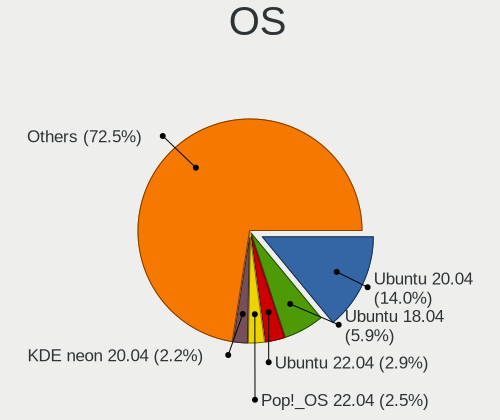

| Name              | Notebooks | Percent |
|-------------------|-----------|---------|
| Ubuntu 20.04      | 191       | 14.61%  |
| Ubuntu 18.04      | 82        | 6.27%   |
| Ubuntu 22.04      | 32        | 2.45%   |
| KDE neon 20.04    | 30        | 2.3%    |
| Pop!_OS 22.04     | 29        | 2.22%   |
| Fedora 36         | 29        | 2.22%   |
| Pop!_OS 21.04     | 27        | 2.07%   |
| Linux Mint 20.2   | 27        | 2.07%   |
| Debian 11         | 26        | 1.99%   |
| Zorin 16          | 24        | 1.84%   |
| Pop!_OS 20.04     | 24        | 1.84%   |
| OpenMandriva 4.3  | 24        | 1.84%   |
| Linux Mint 20.3   | 24        | 1.84%   |
| Arch              | 24        | 1.84%   |
| Linux Mint 20     | 22        | 1.68%   |
| Ubuntu 20.10      | 21        | 1.61%   |
| OpenMandriva 4.2  | 20        | 1.53%   |
| Pop!_OS 20.10     | 19        | 1.45%   |
| Linux Mint 20.1   | 19        | 1.45%   |
| Ubuntu 21.10      | 18        | 1.38%   |
| Ubuntu 19.04      | 18        | 1.38%   |
| Manjaro           | 18        | 1.38%   |
| Ubuntu 19.10      | 17        | 1.3%    |
| Arch Rolling      | 17        | 1.3%    |
| Fedora 33         | 16        | 1.22%   |
| Zorin 15          | 15        | 1.15%   |
| Ubuntu 21.04      | 14        | 1.07%   |
| Fedora 35         | 14        | 1.07%   |
| Fedora 37         | 13        | 0.99%   |
| ArcoLinux Rolling | 13        | 0.99%   |
| Xubuntu 18.04     | 12        | 0.92%   |
| Linux Mint 21     | 12        | 0.92%   |
| Fedora 32         | 12        | 0.92%   |
| Xubuntu 20.04     | 10        | 0.77%   |
| Linux Mint 19.3   | 9         | 0.69%   |
| Kubuntu 20.04     | 9         | 0.69%   |
| Fedora 34         | 9         | 0.69%   |
| Elementary 6.1    | 9         | 0.69%   |
| Ubuntu 22.10      | 8         | 0.61%   |
| Ubuntu 18.10      | 8         | 0.61%   |

OS Family
---------

OS without a version

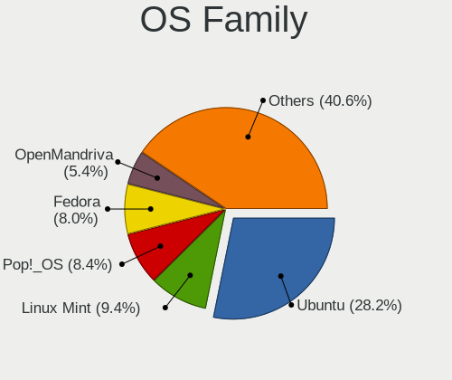

| Name          | Notebooks | Percent |
|---------------|-----------|---------|
| Ubuntu        | 389       | 31.78%  |
| Linux Mint    | 117       | 9.56%   |
| Pop!_OS       | 101       | 8.25%   |
| Fedora        | 88        | 7.19%   |
| OpenMandriva  | 55        | 4.49%   |
| Zorin         | 46        | 3.76%   |
| Debian        | 43        | 3.51%   |
| Manjaro       | 42        | 3.43%   |
| Arch          | 41        | 3.35%   |
| KDE neon      | 34        | 2.78%   |
| Xubuntu       | 32        | 2.61%   |
| Kubuntu       | 24        | 1.96%   |
| Elementary    | 21        | 1.72%   |
| Kali          | 17        | 1.39%   |
| Gentoo        | 15        | 1.23%   |
| ArcoLinux     | 13        | 1.06%   |
| Endless       | 11        | 0.9%    |
| Clear Linux   | 11        | 0.9%    |
| Ubuntu Unity  | 10        | 0.82%   |
| ROSA          | 10        | 0.82%   |
| Lubuntu       | 10        | 0.82%   |
| openSUSE      | 9         | 0.74%   |
| Ubuntu MATE   | 7         | 0.57%   |
| LMDE          | 7         | 0.57%   |
| LinuxFX       | 6         | 0.49%   |
| EndeavourOS   | 6         | 0.49%   |
| Parrot        | 5         | 0.41%   |
| MX            | 5         | 0.41%   |
| Reborn OS     | 4         | 0.33%   |
| BlackPanther  | 4         | 0.33%   |
| Ubuntu Budgie | 3         | 0.25%   |
| Solus         | 3         | 0.25%   |
| Xero          | 2         | 0.16%   |
| RHEL          | 2         | 0.16%   |
| PureOS        | 2         | 0.16%   |
| Oracle Linux  | 2         | 0.16%   |
| Linux Lite    | 2         | 0.16%   |
| CentOS        | 2         | 0.16%   |
| Calculate     | 2         | 0.16%   |
| antiX         | 2         | 0.16%   |

Kernel
------

Version of the Linux kernel

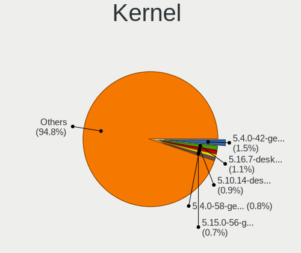

| Version                  | Notebooks | Percent |
|--------------------------|-----------|---------|
| 5.4.0-42-generic         | 33        | 2.27%   |
| 5.16.7-desktop-1omv4003  | 23        | 1.58%   |
| 5.10.14-desktop-1omv4002 | 20        | 1.37%   |
| 5.4.0-58-generic         | 18        | 1.24%   |
| 5.4.0-26-generic         | 15        | 1.03%   |
| 5.4.0-40-generic         | 14        | 0.96%   |
| 5.11.0-7620-generic      | 14        | 0.96%   |
| 5.4.0-29-generic         | 13        | 0.89%   |
| 5.4.0-48-generic         | 12        | 0.82%   |
| 5.11.0-38-generic        | 12        | 0.82%   |
| 5.17.5-76051705-generic  | 11        | 0.76%   |
| 5.11.0-37-generic        | 11        | 0.76%   |
| 5.11.0-27-generic        | 11        | 0.76%   |
| 5.4.0-52-generic         | 10        | 0.69%   |
| 5.8.0-63-generic         | 9         | 0.62%   |
| 5.4.0-81-generic         | 9         | 0.62%   |
| 5.4.0-74-generic         | 9         | 0.62%   |
| 5.3.0-40-generic         | 9         | 0.62%   |
| 5.8.0-7630-generic       | 8         | 0.55%   |
| 5.8.0-59-generic         | 8         | 0.55%   |
| 5.4.0-7634-generic       | 8         | 0.55%   |
| 5.4.0-65-generic         | 8         | 0.55%   |
| 5.4.0-54-generic         | 8         | 0.55%   |
| 5.3.0-28-generic         | 8         | 0.55%   |
| 5.13.0-7620-generic      | 8         | 0.55%   |
| 5.13.0-40-generic        | 8         | 0.55%   |
| 5.11.0-40-generic        | 8         | 0.55%   |
| 5.0.0-13-generic         | 8         | 0.55%   |
| 5.8.0-7642-generic       | 7         | 0.48%   |
| 5.8.0-53-generic         | 7         | 0.48%   |
| 5.8.0-50-generic         | 7         | 0.48%   |
| 5.4.0-91-generic         | 7         | 0.48%   |
| 5.4.0-7642-generic       | 7         | 0.48%   |
| 5.4.0-47-generic         | 7         | 0.48%   |
| 5.4.0-31-generic         | 7         | 0.48%   |
| 5.3.0-46-generic         | 7         | 0.48%   |
| 5.15.0-56-generic        | 7         | 0.48%   |
| 5.15.0-52-generic        | 7         | 0.48%   |
| 5.15.0-48-generic        | 7         | 0.48%   |
| 5.15.0-46-generic        | 7         | 0.48%   |

Kernel Family
-------------

Linux kernel without a distro release

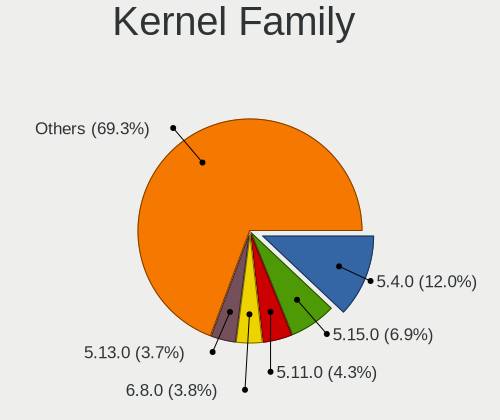

| Version | Notebooks | Percent |
|---------|-----------|---------|
| 5.4.0   | 261       | 19.39%  |
| 5.11.0  | 101       | 7.5%    |
| 5.8.0   | 84        | 6.24%   |
| 5.13.0  | 78        | 5.79%   |
| 5.15.0  | 71        | 5.27%   |
| 4.15.0  | 68        | 5.05%   |
| 5.3.0   | 52        | 3.86%   |
| 5.0.0   | 41        | 3.05%   |
| 5.10.0  | 35        | 2.6%    |
| 4.18.0  | 30        | 2.23%   |
| 5.16.7  | 24        | 1.78%   |
| 5.10.14 | 20        | 1.49%   |
| 5.19.0  | 17        | 1.26%   |
| 5.17.5  | 17        | 1.26%   |
| 4.19.0  | 11        | 0.82%   |
| 5.18.0  | 9         | 0.67%   |
| 6.0.0   | 8         | 0.59%   |
| 5.18.10 | 8         | 0.59%   |
| 6.0.9   | 6         | 0.45%   |
| 6.0.7   | 6         | 0.45%   |
| 5.18.12 | 6         | 0.45%   |
| 5.17.15 | 6         | 0.45%   |
| 5.14.0  | 6         | 0.45%   |
| 5.8.16  | 5         | 0.37%   |
| 5.16.11 | 5         | 0.37%   |
| 5.16.0  | 5         | 0.37%   |
| 5.12.4  | 5         | 0.37%   |
| 4.9.60  | 5         | 0.37%   |
| 6.0.6   | 4         | 0.3%    |
| 5.9.16  | 4         | 0.3%    |
| 5.18.7  | 4         | 0.3%    |
| 5.16.2  | 4         | 0.3%    |
| 5.16.19 | 4         | 0.3%    |
| 5.15.72 | 4         | 0.3%    |
| 5.15.11 | 4         | 0.3%    |
| 5.13.12 | 4         | 0.3%    |
| 4.4.0   | 4         | 0.3%    |
| 6.1.1   | 3         | 0.22%   |
| 6.0.8   | 3         | 0.22%   |
| 5.9.10  | 3         | 0.22%   |

Kernel Major Ver.
-----------------

Linux kernel major version

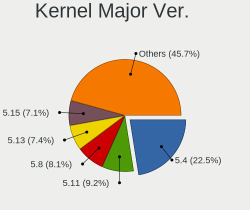

| Version | Notebooks | Percent |
|---------|-----------|---------|
| 5.4     | 284       | 21.53%  |
| 5.11    | 115       | 8.72%   |
| 5.15    | 107       | 8.11%   |
| 5.8     | 101       | 7.66%   |
| 5.13    | 92        | 6.97%   |
| 5.10    | 79        | 5.99%   |
| 4.15    | 68        | 5.16%   |
| 5.16    | 57        | 4.32%   |
| 5.3     | 56        | 4.25%   |
| 5.0     | 45        | 3.41%   |
| 5.17    | 38        | 2.88%   |
| 5.18    | 36        | 2.73%   |
| 6.0     | 34        | 2.58%   |
| 4.18    | 34        | 2.58%   |
| 5.19    | 32        | 2.43%   |
| 5.6     | 18        | 1.36%   |
| 5.9     | 17        | 1.29%   |
| 5.14    | 15        | 1.14%   |
| 5.12    | 15        | 1.14%   |
| 4.19    | 14        | 1.06%   |
| 5.5     | 12        | 0.91%   |
| 5.7     | 11        | 0.83%   |
| 4.9     | 11        | 0.83%   |
| 5.2     | 5         | 0.38%   |
| 6.1     | 4         | 0.3%    |
| 4.4     | 4         | 0.3%    |
| 4.1     | 3         | 0.23%   |
| 5.1     | 2         | 0.15%   |
| 4.20    | 2         | 0.15%   |
| 3.16    | 2         | 0.15%   |
| 3.10    | 2         | 0.15%   |
| 4.8     | 1         | 0.08%   |
| 4.14    | 1         | 0.08%   |
| 4.13    | 1         | 0.08%   |
| 4.11    | 1         | 0.08%   |

Arch
----

OS architecture (x86_64, i586, etc.)

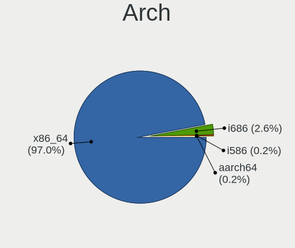

| Name    | Notebooks | Percent |
|---------|-----------|---------|
| x86_64  | 1119      | 97.14%  |
| i686    | 29        | 2.52%   |
| i586    | 2         | 0.17%   |
| aarch64 | 2         | 0.17%   |

DE
--

Desktop Environment

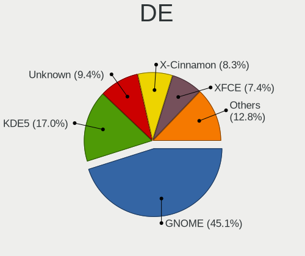

| Name            | Notebooks | Percent |
|-----------------|-----------|---------|
| GNOME           | 559       | 45.26%  |
| KDE5            | 170       | 13.77%  |
| Unknown         | 146       | 11.82%  |
| X-Cinnamon      | 101       | 8.18%   |
| XFCE            | 89        | 7.21%   |
| KDE             | 32        | 2.59%   |
| MATE            | 27        | 2.19%   |
| Cinnamon        | 21        | 1.7%    |
| Pantheon        | 19        | 1.54%   |
| Unity           | 12        | 0.97%   |
| i3              | 11        | 0.89%   |
| LXQt            | 8         | 0.65%   |
| LXDE            | 8         | 0.65%   |
| KDE4            | 8         | 0.65%   |
| Deepin          | 6         | 0.49%   |
| Budgie          | 6         | 0.49%   |
| awesome         | 3         | 0.24%   |
| Openbox         | 2         | 0.16%   |
| GNOME Flashback | 2         | 0.16%   |
| sway            | 1         | 0.08%   |
| qtile           | 1         | 0.08%   |
| LeftWM          | 1         | 0.08%   |
| icewm           | 1         | 0.08%   |
| dusk            | 1         | 0.08%   |

Display Server
--------------

X11 or Wayland

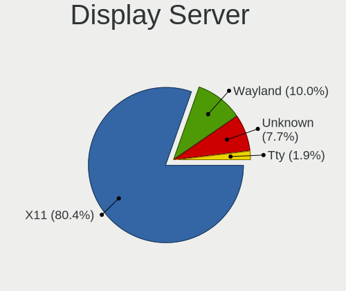

| Name    | Notebooks | Percent |
|---------|-----------|---------|
| X11     | 934       | 78.03%  |
| Wayland | 157       | 13.12%  |
| Unknown | 80        | 6.68%   |
| Tty     | 26        | 2.17%   |

Display Manager
---------------

SDDM, LightDM, etc.

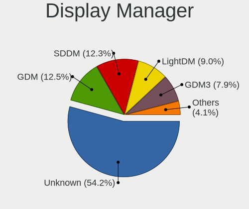

| Name    | Notebooks | Percent |
|---------|-----------|---------|
| Unknown | 675       | 55.92%  |
| GDM     | 149       | 12.34%  |
| SDDM    | 137       | 11.35%  |
| LightDM | 107       | 8.86%   |
| GDM3    | 86        | 7.13%   |
| TDM     | 39        | 3.23%   |
| KDM     | 8         | 0.66%   |
| SLiM    | 2         | 0.17%   |
| LXDM    | 2         | 0.17%   |
| XDM     | 1         | 0.08%   |
| GREETD  | 1         | 0.08%   |

OS Lang
-------

Language

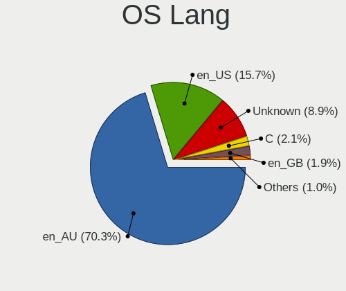

| Lang         | Notebooks | Percent |
|--------------|-----------|---------|
| en_AU        | 854       | 71.23%  |
| en_US        | 161       | 13.43%  |
| Unknown      | 131       | 10.93%  |
| C            | 27        | 2.25%   |
| en_GB        | 14        | 1.17%   |
| C.UTF8       | 4         | 0.33%   |
| zh_CN        | 1         | 0.08%   |
| ru_RU        | 1         | 0.08%   |
| fr_FR        | 1         | 0.08%   |
| es_ES        | 1         | 0.08%   |
| en_IN        | 1         | 0.08%   |
| en_GB.UTF-12 | 1         | 0.08%   |
| en_CA        | 1         | 0.08%   |
| de_DE        | 1         | 0.08%   |

Boot Mode
---------

EFI or BIOS

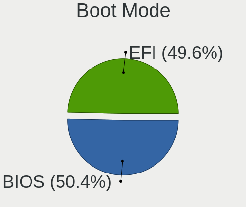

| Mode | Notebooks | Percent |
|------|-----------|---------|
| EFI  | 603       | 50.97%  |
| BIOS | 580       | 49.03%  |

Filesystem
----------

Type of filesystem

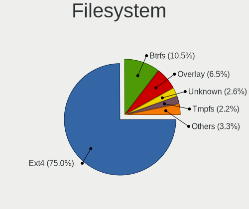

| Type    | Notebooks | Percent |
|---------|-----------|---------|
| Ext4    | 930       | 78.09%  |
| Btrfs   | 99        | 8.31%   |
| Overlay | 78        | 6.55%   |
| Unknown | 39        | 3.27%   |
| Xfs     | 17        | 1.43%   |
| Zfs     | 13        | 1.09%   |
| Tmpfs   | 4         | 0.34%   |
| Ext2    | 4         | 0.34%   |
| XXXXXXX | 3         | 0.25%   |
| Ext3    | 3         | 0.25%   |
| F2fs    | 1         | 0.08%   |

Part. scheme
------------

Scheme of partitioning

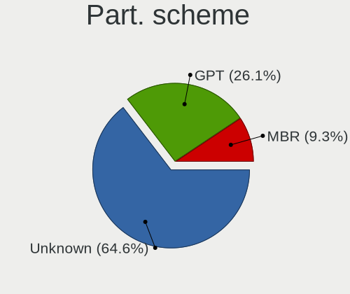

| Type    | Notebooks | Percent |
|---------|-----------|---------|
| Unknown | 719       | 61.19%  |
| GPT     | 351       | 29.87%  |
| MBR     | 105       | 8.94%   |

Dual Boot with Linux/BSD
------------------------

Hosting more than one Linux/BSD

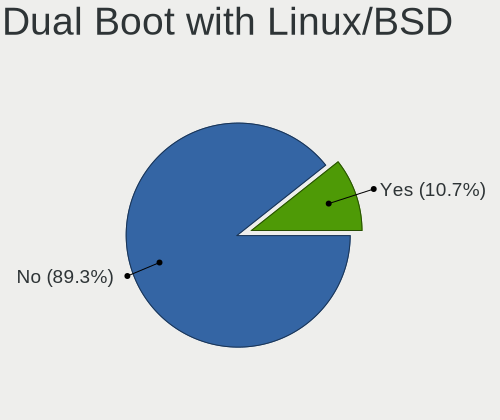

| Dual boot | Notebooks | Percent |
|-----------|-----------|---------|
| No        | 1040      | 88.74%  |
| Yes       | 132       | 11.26%  |

Dual Boot (Win)
---------------

Hosting Linux and Windows

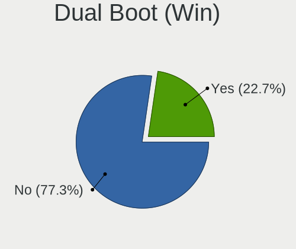

| Dual boot | Notebooks | Percent |
|-----------|-----------|---------|
| No        | 904       | 76.87%  |
| Yes       | 272       | 23.13%  |

Board
-----

Vendor
------

Motherboard manufacturer

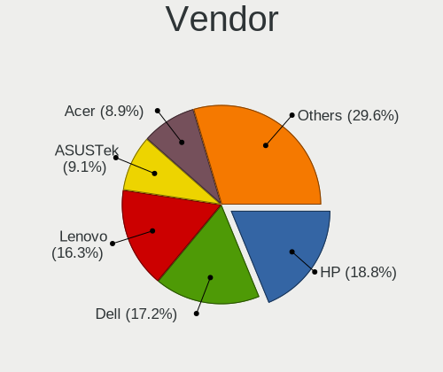

| Name                           | Notebooks | Percent |
|--------------------------------|-----------|---------|
| Hewlett-Packard                | 206       | 17.91%  |
| Dell                           | 198       | 17.22%  |
| Lenovo                         | 189       | 16.43%  |
| ASUSTek Computer               | 111       | 9.65%   |
| Acer                           | 104       | 9.04%   |
| Toshiba                        | 89        | 7.74%   |
| Apple                          | 76        | 6.61%   |
| MSI                            | 27        | 2.35%   |
| Alienware                      | 14        | 1.22%   |
| Samsung Electronics            | 12        | 1.04%   |
| Sony                           | 10        | 0.87%   |
| Notebook                       | 10        | 0.87%   |
| Gigabyte Technology            | 9         | 0.78%   |
| Timi                           | 8         | 0.7%    |
| IT Channel Pty                 | 7         | 0.61%   |
| HUAWEI                         | 7         | 0.61%   |
| Razer                          | 6         | 0.52%   |
| Panasonic                      | 6         | 0.52%   |
| Metabox                        | 6         | 0.52%   |
| Unknown                        | 6         | 0.52%   |
| System76                       | 4         | 0.35%   |
| AMI                            | 4         | 0.35%   |
| Medion                         | 3         | 0.26%   |
| LG Electronics                 | 3         | 0.26%   |
| Intel Client Systems           | 3         | 0.26%   |
| Google                         | 3         | 0.26%   |
| Framework                      | 3         | 0.26%   |
| Purism                         | 2         | 0.17%   |
| Pine Microsystems              | 2         | 0.17%   |
| Kogan                          | 2         | 0.17%   |
| IBM                            | 2         | 0.17%   |
| Star Labs                      | 1         | 0.09%   |
| Pendo Industries               | 1         | 0.09%   |
| ONE-NETBOOK TECHNOLOGY         | 1         | 0.09%   |
| One Education                  | 1         | 0.09%   |
| OEM                            | 1         | 0.09%   |
| Matsushita Electric Industrial | 1         | 0.09%   |
| LEADER                         | 1         | 0.09%   |
| Intel                          | 1         | 0.09%   |
| Insyde                         | 1         | 0.09%   |

Model
-----

Motherboard model

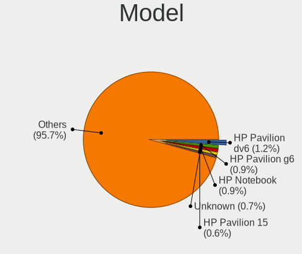

| Name                                               | Notebooks | Percent |
|----------------------------------------------------|-----------|---------|
| HP Pavilion dv6                                    | 14        | 1.22%   |
| HP Pavilion g6                                     | 11        | 0.96%   |
| HP Notebook                                        | 9         | 0.78%   |
| Unknown                                            | 9         | 0.78%   |
| HP Pavilion 15                                     | 8         | 0.7%    |
| Apple MacBookPro9,2                                | 7         | 0.61%   |
| Apple MacBookPro8,1                                | 6         | 0.52%   |
| Apple MacBookPro10,1                               | 6         | 0.52%   |
| Acer ConceptD CN315-71P                            | 6         | 0.52%   |
| Dell XPS 15 9570                                   | 5         | 0.43%   |
| Dell XPS 15 9560                                   | 5         | 0.43%   |
| Apple MacBookAir7,2                                | 5         | 0.43%   |
| Acer Aspire 5750G                                  | 5         | 0.43%   |
| Toshiba Satellite P750                             | 4         | 0.35%   |
| Toshiba Satellite L850                             | 4         | 0.35%   |
| Toshiba Satellite L500                             | 4         | 0.35%   |
| Toshiba Satellite L50-A                            | 4         | 0.35%   |
| Lenovo ThinkPad T470s W10DG 20JTS0HT00             | 4         | 0.35%   |
| Lenovo IdeaPad 1 14IGL05 81VU                      | 4         | 0.35%   |
| Lenovo G50-45 80E3                                 | 4         | 0.35%   |
| Dell XPS 15 9500                                   | 4         | 0.35%   |
| Dell XPS 13 9370                                   | 4         | 0.35%   |
| Dell XPS 13 9360                                   | 4         | 0.35%   |
| Dell XPS 13 7390                                   | 4         | 0.35%   |
| Dell Precision 5530                                | 4         | 0.35%   |
| Dell Latitude E7450                                | 4         | 0.35%   |
| Dell Latitude E7440                                | 4         | 0.35%   |
| Dell Latitude E6430                                | 4         | 0.35%   |
| Dell Inspiron 1545                                 | 4         | 0.35%   |
| Apple MacBookAir6,2                                | 4         | 0.35%   |
| Toshiba Satellite P850                             | 3         | 0.26%   |
| Toshiba Satellite L750                             | 3         | 0.26%   |
| Toshiba Satellite L50-B                            | 3         | 0.26%   |
| Toshiba Satellite C660                             | 3         | 0.26%   |
| Toshiba Satellite C50D-A                           | 3         | 0.26%   |
| Razer Blade 15 Base Model (Early 2020) - RZ09-0328 | 3         | 0.26%   |
| Lenovo Yoga 3 Pro-1370 80HE                        | 3         | 0.26%   |
| HP ProBook 430 G2                                  | 3         | 0.26%   |
| HP Presario CQ62                                   | 3         | 0.26%   |
| HP Pavilion Notebook                               | 3         | 0.26%   |

Model Family
------------

Motherboard model prefix

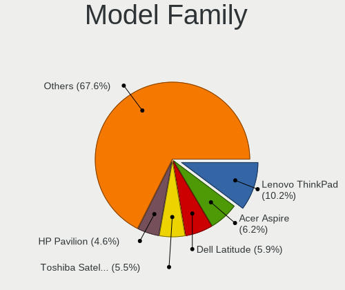

| Name               | Notebooks | Percent |
|--------------------|-----------|---------|
| Lenovo ThinkPad    | 123       | 10.7%   |
| Acer Aspire        | 74        | 6.43%   |
| Toshiba Satellite  | 73        | 6.35%   |
| Dell Latitude      | 66        | 5.74%   |
| HP Pavilion        | 59        | 5.13%   |
| Dell Inspiron      | 48        | 4.17%   |
| Dell XPS           | 46        | 4%      |
| HP EliteBook       | 39        | 3.39%   |
| Lenovo IdeaPad     | 30        | 2.61%   |
| HP ProBook         | 25        | 2.17%   |
| HP Laptop          | 18        | 1.57%   |
| Dell Precision     | 18        | 1.57%   |
| HP ENVY            | 12        | 1.04%   |
| Lenovo Yoga        | 10        | 0.87%   |
| ASUS ZenBook       | 10        | 0.87%   |
| HP Notebook        | 9         | 0.78%   |
| ASUS VivoBook      | 9         | 0.78%   |
| Apple MacBookPro10 | 9         | 0.78%   |
| Acer Swift         | 9         | 0.78%   |
| Unknown            | 9         | 0.78%   |
| Toshiba PORTEGE    | 8         | 0.7%    |
| HP 250             | 8         | 0.7%    |
| ASUS ROG           | 8         | 0.7%    |
| Apple MacBookPro9  | 8         | 0.7%    |
| Apple MacBookAir6  | 7         | 0.61%   |
| Toshiba TECRA      | 6         | 0.52%   |
| Razer Blade        | 6         | 0.52%   |
| Lenovo Legion      | 6         | 0.52%   |
| HP ZBook           | 6         | 0.52%   |
| ASUS TUF           | 6         | 0.52%   |
| Apple MacBookPro8  | 6         | 0.52%   |
| Acer Nitro         | 6         | 0.52%   |
| Acer ConceptD      | 6         | 0.52%   |
| HP Presario        | 5         | 0.43%   |
| HP Compaq          | 5         | 0.43%   |
| Dell G3            | 5         | 0.43%   |
| Apple MacBookPro6  | 5         | 0.43%   |
| Apple MacBookPro11 | 5         | 0.43%   |
| Apple MacBookAir7  | 5         | 0.43%   |
| Lenovo G50-45      | 4         | 0.35%   |

MFG Year
--------

Motherboard manufacture year

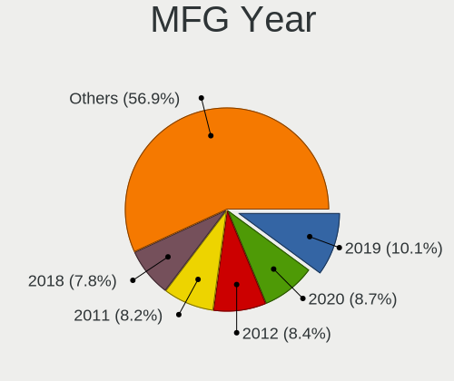

| Year    | Notebooks | Percent |
|---------|-----------|---------|
| 2019    | 111       | 9.65%   |
| 2020    | 99        | 8.61%   |
| 2011    | 96        | 8.35%   |
| 2018    | 91        | 7.91%   |
| 2013    | 91        | 7.91%   |
| 2012    | 88        | 7.65%   |
| 2014    | 81        | 7.04%   |
| 2021    | 73        | 6.35%   |
| 2015    | 73        | 6.35%   |
| 2017    | 71        | 6.17%   |
| 2010    | 70        | 6.09%   |
| 2016    | 67        | 5.83%   |
| 2008    | 45        | 3.91%   |
| 2009    | 38        | 3.3%    |
| 2022    | 22        | 1.91%   |
| 2007    | 18        | 1.57%   |
| 2006    | 5         | 0.43%   |
| 2005    | 5         | 0.43%   |
| Unknown | 5         | 0.43%   |
| 2003    | 1         | 0.09%   |

Form Factor
-----------

Physical design of the computer

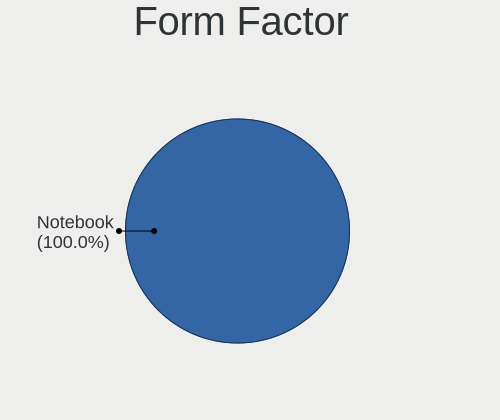

| Name     | Notebooks | Percent |
|----------|-----------|---------|
| Notebook | 1150      | 100%    |

Secure Boot
-----------

Enabled or disabled

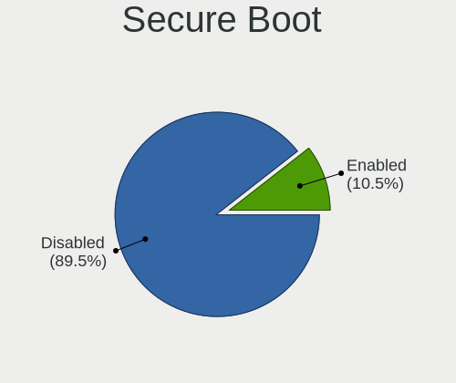

| State    | Notebooks | Percent |
|----------|-----------|---------|
| Disabled | 1024      | 88.2%   |
| Enabled  | 137       | 11.8%   |

Coreboot
--------

Have coreboot on board

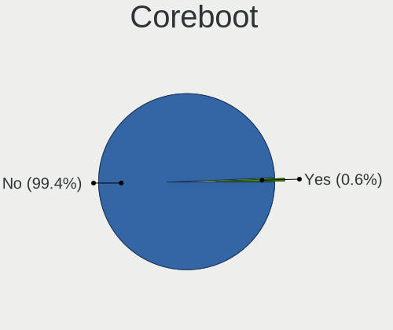

| Used | Notebooks | Percent |
|------|-----------|---------|
| No   | 1142      | 99.3%   |
| Yes  | 8         | 0.7%    |

RAM Size
--------

Total RAM memory

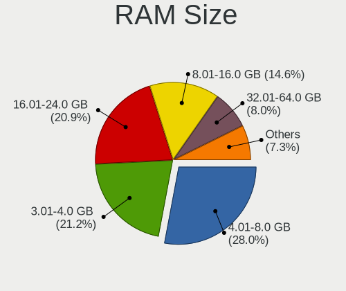

| Size in GB  | Notebooks | Percent |
|-------------|-----------|---------|
| 4.01-8.0    | 326       | 27.96%  |
| 3.01-4.0    | 248       | 21.27%  |
| 16.01-24.0  | 247       | 21.18%  |
| 8.01-16.0   | 168       | 14.41%  |
| 32.01-64.0  | 94        | 8.06%   |
| 1.01-2.0    | 47        | 4.03%   |
| 64.01-256.0 | 11        | 0.94%   |
| 24.01-32.0  | 9         | 0.77%   |
| 2.01-3.0    | 9         | 0.77%   |
| 0.51-1.0    | 4         | 0.34%   |
| 0.01-0.5    | 3         | 0.26%   |

RAM Used
--------

Used RAM memory

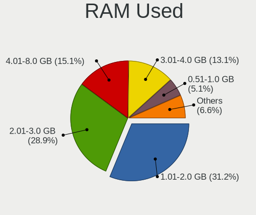

| Used GB    | Notebooks | Percent |
|------------|-----------|---------|
| 1.01-2.0   | 467       | 35.27%  |
| 2.01-3.0   | 377       | 28.47%  |
| 4.01-8.0   | 161       | 12.16%  |
| 3.01-4.0   | 152       | 11.48%  |
| 0.51-1.0   | 86        | 6.5%    |
| 8.01-16.0  | 58        | 4.38%   |
| 0.01-0.5   | 15        | 1.13%   |
| 16.01-24.0 | 4         | 0.3%    |
| 24.01-32.0 | 2         | 0.15%   |
| 0          | 2         | 0.15%   |

Total Drives
------------

Number of drives on board

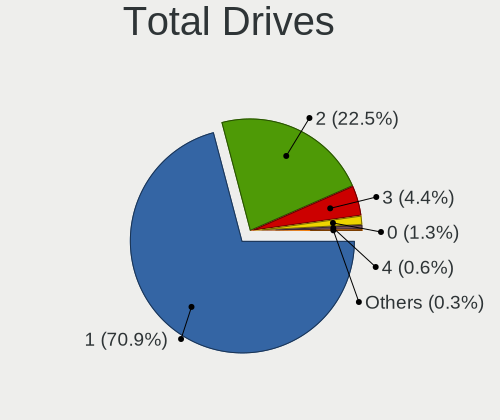

| Drives | Notebooks | Percent |
|--------|-----------|---------|
| 1      | 848       | 70.78%  |
| 2      | 272       | 22.7%   |
| 3      | 52        | 4.34%   |
| 0      | 15        | 1.25%   |
| 4      | 8         | 0.67%   |
| 5      | 2         | 0.17%   |
| 7      | 1         | 0.08%   |

Has CD-ROM
----------

Has CD-ROM on board

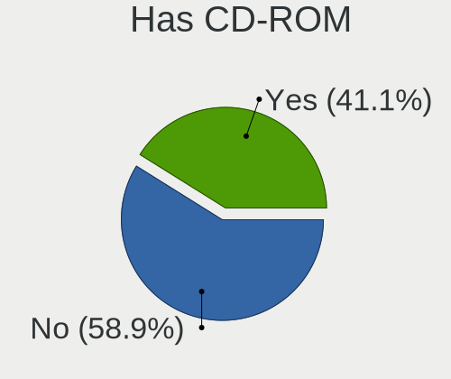

| Presented | Notebooks | Percent |
|-----------|-----------|---------|
| No        | 716       | 61.78%  |
| Yes       | 443       | 38.22%  |

Has Ethernet
------------

Has Ethernet on board

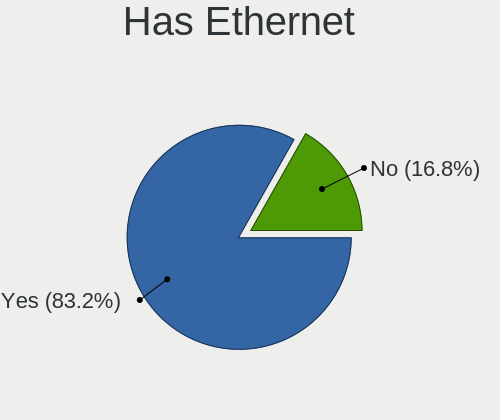

| Presented | Notebooks | Percent |
|-----------|-----------|---------|
| Yes       | 949       | 82.38%  |
| No        | 203       | 17.62%  |

Has WiFi
--------

Has WiFi module

| Presented | Notebooks | Percent |
|-----------|-----------|---------|
| Yes       | 1129      | 98%     |
| No        | 23        | 2%      |

Has Bluetooth
-------------

Has Bluetooth module

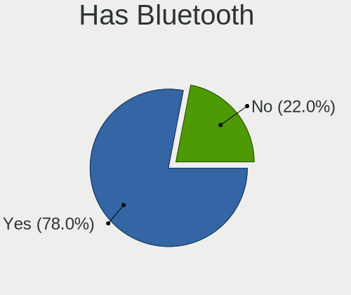

| Presented | Notebooks | Percent |
|-----------|-----------|---------|
| Yes       | 889       | 76.05%  |
| No        | 280       | 23.95%  |

Location
--------

Country
-------

Geographic location (country)

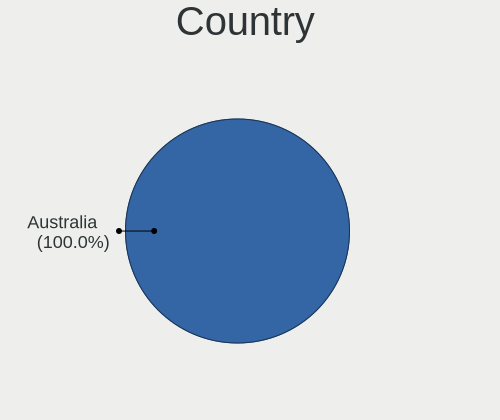

| Country   | Notebooks | Percent |
|-----------|-----------|---------|
| Australia | 1150      | 100%    |

City
----

Geographic location (city)

| City           | Notebooks | Percent |
|----------------|-----------|---------|
| Sydney         | 314       | 25.51%  |
| Melbourne      | 250       | 20.31%  |
| Brisbane       | 198       | 16.08%  |
| Perth          | 92        | 7.47%   |
| Adelaide       | 66        | 5.36%   |
| Canberra       | 21        | 1.71%   |
| Hobart         | 17        | 1.38%   |
| Southport      | 6         | 0.49%   |
| Launceston     | 6         | 0.49%   |
| Central Coast  | 6         | 0.49%   |
| Woolloongabba  | 5         | 0.41%   |
| Parramatta     | 5         | 0.41%   |
| Newcastle      | 5         | 0.41%   |
| Mitcham        | 5         | 0.41%   |
| Gold Coast     | 5         | 0.41%   |
| Wollongong     | 4         | 0.32%   |
| West End       | 4         | 0.32%   |
| Wahroonga      | 4         | 0.32%   |
| Traralgon      | 4         | 0.32%   |
| Point Cook     | 4         | 0.32%   |
| Mandurah       | 4         | 0.32%   |
| Geraldton      | 4         | 0.32%   |
| Artarmon       | 4         | 0.32%   |
| Alexandria     | 4         | 0.32%   |
| Townsville     | 3         | 0.24%   |
| Surry Hills    | 3         | 0.24%   |
| Spring Field   | 3         | 0.24%   |
| Richmond       | 3         | 0.24%   |
| Parkdale       | 3         | 0.24%   |
| Mount Waverley | 3         | 0.24%   |
| Hawthorn       | 3         | 0.24%   |
| Geelong        | 3         | 0.24%   |
| Doncaster      | 3         | 0.24%   |
| Clifton Hill   | 3         | 0.24%   |
| Brighton       | 3         | 0.24%   |
| Warragul       | 2         | 0.16%   |
| Sandy Bay      | 2         | 0.16%   |
| Ryde           | 2         | 0.16%   |
| Redfern        | 2         | 0.16%   |
| Quinns Rocks   | 2         | 0.16%   |

Drives
------

Drive Vendor
------------

Hard drive vendors

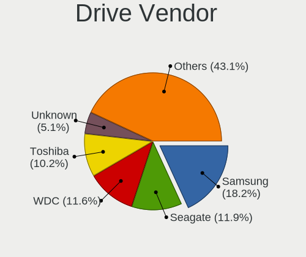

| Vendor                    | Notebooks | Drives | Percent |
|---------------------------|-----------|--------|---------|
| Samsung Electronics       | 254       | 320    | 17.75%  |
| WDC                       | 166       | 237    | 11.6%   |
| Seagate                   | 163       | 240    | 11.39%  |
| Toshiba                   | 134       | 197    | 9.36%   |
| Unknown                   | 66        | 89     | 4.61%   |
| SanDisk                   | 65        | 85     | 4.54%   |
| Intel                     | 63        | 93     | 4.4%    |
| Kingston                  | 57        | 72     | 3.98%   |
| SK hynix                  | 54        | 71     | 3.77%   |
| Hitachi                   | 52        | 64     | 3.63%   |
| Crucial                   | 51        | 67     | 3.56%   |
| Apple                     | 46        | 63     | 3.21%   |
| HGST                      | 41        | 59     | 2.87%   |
| Micron Technology         | 36        | 44     | 2.52%   |
| KIOXIA                    | 17        | 19     | 1.19%   |
| Phison                    | 13        | 16     | 0.91%   |
| Fujitsu                   | 12        | 16     | 0.84%   |
| LITEON                    | 11        | 14     | 0.77%   |
| A-DATA Technology         | 10        | 13     | 0.7%    |
| LITEONIT                  | 8         | 10     | 0.56%   |
| OCZ                       | 6         | 8      | 0.42%   |
| JMicron Technology        | 6         | 8      | 0.42%   |
| SPCC                      | 5         | 7      | 0.35%   |
| Micron/Crucial Technology | 5         | 5      | 0.35%   |
| Transcend                 | 4         | 6      | 0.28%   |
| Phison Electronics        | 4         | 5      | 0.28%   |
| Patriot                   | 4         | 5      | 0.28%   |
| KingSpec                  | 4         | 7      | 0.28%   |
| China                     | 4         | 4      | 0.28%   |
| XPG                       | 3         | 3      | 0.21%   |
| OWC                       | 3         | 6      | 0.21%   |
| Lite-On                   | 3         | 3      | 0.21%   |
| LaCie                     | 3         | 7      | 0.21%   |
| ASMT                      | 3         | 4      | 0.21%   |
| TO Exter                  | 2         | 2      | 0.14%   |
| Realtek Semiconductor     | 2         | 3      | 0.14%   |
| Plextor                   | 2         | 6      | 0.14%   |
| Lenovo                    | 2         | 3      | 0.14%   |
| KingFast                  | 2         | 2      | 0.14%   |
| KESU                      | 2         | 2      | 0.14%   |

Drive Model
-----------

Hard drive models

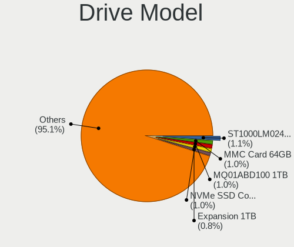

| Model                                  | Notebooks | Percent |
|----------------------------------------|-----------|---------|
| Toshiba MQ01ABD100 1TB                 | 17        | 1.14%   |
| Seagate ST1000LM024 HN-M101MBB 1TB     | 17        | 1.14%   |
| Unknown MMC Card  64GB                 | 16        | 1.07%   |
| SanDisk NVMe SSD Drive 512GB           | 14        | 0.94%   |
| Seagate ST500LT012-1DG142 500GB        | 13        | 0.87%   |
| Seagate Expansion 4TB                  | 13        | 0.87%   |
| Samsung NVMe SSD Drive 512GB           | 13        | 0.87%   |
| Toshiba MQ01ABF050 500GB               | 12        | 0.8%    |
| Seagate ST1000LM035-1RK172 1TB         | 12        | 0.8%    |
| Samsung SSD 860 EVO 500GB              | 11        | 0.74%   |
| Unknown MMC Card  32GB                 | 10        | 0.67%   |
| Samsung SM963 2.5" NVMe PCIe SSD 256GB | 10        | 0.67%   |
| HGST HTS721010A9E630 1TB               | 10        | 0.67%   |
| SK hynix NVMe SSD Drive 256GB          | 9         | 0.6%    |
| Samsung SSD 850 EVO 250GB              | 9         | 0.6%    |
| Kingston SA400S37240G 240GB SSD        | 9         | 0.6%    |
| Crucial CT1000MX500SSD1 1TB            | 9         | 0.6%    |
| Unknown MMC Card  128GB                | 8         | 0.54%   |
| Toshiba NVMe SSD Drive 512GB           | 8         | 0.54%   |
| Toshiba MQ01ABD075 752GB               | 8         | 0.54%   |
| Seagate ST9500325AS 500GB              | 8         | 0.54%   |
| SanDisk NVMe SSD Drive 256GB           | 8         | 0.54%   |
| Intel NVMe SSD Drive 512GB             | 8         | 0.54%   |
| HGST HTS545050A7E680 500GB             | 8         | 0.54%   |
| Crucial CT500MX500SSD1 500GB           | 8         | 0.54%   |
| WDC WD10JPVX-22JC3T0 1TB               | 7         | 0.47%   |
| Toshiba MQ04ABF100 1TB                 | 7         | 0.47%   |
| Seagate ST2000LM007-1R8174 2TB         | 7         | 0.47%   |
| Samsung NVMe SSD Drive 500GB           | 7         | 0.47%   |
| Micron NVMe SSD Drive 512GB            | 7         | 0.47%   |
| Kingston SA400S37120G 120GB SSD        | 7         | 0.47%   |
| Hitachi HTS547575A9E384 752GB          | 7         | 0.47%   |
| Hitachi HTS545050B9A300 500GB          | 7         | 0.47%   |
| HGST HTS725050A7E630 500GB             | 7         | 0.47%   |
| HGST HTS541010A9E680 1TB               | 7         | 0.47%   |
| WDC WDS240G2G0A-00JH30 240GB SSD       | 6         | 0.4%    |
| WDC WD5000LPVX-22V0TT0 500GB           | 6         | 0.4%    |
| Unknown MMC Card  16GB                 | 6         | 0.4%    |
| Seagate ST750LM022 HN-M750MBB 752GB    | 6         | 0.4%    |
| Seagate ST500LM021-1KJ152 500GB        | 6         | 0.4%    |

HDD Vendor
----------

Hard disk drive vendors

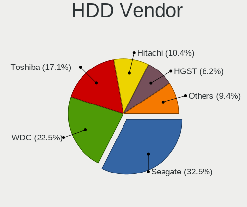

| Vendor              | Notebooks | Drives | Percent |
|---------------------|-----------|--------|---------|
| Seagate             | 158       | 233    | 31.98%  |
| WDC                 | 114       | 164    | 23.08%  |
| Toshiba             | 84        | 131    | 17%     |
| Hitachi             | 52        | 64     | 10.53%  |
| HGST                | 41        | 59     | 8.3%    |
| Samsung Electronics | 12        | 14     | 2.43%   |
| Fujitsu             | 12        | 16     | 2.43%   |
| Apple               | 5         | 6      | 1.01%   |
| Unknown             | 4         | 4      | 0.81%   |
| LaCie               | 3         | 6      | 0.61%   |
| KESU                | 2         | 2      | 0.4%    |
| HGST HUS            | 2         | 2      | 0.4%    |
| ASMT                | 2         | 3      | 0.4%    |
| USB                 | 1         | 2      | 0.2%    |
| IBM/Hitachi         | 1         | 1      | 0.2%    |
| AAPL                | 1         | 1      | 0.2%    |

SSD Vendor
----------

Solid state drive vendors

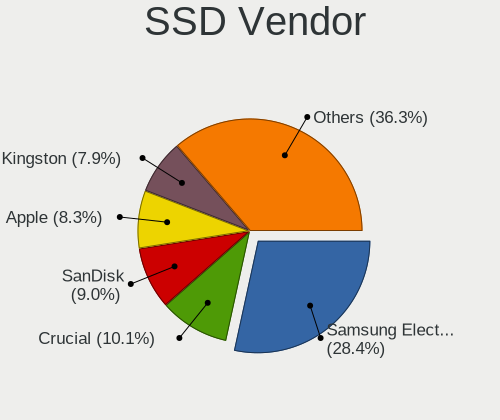

| Vendor              | Notebooks | Drives | Percent |
|---------------------|-----------|--------|---------|
| Samsung Electronics | 138       | 172    | 29.93%  |
| Crucial             | 46        | 62     | 9.98%   |
| Kingston            | 40        | 52     | 8.68%   |
| SanDisk             | 32        | 41     | 6.94%   |
| Apple               | 30        | 34     | 6.51%   |
| WDC                 | 23        | 28     | 4.99%   |
| Intel               | 22        | 39     | 4.77%   |
| Toshiba             | 21        | 29     | 4.56%   |
| SK hynix            | 18        | 24     | 3.9%    |
| Micron Technology   | 12        | 12     | 2.6%    |
| LITEON              | 10        | 13     | 2.17%   |
| LITEONIT            | 8         | 10     | 1.74%   |
| OCZ                 | 6         | 8      | 1.3%    |
| A-DATA Technology   | 6         | 8      | 1.3%    |
| SPCC                | 5         | 7      | 1.08%   |
| JMicron Technology  | 5         | 6      | 1.08%   |
| Transcend           | 4         | 6      | 0.87%   |
| Patriot             | 4         | 5      | 0.87%   |
| China               | 4         | 4      | 0.87%   |
| Seagate             | 3         | 4      | 0.65%   |
| OWC                 | 3         | 6      | 0.65%   |
| TO Exter            | 2         | 2      | 0.43%   |
| Plextor             | 2         | 6      | 0.43%   |
| KingSpec            | 2         | 4      | 0.43%   |
| FORESEE             | 2         | 2      | 0.43%   |
| T-CREATE            | 1         | 1      | 0.22%   |
| SAMSWEET            | 1         | 1      | 0.22%   |
| Mushkin             | 1         | 1      | 0.22%   |
| Kston               | 1         | 1      | 0.22%   |
| KingFast            | 1         | 1      | 0.22%   |
| KingDian            | 1         | 1      | 0.22%   |
| Gigabyte Technology | 1         | 1      | 0.22%   |
| Drevo               | 1         | 1      | 0.22%   |
| Corsair             | 1         | 1      | 0.22%   |
| Colorful            | 1         | 1      | 0.22%   |
| BP4e                | 1         | 2      | 0.22%   |
| BIWIN               | 1         | 1      | 0.22%   |
| addlink             | 1         | 1      | 0.22%   |

Drive Kind
----------

HDD or SSD

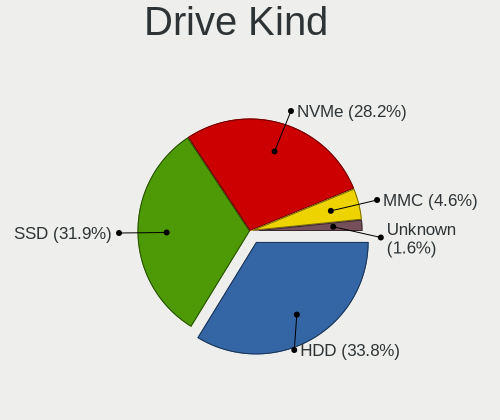

| Kind    | Notebooks | Drives | Percent |
|---------|-----------|--------|---------|
| HDD     | 465       | 708    | 34.44%  |
| SSD     | 431       | 598    | 31.93%  |
| NVMe    | 370       | 522    | 27.41%  |
| MMC     | 61        | 82     | 4.52%   |
| Unknown | 23        | 26     | 1.7%    |

Drive Connector
---------------

SATA, SAS, NVMe, etc.

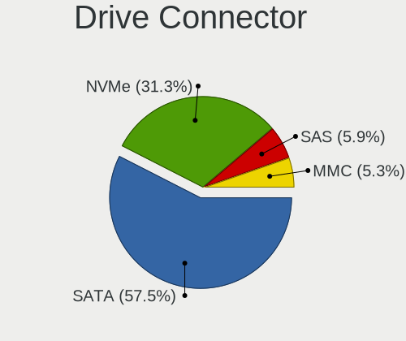

| Type | Notebooks | Drives | Percent |
|------|-----------|--------|---------|
| SATA | 795       | 1223   | 61.01%  |
| NVMe | 370       | 519    | 28.4%   |
| SAS  | 77        | 112    | 5.91%   |
| MMC  | 61        | 82     | 4.68%   |

Drive Size
----------

Size of hard drive

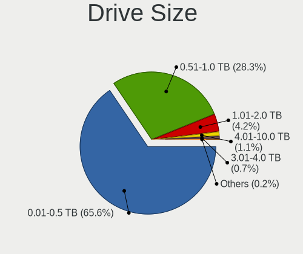

| Size in TB | Notebooks | Drives | Percent |
|------------|-----------|--------|---------|
| 0.01-0.5   | 579       | 835    | 64.26%  |
| 0.51-1.0   | 250       | 358    | 27.75%  |
| 1.01-2.0   | 43        | 67     | 4.77%   |
| 3.01-4.0   | 21        | 31     | 2.33%   |
| 4.01-10.0  | 8         | 15     | 0.89%   |

Space Total
-----------

Amount of disk space available on the file system

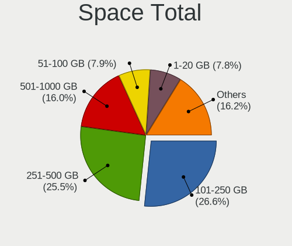

| Size in GB     | Notebooks | Percent |
|----------------|-----------|---------|
| 101-250        | 324       | 26.17%  |
| 251-500        | 304       | 24.56%  |
| 501-1000       | 201       | 16.24%  |
| 1-20           | 110       | 8.89%   |
| 51-100         | 91        | 7.35%   |
| 1001-2000      | 85        | 6.87%   |
| More than 3000 | 36        | 2.91%   |
| 21-50          | 33        | 2.67%   |
| Unknown        | 28        | 2.26%   |
| 2001-3000      | 26        | 2.1%    |

Space Used
----------

Amount of used disk space

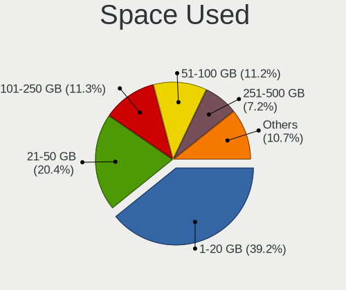

| Used GB        | Notebooks | Percent |
|----------------|-----------|---------|
| 1-20           | 549       | 41.91%  |
| 21-50          | 246       | 18.78%  |
| 51-100         | 146       | 11.15%  |
| 101-250        | 139       | 10.61%  |
| 251-500        | 98        | 7.48%   |
| 501-1000       | 57        | 4.35%   |
| Unknown        | 28        | 2.14%   |
| 1001-2000      | 26        | 1.98%   |
| More than 3000 | 11        | 0.84%   |
| 2001-3000      | 9         | 0.69%   |
| 0              | 1         | 0.08%   |

Malfunc. Drives
---------------

Drive models with a malfunction

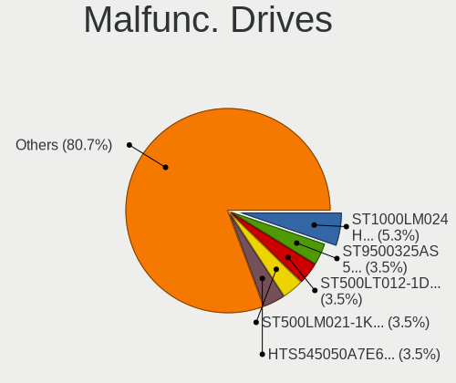

| Model                                   | Notebooks | Drives | Percent |
|-----------------------------------------|-----------|--------|---------|
| Seagate ST1000LM024 HN-M101MBB 1TB      | 3         | 4      | 5.08%   |
| Seagate ST9500325AS 500GB               | 2         | 2      | 3.39%   |
| Seagate ST500LT012-1DG142 500GB         | 2         | 2      | 3.39%   |
| Seagate ST500LM021-1KJ152 500GB         | 2         | 2      | 3.39%   |
| HGST HTS545050A7E680 500GB              | 2         | 3      | 3.39%   |
| WDC WD6400BEVT-22A0RT0 640GB            | 1         | 2      | 1.69%   |
| WDC WD5000LPVX-22V0TT0 500GB            | 1         | 2      | 1.69%   |
| WDC WD5000BEVT-60ZAT1 500GB             | 1         | 3      | 1.69%   |
| WDC WD3200BPVT-22ZEST0 320GB            | 1         | 1      | 1.69%   |
| WDC WD2500BEVT-35A23T0 250GB            | 1         | 1      | 1.69%   |
| WDC WD10SPZX-21Z10T0 1TB                | 1         | 2      | 1.69%   |
| WDC WD10JPVX-22JC3T0 1TB                | 1         | 2      | 1.69%   |
| Toshiba THNSNK128GCS8 SATA 128GB SSD    | 1         | 1      | 1.69%   |
| Toshiba MQ01ABF050 500GB                | 1         | 1      | 1.69%   |
| Toshiba MQ01ABD100 1TB                  | 1         | 1      | 1.69%   |
| Toshiba MK5055GSX 500GB                 | 1         | 4      | 1.69%   |
| Toshiba MK3265GSX 320GB                 | 1         | 1      | 1.69%   |
| Seagate ST9500423AS 500GB               | 1         | 2      | 1.69%   |
| Seagate ST9500325ASG 500GB              | 1         | 1      | 1.69%   |
| Seagate ST9320423AS 320GB               | 1         | 2      | 1.69%   |
| Seagate ST9250410AS 250GB               | 1         | 1      | 1.69%   |
| Seagate ST9250315AS 250GB               | 1         | 1      | 1.69%   |
| Seagate ST9160821AS 160GB               | 1         | 4      | 1.69%   |
| Seagate ST9160310AS 160GB               | 1         | 1      | 1.69%   |
| Seagate ST500LT012-9WS142 500GB         | 1         | 2      | 1.69%   |
| Seagate ST500LM000-1EJ162 500GB         | 1         | 2      | 1.69%   |
| Seagate ST320LT007-9ZV142 320GB         | 1         | 1      | 1.69%   |
| Samsung Electronics SSD 970 EVO 2TB     | 1         | 1      | 1.69%   |
| Samsung Electronics SSD 850 EVO 1TB     | 1         | 1      | 1.69%   |
| Samsung Electronics SSD 750 EVO 250GB   | 1         | 1      | 1.69%   |
| Samsung Electronics PM961 NVMe 512GB    | 1         | 1      | 1.69%   |
| Samsung Electronics HM641JI 640GB       | 1         | 1      | 1.69%   |
| Kingston SV300S37A240G 240GB SSD        | 1         | 1      | 1.69%   |
| Kingston RBU-SNS8350DES3128GP 128GB SSD | 1         | 1      | 1.69%   |
| KingSpec PA25-128 128GB SSD             | 1         | 3      | 1.69%   |
| Intel SSDSC2CW060A3 64GB                | 1         | 2      | 1.69%   |
| Hitachi HTS725050A7E630 500GB           | 1         | 1      | 1.69%   |
| Hitachi HTS547564A9E384 640GB           | 1         | 1      | 1.69%   |
| Hitachi HTS547550A9E384 500GB           | 1         | 1      | 1.69%   |
| Hitachi HTS545050A7E380 500GB           | 1         | 1      | 1.69%   |

Malfunc. Drive Vendor
---------------------

Vendors of faulty drives

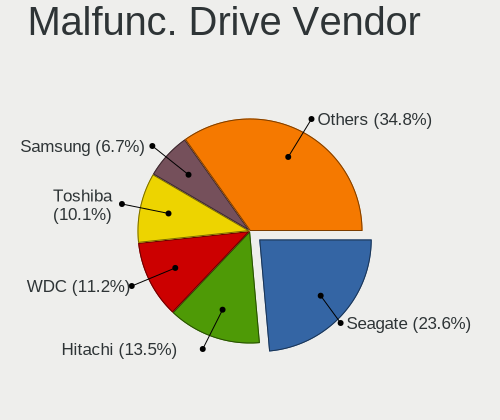

| Vendor              | Notebooks | Drives | Percent |
|---------------------|-----------|--------|---------|
| Seagate             | 19        | 27     | 32.2%   |
| Hitachi             | 8         | 8      | 13.56%  |
| WDC                 | 7         | 13     | 11.86%  |
| Toshiba             | 5         | 8      | 8.47%   |
| Samsung Electronics | 5         | 5      | 8.47%   |
| HGST                | 4         | 5      | 6.78%   |
| Fujitsu             | 3         | 3      | 5.08%   |
| Kingston            | 2         | 2      | 3.39%   |
| Crucial             | 2         | 2      | 3.39%   |
| KingSpec            | 1         | 3      | 1.69%   |
| Intel               | 1         | 2      | 1.69%   |
| Apple               | 1         | 1      | 1.69%   |
| A-DATA Technology   | 1         | 1      | 1.69%   |

Malfunc. HDD Vendor
-------------------

Vendors of faulty HDD drives

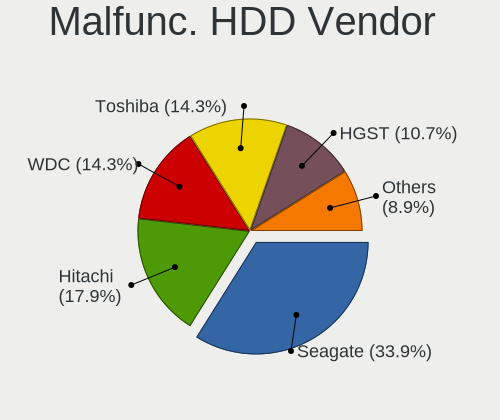

| Vendor              | Notebooks | Drives | Percent |
|---------------------|-----------|--------|---------|
| Seagate             | 19        | 27     | 41.3%   |
| Hitachi             | 8         | 8      | 17.39%  |
| WDC                 | 7         | 13     | 15.22%  |
| Toshiba             | 4         | 7      | 8.7%    |
| HGST                | 4         | 5      | 8.7%    |
| Fujitsu             | 3         | 3      | 6.52%   |
| Samsung Electronics | 1         | 1      | 2.17%   |

Malfunc. Drive Kind
-------------------

Kinds of faulty drives

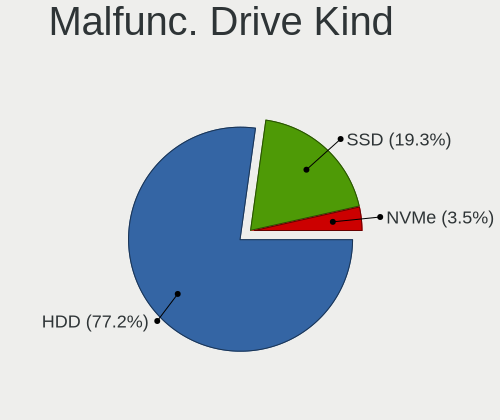

| Kind | Notebooks | Drives | Percent |
|------|-----------|--------|---------|
| HDD  | 45        | 64     | 77.59%  |
| SSD  | 11        | 14     | 18.97%  |
| NVMe | 2         | 2      | 3.45%   |

Failed Drives
-------------

Failed drive models

Zero info for selected period =(

Failed Drive Vendor
-------------------

Failed drive vendors

Zero info for selected period =(

Drive Status
------------

Number of failed and malfunc. drives

| Status   | Notebooks | Drives | Percent |
|----------|-----------|--------|---------|
| Detected | 763       | 1274   | 63.32%  |
| Works    | 384       | 582    | 31.87%  |
| Malfunc  | 58        | 80     | 4.81%   |

Storage controller
------------------

Storage Vendor
--------------

Storage controller vendors

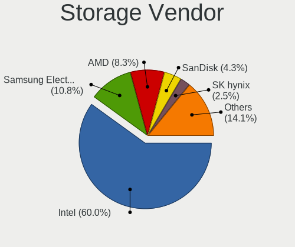

| Vendor                           | Notebooks | Percent |
|----------------------------------|-----------|---------|
| Intel                            | 825       | 61.75%  |
| Samsung Electronics              | 126       | 9.43%   |
| AMD                              | 114       | 8.53%   |
| SanDisk                          | 61        | 4.57%   |
| SK hynix                         | 36        | 2.69%   |
| Toshiba America Info Systems     | 30        | 2.25%   |
| Micron Technology                | 24        | 1.8%    |
| Phison Electronics               | 19        | 1.42%   |
| Kingston Technology Company      | 18        | 1.35%   |
| KIOXIA                           | 14        | 1.05%   |
| Nvidia                           | 13        | 0.97%   |
| Apple                            | 11        | 0.82%   |
| Micron/Crucial Technology        | 10        | 0.75%   |
| ADATA Technology                 | 8         | 0.6%    |
| Marvell Technology Group         | 7         | 0.52%   |
| Lite-On Technology               | 4         | 0.3%    |
| Union Memory (Shenzhen)          | 2         | 0.15%   |
| Solid State Storage Technology   | 2         | 0.15%   |
| Silicon Motion                   | 2         | 0.15%   |
| Silicon Integrated Systems [SiS] | 2         | 0.15%   |
| Realtek Semiconductor            | 2         | 0.15%   |
| Lenovo                           | 2         | 0.15%   |
| ULi Electronics                  | 1         | 0.07%   |
| Shenzhen Longsys Electronics     | 1         | 0.07%   |
| JMicron Technology               | 1         | 0.07%   |
| ASMedia Technology               | 1         | 0.07%   |

Storage Model
-------------

Storage controller models

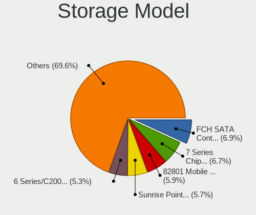

| Model                                                                          | Notebooks | Percent |
|--------------------------------------------------------------------------------|-----------|---------|
| AMD FCH SATA Controller [AHCI mode]                                            | 100       | 7.02%   |
| Intel 7 Series Chipset Family 6-port SATA Controller [AHCI mode]               | 98        | 6.88%   |
| Intel 82801 Mobile SATA Controller [RAID mode]                                 | 88        | 6.18%   |
| Intel Sunrise Point-LP SATA Controller [AHCI mode]                             | 83        | 5.83%   |
| Intel 6 Series/C200 Series Chipset Family 6 port Mobile SATA AHCI Controller   | 75        | 5.27%   |
| Samsung NVMe SSD Controller SM981/PM981/PM983                                  | 71        | 4.99%   |
| Intel Cannon Lake Mobile PCH SATA AHCI Controller                              | 48        | 3.37%   |
| Intel 8 Series SATA Controller 1 [AHCI mode]                                   | 46        | 3.23%   |
| Intel 5 Series/3400 Series Chipset 4 port SATA AHCI Controller                 | 45        | 3.16%   |
| Intel 8 Series/C220 Series Chipset Family 6-port SATA Controller 1 [AHCI mode] | 39        | 2.74%   |
| Intel 82801IBM/IEM (ICH9M/ICH9M-E) 4 port SATA Controller [AHCI mode]          | 33        | 2.32%   |
| Intel Wildcat Point-LP SATA Controller [AHCI Mode]                             | 30        | 2.11%   |
| Intel Volume Management Device NVMe RAID Controller                            | 29        | 2.04%   |
| Micron Non-Volatile memory controller                                          | 24        | 1.69%   |
| Intel HM170/QM170 Chipset SATA Controller [AHCI Mode]                          | 23        | 1.62%   |
| Intel 5 Series/3400 Series Chipset 6 port SATA AHCI Controller                 | 22        | 1.54%   |
| SanDisk WD Black SN750 / PC SN730 NVMe SSD                                     | 18        | 1.26%   |
| Samsung NVMe SSD Controller 980                                                | 17        | 1.19%   |
| Intel SSD 660P Series                                                          | 17        | 1.19%   |
| Intel 400 Series Chipset Family SATA AHCI Controller                           | 16        | 1.12%   |
| Intel 82801HM/HEM (ICH8M/ICH8M-E) IDE Controller                               | 15        | 1.05%   |
| Samsung NVMe SSD Controller SM961/PM961/SM963                                  | 14        | 0.98%   |
| KIOXIA NVMe SSD Controller BG4                                                 | 14        | 0.98%   |
| Intel Cannon Point-LP SATA Controller [AHCI Mode]                              | 14        | 0.98%   |
| Intel 82801HM/HEM (ICH8M/ICH8M-E) SATA Controller [AHCI mode]                  | 14        | 0.98%   |
| Intel Atom Processor E3800 Series SATA AHCI Controller                         | 12        | 0.84%   |
| Intel Comet Lake SATA AHCI Controller                                          | 11        | 0.77%   |
| AMD SB7x0/SB8x0/SB9x0 SATA Controller [AHCI mode]                              | 11        | 0.77%   |
| SanDisk WD Blue SN500 / PC SN520 NVMe SSD                                      | 10        | 0.7%    |
| SanDisk WD Black 2018/SN750 / PC SN720 NVMe SSD                                | 10        | 0.7%    |
| Samsung NVMe SSD Controller PM9A1/PM9A3/980PRO                                 | 10        | 0.7%    |
| Phison E12 NVMe Controller                                                     | 10        | 0.7%    |
| Toshiba America Info Systems XG5 NVMe SSD Controller                           | 9         | 0.63%   |
| SanDisk WD Blue SN550 NVMe SSD                                                 | 9         | 0.63%   |
| Intel SSD Pro 7600p/760p/E 6100p Series                                        | 9         | 0.63%   |
| Intel 82801GBM/GHM (ICH7-M Family) SATA Controller [IDE mode]                  | 9         | 0.63%   |
| Toshiba America Info Systems XG6 NVMe SSD Controller                           | 8         | 0.56%   |
| Toshiba America Info Systems BG3 NVMe SSD Controller                           | 8         | 0.56%   |
| SK hynix Gold P31/PC711 NVMe Solid State Drive                                 | 8         | 0.56%   |
| SK hynix BC501 NVMe Solid State Drive                                          | 8         | 0.56%   |

Storage Kind
------------

Kind of storage controller (IDE, SATA, NVMe, SAS, ...)

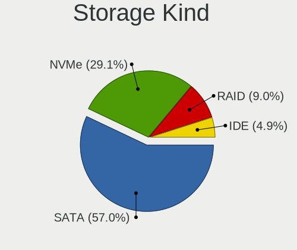

| Kind | Notebooks | Percent |
|------|-----------|---------|
| SATA | 805       | 58.8%   |
| NVMe | 373       | 27.25%  |
| RAID | 121       | 8.84%   |
| IDE  | 70        | 5.11%   |

Processor
---------

CPU Vendor
----------

Processor vendors

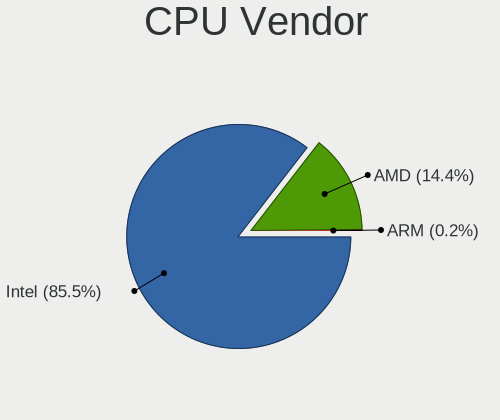

| Vendor | Notebooks | Percent |
|--------|-----------|---------|
| Intel  | 992       | 86.26%  |
| AMD    | 156       | 13.57%  |
| ARM    | 2         | 0.17%   |

CPU Model
---------

Processor models

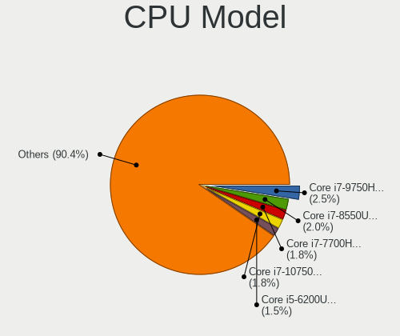

| Model                                   | Notebooks | Percent |
|-----------------------------------------|-----------|---------|
| Intel Core i7-9750H CPU @ 2.60GHz       | 28        | 2.43%   |
| Intel Core i7-8550U CPU @ 1.80GHz       | 23        | 2%      |
| Intel Core i7-10750H CPU @ 2.60GHz      | 21        | 1.82%   |
| Intel Core i7-7700HQ CPU @ 2.80GHz      | 19        | 1.65%   |
| Intel Core i5-6200U CPU @ 2.30GHz       | 18        | 1.56%   |
| Intel Core i7-10510U CPU @ 1.80GHz      | 16        | 1.39%   |
| Intel Core i7-6500U CPU @ 2.50GHz       | 15        | 1.3%    |
| Intel Core i5-8265U CPU @ 1.60GHz       | 15        | 1.3%    |
| Intel Core i5-2520M CPU @ 2.50GHz       | 15        | 1.3%    |
| Intel Core i7-8750H CPU @ 2.20GHz       | 14        | 1.22%   |
| Intel Core i7-4700MQ CPU @ 2.40GHz      | 13        | 1.13%   |
| Intel Core i5-8250U CPU @ 1.60GHz       | 13        | 1.13%   |
| Intel Core i5-7200U CPU @ 2.50GHz       | 13        | 1.13%   |
| Intel Core i5-6300U CPU @ 2.40GHz       | 13        | 1.13%   |
| Intel 11th Gen Core i7-1165G7 @ 2.80GHz | 13        | 1.13%   |
| Intel Core i7-8565U CPU @ 1.80GHz       | 12        | 1.04%   |
| Intel 11th Gen Core i5-1135G7 @ 2.40GHz | 12        | 1.04%   |
| Intel Core i7-8650U CPU @ 1.90GHz       | 11        | 0.96%   |
| Intel Core i7-6700HQ CPU @ 2.60GHz      | 11        | 0.96%   |
| Intel Core i7-3610QM CPU @ 2.30GHz      | 11        | 0.96%   |
| Intel Core i7-6600U CPU @ 2.60GHz       | 10        | 0.87%   |
| Intel Core i7 CPU Q 720 @ 1.60GHz       | 10        | 0.87%   |
| Intel Core i5-5200U CPU @ 2.20GHz       | 10        | 0.87%   |
| Intel Core i5-4210U CPU @ 1.70GHz       | 10        | 0.87%   |
| Intel Core 2 Duo CPU P8700 @ 2.53GHz    | 10        | 0.87%   |
| Intel Core i7-4510U CPU @ 2.00GHz       | 9         | 0.78%   |
| Intel Core i7-3740QM CPU @ 2.70GHz      | 9         | 0.78%   |
| Intel Core i7-2630QM CPU @ 2.00GHz      | 9         | 0.78%   |
| Intel Core i5-4200U CPU @ 1.60GHz       | 9         | 0.78%   |
| Intel Core i5-3210M CPU @ 2.50GHz       | 9         | 0.78%   |
| Intel Core i5-10210U CPU @ 1.60GHz      | 9         | 0.78%   |
| Intel 11th Gen Core i7-11800H @ 2.30GHz | 9         | 0.78%   |
| Intel Core i7-8850H CPU @ 2.60GHz       | 8         | 0.7%    |
| Intel Core i5-5300U CPU @ 2.30GHz       | 8         | 0.7%    |
| Intel Core i5-2450M CPU @ 2.50GHz       | 8         | 0.7%    |
| Intel Core i7-7500U CPU @ 2.70GHz       | 7         | 0.61%   |
| Intel Core i7-5500U CPU @ 2.40GHz       | 7         | 0.61%   |
| Intel Core i7-2670QM CPU @ 2.20GHz      | 7         | 0.61%   |
| Intel Core i7-1065G7 CPU @ 1.30GHz      | 7         | 0.61%   |
| Intel Core i5 CPU M 540 @ 2.53GHz       | 7         | 0.61%   |

CPU Model Family
----------------

Processor model prefix

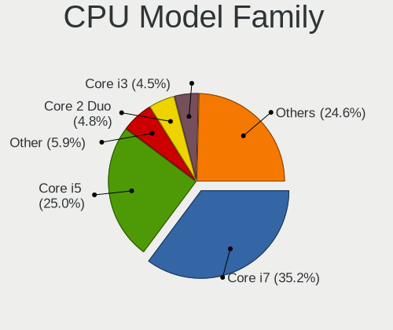

| Model                          | Notebooks | Percent |
|--------------------------------|-----------|---------|
| Intel Core i7                  | 396       | 34.4%   |
| Intel Core i5                  | 294       | 25.54%  |
| Other                          | 75        | 6.52%   |
| Intel Core 2 Duo               | 54        | 4.69%   |
| Intel Core i3                  | 50        | 4.34%   |
| Intel Celeron                  | 43        | 3.74%   |
| AMD Ryzen 7                    | 28        | 2.43%   |
| AMD Ryzen 5                    | 25        | 2.17%   |
| Intel Pentium                  | 24        | 2.09%   |
| AMD A6                         | 18        | 1.56%   |
| Intel Atom                     | 15        | 1.3%    |
| AMD A4                         | 15        | 1.3%    |
| AMD Ryzen 9                    | 7         | 0.61%   |
| AMD E2                         | 7         | 0.61%   |
| AMD E1                         | 7         | 0.61%   |
| Intel Pentium Dual-Core        | 6         | 0.52%   |
| Intel Genuine                  | 6         | 0.52%   |
| Intel Core i9                  | 6         | 0.52%   |
| Intel Core 2                   | 6         | 0.52%   |
| AMD Ryzen 7 PRO                | 6         | 0.52%   |
| AMD A8                         | 6         | 0.52%   |
| AMD A10                        | 6         | 0.52%   |
| Intel Core m3                  | 5         | 0.43%   |
| Intel Xeon                     | 4         | 0.35%   |
| Intel Core M                   | 4         | 0.35%   |
| Intel Celeron Dual-Core        | 4         | 0.35%   |
| AMD Ryzen 3                    | 4         | 0.35%   |
| AMD E                          | 4         | 0.35%   |
| Intel Pentium M                | 2         | 0.17%   |
| Intel Pentium Dual             | 2         | 0.17%   |
| Intel Core m7                  | 2         | 0.17%   |
| Intel Core Duo                 | 2         | 0.17%   |
| Intel Celeron M                | 2         | 0.17%   |
| AMD V120                       | 2         | 0.17%   |
| AMD FX                         | 2         | 0.17%   |
| AMD A12                        | 2         | 0.17%   |
| Intel Mobile Pentium 4         | 1         | 0.09%   |
| Intel Core m5                  | 1         | 0.09%   |
| AMD V140                       | 1         | 0.09%   |
| AMD Turion X2 Dual-Core Mobile | 1         | 0.09%   |

CPU Cores
---------

Number of processor cores

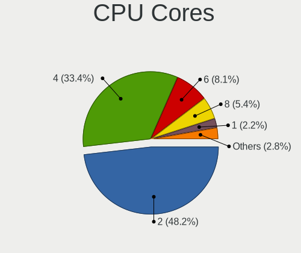

| Number | Notebooks | Percent |
|--------|-----------|---------|
| 2      | 561       | 48.78%  |
| 4      | 394       | 34.26%  |
| 6      | 98        | 8.52%   |
| 8      | 56        | 4.87%   |
| 1      | 29        | 2.52%   |
| 14     | 5         | 0.43%   |
| 12     | 4         | 0.35%   |
| 10     | 2         | 0.17%   |
| 16     | 1         | 0.09%   |

CPU Sockets
-----------

Number of sockets

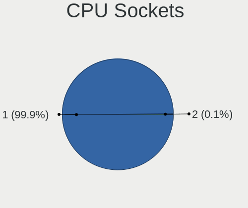

| Number | Notebooks | Percent |
|--------|-----------|---------|
| 1      | 1148      | 99.83%  |
| 2      | 2         | 0.17%   |

CPU Threads
-----------

Threads per core (Hyper-Threading)

| Number | Notebooks | Percent |
|--------|-----------|---------|
| 2      | 908       | 78.89%  |
| 1      | 242       | 21.03%  |
| 4      | 1         | 0.09%   |

CPU Op-Modes
------------

CPU Operation Modes (32-bit, 64-bit)

| Op mode        | Notebooks | Percent |
|----------------|-----------|---------|
| 32-bit, 64-bit | 1124      | 97.06%  |
| 32-bit         | 17        | 1.47%   |
| Unknown        | 16        | 1.38%   |
| 64-bit         | 1         | 0.09%   |

CPU Microcode
-------------

Microcode number

| Number     | Notebooks | Percent |
|------------|-----------|---------|
| Unknown    | 284       | 23.71%  |
| 0x206a7    | 81        | 6.76%   |
| 0x306a9    | 75        | 6.26%   |
| 0x40651    | 48        | 4.01%   |
| 0x906ea    | 46        | 3.84%   |
| 0x406e3    | 46        | 3.84%   |
| 0x806ec    | 39        | 3.26%   |
| 0x1067a    | 38        | 3.17%   |
| 0x806ea    | 36        | 3.01%   |
| 0x306d4    | 35        | 2.92%   |
| 0x20655    | 35        | 2.92%   |
| 0x306c3    | 34        | 2.84%   |
| 0x806c1    | 29        | 2.42%   |
| 0x806e9    | 28        | 2.34%   |
| 0xa0652    | 21        | 1.75%   |
| 0x906e9    | 19        | 1.59%   |
| 0x20652    | 19        | 1.59%   |
| 0x806eb    | 14        | 1.17%   |
| 0x0a50000c | 13        | 1.09%   |
| 0x07030105 | 13        | 1.09%   |
| 0x506e3    | 12        | 1%      |
| 0x30678    | 12        | 1%      |
| 0x06006705 | 12        | 1%      |
| 0x806d1    | 11        | 0.92%   |
| 0x106e5    | 11        | 0.92%   |
| 0x0700010f | 11        | 0.92%   |
| 0x706e5    | 10        | 0.83%   |
| 0x10676    | 9         | 0.75%   |
| 0x08108109 | 9         | 0.75%   |
| 0x906a3    | 8         | 0.67%   |
| 0x08108102 | 8         | 0.67%   |
| 0x406c4    | 7         | 0.58%   |
| 0x406c3    | 7         | 0.58%   |
| 0x06001119 | 7         | 0.58%   |
| 0x6fd      | 6         | 0.5%    |
| 0x6f6      | 6         | 0.5%    |
| 0x506c9    | 5         | 0.42%   |
| 0x08608103 | 5         | 0.42%   |
| 0x08600103 | 5         | 0.42%   |
| 0x03000027 | 5         | 0.42%   |

CPU Microarch
-------------

Microarchitecture

| Name             | Notebooks | Percent |
|------------------|-----------|---------|
| KabyLake         | 234       | 20.33%  |
| Haswell          | 106       | 9.21%   |
| IvyBridge        | 105       | 9.12%   |
| SandyBridge      | 98        | 8.51%   |
| Skylake          | 77        | 6.69%   |
| Westmere         | 62        | 5.39%   |
| Penryn           | 58        | 5.04%   |
| Broadwell        | 41        | 3.56%   |
| TigerLake        | 36        | 3.13%   |
| CometLake        | 36        | 3.13%   |
| Silvermont       | 29        | 2.52%   |
| IceLake          | 26        | 2.26%   |
| Excavator        | 22        | 1.91%   |
| Unknown          | 20        | 1.74%   |
| Zen+             | 19        | 1.65%   |
| Core             | 18        | 1.56%   |
| Zen 3            | 17        | 1.48%   |
| Zen 2            | 17        | 1.48%   |
| Puma             | 17        | 1.48%   |
| Nehalem          | 12        | 1.04%   |
| Jaguar           | 12        | 1.04%   |
| P6               | 11        | 0.96%   |
| Zen              | 9         | 0.78%   |
| Piledriver       | 9         | 0.78%   |
| Goldmont plus    | 9         | 0.78%   |
| Alderlake Hybrid | 9         | 0.78%   |
| Bonnell          | 8         | 0.7%    |
| Goldmont         | 7         | 0.61%   |
| K10 Llano        | 6         | 0.52%   |
| K10              | 6         | 0.52%   |
| Bobcat           | 5         | 0.43%   |
| Tremont          | 3         | 0.26%   |
| Steamroller      | 3         | 0.26%   |
| K8 & K10 hybrid  | 2         | 0.17%   |
| NetBurst         | 1         | 0.09%   |
| K8 Hammer        | 1         | 0.09%   |

Graphics
--------

GPU Vendor
----------

Vendors of graphics cards

| Vendor                           | Notebooks | Percent |
|----------------------------------|-----------|---------|
| Intel                            | 865       | 57.71%  |
| Nvidia                           | 383       | 25.55%  |
| AMD                              | 247       | 16.48%  |
| Silicon Integrated Systems [SiS] | 2         | 0.13%   |
| Neomagic                         | 2         | 0.13%   |

GPU Model
---------

Graphics card models

| Model                                                                                    | Notebooks | Percent |
|------------------------------------------------------------------------------------------|-----------|---------|
| Intel 3rd Gen Core processor Graphics Controller                                         | 91        | 5.86%   |
| Intel 2nd Generation Core Processor Family Integrated Graphics Controller                | 87        | 5.61%   |
| Intel Haswell-ULT Integrated Graphics Controller                                         | 58        | 3.74%   |
| Intel Skylake GT2 [HD Graphics 520]                                                      | 57        | 3.67%   |
| Intel CoffeeLake-H GT2 [UHD Graphics 630]                                                | 56        | 3.61%   |
| Intel UHD Graphics 620                                                                   | 47        | 3.03%   |
| Intel Core Processor Integrated Graphics Controller                                      | 43        | 2.77%   |
| Intel 4th Gen Core Processor Integrated Graphics Controller                              | 42        | 2.71%   |
| Intel TigerLake-LP GT2 [Iris Xe Graphics]                                                | 34        | 2.19%   |
| Intel CometLake-H GT2 [UHD Graphics]                                                     | 33        | 2.13%   |
| Intel WhiskeyLake-U GT2 [UHD Graphics 620]                                               | 31        | 2%      |
| Intel CometLake-U GT2 [UHD Graphics]                                                     | 30        | 1.93%   |
| Intel HD Graphics 5500                                                                   | 29        | 1.87%   |
| Intel Mobile 4 Series Chipset Integrated Graphics Controller                             | 27        | 1.74%   |
| Intel HD Graphics 620                                                                    | 25        | 1.61%   |
| AMD Picasso/Raven 2 [Radeon Vega Series / Radeon Vega Mobile Series]                     | 21        | 1.35%   |
| Intel HD Graphics 630                                                                    | 20        | 1.29%   |
| AMD Stoney [Radeon R2/R3/R4/R5 Graphics]                                                 | 18        | 1.16%   |
| AMD Topaz XT [Radeon R7 M260/M265 / M340/M360 / M440/M445 / 530/535 / 620/625 Mobile]    | 17        | 1.1%    |
| AMD Renoir                                                                               | 16        | 1.03%   |
| Intel Atom/Celeron/Pentium Processor x5-E8000/J3xxx/N3xxx Integrated Graphics Controller | 15        | 0.97%   |
| AMD Cezanne [Radeon Vega Series / Radeon Vega Mobile Series]                             | 15        | 0.97%   |
| Nvidia TU116M [GeForce GTX 1660 Ti Mobile]                                               | 14        | 0.9%    |
| Nvidia GP107M [GeForce GTX 1050 Mobile]                                                  | 14        | 0.9%    |
| Nvidia GK208M [GeForce GT 740M]                                                          | 14        | 0.9%    |
| Intel TigerLake-H GT1 [UHD Graphics]                                                     | 14        | 0.9%    |
| Intel Atom Processor Z36xxx/Z37xxx Series Graphics & Display                             | 14        | 0.9%    |
| AMD Thames [Radeon HD 7500M/7600M Series]                                                | 13        | 0.84%   |
| Nvidia TU106M [GeForce RTX 2060 Mobile]                                                  | 12        | 0.77%   |
| Nvidia GP107M [GeForce GTX 1050 Ti Mobile]                                               | 12        | 0.77%   |
| Nvidia GF117M [GeForce 610M/710M/810M/820M / GT 620M/625M/630M/720M]                     | 12        | 0.77%   |
| AMD Sun XT [Radeon HD 8670A/8670M/8690M / R5 M330 / M430 / Radeon 520 Mobile]            | 12        | 0.77%   |
| Nvidia TU117M [GeForce GTX 1650 Mobile / Max-Q]                                          | 11        | 0.71%   |
| Intel HD Graphics 530                                                                    | 11        | 0.71%   |
| Nvidia TU117M [GeForce GTX 1650 Ti Mobile]                                               | 10        | 0.64%   |
| Nvidia GP106M [GeForce GTX 1060 Mobile]                                                  | 9         | 0.58%   |
| Nvidia GM108M [GeForce 840M]                                                             | 9         | 0.58%   |
| Intel Mobile 945GM/GMS/GME, 943/940GML Express Integrated Graphics Controller            | 9         | 0.58%   |
| Intel GeminiLake [UHD Graphics 600]                                                      | 9         | 0.58%   |
| Nvidia GT216M [GeForce GT 330M]                                                          | 8         | 0.52%   |

GPU Combo
---------

Combinations of graphics cards

| Name                     | Notebooks | Percent |
|--------------------------|-----------|---------|
| 1 x Intel                | 537       | 46.33%  |
| Intel + Nvidia           | 277       | 23.9%   |
| 1 x AMD                  | 147       | 12.68%  |
| 1 x Nvidia               | 87        | 7.51%   |
| Intel + AMD              | 46        | 3.97%   |
| 2 x AMD                  | 35        | 3.02%   |
| AMD + Nvidia             | 19        | 1.64%   |
| Other                    | 2         | 0.17%   |
| 2 x Intel                | 2         | 0.17%   |
| 1 x SiS                  | 2         | 0.17%   |
| 1 x Neomagic             | 2         | 0.17%   |
| Intel + AMD + 1 x Nvidia | 2         | 0.17%   |
| 2 x Nvidia               | 1         | 0.09%   |

GPU Driver
----------

Free vs proprietary

| Driver      | Notebooks | Percent |
|-------------|-----------|---------|
| Free        | 958       | 80.91%  |
| Proprietary | 187       | 15.79%  |
| Unknown     | 39        | 3.29%   |

GPU Memory
----------

Total video memory

| Size in GB | Notebooks | Percent |
|------------|-----------|---------|
| Unknown    | 720       | 60.61%  |
| 1.01-2.0   | 141       | 11.87%  |
| 0.01-0.5   | 123       | 10.35%  |
| 3.01-4.0   | 78        | 6.57%   |
| 0.51-1.0   | 75        | 6.31%   |
| 5.01-6.0   | 23        | 1.94%   |
| 7.01-8.0   | 17        | 1.43%   |
| 2.01-3.0   | 8         | 0.67%   |
| 8.01-16.0  | 3         | 0.25%   |

Monitor
-------

Monitor Vendor
--------------

Monitor vendors

| Vendor                  | Notebooks | Percent |
|-------------------------|-----------|---------|
| AU Optronics            | 271       | 20.18%  |
| LG Display              | 197       | 14.67%  |
| Chimei Innolux          | 148       | 11.02%  |
| Samsung Electronics     | 131       | 9.75%   |
| BOE                     | 111       | 8.27%   |
| Apple                   | 76        | 5.66%   |
| Sharp                   | 55        | 4.1%    |
| Dell                    | 40        | 2.98%   |
| Chi Mei Optoelectronics | 38        | 2.83%   |
| Lenovo                  | 27        | 2.01%   |
| Hewlett-Packard         | 22        | 1.64%   |
| Goldstar                | 21        | 1.56%   |
| BenQ                    | 19        | 1.41%   |
| PANDA                   | 17        | 1.27%   |
| Acer                    | 17        | 1.27%   |
| Philips                 | 16        | 1.19%   |
| Sony                    | 11        | 0.82%   |
| Ancor Communications    | 8         | 0.6%    |
| AOC                     | 7         | 0.52%   |
| ViewSonic               | 6         | 0.45%   |
| Toshiba                 | 6         | 0.45%   |
| LG Philips              | 6         | 0.45%   |
| CPT                     | 6         | 0.45%   |
| Panasonic               | 5         | 0.37%   |
| LGD                     | 5         | 0.37%   |
| Unknown                 | 4         | 0.3%    |
| SAC                     | 4         | 0.3%    |
| Kogan                   | 4         | 0.3%    |
| InfoVision              | 4         | 0.3%    |
| Hitachi                 | 4         | 0.3%    |
| HannStar                | 4         | 0.3%    |
| GKK                     | 4         | 0.3%    |
| eMachines               | 4         | 0.3%    |
| ASUSTek Computer        | 4         | 0.3%    |
| InnoLux Display         | 3         | 0.22%   |
| GDH                     | 3         | 0.22%   |
| CSO                     | 3         | 0.22%   |
| Unknown (XXX)           | 2         | 0.15%   |
| TMX                     | 2         | 0.15%   |
| TCL                     | 2         | 0.15%   |

Monitor Model
-------------

Monitor models

| Model                                                                    | Notebooks | Percent |
|--------------------------------------------------------------------------|-----------|---------|
| LG Display LCD Monitor LGD02DC 1366x768 344x194mm 15.5-inch              | 16        | 1.17%   |
| Samsung Electronics LCD Monitor SEC5441 1366x768 344x194mm 15.5-inch     | 11        | 0.8%    |
| AU Optronics LCD Monitor AUO21ED 1920x1080 344x193mm 15.5-inch           | 10        | 0.73%   |
| Sharp LCD Monitor SHP148D 3840x2160 344x194mm 15.5-inch                  | 9         | 0.66%   |
| AU Optronics LCD Monitor AUO22EC 1366x768 344x193mm 15.5-inch            | 9         | 0.66%   |
| Chimei Innolux LCD Monitor CMN14D4 1920x1080 309x173mm 13.9-inch         | 8         | 0.58%   |
| AU Optronics LCD Monitor AUO46EC 1366x768 344x193mm 15.5-inch            | 8         | 0.58%   |
| AU Optronics LCD Monitor AUO26EC 1366x768 344x193mm 15.5-inch            | 8         | 0.58%   |
| Chimei Innolux LCD Monitor CMN15AB 1366x768 344x194mm 15.5-inch          | 7         | 0.51%   |
| Apple Color LCD APP9CC7 1280x800 286x179mm 13.3-inch                     | 7         | 0.51%   |
| Chimei Innolux LCD Monitor CMN15E7 1920x1080 344x193mm 15.5-inch         | 6         | 0.44%   |
| Chimei Innolux LCD Monitor CMN15DB 1366x768 344x193mm 15.5-inch          | 6         | 0.44%   |
| Chimei Innolux LCD Monitor CMN1514 1920x1080 344x193mm 15.5-inch         | 6         | 0.44%   |
| Chi Mei Optoelectronics LCD Monitor CMO15A2 1366x768 344x193mm 15.5-inch | 6         | 0.44%   |
| BOE LCD Monitor BOE07CE 1366x768 344x193mm 15.5-inch                     | 6         | 0.44%   |
| AU Optronics LCD Monitor AUO70EC 1366x768 344x193mm 15.5-inch            | 6         | 0.44%   |
| AU Optronics LCD Monitor AUO38ED 1920x1080 344x193mm 15.5-inch           | 6         | 0.44%   |
| Apple Color LCD APP9CDF 1440x900 286x179mm 13.3-inch                     | 6         | 0.44%   |
| Sharp LCD Monitor SHP1476 3840x2160 346x194mm 15.6-inch                  | 5         | 0.36%   |
| Samsung Electronics LCD Monitor SEC5541 1366x768 344x193mm 15.5-inch     | 5         | 0.36%   |
| PANDA LCD Monitor NCP004D 1920x1080 344x194mm 15.5-inch                  | 5         | 0.36%   |
| LG Display LCD Monitor LGD033A 1366x768 344x194mm 15.5-inch              | 5         | 0.36%   |
| LG Display LCD Monitor LGD02D8 1366x768 277x156mm 12.5-inch              | 5         | 0.36%   |
| Chimei Innolux LCD Monitor CMN15BF 1366x768 344x193mm 15.5-inch          | 5         | 0.36%   |
| BOE LCD Monitor BOE06A4 1366x768 344x194mm 15.5-inch                     | 5         | 0.36%   |
| BOE LCD Monitor BOE0672 1366x768 344x194mm 15.5-inch                     | 5         | 0.36%   |
| Sharp LCD Monitor SHP14D1 1920x1200 336x210mm 15.6-inch                  | 4         | 0.29%   |
| PANDA LCD Monitor NCP0036 1920x1080 344x194mm 15.5-inch                  | 4         | 0.29%   |
| LG Display LCD Monitor LGD0521 1920x1080 309x174mm 14.0-inch             | 4         | 0.29%   |
| LG Display LCD Monitor LGD0469 1920x1080 382x215mm 17.3-inch             | 4         | 0.29%   |
| Lenovo LCD Monitor LEN40BA 1920x1080 344x194mm 15.5-inch                 | 4         | 0.29%   |
| eMachines E190HQV EMA0212 1366x768 409x230mm 18.5-inch                   | 4         | 0.29%   |
| Chimei Innolux LCD Monitor CMN15CA 1366x768 344x193mm 15.5-inch          | 4         | 0.29%   |
| Chimei Innolux LCD Monitor CMN15BC 1366x768 344x193mm 15.5-inch          | 4         | 0.29%   |
| Chi Mei Optoelectronics LCD Monitor CMO15A7 1366x768 344x193mm 15.5-inch | 4         | 0.29%   |
| Chi Mei Optoelectronics LCD Monitor CMO1100 1366x768 256x144mm 11.6-inch | 4         | 0.29%   |
| BOE LCD Monitor BOE07CB 1920x1080 344x193mm 15.5-inch                    | 4         | 0.29%   |
| AU Optronics LCD Monitor AUO723C 1366x768 309x173mm 13.9-inch            | 4         | 0.29%   |
| AU Optronics LCD Monitor AUO323D 1920x1080 309x174mm 14.0-inch           | 4         | 0.29%   |
| AU Optronics LCD Monitor AUO2E3C 1366x768 309x173mm 13.9-inch            | 4         | 0.29%   |

Monitor Resolution
------------------

Monitor screen resolution

| Resolution         | Notebooks | Percent |
|--------------------|-----------|---------|
| 1920x1080 (FHD)    | 475       | 38.18%  |
| 1366x768 (WXGA)    | 397       | 31.91%  |
| 3840x2160 (4K)     | 76        | 6.11%   |
| 1280x800 (WXGA)    | 53        | 4.26%   |
| 1600x900 (HD+)     | 43        | 3.46%   |
| 1440x900 (WXGA+)   | 29        | 2.33%   |
| 2560x1440 (QHD)    | 24        | 1.93%   |
| 1920x1200 (WUXGA)  | 19        | 1.53%   |
| 2560x1600          | 17        | 1.37%   |
| 2880x1800          | 14        | 1.13%   |
| 1680x1050 (WSXGA+) | 12        | 0.96%   |
| 1280x1024 (SXGA)   | 10        | 0.8%    |
| 3840x2400          | 9         | 0.72%   |
| 3440x1440          | 7         | 0.56%   |
| 3200x1800 (QHD+)   | 7         | 0.56%   |
| 1024x600           | 6         | 0.48%   |
| 1360x768           | 5         | 0.4%    |
| Unknown            | 5         | 0.4%    |
| 3072x1920          | 4         | 0.32%   |
| 2160x1440          | 4         | 0.32%   |
| 3840x1080          | 3         | 0.24%   |
| 2256x1504          | 3         | 0.24%   |
| 2240x1400          | 3         | 0.24%   |
| 5760x2160          | 2         | 0.16%   |
| 3456x2160          | 2         | 0.16%   |
| 3286x1080          | 2         | 0.16%   |
| 3200x2000          | 2         | 0.16%   |
| 1280x720 (HD)      | 2         | 0.16%   |
| 1024x768 (XGA)     | 2         | 0.16%   |
| 3840x1600          | 1         | 0.08%   |
| 3000x2000          | 1         | 0.08%   |
| 2726x768           | 1         | 0.08%   |
| 2304x1440          | 1         | 0.08%   |
| 1920x540           | 1         | 0.08%   |
| 1720x1440          | 1         | 0.08%   |
| 1680x945           | 1         | 0.08%   |

Monitor Diagonal
----------------

Diagonal size in inches

| Inches  | Notebooks | Percent |
|---------|-----------|---------|
| 15      | 542       | 40.48%  |
| 13      | 193       | 14.41%  |
| 14      | 137       | 10.23%  |
| 17      | 87        | 6.5%    |
| 27      | 58        | 4.33%   |
| 24      | 40        | 2.99%   |
| 12      | 38        | 2.84%   |
| 23      | 33        | 2.46%   |
| 11      | 33        | 2.46%   |
| 21      | 26        | 1.94%   |
| Unknown | 24        | 1.79%   |
| 31      | 17        | 1.27%   |
| 16      | 13        | 0.97%   |
| 19      | 10        | 0.75%   |
| 84      | 9         | 0.67%   |
| 18      | 9         | 0.67%   |
| 72      | 8         | 0.6%    |
| 22      | 7         | 0.52%   |
| 10      | 7         | 0.52%   |
| 20      | 6         | 0.45%   |
| 52      | 5         | 0.37%   |
| 40      | 5         | 0.37%   |
| 34      | 5         | 0.37%   |
| 54      | 4         | 0.3%    |
| 26      | 3         | 0.22%   |
| 48      | 2         | 0.15%   |
| 46      | 2         | 0.15%   |
| 37      | 2         | 0.15%   |
| 35      | 2         | 0.15%   |
| 32      | 2         | 0.15%   |
| 8       | 2         | 0.15%   |
| 78      | 1         | 0.07%   |
| 63      | 1         | 0.07%   |
| 55      | 1         | 0.07%   |
| 49      | 1         | 0.07%   |
| 38      | 1         | 0.07%   |
| 29      | 1         | 0.07%   |
| 25      | 1         | 0.07%   |
| 9       | 1         | 0.07%   |

Monitor Width
-------------

Physical width

| Width in mm | Notebooks | Percent |
|-------------|-----------|---------|
| 301-350     | 751       | 56.51%  |
| 201-300     | 192       | 14.45%  |
| 501-600     | 116       | 8.73%   |
| 351-400     | 113       | 8.5%    |
| 401-500     | 52        | 3.91%   |
| 601-700     | 28        | 2.11%   |
| Unknown     | 24        | 1.81%   |
| 1501-2000   | 18        | 1.35%   |
| 1001-1500   | 16        | 1.2%    |
| 801-900     | 10        | 0.75%   |
| 701-800     | 7         | 0.53%   |
| 101-200     | 2         | 0.15%   |

Aspect Ratio
------------

Proportional relationship between the width and the height

| Ratio   | Notebooks | Percent |
|---------|-----------|---------|
| 16/9    | 936       | 81.18%  |
| 16/10   | 157       | 13.62%  |
| Unknown | 18        | 1.56%   |
| 3/2     | 14        | 1.21%   |
| 5/4     | 8         | 0.69%   |
| 21/9    | 8         | 0.69%   |
| 4/3     | 6         | 0.52%   |
| 32/9    | 4         | 0.35%   |
| 6/5     | 1         | 0.09%   |
| 0.62    | 1         | 0.09%   |

Monitor Area
------------

Area in inch²

| Area in inch² | Notebooks | Percent |
|----------------|-----------|---------|
| 101-110        | 542       | 40.6%   |
| 81-90          | 250       | 18.73%  |
| 201-250        | 89        | 6.67%   |
| 71-80          | 84        | 6.29%   |
| 121-130        | 76        | 5.69%   |
| 301-350        | 60        | 4.49%   |
| 61-70          | 34        | 2.55%   |
| 51-60          | 33        | 2.47%   |
| More than 1000 | 28        | 2.1%    |
| 351-500        | 27        | 2.02%   |
| 151-200        | 25        | 1.87%   |
| Unknown        | 24        | 1.8%    |
| 501-1000       | 13        | 0.97%   |
| 111-120        | 12        | 0.9%    |
| 251-300        | 9         | 0.67%   |
| 141-150        | 9         | 0.67%   |
| 41-50          | 8         | 0.6%    |
| 131-140        | 8         | 0.6%    |
| 1-40           | 2         | 0.15%   |
| 91-100         | 2         | 0.15%   |

Pixel Density
-------------

Pixels per inch

| Density       | Notebooks | Percent |
|---------------|-----------|---------|
| 121-160       | 462       | 35.62%  |
| 101-120       | 394       | 30.38%  |
| 51-100        | 220       | 16.96%  |
| 161-240       | 101       | 7.79%   |
| More than 240 | 72        | 5.55%   |
| 1-50          | 24        | 1.85%   |
| Unknown       | 24        | 1.85%   |

Multiple Monitors
-----------------

Total monitors connected

| Total | Notebooks | Percent |
|-------|-----------|---------|
| 1     | 929       | 77.55%  |
| 2     | 197       | 16.44%  |
| 0     | 38        | 3.17%   |
| 3     | 30        | 2.5%    |
| 4     | 4         | 0.33%   |

Network
-------

Net Controller Vendor
---------------------

Controller vendors

| Vendor                            | Notebooks | Percent |
|-----------------------------------|-----------|---------|
| Intel                             | 631       | 33.37%  |
| Realtek Semiconductor             | 581       | 30.72%  |
| Qualcomm Atheros                  | 263       | 13.91%  |
| Broadcom                          | 141       | 7.46%   |
| Broadcom Limited                  | 45        | 2.38%   |
| Ralink                            | 25        | 1.32%   |
| Sierra Wireless                   | 16        | 0.85%   |
| Marvell Technology Group          | 16        | 0.85%   |
| MediaTek                          | 13        | 0.69%   |
| DisplayLink                       | 13        | 0.69%   |
| Samsung Electronics               | 12        | 0.63%   |
| Dell                              | 12        | 0.63%   |
| Huawei Technologies               | 9         | 0.48%   |
| Apple                             | 9         | 0.48%   |
| Nvidia                            | 8         | 0.42%   |
| NetGear                           | 8         | 0.42%   |
| TP-Link                           | 7         | 0.37%   |
| Ralink Technology                 | 7         | 0.37%   |
| Lenovo                            | 7         | 0.37%   |
| Hewlett-Packard                   | 6         | 0.32%   |
| Edimax Technology                 | 6         | 0.32%   |
| ASIX Electronics                  | 6         | 0.32%   |
| ZTE WCDMA Technologies MSM        | 5         | 0.26%   |
| OPPO Electronics                  | 4         | 0.21%   |
| ASUSTek Computer                  | 4         | 0.21%   |
| JMicron Technology                | 3         | 0.16%   |
| Google                            | 3         | 0.16%   |
| Xiaomi                            | 2         | 0.11%   |
| Silicon Integrated Systems [SiS]  | 2         | 0.11%   |
| Qualcomm Atheros Communications   | 2         | 0.11%   |
| Qualcomm                          | 2         | 0.11%   |
| Motorola PCS                      | 2         | 0.11%   |
| ICS Advent                        | 2         | 0.11%   |
| Ericsson Business Mobile Networks | 2         | 0.11%   |
| D-Link                            | 2         | 0.11%   |
| Arduino SA                        | 2         | 0.11%   |
| Wilocity                          | 1         | 0.05%   |
| ULi Electronics                   | 1         | 0.05%   |
| Toshiba                           | 1         | 0.05%   |
| T & A Mobile Phones               | 1         | 0.05%   |

Net Controller Model
--------------------

Controller models

| Model                                                             | Notebooks | Percent |
|-------------------------------------------------------------------|-----------|---------|
| Realtek RTL8111/8168/8411 PCI Express Gigabit Ethernet Controller | 352       | 15.47%  |
| Realtek RTL810xE PCI Express Fast Ethernet controller             | 105       | 4.62%   |
| Realtek RTL8153 Gigabit Ethernet Adapter                          | 63        | 2.77%   |
| Intel 82579LM Gigabit Network Connection (Lewisville)             | 55        | 2.42%   |
| Intel Wi-Fi 6 AX200                                               | 48        | 2.11%   |
| Intel Wireless 8260                                               | 46        | 2.02%   |
| Qualcomm Atheros AR9285 Wireless Network Adapter (PCI-Express)    | 43        | 1.89%   |
| Qualcomm Atheros QCA6174 802.11ac Wireless Network Adapter        | 41        | 1.8%    |
| Intel Wireless 8265 / 8275                                        | 40        | 1.76%   |
| Qualcomm Atheros AR9485 Wireless Network Adapter                  | 38        | 1.67%   |
| Intel Wireless 7260                                               | 35        | 1.54%   |
| Qualcomm Atheros QCA9377 802.11ac Wireless Network Adapter        | 34        | 1.49%   |
| Intel Comet Lake PCH CNVi WiFi                                    | 32        | 1.41%   |
| Intel Centrino Ultimate-N 6300                                    | 31        | 1.36%   |
| Intel Centrino Advanced-N 6205 [Taylor Peak]                      | 31        | 1.36%   |
| Qualcomm Atheros QCA9565 / AR9565 Wireless Network Adapter        | 29        | 1.27%   |
| Intel Wireless 3165                                               | 28        | 1.23%   |
| Intel Wi-Fi 6 AX201                                               | 28        | 1.23%   |
| Intel Wireless 7265                                               | 25        | 1.1%    |
| Intel Ethernet Connection I219-LM                                 | 25        | 1.1%    |
| Intel Cannon Lake PCH CNVi WiFi                                   | 25        | 1.1%    |
| Intel Comet Lake PCH-LP CNVi WiFi                                 | 22        | 0.97%   |
| Realtek RTL8821CE 802.11ac PCIe Wireless Network Adapter          | 20        | 0.88%   |
| Intel Cannon Point-LP CNVi [Wireless-AC]                          | 20        | 0.88%   |
| Intel Wireless-AC 9260                                            | 19        | 0.84%   |
| Intel 82577LM Gigabit Network Connection                          | 19        | 0.84%   |
| Realtek RTL8822CE 802.11ac PCIe Wireless Network Adapter          | 18        | 0.79%   |
| Qualcomm Atheros AR9462 Wireless Network Adapter                  | 18        | 0.79%   |
| Broadcom BCM4331 802.11a/b/g/n                                    | 17        | 0.75%   |
| Qualcomm Atheros AR8151 v2.0 Gigabit Ethernet                     | 16        | 0.7%    |
| Broadcom Limited BCM4360 802.11ac Wireless Network Adapter        | 16        | 0.7%    |
| Broadcom BCM4313 802.11bgn Wireless Network Adapter               | 16        | 0.7%    |
| Intel Wireless 3160                                               | 15        | 0.66%   |
| Intel Ethernet Connection (4) I219-LM                             | 15        | 0.66%   |
| Ralink RT3290 Wireless 802.11n 1T/1R PCIe                         | 14        | 0.62%   |
| Intel Wi-Fi 6 AX210/AX211/AX411 160MHz                            | 14        | 0.62%   |
| Broadcom NetXtreme BCM57765 Gigabit Ethernet PCIe                 | 14        | 0.62%   |
| Broadcom BCM43224 802.11a/b/g/n                                   | 14        | 0.62%   |
| Realtek RTL8188CE 802.11b/g/n WiFi Adapter                        | 13        | 0.57%   |
| Intel Centrino Advanced-N 6200                                    | 13        | 0.57%   |

Wireless Vendor
---------------

Wireless vendors

| Vendor                          | Notebooks | Percent |
|---------------------------------|-----------|---------|
| Intel                           | 610       | 50.58%  |
| Qualcomm Atheros                | 220       | 18.24%  |
| Realtek Semiconductor           | 125       | 10.36%  |
| Broadcom                        | 115       | 9.54%   |
| Broadcom Limited                | 36        | 2.99%   |
| Ralink                          | 25        | 2.07%   |
| Sierra Wireless                 | 16        | 1.33%   |
| MediaTek                        | 12        | 1%      |
| NetGear                         | 8         | 0.66%   |
| Ralink Technology               | 7         | 0.58%   |
| Dell                            | 7         | 0.58%   |
| TP-Link                         | 6         | 0.5%    |
| Edimax Technology               | 6         | 0.5%    |
| ASUSTek Computer                | 4         | 0.33%   |
| Qualcomm Atheros Communications | 2         | 0.17%   |
| D-Link                          | 2         | 0.17%   |
| Xiaomi                          | 1         | 0.08%   |
| Wilocity                        | 1         | 0.08%   |
| Qualcomm                        | 1         | 0.08%   |
| Hewlett-Packard                 | 1         | 0.08%   |
| Belkin Components               | 1         | 0.08%   |

Wireless Model
--------------

Wireless models

| Model                                                          | Notebooks | Percent |
|----------------------------------------------------------------|-----------|---------|
| Intel Wi-Fi 6 AX200                                            | 48        | 3.96%   |
| Intel Wireless 8260                                            | 46        | 3.79%   |
| Qualcomm Atheros AR9285 Wireless Network Adapter (PCI-Express) | 43        | 3.54%   |
| Qualcomm Atheros QCA6174 802.11ac Wireless Network Adapter     | 41        | 3.38%   |
| Intel Wireless 8265 / 8275                                     | 40        | 3.3%    |
| Qualcomm Atheros AR9485 Wireless Network Adapter               | 38        | 3.13%   |
| Intel Wireless 7260                                            | 35        | 2.89%   |
| Qualcomm Atheros QCA9377 802.11ac Wireless Network Adapter     | 34        | 2.8%    |
| Intel Comet Lake PCH CNVi WiFi                                 | 32        | 2.64%   |
| Intel Centrino Ultimate-N 6300                                 | 31        | 2.56%   |
| Intel Centrino Advanced-N 6205 [Taylor Peak]                   | 31        | 2.56%   |
| Qualcomm Atheros QCA9565 / AR9565 Wireless Network Adapter     | 29        | 2.39%   |
| Intel Wireless 3165                                            | 28        | 2.31%   |
| Intel Wi-Fi 6 AX201                                            | 28        | 2.31%   |
| Intel Wireless 7265                                            | 25        | 2.06%   |
| Intel Cannon Lake PCH CNVi WiFi                                | 25        | 2.06%   |
| Intel Comet Lake PCH-LP CNVi WiFi                              | 22        | 1.81%   |
| Realtek RTL8821CE 802.11ac PCIe Wireless Network Adapter       | 20        | 1.65%   |
| Intel Cannon Point-LP CNVi [Wireless-AC]                       | 20        | 1.65%   |
| Intel Wireless-AC 9260                                         | 19        | 1.57%   |
| Realtek RTL8822CE 802.11ac PCIe Wireless Network Adapter       | 18        | 1.48%   |
| Qualcomm Atheros AR9462 Wireless Network Adapter               | 18        | 1.48%   |
| Broadcom BCM4331 802.11a/b/g/n                                 | 17        | 1.4%    |
| Broadcom Limited BCM4360 802.11ac Wireless Network Adapter     | 16        | 1.32%   |
| Broadcom BCM4313 802.11bgn Wireless Network Adapter            | 16        | 1.32%   |
| Intel Wireless 3160                                            | 15        | 1.24%   |
| Ralink RT3290 Wireless 802.11n 1T/1R PCIe                      | 14        | 1.15%   |
| Intel Wi-Fi 6 AX210/AX211/AX411 160MHz                         | 14        | 1.15%   |
| Broadcom BCM43224 802.11a/b/g/n                                | 14        | 1.15%   |
| Realtek RTL8188CE 802.11b/g/n WiFi Adapter                     | 13        | 1.07%   |
| Intel Centrino Advanced-N 6200                                 | 13        | 1.07%   |
| Intel PRO/Wireless 5100 AGN [Shiloh] Network Connection        | 12        | 0.99%   |
| Intel PRO/Wireless 3945ABG [Golan] Network Connection          | 12        | 0.99%   |
| Intel Ice Lake-LP PCH CNVi WiFi                                | 12        | 0.99%   |
| Intel WiFi Link 5100                                           | 11        | 0.91%   |
| Realtek RTL8723AE PCIe Wireless Network Adapter                | 10        | 0.82%   |
| Intel Dual Band Wireless-AC 3168NGW [Stone Peak]               | 10        | 0.82%   |
| Broadcom BCM43228 802.11a/b/g/n                                | 10        | 0.82%   |
| Broadcom BCM43142 802.11b/g/n                                  | 10        | 0.82%   |
| Realtek RTL8822BE 802.11a/b/g/n/ac WiFi adapter                | 9         | 0.74%   |

Ethernet Vendor
---------------

Ethernet vendors

| Vendor                           | Notebooks | Percent |
|----------------------------------|-----------|---------|
| Realtek Semiconductor            | 532       | 52.52%  |
| Intel                            | 225       | 22.21%  |
| Qualcomm Atheros                 | 83        | 8.19%   |
| Broadcom                         | 61        | 6.02%   |
| Marvell Technology Group         | 16        | 1.58%   |
| DisplayLink                      | 13        | 1.28%   |
| Samsung Electronics              | 12        | 1.18%   |
| Broadcom Limited                 | 9         | 0.89%   |
| Apple                            | 9         | 0.89%   |
| Nvidia                           | 8         | 0.79%   |
| Lenovo                           | 7         | 0.69%   |
| Huawei Technologies              | 6         | 0.59%   |
| ASIX Electronics                 | 6         | 0.59%   |
| ZTE WCDMA Technologies MSM       | 5         | 0.49%   |
| OPPO Electronics                 | 4         | 0.39%   |
| JMicron Technology               | 3         | 0.3%    |
| Google                           | 3         | 0.3%    |
| Silicon Integrated Systems [SiS] | 2         | 0.2%    |
| ICS Advent                       | 2         | 0.2%    |
| Hewlett-Packard                  | 2         | 0.2%    |
| Xiaomi                           | 1         | 0.1%    |
| T & A Mobile Phones              | 1         | 0.1%    |
| Qualcomm                         | 1         | 0.1%    |
| Microsoft                        | 1         | 0.1%    |
| Attansic Technology              | 1         | 0.1%    |

Ethernet Model
--------------

Ethernet models

| Model                                                             | Notebooks | Percent |
|-------------------------------------------------------------------|-----------|---------|
| Realtek RTL8111/8168/8411 PCI Express Gigabit Ethernet Controller | 352       | 34.17%  |
| Realtek RTL810xE PCI Express Fast Ethernet controller             | 105       | 10.19%  |
| Realtek RTL8153 Gigabit Ethernet Adapter                          | 63        | 6.12%   |
| Intel 82579LM Gigabit Network Connection (Lewisville)             | 55        | 5.34%   |
| Intel Ethernet Connection I219-LM                                 | 25        | 2.43%   |
| Intel 82577LM Gigabit Network Connection                          | 19        | 1.84%   |
| Qualcomm Atheros AR8151 v2.0 Gigabit Ethernet                     | 16        | 1.55%   |
| Intel Ethernet Connection (4) I219-LM                             | 15        | 1.46%   |
| Broadcom NetXtreme BCM57765 Gigabit Ethernet PCIe                 | 14        | 1.36%   |
| Qualcomm Atheros AR8161 Gigabit Ethernet                          | 11        | 1.07%   |
| Intel Ethernet Connection I218-LM                                 | 11        | 1.07%   |
| Intel Ethernet Connection (4) I219-V                              | 10        | 0.97%   |
| Intel Ethernet Connection (3) I218-LM                             | 10        | 0.97%   |
| Broadcom NetXtreme BCM57786 Gigabit Ethernet PCIe                 | 10        | 0.97%   |
| Qualcomm Atheros QCA8171 Gigabit Ethernet                         | 9         | 0.87%   |
| Qualcomm Atheros Killer E220x Gigabit Ethernet Controller         | 9         | 0.87%   |
| Intel Ethernet Connection I219-V                                  | 9         | 0.87%   |
| Intel 82567LM Gigabit Network Connection                          | 9         | 0.87%   |
| Broadcom NetLink BCM57785 Gigabit Ethernet PCIe                   | 9         | 0.87%   |
| Broadcom NetLink BCM57780 Gigabit Ethernet PCIe                   | 9         | 0.87%   |
| Samsung Galaxy series, misc. (tethering mode)                     | 8         | 0.78%   |
| Qualcomm Atheros AR8152 v2.0 Fast Ethernet                        | 7         | 0.68%   |
| Qualcomm Atheros AR8131 Gigabit Ethernet                          | 7         | 0.68%   |
| Broadcom NetXtreme BCM5764M Gigabit Ethernet PCIe                 | 7         | 0.68%   |
| Realtek RTL-8100/8101L/8139 PCI Fast Ethernet Adapter             | 6         | 0.58%   |
| Qualcomm Atheros Killer E2500 Gigabit Ethernet Controller         | 6         | 0.58%   |
| Qualcomm Atheros AR8152 v1.1 Fast Ethernet                        | 6         | 0.58%   |
| Intel Ethernet Connection I217-LM                                 | 6         | 0.58%   |
| Intel Ethernet Connection (7) I219-LM                             | 6         | 0.58%   |
| Realtek Killer E2600 Gigabit Ethernet Controller                  | 5         | 0.49%   |
| Qualcomm Atheros Killer E2400 Gigabit Ethernet Controller         | 5         | 0.49%   |
| Marvell Group 88E8040 PCI-E Fast Ethernet Controller              | 5         | 0.49%   |
| DisplayLink Dell Universal Dock D6000                             | 5         | 0.49%   |
| ASIX AX88179 Gigabit Ethernet                                     | 5         | 0.49%   |
| Samsung GT-I9070 (network tethering, USB debugging enabled)       | 4         | 0.39%   |
| Realtek RTL8152 Fast Ethernet Adapter                             | 4         | 0.39%   |
| Realtek RTL8125 2.5GbE Controller                                 | 4         | 0.39%   |
| Realtek Killer E3000 2.5GbE Controller                            | 4         | 0.39%   |
| OPPO RMX3263                                                      | 4         | 0.39%   |
| Nvidia MCP79 Ethernet                                             | 4         | 0.39%   |

Net Controller Kind
-------------------

Ethernet, WiFi or modem

| Kind     | Notebooks | Percent |
|----------|-----------|---------|
| WiFi     | 1129      | 53.63%  |
| Ethernet | 945       | 44.89%  |
| Modem    | 28        | 1.33%   |
| Unknown  | 3         | 0.14%   |

Used Controller
---------------

Currently used network controller

| Kind     | Notebooks | Percent |
|----------|-----------|---------|
| WiFi     | 938       | 78.17%  |
| Ethernet | 262       | 21.83%  |

NICs
----

Total network controllers on board

| Total | Notebooks | Percent |
|-------|-----------|---------|
| 2     | 863       | 74.78%  |
| 1     | 272       | 23.57%  |
| 0     | 12        | 1.04%   |
| 3     | 7         | 0.61%   |

IPv6
----

IPv6 vs IPv4

| Used | Notebooks | Percent |
|------|-----------|---------|
| No   | 1035      | 88.54%  |
| Yes  | 134       | 11.46%  |

Bluetooth
---------

Bluetooth Vendor
----------------

Controller vendors

| Vendor                          | Notebooks | Percent |
|---------------------------------|-----------|---------|
| Intel                           | 449       | 49.89%  |
| Qualcomm Atheros Communications | 74        | 8.22%   |
| Apple                           | 64        | 7.11%   |
| Broadcom                        | 61        | 6.78%   |
| Realtek Semiconductor           | 46        | 5.11%   |
| Toshiba                         | 34        | 3.78%   |
| Lite-On Technology              | 34        | 3.78%   |
| IMC Networks                    | 32        | 3.56%   |
| Foxconn / Hon Hai               | 32        | 3.56%   |
| Hewlett-Packard                 | 17        | 1.89%   |
| Dell                            | 15        | 1.67%   |
| Ralink                          | 14        | 1.56%   |
| Alps Electric                   | 6         | 0.67%   |
| Realtek                         | 5         | 0.56%   |
| Cambridge Silicon Radio         | 5         | 0.56%   |
| ASUSTek Computer                | 5         | 0.56%   |
| Ralink Technology               | 3         | 0.33%   |
| USI                             | 1         | 0.11%   |
| Opticis                         | 1         | 0.11%   |
| MediaTek                        | 1         | 0.11%   |
| Belkin Components               | 1         | 0.11%   |

Bluetooth Model
---------------

Controller models

| Model                                               | Notebooks | Percent |
|-----------------------------------------------------|-----------|---------|
| Intel Bluetooth wireless interface                  | 177       | 19.67%  |
| Intel AX201 Bluetooth                               | 92        | 10.22%  |
| Intel Bluetooth 9460/9560 Jefferson Peak (JfP)      | 57        | 6.33%   |
| Intel AX200 Bluetooth                               | 49        | 5.44%   |
| Apple Bluetooth Host Controller                     | 33        | 3.67%   |
| Realtek Bluetooth Radio                             | 30        | 3.33%   |
| Qualcomm Atheros  Bluetooth Device                  | 28        | 3.11%   |
| Apple Bluetooth USB Host Controller                 | 25        | 2.78%   |
| Qualcomm Atheros QCA61x4 Bluetooth 4.0              | 18        | 2%      |
| Intel Wireless-AC 9260 Bluetooth Adapter            | 18        | 2%      |
| Qualcomm Atheros AR3011 Bluetooth                   | 16        | 1.78%   |
| Intel Centrino Bluetooth Wireless Transceiver       | 15        | 1.67%   |
| Ralink RT3290 Bluetooth                             | 14        | 1.56%   |
| Broadcom BCM2045B (BDC-2.1)                         | 14        | 1.56%   |
| Realtek  Bluetooth 4.2 Adapter                      | 13        | 1.44%   |
| Lite-On Qualcomm Atheros QCA9377 Bluetooth          | 13        | 1.44%   |
| Foxconn / Hon Hai Bluetooth Device                  | 13        | 1.44%   |
| Toshiba Bluetooth Device                            | 12        | 1.33%   |
| Intel AX210 Bluetooth                               | 12        | 1.33%   |
| Lite-On Atheros AR3012 Bluetooth                    | 10        | 1.11%   |
| Intel Wireless-AC 3168 Bluetooth                    | 10        | 1.11%   |
| Intel Centrino Advanced-N 6230 Bluetooth adapter    | 10        | 1.11%   |
| HP Broadcom 2070 Bluetooth Combo                    | 10        | 1.11%   |
| Lite-On Bluetooth Device                            | 9         | 1%      |
| Intel Bluetooth Device                              | 9         | 1%      |
| Toshiba Integrated Bluetooth HCI                    | 8         | 0.89%   |
| Qualcomm Atheros AR3012 Bluetooth 4.0               | 8         | 0.89%   |
| IMC Networks Bluetooth Radio                        | 8         | 0.89%   |
| Broadcom HP Portable SoftSailing                    | 8         | 0.89%   |
| HP Bluetooth 2.0 Interface [Broadcom BCM2045]       | 7         | 0.78%   |
| Dell BCM20702A0 Bluetooth Module                    | 7         | 0.78%   |
| Realtek Bluetooth Radio                             | 5         | 0.56%   |
| IMC Networks Wireless_Device                        | 5         | 0.56%   |
| IMC Networks Bluetooth                              | 5         | 0.56%   |
| IMC Networks Atheros AR3012 Bluetooth 4.0 Adapter   | 5         | 0.56%   |
| Dell DW375 Bluetooth Module                         | 5         | 0.56%   |
| Cambridge Silicon Radio Bluetooth Dongle (HCI mode) | 5         | 0.56%   |
| Broadcom BCM20702A0 Bluetooth 4.0                   | 5         | 0.56%   |
| Broadcom BCM20702A0                                 | 5         | 0.56%   |
| Broadcom BCM20702 Bluetooth 4.0 [ThinkPad]          | 5         | 0.56%   |

Sound
-----

Sound Vendor
------------

Sound card vendors

| Vendor                                       | Notebooks | Percent |
|----------------------------------------------|-----------|---------|
| Intel                                        | 963       | 64.2%   |
| Nvidia                                       | 212       | 14.13%  |
| AMD                                          | 201       | 13.4%   |
| Realtek Semiconductor                        | 17        | 1.13%   |
| Apple                                        | 8         | 0.53%   |
| Logitech                                     | 6         | 0.4%    |
| Lenovo                                       | 6         | 0.4%    |
| GN Netcom                                    | 6         | 0.4%    |
| Creative Technology                          | 6         | 0.4%    |
| C-Media Electronics                          | 6         | 0.4%    |
| Razer USA                                    | 5         | 0.33%   |
| Generalplus Technology                       | 5         | 0.33%   |
| Hewlett-Packard                              | 4         | 0.27%   |
| Texas Instruments                            | 3         | 0.2%    |
| Plantronics                                  | 3         | 0.2%    |
| OPPO Electronics                             | 3         | 0.2%    |
| Microsoft                                    | 3         | 0.2%    |
| Kingston Technology                          | 3         | 0.2%    |
| JMTek                                        | 3         | 0.2%    |
| Thermaltake                                  | 2         | 0.13%   |
| SteelSeries ApS                              | 2         | 0.13%   |
| Silicon Integrated Systems [SiS]             | 2         | 0.13%   |
| Samsung Electronics                          | 2         | 0.13%   |
| Native Instruments                           | 2         | 0.13%   |
| Micro Star International                     | 2         | 0.13%   |
| M-Audio                                      | 2         | 0.13%   |
| Dell                                         | 2         | 0.13%   |
| Conexant Systems                             | 2         | 0.13%   |
| Chicony Electronics                          | 2         | 0.13%   |
| Blue Microphones                             | 2         | 0.13%   |
| Zoran Co. Personal Media Division (Nogatech) | 1         | 0.07%   |
| ZOOM                                         | 1         | 0.07%   |
| XMOS                                         | 1         | 0.07%   |
| ULi Electronics                              | 1         | 0.07%   |
| Thesycon Systemsoftware & Consulting         | 1         | 0.07%   |
| Sony                                         | 1         | 0.07%   |
| Sennheiser electronic                        | 1         | 0.07%   |
| RODE Microphones                             | 1         | 0.07%   |
| LG Electronics                               | 1         | 0.07%   |
| DSEA A/S                                     | 1         | 0.07%   |

Sound Model
-----------

Sound card models

| Model                                                                      | Notebooks | Percent |
|----------------------------------------------------------------------------|-----------|---------|
| Intel Sunrise Point-LP HD Audio                                            | 141       | 7.9%    |
| Intel 7 Series/C216 Chipset Family High Definition Audio Controller        | 117       | 6.55%   |
| Intel 6 Series/C200 Series Chipset Family High Definition Audio Controller | 85        | 4.76%   |
| Intel 5 Series/3400 Series Chipset High Definition Audio                   | 74        | 4.15%   |
| AMD Family 17h/19h HD Audio Controller                                     | 70        | 3.92%   |
| Intel Cannon Lake PCH cAVS                                                 | 61        | 3.42%   |
| Intel 8 Series HD Audio Controller                                         | 60        | 3.36%   |
| Intel Haswell-ULT HD Audio Controller                                      | 59        | 3.31%   |
| AMD FCH Azalia Controller                                                  | 48        | 2.69%   |
| Intel 8 Series/C220 Series Chipset High Definition Audio Controller        | 46        | 2.58%   |
| Intel 82801I (ICH9 Family) HD Audio Controller                             | 43        | 2.41%   |
| Intel Wildcat Point-LP High Definition Audio Controller                    | 41        | 2.3%    |
| Intel Broadwell-U Audio Controller                                         | 41        | 2.3%    |
| Intel Xeon E3-1200 v3/4th Gen Core Processor HD Audio Controller           | 40        | 2.24%   |
| Intel Tiger Lake-LP Smart Sound Technology Audio Controller                | 36        | 2.02%   |
| Intel Comet Lake PCH cAVS                                                  | 35        | 1.96%   |
| Intel Cannon Point-LP High Definition Audio Controller                     | 35        | 1.96%   |
| AMD Renoir Radeon High Definition Audio Controller                         | 35        | 1.96%   |
| AMD Kabini HDMI/DP Audio                                                   | 33        | 1.85%   |
| Intel Comet Lake PCH-LP cAVS                                               | 30        | 1.68%   |
| Nvidia TU107 GeForce GTX 1650 High Definition Audio Controller             | 25        | 1.4%    |
| Intel CM238 HD Audio Controller                                            | 24        | 1.34%   |
| AMD Raven/Raven2/Fenghuang HDMI/DP Audio Controller                        | 22        | 1.23%   |
| AMD Family 15h (Models 60h-6fh) Audio Controller                           | 22        | 1.23%   |
| Nvidia GF108 High Definition Audio Controller                              | 21        | 1.18%   |
| Intel NM10/ICH7 Family High Definition Audio Controller                    | 20        | 1.12%   |
| AMD High Definition Audio Controller                                       | 18        | 1.01%   |
| Nvidia TU106 High Definition Audio Controller                              | 17        | 0.95%   |
| Nvidia GK107 HDMI Audio Controller                                         | 16        | 0.9%    |
| Realtek Semiconductor USB Audio                                            | 15        | 0.84%   |
| Nvidia TU116 High Definition Audio Controller                              | 15        | 0.84%   |
| Nvidia GT216 HDMI Audio Controller                                         | 15        | 0.84%   |
| Intel 82801H (ICH8 Family) HD Audio Controller                             | 15        | 0.84%   |
| Intel 100 Series/C230 Series Chipset Family HD Audio Controller            | 15        | 0.84%   |
| Intel Tiger Lake-H HD Audio Controller                                     | 14        | 0.78%   |
| Intel Ice Lake-LP Smart Sound Technology Audio Controller                  | 14        | 0.78%   |
| Nvidia GP107GL High Definition Audio Controller                            | 12        | 0.67%   |
| Intel Atom Processor Z36xxx/Z37xxx Series High Definition Audio Controller | 12        | 0.67%   |
| AMD RV710/730 HDMI Audio [Radeon HD 4000 series]                           | 12        | 0.67%   |
| AMD SBx00 Azalia (Intel HDA)                                               | 11        | 0.62%   |

Memory
------

Memory Vendor
-------------

Memory module vendors

| Vendor                     | Notebooks | Percent |
|----------------------------|-----------|---------|
| Samsung Electronics        | 207       | 32.65%  |
| SK hynix                   | 164       | 25.87%  |
| Micron Technology          | 87        | 13.72%  |
| Kingston                   | 53        | 8.36%   |
| Crucial                    | 28        | 4.42%   |
| Unknown                    | 21        | 3.31%   |
| Elpida                     | 16        | 2.52%   |
| Ramaxel Technology         | 11        | 1.74%   |
| Nanya Technology           | 8         | 1.26%   |
| Team                       | 7         | 1.1%    |
| Corsair                    | 4         | 0.63%   |
| A-DATA Technology          | 4         | 0.63%   |
| Apacer                     | 3         | 0.47%   |
| Unknown                    | 3         | 0.47%   |
| Smart                      | 2         | 0.32%   |
| G.Skill                    | 2         | 0.32%   |
| Unknown (0x89AD)           | 1         | 0.16%   |
| Unknown (0x873E)           | 1         | 0.16%   |
| Transcend                  | 1         | 0.16%   |
| Toshiba                    | 1         | 0.16%   |
| Silicon Power              | 1         | 0.16%   |
| Qimonda                    | 1         | 0.16%   |
| pqi                        | 1         | 0.16%   |
| Patriot                    | 1         | 0.16%   |
| Netlist                    | 1         | 0.16%   |
| Neo Forza                  | 1         | 0.16%   |
| GSkill                     | 1         | 0.16%   |
| Avant                      | 1         | 0.16%   |
| ASint Technology           | 1         | 0.16%   |
| Anucell Technology Holding | 1         | 0.16%   |

Memory Model
------------

Memory module models

| Model                                                            | Notebooks | Percent |
|------------------------------------------------------------------|-----------|---------|
| Samsung RAM M471B5273DH0-CH9 4096MB SODIMM DDR3 1334MT/s         | 16        | 2.35%   |
| Samsung RAM M471B5173DB0-YK0 4GB SODIMM DDR3 1600MT/s            | 12        | 1.76%   |
| SK hynix RAM HMT41GS6AFR8A-PB 8GB SODIMM DDR3 1600MT/s           | 10        | 1.47%   |
| Samsung RAM M471B1G73DB0-YK0 8GB SODIMM DDR3 1600MT/s            | 10        | 1.47%   |
| Samsung RAM M471A1K43DB1-CWE 8GB SODIMM DDR4 3200MT/s            | 9         | 1.32%   |
| SK hynix RAM HMA81GS6AFR8N-UH 8GB SODIMM DDR4 2667MT/s           | 8         | 1.17%   |
| Samsung RAM M471A1K43CB1-CTD 8GB SODIMM DDR4 2667MT/s            | 8         | 1.17%   |
| SK hynix RAM HMT351S6CFR8C-PB 4GB SODIMM DDR3 1600MT/s           | 7         | 1.03%   |
| Samsung RAM M471B5273CH0-CH9 4GB SODIMM DDR3 1334MT/s            | 7         | 1.03%   |
| Samsung RAM M471B1G73QH0-YK0 8192MB SODIMM DDR3 1600MT/s         | 7         | 1.03%   |
| Samsung RAM M471A5244CB0-CTD 4GB SODIMM DDR4 3266MT/s            | 7         | 1.03%   |
| Samsung RAM M471A1G44AB0-CWE 8GB SODIMM DDR4 3200MT/s            | 7         | 1.03%   |
| SK hynix RAM HMA81GS6JJR8N-VK 8GB SODIMM DDR4 2667MT/s           | 6         | 0.88%   |
| Samsung RAM M471B5173QH0-YK0 4GB SODIMM DDR3 1600MT/s            | 6         | 0.88%   |
| Micron RAM 8ATF1G64HZ-2G6E1 8GB SODIMM DDR4 2667MT/s             | 6         | 0.88%   |
| SK hynix RAM HMT451S6BFR8A-PB 4GB SODIMM DDR3 1600MT/s           | 5         | 0.73%   |
| SK hynix RAM HMT41GS6BFR8A-PB 8GB SODIMM DDR3 1600MT/s           | 5         | 0.73%   |
| SK hynix RAM HMAA1GS6CJR6N-XN 8GB SODIMM DDR4 3200MT/s           | 5         | 0.73%   |
| SK hynix RAM HMA82GS6AFR8N-UH 16GB SODIMM DDR4 2667MT/s          | 5         | 0.73%   |
| SK hynix RAM HMA81GS6CJR8N-VK 8GB SODIMM DDR4 2667MT/s           | 5         | 0.73%   |
| Samsung RAM M471A5244CB0-CRC 4GB SODIMM DDR4 2667MT/s            | 5         | 0.73%   |
| Samsung RAM M471A2K43CB1-CTD 16GB SODIMM DDR4 8400MT/s           | 5         | 0.73%   |
| Micron RAM MT52L1G32D4PG-093 8GB Row Of Chips LPDDR3 2133MT/s    | 5         | 0.73%   |
| SK hynix RAM HMT351S6EFR8A-PB 4096MB SODIMM DDR3 1600MT/s        | 4         | 0.59%   |
| SK hynix RAM HMA41GS6AFR8N-TF 8GB SODIMM DDR4 2667MT/s           | 4         | 0.59%   |
| SK hynix RAM H9CCNNNCLGALAR-NVD 8GB Row Of Chips LPDDR3 2133MT/s | 4         | 0.59%   |
| Samsung RAM M471B5773DH0-CH9 2GB SODIMM DDR3 1600MT/s            | 4         | 0.59%   |
| Samsung RAM M471B5173EB0-YK0 4GB SODIMM DDR3 1600MT/s            | 4         | 0.59%   |
| Samsung RAM M471A2K43DB1-CTD 16GB SODIMM DDR4 2667MT/s           | 4         | 0.59%   |
| Samsung RAM M471A2K43CB1-CRC 16GB SODIMM DDR4 2667MT/s           | 4         | 0.59%   |
| Samsung RAM M471A1K43DB1-CTD 8GB SODIMM DDR4 2667MT/s            | 4         | 0.59%   |
| Samsung RAM M471A1K43BB0-CPB 8GB SODIMM DDR4 2133MT/s            | 4         | 0.59%   |
| Ramaxel RAM RMSA3300ME78HBF-2666 16GB SODIMM DDR4 2667MT/s       | 4         | 0.59%   |
| Micron RAM 4ATF1G64HZ-3G2E1 8GB SODIMM DDR4 3200MT/s             | 4         | 0.59%   |
| Micron RAM 16KTF1G64HZ-1G6E1 8GB SODIMM DDR3 1600MT/s            | 4         | 0.59%   |
| Micron RAM 16ATF2G64HZ-2G6E1 16GB SODIMM DDR4 2667MT/s           | 4         | 0.59%   |
| Elpida RAM EBJ21UE8BDS0-DJ-F 2GB SODIMM DDR3 1334MT/s            | 4         | 0.59%   |
| Unknown RAM Module 2048MB SODIMM DDR2                            | 3         | 0.44%   |
| SK hynix RAM HMA851S6CJR6N-VK 4GB SODIMM DDR4 2667MT/s           | 3         | 0.44%   |
| SK hynix RAM HMA82GS6JJR8N-VK 16GB SODIMM DDR4 2667MT/s          | 3         | 0.44%   |

Memory Kind
-----------

Memory module kinds

| Kind    | Notebooks | Percent |
|---------|-----------|---------|
| DDR4    | 240       | 43.4%   |
| DDR3    | 218       | 39.42%  |
| LPDDR3  | 41        | 7.41%   |
| DDR2    | 18        | 3.25%   |
| LPDDR4  | 17        | 3.07%   |
| SDRAM   | 8         | 1.45%   |
| DDR5    | 4         | 0.72%   |
| LPDDR5  | 3         | 0.54%   |
| Unknown | 2         | 0.36%   |
| DRAM    | 1         | 0.18%   |
| DDR     | 1         | 0.18%   |

Memory Form Factor
------------------

Physical design of the memory module

| Name         | Notebooks | Percent |
|--------------|-----------|---------|
| SODIMM       | 485       | 87.39%  |
| Row Of Chips | 60        | 10.81%  |
| Chip         | 7         | 1.26%   |
| Unknown      | 2         | 0.36%   |
| DIMM         | 1         | 0.18%   |

Memory Size
-----------

Memory module size

| Size  | Notebooks | Percent |
|-------|-----------|---------|
| 8192  | 216       | 36.99%  |
| 4096  | 181       | 30.99%  |
| 16384 | 89        | 15.24%  |
| 2048  | 69        | 11.82%  |
| 32768 | 17        | 2.91%   |
| 1024  | 9         | 1.54%   |
| 512   | 2         | 0.34%   |
| 256   | 1         | 0.17%   |

Memory Speed
------------

Memory module speed

| Speed   | Notebooks | Percent |
|---------|-----------|---------|
| 1600    | 156       | 26.17%  |
| 2667    | 128       | 21.48%  |
| 3200    | 82        | 13.76%  |
| 1334    | 41        | 6.88%   |
| 2133    | 39        | 6.54%   |
| 2400    | 28        | 4.7%    |
| 1067    | 17        | 2.85%   |
| 1867    | 14        | 2.35%   |
| 1333    | 14        | 2.35%   |
| 4267    | 9         | 1.51%   |
| 667     | 9         | 1.51%   |
| Unknown | 9         | 1.51%   |
| 4800    | 8         | 1.34%   |
| 8400    | 7         | 1.17%   |
| 3266    | 7         | 1.17%   |
| 1066    | 6         | 1.01%   |
| 800     | 6         | 1.01%   |
| 2048    | 4         | 0.67%   |
| 6400    | 3         | 0.5%    |
| 4266    | 2         | 0.34%   |
| 4199    | 2         | 0.34%   |
| 3733    | 2         | 0.34%   |
| 975     | 2         | 0.34%   |
| 533     | 1         | 0.17%   |

Printers & scanners
-------------------

Printer Vendor
--------------

Printer device vendors

| Vendor              | Notebooks | Percent |
|---------------------|-----------|---------|
| Brother Industries  | 2         | 40%     |
| Samsung Electronics | 1         | 20%     |
| Hewlett-Packard     | 1         | 20%     |
| Canon               | 1         | 20%     |

Printer Model
-------------

Printer device models

| Model                  | Notebooks | Percent |
|------------------------|-----------|---------|
| Samsung ML-1865        | 1         | 20%     |
| HP DeskJet 2300 series | 1         | 20%     |
| Canon TS3100 series    | 1         | 20%     |
| Brother HL-2140 series | 1         | 20%     |
| Brother HL-1110 series | 1         | 20%     |

Scanner Vendor
--------------

Scanner device vendors

| Vendor | Notebooks | Percent |
|--------|-----------|---------|
| Canon  | 1         | 100%    |

Scanner Model
-------------

Scanner device models

| Model                   | Notebooks | Percent |
|-------------------------|-----------|---------|
| Canon CanoScan LiDE 220 | 1         | 100%    |

Camera
------

Camera Vendor
-------------

Camera device vendors

| Vendor                                 | Notebooks | Percent |
|----------------------------------------|-----------|---------|
| Chicony Electronics                    | 278       | 25.98%  |
| Microdia                               | 103       | 9.63%   |
| Realtek Semiconductor                  | 96        | 8.97%   |
| IMC Networks                           | 88        | 8.22%   |
| Sunplus Innovation Technology          | 86        | 8.04%   |
| Apple                                  | 62        | 5.79%   |
| Acer                                   | 61        | 5.7%    |
| Quanta                                 | 43        | 4.02%   |
| Suyin                                  | 42        | 3.93%   |
| Cheng Uei Precision Industry (Foxlink) | 41        | 3.83%   |
| Logitech                               | 26        | 2.43%   |
| Lite-On Technology                     | 20        | 1.87%   |
| Syntek                                 | 13        | 1.21%   |
| Samsung Electronics                    | 11        | 1.03%   |
| Importek                               | 10        | 0.93%   |
| Silicon Motion                         | 9         | 0.84%   |
| Ricoh                                  | 9         | 0.84%   |
| Luxvisions Innotech Limited            | 9         | 0.84%   |
| Primax Electronics                     | 7         | 0.65%   |
| Lenovo                                 | 7         | 0.65%   |
| Alcor Micro                            | 6         | 0.56%   |
| Magic Control Technology               | 4         | 0.37%   |
| DigiTech                               | 4         | 0.37%   |
| Razer USA                              | 3         | 0.28%   |
| OmniVision Technologies                | 3         | 0.28%   |
| LG Electronics                         | 3         | 0.28%   |
| ALi                                    | 3         | 0.28%   |
| Z-Star Microelectronics                | 2         | 0.19%   |
| SunplusIT                              | 2         | 0.19%   |
| Sonix Technology                       | 2         | 0.19%   |
| Genesys Logic                          | 2         | 0.19%   |
| GEMBIRD                                | 2         | 0.19%   |
| USB Camera                             | 1         | 0.09%   |
| Tobii Technology AB                    | 1         | 0.09%   |
| Sunplus Technology                     | 1         | 0.09%   |
| Solid Year                             | 1         | 0.09%   |
| Mimaki Engineering                     | 1         | 0.09%   |
| Microsoft                              | 1         | 0.09%   |
| lihappe8                               | 1         | 0.09%   |
| Intel                                  | 1         | 0.09%   |

Camera Model
------------

Camera device models

| Model                                                   | Notebooks | Percent |
|---------------------------------------------------------|-----------|---------|
| Microdia Integrated_Webcam_HD                           | 59        | 5.45%   |
| Chicony Integrated Camera                               | 45        | 4.16%   |
| Realtek Integrated_Webcam_HD                            | 29        | 2.68%   |
| Chicony TOSHIBA Web Camera - HD                         | 24        | 2.22%   |
| Chicony HD WebCam                                       | 24        | 2.22%   |
| Sunplus Integrated_Webcam_HD                            | 23        | 2.13%   |
| IMC Networks Integrated Camera                          | 23        | 2.13%   |
| Realtek USB Camera                                      | 19        | 1.76%   |
| IMC Networks USB2.0 HD UVC WebCam                       | 18        | 1.66%   |
| Apple Built-in iSight                                   | 16        | 1.48%   |
| Chicony HP TrueVision HD Camera                         | 15        | 1.39%   |
| Apple FaceTime HD Camera (Built-in)                     | 15        | 1.39%   |
| Acer Integrated Camera                                  | 15        | 1.39%   |
| Chicony HP Truevision HD                                | 13        | 1.2%    |
| Apple iPhone5/5C/5S/6                                   | 13        | 1.2%    |
| Apple FaceTime HD Camera                                | 13        | 1.2%    |
| Sunplus HD WebCam                                       | 12        | 1.11%   |
| Chicony USB 2.0 Camera                                  | 12        | 1.11%   |
| Samsung Galaxy A5 (MTP)                                 | 11        | 1.02%   |
| Chicony USB2.0 Camera                                   | 11        | 1.02%   |
| Chicony HD User Facing                                  | 11        | 1.02%   |
| Quanta HD User Facing                                   | 10        | 0.92%   |
| Lite-On Integrated Camera                               | 10        | 0.92%   |
| Cheng Uei Precision Industry (Foxlink) HP Truevision HD | 10        | 0.92%   |
| Syntek Integrated Camera                                | 9         | 0.83%   |
| Microdia Integrated Webcam                              | 9         | 0.83%   |
| Chicony HP HD Camera                                    | 9         | 0.83%   |
| Chicony CNF9055 Toshiba Webcam                          | 9         | 0.83%   |
| Suyin HP Truevision HD                                  | 8         | 0.74%   |
| Quanta HP TrueVision HD Camera                          | 8         | 0.74%   |
| Quanta HD Webcam                                        | 8         | 0.74%   |
| Acer HD Webcam                                          | 8         | 0.74%   |
| Realtek USB2.0 HD UVC WebCam                            | 7         | 0.65%   |
| Chicony Integrated Camera (1280x720@30)                 | 7         | 0.65%   |
| Sunplus Asus Webcam                                     | 6         | 0.55%   |
| Quanta HP Webcam                                        | 6         | 0.55%   |
| Logitech Webcam C270                                    | 6         | 0.55%   |
| IMC Networks UVC VGA Webcam                             | 6         | 0.55%   |
| Cheng Uei Precision Industry (Foxlink) Webcam           | 6         | 0.55%   |
| Cheng Uei Precision Industry (Foxlink) HP HD Camera     | 6         | 0.55%   |

Security
--------

Fingerprint Vendor
------------------

Fingerprint sensor vendors

| Vendor                     | Notebooks | Percent |
|----------------------------|-----------|---------|
| Validity Sensors           | 96        | 41.38%  |
| Synaptics                  | 48        | 20.69%  |
| Shenzhen Goodix Technology | 28        | 12.07%  |
| LighTuning Technology      | 18        | 7.76%   |
| AuthenTec                  | 14        | 6.03%   |
| Upek                       | 12        | 5.17%   |
| Elan Microelectronics      | 9         | 3.88%   |
| STMicroelectronics         | 6         | 2.59%   |
| Focal-systems.Corp         | 1         | 0.43%   |

Fingerprint Model
-----------------

Fingerprint sensor models

| Model                                                                      | Notebooks | Percent |
|----------------------------------------------------------------------------|-----------|---------|
| Synaptics Prometheus MIS Touch Fingerprint Reader                          | 20        | 8.62%   |
| Validity Sensors VFS495 Fingerprint Reader                                 | 18        | 7.76%   |
| Upek Biometric Touchchip/Touchstrip Fingerprint Sensor                     | 12        | 5.17%   |
| LighTuning EgisTec Touch Fingerprint Sensor                                | 12        | 5.17%   |
| Shenzhen Goodix  Fingerprint Device                                        | 10        | 4.31%   |
| Validity Sensors VFS491                                                    | 9         | 3.88%   |
| Validity Sensors VFS 5011 fingerprint sensor                               | 9         | 3.88%   |
| Shenzhen Goodix Fingerprint Reader                                         | 9         | 3.88%   |
| Shenzhen Goodix FingerPrint                                                | 9         | 3.88%   |
| Validity Sensors VFS471 Fingerprint Reader                                 | 8         | 3.45%   |
| Validity Sensors Fingerprint scanner                                       | 8         | 3.45%   |
| Unknown                                                                    | 8         | 3.45%   |
| Synaptics Metallica MIS Touch Fingerprint Reader                           | 7         | 3.02%   |
| Validity Sensors VFS7552 Touch Fingerprint Sensor                          | 6         | 2.59%   |
| Validity Sensors VFS451 Fingerprint Reader                                 | 6         | 2.59%   |
| Validity Sensors Synaptics WBDI                                            | 6         | 2.59%   |
| Validity Sensors Swipe Fingerprint Sensor                                  | 6         | 2.59%   |
| STMicroelectronics Fingerprint Reader                                      | 6         | 2.59%   |
| Elan ELAN:Fingerprint                                                      | 6         | 2.59%   |
| Validity Sensors VFS Fingerprint sensor                                    | 5         | 2.16%   |
| Synaptics WBDI Device                                                      | 5         | 2.16%   |
| LighTuning ES603 Swipe Fingerprint Sensor                                  | 5         | 2.16%   |
| Validity Sensors VFS7500 Touch Fingerprint Sensor                          | 4         | 1.72%   |
| Validity Sensors Synaptics VFS7552 Touch Fingerprint Sensor with PurePrint | 4         | 1.72%   |
| AuthenTec AES2501 Fingerprint Sensor                                       | 4         | 1.72%   |
| AuthenTec AES1600                                                          | 4         | 1.72%   |
| Validity Sensors VFS5011 Fingerprint Reader                                | 3         | 1.29%   |
| Validity Sensors VFS301 Fingerprint Reader                                 | 3         | 1.29%   |
| Synaptics  WBDI                                                            | 3         | 1.29%   |
| Synaptics  FS7604 Touch Fingerprint Sensor with PurePrint                  | 3         | 1.29%   |
| Elan ELAN:ARM-M4                                                           | 3         | 1.29%   |
| AuthenTec Fingerprint Sensor                                               | 3         | 1.29%   |
| AuthenTec AES2810                                                          | 2         | 0.86%   |
| Validity Sensors Synaptics VFS7552 Touch Fingerprint Sensor                | 1         | 0.43%   |
| Synaptics  VFS7552 Touch Fingerprint Sensor with PurePrint                 | 1         | 0.43%   |
| Synaptics Metallica MOH Touch Fingerprint Reader                           | 1         | 0.43%   |
| LighTuning Fingerprint Reader                                              | 1         | 0.43%   |
| Focal-systems.Corp FT9201Fingerprint.                                      | 1         | 0.43%   |
| AuthenTec AES2550 Fingerprint Sensor                                       | 1         | 0.43%   |

Chipcard Vendor
---------------

Chipcard module vendors

| Vendor                | Notebooks | Percent |
|-----------------------|-----------|---------|
| Broadcom              | 31        | 62%     |
| Alcor Micro           | 11        | 22%     |
| Lenovo                | 3         | 6%      |
| Upek                  | 2         | 4%      |
| O2 Micro              | 2         | 4%      |
| Advanced Card Systems | 1         | 2%      |

Chipcard Model
--------------

Chipcard module models

| Model                                                                        | Notebooks | Percent |
|------------------------------------------------------------------------------|-----------|---------|
| Broadcom BCM5880 Secure Applications Processor                               | 15        | 30%     |
| Alcor Micro AU9540 Smartcard Reader                                          | 11        | 22%     |
| Broadcom BCM5880 Secure Applications Processor with fingerprint swipe sensor | 6         | 12%     |
| Broadcom 5880                                                                | 5         | 10%     |
| Broadcom 58200                                                               | 5         | 10%     |
| Lenovo Integrated Smart Card Reader                                          | 3         | 6%      |
| Upek TouchChip Fingerprint Coprocessor (WBF advanced mode)                   | 2         | 4%      |
| O2 Micro OZ776 CCID Smartcard Reader                                         | 2         | 4%      |
| Advanced Card Systems ACR122U                                                | 1         | 2%      |

Unsupported
-----------

Unsupported Devices
-------------------

Total unsupported devices on board

| Total | Notebooks | Percent |
|-------|-----------|---------|
| 0     | 711       | 59.35%  |
| 1     | 396       | 33.06%  |
| 2     | 75        | 6.26%   |
| 3     | 12        | 1%      |
| 4     | 4         | 0.33%   |

Unsupported Device Types
------------------------

Types of unsupported devices

| Type                     | Notebooks | Percent |
|--------------------------|-----------|---------|
| Fingerprint reader       | 231       | 40.88%  |
| Graphics card            | 119       | 21.06%  |
| Net/wireless             | 50        | 8.85%   |
| Chipcard                 | 45        | 7.96%   |
| Multimedia controller    | 34        | 6.02%   |
| Camera                   | 19        | 3.36%   |
| Bluetooth                | 18        | 3.19%   |
| Storage                  | 9         | 1.59%   |
| Net/ethernet             | 9         | 1.59%   |
| Communication controller | 9         | 1.59%   |
| Modem                    | 7         | 1.24%   |
| Sound                    | 6         | 1.06%   |
| Card reader              | 6         | 1.06%   |
| Unassigned class         | 1         | 0.18%   |
| Storage/ide              | 1         | 0.18%   |
| Storage/ata              | 1         | 0.18%   |

