Linux in Australia - Tested Hardware & Statistics (Notebooks)
-------------------------------------------------------------

A project to collect tested hardware configurations for Linux in Australia.

Anyone can contribute to this report by the [hw-probe](https://github.com/linuxhw/hw-probe) tool:

    sudo -E hw-probe -all -upload

Please contribute! Especially if your hardware is rare.

Contents
--------

* [ Test Cases ](#test-cases)

* [ System ](#system)
  - [ OS                       ](#os)
  - [ OS Family                ](#os-family)
  - [ Kernel                   ](#kernel)
  - [ Kernel Family            ](#kernel-family)
  - [ Kernel Major Ver.        ](#kernel-major-ver)
  - [ Arch                     ](#arch)
  - [ DE                       ](#de)
  - [ Display Server           ](#display-server)
  - [ Display Manager          ](#display-manager)
  - [ OS Lang                  ](#os-lang)
  - [ Boot Mode                ](#boot-mode)
  - [ Filesystem               ](#filesystem)
  - [ Part. scheme             ](#part-scheme)
  - [ Dual Boot with Linux/BSD ](#dual-boot-with-linuxbsd)
  - [ Dual Boot (Win)          ](#dual-boot-win)

* [ Board ](#board)
  - [ Vendor                   ](#vendor)
  - [ Model                    ](#model)
  - [ Model Family             ](#model-family)
  - [ MFG Year                 ](#mfg-year)
  - [ Form Factor              ](#form-factor)
  - [ Secure Boot              ](#secure-boot)
  - [ Coreboot                 ](#coreboot)
  - [ RAM Size                 ](#ram-size)
  - [ RAM Used                 ](#ram-used)
  - [ Total Drives             ](#total-drives)
  - [ Has CD-ROM               ](#has-cd-rom)
  - [ Has Ethernet             ](#has-ethernet)
  - [ Has WiFi                 ](#has-wifi)
  - [ Has Bluetooth            ](#has-bluetooth)

* [ Location ](#location)
  - [ Country                  ](#country)
  - [ City                     ](#city)

* [ Drives ](#drives)
  - [ Drive Vendor             ](#drive-vendor)
  - [ Drive Model              ](#drive-model)
  - [ HDD Vendor               ](#hdd-vendor)
  - [ SSD Vendor               ](#ssd-vendor)
  - [ Drive Kind               ](#drive-kind)
  - [ Drive Connector          ](#drive-connector)
  - [ Drive Size               ](#drive-size)
  - [ Space Total              ](#space-total)
  - [ Space Used               ](#space-used)
  - [ Malfunc. Drives          ](#malfunc-drives)
  - [ Malfunc. Drive Vendor    ](#malfunc-drive-vendor)
  - [ Malfunc. HDD Vendor      ](#malfunc-hdd-vendor)
  - [ Malfunc. Drive Kind      ](#malfunc-drive-kind)
  - [ Failed Drives            ](#failed-drives)
  - [ Failed Drive Vendor      ](#failed-drive-vendor)
  - [ Drive Status             ](#drive-status)

* [ Storage controller ](#storage-controller)
  - [ Storage Vendor           ](#storage-vendor)
  - [ Storage Model            ](#storage-model)
  - [ Storage Kind             ](#storage-kind)

* [ Processor ](#processor)
  - [ CPU Vendor               ](#cpu-vendor)
  - [ CPU Model                ](#cpu-model)
  - [ CPU Model Family         ](#cpu-model-family)
  - [ CPU Cores                ](#cpu-cores)
  - [ CPU Sockets              ](#cpu-sockets)
  - [ CPU Threads              ](#cpu-threads)
  - [ CPU Op-Modes             ](#cpu-op-modes)
  - [ CPU Microcode            ](#cpu-microcode)
  - [ CPU Microarch            ](#cpu-microarch)

* [ Graphics ](#graphics)
  - [ GPU Vendor               ](#gpu-vendor)
  - [ GPU Model                ](#gpu-model)
  - [ GPU Combo                ](#gpu-combo)
  - [ GPU Driver               ](#gpu-driver)
  - [ GPU Memory               ](#gpu-memory)

* [ Monitor ](#monitor)
  - [ Monitor Vendor           ](#monitor-vendor)
  - [ Monitor Model            ](#monitor-model)
  - [ Monitor Resolution       ](#monitor-resolution)
  - [ Monitor Diagonal         ](#monitor-diagonal)
  - [ Monitor Width            ](#monitor-width)
  - [ Aspect Ratio             ](#aspect-ratio)
  - [ Monitor Area             ](#monitor-area)
  - [ Pixel Density            ](#pixel-density)
  - [ Multiple Monitors        ](#multiple-monitors)

* [ Network ](#network)
  - [ Net Controller Vendor    ](#net-controller-vendor)
  - [ Net Controller Model     ](#net-controller-model)
  - [ Wireless Vendor          ](#wireless-vendor)
  - [ Wireless Model           ](#wireless-model)
  - [ Ethernet Vendor          ](#ethernet-vendor)
  - [ Ethernet Model           ](#ethernet-model)
  - [ Net Controller Kind      ](#net-controller-kind)
  - [ Used Controller          ](#used-controller)
  - [ NICs                     ](#nics)
  - [ IPv6                     ](#ipv6)

* [ Bluetooth ](#bluetooth)
  - [ Bluetooth Vendor         ](#bluetooth-vendor)
  - [ Bluetooth Model          ](#bluetooth-model)

* [ Sound ](#sound)
  - [ Sound Vendor             ](#sound-vendor)
  - [ Sound Model              ](#sound-model)

* [ Memory ](#memory)
  - [ Memory Vendor            ](#memory-vendor)
  - [ Memory Model             ](#memory-model)
  - [ Memory Kind              ](#memory-kind)
  - [ Memory Form Factor       ](#memory-form-factor)
  - [ Memory Size              ](#memory-size)
  - [ Memory Speed             ](#memory-speed)

* [ Printers & scanners ](#printers--scanners)
  - [ Printer Vendor           ](#printer-vendor)
  - [ Printer Model            ](#printer-model)
  - [ Scanner Vendor           ](#scanner-vendor)
  - [ Scanner Model            ](#scanner-model)

* [ Camera ](#camera)
  - [ Camera Vendor            ](#camera-vendor)
  - [ Camera Model             ](#camera-model)

* [ Security ](#security)
  - [ Fingerprint Vendor       ](#fingerprint-vendor)
  - [ Fingerprint Model        ](#fingerprint-model)
  - [ Chipcard Vendor          ](#chipcard-vendor)
  - [ Chipcard Model           ](#chipcard-model)

* [ Unsupported ](#unsupported)
  - [ Unsupported Devices      ](#unsupported-devices)
  - [ Unsupported Device Types ](#unsupported-device-types)

Test Cases
----------

Total: 4004

| Vendor        | Model                       | Probe                                                      | Date         |
|---------------|-----------------------------|------------------------------------------------------------|--------------|
| Apple         | MacBookAir7,2               | [e04cd02589](https://linux-hardware.org/?probe=e04cd02589) | Jan 03, 2026 |
| Apple         | MacBookPro5,4               | [c3fb332713](https://linux-hardware.org/?probe=c3fb332713) | Jan 03, 2026 |
| HP            | Laptop 15-fc0xxx            | [a4778456df](https://linux-hardware.org/?probe=a4778456df) | Jan 03, 2026 |
| ASUSTek       | X555LA                      | [f7bd0b32f8](https://linux-hardware.org/?probe=f7bd0b32f8) | Jan 03, 2026 |
| Dell          | Latitude 5290               | [b70447c1a0](https://linux-hardware.org/?probe=b70447c1a0) | Jan 03, 2026 |
| Lenovo        | Legion Pro 7 16IAX10H 83... | [597c5340f5](https://linux-hardware.org/?probe=597c5340f5) | Jan 03, 2026 |
| Dell          | Precision 7560              | [9fdfcc4d8a](https://linux-hardware.org/?probe=9fdfcc4d8a) | Jan 02, 2026 |
| ASUSTek       | VivoBook_ASUSLaptop X515... | [c830365928](https://linux-hardware.org/?probe=c830365928) | Jan 01, 2026 |
| Framework     | Laptop 13 (AMD Ryzen 704... | [8083d7004f](https://linux-hardware.org/?probe=8083d7004f) | Dec 31, 2025 |
| HP            | Laptop 15-fc0xxx            | [9c88771bde](https://linux-hardware.org/?probe=9c88771bde) | Dec 31, 2025 |
| Dell          | Latitude 7420               | [2c712c1f95](https://linux-hardware.org/?probe=2c712c1f95) | Dec 31, 2025 |
| Acer          | Nitro AN515-54              | [6e9c8bff16](https://linux-hardware.org/?probe=6e9c8bff16) | Dec 31, 2025 |
| Lenovo        | ThinkPad T410 2522PT3       | [b8c742f02e](https://linux-hardware.org/?probe=b8c742f02e) | Dec 30, 2025 |
| Lenovo        | ThinkPad T15 Gen 2i 20W4... | [49c3ffa97a](https://linux-hardware.org/?probe=49c3ffa97a) | Dec 30, 2025 |
| Lenovo        | IdeaPad Slim 5 14AKP10 8... | [f3f691f518](https://linux-hardware.org/?probe=f3f691f518) | Dec 30, 2025 |
| Acer          | Nitro AN515-54              | [7a6c43cad0](https://linux-hardware.org/?probe=7a6c43cad0) | Dec 29, 2025 |
| Acer          | Aspire V3-372               | [d8098ad25c](https://linux-hardware.org/?probe=d8098ad25c) | Dec 29, 2025 |
| Dell          | Latitude 7430               | [8643b094a5](https://linux-hardware.org/?probe=8643b094a5) | Dec 29, 2025 |
| Lenovo        | ThinkPad T530 2429DZ2       | [71ba0c047d](https://linux-hardware.org/?probe=71ba0c047d) | Dec 28, 2025 |
| Lenovo        | ThinkPad T530 2429DZ2       | [2a9a8926da](https://linux-hardware.org/?probe=2a9a8926da) | Dec 28, 2025 |
| Acer          | Nitro AN515-54              | [05c98065a3](https://linux-hardware.org/?probe=05c98065a3) | Dec 28, 2025 |
| Lenovo        | LOQ 15IAX9E 83LK            | [fa29b94b0e](https://linux-hardware.org/?probe=fa29b94b0e) | Dec 28, 2025 |
| HP            | Notebook                    | [99a46e01ea](https://linux-hardware.org/?probe=99a46e01ea) | Dec 28, 2025 |
| Apple         | MacBookPro12,1              | [63ec0146cc](https://linux-hardware.org/?probe=63ec0146cc) | Dec 28, 2025 |
| ASUSTek       | ASUS EXPERTBOOK B1500CEA... | [44dc2e4b0c](https://linux-hardware.org/?probe=44dc2e4b0c) | Dec 28, 2025 |
| Acer          | Aspire A114-33              | [29a090dd0b](https://linux-hardware.org/?probe=29a090dd0b) | Dec 27, 2025 |
| HP            | ProBook 6450b               | [c6f3fb28bc](https://linux-hardware.org/?probe=c6f3fb28bc) | Dec 27, 2025 |
| Apple         | MacBookPro15,2              | [be23897e25](https://linux-hardware.org/?probe=be23897e25) | Dec 27, 2025 |
| Apple         | MacBookPro15,2              | [a9e7f4d02a](https://linux-hardware.org/?probe=a9e7f4d02a) | Dec 27, 2025 |
| ASUSTek       | Strix GL704GW               | [297317bc4f](https://linux-hardware.org/?probe=297317bc4f) | Dec 26, 2025 |
| Unknown       | Unknown                     | [6c4dcd38d2](https://linux-hardware.org/?probe=6c4dcd38d2) | Dec 26, 2025 |
| MSI           | Thin GF63 12UCX             | [e9be0f5eb4](https://linux-hardware.org/?probe=e9be0f5eb4) | Dec 25, 2025 |
| HP            | Laptop 14s-fq1xxx           | [5e9d1de75e](https://linux-hardware.org/?probe=5e9d1de75e) | Dec 24, 2025 |
| Lenovo        | Legion Pro 5 16IAX10H 83... | [c1fe4092d2](https://linux-hardware.org/?probe=c1fe4092d2) | Dec 22, 2025 |
| Google        | Apel                        | [c125c2e367](https://linux-hardware.org/?probe=c125c2e367) | Dec 22, 2025 |
| Lenovo        | ThinkPad T480 20L6CT01WW    | [8ba7ce2c2b](https://linux-hardware.org/?probe=8ba7ce2c2b) | Dec 22, 2025 |
| Toshiba       | Satellite L875D             | [d10a2bf172](https://linux-hardware.org/?probe=d10a2bf172) | Dec 21, 2025 |
| COM1          | NBINF-X5-9G5                | [0cab2b0b84](https://linux-hardware.org/?probe=0cab2b0b84) | Dec 21, 2025 |
| ASUSTek       | ROG Zephyrus G14 GA403UU... | [5a998ab588](https://linux-hardware.org/?probe=5a998ab588) | Dec 21, 2025 |
| Razer         | Blade 15 Base Model (Ear... | [7797e9af0e](https://linux-hardware.org/?probe=7797e9af0e) | Dec 20, 2025 |
| Apple         | MacBookPro9,2               | [005eafea55](https://linux-hardware.org/?probe=005eafea55) | Dec 20, 2025 |
| Framework     | Laptop 16 (AMD Ryzen 704... | [297ab467bd](https://linux-hardware.org/?probe=297ab467bd) | Dec 20, 2025 |
| Lenovo        | Yoga Slim 7 14ILL10 83JX    | [d32dcab037](https://linux-hardware.org/?probe=d32dcab037) | Dec 20, 2025 |
| Apple         | MacBookAir7,2               | [67709ef12f](https://linux-hardware.org/?probe=67709ef12f) | Dec 19, 2025 |
| Sony          | SVE14A25CGWI                | [67851ab521](https://linux-hardware.org/?probe=67851ab521) | Dec 18, 2025 |
| Lenovo        | ThinkPad E14 Gen 6 21M3C... | [42cc4bb498](https://linux-hardware.org/?probe=42cc4bb498) | Dec 18, 2025 |
| ASUSTek       | K55A                        | [ced695a3d8](https://linux-hardware.org/?probe=ced695a3d8) | Dec 18, 2025 |
| ASUSTek       | K55A                        | [2b8cd65336](https://linux-hardware.org/?probe=2b8cd65336) | Dec 18, 2025 |
| Lenovo        | ThinkPad E14 Gen 7 21SXC... | [bf4bcacd24](https://linux-hardware.org/?probe=bf4bcacd24) | Dec 18, 2025 |
| HP            | Victus by Laptop 16-e0xx... | [9c4738faec](https://linux-hardware.org/?probe=9c4738faec) | Dec 17, 2025 |
| HP            | Victus by Laptop 16-e0xx... | [6fe0087b6f](https://linux-hardware.org/?probe=6fe0087b6f) | Dec 17, 2025 |
| Valve         | Galileo                     | [d52fbb6f1e](https://linux-hardware.org/?probe=d52fbb6f1e) | Dec 17, 2025 |
| Valve         | Jupiter                     | [0979f7a589](https://linux-hardware.org/?probe=0979f7a589) | Dec 17, 2025 |
| Metabox       | Edge NL57AU                 | [92d323de40](https://linux-hardware.org/?probe=92d323de40) | Dec 17, 2025 |
| Dell          | Latitude E6230              | [a53a87edf0](https://linux-hardware.org/?probe=a53a87edf0) | Dec 17, 2025 |
| Dell          | Latitude 5580               | [57dc26bf72](https://linux-hardware.org/?probe=57dc26bf72) | Dec 16, 2025 |
| ASUSTek       | TP500LNG                    | [11d44e2e09](https://linux-hardware.org/?probe=11d44e2e09) | Dec 15, 2025 |
| ASRock        | A320M-HDV R4.0              | [d25cf9e3a2](https://linux-hardware.org/?probe=d25cf9e3a2) | Dec 14, 2025 |
| Toshiba       | Satellite C50-C             | [774214cc4c](https://linux-hardware.org/?probe=774214cc4c) | Dec 14, 2025 |
| Toshiba       | Satellite C50-C             | [fdd9560c98](https://linux-hardware.org/?probe=fdd9560c98) | Dec 14, 2025 |
| MSI           | Prestige 16 AI Studio B1... | [eb4bd00e01](https://linux-hardware.org/?probe=eb4bd00e01) | Dec 14, 2025 |
| Framework     | Laptop 16 (AMD Ryzen 704... | [0df4b5c0b6](https://linux-hardware.org/?probe=0df4b5c0b6) | Dec 13, 2025 |
| Dell          | Latitude 5580               | [c9cb67909e](https://linux-hardware.org/?probe=c9cb67909e) | Dec 12, 2025 |
| Notebook      | L140PU                      | [f8c1313c1e](https://linux-hardware.org/?probe=f8c1313c1e) | Dec 12, 2025 |
| Acer          | Aspire A715-76G             | [406e7a33c8](https://linux-hardware.org/?probe=406e7a33c8) | Dec 11, 2025 |
| ASUSTek       | VivoBook_ASUSLaptop X515... | [14463e87aa](https://linux-hardware.org/?probe=14463e87aa) | Dec 11, 2025 |
| Acer          | Aspire A315-23              | [ce62a45be1](https://linux-hardware.org/?probe=ce62a45be1) | Dec 09, 2025 |
| Valve         | Galileo                     | [7b148ea180](https://linux-hardware.org/?probe=7b148ea180) | Dec 09, 2025 |
| Lenovo        | ThinkPad E14 Gen 6 21M3C... | [edf8165c9e](https://linux-hardware.org/?probe=edf8165c9e) | Dec 08, 2025 |
| Acer          | Aspire A515-56G             | [56b22eccba](https://linux-hardware.org/?probe=56b22eccba) | Dec 08, 2025 |
| ASUSTek       | UX303LN                     | [ea9327d986](https://linux-hardware.org/?probe=ea9327d986) | Dec 07, 2025 |
| Gigabyte      | X570 UD                     | [fbc9310f3f](https://linux-hardware.org/?probe=fbc9310f3f) | Dec 07, 2025 |
| Framework     | Laptop 16 (AMD Ryzen 704... | [bb28d4e694](https://linux-hardware.org/?probe=bb28d4e694) | Dec 07, 2025 |
| Framework     | Laptop 16 (AMD Ryzen 704... | [f7a851a85c](https://linux-hardware.org/?probe=f7a851a85c) | Dec 07, 2025 |
| MSI           | Raider A18 HX A9WJG         | [4da3fe16cd](https://linux-hardware.org/?probe=4da3fe16cd) | Dec 07, 2025 |
| COM1          | NBINF-X5-9G6                | [fa51f34a45](https://linux-hardware.org/?probe=fa51f34a45) | Dec 06, 2025 |
| Dell          | Latitude 5290               | [d082bb5923](https://linux-hardware.org/?probe=d082bb5923) | Dec 05, 2025 |
| Acer          | Nitro AN515-57              | [2d9a26302f](https://linux-hardware.org/?probe=2d9a26302f) | Dec 05, 2025 |
| Lenovo        | IdeaPad 130-14IKB 81H6      | [8dc7cffc5f](https://linux-hardware.org/?probe=8dc7cffc5f) | Dec 04, 2025 |
| Lenovo        | Yoga Slim 7 15ILL9 83HM     | [df762b746d](https://linux-hardware.org/?probe=df762b746d) | Dec 03, 2025 |
| HP            | EliteBook 840 G6            | [e44c7e5c89](https://linux-hardware.org/?probe=e44c7e5c89) | Dec 02, 2025 |
| HP            | EliteBook 840 G6            | [e4d8989fd8](https://linux-hardware.org/?probe=e4d8989fd8) | Dec 02, 2025 |
| MSI           | GL65 9SDK                   | [11520c40d7](https://linux-hardware.org/?probe=11520c40d7) | Dec 02, 2025 |
| ASUSTek       | ASUS Zenbook S 16 UM5606... | [583752550a](https://linux-hardware.org/?probe=583752550a) | Dec 02, 2025 |
| HP            | Laptop 14s-fq1xxx           | [0a3eb16dc6](https://linux-hardware.org/?probe=0a3eb16dc6) | Dec 02, 2025 |
| Apple         | MacBookPro5,3               | [b7f14c4b60](https://linux-hardware.org/?probe=b7f14c4b60) | Dec 01, 2025 |
| Dell          | Latitude 7430               | [180533cb49](https://linux-hardware.org/?probe=180533cb49) | Dec 01, 2025 |
| Dell          | XPS 13 9343                 | [5ae743a759](https://linux-hardware.org/?probe=5ae743a759) | Dec 01, 2025 |
| Lenovo        | IdeaPad 1 15IJL7 82LX       | [a61830fed3](https://linux-hardware.org/?probe=a61830fed3) | Dec 01, 2025 |
| Lenovo        | Legion Pro 7 16IAX10H 83... | [1e5014502d](https://linux-hardware.org/?probe=1e5014502d) | Nov 30, 2025 |
| Gigabyte      | G7 GD                       | [27123fb96c](https://linux-hardware.org/?probe=27123fb96c) | Nov 30, 2025 |
| HP            | Laptop 15s-eq1xxx           | [8111d46ac3](https://linux-hardware.org/?probe=8111d46ac3) | Nov 30, 2025 |
| HP            | Laptop 14s-fq1xxx           | [a456a8813a](https://linux-hardware.org/?probe=a456a8813a) | Nov 29, 2025 |
| Lenovo        | IdeaPad Gaming 3 15ACH6 ... | [16340d4fd7](https://linux-hardware.org/?probe=16340d4fd7) | Nov 29, 2025 |
| HP            | Laptop 15-ef2xxx            | [89a722fa84](https://linux-hardware.org/?probe=89a722fa84) | Nov 29, 2025 |
| ASUSTek       | ROG STRIX Z890-F GAMING ... | [2b59973c1d](https://linux-hardware.org/?probe=2b59973c1d) | Nov 27, 2025 |
| Acer          | F5-573G-59ZR                | [219cc38f32](https://linux-hardware.org/?probe=219cc38f32) | Nov 27, 2025 |
| Acer          | Nitro AN515-54              | [8c155b20da](https://linux-hardware.org/?probe=8c155b20da) | Nov 26, 2025 |
| Lenovo        | Yoga Pro 7 14AHP9 83E3      | [269a52cf1d](https://linux-hardware.org/?probe=269a52cf1d) | Nov 25, 2025 |
| Acer          | Aspire V3-572               | [5dad36d59c](https://linux-hardware.org/?probe=5dad36d59c) | Nov 25, 2025 |
| ASUSTek       | X550CA                      | [3c45a54fb0](https://linux-hardware.org/?probe=3c45a54fb0) | Nov 25, 2025 |
| Toshiba       | Satellite Pro L300          | [98b3dd48e2](https://linux-hardware.org/?probe=98b3dd48e2) | Nov 24, 2025 |
| Toshiba       | Satellite Pro L300          | [64c0ab2381](https://linux-hardware.org/?probe=64c0ab2381) | Nov 24, 2025 |
| ASUSTek       | TUF Gaming FA506IU_FA506... | [a0d814ded0](https://linux-hardware.org/?probe=a0d814ded0) | Nov 24, 2025 |
| Dell          | Inspiron 3541               | [3b7290f600](https://linux-hardware.org/?probe=3b7290f600) | Nov 23, 2025 |
| ASUSTek       | ROG STRIX X570-F GAMING     | [423be011f4](https://linux-hardware.org/?probe=423be011f4) | Nov 23, 2025 |
| ASUSTek       | VivoBook_ASUSLaptop X150... | [6f375cc7fc](https://linux-hardware.org/?probe=6f375cc7fc) | Nov 23, 2025 |
| Dell          | Inspiron 3541               | [14add25ddb](https://linux-hardware.org/?probe=14add25ddb) | Nov 23, 2025 |
| Acer          | Nitro AN515-54              | [4af0ed4845](https://linux-hardware.org/?probe=4af0ed4845) | Nov 23, 2025 |
| Timi          | TM1607                      | [3f1f186ed3](https://linux-hardware.org/?probe=3f1f186ed3) | Nov 23, 2025 |
| Timi          | TM1607                      | [337085ae04](https://linux-hardware.org/?probe=337085ae04) | Nov 23, 2025 |
| HP            | Laptop 15s-eq1xxx           | [96a162e683](https://linux-hardware.org/?probe=96a162e683) | Nov 22, 2025 |
| Toshiba       | Satellite C50D-A            | [157f8e8322](https://linux-hardware.org/?probe=157f8e8322) | Nov 22, 2025 |
| Dynabook      | PORTEGE X30L-J              | [b7da6ce4a5](https://linux-hardware.org/?probe=b7da6ce4a5) | Nov 21, 2025 |
| Framework     | Laptop 16 (AMD Ryzen 704... | [f5395e6b4a](https://linux-hardware.org/?probe=f5395e6b4a) | Nov 20, 2025 |
| Dell          | Inspiron M5010              | [a49828f989](https://linux-hardware.org/?probe=a49828f989) | Nov 20, 2025 |
| ASUSTek       | UX303LN                     | [c290d48e37](https://linux-hardware.org/?probe=c290d48e37) | Nov 19, 2025 |
| Lenovo        | G560 0679                   | [bcc2413da6](https://linux-hardware.org/?probe=bcc2413da6) | Nov 18, 2025 |
| ASUSTek       | ZenBook UX325EA_UX325EA     | [ef107925e3](https://linux-hardware.org/?probe=ef107925e3) | Nov 18, 2025 |
| Dell          | Latitude 7280               | [c52c8348a0](https://linux-hardware.org/?probe=c52c8348a0) | Nov 17, 2025 |
| ASUSTek       | ROG Zephyrus G15 GA503QM... | [f07a3d1cdb](https://linux-hardware.org/?probe=f07a3d1cdb) | Nov 17, 2025 |
| Lenovo        | G560 0679                   | [936387df12](https://linux-hardware.org/?probe=936387df12) | Nov 17, 2025 |
| Notebook      | P65_67HSHP                  | [73e8eaf7ac](https://linux-hardware.org/?probe=73e8eaf7ac) | Nov 17, 2025 |
| Lenovo        | IdeaPad 5 14ALC05 82LM      | [3db27ef468](https://linux-hardware.org/?probe=3db27ef468) | Nov 17, 2025 |
| ASUSTek       | K84L                        | [4e78d42f3b](https://linux-hardware.org/?probe=4e78d42f3b) | Nov 16, 2025 |
| Valve         | Galileo                     | [3f64a16be8](https://linux-hardware.org/?probe=3f64a16be8) | Nov 15, 2025 |
| Dell          | Latitude 5420               | [b17cf27539](https://linux-hardware.org/?probe=b17cf27539) | Nov 15, 2025 |
| Acer          | Aspire A515-56G             | [0a976feeec](https://linux-hardware.org/?probe=0a976feeec) | Nov 15, 2025 |
| HP            | ProBook 450 G8 Notebook ... | [8bab6c4167](https://linux-hardware.org/?probe=8bab6c4167) | Nov 12, 2025 |
| Alienware     | 15 R3                       | [38f6eaaeda](https://linux-hardware.org/?probe=38f6eaaeda) | Nov 12, 2025 |
| Acer          | Nitro AN515-58              | [1e67beafb2](https://linux-hardware.org/?probe=1e67beafb2) | Nov 12, 2025 |
| HP            | EliteBook 2740p             | [bbfc1e795a](https://linux-hardware.org/?probe=bbfc1e795a) | Nov 12, 2025 |
| Toshiba       | Satellite L510              | [9c228175c9](https://linux-hardware.org/?probe=9c228175c9) | Nov 12, 2025 |
| ASUSTek       | VivoBook_ASUSLaptop X515... | [bafef1513d](https://linux-hardware.org/?probe=bafef1513d) | Nov 10, 2025 |
| Lenovo        | ThinkPad X13 Gen 1 20UFC... | [477b53cb0b](https://linux-hardware.org/?probe=477b53cb0b) | Nov 10, 2025 |
| Dell          | Latitude 3330               | [d1be042178](https://linux-hardware.org/?probe=d1be042178) | Nov 10, 2025 |
| HP            | Laptop 14s-fq1xxx           | [3c2efe95d1](https://linux-hardware.org/?probe=3c2efe95d1) | Nov 09, 2025 |
| Sony          | VPCEB35FG                   | [47ecaf63cb](https://linux-hardware.org/?probe=47ecaf63cb) | Nov 08, 2025 |
| Dell          | Inspiron 5537               | [5787fbaa48](https://linux-hardware.org/?probe=5787fbaa48) | Nov 08, 2025 |
| Lenovo        | IdeaPad 1 15IJL7 82LX       | [d9468d4413](https://linux-hardware.org/?probe=d9468d4413) | Nov 08, 2025 |
| HP            | Pavilion Notebook           | [66af0cc76e](https://linux-hardware.org/?probe=66af0cc76e) | Nov 07, 2025 |
| Apple         | MacBookPro16,2              | [8a0dc7b55a](https://linux-hardware.org/?probe=8a0dc7b55a) | Nov 07, 2025 |
| Lenovo        | IdeaPad C340-14API 81N6     | [f7035d48b2](https://linux-hardware.org/?probe=f7035d48b2) | Nov 06, 2025 |
| HP            | EliteBook 8470p             | [d31676a460](https://linux-hardware.org/?probe=d31676a460) | Nov 06, 2025 |
| Lenovo        | ThinkPad T14 Gen 6 21QJC... | [36694bb9b1](https://linux-hardware.org/?probe=36694bb9b1) | Nov 05, 2025 |
| Lenovo        | ThinkPad P14s Gen 2a 21A... | [d476d52f98](https://linux-hardware.org/?probe=d476d52f98) | Nov 05, 2025 |
| ASUSTek       | ASUS Zenbook 14 UX3405CA... | [487eeee53d](https://linux-hardware.org/?probe=487eeee53d) | Nov 05, 2025 |
| Dell          | Inspiron M5010              | [8163c753b3](https://linux-hardware.org/?probe=8163c753b3) | Nov 04, 2025 |
| Lenovo        | ThinkPad T410 2522PT3       | [7bf8c75a00](https://linux-hardware.org/?probe=7bf8c75a00) | Nov 04, 2025 |
| Lenovo        | ThinkPad L15 Gen 3 21C4S... | [738f483b6f](https://linux-hardware.org/?probe=738f483b6f) | Nov 04, 2025 |
| Lenovo        | ThinkPad S5 2nd Gen 20JA... | [a2bc012be7](https://linux-hardware.org/?probe=a2bc012be7) | Nov 04, 2025 |
| Lenovo        | IdeaPad 1 15IJL7 82LX       | [89df088480](https://linux-hardware.org/?probe=89df088480) | Nov 03, 2025 |
| Toshiba       | TECRA R850                  | [3bc2382e88](https://linux-hardware.org/?probe=3bc2382e88) | Nov 03, 2025 |
| Dell          | Latitude 7490               | [be657b4150](https://linux-hardware.org/?probe=be657b4150) | Nov 03, 2025 |
| INFINITY      | A5-14R6ARL7 (206)           | [79556d7d70](https://linux-hardware.org/?probe=79556d7d70) | Nov 03, 2025 |
| MSI           | Prestige 14 AI Studio C1... | [50ca498dac](https://linux-hardware.org/?probe=50ca498dac) | Nov 02, 2025 |
| MSI           | Prestige 14 AI Studio C1... | [bcde0204e0](https://linux-hardware.org/?probe=bcde0204e0) | Nov 02, 2025 |
| Lenovo        | ThinkPad X1 Carbon Gen 1... | [0812de5245](https://linux-hardware.org/?probe=0812de5245) | Nov 02, 2025 |
| IT Channel... | NH5x_7xEDx,RCx,RDx          | [fc599d83eb](https://linux-hardware.org/?probe=fc599d83eb) | Nov 02, 2025 |
| Lenovo        | ThinkPad T14s Gen 4 21F9... | [5e49c3e661](https://linux-hardware.org/?probe=5e49c3e661) | Nov 01, 2025 |
| Dell          | XPS 13 9343                 | [da4a2aa3fc](https://linux-hardware.org/?probe=da4a2aa3fc) | Nov 01, 2025 |
| Lenovo        | IdeaPad 1 15IJL7 82LX       | [42cd052437](https://linux-hardware.org/?probe=42cd052437) | Nov 01, 2025 |
| Framework     | Laptop 16 (AMD Ryzen 704... | [8deb6ef2e0](https://linux-hardware.org/?probe=8deb6ef2e0) | Nov 01, 2025 |
| ASUSTek       | VivoBook_ASUSLaptop X515... | [4969f92071](https://linux-hardware.org/?probe=4969f92071) | Nov 01, 2025 |
| Dell          | Latitude E6410              | [94b5135e91](https://linux-hardware.org/?probe=94b5135e91) | Nov 01, 2025 |
| Dell          | Latitude 7480               | [83c5a4232f](https://linux-hardware.org/?probe=83c5a4232f) | Oct 31, 2025 |
| Acer          | Predator PHN16-71           | [146d1c1c82](https://linux-hardware.org/?probe=146d1c1c82) | Oct 31, 2025 |
| HP            | Pavilion Laptop 15-eg0xx... | [a3288b3844](https://linux-hardware.org/?probe=a3288b3844) | Oct 31, 2025 |
| HP            | Pavilion Gaming Laptop 1... | [057747b84e](https://linux-hardware.org/?probe=057747b84e) | Oct 31, 2025 |
| Toshiba       | Satellite C50-C             | [ff4b5c779a](https://linux-hardware.org/?probe=ff4b5c779a) | Oct 31, 2025 |
| MSI           | Modern 15 H AI C1MG         | [2e8c1472b8](https://linux-hardware.org/?probe=2e8c1472b8) | Oct 30, 2025 |
| EVE           | V                           | [6c56620cf5](https://linux-hardware.org/?probe=6c56620cf5) | Oct 30, 2025 |
| HP            | ProBook 450 G8 Notebook ... | [d406d80dbc](https://linux-hardware.org/?probe=d406d80dbc) | Oct 30, 2025 |
| HP            | Notebook                    | [d170fc965f](https://linux-hardware.org/?probe=d170fc965f) | Oct 30, 2025 |
| Lenovo        | ThinkPad T14 Gen 5 21ML0... | [151f066e99](https://linux-hardware.org/?probe=151f066e99) | Oct 30, 2025 |
| Panasonic     | CFSV8-2                     | [83104ce2e7](https://linux-hardware.org/?probe=83104ce2e7) | Oct 28, 2025 |
| Lenovo        | IdeaPad 1 15IJL7 82LX       | [fd66e76cb1](https://linux-hardware.org/?probe=fd66e76cb1) | Oct 28, 2025 |
| Toshiba       | PORTEGE Z20t-B              | [c89b53f809](https://linux-hardware.org/?probe=c89b53f809) | Oct 28, 2025 |
| Lenovo        | IdeaPad 1 15IJL7 82LX       | [8daa1ab2d5](https://linux-hardware.org/?probe=8daa1ab2d5) | Oct 27, 2025 |
| Lenovo        | ThinkPad T410 2522PT3       | [776ddde24e](https://linux-hardware.org/?probe=776ddde24e) | Oct 26, 2025 |
| HP            | ProBook 650 G4              | [79cf65e0ac](https://linux-hardware.org/?probe=79cf65e0ac) | Oct 26, 2025 |
| HP            | Pavilion dv6                | [9011e35463](https://linux-hardware.org/?probe=9011e35463) | Oct 26, 2025 |
| Dell          | G15 5515                    | [89b4522b0d](https://linux-hardware.org/?probe=89b4522b0d) | Oct 26, 2025 |
| Lenovo        | IdeaPad C340-14API 81N6     | [019c94aca6](https://linux-hardware.org/?probe=019c94aca6) | Oct 25, 2025 |
| Toshiba       | Satellite C50D-A            | [e7620b4db8](https://linux-hardware.org/?probe=e7620b4db8) | Oct 25, 2025 |
| HP            | Victus by Laptop 16-e0xx... | [33f82d394b](https://linux-hardware.org/?probe=33f82d394b) | Oct 25, 2025 |
| HP            | ProBook 650 G4              | [4a5b3761a9](https://linux-hardware.org/?probe=4a5b3761a9) | Oct 25, 2025 |
| HP            | EliteBook 735 G5            | [c045dddfc8](https://linux-hardware.org/?probe=c045dddfc8) | Oct 25, 2025 |
| Gigabyte      | AORUS 15 BKG                | [bf264fd5b1](https://linux-hardware.org/?probe=bf264fd5b1) | Oct 24, 2025 |
| Toshiba       | Satellite L500              | [d6992b9559](https://linux-hardware.org/?probe=d6992b9559) | Oct 24, 2025 |
| ASUSTek       | VivoBook_ASUSLaptop X515... | [41df11f12b](https://linux-hardware.org/?probe=41df11f12b) | Oct 24, 2025 |
| Lenovo        | ThinkPad L380 20M6A000AU    | [445e759d25](https://linux-hardware.org/?probe=445e759d25) | Oct 23, 2025 |
| MSI           | Thin GF63 12UCX             | [ac7547dd09](https://linux-hardware.org/?probe=ac7547dd09) | Oct 22, 2025 |
| HP            | ProBook 450 G6              | [66fe25b294](https://linux-hardware.org/?probe=66fe25b294) | Oct 21, 2025 |
| Lenovo        | Yoga Pro 7 14AKP10 83KG     | [4b95f253d8](https://linux-hardware.org/?probe=4b95f253d8) | Oct 20, 2025 |
| Toshiba       | Satellite L510              | [3f681fe057](https://linux-hardware.org/?probe=3f681fe057) | Oct 20, 2025 |
| Lenovo        | ThinkPad P1 Gen 2 20QUS3... | [356d570f12](https://linux-hardware.org/?probe=356d570f12) | Oct 19, 2025 |
| MSI           | Raider GE78HX 13VH          | [2409a21a86](https://linux-hardware.org/?probe=2409a21a86) | Oct 19, 2025 |
| Acer          | Extensa 5620                | [2d70ac7139](https://linux-hardware.org/?probe=2d70ac7139) | Oct 19, 2025 |
| Apple         | MacBookPro12,1              | [c9c43ed4d6](https://linux-hardware.org/?probe=c9c43ed4d6) | Oct 19, 2025 |
| MSI           | Raider GE78HX 13VH          | [eb121d5f8f](https://linux-hardware.org/?probe=eb121d5f8f) | Oct 19, 2025 |
| Dynabook      | PORTEGE X30L-J              | [cc217a1e35](https://linux-hardware.org/?probe=cc217a1e35) | Oct 18, 2025 |
| ASUSTek       | N550JK                      | [aa0d50e34f](https://linux-hardware.org/?probe=aa0d50e34f) | Oct 18, 2025 |
| ASUSTek       | N550JK                      | [3812ce2e37](https://linux-hardware.org/?probe=3812ce2e37) | Oct 18, 2025 |
| Apple         | MacBookAir7,2               | [359f55ec11](https://linux-hardware.org/?probe=359f55ec11) | Oct 17, 2025 |
| ASUSTek       | VivoBook_ASUSLaptop X150... | [d0f963ea55](https://linux-hardware.org/?probe=d0f963ea55) | Oct 16, 2025 |
| ASUSTek       | G550JK                      | [7610da21b0](https://linux-hardware.org/?probe=7610da21b0) | Oct 16, 2025 |
| HP            | 15                          | [27ed55c317](https://linux-hardware.org/?probe=27ed55c317) | Oct 16, 2025 |
| HP            | OmniBook Ultra Laptop 14... | [dfdaa96831](https://linux-hardware.org/?probe=dfdaa96831) | Oct 15, 2025 |
| Lenovo        | Legion Pro 5 16IRX8 82WK    | [ae4f663948](https://linux-hardware.org/?probe=ae4f663948) | Oct 13, 2025 |
| HP            | Pavilion dv6                | [69bfabc62a](https://linux-hardware.org/?probe=69bfabc62a) | Oct 13, 2025 |
| Framework     | Laptop (12th Gen Intel C... | [1e2097438c](https://linux-hardware.org/?probe=1e2097438c) | Oct 13, 2025 |
| Lenovo        | IdeaPad 110-15ACL 80TJ      | [7acccfa375](https://linux-hardware.org/?probe=7acccfa375) | Oct 13, 2025 |
| MSI           | Thin GF63 12UCX             | [53be30d06b](https://linux-hardware.org/?probe=53be30d06b) | Oct 12, 2025 |
| ASUSTek       | N550JV                      | [f3cd853d66](https://linux-hardware.org/?probe=f3cd853d66) | Oct 12, 2025 |
| HP            | Pavilion dv6                | [d1231e1a26](https://linux-hardware.org/?probe=d1231e1a26) | Oct 12, 2025 |
| Dell          | XPS 15 9570                 | [943902f153](https://linux-hardware.org/?probe=943902f153) | Oct 12, 2025 |
| Lenovo        | ThinkPad X230 23258K5       | [f19426849d](https://linux-hardware.org/?probe=f19426849d) | Oct 12, 2025 |
| Razer         | Blade Stealth 13 Late 20... | [82282b3acd](https://linux-hardware.org/?probe=82282b3acd) | Oct 12, 2025 |
| HP            | Victus by Laptop 16-e0xx... | [76b40af27d](https://linux-hardware.org/?probe=76b40af27d) | Oct 11, 2025 |
| Dell          | XPS 15 9570                 | [f0893bfb11](https://linux-hardware.org/?probe=f0893bfb11) | Oct 11, 2025 |
| Dynabook      | PORTEGE X30L-J              | [9b3117dd69](https://linux-hardware.org/?probe=9b3117dd69) | Oct 11, 2025 |
| Dell          | Latitude E4310              | [99bd07799b](https://linux-hardware.org/?probe=99bd07799b) | Oct 10, 2025 |
| Alienware     | 15 R3                       | [f98229db74](https://linux-hardware.org/?probe=f98229db74) | Oct 10, 2025 |
| Toshiba       | Satellite L750              | [3b21fbdee8](https://linux-hardware.org/?probe=3b21fbdee8) | Oct 09, 2025 |
| Framework     | Laptop 13 (AMD Ryzen 704... | [2f32e86db6](https://linux-hardware.org/?probe=2f32e86db6) | Oct 08, 2025 |
| Razer         | Blade Stealth               | [e298f76b7a](https://linux-hardware.org/?probe=e298f76b7a) | Oct 08, 2025 |
| Lenovo        | ThinkPad P16s Gen 2 21K9... | [7c8a9da9b2](https://linux-hardware.org/?probe=7c8a9da9b2) | Oct 08, 2025 |
| Lenovo        | ThinkPad L380 20M6A000AU    | [0a26ced137](https://linux-hardware.org/?probe=0a26ced137) | Oct 07, 2025 |
| Alienware     | 15 R3                       | [67b5a1ab45](https://linux-hardware.org/?probe=67b5a1ab45) | Oct 04, 2025 |
| HP            | Pavilion dv7                | [d4a2d26dfe](https://linux-hardware.org/?probe=d4a2d26dfe) | Oct 04, 2025 |
| HP            | EliteBook 840 G7 Noteboo... | [ac5fed609c](https://linux-hardware.org/?probe=ac5fed609c) | Oct 03, 2025 |
| Notebook      | P770ZM                      | [d82a4f0fcf](https://linux-hardware.org/?probe=d82a4f0fcf) | Oct 02, 2025 |
| Apple         | MacBookAir7,2               | [d320457558](https://linux-hardware.org/?probe=d320457558) | Oct 02, 2025 |
| Dell          | Latitude E7470              | [8e03faa005](https://linux-hardware.org/?probe=8e03faa005) | Oct 02, 2025 |
| Alienware     | 15 R3                       | [1a9c18a905](https://linux-hardware.org/?probe=1a9c18a905) | Oct 02, 2025 |
| Alienware     | 17 R4                       | [c280da3eef](https://linux-hardware.org/?probe=c280da3eef) | Oct 01, 2025 |
| Leader        | SC402                       | [2c398a2226](https://linux-hardware.org/?probe=2c398a2226) | Oct 01, 2025 |
| Acer          | Aspire 5741                 | [226194d546](https://linux-hardware.org/?probe=226194d546) | Oct 01, 2025 |
| Acer          | Aspire 5741                 | [2327ccd013](https://linux-hardware.org/?probe=2327ccd013) | Oct 01, 2025 |
| ASUSTek       | VivoBook_ASUSLaptop X515... | [73e99c5d35](https://linux-hardware.org/?probe=73e99c5d35) | Oct 01, 2025 |
| Acer          | Aspire A315-23              | [8af60ec68b](https://linux-hardware.org/?probe=8af60ec68b) | Oct 01, 2025 |
| Dell          | Latitude 7410               | [142d3e5753](https://linux-hardware.org/?probe=142d3e5753) | Sep 30, 2025 |
| Valve         | Jupiter                     | [361220c64d](https://linux-hardware.org/?probe=361220c64d) | Sep 30, 2025 |
| Lenovo        | V14-ADA 82C6                | [6e6088b87c](https://linux-hardware.org/?probe=6e6088b87c) | Sep 30, 2025 |
| HP            | SPECTRE X 360 G1            | [7f450fb1e3](https://linux-hardware.org/?probe=7f450fb1e3) | Sep 29, 2025 |
| Alienware     | m16 R2                      | [f264058fef](https://linux-hardware.org/?probe=f264058fef) | Sep 28, 2025 |
| Alienware     | m16 R2                      | [234c66323d](https://linux-hardware.org/?probe=234c66323d) | Sep 28, 2025 |
| Toshiba       | NB305                       | [476db98497](https://linux-hardware.org/?probe=476db98497) | Sep 28, 2025 |
| Toshiba       | NB305                       | [dee8bd6bca](https://linux-hardware.org/?probe=dee8bd6bca) | Sep 28, 2025 |
| ASUSTek       | VivoBook_ASUSLaptop X515... | [20cb2c3002](https://linux-hardware.org/?probe=20cb2c3002) | Sep 27, 2025 |
| Apple         | MacBookPro11,5              | [90cee8897b](https://linux-hardware.org/?probe=90cee8897b) | Sep 27, 2025 |
| Lenovo        | ThinkPad X1 Carbon Gen 1... | [c99964d1d3](https://linux-hardware.org/?probe=c99964d1d3) | Sep 27, 2025 |
| Dell          | Inspiron 3580               | [5d29146bf4](https://linux-hardware.org/?probe=5d29146bf4) | Sep 26, 2025 |
| HP            | Pavilion Notebook           | [f1b5b20f5f](https://linux-hardware.org/?probe=f1b5b20f5f) | Sep 24, 2025 |
| Apple         | MacBookAir6,1               | [c343274a94](https://linux-hardware.org/?probe=c343274a94) | Sep 24, 2025 |
| Lenovo        | ThinkBook 13s G4 IAP 21A... | [0515dcd4e0](https://linux-hardware.org/?probe=0515dcd4e0) | Sep 24, 2025 |
| HP            | EliteBook 850 G3            | [d8b89a5e30](https://linux-hardware.org/?probe=d8b89a5e30) | Sep 23, 2025 |
| Acer          | Aspire A515-56G             | [04c5c1b851](https://linux-hardware.org/?probe=04c5c1b851) | Sep 22, 2025 |
| HP            | EliteBook 640 14 inch G1... | [c6a01efd06](https://linux-hardware.org/?probe=c6a01efd06) | Sep 22, 2025 |
| Lenovo        | ThinkPad T440p 20AWS1BL0... | [a2a2ac73bf](https://linux-hardware.org/?probe=a2a2ac73bf) | Sep 22, 2025 |
| Dell          | Latitude 5290               | [ddca67e3d3](https://linux-hardware.org/?probe=ddca67e3d3) | Sep 22, 2025 |
| Lenovo        | V14-ADA 82C6                | [035cb20c35](https://linux-hardware.org/?probe=035cb20c35) | Sep 21, 2025 |
| Lenovo        | V14-ADA 82C6                | [21299df527](https://linux-hardware.org/?probe=21299df527) | Sep 21, 2025 |
| Toshiba       | Satellite L50Dt-A           | [c0eafbd06c](https://linux-hardware.org/?probe=c0eafbd06c) | Sep 21, 2025 |
| HP            | Victus by Gaming Laptop ... | [c2add7d2f9](https://linux-hardware.org/?probe=c2add7d2f9) | Sep 19, 2025 |
| Lenovo        | ThinkPad X1 Carbon 3rd 2... | [d223c7363e](https://linux-hardware.org/?probe=d223c7363e) | Sep 19, 2025 |
| Lenovo        | ThinkPad L380 Yoga 20M7S... | [93eb90f7ec](https://linux-hardware.org/?probe=93eb90f7ec) | Sep 19, 2025 |
| Dell          | Precision 3490              | [77897492b7](https://linux-hardware.org/?probe=77897492b7) | Sep 19, 2025 |
| Dell          | Precision 3490              | [84d6365883](https://linux-hardware.org/?probe=84d6365883) | Sep 19, 2025 |
| Lenovo        | ThinkPad X9-14 Gen 1 21Q... | [39876fc827](https://linux-hardware.org/?probe=39876fc827) | Sep 18, 2025 |
| Notebook      | P870DM-G                    | [a5cf3c917a](https://linux-hardware.org/?probe=a5cf3c917a) | Sep 17, 2025 |
| ASUSTek       | N550JV                      | [79ac0420d0](https://linux-hardware.org/?probe=79ac0420d0) | Sep 16, 2025 |
| ASUSTek       | N550JV                      | [29ada6c793](https://linux-hardware.org/?probe=29ada6c793) | Sep 16, 2025 |
| ASUSTek       | ROG Strix G513RM_G513RM     | [29d58642d5](https://linux-hardware.org/?probe=29d58642d5) | Sep 16, 2025 |
| ASUSTek       | ROG Strix G513RM_G513RM     | [04cad857b0](https://linux-hardware.org/?probe=04cad857b0) | Sep 16, 2025 |
| MSI           | Raider GE68HX 13VG          | [be2e5c17e3](https://linux-hardware.org/?probe=be2e5c17e3) | Sep 16, 2025 |
| HP            | 15                          | [ff431a5619](https://linux-hardware.org/?probe=ff431a5619) | Sep 15, 2025 |
| Lenovo        | Yoga Pro 9 16IRP8 83BY      | [15e9c27aa7](https://linux-hardware.org/?probe=15e9c27aa7) | Sep 15, 2025 |
| Framework     | Laptop 16 (AMD Ryzen 704... | [aad39cd43b](https://linux-hardware.org/?probe=aad39cd43b) | Sep 14, 2025 |
| Dell          | Inspiron 7590               | [f4f4e027c1](https://linux-hardware.org/?probe=f4f4e027c1) | Sep 14, 2025 |
| Toshiba       | Satellite U400              | [4e7e2d6cfc](https://linux-hardware.org/?probe=4e7e2d6cfc) | Sep 13, 2025 |
| ASUSTek       | VivoBook_ASUSLaptop K660... | [8f03cb4a13](https://linux-hardware.org/?probe=8f03cb4a13) | Sep 11, 2025 |
| Lenovo        | ThinkPad X1 Carbon 3rd 2... | [97a686dca8](https://linux-hardware.org/?probe=97a686dca8) | Sep 11, 2025 |
| Dell          | Latitude 7390               | [4d20c0e5e4](https://linux-hardware.org/?probe=4d20c0e5e4) | Sep 11, 2025 |
| HP            | Laptop 14s-fq1xxx           | [77bd2886dc](https://linux-hardware.org/?probe=77bd2886dc) | Sep 11, 2025 |
| Acer          | one 14 Z476                 | [ed08d46b55](https://linux-hardware.org/?probe=ed08d46b55) | Sep 11, 2025 |
| ASUSTek       | VivoBook_ASUSLaptop X515... | [e3bcd3caa8](https://linux-hardware.org/?probe=e3bcd3caa8) | Sep 11, 2025 |
| Acer          | Aspire A315-59              | [2d40c8ec84](https://linux-hardware.org/?probe=2d40c8ec84) | Sep 10, 2025 |
| Jumper        | EZpad6                      | [cf84572a36](https://linux-hardware.org/?probe=cf84572a36) | Sep 10, 2025 |
| Acer          | Aspire F5-572G              | [ba9d6aa225](https://linux-hardware.org/?probe=ba9d6aa225) | Sep 10, 2025 |
| MSI           | GL62M 7REX                  | [509c1b382c](https://linux-hardware.org/?probe=509c1b382c) | Sep 10, 2025 |
| Lenovo        | G560 0679                   | [6c9bc78c90](https://linux-hardware.org/?probe=6c9bc78c90) | Sep 10, 2025 |
| Dell          | Latitude 2110               | [caf0f8b798](https://linux-hardware.org/?probe=caf0f8b798) | Sep 08, 2025 |
| Lenovo        | XiaoXinAir 14+ IAP7 82SH    | [0c5b5c792b](https://linux-hardware.org/?probe=0c5b5c792b) | Sep 08, 2025 |
| Lenovo        | ThinkPad E14 Gen 3 20YDC... | [9fe12b47c5](https://linux-hardware.org/?probe=9fe12b47c5) | Sep 07, 2025 |
| Dell          | Latitude 2110               | [387626f748](https://linux-hardware.org/?probe=387626f748) | Sep 07, 2025 |
| HP            | Pavilion 15                 | [3e3c3a8f02](https://linux-hardware.org/?probe=3e3c3a8f02) | Sep 06, 2025 |
| HP            | Laptop 15-fc0xxx            | [89c7899d1b](https://linux-hardware.org/?probe=89c7899d1b) | Sep 06, 2025 |
| Toshiba       | Satellite C665              | [4509419eed](https://linux-hardware.org/?probe=4509419eed) | Sep 05, 2025 |
| HP            | EliteBook 840 G5            | [8b9f5c9192](https://linux-hardware.org/?probe=8b9f5c9192) | Sep 05, 2025 |
| Acer          | TravelMate 5760             | [1160882791](https://linux-hardware.org/?probe=1160882791) | Sep 05, 2025 |
| Toshiba       | Satellite Pro L300          | [9979bffa03](https://linux-hardware.org/?probe=9979bffa03) | Sep 05, 2025 |
| Toshiba       | Satellite Pro L300          | [cc746a5e1f](https://linux-hardware.org/?probe=cc746a5e1f) | Sep 05, 2025 |
| Lenovo        | ThinkPad E14 Gen 3 20YDC... | [5cc9c26818](https://linux-hardware.org/?probe=5cc9c26818) | Sep 04, 2025 |
| Apple         | MacBookAir7,2               | [06fda01895](https://linux-hardware.org/?probe=06fda01895) | Sep 04, 2025 |
| MSI           | Katana A17 AI B8VF          | [199c9473f8](https://linux-hardware.org/?probe=199c9473f8) | Sep 04, 2025 |
| Framework     | Laptop 13 (AMD Ryzen 704... | [9b9eeac9c0](https://linux-hardware.org/?probe=9b9eeac9c0) | Sep 04, 2025 |
| Lenovo        | G560 0679                   | [ca7660ae45](https://linux-hardware.org/?probe=ca7660ae45) | Sep 04, 2025 |
| Lenovo        | G560 0679                   | [fd80bfe4e9](https://linux-hardware.org/?probe=fd80bfe4e9) | Sep 04, 2025 |
| ASUSTek       | N550JV                      | [1d3c0de708](https://linux-hardware.org/?probe=1d3c0de708) | Sep 02, 2025 |
| Dell          | Latitude 7480               | [574882a042](https://linux-hardware.org/?probe=574882a042) | Sep 02, 2025 |
| HP            | ProBook 650 G4              | [4c3db38354](https://linux-hardware.org/?probe=4c3db38354) | Sep 02, 2025 |
| Apple         | MacBookAir6,2               | [3716bd3969](https://linux-hardware.org/?probe=3716bd3969) | Sep 02, 2025 |
| ASUSTek       | K54L                        | [b83b238856](https://linux-hardware.org/?probe=b83b238856) | Sep 02, 2025 |
| Acer          | Aspire A515-56G             | [faa2265775](https://linux-hardware.org/?probe=faa2265775) | Sep 02, 2025 |
| HP            | EliteBook 840 G6            | [cf834fa508](https://linux-hardware.org/?probe=cf834fa508) | Sep 02, 2025 |
| ASUSTek       | N550JV                      | [198a2dddb9](https://linux-hardware.org/?probe=198a2dddb9) | Sep 02, 2025 |
| Apple         | MacBookAir7,2               | [8f1e593e44](https://linux-hardware.org/?probe=8f1e593e44) | Sep 01, 2025 |
| Acer          | Aspire A114-33              | [ba1a11eebb](https://linux-hardware.org/?probe=ba1a11eebb) | Sep 01, 2025 |
| Lenovo        | Z50-70 20354                | [b7a56c70b7](https://linux-hardware.org/?probe=b7a56c70b7) | Sep 01, 2025 |
| Dell          | Latitude 7480               | [54de4c0525](https://linux-hardware.org/?probe=54de4c0525) | Sep 01, 2025 |
| HP            | ZBook 15 G4                 | [0baf2be9a2](https://linux-hardware.org/?probe=0baf2be9a2) | Aug 31, 2025 |
| HP            | ZBook 15 G4                 | [3f0af59e26](https://linux-hardware.org/?probe=3f0af59e26) | Aug 31, 2025 |
| Lenovo        | ThinkPad L380 20M6S0CP00    | [02f2e74c67](https://linux-hardware.org/?probe=02f2e74c67) | Aug 31, 2025 |
| ASUSTek       | K52F                        | [0e41e0a918](https://linux-hardware.org/?probe=0e41e0a918) | Aug 31, 2025 |
| Intel Clie... | LAPBC710                    | [998521fa61](https://linux-hardware.org/?probe=998521fa61) | Aug 30, 2025 |
| Toshiba       | TECRA R850                  | [495d5fb519](https://linux-hardware.org/?probe=495d5fb519) | Aug 30, 2025 |
| Dell          | Latitude 7410               | [149bf596f5](https://linux-hardware.org/?probe=149bf596f5) | Aug 30, 2025 |
| Dell          | Latitude 5420               | [0fe7c83266](https://linux-hardware.org/?probe=0fe7c83266) | Aug 30, 2025 |
| HP            | Pavilion Laptop 15-eh3xx... | [08bfe0327b](https://linux-hardware.org/?probe=08bfe0327b) | Aug 30, 2025 |
| Toshiba       | TECRA R850                  | [fc6497cfac](https://linux-hardware.org/?probe=fc6497cfac) | Aug 28, 2025 |
| Dell          | Latitude E6410              | [cbd590d880](https://linux-hardware.org/?probe=cbd590d880) | Aug 28, 2025 |
| Toshiba       | PORTEGE M600                | [8ab214b522](https://linux-hardware.org/?probe=8ab214b522) | Aug 26, 2025 |
| MSI           | Thin GF63 12UCX             | [c46bb24fc6](https://linux-hardware.org/?probe=c46bb24fc6) | Aug 25, 2025 |
| HP            | ZBook Firefly 16 inch G1... | [fd8b9fa2b5](https://linux-hardware.org/?probe=fd8b9fa2b5) | Aug 25, 2025 |
| Dell          | System Inspiron N7110       | [e8edbd40b9](https://linux-hardware.org/?probe=e8edbd40b9) | Aug 24, 2025 |
| Dell          | System Inspiron N7110       | [8d702bfd7b](https://linux-hardware.org/?probe=8d702bfd7b) | Aug 24, 2025 |
| HP            | Notebook                    | [bd87922626](https://linux-hardware.org/?probe=bd87922626) | Aug 23, 2025 |
| HP            | Pavilion Laptop 15-eh3xx... | [673c651e98](https://linux-hardware.org/?probe=673c651e98) | Aug 23, 2025 |
| HP            | Pavilion Laptop 15-eh3xx... | [4d454d9b94](https://linux-hardware.org/?probe=4d454d9b94) | Aug 23, 2025 |
| Lenovo        | ThinkPad T470 20HD001YAU    | [6c8604d703](https://linux-hardware.org/?probe=6c8604d703) | Aug 23, 2025 |
| Dell          | Latitude 5511               | [d590eee967](https://linux-hardware.org/?probe=d590eee967) | Aug 23, 2025 |
| MSI           | Raider GE68HX 13VG          | [ffbd83c0f6](https://linux-hardware.org/?probe=ffbd83c0f6) | Aug 23, 2025 |
| MSI           | Raider GE68HX 13VG          | [470a698da5](https://linux-hardware.org/?probe=470a698da5) | Aug 23, 2025 |
| Lenovo        | IdeaPad Slim 5 16IAH8 83... | [50a58aff41](https://linux-hardware.org/?probe=50a58aff41) | Aug 22, 2025 |
| Apple         | MacBookAir7,2               | [7242dc067f](https://linux-hardware.org/?probe=7242dc067f) | Aug 22, 2025 |
| Framework     | Laptop 13 (AMD Ryzen 704... | [0293d1e4ae](https://linux-hardware.org/?probe=0293d1e4ae) | Aug 22, 2025 |
| Dell          | Inspiron 7590               | [833a1ea333](https://linux-hardware.org/?probe=833a1ea333) | Aug 22, 2025 |
| Apple         | MacBookPro7,1               | [7a49387c71](https://linux-hardware.org/?probe=7a49387c71) | Aug 21, 2025 |
| MSI           | Prestige 14 A10SC           | [c2f43a6696](https://linux-hardware.org/?probe=c2f43a6696) | Aug 20, 2025 |
| ASUSTek       | X553MA                      | [14112305b8](https://linux-hardware.org/?probe=14112305b8) | Aug 20, 2025 |
| ASUSTek       | ASUS TUF Gaming F15 FX50... | [03f4daf43c](https://linux-hardware.org/?probe=03f4daf43c) | Aug 20, 2025 |
| Acer          | Aspire R3-131T              | [21e98359f2](https://linux-hardware.org/?probe=21e98359f2) | Aug 20, 2025 |
| Dell          | Inspiron 15-3552            | [4cc34c67c3](https://linux-hardware.org/?probe=4cc34c67c3) | Aug 19, 2025 |
| Lenovo        | Legion Pro 5 16IRX8 82WK    | [f1dbf19065](https://linux-hardware.org/?probe=f1dbf19065) | Aug 19, 2025 |
| Razer         | Blade Stealth               | [60338c3e3c](https://linux-hardware.org/?probe=60338c3e3c) | Aug 18, 2025 |
| Lenovo        | Yoga Pro 7 14ASP9 83HN      | [63928ddd77](https://linux-hardware.org/?probe=63928ddd77) | Aug 15, 2025 |
| Acer          | Aspire A515-52              | [ef5fa504f6](https://linux-hardware.org/?probe=ef5fa504f6) | Aug 15, 2025 |
| ASUSTek       | ROG Strix G513QY_G513QY     | [6bd7189165](https://linux-hardware.org/?probe=6bd7189165) | Aug 14, 2025 |
| Dell          | Latitude E7240              | [819e1ae907](https://linux-hardware.org/?probe=819e1ae907) | Aug 14, 2025 |
| Lenovo        | ThinkPad T470 W10DG 20JN... | [641185f7d1](https://linux-hardware.org/?probe=641185f7d1) | Aug 13, 2025 |
| Lenovo        | ThinkPad T470 W10DG 20JN... | [3c4a4fcb2e](https://linux-hardware.org/?probe=3c4a4fcb2e) | Aug 13, 2025 |
| ASUSTek       | X550CA                      | [48eb2dbb16](https://linux-hardware.org/?probe=48eb2dbb16) | Aug 13, 2025 |
| Dell          | Latitude 5420               | [0862885f79](https://linux-hardware.org/?probe=0862885f79) | Aug 12, 2025 |
| Dell          | Pro 16 Plus PB16250         | [dde1435e3d](https://linux-hardware.org/?probe=dde1435e3d) | Aug 12, 2025 |
| Dell          | Latitude 7350               | [820856348c](https://linux-hardware.org/?probe=820856348c) | Aug 11, 2025 |
| ASUSTek       | X550CA                      | [ea51730dd6](https://linux-hardware.org/?probe=ea51730dd6) | Aug 11, 2025 |
| Dell          | Inspiron M5010              | [f2fe51bab9](https://linux-hardware.org/?probe=f2fe51bab9) | Aug 11, 2025 |
| Dell          | Latitude 7350               | [b99a7ab490](https://linux-hardware.org/?probe=b99a7ab490) | Aug 11, 2025 |
| ASUSTek       | X406UAR                     | [b817bc940d](https://linux-hardware.org/?probe=b817bc940d) | Aug 11, 2025 |
| HP            | Pavilion 15                 | [25490e5780](https://linux-hardware.org/?probe=25490e5780) | Aug 10, 2025 |
| HP            | Pavilion 11 x360 PC         | [e58ed47314](https://linux-hardware.org/?probe=e58ed47314) | Aug 10, 2025 |
| Lenovo        | ThinkPad X1 Carbon Gen 1... | [db87fe40e0](https://linux-hardware.org/?probe=db87fe40e0) | Aug 08, 2025 |
| Acer          | Aspire E1-572G              | [49b847ac3a](https://linux-hardware.org/?probe=49b847ac3a) | Aug 08, 2025 |
| System76      | Oryx Pro                    | [72f348aef6](https://linux-hardware.org/?probe=72f348aef6) | Aug 08, 2025 |
| Dell          | Latitude E6410              | [669edc75cd](https://linux-hardware.org/?probe=669edc75cd) | Aug 08, 2025 |
| Toshiba       | Satellite L850              | [b96dc19240](https://linux-hardware.org/?probe=b96dc19240) | Aug 07, 2025 |
| COM1          | NBINF-O5-10R6               | [8f332d0ffe](https://linux-hardware.org/?probe=8f332d0ffe) | Aug 06, 2025 |
| Lenovo        | 14w Gen 2 82N9              | [151d53de5e](https://linux-hardware.org/?probe=151d53de5e) | Aug 06, 2025 |
| Lenovo        | 14w Gen 2 82N9              | [88dfa402a9](https://linux-hardware.org/?probe=88dfa402a9) | Aug 06, 2025 |
| Dell          | Latitude 5290               | [9fb74e5509](https://linux-hardware.org/?probe=9fb74e5509) | Aug 04, 2025 |
| MSI           | PRO B850-P WIFI             | [545bfae9cc](https://linux-hardware.org/?probe=545bfae9cc) | Aug 04, 2025 |
| COM1          | NBINF-O5-10R6               | [a515ef84d8](https://linux-hardware.org/?probe=a515ef84d8) | Aug 04, 2025 |
| HP            | OMEN Laptop 15-en0xxx       | [3db6a93440](https://linux-hardware.org/?probe=3db6a93440) | Aug 04, 2025 |
| Dell          | Inspiron 15 3515            | [99ec203fb5](https://linux-hardware.org/?probe=99ec203fb5) | Aug 03, 2025 |
| HP            | Notebook                    | [d114fef382](https://linux-hardware.org/?probe=d114fef382) | Aug 02, 2025 |
| HP            | ENVY dv7                    | [9108af9a44](https://linux-hardware.org/?probe=9108af9a44) | Aug 02, 2025 |
| Gigabyte      | P2542                       | [4275eebc9b](https://linux-hardware.org/?probe=4275eebc9b) | Aug 02, 2025 |
| INFINITY      | XQ6-8R7R6A (23)             | [0df5c7eedd](https://linux-hardware.org/?probe=0df5c7eedd) | Aug 01, 2025 |
| HP            | ZBook Firefly 16 inch G1... | [3c00494e82](https://linux-hardware.org/?probe=3c00494e82) | Aug 01, 2025 |
| Dell          | XPS 13 9350                 | [abb3673c21](https://linux-hardware.org/?probe=abb3673c21) | Aug 01, 2025 |
| Lenovo        | Legion Pro 5 16IRX8 82WK    | [730faca153](https://linux-hardware.org/?probe=730faca153) | Aug 01, 2025 |
| ASUSTek       | FX503VD                     | [5862061c22](https://linux-hardware.org/?probe=5862061c22) | Jul 31, 2025 |
| Lenovo        | ThinkPad X250 20CLS3XG00    | [1d3b8a4ac2](https://linux-hardware.org/?probe=1d3b8a4ac2) | Jul 31, 2025 |
| ASUSTek       | UX430UNR                    | [eb2f710cb1](https://linux-hardware.org/?probe=eb2f710cb1) | Jul 31, 2025 |
| HP            | Pavilion Gaming Laptop 1... | [190b168e00](https://linux-hardware.org/?probe=190b168e00) | Jul 31, 2025 |
| HP            | SPECTRE X 360 G1            | [5465800dd7](https://linux-hardware.org/?probe=5465800dd7) | Jul 31, 2025 |
| HP            | Pavilion 15                 | [eb1bad2a43](https://linux-hardware.org/?probe=eb1bad2a43) | Jul 31, 2025 |
| Dell          | XPS 15 9500                 | [89aa9c317e](https://linux-hardware.org/?probe=89aa9c317e) | Jul 30, 2025 |
| Toshiba       | Satellite P70-A             | [d467f9b57a](https://linux-hardware.org/?probe=d467f9b57a) | Jul 30, 2025 |
| Dell          | Vostro 3500                 | [c2d479c2e8](https://linux-hardware.org/?probe=c2d479c2e8) | Jul 30, 2025 |
| Lenovo        | ThinkPad T480 20L6S14801    | [4c49a480cf](https://linux-hardware.org/?probe=4c49a480cf) | Jul 30, 2025 |
| Timi          | RedmiBook 14 II             | [931d69017d](https://linux-hardware.org/?probe=931d69017d) | Jul 30, 2025 |
| Lenovo        | ThinkPad T480 20L6S14801    | [c5289fd0d4](https://linux-hardware.org/?probe=c5289fd0d4) | Jul 29, 2025 |
| Lenovo        | IdeaPad C340-14API 81N6     | [7946eabec9](https://linux-hardware.org/?probe=7946eabec9) | Jul 28, 2025 |
| Intel Clie... | LAPBC710                    | [7fa8f55ce4](https://linux-hardware.org/?probe=7fa8f55ce4) | Jul 28, 2025 |
| Dell          | Inspiron 15 3525            | [5d1f371aa9](https://linux-hardware.org/?probe=5d1f371aa9) | Jul 24, 2025 |
| Acer          | TravelMate 6293             | [a70b211a5f](https://linux-hardware.org/?probe=a70b211a5f) | Jul 23, 2025 |
| ASUSTek       | GL702VMK                    | [0a6067d0a3](https://linux-hardware.org/?probe=0a6067d0a3) | Jul 23, 2025 |
| Lenovo        | IdeaPad 3 15ITL6 82H8       | [6b8ebc3512](https://linux-hardware.org/?probe=6b8ebc3512) | Jul 23, 2025 |
| ASUSTek       | GL702VMK                    | [b445b02ebf](https://linux-hardware.org/?probe=b445b02ebf) | Jul 23, 2025 |
| Dell          | Latitude 7400               | [d08378b583](https://linux-hardware.org/?probe=d08378b583) | Jul 22, 2025 |
| X-Plus        | XPLUS-SERIES81x-DEV         | [d55199b844](https://linux-hardware.org/?probe=d55199b844) | Jul 22, 2025 |
| ASUSTek       | VivoBook_ASUSLaptop K660... | [f02ba32214](https://linux-hardware.org/?probe=f02ba32214) | Jul 22, 2025 |
| HP            | Laptop 17z-ca0000           | [307bf8f519](https://linux-hardware.org/?probe=307bf8f519) | Jul 21, 2025 |
| Dell          | XPS 13 9350                 | [cefd0f5dee](https://linux-hardware.org/?probe=cefd0f5dee) | Jul 21, 2025 |
| Lenovo        | ThinkPad P1 Gen 4i 20Y4S... | [a73b2d4165](https://linux-hardware.org/?probe=a73b2d4165) | Jul 20, 2025 |
| Lenovo        | ThinkPad X13 Gen 1 20UFC... | [aa23b300c4](https://linux-hardware.org/?probe=aa23b300c4) | Jul 20, 2025 |
| Leader        | SC403                       | [9616c3c67a](https://linux-hardware.org/?probe=9616c3c67a) | Jul 20, 2025 |
| HP            | Laptop 15s-fq5xxx           | [99aeccc8a6](https://linux-hardware.org/?probe=99aeccc8a6) | Jul 19, 2025 |
| HP            | 630                         | [c2fe39f8be](https://linux-hardware.org/?probe=c2fe39f8be) | Jul 19, 2025 |
| ASUSTek       | ROG Strix G513QY_G513QY     | [757c7cc4a3](https://linux-hardware.org/?probe=757c7cc4a3) | Jul 19, 2025 |
| System76      | Pangolin                    | [82f10c8289](https://linux-hardware.org/?probe=82f10c8289) | Jul 19, 2025 |
| Lenovo        | IdeaPad 3 15IAU7 82RK       | [c014bc5b9c](https://linux-hardware.org/?probe=c014bc5b9c) | Jul 18, 2025 |
| HP            | ProBook 6450b               | [85d1afea37](https://linux-hardware.org/?probe=85d1afea37) | Jul 18, 2025 |
| Acer          | Nitro ANV16-41              | [b259272a57](https://linux-hardware.org/?probe=b259272a57) | Jul 18, 2025 |
| Toshiba       | dynabook T552/58FBM         | [48a3deb0b6](https://linux-hardware.org/?probe=48a3deb0b6) | Jul 18, 2025 |
| Lenovo        | Legion 5 16IRX9 83DG        | [2ba34c3fa0](https://linux-hardware.org/?probe=2ba34c3fa0) | Jul 17, 2025 |
| Acer          | Nitro ANV15-41              | [9968b7db7b](https://linux-hardware.org/?probe=9968b7db7b) | Jul 17, 2025 |
| COM1          | NBINF-W5-10R7               | [8726906f6b](https://linux-hardware.org/?probe=8726906f6b) | Jul 16, 2025 |
| Acer          | Nitro ANV15-41              | [d8611dcfa3](https://linux-hardware.org/?probe=d8611dcfa3) | Jul 16, 2025 |
| HP            | EliteBook 840 G7 Noteboo... | [54220afefa](https://linux-hardware.org/?probe=54220afefa) | Jul 14, 2025 |
| Toshiba       | PORTEGE R930                | [9b18ca6ed4](https://linux-hardware.org/?probe=9b18ca6ed4) | Jul 14, 2025 |
| ASUSTek       | ASUS TUF Gaming A15 FA50... | [5f7758115c](https://linux-hardware.org/?probe=5f7758115c) | Jul 14, 2025 |
| Dell          | XPS 13 9310                 | [ae66a26820](https://linux-hardware.org/?probe=ae66a26820) | Jul 14, 2025 |
| HP            | Pavilion dv7                | [7e04c5ff73](https://linux-hardware.org/?probe=7e04c5ff73) | Jul 14, 2025 |
| ASUSTek       | VivoBook_ASUSLaptop X712... | [e3a40561ec](https://linux-hardware.org/?probe=e3a40561ec) | Jul 13, 2025 |
| Dell          | XPS 15 9520                 | [222b9c2145](https://linux-hardware.org/?probe=222b9c2145) | Jul 13, 2025 |
| Framework     | Laptop 13 (AMD Ryzen 704... | [789ee9fb1a](https://linux-hardware.org/?probe=789ee9fb1a) | Jul 13, 2025 |
| Toshiba       | Satellite P70-A             | [0b4df76570](https://linux-hardware.org/?probe=0b4df76570) | Jul 12, 2025 |
| ASUSTek       | X550JX                      | [67fee51fab](https://linux-hardware.org/?probe=67fee51fab) | Jul 11, 2025 |
| HP            | ENVY Laptop 13-ba1xxx       | [c500823e67](https://linux-hardware.org/?probe=c500823e67) | Jul 11, 2025 |
| Apple         | MacBookPro10,1              | [88cfbb9db8](https://linux-hardware.org/?probe=88cfbb9db8) | Jul 10, 2025 |
| System76      | Pangolin                    | [2afc0f81c8](https://linux-hardware.org/?probe=2afc0f81c8) | Jul 09, 2025 |
| HP            | EliteBook 8540w             | [e12fa36513](https://linux-hardware.org/?probe=e12fa36513) | Jul 09, 2025 |
| HP            | EliteBook 8540w             | [3e20056128](https://linux-hardware.org/?probe=3e20056128) | Jul 09, 2025 |
| MSI           | Thin GF63 12UCX             | [f1a472c594](https://linux-hardware.org/?probe=f1a472c594) | Jul 08, 2025 |
| HP            | Elite x2 1012 G1            | [08acd9e47d](https://linux-hardware.org/?probe=08acd9e47d) | Jul 08, 2025 |
| Apple         | MacBookAir6,2               | [7e81900ecb](https://linux-hardware.org/?probe=7e81900ecb) | Jul 08, 2025 |
| ASUSTek       | G75VX                       | [d070862766](https://linux-hardware.org/?probe=d070862766) | Jul 07, 2025 |
| Apple         | MacBookPro10,1              | [bb66b1aafb](https://linux-hardware.org/?probe=bb66b1aafb) | Jul 07, 2025 |
| MSI           | Thin 15 B13VE               | [3198cfa98a](https://linux-hardware.org/?probe=3198cfa98a) | Jul 06, 2025 |
| Acer          | Aspire A315-21G             | [536c112696](https://linux-hardware.org/?probe=536c112696) | Jul 06, 2025 |
| Acer          | Aspire A315-21G             | [5375e8d901](https://linux-hardware.org/?probe=5375e8d901) | Jul 06, 2025 |
| ASUSTek       | TUF Gaming FX505DT_FX505... | [cc0fb42bf7](https://linux-hardware.org/?probe=cc0fb42bf7) | Jul 06, 2025 |
| ASUSTek       | GL702VMK                    | [df38aa6de0](https://linux-hardware.org/?probe=df38aa6de0) | Jul 05, 2025 |
| ASUSTek       | ASUS TUF Gaming F15 FX50... | [34f78a9219](https://linux-hardware.org/?probe=34f78a9219) | Jul 05, 2025 |
| Dell          | Latitude 7212 Rugged Ext... | [39d8ed1cee](https://linux-hardware.org/?probe=39d8ed1cee) | Jul 05, 2025 |
| Dell          | Latitude 7212 Rugged Ext... | [df1fb01e4c](https://linux-hardware.org/?probe=df1fb01e4c) | Jul 04, 2025 |
| AFTERSHOCK... | GX4HRXL                     | [40c6ebf8d6](https://linux-hardware.org/?probe=40c6ebf8d6) | Jul 04, 2025 |
| ASUSTek       | GL702VMK                    | [50b8ee8868](https://linux-hardware.org/?probe=50b8ee8868) | Jul 03, 2025 |
| Lenovo        | ThinkPad X1 Carbon Gen 9... | [53b74a8762](https://linux-hardware.org/?probe=53b74a8762) | Jul 03, 2025 |
| ASUSTek       | ROG Strix G513IE_G513IE     | [897908d2d5](https://linux-hardware.org/?probe=897908d2d5) | Jul 02, 2025 |
| Unknown       | ASUS Google Nexus 7 (Pro... | [20e2a80db1](https://linux-hardware.org/?probe=20e2a80db1) | Jul 02, 2025 |
| Lenovo        | Legion Pro 5 16IRX9 83DF    | [e1c4307a10](https://linux-hardware.org/?probe=e1c4307a10) | Jul 02, 2025 |
| ASUSTek       | VivoBook_ASUSLaptop E510... | [e0f6831154](https://linux-hardware.org/?probe=e0f6831154) | Jul 01, 2025 |
| Gigabyte      | AORUS 15P XD                | [63590fc9c8](https://linux-hardware.org/?probe=63590fc9c8) | Jul 01, 2025 |
| ASUSTek       | ASUS TUF Gaming A15 FA50... | [710254e04c](https://linux-hardware.org/?probe=710254e04c) | Jul 01, 2025 |
| HP            | Laptop 15s-fq5xxx           | [a93faf45fa](https://linux-hardware.org/?probe=a93faf45fa) | Jul 01, 2025 |
| ASUSTek       | VivoBook_ASUSLaptop K340... | [76888181a5](https://linux-hardware.org/?probe=76888181a5) | Jun 30, 2025 |
| ASUSTek       | VivoBook_ASUSLaptop K340... | [adce5399bc](https://linux-hardware.org/?probe=adce5399bc) | Jun 30, 2025 |
| Acer          | TravelMate P614-51-G2       | [a913272891](https://linux-hardware.org/?probe=a913272891) | Jun 29, 2025 |
| Razer         | Blade 14 (2022) - RZ09-0... | [d5ca0de130](https://linux-hardware.org/?probe=d5ca0de130) | Jun 29, 2025 |
| Razer         | Blade                       | [015ee8124c](https://linux-hardware.org/?probe=015ee8124c) | Jun 28, 2025 |
| Lenovo        | ThinkPad X1 Carbon 3rd 2... | [a012c87c92](https://linux-hardware.org/?probe=a012c87c92) | Jun 28, 2025 |
| ASUSTek       | VivoBook_ASUSLaptop K350... | [f01bde8e34](https://linux-hardware.org/?probe=f01bde8e34) | Jun 27, 2025 |
| Lenovo        | ThinkPad T410 2522PT3       | [fba21673c6](https://linux-hardware.org/?probe=fba21673c6) | Jun 27, 2025 |
| Dell          | Inspiron 15-3552            | [b4bef93ec9](https://linux-hardware.org/?probe=b4bef93ec9) | Jun 27, 2025 |
| ASUSTek       | 701SD                       | [ceb1d57171](https://linux-hardware.org/?probe=ceb1d57171) | Jun 26, 2025 |
| Lenovo        | ThinkPad E16 Gen 1 21JT0... | [85f65cbe3a](https://linux-hardware.org/?probe=85f65cbe3a) | Jun 26, 2025 |
| Lenovo        | ThinkPad E16 Gen 1 21JT0... | [c68a174877](https://linux-hardware.org/?probe=c68a174877) | Jun 26, 2025 |
| MSI           | Katana 15 B12UDXK           | [8f4f6b6e62](https://linux-hardware.org/?probe=8f4f6b6e62) | Jun 25, 2025 |
| Lenovo        | Yoga Slim 7 14AKP10 83JY    | [d34bcea21d](https://linux-hardware.org/?probe=d34bcea21d) | Jun 24, 2025 |
| ASUSTek       | TUF Gaming FX505DT_FX505... | [16c74f7631](https://linux-hardware.org/?probe=16c74f7631) | Jun 24, 2025 |
| MSI           | Thin GF63 12UCX             | [6c3d815e9b](https://linux-hardware.org/?probe=6c3d815e9b) | Jun 23, 2025 |
| Lenovo        | ThinkPad P1 Gen 4i 20Y4S... | [29428e29f7](https://linux-hardware.org/?probe=29428e29f7) | Jun 23, 2025 |
| MSI           | Prestige 14 AI Studio C1... | [1bf775721c](https://linux-hardware.org/?probe=1bf775721c) | Jun 22, 2025 |
| Lenovo        | ThinkPad X270 20HM0026AU    | [1584483fa7](https://linux-hardware.org/?probe=1584483fa7) | Jun 22, 2025 |
| HP            | SPECTRE X 360 G1            | [bf0c04f43f](https://linux-hardware.org/?probe=bf0c04f43f) | Jun 21, 2025 |
| MSI           | Katana A17 AI B8VF          | [55210c82af](https://linux-hardware.org/?probe=55210c82af) | Jun 20, 2025 |
| HP            | Folio 13 - 2000             | [3394434b90](https://linux-hardware.org/?probe=3394434b90) | Jun 20, 2025 |
| HP            | Pavilion Plus Laptop 14-... | [2ab0410ba0](https://linux-hardware.org/?probe=2ab0410ba0) | Jun 20, 2025 |
| Lenovo        | IdeaPad Gaming 3 15ARH05... | [6e43418262](https://linux-hardware.org/?probe=6e43418262) | Jun 19, 2025 |
| Dell          | Latitude E4310              | [0726bf9666](https://linux-hardware.org/?probe=0726bf9666) | Jun 19, 2025 |
| ASUSTek       | Zenbook UM3402YAR_UM3402... | [95adcbdb0c](https://linux-hardware.org/?probe=95adcbdb0c) | Jun 19, 2025 |
| Lenovo        | IdeaPad 110S-11IBR 80WG     | [b621a858f3](https://linux-hardware.org/?probe=b621a858f3) | Jun 17, 2025 |
| Apple         | MacBookPro11,2              | [61b9446ac1](https://linux-hardware.org/?probe=61b9446ac1) | Jun 17, 2025 |
| MSI           | Prestige 16 AI+ Evo B2VM... | [d543187099](https://linux-hardware.org/?probe=d543187099) | Jun 16, 2025 |
| Valve         | Galileo                     | [567e621448](https://linux-hardware.org/?probe=567e621448) | Jun 16, 2025 |
| Lenovo        | ThinkPad X220 4291LR7       | [775a240877](https://linux-hardware.org/?probe=775a240877) | Jun 16, 2025 |
| HP            | Elite x2 1012 G1            | [ca27f9f929](https://linux-hardware.org/?probe=ca27f9f929) | Jun 16, 2025 |
| MSI           | GS70 2PC Stealth            | [bcc741566b](https://linux-hardware.org/?probe=bcc741566b) | Jun 16, 2025 |
| ASUSTek       | ROG Strix G512LW_G512LW     | [9a4dc3e858](https://linux-hardware.org/?probe=9a4dc3e858) | Jun 15, 2025 |
| Dell          | Inspiron 1525               | [bc8cf2a4de](https://linux-hardware.org/?probe=bc8cf2a4de) | Jun 15, 2025 |
| Dell          | Inspiron 1525               | [94a7724f6a](https://linux-hardware.org/?probe=94a7724f6a) | Jun 15, 2025 |
| Dell          | G15 5515                    | [8b84d79e01](https://linux-hardware.org/?probe=8b84d79e01) | Jun 14, 2025 |
| Acer          | Aspire E5-571               | [f319cd450f](https://linux-hardware.org/?probe=f319cd450f) | Jun 13, 2025 |
| MSI           | Prestige 14 AI Studio C1... | [d55d5e6689](https://linux-hardware.org/?probe=d55d5e6689) | Jun 13, 2025 |
| HP            | Pavilion 15                 | [5bd8569976](https://linux-hardware.org/?probe=5bd8569976) | Jun 12, 2025 |
| Lenovo        | ThinkPad T14 Gen 4 21HD0... | [bfa62fbc5f](https://linux-hardware.org/?probe=bfa62fbc5f) | Jun 12, 2025 |
| HP            | 250 G6 Notebook PC          | [12cbfd40d9](https://linux-hardware.org/?probe=12cbfd40d9) | Jun 11, 2025 |
| Lenovo        | ThinkPad X250 20CLS3XG00    | [7f1f743599](https://linux-hardware.org/?probe=7f1f743599) | Jun 11, 2025 |
| Lenovo        | ThinkPad P50 20EQS0RA00     | [1758856f37](https://linux-hardware.org/?probe=1758856f37) | Jun 11, 2025 |
| Lenovo        | ThinkPad P51 20HJS1UX00     | [d6391b226a](https://linux-hardware.org/?probe=d6391b226a) | Jun 11, 2025 |
| ASUSTek       | ASUS TUF Gaming F15 FX50... | [2fe4ec509a](https://linux-hardware.org/?probe=2fe4ec509a) | Jun 10, 2025 |
| Apple         | MacBookAir7,2               | [544fbed30b](https://linux-hardware.org/?probe=544fbed30b) | Jun 10, 2025 |
| ASUSTek       | VivoBook_ASUSLaptop X420... | [90a65c6851](https://linux-hardware.org/?probe=90a65c6851) | Jun 09, 2025 |
| Lenovo        | ThinkPad T450s 20BWS05R0... | [77e8ae2c6a](https://linux-hardware.org/?probe=77e8ae2c6a) | Jun 09, 2025 |
| Lenovo        | ThinkPad X1 Carbon 7th 2... | [7d96a9a2a8](https://linux-hardware.org/?probe=7d96a9a2a8) | Jun 09, 2025 |
| Acer          | Nitro AN515-55              | [04fac1d18e](https://linux-hardware.org/?probe=04fac1d18e) | Jun 08, 2025 |
| Dell          | Latitude 5420 Rugged        | [57a9ed7d92](https://linux-hardware.org/?probe=57a9ed7d92) | Jun 08, 2025 |
| Dell          | Latitude 5420 Rugged        | [5cfb1f03cc](https://linux-hardware.org/?probe=5cfb1f03cc) | Jun 08, 2025 |
| Lenovo        | ThinkPad S1 Yoga 20C0A0D... | [baeb93c4ff](https://linux-hardware.org/?probe=baeb93c4ff) | Jun 07, 2025 |
| HP            | Notebook                    | [9d9f1776e7](https://linux-hardware.org/?probe=9d9f1776e7) | Jun 07, 2025 |
| HP            | Pavilion dv6                | [d2c609f3c6](https://linux-hardware.org/?probe=d2c609f3c6) | Jun 06, 2025 |
| HP            | EliteBook 845 14 inch G1... | [fac02a777c](https://linux-hardware.org/?probe=fac02a777c) | Jun 06, 2025 |
| Lenovo        | IdeaPad 1 15IJL7 82LX       | [ab00ae02e9](https://linux-hardware.org/?probe=ab00ae02e9) | Jun 06, 2025 |
| Dell          | Latitude 5420               | [8a90e8b88a](https://linux-hardware.org/?probe=8a90e8b88a) | Jun 06, 2025 |
| Metabox       | Flo L140AU                  | [1d19f0ee35](https://linux-hardware.org/?probe=1d19f0ee35) | Jun 05, 2025 |
| Lenovo        | ThinkPad T480s 20L8S5TH0... | [7f90bcff5b](https://linux-hardware.org/?probe=7f90bcff5b) | Jun 05, 2025 |
| Dell          | Latitude 7480               | [3c53ddcea5](https://linux-hardware.org/?probe=3c53ddcea5) | Jun 05, 2025 |
| Acer          | Nitro ANV15-51              | [593a8149ea](https://linux-hardware.org/?probe=593a8149ea) | Jun 05, 2025 |
| ASUSTek       | UX430UNR                    | [9ef6611b0d](https://linux-hardware.org/?probe=9ef6611b0d) | Jun 04, 2025 |
| Dynabook      | PORTEGE X30L-J              | [f96c411206](https://linux-hardware.org/?probe=f96c411206) | Jun 04, 2025 |
| Lenovo        | LOQ 15IAX9E 83LK            | [ee56743e5b](https://linux-hardware.org/?probe=ee56743e5b) | Jun 04, 2025 |
| Dell          | Latitude 5480               | [c34010517e](https://linux-hardware.org/?probe=c34010517e) | Jun 01, 2025 |
| ASUSTek       | VivoBook_ASUSLaptop X515... | [0d0d37f11b](https://linux-hardware.org/?probe=0d0d37f11b) | Jun 01, 2025 |
| Lenovo        | ThinkPad P1 Gen 4i 20Y4S... | [5f15c5468f](https://linux-hardware.org/?probe=5f15c5468f) | May 31, 2025 |
| Lenovo        | ThinkPad T480 20L5001KAU    | [0b70fa8564](https://linux-hardware.org/?probe=0b70fa8564) | May 31, 2025 |
| Dell          | Latitude 5300               | [62c22063f8](https://linux-hardware.org/?probe=62c22063f8) | May 30, 2025 |
| Dell          | Latitude 5300               | [29ee9c20f4](https://linux-hardware.org/?probe=29ee9c20f4) | May 30, 2025 |
| Lenovo        | ThinkPad T440 20B7S02A00    | [c18ce1966c](https://linux-hardware.org/?probe=c18ce1966c) | May 30, 2025 |
| Lenovo        | LOQ 15IRX9 83DV             | [c50555d3e8](https://linux-hardware.org/?probe=c50555d3e8) | May 28, 2025 |
| Dell          | Latitude E7240              | [a9e599536c](https://linux-hardware.org/?probe=a9e599536c) | May 27, 2025 |
| HP            | Pavilion dv6                | [46f3f3db57](https://linux-hardware.org/?probe=46f3f3db57) | May 27, 2025 |
| MSI           | Prestige 14 AI Studio C1... | [7e437c7a64](https://linux-hardware.org/?probe=7e437c7a64) | May 26, 2025 |
| ASUSTek       | G46VW                       | [87498ae9c8](https://linux-hardware.org/?probe=87498ae9c8) | May 26, 2025 |
| MSI           | Creator M16 B13VE           | [40909ae472](https://linux-hardware.org/?probe=40909ae472) | May 25, 2025 |
| Apple         | MacBookAir7,2               | [ae69d2b19d](https://linux-hardware.org/?probe=ae69d2b19d) | May 25, 2025 |
| ASUSTek       | VivoBook_ASUSLaptop X512... | [1662aaa061](https://linux-hardware.org/?probe=1662aaa061) | May 24, 2025 |
| Apple         | MacBookAir4,2               | [f2806b6727](https://linux-hardware.org/?probe=f2806b6727) | May 22, 2025 |
| IT Channel... | PB50_70RF,RD,RC             | [30465aee5c](https://linux-hardware.org/?probe=30465aee5c) | May 22, 2025 |
| Google        | Boten                       | [806a625804](https://linux-hardware.org/?probe=806a625804) | May 21, 2025 |
| Lenovo        | ThinkPad X13 Gen 1 20T3S... | [1bbebcffd7](https://linux-hardware.org/?probe=1bbebcffd7) | May 21, 2025 |
| Lenovo        | ThinkPad T410 2522PT3       | [7c0e066f02](https://linux-hardware.org/?probe=7c0e066f02) | May 21, 2025 |
| Lenovo        | IdeaPad S145-15IWL          | [d9f8b59be6](https://linux-hardware.org/?probe=d9f8b59be6) | May 20, 2025 |
| Lenovo        | ThinkPad T480s 20L8SDCE0... | [ab6d675f48](https://linux-hardware.org/?probe=ab6d675f48) | May 20, 2025 |
| Lenovo        | ThinkPad T480s 20L8SDCE0... | [2f737805b6](https://linux-hardware.org/?probe=2f737805b6) | May 20, 2025 |
| Lenovo        | ThinkPad P14s Gen 4 21K5... | [9a9b51871c](https://linux-hardware.org/?probe=9a9b51871c) | May 19, 2025 |
| HP            | Presario V3000 (RD545PA#... | [f413204098](https://linux-hardware.org/?probe=f413204098) | May 18, 2025 |
| MSI           | Prestige 14Evo B13M         | [de8bd16206](https://linux-hardware.org/?probe=de8bd16206) | May 18, 2025 |
| Google        | Boten                       | [04281f0385](https://linux-hardware.org/?probe=04281f0385) | May 18, 2025 |
| Lenovo        | ThinkPad T580 20LAS02K0A    | [9ef1d51c50](https://linux-hardware.org/?probe=9ef1d51c50) | May 18, 2025 |
| GPD           | WIN2                        | [5d067fa488](https://linux-hardware.org/?probe=5d067fa488) | May 17, 2025 |
| Sony          | SVF15N18PGB                 | [551514693d](https://linux-hardware.org/?probe=551514693d) | May 16, 2025 |
| MSI           | Thin 15 B12UCX              | [6cfef344c2](https://linux-hardware.org/?probe=6cfef344c2) | May 15, 2025 |
| Metabox       | X580WNS                     | [79e0490143](https://linux-hardware.org/?probe=79e0490143) | May 15, 2025 |
| HP            | Laptop 15s-fq1xxx           | [4673f4b649](https://linux-hardware.org/?probe=4673f4b649) | May 15, 2025 |
| Alienware     | 17 R4                       | [146beb2e13](https://linux-hardware.org/?probe=146beb2e13) | May 14, 2025 |
| Valve         | Jupiter                     | [6d79f1d7bb](https://linux-hardware.org/?probe=6d79f1d7bb) | May 14, 2025 |
| Sony          | SVF15N18PGB                 | [ac776d0f59](https://linux-hardware.org/?probe=ac776d0f59) | May 13, 2025 |
| HP            | Presario CQ62               | [48eb034b0a](https://linux-hardware.org/?probe=48eb034b0a) | May 13, 2025 |
| HP            | Laptop 15s-fq4xxx           | [065ddd11e7](https://linux-hardware.org/?probe=065ddd11e7) | May 12, 2025 |
| Lenovo        | IdeaPad S145-15IWL          | [60c30e9dd2](https://linux-hardware.org/?probe=60c30e9dd2) | May 10, 2025 |
| IT Channel... | N8xEJEK                     | [ea3ed0f125](https://linux-hardware.org/?probe=ea3ed0f125) | May 10, 2025 |
| IT Channel... | N8xEJEK                     | [098a938f2b](https://linux-hardware.org/?probe=098a938f2b) | May 10, 2025 |
| Lenovo        | ThinkPad T450s 20BWA0GSI... | [eb2b7ade32](https://linux-hardware.org/?probe=eb2b7ade32) | May 10, 2025 |
| ASUSTek       | ROG Zephyrus M16 GU604VI... | [f2fe591fab](https://linux-hardware.org/?probe=f2fe591fab) | May 09, 2025 |
| Apple         | MacBookAir6,2               | [9d34095c79](https://linux-hardware.org/?probe=9d34095c79) | May 09, 2025 |
| Toshiba       | Satellite L50-C             | [4b68fa69a1](https://linux-hardware.org/?probe=4b68fa69a1) | May 07, 2025 |
| Apple         | MacBookPro12,1              | [dade6306d9](https://linux-hardware.org/?probe=dade6306d9) | May 06, 2025 |
| Apple         | MacBookPro12,1              | [e99e33cd02](https://linux-hardware.org/?probe=e99e33cd02) | May 06, 2025 |
| MSI           | CR62 6M                     | [bc5c0e66f9](https://linux-hardware.org/?probe=bc5c0e66f9) | May 05, 2025 |
| Lenovo        | ThinkPad X1 Carbon 3rd 2... | [f5b0184860](https://linux-hardware.org/?probe=f5b0184860) | May 05, 2025 |
| Lenovo        | ThinkPad X9-14 Gen 1 21Q... | [6cb2536e71](https://linux-hardware.org/?probe=6cb2536e71) | May 05, 2025 |
| ASUSTek       | UX310UQK                    | [9b8bea6e0a](https://linux-hardware.org/?probe=9b8bea6e0a) | May 05, 2025 |
| Acer          | Nitro AN515-54              | [c1b0f5cf9c](https://linux-hardware.org/?probe=c1b0f5cf9c) | May 04, 2025 |
| Acer          | Nitro AN515-54              | [c1aa416cd9](https://linux-hardware.org/?probe=c1aa416cd9) | May 03, 2025 |
| Lenovo        | ThinkPad X1 Carbon 5th 2... | [8df3ec1406](https://linux-hardware.org/?probe=8df3ec1406) | May 03, 2025 |
| Lenovo        | IdeaPad Pro 5 16AKP10 83... | [d851309ade](https://linux-hardware.org/?probe=d851309ade) | May 02, 2025 |
| Framework     | Laptop 13 (AMD Ryzen 704... | [8d7272800c](https://linux-hardware.org/?probe=8d7272800c) | May 02, 2025 |
| Apple         | MacBookAir7,2               | [a601df1c05](https://linux-hardware.org/?probe=a601df1c05) | May 01, 2025 |
| Lenovo        | ThinkPad P1 Gen 4i 20Y4S... | [355c235604](https://linux-hardware.org/?probe=355c235604) | Apr 30, 2025 |
| ASUSTek       | VivoBook_ASUSLaptop X150... | [275f7cff84](https://linux-hardware.org/?probe=275f7cff84) | Apr 30, 2025 |
| Lenovo        | IdeaPad 3 15ALC6 82KU       | [504b09da86](https://linux-hardware.org/?probe=504b09da86) | Apr 29, 2025 |
| Apple         | MacBookPro9,2               | [9da6ef97e9](https://linux-hardware.org/?probe=9da6ef97e9) | Apr 29, 2025 |
| Sony          | SVP13213CGB                 | [0a22e7254d](https://linux-hardware.org/?probe=0a22e7254d) | Apr 29, 2025 |
| ASUSTek       | X501U                       | [ae7866a68c](https://linux-hardware.org/?probe=ae7866a68c) | Apr 29, 2025 |
| ASUSTek       | K53SD                       | [1ee08712c2](https://linux-hardware.org/?probe=1ee08712c2) | Apr 29, 2025 |
| HP            | Victus by Laptop 16-e0xx... | [e724e79019](https://linux-hardware.org/?probe=e724e79019) | Apr 28, 2025 |
| Dell          | Latitude E5430 vPro         | [d7ac01d4e1](https://linux-hardware.org/?probe=d7ac01d4e1) | Apr 28, 2025 |
| Lenovo        | IdeaPad Pro 5 14AKP10 83... | [c331587c96](https://linux-hardware.org/?probe=c331587c96) | Apr 27, 2025 |
| ASUSTek       | ROG Zephyrus G16 GU605MI... | [785cfb1a62](https://linux-hardware.org/?probe=785cfb1a62) | Apr 27, 2025 |
| Dell          | XPS 12 9Q23                 | [01f3b51cc1](https://linux-hardware.org/?probe=01f3b51cc1) | Apr 27, 2025 |
| Lenovo        | ThinkPad T490s 20NYS7AT0... | [5fe4552c00](https://linux-hardware.org/?probe=5fe4552c00) | Apr 27, 2025 |
| Dell          | XPS 12 9Q23                 | [9ae8ba7a30](https://linux-hardware.org/?probe=9ae8ba7a30) | Apr 27, 2025 |
| Valve         | Jupiter                     | [5d0837c1be](https://linux-hardware.org/?probe=5d0837c1be) | Apr 26, 2025 |
| HP            | Compaq 6530b                | [4370b02e8f](https://linux-hardware.org/?probe=4370b02e8f) | Apr 25, 2025 |
| Valve         | Galileo                     | [ff89632260](https://linux-hardware.org/?probe=ff89632260) | Apr 24, 2025 |
| Acer          | Aspire 5740                 | [b6c43a3e69](https://linux-hardware.org/?probe=b6c43a3e69) | Apr 24, 2025 |
| Acer          | Aspire 5920G                | [bf391ea743](https://linux-hardware.org/?probe=bf391ea743) | Apr 23, 2025 |
| Acer          | Aspire 5920G                | [df9d82b319](https://linux-hardware.org/?probe=df9d82b319) | Apr 23, 2025 |
| Lenovo        | G560 0679                   | [bcf1a2197f](https://linux-hardware.org/?probe=bcf1a2197f) | Apr 22, 2025 |
| Lenovo        | ThinkBook 13s G4 IAP 21A... | [59f5d57bae](https://linux-hardware.org/?probe=59f5d57bae) | Apr 22, 2025 |
| ASUSTek       | ZenBook UX481FL_UX481FL     | [58f8dd4d42](https://linux-hardware.org/?probe=58f8dd4d42) | Apr 22, 2025 |
| Notebook      | P65_P67RGRERA               | [ef8e273aa3](https://linux-hardware.org/?probe=ef8e273aa3) | Apr 22, 2025 |
| Acer          | Aspire E1-571G              | [ccfc7b4ddf](https://linux-hardware.org/?probe=ccfc7b4ddf) | Apr 21, 2025 |
| Lenovo        | ThinkPad T16 Gen 2 21HH0... | [0b053c9453](https://linux-hardware.org/?probe=0b053c9453) | Apr 21, 2025 |
| Lenovo        | ThinkPad P1 Gen 4i 20Y4S... | [2b5292c5fb](https://linux-hardware.org/?probe=2b5292c5fb) | Apr 20, 2025 |
| HP            | Stream Notebook PC 11       | [6696ff78b9](https://linux-hardware.org/?probe=6696ff78b9) | Apr 19, 2025 |
| Lenovo        | Yoga Pro 9 16IMH9 83DN      | [dc441a80ed](https://linux-hardware.org/?probe=dc441a80ed) | Apr 17, 2025 |
| Dell          | 096JG8 A00                  | [ba7b047d25](https://linux-hardware.org/?probe=ba7b047d25) | Apr 15, 2025 |
| Dell          | 096JG8 A00                  | [6d763c6768](https://linux-hardware.org/?probe=6d763c6768) | Apr 15, 2025 |
| Lenovo        | Yoga Slim 7 15ILL9 83HM     | [4f5bee6d09](https://linux-hardware.org/?probe=4f5bee6d09) | Apr 15, 2025 |
| Apple         | MacBookPro12,1              | [0fcd568dc6](https://linux-hardware.org/?probe=0fcd568dc6) | Apr 15, 2025 |
| Lenovo        | ThinkPad T410 2522PT3       | [cb4b887958](https://linux-hardware.org/?probe=cb4b887958) | Apr 15, 2025 |
| ASUSTek       | VivoBook_ASUSLaptop K660... | [a946310413](https://linux-hardware.org/?probe=a946310413) | Apr 15, 2025 |
| MSI           | Prestige 13 AI+ Evo A2VM... | [71e844b730](https://linux-hardware.org/?probe=71e844b730) | Apr 15, 2025 |
| ASUSTek       | VivoBook_ASUS Laptop E41... | [cde3e0a8bc](https://linux-hardware.org/?probe=cde3e0a8bc) | Apr 15, 2025 |
| Lenovo        | ThinkPad X1 Carbon 2nd 2... | [4b3dddacdd](https://linux-hardware.org/?probe=4b3dddacdd) | Apr 14, 2025 |
| IT Channel... | N8xEJEK                     | [17dcab9189](https://linux-hardware.org/?probe=17dcab9189) | Apr 14, 2025 |
| IT Channel... | N8xEJEK                     | [61f94a21a6](https://linux-hardware.org/?probe=61f94a21a6) | Apr 14, 2025 |
| ASUSTek       | X550CA                      | [eaf9ea5deb](https://linux-hardware.org/?probe=eaf9ea5deb) | Apr 14, 2025 |
| Dell          | Latitude E5420              | [5e684b70ce](https://linux-hardware.org/?probe=5e684b70ce) | Apr 14, 2025 |
| HP            | EliteBook 840 G6            | [adb2f8446a](https://linux-hardware.org/?probe=adb2f8446a) | Apr 13, 2025 |
| Unknown       | Unknown                     | [4515f3bc42](https://linux-hardware.org/?probe=4515f3bc42) | Apr 13, 2025 |
| HP            | ProBook 430 G8 Notebook ... | [f0d8ab6c54](https://linux-hardware.org/?probe=f0d8ab6c54) | Apr 12, 2025 |
| Toshiba       | TECRA Z40-B                 | [7c20c978de](https://linux-hardware.org/?probe=7c20c978de) | Apr 12, 2025 |
| ASUSTek       | VivoBook_ASUSLaptop X515... | [95100f5479](https://linux-hardware.org/?probe=95100f5479) | Apr 12, 2025 |
| Acer          | Acadia V1.42                | [b4dc209f8e](https://linux-hardware.org/?probe=b4dc209f8e) | Apr 11, 2025 |
| HP            | Pavilion dv6700             | [25e2425679](https://linux-hardware.org/?probe=25e2425679) | Apr 10, 2025 |
| HP            | Pavilion dv6700             | [ea0be0b1a9](https://linux-hardware.org/?probe=ea0be0b1a9) | Apr 10, 2025 |
| ASUSTek       | VivoBook_ASUSLaptop X515... | [260cbaca9e](https://linux-hardware.org/?probe=260cbaca9e) | Apr 09, 2025 |
| HP            | Victus by Gaming Laptop ... | [4e37821109](https://linux-hardware.org/?probe=4e37821109) | Apr 08, 2025 |
| Dell          | Latitude E5420              | [a402bba9e8](https://linux-hardware.org/?probe=a402bba9e8) | Apr 08, 2025 |
| Dell          | Latitude 5500               | [ada16bb199](https://linux-hardware.org/?probe=ada16bb199) | Apr 07, 2025 |
| Lenovo        | IdeaPad Slim 5 14IMH9 83... | [238dab95cf](https://linux-hardware.org/?probe=238dab95cf) | Apr 06, 2025 |
| HP            | Pavilion dv6                | [a28c1020ba](https://linux-hardware.org/?probe=a28c1020ba) | Apr 06, 2025 |
| Lenovo        | ThinkPad P51 20HJS15Y00     | [445831d80a](https://linux-hardware.org/?probe=445831d80a) | Apr 05, 2025 |
| HP            | Notebook                    | [f3aec55dd2](https://linux-hardware.org/?probe=f3aec55dd2) | Apr 05, 2025 |
| Apple         | MacBookPro8,1               | [72fbc274bc](https://linux-hardware.org/?probe=72fbc274bc) | Apr 04, 2025 |
| MSI           | Thin A15 B7VF               | [9c038bab54](https://linux-hardware.org/?probe=9c038bab54) | Apr 04, 2025 |
| ASUSTek       | X541UJ                      | [5f38365ef9](https://linux-hardware.org/?probe=5f38365ef9) | Apr 04, 2025 |
| Fujitsu       | FMVNA5NE                    | [39e334927e](https://linux-hardware.org/?probe=39e334927e) | Apr 04, 2025 |
| Fujitsu       | FMVNA5NE                    | [74fc615e51](https://linux-hardware.org/?probe=74fc615e51) | Apr 03, 2025 |
| Lenovo        | ThinkPad A475 20KLCTO1WW    | [cb0a2504a7](https://linux-hardware.org/?probe=cb0a2504a7) | Apr 03, 2025 |
| Lenovo        | ThinkPad A475 20KLCTO1WW    | [23977dcdff](https://linux-hardware.org/?probe=23977dcdff) | Apr 03, 2025 |
| Lenovo        | ThinkPad E14 20RA001YAU     | [573c2fe5df](https://linux-hardware.org/?probe=573c2fe5df) | Apr 02, 2025 |
| Gigabyte      | G5 GD                       | [6a2b1b8dd0](https://linux-hardware.org/?probe=6a2b1b8dd0) | Apr 02, 2025 |
| Lenovo        | IdeaPad 320-15IKB 80XL      | [47b1a7378e](https://linux-hardware.org/?probe=47b1a7378e) | Apr 01, 2025 |
| ASUSTek       | ASUS EXPERTBOOK P2451FA_... | [014769418f](https://linux-hardware.org/?probe=014769418f) | Mar 30, 2025 |
| Dell          | XPS 13 9343                 | [a8965fbb1c](https://linux-hardware.org/?probe=a8965fbb1c) | Mar 30, 2025 |
| Dell          | XPS 13 9370                 | [397a024df0](https://linux-hardware.org/?probe=397a024df0) | Mar 30, 2025 |
| Dell          | Inspiron 5565               | [f1b3889646](https://linux-hardware.org/?probe=f1b3889646) | Mar 30, 2025 |
| Lenovo        | ThinkPad T510 43142ZM       | [225de645bb](https://linux-hardware.org/?probe=225de645bb) | Mar 29, 2025 |
| Apple         | MacBookPro7,1               | [43c28863cb](https://linux-hardware.org/?probe=43c28863cb) | Mar 29, 2025 |
| Acer          | Nitro ANV15-51              | [97be52c0e4](https://linux-hardware.org/?probe=97be52c0e4) | Mar 29, 2025 |
| Lenovo        | ThinkPad E16 Gen 1 21JT0... | [2fa9f94e9e](https://linux-hardware.org/?probe=2fa9f94e9e) | Mar 29, 2025 |
| ASUSTek       | X510UQ                      | [d7902e7b67](https://linux-hardware.org/?probe=d7902e7b67) | Mar 28, 2025 |
| Dell          | Latitude 5540               | [c8f05b637f](https://linux-hardware.org/?probe=c8f05b637f) | Mar 27, 2025 |
| Framework     | Laptop 13 (AMD Ryzen 704... | [da68458824](https://linux-hardware.org/?probe=da68458824) | Mar 25, 2025 |
| Lenovo        | ThinkPad X250 20CLA15GCD    | [a3eef98464](https://linux-hardware.org/?probe=a3eef98464) | Mar 25, 2025 |
| Lenovo        | Legion Y540-15IRH 81SX      | [dafd2da817](https://linux-hardware.org/?probe=dafd2da817) | Mar 23, 2025 |
| Dell          | Latitude E6540              | [239a243165](https://linux-hardware.org/?probe=239a243165) | Mar 23, 2025 |
| Lenovo        | V145-15AST 81MT             | [c7ec5aa62f](https://linux-hardware.org/?probe=c7ec5aa62f) | Mar 22, 2025 |
| HP            | Pavilion dv6                | [fbd6b31972](https://linux-hardware.org/?probe=fbd6b31972) | Mar 22, 2025 |
| Dell          | G3 3590                     | [71119747e8](https://linux-hardware.org/?probe=71119747e8) | Mar 21, 2025 |
| Dell          | Latitude 5420               | [4e830fcd0c](https://linux-hardware.org/?probe=4e830fcd0c) | Mar 20, 2025 |
| Lenovo        | V145-15AST 81MT             | [7d36adb593](https://linux-hardware.org/?probe=7d36adb593) | Mar 20, 2025 |
| Lenovo        | ThinkPad E14 Gen 4 21EB0... | [44e1f0a709](https://linux-hardware.org/?probe=44e1f0a709) | Mar 20, 2025 |
| Intel Clie... | LAPQC71B                    | [3fa474756d](https://linux-hardware.org/?probe=3fa474756d) | Mar 19, 2025 |
| ASUSTek       | ASUS EXPERTBOOK P2451FA_... | [7944947882](https://linux-hardware.org/?probe=7944947882) | Mar 19, 2025 |
| ASUSTek       | ASUS EXPERTBOOK P2451FA_... | [b4a25c4888](https://linux-hardware.org/?probe=b4a25c4888) | Mar 19, 2025 |
| MSI           | Prestige 14 AI Studio C1... | [2270ba8eb4](https://linux-hardware.org/?probe=2270ba8eb4) | Mar 18, 2025 |
| Lenovo        | ThinkPad T14 Gen 5 21MCC... | [dbc8df9aa8](https://linux-hardware.org/?probe=dbc8df9aa8) | Mar 17, 2025 |
| Lenovo        | ThinkPad E15 Gen 2 20T9S... | [11888f85b0](https://linux-hardware.org/?probe=11888f85b0) | Mar 16, 2025 |
| ASUSTek       | X550CC                      | [6936b92d16](https://linux-hardware.org/?probe=6936b92d16) | Mar 14, 2025 |
| ASUSTek       | X550EA                      | [ed1c4936f6](https://linux-hardware.org/?probe=ed1c4936f6) | Mar 14, 2025 |
| Dell          | Latitude 7480               | [25bb71a1b0](https://linux-hardware.org/?probe=25bb71a1b0) | Mar 14, 2025 |
| Dell          | Inspiron 3558               | [2469e086fb](https://linux-hardware.org/?probe=2469e086fb) | Mar 14, 2025 |
| Acer          | Aspire E5-521               | [77683e770e](https://linux-hardware.org/?probe=77683e770e) | Mar 12, 2025 |
| Acer          | Aspire E5-521               | [9ec4a02c2e](https://linux-hardware.org/?probe=9ec4a02c2e) | Mar 12, 2025 |
| Lenovo        | ThinkPad T14s Gen 6 21M1... | [0d879d48be](https://linux-hardware.org/?probe=0d879d48be) | Mar 12, 2025 |
| Dell          | Inspiron 5391               | [f4010b3f6e](https://linux-hardware.org/?probe=f4010b3f6e) | Mar 12, 2025 |
| Lenovo        | G50-80 80E5                 | [bb3310478c](https://linux-hardware.org/?probe=bb3310478c) | Mar 11, 2025 |
| COM1          | NBINF-X5-9G6                | [d6d13d0572](https://linux-hardware.org/?probe=d6d13d0572) | Mar 11, 2025 |
| ASUSTek       | S550CB                      | [f5b8715e0c](https://linux-hardware.org/?probe=f5b8715e0c) | Mar 11, 2025 |
| ASUSTek       | S550CB                      | [5fa2875a6b](https://linux-hardware.org/?probe=5fa2875a6b) | Mar 10, 2025 |
| Lenovo        | ThinkPad T16 Gen 3 21MNC... | [d29af3e3d6](https://linux-hardware.org/?probe=d29af3e3d6) | Mar 10, 2025 |
| Lenovo        | ThinkPad T14p Gen 2 21KU... | [d78facca09](https://linux-hardware.org/?probe=d78facca09) | Mar 09, 2025 |
| Lenovo        | ThinkPad T410 2522PT3       | [f4f2d64411](https://linux-hardware.org/?probe=f4f2d64411) | Mar 08, 2025 |
| Lenovo        | ThinkPad X270 20HMS22B00    | [a3bbd444d9](https://linux-hardware.org/?probe=a3bbd444d9) | Mar 08, 2025 |
| Apple         | MacBookAir7,2               | [5d0f9e9082](https://linux-hardware.org/?probe=5d0f9e9082) | Mar 07, 2025 |
| ASUSTek       | X751LD                      | [18516d05b3](https://linux-hardware.org/?probe=18516d05b3) | Mar 06, 2025 |
| Acer          | Aspire A515-56              | [63cf19daf0](https://linux-hardware.org/?probe=63cf19daf0) | Mar 06, 2025 |
| Dell          | XPS 13 9305                 | [0ff8c11933](https://linux-hardware.org/?probe=0ff8c11933) | Mar 06, 2025 |
| Lenovo        | Legion Pro 7 16IRX8 82WR    | [9a843d397a](https://linux-hardware.org/?probe=9a843d397a) | Mar 05, 2025 |
| Lenovo        | Legion Pro 7 16IRX8 82WR    | [33df8d39ae](https://linux-hardware.org/?probe=33df8d39ae) | Mar 05, 2025 |
| HP            | EliteBook 8540p             | [9f08c17923](https://linux-hardware.org/?probe=9f08c17923) | Mar 04, 2025 |
| Lenovo        | IdeaPad 320-15ISK 80XH      | [08bf741299](https://linux-hardware.org/?probe=08bf741299) | Mar 02, 2025 |
| Lenovo        | ThinkPad T590 20N4S02F00    | [321bb69fa2](https://linux-hardware.org/?probe=321bb69fa2) | Mar 01, 2025 |
| Apple         | MacBookPro15,3              | [64ab43e480](https://linux-hardware.org/?probe=64ab43e480) | Mar 01, 2025 |
| Acer          | Aspire 5600                 | [bc9b2895d9](https://linux-hardware.org/?probe=bc9b2895d9) | Mar 01, 2025 |
| Dell          | Precision 5690              | [4a7ea2f9dd](https://linux-hardware.org/?probe=4a7ea2f9dd) | Mar 01, 2025 |
| Framework     | Laptop 13 (AMD Ryzen 704... | [a734e163a6](https://linux-hardware.org/?probe=a734e163a6) | Feb 28, 2025 |
| HP            | ZBook 15 G4                 | [72db0166fe](https://linux-hardware.org/?probe=72db0166fe) | Feb 28, 2025 |
| HP            | ZBook 15 G4                 | [43a853b24a](https://linux-hardware.org/?probe=43a853b24a) | Feb 28, 2025 |
| Lenovo        | ThinkPad T16 Gen 3 21MNC... | [114ccca2cb](https://linux-hardware.org/?probe=114ccca2cb) | Feb 28, 2025 |
| Acer          | AOD255E                     | [f6eb52b3ef](https://linux-hardware.org/?probe=f6eb52b3ef) | Feb 27, 2025 |
| Metabox       | Prime-S PC50DP              | [29d0a3018d](https://linux-hardware.org/?probe=29d0a3018d) | Feb 27, 2025 |
| ASUSTek       | X550LD                      | [b733631d82](https://linux-hardware.org/?probe=b733631d82) | Feb 27, 2025 |
| Apple         | MacBookPro16,1              | [6adf1ff2cf](https://linux-hardware.org/?probe=6adf1ff2cf) | Feb 26, 2025 |
| ASUSTek       | X550LA                      | [476d4c30d7](https://linux-hardware.org/?probe=476d4c30d7) | Feb 26, 2025 |
| ASUSTek       | N550JK                      | [b63f7f9356](https://linux-hardware.org/?probe=b63f7f9356) | Feb 26, 2025 |
| Acer          | Aspire AG14-31P             | [86c64aa4e5](https://linux-hardware.org/?probe=86c64aa4e5) | Feb 25, 2025 |
| ASUSTek       | X550CA                      | [bb314c42a5](https://linux-hardware.org/?probe=bb314c42a5) | Feb 24, 2025 |
| ASUSTek       | X550CA                      | [11b03d33db](https://linux-hardware.org/?probe=11b03d33db) | Feb 23, 2025 |
| Dell          | Latitude E5470              | [a18b885cec](https://linux-hardware.org/?probe=a18b885cec) | Feb 23, 2025 |
| ASUSTek       | Zenbook 15 UM3504DA_UM35... | [3428fa57a4](https://linux-hardware.org/?probe=3428fa57a4) | Feb 23, 2025 |
| Lenovo        | ThinkPad X395 20NMS2RL1G    | [168d2890b2](https://linux-hardware.org/?probe=168d2890b2) | Feb 22, 2025 |
| HP            | EliteBook 8540p             | [3d2258f76d](https://linux-hardware.org/?probe=3d2258f76d) | Feb 21, 2025 |
| ASUSTek       | X550CA                      | [ec6c01a61f](https://linux-hardware.org/?probe=ec6c01a61f) | Feb 21, 2025 |
| ASUSTek       | X550LA                      | [f05e943e94](https://linux-hardware.org/?probe=f05e943e94) | Feb 21, 2025 |
| HP            | ProBook 450 G3              | [08d0ff38a3](https://linux-hardware.org/?probe=08d0ff38a3) | Feb 20, 2025 |
| ASUSTek       | PU551LA                     | [424be3fb9e](https://linux-hardware.org/?probe=424be3fb9e) | Feb 20, 2025 |
| Lenovo        | ThinkPad T480 20L6S2CC00    | [a038bd91de](https://linux-hardware.org/?probe=a038bd91de) | Feb 19, 2025 |
| Apple         | MacBookAir4,2               | [0c2bb3175a](https://linux-hardware.org/?probe=0c2bb3175a) | Feb 18, 2025 |
| HP            | Laptop 14s-fq1xxx           | [21d9e78ec1](https://linux-hardware.org/?probe=21d9e78ec1) | Feb 18, 2025 |
| ASUSTek       | UX301LAA                    | [25296bf388](https://linux-hardware.org/?probe=25296bf388) | Feb 18, 2025 |
| WOOKING       | X15                         | [1fbdfaee51](https://linux-hardware.org/?probe=1fbdfaee51) | Feb 17, 2025 |
| Dell          | Precision 5550              | [102021ea4c](https://linux-hardware.org/?probe=102021ea4c) | Feb 17, 2025 |
| HP            | Pavilion Laptop 15-eg2xx... | [27d5a75c98](https://linux-hardware.org/?probe=27d5a75c98) | Feb 17, 2025 |
| Lenovo        | ThinkBook 15 G4 IAP 21DJ    | [9b1086d482](https://linux-hardware.org/?probe=9b1086d482) | Feb 16, 2025 |
| COM1          | NBINF-W5-12R8TiN            | [2dde2ce0eb](https://linux-hardware.org/?probe=2dde2ce0eb) | Feb 16, 2025 |
| HP            | Victus by Laptop 16-e0xx... | [21adcfd280](https://linux-hardware.org/?probe=21adcfd280) | Feb 16, 2025 |
| Apple         | MacBookAir6,2               | [f2d8326cb0](https://linux-hardware.org/?probe=f2d8326cb0) | Feb 16, 2025 |
| Apple         | MacBookAir5,2               | [5fb6540443](https://linux-hardware.org/?probe=5fb6540443) | Feb 15, 2025 |
| Dell          | Latitude 7480               | [e015fbcfd6](https://linux-hardware.org/?probe=e015fbcfd6) | Feb 14, 2025 |
| HP            | Pavilion dv7                | [527154a620](https://linux-hardware.org/?probe=527154a620) | Feb 14, 2025 |
| HP            | EliteBook 850 G5            | [bd5722a954](https://linux-hardware.org/?probe=bd5722a954) | Feb 14, 2025 |
| Framework     | Laptop 13 (Intel Core Ul... | [57b9e0759e](https://linux-hardware.org/?probe=57b9e0759e) | Feb 13, 2025 |
| ASUSTek       | X751LD                      | [02b451f50a](https://linux-hardware.org/?probe=02b451f50a) | Feb 13, 2025 |
| Dell          | Latitude 5280               | [fbc36b4f3c](https://linux-hardware.org/?probe=fbc36b4f3c) | Feb 13, 2025 |
| Dell          | Latitude E6420              | [5c2f2181b5](https://linux-hardware.org/?probe=5c2f2181b5) | Feb 13, 2025 |
| Leader        | SC402                       | [64950c11c0](https://linux-hardware.org/?probe=64950c11c0) | Feb 12, 2025 |
| HP            | ProBook 450 G8 Notebook ... | [91844d242c](https://linux-hardware.org/?probe=91844d242c) | Feb 12, 2025 |
| ASUSTek       | ASUS TUF Gaming A15 FA50... | [c328aee8e4](https://linux-hardware.org/?probe=c328aee8e4) | Feb 12, 2025 |
| Timi          | TM1607                      | [704a02d280](https://linux-hardware.org/?probe=704a02d280) | Feb 09, 2025 |
| Lenovo        | IdeaPad 110S-11IBR 80WG     | [04b37d5573](https://linux-hardware.org/?probe=04b37d5573) | Feb 09, 2025 |
| Toshiba       | Satellite L50D-B            | [64240d8679](https://linux-hardware.org/?probe=64240d8679) | Feb 09, 2025 |
| HP            | Pavilion dv6                | [42446db5fb](https://linux-hardware.org/?probe=42446db5fb) | Feb 06, 2025 |
| HP            | Pavilion dv6                | [3fb1adeb12](https://linux-hardware.org/?probe=3fb1adeb12) | Feb 06, 2025 |
| Intel Clie... | LAPAC71H                    | [1eba94e696](https://linux-hardware.org/?probe=1eba94e696) | Feb 06, 2025 |
| Apple         | MacBookPro8,3               | [3da3a49cf0](https://linux-hardware.org/?probe=3da3a49cf0) | Feb 05, 2025 |
| HP            | Pavilion dv6                | [7e4804841f](https://linux-hardware.org/?probe=7e4804841f) | Feb 05, 2025 |
| Dell          | Latitude 3380               | [23ffe6e1e6](https://linux-hardware.org/?probe=23ffe6e1e6) | Feb 05, 2025 |
| Acer          | Predator G9-793             | [7147e69b7a](https://linux-hardware.org/?probe=7147e69b7a) | Feb 05, 2025 |
| Framework     | Laptop (12th Gen Intel C... | [66a833c9bf](https://linux-hardware.org/?probe=66a833c9bf) | Feb 04, 2025 |
| Dell          | XPS 13 7390                 | [703fadef64](https://linux-hardware.org/?probe=703fadef64) | Feb 04, 2025 |
| Lenovo        | IdeaPad 5 Pro 14ACN6 82L... | [efaf4115c9](https://linux-hardware.org/?probe=efaf4115c9) | Feb 03, 2025 |
| Acer          | Predator G9-793             | [62f14e5a17](https://linux-hardware.org/?probe=62f14e5a17) | Feb 03, 2025 |
| Acer          | TravelMate P633-M           | [6a8b1246bb](https://linux-hardware.org/?probe=6a8b1246bb) | Feb 03, 2025 |
| Dell          | Inspiron 1545               | [81429b53e2](https://linux-hardware.org/?probe=81429b53e2) | Feb 03, 2025 |
| Acer          | TravelMate P653-M           | [96aea38052](https://linux-hardware.org/?probe=96aea38052) | Feb 03, 2025 |
| Lenovo        | ThinkPad E495 20NECTO1WW    | [7d0fcf40df](https://linux-hardware.org/?probe=7d0fcf40df) | Feb 02, 2025 |
| Lenovo        | ThinkPad X220 42901Z2       | [56863f7121](https://linux-hardware.org/?probe=56863f7121) | Feb 02, 2025 |
| HP            | ProBook 440 14 inch G9 N... | [4459e287af](https://linux-hardware.org/?probe=4459e287af) | Feb 02, 2025 |
| Toshiba       | Satellite C850              | [933acd34ec](https://linux-hardware.org/?probe=933acd34ec) | Feb 01, 2025 |
| Lenovo        | ThinkPad X1 Carbon 6th 2... | [25e798e2db](https://linux-hardware.org/?probe=25e798e2db) | Feb 01, 2025 |
| DellInc.      | Venue 8 Pro 5830            | [63ae6d0e88](https://linux-hardware.org/?probe=63ae6d0e88) | Feb 01, 2025 |
| Lenovo        | ThinkPad T490s 20NXS03J0... | [36ec64b76c](https://linux-hardware.org/?probe=36ec64b76c) | Jan 31, 2025 |
| Valve         | Galileo                     | [e4b8475c4e](https://linux-hardware.org/?probe=e4b8475c4e) | Jan 31, 2025 |
| ReachingTe... | DreamQuest Pro 2022         | [26215a2298](https://linux-hardware.org/?probe=26215a2298) | Jan 31, 2025 |
| Alienware     | 15 R3                       | [b4c03288d7](https://linux-hardware.org/?probe=b4c03288d7) | Jan 31, 2025 |
| Toshiba       | TECRA Z50-A                 | [064c61d460](https://linux-hardware.org/?probe=064c61d460) | Jan 31, 2025 |
| Valve         | Galileo                     | [d181a8cff6](https://linux-hardware.org/?probe=d181a8cff6) | Jan 30, 2025 |
| Acer          | Aspire A515-52              | [4c8835db06](https://linux-hardware.org/?probe=4c8835db06) | Jan 29, 2025 |
| ASUSTek       | VivoBook_ASUSLaptop K360... | [86f14f26bc](https://linux-hardware.org/?probe=86f14f26bc) | Jan 28, 2025 |
| Dell          | G5 5590                     | [b8cb39f14f](https://linux-hardware.org/?probe=b8cb39f14f) | Jan 28, 2025 |
| Dell          | G5 5590                     | [b416705ebc](https://linux-hardware.org/?probe=b416705ebc) | Jan 28, 2025 |
| Lenovo        | Yoga Pro 7 14ASP9 83HN      | [720ef439c6](https://linux-hardware.org/?probe=720ef439c6) | Jan 27, 2025 |
| HP            | EliteBook 840 14 inch G1... | [61742aff4d](https://linux-hardware.org/?probe=61742aff4d) | Jan 27, 2025 |
| HP            | Laptop 14s-fq1xxx           | [ffbacb1705](https://linux-hardware.org/?probe=ffbacb1705) | Jan 26, 2025 |
| Acer          | Aspire A715-76G             | [b4a388b7a8](https://linux-hardware.org/?probe=b4a388b7a8) | Jan 25, 2025 |
| Lenovo        | ThinkPad T450 20BVA04FAU    | [895459b2f7](https://linux-hardware.org/?probe=895459b2f7) | Jan 24, 2025 |
| Dell          | XPS 15 9570                 | [de71a77d5b](https://linux-hardware.org/?probe=de71a77d5b) | Jan 24, 2025 |
| HP            | Laptop 14s-fq1xxx           | [e0e01ee451](https://linux-hardware.org/?probe=e0e01ee451) | Jan 24, 2025 |
| Dell          | G5 5590                     | [8e1a899f77](https://linux-hardware.org/?probe=8e1a899f77) | Jan 24, 2025 |
| Apple         | MacBookPro10,1              | [17255cabcb](https://linux-hardware.org/?probe=17255cabcb) | Jan 24, 2025 |
| Apple         | MacBookPro9,2               | [96060ce3cd](https://linux-hardware.org/?probe=96060ce3cd) | Jan 23, 2025 |
| Acer          | TravelMate 5760             | [df85b60c31](https://linux-hardware.org/?probe=df85b60c31) | Jan 23, 2025 |
| Dell          | Latitude 7290               | [10f9300f96](https://linux-hardware.org/?probe=10f9300f96) | Jan 23, 2025 |
| ASUSTek       | K54L                        | [b61d79112f](https://linux-hardware.org/?probe=b61d79112f) | Jan 23, 2025 |
| Lenovo        | IdeaPad Pro 5 16ARP8 83A... | [bd2b8b5dae](https://linux-hardware.org/?probe=bd2b8b5dae) | Jan 22, 2025 |
| Lenovo        | IdeaPad Gaming 3 15IMH05... | [94555b9fc3](https://linux-hardware.org/?probe=94555b9fc3) | Jan 22, 2025 |
| HP            | ZBook 15 G5                 | [949e24640f](https://linux-hardware.org/?probe=949e24640f) | Jan 22, 2025 |
| Lenovo        | ThinkPad P50 20EQS37300     | [7254b4c16c](https://linux-hardware.org/?probe=7254b4c16c) | Jan 22, 2025 |
| Lenovo        | ThinkPad T14s Gen 2i 20W... | [d55db00bd9](https://linux-hardware.org/?probe=d55db00bd9) | Jan 22, 2025 |
| Lenovo        | IdeaPad S130-14IGM 81J2     | [94aa3bcaf5](https://linux-hardware.org/?probe=94aa3bcaf5) | Jan 22, 2025 |
| Apple         | MacBookPro10,1              | [381751b0cd](https://linux-hardware.org/?probe=381751b0cd) | Jan 22, 2025 |
| Dell          | XPS 15 9560                 | [d0b8db9b2b](https://linux-hardware.org/?probe=d0b8db9b2b) | Jan 21, 2025 |
| ASUSTek       | VivoBook_ASUSLaptop K360... | [c48c74093f](https://linux-hardware.org/?probe=c48c74093f) | Jan 20, 2025 |
| Lenovo        | ThinkPad T420 4180AF8       | [63df1b7f49](https://linux-hardware.org/?probe=63df1b7f49) | Jan 20, 2025 |
| HP            | EliteBook 2740p             | [8cbe6c093a](https://linux-hardware.org/?probe=8cbe6c093a) | Jan 20, 2025 |
| Framework     | Laptop (12th Gen Intel C... | [a9feb47335](https://linux-hardware.org/?probe=a9feb47335) | Jan 18, 2025 |
| Toshiba       | PORTEGE X30-E               | [a56744a7f6](https://linux-hardware.org/?probe=a56744a7f6) | Jan 18, 2025 |
| Valve         | Galileo                     | [61150adb6e](https://linux-hardware.org/?probe=61150adb6e) | Jan 18, 2025 |
| Toshiba       | Satellite L50-B             | [7aa1b8eada](https://linux-hardware.org/?probe=7aa1b8eada) | Jan 18, 2025 |
| HP            | Compaq Presario CQ61        | [6426dcd40e](https://linux-hardware.org/?probe=6426dcd40e) | Jan 18, 2025 |
| Google        | Parrot                      | [421b265f34](https://linux-hardware.org/?probe=421b265f34) | Jan 18, 2025 |
| ASUSTek       | GL502VSK                    | [0021463df3](https://linux-hardware.org/?probe=0021463df3) | Jan 17, 2025 |
| Google        | Parrot                      | [1d095e103f](https://linux-hardware.org/?probe=1d095e103f) | Jan 17, 2025 |
| Lenovo        | ThinkPad T410 2522PT3       | [45d0956a31](https://linux-hardware.org/?probe=45d0956a31) | Jan 17, 2025 |
| Framework     | Laptop 13 (AMD Ryzen 704... | [295499222c](https://linux-hardware.org/?probe=295499222c) | Jan 17, 2025 |
| MSI           | Prestige 15 A12UC           | [24bfc43c91](https://linux-hardware.org/?probe=24bfc43c91) | Jan 16, 2025 |
| Dell          | Latitude 7410               | [d4c29d0e30](https://linux-hardware.org/?probe=d4c29d0e30) | Jan 16, 2025 |
| Acer          | TravelMate 8481             | [370e7933bc](https://linux-hardware.org/?probe=370e7933bc) | Jan 16, 2025 |
| Dell          | Inspiron 15 3515            | [10f5f1c9d0](https://linux-hardware.org/?probe=10f5f1c9d0) | Jan 15, 2025 |
| ASUSTek       | K52F                        | [b62d243710](https://linux-hardware.org/?probe=b62d243710) | Jan 11, 2025 |
| Valve         | Jupiter                     | [5f5a5352f9](https://linux-hardware.org/?probe=5f5a5352f9) | Jan 11, 2025 |
| Framework     | Laptop (12th Gen Intel C... | [a21a47ae98](https://linux-hardware.org/?probe=a21a47ae98) | Jan 09, 2025 |
| Gigabyte      | Sabre 15                    | [c966a13686](https://linux-hardware.org/?probe=c966a13686) | Jan 09, 2025 |
| HP            | Laptop 14s-fq1xxx           | [bad464e645](https://linux-hardware.org/?probe=bad464e645) | Jan 08, 2025 |
| Notebook      | P65xHP                      | [cdb8bd88e8](https://linux-hardware.org/?probe=cdb8bd88e8) | Jan 08, 2025 |
| Lenovo        | ThinkPad T410 2522PT3       | [b27e24d7c1](https://linux-hardware.org/?probe=b27e24d7c1) | Jan 07, 2025 |
| Chuwi         | MiniBook X                  | [e2c3c0c590](https://linux-hardware.org/?probe=e2c3c0c590) | Jan 07, 2025 |
| Acer          | Nitro AN515-55              | [1e388cc280](https://linux-hardware.org/?probe=1e388cc280) | Jan 07, 2025 |
| Acer          | Aspire 5750G                | [68404201a9](https://linux-hardware.org/?probe=68404201a9) | Jan 05, 2025 |
| HP            | ZHAN 66 Pro A 14 G4 Note... | [0c0d5510fc](https://linux-hardware.org/?probe=0c0d5510fc) | Jan 05, 2025 |
| HP            | Pavilion Gaming Laptop 1... | [cc86c7e5c1](https://linux-hardware.org/?probe=cc86c7e5c1) | Jan 05, 2025 |
| HP            | Pavilion Gaming Laptop 1... | [5b3ef34113](https://linux-hardware.org/?probe=5b3ef34113) | Jan 04, 2025 |
| ASUSTek       | VivoBook E14 E402WAS        | [208b3336eb](https://linux-hardware.org/?probe=208b3336eb) | Jan 04, 2025 |
| HP            | Notebook                    | [b50d5a2974](https://linux-hardware.org/?probe=b50d5a2974) | Jan 03, 2025 |
| HP            | Laptop 14s-fq1xxx           | [890bc399f9](https://linux-hardware.org/?probe=890bc399f9) | Jan 03, 2025 |
| Lenovo        | IdeaPad L340-15IRH Gamin... | [8782970610](https://linux-hardware.org/?probe=8782970610) | Jan 01, 2025 |
| HP            | EliteBook 820 G3            | [eeb8564089](https://linux-hardware.org/?probe=eeb8564089) | Jan 01, 2025 |
| HP            | Pavilion Gaming Laptop 1... | [38accd1b79](https://linux-hardware.org/?probe=38accd1b79) | Jan 01, 2025 |
| MSI           | Prestige 13 AI+ Evo A2VM... | [e0ef8014cc](https://linux-hardware.org/?probe=e0ef8014cc) | Dec 31, 2024 |
| ASUSTek       | X541UJ                      | [5d46dedc86](https://linux-hardware.org/?probe=5d46dedc86) | Dec 30, 2024 |
| ASUSTek       | TP500LN                     | [beeccb21e7](https://linux-hardware.org/?probe=beeccb21e7) | Dec 29, 2024 |
| ASUSTek       | TP500LN                     | [e71efdddcc](https://linux-hardware.org/?probe=e71efdddcc) | Dec 29, 2024 |
| Framework     | Laptop 16 (AMD Ryzen 704... | [c19c3fe9fc](https://linux-hardware.org/?probe=c19c3fe9fc) | Dec 29, 2024 |
| HP            | Laptop 15s-eq1xxx           | [9ce5b91ecb](https://linux-hardware.org/?probe=9ce5b91ecb) | Dec 28, 2024 |
| Acer          | Aspire 5750G                | [39cfeac033](https://linux-hardware.org/?probe=39cfeac033) | Dec 28, 2024 |
| ASUSTek       | VivoBook 14_ASUS Laptop ... | [29e44582de](https://linux-hardware.org/?probe=29e44582de) | Dec 28, 2024 |
| Acer          | Aspire 5750G                | [ffcb19aa37](https://linux-hardware.org/?probe=ffcb19aa37) | Dec 28, 2024 |
| Framework     | Laptop 16 (AMD Ryzen 704... | [b892b107e9](https://linux-hardware.org/?probe=b892b107e9) | Dec 27, 2024 |
| ASUSTek       | VivoBook_ASUSLaptop K660... | [b9d5bc89b8](https://linux-hardware.org/?probe=b9d5bc89b8) | Dec 27, 2024 |
| Lenovo        | ThinkPad X1 Carbon Gen 9... | [a9e7731362](https://linux-hardware.org/?probe=a9e7731362) | Dec 27, 2024 |
| ASUSTek       | VivoBook_ASUSLaptop K660... | [03ce070dd2](https://linux-hardware.org/?probe=03ce070dd2) | Dec 27, 2024 |
| Dell          | Latitude 14 Rugged (5404... | [58a8c67731](https://linux-hardware.org/?probe=58a8c67731) | Dec 26, 2024 |
| HP            | Laptop 14s-fq1xxx           | [efbbc1e8ad](https://linux-hardware.org/?probe=efbbc1e8ad) | Dec 26, 2024 |
| ASUSTek       | VivoBook_ASUSLaptop K360... | [a6423a604b](https://linux-hardware.org/?probe=a6423a604b) | Dec 24, 2024 |
| Acer          | Predator PH315-51           | [0cce8338d7](https://linux-hardware.org/?probe=0cce8338d7) | Dec 22, 2024 |
| Dell          | Latitude E6430              | [7715633f8e](https://linux-hardware.org/?probe=7715633f8e) | Dec 21, 2024 |
| Acer          | Aspire AG14-31P             | [08d3fd4cb9](https://linux-hardware.org/?probe=08d3fd4cb9) | Dec 20, 2024 |
| Unknown       | Unknown                     | [8cedb6a671](https://linux-hardware.org/?probe=8cedb6a671) | Dec 20, 2024 |
| HP            | Laptop 14-bs0xx             | [ba1d6aa1a1](https://linux-hardware.org/?probe=ba1d6aa1a1) | Dec 19, 2024 |
| GPD           | G1621-02                    | [97b2f3034e](https://linux-hardware.org/?probe=97b2f3034e) | Dec 19, 2024 |
| HP            | Laptop 14s-fq1xxx           | [85527618fc](https://linux-hardware.org/?probe=85527618fc) | Dec 19, 2024 |
| Gigabyte      | B550 AORUS ELITE AX V2      | [193c96330e](https://linux-hardware.org/?probe=193c96330e) | Dec 18, 2024 |
| Apple         | MacBookPro11,3              | [26fb82a499](https://linux-hardware.org/?probe=26fb82a499) | Dec 18, 2024 |
| HP            | EliteBook 820 G4            | [3f127bb0d5](https://linux-hardware.org/?probe=3f127bb0d5) | Dec 18, 2024 |
| Gigabyte      | B550 AORUS ELITE AX V2      | [db89962085](https://linux-hardware.org/?probe=db89962085) | Dec 17, 2024 |
| Toshiba       | Satellite C850              | [38ed2a4b9e](https://linux-hardware.org/?probe=38ed2a4b9e) | Dec 17, 2024 |
| Acer          | TravelMate P653-M           | [433663f1d2](https://linux-hardware.org/?probe=433663f1d2) | Dec 16, 2024 |
| ASUSTek       | ProArt Studiobook H7604J... | [a099000019](https://linux-hardware.org/?probe=a099000019) | Dec 15, 2024 |
| Acer          | Predator PH517-51           | [0035c618aa](https://linux-hardware.org/?probe=0035c618aa) | Dec 15, 2024 |
| Dell          | Latitude 7390               | [94f7f49765](https://linux-hardware.org/?probe=94f7f49765) | Dec 14, 2024 |
| Acer          | Swift SF514-55T             | [3f6fe24453](https://linux-hardware.org/?probe=3f6fe24453) | Dec 13, 2024 |
| ASUSTek       | VivoBook_ASUSLaptop K360... | [73bcd406d0](https://linux-hardware.org/?probe=73bcd406d0) | Dec 12, 2024 |
| Lenovo        | ThinkPad X1 Carbon 5th 2... | [1b4e08a55a](https://linux-hardware.org/?probe=1b4e08a55a) | Dec 12, 2024 |
| Chuwi         | UBook                       | [08e88467cb](https://linux-hardware.org/?probe=08e88467cb) | Dec 12, 2024 |
| ASUSTek       | VivoBook 14_ASUS Laptop ... | [c4f5feb755](https://linux-hardware.org/?probe=c4f5feb755) | Dec 11, 2024 |
| Toshiba       | PORTEGE X30-E               | [6c8506b8a9](https://linux-hardware.org/?probe=6c8506b8a9) | Dec 10, 2024 |
| Dell          | Latitude E6330              | [aff00f3865](https://linux-hardware.org/?probe=aff00f3865) | Dec 10, 2024 |
| Dell          | XPS 15 9510                 | [ff4cc61f47](https://linux-hardware.org/?probe=ff4cc61f47) | Dec 09, 2024 |
| Dell          | Latitude E6330              | [7f633e8b4d](https://linux-hardware.org/?probe=7f633e8b4d) | Dec 09, 2024 |
| Apple         | MacBookAir7,2               | [c4d956f844](https://linux-hardware.org/?probe=c4d956f844) | Dec 09, 2024 |
| Toshiba       | PORTEGE X30-E               | [1be2e9c5d1](https://linux-hardware.org/?probe=1be2e9c5d1) | Dec 09, 2024 |
| Lenovo        | ThinkPad X1 Carbon Gen 1... | [814ce2b076](https://linux-hardware.org/?probe=814ce2b076) | Dec 09, 2024 |
| HP            | Laptop 14s-dq3xxx           | [dd50a8ad3b](https://linux-hardware.org/?probe=dd50a8ad3b) | Dec 07, 2024 |
| HP            | Laptop 14s-dq3xxx           | [3b9ccf4f6d](https://linux-hardware.org/?probe=3b9ccf4f6d) | Dec 07, 2024 |
| Lenovo        | ThinkPad L13 Gen 2a 21AB... | [8a5754e888](https://linux-hardware.org/?probe=8a5754e888) | Dec 07, 2024 |
| Dell          | Precision 3560              | [d30964e712](https://linux-hardware.org/?probe=d30964e712) | Dec 06, 2024 |
| Chuwi         | UBook                       | [ddba94874a](https://linux-hardware.org/?probe=ddba94874a) | Dec 04, 2024 |
| ASUSTek       | VivoBook_ASUSLaptop M760... | [834649c8ed](https://linux-hardware.org/?probe=834649c8ed) | Dec 04, 2024 |
| ASUSTek       | K53SC                       | [b7850939a4](https://linux-hardware.org/?probe=b7850939a4) | Dec 04, 2024 |
| Dell          | Latitude E6410              | [208eeccf87](https://linux-hardware.org/?probe=208eeccf87) | Dec 04, 2024 |
| Dell          | XPS 13 9305                 | [8ff051cc6e](https://linux-hardware.org/?probe=8ff051cc6e) | Dec 04, 2024 |
| MSI           | Prestige 16 A13UCX          | [3c4cfbe0c2](https://linux-hardware.org/?probe=3c4cfbe0c2) | Dec 04, 2024 |
| Lenovo        | IdeaPad 5 Pro 14ACN6 82L... | [291629dda6](https://linux-hardware.org/?probe=291629dda6) | Dec 03, 2024 |
| Intel Clie... | LAPBC710                    | [e603037ba8](https://linux-hardware.org/?probe=e603037ba8) | Dec 03, 2024 |
| HP            | Pavilion dv6                | [f72bd7ca67](https://linux-hardware.org/?probe=f72bd7ca67) | Dec 03, 2024 |
| ASUSTek       | VivoBook_ASUSLaptop M760... | [8150c1fd65](https://linux-hardware.org/?probe=8150c1fd65) | Dec 02, 2024 |
| Dell          | Inspiron 3580               | [cd4f2164a0](https://linux-hardware.org/?probe=cd4f2164a0) | Dec 02, 2024 |
| Lenovo        | IdeaPad 3 15ADA05 81W1      | [5b0a65bb7c](https://linux-hardware.org/?probe=5b0a65bb7c) | Dec 01, 2024 |
| Lenovo        | ThinkPad P53 20QQS01L25     | [2ab5a606c9](https://linux-hardware.org/?probe=2ab5a606c9) | Nov 30, 2024 |
| Lenovo        | ThinkPad L470 W10DG 20JV... | [751428f37c](https://linux-hardware.org/?probe=751428f37c) | Nov 29, 2024 |
| Alienware     | 17 R4                       | [ef42de0d20](https://linux-hardware.org/?probe=ef42de0d20) | Nov 28, 2024 |
| HP            | EliteBook 840 G4            | [801af34dc8](https://linux-hardware.org/?probe=801af34dc8) | Nov 27, 2024 |
| Dell          | Precision 3591              | [71c9c95f67](https://linux-hardware.org/?probe=71c9c95f67) | Nov 26, 2024 |
| ASUSTek       | X550JX                      | [11c59b25e3](https://linux-hardware.org/?probe=11c59b25e3) | Nov 26, 2024 |
| Lenovo        | ThinkPad P53 20QQS01L25     | [9a46aa789c](https://linux-hardware.org/?probe=9a46aa789c) | Nov 25, 2024 |
| Alienware     | 17 R4                       | [892ac0bb13](https://linux-hardware.org/?probe=892ac0bb13) | Nov 25, 2024 |
| Acer          | TravelMate P446-M           | [37578d27ba](https://linux-hardware.org/?probe=37578d27ba) | Nov 23, 2024 |
| LG Electro... | 16Z90P-G.AA75A              | [c441597519](https://linux-hardware.org/?probe=c441597519) | Nov 23, 2024 |
| ASUSTek       | GL752VW                     | [4df66d6d25](https://linux-hardware.org/?probe=4df66d6d25) | Nov 23, 2024 |
| Dell          | Latitude 5430               | [cbb4970afb](https://linux-hardware.org/?probe=cbb4970afb) | Nov 23, 2024 |
| Valve         | Jupiter                     | [e0e7192eba](https://linux-hardware.org/?probe=e0e7192eba) | Nov 22, 2024 |
| Dell          | Latitude 5430               | [7123ed49f7](https://linux-hardware.org/?probe=7123ed49f7) | Nov 22, 2024 |
| MSI           | GT75 Titan 8RG              | [4687248040](https://linux-hardware.org/?probe=4687248040) | Nov 22, 2024 |
| ASUSTek       | X550JX                      | [34bfe8d2b6](https://linux-hardware.org/?probe=34bfe8d2b6) | Nov 22, 2024 |
| ASUSTek       | X550JX                      | [3ee3360b2c](https://linux-hardware.org/?probe=3ee3360b2c) | Nov 22, 2024 |
| Acer          | Aspire A315-510P            | [99993b0f3e](https://linux-hardware.org/?probe=99993b0f3e) | Nov 21, 2024 |
| ASUSTek       | GL552VW                     | [77e30dc8de](https://linux-hardware.org/?probe=77e30dc8de) | Nov 19, 2024 |
| Dell          | XPS 15 9530                 | [82a3e738b1](https://linux-hardware.org/?probe=82a3e738b1) | Nov 19, 2024 |
| Apple         | MacBookPro8,1               | [27ddf4e4b1](https://linux-hardware.org/?probe=27ddf4e4b1) | Nov 18, 2024 |
| ASUSTek       | GL552VW                     | [257a158847](https://linux-hardware.org/?probe=257a158847) | Nov 18, 2024 |
| Intel Clie... | LAPQC71B                    | [5db38e2711](https://linux-hardware.org/?probe=5db38e2711) | Nov 17, 2024 |
| Apple         | MacBookPro11,5              | [c2a112f067](https://linux-hardware.org/?probe=c2a112f067) | Nov 16, 2024 |
| Lenovo        | IdeaPad S540-13ITL 82H1     | [ae1583866f](https://linux-hardware.org/?probe=ae1583866f) | Nov 16, 2024 |
| MSI           | Prestige 15 A12UC           | [b1feb7756d](https://linux-hardware.org/?probe=b1feb7756d) | Nov 15, 2024 |
| Apple         | MacBookPro15,2              | [f21bc8c54b](https://linux-hardware.org/?probe=f21bc8c54b) | Nov 12, 2024 |
| ASUSTek       | VivoBook_ASUS Laptop E41... | [dc0dd3a948](https://linux-hardware.org/?probe=dc0dd3a948) | Nov 12, 2024 |
| ASUSTek       | F3JP                        | [cd8a9b0278](https://linux-hardware.org/?probe=cd8a9b0278) | Nov 12, 2024 |
| Framework     | Laptop 16 (AMD Ryzen 704... | [e16d78d766](https://linux-hardware.org/?probe=e16d78d766) | Nov 10, 2024 |
| Framework     | Laptop 16 (AMD Ryzen 704... | [480d5f0266](https://linux-hardware.org/?probe=480d5f0266) | Nov 10, 2024 |
| Toshiba       | Satellite Pro L550          | [90ba079d9a](https://linux-hardware.org/?probe=90ba079d9a) | Nov 08, 2024 |
| Lenovo        | ThinkPad T410 2522PT3       | [ffed1336ad](https://linux-hardware.org/?probe=ffed1336ad) | Nov 07, 2024 |
| Apple         | MacBookPro8,1               | [f73e960e6b](https://linux-hardware.org/?probe=f73e960e6b) | Nov 07, 2024 |
| Unknown       | Unknown                     | [723fee0d9d](https://linux-hardware.org/?probe=723fee0d9d) | Nov 06, 2024 |
| Apple         | MacBookPro8,1               | [92cddeb19a](https://linux-hardware.org/?probe=92cddeb19a) | Nov 06, 2024 |
| HP            | Notebook                    | [a1bc0f7cfa](https://linux-hardware.org/?probe=a1bc0f7cfa) | Nov 05, 2024 |
| Lenovo        | ThinkPad T480s 20L7S0060... | [ebf7e20a00](https://linux-hardware.org/?probe=ebf7e20a00) | Nov 05, 2024 |
| Apple         | MacBookPro11,4              | [eb4be42b97](https://linux-hardware.org/?probe=eb4be42b97) | Nov 03, 2024 |
| Lenovo        | IdeaPad 5 Pro 14ARH7 82S... | [ee9620d5e3](https://linux-hardware.org/?probe=ee9620d5e3) | Nov 03, 2024 |
| Dell          | Inspiron 16 7610            | [f0d1717af2](https://linux-hardware.org/?probe=f0d1717af2) | Nov 02, 2024 |
| HP            | Compaq CQ45                 | [37a06dc980](https://linux-hardware.org/?probe=37a06dc980) | Nov 02, 2024 |
| HP            | Compaq CQ45                 | [eea008157b](https://linux-hardware.org/?probe=eea008157b) | Nov 02, 2024 |
| ASUSTek       | S550CB                      | [d50e1a8a06](https://linux-hardware.org/?probe=d50e1a8a06) | Nov 02, 2024 |
| Apple         | MacBookPro11,4              | [cb30874017](https://linux-hardware.org/?probe=cb30874017) | Oct 30, 2024 |
| ASUSTek       | VivoBook_ASUSLaptop X150... | [b1695ef355](https://linux-hardware.org/?probe=b1695ef355) | Oct 30, 2024 |
| HP            | Laptop 15s-fq5xxx           | [4af4c5982b](https://linux-hardware.org/?probe=4af4c5982b) | Oct 30, 2024 |
| Dell          | Inspiron M5010              | [c33b702644](https://linux-hardware.org/?probe=c33b702644) | Oct 30, 2024 |
| Gigabyte      | Z590I AORUS ULTRA           | [816bafe83f](https://linux-hardware.org/?probe=816bafe83f) | Oct 30, 2024 |
| Dell          | Precision 5540              | [cabab07d6f](https://linux-hardware.org/?probe=cabab07d6f) | Oct 30, 2024 |
| Acer          | Aspire A514-52K             | [102e60dfa8](https://linux-hardware.org/?probe=102e60dfa8) | Oct 30, 2024 |
| MSI           | GF63 Thin 11UC              | [6f3cddbb64](https://linux-hardware.org/?probe=6f3cddbb64) | Oct 28, 2024 |
| Dell          | XPS 13 9350                 | [624d31014e](https://linux-hardware.org/?probe=624d31014e) | Oct 28, 2024 |
| Dell          | 096JG8 A00                  | [4a16e8e7f8](https://linux-hardware.org/?probe=4a16e8e7f8) | Oct 27, 2024 |
| Dell          | 096JG8 A00                  | [c2510e4429](https://linux-hardware.org/?probe=c2510e4429) | Oct 27, 2024 |
| Acer          | Aspire 5600                 | [02813ab0f6](https://linux-hardware.org/?probe=02813ab0f6) | Oct 27, 2024 |
| MSI           | Bravo 17 C7VFK              | [a7adfb673d](https://linux-hardware.org/?probe=a7adfb673d) | Oct 27, 2024 |
| Lenovo        | Legion Y740-15IRHg 81UH     | [e489d3c5f1](https://linux-hardware.org/?probe=e489d3c5f1) | Oct 27, 2024 |
| Toshiba       | PORTEGE X30-E               | [8171ac365f](https://linux-hardware.org/?probe=8171ac365f) | Oct 27, 2024 |
| HP            | EliteBook 850 G3            | [a62e77d2a5](https://linux-hardware.org/?probe=a62e77d2a5) | Oct 26, 2024 |
| Lenovo        | IdeaPad 5 Pro 14ACN6 82L... | [50274618bd](https://linux-hardware.org/?probe=50274618bd) | Oct 25, 2024 |
| Apple         | MacBookPro5,5               | [64a2cc3677](https://linux-hardware.org/?probe=64a2cc3677) | Oct 25, 2024 |
| HP            | Pavilion dv6                | [e0742f5a71](https://linux-hardware.org/?probe=e0742f5a71) | Oct 25, 2024 |
| HP            | Pavilion dv6                | [6038c991fd](https://linux-hardware.org/?probe=6038c991fd) | Oct 25, 2024 |
| Dell          | Inspiron 14 5420            | [83d1e56980](https://linux-hardware.org/?probe=83d1e56980) | Oct 25, 2024 |
| Dell          | Inspiron M5010              | [f8441a09c6](https://linux-hardware.org/?probe=f8441a09c6) | Oct 24, 2024 |
| Toshiba       | Satellite NB10-A            | [22b28cedab](https://linux-hardware.org/?probe=22b28cedab) | Oct 23, 2024 |
| HP            | Notebook                    | [c77d9407e6](https://linux-hardware.org/?probe=c77d9407e6) | Oct 23, 2024 |
| Lenovo        | IdeaPad 110-15ACL 80TJ      | [00ece3282c](https://linux-hardware.org/?probe=00ece3282c) | Oct 22, 2024 |
| IT Channel... | NP5x_6x_7x_SNx              | [f92a3a6051](https://linux-hardware.org/?probe=f92a3a6051) | Oct 21, 2024 |
| Toshiba       | Satellite NB10-A            | [21513242cc](https://linux-hardware.org/?probe=21513242cc) | Oct 21, 2024 |
| Lenovo        | ThinkPad E16 Gen 1 21JT0... | [7ae8bf79b4](https://linux-hardware.org/?probe=7ae8bf79b4) | Oct 21, 2024 |
| IT Channel... | PCX0DX                      | [c8d8110356](https://linux-hardware.org/?probe=c8d8110356) | Oct 21, 2024 |
| Lenovo        | Legion 7 16IAX7 82TD        | [84339c1373](https://linux-hardware.org/?probe=84339c1373) | Oct 18, 2024 |
| Dell          | XPS 13 9360                 | [cb4c412377](https://linux-hardware.org/?probe=cb4c412377) | Oct 18, 2024 |
| Apple         | MacBookPro8,1               | [83508d3840](https://linux-hardware.org/?probe=83508d3840) | Oct 17, 2024 |
| Dell          | Latitude E6520              | [aff7fc0640](https://linux-hardware.org/?probe=aff7fc0640) | Oct 16, 2024 |
| Dell          | Vostro 1015                 | [8326428537](https://linux-hardware.org/?probe=8326428537) | Oct 14, 2024 |
| Dell          | Latitude E7450              | [7119b42c95](https://linux-hardware.org/?probe=7119b42c95) | Oct 13, 2024 |
| MSI           | Prestige 14Evo B13M         | [88ce0526f2](https://linux-hardware.org/?probe=88ce0526f2) | Oct 12, 2024 |
| MSI           | Prestige 16 A13UCX          | [13ecbc66e6](https://linux-hardware.org/?probe=13ecbc66e6) | Oct 12, 2024 |
| Dell          | Latitude E7450              | [b5f8c62bb7](https://linux-hardware.org/?probe=b5f8c62bb7) | Oct 11, 2024 |
| Acer          | Nitro AN515-58              | [6ee0998a25](https://linux-hardware.org/?probe=6ee0998a25) | Oct 11, 2024 |
| Lenovo        | IdeaPad Slim 1-14AST-05 ... | [22b89f33b2](https://linux-hardware.org/?probe=22b89f33b2) | Oct 10, 2024 |
| Dell          | Latitude E7440              | [d319ecb94f](https://linux-hardware.org/?probe=d319ecb94f) | Oct 09, 2024 |
| HP            | EliteBook 2740p             | [8eaeff2eea](https://linux-hardware.org/?probe=8eaeff2eea) | Oct 09, 2024 |
| Lenovo        | IdeaPad Slim 1-14AST-05 ... | [947a9dce93](https://linux-hardware.org/?probe=947a9dce93) | Oct 07, 2024 |
| Acer          | Aspire E3-111               | [873a0c69dc](https://linux-hardware.org/?probe=873a0c69dc) | Oct 07, 2024 |
| Framework     | Laptop 16 (AMD Ryzen 704... | [4dc891703c](https://linux-hardware.org/?probe=4dc891703c) | Oct 07, 2024 |
| Dell          | Inspiron 14 5420            | [14b93e06ea](https://linux-hardware.org/?probe=14b93e06ea) | Oct 07, 2024 |
| Dell          | Inspiron 14 5420            | [d56abe08ed](https://linux-hardware.org/?probe=d56abe08ed) | Oct 07, 2024 |
| HP            | 250 G5 Notebook PC          | [7eb76fb226](https://linux-hardware.org/?probe=7eb76fb226) | Oct 05, 2024 |
| ASUSTek       | ROG Zephyrus G14 GA401II... | [86664c2cf3](https://linux-hardware.org/?probe=86664c2cf3) | Oct 05, 2024 |

...

See full list of test cases in the file [Test_Cases.md](</Location/Australia/Notebook/Test_Cases.md>).

System
------

OS
--

Installed operating systems

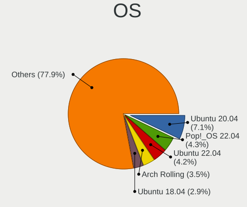

| Name                | Notebooks | Percent |
|---------------------|-----------|---------|
| Ubuntu 20.04        | 204       | 7.09%   |
| Pop!_OS 22.04       | 125       | 4.34%   |
| Ubuntu 22.04        | 120       | 4.17%   |
| Arch Rolling        | 102       | 3.54%   |
| Ubuntu 18.04        | 84        | 2.92%   |
| Ubuntu 24.04        | 77        | 2.67%   |
| OpenMandriva 25.90  | 48        | 1.67%   |
| Debian 12           | 45        | 1.56%   |
| Zorin 17            | 42        | 1.46%   |
| Linux Mint 22.1     | 39        | 1.35%   |
| Debian 11           | 39        | 1.35%   |
| Fedora 42           | 37        | 1.29%   |
| OpenMandriva 24.12  | 36        | 1.25%   |
| Fedora 40           | 36        | 1.25%   |
| Zorin 16            | 35        | 1.22%   |
| OpenMandriva 25.06  | 33        | 1.15%   |
| ArcoLinux Rolling   | 33        | 1.15%   |
| Linux Mint 20.3     | 31        | 1.08%   |
| KDE neon 20.04      | 31        | 1.08%   |
| Fedora 39           | 31        | 1.08%   |
| Linux Mint 20.2     | 30        | 1.04%   |
| Fedora 36           | 29        | 1.01%   |
| Pop!_OS 21.04       | 28        | 0.97%   |
| Manjaro             | 28        | 0.97%   |
| Fedora 38           | 27        | 0.94%   |
| Fedora 41           | 26        | 0.9%    |
| Pop!_OS 20.04       | 25        | 0.87%   |
| OpenMandriva 4.3    | 25        | 0.87%   |
| Linux Mint 22.2     | 25        | 0.87%   |
| Fedora 37           | 25        | 0.87%   |
| Arch                | 24        | 0.83%   |
| Linux Mint 20       | 23        | 0.8%    |
| Ubuntu 20.10        | 21        | 0.73%   |
| OpenMandriva 6.0    | 21        | 0.73%   |
| OpenMandriva 25.01  | 21        | 0.73%   |
| Linux Mint 21.1     | 21        | 0.73%   |
| EndeavourOS Rolling | 21        | 0.73%   |
| OpenMandriva 4.2    | 20        | 0.69%   |
| Linux Mint 20.1     | 20        | 0.69%   |
| Pop!_OS 20.10       | 19        | 0.66%   |

OS Family
---------

OS without a version

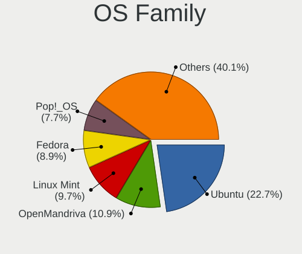

| Name          | Notebooks | Percent |
|---------------|-----------|---------|
| Ubuntu        | 609       | 22.72%  |
| OpenMandriva  | 291       | 10.86%  |
| Linux Mint    | 260       | 9.7%    |
| Fedora        | 239       | 8.92%   |
| Pop!_OS       | 206       | 7.69%   |
| Arch          | 123       | 4.59%   |
| Debian        | 118       | 4.4%    |
| Zorin         | 106       | 3.96%   |
| KDE neon      | 64        | 2.39%   |
| Manjaro       | 63        | 2.35%   |
| Kubuntu       | 59        | 2.2%    |
| Kali          | 51        | 1.9%    |
| Xubuntu       | 42        | 1.57%   |
| Elementary    | 37        | 1.38%   |
| SteamOS       | 33        | 1.23%   |
| ArcoLinux     | 33        | 1.23%   |
| openSUSE      | 24        | 0.9%    |
| Bazzite       | 24        | 0.9%    |
| Gentoo        | 21        | 0.78%   |
| EndeavourOS   | 21        | 0.78%   |
| MX            | 16        | 0.6%    |
| Clear Linux   | 16        | 0.6%    |
| Lubuntu       | 14        | 0.52%   |
| LMDE          | 14        | 0.52%   |
| Nobara        | 13        | 0.49%   |
| Endless       | 13        | 0.49%   |
| Ubuntu Unity  | 11        | 0.41%   |
| Ubuntu MATE   | 11        | 0.41%   |
| ROSA          | 10        | 0.37%   |
| Parrot        | 9         | 0.34%   |
| Ubuntu Budgie | 6         | 0.22%   |
| NixOS         | 6         | 0.22%   |
| LinuxFX       | 6         | 0.22%   |
| Garuda Linux  | 6         | 0.22%   |
| BlackPanther  | 6         | 0.22%   |
| Xero          | 5         | 0.19%   |
| TUXEDO OS     | 5         | 0.19%   |
| Reborn OS     | 4         | 0.15%   |
| Oracle Linux  | 4         | 0.15%   |
| CachyOS       | 4         | 0.15%   |

Kernel
------

Version of the Linux kernel

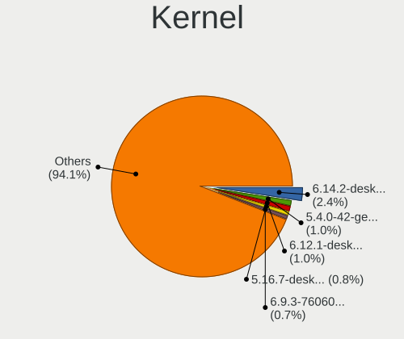

| Version                             | Notebooks | Percent |
|-------------------------------------|-----------|---------|
| 6.14.2-desktop-3omv2590             | 78        | 2.44%   |
| 5.4.0-42-generic                    | 33        | 1.03%   |
| 6.12.1-desktop-1omv2490             | 31        | 0.97%   |
| 5.16.7-desktop-1omv4003             | 24        | 0.75%   |
| 6.9.3-76060903-generic              | 23        | 0.72%   |
| 6.12.9-desktop-1omv2490             | 20        | 0.63%   |
| 5.10.14-desktop-1omv4002            | 20        | 0.63%   |
| 5.4.0-58-generic                    | 18        | 0.56%   |
| 6.8.0-45-generic                    | 16        | 0.5%    |
| 5.15.0-56-generic                   | 16        | 0.5%    |
| 6.6.10-76060610-generic             | 15        | 0.47%   |
| 6.12.10-76061203-generic            | 15        | 0.47%   |
| 5.4.0-26-generic                    | 15        | 0.47%   |
| 6.8.0-52-generic                    | 14        | 0.44%   |
| 6.6.2-desktop-1omv2390              | 14        | 0.44%   |
| 6.2.6-76060206-generic              | 14        | 0.44%   |
| 6.14.0-29-generic                   | 14        | 0.44%   |
| 5.4.0-40-generic                    | 14        | 0.44%   |
| 5.11.0-7620-generic                 | 14        | 0.44%   |
| 6.8.0-49-generic                    | 13        | 0.41%   |
| 6.4.11-desktop-1omv2390             | 13        | 0.41%   |
| 6.2.6-desktop-1omv2390              | 13        | 0.41%   |
| 6.14.0-33-generic                   | 13        | 0.41%   |
| 5.4.0-29-generic                    | 13        | 0.41%   |
| 6.8.0-76060800daily20240311-generic | 12        | 0.38%   |
| 6.8.0-31-generic                    | 12        | 0.38%   |
| 5.4.0-48-generic                    | 12        | 0.38%   |
| 5.17.5-76051705-generic             | 12        | 0.38%   |
| 5.15.0-58-generic                   | 12        | 0.38%   |
| 5.11.0-38-generic                   | 12        | 0.38%   |
| 6.8.0-51-generic                    | 11        | 0.34%   |
| 6.2.0-26-generic                    | 11        | 0.34%   |
| 6.2.0-20-generic                    | 11        | 0.34%   |
| 6.14.0-36-generic                   | 11        | 0.34%   |
| 5.11.0-37-generic                   | 11        | 0.34%   |
| 5.11.0-27-generic                   | 11        | 0.34%   |
| 6.14.0-27-generic                   | 10        | 0.31%   |
| 6.11.0-21-generic                   | 10        | 0.31%   |
| 6.1.1-desktop-1omv2290              | 10        | 0.31%   |
| 5.4.0-52-generic                    | 10        | 0.31%   |

Kernel Family
-------------

Linux kernel without a distro release

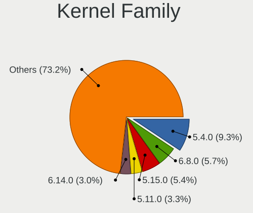

| Version | Notebooks | Percent |
|---------|-----------|---------|
| 5.4.0   | 282       | 9.34%   |
| 6.8.0   | 173       | 5.73%   |
| 5.15.0  | 162       | 5.37%   |
| 5.11.0  | 100       | 3.31%   |
| 6.14.0  | 91        | 3.02%   |
| 5.13.0  | 85        | 2.82%   |
| 5.8.0   | 84        | 2.78%   |
| 6.14.2  | 82        | 2.72%   |
| 6.5.0   | 78        | 2.58%   |
| 4.15.0  | 71        | 2.35%   |
| 6.2.0   | 61        | 2.02%   |
| 5.19.0  | 59        | 1.95%   |
| 6.1.0   | 55        | 1.82%   |
| 5.3.0   | 52        | 1.72%   |
| 5.10.0  | 52        | 1.72%   |
| 6.11.0  | 51        | 1.69%   |
| 5.0.0   | 41        | 1.36%   |
| 6.12.1  | 34        | 1.13%   |
| 4.18.0  | 31        | 1.03%   |
| 6.2.6   | 27        | 0.89%   |
| 5.16.7  | 25        | 0.83%   |
| 6.9.3   | 24        | 0.8%    |
| 6.12.9  | 22        | 0.73%   |
| 5.10.14 | 20        | 0.66%   |
| 6.12.10 | 18        | 0.6%    |
| 5.17.5  | 18        | 0.6%    |
| 6.6.2   | 16        | 0.53%   |
| 6.6.10  | 16        | 0.53%   |
| 6.17.7  | 16        | 0.53%   |
| 6.4.11  | 15        | 0.5%    |
| 6.1.1   | 14        | 0.46%   |
| 6.0.0   | 14        | 0.46%   |
| 6.8.7   | 13        | 0.43%   |
| 6.5.6   | 13        | 0.43%   |
| 6.1.52  | 12        | 0.4%    |
| 6.0.12  | 12        | 0.4%    |
| 5.18.0  | 11        | 0.36%   |
| 4.19.0  | 11        | 0.36%   |
| 6.15.7  | 9         | 0.3%    |
| 6.15.0  | 9         | 0.3%    |

Kernel Major Ver.
-----------------

Linux kernel major version

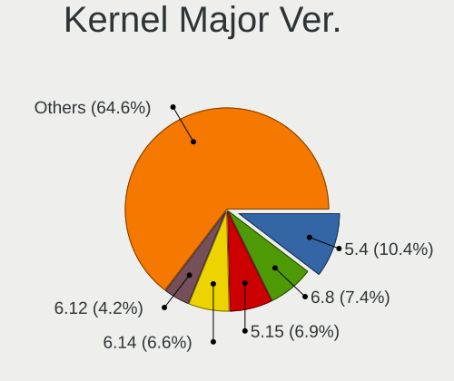

| Version | Notebooks | Percent |
|---------|-----------|---------|
| 5.4     | 306       | 10.36%  |
| 6.8     | 218       | 7.38%   |
| 5.15    | 203       | 6.87%   |
| 6.14    | 194       | 6.57%   |
| 6.12    | 124       | 4.2%    |
| 6.1     | 119       | 4.03%   |
| 5.11    | 114       | 3.86%   |
| 6.5     | 112       | 3.79%   |
| 6.2     | 107       | 3.62%   |
| 5.8     | 101       | 3.42%   |
| 5.13    | 100       | 3.39%   |
| 5.10    | 96        | 3.25%   |
| 6.11    | 85        | 2.88%   |
| 6.6     | 77        | 2.61%   |
| 5.19    | 75        | 2.54%   |
| 4.15    | 71        | 2.4%    |
| 6.17    | 63        | 2.13%   |
| 5.16    | 58        | 1.96%   |
| 5.3     | 56        | 1.9%    |
| 6.0     | 55        | 1.86%   |
| 6.4     | 53        | 1.79%   |
| 6.15    | 47        | 1.59%   |
| 5.0     | 45        | 1.52%   |
| 6.13    | 44        | 1.49%   |
| 6.9     | 43        | 1.46%   |
| 5.17    | 39        | 1.32%   |
| 5.18    | 37        | 1.25%   |
| 4.18    | 36        | 1.22%   |
| 6.16    | 34        | 1.15%   |
| 6.10    | 33        | 1.12%   |
| 6.7     | 30        | 1.02%   |
| 6.3     | 24        | 0.81%   |
| 5.14    | 20        | 0.68%   |
| 5.6     | 19        | 0.64%   |
| 5.9     | 17        | 0.58%   |
| 5.12    | 15        | 0.51%   |
| 4.19    | 14        | 0.47%   |
| 5.5     | 12        | 0.41%   |
| 5.7     | 11        | 0.37%   |
| 4.9     | 11        | 0.37%   |

Arch
----

OS architecture (x86_64, i586, etc.)

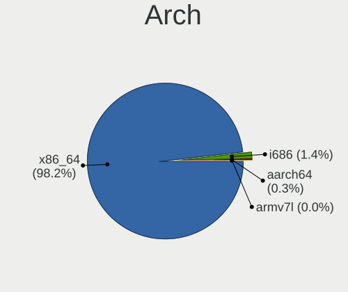

| Name    | Notebooks | Percent |
|---------|-----------|---------|
| x86_64  | 2487      | 98.18%  |
| i686    | 36        | 1.42%   |
| aarch64 | 7         | 0.28%   |
| i586    | 2         | 0.08%   |
| armv7l  | 1         | 0.04%   |

DE
--

Desktop Environment

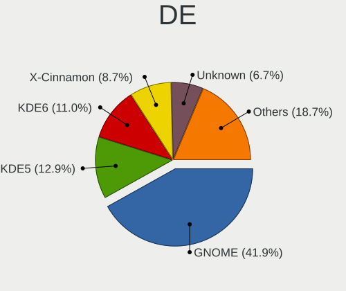

| Name            | Notebooks | Percent |
|-----------------|-----------|---------|
| GNOME           | 1131      | 41.9%   |
| KDE5            | 349       | 12.93%  |
| KDE6            | 298       | 11.04%  |
| X-Cinnamon      | 236       | 8.74%   |
| Unknown         | 181       | 6.71%   |
| XFCE            | 177       | 6.56%   |
| MATE            | 49        | 1.82%   |
| KDE             | 38        | 1.41%   |
| Pantheon        | 35        | 1.3%    |
| Cinnamon        | 31        | 1.15%   |
| LXQt            | 28        | 1.04%   |
| Hyprland        | 23        | 0.85%   |
| i3              | 21        | 0.78%   |
| Unity           | 13        | 0.48%   |
| LXDE            | 11        | 0.41%   |
| Budgie          | 11        | 0.41%   |
| COSMIC          | 10        | 0.37%   |
| KDE4            | 9         | 0.33%   |
| GNOME Classic   | 9         | 0.33%   |
| Deepin          | 7         | 0.26%   |
| BunsenLabs      | 5         | 0.19%   |
| awesome         | 4         | 0.15%   |
| GNOME Flashback | 3         | 0.11%   |
| sway            | 2         | 0.07%   |
| Openbox         | 2         | 0.07%   |
| icewm           | 2         | 0.07%   |
| Endless:GNOME   | 2         | 0.07%   |
| bspwm           | 2         | 0.07%   |
| swaydebug       | 1         | 0.04%   |
| qtile-default   | 1         | 0.04%   |
| qtile           | 1         | 0.04%   |
| Phosh:GNOME     | 1         | 0.04%   |
| LeftWM          | 1         | 0.04%   |
| herbstluftwm    | 1         | 0.04%   |
| Enlightenment   | 1         | 0.04%   |
| dwm             | 1         | 0.04%   |
| dusk            | 1         | 0.04%   |
| chadwm          | 1         | 0.04%   |

Display Server
--------------

X11 or Wayland

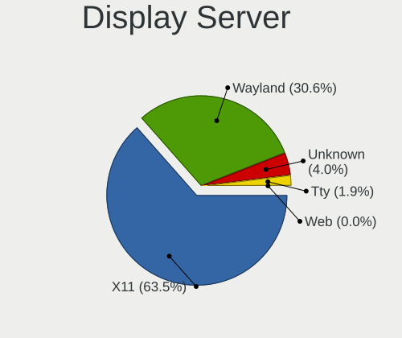

| Name    | Notebooks | Percent |
|---------|-----------|---------|
| X11     | 1677      | 63.5%   |
| Wayland | 807       | 30.56%  |
| Unknown | 106       | 4.01%   |
| Tty     | 50        | 1.89%   |
| Web     | 1         | 0.04%   |

Display Manager
---------------

SDDM, LightDM, etc.

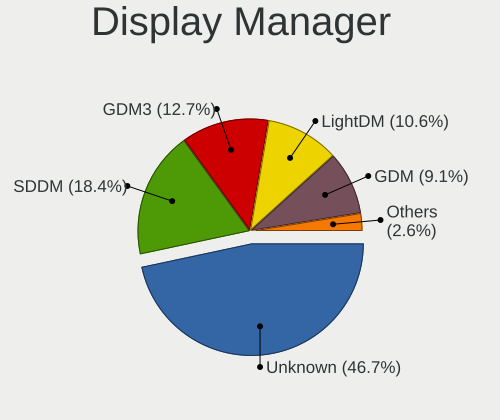

| Name                  | Notebooks | Percent |
|-----------------------|-----------|---------|
| Unknown               | 1235      | 46.66%  |
| SDDM                  | 486       | 18.36%  |
| GDM3                  | 335       | 12.66%  |
| LightDM               | 281       | 10.62%  |
| GDM                   | 242       | 9.14%   |
| TDM                   | 41        | 1.55%   |
| KDM                   | 8         | 0.3%    |
| SLiM                  | 3         | 0.11%   |
| LY-DM                 | 3         | 0.11%   |
| LXDM                  | 3         | 0.11%   |
| LEMURS                | 3         | 0.11%   |
| COSMIC-GREETER        | 2         | 0.08%   |
| XDM                   | 1         | 0.04%   |
| SLIMSKI               | 1         | 0.04%   |
| Ly                    | 1         | 0.04%   |
| GREETD                | 1         | 0.04%   |
| DISPLAY-MANAGER-START | 1         | 0.04%   |

OS Lang
-------

Language

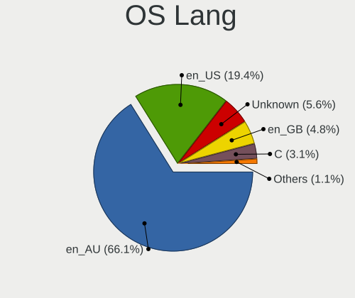

| Lang         | Notebooks | Percent |
|--------------|-----------|---------|
| en_AU        | 1745      | 66.12%  |
| en_US        | 511       | 19.36%  |
| Unknown      | 147       | 5.57%   |
| en_GB        | 127       | 4.81%   |
| C            | 81        | 3.07%   |
| C.UTF8       | 4         | 0.15%   |
| de_DE        | 3         | 0.11%   |
| zh_CN        | 2         | 0.08%   |
| ru_RU        | 2         | 0.08%   |
| POSIX        | 2         | 0.08%   |
| es_ES        | 2         | 0.08%   |
| en_NZ        | 2         | 0.08%   |
| zh_TW        | 1         | 0.04%   |
| it_IT        | 1         | 0.04%   |
| fr_FR        | 1         | 0.04%   |
| en_ZA        | 1         | 0.04%   |
| en_IN        | 1         | 0.04%   |
| en_HK        | 1         | 0.04%   |
| en_GB.UTF-12 | 1         | 0.04%   |
| en_DK        | 1         | 0.04%   |
| en_CA        | 1         | 0.04%   |
| en_AU.UFT-8  | 1         | 0.04%   |
| en-AU        | 1         | 0.04%   |

Boot Mode
---------

EFI or BIOS

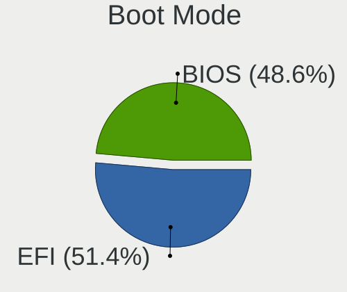

| Mode | Notebooks | Percent |
|------|-----------|---------|
| EFI  | 1338      | 51.4%   |
| BIOS | 1265      | 48.6%   |

Filesystem
----------

Type of filesystem

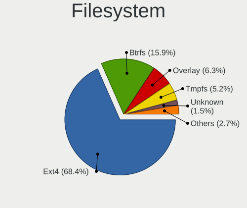

| Type     | Notebooks | Percent |
|----------|-----------|---------|
| Ext4     | 1794      | 68.39%  |
| Btrfs    | 417       | 15.9%   |
| Overlay  | 165       | 6.29%   |
| Tmpfs    | 137       | 5.22%   |
| Unknown  | 39        | 1.49%   |
| Xfs      | 30        | 1.14%   |
| Zfs      | 24        | 0.91%   |
| Ext2     | 6         | 0.23%   |
| XXXXXXX  | 3         | 0.11%   |
| Ext3     | 3         | 0.11%   |
| Rootfs   | 2         | 0.08%   |
| F2fs     | 2         | 0.08%   |
| Bcachefs | 1         | 0.04%   |

Part. scheme
------------

Scheme of partitioning

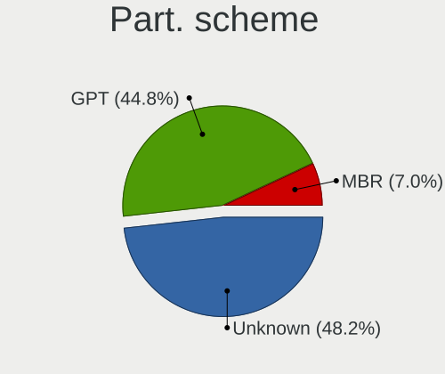

| Type    | Notebooks | Percent |
|---------|-----------|---------|
| Unknown | 1254      | 48.25%  |
| GPT     | 1164      | 44.79%  |
| MBR     | 181       | 6.96%   |

Dual Boot with Linux/BSD
------------------------

Hosting more than one Linux/BSD

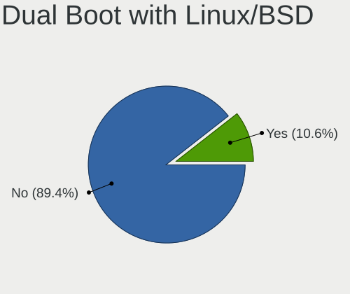

| Dual boot | Notebooks | Percent |
|-----------|-----------|---------|
| No        | 2305      | 89.45%  |
| Yes       | 272       | 10.55%  |

Dual Boot (Win)
---------------

Hosting Linux and Windows

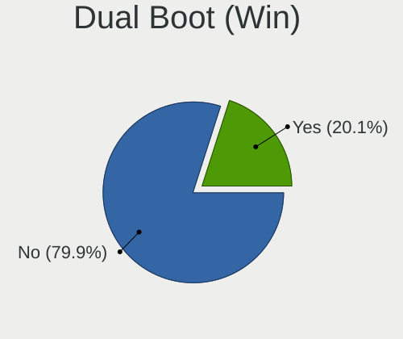

| Dual boot | Notebooks | Percent |
|-----------|-----------|---------|
| No        | 2064      | 79.94%  |
| Yes       | 518       | 20.06%  |

Board
-----

Vendor
------

Motherboard manufacturer

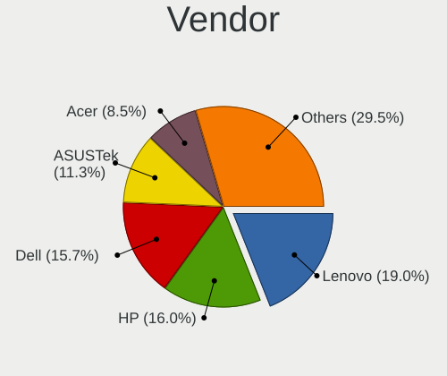

| Name                           | Notebooks | Percent |
|--------------------------------|-----------|---------|
| Lenovo                         | 480       | 18.96%  |
| Hewlett-Packard                | 405       | 16%     |
| Dell                           | 398       | 15.73%  |
| ASUSTek Computer               | 287       | 11.34%  |
| Acer                           | 214       | 8.46%   |
| Apple                          | 187       | 7.39%   |
| Toshiba                        | 144       | 5.69%   |
| MSI                            | 78        | 3.08%   |
| Valve                          | 28        | 1.11%   |
| Framework                      | 24        | 0.95%   |
| Gigabyte Technology            | 23        | 0.91%   |
| Alienware                      | 23        | 0.91%   |
| Samsung Electronics            | 17        | 0.67%   |
| Sony                           | 16        | 0.63%   |
| Notebook                       | 16        | 0.63%   |
| Metabox                        | 16        | 0.63%   |
| Unknown                        | 16        | 0.63%   |
| IT Channel Pty                 | 13        | 0.51%   |
| Panasonic                      | 12        | 0.47%   |
| Razer                          | 11        | 0.43%   |
| Intel Client Systems           | 11        | 0.43%   |
| Google                         | 10        | 0.4%    |
| Timi                           | 9         | 0.36%   |
| HUAWEI                         | 9         | 0.36%   |
| COM1                           | 8         | 0.32%   |
| System76                       | 6         | 0.24%   |
| LG Electronics                 | 6         | 0.24%   |
| Fujitsu                        | 6         | 0.24%   |
| Leader                         | 4         | 0.16%   |
| AMI                            | 4         | 0.16%   |
| Medion                         | 3         | 0.12%   |
| Kogan                          | 3         | 0.12%   |
| Dynabook                       | 3         | 0.12%   |
| Purism                         | 2         | 0.08%   |
| Pine Microsystems              | 2         | 0.08%   |
| Matsushita Electric Industrial | 2         | 0.08%   |
| INFINITY                       | 2         | 0.08%   |
| IBM                            | 2         | 0.08%   |
| GPD                            | 2         | 0.08%   |
| Chuwi                          | 2         | 0.08%   |

Model
-----

Motherboard model

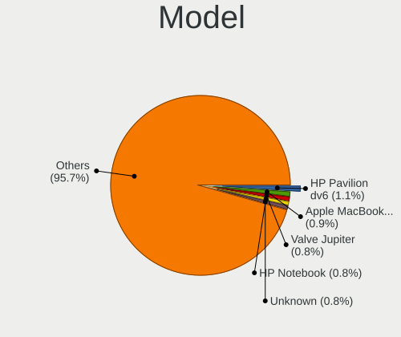

| Name                                        | Notebooks | Percent |
|---------------------------------------------|-----------|---------|
| HP Pavilion dv6                             | 27        | 1.07%   |
| Apple MacBookAir7,2                         | 24        | 0.95%   |
| Valve Jupiter                               | 21        | 0.83%   |
| HP Notebook                                 | 19        | 0.75%   |
| Unknown                                     | 19        | 0.75%   |
| HP Pavilion g6                              | 14        | 0.55%   |
| Apple MacBookPro9,2                         | 13        | 0.51%   |
| Apple MacBookPro8,1                         | 13        | 0.51%   |
| Apple MacBookPro10,1                        | 13        | 0.51%   |
| HP Pavilion 15                              | 12        | 0.47%   |
| ASUS VivoBook_ASUSLaptop X515EA_F1500EA     | 12        | 0.47%   |
| Framework Laptop 13 (AMD Ryzen 7040Series)  | 9         | 0.36%   |
| Dell XPS 13 9360                            | 9         | 0.36%   |
| Apple MacBookPro12,1                        | 9         | 0.36%   |
| Apple MacBookAir6,2                         | 9         | 0.36%   |
| Dell XPS 15 9570                            | 8         | 0.32%   |
| Dell XPS 15 9560                            | 8         | 0.32%   |
| Dell Latitude 5420                          | 8         | 0.32%   |
| ASUS X550CA                                 | 8         | 0.32%   |
| Valve Galileo                               | 7         | 0.28%   |
| Toshiba Satellite L850                      | 7         | 0.28%   |
| Lenovo ThinkPad P1 Gen 4i 20Y4S1QE0Z        | 7         | 0.28%   |
| Lenovo IdeaPad 1 15IJL7 82LX                | 7         | 0.28%   |
| Dell XPS 13 9350                            | 7         | 0.28%   |
| Dell Latitude E6410                         | 7         | 0.28%   |
| Apple MacBookPro16,2                        | 7         | 0.28%   |
| Acer Aspire 5750G                           | 7         | 0.28%   |
| Toshiba Satellite L750                      | 6         | 0.24%   |
| Lenovo ThinkPad T470s W10DG 20JTS0HT00      | 6         | 0.24%   |
| HP Pavilion Notebook                        | 6         | 0.24%   |
| HP Pavilion dv7                             | 6         | 0.24%   |
| HP 15                                       | 6         | 0.24%   |
| Framework Laptop 16 (AMD Ryzen 7040 Series) | 6         | 0.24%   |
| Dell XPS 13 9370                            | 6         | 0.24%   |
| Dell Latitude E7450                         | 6         | 0.24%   |
| Dell Latitude E7440                         | 6         | 0.24%   |
| Dell Latitude E6430                         | 6         | 0.24%   |
| Dell Latitude 5430                          | 6         | 0.24%   |
| ASUS Zenbook UM3402YAR_UM3402YA             | 6         | 0.24%   |
| Apple MacBookPro11,1                        | 6         | 0.24%   |

Model Family
------------

Motherboard model prefix

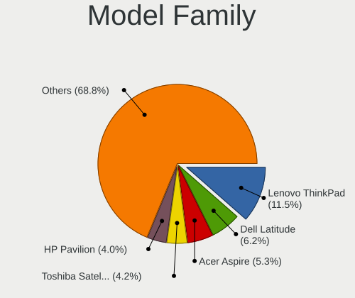

| Name               | Notebooks | Percent |
|--------------------|-----------|---------|
| Lenovo ThinkPad    | 290       | 11.46%  |
| Dell Latitude      | 157       | 6.2%    |
| Acer Aspire        | 135       | 5.33%   |
| Toshiba Satellite  | 107       | 4.23%   |
| HP Pavilion        | 101       | 3.99%   |
| Lenovo IdeaPad     | 92        | 3.63%   |
| Dell XPS           | 87        | 3.44%   |
| HP EliteBook       | 82        | 3.24%   |
| Dell Inspiron      | 82        | 3.24%   |
| HP Laptop          | 50        | 1.98%   |
| ASUS VivoBook      | 50        | 1.98%   |
| HP ProBook         | 48        | 1.9%    |
| Lenovo Yoga        | 35        | 1.38%   |
| Dell Precision     | 34        | 1.34%   |
| ASUS Zenbook       | 29        | 1.15%   |
| ASUS ROG           | 26        | 1.03%   |
| Framework Laptop   | 24        | 0.95%   |
| Apple MacBookAir7  | 24        | 0.95%   |
| Valve Jupiter      | 21        | 0.83%   |
| Toshiba PORTEGE    | 21        | 0.83%   |
| Acer Nitro         | 21        | 0.83%   |
| Lenovo Legion      | 19        | 0.75%   |
| HP Notebook        | 19        | 0.75%   |
| Unknown            | 19        | 0.75%   |
| Apple MacBookPro11 | 18        | 0.71%   |
| Apple MacBookPro10 | 18        | 0.71%   |
| HP ENVY            | 17        | 0.67%   |
| ASUS ASUS          | 16        | 0.63%   |
| Acer Swift         | 16        | 0.63%   |
| Apple MacBookPro8  | 15        | 0.59%   |
| Apple MacBookAir6  | 15        | 0.59%   |
| HP ZBook           | 14        | 0.55%   |
| Apple MacBookPro9  | 14        | 0.55%   |
| HP Compaq          | 13        | 0.51%   |
| ASUS TUF           | 12        | 0.47%   |
| Razer Blade        | 11        | 0.43%   |
| HP 250             | 11        | 0.43%   |
| Dell Vostro        | 11        | 0.43%   |
| Apple MacBookPro16 | 11        | 0.43%   |
| Acer TravelMate    | 11        | 0.43%   |

MFG Year
--------

Motherboard manufacture year

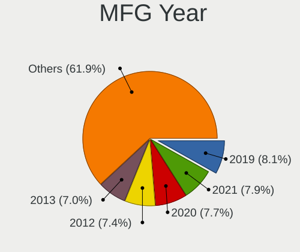

| Year    | Notebooks | Percent |
|---------|-----------|---------|
| 2019    | 206       | 8.14%   |
| 2021    | 199       | 7.86%   |
| 2020    | 195       | 7.7%    |
| 2012    | 188       | 7.43%   |
| 2013    | 176       | 6.95%   |
| 2018    | 163       | 6.44%   |
| 2011    | 158       | 6.24%   |
| 2014    | 147       | 5.81%   |
| 2015    | 142       | 5.61%   |
| 2017    | 141       | 5.57%   |
| 2022    | 140       | 5.53%   |
| 2016    | 127       | 5.02%   |
| 2023    | 116       | 4.58%   |
| 2010    | 105       | 4.15%   |
| 2024    | 89        | 3.52%   |
| 2008    | 78        | 3.08%   |
| 2009    | 60        | 2.37%   |
| 2007    | 32        | 1.26%   |
| 2006    | 32        | 1.26%   |
| 2025    | 21        | 0.83%   |
| Unknown | 9         | 0.36%   |
| 2005    | 6         | 0.24%   |
| 2003    | 1         | 0.04%   |

Form Factor
-----------

Physical design of the computer

| Name     | Notebooks | Percent |
|----------|-----------|---------|
| Notebook | 2531      | 100%    |

Secure Boot
-----------

Enabled or disabled

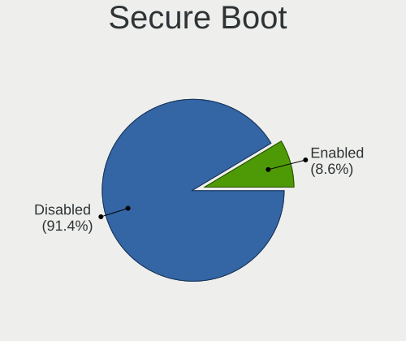

| State    | Notebooks | Percent |
|----------|-----------|---------|
| Disabled | 2332      | 91.42%  |
| Enabled  | 219       | 8.58%   |

Coreboot
--------

Have coreboot on board

| Used | Notebooks | Percent |
|------|-----------|---------|
| No   | 2513      | 99.29%  |
| Yes  | 18        | 0.71%   |

RAM Size
--------

Total RAM memory

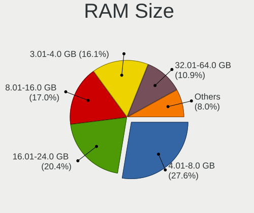

| Size in GB  | Notebooks | Percent |
|-------------|-----------|---------|
| 4.01-8.0    | 708       | 27.59%  |
| 16.01-24.0  | 524       | 20.42%  |
| 8.01-16.0   | 435       | 16.95%  |
| 3.01-4.0    | 413       | 16.1%   |
| 32.01-64.0  | 280       | 10.91%  |
| 1.01-2.0    | 71        | 2.77%   |
| 64.01-256.0 | 61        | 2.38%   |
| 24.01-32.0  | 45        | 1.75%   |
| 2.01-3.0    | 17        | 0.66%   |
| 0.51-1.0    | 8         | 0.31%   |
| 0.01-0.5    | 4         | 0.16%   |

RAM Used
--------

Used RAM memory

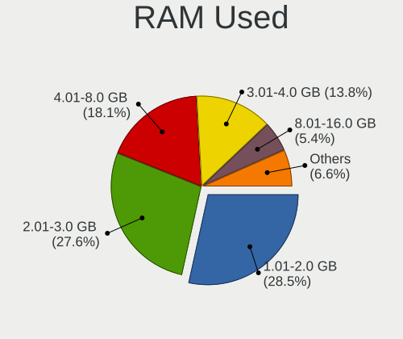

| Used GB    | Notebooks | Percent |
|------------|-----------|---------|
| 1.01-2.0   | 822       | 28.45%  |
| 2.01-3.0   | 797       | 27.59%  |
| 4.01-8.0   | 522       | 18.07%  |
| 3.01-4.0   | 400       | 13.85%  |
| 8.01-16.0  | 157       | 5.43%   |
| 0.51-1.0   | 134       | 4.64%   |
| 0.01-0.5   | 21        | 0.73%   |
| 16.01-24.0 | 20        | 0.69%   |
| 32.01-64.0 | 7         | 0.24%   |
| 24.01-32.0 | 7         | 0.24%   |
| 0          | 2         | 0.07%   |

Total Drives
------------

Number of drives on board

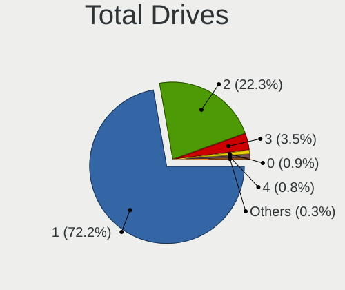

| Drives | Notebooks | Percent |
|--------|-----------|---------|
| 1      | 1898      | 72.25%  |
| 2      | 585       | 22.27%  |
| 3      | 92        | 3.5%    |
| 0      | 23        | 0.88%   |
| 4      | 21        | 0.8%    |
| 5      | 4         | 0.15%   |
| 8      | 2         | 0.08%   |
| 10     | 1         | 0.04%   |
| 7      | 1         | 0.04%   |

Has CD-ROM
----------

Has CD-ROM on board

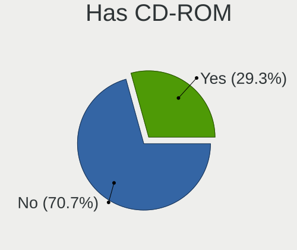

| Presented | Notebooks | Percent |
|-----------|-----------|---------|
| No        | 1800      | 70.7%   |
| Yes       | 746       | 29.3%   |

Has Ethernet
------------

Has Ethernet on board

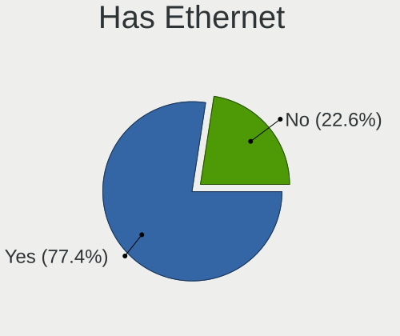

| Presented | Notebooks | Percent |
|-----------|-----------|---------|
| Yes       | 1969      | 77.43%  |
| No        | 574       | 22.57%  |

Has WiFi
--------

Has WiFi module

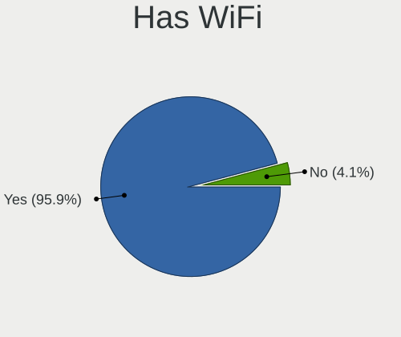

| Presented | Notebooks | Percent |
|-----------|-----------|---------|
| Yes       | 2430      | 95.86%  |
| No        | 105       | 4.14%   |

Has Bluetooth
-------------

Has Bluetooth module

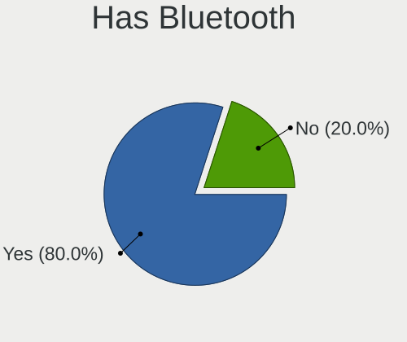

| Presented | Notebooks | Percent |
|-----------|-----------|---------|
| Yes       | 2052      | 79.97%  |
| No        | 514       | 20.03%  |

Location
--------

Country
-------

Geographic location (country)

| Country   | Notebooks | Percent |
|-----------|-----------|---------|
| Australia | 2531      | 100%    |

City
----

Geographic location (city)

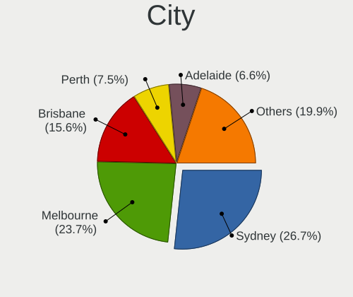

| City           | Notebooks | Percent |
|----------------|-----------|---------|
| Sydney         | 717       | 26.69%  |
| Melbourne      | 636       | 23.68%  |
| Brisbane       | 419       | 15.6%   |
| Perth          | 201       | 7.48%   |
| Adelaide       | 178       | 6.63%   |
| Canberra       | 60        | 2.23%   |
| Hobart         | 29        | 1.08%   |
| Gold Coast     | 20        | 0.74%   |
| Launceston     | 14        | 0.52%   |
| Geelong        | 13        | 0.48%   |
| Leinster       | 12        | 0.45%   |
| Central Coast  | 11        | 0.41%   |
| Nyngan         | 9         | 0.34%   |
| Richmond       | 8         | 0.3%    |
| Wollongong     | 7         | 0.26%   |
| Newcastle      | 7         | 0.26%   |
| Woolloongabba  | 6         | 0.22%   |
| Townsville     | 6         | 0.22%   |
| Southport      | 6         | 0.22%   |
| Cairns         | 6         | 0.22%   |
| Young          | 5         | 0.19%   |
| Sunshine West  | 5         | 0.19%   |
| Parramatta     | 5         | 0.19%   |
| Mitcham        | 5         | 0.19%   |
| Mandurah       | 5         | 0.19%   |
| Ballarat       | 5         | 0.19%   |
| Alexandria     | 5         | 0.19%   |
| West End       | 4         | 0.15%   |
| Wahroonga      | 4         | 0.15%   |
| Traralgon      | 4         | 0.15%   |
| Point Cook     | 4         | 0.15%   |
| Kurrara        | 4         | 0.15%   |
| Geraldton      | 4         | 0.15%   |
| Darwin         | 4         | 0.15%   |
| Artarmon       | 4         | 0.15%   |
| Warragul       | 3         | 0.11%   |
| Surry Hills    | 3         | 0.11%   |
| Sunshine Coast | 3         | 0.11%   |
| Summerholm     | 3         | 0.11%   |
| Spring Field   | 3         | 0.11%   |

Drives
------

Drive Vendor
------------

Hard drive vendors

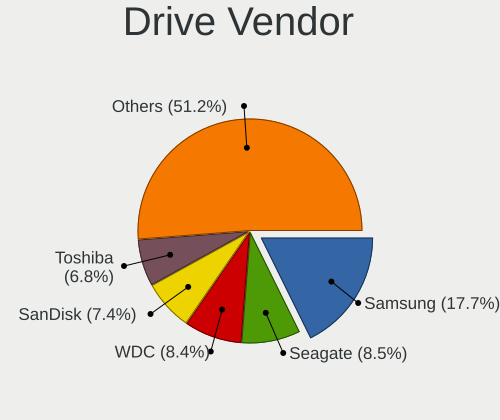

| Vendor                       | Notebooks | Drives | Percent |
|------------------------------|-----------|--------|---------|
| Samsung Electronics          | 562       | 771    | 17.7%   |
| Seagate                      | 271       | 421    | 8.54%   |
| WDC                          | 266       | 370    | 8.38%   |
| SanDisk                      | 234       | 309    | 7.37%   |
| Toshiba                      | 216       | 300    | 6.8%    |
| Unknown                      | 159       | 215    | 5.01%   |
| SK hynix                     | 148       | 186    | 4.66%   |
| Crucial                      | 127       | 165    | 4%      |
| Apple                        | 124       | 160    | 3.91%   |
| Micron Technology            | 115       | 140    | 3.62%   |
| Intel                        | 115       | 178    | 3.62%   |
| Kingston                     | 103       | 129    | 3.24%   |
| Hitachi                      | 83        | 103    | 2.61%   |
| HGST                         | 73        | 101    | 2.3%    |
| KIOXIA                       | 56        | 61     | 1.76%   |
| Phison Electronics           | 42        | 56     | 1.32%   |
| Micron/Crucial Technology    | 36        | 40     | 1.13%   |
| Kingston Technology Company  | 35        | 44     | 1.1%    |
| ASMT                         | 21        | 24     | 0.66%   |
| LITEON                       | 20        | 32     | 0.63%   |
| Unknown                      | 20        | 22     | 0.63%   |
| Fujitsu                      | 18        | 26     | 0.57%   |
| SPCC                         | 17        | 20     | 0.54%   |
| Phison                       | 16        | 23     | 0.5%    |
| JMicron Technology           | 16        | 29     | 0.5%    |
| A-DATA Technology            | 16        | 26     | 0.5%    |
| MAXIO Technology (Hangzhou)  | 15        | 15     | 0.47%   |
| Patriot                      | 14        | 16     | 0.44%   |
| LITEONIT                     | 14        | 16     | 0.44%   |
| China                        | 12        | 13     | 0.38%   |
| KingSpec                     | 9         | 14     | 0.28%   |
| Transcend                    | 8         | 10     | 0.25%   |
| OCZ                          | 8         | 10     | 0.25%   |
| Silicon Motion               | 7         | 9      | 0.22%   |
| Realtek                      | 7         | 7      | 0.22%   |
| Lenovo                       | 7         | 8      | 0.22%   |
| USB                          | 6         | 8      | 0.19%   |
| Team                         | 6         | 7      | 0.19%   |
| ADATA Technology             | 6         | 14     | 0.19%   |
| Shenzhen Longsys Electronics | 5         | 5      | 0.16%   |

Drive Model
-----------

Hard drive models

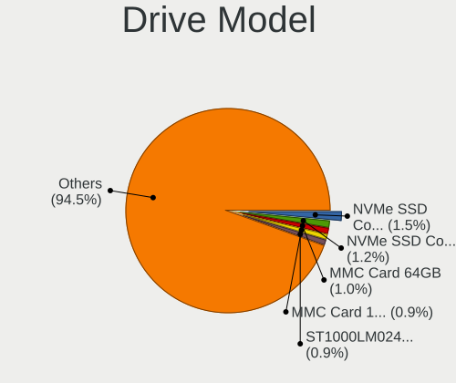

| Model                                                | Notebooks | Percent |
|------------------------------------------------------|-----------|---------|
| Samsung NVMe SSD Controller SM981/PM981/PM983 1TB    | 51        | 1.53%   |
| Samsung NVMe SSD Controller PM9A1/PM9A3/980PRO 1TB   | 39        | 1.17%   |
| Unknown MMC Card  64GB                               | 33        | 0.99%   |
| Unknown MMC Card  128GB                              | 30        | 0.9%    |
| Seagate ST1000LM024 HN-M101MBB 1TB                   | 30        | 0.9%    |
| Unknown MMC Card  32GB                               | 23        | 0.69%   |
| Toshiba MQ01ABD100 1TB                               | 23        | 0.69%   |
| Seagate Expansion 2TB                                | 23        | 0.69%   |
| Samsung SSD 860 EVO 500GB                            | 23        | 0.69%   |
| HGST HTS721010A9E630 1TB                             | 23        | 0.69%   |
| Seagate ST500LT012-1DG142 500GB                      | 20        | 0.6%    |
| SanDisk NVMe SSD Drive 512GB                         | 20        | 0.6%    |
| Crucial CT500MX500SSD1 500GB                         | 20        | 0.6%    |
| Apple SSD SM0128G 121GB                              | 20        | 0.6%    |
| Unknown                                              | 20        | 0.6%    |
| Seagate ST1000LM035-1RK172 1TB                       | 18        | 0.54%   |
| Samsung SSD 850 EVO 250GB                            | 16        | 0.48%   |
| Crucial CT1000MX500SSD1 1TB                          | 16        | 0.48%   |
| Crucial CT1000BX500SSD1 1TB                          | 16        | 0.48%   |
| Toshiba MQ01ABF050 500GB                             | 15        | 0.45%   |
| ASMT USB 3.0 TOSATA 500GB                            | 15        | 0.45%   |
| Seagate ST9500325AS 500GB                            | 14        | 0.42%   |
| Samsung NVMe SSD Controller SM961/PM961/SM963 1024GB | 14        | 0.42%   |
| Kingston SA400S37240G 240GB SSD                      | 14        | 0.42%   |
| Crucial CT240BX500SSD1 240GB                         | 14        | 0.42%   |
| Sandisk WD Blue SN550 NVMe SSD 1024GB                | 13        | 0.39%   |
| Samsung SSD 850 EVO 500GB                            | 13        | 0.39%   |
| Samsung NVMe SSD Drive 512GB                         | 13        | 0.39%   |
| Intel SSD 660P Series 512GB                          | 13        | 0.39%   |
| HGST HTS545050A7E680 500GB                           | 13        | 0.39%   |
| HGST HTS541010A9E680 1TB                             | 13        | 0.39%   |
| Crucial CT480BX500SSD1 480GB                         | 13        | 0.39%   |
| Sandisk WD Black SN750 / PC SN730 NVMe SSD 500GB     | 12        | 0.36%   |
| Samsung SSD 860 EVO 1TB                              | 12        | 0.36%   |
| Phison PS5013 E13 NVMe Controller 500GB              | 12        | 0.36%   |
| Micron/Crucial P2 NVMe PCIe SSD 2TB                  | 12        | 0.36%   |
| Apple SSD SM0256G 256GB                              | 12        | 0.36%   |
| Toshiba MQ04ABF100 1TB                               | 11        | 0.33%   |
| Toshiba MQ01ABD075 752GB                             | 11        | 0.33%   |
| Samsung SSD 870 EVO 500GB                            | 11        | 0.33%   |

HDD Vendor
----------

Hard disk drive vendors

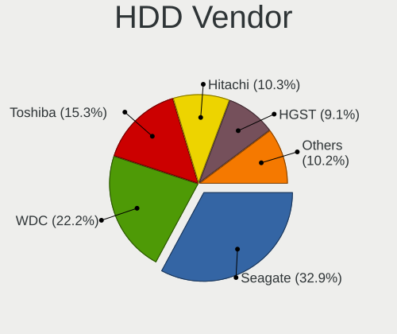

| Vendor              | Notebooks | Drives | Percent |
|---------------------|-----------|--------|---------|
| Seagate             | 264       | 408    | 32.88%  |
| WDC                 | 178       | 246    | 22.17%  |
| Toshiba             | 123       | 180    | 15.32%  |
| Hitachi             | 83        | 103    | 10.34%  |
| HGST                | 73        | 101    | 9.09%   |
| Fujitsu             | 18        | 26     | 2.24%   |
| Samsung Electronics | 14        | 17     | 1.74%   |
| JMicron Technology  | 11        | 21     | 1.37%   |
| Unknown             | 9         | 15     | 1.12%   |
| Apple               | 5         | 7      | 0.62%   |
| LaCie               | 4         | 7      | 0.5%    |
| ASMT                | 4         | 7      | 0.5%    |
| KESU                | 3         | 3      | 0.37%   |
| USB                 | 2         | 3      | 0.25%   |
| TO Exter            | 2         | 2      | 0.25%   |
| HGST HUS            | 2         | 2      | 0.25%   |
| External            | 2         | 2      | 0.25%   |
| USB3.0              | 1         | 1      | 0.12%   |
| T-FORCE             | 1         | 1      | 0.12%   |
| NVME USB            | 1         | 1      | 0.12%   |
| IBM/Hitachi         | 1         | 1      | 0.12%   |
| HGST HTS            | 1         | 1      | 0.12%   |
| AAPL                | 1         | 1      | 0.12%   |

SSD Vendor
----------

Solid state drive vendors

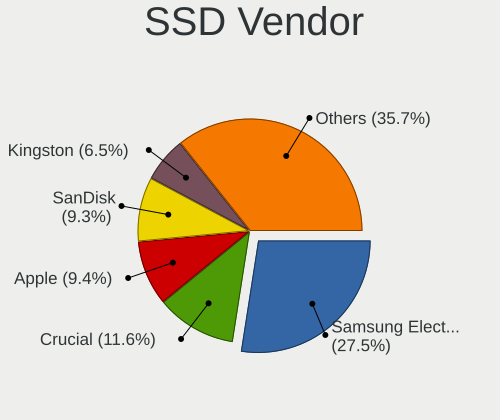

| Vendor              | Notebooks | Drives | Percent |
|---------------------|-----------|--------|---------|
| Samsung Electronics | 257       | 343    | 27.46%  |
| Crucial             | 109       | 145    | 11.65%  |
| Apple               | 88        | 100    | 9.4%    |
| SanDisk             | 87        | 109    | 9.29%   |
| Kingston            | 61        | 76     | 6.52%   |
| WDC                 | 42        | 56     | 4.49%   |
| SK hynix            | 38        | 47     | 4.06%   |
| Intel               | 33        | 73     | 3.53%   |
| Toshiba             | 29        | 39     | 3.1%    |
| Micron Technology   | 27        | 30     | 2.88%   |
| SPCC                | 17        | 20     | 1.82%   |
| LITEON              | 17        | 29     | 1.82%   |
| LITEONIT            | 14        | 16     | 1.5%    |
| Patriot             | 13        | 15     | 1.39%   |
| China               | 12        | 13     | 1.28%   |
| A-DATA Technology   | 10        | 13     | 1.07%   |
| Transcend           | 8         | 10     | 0.85%   |
| OCZ                 | 8         | 10     | 0.85%   |
| KingSpec            | 8         | 13     | 0.85%   |
| Team                | 4         | 5      | 0.43%   |
| Seagate             | 3         | 4      | 0.32%   |
| OWC                 | 3         | 10     | 0.32%   |
| Unknown             | 3         | 4      | 0.32%   |
| WDC WDS2            | 2         | 2      | 0.21%   |
| Plextor             | 2         | 6      | 0.21%   |
| Gigabyte Technology | 2         | 2      | 0.21%   |
| FORESEE             | 2         | 2      | 0.21%   |
| Fanxiang            | 2         | 2      | 0.21%   |
| Corsair             | 2         | 2      | 0.21%   |
| BIWIN               | 2         | 2      | 0.21%   |
| T-CREATE            | 1         | 1      | 0.11%   |
| ShiJi               | 1         | 1      | 0.11%   |
| SAMSWEET            | 1         | 1      | 0.11%   |
| PNY CS90            | 1         | 1      | 0.11%   |
| PNY                 | 1         | 1      | 0.11%   |
| OSCOO               | 1         | 1      | 0.11%   |
| NGFF                | 1         | 1      | 0.11%   |
| Mushkin             | 1         | 1      | 0.11%   |
| LT                  | 1         | 1      | 0.11%   |
| Leven               | 1         | 1      | 0.11%   |

Drive Kind
----------

HDD or SSD

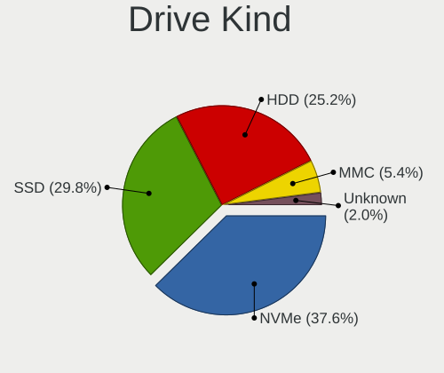

| Kind    | Notebooks | Drives | Percent |
|---------|-----------|--------|---------|
| NVMe    | 1111      | 1611   | 37.62%  |
| SSD     | 881       | 1230   | 29.83%  |
| HDD     | 743       | 1156   | 25.16%  |
| MMC     | 158       | 205    | 5.35%   |
| Unknown | 60        | 67     | 2.03%   |

Drive Connector
---------------

SATA, SAS, NVMe, etc.

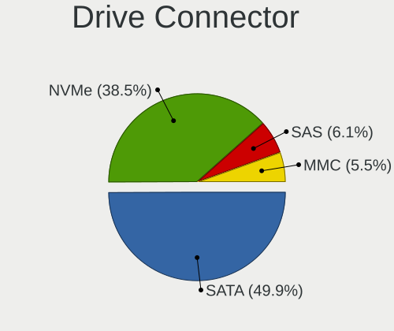

| Type | Notebooks | Drives | Percent |
|------|-----------|--------|---------|
| SATA | 1441      | 2202   | 49.95%  |
| NVMe | 1110      | 1595   | 38.47%  |
| SAS  | 176       | 267    | 6.1%    |
| MMC  | 158       | 205    | 5.48%   |

Drive Size
----------

Size of hard drive

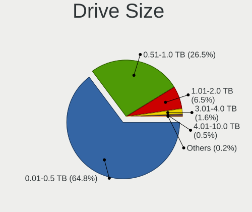

| Size in TB | Notebooks | Drives | Percent |
|------------|-----------|--------|---------|
| 0.01-0.5   | 1074      | 1535   | 64.78%  |
| 0.51-1.0   | 439       | 624    | 26.48%  |
| 1.01-2.0   | 107       | 168    | 6.45%   |
| 3.01-4.0   | 26        | 45     | 1.57%   |
| 4.01-10.0  | 9         | 9      | 0.54%   |
| 20.01-50.0 | 1         | 2      | 0.06%   |
| 2.01-3.0   | 1         | 1      | 0.06%   |
| 10.01-20.0 | 1         | 2      | 0.06%   |

Space Total
-----------

Amount of disk space available on the file system

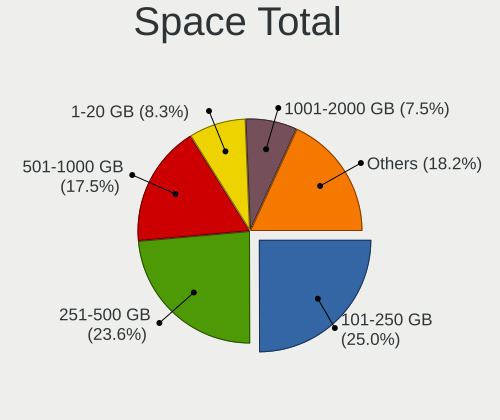

| Size in GB     | Notebooks | Percent |
|----------------|-----------|---------|
| 101-250        | 680       | 24.97%  |
| 251-500        | 643       | 23.61%  |
| 501-1000       | 477       | 17.52%  |
| 1-20           | 225       | 8.26%   |
| 1001-2000      | 203       | 7.46%   |
| 51-100         | 153       | 5.62%   |
| More than 3000 | 118       | 4.33%   |
| Unknown        | 95        | 3.49%   |
| 2001-3000      | 67        | 2.46%   |
| 21-50          | 62        | 2.28%   |

Space Used
----------

Amount of used disk space

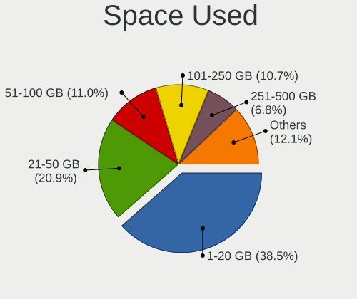

| Used GB        | Notebooks | Percent |
|----------------|-----------|---------|
| 1-20           | 1100      | 38.5%   |
| 21-50          | 598       | 20.93%  |
| 51-100         | 313       | 10.96%  |
| 101-250        | 307       | 10.75%  |
| 251-500        | 193       | 6.76%   |
| 501-1000       | 131       | 4.59%   |
| Unknown        | 95        | 3.33%   |
| 1001-2000      | 61        | 2.14%   |
| More than 3000 | 29        | 1.02%   |
| 2001-3000      | 23        | 0.81%   |
| 0              | 7         | 0.25%   |

Malfunc. Drives
---------------

Drive models with a malfunction

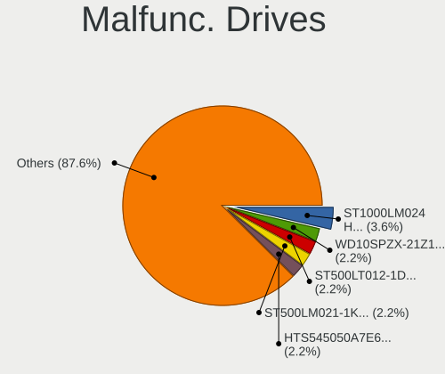

| Model                                                      | Notebooks | Drives | Percent |
|------------------------------------------------------------|-----------|--------|---------|
| Seagate ST1000LM024 HN-M101MBB 1TB                         | 5         | 6      | 3.65%   |
| WDC WD10SPZX-21Z10T0 1TB                                   | 3         | 4      | 2.19%   |
| Seagate ST500LT012-1DG142 500GB                            | 3         | 3      | 2.19%   |
| Seagate ST500LM021-1KJ152 500GB                            | 3         | 3      | 2.19%   |
| HGST HTS545050A7E680 500GB                                 | 3         | 4      | 2.19%   |
| WDC WD10JPVX-22JC3T0 1TB                                   | 2         | 3      | 1.46%   |
| Toshiba MQ01ABF050 500GB                                   | 2         | 2      | 1.46%   |
| Toshiba MQ01ABD100 1TB                                     | 2         | 2      | 1.46%   |
| Seagate ST9500325AS 500GB                                  | 2         | 2      | 1.46%   |
| Seagate ST9250315AS 250GB                                  | 2         | 4      | 1.46%   |
| Micron Technology 1100 SATA 256GB SSD                      | 2         | 2      | 1.46%   |
| Kingston RBU-SNS8350DES3128GP 128GB SSD                    | 2         | 2      | 1.46%   |
| Hitachi HTS727575A9E364 752GB                              | 2         | 2      | 1.46%   |
| Hitachi HTS547564A9E384 640GB                              | 2         | 2      | 1.46%   |
| Hitachi HTS541680J9SA00 80GB                               | 2         | 2      | 1.46%   |
| WDC WD6400BEVT-22A0RT0 640GB                               | 1         | 2      | 0.73%   |
| WDC WD5000LPVX-22V0TT0 500GB                               | 1         | 2      | 0.73%   |
| WDC WD5000BPKT-80PK4T0 500GB                               | 1         | 1      | 0.73%   |
| WDC WD5000BEVT-60ZAT1 500GB                                | 1         | 3      | 0.73%   |
| WDC WD40EFRX-68N32N0 4TB                                   | 1         | 1      | 0.73%   |
| WDC WD3200BPVT-22ZEST0 320GB                               | 1         | 1      | 0.73%   |
| WDC WD3200BPVT-00ZEST0 320GB                               | 1         | 1      | 0.73%   |
| WDC WD3200BEVT-75ZCT0 320GB                                | 1         | 1      | 0.73%   |
| WDC WD2500BEVT-35A23T0 250GB                               | 1         | 1      | 0.73%   |
| WDC WD20 EARS-00J2GB0 2TB                                  | 1         | 1      | 0.73%   |
| WDC WD1600BEVT-75A23T0 160GB                               | 1         | 1      | 0.73%   |
| WDC WD Blue SA510 M.2 2280 1000GB                          | 1         | 1      | 0.73%   |
| Transcend TS256GSSD230S 256GB                              | 1         | 1      | 0.73%   |
| Toshiba THNSNK128GCS8 SATA 128GB SSD                       | 1         | 1      | 0.73%   |
| Toshiba MQ01ACF032 320GB                                   | 1         | 1      | 0.73%   |
| Toshiba MQ01ABD050 500GB                                   | 1         | 1      | 0.73%   |
| Toshiba MK6461GSYN 640GB                                   | 1         | 1      | 0.73%   |
| Toshiba MK5065GSX 500GB                                    | 1         | 1      | 0.73%   |
| Toshiba MK5055GSX 500GB                                    | 1         | 5      | 0.73%   |
| Toshiba MK3265GSX 320GB                                    | 1         | 1      | 0.73%   |
| Toshiba MK1255GSX H 120GB                                  | 1         | 1      | 0.73%   |
| SK hynix SC308 SATA 256GB SSD                              | 1         | 2      | 0.73%   |
| SK hynix Gold P31/BC711/PC711 NVMe Solid State Drive 512GB | 1         | 1      | 0.73%   |
| SK hynix BC711 HFM512GD3JX013N 512GB                       | 1         | 1      | 0.73%   |
| SK hynix BC501 NVMe Solid State Drive 256GB                | 1         | 1      | 0.73%   |

Malfunc. Drive Vendor
---------------------

Vendors of faulty drives

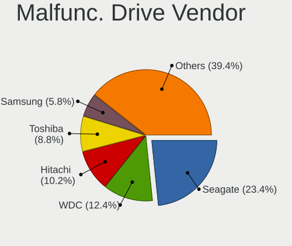

| Vendor                   | Notebooks | Drives | Percent |
|--------------------------|-----------|--------|---------|
| Seagate                  | 32        | 44     | 23.36%  |
| WDC                      | 17        | 23     | 12.41%  |
| Hitachi                  | 14        | 14     | 10.22%  |
| Toshiba                  | 12        | 16     | 8.76%   |
| Samsung Electronics      | 8         | 8      | 5.84%   |
| HGST                     | 8         | 9      | 5.84%   |
| SanDisk                  | 7         | 7      | 5.11%   |
| Kingston                 | 5         | 5      | 3.65%   |
| Intel                    | 5         | 6      | 3.65%   |
| Fujitsu                  | 5         | 5      | 3.65%   |
| SK hynix                 | 4         | 5      | 2.92%   |
| Micron Technology        | 4         | 4      | 2.92%   |
| Crucial                  | 2         | 2      | 1.46%   |
| Apple                    | 2         | 2      | 1.46%   |
| Transcend                | 1         | 1      | 0.73%   |
| Realtek Semiconductor    | 1         | 1      | 0.73%   |
| Phison Electronics       | 1         | 1      | 0.73%   |
| OCZ                      | 1         | 1      | 0.73%   |
| LITEON                   | 1         | 1      | 0.73%   |
| Lenovo                   | 1         | 1      | 0.73%   |
| KIOXIA                   | 1         | 1      | 0.73%   |
| KingSpec                 | 1         | 3      | 0.73%   |
| Indilinx                 | 1         | 1      | 0.73%   |
| Hikvision                | 1         | 1      | 0.73%   |
| Biwin Storage Technology | 1         | 1      | 0.73%   |
| A-DATA Technology        | 1         | 1      | 0.73%   |

Malfunc. HDD Vendor
-------------------

Vendors of faulty HDD drives

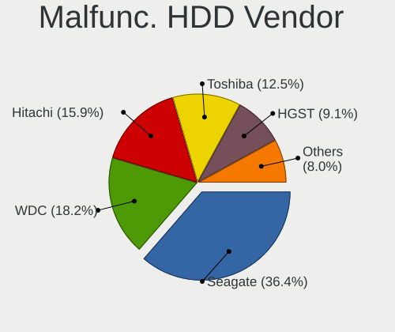

| Vendor              | Notebooks | Drives | Percent |
|---------------------|-----------|--------|---------|
| Seagate             | 32        | 44     | 36.36%  |
| WDC                 | 16        | 22     | 18.18%  |
| Hitachi             | 14        | 14     | 15.91%  |
| Toshiba             | 11        | 15     | 12.5%   |
| HGST                | 8         | 9      | 9.09%   |
| Fujitsu             | 5         | 5      | 5.68%   |
| Samsung Electronics | 2         | 2      | 2.27%   |

Malfunc. Drive Kind
-------------------

Kinds of faulty drives

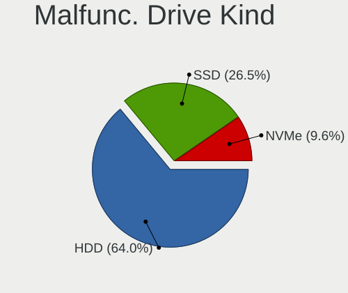

| Kind | Notebooks | Drives | Percent |
|------|-----------|--------|---------|
| HDD  | 87        | 111    | 63.97%  |
| SSD  | 36        | 40     | 26.47%  |
| NVMe | 13        | 13     | 9.56%   |

Failed Drives
-------------

Failed drive models

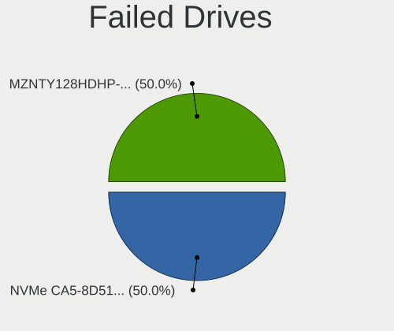

| Model                                            | Notebooks | Drives | Percent |
|--------------------------------------------------|-----------|--------|---------|
| Solid State Storage NVMe CA5-8D512 512GB         | 1         | 1      | 50%     |
| Samsung Electronics MZNTY128HDHP-00000 128GB SSD | 1         | 2      | 50%     |

Failed Drive Vendor
-------------------

Failed drive vendors

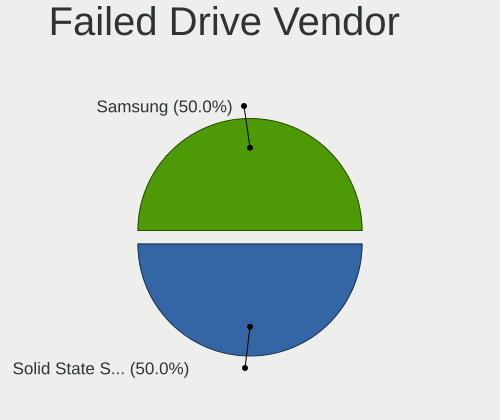

| Vendor              | Notebooks | Drives | Percent |
|---------------------|-----------|--------|---------|
| Solid State Storage | 1         | 1      | 50%     |
| Samsung Electronics | 1         | 2      | 50%     |

Drive Status
------------

Number of failed and malfunc. drives

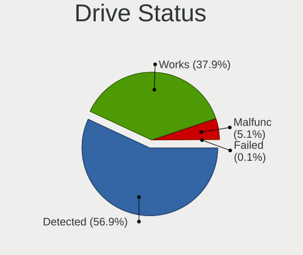

| Status   | Notebooks | Drives | Percent |
|----------|-----------|--------|---------|
| Detected | 1517      | 2595   | 56.92%  |
| Works    | 1011      | 1507   | 37.94%  |
| Malfunc  | 135       | 164    | 5.07%   |
| Failed   | 2         | 3      | 0.08%   |

Storage controller
------------------

Storage Vendor
--------------

Storage controller vendors

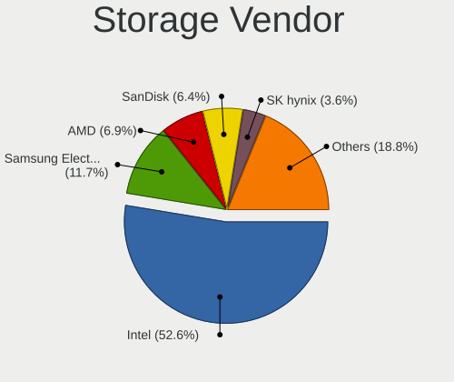

| Vendor                                  | Notebooks | Percent |
|-----------------------------------------|-----------|---------|
| Intel                                   | 1592      | 52.59%  |
| Samsung Electronics                     | 353       | 11.66%  |
| AMD                                     | 208       | 6.87%   |
| SanDisk                                 | 194       | 6.41%   |
| SK hynix                                | 110       | 3.63%   |
| Micron Technology                       | 88        | 2.91%   |
| Kingston Technology Company             | 76        | 2.51%   |
| Phison Electronics                      | 68        | 2.25%   |
| Toshiba America Info Systems            | 63        | 2.08%   |
| KIOXIA                                  | 55        | 1.82%   |
| Micron/Crucial Technology               | 54        | 1.78%   |
| Apple                                   | 28        | 0.93%   |
| Nvidia                                  | 24        | 0.79%   |
| MAXIO Technology (Hangzhou)             | 19        | 0.63%   |
| ADATA Technology                        | 14        | 0.46%   |
| Marvell Technology Group                | 13        | 0.43%   |
| Silicon Motion                          | 10        | 0.33%   |
| Solidigm                                | 7         | 0.23%   |
| Solid State Storage Technology          | 7         | 0.23%   |
| Union Memory (Shenzhen)                 | 6         | 0.2%    |
| Shenzhen Longsys Electronics            | 6         | 0.2%    |
| Lite-On Technology                      | 6         | 0.2%    |
| Lenovo                                  | 6         | 0.2%    |
| Realtek Semiconductor                   | 4         | 0.13%   |
| Shenzhen Unionmemory Information System | 3         | 0.1%    |
| O2 Micro                                | 3         | 0.1%    |
| Silicon Integrated Systems [SiS]        | 2         | 0.07%   |
| ULi Electronics                         | 1         | 0.03%   |
| Netac Technology                        | 1         | 0.03%   |
| JMicron Technology                      | 1         | 0.03%   |
| Hosin Global Electronics                | 1         | 0.03%   |
| Biwin Storage Technology                | 1         | 0.03%   |
| ASMedia Technology                      | 1         | 0.03%   |
| Apacer Technology                       | 1         | 0.03%   |
| Unknown                                 | 1         | 0.03%   |

Storage Model
-------------

Storage controller models

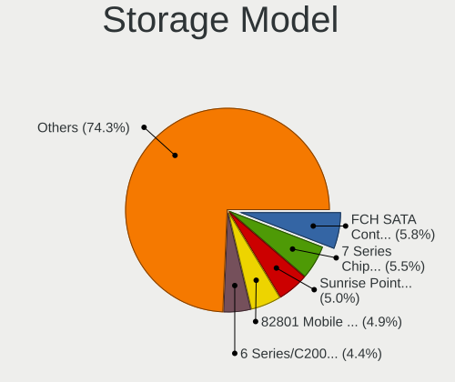

| Model                                                                          | Notebooks | Percent |
|--------------------------------------------------------------------------------|-----------|---------|
| AMD FCH SATA Controller [AHCI mode]                                            | 188       | 5.85%   |
| Intel 7 Series Chipset Family 6-port SATA Controller [AHCI mode]               | 176       | 5.48%   |
| Intel Sunrise Point-LP SATA Controller [AHCI mode]                             | 162       | 5.04%   |
| Intel 82801 Mobile SATA Controller [RAID mode]                                 | 158       | 4.92%   |
| Intel 6 Series/C200 Series Chipset Family 6 port Mobile SATA AHCI Controller   | 141       | 4.39%   |
| Samsung NVMe SSD Controller SM981/PM981/PM983                                  | 129       | 4.01%   |
| Intel Volume Management Device NVMe RAID Controller                            | 111       | 3.45%   |
| Intel 8 Series SATA Controller 1 [AHCI mode]                                   | 95        | 2.96%   |
| Intel Cannon Lake Mobile PCH SATA AHCI Controller                              | 77        | 2.4%    |
| Intel Wildcat Point-LP SATA Controller [AHCI Mode]                             | 70        | 2.18%   |
| Intel 5 Series/3400 Series Chipset 4 port SATA AHCI Controller                 | 63        | 1.96%   |
| Samsung NVMe SSD Controller PM9A1/PM9A3/980PRO                                 | 61        | 1.9%    |
| Intel 8 Series/C220 Series Chipset Family 6-port SATA Controller 1 [AHCI mode] | 57        | 1.77%   |
| Samsung NVMe SSD Controller 980 (DRAM-less)                                    | 47        | 1.46%   |
| Intel 82801IBM/IEM (ICH9M/ICH9M-E) 4 port SATA Controller [AHCI mode]          | 47        | 1.46%   |
| Intel HM170/QM170 Chipset SATA Controller [AHCI Mode]                          | 40        | 1.24%   |
| Samsung S4LN058A01[SSUBX] AHCI SSD Controller (Apple slot)                     | 38        | 1.18%   |
| Intel Tiger Lake-LP SATA Controller                                            | 37        | 1.15%   |
| KIOXIA NVMe SSD Controller BG4 (DRAM-less)                                     | 34        | 1.06%   |
| SK hynix Gold P31/BC711/PC711 NVMe Solid State Drive                           | 33        | 1.03%   |
| Intel 5 Series/3400 Series Chipset 6 port SATA AHCI Controller                 | 33        | 1.03%   |
| SanDisk Extreme Pro / WD Black SN750 / PC SN730 / Red SN700 NVMe SSD           | 32        | 1%      |
| SanDisk Ultra 3D / WD PC SN530, IX SN530, Blue SN550 NVMe SSD (DRAM-less)      | 31        | 0.96%   |
| Intel 82801HM/HEM (ICH8M/ICH8M-E) IDE Controller                               | 31        | 0.96%   |
| SanDisk WD SN560/SN740/SN770/SN5000 NVMe SSD                                   | 29        | 0.9%    |
| Intel SSD 660P Series                                                          | 29        | 0.9%    |
| Intel 82801HM/HEM (ICH8M/ICH8M-E) SATA Controller [AHCI mode]                  | 29        | 0.9%    |
| Samsung NVMe SSD Controller SM961/PM961/SM963                                  | 28        | 0.87%   |
| Intel 400 Series Chipset Family SATA AHCI Controller                           | 26        | 0.81%   |
| Micron/Crucial P2 [Nick P2] / P3 / P3 Plus NVMe PCIe SSD (DRAM-less)           | 23        | 0.72%   |
| Intel SSD 670p Series [Keystone Harbor]                                        | 22        | 0.68%   |
| Intel Cannon Point-LP SATA Controller [AHCI Mode]                              | 22        | 0.68%   |
| Phison PS5013-E13 PCIe3 NVMe Controller (DRAM-less)                            | 21        | 0.65%   |
| Intel RST Volume Management Device Controller                                  | 21        | 0.65%   |
| Apple ANS2 NVMe Controller                                                     | 21        | 0.65%   |
| Intel Atom Processor E3800 Series SATA AHCI Controller                         | 20        | 0.62%   |
| Toshiba America Info Systems XG6 NVMe SSD Controller                           | 19        | 0.59%   |
| Toshiba America Info Systems XG5 NVMe SSD Controller                           | 18        | 0.56%   |
| Phison E12 NVMe Controller                                                     | 18        | 0.56%   |
| Intel Q170/Q150/B150/H170/H110/Z170/CM236 Chipset SATA Controller [AHCI Mode]  | 18        | 0.56%   |

Storage Kind
------------

Kind of storage controller (IDE, SATA, NVMe, SAS, ...)

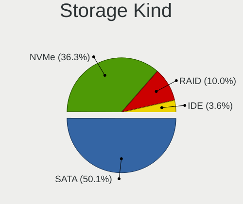

| Kind | Notebooks | Percent |
|------|-----------|---------|
| SATA | 1531      | 50.08%  |
| NVMe | 1111      | 36.34%  |
| RAID | 306       | 10.01%  |
| IDE  | 109       | 3.57%   |

Processor
---------

CPU Vendor
----------

Processor vendors

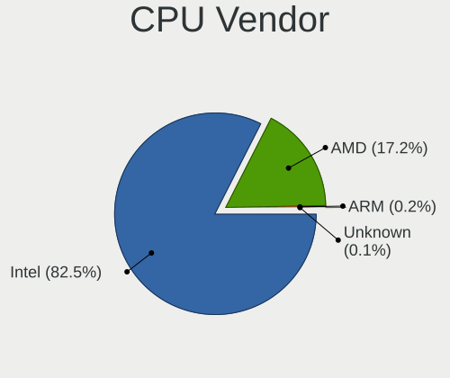

| Vendor  | Notebooks | Percent |
|---------|-----------|---------|
| Intel   | 2088      | 82.5%   |
| AMD     | 435       | 17.19%  |
| ARM     | 5         | 0.2%    |
| Unknown | 3         | 0.12%   |

CPU Model
---------

Processor models

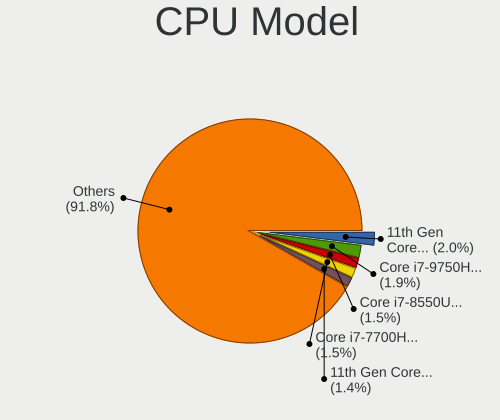

| Model                                   | Notebooks | Percent |
|-----------------------------------------|-----------|---------|
| Intel 11th Gen Core i5-1135G7 @ 2.40GHz | 50        | 1.97%   |
| Intel Core i7-9750H CPU @ 2.60GHz       | 48        | 1.89%   |
| Intel Core i7-8550U CPU @ 1.80GHz       | 38        | 1.5%    |
| Intel Core i7-7700HQ CPU @ 2.80GHz      | 37        | 1.46%   |
| Intel 11th Gen Core i7-1165G7 @ 2.80GHz | 36        | 1.42%   |
| Intel Core i5-6300U CPU @ 2.40GHz       | 33        | 1.3%    |
| Intel Core i5-6200U CPU @ 2.30GHz       | 32        | 1.26%   |
| Intel Core i7-10750H CPU @ 2.60GHz      | 29        | 1.14%   |
| Intel Core i7-8750H CPU @ 2.20GHz       | 26        | 1.03%   |
| Intel Core i5-8265U CPU @ 1.60GHz       | 26        | 1.03%   |
| Intel Core i5-5200U CPU @ 2.20GHz       | 25        | 0.99%   |
| Intel Core i7-8565U CPU @ 1.80GHz       | 23        | 0.91%   |
| Intel Core i5-8250U CPU @ 1.60GHz       | 23        | 0.91%   |
| Intel Core i5-7200U CPU @ 2.50GHz       | 23        | 0.91%   |
| Intel Core i5-3210M CPU @ 2.50GHz       | 23        | 0.91%   |
| Intel Core i5-2520M CPU @ 2.50GHz       | 23        | 0.91%   |
| Intel Core i7-6500U CPU @ 2.50GHz       | 22        | 0.87%   |
| Intel Core i7-10510U CPU @ 1.80GHz      | 22        | 0.87%   |
| Intel Core i5-10210U CPU @ 1.60GHz      | 22        | 0.87%   |
| Intel Core i5-4210U CPU @ 1.70GHz       | 21        | 0.83%   |
| AMD Custom APU 0405                     | 21        | 0.83%   |
| Intel Core i7-8650U CPU @ 1.90GHz       | 19        | 0.75%   |
| Intel Core i7-6700HQ CPU @ 2.60GHz      | 19        | 0.75%   |
| Intel Core i7-4510U CPU @ 2.00GHz       | 19        | 0.75%   |
| Intel Core i7-3610QM CPU @ 2.30GHz      | 19        | 0.75%   |
| Intel 12th Gen Core i7-12700H           | 19        | 0.75%   |
| Intel 11th Gen Core i7-11800H @ 2.30GHz | 19        | 0.75%   |
| Intel Core i7-2670QM CPU @ 2.20GHz      | 18        | 0.71%   |
| Intel 12th Gen Core i7-1255U            | 18        | 0.71%   |
| Intel Core i7-6600U CPU @ 2.60GHz       | 17        | 0.67%   |
| Intel Celeron N4500 @ 1.10GHz           | 17        | 0.67%   |
| Intel Core i7-7500U CPU @ 2.70GHz       | 16        | 0.63%   |
| Intel Core i7-4700MQ CPU @ 2.40GHz      | 16        | 0.63%   |
| Intel Core 2 Duo CPU P8700 @ 2.53GHz    | 16        | 0.63%   |
| Intel Core i5-2450M CPU @ 2.50GHz       | 15        | 0.59%   |
| Intel Core i7-5500U CPU @ 2.40GHz       | 14        | 0.55%   |
| Intel Core i7-2630QM CPU @ 2.00GHz      | 14        | 0.55%   |
| Intel Core i7 CPU Q 720 @ 1.60GHz       | 14        | 0.55%   |
| Intel Core i5-7300U CPU @ 2.60GHz       | 14        | 0.55%   |
| Intel Core i5-4200U CPU @ 1.60GHz       | 14        | 0.55%   |

CPU Model Family
----------------

Processor model prefix

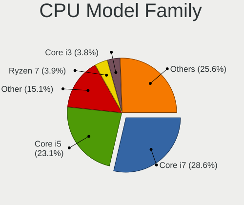

| Model                   | Notebooks | Percent |
|-------------------------|-----------|---------|
| Intel Core i7           | 725       | 28.63%  |
| Intel Core i5           | 584       | 23.06%  |
| Other                   | 383       | 15.13%  |
| AMD Ryzen 7             | 98        | 3.87%   |
| Intel Core i3           | 95        | 3.75%   |
| Intel Celeron           | 95        | 3.75%   |
| AMD Ryzen 5             | 89        | 3.52%   |
| Intel Core 2 Duo        | 88        | 3.48%   |
| Intel Core              | 41        | 1.62%   |
| Intel Pentium           | 33        | 1.3%    |
| AMD A6                  | 32        | 1.26%   |
| AMD A4                  | 26        | 1.03%   |
| AMD Ryzen 9             | 24        | 0.95%   |
| Intel Atom              | 21        | 0.83%   |
| AMD Ryzen 7 PRO         | 16        | 0.63%   |
| AMD E2                  | 12        | 0.47%   |
| AMD A8                  | 12        | 0.47%   |
| Intel Core M            | 11        | 0.43%   |
| Intel Core i9           | 11        | 0.43%   |
| AMD Ryzen 5 PRO         | 11        | 0.43%   |
| Intel Pentium Dual-Core | 10        | 0.39%   |
| AMD A10                 | 10        | 0.39%   |
| Intel Core 2            | 9         | 0.36%   |
| AMD E1                  | 9         | 0.36%   |
| AMD Ryzen 3             | 8         | 0.32%   |
| Intel Xeon              | 7         | 0.28%   |
| Intel Core m3           | 7         | 0.28%   |
| Intel Pentium Dual      | 6         | 0.24%   |
| Intel Genuine           | 6         | 0.24%   |
| Intel Celeron Dual-Core | 5         | 0.2%    |
| AMD E                   | 5         | 0.2%    |
| AMD Athlon              | 5         | 0.2%    |
| Intel Pentium M         | 4         | 0.16%   |
| Intel Core m7           | 4         | 0.16%   |
| Intel Celeron M         | 4         | 0.16%   |
| Intel Pentium Silver    | 3         | 0.12%   |
| AMD V120                | 3         | 0.12%   |
| AMD A12                 | 3         | 0.12%   |
| Intel Core Duo          | 2         | 0.08%   |
| AMD FX                  | 2         | 0.08%   |

CPU Cores
---------

Number of processor cores

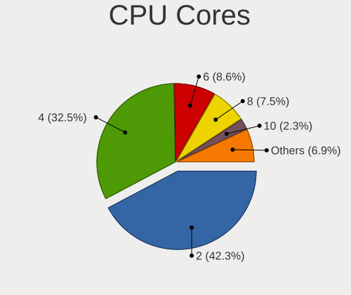

| Number  | Notebooks | Percent |
|---------|-----------|---------|
| 2       | 1071      | 42.27%  |
| 4       | 823       | 32.48%  |
| 6       | 217       | 8.56%   |
| 8       | 189       | 7.46%   |
| 10      | 59        | 2.33%   |
| 14      | 50        | 1.97%   |
| 1       | 41        | 1.62%   |
| 16      | 31        | 1.22%   |
| 12      | 31        | 1.22%   |
| 24      | 20        | 0.79%   |
| 5       | 1         | 0.04%   |
| Unknown | 1         | 0.04%   |

CPU Sockets
-----------

Number of sockets

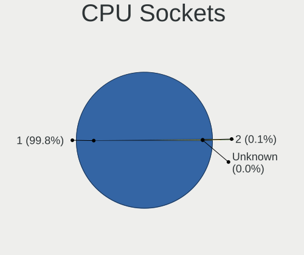

| Number  | Notebooks | Percent |
|---------|-----------|---------|
| 1       | 2526      | 99.8%   |
| 2       | 3         | 0.12%   |
| 8       | 1         | 0.04%   |
| Unknown | 1         | 0.04%   |

CPU Threads
-----------

Threads per core (Hyper-Threading)

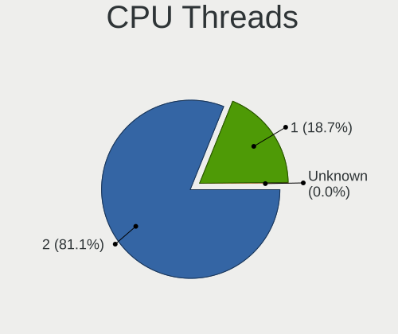

| Number  | Notebooks | Percent |
|---------|-----------|---------|
| 2       | 2055      | 81.1%   |
| 1       | 475       | 18.75%  |
| 4       | 2         | 0.08%   |
| 8       | 1         | 0.04%   |
| Unknown | 1         | 0.04%   |

CPU Op-Modes
------------

CPU Operation Modes (32-bit, 64-bit)

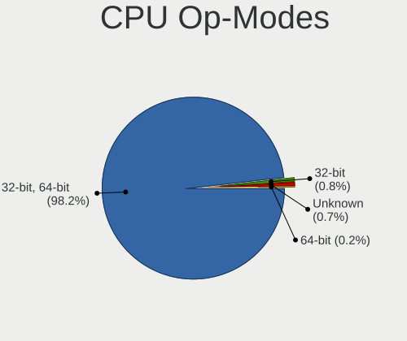

| Op mode        | Notebooks | Percent |
|----------------|-----------|---------|
| 32-bit, 64-bit | 2494      | 98.19%  |
| 32-bit         | 21        | 0.83%   |
| Unknown        | 19        | 0.75%   |
| 64-bit         | 6         | 0.24%   |

CPU Microcode
-------------

Microcode number

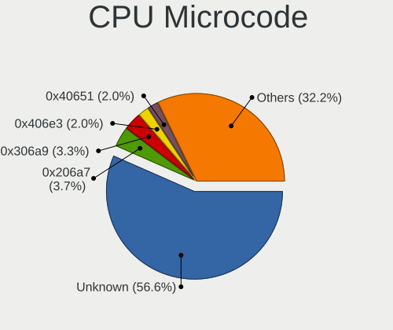

| Number     | Notebooks | Percent |
|------------|-----------|---------|
| Unknown    | 1495      | 56.59%  |
| 0x206a7    | 99        | 3.75%   |
| 0x306a9    | 88        | 3.33%   |
| 0x406e3    | 54        | 2.04%   |
| 0x40651    | 54        | 2.04%   |
| 0x906ea    | 52        | 1.97%   |
| 0x1067a    | 47        | 1.78%   |
| 0x306d4    | 46        | 1.74%   |
| 0x806ec    | 43        | 1.63%   |
| 0x20655    | 41        | 1.55%   |
| 0x806ea    | 40        | 1.51%   |
| 0x806c1    | 37        | 1.4%    |
| 0x306c3    | 35        | 1.32%   |
| 0x806e9    | 33        | 1.25%   |
| 0xa0652    | 22        | 0.83%   |
| 0x906e9    | 22        | 0.83%   |
| 0x20652    | 22        | 0.83%   |
| 0x06006705 | 20        | 0.76%   |
| 0x0a50000c | 19        | 0.72%   |
| 0x906a3    | 16        | 0.61%   |
| 0x806eb    | 16        | 0.61%   |
| 0x30678    | 16        | 0.61%   |
| 0x07030105 | 16        | 0.61%   |
| 0x706e5    | 14        | 0.53%   |
| 0x506e3    | 14        | 0.53%   |
| 0x806d1    | 12        | 0.45%   |
| 0x08108109 | 12        | 0.45%   |
| 0x0700010f | 12        | 0.45%   |
| 0x106e5    | 11        | 0.42%   |
| 0x10676    | 11        | 0.42%   |
| 0x08108102 | 11        | 0.42%   |
| 0x406c4    | 10        | 0.38%   |
| 0x406c3    | 9         | 0.34%   |
| 0x906a4    | 8         | 0.3%    |
| 0x6fd      | 8         | 0.3%    |
| 0x08600103 | 8         | 0.3%    |
| 0x08600106 | 7         | 0.26%   |
| 0x06001119 | 7         | 0.26%   |
| 0x706a8    | 6         | 0.23%   |
| 0x6f6      | 6         | 0.23%   |

CPU Microarch
-------------

Microarchitecture

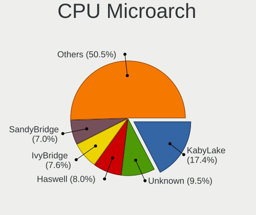

| Name               | Notebooks | Percent |
|--------------------|-----------|---------|
| KabyLake           | 440       | 17.36%  |
| Unknown            | 242       | 9.55%   |
| Haswell            | 204       | 8.05%   |
| IvyBridge          | 192       | 7.57%   |
| SandyBridge        | 177       | 6.98%   |
| Skylake            | 149       | 5.88%   |
| TigerLake          | 112       | 4.42%   |
| Broadwell          | 112       | 4.42%   |
| Alderlake Hybrid   | 102       | 4.02%   |
| Westmere           | 93        | 3.67%   |
| Penryn             | 89        | 3.51%   |
| Zen 3              | 67        | 2.64%   |
| CometLake          | 58        | 2.29%   |
| Icelake            | 56        | 2.21%   |
| Silvermont         | 53        | 2.09%   |
| Excavator          | 43        | 1.7%    |
| Zen+               | 42        | 1.66%   |
| Zen 2              | 38        | 1.5%    |
| Core               | 34        | 1.34%   |
| Puma               | 31        | 1.22%   |
| Goldmont plus      | 21        | 0.83%   |
| Zen                | 20        | 0.79%   |
| Jaguar             | 19        | 0.75%   |
| Nehalem            | 18        | 0.71%   |
| Meteorlake Hybrid  | 17        | 0.67%   |
| P6                 | 15        | 0.59%   |
| Tremont            | 13        | 0.51%   |
| Piledriver         | 12        | 0.47%   |
| Bonnell            | 11        | 0.43%   |
| Goldmont           | 9         | 0.36%   |
| K10 Llano          | 8         | 0.32%   |
| Lunarlake Hybrid   | 7         | 0.28%   |
| K10                | 7         | 0.28%   |
| Bobcat             | 7         | 0.28%   |
| Gracemont          | 6         | 0.24%   |
| Steamroller        | 5         | 0.2%    |
| K8 Hammer          | 2         | 0.08%   |
| K8 & K10 hybrid    | 2         | 0.08%   |
| NetBurst           | 1         | 0.04%   |
| ArrowLake-H Hybrid | 1         | 0.04%   |

Graphics
--------

GPU Vendor
----------

Vendors of graphics cards

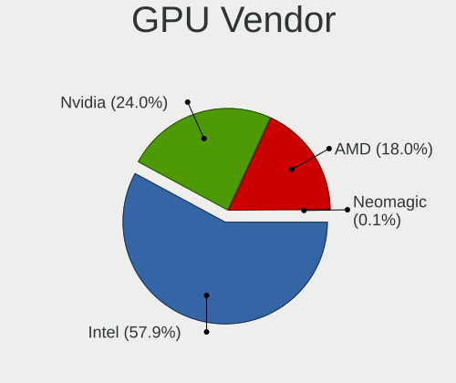

| Vendor                           | Notebooks | Percent |
|----------------------------------|-----------|---------|
| Intel                            | 1881      | 57.88%  |
| Nvidia                           | 780       | 24%     |
| AMD                              | 585       | 18%     |
| Silicon Integrated Systems [SiS] | 2         | 0.06%   |
| Neomagic                         | 2         | 0.06%   |

GPU Model
---------

Graphics card models

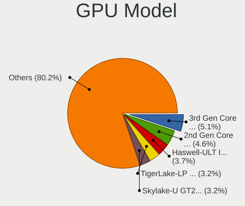

| Model                                                                                    | Notebooks | Percent |
|------------------------------------------------------------------------------------------|-----------|---------|
| Intel 3rd Gen Core processor Graphics Controller                                         | 171       | 5.1%    |
| Intel 2nd Generation Core Processor Family Integrated Graphics Controller                | 155       | 4.62%   |
| Intel Haswell-ULT Integrated Graphics Controller                                         | 123       | 3.67%   |
| Intel TigerLake-LP GT2 [Iris Xe Graphics]                                                | 109       | 3.25%   |
| Intel Skylake-U GT2 [HD Graphics 520]                                                    | 107       | 3.19%   |
| Intel Kaby Lake-R GT2 [UHD Graphics 620]                                                 | 93        | 2.77%   |
| Intel CoffeeLake-H GT2 [UHD Graphics 630]                                                | 90        | 2.68%   |
| Intel Broadwell-U GT2 [HD Graphics 5500]                                                 | 66        | 1.97%   |
| Intel Core Processor Integrated Graphics Controller                                      | 63        | 1.88%   |
| Intel 4th Gen Core Processor Integrated Graphics Controller                              | 60        | 1.79%   |
| Intel WhiskeyLake-U GT2 [UHD Graphics 620]                                               | 59        | 1.76%   |
| Intel Kaby Lake-U GT2 [HD Graphics 620]                                                  | 59        | 1.76%   |
| Intel CometLake-U GT2 [UHD Graphics]                                                     | 53        | 1.58%   |
| Intel CometLake-H GT2 [UHD Graphics]                                                     | 51        | 1.52%   |
| AMD Picasso/Raven 2 [Radeon Vega Series / Radeon Vega Mobile Series]                     | 49        | 1.46%   |
| Nvidia TU117M [GeForce GTX 1650 Mobile / Max-Q]                                          | 44        | 1.31%   |
| Intel Kaby Lake-H GT2 [HD Graphics 630]                                                  | 41        | 1.22%   |
| AMD Cezanne [Radeon Vega Series / Radeon Vega Mobile Series]                             | 41        | 1.22%   |
| Intel Mobile 4 Series Chipset Integrated Graphics Controller                             | 40        | 1.19%   |
| Intel TigerLake-H GT1 [UHD Graphics]                                                     | 38        | 1.13%   |
| Intel Raptor Lake-P [Iris Xe Graphics]                                                   | 37        | 1.1%    |
| Intel Alder Lake-P GT2 [Iris Xe Graphics]                                                | 37        | 1.1%    |
| AMD Renoir [Radeon Vega Series / Radeon Vega Mobile Series]                              | 35        | 1.04%   |
| AMD Stoney [Radeon R2/R3/R4/R5 Graphics]                                                 | 34        | 1.01%   |
| Intel Alder Lake-UP3 GT2 [Iris Xe Graphics]                                              | 31        | 0.92%   |
| Intel Atom/Celeron/Pentium Processor x5-E8000/J3xxx/N3xxx Integrated Graphics Controller | 29        | 0.86%   |
| AMD Topaz XT [Radeon R7 M260/M265 / M340/M360 / M440/M445 / 530/535 / 620/625 Mobile]    | 28        | 0.83%   |
| AMD Rembrandt [Radeon 680M]                                                              | 28        | 0.83%   |
| Nvidia AD107M [GeForce RTX 4060 Max-Q / Mobile]                                          | 26        | 0.77%   |
| AMD Phoenix1                                                                             | 25        | 0.74%   |
| Intel Broadwell-U GT3 [HD Graphics 6000]                                                 | 24        | 0.72%   |
| Intel Atom Processor Z36xxx/Z37xxx Series Graphics & Display                             | 24        | 0.72%   |
| AMD Barcelo                                                                              | 24        | 0.72%   |
| Nvidia GP107M [GeForce GTX 1050 Ti Mobile]                                               | 23        | 0.69%   |
| Intel Skylake-H GT2 [HD Graphics 530]                                                    | 23        | 0.69%   |
| Nvidia GA107M [GeForce RTX 3050 Mobile]                                                  | 22        | 0.66%   |
| Nvidia GA106M [GeForce RTX 3060 Mobile / Max-Q]                                          | 22        | 0.66%   |
| AMD Sun XT [Radeon HD 8670A/8670M/8690M / R5 M330 / M430 / Radeon 520 Mobile]            | 22        | 0.66%   |
| AMD Lucienne                                                                             | 22        | 0.66%   |
| Nvidia TU116M [GeForce GTX 1660 Ti Mobile]                                               | 21        | 0.63%   |

GPU Combo
---------

Combinations of graphics cards

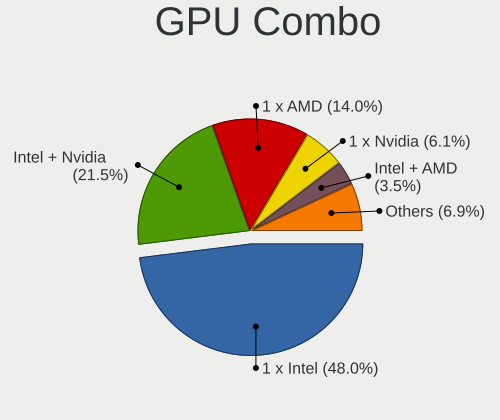

| Name                     | Notebooks | Percent |
|--------------------------|-----------|---------|
| 1 x Intel                | 1222      | 48.03%  |
| Intel + Nvidia           | 548       | 21.54%  |
| 1 x AMD                  | 355       | 13.95%  |
| 1 x Nvidia               | 155       | 6.09%   |
| Intel + AMD              | 88        | 3.46%   |
| AMD + Nvidia             | 75        | 2.95%   |
| 2 x AMD                  | 67        | 2.63%   |
| 2 x Intel                | 17        | 0.67%   |
| Other                    | 8         | 0.31%   |
| 2 x Nvidia               | 2         | 0.08%   |
| 1 x SiS                  | 2         | 0.08%   |
| 1 x Neomagic             | 2         | 0.08%   |
| Intel + AMD + 1 x Nvidia | 2         | 0.08%   |
| Intel + 2 x Nvidia       | 1         | 0.04%   |

GPU Driver
----------

Free vs proprietary

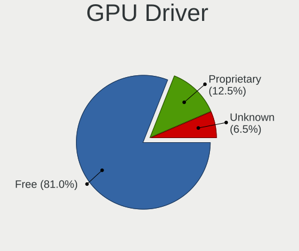

| Driver      | Notebooks | Percent |
|-------------|-----------|---------|
| Free        | 2100      | 80.99%  |
| Proprietary | 325       | 12.53%  |
| Unknown     | 168       | 6.48%   |

GPU Memory
----------

Total video memory

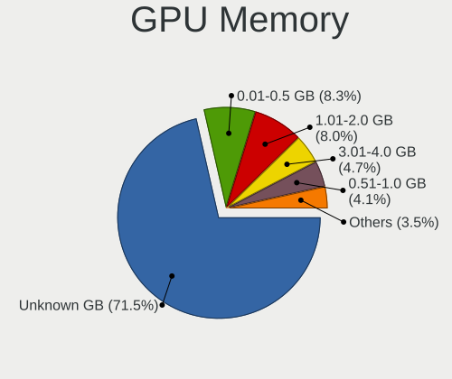

| Size in GB | Notebooks | Percent |
|------------|-----------|---------|
| Unknown    | 1860      | 71.46%  |
| 0.01-0.5   | 215       | 8.26%   |
| 1.01-2.0   | 207       | 7.95%   |
| 3.01-4.0   | 122       | 4.69%   |
| 0.51-1.0   | 108       | 4.15%   |
| 5.01-6.0   | 40        | 1.54%   |
| 7.01-8.0   | 32        | 1.23%   |
| 2.01-3.0   | 10        | 0.38%   |
| 8.01-16.0  | 9         | 0.35%   |

Monitor
-------

Monitor Vendor
--------------

Monitor vendors

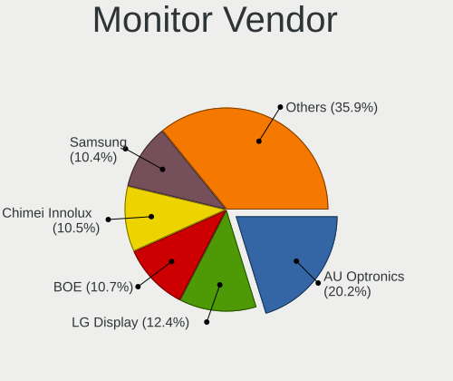

| Vendor                  | Notebooks | Percent |
|-------------------------|-----------|---------|
| AU Optronics            | 596       | 20.23%  |
| LG Display              | 364       | 12.36%  |
| BOE                     | 315       | 10.69%  |
| Chimei Innolux          | 308       | 10.45%  |
| Samsung Electronics     | 306       | 10.39%  |
| Apple                   | 182       | 6.18%   |
| Sharp                   | 109       | 3.7%    |
| Lenovo                  | 77        | 2.61%   |
| Dell                    | 73        | 2.48%   |
| Chi Mei Optoelectronics | 57        | 1.93%   |
| Goldstar                | 52        | 1.77%   |
| Acer                    | 40        | 1.36%   |
| PANDA                   | 38        | 1.29%   |
| Philips                 | 33        | 1.12%   |
| Hewlett-Packard         | 33        | 1.12%   |
| Valve                   | 27        | 0.92%   |
| BenQ                    | 26        | 0.88%   |
| AOC                     | 25        | 0.85%   |
| InfoVision              | 22        | 0.75%   |
| Sony                    | 18        | 0.61%   |
| ViewSonic               | 15        | 0.51%   |
| Unknown                 | 13        | 0.44%   |
| CSO                     | 11        | 0.37%   |
| Ancor Communications    | 11        | 0.37%   |
| LG Philips              | 10        | 0.34%   |
| MSI                     | 9         | 0.31%   |
| Kogan                   | 9         | 0.31%   |
| Toshiba                 | 8         | 0.27%   |
| Panasonic               | 8         | 0.27%   |
| Hitachi                 | 8         | 0.27%   |
| CSOT                    | 8         | 0.27%   |
| CPT                     | 7         | 0.24%   |
| ASUSTek Computer        | 7         | 0.24%   |
| Gigabyte Technology     | 6         | 0.2%    |
| ___                     | 5         | 0.17%   |
| TMX                     | 5         | 0.17%   |
| LGD                     | 5         | 0.17%   |
| InnoLux Display         | 5         | 0.17%   |
| HYO                     | 5         | 0.17%   |
| GKK                     | 5         | 0.17%   |

Monitor Model
-------------

Monitor models

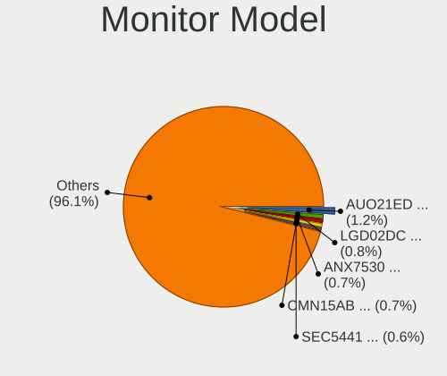

| Model                                                                    | Notebooks | Percent |
|--------------------------------------------------------------------------|-----------|---------|
| AU Optronics LCD Monitor AUO21ED 1920x1080 344x193mm 15.5-inch           | 35        | 1.17%   |
| LG Display LCD Monitor LGD02DC 1366x768 344x194mm 15.5-inch              | 24        | 0.8%    |
| Valve ANX7530 U VLV3001 800x1280 100x150mm 7.1-inch                      | 20        | 0.67%   |
| Chimei Innolux LCD Monitor CMN15AB 1366x768 344x193mm 15.5-inch          | 20        | 0.67%   |
| Samsung Electronics LCD Monitor SEC5441 1280x800 331x207mm 15.4-inch     | 19        | 0.63%   |
| AU Optronics LCD Monitor AUO22EC 1366x768 344x193mm 15.5-inch            | 17        | 0.57%   |
| Apple Color LCD APP9CDF 1440x900 286x179mm 13.3-inch                     | 17        | 0.57%   |
| Chimei Innolux LCD Monitor CMN15E7 1920x1080 344x193mm 15.5-inch         | 15        | 0.5%    |
| Apple Color LCD APP9CF0 1440x900 290x180mm 13.4-inch                     | 14        | 0.47%   |
| PANDA LCD Monitor NCP004D 1920x1080 344x194mm 15.5-inch                  | 12        | 0.4%    |
| Chimei Innolux LCD Monitor CMN1521 1920x1080 344x193mm 15.5-inch         | 12        | 0.4%    |
| Apple Color LCD APP9CC7 1280x800 286x179mm 13.3-inch                     | 12        | 0.4%    |
| Chimei Innolux LCD Monitor CMN14D4 1920x1080 309x173mm 13.9-inch         | 11        | 0.37%   |
| AU Optronics LCD Monitor AUO403D 1920x1080 309x174mm 14.0-inch           | 11        | 0.37%   |
| AU Optronics LCD Monitor AUO26EC 1366x768 344x193mm 15.5-inch            | 11        | 0.37%   |
| AU Optronics LCD Monitor AUO243D 1920x1080 309x173mm 13.9-inch           | 11        | 0.37%   |
| AU Optronics LCD Monitor AUO106C 1366x768 276x155mm 12.5-inch            | 11        | 0.37%   |
| Apple Color LCD APPA01B 1440x900 286x179mm 13.3-inch                     | 11        | 0.37%   |
| Sharp LCD Monitor SHP148D 3840x2160 344x194mm 15.5-inch                  | 10        | 0.33%   |
| AU Optronics LCD Monitor AUO70EC 1366x768 344x193mm 15.5-inch            | 10        | 0.33%   |
| AU Optronics LCD Monitor AUO46EC 1366x768 344x193mm 15.5-inch            | 10        | 0.33%   |
| AU Optronics LCD Monitor AUO38ED 1920x1080 344x193mm 15.5-inch           | 10        | 0.33%   |
| Sharp LCD Monitor SHP1449 1920x1080 294x165mm 13.3-inch                  | 9         | 0.3%    |
| LG Display LCD Monitor LGD0469 1920x1080 382x215mm 17.3-inch             | 9         | 0.3%    |
| Chimei Innolux LCD Monitor CMN15E6 1366x768 344x193mm 15.5-inch          | 9         | 0.3%    |
| Chimei Innolux LCD Monitor CMN15DB 1366x768 344x193mm 15.5-inch          | 9         | 0.3%    |
| Chi Mei Optoelectronics LCD Monitor CMO15A7 1366x768 344x193mm 15.5-inch | 9         | 0.3%    |
| BOE LCD Monitor BOE0BCA 2256x1504 285x190mm 13.5-inch                    | 9         | 0.3%    |
| BOE LCD Monitor BOE07CB 1920x1080 344x193mm 15.5-inch                    | 9         | 0.3%    |
| BOE LCD Monitor BOE0672 1366x768 344x194mm 15.5-inch                     | 9         | 0.3%    |
| AU Optronics LCD Monitor AUO81EC 1366x768 344x193mm 15.5-inch            | 9         | 0.3%    |
| Sharp LCD Monitor SHP1476 3840x2160 346x194mm 15.6-inch                  | 8         | 0.27%   |
| LG Display LCD Monitor LGD0521 1920x1080 309x174mm 14.0-inch             | 8         | 0.27%   |
| InfoVision LCD Monitor IVO057D 1920x1080 309x174mm 14.0-inch             | 8         | 0.27%   |
| Chimei Innolux LCD Monitor CMN15CA 1366x768 344x193mm 15.5-inch          | 8         | 0.27%   |
| Chimei Innolux LCD Monitor CMN15BF 1366x768 344x194mm 15.5-inch          | 8         | 0.27%   |
| Chi Mei Optoelectronics LCD Monitor CMO15A2 1366x768 344x193mm 15.5-inch | 8         | 0.27%   |
| AU Optronics LCD Monitor AUOD0ED 1920x1080 344x193mm 15.5-inch           | 8         | 0.27%   |
| AU Optronics LCD Monitor AUOAF90 1920x1080 344x193mm 15.5-inch           | 8         | 0.27%   |
| AU Optronics LCD Monitor AUO499F 1920x1080 344x194mm 15.5-inch           | 8         | 0.27%   |

Monitor Resolution
------------------

Monitor screen resolution

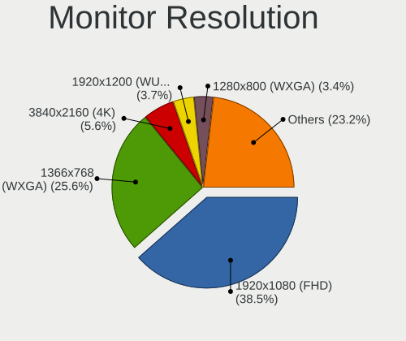

| Resolution         | Notebooks | Percent |
|--------------------|-----------|---------|
| 1920x1080 (FHD)    | 1071      | 38.48%  |
| 1366x768 (WXGA)    | 713       | 25.62%  |
| 3840x2160 (4K)     | 155       | 5.57%   |
| 1920x1200 (WUXGA)  | 104       | 3.74%   |
| 1280x800 (WXGA)    | 95        | 3.41%   |
| 2560x1600          | 89        | 3.2%    |
| 2560x1440 (QHD)    | 82        | 2.95%   |
| 1600x900 (HD+)     | 80        | 2.87%   |
| 1440x900 (WXGA+)   | 65        | 2.34%   |
| 2880x1800          | 61        | 2.19%   |
| 800x1280           | 27        | 0.97%   |
| 3440x1440          | 25        | 0.9%    |
| 3840x2400          | 24        | 0.86%   |
| 1680x1050 (WSXGA+) | 23        | 0.83%   |
| 3200x2000          | 16        | 0.57%   |
| Unknown            | 16        | 0.57%   |
| 2256x1504          | 14        | 0.5%    |
| 3200x1800 (QHD+)   | 13        | 0.47%   |
| 3072x1920          | 12        | 0.43%   |
| 1024x600           | 9         | 0.32%   |
| 3840x1080          | 8         | 0.29%   |
| 2240x1400          | 8         | 0.29%   |
| 1360x768           | 8         | 0.29%   |
| 1280x1024 (SXGA)   | 8         | 0.29%   |
| 2880x1620          | 6         | 0.22%   |
| 2560x1080          | 6         | 0.22%   |
| 2288x1287          | 4         | 0.14%   |
| 2160x1440          | 4         | 0.14%   |
| 1920x540           | 4         | 0.14%   |
| 3840x1600          | 3         | 0.11%   |
| 3456x2160          | 3         | 0.11%   |
| 2880x1920          | 3         | 0.11%   |
| 2304x1440          | 3         | 0.11%   |
| 1024x768 (XGA)     | 3         | 0.11%   |
| 5760x2160          | 2         | 0.07%   |
| 3840x1100          | 2         | 0.07%   |
| 3286x1080          | 2         | 0.07%   |
| 1920x1280          | 2         | 0.07%   |
| 1680x945           | 2         | 0.07%   |
| 1280x720 (HD)      | 2         | 0.07%   |

Monitor Diagonal
----------------

Diagonal size in inches

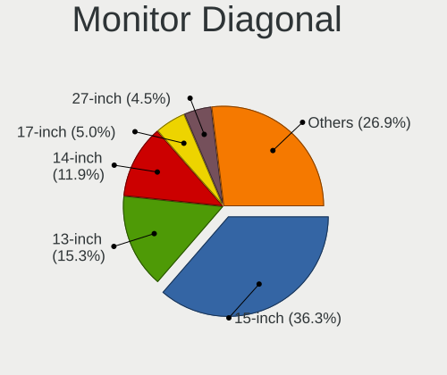

| Inches  | Notebooks | Percent |
|---------|-----------|---------|
| 15      | 1073      | 36.35%  |
| 13      | 452       | 15.31%  |
| 14      | 351       | 11.89%  |
| 17      | 149       | 5.05%   |
| 27      | 132       | 4.47%   |
| 16      | 108       | 3.66%   |
| 24      | 97        | 3.29%   |
| 12      | 84        | 2.85%   |
| 11      | 63        | 2.13%   |
| 23      | 59        | 2%      |
| 21      | 52        | 1.76%   |
| Unknown | 46        | 1.56%   |
| 31      | 44        | 1.49%   |
| 7       | 27        | 0.91%   |
| 34      | 23        | 0.78%   |
| 18      | 22        | 0.75%   |
| 72      | 17        | 0.58%   |
| 22      | 16        | 0.54%   |
| 84      | 14        | 0.47%   |
| 19      | 11        | 0.37%   |
| 10      | 11        | 0.37%   |
| 52      | 10        | 0.34%   |
| 40      | 9         | 0.3%    |
| 54      | 7         | 0.24%   |
| 48      | 6         | 0.2%    |
| 37      | 6         | 0.2%    |
| 32      | 6         | 0.2%    |
| 63      | 5         | 0.17%   |
| 142     | 4         | 0.14%   |
| 86      | 4         | 0.14%   |
| 49      | 4         | 0.14%   |
| 20      | 4         | 0.14%   |
| 65      | 3         | 0.1%    |
| 46      | 3         | 0.1%    |
| 42      | 3         | 0.1%    |
| 35      | 3         | 0.1%    |
| 28      | 3         | 0.1%    |
| 55      | 2         | 0.07%   |
| 33      | 2         | 0.07%   |
| 29      | 2         | 0.07%   |

Monitor Width
-------------

Physical width

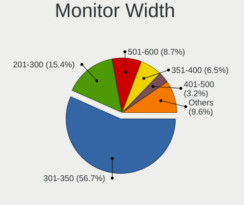

| Width in mm    | Notebooks | Percent |
|----------------|-----------|---------|
| 301-350        | 1654      | 56.66%  |
| 201-300        | 450       | 15.42%  |
| 501-600        | 253       | 8.67%   |
| 351-400        | 190       | 6.51%   |
| 401-500        | 92        | 3.15%   |
| 601-700        | 65        | 2.23%   |
| 1001-1500      | 48        | 1.64%   |
| Unknown        | 46        | 1.58%   |
| 701-800        | 32        | 1.1%    |
| 1501-2000      | 32        | 1.1%    |
| 1-100          | 27        | 0.92%   |
| 801-900        | 19        | 0.65%   |
| 901-1000       | 5         | 0.17%   |
| More than 2000 | 4         | 0.14%   |
| 101-200        | 2         | 0.07%   |

Aspect Ratio
------------

Proportional relationship between the width and the height

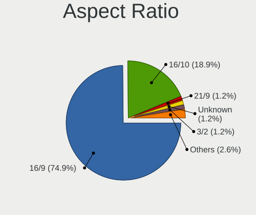

| Ratio   | Notebooks | Percent |
|---------|-----------|---------|
| 16/9    | 1947      | 74.86%  |
| 16/10   | 491       | 18.88%  |
| 21/9    | 32        | 1.23%   |
| Unknown | 32        | 1.23%   |
| 3/2     | 31        | 1.19%   |
| 0.67    | 20        | 0.77%   |
| 32/9    | 13        | 0.5%    |
| 5/4     | 10        | 0.38%   |
| 0.62    | 8         | 0.31%   |
| 4/3     | 4         | 0.15%   |
| 1.00    | 4         | 0.15%   |
| 0.56    | 4         | 0.15%   |
| 6/5     | 2         | 0.08%   |
| 3.40    | 2         | 0.08%   |
| 3.73    | 1         | 0.04%   |

Monitor Area
------------

Area in inch²

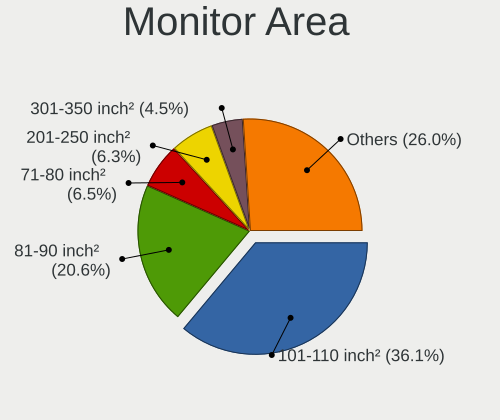

| Area in inch² | Notebooks | Percent |
|----------------|-----------|---------|
| 101-110        | 1062      | 36.09%  |
| 81-90          | 605       | 20.56%  |
| 71-80          | 192       | 6.52%   |
| 201-250        | 185       | 6.29%   |
| 301-350        | 133       | 4.52%   |
| 121-130        | 126       | 4.28%   |
| 111-120        | 115       | 3.91%   |
| 351-500        | 82        | 2.79%   |
| 61-70          | 80        | 2.72%   |
| More than 1000 | 67        | 2.28%   |
| 51-60          | 65        | 2.21%   |
| Unknown        | 46        | 1.56%   |
| 501-1000       | 35        | 1.19%   |
| 1-40           | 29        | 0.99%   |
| 251-300        | 26        | 0.88%   |
| 151-200        | 26        | 0.88%   |
| 141-150        | 23        | 0.78%   |
| 131-140        | 20        | 0.68%   |
| 91-100         | 14        | 0.48%   |
| 41-50          | 12        | 0.41%   |

Pixel Density
-------------

Pixels per inch

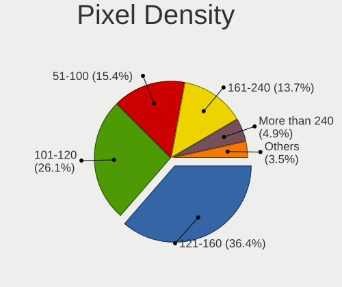

| Density       | Notebooks | Percent |
|---------------|-----------|---------|
| 121-160       | 1047      | 36.37%  |
| 101-120       | 752       | 26.12%  |
| 51-100        | 443       | 15.39%  |
| 161-240       | 394       | 13.69%  |
| More than 240 | 142       | 4.93%   |
| 1-50          | 55        | 1.91%   |
| Unknown       | 46        | 1.6%    |

Multiple Monitors
-----------------

Total monitors connected

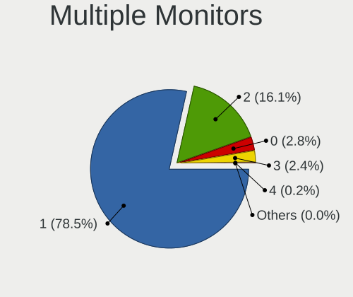

| Total | Notebooks | Percent |
|-------|-----------|---------|
| 1     | 2057      | 78.51%  |
| 2     | 421       | 16.07%  |
| 0     | 73        | 2.79%   |
| 3     | 63        | 2.4%    |
| 4     | 5         | 0.19%   |
| 5     | 1         | 0.04%   |

Network
-------

Net Controller Vendor
---------------------

Controller vendors

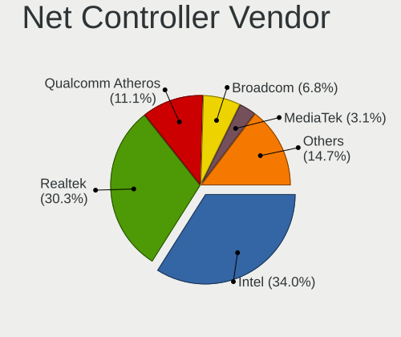

| Vendor                                 | Notebooks | Percent |
|----------------------------------------|-----------|---------|
| Intel                                  | 1381      | 33.97%  |
| Realtek Semiconductor                  | 1233      | 30.33%  |
| Qualcomm Atheros                       | 453       | 11.14%  |
| Broadcom                               | 277       | 6.81%   |
| MediaTek                               | 125       | 3.08%   |
| Broadcom Limited                       | 100       | 2.46%   |
| Sierra Wireless                        | 40        | 0.98%   |
| Ralink                                 | 35        | 0.86%   |
| Shenzhen Goodix Technology             | 30        | 0.74%   |
| Marvell Technology Group               | 27        | 0.66%   |
| DisplayLink                            | 27        | 0.66%   |
| Samsung Electronics                    | 24        | 0.59%   |
| Dell                                   | 24        | 0.59%   |
| Qualcomm                               | 23        | 0.57%   |
| Lenovo                                 | 21        | 0.52%   |
| ASIX Electronics                       | 21        | 0.52%   |
| TP-Link                                | 19        | 0.47%   |
| Hewlett-Packard                        | 17        | 0.42%   |
| Nvidia                                 | 16        | 0.39%   |
| Apple                                  | 16        | 0.39%   |
| NetGear                                | 14        | 0.34%   |
| Huawei Technologies                    | 12        | 0.3%    |
| Google                                 | 12        | 0.3%    |
| Ralink Technology                      | 11        | 0.27%   |
| ZTE WCDMA Technologies MSM             | 10        | 0.25%   |
| OPPO Electronics                       | 10        | 0.25%   |
| Ericsson Business Mobile Networks      | 7         | 0.17%   |
| Edimax Technology                      | 7         | 0.17%   |
| ASUSTek Computer                       | 7         | 0.17%   |
| Motorola PCS                           | 5         | 0.12%   |
| JMicron Technology                     | 5         | 0.12%   |
| Xiaomi                                 | 4         | 0.1%    |
| U-Blox                                 | 4         | 0.1%    |
| D-Link                                 | 4         | 0.1%    |
| Qualcomm Atheros Communications        | 3         | 0.07%   |
| Suzhou Motorcomm Electronic Technology | 2         | 0.05%   |
| STMicroelectronics                     | 2         | 0.05%   |
| Silicon Integrated Systems [SiS]       | 2         | 0.05%   |
| Qualcomm Technologies                  | 2         | 0.05%   |
| QinHeng Electronics                    | 2         | 0.05%   |

Net Controller Model
--------------------

Controller models

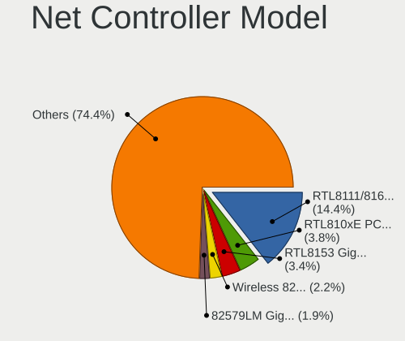

| Model                                                                  | Notebooks | Percent |
|------------------------------------------------------------------------|-----------|---------|
| Realtek RTL8111/8168/8211/8411 PCI Express Gigabit Ethernet Controller | 700       | 14.4%   |
| Realtek RTL810xE PCI Express Fast Ethernet controller                  | 183       | 3.77%   |
| Realtek RTL8153 Gigabit Ethernet Adapter                               | 163       | 3.35%   |
| Intel Wireless 8265 / 8275                                             | 106       | 2.18%   |
| Intel 82579LM Gigabit Network Connection (Lewisville)                  | 90        | 1.85%   |
| Intel Wi-Fi 6 AX200                                                    | 89        | 1.83%   |
| Intel Wireless 8260                                                    | 87        | 1.79%   |
| Intel Wireless 7260                                                    | 84        | 1.73%   |
| Intel Wi-Fi 6 AX201                                                    | 80        | 1.65%   |
| Qualcomm Atheros AR9485 Wireless Network Adapter                       | 79        | 1.63%   |
| Qualcomm Atheros QCA6174 802.11ac Wireless Network Adapter             | 71        | 1.46%   |
| Realtek RTL8822CE 802.11ac PCIe Wireless Network Adapter               | 70        | 1.44%   |
| Qualcomm Atheros AR9285 Wireless Network Adapter (PCI-Express)         | 65        | 1.34%   |
| Intel Alder Lake-P PCH CNVi WiFi                                       | 65        | 1.34%   |
| Qualcomm Atheros QCA9377 802.11ac Wireless Network Adapter             | 63        | 1.3%    |
| Intel Wireless 7265                                                    | 54        | 1.11%   |
| Intel Centrino Advanced-N 6205 [Taylor Peak]                           | 52        | 1.07%   |
| Qualcomm Atheros QCA9565 / AR9565 Wireless Network Adapter             | 50        | 1.03%   |
| Intel Wi-Fi 6E(802.11ax) AX210/AX1675* 2x2 [Typhoon Peak]              | 50        | 1.03%   |
| Intel Centrino Ultimate-N 6300                                         | 50        | 1.03%   |
| Realtek RTL8821CE 802.11ac PCIe Wireless Network Adapter               | 49        | 1.01%   |
| Intel Ethernet Connection I219-LM                                      | 49        | 1.01%   |
| Intel Comet Lake PCH CNVi WiFi                                         | 49        | 1.01%   |
| Intel Ethernet Connection (4) I219-LM                                  | 48        | 0.99%   |
| Intel Cannon Lake PCH CNVi WiFi                                        | 47        | 0.97%   |
| Broadcom Limited BCM4360 802.11ac Dual Band Wireless Network Adapter   | 47        | 0.97%   |
| MediaTek MT7922 802.11ax PCI Express Wireless Network Adapter          | 46        | 0.95%   |
| Intel Wireless 3165                                                    | 46        | 0.95%   |
| Intel Comet Lake PCH-LP CNVi WiFi                                      | 44        | 0.91%   |
| MediaTek MT7921 802.11ax PCIe Wireless Network Adapter [Filogic 330]   | 39        | 0.8%    |
| Intel Raptor Lake PCH CNVi WiFi                                        | 38        | 0.78%   |
| Intel Cannon Point-LP CNVi [Wireless-AC]                               | 37        | 0.76%   |
| Intel Wireless 3160                                                    | 36        | 0.74%   |
| Broadcom BCM4331 802.11a/b/g/n                                         | 33        | 0.68%   |
| Shenzhen Goodix Fingerprint Reader                                     | 30        | 0.62%   |
| Qualcomm Atheros AR8151 v2.0 Gigabit Ethernet                          | 30        | 0.62%   |
| Intel 82577LM Gigabit Network Connection                               | 30        | 0.62%   |
| Intel Ethernet Connection I218-LM                                      | 29        | 0.6%    |
| Broadcom NetXtreme BCM57765 Gigabit Ethernet PCIe                      | 29        | 0.6%    |
| Intel Ethernet Connection (4) I219-V                                   | 25        | 0.51%   |

Wireless Vendor
---------------

Wireless vendors

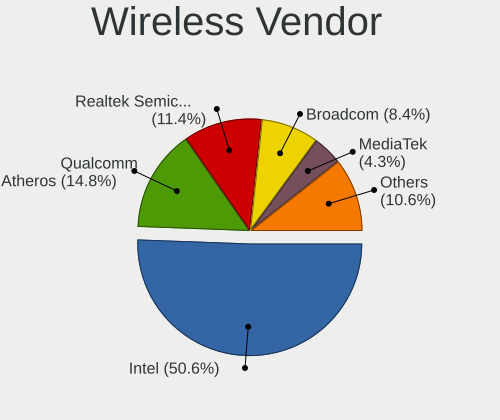

| Vendor                            | Notebooks | Percent |
|-----------------------------------|-----------|---------|
| Intel                             | 1313      | 50.58%  |
| Qualcomm Atheros                  | 383       | 14.75%  |
| Realtek Semiconductor             | 295       | 11.36%  |
| Broadcom                          | 217       | 8.36%   |
| MediaTek                          | 112       | 4.31%   |
| Broadcom Limited                  | 86        | 3.31%   |
| Sierra Wireless                   | 40        | 1.54%   |
| Ralink                            | 35        | 1.35%   |
| Qualcomm                          | 22        | 0.85%   |
| Dell                              | 18        | 0.69%   |
| TP-Link                           | 17        | 0.65%   |
| NetGear                           | 14        | 0.54%   |
| Ralink Technology                 | 11        | 0.42%   |
| Edimax Technology                 | 7         | 0.27%   |
| ASUSTek Computer                  | 7         | 0.27%   |
| Hewlett-Packard                   | 5         | 0.19%   |
| D-Link                            | 4         | 0.15%   |
| Qualcomm Atheros Communications   | 3         | 0.12%   |
| Ericsson Business Mobile Networks | 2         | 0.08%   |
| Xiaomi                            | 1         | 0.04%   |
| Wilocity                          | 1         | 0.04%   |
| Qualcomm Technologies             | 1         | 0.04%   |
| Linksys                           | 1         | 0.04%   |
| Belkin Components                 | 1         | 0.04%   |

Wireless Model
--------------

Wireless models

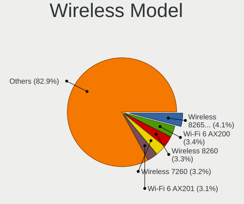

| Model                                                                | Notebooks | Percent |
|----------------------------------------------------------------------|-----------|---------|
| Intel Wireless 8265 / 8275                                           | 106       | 4.06%   |
| Intel Wi-Fi 6 AX200                                                  | 89        | 3.41%   |
| Intel Wireless 8260                                                  | 87        | 3.33%   |
| Intel Wireless 7260                                                  | 84        | 3.22%   |
| Intel Wi-Fi 6 AX201                                                  | 80        | 3.06%   |
| Qualcomm Atheros AR9485 Wireless Network Adapter                     | 79        | 3.03%   |
| Qualcomm Atheros QCA6174 802.11ac Wireless Network Adapter           | 71        | 2.72%   |
| Realtek RTL8822CE 802.11ac PCIe Wireless Network Adapter             | 70        | 2.68%   |
| Qualcomm Atheros AR9285 Wireless Network Adapter (PCI-Express)       | 65        | 2.49%   |
| Qualcomm Atheros QCA9377 802.11ac Wireless Network Adapter           | 63        | 2.41%   |
| Intel Wireless 7265                                                  | 54        | 2.07%   |
| Intel Centrino Advanced-N 6205 [Taylor Peak]                         | 52        | 1.99%   |
| Qualcomm Atheros QCA9565 / AR9565 Wireless Network Adapter           | 50        | 1.91%   |
| Intel Wi-Fi 6E(802.11ax) AX210/AX1675* 2x2 [Typhoon Peak]            | 50        | 1.91%   |
| Intel Centrino Ultimate-N 6300                                       | 50        | 1.91%   |
| Realtek RTL8821CE 802.11ac PCIe Wireless Network Adapter             | 49        | 1.88%   |
| Intel Comet Lake PCH CNVi WiFi                                       | 49        | 1.88%   |
| Intel Cannon Lake PCH CNVi WiFi                                      | 47        | 1.8%    |
| Intel Alder Lake-P PCH CNVi WiFi                                     | 47        | 1.8%    |
| Broadcom Limited BCM4360 802.11ac Dual Band Wireless Network Adapter | 47        | 1.8%    |
| Intel Wireless 3165                                                  | 46        | 1.76%   |
| Intel Comet Lake PCH-LP CNVi WiFi                                    | 44        | 1.69%   |
| MediaTek MT7921 802.11ax PCIe Wireless Network Adapter [Filogic 330] | 39        | 1.49%   |
| Intel Cannon Point-LP CNVi [Wireless-AC]                             | 37        | 1.42%   |
| MediaTek MT7922 802.11ax PCI Express Wireless Network Adapter        | 36        | 1.38%   |
| Intel Wireless 3160                                                  | 36        | 1.38%   |
| Intel Raptor Lake PCH CNVi WiFi                                      | 34        | 1.3%    |
| Broadcom BCM4331 802.11a/b/g/n                                       | 33        | 1.26%   |
| Broadcom BCM43224 802.11a/b/g/n                                      | 25        | 0.96%   |
| Qualcomm Atheros AR9462 Wireless Network Adapter                     | 23        | 0.88%   |
| Intel Wi-Fi 5(802.11ac) Wireless-AC 9x6x [Thunder Peak]              | 23        | 0.88%   |
| Broadcom BCM4313 802.11bgn Wireless Network Adapter                  | 23        | 0.88%   |
| Intel Tiger Lake PCH CNVi WiFi                                       | 21        | 0.8%    |
| Intel Centrino Advanced-N 6235                                       | 21        | 0.8%    |
| Qualcomm QCNFA765 Wireless Network Adapter                           | 20        | 0.77%   |
| MediaTek MT7902 802.11ax PCIe Wireless Network Adapter [Filogic 310] | 20        | 0.77%   |
| Intel Centrino Advanced-N 6200                                       | 19        | 0.73%   |
| Broadcom BCM43602 802.11ac Wireless LAN SoC                          | 19        | 0.73%   |
| Ralink RT3290 Wireless 802.11n 1T/1R PCIe                            | 18        | 0.69%   |
| Intel WiFi Link 5100                                                 | 18        | 0.69%   |

Ethernet Vendor
---------------

Ethernet vendors

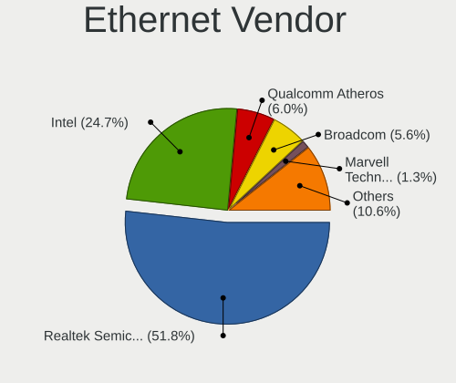

| Vendor                                 | Notebooks | Percent |
|----------------------------------------|-----------|---------|
| Realtek Semiconductor                  | 1095      | 51.77%  |
| Intel                                  | 522       | 24.68%  |
| Qualcomm Atheros                       | 127       | 6%      |
| Broadcom                               | 119       | 5.63%   |
| Marvell Technology Group               | 27        | 1.28%   |
| DisplayLink                            | 27        | 1.28%   |
| Samsung Electronics                    | 24        | 1.13%   |
| Lenovo                                 | 21        | 0.99%   |
| ASIX Electronics                       | 21        | 0.99%   |
| Nvidia                                 | 16        | 0.76%   |
| Apple                                  | 16        | 0.76%   |
| Broadcom Limited                       | 14        | 0.66%   |
| MediaTek                               | 12        | 0.57%   |
| Google                                 | 12        | 0.57%   |
| OPPO Electronics                       | 10        | 0.47%   |
| Huawei Technologies                    | 9         | 0.43%   |
| ZTE WCDMA Technologies MSM             | 7         | 0.33%   |
| Motorola PCS                           | 5         | 0.24%   |
| JMicron Technology                     | 5         | 0.24%   |
| Hewlett-Packard                        | 5         | 0.24%   |
| Xiaomi                                 | 3         | 0.14%   |
| Suzhou Motorcomm Electronic Technology | 2         | 0.09%   |
| Silicon Integrated Systems [SiS]       | 2         | 0.09%   |
| Microsoft                              | 2         | 0.09%   |
| ICS Advent                             | 2         | 0.09%   |
| TP-Link                                | 1         | 0.05%   |
| T & A Mobile Phones                    | 1         | 0.05%   |
| Sony Ericsson Mobile Communications AB | 1         | 0.05%   |
| Realtek                                | 1         | 0.05%   |
| Qualcomm Technologies                  | 1         | 0.05%   |
| Qualcomm                               | 1         | 0.05%   |
| Netchip Technology                     | 1         | 0.05%   |
| MEIG                                   | 1         | 0.05%   |
| Attansic Technology                    | 1         | 0.05%   |
| Aquantia                               | 1         | 0.05%   |

Ethernet Model
--------------

Ethernet models

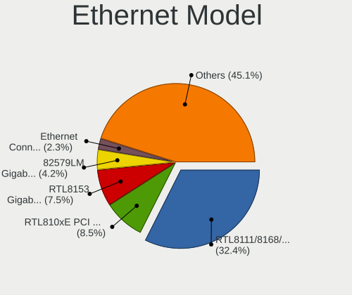

| Model                                                                  | Notebooks | Percent |
|------------------------------------------------------------------------|-----------|---------|
| Realtek RTL8111/8168/8211/8411 PCI Express Gigabit Ethernet Controller | 700       | 32.42%  |
| Realtek RTL810xE PCI Express Fast Ethernet controller                  | 183       | 8.48%   |
| Realtek RTL8153 Gigabit Ethernet Adapter                               | 163       | 7.55%   |
| Intel 82579LM Gigabit Network Connection (Lewisville)                  | 90        | 4.17%   |
| Intel Ethernet Connection I219-LM                                      | 49        | 2.27%   |
| Intel Ethernet Connection (4) I219-LM                                  | 48        | 2.22%   |
| Qualcomm Atheros AR8151 v2.0 Gigabit Ethernet                          | 30        | 1.39%   |
| Intel 82577LM Gigabit Network Connection                               | 30        | 1.39%   |
| Intel Ethernet Connection I218-LM                                      | 29        | 1.34%   |
| Broadcom NetXtreme BCM57765 Gigabit Ethernet PCIe                      | 29        | 1.34%   |
| Intel Ethernet Connection (4) I219-V                                   | 25        | 1.16%   |
| Broadcom NetXtreme BCM57786 Gigabit Ethernet PCIe                      | 22        | 1.02%   |
| Intel Ethernet Connection (3) I218-LM                                  | 20        | 0.93%   |
| ASIX AX88179 Gigabit Ethernet                                          | 19        | 0.88%   |
| Realtek RTL8125 2.5GbE Controller                                      | 18        | 0.83%   |
| Realtek Killer E2600 GbE Controller                                    | 18        | 0.83%   |
| Intel Alder Lake-P PCH CNVi WiFi                                       | 18        | 0.83%   |
| Samsung Galaxy series, misc. (tethering mode)                          | 17        | 0.79%   |
| Broadcom NetLink BCM57785 Gigabit Ethernet PCIe                        | 17        | 0.79%   |
| Qualcomm Atheros AR8161 Gigabit Ethernet                               | 16        | 0.74%   |
| Intel Ethernet Connection (13) I219-V                                  | 15        | 0.69%   |
| Intel Ethernet Connection (6) I219-V                                   | 14        | 0.65%   |
| Qualcomm Atheros QCA8171 Gigabit Ethernet                              | 13        | 0.6%    |
| Qualcomm Atheros Killer E220x Gigabit Ethernet Controller              | 13        | 0.6%    |
| Intel Ethernet Connection I219-V                                       | 13        | 0.6%    |
| Broadcom NetLink BCM57780 Gigabit Ethernet PCIe                        | 13        | 0.6%    |
| Qualcomm Atheros Killer E2500 Gigabit Ethernet Controller              | 12        | 0.56%   |
| Realtek RTL8152 Fast Ethernet Adapter                                  | 11        | 0.51%   |
| Realtek Killer E3000 2.5GbE Controller                                 | 11        | 0.51%   |
| Intel Ethernet Connection I217-LM                                      | 11        | 0.51%   |
| Intel Ethernet Connection (6) I219-LM                                  | 11        | 0.51%   |
| Intel 82567LM Gigabit Network Connection                               | 11        | 0.51%   |
| Broadcom NetXtreme BCM5764M Gigabit Ethernet PCIe                      | 11        | 0.51%   |
| OPPO Ace 3V                                                            | 10        | 0.46%   |
| Nvidia MCP79 Ethernet                                                  | 10        | 0.46%   |
| MediaTek MT7922 802.11ax PCI Express Wireless Network Adapter          | 10        | 0.46%   |
| Intel Ethernet Connection (2) I219-LM                                  | 10        | 0.46%   |
| Google Pixel 9a                                                        | 10        | 0.46%   |
| Apple iBridge                                                          | 10        | 0.46%   |
| Qualcomm Atheros AR8152 v2.0 Fast Ethernet                             | 9         | 0.42%   |

Net Controller Kind
-------------------

Ethernet, WiFi or modem

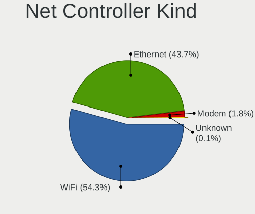

| Kind     | Notebooks | Percent |
|----------|-----------|---------|
| WiFi     | 2430      | 54.3%   |
| Ethernet | 1957      | 43.73%  |
| Modem    | 82        | 1.83%   |
| Unknown  | 6         | 0.13%   |

Used Controller
---------------

Currently used network controller

| Kind     | Notebooks | Percent |
|----------|-----------|---------|
| WiFi     | 2031      | 77.08%  |
| Ethernet | 603       | 22.88%  |
| Modem    | 1         | 0.04%   |

NICs
----

Total network controllers on board

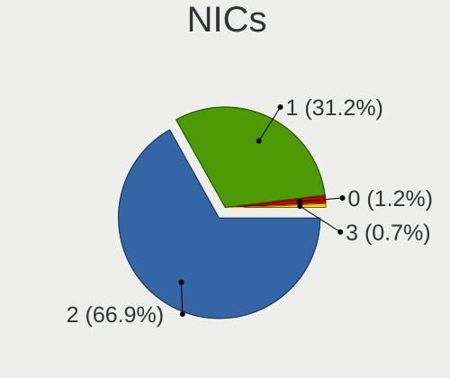

| Total | Notebooks | Percent |
|-------|-----------|---------|
| 2     | 1698      | 66.88%  |
| 1     | 791       | 31.15%  |
| 0     | 31        | 1.22%   |
| 3     | 19        | 0.75%   |

IPv6
----

IPv6 vs IPv4

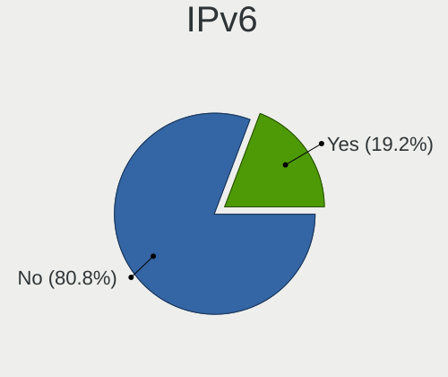

| Used | Notebooks | Percent |
|------|-----------|---------|
| No   | 2093      | 80.78%  |
| Yes  | 498       | 19.22%  |

Bluetooth
---------

Bluetooth Vendor
----------------

Controller vendors

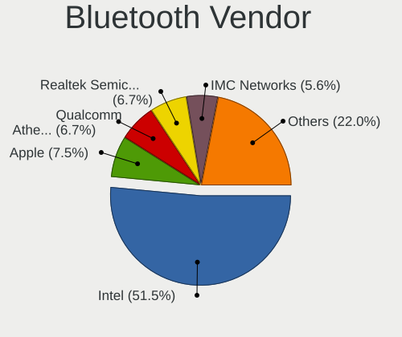

| Vendor                          | Notebooks | Percent |
|---------------------------------|-----------|---------|
| Intel                           | 1069      | 51.49%  |
| Apple                           | 155       | 7.47%   |
| Qualcomm Atheros Communications | 140       | 6.74%   |
| Realtek Semiconductor           | 139       | 6.7%    |
| IMC Networks                    | 117       | 5.64%   |
| Broadcom                        | 94        | 4.53%   |
| Foxconn / Hon Hai               | 85        | 4.09%   |
| Lite-On Technology              | 61        | 2.94%   |
| Toshiba                         | 46        | 2.22%   |
| Dell                            | 35        | 1.69%   |
| Hewlett-Packard                 | 30        | 1.45%   |
| MediaTek                        | 26        | 1.25%   |
| Ralink                          | 18        | 0.87%   |
| Cambridge Silicon Radio         | 16        | 0.77%   |
| Realtek                         | 9         | 0.43%   |
| Alps Electric                   | 9         | 0.43%   |
| USI                             | 8         | 0.39%   |
| ASUSTek Computer                | 6         | 0.29%   |
| Ralink Technology               | 4         | 0.19%   |
| Micro Star International        | 2         | 0.1%    |
| Taiyo Yuden                     | 1         | 0.05%   |
| Opticis                         | 1         | 0.05%   |
| Integrated System Solution      | 1         | 0.05%   |
| Fujitsu                         | 1         | 0.05%   |
| Belkin Components               | 1         | 0.05%   |
| Askey Computer                  | 1         | 0.05%   |
| Unknown                         | 1         | 0.05%   |

Bluetooth Model
---------------

Controller models

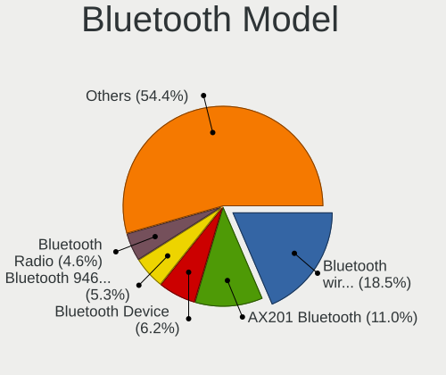

| Model                                               | Notebooks | Percent |
|-----------------------------------------------------|-----------|---------|
| Intel Bluetooth wireless interface                  | 385       | 18.54%  |
| Intel AX201 Bluetooth                               | 229       | 11.03%  |
| Intel Bluetooth Device                              | 128       | 6.16%   |
| Intel Bluetooth 9460/9560 Jefferson Peak (JfP)      | 110       | 5.3%    |
| Realtek Bluetooth Radio                             | 95        | 4.57%   |
| Intel AX200 Bluetooth                               | 88        | 4.24%   |
| Apple Bluetooth Host Controller                     | 81        | 3.9%    |
| Qualcomm Atheros  Bluetooth Device                  | 60        | 2.89%   |
| Apple Bluetooth USB Host Controller                 | 58        | 2.79%   |
| IMC Networks Wireless_Device                        | 48        | 2.31%   |
| IMC Networks Bluetooth Radio                        | 44        | 2.12%   |
| Intel AX210 Bluetooth                               | 41        | 1.97%   |
| Qualcomm Atheros QCA61x4 Bluetooth 4.0              | 35        | 1.69%   |
| Realtek  Bluetooth 4.2 Adapter                      | 27        | 1.3%    |
| Qualcomm Atheros AR3011 Bluetooth                   | 27        | 1.3%    |
| Intel Centrino Bluetooth Wireless Transceiver       | 27        | 1.3%    |
| MediaTek Wireless_Device                            | 26        | 1.25%   |
| Foxconn / Hon Hai Bluetooth Device                  | 26        | 1.25%   |
| Intel Wireless-AC 9260 Bluetooth Adapter            | 21        | 1.01%   |
| Lite-On Qualcomm Atheros QCA9377 Bluetooth          | 20        | 0.96%   |
| Intel Centrino Advanced-N 6230 Bluetooth adapter    | 20        | 0.96%   |
| HP Broadcom 2070 Bluetooth Combo                    | 20        | 0.96%   |
| Broadcom BCM2045B (BDC-2.1)                         | 20        | 0.96%   |
| Ralink RT3290 Bluetooth                             | 18        | 0.87%   |
| Lite-On Atheros AR3012 Bluetooth                    | 18        | 0.87%   |
| Intel Wireless-AC 3168 Bluetooth                    | 17        | 0.82%   |
| Toshiba Bluetooth Device                            | 16        | 0.77%   |
| Foxconn / Hon Hai Wireless_Device                   | 16        | 0.77%   |
| Cambridge Silicon Radio Bluetooth Dongle (HCI mode) | 16        | 0.77%   |
| Dell DW375 Bluetooth Module                         | 15        | 0.72%   |
| Apple Built-in Bluetooth 2.0+EDR HCI                | 14        | 0.67%   |
| Qualcomm Atheros AR3012 Bluetooth 4.0               | 12        | 0.58%   |
| Lite-On Bluetooth Device                            | 12        | 0.58%   |
| Foxconn / Hon Hai MediaTek Bluetooth Adapter        | 12        | 0.58%   |
| Dell BCM20702A0 Bluetooth Module                    | 11        | 0.53%   |
| HP Bluetooth 2.0 Interface [Broadcom BCM2045]       | 10        | 0.48%   |
| Toshiba Integrated Bluetooth HCI                    | 9         | 0.43%   |
| Realtek Bluetooth Radio                             | 9         | 0.43%   |
| Broadcom BCM20702A0 Bluetooth 4.0                   | 9         | 0.43%   |
| Lite-On Wireless_Device                             | 8         | 0.39%   |

Sound
-----

Sound Vendor
------------

Sound card vendors

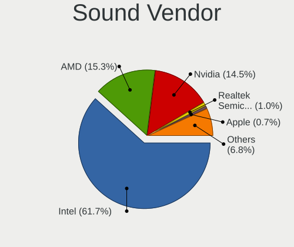

| Vendor                                       | Notebooks | Percent |
|----------------------------------------------|-----------|---------|
| Intel                                        | 2042      | 61.71%  |
| AMD                                          | 506       | 15.29%  |
| Nvidia                                       | 481       | 14.54%  |
| Realtek Semiconductor                        | 32        | 0.97%   |
| Apple                                        | 22        | 0.66%   |
| C-Media Electronics                          | 19        | 0.57%   |
| Lenovo                                       | 18        | 0.54%   |
| Razer USA                                    | 13        | 0.39%   |
| GN Netcom                                    | 13        | 0.39%   |
| Sony                                         | 11        | 0.33%   |
| Hewlett-Packard                              | 11        | 0.33%   |
| Generalplus Technology                       | 11        | 0.33%   |
| Logitech                                     | 10        | 0.3%    |
| Kingston Technology                          | 10        | 0.3%    |
| JMTek                                        | 9         | 0.27%   |
| Texas Instruments                            | 7         | 0.21%   |
| SteelSeries ApS                              | 6         | 0.18%   |
| Creative Technology                          | 6         | 0.18%   |
| Corsair                                      | 5         | 0.15%   |
| Plantronics                                  | 4         | 0.12%   |
| RODE Microphones                             | 3         | 0.09%   |
| OPPO Electronics                             | 3         | 0.09%   |
| Native Instruments                           | 3         | 0.09%   |
| Microsoft                                    | 3         | 0.09%   |
| M-Audio                                      | 3         | 0.09%   |
| Focusrite-Novation                           | 3         | 0.09%   |
| Zoran Co. Personal Media Division (Nogatech) | 2         | 0.06%   |
| Thermaltake                                  | 2         | 0.06%   |
| Silicon Integrated Systems [SiS]             | 2         | 0.06%   |
| Samsung Electronics                          | 2         | 0.06%   |
| Micro Star International                     | 2         | 0.06%   |
| DSEA A/S                                     | 2         | 0.06%   |
| Dell                                         | 2         | 0.06%   |
| Conexant Systems                             | 2         | 0.06%   |
| CMX Systems                                  | 2         | 0.06%   |
| Chicony Electronics                          | 2         | 0.06%   |
| Blue Microphones                             | 2         | 0.06%   |
| BEHRINGER International                      | 2         | 0.06%   |
| ASUSTek Computer                             | 2         | 0.06%   |
| Antlion Audio                                | 2         | 0.06%   |

Sound Model
-----------

Sound card models

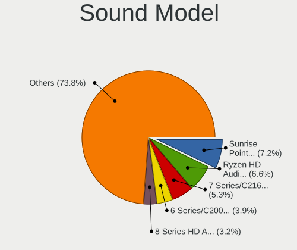

| Model                                                                      | Notebooks | Percent |
|----------------------------------------------------------------------------|-----------|---------|
| Intel Sunrise Point-LP HD Audio                                            | 287       | 7.19%   |
| AMD Ryzen HD Audio Controller                                              | 263       | 6.59%   |
| Intel 7 Series/C216 Chipset Family High Definition Audio Controller        | 211       | 5.28%   |
| Intel 6 Series/C200 Series Chipset Family High Definition Audio Controller | 157       | 3.93%   |
| Intel 8 Series HD Audio Controller                                         | 128       | 3.21%   |
| Intel Haswell-ULT HD Audio Controller                                      | 127       | 3.18%   |
| Intel Tiger Lake-LP Smart Sound Technology Audio Controller                | 111       | 2.78%   |
| Intel Broadwell-U Audio Controller                                         | 111       | 2.78%   |
| Intel 5 Series/3400 Series Chipset High Definition Audio                   | 111       | 2.78%   |
| Intel Wildcat Point-LP High Definition Audio Controller                    | 110       | 2.75%   |
| AMD Renoir/Cezanne HDMI/DP Audio Controller                                | 108       | 2.7%    |
| AMD Radeon High Definition Audio Controller                                | 106       | 2.65%   |
| Intel Cannon Lake PCH cAVS                                                 | 98        | 2.45%   |
| Intel Alder Lake PCH-P High Definition Audio Controller                    | 88        | 2.2%    |
| AMD FCH Azalia Controller                                                  | 78        | 1.95%   |
| Intel 8 Series/C220 Series Chipset High Definition Audio Controller        | 76        | 1.9%    |
| Intel Cannon Point-LP High Definition Audio Controller                     | 66        | 1.65%   |
| Intel 82801I (ICH9 Family) HD Audio Controller                             | 60        | 1.5%    |
| AMD Kabini HDMI/DP Audio                                                   | 59        | 1.48%   |
| Intel Xeon E3-1200 v3/4th Gen Core Processor HD Audio Controller           | 57        | 1.43%   |
| Intel Comet Lake PCH-LP cAVS                                               | 56        | 1.4%    |
| Intel Comet Lake PCH cAVS                                                  | 53        | 1.33%   |
| Nvidia TU107 GeForce GTX 1650 High Definition Audio Controller             | 48        | 1.2%    |
| Intel CM238 HD Audio Controller                                            | 47        | 1.18%   |
| AMD Raven/Raven2/Fenghuang HDMI/DP Audio Controller                        | 45        | 1.13%   |
| AMD Family 15h (Models 60h-6fh) Audio Controller                           | 43        | 1.08%   |
| Nvidia AD107 High Definition Audio Controller                              | 42        | 1.05%   |
| Intel Raptor Lake-P/U/H cAVS                                               | 41        | 1.03%   |
| Intel Tiger Lake-H HD Audio Controller                                     | 40        | 1%      |
| Nvidia GF108 High Definition Audio Controller                              | 37        | 0.93%   |
| AMD High Definition Audio Controller                                       | 34        | 0.85%   |
| Nvidia GK107 HDMI Audio Controller                                         | 32        | 0.8%    |
| Intel Ice Lake-LP Smart Sound Technology Audio Controller                  | 32        | 0.8%    |
| Intel 82801H (ICH8 Family) HD Audio Controller                             | 32        | 0.8%    |
| Nvidia GA107 High Definition Audio Controller                              | 31        | 0.78%   |
| Intel 100 Series/C230 Series Chipset Family HD Audio Controller            | 31        | 0.78%   |
| Nvidia TU106 High Definition Audio Controller                              | 30        | 0.75%   |
| Realtek Semiconductor USB Audio                                            | 29        | 0.73%   |
| Nvidia GP107GL High Definition Audio Controller                            | 28        | 0.7%    |
| Intel NM10/ICH7 Family High Definition Audio Controller                    | 27        | 0.68%   |

Memory
------

Memory Vendor
-------------

Memory module vendors

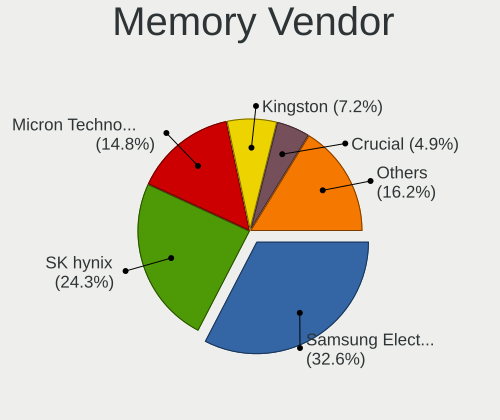

| Vendor                     | Notebooks | Percent |
|----------------------------|-----------|---------|
| Samsung Electronics        | 496       | 32.61%  |
| SK hynix                   | 369       | 24.26%  |
| Micron Technology          | 225       | 14.79%  |
| Kingston                   | 110       | 7.23%   |
| Crucial                    | 74        | 4.87%   |
| Unknown                    | 44        | 2.89%   |
| Elpida                     | 33        | 2.17%   |
| Corsair                    | 27        | 1.78%   |
| Ramaxel Technology         | 22        | 1.45%   |
| A-DATA Technology          | 21        | 1.38%   |
| Nanya Technology           | 19        | 1.25%   |
| Unknown                    | 17        | 1.12%   |
| Team                       | 14        | 0.92%   |
| G.Skill                    | 8         | 0.53%   |
| Apacer                     | 4         | 0.26%   |
| Unknown (ABCD)             | 3         | 0.2%    |
| Toshiba                    | 3         | 0.2%    |
| Silicon Power              | 3         | 0.2%    |
| Transcend                  | 2         | 0.13%   |
| Timetec                    | 2         | 0.13%   |
| Smart                      | 2         | 0.13%   |
| Patriot                    | 2         | 0.13%   |
| Neo Forza                  | 2         | 0.13%   |
| ff                         | 2         | 0.13%   |
| ASint Technology           | 2         | 0.13%   |
| 4ea5                       | 2         | 0.13%   |
| Unknown (0x89AD)           | 1         | 0.07%   |
| Unknown (0x873E)           | 1         | 0.07%   |
| Qimonda                    | 1         | 0.07%   |
| pqi                        | 1         | 0.07%   |
| Netlist                    | 1         | 0.07%   |
| Lexar                      | 1         | 0.07%   |
| Kingmax                    | 1         | 0.07%   |
| GSkill                     | 1         | 0.07%   |
| Gold Key                   | 1         | 0.07%   |
| Essencore                  | 1         | 0.07%   |
| Avant                      | 1         | 0.07%   |
| Anucell Technology Holding | 1         | 0.07%   |
| 8CB900000080               | 1         | 0.07%   |

Memory Model
------------

Memory module models

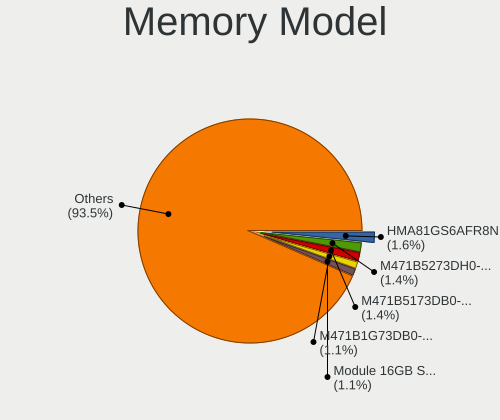

| Model                                                             | Notebooks | Percent |
|-------------------------------------------------------------------|-----------|---------|
| SK hynix RAM HMA81GS6AFR8N-UH 8GB SODIMM DDR4 2667MT/s            | 26        | 1.61%   |
| Samsung RAM M471B5273DH0-CH9 4GB SODIMM DDR3 1600MT/s             | 23        | 1.43%   |
| Samsung RAM M471B5173DB0-YK0 4GB SODIMM DDR3 1600MT/s             | 22        | 1.37%   |
| Samsung RAM M471B1G73DB0-YK0 8GB SODIMM DDR3 1600MT/s             | 17        | 1.06%   |
| Unknown                                                           | 17        | 1.06%   |
| Samsung RAM M471B5273CH0-CH9 4GB SODIMM DDR3 1334MT/s             | 16        | 0.99%   |
| Samsung RAM M471B5173EB0-YK0 4GB SODIMM DDR3 1600MT/s             | 16        | 0.99%   |
| Samsung RAM M471A5244CB0-CWE 4GB SODIMM DDR4 3200MT/s             | 15        | 0.93%   |
| SK hynix RAM HMAA1GS6CJR6N-XN 8GB SODIMM DDR4 3200MT/s            | 14        | 0.87%   |
| Samsung RAM M471B1G73QH0-YK0 8GB SODIMM DDR3 1600MT/s             | 14        | 0.87%   |
| Samsung RAM M471A1K43CB1-CTD 8GB SODIMM DDR4 3200MT/s             | 14        | 0.87%   |
| SK hynix RAM HMT351S6CFR8C-PB 4GB SODIMM DDR3 1600MT/s            | 13        | 0.81%   |
| SK hynix RAM HMA81GS6CJR8N-VK 8GB SODIMM DDR4 2667MT/s            | 12        | 0.75%   |
| Samsung RAM M471A5244BB0-CWE 4GB SODIMM DDR4 3200MT/s             | 12        | 0.75%   |
| Samsung RAM M471A1G44BB0-CWE 8GB SODIMM DDR4 3200MT/s             | 12        | 0.75%   |
| Samsung RAM M471A1G44AB0-CWE 8GiB SODIMM DDR4 3200MT/s            | 12        | 0.75%   |
| Samsung RAM M471A1K43DB1-CWE 8GB SODIMM DDR4 3200MT/s             | 11        | 0.68%   |
| Samsung RAM M471A1K43CB1-CRC 8GB SODIMM DDR4 8400MT/s             | 11        | 0.68%   |
| SK hynix RAM Module 4GB SODIMM DDR3 1600MT/s                      | 10        | 0.62%   |
| SK hynix RAM HMT451S6BFR8A-PB 4GB SODIMM DDR3 1600MT/s            | 10        | 0.62%   |
| SK hynix RAM HMT41GS6AFR8A-PB 8GiB SODIMM DDR3 2667MT/s           | 10        | 0.62%   |
| SK hynix RAM HMA82GS6AFR8N-UH 16GB SODIMM DDR4 2667MT/s           | 10        | 0.62%   |
| Samsung RAM M471B1G73EB0-YK0 8192MB SODIMM DDR3 1600MT/s          | 10        | 0.62%   |
| SK hynix RAM HMA81GS6JJR8N-VK 8GB SODIMM DDR4 2667MT/s            | 9         | 0.56%   |
| SK hynix RAM H9HCNNNCPMALHR-NEE 8GiB Row Of Chips LPDDR4 4800MT/s | 9         | 0.56%   |
| Samsung RAM M471B5173QH0-YK0 4GB SODIMM DDR3 1600MT/s             | 9         | 0.56%   |
| Micron RAM 4ATF1G64HZ-3G2E2 8GB SODIMM DDR4 3200MT/s              | 9         | 0.56%   |
| SK hynix RAM Module 8GB SODIMM DDR3 1600MT/s                      | 8         | 0.5%    |
| SK hynix RAM HMA41GS6AFR8N-TF 8GB SODIMM DDR4 2667MT/s            | 8         | 0.5%    |
| Samsung RAM M471A5244CB0-CTD 4GB SODIMM DDR4 3266MT/s             | 8         | 0.5%    |
| Samsung RAM M471A4G43AB1-CWE 32GB SODIMM DDR4 3200MT/s            | 8         | 0.5%    |
| Samsung RAM M471A2K43CB1-CRC 16GB SODIMM DDR4 2667MT/s            | 8         | 0.5%    |
| Samsung RAM M471A1K43BB1-CRC 8GB SODIMM DDR4 2667MT/s             | 8         | 0.5%    |
| Micron RAM 8ATF1G64HZ-2G6E1 8GB SODIMM DDR4 2667MT/s              | 8         | 0.5%    |
| Micron RAM 4ATF1G64HZ-3G2E1 8GB SODIMM DDR4 3200MT/s              | 8         | 0.5%    |
| SK hynix RAM HMA81GS6DJR8N-XN 8GB SODIMM DDR4 3200MT/s            | 7         | 0.43%   |
| Samsung RAM M471A2K43CB1-CTD 16GB SODIMM DDR4 8400MT/s            | 7         | 0.43%   |
| Samsung RAM M471A1K43EB1-CWE 8GB SODIMM DDR4 3200MT/s             | 7         | 0.43%   |
| Samsung RAM M471A1K43DB1-CTD 8GB SODIMM DDR4 2667MT/s             | 7         | 0.43%   |
| Micron RAM MT52L1G32D4PG-093 8GB Row Of Chips LPDDR3 2133MT/s     | 7         | 0.43%   |

Memory Kind
-----------

Memory module kinds

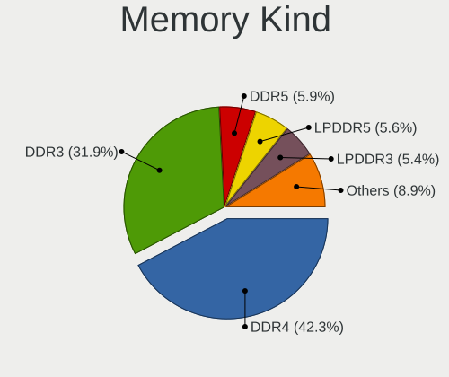

| Kind    | Notebooks | Percent |
|---------|-----------|---------|
| DDR4    | 562       | 42.32%  |
| DDR3    | 423       | 31.85%  |
| DDR5    | 78        | 5.87%   |
| LPDDR5  | 75        | 5.65%   |
| LPDDR3  | 72        | 5.42%   |
| LPDDR4  | 53        | 3.99%   |
| DDR2    | 38        | 2.86%   |
| SDRAM   | 19        | 1.43%   |
| Unknown | 4         | 0.3%    |
| DDR     | 3         | 0.23%   |
| DRAM    | 1         | 0.08%   |

Memory Form Factor
------------------

Physical design of the memory module

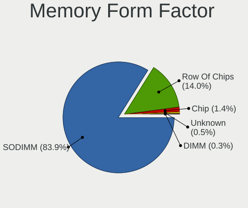

| Name         | Notebooks | Percent |
|--------------|-----------|---------|
| SODIMM       | 1115      | 83.9%   |
| Row Of Chips | 186       | 14%     |
| Chip         | 18        | 1.35%   |
| Unknown      | 6         | 0.45%   |
| DIMM         | 4         | 0.3%    |

Memory Size
-----------

Memory module size

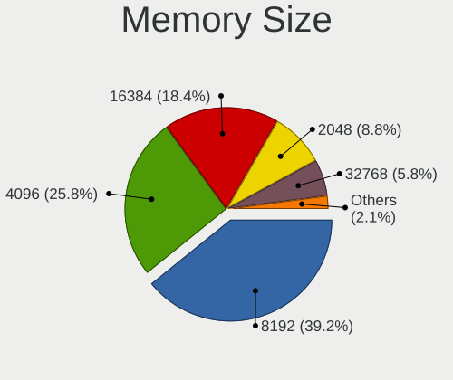

| Size  | Notebooks | Percent |
|-------|-----------|---------|
| 8192  | 559       | 39.17%  |
| 4096  | 368       | 25.79%  |
| 16384 | 262       | 18.36%  |
| 2048  | 125       | 8.76%   |
| 32768 | 83        | 5.82%   |
| 1024  | 21        | 1.47%   |
| 512   | 4         | 0.28%   |
| 49152 | 1         | 0.07%   |
| 12288 | 1         | 0.07%   |
| 3072  | 1         | 0.07%   |
| 1536  | 1         | 0.07%   |
| 256   | 1         | 0.07%   |

Memory Speed
------------

Memory module speed

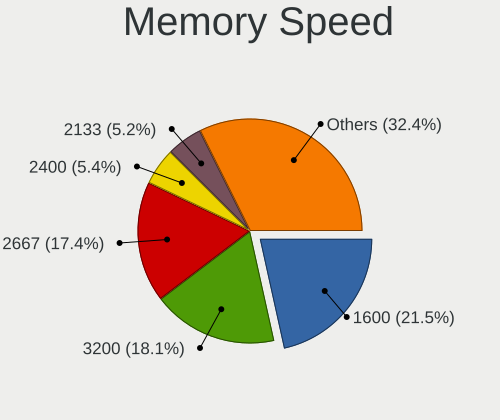

| Speed   | Notebooks | Percent |
|---------|-----------|---------|
| 1600    | 304       | 21.53%  |
| 3200    | 256       | 18.13%  |
| 2667    | 246       | 17.42%  |
| 2400    | 76        | 5.38%   |
| 2133    | 73        | 5.17%   |
| 1334    | 45        | 3.19%   |
| 5600    | 43        | 3.05%   |
| 6400    | 42        | 2.97%   |
| 4800    | 40        | 2.83%   |
| 1333    | 40        | 2.83%   |
| 1867    | 35        | 2.48%   |
| 4267    | 23        | 1.63%   |
| 1067    | 23        | 1.63%   |
| 8400    | 21        | 1.49%   |
| 7500    | 18        | 1.27%   |
| 667     | 18        | 1.27%   |
| Unknown | 16        | 1.13%   |
| 8533    | 10        | 0.71%   |
| 4266    | 10        | 0.71%   |
| 4199    | 9         | 0.64%   |
| 1066    | 9         | 0.64%   |
| 3266    | 8         | 0.57%   |
| 2048    | 7         | 0.5%    |
| 975     | 6         | 0.42%   |
| 800     | 6         | 0.42%   |
| 2933    | 5         | 0.35%   |
| 7467    | 4         | 0.28%   |
| 533     | 4         | 0.28%   |
| 6000    | 2         | 0.14%   |
| 5200    | 2         | 0.14%   |
| 3733    | 2         | 0.14%   |
| 8600    | 1         | 0.07%   |
| 3600    | 1         | 0.07%   |
| 3000    | 1         | 0.07%   |
| 1776    | 1         | 0.07%   |
| 1639    | 1         | 0.07%   |
| 1330    | 1         | 0.07%   |
| 666     | 1         | 0.07%   |
| 400     | 1         | 0.07%   |
| 333     | 1         | 0.07%   |

Printers & scanners
-------------------

Printer Vendor
--------------

Printer device vendors

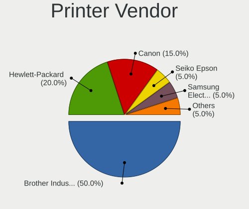

| Vendor              | Notebooks | Percent |
|---------------------|-----------|---------|
| Brother Industries  | 10        | 50%     |
| Hewlett-Packard     | 4         | 20%     |
| Canon               | 3         | 15%     |
| Seiko Epson         | 1         | 5%      |
| Samsung Electronics | 1         | 5%      |
| Dymo-CoStar         | 1         | 5%      |

Printer Model
-------------

Printer device models

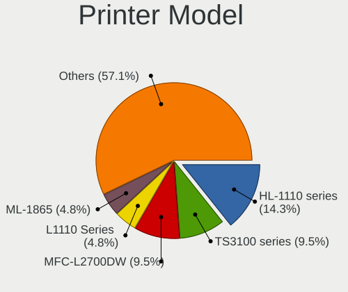

| Model                            | Notebooks | Percent |
|----------------------------------|-----------|---------|
| Brother HL-1110 series           | 3         | 14.29%  |
| Canon TS3100 series              | 2         | 9.52%   |
| Brother MFC-L2700DW              | 2         | 9.52%   |
| Seiko Epson L1110 Series         | 1         | 4.76%   |
| Samsung ML-1865                  | 1         | 4.76%   |
| HP LaserJet Pro M201dw           | 1         | 4.76%   |
| HP ENVY Inspire 7900 series      | 1         | 4.76%   |
| HP Deskjet F2280 series          | 1         | 4.76%   |
| HP DeskJet 2300 series           | 1         | 4.76%   |
| Dymo-CoStar DYMO LabelWriter 4XL | 1         | 4.76%   |
| Canon iP8700 series              | 1         | 4.76%   |
| Brother Printer                  | 1         | 4.76%   |
| Brother MFC-1810                 | 1         | 4.76%   |
| Brother HL-3150CDN series        | 1         | 4.76%   |
| Brother HL-2240D series          | 1         | 4.76%   |
| Brother HL-2140 series           | 1         | 4.76%   |
| Brother HL-1210W series          | 1         | 4.76%   |

Scanner Vendor
--------------

Scanner device vendors

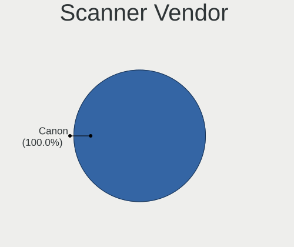

| Vendor | Notebooks | Percent |
|--------|-----------|---------|
| Canon  | 1         | 100%    |

Scanner Model
-------------

Scanner device models

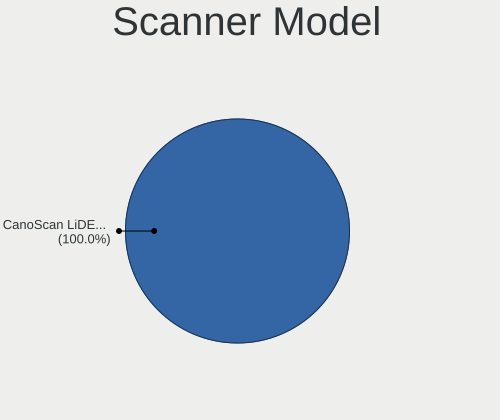

| Model                   | Notebooks | Percent |
|-------------------------|-----------|---------|
| Canon CanoScan LiDE 220 | 1         | 100%    |

Camera
------

Camera Vendor
-------------

Camera device vendors

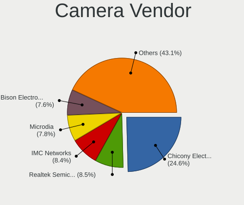

| Vendor                                 | Notebooks | Percent |
|----------------------------------------|-----------|---------|
| Chicony Electronics                    | 558       | 24.58%  |
| Realtek Semiconductor                  | 193       | 8.5%    |
| IMC Networks                           | 191       | 8.41%   |
| Microdia                               | 177       | 7.8%    |
| Bison Electronics                      | 172       | 7.58%   |
| Sunplus Innovation Technology          | 144       | 6.34%   |
| Apple                                  | 127       | 5.59%   |
| Quanta                                 | 107       | 4.71%   |
| Suyin                                  | 79        | 3.48%   |
| Cheng Uei Precision Industry (Foxlink) | 75        | 3.3%    |
| Luxvisions Innotech Limited            | 68        | 3%      |
| Syntek                                 | 50        | 2.2%    |
| Logitech                               | 49        | 2.16%   |
| Lite-On Technology                     | 40        | 1.76%   |
| Sonix Technology                       | 35        | 1.54%   |
| Samsung Electronics                    | 18        | 0.79%   |
| Ricoh                                  | 17        | 0.75%   |
| Importek                               | 16        | 0.7%    |
| Alcor Micro                            | 15        | 0.66%   |
| Silicon Motion                         | 13        | 0.57%   |
| Shinetech                              | 11        | 0.48%   |
| Acer                                   | 11        | 0.48%   |
| Lenovo                                 | 9         | 0.4%    |
| Primax Electronics                     | 7         | 0.31%   |
| icSpring                               | 7         | 0.31%   |
| OmniVision Technologies                | 6         | 0.26%   |
| ALi                                    | 6         | 0.26%   |
| Razer USA                              | 5         | 0.22%   |
| DigiTech                               | 5         | 0.22%   |
| Microsoft                              | 4         | 0.18%   |
| Magic Control Technology               | 4         | 0.18%   |
| GEMBIRD                                | 4         | 0.18%   |
| Z-Star Microelectronics                | 3         | 0.13%   |
| OPPO Electronics                       | 3         | 0.13%   |
| LG Electronics                         | 3         | 0.13%   |
| kingcome                               | 3         | 0.13%   |
| SunplusIT                              | 2         | 0.09%   |
| Sunplus Technology                     | 2         | 0.09%   |
| Shine-optics                           | 2         | 0.09%   |
| Genesys Logic                          | 2         | 0.09%   |

Camera Model
------------

Camera device models

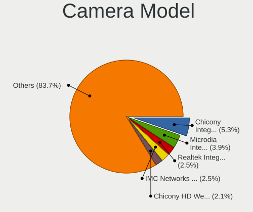

| Model                                                   | Notebooks | Percent |
|---------------------------------------------------------|-----------|---------|
| Chicony Integrated Camera                               | 122       | 5.3%    |
| Microdia Integrated_Webcam_HD                           | 90        | 3.91%   |
| Realtek Integrated_Webcam_HD                            | 57        | 2.48%   |
| IMC Networks USB2.0 HD UVC WebCam                       | 57        | 2.48%   |
| Chicony HD Webcam                                       | 49        | 2.13%   |
| IMC Networks Integrated Camera                          | 47        | 2.04%   |
| Bison Integrated Camera                                 | 43        | 1.87%   |
| Sunplus Integrated_Webcam_HD                            | 40        | 1.74%   |
| Syntek Integrated Camera                                | 37        | 1.61%   |
| Chicony TOSHIBA Web Camera - HD                         | 34        | 1.48%   |
| Apple iPhone 5/5C/5S/6/SE/7/8/X                         | 34        | 1.48%   |
| Apple FaceTime HD Camera (Built-in)                     | 34        | 1.48%   |
| Apple FaceTime HD Camera                                | 27        | 1.17%   |
| Apple Built-in iSight                                   | 26        | 1.13%   |
| Realtek USB Camera                                      | 24        | 1.04%   |
| Chicony HP TrueVision HD Camera                         | 24        | 1.04%   |
| Luxvisions Innotech Limited Integrated Camera           | 22        | 0.96%   |
| Chicony HP Truevision HD                                | 22        | 0.96%   |
| Lite-On Integrated Camera                               | 21        | 0.91%   |
| Chicony HP HD Camera                                    | 21        | 0.91%   |
| Chicony HD User Facing                                  | 21        | 0.91%   |
| Realtek Integrated Webcam HD                            | 20        | 0.87%   |
| Quanta HD User Facing                                   | 19        | 0.83%   |
| Cheng Uei Precision Industry (Foxlink) HP Truevision HD | 19        | 0.83%   |
| Bison HD Webcam                                         | 19        | 0.83%   |
| Sonix USB2.0 HD UVC WebCam                              | 18        | 0.78%   |
| Samsung Galaxy series, misc. (MTP mode)                 | 18        | 0.78%   |
| Sunplus HD WebCam                                       | 17        | 0.74%   |
| Microdia Integrated Webcam                              | 17        | 0.74%   |
| Luxvisions Innotech Limited HP TrueVision HD Camera     | 17        | 0.74%   |
| Chicony USB2.0 HD UVC WebCam                            | 17        | 0.74%   |
| Chicony USB 2.0 Camera                                  | 16        | 0.7%    |
| Bison BisonCam,NB Pro                                   | 16        | 0.7%    |
| Suyin HP Truevision HD                                  | 15        | 0.65%   |
| Sonix USB2.0 FHD UVC WebCam                             | 15        | 0.65%   |
| Quanta HD Webcam                                        | 15        | 0.65%   |
| Chicony Integrated Camera (1280x720@30)                 | 14        | 0.61%   |
| Bison SunplusIT Integrated Camera                       | 14        | 0.61%   |
| Quanta HP TrueVision HD Camera                          | 13        | 0.57%   |
| Chicony TOSHIBA Web Camera - FHD                        | 13        | 0.57%   |

Security
--------

Fingerprint Vendor
------------------

Fingerprint sensor vendors

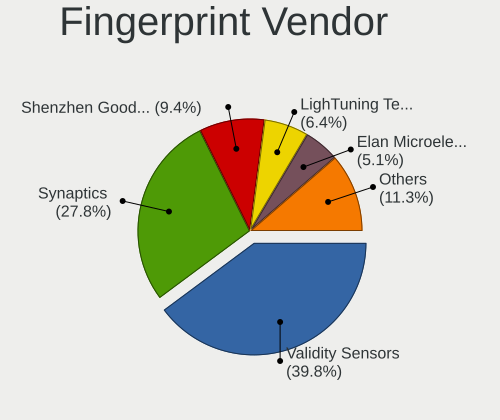

| Vendor                             | Notebooks | Percent |
|------------------------------------|-----------|---------|
| Validity Sensors                   | 186       | 39.83%  |
| Synaptics                          | 130       | 27.84%  |
| Shenzhen Goodix Technology         | 44        | 9.42%   |
| LighTuning Technology              | 30        | 6.42%   |
| Elan Microelectronics              | 24        | 5.14%   |
| AuthenTec                          | 23        | 4.93%   |
| Upek                               | 17        | 3.64%   |
| STMicroelectronics                 | 8         | 1.71%   |
| Realtek USB2.0 Finger Print Bridge | 4         | 0.86%   |
| Focal-systems.Corp                 | 1         | 0.21%   |

Fingerprint Model
-----------------

Fingerprint sensor models

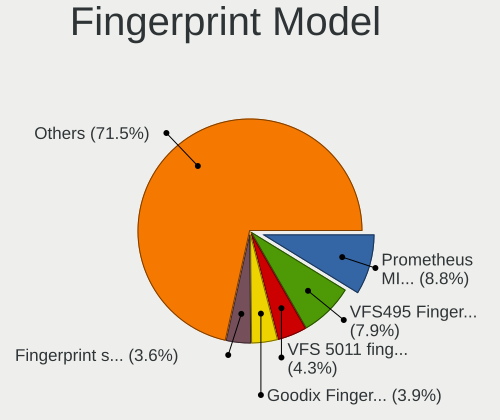

| Model                                                                      | Notebooks | Percent |
|----------------------------------------------------------------------------|-----------|---------|
| Synaptics Prometheus MIS Touch Fingerprint Reader                          | 41        | 8.78%   |
| Validity Sensors VFS495 Fingerprint Reader                                 | 37        | 7.92%   |
| Validity Sensors VFS 5011 fingerprint sensor                               | 20        | 4.28%   |
| Shenzhen Goodix  FingerPrint Device                                        | 18        | 3.85%   |
| Validity Sensors Fingerprint scanner                                       | 17        | 3.64%   |
| Upek Biometric Touchchip/Touchstrip Fingerprint Sensor                     | 17        | 3.64%   |
| Validity Sensors Synaptics WBDI                                            | 16        | 3.43%   |
| Synaptics Metallica MIS Touch Fingerprint Reader                           | 16        | 3.43%   |
| Synaptics UWP WBDI Device                                                  | 15        | 3.21%   |
| Shenzhen Goodix FingerPrint                                                | 14        | 3%      |
| LighTuning ES603 Swipe Fingerprint Sensor                                  | 14        | 3%      |
| Elan ELAN:ARM-M4                                                           | 14        | 3%      |
| Validity Sensors VFS491                                                    | 13        | 2.78%   |
| LighTuning EgisTec Touch Fingerprint Sensor                                | 13        | 2.78%   |
| Validity Sensors VFS7552 Touch Fingerprint Sensor                          | 12        | 2.57%   |
| Validity Sensors VFS471 Fingerprint Reader                                 | 12        | 2.57%   |
| Validity Sensors VFS Fingerprint sensor                                    | 12        | 2.57%   |
| Synaptics Prometheus Fingerprint Reader                                    | 12        | 2.57%   |
| Shenzhen Goodix Fingerprint Reader                                         | 12        | 2.57%   |
| Synaptics FS7604 Touch Fingerprint Sensor with PurePrint                   | 11        | 2.36%   |
| Validity Sensors VFS7500 Touch Fingerprint Sensor                          | 10        | 2.14%   |
| Validity Sensors VFS451 Fingerprint Reader                                 | 10        | 2.14%   |
| Elan ELAN:Fingerprint                                                      | 10        | 2.14%   |
| STMicroelectronics Fingerprint Reader                                      | 8         | 1.71%   |
| AuthenTec AES2501 Fingerprint Sensor                                       | 8         | 1.71%   |
| Validity Sensors Synaptics VFS7552 Touch Fingerprint Sensor with PurePrint | 7         | 1.5%    |
| Validity Sensors Swipe Fingerprint Sensor                                  | 7         | 1.5%    |
| Validity Sensors VFS301 Fingerprint Reader                                 | 6         | 1.28%   |
| Synaptics  FS7604 Touch Fingerprint Sensor with PurePrint                  | 6         | 1.28%   |
| Validity Sensors VFS5011 Fingerprint Reader                                | 5         | 1.07%   |
| Synaptics WBDI Fingerprint Reader USB 086                                  | 5         | 1.07%   |
| Synaptics WBDI Device                                                      | 5         | 1.07%   |
| Synaptics Fingerprint reader [HP G6]                                       | 5         | 1.07%   |
| AuthenTec Fingerprint Sensor                                               | 5         | 1.07%   |
| Synaptics TouchPad                                                         | 4         | 0.86%   |
| Synaptics  WBDI                                                            | 4         | 0.86%   |
| Realtek USB2.0 Finger Print Bridge FocalTech Fingerprint Device            | 4         | 0.86%   |
| AuthenTec AES1600                                                          | 4         | 0.86%   |
| Synaptics UWP WBDI                                                         | 3         | 0.64%   |
| LighTuning Fingerprint Reader                                              | 3         | 0.64%   |

Chipcard Vendor
---------------

Chipcard module vendors

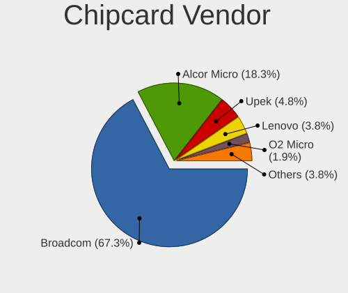

| Vendor                | Notebooks | Percent |
|-----------------------|-----------|---------|
| Broadcom              | 70        | 67.31%  |
| Alcor Micro           | 19        | 18.27%  |
| Upek                  | 5         | 4.81%   |
| Lenovo                | 4         | 3.85%   |
| O2 Micro              | 2         | 1.92%   |
| Gemalto (was Gemplus) | 2         | 1.92%   |
| Yubico.com            | 1         | 0.96%   |
| Advanced Card Systems | 1         | 0.96%   |

Chipcard Model
--------------

Chipcard module models

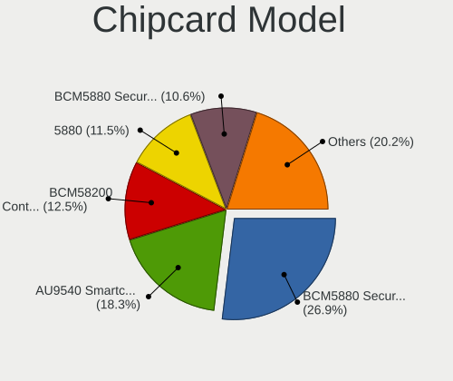

| Model                                                                        | Notebooks | Percent |
|------------------------------------------------------------------------------|-----------|---------|
| Broadcom BCM5880 Secure Applications Processor                               | 28        | 26.92%  |
| Alcor Micro AU9540 Smartcard Reader                                          | 19        | 18.27%  |
| Broadcom BCM58200 ControlVault 3 (FingerPrint sensor + Contacted SmartCard)  | 13        | 12.5%   |
| Broadcom 5880                                                                | 12        | 11.54%  |
| Broadcom BCM5880 Secure Applications Processor with fingerprint swipe sensor | 11        | 10.58%  |
| Broadcom 58200                                                               | 6         | 5.77%   |
| Upek TouchChip Fingerprint Coprocessor (WBF advanced mode)                   | 5         | 4.81%   |
| Lenovo Integrated Smart Card Reader                                          | 4         | 3.85%   |
| O2 Micro OZ776 CCID Smartcard Reader                                         | 2         | 1.92%   |
| Gemalto (was Gemplus) GemPC Twin SmartCard Reader                            | 2         | 1.92%   |
| Yubico.com Yubikey NEO(-N) U2F+CCID                                          | 1         | 0.96%   |
| Advanced Card Systems ACR122U                                                | 1         | 0.96%   |

Unsupported
-----------

Unsupported Devices
-------------------

Total unsupported devices on board

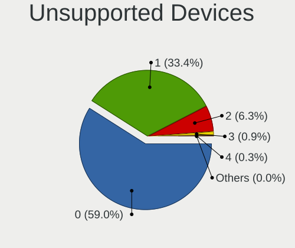

| Total | Notebooks | Percent |
|-------|-----------|---------|
| 0     | 1553      | 59%     |
| 1     | 880       | 33.43%  |
| 2     | 167       | 6.34%   |
| 3     | 23        | 0.87%   |
| 4     | 8         | 0.3%    |
| 5     | 1         | 0.04%   |

Unsupported Device Types
------------------------

Types of unsupported devices

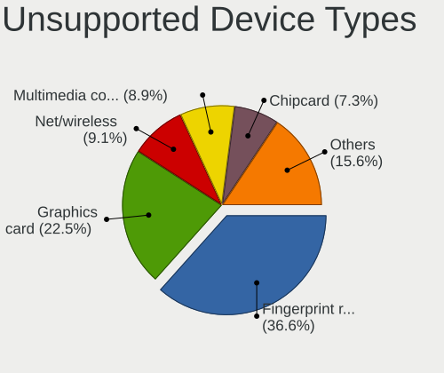

| Type                     | Notebooks | Percent |
|--------------------------|-----------|---------|
| Fingerprint reader       | 461       | 36.62%  |
| Graphics card            | 283       | 22.48%  |
| Net/wireless             | 114       | 9.05%   |
| Multimedia controller    | 112       | 8.9%    |
| Chipcard                 | 92        | 7.31%   |
| Bluetooth                | 40        | 3.18%   |
| Camera                   | 35        | 2.78%   |
| Communication controller | 29        | 2.3%    |
| Storage                  | 24        | 1.91%   |
| Net/ethernet             | 23        | 1.83%   |
| Sound                    | 15        | 1.19%   |
| Modem                    | 13        | 1.03%   |
| Card reader              | 12        | 0.95%   |
| Video                    | 1         | 0.08%   |
| Unassigned class         | 1         | 0.08%   |
| Storage/raid             | 1         | 0.08%   |
| Storage/ide              | 1         | 0.08%   |
| Storage/ata              | 1         | 0.08%   |
| Flash memory             | 1         | 0.08%   |

