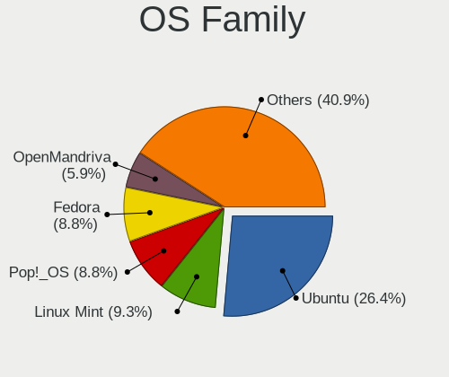
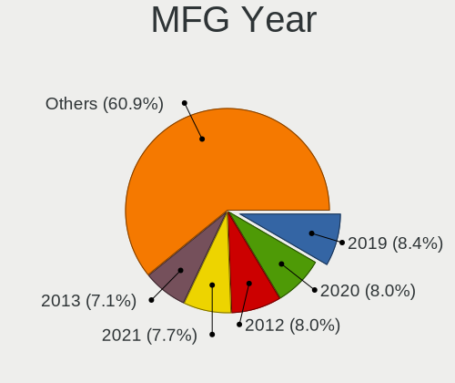
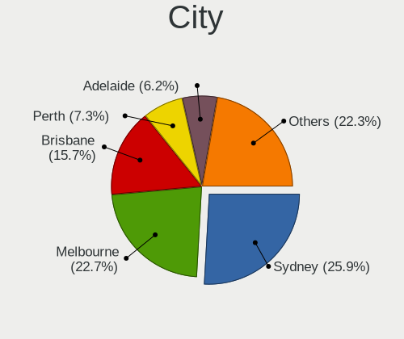
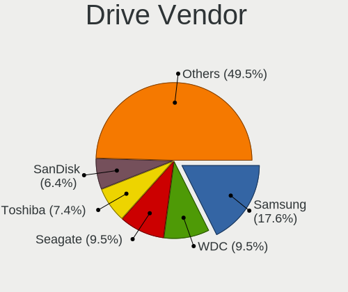
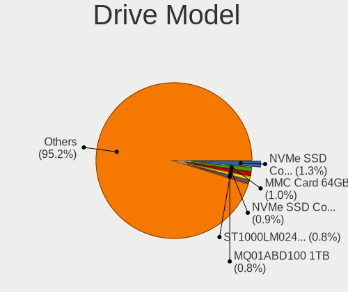
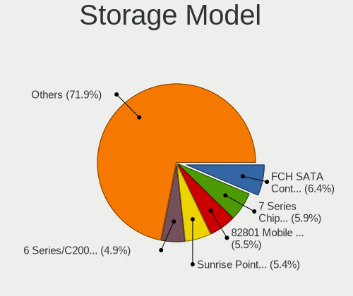
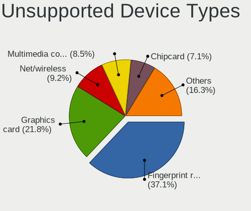

Linux in Australia - Tested Hardware & Statistics (Notebooks)
-------------------------------------------------------------

A project to collect tested hardware configurations for Linux in Australia.

Anyone can contribute to this report by the [hw-probe](https://github.com/linuxhw/hw-probe) tool:

    sudo -E hw-probe -all -upload

Please contribute! Especially if your hardware is rare.

Contents
--------

* [ Test Cases ](#test-cases)

* [ System ](#system)
  - [ OS                       ](#os)
  - [ OS Family                ](#os-family)
  - [ Kernel                   ](#kernel)
  - [ Kernel Family            ](#kernel-family)
  - [ Kernel Major Ver.        ](#kernel-major-ver)
  - [ Arch                     ](#arch)
  - [ DE                       ](#de)
  - [ Display Server           ](#display-server)
  - [ Display Manager          ](#display-manager)
  - [ OS Lang                  ](#os-lang)
  - [ Boot Mode                ](#boot-mode)
  - [ Filesystem               ](#filesystem)
  - [ Part. scheme             ](#part-scheme)
  - [ Dual Boot with Linux/BSD ](#dual-boot-with-linuxbsd)
  - [ Dual Boot (Win)          ](#dual-boot-win)

* [ Board ](#board)
  - [ Vendor                   ](#vendor)
  - [ Model                    ](#model)
  - [ Model Family             ](#model-family)
  - [ MFG Year                 ](#mfg-year)
  - [ Form Factor              ](#form-factor)
  - [ Secure Boot              ](#secure-boot)
  - [ Coreboot                 ](#coreboot)
  - [ RAM Size                 ](#ram-size)
  - [ RAM Used                 ](#ram-used)
  - [ Total Drives             ](#total-drives)
  - [ Has CD-ROM               ](#has-cd-rom)
  - [ Has Ethernet             ](#has-ethernet)
  - [ Has WiFi                 ](#has-wifi)
  - [ Has Bluetooth            ](#has-bluetooth)

* [ Location ](#location)
  - [ Country                  ](#country)
  - [ City                     ](#city)

* [ Drives ](#drives)
  - [ Drive Vendor             ](#drive-vendor)
  - [ Drive Model              ](#drive-model)
  - [ HDD Vendor               ](#hdd-vendor)
  - [ SSD Vendor               ](#ssd-vendor)
  - [ Drive Kind               ](#drive-kind)
  - [ Drive Connector          ](#drive-connector)
  - [ Drive Size               ](#drive-size)
  - [ Space Total              ](#space-total)
  - [ Space Used               ](#space-used)
  - [ Malfunc. Drives          ](#malfunc-drives)
  - [ Malfunc. Drive Vendor    ](#malfunc-drive-vendor)
  - [ Malfunc. HDD Vendor      ](#malfunc-hdd-vendor)
  - [ Malfunc. Drive Kind      ](#malfunc-drive-kind)
  - [ Failed Drives            ](#failed-drives)
  - [ Failed Drive Vendor      ](#failed-drive-vendor)
  - [ Drive Status             ](#drive-status)

* [ Storage controller ](#storage-controller)
  - [ Storage Vendor           ](#storage-vendor)
  - [ Storage Model            ](#storage-model)
  - [ Storage Kind             ](#storage-kind)

* [ Processor ](#processor)
  - [ CPU Vendor               ](#cpu-vendor)
  - [ CPU Model                ](#cpu-model)
  - [ CPU Model Family         ](#cpu-model-family)
  - [ CPU Cores                ](#cpu-cores)
  - [ CPU Sockets              ](#cpu-sockets)
  - [ CPU Threads              ](#cpu-threads)
  - [ CPU Op-Modes             ](#cpu-op-modes)
  - [ CPU Microcode            ](#cpu-microcode)
  - [ CPU Microarch            ](#cpu-microarch)

* [ Graphics ](#graphics)
  - [ GPU Vendor               ](#gpu-vendor)
  - [ GPU Model                ](#gpu-model)
  - [ GPU Combo                ](#gpu-combo)
  - [ GPU Driver               ](#gpu-driver)
  - [ GPU Memory               ](#gpu-memory)

* [ Monitor ](#monitor)
  - [ Monitor Vendor           ](#monitor-vendor)
  - [ Monitor Model            ](#monitor-model)
  - [ Monitor Resolution       ](#monitor-resolution)
  - [ Monitor Diagonal         ](#monitor-diagonal)
  - [ Monitor Width            ](#monitor-width)
  - [ Aspect Ratio             ](#aspect-ratio)
  - [ Monitor Area             ](#monitor-area)
  - [ Pixel Density            ](#pixel-density)
  - [ Multiple Monitors        ](#multiple-monitors)

* [ Network ](#network)
  - [ Net Controller Vendor    ](#net-controller-vendor)
  - [ Net Controller Model     ](#net-controller-model)
  - [ Wireless Vendor          ](#wireless-vendor)
  - [ Wireless Model           ](#wireless-model)
  - [ Ethernet Vendor          ](#ethernet-vendor)
  - [ Ethernet Model           ](#ethernet-model)
  - [ Net Controller Kind      ](#net-controller-kind)
  - [ Used Controller          ](#used-controller)
  - [ NICs                     ](#nics)
  - [ IPv6                     ](#ipv6)

* [ Bluetooth ](#bluetooth)
  - [ Bluetooth Vendor         ](#bluetooth-vendor)
  - [ Bluetooth Model          ](#bluetooth-model)

* [ Sound ](#sound)
  - [ Sound Vendor             ](#sound-vendor)
  - [ Sound Model              ](#sound-model)

* [ Memory ](#memory)
  - [ Memory Vendor            ](#memory-vendor)
  - [ Memory Model             ](#memory-model)
  - [ Memory Kind              ](#memory-kind)
  - [ Memory Form Factor       ](#memory-form-factor)
  - [ Memory Size              ](#memory-size)
  - [ Memory Speed             ](#memory-speed)

* [ Printers & scanners ](#printers--scanners)
  - [ Printer Vendor           ](#printer-vendor)
  - [ Printer Model            ](#printer-model)
  - [ Scanner Vendor           ](#scanner-vendor)
  - [ Scanner Model            ](#scanner-model)

* [ Camera ](#camera)
  - [ Camera Vendor            ](#camera-vendor)
  - [ Camera Model             ](#camera-model)

* [ Security ](#security)
  - [ Fingerprint Vendor       ](#fingerprint-vendor)
  - [ Fingerprint Model        ](#fingerprint-model)
  - [ Chipcard Vendor          ](#chipcard-vendor)
  - [ Chipcard Model           ](#chipcard-model)

* [ Unsupported ](#unsupported)
  - [ Unsupported Devices      ](#unsupported-devices)
  - [ Unsupported Device Types ](#unsupported-device-types)

Test Cases
----------

Total: 2785

| Vendor        | Model                       | Probe                                                      | Date         |
|---------------|-----------------------------|------------------------------------------------------------|--------------|
| Lenovo        | ThinkPad P14s Gen 1 20Y2... | [064b211de8](https://linux-hardware.org/?probe=064b211de8) | May 07, 2024 |
| Intel Clie... | LAPAC71H                    | [e599c3f230](https://linux-hardware.org/?probe=e599c3f230) | May 05, 2024 |
| System76      | Oryx Pro                    | [6d05743481](https://linux-hardware.org/?probe=6d05743481) | May 05, 2024 |
| HP            | Presario CQ42               | [809ae686e3](https://linux-hardware.org/?probe=809ae686e3) | May 05, 2024 |
| Acer          | Predator PHN16-71           | [8721113032](https://linux-hardware.org/?probe=8721113032) | May 04, 2024 |
| Fujitsu       | SH560                       | [805ea85563](https://linux-hardware.org/?probe=805ea85563) | May 03, 2024 |
| Dell          | Inspiron 16 5620            | [37d023541b](https://linux-hardware.org/?probe=37d023541b) | May 03, 2024 |
| HP            | Notebook                    | [ba95ac1b57](https://linux-hardware.org/?probe=ba95ac1b57) | May 03, 2024 |
| Lenovo        | ThinkPad P15s Gen 2i 20W... | [89ce066855](https://linux-hardware.org/?probe=89ce066855) | May 03, 2024 |
| Dell          | Inspiron M5010              | [eed6e90235](https://linux-hardware.org/?probe=eed6e90235) | May 02, 2024 |
| HP            | Pavilion Notebook           | [2fc15c8d5c](https://linux-hardware.org/?probe=2fc15c8d5c) | May 02, 2024 |
| Metabox       | Alpha-SR NP70SNC            | [4fe0c00280](https://linux-hardware.org/?probe=4fe0c00280) | May 02, 2024 |
| HP            | Notebook                    | [415db360d5](https://linux-hardware.org/?probe=415db360d5) | May 01, 2024 |
| Acer          | Extensa 4210                | [1b24527bdf](https://linux-hardware.org/?probe=1b24527bdf) | May 01, 2024 |
| Dell          | Precision M4600             | [3c78b1ea06](https://linux-hardware.org/?probe=3c78b1ea06) | May 01, 2024 |
| Lenovo        | ThinkPad P1 Gen 4i 20Y4S... | [2445f78890](https://linux-hardware.org/?probe=2445f78890) | May 01, 2024 |
| Lenovo        | ThinkPad L560 20F2S1P800    | [1718b0bf00](https://linux-hardware.org/?probe=1718b0bf00) | May 01, 2024 |
| Dell          | Precision M4600             | [7cae94b1d9](https://linux-hardware.org/?probe=7cae94b1d9) | May 01, 2024 |
| Dell          | Latitude E6430              | [0225857e36](https://linux-hardware.org/?probe=0225857e36) | Apr 29, 2024 |
| Dell          | Latitude E6430              | [8cafdeffed](https://linux-hardware.org/?probe=8cafdeffed) | Apr 29, 2024 |
| Apple         | MacBookPro14,1              | [e205d1dcf4](https://linux-hardware.org/?probe=e205d1dcf4) | Apr 29, 2024 |
| Toshiba       | PORTEGE Z10t-A              | [f0b22b191f](https://linux-hardware.org/?probe=f0b22b191f) | Apr 29, 2024 |
| Toshiba       | PORTEGE Z10t-A              | [e107b22a3f](https://linux-hardware.org/?probe=e107b22a3f) | Apr 29, 2024 |
| HP            | Notebook                    | [6252c3e002](https://linux-hardware.org/?probe=6252c3e002) | Apr 28, 2024 |
| Lenovo        | ThinkPad T410 2522PT3       | [1e61d17468](https://linux-hardware.org/?probe=1e61d17468) | Apr 28, 2024 |
| Valve         | Jupiter                     | [20eca8966f](https://linux-hardware.org/?probe=20eca8966f) | Apr 28, 2024 |
| HUAWEI        | KPL-W0X                     | [0ce65136da](https://linux-hardware.org/?probe=0ce65136da) | Apr 27, 2024 |
| HP            | Notebook                    | [c9db8c0cb7](https://linux-hardware.org/?probe=c9db8c0cb7) | Apr 25, 2024 |
| Alienware     | M18xR1                      | [d6f3028e98](https://linux-hardware.org/?probe=d6f3028e98) | Apr 25, 2024 |
| HP            | Laptop 15s-du1xxx           | [b1502b6440](https://linux-hardware.org/?probe=b1502b6440) | Apr 25, 2024 |
| MSI           | GT72 2QD                    | [7899b804eb](https://linux-hardware.org/?probe=7899b804eb) | Apr 23, 2024 |
| Lenovo        | ThinkPad E16 Gen 1 21JN0... | [5453cfa265](https://linux-hardware.org/?probe=5453cfa265) | Apr 23, 2024 |
| Lenovo        | Yoga Slim 7 14IMH9 83CV     | [c316cac3ed](https://linux-hardware.org/?probe=c316cac3ed) | Apr 22, 2024 |
| Apple         | MacBookPro8,1               | [ddba50f6df](https://linux-hardware.org/?probe=ddba50f6df) | Apr 22, 2024 |
| ASUSTek       | VivoBook_ASUSLaptop E510... | [ceca4cef9c](https://linux-hardware.org/?probe=ceca4cef9c) | Apr 21, 2024 |
| Lenovo        | ThinkPad L560 20F2S1P800    | [e7b196367a](https://linux-hardware.org/?probe=e7b196367a) | Apr 21, 2024 |
| Apple         | MacBookPro8,1               | [e7c1f32086](https://linux-hardware.org/?probe=e7c1f32086) | Apr 20, 2024 |
| HP            | EliteBook Folio 9470m       | [72485d4ec0](https://linux-hardware.org/?probe=72485d4ec0) | Apr 20, 2024 |
| Apple         | MacBookPro16,2              | [4ea9397c67](https://linux-hardware.org/?probe=4ea9397c67) | Apr 18, 2024 |
| Apple         | MacBookPro16,2              | [0c5c967438](https://linux-hardware.org/?probe=0c5c967438) | Apr 18, 2024 |
| Lenovo        | ThinkPad T460s 20FAS5NN0... | [156dedcc62](https://linux-hardware.org/?probe=156dedcc62) | Apr 18, 2024 |
| LG Electro... | 16Z90P-G.AA75A              | [cba767dbe8](https://linux-hardware.org/?probe=cba767dbe8) | Apr 17, 2024 |
| ASUSTek       | X555LJ                      | [1af0f98633](https://linux-hardware.org/?probe=1af0f98633) | Apr 16, 2024 |
| Apple         | MacBookAir4,1               | [fd0c46bab2](https://linux-hardware.org/?probe=fd0c46bab2) | Apr 16, 2024 |
| Lenovo        | ThinkPad L470 W10DG 20JV... | [9f2e93f394](https://linux-hardware.org/?probe=9f2e93f394) | Apr 16, 2024 |
| Dell          | XPS 15 9550                 | [22d857c49c](https://linux-hardware.org/?probe=22d857c49c) | Apr 14, 2024 |
| Lenovo        | ThinkPad L470 W10DG 20JV... | [531ad46b31](https://linux-hardware.org/?probe=531ad46b31) | Apr 14, 2024 |
| Lenovo        | ThinkPad E16 Gen 1 21JT0... | [e717cc9856](https://linux-hardware.org/?probe=e717cc9856) | Apr 13, 2024 |
| Lenovo        | ThinkPad X131e 3367AH5      | [5f3d3b0a74](https://linux-hardware.org/?probe=5f3d3b0a74) | Apr 13, 2024 |
| Dell          | Inspiron 5770               | [ae5ccdd8ac](https://linux-hardware.org/?probe=ae5ccdd8ac) | Apr 12, 2024 |
| Dell          | Inspiron 5770               | [6cb8fb3865](https://linux-hardware.org/?probe=6cb8fb3865) | Apr 11, 2024 |
| HP            | EliteBook 820 G3            | [960bc839f2](https://linux-hardware.org/?probe=960bc839f2) | Apr 10, 2024 |
| HP            | EliteBook 820 G3            | [173f82dbd7](https://linux-hardware.org/?probe=173f82dbd7) | Apr 10, 2024 |
| Lenovo        | ThinkPad T14s Gen 2a 20X... | [2b7f101b88](https://linux-hardware.org/?probe=2b7f101b88) | Apr 10, 2024 |
| Valve         | Jupiter                     | [a80d8086f4](https://linux-hardware.org/?probe=a80d8086f4) | Apr 09, 2024 |
| Lenovo        | ThinkPad X1 Carbon 4th 2... | [3ed13a3d8a](https://linux-hardware.org/?probe=3ed13a3d8a) | Apr 09, 2024 |
| Lenovo        | ThinkPad X13s Gen 1 21BY... | [fbfb8d076d](https://linux-hardware.org/?probe=fbfb8d076d) | Apr 09, 2024 |
| Lenovo        | ThinkPad X1 Carbon 4th 2... | [32842b7d56](https://linux-hardware.org/?probe=32842b7d56) | Apr 09, 2024 |
| Toshiba       | Satellite L750              | [296a0d80a0](https://linux-hardware.org/?probe=296a0d80a0) | Apr 09, 2024 |
| Lenovo        | ThinkPad T14s Gen 1 20UJ... | [471a22d2d2](https://linux-hardware.org/?probe=471a22d2d2) | Apr 08, 2024 |
| Dell          | Inspiron 5770               | [2c6ced3f53](https://linux-hardware.org/?probe=2c6ced3f53) | Apr 06, 2024 |
| MSI           | Prestige 14Evo B13M         | [f118f2e24a](https://linux-hardware.org/?probe=f118f2e24a) | Apr 04, 2024 |
| Intel Clie... | LAPAC71H                    | [c6f73cce66](https://linux-hardware.org/?probe=c6f73cce66) | Apr 04, 2024 |
| Lenovo        | IdeaPad S340-15IIL 81VW     | [bf0d1ddab3](https://linux-hardware.org/?probe=bf0d1ddab3) | Apr 04, 2024 |
| MSI           | GP62M 7REX                  | [133e02a808](https://linux-hardware.org/?probe=133e02a808) | Apr 03, 2024 |
| HP            | Pavilion dv7                | [483e1957a4](https://linux-hardware.org/?probe=483e1957a4) | Apr 02, 2024 |
| HP            | Laptop 15s-eq3xxx           | [5d8d187267](https://linux-hardware.org/?probe=5d8d187267) | Apr 01, 2024 |
| Acer          | Aspire A315-35              | [554a38529a](https://linux-hardware.org/?probe=554a38529a) | Mar 31, 2024 |
| Lenovo        | Yoga Slim 6 14IRH8 83E0     | [31ba9b687a](https://linux-hardware.org/?probe=31ba9b687a) | Mar 31, 2024 |
| HP            | Pavilion dv7                | [a86e8cccf5](https://linux-hardware.org/?probe=a86e8cccf5) | Mar 31, 2024 |
| Metabox       | Alpha-V V158PNH             | [9d020b5c12](https://linux-hardware.org/?probe=9d020b5c12) | Mar 29, 2024 |
| HP            | EliteBook 840 14 inch G9... | [401fd1d912](https://linux-hardware.org/?probe=401fd1d912) | Mar 28, 2024 |
| Lenovo        | Yoga 300-11IBR 80M1         | [6c9bf73f0c](https://linux-hardware.org/?probe=6c9bf73f0c) | Mar 28, 2024 |
| Lenovo        | ThinkPad T14s Gen 3 21CQ... | [9db63891c1](https://linux-hardware.org/?probe=9db63891c1) | Mar 27, 2024 |
| Framework     | Laptop (12th Gen Intel C... | [5eb093e5c7](https://linux-hardware.org/?probe=5eb093e5c7) | Mar 26, 2024 |
| Dell          | Latitude 5500               | [01e740ac1e](https://linux-hardware.org/?probe=01e740ac1e) | Mar 26, 2024 |
| Lenovo        | ThinkPad X1 Carbon Gen 1... | [21cb087ae2](https://linux-hardware.org/?probe=21cb087ae2) | Mar 25, 2024 |
| HP            | Pavilion Notebook           | [9599687d82](https://linux-hardware.org/?probe=9599687d82) | Mar 25, 2024 |
| Dell          | XPS 14 9440                 | [8658eded41](https://linux-hardware.org/?probe=8658eded41) | Mar 24, 2024 |
| Lenovo        | ThinkPad L380 20M6A000AU    | [c2a8312e42](https://linux-hardware.org/?probe=c2a8312e42) | Mar 23, 2024 |
| Acer          | Nitro AN515-55              | [9b975edbf7](https://linux-hardware.org/?probe=9b975edbf7) | Mar 23, 2024 |
| Apple         | MacBookAir6,1               | [7b195b5af4](https://linux-hardware.org/?probe=7b195b5af4) | Mar 22, 2024 |
| Lenovo        | ThinkPad X1 Carbon 5th 2... | [877a901096](https://linux-hardware.org/?probe=877a901096) | Mar 22, 2024 |
| Lenovo        | IdeaPad S340-15IIL 81VW     | [b2e638abe8](https://linux-hardware.org/?probe=b2e638abe8) | Mar 21, 2024 |
| Acer          | Aspire V3-572G              | [ab338cecc0](https://linux-hardware.org/?probe=ab338cecc0) | Mar 21, 2024 |
| Timi          | Redmi Book Pro 14 2022      | [5efc983ef2](https://linux-hardware.org/?probe=5efc983ef2) | Mar 21, 2024 |
| Lenovo        | IdeaPad 110S-11IBR 80WG     | [2439e40d2c](https://linux-hardware.org/?probe=2439e40d2c) | Mar 21, 2024 |
| ASUSTek       | P552LA                      | [1e7c8ea0f7](https://linux-hardware.org/?probe=1e7c8ea0f7) | Mar 20, 2024 |
| Lenovo        | ThinkPad E16 Gen 1 21JT0... | [cc230156f7](https://linux-hardware.org/?probe=cc230156f7) | Mar 19, 2024 |
| HP            | EliteBook 840 14 inch G9... | [eaea13606f](https://linux-hardware.org/?probe=eaea13606f) | Mar 19, 2024 |
| MSI           | VR601                       | [7a41cb5b71](https://linux-hardware.org/?probe=7a41cb5b71) | Mar 18, 2024 |
| ASUSTek       | K42F                        | [f36df8e399](https://linux-hardware.org/?probe=f36df8e399) | Mar 18, 2024 |
| Dell          | Latitude E7440              | [b84556c723](https://linux-hardware.org/?probe=b84556c723) | Mar 16, 2024 |
| Lenovo        | IdeaPad 110S-11IBR 80WG     | [cd2af6a978](https://linux-hardware.org/?probe=cd2af6a978) | Mar 15, 2024 |
| Acer          | Aspire A715-41G             | [ff077f31e5](https://linux-hardware.org/?probe=ff077f31e5) | Mar 15, 2024 |
| HP            | OMEN by Laptop 15-dc1xxx    | [5b53873162](https://linux-hardware.org/?probe=5b53873162) | Mar 14, 2024 |
| Dell          | Precision M6600             | [8af490c831](https://linux-hardware.org/?probe=8af490c831) | Mar 14, 2024 |
| Apple         | MacBookAir4,2               | [0edcc6c6d9](https://linux-hardware.org/?probe=0edcc6c6d9) | Mar 12, 2024 |
| Lenovo        | IdeaPad 310-15ISK 80SM      | [fced33a8a9](https://linux-hardware.org/?probe=fced33a8a9) | Mar 12, 2024 |
| ASUSTek       | K55VD                       | [01c2033137](https://linux-hardware.org/?probe=01c2033137) | Mar 12, 2024 |
| Lenovo        | ThinkPad T410 2522PT3       | [d2695ebfb6](https://linux-hardware.org/?probe=d2695ebfb6) | Mar 11, 2024 |
| Lenovo        | U41-70 80JV                 | [ffc6806e9f](https://linux-hardware.org/?probe=ffc6806e9f) | Mar 11, 2024 |
| Unknown       | Apple MacBook Pro (14-in... | [aa269d3c6d](https://linux-hardware.org/?probe=aa269d3c6d) | Mar 10, 2024 |
| Dell          | Latitude E7440              | [365fdcbf2a](https://linux-hardware.org/?probe=365fdcbf2a) | Mar 10, 2024 |
| Lenovo        | IdeaPad 310-15ISK 80SM      | [7e150a29fb](https://linux-hardware.org/?probe=7e150a29fb) | Mar 09, 2024 |
| Valve         | Jupiter                     | [b69d18360e](https://linux-hardware.org/?probe=b69d18360e) | Mar 08, 2024 |
| HP            | Pavilion Notebook           | [4e9cbe8d8c](https://linux-hardware.org/?probe=4e9cbe8d8c) | Mar 07, 2024 |
| Apple         | MacBookPro14,1              | [cfac4d0bf1](https://linux-hardware.org/?probe=cfac4d0bf1) | Mar 07, 2024 |
| Apple         | MacBookPro16,2              | [5a72e6632e](https://linux-hardware.org/?probe=5a72e6632e) | Mar 07, 2024 |
| HP            | EliteBook 840 14 inch G1... | [b62ec8f9a0](https://linux-hardware.org/?probe=b62ec8f9a0) | Mar 06, 2024 |
| Lenovo        | ThinkPad T14 Gen 4 21HES... | [3b0efc2689](https://linux-hardware.org/?probe=3b0efc2689) | Mar 05, 2024 |
| Lenovo        | IdeaPad L340-17IWL 81M0     | [c2297db77f](https://linux-hardware.org/?probe=c2297db77f) | Mar 04, 2024 |
| Lenovo        | ThinkPad X1 Carbon Gen 1... | [67f2320090](https://linux-hardware.org/?probe=67f2320090) | Mar 04, 2024 |
| ASUSTek       | K75VJ                       | [a6792c474c](https://linux-hardware.org/?probe=a6792c474c) | Mar 04, 2024 |
| Framework     | Laptop 13 (AMD Ryzen 704... | [89d9184374](https://linux-hardware.org/?probe=89d9184374) | Mar 03, 2024 |
| Fujitsu       | SH560                       | [3cc7a88448](https://linux-hardware.org/?probe=3cc7a88448) | Mar 03, 2024 |
| Lenovo        | Yoga 3 Pro                  | [6d8ded7a12](https://linux-hardware.org/?probe=6d8ded7a12) | Mar 02, 2024 |
| Dell          | Inspiron 1525               | [7749349961](https://linux-hardware.org/?probe=7749349961) | Mar 02, 2024 |
| HP            | EliteBook 820 G3            | [8cbd3a9d07](https://linux-hardware.org/?probe=8cbd3a9d07) | Mar 01, 2024 |
| ASUSTek       | X550LD                      | [12b2cea925](https://linux-hardware.org/?probe=12b2cea925) | Mar 01, 2024 |
| Apple         | MacBookPro16,2              | [c3f06bc06c](https://linux-hardware.org/?probe=c3f06bc06c) | Mar 01, 2024 |
| Lenovo        | ThinkPad P1 Gen 4i 20Y4S... | [5cabc1a856](https://linux-hardware.org/?probe=5cabc1a856) | Mar 01, 2024 |
| HP            | Laptop 15-ef2xxx            | [aae4ff4009](https://linux-hardware.org/?probe=aae4ff4009) | Feb 29, 2024 |
| HP            | EliteBook 2570p             | [8041e7046a](https://linux-hardware.org/?probe=8041e7046a) | Feb 28, 2024 |
| MSI           | VR601                       | [02f7d5e361](https://linux-hardware.org/?probe=02f7d5e361) | Feb 27, 2024 |
| Gigabyte      | B85M-D3H                    | [dbbdc72e8a](https://linux-hardware.org/?probe=dbbdc72e8a) | Feb 27, 2024 |
| HP            | 250 G5 Notebook PC          | [6ed95e8c32](https://linux-hardware.org/?probe=6ed95e8c32) | Feb 26, 2024 |
| HP            | ZHAN 66 Pro A 14 G4 Note... | [e21ac7c0a0](https://linux-hardware.org/?probe=e21ac7c0a0) | Feb 24, 2024 |
| HP            | ProBook 470 G1              | [2ad493fb2d](https://linux-hardware.org/?probe=2ad493fb2d) | Feb 24, 2024 |
| Fujitsu       | SH560                       | [12e1347ea8](https://linux-hardware.org/?probe=12e1347ea8) | Feb 23, 2024 |
| HP            | EliteBook 840 14 inch G9... | [be154598ff](https://linux-hardware.org/?probe=be154598ff) | Feb 23, 2024 |
| Gigabyte      | Sabre 17KV8                 | [ad888f4ad6](https://linux-hardware.org/?probe=ad888f4ad6) | Feb 21, 2024 |
| Dell          | XPS 9320                    | [b119accaf6](https://linux-hardware.org/?probe=b119accaf6) | Feb 21, 2024 |
| Lenovo        | ThinkPad T440s 20AR003YA... | [3d46fdd354](https://linux-hardware.org/?probe=3d46fdd354) | Feb 20, 2024 |
| HP            | Laptop 15s-du0xxx           | [74cbc8a10f](https://linux-hardware.org/?probe=74cbc8a10f) | Feb 20, 2024 |
| Dell          | Latitude 5420 Rugged        | [42571aae3c](https://linux-hardware.org/?probe=42571aae3c) | Feb 19, 2024 |
| Acer          | Aspire A515-56              | [11f162f567](https://linux-hardware.org/?probe=11f162f567) | Feb 18, 2024 |
| HP            | Notebook                    | [08eb6ea21a](https://linux-hardware.org/?probe=08eb6ea21a) | Feb 14, 2024 |
| Lenovo        | ThinkPad T410 2522PT3       | [bdf3a664be](https://linux-hardware.org/?probe=bdf3a664be) | Feb 14, 2024 |
| HP            | 245 G7 Notebook PC          | [3cf3ebf37d](https://linux-hardware.org/?probe=3cf3ebf37d) | Feb 14, 2024 |
| Lenovo        | Yoga Slim 6 14IRH8 83E0     | [24a7af00a5](https://linux-hardware.org/?probe=24a7af00a5) | Feb 13, 2024 |
| Lenovo        | ThinkPad R61 8933B51        | [a4100409fa](https://linux-hardware.org/?probe=a4100409fa) | Feb 12, 2024 |
| ASUSTek       | Zenbook UX3402VA_UX3402V... | [a8b686dda9](https://linux-hardware.org/?probe=a8b686dda9) | Feb 09, 2024 |
| Acer          | Predator PH315-51           | [5b0975c105](https://linux-hardware.org/?probe=5b0975c105) | Feb 09, 2024 |
| Dell          | Latitude 5430               | [a65181a103](https://linux-hardware.org/?probe=a65181a103) | Feb 09, 2024 |
| Apple         | MacBookPro16,2              | [cc75e3292b](https://linux-hardware.org/?probe=cc75e3292b) | Feb 08, 2024 |
| Lenovo        | ThinkPad T14s Gen 2i 20W... | [661b2efa7b](https://linux-hardware.org/?probe=661b2efa7b) | Feb 08, 2024 |
| Dell          | Latitude 5500               | [a1f21ac560](https://linux-hardware.org/?probe=a1f21ac560) | Feb 07, 2024 |
| Dell          | Latitude E7240              | [88dee45d07](https://linux-hardware.org/?probe=88dee45d07) | Feb 07, 2024 |
| Alienware     | M14xR2                      | [3f393c3eb9](https://linux-hardware.org/?probe=3f393c3eb9) | Feb 07, 2024 |
| Dell          | Latitude E5420              | [1cdafef139](https://linux-hardware.org/?probe=1cdafef139) | Feb 07, 2024 |
| Acer          | Aspire 5750G                | [4c7f439dd6](https://linux-hardware.org/?probe=4c7f439dd6) | Feb 06, 2024 |
| Lenovo        | ThinkPad Yoga 11e 20DAS0... | [244b8daf08](https://linux-hardware.org/?probe=244b8daf08) | Feb 06, 2024 |
| Acer          | Aspire 5750G                | [9681dfc4d5](https://linux-hardware.org/?probe=9681dfc4d5) | Feb 06, 2024 |
| Lenovo        | ThinkPad P14s Gen 2i 20V... | [bfccd0df6e](https://linux-hardware.org/?probe=bfccd0df6e) | Feb 06, 2024 |
| Apple         | MacBookAir6,2               | [ca4e5e8f49](https://linux-hardware.org/?probe=ca4e5e8f49) | Feb 05, 2024 |
| Lenovo        | ThinkPad T14s Gen 1 20UJ... | [708ee3c7ac](https://linux-hardware.org/?probe=708ee3c7ac) | Feb 05, 2024 |
| Toshiba       | Satellite L750              | [7c90640854](https://linux-hardware.org/?probe=7c90640854) | Feb 03, 2024 |
| Lenovo        | ThinkPad T580 20LAS3NJ0T    | [17e848cdcf](https://linux-hardware.org/?probe=17e848cdcf) | Feb 02, 2024 |
| Lenovo        | ThinkPad P14s Gen 2a 21A... | [6d6e6af46b](https://linux-hardware.org/?probe=6d6e6af46b) | Feb 02, 2024 |
| COM1          | E15-5A165-BM (9)            | [41d123782c](https://linux-hardware.org/?probe=41d123782c) | Feb 01, 2024 |
| Lenovo        | ThinkPad T14s Gen 2a 20X... | [f659cc07fc](https://linux-hardware.org/?probe=f659cc07fc) | Feb 01, 2024 |
| Lenovo        | ThinkPad E14 Gen 2 20TA0... | [653f9c5fa5](https://linux-hardware.org/?probe=653f9c5fa5) | Feb 01, 2024 |
| Lenovo        | IdeaPad 1 15ADA7 82R1       | [aaec148c06](https://linux-hardware.org/?probe=aaec148c06) | Feb 01, 2024 |
| Lenovo        | ThinkPad X1 Carbon Gen 9... | [7adc6ac4b3](https://linux-hardware.org/?probe=7adc6ac4b3) | Feb 01, 2024 |
| Lenovo        | ThinkPad P14s Gen 2i 20V... | [4e6e527f34](https://linux-hardware.org/?probe=4e6e527f34) | Feb 01, 2024 |
| Lenovo        | ThinkPad X1 Carbon 7th 2... | [16a348ccd1](https://linux-hardware.org/?probe=16a348ccd1) | Feb 01, 2024 |
| Lenovo        | ThinkPad X1 Carbon Gen 8... | [fc52040fc1](https://linux-hardware.org/?probe=fc52040fc1) | Feb 01, 2024 |
| Lenovo        | ThinkPad P14s Gen 2a 21A... | [f833c48d57](https://linux-hardware.org/?probe=f833c48d57) | Feb 01, 2024 |
| Lenovo        | ThinkPad P14s Gen 2i 20V... | [bc7890c0fe](https://linux-hardware.org/?probe=bc7890c0fe) | Feb 01, 2024 |
| Lenovo        | ThinkPad X1 Carbon Gen 8... | [ef62bb8257](https://linux-hardware.org/?probe=ef62bb8257) | Feb 01, 2024 |
| Lenovo        | ThinkPad X1 Carbon 7th 2... | [841cef0b98](https://linux-hardware.org/?probe=841cef0b98) | Feb 01, 2024 |
| Acer          | Aspire A315-59              | [7d06efe302](https://linux-hardware.org/?probe=7d06efe302) | Jan 31, 2024 |
| HP            | ProBook 430 G8 Notebook ... | [ccf29ffd3d](https://linux-hardware.org/?probe=ccf29ffd3d) | Jan 31, 2024 |
| HP            | EliteBook Folio 9480m       | [648e9e296d](https://linux-hardware.org/?probe=648e9e296d) | Jan 30, 2024 |
| Lenovo        | Yoga Pro 9 16IRP8 83BY      | [f46d220d2e](https://linux-hardware.org/?probe=f46d220d2e) | Jan 28, 2024 |
| ASUSTek       | VivoBook_ASUSLaptop X515... | [2f6021e243](https://linux-hardware.org/?probe=2f6021e243) | Jan 28, 2024 |
| Lenovo        | ThinkPad T410 2522PT3       | [5116ee6ad3](https://linux-hardware.org/?probe=5116ee6ad3) | Jan 28, 2024 |
| Dell          | Latitude 5500               | [870e89a969](https://linux-hardware.org/?probe=870e89a969) | Jan 26, 2024 |
| ASUSTek       | X507UA                      | [ebf2dc120a](https://linux-hardware.org/?probe=ebf2dc120a) | Jan 24, 2024 |
| Dell          | Latitude 7410               | [cbb6638a4d](https://linux-hardware.org/?probe=cbb6638a4d) | Jan 24, 2024 |
| HP            | Compaq CQ45                 | [4ab36cf29f](https://linux-hardware.org/?probe=4ab36cf29f) | Jan 23, 2024 |
| Apple         | MacBookPro10,2              | [db7e0a0c8a](https://linux-hardware.org/?probe=db7e0a0c8a) | Jan 22, 2024 |
| ASUSTek       | VivoBook_ASUSLaptop K650... | [52783252de](https://linux-hardware.org/?probe=52783252de) | Jan 21, 2024 |
| Panasonic     | FZG1-4                      | [78a30df588](https://linux-hardware.org/?probe=78a30df588) | Jan 21, 2024 |
| Lenovo        | ThinkPad T480 20L6S3C100    | [ef29c6e451](https://linux-hardware.org/?probe=ef29c6e451) | Jan 20, 2024 |
| Apple         | MacBookPro12,1              | [624cf621cc](https://linux-hardware.org/?probe=624cf621cc) | Jan 18, 2024 |
| Dell          | Latitude 5500               | [eb9de73fa4](https://linux-hardware.org/?probe=eb9de73fa4) | Jan 18, 2024 |
| Dell          | Inspiron MM061              | [6415c1e543](https://linux-hardware.org/?probe=6415c1e543) | Jan 18, 2024 |
| Alienware     | 14                          | [a0109babcd](https://linux-hardware.org/?probe=a0109babcd) | Jan 18, 2024 |
| Sony          | VPCEB46FG                   | [0e2c2caced](https://linux-hardware.org/?probe=0e2c2caced) | Jan 17, 2024 |
| Dell          | Inspiron N311z              | [e4163cacc4](https://linux-hardware.org/?probe=e4163cacc4) | Jan 16, 2024 |
| Dell          | Inspiron 7570               | [bdea5ae4df](https://linux-hardware.org/?probe=bdea5ae4df) | Jan 16, 2024 |
| ASUSTek       | X580VD                      | [bf7addfd46](https://linux-hardware.org/?probe=bf7addfd46) | Jan 15, 2024 |
| HP            | Laptop 15s-du0xxx           | [530c5882b9](https://linux-hardware.org/?probe=530c5882b9) | Jan 15, 2024 |
| Lenovo        | IdeaPad Slim 1-14AST-05 ... | [a4234528de](https://linux-hardware.org/?probe=a4234528de) | Jan 14, 2024 |
| MSI           | GP62M 7REX                  | [23c4fd0913](https://linux-hardware.org/?probe=23c4fd0913) | Jan 14, 2024 |
| Lenovo        | Yoga Pro 7 14IRH8 82Y7      | [55b05d17b6](https://linux-hardware.org/?probe=55b05d17b6) | Jan 14, 2024 |
| HP            | Laptop 15s-du0xxx           | [75a6760096](https://linux-hardware.org/?probe=75a6760096) | Jan 12, 2024 |
| Apple         | MacBookAir7,2               | [64df689564](https://linux-hardware.org/?probe=64df689564) | Jan 11, 2024 |
| MSI           | Bravo 15 C7VEK              | [d759cfb72e](https://linux-hardware.org/?probe=d759cfb72e) | Jan 11, 2024 |
| Lenovo        | ThinkPad T480 20L6S3C100    | [c54acdce25](https://linux-hardware.org/?probe=c54acdce25) | Jan 10, 2024 |
| Acer          | TM8573T                     | [69f3a0a145](https://linux-hardware.org/?probe=69f3a0a145) | Jan 09, 2024 |
| Lenovo        | ThinkPad L570 W10DG 20JR... | [b0ac8e8208](https://linux-hardware.org/?probe=b0ac8e8208) | Jan 09, 2024 |
| Dell          | XPS 13 9370                 | [0d909c4177](https://linux-hardware.org/?probe=0d909c4177) | Jan 08, 2024 |
| Dell          | Precision 5680              | [047734c28f](https://linux-hardware.org/?probe=047734c28f) | Jan 08, 2024 |
| Dell          | Precision 5570              | [acc6213478](https://linux-hardware.org/?probe=acc6213478) | Jan 08, 2024 |
| Dell          | Precision 5680              | [0d58e93f98](https://linux-hardware.org/?probe=0d58e93f98) | Jan 06, 2024 |
| Valve         | Jupiter                     | [3d47c0ba48](https://linux-hardware.org/?probe=3d47c0ba48) | Jan 04, 2024 |
| ASUSTek       | X705UDR                     | [02cec34b2e](https://linux-hardware.org/?probe=02cec34b2e) | Jan 04, 2024 |
| ASUSTek       | Zenbook UM3402YA_UM3402Y... | [a83656b1fd](https://linux-hardware.org/?probe=a83656b1fd) | Jan 04, 2024 |
| Lenovo        | ThinkPad X1 Carbon 3rd 2... | [71d03730b7](https://linux-hardware.org/?probe=71d03730b7) | Jan 03, 2024 |
| Lenovo        | IdeaPad Pro 5 16ARP8 83A... | [d29c58fd8a](https://linux-hardware.org/?probe=d29c58fd8a) | Jan 03, 2024 |
| Dell          | Inspiron MM061              | [34d48e27b3](https://linux-hardware.org/?probe=34d48e27b3) | Jan 03, 2024 |
| Lenovo        | ThinkBook 15-IML 20RW       | [9712812ff0](https://linux-hardware.org/?probe=9712812ff0) | Jan 03, 2024 |
| Dell          | XPS 13 9360                 | [f115f9696c](https://linux-hardware.org/?probe=f115f9696c) | Jan 02, 2024 |
| Lenovo        | ThinkPad T410 2522PT3       | [db100cd948](https://linux-hardware.org/?probe=db100cd948) | Jan 02, 2024 |
| System76      | Oryx Pro                    | [07e4e6a0a8](https://linux-hardware.org/?probe=07e4e6a0a8) | Jan 02, 2024 |
| Valve         | Jupiter                     | [b16497fbfc](https://linux-hardware.org/?probe=b16497fbfc) | Jan 01, 2024 |
| Apple         | MacBookPro10,2              | [386449d6f7](https://linux-hardware.org/?probe=386449d6f7) | Dec 31, 2023 |
| Lenovo        | ThinkPad P43s 20RHCTO1WW    | [7b1fe348e4](https://linux-hardware.org/?probe=7b1fe348e4) | Dec 31, 2023 |
| Acer          | Nitro AN16-41               | [7130d1a699](https://linux-hardware.org/?probe=7130d1a699) | Dec 31, 2023 |
| Acer          | Nitro AN16-41               | [d04c4d749f](https://linux-hardware.org/?probe=d04c4d749f) | Dec 31, 2023 |
| Metabox       | Alpha-X NH58HP              | [983844e1c8](https://linux-hardware.org/?probe=983844e1c8) | Dec 30, 2023 |
| Lenovo        | ThinkPad T480s 20L7S0060... | [485c94e992](https://linux-hardware.org/?probe=485c94e992) | Dec 29, 2023 |
| Lenovo        | ThinkBook 15-IML 20RW       | [5ef2e29839](https://linux-hardware.org/?probe=5ef2e29839) | Dec 27, 2023 |
| Apple         | MacBookAir9,1               | [22b65c12f2](https://linux-hardware.org/?probe=22b65c12f2) | Dec 26, 2023 |
| Lenovo        | ThinkPad T460 20FMS0W32L    | [55200b6aa5](https://linux-hardware.org/?probe=55200b6aa5) | Dec 26, 2023 |
| Framework     | Laptop 13 (AMD Ryzen 704... | [3fd8513ee7](https://linux-hardware.org/?probe=3fd8513ee7) | Dec 26, 2023 |
| Apple         | MacBookAir7,2               | [2a8ca288fb](https://linux-hardware.org/?probe=2a8ca288fb) | Dec 25, 2023 |
| Panasonic     | FZG1-4                      | [f6c98a5b67](https://linux-hardware.org/?probe=f6c98a5b67) | Dec 24, 2023 |
| HP            | ENVY 15                     | [2997ffe5cf](https://linux-hardware.org/?probe=2997ffe5cf) | Dec 22, 2023 |
| Framework     | Laptop (13th Gen Intel C... | [fa4275395f](https://linux-hardware.org/?probe=fa4275395f) | Dec 22, 2023 |
| Dell          | Precision 5680              | [b8b5bc0292](https://linux-hardware.org/?probe=b8b5bc0292) | Dec 20, 2023 |
| ASUSTek       | X553MA                      | [bc7fc2be74](https://linux-hardware.org/?probe=bc7fc2be74) | Dec 20, 2023 |
| ASUSTek       | X553MA                      | [11f3b9c9d6](https://linux-hardware.org/?probe=11f3b9c9d6) | Dec 20, 2023 |
| Dell          | XPS 15 9560                 | [1bd33b2c6b](https://linux-hardware.org/?probe=1bd33b2c6b) | Dec 18, 2023 |
| Apple         | MacBookPro12,1              | [6db91b5eb2](https://linux-hardware.org/?probe=6db91b5eb2) | Dec 18, 2023 |
| ASUSTek       | X580VD                      | [8629995933](https://linux-hardware.org/?probe=8629995933) | Dec 17, 2023 |
| Toshiba       | PORTEGE Z20t-C              | [eb941689a4](https://linux-hardware.org/?probe=eb941689a4) | Dec 17, 2023 |
| Apple         | MacBookPro10,1              | [adc736fc8d](https://linux-hardware.org/?probe=adc736fc8d) | Dec 16, 2023 |
| Lenovo        | ThinkPad Mini10 3507A31     | [b5b534e106](https://linux-hardware.org/?probe=b5b534e106) | Dec 14, 2023 |
| HP            | Laptop 15-fc0xxx            | [e49be74129](https://linux-hardware.org/?probe=e49be74129) | Dec 13, 2023 |
| Acer          | Aspire R3-131T              | [5fc8de17bb](https://linux-hardware.org/?probe=5fc8de17bb) | Dec 13, 2023 |
| Lenovo        | ThinkPad T410 2522PT3       | [625439b5a5](https://linux-hardware.org/?probe=625439b5a5) | Dec 13, 2023 |
| Lenovo        | G50-70 20351                | [d22fb3a791](https://linux-hardware.org/?probe=d22fb3a791) | Dec 11, 2023 |
| Valve         | Jupiter                     | [b78720dbf3](https://linux-hardware.org/?probe=b78720dbf3) | Dec 11, 2023 |
| Framework     | Laptop 13 (AMD Ryzen 704... | [2aef9deafb](https://linux-hardware.org/?probe=2aef9deafb) | Dec 10, 2023 |
| HP            | ProBook 6460b               | [99fa9c84ca](https://linux-hardware.org/?probe=99fa9c84ca) | Dec 10, 2023 |
| Dell          | Inspiron 1525               | [0ee42c0440](https://linux-hardware.org/?probe=0ee42c0440) | Dec 08, 2023 |
| ASUSTek       | VivoBook_ASUSLaptop M350... | [afc78e9ba2](https://linux-hardware.org/?probe=afc78e9ba2) | Dec 08, 2023 |
| ASUSTek       | VivoBook_ASUSLaptop M350... | [a6b0055398](https://linux-hardware.org/?probe=a6b0055398) | Dec 08, 2023 |
| Lenovo        | ThinkPad Mini10 3507A31     | [1229fd52f5](https://linux-hardware.org/?probe=1229fd52f5) | Dec 08, 2023 |
| Acer          | Extensa 4210                | [4f8a82394a](https://linux-hardware.org/?probe=4f8a82394a) | Dec 07, 2023 |
| HP            | 250 G7 Notebook PC          | [bed4fa69c4](https://linux-hardware.org/?probe=bed4fa69c4) | Dec 06, 2023 |
| HP            | 250 G7 Notebook PC          | [52cdd2c7b2](https://linux-hardware.org/?probe=52cdd2c7b2) | Dec 06, 2023 |
| Dell          | Latitude E6410              | [65b6e47cf8](https://linux-hardware.org/?probe=65b6e47cf8) | Dec 04, 2023 |
| Dell          | Latitude 5520               | [5b61695af2](https://linux-hardware.org/?probe=5b61695af2) | Dec 01, 2023 |
| Lenovo        | Z50-70 20354                | [44ad415f8f](https://linux-hardware.org/?probe=44ad415f8f) | Dec 01, 2023 |
| ASUSTek       | TUF Gaming FX705DU_FX705... | [c781f63b2a](https://linux-hardware.org/?probe=c781f63b2a) | Nov 30, 2023 |
| HP            | Laptop 15s-du0xxx           | [bf583ba008](https://linux-hardware.org/?probe=bf583ba008) | Nov 29, 2023 |
| Acer          | Nitro AN515-56              | [b2dd77b768](https://linux-hardware.org/?probe=b2dd77b768) | Nov 28, 2023 |
| MSI           | GF63 Thin 10SCXR            | [20e52e5c9b](https://linux-hardware.org/?probe=20e52e5c9b) | Nov 28, 2023 |
| MSI           | GF63 Thin 10SCXR            | [09dfe90de1](https://linux-hardware.org/?probe=09dfe90de1) | Nov 28, 2023 |
| Toshiba       | PORTEGE X30-E               | [9b85473f0f](https://linux-hardware.org/?probe=9b85473f0f) | Nov 28, 2023 |
| ASUSTek       | Zenbook UM3402YAR_UM3402... | [aadba04a83](https://linux-hardware.org/?probe=aadba04a83) | Nov 27, 2023 |
| Dell          | Latitude 7490               | [4d59532412](https://linux-hardware.org/?probe=4d59532412) | Nov 27, 2023 |
| HP            | 245 G6 Notebook PC          | [1256303ece](https://linux-hardware.org/?probe=1256303ece) | Nov 26, 2023 |
| HP            | 245 G6 Notebook PC          | [0b00139036](https://linux-hardware.org/?probe=0b00139036) | Nov 26, 2023 |
| HP            | Pavilion dv6                | [e09777761c](https://linux-hardware.org/?probe=e09777761c) | Nov 26, 2023 |
| Dell          | Vostro 3401                 | [3496a45338](https://linux-hardware.org/?probe=3496a45338) | Nov 25, 2023 |
| Matsushita... | CF-30FCDALAM                | [94d60b91d5](https://linux-hardware.org/?probe=94d60b91d5) | Nov 25, 2023 |
| HP            | Laptop 15s-du0xxx           | [7e541895b2](https://linux-hardware.org/?probe=7e541895b2) | Nov 25, 2023 |
| ASUSTek       | VivoBook_ASUSLaptop K660... | [145e6fbb42](https://linux-hardware.org/?probe=145e6fbb42) | Nov 24, 2023 |
| Valve         | Jupiter                     | [a4f7cad00f](https://linux-hardware.org/?probe=a4f7cad00f) | Nov 22, 2023 |
| Valve         | Jupiter                     | [bdb118e120](https://linux-hardware.org/?probe=bdb118e120) | Nov 22, 2023 |
| Acer          | Aspire AV15-51              | [6ca712a0bb](https://linux-hardware.org/?probe=6ca712a0bb) | Nov 22, 2023 |
| Acer          | Aspire AV15-51              | [09108a2bc4](https://linux-hardware.org/?probe=09108a2bc4) | Nov 22, 2023 |
| Acer          | Nitro AN515-56              | [9eb5267c48](https://linux-hardware.org/?probe=9eb5267c48) | Nov 22, 2023 |
| HP            | ProBook 430 G2              | [e0a3622122](https://linux-hardware.org/?probe=e0a3622122) | Nov 20, 2023 |
| Dell          | XPS 15 9560                 | [be841a1ee6](https://linux-hardware.org/?probe=be841a1ee6) | Nov 19, 2023 |
| Acer          | Nitro AN515-56              | [507f6c2a0d](https://linux-hardware.org/?probe=507f6c2a0d) | Nov 19, 2023 |
| Framework     | Laptop (12th Gen Intel C... | [8ebb2df251](https://linux-hardware.org/?probe=8ebb2df251) | Nov 18, 2023 |
| Lenovo        | ThinkPad T410 2522PT3       | [80f392bd0d](https://linux-hardware.org/?probe=80f392bd0d) | Nov 18, 2023 |
| Dell          | Inspiron M5010              | [77b9c09532](https://linux-hardware.org/?probe=77b9c09532) | Nov 18, 2023 |
| Toshiba       | PORTEGE Z20t-B              | [052540adc3](https://linux-hardware.org/?probe=052540adc3) | Nov 18, 2023 |
| Acer          | Nitro AN515-56              | [dc208dca03](https://linux-hardware.org/?probe=dc208dca03) | Nov 18, 2023 |
| Lenovo        | IdeaPad 110-15ACL 80TJ      | [fb9543ab29](https://linux-hardware.org/?probe=fb9543ab29) | Nov 17, 2023 |
| Lenovo        | ThinkPad T590 20N4S02F00    | [f61bc8d881](https://linux-hardware.org/?probe=f61bc8d881) | Nov 17, 2023 |
| Lenovo        | ThinkPad T590 20N4S02F00    | [53dd735333](https://linux-hardware.org/?probe=53dd735333) | Nov 17, 2023 |
| Lenovo        | IdeaPad 110-15IBR 80T7      | [029e25867a](https://linux-hardware.org/?probe=029e25867a) | Nov 17, 2023 |
| Lenovo        | ThinkPad E550 20DF001HAU    | [44968b500c](https://linux-hardware.org/?probe=44968b500c) | Nov 16, 2023 |
| HP            | Laptop 15s-eq2xxx           | [3f4cd8d065](https://linux-hardware.org/?probe=3f4cd8d065) | Nov 14, 2023 |
| Acer          | Nitro AN515-56              | [3ad9fc243a](https://linux-hardware.org/?probe=3ad9fc243a) | Nov 14, 2023 |
| MSI           | Katana GF66 12UC            | [bd156c9515](https://linux-hardware.org/?probe=bd156c9515) | Nov 13, 2023 |
| ASUSTek       | X580VD                      | [d0809a2221](https://linux-hardware.org/?probe=d0809a2221) | Nov 13, 2023 |
| Lenovo        | ThinkPad X1 Carbon Gen 1... | [47d681f4e6](https://linux-hardware.org/?probe=47d681f4e6) | Nov 13, 2023 |
| COM1          | NBINF-X5-9G5                | [4e24a48715](https://linux-hardware.org/?probe=4e24a48715) | Nov 13, 2023 |
| Dell          | Inspiron 1525               | [d9b24edac8](https://linux-hardware.org/?probe=d9b24edac8) | Nov 11, 2023 |
| HP            | Pavilion g6                 | [1215d8475b](https://linux-hardware.org/?probe=1215d8475b) | Nov 11, 2023 |
| Dell          | Inspiron 1525               | [ab3577cc31](https://linux-hardware.org/?probe=ab3577cc31) | Nov 09, 2023 |
| Dell          | Precision 5520              | [1166f1d95d](https://linux-hardware.org/?probe=1166f1d95d) | Nov 08, 2023 |
| Apple         | MacBookPro13,1              | [e5ae7e8a94](https://linux-hardware.org/?probe=e5ae7e8a94) | Nov 07, 2023 |
| Dell          | G7 7700                     | [0fc7811fdd](https://linux-hardware.org/?probe=0fc7811fdd) | Nov 07, 2023 |
| Acer          | TM8573T                     | [d78cdb2bdc](https://linux-hardware.org/?probe=d78cdb2bdc) | Nov 07, 2023 |
| ASUSTek       | VivoBook_ASUSLaptop K650... | [94fdbbd7bd](https://linux-hardware.org/?probe=94fdbbd7bd) | Nov 06, 2023 |
| HP            | Pavilion Gaming Laptop 1... | [231b5b8ef8](https://linux-hardware.org/?probe=231b5b8ef8) | Nov 06, 2023 |
| Lenovo        | IdeaPad 1 15ADA7 82R1       | [b88b3757af](https://linux-hardware.org/?probe=b88b3757af) | Nov 06, 2023 |
| Lenovo        | ThinkPad T480 20L6S5VP3U    | [ea70f0e597](https://linux-hardware.org/?probe=ea70f0e597) | Nov 05, 2023 |
| Lenovo        | ThinkPad T470s W10DG 20J... | [f1d00fbb93](https://linux-hardware.org/?probe=f1d00fbb93) | Nov 05, 2023 |
| Lenovo        | ThinkPad T470s W10DG 20J... | [50306c96e2](https://linux-hardware.org/?probe=50306c96e2) | Nov 05, 2023 |
| Sony          | SVE15137CGW                 | [5d2a4746af](https://linux-hardware.org/?probe=5d2a4746af) | Nov 04, 2023 |
| Lenovo        | ThinkPad Z13 Gen 1 21D3S... | [6a2591b5e9](https://linux-hardware.org/?probe=6a2591b5e9) | Nov 03, 2023 |
| HP            | ZBook Power G7 Mobile Wo... | [044aa1f9b5](https://linux-hardware.org/?probe=044aa1f9b5) | Nov 03, 2023 |
| Lenovo        | ThinkPad X1 Carbon Gen 1... | [75a224b797](https://linux-hardware.org/?probe=75a224b797) | Nov 02, 2023 |
| Valve         | Jupiter                     | [b5bd58d350](https://linux-hardware.org/?probe=b5bd58d350) | Oct 31, 2023 |
| MSI           | Creator 15 A11UE            | [e8b0c2a2b5](https://linux-hardware.org/?probe=e8b0c2a2b5) | Oct 31, 2023 |
| HP            | EliteBook 820 G3            | [e131dccf11](https://linux-hardware.org/?probe=e131dccf11) | Oct 31, 2023 |
| Lenovo        | ThinkPad T490 20N2S0QE00    | [9785ae64c0](https://linux-hardware.org/?probe=9785ae64c0) | Oct 31, 2023 |
| Lenovo        | ThinkPad Z13 Gen 1 21D3S... | [8730c3de9d](https://linux-hardware.org/?probe=8730c3de9d) | Oct 30, 2023 |
| Valve         | Jupiter                     | [e73e0881d6](https://linux-hardware.org/?probe=e73e0881d6) | Oct 30, 2023 |
| Dell          | Latitude 5530               | [1731342e23](https://linux-hardware.org/?probe=1731342e23) | Oct 30, 2023 |
| Dell          | XPS 15 9510                 | [ab707308db](https://linux-hardware.org/?probe=ab707308db) | Oct 30, 2023 |
| ASUSTek       | ROG Zephyrus Duo 16 GX65... | [649b911963](https://linux-hardware.org/?probe=649b911963) | Oct 29, 2023 |
| Samsung       | 905S3G/906S3G/915S3G/930... | [bc2ed6322b](https://linux-hardware.org/?probe=bc2ed6322b) | Oct 29, 2023 |
| Google        | Taniks                      | [c864f19e03](https://linux-hardware.org/?probe=c864f19e03) | Oct 28, 2023 |
| Apple         | MacBookAir6,2               | [96b76fc377](https://linux-hardware.org/?probe=96b76fc377) | Oct 28, 2023 |
| Dell          | Latitude 5430               | [af33081c9b](https://linux-hardware.org/?probe=af33081c9b) | Oct 27, 2023 |
| ASUSTek       | ASUS TUF Gaming A16 FA61... | [3bc6d6cfda](https://linux-hardware.org/?probe=3bc6d6cfda) | Oct 27, 2023 |
| Lenovo        | IdeaPad 3 15IGL05 81WQ      | [755d25d933](https://linux-hardware.org/?probe=755d25d933) | Oct 26, 2023 |
| HP            | EliteBook Folio 9470m       | [765f6f8003](https://linux-hardware.org/?probe=765f6f8003) | Oct 25, 2023 |
| HP            | OMEN by Laptop 15-dc1xxx    | [d69762902a](https://linux-hardware.org/?probe=d69762902a) | Oct 25, 2023 |
| Lenovo        | V110-15IAP 80TG             | [455780b267](https://linux-hardware.org/?probe=455780b267) | Oct 25, 2023 |
| Acer          | Aspire V3-572               | [f873d7efd9](https://linux-hardware.org/?probe=f873d7efd9) | Oct 24, 2023 |
| ASUSTek       | X541UJ                      | [833d4435d4](https://linux-hardware.org/?probe=833d4435d4) | Oct 24, 2023 |
| MSI           | GP62M 7REX                  | [5fbee8e341](https://linux-hardware.org/?probe=5fbee8e341) | Oct 24, 2023 |
| MSI           | GP62M 7REX                  | [a95ab8b563](https://linux-hardware.org/?probe=a95ab8b563) | Oct 24, 2023 |
| Apple         | MacBookAir6,2               | [f15ecd1759](https://linux-hardware.org/?probe=f15ecd1759) | Oct 24, 2023 |
| Acer          | Aspire V3-572               | [974d64f7a8](https://linux-hardware.org/?probe=974d64f7a8) | Oct 23, 2023 |
| Dell          | Latitude 5430               | [8d552380c4](https://linux-hardware.org/?probe=8d552380c4) | Oct 23, 2023 |
| Apple         | MacBookPro9,2               | [dac0aa7f70](https://linux-hardware.org/?probe=dac0aa7f70) | Oct 22, 2023 |
| Acer          | Nitro AN515-45              | [310d794691](https://linux-hardware.org/?probe=310d794691) | Oct 22, 2023 |
| ASUSTek       | ROG Zephyrus Duo 16 GX65... | [92d3be3fff](https://linux-hardware.org/?probe=92d3be3fff) | Oct 22, 2023 |
| HP            | ProBook 4340s               | [8746af78f7](https://linux-hardware.org/?probe=8746af78f7) | Oct 22, 2023 |
| HP            | Pavilion g6                 | [2fc9736b9e](https://linux-hardware.org/?probe=2fc9736b9e) | Oct 22, 2023 |
| HP            | Pavilion g6                 | [7514db3c84](https://linux-hardware.org/?probe=7514db3c84) | Oct 22, 2023 |
| HP            | EliteBook Folio 9470m       | [f342373f65](https://linux-hardware.org/?probe=f342373f65) | Oct 20, 2023 |
| Lenovo        | IdeaPad 5 15ALC05 82LN      | [09ad44bf2e](https://linux-hardware.org/?probe=09ad44bf2e) | Oct 19, 2023 |
| Dell          | XPS 13 9360                 | [dbbedd9f06](https://linux-hardware.org/?probe=dbbedd9f06) | Oct 18, 2023 |
| Apple         | MacBookPro11,1              | [ffeb95bd95](https://linux-hardware.org/?probe=ffeb95bd95) | Oct 17, 2023 |
| Lenovo        | ThinkPad E460 20ETA05KAU    | [cf477f62d0](https://linux-hardware.org/?probe=cf477f62d0) | Oct 15, 2023 |
| Samsung       | 530U3BI/530U4BI/530U4BH     | [feaf25f8e8](https://linux-hardware.org/?probe=feaf25f8e8) | Oct 15, 2023 |
| Acer          | Aspire E1-531               | [4e585c2b99](https://linux-hardware.org/?probe=4e585c2b99) | Oct 15, 2023 |
| HUAWEI        | KLVD-WXX9                   | [9d77b16e0b](https://linux-hardware.org/?probe=9d77b16e0b) | Oct 14, 2023 |
| HP            | Laptop 15s-du4xxx           | [8bec0ea3db](https://linux-hardware.org/?probe=8bec0ea3db) | Oct 14, 2023 |
| Fujitsu       | LIFEBOOK T5010              | [f35263745a](https://linux-hardware.org/?probe=f35263745a) | Oct 14, 2023 |
| HP            | Notebook                    | [221bc048b5](https://linux-hardware.org/?probe=221bc048b5) | Oct 13, 2023 |
| Apple         | MacBookPro11,4              | [107524e9ec](https://linux-hardware.org/?probe=107524e9ec) | Oct 12, 2023 |
| Apple         | MacBookPro11,4              | [f9fee05f72](https://linux-hardware.org/?probe=f9fee05f72) | Oct 12, 2023 |
| ASUSTek       | ASUS TUF Gaming A16 FA61... | [e6c5f903ce](https://linux-hardware.org/?probe=e6c5f903ce) | Oct 12, 2023 |
| Lenovo        | ThinkPad T410 2522PT3       | [3d389cfbfa](https://linux-hardware.org/?probe=3d389cfbfa) | Oct 11, 2023 |
| ASUSTek       | K42F                        | [0d099eb4f7](https://linux-hardware.org/?probe=0d099eb4f7) | Oct 10, 2023 |
| Acer          | Aspire A114-33              | [53a1dce896](https://linux-hardware.org/?probe=53a1dce896) | Oct 09, 2023 |
| HP            | EliteBook Folio 9470m       | [9cecfe7ba5](https://linux-hardware.org/?probe=9cecfe7ba5) | Oct 09, 2023 |
| Acer          | Nitro AN515-56              | [6a98464415](https://linux-hardware.org/?probe=6a98464415) | Oct 07, 2023 |
| Lenovo        | IdeaPad 3 15ITL6 82H8       | [d8d241531e](https://linux-hardware.org/?probe=d8d241531e) | Oct 07, 2023 |
| HP            | EliteBook 8460p             | [9b6cb6738d](https://linux-hardware.org/?probe=9b6cb6738d) | Oct 06, 2023 |
| Lenovo        | ThinkPad X1 Carbon Gen 1... | [226b534a32](https://linux-hardware.org/?probe=226b534a32) | Oct 04, 2023 |
| Lenovo        | ThinkPad X1 Carbon Gen 1... | [dfec5c18d5](https://linux-hardware.org/?probe=dfec5c18d5) | Oct 04, 2023 |
| MSI           | PR600                       | [09fe9eb818](https://linux-hardware.org/?probe=09fe9eb818) | Oct 04, 2023 |
| Dell          | Latitude E7440              | [3cb4fc2857](https://linux-hardware.org/?probe=3cb4fc2857) | Oct 03, 2023 |
| Apple         | MacBookAir7,2               | [efcc70945c](https://linux-hardware.org/?probe=efcc70945c) | Oct 03, 2023 |
| Apple         | MacBookPro16,2              | [66ee93331d](https://linux-hardware.org/?probe=66ee93331d) | Oct 02, 2023 |
| Apple         | MacBook8,1                  | [a7374560fe](https://linux-hardware.org/?probe=a7374560fe) | Oct 02, 2023 |
| Apple         | MacBookPro8,1               | [5488654867](https://linux-hardware.org/?probe=5488654867) | Oct 02, 2023 |
| Apple         | MacBook8,1                  | [2f046de8e8](https://linux-hardware.org/?probe=2f046de8e8) | Oct 02, 2023 |
| Apple         | MacBookPro14,3              | [e26d66c131](https://linux-hardware.org/?probe=e26d66c131) | Oct 01, 2023 |
| Apple         | MacBookPro14,3              | [21f405ccbe](https://linux-hardware.org/?probe=21f405ccbe) | Oct 01, 2023 |
| Toshiba       | Satellite P750              | [6edbfaa1b1](https://linux-hardware.org/?probe=6edbfaa1b1) | Oct 01, 2023 |
| Apple         | MacBookPro14,3              | [ec90ed2076](https://linux-hardware.org/?probe=ec90ed2076) | Oct 01, 2023 |
| HP            | Pavilion Gaming Laptop 1... | [c99f28b27d](https://linux-hardware.org/?probe=c99f28b27d) | Oct 01, 2023 |
| Metabox       | Prime-X X170KM              | [8ab33a8bd3](https://linux-hardware.org/?probe=8ab33a8bd3) | Sep 30, 2023 |
| Apple         | MacBookAir7,2               | [c25eeffab1](https://linux-hardware.org/?probe=c25eeffab1) | Sep 28, 2023 |
| ASUSTek       | X550CC                      | [001231c730](https://linux-hardware.org/?probe=001231c730) | Sep 28, 2023 |
| Apple         | MacBookAir6,2               | [b0c2b630a6](https://linux-hardware.org/?probe=b0c2b630a6) | Sep 28, 2023 |
| Apple         | MacBookPro15,2              | [1331a57778](https://linux-hardware.org/?probe=1331a57778) | Sep 27, 2023 |
| Lenovo        | ThinkPad T410 2522PT3       | [fed9f17a22](https://linux-hardware.org/?probe=fed9f17a22) | Sep 27, 2023 |
| Lenovo        | ThinkPad T410 2522PT3       | [0dd1b47aa0](https://linux-hardware.org/?probe=0dd1b47aa0) | Sep 27, 2023 |
| HP            | EliteBook Folio 9470m       | [78d31814cf](https://linux-hardware.org/?probe=78d31814cf) | Sep 26, 2023 |
| HP            | EliteBook Folio 9470m       | [0d7d5f0613](https://linux-hardware.org/?probe=0d7d5f0613) | Sep 26, 2023 |
| Apple         | MacBookAir5,2               | [55dec782e7](https://linux-hardware.org/?probe=55dec782e7) | Sep 25, 2023 |
| Acer          | Aspire E5-571               | [c834abf6b2](https://linux-hardware.org/?probe=c834abf6b2) | Sep 25, 2023 |
| Acer          | Aspire R3-131T              | [bf8f7a55ae](https://linux-hardware.org/?probe=bf8f7a55ae) | Sep 24, 2023 |
| Acer          | Aspire R3-131T              | [a426f4a94e](https://linux-hardware.org/?probe=a426f4a94e) | Sep 24, 2023 |
| Dell          | Inspiron 14 5420            | [ade3d11822](https://linux-hardware.org/?probe=ade3d11822) | Sep 24, 2023 |
| COM1          | NBINF-X5-9G5                | [919d36ddd8](https://linux-hardware.org/?probe=919d36ddd8) | Sep 24, 2023 |
| HP            | EliteBook Folio 9470m       | [086b0dc21a](https://linux-hardware.org/?probe=086b0dc21a) | Sep 23, 2023 |
| Panasonic     | FZG1-4                      | [bb4677655e](https://linux-hardware.org/?probe=bb4677655e) | Sep 23, 2023 |
| Apple         | MacBookPro14,1              | [8b1188ba33](https://linux-hardware.org/?probe=8b1188ba33) | Sep 22, 2023 |
| Dell          | Precision 5680              | [55deb46665](https://linux-hardware.org/?probe=55deb46665) | Sep 21, 2023 |
| HP            | Pavilion dv7                | [a879a0a88f](https://linux-hardware.org/?probe=a879a0a88f) | Sep 21, 2023 |
| Apple         | MacBookPro8,1               | [c5e9108ee7](https://linux-hardware.org/?probe=c5e9108ee7) | Sep 20, 2023 |
| Dell          | Precision 5560              | [456e9e2c78](https://linux-hardware.org/?probe=456e9e2c78) | Sep 20, 2023 |
| Dell          | Precision 5680              | [a75a75f080](https://linux-hardware.org/?probe=a75a75f080) | Sep 20, 2023 |
| HP            | EliteBook 8460p             | [7a6c8c1d0a](https://linux-hardware.org/?probe=7a6c8c1d0a) | Sep 20, 2023 |
| HP            | EliteBook 8460p             | [6f7974b0f0](https://linux-hardware.org/?probe=6f7974b0f0) | Sep 20, 2023 |
| HP            | EliteBook Folio 9470m       | [5e50efa2c4](https://linux-hardware.org/?probe=5e50efa2c4) | Sep 19, 2023 |
| Lenovo        | ThinkPad T14 Gen 1 20S1S... | [eeeb11e211](https://linux-hardware.org/?probe=eeeb11e211) | Sep 19, 2023 |
| Sony          | SVE15137CGW                 | [b454be55a2](https://linux-hardware.org/?probe=b454be55a2) | Sep 19, 2023 |
| Framework     | Laptop                      | [f379873c4b](https://linux-hardware.org/?probe=f379873c4b) | Sep 19, 2023 |
| Lenovo        | ThinkPad X1 Carbon Gen 1... | [82e9cc2c9a](https://linux-hardware.org/?probe=82e9cc2c9a) | Sep 18, 2023 |
| HP            | EliteBook 745 G2            | [7e5ee5a990](https://linux-hardware.org/?probe=7e5ee5a990) | Sep 18, 2023 |
| Dell          | Latitude 7490               | [91a3ecf449](https://linux-hardware.org/?probe=91a3ecf449) | Sep 18, 2023 |
| Apple         | MacBookPro16,2              | [42bb973998](https://linux-hardware.org/?probe=42bb973998) | Sep 16, 2023 |
| Apple         | MacBookPro16,2              | [d5c797d43b](https://linux-hardware.org/?probe=d5c797d43b) | Sep 16, 2023 |
| Dell          | Inspiron M5010              | [c78ab23cc7](https://linux-hardware.org/?probe=c78ab23cc7) | Sep 16, 2023 |
| COM1          | NBINF-X5-9G5                | [aca0ed1105](https://linux-hardware.org/?probe=aca0ed1105) | Sep 15, 2023 |
| Dell          | XPS L322X                   | [77135f7967](https://linux-hardware.org/?probe=77135f7967) | Sep 11, 2023 |
| Dell          | Inspiron M5010              | [70147b0015](https://linux-hardware.org/?probe=70147b0015) | Sep 11, 2023 |
| Dell          | XPS L322X                   | [fdf4ba47e1](https://linux-hardware.org/?probe=fdf4ba47e1) | Sep 11, 2023 |
| ASUSTek       | Zenbook UM3402YAR_UM3402... | [fac3b5ba62](https://linux-hardware.org/?probe=fac3b5ba62) | Sep 08, 2023 |
| Lenovo        | ThinkPad T410 2522PT3       | [da7303433d](https://linux-hardware.org/?probe=da7303433d) | Sep 07, 2023 |
| Valve         | Jupiter                     | [d4ca58e970](https://linux-hardware.org/?probe=d4ca58e970) | Sep 07, 2023 |
| Apple         | MacBookPro9,2               | [424ab4dc3d](https://linux-hardware.org/?probe=424ab4dc3d) | Sep 05, 2023 |
| Dell          | Latitude 7280               | [3cf6ec76b5](https://linux-hardware.org/?probe=3cf6ec76b5) | Sep 05, 2023 |
| HP            | EliteBook 840 G1            | [318d03cfad](https://linux-hardware.org/?probe=318d03cfad) | Sep 04, 2023 |
| Apple         | MacBookPro16,2              | [ae41ba8b62](https://linux-hardware.org/?probe=ae41ba8b62) | Sep 04, 2023 |
| Apple         | MacBookPro8,1               | [6cbaac077e](https://linux-hardware.org/?probe=6cbaac077e) | Sep 03, 2023 |
| Dell          | Latitude E6520              | [b53cd78958](https://linux-hardware.org/?probe=b53cd78958) | Sep 02, 2023 |
| Dell          | G15 5520                    | [796ae7cf79](https://linux-hardware.org/?probe=796ae7cf79) | Sep 02, 2023 |
| Apple         | MacBookAir6,2               | [da8d60051c](https://linux-hardware.org/?probe=da8d60051c) | Sep 02, 2023 |
| ASUSTek       | K53SD                       | [9a208331c5](https://linux-hardware.org/?probe=9a208331c5) | Sep 01, 2023 |
| Dell          | Latitude E7470              | [0580f1c293](https://linux-hardware.org/?probe=0580f1c293) | Sep 01, 2023 |
| HP            | EliteBook Folio 1040 G1     | [1c496aba4a](https://linux-hardware.org/?probe=1c496aba4a) | Sep 01, 2023 |
| Lenovo        | Legion Slim 7 16IRH8 82Y... | [ab14d9d9bb](https://linux-hardware.org/?probe=ab14d9d9bb) | Aug 31, 2023 |
| Dell          | Latitude 7340               | [d6d1df94f5](https://linux-hardware.org/?probe=d6d1df94f5) | Aug 31, 2023 |
| Apple         | MacBookPro8,1               | [a99931801d](https://linux-hardware.org/?probe=a99931801d) | Aug 31, 2023 |
| HP            | ENVY m6                     | [eea19d891e](https://linux-hardware.org/?probe=eea19d891e) | Aug 31, 2023 |
| Dell          | Latitude 7390               | [3aaefe5b81](https://linux-hardware.org/?probe=3aaefe5b81) | Aug 31, 2023 |
| Apple         | MacBookPro10,1              | [7741e9850b](https://linux-hardware.org/?probe=7741e9850b) | Aug 31, 2023 |
| Apple         | MacBookPro15,2              | [a93751de6d](https://linux-hardware.org/?probe=a93751de6d) | Aug 30, 2023 |
| Apple         | MacBookPro16,2              | [9782f69f43](https://linux-hardware.org/?probe=9782f69f43) | Aug 30, 2023 |
| HP            | 250 G7 Notebook PC          | [1964cb4738](https://linux-hardware.org/?probe=1964cb4738) | Aug 30, 2023 |
| HP            | 250 G7 Notebook PC          | [7176f2933c](https://linux-hardware.org/?probe=7176f2933c) | Aug 30, 2023 |
| Acer          | Aspire E1-572               | [77cdb6f4a4](https://linux-hardware.org/?probe=77cdb6f4a4) | Aug 30, 2023 |
| ASUSTek       | P552LA                      | [6eca0a231c](https://linux-hardware.org/?probe=6eca0a231c) | Aug 30, 2023 |
| Dell          | Latitude 3350               | [4fa556a69f](https://linux-hardware.org/?probe=4fa556a69f) | Aug 30, 2023 |
| ASUSTek       | VivoBook_ASUSLaptop X513... | [dc4910965c](https://linux-hardware.org/?probe=dc4910965c) | Aug 29, 2023 |
| Apple         | MacBookPro8,1               | [43db739186](https://linux-hardware.org/?probe=43db739186) | Aug 29, 2023 |
| ASUSTek       | Zenbook UM3402YAR_UM3402... | [4c46f7ae80](https://linux-hardware.org/?probe=4c46f7ae80) | Aug 28, 2023 |
| Dell          | Latitude 14 Rugged (5404... | [c96c172d03](https://linux-hardware.org/?probe=c96c172d03) | Aug 27, 2023 |
| HP            | Compaq 6710b (GE822PA#AB... | [134d0685ff](https://linux-hardware.org/?probe=134d0685ff) | Aug 26, 2023 |
| Acer          | Predator G9-793             | [531f857477](https://linux-hardware.org/?probe=531f857477) | Aug 26, 2023 |
| HP            | ProBook 450 15.6 inch G1... | [973d7867a4](https://linux-hardware.org/?probe=973d7867a4) | Aug 26, 2023 |
| Dell          | XPS 17 9700                 | [93fec269da](https://linux-hardware.org/?probe=93fec269da) | Aug 25, 2023 |
| Dell          | Vostro 2520                 | [96018ae096](https://linux-hardware.org/?probe=96018ae096) | Aug 24, 2023 |
| Lenovo        | ThinkPad R61 7732NDG        | [b0d510a7ad](https://linux-hardware.org/?probe=b0d510a7ad) | Aug 24, 2023 |
| ASUSTek       | VivoBook_ASUSLaptop X150... | [5a6247f9b2](https://linux-hardware.org/?probe=5a6247f9b2) | Aug 24, 2023 |
| Lenovo        | ThinkPad T470 W10DG 20JN... | [68d3bc88e4](https://linux-hardware.org/?probe=68d3bc88e4) | Aug 23, 2023 |
| HP            | Pavilion dv6                | [38fbd02f14](https://linux-hardware.org/?probe=38fbd02f14) | Aug 23, 2023 |
| Fujitsu       | S6420                       | [044d4185b7](https://linux-hardware.org/?probe=044d4185b7) | Aug 22, 2023 |
| Apple         | MacBookPro9,2               | [a8a1e5df49](https://linux-hardware.org/?probe=a8a1e5df49) | Aug 21, 2023 |
| Kogan         | KAL14N360PA                 | [527a0d3cba](https://linux-hardware.org/?probe=527a0d3cba) | Aug 20, 2023 |
| Kogan         | KAL14N360PA                 | [b7cecb1518](https://linux-hardware.org/?probe=b7cecb1518) | Aug 20, 2023 |
| Lenovo        | Yoga Pro 9 14IRP8 83BU      | [b42f885e14](https://linux-hardware.org/?probe=b42f885e14) | Aug 18, 2023 |
| Toshiba       | Satellite L550              | [4c331017e2](https://linux-hardware.org/?probe=4c331017e2) | Aug 18, 2023 |
| Acer          | Aspire 5755G                | [720c3bfa88](https://linux-hardware.org/?probe=720c3bfa88) | Aug 18, 2023 |
| Acer          | Aspire E5-571               | [8a924c30e6](https://linux-hardware.org/?probe=8a924c30e6) | Aug 17, 2023 |
| MSI           | GS60 6QE                    | [3372d46d8c](https://linux-hardware.org/?probe=3372d46d8c) | Aug 16, 2023 |
| Google        | Phaser360                   | [3c248cc2c8](https://linux-hardware.org/?probe=3c248cc2c8) | Aug 16, 2023 |
| Dell          | Precision 5520              | [0516c33229](https://linux-hardware.org/?probe=0516c33229) | Aug 16, 2023 |
| Dell          | Precision 5520              | [b9a35fa791](https://linux-hardware.org/?probe=b9a35fa791) | Aug 16, 2023 |
| Lenovo        | Yoga Pro 9 16IRP8 83BY      | [6242833326](https://linux-hardware.org/?probe=6242833326) | Aug 15, 2023 |
| Lenovo        | Yoga Pro 9 16IRP8 83BY      | [22252eb1d9](https://linux-hardware.org/?probe=22252eb1d9) | Aug 15, 2023 |
| HP            | Notebook                    | [f32b596c87](https://linux-hardware.org/?probe=f32b596c87) | Aug 14, 2023 |
| Apple         | MacBookPro5,5               | [dc696b572c](https://linux-hardware.org/?probe=dc696b572c) | Aug 14, 2023 |
| Apple         | MacBookPro11,1              | [11b8c16b30](https://linux-hardware.org/?probe=11b8c16b30) | Aug 14, 2023 |
| Apple         | MacBookPro5,5               | [5d7e68e3ae](https://linux-hardware.org/?probe=5d7e68e3ae) | Aug 14, 2023 |
| Dell          | Latitude E7470              | [99518b81f7](https://linux-hardware.org/?probe=99518b81f7) | Aug 13, 2023 |
| HP            | ProBook 6450b               | [8862a40143](https://linux-hardware.org/?probe=8862a40143) | Aug 13, 2023 |
| Dell          | Latitude E6410              | [8ed9952374](https://linux-hardware.org/?probe=8ed9952374) | Aug 13, 2023 |
| Dell          | Inspiron M5010              | [dd2538ba1a](https://linux-hardware.org/?probe=dd2538ba1a) | Aug 13, 2023 |
| Panasonic     | CF-19ADNAXDA                | [d96cf2b13c](https://linux-hardware.org/?probe=d96cf2b13c) | Aug 12, 2023 |
| Dell          | G7 7790                     | [b5062f0928](https://linux-hardware.org/?probe=b5062f0928) | Aug 12, 2023 |
| Lenovo        | IdeaPad 320-15AST 80XV      | [359d84713c](https://linux-hardware.org/?probe=359d84713c) | Aug 11, 2023 |
| Acer          | TMP255-M                    | [0b1adaea4e](https://linux-hardware.org/?probe=0b1adaea4e) | Aug 11, 2023 |
| Leader        | SC404PRO                    | [6f24ee5e0c](https://linux-hardware.org/?probe=6f24ee5e0c) | Aug 11, 2023 |
| Lenovo        | ThinkPad P1 Gen 4i 20Y4S... | [2f64f3ee9a](https://linux-hardware.org/?probe=2f64f3ee9a) | Aug 10, 2023 |
| Dell          | Inspiron M5010              | [be4ad618b4](https://linux-hardware.org/?probe=be4ad618b4) | Aug 09, 2023 |
| Apple         | MacBookPro15,2              | [68e26bb5d3](https://linux-hardware.org/?probe=68e26bb5d3) | Aug 09, 2023 |
| Dell          | Vostro 5581                 | [b4495daa07](https://linux-hardware.org/?probe=b4495daa07) | Aug 08, 2023 |
| Apple         | MacBookPro8,1               | [e8524b0045](https://linux-hardware.org/?probe=e8524b0045) | Aug 08, 2023 |
| HP            | Laptop 14-cm0xxx            | [ffd0be48c6](https://linux-hardware.org/?probe=ffd0be48c6) | Aug 08, 2023 |
| Dell          | XPS 13 9350                 | [fb1aaeae43](https://linux-hardware.org/?probe=fb1aaeae43) | Aug 07, 2023 |
| Dell          | Inspiron 5770               | [d6a978f124](https://linux-hardware.org/?probe=d6a978f124) | Aug 07, 2023 |
| Lenovo        | IdeaPad Gaming 3 15ACH6 ... | [f2d72fe710](https://linux-hardware.org/?probe=f2d72fe710) | Aug 07, 2023 |
| Acer          | Aspire 5750G                | [3b589d53bc](https://linux-hardware.org/?probe=3b589d53bc) | Aug 06, 2023 |
| MSI           | P65 Creator 8RE             | [853567f156](https://linux-hardware.org/?probe=853567f156) | Aug 06, 2023 |
| MSI           | P65 Creator 8RE             | [f26344a920](https://linux-hardware.org/?probe=f26344a920) | Aug 05, 2023 |
| Dell          | Latitude E6220              | [636392b4bf](https://linux-hardware.org/?probe=636392b4bf) | Aug 05, 2023 |
| Acer          | AS E5-523G                  | [b37e833d1e](https://linux-hardware.org/?probe=b37e833d1e) | Aug 05, 2023 |
| Acer          | Aspire 8943G                | [fedb43e298](https://linux-hardware.org/?probe=fedb43e298) | Aug 04, 2023 |
| Lenovo        | ThinkPad T480s 20L8S84H0... | [d64e9809fa](https://linux-hardware.org/?probe=d64e9809fa) | Aug 04, 2023 |
| ASUSTek       | ROG Zephyrus G15 GA503RM... | [c96666b80d](https://linux-hardware.org/?probe=c96666b80d) | Aug 03, 2023 |
| Apple         | MacBookPro11,3              | [1eb6fd9620](https://linux-hardware.org/?probe=1eb6fd9620) | Aug 02, 2023 |
| Dell          | Inspiron M5010              | [8608f29a0f](https://linux-hardware.org/?probe=8608f29a0f) | Jul 30, 2023 |
| Lenovo        | ThinkBook 13x G2 IAP 21A... | [bc18b4b7ed](https://linux-hardware.org/?probe=bc18b4b7ed) | Jul 29, 2023 |
| Lenovo        | ThinkBook 13x G2 IAP 21A... | [9b4b9b9d59](https://linux-hardware.org/?probe=9b4b9b9d59) | Jul 29, 2023 |
| Toshiba       | PORTEGE X30-E               | [c610464fb5](https://linux-hardware.org/?probe=c610464fb5) | Jul 27, 2023 |
| Acer          | TMP255-M                    | [25d376a674](https://linux-hardware.org/?probe=25d376a674) | Jul 26, 2023 |
| Lenovo        | IdeaPad S340-15IIL 81VW     | [0059745bdf](https://linux-hardware.org/?probe=0059745bdf) | Jul 25, 2023 |
| Lenovo        | IdeaPad S340-15IIL 81VW     | [90beff8e65](https://linux-hardware.org/?probe=90beff8e65) | Jul 25, 2023 |
| Acer          | TMP255-M                    | [c4bfc82a98](https://linux-hardware.org/?probe=c4bfc82a98) | Jul 24, 2023 |
| Acer          | TMP255-M                    | [7a57ee89af](https://linux-hardware.org/?probe=7a57ee89af) | Jul 24, 2023 |
| Dell          | Latitude 5410               | [29261ea2bb](https://linux-hardware.org/?probe=29261ea2bb) | Jul 24, 2023 |
| MSI           | Cyborg 15 A13VE             | [edf7b092ec](https://linux-hardware.org/?probe=edf7b092ec) | Jul 23, 2023 |
| HP            | Laptop 15s-eq2xxx           | [35d95135f4](https://linux-hardware.org/?probe=35d95135f4) | Jul 23, 2023 |
| MSI           | Cyborg 15 A13VE             | [421c2ff6b0](https://linux-hardware.org/?probe=421c2ff6b0) | Jul 23, 2023 |
| HP            | EliteBook 835 G8 Noteboo... | [a3350e1d80](https://linux-hardware.org/?probe=a3350e1d80) | Jul 23, 2023 |
| HP            | ZBook Studio G3             | [bcfc5b64f4](https://linux-hardware.org/?probe=bcfc5b64f4) | Jul 23, 2023 |
| Lenovo        | IdeaPad 5 15ALC05 82LN      | [f525252834](https://linux-hardware.org/?probe=f525252834) | Jul 23, 2023 |
| MSI           | MEGA BOOK GX620             | [184ec8dfc2](https://linux-hardware.org/?probe=184ec8dfc2) | Jul 22, 2023 |
| Dell          | Latitude E6430s             | [8e74e2a524](https://linux-hardware.org/?probe=8e74e2a524) | Jul 22, 2023 |
| HP            | OMEN Laptop 15-en0xxx       | [fa4def4ece](https://linux-hardware.org/?probe=fa4def4ece) | Jul 21, 2023 |
| Apple         | MacBookPro14,3              | [e24c8a224e](https://linux-hardware.org/?probe=e24c8a224e) | Jul 21, 2023 |
| Toshiba       | Satellite L750              | [662f89dcc3](https://linux-hardware.org/?probe=662f89dcc3) | Jul 20, 2023 |
| HP            | 250 G5 Notebook PC          | [572537c287](https://linux-hardware.org/?probe=572537c287) | Jul 19, 2023 |
| ASRock        | Z77 Performance             | [585aaad9ad](https://linux-hardware.org/?probe=585aaad9ad) | Jul 18, 2023 |
| Toshiba       | Satellite L850              | [afdd53cd2f](https://linux-hardware.org/?probe=afdd53cd2f) | Jul 18, 2023 |
| Toshiba       | Satellite L850              | [23c31a7c87](https://linux-hardware.org/?probe=23c31a7c87) | Jul 17, 2023 |
| Lenovo        | ThinkPad X13s Gen 1 21BY... | [1a0f8c842b](https://linux-hardware.org/?probe=1a0f8c842b) | Jul 16, 2023 |
| Dell          | G5 5505                     | [ba144013b3](https://linux-hardware.org/?probe=ba144013b3) | Jul 15, 2023 |
| MSI           | Stealth 16Studio A13VG      | [ab3683571a](https://linux-hardware.org/?probe=ab3683571a) | Jul 13, 2023 |
| ASUSTek       | Zenbook UM3402YAR_UM3402... | [706f24ffe5](https://linux-hardware.org/?probe=706f24ffe5) | Jul 12, 2023 |
| ASUSTek       | Zephyrus M GM501GM          | [72454f0f8e](https://linux-hardware.org/?probe=72454f0f8e) | Jul 11, 2023 |
| ASUSTek       | ROG Strix G513QY_G513QY     | [38f91b870c](https://linux-hardware.org/?probe=38f91b870c) | Jul 11, 2023 |
| ASUSTek       | ROG Strix G513QY_G513QY     | [e0c7ec0cbc](https://linux-hardware.org/?probe=e0c7ec0cbc) | Jul 11, 2023 |
| HP            | 250 G2                      | [7fd1832150](https://linux-hardware.org/?probe=7fd1832150) | Jul 11, 2023 |
| HP            | 250 G2                      | [738b04c947](https://linux-hardware.org/?probe=738b04c947) | Jul 11, 2023 |
| ASUSTek       | ZenBook UX431FA             | [09edc8f932](https://linux-hardware.org/?probe=09edc8f932) | Jul 11, 2023 |
| Acer          | ConceptD CN315-71P          | [a211dd78de](https://linux-hardware.org/?probe=a211dd78de) | Jul 09, 2023 |
| Toshiba       | PORTEGE Z30-C               | [f9d1d19d05](https://linux-hardware.org/?probe=f9d1d19d05) | Jul 09, 2023 |
| MSI           | Stealth 16Studio A13VG      | [e16527e244](https://linux-hardware.org/?probe=e16527e244) | Jul 09, 2023 |
| Acer          | Aspire One 753              | [f47888ce55](https://linux-hardware.org/?probe=f47888ce55) | Jul 08, 2023 |
| Acer          | Aspire One 753              | [9f56cc566d](https://linux-hardware.org/?probe=9f56cc566d) | Jul 08, 2023 |
| Toshiba       | PORTEGE X30-E               | [d68e9cd764](https://linux-hardware.org/?probe=d68e9cd764) | Jul 06, 2023 |
| ASUSTek       | G750JZA                     | [fb2477dd61](https://linux-hardware.org/?probe=fb2477dd61) | Jul 06, 2023 |
| HP            | ProBook 4540s               | [cccf56865c](https://linux-hardware.org/?probe=cccf56865c) | Jul 06, 2023 |
| Acer          | TravelMate 8572T            | [67f4a2af7e](https://linux-hardware.org/?probe=67f4a2af7e) | Jul 05, 2023 |
| Lenovo        | ThinkPad P50 20EQS48H00     | [7f64164b64](https://linux-hardware.org/?probe=7f64164b64) | Jul 04, 2023 |
| Apple         | MacBookPro9,2               | [f7a7db0702](https://linux-hardware.org/?probe=f7a7db0702) | Jul 04, 2023 |
| ASUSTek       | G750JZA                     | [72fc73822c](https://linux-hardware.org/?probe=72fc73822c) | Jul 04, 2023 |
| Dell          | Latitude 5420               | [dedd6c842c](https://linux-hardware.org/?probe=dedd6c842c) | Jul 04, 2023 |
| Dell          | Latitude 5420               | [dfe3274d7e](https://linux-hardware.org/?probe=dfe3274d7e) | Jul 03, 2023 |
| Samsung       | 700Z3A/700Z4A/700Z5A/700... | [4586b855ca](https://linux-hardware.org/?probe=4586b855ca) | Jul 02, 2023 |
| Gigabyte      | Q2532N                      | [4560685060](https://linux-hardware.org/?probe=4560685060) | Jul 02, 2023 |
| Acer          | TravelMate 8572T            | [a73fd92e21](https://linux-hardware.org/?probe=a73fd92e21) | Jun 30, 2023 |
| ASRock        | Z77 Performance             | [a678dc9605](https://linux-hardware.org/?probe=a678dc9605) | Jun 29, 2023 |
| Acer          | TravelMate B113             | [04738ce824](https://linux-hardware.org/?probe=04738ce824) | Jun 29, 2023 |
| Acer          | TravelMate B113             | [9cfe4d5036](https://linux-hardware.org/?probe=9cfe4d5036) | Jun 29, 2023 |
| Unknown       | Unknown                     | [d358089f32](https://linux-hardware.org/?probe=d358089f32) | Jun 29, 2023 |
| Acer          | Aspire xxxx                 | [67e8606837](https://linux-hardware.org/?probe=67e8606837) | Jun 29, 2023 |
| HP            | Pavilion dv6                | [7fe9e439c0](https://linux-hardware.org/?probe=7fe9e439c0) | Jun 28, 2023 |
| Lenovo        | IdeaPad 5 15ALC05 82LN      | [ba0db6c3e9](https://linux-hardware.org/?probe=ba0db6c3e9) | Jun 28, 2023 |
| ASUSTek       | ZenBook Pro 15 UX550GEX_... | [56eef68e89](https://linux-hardware.org/?probe=56eef68e89) | Jun 28, 2023 |
| Lenovo        | ThinkPad X230 2325CW1       | [70cbf738e8](https://linux-hardware.org/?probe=70cbf738e8) | Jun 27, 2023 |
| Apple         | MacBookPro11,1              | [06a581d65d](https://linux-hardware.org/?probe=06a581d65d) | Jun 25, 2023 |
| Apple         | MacBookPro11,1              | [a105b6264f](https://linux-hardware.org/?probe=a105b6264f) | Jun 25, 2023 |
| Toshiba       | Satellite L550              | [321ec36f85](https://linux-hardware.org/?probe=321ec36f85) | Jun 25, 2023 |
| ASUSTek       | X550LA                      | [225516996c](https://linux-hardware.org/?probe=225516996c) | Jun 25, 2023 |
| HP            | Laptop 15-db0xxx            | [79979ceac7](https://linux-hardware.org/?probe=79979ceac7) | Jun 25, 2023 |
| Acer          | Aspire A315-22              | [5e2e395efd](https://linux-hardware.org/?probe=5e2e395efd) | Jun 24, 2023 |
| HP            | EliteBook 830 G5            | [2b61a56610](https://linux-hardware.org/?probe=2b61a56610) | Jun 24, 2023 |
| System76      | Oryx Pro                    | [eaa4d8e105](https://linux-hardware.org/?probe=eaa4d8e105) | Jun 24, 2023 |
| ASUSTek       | X550LC                      | [30369c12e1](https://linux-hardware.org/?probe=30369c12e1) | Jun 24, 2023 |
| Lenovo        | ThinkPad T460s 20FAS0NF0... | [f2e368a70d](https://linux-hardware.org/?probe=f2e368a70d) | Jun 23, 2023 |
| HP            | Pavilion dv6                | [fa9045c36f](https://linux-hardware.org/?probe=fa9045c36f) | Jun 22, 2023 |
| ASUSTek       | X550LA                      | [9b58f1abd3](https://linux-hardware.org/?probe=9b58f1abd3) | Jun 20, 2023 |
| COM1          | NBINF-X5-9G5                | [fe2f1cfef6](https://linux-hardware.org/?probe=fe2f1cfef6) | Jun 19, 2023 |
| HP            | EliteBook 8760w             | [ac41230354](https://linux-hardware.org/?probe=ac41230354) | Jun 18, 2023 |
| Dell          | Latitude E7440              | [60d14fe6ab](https://linux-hardware.org/?probe=60d14fe6ab) | Jun 18, 2023 |
| Alienware     | M14xR2                      | [2eb0cc2d0e](https://linux-hardware.org/?probe=2eb0cc2d0e) | Jun 17, 2023 |
| Lenovo        | ThinkPad X1 Carbon 5th 2... | [26b4c05332](https://linux-hardware.org/?probe=26b4c05332) | Jun 17, 2023 |
| Acer          | Aspire A315-510P            | [d1be914db1](https://linux-hardware.org/?probe=d1be914db1) | Jun 17, 2023 |
| Dell          | XPS 13 9360                 | [852d16ee14](https://linux-hardware.org/?probe=852d16ee14) | Jun 16, 2023 |
| Dell          | XPS 15 9550                 | [b7faea4be3](https://linux-hardware.org/?probe=b7faea4be3) | Jun 16, 2023 |
| ASUSTek       | ZenBook UX425UA_UM425UA     | [99cc4bf84b](https://linux-hardware.org/?probe=99cc4bf84b) | Jun 16, 2023 |
| HP            | Pavilion dv6                | [55c83ec890](https://linux-hardware.org/?probe=55c83ec890) | Jun 15, 2023 |
| Lenovo        | ThinkPad E14 Gen 4 21E30... | [f7049b2256](https://linux-hardware.org/?probe=f7049b2256) | Jun 15, 2023 |
| Dell          | Inspiron M5010              | [33541731e3](https://linux-hardware.org/?probe=33541731e3) | Jun 14, 2023 |
| Lenovo        | ThinkPad P14s Gen 2a 21A... | [b2eb89c4fd](https://linux-hardware.org/?probe=b2eb89c4fd) | Jun 13, 2023 |
| Acer          | Aspire A315-510P            | [705ad3c316](https://linux-hardware.org/?probe=705ad3c316) | Jun 12, 2023 |
| NEC Comput... | VERSA P91 series            | [7a4183e095](https://linux-hardware.org/?probe=7a4183e095) | Jun 12, 2023 |
| NEC Comput... | VERSA P91 series            | [2051db7014](https://linux-hardware.org/?probe=2051db7014) | Jun 12, 2023 |
| COM1          | NBINF-X5-9G5                | [755841cee1](https://linux-hardware.org/?probe=755841cee1) | Jun 11, 2023 |
| MSI           | GS60 6QE                    | [e04ff9df40](https://linux-hardware.org/?probe=e04ff9df40) | Jun 10, 2023 |
| Toshiba       | PORTEGE Z10t-A              | [4a0712b322](https://linux-hardware.org/?probe=4a0712b322) | Jun 10, 2023 |
| Lenovo        | IdeaPad 5 15ITL05 82FG      | [5d21e64704](https://linux-hardware.org/?probe=5d21e64704) | Jun 10, 2023 |
| IT Channel... | N8xEJEK                     | [51a7e3f5b4](https://linux-hardware.org/?probe=51a7e3f5b4) | Jun 10, 2023 |
| ASUSTek       | ROG Zephyrus G14 GA401IU... | [ee9c6252ae](https://linux-hardware.org/?probe=ee9c6252ae) | Jun 07, 2023 |
| Apple         | MacBookPro14,1              | [b0435761df](https://linux-hardware.org/?probe=b0435761df) | Jun 07, 2023 |
| Apple         | MacBookPro14,1              | [a76212cc40](https://linux-hardware.org/?probe=a76212cc40) | Jun 07, 2023 |
| Apple         | MacBookAir4,2               | [afc9f50009](https://linux-hardware.org/?probe=afc9f50009) | Jun 05, 2023 |
| MSI           | GS60 6QE                    | [65ea70f7fa](https://linux-hardware.org/?probe=65ea70f7fa) | Jun 03, 2023 |
| Acer          | TravelMate 8572T            | [46920007ed](https://linux-hardware.org/?probe=46920007ed) | Jun 03, 2023 |
| Toshiba       | Satellite P870              | [559a48c91b](https://linux-hardware.org/?probe=559a48c91b) | Jun 01, 2023 |
| Dell          | XPS 15 9570                 | [6d7803788d](https://linux-hardware.org/?probe=6d7803788d) | Jun 01, 2023 |
| Intel Clie... | LAPRC710                    | [ef0d589f75](https://linux-hardware.org/?probe=ef0d589f75) | May 31, 2023 |
| Acer          | Predator G9-793             | [26ea66d872](https://linux-hardware.org/?probe=26ea66d872) | May 31, 2023 |
| Acer          | E5-551G-871W                | [8034a1ee0b](https://linux-hardware.org/?probe=8034a1ee0b) | May 30, 2023 |
| Lenovo        | IdeaPad 110-15ACL 80TJ      | [c75d4298dc](https://linux-hardware.org/?probe=c75d4298dc) | May 30, 2023 |
| Toshiba       | Satellite C665              | [c6149a6430](https://linux-hardware.org/?probe=c6149a6430) | May 30, 2023 |
| Toshiba       | Satellite P870              | [2b57ca6d62](https://linux-hardware.org/?probe=2b57ca6d62) | May 29, 2023 |
| Valve         | Jupiter                     | [e6e97426e3](https://linux-hardware.org/?probe=e6e97426e3) | May 29, 2023 |
| HP            | EliteBook 840 G1            | [c256cd6942](https://linux-hardware.org/?probe=c256cd6942) | May 28, 2023 |
| Apple         | MacBookPro10,2              | [34d96aa1df](https://linux-hardware.org/?probe=34d96aa1df) | May 28, 2023 |
| Lenovo        | IdeaPad 3 14ABA7 82RM       | [d83ee3fda2](https://linux-hardware.org/?probe=d83ee3fda2) | May 28, 2023 |
| Acer          | Aspire A315-22              | [18a13174aa](https://linux-hardware.org/?probe=18a13174aa) | May 27, 2023 |
| Lenovo        | ThinkPad W541 20EGS1AR00    | [b7f46e7180](https://linux-hardware.org/?probe=b7f46e7180) | May 27, 2023 |
| Dell          | Latitude 5430               | [e8b9199229](https://linux-hardware.org/?probe=e8b9199229) | May 26, 2023 |
| Lenovo        | ThinkPad W541 20EGS1AR00    | [a5301f505d](https://linux-hardware.org/?probe=a5301f505d) | May 25, 2023 |
| Apple         | MacBookPro8,1               | [585b85e476](https://linux-hardware.org/?probe=585b85e476) | May 23, 2023 |
| Dell          | Latitude 7280               | [215bef2144](https://linux-hardware.org/?probe=215bef2144) | May 23, 2023 |
| Apple         | MacBookPro8,1               | [ca5f5ee7bf](https://linux-hardware.org/?probe=ca5f5ee7bf) | May 23, 2023 |
| Acer          | Aspire A515-56              | [dfb369a8d2](https://linux-hardware.org/?probe=dfb369a8d2) | May 22, 2023 |
| COM1          | NBINF-X5-9G5                | [33aa60eaa2](https://linux-hardware.org/?probe=33aa60eaa2) | May 22, 2023 |
| COM1          | NBINF-X5-9G5                | [8d8c13c10c](https://linux-hardware.org/?probe=8d8c13c10c) | May 22, 2023 |
| Lenovo        | ThinkPad T470s W10DG 20J... | [b0fac119c2](https://linux-hardware.org/?probe=b0fac119c2) | May 22, 2023 |
| ASUSTek       | K56CA                       | [6ae76c1553](https://linux-hardware.org/?probe=6ae76c1553) | May 21, 2023 |
| MSI           | VR601                       | [7f9381407d](https://linux-hardware.org/?probe=7f9381407d) | May 19, 2023 |
| Lenovo        | IdeaPad 5 15ITL05 82FG      | [4a9869b7a6](https://linux-hardware.org/?probe=4a9869b7a6) | May 19, 2023 |
| Apple         | MacBookAir7,2               | [337509e694](https://linux-hardware.org/?probe=337509e694) | May 19, 2023 |
| ASUSTek       | Zephyrus M GM501GM          | [bf1eed0e60](https://linux-hardware.org/?probe=bf1eed0e60) | May 18, 2023 |
| HP            | Pavilion 15                 | [fd87e57fc3](https://linux-hardware.org/?probe=fd87e57fc3) | May 18, 2023 |
| Dell          | Vostro V131                 | [e20ddd5bca](https://linux-hardware.org/?probe=e20ddd5bca) | May 18, 2023 |
| Dell          | Vostro V131                 | [7714e1784a](https://linux-hardware.org/?probe=7714e1784a) | May 18, 2023 |
| HP            | Notebook                    | [8d3bd6a690](https://linux-hardware.org/?probe=8d3bd6a690) | May 17, 2023 |
| Acer          | Predator G9-793             | [1739ea2f45](https://linux-hardware.org/?probe=1739ea2f45) | May 17, 2023 |
| MSI           | Summit E14FlipEvo A13MT     | [60e19220b9](https://linux-hardware.org/?probe=60e19220b9) | May 15, 2023 |
| ASUSTek       | ZenBook S UX391UA           | [fe36fee27a](https://linux-hardware.org/?probe=fe36fee27a) | May 14, 2023 |
| Acer          | Aspire ES1-531              | [56cdac831f](https://linux-hardware.org/?probe=56cdac831f) | May 13, 2023 |
| Gigabyte      | P34V7                       | [90e6e5d5d9](https://linux-hardware.org/?probe=90e6e5d5d9) | May 13, 2023 |
| Unknown       | Unknown                     | [3fbabd3df0](https://linux-hardware.org/?probe=3fbabd3df0) | May 11, 2023 |
| Acer          | Predator G9-793             | [95595808a8](https://linux-hardware.org/?probe=95595808a8) | May 11, 2023 |
| Toshiba       | Satellite M60               | [91437556e8](https://linux-hardware.org/?probe=91437556e8) | May 09, 2023 |
| Toshiba       | Satellite M60               | [39b2bcd3a5](https://linux-hardware.org/?probe=39b2bcd3a5) | May 09, 2023 |
| Dell          | Inspiron N5010              | [5dd91a589b](https://linux-hardware.org/?probe=5dd91a589b) | May 09, 2023 |
| Lenovo        | IdeaPad Gaming 3 15IHU6 ... | [503204d798](https://linux-hardware.org/?probe=503204d798) | May 09, 2023 |
| Lenovo        | IdeaPad 110-15ACL 80TJ      | [def28849c6](https://linux-hardware.org/?probe=def28849c6) | May 08, 2023 |
| ASUSTek       | TUF Gaming FX505DT_FX505... | [f23fb5cca0](https://linux-hardware.org/?probe=f23fb5cca0) | May 08, 2023 |
| Apple         | MacBook4,1                  | [3daf4fbc68](https://linux-hardware.org/?probe=3daf4fbc68) | May 07, 2023 |
| Dell          | Inspiron N5010              | [2a418b4e97](https://linux-hardware.org/?probe=2a418b4e97) | May 07, 2023 |
| Lenovo        | Mixx-700-12ISK 80QL         | [14bc666ec3](https://linux-hardware.org/?probe=14bc666ec3) | May 06, 2023 |
| Toshiba       | PORTEGE Z30t-A              | [18cc14eee0](https://linux-hardware.org/?probe=18cc14eee0) | May 05, 2023 |
| System76      | Oryx Pro                    | [cae9fadc38](https://linux-hardware.org/?probe=cae9fadc38) | May 04, 2023 |
| Acer          | Predator G9-793             | [b3bd1a1031](https://linux-hardware.org/?probe=b3bd1a1031) | May 03, 2023 |
| Intel Clie... | LAPRC510                    | [40c181b615](https://linux-hardware.org/?probe=40c181b615) | May 02, 2023 |
| ASUSTek       | VivoBook_ASUSLaptop X712... | [925b5748b9](https://linux-hardware.org/?probe=925b5748b9) | May 01, 2023 |
| Lenovo        | ThinkPad X260 20F5002NAU    | [7fcb72c132](https://linux-hardware.org/?probe=7fcb72c132) | May 01, 2023 |
| ASUSTek       | X501A1                      | [66b02cc148](https://linux-hardware.org/?probe=66b02cc148) | Apr 30, 2023 |
| HP            | Laptop 15s-eq2xxx           | [7a86bdd993](https://linux-hardware.org/?probe=7a86bdd993) | Apr 30, 2023 |
| HP            | Laptop 15s-eq2xxx           | [6206b317f2](https://linux-hardware.org/?probe=6206b317f2) | Apr 30, 2023 |
| Acer          | ConceptD CN315-71P          | [3cc902ff5c](https://linux-hardware.org/?probe=3cc902ff5c) | Apr 28, 2023 |
| Lenovo        | IdeaPad 110S-11IBR 80WG     | [73141c5006](https://linux-hardware.org/?probe=73141c5006) | Apr 27, 2023 |
| Lenovo        | IdeaPad 110S-11IBR 80WG     | [0cb164ac2f](https://linux-hardware.org/?probe=0cb164ac2f) | Apr 27, 2023 |
| Lenovo        | ThinkPad X1 Carbon Gen 1... | [3f44947226](https://linux-hardware.org/?probe=3f44947226) | Apr 27, 2023 |
| HP            | Laptop 15s-eq2xxx           | [198fa6162e](https://linux-hardware.org/?probe=198fa6162e) | Apr 27, 2023 |
| ASUSTek       | X550CA                      | [a63293fe36](https://linux-hardware.org/?probe=a63293fe36) | Apr 26, 2023 |
| Dell          | Inspiron 5548               | [42908a7ab7](https://linux-hardware.org/?probe=42908a7ab7) | Apr 25, 2023 |
| Dell          | System XPS L702X            | [d1aa167e90](https://linux-hardware.org/?probe=d1aa167e90) | Apr 25, 2023 |
| Acer          | E5-551G-871W                | [2730a30d89](https://linux-hardware.org/?probe=2730a30d89) | Apr 25, 2023 |
| MSI           | GE72VR 6RF                  | [89cb17ee72](https://linux-hardware.org/?probe=89cb17ee72) | Apr 25, 2023 |
| Dell          | Precision 5520              | [4d1dd8b673](https://linux-hardware.org/?probe=4d1dd8b673) | Apr 23, 2023 |
| Valve         | Jupiter                     | [b5be7aa6ff](https://linux-hardware.org/?probe=b5be7aa6ff) | Apr 21, 2023 |
| Acer          | Predator G9-793             | [664d6de816](https://linux-hardware.org/?probe=664d6de816) | Apr 20, 2023 |
| Lenovo        | ThinkPad T410 2522PT3       | [8daf9af9b5](https://linux-hardware.org/?probe=8daf9af9b5) | Apr 20, 2023 |
| Acer          | Aspire 5733Z                | [de205c8c62](https://linux-hardware.org/?probe=de205c8c62) | Apr 19, 2023 |
| HP            | Stream Laptop 11-ak0xxx     | [7da02a75b5](https://linux-hardware.org/?probe=7da02a75b5) | Apr 18, 2023 |
| Toshiba       | Satellite E45-B             | [ec0bb6bfc6](https://linux-hardware.org/?probe=ec0bb6bfc6) | Apr 17, 2023 |
| Dell          | Inspiron 13-5378            | [bcb18ae818](https://linux-hardware.org/?probe=bcb18ae818) | Apr 17, 2023 |
| HP            | Pavilion dv6                | [fc41269cf8](https://linux-hardware.org/?probe=fc41269cf8) | Apr 16, 2023 |
| Dell          | Latitude 5420               | [03247dc98c](https://linux-hardware.org/?probe=03247dc98c) | Apr 16, 2023 |
| ASUSTek       | VivoBook 15_ASUS Laptop ... | [71e03c5459](https://linux-hardware.org/?probe=71e03c5459) | Apr 15, 2023 |
| Apple         | MacBookPro7,1               | [3470b35550](https://linux-hardware.org/?probe=3470b35550) | Apr 15, 2023 |
| Toshiba       | QOSMIO F750                 | [590801670a](https://linux-hardware.org/?probe=590801670a) | Apr 15, 2023 |
| Toshiba       | Satellite L850              | [dc9e77bd65](https://linux-hardware.org/?probe=dc9e77bd65) | Apr 14, 2023 |
| Dell          | Latitude E6540              | [61ab891b01](https://linux-hardware.org/?probe=61ab891b01) | Apr 13, 2023 |
| Dell          | Vostro 7590                 | [f759d8ab72](https://linux-hardware.org/?probe=f759d8ab72) | Apr 13, 2023 |
| Lenovo        | ThinkBook 13s G2 ITL 20V... | [8e641b5fd5](https://linux-hardware.org/?probe=8e641b5fd5) | Apr 13, 2023 |
| Acer          | Aspire 5720Z                | [1ac7eb0d0c](https://linux-hardware.org/?probe=1ac7eb0d0c) | Apr 13, 2023 |
| Acer          | TM6495T                     | [435ae018a2](https://linux-hardware.org/?probe=435ae018a2) | Apr 11, 2023 |
| Lenovo        | ThinkPad E460 20ETA05KAU    | [a8090f51bc](https://linux-hardware.org/?probe=a8090f51bc) | Apr 09, 2023 |
| Dell          | Inspiron 1720               | [a2e3b07f6b](https://linux-hardware.org/?probe=a2e3b07f6b) | Apr 09, 2023 |
| Dell          | Latitude E5470              | [3e49e9c541](https://linux-hardware.org/?probe=3e49e9c541) | Apr 08, 2023 |
| Apple         | MacBookAir7,2               | [5aad90904c](https://linux-hardware.org/?probe=5aad90904c) | Apr 07, 2023 |
| Acer          | TravelMate 8572T            | [04f50662d8](https://linux-hardware.org/?probe=04f50662d8) | Apr 07, 2023 |
| Toshiba       | Satellite P70-A             | [6ffb7a79ef](https://linux-hardware.org/?probe=6ffb7a79ef) | Apr 06, 2023 |
| HP            | Pavilion dv6                | [be695e2cd4](https://linux-hardware.org/?probe=be695e2cd4) | Apr 06, 2023 |
| HP            | ZBook 17 G2                 | [258f32d502](https://linux-hardware.org/?probe=258f32d502) | Apr 05, 2023 |
| HUAWEI        | MACHD-WXX9                  | [7e5be74f0b](https://linux-hardware.org/?probe=7e5be74f0b) | Apr 05, 2023 |
| Apple         | MacBookPro10,1              | [473a8c1d7b](https://linux-hardware.org/?probe=473a8c1d7b) | Apr 05, 2023 |
| HP            | Notebook                    | [50c03e608d](https://linux-hardware.org/?probe=50c03e608d) | Apr 05, 2023 |
| Apple         | MacBookPro10,1              | [56079f49e3](https://linux-hardware.org/?probe=56079f49e3) | Apr 04, 2023 |
| Apple         | MacBookPro8,1               | [4ef5210167](https://linux-hardware.org/?probe=4ef5210167) | Apr 04, 2023 |
| HP            | EliteBook Folio 1040 G3     | [9e25dfd6bb](https://linux-hardware.org/?probe=9e25dfd6bb) | Apr 02, 2023 |
| HP            | ProBook 650 G2              | [89622c73d1](https://linux-hardware.org/?probe=89622c73d1) | Apr 02, 2023 |
| Dell          | XPS 15 9570                 | [7beef34820](https://linux-hardware.org/?probe=7beef34820) | Apr 01, 2023 |
| Lenovo        | ThinkPad E14 Gen 2 20TA0... | [2a881cc01e](https://linux-hardware.org/?probe=2a881cc01e) | Apr 01, 2023 |
| HP            | ProBook 450 G5              | [89dfecad7e](https://linux-hardware.org/?probe=89dfecad7e) | Mar 30, 2023 |
| Dell          | XPS 15 9570                 | [8d0c93e1a8](https://linux-hardware.org/?probe=8d0c93e1a8) | Mar 30, 2023 |
| Dell          | Precision 5550              | [c7244f1e31](https://linux-hardware.org/?probe=c7244f1e31) | Mar 30, 2023 |
| Dell          | G3 3590                     | [f61ce9bb82](https://linux-hardware.org/?probe=f61ce9bb82) | Mar 28, 2023 |
| MSI           | Delta 15 A5EFK              | [6f4e3ec28b](https://linux-hardware.org/?probe=6f4e3ec28b) | Mar 28, 2023 |
| MSI           | Delta 15 A5EFK              | [9dd1b67b2f](https://linux-hardware.org/?probe=9dd1b67b2f) | Mar 28, 2023 |
| HUAWEI        | NBD-WXX9                    | [8060aec150](https://linux-hardware.org/?probe=8060aec150) | Mar 25, 2023 |
| Lenovo        | IdeaPad 320-15AST 80XV      | [9edd5002f0](https://linux-hardware.org/?probe=9edd5002f0) | Mar 24, 2023 |
| HP            | ProBook 470 G5              | [1672158957](https://linux-hardware.org/?probe=1672158957) | Mar 24, 2023 |
| HP            | ProBook 470 G5              | [383b333f72](https://linux-hardware.org/?probe=383b333f72) | Mar 24, 2023 |
| Lenovo        | ThinkPad T14 Gen 1 20UDS... | [fc1c184c05](https://linux-hardware.org/?probe=fc1c184c05) | Mar 23, 2023 |
| Acer          | ConceptD CN315-71P          | [14b71e7a26](https://linux-hardware.org/?probe=14b71e7a26) | Mar 22, 2023 |
| HP            | EliteBook 8470p             | [61025e6e8b](https://linux-hardware.org/?probe=61025e6e8b) | Mar 22, 2023 |
| Lenovo        | ThinkPad P15s Gen 2i 20W... | [80d1a2d67d](https://linux-hardware.org/?probe=80d1a2d67d) | Mar 22, 2023 |
| Lenovo        | ThinkPad P15s Gen 2i 20W... | [eb718edb23](https://linux-hardware.org/?probe=eb718edb23) | Mar 22, 2023 |
| Dell          | Latitude E6520              | [857fdb4095](https://linux-hardware.org/?probe=857fdb4095) | Mar 21, 2023 |
| Dell          | Inspiron 5559               | [6f98b39459](https://linux-hardware.org/?probe=6f98b39459) | Mar 21, 2023 |
| Lenovo        | IdeaPad 5 Pro 14ARH7 82S... | [786fded1ce](https://linux-hardware.org/?probe=786fded1ce) | Mar 17, 2023 |
| Lenovo        | IdeaPad 3 15IGL05 81WQ      | [49bb337156](https://linux-hardware.org/?probe=49bb337156) | Mar 17, 2023 |
| Lenovo        | IdeaPad 520-15IKB 81BF      | [d762fe2bf3](https://linux-hardware.org/?probe=d762fe2bf3) | Mar 17, 2023 |
| Valve         | Jupiter                     | [8f51ab644e](https://linux-hardware.org/?probe=8f51ab644e) | Mar 17, 2023 |
| Dell          | G3 3590                     | [9ef42643d8](https://linux-hardware.org/?probe=9ef42643d8) | Mar 16, 2023 |
| HP            | ProBook 430 G8 Notebook ... | [ca6ab3c197](https://linux-hardware.org/?probe=ca6ab3c197) | Mar 16, 2023 |
| ASUSTek       | VivoBook_ASUSLaptop X712... | [684375b9a0](https://linux-hardware.org/?probe=684375b9a0) | Mar 16, 2023 |
| ASUSTek       | ZenBook UX425UA_UM425UA     | [787dfaa7d4](https://linux-hardware.org/?probe=787dfaa7d4) | Mar 15, 2023 |
| Acer          | Swift SFX14-41G             | [59478f318e](https://linux-hardware.org/?probe=59478f318e) | Mar 14, 2023 |
| Dell          | XPS 13 9360                 | [954055245e](https://linux-hardware.org/?probe=954055245e) | Mar 14, 2023 |
| Dell          | Inspiron M5010              | [0a5d0c9169](https://linux-hardware.org/?probe=0a5d0c9169) | Mar 14, 2023 |
| Acer          | Aspire E5-511               | [5343f73c67](https://linux-hardware.org/?probe=5343f73c67) | Mar 13, 2023 |
| Lenovo        | IdeaPad 5 15IAL7 82SF       | [b5d8bdc57d](https://linux-hardware.org/?probe=b5d8bdc57d) | Mar 12, 2023 |
| Lenovo        | IdeaPad 5 15IAL7 82SF       | [4525fa2931](https://linux-hardware.org/?probe=4525fa2931) | Mar 12, 2023 |
| Lenovo        | ThinkPad E590 20NBA000AU    | [47bfd44610](https://linux-hardware.org/?probe=47bfd44610) | Mar 12, 2023 |
| Maibenben     | P748                        | [a44d1bb8e4](https://linux-hardware.org/?probe=a44d1bb8e4) | Mar 11, 2023 |
| Dell          | XPS 15 9570                 | [9d14bee09f](https://linux-hardware.org/?probe=9d14bee09f) | Mar 10, 2023 |
| HP            | Laptop 15-db0xxx            | [ded87de736](https://linux-hardware.org/?probe=ded87de736) | Mar 09, 2023 |
| ASUSTek       | ROG Zephyrus Duo 16 GX65... | [54ad36532c](https://linux-hardware.org/?probe=54ad36532c) | Mar 07, 2023 |
| HP            | Stream Laptop 11-ah1XX      | [61e3840465](https://linux-hardware.org/?probe=61e3840465) | Mar 07, 2023 |
| HP            | Compaq Presario C700        | [fe1c136403](https://linux-hardware.org/?probe=fe1c136403) | Mar 06, 2023 |
| HP            | Compaq Presario C700        | [0b29805ec8](https://linux-hardware.org/?probe=0b29805ec8) | Mar 06, 2023 |
| HP            | ENVY 17                     | [ce2278a2e4](https://linux-hardware.org/?probe=ce2278a2e4) | Mar 05, 2023 |
| Google        | Ultima                      | [5e42f67839](https://linux-hardware.org/?probe=5e42f67839) | Mar 04, 2023 |
| Valve         | Jupiter                     | [65a9e7ef52](https://linux-hardware.org/?probe=65a9e7ef52) | Mar 04, 2023 |
| HP            | Pavilion Notebook           | [906cb4b50a](https://linux-hardware.org/?probe=906cb4b50a) | Mar 03, 2023 |
| Lenovo        | V14-ADA 82C6                | [f043beec18](https://linux-hardware.org/?probe=f043beec18) | Mar 03, 2023 |
| HP            | Pavilion Notebook           | [2173dea5df](https://linux-hardware.org/?probe=2173dea5df) | Mar 02, 2023 |
| Toshiba       | TECRA Z50-C                 | [c30ead38bd](https://linux-hardware.org/?probe=c30ead38bd) | Mar 02, 2023 |
| Apple         | MacBookPro14,3              | [6f952b4c9b](https://linux-hardware.org/?probe=6f952b4c9b) | Mar 01, 2023 |
| Intel Clie... | LAPRC510                    | [925c24b3db](https://linux-hardware.org/?probe=925c24b3db) | Feb 28, 2023 |
| ASUSTek       | TUF Gaming FX505DD_FX505... | [021853dafb](https://linux-hardware.org/?probe=021853dafb) | Feb 28, 2023 |
| Intel Clie... | LAPRC510                    | [6d9a8edb0c](https://linux-hardware.org/?probe=6d9a8edb0c) | Feb 28, 2023 |
| Apple         | MacBookPro10,1              | [816a4eb27e](https://linux-hardware.org/?probe=816a4eb27e) | Feb 26, 2023 |
| HP            | Notebook                    | [4a72575c17](https://linux-hardware.org/?probe=4a72575c17) | Feb 25, 2023 |
| Toshiba       | Satellite C850              | [99d4efbb52](https://linux-hardware.org/?probe=99d4efbb52) | Feb 25, 2023 |
| Apple         | MacBookAir7,2               | [72e11db1c0](https://linux-hardware.org/?probe=72e11db1c0) | Feb 24, 2023 |
| MSI           | Vector GP66 12UEO           | [9b6bf9479e](https://linux-hardware.org/?probe=9b6bf9479e) | Feb 24, 2023 |
| HUAWEI        | NBD-WXX9                    | [ea2663126f](https://linux-hardware.org/?probe=ea2663126f) | Feb 24, 2023 |
| ASUSTek       | ZenBook UX425UA_UM425UA     | [fa9427d71f](https://linux-hardware.org/?probe=fa9427d71f) | Feb 22, 2023 |
| Lenovo        | ThinkPad X131e 3367AH5      | [3c1cec4c1c](https://linux-hardware.org/?probe=3c1cec4c1c) | Feb 22, 2023 |
| ASUSTek       | VivoBook_ASUSLaptop X515... | [8110c575e9](https://linux-hardware.org/?probe=8110c575e9) | Feb 22, 2023 |
| Acer          | TravelMate 8572T            | [20d7321f8f](https://linux-hardware.org/?probe=20d7321f8f) | Feb 21, 2023 |
| Dell          | Latitude 5430               | [69fd82c453](https://linux-hardware.org/?probe=69fd82c453) | Feb 21, 2023 |
| Dell          | Latitude E6430              | [42750c43b5](https://linux-hardware.org/?probe=42750c43b5) | Feb 20, 2023 |
| Lenovo        | ThinkPad E14 Gen 2 20TA0... | [d4663db4e0](https://linux-hardware.org/?probe=d4663db4e0) | Feb 19, 2023 |
| HP            | 250 G5 Notebook PC          | [ca676dc566](https://linux-hardware.org/?probe=ca676dc566) | Feb 19, 2023 |
| Lenovo        | IdeaPad 5 15ALC05 82LN      | [9b0ecbd3c7](https://linux-hardware.org/?probe=9b0ecbd3c7) | Feb 19, 2023 |
| Lenovo        | ThinkPad Z16 Gen 1 21D40... | [cc44156b99](https://linux-hardware.org/?probe=cc44156b99) | Feb 17, 2023 |
| Lenovo        | ThinkPad Z16 Gen 1 21D40... | [bc234d0b32](https://linux-hardware.org/?probe=bc234d0b32) | Feb 17, 2023 |
| Toshiba       | Satellite P750              | [6f5f99b514](https://linux-hardware.org/?probe=6f5f99b514) | Feb 16, 2023 |
| HUAWEI        | NBD-WXX9                    | [8f5697ea3a](https://linux-hardware.org/?probe=8f5697ea3a) | Feb 15, 2023 |
| Lenovo        | ThinkPad X1 Carbon 5th 2... | [1a20fdd090](https://linux-hardware.org/?probe=1a20fdd090) | Feb 14, 2023 |
| Lenovo        | ThinkPad X1 Carbon 5th 2... | [3384ced1ca](https://linux-hardware.org/?probe=3384ced1ca) | Feb 14, 2023 |
| MSI           | Vector GP66 12UEO           | [040bddeff8](https://linux-hardware.org/?probe=040bddeff8) | Feb 14, 2023 |
| HP            | Compaq nc6400 (RM741PA#A... | [d556bf453d](https://linux-hardware.org/?probe=d556bf453d) | Feb 13, 2023 |
| ASUSTek       | K45VS                       | [faf4fc0251](https://linux-hardware.org/?probe=faf4fc0251) | Feb 12, 2023 |
| HP            | 250 G5 Notebook PC          | [72b0ba099a](https://linux-hardware.org/?probe=72b0ba099a) | Feb 11, 2023 |
| Acer          | Aspire One 753              | [b3ef912b35](https://linux-hardware.org/?probe=b3ef912b35) | Feb 10, 2023 |
| Dell          | G15 5520                    | [121b06f3cc](https://linux-hardware.org/?probe=121b06f3cc) | Feb 10, 2023 |
| Lenovo        | ThinkPad E14 Gen 4 21EB0... | [e3ea6ad8da](https://linux-hardware.org/?probe=e3ea6ad8da) | Feb 10, 2023 |
| ASUSTek       | ASUS EXPERTBOOK P2451FA_... | [b79b2f3f75](https://linux-hardware.org/?probe=b79b2f3f75) | Feb 09, 2023 |
| Dell          | G15 5520                    | [7f4d36cea1](https://linux-hardware.org/?probe=7f4d36cea1) | Feb 08, 2023 |
| Alienware     | m15 R7                      | [254ab40fcf](https://linux-hardware.org/?probe=254ab40fcf) | Feb 07, 2023 |
| HP            | Laptop 15s-eq2xxx           | [4a647dd6b9](https://linux-hardware.org/?probe=4a647dd6b9) | Feb 07, 2023 |
| ASUSTek       | VivoBook_ASUSLaptop X712... | [8b26ec07a6](https://linux-hardware.org/?probe=8b26ec07a6) | Feb 07, 2023 |
| Acer          | Aspire E3-111               | [a7c14e51ff](https://linux-hardware.org/?probe=a7c14e51ff) | Feb 06, 2023 |
| Lenovo        | IdeaPad 3 15ADA05 81W1      | [a0fc4f78ea](https://linux-hardware.org/?probe=a0fc4f78ea) | Feb 05, 2023 |
| Lenovo        | IdeaPad 3 15ADA05 81W1      | [5a7ae4b151](https://linux-hardware.org/?probe=5a7ae4b151) | Feb 05, 2023 |
| HUAWEI        | NBD-WXX9                    | [0eb4367fb4](https://linux-hardware.org/?probe=0eb4367fb4) | Feb 04, 2023 |
| ASUSTek       | X550LC                      | [f22682c35f](https://linux-hardware.org/?probe=f22682c35f) | Feb 04, 2023 |
| Toshiba       | Satellite P500              | [78ebd7c272](https://linux-hardware.org/?probe=78ebd7c272) | Feb 04, 2023 |
| Lenovo        | IdeaPad 310-15ISK 80SM      | [13bdc2b06c](https://linux-hardware.org/?probe=13bdc2b06c) | Feb 03, 2023 |
| Toshiba       | Satellite C660              | [9cabffbc86](https://linux-hardware.org/?probe=9cabffbc86) | Feb 03, 2023 |
| HUAWEI        | NBD-WXX9                    | [17b77b89e5](https://linux-hardware.org/?probe=17b77b89e5) | Feb 03, 2023 |
| Lenovo        | ThinkPad T420s 4173CTO      | [232ff7a382](https://linux-hardware.org/?probe=232ff7a382) | Feb 02, 2023 |
| HP            | 250 G5 Notebook PC          | [687b1ec2d7](https://linux-hardware.org/?probe=687b1ec2d7) | Feb 02, 2023 |
| Dell          | Latitude E6520              | [548b13cd43](https://linux-hardware.org/?probe=548b13cd43) | Feb 02, 2023 |
| Lenovo        | ThinkPad X220 4286CTO       | [465114aa14](https://linux-hardware.org/?probe=465114aa14) | Feb 01, 2023 |
| Acer          | Predator PH315-52           | [b1c77eb9c7](https://linux-hardware.org/?probe=b1c77eb9c7) | Jan 31, 2023 |
| ASUSTek       | X550LC                      | [4c50999862](https://linux-hardware.org/?probe=4c50999862) | Jan 30, 2023 |
| ASUSTek       | X550LC                      | [41d606bbe8](https://linux-hardware.org/?probe=41d606bbe8) | Jan 30, 2023 |
| Dell          | Inspiron 5770               | [b5612c2501](https://linux-hardware.org/?probe=b5612c2501) | Jan 29, 2023 |
| Dell          | Latitude 5400               | [80651273e4](https://linux-hardware.org/?probe=80651273e4) | Jan 29, 2023 |
| Dell          | Latitude 5400               | [eb97e73f08](https://linux-hardware.org/?probe=eb97e73f08) | Jan 29, 2023 |
| Apple         | MacBook8,1                  | [02cd28549c](https://linux-hardware.org/?probe=02cd28549c) | Jan 27, 2023 |
| Lenovo        | Yoga Slim 7 Pro 14ACH5 D... | [d2a46bd14a](https://linux-hardware.org/?probe=d2a46bd14a) | Jan 26, 2023 |
| Apple         | MacBook5,1                  | [b7759508d9](https://linux-hardware.org/?probe=b7759508d9) | Jan 26, 2023 |
| Apple         | MacBook5,1                  | [72f2c3fddc](https://linux-hardware.org/?probe=72f2c3fddc) | Jan 26, 2023 |
| Panasonic     | FZ55-2                      | [dd9ddb12b6](https://linux-hardware.org/?probe=dd9ddb12b6) | Jan 25, 2023 |
| ASUSTek       | VivoBook_ASUSLaptop X712... | [26abf66da5](https://linux-hardware.org/?probe=26abf66da5) | Jan 25, 2023 |
| Acer          | Aspire A315-22              | [7c048a8058](https://linux-hardware.org/?probe=7c048a8058) | Jan 24, 2023 |
| HP            | OMEN Laptop 15-en0xxx       | [c2226035ce](https://linux-hardware.org/?probe=c2226035ce) | Jan 24, 2023 |
| Alienware     | 15 R4                       | [8833335118](https://linux-hardware.org/?probe=8833335118) | Jan 23, 2023 |
| Dell          | XPS 13 9350                 | [223ab1f016](https://linux-hardware.org/?probe=223ab1f016) | Jan 22, 2023 |
| Lenovo        | ThinkPad X250 20CLS2JV01    | [932148f478](https://linux-hardware.org/?probe=932148f478) | Jan 21, 2023 |
| Dell          | XPS 9315                    | [9dfb19b7c1](https://linux-hardware.org/?probe=9dfb19b7c1) | Jan 21, 2023 |
| Dell          | Latitude 5300               | [e8c4218110](https://linux-hardware.org/?probe=e8c4218110) | Jan 21, 2023 |
| Apple         | MacBookPro11,3              | [28b4d041ad](https://linux-hardware.org/?probe=28b4d041ad) | Jan 20, 2023 |
| Apple         | MacBookAir7,2               | [ead0a07135](https://linux-hardware.org/?probe=ead0a07135) | Jan 20, 2023 |
| Apple         | MacBookAir5,2               | [03e73c44b7](https://linux-hardware.org/?probe=03e73c44b7) | Jan 20, 2023 |
| Apple         | MacBookPro14,3              | [82a49878eb](https://linux-hardware.org/?probe=82a49878eb) | Jan 19, 2023 |
| Dell          | XPS 15 7590                 | [9a7659a260](https://linux-hardware.org/?probe=9a7659a260) | Jan 18, 2023 |
| Dell          | Precision 3561              | [9528d74be6](https://linux-hardware.org/?probe=9528d74be6) | Jan 18, 2023 |
| Dell          | Precision 3561              | [5f23addbde](https://linux-hardware.org/?probe=5f23addbde) | Jan 18, 2023 |
| Lenovo        | ThinkPad X230 2325CW1       | [44a8ae0b56](https://linux-hardware.org/?probe=44a8ae0b56) | Jan 17, 2023 |
| HP            | ProBook 440 G8 Notebook ... | [a80f36a4eb](https://linux-hardware.org/?probe=a80f36a4eb) | Jan 16, 2023 |
| Samsung       | 350V5C/350V5X/350V4C/350... | [f0b2886993](https://linux-hardware.org/?probe=f0b2886993) | Jan 15, 2023 |
| Acer          | Aspire R3-131T              | [268413b274](https://linux-hardware.org/?probe=268413b274) | Jan 15, 2023 |
| Valve         | Jupiter                     | [8830efc64d](https://linux-hardware.org/?probe=8830efc64d) | Jan 15, 2023 |
| HP            | Laptop 14s-dk0xxx           | [6efb68b8da](https://linux-hardware.org/?probe=6efb68b8da) | Jan 14, 2023 |
| Lenovo        | V14-IIL 82C4                | [3837db6f8a](https://linux-hardware.org/?probe=3837db6f8a) | Jan 13, 2023 |
| Intel Clie... | LAPBC510                    | [493f0e9608](https://linux-hardware.org/?probe=493f0e9608) | Jan 13, 2023 |
| Dell          | Latitude 5300               | [148745c883](https://linux-hardware.org/?probe=148745c883) | Jan 13, 2023 |
| Intel Clie... | LAPBC510                    | [ac0b81bf2e](https://linux-hardware.org/?probe=ac0b81bf2e) | Jan 13, 2023 |
| Acer          | Predator PH315-52           | [c6a710b940](https://linux-hardware.org/?probe=c6a710b940) | Jan 13, 2023 |
| Dell          | Inspiron 5770               | [7435d85aca](https://linux-hardware.org/?probe=7435d85aca) | Jan 12, 2023 |
| Dell          | XPS 17 9700                 | [09f6a754d6](https://linux-hardware.org/?probe=09f6a754d6) | Jan 12, 2023 |
| Acer          | Swift SF514-54T             | [98a18475e8](https://linux-hardware.org/?probe=98a18475e8) | Jan 11, 2023 |
| Lenovo        | IdeaPad 5 15ITL05 82FG      | [511306775e](https://linux-hardware.org/?probe=511306775e) | Jan 11, 2023 |
| Dell          | Inspiron 3543               | [c7c7419fd5](https://linux-hardware.org/?probe=c7c7419fd5) | Jan 10, 2023 |
| HP            | ProBook 440 G8 Notebook ... | [17dc10d7bb](https://linux-hardware.org/?probe=17dc10d7bb) | Jan 10, 2023 |
| Lenovo        | ThinkPad T430s 2356AF9      | [eca34fb600](https://linux-hardware.org/?probe=eca34fb600) | Jan 09, 2023 |
| Dell          | XPS 13 9333                 | [f291c4d057](https://linux-hardware.org/?probe=f291c4d057) | Jan 09, 2023 |
| HP            | EliteBook Folio 9470m       | [1c4f7f2f2a](https://linux-hardware.org/?probe=1c4f7f2f2a) | Jan 09, 2023 |
| Dell          | Latitude 7280               | [931dcfb8be](https://linux-hardware.org/?probe=931dcfb8be) | Jan 08, 2023 |
| Dell          | Latitude E7450              | [635ef7be4a](https://linux-hardware.org/?probe=635ef7be4a) | Jan 08, 2023 |
| Lenovo        | ThinkPad W530 2463B87       | [5ac9828d4c](https://linux-hardware.org/?probe=5ac9828d4c) | Jan 08, 2023 |
| Acer          | Predator G9-793             | [5256ec6943](https://linux-hardware.org/?probe=5256ec6943) | Jan 07, 2023 |
| Apple         | MacBookPro12,1              | [67f40c78ec](https://linux-hardware.org/?probe=67f40c78ec) | Jan 06, 2023 |
| Apple         | MacBookPro12,1              | [58f2e834d8](https://linux-hardware.org/?probe=58f2e834d8) | Jan 06, 2023 |
| GPU Compan... | GWTN156-2BK                 | [263354b92e](https://linux-hardware.org/?probe=263354b92e) | Jan 06, 2023 |
| Dell          | Precision M4700             | [414d8c4701](https://linux-hardware.org/?probe=414d8c4701) | Jan 06, 2023 |
| GPU Compan... | GWTN156-2BK                 | [99bf8fff2f](https://linux-hardware.org/?probe=99bf8fff2f) | Jan 06, 2023 |
| GPU Compan... | GWTN156-2BK                 | [d9fa2355b0](https://linux-hardware.org/?probe=d9fa2355b0) | Jan 05, 2023 |
| HP            | Laptop 15s-fq1xxx           | [488e1f656c](https://linux-hardware.org/?probe=488e1f656c) | Jan 03, 2023 |
| HP            | Laptop 15s-fq1xxx           | [d0ac402ed9](https://linux-hardware.org/?probe=d0ac402ed9) | Jan 03, 2023 |
| HP            | Pavilion                    | [466e855af1](https://linux-hardware.org/?probe=466e855af1) | Jan 03, 2023 |
| Lenovo        | ThinkPad X260 20F5005NAU    | [3f68b8438c](https://linux-hardware.org/?probe=3f68b8438c) | Jan 02, 2023 |
| HP            | EliteBook 2760p             | [91741e63eb](https://linux-hardware.org/?probe=91741e63eb) | Jan 01, 2023 |
| HP            | EliteBook 2760p             | [6ac462efda](https://linux-hardware.org/?probe=6ac462efda) | Jan 01, 2023 |
| Lenovo        | IdeaPad 5 Pro 14ACN6 82L... | [cf40d3f30c](https://linux-hardware.org/?probe=cf40d3f30c) | Dec 31, 2022 |
| Apple         | MacBookAir7,2               | [8b84042dc6](https://linux-hardware.org/?probe=8b84042dc6) | Dec 30, 2022 |
| Apple         | MacBookAir7,2               | [dae09ec15f](https://linux-hardware.org/?probe=dae09ec15f) | Dec 30, 2022 |
| Dell          | XPS 15 9570                 | [cc31efb32d](https://linux-hardware.org/?probe=cc31efb32d) | Dec 30, 2022 |
| ASUSTek       | X555UJ                      | [f4ba8643aa](https://linux-hardware.org/?probe=f4ba8643aa) | Dec 30, 2022 |
| AMI           | F3C2                        | [ed7d4a2a13](https://linux-hardware.org/?probe=ed7d4a2a13) | Dec 30, 2022 |
| HP            | Pavilion Gaming Laptop 1... | [1cf63ef1ad](https://linux-hardware.org/?probe=1cf63ef1ad) | Dec 28, 2022 |
| Acer          | Aspire 5742G                | [f58bb411b8](https://linux-hardware.org/?probe=f58bb411b8) | Dec 28, 2022 |
| ASUSTek       | ROG Zephyrus G14 GA401IU... | [d1f63174e4](https://linux-hardware.org/?probe=d1f63174e4) | Dec 28, 2022 |
| Lenovo        | ThinkPad X131e 33672K5      | [70d10e91fb](https://linux-hardware.org/?probe=70d10e91fb) | Dec 28, 2022 |
| ASUSTek       | ROG Zephyrus G14 GA401IU... | [6eaa690ff2](https://linux-hardware.org/?probe=6eaa690ff2) | Dec 28, 2022 |
| Toshiba       | PORTEGE Z30-C               | [03dad182bb](https://linux-hardware.org/?probe=03dad182bb) | Dec 28, 2022 |
| MSI           | Raider GE77HX 12UGS         | [9f7185ccd7](https://linux-hardware.org/?probe=9f7185ccd7) | Dec 27, 2022 |
| MSI           | GP62M 7REX                  | [f49c90b8dc](https://linux-hardware.org/?probe=f49c90b8dc) | Dec 25, 2022 |
| Dell          | Latitude E6520              | [33a51c934d](https://linux-hardware.org/?probe=33a51c934d) | Dec 25, 2022 |
| MSI           | GS60 6QE                    | [aa2f6b0f24](https://linux-hardware.org/?probe=aa2f6b0f24) | Dec 24, 2022 |
| Toshiba       | Satellite C50D-C            | [5f2debe594](https://linux-hardware.org/?probe=5f2debe594) | Dec 23, 2022 |
| Lenovo        | ThinkPad X260 20F5005NAU    | [5f75bb423d](https://linux-hardware.org/?probe=5f75bb423d) | Dec 23, 2022 |
| Lenovo        | ThinkPad X260 20F5005NAU    | [844f589d20](https://linux-hardware.org/?probe=844f589d20) | Dec 22, 2022 |
| Acer          | Nitro AN515-52              | [4732443b9e](https://linux-hardware.org/?probe=4732443b9e) | Dec 22, 2022 |
| Acer          | Nitro AN515-52              | [354b048898](https://linux-hardware.org/?probe=354b048898) | Dec 21, 2022 |
| HP            | Pavilion dv6                | [8b0f82599c](https://linux-hardware.org/?probe=8b0f82599c) | Dec 20, 2022 |
| HUAWEI        | NBD-WXX9                    | [1fec8c22dc](https://linux-hardware.org/?probe=1fec8c22dc) | Dec 20, 2022 |
| HUAWEI        | NBD-WXX9                    | [b0a4a9919c](https://linux-hardware.org/?probe=b0a4a9919c) | Dec 18, 2022 |
| ASUSTek       | X550LD                      | [2960bdb195](https://linux-hardware.org/?probe=2960bdb195) | Dec 16, 2022 |
| Apple         | MacBookPro14,2              | [702a622854](https://linux-hardware.org/?probe=702a622854) | Dec 14, 2022 |
| Apple         | MacBookAir7,2               | [b1386d66d5](https://linux-hardware.org/?probe=b1386d66d5) | Dec 13, 2022 |
| Kogan         | KAL11C250SB                 | [e7ad1c21ad](https://linux-hardware.org/?probe=e7ad1c21ad) | Dec 13, 2022 |
| Lenovo        | ThinkPad T470s W10DG 20J... | [265ba7b252](https://linux-hardware.org/?probe=265ba7b252) | Dec 13, 2022 |
| Dell          | XPS L521X                   | [c69c906797](https://linux-hardware.org/?probe=c69c906797) | Dec 12, 2022 |
| ASUSTek       | K56CB                       | [94b056f1f4](https://linux-hardware.org/?probe=94b056f1f4) | Dec 12, 2022 |
| Acer          | Aspire A515-45              | [26f5bfeb45](https://linux-hardware.org/?probe=26f5bfeb45) | Dec 09, 2022 |
| HP            | Laptop 15-db0xxx            | [b0de030271](https://linux-hardware.org/?probe=b0de030271) | Dec 09, 2022 |
| ASUSTek       | VivoBook_ASUSLaptop X421... | [b5f311cc8f](https://linux-hardware.org/?probe=b5f311cc8f) | Dec 07, 2022 |
| Dell          | G15 5511                    | [999ed53283](https://linux-hardware.org/?probe=999ed53283) | Dec 05, 2022 |
| Apple         | MacBookPro15,1              | [36732e2602](https://linux-hardware.org/?probe=36732e2602) | Dec 05, 2022 |
| Lenovo        | IdeaPad S145-14IIL 81W6     | [c458ba13c3](https://linux-hardware.org/?probe=c458ba13c3) | Dec 05, 2022 |
| Lenovo        | IdeaPad S145-14IIL 81W6     | [bd9f0dc967](https://linux-hardware.org/?probe=bd9f0dc967) | Dec 05, 2022 |
| Lenovo        | ThinkPad T470s W10DG 20J... | [fb96bd56ad](https://linux-hardware.org/?probe=fb96bd56ad) | Dec 04, 2022 |
| Unknown       | Unknown                     | [54c6593c53](https://linux-hardware.org/?probe=54c6593c53) | Dec 03, 2022 |
| Unknown       | Unknown                     | [7668b4d9a2](https://linux-hardware.org/?probe=7668b4d9a2) | Dec 03, 2022 |
| Apple         | MacBookPro8,1               | [af40c4e286](https://linux-hardware.org/?probe=af40c4e286) | Dec 03, 2022 |
| Acer          | ConceptD CN315-71P          | [370356b4a8](https://linux-hardware.org/?probe=370356b4a8) | Dec 02, 2022 |
| Acer          | ConceptD CN315-71P          | [bbdfc25e56](https://linux-hardware.org/?probe=bbdfc25e56) | Dec 02, 2022 |
| Intel Clie... | LAPBC510                    | [e903f5edea](https://linux-hardware.org/?probe=e903f5edea) | Dec 02, 2022 |
| Lenovo        | ThinkPad T420 4236GY3       | [63dd78fcec](https://linux-hardware.org/?probe=63dd78fcec) | Dec 02, 2022 |
| Dell          | XPS 13 9310                 | [ca1fab4db1](https://linux-hardware.org/?probe=ca1fab4db1) | Dec 02, 2022 |
| Dell          | XPS 13 9310                 | [2adab1a5b2](https://linux-hardware.org/?probe=2adab1a5b2) | Dec 02, 2022 |
| AMI           | Intel                       | [3e2e312c6e](https://linux-hardware.org/?probe=3e2e312c6e) | Nov 29, 2022 |
| Razer         | Blade                       | [de6f0ebcad](https://linux-hardware.org/?probe=de6f0ebcad) | Nov 28, 2022 |
| Lenovo        | IdeaPad 3 15ADA05 81W1      | [3433fd5db6](https://linux-hardware.org/?probe=3433fd5db6) | Nov 28, 2022 |
| Apple         | MacBookAir6,2               | [ed4692d2a7](https://linux-hardware.org/?probe=ed4692d2a7) | Nov 28, 2022 |
| Lenovo        | ThinkPad P15s Gen 2i 20W... | [ea6f1fc82e](https://linux-hardware.org/?probe=ea6f1fc82e) | Nov 28, 2022 |
| Dell          | XPS 15 9500                 | [f149afb5d1](https://linux-hardware.org/?probe=f149afb5d1) | Nov 28, 2022 |
| Intel Clie... | LAPBC510                    | [f58ff7b6fa](https://linux-hardware.org/?probe=f58ff7b6fa) | Nov 27, 2022 |
| Dell          | Latitude E7440              | [3709af0366](https://linux-hardware.org/?probe=3709af0366) | Nov 27, 2022 |
| Apple         | MacBookPro15,2              | [446ef54cb5](https://linux-hardware.org/?probe=446ef54cb5) | Nov 26, 2022 |
| Apple         | MacBookAir8,1               | [6656b4e315](https://linux-hardware.org/?probe=6656b4e315) | Nov 26, 2022 |
| Kogan         | KAL11C250SB                 | [9ca4f71bb9](https://linux-hardware.org/?probe=9ca4f71bb9) | Nov 26, 2022 |
| Razer         | Blade Pro                   | [dabfd64904](https://linux-hardware.org/?probe=dabfd64904) | Nov 25, 2022 |
| MSI           | GS60 6QE                    | [80d61ee685](https://linux-hardware.org/?probe=80d61ee685) | Nov 25, 2022 |
| ASUSTek       | ROG Zephyrus G14 GA401II... | [16f086de33](https://linux-hardware.org/?probe=16f086de33) | Nov 25, 2022 |
| Acer          | Aspire R3-131T              | [5395a2556c](https://linux-hardware.org/?probe=5395a2556c) | Nov 24, 2022 |
| Acer          | ConceptD CN315-71P          | [db3ccac179](https://linux-hardware.org/?probe=db3ccac179) | Nov 23, 2022 |
| Apple         | MacBookPro5,1               | [62c77a0e63](https://linux-hardware.org/?probe=62c77a0e63) | Nov 23, 2022 |
| Apple         | MacBookPro5,1               | [06c02ff303](https://linux-hardware.org/?probe=06c02ff303) | Nov 21, 2022 |
| Lenovo        | ThinkPad X240 20AMA0LTAU    | [54ce03d1f1](https://linux-hardware.org/?probe=54ce03d1f1) | Nov 20, 2022 |
| Samsung       | RC410/RC510/RC710           | [06a337fda3](https://linux-hardware.org/?probe=06a337fda3) | Nov 20, 2022 |
| Samsung       | RC410/RC510/RC710           | [965d9d2f5c](https://linux-hardware.org/?probe=965d9d2f5c) | Nov 20, 2022 |
| MSI           | GP62M 7REX                  | [2125546b68](https://linux-hardware.org/?probe=2125546b68) | Nov 19, 2022 |
| MSI           | GP62M 7REX                  | [6ea684de8c](https://linux-hardware.org/?probe=6ea684de8c) | Nov 19, 2022 |
| Lenovo        | IdeaPad 720S-13ARR 81BR     | [2cb56b8c63](https://linux-hardware.org/?probe=2cb56b8c63) | Nov 17, 2022 |
| Lenovo        | ThinkPad P1 Gen 3 20TJS2... | [2d0fb1c5d1](https://linux-hardware.org/?probe=2d0fb1c5d1) | Nov 16, 2022 |
| AMI           | Intel                       | [ac36a02403](https://linux-hardware.org/?probe=ac36a02403) | Nov 16, 2022 |
| ASUSTek       | Zenbook UM3402YA_UM3402Y... | [66737bb1cc](https://linux-hardware.org/?probe=66737bb1cc) | Nov 15, 2022 |
| MSI           | MAG Z590 TOMAHAWK WIFI      | [ccbda507a9](https://linux-hardware.org/?probe=ccbda507a9) | Nov 14, 2022 |
| ASUSTek       | X550CC                      | [d37b8f7bbd](https://linux-hardware.org/?probe=d37b8f7bbd) | Nov 13, 2022 |
| Acer          | ConceptD CN315-71P          | [2d3a3f4ac8](https://linux-hardware.org/?probe=2d3a3f4ac8) | Nov 13, 2022 |
| ASUSTek       | VivoBook_ASUSLaptop X513... | [57368a1129](https://linux-hardware.org/?probe=57368a1129) | Nov 12, 2022 |
| Apple         | MacBook9,1                  | [755a70132f](https://linux-hardware.org/?probe=755a70132f) | Nov 12, 2022 |
| Apple         | MacBook9,1                  | [4371465097](https://linux-hardware.org/?probe=4371465097) | Nov 12, 2022 |
| HP            | Pavilion Notebook           | [1d6ae45d45](https://linux-hardware.org/?probe=1d6ae45d45) | Nov 11, 2022 |
| MSI           | GS60 6QE                    | [a571dc503c](https://linux-hardware.org/?probe=a571dc503c) | Nov 11, 2022 |
| Toshiba       | TECRA A40-D                 | [ab2d9e2712](https://linux-hardware.org/?probe=ab2d9e2712) | Nov 11, 2022 |
| Acer          | Aspire A315-22              | [cde0b24cde](https://linux-hardware.org/?probe=cde0b24cde) | Nov 10, 2022 |
| Lenovo        | ThinkPad T420 4180PEM       | [ad4d7f338d](https://linux-hardware.org/?probe=ad4d7f338d) | Nov 09, 2022 |
| HP            | ProBook 640 G1              | [3189f08179](https://linux-hardware.org/?probe=3189f08179) | Nov 09, 2022 |
| HP            | Pavilion Notebook           | [a7de751ce8](https://linux-hardware.org/?probe=a7de751ce8) | Nov 09, 2022 |
| Dell          | XPS 13 9310                 | [5f358af327](https://linux-hardware.org/?probe=5f358af327) | Nov 08, 2022 |
| MSI           | GS60 6QE                    | [c843b1ff5e](https://linux-hardware.org/?probe=c843b1ff5e) | Nov 08, 2022 |
| ASUSTek       | K53E                        | [07d6d01b99](https://linux-hardware.org/?probe=07d6d01b99) | Nov 06, 2022 |
| Dell          | Latitude E6430              | [fcd82d5966](https://linux-hardware.org/?probe=fcd82d5966) | Nov 06, 2022 |
| Toshiba       | Satellite L500              | [0d6bb9cde0](https://linux-hardware.org/?probe=0d6bb9cde0) | Nov 05, 2022 |
| Toshiba       | Satellite L500              | [3d7692d178](https://linux-hardware.org/?probe=3d7692d178) | Nov 05, 2022 |
| MSI           | Katana GF76 12UC            | [3cb05bdb95](https://linux-hardware.org/?probe=3cb05bdb95) | Nov 04, 2022 |
| Framework     | Laptop (12th Gen Intel C... | [c39a19fa2f](https://linux-hardware.org/?probe=c39a19fa2f) | Nov 04, 2022 |
| ASUSTek       | VivoBook_ASUSLaptop X712... | [cc28dc5c8b](https://linux-hardware.org/?probe=cc28dc5c8b) | Nov 04, 2022 |
| HP            | Pavilion Notebook           | [a8f3260004](https://linux-hardware.org/?probe=a8f3260004) | Nov 04, 2022 |
| HP            | Pavilion Notebook           | [e24f2a2f57](https://linux-hardware.org/?probe=e24f2a2f57) | Nov 03, 2022 |
| ASUSTek       | 1005HA                      | [1d386943d6](https://linux-hardware.org/?probe=1d386943d6) | Nov 02, 2022 |
| HP            | Pavilion Notebook           | [9fef9a6a8a](https://linux-hardware.org/?probe=9fef9a6a8a) | Nov 02, 2022 |
| Cube          | i18-BL                      | [725100a829](https://linux-hardware.org/?probe=725100a829) | Nov 02, 2022 |
| Lenovo        | IdeaPad 720S-13ARR 81BR     | [fefe8e5d04](https://linux-hardware.org/?probe=fefe8e5d04) | Nov 01, 2022 |
| HP            | Notebook                    | [27d097b522](https://linux-hardware.org/?probe=27d097b522) | Nov 01, 2022 |
| Acer          | Aspire 3000                 | [02693e03ca](https://linux-hardware.org/?probe=02693e03ca) | Nov 01, 2022 |
| Lenovo        | IdeaPad 720S-13ARR 81BR     | [df949b6e10](https://linux-hardware.org/?probe=df949b6e10) | Nov 01, 2022 |
| ASUSTek       | X501A                       | [d5a34df414](https://linux-hardware.org/?probe=d5a34df414) | Nov 01, 2022 |
| HP            | OMEN Laptop 15-en0xxx       | [c3ea4065c4](https://linux-hardware.org/?probe=c3ea4065c4) | Oct 29, 2022 |
| ASUSTek       | U50Vg                       | [5f2997ec95](https://linux-hardware.org/?probe=5f2997ec95) | Oct 28, 2022 |
| HP            | ProBook 640 G1              | [b096155d39](https://linux-hardware.org/?probe=b096155d39) | Oct 27, 2022 |
| Lenovo        | ThinkPad E14 Gen 2 20TA0... | [73d5bfb13a](https://linux-hardware.org/?probe=73d5bfb13a) | Oct 27, 2022 |
| Apple         | MacBookAir6,2               | [cca0d420fe](https://linux-hardware.org/?probe=cca0d420fe) | Oct 27, 2022 |
| HP            | G71                         | [3223e2fcc8](https://linux-hardware.org/?probe=3223e2fcc8) | Oct 27, 2022 |
| Lenovo        | ThinkPad E14 Gen 2 20TA0... | [7290786792](https://linux-hardware.org/?probe=7290786792) | Oct 26, 2022 |
| ASUSTek       | VivoBook_ASUSLaptop X509... | [4ffd604fea](https://linux-hardware.org/?probe=4ffd604fea) | Oct 25, 2022 |
| Apple         | MacBookAir7,2               | [6f72d6443c](https://linux-hardware.org/?probe=6f72d6443c) | Oct 23, 2022 |
| Apple         | MacBookAir6,2               | [edd13bcc76](https://linux-hardware.org/?probe=edd13bcc76) | Oct 23, 2022 |
| Notebook      | W650EH                      | [6bb1a8b1f1](https://linux-hardware.org/?probe=6bb1a8b1f1) | Oct 23, 2022 |
| Purism        | Librem 13 v2                | [5296ed1e19](https://linux-hardware.org/?probe=5296ed1e19) | Oct 21, 2022 |
| HP            | EliteBook 840 G7 Noteboo... | [cb901021a7](https://linux-hardware.org/?probe=cb901021a7) | Oct 21, 2022 |
| Lenovo        | IdeaPad 5 15ALC05 82LN      | [63751816bc](https://linux-hardware.org/?probe=63751816bc) | Oct 21, 2022 |
| HP            | Pavilion Notebook           | [31d7e67080](https://linux-hardware.org/?probe=31d7e67080) | Oct 21, 2022 |
| Acer          | Aspire 5600                 | [202a7e570e](https://linux-hardware.org/?probe=202a7e570e) | Oct 20, 2022 |
| Lenovo        | ThinkPad T410 2522PT3       | [2cd92a7da8](https://linux-hardware.org/?probe=2cd92a7da8) | Oct 19, 2022 |
| HUAWEI        | MACHD-WXX9                  | [5086e64fed](https://linux-hardware.org/?probe=5086e64fed) | Oct 19, 2022 |
| Dell          | Inspiron M5010              | [026a7a8cd3](https://linux-hardware.org/?probe=026a7a8cd3) | Oct 18, 2022 |
| HP            | EliteBook 840 G7 Noteboo... | [926d661756](https://linux-hardware.org/?probe=926d661756) | Oct 17, 2022 |
| HP            | G71                         | [46b6033e1e](https://linux-hardware.org/?probe=46b6033e1e) | Oct 17, 2022 |
| HP            | Pavilion Notebook           | [50c44df4fb](https://linux-hardware.org/?probe=50c44df4fb) | Oct 17, 2022 |
| Dell          | Inspiron 1545               | [d9928a4ee9](https://linux-hardware.org/?probe=d9928a4ee9) | Oct 16, 2022 |
| System76      | Galago Pro                  | [ec92c5a918](https://linux-hardware.org/?probe=ec92c5a918) | Oct 14, 2022 |
| HUAWEI        | MACHD-WXX9                  | [5f0c4b3acb](https://linux-hardware.org/?probe=5f0c4b3acb) | Oct 13, 2022 |
| Apple         | MacBookPro15,2              | [705e4f406a](https://linux-hardware.org/?probe=705e4f406a) | Oct 13, 2022 |
| HP            | EliteBook 8540p             | [cd65876f22](https://linux-hardware.org/?probe=cd65876f22) | Oct 12, 2022 |
| Apple         | MacBookPro15,2              | [56fc798c2e](https://linux-hardware.org/?probe=56fc798c2e) | Oct 11, 2022 |

...

See full list of test cases in the file [Test_Cases.md](</Location/Australia/Notebook/Test_Cases.md>).

System
------

OS
--

Installed operating systems

| Name                         | Notebooks | Percent |
|------------------------------|-----------|---------|
| Ubuntu 20.04                 | 201       | 10.44%  |
| Ubuntu 22.04                 | 100       | 5.19%   |
| Ubuntu 18.04                 | 82        | 4.26%   |
| Pop!_OS 22.04                | 82        | 4.26%   |
| Arch Rolling                 | 47        | 2.44%   |
| Debian 11                    | 38        | 1.97%   |
| Zorin 16                     | 35        | 1.82%   |
| KDE neon 20.04               | 31        | 1.61%   |
| Linux Mint 20.2              | 30        | 1.56%   |
| Fedora 39                    | 30        | 1.56%   |
| Fedora 36                    | 29        | 1.51%   |
| Pop!_OS 21.04                | 28        | 1.45%   |
| Linux Mint 20.3              | 28        | 1.45%   |
| Fedora 38                    | 27        | 1.4%    |
| Pop!_OS 20.04                | 25        | 1.3%    |
| OpenMandriva 4.3             | 25        | 1.3%    |
| Fedora 37                    | 25        | 1.3%    |
| ArcoLinux Rolling            | 25        | 1.3%    |
| Manjaro                      | 24        | 1.25%   |
| Arch                         | 24        | 1.25%   |
| Linux Mint 20                | 22        | 1.14%   |
| Ubuntu 20.10                 | 21        | 1.09%   |
| Debian 12                    | 21        | 1.09%   |
| OpenMandriva 4.2             | 20        | 1.04%   |
| Linux Mint 21.1              | 20        | 1.04%   |
| Linux Mint 20.1              | 20        | 1.04%   |
| Pop!_OS 20.10                | 19        | 0.99%   |
| Ubuntu 23.04                 | 18        | 0.94%   |
| Ubuntu 21.10                 | 18        | 0.94%   |
| Ubuntu 19.04                 | 18        | 0.94%   |
| Linux Mint 21.2              | 18        | 0.94%   |
| Ubuntu 19.10                 | 17        | 0.88%   |
| KDE neon 22.04               | 17        | 0.88%   |
| Zorin 15                     | 16        | 0.83%   |
| Fedora 33                    | 16        | 0.83%   |
| Fedora 35                    | 15        | 0.78%   |
| Ubuntu 21.04                 | 14        | 0.73%   |
| openSUSE Tumbleweed-XXXXXXXX | 14        | 0.73%   |
| Xubuntu 18.04                | 13        | 0.68%   |
| Ubuntu 22.10                 | 13        | 0.68%   |

OS Family
---------

OS without a version

| Name          | Notebooks | Percent |
|---------------|-----------|---------|
| Ubuntu        | 492       | 27.42%  |
| Linux Mint    | 170       | 9.48%   |
| Pop!_OS       | 156       | 8.7%    |
| Fedora        | 148       | 8.25%   |
| OpenMandriva  | 98        | 5.46%   |
| Debian        | 77        | 4.29%   |
| Arch          | 69        | 3.85%   |
| Zorin         | 61        | 3.4%    |
| Manjaro       | 52        | 2.9%    |
| KDE neon      | 51        | 2.84%   |
| Kubuntu       | 41        | 2.29%   |
| Xubuntu       | 37        | 2.06%   |
| Kali          | 36        | 2.01%   |
| Elementary    | 27        | 1.51%   |
| ArcoLinux     | 25        | 1.39%   |
| openSUSE      | 18        | 1%      |
| Gentoo        | 17        | 0.95%   |
| SteamOS       | 16        | 0.89%   |
| Clear Linux   | 14        | 0.78%   |
| MX            | 13        | 0.72%   |
| Lubuntu       | 13        | 0.72%   |
| EndeavourOS   | 13        | 0.72%   |
| Endless       | 12        | 0.67%   |
| Ubuntu Unity  | 11        | 0.61%   |
| ROSA          | 10        | 0.56%   |
| LMDE          | 10        | 0.56%   |
| Ubuntu MATE   | 9         | 0.5%    |
| Parrot        | 8         | 0.45%   |
| Nobara        | 7         | 0.39%   |
| Ubuntu Budgie | 6         | 0.33%   |
| LinuxFX       | 6         | 0.33%   |
| BlackPanther  | 6         | 0.33%   |
| Xero          | 4         | 0.22%   |
| Reborn OS     | 4         | 0.22%   |
| TUXEDO OS     | 3         | 0.17%   |
| Solus         | 3         | 0.17%   |
| Oracle Linux  | 3         | 0.17%   |
| Void Linux    | 2         | 0.11%   |
| RHEL          | 2         | 0.11%   |
| PureOS        | 2         | 0.11%   |

Kernel
------

Version of the Linux kernel

| Version                  | Notebooks | Percent |
|--------------------------|-----------|---------|
| 5.4.0-42-generic         | 33        | 1.53%   |
| 5.16.7-desktop-1omv4003  | 24        | 1.12%   |
| 5.10.14-desktop-1omv4002 | 20        | 0.93%   |
| 5.4.0-58-generic         | 18        | 0.84%   |
| 5.15.0-56-generic        | 16        | 0.74%   |
| 6.6.10-76060610-generic  | 15        | 0.7%    |
| 5.4.0-26-generic         | 15        | 0.7%    |
| 5.4.0-40-generic         | 14        | 0.65%   |
| 5.11.0-7620-generic      | 14        | 0.65%   |
| 6.2.6-desktop-1omv2390   | 13        | 0.6%    |
| 6.2.6-76060206-generic   | 13        | 0.6%    |
| 5.4.0-29-generic         | 13        | 0.6%    |
| 5.4.0-48-generic         | 12        | 0.56%   |
| 5.17.5-76051705-generic  | 12        | 0.56%   |
| 5.15.0-58-generic        | 12        | 0.56%   |
| 5.11.0-38-generic        | 12        | 0.56%   |
| 6.2.0-26-generic         | 11        | 0.51%   |
| 6.2.0-20-generic         | 11        | 0.51%   |
| 5.11.0-37-generic        | 11        | 0.51%   |
| 5.11.0-27-generic        | 11        | 0.51%   |
| 6.1.1-desktop-1omv2290   | 10        | 0.46%   |
| 5.4.0-52-generic         | 10        | 0.46%   |
| 6.5.0-14-generic         | 9         | 0.42%   |
| 6.4.11-desktop-1omv2390  | 9         | 0.42%   |
| 5.8.0-63-generic         | 9         | 0.42%   |
| 5.4.0-81-generic         | 9         | 0.42%   |
| 5.4.0-74-generic         | 9         | 0.42%   |
| 5.3.0-40-generic         | 9         | 0.42%   |
| 5.8.0-7630-generic       | 8         | 0.37%   |
| 5.8.0-59-generic         | 8         | 0.37%   |
| 5.4.0-7634-generic       | 8         | 0.37%   |
| 5.4.0-65-generic         | 8         | 0.37%   |
| 5.4.0-54-generic         | 8         | 0.37%   |
| 5.3.0-28-generic         | 8         | 0.37%   |
| 5.19.0-46-generic        | 8         | 0.37%   |
| 5.19.0-38-generic        | 8         | 0.37%   |
| 5.15.0-52-generic        | 8         | 0.37%   |
| 5.15.0-46-generic        | 8         | 0.37%   |
| 5.15.0-43-generic        | 8         | 0.37%   |
| 5.13.0-7620-generic      | 8         | 0.37%   |

Kernel Family
-------------

Linux kernel without a distro release

| Version | Notebooks | Percent |
|---------|-----------|---------|
| 5.4.0   | 273       | 13.59%  |
| 5.15.0  | 154       | 7.67%   |
| 5.11.0  | 100       | 4.98%   |
| 5.13.0  | 85        | 4.23%   |
| 5.8.0   | 84        | 4.18%   |
| 4.15.0  | 70        | 3.48%   |
| 6.2.0   | 59        | 2.94%   |
| 5.19.0  | 58        | 2.89%   |
| 5.3.0   | 52        | 2.59%   |
| 5.10.0  | 51        | 2.54%   |
| 6.5.0   | 48        | 2.39%   |
| 5.0.0   | 41        | 2.04%   |
| 4.18.0  | 31        | 1.54%   |
| 6.1.0   | 27        | 1.34%   |
| 6.2.6   | 26        | 1.29%   |
| 5.16.7  | 25        | 1.24%   |
| 5.10.14 | 20        | 1%      |
| 5.17.5  | 18        | 0.9%    |
| 6.6.10  | 16        | 0.8%    |
| 6.1.1   | 14        | 0.7%    |
| 6.0.0   | 14        | 0.7%    |
| 6.8.7   | 12        | 0.6%    |
| 6.8.0   | 12        | 0.6%    |
| 6.5.6   | 12        | 0.6%    |
| 6.4.11  | 11        | 0.55%   |
| 6.0.12  | 11        | 0.55%   |
| 5.18.0  | 11        | 0.55%   |
| 4.19.0  | 11        | 0.55%   |
| 6.6.9   | 8         | 0.4%    |
| 6.7.4   | 7         | 0.35%   |
| 6.5.5   | 7         | 0.35%   |
| 6.4.6   | 7         | 0.35%   |
| 6.1.52  | 7         | 0.35%   |
| 6.0.9   | 7         | 0.35%   |
| 6.0.7   | 7         | 0.35%   |
| 5.18.10 | 7         | 0.35%   |
| 5.14.0  | 7         | 0.35%   |
| 6.6.6   | 6         | 0.3%    |
| 6.4.10  | 6         | 0.3%    |
| 6.4.0   | 6         | 0.3%    |

Kernel Major Ver.
-----------------

Linux kernel major version

| Version | Notebooks | Percent |
|---------|-----------|---------|
| 5.4     | 297       | 15.12%  |
| 5.15    | 193       | 9.83%   |
| 5.11    | 114       | 5.8%    |
| 6.2     | 104       | 5.3%    |
| 5.8     | 101       | 5.14%   |
| 5.13    | 100       | 5.09%   |
| 5.10    | 95        | 4.84%   |
| 6.5     | 81        | 4.12%   |
| 6.1     | 81        | 4.12%   |
| 5.19    | 74        | 3.77%   |
| 4.15    | 70        | 3.56%   |
| 5.16    | 58        | 2.95%   |
| 5.3     | 56        | 2.85%   |
| 6.6     | 54        | 2.75%   |
| 6.0     | 54        | 2.75%   |
| 6.4     | 47        | 2.39%   |
| 5.0     | 45        | 2.29%   |
| 5.17    | 39        | 1.99%   |
| 5.18    | 37        | 1.88%   |
| 4.18    | 36        | 1.83%   |
| 6.8     | 33        | 1.68%   |
| 6.7     | 28        | 1.43%   |
| 6.3     | 24        | 1.22%   |
| 5.6     | 19        | 0.97%   |
| 5.14    | 18        | 0.92%   |
| 5.9     | 17        | 0.87%   |
| 5.12    | 15        | 0.76%   |
| 4.19    | 14        | 0.71%   |
| 5.5     | 12        | 0.61%   |
| 5.7     | 11        | 0.56%   |
| 4.9     | 11        | 0.56%   |
| 5.2     | 5         | 0.25%   |
| 4.4     | 5         | 0.25%   |
| 4.1     | 3         | 0.15%   |
| 5.1     | 2         | 0.1%    |
| 4.8     | 2         | 0.1%    |
| 4.20    | 2         | 0.1%    |
| 3.16    | 2         | 0.1%    |
| 3.10    | 2         | 0.1%    |
| 4.14    | 1         | 0.05%   |

Arch
----

OS architecture (x86_64, i586, etc.)

| Name    | Notebooks | Percent |
|---------|-----------|---------|
| x86_64  | 1641      | 97.62%  |
| i686    | 33        | 1.96%   |
| aarch64 | 5         | 0.3%    |
| i586    | 2         | 0.12%   |

DE
--

Desktop Environment

| Name            | Notebooks | Percent |
|-----------------|-----------|---------|
| GNOME           | 815       | 45.33%  |
| KDE5            | 314       | 17.46%  |
| Unknown         | 152       | 8.45%   |
| X-Cinnamon      | 148       | 8.23%   |
| XFCE            | 139       | 7.73%   |
| MATE            | 39        | 2.17%   |
| KDE             | 32        | 1.78%   |
| Cinnamon        | 27        | 1.5%    |
| Pantheon        | 25        | 1.39%   |
| i3              | 15        | 0.83%   |
| LXQt            | 14        | 0.78%   |
| Unity           | 13        | 0.72%   |
| LXDE            | 10        | 0.56%   |
| Budgie          | 9         | 0.5%    |
| KDE4            | 8         | 0.44%   |
| Deepin          | 6         | 0.33%   |
| KDE6            | 5         | 0.28%   |
| Hyprland        | 3         | 0.17%   |
| GNOME Classic   | 3         | 0.17%   |
| BunsenLabs      | 3         | 0.17%   |
| awesome         | 3         | 0.17%   |
| Openbox         | 2         | 0.11%   |
| GNOME Flashback | 2         | 0.11%   |
| bspwm           | 2         | 0.11%   |
| sway            | 1         | 0.06%   |
| qtile-default   | 1         | 0.06%   |
| qtile           | 1         | 0.06%   |
| LeftWM          | 1         | 0.06%   |
| icewm           | 1         | 0.06%   |
| herbstluftwm    | 1         | 0.06%   |
| Endless:GNOME   | 1         | 0.06%   |
| dwm             | 1         | 0.06%   |
| dusk            | 1         | 0.06%   |

Display Server
--------------

X11 or Wayland

| Name    | Notebooks | Percent |
|---------|-----------|---------|
| X11     | 1274      | 72.72%  |
| Wayland | 355       | 20.26%  |
| Unknown | 89        | 5.08%   |
| Tty     | 33        | 1.88%   |
| Web     | 1         | 0.06%   |

Display Manager
---------------

SDDM, LightDM, etc.

| Name    | Notebooks | Percent |
|---------|-----------|---------|
| Unknown | 880       | 49.77%  |
| SDDM    | 248       | 14.03%  |
| GDM3    | 203       | 11.48%  |
| LightDM | 191       | 10.8%   |
| GDM     | 191       | 10.8%   |
| TDM     | 41        | 2.32%   |
| KDM     | 8         | 0.45%   |
| SLiM    | 2         | 0.11%   |
| LXDM    | 2         | 0.11%   |
| XDM     | 1         | 0.06%   |
| GREETD  | 1         | 0.06%   |

OS Lang
-------

Language

| Lang         | Notebooks | Percent |
|--------------|-----------|---------|
| en_AU        | 1227      | 69.91%  |
| en_US        | 289       | 16.47%  |
| Unknown      | 137       | 7.81%   |
| C            | 46        | 2.62%   |
| en_GB        | 36        | 2.05%   |
| C.UTF8       | 4         | 0.23%   |
| zh_CN        | 2         | 0.11%   |
| zh_TW        | 1         | 0.06%   |
| ru_RU        | 1         | 0.06%   |
| POSIX        | 1         | 0.06%   |
| it_IT        | 1         | 0.06%   |
| fr_FR        | 1         | 0.06%   |
| es_ES        | 1         | 0.06%   |
| en_ZA        | 1         | 0.06%   |
| en_IN        | 1         | 0.06%   |
| en_GB.UTF-12 | 1         | 0.06%   |
| en_DK        | 1         | 0.06%   |
| en_CA        | 1         | 0.06%   |
| en_AU.UFT-8  | 1         | 0.06%   |
| en-AU        | 1         | 0.06%   |
| de_DE        | 1         | 0.06%   |

Boot Mode
---------

EFI or BIOS

| Mode | Notebooks | Percent |
|------|-----------|---------|
| EFI  | 882       | 50.84%  |
| BIOS | 853       | 49.16%  |

Filesystem
----------

Type of filesystem

| Type    | Notebooks | Percent |
|---------|-----------|---------|
| Ext4    | 1282      | 73.59%  |
| Btrfs   | 203       | 11.65%  |
| Overlay | 102       | 5.86%   |
| Tmpfs   | 62        | 3.56%   |
| Unknown | 39        | 2.24%   |
| Zfs     | 21        | 1.21%   |
| Xfs     | 21        | 1.21%   |
| Ext2    | 5         | 0.29%   |
| XXXXXXX | 3         | 0.17%   |
| Ext3    | 3         | 0.17%   |
| F2fs    | 1         | 0.06%   |

Part. scheme
------------

Scheme of partitioning

| Type    | Notebooks | Percent |
|---------|-----------|---------|
| Unknown | 918       | 52.97%  |
| GPT     | 663       | 38.26%  |
| MBR     | 152       | 8.77%   |

Dual Boot with Linux/BSD
------------------------

Hosting more than one Linux/BSD

| Dual boot | Notebooks | Percent |
|-----------|-----------|---------|
| No        | 1523      | 88.91%  |
| Yes       | 190       | 11.09%  |

Dual Boot (Win)
---------------

Hosting Linux and Windows

| Dual boot | Notebooks | Percent |
|-----------|-----------|---------|
| No        | 1344      | 78.23%  |
| Yes       | 374       | 21.77%  |

Board
-----

Vendor
------

Motherboard manufacturer

| Name                           | Notebooks | Percent |
|--------------------------------|-----------|---------|
| Lenovo                         | 301       | 17.93%  |
| Hewlett-Packard                | 290       | 17.27%  |
| Dell                           | 283       | 16.86%  |
| ASUSTek Computer               | 160       | 9.53%   |
| Acer                           | 148       | 8.81%   |
| Apple                          | 130       | 7.74%   |
| Toshiba                        | 110       | 6.55%   |
| MSI                            | 43        | 2.56%   |
| Alienware                      | 19        | 1.13%   |
| Samsung Electronics            | 16        | 0.95%   |
| Valve                          | 13        | 0.77%   |
| Sony                           | 12        | 0.71%   |
| Gigabyte Technology            | 12        | 0.71%   |
| Notebook                       | 10        | 0.6%    |
| Metabox                        | 10        | 0.6%    |
| Timi                           | 9         | 0.54%   |
| Panasonic                      | 9         | 0.54%   |
| HUAWEI                         | 8         | 0.48%   |
| Framework                      | 8         | 0.48%   |
| Unknown                        | 8         | 0.48%   |
| IT Channel Pty                 | 7         | 0.42%   |
| Intel Client Systems           | 7         | 0.42%   |
| Razer                          | 6         | 0.36%   |
| Google                         | 6         | 0.36%   |
| System76                       | 5         | 0.3%    |
| LG Electronics                 | 4         | 0.24%   |
| Fujitsu                        | 4         | 0.24%   |
| AMI                            | 4         | 0.24%   |
| Medion                         | 3         | 0.18%   |
| Kogan                          | 3         | 0.18%   |
| COM1                           | 3         | 0.18%   |
| Purism                         | 2         | 0.12%   |
| Pine Microsystems              | 2         | 0.12%   |
| Matsushita Electric Industrial | 2         | 0.12%   |
| LEADER                         | 2         | 0.12%   |
| IBM                            | 2         | 0.12%   |
| Star Labs                      | 1         | 0.06%   |
| Pendo Industries               | 1         | 0.06%   |
| ONE-NETBOOK TECHNOLOGY         | 1         | 0.06%   |
| One Education                  | 1         | 0.06%   |

Model
-----

Motherboard model

| Name                                   | Notebooks | Percent |
|----------------------------------------|-----------|---------|
| HP Pavilion dv6                        | 18        | 1.07%   |
| HP Notebook                            | 15        | 0.89%   |
| Valve Jupiter                          | 13        | 0.77%   |
| HP Pavilion g6                         | 13        | 0.77%   |
| Apple MacBookAir7,2                    | 12        | 0.71%   |
| Unknown                                | 11        | 0.66%   |
| Apple MacBookPro9,2                    | 10        | 0.6%    |
| Apple MacBookPro8,1                    | 10        | 0.6%    |
| Apple MacBookPro10,1                   | 10        | 0.6%    |
| HP Pavilion 15                         | 9         | 0.54%   |
| Dell XPS 13 9360                       | 8         | 0.48%   |
| Dell XPS 15 9570                       | 7         | 0.42%   |
| Dell XPS 15 9560                       | 7         | 0.42%   |
| Toshiba Satellite L850                 | 6         | 0.36%   |
| Lenovo ThinkPad T470s W10DG 20JTS0HT00 | 6         | 0.36%   |
| Apple MacBookPro16,2                   | 6         | 0.36%   |
| Apple MacBookPro11,1                   | 6         | 0.36%   |
| Acer ConceptD CN315-71P                | 6         | 0.36%   |
| Acer Aspire 5750G                      | 6         | 0.36%   |
| Toshiba Satellite P750                 | 5         | 0.3%    |
| Toshiba Satellite L750                 | 5         | 0.3%    |
| HP Pavilion dv7                        | 5         | 0.3%    |
| Dell XPS 15 9550                       | 5         | 0.3%    |
| Dell XPS 13 9370                       | 5         | 0.3%    |
| Dell Latitude E7450                    | 5         | 0.3%    |
| Dell Latitude E7440                    | 5         | 0.3%    |
| Dell Latitude E6430                    | 5         | 0.3%    |
| Apple MacBookPro12,1                   | 5         | 0.3%    |
| Apple MacBookPro10,2                   | 5         | 0.3%    |
| Apple MacBookAir6,2                    | 5         | 0.3%    |
| Acer Aspire A315-22                    | 5         | 0.3%    |
| Toshiba Satellite L500                 | 4         | 0.24%   |
| Toshiba Satellite L50-A                | 4         | 0.24%   |
| Toshiba Satellite C660                 | 4         | 0.24%   |
| Lenovo IdeaPad 1 14IGL05 81VU          | 4         | 0.24%   |
| Lenovo G50-45 80E3                     | 4         | 0.24%   |
| HP ProBook 430 G2                      | 4         | 0.24%   |
| HP Pavilion Notebook                   | 4         | 0.24%   |
| HP Laptop 15s-eq2xxx                   | 4         | 0.24%   |
| HP Laptop 15-db0xxx                    | 4         | 0.24%   |

Model Family
------------

Motherboard model prefix

| Name               | Notebooks | Percent |
|--------------------|-----------|---------|
| Lenovo ThinkPad    | 195       | 11.61%  |
| Acer Aspire        | 102       | 6.08%   |
| Dell Latitude      | 96        | 5.72%   |
| Toshiba Satellite  | 85        | 5.06%   |
| HP Pavilion        | 72        | 4.29%   |
| Dell XPS           | 67        | 3.99%   |
| Dell Inspiron      | 61        | 3.63%   |
| HP EliteBook       | 59        | 3.51%   |
| Lenovo IdeaPad     | 51        | 3.04%   |
| HP ProBook         | 37        | 2.2%    |
| HP Laptop          | 32        | 1.91%   |
| Dell Precision     | 28        | 1.67%   |
| Lenovo Yoga        | 20        | 1.19%   |
| ASUS ZenBook       | 20        | 1.19%   |
| ASUS VivoBook      | 18        | 1.07%   |
| Toshiba PORTEGE    | 15        | 0.89%   |
| HP Notebook        | 15        | 0.89%   |
| HP ENVY            | 15        | 0.89%   |
| Apple MacBookPro10 | 15        | 0.89%   |
| Valve Jupiter      | 13        | 0.77%   |
| ASUS ROG           | 12        | 0.71%   |
| Apple MacBookAir7  | 12        | 0.71%   |
| Apple MacBookPro9  | 11        | 0.66%   |
| Apple MacBookPro11 | 11        | 0.66%   |
| Acer Swift         | 11        | 0.66%   |
| Unknown            | 11        | 0.66%   |
| HP 250             | 10        | 0.6%    |
| Apple MacBookPro8  | 10        | 0.6%    |
| Acer Nitro         | 10        | 0.6%    |
| HP ZBook           | 9         | 0.54%   |
| Dell Vostro        | 9         | 0.54%   |
| ASUS TUF           | 9         | 0.54%   |
| Apple MacBookPro16 | 9         | 0.54%   |
| Apple MacBookAir6  | 9         | 0.54%   |
| HP Compaq          | 8         | 0.48%   |
| Framework Laptop   | 8         | 0.48%   |
| Toshiba TECRA      | 7         | 0.42%   |
| Lenovo Legion      | 7         | 0.42%   |
| HP OMEN            | 7         | 0.42%   |
| Razer Blade        | 6         | 0.36%   |

MFG Year
--------

Motherboard manufacture year

| Year    | Notebooks | Percent |
|---------|-----------|---------|
| 2019    | 143       | 8.52%   |
| 2012    | 143       | 8.52%   |
| 2020    | 134       | 7.98%   |
| 2011    | 129       | 7.68%   |
| 2013    | 125       | 7.44%   |
| 2018    | 123       | 7.33%   |
| 2021    | 118       | 7.03%   |
| 2015    | 101       | 6.02%   |
| 2014    | 101       | 6.02%   |
| 2016    | 96        | 5.72%   |
| 2017    | 94        | 5.6%    |
| 2010    | 86        | 5.12%   |
| 2022    | 81        | 4.82%   |
| 2008    | 59        | 3.51%   |
| 2023    | 44        | 2.62%   |
| 2009    | 42        | 2.5%    |
| 2007    | 39        | 2.32%   |
| 2006    | 6         | 0.36%   |
| 2005    | 6         | 0.36%   |
| Unknown | 6         | 0.36%   |
| 2024    | 2         | 0.12%   |
| 2003    | 1         | 0.06%   |

Form Factor
-----------

Physical design of the computer

| Name     | Notebooks | Percent |
|----------|-----------|---------|
| Notebook | 1679      | 100%    |

Secure Boot
-----------

Enabled or disabled

| State    | Notebooks | Percent |
|----------|-----------|---------|
| Disabled | 1530      | 90.16%  |
| Enabled  | 167       | 9.84%   |

Coreboot
--------

Have coreboot on board

| Used | Notebooks | Percent |
|------|-----------|---------|
| No   | 1667      | 99.29%  |
| Yes  | 12        | 0.71%   |

RAM Size
--------

Total RAM memory

| Size in GB  | Notebooks | Percent |
|-------------|-----------|---------|
| 4.01-8.0    | 479       | 28.13%  |
| 16.01-24.0  | 356       | 20.9%   |
| 3.01-4.0    | 326       | 19.14%  |
| 8.01-16.0   | 270       | 15.85%  |
| 32.01-64.0  | 150       | 8.81%   |
| 1.01-2.0    | 56        | 3.29%   |
| 64.01-256.0 | 30        | 1.76%   |
| 24.01-32.0  | 15        | 0.88%   |
| 2.01-3.0    | 13        | 0.76%   |
| 0.51-1.0    | 4         | 0.23%   |
| 0.01-0.5    | 4         | 0.23%   |

RAM Used
--------

Used RAM memory

| Used GB    | Notebooks | Percent |
|------------|-----------|---------|
| 1.01-2.0   | 607       | 31.24%  |
| 2.01-3.0   | 561       | 28.87%  |
| 4.01-8.0   | 293       | 15.08%  |
| 3.01-4.0   | 255       | 13.12%  |
| 0.51-1.0   | 99        | 5.1%    |
| 8.01-16.0  | 93        | 4.79%   |
| 0.01-0.5   | 16        | 0.82%   |
| 16.01-24.0 | 10        | 0.51%   |
| 32.01-64.0 | 4         | 0.21%   |
| 24.01-32.0 | 3         | 0.15%   |
| 0          | 2         | 0.1%    |

Total Drives
------------

Number of drives on board

| Drives | Notebooks | Percent |
|--------|-----------|---------|
| 1      | 1232      | 70.48%  |
| 2      | 412       | 23.57%  |
| 3      | 69        | 3.95%   |
| 0      | 17        | 0.97%   |
| 4      | 14        | 0.8%    |
| 5      | 2         | 0.11%   |
| 8      | 1         | 0.06%   |
| 7      | 1         | 0.06%   |

Has CD-ROM
----------

Has CD-ROM on board

| Presented | Notebooks | Percent |
|-----------|-----------|---------|
| No        | 1117      | 65.98%  |
| Yes       | 576       | 34.02%  |

Has Ethernet
------------

Has Ethernet on board

| Presented | Notebooks | Percent |
|-----------|-----------|---------|
| Yes       | 1344      | 79.76%  |
| No        | 341       | 20.24%  |

Has WiFi
--------

Has WiFi module

| Presented | Notebooks | Percent |
|-----------|-----------|---------|
| Yes       | 1648      | 97.98%  |
| No        | 34        | 2.02%   |

Has Bluetooth
-------------

Has Bluetooth module

| Presented | Notebooks | Percent |
|-----------|-----------|---------|
| Yes       | 1338      | 78.43%  |
| No        | 368       | 21.57%  |

Location
--------

Country
-------

Geographic location (country)

| Country   | Notebooks | Percent |
|-----------|-----------|---------|
| Australia | 1679      | 100%    |

City
----

Geographic location (city)

| City           | Notebooks | Percent |
|----------------|-----------|---------|
| Sydney         | 457       | 25.43%  |
| Melbourne      | 409       | 22.76%  |
| Brisbane       | 286       | 15.92%  |
| Perth          | 132       | 7.35%   |
| Adelaide       | 109       | 6.07%   |
| Canberra       | 36        | 2%      |
| Hobart         | 21        | 1.17%   |
| Gold Coast     | 12        | 0.67%   |
| Launceston     | 11        | 0.61%   |
| Richmond       | 8         | 0.45%   |
| Central Coast  | 8         | 0.45%   |
| Woolloongabba  | 6         | 0.33%   |
| Southport      | 6         | 0.33%   |
| Nyngan         | 6         | 0.33%   |
| Leinster       | 6         | 0.33%   |
| Geelong        | 6         | 0.33%   |
| Wollongong     | 5         | 0.28%   |
| Parramatta     | 5         | 0.28%   |
| Newcastle      | 5         | 0.28%   |
| Mitcham        | 5         | 0.28%   |
| Alexandria     | 5         | 0.28%   |
| West End       | 4         | 0.22%   |
| Wahroonga      | 4         | 0.22%   |
| Traralgon      | 4         | 0.22%   |
| Townsville     | 4         | 0.22%   |
| Sunshine West  | 4         | 0.22%   |
| Point Cook     | 4         | 0.22%   |
| Mandurah       | 4         | 0.22%   |
| Geraldton      | 4         | 0.22%   |
| Ballarat       | 4         | 0.22%   |
| Artarmon       | 4         | 0.22%   |
| Warragul       | 3         | 0.17%   |
| Surry Hills    | 3         | 0.17%   |
| Spring Field   | 3         | 0.17%   |
| Parkdale       | 3         | 0.17%   |
| Mount Waverley | 3         | 0.17%   |
| Hawthorn       | 3         | 0.17%   |
| Doncaster      | 3         | 0.17%   |
| Clifton Hill   | 3         | 0.17%   |
| Campbellfield  | 3         | 0.17%   |

Drives
------

Drive Vendor
------------

Hard drive vendors

| Vendor                         | Notebooks | Drives | Percent |
|--------------------------------|-----------|--------|---------|
| Samsung Electronics            | 379       | 514    | 17.89%  |
| Seagate                        | 216       | 345    | 10.19%  |
| WDC                            | 210       | 296    | 9.91%   |
| Toshiba                        | 167       | 242    | 7.88%   |
| Sandisk                        | 121       | 160    | 5.71%   |
| Unknown                        | 105       | 137    | 4.96%   |
| SK hynix                       | 93        | 116    | 4.39%   |
| Apple                          | 84        | 115    | 3.96%   |
| Intel                          | 81        | 130    | 3.82%   |
| Crucial                        | 80        | 107    | 3.78%   |
| Kingston                       | 77        | 97     | 3.63%   |
| Hitachi                        | 68        | 82     | 3.21%   |
| Micron Technology              | 63        | 79     | 2.97%   |
| HGST                           | 53        | 72     | 2.5%    |
| KIOXIA                         | 23        | 25     | 1.09%   |
| ASMT                           | 20        | 22     | 0.94%   |
| Phison Electronics             | 17        | 22     | 0.8%    |
| Phison                         | 16        | 23     | 0.76%   |
| Fujitsu                        | 16        | 21     | 0.76%   |
| LITEON                         | 14        | 21     | 0.66%   |
| A-DATA Technology              | 13        | 20     | 0.61%   |
| Micron/Crucial Technology      | 12        | 13     | 0.57%   |
| Kingston Technology Company    | 12        | 15     | 0.57%   |
| LITEONIT                       | 11        | 13     | 0.52%   |
| Unknown                        | 10        | 11     | 0.47%   |
| JMicron Technology             | 9         | 16     | 0.42%   |
| SPCC                           | 8         | 11     | 0.38%   |
| China                          | 7         | 7      | 0.33%   |
| Transcend                      | 6         | 8      | 0.28%   |
| OCZ                            | 6         | 8      | 0.28%   |
| KingSpec                       | 6         | 9      | 0.28%   |
| Realtek                        | 4         | 4      | 0.19%   |
| Patriot                        | 4         | 6      | 0.19%   |
| LaCie                          | 4         | 8      | 0.19%   |
| XPG                            | 3         | 3      | 0.14%   |
| Solid State Storage Technology | 3         | 3      | 0.14%   |
| Shenzhen Longsys Electronics   | 3         | 3      | 0.14%   |
| PNY                            | 3         | 3      | 0.14%   |
| OWC                            | 3         | 10     | 0.14%   |
| Lite-On                        | 3         | 3      | 0.14%   |

Drive Model
-----------

Hard drive models

| Model                                              | Notebooks | Percent |
|----------------------------------------------------|-----------|---------|
| Samsung NVMe SSD Controller SM981/PM981/PM983 1TB  | 25        | 1.13%   |
| Unknown MMC Card  64GB                             | 23        | 1.04%   |
| Seagate ST1000LM024 HN-M101MBB 1TB                 | 20        | 0.9%    |
| Toshiba MQ01ABD100 1TB                             | 18        | 0.81%   |
| Seagate Expansion 2TB                              | 18        | 0.81%   |
| Seagate ST500LT012-1DG142 500GB                    | 17        | 0.77%   |
| SanDisk NVMe SSD Drive 512GB                       | 16        | 0.72%   |
| Samsung SSD 860 EVO 500GB                          | 16        | 0.72%   |
| Unknown MMC Card  32GB                             | 15        | 0.68%   |
| Seagate ST1000LM035-1RK172 1TB                     | 15        | 0.68%   |
| Samsung NVMe SSD Controller PM9A1/PM9A3/980PRO 1TB | 15        | 0.68%   |
| HGST HTS721010A9E630 1TB                           | 15        | 0.68%   |
| ASMT USB 3.0 TOSATA 120GB                          | 15        | 0.68%   |
| Unknown MMC Card  128GB                            | 14        | 0.63%   |
| Toshiba MQ01ABF050 500GB                           | 13        | 0.59%   |
| Samsung NVMe SSD Drive 512GB                       | 13        | 0.59%   |
| Apple SSD SM0128G 121GB                            | 13        | 0.59%   |
| Kingston SA400S37240G 240GB SSD                    | 12        | 0.54%   |
| Crucial CT500MX500SSD1 500GB                       | 12        | 0.54%   |
| Seagate ST9500325AS 500GB                          | 11        | 0.5%    |
| Samsung SSD 850 EVO 250GB                          | 11        | 0.5%    |
| HGST HTS545050A7E680 500GB                         | 11        | 0.5%    |
| Crucial CT1000MX500SSD1 1TB                        | 11        | 0.5%    |
| Samsung SSD 850 EVO 500GB                          | 10        | 0.45%   |
| Samsung PM963 2.5" NVMe PCIe SSD 256GB             | 10        | 0.45%   |
| Hitachi HTS547575A9E384 752GB                      | 10        | 0.45%   |
| Crucial CT1000BX500SSD1 1TB                        | 10        | 0.45%   |
| Unknown                                            | 10        | 0.45%   |
| WDC WDS240G2G0A-00JH30 240GB SSD                   | 9         | 0.41%   |
| Unknown MMC Card  16GB                             | 9         | 0.41%   |
| Toshiba MQ04ABF100 1TB                             | 9         | 0.41%   |
| Toshiba MQ01ABD075 752GB                           | 9         | 0.41%   |
| SK hynix NVMe SSD Drive 256GB                      | 9         | 0.41%   |
| Seagate ST2000LM007-1R8174 2TB                     | 9         | 0.41%   |
| Samsung SSD 870 EVO 500GB                          | 9         | 0.41%   |
| Samsung SSD 860 EVO 1TB                            | 9         | 0.41%   |
| Apple SSD AP0512N 500GB                            | 9         | 0.41%   |
| WDC WD5000LPVX-22V0TT0 500GB                       | 8         | 0.36%   |
| Toshiba NVMe SSD Drive 512GB                       | 8         | 0.36%   |
| Seagate ST500LM021-1KJ152 500GB                    | 8         | 0.36%   |

HDD Vendor
----------

Hard disk drive vendors

| Vendor              | Notebooks | Drives | Percent |
|---------------------|-----------|--------|---------|
| Seagate             | 210       | 336    | 33.23%  |
| WDC                 | 136       | 195    | 21.52%  |
| Toshiba             | 99        | 153    | 15.66%  |
| Hitachi             | 68        | 82     | 10.76%  |
| HGST                | 53        | 72     | 8.39%   |
| Fujitsu             | 16        | 21     | 2.53%   |
| Samsung Electronics | 12        | 15     | 1.9%    |
| JMicron Technology  | 8         | 14     | 1.27%   |
| Unknown             | 7         | 7      | 1.11%   |
| Apple               | 5         | 6      | 0.79%   |
| LaCie               | 4         | 7      | 0.63%   |
| ASMT                | 3         | 5      | 0.47%   |
| TO Exter            | 2         | 2      | 0.32%   |
| KESU                | 2         | 2      | 0.32%   |
| HGST HUS            | 2         | 2      | 0.32%   |
| USB3.0              | 1         | 1      | 0.16%   |
| USB                 | 1         | 2      | 0.16%   |
| IBM/Hitachi         | 1         | 1      | 0.16%   |
| HGST HTS            | 1         | 1      | 0.16%   |
| AAPL                | 1         | 1      | 0.16%   |

SSD Vendor
----------

Solid state drive vendors

| Vendor              | Notebooks | Drives | Percent |
|---------------------|-----------|--------|---------|
| Samsung Electronics | 188       | 241    | 28.7%   |
| Crucial             | 66        | 91     | 10.08%  |
| SanDisk             | 58        | 73     | 8.85%   |
| Apple               | 55        | 65     | 8.4%    |
| Kingston            | 50        | 63     | 7.63%   |
| WDC                 | 36        | 47     | 5.5%    |
| SK hynix            | 27        | 34     | 4.12%   |
| Toshiba             | 26        | 36     | 3.97%   |
| Intel               | 25        | 52     | 3.82%   |
| Micron Technology   | 19        | 21     | 2.9%    |
| LITEON              | 12        | 19     | 1.83%   |
| LITEONIT            | 11        | 13     | 1.68%   |
| SPCC                | 8         | 11     | 1.22%   |
| China               | 7         | 7      | 1.07%   |
| A-DATA Technology   | 7         | 10     | 1.07%   |
| Transcend           | 6         | 8      | 0.92%   |
| OCZ                 | 6         | 8      | 0.92%   |
| KingSpec            | 6         | 9      | 0.92%   |
| Patriot             | 4         | 6      | 0.61%   |
| Seagate             | 3         | 4      | 0.46%   |
| OWC                 | 3         | 10     | 0.46%   |
| Plextor             | 2         | 6      | 0.31%   |
| Gigabyte Technology | 2         | 2      | 0.31%   |
| FORESEE             | 2         | 2      | 0.31%   |
| External            | 2         | 2      | 0.31%   |
| Corsair             | 2         | 2      | 0.31%   |
| WDC WDS2            | 1         | 1      | 0.15%   |
| T-CREATE            | 1         | 1      | 0.15%   |
| SAMSWEET            | 1         | 1      | 0.15%   |
| PNY CS90            | 1         | 1      | 0.15%   |
| PNY                 | 1         | 1      | 0.15%   |
| Mushkin             | 1         | 1      | 0.15%   |
| LT                  | 1         | 1      | 0.15%   |
| Leven               | 1         | 1      | 0.15%   |
| Kston               | 1         | 1      | 0.15%   |
| Kingmax             | 1         | 1      | 0.15%   |
| KingFast            | 1         | 1      | 0.15%   |
| KingDian            | 1         | 1      | 0.15%   |
| INDMEM              | 1         | 1      | 0.15%   |
| HS-SSD-E100         | 1         | 1      | 0.15%   |

Drive Kind
----------

HDD or SSD

| Kind    | Notebooks | Drives | Percent |
|---------|-----------|--------|---------|
| NVMe    | 633       | 936    | 31.86%  |
| SSD     | 618       | 865    | 31.1%   |
| HDD     | 589       | 925    | 29.64%  |
| MMC     | 103       | 133    | 5.18%   |
| Unknown | 44        | 45     | 2.21%   |

Drive Connector
---------------

SATA, SAS, NVMe, etc.

| Type | Notebooks | Drives | Percent |
|------|-----------|--------|---------|
| SATA | 1061      | 1653   | 55.09%  |
| NVMe | 633       | 929    | 32.87%  |
| SAS  | 129       | 189    | 6.7%    |
| MMC  | 103       | 133    | 5.35%   |

Drive Size
----------

Size of hard drive

| Size in TB | Notebooks | Drives | Percent |
|------------|-----------|--------|---------|
| 0.01-0.5   | 788       | 1162   | 65.02%  |
| 0.51-1.0   | 328       | 468    | 27.06%  |
| 1.01-2.0   | 71        | 121    | 5.86%   |
| 3.01-4.0   | 16        | 30     | 1.32%   |
| 4.01-10.0  | 6         | 6      | 0.5%    |
| 10.01-20.0 | 3         | 3      | 0.25%   |

Space Total
-----------

Amount of disk space available on the file system

| Size in GB     | Notebooks | Percent |
|----------------|-----------|---------|
| 101-250        | 492       | 27.05%  |
| 251-500        | 446       | 24.52%  |
| 501-1000       | 287       | 15.78%  |
| 1-20           | 152       | 8.36%   |
| 1001-2000      | 127       | 6.98%   |
| 51-100         | 119       | 6.54%   |
| More than 3000 | 62        | 3.41%   |
| 21-50          | 46        | 2.53%   |
| Unknown        | 46        | 2.53%   |
| 2001-3000      | 42        | 2.31%   |

Space Used
----------

Amount of used disk space

| Used GB        | Notebooks | Percent |
|----------------|-----------|---------|
| 1-20           | 770       | 40.17%  |
| 21-50          | 380       | 19.82%  |
| 51-100         | 221       | 11.53%  |
| 101-250        | 210       | 10.95%  |
| 251-500        | 136       | 7.09%   |
| 501-1000       | 82        | 4.28%   |
| Unknown        | 46        | 2.4%    |
| 1001-2000      | 39        | 2.03%   |
| 2001-3000      | 16        | 0.83%   |
| More than 3000 | 15        | 0.78%   |
| 0              | 2         | 0.1%    |

Malfunc. Drives
---------------

Drive models with a malfunction

| Model                                   | Notebooks | Drives | Percent |
|-----------------------------------------|-----------|--------|---------|
| Seagate ST500LM021-1KJ152 500GB         | 3         | 3      | 3.23%   |
| Seagate ST1000LM024 HN-M101MBB 1TB      | 3         | 4      | 3.23%   |
| HGST HTS545050A7E680 500GB              | 3         | 4      | 3.23%   |
| Toshiba MQ01ABF050 500GB                | 2         | 2      | 2.15%   |
| Seagate ST9500325AS 500GB               | 2         | 2      | 2.15%   |
| Seagate ST500LT012-1DG142 500GB         | 2         | 2      | 2.15%   |
| Micron Technology 1100 SATA 256GB SSD   | 2         | 2      | 2.15%   |
| Kingston RBU-SNS8350DES3128GP 128GB SSD | 2         | 2      | 2.15%   |
| Hitachi HTS547564A9E384 640GB           | 2         | 2      | 2.15%   |
| WDC WD6400BEVT-22A0RT0 640GB            | 1         | 2      | 1.08%   |
| WDC WD5000LPVX-22V0TT0 500GB            | 1         | 2      | 1.08%   |
| WDC WD5000BEVT-60ZAT1 500GB             | 1         | 3      | 1.08%   |
| WDC WD40EFRX-68N32N0 4TB                | 1         | 1      | 1.08%   |
| WDC WD3200BPVT-22ZEST0 320GB            | 1         | 1      | 1.08%   |
| WDC WD3200BEVT-75ZCT0 320GB             | 1         | 1      | 1.08%   |
| WDC WD2500BEVT-35A23T0 250GB            | 1         | 1      | 1.08%   |
| WDC WD20 EARS-00J2GB0 2TB               | 1         | 1      | 1.08%   |
| WDC WD10SPZX-21Z10T0 1TB                | 1         | 2      | 1.08%   |
| WDC WD10JPVX-22JC3T0 1TB                | 1         | 2      | 1.08%   |
| WDC WD Blue SA510 M.2 2280 1000GB       | 1         | 1      | 1.08%   |
| Transcend TS256GSSD230S 256GB           | 1         | 1      | 1.08%   |
| Toshiba THNSNK128GCS8 SATA 128GB SSD    | 1         | 1      | 1.08%   |
| Toshiba MQ01ACF032 320GB                | 1         | 1      | 1.08%   |
| Toshiba MQ01ABD100 1TB                  | 1         | 1      | 1.08%   |
| Toshiba MQ01ABD050 500GB                | 1         | 1      | 1.08%   |
| Toshiba MK5065GSX 500GB                 | 1         | 1      | 1.08%   |
| Toshiba MK5055GSX 500GB                 | 1         | 5      | 1.08%   |
| Toshiba MK3265GSX 320GB                 | 1         | 1      | 1.08%   |
| SK hynix SC308 SATA 256GB SSD           | 1         | 1      | 1.08%   |
| SK hynix BC711 HFM512GD3JX013N 512GB    | 1         | 1      | 1.08%   |
| Seagate ST9500423AS 500GB               | 1         | 2      | 1.08%   |
| Seagate ST9500325ASG 500GB              | 1         | 1      | 1.08%   |
| Seagate ST9320423AS 320GB               | 1         | 2      | 1.08%   |
| Seagate ST9250410AS 250GB               | 1         | 1      | 1.08%   |
| Seagate ST9250315AS 250GB               | 1         | 1      | 1.08%   |
| Seagate ST9160821AS 160GB               | 1         | 5      | 1.08%   |
| Seagate ST9160310AS 160GB               | 1         | 1      | 1.08%   |
| Seagate ST500LT012-9WS142 500GB         | 1         | 2      | 1.08%   |
| Seagate ST500LM000-1EJ162 500GB         | 1         | 2      | 1.08%   |
| Seagate ST320LT012-9WS14C 320GB         | 1         | 1      | 1.08%   |

Malfunc. Drive Vendor
---------------------

Vendors of faulty drives

| Vendor                   | Notebooks | Drives | Percent |
|--------------------------|-----------|--------|---------|
| Seagate                  | 22        | 31     | 23.66%  |
| Hitachi                  | 12        | 12     | 12.9%   |
| WDC                      | 11        | 17     | 11.83%  |
| Toshiba                  | 9         | 13     | 9.68%   |
| Samsung Electronics      | 6         | 6      | 6.45%   |
| HGST                     | 6         | 7      | 6.45%   |
| Fujitsu                  | 5         | 5      | 5.38%   |
| SanDisk                  | 4         | 4      | 4.3%    |
| Micron Technology        | 4         | 4      | 4.3%    |
| Kingston                 | 3         | 3      | 3.23%   |
| SK hynix                 | 2         | 2      | 2.15%   |
| Intel                    | 2         | 3      | 2.15%   |
| Crucial                  | 2         | 2      | 2.15%   |
| Transcend                | 1         | 1      | 1.08%   |
| KingSpec                 | 1         | 3      | 1.08%   |
| Biwin Storage Technology | 1         | 1      | 1.08%   |
| Apple                    | 1         | 1      | 1.08%   |
| A-DATA Technology        | 1         | 1      | 1.08%   |

Malfunc. HDD Vendor
-------------------

Vendors of faulty HDD drives

| Vendor              | Notebooks | Drives | Percent |
|---------------------|-----------|--------|---------|
| Seagate             | 22        | 31     | 34.38%  |
| Hitachi             | 12        | 12     | 18.75%  |
| WDC                 | 10        | 16     | 15.63%  |
| Toshiba             | 8         | 12     | 12.5%   |
| HGST                | 6         | 7      | 9.38%   |
| Fujitsu             | 5         | 5      | 7.81%   |
| Samsung Electronics | 1         | 1      | 1.56%   |

Malfunc. Drive Kind
-------------------

Kinds of faulty drives

| Kind | Notebooks | Drives | Percent |
|------|-----------|--------|---------|
| HDD  | 63        | 84     | 68.48%  |
| SSD  | 24        | 27     | 26.09%  |
| NVMe | 5         | 5      | 5.43%   |

Failed Drives
-------------

Failed drive models

Zero info for selected period =(

Failed Drive Vendor
-------------------

Failed drive vendors

Zero info for selected period =(

Drive Status
------------

Number of failed and malfunc. drives

| Status   | Notebooks | Drives | Percent |
|----------|-----------|--------|---------|
| Detected | 1064      | 1822   | 59.88%  |
| Works    | 622       | 966    | 35%     |
| Malfunc  | 91        | 116    | 5.12%   |

Storage controller
------------------

Storage Vendor
--------------

Storage controller vendors

| Vendor                                  | Notebooks | Percent |
|-----------------------------------------|-----------|---------|
| Intel                                   | 1136      | 57.61%  |
| Samsung Electronics                     | 214       | 10.85%  |
| AMD                                     | 148       | 7.51%   |
| SanDisk                                 | 101       | 5.12%   |
| SK hynix                                | 66        | 3.35%   |
| Micron Technology                       | 44        | 2.23%   |
| Toshiba America Info Systems            | 42        | 2.13%   |
| Kingston Technology Company             | 39        | 1.98%   |
| Phison Electronics                      | 37        | 1.88%   |
| Micron/Crucial Technology               | 27        | 1.37%   |
| Apple                                   | 22        | 1.12%   |
| KIOXIA                                  | 21        | 1.06%   |
| Nvidia                                  | 16        | 0.81%   |
| ADATA Technology                        | 11        | 0.56%   |
| Marvell Technology Group                | 10        | 0.51%   |
| Solid State Storage Technology          | 6         | 0.3%    |
| Silicon Motion                          | 5         | 0.25%   |
| Lite-On Technology                      | 5         | 0.25%   |
| Shenzhen Longsys Electronics            | 3         | 0.15%   |
| Lenovo                                  | 3         | 0.15%   |
| Union Memory (Shenzhen)                 | 2         | 0.1%    |
| Silicon Integrated Systems [SiS]        | 2         | 0.1%    |
| Realtek Semiconductor                   | 2         | 0.1%    |
| O2 Micro                                | 2         | 0.1%    |
| MAXIO Technology (Hangzhou)             | 2         | 0.1%    |
| ULi Electronics                         | 1         | 0.05%   |
| Solidigm                                | 1         | 0.05%   |
| Shenzhen Unionmemory Information System | 1         | 0.05%   |
| JMicron Technology                      | 1         | 0.05%   |
| Biwin Storage Technology                | 1         | 0.05%   |
| ASMedia Technology                      | 1         | 0.05%   |

Storage Model
-------------

Storage controller models

| Model                                                                            | Notebooks | Percent |
|----------------------------------------------------------------------------------|-----------|---------|
| AMD FCH SATA Controller [AHCI mode]                                              | 134       | 6.4%    |
| Intel 7 Series Chipset Family 6-port SATA Controller [AHCI mode]                 | 132       | 6.3%    |
| Intel Sunrise Point-LP SATA Controller [AHCI mode]                               | 117       | 5.58%   |
| Intel 82801 Mobile SATA Controller [RAID mode]                                   | 117       | 5.58%   |
| Intel 6 Series/C200 Series Chipset Family 6 port Mobile SATA AHCI Controller     | 109       | 5.2%    |
| Samsung NVMe SSD Controller SM981/PM981/PM983                                    | 99        | 4.73%   |
| Intel 8 Series SATA Controller 1 [AHCI mode]                                     | 64        | 3.05%   |
| Intel Cannon Lake Mobile PCH SATA AHCI Controller                                | 58        | 2.77%   |
| Intel Volume Management Device NVMe RAID Controller                              | 56        | 2.67%   |
| Intel 5 Series/3400 Series Chipset 4 port SATA AHCI Controller                   | 53        | 2.53%   |
| Intel 8 Series/C220 Series Chipset Family 6-port SATA Controller 1 [AHCI mode]   | 47        | 2.24%   |
| Intel Wildcat Point-LP SATA Controller [AHCI Mode]                               | 46        | 2.2%    |
| Intel 82801IBM/IEM (ICH9M/ICH9M-E) 4 port SATA Controller [AHCI mode]            | 38        | 1.81%   |
| Samsung NVMe SSD Controller 980 (DRAM-less)                                      | 34        | 1.62%   |
| Samsung NVMe SSD Controller PM9A1/PM9A3/980PRO                                   | 30        | 1.43%   |
| Intel HM170/QM170 Chipset SATA Controller [AHCI Mode]                            | 28        | 1.34%   |
| Intel 5 Series/3400 Series Chipset 6 port SATA AHCI Controller                   | 26        | 1.24%   |
| Intel 82801HM/HEM (ICH8M/ICH8M-E) IDE Controller                                 | 25        | 1.19%   |
| Intel 82801HM/HEM (ICH8M/ICH8M-E) SATA Controller [AHCI mode]                    | 24        | 1.15%   |
| SanDisk Extreme Pro / WD Black SN750 / PC SN730 / Red SN700 NVMe SSD             | 23        | 1.1%    |
| Samsung NVMe SSD Controller SM961/PM961/SM963                                    | 20        | 0.95%   |
| Intel SSD 660P Series                                                            | 20        | 0.95%   |
| SK hynix Gold P31/BC711/PC711 NVMe Solid State Drive                             | 19        | 0.91%   |
| Samsung S4LN058A01[SSUBX] AHCI SSD Controller (Apple slot)                       | 19        | 0.91%   |
| KIOXIA NVMe SSD Controller BG4 (DRAM-less)                                       | 18        | 0.86%   |
| Intel Tiger Lake-LP SATA Controller                                              | 18        | 0.86%   |
| Intel Cannon Point-LP SATA Controller [AHCI Mode]                                | 18        | 0.86%   |
| Intel 400 Series Chipset Family SATA AHCI Controller                             | 17        | 0.81%   |
| Intel Atom Processor E3800 Series SATA AHCI Controller                           | 16        | 0.76%   |
| Apple ANS2 NVMe Controller                                                       | 15        | 0.72%   |
| SanDisk Ultra 3D / WD Blue SN550 NVMe SSD                                        | 14        | 0.67%   |
| Phison PS5013-E13 PCIe3 NVMe Controller (DRAM-less)                              | 14        | 0.67%   |
| Phison E12 NVMe Controller                                                       | 14        | 0.67%   |
| SanDisk Extreme Pro / WD Black 2018/SN750/PC SN720 NVMe SSD                      | 13        | 0.62%   |
| Micron/Crucial P2 [Nick P2] / P3 / P3 Plus NVMe PCIe SSD (DRAM-less)             | 13        | 0.62%   |
| Intel Comet Lake SATA AHCI Controller                                            | 13        | 0.62%   |
| Intel Atom/Celeron/Pentium Processor x5-E8000/J3xxx/N3xxx Series SATA Controller | 13        | 0.62%   |
| Toshiba America Info Systems XG5 NVMe SSD Controller                             | 12        | 0.57%   |
| SanDisk WD Blue SN500 / PC SN520 x2 M.2 2280 NVMe SSD                            | 12        | 0.57%   |
| Micron 2300 NVMe SSD [Santana]                                                   | 12        | 0.57%   |

Storage Kind
------------

Kind of storage controller (IDE, SATA, NVMe, SAS, ...)

| Kind | Notebooks | Percent |
|------|-----------|---------|
| SATA | 1095      | 54.61%  |
| NVMe | 635       | 31.67%  |
| RAID | 183       | 9.13%   |
| IDE  | 92        | 4.59%   |

Processor
---------

CPU Vendor
----------

Processor vendors

| Vendor  | Notebooks | Percent |
|---------|-----------|---------|
| Intel   | 1421      | 84.63%  |
| AMD     | 253       | 15.07%  |
| ARM     | 4         | 0.24%   |
| Unknown | 1         | 0.06%   |

CPU Model
---------

Processor models

| Model                                   | Notebooks | Percent |
|-----------------------------------------|-----------|---------|
| Intel Core i7-9750H CPU @ 2.60GHz       | 35        | 2.08%   |
| Intel Core i7-8550U CPU @ 1.80GHz       | 30        | 1.78%   |
| Intel Core i5-6300U CPU @ 2.40GHz       | 25        | 1.49%   |
| Intel Core i7-7700HQ CPU @ 2.80GHz      | 24        | 1.43%   |
| Intel 11th Gen Core i5-1135G7 @ 2.40GHz | 24        | 1.43%   |
| Intel Core i7-10750H CPU @ 2.60GHz      | 23        | 1.37%   |
| Intel Core i5-6200U CPU @ 2.30GHz       | 23        | 1.37%   |
| Intel 11th Gen Core i7-1165G7 @ 2.80GHz | 21        | 1.25%   |
| Intel Core i7-8750H CPU @ 2.20GHz       | 20        | 1.19%   |
| Intel Core i7-6500U CPU @ 2.50GHz       | 20        | 1.19%   |
| Intel Core i5-8265U CPU @ 1.60GHz       | 20        | 1.19%   |
| Intel Core i7-10510U CPU @ 1.80GHz      | 18        | 1.07%   |
| Intel Core i5-5200U CPU @ 2.20GHz       | 18        | 1.07%   |
| Intel Core i5-2520M CPU @ 2.50GHz       | 18        | 1.07%   |
| Intel Core i7-8565U CPU @ 1.80GHz       | 17        | 1.01%   |
| Intel Core i5-3210M CPU @ 2.50GHz       | 17        | 1.01%   |
| Intel Core i7-8650U CPU @ 1.90GHz       | 16        | 0.95%   |
| Intel Core i5-8250U CPU @ 1.60GHz       | 16        | 0.95%   |
| Intel Core i7-6700HQ CPU @ 2.60GHz      | 15        | 0.89%   |
| Intel Core i7-6600U CPU @ 2.60GHz       | 15        | 0.89%   |
| Intel Core i7-3610QM CPU @ 2.30GHz      | 15        | 0.89%   |
| Intel Core i5-7200U CPU @ 2.50GHz       | 15        | 0.89%   |
| Intel Core i7-4700MQ CPU @ 2.40GHz      | 14        | 0.83%   |
| Intel Core i7-2670QM CPU @ 2.20GHz      | 14        | 0.83%   |
| Intel Core i5-4210U CPU @ 1.70GHz       | 13        | 0.77%   |
| Intel Core i5-10210U CPU @ 1.60GHz      | 13        | 0.77%   |
| Intel 12th Gen Core i7-12700H           | 13        | 0.77%   |
| AMD Custom APU 0405                     | 13        | 0.77%   |
| Intel Core i7-4510U CPU @ 2.00GHz       | 12        | 0.71%   |
| Intel Core i5-2450M CPU @ 2.50GHz       | 12        | 0.71%   |
| Intel Core 2 Duo CPU P8700 @ 2.53GHz    | 12        | 0.71%   |
| Intel Core i7-7500U CPU @ 2.70GHz       | 11        | 0.65%   |
| Intel Core i7-2630QM CPU @ 2.00GHz      | 11        | 0.65%   |
| Intel Core i7 CPU Q 720 @ 1.60GHz       | 11        | 0.65%   |
| Intel Core i5-4200U CPU @ 1.60GHz       | 11        | 0.65%   |
| Intel 11th Gen Core i7-11800H @ 2.30GHz | 11        | 0.65%   |
| Intel Core i7-3740QM CPU @ 2.70GHz      | 10        | 0.59%   |
| Intel Core i7-1065G7 CPU @ 1.30GHz      | 10        | 0.59%   |
| Intel Celeron N4020 CPU @ 1.10GHz       | 10        | 0.59%   |
| AMD Ryzen 5 5500U with Radeon Graphics  | 10        | 0.59%   |

CPU Model Family
----------------

Processor model prefix

| Model                   | Notebooks | Percent |
|-------------------------|-----------|---------|
| Intel Core i7           | 530       | 31.55%  |
| Intel Core i5           | 419       | 24.94%  |
| Other                   | 187       | 11.13%  |
| Intel Core 2 Duo        | 69        | 4.11%   |
| Intel Celeron           | 67        | 3.99%   |
| Intel Core i3           | 64        | 3.81%   |
| AMD Ryzen 7             | 53        | 3.15%   |
| AMD Ryzen 5             | 45        | 2.68%   |
| Intel Pentium           | 29        | 1.73%   |
| AMD A6                  | 23        | 1.37%   |
| AMD A4                  | 22        | 1.31%   |
| Intel Atom              | 15        | 0.89%   |
| AMD Ryzen 7 PRO         | 12        | 0.71%   |
| AMD E2                  | 10        | 0.6%    |
| AMD Ryzen 9             | 9         | 0.54%   |
| Intel Pentium Dual-Core | 8         | 0.48%   |
| Intel Core M            | 8         | 0.48%   |
| Intel Core i9           | 8         | 0.48%   |
| Intel Core 2            | 8         | 0.48%   |
| AMD A8                  | 8         | 0.48%   |
| AMD A10                 | 8         | 0.48%   |
| AMD Ryzen 5 PRO         | 7         | 0.42%   |
| AMD E1                  | 7         | 0.42%   |
| Intel Genuine           | 6         | 0.36%   |
| Intel Xeon              | 5         | 0.3%    |
| Intel Pentium Dual      | 5         | 0.3%    |
| Intel Core m3           | 5         | 0.3%    |
| AMD Ryzen 3             | 5         | 0.3%    |
| Intel Celeron Dual-Core | 4         | 0.24%   |
| AMD E                   | 4         | 0.24%   |
| Intel Pentium M         | 3         | 0.18%   |
| Intel Core m7           | 3         | 0.18%   |
| Intel Celeron M         | 3         | 0.18%   |
| Intel Core Duo          | 2         | 0.12%   |
| Intel Core              | 2         | 0.12%   |
| AMD V120                | 2         | 0.12%   |
| AMD FX                  | 2         | 0.12%   |
| AMD A12                 | 2         | 0.12%   |
| Intel Mobile Pentium 4  | 1         | 0.06%   |
| Intel Core m5           | 1         | 0.06%   |

CPU Cores
---------

Number of processor cores

| Number | Notebooks | Percent |
|--------|-----------|---------|
| 2      | 786       | 46.76%  |
| 4      | 555       | 33.02%  |
| 6      | 139       | 8.27%   |
| 8      | 91        | 5.41%   |
| 1      | 34        | 2.02%   |
| 14     | 28        | 1.67%   |
| 10     | 25        | 1.49%   |
| 12     | 15        | 0.89%   |
| 16     | 5         | 0.3%    |
| 24     | 2         | 0.12%   |
| 5      | 1         | 0.06%   |

CPU Sockets
-----------

Number of sockets

| Number | Notebooks | Percent |
|--------|-----------|---------|
| 1      | 1677      | 99.88%  |
| 2      | 2         | 0.12%   |

CPU Threads
-----------

Threads per core (Hyper-Threading)

| Number | Notebooks | Percent |
|--------|-----------|---------|
| 2      | 1345      | 80.01%  |
| 1      | 333       | 19.81%  |
| 4      | 2         | 0.12%   |
| 8      | 1         | 0.06%   |

CPU Op-Modes
------------

CPU Operation Modes (32-bit, 64-bit)

| Op mode        | Notebooks | Percent |
|----------------|-----------|---------|
| 32-bit, 64-bit | 1647      | 97.63%  |
| 32-bit         | 19        | 1.13%   |
| Unknown        | 17        | 1.01%   |
| 64-bit         | 4         | 0.24%   |

CPU Microcode
-------------

Microcode number

| Number     | Notebooks | Percent |
|------------|-----------|---------|
| Unknown    | 676       | 38.11%  |
| 0x206a7    | 96        | 5.41%   |
| 0x306a9    | 86        | 4.85%   |
| 0x406e3    | 53        | 2.99%   |
| 0x40651    | 53        | 2.99%   |
| 0x906ea    | 52        | 2.93%   |
| 0x306d4    | 44        | 2.48%   |
| 0x1067a    | 43        | 2.42%   |
| 0x806ec    | 42        | 2.37%   |
| 0x806ea    | 39        | 2.2%    |
| 0x20655    | 39        | 2.2%    |
| 0x806c1    | 35        | 1.97%   |
| 0x306c3    | 35        | 1.97%   |
| 0x806e9    | 32        | 1.8%    |
| 0x906e9    | 22        | 1.24%   |
| 0xa0652    | 21        | 1.18%   |
| 0x20652    | 20        | 1.13%   |
| 0x0a50000c | 19        | 1.07%   |
| 0x06006705 | 19        | 1.07%   |
| 0x806eb    | 16        | 0.9%    |
| 0x30678    | 15        | 0.85%   |
| 0x07030105 | 15        | 0.85%   |
| 0x506e3    | 14        | 0.79%   |
| 0x906a3    | 13        | 0.73%   |
| 0x706e5    | 13        | 0.73%   |
| 0x806d1    | 12        | 0.68%   |
| 0x0700010f | 12        | 0.68%   |
| 0x106e5    | 11        | 0.62%   |
| 0x10676    | 11        | 0.62%   |
| 0x406c4    | 10        | 0.56%   |
| 0x08108109 | 10        | 0.56%   |
| 0x08108102 | 10        | 0.56%   |
| 0x406c3    | 9         | 0.51%   |
| 0x6fd      | 8         | 0.45%   |
| 0x906a4    | 7         | 0.39%   |
| 0x08600106 | 7         | 0.39%   |
| 0x08600103 | 7         | 0.39%   |
| 0x06001119 | 7         | 0.39%   |
| 0x6f6      | 6         | 0.34%   |
| 0x506c9    | 6         | 0.34%   |

CPU Microarch
-------------

Microarchitecture

| Name              | Notebooks | Percent |
|-------------------|-----------|---------|
| KabyLake          | 305       | 18.14%  |
| IvyBridge         | 147       | 8.74%   |
| Haswell           | 143       | 8.51%   |
| SandyBridge       | 139       | 8.27%   |
| Skylake           | 113       | 6.72%   |
| Unknown           | 83        | 4.94%   |
| Westmere          | 74        | 4.4%    |
| Broadwell         | 71        | 4.22%   |
| Penryn            | 70        | 4.16%   |
| TigerLake         | 61        | 3.63%   |
| Alderlake Hybrid  | 52        | 3.09%   |
| IceLake           | 42        | 2.5%    |
| CometLake         | 41        | 2.44%   |
| Silvermont        | 40        | 2.38%   |
| Zen 3             | 38        | 2.26%   |
| Excavator         | 33        | 1.96%   |
| Core              | 28        | 1.67%   |
| Zen 2             | 27        | 1.61%   |
| Zen+              | 25        | 1.49%   |
| Puma              | 21        | 1.25%   |
| Goldmont plus     | 16        | 0.95%   |
| Jaguar            | 14        | 0.83%   |
| Zen               | 13        | 0.77%   |
| P6                | 13        | 0.77%   |
| Nehalem           | 13        | 0.77%   |
| Piledriver        | 10        | 0.59%   |
| Goldmont          | 9         | 0.54%   |
| Bonnell           | 8         | 0.48%   |
| K10 Llano         | 7         | 0.42%   |
| K10               | 6         | 0.36%   |
| Steamroller       | 5         | 0.3%    |
| Bobcat            | 5         | 0.3%    |
| Tremont           | 3         | 0.18%   |
| K8 & K10 hybrid   | 2         | 0.12%   |
| NetBurst          | 1         | 0.06%   |
| Meteorlake Hybrid | 1         | 0.06%   |
| K8 Hammer         | 1         | 0.06%   |
| Gracemont         | 1         | 0.06%   |

Graphics
--------

GPU Vendor
----------

Vendors of graphics cards

| Vendor                           | Notebooks | Percent |
|----------------------------------|-----------|---------|
| Intel                            | 1262      | 58.4%   |
| Nvidia                           | 524       | 24.25%  |
| AMD                              | 371       | 17.17%  |
| Silicon Integrated Systems [SiS] | 2         | 0.09%   |
| Neomagic                         | 2         | 0.09%   |

GPU Model
---------

Graphics card models

| Model                                                                                    | Notebooks | Percent |
|------------------------------------------------------------------------------------------|-----------|---------|
| Intel 3rd Gen Core processor Graphics Controller                                         | 129       | 5.76%   |
| Intel 2nd Generation Core Processor Family Integrated Graphics Controller                | 121       | 5.4%    |
| Intel Skylake GT2 [HD Graphics 520]                                                      | 84        | 3.75%   |
| Intel Haswell-ULT Integrated Graphics Controller                                         | 82        | 3.66%   |
| Intel CoffeeLake-H GT2 [UHD Graphics 630]                                                | 69        | 3.08%   |
| Intel UHD Graphics 620                                                                   | 65        | 2.9%    |
| Intel TigerLake-LP GT2 [Iris Xe Graphics]                                                | 58        | 2.59%   |
| Intel Core Processor Integrated Graphics Controller                                      | 50        | 2.23%   |
| Intel 4th Gen Core Processor Integrated Graphics Controller                              | 49        | 2.19%   |
| Intel HD Graphics 5500                                                                   | 44        | 1.96%   |
| Intel WhiskeyLake-U GT2 [UHD Graphics 620]                                               | 42        | 1.88%   |
| Intel CometLake-H GT2 [UHD Graphics]                                                     | 38        | 1.7%    |
| Intel CometLake-U GT2 [UHD Graphics]                                                     | 36        | 1.61%   |
| Intel HD Graphics 620                                                                    | 34        | 1.52%   |
| Nvidia TU117M [GeForce GTX 1650 Mobile / Max-Q]                                          | 31        | 1.38%   |
| Intel Mobile 4 Series Chipset Integrated Graphics Controller                             | 31        | 1.38%   |
| AMD Picasso/Raven 2 [Radeon Vega Series / Radeon Vega Mobile Series]                     | 29        | 1.29%   |
| AMD Stoney [Radeon R2/R3/R4/R5 Graphics]                                                 | 28        | 1.25%   |
| AMD Cezanne [Radeon Vega Series / Radeon Vega Mobile Series]                             | 27        | 1.21%   |
| AMD Renoir [Radeon RX Vega 6 (Ryzen 4000/5000 Mobile Series)]                            | 26        | 1.16%   |
| Intel HD Graphics 630                                                                    | 25        | 1.12%   |
| Intel Alder Lake-P GT2 [Iris Xe Graphics]                                                | 24        | 1.07%   |
| Intel Atom/Celeron/Pentium Processor x5-E8000/J3xxx/N3xxx Integrated Graphics Controller | 22        | 0.98%   |
| AMD Topaz XT [Radeon R7 M260/M265 / M340/M360 / M440/M445 / 530/535 / 620/625 Mobile]    | 22        | 0.98%   |
| Intel TigerLake-H GT1 [UHD Graphics]                                                     | 21        | 0.94%   |
| Intel Raptor Lake-P [Iris Xe Graphics]                                                   | 20        | 0.89%   |
| Nvidia TU116M [GeForce GTX 1660 Ti Mobile]                                               | 18        | 0.8%    |
| Nvidia GP107M [GeForce GTX 1050 Mobile]                                                  | 18        | 0.8%    |
| Intel Atom Processor Z36xxx/Z37xxx Series Graphics & Display                             | 18        | 0.8%    |
| Intel Mobile GM965/GL960 Integrated Graphics Controller (secondary)                      | 17        | 0.76%   |
| Intel Mobile GM965/GL960 Integrated Graphics Controller (primary)                        | 17        | 0.76%   |
| AMD Thames [Radeon HD 7500M/7600M Series]                                                | 17        | 0.76%   |
| Nvidia GP107M [GeForce GTX 1050 Ti Mobile]                                               | 16        | 0.71%   |
| Nvidia GF117M [GeForce 610M/710M/810M/820M / GT 620M/625M/630M/720M]                     | 16        | 0.71%   |
| Intel Iris Plus Graphics G7                                                              | 16        | 0.71%   |
| Intel HD Graphics 530                                                                    | 16        | 0.71%   |
| Intel GeminiLake [UHD Graphics 600]                                                      | 16        | 0.71%   |
| AMD Sun XT [Radeon HD 8670A/8670M/8690M / R5 M330 / M430 / Radeon 520 Mobile]            | 16        | 0.71%   |
| Nvidia TU106M [GeForce RTX 2060 Mobile]                                                  | 15        | 0.67%   |
| Nvidia GK208M [GeForce GT 740M]                                                          | 15        | 0.67%   |

GPU Combo
---------

Combinations of graphics cards

| Name                     | Notebooks | Percent |
|--------------------------|-----------|---------|
| 1 x Intel                | 814       | 48.17%  |
| Intel + Nvidia           | 372       | 22.01%  |
| 1 x AMD                  | 223       | 13.2%   |
| 1 x Nvidia               | 110       | 6.51%   |
| Intel + AMD              | 62        | 3.67%   |
| 2 x AMD                  | 45        | 2.66%   |
| AMD + Nvidia             | 41        | 2.43%   |
| 2 x Intel                | 10        | 0.59%   |
| Other                    | 5         | 0.3%    |
| 1 x SiS                  | 2         | 0.12%   |
| 1 x Neomagic             | 2         | 0.12%   |
| Intel + AMD + 1 x Nvidia | 2         | 0.12%   |
| 2 x Nvidia               | 1         | 0.06%   |
| Intel + 2 x Nvidia       | 1         | 0.06%   |

GPU Driver
----------

Free vs proprietary

| Driver      | Notebooks | Percent |
|-------------|-----------|---------|
| Free        | 1412      | 82.14%  |
| Proprietary | 255       | 14.83%  |
| Unknown     | 52        | 3.03%   |

GPU Memory
----------

Total video memory

| Size in GB | Notebooks | Percent |
|------------|-----------|---------|
| Unknown    | 1149      | 66.11%  |
| 1.01-2.0   | 168       | 9.67%   |
| 0.01-0.5   | 163       | 9.38%   |
| 3.01-4.0   | 99        | 5.7%    |
| 0.51-1.0   | 92        | 5.29%   |
| 5.01-6.0   | 32        | 1.84%   |
| 7.01-8.0   | 22        | 1.27%   |
| 2.01-3.0   | 8         | 0.46%   |
| 8.01-16.0  | 5         | 0.29%   |

Monitor
-------

Monitor Vendor
--------------

Monitor vendors

| Vendor                  | Notebooks | Percent |
|-------------------------|-----------|---------|
| AU Optronics            | 398       | 20.29%  |
| LG Display              | 264       | 13.46%  |
| Chimei Innolux          | 200       | 10.19%  |
| Samsung Electronics     | 191       | 9.73%   |
| BOE                     | 180       | 9.17%   |
| Apple                   | 127       | 6.47%   |
| Sharp                   | 79        | 4.03%   |
| Dell                    | 60        | 3.06%   |
| Chi Mei Optoelectronics | 47        | 2.4%    |
| Lenovo                  | 41        | 2.09%   |
| Goldstar                | 30        | 1.53%   |
| Acer                    | 28        | 1.43%   |
| PANDA                   | 27        | 1.38%   |
| Hewlett-Packard         | 25        | 1.27%   |
| Philips                 | 24        | 1.22%   |
| BenQ                    | 24        | 1.22%   |
| AOC                     | 15        | 0.76%   |
| InfoVision              | 14        | 0.71%   |
| Valve                   | 13        | 0.66%   |
| Sony                    | 13        | 0.66%   |
| ViewSonic               | 11        | 0.56%   |
| CSO                     | 9         | 0.46%   |
| Unknown                 | 8         | 0.41%   |
| Ancor Communications    | 8         | 0.41%   |
| LG Philips              | 7         | 0.36%   |
| Toshiba                 | 6         | 0.31%   |
| Panasonic               | 6         | 0.31%   |
| Hitachi                 | 6         | 0.31%   |
| CPT                     | 6         | 0.31%   |
| LGD                     | 5         | 0.25%   |
| GKK                     | 5         | 0.25%   |
| GDH                     | 5         | 0.25%   |
| SAC                     | 4         | 0.2%    |
| Kogan                   | 4         | 0.2%    |
| HannStar                | 4         | 0.2%    |
| eMachines               | 4         | 0.2%    |
| ASUSTek Computer        | 4         | 0.2%    |
| ___                     | 3         | 0.15%   |
| MSI                     | 3         | 0.15%   |
| InnoLux Display         | 3         | 0.15%   |

Monitor Model
-------------

Monitor models

| Model                                                                    | Notebooks | Percent |
|--------------------------------------------------------------------------|-----------|---------|
| LG Display LCD Monitor LGD02DC 1366x768 344x194mm 15.5-inch              | 20        | 1%      |
| AU Optronics LCD Monitor AUO21ED 1920x1080 344x193mm 15.5-inch           | 17        | 0.85%   |
| Valve ANX7530 U VLV3001 800x1280 100x150mm 7.1-inch                      | 13        | 0.65%   |
| Samsung Electronics LCD Monitor SEC5441 1366x768 344x194mm 15.5-inch     | 12        | 0.6%    |
| AU Optronics LCD Monitor AUO26EC 1366x768 344x193mm 15.5-inch            | 11        | 0.55%   |
| AU Optronics LCD Monitor AUO22EC 1366x768 344x193mm 15.5-inch            | 11        | 0.55%   |
| Apple Color LCD APP9CDF 1440x900 286x179mm 13.3-inch                     | 11        | 0.55%   |
| Sharp LCD Monitor SHP148D 3840x2160 344x194mm 15.5-inch                  | 10        | 0.5%    |
| AU Optronics LCD Monitor AUO46EC 1366x768 344x193mm 15.5-inch            | 10        | 0.5%    |
| Chimei Innolux LCD Monitor CMN14D4 1920x1080 309x173mm 13.9-inch         | 9         | 0.45%   |
| AU Optronics LCD Monitor AUO243D 1920x1080 309x173mm 13.9-inch           | 9         | 0.45%   |
| Apple Color LCD APP9CC7 1280x800 286x179mm 13.3-inch                     | 9         | 0.45%   |
| Chimei Innolux LCD Monitor CMN15DB 1366x768 344x193mm 15.5-inch          | 8         | 0.4%    |
| Chimei Innolux LCD Monitor CMN15BF 1366x768 344x194mm 15.5-inch          | 8         | 0.4%    |
| AU Optronics LCD Monitor AUO403D 1920x1080 309x174mm 14.0-inch           | 8         | 0.4%    |
| Sharp LCD Monitor SHP1476 3840x2160 346x194mm 15.6-inch                  | 7         | 0.35%   |
| Sharp LCD Monitor SHP1449 1920x1080 294x165mm 13.3-inch                  | 7         | 0.35%   |
| Samsung Electronics LCD Monitor SEC5541 1366x768 344x193mm 15.5-inch     | 7         | 0.35%   |
| LG Display LCD Monitor LGD0521 1920x1080 309x174mm 14.0-inch             | 7         | 0.35%   |
| LG Display LCD Monitor LGD0469 1920x1080 382x215mm 17.3-inch             | 7         | 0.35%   |
| InfoVision LCD Monitor IVO057D 1920x1080 309x174mm 14.0-inch             | 7         | 0.35%   |
| Chimei Innolux LCD Monitor CMN15E7 1920x1080 344x193mm 15.5-inch         | 7         | 0.35%   |
| Chimei Innolux LCD Monitor CMN15AB 1366x768 344x193mm 15.5-inch          | 7         | 0.35%   |
| Chi Mei Optoelectronics LCD Monitor CMO15A2 1366x768 344x193mm 15.5-inch | 7         | 0.35%   |
| BOE LCD Monitor BOE07CE 1366x768 344x193mm 15.5-inch                     | 7         | 0.35%   |
| BOE LCD Monitor BOE0672 1366x768 344x194mm 15.5-inch                     | 7         | 0.35%   |
| AU Optronics LCD Monitor AUO70EC 1366x768 344x193mm 15.5-inch            | 7         | 0.35%   |
| AU Optronics LCD Monitor AUO38ED 1920x1080 344x193mm 15.5-inch           | 7         | 0.35%   |
| AU Optronics LCD Monitor AUO2E3C 1366x768 309x173mm 13.9-inch            | 7         | 0.35%   |
| PANDA LCD Monitor NCP004D 1920x1080 344x194mm 15.5-inch                  | 6         | 0.3%    |
| LG Display LCD Monitor LGD02D8 1366x768 277x156mm 12.5-inch              | 6         | 0.3%    |
| Lenovo LCD Monitor LEN40BA 1920x1080 344x194mm 15.5-inch                 | 6         | 0.3%    |
| Chimei Innolux LCD Monitor CMN1514 1920x1080 344x193mm 15.5-inch         | 6         | 0.3%    |
| Chi Mei Optoelectronics LCD Monitor CMO15A7 1366x768 344x193mm 15.5-inch | 6         | 0.3%    |
| Chi Mei Optoelectronics LCD Monitor CMO1100 1366x768 256x144mm 11.6-inch | 6         | 0.3%    |
| BOE LCD Monitor BOE07CB 1920x1080 344x193mm 15.5-inch                    | 6         | 0.3%    |
| BOE LCD Monitor BOE06A4 1366x768 344x194mm 15.5-inch                     | 6         | 0.3%    |
| AU Optronics LCD Monitor AUOAF90 1920x1080 344x193mm 15.5-inch           | 6         | 0.3%    |
| AU Optronics LCD Monitor AUO40EC 1366x768 344x193mm 15.5-inch            | 6         | 0.3%    |
| AU Optronics LCD Monitor AUO323D 1920x1080 309x174mm 14.0-inch           | 6         | 0.3%    |

Monitor Resolution
------------------

Monitor screen resolution

| Resolution         | Notebooks | Percent |
|--------------------|-----------|---------|
| 1920x1080 (FHD)    | 699       | 37.89%  |
| 1366x768 (WXGA)    | 529       | 28.67%  |
| 3840x2160 (4K)     | 106       | 5.75%   |
| 1280x800 (WXGA)    | 74        | 4.01%   |
| 1600x900 (HD+)     | 61        | 3.31%   |
| 1920x1200 (WUXGA)  | 51        | 2.76%   |
| 2560x1600          | 46        | 2.49%   |
| 2560x1440 (QHD)    | 46        | 2.49%   |
| 1440x900 (WXGA+)   | 45        | 2.44%   |
| 2880x1800          | 34        | 1.84%   |
| 1680x1050 (WSXGA+) | 17        | 0.92%   |
| 3840x2400          | 15        | 0.81%   |
| 3440x1440          | 14        | 0.76%   |
| 800x1280           | 13        | 0.7%    |
| 3200x1800 (QHD+)   | 10        | 0.54%   |
| 1360x768           | 7         | 0.38%   |
| 1280x1024 (SXGA)   | 7         | 0.38%   |
| 3200x2000          | 6         | 0.33%   |
| 2256x1504          | 6         | 0.33%   |
| 1024x600           | 6         | 0.33%   |
| Unknown            | 6         | 0.33%   |
| 3840x1080          | 5         | 0.27%   |
| 3072x1920          | 5         | 0.27%   |
| 2240x1400          | 4         | 0.22%   |
| 2160x1440          | 4         | 0.22%   |
| 2304x1440          | 3         | 0.16%   |
| 5760x2160          | 2         | 0.11%   |
| 3840x1600          | 2         | 0.11%   |
| 3840x1100          | 2         | 0.11%   |
| 3456x2160          | 2         | 0.11%   |
| 3286x1080          | 2         | 0.11%   |
| 2560x1080          | 2         | 0.11%   |
| 2288x1287          | 2         | 0.11%   |
| 1920x540           | 2         | 0.11%   |
| 1680x945           | 2         | 0.11%   |
| 1280x720 (HD)      | 2         | 0.11%   |
| 1024x768 (XGA)     | 2         | 0.11%   |
| 3000x2000          | 1         | 0.05%   |
| 2880x1620          | 1         | 0.05%   |
| 2726x768           | 1         | 0.05%   |

Monitor Diagonal
----------------

Diagonal size in inches

| Inches  | Notebooks | Percent |
|---------|-----------|---------|
| 15      | 737       | 37.43%  |
| 13      | 299       | 15.19%  |
| 14      | 224       | 11.38%  |
| 17      | 115       | 5.84%   |
| 27      | 84        | 4.27%   |
| 24      | 71        | 3.61%   |
| 12      | 53        | 2.69%   |
| 11      | 50        | 2.54%   |
| 23      | 49        | 2.49%   |
| 16      | 40        | 2.03%   |
| 21      | 37        | 1.88%   |
| 31      | 29        | 1.47%   |
| Unknown | 29        | 1.47%   |
| 18      | 13        | 0.66%   |
| 7       | 13        | 0.66%   |
| 72      | 12        | 0.61%   |
| 34      | 12        | 0.61%   |
| 84      | 10        | 0.51%   |
| 22      | 10        | 0.51%   |
| 19      | 10        | 0.51%   |
| 52      | 9         | 0.46%   |
| 40      | 8         | 0.41%   |
| 10      | 8         | 0.41%   |
| 20      | 6         | 0.3%    |
| 54      | 4         | 0.2%    |
| 48      | 4         | 0.2%    |
| 37      | 4         | 0.2%    |
| 86      | 3         | 0.15%   |
| 35      | 3         | 0.15%   |
| 32      | 3         | 0.15%   |
| 142     | 2         | 0.1%    |
| 49      | 2         | 0.1%    |
| 46      | 2         | 0.1%    |
| 42      | 2         | 0.1%    |
| 25      | 2         | 0.1%    |
| 8       | 2         | 0.1%    |
| 78      | 1         | 0.05%   |
| 63      | 1         | 0.05%   |
| 55      | 1         | 0.05%   |
| 38      | 1         | 0.05%   |

Monitor Width
-------------

Physical width

| Width in mm    | Notebooks | Percent |
|----------------|-----------|---------|
| 301-350        | 1082      | 55.63%  |
| 201-300        | 303       | 15.58%  |
| 501-600        | 172       | 8.84%   |
| 351-400        | 145       | 7.46%   |
| 401-500        | 69        | 3.55%   |
| 601-700        | 44        | 2.26%   |
| Unknown        | 29        | 1.49%   |
| 1001-1500      | 26        | 1.34%   |
| 1501-2000      | 23        | 1.18%   |
| 701-800        | 17        | 0.87%   |
| 801-900        | 16        | 0.82%   |
| 1-100          | 13        | 0.67%   |
| More than 2000 | 2         | 0.1%    |
| 101-200        | 2         | 0.1%    |
| 901-1000       | 2         | 0.1%    |

Aspect Ratio
------------

Proportional relationship between the width and the height

| Ratio   | Notebooks | Percent |
|---------|-----------|---------|
| 16/9    | 1330      | 77.46%  |
| 16/10   | 291       | 16.95%  |
| Unknown | 21        | 1.22%   |
| 21/9    | 18        | 1.05%   |
| 3/2     | 17        | 0.99%   |
| 0.67    | 13        | 0.76%   |
| 5/4     | 8         | 0.47%   |
| 32/9    | 7         | 0.41%   |
| 4/3     | 3         | 0.17%   |
| 0.56    | 3         | 0.17%   |
| 3.40    | 2         | 0.12%   |
| 1.00    | 2         | 0.12%   |
| 6/5     | 1         | 0.06%   |
| 0.62    | 1         | 0.06%   |

Monitor Area
------------

Area in inch

| Area in inch | Notebooks | Percent |
|----------------|-----------|---------|
| 101-110        | 731       | 37.26%  |
| 81-90          | 388       | 19.78%  |
| 71-80          | 135       | 6.88%   |
| 201-250        | 134       | 6.83%   |
| 121-130        | 97        | 4.94%   |
| 301-350        | 84        | 4.28%   |
| 51-60          | 52        | 2.65%   |
| 61-70          | 49        | 2.5%    |
| 351-500        | 48        | 2.45%   |
| 111-120        | 43        | 2.19%   |
| More than 1000 | 42        | 2.14%   |
| 151-200        | 29        | 1.48%   |
| Unknown        | 29        | 1.48%   |
| 501-1000       | 24        | 1.22%   |
| 251-300        | 18        | 0.92%   |
| 131-140        | 16        | 0.82%   |
| 1-40           | 15        | 0.76%   |
| 141-150        | 13        | 0.66%   |
| 41-50          | 9         | 0.46%   |
| 91-100         | 6         | 0.31%   |

Pixel Density
-------------

Pixels per inch

| Density       | Notebooks | Percent |
|---------------|-----------|---------|
| 121-160       | 681       | 35.64%  |
| 101-120       | 549       | 28.73%  |
| 51-100        | 307       | 16.06%  |
| 161-240       | 202       | 10.57%  |
| More than 240 | 105       | 5.49%   |
| 1-50          | 38        | 1.99%   |
| Unknown       | 29        | 1.52%   |

Multiple Monitors
-----------------

Total monitors connected

| Total | Notebooks | Percent |
|-------|-----------|---------|
| 1     | 1356      | 77.62%  |
| 2     | 292       | 16.71%  |
| 0     | 50        | 2.86%   |
| 3     | 44        | 2.52%   |
| 4     | 5         | 0.29%   |

Network
-------

Net Controller Vendor
---------------------

Controller vendors

| Vendor                            | Notebooks | Percent |
|-----------------------------------|-----------|---------|
| Intel                             | 916       | 33.6%   |
| Realtek Semiconductor             | 829       | 30.41%  |
| Qualcomm Atheros                  | 344       | 12.62%  |
| Broadcom                          | 209       | 7.67%   |
| Broadcom Limited                  | 68        | 2.49%   |
| MediaTek                          | 42        | 1.54%   |
| Sierra Wireless                   | 28        | 1.03%   |
| Ralink                            | 28        | 1.03%   |
| Marvell Technology Group          | 22        | 0.81%   |
| Samsung Electronics               | 19        | 0.7%    |
| DisplayLink                       | 19        | 0.7%    |
| Dell                              | 18        | 0.66%   |
| Hewlett-Packard                   | 14        | 0.51%   |
| Apple                             | 13        | 0.48%   |
| TP-Link                           | 12        | 0.44%   |
| Lenovo                            | 12        | 0.44%   |
| Huawei Technologies               | 12        | 0.44%   |
| Qualcomm                          | 10        | 0.37%   |
| Nvidia                            | 10        | 0.37%   |
| NetGear                           | 10        | 0.37%   |
| Ralink Technology                 | 9         | 0.33%   |
| ASIX Electronics                  | 9         | 0.33%   |
| ZTE WCDMA Technologies MSM        | 8         | 0.29%   |
| Edimax Technology                 | 7         | 0.26%   |
| OPPO Electronics                  | 6         | 0.22%   |
| JMicron Technology                | 4         | 0.15%   |
| Google                            | 4         | 0.15%   |
| Ericsson Business Mobile Networks | 4         | 0.15%   |
| ASUSTek Computer                  | 4         | 0.15%   |
| Xiaomi                            | 3         | 0.11%   |
| Motorola PCS                      | 3         | 0.11%   |
| Silicon Integrated Systems [SiS]  | 2         | 0.07%   |
| Qualcomm Atheros Communications   | 2         | 0.07%   |
| Microsoft                         | 2         | 0.07%   |
| ICS Advent                        | 2         | 0.07%   |
| Dresden Elektronik                | 2         | 0.07%   |
| D-Link                            | 2         | 0.07%   |
| Arduino SA                        | 2         | 0.07%   |
| Wilocity                          | 1         | 0.04%   |
| ULi Electronics                   | 1         | 0.04%   |

Net Controller Model
--------------------

Controller models

| Model                                                                  | Notebooks | Percent |
|------------------------------------------------------------------------|-----------|---------|
| Realtek RTL8111/8168/8211/8411 PCI Express Gigabit Ethernet Controller | 486       | 14.82%  |
| Realtek RTL810xE PCI Express Fast Ethernet controller                  | 131       | 4%      |
| Realtek RTL8153 Gigabit Ethernet Adapter                               | 107       | 3.26%   |
| Intel 82579LM Gigabit Network Connection (Lewisville)                  | 74        | 2.26%   |
| Intel Wireless 8260                                                    | 68        | 2.07%   |
| Intel Wi-Fi 6 AX200                                                    | 67        | 2.04%   |
| Intel Wireless 8265 / 8275                                             | 63        | 1.92%   |
| Intel Wireless 7260                                                    | 57        | 1.74%   |
| Qualcomm Atheros AR9485 Wireless Network Adapter                       | 54        | 1.65%   |
| Qualcomm Atheros QCA6174 802.11ac Wireless Network Adapter             | 52        | 1.59%   |
| Qualcomm Atheros AR9285 Wireless Network Adapter (PCI-Express)         | 52        | 1.59%   |
| Qualcomm Atheros QCA9377 802.11ac Wireless Network Adapter             | 47        | 1.43%   |
| Intel Wi-Fi 6 AX201                                                    | 47        | 1.43%   |
| Intel Centrino Advanced-N 6205 [Taylor Peak]                           | 43        | 1.31%   |
| Realtek RTL8822CE 802.11ac PCIe Wireless Network Adapter               | 41        | 1.25%   |
| Intel Ethernet Connection I219-LM                                      | 41        | 1.25%   |
| Qualcomm Atheros QCA9565 / AR9565 Wireless Network Adapter             | 38        | 1.16%   |
| Intel Wireless 3165                                                    | 37        | 1.13%   |
| Intel Comet Lake PCH CNVi WiFi                                         | 37        | 1.13%   |
| Intel Centrino Ultimate-N 6300                                         | 37        | 1.13%   |
| Intel Alder Lake-P PCH CNVi WiFi                                       | 36        | 1.1%    |
| Realtek RTL8821CE 802.11ac PCIe Wireless Network Adapter               | 32        | 0.98%   |
| Intel Wireless 7265                                                    | 32        | 0.98%   |
| Intel Cannon Lake PCH CNVi WiFi                                        | 32        | 0.98%   |
| Broadcom Limited BCM4360 802.11ac Dual Band Wireless Network Adapter   | 28        | 0.85%   |
| Intel Comet Lake PCH-LP CNVi WiFi                                      | 27        | 0.82%   |
| Intel Cannon Point-LP CNVi [Wireless-AC]                               | 27        | 0.82%   |
| Intel Wi-Fi 6E(802.11ax) AX210/AX1675* 2x2 [Typhoon Peak]              | 26        | 0.79%   |
| Intel Ethernet Connection (4) I219-LM                                  | 26        | 0.79%   |
| Broadcom BCM4331 802.11a/b/g/n                                         | 25        | 0.76%   |
| Qualcomm Atheros AR8151 v2.0 Gigabit Ethernet                          | 24        | 0.73%   |
| Intel Wireless 3160                                                    | 24        | 0.73%   |
| Intel Wi-Fi 5(802.11ac) Wireless-AC 9x6x [Thunder Peak]                | 21        | 0.64%   |
| Intel Raptor Lake PCH CNVi WiFi                                        | 21        | 0.64%   |
| Intel Ethernet Connection I218-LM                                      | 21        | 0.64%   |
| Intel 82577LM Gigabit Network Connection                               | 21        | 0.64%   |
| Broadcom NetXtreme BCM57765 Gigabit Ethernet PCIe                      | 21        | 0.64%   |
| Qualcomm Atheros AR9462 Wireless Network Adapter                       | 19        | 0.58%   |
| Broadcom BCM43224 802.11a/b/g/n                                        | 19        | 0.58%   |
| MediaTek MT7921 802.11ax PCI Express Wireless Network Adapter          | 18        | 0.55%   |

Wireless Vendor
---------------

Wireless vendors

| Vendor                          | Notebooks | Percent |
|---------------------------------|-----------|---------|
| Intel                           | 891       | 50.6%   |
| Qualcomm Atheros                | 290       | 16.47%  |
| Realtek Semiconductor           | 187       | 10.62%  |
| Broadcom                        | 166       | 9.43%   |
| Broadcom Limited                | 57        | 3.24%   |
| MediaTek                        | 41        | 2.33%   |
| Sierra Wireless                 | 28        | 1.59%   |
| Ralink                          | 28        | 1.59%   |
| Dell                            | 12        | 0.68%   |
| TP-Link                         | 11        | 0.62%   |
| NetGear                         | 10        | 0.57%   |
| Ralink Technology               | 9         | 0.51%   |
| Qualcomm                        | 9         | 0.51%   |
| Edimax Technology               | 7         | 0.4%    |
| Hewlett-Packard                 | 4         | 0.23%   |
| ASUSTek Computer                | 4         | 0.23%   |
| Qualcomm Atheros Communications | 2         | 0.11%   |
| D-Link                          | 2         | 0.11%   |
| Xiaomi                          | 1         | 0.06%   |
| Wilocity                        | 1         | 0.06%   |
| Belkin Components               | 1         | 0.06%   |

Wireless Model
--------------

Wireless models

| Model                                                                   | Notebooks | Percent |
|-------------------------------------------------------------------------|-----------|---------|
| Intel Wireless 8260                                                     | 68        | 3.84%   |
| Intel Wi-Fi 6 AX200                                                     | 67        | 3.79%   |
| Intel Wireless 8265 / 8275                                              | 63        | 3.56%   |
| Intel Wireless 7260                                                     | 57        | 3.22%   |
| Qualcomm Atheros AR9485 Wireless Network Adapter                        | 54        | 3.05%   |
| Qualcomm Atheros QCA6174 802.11ac Wireless Network Adapter              | 52        | 2.94%   |
| Qualcomm Atheros AR9285 Wireless Network Adapter (PCI-Express)          | 52        | 2.94%   |
| Qualcomm Atheros QCA9377 802.11ac Wireless Network Adapter              | 47        | 2.66%   |
| Intel Wi-Fi 6 AX201                                                     | 47        | 2.66%   |
| Intel Centrino Advanced-N 6205 [Taylor Peak]                            | 43        | 2.43%   |
| Realtek RTL8822CE 802.11ac PCIe Wireless Network Adapter                | 41        | 2.32%   |
| Qualcomm Atheros QCA9565 / AR9565 Wireless Network Adapter              | 38        | 2.15%   |
| Intel Wireless 3165                                                     | 37        | 2.09%   |
| Intel Comet Lake PCH CNVi WiFi                                          | 37        | 2.09%   |
| Intel Centrino Ultimate-N 6300                                          | 37        | 2.09%   |
| Intel Alder Lake-P PCH CNVi WiFi                                        | 36        | 2.03%   |
| Realtek RTL8821CE 802.11ac PCIe Wireless Network Adapter                | 32        | 1.81%   |
| Intel Wireless 7265                                                     | 32        | 1.81%   |
| Intel Cannon Lake PCH CNVi WiFi                                         | 32        | 1.81%   |
| Broadcom Limited BCM4360 802.11ac Dual Band Wireless Network Adapter    | 28        | 1.58%   |
| Intel Comet Lake PCH-LP CNVi WiFi                                       | 27        | 1.53%   |
| Intel Cannon Point-LP CNVi [Wireless-AC]                                | 27        | 1.53%   |
| Intel Wi-Fi 6E(802.11ax) AX210/AX1675* 2x2 [Typhoon Peak]               | 26        | 1.47%   |
| Broadcom BCM4331 802.11a/b/g/n                                          | 25        | 1.41%   |
| Intel Wireless 3160                                                     | 24        | 1.36%   |
| Intel Wi-Fi 5(802.11ac) Wireless-AC 9x6x [Thunder Peak]                 | 21        | 1.19%   |
| Intel Raptor Lake PCH CNVi WiFi                                         | 21        | 1.19%   |
| Qualcomm Atheros AR9462 Wireless Network Adapter                        | 19        | 1.07%   |
| Broadcom BCM43224 802.11a/b/g/n                                         | 19        | 1.07%   |
| MediaTek MT7921 802.11ax PCI Express Wireless Network Adapter           | 18        | 1.02%   |
| Broadcom BCM4313 802.11bgn Wireless Network Adapter                     | 18        | 1.02%   |
| Intel PRO/Wireless 3945ABG [Golan] Network Connection                   | 17        | 0.96%   |
| Intel Centrino Advanced-N 6235                                          | 16        | 0.9%    |
| Ralink RT3290 Wireless 802.11n 1T/1R PCIe                               | 15        | 0.85%   |
| Intel Centrino Advanced-N 6200                                          | 15        | 0.85%   |
| Realtek RTL8188CE 802.11b/g/n WiFi Adapter                              | 14        | 0.79%   |
| Intel Ice Lake-LP PCH CNVi WiFi                                         | 14        | 0.79%   |
| Qualcomm Atheros AR242x / AR542x Wireless Network Adapter (PCI-Express) | 13        | 0.73%   |
| Intel WiFi Link 5100                                                    | 13        | 0.73%   |
| Broadcom BCM4364 802.11ac Wireless Network Adapter                      | 13        | 0.73%   |

Ethernet Vendor
---------------

Ethernet vendors

| Vendor                           | Notebooks | Percent |
|----------------------------------|-----------|---------|
| Realtek Semiconductor            | 746       | 52.02%  |
| Intel                            | 334       | 23.29%  |
| Qualcomm Atheros                 | 103       | 7.18%   |
| Broadcom                         | 89        | 6.21%   |
| Marvell Technology Group         | 22        | 1.53%   |
| Samsung Electronics              | 19        | 1.32%   |
| DisplayLink                      | 19        | 1.32%   |
| Apple                            | 13        | 0.91%   |
| Lenovo                           | 12        | 0.84%   |
| Broadcom Limited                 | 11        | 0.77%   |
| Nvidia                           | 10        | 0.7%    |
| Huawei Technologies              | 9         | 0.63%   |
| ASIX Electronics                 | 9         | 0.63%   |
| ZTE WCDMA Technologies MSM       | 8         | 0.56%   |
| OPPO Electronics                 | 6         | 0.42%   |
| JMicron Technology               | 4         | 0.28%   |
| Hewlett-Packard                  | 4         | 0.28%   |
| Google                           | 4         | 0.28%   |
| Xiaomi                           | 2         | 0.14%   |
| Silicon Integrated Systems [SiS] | 2         | 0.14%   |
| Microsoft                        | 2         | 0.14%   |
| ICS Advent                       | 2         | 0.14%   |
| T & A Mobile Phones              | 1         | 0.07%   |
| Qualcomm                         | 1         | 0.07%   |
| Motorola PCS                     | 1         | 0.07%   |
| Attansic Technology              | 1         | 0.07%   |

Ethernet Model
--------------

Ethernet models

| Model                                                                  | Notebooks | Percent |
|------------------------------------------------------------------------|-----------|---------|
| Realtek RTL8111/8168/8211/8411 PCI Express Gigabit Ethernet Controller | 486       | 33.24%  |
| Realtek RTL810xE PCI Express Fast Ethernet controller                  | 131       | 8.96%   |
| Realtek RTL8153 Gigabit Ethernet Adapter                               | 107       | 7.32%   |
| Intel 82579LM Gigabit Network Connection (Lewisville)                  | 74        | 5.06%   |
| Intel Ethernet Connection I219-LM                                      | 41        | 2.8%    |
| Intel Ethernet Connection (4) I219-LM                                  | 26        | 1.78%   |
| Qualcomm Atheros AR8151 v2.0 Gigabit Ethernet                          | 24        | 1.64%   |
| Intel Ethernet Connection I218-LM                                      | 21        | 1.44%   |
| Intel 82577LM Gigabit Network Connection                               | 21        | 1.44%   |
| Broadcom NetXtreme BCM57765 Gigabit Ethernet PCIe                      | 21        | 1.44%   |
| Broadcom NetXtreme BCM57786 Gigabit Ethernet PCIe                      | 18        | 1.23%   |
| Intel Ethernet Connection (4) I219-V                                   | 14        | 0.96%   |
| Qualcomm Atheros AR8161 Gigabit Ethernet                               | 13        | 0.89%   |
| Intel Ethernet Connection (3) I218-LM                                  | 13        | 0.89%   |
| Broadcom NetLink BCM57785 Gigabit Ethernet PCIe                        | 13        | 0.89%   |
| Samsung Galaxy series, misc. (tethering mode)                          | 12        | 0.82%   |
| Intel Ethernet Connection I219-V                                       | 12        | 0.82%   |
| Realtek Killer E2600 GbE Controller                                    | 11        | 0.75%   |
| Qualcomm Atheros Killer E220x Gigabit Ethernet Controller              | 11        | 0.75%   |
| Broadcom NetLink BCM57780 Gigabit Ethernet PCIe                        | 11        | 0.75%   |
| Qualcomm Atheros QCA8171 Gigabit Ethernet                              | 10        | 0.68%   |
| Intel 82567LM Gigabit Network Connection                               | 10        | 0.68%   |
| Intel Ethernet Connection I217-LM                                      | 9         | 0.62%   |
| Realtek RTL8125 2.5GbE Controller                                      | 8         | 0.55%   |
| Realtek RTL-8100/8101L/8139 PCI Fast Ethernet Adapter                  | 8         | 0.55%   |
| Realtek Killer E3000 2.5GbE Controller                                 | 8         | 0.55%   |
| Qualcomm Atheros AR8152 v2.0 Fast Ethernet                             | 8         | 0.55%   |
| Intel Ethernet Connection (6) I219-V                                   | 8         | 0.55%   |
| Intel Ethernet Connection (13) I219-V                                  | 8         | 0.55%   |
| Broadcom NetXtreme BCM5764M Gigabit Ethernet PCIe                      | 8         | 0.55%   |
| Samsung GT-I9070 (network tethering, USB debugging enabled)            | 7         | 0.48%   |
| Qualcomm Atheros Killer E2500 Gigabit Ethernet Controller              | 7         | 0.48%   |
| Qualcomm Atheros Killer E2400 Gigabit Ethernet Controller              | 7         | 0.48%   |
| Qualcomm Atheros AR8131 Gigabit Ethernet                               | 7         | 0.48%   |
| ASIX AX88179 Gigabit Ethernet                                          | 7         | 0.48%   |
| Apple iBridge                                                          | 7         | 0.48%   |
| Qualcomm Atheros AR8152 v1.1 Fast Ethernet                             | 6         | 0.41%   |
| OPPO SM8350-MTP _SN:9338D66C                                           | 6         | 0.41%   |
| Nvidia MCP79 Ethernet                                                  | 6         | 0.41%   |
| Marvell Group 88E8040 PCI-E Fast Ethernet Controller                   | 6         | 0.41%   |

Net Controller Kind
-------------------

Ethernet, WiFi or modem

| Kind     | Notebooks | Percent |
|----------|-----------|---------|
| WiFi     | 1649      | 54.4%   |
| Ethernet | 1337      | 44.11%  |
| Modem    | 39        | 1.29%   |
| Unknown  | 6         | 0.2%    |

Used Controller
---------------

Currently used network controller

| Kind     | Notebooks | Percent |
|----------|-----------|---------|
| WiFi     | 1373      | 78.14%  |
| Ethernet | 384       | 21.86%  |

NICs
----

Total network controllers on board

| Total | Notebooks | Percent |
|-------|-----------|---------|
| 2     | 1193      | 70.84%  |
| 1     | 462       | 27.43%  |
| 0     | 16        | 0.95%   |
| 3     | 13        | 0.77%   |

IPv6
----

IPv6 vs IPv4

| Used | Notebooks | Percent |
|------|-----------|---------|
| No   | 1454      | 84.98%  |
| Yes  | 257       | 15.02%  |

Bluetooth
---------

Bluetooth Vendor
----------------

Controller vendors

| Vendor                          | Notebooks | Percent |
|---------------------------------|-----------|---------|
| Intel                           | 681       | 50.26%  |
| Qualcomm Atheros Communications | 106       | 7.82%   |
| Apple                           | 104       | 7.68%   |
| Broadcom                        | 78        | 5.76%   |
| Realtek Semiconductor           | 77        | 5.68%   |
| IMC Networks                    | 63        | 4.65%   |
| Foxconn / Hon Hai               | 55        | 4.06%   |
| Lite-On Technology              | 45        | 3.32%   |
| Toshiba                         | 37        | 2.73%   |
| Hewlett-Packard                 | 23        | 1.7%    |
| Dell                            | 21        | 1.55%   |
| Ralink                          | 15        | 1.11%   |
| Cambridge Silicon Radio         | 10        | 0.74%   |
| Alps Electric                   | 8         | 0.59%   |
| Realtek                         | 7         | 0.52%   |
| ASUSTek Computer                | 6         | 0.44%   |
| MediaTek                        | 5         | 0.37%   |
| USI                             | 4         | 0.3%    |
| Ralink Technology               | 4         | 0.3%    |
| Micro Star International        | 2         | 0.15%   |
| Taiyo Yuden                     | 1         | 0.07%   |
| Opticis                         | 1         | 0.07%   |
| Belkin Components               | 1         | 0.07%   |
| Askey Computer                  | 1         | 0.07%   |

Bluetooth Model
---------------

Controller models

| Model                                               | Notebooks | Percent |
|-----------------------------------------------------|-----------|---------|
| Intel Bluetooth wireless interface                  | 147       | 10.84%  |
| Intel AX201 Bluetooth                               | 134       | 9.88%   |
| Intel Bluetooth Device                              | 115       | 8.48%   |
| Intel Bluetooth 9460/9560 Jefferson Peak (JfP)      | 79        | 5.83%   |
| Intel AX200 Bluetooth                               | 67        | 4.94%   |
| Apple Bluetooth Host Controller                     | 55        | 4.06%   |
| Intel AX211 Bluetooth                               | 51        | 3.76%   |
| Qualcomm Atheros  Bluetooth Device                  | 40        | 2.95%   |
| Apple Bluetooth USB Host Controller                 | 37        | 2.73%   |
| Realtek Bluetooth Radio                             | 36        | 2.65%   |
| IMC Networks Bluetooth Radio                        | 27        | 1.99%   |
| Qualcomm Atheros QCA61x4 Bluetooth 4.0              | 26        | 1.92%   |
| Qualcomm Atheros AR3011 Bluetooth                   | 23        | 1.7%    |
| Intel AX210 Bluetooth                               | 23        | 1.7%    |
| Intel Centrino Bluetooth Wireless Transceiver       | 22        | 1.62%   |
| Realtek  Bluetooth 4.2 Adapter                      | 20        | 1.47%   |
| Intel Wireless-AC 9260 Bluetooth Adapter            | 19        | 1.4%    |
| Foxconn / Hon Hai Bluetooth Device                  | 18        | 1.33%   |
| Lite-On Qualcomm Atheros QCA9377 Bluetooth          | 16        | 1.18%   |
| IMC Networks Wireless_Device                        | 16        | 1.18%   |
| Broadcom BCM2045B (BDC-2.1)                         | 16        | 1.18%   |
| Ralink RT3290 Bluetooth                             | 15        | 1.11%   |
| Lite-On Atheros AR3012 Bluetooth                    | 15        | 1.11%   |
| Intel Centrino Advanced-N 6230 Bluetooth adapter    | 14        | 1.03%   |
| HP Broadcom 2070 Bluetooth Combo                    | 14        | 1.03%   |
| Toshiba Bluetooth Device                            | 13        | 0.96%   |
| Qualcomm Atheros AR3012 Bluetooth 4.0               | 12        | 0.88%   |
| Intel Wireless-AC 3168 Bluetooth                    | 11        | 0.81%   |
| Realtek 802.11ac WLAN Adapter                       | 10        | 0.74%   |
| Cambridge Silicon Radio Bluetooth Dongle (HCI mode) | 10        | 0.74%   |
| Apple Built-in Bluetooth 2.0+EDR HCI                | 10        | 0.74%   |
| Lite-On Bluetooth Device                            | 9         | 0.66%   |
| HP Bluetooth 2.0 Interface [Broadcom BCM2045]       | 9         | 0.66%   |
| Foxconn / Hon Hai MediaTek Bluetooth Adapter        | 9         | 0.66%   |
| Toshiba Integrated Bluetooth HCI                    | 8         | 0.59%   |
| Dell DW375 Bluetooth Module                         | 8         | 0.59%   |
| Dell BCM20702A0 Bluetooth Module                    | 8         | 0.59%   |
| Broadcom HP Portable SoftSailing                    | 8         | 0.59%   |
| Realtek Bluetooth Radio                             | 7         | 0.52%   |
| Broadcom BCM20702A0 Bluetooth 4.0                   | 7         | 0.52%   |

Sound
-----

Sound Vendor
------------

Sound card vendors

| Vendor                                       | Notebooks | Percent |
|----------------------------------------------|-----------|---------|
| Intel                                        | 1390      | 63.5%   |
| AMD                                          | 310       | 14.16%  |
| Nvidia                                       | 301       | 13.75%  |
| Realtek Semiconductor                        | 22        | 1.01%   |
| Apple                                        | 15        | 0.69%   |
| Lenovo                                       | 12        | 0.55%   |
| GN Netcom                                    | 11        | 0.5%    |
| C-Media Electronics                          | 11        | 0.5%    |
| Razer USA                                    | 9         | 0.41%   |
| Generalplus Technology                       | 9         | 0.41%   |
| Logitech                                     | 7         | 0.32%   |
| Kingston Technology                          | 7         | 0.32%   |
| Hewlett-Packard                              | 6         | 0.27%   |
| Creative Technology                          | 6         | 0.27%   |
| JMTek                                        | 5         | 0.23%   |
| Texas Instruments                            | 4         | 0.18%   |
| Plantronics                                  | 4         | 0.18%   |
| OPPO Electronics                             | 3         | 0.14%   |
| Native Instruments                           | 3         | 0.14%   |
| Microsoft                                    | 3         | 0.14%   |
| Corsair                                      | 3         | 0.14%   |
| Thermaltake                                  | 2         | 0.09%   |
| SteelSeries ApS                              | 2         | 0.09%   |
| Sony                                         | 2         | 0.09%   |
| Silicon Integrated Systems [SiS]             | 2         | 0.09%   |
| Samsung Electronics                          | 2         | 0.09%   |
| RODE Microphones                             | 2         | 0.09%   |
| Micro Star International                     | 2         | 0.09%   |
| M-Audio                                      | 2         | 0.09%   |
| DSEA A/S                                     | 2         | 0.09%   |
| Dell                                         | 2         | 0.09%   |
| Conexant Systems                             | 2         | 0.09%   |
| Chicony Electronics                          | 2         | 0.09%   |
| Blue Microphones                             | 2         | 0.09%   |
| Antlion Audio                                | 2         | 0.09%   |
| Zoran Co. Personal Media Division (Nogatech) | 1         | 0.05%   |
| ZOOM                                         | 1         | 0.05%   |
| XMOS                                         | 1         | 0.05%   |
| ULi Electronics                              | 1         | 0.05%   |
| Thesycon Systemsoftware & Consulting         | 1         | 0.05%   |

Sound Model
-----------

Sound card models

| Model                                                                      | Notebooks | Percent |
|----------------------------------------------------------------------------|-----------|---------|
| Intel Sunrise Point-LP HD Audio                                            | 203       | 7.77%   |
| Intel 7 Series/C216 Chipset Family High Definition Audio Controller        | 162       | 6.2%    |
| AMD Family 17h/19h HD Audio Controller                                     | 133       | 5.09%   |
| Intel 6 Series/C200 Series Chipset Family High Definition Audio Controller | 123       | 4.71%   |
| Intel 5 Series/3400 Series Chipset High Definition Audio                   | 87        | 3.33%   |
| Intel 8 Series HD Audio Controller                                         | 86        | 3.29%   |
| Intel Haswell-ULT HD Audio Controller                                      | 85        | 3.25%   |
| Intel Cannon Lake PCH cAVS                                                 | 75        | 2.87%   |
| Intel Wildcat Point-LP High Definition Audio Controller                    | 70        | 2.68%   |
| Intel Broadwell-U Audio Controller                                         | 70        | 2.68%   |
| AMD Renoir Radeon High Definition Audio Controller                         | 67        | 2.56%   |
| Intel Tiger Lake-LP Smart Sound Technology Audio Controller                | 61        | 2.33%   |
| Intel 8 Series/C220 Series Chipset High Definition Audio Controller        | 58        | 2.22%   |
| AMD FCH Azalia Controller                                                  | 58        | 2.22%   |
| Intel 82801I (ICH9 Family) HD Audio Controller                             | 49        | 1.88%   |
| Intel Cannon Point-LP High Definition Audio Controller                     | 47        | 1.8%    |
| Intel Xeon E3-1200 v3/4th Gen Core Processor HD Audio Controller           | 46        | 1.76%   |
| Intel Alder Lake PCH-P High Definition Audio Controller                    | 41        | 1.57%   |
| Intel Comet Lake PCH cAVS                                                  | 40        | 1.53%   |
| AMD Kabini HDMI/DP Audio                                                   | 40        | 1.53%   |
| Intel Comet Lake PCH-LP cAVS                                               | 36        | 1.38%   |
| Nvidia TU107 GeForce GTX 1650 High Definition Audio Controller             | 35        | 1.34%   |
| AMD Family 15h (Models 60h-6fh) Audio Controller                           | 33        | 1.26%   |
| Nvidia GF108 High Definition Audio Controller                              | 32        | 1.22%   |
| AMD Rembrandt Radeon High Definition Audio Controller                      | 31        | 1.19%   |
| Intel CM238 HD Audio Controller                                            | 30        | 1.15%   |
| AMD High Definition Audio Controller                                       | 28        | 1.07%   |
| AMD Raven/Raven2/Fenghuang HDMI/DP Audio Controller                        | 27        | 1.03%   |
| Intel 82801H (ICH8 Family) HD Audio Controller                             | 26        | 1%      |
| Nvidia GK107 HDMI Audio Controller                                         | 25        | 0.96%   |
| Nvidia Audio device                                                        | 24        | 0.92%   |
| Intel NM10/ICH7 Family High Definition Audio Controller                    | 23        | 0.88%   |
| Intel 100 Series/C230 Series Chipset Family HD Audio Controller            | 22        | 0.84%   |
| Intel Tiger Lake-H HD Audio Controller                                     | 21        | 0.8%    |
| Intel Raptor Lake-P/U/H cAVS                                               | 21        | 0.8%    |
| Intel Ice Lake-LP Smart Sound Technology Audio Controller                  | 20        | 0.77%   |
| Realtek Semiconductor USB Audio                                            | 19        | 0.73%   |
| Nvidia TU116 High Definition Audio Controller                              | 19        | 0.73%   |
| Nvidia TU106 High Definition Audio Controller                              | 19        | 0.73%   |
| Nvidia GP107GL High Definition Audio Controller                            | 18        | 0.69%   |

Memory
------

Memory Vendor
-------------

Memory module vendors

| Vendor                     | Notebooks | Percent |
|----------------------------|-----------|---------|
| Samsung Electronics        | 307       | 31.17%  |
| SK hynix                   | 250       | 25.38%  |
| Micron Technology          | 139       | 14.11%  |
| Kingston                   | 81        | 8.22%   |
| Crucial                    | 51        | 5.18%   |
| Unknown                    | 35        | 3.55%   |
| Elpida                     | 25        | 2.54%   |
| Ramaxel Technology         | 12        | 1.22%   |
| Nanya Technology           | 12        | 1.22%   |
| Corsair                    | 12        | 1.22%   |
| Team                       | 10        | 1.02%   |
| A-DATA Technology          | 8         | 0.81%   |
| Unknown                    | 8         | 0.81%   |
| G.Skill                    | 6         | 0.61%   |
| Apacer                     | 4         | 0.41%   |
| Silicon Power              | 3         | 0.3%    |
| Unknown (ABCD)             | 2         | 0.2%    |
| Transcend                  | 2         | 0.2%    |
| Toshiba                    | 2         | 0.2%    |
| Smart                      | 2         | 0.2%    |
| Patriot                    | 2         | 0.2%    |
| Unknown (0x89AD)           | 1         | 0.1%    |
| Unknown (0x873E)           | 1         | 0.1%    |
| Qimonda                    | 1         | 0.1%    |
| pqi                        | 1         | 0.1%    |
| Netlist                    | 1         | 0.1%    |
| Neo Forza                  | 1         | 0.1%    |
| GSkill                     | 1         | 0.1%    |
| ff                         | 1         | 0.1%    |
| Avant                      | 1         | 0.1%    |
| ASint Technology           | 1         | 0.1%    |
| Anucell Technology Holding | 1         | 0.1%    |
| 4ea5                       | 1         | 0.1%    |

Memory Model
------------

Memory module models

| Model                                                            | Notebooks | Percent |
|------------------------------------------------------------------|-----------|---------|
| Samsung RAM M471B5273DH0-CH9 4GB SODIMM DDR3 1334MT/s            | 19        | 1.81%   |
| SK hynix RAM HMA81GS6AFR8N-UH 8GB SODIMM DDR4 2667MT/s           | 15        | 1.43%   |
| Samsung RAM M471B5173DB0-YK0 4GB SODIMM DDR3 1600MT/s            | 14        | 1.34%   |
| SK hynix RAM HMT351S6CFR8C-PB 4GB SODIMM DDR3 1600MT/s           | 13        | 1.24%   |
| Samsung RAM M471B5273CH0-CH9 4GB SODIMM DDR3 1334MT/s            | 13        | 1.24%   |
| Samsung RAM M471B1G73DB0-YK0 8GB SODIMM DDR3 1600MT/s            | 13        | 1.24%   |
| Samsung RAM M471A1K43CB1-CTD 8GB SODIMM DDR4 2667MT/s            | 12        | 1.15%   |
| SK hynix RAM HMT41GS6AFR8A-PB 8GB SODIMM DDR3 1600MT/s           | 11        | 1.05%   |
| SK hynix RAM HMT41GS6BFR8A-PB 8GB SODIMM DDR3 1600MT/s           | 10        | 0.95%   |
| Samsung RAM M471B5173EB0-YK0 4GB SODIMM DDR3 1600MT/s            | 10        | 0.95%   |
| Samsung RAM M471B1G73QH0-YK0 8GB SODIMM DDR3 1600MT/s            | 10        | 0.95%   |
| SK hynix RAM H9HCNNNCPMALHR-NEE 8GB Row Of Chips LPDDR4 4800MT/s | 9         | 0.86%   |
| Samsung RAM M471A1K43DB1-CWE 8GB SODIMM DDR4 3200MT/s            | 9         | 0.86%   |
| SK hynix RAM HMAA1GS6CJR6N-XN 8GB SODIMM DDR4 3200MT/s           | 8         | 0.76%   |
| Samsung RAM M471B5173QH0-YK0 4GB SODIMM DDR3 1600MT/s            | 8         | 0.76%   |
| Samsung RAM M471A1G44AB0-CWE 8192MB SODIMM DDR4 3200MT/s         | 8         | 0.76%   |
| Unknown                                                          | 8         | 0.76%   |
| SK hynix RAM HMT451S6BFR8A-PB 4GB SODIMM DDR3 1600MT/s           | 7         | 0.67%   |
| SK hynix RAM HMA82GS6AFR8N-UH 16GB SODIMM DDR4 2667MT/s          | 7         | 0.67%   |
| SK hynix RAM HMA81GS6JJR8N-VK 8GB SODIMM DDR4 2667MT/s           | 7         | 0.67%   |
| SK hynix RAM HMA81GS6CJR8N-VK 8GB SODIMM DDR4 2667MT/s           | 7         | 0.67%   |
| SK hynix RAM HMA41GS6AFR8N-TF 8GB SODIMM DDR4 2667MT/s           | 7         | 0.67%   |
| Samsung RAM M471A5244CB0-CTD 4GB SODIMM DDR4 3266MT/s            | 7         | 0.67%   |
| Samsung RAM M471B1G73EB0-YK0 8GB SODIMM DDR3 1600MT/s            | 6         | 0.57%   |
| Samsung RAM M471A1K43CB1-CRC 8GB SODIMM DDR4 2667MT/s            | 6         | 0.57%   |
| Samsung RAM M471A1G44BB0-CWE 8GB SODIMM DDR4 3200MT/s            | 6         | 0.57%   |
| Micron RAM MT52L1G32D4PG-093 8GB Row Of Chips LPDDR3 2133MT/s    | 6         | 0.57%   |
| Micron RAM 8ATF1G64HZ-2G6E1 8GB SODIMM DDR4 2667MT/s             | 6         | 0.57%   |
| Micron RAM 16KTF1G64HZ-1G6E1 8GB SODIMM DDR3 1600MT/s            | 6         | 0.57%   |
| SK hynix RAM Module 4GB SODIMM DDR3 1600MT/s                     | 5         | 0.48%   |
| SK hynix RAM HMT351S6EFR8A-PB 4GB SODIMM DDR3 1600MT/s           | 5         | 0.48%   |
| SK hynix RAM H9CCNNNCLGALAR-NVD 8GB Row Of Chips LPDDR3 2133MT/s | 5         | 0.48%   |
| Samsung RAM Module 16GB SODIMM DDR4 3200MT/s                     | 5         | 0.48%   |
| Samsung RAM M471B5773DH0-CH9 2GB SODIMM DDR3 1600MT/s            | 5         | 0.48%   |
| Samsung RAM M471A5244CB0-CWE 4GB SODIMM DDR4 3200MT/s            | 5         | 0.48%   |
| Samsung RAM M471A5244CB0-CRC 4GB SODIMM DDR4 2667MT/s            | 5         | 0.48%   |
| Samsung RAM M471A2K43DB1-CTD 16GB SODIMM DDR4 2667MT/s           | 5         | 0.48%   |
| Samsung RAM M471A2K43CB1-CTD 16GB SODIMM DDR4 8400MT/s           | 5         | 0.48%   |
| Samsung RAM M471A2K43CB1-CRC 16GB SODIMM DDR4 2667MT/s           | 5         | 0.48%   |
| Samsung RAM M471A1K43BB1-CRC 8192MB SODIMM DDR4 2667MT/s         | 5         | 0.48%   |

Memory Kind
-----------

Memory module kinds

| Kind    | Notebooks | Percent |
|---------|-----------|---------|
| DDR4    | 356       | 41.83%  |
| DDR3    | 315       | 37.02%  |
| LPDDR3  | 53        | 6.23%   |
| LPDDR4  | 35        | 4.11%   |
| LPDDR5  | 28        | 3.29%   |
| DDR2    | 28        | 3.29%   |
| DDR5    | 19        | 2.23%   |
| SDRAM   | 10        | 1.18%   |
| Unknown | 4         | 0.47%   |
| DDR     | 2         | 0.24%   |
| DRAM    | 1         | 0.12%   |

Memory Form Factor
------------------

Physical design of the memory module

| Name         | Notebooks | Percent |
|--------------|-----------|---------|
| SODIMM       | 731       | 85.6%   |
| Row Of Chips | 106       | 12.41%  |
| Chip         | 13        | 1.52%   |
| Unknown      | 3         | 0.35%   |
| DIMM         | 1         | 0.12%   |

Memory Size
-----------

Memory module size

| Size  | Notebooks | Percent |
|-------|-----------|---------|
| 8192  | 364       | 39.87%  |
| 4096  | 247       | 27.05%  |
| 16384 | 154       | 16.87%  |
| 2048  | 94        | 10.3%   |
| 32768 | 35        | 3.83%   |
| 1024  | 13        | 1.42%   |
| 512   | 4         | 0.44%   |
| 1536  | 1         | 0.11%   |
| 256   | 1         | 0.11%   |

Memory Speed
------------

Memory module speed

| Speed   | Notebooks | Percent |
|---------|-----------|---------|
| 1600    | 227       | 24.73%  |
| 2667    | 179       | 19.5%   |
| 3200    | 140       | 15.25%  |
| 1334    | 59        | 6.43%   |
| 2133    | 52        | 5.66%   |
| 2400    | 47        | 5.12%   |
| 1333    | 27        | 2.94%   |
| 6400    | 25        | 2.72%   |
| 4800    | 24        | 2.61%   |
| 1867    | 23        | 2.51%   |
| 1067    | 17        | 1.85%   |
| 667     | 14        | 1.53%   |
| Unknown | 13        | 1.42%   |
| 4267    | 12        | 1.31%   |
| 4266    | 8         | 0.87%   |
| 8400    | 7         | 0.76%   |
| 3266    | 7         | 0.76%   |
| 1066    | 7         | 0.76%   |
| 800     | 5         | 0.54%   |
| 5600    | 4         | 0.44%   |
| 2048    | 4         | 0.44%   |
| 4199    | 3         | 0.33%   |
| 975     | 3         | 0.33%   |
| 533     | 3         | 0.33%   |
| 7467    | 2         | 0.22%   |
| 3733    | 2         | 0.22%   |
| 7500    | 1         | 0.11%   |
| 5200    | 1         | 0.11%   |
| 1776    | 1         | 0.11%   |
| 1639    | 1         | 0.11%   |

Printers & scanners
-------------------

Printer Vendor
--------------

Printer device vendors

| Vendor              | Notebooks | Percent |
|---------------------|-----------|---------|
| Brother Industries  | 6         | 46.15%  |
| Hewlett-Packard     | 3         | 23.08%  |
| Canon               | 2         | 15.38%  |
| Samsung Electronics | 1         | 7.69%   |
| Dymo-CoStar         | 1         | 7.69%   |

Printer Model
-------------

Printer device models

| Model                            | Notebooks | Percent |
|----------------------------------|-----------|---------|
| Canon TS3100 series              | 2         | 14.29%  |
| Brother HL-1110 series           | 2         | 14.29%  |
| Samsung ML-1865                  | 1         | 7.14%   |
| HP LaserJet Pro M201dw           | 1         | 7.14%   |
| HP ENVY Inspire 7900 series      | 1         | 7.14%   |
| HP DeskJet 2300 series           | 1         | 7.14%   |
| Dymo-CoStar DYMO LabelWriter 4XL | 1         | 7.14%   |
| Brother Printer                  | 1         | 7.14%   |
| Brother MFC-1810                 | 1         | 7.14%   |
| Brother HL-2240D series          | 1         | 7.14%   |
| Brother HL-2140 series           | 1         | 7.14%   |
| Brother HL-1210W series          | 1         | 7.14%   |

Scanner Vendor
--------------

Scanner device vendors

| Vendor | Notebooks | Percent |
|--------|-----------|---------|
| Canon  | 1         | 100%    |

Scanner Model
-------------

Scanner device models

| Model                   | Notebooks | Percent |
|-------------------------|-----------|---------|
| Canon CanoScan LiDE 220 | 1         | 100%    |

Camera
------

Camera Vendor
-------------

Camera device vendors

| Vendor                                 | Notebooks | Percent |
|----------------------------------------|-----------|---------|
| Chicony Electronics                    | 390       | 25.69%  |
| Microdia                               | 134       | 8.83%   |
| Realtek Semiconductor                  | 122       | 8.04%   |
| IMC Networks                           | 121       | 7.97%   |
| Sunplus Innovation Technology          | 109       | 7.18%   |
| Apple                                  | 92        | 6.06%   |
| Bison Electronics                      | 77        | 5.07%   |
| Quanta                                 | 68        | 4.48%   |
| Cheng Uei Precision Industry (Foxlink) | 58        | 3.82%   |
| Suyin                                  | 56        | 3.69%   |
| Logitech                               | 38        | 2.5%    |
| Acer                                   | 35        | 2.31%   |
| Luxvisions Innotech Limited            | 26        | 1.71%   |
| Lite-On Technology                     | 26        | 1.71%   |
| Syntek                                 | 24        | 1.58%   |
| Silicon Motion                         | 13        | 0.86%   |
| Samsung Electronics                    | 13        | 0.86%   |
| Ricoh                                  | 13        | 0.86%   |
| Sonix Technology                       | 12        | 0.79%   |
| Importek                               | 12        | 0.79%   |
| Alcor Micro                            | 10        | 0.66%   |
| Lenovo                                 | 8         | 0.53%   |
| Primax Electronics                     | 7         | 0.46%   |
| OmniVision Technologies                | 5         | 0.33%   |
| Razer USA                              | 4         | 0.26%   |
| Magic Control Technology               | 4         | 0.26%   |
| DigiTech                               | 4         | 0.26%   |
| ALi                                    | 4         | 0.26%   |
| Z-Star Microelectronics                | 3         | 0.2%    |
| SunplusIT                              | 3         | 0.2%    |
| Microsoft                              | 3         | 0.2%    |
| LG Electronics                         | 3         | 0.2%    |
| icSpring                               | 3         | 0.2%    |
| OPPO Electronics                       | 2         | 0.13%   |
| Genesys Logic                          | 2         | 0.13%   |
| GEMBIRD                                | 2         | 0.13%   |
| Tobii Technology AB                    | 1         | 0.07%   |
| Sunplus Technology                     | 1         | 0.07%   |
| Solid Year                             | 1         | 0.07%   |
| Mimaki Engineering                     | 1         | 0.07%   |

Camera Model
------------

Camera device models

| Model                                                   | Notebooks | Percent |
|---------------------------------------------------------|-----------|---------|
| Chicony Integrated Camera                               | 78        | 5.07%   |
| Microdia Integrated_Webcam_HD                           | 73        | 4.74%   |
| Realtek Integrated_Webcam_HD                            | 36        | 2.34%   |
| Chicony HD WebCam                                       | 35        | 2.27%   |
| Sunplus Integrated_Webcam_HD                            | 33        | 2.14%   |
| IMC Networks USB2.0 HD UVC WebCam                       | 32        | 2.08%   |
| Chicony TOSHIBA Web Camera - HD                         | 27        | 1.75%   |
| Apple FaceTime HD Camera (Built-in)                     | 26        | 1.69%   |
| IMC Networks Integrated Camera                          | 25        | 1.62%   |
| Apple iPhone 5/5C/5S/6/SE/7/8/X                         | 23        | 1.49%   |
| Realtek USB Camera                                      | 22        | 1.43%   |
| Bison Integrated Camera                                 | 22        | 1.43%   |
| Apple FaceTime HD Camera                                | 19        | 1.23%   |
| Apple Built-in iSight                                   | 19        | 1.23%   |
| Chicony HP TrueVision HD Camera                         | 18        | 1.17%   |
| Chicony HP Truevision HD                                | 17        | 1.1%    |
| Chicony HD User Facing                                  | 16        | 1.04%   |
| Syntek Integrated Camera                                | 15        | 0.97%   |
| Cheng Uei Precision Industry (Foxlink) HP Truevision HD | 15        | 0.97%   |
| Sunplus HD WebCam                                       | 14        | 0.91%   |
| Quanta HD User Facing                                   | 14        | 0.91%   |
| Samsung Galaxy series, misc. (MTP mode)                 | 13        | 0.84%   |
| Suyin HP Truevision HD                                  | 12        | 0.78%   |
| Lite-On Integrated Camera                               | 12        | 0.78%   |
| Chicony HP HD Camera                                    | 12        | 0.78%   |
| Chicony CNF9055 Toshiba Webcam                          | 12        | 0.78%   |
| Cheng Uei Precision Industry (Foxlink) HP HD Camera     | 12        | 0.78%   |
| Quanta HP TrueVision HD Camera                          | 11        | 0.71%   |
| Microdia Integrated Webcam                              | 11        | 0.71%   |
| Chicony USB2.0 Camera                                   | 11        | 0.71%   |
| Chicony Integrated Camera (1280x720@30)                 | 11        | 0.71%   |
| Bison HD Webcam                                         | 11        | 0.71%   |
| Acer Integrated Camera                                  | 10        | 0.65%   |
| Quanta HP Webcam                                        | 9         | 0.58%   |
| Quanta HD Webcam                                        | 9         | 0.58%   |
| Chicony VGA WebCam                                      | 9         | 0.58%   |
| Chicony TOSHIBA Web Camera - FHD                        | 9         | 0.58%   |
| Chicony Integrated IR Camera                            | 9         | 0.58%   |
| Bison SunplusIT Integrated Camera                       | 9         | 0.58%   |
| Bison BisonCam,NB Pro                                   | 9         | 0.58%   |

Security
--------

Fingerprint Vendor
------------------

Fingerprint sensor vendors

| Vendor                             | Notebooks | Percent |
|------------------------------------|-----------|---------|
| Validity Sensors                   | 145       | 44.07%  |
| Synaptics                          | 71        | 21.58%  |
| Shenzhen Goodix Technology         | 35        | 10.64%  |
| LighTuning Technology              | 22        | 6.69%   |
| AuthenTec                          | 19        | 5.78%   |
| Upek                               | 14        | 4.26%   |
| Elan Microelectronics              | 14        | 4.26%   |
| STMicroelectronics                 | 7         | 2.13%   |
| Realtek USB2.0 Finger Print Bridge | 1         | 0.3%    |
| Focal-systems.Corp                 | 1         | 0.3%    |

Fingerprint Model
-----------------

Fingerprint sensor models

| Model                                                                      | Notebooks | Percent |
|----------------------------------------------------------------------------|-----------|---------|
| Synaptics Prometheus MIS Touch Fingerprint Reader                          | 31        | 9.42%   |
| Validity Sensors VFS495 Fingerprint Reader                                 | 30        | 9.12%   |
| Upek Biometric Touchchip/Touchstrip Fingerprint Sensor                     | 14        | 4.26%   |
| Validity Sensors VFS 5011 fingerprint sensor                               | 13        | 3.95%   |
| Shenzhen Goodix  FingerPrint Device                                        | 13        | 3.95%   |
| LighTuning EgisTec Touch Fingerprint Sensor                                | 13        | 3.95%   |
| Validity Sensors VFS491                                                    | 12        | 3.65%   |
| Validity Sensors VFS471 Fingerprint Reader                                 | 12        | 3.65%   |
| Validity Sensors Fingerprint scanner                                       | 12        | 3.65%   |
| Validity Sensors VFS7552 Touch Fingerprint Sensor                          | 11        | 3.34%   |
| Shenzhen Goodix Fingerprint Reader                                         | 11        | 3.34%   |
| Shenzhen Goodix FingerPrint                                                | 11        | 3.34%   |
| Validity Sensors Synaptics WBDI                                            | 10        | 3.04%   |
| Synaptics Metallica MIS Touch Fingerprint Reader                           | 10        | 3.04%   |
| Validity Sensors VFS Fingerprint sensor                                    | 9         | 2.74%   |
| Validity Sensors VFS7500 Touch Fingerprint Sensor                          | 8         | 2.43%   |
| Validity Sensors Swipe Fingerprint Sensor                                  | 7         | 2.13%   |
| STMicroelectronics Fingerprint Reader                                      | 7         | 2.13%   |
| LighTuning ES603 Swipe Fingerprint Sensor                                  | 7         | 2.13%   |
| Elan ELAN:Fingerprint                                                      | 7         | 2.13%   |
| Elan ELAN:ARM-M4                                                           | 7         | 2.13%   |
| AuthenTec AES2501 Fingerprint Sensor                                       | 7         | 2.13%   |
| Validity Sensors VFS451 Fingerprint Reader                                 | 6         | 1.82%   |
| Validity Sensors VFS5011 Fingerprint Reader                                | 5         | 1.52%   |
| Validity Sensors Synaptics VFS7552 Touch Fingerprint Sensor with PurePrint | 5         | 1.52%   |
| Synaptics WBDI Device                                                      | 5         | 1.52%   |
| Synaptics FS7604 Touch Fingerprint Sensor with PurePrint                   | 5         | 1.52%   |
| Validity Sensors VFS301 Fingerprint Reader                                 | 4         | 1.22%   |
| Synaptics UWP WBDI Device                                                  | 4         | 1.22%   |
| AuthenTec AES1600                                                          | 4         | 1.22%   |
| Synaptics WBDI Fingerprint Reader USB 086                                  | 3         | 0.91%   |
| Synaptics  WBDI                                                            | 3         | 0.91%   |
| Synaptics  FS7604 Touch Fingerprint Sensor with PurePrint                  | 3         | 0.91%   |
| AuthenTec Fingerprint Sensor                                               | 3         | 0.91%   |
| AuthenTec AES2550 Fingerprint Sensor                                       | 3         | 0.91%   |
| Synaptics UWP WBDI                                                         | 2         | 0.61%   |
| Synaptics TouchPad                                                         | 2         | 0.61%   |
| LighTuning Fingerprint Reader                                              | 2         | 0.61%   |
| AuthenTec AES2810                                                          | 2         | 0.61%   |
| Validity Sensors Synaptics VFS7552 Touch Fingerprint Sensor                | 1         | 0.3%    |

Chipcard Vendor
---------------

Chipcard module vendors

| Vendor                | Notebooks | Percent |
|-----------------------|-----------|---------|
| Broadcom              | 43        | 62.32%  |
| Alcor Micro           | 15        | 21.74%  |
| Upek                  | 4         | 5.8%    |
| Lenovo                | 3         | 4.35%   |
| O2 Micro              | 2         | 2.9%    |
| Gemalto (was Gemplus) | 1         | 1.45%   |
| Advanced Card Systems | 1         | 1.45%   |

Chipcard Model
--------------

Chipcard module models

| Model                                                                        | Notebooks | Percent |
|------------------------------------------------------------------------------|-----------|---------|
| Broadcom BCM5880 Secure Applications Processor                               | 20        | 28.99%  |
| Alcor Micro AU9540 Smartcard Reader                                          | 15        | 21.74%  |
| Broadcom BCM5880 Secure Applications Processor with fingerprint swipe sensor | 8         | 11.59%  |
| Broadcom 58200                                                               | 8         | 11.59%  |
| Broadcom 5880                                                                | 7         | 10.14%  |
| Upek TouchChip Fingerprint Coprocessor (WBF advanced mode)                   | 4         | 5.8%    |
| Lenovo Integrated Smart Card Reader                                          | 3         | 4.35%   |
| O2 Micro OZ776 CCID Smartcard Reader                                         | 2         | 2.9%    |
| Gemalto (was Gemplus) GemPC Twin SmartCard Reader                            | 1         | 1.45%   |
| Advanced Card Systems ACR122U                                                | 1         | 1.45%   |

Unsupported
-----------

Unsupported Devices
-------------------

Total unsupported devices on board

| Total | Notebooks | Percent |
|-------|-----------|---------|
| 0     | 1018      | 58.24%  |
| 1     | 594       | 33.98%  |
| 2     | 113       | 6.46%   |
| 3     | 16        | 0.92%   |
| 4     | 6         | 0.34%   |
| 5     | 1         | 0.06%   |

Unsupported Device Types
------------------------

Types of unsupported devices

| Type                     | Notebooks | Percent |
|--------------------------|-----------|---------|
| Fingerprint reader       | 325       | 38.28%  |
| Graphics card            | 178       | 20.97%  |
| Net/wireless             | 77        | 9.07%   |
| Multimedia controller    | 68        | 8.01%   |
| Chipcard                 | 63        | 7.42%   |
| Camera                   | 27        | 3.18%   |
| Bluetooth                | 27        | 3.18%   |
| Storage                  | 19        | 2.24%   |
| Net/ethernet             | 18        | 2.12%   |
| Communication controller | 14        | 1.65%   |
| Sound                    | 10        | 1.18%   |
| Modem                    | 10        | 1.18%   |
| Card reader              | 8         | 0.94%   |
| Video                    | 1         | 0.12%   |
| Unassigned class         | 1         | 0.12%   |
| Storage/ide              | 1         | 0.12%   |
| Storage/ata              | 1         | 0.12%   |
| Flash memory             | 1         | 0.12%   |

