Linux in Australia - Tested Hardware & Statistics (Notebooks)
-------------------------------------------------------------

A project to collect tested hardware configurations for Linux in Australia.

Anyone can contribute to this report by the [hw-probe](https://github.com/linuxhw/hw-probe) tool:

    sudo -E hw-probe -all -upload

Please contribute! Especially if your hardware is rare.

Contents
--------

* [ Test Cases ](#test-cases)

* [ System ](#system)
  - [ OS                       ](#os)
  - [ OS Family                ](#os-family)
  - [ Kernel                   ](#kernel)
  - [ Kernel Family            ](#kernel-family)
  - [ Kernel Major Ver.        ](#kernel-major-ver)
  - [ Arch                     ](#arch)
  - [ DE                       ](#de)
  - [ Display Server           ](#display-server)
  - [ Display Manager          ](#display-manager)
  - [ OS Lang                  ](#os-lang)
  - [ Boot Mode                ](#boot-mode)
  - [ Filesystem               ](#filesystem)
  - [ Part. scheme             ](#part-scheme)
  - [ Dual Boot with Linux/BSD ](#dual-boot-with-linuxbsd)
  - [ Dual Boot (Win)          ](#dual-boot-win)

* [ Board ](#board)
  - [ Vendor                   ](#vendor)
  - [ Model                    ](#model)
  - [ Model Family             ](#model-family)
  - [ MFG Year                 ](#mfg-year)
  - [ Form Factor              ](#form-factor)
  - [ Secure Boot              ](#secure-boot)
  - [ Coreboot                 ](#coreboot)
  - [ RAM Size                 ](#ram-size)
  - [ RAM Used                 ](#ram-used)
  - [ Total Drives             ](#total-drives)
  - [ Has CD-ROM               ](#has-cd-rom)
  - [ Has Ethernet             ](#has-ethernet)
  - [ Has WiFi                 ](#has-wifi)
  - [ Has Bluetooth            ](#has-bluetooth)

* [ Location ](#location)
  - [ Country                  ](#country)
  - [ City                     ](#city)

* [ Drives ](#drives)
  - [ Drive Vendor             ](#drive-vendor)
  - [ Drive Model              ](#drive-model)
  - [ HDD Vendor               ](#hdd-vendor)
  - [ SSD Vendor               ](#ssd-vendor)
  - [ Drive Kind               ](#drive-kind)
  - [ Drive Connector          ](#drive-connector)
  - [ Drive Size               ](#drive-size)
  - [ Space Total              ](#space-total)
  - [ Space Used               ](#space-used)
  - [ Malfunc. Drives          ](#malfunc-drives)
  - [ Malfunc. Drive Vendor    ](#malfunc-drive-vendor)
  - [ Malfunc. HDD Vendor      ](#malfunc-hdd-vendor)
  - [ Malfunc. Drive Kind      ](#malfunc-drive-kind)
  - [ Failed Drives            ](#failed-drives)
  - [ Failed Drive Vendor      ](#failed-drive-vendor)
  - [ Drive Status             ](#drive-status)

* [ Storage controller ](#storage-controller)
  - [ Storage Vendor           ](#storage-vendor)
  - [ Storage Model            ](#storage-model)
  - [ Storage Kind             ](#storage-kind)

* [ Processor ](#processor)
  - [ CPU Vendor               ](#cpu-vendor)
  - [ CPU Model                ](#cpu-model)
  - [ CPU Model Family         ](#cpu-model-family)
  - [ CPU Cores                ](#cpu-cores)
  - [ CPU Sockets              ](#cpu-sockets)
  - [ CPU Threads              ](#cpu-threads)
  - [ CPU Op-Modes             ](#cpu-op-modes)
  - [ CPU Microcode            ](#cpu-microcode)
  - [ CPU Microarch            ](#cpu-microarch)

* [ Graphics ](#graphics)
  - [ GPU Vendor               ](#gpu-vendor)
  - [ GPU Model                ](#gpu-model)
  - [ GPU Combo                ](#gpu-combo)
  - [ GPU Driver               ](#gpu-driver)
  - [ GPU Memory               ](#gpu-memory)

* [ Monitor ](#monitor)
  - [ Monitor Vendor           ](#monitor-vendor)
  - [ Monitor Model            ](#monitor-model)
  - [ Monitor Resolution       ](#monitor-resolution)
  - [ Monitor Diagonal         ](#monitor-diagonal)
  - [ Monitor Width            ](#monitor-width)
  - [ Aspect Ratio             ](#aspect-ratio)
  - [ Monitor Area             ](#monitor-area)
  - [ Pixel Density            ](#pixel-density)
  - [ Multiple Monitors        ](#multiple-monitors)

* [ Network ](#network)
  - [ Net Controller Vendor    ](#net-controller-vendor)
  - [ Net Controller Model     ](#net-controller-model)
  - [ Wireless Vendor          ](#wireless-vendor)
  - [ Wireless Model           ](#wireless-model)
  - [ Ethernet Vendor          ](#ethernet-vendor)
  - [ Ethernet Model           ](#ethernet-model)
  - [ Net Controller Kind      ](#net-controller-kind)
  - [ Used Controller          ](#used-controller)
  - [ NICs                     ](#nics)
  - [ IPv6                     ](#ipv6)

* [ Bluetooth ](#bluetooth)
  - [ Bluetooth Vendor         ](#bluetooth-vendor)
  - [ Bluetooth Model          ](#bluetooth-model)

* [ Sound ](#sound)
  - [ Sound Vendor             ](#sound-vendor)
  - [ Sound Model              ](#sound-model)

* [ Memory ](#memory)
  - [ Memory Vendor            ](#memory-vendor)
  - [ Memory Model             ](#memory-model)
  - [ Memory Kind              ](#memory-kind)
  - [ Memory Form Factor       ](#memory-form-factor)
  - [ Memory Size              ](#memory-size)
  - [ Memory Speed             ](#memory-speed)

* [ Printers & scanners ](#printers--scanners)
  - [ Printer Vendor           ](#printer-vendor)
  - [ Printer Model            ](#printer-model)
  - [ Scanner Vendor           ](#scanner-vendor)
  - [ Scanner Model            ](#scanner-model)

* [ Camera ](#camera)
  - [ Camera Vendor            ](#camera-vendor)
  - [ Camera Model             ](#camera-model)

* [ Security ](#security)
  - [ Fingerprint Vendor       ](#fingerprint-vendor)
  - [ Fingerprint Model        ](#fingerprint-model)
  - [ Chipcard Vendor          ](#chipcard-vendor)
  - [ Chipcard Model           ](#chipcard-model)

* [ Unsupported ](#unsupported)
  - [ Unsupported Devices      ](#unsupported-devices)
  - [ Unsupported Device Types ](#unsupported-device-types)

Test Cases
----------

Total: 1627

| Vendor        | Model                       | Probe                                                      | Date         |
|---------------|-----------------------------|------------------------------------------------------------|--------------|
| Dell          | Inspiron M5010              | [14b9aa33d2](https://linux-hardware.org/?probe=14b9aa33d2) | Jul 01, 2022 |
| HP            | EliteBook 8470p             | [cd488e4f64](https://linux-hardware.org/?probe=cd488e4f64) | Jun 30, 2022 |
| HP            | EliteBook 8470p             | [52dfa0a4ee](https://linux-hardware.org/?probe=52dfa0a4ee) | Jun 30, 2022 |
| Apple         | MacBook9,1                  | [4d1e0cc30c](https://linux-hardware.org/?probe=4d1e0cc30c) | Jun 30, 2022 |
| Apple         | MacBook9,1                  | [f97c981688](https://linux-hardware.org/?probe=f97c981688) | Jun 30, 2022 |
| ASUSTek       | VivoBook_ASUSLaptop X515... | [3a423eae14](https://linux-hardware.org/?probe=3a423eae14) | Jun 30, 2022 |
| Lenovo        | Legion Y540-15IRH 81SX      | [1b5babe2aa](https://linux-hardware.org/?probe=1b5babe2aa) | Jun 29, 2022 |
| AMI           | Intel                       | [2b592e2f4a](https://linux-hardware.org/?probe=2b592e2f4a) | Jun 29, 2022 |
| Dell          | Latitude 5430               | [119502eddb](https://linux-hardware.org/?probe=119502eddb) | Jun 29, 2022 |
| Dell          | G3 3500                     | [0df1b9607c](https://linux-hardware.org/?probe=0df1b9607c) | Jun 27, 2022 |
| HUAWEI        | KLVD-WXX9                   | [b947b14fe4](https://linux-hardware.org/?probe=b947b14fe4) | Jun 27, 2022 |
| Alienware     | 14                          | [8846f2e474](https://linux-hardware.org/?probe=8846f2e474) | Jun 24, 2022 |
| Apple         | MacBook9,1                  | [e6f1068c91](https://linux-hardware.org/?probe=e6f1068c91) | Jun 24, 2022 |
| HP            | Presario CQ62               | [2f136051c9](https://linux-hardware.org/?probe=2f136051c9) | Jun 24, 2022 |
| HP            | Presario CQ62               | [9beeb6d3c2](https://linux-hardware.org/?probe=9beeb6d3c2) | Jun 23, 2022 |
| Lenovo        | ThinkPad E490s 20NG0002A... | [4cce05dc1c](https://linux-hardware.org/?probe=4cce05dc1c) | Jun 23, 2022 |
| Acer          | Nitro AN515-55              | [c4b2a02630](https://linux-hardware.org/?probe=c4b2a02630) | Jun 23, 2022 |
| Apple         | MacBook9,1                  | [3656b8227f](https://linux-hardware.org/?probe=3656b8227f) | Jun 23, 2022 |
| Toshiba       | TECRA A40-D                 | [6307594332](https://linux-hardware.org/?probe=6307594332) | Jun 23, 2022 |
| Acer          | Nitro AN515-55              | [bc159b637c](https://linux-hardware.org/?probe=bc159b637c) | Jun 22, 2022 |
| HP            | 250 G6 Notebook PC          | [30d0a46d81](https://linux-hardware.org/?probe=30d0a46d81) | Jun 21, 2022 |
| Lenovo        | ThinkPad X1 Carbon 4th 2... | [f013ebb91b](https://linux-hardware.org/?probe=f013ebb91b) | Jun 20, 2022 |
| Acer          | Iconia                      | [2d1f1a2c32](https://linux-hardware.org/?probe=2d1f1a2c32) | Jun 20, 2022 |
| ASUSTek       | VivoBook_ASUSLaptop M350... | [b3da04a3af](https://linux-hardware.org/?probe=b3da04a3af) | Jun 20, 2022 |
| Framework     | Laptop                      | [f5ece7ce85](https://linux-hardware.org/?probe=f5ece7ce85) | Jun 19, 2022 |
| Apple         | MacBookPro11,1              | [b88b88ba84](https://linux-hardware.org/?probe=b88b88ba84) | Jun 19, 2022 |
| Apple         | MacBookPro11,1              | [ec132b0ba5](https://linux-hardware.org/?probe=ec132b0ba5) | Jun 19, 2022 |
| Acer          | ConceptD CN315-71P          | [66d09f029f](https://linux-hardware.org/?probe=66d09f029f) | Jun 18, 2022 |
| Dell          | Precision 5540              | [6d3f2c188b](https://linux-hardware.org/?probe=6d3f2c188b) | Jun 17, 2022 |
| Acer          | ConceptD CN315-71P          | [9b162f339b](https://linux-hardware.org/?probe=9b162f339b) | Jun 16, 2022 |
| HUAWEI        | KLVD-WXX9                   | [4c97b8cc3a](https://linux-hardware.org/?probe=4c97b8cc3a) | Jun 16, 2022 |
| Alienware     | m15 R7                      | [9775a12e11](https://linux-hardware.org/?probe=9775a12e11) | Jun 16, 2022 |
| Acer          | Nitro AN515-55              | [bb631825e3](https://linux-hardware.org/?probe=bb631825e3) | Jun 15, 2022 |
| Acer          | Nitro AN515-55              | [670d05fbe3](https://linux-hardware.org/?probe=670d05fbe3) | Jun 15, 2022 |
| Timi          | Redmi Book Pro 15 2022      | [76fd9cba2e](https://linux-hardware.org/?probe=76fd9cba2e) | Jun 15, 2022 |
| Timi          | Redmi Book Pro 15 2022      | [b3259c0af4](https://linux-hardware.org/?probe=b3259c0af4) | Jun 14, 2022 |
| MSI           | Modern 15 A5M               | [bd16d5829c](https://linux-hardware.org/?probe=bd16d5829c) | Jun 14, 2022 |
| Apple         | MacBookPro11,1              | [57b90afcda](https://linux-hardware.org/?probe=57b90afcda) | Jun 14, 2022 |
| Dell          | Vostro 1500                 | [748a8a831b](https://linux-hardware.org/?probe=748a8a831b) | Jun 12, 2022 |
| HP            | Compaq 6730b                | [dd94c9145b](https://linux-hardware.org/?probe=dd94c9145b) | Jun 11, 2022 |
| ASUSTek       | Unknown                     | [1cc4adfa36](https://linux-hardware.org/?probe=1cc4adfa36) | Jun 09, 2022 |
| Alienware     | x17 R2                      | [78b867a06e](https://linux-hardware.org/?probe=78b867a06e) | Jun 08, 2022 |
| Lenovo        | ThinkPad T410 2522PT3       | [75d6b8489b](https://linux-hardware.org/?probe=75d6b8489b) | Jun 08, 2022 |
| Acer          | Aspire R3-131T              | [1dab354de2](https://linux-hardware.org/?probe=1dab354de2) | Jun 07, 2022 |
| Acer          | Nitro AN515-55              | [0546f2fdfd](https://linux-hardware.org/?probe=0546f2fdfd) | Jun 06, 2022 |
| Acer          | Nitro AN515-55              | [4ab9f94abe](https://linux-hardware.org/?probe=4ab9f94abe) | Jun 06, 2022 |
| Lenovo        | ThinkPad Edge E531 6885C... | [d98f987b46](https://linux-hardware.org/?probe=d98f987b46) | Jun 06, 2022 |
| Lenovo        | ThinkPad T470s 20HGS2KW1... | [686fcbebd3](https://linux-hardware.org/?probe=686fcbebd3) | Jun 06, 2022 |
| Lenovo        | Yoga710-14ISK 80TY          | [116abb675e](https://linux-hardware.org/?probe=116abb675e) | Jun 06, 2022 |
| Lenovo        | ThinkPad Edge E531 6885C... | [1b09ad54c8](https://linux-hardware.org/?probe=1b09ad54c8) | Jun 05, 2022 |
| Lenovo        | ThinkPad P15 Gen 2i 20YQ... | [57e7433cc5](https://linux-hardware.org/?probe=57e7433cc5) | Jun 04, 2022 |
| Lenovo        | IdeaPad L340-17IWL 81M0     | [b5bb3c0725](https://linux-hardware.org/?probe=b5bb3c0725) | Jun 02, 2022 |
| Apple         | MacBookAir4,2               | [86902cb11f](https://linux-hardware.org/?probe=86902cb11f) | Jun 02, 2022 |
| Dell          | G15 5515                    | [24ddbd70dc](https://linux-hardware.org/?probe=24ddbd70dc) | Jun 02, 2022 |
| HP            | 250 G6 Notebook PC          | [878274dbce](https://linux-hardware.org/?probe=878274dbce) | Jun 02, 2022 |
| Acer          | Aspire A315-58              | [b63e54900e](https://linux-hardware.org/?probe=b63e54900e) | Jun 02, 2022 |
| Dell          | Latitude E6540              | [9cbdc3f892](https://linux-hardware.org/?probe=9cbdc3f892) | Jun 02, 2022 |
| Lenovo        | IdeaPad 5 Pro 14ACN6 82L... | [ae39e96b1a](https://linux-hardware.org/?probe=ae39e96b1a) | Jun 01, 2022 |
| Lenovo        | Yoga Slim 7 Pro 14ACH5 D... | [57f540db26](https://linux-hardware.org/?probe=57f540db26) | Jun 01, 2022 |
| Lenovo        | IdeaPad Gaming 3 15IHU6 ... | [6378f52a92](https://linux-hardware.org/?probe=6378f52a92) | May 31, 2022 |
| Dell          | Inspiron 5770               | [02b32c935c](https://linux-hardware.org/?probe=02b32c935c) | May 31, 2022 |
| IT Channel... | PA70Hx                      | [091ad22c2d](https://linux-hardware.org/?probe=091ad22c2d) | May 30, 2022 |
| Apple         | MacBookPro9,1               | [6fe2c4a416](https://linux-hardware.org/?probe=6fe2c4a416) | May 29, 2022 |
| HP            | EW7-I7D22875GR1             | [e34608096b](https://linux-hardware.org/?probe=e34608096b) | May 29, 2022 |
| HP            | EW7-I7D22875GR1             | [d21454c335](https://linux-hardware.org/?probe=d21454c335) | May 29, 2022 |
| MSI           | GT70 2OC/2OD                | [43144c3166](https://linux-hardware.org/?probe=43144c3166) | May 28, 2022 |
| Lenovo        | IdeaPad 520-15IKB 81BF      | [37d87b9245](https://linux-hardware.org/?probe=37d87b9245) | May 27, 2022 |
| Toshiba       | Satellite P850              | [9ec49310ff](https://linux-hardware.org/?probe=9ec49310ff) | May 25, 2022 |
| Lenovo        | ThinkPad T14 Gen 1 20UDC... | [00baf8a2ff](https://linux-hardware.org/?probe=00baf8a2ff) | May 24, 2022 |
| Lenovo        | ThinkPad X1 Carbon 7th 2... | [32f7f3aa4b](https://linux-hardware.org/?probe=32f7f3aa4b) | May 24, 2022 |
| ASUSTek       | ROG Zephyrus G14 GA401QM... | [43a374c1d4](https://linux-hardware.org/?probe=43a374c1d4) | May 23, 2022 |
| Acer          | Nitro AN515-45              | [293712cc51](https://linux-hardware.org/?probe=293712cc51) | May 23, 2022 |
| Apple         | MacBookPro6,1               | [40d33cea3f](https://linux-hardware.org/?probe=40d33cea3f) | May 23, 2022 |
| Lenovo        | ThinkPad X1 Extreme 20MF... | [1d8684d1f5](https://linux-hardware.org/?probe=1d8684d1f5) | May 23, 2022 |
| Gigabyte      | P34V5                       | [6fa844b91e](https://linux-hardware.org/?probe=6fa844b91e) | May 23, 2022 |
| Gigabyte      | P34V5                       | [3ad8e4b239](https://linux-hardware.org/?probe=3ad8e4b239) | May 23, 2022 |
| Toshiba       | TECRA R850                  | [aa0bfd6c6a](https://linux-hardware.org/?probe=aa0bfd6c6a) | May 22, 2022 |
| Dell          | G3 3500                     | [49f86cc226](https://linux-hardware.org/?probe=49f86cc226) | May 22, 2022 |
| Dell          | Inspiron 1545               | [890010e793](https://linux-hardware.org/?probe=890010e793) | May 21, 2022 |
| Acer          | Aspire A515-55              | [445a484f8d](https://linux-hardware.org/?probe=445a484f8d) | May 21, 2022 |
| Lenovo        | ThinkPad E595 20NFA000AU    | [5d150789cb](https://linux-hardware.org/?probe=5d150789cb) | May 19, 2022 |
| Dell          | Inspiron 7572               | [b7747e3ea4](https://linux-hardware.org/?probe=b7747e3ea4) | May 19, 2022 |
| Dell          | XPS 13 7390                 | [98752f9fb4](https://linux-hardware.org/?probe=98752f9fb4) | May 18, 2022 |
| Acer          | Aspire A515-55              | [c01f14c77f](https://linux-hardware.org/?probe=c01f14c77f) | May 18, 2022 |
| Dell          | Latitude E7450              | [26b07c8dfc](https://linux-hardware.org/?probe=26b07c8dfc) | May 18, 2022 |
| Toshiba       | Satellite C850              | [5927aac0b7](https://linux-hardware.org/?probe=5927aac0b7) | May 17, 2022 |
| ASUSTek       | ROG Zephyrus G14 GA401QM... | [031c2ec486](https://linux-hardware.org/?probe=031c2ec486) | May 16, 2022 |
| ASUSTek       | ROG Zephyrus G14 GA401QM... | [d4f9f894b6](https://linux-hardware.org/?probe=d4f9f894b6) | May 16, 2022 |
| Dell          | Inspiron 5570               | [faf97fa9a0](https://linux-hardware.org/?probe=faf97fa9a0) | May 16, 2022 |
| Gigabyte      | A7 K1                       | [9cd1ec32e4](https://linux-hardware.org/?probe=9cd1ec32e4) | May 16, 2022 |
| Dell          | XPS 15 9560                 | [04f0e074cb](https://linux-hardware.org/?probe=04f0e074cb) | May 14, 2022 |
| Toshiba       | Satellite L50-A             | [30a7bebcd3](https://linux-hardware.org/?probe=30a7bebcd3) | May 14, 2022 |
| ASUSTek       | ROG Zephyrus G14 GA401QM... | [6251446c92](https://linux-hardware.org/?probe=6251446c92) | May 13, 2022 |
| Dell          | Inspiron 15 3515            | [dd8e112250](https://linux-hardware.org/?probe=dd8e112250) | May 12, 2022 |
| HP            | Pavilion g6                 | [5662b515c3](https://linux-hardware.org/?probe=5662b515c3) | May 12, 2022 |
| Acer          | Aspire V5-573G              | [4477112f3a](https://linux-hardware.org/?probe=4477112f3a) | May 11, 2022 |
| Lenovo        | ThinkPad E570 20H5CTO1WW    | [a22c347eaf](https://linux-hardware.org/?probe=a22c347eaf) | May 11, 2022 |
| HP            | 250 G6 Notebook PC          | [f2f010a36d](https://linux-hardware.org/?probe=f2f010a36d) | May 11, 2022 |
| Apple         | MacBookPro12,1              | [0d9616886e](https://linux-hardware.org/?probe=0d9616886e) | May 11, 2022 |
| ASUSTek       | ROG Zephyrus G14 GA401QM... | [ce3addb8a4](https://linux-hardware.org/?probe=ce3addb8a4) | May 10, 2022 |
| Lenovo        | Legion S7 15ACH6 82K8       | [7d146e5dec](https://linux-hardware.org/?probe=7d146e5dec) | May 10, 2022 |
| Apple         | MacBookPro7,1               | [7ff6997105](https://linux-hardware.org/?probe=7ff6997105) | May 08, 2022 |
| Dell          | Studio XPS 1645             | [0d213120b4](https://linux-hardware.org/?probe=0d213120b4) | May 08, 2022 |
| HP            | Compaq Presario CQ60        | [9d27bd494e](https://linux-hardware.org/?probe=9d27bd494e) | May 08, 2022 |
| HP            | Folio 13 - 2000             | [e859aed666](https://linux-hardware.org/?probe=e859aed666) | May 06, 2022 |
| Lenovo        | IdeaPad 3 15ALC6 82KU       | [3d07e8a45e](https://linux-hardware.org/?probe=3d07e8a45e) | May 05, 2022 |
| Dell          | Studio 1555                 | [c02949a388](https://linux-hardware.org/?probe=c02949a388) | May 05, 2022 |
| Acer          | Aspire A315-34              | [3ed5a6d961](https://linux-hardware.org/?probe=3ed5a6d961) | May 04, 2022 |
| Lenovo        | ThinkPad E595 20NFA000AU    | [43dcfa4094](https://linux-hardware.org/?probe=43dcfa4094) | May 03, 2022 |
| Framework     | Laptop                      | [0d35134041](https://linux-hardware.org/?probe=0d35134041) | May 02, 2022 |
| HP            | 250 G5 Notebook PC          | [0e6717d54b](https://linux-hardware.org/?probe=0e6717d54b) | May 02, 2022 |
| HP            | EliteBook 850 G3            | [ab86c0118b](https://linux-hardware.org/?probe=ab86c0118b) | May 02, 2022 |
| Lenovo        | IdeaPad 3 15ALC6 82KU       | [7206b41211](https://linux-hardware.org/?probe=7206b41211) | May 01, 2022 |
| Lenovo        | Legion Y9000X 2020 81TH     | [c335cbb270](https://linux-hardware.org/?probe=c335cbb270) | May 01, 2022 |
| HUAWEI        | BOM-WXX9                    | [faa7213f5c](https://linux-hardware.org/?probe=faa7213f5c) | Apr 30, 2022 |
| Apple         | MacBookPro8,1               | [8826e1d451](https://linux-hardware.org/?probe=8826e1d451) | Apr 30, 2022 |
| HP            | ZBook 15 G6                 | [f948921cba](https://linux-hardware.org/?probe=f948921cba) | Apr 30, 2022 |
| Dell          | Inspiron 3543               | [6165b0554d](https://linux-hardware.org/?probe=6165b0554d) | Apr 28, 2022 |
| Lenovo        | ThinkPad X250 20CLS52P0F    | [a4d291ccda](https://linux-hardware.org/?probe=a4d291ccda) | Apr 27, 2022 |
| Acer          | Aspire 5750G                | [3a96bf8237](https://linux-hardware.org/?probe=3a96bf8237) | Apr 27, 2022 |
| HP            | ProBook 4710s               | [03d5c4c5b2](https://linux-hardware.org/?probe=03d5c4c5b2) | Apr 25, 2022 |
| HP            | Laptop 15s-eq2xxx           | [981d5e03b3](https://linux-hardware.org/?probe=981d5e03b3) | Apr 25, 2022 |
| HP            | Laptop 15s-eq2xxx           | [0b3a1039fb](https://linux-hardware.org/?probe=0b3a1039fb) | Apr 25, 2022 |
| Dell          | Inspiron 15 7000 Gaming     | [b1b4ea439d](https://linux-hardware.org/?probe=b1b4ea439d) | Apr 25, 2022 |
| HP            | ProBook 470 G5              | [e0def5bddc](https://linux-hardware.org/?probe=e0def5bddc) | Apr 25, 2022 |
| HUAWEI        | BOM-WXX9                    | [a771d771b2](https://linux-hardware.org/?probe=a771d771b2) | Apr 24, 2022 |
| HUAWEI        | BOM-WXX9                    | [1a195527a4](https://linux-hardware.org/?probe=1a195527a4) | Apr 24, 2022 |
| Dell          | Latitude E5500              | [c954cb4ba4](https://linux-hardware.org/?probe=c954cb4ba4) | Apr 24, 2022 |
| Dell          | Latitude E5500              | [ab88dc2482](https://linux-hardware.org/?probe=ab88dc2482) | Apr 24, 2022 |
| HP            | EliteBook 2530p             | [bfaeba4483](https://linux-hardware.org/?probe=bfaeba4483) | Apr 22, 2022 |
| Dell          | Latitude 7490               | [2b8d24f8ae](https://linux-hardware.org/?probe=2b8d24f8ae) | Apr 22, 2022 |
| HP            | EliteBook 2530p             | [a68c57ea30](https://linux-hardware.org/?probe=a68c57ea30) | Apr 22, 2022 |
| MSI           | GS65 Stealth Thin 8RE       | [cbb3f353a5](https://linux-hardware.org/?probe=cbb3f353a5) | Apr 21, 2022 |
| HP            | Laptop 14s-dk0xxx           | [ec7bef597a](https://linux-hardware.org/?probe=ec7bef597a) | Apr 20, 2022 |
| HP            | Laptop 14s-dk0xxx           | [1edc356b52](https://linux-hardware.org/?probe=1edc356b52) | Apr 20, 2022 |
| Lenovo        | ThinkPad T590 20N5S2NC0V    | [d6bf3c27ef](https://linux-hardware.org/?probe=d6bf3c27ef) | Apr 20, 2022 |
| Dell          | XPS 13 7390                 | [80c38b1425](https://linux-hardware.org/?probe=80c38b1425) | Apr 19, 2022 |
| Timi          | A35S                        | [e7d8adf61f](https://linux-hardware.org/?probe=e7d8adf61f) | Apr 19, 2022 |
| Razer         | Blade 15 Base Model (Ear... | [4c845dc459](https://linux-hardware.org/?probe=4c845dc459) | Apr 19, 2022 |
| HP            | 250 G5 Notebook PC          | [5cb8325ed4](https://linux-hardware.org/?probe=5cb8325ed4) | Apr 18, 2022 |
| Acer          | Aspire R3-131T              | [48f584f713](https://linux-hardware.org/?probe=48f584f713) | Apr 17, 2022 |
| Apple         | MacBookPro5,4               | [918fef81c3](https://linux-hardware.org/?probe=918fef81c3) | Apr 17, 2022 |
| Dell          | Studio XPS 1645             | [6e722019b4](https://linux-hardware.org/?probe=6e722019b4) | Apr 16, 2022 |
| Dell          | Inspiron 1012               | [4659a757bf](https://linux-hardware.org/?probe=4659a757bf) | Apr 15, 2022 |
| Dell          | Inspiron 1012               | [ebfcf670fc](https://linux-hardware.org/?probe=ebfcf670fc) | Apr 15, 2022 |
| Lenovo        | ThinkPad E570 20H5CTO1WW    | [c43bc1fcba](https://linux-hardware.org/?probe=c43bc1fcba) | Apr 15, 2022 |
| Dell          | Latitude E6530              | [d6f985e2ca](https://linux-hardware.org/?probe=d6f985e2ca) | Apr 15, 2022 |
| Dell          | Latitude E6230              | [19e2fe3c97](https://linux-hardware.org/?probe=19e2fe3c97) | Apr 14, 2022 |
| Dell          | Latitude 5590               | [c306b97fcd](https://linux-hardware.org/?probe=c306b97fcd) | Apr 14, 2022 |
| Lenovo        | ThinkPad X220 4291IU6       | [a4c2a2bff9](https://linux-hardware.org/?probe=a4c2a2bff9) | Apr 14, 2022 |
| Lenovo        | ThinkPad T430 2350BC6       | [c2ffb2a421](https://linux-hardware.org/?probe=c2ffb2a421) | Apr 14, 2022 |
| ASUSTek       | X580VD                      | [4c5ccfbe60](https://linux-hardware.org/?probe=4c5ccfbe60) | Apr 12, 2022 |
| Toshiba       | Satellite L50-A             | [9a4f7c7381](https://linux-hardware.org/?probe=9a4f7c7381) | Apr 09, 2022 |
| Toshiba       | Satellite L50-A             | [ce1ec01972](https://linux-hardware.org/?probe=ce1ec01972) | Apr 09, 2022 |
| Apple         | MacBookPro9,2               | [8ae799c372](https://linux-hardware.org/?probe=8ae799c372) | Apr 08, 2022 |
| HP            | Spectre 13-SMB Pro Ultra... | [c8a1f60191](https://linux-hardware.org/?probe=c8a1f60191) | Apr 05, 2022 |
| HP            | Pavilion g6                 | [a2d8dcb1bf](https://linux-hardware.org/?probe=a2d8dcb1bf) | Apr 05, 2022 |
| Toshiba       | Satellite L50-A             | [b51d99ad47](https://linux-hardware.org/?probe=b51d99ad47) | Apr 04, 2022 |
| Kogan         | KAL11C250SB                 | [ea426eda5e](https://linux-hardware.org/?probe=ea426eda5e) | Apr 03, 2022 |
| Lenovo        | ThinkPad T470s W10DG 20J... | [6154972f18](https://linux-hardware.org/?probe=6154972f18) | Apr 03, 2022 |
| ASUSTek       | P552LA                      | [94ef2678d5](https://linux-hardware.org/?probe=94ef2678d5) | Apr 03, 2022 |
| ASUSTek       | P552LA                      | [9166f15878](https://linux-hardware.org/?probe=9166f15878) | Apr 03, 2022 |
| Lenovo        | ThinkPad T410s 2912BR7      | [04098ae404](https://linux-hardware.org/?probe=04098ae404) | Apr 02, 2022 |
| Toshiba       | TECRA M11                   | [c81e18c0f3](https://linux-hardware.org/?probe=c81e18c0f3) | Apr 01, 2022 |
| Dell          | Precision 5540              | [d923ae2736](https://linux-hardware.org/?probe=d923ae2736) | Apr 01, 2022 |
| Lenovo        | ThinkPad E14 Gen 3 20YDC... | [39b70e2f99](https://linux-hardware.org/?probe=39b70e2f99) | Apr 01, 2022 |
| Lenovo        | ThinkPad T420 4180MBM       | [339d70da8c](https://linux-hardware.org/?probe=339d70da8c) | Mar 30, 2022 |
| Dell          | Studio 1555                 | [db9f06343c](https://linux-hardware.org/?probe=db9f06343c) | Mar 30, 2022 |
| Toshiba       | Satellite Radius L10W-C     | [fc18e171f3](https://linux-hardware.org/?probe=fc18e171f3) | Mar 29, 2022 |
| HP            | Notebook                    | [c53a6a41a2](https://linux-hardware.org/?probe=c53a6a41a2) | Mar 29, 2022 |
| ASUSTek       | K55VD                       | [5c65461fe1](https://linux-hardware.org/?probe=5c65461fe1) | Mar 28, 2022 |
| Dell          | Inspiron 1545               | [0521ab3bd7](https://linux-hardware.org/?probe=0521ab3bd7) | Mar 27, 2022 |
| Apple         | MacBook7,1                  | [70413280df](https://linux-hardware.org/?probe=70413280df) | Mar 26, 2022 |
| Apple         | MacBookPro10,1              | [a9caf3d428](https://linux-hardware.org/?probe=a9caf3d428) | Mar 25, 2022 |
| Lenovo        | ThinkPad X1 Extreme 2nd ... | [20f2d24112](https://linux-hardware.org/?probe=20f2d24112) | Mar 23, 2022 |
| Dell          | Vostro 5402                 | [64718709d1](https://linux-hardware.org/?probe=64718709d1) | Mar 23, 2022 |
| Dell          | Vostro 5402                 | [f123e292b9](https://linux-hardware.org/?probe=f123e292b9) | Mar 23, 2022 |
| HP            | ProBook 430 G2              | [57038c6fd7](https://linux-hardware.org/?probe=57038c6fd7) | Mar 21, 2022 |
| Lenovo        | ThinkPad X1 Extreme 20MF... | [fef247389a](https://linux-hardware.org/?probe=fef247389a) | Mar 19, 2022 |
| Lenovo        | ThinkPad X1 Extreme 20MF... | [7dcf73063d](https://linux-hardware.org/?probe=7dcf73063d) | Mar 19, 2022 |
| Dell          | Inspiron 5770               | [77492abdcf](https://linux-hardware.org/?probe=77492abdcf) | Mar 19, 2022 |
| HP            | ZBook Firefly 14 inch G8... | [207eca584c](https://linux-hardware.org/?probe=207eca584c) | Mar 17, 2022 |
| Toshiba       | TECRA M11                   | [34167a6878](https://linux-hardware.org/?probe=34167a6878) | Mar 17, 2022 |
| Dell          | XPS 17 9710                 | [34da0f3cdb](https://linux-hardware.org/?probe=34da0f3cdb) | Mar 16, 2022 |
| Lenovo        | IdeaPad Flex-14API 81SS     | [f1f12206d5](https://linux-hardware.org/?probe=f1f12206d5) | Mar 15, 2022 |
| HP            | Pavilion g6                 | [378424911d](https://linux-hardware.org/?probe=378424911d) | Mar 15, 2022 |
| Dell          | XPS 15 7590                 | [527b0d7066](https://linux-hardware.org/?probe=527b0d7066) | Mar 14, 2022 |
| Toshiba       | Satellite P850              | [0cd9132f27](https://linux-hardware.org/?probe=0cd9132f27) | Mar 14, 2022 |
| Lenovo        | G40-30 80FY                 | [7b54425ba2](https://linux-hardware.org/?probe=7b54425ba2) | Mar 13, 2022 |
| Acer          | Aspire A315-21G             | [4e85fcd677](https://linux-hardware.org/?probe=4e85fcd677) | Mar 13, 2022 |
| HP            | 250 G5 Notebook PC          | [3e67ab27db](https://linux-hardware.org/?probe=3e67ab27db) | Mar 13, 2022 |
| ASUSTek       | TUF Gaming FX505DD_FX505... | [ab25401c99](https://linux-hardware.org/?probe=ab25401c99) | Mar 12, 2022 |
| Dell          | Latitude E5450              | [3d2d8b93fe](https://linux-hardware.org/?probe=3d2d8b93fe) | Mar 12, 2022 |
| Metabox       | Edge-Pro NS50MU             | [1371afa6ac](https://linux-hardware.org/?probe=1371afa6ac) | Mar 11, 2022 |
| Lenovo        | ThinkPad T480 20L5A07TAU    | [755854f7d4](https://linux-hardware.org/?probe=755854f7d4) | Mar 11, 2022 |
| Lenovo        | ThinkPad T14s Gen 1 20T1... | [4f65353f3e](https://linux-hardware.org/?probe=4f65353f3e) | Mar 10, 2022 |
| Lenovo        | ThinkPad T420 4180MBM       | [a83a1ffe1a](https://linux-hardware.org/?probe=a83a1ffe1a) | Mar 09, 2022 |
| Apple         | MacBookPro6,1               | [b227e92b83](https://linux-hardware.org/?probe=b227e92b83) | Mar 07, 2022 |
| Apple         | MacBookPro6,1               | [ef72c023ac](https://linux-hardware.org/?probe=ef72c023ac) | Mar 07, 2022 |
| Toshiba       | Satellite Radius L10W-C     | [db90921ddd](https://linux-hardware.org/?probe=db90921ddd) | Mar 07, 2022 |
| HP            | ENVY TS 15                  | [c2305ed449](https://linux-hardware.org/?probe=c2305ed449) | Mar 06, 2022 |
| Lenovo        | IdeaPad 5 15ITL05 82FG      | [2d5c05af33](https://linux-hardware.org/?probe=2d5c05af33) | Mar 06, 2022 |
| HP            | Notebook                    | [d8b2e4567e](https://linux-hardware.org/?probe=d8b2e4567e) | Mar 05, 2022 |
| HP            | Notebook                    | [cafa2c6f1a](https://linux-hardware.org/?probe=cafa2c6f1a) | Mar 05, 2022 |
| HP            | ProBook 430 G5              | [9b130dbcb5](https://linux-hardware.org/?probe=9b130dbcb5) | Mar 04, 2022 |
| Acer          | Aspire R3-131T              | [98d5649b75](https://linux-hardware.org/?probe=98d5649b75) | Mar 03, 2022 |
| Acer          | Aspire V3-371               | [038cc99ead](https://linux-hardware.org/?probe=038cc99ead) | Mar 02, 2022 |
| Apple         | MacBookPro5,5               | [678e1eb19b](https://linux-hardware.org/?probe=678e1eb19b) | Feb 26, 2022 |
| Samsung       | 355V4C/355V4X/355V5C/355... | [f3ec55a392](https://linux-hardware.org/?probe=f3ec55a392) | Feb 25, 2022 |
| HP            | ProBook 450 G1              | [1f26dfd88f](https://linux-hardware.org/?probe=1f26dfd88f) | Feb 22, 2022 |
| HP            | ProBook 430 G5              | [b9cb7cad60](https://linux-hardware.org/?probe=b9cb7cad60) | Feb 22, 2022 |
| HP            | ZBook 15 G6                 | [c5079e020e](https://linux-hardware.org/?probe=c5079e020e) | Feb 21, 2022 |
| Dell          | Precision 3561              | [d46fbe1d5f](https://linux-hardware.org/?probe=d46fbe1d5f) | Feb 21, 2022 |
| ASUSTek       | TUF Gaming FX505DD_FX505... | [8a6f28fc9d](https://linux-hardware.org/?probe=8a6f28fc9d) | Feb 21, 2022 |
| Toshiba       | Satellite Pro C850          | [132557a51b](https://linux-hardware.org/?probe=132557a51b) | Feb 20, 2022 |
| Lenovo        | ThinkPad T14 Gen 1 20UDC... | [fb981fe5b0](https://linux-hardware.org/?probe=fb981fe5b0) | Feb 20, 2022 |
| ASUSTek       | TUF Gaming FX505DD_FX505... | [f08a9db4fb](https://linux-hardware.org/?probe=f08a9db4fb) | Feb 20, 2022 |
| HP            | Notebook                    | [1e57c317b4](https://linux-hardware.org/?probe=1e57c317b4) | Feb 19, 2022 |
| HP            | Notebook                    | [583b61ead6](https://linux-hardware.org/?probe=583b61ead6) | Feb 19, 2022 |
| IT Channel... | P95xER                      | [c8add471fb](https://linux-hardware.org/?probe=c8add471fb) | Feb 18, 2022 |
| Lenovo        | ThinkPad X1 Extreme 2nd ... | [f7e1ab4276](https://linux-hardware.org/?probe=f7e1ab4276) | Feb 18, 2022 |
| HP            | ProBook 470 G2              | [0ef953e74d](https://linux-hardware.org/?probe=0ef953e74d) | Feb 18, 2022 |
| Lenovo        | ThinkPad X1 Extreme 2nd ... | [8791991562](https://linux-hardware.org/?probe=8791991562) | Feb 17, 2022 |
| Apple         | MacBookPro8,1               | [983c62bf72](https://linux-hardware.org/?probe=983c62bf72) | Feb 17, 2022 |
| Apple         | MacBookPro16,1              | [3e35c49d6c](https://linux-hardware.org/?probe=3e35c49d6c) | Feb 16, 2022 |
| Dell          | Inspiron 7591               | [f5cc709342](https://linux-hardware.org/?probe=f5cc709342) | Feb 16, 2022 |
| Toshiba       | Satellite C50-A             | [e88fd90806](https://linux-hardware.org/?probe=e88fd90806) | Feb 15, 2022 |
| HP            | ProBook 450 G6              | [e54664c1be](https://linux-hardware.org/?probe=e54664c1be) | Feb 15, 2022 |
| Dell          | System Vostro 3750          | [4a5289bfbe](https://linux-hardware.org/?probe=4a5289bfbe) | Feb 14, 2022 |
| Toshiba       | QOSMIO X70-A                | [c3c921f8e2](https://linux-hardware.org/?probe=c3c921f8e2) | Feb 14, 2022 |
| Lenovo        | ThinkPad T420 4178A47       | [cda9da09dc](https://linux-hardware.org/?probe=cda9da09dc) | Feb 14, 2022 |
| ASUSTek       | UX330UAK                    | [8731a73bfa](https://linux-hardware.org/?probe=8731a73bfa) | Feb 13, 2022 |
| Lenovo        | IdeaPad 3 15ITL6 82H8       | [2afbdea066](https://linux-hardware.org/?probe=2afbdea066) | Feb 13, 2022 |
| Toshiba       | Satellite C50-A283          | [66f810c5f5](https://linux-hardware.org/?probe=66f810c5f5) | Feb 13, 2022 |
| Kogan         | KAL11C250SB                 | [600104b8e2](https://linux-hardware.org/?probe=600104b8e2) | Feb 12, 2022 |
| HP            | Pavilion Laptop 15-cc1xx    | [9ce361abd3](https://linux-hardware.org/?probe=9ce361abd3) | Feb 12, 2022 |
| Samsung       | 700T                        | [076ad3b906](https://linux-hardware.org/?probe=076ad3b906) | Feb 11, 2022 |
| Acer          | Aspire 5600                 | [4b2259f040](https://linux-hardware.org/?probe=4b2259f040) | Feb 10, 2022 |
| HP            | Compaq CQ45                 | [3c75fd14fb](https://linux-hardware.org/?probe=3c75fd14fb) | Feb 09, 2022 |
| HP            | Pavilion dv6                | [efb945cc4f](https://linux-hardware.org/?probe=efb945cc4f) | Feb 09, 2022 |
| ASUSTek       | G74Sx                       | [d0f48fef55](https://linux-hardware.org/?probe=d0f48fef55) | Feb 08, 2022 |
| Samsung       | R580                        | [f822930ecf](https://linux-hardware.org/?probe=f822930ecf) | Feb 08, 2022 |
| HP            | Spectre 13-SMB Pro Ultra... | [1110112a7f](https://linux-hardware.org/?probe=1110112a7f) | Feb 06, 2022 |
| Star Labs     | StarBook                    | [e53bcff920](https://linux-hardware.org/?probe=e53bcff920) | Feb 06, 2022 |
| Unknown       | Unknown                     | [7848918b1d](https://linux-hardware.org/?probe=7848918b1d) | Feb 05, 2022 |
| Acer          | Aspire A515-43              | [6bc39a1855](https://linux-hardware.org/?probe=6bc39a1855) | Feb 04, 2022 |
| Lenovo        | ThinkPad Mini10 3507A31     | [f49f0801c0](https://linux-hardware.org/?probe=f49f0801c0) | Feb 03, 2022 |
| Acer          | Aspire 5741                 | [175d1e66d3](https://linux-hardware.org/?probe=175d1e66d3) | Feb 02, 2022 |
| Toshiba       | Satellite P500              | [2403a2d0f9](https://linux-hardware.org/?probe=2403a2d0f9) | Feb 02, 2022 |
| HP            | ProBook 450 G6              | [1de51c3e3b](https://linux-hardware.org/?probe=1de51c3e3b) | Feb 01, 2022 |
| HP            | ProBook 450 G6              | [e6dfa0f8ec](https://linux-hardware.org/?probe=e6dfa0f8ec) | Feb 01, 2022 |
| Apple         | MacBookPro8,1               | [1615c253fc](https://linux-hardware.org/?probe=1615c253fc) | Feb 01, 2022 |
| Dell          | XPS 15 9550                 | [e8acac784c](https://linux-hardware.org/?probe=e8acac784c) | Jan 31, 2022 |
| Dell          | XPS 15 9550                 | [33a9d5357e](https://linux-hardware.org/?probe=33a9d5357e) | Jan 31, 2022 |
| Apple         | MacBookPro8,1               | [0591806d5c](https://linux-hardware.org/?probe=0591806d5c) | Jan 31, 2022 |
| HP            | EliteBook 840 G5            | [01c1515f57](https://linux-hardware.org/?probe=01c1515f57) | Jan 28, 2022 |
| ASUSTek       | X550WA                      | [e146d6a0f8](https://linux-hardware.org/?probe=e146d6a0f8) | Jan 27, 2022 |
| Toshiba       | Satellite P850              | [9fed64bb7e](https://linux-hardware.org/?probe=9fed64bb7e) | Jan 27, 2022 |
| Lenovo        | Yoga S740-14IIL 81RS        | [c021622ad4](https://linux-hardware.org/?probe=c021622ad4) | Jan 27, 2022 |
| Lenovo        | IdeaPad 3 15ADA05 81W1      | [f7c5fb7450](https://linux-hardware.org/?probe=f7c5fb7450) | Jan 26, 2022 |
| MSI           | CR61 2M/CX61 2OC/CX61 2O... | [36a39bf7eb](https://linux-hardware.org/?probe=36a39bf7eb) | Jan 26, 2022 |
| MSI           | CR61 2M/CX61 2OC/CX61 2O... | [9d12ae4f9a](https://linux-hardware.org/?probe=9d12ae4f9a) | Jan 26, 2022 |
| Intel Clie... | LAPBC710                    | [586a7bef92](https://linux-hardware.org/?probe=586a7bef92) | Jan 25, 2022 |
| Kogan         | KAL11C250SB                 | [ba3fd61313](https://linux-hardware.org/?probe=ba3fd61313) | Jan 23, 2022 |
| Toshiba       | Satellite L640              | [280b5d9630](https://linux-hardware.org/?probe=280b5d9630) | Jan 22, 2022 |
| Lenovo        | ThinkPad W530 2463B87       | [bb1640db6c](https://linux-hardware.org/?probe=bb1640db6c) | Jan 21, 2022 |
| HP            | ProBook 6560b               | [d5dc02b800](https://linux-hardware.org/?probe=d5dc02b800) | Jan 21, 2022 |
| Dell          | Inspiron 7591               | [2f1c294587](https://linux-hardware.org/?probe=2f1c294587) | Jan 21, 2022 |
| HP            | ProBook 470 G5              | [b4c6ea0b27](https://linux-hardware.org/?probe=b4c6ea0b27) | Jan 18, 2022 |
| Lenovo        | ThinkPad T410 2522PT3       | [a61f1b9d56](https://linux-hardware.org/?probe=a61f1b9d56) | Jan 16, 2022 |
| Dell          | Latitude 7280               | [d05eb9657d](https://linux-hardware.org/?probe=d05eb9657d) | Jan 16, 2022 |
| ASUSTek       | Unknown                     | [0baed0f9c8](https://linux-hardware.org/?probe=0baed0f9c8) | Jan 16, 2022 |
| Lenovo        | ThinkPad T470s W10DG 20J... | [6bda3e5854](https://linux-hardware.org/?probe=6bda3e5854) | Jan 15, 2022 |
| ASUSTek       | ZenBook UX534FTC_UX534FT    | [d62f3c4bf5](https://linux-hardware.org/?probe=d62f3c4bf5) | Jan 14, 2022 |
| ASUSTek       | TP500LNG                    | [85762ec0a0](https://linux-hardware.org/?probe=85762ec0a0) | Jan 14, 2022 |
| Dell          | Inspiron M5010              | [21dddfe6a8](https://linux-hardware.org/?probe=21dddfe6a8) | Jan 14, 2022 |
| Acer          | Swift SF514-54T             | [dffa1b1708](https://linux-hardware.org/?probe=dffa1b1708) | Jan 14, 2022 |
| Apple         | MacBookPro16,1              | [ca163c9952](https://linux-hardware.org/?probe=ca163c9952) | Jan 14, 2022 |
| Acer          | Swift SF514-54T             | [cf529c7ad0](https://linux-hardware.org/?probe=cf529c7ad0) | Jan 14, 2022 |
| HP            | EliteBook 8770w             | [d78d315a83](https://linux-hardware.org/?probe=d78d315a83) | Jan 13, 2022 |
| Lenovo        | ThinkPad L14 Gen 1 20U50... | [f7ea85c311](https://linux-hardware.org/?probe=f7ea85c311) | Jan 13, 2022 |
| HP            | Pavilion g6                 | [e14f742bb9](https://linux-hardware.org/?probe=e14f742bb9) | Jan 12, 2022 |
| HP            | Pavilion g6                 | [62f049acf1](https://linux-hardware.org/?probe=62f049acf1) | Jan 12, 2022 |
| Apple         | MacBookPro8,1               | [a462f4b26f](https://linux-hardware.org/?probe=a462f4b26f) | Jan 11, 2022 |
| HP            | Pavilion Gaming Laptop 1... | [c781a61663](https://linux-hardware.org/?probe=c781a61663) | Jan 11, 2022 |
| Dell          | Precision 7550              | [0b72e489be](https://linux-hardware.org/?probe=0b72e489be) | Jan 10, 2022 |
| Dell          | Latitude E7440              | [9d89ac124e](https://linux-hardware.org/?probe=9d89ac124e) | Jan 08, 2022 |
| Acer          | Aspire A315-35              | [1e6abae11a](https://linux-hardware.org/?probe=1e6abae11a) | Jan 08, 2022 |
| Lenovo        | ThinkPad T460s 20F9CTO1W... | [7ba01d7327](https://linux-hardware.org/?probe=7ba01d7327) | Jan 07, 2022 |
| Kogan         | KAL11C250SB                 | [a153354498](https://linux-hardware.org/?probe=a153354498) | Jan 07, 2022 |
| MSI           | GE62 2QD                    | [5f35b0b1ab](https://linux-hardware.org/?probe=5f35b0b1ab) | Jan 07, 2022 |
| Lenovo        | ThinkPad T560 20FJS4FV00    | [4bd9bb5f20](https://linux-hardware.org/?probe=4bd9bb5f20) | Jan 05, 2022 |
| HP            | EliteBook 8570p             | [f49baae9b5](https://linux-hardware.org/?probe=f49baae9b5) | Jan 05, 2022 |
| Lenovo        | ThinkPad X1 Carbon 6th 2... | [5496b24a51](https://linux-hardware.org/?probe=5496b24a51) | Jan 05, 2022 |
| Apple         | MacBookAir6,2               | [faaaf3cc89](https://linux-hardware.org/?probe=faaaf3cc89) | Jan 04, 2022 |
| Lenovo        | ThinkPad X13 Gen 1 20UFS... | [c61ed9ea15](https://linux-hardware.org/?probe=c61ed9ea15) | Jan 04, 2022 |
| Alienware     | m17                         | [13da9fa1b3](https://linux-hardware.org/?probe=13da9fa1b3) | Jan 02, 2022 |
| HP            | ENVY 17                     | [bd8db07a0a](https://linux-hardware.org/?probe=bd8db07a0a) | Jan 02, 2022 |
| Dell          | Inspiron 5770               | [0e81199f2c](https://linux-hardware.org/?probe=0e81199f2c) | Jan 02, 2022 |
| Apple         | MacBookPro11,5              | [1c88a2bad0](https://linux-hardware.org/?probe=1c88a2bad0) | Jan 02, 2022 |
| HP            | ENVY 17                     | [a140a1a272](https://linux-hardware.org/?probe=a140a1a272) | Jan 02, 2022 |
| Dell          | Latitude E5430 vPro         | [a073f421c1](https://linux-hardware.org/?probe=a073f421c1) | Jan 01, 2022 |
| Notebook      | P65xHP                      | [37db5af302](https://linux-hardware.org/?probe=37db5af302) | Dec 31, 2021 |
| Notebook      | P65xHP                      | [fc81fedcf3](https://linux-hardware.org/?probe=fc81fedcf3) | Dec 31, 2021 |
| Apple         | MacBookPro9,2               | [601fb323dc](https://linux-hardware.org/?probe=601fb323dc) | Dec 30, 2021 |
| Dell          | Latitude E5420              | [dc28d41913](https://linux-hardware.org/?probe=dc28d41913) | Dec 30, 2021 |
| HP            | 250 G7 Notebook PC          | [9ee8c0f205](https://linux-hardware.org/?probe=9ee8c0f205) | Dec 29, 2021 |
| HP            | EliteBook 2760p             | [1cd129ee35](https://linux-hardware.org/?probe=1cd129ee35) | Dec 27, 2021 |
| HP            | EliteBook 2760p             | [f2deb9ec59](https://linux-hardware.org/?probe=f2deb9ec59) | Dec 27, 2021 |
| Dell          | Inspiron M5010              | [e576e17ed7](https://linux-hardware.org/?probe=e576e17ed7) | Dec 26, 2021 |
| Lenovo        | ThinkPad W530 2463B87       | [e82b5e9a8a](https://linux-hardware.org/?probe=e82b5e9a8a) | Dec 26, 2021 |
| Dell          | XPS 15 9550                 | [fc814dc489](https://linux-hardware.org/?probe=fc814dc489) | Dec 25, 2021 |
| LEADER        | NH5BT11                     | [763efa7eb2](https://linux-hardware.org/?probe=763efa7eb2) | Dec 25, 2021 |
| Toshiba       | Satellite C660              | [b13c6ceb2c](https://linux-hardware.org/?probe=b13c6ceb2c) | Dec 25, 2021 |
| HP            | EliteBook 2560p             | [4081d9b42b](https://linux-hardware.org/?probe=4081d9b42b) | Dec 24, 2021 |
| Acer          | Aspire 5740                 | [baf5d23f31](https://linux-hardware.org/?probe=baf5d23f31) | Dec 24, 2021 |
| Samsung       | 700T                        | [dcd96a051e](https://linux-hardware.org/?probe=dcd96a051e) | Dec 23, 2021 |
| Dell          | XPS 15 7590                 | [5cbe59259b](https://linux-hardware.org/?probe=5cbe59259b) | Dec 23, 2021 |
| Dell          | Latitude E6400              | [46422c0062](https://linux-hardware.org/?probe=46422c0062) | Dec 22, 2021 |
| Google        | Edgar                       | [dc1b8b8c81](https://linux-hardware.org/?probe=dc1b8b8c81) | Dec 20, 2021 |
| Google        | Edgar                       | [96597eb5fd](https://linux-hardware.org/?probe=96597eb5fd) | Dec 20, 2021 |
| Apple         | MacBookPro8,1               | [70ebf43f36](https://linux-hardware.org/?probe=70ebf43f36) | Dec 20, 2021 |
| Dell          | XPS 15 9500                 | [e5592dfde0](https://linux-hardware.org/?probe=e5592dfde0) | Dec 20, 2021 |
| Toshiba       | Satellite C660              | [6f860db242](https://linux-hardware.org/?probe=6f860db242) | Dec 18, 2021 |
| Apple         | MacBookPro8,1               | [08df885431](https://linux-hardware.org/?probe=08df885431) | Dec 17, 2021 |
| Dell          | XPS 15 9500                 | [4d52a02213](https://linux-hardware.org/?probe=4d52a02213) | Dec 16, 2021 |
| Apple         | MacBookPro9,2               | [ef78b011ef](https://linux-hardware.org/?probe=ef78b011ef) | Dec 16, 2021 |
| Lenovo        | ThinkPad W540 20BG0011US    | [ead3a18508](https://linux-hardware.org/?probe=ead3a18508) | Dec 15, 2021 |
| Dell          | Inspiron 15 7000 Gaming     | [ba92d0772e](https://linux-hardware.org/?probe=ba92d0772e) | Dec 14, 2021 |
| MSI           | PS42 Modern 8RC             | [2686d73cb8](https://linux-hardware.org/?probe=2686d73cb8) | Dec 13, 2021 |
| Lenovo        | ThinkPad T440 20B7S02A00    | [5b3ec8682e](https://linux-hardware.org/?probe=5b3ec8682e) | Dec 13, 2021 |
| Acer          | Aspire 5600                 | [25b1e50c64](https://linux-hardware.org/?probe=25b1e50c64) | Dec 12, 2021 |
| Acer          | ConceptD CN315-71P          | [ac834a5768](https://linux-hardware.org/?probe=ac834a5768) | Dec 11, 2021 |
| Dell          | Latitude 7370               | [d2bbf57105](https://linux-hardware.org/?probe=d2bbf57105) | Dec 11, 2021 |
| HP            | ProBook 470 G5              | [3a17215293](https://linux-hardware.org/?probe=3a17215293) | Dec 11, 2021 |
| HP            | ProBook 470 G5              | [36e4d31312](https://linux-hardware.org/?probe=36e4d31312) | Dec 10, 2021 |
| HP            | Pavilion g6                 | [a50dca2bf2](https://linux-hardware.org/?probe=a50dca2bf2) | Dec 10, 2021 |
| ASUSTek       | X550JX                      | [818c536fda](https://linux-hardware.org/?probe=818c536fda) | Dec 10, 2021 |
| HP            | 250 G6 Notebook PC          | [3b955f362a](https://linux-hardware.org/?probe=3b955f362a) | Dec 10, 2021 |
| HP            | ZBook 14u G5                | [21df45023e](https://linux-hardware.org/?probe=21df45023e) | Dec 09, 2021 |
| HP            | ZBook 14u G5                | [b01068d8cc](https://linux-hardware.org/?probe=b01068d8cc) | Dec 09, 2021 |
| Apple         | MacBookPro14,3              | [6e7dbbfd7a](https://linux-hardware.org/?probe=6e7dbbfd7a) | Dec 08, 2021 |
| ASUSTek       | ASUS TUF Gaming F15 FX50... | [6f3bd18b3f](https://linux-hardware.org/?probe=6f3bd18b3f) | Dec 06, 2021 |
| MSI           | GE62 2QD                    | [f37c114570](https://linux-hardware.org/?probe=f37c114570) | Dec 05, 2021 |
| HUAWEI        | HN-WX9X                     | [a4266720ec](https://linux-hardware.org/?probe=a4266720ec) | Dec 05, 2021 |
| Lenovo        | Legion Y7000 2019 81NS      | [fbe30211c6](https://linux-hardware.org/?probe=fbe30211c6) | Dec 05, 2021 |
| Lenovo        | Yoga 3 Pro-1370 80HE        | [ee5c6147f7](https://linux-hardware.org/?probe=ee5c6147f7) | Dec 04, 2021 |
| Toshiba       | Satellite C660              | [47b40007ee](https://linux-hardware.org/?probe=47b40007ee) | Dec 04, 2021 |
| Toshiba       | Satellite C660              | [4d64247a8a](https://linux-hardware.org/?probe=4d64247a8a) | Dec 04, 2021 |
| Acer          | Aspire R3-131T              | [3fd499b264](https://linux-hardware.org/?probe=3fd499b264) | Dec 04, 2021 |
| Gigabyte      | AERO 15 KB                  | [a7d3041cd2](https://linux-hardware.org/?probe=a7d3041cd2) | Dec 03, 2021 |
| Panasonic     | CF-19RDRAMGA                | [5aaebfbf19](https://linux-hardware.org/?probe=5aaebfbf19) | Nov 29, 2021 |
| Toshiba       | Satellite C660              | [2799629c61](https://linux-hardware.org/?probe=2799629c61) | Nov 28, 2021 |
| Toshiba       | Satellite C660              | [1e80d1c181](https://linux-hardware.org/?probe=1e80d1c181) | Nov 28, 2021 |
| Apple         | MacBook7,1                  | [22e54de439](https://linux-hardware.org/?probe=22e54de439) | Nov 27, 2021 |
| HP            | Pavilion Notebook           | [092ae35663](https://linux-hardware.org/?probe=092ae35663) | Nov 27, 2021 |
| Apple         | MacBookPro8,1               | [a0b9aec393](https://linux-hardware.org/?probe=a0b9aec393) | Nov 26, 2021 |
| Apple         | MacBookPro8,1               | [62a1aeadc4](https://linux-hardware.org/?probe=62a1aeadc4) | Nov 26, 2021 |
| ASUSTek       | Unknown                     | [1627a50b96](https://linux-hardware.org/?probe=1627a50b96) | Nov 25, 2021 |
| Toshiba       | Satellite L640              | [0a00178792](https://linux-hardware.org/?probe=0a00178792) | Nov 25, 2021 |
| Toshiba       | Satellite P50t-A            | [33add9e294](https://linux-hardware.org/?probe=33add9e294) | Nov 25, 2021 |
| Apple         | MacBookPro9,2               | [ab60997b9e](https://linux-hardware.org/?probe=ab60997b9e) | Nov 24, 2021 |
| LG Electro... | 14Z960-GR3HK                | [7dd0d53cef](https://linux-hardware.org/?probe=7dd0d53cef) | Nov 24, 2021 |
| HP            | Pavilion g6                 | [f7da6c6d2d](https://linux-hardware.org/?probe=f7da6c6d2d) | Nov 23, 2021 |
| Dell          | G5 5590                     | [3a149ffc5e](https://linux-hardware.org/?probe=3a149ffc5e) | Nov 23, 2021 |
| Apple         | MacBookPro16,1              | [9d02768642](https://linux-hardware.org/?probe=9d02768642) | Nov 23, 2021 |
| MSI           | Creator Z16 Hiroshi F A1... | [40f615079d](https://linux-hardware.org/?probe=40f615079d) | Nov 23, 2021 |
| Lenovo        | Legion Y7000 2019 81NS      | [19ce916e45](https://linux-hardware.org/?probe=19ce916e45) | Nov 22, 2021 |
| Dell          | Latitude 3400               | [62dd7a6ea2](https://linux-hardware.org/?probe=62dd7a6ea2) | Nov 21, 2021 |
| Lenovo        | G50-45 80E3                 | [024686087f](https://linux-hardware.org/?probe=024686087f) | Nov 20, 2021 |
| Acer          | Aspire 5560                 | [5725ae4593](https://linux-hardware.org/?probe=5725ae4593) | Nov 20, 2021 |
| AFTERSHOCK... | VAPOR 15X                   | [6433612bed](https://linux-hardware.org/?probe=6433612bed) | Nov 18, 2021 |
| ASUSTek       | K50IJ                       | [9e28f131eb](https://linux-hardware.org/?probe=9e28f131eb) | Nov 18, 2021 |
| Dell          | Inspiron 7586               | [188923fc9c](https://linux-hardware.org/?probe=188923fc9c) | Nov 17, 2021 |
| Toshiba       | Satellite L50-B             | [867287fb63](https://linux-hardware.org/?probe=867287fb63) | Nov 16, 2021 |
| Lenovo        | IdeaPad 120S-14IAP 81A5     | [d8acfef1ef](https://linux-hardware.org/?probe=d8acfef1ef) | Nov 16, 2021 |
| Dell          | Inspiron 7566               | [b868de3306](https://linux-hardware.org/?probe=b868de3306) | Nov 16, 2021 |
| Lenovo        | V110-15IAP 80TG             | [c6aebae4da](https://linux-hardware.org/?probe=c6aebae4da) | Nov 16, 2021 |
| HP            | Pavilion dv5                | [ec4890a33b](https://linux-hardware.org/?probe=ec4890a33b) | Nov 15, 2021 |
| HP            | Pavilion dv5                | [4ddaeca48c](https://linux-hardware.org/?probe=4ddaeca48c) | Nov 15, 2021 |
| LG Electro... | 16Z90P-G.AA75A              | [d15e199bb4](https://linux-hardware.org/?probe=d15e199bb4) | Nov 14, 2021 |
| Apple         | MacBookPro8,1               | [ea402fa75e](https://linux-hardware.org/?probe=ea402fa75e) | Nov 14, 2021 |
| HP            | Pavilion 15                 | [6b4486db02](https://linux-hardware.org/?probe=6b4486db02) | Nov 13, 2021 |
| HP            | Pavilion 15                 | [d0e343d3b7](https://linux-hardware.org/?probe=d0e343d3b7) | Nov 13, 2021 |
| ASUSTek       | K55A                        | [60377bce60](https://linux-hardware.org/?probe=60377bce60) | Nov 13, 2021 |
| HP            | Pavilion dv6                | [30c1df8961](https://linux-hardware.org/?probe=30c1df8961) | Nov 13, 2021 |
| Apple         | MacBook7,1                  | [b898d5a09c](https://linux-hardware.org/?probe=b898d5a09c) | Nov 13, 2021 |
| Toshiba       | Satellite Pro L50-A         | [36bc6d2ebd](https://linux-hardware.org/?probe=36bc6d2ebd) | Nov 12, 2021 |
| Acer          | Aspire 5720Z                | [ba74c7653a](https://linux-hardware.org/?probe=ba74c7653a) | Nov 12, 2021 |
| Acer          | Aspire 5720Z                | [d11d9b16b0](https://linux-hardware.org/?probe=d11d9b16b0) | Nov 12, 2021 |
| COM1          | NBINF-O5-4R5G5              | [b8a99864aa](https://linux-hardware.org/?probe=b8a99864aa) | Nov 12, 2021 |
| Acer          | Aspire 3000                 | [86d2f89f59](https://linux-hardware.org/?probe=86d2f89f59) | Nov 12, 2021 |
| Acer          | Aspire 3000                 | [dad287d5a1](https://linux-hardware.org/?probe=dad287d5a1) | Nov 11, 2021 |
| Apple         | MacBookAir6,1               | [588c351d40](https://linux-hardware.org/?probe=588c351d40) | Nov 10, 2021 |
| LG Electro... | 14Z90P-G.AR53A              | [a1fb8771db](https://linux-hardware.org/?probe=a1fb8771db) | Nov 10, 2021 |
| COM1          | NBINF-O5-4R5G5              | [e1cd2bd1cc](https://linux-hardware.org/?probe=e1cd2bd1cc) | Nov 10, 2021 |
| Apple         | MacBookPro8,1               | [d499b22b03](https://linux-hardware.org/?probe=d499b22b03) | Nov 09, 2021 |
| Toshiba       | Satellite Pro L50-A         | [6212422e34](https://linux-hardware.org/?probe=6212422e34) | Nov 09, 2021 |
| Unknown       | D15D                        | [5b15ae8ff3](https://linux-hardware.org/?probe=5b15ae8ff3) | Nov 07, 2021 |
| AFTERSHOCK... | VAPOR 15X                   | [cc21cf13c8](https://linux-hardware.org/?probe=cc21cf13c8) | Nov 07, 2021 |
| Samsung       | RF511/RF411/RF711           | [899657b967](https://linux-hardware.org/?probe=899657b967) | Nov 07, 2021 |
| HP            | Pavilion dv6                | [bd084f3ccd](https://linux-hardware.org/?probe=bd084f3ccd) | Nov 07, 2021 |
| Acer          | Aspire ES1-521              | [5ef4af5924](https://linux-hardware.org/?probe=5ef4af5924) | Nov 06, 2021 |
| MSI           | GT72 2QD                    | [d558e0270e](https://linux-hardware.org/?probe=d558e0270e) | Nov 06, 2021 |
| Samsung       | RV411/RV511/E3511/S3511/... | [e2180a6c85](https://linux-hardware.org/?probe=e2180a6c85) | Nov 04, 2021 |
| HP            | Pavilion g6                 | [c289308c14](https://linux-hardware.org/?probe=c289308c14) | Nov 04, 2021 |
| ASUSTek       | BU403UA                     | [acb1038124](https://linux-hardware.org/?probe=acb1038124) | Nov 03, 2021 |
| HP            | EliteBook 840 G3            | [a2ddc44da4](https://linux-hardware.org/?probe=a2ddc44da4) | Nov 02, 2021 |
| Toshiba       | Satellite L750D             | [143e009499](https://linux-hardware.org/?probe=143e009499) | Nov 02, 2021 |
| Toshiba       | Satellite P500              | [e69f994b81](https://linux-hardware.org/?probe=e69f994b81) | Nov 02, 2021 |
| MSI           | GT72VR 6RE                  | [4e8a3e6a15](https://linux-hardware.org/?probe=4e8a3e6a15) | Nov 01, 2021 |
| MSI           | GT72VR 6RE                  | [343f246595](https://linux-hardware.org/?probe=343f246595) | Nov 01, 2021 |
| COM1          | NBINF-O5-4R5G5              | [a3b154116b](https://linux-hardware.org/?probe=a3b154116b) | Oct 31, 2021 |
| Lenovo        | ThinkPad R400 7439CTO       | [9a7be426f5](https://linux-hardware.org/?probe=9a7be426f5) | Oct 30, 2021 |
| Toshiba       | Satellite Pro L50-A         | [a817ed896e](https://linux-hardware.org/?probe=a817ed896e) | Oct 29, 2021 |
| Toshiba       | Satellite Pro L50-A         | [5c23460bb8](https://linux-hardware.org/?probe=5c23460bb8) | Oct 27, 2021 |
| Acer          | Aspire 5600                 | [7e2da6d3e9](https://linux-hardware.org/?probe=7e2da6d3e9) | Oct 26, 2021 |
| HP            | Laptop 15s-du1xxx           | [23c770232c](https://linux-hardware.org/?probe=23c770232c) | Oct 25, 2021 |
| Dell          | Inspiron 3505               | [fe09832e42](https://linux-hardware.org/?probe=fe09832e42) | Oct 25, 2021 |
| Toshiba       | Satellite L850              | [066f99ecbc](https://linux-hardware.org/?probe=066f99ecbc) | Oct 25, 2021 |
| Lenovo        | ThinkPad T410 2522PT3       | [98720c7a44](https://linux-hardware.org/?probe=98720c7a44) | Oct 24, 2021 |
| Acer          | Aspire ES1-521              | [248ab157b8](https://linux-hardware.org/?probe=248ab157b8) | Oct 23, 2021 |
| HP            | 250 G3                      | [820dcd95a7](https://linux-hardware.org/?probe=820dcd95a7) | Oct 23, 2021 |
| Dell          | Latitude E7450              | [2d94d751ff](https://linux-hardware.org/?probe=2d94d751ff) | Oct 22, 2021 |
| HP            | Stream Laptop               | [95df1a4e45](https://linux-hardware.org/?probe=95df1a4e45) | Oct 22, 2021 |
| IT Channel... | PCX0DX                      | [fb1bf80085](https://linux-hardware.org/?probe=fb1bf80085) | Oct 22, 2021 |
| Lenovo        | ThinkPad E490s 20NGA000A... | [c2a180845c](https://linux-hardware.org/?probe=c2a180845c) | Oct 21, 2021 |
| Lenovo        | ThinkPad X1 Carbon 3rd 2... | [463b15301d](https://linux-hardware.org/?probe=463b15301d) | Oct 21, 2021 |
| Notebook      | W840SN Series               | [4baeb2cafc](https://linux-hardware.org/?probe=4baeb2cafc) | Oct 20, 2021 |
| Apple         | MacBookPro8,1               | [e72b8e6ba0](https://linux-hardware.org/?probe=e72b8e6ba0) | Oct 20, 2021 |
| HP            | Pavilion Notebook           | [fe8dbfde1b](https://linux-hardware.org/?probe=fe8dbfde1b) | Oct 19, 2021 |
| Acer          | Aspire E5-571               | [aec49e7b35](https://linux-hardware.org/?probe=aec49e7b35) | Oct 19, 2021 |
| HP            | Pavilion Notebook           | [4b53959f48](https://linux-hardware.org/?probe=4b53959f48) | Oct 19, 2021 |
| MSI           | CX70 2QF                    | [f91a0f1380](https://linux-hardware.org/?probe=f91a0f1380) | Oct 19, 2021 |
| MSI           | CX70 2QF                    | [9d4c9ccf89](https://linux-hardware.org/?probe=9d4c9ccf89) | Oct 18, 2021 |
| ASUSTek       | X501A                       | [b3e4d8035d](https://linux-hardware.org/?probe=b3e4d8035d) | Oct 17, 2021 |
| Acer          | ConceptD CN315-71P          | [50385dde8b](https://linux-hardware.org/?probe=50385dde8b) | Oct 16, 2021 |
| Apple         | MacBookAir7,2               | [370b129f3f](https://linux-hardware.org/?probe=370b129f3f) | Oct 16, 2021 |
| Dell          | G7 7700                     | [273e51402c](https://linux-hardware.org/?probe=273e51402c) | Oct 15, 2021 |
| Alienware     | M17xR4                      | [98464fe67b](https://linux-hardware.org/?probe=98464fe67b) | Oct 15, 2021 |
| Alienware     | M17xR4                      | [ea79d2496d](https://linux-hardware.org/?probe=ea79d2496d) | Oct 15, 2021 |
| Lenovo        | ThinkPad T410 2522PT3       | [b2214c65d5](https://linux-hardware.org/?probe=b2214c65d5) | Oct 15, 2021 |
| Samsung       | RF511/RF411/RF711           | [ebd0874d7c](https://linux-hardware.org/?probe=ebd0874d7c) | Oct 13, 2021 |
| Samsung       | RF511/RF411/RF711           | [7a4ede4a67](https://linux-hardware.org/?probe=7a4ede4a67) | Oct 13, 2021 |
| HP            | Laptop 15s-du1xxx           | [6b3505b5f2](https://linux-hardware.org/?probe=6b3505b5f2) | Oct 13, 2021 |
| Lenovo        | ThinkPad X220 4286CTO       | [471414140c](https://linux-hardware.org/?probe=471414140c) | Oct 11, 2021 |
| ASUSTek       | ASUS TUF Gaming F15 FX50... | [e3a8d1ca32](https://linux-hardware.org/?probe=e3a8d1ca32) | Oct 11, 2021 |
| Dell          | Inspiron 3505               | [8628621ed3](https://linux-hardware.org/?probe=8628621ed3) | Oct 11, 2021 |
| ASUSTek       | ASUS TUF Gaming F15 FX50... | [c7c4a74bb8](https://linux-hardware.org/?probe=c7c4a74bb8) | Oct 11, 2021 |
| Lenovo        | ThinkPad T410 2522ED2       | [c8c010b75c](https://linux-hardware.org/?probe=c8c010b75c) | Oct 11, 2021 |
| Lenovo        | ThinkPad E15 20RD0011AU     | [85c8487ca5](https://linux-hardware.org/?probe=85c8487ca5) | Oct 11, 2021 |
| Toshiba       | Satellite L830              | [e8652672c3](https://linux-hardware.org/?probe=e8652672c3) | Oct 10, 2021 |
| ASUSTek       | ASUS TUF Gaming F15 FX50... | [68865693c7](https://linux-hardware.org/?probe=68865693c7) | Oct 09, 2021 |
| Lenovo        | ThinkPad E14 20RA0020AU     | [f8efee6741](https://linux-hardware.org/?probe=f8efee6741) | Oct 09, 2021 |
| Dell          | Latitude 5400               | [77c9ee3548](https://linux-hardware.org/?probe=77c9ee3548) | Oct 07, 2021 |
| Dell          | Inspiron 7586               | [2ecf794b47](https://linux-hardware.org/?probe=2ecf794b47) | Oct 07, 2021 |
| Acer          | Aspire E5-571               | [8e65153ce2](https://linux-hardware.org/?probe=8e65153ce2) | Oct 06, 2021 |
| Lenovo        | ThinkPad X1 Carbon 5th 2... | [c86e0b677e](https://linux-hardware.org/?probe=c86e0b677e) | Oct 03, 2021 |
| Toshiba       | Satellite C55t-C            | [a6f33aa565](https://linux-hardware.org/?probe=a6f33aa565) | Oct 03, 2021 |
| Dell          | Latitude 5410               | [6928f4237f](https://linux-hardware.org/?probe=6928f4237f) | Oct 01, 2021 |
| Lenovo        | IdeaPad 120S-14IAP 81A5     | [00b95678dd](https://linux-hardware.org/?probe=00b95678dd) | Sep 27, 2021 |
| Lenovo        | IdeaPad 120S-14IAP 81A5     | [55c08d7759](https://linux-hardware.org/?probe=55c08d7759) | Sep 27, 2021 |
| ASUSTek       | ROG Strix G512LU_G512LU     | [23dbed3ab1](https://linux-hardware.org/?probe=23dbed3ab1) | Sep 26, 2021 |
| Lenovo        | ThinkPad X61s 7667DE3       | [9d3daab4b3](https://linux-hardware.org/?probe=9d3daab4b3) | Sep 25, 2021 |
| Dell          | Inspiron 11-3168            | [4c7c72b321](https://linux-hardware.org/?probe=4c7c72b321) | Sep 25, 2021 |
| Kogan         | KAL11C250SB                 | [b76a44f6d5](https://linux-hardware.org/?probe=b76a44f6d5) | Sep 24, 2021 |
| Notebook      | W840SN Series               | [15f25a62a8](https://linux-hardware.org/?probe=15f25a62a8) | Sep 23, 2021 |
| Lenovo        | Mixx-700-12ISK 80QL         | [090e25b77c](https://linux-hardware.org/?probe=090e25b77c) | Sep 22, 2021 |
| Dell          | Precision 5560              | [c31c2d637b](https://linux-hardware.org/?probe=c31c2d637b) | Sep 21, 2021 |
| Dell          | Precision 5560              | [7b8db74bd5](https://linux-hardware.org/?probe=7b8db74bd5) | Sep 21, 2021 |
| Lenovo        | ThinkPad P1 Gen 4i 20Y3C... | [4698844ec0](https://linux-hardware.org/?probe=4698844ec0) | Sep 20, 2021 |
| Toshiba       | Satellite L20               | [654c60e971](https://linux-hardware.org/?probe=654c60e971) | Sep 20, 2021 |
| Acer          | Aspire 5600                 | [6d6b90c8e8](https://linux-hardware.org/?probe=6d6b90c8e8) | Sep 19, 2021 |
| ASUSTek       | U31F                        | [908a7184ae](https://linux-hardware.org/?probe=908a7184ae) | Sep 19, 2021 |
| ASUSTek       | U31F                        | [7cf4ac39de](https://linux-hardware.org/?probe=7cf4ac39de) | Sep 18, 2021 |
| Unknown       | Unknown                     | [f620b10ff0](https://linux-hardware.org/?probe=f620b10ff0) | Sep 14, 2021 |
| HP            | Pavilion Laptop 15-ck0xx    | [d238092077](https://linux-hardware.org/?probe=d238092077) | Sep 14, 2021 |
| HP            | Pavilion Laptop 15-ck0xx    | [68eacd0e30](https://linux-hardware.org/?probe=68eacd0e30) | Sep 13, 2021 |
| HP            | Pavilion dv6                | [b0e257ccca](https://linux-hardware.org/?probe=b0e257ccca) | Sep 13, 2021 |
| Acer          | Aspire R3-131T              | [e872ba288e](https://linux-hardware.org/?probe=e872ba288e) | Sep 12, 2021 |
| ASUSTek       | N750JV                      | [e24cb69cc0](https://linux-hardware.org/?probe=e24cb69cc0) | Sep 11, 2021 |
| Metabox       | Alpha-X NH77DC              | [0b6122c2ce](https://linux-hardware.org/?probe=0b6122c2ce) | Sep 10, 2021 |
| Metabox       | Alpha-X NH77DC              | [98364c4883](https://linux-hardware.org/?probe=98364c4883) | Sep 10, 2021 |
| Dell          | XPS 13 9370                 | [db0606cb42](https://linux-hardware.org/?probe=db0606cb42) | Sep 10, 2021 |
| Dell          | XPS 15 9560                 | [b33af6d329](https://linux-hardware.org/?probe=b33af6d329) | Sep 10, 2021 |
| Lenovo        | ThinkPad R400 7439CTO       | [5b2fb97960](https://linux-hardware.org/?probe=5b2fb97960) | Sep 10, 2021 |
| Alienware     | 17                          | [49c757651f](https://linux-hardware.org/?probe=49c757651f) | Sep 09, 2021 |
| Apple         | MacBookPro8,1               | [5be67e3cb8](https://linux-hardware.org/?probe=5be67e3cb8) | Sep 07, 2021 |
| Dell          | Latitude E6430s             | [0995d2317b](https://linux-hardware.org/?probe=0995d2317b) | Sep 06, 2021 |
| Timi          | TM1613                      | [530a9daa43](https://linux-hardware.org/?probe=530a9daa43) | Sep 06, 2021 |
| Toshiba       | Satellite P750              | [ee2674ad2e](https://linux-hardware.org/?probe=ee2674ad2e) | Sep 06, 2021 |
| Dell          | Latitude E5430 non-vPro     | [e26b6d083b](https://linux-hardware.org/?probe=e26b6d083b) | Sep 06, 2021 |
| Dell          | Latitude E5430 non-vPro     | [f4d430c0f9](https://linux-hardware.org/?probe=f4d430c0f9) | Sep 06, 2021 |
| Apple         | MacBookPro8,1               | [a865b060fa](https://linux-hardware.org/?probe=a865b060fa) | Sep 06, 2021 |
| Metabox       | NP50DE                      | [355939bc8d](https://linux-hardware.org/?probe=355939bc8d) | Sep 05, 2021 |
| ASUSTek       | K72F                        | [718b264baf](https://linux-hardware.org/?probe=718b264baf) | Sep 05, 2021 |
| ASUSTek       | K72F                        | [68b6deb2e1](https://linux-hardware.org/?probe=68b6deb2e1) | Sep 05, 2021 |
| Toshiba       | Satellite L50-B             | [e8f5eb9453](https://linux-hardware.org/?probe=e8f5eb9453) | Sep 04, 2021 |
| HP            | Presario CQ62               | [4cdec89015](https://linux-hardware.org/?probe=4cdec89015) | Sep 04, 2021 |
| Metabox       | Alpha-S NP70HJ              | [7b477b4fae](https://linux-hardware.org/?probe=7b477b4fae) | Sep 04, 2021 |
| Metabox       | Alpha-S NP70HJ              | [a72cca0cf9](https://linux-hardware.org/?probe=a72cca0cf9) | Sep 04, 2021 |
| Toshiba       | Satellite L50-B             | [696718d602](https://linux-hardware.org/?probe=696718d602) | Sep 03, 2021 |
| Dell          | XPS 15 9510                 | [d606dd2010](https://linux-hardware.org/?probe=d606dd2010) | Sep 03, 2021 |
| Dell          | Latitude E6430s             | [92a767fd0b](https://linux-hardware.org/?probe=92a767fd0b) | Sep 03, 2021 |
| Toshiba       | TECRA A40-D                 | [5afac0ef07](https://linux-hardware.org/?probe=5afac0ef07) | Sep 02, 2021 |
| Dell          | XPS 15 9500                 | [bf06fd5933](https://linux-hardware.org/?probe=bf06fd5933) | Sep 02, 2021 |
| Dell          | XPS 15 9500                 | [740118101a](https://linux-hardware.org/?probe=740118101a) | Sep 02, 2021 |
| HP            | Pavilion dv6                | [20e136bd56](https://linux-hardware.org/?probe=20e136bd56) | Aug 31, 2021 |
| Toshiba       | Satellite L670              | [4610a7f835](https://linux-hardware.org/?probe=4610a7f835) | Aug 31, 2021 |
| HP            | Presario CQ62               | [da35a133c7](https://linux-hardware.org/?probe=da35a133c7) | Aug 31, 2021 |
| HP            | Pavilion Notebook           | [846b2e2a87](https://linux-hardware.org/?probe=846b2e2a87) | Aug 30, 2021 |
| Dell          | Latitude E6230              | [055cc1b72a](https://linux-hardware.org/?probe=055cc1b72a) | Aug 30, 2021 |
| Dell          | G5 5590                     | [268f4cffb4](https://linux-hardware.org/?probe=268f4cffb4) | Aug 30, 2021 |
| Lenovo        | IdeaPad 520-15IKB 81BF      | [a900c9c170](https://linux-hardware.org/?probe=a900c9c170) | Aug 30, 2021 |
| ASUSTek       | BU403UA                     | [685da500ca](https://linux-hardware.org/?probe=685da500ca) | Aug 30, 2021 |
| Lenovo        | ThinkPad X1 Carbon 4th 2... | [b7c59b9453](https://linux-hardware.org/?probe=b7c59b9453) | Aug 30, 2021 |
| Timi          | TM1607                      | [0dcb7e6611](https://linux-hardware.org/?probe=0dcb7e6611) | Aug 30, 2021 |
| Toshiba       | Satellite C55t-C            | [2bf7dba42f](https://linux-hardware.org/?probe=2bf7dba42f) | Aug 30, 2021 |
| Dell          | Latitude E7470              | [e047247ab4](https://linux-hardware.org/?probe=e047247ab4) | Aug 29, 2021 |
| Toshiba       | PORTEGE M780                | [3062a1ac2f](https://linux-hardware.org/?probe=3062a1ac2f) | Aug 28, 2021 |
| Lenovo        | ThinkPad SL 27464RM         | [612cb5f7a2](https://linux-hardware.org/?probe=612cb5f7a2) | Aug 28, 2021 |
| Apple         | MacBookPro5,5               | [97ed1ed910](https://linux-hardware.org/?probe=97ed1ed910) | Aug 28, 2021 |
| Apple         | MacBookPro5,5               | [e035ede092](https://linux-hardware.org/?probe=e035ede092) | Aug 27, 2021 |
| Kogan         | KAL11C250SB                 | [1c38937a42](https://linux-hardware.org/?probe=1c38937a42) | Aug 24, 2021 |
| Apple         | MacBookPro8,1               | [7b296604b3](https://linux-hardware.org/?probe=7b296604b3) | Aug 24, 2021 |
| Dell          | Latitude E5500              | [5af91644f4](https://linux-hardware.org/?probe=5af91644f4) | Aug 22, 2021 |
| HP            | Notebook                    | [5ac3618644](https://linux-hardware.org/?probe=5ac3618644) | Aug 22, 2021 |
| ASUSTek       | ROG Zephyrus G14 GA401II... | [ff1e83e570](https://linux-hardware.org/?probe=ff1e83e570) | Aug 22, 2021 |
| ASUSTek       | ROG Zephyrus G14 GA401II... | [4128c360ba](https://linux-hardware.org/?probe=4128c360ba) | Aug 22, 2021 |
| HP            | Laptop 15s-du1xxx           | [0db32c3e7e](https://linux-hardware.org/?probe=0db32c3e7e) | Aug 21, 2021 |
| Dell          | XPS 15 9570                 | [1114f42cd0](https://linux-hardware.org/?probe=1114f42cd0) | Aug 21, 2021 |
| Dell          | XPS 15 9570                 | [44188d0e94](https://linux-hardware.org/?probe=44188d0e94) | Aug 21, 2021 |
| ASUSTek       | G60JX                       | [d3844a2f0d](https://linux-hardware.org/?probe=d3844a2f0d) | Aug 19, 2021 |
| ASUSTek       | G60JX                       | [9cbac37f77](https://linux-hardware.org/?probe=9cbac37f77) | Aug 19, 2021 |
| HP            | 245 G7 Notebook PC          | [5f26581582](https://linux-hardware.org/?probe=5f26581582) | Aug 19, 2021 |
| Apple         | MacBookPro8,1               | [4678cd0f57](https://linux-hardware.org/?probe=4678cd0f57) | Aug 19, 2021 |
| Panasonic     | CF-19RDRAMGA                | [b11b688d14](https://linux-hardware.org/?probe=b11b688d14) | Aug 18, 2021 |
| Lenovo        | G560 0679                   | [897bce191e](https://linux-hardware.org/?probe=897bce191e) | Aug 18, 2021 |
| HP            | EliteBook 745 G5            | [7154f86bd2](https://linux-hardware.org/?probe=7154f86bd2) | Aug 15, 2021 |
| HP            | EliteBook 820 G3            | [9e40c4d015](https://linux-hardware.org/?probe=9e40c4d015) | Aug 15, 2021 |
| Panasonic     | CF-19RDRAMGA                | [3d6f06387e](https://linux-hardware.org/?probe=3d6f06387e) | Aug 14, 2021 |
| ASUSTek       | N550JV                      | [f56a2bd3fa](https://linux-hardware.org/?probe=f56a2bd3fa) | Aug 14, 2021 |
| ASUSTek       | UX21E                       | [d334eaddee](https://linux-hardware.org/?probe=d334eaddee) | Aug 13, 2021 |
| ASUSTek       | N550JV                      | [631e697061](https://linux-hardware.org/?probe=631e697061) | Aug 13, 2021 |
| ASUSTek       | N550JV                      | [191ce05579](https://linux-hardware.org/?probe=191ce05579) | Aug 13, 2021 |
| Dell          | G7 7790                     | [99dd172940](https://linux-hardware.org/?probe=99dd172940) | Aug 12, 2021 |
| Lenovo        | ThinkPad P14s Gen 1 20Y1... | [c1fe9dc989](https://linux-hardware.org/?probe=c1fe9dc989) | Aug 12, 2021 |
| Lenovo        | G50-45 80E3                 | [deb2b65c2b](https://linux-hardware.org/?probe=deb2b65c2b) | Aug 12, 2021 |
| HP            | Laptop 15s-du1xxx           | [19412614ef](https://linux-hardware.org/?probe=19412614ef) | Aug 11, 2021 |
| Dell          | Latitude E7470              | [d9dfcc1b21](https://linux-hardware.org/?probe=d9dfcc1b21) | Aug 10, 2021 |
| HP            | ENVY Laptop 13-aq1xxx       | [52118232ff](https://linux-hardware.org/?probe=52118232ff) | Aug 10, 2021 |
| Acer          | Swift SF314-57              | [215a6c3074](https://linux-hardware.org/?probe=215a6c3074) | Aug 10, 2021 |
| Dell          | Inspiron 5547               | [b0404fbe46](https://linux-hardware.org/?probe=b0404fbe46) | Aug 07, 2021 |
| HP            | Compaq Presario CQ60        | [4f08d66d45](https://linux-hardware.org/?probe=4f08d66d45) | Aug 06, 2021 |
| Acer          | Aspire 5600                 | [0f2143b2b8](https://linux-hardware.org/?probe=0f2143b2b8) | Aug 06, 2021 |
| Acer          | Aspire 5750G                | [1309d808df](https://linux-hardware.org/?probe=1309d808df) | Aug 06, 2021 |
| Acer          | Aspire 5750G                | [d8031b12b6](https://linux-hardware.org/?probe=d8031b12b6) | Aug 06, 2021 |
| HP            | Compaq Presario CQ60        | [78e707b9f9](https://linux-hardware.org/?probe=78e707b9f9) | Aug 06, 2021 |
| Dell          | Precision 5540              | [f0e5719b08](https://linux-hardware.org/?probe=f0e5719b08) | Aug 06, 2021 |
| ASUSTek       | ZenBook UX433FN_UX433FN     | [1b40831803](https://linux-hardware.org/?probe=1b40831803) | Aug 04, 2021 |
| Lenovo        | ThinkPad E560 20EVCTO1WW    | [8f5a4ed54c](https://linux-hardware.org/?probe=8f5a4ed54c) | Aug 04, 2021 |
| Toshiba       | PORTEGE R30-A               | [084f842b96](https://linux-hardware.org/?probe=084f842b96) | Aug 03, 2021 |
| Toshiba       | PORTEGE R30-A               | [6f6ac5daf9](https://linux-hardware.org/?probe=6f6ac5daf9) | Aug 03, 2021 |
| Toshiba       | PORTEGE M780                | [0b4712cca4](https://linux-hardware.org/?probe=0b4712cca4) | Aug 03, 2021 |
| ASUSTek       | E205SA                      | [43c5f73997](https://linux-hardware.org/?probe=43c5f73997) | Aug 03, 2021 |
| Acer          | Swift SF314-41              | [b4e22213f2](https://linux-hardware.org/?probe=b4e22213f2) | Aug 03, 2021 |
| Toshiba       | Satellite C665D             | [d59b8d5f1d](https://linux-hardware.org/?probe=d59b8d5f1d) | Aug 03, 2021 |
| HP            | ENVY 17                     | [062df6e72a](https://linux-hardware.org/?probe=062df6e72a) | Aug 03, 2021 |
| Dell          | Precision 5540              | [beac3a4550](https://linux-hardware.org/?probe=beac3a4550) | Aug 02, 2021 |
| HP            | Pavilion 13 x360 PC         | [a58c2624f5](https://linux-hardware.org/?probe=a58c2624f5) | Aug 02, 2021 |
| HP            | Pavilion 13 x360 PC         | [6500790c35](https://linux-hardware.org/?probe=6500790c35) | Aug 02, 2021 |
| Acer          | Aspire 5750G                | [0be9e70a0e](https://linux-hardware.org/?probe=0be9e70a0e) | Jul 29, 2021 |
| Acer          | Aspire 5750G                | [f99d763e4e](https://linux-hardware.org/?probe=f99d763e4e) | Jul 29, 2021 |
| Acer          | Aspire ES1-523              | [8c4ca90fbe](https://linux-hardware.org/?probe=8c4ca90fbe) | Jul 28, 2021 |
| Acer          | Aspire 5600                 | [10fca9ad05](https://linux-hardware.org/?probe=10fca9ad05) | Jul 28, 2021 |
| Dell          | Latitude 7370               | [8844c61431](https://linux-hardware.org/?probe=8844c61431) | Jul 27, 2021 |
| Dell          | Latitude 7370               | [65b034f3f3](https://linux-hardware.org/?probe=65b034f3f3) | Jul 27, 2021 |
| Alienware     | M17xR4                      | [bd3bf6b728](https://linux-hardware.org/?probe=bd3bf6b728) | Jul 27, 2021 |
| Lenovo        | IdeaPad S540-13ITL 82H1     | [730c33a1b0](https://linux-hardware.org/?probe=730c33a1b0) | Jul 27, 2021 |
| Acer          | Predator G3-571             | [8391b40344](https://linux-hardware.org/?probe=8391b40344) | Jul 25, 2021 |
| Lenovo        | ThinkPad T14 Gen 2i 20W0... | [10fb3b6e94](https://linux-hardware.org/?probe=10fb3b6e94) | Jul 25, 2021 |
| Lenovo        | ThinkPad T14 Gen 2i 20W0... | [96fd57ba79](https://linux-hardware.org/?probe=96fd57ba79) | Jul 25, 2021 |
| HP            | Pavilion Gaming Laptop 1... | [7757049c0f](https://linux-hardware.org/?probe=7757049c0f) | Jul 24, 2021 |
| ASUSTek       | G74Sx                       | [fb80932ddd](https://linux-hardware.org/?probe=fb80932ddd) | Jul 23, 2021 |
| HP            | Pavilion 15                 | [7a0695e6bb](https://linux-hardware.org/?probe=7a0695e6bb) | Jul 23, 2021 |
| Dell          | XPS 17 9700                 | [400d8e67ef](https://linux-hardware.org/?probe=400d8e67ef) | Jul 23, 2021 |
| Acer          | Aspire ES1-523              | [b7b78a52d1](https://linux-hardware.org/?probe=b7b78a52d1) | Jul 22, 2021 |
| HP            | ENVY TS 15                  | [345c92d5c3](https://linux-hardware.org/?probe=345c92d5c3) | Jul 21, 2021 |
| System76      | Gazelle                     | [a6df2bb1a8](https://linux-hardware.org/?probe=a6df2bb1a8) | Jul 21, 2021 |
| Dell          | Inspiron 15 5510            | [49660ef55a](https://linux-hardware.org/?probe=49660ef55a) | Jul 21, 2021 |
| Toshiba       | Satellite L500              | [8a51f94bcc](https://linux-hardware.org/?probe=8a51f94bcc) | Jul 21, 2021 |
| Acer          | Aspire ES1-523              | [cbbd57725a](https://linux-hardware.org/?probe=cbbd57725a) | Jul 20, 2021 |
| Toshiba       | TECRA A40-D                 | [76816bad4a](https://linux-hardware.org/?probe=76816bad4a) | Jul 20, 2021 |
| Lenovo        | ThinkPad E15 20RDCTO1WW     | [570d86d845](https://linux-hardware.org/?probe=570d86d845) | Jul 20, 2021 |
| HP            | 250 G6 Notebook PC          | [14945dd66b](https://linux-hardware.org/?probe=14945dd66b) | Jul 19, 2021 |
| Dynabook      | Satellite Pro C50-H         | [593e35f7de](https://linux-hardware.org/?probe=593e35f7de) | Jul 18, 2021 |
| Dynabook      | Satellite Pro C50-H         | [30760fd197](https://linux-hardware.org/?probe=30760fd197) | Jul 18, 2021 |
| ONE-NETBOO... | A1                          | [9b9734f000](https://linux-hardware.org/?probe=9b9734f000) | Jul 17, 2021 |
| Notebook      | W840SN Series               | [4414afdecf](https://linux-hardware.org/?probe=4414afdecf) | Jul 16, 2021 |
| Acer          | Predator G3-571             | [99c16ec7fb](https://linux-hardware.org/?probe=99c16ec7fb) | Jul 15, 2021 |
| HP            | Laptop 15-bs1xx             | [3d1c92e425](https://linux-hardware.org/?probe=3d1c92e425) | Jul 15, 2021 |
| One Educat... | Infinity:One                | [2f6016cb80](https://linux-hardware.org/?probe=2f6016cb80) | Jul 12, 2021 |
| Toshiba       | Satellite L750              | [6e7debda59](https://linux-hardware.org/?probe=6e7debda59) | Jul 12, 2021 |
| Dell          | Precision 5540              | [29bcf08396](https://linux-hardware.org/?probe=29bcf08396) | Jul 11, 2021 |
| Lenovo        | ThinkPad X1 Titanium Gen... | [6279f113cf](https://linux-hardware.org/?probe=6279f113cf) | Jul 10, 2021 |
| Lenovo        | ThinkPad X1 Titanium Gen... | [577f7a44f7](https://linux-hardware.org/?probe=577f7a44f7) | Jul 10, 2021 |
| Gigabyte      | AERO 15 KB                  | [e689bf94fe](https://linux-hardware.org/?probe=e689bf94fe) | Jul 09, 2021 |
| Google        | Cave                        | [80261a92eb](https://linux-hardware.org/?probe=80261a92eb) | Jul 08, 2021 |
| Google        | Cave                        | [4a7d6ffd00](https://linux-hardware.org/?probe=4a7d6ffd00) | Jul 08, 2021 |
| Sony          | SVF15A16CGS                 | [93408236cc](https://linux-hardware.org/?probe=93408236cc) | Jul 07, 2021 |
| Sony          | SVF15A16CGS                 | [afe44e2c41](https://linux-hardware.org/?probe=afe44e2c41) | Jul 07, 2021 |
| HP            | Pavilion dv6                | [9f8f5b0ce9](https://linux-hardware.org/?probe=9f8f5b0ce9) | Jul 06, 2021 |
| Lenovo        | ThinkPad T14 Gen 2i 20W0... | [9fb071c117](https://linux-hardware.org/?probe=9fb071c117) | Jul 06, 2021 |
| Dell          | Latitude E5520              | [11a20a01eb](https://linux-hardware.org/?probe=11a20a01eb) | Jul 05, 2021 |
| Lenovo        | Legion 5 15IMH05H 81Y6      | [afe362114a](https://linux-hardware.org/?probe=afe362114a) | Jul 05, 2021 |
| HP            | EliteBook 8540w             | [6130e48df9](https://linux-hardware.org/?probe=6130e48df9) | Jul 05, 2021 |
| HP            | EliteBook 8540w             | [8fcf62f37c](https://linux-hardware.org/?probe=8fcf62f37c) | Jul 05, 2021 |
| Dell          | Inspiron 5567               | [1387eb5740](https://linux-hardware.org/?probe=1387eb5740) | Jul 03, 2021 |
| Notebook      | P95_HP                      | [8aa8037e16](https://linux-hardware.org/?probe=8aa8037e16) | Jul 03, 2021 |
| Dell          | Latitude 3440               | [6139da799f](https://linux-hardware.org/?probe=6139da799f) | Jun 30, 2021 |
| Sony          | VGN-FW47GY_H                | [d66a6e2b5d](https://linux-hardware.org/?probe=d66a6e2b5d) | Jun 25, 2021 |
| ASUSTek       | TUF Gaming FX505DT_FX505... | [663b4e4994](https://linux-hardware.org/?probe=663b4e4994) | Jun 22, 2021 |
| Dell          | Latitude 3440               | [abc3010962](https://linux-hardware.org/?probe=abc3010962) | Jun 22, 2021 |
| Dell          | Inspiron M5010              | [1776eab993](https://linux-hardware.org/?probe=1776eab993) | Jun 22, 2021 |
| Dell          | Inspiron 3531               | [afe609b492](https://linux-hardware.org/?probe=afe609b492) | Jun 22, 2021 |
| Dell          | Latitude E7450              | [0bb4d0ad6d](https://linux-hardware.org/?probe=0bb4d0ad6d) | Jun 22, 2021 |
| Lenovo        | ThinkPad T410 2522PT3       | [4d638e6ba4](https://linux-hardware.org/?probe=4d638e6ba4) | Jun 21, 2021 |
| Dell          | XPS 13 7390                 | [ffd6111ce0](https://linux-hardware.org/?probe=ffd6111ce0) | Jun 21, 2021 |
| Acer          | A515-52-572L                | [50624d3e67](https://linux-hardware.org/?probe=50624d3e67) | Jun 21, 2021 |
| HP            | ProBook 430 G2              | [477a2d94ef](https://linux-hardware.org/?probe=477a2d94ef) | Jun 18, 2021 |
| HP            | ProBook 430 G2              | [f2e2545c0a](https://linux-hardware.org/?probe=f2e2545c0a) | Jun 17, 2021 |
| Lenovo        | IdeaPad 110-15AST 80TR      | [32538ae4b8](https://linux-hardware.org/?probe=32538ae4b8) | Jun 17, 2021 |
| Lenovo        | IdeaPad 110-15AST 80TR      | [882855d037](https://linux-hardware.org/?probe=882855d037) | Jun 17, 2021 |
| Lenovo        | ThinkPad T410 2522PT3       | [0f830d98f5](https://linux-hardware.org/?probe=0f830d98f5) | Jun 15, 2021 |
| Lenovo        | Yoga S730-13IML 81U4        | [a357c549d3](https://linux-hardware.org/?probe=a357c549d3) | Jun 15, 2021 |
| ASUSTek       | N550JV                      | [0379830a1b](https://linux-hardware.org/?probe=0379830a1b) | Jun 15, 2021 |
| HP            | EliteBook 2560p             | [b8cf45e412](https://linux-hardware.org/?probe=b8cf45e412) | Jun 15, 2021 |
| Toshiba       | Satellite L750              | [572807c3ac](https://linux-hardware.org/?probe=572807c3ac) | Jun 14, 2021 |
| Lenovo        | ThinkPad T460s 20FAS5ML0... | [6ea1914144](https://linux-hardware.org/?probe=6ea1914144) | Jun 14, 2021 |
| Toshiba       | Satellite L750              | [df0e59887e](https://linux-hardware.org/?probe=df0e59887e) | Jun 14, 2021 |
| Toshiba       | Satellite C55t-C            | [0519b9a79c](https://linux-hardware.org/?probe=0519b9a79c) | Jun 13, 2021 |
| LEADER        | NH5BT11                     | [572655ab08](https://linux-hardware.org/?probe=572655ab08) | Jun 12, 2021 |
| LEADER        | NH5BT11                     | [5a6ffecdb6](https://linux-hardware.org/?probe=5a6ffecdb6) | Jun 12, 2021 |
| Dell          | Inspiron 5447               | [0a7b01f59f](https://linux-hardware.org/?probe=0a7b01f59f) | Jun 11, 2021 |
| Dell          | Inspiron M5010              | [a3931de055](https://linux-hardware.org/?probe=a3931de055) | Jun 10, 2021 |
| Lenovo        | ThinkPad T420 4180BJ7       | [4291003ff9](https://linux-hardware.org/?probe=4291003ff9) | Jun 10, 2021 |
| Acer          | AS E5-523G                  | [72c24f6db7](https://linux-hardware.org/?probe=72c24f6db7) | Jun 10, 2021 |
| Acer          | AS E5-523G                  | [302cf7c629](https://linux-hardware.org/?probe=302cf7c629) | Jun 10, 2021 |
| LEADER        | NH5BT11                     | [14e4c44337](https://linux-hardware.org/?probe=14e4c44337) | Jun 09, 2021 |
| LEADER        | NH5BT11                     | [45fb29e07f](https://linux-hardware.org/?probe=45fb29e07f) | Jun 09, 2021 |
| Dell          | Inspiron 5559               | [3ee94aa452](https://linux-hardware.org/?probe=3ee94aa452) | Jun 08, 2021 |
| IBM           | 264070A                     | [c057e54603](https://linux-hardware.org/?probe=c057e54603) | Jun 08, 2021 |
| Lenovo        | ThinkPad T460s 20FAS5ML0... | [808e20707f](https://linux-hardware.org/?probe=808e20707f) | Jun 08, 2021 |
| Dell          | Latitude E6400              | [1b6485896d](https://linux-hardware.org/?probe=1b6485896d) | Jun 07, 2021 |
| Dell          | Inspiron 5559               | [21879d77bc](https://linux-hardware.org/?probe=21879d77bc) | Jun 05, 2021 |
| Apple         | MacBookAir5,2               | [f0b2632ba4](https://linux-hardware.org/?probe=f0b2632ba4) | Jun 05, 2021 |
| Apple         | MacBookAir5,2               | [5b087dd571](https://linux-hardware.org/?probe=5b087dd571) | Jun 05, 2021 |
| Dell          | XPS 15 9500                 | [d9848a2007](https://linux-hardware.org/?probe=d9848a2007) | Jun 05, 2021 |
| Dell          | XPS 15 9550                 | [a06f0af7cd](https://linux-hardware.org/?probe=a06f0af7cd) | Jun 04, 2021 |
| HP            | ENVY Laptop 13-ba1xxx       | [645e867e65](https://linux-hardware.org/?probe=645e867e65) | Jun 04, 2021 |
| Lenovo        | ThinkPad X1 Carbon 7th 2... | [9bf0354917](https://linux-hardware.org/?probe=9bf0354917) | Jun 02, 2021 |
| Dell          | XPS 15 9560                 | [f788fd5e9d](https://linux-hardware.org/?probe=f788fd5e9d) | Jun 02, 2021 |
| HP            | EliteBook Folio 9470m       | [48a10324d0](https://linux-hardware.org/?probe=48a10324d0) | Jun 02, 2021 |
| HP            | ENVY Laptop 13-ba1xxx       | [70fe8a9832](https://linux-hardware.org/?probe=70fe8a9832) | Jun 01, 2021 |
| HP            | Presario CQ56               | [70a720b401](https://linux-hardware.org/?probe=70a720b401) | May 31, 2021 |
| Dell          | XPS 13 9310                 | [f94ced9a41](https://linux-hardware.org/?probe=f94ced9a41) | May 31, 2021 |
| ASUSTek       | G73Jh                       | [fbc93a495c](https://linux-hardware.org/?probe=fbc93a495c) | May 30, 2021 |
| HP            | Notebook                    | [d6508e6e5d](https://linux-hardware.org/?probe=d6508e6e5d) | May 30, 2021 |
| ASUSTek       | K43TA                       | [bed31dbcef](https://linux-hardware.org/?probe=bed31dbcef) | May 30, 2021 |
| ASUSTek       | X555UA                      | [163fd0376e](https://linux-hardware.org/?probe=163fd0376e) | May 29, 2021 |
| Lenovo        | ThinkPad E595 20NFCTO1WW    | [1268e75895](https://linux-hardware.org/?probe=1268e75895) | May 29, 2021 |
| HP            | Stream Laptop               | [f8e609a883](https://linux-hardware.org/?probe=f8e609a883) | May 28, 2021 |
| HP            | Pavilion g6                 | [1dbb8065d8](https://linux-hardware.org/?probe=1dbb8065d8) | May 28, 2021 |
| Acer          | Aspire A515-55              | [09499164b9](https://linux-hardware.org/?probe=09499164b9) | May 28, 2021 |
| Acer          | Aspire A515-55              | [3cfa12f511](https://linux-hardware.org/?probe=3cfa12f511) | May 27, 2021 |
| HP            | Stream Laptop               | [8bde0490c1](https://linux-hardware.org/?probe=8bde0490c1) | May 26, 2021 |
| Lenovo        | Legion Y7000 2019 81NS      | [c332c85dcf](https://linux-hardware.org/?probe=c332c85dcf) | May 26, 2021 |
| HP            | ProBook 650 G2              | [896cc06116](https://linux-hardware.org/?probe=896cc06116) | May 26, 2021 |
| HP            | Pavilion dv6                | [b9fd7914e2](https://linux-hardware.org/?probe=b9fd7914e2) | May 25, 2021 |
| ASUSTek       | X550LB                      | [435091e995](https://linux-hardware.org/?probe=435091e995) | May 24, 2021 |
| ASUSTek       | X550LB                      | [fb64646c9b](https://linux-hardware.org/?probe=fb64646c9b) | May 24, 2021 |
| ASUSTek       | S400CA                      | [89061a323a](https://linux-hardware.org/?probe=89061a323a) | May 22, 2021 |
| Toshiba       | Satellite L50-A             | [e93fda84e6](https://linux-hardware.org/?probe=e93fda84e6) | May 21, 2021 |
| Toshiba       | Satellite C55t-C            | [ee59c663f5](https://linux-hardware.org/?probe=ee59c663f5) | May 20, 2021 |
| Acer          | Aspire A515-52              | [d2e4a69c16](https://linux-hardware.org/?probe=d2e4a69c16) | May 18, 2021 |
| HP            | Laptop 15-bw0xx             | [30c73729a4](https://linux-hardware.org/?probe=30c73729a4) | May 17, 2021 |
| Alienware     | 14                          | [b8ff373a37](https://linux-hardware.org/?probe=b8ff373a37) | May 16, 2021 |
| Metabox       | Alpha-X NH58RHQ             | [bae61addd8](https://linux-hardware.org/?probe=bae61addd8) | May 16, 2021 |
| Acer          | ConceptD CN315-71P          | [5ecea84320](https://linux-hardware.org/?probe=5ecea84320) | May 15, 2021 |
| Notebook      | P65_67HSHP                  | [37da45fe3f](https://linux-hardware.org/?probe=37da45fe3f) | May 14, 2021 |
| ASUSTek       | K43TA                       | [1fdd91dbde](https://linux-hardware.org/?probe=1fdd91dbde) | May 14, 2021 |
| Lenovo        | ThinkPad P15v Gen 1 20TQ... | [79fa3f7509](https://linux-hardware.org/?probe=79fa3f7509) | May 12, 2021 |
| Gigabyte      | AERO 15 KB                  | [dceb3210ff](https://linux-hardware.org/?probe=dceb3210ff) | May 12, 2021 |
| HP            | Laptop 15-bw0xx             | [c984136679](https://linux-hardware.org/?probe=c984136679) | May 11, 2021 |
| HP            | Laptop 15-bw0xx             | [35322060c7](https://linux-hardware.org/?probe=35322060c7) | May 11, 2021 |
| Dell          | Inspiron M5010              | [4121360b58](https://linux-hardware.org/?probe=4121360b58) | May 10, 2021 |
| Apple         | MacBookPro8,1               | [8afdfe2827](https://linux-hardware.org/?probe=8afdfe2827) | May 10, 2021 |
| Apple         | MacBookPro8,1               | [5da4e125b2](https://linux-hardware.org/?probe=5da4e125b2) | May 09, 2021 |
| Acer          | Aspire One 753              | [78e58cd9e7](https://linux-hardware.org/?probe=78e58cd9e7) | May 09, 2021 |
| Acer          | Aspire E5-571               | [2c91167099](https://linux-hardware.org/?probe=2c91167099) | May 07, 2021 |
| Acer          | Aspire E5-571               | [c0b2f54ba4](https://linux-hardware.org/?probe=c0b2f54ba4) | May 07, 2021 |
| Dell          | Precision 5530              | [ec979f10db](https://linux-hardware.org/?probe=ec979f10db) | May 06, 2021 |
| ASUSTek       | S400CA                      | [15f5f5c525](https://linux-hardware.org/?probe=15f5f5c525) | May 05, 2021 |
| Acer          | Aspire R3-471TG             | [7fff1e0b4e](https://linux-hardware.org/?probe=7fff1e0b4e) | May 05, 2021 |
| AMI           | T3 MRD                      | [5be7ed690e](https://linux-hardware.org/?probe=5be7ed690e) | May 05, 2021 |
| AMI           | T3 MRD                      | [e7942d97e3](https://linux-hardware.org/?probe=e7942d97e3) | May 05, 2021 |
| ASUSTek       | S400CA                      | [759a043b60](https://linux-hardware.org/?probe=759a043b60) | May 03, 2021 |
| Lenovo        | ThinkPad X1 Extreme 20MF... | [49d47a37d7](https://linux-hardware.org/?probe=49d47a37d7) | May 03, 2021 |
| Apple         | MacBookPro10,2              | [ff18f266ee](https://linux-hardware.org/?probe=ff18f266ee) | May 03, 2021 |
| Acer          | Aspire R3-471TG             | [302e5f483d](https://linux-hardware.org/?probe=302e5f483d) | May 02, 2021 |
| Dell          | Precision 5530              | [0fe92c8a70](https://linux-hardware.org/?probe=0fe92c8a70) | May 02, 2021 |
| Dell          | Latitude E6400              | [fbe4173413](https://linux-hardware.org/?probe=fbe4173413) | May 01, 2021 |
| Lenovo        | ThinkPad X1 Carbon 3rd 2... | [ed31cafb3f](https://linux-hardware.org/?probe=ed31cafb3f) | Apr 30, 2021 |
| Dell          | G3 3590                     | [1e15ce5e51](https://linux-hardware.org/?probe=1e15ce5e51) | Apr 29, 2021 |
| Dell          | G3 3590                     | [8c3a77febc](https://linux-hardware.org/?probe=8c3a77febc) | Apr 29, 2021 |
| Gigabyte      | AORUS 5 SB                  | [ace32de58d](https://linux-hardware.org/?probe=ace32de58d) | Apr 29, 2021 |
| Dell          | Inspiron M5010              | [7a3c6ec0cb](https://linux-hardware.org/?probe=7a3c6ec0cb) | Apr 29, 2021 |
| HP            | ENVY Notebook               | [61cb15af98](https://linux-hardware.org/?probe=61cb15af98) | Apr 28, 2021 |
| Apple         | MacBookPro12,1              | [f96442f3e2](https://linux-hardware.org/?probe=f96442f3e2) | Apr 27, 2021 |
| Apple         | MacBookPro12,1              | [36d9c14fcd](https://linux-hardware.org/?probe=36d9c14fcd) | Apr 27, 2021 |
| Gigabyte      | AORUS 5 SB                  | [186fd87862](https://linux-hardware.org/?probe=186fd87862) | Apr 26, 2021 |
| Razer         | Blade 15 Base Model (Ear... | [2338b3504c](https://linux-hardware.org/?probe=2338b3504c) | Apr 26, 2021 |
| Razer         | Blade 15 Base Model (Ear... | [6cea24fbd6](https://linux-hardware.org/?probe=6cea24fbd6) | Apr 26, 2021 |
| ASUSTek       | K55VM                       | [cc3271f828](https://linux-hardware.org/?probe=cc3271f828) | Apr 24, 2021 |
| Dell          | Vostro 5402                 | [bd53dff836](https://linux-hardware.org/?probe=bd53dff836) | Apr 23, 2021 |
| ASUSTek       | X550ZE                      | [a9699f83eb](https://linux-hardware.org/?probe=a9699f83eb) | Apr 23, 2021 |
| HP            | Pavilion dv6                | [482481e697](https://linux-hardware.org/?probe=482481e697) | Apr 23, 2021 |
| Acer          | Aspire R3-131T              | [1d52101f3a](https://linux-hardware.org/?probe=1d52101f3a) | Apr 23, 2021 |
| ASUSTek       | N550JV                      | [1a2e40a1a3](https://linux-hardware.org/?probe=1a2e40a1a3) | Apr 22, 2021 |
| HP            | Pavilion dv6                | [5c28876cd8](https://linux-hardware.org/?probe=5c28876cd8) | Apr 21, 2021 |
| Notebook      | P570WM                      | [de166d9bf2](https://linux-hardware.org/?probe=de166d9bf2) | Apr 21, 2021 |
| ASUSTek       | N53SV                       | [f17ed783f4](https://linux-hardware.org/?probe=f17ed783f4) | Apr 21, 2021 |
| Dell          | Inspiron 3593               | [caffbbc328](https://linux-hardware.org/?probe=caffbbc328) | Apr 20, 2021 |
| Dell          | G3 3500                     | [d1a4723065](https://linux-hardware.org/?probe=d1a4723065) | Apr 20, 2021 |
| Dell          | G3 3500                     | [3295e38ea9](https://linux-hardware.org/?probe=3295e38ea9) | Apr 20, 2021 |
| ASUSTek       | ZenBook UX434FLC_UX434FL... | [66c0c59e60](https://linux-hardware.org/?probe=66c0c59e60) | Apr 20, 2021 |
| Lenovo        | ThinkPad P15s Gen 1 20T4... | [b15e3f2469](https://linux-hardware.org/?probe=b15e3f2469) | Apr 19, 2021 |
| ASUSTek       | N550JV                      | [28ca0db888](https://linux-hardware.org/?probe=28ca0db888) | Apr 19, 2021 |
| MSI           | GS65 Stealth Thin 8RF       | [91bed95d04](https://linux-hardware.org/?probe=91bed95d04) | Apr 19, 2021 |
| ASUSTek       | G74Sx                       | [e7a0651458](https://linux-hardware.org/?probe=e7a0651458) | Apr 18, 2021 |
| ASUSTek       | G74Sx                       | [59569e3bcd](https://linux-hardware.org/?probe=59569e3bcd) | Apr 18, 2021 |
| MSI           | GL75 9SD                    | [0d103513e8](https://linux-hardware.org/?probe=0d103513e8) | Apr 16, 2021 |
| Dell          | Inspiron N5010              | [48e6d0cfc8](https://linux-hardware.org/?probe=48e6d0cfc8) | Apr 15, 2021 |
| Gigabyte      | P55V5                       | [d1ae3cbd0a](https://linux-hardware.org/?probe=d1ae3cbd0a) | Apr 15, 2021 |
| Lenovo        | ThinkPad P53 20QQS2KB00     | [9f7d3fce4b](https://linux-hardware.org/?probe=9f7d3fce4b) | Apr 14, 2021 |
| MSI           | GX60 3CC                    | [0725dd67d5](https://linux-hardware.org/?probe=0725dd67d5) | Apr 14, 2021 |
| Lenovo        | ThinkPad P53 20QQS2KB00     | [33efde8314](https://linux-hardware.org/?probe=33efde8314) | Apr 14, 2021 |
| Acer          | Aspire A515-52              | [7df51d92eb](https://linux-hardware.org/?probe=7df51d92eb) | Apr 13, 2021 |
| HP            | ProBook 450 G3              | [37502c4abe](https://linux-hardware.org/?probe=37502c4abe) | Apr 12, 2021 |
| HP            | ProBook 450 G3              | [416997431c](https://linux-hardware.org/?probe=416997431c) | Apr 11, 2021 |
| Dell          | Precision 5530              | [d49ad63dc7](https://linux-hardware.org/?probe=d49ad63dc7) | Apr 11, 2021 |
| MSI           | GS65 Stealth Thin 8RF       | [68a28aad12](https://linux-hardware.org/?probe=68a28aad12) | Apr 11, 2021 |
| MSI           | GX60 3CC                    | [9db9934ac7](https://linux-hardware.org/?probe=9db9934ac7) | Apr 11, 2021 |
| Toshiba       | Satellite P750              | [d248a5f049](https://linux-hardware.org/?probe=d248a5f049) | Apr 11, 2021 |
| Toshiba       | PORTEGE Z30t-C              | [39dd5ca43b](https://linux-hardware.org/?probe=39dd5ca43b) | Apr 11, 2021 |
| ASUSTek       | K53SV                       | [1598c6ea75](https://linux-hardware.org/?probe=1598c6ea75) | Apr 09, 2021 |
| Dell          | Precision 5540              | [35b7cbfdb5](https://linux-hardware.org/?probe=35b7cbfdb5) | Apr 08, 2021 |
| Dell          | Precision 5540              | [530164fc1f](https://linux-hardware.org/?probe=530164fc1f) | Apr 08, 2021 |
| Lenovo        | ThinkPad T470 20HES18S03    | [8b6474986c](https://linux-hardware.org/?probe=8b6474986c) | Apr 08, 2021 |
| HP            | Pavilion g6                 | [651c2af060](https://linux-hardware.org/?probe=651c2af060) | Apr 08, 2021 |
| HP            | 250 G6 Notebook PC          | [24826280c1](https://linux-hardware.org/?probe=24826280c1) | Apr 07, 2021 |
| Lenovo        | ThinkPad E590 20NBCTO1WW    | [13c09f3c3e](https://linux-hardware.org/?probe=13c09f3c3e) | Apr 05, 2021 |
| Dell          | XPS 13 9360                 | [a7a9af4a65](https://linux-hardware.org/?probe=a7a9af4a65) | Apr 04, 2021 |
| Pine Micro... | Pine64 Pinebook Pro         | [8e270876a9](https://linux-hardware.org/?probe=8e270876a9) | Apr 03, 2021 |
| Acer          | ConceptD CN315-71P          | [422ddf3da8](https://linux-hardware.org/?probe=422ddf3da8) | Apr 02, 2021 |
| ASUSTek       | X556UJ                      | [7f47843935](https://linux-hardware.org/?probe=7f47843935) | Apr 02, 2021 |
| ASUSTek       | X556UJ                      | [5a44d1e055](https://linux-hardware.org/?probe=5a44d1e055) | Apr 02, 2021 |
| HP            | Laptop 14s-cf2xxx           | [cdfe8eefc3](https://linux-hardware.org/?probe=cdfe8eefc3) | Apr 02, 2021 |
| Acer          | ConceptD CN315-71P          | [ac8676921b](https://linux-hardware.org/?probe=ac8676921b) | Mar 30, 2021 |
| Lenovo        | ThinkPad T470 20HDS09Q00    | [00ff6acc13](https://linux-hardware.org/?probe=00ff6acc13) | Mar 30, 2021 |
| Lenovo        | ThinkPad E590 20NBCTO1WW    | [0ebc38ebdb](https://linux-hardware.org/?probe=0ebc38ebdb) | Mar 29, 2021 |
| Acer          | ConceptD CN315-71P          | [d4999bb577](https://linux-hardware.org/?probe=d4999bb577) | Mar 28, 2021 |
| Lenovo        | ThinkPad T470 20HDS09Q00    | [63b0fd0a7c](https://linux-hardware.org/?probe=63b0fd0a7c) | Mar 28, 2021 |
| Lenovo        | ThinkPad E15 Gen 2 20T8S... | [327b8352df](https://linux-hardware.org/?probe=327b8352df) | Mar 27, 2021 |
| ASUSTek       | TUF Gaming FX505DT_FX505... | [2e4a587783](https://linux-hardware.org/?probe=2e4a587783) | Mar 26, 2021 |
| Dell          | Latitude E4300              | [7734046382](https://linux-hardware.org/?probe=7734046382) | Mar 25, 2021 |
| Dell          | Inspiron 5447               | [233f101468](https://linux-hardware.org/?probe=233f101468) | Mar 24, 2021 |
| Dell          | Inspiron 5447               | [2d71a291d0](https://linux-hardware.org/?probe=2d71a291d0) | Mar 24, 2021 |
| Dell          | Latitude E7450              | [d3fcc88154](https://linux-hardware.org/?probe=d3fcc88154) | Mar 23, 2021 |
| Acer          | A515-52-572L                | [dc02be1e73](https://linux-hardware.org/?probe=dc02be1e73) | Mar 23, 2021 |
| ASUSTek       | TUF Gaming FA506II_FX506... | [c0efc99078](https://linux-hardware.org/?probe=c0efc99078) | Mar 20, 2021 |
| Apple         | MacBook7,1                  | [241e284e59](https://linux-hardware.org/?probe=241e284e59) | Mar 18, 2021 |
| Lenovo        | ThinkPad T470s 20HFS18P0... | [cec59e71bd](https://linux-hardware.org/?probe=cec59e71bd) | Mar 18, 2021 |
| HP            | ENVY 17                     | [e646c8567b](https://linux-hardware.org/?probe=e646c8567b) | Mar 17, 2021 |
| HP            | EliteBook 8570p             | [354577bc9f](https://linux-hardware.org/?probe=354577bc9f) | Mar 17, 2021 |
| HP            | EliteBook 8770w             | [0af42b4958](https://linux-hardware.org/?probe=0af42b4958) | Mar 17, 2021 |
| Toshiba       | Satellite L750              | [06207199fa](https://linux-hardware.org/?probe=06207199fa) | Mar 16, 2021 |
| Dell          | Inspiron M5010              | [253636da10](https://linux-hardware.org/?probe=253636da10) | Mar 14, 2021 |
| ASUSTek       | ZenBook S UX391UA           | [9745f88be2](https://linux-hardware.org/?probe=9745f88be2) | Mar 14, 2021 |
| Acer          | Swift SF514-55T             | [900bf00d80](https://linux-hardware.org/?probe=900bf00d80) | Mar 14, 2021 |
| ASUSTek       | TUF Gaming FX505DU_FX505... | [85703241b5](https://linux-hardware.org/?probe=85703241b5) | Mar 13, 2021 |
| Apple         | MacBookPro7,1               | [6e1df6e5b2](https://linux-hardware.org/?probe=6e1df6e5b2) | Mar 10, 2021 |
| Acer          | Aspire VN7-791G             | [57a8f079ed](https://linux-hardware.org/?probe=57a8f079ed) | Mar 10, 2021 |
| Dell          | Inspiron 7520               | [cbdb004752](https://linux-hardware.org/?probe=cbdb004752) | Mar 10, 2021 |
| Apple         | MacBookPro9,2               | [562cc9937b](https://linux-hardware.org/?probe=562cc9937b) | Mar 09, 2021 |
| Apple         | MacBookPro9,2               | [e56549e9d4](https://linux-hardware.org/?probe=e56549e9d4) | Mar 09, 2021 |
| OEM           | KabyLake                    | [86a8483829](https://linux-hardware.org/?probe=86a8483829) | Mar 09, 2021 |
| ASUSTek       | S400CA                      | [c8cb796749](https://linux-hardware.org/?probe=c8cb796749) | Mar 07, 2021 |
| HP            | 14                          | [ef6bcb5c8d](https://linux-hardware.org/?probe=ef6bcb5c8d) | Mar 07, 2021 |
| Lenovo        | ThinkPad P53 20QQS2KB00     | [cb038c74a8](https://linux-hardware.org/?probe=cb038c74a8) | Mar 06, 2021 |
| HP            | 15                          | [c90ddcf433](https://linux-hardware.org/?probe=c90ddcf433) | Mar 06, 2021 |
| Apple         | MacBookPro7,1               | [90797ad437](https://linux-hardware.org/?probe=90797ad437) | Mar 06, 2021 |
| Toshiba       | Satellite A660              | [ba7e627a1a](https://linux-hardware.org/?probe=ba7e627a1a) | Mar 06, 2021 |
| Dell          | Latitude E6400              | [212d32c384](https://linux-hardware.org/?probe=212d32c384) | Mar 01, 2021 |
| HP            | Pavilion g6                 | [eed61b0bc0](https://linux-hardware.org/?probe=eed61b0bc0) | Mar 01, 2021 |
| ASUSTek       | K53E                        | [d99d3ab698](https://linux-hardware.org/?probe=d99d3ab698) | Feb 28, 2021 |
| HP            | Laptop 14-ck2xxx            | [f2c632cbf6](https://linux-hardware.org/?probe=f2c632cbf6) | Feb 28, 2021 |
| HP            | Laptop 14-ck2xxx            | [df60969a16](https://linux-hardware.org/?probe=df60969a16) | Feb 28, 2021 |
| Toshiba       | Satellite NB10t-A           | [c1c084e42c](https://linux-hardware.org/?probe=c1c084e42c) | Feb 28, 2021 |
| Lenovo        | ThinkPad T410 2522PT3       | [53121d2f0c](https://linux-hardware.org/?probe=53121d2f0c) | Feb 28, 2021 |
| HP            | 14                          | [0c2506dfcb](https://linux-hardware.org/?probe=0c2506dfcb) | Feb 28, 2021 |
| Lenovo        | ThinkPad E14 20RA0020AU     | [2714c728ca](https://linux-hardware.org/?probe=2714c728ca) | Feb 26, 2021 |
| Lenovo        | ThinkPad E14 20RA0020AU     | [23a9c674a0](https://linux-hardware.org/?probe=23a9c674a0) | Feb 26, 2021 |
| HP            | Pavilion Laptop 15-cc5xx    | [f334e59af6](https://linux-hardware.org/?probe=f334e59af6) | Feb 26, 2021 |
| HP            | ENVY Notebook               | [f71898211e](https://linux-hardware.org/?probe=f71898211e) | Feb 25, 2021 |
| ASUSTek       | TUF Gaming FA506II_FX506... | [bb213bc74e](https://linux-hardware.org/?probe=bb213bc74e) | Feb 24, 2021 |
| Dell          | XPS 15 7590                 | [bded62870c](https://linux-hardware.org/?probe=bded62870c) | Feb 23, 2021 |
| Metabox       | NP50DE                      | [be44203723](https://linux-hardware.org/?probe=be44203723) | Feb 23, 2021 |
| Lenovo        | G570 4334                   | [9a911f329d](https://linux-hardware.org/?probe=9a911f329d) | Feb 23, 2021 |
| HP            | Laptop 15s-fq2xxx           | [600c3dc4c1](https://linux-hardware.org/?probe=600c3dc4c1) | Feb 21, 2021 |
| Dell          | Latitude E4310              | [6b4c3b36ec](https://linux-hardware.org/?probe=6b4c3b36ec) | Feb 20, 2021 |
| HP            | Laptop 15-da1xxx            | [8936cf8775](https://linux-hardware.org/?probe=8936cf8775) | Feb 17, 2021 |
| Dell          | Inspiron 3531               | [9b7d31497f](https://linux-hardware.org/?probe=9b7d31497f) | Feb 16, 2021 |
| Dell          | Latitude E7470              | [948d3a3f16](https://linux-hardware.org/?probe=948d3a3f16) | Feb 16, 2021 |
| Lenovo        | ThinkPad L380 20M5S01800    | [7fb3a9661b](https://linux-hardware.org/?probe=7fb3a9661b) | Feb 15, 2021 |
| Gigabyte      | P55V5                       | [07a460cf6e](https://linux-hardware.org/?probe=07a460cf6e) | Feb 15, 2021 |
| Toshiba       | Satellite Pro C650          | [61032d50eb](https://linux-hardware.org/?probe=61032d50eb) | Feb 14, 2021 |
| HP            | Unknown                     | [50213b8aab](https://linux-hardware.org/?probe=50213b8aab) | Feb 14, 2021 |
| Toshiba       | Satellite C650              | [4f53ceeaaa](https://linux-hardware.org/?probe=4f53ceeaaa) | Feb 14, 2021 |
| Toshiba       | Satellite C50D-A            | [5407989bf0](https://linux-hardware.org/?probe=5407989bf0) | Feb 14, 2021 |
| HP            | Laptop 15-db0xxx            | [c337c59497](https://linux-hardware.org/?probe=c337c59497) | Feb 13, 2021 |
| Timi          | TM1607                      | [1829f7f2ed](https://linux-hardware.org/?probe=1829f7f2ed) | Feb 13, 2021 |
| Toshiba       | Satellite L50-B             | [c313cf094e](https://linux-hardware.org/?probe=c313cf094e) | Feb 13, 2021 |
| Apple         | MacBookPro11,3              | [cf05c4a095](https://linux-hardware.org/?probe=cf05c4a095) | Feb 13, 2021 |
| Dell          | Precision M4700             | [1950e661e8](https://linux-hardware.org/?probe=1950e661e8) | Feb 12, 2021 |
| Toshiba       | Satellite P750              | [65db006d0a](https://linux-hardware.org/?probe=65db006d0a) | Feb 12, 2021 |
| Acer          | ConceptD CN315-71P          | [eab21b0deb](https://linux-hardware.org/?probe=eab21b0deb) | Feb 11, 2021 |
| Lenovo        | IdeaPad 110-15AST 80TR      | [791eb1281b](https://linux-hardware.org/?probe=791eb1281b) | Feb 11, 2021 |
| HP            | EliteBook 8440p             | [2e2711b55d](https://linux-hardware.org/?probe=2e2711b55d) | Feb 10, 2021 |
| HP            | Pavilion TS 14              | [a0971ac9cd](https://linux-hardware.org/?probe=a0971ac9cd) | Feb 09, 2021 |
| Lenovo        | ThinkPad T410 2522PT3       | [cc4047200e](https://linux-hardware.org/?probe=cc4047200e) | Feb 09, 2021 |
| Toshiba       | TECRA A50-C                 | [3e0a273baf](https://linux-hardware.org/?probe=3e0a273baf) | Feb 08, 2021 |
| ASUSTek       | X550LA                      | [1660bfd2c3](https://linux-hardware.org/?probe=1660bfd2c3) | Feb 07, 2021 |
| Toshiba       | Satellite Pro L550          | [b6870f2fea](https://linux-hardware.org/?probe=b6870f2fea) | Feb 07, 2021 |
| HP            | Pavilion TS 14              | [392683ec7a](https://linux-hardware.org/?probe=392683ec7a) | Feb 01, 2021 |
| HP            | EliteBook Folio 1040 G3     | [2f2fafc282](https://linux-hardware.org/?probe=2f2fafc282) | Jan 30, 2021 |
| Dell          | Inspiron 3583               | [92e2969440](https://linux-hardware.org/?probe=92e2969440) | Jan 28, 2021 |
| ASUSTek       | VivoBook_ASUSLaptop X510... | [24443e3cd8](https://linux-hardware.org/?probe=24443e3cd8) | Jan 28, 2021 |
| Dell          | Inspiron 3583               | [63fbd32eae](https://linux-hardware.org/?probe=63fbd32eae) | Jan 28, 2021 |
| ASUSTek       | ZenBook UX433FN_UX433FN     | [00f0257410](https://linux-hardware.org/?probe=00f0257410) | Jan 27, 2021 |
| Acer          | Aspire VN7-791G             | [5b5e1cffd7](https://linux-hardware.org/?probe=5b5e1cffd7) | Jan 26, 2021 |
| Acer          | Aspire 5741G                | [cc02b6680a](https://linux-hardware.org/?probe=cc02b6680a) | Jan 25, 2021 |
| Sony          | VGN-AR790U                  | [66d5beabc0](https://linux-hardware.org/?probe=66d5beabc0) | Jan 25, 2021 |
| Acer          | ConceptD CN315-71P          | [4a3ac0d8c3](https://linux-hardware.org/?probe=4a3ac0d8c3) | Jan 24, 2021 |
| ASUSTek       | VivoBook_ASUSLaptop X510... | [d545ab25da](https://linux-hardware.org/?probe=d545ab25da) | Jan 24, 2021 |
| HP            | Laptop 14s-cf1xxx           | [736b9119df](https://linux-hardware.org/?probe=736b9119df) | Jan 23, 2021 |
| ASUSTek       | ZenBook UX433FN_UX433FN     | [158b3578e3](https://linux-hardware.org/?probe=158b3578e3) | Jan 23, 2021 |
| HP            | Pavilion 15                 | [da8215cc9f](https://linux-hardware.org/?probe=da8215cc9f) | Jan 21, 2021 |
| Dell          | Latitude E6420              | [06614b2764](https://linux-hardware.org/?probe=06614b2764) | Jan 20, 2021 |
| ASUSTek       | ZenBook UX425EA_UX425EA     | [a147ddbe9d](https://linux-hardware.org/?probe=a147ddbe9d) | Jan 20, 2021 |
| Toshiba       | Satellite C55t-C            | [11afc1ec52](https://linux-hardware.org/?probe=11afc1ec52) | Jan 20, 2021 |
| Lenovo        | Yoga 2 Pro 20266            | [1511a3d0d3](https://linux-hardware.org/?probe=1511a3d0d3) | Jan 18, 2021 |
| Lenovo        | Yoga 2 Pro 20266            | [1679dc9ba6](https://linux-hardware.org/?probe=1679dc9ba6) | Jan 17, 2021 |
| Acer          | ConceptD CN315-71P          | [000ff9d93d](https://linux-hardware.org/?probe=000ff9d93d) | Jan 17, 2021 |
| Dell          | XPS 17 9700                 | [3b0c45f89b](https://linux-hardware.org/?probe=3b0c45f89b) | Jan 16, 2021 |
| Acer          | ConceptD CN315-71P          | [afc9f2fe8f](https://linux-hardware.org/?probe=afc9f2fe8f) | Jan 14, 2021 |
| Sony          | VGN-AR790U                  | [11fcbb8475](https://linux-hardware.org/?probe=11fcbb8475) | Jan 14, 2021 |
| ASUSTek       | K53SV                       | [08e5ee9fd0](https://linux-hardware.org/?probe=08e5ee9fd0) | Jan 13, 2021 |
| IT Channel... | N8xEJEK                     | [4c9fbdacd6](https://linux-hardware.org/?probe=4c9fbdacd6) | Jan 13, 2021 |
| Dell          | Precision 5520              | [f9f79d8342](https://linux-hardware.org/?probe=f9f79d8342) | Jan 13, 2021 |
| ASUSTek       | X75VC                       | [2671d3a6b9](https://linux-hardware.org/?probe=2671d3a6b9) | Jan 13, 2021 |
| Lenovo        | XiaoXinAir-14ARE 2020 81... | [39f6977c43](https://linux-hardware.org/?probe=39f6977c43) | Jan 12, 2021 |
| Toshiba       | Satellite L850              | [6845fbfca8](https://linux-hardware.org/?probe=6845fbfca8) | Jan 12, 2021 |
| Toshiba       | Satellite L850              | [8ba8c9df90](https://linux-hardware.org/?probe=8ba8c9df90) | Jan 12, 2021 |
| Lenovo        | XiaoXinAir-14ARE 2020 81... | [8533711db5](https://linux-hardware.org/?probe=8533711db5) | Jan 11, 2021 |
| ASUSTek       | ROG Zephyrus G14 GA401II... | [8af9e9da10](https://linux-hardware.org/?probe=8af9e9da10) | Jan 11, 2021 |
| IT Channel... | PA70ES                      | [f5671ea0b0](https://linux-hardware.org/?probe=f5671ea0b0) | Jan 11, 2021 |
| Apple         | MacBookPro14,1              | [5512b6d80e](https://linux-hardware.org/?probe=5512b6d80e) | Jan 11, 2021 |
| Acer          | ConceptD CN315-71P          | [de5493361d](https://linux-hardware.org/?probe=de5493361d) | Jan 10, 2021 |
| Apple         | MacBookPro14,1              | [6be2d69228](https://linux-hardware.org/?probe=6be2d69228) | Jan 10, 2021 |
| Dell          | Inspiron MM061              | [3e50fa5e32](https://linux-hardware.org/?probe=3e50fa5e32) | Jan 09, 2021 |
| Apple         | MacBookPro14,1              | [2bf80eb09d](https://linux-hardware.org/?probe=2bf80eb09d) | Jan 09, 2021 |
| Apple         | MacBookPro14,1              | [52ee8ee598](https://linux-hardware.org/?probe=52ee8ee598) | Jan 08, 2021 |
| Lenovo        | Legion Y7000 2019 81NS      | [0ca56a26db](https://linux-hardware.org/?probe=0ca56a26db) | Jan 07, 2021 |
| Apple         | MacBookAir6,1               | [ec134d7095](https://linux-hardware.org/?probe=ec134d7095) | Jan 05, 2021 |
| MSI           | GL65 9SDK                   | [73f68ff4ab](https://linux-hardware.org/?probe=73f68ff4ab) | Jan 04, 2021 |
| ASUSTek       | K55VD                       | [2df37718ac](https://linux-hardware.org/?probe=2df37718ac) | Jan 04, 2021 |
| Dell          | XPS 13 9370                 | [9d15cd8aa2](https://linux-hardware.org/?probe=9d15cd8aa2) | Jan 02, 2021 |
| Acer          | Nitro AN515-42              | [0be07f5f14](https://linux-hardware.org/?probe=0be07f5f14) | Jan 02, 2021 |
| Acer          | Nitro AN515-42              | [6d5de6f384](https://linux-hardware.org/?probe=6d5de6f384) | Jan 02, 2021 |
| Dell          | Precision 5520              | [ef99780abf](https://linux-hardware.org/?probe=ef99780abf) | Jan 02, 2021 |
| Timi          | RedmiBook 16                | [2244a8bffc](https://linux-hardware.org/?probe=2244a8bffc) | Jan 01, 2021 |
| Timi          | RedmiBook 16                | [d6495cd51b](https://linux-hardware.org/?probe=d6495cd51b) | Jan 01, 2021 |
| Dell          | Vostro 3550                 | [8a537f6354](https://linux-hardware.org/?probe=8a537f6354) | Jan 01, 2021 |
| MSI           | GP62 6QF                    | [853a7450b3](https://linux-hardware.org/?probe=853a7450b3) | Dec 30, 2020 |
| Toshiba       | TECRA A40-D                 | [eb2e2b45d7](https://linux-hardware.org/?probe=eb2e2b45d7) | Dec 29, 2020 |
| Acer          | Aspire R3-131T              | [934454c9c1](https://linux-hardware.org/?probe=934454c9c1) | Dec 29, 2020 |
| Toshiba       | Satellite P750              | [3d7045dbbf](https://linux-hardware.org/?probe=3d7045dbbf) | Dec 28, 2020 |
| Toshiba       | Satellite L50-A             | [67b8796477](https://linux-hardware.org/?probe=67b8796477) | Dec 28, 2020 |
| Dell          | Inspiron 7348               | [51a8ca6051](https://linux-hardware.org/?probe=51a8ca6051) | Dec 27, 2020 |
| ASUSTek       | K55VD                       | [d4567c6f8a](https://linux-hardware.org/?probe=d4567c6f8a) | Dec 27, 2020 |
| Lenovo        | ThinkPad E595 20NFCTO1WW    | [a5a46d7b6e](https://linux-hardware.org/?probe=a5a46d7b6e) | Dec 26, 2020 |
| Lenovo        | ThinkPad E595 20NFCTO1WW    | [5bf1ae5d55](https://linux-hardware.org/?probe=5bf1ae5d55) | Dec 26, 2020 |
| Lenovo        | ThinkPad E420 1141CTO       | [538782e856](https://linux-hardware.org/?probe=538782e856) | Dec 25, 2020 |
| Lenovo        | ThinkPad E420 1141CTO       | [909a4cc0ae](https://linux-hardware.org/?probe=909a4cc0ae) | Dec 25, 2020 |
| HP            | EliteBook 8570p             | [07cd03e84f](https://linux-hardware.org/?probe=07cd03e84f) | Dec 25, 2020 |
| Dell          | Precision 5540              | [bbcf47fb33](https://linux-hardware.org/?probe=bbcf47fb33) | Dec 25, 2020 |
| Dell          | Latitude E6520              | [01048967fe](https://linux-hardware.org/?probe=01048967fe) | Dec 24, 2020 |
| MSI           | CR61 2M/CX61 2OC/CX61 2O... | [4e0ee0b34f](https://linux-hardware.org/?probe=4e0ee0b34f) | Dec 23, 2020 |
| HP            | Pavilion dv6                | [f20439ec23](https://linux-hardware.org/?probe=f20439ec23) | Dec 23, 2020 |
| Lenovo        | ThinkPad P1 Gen 3 20THS0... | [8ff388292b](https://linux-hardware.org/?probe=8ff388292b) | Dec 23, 2020 |
| HP            | EliteBook 8540p             | [883a00c1dc](https://linux-hardware.org/?probe=883a00c1dc) | Dec 23, 2020 |
| HP            | EliteBook 8540p             | [a45dd985f3](https://linux-hardware.org/?probe=a45dd985f3) | Dec 23, 2020 |
| HP            | Pavilion dv6                | [5e3b4a96ff](https://linux-hardware.org/?probe=5e3b4a96ff) | Dec 22, 2020 |
| HP            | EliteBook 8440p             | [d63fa9d025](https://linux-hardware.org/?probe=d63fa9d025) | Dec 20, 2020 |
| HP            | Notebook                    | [d417c4b8e7](https://linux-hardware.org/?probe=d417c4b8e7) | Dec 20, 2020 |
| Dell          | Latitude E7270              | [3f83788d56](https://linux-hardware.org/?probe=3f83788d56) | Dec 19, 2020 |
| ASUSTek       | G74Sx                       | [41316000b4](https://linux-hardware.org/?probe=41316000b4) | Dec 19, 2020 |
| ASUSTek       | G74Sx                       | [d64b54378d](https://linux-hardware.org/?probe=d64b54378d) | Dec 19, 2020 |
| Dell          | Precision 5520              | [a6655b7a1a](https://linux-hardware.org/?probe=a6655b7a1a) | Dec 17, 2020 |
| HP            | ProBook 430 G7              | [44a2d7030c](https://linux-hardware.org/?probe=44a2d7030c) | Dec 16, 2020 |
| Dell          | Inspiron 13-5368            | [e5f6eedb4e](https://linux-hardware.org/?probe=e5f6eedb4e) | Dec 15, 2020 |
| Toshiba       | Satellite L750              | [8f2d45f210](https://linux-hardware.org/?probe=8f2d45f210) | Dec 14, 2020 |
| ASUSTek       | K52F                        | [a7c0e33ab1](https://linux-hardware.org/?probe=a7c0e33ab1) | Dec 14, 2020 |
| HP            | EliteBook 8440p             | [a8a956b2f7](https://linux-hardware.org/?probe=a8a956b2f7) | Dec 12, 2020 |
| HP            | EliteBook 8440p             | [0a6dda5809](https://linux-hardware.org/?probe=0a6dda5809) | Dec 12, 2020 |
| ASUSTek       | FX503VD                     | [1e7bfbf17d](https://linux-hardware.org/?probe=1e7bfbf17d) | Dec 11, 2020 |
| ASUSTek       | FX503VD                     | [17dfa29b6f](https://linux-hardware.org/?probe=17dfa29b6f) | Dec 11, 2020 |
| Dell          | Latitude 7390               | [cfdbbe6a7f](https://linux-hardware.org/?probe=cfdbbe6a7f) | Dec 09, 2020 |
| Toshiba       | TECRA M10                   | [f1d9b9f299](https://linux-hardware.org/?probe=f1d9b9f299) | Dec 06, 2020 |
| Toshiba       | TECRA M10                   | [47d9361979](https://linux-hardware.org/?probe=47d9361979) | Dec 05, 2020 |
| Acer          | ConceptD CN315-71P          | [e4be0bc9bc](https://linux-hardware.org/?probe=e4be0bc9bc) | Dec 05, 2020 |
| Dell          | XPS 13 9370                 | [bd8f5aa7df](https://linux-hardware.org/?probe=bd8f5aa7df) | Dec 05, 2020 |
| Lenovo        | IdeaPad 1 14IGL05 81VU      | [6ea56336d8](https://linux-hardware.org/?probe=6ea56336d8) | Dec 03, 2020 |
| ASUSTek       | X555LD                      | [697914b405](https://linux-hardware.org/?probe=697914b405) | Dec 03, 2020 |
| ASUSTek       | X555LD                      | [c7124c8a62](https://linux-hardware.org/?probe=c7124c8a62) | Dec 03, 2020 |
| Lenovo        | IdeaPad 1 14IGL05 81VU      | [a4e4cd792d](https://linux-hardware.org/?probe=a4e4cd792d) | Dec 02, 2020 |
| HP            | Pavilion Laptop 15-cw0xx... | [246bca0206](https://linux-hardware.org/?probe=246bca0206) | Dec 02, 2020 |
| Dell          | Precision 5530              | [58300e8f45](https://linux-hardware.org/?probe=58300e8f45) | Dec 02, 2020 |
| Fujitsu       | LIFEBOOK E546               | [f78dea085c](https://linux-hardware.org/?probe=f78dea085c) | Dec 01, 2020 |
| HP            | 15                          | [41d03f4883](https://linux-hardware.org/?probe=41d03f4883) | Dec 01, 2020 |
| Lenovo        | IdeaPad 1 14IGL05 81VU      | [67aeba9d99](https://linux-hardware.org/?probe=67aeba9d99) | Dec 01, 2020 |
| Fujitsu       | LIFEBOOK E546               | [5e2d11df3e](https://linux-hardware.org/?probe=5e2d11df3e) | Nov 29, 2020 |
| Dell          | XPS 13 9370                 | [60ec1448d4](https://linux-hardware.org/?probe=60ec1448d4) | Nov 29, 2020 |
| Dell          | XPS 13 9360                 | [c0542c238c](https://linux-hardware.org/?probe=c0542c238c) | Nov 29, 2020 |
| HP            | ENVY 14 SPECTRE             | [d2fdd9e4a1](https://linux-hardware.org/?probe=d2fdd9e4a1) | Nov 25, 2020 |
| HP            | 245 G7 Notebook PC          | [db6aa00d98](https://linux-hardware.org/?probe=db6aa00d98) | Nov 24, 2020 |
| ASUSTek       | X555UA                      | [a965bf53dc](https://linux-hardware.org/?probe=a965bf53dc) | Nov 23, 2020 |
| ASUSTek       | K52F                        | [75ece06e87](https://linux-hardware.org/?probe=75ece06e87) | Nov 22, 2020 |
| HP            | Laptop 15-bw0xx             | [9107ef95ba](https://linux-hardware.org/?probe=9107ef95ba) | Nov 22, 2020 |
| HP            | EliteBook 8440p             | [06aacaf618](https://linux-hardware.org/?probe=06aacaf618) | Nov 21, 2020 |
| Lenovo        | ThinkPad X1 Carbon 4th 2... | [787a27f86a](https://linux-hardware.org/?probe=787a27f86a) | Nov 21, 2020 |
| Samsung       | QX310/QX410/QX510/SF310/... | [fae50bc56b](https://linux-hardware.org/?probe=fae50bc56b) | Nov 20, 2020 |
| Lenovo        | ThinkPad X1 Carbon 4th 2... | [50d7c09035](https://linux-hardware.org/?probe=50d7c09035) | Nov 20, 2020 |
| Lenovo        | ThinkPad X1 Carbon 4th 2... | [d7efd90636](https://linux-hardware.org/?probe=d7efd90636) | Nov 20, 2020 |
| Lenovo        | ThinkPad T460 20FN001CAU    | [0d5fd7ae5e](https://linux-hardware.org/?probe=0d5fd7ae5e) | Nov 18, 2020 |
| MSI           | P65 Creator 9SE             | [019b50c38e](https://linux-hardware.org/?probe=019b50c38e) | Nov 18, 2020 |
| Dell          | Inspiron 5370               | [bc1ea3128a](https://linux-hardware.org/?probe=bc1ea3128a) | Nov 17, 2020 |
| HP            | ProBook 430 G4              | [b014373a62](https://linux-hardware.org/?probe=b014373a62) | Nov 17, 2020 |
| MSI           | P65 Creator 9SE             | [2fa8d3ea2f](https://linux-hardware.org/?probe=2fa8d3ea2f) | Nov 17, 2020 |
| Toshiba       | Satellite Pro L550          | [0bd37ae304](https://linux-hardware.org/?probe=0bd37ae304) | Nov 16, 2020 |
| HP            | Pavilion dv7                | [24264b602c](https://linux-hardware.org/?probe=24264b602c) | Nov 15, 2020 |
| Gigabyte      | P57V6                       | [ec76a0907c](https://linux-hardware.org/?probe=ec76a0907c) | Nov 15, 2020 |
| Dell          | Latitude E4310              | [6ac04963c3](https://linux-hardware.org/?probe=6ac04963c3) | Nov 14, 2020 |
| ASUSTek       | K55VD                       | [39f6968ff4](https://linux-hardware.org/?probe=39f6968ff4) | Nov 14, 2020 |
| Dell          | Latitude E4310              | [fd33949d5e](https://linux-hardware.org/?probe=fd33949d5e) | Nov 14, 2020 |
| Samsung       | 355V4C/355V4X/355V5C/355... | [0fbe5f08d7](https://linux-hardware.org/?probe=0fbe5f08d7) | Nov 13, 2020 |
| Lenovo        | Legion 5 15ARH05 82B5       | [2af5cbaa83](https://linux-hardware.org/?probe=2af5cbaa83) | Nov 13, 2020 |
| Lenovo        | Legion 5 15ARH05 82B5       | [5c89a7e29a](https://linux-hardware.org/?probe=5c89a7e29a) | Nov 13, 2020 |
| Toshiba       | PORTEGE Z20t-B              | [6dbb8b1101](https://linux-hardware.org/?probe=6dbb8b1101) | Nov 13, 2020 |
| ASUSTek       | K61IC                       | [43c2ce50c9](https://linux-hardware.org/?probe=43c2ce50c9) | Nov 12, 2020 |
| ASUSTek       | TUF Gaming FX505DT_FX505... | [503972d942](https://linux-hardware.org/?probe=503972d942) | Nov 11, 2020 |
| Dell          | XPS 13 9360                 | [30fdf8e198](https://linux-hardware.org/?probe=30fdf8e198) | Nov 10, 2020 |
| Toshiba       | Satellite L750              | [12f811448a](https://linux-hardware.org/?probe=12f811448a) | Nov 08, 2020 |
| Dell          | XPS 15 7590                 | [a8975cefb4](https://linux-hardware.org/?probe=a8975cefb4) | Nov 08, 2020 |
| Dell          | Latitude E5420              | [50ca87836b](https://linux-hardware.org/?probe=50ca87836b) | Nov 06, 2020 |
| Toshiba       | Satellite L750              | [44061b6a41](https://linux-hardware.org/?probe=44061b6a41) | Nov 05, 2020 |
| HP            | Pavilion dv7                | [1ae53742c2](https://linux-hardware.org/?probe=1ae53742c2) | Nov 01, 2020 |
| Toshiba       | Satellite L750              | [7f0b8fb732](https://linux-hardware.org/?probe=7f0b8fb732) | Nov 01, 2020 |
| Lenovo        | IdeaPad 5 14IIL05 81YH      | [1574f92337](https://linux-hardware.org/?probe=1574f92337) | Oct 31, 2020 |
| ASUSTek       | G73Jw                       | [515684db56](https://linux-hardware.org/?probe=515684db56) | Oct 31, 2020 |
| Dell          | Latitude E6230              | [3ba2ff52a1](https://linux-hardware.org/?probe=3ba2ff52a1) | Oct 29, 2020 |
| Lenovo        | ThinkPad X230 Tablet 343... | [e318eef11b](https://linux-hardware.org/?probe=e318eef11b) | Oct 28, 2020 |
| HP            | 250 G2                      | [c342ae8daf](https://linux-hardware.org/?probe=c342ae8daf) | Oct 28, 2020 |
| Acer          | Aspire V5-571PG             | [b7284d0ac3](https://linux-hardware.org/?probe=b7284d0ac3) | Oct 27, 2020 |
| Lenovo        | ThinkPad T490 20N2S01900    | [106852121a](https://linux-hardware.org/?probe=106852121a) | Oct 27, 2020 |
| Acer          | Aspire VN7-791G             | [2a5ae3d5dc](https://linux-hardware.org/?probe=2a5ae3d5dc) | Oct 26, 2020 |
| Lenovo        | IdeaPad L340-17IWL 81M0     | [5c035b6d82](https://linux-hardware.org/?probe=5c035b6d82) | Oct 23, 2020 |
| Dell          | Inspiron 3558               | [cd2323eece](https://linux-hardware.org/?probe=cd2323eece) | Oct 23, 2020 |
| Lenovo        | ThinkPad T480s 20L7S0A80... | [b153943acd](https://linux-hardware.org/?probe=b153943acd) | Oct 21, 2020 |
| HP            | 2000                        | [34a7ae5739](https://linux-hardware.org/?probe=34a7ae5739) | Oct 19, 2020 |
| Intel         | JV10_CS                     | [8c95378d1f](https://linux-hardware.org/?probe=8c95378d1f) | Oct 18, 2020 |
| Lenovo        | ThinkPad P14s Gen 1 20S4... | [f01a975a20](https://linux-hardware.org/?probe=f01a975a20) | Oct 17, 2020 |
| Acer          | Swift SF314-57              | [c49aa23f27](https://linux-hardware.org/?probe=c49aa23f27) | Oct 16, 2020 |
| Acer          | Swift SF314-57              | [3646c1a6a3](https://linux-hardware.org/?probe=3646c1a6a3) | Oct 16, 2020 |
| Sony          | VGN-FW47GY_H                | [ecbcde26b6](https://linux-hardware.org/?probe=ecbcde26b6) | Oct 16, 2020 |
| Lenovo        | ThinkPad S2 20GK0018AU      | [9c5fa8b927](https://linux-hardware.org/?probe=9c5fa8b927) | Oct 15, 2020 |
| HP            | OMEN by Laptop 17-cb0xxx    | [838612d080](https://linux-hardware.org/?probe=838612d080) | Oct 13, 2020 |
| HP            | OMEN by Laptop 17-cb0xxx    | [ae2e268dda](https://linux-hardware.org/?probe=ae2e268dda) | Oct 13, 2020 |
| Dell          | Inspiron 3558               | [05af0c7f40](https://linux-hardware.org/?probe=05af0c7f40) | Oct 12, 2020 |
| Lenovo        | ThinkPad Mini10 3507A31     | [03d64c9c3d](https://linux-hardware.org/?probe=03d64c9c3d) | Oct 10, 2020 |
| System76      | Oryx Pro                    | [3b1217e88c](https://linux-hardware.org/?probe=3b1217e88c) | Oct 08, 2020 |
| Dell          | XPS 13 9380                 | [f1ec778131](https://linux-hardware.org/?probe=f1ec778131) | Oct 08, 2020 |
| Sony          | VGN-FW47GY_H                | [43f6e02f6a](https://linux-hardware.org/?probe=43f6e02f6a) | Oct 07, 2020 |
| Dell          | Latitude E6430s             | [947eefca44](https://linux-hardware.org/?probe=947eefca44) | Oct 05, 2020 |
| Panasonic     | FZ-M1CFAALBA                | [a2064bfa97](https://linux-hardware.org/?probe=a2064bfa97) | Oct 03, 2020 |
| Acer          | Aspire E1-522               | [e003fb98be](https://linux-hardware.org/?probe=e003fb98be) | Oct 03, 2020 |
| Dell          | Precision 5520              | [c7cf5ea90e](https://linux-hardware.org/?probe=c7cf5ea90e) | Oct 02, 2020 |
| HP            | Pavilion g6                 | [877d5394f3](https://linux-hardware.org/?probe=877d5394f3) | Oct 02, 2020 |
| Dell          | Precision 5520              | [bd50732b09](https://linux-hardware.org/?probe=bd50732b09) | Oct 02, 2020 |
| Toshiba       | Satellite C50D-A            | [274cc7c139](https://linux-hardware.org/?probe=274cc7c139) | Oct 01, 2020 |
| Lenovo        | ThinkPad T590 20N5S2NC0V    | [2bc1a5b44a](https://linux-hardware.org/?probe=2bc1a5b44a) | Oct 01, 2020 |
| Apple         | MacBookPro6,1               | [31e29ab546](https://linux-hardware.org/?probe=31e29ab546) | Oct 01, 2020 |
| HUAWEI        | BOHK-WAX9X                  | [f6eb8cdb32](https://linux-hardware.org/?probe=f6eb8cdb32) | Sep 30, 2020 |
| Toshiba       | Satellite C50D-A            | [c3550fd1e6](https://linux-hardware.org/?probe=c3550fd1e6) | Sep 29, 2020 |
| Dell          | XPS 15 9560                 | [29feb8d92e](https://linux-hardware.org/?probe=29feb8d92e) | Sep 29, 2020 |
| HP            | ProBook 440 G7              | [2230d28a9a](https://linux-hardware.org/?probe=2230d28a9a) | Sep 29, 2020 |
| HASEE Comp... | CW37                        | [66d7e9ca70](https://linux-hardware.org/?probe=66d7e9ca70) | Sep 27, 2020 |
| Alienware     | 14                          | [0aab46a1a5](https://linux-hardware.org/?probe=0aab46a1a5) | Sep 26, 2020 |
| ASUSTek       | UX301LAA                    | [382cae10b1](https://linux-hardware.org/?probe=382cae10b1) | Sep 26, 2020 |
| ASUSTek       | UX301LAA                    | [22b97e3cdb](https://linux-hardware.org/?probe=22b97e3cdb) | Sep 25, 2020 |
| Lenovo        | IdeaPad L340-15IWL 81LG     | [7a7ec7b2ed](https://linux-hardware.org/?probe=7a7ec7b2ed) | Sep 24, 2020 |
| HP            | 2000                        | [6eb8578dcd](https://linux-hardware.org/?probe=6eb8578dcd) | Sep 23, 2020 |
| ASUSTek       | W7J                         | [70078e77fa](https://linux-hardware.org/?probe=70078e77fa) | Sep 22, 2020 |
| HP            | EliteBook 8460p             | [019718dd5c](https://linux-hardware.org/?probe=019718dd5c) | Sep 22, 2020 |
| HP            | Pavilion dm1                | [68f4209e08](https://linux-hardware.org/?probe=68f4209e08) | Sep 22, 2020 |
| HP            | Pavilion dm1                | [8883917f69](https://linux-hardware.org/?probe=8883917f69) | Sep 22, 2020 |
| HP            | OMEN by Laptop              | [c2bda973c7](https://linux-hardware.org/?probe=c2bda973c7) | Sep 21, 2020 |
| Acer          | Aspire E1-522               | [c967f263f6](https://linux-hardware.org/?probe=c967f263f6) | Sep 20, 2020 |
| Acer          | Aspire A515-52              | [b8d0ee1687](https://linux-hardware.org/?probe=b8d0ee1687) | Sep 20, 2020 |
| Dell          | Inspiron 1545               | [49c8bf31d0](https://linux-hardware.org/?probe=49c8bf31d0) | Sep 19, 2020 |
| Dell          | Inspiron 1545               | [48d9540d52](https://linux-hardware.org/?probe=48d9540d52) | Sep 19, 2020 |
| ASUSTek       | N750JV                      | [f4a17e8331](https://linux-hardware.org/?probe=f4a17e8331) | Sep 17, 2020 |
| Lenovo        | Legion Y7000 2019 81NS      | [4db89f572d](https://linux-hardware.org/?probe=4db89f572d) | Sep 16, 2020 |
| Getac         | V110                        | [f0d3292b48](https://linux-hardware.org/?probe=f0d3292b48) | Sep 15, 2020 |
| Dell          | Latitude E7450              | [f377288fa5](https://linux-hardware.org/?probe=f377288fa5) | Sep 14, 2020 |
| Dell          | MXG071                      | [5fc63c5480](https://linux-hardware.org/?probe=5fc63c5480) | Sep 12, 2020 |
| HP            | Pavilion 10                 | [0f84a0af6c](https://linux-hardware.org/?probe=0f84a0af6c) | Sep 12, 2020 |
| Lenovo        | ThinkPad E595 20NFCTO1WW    | [9a7e630311](https://linux-hardware.org/?probe=9a7e630311) | Sep 12, 2020 |
| Lenovo        | ThinkPad T61 7660A34        | [e672d3211c](https://linux-hardware.org/?probe=e672d3211c) | Sep 12, 2020 |
| HP            | 530                         | [e0ea19e1dc](https://linux-hardware.org/?probe=e0ea19e1dc) | Sep 10, 2020 |
| ASUSTek       | K52Jc                       | [c40b176e0b](https://linux-hardware.org/?probe=c40b176e0b) | Sep 09, 2020 |
| HP            | 530                         | [8d751d7d91](https://linux-hardware.org/?probe=8d751d7d91) | Sep 07, 2020 |
| Toshiba       | Satellite L50-B             | [f57000b8a3](https://linux-hardware.org/?probe=f57000b8a3) | Sep 06, 2020 |
| Toshiba       | Satellite L50-B             | [d0468f01e6](https://linux-hardware.org/?probe=d0468f01e6) | Sep 06, 2020 |
| HP            | Pavilion dv6                | [483e46122e](https://linux-hardware.org/?probe=483e46122e) | Sep 06, 2020 |
| ASUSTek       | W7J                         | [c505a80ea5](https://linux-hardware.org/?probe=c505a80ea5) | Sep 06, 2020 |
| Timi          | RedmiBook 16                | [a52786c26a](https://linux-hardware.org/?probe=a52786c26a) | Sep 05, 2020 |
| HP            | EliteBook 6930p             | [8fdba744ec](https://linux-hardware.org/?probe=8fdba744ec) | Sep 03, 2020 |
| Dell          | Inspiron 5567               | [d7700d73c4](https://linux-hardware.org/?probe=d7700d73c4) | Sep 03, 2020 |
| ASUSTek       | G53SX                       | [ad9cc8dddd](https://linux-hardware.org/?probe=ad9cc8dddd) | Sep 03, 2020 |
| Dell          | System XPS L502X            | [7c8c985dad](https://linux-hardware.org/?probe=7c8c985dad) | Sep 03, 2020 |
| Gigabyte      | P57V6                       | [7f8d44d28e](https://linux-hardware.org/?probe=7f8d44d28e) | Aug 30, 2020 |
| Toshiba       | Satellite C50D-A            | [ee2f367a62](https://linux-hardware.org/?probe=ee2f367a62) | Aug 30, 2020 |
| Toshiba       | Satellite C50D-A            | [1c71e56075](https://linux-hardware.org/?probe=1c71e56075) | Aug 30, 2020 |
| Toshiba       | Satellite Pro L550          | [02e28c5706](https://linux-hardware.org/?probe=02e28c5706) | Aug 30, 2020 |
| MSI           | Unknown                     | [1423aa97c3](https://linux-hardware.org/?probe=1423aa97c3) | Aug 30, 2020 |
| HP            | ENVY 17                     | [b1a6b4d3d7](https://linux-hardware.org/?probe=b1a6b4d3d7) | Aug 29, 2020 |
| Lenovo        | ThinkPad E595 20NFCTO1WW    | [30dc8a4149](https://linux-hardware.org/?probe=30dc8a4149) | Aug 29, 2020 |
| HP            | ENVY 17                     | [ec6c27c261](https://linux-hardware.org/?probe=ec6c27c261) | Aug 28, 2020 |
| HP            | Notebook                    | [ca918a71a5](https://linux-hardware.org/?probe=ca918a71a5) | Aug 28, 2020 |
| Toshiba       | Satellite A350              | [0f1ec4ce4e](https://linux-hardware.org/?probe=0f1ec4ce4e) | Aug 28, 2020 |
| Lenovo        | ThinkPad E595 20NFCTO1WW    | [de8a6967b6](https://linux-hardware.org/?probe=de8a6967b6) | Aug 28, 2020 |
| Apple         | MacBookPro16,2              | [d1084122c1](https://linux-hardware.org/?probe=d1084122c1) | Aug 27, 2020 |
| HP            | ENVY 17                     | [da77079ac4](https://linux-hardware.org/?probe=da77079ac4) | Aug 27, 2020 |
| Apple         | MacBookPro16,2              | [b4dab6087c](https://linux-hardware.org/?probe=b4dab6087c) | Aug 27, 2020 |
| HP            | ENVY 17                     | [6d9d3d912c](https://linux-hardware.org/?probe=6d9d3d912c) | Aug 26, 2020 |
| Intel Clie... | LAPQC71A                    | [72f50ea576](https://linux-hardware.org/?probe=72f50ea576) | Aug 26, 2020 |
| HP            | EliteBook 8570p             | [d54dcde59f](https://linux-hardware.org/?probe=d54dcde59f) | Aug 23, 2020 |
| Lenovo        | 81LB                        | [eb247d5acf](https://linux-hardware.org/?probe=eb247d5acf) | Aug 23, 2020 |
| HP            | ZBook Studio x360 G5        | [69afb4aed8](https://linux-hardware.org/?probe=69afb4aed8) | Aug 20, 2020 |
| Lenovo        | ThinkPad E470 20H20003BR    | [61dc6ea167](https://linux-hardware.org/?probe=61dc6ea167) | Aug 18, 2020 |
| HP            | Pavilion 15                 | [ab95b210b7](https://linux-hardware.org/?probe=ab95b210b7) | Aug 18, 2020 |
| Dell          | Inspiron 5575               | [093435f2ff](https://linux-hardware.org/?probe=093435f2ff) | Aug 18, 2020 |
| Dell          | Inspiron 5459               | [9cb6d69d68](https://linux-hardware.org/?probe=9cb6d69d68) | Aug 17, 2020 |
| ASUSTek       | X555LJ                      | [0648fbc9e6](https://linux-hardware.org/?probe=0648fbc9e6) | Aug 15, 2020 |
| Toshiba       | Satellite L50-A             | [84f1fbc9bd](https://linux-hardware.org/?probe=84f1fbc9bd) | Aug 14, 2020 |
| Acer          | Aspire E1-522               | [3b0047b4f9](https://linux-hardware.org/?probe=3b0047b4f9) | Aug 14, 2020 |
| HP            | ENVY 17                     | [34a8efb95b](https://linux-hardware.org/?probe=34a8efb95b) | Aug 14, 2020 |
| ASUSTek       | X555LJ                      | [d1c401a30d](https://linux-hardware.org/?probe=d1c401a30d) | Aug 13, 2020 |
| HP            | ProBook 650 G1              | [e978e92b30](https://linux-hardware.org/?probe=e978e92b30) | Aug 13, 2020 |
| Apple         | MacBookPro6,1               | [1ac4454e71](https://linux-hardware.org/?probe=1ac4454e71) | Aug 12, 2020 |
| Acer          | Aspire A515-52              | [0c9a24e591](https://linux-hardware.org/?probe=0c9a24e591) | Aug 12, 2020 |
| Lenovo        | ThinkPad T420s 417328M      | [52bcb73a37](https://linux-hardware.org/?probe=52bcb73a37) | Aug 10, 2020 |
| ASUSTek       | TP500LN                     | [3a6dc90025](https://linux-hardware.org/?probe=3a6dc90025) | Aug 10, 2020 |
| MSI           | GL65 Leopard 9SCXR          | [b5229e17b7](https://linux-hardware.org/?probe=b5229e17b7) | Aug 10, 2020 |
| Dell          | Inspiron 3542               | [30ccb3ac4d](https://linux-hardware.org/?probe=30ccb3ac4d) | Aug 10, 2020 |
| HP            | ENVY 17                     | [3391466edb](https://linux-hardware.org/?probe=3391466edb) | Aug 10, 2020 |
| Dell          | Inspiron 3542               | [c0bee3b8fa](https://linux-hardware.org/?probe=c0bee3b8fa) | Aug 07, 2020 |
| Toshiba       | Satellite P850              | [f9856b60e4](https://linux-hardware.org/?probe=f9856b60e4) | Aug 07, 2020 |
| Dell          | Precision 5520              | [9e42aa0a4f](https://linux-hardware.org/?probe=9e42aa0a4f) | Aug 05, 2020 |
| Toshiba       | Satellite P850              | [0999434a29](https://linux-hardware.org/?probe=0999434a29) | Aug 05, 2020 |
| Lenovo        | ThinkPad X240 20AMS01E01    | [b2481530b6](https://linux-hardware.org/?probe=b2481530b6) | Aug 04, 2020 |
| HP            | Pavilion g6                 | [00924be0fb](https://linux-hardware.org/?probe=00924be0fb) | Aug 04, 2020 |
| Toshiba       | Satellite L310              | [bf2bd8711e](https://linux-hardware.org/?probe=bf2bd8711e) | Aug 03, 2020 |
| Toshiba       | Satellite L310              | [eba63dd806](https://linux-hardware.org/?probe=eba63dd806) | Aug 03, 2020 |
| MSI           | PS42 8RB                    | [6d57ffa48f](https://linux-hardware.org/?probe=6d57ffa48f) | Aug 03, 2020 |
| Razer         | Blade                       | [a1c9cb80d5](https://linux-hardware.org/?probe=a1c9cb80d5) | Aug 02, 2020 |
| ASUSTek       | K53SV                       | [d41df71725](https://linux-hardware.org/?probe=d41df71725) | Aug 01, 2020 |
| Dell          | Precision M4800             | [defc3ac914](https://linux-hardware.org/?probe=defc3ac914) | Aug 01, 2020 |
| Lenovo        | ThinkPad E595 20NFCTO1WW    | [a98468bc7d](https://linux-hardware.org/?probe=a98468bc7d) | Jul 29, 2020 |
| Lenovo        | ThinkPad T410 2522PT3       | [3296498c0b](https://linux-hardware.org/?probe=3296498c0b) | Jul 29, 2020 |
| HP            | Pavilion 15                 | [6476e14ba3](https://linux-hardware.org/?probe=6476e14ba3) | Jul 28, 2020 |
| HP            | EliteBook 840 G1            | [5b04d1ce05](https://linux-hardware.org/?probe=5b04d1ce05) | Jul 26, 2020 |
| System76      | Oryx Pro                    | [0a073334c7](https://linux-hardware.org/?probe=0a073334c7) | Jul 26, 2020 |
| Lenovo        | ThinkPad X240 20AMS01E01    | [b8f2f0a8fb](https://linux-hardware.org/?probe=b8f2f0a8fb) | Jul 26, 2020 |
| Samsung       | R580                        | [437a53c6d1](https://linux-hardware.org/?probe=437a53c6d1) | Jul 26, 2020 |
| Dell          | XPS 15 7590                 | [8a290ec270](https://linux-hardware.org/?probe=8a290ec270) | Jul 25, 2020 |
| Dell          | XPS 15 9570                 | [cd998c43ae](https://linux-hardware.org/?probe=cd998c43ae) | Jul 25, 2020 |
| Lenovo        | ThinkPad R400 7439CTO       | [a2ac1628fc](https://linux-hardware.org/?probe=a2ac1628fc) | Jul 24, 2020 |
| HP            | EliteBook 840 G3            | [8b28c1e0d0](https://linux-hardware.org/?probe=8b28c1e0d0) | Jul 23, 2020 |
| Lenovo        | IdeaPad L340-17IWL 81M0     | [a32aea01b7](https://linux-hardware.org/?probe=a32aea01b7) | Jul 22, 2020 |
| Dell          | Latitude 5280               | [19b99f6527](https://linux-hardware.org/?probe=19b99f6527) | Jul 22, 2020 |
| Dell          | Latitude 5280               | [42b94c5b0b](https://linux-hardware.org/?probe=42b94c5b0b) | Jul 22, 2020 |
| Dell          | Inspiron 5459               | [71eeefcdd4](https://linux-hardware.org/?probe=71eeefcdd4) | Jul 22, 2020 |
| Dell          | Latitude E7270              | [f54fc0cb9c](https://linux-hardware.org/?probe=f54fc0cb9c) | Jul 21, 2020 |
| Medion        | E7220                       | [964f9c8fab](https://linux-hardware.org/?probe=964f9c8fab) | Jul 21, 2020 |
| ASUSTek       | G75VW                       | [0ebe77b7d3](https://linux-hardware.org/?probe=0ebe77b7d3) | Jul 18, 2020 |
| ASUSTek       | G75VW                       | [7b8e364724](https://linux-hardware.org/?probe=7b8e364724) | Jul 18, 2020 |
| Dell          | XPS 17 9700                 | [94b7f2b238](https://linux-hardware.org/?probe=94b7f2b238) | Jul 15, 2020 |
| Dell          | XPS 17 9700                 | [c43dd9b57e](https://linux-hardware.org/?probe=c43dd9b57e) | Jul 15, 2020 |
| Acer          | Swift SF314-41              | [b3575cf8d4](https://linux-hardware.org/?probe=b3575cf8d4) | Jul 15, 2020 |
| Dell          | Latitude E6430              | [be82e4e7ab](https://linux-hardware.org/?probe=be82e4e7ab) | Jul 14, 2020 |
| HP            | Pavilion g6                 | [2f3bbd8f00](https://linux-hardware.org/?probe=2f3bbd8f00) | Jul 14, 2020 |
| Acer          | Aspire E5-551G              | [060f13b588](https://linux-hardware.org/?probe=060f13b588) | Jul 14, 2020 |
| HP            | Pavilion g6                 | [9b58a00a91](https://linux-hardware.org/?probe=9b58a00a91) | Jul 14, 2020 |
| Lenovo        | ThinkPad E595 20NFCTO1WW    | [47ba61aa4c](https://linux-hardware.org/?probe=47ba61aa4c) | Jul 13, 2020 |
| HP            | Notebook                    | [d76cc83c72](https://linux-hardware.org/?probe=d76cc83c72) | Jul 13, 2020 |
| Lenovo        | ThinkPad E595 20NFCTO1WW    | [c7fe50fbc0](https://linux-hardware.org/?probe=c7fe50fbc0) | Jul 12, 2020 |
| HP            | Pavilion 15                 | [dc84824889](https://linux-hardware.org/?probe=dc84824889) | Jul 12, 2020 |
| Lenovo        | ThinkPad 11e 3rd Gen 20G... | [6594ee8b64](https://linux-hardware.org/?probe=6594ee8b64) | Jul 12, 2020 |
| HP            | Pavilion 15                 | [afe39279ef](https://linux-hardware.org/?probe=afe39279ef) | Jul 12, 2020 |
| HP            | ProBook 4520s               | [2fbd3d9b6a](https://linux-hardware.org/?probe=2fbd3d9b6a) | Jul 11, 2020 |
| HP            | ProBook 4520s               | [f06e70b4b1](https://linux-hardware.org/?probe=f06e70b4b1) | Jul 10, 2020 |
| Toshiba       | Satellite Pro C870          | [88022fd734](https://linux-hardware.org/?probe=88022fd734) | Jul 10, 2020 |
| Lenovo        | ThinkPad Edge E540 20C60... | [9a8e43100b](https://linux-hardware.org/?probe=9a8e43100b) | Jul 09, 2020 |
| ASUSTek       | X550LA                      | [76575d7b26](https://linux-hardware.org/?probe=76575d7b26) | Jul 09, 2020 |
| Dell          | Latitude E7270              | [a4e36dcb8e](https://linux-hardware.org/?probe=a4e36dcb8e) | Jul 09, 2020 |
| Sony          | VGN-TX37GP_B                | [63e4911a68](https://linux-hardware.org/?probe=63e4911a68) | Jul 08, 2020 |
| Dell          | Latitude E7270              | [360112322b](https://linux-hardware.org/?probe=360112322b) | Jul 07, 2020 |
| Panasonic     | CF-53AACHYDA                | [f0793114a4](https://linux-hardware.org/?probe=f0793114a4) | Jul 07, 2020 |
| Lenovo        | ThinkPad E14 20RA001WAU     | [1814a5a478](https://linux-hardware.org/?probe=1814a5a478) | Jul 07, 2020 |
| Lenovo        | V145-15AST 81MT             | [2243f96b4f](https://linux-hardware.org/?probe=2243f96b4f) | Jul 05, 2020 |
| Dell          | XPS 13 7390                 | [a24b93898c](https://linux-hardware.org/?probe=a24b93898c) | Jul 04, 2020 |
| ASUSTek       | UX430UNR                    | [84daa7abc8](https://linux-hardware.org/?probe=84daa7abc8) | Jul 04, 2020 |
| Lenovo        | ThinkPad E595 20NFCTO1WW    | [620cd3e3ac](https://linux-hardware.org/?probe=620cd3e3ac) | Jul 02, 2020 |
| HP            | Laptop 14s-dk0xxx           | [3363946c70](https://linux-hardware.org/?probe=3363946c70) | Jul 01, 2020 |
| Toshiba       | Satellite P500              | [cecad53985](https://linux-hardware.org/?probe=cecad53985) | Jul 01, 2020 |
| Dell          | Precision 5520              | [0502c58d02](https://linux-hardware.org/?probe=0502c58d02) | Jul 01, 2020 |
| Toshiba       | Satellite P500              | [4945176c48](https://linux-hardware.org/?probe=4945176c48) | Jun 30, 2020 |
| ASUSTek       | UX430UNR                    | [bcca587692](https://linux-hardware.org/?probe=bcca587692) | Jun 30, 2020 |
| Toshiba       | Satellite P50t-A            | [3533edb5d8](https://linux-hardware.org/?probe=3533edb5d8) | Jun 30, 2020 |
| Toshiba       | Satellite P50t-A            | [0957bf424d](https://linux-hardware.org/?probe=0957bf424d) | Jun 30, 2020 |
| ASUSTek       | VivoBook_ASUSLaptop X712... | [93392ef293](https://linux-hardware.org/?probe=93392ef293) | Jun 29, 2020 |
| Lenovo        | ThinkPad Mini10 3507A31     | [890520f887](https://linux-hardware.org/?probe=890520f887) | Jun 29, 2020 |
| Razer         | Blade 15 Base Model (Ear... | [c7c8369ab1](https://linux-hardware.org/?probe=c7c8369ab1) | Jun 28, 2020 |
| Toshiba       | Satellite L20               | [06b394c839](https://linux-hardware.org/?probe=06b394c839) | Jun 27, 2020 |
| HP            | EliteBook 2740p             | [374a38251d](https://linux-hardware.org/?probe=374a38251d) | Jun 27, 2020 |
| Apple         | MacBookPro6,1               | [4083ca3480](https://linux-hardware.org/?probe=4083ca3480) | Jun 27, 2020 |
| Acer          | Aspire 5750G                | [1f45c104e4](https://linux-hardware.org/?probe=1f45c104e4) | Jun 26, 2020 |
| Acer          | Aspire 5750G                | [5613253a47](https://linux-hardware.org/?probe=5613253a47) | Jun 26, 2020 |
| Lenovo        | V145-15AST 81MT             | [95fed56504](https://linux-hardware.org/?probe=95fed56504) | Jun 26, 2020 |
| HUAWEI        | WRT-WX9                     | [2b773dd71e](https://linux-hardware.org/?probe=2b773dd71e) | Jun 26, 2020 |
| Panasonic     | CF-53AACHYDA                | [3d4da8f72f](https://linux-hardware.org/?probe=3d4da8f72f) | Jun 21, 2020 |
| Lenovo        | ThinkPad Edge E440 20C5C... | [adec500939](https://linux-hardware.org/?probe=adec500939) | Jun 21, 2020 |
| Lenovo        | G450 2949                   | [584972e832](https://linux-hardware.org/?probe=584972e832) | Jun 20, 2020 |
| Acer          | Aspire F5-573G              | [ea6286246d](https://linux-hardware.org/?probe=ea6286246d) | Jun 18, 2020 |
| Dell          | Vostro 5490                 | [28b7bc5321](https://linux-hardware.org/?probe=28b7bc5321) | Jun 17, 2020 |
| HP            | ENVY 17                     | [8ee27ae156](https://linux-hardware.org/?probe=8ee27ae156) | Jun 16, 2020 |
| Dell          | Latitude E6430s             | [c40e118caf](https://linux-hardware.org/?probe=c40e118caf) | Jun 16, 2020 |
| Acer          | Aspire F5-573G              | [8606d10d2b](https://linux-hardware.org/?probe=8606d10d2b) | Jun 16, 2020 |
| Dell          | Latitude 5580               | [ac7ddc8019](https://linux-hardware.org/?probe=ac7ddc8019) | Jun 15, 2020 |
| Lenovo        | ThinkPad T470 20HES18S03    | [3774af564d](https://linux-hardware.org/?probe=3774af564d) | Jun 14, 2020 |
| HP            | ENVY 17                     | [6717ca8025](https://linux-hardware.org/?probe=6717ca8025) | Jun 14, 2020 |
| Lenovo        | ThinkPad T470 20HES18S03    | [9ff1f3ffa5](https://linux-hardware.org/?probe=9ff1f3ffa5) | Jun 14, 2020 |
| HP            | Pavilion g6                 | [e9a8a177fa](https://linux-hardware.org/?probe=e9a8a177fa) | Jun 13, 2020 |
| HP            | Pavilion dv7                | [718ad0114e](https://linux-hardware.org/?probe=718ad0114e) | Jun 13, 2020 |
| HP            | ENVY 17                     | [19571ad1c9](https://linux-hardware.org/?probe=19571ad1c9) | Jun 11, 2020 |
| Lenovo        | G550 2958                   | [6cfc44a819](https://linux-hardware.org/?probe=6cfc44a819) | Jun 11, 2020 |
| Lenovo        | G550 2958                   | [95b68a8144](https://linux-hardware.org/?probe=95b68a8144) | Jun 11, 2020 |
| Toshiba       | TECRA R940                  | [3c4e99be53](https://linux-hardware.org/?probe=3c4e99be53) | Jun 10, 2020 |
| Toshiba       | TECRA R940                  | [feceb292e9](https://linux-hardware.org/?probe=feceb292e9) | Jun 10, 2020 |
| Apple         | MacBookAir3,1               | [e31264d63b](https://linux-hardware.org/?probe=e31264d63b) | Jun 09, 2020 |
| Apple         | MacBookAir3,1               | [7ebb47dc43](https://linux-hardware.org/?probe=7ebb47dc43) | Jun 09, 2020 |
| Lenovo        | IdeaPad S145-15IWL 81MV     | [1918921467](https://linux-hardware.org/?probe=1918921467) | Jun 09, 2020 |
| HP            | ENVY 17                     | [16c895ce30](https://linux-hardware.org/?probe=16c895ce30) | Jun 07, 2020 |
| HP            | ProBook 450 G7              | [1a1e8a9af4](https://linux-hardware.org/?probe=1a1e8a9af4) | Jun 07, 2020 |
| Toshiba       | PORTEGE Z20t-C              | [4e2285206e](https://linux-hardware.org/?probe=4e2285206e) | Jun 07, 2020 |
| HP            | ProBook 450 G3              | [f8490b0b7f](https://linux-hardware.org/?probe=f8490b0b7f) | Jun 07, 2020 |
| HP            | Pavilion 15                 | [e557ea1bb6](https://linux-hardware.org/?probe=e557ea1bb6) | Jun 04, 2020 |
| HP            | Pavilion 15                 | [fc772730a2](https://linux-hardware.org/?probe=fc772730a2) | Jun 04, 2020 |
| Alienware     | M17xR4                      | [a14f462417](https://linux-hardware.org/?probe=a14f462417) | Jun 03, 2020 |
| Lenovo        | ThinkPad W540 20BHS11M00    | [24c95f1611](https://linux-hardware.org/?probe=24c95f1611) | Jun 02, 2020 |
| Acer          | Aspire V5-571PG             | [0f259fd889](https://linux-hardware.org/?probe=0f259fd889) | May 30, 2020 |
| Acer          | Aspire V5-571PG             | [df3fe229f9](https://linux-hardware.org/?probe=df3fe229f9) | May 30, 2020 |
| Apple         | MacBookPro10,1              | [fcb77c0b07](https://linux-hardware.org/?probe=fcb77c0b07) | May 29, 2020 |
| HP            | Pavilion dv7                | [029dda08df](https://linux-hardware.org/?probe=029dda08df) | May 28, 2020 |
| Dell          | Precision M4800             | [4f404379b5](https://linux-hardware.org/?probe=4f404379b5) | May 27, 2020 |
| HP            | ENVY 17                     | [0bb6be8c85](https://linux-hardware.org/?probe=0bb6be8c85) | May 27, 2020 |
| HP            | ENVY 17                     | [4f1caa50f6](https://linux-hardware.org/?probe=4f1caa50f6) | May 27, 2020 |
| Lenovo        | ThinkPad E580 20KSCTO1WW    | [607831716d](https://linux-hardware.org/?probe=607831716d) | May 26, 2020 |
| Unknown       | Unknown                     | [504c61d531](https://linux-hardware.org/?probe=504c61d531) | May 26, 2020 |
| Unknown       | Unknown                     | [e049edfd4a](https://linux-hardware.org/?probe=e049edfd4a) | May 26, 2020 |
| HP            | ENVY 17                     | [0c49cafa69](https://linux-hardware.org/?probe=0c49cafa69) | May 23, 2020 |
| Toshiba       | Satellite U920t             | [11c58a8344](https://linux-hardware.org/?probe=11c58a8344) | May 23, 2020 |
| Dell          | XPS 13 9370                 | [297a1f1aa3](https://linux-hardware.org/?probe=297a1f1aa3) | May 23, 2020 |
| HP            | ENVY 17                     | [8ad079156b](https://linux-hardware.org/?probe=8ad079156b) | May 22, 2020 |
| HP            | Pavilion dv6                | [5c5a495911](https://linux-hardware.org/?probe=5c5a495911) | May 21, 2020 |
| Lenovo        | ThinkPad X220 Tablet 429... | [78df8e8526](https://linux-hardware.org/?probe=78df8e8526) | May 21, 2020 |
| IT Channel... | P95_96_97Ex,Rx              | [1218aa3144](https://linux-hardware.org/?probe=1218aa3144) | May 21, 2020 |
| ADLINK Tec... | Express-SL                  | [f1179effbd](https://linux-hardware.org/?probe=f1179effbd) | May 20, 2020 |
| HP            | ENVY 17                     | [d23283d49c](https://linux-hardware.org/?probe=d23283d49c) | May 19, 2020 |
| ADLINK Tec... | Express-SL                  | [77d6e0fae9](https://linux-hardware.org/?probe=77d6e0fae9) | May 19, 2020 |
| ASUSTek       | 1025C                       | [07004f4178](https://linux-hardware.org/?probe=07004f4178) | May 18, 2020 |
| Lenovo        | ThinkPad W520 42762QU       | [d647b8ed05](https://linux-hardware.org/?probe=d647b8ed05) | May 16, 2020 |
| Toshiba       | Satellite Pro C665          | [ea33ac316f](https://linux-hardware.org/?probe=ea33ac316f) | May 16, 2020 |
| Dell          | Precision 5520              | [3559f76add](https://linux-hardware.org/?probe=3559f76add) | May 16, 2020 |
| Lenovo        | ThinkPad T410 2522PT3       | [e641811a30](https://linux-hardware.org/?probe=e641811a30) | May 15, 2020 |
| HP            | ProBook 430 G5              | [5aea57c48e](https://linux-hardware.org/?probe=5aea57c48e) | May 15, 2020 |
| Lenovo        | ThinkPad W540 20BHS11M00    | [acf6844ec1](https://linux-hardware.org/?probe=acf6844ec1) | May 15, 2020 |
| Samsung       | 355V4C/355V4X/355V5C/355... | [2a276a0414](https://linux-hardware.org/?probe=2a276a0414) | May 15, 2020 |
| HP            | EliteBook 840 G5            | [0867e39d66](https://linux-hardware.org/?probe=0867e39d66) | May 14, 2020 |
| Lenovo        | ThinkPad X250 20CLS2D301    | [4663ca0de3](https://linux-hardware.org/?probe=4663ca0de3) | May 13, 2020 |
| Insyde        | MID-WIN1052                 | [c3623326f4](https://linux-hardware.org/?probe=c3623326f4) | May 13, 2020 |
| Insyde        | MID-WIN1052                 | [c0583f7e16](https://linux-hardware.org/?probe=c0583f7e16) | May 13, 2020 |
| Lenovo        | ThinkPad X1 Extreme 20MF... | [5c15c4379f](https://linux-hardware.org/?probe=5c15c4379f) | May 12, 2020 |
| ASUSTek       | ZenBook UX533FD_UX533FD     | [7cd6ddf865](https://linux-hardware.org/?probe=7cd6ddf865) | May 12, 2020 |
| HP            | Pavilion dv6500             | [84a92bf084](https://linux-hardware.org/?probe=84a92bf084) | May 11, 2020 |
| Sony          | PCG-FR820(I)                | [2101ffba98](https://linux-hardware.org/?probe=2101ffba98) | May 10, 2020 |
| Sony          | PCG-FR820(I)                | [600d787a93](https://linux-hardware.org/?probe=600d787a93) | May 10, 2020 |
| Lenovo        | IdeaPad Z560 0914           | [8421a7d888](https://linux-hardware.org/?probe=8421a7d888) | May 09, 2020 |
| Lenovo        | IdeaPad Z560 0914           | [e7874542a3](https://linux-hardware.org/?probe=e7874542a3) | May 09, 2020 |
| Dell          | Precision M6600             | [6d3f2a9279](https://linux-hardware.org/?probe=6d3f2a9279) | May 09, 2020 |
| Apple         | MacBookPro10,1              | [11c9e11a07](https://linux-hardware.org/?probe=11c9e11a07) | May 09, 2020 |
| Toshiba       | Satellite P100              | [00fef0f712](https://linux-hardware.org/?probe=00fef0f712) | May 08, 2020 |
| Dell          | Latitude E5570              | [1c8dda10a4](https://linux-hardware.org/?probe=1c8dda10a4) | May 08, 2020 |
| Lenovo        | IdeaPad L340-15IWL 81LG     | [14de3b8b52](https://linux-hardware.org/?probe=14de3b8b52) | May 08, 2020 |
| ASUSTek       | 1025C                       | [052cddb759](https://linux-hardware.org/?probe=052cddb759) | May 07, 2020 |
| ASUSTek       | G55VW                       | [9cb0c68aa1](https://linux-hardware.org/?probe=9cb0c68aa1) | May 07, 2020 |
| Toshiba       | Satellite A200              | [f47264f7c3](https://linux-hardware.org/?probe=f47264f7c3) | May 07, 2020 |
| Toshiba       | Satellite A200              | [e4767ef1a1](https://linux-hardware.org/?probe=e4767ef1a1) | May 07, 2020 |
| Lenovo        | ThinkPad T590 20N5S2NC0V    | [0108b32128](https://linux-hardware.org/?probe=0108b32128) | May 07, 2020 |
| HP            | Pavilion dv7                | [46fd1fa23e](https://linux-hardware.org/?probe=46fd1fa23e) | May 06, 2020 |
| HP            | Pavilion 15                 | [e8bfb74ff5](https://linux-hardware.org/?probe=e8bfb74ff5) | May 06, 2020 |
| Dell          | Latitude E5570              | [20fc42be1b](https://linux-hardware.org/?probe=20fc42be1b) | May 06, 2020 |
| Dell          | Latitude E5570              | [a1b049e54c](https://linux-hardware.org/?probe=a1b049e54c) | May 05, 2020 |
| Lenovo        | IdeaPad 330-15IKB 81DE      | [bdd9e9f2f1](https://linux-hardware.org/?probe=bdd9e9f2f1) | May 03, 2020 |
| ASUSTek       | UX305FA                     | [3f3b75c4e8](https://linux-hardware.org/?probe=3f3b75c4e8) | May 03, 2020 |
| Acer          | Aspire VN7-792G             | [b9128d5787](https://linux-hardware.org/?probe=b9128d5787) | May 01, 2020 |
| Acer          | Aspire VN7-792G             | [c2b23ed5d9](https://linux-hardware.org/?probe=c2b23ed5d9) | May 01, 2020 |
| Lenovo        | ThinkPad W540 20BHS11M00    | [77d0f08d64](https://linux-hardware.org/?probe=77d0f08d64) | Apr 30, 2020 |
| HP            | Pavilion dv6                | [46c69aad2a](https://linux-hardware.org/?probe=46c69aad2a) | Apr 30, 2020 |
| Dell          | Latitude E6430              | [303a078abd](https://linux-hardware.org/?probe=303a078abd) | Apr 29, 2020 |
| Dell          | Latitude E6430              | [0cf7a0eb1d](https://linux-hardware.org/?probe=0cf7a0eb1d) | Apr 29, 2020 |
| Lenovo        | IdeaPad L340-15IWL 81LG     | [b6b6abc86c](https://linux-hardware.org/?probe=b6b6abc86c) | Apr 29, 2020 |
| ASUSTek       | ZenBook UX434FAC_UX434FA    | [967a983f85](https://linux-hardware.org/?probe=967a983f85) | Apr 28, 2020 |
| ASUSTek       | ZenBook UX434FAC_UX434FA    | [5dcfb20275](https://linux-hardware.org/?probe=5dcfb20275) | Apr 28, 2020 |
| Apple         | MacBookPro9,2               | [74edb3ce25](https://linux-hardware.org/?probe=74edb3ce25) | Apr 26, 2020 |
| ASUSTek       | ROG Strix G531GT_G531GT     | [25ed04e7f9](https://linux-hardware.org/?probe=25ed04e7f9) | Apr 25, 2020 |
| Acer          | Aspire E1-522               | [7856eb0cfc](https://linux-hardware.org/?probe=7856eb0cfc) | Apr 25, 2020 |
| Apple         | MacBookPro10,1              | [2d4ce1513b](https://linux-hardware.org/?probe=2d4ce1513b) | Apr 25, 2020 |
| Toshiba       | Satellite P100              | [f5ad80767c](https://linux-hardware.org/?probe=f5ad80767c) | Apr 24, 2020 |
| ASUSTek       | K53E                        | [73472adb72](https://linux-hardware.org/?probe=73472adb72) | Apr 24, 2020 |
| Toshiba       | Satellite P100              | [a87c8b504e](https://linux-hardware.org/?probe=a87c8b504e) | Apr 24, 2020 |
| Toshiba       | Satellite P100              | [c7166a5036](https://linux-hardware.org/?probe=c7166a5036) | Apr 24, 2020 |
| Acer          | Aspire A515-41G             | [531652d26f](https://linux-hardware.org/?probe=531652d26f) | Apr 24, 2020 |
| Lenovo        | ThinkPad E14 20RACTO1WW     | [8ff2b08b9f](https://linux-hardware.org/?probe=8ff2b08b9f) | Apr 23, 2020 |
| HP            | Notebook                    | [e5e1d20caa](https://linux-hardware.org/?probe=e5e1d20caa) | Apr 23, 2020 |
| HP            | Notebook                    | [ed0b656ee4](https://linux-hardware.org/?probe=ed0b656ee4) | Apr 23, 2020 |
| Apple         | MacBookPro10,1              | [45dfee483e](https://linux-hardware.org/?probe=45dfee483e) | Apr 22, 2020 |
| Apple         | MacBookPro10,1              | [685d0ad4e2](https://linux-hardware.org/?probe=685d0ad4e2) | Apr 22, 2020 |
| Dell          | Latitude 7390               | [59c245d756](https://linux-hardware.org/?probe=59c245d756) | Apr 20, 2020 |
| Dell          | Latitude 7390               | [c91eb58962](https://linux-hardware.org/?probe=c91eb58962) | Apr 20, 2020 |
| Acer          | Aspire A515-52              | [7d7572e4f4](https://linux-hardware.org/?probe=7d7572e4f4) | Apr 20, 2020 |
| Dell          | Inspiron 7720               | [2ddc500e7a](https://linux-hardware.org/?probe=2ddc500e7a) | Apr 19, 2020 |
| Alienware     | 17 R4                       | [07740e6214](https://linux-hardware.org/?probe=07740e6214) | Apr 18, 2020 |
| HP            | Compaq Presario C700        | [b73f1d96e4](https://linux-hardware.org/?probe=b73f1d96e4) | Apr 17, 2020 |
| Toshiba       | Satellite A500              | [cfef2899a5](https://linux-hardware.org/?probe=cfef2899a5) | Apr 17, 2020 |
| Toshiba       | Satellite A500              | [e41240be1e](https://linux-hardware.org/?probe=e41240be1e) | Apr 17, 2020 |
| Dell          | Latitude E7440              | [037a28c347](https://linux-hardware.org/?probe=037a28c347) | Apr 17, 2020 |
| Toshiba       | Satellite P70-A             | [145d93be8b](https://linux-hardware.org/?probe=145d93be8b) | Apr 16, 2020 |
| Lenovo        | ThinkPad E550 20DF001HAU    | [5aceee806e](https://linux-hardware.org/?probe=5aceee806e) | Apr 16, 2020 |
| ASUSTek       | M50Vc                       | [0b89b3f0c0](https://linux-hardware.org/?probe=0b89b3f0c0) | Apr 14, 2020 |
| Acer          | Swift SF514-54T             | [3a9ca4d82e](https://linux-hardware.org/?probe=3a9ca4d82e) | Apr 14, 2020 |
| ASUSTek       | M50Vc                       | [8878e1c5d3](https://linux-hardware.org/?probe=8878e1c5d3) | Apr 14, 2020 |
| Toshiba       | PORTEGE M780                | [a7232daef2](https://linux-hardware.org/?probe=a7232daef2) | Apr 14, 2020 |
| HP            | Compaq Presario C700        | [0443fe9fdc](https://linux-hardware.org/?probe=0443fe9fdc) | Apr 13, 2020 |
| Lenovo        | ThinkPad T460 20FMS1VC03    | [c240b27e71](https://linux-hardware.org/?probe=c240b27e71) | Apr 13, 2020 |
| Panasonic     | CF-195MAC3CA                | [6c3117140e](https://linux-hardware.org/?probe=6c3117140e) | Apr 13, 2020 |
| Lenovo        | ThinkPad Mini10 3507A31     | [734c5c160a](https://linux-hardware.org/?probe=734c5c160a) | Apr 11, 2020 |
| HP            | Pavilion dv6                | [6939cb8715](https://linux-hardware.org/?probe=6939cb8715) | Apr 11, 2020 |
| Acer          | Aspire 5750G                | [01be5a5b9f](https://linux-hardware.org/?probe=01be5a5b9f) | Apr 11, 2020 |
| HP            | Compaq Presario C700        | [78eb428a0d](https://linux-hardware.org/?probe=78eb428a0d) | Apr 10, 2020 |
| Lenovo        | ThinkPad X201 3626BZ8       | [5ecf291448](https://linux-hardware.org/?probe=5ecf291448) | Apr 10, 2020 |
| Acer          | Aspire A314-31              | [3f2fcfaa0f](https://linux-hardware.org/?probe=3f2fcfaa0f) | Apr 09, 2020 |
| ASUSTek       | 1000H                       | [ee3f7c6ddc](https://linux-hardware.org/?probe=ee3f7c6ddc) | Apr 09, 2020 |
| Toshiba       | Satellite P100              | [c59130c839](https://linux-hardware.org/?probe=c59130c839) | Apr 08, 2020 |
| HP            | Pavilion dv6                | [0c6dc861d6](https://linux-hardware.org/?probe=0c6dc861d6) | Apr 06, 2020 |
| HP            | Pavilion dv6                | [4a4eb7d1e4](https://linux-hardware.org/?probe=4a4eb7d1e4) | Apr 05, 2020 |
| Lenovo        | ThinkPad Mini10 3507A31     | [399b040362](https://linux-hardware.org/?probe=399b040362) | Apr 05, 2020 |
| Lenovo        | ThinkPad Mini10 3507A31     | [2d5d9e8ec8](https://linux-hardware.org/?probe=2d5d9e8ec8) | Apr 05, 2020 |
| Acer          | Aspire M5-481T              | [6f79607f23](https://linux-hardware.org/?probe=6f79607f23) | Apr 04, 2020 |
| HP            | EliteBook 8570p             | [d7c134c464](https://linux-hardware.org/?probe=d7c134c464) | Apr 02, 2020 |
| Dell          | Latitude E6410              | [147488a290](https://linux-hardware.org/?probe=147488a290) | Apr 02, 2020 |
| Lenovo        | ThinkPad T410 2522PT3       | [e2d9538aa8](https://linux-hardware.org/?probe=e2d9538aa8) | Apr 01, 2020 |
| Dell          | Latitude E6410              | [766122819f](https://linux-hardware.org/?probe=766122819f) | Apr 01, 2020 |
| HP            | Pavilion dv6000 (RP983EA... | [d5ce13d40d](https://linux-hardware.org/?probe=d5ce13d40d) | Mar 31, 2020 |
| HP            | G71                         | [dbc2a206c3](https://linux-hardware.org/?probe=dbc2a206c3) | Mar 31, 2020 |
| HP            | G71                         | [f8f887e0e9](https://linux-hardware.org/?probe=f8f887e0e9) | Mar 31, 2020 |
| HP            | Pavilion dv6                | [3d9d707ea7](https://linux-hardware.org/?probe=3d9d707ea7) | Mar 30, 2020 |
| Notebook      | W54_W94_W955TU,-T,-C        | [93cc4ca014](https://linux-hardware.org/?probe=93cc4ca014) | Mar 30, 2020 |
| HP            | Pavilion dv6                | [8aa6900192](https://linux-hardware.org/?probe=8aa6900192) | Mar 30, 2020 |
| Dell          | Latitude E6410              | [940c6c76c0](https://linux-hardware.org/?probe=940c6c76c0) | Mar 29, 2020 |
| HP            | Pavilion dv6                | [348977e88b](https://linux-hardware.org/?probe=348977e88b) | Mar 29, 2020 |
| Lenovo        | ThinkPad Edge E431 6277C... | [d7ba75061f](https://linux-hardware.org/?probe=d7ba75061f) | Mar 28, 2020 |
| HP            | ZBook 14u G5                | [603fc8b095](https://linux-hardware.org/?probe=603fc8b095) | Mar 28, 2020 |
| Unknown       | 1.0                         | [5c2a2ad95a](https://linux-hardware.org/?probe=5c2a2ad95a) | Mar 28, 2020 |
| Kogan         | KAL14N300HA                 | [fd68f28b3f](https://linux-hardware.org/?probe=fd68f28b3f) | Mar 28, 2020 |
| Dell          | Latitude 3400               | [ab83e93409](https://linux-hardware.org/?probe=ab83e93409) | Mar 26, 2020 |
| Lenovo        | Yoga 3 Pro-1370 80HE        | [32f3c273a1](https://linux-hardware.org/?probe=32f3c273a1) | Mar 25, 2020 |
| Toshiba       | Satellite A100              | [f7fb11c89f](https://linux-hardware.org/?probe=f7fb11c89f) | Mar 25, 2020 |
| HP            | ENVY 17                     | [2bd7580a29](https://linux-hardware.org/?probe=2bd7580a29) | Mar 25, 2020 |
| HP            | ProBook 6550b               | [9cd41d9853](https://linux-hardware.org/?probe=9cd41d9853) | Mar 25, 2020 |
| Toshiba       | Satellite C650D             | [abf1ca22e4](https://linux-hardware.org/?probe=abf1ca22e4) | Mar 24, 2020 |
| HP            | ENVY 17                     | [b39d402deb](https://linux-hardware.org/?probe=b39d402deb) | Mar 24, 2020 |
| HP            | ENVY 17                     | [6c6c82eec4](https://linux-hardware.org/?probe=6c6c82eec4) | Mar 24, 2020 |
| HP            | ProBook 6550b               | [08a8d59e31](https://linux-hardware.org/?probe=08a8d59e31) | Mar 22, 2020 |
| Lenovo        | Yoga 3 Pro-1370 80HE        | [81e22095d6](https://linux-hardware.org/?probe=81e22095d6) | Mar 22, 2020 |
| ASUSTek       | ZenBook UX434FAC_UX433FA... | [7db0849a54](https://linux-hardware.org/?probe=7db0849a54) | Mar 20, 2020 |
| Timi          | TM1613                      | [2cf83ea958](https://linux-hardware.org/?probe=2cf83ea958) | Mar 20, 2020 |
| HP            | ENVY 17                     | [73ea97ef10](https://linux-hardware.org/?probe=73ea97ef10) | Mar 20, 2020 |
| ASUSTek       | G751JY                      | [e689b2d611](https://linux-hardware.org/?probe=e689b2d611) | Mar 19, 2020 |
| HP            | 250 G3                      | [65939215a7](https://linux-hardware.org/?probe=65939215a7) | Mar 19, 2020 |
| Lenovo        | IdeaPad 330S-15ARR 81FB     | [53ddf05604](https://linux-hardware.org/?probe=53ddf05604) | Mar 19, 2020 |
| HP            | ENVY 17                     | [1e1be7e9f6](https://linux-hardware.org/?probe=1e1be7e9f6) | Mar 18, 2020 |
| HP            | ENVY 17                     | [3f8880b1f9](https://linux-hardware.org/?probe=3f8880b1f9) | Mar 18, 2020 |
| Dell          | Inspiron 5570               | [561dd7ec08](https://linux-hardware.org/?probe=561dd7ec08) | Mar 17, 2020 |
| HP            | ENVY 17                     | [ba889b9bb6](https://linux-hardware.org/?probe=ba889b9bb6) | Mar 16, 2020 |
| HP            | ENVY 17                     | [78f75e8566](https://linux-hardware.org/?probe=78f75e8566) | Mar 15, 2020 |
| HP            | ZBook 14u G5                | [060c5a6375](https://linux-hardware.org/?probe=060c5a6375) | Mar 15, 2020 |
| MSI           | U270DX                      | [7a8bbf6c96](https://linux-hardware.org/?probe=7a8bbf6c96) | Mar 14, 2020 |
| Acer          | Aspire V3-112P              | [bae212206d](https://linux-hardware.org/?probe=bae212206d) | Mar 14, 2020 |
| Acer          | Aspire V3-112P              | [6636645055](https://linux-hardware.org/?probe=6636645055) | Mar 14, 2020 |
| Acer          | Aspire One 753              | [2d782f9c24](https://linux-hardware.org/?probe=2d782f9c24) | Mar 14, 2020 |
| Toshiba       | Satellite C660              | [17885d6713](https://linux-hardware.org/?probe=17885d6713) | Mar 13, 2020 |
| Toshiba       | Satellite C660              | [474991c28b](https://linux-hardware.org/?probe=474991c28b) | Mar 13, 2020 |
| Toshiba       | Satellite C660              | [69a2bb59f0](https://linux-hardware.org/?probe=69a2bb59f0) | Mar 13, 2020 |
| Lenovo        | ThinkPad P53 20QNCTO1WW     | [d27f05d73f](https://linux-hardware.org/?probe=d27f05d73f) | Mar 09, 2020 |
| ASUSTek       | X550ZE                      | [a72e225c5e](https://linux-hardware.org/?probe=a72e225c5e) | Mar 08, 2020 |
| Toshiba       | Satellite C660              | [d4b8fffcf5](https://linux-hardware.org/?probe=d4b8fffcf5) | Mar 06, 2020 |
| Toshiba       | Satellite L500              | [1ec9575fa4](https://linux-hardware.org/?probe=1ec9575fa4) | Mar 04, 2020 |
| Toshiba       | Satellite L500              | [80577117d0](https://linux-hardware.org/?probe=80577117d0) | Mar 04, 2020 |
| Metabox       | Alpha-X NH58RAQ             | [0c0e37b8c1](https://linux-hardware.org/?probe=0c0e37b8c1) | Mar 03, 2020 |
| Dell          | Precision 3530              | [735b8fe711](https://linux-hardware.org/?probe=735b8fe711) | Mar 03, 2020 |
| ASUSTek       | UX331UN                     | [f8bf73c3eb](https://linux-hardware.org/?probe=f8bf73c3eb) | Mar 03, 2020 |
| Metabox       | Alpha-X NH58RAQ             | [02daf00a76](https://linux-hardware.org/?probe=02daf00a76) | Mar 02, 2020 |
| Toshiba       | Satellite A500              | [f94e89cf9a](https://linux-hardware.org/?probe=f94e89cf9a) | Mar 02, 2020 |
| Lenovo        | ThinkPad T410 2522PT3       | [81dea10f2d](https://linux-hardware.org/?probe=81dea10f2d) | Mar 02, 2020 |
| HP            | Pavilion 14                 | [dd94ec412f](https://linux-hardware.org/?probe=dd94ec412f) | Mar 02, 2020 |
| Acer          | Aspire 5750G                | [e031293524](https://linux-hardware.org/?probe=e031293524) | Mar 01, 2020 |
| HP            | Pavilion 14                 | [821cda0c0a](https://linux-hardware.org/?probe=821cda0c0a) | Feb 29, 2020 |
| ASUSTek       | ZenBook UX431FA             | [81e0230217](https://linux-hardware.org/?probe=81e0230217) | Feb 28, 2020 |
| Apple         | MacBookPro10,2              | [1281c8c30d](https://linux-hardware.org/?probe=1281c8c30d) | Feb 26, 2020 |
| Dell          | Latitude 3400               | [bcaff24112](https://linux-hardware.org/?probe=bcaff24112) | Feb 25, 2020 |
| HP            | EliteBook Folio 9470m       | [788f6c46f0](https://linux-hardware.org/?probe=788f6c46f0) | Feb 25, 2020 |
| Acer          | Aspire One 753              | [f539701b67](https://linux-hardware.org/?probe=f539701b67) | Feb 24, 2020 |
| Acer          | Aspire 5750G                | [dcbfbd45c8](https://linux-hardware.org/?probe=dcbfbd45c8) | Feb 24, 2020 |
| HP            | EliteBook 1040 G4           | [19a91f0fa6](https://linux-hardware.org/?probe=19a91f0fa6) | Feb 22, 2020 |
| HP            | Pavilion dv6                | [fd36e30614](https://linux-hardware.org/?probe=fd36e30614) | Feb 22, 2020 |
| Alienware     | 17 R5                       | [887c54d2a3](https://linux-hardware.org/?probe=887c54d2a3) | Feb 20, 2020 |
| Lenovo        | ThinkPad T410 2522PT3       | [c36648e09b](https://linux-hardware.org/?probe=c36648e09b) | Feb 20, 2020 |
| HP            | 240 G3                      | [6606793580](https://linux-hardware.org/?probe=6606793580) | Feb 19, 2020 |
| Acer          | Aspire E5-771G              | [3bb1c4607a](https://linux-hardware.org/?probe=3bb1c4607a) | Feb 15, 2020 |
| HP            | ZBook Studio x360 G5        | [162483b226](https://linux-hardware.org/?probe=162483b226) | Feb 14, 2020 |
| HP            | Pavilion dm1                | [e2e4a2c41f](https://linux-hardware.org/?probe=e2e4a2c41f) | Feb 13, 2020 |
| Acer          | Aspire A315-22              | [fee7b75891](https://linux-hardware.org/?probe=fee7b75891) | Feb 12, 2020 |
| Acer          | Swift SF514-54T             | [128bca0d6b](https://linux-hardware.org/?probe=128bca0d6b) | Feb 10, 2020 |
| MSI           | CX61 2PC                    | [7dac799892](https://linux-hardware.org/?probe=7dac799892) | Feb 10, 2020 |
| MSI           | CX61 2PC                    | [224e469704](https://linux-hardware.org/?probe=224e469704) | Feb 10, 2020 |
| ASUSTek       | X553MA                      | [37abb5c98c](https://linux-hardware.org/?probe=37abb5c98c) | Feb 10, 2020 |
| Acer          | Aspire A315-22              | [68b0f971d0](https://linux-hardware.org/?probe=68b0f971d0) | Feb 10, 2020 |
| Acer          | Aspire A315-22              | [997d6e45a4](https://linux-hardware.org/?probe=997d6e45a4) | Feb 09, 2020 |
| Toshiba       | Satellite L500D             | [4f97248790](https://linux-hardware.org/?probe=4f97248790) | Feb 08, 2020 |
| Toshiba       | Satellite L500D             | [619e0ccf6e](https://linux-hardware.org/?probe=619e0ccf6e) | Feb 08, 2020 |
| HP            | ProBook 640 G2              | [bf5e6c55e7](https://linux-hardware.org/?probe=bf5e6c55e7) | Feb 08, 2020 |
| HP            | ProBook 640 G2              | [e0ab1e2ddc](https://linux-hardware.org/?probe=e0ab1e2ddc) | Feb 08, 2020 |
| Dell          | Inspiron 5570               | [d218bf5858](https://linux-hardware.org/?probe=d218bf5858) | Feb 01, 2020 |
| Lenovo        | ThinkPad W540 20BHS11M00    | [f0b56e1c30](https://linux-hardware.org/?probe=f0b56e1c30) | Feb 01, 2020 |
| Lenovo        | ThinkPad W540 20BHS11M00    | [25eb6d1aaf](https://linux-hardware.org/?probe=25eb6d1aaf) | Jan 27, 2020 |
| Lenovo        | ThinkPad Mini10 3507A31     | [159292d529](https://linux-hardware.org/?probe=159292d529) | Jan 26, 2020 |
| Lenovo        | ThinkPad Mini10 3507A31     | [49b9a84668](https://linux-hardware.org/?probe=49b9a84668) | Jan 26, 2020 |
| Lenovo        | ThinkPad Mini10 3507A31     | [e1ef491edc](https://linux-hardware.org/?probe=e1ef491edc) | Jan 26, 2020 |
| HP            | Pavilion dv6                | [a3b5652941](https://linux-hardware.org/?probe=a3b5652941) | Jan 25, 2020 |
| HP            | Pavilion dv6                | [fcd8c16f71](https://linux-hardware.org/?probe=fcd8c16f71) | Jan 25, 2020 |
| IBM           | 264070A                     | [0fac7c80ef](https://linux-hardware.org/?probe=0fac7c80ef) | Jan 25, 2020 |
| Pine Micro... | Pine64 Pinebook Pro         | [286aa4217a](https://linux-hardware.org/?probe=286aa4217a) | Jan 25, 2020 |
| Lenovo        | ThinkPad W540 20BHS03M00    | [843fe1e49a](https://linux-hardware.org/?probe=843fe1e49a) | Jan 25, 2020 |
| Dell          | System XPS L502X            | [2f5776bce0](https://linux-hardware.org/?probe=2f5776bce0) | Jan 25, 2020 |
| Acer          | Aspire V5-572PG             | [266cfb5e0b](https://linux-hardware.org/?probe=266cfb5e0b) | Jan 24, 2020 |
| Acer          | Aspire V5-572PG             | [b93df1da27](https://linux-hardware.org/?probe=b93df1da27) | Jan 23, 2020 |
| Dell          | Latitude E4300              | [3a3c8e2e2d](https://linux-hardware.org/?probe=3a3c8e2e2d) | Jan 21, 2020 |
| Dell          | XPS 13 9360                 | [ba01333af6](https://linux-hardware.org/?probe=ba01333af6) | Jan 21, 2020 |
| HP            | Pavilion dv6                | [310fd7abba](https://linux-hardware.org/?probe=310fd7abba) | Jan 19, 2020 |
| Dell          | XPS 13 9360                 | [c4afa926dd](https://linux-hardware.org/?probe=c4afa926dd) | Jan 19, 2020 |
| Dell          | Latitude E4300              | [51c716adee](https://linux-hardware.org/?probe=51c716adee) | Jan 18, 2020 |
| Toshiba       | Satellite L500              | [3f72944be1](https://linux-hardware.org/?probe=3f72944be1) | Jan 17, 2020 |
| Toshiba       | Satellite L500              | [10bcd37c3a](https://linux-hardware.org/?probe=10bcd37c3a) | Jan 17, 2020 |
| Acer          | Aspire V3-571               | [8095d303e2](https://linux-hardware.org/?probe=8095d303e2) | Jan 07, 2020 |
| Acer          | Lugano                      | [1ff7155054](https://linux-hardware.org/?probe=1ff7155054) | Jan 04, 2020 |
| Apple         | MacBookAir4,2               | [6dd7d2ef7f](https://linux-hardware.org/?probe=6dd7d2ef7f) | Dec 30, 2019 |
| Acer          | Aspire E5-553G              | [a2c937f34c](https://linux-hardware.org/?probe=a2c937f34c) | Dec 24, 2019 |
| Lenovo        | ThinkPad Edge E431 6277C... | [485c2fb9c0](https://linux-hardware.org/?probe=485c2fb9c0) | Dec 23, 2019 |
| Dell          | XPS 15 9570                 | [c917477768](https://linux-hardware.org/?probe=c917477768) | Dec 23, 2019 |
| Acer          | Aspire VN7-791G             | [b3d3a2e95b](https://linux-hardware.org/?probe=b3d3a2e95b) | Dec 18, 2019 |
| Acer          | Aspire VN7-791G             | [e106836c72](https://linux-hardware.org/?probe=e106836c72) | Dec 18, 2019 |
| Toshiba       | Satellite L20               | [563f05aae7](https://linux-hardware.org/?probe=563f05aae7) | Dec 18, 2019 |
| ASUSTek       | X553MA                      | [7be60a0a2c](https://linux-hardware.org/?probe=7be60a0a2c) | Dec 16, 2019 |
| HP            | 240 G3                      | [47498a2f0e](https://linux-hardware.org/?probe=47498a2f0e) | Dec 15, 2019 |
| HP            | 240 G3                      | [1b7ee46a87](https://linux-hardware.org/?probe=1b7ee46a87) | Dec 15, 2019 |
| Dell          | Inspiron 7586               | [b8f8ba1550](https://linux-hardware.org/?probe=b8f8ba1550) | Dec 14, 2019 |
| Acer          | Aspire V5-572PG             | [426c628480](https://linux-hardware.org/?probe=426c628480) | Dec 11, 2019 |
| Acer          | Aspire E1-531               | [d67f2346ca](https://linux-hardware.org/?probe=d67f2346ca) | Dec 07, 2019 |
| Acer          | TravelMate B115-MP          | [7b8db8ce84](https://linux-hardware.org/?probe=7b8db8ce84) | Dec 07, 2019 |
| Dell          | Studio 1555                 | [eeb0307204](https://linux-hardware.org/?probe=eeb0307204) | Dec 06, 2019 |
| Toshiba       | Satellite C660              | [a1569bc1e6](https://linux-hardware.org/?probe=a1569bc1e6) | Dec 06, 2019 |
| HP            | 15                          | [0aa46d8dcc](https://linux-hardware.org/?probe=0aa46d8dcc) | Dec 04, 2019 |
| Acer          | Aspire V3-571               | [1afd2210f5](https://linux-hardware.org/?probe=1afd2210f5) | Dec 04, 2019 |
| Acer          | Aspire V5-572PG             | [1169693aca](https://linux-hardware.org/?probe=1169693aca) | Dec 03, 2019 |
| Panasonic     | CF-54-1                     | [2ce076941e](https://linux-hardware.org/?probe=2ce076941e) | Nov 26, 2019 |
| Apple         | MacBookPro11,1              | [25987883b0](https://linux-hardware.org/?probe=25987883b0) | Nov 24, 2019 |
| Lenovo        | IdeaPad S10-2 2957          | [b14de7337c](https://linux-hardware.org/?probe=b14de7337c) | Nov 23, 2019 |
| Dell          | Latitude E6500              | [00c163136f](https://linux-hardware.org/?probe=00c163136f) | Nov 19, 2019 |
| Acer          | Aspire 5742G                | [e7e091960e](https://linux-hardware.org/?probe=e7e091960e) | Nov 17, 2019 |
| Acer          | V5-131                      | [5edb1a78f9](https://linux-hardware.org/?probe=5edb1a78f9) | Nov 15, 2019 |
| MSI           | CX61 2QF                    | [f4a1e7224c](https://linux-hardware.org/?probe=f4a1e7224c) | Nov 14, 2019 |
| Toshiba       | Satellite C660              | [e16e15eadc](https://linux-hardware.org/?probe=e16e15eadc) | Nov 13, 2019 |
| ASUSTek       | X541UJ                      | [08b947ac7c](https://linux-hardware.org/?probe=08b947ac7c) | Nov 11, 2019 |
| Lenovo        | ThinkPad T410 2522PT3       | [3d4d626188](https://linux-hardware.org/?probe=3d4d626188) | Nov 11, 2019 |
| HP            | Pavilion TS 14              | [6662172ed1](https://linux-hardware.org/?probe=6662172ed1) | Nov 09, 2019 |
| HP            | Pavilion TS 14              | [b161233ae8](https://linux-hardware.org/?probe=b161233ae8) | Nov 09, 2019 |
| ASUSTek       | N61Jv                       | [c4c0eaddac](https://linux-hardware.org/?probe=c4c0eaddac) | Nov 02, 2019 |
| Dell          | Inspiron N5110              | [36207f34a9](https://linux-hardware.org/?probe=36207f34a9) | Nov 01, 2019 |
| Dell          | XPS 15 9560                 | [14c2b3fa53](https://linux-hardware.org/?probe=14c2b3fa53) | Nov 01, 2019 |
| Dell          | XPS 15 9560                 | [c1ed20d38f](https://linux-hardware.org/?probe=c1ed20d38f) | Oct 29, 2019 |
| Acer          | Aspire A515-54              | [9e7684909e](https://linux-hardware.org/?probe=9e7684909e) | Oct 27, 2019 |
| Dell          | Studio 1555                 | [9b7d9e857e](https://linux-hardware.org/?probe=9b7d9e857e) | Oct 26, 2019 |
| ASUSTek       | TUF Gaming FX504GM_FX80G... | [41199804e7](https://linux-hardware.org/?probe=41199804e7) | Oct 26, 2019 |
| ASUSTek       | TUF Gaming FX504GM_FX80G... | [62267b1a8a](https://linux-hardware.org/?probe=62267b1a8a) | Oct 26, 2019 |
| Lenovo        | ThinkPad T590 20N5S2NC0V    | [2204d80ff6](https://linux-hardware.org/?probe=2204d80ff6) | Oct 22, 2019 |
| Acer          | Aspire 5742G                | [2e9edb0dfe](https://linux-hardware.org/?probe=2e9edb0dfe) | Oct 20, 2019 |
| Dell          | Latitude E6430              | [b1d45d4e70](https://linux-hardware.org/?probe=b1d45d4e70) | Oct 18, 2019 |
| Dell          | Latitude 7390 2-in-1        | [83979bc27c](https://linux-hardware.org/?probe=83979bc27c) | Oct 13, 2019 |
| Dell          | Latitude 7390 2-in-1        | [41f252107d](https://linux-hardware.org/?probe=41f252107d) | Oct 13, 2019 |
| Toshiba       | Satellite L50-B             | [b5192c605c](https://linux-hardware.org/?probe=b5192c605c) | Oct 13, 2019 |
| Toshiba       | Satellite L850              | [28f4468642](https://linux-hardware.org/?probe=28f4468642) | Oct 08, 2019 |
| Acer          | Aspire E1-570               | [d490f28bd1](https://linux-hardware.org/?probe=d490f28bd1) | Oct 03, 2019 |
| HP            | Pavilion dm1                | [3d7cfa05ff](https://linux-hardware.org/?probe=3d7cfa05ff) | Oct 02, 2019 |
| Lenovo        | ThinkPad X220 Tablet 429... | [77f6adb26b](https://linux-hardware.org/?probe=77f6adb26b) | Sep 29, 2019 |
| Dell          | Latitude E6430              | [a7980692fa](https://linux-hardware.org/?probe=a7980692fa) | Sep 23, 2019 |
| Dell          | Latitude 7490               | [401af19ec0](https://linux-hardware.org/?probe=401af19ec0) | Sep 23, 2019 |
| HP            | G71                         | [2c12d8373d](https://linux-hardware.org/?probe=2c12d8373d) | Sep 22, 2019 |
| HP            | EliteBook 8460p             | [eee31d9b35](https://linux-hardware.org/?probe=eee31d9b35) | Sep 20, 2019 |
| Notebook      | P64_HJ,HK1                  | [57b286bcca](https://linux-hardware.org/?probe=57b286bcca) | Sep 19, 2019 |
| HP            | Pavilion 15                 | [97492e936e](https://linux-hardware.org/?probe=97492e936e) | Sep 14, 2019 |
| Apple         | MacBookAir2,1               | [f77f56bdd4](https://linux-hardware.org/?probe=f77f56bdd4) | Sep 12, 2019 |
| ASUSTek       | X553MA                      | [3380b91302](https://linux-hardware.org/?probe=3380b91302) | Sep 11, 2019 |
| HP            | EliteBook 8460p             | [1c34ce8146](https://linux-hardware.org/?probe=1c34ce8146) | Sep 11, 2019 |
| ASUSTek       | X555LJ                      | [bac51ccb4e](https://linux-hardware.org/?probe=bac51ccb4e) | Sep 10, 2019 |
| Sony          | VPCM126AG                   | [fea6d0c481](https://linux-hardware.org/?probe=fea6d0c481) | Sep 08, 2019 |
| Lenovo        | ThinkPad T480s 20L8S6360... | [b4c9e8dc23](https://linux-hardware.org/?probe=b4c9e8dc23) | Sep 03, 2019 |
| Lenovo        | ThinkPad E580 20KSCTO1WW    | [5264d13ec9](https://linux-hardware.org/?probe=5264d13ec9) | Sep 02, 2019 |
| Lenovo        | ThinkPad E580 20KSCTO1WW    | [a507546c88](https://linux-hardware.org/?probe=a507546c88) | Sep 02, 2019 |
| Dell          | Precision 5520              | [625dea6e49](https://linux-hardware.org/?probe=625dea6e49) | Aug 30, 2019 |
| Dell          | Precision 5520              | [62702f4246](https://linux-hardware.org/?probe=62702f4246) | Aug 30, 2019 |
| Medion        | Akoya E6416                 | [c1ec620a04](https://linux-hardware.org/?probe=c1ec620a04) | Aug 29, 2019 |
| ASUSTek       | X450JF                      | [50dc7eefea](https://linux-hardware.org/?probe=50dc7eefea) | Aug 28, 2019 |
| MSI           | CX61 2QF                    | [22eba7fe84](https://linux-hardware.org/?probe=22eba7fe84) | Aug 27, 2019 |
| MSI           | CX61 2QF                    | [f97bf76ad5](https://linux-hardware.org/?probe=f97bf76ad5) | Aug 27, 2019 |
| Lenovo        | ThinkPad E580 20KSCTO1WW    | [dec97b1ab7](https://linux-hardware.org/?probe=dec97b1ab7) | Aug 27, 2019 |
| Notebook      | W54_W94_W955TU,-T,-C        | [82cdd22c52](https://linux-hardware.org/?probe=82cdd22c52) | Aug 26, 2019 |
| Dell          | Latitude E7440              | [9da181618e](https://linux-hardware.org/?probe=9da181618e) | Aug 22, 2019 |
| Lenovo        | ThinkPad E580 20KSCTO1WW    | [6700d0ee17](https://linux-hardware.org/?probe=6700d0ee17) | Aug 22, 2019 |
| Lenovo        | G450 2949                   | [254fc19f25](https://linux-hardware.org/?probe=254fc19f25) | Aug 22, 2019 |
| Panasonic     | CF-195MAC3CA                | [acfab3131f](https://linux-hardware.org/?probe=acfab3131f) | Aug 20, 2019 |
| Acer          | AOA150                      | [20353a6f41](https://linux-hardware.org/?probe=20353a6f41) | Aug 16, 2019 |
| HP            | Laptop 14-cm0xxx            | [66f406df6d](https://linux-hardware.org/?probe=66f406df6d) | Aug 13, 2019 |
| Lenovo        | ThinkPad T480s 20L8S2N80... | [d1d0246ce6](https://linux-hardware.org/?probe=d1d0246ce6) | Aug 09, 2019 |
| Sony          | VPCEH17FG                   | [68a12a9dfa](https://linux-hardware.org/?probe=68a12a9dfa) | Aug 08, 2019 |
| Sony          | VPCEH17FG                   | [f5b54a27c8](https://linux-hardware.org/?probe=f5b54a27c8) | Aug 08, 2019 |
| Dell          | Latitude E6530              | [78872fe844](https://linux-hardware.org/?probe=78872fe844) | Aug 07, 2019 |
| Notebook      | P64_HJ,HK1                  | [bbc9967beb](https://linux-hardware.org/?probe=bbc9967beb) | Aug 04, 2019 |
| HP            | 15                          | [cd875077b7](https://linux-hardware.org/?probe=cd875077b7) | Aug 02, 2019 |
| HP            | 15                          | [5954b7a4ee](https://linux-hardware.org/?probe=5954b7a4ee) | Aug 02, 2019 |
| HP            | 15                          | [6bd201f568](https://linux-hardware.org/?probe=6bd201f568) | Jul 31, 2019 |
| Lenovo        | ThinkPad T410 2522PT3       | [085d112450](https://linux-hardware.org/?probe=085d112450) | Jul 30, 2019 |
| Acer          | Aspire A315-21              | [d553e47763](https://linux-hardware.org/?probe=d553e47763) | Jul 28, 2019 |
| HP            | ENVY m6                     | [a978f2ca38](https://linux-hardware.org/?probe=a978f2ca38) | Jul 25, 2019 |
| Toshiba       | Satellite L50-B             | [61625f7fa6](https://linux-hardware.org/?probe=61625f7fa6) | Jul 25, 2019 |
| Dell          | XPS 15 9570                 | [7a9639f003](https://linux-hardware.org/?probe=7a9639f003) | Jul 24, 2019 |
| Dell          | XPS 15 9570                 | [9ca695a346](https://linux-hardware.org/?probe=9ca695a346) | Jul 24, 2019 |
| Lenovo        | Yoga 500-14ACL 80NA         | [acd1bcbbc4](https://linux-hardware.org/?probe=acd1bcbbc4) | Jul 19, 2019 |
| Dell          | Latitude E6430              | [c71d660a29](https://linux-hardware.org/?probe=c71d660a29) | Jul 15, 2019 |
| Acer          | Acadia V1.42                | [1ef9d813a6](https://linux-hardware.org/?probe=1ef9d813a6) | Jul 14, 2019 |
| Acer          | Acadia V1.42                | [158f4a4991](https://linux-hardware.org/?probe=158f4a4991) | Jul 14, 2019 |
| Purism        | Librem 13 v2                | [3e70a8dff1](https://linux-hardware.org/?probe=3e70a8dff1) | Jul 13, 2019 |
| HP            | Pavilion 15                 | [f87d092fc1](https://linux-hardware.org/?probe=f87d092fc1) | Jul 12, 2019 |
| Apple         | MacBookPro10,1              | [fecec5c77a](https://linux-hardware.org/?probe=fecec5c77a) | Jul 08, 2019 |
| Dell          | XPS 15 9570                 | [a9c858a9dc](https://linux-hardware.org/?probe=a9c858a9dc) | Jul 07, 2019 |
| Lenovo        | G50-30 80G0                 | [09141b681a](https://linux-hardware.org/?probe=09141b681a) | Jul 07, 2019 |
| HP            | Pavilion dv6                | [ddf30c670a](https://linux-hardware.org/?probe=ddf30c670a) | Jul 05, 2019 |
| Toshiba       | Satellite L750D             | [04e7074682](https://linux-hardware.org/?probe=04e7074682) | Jul 04, 2019 |
| Acer          | Aspire A315-21              | [a83c63e63a](https://linux-hardware.org/?probe=a83c63e63a) | Jul 03, 2019 |
| Acer          | Aspire A315-21              | [c6f4f1b17c](https://linux-hardware.org/?probe=c6f4f1b17c) | Jul 03, 2019 |
| Toshiba       | Satellite A500              | [97d9353e2a](https://linux-hardware.org/?probe=97d9353e2a) | Jul 03, 2019 |
| Dell          | XPS M1530                   | [d400943350](https://linux-hardware.org/?probe=d400943350) | Jun 29, 2019 |
| Acer          | Aspire VN7-791G             | [2933ddc278](https://linux-hardware.org/?probe=2933ddc278) | Jun 28, 2019 |
| HP            | Pavilion 15                 | [296378481e](https://linux-hardware.org/?probe=296378481e) | Jun 24, 2019 |
| HP            | Pavilion 15                 | [b8cf6afca1](https://linux-hardware.org/?probe=b8cf6afca1) | Jun 24, 2019 |
| Acer          | Aspire V5-571PG             | [ba9573630e](https://linux-hardware.org/?probe=ba9573630e) | Jun 23, 2019 |
| Acer          | Aspire V5-571PG             | [7f017bc61f](https://linux-hardware.org/?probe=7f017bc61f) | Jun 23, 2019 |
| Toshiba       | Satellite L50-B             | [0b3cc7193d](https://linux-hardware.org/?probe=0b3cc7193d) | Jun 21, 2019 |
| Toshiba       | Satellite M70               | [45b2f7b46a](https://linux-hardware.org/?probe=45b2f7b46a) | Jun 19, 2019 |
| Toshiba       | Satellite C40-C             | [1df1b8a747](https://linux-hardware.org/?probe=1df1b8a747) | Jun 19, 2019 |
| Dell          | Latitude E6540              | [54b7d3a895](https://linux-hardware.org/?probe=54b7d3a895) | Jun 19, 2019 |
| HP            | Pavilion 14                 | [6838d5f1f2](https://linux-hardware.org/?probe=6838d5f1f2) | Jun 19, 2019 |
| Lenovo        | ThinkPad T410 2522PT3       | [b431975cf4](https://linux-hardware.org/?probe=b431975cf4) | Jun 19, 2019 |
| Apple         | MacBookPro10,1              | [abf5204dda](https://linux-hardware.org/?probe=abf5204dda) | Jun 18, 2019 |
| Apple         | MacBookPro6,2               | [83a50168c5](https://linux-hardware.org/?probe=83a50168c5) | Jun 14, 2019 |
| Dell          | Latitude E4200              | [f474d6b56b](https://linux-hardware.org/?probe=f474d6b56b) | Jun 11, 2019 |
| eMachines     | eME732Z                     | [dfc1f3692a](https://linux-hardware.org/?probe=dfc1f3692a) | Jun 08, 2019 |
| eMachines     | eME732Z                     | [c3b09a6c8e](https://linux-hardware.org/?probe=c3b09a6c8e) | Jun 07, 2019 |
| Lenovo        | ThinkPad T410 2522PT3       | [a71b24e619](https://linux-hardware.org/?probe=a71b24e619) | Jun 07, 2019 |
| Dell          | Precision M3800             | [720fca0ef9](https://linux-hardware.org/?probe=720fca0ef9) | Jun 05, 2019 |
| HP            | Laptop 14s-dk0xxx           | [a6c908654c](https://linux-hardware.org/?probe=a6c908654c) | Jun 04, 2019 |
| HP            | Laptop 14s-dk0xxx           | [49badb2d80](https://linux-hardware.org/?probe=49badb2d80) | Jun 03, 2019 |
| Sony          | SVP13229PGB                 | [fa252f5949](https://linux-hardware.org/?probe=fa252f5949) | Jun 02, 2019 |
| Apple         | MacBookAir4,1               | [87712f466d](https://linux-hardware.org/?probe=87712f466d) | May 30, 2019 |
| Apple         | MacBookAir4,1               | [83920b2fcc](https://linux-hardware.org/?probe=83920b2fcc) | May 29, 2019 |
| Notebook      | P65_67HSHP                  | [93ff6830a9](https://linux-hardware.org/?probe=93ff6830a9) | May 28, 2019 |
| Notebook      | P65_67HSHP                  | [005c3d3f21](https://linux-hardware.org/?probe=005c3d3f21) | May 28, 2019 |
| Acer          | Aspire V3-571G              | [b225d57a7f](https://linux-hardware.org/?probe=b225d57a7f) | May 26, 2019 |
| Acer          | Aspire V3-571G              | [4f18ec9593](https://linux-hardware.org/?probe=4f18ec9593) | May 26, 2019 |
| Apple         | MacBookAir7,2               | [5515e7aa30](https://linux-hardware.org/?probe=5515e7aa30) | May 26, 2019 |
| Apple         | MacBookAir7,2               | [258ec0adbd](https://linux-hardware.org/?probe=258ec0adbd) | May 25, 2019 |
| Lenovo        | ThinkPad T420 4180BJ7       | [798be3d126](https://linux-hardware.org/?probe=798be3d126) | May 17, 2019 |
| Lenovo        | ThinkPad T410 2522PT3       | [c59d45e572](https://linux-hardware.org/?probe=c59d45e572) | May 15, 2019 |
| Acer          | Aspire 5750G                | [c65e7eefc8](https://linux-hardware.org/?probe=c65e7eefc8) | May 08, 2019 |
| Lenovo        | G50-45 80E3                 | [440ce358c0](https://linux-hardware.org/?probe=440ce358c0) | May 04, 2019 |
| HP            | Spectre Pro x360 G2         | [910d564e8e](https://linux-hardware.org/?probe=910d564e8e) | May 03, 2019 |
| ASUSTek       | P2540UV                     | [467f389fce](https://linux-hardware.org/?probe=467f389fce) | May 02, 2019 |
| Sony          | VGN-FW35G_B                 | [b1561f5ae0](https://linux-hardware.org/?probe=b1561f5ae0) | Apr 30, 2019 |
| Apple         | MacBookAir1,1               | [e20d500bbd](https://linux-hardware.org/?probe=e20d500bbd) | Apr 28, 2019 |
| Lenovo        | ThinkPad X60 Tablet 6366... | [b93c5e2c74](https://linux-hardware.org/?probe=b93c5e2c74) | Apr 28, 2019 |
| HP            | Pavilion 15                 | [d45396d223](https://linux-hardware.org/?probe=d45396d223) | Apr 24, 2019 |
| Toshiba       | Satellite L50-B             | [f10c56103e](https://linux-hardware.org/?probe=f10c56103e) | Apr 24, 2019 |
| Apple         | MacBookPro6,1               | [31a011c010](https://linux-hardware.org/?probe=31a011c010) | Apr 23, 2019 |
| Toshiba       | Satellite L50t-B            | [66663ba5e9](https://linux-hardware.org/?probe=66663ba5e9) | Apr 21, 2019 |
| Apple         | MacBookPro2,2               | [a40143aa32](https://linux-hardware.org/?probe=a40143aa32) | Apr 18, 2019 |
| HP            | Laptop 15-da0xxx            | [566924f85f](https://linux-hardware.org/?probe=566924f85f) | Apr 17, 2019 |
| Lenovo        | G50-45 80E3                 | [fa158b6a96](https://linux-hardware.org/?probe=fa158b6a96) | Apr 16, 2019 |
| Sony          | VPCEH28FG                   | [a6ee58602c](https://linux-hardware.org/?probe=a6ee58602c) | Apr 14, 2019 |
| Apple         | MacBookPro10,1              | [c6ac0c6272](https://linux-hardware.org/?probe=c6ac0c6272) | Apr 10, 2019 |
| Acer          | Aspire A515-52G             | [6c5781b14b](https://linux-hardware.org/?probe=6c5781b14b) | Apr 09, 2019 |
| Acer          | Aspire A515-52G             | [83a517d4ed](https://linux-hardware.org/?probe=83a517d4ed) | Apr 09, 2019 |
| Samsung       | 305V4A/305V5A               | [dc1a1c4f22](https://linux-hardware.org/?probe=dc1a1c4f22) | Apr 08, 2019 |
| HP            | Notebook                    | [137e2ea71e](https://linux-hardware.org/?probe=137e2ea71e) | Apr 07, 2019 |
| HP            | Notebook                    | [1ccfdb6afa](https://linux-hardware.org/?probe=1ccfdb6afa) | Apr 04, 2019 |
| Apple         | MacBookAir5,1               | [aae04cdf64](https://linux-hardware.org/?probe=aae04cdf64) | Mar 27, 2019 |
| HP            | Pavilion dv6                | [35f5a5d838](https://linux-hardware.org/?probe=35f5a5d838) | Mar 19, 2019 |
| Notebook      | PA70Hx                      | [06269581d6](https://linux-hardware.org/?probe=06269581d6) | Mar 15, 2019 |
| HP            | Pavilion g6                 | [0d67044a36](https://linux-hardware.org/?probe=0d67044a36) | Mar 07, 2019 |
| Dell          | Latitude E6530              | [906439ca69](https://linux-hardware.org/?probe=906439ca69) | Feb 21, 2019 |
| Dell          | Latitude E6530              | [2d268ae9c9](https://linux-hardware.org/?probe=2d268ae9c9) | Feb 21, 2019 |
| Lenovo        | ThinkPad X201 Tablet 298... | [a62cc6dff5](https://linux-hardware.org/?probe=a62cc6dff5) | Feb 17, 2019 |
| Acer          | Aspire V3-771               | [d39dba78db](https://linux-hardware.org/?probe=d39dba78db) | Jan 25, 2019 |
| Lenovo        | ThinkPad T410 2522PT3       | [8f29dd0731](https://linux-hardware.org/?probe=8f29dd0731) | Jan 10, 2019 |
| Dell          | Precision 5530              | [1871329028](https://linux-hardware.org/?probe=1871329028) | Dec 28, 2018 |
| HP            | ProBook 4530s               | [3bb8164d99](https://linux-hardware.org/?probe=3bb8164d99) | Dec 20, 2018 |
| HP            | ProBook 4530s               | [cfb41d6ef2](https://linux-hardware.org/?probe=cfb41d6ef2) | Dec 19, 2018 |
| Acer          | Aspire E5-521               | [b8d1e63435](https://linux-hardware.org/?probe=b8d1e63435) | Dec 06, 2018 |
| Acer          | Aspire VN7-791G             | [284f869c13](https://linux-hardware.org/?probe=284f869c13) | Dec 04, 2018 |
| Acer          | Aspire V3-572G              | [e6d790c032](https://linux-hardware.org/?probe=e6d790c032) | Nov 29, 2018 |
| Toshiba       | Satellite S55-A             | [4de128e704](https://linux-hardware.org/?probe=4de128e704) | Nov 25, 2018 |
| Apple         | MacBookPro6,2               | [afdd5aeabe](https://linux-hardware.org/?probe=afdd5aeabe) | Nov 23, 2018 |
| Apple         | MacBookPro6,2               | [688b3158ac](https://linux-hardware.org/?probe=688b3158ac) | Nov 23, 2018 |
| ASUSTek       | TP500LN                     | [7c8f86d1bd](https://linux-hardware.org/?probe=7c8f86d1bd) | Nov 17, 2018 |
| Lenovo        | ThinkPad X220 Tablet 429... | [89063139e5](https://linux-hardware.org/?probe=89063139e5) | Nov 15, 2018 |
| HP            | Pavilion g6                 | [659d108518](https://linux-hardware.org/?probe=659d108518) | Nov 07, 2018 |
| Matsushita... | CF-52GCMBVAM                | [078c7a1619](https://linux-hardware.org/?probe=078c7a1619) | Nov 04, 2018 |
| HP            | Pavilion g6                 | [5fa0d03022](https://linux-hardware.org/?probe=5fa0d03022) | Nov 01, 2018 |
| Toshiba       | PLCSF                       | [c37a56a798](https://linux-hardware.org/?probe=c37a56a798) | Oct 31, 2018 |
| HP            | Pavilion g6                 | [5fb13f6fbf](https://linux-hardware.org/?probe=5fb13f6fbf) | Oct 30, 2018 |
| Toshiba       | Satellite L20               | [409df1d9a6](https://linux-hardware.org/?probe=409df1d9a6) | Oct 30, 2018 |
| Lenovo        | ThinkPad X220 Tablet 429... | [28338a5578](https://linux-hardware.org/?probe=28338a5578) | Oct 29, 2018 |
| HP            | Pavilion dv2500             | [ac2dc5a39c](https://linux-hardware.org/?probe=ac2dc5a39c) | Aug 08, 2018 |
| Acer          | Aspire V3-572G              | [4f83ff0d7b](https://linux-hardware.org/?probe=4f83ff0d7b) | Jul 29, 2018 |
| Acer          | Aspire V3-572G              | [c815df1d28](https://linux-hardware.org/?probe=c815df1d28) | Jul 28, 2018 |
| Acer          | Aspire V3-572G              | [ef252d4cf9](https://linux-hardware.org/?probe=ef252d4cf9) | Jun 19, 2018 |
| Acer          | Aspire V3-572G              | [ef19896eda](https://linux-hardware.org/?probe=ef19896eda) | May 27, 2018 |
| Acer          | Aspire V3-572G              | [046a8112a6](https://linux-hardware.org/?probe=046a8112a6) | May 20, 2018 |
| Acer          | Aspire V3-572G              | [1482c50514](https://linux-hardware.org/?probe=1482c50514) | May 18, 2018 |
| Acer          | Aspire V3-572G              | [fbdfdb07f9](https://linux-hardware.org/?probe=fbdfdb07f9) | May 03, 2018 |
| Acer          | Aspire V3-572G              | [f3f0ebafb4](https://linux-hardware.org/?probe=f3f0ebafb4) | Apr 26, 2018 |
| Acer          | Aspire V3-572G              | [a906755e61](https://linux-hardware.org/?probe=a906755e61) | Apr 18, 2018 |
| Acer          | Aspire V3-572G              | [e3ce65ba74](https://linux-hardware.org/?probe=e3ce65ba74) | Mar 22, 2018 |
| Acer          | Aspire V3-572G              | [b46013e636](https://linux-hardware.org/?probe=b46013e636) | Mar 21, 2018 |
| Acer          | Aspire V3-572G              | [2ffdd490ff](https://linux-hardware.org/?probe=2ffdd490ff) | Mar 21, 2018 |
| Acer          | Aspire V3-572G              | [60be52df5c](https://linux-hardware.org/?probe=60be52df5c) | Mar 17, 2018 |
| HP            | ENVY dv6                    | [5703d3b143](https://linux-hardware.org/?probe=5703d3b143) | Mar 04, 2018 |
| HP            | ENVY dv6                    | [334a73bf2e](https://linux-hardware.org/?probe=334a73bf2e) | Mar 04, 2018 |
| HP            | Pavilion dv6                | [99ddbbf195](https://linux-hardware.org/?probe=99ddbbf195) | Mar 01, 2018 |
| Acer          | Aspire V3-572G              | [40765b009b](https://linux-hardware.org/?probe=40765b009b) | Feb 19, 2018 |
| Acer          | Aspire V3-572G              | [ff86c9da79](https://linux-hardware.org/?probe=ff86c9da79) | Dec 16, 2017 |
| Toshiba       | Satellite C665              | [2c25b97b4a](https://linux-hardware.org/?probe=2c25b97b4a) | Jul 29, 2017 |
| Acer          | Aspire V3-572G              | [c35c8ba50e](https://linux-hardware.org/?probe=c35c8ba50e) | Jul 22, 2017 |
| Pendo Indu... | PNDNWXM14BLK                | [f16b16558c](https://linux-hardware.org/?probe=f16b16558c) | May 26, 2017 |
| Acer          | Aspire V3-572G              | [20677bc8f3](https://linux-hardware.org/?probe=20677bc8f3) | Apr 25, 2017 |
| Acer          | Aspire V3-572G              | [92a8260c05](https://linux-hardware.org/?probe=92a8260c05) | Apr 23, 2017 |
| Acer          | Aspire V3-572G              | [8453cfedd6](https://linux-hardware.org/?probe=8453cfedd6) | Mar 21, 2017 |
| Medion        | S2211                       | [6ebc1acbfb](https://linux-hardware.org/?probe=6ebc1acbfb) | Mar 05, 2017 |
| Acer          | Aspire V3-572G              | [46ea74e4cd](https://linux-hardware.org/?probe=46ea74e4cd) | Feb 22, 2017 |
| Lenovo        | G50-45 80E3                 | [a964101e22](https://linux-hardware.org/?probe=a964101e22) | Jan 17, 2017 |
| Lenovo        | G50-45 80E3                 | [f25375ef8c](https://linux-hardware.org/?probe=f25375ef8c) | Jan 16, 2017 |
| Acer          | Aspire V3-572G              | [6b2ef56671](https://linux-hardware.org/?probe=6b2ef56671) | Jan 06, 2017 |
| Acer          | Aspire V3-572G              | [47755064bf](https://linux-hardware.org/?probe=47755064bf) | Jan 06, 2017 |
| Acer          | Aspire V3-572G              | [006d5689dd](https://linux-hardware.org/?probe=006d5689dd) | Dec 25, 2016 |
| Acer          | Aspire V3-572G              | [e3687e435f](https://linux-hardware.org/?probe=e3687e435f) | Dec 24, 2016 |

...

See full list of test cases in the file [Test_Cases.md](</Location/Australia/Notebook/Test_Cases.md>).

System
------

OS
--

Installed operating systems

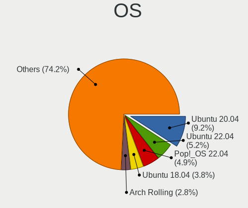

| Name                         | Notebooks | Percent |
|------------------------------|-----------|---------|
| Ubuntu 20.04                 | 188       | 17.14%  |
| Ubuntu 18.04                 | 82        | 7.47%   |
| Pop!_OS 21.04                | 27        | 2.46%   |
| Linux Mint 20.2              | 26        | 2.37%   |
| KDE neon 20.04               | 26        | 2.37%   |
| Pop!_OS 20.04                | 24        | 2.19%   |
| Ubuntu 20.10                 | 22        | 2.01%   |
| Linux Mint 20                | 22        | 2.01%   |
| Arch                         | 22        | 2.01%   |
| OpenMandriva 4.2             | 20        | 1.82%   |
| Pop!_OS 20.10                | 19        | 1.73%   |
| Ubuntu 21.10                 | 18        | 1.64%   |
| Ubuntu 19.04                 | 18        | 1.64%   |
| OpenMandriva 4.3             | 18        | 1.64%   |
| Linux Mint 20.1              | 18        | 1.64%   |
| Ubuntu 19.10                 | 17        | 1.55%   |
| Zorin 16                     | 16        | 1.46%   |
| Fedora 33                    | 16        | 1.46%   |
| Zorin 15                     | 15        | 1.37%   |
| Ubuntu 22.04                 | 15        | 1.37%   |
| Manjaro                      | 15        | 1.37%   |
| Debian 11                    | 15        | 1.37%   |
| Ubuntu 21.04                 | 14        | 1.28%   |
| Linux Mint 20.3              | 14        | 1.28%   |
| Fedora 35                    | 13        | 1.19%   |
| Xubuntu 18.04                | 12        | 1.09%   |
| Pop!_OS 22.04                | 12        | 1.09%   |
| Fedora 32                    | 12        | 1.09%   |
| ArcoLinux Rolling            | 12        | 1.09%   |
| Arch Rolling                 | 12        | 1.09%   |
| Fedora 36                    | 11        | 1%      |
| Xubuntu 20.04                | 10        | 0.91%   |
| Ubuntu 16.04                 | 9         | 0.82%   |
| Linux Mint 19.3              | 9         | 0.82%   |
| Kubuntu 20.04                | 9         | 0.82%   |
| Fedora 34                    | 9         | 0.82%   |
| Ubuntu 18.10                 | 8         | 0.73%   |
| Pop!_OS 21.10                | 8         | 0.73%   |
| Zorin 12                     | 7         | 0.64%   |
| LMDE 4                       | 7         | 0.64%   |
| Fedora 31                    | 7         | 0.64%   |
| Elementary 6.1               | 7         | 0.64%   |
| Linux Mint 19.2              | 6         | 0.55%   |
| Xubuntu 19.10                | 5         | 0.46%   |
| ROSA R10                     | 5         | 0.46%   |
| OpenMandriva 4.50            | 5         | 0.46%   |
| Lubuntu 20.04                | 5         | 0.46%   |
| Linux Mint 19.1              | 5         | 0.46%   |
| Kali 2021.1                  | 5         | 0.46%   |
| EndeavourOS Rolling          | 5         | 0.46%   |
| Elementary 5.1.7             | 5         | 0.46%   |
| Debian 10                    | 5         | 0.46%   |
| Reborn OS                    | 4         | 0.36%   |
| openSUSE Tumbleweed-XXXXXXXX | 4         | 0.36%   |
| LinuxFX 11                   | 4         | 0.36%   |
| KDE neon 18.04               | 4         | 0.36%   |
| Endless 3.7.8                | 4         | 0.36%   |
| Debian Unstable              | 4         | 0.36%   |
| BlackPanther 18.1            | 4         | 0.36%   |
| Ubuntu MATE 18.04            | 3         | 0.27%   |

OS Family
---------

OS without a version

| Name          | Notebooks | Percent |
|---------------|-----------|---------|
| Ubuntu        | 369       | 35.76%  |
| Linux Mint    | 96        | 9.3%    |
| Pop!_OS       | 84        | 8.14%   |
| Fedora        | 59        | 5.72%   |
| OpenMandriva  | 43        | 4.17%   |
| Zorin         | 38        | 3.68%   |
| Manjaro       | 37        | 3.59%   |
| Arch          | 34        | 3.29%   |
| Debian        | 31        | 3%      |
| Xubuntu       | 30        | 2.91%   |
| KDE neon      | 29        | 2.81%   |
| Elementary    | 19        | 1.84%   |
| Kubuntu       | 18        | 1.74%   |
| ArcoLinux     | 12        | 1.16%   |
| Kali          | 11        | 1.07%   |
| Clear Linux   | 11        | 1.07%   |
| ROSA          | 10        | 0.97%   |
| Lubuntu       | 10        | 0.97%   |
| Endless       | 10        | 0.97%   |
| Gentoo        | 8         | 0.78%   |
| LMDE          | 7         | 0.68%   |
| LinuxFX       | 6         | 0.58%   |
| openSUSE      | 5         | 0.48%   |
| EndeavourOS   | 5         | 0.48%   |
| Ubuntu MATE   | 4         | 0.39%   |
| Reborn OS     | 4         | 0.39%   |
| Parrot        | 4         | 0.39%   |
| BlackPanther  | 4         | 0.39%   |
| Ubuntu Budgie | 3         | 0.29%   |
| Solus         | 3         | 0.29%   |
| RHEL          | 2         | 0.19%   |
| PureOS        | 2         | 0.19%   |
| Oracle Linux  | 2         | 0.19%   |
| MX            | 2         | 0.19%   |
| CentOS        | 2         | 0.19%   |
| Calculate     | 2         | 0.19%   |
| antiX         | 2         | 0.19%   |
| Xero          | 1         | 0.1%    |
| Void Linux    | 1         | 0.1%    |
| UbuntuDDE     | 1         | 0.1%    |
| Peppermint    | 1         | 0.1%    |
| Pearl         | 1         | 0.1%    |
| PCLinuxOS     | 1         | 0.1%    |
| Makulu        | 1         | 0.1%    |
| Linux Lite    | 1         | 0.1%    |
| Feren OS      | 1         | 0.1%    |
| Deepin        | 1         | 0.1%    |
| Chrome OS     | 1         | 0.1%    |
| Artix         | 1         | 0.1%    |
| Arch ARM      | 1         | 0.1%    |
| Alpine        | 1         | 0.1%    |

Kernel
------

Version of the Linux kernel

| Version                  | Notebooks | Percent |
|--------------------------|-----------|---------|
| 5.4.0-42-generic         | 33        | 2.69%   |
| 5.10.14-desktop-1omv4002 | 20        | 1.63%   |
| 5.4.0-58-generic         | 17        | 1.38%   |
| 5.16.7-desktop-1omv4003  | 17        | 1.38%   |
| 5.4.0-26-generic         | 15        | 1.22%   |
| 5.4.0-40-generic         | 14        | 1.14%   |
| 5.11.0-7620-generic      | 14        | 1.14%   |
| 5.4.0-29-generic         | 13        | 1.06%   |
| 5.4.0-48-generic         | 12        | 0.98%   |
| 5.11.0-38-generic        | 12        | 0.98%   |
| 5.17.5-76051705-generic  | 11        | 0.9%    |
| 5.11.0-37-generic        | 11        | 0.9%    |
| 5.4.0-52-generic         | 10        | 0.81%   |
| 5.11.0-27-generic        | 10        | 0.81%   |
| 5.8.0-63-generic         | 9         | 0.73%   |
| 5.4.0-81-generic         | 9         | 0.73%   |
| 5.4.0-74-generic         | 9         | 0.73%   |
| 5.3.0-40-generic         | 9         | 0.73%   |
| 5.8.0-7630-generic       | 8         | 0.65%   |
| 5.8.0-59-generic         | 8         | 0.65%   |
| 5.4.0-7634-generic       | 8         | 0.65%   |
| 5.4.0-65-generic         | 8         | 0.65%   |
| 5.4.0-54-generic         | 8         | 0.65%   |
| 5.3.0-28-generic         | 8         | 0.65%   |
| 5.13.0-7620-generic      | 8         | 0.65%   |
| 5.11.0-40-generic        | 8         | 0.65%   |
| 5.0.0-13-generic         | 8         | 0.65%   |
| 5.8.0-7642-generic       | 7         | 0.57%   |
| 5.8.0-53-generic         | 7         | 0.57%   |
| 5.8.0-50-generic         | 7         | 0.57%   |
| 5.4.0-91-generic         | 7         | 0.57%   |
| 5.4.0-7642-generic       | 7         | 0.57%   |
| 5.4.0-47-generic         | 7         | 0.57%   |
| 5.4.0-31-generic         | 7         | 0.57%   |
| 5.3.0-46-generic         | 7         | 0.57%   |
| 5.13.0-40-generic        | 7         | 0.57%   |
| 5.13.0-35-generic        | 7         | 0.57%   |
| 4.18.0-17-generic        | 7         | 0.57%   |
| 5.8.0-55-generic         | 6         | 0.49%   |
| 5.8.0-44-generic         | 6         | 0.49%   |
| 5.8.0-36-generic         | 6         | 0.49%   |
| 5.4.0-39-generic         | 6         | 0.49%   |
| 5.11.0-7612-generic      | 6         | 0.49%   |
| 5.11.0-43-generic        | 6         | 0.49%   |
| 5.11.0-25-generic        | 6         | 0.49%   |
| 4.18.0-15-generic        | 6         | 0.49%   |
| 4.15.0-91-generic        | 6         | 0.49%   |
| 4.15.0-72-generic        | 6         | 0.49%   |
| 4.15.0-54-generic        | 6         | 0.49%   |
| 5.8.0-29-generic         | 5         | 0.41%   |
| 5.4.0-84-generic         | 5         | 0.41%   |
| 5.4.0-70-generic         | 5         | 0.41%   |
| 5.4.0-66-generic         | 5         | 0.41%   |
| 5.4.0-33-generic         | 5         | 0.41%   |
| 5.4.0-109-generic        | 5         | 0.41%   |
| 5.13.0-39-generic        | 5         | 0.41%   |
| 5.13.0-30-generic        | 5         | 0.41%   |
| 5.13.0-28-generic        | 5         | 0.41%   |
| 5.13.0-27-generic        | 5         | 0.41%   |
| 5.12.4-desktop-1omv4050  | 5         | 0.41%   |

Kernel Family
-------------

Linux kernel without a distro release

| Version | Notebooks | Percent |
|---------|-----------|---------|
| 5.4.0   | 251       | 22.25%  |
| 5.11.0  | 99        | 8.78%   |
| 5.8.0   | 84        | 7.45%   |
| 5.13.0  | 70        | 6.21%   |
| 4.15.0  | 68        | 6.03%   |
| 5.3.0   | 52        | 4.61%   |
| 5.0.0   | 41        | 3.63%   |
| 4.18.0  | 30        | 2.66%   |
| 5.10.0  | 25        | 2.22%   |
| 5.10.14 | 20        | 1.77%   |
| 5.16.7  | 18        | 1.6%    |
| 5.15.0  | 16        | 1.42%   |
| 5.17.5  | 14        | 1.24%   |
| 4.19.0  | 11        | 0.98%   |
| 5.8.16  | 5         | 0.44%   |
| 5.16.11 | 5         | 0.44%   |
| 5.16.0  | 5         | 0.44%   |
| 5.12.4  | 5         | 0.44%   |
| 4.9.60  | 5         | 0.44%   |
| 5.9.16  | 4         | 0.35%   |
| 5.16.2  | 4         | 0.35%   |
| 5.16.19 | 4         | 0.35%   |
| 5.15.11 | 4         | 0.35%   |
| 5.14.0  | 4         | 0.35%   |
| 5.13.12 | 4         | 0.35%   |
| 4.4.0   | 4         | 0.35%   |
| 5.9.10  | 3         | 0.27%   |
| 5.9.0   | 3         | 0.27%   |
| 5.8.12  | 3         | 0.27%   |
| 5.7.0   | 3         | 0.27%   |
| 5.6.6   | 3         | 0.27%   |
| 5.6.19  | 3         | 0.27%   |
| 5.6.11  | 3         | 0.27%   |
| 5.5.2   | 3         | 0.27%   |
| 5.17.8  | 3         | 0.27%   |
| 5.16.18 | 3         | 0.27%   |
| 5.15.7  | 3         | 0.27%   |
| 5.15.12 | 3         | 0.27%   |
| 5.13.13 | 3         | 0.27%   |
| 5.11.16 | 3         | 0.27%   |
| 5.11.12 | 3         | 0.27%   |
| 4.18.16 | 3         | 0.27%   |
| 5.9.8   | 2         | 0.18%   |
| 5.9.11  | 2         | 0.18%   |
| 5.8.18  | 2         | 0.18%   |
| 5.8.14  | 2         | 0.18%   |
| 5.6.8   | 2         | 0.18%   |
| 5.6.15  | 2         | 0.18%   |
| 5.6.0   | 2         | 0.18%   |
| 5.5.0   | 2         | 0.18%   |
| 5.4.80  | 2         | 0.18%   |
| 5.4.24  | 2         | 0.18%   |
| 5.4.19  | 2         | 0.18%   |
| 5.4.13  | 2         | 0.18%   |
| 5.2.0   | 2         | 0.18%   |
| 5.18.7  | 2         | 0.18%   |
| 5.18.6  | 2         | 0.18%   |
| 5.17.11 | 2         | 0.18%   |
| 5.17.1  | 2         | 0.18%   |
| 5.17.0  | 2         | 0.18%   |

Kernel Major Ver.
-----------------

Linux kernel major version

| Version | Notebooks | Percent |
|---------|-----------|---------|
| 5.4     | 273       | 24.62%  |
| 5.11    | 113       | 10.19%  |
| 5.8     | 101       | 9.11%   |
| 5.13    | 84        | 7.57%   |
| 5.10    | 69        | 6.22%   |
| 4.15    | 68        | 6.13%   |
| 5.3     | 56        | 5.05%   |
| 5.16    | 51        | 4.6%    |
| 5.0     | 45        | 4.06%   |
| 5.15    | 43        | 3.88%   |
| 4.18    | 34        | 3.07%   |
| 5.17    | 30        | 2.71%   |
| 5.6     | 18        | 1.62%   |
| 5.9     | 17        | 1.53%   |
| 5.12    | 15        | 1.35%   |
| 4.19    | 14        | 1.26%   |
| 5.14    | 13        | 1.17%   |
| 5.5     | 12        | 1.08%   |
| 5.7     | 11        | 0.99%   |
| 4.9     | 11        | 0.99%   |
| 5.18    | 7         | 0.63%   |
| 5.2     | 5         | 0.45%   |
| 4.4     | 4         | 0.36%   |
| 4.1     | 3         | 0.27%   |
| 5.1     | 2         | 0.18%   |
| 4.20    | 2         | 0.18%   |
| 3.16    | 2         | 0.18%   |
| 3.10    | 2         | 0.18%   |
| 4.8     | 1         | 0.09%   |
| 4.14    | 1         | 0.09%   |
| 4.13    | 1         | 0.09%   |
| 4.11    | 1         | 0.09%   |

Arch
----

OS architecture (x86_64, i586, etc.)

| Name    | Notebooks | Percent |
|---------|-----------|---------|
| x86_64  | 946       | 96.93%  |
| i686    | 26        | 2.66%   |
| i586    | 2         | 0.2%    |
| aarch64 | 2         | 0.2%    |

DE
--

Desktop Environment

| Name            | Notebooks | Percent |
|-----------------|-----------|---------|
| GNOME           | 483       | 46.13%  |
| Unknown         | 137       | 13.09%  |
| KDE5            | 122       | 11.65%  |
| X-Cinnamon      | 87        | 8.31%   |
| XFCE            | 70        | 6.69%   |
| KDE             | 32        | 3.06%   |
| MATE            | 18        | 1.72%   |
| Pantheon        | 17        | 1.62%   |
| Cinnamon        | 17        | 1.62%   |
| Unity           | 11        | 1.05%   |
| LXQt            | 8         | 0.76%   |
| KDE4            | 8         | 0.76%   |
| i3              | 8         | 0.76%   |
| LXDE            | 7         | 0.67%   |
| Deepin          | 6         | 0.57%   |
| Budgie          | 6         | 0.57%   |
| awesome         | 3         | 0.29%   |
| GNOME Flashback | 2         | 0.19%   |
| sway            | 1         | 0.1%    |
| qtile           | 1         | 0.1%    |
| openbox         | 1         | 0.1%    |
| icewm           | 1         | 0.1%    |
| dusk            | 1         | 0.1%    |

Display Server
--------------

X11 or Wayland

| Name    | Notebooks | Percent |
|---------|-----------|---------|
| X11     | 805       | 79.47%  |
| Wayland | 112       | 11.06%  |
| Unknown | 77        | 7.6%    |
| Tty     | 19        | 1.88%   |

Display Manager
---------------

SDDM, LightDM, etc.

| Name    | Notebooks | Percent |
|---------|-----------|---------|
| Unknown | 610       | 59.69%  |
| GDM     | 129       | 12.62%  |
| SDDM    | 101       | 9.88%   |
| LightDM | 69        | 6.75%   |
| GDM3    | 60        | 5.87%   |
| TDM     | 40        | 3.91%   |
| KDM     | 8         | 0.78%   |
| SLiM    | 2         | 0.2%    |
| XDM     | 1         | 0.1%    |
| LXDM    | 1         | 0.1%    |
| GREETD  | 1         | 0.1%    |

OS Lang
-------

Language

| Lang    | Notebooks | Percent |
|---------|-----------|---------|
| en_AU   | 722       | 71.13%  |
| Unknown | 129       | 12.71%  |
| en_US   | 126       | 12.41%  |
| C       | 20        | 1.97%   |
| en_GB   | 12        | 1.18%   |
| zh_CN   | 1         | 0.1%    |
| ru_RU   | 1         | 0.1%    |
| es_ES   | 1         | 0.1%    |
| en_IN   | 1         | 0.1%    |
| en_CA   | 1         | 0.1%    |
| C.UTF8  | 1         | 0.1%    |

Boot Mode
---------

EFI or BIOS

| Mode | Notebooks | Percent |
|------|-----------|---------|
| BIOS | 507       | 50.65%  |
| EFI  | 494       | 49.35%  |

Filesystem
----------

Type of filesystem

| Type    | Notebooks | Percent |
|---------|-----------|---------|
| Ext4    | 815       | 80.69%  |
| Btrfs   | 63        | 6.24%   |
| Overlay | 60        | 5.94%   |
| Unknown | 39        | 3.86%   |
| Xfs     | 12        | 1.19%   |
| Zfs     | 10        | 0.99%   |
| Ext2    | 4         | 0.4%    |
| Tmpfs   | 3         | 0.3%    |
| Ext3    | 3         | 0.3%    |
| Aufs    | 1         | 0.1%    |

Part. scheme
------------

Scheme of partitioning

| Type    | Notebooks | Percent |
|---------|-----------|---------|
| Unknown | 648       | 65.26%  |
| GPT     | 251       | 25.28%  |
| MBR     | 94        | 9.47%   |

Dual Boot with Linux/BSD
------------------------

Hosting more than one Linux/BSD

| Dual boot | Notebooks | Percent |
|-----------|-----------|---------|
| No        | 886       | 89.49%  |
| Yes       | 104       | 10.51%  |

Dual Boot (Win)
---------------

Hosting Linux and Windows

| Dual boot | Notebooks | Percent |
|-----------|-----------|---------|
| No        | 763       | 76.76%  |
| Yes       | 231       | 23.24%  |

Board
-----

Vendor
------

Motherboard manufacturer

| Name                           | Notebooks | Percent |
|--------------------------------|-----------|---------|
| Hewlett-Packard                | 183       | 18.79%  |
| Dell                           | 168       | 17.25%  |
| Lenovo                         | 159       | 16.32%  |
| ASUSTek Computer               | 89        | 9.14%   |
| Acer                           | 87        | 8.93%   |
| Toshiba                        | 82        | 8.42%   |
| Apple                          | 58        | 5.95%   |
| MSI                            | 22        | 2.26%   |
| Alienware                      | 12        | 1.23%   |
| Sony                           | 10        | 1.03%   |
| Samsung Electronics            | 10        | 1.03%   |
| Notebook                       | 9         | 0.92%   |
| Timi                           | 7         | 0.72%   |
| Metabox                        | 6         | 0.62%   |
| IT Channel Pty                 | 6         | 0.62%   |
| Gigabyte Technology            | 6         | 0.62%   |
| Panasonic                      | 5         | 0.51%   |
| HUAWEI                         | 5         | 0.51%   |
| Unknown                        | 5         | 0.51%   |
| Razer                          | 4         | 0.41%   |
| System76                       | 3         | 0.31%   |
| Medion                         | 3         | 0.31%   |
| LG Electronics                 | 3         | 0.31%   |
| Pine Microsystems              | 2         | 0.21%   |
| Kogan                          | 2         | 0.21%   |
| Intel Client Systems           | 2         | 0.21%   |
| IBM                            | 2         | 0.21%   |
| Google                         | 2         | 0.21%   |
| Framework                      | 2         | 0.21%   |
| AMI                            | 2         | 0.21%   |
| Star Labs                      | 1         | 0.1%    |
| Purism                         | 1         | 0.1%    |
| Pendo Industries               | 1         | 0.1%    |
| ONE-NETBOOK TECHNOLOGY         | 1         | 0.1%    |
| One Education                  | 1         | 0.1%    |
| OEM                            | 1         | 0.1%    |
| Matsushita Electric Industrial | 1         | 0.1%    |
| LEADER                         | 1         | 0.1%    |
| Intel                          | 1         | 0.1%    |
| Insyde                         | 1         | 0.1%    |
| HASEE Computer                 | 1         | 0.1%    |
| Getac                          | 1         | 0.1%    |
| Fujitsu                        | 1         | 0.1%    |
| eMachines                      | 1         | 0.1%    |
| Dynabook                       | 1         | 0.1%    |
| COM1                           | 1         | 0.1%    |
| AFTERSHOCK PC                  | 1         | 0.1%    |
| ADLINK Technology              | 1         | 0.1%    |

Model
-----

Motherboard model

| Name                                               | Notebooks | Percent |
|----------------------------------------------------|-----------|---------|
| HP Pavilion dv6                                    | 13        | 1.33%   |
| HP Pavilion g6                                     | 11        | 1.13%   |
| HP Pavilion 15                                     | 8         | 0.82%   |
| HP Notebook                                        | 8         | 0.82%   |
| Unknown                                            | 8         | 0.82%   |
| Apple MacBookPro10,1                               | 6         | 0.62%   |
| Dell XPS 15 9560                                   | 5         | 0.51%   |
| Apple MacBookPro9,2                                | 5         | 0.51%   |
| Acer ConceptD CN315-71P                            | 5         | 0.51%   |
| Acer Aspire 5750G                                  | 5         | 0.51%   |
| Toshiba Satellite P750                             | 4         | 0.41%   |
| Toshiba Satellite L50-A                            | 4         | 0.41%   |
| Lenovo G50-45 80E3                                 | 4         | 0.41%   |
| Dell XPS 15 9570                                   | 4         | 0.41%   |
| Dell XPS 13 9370                                   | 4         | 0.41%   |
| Dell Precision 5530                                | 4         | 0.41%   |
| Apple MacBookPro8,1                                | 4         | 0.41%   |
| Toshiba Satellite P850                             | 3         | 0.31%   |
| Toshiba Satellite L850                             | 3         | 0.31%   |
| Toshiba Satellite L750                             | 3         | 0.31%   |
| Toshiba Satellite L500                             | 3         | 0.31%   |
| Toshiba Satellite L50-B                            | 3         | 0.31%   |
| Toshiba Satellite C660                             | 3         | 0.31%   |
| Toshiba Satellite C50D-A                           | 3         | 0.31%   |
| Razer Blade 15 Base Model (Early 2020) - RZ09-0328 | 3         | 0.31%   |
| Lenovo Yoga 3 Pro-1370 80HE                        | 3         | 0.31%   |
| Lenovo IdeaPad 1 14IGL05 81VU                      | 3         | 0.31%   |
| HP ProBook 430 G2                                  | 3         | 0.31%   |
| HP Presario CQ62                                   | 3         | 0.31%   |
| HP Pavilion dv7                                    | 3         | 0.31%   |
| HP Pavilion dm1                                    | 3         | 0.31%   |
| HP ENVY 17                                         | 3         | 0.31%   |
| HP EliteBook 8570p                                 | 3         | 0.31%   |
| HP 250 G6 Notebook PC                              | 3         | 0.31%   |
| HP 15                                              | 3         | 0.31%   |
| Dell XPS 17 9700                                   | 3         | 0.31%   |
| Dell XPS 15 9550                                   | 3         | 0.31%   |
| Dell XPS 15 9500                                   | 3         | 0.31%   |
| Dell XPS 15 7590                                   | 3         | 0.31%   |
| Dell XPS 13 9360                                   | 3         | 0.31%   |
| Dell XPS 13 7390                                   | 3         | 0.31%   |
| Dell Latitude E7450                                | 3         | 0.31%   |
| Dell Latitude E7440                                | 3         | 0.31%   |
| Dell Latitude E6430                                | 3         | 0.31%   |
| Dell Latitude E6230                                | 3         | 0.31%   |
| Dell Inspiron 5570                                 | 3         | 0.31%   |
| Dell Inspiron 1545                                 | 3         | 0.31%   |
| Dell G3 3500                                       | 3         | 0.31%   |
| Apple MacBookPro6,1                                | 3         | 0.31%   |
| Apple MacBookPro16,1                               | 3         | 0.31%   |
| Apple MacBookPro11,1                               | 3         | 0.31%   |
| Apple MacBook7,1                                   | 3         | 0.31%   |
| Alienware M17xR4                                   | 3         | 0.31%   |
| Alienware 14                                       | 3         | 0.31%   |
| Acer Swift SF514-54T                               | 3         | 0.31%   |
| Acer Aspire E1-522                                 | 3         | 0.31%   |
| Acer Aspire A515-52                                | 3         | 0.31%   |
| Toshiba Satellite L750D                            | 2         | 0.21%   |
| Toshiba Satellite L640                             | 2         | 0.21%   |
| Toshiba PORTEGE M780                               | 2         | 0.21%   |

Model Family
------------

Motherboard model prefix

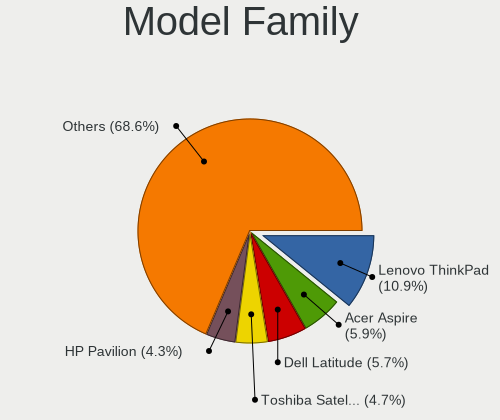

| Name                     | Notebooks | Percent |
|--------------------------|-----------|---------|
| Lenovo ThinkPad          | 105       | 10.78%  |
| Toshiba Satellite        | 68        | 6.98%   |
| Acer Aspire              | 64        | 6.57%   |
| Dell Latitude            | 57        | 5.85%   |
| HP Pavilion              | 55        | 5.65%   |
| Dell Inspiron            | 42        | 4.31%   |
| Dell XPS                 | 36        | 3.7%    |
| HP EliteBook             | 30        | 3.08%   |
| Lenovo IdeaPad           | 24        | 2.46%   |
| HP ProBook               | 23        | 2.36%   |
| Dell Precision           | 16        | 1.64%   |
| HP Laptop                | 15        | 1.54%   |
| HP ENVY                  | 11        | 1.13%   |
| ASUS ZenBook             | 9         | 0.92%   |
| Lenovo Yoga              | 8         | 0.82%   |
| HP Notebook              | 8         | 0.82%   |
| HP 250                   | 8         | 0.82%   |
| Apple MacBookPro10       | 8         | 0.82%   |
| Acer Swift               | 8         | 0.82%   |
| Unknown                  | 8         | 0.82%   |
| Toshiba TECRA            | 6         | 0.62%   |
| Toshiba PORTEGE          | 6         | 0.62%   |
| Lenovo Legion            | 6         | 0.62%   |
| HP ZBook                 | 6         | 0.62%   |
| Apple MacBookPro9        | 6         | 0.62%   |
| HP Compaq                | 5         | 0.51%   |
| ASUS TUF                 | 5         | 0.51%   |
| ASUS ROG                 | 5         | 0.51%   |
| Apple MacBookPro6        | 5         | 0.51%   |
| Apple MacBookPro11       | 5         | 0.51%   |
| Acer ConceptD            | 5         | 0.51%   |
| Razer Blade              | 4         | 0.41%   |
| Lenovo G50-45            | 4         | 0.41%   |
| HP Presario              | 4         | 0.41%   |
| Dell Vostro              | 4         | 0.41%   |
| Dell G3                  | 4         | 0.41%   |
| ASUS VivoBook            | 4         | 0.41%   |
| Apple MacBookPro8        | 4         | 0.41%   |
| Apple MacBookPro16       | 4         | 0.41%   |
| Metabox Alpha-X          | 3         | 0.31%   |
| HP 15                    | 3         | 0.31%   |
| Apple MacBookPro5        | 3         | 0.31%   |
| Apple MacBookAir6        | 3         | 0.31%   |
| Apple MacBookAir4        | 3         | 0.31%   |
| Apple MacBook7           | 3         | 0.31%   |
| Alienware M17xR4         | 3         | 0.31%   |
| Alienware 17             | 3         | 0.31%   |
| Alienware 14             | 3         | 0.31%   |
| Acer Nitro               | 3         | 0.31%   |
| Timi TM1613              | 2         | 0.21%   |
| Timi RedmiBook           | 2         | 0.21%   |
| System76 Oryx            | 2         | 0.21%   |
| Samsung R580             | 2         | 0.21%   |
| Samsung 700T             | 2         | 0.21%   |
| Samsung 355V4C           | 2         | 0.21%   |
| Pine Microsystems Pine64 | 2         | 0.21%   |
| Notebook P65             | 2         | 0.21%   |
| MSI PS42                 | 2         | 0.21%   |
| MSI GS65                 | 2         | 0.21%   |
| MSI GL65                 | 2         | 0.21%   |

MFG Year
--------

Motherboard manufacture year

| Year    | Notebooks | Percent |
|---------|-----------|---------|
| 2019    | 99        | 10.16%  |
| 2011    | 90        | 9.24%   |
| 2018    | 81        | 8.32%   |
| 2020    | 80        | 8.21%   |
| 2013    | 75        | 7.7%    |
| 2014    | 74        | 7.6%    |
| 2012    | 73        | 7.49%   |
| 2017    | 61        | 6.26%   |
| 2016    | 61        | 6.26%   |
| 2015    | 59        | 6.06%   |
| 2010    | 59        | 6.06%   |
| 2021    | 47        | 4.83%   |
| 2008    | 44        | 4.52%   |
| 2009    | 35        | 3.59%   |
| 2007    | 16        | 1.64%   |
| 2022    | 6         | 0.62%   |
| Unknown | 5         | 0.51%   |
| 2006    | 4         | 0.41%   |
| 2005    | 4         | 0.41%   |
| 2003    | 1         | 0.1%    |

Form Factor
-----------

Physical design of the computer

| Name     | Notebooks | Percent |
|----------|-----------|---------|
| Notebook | 974       | 100%    |

Secure Boot
-----------

Enabled or disabled

| State    | Notebooks | Percent |
|----------|-----------|---------|
| Disabled | 873       | 88.9%   |
| Enabled  | 109       | 11.1%   |

Coreboot
--------

Have coreboot on board

| Used | Notebooks | Percent |
|------|-----------|---------|
| No   | 968       | 99.38%  |
| Yes  | 6         | 0.62%   |

RAM Size
--------

Total RAM memory

| Size in GB  | Notebooks | Percent |
|-------------|-----------|---------|
| 4.01-8.0    | 270       | 27.33%  |
| 3.01-4.0    | 211       | 21.36%  |
| 16.01-24.0  | 207       | 20.95%  |
| 8.01-16.0   | 148       | 14.98%  |
| 32.01-64.0  | 79        | 8%      |
| 1.01-2.0    | 44        | 4.45%   |
| 24.01-32.0  | 8         | 0.81%   |
| 64.01-256.0 | 8         | 0.81%   |
| 2.01-3.0    | 7         | 0.71%   |
| 0.51-1.0    | 3         | 0.3%    |
| 0.01-0.5    | 3         | 0.3%    |

RAM Used
--------

Used RAM memory

| Used GB    | Notebooks | Percent |
|------------|-----------|---------|
| 1.01-2.0   | 410       | 36.64%  |
| 2.01-3.0   | 309       | 27.61%  |
| 4.01-8.0   | 136       | 12.15%  |
| 3.01-4.0   | 128       | 11.44%  |
| 0.51-1.0   | 76        | 6.79%   |
| 8.01-16.0  | 41        | 3.66%   |
| 0.01-0.5   | 12        | 1.07%   |
| 16.01-24.0 | 4         | 0.36%   |
| 0          | 2         | 0.18%   |
| 24.01-32.0 | 1         | 0.09%   |

Total Drives
------------

Number of drives on board

| Drives | Notebooks | Percent |
|--------|-----------|---------|
| 1      | 715       | 70.37%  |
| 2      | 231       | 22.74%  |
| 3      | 46        | 4.53%   |
| 0      | 14        | 1.38%   |
| 4      | 7         | 0.69%   |
| 5      | 2         | 0.2%    |
| 7      | 1         | 0.1%    |

Has CD-ROM
----------

Has CD-ROM on board

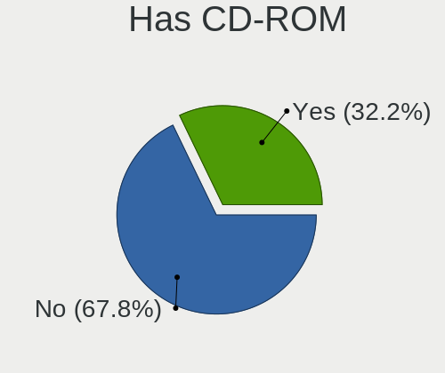

| Presented | Notebooks | Percent |
|-----------|-----------|---------|
| No        | 583       | 59.25%  |
| Yes       | 401       | 40.75%  |

Has Ethernet
------------

Has Ethernet on board

| Presented | Notebooks | Percent |
|-----------|-----------|---------|
| Yes       | 812       | 83.2%   |
| No        | 164       | 16.8%   |

Has WiFi
--------

Has WiFi module

| Presented | Notebooks | Percent |
|-----------|-----------|---------|
| Yes       | 952       | 97.54%  |
| No        | 24        | 2.46%   |

Has Bluetooth
-------------

Has Bluetooth module

| Presented | Notebooks | Percent |
|-----------|-----------|---------|
| Yes       | 745       | 75.1%   |
| No        | 247       | 24.9%   |

Location
--------

Country
-------

Geographic location (country)

| Country   | Notebooks | Percent |
|-----------|-----------|---------|
| Australia | 974       | 100%    |

City
----

Geographic location (city)

| City           | Notebooks | Percent |
|----------------|-----------|---------|
| Sydney         | 271       | 26.01%  |
| Melbourne      | 216       | 20.73%  |
| Brisbane       | 151       | 14.49%  |
| Perth          | 81        | 7.77%   |
| Adelaide       | 58        | 5.57%   |
| Canberra       | 17        | 1.63%   |
| Hobart         | 16        | 1.54%   |
| Launceston     | 6         | 0.58%   |
| Woolloongabba  | 5         | 0.48%   |
| Southport      | 5         | 0.48%   |
| Parramatta     | 5         | 0.48%   |
| Central Coast  | 5         | 0.48%   |
| West End       | 4         | 0.38%   |
| Wahroonga      | 4         | 0.38%   |
| Traralgon      | 4         | 0.38%   |
| Point Cook     | 4         | 0.38%   |
| Newcastle      | 4         | 0.38%   |
| Gold Coast     | 4         | 0.38%   |
| Artarmon       | 4         | 0.38%   |
| Alexandria     | 4         | 0.38%   |
| Wollongong     | 3         | 0.29%   |
| Townsville     | 3         | 0.29%   |
| Surry Hills    | 3         | 0.29%   |
| Spring Field   | 3         | 0.29%   |
| Parkdale       | 3         | 0.29%   |
| Mount Waverley | 3         | 0.29%   |
| Mitcham        | 3         | 0.29%   |
| Hawthorn       | 3         | 0.29%   |
| Geraldton      | 3         | 0.29%   |
| Geelong        | 3         | 0.29%   |
| Clifton Hill   | 3         | 0.29%   |
| Warragul       | 2         | 0.19%   |
| Ryde           | 2         | 0.19%   |
| Richmond       | 2         | 0.19%   |
| Quinns Rocks   | 2         | 0.19%   |
| Oakleigh East  | 2         | 0.19%   |
| Mooroolbark    | 2         | 0.19%   |
| Montmorency    | 2         | 0.19%   |
| Grovedale      | 2         | 0.19%   |
| Fitzroy North  | 2         | 0.19%   |
| Doncaster      | 2         | 0.19%   |
| Cheltenham     | 2         | 0.19%   |
| Bundaberg      | 2         | 0.19%   |
| Brunswick West | 2         | 0.19%   |
| Brighton       | 2         | 0.19%   |
| Berry          | 2         | 0.19%   |
| Bentleigh East | 2         | 0.19%   |
| Balwyn North   | 2         | 0.19%   |
| Ballarat       | 2         | 0.19%   |
| Yallourn       | 1         | 0.1%    |
| Wilberforce    | 1         | 0.1%    |
| Warrnambool    | 1         | 0.1%    |
| Wantirna       | 1         | 0.1%    |
| Urangan        | 1         | 0.1%    |
| Tullamarine    | 1         | 0.1%    |
| Toowong        | 1         | 0.1%    |
| Toorak         | 1         | 0.1%    |
| Thornbury      | 1         | 0.1%    |
| Taroona        | 1         | 0.1%    |
| Taringa        | 1         | 0.1%    |

Drives
------

Drive Vendor
------------

Hard drive vendors

| Vendor                       | Notebooks | Drives | Percent |
|------------------------------|-----------|--------|---------|
| Samsung Electronics          | 222       | 269    | 18.33%  |
| Seagate                      | 143       | 208    | 11.81%  |
| WDC                          | 140       | 202    | 11.56%  |
| Toshiba                      | 120       | 181    | 9.91%   |
| Unknown                      | 60        | 80     | 4.95%   |
| SanDisk                      | 52        | 64     | 4.29%   |
| Kingston                     | 50        | 65     | 4.13%   |
| Intel                        | 48        | 74     | 3.96%   |
| Hitachi                      | 48        | 58     | 3.96%   |
| SK hynix                     | 45        | 58     | 3.72%   |
| Crucial                      | 43        | 59     | 3.55%   |
| HGST                         | 39        | 57     | 3.22%   |
| Apple                        | 32        | 35     | 2.64%   |
| Micron Technology            | 24        | 29     | 1.98%   |
| KIOXIA                       | 15        | 17     | 1.24%   |
| Phison                       | 11        | 13     | 0.91%   |
| LITEON                       | 10        | 12     | 0.83%   |
| Fujitsu                      | 9         | 13     | 0.74%   |
| A-DATA Technology            | 9         | 12     | 0.74%   |
| LITEONIT                     | 6         | 8      | 0.5%    |
| OCZ                          | 5         | 7      | 0.41%   |
| JMicron Technology           | 5         | 7      | 0.41%   |
| SPCC                         | 4         | 5      | 0.33%   |
| KingSpec                     | 4         | 6      | 0.33%   |
| Transcend                    | 3         | 4      | 0.25%   |
| Lite-On                      | 3         | 3      | 0.25%   |
| LaCie                        | 3         | 7      | 0.25%   |
| ASMT                         | 3         | 4      | 0.25%   |
| XPG                          | 2         | 2      | 0.17%   |
| TO Exter                     | 2         | 2      | 0.17%   |
| Realtek Semiconductor        | 2         | 3      | 0.17%   |
| Plextor                      | 2         | 6      | 0.17%   |
| Patriot                      | 2         | 2      | 0.17%   |
| OWC                          | 2         | 3      | 0.17%   |
| Micron/Crucial Technology    | 2         | 2      | 0.17%   |
| Lenovo                       | 2         | 3      | 0.17%   |
| KingFast                     | 2         | 2      | 0.17%   |
| HGST HUS                     | 2         | 2      | 0.17%   |
| Gigabyte Technology          | 2         | 4      | 0.17%   |
| External                     | 2         | 2      | 0.17%   |
| Corsair                      | 2         | 2      | 0.17%   |
| China                        | 2         | 2      | 0.17%   |
| USB                          | 1         | 2      | 0.08%   |
| Union Memory (Shenzhen)      | 1         | 1      | 0.08%   |
| Union Memory                 | 1         | 1      | 0.08%   |
| UKINGS                       | 1         | 1      | 0.08%   |
| Team                         | 1         | 1      | 0.08%   |
| Star Drive                   | 1         | 1      | 0.08%   |
| SSSTC                        | 1         | 1      | 0.08%   |
| Silicon Motion               | 1         | 1      | 0.08%   |
| Shenzhen Longsys Electronics | 1         | 1      | 0.08%   |
| SAMSWEET                     | 1         | 1      | 0.08%   |
| Realtek                      | 1         | 1      | 0.08%   |
| Oyen                         | 1         | 1      | 0.08%   |
| Mushkin                      | 1         | 1      | 0.08%   |
| Kston                        | 1         | 1      | 0.08%   |
| KingDian                     | 1         | 1      | 0.08%   |
| KESU                         | 1         | 1      | 0.08%   |
| IBM/Hitachi                  | 1         | 1      | 0.08%   |
| Hewlett-Packard              | 1         | 1      | 0.08%   |

Drive Model
-----------

Hard drive models

| Model                                  | Notebooks | Percent |
|----------------------------------------|-----------|---------|
| Toshiba MQ01ABD100 1TB                 | 17        | 1.35%   |
| Seagate ST1000LM024 HN-M101MBB 1TB     | 15        | 1.2%    |
| Unknown MMC Card  64GB                 | 13        | 1.04%   |
| SanDisk NVMe SSD Drive 512GB           | 13        | 1.04%   |
| Samsung NVMe SSD Drive 512GB           | 13        | 1.04%   |
| Seagate ST500LT012-1DG142 500GB        | 12        | 0.96%   |
| Seagate ST1000LM035-1RK172 1TB         | 12        | 0.96%   |
| Toshiba MQ01ABF050 500GB               | 11        | 0.88%   |
| Seagate Expansion 1TB                  | 10        | 0.8%    |
| Samsung SSD 860 EVO 500GB              | 10        | 0.8%    |
| Samsung NVMe SSD Drive 256GB           | 10        | 0.8%    |
| Unknown MMC Card  32GB                 | 9         | 0.72%   |
| HGST HTS721010A9E630 1TB               | 9         | 0.72%   |
| Unknown MMC Card  128GB                | 8         | 0.64%   |
| Toshiba NVMe SSD Drive 512GB           | 8         | 0.64%   |
| Seagate ST9500325AS 500GB              | 8         | 0.64%   |
| Samsung SSD 850 EVO 250GB              | 8         | 0.64%   |
| Intel NVMe SSD Drive 512GB             | 8         | 0.64%   |
| HGST HTS545050A7E680 500GB             | 8         | 0.64%   |
| WDC WD10JPVX-22JC3T0 1TB               | 7         | 0.56%   |
| Toshiba MQ01ABD075 752GB               | 7         | 0.56%   |
| SK hynix NVMe SSD Drive 256GB          | 7         | 0.56%   |
| Seagate ST2000LM007-1R8174 2TB         | 7         | 0.56%   |
| SanDisk NVMe SSD Drive 256GB           | 7         | 0.56%   |
| Samsung SM963 2.5" NVMe PCIe SSD 500GB | 7         | 0.56%   |
| Kingston SA400S37240G 240GB SSD        | 7         | 0.56%   |
| Hitachi HTS547575A9E384 752GB          | 7         | 0.56%   |
| HGST HTS725050A7E630 500GB             | 7         | 0.56%   |
| Crucial CT1000MX500SSD1 1TB            | 7         | 0.56%   |
| Seagate ST750LM022 HN-M750MBB 752GB    | 6         | 0.48%   |
| Seagate ST500LM021-1KJ152 500GB        | 6         | 0.48%   |
| Seagate ST2000LM015-2E8174 2TB         | 6         | 0.48%   |
| Samsung SSD 850 EVO 500GB              | 6         | 0.48%   |
| Micron NVMe SSD Drive 512GB            | 6         | 0.48%   |
| Kingston SA400S37120G 120GB SSD        | 6         | 0.48%   |
| Hitachi HTS545050B9A300 500GB          | 6         | 0.48%   |
| HGST HTS541010A9E680 1TB               | 6         | 0.48%   |
| Crucial CT500MX500SSD1 500GB           | 6         | 0.48%   |
| Crucial CT480BX500SSD1 480GB           | 6         | 0.48%   |
| WDC WDS240G2G0A-00JH30 240GB SSD       | 5         | 0.4%    |
| WDC WD20SPZX-21UA7T0 2TB               | 5         | 0.4%    |
| Unknown MMC Card  16GB                 | 5         | 0.4%    |
| Toshiba MQ04ABF100 1TB                 | 5         | 0.4%    |
| Toshiba KBG30ZMS128G 128GB NVMe SSD    | 5         | 0.4%    |
| Seagate ST9160821AS 160GB              | 5         | 0.4%    |
| Samsung SSD 860 QVO 1TB                | 5         | 0.4%    |
| Samsung NVMe SSD Drive 1TB             | 5         | 0.4%    |
| Samsung NVMe SSD Drive 1024GB          | 5         | 0.4%    |
| Samsung MZVLB512HBJQ-000L7 512GB       | 5         | 0.4%    |
| Samsung MZVLB512HBJQ-000L2 512GB       | 5         | 0.4%    |
| Micron 1100_MTFDDAV256TBN 256GB SSD    | 5         | 0.4%    |
| KIOXIA NVMe SSD Drive 256GB            | 5         | 0.4%    |
| Intel SSDPEKNW512G8 512GB              | 5         | 0.4%    |
| Crucial CT1000BX500SSD1 1TB            | 5         | 0.4%    |
| WDC WD5000LPVX-22V0TT0 500GB           | 4         | 0.32%   |
| WDC WD10SPZX-21Z10T0 1TB               | 4         | 0.32%   |
| WDC WD10JPVX-75JC3T0 1TB               | 4         | 0.32%   |
| Unknown SD/MMC/MS PRO 128GB            | 4         | 0.32%   |
| Toshiba MQ01ABD100H 1TB                | 4         | 0.32%   |
| SK hynix NVMe SSD Drive 512GB          | 4         | 0.32%   |

HDD Vendor
----------

Hard disk drive vendors

| Vendor              | Notebooks | Drives | Percent |
|---------------------|-----------|--------|---------|
| Seagate             | 140       | 203    | 31.04%  |
| WDC                 | 102       | 145    | 22.62%  |
| Toshiba             | 78        | 124    | 17.29%  |
| Hitachi             | 48        | 58     | 10.64%  |
| HGST                | 39        | 57     | 8.65%   |
| Samsung Electronics | 12        | 13     | 2.66%   |
| Fujitsu             | 9         | 13     | 2%      |
| Unknown             | 4         | 4      | 0.89%   |
| JMicron Technology  | 4         | 5      | 0.89%   |
| Apple               | 4         | 5      | 0.89%   |
| LaCie               | 3         | 6      | 0.67%   |
| HGST HUS            | 2         | 2      | 0.44%   |
| ASMT                | 2         | 3      | 0.44%   |
| USB                 | 1         | 2      | 0.22%   |
| KESU                | 1         | 1      | 0.22%   |
| IBM/Hitachi         | 1         | 1      | 0.22%   |
| AAPL                | 1         | 1      | 0.22%   |

SSD Vendor
----------

Solid state drive vendors

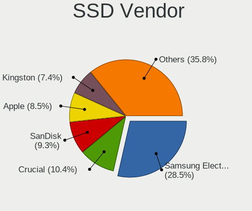

| Vendor              | Notebooks | Drives | Percent |
|---------------------|-----------|--------|---------|
| Samsung Electronics | 119       | 148    | 30.75%  |
| Crucial             | 39        | 55     | 10.08%  |
| Kingston            | 36        | 48     | 9.3%    |
| SanDisk             | 29        | 36     | 7.49%   |
| Apple               | 22        | 22     | 5.68%   |
| WDC                 | 19        | 24     | 4.91%   |
| Intel               | 19        | 32     | 4.91%   |
| Toshiba             | 17        | 24     | 4.39%   |
| SK hynix            | 16        | 21     | 4.13%   |
| Micron Technology   | 11        | 11     | 2.84%   |
| LITEON              | 9         | 11     | 2.33%   |
| LITEONIT            | 6         | 8      | 1.55%   |
| A-DATA Technology   | 6         | 8      | 1.55%   |
| OCZ                 | 5         | 7      | 1.29%   |
| SPCC                | 4         | 5      | 1.03%   |
| Transcend           | 3         | 4      | 0.78%   |
| Seagate             | 3         | 4      | 0.78%   |
| TO Exter            | 2         | 2      | 0.52%   |
| Plextor             | 2         | 6      | 0.52%   |
| Patriot             | 2         | 2      | 0.52%   |
| OWC                 | 2         | 3      | 0.52%   |
| KingSpec            | 2         | 4      | 0.52%   |
| China               | 2         | 2      | 0.52%   |
| SAMSWEET            | 1         | 1      | 0.26%   |
| Mushkin             | 1         | 1      | 0.26%   |
| Kston               | 1         | 1      | 0.26%   |
| KingFast            | 1         | 1      | 0.26%   |
| KingDian            | 1         | 1      | 0.26%   |
| Gigabyte Technology | 1         | 1      | 0.26%   |
| FORESEE             | 1         | 1      | 0.26%   |
| Drevo               | 1         | 1      | 0.26%   |
| Corsair             | 1         | 1      | 0.26%   |
| Colorful            | 1         | 1      | 0.26%   |
| BP4e                | 1         | 2      | 0.26%   |
| BIWIN               | 1         | 1      | 0.26%   |

Drive Kind
----------

HDD or SSD

| Kind    | Notebooks | Drives | Percent |
|---------|-----------|--------|---------|
| HDD     | 421       | 643    | 36.93%  |
| SSD     | 365       | 500    | 32.02%  |
| NVMe    | 285       | 392    | 25%     |
| MMC     | 56        | 74     | 4.91%   |
| Unknown | 13        | 14     | 1.14%   |

Drive Connector
---------------

SATA, SAS, NVMe, etc.

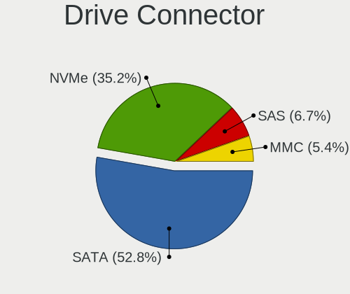

| Type | Notebooks | Drives | Percent |
|------|-----------|--------|---------|
| SATA | 694       | 1070   | 63.32%  |
| NVMe | 285       | 389    | 26%     |
| SAS  | 61        | 90     | 5.57%   |
| MMC  | 56        | 74     | 5.11%   |

Drive Size
----------

Size of hard drive

| Size in TB | Notebooks | Drives | Percent |
|------------|-----------|--------|---------|
| 0.01-0.5   | 502       | 720    | 64.11%  |
| 0.51-1.0   | 223       | 330    | 28.48%  |
| 1.01-2.0   | 44        | 72     | 5.62%   |
| 3.01-4.0   | 9         | 11     | 1.15%   |
| 4.01-10.0  | 4         | 8      | 0.51%   |
| 2.01-3.0   | 1         | 2      | 0.13%   |

Space Total
-----------

Amount of disk space available on the file system

| Size in GB     | Notebooks | Percent |
|----------------|-----------|---------|
| 101-250        | 278       | 26.55%  |
| 251-500        | 271       | 25.88%  |
| 501-1000       | 170       | 16.24%  |
| 51-100         | 83        | 7.93%   |
| 1-20           | 79        | 7.55%   |
| 1001-2000      | 70        | 6.69%   |
| 21-50          | 29        | 2.77%   |
| More than 3000 | 24        | 2.29%   |
| 2001-3000      | 22        | 2.1%    |
| Unknown        | 21        | 2.01%   |

Space Used
----------

Amount of used disk space

| Used GB        | Notebooks | Percent |
|----------------|-----------|---------|
| 1-20           | 470       | 42.3%   |
| 21-50          | 203       | 18.27%  |
| 101-250        | 128       | 11.52%  |
| 51-100         | 122       | 10.98%  |
| 251-500        | 81        | 7.29%   |
| 501-1000       | 48        | 4.32%   |
| 1001-2000      | 23        | 2.07%   |
| Unknown        | 21        | 1.89%   |
| More than 3000 | 9         | 0.81%   |
| 2001-3000      | 6         | 0.54%   |

Malfunc. Drives
---------------

Drive models with a malfunction

| Model                                   | Notebooks | Drives | Percent |
|-----------------------------------------|-----------|--------|---------|
| Seagate ST1000LM024 HN-M101MBB 1TB      | 3         | 4      | 6.25%   |
| Seagate ST9500325AS 500GB               | 2         | 2      | 4.17%   |
| Seagate ST500LM021-1KJ152 500GB         | 2         | 2      | 4.17%   |
| HGST HTS545050A7E680 500GB              | 2         | 3      | 4.17%   |
| WDC WD5000BEVT-60ZAT1 500GB             | 1         | 3      | 2.08%   |
| WDC WD2500BEVT-35A23T0 250GB            | 1         | 1      | 2.08%   |
| WDC WD10SPZX-21Z10T0 1TB                | 1         | 2      | 2.08%   |
| WDC WD10JPVX-22JC3T0 1TB                | 1         | 2      | 2.08%   |
| Toshiba THNSNK128GCS8 SATA 128GB SSD    | 1         | 1      | 2.08%   |
| Toshiba MQ01ABF050 500GB                | 1         | 1      | 2.08%   |
| Toshiba MQ01ABD100 1TB                  | 1         | 1      | 2.08%   |
| Toshiba MK5055GSX 500GB                 | 1         | 4      | 2.08%   |
| Toshiba MK3265GSX 320GB                 | 1         | 1      | 2.08%   |
| Seagate ST9500423AS 500GB               | 1         | 2      | 2.08%   |
| Seagate ST9320423AS 320GB               | 1         | 2      | 2.08%   |
| Seagate ST9160821AS 160GB               | 1         | 4      | 2.08%   |
| Seagate ST9160310AS 160GB               | 1         | 1      | 2.08%   |
| Seagate ST500LT012-9WS142 500GB         | 1         | 2      | 2.08%   |
| Seagate ST500LT012-1DG142 500GB         | 1         | 1      | 2.08%   |
| Seagate ST500LM000-1EJ162 500GB         | 1         | 2      | 2.08%   |
| Samsung Electronics SSD 970 EVO 2TB     | 1         | 1      | 2.08%   |
| Samsung Electronics SSD 850 EVO 1TB     | 1         | 1      | 2.08%   |
| Samsung Electronics SSD 750 EVO 250GB   | 1         | 1      | 2.08%   |
| Samsung Electronics PM961 NVMe 512GB    | 1         | 1      | 2.08%   |
| Samsung Electronics HM641JI 640GB       | 1         | 1      | 2.08%   |
| Kingston SV300S37A240G 240GB SSD        | 1         | 1      | 2.08%   |
| Kingston RBU-SNS8350DES3128GP 128GB SSD | 1         | 1      | 2.08%   |
| KingSpec PA25-128 128GB SSD             | 1         | 3      | 2.08%   |
| Hitachi HTS725050A7E630 500GB           | 1         | 1      | 2.08%   |
| Hitachi HTS547564A9E384 640GB           | 1         | 1      | 2.08%   |
| Hitachi HTS547550A9E384 500GB           | 1         | 1      | 2.08%   |
| Hitachi HTS543216A7A384 160GB           | 1         | 1      | 2.08%   |
| Hitachi HTS542525K9SA00 250GB           | 1         | 1      | 2.08%   |
| Hitachi HTS541680J9SA00 80GB            | 1         | 1      | 2.08%   |
| HGST HTS725050A7E630 500GB              | 1         | 1      | 2.08%   |
| HGST HTS541075A9E680 752GB              | 1         | 1      | 2.08%   |
| Fujitsu MJA2250BH FFS G1 250GB          | 1         | 1      | 2.08%   |
| Fujitsu MHZ2250BH G1 250GB              | 1         | 1      | 2.08%   |
| Fujitsu MHY2120BH 120GB                 | 1         | 1      | 2.08%   |
| Crucial M4-CT256M4SSD2 256GB            | 1         | 1      | 2.08%   |
| Crucial CT1000MX500SSD1 1TB             | 1         | 1      | 2.08%   |
| Apple SSD SM256C 256GB                  | 1         | 1      | 2.08%   |
| A-DATA Technology SP900NS38 256GB SSD   | 1         | 1      | 2.08%   |

Malfunc. Drive Vendor
---------------------

Vendors of faulty drives

| Vendor              | Notebooks | Drives | Percent |
|---------------------|-----------|--------|---------|
| Seagate             | 14        | 22     | 29.17%  |
| Hitachi             | 6         | 6      | 12.5%   |
| Toshiba             | 5         | 8      | 10.42%  |
| Samsung Electronics | 5         | 5      | 10.42%  |
| WDC                 | 4         | 8      | 8.33%   |
| HGST                | 4         | 5      | 8.33%   |
| Fujitsu             | 3         | 3      | 6.25%   |
| Kingston            | 2         | 2      | 4.17%   |
| Crucial             | 2         | 2      | 4.17%   |
| KingSpec            | 1         | 3      | 2.08%   |
| Apple               | 1         | 1      | 2.08%   |
| A-DATA Technology   | 1         | 1      | 2.08%   |

Malfunc. HDD Vendor
-------------------

Vendors of faulty HDD drives

| Vendor              | Notebooks | Drives | Percent |
|---------------------|-----------|--------|---------|
| Seagate             | 14        | 22     | 38.89%  |
| Hitachi             | 6         | 6      | 16.67%  |
| WDC                 | 4         | 8      | 11.11%  |
| Toshiba             | 4         | 7      | 11.11%  |
| HGST                | 4         | 5      | 11.11%  |
| Fujitsu             | 3         | 3      | 8.33%   |
| Samsung Electronics | 1         | 1      | 2.78%   |

Malfunc. Drive Kind
-------------------

Kinds of faulty drives

| Kind | Notebooks | Drives | Percent |
|------|-----------|--------|---------|
| HDD  | 35        | 52     | 74.47%  |
| SSD  | 10        | 12     | 21.28%  |
| NVMe | 2         | 2      | 4.26%   |

Failed Drives
-------------

Failed drive models

Zero info for selected period =(

Failed Drive Vendor
-------------------

Failed drive vendors

Zero info for selected period =(

Drive Status
------------

Number of failed and malfunc. drives

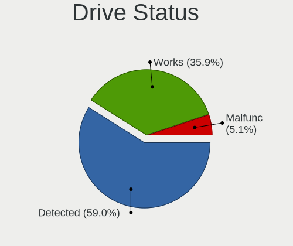

| Status   | Notebooks | Drives | Percent |
|----------|-----------|--------|---------|
| Detected | 671       | 1095   | 66.04%  |
| Works    | 298       | 462    | 29.33%  |
| Malfunc  | 47        | 66     | 4.63%   |

Storage controller
------------------

Storage Vendor
--------------

Storage controller vendors

| Vendor                           | Notebooks | Percent |
|----------------------------------|-----------|---------|
| Intel                            | 713       | 63.77%  |
| Samsung Electronics              | 106       | 9.48%   |
| AMD                              | 97        | 8.68%   |
| SanDisk                          | 41        | 3.67%   |
| SK hynix                         | 29        | 2.59%   |
| Toshiba America Info Systems     | 27        | 2.42%   |
| Phison Electronics               | 14        | 1.25%   |
| Kingston Technology Company      | 14        | 1.25%   |
| Micron Technology                | 13        | 1.16%   |
| KIOXIA                           | 13        | 1.16%   |
| Nvidia                           | 12        | 1.07%   |
| Micron/Crucial Technology        | 6         | 0.54%   |
| Apple                            | 6         | 0.54%   |
| ADATA Technology                 | 5         | 0.45%   |
| Lite-On Technology               | 4         | 0.36%   |
| Marvell Technology Group         | 3         | 0.27%   |
| Union Memory (Shenzhen)          | 2         | 0.18%   |
| Solid State Storage Technology   | 2         | 0.18%   |
| Silicon Motion                   | 2         | 0.18%   |
| Silicon Integrated Systems [SiS] | 2         | 0.18%   |
| Realtek Semiconductor            | 2         | 0.18%   |
| Lenovo                           | 2         | 0.18%   |
| ULi Electronics                  | 1         | 0.09%   |
| Shenzhen Longsys Electronics     | 1         | 0.09%   |
| JMicron Technology               | 1         | 0.09%   |

Storage Model
-------------

Storage controller models

| Model                                                                                  | Notebooks | Percent |
|----------------------------------------------------------------------------------------|-----------|---------|
| AMD FCH SATA Controller [AHCI mode]                                                    | 83        | 6.94%   |
| Intel 7 Series Chipset Family 6-port SATA Controller [AHCI mode]                       | 80        | 6.69%   |
| Intel 82801 Mobile SATA Controller [RAID mode]                                         | 77        | 6.44%   |
| Intel Sunrise Point-LP SATA Controller [AHCI mode]                                     | 72        | 6.02%   |
| Intel 6 Series/C200 Series Chipset Family 6 port Mobile SATA AHCI Controller           | 69        | 5.77%   |
| Samsung NVMe SSD Controller SM981/PM981/PM983                                          | 61        | 5.1%    |
| Intel Cannon Lake Mobile PCH SATA AHCI Controller                                      | 43        | 3.6%    |
| Intel 8 Series SATA Controller 1 [AHCI mode]                                           | 37        | 3.09%   |
| Intel 5 Series/3400 Series Chipset 4 port SATA AHCI Controller                         | 37        | 3.09%   |
| Intel 8 Series/C220 Series Chipset Family 6-port SATA Controller 1 [AHCI mode]         | 36        | 3.01%   |
| Intel 82801IBM/IEM (ICH9M/ICH9M-E) 4 port SATA Controller [AHCI mode]                  | 30        | 2.51%   |
| Intel Wildcat Point-LP SATA Controller [AHCI Mode]                                     | 28        | 2.34%   |
| Intel 5 Series/3400 Series Chipset 6 port SATA AHCI Controller                         | 21        | 1.76%   |
| Intel HM170/QM170 Chipset SATA Controller [AHCI Mode]                                  | 20        | 1.67%   |
| Intel Volume Management Device NVMe RAID Controller                                    | 19        | 1.59%   |
| Intel 400 Series Chipset Family SATA AHCI Controller                                   | 15        | 1.25%   |
| Samsung NVMe SSD Controller 980                                                        | 14        | 1.17%   |
| Intel SSD 660P Series                                                                  | 14        | 1.17%   |
| Intel Cannon Point-LP SATA Controller [AHCI Mode]                                      | 14        | 1.17%   |
| Intel 82801HM/HEM (ICH8M/ICH8M-E) IDE Controller                                       | 14        | 1.17%   |
| Samsung NVMe SSD Controller SM961/PM961/SM963                                          | 13        | 1.09%   |
| Micron Non-Volatile memory controller                                                  | 13        | 1.09%   |
| KIOXIA Non-Volatile memory controller                                                  | 13        | 1.09%   |
| Intel 82801HM/HEM (ICH8M/ICH8M-E) SATA Controller [AHCI mode]                          | 13        | 1.09%   |
| Intel Atom Processor E3800 Series SATA AHCI Controller                                 | 12        | 1%      |
| Intel Comet Lake SATA AHCI Controller                                                  | 11        | 0.92%   |
| AMD SB7x0/SB8x0/SB9x0 SATA Controller [AHCI mode]                                      | 11        | 0.92%   |
| SanDisk WD Blue SN500 / PC SN520 NVMe SSD                                              | 10        | 0.84%   |
| SanDisk WD Black SN750 / PC SN730 NVMe SSD                                             | 10        | 0.84%   |
| SanDisk WD Black 2018/SN750 / PC SN720 NVMe SSD                                        | 9         | 0.75%   |
| Toshiba America Info Systems Toshiba America Info Non-Volatile memory controller       | 8         | 0.67%   |
| Phison E12 NVMe Controller                                                             | 8         | 0.67%   |
| Intel SSD Pro 7600p/760p/E 6100p Series                                                | 8         | 0.67%   |
| Intel Atom/Celeron/Pentium Processor x5-E8000/J3xxx/N3xxx Series SATA Controller       | 8         | 0.67%   |
| Intel 82801GBM/GHM (ICH7-M Family) SATA Controller [IDE mode]                          | 8         | 0.67%   |
| Intel 82801G (ICH7 Family) IDE Controller                                              | 8         | 0.67%   |
| Intel 6 Series/C200 Series Chipset Family Mobile SATA Controller (IDE mode, ports 4-5) | 8         | 0.67%   |
| Intel 6 Series/C200 Series Chipset Family Mobile SATA Controller (IDE mode, ports 0-3) | 8         | 0.67%   |
| Toshiba America Info Systems XG6 NVMe SSD Controller                                   | 7         | 0.59%   |
| Toshiba America Info Systems BG3 NVMe SSD Controller                                   | 7         | 0.59%   |
| Samsung NVMe SSD Controller PM9A1/PM9A3/980PRO                                         | 7         | 0.59%   |
| Intel Celeron N3350/Pentium N4200/Atom E3900 Series SATA AHCI Controller               | 7         | 0.59%   |
| SK hynix Non-Volatile memory controller                                                | 6         | 0.5%    |
| SK hynix Gold P31 SSD                                                                  | 6         | 0.5%    |
| Nvidia MCP89 SATA Controller (AHCI mode)                                               | 6         | 0.5%    |
| Kingston Company U-SNS8154P3 NVMe SSD                                                  | 6         | 0.5%    |
| SK hynix PC401 NVMe Solid State Drive 256GB                                            | 5         | 0.42%   |
| SK hynix BC511                                                                         | 5         | 0.42%   |
| SK hynix BC501 NVMe Solid State Drive                                                  | 5         | 0.42%   |
| SanDisk WD Blue SN550 NVMe SSD                                                         | 5         | 0.42%   |
| Samsung Electronics SATA controller                                                    | 5         | 0.42%   |
| Phison PS5013 E13 NVMe Controller                                                      | 5         | 0.42%   |
| Nvidia MCP79 AHCI Controller                                                           | 5         | 0.42%   |
| Intel Tiger Lake-LP SATA Controller [AHCI mode]                                        | 5         | 0.42%   |
| Intel SSD 600P Series                                                                  | 5         | 0.42%   |
| Intel Q170/Q150/B150/H170/H110/Z170/CM236 Chipset SATA Controller [AHCI Mode]          | 5         | 0.42%   |
| Samsung NVMe SSD Controller SM951/PM951                                                | 4         | 0.33%   |
| Micron/Crucial NVMe Controller                                                         | 4         | 0.33%   |
| Kingston Company A2000 NVMe SSD                                                        | 4         | 0.33%   |
| Intel 82801IBM/IEM (ICH9M/ICH9M-E) 2 port SATA Controller [IDE mode]                   | 4         | 0.33%   |

Storage Kind
------------

Kind of storage controller (IDE, SATA, NVMe, SAS, ...)

| Kind | Notebooks | Percent |
|------|-----------|---------|
| SATA | 697       | 60.56%  |
| NVMe | 288       | 25.02%  |
| RAID | 100       | 8.69%   |
| IDE  | 66        | 5.73%   |

Processor
---------

CPU Vendor
----------

Processor vendors

| Vendor | Notebooks | Percent |
|--------|-----------|---------|
| Intel  | 845       | 86.76%  |
| AMD    | 127       | 13.04%  |
| ARM    | 2         | 0.21%   |

CPU Model
---------

Processor models

| Model                                   | Notebooks | Percent |
|-----------------------------------------|-----------|---------|
| Intel Core i7-9750H CPU @ 2.60GHz       | 26        | 2.67%   |
| Intel Core i7-8550U CPU @ 1.80GHz       | 22        | 2.26%   |
| Intel Core i7-10750H CPU @ 2.60GHz      | 18        | 1.85%   |
| Intel Core i7-7700HQ CPU @ 2.80GHz      | 16        | 1.64%   |
| Intel Core i7-10510U CPU @ 1.80GHz      | 15        | 1.54%   |
| Intel Core i5-6200U CPU @ 2.30GHz       | 15        | 1.54%   |
| Intel Core i5-8265U CPU @ 1.60GHz       | 14        | 1.44%   |
| Intel Core i7-6500U CPU @ 2.50GHz       | 13        | 1.33%   |
| Intel Core i7-4700MQ CPU @ 2.40GHz      | 13        | 1.33%   |
| Intel Core i5-2520M CPU @ 2.50GHz       | 12        | 1.23%   |
| Intel Core i7-8750H CPU @ 2.20GHz       | 11        | 1.13%   |
| Intel Core i7-8650U CPU @ 1.90GHz       | 11        | 1.13%   |
| Intel Core i5-8250U CPU @ 1.60GHz       | 11        | 1.13%   |
| Intel Core i5-7200U CPU @ 2.50GHz       | 11        | 1.13%   |
| Intel Core i5-6300U CPU @ 2.40GHz       | 11        | 1.13%   |
| Intel Core i7-8565U CPU @ 1.80GHz       | 10        | 1.03%   |
| Intel Core i5-5200U CPU @ 2.20GHz       | 10        | 1.03%   |
| Intel 11th Gen Core i7-1165G7 @ 2.80GHz | 10        | 1.03%   |
| Intel Core i7-6700HQ CPU @ 2.60GHz      | 9         | 0.92%   |
| Intel Core i7-3610QM CPU @ 2.30GHz      | 9         | 0.92%   |
| Intel Core i7-2630QM CPU @ 2.00GHz      | 9         | 0.92%   |
| Intel Core i7 CPU Q 720 @ 1.60GHz       | 9         | 0.92%   |
| Intel Core i5-4200U CPU @ 1.60GHz       | 9         | 0.92%   |
| Intel Core 2 Duo CPU P8700 @ 2.53GHz    | 9         | 0.92%   |
| Intel Core i7-4510U CPU @ 2.00GHz       | 8         | 0.82%   |
| Intel Core i7-3740QM CPU @ 2.70GHz      | 8         | 0.82%   |
| Intel Core i5-10210U CPU @ 1.60GHz      | 8         | 0.82%   |
| Intel Core i7-8850H CPU @ 2.60GHz       | 7         | 0.72%   |
| Intel Core i7-7500U CPU @ 2.70GHz       | 7         | 0.72%   |
| Intel Core i7-6600U CPU @ 2.60GHz       | 7         | 0.72%   |
| Intel Core i7-2670QM CPU @ 2.20GHz      | 7         | 0.72%   |
| Intel Core i5-4210U CPU @ 1.70GHz       | 7         | 0.72%   |
| Intel Core i5-3210M CPU @ 2.50GHz       | 7         | 0.72%   |
| Intel Core i5-2450M CPU @ 2.50GHz       | 7         | 0.72%   |
| Intel Core i5 CPU M 430 @ 2.27GHz       | 7         | 0.72%   |
| Intel Core i3-2310M CPU @ 2.10GHz       | 7         | 0.72%   |
| Intel 11th Gen Core i5-1135G7 @ 2.40GHz | 7         | 0.72%   |
| Intel Core i7-5500U CPU @ 2.40GHz       | 6         | 0.62%   |
| Intel Core i7-3632QM CPU @ 2.20GHz      | 6         | 0.62%   |
| Intel Core i7-3630QM CPU @ 2.40GHz      | 6         | 0.62%   |
| Intel Core i7-1065G7 CPU @ 1.30GHz      | 6         | 0.62%   |
| Intel Core i5-5300U CPU @ 2.30GHz       | 6         | 0.62%   |
| Intel Core i5 CPU M 540 @ 2.53GHz       | 6         | 0.62%   |
| Intel Core i3 CPU M 370 @ 2.40GHz       | 6         | 0.62%   |
| Intel Core 2 Duo CPU P8600 @ 2.40GHz    | 6         | 0.62%   |
| Intel Pentium CPU N3700 @ 1.60GHz       | 5         | 0.51%   |
| Intel Core i7-4720HQ CPU @ 2.60GHz      | 5         | 0.51%   |
| Intel Core i7-4500U CPU @ 1.80GHz       | 5         | 0.51%   |
| Intel Core i7-3720QM CPU @ 2.60GHz      | 5         | 0.51%   |
| Intel Core i7-10875H CPU @ 2.30GHz      | 5         | 0.51%   |
| Intel Core i5-9300H CPU @ 2.40GHz       | 5         | 0.51%   |
| Intel Core i5-2540M CPU @ 2.60GHz       | 5         | 0.51%   |
| Intel Core i5-2430M CPU @ 2.40GHz       | 5         | 0.51%   |
| Intel Core i5-2410M CPU @ 2.30GHz       | 5         | 0.51%   |
| Intel Core i5 CPU M 520 @ 2.40GHz       | 5         | 0.51%   |
| Intel Core i5 CPU M 480 @ 2.67GHz       | 5         | 0.51%   |
| Intel Core i3 CPU M 330 @ 2.13GHz       | 5         | 0.51%   |
| Intel Celeron N4020 CPU @ 1.10GHz       | 5         | 0.51%   |
| Intel Celeron CPU N3350 @ 1.10GHz       | 5         | 0.51%   |
| Intel 11th Gen Core i7-11800H @ 2.30GHz | 5         | 0.51%   |

CPU Model Family
----------------

Processor model prefix

| Model                          | Notebooks | Percent |
|--------------------------------|-----------|---------|
| Intel Core i7                  | 352       | 36.1%   |
| Intel Core i5                  | 241       | 24.72%  |
| Intel Core 2 Duo               | 49        | 5.03%   |
| Other                          | 47        | 4.82%   |
| Intel Core i3                  | 46        | 4.72%   |
| Intel Celeron                  | 36        | 3.69%   |
| Intel Pentium                  | 21        | 2.15%   |
| AMD Ryzen 5                    | 19        | 1.95%   |
| AMD Ryzen 7                    | 18        | 1.85%   |
| AMD A6                         | 16        | 1.64%   |
| AMD A4                         | 14        | 1.44%   |
| Intel Atom                     | 13        | 1.33%   |
| AMD E2                         | 7         | 0.72%   |
| Intel Pentium Dual-Core        | 6         | 0.62%   |
| Intel Core 2                   | 6         | 0.62%   |
| AMD E1                         | 6         | 0.62%   |
| AMD A8                         | 6         | 0.62%   |
| AMD A10                        | 6         | 0.62%   |
| Intel Genuine                  | 5         | 0.51%   |
| Intel Core i9                  | 5         | 0.51%   |
| AMD Ryzen 7 PRO                | 5         | 0.51%   |
| Intel Xeon                     | 4         | 0.41%   |
| Intel Core m3                  | 4         | 0.41%   |
| Intel Core M                   | 4         | 0.41%   |
| Intel Celeron Dual-Core        | 4         | 0.41%   |
| AMD Ryzen 9                    | 4         | 0.41%   |
| AMD E                          | 4         | 0.41%   |
| Intel Pentium Dual             | 2         | 0.21%   |
| Intel Core m7                  | 2         | 0.21%   |
| Intel Core Duo                 | 2         | 0.21%   |
| Intel Celeron M                | 2         | 0.21%   |
| AMD V120                       | 2         | 0.21%   |
| AMD Ryzen 3                    | 2         | 0.21%   |
| AMD FX                         | 2         | 0.21%   |
| AMD A12                        | 2         | 0.21%   |
| Intel Pentium M                | 1         | 0.1%    |
| Intel Mobile Pentium 4         | 1         | 0.1%    |
| Intel Core m5                  | 1         | 0.1%    |
| AMD V140                       | 1         | 0.1%    |
| AMD Turion X2 Dual-Core Mobile | 1         | 0.1%    |
| AMD Turion 64 Mobile           | 1         | 0.1%    |
| AMD Sempron                    | 1         | 0.1%    |
| AMD Phenom II                  | 1         | 0.1%    |
| AMD Athlon II Dual-Core        | 1         | 0.1%    |
| AMD Athlon II                  | 1         | 0.1%    |
| AMD Athlon                     | 1         | 0.1%    |

CPU Cores
---------

Number of processor cores

| Number | Notebooks | Percent |
|--------|-----------|---------|
| 2      | 477       | 48.97%  |
| 4      | 347       | 35.63%  |
| 6      | 81        | 8.32%   |
| 8      | 39        | 4%      |
| 1      | 27        | 2.77%   |
| 14     | 2         | 0.21%   |
| 10     | 1         | 0.1%    |

CPU Sockets
-----------

Number of sockets

| Number | Notebooks | Percent |
|--------|-----------|---------|
| 1      | 972       | 99.79%  |
| 2      | 2         | 0.21%   |

CPU Threads
-----------

Threads per core (Hyper-Threading)

| Number | Notebooks | Percent |
|--------|-----------|---------|
| 2      | 758       | 77.74%  |
| 1      | 216       | 22.15%  |
| 4      | 1         | 0.1%    |

CPU Op-Modes
------------

CPU Operation Modes (32-bit, 64-bit)

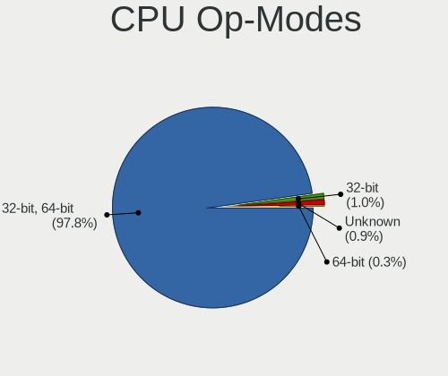

| Op mode        | Notebooks | Percent |
|----------------|-----------|---------|
| 32-bit, 64-bit | 951       | 96.84%  |
| 32-bit         | 15        | 1.53%   |
| Unknown        | 15        | 1.53%   |
| 64-bit         | 1         | 0.1%    |

CPU Microcode
-------------

Microcode number

| Number     | Notebooks | Percent |
|------------|-----------|---------|
| Unknown    | 231       | 22.78%  |
| 0x206a7    | 73        | 7.2%    |
| 0x306a9    | 67        | 6.61%   |
| 0x906ea    | 43        | 4.24%   |
| 0x40651    | 40        | 3.94%   |
| 0x406e3    | 38        | 3.75%   |
| 0x1067a    | 35        | 3.45%   |
| 0x806ec    | 33        | 3.25%   |
| 0x806ea    | 33        | 3.25%   |
| 0x306d4    | 31        | 3.06%   |
| 0x306c3    | 31        | 3.06%   |
| 0x20655    | 29        | 2.86%   |
| 0x806e9    | 22        | 2.17%   |
| 0x806c1    | 19        | 1.87%   |
| 0xa0652    | 18        | 1.78%   |
| 0x906e9    | 17        | 1.68%   |
| 0x20652    | 17        | 1.68%   |
| 0x806eb    | 13        | 1.28%   |
| 0x30678    | 12        | 1.18%   |
| 0x506e3    | 11        | 1.08%   |
| 0x07030105 | 11        | 1.08%   |
| 0x0700010f | 11        | 1.08%   |
| 0x106e5    | 10        | 0.99%   |
| 0x06006705 | 10        | 0.99%   |
| 0x706e5    | 8         | 0.79%   |
| 0x10676    | 8         | 0.79%   |
| 0x0a50000c | 8         | 0.79%   |
| 0x08108102 | 8         | 0.79%   |
| 0x806d1    | 7         | 0.69%   |
| 0x406c3    | 7         | 0.69%   |
| 0x06001119 | 7         | 0.69%   |
| 0x6fd      | 6         | 0.59%   |
| 0x6f6      | 6         | 0.59%   |
| 0x406c4    | 6         | 0.59%   |
| 0x08108109 | 6         | 0.59%   |
| 0x506c9    | 5         | 0.49%   |
| 0x03000027 | 5         | 0.49%   |
| 0x906ed    | 4         | 0.39%   |
| 0x08608103 | 4         | 0.39%   |
| 0x08600106 | 4         | 0.39%   |
| 0x08600103 | 4         | 0.39%   |
| 0x05000119 | 4         | 0.39%   |
| 0x010000c8 | 4         | 0.39%   |
| 0x6e8      | 3         | 0.3%    |
| 0x6d8      | 3         | 0.3%    |
| 0x106ca    | 3         | 0.3%    |
| 0x106c2    | 3         | 0.3%    |
| 0x06006704 | 3         | 0.3%    |
| 0x906c0    | 2         | 0.2%    |
| 0x906a3    | 2         | 0.2%    |
| 0x6fb      | 2         | 0.2%    |
| 0x6ec      | 2         | 0.2%    |
| 0x40661    | 2         | 0.2%    |
| 0x30673    | 2         | 0.2%    |
| 0x0810100b | 2         | 0.2%    |
| 0x07030104 | 2         | 0.2%    |
| 0x0600611a | 2         | 0.2%    |
| 0xf27      | 1         | 0.1%    |
| 0x906a4    | 1         | 0.1%    |
| 0x706a8    | 1         | 0.1%    |

CPU Microarch
-------------

Microarchitecture

| Name             | Notebooks | Percent |
|------------------|-----------|---------|
| KabyLake         | 203       | 20.82%  |
| Haswell          | 90        | 9.23%   |
| SandyBridge      | 89        | 9.13%   |
| IvyBridge        | 86        | 8.82%   |
| Skylake          | 65        | 6.67%   |
| Westmere         | 54        | 5.54%   |
| Penryn           | 54        | 5.54%   |
| Broadwell        | 35        | 3.59%   |
| CometLake        | 31        | 3.18%   |
| Silvermont       | 28        | 2.87%   |
| TigerLake        | 25        | 2.56%   |
| Icelake          | 19        | 1.95%   |
| Excavator        | 19        | 1.95%   |
| Core             | 17        | 1.74%   |
| Zen+             | 15        | 1.54%   |
| Puma             | 15        | 1.54%   |
| Zen 2            | 12        | 1.23%   |
| Unknown          | 12        | 1.23%   |
| Zen 3            | 11        | 1.13%   |
| Nehalem          | 11        | 1.13%   |
| Jaguar           | 11        | 1.13%   |
| Piledriver       | 9         | 0.92%   |
| P6               | 9         | 0.92%   |
| Goldmont plus    | 7         | 0.72%   |
| Goldmont         | 7         | 0.72%   |
| Bonnell          | 7         | 0.72%   |
| Zen              | 6         | 0.62%   |
| K10 Llano        | 6         | 0.62%   |
| K10              | 6         | 0.62%   |
| Bobcat           | 5         | 0.51%   |
| Steamroller      | 3         | 0.31%   |
| Tremont          | 2         | 0.21%   |
| K8 & K10 hybrid  | 2         | 0.21%   |
| Alderlake Hybrid | 2         | 0.21%   |
| NetBurst         | 1         | 0.1%    |
| K8 Hammer        | 1         | 0.1%    |

Graphics
--------

GPU Vendor
----------

Vendors of graphics cards

| Vendor                           | Notebooks | Percent |
|----------------------------------|-----------|---------|
| Intel                            | 732       | 57.32%  |
| Nvidia                           | 332       | 26%     |
| AMD                              | 209       | 16.37%  |
| Silicon Integrated Systems [SiS] | 2         | 0.16%   |
| Neomagic                         | 2         | 0.16%   |

GPU Model
---------

Graphics card models

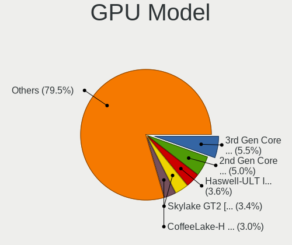

| Model                                                                                    | Notebooks | Percent |
|------------------------------------------------------------------------------------------|-----------|---------|
| Intel 2nd Generation Core Processor Family Integrated Graphics Controller                | 79        | 5.96%   |
| Intel 3rd Gen Core processor Graphics Controller                                         | 73        | 5.51%   |
| Intel CoffeeLake-H GT2 [UHD Graphics 630]                                                | 49        | 3.7%    |
| Intel Skylake GT2 [HD Graphics 520]                                                      | 47        | 3.55%   |
| Intel Haswell-ULT Integrated Graphics Controller                                         | 46        | 3.47%   |
| Intel UHD Graphics 620                                                                   | 44        | 3.32%   |
| Intel 4th Gen Core Processor Integrated Graphics Controller                              | 39        | 2.94%   |
| Intel Core Processor Integrated Graphics Controller                                      | 38        | 2.87%   |
| Intel CometLake-H GT2 [UHD Graphics]                                                     | 29        | 2.19%   |
| Intel WhiskeyLake-U GT2 [UHD Graphics 620]                                               | 26        | 1.96%   |
| Intel Mobile 4 Series Chipset Integrated Graphics Controller                             | 26        | 1.96%   |
| Intel HD Graphics 5500                                                                   | 26        | 1.96%   |
| Intel CometLake-U GT2 [UHD Graphics]                                                     | 26        | 1.96%   |
| Intel TigerLake-LP GT2 [Iris Xe Graphics]                                                | 23        | 1.74%   |
| Intel HD Graphics 620                                                                    | 23        | 1.74%   |
| Intel HD Graphics 630                                                                    | 17        | 1.28%   |
| AMD Topaz XT [Radeon R7 M260/M265 / M340/M360 / M440/M445 / 530/535 / 620/625 Mobile]    | 17        | 1.28%   |
| AMD Picasso/Raven 2 [Radeon Vega Series / Radeon Vega Mobile Series]                     | 16        | 1.21%   |
| AMD Stoney [Radeon R2/R3/R4/R5 Graphics]                                                 | 15        | 1.13%   |
| Intel Atom/Celeron/Pentium Processor x5-E8000/J3xxx/N3xxx Integrated Graphics Controller | 14        | 1.06%   |
| Intel Atom Processor Z36xxx/Z37xxx Series Graphics & Display                             | 14        | 1.06%   |
| Nvidia GK208M [GeForce GT 740M]                                                          | 13        | 0.98%   |
| Nvidia TU116M [GeForce GTX 1660 Ti Mobile]                                               | 12        | 0.91%   |
| AMD Thames [Radeon HD 7500M/7600M Series]                                                | 12        | 0.91%   |
| AMD Renoir                                                                               | 12        | 0.91%   |
| Nvidia GP107M [GeForce GTX 1050 Mobile]                                                  | 11        | 0.83%   |
| AMD Sun XT [Radeon HD 8670A/8670M/8690M / R5 M330 / M430 / Radeon 520 Mobile]            | 11        | 0.83%   |
| AMD Cezanne                                                                              | 11        | 0.83%   |
| Nvidia TU106M [GeForce RTX 2060 Mobile]                                                  | 10        | 0.75%   |
| Intel HD Graphics 530                                                                    | 10        | 0.75%   |
| Nvidia TU117M [GeForce GTX 1650 Mobile / Max-Q]                                          | 9         | 0.68%   |
| Nvidia GP107M [GeForce GTX 1050 Ti Mobile]                                               | 9         | 0.68%   |
| Nvidia GM108M [GeForce 840M]                                                             | 9         | 0.68%   |
| Nvidia GF117M [GeForce 610M/710M/810M/820M / GT 620M/625M/630M/720M]                     | 9         | 0.68%   |
| Nvidia TU117M [GeForce GTX 1650 Ti Mobile]                                               | 8         | 0.6%    |
| Nvidia GT216M [GeForce GT 330M]                                                          | 8         | 0.6%    |
| Nvidia GP108M [GeForce MX150]                                                            | 8         | 0.6%    |
| Nvidia GP106M [GeForce GTX 1060 Mobile]                                                  | 8         | 0.6%    |
| Intel TigerLake-H GT1 [UHD Graphics]                                                     | 8         | 0.6%    |
| Intel Mobile GM965/GL960 Integrated Graphics Controller (secondary)                      | 8         | 0.6%    |
| Intel Mobile GM965/GL960 Integrated Graphics Controller (primary)                        | 8         | 0.6%    |
| Intel Mobile 945GM/GMS/GME, 943/940GML Express Integrated Graphics Controller            | 8         | 0.6%    |
| Nvidia GM107M [GeForce GTX 960M]                                                         | 7         | 0.53%   |
| Nvidia GK107M [GeForce GT 650M Mac Edition]                                              | 7         | 0.53%   |
| Intel Iris Plus Graphics G7                                                              | 7         | 0.53%   |
| Intel GeminiLake [UHD Graphics 600]                                                      | 7         | 0.53%   |
| Nvidia TU117M                                                                            | 6         | 0.45%   |
| Nvidia TU117GLM [Quadro T2000 Mobile / Max-Q]                                            | 6         | 0.45%   |
| Nvidia TU117GLM [Quadro T1000 Mobile]                                                    | 6         | 0.45%   |
| Nvidia MCP89 [GeForce 320M]                                                              | 6         | 0.45%   |
| Nvidia GM108M [GeForce 940MX]                                                            | 6         | 0.45%   |
| Nvidia GF108M [GeForce GT 620M/630M/635M/640M LE]                                        | 6         | 0.45%   |
| Nvidia GA106M [GeForce RTX 3060 Mobile / Max-Q]                                          | 6         | 0.45%   |
| Intel HD Graphics 500                                                                    | 6         | 0.45%   |
| AMD Mullins [Radeon R4/R5 Graphics]                                                      | 6         | 0.45%   |
| AMD Mullins [Radeon R3 Graphics]                                                         | 6         | 0.45%   |
| Nvidia GP104BM [GeForce GTX 1070 Mobile]                                                 | 5         | 0.38%   |
| Nvidia GM107M [GeForce GTX 950M]                                                         | 5         | 0.38%   |
| Nvidia GF108M [GeForce GT 540M]                                                          | 5         | 0.38%   |
| Intel Iris Plus Graphics G1 (Ice Lake)                                                   | 5         | 0.38%   |

GPU Combo
---------

Combinations of graphics cards

| Name                     | Notebooks | Percent |
|--------------------------|-----------|---------|
| 1 x Intel                | 444       | 45.26%  |
| Intel + Nvidia           | 240       | 24.46%  |
| 1 x AMD                  | 119       | 12.13%  |
| 1 x Nvidia               | 80        | 8.15%   |
| Intel + AMD              | 44        | 4.49%   |
| 2 x AMD                  | 32        | 3.26%   |
| AMD + Nvidia             | 14        | 1.43%   |
| Other                    | 2         | 0.2%    |
| 1 x SiS                  | 2         | 0.2%    |
| 1 x Neomagic             | 2         | 0.2%    |
| Intel + AMD + 1 x Nvidia | 2         | 0.2%    |

GPU Driver
----------

Free vs proprietary

| Driver      | Notebooks | Percent |
|-------------|-----------|---------|
| Free        | 809       | 80.9%   |
| Proprietary | 158       | 15.8%   |
| Unknown     | 33        | 3.3%    |

GPU Memory
----------

Total video memory

| Size in GB | Notebooks | Percent |
|------------|-----------|---------|
| Unknown    | 588       | 58.45%  |
| 1.01-2.0   | 132       | 13.12%  |
| 0.01-0.5   | 111       | 11.03%  |
| 3.01-4.0   | 68        | 6.76%   |
| 0.51-1.0   | 64        | 6.36%   |
| 5.01-6.0   | 22        | 2.19%   |
| 7.01-8.0   | 13        | 1.29%   |
| 2.01-3.0   | 7         | 0.7%    |
| 8.01-16.0  | 1         | 0.1%    |

Monitor
-------

Monitor Vendor
--------------

Monitor vendors

| Vendor                  | Notebooks | Percent |
|-------------------------|-----------|---------|
| AU Optronics            | 223       | 19.77%  |
| LG Display              | 171       | 15.16%  |
| Chimei Innolux          | 128       | 11.35%  |
| Samsung Electronics     | 113       | 10.02%  |
| BOE                     | 92        | 8.16%   |
| Apple                   | 59        | 5.23%   |
| Sharp                   | 44        | 3.9%    |
| Chi Mei Optoelectronics | 36        | 3.19%   |
| Dell                    | 31        | 2.75%   |
| Lenovo                  | 26        | 2.3%    |
| Hewlett-Packard         | 21        | 1.86%   |
| Goldstar                | 17        | 1.51%   |
| Acer                    | 16        | 1.42%   |
| BenQ                    | 13        | 1.15%   |
| PANDA                   | 12        | 1.06%   |
| Philips                 | 11        | 0.98%   |
| Sony                    | 10        | 0.89%   |
| Ancor Communications    | 7         | 0.62%   |
| Toshiba                 | 6         | 0.53%   |
| LG Philips              | 6         | 0.53%   |
| CPT                     | 6         | 0.53%   |
| AOC                     | 6         | 0.53%   |
| ViewSonic               | 5         | 0.44%   |
| Panasonic               | 5         | 0.44%   |
| SAC                     | 4         | 0.35%   |
| LGD                     | 4         | 0.35%   |
| GKK                     | 4         | 0.35%   |
| eMachines               | 4         | 0.35%   |
| ASUSTek Computer        | 4         | 0.35%   |
| Unknown                 | 3         | 0.27%   |
| InnoLux Display         | 3         | 0.27%   |
| InfoVision              | 3         | 0.27%   |
| Hitachi                 | 3         | 0.27%   |
| HannStar                | 3         | 0.27%   |
| GDH                     | 3         | 0.27%   |
| Seiko/Epson             | 2         | 0.18%   |
| Lenovo Group Limited    | 2         | 0.18%   |
| Kogan                   | 2         | 0.18%   |
| CSO                     | 2         | 0.18%   |
| Yamaha                  | 1         | 0.09%   |
| Unknown (XXX)           | 1         | 0.09%   |
| TMX                     | 1         | 0.09%   |
| TCL                     | 1         | 0.09%   |
| SDC                     | 1         | 0.09%   |
| SANYO                   | 1         | 0.09%   |
| RTK                     | 1         | 0.09%   |
| Nvidia                  | 1         | 0.09%   |
| MSI                     | 1         | 0.09%   |
| MAT                     | 1         | 0.09%   |
| LPL                     | 1         | 0.09%   |
| Hisense                 | 1         | 0.09%   |
| HannStar Display        | 1         | 0.09%   |
| CVT                     | 1         | 0.09%   |
| CMN                     | 1         | 0.09%   |
| CHO                     | 1         | 0.09%   |
| BOE Technology Group    | 1         | 0.09%   |
| AGO                     | 1         | 0.09%   |

Monitor Model
-------------

Monitor models

| Model                                                                     | Notebooks | Percent |
|---------------------------------------------------------------------------|-----------|---------|
| LG Display LCD Monitor LGD02DC 1366x768 344x194mm 15.5-inch               | 15        | 1.31%   |
| Samsung Electronics LCD Monitor SEC5441 1366x768 344x194mm 15.5-inch      | 9         | 0.78%   |
| AU Optronics LCD Monitor AUO21ED 1920x1080 344x193mm 15.5-inch            | 9         | 0.78%   |
| Sharp LCD Monitor SHP148D 3840x2160 344x194mm 15.5-inch                   | 8         | 0.7%    |
| AU Optronics LCD Monitor AUO26EC 1366x768 344x193mm 15.5-inch             | 8         | 0.7%    |
| AU Optronics LCD Monitor AUO22EC 1366x768 344x193mm 15.5-inch             | 8         | 0.7%    |
| Chimei Innolux LCD Monitor CMN15AB 1366x768 344x194mm 15.5-inch           | 7         | 0.61%   |
| Chimei Innolux LCD Monitor CMN14D4 1920x1080 309x173mm 13.9-inch          | 6         | 0.52%   |
| Chi Mei Optoelectronics LCD Monitor CMO15A2 1366x768 344x193mm 15.5-inch  | 6         | 0.52%   |
| AU Optronics LCD Monitor AUO38ED 1920x1080 344x193mm 15.5-inch            | 6         | 0.52%   |
| Apple Color LCD APP9CC7 1280x800 286x179mm 13.3-inch                      | 6         | 0.52%   |
| Sharp LCD Monitor SHP1476 3840x2160 346x194mm 15.6-inch                   | 5         | 0.44%   |
| Samsung Electronics LCD Monitor SEC5541 1366x768 344x193mm 15.5-inch      | 5         | 0.44%   |
| LG Display LCD Monitor LGD02D8 1366x768 277x156mm 12.5-inch               | 5         | 0.44%   |
| Chimei Innolux LCD Monitor CMN15E7 1920x1080 344x193mm 15.5-inch          | 5         | 0.44%   |
| Chimei Innolux LCD Monitor CMN15DB 1366x768 344x193mm 15.5-inch           | 5         | 0.44%   |
| Chimei Innolux LCD Monitor CMN1514 1920x1080 344x193mm 15.5-inch          | 5         | 0.44%   |
| BOE LCD Monitor BOE07CE 1366x768 344x193mm 15.5-inch                      | 5         | 0.44%   |
| BOE LCD Monitor BOE0672 1366x768 344x194mm 15.5-inch                      | 5         | 0.44%   |
| Apple Color LCD APP9CDF 1440x900 286x179mm 13.3-inch                      | 5         | 0.44%   |
| PANDA LCD Monitor NCP004D 1920x1080 344x194mm 15.5-inch                   | 4         | 0.35%   |
| PANDA LCD Monitor NCP0036 1920x1080 344x194mm 15.5-inch                   | 4         | 0.35%   |
| LG Display LCD Monitor LGD0469 1920x1080 382x215mm 17.3-inch              | 4         | 0.35%   |
| LG Display LCD Monitor LGD033A 1366x768 344x194mm 15.5-inch               | 4         | 0.35%   |
| Lenovo LCD Monitor LEN40BA 1920x1080 344x194mm 15.5-inch                  | 4         | 0.35%   |
| eMachines E190HQV EMA0212 1280x1024 440x250mm 19.9-inch                   | 4         | 0.35%   |
| Chimei Innolux LCD Monitor CMN15BF 1366x768 344x194mm 15.5-inch           | 4         | 0.35%   |
| Chimei Innolux LCD Monitor CMN15BC 1366x768 344x193mm 15.5-inch           | 4         | 0.35%   |
| Chi Mei Optoelectronics LCD Monitor CMO15A7 1366x768 344x193mm 15.5-inch  | 4         | 0.35%   |
| AU Optronics LCD Monitor AUO70EC 1366x768 344x193mm 15.5-inch             | 4         | 0.35%   |
| AU Optronics LCD Monitor AUO46EC 1366x768 344x193mm 15.5-inch             | 4         | 0.35%   |
| AU Optronics LCD Monitor AUO323D 1920x1080 309x174mm 14.0-inch            | 4         | 0.35%   |
| AU Optronics LCD Monitor AUO2E3C 1366x768 309x173mm 13.9-inch             | 4         | 0.35%   |
| AU Optronics LCD Monitor AUO23ED 1920x1080 344x193mm 15.5-inch            | 4         | 0.35%   |
| AU Optronics LCD Monitor AUO113D 1920x1080 309x173mm 13.9-inch            | 4         | 0.35%   |
| Toshiba ScreenXpert TSB8888 1080x2160                                     | 3         | 0.26%   |
| Sony TV SNYEE01 1920x1080                                                 | 3         | 0.26%   |
| Sharp LCD Monitor SHP14D6 3840x2400 366x229mm 17.0-inch                   | 3         | 0.26%   |
| Sharp LCD Monitor SHP14B9 3840x2160 344x194mm 15.5-inch                   | 3         | 0.26%   |
| Sharp LCD Monitor SHP143E 3840x2160 346x194mm 15.6-inch                   | 3         | 0.26%   |
| Samsung Electronics LCD Monitor SDC434A 3200x1800 293x165mm 13.2-inch     | 3         | 0.26%   |
| Samsung Electronics C27F591 SAM0D37 1920x1080 598x336mm 27.0-inch         | 3         | 0.26%   |
| LG Display LCD Monitor LGD056D 1920x1080 382x215mm 17.3-inch              | 3         | 0.26%   |
| LG Display LCD Monitor LGD0468 1366x768 344x194mm 15.5-inch               | 3         | 0.26%   |
| LG Display LCD Monitor LGD0465 1366x768 344x194mm 15.5-inch               | 3         | 0.26%   |
| LG Display LCD Monitor LGD045C 1366x768 345x194mm 15.6-inch               | 3         | 0.26%   |
| LG Display LCD Monitor LGD03EA 1920x1080 309x174mm 14.0-inch              | 3         | 0.26%   |
| LG Display LCD Monitor LGD0384 1366x768 344x194mm 15.5-inch               | 3         | 0.26%   |
| LG Display LCD Monitor LGD034D 1366x768 344x194mm 15.5-inch               | 3         | 0.26%   |
| LG Display LCD Monitor LGD02F2 1366x768 344x194mm 15.5-inch               | 3         | 0.26%   |
| Lenovo LCD Monitor LEN4036 1440x900 304x190mm 14.1-inch                   | 3         | 0.26%   |
| Hewlett-Packard f1703 HWP2594 1280x1024 338x270mm 17.0-inch               | 3         | 0.26%   |
| Chimei Innolux LCD Monitor CMN15DC 1366x768 340x190mm 15.3-inch           | 3         | 0.26%   |
| Chimei Innolux LCD Monitor CMN15CA 1366x768 344x193mm 15.5-inch           | 3         | 0.26%   |
| Chimei Innolux LCD Monitor CMN15BE 1366x768 344x194mm 15.5-inch           | 3         | 0.26%   |
| Chimei Innolux LCD Monitor CMN15BB 1920x1080 344x194mm 15.5-inch          | 3         | 0.26%   |
| Chimei Innolux LCD Monitor CMN14C3 1366x768 309x173mm 13.9-inch           | 3         | 0.26%   |
| Chi Mei Optoelectronics LCD Monitor CMO1720 1920x1080 382x215mm 17.3-inch | 3         | 0.26%   |
| Chi Mei Optoelectronics LCD Monitor CMO1680 1366x768 344x193mm 15.5-inch  | 3         | 0.26%   |
| Chi Mei Optoelectronics LCD Monitor CMO15A1 1366x768 344x193mm 15.5-inch  | 3         | 0.26%   |

Monitor Resolution
------------------

Monitor screen resolution

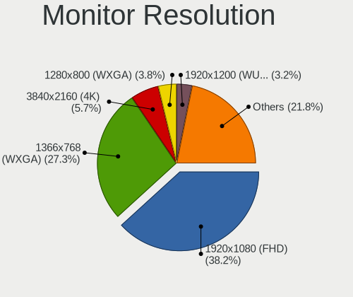

| Resolution         | Notebooks | Percent |
|--------------------|-----------|---------|
| 1920x1080 (FHD)    | 399       | 38.22%  |
| 1366x768 (WXGA)    | 347       | 33.24%  |
| 3840x2160 (4K)     | 63        | 6.03%   |
| 1280x800 (WXGA)    | 47        | 4.5%    |
| 1600x900 (HD+)     | 36        | 3.45%   |
| 1440x900 (WXGA+)   | 21        | 2.01%   |
| 2560x1440 (QHD)    | 17        | 1.63%   |
| 1920x1200 (WUXGA)  | 15        | 1.44%   |
| 2560x1600          | 12        | 1.15%   |
| 2880x1800          | 11        | 1.05%   |
| 3840x2400          | 9         | 0.86%   |
| 1280x1024 (SXGA)   | 9         | 0.86%   |
| 1680x1050 (WSXGA+) | 8         | 0.77%   |
| 3200x1800 (QHD+)   | 6         | 0.57%   |
| 1024x600           | 5         | 0.48%   |
| 3440x1440          | 4         | 0.38%   |
| 2160x1440          | 4         | 0.38%   |
| 1360x768           | 4         | 0.38%   |
| Unknown            | 4         | 0.38%   |
| 3072x1920          | 3         | 0.29%   |
| 3840x1080          | 2         | 0.19%   |
| 3286x1080          | 2         | 0.19%   |
| 2256x1504          | 2         | 0.19%   |
| 1280x720 (HD)      | 2         | 0.19%   |
| 1024x768 (XGA)     | 2         | 0.19%   |
| 5760x2160          | 1         | 0.1%    |
| 3840x1600          | 1         | 0.1%    |
| 3456x2160          | 1         | 0.1%    |
| 3200x2000          | 1         | 0.1%    |
| 2726x768           | 1         | 0.1%    |
| 2304x1440          | 1         | 0.1%    |
| 2240x1400          | 1         | 0.1%    |
| 1920x540           | 1         | 0.1%    |
| 1720x1440          | 1         | 0.1%    |
| 1680x945           | 1         | 0.1%    |

Monitor Diagonal
----------------

Diagonal size in inches

| Inches  | Notebooks | Percent |
|---------|-----------|---------|
| 15      | 467       | 41.66%  |
| 13      | 152       | 13.56%  |
| 14      | 114       | 10.17%  |
| 17      | 77        | 6.87%   |
| 27      | 48        | 4.28%   |
| 24      | 35        | 3.12%   |
| 12      | 34        | 3.03%   |
| 23      | 28        | 2.5%    |
| 11      | 26        | 2.32%   |
| 21      | 21        | 1.87%   |
| Unknown | 21        | 1.87%   |
| 31      | 12        | 1.07%   |
| 16      | 10        | 0.89%   |
| 19      | 9         | 0.8%    |
| 72      | 7         | 0.62%   |
| 18      | 7         | 0.62%   |
| 20      | 6         | 0.54%   |
| 10      | 6         | 0.54%   |
| 84      | 5         | 0.45%   |
| 52      | 5         | 0.45%   |
| 40      | 5         | 0.45%   |
| 22      | 4         | 0.36%   |
| 34      | 3         | 0.27%   |
| 26      | 3         | 0.27%   |
| 54      | 2         | 0.18%   |
| 46      | 2         | 0.18%   |
| 37      | 2         | 0.18%   |
| 32      | 2         | 0.18%   |
| 8       | 2         | 0.18%   |
| 49      | 1         | 0.09%   |
| 48      | 1         | 0.09%   |
| 35      | 1         | 0.09%   |
| 29      | 1         | 0.09%   |
| 25      | 1         | 0.09%   |
| 9       | 1         | 0.09%   |

Monitor Width
-------------

Physical width

| Width in mm | Notebooks | Percent |
|-------------|-----------|---------|
| 301-350     | 639       | 57.36%  |
| 201-300     | 153       | 13.73%  |
| 501-600     | 98        | 8.8%    |
| 351-400     | 98        | 8.8%    |
| 401-500     | 44        | 3.95%   |
| 601-700     | 23        | 2.06%   |
| Unknown     | 21        | 1.89%   |
| 1501-2000   | 12        | 1.08%   |
| 1001-1500   | 11        | 0.99%   |
| 801-900     | 8         | 0.72%   |
| 701-800     | 5         | 0.45%   |
| 101-200     | 2         | 0.18%   |

Aspect Ratio
------------

Proportional relationship between the width and the height

| Ratio   | Notebooks | Percent |
|---------|-----------|---------|
| 16/9    | 794       | 81.94%  |
| 16/10   | 126       | 13%     |
| Unknown | 16        | 1.65%   |
| 3/2     | 11        | 1.14%   |
| 5/4     | 6         | 0.62%   |
| 4/3     | 6         | 0.62%   |
| 21/9    | 5         | 0.52%   |
| 32/9    | 3         | 0.31%   |
| 6/5     | 1         | 0.1%    |
| 0.62    | 1         | 0.1%    |

Monitor Area
------------

Area in inch

| Area in inch | Notebooks | Percent |
|----------------|-----------|---------|
| 101-110        | 468       | 41.79%  |
| 81-90          | 201       | 17.95%  |
| 201-250        | 74        | 6.61%   |
| 71-80          | 70        | 6.25%   |
| 121-130        | 66        | 5.89%   |
| 301-350        | 50        | 4.46%   |
| 61-70          | 30        | 2.68%   |
| 51-60          | 26        | 2.32%   |
| Unknown        | 21        | 1.88%   |
| 151-200        | 20        | 1.79%   |
| More than 1000 | 19        | 1.7%    |
| 351-500        | 19        | 1.7%    |
| 501-1000       | 11        | 0.98%   |
| 251-300        | 9         | 0.8%    |
| 141-150        | 9         | 0.8%    |
| 131-140        | 8         | 0.71%   |
| 111-120        | 8         | 0.71%   |
| 41-50          | 7         | 0.63%   |
| 1-40           | 2         | 0.18%   |
| 91-100         | 2         | 0.18%   |

Pixel Density
-------------

Pixels per inch

| Density       | Notebooks | Percent |
|---------------|-----------|---------|
| 121-160       | 382       | 35.11%  |
| 101-120       | 337       | 30.97%  |
| 51-100        | 189       | 17.37%  |
| 161-240       | 77        | 7.08%   |
| More than 240 | 61        | 5.61%   |
| 1-50          | 21        | 1.93%   |
| Unknown       | 21        | 1.93%   |

Multiple Monitors
-----------------

Total monitors connected

| Total | Notebooks | Percent |
|-------|-----------|---------|
| 1     | 793       | 78.21%  |
| 2     | 162       | 15.98%  |
| 0     | 33        | 3.25%   |
| 3     | 23        | 2.27%   |
| 4     | 3         | 0.3%    |

Network
-------

Net Controller Vendor
---------------------

Controller vendors

| Vendor                            | Notebooks | Percent |
|-----------------------------------|-----------|---------|
| Intel                             | 530       | 33.04%  |
| Realtek Semiconductor             | 493       | 30.74%  |
| Qualcomm Atheros                  | 230       | 14.34%  |
| Broadcom                          | 124       | 7.73%   |
| Broadcom Limited                  | 35        | 2.18%   |
| Ralink                            | 25        | 1.56%   |
| Marvell Technology Group          | 15        | 0.94%   |
| Sierra Wireless                   | 10        | 0.62%   |
| Samsung Electronics               | 10        | 0.62%   |
| DisplayLink                       | 10        | 0.62%   |
| Dell                              | 10        | 0.62%   |
| MediaTek                          | 8         | 0.5%    |
| Huawei Technologies               | 8         | 0.5%    |
| Nvidia                            | 7         | 0.44%   |
| NetGear                           | 7         | 0.44%   |
| TP-Link                           | 6         | 0.37%   |
| Ralink Technology                 | 6         | 0.37%   |
| Lenovo                            | 6         | 0.37%   |
| Apple                             | 6         | 0.37%   |
| ZTE WCDMA Technologies MSM        | 5         | 0.31%   |
| Hewlett-Packard                   | 5         | 0.31%   |
| Edimax Technology                 | 5         | 0.31%   |
| ASIX Electronics                  | 5         | 0.31%   |
| ASUSTek Computer                  | 4         | 0.25%   |
| JMicron Technology                | 3         | 0.19%   |
| Google                            | 3         | 0.19%   |
| Xiaomi                            | 2         | 0.12%   |
| Silicon Integrated Systems [SiS]  | 2         | 0.12%   |
| Qualcomm Atheros Communications   | 2         | 0.12%   |
| OPPO Electronics                  | 2         | 0.12%   |
| Motorola PCS                      | 2         | 0.12%   |
| Ericsson Business Mobile Networks | 2         | 0.12%   |
| D-Link                            | 2         | 0.12%   |
| Arduino SA                        | 2         | 0.12%   |
| ULi Electronics                   | 1         | 0.06%   |
| Toshiba                           | 1         | 0.06%   |
| T & A Mobile Phones               | 1         | 0.06%   |
| Sigma Designs                     | 1         | 0.06%   |
| Qualcomm                          | 1         | 0.06%   |
| Microsoft                         | 1         | 0.06%   |
| MicroPython                       | 1         | 0.06%   |
| LG Electronics                    | 1         | 0.06%   |
| Dresden Elektronik                | 1         | 0.06%   |
| DJI Technology                    | 1         | 0.06%   |
| Attansic Technology               | 1         | 0.06%   |
| AMD                               | 1         | 0.06%   |

Net Controller Model
--------------------

Controller models

| Model                                                                   | Notebooks | Percent |
|-------------------------------------------------------------------------|-----------|---------|
| Realtek RTL8111/8168/8411 PCI Express Gigabit Ethernet Controller       | 303       | 15.73%  |
| Realtek RTL810xE PCI Express Fast Ethernet controller                   | 98        | 5.09%   |
| Intel 82579LM Gigabit Network Connection (Lewisville)                   | 45        | 2.34%   |
| Realtek RTL8153 Gigabit Ethernet Adapter                                | 44        | 2.28%   |
| Qualcomm Atheros AR9285 Wireless Network Adapter (PCI-Express)          | 41        | 2.13%   |
| Intel Wireless 8260                                                     | 39        | 2.02%   |
| Intel Wi-Fi 6 AX200                                                     | 38        | 1.97%   |
| Intel Wireless 8265 / 8275                                              | 37        | 1.92%   |
| Qualcomm Atheros QCA6174 802.11ac Wireless Network Adapter              | 35        | 1.82%   |
| Qualcomm Atheros AR9485 Wireless Network Adapter                        | 31        | 1.61%   |
| Qualcomm Atheros QCA9565 / AR9565 Wireless Network Adapter              | 29        | 1.51%   |
| Intel Wireless 7260                                                     | 29        | 1.51%   |
| Intel Comet Lake PCH CNVi WiFi                                          | 29        | 1.51%   |
| Qualcomm Atheros QCA9377 802.11ac Wireless Network Adapter              | 28        | 1.45%   |
| Intel Centrino Advanced-N 6205 [Taylor Peak]                            | 27        | 1.4%    |
| Intel Wireless 3165                                                     | 26        | 1.35%   |
| Intel Centrino Ultimate-N 6300                                          | 24        | 1.25%   |
| Intel Cannon Lake PCH CNVi WiFi                                         | 22        | 1.14%   |
| Intel Wireless 7265                                                     | 21        | 1.09%   |
| Intel Wi-Fi 6 AX201                                                     | 19        | 0.99%   |
| Intel Ethernet Connection I219-LM                                       | 19        | 0.99%   |
| Intel Comet Lake PCH-LP CNVi WiFi                                       | 19        | 0.99%   |
| Intel Cannon Point-LP CNVi [Wireless-AC]                                | 18        | 0.93%   |
| Intel 82577LM Gigabit Network Connection                                | 18        | 0.93%   |
| Intel Wireless-AC 9260                                                  | 17        | 0.88%   |
| Realtek RTL8821CE 802.11ac PCIe Wireless Network Adapter                | 15        | 0.78%   |
| Intel Ethernet Connection (4) I219-LM                                   | 15        | 0.78%   |
| Ralink RT3290 Wireless 802.11n 1T/1R PCIe                               | 14        | 0.73%   |
| Qualcomm Atheros AR8151 v2.0 Gigabit Ethernet                           | 14        | 0.73%   |
| Broadcom BCM43224 802.11a/b/g/n                                         | 14        | 0.73%   |
| Broadcom BCM4313 802.11bgn Wireless Network Adapter                     | 14        | 0.73%   |
| Realtek RTL8822CE 802.11ac PCIe Wireless Network Adapter                | 13        | 0.67%   |
| Qualcomm Atheros AR9462 Wireless Network Adapter                        | 13        | 0.67%   |
| Intel Wireless 3160                                                     | 13        | 0.67%   |
| Intel Centrino Advanced-N 6200                                          | 12        | 0.62%   |
| Broadcom BCM4331 802.11a/b/g/n                                          | 12        | 0.62%   |
| Realtek RTL8188CE 802.11b/g/n WiFi Adapter                              | 11        | 0.57%   |
| Qualcomm Atheros AR8161 Gigabit Ethernet                                | 11        | 0.57%   |
| Intel WiFi Link 5100                                                    | 11        | 0.57%   |
| Intel PRO/Wireless 5100 AGN [Shiloh] Network Connection                 | 11        | 0.57%   |
| Intel PRO/Wireless 3945ABG [Golan] Network Connection                   | 11        | 0.57%   |
| Realtek RTL8723AE PCIe Wireless Network Adapter                         | 10        | 0.52%   |
| Intel Ice Lake-LP PCH CNVi WiFi                                         | 10        | 0.52%   |
| Broadcom NetXtreme BCM57765 Gigabit Ethernet PCIe                       | 10        | 0.52%   |
| Broadcom BCM43228 802.11a/b/g/n                                         | 10        | 0.52%   |
| Broadcom BCM43142 802.11b/g/n                                           | 10        | 0.52%   |
| Qualcomm Atheros QCA8171 Gigabit Ethernet                               | 9         | 0.47%   |
| Qualcomm Atheros Killer E220x Gigabit Ethernet Controller               | 9         | 0.47%   |
| Intel Wi-Fi 6 AX210/AX211/AX411 160MHz                                  | 9         | 0.47%   |
| Intel Ethernet Connection I219-V                                        | 9         | 0.47%   |
| Intel Ethernet Connection (4) I219-V                                    | 9         | 0.47%   |
| Intel Dual Band Wireless-AC 3168NGW [Stone Peak]                        | 9         | 0.47%   |
| Intel 82567LM Gigabit Network Connection                                | 9         | 0.47%   |
| Broadcom NetXtreme BCM57786 Gigabit Ethernet PCIe                       | 9         | 0.47%   |
| Broadcom NetLink BCM57785 Gigabit Ethernet PCIe                         | 9         | 0.47%   |
| Broadcom Limited BCM4360 802.11ac Wireless Network Adapter              | 9         | 0.47%   |
| Realtek RTL8822BE 802.11a/b/g/n/ac WiFi adapter                         | 8         | 0.42%   |
| Qualcomm Atheros AR242x / AR542x Wireless Network Adapter (PCI-Express) | 8         | 0.42%   |
| Intel PRO/Wireless 4965 AG or AGN [Kedron] Network Connection           | 8         | 0.42%   |
| Intel Ethernet Connection (3) I218-LM                                   | 8         | 0.42%   |

Wireless Vendor
---------------

Wireless vendors

| Vendor                          | Notebooks | Percent |
|---------------------------------|-----------|---------|
| Intel                           | 511       | 50.34%  |
| Qualcomm Atheros                | 193       | 19.01%  |
| Realtek Semiconductor           | 102       | 10.05%  |
| Broadcom                        | 100       | 9.85%   |
| Broadcom Limited                | 27        | 2.66%   |
| Ralink                          | 25        | 2.46%   |
| Sierra Wireless                 | 10        | 0.99%   |
| NetGear                         | 7         | 0.69%   |
| MediaTek                        | 7         | 0.69%   |
| Ralink Technology               | 6         | 0.59%   |
| Dell                            | 6         | 0.59%   |
| TP-Link                         | 5         | 0.49%   |
| Edimax Technology               | 5         | 0.49%   |
| ASUSTek Computer                | 4         | 0.39%   |
| Qualcomm Atheros Communications | 2         | 0.2%    |
| D-Link                          | 2         | 0.2%    |
| Xiaomi                          | 1         | 0.1%    |
| Qualcomm                        | 1         | 0.1%    |
| Hewlett-Packard                 | 1         | 0.1%    |

Wireless Model
--------------

Wireless models

| Model                                                                   | Notebooks | Percent |
|-------------------------------------------------------------------------|-----------|---------|
| Qualcomm Atheros AR9285 Wireless Network Adapter (PCI-Express)          | 41        | 4.02%   |
| Intel Wireless 8260                                                     | 39        | 3.82%   |
| Intel Wi-Fi 6 AX200                                                     | 38        | 3.73%   |
| Intel Wireless 8265 / 8275                                              | 37        | 3.63%   |
| Qualcomm Atheros QCA6174 802.11ac Wireless Network Adapter              | 35        | 3.43%   |
| Qualcomm Atheros AR9485 Wireless Network Adapter                        | 31        | 3.04%   |
| Qualcomm Atheros QCA9565 / AR9565 Wireless Network Adapter              | 29        | 2.84%   |
| Intel Wireless 7260                                                     | 29        | 2.84%   |
| Intel Comet Lake PCH CNVi WiFi                                          | 29        | 2.84%   |
| Qualcomm Atheros QCA9377 802.11ac Wireless Network Adapter              | 28        | 2.75%   |
| Intel Centrino Advanced-N 6205 [Taylor Peak]                            | 27        | 2.65%   |
| Intel Wireless 3165                                                     | 26        | 2.55%   |
| Intel Centrino Ultimate-N 6300                                          | 24        | 2.35%   |
| Intel Cannon Lake PCH CNVi WiFi                                         | 22        | 2.16%   |
| Intel Wireless 7265                                                     | 21        | 2.06%   |
| Intel Wi-Fi 6 AX201                                                     | 19        | 1.86%   |
| Intel Comet Lake PCH-LP CNVi WiFi                                       | 19        | 1.86%   |
| Intel Cannon Point-LP CNVi [Wireless-AC]                                | 18        | 1.76%   |
| Intel Wireless-AC 9260                                                  | 17        | 1.67%   |
| Realtek RTL8821CE 802.11ac PCIe Wireless Network Adapter                | 15        | 1.47%   |
| Ralink RT3290 Wireless 802.11n 1T/1R PCIe                               | 14        | 1.37%   |
| Broadcom BCM43224 802.11a/b/g/n                                         | 14        | 1.37%   |
| Broadcom BCM4313 802.11bgn Wireless Network Adapter                     | 14        | 1.37%   |
| Realtek RTL8822CE 802.11ac PCIe Wireless Network Adapter                | 13        | 1.27%   |
| Qualcomm Atheros AR9462 Wireless Network Adapter                        | 13        | 1.27%   |
| Intel Wireless 3160                                                     | 13        | 1.27%   |
| Intel Centrino Advanced-N 6200                                          | 12        | 1.18%   |
| Broadcom BCM4331 802.11a/b/g/n                                          | 12        | 1.18%   |
| Realtek RTL8188CE 802.11b/g/n WiFi Adapter                              | 11        | 1.08%   |
| Intel WiFi Link 5100                                                    | 11        | 1.08%   |
| Intel PRO/Wireless 5100 AGN [Shiloh] Network Connection                 | 11        | 1.08%   |
| Intel PRO/Wireless 3945ABG [Golan] Network Connection                   | 11        | 1.08%   |
| Realtek RTL8723AE PCIe Wireless Network Adapter                         | 10        | 0.98%   |
| Intel Ice Lake-LP PCH CNVi WiFi                                         | 10        | 0.98%   |
| Broadcom BCM43228 802.11a/b/g/n                                         | 10        | 0.98%   |
| Broadcom BCM43142 802.11b/g/n                                           | 10        | 0.98%   |
| Intel Wi-Fi 6 AX210/AX211/AX411 160MHz                                  | 9         | 0.88%   |
| Intel Dual Band Wireless-AC 3168NGW [Stone Peak]                        | 9         | 0.88%   |
| Broadcom Limited BCM4360 802.11ac Wireless Network Adapter              | 9         | 0.88%   |
| Realtek RTL8822BE 802.11a/b/g/n/ac WiFi adapter                         | 8         | 0.78%   |
| Qualcomm Atheros AR242x / AR542x Wireless Network Adapter (PCI-Express) | 8         | 0.78%   |
| Intel PRO/Wireless 4965 AG or AGN [Kedron] Network Connection           | 8         | 0.78%   |
| Intel Centrino Wireless-N 2230                                          | 8         | 0.78%   |
| Intel Ultimate N WiFi Link 5300                                         | 7         | 0.69%   |
| Intel Centrino Wireless-N 1030 [Rainbow Peak]                           | 7         | 0.69%   |
| Intel Centrino Advanced-N 6235                                          | 6         | 0.59%   |
| Broadcom Limited BCM4331 802.11a/b/g/n                                  | 6         | 0.59%   |
| Broadcom BCM43227 802.11b/g/n                                           | 6         | 0.59%   |
| Broadcom BCM4322 802.11a/b/g/n Wireless LAN Controller                  | 6         | 0.59%   |
| Realtek RTL8191SEvB Wireless LAN Controller                             | 5         | 0.49%   |
| Realtek RTL8188EE Wireless Network Adapter                              | 5         | 0.49%   |
| Intel Dual Band Wireless-AC 3165 Plus Bluetooth                         | 5         | 0.49%   |
| Intel Centrino Wireless-N 1000 [Condor Peak]                            | 5         | 0.49%   |
| Broadcom BCM43602 802.11ac Wireless LAN SoC                             | 5         | 0.49%   |
| Realtek RTL88x2bu [AC1200 Techkey]                                      | 4         | 0.39%   |
| Realtek RTL8821AE 802.11ac PCIe Wireless Network Adapter                | 4         | 0.39%   |
| Ralink RT5390 Wireless 802.11n 1T/1R PCIe                               | 4         | 0.39%   |
| Intel Tiger Lake PCH CNVi WiFi                                          | 4         | 0.39%   |
| Intel Gemini Lake PCH CNVi WiFi                                         | 4         | 0.39%   |
| Intel Centrino Advanced-N 6230 [Rainbow Peak]                           | 4         | 0.39%   |

Ethernet Vendor
---------------

Ethernet vendors

| Vendor                           | Notebooks | Percent |
|----------------------------------|-----------|---------|
| Realtek Semiconductor            | 453       | 52.49%  |
| Intel                            | 189       | 21.9%   |
| Qualcomm Atheros                 | 74        | 8.57%   |
| Broadcom                         | 53        | 6.14%   |
| Marvell Technology Group         | 15        | 1.74%   |
| Samsung Electronics              | 10        | 1.16%   |
| DisplayLink                      | 10        | 1.16%   |
| Broadcom Limited                 | 8         | 0.93%   |
| Nvidia                           | 7         | 0.81%   |
| Lenovo                           | 6         | 0.7%    |
| Huawei Technologies              | 6         | 0.7%    |
| Apple                            | 6         | 0.7%    |
| ZTE WCDMA Technologies MSM       | 5         | 0.58%   |
| ASIX Electronics                 | 5         | 0.58%   |
| JMicron Technology               | 3         | 0.35%   |
| Google                           | 3         | 0.35%   |
| Silicon Integrated Systems [SiS] | 2         | 0.23%   |
| OPPO Electronics                 | 2         | 0.23%   |
| Hewlett-Packard                  | 2         | 0.23%   |
| Xiaomi                           | 1         | 0.12%   |
| T & A Mobile Phones              | 1         | 0.12%   |
| Microsoft                        | 1         | 0.12%   |
| Attansic Technology              | 1         | 0.12%   |

Ethernet Model
--------------

Ethernet models

| Model                                                                          | Notebooks | Percent |
|--------------------------------------------------------------------------------|-----------|---------|
| Realtek RTL8111/8168/8411 PCI Express Gigabit Ethernet Controller              | 303       | 34.55%  |
| Realtek RTL810xE PCI Express Fast Ethernet controller                          | 98        | 11.17%  |
| Intel 82579LM Gigabit Network Connection (Lewisville)                          | 45        | 5.13%   |
| Realtek RTL8153 Gigabit Ethernet Adapter                                       | 44        | 5.02%   |
| Intel Ethernet Connection I219-LM                                              | 19        | 2.17%   |
| Intel 82577LM Gigabit Network Connection                                       | 18        | 2.05%   |
| Intel Ethernet Connection (4) I219-LM                                          | 15        | 1.71%   |
| Qualcomm Atheros AR8151 v2.0 Gigabit Ethernet                                  | 14        | 1.6%    |
| Qualcomm Atheros AR8161 Gigabit Ethernet                                       | 11        | 1.25%   |
| Broadcom NetXtreme BCM57765 Gigabit Ethernet PCIe                              | 10        | 1.14%   |
| Qualcomm Atheros QCA8171 Gigabit Ethernet                                      | 9         | 1.03%   |
| Qualcomm Atheros Killer E220x Gigabit Ethernet Controller                      | 9         | 1.03%   |
| Intel Ethernet Connection I219-V                                               | 9         | 1.03%   |
| Intel Ethernet Connection (4) I219-V                                           | 9         | 1.03%   |
| Intel 82567LM Gigabit Network Connection                                       | 9         | 1.03%   |
| Broadcom NetXtreme BCM57786 Gigabit Ethernet PCIe                              | 9         | 1.03%   |
| Broadcom NetLink BCM57785 Gigabit Ethernet PCIe                                | 9         | 1.03%   |
| Intel Ethernet Connection (3) I218-LM                                          | 8         | 0.91%   |
| Samsung Galaxy series, misc. (tethering mode)                                  | 7         | 0.8%    |
| Qualcomm Atheros AR8152 v2.0 Fast Ethernet                                     | 7         | 0.8%    |
| Broadcom NetXtreme BCM5764M Gigabit Ethernet PCIe                              | 7         | 0.8%    |
| Broadcom NetLink BCM57780 Gigabit Ethernet PCIe                                | 7         | 0.8%    |
| Qualcomm Atheros AR8152 v1.1 Fast Ethernet                                     | 6         | 0.68%   |
| Qualcomm Atheros AR8131 Gigabit Ethernet                                       | 6         | 0.68%   |
| Intel Ethernet Connection I218-LM                                              | 6         | 0.68%   |
| Intel Ethernet Connection I217-LM                                              | 6         | 0.68%   |
| Intel Ethernet Connection (7) I219-LM                                          | 6         | 0.68%   |
| Realtek RTL-8100/8101L/8139 PCI Fast Ethernet Adapter                          | 5         | 0.57%   |
| Qualcomm Atheros Killer E2500 Gigabit Ethernet Controller                      | 5         | 0.57%   |
| Marvell Group 88E8040 PCI-E Fast Ethernet Controller                           | 4         | 0.46%   |
| Intel 82573L Gigabit Ethernet Controller                                       | 4         | 0.46%   |
| DisplayLink Dell Universal Dock D6000                                          | 4         | 0.46%   |
| ASIX AX88179 Gigabit Ethernet                                                  | 4         | 0.46%   |
| ZTE WCDMA MSM Z6201V                                                           | 3         | 0.34%   |
| Samsung GT-I9070 (network tethering, USB debugging enabled)                    | 3         | 0.34%   |
| Realtek RTL8152 Fast Ethernet Adapter                                          | 3         | 0.34%   |
| Realtek RTL8125 2.5GbE Controller                                              | 3         | 0.34%   |
| Realtek Killer E2600 Gigabit Ethernet Controller                               | 3         | 0.34%   |
| Nvidia MCP89 Ethernet                                                          | 3         | 0.34%   |
| Nvidia MCP79 Ethernet                                                          | 3         | 0.34%   |
| Marvell Group Yukon Optima 88E8059 [PCIe Gigabit Ethernet Controller with AVB] | 3         | 0.34%   |
| Marvell Group 88E8055 PCI-E Gigabit Ethernet Controller                        | 3         | 0.34%   |
| Lenovo USB-C Dock Ethernet                                                     | 3         | 0.34%   |
| Intel Ethernet Connection (3) I218-V                                           | 3         | 0.34%   |
| Intel Ethernet Connection (10) I219-LM                                         | 3         | 0.34%   |
| Huawei E353/E3131                                                              | 3         | 0.34%   |
| Broadcom NetLink BCM5906M Fast Ethernet PCI Express                            | 3         | 0.34%   |
| ZTE WCDMA MSM SCSI CD-ROM 2.31                                                 | 2         | 0.23%   |
| Silicon Integrated Systems [SiS] SiS900 PCI Fast Ethernet                      | 2         | 0.23%   |
| Realtek Killer E3000 2.5GbE Controller                                         | 2         | 0.23%   |
| Realtek Killer E2500 Gigabit Ethernet Controller                               | 2         | 0.23%   |
| Qualcomm Atheros Killer E2400 Gigabit Ethernet Controller                      | 2         | 0.23%   |
| Qualcomm Atheros AR8121/AR8113/AR8114 Gigabit or Fast Ethernet                 | 2         | 0.23%   |
| OPPO Find X2 Lite                                                              | 2         | 0.23%   |
| Marvell Group 88E8039 PCI-E Fast Ethernet Controller                           | 2         | 0.23%   |
| JMicron JMC250 PCI Express Gigabit Ethernet Controller                         | 2         | 0.23%   |
| Intel Ethernet Connection I217-V                                               | 2         | 0.23%   |
| Intel Ethernet Connection (7) I219-V                                           | 2         | 0.23%   |
| Intel Ethernet Connection (6) I219-V                                           | 2         | 0.23%   |
| Intel Ethernet Connection (6) I219-LM                                          | 2         | 0.23%   |

Net Controller Kind
-------------------

Ethernet, WiFi or modem

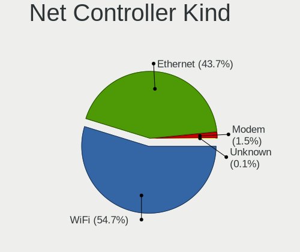

| Kind     | Notebooks | Percent |
|----------|-----------|---------|
| WiFi     | 952       | 53.21%  |
| Ethernet | 809       | 45.22%  |
| Modem    | 24        | 1.34%   |
| Unknown  | 4         | 0.22%   |

Used Controller
---------------

Currently used network controller

| Kind     | Notebooks | Percent |
|----------|-----------|---------|
| WiFi     | 795       | 78.64%  |
| Ethernet | 216       | 21.36%  |

NICs
----

Total network controllers on board

| Total | Notebooks | Percent |
|-------|-----------|---------|
| 2     | 748       | 76.48%  |
| 1     | 213       | 21.78%  |
| 0     | 11        | 1.12%   |
| 3     | 6         | 0.61%   |

IPv6
----

IPv6 vs IPv4

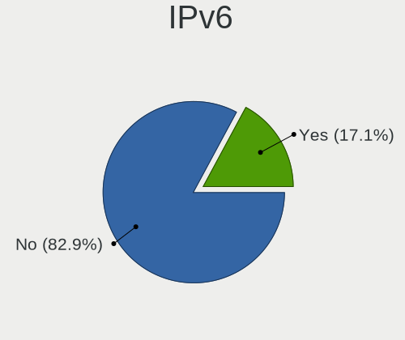

| Used | Notebooks | Percent |
|------|-----------|---------|
| No   | 899       | 91.08%  |
| Yes  | 88        | 8.92%   |

Bluetooth
---------

Bluetooth Vendor
----------------

Controller vendors

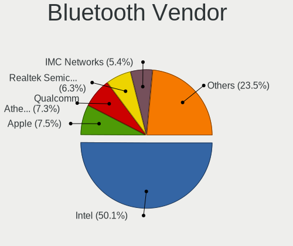

| Vendor                          | Notebooks | Percent |
|---------------------------------|-----------|---------|
| Intel                           | 372       | 49.21%  |
| Qualcomm Atheros Communications | 66        | 8.73%   |
| Broadcom                        | 53        | 7.01%   |
| Apple                           | 51        | 6.75%   |
| Realtek Semiconductor           | 34        | 4.5%    |
| Toshiba                         | 32        | 4.23%   |
| Lite-On Technology              | 30        | 3.97%   |
| Foxconn / Hon Hai               | 25        | 3.31%   |
| IMC Networks                    | 24        | 3.17%   |
| Dell                            | 15        | 1.98%   |
| Ralink                          | 14        | 1.85%   |
| Hewlett-Packard                 | 14        | 1.85%   |
| Alps Electric                   | 6         | 0.79%   |
| Cambridge Silicon Radio         | 5         | 0.66%   |
| Realtek                         | 4         | 0.53%   |
| ASUSTek Computer                | 4         | 0.53%   |
| Ralink Technology               | 3         | 0.4%    |
| USI                             | 1         | 0.13%   |
| Opticis                         | 1         | 0.13%   |
| MediaTek                        | 1         | 0.13%   |
| Belkin Components               | 1         | 0.13%   |

Bluetooth Model
---------------

Controller models

| Model                                               | Notebooks | Percent |
|-----------------------------------------------------|-----------|---------|
| Intel Bluetooth wireless interface                  | 155       | 20.5%   |
| Intel Bluetooth Device                              | 76        | 10.05%  |
| Intel Bluetooth 9460/9560 Jefferson Peak (JfP)      | 48        | 6.35%   |
| Intel AX200 Bluetooth                               | 39        | 5.16%   |
| Apple Bluetooth Host Controller                     | 29        | 3.84%   |
| Qualcomm Atheros  Bluetooth Device                  | 26        | 3.44%   |
| Qualcomm Atheros AR3011 Bluetooth                   | 16        | 2.12%   |
| Intel Wireless-AC 9260 Bluetooth Adapter            | 16        | 2.12%   |
| Apple Bluetooth USB Host Controller                 | 16        | 2.12%   |
| Realtek Bluetooth Radio                             | 15        | 1.98%   |
| Ralink RT3290 Bluetooth                             | 14        | 1.85%   |
| Qualcomm Atheros QCA61x4 Bluetooth 4.0              | 14        | 1.85%   |
| Broadcom BCM2045B (BDC-2.1)                         | 14        | 1.85%   |
| Toshiba Bluetooth Device                            | 12        | 1.59%   |
| Realtek  Bluetooth 4.2 Adapter                      | 12        | 1.59%   |
| Intel Centrino Bluetooth Wireless Transceiver       | 12        | 1.59%   |
| Foxconn / Hon Hai Bluetooth Device                  | 11        | 1.46%   |
| Lite-On Qualcomm Atheros QCA9377 Bluetooth          | 10        | 1.32%   |
| Lite-On Atheros AR3012 Bluetooth                    | 10        | 1.32%   |
| Intel Centrino Advanced-N 6230 Bluetooth adapter    | 10        | 1.32%   |
| Intel Wireless-AC 3168 Bluetooth                    | 9         | 1.19%   |
| HP Broadcom 2070 Bluetooth Combo                    | 9         | 1.19%   |
| Toshiba Integrated Bluetooth HCI                    | 8         | 1.06%   |
| Lite-On Bluetooth Device                            | 8         | 1.06%   |
| Intel AX210 Bluetooth                               | 7         | 0.93%   |
| Dell BCM20702A0 Bluetooth Module                    | 7         | 0.93%   |
| Qualcomm Atheros AR3012 Bluetooth 4.0               | 6         | 0.79%   |
| Broadcom HP Portable SoftSailing                    | 6         | 0.79%   |
| IMC Networks Bluetooth Radio                        | 5         | 0.66%   |
| IMC Networks Bluetooth                              | 5         | 0.66%   |
| IMC Networks Atheros AR3012 Bluetooth 4.0 Adapter   | 5         | 0.66%   |
| HP Bluetooth 2.0 Interface [Broadcom BCM2045]       | 5         | 0.66%   |
| Dell DW375 Bluetooth Module                         | 5         | 0.66%   |
| Cambridge Silicon Radio Bluetooth Dongle (HCI mode) | 5         | 0.66%   |
| Apple Built-in Bluetooth 2.0+EDR HCI                | 5         | 0.66%   |
| Toshiba Askey Bluetooth Module                      | 4         | 0.53%   |
| Realtek RTL8822BE Bluetooth 4.2 Adapter             | 4         | 0.53%   |
| Realtek Bluetooth Radio                             | 4         | 0.53%   |
| Broadcom HP Portable Bumble Bee                     | 4         | 0.53%   |
| Broadcom BCM20702 Bluetooth 4.0 [ThinkPad]          | 4         | 0.53%   |
| Toshiba RT Bluetooth Radio                          | 3         | 0.4%    |
| Toshiba BCM43142A0                                  | 3         | 0.4%    |
| IMC Networks BCM20702A0                             | 3         | 0.4%    |
| Foxconn / Hon Hai BT                                | 3         | 0.4%    |
| Broadcom BCM43142A0 Bluetooth Device                | 3         | 0.4%    |
| Broadcom BCM20702A0 Bluetooth 4.0                   | 3         | 0.4%    |
| Broadcom BCM20702A0                                 | 3         | 0.4%    |
| Alps Electric UGTZ4 Bluetooth                       | 3         | 0.4%    |
| Ralink CSR BS8510                                   | 2         | 0.26%   |
| Qualcomm Atheros AR9462 Bluetooth                   | 2         | 0.26%   |
| Qualcomm Atheros AR3012 Bluetooth                   | 2         | 0.26%   |
| Lite-On Bluetooth Radio                             | 2         | 0.26%   |
| IMC Networks Wireless_Device                        | 2         | 0.26%   |
| IMC Networks Bluetooth Device                       | 2         | 0.26%   |
| Foxconn / Hon Hai Bluetooth USB Host Controller     | 2         | 0.26%   |
| Foxconn / Hon Hai BCM20702A0                        | 2         | 0.26%   |
| Foxconn / Hon Hai BCM2045A0                         | 2         | 0.26%   |
| Foxconn / Hon Hai Acer Module                       | 2         | 0.26%   |
| Broadcom HP Portable Valentine                      | 2         | 0.26%   |
| Broadcom BCM20703A1 Bluetooth 4.1 + LE              | 2         | 0.26%   |

Sound
-----

Sound Vendor
------------

Sound card vendors

| Vendor                                       | Notebooks | Percent |
|----------------------------------------------|-----------|---------|
| Intel                                        | 819       | 65.21%  |
| Nvidia                                       | 179       | 14.25%  |
| AMD                                          | 164       | 13.06%  |
| Realtek Semiconductor                        | 13        | 1.04%   |
| GN Netcom                                    | 6         | 0.48%   |
| Creative Technology                          | 6         | 0.48%   |
| C-Media Electronics                          | 6         | 0.48%   |
| Lenovo                                       | 5         | 0.4%    |
| Razer USA                                    | 4         | 0.32%   |
| Logitech                                     | 4         | 0.32%   |
| Apple                                        | 4         | 0.32%   |
| OPPO Electronics                             | 3         | 0.24%   |
| Kingston Technology                          | 3         | 0.24%   |
| JMTek                                        | 3         | 0.24%   |
| Hewlett-Packard                              | 3         | 0.24%   |
| Thermaltake                                  | 2         | 0.16%   |
| Texas Instruments                            | 2         | 0.16%   |
| SteelSeries ApS                              | 2         | 0.16%   |
| Silicon Integrated Systems [SiS]             | 2         | 0.16%   |
| Native Instruments                           | 2         | 0.16%   |
| Microsoft                                    | 2         | 0.16%   |
| M-Audio                                      | 2         | 0.16%   |
| Conexant Systems                             | 2         | 0.16%   |
| Chicony Electronics                          | 2         | 0.16%   |
| Zoran Co. Personal Media Division (Nogatech) | 1         | 0.08%   |
| ZOOM                                         | 1         | 0.08%   |
| XMOS                                         | 1         | 0.08%   |
| ULi Electronics                              | 1         | 0.08%   |
| Thesycon Systemsoftware & Consulting         | 1         | 0.08%   |
| Sennheiser Communications                    | 1         | 0.08%   |
| Samsung Electronics                          | 1         | 0.08%   |
| RODE Microphones                             | 1         | 0.08%   |
| Plantronics                                  | 1         | 0.08%   |
| Micro Star International                     | 1         | 0.08%   |
| LG Electronics                               | 1         | 0.08%   |
| Generalplus Technology                       | 1         | 0.08%   |
| Cambridge Audio                              | 1         | 0.08%   |
| AudioQuest                                   | 1         | 0.08%   |
| Audio-Technica                               | 1         | 0.08%   |
| Antlion Audio                                | 1         | 0.08%   |

Sound Model
-----------

Sound card models

| Model                                                                                             | Notebooks | Percent |
|---------------------------------------------------------------------------------------------------|-----------|---------|
| Intel Sunrise Point-LP HD Audio                                                                   | 122       | 8.19%   |
| Intel 7 Series/C216 Chipset Family High Definition Audio Controller                               | 96        | 6.44%   |
| Intel 6 Series/C200 Series Chipset Family High Definition Audio Controller                        | 78        | 5.23%   |
| Intel 5 Series/3400 Series Chipset High Definition Audio                                          | 65        | 4.36%   |
| Intel Cannon Lake PCH cAVS                                                                        | 54        | 3.62%   |
| AMD Family 17h/19h HD Audio Controller                                                            | 49        | 3.29%   |
| Intel 8 Series HD Audio Controller                                                                | 47        | 3.15%   |
| Intel Haswell-ULT HD Audio Controller                                                             | 46        | 3.09%   |
| AMD FCH Azalia Controller                                                                         | 45        | 3.02%   |
| Intel 8 Series/C220 Series Chipset High Definition Audio Controller                               | 43        | 2.89%   |
| Intel 82801I (ICH9 Family) HD Audio Controller                                                    | 40        | 2.68%   |
| Intel Xeon E3-1200 v3/4th Gen Core Processor HD Audio Controller                                  | 37        | 2.48%   |
| Intel Wildcat Point-LP High Definition Audio Controller                                           | 35        | 2.35%   |
| Intel Broadwell-U Audio Controller                                                                | 35        | 2.35%   |
| Intel Comet Lake PCH cAVS                                                                         | 31        | 2.08%   |
| AMD Kabini HDMI/DP Audio                                                                          | 30        | 2.01%   |
| Intel Cannon Point-LP High Definition Audio Controller                                            | 28        | 1.88%   |
| Intel Comet Lake PCH-LP cAVS                                                                      | 26        | 1.74%   |
| Intel Tiger Lake-LP Smart Sound Technology Audio Controller                                       | 25        | 1.68%   |
| AMD Renoir Radeon High Definition Audio Controller                                                | 23        | 1.54%   |
| Nvidia TU107 GeForce GTX 1650 High Definition Audio Controller                                    | 21        | 1.41%   |
| Intel CM238 HD Audio Controller                                                                   | 21        | 1.41%   |
| Nvidia GF108 High Definition Audio Controller                                                     | 19        | 1.28%   |
| AMD Family 15h (Models 60h-6fh) Audio Controller                                                  | 19        | 1.28%   |
| Intel NM10/ICH7 Family High Definition Audio Controller                                           | 18        | 1.21%   |
| AMD Raven/Raven2/Fenghuang HDMI/DP Audio Controller                                               | 18        | 1.21%   |
| AMD High Definition Audio Controller                                                              | 15        | 1.01%   |
| Nvidia TU106 High Definition Audio Controller                                                     | 14        | 0.94%   |
| Nvidia GT216 HDMI Audio Controller                                                                | 14        | 0.94%   |
| Nvidia GK107 HDMI Audio Controller                                                                | 14        | 0.94%   |
| Intel 82801H (ICH8 Family) HD Audio Controller                                                    | 14        | 0.94%   |
| Nvidia TU116 High Definition Audio Controller                                                     | 13        | 0.87%   |
| Intel 100 Series/C230 Series Chipset Family HD Audio Controller                                   | 13        | 0.87%   |
| Intel Atom Processor Z36xxx/Z37xxx Series High Definition Audio Controller                        | 12        | 0.81%   |
| Realtek Semiconductor USB Audio                                                                   | 11        | 0.74%   |
| Nvidia Audio device                                                                               | 11        | 0.74%   |
| Intel Ice Lake-LP Smart Sound Technology Audio Controller                                         | 11        | 0.74%   |
| AMD SBx00 Azalia (Intel HDA)                                                                      | 11        | 0.74%   |
| Intel Atom/Celeron/Pentium Processor x5-E8000/J3xxx/N3xxx Series High Definition Audio Controller | 10        | 0.67%   |
| AMD RV710/730 HDMI Audio [Radeon HD 4000 series]                                                  | 10        | 0.67%   |
| Nvidia High Definition Audio Controller                                                           | 9         | 0.6%    |
| AMD Trinity HDMI Audio Controller                                                                 | 9         | 0.6%    |
| Nvidia GP107GL High Definition Audio Controller                                                   | 8         | 0.54%   |
| Nvidia GP106 High Definition Audio Controller                                                     | 8         | 0.54%   |
| Nvidia GP104 High Definition Audio Controller                                                     | 8         | 0.54%   |
| Intel Tiger Lake-H HD Audio Controller                                                            | 8         | 0.54%   |
| Intel Celeron/Pentium Silver Processor High Definition Audio                                      | 7         | 0.47%   |
| Intel Celeron N3350/Pentium N4200/Atom E3900 Series Audio Cluster                                 | 7         | 0.47%   |
| AMD Turks HDMI Audio [Radeon HD 6500/6600 / 6700M Series]                                         | 7         | 0.47%   |
| Nvidia MCP89 High Definition Audio                                                                | 6         | 0.4%    |
| Nvidia GK104 HDMI Audio Controller                                                                | 6         | 0.4%    |
| AMD BeaverCreek HDMI Audio [Radeon HD 6500D and 6400G-6600G series]                               | 6         | 0.4%    |
| Nvidia MCP79 High Definition Audio                                                                | 5         | 0.34%   |
| AMD Redwood HDMI Audio [Radeon HD 5000 Series]                                                    | 5         | 0.34%   |
| Nvidia GK208 HDMI/DP Audio Controller                                                             | 4         | 0.27%   |
| Nvidia GK106 HDMI Audio Controller                                                                | 4         | 0.27%   |
| Apple Audio Device                                                                                | 4         | 0.27%   |
| AMD Wrestler HDMI Audio                                                                           | 4         | 0.27%   |
| AMD Oland/Hainan/Cape Verde/Pitcairn HDMI Audio [Radeon HD 7000 Series]                           | 4         | 0.27%   |
| AMD Ellesmere HDMI Audio [Radeon RX 470/480 / 570/580/590]                                        | 4         | 0.27%   |

Memory
------

Memory Vendor
-------------

Memory module vendors

| Vendor                     | Notebooks | Percent |
|----------------------------|-----------|---------|
| Samsung Electronics        | 167       | 32.55%  |
| SK hynix                   | 136       | 26.51%  |
| Micron Technology          | 62        | 12.09%  |
| Kingston                   | 47        | 9.16%   |
| Crucial                    | 21        | 4.09%   |
| Unknown                    | 17        | 3.31%   |
| Elpida                     | 14        | 2.73%   |
| Ramaxel Technology         | 9         | 1.75%   |
| Nanya Technology           | 7         | 1.36%   |
| Team                       | 6         | 1.17%   |
| Corsair                    | 4         | 0.78%   |
| A-DATA Technology          | 3         | 0.58%   |
| G.Skill                    | 2         | 0.39%   |
| Apacer                     | 2         | 0.39%   |
| Unknown                    | 2         | 0.39%   |
| Unknown (0x89AD)           | 1         | 0.19%   |
| Unknown (0x873E)           | 1         | 0.19%   |
| Transcend                  | 1         | 0.19%   |
| Toshiba                    | 1         | 0.19%   |
| Smart                      | 1         | 0.19%   |
| Qimonda                    | 1         | 0.19%   |
| pqi                        | 1         | 0.19%   |
| Patriot                    | 1         | 0.19%   |
| Netlist                    | 1         | 0.19%   |
| Neo Forza                  | 1         | 0.19%   |
| GSkill                     | 1         | 0.19%   |
| Avant                      | 1         | 0.19%   |
| ASint Technology           | 1         | 0.19%   |
| Anucell Technology Holding | 1         | 0.19%   |

Memory Model
------------

Memory module models

| Model                                                            | Notebooks | Percent |
|------------------------------------------------------------------|-----------|---------|
| Samsung RAM M471B5273DH0-CH9 4GB SODIMM DDR3 1334MT/s            | 14        | 2.53%   |
| Samsung RAM M471B5173DB0-YK0 4GB SODIMM DDR3 1600MT/s            | 12        | 2.17%   |
| SK hynix RAM HMT41GS6AFR8A-PB 8192MB SODIMM DDR3 1600MT/s        | 8         | 1.44%   |
| SK hynix RAM HMA81GS6AFR8N-UH 8GB SODIMM DDR4 2667MT/s           | 7         | 1.26%   |
| Samsung RAM M471B1G73DB0-YK0 8GB SODIMM DDR3 1600MT/s            | 7         | 1.26%   |
| SK hynix RAM HMT351S6CFR8C-PB 4GB SODIMM DDR3 1600MT/s           | 6         | 1.08%   |
| Samsung RAM M471B5273CH0-CH9 4GB SODIMM DDR3 1334MT/s            | 6         | 1.08%   |
| Samsung RAM M471A1K43CB1-CTD 8GB SODIMM DDR4 2667MT/s            | 6         | 1.08%   |
| Samsung RAM M471A1G44AB0-CWE 8192MB SODIMM DDR4 3200MT/s         | 6         | 1.08%   |
| SK hynix RAM HMT41GS6BFR8A-PB 8GB SODIMM DDR3 1600MT/s           | 5         | 0.9%    |
| SK hynix RAM HMA82GS6AFR8N-UH 16GB SODIMM DDR4 2667MT/s          | 5         | 0.9%    |
| SK hynix RAM HMA81GS6JJR8N-VK 8GB SODIMM DDR4 2667MT/s           | 5         | 0.9%    |
| SK hynix RAM HMA81GS6CJR8N-VK 8GB SODIMM DDR4 2667MT/s           | 5         | 0.9%    |
| Samsung RAM M471B5173QH0-YK0 4GB SODIMM DDR3 1600MT/s            | 5         | 0.9%    |
| Samsung RAM M471B1G73QH0-YK0 8GB SODIMM DDR3 1600MT/s            | 5         | 0.9%    |
| Samsung RAM M471A2K43CB1-CTD 16GB SODIMM DDR4 2667MT/s           | 5         | 0.9%    |
| Samsung RAM M471A1K43DB1-CWE 8GB SODIMM DDR4 3200MT/s            | 5         | 0.9%    |
| Micron RAM MT52L1G32D4PG-093 8GB Row Of Chips LPDDR3 2133MT/s    | 5         | 0.9%    |
| Micron RAM 8ATF1G64HZ-2G6E1 8192MB SODIMM DDR4 2667MT/s          | 5         | 0.9%    |
| SK hynix RAM HMT351S6EFR8A-PB 4096MB SODIMM DDR3 1600MT/s        | 4         | 0.72%   |
| Samsung RAM M471B5773DH0-CH9 2GB SODIMM DDR3 1600MT/s            | 4         | 0.72%   |
| Samsung RAM M471B5173EB0-YK0 4GB SODIMM DDR3 1600MT/s            | 4         | 0.72%   |
| Samsung RAM M471A5244CB0-CTD 4GB SODIMM DDR4 3266MT/s            | 4         | 0.72%   |
| Samsung RAM M471A2K43DB1-CTD 16384MB SODIMM DDR4 2667MT/s        | 4         | 0.72%   |
| Samsung RAM M471A2K43CB1-CRC 16GB SODIMM DDR4 2667MT/s           | 4         | 0.72%   |
| Samsung RAM M471A1K43DB1-CTD 8GB SODIMM DDR4 2667MT/s            | 4         | 0.72%   |
| Samsung RAM M471A1K43BB0-CPB 8192MB SODIMM DDR4 2133MT/s         | 4         | 0.72%   |
| Micron RAM 4ATF1G64HZ-3G2E1 8GB SODIMM DDR4 3200MT/s             | 4         | 0.72%   |
| Elpida RAM EBJ21UE8BDS0-DJ-F 2048MB SODIMM DDR3 1334MT/s         | 4         | 0.72%   |
| Unknown RAM Module 2048MB SODIMM DDR2                            | 3         | 0.54%   |
| SK hynix RAM HMA851S6CJR6N-VK 4GB SODIMM DDR4 2667MT/s           | 3         | 0.54%   |
| SK hynix RAM HMA82GS6JJR8N-VK 16GB SODIMM DDR4 2667MT/s          | 3         | 0.54%   |
| SK hynix RAM HMA41GS6AFR8N-TF 8GB SODIMM DDR4 2667MT/s           | 3         | 0.54%   |
| SK hynix RAM H9HCNNNCPMALHR-NEE 8GB Row Of Chips LPDDR4 4800MT/s | 3         | 0.54%   |
| SK hynix RAM H9CCNNNCLGALAR-NVD 8GB Row Of Chips LPDDR3 2133MT/s | 3         | 0.54%   |
| Samsung RAM M471B1G73CB0-YK0 8192MB SODIMM DDR3 1600MT/s         | 3         | 0.54%   |
| Samsung RAM M471A5244CB0-CRC 4GB SODIMM DDR4 2667MT/s            | 3         | 0.54%   |
| Samsung RAM M471A1K43CB1-CRC 8192MB SODIMM DDR4 2667MT/s         | 3         | 0.54%   |
| Ramaxel RAM RMSA3300ME78HBF-2666 16GB SODIMM DDR4 2667MT/s       | 3         | 0.54%   |
| Ramaxel RAM RMSA3260ME78HAF-2666 8GB SODIMM DDR4 2667MT/s        | 3         | 0.54%   |
| Nanya RAM NT2GC64B88B0NS-CG 2GB SODIMM DDR3 1334MT/s             | 3         | 0.54%   |
| Micron RAM 16KTF1G64HZ-1G6E1 8192MB SODIMM DDR3 1600MT/s         | 3         | 0.54%   |
| Micron RAM 16ATF2G64HZ-3G2J1 16GB SODIMM DDR4 3200MT/s           | 3         | 0.54%   |
| Micron RAM 16ATF2G64HZ-2G6E1 16GB SODIMM DDR4 2667MT/s           | 3         | 0.54%   |
| Kingston RAM 99U5469-045.A00LF 4GB SODIMM DDR3 1600MT/s          | 3         | 0.54%   |
| Kingston RAM 99U5428-018.A00LF 8GB SODIMM DDR3 1600MT/s          | 3         | 0.54%   |
| Elpida RAM EBJ41UF8BCS0-DJ-F 4096MB SODIMM DDR3 1334MT/s         | 3         | 0.54%   |
| Unknown RAM Module 2GB SODIMM DDR2 667MT/s                       | 2         | 0.36%   |
| Team RAM TEAMGROUP-SD4-3200 16GB SODIMM DDR4 3200MT/s            | 2         | 0.36%   |
| Team RAM TEAMGROUP-SD4-2400 16GB SODIMM DDR4 8400MT/s            | 2         | 0.36%   |
| SK hynix RAM Module 4GB SODIMM DDR3 1600MT/s                     | 2         | 0.36%   |
| SK hynix RAM Module 2GB SODIMM DDR3 1600MT/s                     | 2         | 0.36%   |
| SK hynix RAM Module 2048MB SODIMM DDR3 1333MT/s                  | 2         | 0.36%   |
| SK hynix RAM HMT451S6MFR8A-PB 4096MB SODIMM DDR3 1600MT/s        | 2         | 0.36%   |
| SK hynix RAM HMT451S6MFR6A-PB 4GB SODIMM DDR3 1600MT/s           | 2         | 0.36%   |
| SK hynix RAM HMT451S6BFR8A-PB 4096MB SODIMM DDR3 1600MT/s        | 2         | 0.36%   |
| SK hynix RAM HMT451S6AFR8A-PB 4GB SODIMM DDR3 1600MT/s           | 2         | 0.36%   |
| SK hynix RAM HMT351S6CFR8C-H9 4GB SODIMM DDR3 1334MT/s           | 2         | 0.36%   |
| SK hynix RAM HMT325S6BFR8C-H9 2GB SODIMM DDR3 1600MT/s           | 2         | 0.36%   |
| SK hynix RAM HMT125S6BFR8C-G7 2GB SODIMM DDR3 1067MT/s           | 2         | 0.36%   |

Memory Kind
-----------

Memory module kinds

| Kind    | Notebooks | Percent |
|---------|-----------|---------|
| DDR4    | 192       | 43.05%  |
| DDR3    | 185       | 41.48%  |
| LPDDR3  | 30        | 6.73%   |
| DDR2    | 16        | 3.59%   |
| LPDDR4  | 12        | 2.69%   |
| SDRAM   | 6         | 1.35%   |
| Unknown | 4         | 0.9%    |
| DRAM    | 1         | 0.22%   |

Memory Form Factor
------------------

Physical design of the memory module

| Name         | Notebooks | Percent |
|--------------|-----------|---------|
| SODIMM       | 397       | 88.42%  |
| Row Of Chips | 45        | 10.02%  |
| Chip         | 5         | 1.11%   |
| DIMM         | 1         | 0.22%   |
| Unknown      | 1         | 0.22%   |

Memory Size
-----------

Memory module size

| Size  | Notebooks | Percent |
|-------|-----------|---------|
| 8192  | 182       | 38.4%   |
| 4096  | 141       | 29.75%  |
| 16384 | 72        | 15.19%  |
| 2048  | 56        | 11.81%  |
| 32768 | 13        | 2.74%   |
| 1024  | 8         | 1.69%   |
| 512   | 1         | 0.21%   |
| 256   | 1         | 0.21%   |

Memory Speed
------------

Memory module speed

| Speed   | Notebooks | Percent |
|---------|-----------|---------|
| 1600    | 131       | 27.41%  |
| 2667    | 111       | 23.22%  |
| 3200    | 56        | 11.72%  |
| 1334    | 37        | 7.74%   |
| 2133    | 28        | 5.86%   |
| 2400    | 24        | 5.02%   |
| 1067    | 16        | 3.35%   |
| 1333    | 12        | 2.51%   |
| 1867    | 10        | 2.09%   |
| 667     | 8         | 1.67%   |
| Unknown | 7         | 1.46%   |
| 4267    | 6         | 1.26%   |
| 1066    | 6         | 1.26%   |
| 4800    | 5         | 1.05%   |
| 3266    | 4         | 0.84%   |
| 800     | 4         | 0.84%   |
| 2048    | 3         | 0.63%   |
| 8400    | 2         | 0.42%   |
| 4199    | 2         | 0.42%   |
| 3733    | 2         | 0.42%   |
| 6400    | 1         | 0.21%   |
| 4266    | 1         | 0.21%   |
| 975     | 1         | 0.21%   |
| 533     | 1         | 0.21%   |

Printers & scanners
-------------------

Printer Vendor
--------------

Printer device vendors

| Vendor              | Notebooks | Percent |
|---------------------|-----------|---------|
| Brother Industries  | 2         | 50%     |
| Samsung Electronics | 1         | 25%     |
| Hewlett-Packard     | 1         | 25%     |

Printer Model
-------------

Printer device models

| Model                  | Notebooks | Percent |
|------------------------|-----------|---------|
| Samsung ML-1865        | 1         | 25%     |
| HP DeskJet 2300 series | 1         | 25%     |
| Brother HL-2140 series | 1         | 25%     |
| Brother HL-1110 series | 1         | 25%     |

Scanner Vendor
--------------

Scanner device vendors

| Vendor | Notebooks | Percent |
|--------|-----------|---------|
| Canon  | 1         | 100%    |

Scanner Model
-------------

Scanner device models

| Model                   | Notebooks | Percent |
|-------------------------|-----------|---------|
| Canon CanoScan LiDE 220 | 1         | 100%    |

Camera
------

Camera Vendor
-------------

Camera device vendors

| Vendor                                 | Notebooks | Percent |
|----------------------------------------|-----------|---------|
| Chicony Electronics                    | 233       | 25.58%  |
| Microdia                               | 87        | 9.55%   |
| Realtek Semiconductor                  | 82        | 9%      |
| Sunplus Innovation Technology          | 79        | 8.67%   |
| IMC Networks                           | 73        | 8.01%   |
| Acer                                   | 53        | 5.82%   |
| Apple                                  | 49        | 5.38%   |
| Suyin                                  | 38        | 4.17%   |
| Cheng Uei Precision Industry (Foxlink) | 38        | 4.17%   |
| Quanta                                 | 35        | 3.84%   |
| Logitech                               | 22        | 2.41%   |
| Lite-On Technology                     | 19        | 2.09%   |
| Syntek                                 | 12        | 1.32%   |
| Samsung Electronics                    | 10        | 1.1%    |
| Importek                               | 10        | 1.1%    |
| Silicon Motion                         | 8         | 0.88%   |
| Ricoh                                  | 8         | 0.88%   |
| Lenovo                                 | 7         | 0.77%   |
| Primax Electronics                     | 6         | 0.66%   |
| Alcor Micro                            | 6         | 0.66%   |
| Magic Control Technology               | 4         | 0.44%   |
| Luxvisions Innotech Limited            | 4         | 0.44%   |
| OmniVision Technologies                | 3         | 0.33%   |
| LG Electronics                         | 3         | 0.33%   |
| DigiTech                               | 3         | 0.33%   |
| Z-Star Microelectronics                | 2         | 0.22%   |
| Genesys Logic                          | 2         | 0.22%   |
| GEMBIRD                                | 2         | 0.22%   |
| ALi                                    | 2         | 0.22%   |
| Tobii Technology AB                    | 1         | 0.11%   |
| SunplusIT                              | 1         | 0.11%   |
| Sunplus Technology                     | 1         | 0.11%   |
| Sonix Technology                       | 1         | 0.11%   |
| Solid Year                             | 1         | 0.11%   |
| Mimaki Engineering                     | 1         | 0.11%   |
| Microsoft                              | 1         | 0.11%   |
| Intel                                  | 1         | 0.11%   |
| Generalplus Technology                 | 1         | 0.11%   |
| Asuscom Network                        | 1         | 0.11%   |
| 8SSC20F27145V1SR1BX02P8                | 1         | 0.11%   |

Camera Model
------------

Camera device models

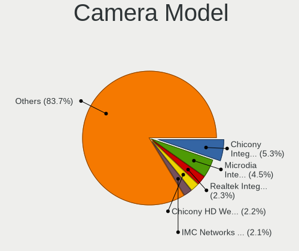

| Model                                                   | Notebooks | Percent |
|---------------------------------------------------------|-----------|---------|
| Microdia Integrated_Webcam_HD                           | 48        | 5.21%   |
| Chicony Integrated Camera                               | 33        | 3.58%   |
| Sunplus Integrated_Webcam_HD                            | 23        | 2.5%    |
| Chicony HD WebCam                                       | 23        | 2.5%    |
| Chicony TOSHIBA Web Camera - HD                         | 22        | 2.39%   |
| Realtek Integrated_Webcam_HD                            | 21        | 2.28%   |
| IMC Networks Integrated Camera                          | 21        | 2.28%   |
| Realtek USB Camera                                      | 16        | 1.74%   |
| Apple Built-in iSight                                   | 15        | 1.63%   |
| IMC Networks USB2.0 HD UVC WebCam                       | 14        | 1.52%   |
| Chicony HP TrueVision HD Camera                         | 12        | 1.3%    |
| Chicony HP Truevision HD                                | 12        | 1.3%    |
| Apple FaceTime HD Camera (Built-in)                     | 12        | 1.3%    |
| Acer Integrated Camera                                  | 11        | 1.19%   |
| Sunplus HD WebCam                                       | 10        | 1.09%   |
| Samsung Galaxy series, misc. (MTP mode)                 | 10        | 1.09%   |
| Lite-On Integrated Camera                               | 10        | 1.09%   |
| Chicony USB 2.0 Camera                                  | 10        | 1.09%   |
| Cheng Uei Precision Industry (Foxlink) HP Truevision HD | 10        | 1.09%   |
| Apple FaceTime HD Camera                                | 10        | 1.09%   |
| Microdia Integrated Webcam                              | 9         | 0.98%   |
| Chicony USB2.0 Camera                                   | 9         | 0.98%   |
| Apple iPhone 5/5C/5S/6/SE                               | 9         | 0.98%   |
| Syntek Integrated Camera                                | 8         | 0.87%   |
| Quanta HP TrueVision HD Camera                          | 8         | 0.87%   |
| Chicony HD User Facing                                  | 8         | 0.87%   |
| Chicony CNF9055 Toshiba Webcam                          | 8         | 0.87%   |
| Cheng Uei Precision Industry (Foxlink) HP HD Camera     | 8         | 0.87%   |
| Suyin HP Truevision HD                                  | 7         | 0.76%   |
| Quanta HD User Facing                                   | 7         | 0.76%   |
| Chicony HP HD Camera                                    | 7         | 0.76%   |
| Acer HD Webcam                                          | 7         | 0.76%   |
| Sunplus Asus Webcam                                     | 6         | 0.65%   |
| Quanta HD Webcam                                        | 6         | 0.65%   |
| Logitech Webcam C270                                    | 6         | 0.65%   |
| Chicony Integrated Camera (1280x720@30)                 | 6         | 0.65%   |
| Acer EasyCamera                                         | 6         | 0.65%   |
| Realtek USB2.0 HD UVC WebCam                            | 5         | 0.54%   |
| Realtek Integrated Webcam HD                            | 5         | 0.54%   |
| Quanta HP Webcam                                        | 5         | 0.54%   |
| Lite-On HP HD Camera                                    | 5         | 0.54%   |
| Importek TOSHIBA Web Camera - HD                        | 5         | 0.54%   |
| IMC Networks UVC VGA Webcam                             | 5         | 0.54%   |
| Chicony USB2.0 UVC WebCam                               | 5         | 0.54%   |
| Chicony Lenovo Integrated Camera (0.3MP)                | 5         | 0.54%   |
| Chicony HP Webcam [2 MP Macro]                          | 5         | 0.54%   |
| Sunplus Laptop_Integrated_Webcam_FHD                    | 4         | 0.43%   |
| Sunplus Laptop Integrated Webcam FHD                    | 4         | 0.43%   |
| Sunplus Integrated Webcam                               | 4         | 0.43%   |
| Sunplus HP HD Webcam [Fixed]                            | 4         | 0.43%   |
| Realtek HP Truevision HD                                | 4         | 0.43%   |
| Lenovo Integrated Webcam [R5U877]                       | 4         | 0.43%   |
| IMC Networks USB2.0 UVC HD Webcam                       | 4         | 0.43%   |
| IMC Networks USB2.0 HD IR UVC WebCam                    | 4         | 0.43%   |
| IMC Networks USB Camera                                 | 4         | 0.43%   |
| Chicony USB2.0 VGA UVC WebCam                           | 4         | 0.43%   |
| Chicony TOSHIBA Web Camera - FHD                        | 4         | 0.43%   |
| Chicony Integrated HP HD Webcam                         | 4         | 0.43%   |
| Chicony HP HD Webcam                                    | 4         | 0.43%   |
| Chicony 2.0M UVC Webcam / CNF7129                       | 4         | 0.43%   |

Security
--------

Fingerprint Vendor
------------------

Fingerprint sensor vendors

| Vendor                     | Notebooks | Percent |
|----------------------------|-----------|---------|
| Validity Sensors           | 85        | 42.29%  |
| Synaptics                  | 38        | 18.91%  |
| Shenzhen Goodix Technology | 24        | 11.94%  |
| LighTuning Technology      | 15        | 7.46%   |
| AuthenTec                  | 13        | 6.47%   |
| Upek                       | 12        | 5.97%   |
| Elan Microelectronics      | 8         | 3.98%   |
| STMicroelectronics         | 6         | 2.99%   |

Fingerprint Model
-----------------

Fingerprint sensor models

| Model                                                                      | Notebooks | Percent |
|----------------------------------------------------------------------------|-----------|---------|
| Synaptics Prometheus MIS Touch Fingerprint Reader                          | 15        | 7.46%   |
| Validity Sensors VFS495 Fingerprint Reader                                 | 14        | 6.97%   |
| Upek Biometric Touchchip/Touchstrip Fingerprint Sensor                     | 12        | 5.97%   |
| LighTuning EgisTec Touch Fingerprint Sensor                                | 11        | 5.47%   |
| Shenzhen Goodix Fingerprint Reader                                         | 9         | 4.48%   |
| Validity Sensors Fingerprint scanner                                       | 8         | 3.98%   |
| Shenzhen Goodix  Fingerprint Device                                        | 8         | 3.98%   |
| Unknown                                                                    | 8         | 3.98%   |
| Validity Sensors VFS491                                                    | 7         | 3.48%   |
| Validity Sensors VFS471 Fingerprint Reader                                 | 7         | 3.48%   |
| Validity Sensors VFS 5011 fingerprint sensor                               | 7         | 3.48%   |
| Shenzhen Goodix FingerPrint                                                | 7         | 3.48%   |
| Validity Sensors VFS451 Fingerprint Reader                                 | 6         | 2.99%   |
| Validity Sensors Synaptics WBDI                                            | 6         | 2.99%   |
| Validity Sensors Swipe Fingerprint Sensor                                  | 6         | 2.99%   |
| Synaptics Metallica MIS Touch Fingerprint Reader                           | 6         | 2.99%   |
| STMicroelectronics Fingerprint Reader                                      | 6         | 2.99%   |
| Validity Sensors VFS7552 Touch Fingerprint Sensor                          | 5         | 2.49%   |
| Synaptics WBDI Device                                                      | 5         | 2.49%   |
| Elan ELAN:Fingerprint                                                      | 5         | 2.49%   |
| Validity Sensors VFS7500 Touch Fingerprint Sensor                          | 4         | 1.99%   |
| Validity Sensors VFS Fingerprint sensor                                    | 4         | 1.99%   |
| Validity Sensors Synaptics VFS7552 Touch Fingerprint Sensor with PurePrint | 4         | 1.99%   |
| LighTuning ES603 Swipe Fingerprint Sensor                                  | 4         | 1.99%   |
| AuthenTec AES1600                                                          | 4         | 1.99%   |
| Validity Sensors VFS5011 Fingerprint Reader                                | 3         | 1.49%   |
| Validity Sensors VFS301 Fingerprint Reader                                 | 3         | 1.49%   |
| Elan ELAN:ARM-M4                                                           | 3         | 1.49%   |
| AuthenTec Fingerprint Sensor                                               | 3         | 1.49%   |
| AuthenTec AES2501 Fingerprint Sensor                                       | 3         | 1.49%   |
| Synaptics  WBDI                                                            | 2         | 1%      |
| AuthenTec AES2810                                                          | 2         | 1%      |
| Validity Sensors Synaptics VFS7552 Touch Fingerprint Sensor                | 1         | 0.5%    |
| Synaptics  FS7604 Touch Fingerprint Sensor with PurePrint                  | 1         | 0.5%    |
| Synaptics Metallica MOH Touch Fingerprint Reader                           | 1         | 0.5%    |
| AuthenTec AES2550 Fingerprint Sensor                                       | 1         | 0.5%    |

Chipcard Vendor
---------------

Chipcard module vendors

| Vendor      | Notebooks | Percent |
|-------------|-----------|---------|
| Broadcom    | 26        | 68.42%  |
| Alcor Micro | 8         | 21.05%  |
| Lenovo      | 2         | 5.26%   |
| Upek        | 1         | 2.63%   |
| O2 Micro    | 1         | 2.63%   |

Chipcard Model
--------------

Chipcard module models

| Model                                                                        | Notebooks | Percent |
|------------------------------------------------------------------------------|-----------|---------|
| Broadcom BCM5880 Secure Applications Processor                               | 13        | 34.21%  |
| Alcor Micro AU9540 Smartcard Reader                                          | 8         | 21.05%  |
| Broadcom BCM5880 Secure Applications Processor with fingerprint swipe sensor | 5         | 13.16%  |
| Broadcom 5880                                                                | 5         | 13.16%  |
| Broadcom 58200                                                               | 3         | 7.89%   |
| Lenovo Integrated Smart Card Reader                                          | 2         | 5.26%   |
| Upek TouchChip Fingerprint Coprocessor (WBF advanced mode)                   | 1         | 2.63%   |
| O2 Micro OZ776 CCID Smartcard Reader                                         | 1         | 2.63%   |

Unsupported
-----------

Unsupported Devices
-------------------

Total unsupported devices on board

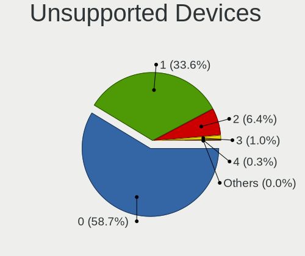

| Total | Notebooks | Percent |
|-------|-----------|---------|
| 0     | 614       | 60.55%  |
| 1     | 321       | 31.66%  |
| 2     | 64        | 6.31%   |
| 3     | 11        | 1.08%   |
| 4     | 4         | 0.39%   |

Unsupported Device Types
------------------------

Types of unsupported devices

| Type                     | Notebooks | Percent |
|--------------------------|-----------|---------|
| Fingerprint reader       | 200       | 42.83%  |
| Graphics card            | 92        | 19.7%   |
| Net/wireless             | 41        | 8.78%   |
| Chipcard                 | 36        | 7.71%   |
| Multimedia controller    | 24        | 5.14%   |
| Bluetooth                | 18        | 3.85%   |
| Camera                   | 14        | 3%      |
| Storage                  | 8         | 1.71%   |
| Net/ethernet             | 8         | 1.71%   |
| Modem                    | 6         | 1.28%   |
| Communication controller | 6         | 1.28%   |
| Sound                    | 5         | 1.07%   |
| Card reader              | 5         | 1.07%   |
| Unassigned class         | 1         | 0.21%   |
| Storage/ide              | 1         | 0.21%   |
| Storage/ata              | 1         | 0.21%   |
| Network                  | 1         | 0.21%   |

