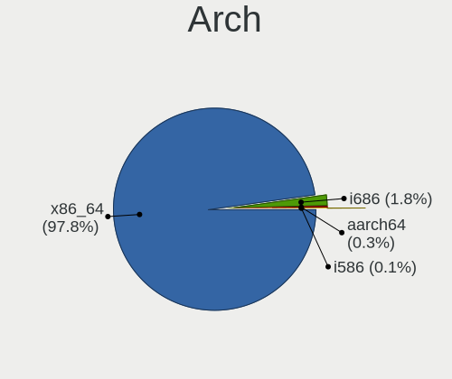
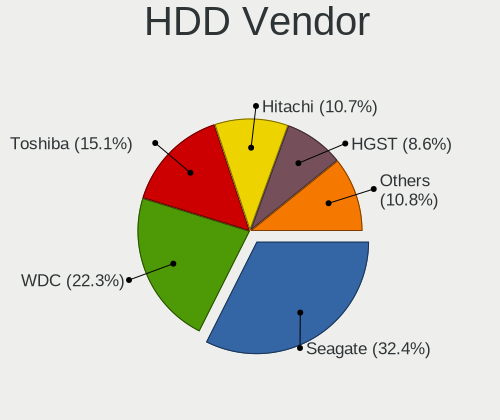
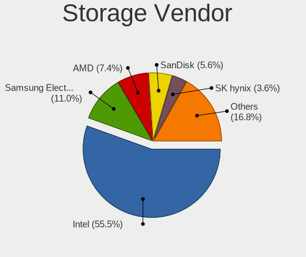
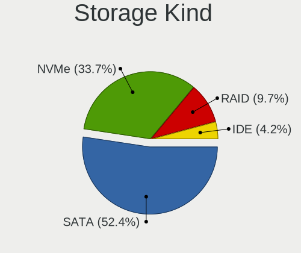
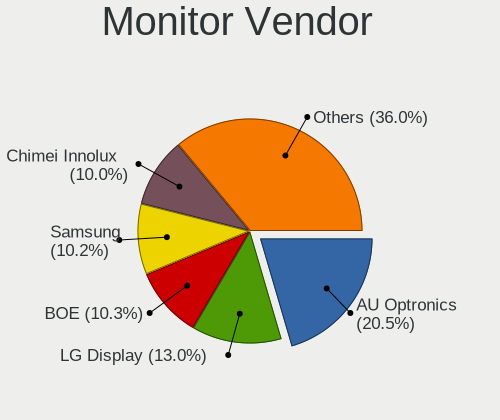
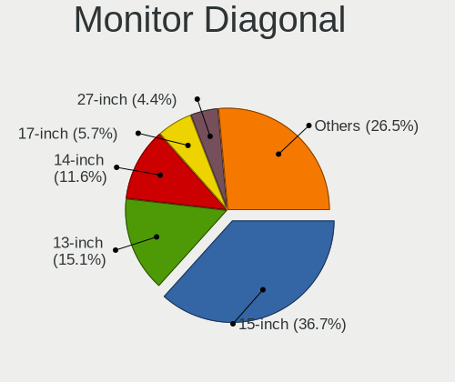
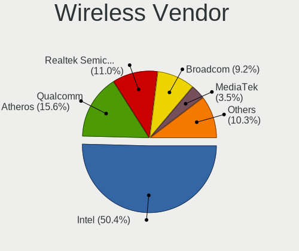
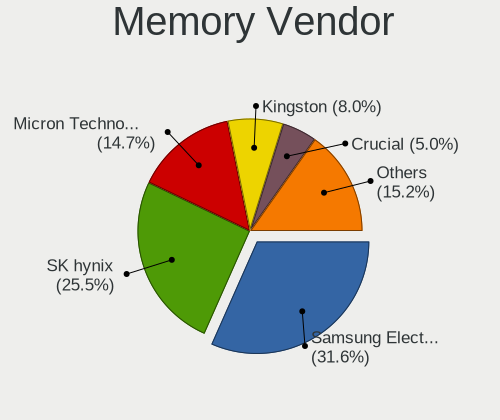
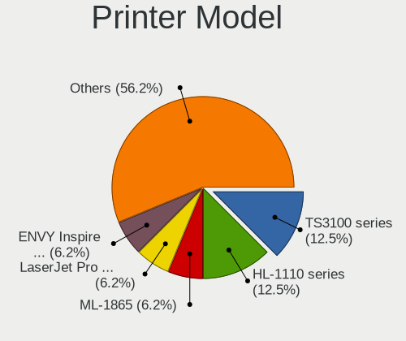
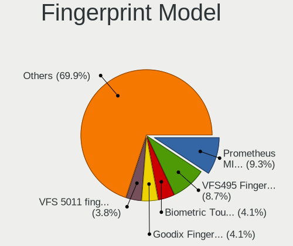

Linux in Australia - Tested Hardware & Statistics (Notebooks)
-------------------------------------------------------------

A project to collect tested hardware configurations for Linux in Australia.

Anyone can contribute to this report by the [hw-probe](https://github.com/linuxhw/hw-probe) tool:

    sudo -E hw-probe -all -upload

Please contribute! Especially if your hardware is rare.

Contents
--------

* [ Test Cases ](#test-cases)

* [ System ](#system)
  - [ OS                       ](#os)
  - [ OS Family                ](#os-family)
  - [ Kernel                   ](#kernel)
  - [ Kernel Family            ](#kernel-family)
  - [ Kernel Major Ver.        ](#kernel-major-ver)
  - [ Arch                     ](#arch)
  - [ DE                       ](#de)
  - [ Display Server           ](#display-server)
  - [ Display Manager          ](#display-manager)
  - [ OS Lang                  ](#os-lang)
  - [ Boot Mode                ](#boot-mode)
  - [ Filesystem               ](#filesystem)
  - [ Part. scheme             ](#part-scheme)
  - [ Dual Boot with Linux/BSD ](#dual-boot-with-linuxbsd)
  - [ Dual Boot (Win)          ](#dual-boot-win)

* [ Board ](#board)
  - [ Vendor                   ](#vendor)
  - [ Model                    ](#model)
  - [ Model Family             ](#model-family)
  - [ MFG Year                 ](#mfg-year)
  - [ Form Factor              ](#form-factor)
  - [ Secure Boot              ](#secure-boot)
  - [ Coreboot                 ](#coreboot)
  - [ RAM Size                 ](#ram-size)
  - [ RAM Used                 ](#ram-used)
  - [ Total Drives             ](#total-drives)
  - [ Has CD-ROM               ](#has-cd-rom)
  - [ Has Ethernet             ](#has-ethernet)
  - [ Has WiFi                 ](#has-wifi)
  - [ Has Bluetooth            ](#has-bluetooth)

* [ Location ](#location)
  - [ Country                  ](#country)
  - [ City                     ](#city)

* [ Drives ](#drives)
  - [ Drive Vendor             ](#drive-vendor)
  - [ Drive Model              ](#drive-model)
  - [ HDD Vendor               ](#hdd-vendor)
  - [ SSD Vendor               ](#ssd-vendor)
  - [ Drive Kind               ](#drive-kind)
  - [ Drive Connector          ](#drive-connector)
  - [ Drive Size               ](#drive-size)
  - [ Space Total              ](#space-total)
  - [ Space Used               ](#space-used)
  - [ Malfunc. Drives          ](#malfunc-drives)
  - [ Malfunc. Drive Vendor    ](#malfunc-drive-vendor)
  - [ Malfunc. HDD Vendor      ](#malfunc-hdd-vendor)
  - [ Malfunc. Drive Kind      ](#malfunc-drive-kind)
  - [ Failed Drives            ](#failed-drives)
  - [ Failed Drive Vendor      ](#failed-drive-vendor)
  - [ Drive Status             ](#drive-status)

* [ Storage controller ](#storage-controller)
  - [ Storage Vendor           ](#storage-vendor)
  - [ Storage Model            ](#storage-model)
  - [ Storage Kind             ](#storage-kind)

* [ Processor ](#processor)
  - [ CPU Vendor               ](#cpu-vendor)
  - [ CPU Model                ](#cpu-model)
  - [ CPU Model Family         ](#cpu-model-family)
  - [ CPU Cores                ](#cpu-cores)
  - [ CPU Sockets              ](#cpu-sockets)
  - [ CPU Threads              ](#cpu-threads)
  - [ CPU Op-Modes             ](#cpu-op-modes)
  - [ CPU Microcode            ](#cpu-microcode)
  - [ CPU Microarch            ](#cpu-microarch)

* [ Graphics ](#graphics)
  - [ GPU Vendor               ](#gpu-vendor)
  - [ GPU Model                ](#gpu-model)
  - [ GPU Combo                ](#gpu-combo)
  - [ GPU Driver               ](#gpu-driver)
  - [ GPU Memory               ](#gpu-memory)

* [ Monitor ](#monitor)
  - [ Monitor Vendor           ](#monitor-vendor)
  - [ Monitor Model            ](#monitor-model)
  - [ Monitor Resolution       ](#monitor-resolution)
  - [ Monitor Diagonal         ](#monitor-diagonal)
  - [ Monitor Width            ](#monitor-width)
  - [ Aspect Ratio             ](#aspect-ratio)
  - [ Monitor Area             ](#monitor-area)
  - [ Pixel Density            ](#pixel-density)
  - [ Multiple Monitors        ](#multiple-monitors)

* [ Network ](#network)
  - [ Net Controller Vendor    ](#net-controller-vendor)
  - [ Net Controller Model     ](#net-controller-model)
  - [ Wireless Vendor          ](#wireless-vendor)
  - [ Wireless Model           ](#wireless-model)
  - [ Ethernet Vendor          ](#ethernet-vendor)
  - [ Ethernet Model           ](#ethernet-model)
  - [ Net Controller Kind      ](#net-controller-kind)
  - [ Used Controller          ](#used-controller)
  - [ NICs                     ](#nics)
  - [ IPv6                     ](#ipv6)

* [ Bluetooth ](#bluetooth)
  - [ Bluetooth Vendor         ](#bluetooth-vendor)
  - [ Bluetooth Model          ](#bluetooth-model)

* [ Sound ](#sound)
  - [ Sound Vendor             ](#sound-vendor)
  - [ Sound Model              ](#sound-model)

* [ Memory ](#memory)
  - [ Memory Vendor            ](#memory-vendor)
  - [ Memory Model             ](#memory-model)
  - [ Memory Kind              ](#memory-kind)
  - [ Memory Form Factor       ](#memory-form-factor)
  - [ Memory Size              ](#memory-size)
  - [ Memory Speed             ](#memory-speed)

* [ Printers & scanners ](#printers--scanners)
  - [ Printer Vendor           ](#printer-vendor)
  - [ Printer Model            ](#printer-model)
  - [ Scanner Vendor           ](#scanner-vendor)
  - [ Scanner Model            ](#scanner-model)

* [ Camera ](#camera)
  - [ Camera Vendor            ](#camera-vendor)
  - [ Camera Model             ](#camera-model)

* [ Security ](#security)
  - [ Fingerprint Vendor       ](#fingerprint-vendor)
  - [ Fingerprint Model        ](#fingerprint-model)
  - [ Chipcard Vendor          ](#chipcard-vendor)
  - [ Chipcard Model           ](#chipcard-model)

* [ Unsupported ](#unsupported)
  - [ Unsupported Devices      ](#unsupported-devices)
  - [ Unsupported Device Types ](#unsupported-device-types)

Test Cases
----------

Total: 3167

| Vendor        | Model                       | Probe                                                      | Date         |
|---------------|-----------------------------|------------------------------------------------------------|--------------|
| Acer          | Aspire 5750G                | [68404201a9](https://linux-hardware.org/?probe=68404201a9) | Jan 05, 2025 |
| HP            | ZHAN 66 Pro A 14 G4 Note... | [0c0d5510fc](https://linux-hardware.org/?probe=0c0d5510fc) | Jan 05, 2025 |
| HP            | Pavilion Gaming Laptop 1... | [cc86c7e5c1](https://linux-hardware.org/?probe=cc86c7e5c1) | Jan 05, 2025 |
| HP            | Pavilion Gaming Laptop 1... | [5b3ef34113](https://linux-hardware.org/?probe=5b3ef34113) | Jan 04, 2025 |
| ASUSTek       | VivoBook E14 E402WAS        | [208b3336eb](https://linux-hardware.org/?probe=208b3336eb) | Jan 04, 2025 |
| HP            | Notebook                    | [b50d5a2974](https://linux-hardware.org/?probe=b50d5a2974) | Jan 03, 2025 |
| HP            | Laptop 14s-fq1xxx           | [890bc399f9](https://linux-hardware.org/?probe=890bc399f9) | Jan 03, 2025 |
| Lenovo        | IdeaPad L340-15IRH Gamin... | [8782970610](https://linux-hardware.org/?probe=8782970610) | Jan 01, 2025 |
| HP            | EliteBook 820 G3            | [eeb8564089](https://linux-hardware.org/?probe=eeb8564089) | Jan 01, 2025 |
| HP            | Pavilion Gaming Laptop 1... | [38accd1b79](https://linux-hardware.org/?probe=38accd1b79) | Jan 01, 2025 |
| MSI           | Prestige 13 AI+ Evo A2VM... | [e0ef8014cc](https://linux-hardware.org/?probe=e0ef8014cc) | Dec 31, 2024 |
| ASUSTek       | X541UJ                      | [5d46dedc86](https://linux-hardware.org/?probe=5d46dedc86) | Dec 30, 2024 |
| ASUSTek       | TP500LN                     | [beeccb21e7](https://linux-hardware.org/?probe=beeccb21e7) | Dec 29, 2024 |
| ASUSTek       | TP500LN                     | [e71efdddcc](https://linux-hardware.org/?probe=e71efdddcc) | Dec 29, 2024 |
| Framework     | Laptop 16 (AMD Ryzen 704... | [c19c3fe9fc](https://linux-hardware.org/?probe=c19c3fe9fc) | Dec 29, 2024 |
| HP            | Laptop 15s-eq1xxx           | [9ce5b91ecb](https://linux-hardware.org/?probe=9ce5b91ecb) | Dec 28, 2024 |
| Acer          | Aspire 5750G                | [39cfeac033](https://linux-hardware.org/?probe=39cfeac033) | Dec 28, 2024 |
| ASUSTek       | VivoBook 14_ASUS Laptop ... | [29e44582de](https://linux-hardware.org/?probe=29e44582de) | Dec 28, 2024 |
| Acer          | Aspire 5750G                | [ffcb19aa37](https://linux-hardware.org/?probe=ffcb19aa37) | Dec 28, 2024 |
| Framework     | Laptop 16 (AMD Ryzen 704... | [b892b107e9](https://linux-hardware.org/?probe=b892b107e9) | Dec 27, 2024 |
| ASUSTek       | VivoBook_ASUSLaptop K660... | [b9d5bc89b8](https://linux-hardware.org/?probe=b9d5bc89b8) | Dec 27, 2024 |
| Lenovo        | ThinkPad X1 Carbon Gen 9... | [a9e7731362](https://linux-hardware.org/?probe=a9e7731362) | Dec 27, 2024 |
| ASUSTek       | VivoBook_ASUSLaptop K660... | [03ce070dd2](https://linux-hardware.org/?probe=03ce070dd2) | Dec 27, 2024 |
| Dell          | Latitude 14 Rugged (5404... | [58a8c67731](https://linux-hardware.org/?probe=58a8c67731) | Dec 26, 2024 |
| HP            | Laptop 14s-fq1xxx           | [efbbc1e8ad](https://linux-hardware.org/?probe=efbbc1e8ad) | Dec 26, 2024 |
| ASUSTek       | VivoBook_ASUSLaptop K360... | [a6423a604b](https://linux-hardware.org/?probe=a6423a604b) | Dec 24, 2024 |
| Acer          | Predator PH315-51           | [0cce8338d7](https://linux-hardware.org/?probe=0cce8338d7) | Dec 22, 2024 |
| Dell          | Latitude E6430              | [7715633f8e](https://linux-hardware.org/?probe=7715633f8e) | Dec 21, 2024 |
| Acer          | Aspire AG14-31P             | [08d3fd4cb9](https://linux-hardware.org/?probe=08d3fd4cb9) | Dec 20, 2024 |
| Unknown       | Unknown                     | [8cedb6a671](https://linux-hardware.org/?probe=8cedb6a671) | Dec 20, 2024 |
| HP            | Laptop 14-bs0xx             | [ba1d6aa1a1](https://linux-hardware.org/?probe=ba1d6aa1a1) | Dec 19, 2024 |
| GPD           | G1621-02                    | [97b2f3034e](https://linux-hardware.org/?probe=97b2f3034e) | Dec 19, 2024 |
| HP            | Laptop 14s-fq1xxx           | [85527618fc](https://linux-hardware.org/?probe=85527618fc) | Dec 19, 2024 |
| Gigabyte      | B550 AORUS ELITE AX V2      | [193c96330e](https://linux-hardware.org/?probe=193c96330e) | Dec 18, 2024 |
| Apple         | MacBookPro11,3              | [26fb82a499](https://linux-hardware.org/?probe=26fb82a499) | Dec 18, 2024 |
| HP            | EliteBook 820 G4            | [3f127bb0d5](https://linux-hardware.org/?probe=3f127bb0d5) | Dec 18, 2024 |
| Gigabyte      | B550 AORUS ELITE AX V2      | [db89962085](https://linux-hardware.org/?probe=db89962085) | Dec 17, 2024 |
| Toshiba       | Satellite C850              | [38ed2a4b9e](https://linux-hardware.org/?probe=38ed2a4b9e) | Dec 17, 2024 |
| Acer          | TravelMate P653-M           | [433663f1d2](https://linux-hardware.org/?probe=433663f1d2) | Dec 16, 2024 |
| ASUSTek       | ProArt Studiobook H7604J... | [a099000019](https://linux-hardware.org/?probe=a099000019) | Dec 15, 2024 |
| Acer          | Predator PH517-51           | [0035c618aa](https://linux-hardware.org/?probe=0035c618aa) | Dec 15, 2024 |
| Dell          | Latitude 7390               | [94f7f49765](https://linux-hardware.org/?probe=94f7f49765) | Dec 14, 2024 |
| Acer          | Swift SF514-55T             | [3f6fe24453](https://linux-hardware.org/?probe=3f6fe24453) | Dec 13, 2024 |
| ASUSTek       | VivoBook_ASUSLaptop K360... | [73bcd406d0](https://linux-hardware.org/?probe=73bcd406d0) | Dec 12, 2024 |
| Lenovo        | ThinkPad X1 Carbon 5th 2... | [1b4e08a55a](https://linux-hardware.org/?probe=1b4e08a55a) | Dec 12, 2024 |
| Chuwi         | UBook                       | [08e88467cb](https://linux-hardware.org/?probe=08e88467cb) | Dec 12, 2024 |
| ASUSTek       | VivoBook 14_ASUS Laptop ... | [c4f5feb755](https://linux-hardware.org/?probe=c4f5feb755) | Dec 11, 2024 |
| Toshiba       | PORTEGE X30-E               | [6c8506b8a9](https://linux-hardware.org/?probe=6c8506b8a9) | Dec 10, 2024 |
| Dell          | Latitude E6330              | [aff00f3865](https://linux-hardware.org/?probe=aff00f3865) | Dec 10, 2024 |
| Dell          | XPS 15 9510                 | [ff4cc61f47](https://linux-hardware.org/?probe=ff4cc61f47) | Dec 09, 2024 |
| Dell          | Latitude E6330              | [7f633e8b4d](https://linux-hardware.org/?probe=7f633e8b4d) | Dec 09, 2024 |
| Apple         | MacBookAir7,2               | [c4d956f844](https://linux-hardware.org/?probe=c4d956f844) | Dec 09, 2024 |
| Toshiba       | PORTEGE X30-E               | [1be2e9c5d1](https://linux-hardware.org/?probe=1be2e9c5d1) | Dec 09, 2024 |
| Lenovo        | ThinkPad X1 Carbon Gen 1... | [814ce2b076](https://linux-hardware.org/?probe=814ce2b076) | Dec 09, 2024 |
| HP            | Laptop 14s-dq3xxx           | [dd50a8ad3b](https://linux-hardware.org/?probe=dd50a8ad3b) | Dec 07, 2024 |
| HP            | Laptop 14s-dq3xxx           | [3b9ccf4f6d](https://linux-hardware.org/?probe=3b9ccf4f6d) | Dec 07, 2024 |
| Lenovo        | ThinkPad L13 Gen 2a 21AB... | [8a5754e888](https://linux-hardware.org/?probe=8a5754e888) | Dec 07, 2024 |
| Dell          | Precision 3560              | [d30964e712](https://linux-hardware.org/?probe=d30964e712) | Dec 06, 2024 |
| Chuwi         | UBook                       | [ddba94874a](https://linux-hardware.org/?probe=ddba94874a) | Dec 04, 2024 |
| ASUSTek       | VivoBook_ASUSLaptop M760... | [834649c8ed](https://linux-hardware.org/?probe=834649c8ed) | Dec 04, 2024 |
| ASUSTek       | K53SC                       | [b7850939a4](https://linux-hardware.org/?probe=b7850939a4) | Dec 04, 2024 |
| Dell          | Latitude E6410              | [208eeccf87](https://linux-hardware.org/?probe=208eeccf87) | Dec 04, 2024 |
| Dell          | XPS 13 9305                 | [8ff051cc6e](https://linux-hardware.org/?probe=8ff051cc6e) | Dec 04, 2024 |
| MSI           | Prestige 16 A13UCX          | [3c4cfbe0c2](https://linux-hardware.org/?probe=3c4cfbe0c2) | Dec 04, 2024 |
| Lenovo        | IdeaPad 5 Pro 14ACN6 82L... | [291629dda6](https://linux-hardware.org/?probe=291629dda6) | Dec 03, 2024 |
| Intel Clie... | LAPBC710                    | [e603037ba8](https://linux-hardware.org/?probe=e603037ba8) | Dec 03, 2024 |
| HP            | Pavilion dv6                | [f72bd7ca67](https://linux-hardware.org/?probe=f72bd7ca67) | Dec 03, 2024 |
| ASUSTek       | VivoBook_ASUSLaptop M760... | [8150c1fd65](https://linux-hardware.org/?probe=8150c1fd65) | Dec 02, 2024 |
| Dell          | Inspiron 3580               | [cd4f2164a0](https://linux-hardware.org/?probe=cd4f2164a0) | Dec 02, 2024 |
| Lenovo        | IdeaPad 3 15ADA05 81W1      | [5b0a65bb7c](https://linux-hardware.org/?probe=5b0a65bb7c) | Dec 01, 2024 |
| Lenovo        | ThinkPad P53 20QQS01L25     | [2ab5a606c9](https://linux-hardware.org/?probe=2ab5a606c9) | Nov 30, 2024 |
| Lenovo        | ThinkPad L470 W10DG 20JV... | [751428f37c](https://linux-hardware.org/?probe=751428f37c) | Nov 29, 2024 |
| Alienware     | 17 R4                       | [ef42de0d20](https://linux-hardware.org/?probe=ef42de0d20) | Nov 28, 2024 |
| HP            | EliteBook 840 G4            | [801af34dc8](https://linux-hardware.org/?probe=801af34dc8) | Nov 27, 2024 |
| Dell          | Precision 3591              | [71c9c95f67](https://linux-hardware.org/?probe=71c9c95f67) | Nov 26, 2024 |
| ASUSTek       | X550JX                      | [11c59b25e3](https://linux-hardware.org/?probe=11c59b25e3) | Nov 26, 2024 |
| Lenovo        | ThinkPad P53 20QQS01L25     | [9a46aa789c](https://linux-hardware.org/?probe=9a46aa789c) | Nov 25, 2024 |
| Alienware     | 17 R4                       | [892ac0bb13](https://linux-hardware.org/?probe=892ac0bb13) | Nov 25, 2024 |
| Acer          | TravelMate P446-M           | [37578d27ba](https://linux-hardware.org/?probe=37578d27ba) | Nov 23, 2024 |
| LG Electro... | 16Z90P-G.AA75A              | [c441597519](https://linux-hardware.org/?probe=c441597519) | Nov 23, 2024 |
| ASUSTek       | GL752VW                     | [4df66d6d25](https://linux-hardware.org/?probe=4df66d6d25) | Nov 23, 2024 |
| Dell          | Latitude 5430               | [cbb4970afb](https://linux-hardware.org/?probe=cbb4970afb) | Nov 23, 2024 |
| Valve         | Jupiter                     | [e0e7192eba](https://linux-hardware.org/?probe=e0e7192eba) | Nov 22, 2024 |
| Dell          | Latitude 5430               | [7123ed49f7](https://linux-hardware.org/?probe=7123ed49f7) | Nov 22, 2024 |
| MSI           | GT75 Titan 8RG              | [4687248040](https://linux-hardware.org/?probe=4687248040) | Nov 22, 2024 |
| ASUSTek       | X550JX                      | [34bfe8d2b6](https://linux-hardware.org/?probe=34bfe8d2b6) | Nov 22, 2024 |
| ASUSTek       | X550JX                      | [3ee3360b2c](https://linux-hardware.org/?probe=3ee3360b2c) | Nov 22, 2024 |
| Acer          | Aspire A315-510P            | [99993b0f3e](https://linux-hardware.org/?probe=99993b0f3e) | Nov 21, 2024 |
| ASUSTek       | GL552VW                     | [77e30dc8de](https://linux-hardware.org/?probe=77e30dc8de) | Nov 19, 2024 |
| Dell          | XPS 15 9530                 | [82a3e738b1](https://linux-hardware.org/?probe=82a3e738b1) | Nov 19, 2024 |
| Apple         | MacBookPro8,1               | [27ddf4e4b1](https://linux-hardware.org/?probe=27ddf4e4b1) | Nov 18, 2024 |
| ASUSTek       | GL552VW                     | [257a158847](https://linux-hardware.org/?probe=257a158847) | Nov 18, 2024 |
| Intel Clie... | LAPQC71B                    | [5db38e2711](https://linux-hardware.org/?probe=5db38e2711) | Nov 17, 2024 |
| Apple         | MacBookPro11,5              | [c2a112f067](https://linux-hardware.org/?probe=c2a112f067) | Nov 16, 2024 |
| Lenovo        | IdeaPad S540-13ITL 82H1     | [ae1583866f](https://linux-hardware.org/?probe=ae1583866f) | Nov 16, 2024 |
| MSI           | Prestige 15 A12UC           | [b1feb7756d](https://linux-hardware.org/?probe=b1feb7756d) | Nov 15, 2024 |
| Apple         | MacBookPro15,2              | [f21bc8c54b](https://linux-hardware.org/?probe=f21bc8c54b) | Nov 12, 2024 |
| ASUSTek       | VivoBook_ASUS Laptop E41... | [dc0dd3a948](https://linux-hardware.org/?probe=dc0dd3a948) | Nov 12, 2024 |
| ASUSTek       | F3JP                        | [cd8a9b0278](https://linux-hardware.org/?probe=cd8a9b0278) | Nov 12, 2024 |
| Framework     | Laptop 16 (AMD Ryzen 704... | [e16d78d766](https://linux-hardware.org/?probe=e16d78d766) | Nov 10, 2024 |
| Framework     | Laptop 16 (AMD Ryzen 704... | [480d5f0266](https://linux-hardware.org/?probe=480d5f0266) | Nov 10, 2024 |
| Toshiba       | Satellite Pro L550          | [90ba079d9a](https://linux-hardware.org/?probe=90ba079d9a) | Nov 08, 2024 |
| Lenovo        | ThinkPad T410 2522PT3       | [ffed1336ad](https://linux-hardware.org/?probe=ffed1336ad) | Nov 07, 2024 |
| Apple         | MacBookPro8,1               | [f73e960e6b](https://linux-hardware.org/?probe=f73e960e6b) | Nov 07, 2024 |
| Unknown       | Unknown                     | [723fee0d9d](https://linux-hardware.org/?probe=723fee0d9d) | Nov 06, 2024 |
| Apple         | MacBookPro8,1               | [92cddeb19a](https://linux-hardware.org/?probe=92cddeb19a) | Nov 06, 2024 |
| Timi          | Redmi Book Pro 14 2022      | [317fe89cc5](https://linux-hardware.org/?probe=317fe89cc5) | Nov 05, 2024 |
| HP            | Notebook                    | [a1bc0f7cfa](https://linux-hardware.org/?probe=a1bc0f7cfa) | Nov 05, 2024 |
| Lenovo        | ThinkPad T480s 20L7S0060... | [ebf7e20a00](https://linux-hardware.org/?probe=ebf7e20a00) | Nov 05, 2024 |
| Apple         | MacBookPro11,4              | [eb4be42b97](https://linux-hardware.org/?probe=eb4be42b97) | Nov 03, 2024 |
| Lenovo        | IdeaPad 5 Pro 14ARH7 82S... | [ee9620d5e3](https://linux-hardware.org/?probe=ee9620d5e3) | Nov 03, 2024 |
| Dell          | Inspiron 16 7610            | [f0d1717af2](https://linux-hardware.org/?probe=f0d1717af2) | Nov 02, 2024 |
| HP            | Compaq CQ45                 | [37a06dc980](https://linux-hardware.org/?probe=37a06dc980) | Nov 02, 2024 |
| HP            | Compaq CQ45                 | [eea008157b](https://linux-hardware.org/?probe=eea008157b) | Nov 02, 2024 |
| ASUSTek       | S550CB                      | [d50e1a8a06](https://linux-hardware.org/?probe=d50e1a8a06) | Nov 02, 2024 |
| Apple         | MacBookPro11,4              | [cb30874017](https://linux-hardware.org/?probe=cb30874017) | Oct 30, 2024 |
| ASUSTek       | VivoBook_ASUSLaptop X150... | [b1695ef355](https://linux-hardware.org/?probe=b1695ef355) | Oct 30, 2024 |
| HP            | Laptop 15s-fq5xxx           | [4af4c5982b](https://linux-hardware.org/?probe=4af4c5982b) | Oct 30, 2024 |
| Dell          | Inspiron M5010              | [c33b702644](https://linux-hardware.org/?probe=c33b702644) | Oct 30, 2024 |
| Gigabyte      | Z590I AORUS ULTRA           | [816bafe83f](https://linux-hardware.org/?probe=816bafe83f) | Oct 30, 2024 |
| Dell          | Precision 5540              | [cabab07d6f](https://linux-hardware.org/?probe=cabab07d6f) | Oct 30, 2024 |
| Acer          | Aspire A514-52K             | [102e60dfa8](https://linux-hardware.org/?probe=102e60dfa8) | Oct 30, 2024 |
| MSI           | GF63 Thin 11UC              | [6f3cddbb64](https://linux-hardware.org/?probe=6f3cddbb64) | Oct 28, 2024 |
| Dell          | XPS 13 9350                 | [624d31014e](https://linux-hardware.org/?probe=624d31014e) | Oct 28, 2024 |
| Acer          | Aspire 5600                 | [02813ab0f6](https://linux-hardware.org/?probe=02813ab0f6) | Oct 27, 2024 |
| MSI           | Bravo 17 C7VFK              | [a7adfb673d](https://linux-hardware.org/?probe=a7adfb673d) | Oct 27, 2024 |
| Lenovo        | Legion Y740-15IRHg 81UH     | [e489d3c5f1](https://linux-hardware.org/?probe=e489d3c5f1) | Oct 27, 2024 |
| Toshiba       | PORTEGE X30-E               | [8171ac365f](https://linux-hardware.org/?probe=8171ac365f) | Oct 27, 2024 |
| HP            | EliteBook 850 G3            | [a62e77d2a5](https://linux-hardware.org/?probe=a62e77d2a5) | Oct 26, 2024 |
| Lenovo        | IdeaPad 5 Pro 14ACN6 82L... | [50274618bd](https://linux-hardware.org/?probe=50274618bd) | Oct 25, 2024 |
| Apple         | MacBookPro5,5               | [64a2cc3677](https://linux-hardware.org/?probe=64a2cc3677) | Oct 25, 2024 |
| HP            | Pavilion dv6                | [e0742f5a71](https://linux-hardware.org/?probe=e0742f5a71) | Oct 25, 2024 |
| HP            | Pavilion dv6                | [6038c991fd](https://linux-hardware.org/?probe=6038c991fd) | Oct 25, 2024 |
| Dell          | Inspiron 14 5420            | [83d1e56980](https://linux-hardware.org/?probe=83d1e56980) | Oct 25, 2024 |
| Dell          | Inspiron M5010              | [f8441a09c6](https://linux-hardware.org/?probe=f8441a09c6) | Oct 24, 2024 |
| Toshiba       | Satellite NB10-A            | [22b28cedab](https://linux-hardware.org/?probe=22b28cedab) | Oct 23, 2024 |
| HP            | Notebook                    | [c77d9407e6](https://linux-hardware.org/?probe=c77d9407e6) | Oct 23, 2024 |
| Lenovo        | IdeaPad 110-15ACL 80TJ      | [00ece3282c](https://linux-hardware.org/?probe=00ece3282c) | Oct 22, 2024 |
| IT Channel... | NP5x_6x_7x_SNx              | [f92a3a6051](https://linux-hardware.org/?probe=f92a3a6051) | Oct 21, 2024 |
| Toshiba       | Satellite NB10-A            | [21513242cc](https://linux-hardware.org/?probe=21513242cc) | Oct 21, 2024 |
| Lenovo        | ThinkPad E16 Gen 1 21JT0... | [7ae8bf79b4](https://linux-hardware.org/?probe=7ae8bf79b4) | Oct 21, 2024 |
| IT Channel... | PCX0DX                      | [c8d8110356](https://linux-hardware.org/?probe=c8d8110356) | Oct 21, 2024 |
| Lenovo        | Legion 7 16IAX7 82TD        | [84339c1373](https://linux-hardware.org/?probe=84339c1373) | Oct 18, 2024 |
| Dell          | XPS 13 9360                 | [cb4c412377](https://linux-hardware.org/?probe=cb4c412377) | Oct 18, 2024 |
| Apple         | MacBookPro8,1               | [83508d3840](https://linux-hardware.org/?probe=83508d3840) | Oct 17, 2024 |
| Dell          | Latitude E6520              | [aff7fc0640](https://linux-hardware.org/?probe=aff7fc0640) | Oct 16, 2024 |
| Dell          | Vostro 1015                 | [8326428537](https://linux-hardware.org/?probe=8326428537) | Oct 14, 2024 |
| Dell          | Latitude E7450              | [7119b42c95](https://linux-hardware.org/?probe=7119b42c95) | Oct 13, 2024 |
| MSI           | Prestige 14Evo B13M         | [88ce0526f2](https://linux-hardware.org/?probe=88ce0526f2) | Oct 12, 2024 |
| MSI           | Prestige 16 A13UCX          | [13ecbc66e6](https://linux-hardware.org/?probe=13ecbc66e6) | Oct 12, 2024 |
| Dell          | Latitude E7450              | [b5f8c62bb7](https://linux-hardware.org/?probe=b5f8c62bb7) | Oct 11, 2024 |
| Acer          | Nitro AN515-58              | [6ee0998a25](https://linux-hardware.org/?probe=6ee0998a25) | Oct 11, 2024 |
| Lenovo        | IdeaPad Slim 1-14AST-05 ... | [22b89f33b2](https://linux-hardware.org/?probe=22b89f33b2) | Oct 10, 2024 |
| Dell          | Latitude E7440              | [d319ecb94f](https://linux-hardware.org/?probe=d319ecb94f) | Oct 09, 2024 |
| HP            | EliteBook 2740p             | [8eaeff2eea](https://linux-hardware.org/?probe=8eaeff2eea) | Oct 09, 2024 |
| Lenovo        | IdeaPad Slim 1-14AST-05 ... | [947a9dce93](https://linux-hardware.org/?probe=947a9dce93) | Oct 07, 2024 |
| Acer          | Aspire E3-111               | [873a0c69dc](https://linux-hardware.org/?probe=873a0c69dc) | Oct 07, 2024 |
| Framework     | Laptop 16 (AMD Ryzen 704... | [4dc891703c](https://linux-hardware.org/?probe=4dc891703c) | Oct 07, 2024 |
| Dell          | Inspiron 14 5420            | [14b93e06ea](https://linux-hardware.org/?probe=14b93e06ea) | Oct 07, 2024 |
| Dell          | Inspiron 14 5420            | [d56abe08ed](https://linux-hardware.org/?probe=d56abe08ed) | Oct 07, 2024 |
| HP            | 250 G5 Notebook PC          | [7eb76fb226](https://linux-hardware.org/?probe=7eb76fb226) | Oct 05, 2024 |
| ASUSTek       | ROG Zephyrus G14 GA401II... | [86664c2cf3](https://linux-hardware.org/?probe=86664c2cf3) | Oct 05, 2024 |
| HP            | ProBook 6460b               | [1d1b1f1089](https://linux-hardware.org/?probe=1d1b1f1089) | Oct 05, 2024 |
| Apple         | MacBookPro8,1               | [2f5e90883a](https://linux-hardware.org/?probe=2f5e90883a) | Oct 05, 2024 |
| Dell          | Latitude E6220              | [e81d7d990f](https://linux-hardware.org/?probe=e81d7d990f) | Oct 04, 2024 |
| HP            | EliteBook 840 G6            | [af948b81a2](https://linux-hardware.org/?probe=af948b81a2) | Oct 04, 2024 |
| Lenovo        | ThinkPad E580 20KSCTO1WW    | [ef65dcda3a](https://linux-hardware.org/?probe=ef65dcda3a) | Oct 02, 2024 |
| Toshiba       | Satellite Pro C50-B         | [73cecf0985](https://linux-hardware.org/?probe=73cecf0985) | Oct 02, 2024 |
| Lenovo        | NB LN Legion PRO 5 16IRX... | [777ce0c1e8](https://linux-hardware.org/?probe=777ce0c1e8) | Oct 01, 2024 |
| Lenovo        | ThinkPad Edge E530 3259C... | [3e7004b434](https://linux-hardware.org/?probe=3e7004b434) | Oct 01, 2024 |
| HP            | Pavilion g6                 | [c886f47dc8](https://linux-hardware.org/?probe=c886f47dc8) | Sep 30, 2024 |
| HP            | Pavilion g6                 | [d78a433c09](https://linux-hardware.org/?probe=d78a433c09) | Sep 30, 2024 |
| ASUSTek       | Zenbook 15 UM3504DA_UM35... | [abb2f28947](https://linux-hardware.org/?probe=abb2f28947) | Sep 28, 2024 |
| Unknown       | Unknown                     | [ce872708f4](https://linux-hardware.org/?probe=ce872708f4) | Sep 27, 2024 |
| ASUSTek       | K56CM                       | [11dfa26058](https://linux-hardware.org/?probe=11dfa26058) | Sep 26, 2024 |
| Google        | Peppy                       | [43b1f58c7d](https://linux-hardware.org/?probe=43b1f58c7d) | Sep 26, 2024 |
| Toshiba       | PORTEGE Z30t-C              | [06807aa903](https://linux-hardware.org/?probe=06807aa903) | Sep 25, 2024 |
| Toshiba       | Satellite L750              | [282bccacf0](https://linux-hardware.org/?probe=282bccacf0) | Sep 25, 2024 |
| Apple         | MacBookPro8,2               | [69e5d056e0](https://linux-hardware.org/?probe=69e5d056e0) | Sep 25, 2024 |
| Lenovo        | Yoga S730-13IML 81U4        | [b411da6d9e](https://linux-hardware.org/?probe=b411da6d9e) | Sep 25, 2024 |
| Apple         | MacBookPro5,5               | [a0bb48750a](https://linux-hardware.org/?probe=a0bb48750a) | Sep 25, 2024 |
| Lenovo        | ThinkPad E550 20DF002MAU    | [311e26a0a8](https://linux-hardware.org/?probe=311e26a0a8) | Sep 24, 2024 |
| Dell          | Inspiron M5010              | [f3866be309](https://linux-hardware.org/?probe=f3866be309) | Sep 24, 2024 |
| Dell          | Inspiron N311z              | [83a0e6b52d](https://linux-hardware.org/?probe=83a0e6b52d) | Sep 24, 2024 |
| Dell          | Latitude 5290 2-in-1        | [c6a31952c8](https://linux-hardware.org/?probe=c6a31952c8) | Sep 22, 2024 |
| Dell          | Latitude 5430               | [31f6be1458](https://linux-hardware.org/?probe=31f6be1458) | Sep 22, 2024 |
| Valve         | Galileo                     | [8a2afaa250](https://linux-hardware.org/?probe=8a2afaa250) | Sep 22, 2024 |
| Lenovo        | IdeaPad 720S-13ARR 81BR     | [78ff671bcc](https://linux-hardware.org/?probe=78ff671bcc) | Sep 22, 2024 |
| Lenovo        | Legion Pro 7 16IRX8 82WR    | [9af1acf316](https://linux-hardware.org/?probe=9af1acf316) | Sep 21, 2024 |
| Dell          | Inspiron 5567               | [2ffb704d95](https://linux-hardware.org/?probe=2ffb704d95) | Sep 21, 2024 |
| Lenovo        | ThinkPad T490 20N2S07G00    | [4a36fced72](https://linux-hardware.org/?probe=4a36fced72) | Sep 20, 2024 |
| HP            | ZBook Fury 15.6 inch G8 ... | [3c2971d6a1](https://linux-hardware.org/?probe=3c2971d6a1) | Sep 19, 2024 |
| Toshiba       | Satellite Pro C50-B         | [42a9f50fe0](https://linux-hardware.org/?probe=42a9f50fe0) | Sep 19, 2024 |
| HP            | ZBook Fury 15.6 inch G8 ... | [3f70b9217c](https://linux-hardware.org/?probe=3f70b9217c) | Sep 18, 2024 |
| Lenovo        | ThinkPad T490 20N2S07G00    | [b44af6782f](https://linux-hardware.org/?probe=b44af6782f) | Sep 18, 2024 |
| Lenovo        | ThinkPad R61 8933B51        | [cfaf73140e](https://linux-hardware.org/?probe=cfaf73140e) | Sep 15, 2024 |
| MSI           | GF63 Thin 10SCXR            | [3c67243640](https://linux-hardware.org/?probe=3c67243640) | Sep 15, 2024 |
| Apple         | MacBookPro5,5               | [a2641e138d](https://linux-hardware.org/?probe=a2641e138d) | Sep 14, 2024 |
| Lenovo        | IdeaPad 1 15ADA7 82R1       | [617baa60e9](https://linux-hardware.org/?probe=617baa60e9) | Sep 12, 2024 |
| Lenovo        | ThinkPad T410 2522PT3       | [e6fc0b663c](https://linux-hardware.org/?probe=e6fc0b663c) | Sep 12, 2024 |
| Lenovo        | IdeaPad 1 15ADA7 82R1       | [73e1d4ab66](https://linux-hardware.org/?probe=73e1d4ab66) | Sep 12, 2024 |
| Framework     | Laptop 16 (AMD Ryzen 704... | [7d69f47d2e](https://linux-hardware.org/?probe=7d69f47d2e) | Sep 11, 2024 |
| HP            | OMEN by Laptop              | [5b85c9bd17](https://linux-hardware.org/?probe=5b85c9bd17) | Sep 10, 2024 |
| Notebook      | N85_N87,HJ,HJ1,HK1          | [cf75a7672b](https://linux-hardware.org/?probe=cf75a7672b) | Sep 10, 2024 |
| Valve         | Jupiter                     | [708c2f4588](https://linux-hardware.org/?probe=708c2f4588) | Sep 07, 2024 |
| COM1          | NBINF-X5-9G5                | [11fab9215d](https://linux-hardware.org/?probe=11fab9215d) | Sep 06, 2024 |
| LG Electro... | 16Z90P-G.AA75A              | [9c2dee17b6](https://linux-hardware.org/?probe=9c2dee17b6) | Sep 04, 2024 |
| ASUSTek       | ASUS TUF Gaming F15 FX50... | [a6d2ed102d](https://linux-hardware.org/?probe=a6d2ed102d) | Sep 04, 2024 |
| HP            | EliteBook 840 Aero G8 No... | [ac61d0049a](https://linux-hardware.org/?probe=ac61d0049a) | Sep 03, 2024 |
| Acer          | Aspire E5-571               | [75556b65ba](https://linux-hardware.org/?probe=75556b65ba) | Sep 03, 2024 |
| HP            | Laptop 15s-eq3xxx           | [09495efcc3](https://linux-hardware.org/?probe=09495efcc3) | Sep 03, 2024 |
| Acer          | Nitro ANV15-41              | [e1113be0dd](https://linux-hardware.org/?probe=e1113be0dd) | Sep 02, 2024 |
| Acer          | Swift SFG16-71              | [99dba8223c](https://linux-hardware.org/?probe=99dba8223c) | Sep 02, 2024 |
| Lenovo        | ThinkPad T410 2522PT3       | [0a640526c1](https://linux-hardware.org/?probe=0a640526c1) | Sep 01, 2024 |
| Dell          | XPS 13 9340                 | [603ca9d077](https://linux-hardware.org/?probe=603ca9d077) | Sep 01, 2024 |
| HP            | EliteBook 840 G7 Noteboo... | [f50e74ffd4](https://linux-hardware.org/?probe=f50e74ffd4) | Sep 01, 2024 |
| Apple         | MacBookPro8,1               | [de9b13b2e1](https://linux-hardware.org/?probe=de9b13b2e1) | Aug 31, 2024 |
| Lenovo        | G50-70 20351                | [8175aeac94](https://linux-hardware.org/?probe=8175aeac94) | Aug 31, 2024 |
| HP            | Pavilion 15                 | [1476a39fe1](https://linux-hardware.org/?probe=1476a39fe1) | Aug 28, 2024 |
| Dell          | Inspiron 7537               | [75a1e25d77](https://linux-hardware.org/?probe=75a1e25d77) | Aug 28, 2024 |
| Dell          | Precision 5540              | [70876aced0](https://linux-hardware.org/?probe=70876aced0) | Aug 28, 2024 |
| Acer          | Aspire E5-523G              | [bfc409fa43](https://linux-hardware.org/?probe=bfc409fa43) | Aug 25, 2024 |
| HP            | EliteBook 830 G8 Noteboo... | [d0049c7c01](https://linux-hardware.org/?probe=d0049c7c01) | Aug 24, 2024 |
| Acer          | Aspire5750G                 | [3bfc89a964](https://linux-hardware.org/?probe=3bfc89a964) | Aug 23, 2024 |
| Notebook      | N85_N87,HJ,HJ1,HK1          | [2eb4a32e24](https://linux-hardware.org/?probe=2eb4a32e24) | Aug 23, 2024 |
| Framework     | Laptop 16 (AMD Ryzen 704... | [4b0a67dcc1](https://linux-hardware.org/?probe=4b0a67dcc1) | Aug 22, 2024 |
| Framework     | Laptop 16 (AMD Ryzen 704... | [9d0b0627bc](https://linux-hardware.org/?probe=9d0b0627bc) | Aug 22, 2024 |
| Lenovo        | IdeaPad S340-15IIL 81VW     | [9ea4cb510f](https://linux-hardware.org/?probe=9ea4cb510f) | Aug 22, 2024 |
| Acer          | Aspire E5-571G              | [5d217cd410](https://linux-hardware.org/?probe=5d217cd410) | Aug 22, 2024 |
| ASUSTek       | GL752VW                     | [7b575fa627](https://linux-hardware.org/?probe=7b575fa627) | Aug 21, 2024 |
| LG Electro... | 17Z90R-G.AA78A              | [77759984d8](https://linux-hardware.org/?probe=77759984d8) | Aug 21, 2024 |
| Intel Clie... | LAPRC510                    | [1fd9d1dc79](https://linux-hardware.org/?probe=1fd9d1dc79) | Aug 21, 2024 |
| Valve         | Jupiter                     | [e7cf12d289](https://linux-hardware.org/?probe=e7cf12d289) | Aug 21, 2024 |
| Acer          | Swift SFG14-63              | [b90ba62ddf](https://linux-hardware.org/?probe=b90ba62ddf) | Aug 20, 2024 |
| MSI           | GF63 Thin 11UC              | [0d829aac0e](https://linux-hardware.org/?probe=0d829aac0e) | Aug 19, 2024 |
| Panasonic     | CF-54-2                     | [d910c83116](https://linux-hardware.org/?probe=d910c83116) | Aug 18, 2024 |
| Lenovo        | IdeaPad 3 14IML05 81WA      | [baa230a51b](https://linux-hardware.org/?probe=baa230a51b) | Aug 16, 2024 |
| Toshiba       | Satellite L50D-A            | [fac7ed2f09](https://linux-hardware.org/?probe=fac7ed2f09) | Aug 15, 2024 |
| Toshiba       | Satellite L50D-A            | [fb54610e9a](https://linux-hardware.org/?probe=fb54610e9a) | Aug 15, 2024 |
| Acer          | Aspire 5750G                | [c358a93700](https://linux-hardware.org/?probe=c358a93700) | Aug 11, 2024 |
| TUXEDO        | InfinityBook_S_14_v5        | [f45a4fb889](https://linux-hardware.org/?probe=f45a4fb889) | Aug 11, 2024 |
| Metabox       | Aer-X NV41RNC               | [d9ea6407d0](https://linux-hardware.org/?probe=d9ea6407d0) | Aug 10, 2024 |
| ASUSTek       | ZenBook UX425JA_UX425JA     | [26aa0dc00c](https://linux-hardware.org/?probe=26aa0dc00c) | Aug 10, 2024 |
| ASUSTek       | K45VS                       | [ec01d897b3](https://linux-hardware.org/?probe=ec01d897b3) | Aug 09, 2024 |
| Acer          | Swift SFG14-63              | [13962c151c](https://linux-hardware.org/?probe=13962c151c) | Aug 09, 2024 |
| Dell          | Latitude 5410               | [68aa0b4d8d](https://linux-hardware.org/?probe=68aa0b4d8d) | Aug 08, 2024 |
| ASUSTek       | ROG Zephyrus G16 GU605MV... | [29b6fb5308](https://linux-hardware.org/?probe=29b6fb5308) | Aug 08, 2024 |
| Acer          | Aspire A515-41G             | [06ea19973a](https://linux-hardware.org/?probe=06ea19973a) | Aug 06, 2024 |
| Apple         | MacBookAir8,2               | [45ff608372](https://linux-hardware.org/?probe=45ff608372) | Aug 05, 2024 |
| MSI           | Alpha 15 A3DDK              | [c40e59e663](https://linux-hardware.org/?probe=c40e59e663) | Aug 05, 2024 |
| Apple         | MacBookPro11,2              | [c8123a73d3](https://linux-hardware.org/?probe=c8123a73d3) | Aug 05, 2024 |
| HP            | ProBook 640 G8 Notebook ... | [6c0d4e1016](https://linux-hardware.org/?probe=6c0d4e1016) | Aug 05, 2024 |
| Dell          | Inspiron 14 5420            | [c2b4786970](https://linux-hardware.org/?probe=c2b4786970) | Aug 05, 2024 |
| Lenovo        | ThinkPad T580 20LAS3NJ0T    | [49710c775e](https://linux-hardware.org/?probe=49710c775e) | Aug 05, 2024 |
| Lenovo        | ThinkPad X1 Carbon Gen 1... | [908893ae01](https://linux-hardware.org/?probe=908893ae01) | Aug 04, 2024 |
| MSI           | Alpha 15 A3DDK              | [022db633e9](https://linux-hardware.org/?probe=022db633e9) | Aug 03, 2024 |
| Lenovo        | Yoga Pro 9 16IMH9 83DN      | [2c21e380ca](https://linux-hardware.org/?probe=2c21e380ca) | Aug 02, 2024 |
| Dell          | Inspiron 3576               | [f14330846e](https://linux-hardware.org/?probe=f14330846e) | Aug 02, 2024 |
| Dell          | Inspiron 5555               | [e38b2e5911](https://linux-hardware.org/?probe=e38b2e5911) | Aug 01, 2024 |
| Dell          | Inspiron 5555               | [242945f213](https://linux-hardware.org/?probe=242945f213) | Aug 01, 2024 |
| ASUSTek       | ASUS Vivobook S 14 M5406... | [f25f2b97ef](https://linux-hardware.org/?probe=f25f2b97ef) | Aug 01, 2024 |
| Apple         | MacBookAir4,1               | [f65048efaa](https://linux-hardware.org/?probe=f65048efaa) | Aug 01, 2024 |
| Apple         | MacBookAir4,1               | [c7ffe318c6](https://linux-hardware.org/?probe=c7ffe318c6) | Aug 01, 2024 |
| Lenovo        | ThinkPad T440s 20ARS2410... | [a3226495ea](https://linux-hardware.org/?probe=a3226495ea) | Jul 31, 2024 |
| Dell          | Latitude 5420               | [fe99c9a692](https://linux-hardware.org/?probe=fe99c9a692) | Jul 30, 2024 |
| Lenovo        | IdeaPad 5 Pro 14ACN6 82L... | [f4300b5164](https://linux-hardware.org/?probe=f4300b5164) | Jul 30, 2024 |
| MSI           | Creator M16 B13VE           | [a8f65dda60](https://linux-hardware.org/?probe=a8f65dda60) | Jul 29, 2024 |
| MSI           | Creator M16 B13VE           | [a3ff8b007b](https://linux-hardware.org/?probe=a3ff8b007b) | Jul 29, 2024 |
| HP            | Notebook                    | [5dcd24bbc1](https://linux-hardware.org/?probe=5dcd24bbc1) | Jul 29, 2024 |
| Lenovo        | Yoga Pro 9 16IMH9 83DN      | [9f5153cf7e](https://linux-hardware.org/?probe=9f5153cf7e) | Jul 29, 2024 |
| Lenovo        | Yoga Pro 7 14IMH9 83E2      | [6a84a95d7b](https://linux-hardware.org/?probe=6a84a95d7b) | Jul 27, 2024 |
| Acer          | Aspire E5-523G              | [3330b5c2d6](https://linux-hardware.org/?probe=3330b5c2d6) | Jul 26, 2024 |
| ASUSTek       | ROG Zephyrus G14 GA401QC... | [474c2741f9](https://linux-hardware.org/?probe=474c2741f9) | Jul 25, 2024 |
| Toshiba       | QOSMIO X505                 | [27d3cf680a](https://linux-hardware.org/?probe=27d3cf680a) | Jul 25, 2024 |
| Apple         | MacBookAir6,1               | [a776984c1f](https://linux-hardware.org/?probe=a776984c1f) | Jul 25, 2024 |
| Dell          | Latitude E5470              | [d2229f1d02](https://linux-hardware.org/?probe=d2229f1d02) | Jul 23, 2024 |
| Fujitsu       | LIFEBOOK U749               | [29bbb72f54](https://linux-hardware.org/?probe=29bbb72f54) | Jul 22, 2024 |
| Lenovo        | ThinkPad L470 W10DG 20JV... | [dd6b222ed9](https://linux-hardware.org/?probe=dd6b222ed9) | Jul 22, 2024 |
| Apple         | MacBookPro11,3              | [13b2fdb2eb](https://linux-hardware.org/?probe=13b2fdb2eb) | Jul 22, 2024 |
| Panasonic     | CF-AX2LDDEEA                | [92cfd61c6b](https://linux-hardware.org/?probe=92cfd61c6b) | Jul 21, 2024 |
| Acer          | Swift SF314-43              | [5b55cbc48b](https://linux-hardware.org/?probe=5b55cbc48b) | Jul 21, 2024 |
| Lenovo        | IdeaPad 5 15ITL05 82FG      | [7aafcbd9f1](https://linux-hardware.org/?probe=7aafcbd9f1) | Jul 20, 2024 |
| ASUSTek       | VivoBook_ASUSLaptop X150... | [1b9c748044](https://linux-hardware.org/?probe=1b9c748044) | Jul 20, 2024 |
| Acer          | Aspire A315-35              | [b0dd66f64e](https://linux-hardware.org/?probe=b0dd66f64e) | Jul 19, 2024 |
| Valve         | Jupiter                     | [0af4c8e33d](https://linux-hardware.org/?probe=0af4c8e33d) | Jul 18, 2024 |
| ASUSTek       | X441UAK                     | [1eaca5d0f2](https://linux-hardware.org/?probe=1eaca5d0f2) | Jul 17, 2024 |
| MSI           | Bravo 17 C7VFKP             | [dd2fe09896](https://linux-hardware.org/?probe=dd2fe09896) | Jul 17, 2024 |
| Dell          | Latitude E6400              | [6902c998ab](https://linux-hardware.org/?probe=6902c998ab) | Jul 16, 2024 |
| Acer          | Predator PH315-52           | [a914faf95f](https://linux-hardware.org/?probe=a914faf95f) | Jul 15, 2024 |
| Acer          | Nitro AN16-41               | [43da5dbf7c](https://linux-hardware.org/?probe=43da5dbf7c) | Jul 13, 2024 |
| ASUSTek       | X555BP                      | [61b239da43](https://linux-hardware.org/?probe=61b239da43) | Jul 13, 2024 |
| ASUSTek       | VivoBook_ASUSLaptop X150... | [49537384d4](https://linux-hardware.org/?probe=49537384d4) | Jul 13, 2024 |
| ASUSTek       | VivoBook_ASUSLaptop X150... | [64475ea14d](https://linux-hardware.org/?probe=64475ea14d) | Jul 13, 2024 |
| ASUSTek       | X555BP                      | [d35be2903b](https://linux-hardware.org/?probe=d35be2903b) | Jul 13, 2024 |
| Lenovo        | ThinkPad E16 Gen 1 21JT0... | [dd1cfc0693](https://linux-hardware.org/?probe=dd1cfc0693) | Jul 11, 2024 |
| Lenovo        | ThinkPad P50 20EQS37300     | [2fc66ed5e8](https://linux-hardware.org/?probe=2fc66ed5e8) | Jul 10, 2024 |
| Lenovo        | IdeaPad Slim 5 16ABR8 82... | [4f3b511f6d](https://linux-hardware.org/?probe=4f3b511f6d) | Jul 09, 2024 |
| HP            | Laptop 15s-eq2xxx           | [52570c7c5b](https://linux-hardware.org/?probe=52570c7c5b) | Jul 09, 2024 |
| MSI           | GP60 2QF                    | [e6e2f54f2f](https://linux-hardware.org/?probe=e6e2f54f2f) | Jul 09, 2024 |
| Lenovo        | ThinkPad P15v Gen 1 20TQ... | [de776d60f2](https://linux-hardware.org/?probe=de776d60f2) | Jul 08, 2024 |
| HP            | Pavilion Gaming Laptop 1... | [a0e8d69d0e](https://linux-hardware.org/?probe=a0e8d69d0e) | Jul 07, 2024 |
| Samsung       | R530/R730                   | [99950e102d](https://linux-hardware.org/?probe=99950e102d) | Jul 07, 2024 |
| Dell          | Inspiron 5520               | [12258a9a37](https://linux-hardware.org/?probe=12258a9a37) | Jul 07, 2024 |
| Apple         | MacBookAir5,1               | [b624cf2897](https://linux-hardware.org/?probe=b624cf2897) | Jul 06, 2024 |
| Dell          | Inspiron 16 7610            | [c7c6c133a8](https://linux-hardware.org/?probe=c7c6c133a8) | Jul 05, 2024 |
| Dell          | Inspiron 3531               | [76485bd2b3](https://linux-hardware.org/?probe=76485bd2b3) | Jul 05, 2024 |
| Dell          | Latitude 5500               | [2c25e016f3](https://linux-hardware.org/?probe=2c25e016f3) | Jul 05, 2024 |
| Dell          | XPS 13 9350                 | [888c2fd638](https://linux-hardware.org/?probe=888c2fd638) | Jul 04, 2024 |
| ASUSTek       | K45VS                       | [f73262802d](https://linux-hardware.org/?probe=f73262802d) | Jul 03, 2024 |
| HP            | Pavilion dv6                | [a068dc2ce0](https://linux-hardware.org/?probe=a068dc2ce0) | Jul 02, 2024 |
| HP            | Compaq 6910p                | [2ba8c6fe46](https://linux-hardware.org/?probe=2ba8c6fe46) | Jul 01, 2024 |
| Gigabyte      | G6 KF                       | [e524f43718](https://linux-hardware.org/?probe=e524f43718) | Jun 28, 2024 |
| HP            | ProBook 430 G8 Notebook ... | [fbbc42a496](https://linux-hardware.org/?probe=fbbc42a496) | Jun 28, 2024 |
| Intel Clie... | LAPBC710                    | [8e40ad586e](https://linux-hardware.org/?probe=8e40ad586e) | Jun 27, 2024 |
| HP            | 15                          | [3c1be5ebbe](https://linux-hardware.org/?probe=3c1be5ebbe) | Jun 27, 2024 |
| HP            | 15                          | [4ab07750f7](https://linux-hardware.org/?probe=4ab07750f7) | Jun 27, 2024 |
| Apple         | MacBook7,1                  | [ea7955c183](https://linux-hardware.org/?probe=ea7955c183) | Jun 27, 2024 |
| MSI           | GL65 9SCK                   | [6dfd90d8e1](https://linux-hardware.org/?probe=6dfd90d8e1) | Jun 26, 2024 |
| Lenovo        | ThinkPad E16 Gen 1 21JTS... | [2e2982a0f3](https://linux-hardware.org/?probe=2e2982a0f3) | Jun 26, 2024 |
| HP            | Notebook                    | [35d237b320](https://linux-hardware.org/?probe=35d237b320) | Jun 24, 2024 |
| ASUSTek       | VivoBook_ASUSLaptop K650... | [df574c18dc](https://linux-hardware.org/?probe=df574c18dc) | Jun 22, 2024 |
| ASUSTek       | VivoBook_ASUSLaptop K650... | [3f4695b0bc](https://linux-hardware.org/?probe=3f4695b0bc) | Jun 20, 2024 |
| Unknown       | Apple MacBook Air (13-in... | [0e6ac8237e](https://linux-hardware.org/?probe=0e6ac8237e) | Jun 20, 2024 |
| Apple         | MacBookPro8,1               | [271345ac67](https://linux-hardware.org/?probe=271345ac67) | Jun 19, 2024 |
| Lenovo        | ThinkBook 14s G2 ITL 20V... | [5f3b725a8a](https://linux-hardware.org/?probe=5f3b725a8a) | Jun 19, 2024 |
| Lenovo        | ThinkPad X1 Carbon Gen 1... | [5e31e8c54d](https://linux-hardware.org/?probe=5e31e8c54d) | Jun 18, 2024 |
| Gigabyte      | R3                          | [54a83350ce](https://linux-hardware.org/?probe=54a83350ce) | Jun 17, 2024 |
| ASUSTek       | ZenBook UX434FAC_UX434FA    | [7265cd673f](https://linux-hardware.org/?probe=7265cd673f) | Jun 16, 2024 |
| Apple         | MacBook7,1                  | [dcc7c75595](https://linux-hardware.org/?probe=dcc7c75595) | Jun 14, 2024 |
| Lenovo        | Yoga Pro 7 14ARP8 83AU      | [269c4f0a9d](https://linux-hardware.org/?probe=269c4f0a9d) | Jun 13, 2024 |
| COM1          | NBINF-M7-11R6N              | [88af20853c](https://linux-hardware.org/?probe=88af20853c) | Jun 13, 2024 |
| ASUSTek       | VivoBook_ASUSLaptop X150... | [fc89987b9e](https://linux-hardware.org/?probe=fc89987b9e) | Jun 12, 2024 |
| Metabox       | Flo L140MU                  | [ad826eb0d8](https://linux-hardware.org/?probe=ad826eb0d8) | Jun 12, 2024 |
| Valve         | Jupiter                     | [0cb758c7b4](https://linux-hardware.org/?probe=0cb758c7b4) | Jun 11, 2024 |
| Lenovo        | 14w Gen 2 82N9              | [09180d04da](https://linux-hardware.org/?probe=09180d04da) | Jun 11, 2024 |
| Dell          | Inspiron 14 5420            | [5032c9a79e](https://linux-hardware.org/?probe=5032c9a79e) | Jun 10, 2024 |
| Lenovo        | ThinkPad W520 42763JU       | [4917a1d71e](https://linux-hardware.org/?probe=4917a1d71e) | Jun 10, 2024 |
| HP            | Pavilion Notebook           | [86a2753021](https://linux-hardware.org/?probe=86a2753021) | Jun 09, 2024 |
| HP            | EliteBook Folio 9470m       | [d9e925bab3](https://linux-hardware.org/?probe=d9e925bab3) | Jun 08, 2024 |
| Lenovo        | ThinkPad P16 Gen 2 21FAC... | [35afce799d](https://linux-hardware.org/?probe=35afce799d) | Jun 07, 2024 |
| Unknown       | Unknown                     | [b5454196c5](https://linux-hardware.org/?probe=b5454196c5) | Jun 07, 2024 |
| Acer          | Aspire A715-42G             | [167f1c0e9c](https://linux-hardware.org/?probe=167f1c0e9c) | Jun 06, 2024 |
| HUAWEI        | KPL-W0X                     | [6809cd5638](https://linux-hardware.org/?probe=6809cd5638) | Jun 04, 2024 |
| ASUSTek       | N53SV                       | [631a0e4089](https://linux-hardware.org/?probe=631a0e4089) | Jun 04, 2024 |
| Lenovo        | Yoga 3 Pro-1370 80HE        | [a64105f025](https://linux-hardware.org/?probe=a64105f025) | Jun 04, 2024 |
| Toshiba       | Satellite L750              | [cb820bd411](https://linux-hardware.org/?probe=cb820bd411) | Jun 01, 2024 |
| HP            | Compaq nx6120 (RE574PC#A... | [0e4ab723d6](https://linux-hardware.org/?probe=0e4ab723d6) | Jun 01, 2024 |
| Apple         | MacBookPro8,1               | [805ca1382c](https://linux-hardware.org/?probe=805ca1382c) | May 31, 2024 |
| HP            | 250 G5 Notebook PC          | [c1d79d8650](https://linux-hardware.org/?probe=c1d79d8650) | May 31, 2024 |
| Apple         | MacBookPro9,2               | [3f75dcac27](https://linux-hardware.org/?probe=3f75dcac27) | May 29, 2024 |
| ASUSTek       | Zenbook 15 UM3504DA_UM35... | [38e45316b1](https://linux-hardware.org/?probe=38e45316b1) | May 28, 2024 |
| ASUSTek       | VivoBook_ASUSLaptop M160... | [3f2e6c1112](https://linux-hardware.org/?probe=3f2e6c1112) | May 28, 2024 |
| Acer          | TravelMate P214-52          | [0aa25ddb6e](https://linux-hardware.org/?probe=0aa25ddb6e) | May 27, 2024 |
| Dell          | Latitude E4310              | [28638e3182](https://linux-hardware.org/?probe=28638e3182) | May 27, 2024 |
| Dell          | Inspiron 15-3552            | [97511a0e48](https://linux-hardware.org/?probe=97511a0e48) | May 26, 2024 |
| ASUSTek       | Zenbook UM3402YAR_UM3402... | [78978f4b0b](https://linux-hardware.org/?probe=78978f4b0b) | May 25, 2024 |
| Acidanther... | MacBookPro16,3              | [96c3451ceb](https://linux-hardware.org/?probe=96c3451ceb) | May 25, 2024 |
| ASUSTek       | X55C                        | [bba24b2142](https://linux-hardware.org/?probe=bba24b2142) | May 23, 2024 |
| ASUSTek       | ASUS TUF Gaming F15 FX50... | [12ebfad203](https://linux-hardware.org/?probe=12ebfad203) | May 23, 2024 |
| IT Channel... | NH50_70RH                   | [fa9c861ab1](https://linux-hardware.org/?probe=fa9c861ab1) | May 23, 2024 |
| Toshiba       | Satellite L20               | [e07a3a8b2e](https://linux-hardware.org/?probe=e07a3a8b2e) | May 20, 2024 |
| Apple         | MacBookPro8,1               | [77575f6126](https://linux-hardware.org/?probe=77575f6126) | May 20, 2024 |
| Acer          | Aspire 5600                 | [c55c25fab6](https://linux-hardware.org/?probe=c55c25fab6) | May 20, 2024 |
| Toshiba       | Satellite L50D-A            | [9b860dd740](https://linux-hardware.org/?probe=9b860dd740) | May 19, 2024 |
| ASUSTek       | X580VD                      | [bb025e88fd](https://linux-hardware.org/?probe=bb025e88fd) | May 19, 2024 |
| HP            | Pavilion dv7                | [2fd06d7ab8](https://linux-hardware.org/?probe=2fd06d7ab8) | May 18, 2024 |
| HP            | Laptop 15s-fq5xxx           | [79145c753d](https://linux-hardware.org/?probe=79145c753d) | May 17, 2024 |
| ASUSTek       | Zenbook UM3402YAR_UM3402... | [a5d6b95465](https://linux-hardware.org/?probe=a5d6b95465) | May 17, 2024 |
| MSI           | Stealth 15 A13VF            | [19627d1b7d](https://linux-hardware.org/?probe=19627d1b7d) | May 15, 2024 |
| HP            | Pavilion Plus Laptop 16-... | [6b2fc8959e](https://linux-hardware.org/?probe=6b2fc8959e) | May 15, 2024 |
| ASUSTek       | X55C                        | [ce514c68ec](https://linux-hardware.org/?probe=ce514c68ec) | May 13, 2024 |
| Acer          | Aspire 5600                 | [ba224c3221](https://linux-hardware.org/?probe=ba224c3221) | May 13, 2024 |
| Dell          | Venue 11 Pro 7130 MS        | [7396d7780a](https://linux-hardware.org/?probe=7396d7780a) | May 13, 2024 |
| Dell          | Venue 11 Pro 7130 MS        | [10758cfc9f](https://linux-hardware.org/?probe=10758cfc9f) | May 13, 2024 |
| MSI           | Stealth 15 A13VF            | [da662976fb](https://linux-hardware.org/?probe=da662976fb) | May 12, 2024 |
| Valve         | Galileo                     | [974b158130](https://linux-hardware.org/?probe=974b158130) | May 11, 2024 |
| Lenovo        | IdeaPad 1 15ADA7 82R1       | [3a38ccbd81](https://linux-hardware.org/?probe=3a38ccbd81) | May 11, 2024 |
| Fujitsu       | SH560                       | [203e31b525](https://linux-hardware.org/?probe=203e31b525) | May 11, 2024 |
| HP            | Pavilion Aero Laptop 13-... | [cc1980d4ae](https://linux-hardware.org/?probe=cc1980d4ae) | May 10, 2024 |
| Acer          | Aspire A315-24P             | [ecfa01a74b](https://linux-hardware.org/?probe=ecfa01a74b) | May 09, 2024 |
| Lenovo        | ThinkPad P14s Gen 1 20Y2... | [064b211de8](https://linux-hardware.org/?probe=064b211de8) | May 07, 2024 |
| Intel Clie... | LAPAC71H                    | [e599c3f230](https://linux-hardware.org/?probe=e599c3f230) | May 05, 2024 |
| System76      | Oryx Pro                    | [6d05743481](https://linux-hardware.org/?probe=6d05743481) | May 05, 2024 |
| HP            | Presario CQ42               | [809ae686e3](https://linux-hardware.org/?probe=809ae686e3) | May 05, 2024 |
| Acer          | Predator PHN16-71           | [8721113032](https://linux-hardware.org/?probe=8721113032) | May 04, 2024 |
| Fujitsu       | SH560                       | [805ea85563](https://linux-hardware.org/?probe=805ea85563) | May 03, 2024 |
| Dell          | Inspiron 16 5620            | [37d023541b](https://linux-hardware.org/?probe=37d023541b) | May 03, 2024 |
| HP            | Notebook                    | [ba95ac1b57](https://linux-hardware.org/?probe=ba95ac1b57) | May 03, 2024 |
| Lenovo        | ThinkPad P15s Gen 2i 20W... | [89ce066855](https://linux-hardware.org/?probe=89ce066855) | May 03, 2024 |
| Dell          | Inspiron M5010              | [eed6e90235](https://linux-hardware.org/?probe=eed6e90235) | May 02, 2024 |
| HP            | Pavilion Notebook           | [2fc15c8d5c](https://linux-hardware.org/?probe=2fc15c8d5c) | May 02, 2024 |
| Metabox       | Alpha-SR NP70SNC            | [4fe0c00280](https://linux-hardware.org/?probe=4fe0c00280) | May 02, 2024 |
| HP            | Notebook                    | [415db360d5](https://linux-hardware.org/?probe=415db360d5) | May 01, 2024 |
| Acer          | Extensa 4210                | [1b24527bdf](https://linux-hardware.org/?probe=1b24527bdf) | May 01, 2024 |
| Dell          | Precision M4600             | [3c78b1ea06](https://linux-hardware.org/?probe=3c78b1ea06) | May 01, 2024 |
| Lenovo        | ThinkPad P1 Gen 4i 20Y4S... | [2445f78890](https://linux-hardware.org/?probe=2445f78890) | May 01, 2024 |
| Lenovo        | ThinkPad L560 20F2S1P800    | [1718b0bf00](https://linux-hardware.org/?probe=1718b0bf00) | May 01, 2024 |
| Dell          | Precision M4600             | [7cae94b1d9](https://linux-hardware.org/?probe=7cae94b1d9) | May 01, 2024 |
| Dell          | Latitude E6430              | [0225857e36](https://linux-hardware.org/?probe=0225857e36) | Apr 29, 2024 |
| Dell          | Latitude E6430              | [8cafdeffed](https://linux-hardware.org/?probe=8cafdeffed) | Apr 29, 2024 |
| Apple         | MacBookPro14,1              | [e205d1dcf4](https://linux-hardware.org/?probe=e205d1dcf4) | Apr 29, 2024 |
| Toshiba       | PORTEGE Z10t-A              | [f0b22b191f](https://linux-hardware.org/?probe=f0b22b191f) | Apr 29, 2024 |
| Toshiba       | PORTEGE Z10t-A              | [e107b22a3f](https://linux-hardware.org/?probe=e107b22a3f) | Apr 29, 2024 |
| HP            | Notebook                    | [6252c3e002](https://linux-hardware.org/?probe=6252c3e002) | Apr 28, 2024 |
| Lenovo        | ThinkPad T410 2522PT3       | [1e61d17468](https://linux-hardware.org/?probe=1e61d17468) | Apr 28, 2024 |
| Valve         | Jupiter                     | [20eca8966f](https://linux-hardware.org/?probe=20eca8966f) | Apr 28, 2024 |
| HUAWEI        | KPL-W0X                     | [0ce65136da](https://linux-hardware.org/?probe=0ce65136da) | Apr 27, 2024 |
| HP            | Notebook                    | [c9db8c0cb7](https://linux-hardware.org/?probe=c9db8c0cb7) | Apr 25, 2024 |
| Alienware     | M18xR1                      | [d6f3028e98](https://linux-hardware.org/?probe=d6f3028e98) | Apr 25, 2024 |
| HP            | Laptop 15s-du1xxx           | [b1502b6440](https://linux-hardware.org/?probe=b1502b6440) | Apr 25, 2024 |
| MSI           | GT72 2QD                    | [7899b804eb](https://linux-hardware.org/?probe=7899b804eb) | Apr 23, 2024 |
| Lenovo        | ThinkPad E16 Gen 1 21JN0... | [5453cfa265](https://linux-hardware.org/?probe=5453cfa265) | Apr 23, 2024 |
| Lenovo        | Yoga Slim 7 14IMH9 83CV     | [c316cac3ed](https://linux-hardware.org/?probe=c316cac3ed) | Apr 22, 2024 |
| Apple         | MacBookPro8,1               | [ddba50f6df](https://linux-hardware.org/?probe=ddba50f6df) | Apr 22, 2024 |
| ASUSTek       | VivoBook_ASUSLaptop E510... | [ceca4cef9c](https://linux-hardware.org/?probe=ceca4cef9c) | Apr 21, 2024 |
| Lenovo        | ThinkPad L560 20F2S1P800    | [e7b196367a](https://linux-hardware.org/?probe=e7b196367a) | Apr 21, 2024 |
| Apple         | MacBookPro8,1               | [e7c1f32086](https://linux-hardware.org/?probe=e7c1f32086) | Apr 20, 2024 |
| HP            | EliteBook Folio 9470m       | [72485d4ec0](https://linux-hardware.org/?probe=72485d4ec0) | Apr 20, 2024 |
| Apple         | MacBookPro16,2              | [4ea9397c67](https://linux-hardware.org/?probe=4ea9397c67) | Apr 18, 2024 |
| Apple         | MacBookPro16,2              | [0c5c967438](https://linux-hardware.org/?probe=0c5c967438) | Apr 18, 2024 |
| Lenovo        | ThinkPad T460s 20FAS5NN0... | [156dedcc62](https://linux-hardware.org/?probe=156dedcc62) | Apr 18, 2024 |
| LG Electro... | 16Z90P-G.AA75A              | [cba767dbe8](https://linux-hardware.org/?probe=cba767dbe8) | Apr 17, 2024 |
| ASUSTek       | X555LJ                      | [1af0f98633](https://linux-hardware.org/?probe=1af0f98633) | Apr 16, 2024 |
| Apple         | MacBookAir4,1               | [fd0c46bab2](https://linux-hardware.org/?probe=fd0c46bab2) | Apr 16, 2024 |
| Lenovo        | ThinkPad L470 W10DG 20JV... | [9f2e93f394](https://linux-hardware.org/?probe=9f2e93f394) | Apr 16, 2024 |
| Dell          | XPS 15 9550                 | [22d857c49c](https://linux-hardware.org/?probe=22d857c49c) | Apr 14, 2024 |
| Lenovo        | ThinkPad L470 W10DG 20JV... | [531ad46b31](https://linux-hardware.org/?probe=531ad46b31) | Apr 14, 2024 |
| Lenovo        | ThinkPad E16 Gen 1 21JT0... | [e717cc9856](https://linux-hardware.org/?probe=e717cc9856) | Apr 13, 2024 |
| Lenovo        | ThinkPad X131e 3367AH5      | [5f3d3b0a74](https://linux-hardware.org/?probe=5f3d3b0a74) | Apr 13, 2024 |
| Dell          | Inspiron 5770               | [ae5ccdd8ac](https://linux-hardware.org/?probe=ae5ccdd8ac) | Apr 12, 2024 |
| Dell          | Inspiron 5770               | [6cb8fb3865](https://linux-hardware.org/?probe=6cb8fb3865) | Apr 11, 2024 |
| HP            | EliteBook 820 G3            | [960bc839f2](https://linux-hardware.org/?probe=960bc839f2) | Apr 10, 2024 |
| HP            | EliteBook 820 G3            | [173f82dbd7](https://linux-hardware.org/?probe=173f82dbd7) | Apr 10, 2024 |
| Lenovo        | ThinkPad T14s Gen 2a 20X... | [2b7f101b88](https://linux-hardware.org/?probe=2b7f101b88) | Apr 10, 2024 |
| Valve         | Jupiter                     | [a80d8086f4](https://linux-hardware.org/?probe=a80d8086f4) | Apr 09, 2024 |
| Lenovo        | ThinkPad X1 Carbon 4th 2... | [3ed13a3d8a](https://linux-hardware.org/?probe=3ed13a3d8a) | Apr 09, 2024 |
| Lenovo        | ThinkPad X13s Gen 1 21BY... | [fbfb8d076d](https://linux-hardware.org/?probe=fbfb8d076d) | Apr 09, 2024 |
| Lenovo        | ThinkPad X1 Carbon 4th 2... | [32842b7d56](https://linux-hardware.org/?probe=32842b7d56) | Apr 09, 2024 |
| Toshiba       | Satellite L750              | [296a0d80a0](https://linux-hardware.org/?probe=296a0d80a0) | Apr 09, 2024 |
| Lenovo        | ThinkPad T14s Gen 1 20UJ... | [471a22d2d2](https://linux-hardware.org/?probe=471a22d2d2) | Apr 08, 2024 |
| Dell          | Inspiron 5770               | [2c6ced3f53](https://linux-hardware.org/?probe=2c6ced3f53) | Apr 06, 2024 |
| MSI           | Prestige 14Evo B13M         | [f118f2e24a](https://linux-hardware.org/?probe=f118f2e24a) | Apr 04, 2024 |
| Intel Clie... | LAPAC71H                    | [c6f73cce66](https://linux-hardware.org/?probe=c6f73cce66) | Apr 04, 2024 |
| Lenovo        | IdeaPad S340-15IIL 81VW     | [bf0d1ddab3](https://linux-hardware.org/?probe=bf0d1ddab3) | Apr 04, 2024 |
| MSI           | GP62M 7REX                  | [133e02a808](https://linux-hardware.org/?probe=133e02a808) | Apr 03, 2024 |
| HP            | Pavilion dv7                | [483e1957a4](https://linux-hardware.org/?probe=483e1957a4) | Apr 02, 2024 |
| HP            | Laptop 15s-eq3xxx           | [5d8d187267](https://linux-hardware.org/?probe=5d8d187267) | Apr 01, 2024 |
| Acer          | Aspire A315-35              | [554a38529a](https://linux-hardware.org/?probe=554a38529a) | Mar 31, 2024 |
| Lenovo        | Yoga Slim 6 14IRH8 83E0     | [31ba9b687a](https://linux-hardware.org/?probe=31ba9b687a) | Mar 31, 2024 |
| HP            | Pavilion dv7                | [a86e8cccf5](https://linux-hardware.org/?probe=a86e8cccf5) | Mar 31, 2024 |
| Metabox       | Alpha-V V158PNH             | [9d020b5c12](https://linux-hardware.org/?probe=9d020b5c12) | Mar 29, 2024 |
| HP            | EliteBook 840 14 inch G9... | [401fd1d912](https://linux-hardware.org/?probe=401fd1d912) | Mar 28, 2024 |
| Lenovo        | Yoga 300-11IBR 80M1         | [6c9bf73f0c](https://linux-hardware.org/?probe=6c9bf73f0c) | Mar 28, 2024 |
| Lenovo        | ThinkPad T14s Gen 3 21CQ... | [9db63891c1](https://linux-hardware.org/?probe=9db63891c1) | Mar 27, 2024 |
| Framework     | Laptop (12th Gen Intel C... | [5eb093e5c7](https://linux-hardware.org/?probe=5eb093e5c7) | Mar 26, 2024 |
| Dell          | Latitude 5500               | [01e740ac1e](https://linux-hardware.org/?probe=01e740ac1e) | Mar 26, 2024 |
| Lenovo        | ThinkPad X1 Carbon Gen 1... | [21cb087ae2](https://linux-hardware.org/?probe=21cb087ae2) | Mar 25, 2024 |
| HP            | Pavilion Notebook           | [9599687d82](https://linux-hardware.org/?probe=9599687d82) | Mar 25, 2024 |
| Dell          | XPS 14 9440                 | [8658eded41](https://linux-hardware.org/?probe=8658eded41) | Mar 24, 2024 |
| Lenovo        | ThinkPad L380 20M6A000AU    | [c2a8312e42](https://linux-hardware.org/?probe=c2a8312e42) | Mar 23, 2024 |
| Dell          | Inspiron 14 Plus 7440       | [9b975edbf7](https://linux-hardware.org/?probe=9b975edbf7) | Mar 23, 2024 |
| Apple         | MacBookAir6,1               | [7b195b5af4](https://linux-hardware.org/?probe=7b195b5af4) | Mar 22, 2024 |
| Lenovo        | ThinkPad X1 Carbon 5th 2... | [877a901096](https://linux-hardware.org/?probe=877a901096) | Mar 22, 2024 |
| Lenovo        | IdeaPad S340-15IIL 81VW     | [b2e638abe8](https://linux-hardware.org/?probe=b2e638abe8) | Mar 21, 2024 |
| Acer          | Aspire V3-572G              | [ab338cecc0](https://linux-hardware.org/?probe=ab338cecc0) | Mar 21, 2024 |
| Timi          | Redmi Book Pro 14 2022      | [5efc983ef2](https://linux-hardware.org/?probe=5efc983ef2) | Mar 21, 2024 |
| Lenovo        | IdeaPad 110S-11IBR 80WG     | [2439e40d2c](https://linux-hardware.org/?probe=2439e40d2c) | Mar 21, 2024 |
| ASUSTek       | P552LA                      | [1e7c8ea0f7](https://linux-hardware.org/?probe=1e7c8ea0f7) | Mar 20, 2024 |
| Lenovo        | ThinkPad E16 Gen 1 21JT0... | [cc230156f7](https://linux-hardware.org/?probe=cc230156f7) | Mar 19, 2024 |
| HP            | EliteBook 840 14 inch G9... | [eaea13606f](https://linux-hardware.org/?probe=eaea13606f) | Mar 19, 2024 |
| MSI           | VR601                       | [7a41cb5b71](https://linux-hardware.org/?probe=7a41cb5b71) | Mar 18, 2024 |
| ASUSTek       | K42F                        | [f36df8e399](https://linux-hardware.org/?probe=f36df8e399) | Mar 18, 2024 |
| Dell          | Latitude E7440              | [b84556c723](https://linux-hardware.org/?probe=b84556c723) | Mar 16, 2024 |
| Lenovo        | IdeaPad 110S-11IBR 80WG     | [cd2af6a978](https://linux-hardware.org/?probe=cd2af6a978) | Mar 15, 2024 |
| Acer          | Aspire A715-41G             | [ff077f31e5](https://linux-hardware.org/?probe=ff077f31e5) | Mar 15, 2024 |
| HP            | OMEN by Laptop 15-dc1xxx    | [5b53873162](https://linux-hardware.org/?probe=5b53873162) | Mar 14, 2024 |
| Dell          | Precision M6600             | [8af490c831](https://linux-hardware.org/?probe=8af490c831) | Mar 14, 2024 |
| Apple         | MacBookAir4,2               | [0edcc6c6d9](https://linux-hardware.org/?probe=0edcc6c6d9) | Mar 12, 2024 |
| Lenovo        | IdeaPad 310-15ISK 80SM      | [fced33a8a9](https://linux-hardware.org/?probe=fced33a8a9) | Mar 12, 2024 |
| ASUSTek       | K55VD                       | [01c2033137](https://linux-hardware.org/?probe=01c2033137) | Mar 12, 2024 |
| Lenovo        | ThinkPad T410 2522PT3       | [d2695ebfb6](https://linux-hardware.org/?probe=d2695ebfb6) | Mar 11, 2024 |
| Lenovo        | U41-70 80JV                 | [ffc6806e9f](https://linux-hardware.org/?probe=ffc6806e9f) | Mar 11, 2024 |
| Unknown       | Apple MacBook Pro (14-in... | [aa269d3c6d](https://linux-hardware.org/?probe=aa269d3c6d) | Mar 10, 2024 |
| Dell          | Latitude E7440              | [365fdcbf2a](https://linux-hardware.org/?probe=365fdcbf2a) | Mar 10, 2024 |
| Lenovo        | IdeaPad 310-15ISK 80SM      | [7e150a29fb](https://linux-hardware.org/?probe=7e150a29fb) | Mar 09, 2024 |
| Valve         | Jupiter                     | [b69d18360e](https://linux-hardware.org/?probe=b69d18360e) | Mar 08, 2024 |
| HP            | Pavilion Notebook           | [4e9cbe8d8c](https://linux-hardware.org/?probe=4e9cbe8d8c) | Mar 07, 2024 |
| Apple         | MacBookPro14,1              | [cfac4d0bf1](https://linux-hardware.org/?probe=cfac4d0bf1) | Mar 07, 2024 |
| Apple         | MacBookPro16,2              | [5a72e6632e](https://linux-hardware.org/?probe=5a72e6632e) | Mar 07, 2024 |
| HP            | EliteBook 840 14 inch G1... | [b62ec8f9a0](https://linux-hardware.org/?probe=b62ec8f9a0) | Mar 06, 2024 |
| Lenovo        | ThinkPad T14 Gen 4 21HES... | [3b0efc2689](https://linux-hardware.org/?probe=3b0efc2689) | Mar 05, 2024 |
| Lenovo        | IdeaPad L340-17IWL 81M0     | [c2297db77f](https://linux-hardware.org/?probe=c2297db77f) | Mar 04, 2024 |
| Lenovo        | ThinkPad X1 Carbon Gen 1... | [67f2320090](https://linux-hardware.org/?probe=67f2320090) | Mar 04, 2024 |
| ASUSTek       | K75VJ                       | [a6792c474c](https://linux-hardware.org/?probe=a6792c474c) | Mar 04, 2024 |
| Framework     | Laptop 13 (AMD Ryzen 704... | [89d9184374](https://linux-hardware.org/?probe=89d9184374) | Mar 03, 2024 |
| Fujitsu       | SH560                       | [3cc7a88448](https://linux-hardware.org/?probe=3cc7a88448) | Mar 03, 2024 |
| Lenovo        | Yoga 3 Pro                  | [6d8ded7a12](https://linux-hardware.org/?probe=6d8ded7a12) | Mar 02, 2024 |
| Dell          | Inspiron 1525               | [7749349961](https://linux-hardware.org/?probe=7749349961) | Mar 02, 2024 |
| HP            | EliteBook 820 G3            | [8cbd3a9d07](https://linux-hardware.org/?probe=8cbd3a9d07) | Mar 01, 2024 |
| ASUSTek       | X550LD                      | [12b2cea925](https://linux-hardware.org/?probe=12b2cea925) | Mar 01, 2024 |
| Apple         | MacBookPro16,2              | [c3f06bc06c](https://linux-hardware.org/?probe=c3f06bc06c) | Mar 01, 2024 |
| Lenovo        | ThinkPad P1 Gen 4i 20Y4S... | [5cabc1a856](https://linux-hardware.org/?probe=5cabc1a856) | Mar 01, 2024 |
| HP            | Laptop 15-ef2xxx            | [aae4ff4009](https://linux-hardware.org/?probe=aae4ff4009) | Feb 29, 2024 |
| HP            | EliteBook 2570p             | [8041e7046a](https://linux-hardware.org/?probe=8041e7046a) | Feb 28, 2024 |
| MSI           | VR601                       | [02f7d5e361](https://linux-hardware.org/?probe=02f7d5e361) | Feb 27, 2024 |
| Gigabyte      | B85M-D3H                    | [dbbdc72e8a](https://linux-hardware.org/?probe=dbbdc72e8a) | Feb 27, 2024 |
| HP            | 250 G5 Notebook PC          | [6ed95e8c32](https://linux-hardware.org/?probe=6ed95e8c32) | Feb 26, 2024 |
| HP            | ZHAN 66 Pro A 14 G4 Note... | [e21ac7c0a0](https://linux-hardware.org/?probe=e21ac7c0a0) | Feb 24, 2024 |
| HP            | ProBook 470 G1              | [2ad493fb2d](https://linux-hardware.org/?probe=2ad493fb2d) | Feb 24, 2024 |
| Fujitsu       | SH560                       | [12e1347ea8](https://linux-hardware.org/?probe=12e1347ea8) | Feb 23, 2024 |
| HP            | EliteBook 840 14 inch G9... | [be154598ff](https://linux-hardware.org/?probe=be154598ff) | Feb 23, 2024 |
| Gigabyte      | Sabre 17KV8                 | [ad888f4ad6](https://linux-hardware.org/?probe=ad888f4ad6) | Feb 21, 2024 |
| Dell          | XPS 9320                    | [b119accaf6](https://linux-hardware.org/?probe=b119accaf6) | Feb 21, 2024 |
| Lenovo        | ThinkPad T440s 20AR003YA... | [3d46fdd354](https://linux-hardware.org/?probe=3d46fdd354) | Feb 20, 2024 |
| HP            | Laptop 15s-du0xxx           | [74cbc8a10f](https://linux-hardware.org/?probe=74cbc8a10f) | Feb 20, 2024 |
| Dell          | Latitude 5420 Rugged        | [42571aae3c](https://linux-hardware.org/?probe=42571aae3c) | Feb 19, 2024 |
| Acer          | Aspire A515-56              | [11f162f567](https://linux-hardware.org/?probe=11f162f567) | Feb 18, 2024 |
| HP            | Notebook                    | [08eb6ea21a](https://linux-hardware.org/?probe=08eb6ea21a) | Feb 14, 2024 |
| Lenovo        | ThinkPad T410 2522PT3       | [bdf3a664be](https://linux-hardware.org/?probe=bdf3a664be) | Feb 14, 2024 |
| HP            | 245 G7 Notebook PC          | [3cf3ebf37d](https://linux-hardware.org/?probe=3cf3ebf37d) | Feb 14, 2024 |
| Lenovo        | Yoga Slim 6 14IRH8 83E0     | [24a7af00a5](https://linux-hardware.org/?probe=24a7af00a5) | Feb 13, 2024 |
| Lenovo        | ThinkPad R61 8933B51        | [a4100409fa](https://linux-hardware.org/?probe=a4100409fa) | Feb 12, 2024 |
| ASUSTek       | Zenbook UX3402VA_UX3402V... | [a8b686dda9](https://linux-hardware.org/?probe=a8b686dda9) | Feb 09, 2024 |
| Acer          | Predator PH315-51           | [5b0975c105](https://linux-hardware.org/?probe=5b0975c105) | Feb 09, 2024 |
| Dell          | Latitude 5430               | [a65181a103](https://linux-hardware.org/?probe=a65181a103) | Feb 09, 2024 |
| Apple         | MacBookPro16,2              | [cc75e3292b](https://linux-hardware.org/?probe=cc75e3292b) | Feb 08, 2024 |
| Lenovo        | ThinkPad T14s Gen 2i 20W... | [661b2efa7b](https://linux-hardware.org/?probe=661b2efa7b) | Feb 08, 2024 |
| Dell          | Latitude 5500               | [a1f21ac560](https://linux-hardware.org/?probe=a1f21ac560) | Feb 07, 2024 |
| Dell          | Latitude E7240              | [88dee45d07](https://linux-hardware.org/?probe=88dee45d07) | Feb 07, 2024 |
| Alienware     | M14xR2                      | [3f393c3eb9](https://linux-hardware.org/?probe=3f393c3eb9) | Feb 07, 2024 |
| Dell          | Latitude E5420              | [1cdafef139](https://linux-hardware.org/?probe=1cdafef139) | Feb 07, 2024 |
| Acer          | Aspire 5750G                | [4c7f439dd6](https://linux-hardware.org/?probe=4c7f439dd6) | Feb 06, 2024 |
| Lenovo        | ThinkPad Yoga 11e 20DAS0... | [244b8daf08](https://linux-hardware.org/?probe=244b8daf08) | Feb 06, 2024 |
| Acer          | Aspire 5750G                | [9681dfc4d5](https://linux-hardware.org/?probe=9681dfc4d5) | Feb 06, 2024 |
| Lenovo        | ThinkPad P14s Gen 2i 20V... | [bfccd0df6e](https://linux-hardware.org/?probe=bfccd0df6e) | Feb 06, 2024 |
| Apple         | MacBookAir6,2               | [ca4e5e8f49](https://linux-hardware.org/?probe=ca4e5e8f49) | Feb 05, 2024 |
| Lenovo        | ThinkPad T14s Gen 1 20UJ... | [708ee3c7ac](https://linux-hardware.org/?probe=708ee3c7ac) | Feb 05, 2024 |
| Toshiba       | Satellite L750              | [7c90640854](https://linux-hardware.org/?probe=7c90640854) | Feb 03, 2024 |
| Lenovo        | ThinkPad T580 20LAS3NJ0T    | [17e848cdcf](https://linux-hardware.org/?probe=17e848cdcf) | Feb 02, 2024 |
| Lenovo        | ThinkPad P14s Gen 2a 21A... | [6d6e6af46b](https://linux-hardware.org/?probe=6d6e6af46b) | Feb 02, 2024 |
| COM1          | E15-5A165-BM (9)            | [41d123782c](https://linux-hardware.org/?probe=41d123782c) | Feb 01, 2024 |
| Lenovo        | ThinkPad T14s Gen 2a 20X... | [f659cc07fc](https://linux-hardware.org/?probe=f659cc07fc) | Feb 01, 2024 |
| Lenovo        | ThinkPad E14 Gen 2 20TA0... | [653f9c5fa5](https://linux-hardware.org/?probe=653f9c5fa5) | Feb 01, 2024 |
| Lenovo        | IdeaPad 1 15ADA7 82R1       | [aaec148c06](https://linux-hardware.org/?probe=aaec148c06) | Feb 01, 2024 |
| Lenovo        | ThinkPad X1 Carbon Gen 9... | [7adc6ac4b3](https://linux-hardware.org/?probe=7adc6ac4b3) | Feb 01, 2024 |
| Lenovo        | ThinkPad P14s Gen 2i 20V... | [4e6e527f34](https://linux-hardware.org/?probe=4e6e527f34) | Feb 01, 2024 |
| Lenovo        | ThinkPad X1 Carbon 7th 2... | [16a348ccd1](https://linux-hardware.org/?probe=16a348ccd1) | Feb 01, 2024 |
| Lenovo        | ThinkPad X1 Carbon Gen 8... | [fc52040fc1](https://linux-hardware.org/?probe=fc52040fc1) | Feb 01, 2024 |
| Lenovo        | ThinkPad P14s Gen 2a 21A... | [f833c48d57](https://linux-hardware.org/?probe=f833c48d57) | Feb 01, 2024 |
| Lenovo        | ThinkPad P14s Gen 2i 20V... | [bc7890c0fe](https://linux-hardware.org/?probe=bc7890c0fe) | Feb 01, 2024 |
| Lenovo        | ThinkPad X1 Carbon Gen 8... | [ef62bb8257](https://linux-hardware.org/?probe=ef62bb8257) | Feb 01, 2024 |
| Lenovo        | ThinkPad X1 Carbon 7th 2... | [841cef0b98](https://linux-hardware.org/?probe=841cef0b98) | Feb 01, 2024 |
| Acer          | Aspire A315-59              | [7d06efe302](https://linux-hardware.org/?probe=7d06efe302) | Jan 31, 2024 |
| HP            | ProBook 430 G8 Notebook ... | [ccf29ffd3d](https://linux-hardware.org/?probe=ccf29ffd3d) | Jan 31, 2024 |
| HP            | EliteBook Folio 9480m       | [648e9e296d](https://linux-hardware.org/?probe=648e9e296d) | Jan 30, 2024 |
| Lenovo        | Yoga Pro 9 16IRP8 83BY      | [f46d220d2e](https://linux-hardware.org/?probe=f46d220d2e) | Jan 28, 2024 |
| ASUSTek       | VivoBook_ASUSLaptop X515... | [2f6021e243](https://linux-hardware.org/?probe=2f6021e243) | Jan 28, 2024 |
| Lenovo        | ThinkPad T410 2522PT3       | [5116ee6ad3](https://linux-hardware.org/?probe=5116ee6ad3) | Jan 28, 2024 |
| Dell          | Latitude 5500               | [870e89a969](https://linux-hardware.org/?probe=870e89a969) | Jan 26, 2024 |
| ASUSTek       | X507UA                      | [ebf2dc120a](https://linux-hardware.org/?probe=ebf2dc120a) | Jan 24, 2024 |
| Dell          | Latitude 7410               | [cbb6638a4d](https://linux-hardware.org/?probe=cbb6638a4d) | Jan 24, 2024 |
| HP            | Compaq CQ45                 | [4ab36cf29f](https://linux-hardware.org/?probe=4ab36cf29f) | Jan 23, 2024 |
| Apple         | MacBookPro10,2              | [db7e0a0c8a](https://linux-hardware.org/?probe=db7e0a0c8a) | Jan 22, 2024 |
| ASUSTek       | VivoBook_ASUSLaptop K650... | [52783252de](https://linux-hardware.org/?probe=52783252de) | Jan 21, 2024 |
| Panasonic     | FZG1-4                      | [78a30df588](https://linux-hardware.org/?probe=78a30df588) | Jan 21, 2024 |
| Lenovo        | ThinkPad T480 20L6S3C100    | [ef29c6e451](https://linux-hardware.org/?probe=ef29c6e451) | Jan 20, 2024 |
| Apple         | MacBookPro12,1              | [624cf621cc](https://linux-hardware.org/?probe=624cf621cc) | Jan 18, 2024 |
| Dell          | Latitude 5500               | [eb9de73fa4](https://linux-hardware.org/?probe=eb9de73fa4) | Jan 18, 2024 |
| Dell          | Inspiron MM061              | [6415c1e543](https://linux-hardware.org/?probe=6415c1e543) | Jan 18, 2024 |
| Alienware     | 14                          | [a0109babcd](https://linux-hardware.org/?probe=a0109babcd) | Jan 18, 2024 |
| Sony          | VPCEB46FG                   | [0e2c2caced](https://linux-hardware.org/?probe=0e2c2caced) | Jan 17, 2024 |
| Dell          | Inspiron N311z              | [e4163cacc4](https://linux-hardware.org/?probe=e4163cacc4) | Jan 16, 2024 |
| Dell          | Inspiron 7570               | [bdea5ae4df](https://linux-hardware.org/?probe=bdea5ae4df) | Jan 16, 2024 |
| ASUSTek       | X580VD                      | [bf7addfd46](https://linux-hardware.org/?probe=bf7addfd46) | Jan 15, 2024 |
| HP            | Laptop 15s-du0xxx           | [530c5882b9](https://linux-hardware.org/?probe=530c5882b9) | Jan 15, 2024 |
| Lenovo        | IdeaPad Slim 1-14AST-05 ... | [a4234528de](https://linux-hardware.org/?probe=a4234528de) | Jan 14, 2024 |
| MSI           | GP62M 7REX                  | [23c4fd0913](https://linux-hardware.org/?probe=23c4fd0913) | Jan 14, 2024 |
| Lenovo        | Yoga Pro 7 14IRH8 82Y7      | [55b05d17b6](https://linux-hardware.org/?probe=55b05d17b6) | Jan 14, 2024 |
| HP            | Laptop 15s-du0xxx           | [75a6760096](https://linux-hardware.org/?probe=75a6760096) | Jan 12, 2024 |
| Apple         | MacBookAir7,2               | [64df689564](https://linux-hardware.org/?probe=64df689564) | Jan 11, 2024 |
| MSI           | Bravo 15 C7VEK              | [d759cfb72e](https://linux-hardware.org/?probe=d759cfb72e) | Jan 11, 2024 |
| Lenovo        | ThinkPad T480 20L6S3C100    | [c54acdce25](https://linux-hardware.org/?probe=c54acdce25) | Jan 10, 2024 |
| Acer          | TM8573T                     | [69f3a0a145](https://linux-hardware.org/?probe=69f3a0a145) | Jan 09, 2024 |
| Lenovo        | ThinkPad L570 W10DG 20JR... | [b0ac8e8208](https://linux-hardware.org/?probe=b0ac8e8208) | Jan 09, 2024 |
| Dell          | XPS 13 9370                 | [0d909c4177](https://linux-hardware.org/?probe=0d909c4177) | Jan 08, 2024 |
| Dell          | Precision 5680              | [047734c28f](https://linux-hardware.org/?probe=047734c28f) | Jan 08, 2024 |
| Dell          | Precision 5570              | [acc6213478](https://linux-hardware.org/?probe=acc6213478) | Jan 08, 2024 |
| Dell          | Precision 5680              | [0d58e93f98](https://linux-hardware.org/?probe=0d58e93f98) | Jan 06, 2024 |
| Valve         | Jupiter                     | [3d47c0ba48](https://linux-hardware.org/?probe=3d47c0ba48) | Jan 04, 2024 |
| ASUSTek       | X705UDR                     | [02cec34b2e](https://linux-hardware.org/?probe=02cec34b2e) | Jan 04, 2024 |
| ASUSTek       | Zenbook UM3402YA_UM3402Y... | [a83656b1fd](https://linux-hardware.org/?probe=a83656b1fd) | Jan 04, 2024 |
| Lenovo        | ThinkPad X1 Carbon 3rd 2... | [71d03730b7](https://linux-hardware.org/?probe=71d03730b7) | Jan 03, 2024 |
| Lenovo        | IdeaPad Pro 5 16ARP8 83A... | [d29c58fd8a](https://linux-hardware.org/?probe=d29c58fd8a) | Jan 03, 2024 |
| Dell          | Inspiron MM061              | [34d48e27b3](https://linux-hardware.org/?probe=34d48e27b3) | Jan 03, 2024 |
| Lenovo        | ThinkBook 15-IML 20RW       | [9712812ff0](https://linux-hardware.org/?probe=9712812ff0) | Jan 03, 2024 |
| Dell          | XPS 13 9360                 | [f115f9696c](https://linux-hardware.org/?probe=f115f9696c) | Jan 02, 2024 |
| Lenovo        | ThinkPad T410 2522PT3       | [db100cd948](https://linux-hardware.org/?probe=db100cd948) | Jan 02, 2024 |
| System76      | Oryx Pro                    | [07e4e6a0a8](https://linux-hardware.org/?probe=07e4e6a0a8) | Jan 02, 2024 |
| Valve         | Jupiter                     | [b16497fbfc](https://linux-hardware.org/?probe=b16497fbfc) | Jan 01, 2024 |
| Apple         | MacBookPro10,2              | [386449d6f7](https://linux-hardware.org/?probe=386449d6f7) | Dec 31, 2023 |
| Lenovo        | ThinkPad P43s 20RHCTO1WW    | [7b1fe348e4](https://linux-hardware.org/?probe=7b1fe348e4) | Dec 31, 2023 |
| Acer          | Nitro AN16-41               | [7130d1a699](https://linux-hardware.org/?probe=7130d1a699) | Dec 31, 2023 |
| Acer          | Nitro AN16-41               | [d04c4d749f](https://linux-hardware.org/?probe=d04c4d749f) | Dec 31, 2023 |
| Metabox       | Alpha-X NH58HP              | [983844e1c8](https://linux-hardware.org/?probe=983844e1c8) | Dec 30, 2023 |
| Lenovo        | ThinkPad T480s 20L7S0060... | [485c94e992](https://linux-hardware.org/?probe=485c94e992) | Dec 29, 2023 |
| Lenovo        | ThinkBook 15-IML 20RW       | [5ef2e29839](https://linux-hardware.org/?probe=5ef2e29839) | Dec 27, 2023 |
| Apple         | MacBookAir9,1               | [22b65c12f2](https://linux-hardware.org/?probe=22b65c12f2) | Dec 26, 2023 |
| Lenovo        | ThinkPad T460 20FMS0W32L    | [55200b6aa5](https://linux-hardware.org/?probe=55200b6aa5) | Dec 26, 2023 |
| Framework     | Laptop 13 (AMD Ryzen 704... | [3fd8513ee7](https://linux-hardware.org/?probe=3fd8513ee7) | Dec 26, 2023 |
| Apple         | MacBookAir7,2               | [2a8ca288fb](https://linux-hardware.org/?probe=2a8ca288fb) | Dec 25, 2023 |
| Panasonic     | FZG1-4                      | [f6c98a5b67](https://linux-hardware.org/?probe=f6c98a5b67) | Dec 24, 2023 |
| HP            | ENVY 15                     | [2997ffe5cf](https://linux-hardware.org/?probe=2997ffe5cf) | Dec 22, 2023 |
| Framework     | Laptop (13th Gen Intel C... | [fa4275395f](https://linux-hardware.org/?probe=fa4275395f) | Dec 22, 2023 |
| Dell          | Precision 5680              | [b8b5bc0292](https://linux-hardware.org/?probe=b8b5bc0292) | Dec 20, 2023 |
| ASUSTek       | X553MA                      | [bc7fc2be74](https://linux-hardware.org/?probe=bc7fc2be74) | Dec 20, 2023 |
| ASUSTek       | X553MA                      | [11f3b9c9d6](https://linux-hardware.org/?probe=11f3b9c9d6) | Dec 20, 2023 |
| Dell          | XPS 15 9560                 | [1bd33b2c6b](https://linux-hardware.org/?probe=1bd33b2c6b) | Dec 18, 2023 |
| Apple         | MacBookPro12,1              | [6db91b5eb2](https://linux-hardware.org/?probe=6db91b5eb2) | Dec 18, 2023 |
| ASUSTek       | X580VD                      | [8629995933](https://linux-hardware.org/?probe=8629995933) | Dec 17, 2023 |
| Toshiba       | PORTEGE Z20t-C              | [eb941689a4](https://linux-hardware.org/?probe=eb941689a4) | Dec 17, 2023 |
| Apple         | MacBookPro10,1              | [adc736fc8d](https://linux-hardware.org/?probe=adc736fc8d) | Dec 16, 2023 |
| Lenovo        | ThinkPad Mini10 3507A31     | [b5b534e106](https://linux-hardware.org/?probe=b5b534e106) | Dec 14, 2023 |
| HP            | Laptop 15-fc0xxx            | [e49be74129](https://linux-hardware.org/?probe=e49be74129) | Dec 13, 2023 |
| Acer          | Aspire R3-131T              | [5fc8de17bb](https://linux-hardware.org/?probe=5fc8de17bb) | Dec 13, 2023 |
| Lenovo        | ThinkPad T410 2522PT3       | [625439b5a5](https://linux-hardware.org/?probe=625439b5a5) | Dec 13, 2023 |
| Lenovo        | G50-70 20351                | [d22fb3a791](https://linux-hardware.org/?probe=d22fb3a791) | Dec 11, 2023 |
| Valve         | Jupiter                     | [b78720dbf3](https://linux-hardware.org/?probe=b78720dbf3) | Dec 11, 2023 |
| Framework     | Laptop 13 (AMD Ryzen 704... | [2aef9deafb](https://linux-hardware.org/?probe=2aef9deafb) | Dec 10, 2023 |
| HP            | ProBook 6460b               | [99fa9c84ca](https://linux-hardware.org/?probe=99fa9c84ca) | Dec 10, 2023 |
| Dell          | Inspiron 1525               | [0ee42c0440](https://linux-hardware.org/?probe=0ee42c0440) | Dec 08, 2023 |
| ASUSTek       | VivoBook_ASUSLaptop M350... | [afc78e9ba2](https://linux-hardware.org/?probe=afc78e9ba2) | Dec 08, 2023 |
| ASUSTek       | VivoBook_ASUSLaptop M350... | [a6b0055398](https://linux-hardware.org/?probe=a6b0055398) | Dec 08, 2023 |
| Lenovo        | ThinkPad Mini10 3507A31     | [1229fd52f5](https://linux-hardware.org/?probe=1229fd52f5) | Dec 08, 2023 |
| Acer          | Extensa 4210                | [4f8a82394a](https://linux-hardware.org/?probe=4f8a82394a) | Dec 07, 2023 |
| HP            | 250 G7 Notebook PC          | [bed4fa69c4](https://linux-hardware.org/?probe=bed4fa69c4) | Dec 06, 2023 |
| HP            | 250 G7 Notebook PC          | [52cdd2c7b2](https://linux-hardware.org/?probe=52cdd2c7b2) | Dec 06, 2023 |
| Dell          | Latitude E6410              | [65b6e47cf8](https://linux-hardware.org/?probe=65b6e47cf8) | Dec 04, 2023 |
| Dell          | Latitude 5520               | [5b61695af2](https://linux-hardware.org/?probe=5b61695af2) | Dec 01, 2023 |
| Lenovo        | Z50-70 20354                | [44ad415f8f](https://linux-hardware.org/?probe=44ad415f8f) | Dec 01, 2023 |
| ASUSTek       | TUF Gaming FX705DU_FX705... | [c781f63b2a](https://linux-hardware.org/?probe=c781f63b2a) | Nov 30, 2023 |
| HP            | Laptop 15s-du0xxx           | [bf583ba008](https://linux-hardware.org/?probe=bf583ba008) | Nov 29, 2023 |
| Acer          | Nitro AN515-56              | [b2dd77b768](https://linux-hardware.org/?probe=b2dd77b768) | Nov 28, 2023 |
| MSI           | GF63 Thin 10SCXR            | [20e52e5c9b](https://linux-hardware.org/?probe=20e52e5c9b) | Nov 28, 2023 |
| MSI           | GF63 Thin 10SCXR            | [09dfe90de1](https://linux-hardware.org/?probe=09dfe90de1) | Nov 28, 2023 |
| Toshiba       | PORTEGE X30-E               | [9b85473f0f](https://linux-hardware.org/?probe=9b85473f0f) | Nov 28, 2023 |
| ASUSTek       | Zenbook UM3402YAR_UM3402... | [aadba04a83](https://linux-hardware.org/?probe=aadba04a83) | Nov 27, 2023 |
| Dell          | Latitude 7490               | [4d59532412](https://linux-hardware.org/?probe=4d59532412) | Nov 27, 2023 |
| HP            | 245 G6 Notebook PC          | [1256303ece](https://linux-hardware.org/?probe=1256303ece) | Nov 26, 2023 |
| HP            | 245 G6 Notebook PC          | [0b00139036](https://linux-hardware.org/?probe=0b00139036) | Nov 26, 2023 |
| HP            | Pavilion dv6                | [e09777761c](https://linux-hardware.org/?probe=e09777761c) | Nov 26, 2023 |
| Dell          | Vostro 3401                 | [3496a45338](https://linux-hardware.org/?probe=3496a45338) | Nov 25, 2023 |
| Matsushita... | CF-30FCDALAM                | [94d60b91d5](https://linux-hardware.org/?probe=94d60b91d5) | Nov 25, 2023 |
| HP            | Laptop 15s-du0xxx           | [7e541895b2](https://linux-hardware.org/?probe=7e541895b2) | Nov 25, 2023 |
| ASUSTek       | VivoBook_ASUSLaptop K660... | [145e6fbb42](https://linux-hardware.org/?probe=145e6fbb42) | Nov 24, 2023 |
| Valve         | Jupiter                     | [a4f7cad00f](https://linux-hardware.org/?probe=a4f7cad00f) | Nov 22, 2023 |
| Valve         | Jupiter                     | [bdb118e120](https://linux-hardware.org/?probe=bdb118e120) | Nov 22, 2023 |
| Acer          | Aspire AV15-51              | [6ca712a0bb](https://linux-hardware.org/?probe=6ca712a0bb) | Nov 22, 2023 |
| Acer          | Aspire AV15-51              | [09108a2bc4](https://linux-hardware.org/?probe=09108a2bc4) | Nov 22, 2023 |
| Acer          | Nitro AN515-56              | [9eb5267c48](https://linux-hardware.org/?probe=9eb5267c48) | Nov 22, 2023 |
| HP            | ProBook 430 G2              | [e0a3622122](https://linux-hardware.org/?probe=e0a3622122) | Nov 20, 2023 |
| Dell          | XPS 15 9560                 | [be841a1ee6](https://linux-hardware.org/?probe=be841a1ee6) | Nov 19, 2023 |
| Acer          | Nitro AN515-56              | [507f6c2a0d](https://linux-hardware.org/?probe=507f6c2a0d) | Nov 19, 2023 |
| Framework     | Laptop (12th Gen Intel C... | [8ebb2df251](https://linux-hardware.org/?probe=8ebb2df251) | Nov 18, 2023 |
| Lenovo        | ThinkPad T410 2522PT3       | [80f392bd0d](https://linux-hardware.org/?probe=80f392bd0d) | Nov 18, 2023 |
| Dell          | Inspiron M5010              | [77b9c09532](https://linux-hardware.org/?probe=77b9c09532) | Nov 18, 2023 |
| Toshiba       | PORTEGE Z20t-B              | [052540adc3](https://linux-hardware.org/?probe=052540adc3) | Nov 18, 2023 |
| Acer          | Nitro AN515-56              | [dc208dca03](https://linux-hardware.org/?probe=dc208dca03) | Nov 18, 2023 |
| Lenovo        | IdeaPad 110-15ACL 80TJ      | [fb9543ab29](https://linux-hardware.org/?probe=fb9543ab29) | Nov 17, 2023 |
| Lenovo        | ThinkPad T590 20N4S02F00    | [f61bc8d881](https://linux-hardware.org/?probe=f61bc8d881) | Nov 17, 2023 |
| Lenovo        | ThinkPad T590 20N4S02F00    | [53dd735333](https://linux-hardware.org/?probe=53dd735333) | Nov 17, 2023 |
| Lenovo        | IdeaPad 110-15IBR 80T7      | [029e25867a](https://linux-hardware.org/?probe=029e25867a) | Nov 17, 2023 |
| Lenovo        | ThinkPad E550 20DF001HAU    | [44968b500c](https://linux-hardware.org/?probe=44968b500c) | Nov 16, 2023 |
| HP            | Laptop 15s-eq2xxx           | [3f4cd8d065](https://linux-hardware.org/?probe=3f4cd8d065) | Nov 14, 2023 |
| Acer          | Nitro AN515-56              | [3ad9fc243a](https://linux-hardware.org/?probe=3ad9fc243a) | Nov 14, 2023 |
| MSI           | Katana GF66 12UC            | [bd156c9515](https://linux-hardware.org/?probe=bd156c9515) | Nov 13, 2023 |
| ASUSTek       | X580VD                      | [d0809a2221](https://linux-hardware.org/?probe=d0809a2221) | Nov 13, 2023 |
| Lenovo        | ThinkPad X1 Carbon Gen 1... | [47d681f4e6](https://linux-hardware.org/?probe=47d681f4e6) | Nov 13, 2023 |
| COM1          | NBINF-X5-9G5                | [4e24a48715](https://linux-hardware.org/?probe=4e24a48715) | Nov 13, 2023 |
| Dell          | Inspiron 1525               | [d9b24edac8](https://linux-hardware.org/?probe=d9b24edac8) | Nov 11, 2023 |
| HP            | Pavilion g6                 | [1215d8475b](https://linux-hardware.org/?probe=1215d8475b) | Nov 11, 2023 |
| Dell          | Inspiron 1525               | [ab3577cc31](https://linux-hardware.org/?probe=ab3577cc31) | Nov 09, 2023 |
| Dell          | Precision 5520              | [1166f1d95d](https://linux-hardware.org/?probe=1166f1d95d) | Nov 08, 2023 |
| Apple         | MacBookPro13,1              | [e5ae7e8a94](https://linux-hardware.org/?probe=e5ae7e8a94) | Nov 07, 2023 |
| Dell          | G7 7700                     | [0fc7811fdd](https://linux-hardware.org/?probe=0fc7811fdd) | Nov 07, 2023 |
| Acer          | TM8573T                     | [d78cdb2bdc](https://linux-hardware.org/?probe=d78cdb2bdc) | Nov 07, 2023 |
| ASUSTek       | VivoBook_ASUSLaptop K650... | [94fdbbd7bd](https://linux-hardware.org/?probe=94fdbbd7bd) | Nov 06, 2023 |
| HP            | Pavilion Gaming Laptop 1... | [231b5b8ef8](https://linux-hardware.org/?probe=231b5b8ef8) | Nov 06, 2023 |
| Lenovo        | IdeaPad 1 15ADA7 82R1       | [b88b3757af](https://linux-hardware.org/?probe=b88b3757af) | Nov 06, 2023 |
| Lenovo        | ThinkPad T480 20L6S5VP3U    | [ea70f0e597](https://linux-hardware.org/?probe=ea70f0e597) | Nov 05, 2023 |
| Lenovo        | ThinkPad T470s W10DG 20J... | [f1d00fbb93](https://linux-hardware.org/?probe=f1d00fbb93) | Nov 05, 2023 |
| Lenovo        | ThinkPad T470s W10DG 20J... | [50306c96e2](https://linux-hardware.org/?probe=50306c96e2) | Nov 05, 2023 |
| Sony          | SVE15137CGW                 | [5d2a4746af](https://linux-hardware.org/?probe=5d2a4746af) | Nov 04, 2023 |
| Lenovo        | ThinkPad Z13 Gen 1 21D3S... | [6a2591b5e9](https://linux-hardware.org/?probe=6a2591b5e9) | Nov 03, 2023 |
| HP            | ZBook Power G7 Mobile Wo... | [044aa1f9b5](https://linux-hardware.org/?probe=044aa1f9b5) | Nov 03, 2023 |
| Lenovo        | ThinkPad X1 Carbon Gen 1... | [75a224b797](https://linux-hardware.org/?probe=75a224b797) | Nov 02, 2023 |
| Valve         | Jupiter                     | [b5bd58d350](https://linux-hardware.org/?probe=b5bd58d350) | Oct 31, 2023 |
| MSI           | Creator 15 A11UE            | [e8b0c2a2b5](https://linux-hardware.org/?probe=e8b0c2a2b5) | Oct 31, 2023 |
| HP            | EliteBook 820 G3            | [e131dccf11](https://linux-hardware.org/?probe=e131dccf11) | Oct 31, 2023 |
| Lenovo        | ThinkPad T490 20N2S0QE00    | [9785ae64c0](https://linux-hardware.org/?probe=9785ae64c0) | Oct 31, 2023 |
| Lenovo        | ThinkPad Z13 Gen 1 21D3S... | [8730c3de9d](https://linux-hardware.org/?probe=8730c3de9d) | Oct 30, 2023 |
| Valve         | Jupiter                     | [e73e0881d6](https://linux-hardware.org/?probe=e73e0881d6) | Oct 30, 2023 |
| Dell          | Latitude 5530               | [1731342e23](https://linux-hardware.org/?probe=1731342e23) | Oct 30, 2023 |
| Dell          | XPS 15 9510                 | [ab707308db](https://linux-hardware.org/?probe=ab707308db) | Oct 30, 2023 |
| ASUSTek       | ROG Zephyrus Duo 16 GX65... | [649b911963](https://linux-hardware.org/?probe=649b911963) | Oct 29, 2023 |
| Samsung       | 905S3G/906S3G/915S3G/930... | [bc2ed6322b](https://linux-hardware.org/?probe=bc2ed6322b) | Oct 29, 2023 |
| Google        | Taniks                      | [c864f19e03](https://linux-hardware.org/?probe=c864f19e03) | Oct 28, 2023 |
| Apple         | MacBookAir6,2               | [96b76fc377](https://linux-hardware.org/?probe=96b76fc377) | Oct 28, 2023 |
| Dell          | Latitude 5430               | [af33081c9b](https://linux-hardware.org/?probe=af33081c9b) | Oct 27, 2023 |
| ASUSTek       | ASUS TUF Gaming A16 FA61... | [3bc6d6cfda](https://linux-hardware.org/?probe=3bc6d6cfda) | Oct 27, 2023 |
| Lenovo        | IdeaPad 3 15IGL05 81WQ      | [755d25d933](https://linux-hardware.org/?probe=755d25d933) | Oct 26, 2023 |
| HP            | EliteBook Folio 9470m       | [765f6f8003](https://linux-hardware.org/?probe=765f6f8003) | Oct 25, 2023 |
| HP            | OMEN by Laptop 15-dc1xxx    | [d69762902a](https://linux-hardware.org/?probe=d69762902a) | Oct 25, 2023 |
| Lenovo        | V110-15IAP 80TG             | [455780b267](https://linux-hardware.org/?probe=455780b267) | Oct 25, 2023 |
| Acer          | Aspire V3-572               | [f873d7efd9](https://linux-hardware.org/?probe=f873d7efd9) | Oct 24, 2023 |
| ASUSTek       | X541UJ                      | [833d4435d4](https://linux-hardware.org/?probe=833d4435d4) | Oct 24, 2023 |
| MSI           | GP62M 7REX                  | [5fbee8e341](https://linux-hardware.org/?probe=5fbee8e341) | Oct 24, 2023 |
| MSI           | GP62M 7REX                  | [a95ab8b563](https://linux-hardware.org/?probe=a95ab8b563) | Oct 24, 2023 |
| Apple         | MacBookAir6,2               | [f15ecd1759](https://linux-hardware.org/?probe=f15ecd1759) | Oct 24, 2023 |
| Acer          | Aspire V3-572               | [974d64f7a8](https://linux-hardware.org/?probe=974d64f7a8) | Oct 23, 2023 |
| Dell          | Latitude 5430               | [8d552380c4](https://linux-hardware.org/?probe=8d552380c4) | Oct 23, 2023 |
| Apple         | MacBookPro9,2               | [dac0aa7f70](https://linux-hardware.org/?probe=dac0aa7f70) | Oct 22, 2023 |
| Acer          | Nitro AN515-45              | [310d794691](https://linux-hardware.org/?probe=310d794691) | Oct 22, 2023 |
| ASUSTek       | ROG Zephyrus Duo 16 GX65... | [92d3be3fff](https://linux-hardware.org/?probe=92d3be3fff) | Oct 22, 2023 |
| HP            | ProBook 4340s               | [8746af78f7](https://linux-hardware.org/?probe=8746af78f7) | Oct 22, 2023 |
| HP            | Pavilion g6                 | [2fc9736b9e](https://linux-hardware.org/?probe=2fc9736b9e) | Oct 22, 2023 |
| HP            | Pavilion g6                 | [7514db3c84](https://linux-hardware.org/?probe=7514db3c84) | Oct 22, 2023 |
| HP            | EliteBook Folio 9470m       | [f342373f65](https://linux-hardware.org/?probe=f342373f65) | Oct 20, 2023 |
| Lenovo        | IdeaPad 5 15ALC05 82LN      | [09ad44bf2e](https://linux-hardware.org/?probe=09ad44bf2e) | Oct 19, 2023 |
| Dell          | XPS 13 9360                 | [dbbedd9f06](https://linux-hardware.org/?probe=dbbedd9f06) | Oct 18, 2023 |
| Apple         | MacBookPro11,1              | [ffeb95bd95](https://linux-hardware.org/?probe=ffeb95bd95) | Oct 17, 2023 |
| Lenovo        | ThinkPad E460 20ETA05KAU    | [cf477f62d0](https://linux-hardware.org/?probe=cf477f62d0) | Oct 15, 2023 |
| Samsung       | 530U3BI/530U4BI/530U4BH     | [feaf25f8e8](https://linux-hardware.org/?probe=feaf25f8e8) | Oct 15, 2023 |
| Acer          | Aspire E1-531               | [4e585c2b99](https://linux-hardware.org/?probe=4e585c2b99) | Oct 15, 2023 |
| HUAWEI        | KLVD-WXX9                   | [9d77b16e0b](https://linux-hardware.org/?probe=9d77b16e0b) | Oct 14, 2023 |
| HP            | Laptop 15s-du4xxx           | [8bec0ea3db](https://linux-hardware.org/?probe=8bec0ea3db) | Oct 14, 2023 |
| Fujitsu       | LIFEBOOK T5010              | [f35263745a](https://linux-hardware.org/?probe=f35263745a) | Oct 14, 2023 |
| HP            | Notebook                    | [221bc048b5](https://linux-hardware.org/?probe=221bc048b5) | Oct 13, 2023 |
| Apple         | MacBookPro11,4              | [107524e9ec](https://linux-hardware.org/?probe=107524e9ec) | Oct 12, 2023 |
| Apple         | MacBookPro11,4              | [f9fee05f72](https://linux-hardware.org/?probe=f9fee05f72) | Oct 12, 2023 |
| ASUSTek       | ASUS TUF Gaming A16 FA61... | [e6c5f903ce](https://linux-hardware.org/?probe=e6c5f903ce) | Oct 12, 2023 |
| Lenovo        | ThinkPad T410 2522PT3       | [3d389cfbfa](https://linux-hardware.org/?probe=3d389cfbfa) | Oct 11, 2023 |
| ASUSTek       | K42F                        | [0d099eb4f7](https://linux-hardware.org/?probe=0d099eb4f7) | Oct 10, 2023 |
| Acer          | Aspire A114-33              | [53a1dce896](https://linux-hardware.org/?probe=53a1dce896) | Oct 09, 2023 |
| HP            | EliteBook Folio 9470m       | [9cecfe7ba5](https://linux-hardware.org/?probe=9cecfe7ba5) | Oct 09, 2023 |
| Acer          | Nitro AN515-56              | [6a98464415](https://linux-hardware.org/?probe=6a98464415) | Oct 07, 2023 |
| Lenovo        | IdeaPad 3 15ITL6 82H8       | [d8d241531e](https://linux-hardware.org/?probe=d8d241531e) | Oct 07, 2023 |
| HP            | EliteBook 8460p             | [9b6cb6738d](https://linux-hardware.org/?probe=9b6cb6738d) | Oct 06, 2023 |
| Lenovo        | ThinkPad X1 Carbon Gen 1... | [226b534a32](https://linux-hardware.org/?probe=226b534a32) | Oct 04, 2023 |
| Lenovo        | ThinkPad X1 Carbon Gen 1... | [dfec5c18d5](https://linux-hardware.org/?probe=dfec5c18d5) | Oct 04, 2023 |
| MSI           | PR600                       | [09fe9eb818](https://linux-hardware.org/?probe=09fe9eb818) | Oct 04, 2023 |
| Dell          | Latitude E7440              | [3cb4fc2857](https://linux-hardware.org/?probe=3cb4fc2857) | Oct 03, 2023 |
| Apple         | MacBookAir7,2               | [efcc70945c](https://linux-hardware.org/?probe=efcc70945c) | Oct 03, 2023 |
| Apple         | MacBookPro16,2              | [66ee93331d](https://linux-hardware.org/?probe=66ee93331d) | Oct 02, 2023 |
| Apple         | MacBook8,1                  | [a7374560fe](https://linux-hardware.org/?probe=a7374560fe) | Oct 02, 2023 |
| Apple         | MacBookPro8,1               | [5488654867](https://linux-hardware.org/?probe=5488654867) | Oct 02, 2023 |
| Apple         | MacBook8,1                  | [2f046de8e8](https://linux-hardware.org/?probe=2f046de8e8) | Oct 02, 2023 |
| Apple         | MacBookPro14,3              | [e26d66c131](https://linux-hardware.org/?probe=e26d66c131) | Oct 01, 2023 |
| Apple         | MacBookPro14,3              | [21f405ccbe](https://linux-hardware.org/?probe=21f405ccbe) | Oct 01, 2023 |
| Toshiba       | Satellite P750              | [6edbfaa1b1](https://linux-hardware.org/?probe=6edbfaa1b1) | Oct 01, 2023 |
| Apple         | MacBookPro14,3              | [ec90ed2076](https://linux-hardware.org/?probe=ec90ed2076) | Oct 01, 2023 |
| HP            | Pavilion Gaming Laptop 1... | [c99f28b27d](https://linux-hardware.org/?probe=c99f28b27d) | Oct 01, 2023 |
| Metabox       | Prime-X X170KM              | [8ab33a8bd3](https://linux-hardware.org/?probe=8ab33a8bd3) | Sep 30, 2023 |
| Apple         | MacBookAir7,2               | [c25eeffab1](https://linux-hardware.org/?probe=c25eeffab1) | Sep 28, 2023 |
| ASUSTek       | X550CC                      | [001231c730](https://linux-hardware.org/?probe=001231c730) | Sep 28, 2023 |
| Apple         | MacBookAir6,2               | [b0c2b630a6](https://linux-hardware.org/?probe=b0c2b630a6) | Sep 28, 2023 |
| Apple         | MacBookPro15,2              | [1331a57778](https://linux-hardware.org/?probe=1331a57778) | Sep 27, 2023 |
| Lenovo        | ThinkPad T410 2522PT3       | [fed9f17a22](https://linux-hardware.org/?probe=fed9f17a22) | Sep 27, 2023 |
| Lenovo        | ThinkPad T410 2522PT3       | [0dd1b47aa0](https://linux-hardware.org/?probe=0dd1b47aa0) | Sep 27, 2023 |
| HP            | EliteBook Folio 9470m       | [78d31814cf](https://linux-hardware.org/?probe=78d31814cf) | Sep 26, 2023 |
| HP            | EliteBook Folio 9470m       | [0d7d5f0613](https://linux-hardware.org/?probe=0d7d5f0613) | Sep 26, 2023 |
| Apple         | MacBookAir5,2               | [55dec782e7](https://linux-hardware.org/?probe=55dec782e7) | Sep 25, 2023 |
| Acer          | Aspire E5-571               | [c834abf6b2](https://linux-hardware.org/?probe=c834abf6b2) | Sep 25, 2023 |
| Acer          | Aspire R3-131T              | [bf8f7a55ae](https://linux-hardware.org/?probe=bf8f7a55ae) | Sep 24, 2023 |
| Acer          | Aspire R3-131T              | [a426f4a94e](https://linux-hardware.org/?probe=a426f4a94e) | Sep 24, 2023 |
| Dell          | Inspiron 14 5420            | [ade3d11822](https://linux-hardware.org/?probe=ade3d11822) | Sep 24, 2023 |
| COM1          | NBINF-X5-9G5                | [919d36ddd8](https://linux-hardware.org/?probe=919d36ddd8) | Sep 24, 2023 |
| HP            | EliteBook Folio 9470m       | [086b0dc21a](https://linux-hardware.org/?probe=086b0dc21a) | Sep 23, 2023 |
| Panasonic     | FZG1-4                      | [bb4677655e](https://linux-hardware.org/?probe=bb4677655e) | Sep 23, 2023 |
| Apple         | MacBookPro14,1              | [8b1188ba33](https://linux-hardware.org/?probe=8b1188ba33) | Sep 22, 2023 |
| Dell          | Precision 5680              | [55deb46665](https://linux-hardware.org/?probe=55deb46665) | Sep 21, 2023 |
| HP            | Pavilion dv7                | [a879a0a88f](https://linux-hardware.org/?probe=a879a0a88f) | Sep 21, 2023 |
| Apple         | MacBookPro8,1               | [c5e9108ee7](https://linux-hardware.org/?probe=c5e9108ee7) | Sep 20, 2023 |
| Dell          | Precision 5560              | [456e9e2c78](https://linux-hardware.org/?probe=456e9e2c78) | Sep 20, 2023 |
| Dell          | Precision 5680              | [a75a75f080](https://linux-hardware.org/?probe=a75a75f080) | Sep 20, 2023 |
| HP            | EliteBook 8460p             | [7a6c8c1d0a](https://linux-hardware.org/?probe=7a6c8c1d0a) | Sep 20, 2023 |
| HP            | EliteBook 8460p             | [6f7974b0f0](https://linux-hardware.org/?probe=6f7974b0f0) | Sep 20, 2023 |
| HP            | EliteBook Folio 9470m       | [5e50efa2c4](https://linux-hardware.org/?probe=5e50efa2c4) | Sep 19, 2023 |
| Lenovo        | ThinkPad T14 Gen 1 20S1S... | [eeeb11e211](https://linux-hardware.org/?probe=eeeb11e211) | Sep 19, 2023 |
| Sony          | SVE15137CGW                 | [b454be55a2](https://linux-hardware.org/?probe=b454be55a2) | Sep 19, 2023 |
| Framework     | Laptop                      | [f379873c4b](https://linux-hardware.org/?probe=f379873c4b) | Sep 19, 2023 |
| Lenovo        | ThinkPad X1 Carbon Gen 1... | [82e9cc2c9a](https://linux-hardware.org/?probe=82e9cc2c9a) | Sep 18, 2023 |
| HP            | EliteBook 745 G2            | [7e5ee5a990](https://linux-hardware.org/?probe=7e5ee5a990) | Sep 18, 2023 |
| Dell          | Latitude 7490               | [91a3ecf449](https://linux-hardware.org/?probe=91a3ecf449) | Sep 18, 2023 |
| Apple         | MacBookPro16,2              | [42bb973998](https://linux-hardware.org/?probe=42bb973998) | Sep 16, 2023 |
| Apple         | MacBookPro16,2              | [d5c797d43b](https://linux-hardware.org/?probe=d5c797d43b) | Sep 16, 2023 |
| Dell          | Inspiron M5010              | [c78ab23cc7](https://linux-hardware.org/?probe=c78ab23cc7) | Sep 16, 2023 |
| COM1          | NBINF-X5-9G5                | [aca0ed1105](https://linux-hardware.org/?probe=aca0ed1105) | Sep 15, 2023 |
| Dell          | XPS L322X                   | [77135f7967](https://linux-hardware.org/?probe=77135f7967) | Sep 11, 2023 |
| Dell          | Inspiron M5010              | [70147b0015](https://linux-hardware.org/?probe=70147b0015) | Sep 11, 2023 |
| Dell          | XPS L322X                   | [fdf4ba47e1](https://linux-hardware.org/?probe=fdf4ba47e1) | Sep 11, 2023 |
| ASUSTek       | Zenbook UM3402YAR_UM3402... | [fac3b5ba62](https://linux-hardware.org/?probe=fac3b5ba62) | Sep 08, 2023 |
| Lenovo        | ThinkPad T410 2522PT3       | [da7303433d](https://linux-hardware.org/?probe=da7303433d) | Sep 07, 2023 |
| Valve         | Jupiter                     | [d4ca58e970](https://linux-hardware.org/?probe=d4ca58e970) | Sep 07, 2023 |
| Apple         | MacBookPro9,2               | [424ab4dc3d](https://linux-hardware.org/?probe=424ab4dc3d) | Sep 05, 2023 |
| Dell          | Latitude 7280               | [3cf6ec76b5](https://linux-hardware.org/?probe=3cf6ec76b5) | Sep 05, 2023 |
| HP            | EliteBook 840 G1            | [318d03cfad](https://linux-hardware.org/?probe=318d03cfad) | Sep 04, 2023 |
| Apple         | MacBookPro16,2              | [ae41ba8b62](https://linux-hardware.org/?probe=ae41ba8b62) | Sep 04, 2023 |
| Apple         | MacBookPro8,1               | [6cbaac077e](https://linux-hardware.org/?probe=6cbaac077e) | Sep 03, 2023 |
| Dell          | Latitude E6520              | [b53cd78958](https://linux-hardware.org/?probe=b53cd78958) | Sep 02, 2023 |
| Dell          | G15 5520                    | [796ae7cf79](https://linux-hardware.org/?probe=796ae7cf79) | Sep 02, 2023 |
| Apple         | MacBookAir6,2               | [da8d60051c](https://linux-hardware.org/?probe=da8d60051c) | Sep 02, 2023 |
| ASUSTek       | K53SD                       | [9a208331c5](https://linux-hardware.org/?probe=9a208331c5) | Sep 01, 2023 |
| Dell          | Latitude E7470              | [0580f1c293](https://linux-hardware.org/?probe=0580f1c293) | Sep 01, 2023 |
| HP            | EliteBook Folio 1040 G1     | [1c496aba4a](https://linux-hardware.org/?probe=1c496aba4a) | Sep 01, 2023 |
| Lenovo        | Legion Slim 7 16IRH8 82Y... | [ab14d9d9bb](https://linux-hardware.org/?probe=ab14d9d9bb) | Aug 31, 2023 |
| Dell          | Latitude 7340               | [d6d1df94f5](https://linux-hardware.org/?probe=d6d1df94f5) | Aug 31, 2023 |
| Apple         | MacBookPro8,1               | [a99931801d](https://linux-hardware.org/?probe=a99931801d) | Aug 31, 2023 |
| HP            | ENVY m6                     | [eea19d891e](https://linux-hardware.org/?probe=eea19d891e) | Aug 31, 2023 |
| Dell          | Latitude 7390               | [3aaefe5b81](https://linux-hardware.org/?probe=3aaefe5b81) | Aug 31, 2023 |
| Apple         | MacBookPro10,1              | [7741e9850b](https://linux-hardware.org/?probe=7741e9850b) | Aug 31, 2023 |
| Apple         | MacBookPro15,2              | [a93751de6d](https://linux-hardware.org/?probe=a93751de6d) | Aug 30, 2023 |
| Apple         | MacBookPro16,2              | [9782f69f43](https://linux-hardware.org/?probe=9782f69f43) | Aug 30, 2023 |
| HP            | 250 G7 Notebook PC          | [1964cb4738](https://linux-hardware.org/?probe=1964cb4738) | Aug 30, 2023 |
| HP            | 250 G7 Notebook PC          | [7176f2933c](https://linux-hardware.org/?probe=7176f2933c) | Aug 30, 2023 |
| Acer          | Aspire E1-572               | [77cdb6f4a4](https://linux-hardware.org/?probe=77cdb6f4a4) | Aug 30, 2023 |
| ASUSTek       | P552LA                      | [6eca0a231c](https://linux-hardware.org/?probe=6eca0a231c) | Aug 30, 2023 |
| Dell          | Latitude 3350               | [4fa556a69f](https://linux-hardware.org/?probe=4fa556a69f) | Aug 30, 2023 |
| ASUSTek       | VivoBook_ASUSLaptop X513... | [dc4910965c](https://linux-hardware.org/?probe=dc4910965c) | Aug 29, 2023 |
| Apple         | MacBookPro8,1               | [43db739186](https://linux-hardware.org/?probe=43db739186) | Aug 29, 2023 |
| ASUSTek       | Zenbook UM3402YAR_UM3402... | [4c46f7ae80](https://linux-hardware.org/?probe=4c46f7ae80) | Aug 28, 2023 |
| Dell          | Latitude 14 Rugged (5404... | [c96c172d03](https://linux-hardware.org/?probe=c96c172d03) | Aug 27, 2023 |
| HP            | Compaq 6710b (GE822PA#AB... | [134d0685ff](https://linux-hardware.org/?probe=134d0685ff) | Aug 26, 2023 |
| Acer          | Predator G9-793             | [531f857477](https://linux-hardware.org/?probe=531f857477) | Aug 26, 2023 |
| HP            | ProBook 450 15.6 inch G1... | [973d7867a4](https://linux-hardware.org/?probe=973d7867a4) | Aug 26, 2023 |
| Dell          | XPS 17 9700                 | [93fec269da](https://linux-hardware.org/?probe=93fec269da) | Aug 25, 2023 |
| Dell          | Vostro 2520                 | [96018ae096](https://linux-hardware.org/?probe=96018ae096) | Aug 24, 2023 |
| Lenovo        | ThinkPad R61 7732NDG        | [b0d510a7ad](https://linux-hardware.org/?probe=b0d510a7ad) | Aug 24, 2023 |
| ASUSTek       | VivoBook_ASUSLaptop X150... | [5a6247f9b2](https://linux-hardware.org/?probe=5a6247f9b2) | Aug 24, 2023 |
| Lenovo        | ThinkPad T470 W10DG 20JN... | [68d3bc88e4](https://linux-hardware.org/?probe=68d3bc88e4) | Aug 23, 2023 |
| HP            | Pavilion dv6                | [38fbd02f14](https://linux-hardware.org/?probe=38fbd02f14) | Aug 23, 2023 |
| Fujitsu       | S6420                       | [044d4185b7](https://linux-hardware.org/?probe=044d4185b7) | Aug 22, 2023 |
| Apple         | MacBookPro9,2               | [a8a1e5df49](https://linux-hardware.org/?probe=a8a1e5df49) | Aug 21, 2023 |
| Kogan         | KAL14N360PA                 | [527a0d3cba](https://linux-hardware.org/?probe=527a0d3cba) | Aug 20, 2023 |
| Kogan         | KAL14N360PA                 | [b7cecb1518](https://linux-hardware.org/?probe=b7cecb1518) | Aug 20, 2023 |
| Lenovo        | Yoga Pro 9 14IRP8 83BU      | [b42f885e14](https://linux-hardware.org/?probe=b42f885e14) | Aug 18, 2023 |
| Toshiba       | Satellite L550              | [4c331017e2](https://linux-hardware.org/?probe=4c331017e2) | Aug 18, 2023 |
| Acer          | Aspire 5755G                | [720c3bfa88](https://linux-hardware.org/?probe=720c3bfa88) | Aug 18, 2023 |
| Acer          | Aspire E5-571               | [8a924c30e6](https://linux-hardware.org/?probe=8a924c30e6) | Aug 17, 2023 |
| MSI           | GS60 6QE                    | [3372d46d8c](https://linux-hardware.org/?probe=3372d46d8c) | Aug 16, 2023 |
| Google        | Phaser360                   | [3c248cc2c8](https://linux-hardware.org/?probe=3c248cc2c8) | Aug 16, 2023 |
| Dell          | Precision 5520              | [0516c33229](https://linux-hardware.org/?probe=0516c33229) | Aug 16, 2023 |
| Dell          | Precision 5520              | [b9a35fa791](https://linux-hardware.org/?probe=b9a35fa791) | Aug 16, 2023 |
| Lenovo        | Yoga Pro 9 16IRP8 83BY      | [6242833326](https://linux-hardware.org/?probe=6242833326) | Aug 15, 2023 |
| Lenovo        | Yoga Pro 9 16IRP8 83BY      | [22252eb1d9](https://linux-hardware.org/?probe=22252eb1d9) | Aug 15, 2023 |
| HP            | Notebook                    | [f32b596c87](https://linux-hardware.org/?probe=f32b596c87) | Aug 14, 2023 |
| Apple         | MacBookPro5,5               | [dc696b572c](https://linux-hardware.org/?probe=dc696b572c) | Aug 14, 2023 |
| Apple         | MacBookPro11,1              | [11b8c16b30](https://linux-hardware.org/?probe=11b8c16b30) | Aug 14, 2023 |
| Apple         | MacBookPro5,5               | [5d7e68e3ae](https://linux-hardware.org/?probe=5d7e68e3ae) | Aug 14, 2023 |
| Dell          | Latitude E7470              | [99518b81f7](https://linux-hardware.org/?probe=99518b81f7) | Aug 13, 2023 |
| HP            | ProBook 6450b               | [8862a40143](https://linux-hardware.org/?probe=8862a40143) | Aug 13, 2023 |
| Dell          | Latitude E6410              | [8ed9952374](https://linux-hardware.org/?probe=8ed9952374) | Aug 13, 2023 |
| Dell          | Inspiron M5010              | [dd2538ba1a](https://linux-hardware.org/?probe=dd2538ba1a) | Aug 13, 2023 |
| Panasonic     | CF-19ADNAXDA                | [d96cf2b13c](https://linux-hardware.org/?probe=d96cf2b13c) | Aug 12, 2023 |
| Dell          | G7 7790                     | [b5062f0928](https://linux-hardware.org/?probe=b5062f0928) | Aug 12, 2023 |
| Lenovo        | IdeaPad 320-15AST 80XV      | [359d84713c](https://linux-hardware.org/?probe=359d84713c) | Aug 11, 2023 |
| Acer          | TMP255-M                    | [0b1adaea4e](https://linux-hardware.org/?probe=0b1adaea4e) | Aug 11, 2023 |
| Leader        | SC404PRO                    | [6f24ee5e0c](https://linux-hardware.org/?probe=6f24ee5e0c) | Aug 11, 2023 |
| Lenovo        | ThinkPad P1 Gen 4i 20Y4S... | [2f64f3ee9a](https://linux-hardware.org/?probe=2f64f3ee9a) | Aug 10, 2023 |
| Dell          | Inspiron M5010              | [be4ad618b4](https://linux-hardware.org/?probe=be4ad618b4) | Aug 09, 2023 |
| Apple         | MacBookPro15,2              | [68e26bb5d3](https://linux-hardware.org/?probe=68e26bb5d3) | Aug 09, 2023 |
| Dell          | Vostro 5581                 | [b4495daa07](https://linux-hardware.org/?probe=b4495daa07) | Aug 08, 2023 |
| Apple         | MacBookPro8,1               | [e8524b0045](https://linux-hardware.org/?probe=e8524b0045) | Aug 08, 2023 |
| HP            | Laptop 14-cm0xxx            | [ffd0be48c6](https://linux-hardware.org/?probe=ffd0be48c6) | Aug 08, 2023 |
| Dell          | XPS 13 9350                 | [fb1aaeae43](https://linux-hardware.org/?probe=fb1aaeae43) | Aug 07, 2023 |
| Dell          | Inspiron 5770               | [d6a978f124](https://linux-hardware.org/?probe=d6a978f124) | Aug 07, 2023 |
| Lenovo        | IdeaPad Gaming 3 15ACH6 ... | [f2d72fe710](https://linux-hardware.org/?probe=f2d72fe710) | Aug 07, 2023 |
| Acer          | Aspire 5750G                | [3b589d53bc](https://linux-hardware.org/?probe=3b589d53bc) | Aug 06, 2023 |
| MSI           | P65 Creator 8RE             | [853567f156](https://linux-hardware.org/?probe=853567f156) | Aug 06, 2023 |
| MSI           | P65 Creator 8RE             | [f26344a920](https://linux-hardware.org/?probe=f26344a920) | Aug 05, 2023 |
| Dell          | Latitude E6220              | [636392b4bf](https://linux-hardware.org/?probe=636392b4bf) | Aug 05, 2023 |
| Acer          | AS E5-523G                  | [b37e833d1e](https://linux-hardware.org/?probe=b37e833d1e) | Aug 05, 2023 |
| Acer          | Aspire 8943G                | [fedb43e298](https://linux-hardware.org/?probe=fedb43e298) | Aug 04, 2023 |
| Lenovo        | ThinkPad T480s 20L8S84H0... | [d64e9809fa](https://linux-hardware.org/?probe=d64e9809fa) | Aug 04, 2023 |
| ASUSTek       | ROG Zephyrus G15 GA503RM... | [c96666b80d](https://linux-hardware.org/?probe=c96666b80d) | Aug 03, 2023 |
| Apple         | MacBookPro11,3              | [1eb6fd9620](https://linux-hardware.org/?probe=1eb6fd9620) | Aug 02, 2023 |
| Dell          | Inspiron M5010              | [8608f29a0f](https://linux-hardware.org/?probe=8608f29a0f) | Jul 30, 2023 |
| Lenovo        | ThinkBook 13x G2 IAP 21A... | [bc18b4b7ed](https://linux-hardware.org/?probe=bc18b4b7ed) | Jul 29, 2023 |
| Lenovo        | ThinkBook 13x G2 IAP 21A... | [9b4b9b9d59](https://linux-hardware.org/?probe=9b4b9b9d59) | Jul 29, 2023 |
| Toshiba       | PORTEGE X30-E               | [c610464fb5](https://linux-hardware.org/?probe=c610464fb5) | Jul 27, 2023 |
| Acer          | TMP255-M                    | [25d376a674](https://linux-hardware.org/?probe=25d376a674) | Jul 26, 2023 |
| Lenovo        | IdeaPad S340-15IIL 81VW     | [0059745bdf](https://linux-hardware.org/?probe=0059745bdf) | Jul 25, 2023 |
| Lenovo        | IdeaPad S340-15IIL 81VW     | [90beff8e65](https://linux-hardware.org/?probe=90beff8e65) | Jul 25, 2023 |
| Acer          | TMP255-M                    | [c4bfc82a98](https://linux-hardware.org/?probe=c4bfc82a98) | Jul 24, 2023 |
| Acer          | TMP255-M                    | [7a57ee89af](https://linux-hardware.org/?probe=7a57ee89af) | Jul 24, 2023 |
| Dell          | Latitude 5410               | [29261ea2bb](https://linux-hardware.org/?probe=29261ea2bb) | Jul 24, 2023 |
| MSI           | Cyborg 15 A13VE             | [edf7b092ec](https://linux-hardware.org/?probe=edf7b092ec) | Jul 23, 2023 |
| HP            | Laptop 15s-eq2xxx           | [35d95135f4](https://linux-hardware.org/?probe=35d95135f4) | Jul 23, 2023 |
| MSI           | Cyborg 15 A13VE             | [421c2ff6b0](https://linux-hardware.org/?probe=421c2ff6b0) | Jul 23, 2023 |
| HP            | EliteBook 835 G8 Noteboo... | [a3350e1d80](https://linux-hardware.org/?probe=a3350e1d80) | Jul 23, 2023 |
| HP            | ZBook Studio G3             | [bcfc5b64f4](https://linux-hardware.org/?probe=bcfc5b64f4) | Jul 23, 2023 |
| Lenovo        | IdeaPad 5 15ALC05 82LN      | [f525252834](https://linux-hardware.org/?probe=f525252834) | Jul 23, 2023 |
| MSI           | MEGA BOOK GX620             | [184ec8dfc2](https://linux-hardware.org/?probe=184ec8dfc2) | Jul 22, 2023 |
| Dell          | Latitude E6430s             | [8e74e2a524](https://linux-hardware.org/?probe=8e74e2a524) | Jul 22, 2023 |
| HP            | OMEN Laptop 15-en0xxx       | [fa4def4ece](https://linux-hardware.org/?probe=fa4def4ece) | Jul 21, 2023 |
| Apple         | MacBookPro14,3              | [e24c8a224e](https://linux-hardware.org/?probe=e24c8a224e) | Jul 21, 2023 |
| Toshiba       | Satellite L750              | [662f89dcc3](https://linux-hardware.org/?probe=662f89dcc3) | Jul 20, 2023 |
| HP            | 250 G5 Notebook PC          | [572537c287](https://linux-hardware.org/?probe=572537c287) | Jul 19, 2023 |
| ASRock        | Z77 Performance             | [585aaad9ad](https://linux-hardware.org/?probe=585aaad9ad) | Jul 18, 2023 |
| Toshiba       | Satellite L850              | [afdd53cd2f](https://linux-hardware.org/?probe=afdd53cd2f) | Jul 18, 2023 |
| Toshiba       | Satellite L850              | [23c31a7c87](https://linux-hardware.org/?probe=23c31a7c87) | Jul 17, 2023 |
| Lenovo        | ThinkPad X13s Gen 1 21BY... | [1a0f8c842b](https://linux-hardware.org/?probe=1a0f8c842b) | Jul 16, 2023 |
| Dell          | G5 5505                     | [ba144013b3](https://linux-hardware.org/?probe=ba144013b3) | Jul 15, 2023 |
| MSI           | Stealth 16Studio A13VG      | [ab3683571a](https://linux-hardware.org/?probe=ab3683571a) | Jul 13, 2023 |
| ASUSTek       | Zenbook UM3402YAR_UM3402... | [706f24ffe5](https://linux-hardware.org/?probe=706f24ffe5) | Jul 12, 2023 |
| ASUSTek       | Zephyrus M GM501GM          | [72454f0f8e](https://linux-hardware.org/?probe=72454f0f8e) | Jul 11, 2023 |
| ASUSTek       | ROG Strix G513QY_G513QY     | [38f91b870c](https://linux-hardware.org/?probe=38f91b870c) | Jul 11, 2023 |
| ASUSTek       | ROG Strix G513QY_G513QY     | [e0c7ec0cbc](https://linux-hardware.org/?probe=e0c7ec0cbc) | Jul 11, 2023 |
| HP            | 250 G2                      | [7fd1832150](https://linux-hardware.org/?probe=7fd1832150) | Jul 11, 2023 |
| HP            | 250 G2                      | [738b04c947](https://linux-hardware.org/?probe=738b04c947) | Jul 11, 2023 |
| ASUSTek       | ZenBook UX431FA             | [09edc8f932](https://linux-hardware.org/?probe=09edc8f932) | Jul 11, 2023 |
| Acer          | ConceptD CN315-71P          | [a211dd78de](https://linux-hardware.org/?probe=a211dd78de) | Jul 09, 2023 |
| Toshiba       | PORTEGE Z30-C               | [f9d1d19d05](https://linux-hardware.org/?probe=f9d1d19d05) | Jul 09, 2023 |
| MSI           | Stealth 16Studio A13VG      | [e16527e244](https://linux-hardware.org/?probe=e16527e244) | Jul 09, 2023 |
| Acer          | Aspire One 753              | [f47888ce55](https://linux-hardware.org/?probe=f47888ce55) | Jul 08, 2023 |
| Acer          | Aspire One 753              | [9f56cc566d](https://linux-hardware.org/?probe=9f56cc566d) | Jul 08, 2023 |
| Toshiba       | PORTEGE X30-E               | [d68e9cd764](https://linux-hardware.org/?probe=d68e9cd764) | Jul 06, 2023 |
| ASUSTek       | G750JZA                     | [fb2477dd61](https://linux-hardware.org/?probe=fb2477dd61) | Jul 06, 2023 |
| HP            | ProBook 4540s               | [cccf56865c](https://linux-hardware.org/?probe=cccf56865c) | Jul 06, 2023 |
| Acer          | TravelMate 8572T            | [67f4a2af7e](https://linux-hardware.org/?probe=67f4a2af7e) | Jul 05, 2023 |
| Lenovo        | ThinkPad P50 20EQS48H00     | [7f64164b64](https://linux-hardware.org/?probe=7f64164b64) | Jul 04, 2023 |
| Apple         | MacBookPro9,2               | [f7a7db0702](https://linux-hardware.org/?probe=f7a7db0702) | Jul 04, 2023 |
| ASUSTek       | G750JZA                     | [72fc73822c](https://linux-hardware.org/?probe=72fc73822c) | Jul 04, 2023 |
| Dell          | Latitude 5420               | [dedd6c842c](https://linux-hardware.org/?probe=dedd6c842c) | Jul 04, 2023 |
| Dell          | Latitude 5420               | [dfe3274d7e](https://linux-hardware.org/?probe=dfe3274d7e) | Jul 03, 2023 |
| Samsung       | 700Z3A/700Z4A/700Z5A/700... | [4586b855ca](https://linux-hardware.org/?probe=4586b855ca) | Jul 02, 2023 |
| Gigabyte      | Q2532N                      | [4560685060](https://linux-hardware.org/?probe=4560685060) | Jul 02, 2023 |
| Acer          | TravelMate 8572T            | [a73fd92e21](https://linux-hardware.org/?probe=a73fd92e21) | Jun 30, 2023 |
| ASRock        | Z77 Performance             | [a678dc9605](https://linux-hardware.org/?probe=a678dc9605) | Jun 29, 2023 |
| Acer          | TravelMate B113             | [04738ce824](https://linux-hardware.org/?probe=04738ce824) | Jun 29, 2023 |
| Acer          | TravelMate B113             | [9cfe4d5036](https://linux-hardware.org/?probe=9cfe4d5036) | Jun 29, 2023 |
| Unknown       | Unknown                     | [d358089f32](https://linux-hardware.org/?probe=d358089f32) | Jun 29, 2023 |
| Acer          | Aspire xxxx                 | [67e8606837](https://linux-hardware.org/?probe=67e8606837) | Jun 29, 2023 |
| HP            | Pavilion dv6                | [7fe9e439c0](https://linux-hardware.org/?probe=7fe9e439c0) | Jun 28, 2023 |
| Lenovo        | IdeaPad 5 15ALC05 82LN      | [ba0db6c3e9](https://linux-hardware.org/?probe=ba0db6c3e9) | Jun 28, 2023 |
| ASUSTek       | ZenBook Pro 15 UX550GEX_... | [56eef68e89](https://linux-hardware.org/?probe=56eef68e89) | Jun 28, 2023 |
| Lenovo        | ThinkPad X230 2325CW1       | [70cbf738e8](https://linux-hardware.org/?probe=70cbf738e8) | Jun 27, 2023 |
| Apple         | MacBookPro11,1              | [06a581d65d](https://linux-hardware.org/?probe=06a581d65d) | Jun 25, 2023 |
| Apple         | MacBookPro11,1              | [a105b6264f](https://linux-hardware.org/?probe=a105b6264f) | Jun 25, 2023 |
| Toshiba       | Satellite L550              | [321ec36f85](https://linux-hardware.org/?probe=321ec36f85) | Jun 25, 2023 |
| ASUSTek       | X550LA                      | [225516996c](https://linux-hardware.org/?probe=225516996c) | Jun 25, 2023 |
| HP            | Laptop 15-db0xxx            | [79979ceac7](https://linux-hardware.org/?probe=79979ceac7) | Jun 25, 2023 |
| Acer          | Aspire A315-22              | [5e2e395efd](https://linux-hardware.org/?probe=5e2e395efd) | Jun 24, 2023 |
| HP            | EliteBook 830 G5            | [2b61a56610](https://linux-hardware.org/?probe=2b61a56610) | Jun 24, 2023 |
| System76      | Oryx Pro                    | [eaa4d8e105](https://linux-hardware.org/?probe=eaa4d8e105) | Jun 24, 2023 |
| ASUSTek       | X550LC                      | [30369c12e1](https://linux-hardware.org/?probe=30369c12e1) | Jun 24, 2023 |
| Lenovo        | ThinkPad T460s 20FAS0NF0... | [f2e368a70d](https://linux-hardware.org/?probe=f2e368a70d) | Jun 23, 2023 |
| HP            | Pavilion dv6                | [fa9045c36f](https://linux-hardware.org/?probe=fa9045c36f) | Jun 22, 2023 |
| ASUSTek       | X550LA                      | [9b58f1abd3](https://linux-hardware.org/?probe=9b58f1abd3) | Jun 20, 2023 |
| COM1          | NBINF-X5-9G5                | [fe2f1cfef6](https://linux-hardware.org/?probe=fe2f1cfef6) | Jun 19, 2023 |
| HP            | EliteBook 8760w             | [ac41230354](https://linux-hardware.org/?probe=ac41230354) | Jun 18, 2023 |
| Dell          | Latitude E7440              | [60d14fe6ab](https://linux-hardware.org/?probe=60d14fe6ab) | Jun 18, 2023 |
| Alienware     | M14xR2                      | [2eb0cc2d0e](https://linux-hardware.org/?probe=2eb0cc2d0e) | Jun 17, 2023 |
| Lenovo        | ThinkPad X1 Carbon 5th 2... | [26b4c05332](https://linux-hardware.org/?probe=26b4c05332) | Jun 17, 2023 |
| Acer          | Aspire A315-510P            | [d1be914db1](https://linux-hardware.org/?probe=d1be914db1) | Jun 17, 2023 |
| Dell          | XPS 13 9360                 | [852d16ee14](https://linux-hardware.org/?probe=852d16ee14) | Jun 16, 2023 |
| Dell          | XPS 15 9550                 | [b7faea4be3](https://linux-hardware.org/?probe=b7faea4be3) | Jun 16, 2023 |
| ASUSTek       | ZenBook UX425UA_UM425UA     | [99cc4bf84b](https://linux-hardware.org/?probe=99cc4bf84b) | Jun 16, 2023 |
| HP            | Pavilion dv6                | [55c83ec890](https://linux-hardware.org/?probe=55c83ec890) | Jun 15, 2023 |
| Lenovo        | ThinkPad E14 Gen 4 21E30... | [f7049b2256](https://linux-hardware.org/?probe=f7049b2256) | Jun 15, 2023 |
| Dell          | Inspiron M5010              | [33541731e3](https://linux-hardware.org/?probe=33541731e3) | Jun 14, 2023 |
| Lenovo        | ThinkPad P14s Gen 2a 21A... | [b2eb89c4fd](https://linux-hardware.org/?probe=b2eb89c4fd) | Jun 13, 2023 |
| Acer          | Aspire A315-510P            | [705ad3c316](https://linux-hardware.org/?probe=705ad3c316) | Jun 12, 2023 |
| NEC Comput... | VERSA P91 series            | [7a4183e095](https://linux-hardware.org/?probe=7a4183e095) | Jun 12, 2023 |
| NEC Comput... | VERSA P91 series            | [2051db7014](https://linux-hardware.org/?probe=2051db7014) | Jun 12, 2023 |
| COM1          | NBINF-X5-9G5                | [755841cee1](https://linux-hardware.org/?probe=755841cee1) | Jun 11, 2023 |
| MSI           | GS60 6QE                    | [e04ff9df40](https://linux-hardware.org/?probe=e04ff9df40) | Jun 10, 2023 |
| Toshiba       | PORTEGE Z10t-A              | [4a0712b322](https://linux-hardware.org/?probe=4a0712b322) | Jun 10, 2023 |
| Lenovo        | IdeaPad 5 15ITL05 82FG      | [5d21e64704](https://linux-hardware.org/?probe=5d21e64704) | Jun 10, 2023 |
| IT Channel... | N8xEJEK                     | [51a7e3f5b4](https://linux-hardware.org/?probe=51a7e3f5b4) | Jun 10, 2023 |
| ASUSTek       | ROG Zephyrus G14 GA401IU... | [ee9c6252ae](https://linux-hardware.org/?probe=ee9c6252ae) | Jun 07, 2023 |
| Apple         | MacBookPro14,1              | [b0435761df](https://linux-hardware.org/?probe=b0435761df) | Jun 07, 2023 |
| Apple         | MacBookPro14,1              | [a76212cc40](https://linux-hardware.org/?probe=a76212cc40) | Jun 07, 2023 |
| Apple         | MacBookAir4,2               | [afc9f50009](https://linux-hardware.org/?probe=afc9f50009) | Jun 05, 2023 |
| MSI           | GS60 6QE                    | [65ea70f7fa](https://linux-hardware.org/?probe=65ea70f7fa) | Jun 03, 2023 |
| Acer          | TravelMate 8572T            | [46920007ed](https://linux-hardware.org/?probe=46920007ed) | Jun 03, 2023 |
| Toshiba       | Satellite P870              | [559a48c91b](https://linux-hardware.org/?probe=559a48c91b) | Jun 01, 2023 |
| Dell          | XPS 15 9570                 | [6d7803788d](https://linux-hardware.org/?probe=6d7803788d) | Jun 01, 2023 |
| Intel Clie... | LAPRC710                    | [ef0d589f75](https://linux-hardware.org/?probe=ef0d589f75) | May 31, 2023 |
| Acer          | Predator G9-793             | [26ea66d872](https://linux-hardware.org/?probe=26ea66d872) | May 31, 2023 |
| Acer          | E5-551G-871W                | [8034a1ee0b](https://linux-hardware.org/?probe=8034a1ee0b) | May 30, 2023 |
| Lenovo        | IdeaPad 110-15ACL 80TJ      | [c75d4298dc](https://linux-hardware.org/?probe=c75d4298dc) | May 30, 2023 |
| Toshiba       | Satellite C665              | [c6149a6430](https://linux-hardware.org/?probe=c6149a6430) | May 30, 2023 |
| Toshiba       | Satellite P870              | [2b57ca6d62](https://linux-hardware.org/?probe=2b57ca6d62) | May 29, 2023 |
| Valve         | Jupiter                     | [e6e97426e3](https://linux-hardware.org/?probe=e6e97426e3) | May 29, 2023 |
| HP            | EliteBook 840 G1            | [c256cd6942](https://linux-hardware.org/?probe=c256cd6942) | May 28, 2023 |
| Apple         | MacBookPro10,2              | [34d96aa1df](https://linux-hardware.org/?probe=34d96aa1df) | May 28, 2023 |
| Lenovo        | IdeaPad 3 14ABA7 82RM       | [d83ee3fda2](https://linux-hardware.org/?probe=d83ee3fda2) | May 28, 2023 |
| Acer          | Aspire A315-22              | [18a13174aa](https://linux-hardware.org/?probe=18a13174aa) | May 27, 2023 |
| Lenovo        | ThinkPad W541 20EGS1AR00    | [b7f46e7180](https://linux-hardware.org/?probe=b7f46e7180) | May 27, 2023 |
| Dell          | Latitude 5430               | [e8b9199229](https://linux-hardware.org/?probe=e8b9199229) | May 26, 2023 |
| Lenovo        | ThinkPad W541 20EGS1AR00    | [a5301f505d](https://linux-hardware.org/?probe=a5301f505d) | May 25, 2023 |

...

See full list of test cases in the file [Test_Cases.md](</Location/Australia/Notebook/Test_Cases.md>).

System
------

OS
--

Installed operating systems

| Name                | Notebooks | Percent |
|---------------------|-----------|---------|
| Ubuntu 20.04        | 203       | 9.16%   |
| Ubuntu 22.04        | 116       | 5.24%   |
| Pop!_OS 22.04       | 108       | 4.88%   |
| Ubuntu 18.04        | 84        | 3.79%   |
| Arch Rolling        | 61        | 2.75%   |
| Debian 11           | 38        | 1.72%   |
| Zorin 16            | 35        | 1.58%   |
| Fedora 40           | 35        | 1.58%   |
| Ubuntu 24.04        | 33        | 1.49%   |
| ArcoLinux Rolling   | 33        | 1.49%   |
| KDE neon 20.04      | 31        | 1.4%    |
| Fedora 39           | 31        | 1.4%    |
| Linux Mint 20.3     | 30        | 1.35%   |
| Linux Mint 20.2     | 30        | 1.35%   |
| Debian 12           | 30        | 1.35%   |
| Fedora 36           | 29        | 1.31%   |
| Pop!_OS 21.04       | 28        | 1.26%   |
| Manjaro             | 28        | 1.26%   |
| Fedora 38           | 27        | 1.22%   |
| Pop!_OS 20.04       | 25        | 1.13%   |
| OpenMandriva 4.3    | 25        | 1.13%   |
| Fedora 37           | 25        | 1.13%   |
| Arch                | 24        | 1.08%   |
| Linux Mint 20       | 22        | 0.99%   |
| Ubuntu 20.10        | 21        | 0.95%   |
| Linux Mint 21.1     | 21        | 0.95%   |
| OpenMandriva 4.2    | 20        | 0.9%    |
| Linux Mint 20.1     | 20        | 0.9%    |
| Pop!_OS 20.10       | 19        | 0.86%   |
| Ubuntu 23.04        | 18        | 0.81%   |
| Ubuntu 21.10        | 18        | 0.81%   |
| Ubuntu 19.04        | 18        | 0.81%   |
| Linux Mint 21.2     | 18        | 0.81%   |
| KDE neon 22.04      | 18        | 0.81%   |
| Ubuntu 19.10        | 17        | 0.77%   |
| EndeavourOS Rolling | 17        | 0.77%   |
| Zorin 17            | 16        | 0.72%   |
| Zorin 15            | 16        | 0.72%   |
| Linux Mint 22       | 16        | 0.72%   |
| Linux Mint 21.3     | 16        | 0.72%   |

OS Family
---------

OS without a version

| Name          | Notebooks | Percent |
|---------------|-----------|---------|
| Ubuntu        | 543       | 26.4%   |
| Linux Mint    | 192       | 9.33%   |
| Pop!_OS       | 180       | 8.75%   |
| Fedora        | 180       | 8.75%   |
| OpenMandriva  | 121       | 5.88%   |
| Debian        | 87        | 4.23%   |
| Arch          | 82        | 3.99%   |
| Zorin         | 72        | 3.5%    |
| Manjaro       | 59        | 2.87%   |
| KDE neon      | 53        | 2.58%   |
| Kubuntu       | 47        | 2.28%   |
| Kali          | 42        | 2.04%   |
| Xubuntu       | 37        | 1.8%    |
| ArcoLinux     | 33        | 1.6%    |
| Elementary    | 31        | 1.51%   |
| SteamOS       | 24        | 1.17%   |
| openSUSE      | 20        | 0.97%   |
| Gentoo        | 20        | 0.97%   |
| EndeavourOS   | 17        | 0.83%   |
| Clear Linux   | 16        | 0.78%   |
| MX            | 14        | 0.68%   |
| Lubuntu       | 14        | 0.68%   |
| LMDE          | 12        | 0.58%   |
| Endless       | 12        | 0.58%   |
| Ubuntu Unity  | 11        | 0.53%   |
| Nobara        | 11        | 0.53%   |
| Ubuntu MATE   | 10        | 0.49%   |
| ROSA          | 10        | 0.49%   |
| Parrot        | 8         | 0.39%   |
| Ubuntu Budgie | 6         | 0.29%   |
| LinuxFX       | 6         | 0.29%   |
| BlackPanther  | 6         | 0.29%   |
| TUXEDO OS     | 5         | 0.24%   |
| Xero          | 4         | 0.19%   |
| Reborn OS     | 4         | 0.19%   |
| Solus         | 3         | 0.15%   |
| Oracle Linux  | 3         | 0.15%   |
| NixOS         | 3         | 0.15%   |
| Garuda Linux  | 3         | 0.15%   |
| CentOS        | 3         | 0.15%   |

Kernel
------

Version of the Linux kernel

| Version                             | Notebooks | Percent |
|-------------------------------------|-----------|---------|
| 5.4.0-42-generic                    | 33        | 1.34%   |
| 5.16.7-desktop-1omv4003             | 24        | 0.97%   |
| 6.9.3-76060903-generic              | 20        | 0.81%   |
| 5.10.14-desktop-1omv4002            | 20        | 0.81%   |
| 5.4.0-58-generic                    | 18        | 0.73%   |
| 6.8.0-45-generic                    | 16        | 0.65%   |
| 5.15.0-56-generic                   | 16        | 0.65%   |
| 6.6.10-76060610-generic             | 15        | 0.61%   |
| 5.4.0-26-generic                    | 15        | 0.61%   |
| 6.2.6-76060206-generic              | 14        | 0.57%   |
| 5.4.0-40-generic                    | 14        | 0.57%   |
| 5.11.0-7620-generic                 | 14        | 0.57%   |
| 6.2.6-desktop-1omv2390              | 13        | 0.53%   |
| 5.4.0-29-generic                    | 13        | 0.53%   |
| 6.8.0-76060800daily20240311-generic | 12        | 0.49%   |
| 6.8.0-49-generic                    | 12        | 0.49%   |
| 5.4.0-48-generic                    | 12        | 0.49%   |
| 5.17.5-76051705-generic             | 12        | 0.49%   |
| 5.15.0-58-generic                   | 12        | 0.49%   |
| 5.11.0-38-generic                   | 12        | 0.49%   |
| 6.8.0-31-generic                    | 11        | 0.45%   |
| 6.4.11-desktop-1omv2390             | 11        | 0.45%   |
| 6.2.0-26-generic                    | 11        | 0.45%   |
| 6.2.0-20-generic                    | 11        | 0.45%   |
| 5.11.0-37-generic                   | 11        | 0.45%   |
| 5.11.0-27-generic                   | 11        | 0.45%   |
| 6.12.1-desktop-1omv2490             | 10        | 0.4%    |
| 6.1.1-desktop-1omv2290              | 10        | 0.4%    |
| 5.4.0-52-generic                    | 10        | 0.4%    |
| 6.5.0-14-generic                    | 9         | 0.36%   |
| 5.8.0-63-generic                    | 9         | 0.36%   |
| 5.4.0-81-generic                    | 9         | 0.36%   |
| 5.4.0-74-generic                    | 9         | 0.36%   |
| 5.3.0-40-generic                    | 9         | 0.36%   |
| 6.0.12-76060006-generic             | 8         | 0.32%   |
| 5.8.0-7630-generic                  | 8         | 0.32%   |
| 5.8.0-59-generic                    | 8         | 0.32%   |
| 5.4.0-7634-generic                  | 8         | 0.32%   |
| 5.4.0-65-generic                    | 8         | 0.32%   |
| 5.4.0-54-generic                    | 8         | 0.32%   |

Kernel Family
-------------

Linux kernel without a distro release

| Version | Notebooks | Percent |
|---------|-----------|---------|
| 5.4.0   | 279       | 12.03%  |
| 5.15.0  | 159       | 6.85%   |
| 5.11.0  | 100       | 4.31%   |
| 6.8.0   | 89        | 3.84%   |
| 5.13.0  | 85        | 3.66%   |
| 5.8.0   | 84        | 3.62%   |
| 6.5.0   | 74        | 3.19%   |
| 4.15.0  | 71        | 3.06%   |
| 6.2.0   | 61        | 2.63%   |
| 5.19.0  | 59        | 2.54%   |
| 5.3.0   | 52        | 2.24%   |
| 5.10.0  | 51        | 2.2%    |
| 5.0.0   | 41        | 1.77%   |
| 6.1.0   | 37        | 1.59%   |
| 4.18.0  | 31        | 1.34%   |
| 6.2.6   | 27        | 1.16%   |
| 5.16.7  | 25        | 1.08%   |
| 6.9.3   | 21        | 0.91%   |
| 5.10.14 | 20        | 0.86%   |
| 5.17.5  | 18        | 0.78%   |
| 6.6.10  | 16        | 0.69%   |
| 6.1.1   | 14        | 0.6%    |
| 6.0.0   | 14        | 0.6%    |
| 6.8.7   | 13        | 0.56%   |
| 6.5.6   | 13        | 0.56%   |
| 6.4.11  | 13        | 0.56%   |
| 6.12.1  | 12        | 0.52%   |
| 6.1.52  | 12        | 0.52%   |
| 6.0.12  | 12        | 0.52%   |
| 5.18.0  | 11        | 0.47%   |
| 4.19.0  | 11        | 0.47%   |
| 6.11.0  | 10        | 0.43%   |
| 5.14.0  | 9         | 0.39%   |
| 6.6.9   | 8         | 0.34%   |
| 6.6.2   | 8         | 0.34%   |
| 6.7.4   | 7         | 0.3%    |
| 6.5.5   | 7         | 0.3%    |
| 6.4.6   | 7         | 0.3%    |
| 6.4.0   | 7         | 0.3%    |
| 6.11.6  | 7         | 0.3%    |

Kernel Major Ver.
-----------------

Linux kernel major version

| Version | Notebooks | Percent |
|---------|-----------|---------|
| 5.4     | 303       | 13.35%  |
| 5.15    | 199       | 8.77%   |
| 6.8     | 132       | 5.81%   |
| 5.11    | 114       | 5.02%   |
| 6.5     | 108       | 4.76%   |
| 6.2     | 107       | 4.71%   |
| 5.8     | 101       | 4.45%   |
| 5.13    | 100       | 4.41%   |
| 6.1     | 98        | 4.32%   |
| 5.10    | 95        | 4.19%   |
| 5.19    | 75        | 3.3%    |
| 4.15    | 71        | 3.13%   |
| 6.6     | 64        | 2.82%   |
| 5.16    | 58        | 2.56%   |
| 5.3     | 56        | 2.47%   |
| 6.0     | 55        | 2.42%   |
| 6.4     | 51        | 2.25%   |
| 5.0     | 45        | 1.98%   |
| 6.9     | 39        | 1.72%   |
| 5.17    | 39        | 1.72%   |
| 5.18    | 37        | 1.63%   |
| 6.11    | 36        | 1.59%   |
| 4.18    | 36        | 1.59%   |
| 6.10    | 33        | 1.45%   |
| 6.7     | 29        | 1.28%   |
| 6.3     | 24        | 1.06%   |
| 6.12    | 20        | 0.88%   |
| 5.14    | 20        | 0.88%   |
| 5.6     | 19        | 0.84%   |
| 5.9     | 17        | 0.75%   |
| 5.12    | 15        | 0.66%   |
| 4.19    | 14        | 0.62%   |
| 5.5     | 12        | 0.53%   |
| 5.7     | 11        | 0.48%   |
| 4.9     | 11        | 0.48%   |
| 5.2     | 5         | 0.22%   |
| 4.4     | 5         | 0.22%   |
| 4.1     | 3         | 0.13%   |
| 5.1     | 2         | 0.09%   |
| 4.8     | 2         | 0.09%   |

Arch
----

OS architecture (x86_64, i586, etc.)

| Name    | Notebooks | Percent |
|---------|-----------|---------|
| x86_64  | 1893      | 97.78%  |
| i686    | 35        | 1.81%   |
| aarch64 | 6         | 0.31%   |
| i586    | 2         | 0.1%    |

DE
--

Desktop Environment

| Name            | Notebooks | Percent |
|-----------------|-----------|---------|
| GNOME           | 931       | 44.98%  |
| KDE5            | 334       | 16.14%  |
| Unknown         | 175       | 8.45%   |
| X-Cinnamon      | 168       | 8.12%   |
| XFCE            | 153       | 7.39%   |
| KDE6            | 49        | 2.37%   |
| MATE            | 46        | 2.22%   |
| KDE             | 34        | 1.64%   |
| Cinnamon        | 30        | 1.45%   |
| Pantheon        | 29        | 1.4%    |
| LXQt            | 18        | 0.87%   |
| i3              | 15        | 0.72%   |
| Unity           | 13        | 0.63%   |
| LXDE            | 10        | 0.48%   |
| Budgie          | 10        | 0.48%   |
| Hyprland        | 9         | 0.43%   |
| KDE4            | 8         | 0.39%   |
| GNOME Classic   | 7         | 0.34%   |
| Deepin          | 7         | 0.34%   |
| BunsenLabs      | 4         | 0.19%   |
| awesome         | 3         | 0.14%   |
| sway            | 2         | 0.1%    |
| openbox         | 2         | 0.1%    |
| GNOME Flashback | 2         | 0.1%    |
| bspwm           | 2         | 0.1%    |
| qtile-default   | 1         | 0.05%   |
| qtile           | 1         | 0.05%   |
| LeftWM          | 1         | 0.05%   |
| icewm           | 1         | 0.05%   |
| herbstluftwm    | 1         | 0.05%   |
| Endless:GNOME   | 1         | 0.05%   |
| dwm             | 1         | 0.05%   |
| dusk            | 1         | 0.05%   |
| chadwm          | 1         | 0.05%   |

Display Server
--------------

X11 or Wayland

| Name    | Notebooks | Percent |
|---------|-----------|---------|
| X11     | 1403      | 69.46%  |
| Wayland | 485       | 24.01%  |
| Unknown | 96        | 4.75%   |
| Tty     | 35        | 1.73%   |
| Web     | 1         | 0.05%   |

Display Manager
---------------

SDDM, LightDM, etc.

| Name    | Notebooks | Percent |
|---------|-----------|---------|
| Unknown | 985       | 48.43%  |
| SDDM    | 289       | 14.21%  |
| GDM3    | 259       | 12.73%  |
| LightDM | 232       | 11.41%  |
| GDM     | 211       | 10.37%  |
| TDM     | 41        | 2.02%   |
| KDM     | 8         | 0.39%   |
| SLiM    | 3         | 0.15%   |
| LXDM    | 2         | 0.1%    |
| XDM     | 1         | 0.05%   |
| LY-DM   | 1         | 0.05%   |
| Ly      | 1         | 0.05%   |
| GREETD  | 1         | 0.05%   |

OS Lang
-------

Language

| Lang         | Notebooks | Percent |
|--------------|-----------|---------|
| en_AU        | 1390      | 68.71%  |
| en_US        | 354       | 17.5%   |
| Unknown      | 142       | 7.02%   |
| C            | 62        | 3.06%   |
| en_GB        | 52        | 2.57%   |
| C.UTF8       | 4         | 0.2%    |
| zh_CN        | 3         | 0.15%   |
| es_ES        | 2         | 0.1%    |
| de_DE        | 2         | 0.1%    |
| zh_TW        | 1         | 0.05%   |
| ru_RU        | 1         | 0.05%   |
| POSIX        | 1         | 0.05%   |
| it_IT        | 1         | 0.05%   |
| fr_FR        | 1         | 0.05%   |
| en_ZA        | 1         | 0.05%   |
| en_IN        | 1         | 0.05%   |
| en_GB.UTF-12 | 1         | 0.05%   |
| en_DK        | 1         | 0.05%   |
| en_CA        | 1         | 0.05%   |
| en_AU.UFT-8  | 1         | 0.05%   |
| en-AU        | 1         | 0.05%   |

Boot Mode
---------

EFI or BIOS

| Mode | Notebooks | Percent |
|------|-----------|---------|
| EFI  | 1009      | 50.63%  |
| BIOS | 984       | 49.37%  |

Filesystem
----------

Type of filesystem

| Type    | Notebooks | Percent |
|---------|-----------|---------|
| Ext4    | 1435      | 71.39%  |
| Btrfs   | 263       | 13.08%  |
| Overlay | 121       | 6.02%   |
| Tmpfs   | 94        | 4.68%   |
| Unknown | 39        | 1.94%   |
| Xfs     | 25        | 1.24%   |
| Zfs     | 21        | 1.04%   |
| Ext2    | 5         | 0.25%   |
| XXXXXXX | 3         | 0.15%   |
| Ext3    | 3         | 0.15%   |
| F2fs    | 1         | 0.05%   |

Part. scheme
------------

Scheme of partitioning

| Type    | Notebooks | Percent |
|---------|-----------|---------|
| Unknown | 1019      | 51.05%  |
| GPT     | 814       | 40.78%  |
| MBR     | 163       | 8.17%   |

Dual Boot with Linux/BSD
------------------------

Hosting more than one Linux/BSD

| Dual boot | Notebooks | Percent |
|-----------|-----------|---------|
| No        | 1762      | 89.44%  |
| Yes       | 208       | 10.56%  |

Dual Boot (Win)
---------------

Hosting Linux and Windows

| Dual boot | Notebooks | Percent |
|-----------|-----------|---------|
| No        | 1554      | 78.56%  |
| Yes       | 424       | 21.44%  |

Board
-----

Vendor
------

Motherboard manufacturer

| Name                           | Notebooks | Percent |
|--------------------------------|-----------|---------|
| Lenovo                         | 340       | 17.58%  |
| Hewlett-Packard                | 327       | 16.91%  |
| Dell                           | 319       | 16.49%  |
| ASUSTek Computer               | 197       | 10.19%  |
| Acer                           | 175       | 9.05%   |
| Apple                          | 146       | 7.55%   |
| Toshiba                        | 119       | 6.15%   |
| MSI                            | 57        | 2.95%   |
| Alienware                      | 20        | 1.03%   |
| Valve                          | 19        | 0.98%   |
| Samsung Electronics            | 17        | 0.88%   |
| Gigabyte Technology            | 16        | 0.83%   |
| Unknown                        | 13        | 0.67%   |
| Sony                           | 12        | 0.62%   |
| Metabox                        | 12        | 0.62%   |
| Panasonic                      | 11        | 0.57%   |
| Notebook                       | 11        | 0.57%   |
| Framework                      | 11        | 0.57%   |
| Intel Client Systems           | 10        | 0.52%   |
| Timi                           | 9         | 0.47%   |
| IT Channel Pty                 | 9         | 0.47%   |
| HUAWEI                         | 9         | 0.47%   |
| Google                         | 7         | 0.36%   |
| Razer                          | 6         | 0.31%   |
| LG Electronics                 | 6         | 0.31%   |
| System76                       | 5         | 0.26%   |
| Fujitsu                        | 5         | 0.26%   |
| COM1                           | 4         | 0.21%   |
| AMI                            | 4         | 0.21%   |
| Medion                         | 3         | 0.16%   |
| Kogan                          | 3         | 0.16%   |
| Purism                         | 2         | 0.1%    |
| Pine Microsystems              | 2         | 0.1%    |
| Matsushita Electric Industrial | 2         | 0.1%    |
| LEADER                         | 2         | 0.1%    |
| IBM                            | 2         | 0.1%    |
| TUXEDO                         | 1         | 0.05%   |
| Star Labs                      | 1         | 0.05%   |
| Pendo Industries               | 1         | 0.05%   |
| ONE-NETBOOK TECHNOLOGY         | 1         | 0.05%   |

Model
-----

Motherboard model

| Name                                   | Notebooks | Percent |
|----------------------------------------|-----------|---------|
| HP Pavilion dv6                        | 21        | 1.09%   |
| Valve Jupiter                          | 17        | 0.88%   |
| HP Notebook                            | 17        | 0.88%   |
| Unknown                                | 16        | 0.83%   |
| HP Pavilion g6                         | 14        | 0.72%   |
| Apple MacBookAir7,2                    | 13        | 0.67%   |
| Apple MacBookPro8,1                    | 12        | 0.62%   |
| HP Pavilion 15                         | 10        | 0.52%   |
| Apple MacBookPro9,2                    | 10        | 0.52%   |
| Apple MacBookPro10,1                   | 10        | 0.52%   |
| Dell XPS 13 9360                       | 9         | 0.47%   |
| Dell XPS 15 9570                       | 7         | 0.36%   |
| Dell XPS 15 9560                       | 7         | 0.36%   |
| Acer Aspire 5750G                      | 7         | 0.36%   |
| Toshiba Satellite L850                 | 6         | 0.31%   |
| Lenovo ThinkPad T470s W10DG 20JTS0HT00 | 6         | 0.31%   |
| HP Pavilion dv7                        | 6         | 0.31%   |
| Dell Latitude E7450                    | 6         | 0.31%   |
| Dell Latitude E7440                    | 6         | 0.31%   |
| Dell Latitude E6430                    | 6         | 0.31%   |
| Dell Latitude 5430                     | 6         | 0.31%   |
| Apple MacBookPro16,2                   | 6         | 0.31%   |
| Apple MacBookPro11,1                   | 6         | 0.31%   |
| Acer ConceptD CN315-71P                | 6         | 0.31%   |
| Toshiba Satellite P750                 | 5         | 0.26%   |
| Toshiba Satellite L750                 | 5         | 0.26%   |
| HP Laptop 15s-eq2xxx                   | 5         | 0.26%   |
| Dell XPS 15 9550                       | 5         | 0.26%   |
| Dell XPS 13 9370                       | 5         | 0.26%   |
| Dell XPS 13 9350                       | 5         | 0.26%   |
| ASUS Zenbook UM3402YAR_UM3402YA        | 5         | 0.26%   |
| Apple MacBookPro5,5                    | 5         | 0.26%   |
| Apple MacBookPro12,1                   | 5         | 0.26%   |
| Apple MacBookPro11,3                   | 5         | 0.26%   |
| Apple MacBookPro10,2                   | 5         | 0.26%   |
| Apple MacBookAir6,2                    | 5         | 0.26%   |
| Apple MacBookAir6,1                    | 5         | 0.26%   |
| Acer Aspire A315-22                    | 5         | 0.26%   |
| Toshiba Satellite L500                 | 4         | 0.21%   |
| Toshiba Satellite L50-A                | 4         | 0.21%   |

Model Family
------------

Motherboard model prefix

| Name               | Notebooks | Percent |
|--------------------|-----------|---------|
| Lenovo ThinkPad    | 210       | 10.86%  |
| Acer Aspire        | 114       | 5.89%   |
| Dell Latitude      | 110       | 5.69%   |
| Toshiba Satellite  | 90        | 4.65%   |
| HP Pavilion        | 83        | 4.29%   |
| Dell XPS           | 74        | 3.83%   |
| Dell Inspiron      | 72        | 3.72%   |
| HP EliteBook       | 67        | 3.46%   |
| Lenovo IdeaPad     | 63        | 3.26%   |
| HP Laptop          | 40        | 2.07%   |
| HP ProBook         | 39        | 2.02%   |
| Dell Precision     | 30        | 1.55%   |
| ASUS VivoBook      | 30        | 1.55%   |
| Lenovo Yoga        | 25        | 1.29%   |
| ASUS Zenbook       | 25        | 1.29%   |
| Toshiba PORTEGE    | 18        | 0.93%   |
| Valve Jupiter      | 17        | 0.88%   |
| HP Notebook        | 17        | 0.88%   |
| Apple MacBookPro11 | 16        | 0.83%   |
| Acer Swift         | 16        | 0.83%   |
| Unknown            | 16        | 0.83%   |
| HP ENVY            | 15        | 0.78%   |
| ASUS ROG           | 15        | 0.78%   |
| Apple MacBookPro10 | 15        | 0.78%   |
| Apple MacBookPro8  | 13        | 0.67%   |
| Apple MacBookAir7  | 13        | 0.67%   |
| Acer Nitro         | 13        | 0.67%   |
| HP Compaq          | 11        | 0.57%   |
| Framework Laptop   | 11        | 0.57%   |
| Apple MacBookPro9  | 11        | 0.57%   |
| Lenovo Legion      | 10        | 0.52%   |
| HP ZBook           | 10        | 0.52%   |
| HP 250             | 10        | 0.52%   |
| Dell Vostro        | 10        | 0.52%   |
| Apple MacBookAir6  | 10        | 0.52%   |
| ASUS TUF           | 9         | 0.47%   |
| Apple MacBookPro16 | 9         | 0.47%   |
| HP OMEN            | 8         | 0.41%   |
| Acer Predator      | 8         | 0.41%   |
| Toshiba TECRA      | 7         | 0.36%   |

MFG Year
--------

Motherboard manufacture year

| Year    | Notebooks | Percent |
|---------|-----------|---------|
| 2019    | 162       | 8.38%   |
| 2020    | 155       | 8.01%   |
| 2012    | 155       | 8.01%   |
| 2021    | 148       | 7.65%   |
| 2013    | 137       | 7.08%   |
| 2011    | 137       | 7.08%   |
| 2018    | 132       | 6.83%   |
| 2014    | 118       | 6.1%    |
| 2015    | 110       | 5.69%   |
| 2017    | 109       | 5.64%   |
| 2016    | 107       | 5.53%   |
| 2022    | 103       | 5.33%   |
| 2010    | 90        | 4.65%   |
| 2023    | 73        | 3.77%   |
| 2008    | 64        | 3.31%   |
| 2009    | 48        | 2.48%   |
| 2007    | 41        | 2.12%   |
| 2024    | 23        | 1.19%   |
| 2006    | 8         | 0.41%   |
| Unknown | 7         | 0.36%   |
| 2005    | 6         | 0.31%   |
| 2003    | 1         | 0.05%   |

Form Factor
-----------

Physical design of the computer

| Name     | Notebooks | Percent |
|----------|-----------|---------|
| Notebook | 1934      | 100%    |

Secure Boot
-----------

Enabled or disabled

| State    | Notebooks | Percent |
|----------|-----------|---------|
| Disabled | 1764      | 90.37%  |
| Enabled  | 188       | 9.63%   |

Coreboot
--------

Have coreboot on board

| Used | Notebooks | Percent |
|------|-----------|---------|
| No   | 1920      | 99.28%  |
| Yes  | 14        | 0.72%   |

RAM Size
--------

Total RAM memory

| Size in GB  | Notebooks | Percent |
|-------------|-----------|---------|
| 4.01-8.0    | 551       | 28.07%  |
| 16.01-24.0  | 409       | 20.84%  |
| 3.01-4.0    | 351       | 17.88%  |
| 8.01-16.0   | 325       | 16.56%  |
| 32.01-64.0  | 189       | 9.63%   |
| 1.01-2.0    | 59        | 3.01%   |
| 64.01-256.0 | 38        | 1.94%   |
| 24.01-32.0  | 18        | 0.92%   |
| 2.01-3.0    | 13        | 0.66%   |
| 0.51-1.0    | 6         | 0.31%   |
| 0.01-0.5    | 4         | 0.2%    |

RAM Used
--------

Used RAM memory

| Used GB    | Notebooks | Percent |
|------------|-----------|---------|
| 1.01-2.0   | 659       | 29.56%  |
| 2.01-3.0   | 633       | 28.4%   |
| 4.01-8.0   | 373       | 16.73%  |
| 3.01-4.0   | 300       | 13.46%  |
| 8.01-16.0  | 119       | 5.34%   |
| 0.51-1.0   | 107       | 4.8%    |
| 0.01-0.5   | 16        | 0.72%   |
| 16.01-24.0 | 12        | 0.54%   |
| 32.01-64.0 | 4         | 0.18%   |
| 24.01-32.0 | 4         | 0.18%   |
| 0          | 2         | 0.09%   |

Total Drives
------------

Number of drives on board

| Drives | Notebooks | Percent |
|--------|-----------|---------|
| 1      | 1428      | 71.04%  |
| 2      | 463       | 23.03%  |
| 3      | 77        | 3.83%   |
| 0      | 20        | 1%      |
| 4      | 17        | 0.85%   |
| 8      | 2         | 0.1%    |
| 5      | 2         | 0.1%    |
| 7      | 1         | 0.05%   |

Has CD-ROM
----------

Has CD-ROM on board

| Presented | Notebooks | Percent |
|-----------|-----------|---------|
| No        | 1321      | 67.85%  |
| Yes       | 626       | 32.15%  |

Has Ethernet
------------

Has Ethernet on board

| Presented | Notebooks | Percent |
|-----------|-----------|---------|
| Yes       | 1516      | 78.1%   |
| No        | 425       | 21.9%   |

Has WiFi
--------

Has WiFi module

| Presented | Notebooks | Percent |
|-----------|-----------|---------|
| Yes       | 1886      | 97.32%  |
| No        | 52        | 2.68%   |

Has Bluetooth
-------------

Has Bluetooth module

| Presented | Notebooks | Percent |
|-----------|-----------|---------|
| Yes       | 1562      | 79.49%  |
| No        | 403       | 20.51%  |

Location
--------

Country
-------

Geographic location (country)

| Country   | Notebooks | Percent |
|-----------|-----------|---------|
| Australia | 1934      | 100%    |

City
----

Geographic location (city)

| City           | Notebooks | Percent |
|----------------|-----------|---------|
| Sydney         | 534       | 25.88%  |
| Melbourne      | 468       | 22.69%  |
| Brisbane       | 323       | 15.66%  |
| Perth          | 150       | 7.27%   |
| Adelaide       | 128       | 6.2%    |
| Canberra       | 43        | 2.08%   |
| Hobart         | 23        | 1.11%   |
| Gold Coast     | 13        | 0.63%   |
| Leinster       | 12        | 0.58%   |
| Launceston     | 12        | 0.58%   |
| Geelong        | 10        | 0.48%   |
| Nyngan         | 9         | 0.44%   |
| Central Coast  | 9         | 0.44%   |
| Richmond       | 8         | 0.39%   |
| Woolloongabba  | 6         | 0.29%   |
| Wollongong     | 6         | 0.29%   |
| Southport      | 6         | 0.29%   |
| Newcastle      | 6         | 0.29%   |
| Parramatta     | 5         | 0.24%   |
| Mitcham        | 5         | 0.24%   |
| Mandurah       | 5         | 0.24%   |
| Cairns         | 5         | 0.24%   |
| Alexandria     | 5         | 0.24%   |
| West End       | 4         | 0.19%   |
| Wahroonga      | 4         | 0.19%   |
| Traralgon      | 4         | 0.19%   |
| Townsville     | 4         | 0.19%   |
| Sunshine West  | 4         | 0.19%   |
| Point Cook     | 4         | 0.19%   |
| Geraldton      | 4         | 0.19%   |
| Ballarat       | 4         | 0.19%   |
| Artarmon       | 4         | 0.19%   |
| Warragul       | 3         | 0.15%   |
| Surry Hills    | 3         | 0.15%   |
| Sunshine Coast | 3         | 0.15%   |
| Spring Field   | 3         | 0.15%   |
| Parkdale       | 3         | 0.15%   |
| Mount Waverley | 3         | 0.15%   |
| Morwell        | 3         | 0.15%   |
| Hawthorn       | 3         | 0.15%   |

Drives
------

Drive Vendor
------------

Hard drive vendors

| Vendor                      | Notebooks | Drives | Percent |
|-----------------------------|-----------|--------|---------|
| Samsung Electronics         | 429       | 585    | 17.6%   |
| WDC                         | 232       | 325    | 9.52%   |
| Seagate                     | 231       | 371    | 9.48%   |
| Toshiba                     | 181       | 259    | 7.43%   |
| SanDisk                     | 157       | 206    | 6.44%   |
| Unknown                     | 124       | 162    | 5.09%   |
| SK hynix                    | 110       | 137    | 4.51%   |
| Apple                       | 94        | 130    | 3.86%   |
| Crucial                     | 93        | 128    | 3.82%   |
| Intel                       | 88        | 139    | 3.61%   |
| Kingston                    | 87        | 110    | 3.57%   |
| Micron Technology           | 77        | 94     | 3.16%   |
| Hitachi                     | 74        | 91     | 3.04%   |
| HGST                        | 60        | 80     | 2.46%   |
| KIOXIA                      | 31        | 33     | 1.27%   |
| Phison Electronics          | 26        | 35     | 1.07%   |
| ASMT                        | 20        | 22     | 0.82%   |
| Micron/Crucial Technology   | 19        | 20     | 0.78%   |
| Kingston Technology Company | 18        | 22     | 0.74%   |
| Phison                      | 17        | 25     | 0.7%    |
| Fujitsu                     | 16        | 21     | 0.66%   |
| LITEON                      | 15        | 23     | 0.62%   |
| Unknown                     | 15        | 17     | 0.62%   |
| JMicron Technology          | 13        | 25     | 0.53%   |
| A-DATA Technology           | 13        | 22     | 0.53%   |
| SPCC                        | 12        | 15     | 0.49%   |
| LITEONIT                    | 11        | 13     | 0.45%   |
| China                       | 9         | 9      | 0.37%   |
| Transcend                   | 7         | 9      | 0.29%   |
| KingSpec                    | 7         | 11     | 0.29%   |
| OCZ                         | 6         | 8      | 0.25%   |
| Realtek                     | 5         | 5      | 0.21%   |
| PNY                         | 5         | 7      | 0.21%   |
| Lenovo                      | 5         | 6      | 0.21%   |
| USB                         | 4         | 6      | 0.16%   |
| Team                        | 4         | 5      | 0.16%   |
| Patriot                     | 4         | 6      | 0.16%   |
| MAXIO Technology (Hangzhou) | 4         | 4      | 0.16%   |
| LaCie                       | 4         | 8      | 0.16%   |
| Gigabyte Technology         | 4         | 7      | 0.16%   |

Drive Model
-----------

Hard drive models

| Model                                                | Notebooks | Percent |
|------------------------------------------------------|-----------|---------|
| Samsung NVMe SSD Controller SM981/PM981/PM983 512GB  | 33        | 1.29%   |
| Unknown MMC Card  64GB                               | 26        | 1.02%   |
| Samsung NVMe SSD Controller PM9A1/PM9A3/980PRO 512GB | 24        | 0.94%   |
| Seagate ST1000LM024 HN-M101MBB 1TB                   | 21        | 0.82%   |
| Toshiba MQ01ABD100 1TB                               | 20        | 0.78%   |
| Seagate Expansion 1TB                                | 18        | 0.7%    |
| Samsung SSD 860 EVO 500GB                            | 18        | 0.7%    |
| HGST HTS721010A9E630 1TB                             | 18        | 0.7%    |
| Seagate ST500LT012-1DG142 500GB                      | 17        | 0.66%   |
| SanDisk NVMe SSD Drive 512GB                         | 16        | 0.63%   |
| Unknown MMC Card  32GB                               | 15        | 0.59%   |
| Unknown MMC Card  128GB                              | 15        | 0.59%   |
| Seagate ST1000LM035-1RK172 1TB                       | 15        | 0.59%   |
| ASMT USB 3.0 TOSATA 120GB                            | 15        | 0.59%   |
| Unknown                                              | 15        | 0.59%   |
| Toshiba MQ01ABF050 500GB                             | 14        | 0.55%   |
| Crucial CT500MX500SSD1 500GB                         | 14        | 0.55%   |
| Samsung NVMe SSD Drive 512GB                         | 13        | 0.51%   |
| HGST HTS545050A7E680 500GB                           | 13        | 0.51%   |
| Crucial CT1000MX500SSD1 1TB                          | 13        | 0.51%   |
| Crucial CT1000BX500SSD1 1TB                          | 13        | 0.51%   |
| Apple SSD SM0128G 121GB                              | 13        | 0.51%   |
| Kingston SA400S37240G 240GB SSD                      | 12        | 0.47%   |
| Seagate ST9500325AS 500GB                            | 11        | 0.43%   |
| Samsung SSD 850 EVO 250GB                            | 11        | 0.43%   |
| Phison PS5013 E13 NVMe Controller 512GB              | 11        | 0.43%   |
| Hitachi HTS547575A9E384 752GB                        | 11        | 0.43%   |
| Toshiba MQ04ABF100 1TB                               | 10        | 0.39%   |
| Seagate ST2000LM007-1R8174 2TB                       | 10        | 0.39%   |
| Samsung SSD 860 EVO 1TB                              | 10        | 0.39%   |
| Samsung SSD 850 EVO 500GB                            | 10        | 0.39%   |
| Samsung NVMe SSD Drive 256GB                         | 10        | 0.39%   |
| HGST HTS541010A9E680 1TB                             | 10        | 0.39%   |
| WDC WDS240G2G0A-00JH30 240GB SSD                     | 9         | 0.35%   |
| Unknown SD/MMC/MS PRO 128GB                          | 9         | 0.35%   |
| Unknown MMC Card  16GB                               | 9         | 0.35%   |
| Toshiba MQ01ABD075 752GB                             | 9         | 0.35%   |
| SK hynix NVMe SSD Drive 256GB                        | 9         | 0.35%   |
| Seagate Expansion Desk 5TB                           | 9         | 0.35%   |
| Sandisk WD Black SN750 / PC SN730 NVMe SSD 512GB     | 9         | 0.35%   |

HDD Vendor
----------

Hard disk drive vendors

| Vendor              | Notebooks | Drives | Percent |
|---------------------|-----------|--------|---------|
| Seagate             | 225       | 360    | 32.42%  |
| WDC                 | 155       | 218    | 22.33%  |
| Toshiba             | 105       | 161    | 15.13%  |
| Hitachi             | 74        | 91     | 10.66%  |
| HGST                | 60        | 80     | 8.65%   |
| Fujitsu             | 16        | 21     | 2.31%   |
| Samsung Electronics | 13        | 16     | 1.87%   |
| JMicron Technology  | 10        | 20     | 1.44%   |
| Unknown             | 9         | 11     | 1.3%    |
| Apple               | 5         | 7      | 0.72%   |
| LaCie               | 4         | 7      | 0.58%   |
| ASMT                | 4         | 6      | 0.58%   |
| KESU                | 3         | 3      | 0.43%   |
| TO Exter            | 2         | 2      | 0.29%   |
| HGST HUS            | 2         | 2      | 0.29%   |
| External            | 2         | 2      | 0.29%   |
| USB3.0              | 1         | 1      | 0.14%   |
| USB                 | 1         | 2      | 0.14%   |
| IBM/Hitachi         | 1         | 1      | 0.14%   |
| HGST HTS            | 1         | 1      | 0.14%   |
| AAPL                | 1         | 1      | 0.14%   |

SSD Vendor
----------

Solid state drive vendors

| Vendor              | Notebooks | Drives | Percent |
|---------------------|-----------|--------|---------|
| Samsung Electronics | 208       | 270    | 28.53%  |
| Crucial             | 76        | 109    | 10.43%  |
| SanDisk             | 68        | 84     | 9.33%   |
| Apple               | 62        | 74     | 8.5%    |
| Kingston            | 54        | 68     | 7.41%   |
| WDC                 | 38        | 51     | 5.21%   |
| SK hynix            | 28        | 35     | 3.84%   |
| Toshiba             | 27        | 37     | 3.7%    |
| Intel               | 26        | 55     | 3.57%   |
| Micron Technology   | 21        | 23     | 2.88%   |
| LITEON              | 13        | 21     | 1.78%   |
| SPCC                | 12        | 15     | 1.65%   |
| LITEONIT            | 11        | 13     | 1.51%   |
| China               | 9         | 9      | 1.23%   |
| Transcend           | 7         | 9      | 0.96%   |
| KingSpec            | 7         | 11     | 0.96%   |
| A-DATA Technology   | 7         | 10     | 0.96%   |
| OCZ                 | 6         | 8      | 0.82%   |
| Patriot             | 4         | 6      | 0.55%   |
| Seagate             | 3         | 4      | 0.41%   |
| OWC                 | 3         | 10     | 0.41%   |
| Team                | 2         | 3      | 0.27%   |
| Plextor             | 2         | 6      | 0.27%   |
| Gigabyte Technology | 2         | 2      | 0.27%   |
| FORESEE             | 2         | 2      | 0.27%   |
| Corsair             | 2         | 2      | 0.27%   |
| Unknown             | 2         | 3      | 0.27%   |
| WDC WDS2            | 1         | 1      | 0.14%   |
| T-CREATE            | 1         | 1      | 0.14%   |
| ShiJi               | 1         | 1      | 0.14%   |
| SAMSWEET            | 1         | 1      | 0.14%   |
| PNY CS90            | 1         | 1      | 0.14%   |
| PNY                 | 1         | 1      | 0.14%   |
| OSCOO               | 1         | 1      | 0.14%   |
| Mushkin             | 1         | 1      | 0.14%   |
| LT                  | 1         | 1      | 0.14%   |
| Leven               | 1         | 1      | 0.14%   |
| Lenovo              | 1         | 1      | 0.14%   |
| Kston               | 1         | 1      | 0.14%   |
| Kingmax             | 1         | 1      | 0.14%   |

Drive Kind
----------

HDD or SSD

| Kind    | Notebooks | Drives | Percent |
|---------|-----------|--------|---------|
| NVMe    | 780       | 1136   | 34.17%  |
| SSD     | 688       | 968    | 30.14%  |
| HDD     | 643       | 1013   | 28.16%  |
| MMC     | 119       | 153    | 5.21%   |
| Unknown | 53        | 57     | 2.32%   |

Drive Connector
---------------

SATA, SAS, NVMe, etc.

| Type | Notebooks | Drives | Percent |
|------|-----------|--------|---------|
| SATA | 1170      | 1823   | 52.77%  |
| NVMe | 780       | 1127   | 35.18%  |
| SAS  | 148       | 224    | 6.68%   |
| MMC  | 119       | 153    | 5.37%   |

Drive Size
----------

Size of hard drive

| Size in TB | Notebooks | Drives | Percent |
|------------|-----------|--------|---------|
| 0.01-0.5   | 863       | 1268   | 64.31%  |
| 0.51-1.0   | 369       | 532    | 27.5%   |
| 1.01-2.0   | 76        | 125    | 5.66%   |
| 3.01-4.0   | 16        | 29     | 1.19%   |
| 4.01-10.0  | 14        | 22     | 1.04%   |
| 10.01-20.0 | 3         | 3      | 0.22%   |
| 2.01-3.0   | 1         | 2      | 0.07%   |

Space Total
-----------

Amount of disk space available on the file system

| Size in GB     | Notebooks | Percent |
|----------------|-----------|---------|
| 101-250        | 548       | 26.21%  |
| 251-500        | 503       | 24.06%  |
| 501-1000       | 344       | 16.45%  |
| 1-20           | 179       | 8.56%   |
| 1001-2000      | 153       | 7.32%   |
| 51-100         | 133       | 6.36%   |
| More than 3000 | 79        | 3.78%   |
| Unknown        | 55        | 2.63%   |
| 21-50          | 49        | 2.34%   |
| 2001-3000      | 48        | 2.3%    |

Space Used
----------

Amount of used disk space

| Used GB        | Notebooks | Percent |
|----------------|-----------|---------|
| 1-20           | 862       | 39.18%  |
| 21-50          | 449       | 20.41%  |
| 101-250        | 249       | 11.32%  |
| 51-100         | 246       | 11.18%  |
| 251-500        | 158       | 7.18%   |
| 501-1000       | 96        | 4.36%   |
| Unknown        | 55        | 2.5%    |
| 1001-2000      | 47        | 2.14%   |
| 2001-3000      | 18        | 0.82%   |
| More than 3000 | 17        | 0.77%   |
| 0              | 3         | 0.14%   |

Malfunc. Drives
---------------

Drive models with a malfunction

| Model                                   | Notebooks | Drives | Percent |
|-----------------------------------------|-----------|--------|---------|
| Seagate ST500LM021-1KJ152 500GB         | 3         | 3      | 2.8%    |
| Seagate ST1000LM024 HN-M101MBB 1TB      | 3         | 4      | 2.8%    |
| HGST HTS545050A7E680 500GB              | 3         | 4      | 2.8%    |
| WDC WD10SPZX-21Z10T0 1TB                | 2         | 3      | 1.87%   |
| WDC WD10JPVX-22JC3T0 1TB                | 2         | 3      | 1.87%   |
| Toshiba MQ01ABF050 500GB                | 2         | 2      | 1.87%   |
| Seagate ST9500325AS 500GB               | 2         | 2      | 1.87%   |
| Seagate ST9250315AS 250GB               | 2         | 2      | 1.87%   |
| Seagate ST500LT012-1DG142 500GB         | 2         | 2      | 1.87%   |
| Micron Technology 1100 SATA 256GB SSD   | 2         | 2      | 1.87%   |
| Kingston RBU-SNS8350DES3128GP 128GB SSD | 2         | 2      | 1.87%   |
| Hitachi HTS547564A9E384 640GB           | 2         | 2      | 1.87%   |
| Hitachi HTS541680J9SA00 80GB            | 2         | 2      | 1.87%   |
| WDC WD6400BEVT-22A0RT0 640GB            | 1         | 2      | 0.93%   |
| WDC WD5000LPVX-22V0TT0 500GB            | 1         | 2      | 0.93%   |
| WDC WD5000BEVT-60ZAT1 500GB             | 1         | 3      | 0.93%   |
| WDC WD40EFRX-68N32N0 4TB                | 1         | 1      | 0.93%   |
| WDC WD3200BPVT-22ZEST0 320GB            | 1         | 1      | 0.93%   |
| WDC WD3200BEVT-75ZCT0 320GB             | 1         | 1      | 0.93%   |
| WDC WD2500BEVT-35A23T0 250GB            | 1         | 1      | 0.93%   |
| WDC WD20 EARS-00J2GB0 2TB               | 1         | 1      | 0.93%   |
| WDC WD1600BEVT-75A23T0 160GB            | 1         | 1      | 0.93%   |
| WDC WD Blue SA510 M.2 2280 1000GB SSD   | 1         | 1      | 0.93%   |
| Transcend TS256GSSD230S 256GB           | 1         | 1      | 0.93%   |
| Toshiba THNSNK128GCS8 SATA 128GB SSD    | 1         | 1      | 0.93%   |
| Toshiba MQ01ACF032 320GB                | 1         | 1      | 0.93%   |
| Toshiba MQ01ABD100 1TB                  | 1         | 1      | 0.93%   |
| Toshiba MQ01ABD050 500GB                | 1         | 1      | 0.93%   |
| Toshiba MK5065GSX 500GB                 | 1         | 1      | 0.93%   |
| Toshiba MK5055GSX 500GB                 | 1         | 5      | 0.93%   |
| Toshiba MK3265GSX 320GB                 | 1         | 1      | 0.93%   |
| SK hynix SC308 SATA 256GB SSD           | 1         | 1      | 0.93%   |
| SK hynix BC711 HFM512GD3JX013N 512GB    | 1         | 1      | 0.93%   |
| Seagate ST960812A 64GB                  | 1         | 1      | 0.93%   |
| Seagate ST9500423AS 500GB               | 1         | 2      | 0.93%   |
| Seagate ST9500325ASG 500GB              | 1         | 1      | 0.93%   |
| Seagate ST9320423AS 320GB               | 1         | 2      | 0.93%   |
| Seagate ST9250410AS 250GB               | 1         | 1      | 0.93%   |
| Seagate ST9160821AS 160GB               | 1         | 5      | 0.93%   |
| Seagate ST9160310AS 160GB               | 1         | 1      | 0.93%   |

Malfunc. Drive Vendor
---------------------

Vendors of faulty drives

| Vendor                   | Notebooks | Drives | Percent |
|--------------------------|-----------|--------|---------|
| Seagate                  | 27        | 36     | 25.23%  |
| WDC                      | 14        | 20     | 13.08%  |
| Hitachi                  | 13        | 13     | 12.15%  |
| Toshiba                  | 9         | 13     | 8.41%   |
| Samsung Electronics      | 8         | 8      | 7.48%   |
| HGST                     | 7         | 8      | 6.54%   |
| Fujitsu                  | 5         | 5      | 4.67%   |
| SanDisk                  | 4         | 4      | 3.74%   |
| Micron Technology        | 4         | 4      | 3.74%   |
| Kingston                 | 3         | 3      | 2.8%    |
| SK hynix                 | 2         | 2      | 1.87%   |
| Intel                    | 2         | 3      | 1.87%   |
| Crucial                  | 2         | 2      | 1.87%   |
| Transcend                | 1         | 1      | 0.93%   |
| Phison Electronics       | 1         | 1      | 0.93%   |
| KingSpec                 | 1         | 3      | 0.93%   |
| Indilinx                 | 1         | 1      | 0.93%   |
| Biwin Storage Technology | 1         | 1      | 0.93%   |
| Apple                    | 1         | 1      | 0.93%   |
| A-DATA Technology        | 1         | 1      | 0.93%   |

Malfunc. HDD Vendor
-------------------

Vendors of faulty HDD drives

| Vendor              | Notebooks | Drives | Percent |
|---------------------|-----------|--------|---------|
| Seagate             | 27        | 36     | 36%     |
| WDC                 | 13        | 19     | 17.33%  |
| Hitachi             | 13        | 13     | 17.33%  |
| Toshiba             | 8         | 12     | 10.67%  |
| HGST                | 7         | 8      | 9.33%   |
| Fujitsu             | 5         | 5      | 6.67%   |
| Samsung Electronics | 2         | 2      | 2.67%   |

Malfunc. Drive Kind
-------------------

Kinds of faulty drives

| Kind | Notebooks | Drives | Percent |
|------|-----------|--------|---------|
| HDD  | 74        | 95     | 69.81%  |
| SSD  | 26        | 29     | 24.53%  |
| NVMe | 6         | 6      | 5.66%   |

Failed Drives
-------------

Failed drive models

Zero info for selected period =(

Failed Drive Vendor
-------------------

Failed drive vendors

Zero info for selected period =(

Drive Status
------------

Number of failed and malfunc. drives

| Status   | Notebooks | Drives | Percent |
|----------|-----------|--------|---------|
| Detected | 1204      | 2073   | 58.96%  |
| Works    | 733       | 1124   | 35.9%   |
| Malfunc  | 105       | 130    | 5.14%   |

Storage controller
------------------

Storage Vendor
--------------

Storage controller vendors

| Vendor                                  | Notebooks | Percent |
|-----------------------------------------|-----------|---------|
| Intel                                   | 1268      | 55.49%  |
| Samsung Electronics                     | 252       | 11.03%  |
| AMD                                     | 170       | 7.44%   |
| SanDisk                                 | 128       | 5.6%    |
| SK hynix                                | 82        | 3.59%   |
| Micron Technology                       | 56        | 2.45%   |
| Kingston Technology Company             | 51        | 2.23%   |
| Phison Electronics                      | 50        | 2.19%   |
| Toshiba America Info Systems            | 48        | 2.1%    |
| Micron/Crucial Technology               | 36        | 1.58%   |
| KIOXIA                                  | 30        | 1.31%   |
| Apple                                   | 24        | 1.05%   |
| Nvidia                                  | 19        | 0.83%   |
| ADATA Technology                        | 11        | 0.48%   |
| Marvell Technology Group                | 10        | 0.44%   |
| Solid State Storage Technology          | 6         | 0.26%   |
| Silicon Motion                          | 6         | 0.26%   |
| MAXIO Technology (Hangzhou)             | 6         | 0.26%   |
| Lite-On Technology                      | 5         | 0.22%   |
| Solidigm                                | 4         | 0.18%   |
| Lenovo                                  | 4         | 0.18%   |
| Union Memory (Shenzhen)                 | 3         | 0.13%   |
| Shenzhen Longsys Electronics            | 3         | 0.13%   |
| O2 Micro                                | 3         | 0.13%   |
| Silicon Integrated Systems [SiS]        | 2         | 0.09%   |
| Realtek Semiconductor                   | 2         | 0.09%   |
| ULi Electronics                         | 1         | 0.04%   |
| Shenzhen Unionmemory Information System | 1         | 0.04%   |
| JMicron Technology                      | 1         | 0.04%   |
| Biwin Storage Technology                | 1         | 0.04%   |
| ASMedia Technology                      | 1         | 0.04%   |
| Apacer Technology                       | 1         | 0.04%   |

Storage Model
-------------

Storage controller models

| Model                                                                          | Notebooks | Percent |
|--------------------------------------------------------------------------------|-----------|---------|
| AMD FCH SATA Controller [AHCI mode]                                            | 155       | 6.4%    |
| Intel 7 Series Chipset Family 6-port SATA Controller [AHCI mode]               | 144       | 5.94%   |
| Intel 82801 Mobile SATA Controller [RAID mode]                                 | 134       | 5.53%   |
| Intel Sunrise Point-LP SATA Controller [AHCI mode]                             | 131       | 5.41%   |
| Intel 6 Series/C200 Series Chipset Family 6 port Mobile SATA AHCI Controller   | 118       | 4.87%   |
| Samsung NVMe SSD Controller SM981/PM981/PM983                                  | 108       | 4.46%   |
| Intel Volume Management Device NVMe RAID Controller                            | 73        | 3.01%   |
| Intel 8 Series SATA Controller 1 [AHCI mode]                                   | 73        | 3.01%   |
| Intel Cannon Lake Mobile PCH SATA AHCI Controller                              | 65        | 2.68%   |
| Intel 5 Series/3400 Series Chipset 4 port SATA AHCI Controller                 | 55        | 2.27%   |
| Intel Wildcat Point-LP SATA Controller [AHCI Mode]                             | 49        | 2.02%   |
| Intel 8 Series/C220 Series Chipset Family 6-port SATA Controller 1 [AHCI mode] | 49        | 2.02%   |
| Samsung NVMe SSD Controller PM9A1/PM9A3/980PRO                                 | 42        | 1.73%   |
| Intel 82801IBM/IEM (ICH9M/ICH9M-E) 4 port SATA Controller [AHCI mode]          | 40        | 1.65%   |
| Samsung NVMe SSD Controller 980 (DRAM-less)                                    | 39        | 1.61%   |
| Intel HM170/QM170 Chipset SATA Controller [AHCI Mode]                          | 32        | 1.32%   |
| Intel 5 Series/3400 Series Chipset 6 port SATA AHCI Controller                 | 29        | 1.2%    |
| SK hynix Gold P31/BC711/PC711 NVMe Solid State Drive                           | 27        | 1.11%   |
| SanDisk Extreme Pro / WD Black SN750 / PC SN730 / Red SN700 NVMe SSD           | 26        | 1.07%   |
| Intel 82801HM/HEM (ICH8M/ICH8M-E) IDE Controller                               | 26        | 1.07%   |
| Intel 82801HM/HEM (ICH8M/ICH8M-E) SATA Controller [AHCI mode]                  | 25        | 1.03%   |
| Samsung S4LN058A01[SSUBX] AHCI SSD Controller (Apple slot)                     | 23        | 0.95%   |
| KIOXIA NVMe SSD Controller BG4 (DRAM-less)                                     | 22        | 0.91%   |
| Intel SSD 660P Series                                                          | 22        | 0.91%   |
| Samsung NVMe SSD Controller SM961/PM961/SM963                                  | 21        | 0.87%   |
| Phison PS5013-E13 PCIe3 NVMe Controller (DRAM-less)                            | 20        | 0.83%   |
| Intel Cannon Point-LP SATA Controller [AHCI Mode]                              | 19        | 0.78%   |
| Intel 400 Series Chipset Family SATA AHCI Controller                           | 19        | 0.78%   |
| Intel Tiger Lake-LP SATA Controller                                            | 18        | 0.74%   |
| Intel Atom Processor E3800 Series SATA AHCI Controller                         | 18        | 0.74%   |
| Micron/Crucial P2 [Nick P2] / P3 / P3 Plus NVMe PCIe SSD (DRAM-less)           | 17        | 0.7%    |
| Apple ANS2 NVMe Controller                                                     | 17        | 0.7%    |
| SanDisk Ultra 3D / WD PC SN530, IX SN530, Blue SN550 NVMe SSD (DRAM-less)      | 16        | 0.66%   |
| Intel Comet Lake SATA AHCI Controller                                          | 16        | 0.66%   |
| Phison E12 NVMe Controller                                                     | 15        | 0.62%   |
| Intel Volume Management Device NVMe RAID Controller Intel Corporation          | 15        | 0.62%   |
| Toshiba America Info Systems XG6 NVMe SSD Controller                           | 14        | 0.58%   |
| Toshiba America Info Systems XG5 NVMe SSD Controller                           | 14        | 0.58%   |
| SanDisk WD Black SN770 / PC SN740 256GB / PC SN560 (DRAM-less) NVMe SSD        | 14        | 0.58%   |
| SanDisk Extreme Pro / WD Black 2018/SN750/PC SN720 NVMe SSD                    | 14        | 0.58%   |

Storage Kind
------------

Kind of storage controller (IDE, SATA, NVMe, SAS, ...)

| Kind | Notebooks | Percent |
|------|-----------|---------|
| SATA | 1214      | 52.37%  |
| NVMe | 781       | 33.69%  |
| RAID | 226       | 9.75%   |
| IDE  | 97        | 4.18%   |

Processor
---------

CPU Vendor
----------

Processor vendors

| Vendor  | Notebooks | Percent |
|---------|-----------|---------|
| Intel   | 1614      | 83.45%  |
| AMD     | 314       | 16.24%  |
| ARM     | 4         | 0.21%   |
| Unknown | 2         | 0.1%    |

CPU Model
---------

Processor models

| Model                                   | Notebooks | Percent |
|-----------------------------------------|-----------|---------|
| Intel Core i7-9750H CPU @ 2.60GHz       | 43        | 2.22%   |
| Intel Core i7-8550U CPU @ 1.80GHz       | 31        | 1.6%    |
| Intel 11th Gen Core i5-1135G7 @ 2.40GHz | 30        | 1.55%   |
| Intel 11th Gen Core i7-1165G7 @ 2.80GHz | 28        | 1.45%   |
| Intel Core i5-6300U CPU @ 2.40GHz       | 27        | 1.39%   |
| Intel Core i7-7700HQ CPU @ 2.80GHz      | 26        | 1.34%   |
| Intel Core i7-10750H CPU @ 2.60GHz      | 24        | 1.24%   |
| Intel Core i5-6200U CPU @ 2.30GHz       | 24        | 1.24%   |
| Intel Core i7-8750H CPU @ 2.20GHz       | 21        | 1.08%   |
| Intel Core i5-8265U CPU @ 1.60GHz       | 21        | 1.08%   |
| Intel Core i7-8565U CPU @ 1.80GHz       | 20        | 1.03%   |
| Intel Core i7-6500U CPU @ 2.50GHz       | 20        | 1.03%   |
| Intel Core i7-10510U CPU @ 1.80GHz      | 20        | 1.03%   |
| Intel Core i5-5200U CPU @ 2.20GHz       | 19        | 0.98%   |
| Intel Core i5-3210M CPU @ 2.50GHz       | 19        | 0.98%   |
| Intel Core i7-8650U CPU @ 1.90GHz       | 18        | 0.93%   |
| Intel Core i7-6700HQ CPU @ 2.60GHz      | 18        | 0.93%   |
| Intel Core i5-8250U CPU @ 1.60GHz       | 18        | 0.93%   |
| Intel Core i5-2520M CPU @ 2.50GHz       | 18        | 0.93%   |
| Intel Core i7-6600U CPU @ 2.60GHz       | 17        | 0.88%   |
| Intel Core i5-7200U CPU @ 2.50GHz       | 17        | 0.88%   |
| Intel Core i5-10210U CPU @ 1.60GHz      | 17        | 0.88%   |
| AMD Custom APU 0405                     | 17        | 0.88%   |
| Intel Core i7-4510U CPU @ 2.00GHz       | 16        | 0.83%   |
| Intel Core i7-3610QM CPU @ 2.30GHz      | 15        | 0.77%   |
| Intel Core i7-2670QM CPU @ 2.20GHz      | 15        | 0.77%   |
| Intel 12th Gen Core i7-12700H           | 15        | 0.77%   |
| Intel 11th Gen Core i7-11800H @ 2.30GHz | 15        | 0.77%   |
| Intel Core i7-7500U CPU @ 2.70GHz       | 14        | 0.72%   |
| Intel Core i7-4700MQ CPU @ 2.40GHz      | 14        | 0.72%   |
| Intel Core i7-2630QM CPU @ 2.00GHz      | 14        | 0.72%   |
| Intel Core i5-4210U CPU @ 1.70GHz       | 14        | 0.72%   |
| Intel Core 2 Duo CPU P8700 @ 2.53GHz    | 14        | 0.72%   |
| Intel Core i7 CPU Q 720 @ 1.60GHz       | 13        | 0.67%   |
| Intel Core i5-2450M CPU @ 2.50GHz       | 13        | 0.67%   |
| Intel 13th Gen Core i7-13700H           | 12        | 0.62%   |
| Intel 12th Gen Core i7-1255U            | 12        | 0.62%   |
| Intel Core i7-3740QM CPU @ 2.70GHz      | 11        | 0.57%   |
| Intel Core i7-1065G7 CPU @ 1.30GHz      | 11        | 0.57%   |
| Intel Core i5-4200U CPU @ 1.60GHz       | 11        | 0.57%   |

CPU Model Family
----------------

Processor model prefix

| Model                   | Notebooks | Percent |
|-------------------------|-----------|---------|
| Intel Core i7           | 593       | 30.65%  |
| Intel Core i5           | 454       | 23.46%  |
| Other                   | 258       | 13.33%  |
| Intel Core 2 Duo        | 75        | 3.88%   |
| Intel Celeron           | 75        | 3.88%   |
| Intel Core i3           | 70        | 3.62%   |
| AMD Ryzen 7             | 67        | 3.46%   |
| AMD Ryzen 5             | 59        | 3.05%   |
| Intel Pentium           | 30        | 1.55%   |
| AMD A6                  | 27        | 1.4%    |
| AMD A4                  | 23        | 1.19%   |
| Intel Atom              | 16        | 0.83%   |
| AMD Ryzen 9             | 15        | 0.78%   |
| AMD Ryzen 7 PRO         | 12        | 0.62%   |
| AMD E2                  | 11        | 0.57%   |
| AMD A8                  | 10        | 0.52%   |
| Intel Core M            | 9         | 0.47%   |
| Intel Core i9           | 9         | 0.47%   |
| Intel Core 2            | 9         | 0.47%   |
| Intel Core              | 9         | 0.47%   |
| AMD A10                 | 9         | 0.47%   |
| Intel Pentium Dual-Core | 8         | 0.41%   |
| AMD Ryzen 5 PRO         | 8         | 0.41%   |
| AMD E1                  | 8         | 0.41%   |
| AMD Ryzen 3             | 7         | 0.36%   |
| Intel Xeon              | 6         | 0.31%   |
| Intel Genuine           | 6         | 0.31%   |
| Intel Core m3           | 6         | 0.31%   |
| Intel Pentium Dual      | 5         | 0.26%   |
| Intel Pentium M         | 4         | 0.21%   |
| Intel Celeron Dual-Core | 4         | 0.21%   |
| AMD E                   | 4         | 0.21%   |
| Intel Core m7           | 3         | 0.16%   |
| Intel Celeron M         | 3         | 0.16%   |
| AMD Athlon              | 3         | 0.16%   |
| AMD A12                 | 3         | 0.16%   |
| Intel Core Duo          | 2         | 0.1%    |
| AMD V120                | 2         | 0.1%    |
| AMD FX                  | 2         | 0.1%    |
| Intel Pentium Silver    | 1         | 0.05%   |

CPU Cores
---------

Number of processor cores

| Number | Notebooks | Percent |
|--------|-----------|---------|
| 2      | 862       | 44.52%  |
| 4      | 641       | 33.11%  |
| 6      | 164       | 8.47%   |
| 8      | 118       | 6.1%    |
| 14     | 39        | 2.01%   |
| 10     | 38        | 1.96%   |
| 1      | 36        | 1.86%   |
| 12     | 18        | 0.93%   |
| 16     | 11        | 0.57%   |
| 24     | 8         | 0.41%   |
| 5      | 1         | 0.05%   |

CPU Sockets
-----------

Number of sockets

| Number | Notebooks | Percent |
|--------|-----------|---------|
| 1      | 1931      | 99.84%  |
| 2      | 2         | 0.1%    |
| 8      | 1         | 0.05%   |

CPU Threads
-----------

Threads per core (Hyper-Threading)

| Number | Notebooks | Percent |
|--------|-----------|---------|
| 2      | 1554      | 80.27%  |
| 1      | 379       | 19.58%  |
| 4      | 2         | 0.1%    |
| 8      | 1         | 0.05%   |

CPU Op-Modes
------------

CPU Operation Modes (32-bit, 64-bit)

| Op mode        | Notebooks | Percent |
|----------------|-----------|---------|
| 32-bit, 64-bit | 1899      | 97.79%  |
| 32-bit         | 20        | 1.03%   |
| Unknown        | 18        | 0.93%   |
| 64-bit         | 5         | 0.26%   |

CPU Microcode
-------------

Microcode number

| Number     | Notebooks | Percent |
|------------|-----------|---------|
| Unknown    | 917       | 45.04%  |
| 0x206a7    | 98        | 4.81%   |
| 0x306a9    | 87        | 4.27%   |
| 0x406e3    | 54        | 2.65%   |
| 0x40651    | 53        | 2.6%    |
| 0x906ea    | 52        | 2.55%   |
| 0x1067a    | 45        | 2.21%   |
| 0x306d4    | 44        | 2.16%   |
| 0x806ec    | 42        | 2.06%   |
| 0x806ea    | 40        | 1.96%   |
| 0x20655    | 40        | 1.96%   |
| 0x806c1    | 37        | 1.82%   |
| 0x306c3    | 35        | 1.72%   |
| 0x806e9    | 32        | 1.57%   |
| 0xa0652    | 22        | 1.08%   |
| 0x906e9    | 22        | 1.08%   |
| 0x20652    | 20        | 0.98%   |
| 0x06006705 | 20        | 0.98%   |
| 0x0a50000c | 19        | 0.93%   |
| 0x806eb    | 16        | 0.79%   |
| 0x07030105 | 16        | 0.79%   |
| 0x30678    | 15        | 0.74%   |
| 0x906a3    | 14        | 0.69%   |
| 0x506e3    | 14        | 0.69%   |
| 0x706e5    | 13        | 0.64%   |
| 0x806d1    | 12        | 0.59%   |
| 0x0700010f | 12        | 0.59%   |
| 0x106e5    | 11        | 0.54%   |
| 0x10676    | 11        | 0.54%   |
| 0x406c4    | 10        | 0.49%   |
| 0x08108109 | 10        | 0.49%   |
| 0x08108102 | 10        | 0.49%   |
| 0x406c3    | 9         | 0.44%   |
| 0x6fd      | 8         | 0.39%   |
| 0x906a4    | 7         | 0.34%   |
| 0x08600106 | 7         | 0.34%   |
| 0x08600103 | 7         | 0.34%   |
| 0x06001119 | 7         | 0.34%   |
| 0x706a8    | 6         | 0.29%   |
| 0x6f6      | 6         | 0.29%   |

CPU Microarch
-------------

Microarchitecture

| Name              | Notebooks | Percent |
|-------------------|-----------|---------|
| KabyLake          | 344       | 17.77%  |
| Haswell           | 162       | 8.37%   |
| IvyBridge         | 159       | 8.21%   |
| SandyBridge       | 149       | 7.7%    |
| Unknown           | 133       | 6.87%   |
| Skylake           | 124       | 6.4%    |
| Westmere          | 78        | 4.03%   |
| TigerLake         | 77        | 3.98%   |
| Penryn            | 77        | 3.98%   |
| Broadwell         | 76        | 3.93%   |
| Alderlake Hybrid  | 71        | 3.67%   |
| Zen 3             | 50        | 2.58%   |
| IceLake           | 49        | 2.53%   |
| Silvermont        | 45        | 2.32%   |
| CometLake         | 44        | 2.27%   |
| Excavator         | 38        | 1.96%   |
| Zen 2             | 29        | 1.5%    |
| Core              | 29        | 1.5%    |
| Zen+              | 28        | 1.45%   |
| Puma              | 26        | 1.34%   |
| Zen               | 17        | 0.88%   |
| Goldmont plus     | 17        | 0.88%   |
| Nehalem           | 16        | 0.83%   |
| Jaguar            | 16        | 0.83%   |
| P6                | 14        | 0.72%   |
| Piledriver        | 11        | 0.57%   |
| Goldmont          | 9         | 0.46%   |
| K10 Llano         | 8         | 0.41%   |
| Bonnell           | 8         | 0.41%   |
| K10               | 6         | 0.31%   |
| Steamroller       | 5         | 0.26%   |
| Bobcat            | 5         | 0.26%   |
| Tremont           | 4         | 0.21%   |
| Gracemont         | 4         | 0.21%   |
| Meteorlake Hybrid | 3         | 0.15%   |
| K8 & K10 hybrid   | 2         | 0.1%    |
| NetBurst          | 1         | 0.05%   |
| Lunarlake Hybrid  | 1         | 0.05%   |
| K8 Hammer         | 1         | 0.05%   |

Graphics
--------

GPU Vendor
----------

Vendors of graphics cards

| Vendor                           | Notebooks | Percent |
|----------------------------------|-----------|---------|
| Intel                            | 1438      | 57.68%  |
| Nvidia                           | 606       | 24.31%  |
| AMD                              | 445       | 17.85%  |
| Silicon Integrated Systems [SiS] | 2         | 0.08%   |
| Neomagic                         | 2         | 0.08%   |

GPU Model
---------

Graphics card models

| Model                                                                                    | Notebooks | Percent |
|------------------------------------------------------------------------------------------|-----------|---------|
| Intel 3rd Gen Core processor Graphics Controller                                         | 141       | 5.45%   |
| Intel 2nd Generation Core Processor Family Integrated Graphics Controller                | 130       | 5.03%   |
| Intel Haswell-ULT Integrated Graphics Controller                                         | 93        | 3.6%    |
| Intel Skylake GT2 [HD Graphics 520]                                                      | 89        | 3.44%   |
| Intel CoffeeLake-H GT2 [UHD Graphics 630]                                                | 77        | 2.98%   |
| Intel TigerLake-LP GT2 [Iris Xe Graphics]                                                | 74        | 2.86%   |
| Intel UHD Graphics 620                                                                   | 71        | 2.75%   |
| Intel Core Processor Integrated Graphics Controller                                      | 54        | 2.09%   |
| Intel 4th Gen Core Processor Integrated Graphics Controller                              | 51        | 1.97%   |
| Intel HD Graphics 5500                                                                   | 47        | 1.82%   |
| Intel WhiskeyLake-U GT2 [UHD Graphics 620]                                               | 46        | 1.78%   |
| Intel CometLake-U GT2 [UHD Graphics]                                                     | 43        | 1.66%   |
| Intel HD Graphics 620                                                                    | 41        | 1.59%   |
| Intel CometLake-H GT2 [UHD Graphics]                                                     | 41        | 1.59%   |
| Nvidia TU117M [GeForce GTX 1650 Mobile / Max-Q]                                          | 38        | 1.47%   |
| AMD Picasso/Raven 2 [Radeon Vega Series / Radeon Vega Mobile Series]                     | 34        | 1.32%   |
| Intel Mobile 4 Series Chipset Integrated Graphics Controller                             | 33        | 1.28%   |
| AMD Cezanne [Radeon Vega Series / Radeon Vega Mobile Series]                             | 33        | 1.28%   |
| AMD Stoney [Radeon R2/R3/R4/R5 Graphics]                                                 | 31        | 1.2%    |
| Intel Raptor Lake-P [Iris Xe Graphics]                                                   | 29        | 1.12%   |
| AMD Renoir [Radeon Vega Series / Radeon Vega Mobile Series]                              | 28        | 1.08%   |
| Intel HD Graphics 630                                                                    | 27        | 1.04%   |
| Intel Alder Lake-P GT2 [Iris Xe Graphics]                                                | 27        | 1.04%   |
| Intel TigerLake-H GT1 [UHD Graphics]                                                     | 26        | 1.01%   |
| Intel Atom/Celeron/Pentium Processor x5-E8000/J3xxx/N3xxx Integrated Graphics Controller | 25        | 0.97%   |
| AMD Topaz XT [Radeon R7 M260/M265 / M340/M360 / M440/M445 / 530/535 / 620/625 Mobile]    | 25        | 0.97%   |
| Intel Alder Lake-UP3 GT2 [Iris Xe Graphics]                                              | 21        | 0.81%   |
| Intel HD Graphics 530                                                                    | 20        | 0.77%   |
| Intel Atom Processor Z36xxx/Z37xxx Series Graphics & Display                             | 20        | 0.77%   |
| AMD Rembrandt [Radeon 680M]                                                              | 20        | 0.77%   |
| Nvidia GP107M [GeForce GTX 1050 Mobile]                                                  | 19        | 0.74%   |
| AMD Thames [Radeon HD 7500M/7600M Series]                                                | 19        | 0.74%   |
| AMD Sun XT [Radeon HD 8670A/8670M/8690M / R5 M330 / M430 / Radeon 520 Mobile]            | 19        | 0.74%   |
| Nvidia TU116M [GeForce GTX 1660 Ti Mobile]                                               | 18        | 0.7%    |
| AMD Lucienne                                                                             | 18        | 0.7%    |
| Nvidia GP107M [GeForce GTX 1050 Ti Mobile]                                               | 17        | 0.66%   |
| Intel Mobile GM965/GL960 Integrated Graphics Controller (secondary)                      | 17        | 0.66%   |
| Intel Mobile GM965/GL960 Integrated Graphics Controller (primary)                        | 17        | 0.66%   |
| Intel Iris Plus Graphics G7                                                              | 17        | 0.66%   |
| AMD VanGogh [AMD Custom GPU 0405]                                                        | 17        | 0.66%   |

GPU Combo
---------

Combinations of graphics cards

| Name                     | Notebooks | Percent |
|--------------------------|-----------|---------|
| 1 x Intel                | 922       | 47.4%   |
| Intel + Nvidia           | 429       | 22.06%  |
| 1 x AMD                  | 265       | 13.62%  |
| 1 x Nvidia               | 124       | 6.38%   |
| Intel + AMD              | 71        | 3.65%   |
| 2 x AMD                  | 58        | 2.98%   |
| AMD + Nvidia             | 51        | 2.62%   |
| 2 x Intel                | 11        | 0.57%   |
| Other                    | 6         | 0.31%   |
| 1 x SiS                  | 2         | 0.1%    |
| 1 x Neomagic             | 2         | 0.1%    |
| Intel + AMD + 1 x Nvidia | 2         | 0.1%    |
| 2 x Nvidia               | 1         | 0.05%   |
| Intel + 2 x Nvidia       | 1         | 0.05%   |

GPU Driver
----------

Free vs proprietary

| Driver      | Notebooks | Percent |
|-------------|-----------|---------|
| Free        | 1594      | 80.42%  |
| Proprietary | 303       | 15.29%  |
| Unknown     | 85        | 4.29%   |

GPU Memory
----------

Total video memory

| Size in GB | Notebooks | Percent |
|------------|-----------|---------|
| Unknown    | 1350      | 67.67%  |
| 1.01-2.0   | 183       | 9.17%   |
| 0.01-0.5   | 182       | 9.12%   |
| 3.01-4.0   | 105       | 5.26%   |
| 0.51-1.0   | 99        | 4.96%   |
| 5.01-6.0   | 36        | 1.8%    |
| 7.01-8.0   | 26        | 1.3%    |
| 2.01-3.0   | 9         | 0.45%   |
| 8.01-16.0  | 5         | 0.25%   |

Monitor
-------

Monitor Vendor
--------------

Monitor vendors

| Vendor                  | Notebooks | Percent |
|-------------------------|-----------|---------|
| AU Optronics            | 461       | 20.46%  |
| LG Display              | 293       | 13%     |
| BOE                     | 231       | 10.25%  |
| Samsung Electronics     | 230       | 10.21%  |
| Chimei Innolux          | 226       | 10.03%  |
| Apple                   | 142       | 6.3%    |
| Sharp                   | 85        | 3.77%   |
| Dell                    | 66        | 2.93%   |
| Lenovo                  | 49        | 2.17%   |
| Chi Mei Optoelectronics | 47        | 2.09%   |
| Goldstar                | 36        | 1.6%    |
| PANDA                   | 32        | 1.42%   |
| Acer                    | 31        | 1.38%   |
| Philips                 | 27        | 1.2%    |
| Hewlett-Packard         | 27        | 1.2%    |
| BenQ                    | 25        | 1.11%   |
| AOC                     | 19        | 0.84%   |
| Valve                   | 18        | 0.8%    |
| Sony                    | 14        | 0.62%   |
| InfoVision              | 14        | 0.62%   |
| ViewSonic               | 13        | 0.58%   |
| CSO                     | 11        | 0.49%   |
| Unknown                 | 9         | 0.4%    |
| LG Philips              | 8         | 0.36%   |
| Ancor Communications    | 8         | 0.36%   |
| Toshiba                 | 7         | 0.31%   |
| Panasonic               | 7         | 0.31%   |
| Kogan                   | 7         | 0.31%   |
| Hitachi                 | 6         | 0.27%   |
| CPT                     | 6         | 0.27%   |
| LGD                     | 5         | 0.22%   |
| GKK                     | 5         | 0.22%   |
| GDH                     | 5         | 0.22%   |
| ASUSTek Computer        | 5         | 0.22%   |
| SAC                     | 4         | 0.18%   |
| HannStar                | 4         | 0.18%   |
| eMachines               | 4         | 0.18%   |
| ___                     | 3         | 0.13%   |
| Quanta Display          | 3         | 0.13%   |
| MSI                     | 3         | 0.13%   |

Monitor Model
-------------

Monitor models

| Model                                                                    | Notebooks | Percent |
|--------------------------------------------------------------------------|-----------|---------|
| LG Display LCD Monitor LGD02DC 1366x768 344x194mm 15.5-inch              | 21        | 0.91%   |
| AU Optronics LCD Monitor AUO21ED 1920x1080 344x193mm 15.5-inch           | 20        | 0.87%   |
| Valve ANX7530 U VLV3001 800x1280 100x150mm 7.1-inch                      | 16        | 0.7%    |
| Samsung Electronics LCD Monitor SEC5441 1280x800 286x179mm 13.3-inch     | 14        | 0.61%   |
| AU Optronics LCD Monitor AUO22EC 1366x768 344x193mm 15.5-inch            | 13        | 0.57%   |
| Apple Color LCD APP9CDF 1440x900 286x179mm 13.3-inch                     | 12        | 0.52%   |
| Chimei Innolux LCD Monitor CMN15E7 1920x1080 344x193mm 15.5-inch         | 11        | 0.48%   |
| AU Optronics LCD Monitor AUO26EC 1366x768 344x193mm 15.5-inch            | 11        | 0.48%   |
| Sharp LCD Monitor SHP148D 3840x2160 344x194mm 15.5-inch                  | 10        | 0.44%   |
| AU Optronics LCD Monitor AUO46EC 1366x768 344x193mm 15.5-inch            | 10        | 0.44%   |
| AU Optronics LCD Monitor AUO403D 1920x1080 309x174mm 14.0-inch           | 10        | 0.44%   |
| Apple Color LCD APP9CC7 1280x800 286x179mm 13.3-inch                     | 10        | 0.44%   |
| Chimei Innolux LCD Monitor CMN14D4 1920x1080 309x173mm 13.9-inch         | 9         | 0.39%   |
| AU Optronics LCD Monitor AUO70EC 1366x768 344x193mm 15.5-inch            | 9         | 0.39%   |
| AU Optronics LCD Monitor AUO38ED 1920x1080 344x193mm 15.5-inch           | 9         | 0.39%   |
| AU Optronics LCD Monitor AUO243D 1920x1080 309x173mm 13.9-inch           | 9         | 0.39%   |
| Sharp LCD Monitor SHP1449 1920x1080 294x165mm 13.3-inch                  | 8         | 0.35%   |
| PANDA LCD Monitor NCP004D 1920x1080 344x194mm 15.5-inch                  | 8         | 0.35%   |
| Chimei Innolux LCD Monitor CMN15DB 1366x768 344x193mm 15.5-inch          | 8         | 0.35%   |
| Chimei Innolux LCD Monitor CMN15BF 1366x768 344x193mm 15.5-inch          | 8         | 0.35%   |
| BOE LCD Monitor BOE07CB 1920x1080 344x193mm 15.5-inch                    | 8         | 0.35%   |
| BOE LCD Monitor BOE0672 1366x768 344x194mm 15.5-inch                     | 8         | 0.35%   |
| Sharp LCD Monitor SHP1476 3840x2160 346x194mm 15.6-inch                  | 7         | 0.3%    |
| Samsung Electronics LCD Monitor SEC5541 1366x768 344x193mm 15.5-inch     | 7         | 0.3%    |
| Samsung Electronics LCD Monitor SDC4C48 1920x1080 239x134mm 10.8-inch    | 7         | 0.3%    |
| LG Display LCD Monitor LGD0521 1920x1080 309x174mm 14.0-inch             | 7         | 0.3%    |
| LG Display LCD Monitor LGD0469 1920x1080 382x215mm 17.3-inch             | 7         | 0.3%    |
| InfoVision LCD Monitor IVO057D 1920x1080 309x174mm 14.0-inch             | 7         | 0.3%    |
| Chimei Innolux LCD Monitor CMN15AB 1366x768 344x193mm 15.5-inch          | 7         | 0.3%    |
| Chi Mei Optoelectronics LCD Monitor CMO15A2 1366x768 344x193mm 15.5-inch | 7         | 0.3%    |
| BOE LCD Monitor BOE07CE 1366x768 344x193mm 15.5-inch                     | 7         | 0.3%    |
| AU Optronics LCD Monitor AUOD0ED 1920x1080 344x193mm 15.5-inch           | 7         | 0.3%    |
| AU Optronics LCD Monitor AUO323D 1920x1080 309x174mm 14.0-inch           | 7         | 0.3%    |
| AU Optronics LCD Monitor AUO2E3C 1366x768 309x173mm 13.9-inch            | 7         | 0.3%    |
| AU Optronics LCD Monitor AUO106C 1366x768 277x156mm 12.5-inch            | 7         | 0.3%    |
| LG Display LCD Monitor LGD033A 1366x768 340x190mm 15.3-inch              | 6         | 0.26%   |
| LG Display LCD Monitor LGD02D8 1366x768 277x156mm 12.5-inch              | 6         | 0.26%   |
| Lenovo LCD Monitor LEN40BA 1920x1080 344x194mm 15.5-inch                 | 6         | 0.26%   |
| Chimei Innolux LCD Monitor CMN15E6 1366x768 344x193mm 15.5-inch          | 6         | 0.26%   |
| Chimei Innolux LCD Monitor CMN15CA 1366x768 344x193mm 15.5-inch          | 6         | 0.26%   |

Monitor Resolution
------------------

Monitor screen resolution

| Resolution         | Notebooks | Percent |
|--------------------|-----------|---------|
| 1920x1080 (FHD)    | 813       | 38.24%  |
| 1366x768 (WXGA)    | 580       | 27.28%  |
| 3840x2160 (4K)     | 122       | 5.74%   |
| 1280x800 (WXGA)    | 80        | 3.76%   |
| 1920x1200 (WUXGA)  | 67        | 3.15%   |
| 1600x900 (HD+)     | 67        | 3.15%   |
| 2560x1600          | 62        | 2.92%   |
| 2560x1440 (QHD)    | 53        | 2.49%   |
| 2880x1800          | 44        | 2.07%   |
| 1440x900 (WXGA+)   | 44        | 2.07%   |
| 1680x1050 (WSXGA+) | 19        | 0.89%   |
| 800x1280           | 18        | 0.85%   |
| 3840x2400          | 18        | 0.85%   |
| 3440x1440          | 16        | 0.75%   |
| 3200x2000          | 12        | 0.56%   |
| 3200x1800 (QHD+)   | 12        | 0.56%   |
| 3072x1920          | 9         | 0.42%   |
| 1360x768           | 8         | 0.38%   |
| 1280x1024 (SXGA)   | 8         | 0.38%   |
| 3840x1080          | 7         | 0.33%   |
| 2240x1400          | 7         | 0.33%   |
| Unknown            | 7         | 0.33%   |
| 2256x1504          | 6         | 0.28%   |
| 1024x600           | 6         | 0.28%   |
| 2880x1620          | 4         | 0.19%   |
| 2160x1440          | 4         | 0.19%   |
| 2560x1080          | 3         | 0.14%   |
| 2304x1440          | 3         | 0.14%   |
| 2288x1287          | 3         | 0.14%   |
| 1920x540           | 3         | 0.14%   |
| 1024x768 (XGA)     | 3         | 0.14%   |
| 5760x2160          | 2         | 0.09%   |
| 3840x1600          | 2         | 0.09%   |
| 3840x1100          | 2         | 0.09%   |
| 3456x2160          | 2         | 0.09%   |
| 3286x1080          | 2         | 0.09%   |
| 1680x945           | 2         | 0.09%   |
| 1280x720 (HD)      | 2         | 0.09%   |
| 3000x2000          | 1         | 0.05%   |
| 2726x768           | 1         | 0.05%   |

Monitor Diagonal
----------------

Diagonal size in inches

| Inches  | Notebooks | Percent |
|---------|-----------|---------|
| 15      | 829       | 36.68%  |
| 13      | 342       | 15.13%  |
| 14      | 263       | 11.64%  |
| 17      | 128       | 5.66%   |
| 27      | 100       | 4.42%   |
| 24      | 78        | 3.45%   |
| 16      | 67        | 2.96%   |
| 12      | 57        | 2.52%   |
| 23      | 55        | 2.43%   |
| 11      | 55        | 2.43%   |
| 21      | 39        | 1.73%   |
| 31      | 37        | 1.64%   |
| Unknown | 31        | 1.37%   |
| 18      | 19        | 0.84%   |
| 7       | 18        | 0.8%    |
| 34      | 14        | 0.62%   |
| 84      | 13        | 0.58%   |
| 72      | 13        | 0.58%   |
| 22      | 11        | 0.49%   |
| 19      | 11        | 0.49%   |
| 52      | 9         | 0.4%    |
| 40      | 8         | 0.35%   |
| 10      | 8         | 0.35%   |
| 48      | 6         | 0.27%   |
| 20      | 6         | 0.27%   |
| 37      | 5         | 0.22%   |
| 86      | 4         | 0.18%   |
| 54      | 4         | 0.18%   |
| 32      | 4         | 0.18%   |
| 142     | 3         | 0.13%   |
| 35      | 3         | 0.13%   |
| 49      | 2         | 0.09%   |
| 46      | 2         | 0.09%   |
| 42      | 2         | 0.09%   |
| 29      | 2         | 0.09%   |
| 25      | 2         | 0.09%   |
| 8       | 2         | 0.09%   |
| 78      | 1         | 0.04%   |
| 63      | 1         | 0.04%   |
| 55      | 1         | 0.04%   |

Monitor Width
-------------

Physical width

| Width in mm    | Notebooks | Percent |
|----------------|-----------|---------|
| 301-350        | 1253      | 56.16%  |
| 201-300        | 338       | 15.15%  |
| 501-600        | 199       | 8.92%   |
| 351-400        | 161       | 7.22%   |
| 401-500        | 77        | 3.45%   |
| 601-700        | 53        | 2.38%   |
| Unknown        | 31        | 1.39%   |
| 1001-1500      | 29        | 1.3%    |
| 1501-2000      | 27        | 1.21%   |
| 701-800        | 20        | 0.9%    |
| 1-100          | 18        | 0.81%   |
| 801-900        | 17        | 0.76%   |
| More than 2000 | 3         | 0.13%   |
| 901-1000       | 3         | 0.13%   |
| 101-200        | 2         | 0.09%   |

Aspect Ratio
------------

Proportional relationship between the width and the height

| Ratio   | Notebooks | Percent |
|---------|-----------|---------|
| 16/9    | 1514      | 76.39%  |
| 16/10   | 355       | 17.91%  |
| Unknown | 22        | 1.11%   |
| 21/9    | 21        | 1.06%   |
| 3/2     | 18        | 0.91%   |
| 0.67    | 16        | 0.81%   |
| 5/4     | 10        | 0.5%    |
| 32/9    | 9         | 0.45%   |
| 4/3     | 4         | 0.2%    |
| 0.56    | 4         | 0.2%    |
| 1.00    | 3         | 0.15%   |
| 0.62    | 3         | 0.15%   |
| 3.40    | 2         | 0.1%    |
| 6/5     | 1         | 0.05%   |

Monitor Area
------------

Area in inch

| Area in inch | Notebooks | Percent |
|----------------|-----------|---------|
| 101-110        | 822       | 36.5%   |
| 81-90          | 450       | 19.98%  |
| 71-80          | 153       | 6.79%   |
| 201-250        | 148       | 6.57%   |
| 121-130        | 108       | 4.8%    |
| 301-350        | 100       | 4.44%   |
| 111-120        | 70        | 3.11%   |
| 351-500        | 59        | 2.62%   |
| 51-60          | 57        | 2.53%   |
| 61-70          | 53        | 2.35%   |
| More than 1000 | 48        | 2.13%   |
| Unknown        | 31        | 1.38%   |
| 151-200        | 28        | 1.24%   |
| 501-1000       | 27        | 1.2%    |
| 251-300        | 22        | 0.98%   |
| 1-40           | 20        | 0.89%   |
| 141-150        | 20        | 0.89%   |
| 131-140        | 17        | 0.75%   |
| 91-100         | 10        | 0.44%   |
| 41-50          | 9         | 0.4%    |

Pixel Density
-------------

Pixels per inch

| Density       | Notebooks | Percent |
|---------------|-----------|---------|
| 121-160       | 781       | 35.56%  |
| 101-120       | 617       | 28.1%   |
| 51-100        | 347       | 15.8%   |
| 161-240       | 261       | 11.89%  |
| More than 240 | 118       | 5.37%   |
| 1-50          | 41        | 1.87%   |
| Unknown       | 31        | 1.41%   |

Multiple Monitors
-----------------

Total monitors connected

| Total | Notebooks | Percent |
|-------|-----------|---------|
| 1     | 1568      | 78.09%  |
| 2     | 330       | 16.43%  |
| 0     | 56        | 2.79%   |
| 3     | 49        | 2.44%   |
| 4     | 5         | 0.25%   |

Network
-------

Net Controller Vendor
---------------------

Controller vendors

| Vendor                            | Notebooks | Percent |
|-----------------------------------|-----------|---------|
| Intel                             | 1052      | 33.75%  |
| Realtek Semiconductor             | 955       | 30.64%  |
| Qualcomm Atheros                  | 372       | 11.93%  |
| Broadcom                          | 232       | 7.44%   |
| MediaTek                          | 74        | 2.37%   |
| Broadcom Limited                  | 73        | 2.34%   |
| Sierra Wireless                   | 30        | 0.96%   |
| Ralink                            | 30        | 0.96%   |
| Marvell Technology Group          | 23        | 0.74%   |
| DisplayLink                       | 21        | 0.67%   |
| Samsung Electronics               | 20        | 0.64%   |
| Dell                              | 19        | 0.61%   |
| TP-Link                           | 16        | 0.51%   |
| Hewlett-Packard                   | 15        | 0.48%   |
| ASIX Electronics                  | 15        | 0.48%   |
| Lenovo                            | 14        | 0.45%   |
| Apple                             | 14        | 0.45%   |
| Nvidia                            | 13        | 0.42%   |
| Qualcomm                          | 12        | 0.38%   |
| NetGear                           | 12        | 0.38%   |
| Huawei Technologies               | 12        | 0.38%   |
| ZTE WCDMA Technologies MSM        | 10        | 0.32%   |
| Ralink Technology                 | 10        | 0.32%   |
| Edimax Technology                 | 7         | 0.22%   |
| OPPO Electronics                  | 6         | 0.19%   |
| Google                            | 6         | 0.19%   |
| Ericsson Business Mobile Networks | 5         | 0.16%   |
| ASUSTek Computer                  | 5         | 0.16%   |
| JMicron Technology                | 4         | 0.13%   |
| Xiaomi                            | 3         | 0.1%    |
| Qualcomm Atheros Communications   | 3         | 0.1%    |
| Motorola PCS                      | 3         | 0.1%    |
| STMicroelectronics                | 2         | 0.06%   |
| Silicon Integrated Systems [SiS]  | 2         | 0.06%   |
| Microsoft                         | 2         | 0.06%   |
| ICS Advent                        | 2         | 0.06%   |
| Dresden Elektronik                | 2         | 0.06%   |
| D-Link                            | 2         | 0.06%   |
| Arduino SA                        | 2         | 0.06%   |
| Wilocity                          | 1         | 0.03%   |

Net Controller Model
--------------------

Controller models

| Model                                                                  | Notebooks | Percent |
|------------------------------------------------------------------------|-----------|---------|
| Realtek RTL8111/8168/8211/8411 PCI Express Gigabit Ethernet Controller | 546       | 14.65%  |
| Realtek RTL810xE PCI Express Fast Ethernet controller                  | 149       | 4%      |
| Realtek RTL8153 Gigabit Ethernet Adapter                               | 121       | 3.25%   |
| Intel 82579LM Gigabit Network Connection (Lewisville)                  | 79        | 2.12%   |
| Intel Wi-Fi 6 AX200                                                    | 78        | 2.09%   |
| Intel Wireless 8260                                                    | 74        | 1.98%   |
| Intel Wireless 8265 / 8275                                             | 68        | 1.82%   |
| Intel Wireless 7260                                                    | 64        | 1.72%   |
| Intel Wi-Fi 6 AX201                                                    | 60        | 1.61%   |
| Qualcomm Atheros AR9485 Wireless Network Adapter                       | 59        | 1.58%   |
| Qualcomm Atheros QCA6174 802.11ac Wireless Network Adapter             | 56        | 1.5%    |
| Realtek RTL8822CE 802.11ac PCIe Wireless Network Adapter               | 54        | 1.45%   |
| Qualcomm Atheros AR9285 Wireless Network Adapter (PCI-Express)         | 54        | 1.45%   |
| Qualcomm Atheros QCA9377 802.11ac Wireless Network Adapter             | 52        | 1.39%   |
| Intel Centrino Advanced-N 6205 [Taylor Peak]                           | 46        | 1.23%   |
| Intel Alder Lake-P PCH CNVi WiFi                                       | 46        | 1.23%   |
| Intel Ethernet Connection I219-LM                                      | 45        | 1.21%   |
| Qualcomm Atheros QCA9565 / AR9565 Wireless Network Adapter             | 44        | 1.18%   |
| Intel Wireless 3165                                                    | 40        | 1.07%   |
| Intel Comet Lake PCH CNVi WiFi                                         | 39        | 1.05%   |
| Intel Centrino Ultimate-N 6300                                         | 39        | 1.05%   |
| Intel Wireless 7265                                                    | 38        | 1.02%   |
| Intel Cannon Lake PCH CNVi WiFi                                        | 38        | 1.02%   |
| Realtek RTL8821CE 802.11ac PCIe Wireless Network Adapter               | 35        | 0.94%   |
| Intel Comet Lake PCH-LP CNVi WiFi                                      | 32        | 0.86%   |
| Intel Wi-Fi 6E(802.11ax) AX210/AX1675* 2x2 [Typhoon Peak]              | 31        | 0.83%   |
| Intel Raptor Lake PCH CNVi WiFi                                        | 30        | 0.8%    |
| Broadcom Limited BCM4360 802.11ac Dual Band Wireless Network Adapter   | 30        | 0.8%    |
| Intel Cannon Point-LP CNVi [Wireless-AC]                               | 28        | 0.75%   |
| Broadcom BCM4331 802.11a/b/g/n                                         | 28        | 0.75%   |
| Intel Ethernet Connection (4) I219-LM                                  | 27        | 0.72%   |
| MediaTek MT7921 802.11ax PCI Express Wireless Network Adapter          | 26        | 0.7%    |
| Intel Wireless 3160                                                    | 26        | 0.7%    |
| Qualcomm Atheros AR8151 v2.0 Gigabit Ethernet                          | 24        | 0.64%   |
| Intel Ethernet Connection I218-LM                                      | 24        | 0.64%   |
| Broadcom NetXtreme BCM57765 Gigabit Ethernet PCIe                      | 24        | 0.64%   |
| Intel 82577LM Gigabit Network Connection                               | 23        | 0.62%   |
| MediaTek MT7922 802.11ax PCI Express Wireless Network Adapter          | 22        | 0.59%   |
| Intel Wi-Fi 5(802.11ac) Wireless-AC 9x6x [Thunder Peak]                | 22        | 0.59%   |
| Broadcom BCM43224 802.11a/b/g/n                                        | 21        | 0.56%   |

Wireless Vendor
---------------

Wireless vendors

| Vendor                          | Notebooks | Percent |
|---------------------------------|-----------|---------|
| Intel                           | 1015      | 50.4%   |
| Qualcomm Atheros                | 314       | 15.59%  |
| Realtek Semiconductor           | 221       | 10.97%  |
| Broadcom                        | 185       | 9.19%   |
| MediaTek                        | 71        | 3.53%   |
| Broadcom Limited                | 62        | 3.08%   |
| Sierra Wireless                 | 30        | 1.49%   |
| Ralink                          | 30        | 1.49%   |
| TP-Link                         | 14        | 0.7%    |
| Dell                            | 13        | 0.65%   |
| NetGear                         | 12        | 0.6%    |
| Qualcomm                        | 11        | 0.55%   |
| Ralink Technology               | 10        | 0.5%    |
| Edimax Technology               | 7         | 0.35%   |
| Hewlett-Packard                 | 5         | 0.25%   |
| ASUSTek Computer                | 5         | 0.25%   |
| Qualcomm Atheros Communications | 3         | 0.15%   |
| D-Link                          | 2         | 0.1%    |
| Xiaomi                          | 1         | 0.05%   |
| Wilocity                        | 1         | 0.05%   |
| Linksys                         | 1         | 0.05%   |
| Belkin Components               | 1         | 0.05%   |

Wireless Model
--------------

Wireless models

| Model                                                                | Notebooks | Percent |
|----------------------------------------------------------------------|-----------|---------|
| Intel Wi-Fi 6 AX200                                                  | 78        | 3.85%   |
| Intel Wireless 8260                                                  | 74        | 3.65%   |
| Intel Wireless 8265 / 8275                                           | 68        | 3.36%   |
| Intel Wireless 7260                                                  | 64        | 3.16%   |
| Intel Wi-Fi 6 AX201                                                  | 60        | 2.96%   |
| Qualcomm Atheros AR9485 Wireless Network Adapter                     | 59        | 2.91%   |
| Qualcomm Atheros QCA6174 802.11ac Wireless Network Adapter           | 56        | 2.76%   |
| Realtek RTL8822CE 802.11ac PCIe Wireless Network Adapter             | 54        | 2.67%   |
| Qualcomm Atheros AR9285 Wireless Network Adapter (PCI-Express)       | 54        | 2.67%   |
| Qualcomm Atheros QCA9377 802.11ac Wireless Network Adapter           | 52        | 2.57%   |
| Intel Centrino Advanced-N 6205 [Taylor Peak]                         | 46        | 2.27%   |
| Intel Alder Lake-P PCH CNVi WiFi                                     | 46        | 2.27%   |
| Qualcomm Atheros QCA9565 / AR9565 Wireless Network Adapter           | 44        | 2.17%   |
| Intel Wireless 3165                                                  | 40        | 1.97%   |
| Intel Comet Lake PCH CNVi WiFi                                       | 39        | 1.92%   |
| Intel Centrino Ultimate-N 6300                                       | 39        | 1.92%   |
| Intel Wireless 7265                                                  | 38        | 1.88%   |
| Intel Cannon Lake PCH CNVi WiFi                                      | 38        | 1.88%   |
| Realtek RTL8821CE 802.11ac PCIe Wireless Network Adapter             | 35        | 1.73%   |
| Intel Comet Lake PCH-LP CNVi WiFi                                    | 32        | 1.58%   |
| Intel Wi-Fi 6E(802.11ax) AX210/AX1675* 2x2 [Typhoon Peak]            | 31        | 1.53%   |
| Intel Raptor Lake PCH CNVi WiFi                                      | 30        | 1.48%   |
| Broadcom Limited BCM4360 802.11ac Dual Band Wireless Network Adapter | 30        | 1.48%   |
| Intel Cannon Point-LP CNVi [Wireless-AC]                             | 28        | 1.38%   |
| Broadcom BCM4331 802.11a/b/g/n                                       | 28        | 1.38%   |
| MediaTek MT7921 802.11ax PCI Express Wireless Network Adapter        | 26        | 1.28%   |
| Intel Wireless 3160                                                  | 26        | 1.28%   |
| Intel Wi-Fi 5(802.11ac) Wireless-AC 9x6x [Thunder Peak]              | 22        | 1.09%   |
| Broadcom BCM43224 802.11a/b/g/n                                      | 21        | 1.04%   |
| Qualcomm Atheros AR9462 Wireless Network Adapter                     | 20        | 0.99%   |
| MediaTek MT7922 802.11ax PCI Express Wireless Network Adapter        | 20        | 0.99%   |
| Broadcom BCM4313 802.11bgn Wireless Network Adapter                  | 19        | 0.94%   |
| Intel Tiger Lake PCH CNVi WiFi                                       | 18        | 0.89%   |
| Intel PRO/Wireless 3945ABG [Golan] Network Connection                | 17        | 0.84%   |
| Intel Centrino Advanced-N 6235                                       | 17        | 0.84%   |
| Intel Centrino Advanced-N 6200                                       | 17        | 0.84%   |
| Ralink RT3290 Wireless 802.11n 1T/1R PCIe                            | 16        | 0.79%   |
| Intel Ice Lake-LP PCH CNVi WiFi                                      | 16        | 0.79%   |
| Realtek RTL8188CE 802.11b/g/n WiFi Adapter                           | 15        | 0.74%   |
| MediaTek Wi-Fi 6E MT7902 Wireless Network Adapter                    | 15        | 0.74%   |

Ethernet Vendor
---------------

Ethernet vendors

| Vendor                           | Notebooks | Percent |
|----------------------------------|-----------|---------|
| Realtek Semiconductor            | 850       | 52.76%  |
| Intel                            | 378       | 23.46%  |
| Qualcomm Atheros                 | 109       | 6.77%   |
| Broadcom                         | 96        | 5.96%   |
| Marvell Technology Group         | 23        | 1.43%   |
| DisplayLink                      | 21        | 1.3%    |
| ASIX Electronics                 | 15        | 0.93%   |
| Lenovo                           | 14        | 0.87%   |
| Apple                            | 14        | 0.87%   |
| Samsung Electronics              | 13        | 0.81%   |
| Nvidia                           | 13        | 0.81%   |
| Broadcom Limited                 | 11        | 0.68%   |
| Huawei Technologies              | 9         | 0.56%   |
| ZTE WCDMA Technologies MSM       | 7         | 0.43%   |
| OPPO Electronics                 | 6         | 0.37%   |
| Google                           | 6         | 0.37%   |
| JMicron Technology               | 4         | 0.25%   |
| Hewlett-Packard                  | 4         | 0.25%   |
| Motorola PCS                     | 3         | 0.19%   |
| Xiaomi                           | 2         | 0.12%   |
| Silicon Integrated Systems [SiS] | 2         | 0.12%   |
| Microsoft                        | 2         | 0.12%   |
| MediaTek                         | 2         | 0.12%   |
| ICS Advent                       | 2         | 0.12%   |
| TP-Link                          | 1         | 0.06%   |
| T & A Mobile Phones              | 1         | 0.06%   |
| Qualcomm                         | 1         | 0.06%   |
| Attansic Technology              | 1         | 0.06%   |
| Aquantia                         | 1         | 0.06%   |

Ethernet Model
--------------

Ethernet models

| Model                                                                  | Notebooks | Percent |
|------------------------------------------------------------------------|-----------|---------|
| Realtek RTL8111/8168/8211/8411 PCI Express Gigabit Ethernet Controller | 546       | 33.21%  |
| Realtek RTL810xE PCI Express Fast Ethernet controller                  | 149       | 9.06%   |
| Realtek RTL8153 Gigabit Ethernet Adapter                               | 121       | 7.36%   |
| Intel 82579LM Gigabit Network Connection (Lewisville)                  | 79        | 4.81%   |
| Intel Ethernet Connection I219-LM                                      | 45        | 2.74%   |
| Intel Ethernet Connection (4) I219-LM                                  | 27        | 1.64%   |
| Qualcomm Atheros AR8151 v2.0 Gigabit Ethernet                          | 24        | 1.46%   |
| Intel Ethernet Connection I218-LM                                      | 24        | 1.46%   |
| Broadcom NetXtreme BCM57765 Gigabit Ethernet PCIe                      | 24        | 1.46%   |
| Intel 82577LM Gigabit Network Connection                               | 23        | 1.4%    |
| Broadcom NetXtreme BCM57786 Gigabit Ethernet PCIe                      | 18        | 1.09%   |
| Intel Ethernet Connection (4) I219-V                                   | 15        | 0.91%   |
| Broadcom NetLink BCM57785 Gigabit Ethernet PCIe                        | 15        | 0.91%   |
| Realtek Killer E2600 GbE Controller                                    | 14        | 0.85%   |
| Qualcomm Atheros AR8161 Gigabit Ethernet                               | 14        | 0.85%   |
| Intel Ethernet Connection (3) I218-LM                                  | 14        | 0.85%   |
| Samsung Galaxy series, misc. (tethering mode)                          | 13        | 0.79%   |
| Realtek RTL8125 2.5GbE Controller                                      | 13        | 0.79%   |
| Intel Ethernet Connection I219-V                                       | 13        | 0.79%   |
| ASIX AX88179 Gigabit Ethernet                                          | 13        | 0.79%   |
| Qualcomm Atheros Killer E220x Gigabit Ethernet Controller              | 12        | 0.73%   |
| Intel 82567LM Gigabit Network Connection                               | 11        | 0.67%   |
| Broadcom NetLink BCM57780 Gigabit Ethernet PCIe                        | 11        | 0.67%   |
| Qualcomm Atheros QCA8171 Gigabit Ethernet                              | 10        | 0.61%   |
| Qualcomm Atheros Killer E2500 Gigabit Ethernet Controller              | 10        | 0.61%   |
| Intel Ethernet Connection (6) I219-V                                   | 10        | 0.61%   |
| Intel Ethernet Connection (13) I219-V                                  | 10        | 0.61%   |
| Intel Ethernet Connection I217-LM                                      | 9         | 0.55%   |
| Realtek RTL8152 Fast Ethernet Adapter                                  | 8         | 0.49%   |
| Realtek RTL-8100/8101L/8139 PCI Fast Ethernet Adapter                  | 8         | 0.49%   |
| Realtek Killer E3000 2.5GbE Controller                                 | 8         | 0.49%   |
| Qualcomm Atheros AR8152 v2.0 Fast Ethernet                             | 8         | 0.49%   |
| Qualcomm Atheros AR8131 Gigabit Ethernet                               | 8         | 0.49%   |
| Nvidia MCP79 Ethernet                                                  | 8         | 0.49%   |
| Broadcom NetXtreme BCM5764M Gigabit Ethernet PCIe                      | 8         | 0.49%   |
| Apple iBridge                                                          | 8         | 0.49%   |
| ZTE WCDMA MSM Unisoc Phone                                             | 7         | 0.43%   |
| Qualcomm Atheros Killer E2400 Gigabit Ethernet Controller              | 7         | 0.43%   |
| Marvell Group 88E8040 PCI-E Fast Ethernet Controller                   | 7         | 0.43%   |
| Intel Ethernet Connection (16) I219-LM                                 | 7         | 0.43%   |

Net Controller Kind
-------------------

Ethernet, WiFi or modem

| Kind     | Notebooks | Percent |
|----------|-----------|---------|
| WiFi     | 1887      | 54.74%  |
| Ethernet | 1505      | 43.66%  |
| Modem    | 50        | 1.45%   |
| Unknown  | 5         | 0.15%   |

Used Controller
---------------

Currently used network controller

| Kind     | Notebooks | Percent |
|----------|-----------|---------|
| WiFi     | 1582      | 78.16%  |
| Ethernet | 439       | 21.69%  |
| Modem    | 3         | 0.15%   |

NICs
----

Total network controllers on board

| Total | Notebooks | Percent |
|-------|-----------|---------|
| 2     | 1328      | 68.45%  |
| 1     | 577       | 29.74%  |
| 0     | 21        | 1.08%   |
| 3     | 14        | 0.72%   |

IPv6
----

IPv6 vs IPv4

| Used | Notebooks | Percent |
|------|-----------|---------|
| No   | 1639      | 82.86%  |
| Yes  | 339       | 17.14%  |

Bluetooth
---------

Bluetooth Vendor
----------------

Controller vendors

| Vendor                          | Notebooks | Percent |
|---------------------------------|-----------|---------|
| Intel                           | 793       | 50.09%  |
| Apple                           | 118       | 7.45%   |
| Qualcomm Atheros Communications | 115       | 7.26%   |
| Realtek Semiconductor           | 99        | 6.25%   |
| IMC Networks                    | 86        | 5.43%   |
| Broadcom                        | 83        | 5.24%   |
| Foxconn / Hon Hai               | 64        | 4.04%   |
| Lite-On Technology              | 52        | 3.28%   |
| Toshiba                         | 42        | 2.65%   |
| Dell                            | 27        | 1.71%   |
| Hewlett-Packard                 | 26        | 1.64%   |
| Ralink                          | 16        | 1.01%   |
| Cambridge Silicon Radio         | 14        | 0.88%   |
| MediaTek                        | 11        | 0.69%   |
| Alps Electric                   | 9         | 0.57%   |
| Realtek                         | 7         | 0.44%   |
| ASUSTek Computer                | 6         | 0.38%   |
| USI                             | 4         | 0.25%   |
| Ralink Technology               | 4         | 0.25%   |
| Micro Star International        | 2         | 0.13%   |
| Taiyo Yuden                     | 1         | 0.06%   |
| Opticis                         | 1         | 0.06%   |
| Integrated System Solution      | 1         | 0.06%   |
| Belkin Components               | 1         | 0.06%   |
| Askey Computer                  | 1         | 0.06%   |

Bluetooth Model
---------------

Controller models

| Model                                               | Notebooks | Percent |
|-----------------------------------------------------|-----------|---------|
| Intel Bluetooth wireless interface                  | 287       | 18.12%  |
| Intel AX201 Bluetooth                               | 166       | 10.48%  |
| Intel Bluetooth 9460/9560 Jefferson Peak (JfP)      | 89        | 5.62%   |
| Intel AX200 Bluetooth                               | 77        | 4.86%   |
| Intel AX211 Bluetooth                               | 74        | 4.67%   |
| Apple Bluetooth Host Controller                     | 66        | 4.17%   |
| Realtek Bluetooth Radio                             | 55        | 3.47%   |
| Qualcomm Atheros  Bluetooth Device                  | 45        | 2.84%   |
| Apple Bluetooth USB Host Controller                 | 39        | 2.46%   |
| IMC Networks Bluetooth Radio                        | 35        | 2.21%   |
| IMC Networks Wireless_Device                        | 30        | 1.89%   |
| Qualcomm Atheros QCA61x4 Bluetooth 4.0              | 28        | 1.77%   |
| Intel AX210 Bluetooth                               | 27        | 1.7%    |
| Qualcomm Atheros AR3011 Bluetooth                   | 25        | 1.58%   |
| Realtek  Bluetooth 4.2 Adapter                      | 24        | 1.52%   |
| Intel Centrino Bluetooth Wireless Transceiver       | 23        | 1.45%   |
| Intel Wireless-AC 9260 Bluetooth Adapter            | 20        | 1.26%   |
| Foxconn / Hon Hai Bluetooth Device                  | 19        | 1.2%    |
| Lite-On Qualcomm Atheros QCA9377 Bluetooth          | 18        | 1.14%   |
| Lite-On Atheros AR3012 Bluetooth                    | 17        | 1.07%   |
| HP Broadcom 2070 Bluetooth Combo                    | 17        | 1.07%   |
| Broadcom BCM2045B (BDC-2.1)                         | 17        | 1.07%   |
| Ralink RT3290 Bluetooth                             | 16        | 1.01%   |
| Toshiba Bluetooth Device                            | 15        | 0.95%   |
| Intel Centrino Advanced-N 6230 Bluetooth adapter    | 15        | 0.95%   |
| Cambridge Silicon Radio Bluetooth Dongle (HCI mode) | 14        | 0.88%   |
| Intel Wireless-AC 3168 Bluetooth                    | 13        | 0.82%   |
| Qualcomm Atheros AR3012 Bluetooth 4.0               | 12        | 0.76%   |
| MediaTek Wireless_Device                            | 11        | 0.69%   |
| Foxconn / Hon Hai MediaTek Bluetooth Adapter        | 11        | 0.69%   |
| Dell DW375 Bluetooth Module                         | 11        | 0.69%   |
| Apple Built-in Bluetooth 2.0+EDR HCI                | 11        | 0.69%   |
| Lite-On Bluetooth Device                            | 10        | 0.63%   |
| Dell BCM20702A0 Bluetooth Module                    | 10        | 0.63%   |
| HP Bluetooth 2.0 Interface [Broadcom BCM2045]       | 9         | 0.57%   |
| Toshiba Integrated Bluetooth HCI                    | 8         | 0.51%   |
| Broadcom HP Portable SoftSailing                    | 8         | 0.51%   |
| Broadcom BCM20702A0 Bluetooth 4.0                   | 8         | 0.51%   |
| Realtek 802.11ac WLAN Adapter                       | 7         | 0.44%   |
| Realtek Bluetooth Radio                             | 7         | 0.44%   |

Sound
-----

Sound Vendor
------------

Sound card vendors

| Vendor                                       | Notebooks | Percent |
|----------------------------------------------|-----------|---------|
| Intel                                        | 1578      | 62.47%  |
| AMD                                          | 376       | 14.89%  |
| Nvidia                                       | 360       | 14.25%  |
| Realtek Semiconductor                        | 25        | 0.99%   |
| Apple                                        | 18        | 0.71%   |
| Lenovo                                       | 13        | 0.51%   |
| GN Netcom                                    | 12        | 0.48%   |
| C-Media Electronics                          | 12        | 0.48%   |
| Razer USA                                    | 9         | 0.36%   |
| Generalplus Technology                       | 9         | 0.36%   |
| Logitech                                     | 8         | 0.32%   |
| Kingston Technology                          | 8         | 0.32%   |
| Hewlett-Packard                              | 8         | 0.32%   |
| JMTek                                        | 6         | 0.24%   |
| Creative Technology                          | 6         | 0.24%   |
| Texas Instruments                            | 4         | 0.16%   |
| Plantronics                                  | 4         | 0.16%   |
| SteelSeries ApS                              | 3         | 0.12%   |
| Sony                                         | 3         | 0.12%   |
| RODE Microphones                             | 3         | 0.12%   |
| OPPO Electronics                             | 3         | 0.12%   |
| Native Instruments                           | 3         | 0.12%   |
| Microsoft                                    | 3         | 0.12%   |
| M-Audio                                      | 3         | 0.12%   |
| Corsair                                      | 3         | 0.12%   |
| Thermaltake                                  | 2         | 0.08%   |
| Silicon Integrated Systems [SiS]             | 2         | 0.08%   |
| Samsung Electronics                          | 2         | 0.08%   |
| Micro Star International                     | 2         | 0.08%   |
| Focusrite-Novation                           | 2         | 0.08%   |
| DSEA A/S                                     | 2         | 0.08%   |
| Dell                                         | 2         | 0.08%   |
| Conexant Systems                             | 2         | 0.08%   |
| CMX Systems                                  | 2         | 0.08%   |
| Chicony Electronics                          | 2         | 0.08%   |
| Blue Microphones                             | 2         | 0.08%   |
| Antlion Audio                                | 2         | 0.08%   |
| Zoran Co. Personal Media Division (Nogatech) | 1         | 0.04%   |
| ZOOM                                         | 1         | 0.04%   |
| XMOS                                         | 1         | 0.04%   |

Sound Model
-----------

Sound card models

| Model                                                                      | Notebooks | Percent |
|----------------------------------------------------------------------------|-----------|---------|
| Intel Sunrise Point-LP HD Audio                                            | 224       | 7.4%    |
| Intel 7 Series/C216 Chipset Family High Definition Audio Controller        | 175       | 5.78%   |
| AMD Family 17h/19h/1ah HD Audio Controller                                 | 173       | 5.71%   |
| Intel 6 Series/C200 Series Chipset Family High Definition Audio Controller | 132       | 4.36%   |
| Intel 8 Series HD Audio Controller                                         | 98        | 3.24%   |
| Intel Haswell-ULT HD Audio Controller                                      | 97        | 3.2%    |
| Intel 5 Series/3400 Series Chipset High Definition Audio                   | 94        | 3.1%    |
| Intel Cannon Lake PCH cAVS                                                 | 86        | 2.84%   |
| AMD Renoir Radeon High Definition Audio Controller                         | 83        | 2.74%   |
| Intel Tiger Lake-LP Smart Sound Technology Audio Controller                | 76        | 2.51%   |
| Intel Wildcat Point-LP High Definition Audio Controller                    | 75        | 2.48%   |
| Intel Broadwell-U Audio Controller                                         | 75        | 2.48%   |
| AMD FCH Azalia Controller                                                  | 67        | 2.21%   |
| Intel 8 Series/C220 Series Chipset High Definition Audio Controller        | 65        | 2.15%   |
| Intel Alder Lake PCH-P High Definition Audio Controller                    | 58        | 1.92%   |
| AMD Rembrandt Radeon High Definition Audio Controller                      | 53        | 1.75%   |
| Intel Cannon Point-LP High Definition Audio Controller                     | 52        | 1.72%   |
| Intel 82801I (ICH9 Family) HD Audio Controller                             | 52        | 1.72%   |
| AMD Kabini HDMI/DP Audio                                                   | 49        | 1.62%   |
| Intel Xeon E3-1200 v3/4th Gen Core Processor HD Audio Controller           | 48        | 1.59%   |
| Intel Comet Lake PCH-LP cAVS                                               | 43        | 1.42%   |
| Intel Comet Lake PCH cAVS                                                  | 43        | 1.42%   |
| Nvidia TU107 GeForce GTX 1650 High Definition Audio Controller             | 41        | 1.35%   |
| AMD Family 15h (Models 60h-6fh) Audio Controller                           | 38        | 1.25%   |
| Nvidia GF108 High Definition Audio Controller                              | 35        | 1.16%   |
| AMD Raven/Raven2/Fenghuang HDMI/DP Audio Controller                        | 33        | 1.09%   |
| Intel CM238 HD Audio Controller                                            | 32        | 1.06%   |
| Intel Raptor Lake-P/U/H cAVS                                               | 31        | 1.02%   |
| AMD High Definition Audio Controller                                       | 31        | 1.02%   |
| Intel Ice Lake-LP Smart Sound Technology Audio Controller                  | 29        | 0.96%   |
| Nvidia GK107 HDMI Audio Controller                                         | 28        | 0.92%   |
| Intel Tiger Lake-H HD Audio Controller                                     | 28        | 0.92%   |
| Intel 82801H (ICH8 Family) HD Audio Controller                             | 27        | 0.89%   |
| Intel 100 Series/C230 Series Chipset Family HD Audio Controller            | 26        | 0.86%   |
| Intel NM10/ICH7 Family High Definition Audio Controller                    | 24        | 0.79%   |
| Realtek Semiconductor USB Audio                                            | 22        | 0.73%   |
| Nvidia TU106 High Definition Audio Controller                              | 22        | 0.73%   |
| Nvidia GP107GL High Definition Audio Controller                            | 22        | 0.73%   |
| Nvidia TU116 High Definition Audio Controller                              | 20        | 0.66%   |
| Nvidia AD107 High Definition Audio Controller                              | 20        | 0.66%   |

Memory
------

Memory Vendor
-------------

Memory module vendors

| Vendor                     | Notebooks | Percent |
|----------------------------|-----------|---------|
| Samsung Electronics        | 360       | 31.63%  |
| SK hynix                   | 290       | 25.48%  |
| Micron Technology          | 167       | 14.67%  |
| Kingston                   | 91        | 8%      |
| Crucial                    | 57        | 5.01%   |
| Unknown                    | 37        | 3.25%   |
| Elpida                     | 26        | 2.28%   |
| Ramaxel Technology         | 15        | 1.32%   |
| Nanya Technology           | 14        | 1.23%   |
| Corsair                    | 13        | 1.14%   |
| Team                       | 11        | 0.97%   |
| Unknown                    | 10        | 0.88%   |
| A-DATA Technology          | 9         | 0.79%   |
| G.Skill                    | 6         | 0.53%   |
| Apacer                     | 4         | 0.35%   |
| Toshiba                    | 3         | 0.26%   |
| Silicon Power              | 3         | 0.26%   |
| Unknown (ABCD)             | 2         | 0.18%   |
| Transcend                  | 2         | 0.18%   |
| Smart                      | 2         | 0.18%   |
| Patriot                    | 2         | 0.18%   |
| Unknown (0x89AD)           | 1         | 0.09%   |
| Unknown (0x873E)           | 1         | 0.09%   |
| Qimonda                    | 1         | 0.09%   |
| pqi                        | 1         | 0.09%   |
| Netlist                    | 1         | 0.09%   |
| Neo Forza                  | 1         | 0.09%   |
| Kingmax                    | 1         | 0.09%   |
| GSkill                     | 1         | 0.09%   |
| ff                         | 1         | 0.09%   |
| Essencore                  | 1         | 0.09%   |
| Avant                      | 1         | 0.09%   |
| ASint Technology           | 1         | 0.09%   |
| Anucell Technology Holding | 1         | 0.09%   |
| 4ea5                       | 1         | 0.09%   |

Memory Model
------------

Memory module models

| Model                                                            | Notebooks | Percent |
|------------------------------------------------------------------|-----------|---------|
| Samsung RAM M471B5273DH0-CH9 4GB SODIMM DDR3 1334MT/s            | 20        | 1.65%   |
| SK hynix RAM HMA81GS6AFR8N-UH 8GB SODIMM DDR4 2667MT/s           | 16        | 1.32%   |
| Samsung RAM M471B5173DB0-YK0 4GB SODIMM DDR3 1600MT/s            | 15        | 1.24%   |
| Samsung RAM M471B1G73DB0-YK0 8GB SODIMM DDR3 1600MT/s            | 14        | 1.16%   |
| Samsung RAM M471A1K43CB1-CTD 8GB SODIMM DDR4 2667MT/s            | 14        | 1.16%   |
| SK hynix RAM HMT351S6CFR8C-PB 4GB SODIMM DDR3 1600MT/s           | 13        | 1.07%   |
| Samsung RAM M471B5273CH0-CH9 4GB SODIMM DDR3 1334MT/s            | 13        | 1.07%   |
| Samsung RAM M471B5173EB0-YK0 4GB SODIMM DDR3 1600MT/s            | 12        | 0.99%   |
| SK hynix RAM HMT41GS6BFR8A-PB 8GB SODIMM DDR3 1600MT/s           | 11        | 0.91%   |
| Samsung RAM M471B1G73QH0-YK0 8GB SODIMM DDR3 1600MT/s            | 11        | 0.91%   |
| SK hynix RAM HMAA1GS6CJR6N-XN 8GB SODIMM DDR4 3200MT/s           | 10        | 0.83%   |
| Samsung RAM M471A1G44AB0-CWE 8GB SODIMM DDR4 3200MT/s            | 10        | 0.83%   |
| Unknown                                                          | 10        | 0.83%   |
| SK hynix RAM HMA81GS6CJR8N-VK 8GB SODIMM DDR4 2667MT/s           | 9         | 0.74%   |
| SK hynix RAM H9HCNNNCPMALHR-NEE 8GB Row Of Chips LPDDR4 4800MT/s | 9         | 0.74%   |
| Samsung RAM M471B1G73EB0-YK0 8GB SODIMM DDR3 1600MT/s            | 9         | 0.74%   |
| Samsung RAM M471A1K43DB1-CWE 8GB SODIMM DDR4 3200MT/s            | 9         | 0.74%   |
| SK hynix RAM Module 4GB SODIMM DDR3 1600MT/s                     | 8         | 0.66%   |
| SK hynix RAM HMT41GS6AFR8A-PB 8GB SODIMM DDR3 2667MT/s           | 8         | 0.66%   |
| SK hynix RAM HMA81GS6JJR8N-VK 8GB SODIMM DDR4 2667MT/s           | 8         | 0.66%   |
| SK hynix RAM HMA41GS6AFR8N-TF 8GB SODIMM DDR4 2667MT/s           | 8         | 0.66%   |
| Samsung RAM M471B5173QH0-YK0 4GB SODIMM DDR3 1600MT/s            | 8         | 0.66%   |
| Samsung RAM M471A5244CB0-CTD 4GB SODIMM DDR4 3266MT/s            | 8         | 0.66%   |
| SK hynix RAM Module 8GB SODIMM DDR3 1600MT/s                     | 7         | 0.58%   |
| SK hynix RAM HMA82GS6AFR8N-UH 16GB SODIMM DDR4 2667MT/s          | 7         | 0.58%   |
| Samsung RAM M471A1K43CB1-CRC 8GB SODIMM DDR4 2667MT/s            | 7         | 0.58%   |
| Samsung RAM M471A1G44BB0-CWE 8GB SODIMM DDR4 3200MT/s            | 7         | 0.58%   |
| Micron RAM 8ATF1G64HZ-2G6E1 8GB SODIMM DDR4 2667MT/s             | 7         | 0.58%   |
| SK hynix RAM HMT351S6EFR8A-PB 4GB SODIMM DDR3 1600MT/s           | 6         | 0.5%    |
| Samsung RAM Module 16GB SODIMM DDR4 3200MT/s                     | 6         | 0.5%    |
| Samsung RAM M471A5244CB0-CRC 4GB SODIMM DDR4 2667MT/s            | 6         | 0.5%    |
| Samsung RAM M471A2K43CB1-CTD 16GB SODIMM DDR4 8400MT/s           | 6         | 0.5%    |
| Samsung RAM M471A2K43CB1-CRC 16GB SODIMM DDR4 2667MT/s           | 6         | 0.5%    |
| Samsung RAM M471A1K43EB1-CWE 8GB SODIMM DDR4 3200MT/s            | 6         | 0.5%    |
| Samsung RAM M471A1K43BB1-CRC 8GB SODIMM DDR4 2667MT/s            | 6         | 0.5%    |
| Micron RAM MT52L1G32D4PG-093 8GB Row Of Chips LPDDR3 2133MT/s    | 6         | 0.5%    |
| Micron RAM 4ATF1G64HZ-3G2E2 8GB SODIMM DDR4 3200MT/s             | 6         | 0.5%    |
| Micron RAM 4ATF1G64HZ-3G2E1 8GB SODIMM DDR4 3200MT/s             | 6         | 0.5%    |
| Micron RAM 16KTF1G64HZ-1G6E1 8GB SODIMM DDR3 1600MT/s            | 6         | 0.5%    |
| Elpida RAM EBJ41UF8BCS0-DJ-F 4GB SODIMM DDR3 1334MT/s            | 6         | 0.5%    |

Memory Kind
-----------

Memory module kinds

| Kind    | Notebooks | Percent |
|---------|-----------|---------|
| DDR4    | 420       | 42.38%  |
| DDR3    | 342       | 34.51%  |
| LPDDR3  | 59        | 5.95%   |
| LPDDR5  | 47        | 4.74%   |
| LPDDR4  | 45        | 4.54%   |
| DDR2    | 30        | 3.03%   |
| DDR5    | 29        | 2.93%   |
| SDRAM   | 11        | 1.11%   |
| Unknown | 4         | 0.4%    |
| DDR     | 3         | 0.3%    |
| DRAM    | 1         | 0.1%    |

Memory Form Factor
------------------

Physical design of the memory module

| Name         | Notebooks | Percent |
|--------------|-----------|---------|
| SODIMM       | 834       | 84.07%  |
| Row Of Chips | 139       | 14.01%  |
| Chip         | 14        | 1.41%   |
| Unknown      | 4         | 0.4%    |
| DIMM         | 1         | 0.1%    |

Memory Size
-----------

Memory module size

| Size  | Notebooks | Percent |
|-------|-----------|---------|
| 8192  | 421       | 39.64%  |
| 4096  | 287       | 27.02%  |
| 16384 | 187       | 17.61%  |
| 2048  | 102       | 9.6%    |
| 32768 | 45        | 4.24%   |
| 1024  | 14        | 1.32%   |
| 512   | 4         | 0.38%   |
| 1536  | 1         | 0.09%   |
| 256   | 1         | 0.09%   |

Memory Speed
------------

Memory module speed

| Speed   | Notebooks | Percent |
|---------|-----------|---------|
| 1600    | 239       | 22.42%  |
| 2667    | 208       | 19.51%  |
| 3200    | 170       | 15.95%  |
| 1334    | 62        | 5.82%   |
| 2400    | 60        | 5.63%   |
| 2133    | 59        | 5.53%   |
| 6400    | 34        | 3.19%   |
| 1333    | 30        | 2.81%   |
| 4800    | 28        | 2.63%   |
| 1867    | 26        | 2.44%   |
| 4267    | 20        | 1.88%   |
| 1067    | 20        | 1.88%   |
| 667     | 14        | 1.31%   |
| Unknown | 13        | 1.22%   |
| 5600    | 10        | 0.94%   |
| 4266    | 10        | 0.94%   |
| 8400    | 8         | 0.75%   |
| 3266    | 8         | 0.75%   |
| 1066    | 8         | 0.75%   |
| 7500    | 7         | 0.66%   |
| 2048    | 5         | 0.47%   |
| 800     | 5         | 0.47%   |
| 975     | 4         | 0.38%   |
| 7467    | 3         | 0.28%   |
| 4199    | 3         | 0.28%   |
| 533     | 3         | 0.28%   |
| 8533    | 2         | 0.19%   |
| 3733    | 2         | 0.19%   |
| 8600    | 1         | 0.09%   |
| 5200    | 1         | 0.09%   |
| 1776    | 1         | 0.09%   |
| 1639    | 1         | 0.09%   |
| 333     | 1         | 0.09%   |

Printers & scanners
-------------------

Printer Vendor
--------------

Printer device vendors

| Vendor              | Notebooks | Percent |
|---------------------|-----------|---------|
| Brother Industries  | 6         | 40%     |
| Hewlett-Packard     | 4         | 26.67%  |
| Canon               | 3         | 20%     |
| Samsung Electronics | 1         | 6.67%   |
| Dymo-CoStar         | 1         | 6.67%   |

Printer Model
-------------

Printer device models

| Model                            | Notebooks | Percent |
|----------------------------------|-----------|---------|
| Canon TS3100 series              | 2         | 12.5%   |
| Brother HL-1110 series           | 2         | 12.5%   |
| Samsung ML-1865                  | 1         | 6.25%   |
| HP LaserJet Pro M201dw           | 1         | 6.25%   |
| HP ENVY Inspire 7900 series      | 1         | 6.25%   |
| HP Deskjet F2280 series          | 1         | 6.25%   |
| HP DeskJet 2300 series           | 1         | 6.25%   |
| Dymo-CoStar DYMO LabelWriter 4XL | 1         | 6.25%   |
| Canon iP8700 series              | 1         | 6.25%   |
| Brother Printer                  | 1         | 6.25%   |
| Brother MFC-1810                 | 1         | 6.25%   |
| Brother HL-2240D series          | 1         | 6.25%   |
| Brother HL-2140 series           | 1         | 6.25%   |
| Brother HL-1210W series          | 1         | 6.25%   |

Scanner Vendor
--------------

Scanner device vendors

| Vendor | Notebooks | Percent |
|--------|-----------|---------|
| Canon  | 1         | 100%    |

Scanner Model
-------------

Scanner device models

| Model                   | Notebooks | Percent |
|-------------------------|-----------|---------|
| Canon CanoScan LiDE 220 | 1         | 100%    |

Camera
------

Camera Vendor
-------------

Camera device vendors

| Vendor                                 | Notebooks | Percent |
|----------------------------------------|-----------|---------|
| Chicony Electronics                    | 443       | 25.46%  |
| Microdia                               | 149       | 8.56%   |
| IMC Networks                           | 141       | 8.1%    |
| Realtek Semiconductor                  | 137       | 7.87%   |
| Sunplus Innovation Technology          | 120       | 6.9%    |
| Apple                                  | 107       | 6.15%   |
| Bison Electronics                      | 101       | 5.8%    |
| Quanta                                 | 82        | 4.71%   |
| Cheng Uei Precision Industry (Foxlink) | 67        | 3.85%   |
| Suyin                                  | 61        | 3.51%   |
| Logitech                               | 41        | 2.36%   |
| Luxvisions Innotech Limited            | 39        | 2.24%   |
| Lite-On Technology                     | 29        | 1.67%   |
| Syntek                                 | 27        | 1.55%   |
| Acer                                   | 26        | 1.49%   |
| Sonix Technology                       | 17        | 0.98%   |
| Samsung Electronics                    | 15        | 0.86%   |
| Silicon Motion                         | 13        | 0.75%   |
| Ricoh                                  | 13        | 0.75%   |
| Importek                               | 12        | 0.69%   |
| Alcor Micro                            | 11        | 0.63%   |
| Lenovo                                 | 8         | 0.46%   |
| Primax Electronics                     | 7         | 0.4%    |
| Shinetech                              | 6         | 0.34%   |
| OmniVision Technologies                | 5         | 0.29%   |
| icSpring                               | 5         | 0.29%   |
| DigiTech                               | 5         | 0.29%   |
| Razer USA                              | 4         | 0.23%   |
| Microsoft                              | 4         | 0.23%   |
| Magic Control Technology               | 4         | 0.23%   |
| GEMBIRD                                | 4         | 0.23%   |
| ALi                                    | 4         | 0.23%   |
| Z-Star Microelectronics                | 3         | 0.17%   |
| SunplusIT                              | 3         | 0.17%   |
| LG Electronics                         | 3         | 0.17%   |
| Sunplus Technology                     | 2         | 0.11%   |
| OPPO Electronics                       | 2         | 0.11%   |
| Genesys Logic                          | 2         | 0.11%   |
| BillionPixels                          | 2         | 0.11%   |
| vivo                                   | 1         | 0.06%   |

Camera Model
------------

Camera device models

| Model                                                   | Notebooks | Percent |
|---------------------------------------------------------|-----------|---------|
| Chicony Integrated Camera                               | 93        | 5.27%   |
| Microdia Integrated_Webcam_HD                           | 79        | 4.48%   |
| Realtek Integrated_Webcam_HD                            | 41        | 2.32%   |
| Chicony HD WebCam                                       | 38        | 2.15%   |
| IMC Networks USB2.0 HD UVC WebCam                       | 37        | 2.1%    |
| Sunplus Integrated_Webcam_HD                            | 35        | 1.98%   |
| Apple iPhone 5/5C/5S/6/SE/7/8/X/XR                      | 31        | 1.76%   |
| IMC Networks Integrated Camera                          | 30        | 1.7%    |
| Chicony TOSHIBA Web Camera - HD                         | 30        | 1.7%    |
| Bison Integrated Camera                                 | 29        | 1.64%   |
| Apple FaceTime HD Camera (Built-in)                     | 28        | 1.59%   |
| Apple FaceTime HD Camera                                | 22        | 1.25%   |
| Apple Built-in iSight                                   | 22        | 1.25%   |
| Chicony HP TrueVision HD Camera                         | 20        | 1.13%   |
| Syntek Integrated Camera                                | 18        | 1.02%   |
| Chicony HP Truevision HD                                | 18        | 1.02%   |
| Chicony HD User Facing                                  | 18        | 1.02%   |
| Cheng Uei Precision Industry (Foxlink) HP Truevision HD | 18        | 1.02%   |
| Realtek USB Camera                                      | 17        | 0.96%   |
| Quanta HD User Facing                                   | 17        | 0.96%   |
| Chicony HP HD Camera                                    | 16        | 0.91%   |
| Sunplus HD WebCam                                       | 15        | 0.85%   |
| Samsung Galaxy series, misc. (MTP mode)                 | 15        | 0.85%   |
| Bison HD Webcam                                         | 14        | 0.79%   |
| Suyin HP Truevision HD                                  | 13        | 0.74%   |
| Microdia Integrated Webcam                              | 13        | 0.74%   |
| Luxvisions Innotech Limited HP TrueVision HD Camera     | 13        | 0.74%   |
| Lite-On Integrated Camera                               | 13        | 0.74%   |
| Chicony USB2.0 Camera                                   | 13        | 0.74%   |
| Quanta HP TrueVision HD Camera                          | 12        | 0.68%   |
| Quanta HD Webcam                                        | 12        | 0.68%   |
| Chicony USB 2.0 Camera                                  | 12        | 0.68%   |
| Chicony CNF9055 Toshiba Webcam                          | 12        | 0.68%   |
| IMC Networks USB2.0 VGA UVC WebCam                      | 11        | 0.62%   |
| Chicony Integrated Camera (1280x720@30)                 | 11        | 0.62%   |
| Sonix USB2.0 FHD UVC WebCam                             | 10        | 0.57%   |
| Quanta HP Webcam                                        | 10        | 0.57%   |
| Microdia Integrated Webcam HD                           | 10        | 0.57%   |
| Chicony VGA Webcam                                      | 10        | 0.57%   |
| Chicony TOSHIBA Web Camera - FHD                        | 10        | 0.57%   |

Security
--------

Fingerprint Vendor
------------------

Fingerprint sensor vendors

| Vendor                             | Notebooks | Percent |
|------------------------------------|-----------|---------|
| Validity Sensors                   | 153       | 41.8%   |
| Synaptics                          | 91        | 24.86%  |
| Shenzhen Goodix Technology         | 37        | 10.11%  |
| LighTuning Technology              | 25        | 6.83%   |
| AuthenTec                          | 20        | 5.46%   |
| Upek                               | 15        | 4.1%    |
| Elan Microelectronics              | 15        | 4.1%    |
| STMicroelectronics                 | 7         | 1.91%   |
| Realtek USB2.0 Finger Print Bridge | 2         | 0.55%   |
| Focal-systems.Corp                 | 1         | 0.27%   |

Fingerprint Model
-----------------

Fingerprint sensor models

| Model                                                                      | Notebooks | Percent |
|----------------------------------------------------------------------------|-----------|---------|
| Synaptics Prometheus MIS Touch Fingerprint Reader                          | 34        | 9.29%   |
| Validity Sensors VFS495 Fingerprint Reader                                 | 32        | 8.74%   |
| Upek Biometric Touchchip/Touchstrip Fingerprint Sensor                     | 15        | 4.1%    |
| Shenzhen Goodix  Fingerprint Device                                        | 15        | 4.1%    |
| Validity Sensors VFS 5011 fingerprint sensor                               | 14        | 3.83%   |
| Validity Sensors Fingerprint scanner                                       | 13        | 3.55%   |
| LighTuning EgisTec Touch Fingerprint Sensor                                | 13        | 3.55%   |
| Validity Sensors VFS491                                                    | 12        | 3.28%   |
| Validity Sensors VFS471 Fingerprint Reader                                 | 12        | 3.28%   |
| Validity Sensors VFS7552 Touch Fingerprint Sensor                          | 11        | 3.01%   |
| Shenzhen Goodix Fingerprint Reader                                         | 11        | 3.01%   |
| Shenzhen Goodix FingerPrint                                                | 11        | 3.01%   |
| Validity Sensors VFS Fingerprint sensor                                    | 10        | 2.73%   |
| Validity Sensors Synaptics WBDI                                            | 10        | 2.73%   |
| Synaptics Prometheus Fingerprint Reader                                    | 10        | 2.73%   |
| Synaptics Metallica MIS Touch Fingerprint Reader                           | 10        | 2.73%   |
| LighTuning ES603 Swipe Fingerprint Sensor                                  | 10        | 2.73%   |
| Validity Sensors VFS7500 Touch Fingerprint Sensor                          | 9         | 2.46%   |
| Synaptics FS7604 Touch Fingerprint Sensor with PurePrint                   | 8         | 2.19%   |
| Elan ELAN:ARM-M4                                                           | 8         | 2.19%   |
| AuthenTec AES2501 Fingerprint Sensor                                       | 8         | 2.19%   |
| Validity Sensors VFS451 Fingerprint Reader                                 | 7         | 1.91%   |
| Validity Sensors Swipe Fingerprint Sensor                                  | 7         | 1.91%   |
| STMicroelectronics Fingerprint Reader                                      | 7         | 1.91%   |
| Validity Sensors VFS5011 Fingerprint Reader                                | 5         | 1.37%   |
| Validity Sensors VFS301 Fingerprint Reader                                 | 5         | 1.37%   |
| Validity Sensors Synaptics VFS7552 Touch Fingerprint Sensor with PurePrint | 5         | 1.37%   |
| Synaptics WBDI Device                                                      | 5         | 1.37%   |
| Elan WBF Fingerprint Sensor                                                | 5         | 1.37%   |
| Synaptics WBDI Fingerprint Reader USB 086                                  | 4         | 1.09%   |
| Synaptics UWP WBDI Device                                                  | 4         | 1.09%   |
| Synaptics  WBDI                                                            | 4         | 1.09%   |
| Synaptics  FS7604 Touch Fingerprint Sensor with PurePrint                  | 4         | 1.09%   |
| AuthenTec AES1600                                                          | 4         | 1.09%   |
| AuthenTec Fingerprint Sensor                                               | 3         | 0.82%   |
| AuthenTec AES2550 Fingerprint Sensor                                       | 3         | 0.82%   |
| Synaptics UWP WBDI                                                         | 2         | 0.55%   |
| Synaptics TouchPad                                                         | 2         | 0.55%   |
| Synaptics Fingerprint reader [HP G6]                                       | 2         | 0.55%   |
| Realtek USB2.0 Finger Print Bridge FocalTech Fingerprint Device            | 2         | 0.55%   |

Chipcard Vendor
---------------

Chipcard module vendors

| Vendor                | Notebooks | Percent |
|-----------------------|-----------|---------|
| Broadcom              | 50        | 64.1%   |
| Alcor Micro           | 16        | 20.51%  |
| Upek                  | 4         | 5.13%   |
| Lenovo                | 3         | 3.85%   |
| O2 Micro              | 2         | 2.56%   |
| Gemalto (was Gemplus) | 2         | 2.56%   |
| Advanced Card Systems | 1         | 1.28%   |

Chipcard Model
--------------

Chipcard module models

| Model                                                                        | Notebooks | Percent |
|------------------------------------------------------------------------------|-----------|---------|
| Broadcom BCM5880 Secure Applications Processor                               | 23        | 29.49%  |
| Alcor Micro AU9540 Smartcard Reader                                          | 16        | 20.51%  |
| Broadcom BCM5880 Secure Applications Processor with fingerprint swipe sensor | 9         | 11.54%  |
| Broadcom 5880                                                                | 9         | 11.54%  |
| Broadcom 58200                                                               | 9         | 11.54%  |
| Upek TouchChip Fingerprint Coprocessor (WBF advanced mode)                   | 4         | 5.13%   |
| Lenovo Integrated Smart Card Reader                                          | 3         | 3.85%   |
| O2 Micro OZ776 CCID Smartcard Reader                                         | 2         | 2.56%   |
| Gemalto (was Gemplus) GemPC Twin SmartCard Reader                            | 2         | 2.56%   |
| Advanced Card Systems ACR122U                                                | 1         | 1.28%   |

Unsupported
-----------

Unsupported Devices
-------------------

Total unsupported devices on board

| Total | Notebooks | Percent |
|-------|-----------|---------|
| 0     | 1180      | 58.68%  |
| 1     | 675       | 33.57%  |
| 2     | 129       | 6.41%   |
| 3     | 20        | 0.99%   |
| 4     | 6         | 0.3%    |
| 5     | 1         | 0.05%   |

Unsupported Device Types
------------------------

Types of unsupported devices

| Type                     | Notebooks | Percent |
|--------------------------|-----------|---------|
| Fingerprint reader       | 361       | 37.06%  |
| Graphics card            | 212       | 21.77%  |
| Net/wireless             | 90        | 9.24%   |
| Multimedia controller    | 83        | 8.52%   |
| Chipcard                 | 69        | 7.08%   |
| Camera                   | 32        | 3.29%   |
| Bluetooth                | 32        | 3.29%   |
| Storage                  | 21        | 2.16%   |
| Communication controller | 19        | 1.95%   |
| Net/ethernet             | 18        | 1.85%   |
| Modem                    | 12        | 1.23%   |
| Sound                    | 11        | 1.13%   |
| Card reader              | 9         | 0.92%   |
| Video                    | 1         | 0.1%    |
| Unassigned class         | 1         | 0.1%    |
| Storage/ide              | 1         | 0.1%    |
| Storage/ata              | 1         | 0.1%    |
| Flash memory             | 1         | 0.1%    |

