Linux in Australia - Tested Hardware & Statistics
-------------------------------------------------

A project to collect tested hardware configurations for Linux in Australia.

Anyone can contribute to this report by the [hw-probe](https://github.com/linuxhw/hw-probe) tool:

    sudo -E hw-probe -all -upload

Please contribute! Especially if your hardware is rare.

This is a report for all computer types. See also reports for [desktops](/Location/Australia/Desktop/README.md) and [notebooks](/Location/Australia/Notebook/README.md).

Contents
--------

* [ Test Cases ](#test-cases)

* [ System ](#system)
  - [ OS                       ](#os)
  - [ OS Family                ](#os-family)
  - [ Kernel                   ](#kernel)
  - [ Kernel Family            ](#kernel-family)
  - [ Kernel Major Ver.        ](#kernel-major-ver)
  - [ Arch                     ](#arch)
  - [ DE                       ](#de)
  - [ Display Server           ](#display-server)
  - [ Display Manager          ](#display-manager)
  - [ OS Lang                  ](#os-lang)
  - [ Boot Mode                ](#boot-mode)
  - [ Filesystem               ](#filesystem)
  - [ Part. scheme             ](#part-scheme)
  - [ Dual Boot with Linux/BSD ](#dual-boot-with-linuxbsd)
  - [ Dual Boot (Win)          ](#dual-boot-win)

* [ Board ](#board)
  - [ Vendor                   ](#vendor)
  - [ Model                    ](#model)
  - [ Model Family             ](#model-family)
  - [ MFG Year                 ](#mfg-year)
  - [ Form Factor              ](#form-factor)
  - [ Secure Boot              ](#secure-boot)
  - [ Coreboot                 ](#coreboot)
  - [ RAM Size                 ](#ram-size)
  - [ RAM Used                 ](#ram-used)
  - [ Total Drives             ](#total-drives)
  - [ Has CD-ROM               ](#has-cd-rom)
  - [ Has Ethernet             ](#has-ethernet)
  - [ Has WiFi                 ](#has-wifi)
  - [ Has Bluetooth            ](#has-bluetooth)

* [ Location ](#location)
  - [ Country                  ](#country)
  - [ City                     ](#city)

* [ Drives ](#drives)
  - [ Drive Vendor             ](#drive-vendor)
  - [ Drive Model              ](#drive-model)
  - [ HDD Vendor               ](#hdd-vendor)
  - [ SSD Vendor               ](#ssd-vendor)
  - [ Drive Kind               ](#drive-kind)
  - [ Drive Connector          ](#drive-connector)
  - [ Drive Size               ](#drive-size)
  - [ Space Total              ](#space-total)
  - [ Space Used               ](#space-used)
  - [ Malfunc. Drives          ](#malfunc-drives)
  - [ Malfunc. Drive Vendor    ](#malfunc-drive-vendor)
  - [ Malfunc. HDD Vendor      ](#malfunc-hdd-vendor)
  - [ Malfunc. Drive Kind      ](#malfunc-drive-kind)
  - [ Failed Drives            ](#failed-drives)
  - [ Failed Drive Vendor      ](#failed-drive-vendor)
  - [ Drive Status             ](#drive-status)

* [ Storage controller ](#storage-controller)
  - [ Storage Vendor           ](#storage-vendor)
  - [ Storage Model            ](#storage-model)
  - [ Storage Kind             ](#storage-kind)

* [ Processor ](#processor)
  - [ CPU Vendor               ](#cpu-vendor)
  - [ CPU Model                ](#cpu-model)
  - [ CPU Model Family         ](#cpu-model-family)
  - [ CPU Cores                ](#cpu-cores)
  - [ CPU Sockets              ](#cpu-sockets)
  - [ CPU Threads              ](#cpu-threads)
  - [ CPU Op-Modes             ](#cpu-op-modes)
  - [ CPU Microcode            ](#cpu-microcode)
  - [ CPU Microarch            ](#cpu-microarch)

* [ Graphics ](#graphics)
  - [ GPU Vendor               ](#gpu-vendor)
  - [ GPU Model                ](#gpu-model)
  - [ GPU Combo                ](#gpu-combo)
  - [ GPU Driver               ](#gpu-driver)
  - [ GPU Memory               ](#gpu-memory)

* [ Monitor ](#monitor)
  - [ Monitor Vendor           ](#monitor-vendor)
  - [ Monitor Model            ](#monitor-model)
  - [ Monitor Resolution       ](#monitor-resolution)
  - [ Monitor Diagonal         ](#monitor-diagonal)
  - [ Monitor Width            ](#monitor-width)
  - [ Aspect Ratio             ](#aspect-ratio)
  - [ Monitor Area             ](#monitor-area)
  - [ Pixel Density            ](#pixel-density)
  - [ Multiple Monitors        ](#multiple-monitors)

* [ Network ](#network)
  - [ Net Controller Vendor    ](#net-controller-vendor)
  - [ Net Controller Model     ](#net-controller-model)
  - [ Wireless Vendor          ](#wireless-vendor)
  - [ Wireless Model           ](#wireless-model)
  - [ Ethernet Vendor          ](#ethernet-vendor)
  - [ Ethernet Model           ](#ethernet-model)
  - [ Net Controller Kind      ](#net-controller-kind)
  - [ Used Controller          ](#used-controller)
  - [ NICs                     ](#nics)
  - [ IPv6                     ](#ipv6)

* [ Bluetooth ](#bluetooth)
  - [ Bluetooth Vendor         ](#bluetooth-vendor)
  - [ Bluetooth Model          ](#bluetooth-model)

* [ Sound ](#sound)
  - [ Sound Vendor             ](#sound-vendor)
  - [ Sound Model              ](#sound-model)

* [ Memory ](#memory)
  - [ Memory Vendor            ](#memory-vendor)
  - [ Memory Model             ](#memory-model)
  - [ Memory Kind              ](#memory-kind)
  - [ Memory Form Factor       ](#memory-form-factor)
  - [ Memory Size              ](#memory-size)
  - [ Memory Speed             ](#memory-speed)

* [ Printers & scanners ](#printers--scanners)
  - [ Printer Vendor           ](#printer-vendor)
  - [ Printer Model            ](#printer-model)
  - [ Scanner Vendor           ](#scanner-vendor)
  - [ Scanner Model            ](#scanner-model)

* [ Camera ](#camera)
  - [ Camera Vendor            ](#camera-vendor)
  - [ Camera Model             ](#camera-model)

* [ Security ](#security)
  - [ Fingerprint Vendor       ](#fingerprint-vendor)
  - [ Fingerprint Model        ](#fingerprint-model)
  - [ Chipcard Vendor          ](#chipcard-vendor)
  - [ Chipcard Model           ](#chipcard-model)

* [ Unsupported ](#unsupported)
  - [ Unsupported Devices      ](#unsupported-devices)
  - [ Unsupported Device Types ](#unsupported-device-types)

Test Cases
----------

Total: 10146

| Vendor        | Model                       | Form-Factor | Probe                                                      | Date         |
|---------------|-----------------------------|-------------|------------------------------------------------------------|--------------|
| Apple         | MacBookAir7,2               | Notebook    | [e04cd02589](https://linux-hardware.org/?probe=e04cd02589) | Jan 03, 2026 |
| Apple         | MacBookPro5,4               | Notebook    | [c3fb332713](https://linux-hardware.org/?probe=c3fb332713) | Jan 03, 2026 |
| HP            | Laptop 15-fc0xxx            | Notebook    | [a4778456df](https://linux-hardware.org/?probe=a4778456df) | Jan 03, 2026 |
| ASUSTek       | X555LA                      | Notebook    | [f7bd0b32f8](https://linux-hardware.org/?probe=f7bd0b32f8) | Jan 03, 2026 |
| ASUSTek       | ROG STRIX Z890-F GAMING ... | Desktop     | [2a4cd20a6b](https://linux-hardware.org/?probe=2a4cd20a6b) | Jan 03, 2026 |
| Dell          | Latitude 5290               | Notebook    | [b70447c1a0](https://linux-hardware.org/?probe=b70447c1a0) | Jan 03, 2026 |
| Lenovo        | Legion Pro 7 16IAX10H 83... | Notebook    | [597c5340f5](https://linux-hardware.org/?probe=597c5340f5) | Jan 03, 2026 |
| Dell          | 04NJ6P A02                  | All in one  | [8e5a364159](https://linux-hardware.org/?probe=8e5a364159) | Jan 03, 2026 |
| Dell          | Precision 7560              | Notebook    | [9fdfcc4d8a](https://linux-hardware.org/?probe=9fdfcc4d8a) | Jan 02, 2026 |
| Gigabyte      | GA-MA780G-UD3H              | Desktop     | [22accc92d1](https://linux-hardware.org/?probe=22accc92d1) | Jan 02, 2026 |
| Intel         | LADPNVMO AAE76523-300       | Desktop     | [bc622b603e](https://linux-hardware.org/?probe=bc622b603e) | Jan 01, 2026 |
| ASUSTek       | VivoBook_ASUSLaptop X515... | Notebook    | [c830365928](https://linux-hardware.org/?probe=c830365928) | Jan 01, 2026 |
| Framework     | Laptop 13 (AMD Ryzen 704... | Notebook    | [8083d7004f](https://linux-hardware.org/?probe=8083d7004f) | Dec 31, 2025 |
| Gigabyte      | B650M GAMING PLUS WIFI      | Desktop     | [515f2ee055](https://linux-hardware.org/?probe=515f2ee055) | Dec 31, 2025 |
| HP            | Laptop 15-fc0xxx            | Notebook    | [9c88771bde](https://linux-hardware.org/?probe=9c88771bde) | Dec 31, 2025 |
| ASUSTek       | TUF Gaming B850-E WIFI      | Desktop     | [a6bd95cd3b](https://linux-hardware.org/?probe=a6bd95cd3b) | Dec 31, 2025 |
| Intel         | NUC13SBBi9 M58736-302       | Mini pc     | [c9d76e5ae7](https://linux-hardware.org/?probe=c9d76e5ae7) | Dec 31, 2025 |
| Lenovo        | ThinkCentre M58p 7220A72    | Desktop     | [d3b7fe4ec3](https://linux-hardware.org/?probe=d3b7fe4ec3) | Dec 31, 2025 |
| Dell          | Latitude 7420               | Notebook    | [2c712c1f95](https://linux-hardware.org/?probe=2c712c1f95) | Dec 31, 2025 |
| ASUSTek       | ROG STRIX Z490-F GAMING     | Desktop     | [f21df5d989](https://linux-hardware.org/?probe=f21df5d989) | Dec 31, 2025 |
| Acer          | Nitro AN515-54              | Notebook    | [6e9c8bff16](https://linux-hardware.org/?probe=6e9c8bff16) | Dec 31, 2025 |
| Gigabyte      | Z790 AORUS MASTER X         | Desktop     | [824aaaa70f](https://linux-hardware.org/?probe=824aaaa70f) | Dec 30, 2025 |
| ASUSTek       | TUF Gaming B650M-PLUS WI... | Desktop     | [f79d52879e](https://linux-hardware.org/?probe=f79d52879e) | Dec 30, 2025 |
| Lenovo        | ThinkPad T410 2522PT3       | Notebook    | [b8c742f02e](https://linux-hardware.org/?probe=b8c742f02e) | Dec 30, 2025 |
| Lenovo        | ThinkPad T15 Gen 2i 20W4... | Notebook    | [49c3ffa97a](https://linux-hardware.org/?probe=49c3ffa97a) | Dec 30, 2025 |
| Lenovo        | IdeaPad Slim 5 14AKP10 8... | Notebook    | [f3f691f518](https://linux-hardware.org/?probe=f3f691f518) | Dec 30, 2025 |
| ASUSTek       | Zenbook Flip UP3404VA_UP... | Convertible | [5f0da72d4a](https://linux-hardware.org/?probe=5f0da72d4a) | Dec 30, 2025 |
| Acer          | Nitro AN515-54              | Notebook    | [7a6c43cad0](https://linux-hardware.org/?probe=7a6c43cad0) | Dec 29, 2025 |
| Acer          | Aspire V3-372               | Notebook    | [d8098ad25c](https://linux-hardware.org/?probe=d8098ad25c) | Dec 29, 2025 |
| MSI           | Boston                      | Desktop     | [de93c9b60b](https://linux-hardware.org/?probe=de93c9b60b) | Dec 29, 2025 |
| MSI           | Boston                      | Desktop     | [eed6eb3599](https://linux-hardware.org/?probe=eed6eb3599) | Dec 29, 2025 |
| Gigabyte      | B450 AORUS ELITE            | Desktop     | [08be31f6a6](https://linux-hardware.org/?probe=08be31f6a6) | Dec 29, 2025 |
| ASUSTek       | UX360UAK                    | Convertible | [290a42c42e](https://linux-hardware.org/?probe=290a42c42e) | Dec 29, 2025 |
| HP            | 8768 A                      | Desktop     | [13903e5dfb](https://linux-hardware.org/?probe=13903e5dfb) | Dec 29, 2025 |
| Dell          | Latitude 7430               | Notebook    | [8643b094a5](https://linux-hardware.org/?probe=8643b094a5) | Dec 29, 2025 |
| Gigabyte      | X870E AORUS MASTER X3D I... | Desktop     | [5e2afa243c](https://linux-hardware.org/?probe=5e2afa243c) | Dec 29, 2025 |
| ASUSTek       | TUF Gaming B650M-E WIFI     | Desktop     | [078833cd8a](https://linux-hardware.org/?probe=078833cd8a) | Dec 29, 2025 |
| ASRock        | X870E Nova WiFi             | Desktop     | [c0d197bc18](https://linux-hardware.org/?probe=c0d197bc18) | Dec 29, 2025 |
| Intel         | ETH-B75                     | Desktop     | [43e675ab52](https://linux-hardware.org/?probe=43e675ab52) | Dec 28, 2025 |
| Lenovo        | ThinkPad T530 2429DZ2       | Notebook    | [71ba0c047d](https://linux-hardware.org/?probe=71ba0c047d) | Dec 28, 2025 |
| Lenovo        | ThinkPad T530 2429DZ2       | Notebook    | [2a9a8926da](https://linux-hardware.org/?probe=2a9a8926da) | Dec 28, 2025 |
| Acer          | Nitro AN515-54              | Notebook    | [05c98065a3](https://linux-hardware.org/?probe=05c98065a3) | Dec 28, 2025 |
| Lenovo        | LOQ 15IAX9E 83LK            | Notebook    | [fa29b94b0e](https://linux-hardware.org/?probe=fa29b94b0e) | Dec 28, 2025 |
| ASUSTek       | PRIME B550M-K ARGB          | Desktop     | [d724da8270](https://linux-hardware.org/?probe=d724da8270) | Dec 28, 2025 |
| HP            | Notebook                    | Notebook    | [99a46e01ea](https://linux-hardware.org/?probe=99a46e01ea) | Dec 28, 2025 |
| MSI           | Z390-A PRO                  | Desktop     | [513aafd69e](https://linux-hardware.org/?probe=513aafd69e) | Dec 28, 2025 |
| Gigabyte      | P35-DS4                     | Desktop     | [f3700cb1d1](https://linux-hardware.org/?probe=f3700cb1d1) | Dec 28, 2025 |
| Apple         | MacBookPro12,1              | Notebook    | [63ec0146cc](https://linux-hardware.org/?probe=63ec0146cc) | Dec 28, 2025 |
| ASUSTek       | ASUS EXPERTBOOK B1500CEA... | Notebook    | [44dc2e4b0c](https://linux-hardware.org/?probe=44dc2e4b0c) | Dec 28, 2025 |
| Acer          | Aspire A114-33              | Notebook    | [29a090dd0b](https://linux-hardware.org/?probe=29a090dd0b) | Dec 27, 2025 |
| HP            | ProBook 6450b               | Notebook    | [c6f3fb28bc](https://linux-hardware.org/?probe=c6f3fb28bc) | Dec 27, 2025 |
| Apple         | MacBookPro15,2              | Notebook    | [be23897e25](https://linux-hardware.org/?probe=be23897e25) | Dec 27, 2025 |
| ASUSTek       | TUF Gaming X870-PLUS WIF... | Desktop     | [3136c7a111](https://linux-hardware.org/?probe=3136c7a111) | Dec 27, 2025 |
| Gigabyte      | G41MT-D3                    | Desktop     | [3e1aa8faa2](https://linux-hardware.org/?probe=3e1aa8faa2) | Dec 27, 2025 |
| Apple         | MacBookPro15,2              | Notebook    | [a9e7f4d02a](https://linux-hardware.org/?probe=a9e7f4d02a) | Dec 27, 2025 |
| ASUSTek       | STRIX X99 GAMING            | Desktop     | [7b114d25e3](https://linux-hardware.org/?probe=7b114d25e3) | Dec 27, 2025 |
| Apple         | Mac-BE088AF8C5EB4FA2 iMa... | All in one  | [8804ed3568](https://linux-hardware.org/?probe=8804ed3568) | Dec 27, 2025 |
| ASUSTek       | Strix GL704GW               | Notebook    | [297317bc4f](https://linux-hardware.org/?probe=297317bc4f) | Dec 26, 2025 |
| Unknown       | Unknown                     | Notebook    | [6c4dcd38d2](https://linux-hardware.org/?probe=6c4dcd38d2) | Dec 26, 2025 |
| Gigabyte      | MD71-HB0-O7 01010101        | Server      | [9d2a85a9df](https://linux-hardware.org/?probe=9d2a85a9df) | Dec 25, 2025 |
| MSI           | Thin GF63 12UCX             | Notebook    | [e9be0f5eb4](https://linux-hardware.org/?probe=e9be0f5eb4) | Dec 25, 2025 |
| Medion        | D3F3-EM                     | Desktop     | [f1b0dbb508](https://linux-hardware.org/?probe=f1b0dbb508) | Dec 25, 2025 |
| Dell          | 0D24M8 A00                  | Desktop     | [f9eca797b1](https://linux-hardware.org/?probe=f9eca797b1) | Dec 25, 2025 |
| Gigabyte      | B650 GAMING X AX V2         | Desktop     | [f33ea17dcc](https://linux-hardware.org/?probe=f33ea17dcc) | Dec 25, 2025 |
| Lenovo        | IdeaPad 5 2-in-1 14IRU9 ... | Convertible | [e659ffc848](https://linux-hardware.org/?probe=e659ffc848) | Dec 25, 2025 |
| Gigabyte      | B650 GAMING X AX V2         | Desktop     | [1dc9ef857b](https://linux-hardware.org/?probe=1dc9ef857b) | Dec 24, 2025 |
| HP            | Laptop 14s-fq1xxx           | Notebook    | [5e9d1de75e](https://linux-hardware.org/?probe=5e9d1de75e) | Dec 24, 2025 |
| ASUSTek       | B760M-AYW WIFI              | Desktop     | [183c4b09e8](https://linux-hardware.org/?probe=183c4b09e8) | Dec 24, 2025 |
| ASUSTek       | B760M-AYW WIFI              | Desktop     | [a1a741f665](https://linux-hardware.org/?probe=a1a741f665) | Dec 24, 2025 |
| ASUSTek       | B650M-AYW WIFI              | Desktop     | [75d340360f](https://linux-hardware.org/?probe=75d340360f) | Dec 24, 2025 |
| ASRock        | B450 Gaming-ITX/ac          | Desktop     | [c59d4df9a3](https://linux-hardware.org/?probe=c59d4df9a3) | Dec 23, 2025 |
| ASRock        | B450 Gaming-ITX/ac          | Desktop     | [13970206e8](https://linux-hardware.org/?probe=13970206e8) | Dec 23, 2025 |
| ASRock        | B450 Gaming-ITX/ac          | Desktop     | [cfa95b2b63](https://linux-hardware.org/?probe=cfa95b2b63) | Dec 23, 2025 |
| MSI           | MAG X570S TOMAHAWK MAX W... | Desktop     | [bb1ae0af8f](https://linux-hardware.org/?probe=bb1ae0af8f) | Dec 23, 2025 |
| ASRock        | X870 Steel Legend WiFi      | Desktop     | [571874ba51](https://linux-hardware.org/?probe=571874ba51) | Dec 23, 2025 |
| MSI           | MEG Z690 ACE                | Desktop     | [c6898aee14](https://linux-hardware.org/?probe=c6898aee14) | Dec 23, 2025 |
| ASUSTek       | ROG STRIX Z490-F GAMING     | Desktop     | [99d3f9648f](https://linux-hardware.org/?probe=99d3f9648f) | Dec 23, 2025 |
| ASUSTek       | TUF Gaming Z890-PLUS WIF... | Desktop     | [45a4e57f5a](https://linux-hardware.org/?probe=45a4e57f5a) | Dec 23, 2025 |
| Gigabyte      | P35-DS4                     | Desktop     | [38ce53e2a7](https://linux-hardware.org/?probe=38ce53e2a7) | Dec 22, 2025 |
| MSI           | MAG X570 TOMAHAWK WIFI      | Desktop     | [6b5cf067cc](https://linux-hardware.org/?probe=6b5cf067cc) | Dec 22, 2025 |
| Dell          | 04JGCK A00                  | Desktop     | [e7aa2bd08f](https://linux-hardware.org/?probe=e7aa2bd08f) | Dec 22, 2025 |
| Lenovo        | Legion Pro 5 16IAX10H 83... | Notebook    | [c1fe4092d2](https://linux-hardware.org/?probe=c1fe4092d2) | Dec 22, 2025 |
| Google        | Apel                        | Notebook    | [c125c2e367](https://linux-hardware.org/?probe=c125c2e367) | Dec 22, 2025 |
| MSI           | B450M MORTAR MAX            | Desktop     | [b9e4df4e42](https://linux-hardware.org/?probe=b9e4df4e42) | Dec 22, 2025 |
| Lenovo        | ThinkPad T480 20L6CT01WW    | Notebook    | [8ba7ce2c2b](https://linux-hardware.org/?probe=8ba7ce2c2b) | Dec 22, 2025 |
| Gigabyte      | B650 EAGLE AX               | Desktop     | [819b645423](https://linux-hardware.org/?probe=819b645423) | Dec 22, 2025 |
| ASUSTek       | PRIME Z790-P WIFI           | Desktop     | [c25701b713](https://linux-hardware.org/?probe=c25701b713) | Dec 21, 2025 |
| ASUSTek       | TUF Gaming Z790-PLUS WIF... | Desktop     | [ddf2cd8d93](https://linux-hardware.org/?probe=ddf2cd8d93) | Dec 21, 2025 |
| Toshiba       | Satellite L875D             | Notebook    | [d10a2bf172](https://linux-hardware.org/?probe=d10a2bf172) | Dec 21, 2025 |
| ASUSTek       | TUF Gaming B650-PLUS WIF... | Desktop     | [8d1f5e130f](https://linux-hardware.org/?probe=8d1f5e130f) | Dec 21, 2025 |
| Apple         | Mac-35C5E08120C7EEAF Mac... | Mini pc     | [070a47abed](https://linux-hardware.org/?probe=070a47abed) | Dec 21, 2025 |
| Apple         | Mac-F2218EC8                | All in one  | [c73a9588e6](https://linux-hardware.org/?probe=c73a9588e6) | Dec 21, 2025 |
| COM1          | NBINF-X5-9G5                | Notebook    | [0cab2b0b84](https://linux-hardware.org/?probe=0cab2b0b84) | Dec 21, 2025 |
| ASUSTek       | ROG Zephyrus G14 GA403UU... | Notebook    | [5a998ab588](https://linux-hardware.org/?probe=5a998ab588) | Dec 21, 2025 |
| Razer         | Blade 15 Base Model (Ear... | Notebook    | [7797e9af0e](https://linux-hardware.org/?probe=7797e9af0e) | Dec 20, 2025 |
| Apple         | MacBookPro9,2               | Notebook    | [005eafea55](https://linux-hardware.org/?probe=005eafea55) | Dec 20, 2025 |
| Framework     | Laptop 16 (AMD Ryzen 704... | Notebook    | [297ab467bd](https://linux-hardware.org/?probe=297ab467bd) | Dec 20, 2025 |
| ASUSTek       | P8B75-M LX                  | Desktop     | [bd3b7f01d8](https://linux-hardware.org/?probe=bd3b7f01d8) | Dec 20, 2025 |
| Gigabyte      | H77N-WIFI                   | Desktop     | [5960efa74d](https://linux-hardware.org/?probe=5960efa74d) | Dec 20, 2025 |
| Gigabyte      | GA-870A-UD3                 | Desktop     | [0032f75da5](https://linux-hardware.org/?probe=0032f75da5) | Dec 20, 2025 |
| ASUSTek       | TUF Gaming B550M-PLUS       | Desktop     | [a4500bee01](https://linux-hardware.org/?probe=a4500bee01) | Dec 20, 2025 |
| Gigabyte      | B650 GAMING X AX V2         | Desktop     | [c1851fc457](https://linux-hardware.org/?probe=c1851fc457) | Dec 20, 2025 |
| Lenovo        | Yoga Slim 7 14ILL10 83JX    | Notebook    | [d32dcab037](https://linux-hardware.org/?probe=d32dcab037) | Dec 20, 2025 |
| MSI           | MAG B650 TOMAHAWK WIFI      | Desktop     | [d2f60f1b35](https://linux-hardware.org/?probe=d2f60f1b35) | Dec 19, 2025 |
| Apple         | MacBookAir7,2               | Notebook    | [67709ef12f](https://linux-hardware.org/?probe=67709ef12f) | Dec 19, 2025 |
| Lenovo        | 30D0 SDK0J40705 WIN 3425... | Desktop     | [18d3f8c1e5](https://linux-hardware.org/?probe=18d3f8c1e5) | Dec 18, 2025 |
| Sony          | SVE14A25CGWI                | Notebook    | [67851ab521](https://linux-hardware.org/?probe=67851ab521) | Dec 18, 2025 |
| Lenovo        | ThinkPad E14 Gen 6 21M3C... | Notebook    | [42cc4bb498](https://linux-hardware.org/?probe=42cc4bb498) | Dec 18, 2025 |
| Gigabyte      | GA-MA785G-UD3H              | Desktop     | [b8390dbcbb](https://linux-hardware.org/?probe=b8390dbcbb) | Dec 18, 2025 |
| ASUSTek       | K55A                        | Notebook    | [ced695a3d8](https://linux-hardware.org/?probe=ced695a3d8) | Dec 18, 2025 |
| ASUSTek       | K55A                        | Notebook    | [2b8cd65336](https://linux-hardware.org/?probe=2b8cd65336) | Dec 18, 2025 |
| Lenovo        | ThinkPad E14 Gen 7 21SXC... | Notebook    | [bf4bcacd24](https://linux-hardware.org/?probe=bf4bcacd24) | Dec 18, 2025 |
| HP            | Victus by Laptop 16-e0xx... | Notebook    | [9c4738faec](https://linux-hardware.org/?probe=9c4738faec) | Dec 17, 2025 |
| HP            | Victus by Laptop 16-e0xx... | Notebook    | [6fe0087b6f](https://linux-hardware.org/?probe=6fe0087b6f) | Dec 17, 2025 |
| Valve         | Galileo                     | Notebook    | [d52fbb6f1e](https://linux-hardware.org/?probe=d52fbb6f1e) | Dec 17, 2025 |
| ASRock        | B450M Steel Legend          | Desktop     | [e48edcca1d](https://linux-hardware.org/?probe=e48edcca1d) | Dec 17, 2025 |
| Valve         | Jupiter                     | Notebook    | [0979f7a589](https://linux-hardware.org/?probe=0979f7a589) | Dec 17, 2025 |
| Metabox       | Edge NL57AU                 | Notebook    | [92d323de40](https://linux-hardware.org/?probe=92d323de40) | Dec 17, 2025 |
| Dell          | Latitude E6230              | Notebook    | [a53a87edf0](https://linux-hardware.org/?probe=a53a87edf0) | Dec 17, 2025 |
| MSI           | B650M GAMING PLUS WIFI      | Desktop     | [fbac8fd687](https://linux-hardware.org/?probe=fbac8fd687) | Dec 17, 2025 |
| Dell          | Latitude 5580               | Notebook    | [57dc26bf72](https://linux-hardware.org/?probe=57dc26bf72) | Dec 16, 2025 |
| Gigabyte      | B550 AORUS PRO              | Desktop     | [e2c95430eb](https://linux-hardware.org/?probe=e2c95430eb) | Dec 16, 2025 |
| OrangePi      | Zero2 W                     | Soc         | [b17ea4a2c2](https://linux-hardware.org/?probe=b17ea4a2c2) | Dec 16, 2025 |
| ASRock        | B550M-HDV                   | Desktop     | [04bb587818](https://linux-hardware.org/?probe=04bb587818) | Dec 16, 2025 |
| MSI           | X570-A PRO                  | Desktop     | [db16c3f07d](https://linux-hardware.org/?probe=db16c3f07d) | Dec 16, 2025 |
| ASUSTek       | P8B75-M LX                  | Desktop     | [0b8ed34fca](https://linux-hardware.org/?probe=0b8ed34fca) | Dec 16, 2025 |
| Lenovo        | SKYBAY SDK0J40697 WIN 33... | All in one  | [6e31e58dab](https://linux-hardware.org/?probe=6e31e58dab) | Dec 15, 2025 |
| ASUSTek       | TP500LNG                    | Notebook    | [11d44e2e09](https://linux-hardware.org/?probe=11d44e2e09) | Dec 15, 2025 |
| MSI           | B550M PRO-VDH WIFI          | Desktop     | [7a06675fc9](https://linux-hardware.org/?probe=7a06675fc9) | Dec 15, 2025 |
| ASRock        | B550M-ITX/ac                | Desktop     | [e43d1fdb88](https://linux-hardware.org/?probe=e43d1fdb88) | Dec 15, 2025 |
| Lenovo        | ThinkPad X380 Yoga 20LJS... | Convertible | [e0ffdcc4d3](https://linux-hardware.org/?probe=e0ffdcc4d3) | Dec 15, 2025 |
| ASRock        | A320M-HDV R4.0              | Notebook    | [d25cf9e3a2](https://linux-hardware.org/?probe=d25cf9e3a2) | Dec 14, 2025 |
| Toshiba       | Satellite C50-C             | Notebook    | [774214cc4c](https://linux-hardware.org/?probe=774214cc4c) | Dec 14, 2025 |
| Gigabyte      | Z77MX-D3H                   | Desktop     | [2d88653466](https://linux-hardware.org/?probe=2d88653466) | Dec 14, 2025 |
| Toshiba       | Satellite C50-C             | Notebook    | [fdd9560c98](https://linux-hardware.org/?probe=fdd9560c98) | Dec 14, 2025 |
| MSI           | Prestige 16 AI Studio B1... | Notebook    | [eb4bd00e01](https://linux-hardware.org/?probe=eb4bd00e01) | Dec 14, 2025 |
| Dell          | 00V62H A00                  | Desktop     | [c583dc8823](https://linux-hardware.org/?probe=c583dc8823) | Dec 13, 2025 |
| ASUSTek       | ET2011E                     | All in one  | [8ebca4ca12](https://linux-hardware.org/?probe=8ebca4ca12) | Dec 13, 2025 |
| Framework     | Laptop 16 (AMD Ryzen 704... | Notebook    | [0df4b5c0b6](https://linux-hardware.org/?probe=0df4b5c0b6) | Dec 13, 2025 |
| AMI           | Aptio CRB                   | Mini pc     | [2ca9e28658](https://linux-hardware.org/?probe=2ca9e28658) | Dec 13, 2025 |
| Gigabyte      | G41MT-D3                    | Desktop     | [e2bea1211b](https://linux-hardware.org/?probe=e2bea1211b) | Dec 13, 2025 |
| JGINYUE       | B450I-PLUS/ARGB V2.0        | Desktop     | [75d0f79d8f](https://linux-hardware.org/?probe=75d0f79d8f) | Dec 13, 2025 |
| Lenovo        | Yoga 520-14IKB 80X8         | Convertible | [45acbf72a0](https://linux-hardware.org/?probe=45acbf72a0) | Dec 13, 2025 |
| Lenovo        | ThinkPad X1 Yoga Gen 6 2... | Convertible | [95388b663c](https://linux-hardware.org/?probe=95388b663c) | Dec 12, 2025 |
| Raspberry ... | Raspberry Pi Zero 2 W Re... | Soc         | [2c1de65c08](https://linux-hardware.org/?probe=2c1de65c08) | Dec 12, 2025 |
| Raspberry ... | Raspberry Pi 3 Model B P... | Soc         | [ceb6946cb5](https://linux-hardware.org/?probe=ceb6946cb5) | Dec 12, 2025 |
| Raspberry ... | Raspberry Pi 3 Model A P... | Soc         | [7343c184be](https://linux-hardware.org/?probe=7343c184be) | Dec 12, 2025 |
| Raspberry ... | Raspberry Pi 3 Model B P... | Soc         | [cd12e22439](https://linux-hardware.org/?probe=cd12e22439) | Dec 12, 2025 |
| Gigabyte      | Z77MX-D3H                   | Desktop     | [e44f2efa19](https://linux-hardware.org/?probe=e44f2efa19) | Dec 12, 2025 |
| Dell          | Latitude 5580               | Notebook    | [c9cb67909e](https://linux-hardware.org/?probe=c9cb67909e) | Dec 12, 2025 |
| Notebook      | L140PU                      | Notebook    | [f8c1313c1e](https://linux-hardware.org/?probe=f8c1313c1e) | Dec 12, 2025 |
| Gigabyte      | Z68X-UD3R-B3                | Desktop     | [366f654d8e](https://linux-hardware.org/?probe=366f654d8e) | Dec 12, 2025 |
| Acer          | Aspire A715-76G             | Notebook    | [406e7a33c8](https://linux-hardware.org/?probe=406e7a33c8) | Dec 11, 2025 |
| Kogan         | KAL11C250SA                 | Convertible | [e745e5ba0d](https://linux-hardware.org/?probe=e745e5ba0d) | Dec 11, 2025 |
| Gigabyte      | B460M DS3H AC               | Desktop     | [efeda61bad](https://linux-hardware.org/?probe=efeda61bad) | Dec 11, 2025 |
| MSI           | MPG B650I EDGE WIFI         | Desktop     | [8dc2b1d1e8](https://linux-hardware.org/?probe=8dc2b1d1e8) | Dec 11, 2025 |
| ASUSTek       | VivoBook_ASUSLaptop X515... | Notebook    | [14463e87aa](https://linux-hardware.org/?probe=14463e87aa) | Dec 11, 2025 |
| OrangePi      | Zero2 W                     | Soc         | [239a58eeb9](https://linux-hardware.org/?probe=239a58eeb9) | Dec 10, 2025 |
| ASUSTek       | TUF Gaming B550M-PLUS       | Desktop     | [52267ac3ee](https://linux-hardware.org/?probe=52267ac3ee) | Dec 10, 2025 |
| Apple         | Mac-35C5E08120C7EEAF Mac... | Mini pc     | [6e2f706804](https://linux-hardware.org/?probe=6e2f706804) | Dec 10, 2025 |
| Gigabyte      | H77N-WIFI                   | Desktop     | [716df8dc43](https://linux-hardware.org/?probe=716df8dc43) | Dec 10, 2025 |
| ASUSTek       | B760M-AYW WIFI              | Desktop     | [10d837c012](https://linux-hardware.org/?probe=10d837c012) | Dec 10, 2025 |
| ASUSTek       | ROG STRIX Z590-E GAMING ... | Desktop     | [a02d670a41](https://linux-hardware.org/?probe=a02d670a41) | Dec 10, 2025 |
| ASUSTek       | ROG STRIX Z590-E GAMING ... | Desktop     | [ba1f61fde7](https://linux-hardware.org/?probe=ba1f61fde7) | Dec 10, 2025 |
| Raspberry ... | Raspberry Pi 3 Model B P... | Soc         | [2c08a6a81d](https://linux-hardware.org/?probe=2c08a6a81d) | Dec 10, 2025 |
| Gigabyte      | B550 GAMING X V2            | Desktop     | [9a929d2d2a](https://linux-hardware.org/?probe=9a929d2d2a) | Dec 09, 2025 |
| Acer          | Aspire A315-23              | Notebook    | [ce62a45be1](https://linux-hardware.org/?probe=ce62a45be1) | Dec 09, 2025 |
| ASRock        | B850M Pro-A WiFi            | Desktop     | [5bf5833b8c](https://linux-hardware.org/?probe=5bf5833b8c) | Dec 09, 2025 |
| Valve         | Galileo                     | Notebook    | [7b148ea180](https://linux-hardware.org/?probe=7b148ea180) | Dec 09, 2025 |
| ASRock        | X370 Gaming-ITX/ac          | Desktop     | [e46e529197](https://linux-hardware.org/?probe=e46e529197) | Dec 09, 2025 |
| ASUSTek       | SABERTOOTH X79              | Desktop     | [d427e55fe7](https://linux-hardware.org/?probe=d427e55fe7) | Dec 09, 2025 |
| HP            | 8054                        | Desktop     | [3474aaf11c](https://linux-hardware.org/?probe=3474aaf11c) | Dec 09, 2025 |
| Apple         | Mac-F2268DAE                | All in one  | [8e9bd59f01](https://linux-hardware.org/?probe=8e9bd59f01) | Dec 08, 2025 |
| Fujitsu       | D3403-U1 S26361-D3403-U1    | Desktop     | [4bf70ddc61](https://linux-hardware.org/?probe=4bf70ddc61) | Dec 08, 2025 |
| ASUSTek       | ROG STRIX X870-A GAMING ... | Desktop     | [4c84b48a32](https://linux-hardware.org/?probe=4c84b48a32) | Dec 08, 2025 |
| Gigabyte      | B650M GAMING WIFI           | Desktop     | [18212be286](https://linux-hardware.org/?probe=18212be286) | Dec 08, 2025 |
| Lenovo        | ThinkPad E14 Gen 6 21M3C... | Notebook    | [edf8165c9e](https://linux-hardware.org/?probe=edf8165c9e) | Dec 08, 2025 |
| ASUSTek       | SABERTOOTH X79              | Desktop     | [4a2fc0acbe](https://linux-hardware.org/?probe=4a2fc0acbe) | Dec 08, 2025 |
| Acer          | Aspire A515-56G             | Notebook    | [56b22eccba](https://linux-hardware.org/?probe=56b22eccba) | Dec 08, 2025 |
| Dell          | 0XCR8D A03                  | Desktop     | [8ba38f8a21](https://linux-hardware.org/?probe=8ba38f8a21) | Dec 08, 2025 |
| MSI           | B450M-A PRO MAX II          | Desktop     | [672df2e588](https://linux-hardware.org/?probe=672df2e588) | Dec 08, 2025 |
| ASUSTek       | UX303LN                     | Notebook    | [ea9327d986](https://linux-hardware.org/?probe=ea9327d986) | Dec 07, 2025 |
| Gigabyte      | X570 UD                     | Notebook    | [fbc9310f3f](https://linux-hardware.org/?probe=fbc9310f3f) | Dec 07, 2025 |
| Kogan         | KAL11C250SA                 | Convertible | [519cbb4e65](https://linux-hardware.org/?probe=519cbb4e65) | Dec 07, 2025 |
| Gigabyte      | Z170-HD3-CF                 | Desktop     | [db42fcbc8b](https://linux-hardware.org/?probe=db42fcbc8b) | Dec 07, 2025 |
| Gigabyte      | Z170-HD3-CF                 | Desktop     | [ee0dfcae36](https://linux-hardware.org/?probe=ee0dfcae36) | Dec 07, 2025 |
| Framework     | Laptop 16 (AMD Ryzen 704... | Notebook    | [bb28d4e694](https://linux-hardware.org/?probe=bb28d4e694) | Dec 07, 2025 |
| ASUSTek       | PRIME A320M-K               | Desktop     | [587d914e27](https://linux-hardware.org/?probe=587d914e27) | Dec 07, 2025 |
| Framework     | Laptop 16 (AMD Ryzen 704... | Notebook    | [f7a851a85c](https://linux-hardware.org/?probe=f7a851a85c) | Dec 07, 2025 |
| Shenzhen M... | MTBSD                       | Desktop     | [675cf428e5](https://linux-hardware.org/?probe=675cf428e5) | Dec 07, 2025 |
| MSI           | Raider A18 HX A9WJG         | Notebook    | [4da3fe16cd](https://linux-hardware.org/?probe=4da3fe16cd) | Dec 07, 2025 |
| MSI           | MAG B550 TOMAHAWK MAX WI... | Desktop     | [100d679613](https://linux-hardware.org/?probe=100d679613) | Dec 07, 2025 |
| MSI           | Z87-G45 GAMING              | Desktop     | [6c1d38dc7c](https://linux-hardware.org/?probe=6c1d38dc7c) | Dec 07, 2025 |
| ASUSTek       | Z97-K                       | Desktop     | [73ed599f65](https://linux-hardware.org/?probe=73ed599f65) | Dec 06, 2025 |
| Gigabyte      | B650 GAMING X AX V2         | Desktop     | [d5d90af507](https://linux-hardware.org/?probe=d5d90af507) | Dec 06, 2025 |
| COM1          | NBINF-X5-9G6                | Notebook    | [fa51f34a45](https://linux-hardware.org/?probe=fa51f34a45) | Dec 06, 2025 |
| Gigabyte      | GA-870A-UD3                 | Desktop     | [18a732a77f](https://linux-hardware.org/?probe=18a732a77f) | Dec 06, 2025 |
| Gigabyte      | B650 EAGLE AX               | Desktop     | [9279f80aeb](https://linux-hardware.org/?probe=9279f80aeb) | Dec 05, 2025 |
| ASUSTek       | PRIME B550M-A WIFI II       | Desktop     | [657991261f](https://linux-hardware.org/?probe=657991261f) | Dec 05, 2025 |
| Dell          | Latitude 5290               | Notebook    | [d082bb5923](https://linux-hardware.org/?probe=d082bb5923) | Dec 05, 2025 |
| ASUSTek       | PRIME B450-PLUS             | Desktop     | [1a4bfec717](https://linux-hardware.org/?probe=1a4bfec717) | Dec 05, 2025 |
| Gigabyte      | GA-78LMT-USB3 x.x           | Desktop     | [e1837257cc](https://linux-hardware.org/?probe=e1837257cc) | Dec 05, 2025 |
| Acer          | Nitro AN515-57              | Notebook    | [2d9a26302f](https://linux-hardware.org/?probe=2d9a26302f) | Dec 05, 2025 |
| Gigabyte      | X570 AORUS ULTRA            | Desktop     | [8e7ddf5f36](https://linux-hardware.org/?probe=8e7ddf5f36) | Dec 05, 2025 |
| Lenovo        | IdeaPad 130-14IKB 81H6      | Notebook    | [8dc7cffc5f](https://linux-hardware.org/?probe=8dc7cffc5f) | Dec 04, 2025 |
| Dell          | Inspiron 14 7440 2-in-1     | Convertible | [b38cb14f60](https://linux-hardware.org/?probe=b38cb14f60) | Dec 04, 2025 |
| HP            | 18E7                        | Desktop     | [eb504e9ccd](https://linux-hardware.org/?probe=eb504e9ccd) | Dec 03, 2025 |
| Lenovo        | Yoga Slim 7 15ILL9 83HM     | Notebook    | [df762b746d](https://linux-hardware.org/?probe=df762b746d) | Dec 03, 2025 |
| ASUSTek       | Z97I-PLUS                   | Desktop     | [a3a0f16201](https://linux-hardware.org/?probe=a3a0f16201) | Dec 02, 2025 |
| HP            | EliteBook 840 G6            | Notebook    | [e44c7e5c89](https://linux-hardware.org/?probe=e44c7e5c89) | Dec 02, 2025 |
| HP            | EliteBook 840 G6            | Notebook    | [e4d8989fd8](https://linux-hardware.org/?probe=e4d8989fd8) | Dec 02, 2025 |
| Gigabyte      | GA-MA785G-UD3H              | Desktop     | [76f60ff146](https://linux-hardware.org/?probe=76f60ff146) | Dec 02, 2025 |
| MSI           | GL65 9SDK                   | Notebook    | [11520c40d7](https://linux-hardware.org/?probe=11520c40d7) | Dec 02, 2025 |
| ASUSTek       | ASUS Zenbook S 16 UM5606... | Notebook    | [583752550a](https://linux-hardware.org/?probe=583752550a) | Dec 02, 2025 |
| HP            | Laptop 14s-fq1xxx           | Notebook    | [0a3eb16dc6](https://linux-hardware.org/?probe=0a3eb16dc6) | Dec 02, 2025 |
| Acer          | Nitro N50-600 V:1.1         | Desktop     | [5703c8bd49](https://linux-hardware.org/?probe=5703c8bd49) | Dec 01, 2025 |
| ASUSTek       | M5A78L-M LX PLUS            | Desktop     | [212a29eda9](https://linux-hardware.org/?probe=212a29eda9) | Dec 01, 2025 |
| Gigabyte      | B650M GAMING PLUS WIFI      | Desktop     | [b9bbf375a4](https://linux-hardware.org/?probe=b9bbf375a4) | Dec 01, 2025 |
| MSI           | MAG X570 TOMAHAWK WIFI      | Desktop     | [f2afa6cc6f](https://linux-hardware.org/?probe=f2afa6cc6f) | Dec 01, 2025 |
| Apple         | MacBookPro5,3               | Notebook    | [b7f14c4b60](https://linux-hardware.org/?probe=b7f14c4b60) | Dec 01, 2025 |
| Dell          | Latitude 7430               | Notebook    | [180533cb49](https://linux-hardware.org/?probe=180533cb49) | Dec 01, 2025 |
| Unknown       | Unknown                     | Desktop     | [d8cec39953](https://linux-hardware.org/?probe=d8cec39953) | Dec 01, 2025 |
| Dell          | XPS 13 9343                 | Notebook    | [5ae743a759](https://linux-hardware.org/?probe=5ae743a759) | Dec 01, 2025 |
| HP            | 18E5                        | Desktop     | [10bbe9c235](https://linux-hardware.org/?probe=10bbe9c235) | Dec 01, 2025 |
| Raspberry ... | Raspberry Pi 3 Model B P... | Soc         | [c1d57f67de](https://linux-hardware.org/?probe=c1d57f67de) | Dec 01, 2025 |
| Lenovo        | IdeaPad 1 15IJL7 82LX       | Notebook    | [a61830fed3](https://linux-hardware.org/?probe=a61830fed3) | Dec 01, 2025 |
| MSI           | B650 GAMING PLUS WIFI       | Desktop     | [cc548475f7](https://linux-hardware.org/?probe=cc548475f7) | Nov 30, 2025 |
| Lenovo        | Legion Pro 7 16IAX10H 83... | Notebook    | [1e5014502d](https://linux-hardware.org/?probe=1e5014502d) | Nov 30, 2025 |
| Gigabyte      | G7 GD                       | Notebook    | [27123fb96c](https://linux-hardware.org/?probe=27123fb96c) | Nov 30, 2025 |
| Intel         | NUC5i5RYB H40999-505        | Mini pc     | [b8c8ba1309](https://linux-hardware.org/?probe=b8c8ba1309) | Nov 30, 2025 |
| Google        | Nocturne                    | Tablet      | [f0fe5c03e7](https://linux-hardware.org/?probe=f0fe5c03e7) | Nov 30, 2025 |
| HP            | Laptop 15s-eq1xxx           | Notebook    | [8111d46ac3](https://linux-hardware.org/?probe=8111d46ac3) | Nov 30, 2025 |
| Dell          | 0P096C A00                  | Desktop     | [116936a6a0](https://linux-hardware.org/?probe=116936a6a0) | Nov 29, 2025 |
| HP            | Laptop 14s-fq1xxx           | Notebook    | [a456a8813a](https://linux-hardware.org/?probe=a456a8813a) | Nov 29, 2025 |
| Lenovo        | IdeaPad Gaming 3 15ACH6 ... | Notebook    | [16340d4fd7](https://linux-hardware.org/?probe=16340d4fd7) | Nov 29, 2025 |
| Apple         | Mac-F2268DC8                | All in one  | [28510d1b04](https://linux-hardware.org/?probe=28510d1b04) | Nov 29, 2025 |
| MSI           | MAG X870E TOMAHAWK WIFI     | Desktop     | [4d7004ff72](https://linux-hardware.org/?probe=4d7004ff72) | Nov 29, 2025 |
| MSI           | B840 GAMING PLUS WIFI       | Desktop     | [4484e8acdb](https://linux-hardware.org/?probe=4484e8acdb) | Nov 29, 2025 |
| HP            | Laptop 15-ef2xxx            | Notebook    | [89a722fa84](https://linux-hardware.org/?probe=89a722fa84) | Nov 29, 2025 |
| ASUSTek       | ROG STRIX X570-E GAMING     | Desktop     | [f5b5f005ea](https://linux-hardware.org/?probe=f5b5f005ea) | Nov 29, 2025 |
| Gigabyte      | G41MT-D3                    | Desktop     | [6cb4d6073b](https://linux-hardware.org/?probe=6cb4d6073b) | Nov 29, 2025 |
| ASUSTek       | PRIME A520M-E               | Desktop     | [de1aa147be](https://linux-hardware.org/?probe=de1aa147be) | Nov 28, 2025 |
| ASUSTek       | PRIME A520M-E               | Desktop     | [d8d76d1b3d](https://linux-hardware.org/?probe=d8d76d1b3d) | Nov 28, 2025 |
| ASUSTek       | PRIME A520M-E               | Desktop     | [113070c6fa](https://linux-hardware.org/?probe=113070c6fa) | Nov 28, 2025 |
| Dell          | 0PC5VG A00                  | All in one  | [019030c481](https://linux-hardware.org/?probe=019030c481) | Nov 28, 2025 |
| ASUSTek       | TUF Gaming B550-PLUS WIF... | Desktop     | [2b50bcc6d4](https://linux-hardware.org/?probe=2b50bcc6d4) | Nov 28, 2025 |
| ASRock        | X870 Steel Legend WiFi      | Desktop     | [3b4b86409b](https://linux-hardware.org/?probe=3b4b86409b) | Nov 28, 2025 |
| ASUSTek       | ROG STRIX Z890-F GAMING ... | Notebook    | [2b59973c1d](https://linux-hardware.org/?probe=2b59973c1d) | Nov 27, 2025 |
| MSI           | B450M MORTAR MAX            | Desktop     | [d6907534a6](https://linux-hardware.org/?probe=d6907534a6) | Nov 27, 2025 |
| Acer          | F5-573G-59ZR                | Notebook    | [219cc38f32](https://linux-hardware.org/?probe=219cc38f32) | Nov 27, 2025 |
| ASRock        | X870 Steel Legend WiFi      | Desktop     | [2348b578d0](https://linux-hardware.org/?probe=2348b578d0) | Nov 27, 2025 |
| Raspberry ... | Raspberry Pi 3 Model B P... | Soc         | [cb05085523](https://linux-hardware.org/?probe=cb05085523) | Nov 27, 2025 |
| ASUSTek       | TUF Gaming B650M-E WIFI     | Desktop     | [0a21d0d546](https://linux-hardware.org/?probe=0a21d0d546) | Nov 27, 2025 |
| ASUSTek       | TUF Gaming B650M-E WIFI     | Desktop     | [fe26dda7f0](https://linux-hardware.org/?probe=fe26dda7f0) | Nov 27, 2025 |
| Acer          | Nitro AN515-54              | Notebook    | [8c155b20da](https://linux-hardware.org/?probe=8c155b20da) | Nov 26, 2025 |
| Microsoft     | Surface Laptop 3            | Tablet      | [507a4dd8cf](https://linux-hardware.org/?probe=507a4dd8cf) | Nov 26, 2025 |
| Microsoft     | Surface Laptop 3            | Tablet      | [8e94bc6901](https://linux-hardware.org/?probe=8e94bc6901) | Nov 26, 2025 |
| HP            | 889C                        | Desktop     | [a4d7e81ddc](https://linux-hardware.org/?probe=a4d7e81ddc) | Nov 26, 2025 |
| Gigabyte      | B450 AORUS ELITE            | Desktop     | [9056a5b001](https://linux-hardware.org/?probe=9056a5b001) | Nov 26, 2025 |
| Gigabyte      | H77N-WIFI                   | Desktop     | [deee2f0964](https://linux-hardware.org/?probe=deee2f0964) | Nov 25, 2025 |
| Lenovo        | Yoga Pro 7 14AHP9 83E3      | Notebook    | [269a52cf1d](https://linux-hardware.org/?probe=269a52cf1d) | Nov 25, 2025 |
| Acer          | Aspire V3-572               | Notebook    | [5dad36d59c](https://linux-hardware.org/?probe=5dad36d59c) | Nov 25, 2025 |
| ASUSTek       | X550CA                      | Notebook    | [3c45a54fb0](https://linux-hardware.org/?probe=3c45a54fb0) | Nov 25, 2025 |
| Raspberry ... | Raspberry Pi 3 Model A P... | Soc         | [73cc4c8b5a](https://linux-hardware.org/?probe=73cc4c8b5a) | Nov 25, 2025 |
| Toshiba       | Satellite Pro L300          | Notebook    | [98b3dd48e2](https://linux-hardware.org/?probe=98b3dd48e2) | Nov 24, 2025 |
| Toshiba       | Satellite Pro L300          | Notebook    | [64c0ab2381](https://linux-hardware.org/?probe=64c0ab2381) | Nov 24, 2025 |
| Gigabyte      | F2A85XM-D3H                 | Desktop     | [8123258192](https://linux-hardware.org/?probe=8123258192) | Nov 24, 2025 |
| Gigabyte      | X570 GAMING X               | Desktop     | [ff80a5ce29](https://linux-hardware.org/?probe=ff80a5ce29) | Nov 24, 2025 |
| ASUSTek       | TUF Gaming FA506IU_FA506... | Notebook    | [a0d814ded0](https://linux-hardware.org/?probe=a0d814ded0) | Nov 24, 2025 |
| Dell          | Inspiron 3541               | Notebook    | [3b7290f600](https://linux-hardware.org/?probe=3b7290f600) | Nov 23, 2025 |
| Gigabyte      | B850 AORUS ELITE WIFI7      | Desktop     | [665bf85a19](https://linux-hardware.org/?probe=665bf85a19) | Nov 23, 2025 |
| ASUSTek       | ROG STRIX X570-F GAMING     | Notebook    | [423be011f4](https://linux-hardware.org/?probe=423be011f4) | Nov 23, 2025 |
| ASUSTek       | VivoBook_ASUSLaptop X150... | Notebook    | [6f375cc7fc](https://linux-hardware.org/?probe=6f375cc7fc) | Nov 23, 2025 |
| Dell          | Inspiron 3541               | Notebook    | [14add25ddb](https://linux-hardware.org/?probe=14add25ddb) | Nov 23, 2025 |
| Acer          | Nitro AN515-54              | Notebook    | [4af0ed4845](https://linux-hardware.org/?probe=4af0ed4845) | Nov 23, 2025 |
| HP            | 81B7 0100                   | All in one  | [5bb4594d24](https://linux-hardware.org/?probe=5bb4594d24) | Nov 23, 2025 |
| Timi          | TM1607                      | Notebook    | [3f1f186ed3](https://linux-hardware.org/?probe=3f1f186ed3) | Nov 23, 2025 |
| Timi          | TM1607                      | Notebook    | [337085ae04](https://linux-hardware.org/?probe=337085ae04) | Nov 23, 2025 |
| Lenovo        | IdeaPad 5 2-in-1 14AHP9 ... | Convertible | [7ec454f540](https://linux-hardware.org/?probe=7ec454f540) | Nov 22, 2025 |
| MSI           | MAG B550 TOMAHAWK           | Desktop     | [acae63b02f](https://linux-hardware.org/?probe=acae63b02f) | Nov 22, 2025 |
| Microsoft     | Surface Pro 7               | Tablet      | [85b6c5f79c](https://linux-hardware.org/?probe=85b6c5f79c) | Nov 22, 2025 |
| Dell          | 0HD5W2 A00                  | Desktop     | [a49706a700](https://linux-hardware.org/?probe=a49706a700) | Nov 22, 2025 |
| HP            | Laptop 15s-eq1xxx           | Notebook    | [96a162e683](https://linux-hardware.org/?probe=96a162e683) | Nov 22, 2025 |
| Gigabyte      | GA-870A-UD3                 | Desktop     | [42ba8641c7](https://linux-hardware.org/?probe=42ba8641c7) | Nov 22, 2025 |
| Gigabyte      | Z77MX-D3H                   | Desktop     | [da8ff5f05f](https://linux-hardware.org/?probe=da8ff5f05f) | Nov 22, 2025 |
| Toshiba       | Satellite C50D-A            | Notebook    | [157f8e8322](https://linux-hardware.org/?probe=157f8e8322) | Nov 22, 2025 |
| Dynabook      | PORTEGE X30L-J              | Notebook    | [b7da6ce4a5](https://linux-hardware.org/?probe=b7da6ce4a5) | Nov 21, 2025 |
| Gigabyte      | Z390 AORUS PRO WIFI-CF      | Desktop     | [54173dc424](https://linux-hardware.org/?probe=54173dc424) | Nov 21, 2025 |
| Bosgame       | DB19C V1.0                  | All in one  | [1b9234e22a](https://linux-hardware.org/?probe=1b9234e22a) | Nov 21, 2025 |
| Gigabyte      | AX370-Gaming-CF             | Desktop     | [6918f08066](https://linux-hardware.org/?probe=6918f08066) | Nov 21, 2025 |
| HP            | 1495                        | Desktop     | [fbe7c29b8d](https://linux-hardware.org/?probe=fbe7c29b8d) | Nov 21, 2025 |
| Gigabyte      | AX370-Gaming-CF             | Desktop     | [994cb23a25](https://linux-hardware.org/?probe=994cb23a25) | Nov 21, 2025 |
| Gigabyte      | X570 GAMING X               | Desktop     | [70bc25979a](https://linux-hardware.org/?probe=70bc25979a) | Nov 21, 2025 |
| Raspberry ... | Raspberry Pi Zero 2 W Re... | Soc         | [25b3b46d02](https://linux-hardware.org/?probe=25b3b46d02) | Nov 21, 2025 |
| HP            | 889C                        | Desktop     | [030adc37de](https://linux-hardware.org/?probe=030adc37de) | Nov 21, 2025 |
| Framework     | Laptop 16 (AMD Ryzen 704... | Notebook    | [f5395e6b4a](https://linux-hardware.org/?probe=f5395e6b4a) | Nov 20, 2025 |
| ASUSTek       | PRIME B550M-A WIFI II       | Desktop     | [ba5c68e240](https://linux-hardware.org/?probe=ba5c68e240) | Nov 20, 2025 |
| Gigabyte      | GA-MA785G-UD3H              | Desktop     | [e76c1d618b](https://linux-hardware.org/?probe=e76c1d618b) | Nov 20, 2025 |
| Lenovo        | 333F SDK0T76461 WIN 3422... | Mini pc     | [86556eedd4](https://linux-hardware.org/?probe=86556eedd4) | Nov 20, 2025 |
| ASUSTek       | Z97-PRO                     | Desktop     | [fed27f25cf](https://linux-hardware.org/?probe=fed27f25cf) | Nov 20, 2025 |
| Apple         | Mac-F2218FA9                | All in one  | [56cf3b40fe](https://linux-hardware.org/?probe=56cf3b40fe) | Nov 20, 2025 |
| Dell          | Inspiron M5010              | Notebook    | [a49828f989](https://linux-hardware.org/?probe=a49828f989) | Nov 20, 2025 |
| HP            | ProLiant ML350p Gen8        | Desktop     | [3210436591](https://linux-hardware.org/?probe=3210436591) | Nov 20, 2025 |
| MSI           | MPG B550 GAMING PLUS        | Desktop     | [09122963f7](https://linux-hardware.org/?probe=09122963f7) | Nov 20, 2025 |
| Apple         | Mac-BE088AF8C5EB4FA2 iMa... | All in one  | [827c6b5d2e](https://linux-hardware.org/?probe=827c6b5d2e) | Nov 20, 2025 |
| ASUSTek       | UX303LN                     | Notebook    | [c290d48e37](https://linux-hardware.org/?probe=c290d48e37) | Nov 19, 2025 |
| ASUSTek       | ASUS EXPERTBOOK B3402FEA... | Convertible | [85f0748a95](https://linux-hardware.org/?probe=85f0748a95) | Nov 19, 2025 |
| ASRock        | 970 Extreme3 R2.0           | Desktop     | [bf27fec529](https://linux-hardware.org/?probe=bf27fec529) | Nov 18, 2025 |
| Lenovo        | G560 0679                   | Notebook    | [bcc2413da6](https://linux-hardware.org/?probe=bcc2413da6) | Nov 18, 2025 |
| ASUSTek       | ZenBook UX325EA_UX325EA     | Notebook    | [ef107925e3](https://linux-hardware.org/?probe=ef107925e3) | Nov 18, 2025 |
| Raspberry ... | Raspberry Pi 3 Model B P... | Soc         | [34659dc192](https://linux-hardware.org/?probe=34659dc192) | Nov 17, 2025 |
| Dell          | Latitude 7280               | Notebook    | [c52c8348a0](https://linux-hardware.org/?probe=c52c8348a0) | Nov 17, 2025 |
| ASUSTek       | ROG Zephyrus G15 GA503QM... | Notebook    | [f07a3d1cdb](https://linux-hardware.org/?probe=f07a3d1cdb) | Nov 17, 2025 |
| Lenovo        | G560 0679                   | Notebook    | [936387df12](https://linux-hardware.org/?probe=936387df12) | Nov 17, 2025 |
| HP            | Pro x360 435 13.3 inch G... | Convertible | [d8508dc352](https://linux-hardware.org/?probe=d8508dc352) | Nov 17, 2025 |
| Notebook      | P65_67HSHP                  | Notebook    | [73e8eaf7ac](https://linux-hardware.org/?probe=73e8eaf7ac) | Nov 17, 2025 |
| Lenovo        | IdeaPad 5 14ALC05 82LM      | Notebook    | [3db27ef468](https://linux-hardware.org/?probe=3db27ef468) | Nov 17, 2025 |
| Gigabyte      | X48-DS5                     | Desktop     | [751ca229ec](https://linux-hardware.org/?probe=751ca229ec) | Nov 16, 2025 |
| ASRock        | B550M Pro4                  | Desktop     | [7b906e539d](https://linux-hardware.org/?probe=7b906e539d) | Nov 16, 2025 |
| OrangePi      | Zero2 W                     | Soc         | [bc4cc3f103](https://linux-hardware.org/?probe=bc4cc3f103) | Nov 16, 2025 |
| ASUSTek       | K84L                        | Notebook    | [4e78d42f3b](https://linux-hardware.org/?probe=4e78d42f3b) | Nov 16, 2025 |
| Shenzhen M... | AHBNB OEM                   | Desktop     | [c21acad161](https://linux-hardware.org/?probe=c21acad161) | Nov 16, 2025 |
| Valve         | Galileo                     | Notebook    | [3f64a16be8](https://linux-hardware.org/?probe=3f64a16be8) | Nov 15, 2025 |
| Dell          | Latitude 5420               | Notebook    | [b17cf27539](https://linux-hardware.org/?probe=b17cf27539) | Nov 15, 2025 |
| Gigabyte      | X570 AORUS PRO WIFI         | Desktop     | [88d9327b5f](https://linux-hardware.org/?probe=88d9327b5f) | Nov 15, 2025 |
| Acer          | Aspire A515-56G             | Notebook    | [0a976feeec](https://linux-hardware.org/?probe=0a976feeec) | Nov 15, 2025 |
| ASUSTek       | ROG STRIX B365-G GAMING     | Desktop     | [87bbf0ba91](https://linux-hardware.org/?probe=87bbf0ba91) | Nov 15, 2025 |
| Gigabyte      | G41MT-D3                    | Desktop     | [569795ac00](https://linux-hardware.org/?probe=569795ac00) | Nov 15, 2025 |
| Raspberry ... | Raspberry Pi Zero 2 W Re... | Soc         | [ce2b701d65](https://linux-hardware.org/?probe=ce2b701d65) | Nov 14, 2025 |
| ASUSTek       | NUC13ANBH7 60AS0030-MB0A... | Mini pc     | [425ddb452c](https://linux-hardware.org/?probe=425ddb452c) | Nov 14, 2025 |
| ASUSTek       | NUC13ANBH7 60AS0030-MB0A... | Mini pc     | [72390b3623](https://linux-hardware.org/?probe=72390b3623) | Nov 14, 2025 |
| OrangePi      | Zero2 W                     | Soc         | [622a5f1003](https://linux-hardware.org/?probe=622a5f1003) | Nov 13, 2025 |
| Framework     | FRANMFCP06 A6               | Mini pc     | [f814fcb3d6](https://linux-hardware.org/?probe=f814fcb3d6) | Nov 13, 2025 |
| ASRock        | H97 Performance             | Desktop     | [8f7e3a02e7](https://linux-hardware.org/?probe=8f7e3a02e7) | Nov 13, 2025 |
| HP            | ProBook 450 G8 Notebook ... | Notebook    | [8bab6c4167](https://linux-hardware.org/?probe=8bab6c4167) | Nov 12, 2025 |
| Alienware     | 15 R3                       | Notebook    | [38f6eaaeda](https://linux-hardware.org/?probe=38f6eaaeda) | Nov 12, 2025 |
| Acer          | Nitro AN515-58              | Notebook    | [1e67beafb2](https://linux-hardware.org/?probe=1e67beafb2) | Nov 12, 2025 |
| ASUSTek       | Z170-K                      | Desktop     | [034355eb93](https://linux-hardware.org/?probe=034355eb93) | Nov 12, 2025 |
| HP            | EliteBook 2740p             | Notebook    | [bbfc1e795a](https://linux-hardware.org/?probe=bbfc1e795a) | Nov 12, 2025 |
| Toshiba       | Satellite L510              | Notebook    | [9c228175c9](https://linux-hardware.org/?probe=9c228175c9) | Nov 12, 2025 |
| HP            | ENVY x360 Convertible 15... | Convertible | [f25fc7e968](https://linux-hardware.org/?probe=f25fc7e968) | Nov 12, 2025 |
| Dell          | 00V62H A01                  | Desktop     | [ffafa00306](https://linux-hardware.org/?probe=ffafa00306) | Nov 12, 2025 |
| Microsoft     | Surface Go 2                | Tablet      | [cb92260960](https://linux-hardware.org/?probe=cb92260960) | Nov 12, 2025 |
| ASRock        | B650M PG Lightning WiFi     | Desktop     | [81eb34c101](https://linux-hardware.org/?probe=81eb34c101) | Nov 11, 2025 |
| Gigabyte      | P55A-UD4                    | Desktop     | [2ea99fa2c4](https://linux-hardware.org/?probe=2ea99fa2c4) | Nov 11, 2025 |
| Dell          | 0MWYPT A00                  | Desktop     | [1f6d88bf03](https://linux-hardware.org/?probe=1f6d88bf03) | Nov 11, 2025 |
| MACHINIST     | E5 MR9A PRO MAX V1.1        | Desktop     | [344e937d99](https://linux-hardware.org/?probe=344e937d99) | Nov 11, 2025 |
| ASUSTek       | ROG STRIX B550-F GAMING ... | Desktop     | [4bd2812510](https://linux-hardware.org/?probe=4bd2812510) | Nov 10, 2025 |
| ASUSTek       | VivoBook_ASUSLaptop X515... | Notebook    | [bafef1513d](https://linux-hardware.org/?probe=bafef1513d) | Nov 10, 2025 |
| Gigabyte      | X570 AORUS PRO WIFI         | Desktop     | [46e1789571](https://linux-hardware.org/?probe=46e1789571) | Nov 10, 2025 |
| Lenovo        | ThinkPad X13 Gen 1 20UFC... | Notebook    | [477b53cb0b](https://linux-hardware.org/?probe=477b53cb0b) | Nov 10, 2025 |
| Dell          | Latitude 3330               | Notebook    | [d1be042178](https://linux-hardware.org/?probe=d1be042178) | Nov 10, 2025 |
| Lenovo        | ThinkPad 11e Yoga Gen 6 ... | Convertible | [4c1453fa93](https://linux-hardware.org/?probe=4c1453fa93) | Nov 09, 2025 |
| Acer          | Switch SA5-271              | Tablet      | [9dfe1f534a](https://linux-hardware.org/?probe=9dfe1f534a) | Nov 09, 2025 |
| Microsoft     | Surface Laptop 3            | Tablet      | [b09ded100a](https://linux-hardware.org/?probe=b09ded100a) | Nov 09, 2025 |
| Huanan        | X99-F8                      | Desktop     | [ce4c490d58](https://linux-hardware.org/?probe=ce4c490d58) | Nov 09, 2025 |
| ASUSTek       | TUF Gaming X570-PLUS        | Desktop     | [1271abceda](https://linux-hardware.org/?probe=1271abceda) | Nov 09, 2025 |
| HP            | Laptop 14s-fq1xxx           | Notebook    | [3c2efe95d1](https://linux-hardware.org/?probe=3c2efe95d1) | Nov 09, 2025 |
| MSI           | H170A GAMING PRO            | Desktop     | [833c9ec52b](https://linux-hardware.org/?probe=833c9ec52b) | Nov 08, 2025 |
| HP            | 8643 SMVB                   | Desktop     | [7e0c614ff7](https://linux-hardware.org/?probe=7e0c614ff7) | Nov 08, 2025 |
| Sony          | VPCEB35FG                   | Notebook    | [47ecaf63cb](https://linux-hardware.org/?probe=47ecaf63cb) | Nov 08, 2025 |
| Dell          | Inspiron 5537               | Notebook    | [5787fbaa48](https://linux-hardware.org/?probe=5787fbaa48) | Nov 08, 2025 |
| Gigabyte      | H110M-H-CF                  | Desktop     | [0b41ad9567](https://linux-hardware.org/?probe=0b41ad9567) | Nov 08, 2025 |
| Lenovo        | IdeaPad 1 15IJL7 82LX       | Notebook    | [d9468d4413](https://linux-hardware.org/?probe=d9468d4413) | Nov 08, 2025 |
| Gigabyte      | H110M-H-CF                  | Desktop     | [fb1f21aa7d](https://linux-hardware.org/?probe=fb1f21aa7d) | Nov 08, 2025 |
| ASUSTek       | P8Z77-V PRO                 | Desktop     | [ca9eb7be48](https://linux-hardware.org/?probe=ca9eb7be48) | Nov 08, 2025 |
| Lenovo        | ThinkPad X1 Yoga Gen 8 2... | Convertible | [bb34d2400c](https://linux-hardware.org/?probe=bb34d2400c) | Nov 07, 2025 |
| HP            | Pavilion Notebook           | Notebook    | [66af0cc76e](https://linux-hardware.org/?probe=66af0cc76e) | Nov 07, 2025 |
| Gigabyte      | X870 AORUS ELITE WIFI7      | Desktop     | [56e207664c](https://linux-hardware.org/?probe=56e207664c) | Nov 07, 2025 |
| Apple         | MacBookPro16,2              | Notebook    | [8a0dc7b55a](https://linux-hardware.org/?probe=8a0dc7b55a) | Nov 07, 2025 |
| Dell          | 00V62H A01                  | Desktop     | [828b626da5](https://linux-hardware.org/?probe=828b626da5) | Nov 07, 2025 |
| Dell          | Latitude 7320 Detachable    | Tablet      | [f4f53f4876](https://linux-hardware.org/?probe=f4f53f4876) | Nov 07, 2025 |
| Lenovo        | IdeaPad C340-14API 81N6     | Notebook    | [f7035d48b2](https://linux-hardware.org/?probe=f7035d48b2) | Nov 06, 2025 |
| HP            | 0AECh D                     | Desktop     | [7b4eecc421](https://linux-hardware.org/?probe=7b4eecc421) | Nov 06, 2025 |
| MSI           | B450M MORTAR MAX            | Desktop     | [3cf344e190](https://linux-hardware.org/?probe=3cf344e190) | Nov 06, 2025 |
| Lenovo        | ThinkPad X1 Yoga Gen 8 2... | Convertible | [a9100dc6e8](https://linux-hardware.org/?probe=a9100dc6e8) | Nov 06, 2025 |
| ASRock        | H97 Performance             | Desktop     | [e64b31d37a](https://linux-hardware.org/?probe=e64b31d37a) | Nov 06, 2025 |
| Gigabyte      | GA-MA785G-UD3H              | Desktop     | [630843f29f](https://linux-hardware.org/?probe=630843f29f) | Nov 06, 2025 |
| HP            | EliteBook 8470p             | Notebook    | [d31676a460](https://linux-hardware.org/?probe=d31676a460) | Nov 06, 2025 |
| Lenovo        | ThinkPad T14 Gen 6 21QJC... | Notebook    | [36694bb9b1](https://linux-hardware.org/?probe=36694bb9b1) | Nov 05, 2025 |
| HP            | 8055                        | Desktop     | [1ba9b40b48](https://linux-hardware.org/?probe=1ba9b40b48) | Nov 05, 2025 |
| Lenovo        | Aptio CRB 31900058 STD      | Mini pc     | [d37dc2d3be](https://linux-hardware.org/?probe=d37dc2d3be) | Nov 05, 2025 |
| Lenovo        | ThinkPad P14s Gen 2a 21A... | Notebook    | [d476d52f98](https://linux-hardware.org/?probe=d476d52f98) | Nov 05, 2025 |
| ASUSTek       | ASUS Zenbook 14 UX3405CA... | Notebook    | [487eeee53d](https://linux-hardware.org/?probe=487eeee53d) | Nov 05, 2025 |
| Raspberry ... | Raspberry Pi 3 Model B P... | Soc         | [f7dce28d4f](https://linux-hardware.org/?probe=f7dce28d4f) | Nov 05, 2025 |
| ASUSTek       | P8Z77-V PRO                 | Desktop     | [a8d7605e8b](https://linux-hardware.org/?probe=a8d7605e8b) | Nov 05, 2025 |
| Lenovo        | Yoga 7 2-in-1 14AHP9 83D... | Convertible | [5cc8b4d5cd](https://linux-hardware.org/?probe=5cc8b4d5cd) | Nov 05, 2025 |
| Gigabyte      | B650M GAMING WIFI           | Desktop     | [a13a506773](https://linux-hardware.org/?probe=a13a506773) | Nov 05, 2025 |
| Dell          | Inspiron M5010              | Notebook    | [8163c753b3](https://linux-hardware.org/?probe=8163c753b3) | Nov 04, 2025 |
| ASUSTek       | A88XM-A                     | Desktop     | [d8c455b0cd](https://linux-hardware.org/?probe=d8c455b0cd) | Nov 04, 2025 |
| Lenovo        | ThinkPad T410 2522PT3       | Notebook    | [7bf8c75a00](https://linux-hardware.org/?probe=7bf8c75a00) | Nov 04, 2025 |
| Lenovo        | ThinkPad L15 Gen 3 21C4S... | Notebook    | [738f483b6f](https://linux-hardware.org/?probe=738f483b6f) | Nov 04, 2025 |
| MSI           | B450I GAMING PLUS MAX WI... | Desktop     | [271ecdffdd](https://linux-hardware.org/?probe=271ecdffdd) | Nov 04, 2025 |
| Lenovo        | ThinkPad S5 2nd Gen 20JA... | Notebook    | [a2bc012be7](https://linux-hardware.org/?probe=a2bc012be7) | Nov 04, 2025 |
| Lenovo        | IdeaPad 1 15IJL7 82LX       | Notebook    | [89df088480](https://linux-hardware.org/?probe=89df088480) | Nov 03, 2025 |
| Google        | Eve                         | Convertible | [c9994746dd](https://linux-hardware.org/?probe=c9994746dd) | Nov 03, 2025 |
| Toshiba       | TECRA R850                  | Notebook    | [3bc2382e88](https://linux-hardware.org/?probe=3bc2382e88) | Nov 03, 2025 |
| Dell          | Latitude 7490               | Notebook    | [be657b4150](https://linux-hardware.org/?probe=be657b4150) | Nov 03, 2025 |
| Gigabyte      | B450M GAMING                | Desktop     | [6c729f2b80](https://linux-hardware.org/?probe=6c729f2b80) | Nov 03, 2025 |
| Raspberry ... | Raspberry Pi Zero 2 W Re... | Soc         | [d0326d58f5](https://linux-hardware.org/?probe=d0326d58f5) | Nov 03, 2025 |
| Apple         | Mac-F22C86C8                | Mini pc     | [05e60e9066](https://linux-hardware.org/?probe=05e60e9066) | Nov 03, 2025 |
| Lenovo        | Yoga 9 2-in-1 14ILL10 83... | Convertible | [dd524db163](https://linux-hardware.org/?probe=dd524db163) | Nov 03, 2025 |
| Dell          | 0215PR A04                  | Desktop     | [75501d2430](https://linux-hardware.org/?probe=75501d2430) | Nov 03, 2025 |
| ASUSTek       | P8Z77-V PRO                 | Desktop     | [06ccaea129](https://linux-hardware.org/?probe=06ccaea129) | Nov 03, 2025 |
| INFINITY      | A5-14R6ARL7 (206)           | Notebook    | [79556d7d70](https://linux-hardware.org/?probe=79556d7d70) | Nov 03, 2025 |
| ASUSTek       | P8Z77-V PRO                 | Desktop     | [4f34a52fb3](https://linux-hardware.org/?probe=4f34a52fb3) | Nov 02, 2025 |
| MSI           | Prestige 14 AI Studio C1... | Notebook    | [50ca498dac](https://linux-hardware.org/?probe=50ca498dac) | Nov 02, 2025 |
| MSI           | Prestige 14 AI Studio C1... | Notebook    | [bcde0204e0](https://linux-hardware.org/?probe=bcde0204e0) | Nov 02, 2025 |
| Lenovo        | ThinkPad X1 Carbon Gen 1... | Notebook    | [0812de5245](https://linux-hardware.org/?probe=0812de5245) | Nov 02, 2025 |
| IT Channel... | NH5x_7xEDx,RCx,RDx          | Notebook    | [fc599d83eb](https://linux-hardware.org/?probe=fc599d83eb) | Nov 02, 2025 |
| Gigabyte      | Z68MA-D2H-B3                | Desktop     | [fb789da6e4](https://linux-hardware.org/?probe=fb789da6e4) | Nov 02, 2025 |
| Gigabyte      | EP45-DS3L                   | Desktop     | [d72bb5fcee](https://linux-hardware.org/?probe=d72bb5fcee) | Nov 02, 2025 |
| ASRock        | AD2700-ITX                  | Desktop     | [4b134d380d](https://linux-hardware.org/?probe=4b134d380d) | Nov 02, 2025 |
| Gigabyte      | B650M K                     | Desktop     | [25d1413152](https://linux-hardware.org/?probe=25d1413152) | Nov 02, 2025 |
| Gigabyte      | B450 AORUS PRO WIFI-CF      | Desktop     | [8f871e8791](https://linux-hardware.org/?probe=8f871e8791) | Nov 01, 2025 |
| Lenovo        | ThinkPad T14s Gen 4 21F9... | Notebook    | [5e49c3e661](https://linux-hardware.org/?probe=5e49c3e661) | Nov 01, 2025 |
| Dell          | XPS 13 9343                 | Notebook    | [da4a2aa3fc](https://linux-hardware.org/?probe=da4a2aa3fc) | Nov 01, 2025 |
| HP            | 1495                        | Desktop     | [82994fd671](https://linux-hardware.org/?probe=82994fd671) | Nov 01, 2025 |
| Gigabyte      | Z590 UD                     | Desktop     | [4157de7281](https://linux-hardware.org/?probe=4157de7281) | Nov 01, 2025 |
| Gigabyte      | G41MT-D3                    | Desktop     | [eb730fd041](https://linux-hardware.org/?probe=eb730fd041) | Nov 01, 2025 |
| Lenovo        | IdeaPad 1 15IJL7 82LX       | Notebook    | [42cd052437](https://linux-hardware.org/?probe=42cd052437) | Nov 01, 2025 |
| Framework     | Laptop 16 (AMD Ryzen 704... | Notebook    | [8deb6ef2e0](https://linux-hardware.org/?probe=8deb6ef2e0) | Nov 01, 2025 |
| HP            | 1905                        | Desktop     | [e4b5ab9d39](https://linux-hardware.org/?probe=e4b5ab9d39) | Nov 01, 2025 |
| ASUSTek       | VivoBook_ASUSLaptop X515... | Notebook    | [4969f92071](https://linux-hardware.org/?probe=4969f92071) | Nov 01, 2025 |
| Dell          | Latitude E6410              | Notebook    | [94b5135e91](https://linux-hardware.org/?probe=94b5135e91) | Nov 01, 2025 |
| Dell          | Latitude 7480               | Notebook    | [83c5a4232f](https://linux-hardware.org/?probe=83c5a4232f) | Oct 31, 2025 |
| Acer          | Predator PHN16-71           | Notebook    | [146d1c1c82](https://linux-hardware.org/?probe=146d1c1c82) | Oct 31, 2025 |
| Intel         | NUC6i3SYB H81132-502        | Mini pc     | [002332573d](https://linux-hardware.org/?probe=002332573d) | Oct 31, 2025 |
| HP            | Pavilion Laptop 15-eg0xx... | Notebook    | [a3288b3844](https://linux-hardware.org/?probe=a3288b3844) | Oct 31, 2025 |
| Gigabyte      | GA-870A-UD3                 | Desktop     | [f0174b6d7e](https://linux-hardware.org/?probe=f0174b6d7e) | Oct 31, 2025 |
| Gigabyte      | H77N-WIFI                   | Desktop     | [f7337affda](https://linux-hardware.org/?probe=f7337affda) | Oct 31, 2025 |
| HP            | Pavilion Gaming Laptop 1... | Notebook    | [057747b84e](https://linux-hardware.org/?probe=057747b84e) | Oct 31, 2025 |
| Gigabyte      | Z77MX-D3H                   | Desktop     | [86e0948beb](https://linux-hardware.org/?probe=86e0948beb) | Oct 31, 2025 |
| MSI           | B450 TOMAHAWK MAX           | Desktop     | [89b9f87d41](https://linux-hardware.org/?probe=89b9f87d41) | Oct 31, 2025 |
| Toshiba       | Satellite C50-C             | Notebook    | [ff4b5c779a](https://linux-hardware.org/?probe=ff4b5c779a) | Oct 31, 2025 |
| MSI           | Modern 15 H AI C1MG         | Notebook    | [2e8c1472b8](https://linux-hardware.org/?probe=2e8c1472b8) | Oct 30, 2025 |
| Gigabyte      | B450 AORUS PRO-CF           | Desktop     | [6d2c29aa18](https://linux-hardware.org/?probe=6d2c29aa18) | Oct 30, 2025 |
| Gigabyte      | X870E AORUS MASTER          | Desktop     | [3ff0611cf2](https://linux-hardware.org/?probe=3ff0611cf2) | Oct 30, 2025 |
| EVE           | V                           | Notebook    | [6c56620cf5](https://linux-hardware.org/?probe=6c56620cf5) | Oct 30, 2025 |
| HP            | ProBook 450 G8 Notebook ... | Notebook    | [d406d80dbc](https://linux-hardware.org/?probe=d406d80dbc) | Oct 30, 2025 |
| Gigabyte      | GA-MA780G-UD3H              | Desktop     | [e7aee1cc1a](https://linux-hardware.org/?probe=e7aee1cc1a) | Oct 30, 2025 |
| Gigabyte      | B550 AORUS PRO              | Desktop     | [1e99e20990](https://linux-hardware.org/?probe=1e99e20990) | Oct 30, 2025 |
| Intel         | LADPNVMO AAE76523-300       | Desktop     | [2a1b74f47f](https://linux-hardware.org/?probe=2a1b74f47f) | Oct 30, 2025 |
| HP            | Notebook                    | Notebook    | [d170fc965f](https://linux-hardware.org/?probe=d170fc965f) | Oct 30, 2025 |
| Gigabyte      | J1900M-D2P                  | Desktop     | [a87ceeb26c](https://linux-hardware.org/?probe=a87ceeb26c) | Oct 30, 2025 |
| Lenovo        | ThinkPad T14 Gen 5 21ML0... | Notebook    | [151f066e99](https://linux-hardware.org/?probe=151f066e99) | Oct 30, 2025 |
| Apple         | Mac-63001698E7A34814 iMa... | All in one  | [7f8b3b9e12](https://linux-hardware.org/?probe=7f8b3b9e12) | Oct 29, 2025 |
| Gigabyte      | H61M-S2P-B3                 | Desktop     | [41efc484af](https://linux-hardware.org/?probe=41efc484af) | Oct 29, 2025 |
| Lenovo        | ThinkCentre M58p 7220A72    | Desktop     | [481e705a8a](https://linux-hardware.org/?probe=481e705a8a) | Oct 29, 2025 |
| Gigabyte      | H61M-S2P-B3                 | Desktop     | [9a0f7d2e37](https://linux-hardware.org/?probe=9a0f7d2e37) | Oct 29, 2025 |
| Raspberry ... | Raspberry Pi 4 Model B R... | Soc         | [cec268db47](https://linux-hardware.org/?probe=cec268db47) | Oct 29, 2025 |
| AZW           | SER V1.0                    | Mini pc     | [e3da53ebf2](https://linux-hardware.org/?probe=e3da53ebf2) | Oct 29, 2025 |
| Raspberry ... | Raspberry Pi 3 Model A P... | Soc         | [6e9098bed0](https://linux-hardware.org/?probe=6e9098bed0) | Oct 29, 2025 |
| Unknown       | Unknown                     | Mini pc     | [dda4e14cca](https://linux-hardware.org/?probe=dda4e14cca) | Oct 29, 2025 |
| Gigabyte      | GA-MA785G-UD3H              | Desktop     | [f2e4162c28](https://linux-hardware.org/?probe=f2e4162c28) | Oct 29, 2025 |
| Gigabyte      | B550 AORUS PRO              | Desktop     | [3fab91435a](https://linux-hardware.org/?probe=3fab91435a) | Oct 29, 2025 |
| Gigabyte      | B550 AORUS ELITE AX V2      | Desktop     | [d3401a493d](https://linux-hardware.org/?probe=d3401a493d) | Oct 29, 2025 |
| ASUSTek       | PRIME B360M-A               | Desktop     | [4c7ae8d005](https://linux-hardware.org/?probe=4c7ae8d005) | Oct 29, 2025 |
| Panasonic     | CFSV8-2                     | Notebook    | [83104ce2e7](https://linux-hardware.org/?probe=83104ce2e7) | Oct 28, 2025 |
| MSI           | MAG X670E TOMAHAWK WIFI     | Desktop     | [66070b9c22](https://linux-hardware.org/?probe=66070b9c22) | Oct 28, 2025 |
| Raspberry ... | Raspberry Pi 3 Model B P... | Soc         | [196e0744a4](https://linux-hardware.org/?probe=196e0744a4) | Oct 28, 2025 |
| Lenovo        | IdeaPad 1 15IJL7 82LX       | Notebook    | [fd66e76cb1](https://linux-hardware.org/?probe=fd66e76cb1) | Oct 28, 2025 |
| MSI           | MAG X870E TOMAHAWK WIFI     | Desktop     | [c8075a9089](https://linux-hardware.org/?probe=c8075a9089) | Oct 28, 2025 |
| Toshiba       | PORTEGE Z20t-B              | Notebook    | [c89b53f809](https://linux-hardware.org/?probe=c89b53f809) | Oct 28, 2025 |
| MSI           | B450M PRO-M2 MAX            | Desktop     | [e796448dab](https://linux-hardware.org/?probe=e796448dab) | Oct 27, 2025 |
| ASUSTek       | TUF Gaming B650E-E WIFI     | Desktop     | [c9c6979a5d](https://linux-hardware.org/?probe=c9c6979a5d) | Oct 27, 2025 |
| Unknown       | Unknown                     | Other       | [bcd5119ac1](https://linux-hardware.org/?probe=bcd5119ac1) | Oct 27, 2025 |
| Gigabyte      | GA-MA785G-UD3H              | Desktop     | [1134e7c665](https://linux-hardware.org/?probe=1134e7c665) | Oct 27, 2025 |
| MSI           | MAG B550M MORTAR            | Desktop     | [7ce7f1a9e8](https://linux-hardware.org/?probe=7ce7f1a9e8) | Oct 27, 2025 |
| Gigabyte      | X870 GAMING X WIFI7         | Desktop     | [b600fd6078](https://linux-hardware.org/?probe=b600fd6078) | Oct 27, 2025 |
| Lenovo        | IdeaPad 1 15IJL7 82LX       | Notebook    | [8daa1ab2d5](https://linux-hardware.org/?probe=8daa1ab2d5) | Oct 27, 2025 |
| Lenovo        | ThinkPad T410 2522PT3       | Notebook    | [776ddde24e](https://linux-hardware.org/?probe=776ddde24e) | Oct 26, 2025 |
| MSI           | MS-B0A81                    | Desktop     | [6c2793905e](https://linux-hardware.org/?probe=6c2793905e) | Oct 26, 2025 |
| Gigabyte      | H77N-WIFI                   | Desktop     | [4a957cb553](https://linux-hardware.org/?probe=4a957cb553) | Oct 26, 2025 |
| HP            | ProBook 650 G4              | Notebook    | [79cf65e0ac](https://linux-hardware.org/?probe=79cf65e0ac) | Oct 26, 2025 |
| HP            | Pavilion dv6                | Notebook    | [9011e35463](https://linux-hardware.org/?probe=9011e35463) | Oct 26, 2025 |
| Dell          | G15 5515                    | Notebook    | [89b4522b0d](https://linux-hardware.org/?probe=89b4522b0d) | Oct 26, 2025 |
| MSI           | B450M PRO-VDH MAX           | Desktop     | [288e9690ff](https://linux-hardware.org/?probe=288e9690ff) | Oct 26, 2025 |
| Lenovo        | IdeaPad C340-14API 81N6     | Notebook    | [019c94aca6](https://linux-hardware.org/?probe=019c94aca6) | Oct 25, 2025 |
| Toshiba       | Satellite C50D-A            | Notebook    | [e7620b4db8](https://linux-hardware.org/?probe=e7620b4db8) | Oct 25, 2025 |
| HP            | x2 Detachable 10-p0XX       | Tablet      | [a8da872e27](https://linux-hardware.org/?probe=a8da872e27) | Oct 25, 2025 |
| HP            | Victus by Laptop 16-e0xx... | Notebook    | [33f82d394b](https://linux-hardware.org/?probe=33f82d394b) | Oct 25, 2025 |
| MSI           | B450M PRO-VDH MAX           | Desktop     | [492060ebf6](https://linux-hardware.org/?probe=492060ebf6) | Oct 25, 2025 |
| HP            | ProBook 650 G4              | Notebook    | [4a5b3761a9](https://linux-hardware.org/?probe=4a5b3761a9) | Oct 25, 2025 |
| HP            | EliteBook 735 G5            | Notebook    | [c045dddfc8](https://linux-hardware.org/?probe=c045dddfc8) | Oct 25, 2025 |
| Raspberry ... | Raspberry Pi Zero W Rev ... | Soc         | [8931217496](https://linux-hardware.org/?probe=8931217496) | Oct 25, 2025 |
| Gigabyte      | AORUS 15 BKG                | Notebook    | [bf264fd5b1](https://linux-hardware.org/?probe=bf264fd5b1) | Oct 24, 2025 |
| Lenovo        | ThinkPad 11e Yoga Gen 6 ... | Convertible | [d3ee17caa3](https://linux-hardware.org/?probe=d3ee17caa3) | Oct 24, 2025 |
| Gigabyte      | H310M S2H                   | Desktop     | [954bf14de1](https://linux-hardware.org/?probe=954bf14de1) | Oct 24, 2025 |
| Toshiba       | Satellite L500              | Notebook    | [d6992b9559](https://linux-hardware.org/?probe=d6992b9559) | Oct 24, 2025 |
| ASUSTek       | VivoBook_ASUSLaptop X515... | Notebook    | [41df11f12b](https://linux-hardware.org/?probe=41df11f12b) | Oct 24, 2025 |
| Unknown       | B360D4-10                   | Desktop     | [a8afaf5ccc](https://linux-hardware.org/?probe=a8afaf5ccc) | Oct 23, 2025 |
| HP            | x2 Detachable 10-p0XX       | Tablet      | [1275c41aab](https://linux-hardware.org/?probe=1275c41aab) | Oct 23, 2025 |
| Unknown       | B360D4-10                   | Desktop     | [6fe630007f](https://linux-hardware.org/?probe=6fe630007f) | Oct 23, 2025 |
| Lenovo        | ThinkPad L380 20M6A000AU    | Notebook    | [445e759d25](https://linux-hardware.org/?probe=445e759d25) | Oct 23, 2025 |
| Microsoft     | Surface Book                | Tablet      | [f2780872ff](https://linux-hardware.org/?probe=f2780872ff) | Oct 23, 2025 |
| ASUSTek       | PRIME Z690-A                | Desktop     | [115aeba913](https://linux-hardware.org/?probe=115aeba913) | Oct 22, 2025 |
| MSI           | Thin GF63 12UCX             | Notebook    | [ac7547dd09](https://linux-hardware.org/?probe=ac7547dd09) | Oct 22, 2025 |
| AZW           | S5 V1.0                     | Mini pc     | [9db53f2f70](https://linux-hardware.org/?probe=9db53f2f70) | Oct 22, 2025 |
| Microsoft     | Surface Book                | Tablet      | [7ae79b39c6](https://linux-hardware.org/?probe=7ae79b39c6) | Oct 22, 2025 |
| Gigabyte      | B550M K                     | Desktop     | [fa4024d7ae](https://linux-hardware.org/?probe=fa4024d7ae) | Oct 22, 2025 |
| HP            | ProBook 450 G6              | Notebook    | [66fe25b294](https://linux-hardware.org/?probe=66fe25b294) | Oct 21, 2025 |
| Gigabyte      | Z790 AORUS ELITE AX         | Desktop     | [8141feda01](https://linux-hardware.org/?probe=8141feda01) | Oct 21, 2025 |
| Gigabyte      | Z790 AORUS ELITE AX         | Desktop     | [eea6005b19](https://linux-hardware.org/?probe=eea6005b19) | Oct 21, 2025 |
| MSI           | MAG B550 TOMAHAWK           | Desktop     | [423ed801ef](https://linux-hardware.org/?probe=423ed801ef) | Oct 21, 2025 |
| Google        | Eve                         | Convertible | [b9d8dc6609](https://linux-hardware.org/?probe=b9d8dc6609) | Oct 21, 2025 |
| MSI           | MS-B0A81                    | Desktop     | [72470b06c3](https://linux-hardware.org/?probe=72470b06c3) | Oct 20, 2025 |
| MSI           | MAG X670E TOMAHAWK WIFI     | Desktop     | [886524cce8](https://linux-hardware.org/?probe=886524cce8) | Oct 20, 2025 |
| Gigabyte      | H61M-HD2                    | Desktop     | [35669283fb](https://linux-hardware.org/?probe=35669283fb) | Oct 20, 2025 |
| ASUSTek       | ROG CROSSHAIR VIII HERO     | Desktop     | [db5a5ef43f](https://linux-hardware.org/?probe=db5a5ef43f) | Oct 20, 2025 |
| Apple         | Mac-F2268CC8                | All in one  | [c0c93e2eb4](https://linux-hardware.org/?probe=c0c93e2eb4) | Oct 20, 2025 |
| Lenovo        | Yoga Pro 7 14AKP10 83KG     | Notebook    | [4b95f253d8](https://linux-hardware.org/?probe=4b95f253d8) | Oct 20, 2025 |
| Toshiba       | Satellite L510              | Notebook    | [3f681fe057](https://linux-hardware.org/?probe=3f681fe057) | Oct 20, 2025 |
| Lenovo        | ThinkPad P1 Gen 2 20QUS3... | Notebook    | [356d570f12](https://linux-hardware.org/?probe=356d570f12) | Oct 19, 2025 |
| Google        | Eve                         | Convertible | [0568ad0f2a](https://linux-hardware.org/?probe=0568ad0f2a) | Oct 19, 2025 |
| MSI           | Raider GE78HX 13VH          | Notebook    | [2409a21a86](https://linux-hardware.org/?probe=2409a21a86) | Oct 19, 2025 |
| Intel         | NUC6i5SYB H81131-503        | Mini pc     | [10adcc9c04](https://linux-hardware.org/?probe=10adcc9c04) | Oct 19, 2025 |
| HPE           | ProLiant DL560 Gen10        | Server      | [1fea5b0b27](https://linux-hardware.org/?probe=1fea5b0b27) | Oct 19, 2025 |
| Microsoft     | Surface Laptop              | Tablet      | [4c342b30fc](https://linux-hardware.org/?probe=4c342b30fc) | Oct 19, 2025 |
| Acer          | Extensa 5620                | Notebook    | [2d70ac7139](https://linux-hardware.org/?probe=2d70ac7139) | Oct 19, 2025 |
| Dell          | 0MWYPT A01                  | Desktop     | [8157423928](https://linux-hardware.org/?probe=8157423928) | Oct 19, 2025 |
| Apple         | MacBookPro12,1              | Notebook    | [c9c43ed4d6](https://linux-hardware.org/?probe=c9c43ed4d6) | Oct 19, 2025 |
| GMKtec        | NucBox_EVO-X2               | Mini pc     | [d510672e0a](https://linux-hardware.org/?probe=d510672e0a) | Oct 19, 2025 |
| MSI           | Raider GE78HX 13VH          | Notebook    | [eb121d5f8f](https://linux-hardware.org/?probe=eb121d5f8f) | Oct 19, 2025 |
| Radxa         | ROCK 4C+                    | Soc         | [8d491b7646](https://linux-hardware.org/?probe=8d491b7646) | Oct 19, 2025 |
| Dynabook      | PORTEGE X30L-J              | Notebook    | [cc217a1e35](https://linux-hardware.org/?probe=cc217a1e35) | Oct 18, 2025 |
| Dell          | 0TDG4V A01                  | Desktop     | [2a4806d0e2](https://linux-hardware.org/?probe=2a4806d0e2) | Oct 18, 2025 |
| ASUSTek       | N550JK                      | Notebook    | [aa0d50e34f](https://linux-hardware.org/?probe=aa0d50e34f) | Oct 18, 2025 |
| ASUSTek       | N550JK                      | Notebook    | [3812ce2e37](https://linux-hardware.org/?probe=3812ce2e37) | Oct 18, 2025 |
| Gigabyte      | GA-MA785G-UD3H              | Desktop     | [cb9fce3e3e](https://linux-hardware.org/?probe=cb9fce3e3e) | Oct 18, 2025 |
| Gigabyte      | H310M S2H                   | Desktop     | [8565237ff5](https://linux-hardware.org/?probe=8565237ff5) | Oct 18, 2025 |
| Gigabyte      | J1900M-D2P                  | Desktop     | [0631a91e44](https://linux-hardware.org/?probe=0631a91e44) | Oct 18, 2025 |
| Apple         | MacBookAir7,2               | Notebook    | [359f55ec11](https://linux-hardware.org/?probe=359f55ec11) | Oct 17, 2025 |
| Microsoft     | Surface Laptop Go           | Tablet      | [fa57450962](https://linux-hardware.org/?probe=fa57450962) | Oct 17, 2025 |
| Gigabyte      | J1900M-D2P                  | Desktop     | [ac49e223cc](https://linux-hardware.org/?probe=ac49e223cc) | Oct 17, 2025 |
| Gigabyte      | Z790 AORUS MASTER           | Desktop     | [a473305aee](https://linux-hardware.org/?probe=a473305aee) | Oct 16, 2025 |
| ASUSTek       | VivoBook_ASUSLaptop X150... | Notebook    | [d0f963ea55](https://linux-hardware.org/?probe=d0f963ea55) | Oct 16, 2025 |
| Raspberry ... | Raspberry Pi Zero 2 W Re... | Soc         | [53a971dc24](https://linux-hardware.org/?probe=53a971dc24) | Oct 16, 2025 |
| ASUSTek       | G550JK                      | Notebook    | [7610da21b0](https://linux-hardware.org/?probe=7610da21b0) | Oct 16, 2025 |
| HP            | 15                          | Notebook    | [27ed55c317](https://linux-hardware.org/?probe=27ed55c317) | Oct 16, 2025 |
| HP            | OmniBook Ultra Laptop 14... | Notebook    | [dfdaa96831](https://linux-hardware.org/?probe=dfdaa96831) | Oct 15, 2025 |
| ASUSTek       | H81M-K                      | Desktop     | [80b3888480](https://linux-hardware.org/?probe=80b3888480) | Oct 15, 2025 |
| Radxa         | ROCK 4C+                    | Soc         | [96b6428ebd](https://linux-hardware.org/?probe=96b6428ebd) | Oct 15, 2025 |
| MSI           | PRO B650-S WIFI             | Desktop     | [cafadcab2c](https://linux-hardware.org/?probe=cafadcab2c) | Oct 14, 2025 |
| ASRock        | H110M-ITX                   | Desktop     | [45a209f1a9](https://linux-hardware.org/?probe=45a209f1a9) | Oct 14, 2025 |
| ASRock        | H110M-ITX                   | Desktop     | [c8384cf78a](https://linux-hardware.org/?probe=c8384cf78a) | Oct 14, 2025 |
| Lenovo        | SHARKBAY 0B98401 PRO        | Desktop     | [cb1e843e38](https://linux-hardware.org/?probe=cb1e843e38) | Oct 13, 2025 |
| Lenovo        | Legion Pro 5 16IRX8 82WK    | Notebook    | [ae4f663948](https://linux-hardware.org/?probe=ae4f663948) | Oct 13, 2025 |
| Dell          | Latitude 5290 2-in-1        | Tablet      | [c4aeb99db6](https://linux-hardware.org/?probe=c4aeb99db6) | Oct 13, 2025 |
| HP            | Pavilion dv6                | Notebook    | [69bfabc62a](https://linux-hardware.org/?probe=69bfabc62a) | Oct 13, 2025 |
| Framework     | Laptop (12th Gen Intel C... | Notebook    | [1e2097438c](https://linux-hardware.org/?probe=1e2097438c) | Oct 13, 2025 |
| Lenovo        | IdeaPad 110-15ACL 80TJ      | Notebook    | [7acccfa375](https://linux-hardware.org/?probe=7acccfa375) | Oct 13, 2025 |
| Gigabyte      | GA-MA780G-UD3H              | Desktop     | [00305ce4e7](https://linux-hardware.org/?probe=00305ce4e7) | Oct 13, 2025 |
| MSI           | Thin GF63 12UCX             | Notebook    | [53be30d06b](https://linux-hardware.org/?probe=53be30d06b) | Oct 12, 2025 |
| ASUSTek       | N550JV                      | Notebook    | [f3cd853d66](https://linux-hardware.org/?probe=f3cd853d66) | Oct 12, 2025 |
| HP            | Pavilion dv6                | Notebook    | [d1231e1a26](https://linux-hardware.org/?probe=d1231e1a26) | Oct 12, 2025 |
| Dell          | XPS 15 9570                 | Notebook    | [943902f153](https://linux-hardware.org/?probe=943902f153) | Oct 12, 2025 |
| Lenovo        | ThinkPad X230 23258K5       | Notebook    | [f19426849d](https://linux-hardware.org/?probe=f19426849d) | Oct 12, 2025 |
| Razer         | Blade Stealth 13 Late 20... | Notebook    | [82282b3acd](https://linux-hardware.org/?probe=82282b3acd) | Oct 12, 2025 |
| HP            | Victus by Laptop 16-e0xx... | Notebook    | [76b40af27d](https://linux-hardware.org/?probe=76b40af27d) | Oct 11, 2025 |
| Dell          | XPS 15 9570                 | Notebook    | [f0893bfb11](https://linux-hardware.org/?probe=f0893bfb11) | Oct 11, 2025 |
| Dell          | 0D24M8 A01                  | Desktop     | [c701c275ee](https://linux-hardware.org/?probe=c701c275ee) | Oct 11, 2025 |
| Dynabook      | PORTEGE X30L-J              | Notebook    | [9b3117dd69](https://linux-hardware.org/?probe=9b3117dd69) | Oct 11, 2025 |
| Intel         | NUC8BEB J72693-307          | Mini pc     | [2a76177348](https://linux-hardware.org/?probe=2a76177348) | Oct 11, 2025 |
| ASRock        | X570 Phantom Gaming 4       | Desktop     | [67d05fe626](https://linux-hardware.org/?probe=67d05fe626) | Oct 10, 2025 |
| Dell          | Latitude E4310              | Notebook    | [99bd07799b](https://linux-hardware.org/?probe=99bd07799b) | Oct 10, 2025 |
| Alienware     | 15 R3                       | Notebook    | [f98229db74](https://linux-hardware.org/?probe=f98229db74) | Oct 10, 2025 |
| Dell          | 0HD5W2 A00                  | Desktop     | [99bd9978e2](https://linux-hardware.org/?probe=99bd9978e2) | Oct 10, 2025 |
| Toshiba       | Satellite L750              | Notebook    | [3b21fbdee8](https://linux-hardware.org/?probe=3b21fbdee8) | Oct 09, 2025 |
| Gigabyte      | H310M S2H                   | Desktop     | [e71fa5c816](https://linux-hardware.org/?probe=e71fa5c816) | Oct 09, 2025 |
| Raspberry ... | Raspberry Pi 3 Model B P... | Soc         | [4632775b19](https://linux-hardware.org/?probe=4632775b19) | Oct 09, 2025 |
| Lenovo        | SHARKBAY NO DPK             | Desktop     | [df53b13ac4](https://linux-hardware.org/?probe=df53b13ac4) | Oct 09, 2025 |
| Framework     | Laptop 13 (AMD Ryzen 704... | Notebook    | [2f32e86db6](https://linux-hardware.org/?probe=2f32e86db6) | Oct 08, 2025 |
| Lenovo        | SHARKBAY NO DPK             | Desktop     | [25b4ce13f0](https://linux-hardware.org/?probe=25b4ce13f0) | Oct 08, 2025 |
| Razer         | Blade Stealth               | Notebook    | [e298f76b7a](https://linux-hardware.org/?probe=e298f76b7a) | Oct 08, 2025 |
| Lenovo        | ThinkPad P16s Gen 2 21K9... | Notebook    | [7c8a9da9b2](https://linux-hardware.org/?probe=7c8a9da9b2) | Oct 08, 2025 |
| Gigabyte      | B650 GAMING X AX            | Desktop     | [af2bac18da](https://linux-hardware.org/?probe=af2bac18da) | Oct 08, 2025 |
| Intel         | NUC6i7KYB H90766-406        | Mini pc     | [b82e22a251](https://linux-hardware.org/?probe=b82e22a251) | Oct 08, 2025 |
| ASUSTek       | H81M-PLUS                   | Desktop     | [46f79260e5](https://linux-hardware.org/?probe=46f79260e5) | Oct 08, 2025 |
| Rockchip      | RK3566 OPi 3B               | Soc         | [9520fcd561](https://linux-hardware.org/?probe=9520fcd561) | Oct 08, 2025 |
| Raspberry ... | Raspberry Pi 3 Model A P... | Soc         | [ee4e40601c](https://linux-hardware.org/?probe=ee4e40601c) | Oct 08, 2025 |
| Raspberry ... | Raspberry Pi 3 Model B P... | Soc         | [2a0d7650fa](https://linux-hardware.org/?probe=2a0d7650fa) | Oct 08, 2025 |
| Lenovo        | ThinkPad L380 20M6A000AU    | Notebook    | [0a26ced137](https://linux-hardware.org/?probe=0a26ced137) | Oct 07, 2025 |
| MSI           | MS-B0A81                    | Desktop     | [b1696a0f31](https://linux-hardware.org/?probe=b1696a0f31) | Oct 07, 2025 |
| OrangePi      | Zero2 W                     | Soc         | [cf8baf95fd](https://linux-hardware.org/?probe=cf8baf95fd) | Oct 07, 2025 |
| Raspberry ... | Raspberry Pi 3 Model B P... | Soc         | [7c2f0610c1](https://linux-hardware.org/?probe=7c2f0610c1) | Oct 07, 2025 |
| Raspberry ... | Raspberry Pi Zero W Rev ... | Soc         | [c06f1d10f6](https://linux-hardware.org/?probe=c06f1d10f6) | Oct 06, 2025 |
| ASUSTek       | ROG STRIX B650E-E GAMING... | Desktop     | [d99e2b7d06](https://linux-hardware.org/?probe=d99e2b7d06) | Oct 06, 2025 |
| Gigabyte      | B760M GAMING X AX           | Desktop     | [c39582f682](https://linux-hardware.org/?probe=c39582f682) | Oct 06, 2025 |
| Gigabyte      | H610M S2H DDR4              | Desktop     | [b037873cb6](https://linux-hardware.org/?probe=b037873cb6) | Oct 06, 2025 |
| Apple         | Mac-81E3E92DD6088272 iMa... | All in one  | [bb8e696ec3](https://linux-hardware.org/?probe=bb8e696ec3) | Oct 06, 2025 |
| Gigabyte      | X470 AORUS GAMING 7 WIFI... | Desktop     | [bfb40d8675](https://linux-hardware.org/?probe=bfb40d8675) | Oct 05, 2025 |
| Dell          | 0D6H9T A00                  | Desktop     | [65167fefd5](https://linux-hardware.org/?probe=65167fefd5) | Oct 05, 2025 |
| ASUSTek       | P8Z68-V LX                  | Desktop     | [cf87ac56c0](https://linux-hardware.org/?probe=cf87ac56c0) | Oct 05, 2025 |
| GMKtec        | NucBox_EVO-X2               | Mini pc     | [2d7b7f14ab](https://linux-hardware.org/?probe=2d7b7f14ab) | Oct 05, 2025 |
| Alienware     | 15 R3                       | Notebook    | [67b5a1ab45](https://linux-hardware.org/?probe=67b5a1ab45) | Oct 04, 2025 |
| ASRock        | B550M-HDV                   | Desktop     | [919e62ce5b](https://linux-hardware.org/?probe=919e62ce5b) | Oct 04, 2025 |
| HP            | Pavilion dv7                | Notebook    | [d4a2d26dfe](https://linux-hardware.org/?probe=d4a2d26dfe) | Oct 04, 2025 |
| HP            | EliteBook 840 G7 Noteboo... | Notebook    | [ac5fed609c](https://linux-hardware.org/?probe=ac5fed609c) | Oct 03, 2025 |
| Raspberry ... | Raspberry Pi Zero 2 W Re... | Soc         | [01c053e0d8](https://linux-hardware.org/?probe=01c053e0d8) | Oct 03, 2025 |
| Gigabyte      | B660M DS3H AX DDR4          | Desktop     | [9d07d58ff2](https://linux-hardware.org/?probe=9d07d58ff2) | Oct 02, 2025 |
| Notebook      | P770ZM                      | Notebook    | [d82a4f0fcf](https://linux-hardware.org/?probe=d82a4f0fcf) | Oct 02, 2025 |
| Gigabyte      | B550 AORUS ELITE AX V2      | Desktop     | [e502b7a014](https://linux-hardware.org/?probe=e502b7a014) | Oct 02, 2025 |
| Apple         | MacBookAir7,2               | Notebook    | [d320457558](https://linux-hardware.org/?probe=d320457558) | Oct 02, 2025 |
| HP            | 2AF8                        | Desktop     | [35d5a9c154](https://linux-hardware.org/?probe=35d5a9c154) | Oct 02, 2025 |
| Dell          | Latitude E7470              | Notebook    | [8e03faa005](https://linux-hardware.org/?probe=8e03faa005) | Oct 02, 2025 |
| Gigabyte      | Z68MA-D2H-B3                | Desktop     | [f9146549da](https://linux-hardware.org/?probe=f9146549da) | Oct 02, 2025 |
| Gigabyte      | H310M S2H                   | Desktop     | [2cafe37cb3](https://linux-hardware.org/?probe=2cafe37cb3) | Oct 02, 2025 |
| Alienware     | 15 R3                       | Notebook    | [1a9c18a905](https://linux-hardware.org/?probe=1a9c18a905) | Oct 02, 2025 |
| Dell          | 0HD5W2 A00                  | Desktop     | [4a76959f28](https://linux-hardware.org/?probe=4a76959f28) | Oct 01, 2025 |
| Dell          | 0HD5W2 A00                  | Desktop     | [b1ce088521](https://linux-hardware.org/?probe=b1ce088521) | Oct 01, 2025 |
| Gigabyte      | GA-990FXA-D3                | Desktop     | [b2f7953e2c](https://linux-hardware.org/?probe=b2f7953e2c) | Oct 01, 2025 |
| Alienware     | 17 R4                       | Notebook    | [c280da3eef](https://linux-hardware.org/?probe=c280da3eef) | Oct 01, 2025 |
| Leader        | SC402                       | Notebook    | [2c398a2226](https://linux-hardware.org/?probe=2c398a2226) | Oct 01, 2025 |
| Acer          | Aspire 5741                 | Notebook    | [226194d546](https://linux-hardware.org/?probe=226194d546) | Oct 01, 2025 |
| Acer          | Aspire 5741                 | Notebook    | [2327ccd013](https://linux-hardware.org/?probe=2327ccd013) | Oct 01, 2025 |
| ASUSTek       | VivoBook_ASUSLaptop X515... | Notebook    | [73e99c5d35](https://linux-hardware.org/?probe=73e99c5d35) | Oct 01, 2025 |
| Acer          | Aspire A315-23              | Notebook    | [8af60ec68b](https://linux-hardware.org/?probe=8af60ec68b) | Oct 01, 2025 |
| Microsoft     | Surface Laptop 3            | Tablet      | [8817463fac](https://linux-hardware.org/?probe=8817463fac) | Oct 01, 2025 |
| Dell          | Latitude 7410               | Notebook    | [142d3e5753](https://linux-hardware.org/?probe=142d3e5753) | Sep 30, 2025 |
| Valve         | Jupiter                     | Notebook    | [361220c64d](https://linux-hardware.org/?probe=361220c64d) | Sep 30, 2025 |
| ASUSTek       | ProArt X870E-CREATOR WIF... | Desktop     | [f052362090](https://linux-hardware.org/?probe=f052362090) | Sep 30, 2025 |
| Lenovo        | V14-ADA 82C6                | Notebook    | [6e6088b87c](https://linux-hardware.org/?probe=6e6088b87c) | Sep 30, 2025 |
| HP            | SPECTRE X 360 G1            | Notebook    | [7f450fb1e3](https://linux-hardware.org/?probe=7f450fb1e3) | Sep 29, 2025 |
| Quanta        | 2ABB 101                    | Desktop     | [09afc765ac](https://linux-hardware.org/?probe=09afc765ac) | Sep 29, 2025 |
| ASUSTek       | TUF Gaming B650M-E WIFI     | Desktop     | [c326851265](https://linux-hardware.org/?probe=c326851265) | Sep 29, 2025 |
| Alienware     | m16 R2                      | Notebook    | [f264058fef](https://linux-hardware.org/?probe=f264058fef) | Sep 28, 2025 |
| Alienware     | m16 R2                      | Notebook    | [234c66323d](https://linux-hardware.org/?probe=234c66323d) | Sep 28, 2025 |
| Toshiba       | NB305                       | Notebook    | [476db98497](https://linux-hardware.org/?probe=476db98497) | Sep 28, 2025 |
| Toshiba       | NB305                       | Notebook    | [dee8bd6bca](https://linux-hardware.org/?probe=dee8bd6bca) | Sep 28, 2025 |
| ASRock        | Z270 Gaming K6              | Desktop     | [4aed7fe737](https://linux-hardware.org/?probe=4aed7fe737) | Sep 28, 2025 |
| Dell          | 0NC2VH A01                  | Desktop     | [734551f197](https://linux-hardware.org/?probe=734551f197) | Sep 28, 2025 |
| Intel         | NUC13ANBi5 M89647-202       | Mini pc     | [e8c430fbfd](https://linux-hardware.org/?probe=e8c430fbfd) | Sep 28, 2025 |
| MSI           | MPG Z690 EDGE WIFI DDR4     | Desktop     | [b18feb6aa3](https://linux-hardware.org/?probe=b18feb6aa3) | Sep 28, 2025 |
| Lenovo        | Yoga 7 2-in-1 14IML9 83D... | Convertible | [add6f9e461](https://linux-hardware.org/?probe=add6f9e461) | Sep 27, 2025 |
| Lenovo        | Yoga 7 2-in-1 14IML9 83D... | Convertible | [b65bbb298e](https://linux-hardware.org/?probe=b65bbb298e) | Sep 27, 2025 |
| ASUSTek       | VivoBook_ASUSLaptop X515... | Notebook    | [20cb2c3002](https://linux-hardware.org/?probe=20cb2c3002) | Sep 27, 2025 |
| Apple         | MacBookPro11,5              | Notebook    | [90cee8897b](https://linux-hardware.org/?probe=90cee8897b) | Sep 27, 2025 |
| MSI           | MAG B550 TOMAHAWK           | Desktop     | [2a76edf3be](https://linux-hardware.org/?probe=2a76edf3be) | Sep 27, 2025 |
| Lenovo        | ThinkPad X1 Carbon Gen 1... | Notebook    | [c99964d1d3](https://linux-hardware.org/?probe=c99964d1d3) | Sep 27, 2025 |
| Gigabyte      | B650M GAMING PLUS WIFI      | Desktop     | [75153e26b6](https://linux-hardware.org/?probe=75153e26b6) | Sep 27, 2025 |
| Gigabyte      | Z68X-UD3R-B3                | Desktop     | [14431725ef](https://linux-hardware.org/?probe=14431725ef) | Sep 27, 2025 |
| Lenovo        | ThinkPad 11e Yoga Gen 6 ... | Convertible | [100dd54a33](https://linux-hardware.org/?probe=100dd54a33) | Sep 26, 2025 |
| Dell          | Inspiron 3580               | Notebook    | [5d29146bf4](https://linux-hardware.org/?probe=5d29146bf4) | Sep 26, 2025 |
| Gigabyte      | Z690 GAMING X DDR4 V2       | Desktop     | [8e8f810fcf](https://linux-hardware.org/?probe=8e8f810fcf) | Sep 26, 2025 |
| Gigabyte      | Z87X-D3H-CF                 | Desktop     | [2cf7d013f6](https://linux-hardware.org/?probe=2cf7d013f6) | Sep 26, 2025 |
| Gigabyte      | B450 AORUS M                | Desktop     | [e21a24dfa6](https://linux-hardware.org/?probe=e21a24dfa6) | Sep 25, 2025 |
| Dell          | 0KV62T A02                  | Desktop     | [a0fafb3bfc](https://linux-hardware.org/?probe=a0fafb3bfc) | Sep 25, 2025 |
| ASUSTek       | TUF Gaming B650M-E WIFI     | Desktop     | [1ab9d22415](https://linux-hardware.org/?probe=1ab9d22415) | Sep 25, 2025 |
| HP            | Pavilion Notebook           | Notebook    | [f1b5b20f5f](https://linux-hardware.org/?probe=f1b5b20f5f) | Sep 24, 2025 |
| MSI           | PRO B550M-P GEN3            | Desktop     | [f9a9b2593a](https://linux-hardware.org/?probe=f9a9b2593a) | Sep 24, 2025 |
| Apple         | MacBookAir6,1               | Notebook    | [c343274a94](https://linux-hardware.org/?probe=c343274a94) | Sep 24, 2025 |
| Lenovo        | ThinkBook 13s G4 IAP 21A... | Notebook    | [0515dcd4e0](https://linux-hardware.org/?probe=0515dcd4e0) | Sep 24, 2025 |
| Apple         | Mac-F2238AC8                | All in one  | [f10f1abc55](https://linux-hardware.org/?probe=f10f1abc55) | Sep 24, 2025 |
| ASUSTek       | PRIME A520M-E               | Desktop     | [d60f9c7522](https://linux-hardware.org/?probe=d60f9c7522) | Sep 23, 2025 |
| MSI           | MAG X570 TOMAHAWK WIFI      | Desktop     | [a4ef1ee843](https://linux-hardware.org/?probe=a4ef1ee843) | Sep 23, 2025 |
| MSI           | MPG B550 GAMING EDGE WIF... | Desktop     | [37d2f7d21a](https://linux-hardware.org/?probe=37d2f7d21a) | Sep 23, 2025 |
| HP            | EliteBook 850 G3            | Notebook    | [d8b89a5e30](https://linux-hardware.org/?probe=d8b89a5e30) | Sep 23, 2025 |
| Acer          | Aspire A515-56G             | Notebook    | [04c5c1b851](https://linux-hardware.org/?probe=04c5c1b851) | Sep 22, 2025 |
| ASUSTek       | ROG STRIX X570-E GAMING     | Desktop     | [255174c273](https://linux-hardware.org/?probe=255174c273) | Sep 22, 2025 |
| HP            | EliteBook 640 14 inch G1... | Notebook    | [c6a01efd06](https://linux-hardware.org/?probe=c6a01efd06) | Sep 22, 2025 |
| Lenovo        | ThinkPad T440p 20AWS1BL0... | Notebook    | [a2a2ac73bf](https://linux-hardware.org/?probe=a2a2ac73bf) | Sep 22, 2025 |
| Dell          | Latitude 5290               | Notebook    | [ddca67e3d3](https://linux-hardware.org/?probe=ddca67e3d3) | Sep 22, 2025 |
| Gigabyte      | B550 AORUS ELITE AX V2      | Desktop     | [94e3b26e0a](https://linux-hardware.org/?probe=94e3b26e0a) | Sep 22, 2025 |
| Apple         | Mac-942B59F58194171B iMa... | All in one  | [a029d968ca](https://linux-hardware.org/?probe=a029d968ca) | Sep 21, 2025 |
| Lenovo        | V14-ADA 82C6                | Notebook    | [035cb20c35](https://linux-hardware.org/?probe=035cb20c35) | Sep 21, 2025 |
| Lenovo        | V14-ADA 82C6                | Notebook    | [21299df527](https://linux-hardware.org/?probe=21299df527) | Sep 21, 2025 |
| MSI           | MS-B0A81                    | Desktop     | [0bbcc42820](https://linux-hardware.org/?probe=0bbcc42820) | Sep 21, 2025 |
| ASUSTek       | ROG STRIX X670E-E GAMING... | Desktop     | [dfee697c04](https://linux-hardware.org/?probe=dfee697c04) | Sep 21, 2025 |
| Acer          | Aspire TC-1660 V:1.1        | Desktop     | [ad8c40cf99](https://linux-hardware.org/?probe=ad8c40cf99) | Sep 21, 2025 |
| Toshiba       | Satellite L50Dt-A           | Notebook    | [c0eafbd06c](https://linux-hardware.org/?probe=c0eafbd06c) | Sep 21, 2025 |
| ASUSTek       | Z87-A                       | Desktop     | [e5b80bb88d](https://linux-hardware.org/?probe=e5b80bb88d) | Sep 21, 2025 |
| ASUSTek       | TUF Gaming B650M-E WIFI     | Desktop     | [87d2d3beac](https://linux-hardware.org/?probe=87d2d3beac) | Sep 20, 2025 |
| ASUSTek       | PRIME B650M-A AX6           | Desktop     | [6cad9525eb](https://linux-hardware.org/?probe=6cad9525eb) | Sep 20, 2025 |
| ASUSTek       | PRIME B650M-A AX6           | Desktop     | [c4d6e724c6](https://linux-hardware.org/?probe=c4d6e724c6) | Sep 20, 2025 |
| Lenovo        | 30D0 SDK0J40697 WIN 3305... | Desktop     | [8e582851f6](https://linux-hardware.org/?probe=8e582851f6) | Sep 20, 2025 |
| ASUSTek       | PRIME A320M-K               | Desktop     | [5edbf4ffe6](https://linux-hardware.org/?probe=5edbf4ffe6) | Sep 19, 2025 |
| HP            | Victus by Gaming Laptop ... | Notebook    | [c2add7d2f9](https://linux-hardware.org/?probe=c2add7d2f9) | Sep 19, 2025 |
| Lenovo        | ThinkPad X1 Carbon 3rd 2... | Notebook    | [d223c7363e](https://linux-hardware.org/?probe=d223c7363e) | Sep 19, 2025 |
| Lenovo        | ThinkPad L380 Yoga 20M7S... | Notebook    | [93eb90f7ec](https://linux-hardware.org/?probe=93eb90f7ec) | Sep 19, 2025 |
| Dell          | Precision 3490              | Notebook    | [77897492b7](https://linux-hardware.org/?probe=77897492b7) | Sep 19, 2025 |
| Dell          | Precision 3490              | Notebook    | [84d6365883](https://linux-hardware.org/?probe=84d6365883) | Sep 19, 2025 |
| Gigabyte      | B550 AORUS ELITE AX V2      | Desktop     | [b6f12e31f0](https://linux-hardware.org/?probe=b6f12e31f0) | Sep 18, 2025 |
| Gigabyte      | B550 AORUS PRO              | Desktop     | [8be0af7d56](https://linux-hardware.org/?probe=8be0af7d56) | Sep 18, 2025 |
| Microsoft     | Surface Go                  | Tablet      | [17c3ddaad9](https://linux-hardware.org/?probe=17c3ddaad9) | Sep 18, 2025 |
| Lenovo        | ThinkPad X9-14 Gen 1 21Q... | Notebook    | [39876fc827](https://linux-hardware.org/?probe=39876fc827) | Sep 18, 2025 |
| TOPC          | TR124B V1.0                 | Desktop     | [ace06268ac](https://linux-hardware.org/?probe=ace06268ac) | Sep 18, 2025 |
| ASUSTek       | ROG STRIX X670E-E GAMING... | Desktop     | [5e443aa06e](https://linux-hardware.org/?probe=5e443aa06e) | Sep 18, 2025 |
| Notebook      | P870DM-G                    | Notebook    | [a5cf3c917a](https://linux-hardware.org/?probe=a5cf3c917a) | Sep 17, 2025 |
| ASRock        | AD2700-ITX                  | Desktop     | [85069c8370](https://linux-hardware.org/?probe=85069c8370) | Sep 17, 2025 |
| ASRock        | B660M-HDV                   | Desktop     | [e6501950c9](https://linux-hardware.org/?probe=e6501950c9) | Sep 17, 2025 |
| ASUSTek       | N550JV                      | Notebook    | [79ac0420d0](https://linux-hardware.org/?probe=79ac0420d0) | Sep 16, 2025 |
| ASUSTek       | N550JV                      | Notebook    | [29ada6c793](https://linux-hardware.org/?probe=29ada6c793) | Sep 16, 2025 |
| ASUSTek       | ROG Strix G513RM_G513RM     | Notebook    | [29d58642d5](https://linux-hardware.org/?probe=29d58642d5) | Sep 16, 2025 |
| MSI           | PRO Z890-A WIFI             | Desktop     | [6d0c4c676f](https://linux-hardware.org/?probe=6d0c4c676f) | Sep 16, 2025 |
| ASUSTek       | ROG Strix G513RM_G513RM     | Notebook    | [04cad857b0](https://linux-hardware.org/?probe=04cad857b0) | Sep 16, 2025 |
| MSI           | PRO Z890-A WIFI             | Desktop     | [8d167ae16e](https://linux-hardware.org/?probe=8d167ae16e) | Sep 16, 2025 |
| HP            | 82A2                        | Desktop     | [1c1e48eaa3](https://linux-hardware.org/?probe=1c1e48eaa3) | Sep 16, 2025 |
| HP            | 82A2                        | Desktop     | [2e83d879db](https://linux-hardware.org/?probe=2e83d879db) | Sep 16, 2025 |
| MSI           | Raider GE68HX 13VG          | Notebook    | [be2e5c17e3](https://linux-hardware.org/?probe=be2e5c17e3) | Sep 16, 2025 |
| Raspberry ... | Raspberry Pi 3 Model B P... | Soc         | [5860625563](https://linux-hardware.org/?probe=5860625563) | Sep 15, 2025 |
| ASUSTek       | ROG Ally RC71L_RC71L        | Tablet      | [e17a7ee210](https://linux-hardware.org/?probe=e17a7ee210) | Sep 15, 2025 |
| Apple         | Mac-942B5BF58194151B        | All in one  | [84d0b4eafd](https://linux-hardware.org/?probe=84d0b4eafd) | Sep 15, 2025 |
| HP            | 15                          | Notebook    | [ff431a5619](https://linux-hardware.org/?probe=ff431a5619) | Sep 15, 2025 |
| Lenovo        | Yoga Pro 9 16IRP8 83BY      | Notebook    | [15e9c27aa7](https://linux-hardware.org/?probe=15e9c27aa7) | Sep 15, 2025 |
| Lenovo        | SHARKBAY NOK                | Desktop     | [55badf2d7d](https://linux-hardware.org/?probe=55badf2d7d) | Sep 15, 2025 |
| Lenovo        | SHARKBAY NOK                | Desktop     | [701d9fd714](https://linux-hardware.org/?probe=701d9fd714) | Sep 15, 2025 |
| Gigabyte      | F2A85X-UP4                  | Desktop     | [00f0bd4eb0](https://linux-hardware.org/?probe=00f0bd4eb0) | Sep 14, 2025 |
| ASUSTek       | TUF Gaming B550-PLUS WIF... | Desktop     | [aff9cdaed9](https://linux-hardware.org/?probe=aff9cdaed9) | Sep 14, 2025 |
| MSI           | B550-A PRO                  | Desktop     | [c5beafa77c](https://linux-hardware.org/?probe=c5beafa77c) | Sep 14, 2025 |
| MSI           | B550-A PRO                  | Desktop     | [c91250a157](https://linux-hardware.org/?probe=c91250a157) | Sep 14, 2025 |
| MSI           | B550-A PRO                  | Desktop     | [a110e25e09](https://linux-hardware.org/?probe=a110e25e09) | Sep 14, 2025 |
| Framework     | Laptop 16 (AMD Ryzen 704... | Notebook    | [aad39cd43b](https://linux-hardware.org/?probe=aad39cd43b) | Sep 14, 2025 |
| Dell          | Inspiron 7590               | Notebook    | [f4f4e027c1](https://linux-hardware.org/?probe=f4f4e027c1) | Sep 14, 2025 |
| Toshiba       | Satellite U400              | Notebook    | [4e7e2d6cfc](https://linux-hardware.org/?probe=4e7e2d6cfc) | Sep 13, 2025 |
| ASRock        | B850 Pro-A WiFi             | Desktop     | [5c624a8487](https://linux-hardware.org/?probe=5c624a8487) | Sep 13, 2025 |
| MSI           | MPG B650I EDGE WIFI         | Desktop     | [9e29fc6076](https://linux-hardware.org/?probe=9e29fc6076) | Sep 12, 2025 |
| MSI           | MS-B0A81                    | Desktop     | [4d7724e411](https://linux-hardware.org/?probe=4d7724e411) | Sep 12, 2025 |
| HP            | ENVY x360 Convertible 13... | Convertible | [7b4c2ad187](https://linux-hardware.org/?probe=7b4c2ad187) | Sep 12, 2025 |
| MSI           | MAG B550 TOMAHAWK MAX WI... | Desktop     | [a6ca3ad92d](https://linux-hardware.org/?probe=a6ca3ad92d) | Sep 12, 2025 |
| Intel         | NUC11PABi5 K90634-302       | Mini pc     | [0063113a90](https://linux-hardware.org/?probe=0063113a90) | Sep 12, 2025 |
| ASUSTek       | VivoBook_ASUSLaptop K660... | Notebook    | [8f03cb4a13](https://linux-hardware.org/?probe=8f03cb4a13) | Sep 11, 2025 |
| Lenovo        | ThinkPad X1 Carbon 3rd 2... | Notebook    | [97a686dca8](https://linux-hardware.org/?probe=97a686dca8) | Sep 11, 2025 |
| Dell          | Latitude 7390               | Notebook    | [4d20c0e5e4](https://linux-hardware.org/?probe=4d20c0e5e4) | Sep 11, 2025 |
| HP            | Laptop 14s-fq1xxx           | Notebook    | [77bd2886dc](https://linux-hardware.org/?probe=77bd2886dc) | Sep 11, 2025 |
| ASUSTek       | M5A78L-M/USB3               | Desktop     | [44a8bcf386](https://linux-hardware.org/?probe=44a8bcf386) | Sep 11, 2025 |
| MSI           | MAG B650M MORTAR WIFI       | Desktop     | [93f847fba7](https://linux-hardware.org/?probe=93f847fba7) | Sep 11, 2025 |
| Acer          | one 14 Z476                 | Notebook    | [ed08d46b55](https://linux-hardware.org/?probe=ed08d46b55) | Sep 11, 2025 |
| JINGSHA       | X99S D4 PLUS                | Desktop     | [342c44440f](https://linux-hardware.org/?probe=342c44440f) | Sep 11, 2025 |
| JINGSHA       | X99S D4 PLUS                | Desktop     | [14c0e15a4d](https://linux-hardware.org/?probe=14c0e15a4d) | Sep 11, 2025 |
| ASUSTek       | VivoBook_ASUSLaptop X515... | Notebook    | [e3bcd3caa8](https://linux-hardware.org/?probe=e3bcd3caa8) | Sep 11, 2025 |
| Acer          | Aspire A315-59              | Notebook    | [2d40c8ec84](https://linux-hardware.org/?probe=2d40c8ec84) | Sep 10, 2025 |
| Jumper        | EZpad6                      | Notebook    | [cf84572a36](https://linux-hardware.org/?probe=cf84572a36) | Sep 10, 2025 |
| HPE           | ProLiant DL560 Gen10        | Server      | [27d29cfb0c](https://linux-hardware.org/?probe=27d29cfb0c) | Sep 10, 2025 |
| Acer          | Aspire F5-572G              | Notebook    | [ba9d6aa225](https://linux-hardware.org/?probe=ba9d6aa225) | Sep 10, 2025 |
| ASUSTek       | PRIME H510M-A WIFI          | Desktop     | [986aff8049](https://linux-hardware.org/?probe=986aff8049) | Sep 10, 2025 |
| MSI           | GL62M 7REX                  | Notebook    | [509c1b382c](https://linux-hardware.org/?probe=509c1b382c) | Sep 10, 2025 |
| Lenovo        | G560 0679                   | Notebook    | [6c9bc78c90](https://linux-hardware.org/?probe=6c9bc78c90) | Sep 10, 2025 |
| Dell          | Pro 13 Premium PA13250      | Convertible | [4c8c804414](https://linux-hardware.org/?probe=4c8c804414) | Sep 09, 2025 |
| MSI           | PRO B650M-A WIFI            | Desktop     | [b7b81bf68f](https://linux-hardware.org/?probe=b7b81bf68f) | Sep 09, 2025 |
| ASUSTek       | P8Z68-V PRO GEN3            | Desktop     | [2d0bfcb03b](https://linux-hardware.org/?probe=2d0bfcb03b) | Sep 09, 2025 |
| Apple         | Mac-27ADBB7B4CEE8E61 iMa... | All in one  | [940f014584](https://linux-hardware.org/?probe=940f014584) | Sep 09, 2025 |
| ASUSTek       | PRIME B550M-K               | Desktop     | [e2d050b3e2](https://linux-hardware.org/?probe=e2d050b3e2) | Sep 08, 2025 |
| Apple         | Mac-942B59F58194171B iMa... | All in one  | [11fb2338f7](https://linux-hardware.org/?probe=11fb2338f7) | Sep 08, 2025 |
| ASUSTek       | G13CH                       | Desktop     | [a26370797b](https://linux-hardware.org/?probe=a26370797b) | Sep 08, 2025 |
| Gigabyte      | B550 GAMING X V2            | Desktop     | [809aeebb59](https://linux-hardware.org/?probe=809aeebb59) | Sep 08, 2025 |
| Dell          | Latitude 2110               | Notebook    | [caf0f8b798](https://linux-hardware.org/?probe=caf0f8b798) | Sep 08, 2025 |
| Lenovo        | XiaoXinAir 14+ IAP7 82SH    | Notebook    | [0c5b5c792b](https://linux-hardware.org/?probe=0c5b5c792b) | Sep 08, 2025 |
| Raspberry ... | Raspberry Pi 3 Model A P... | Soc         | [e431f257c1](https://linux-hardware.org/?probe=e431f257c1) | Sep 07, 2025 |
| AZW           | SER V1.0                    | Mini pc     | [5013a55154](https://linux-hardware.org/?probe=5013a55154) | Sep 07, 2025 |
| Colorful T... | C.A78K PRO V16              | Desktop     | [3165a0e047](https://linux-hardware.org/?probe=3165a0e047) | Sep 07, 2025 |
| Lenovo        | ThinkPad E14 Gen 3 20YDC... | Notebook    | [9fe12b47c5](https://linux-hardware.org/?probe=9fe12b47c5) | Sep 07, 2025 |
| Dell          | Latitude 2110               | Notebook    | [387626f748](https://linux-hardware.org/?probe=387626f748) | Sep 07, 2025 |
| Dell          | 07PR60 A02                  | Desktop     | [5b9c01c574](https://linux-hardware.org/?probe=5b9c01c574) | Sep 07, 2025 |
| ASUSTek       | E2KM1I-DELUXE               | Desktop     | [46aa537b71](https://linux-hardware.org/?probe=46aa537b71) | Sep 06, 2025 |
| HP            | Pavilion 15                 | Notebook    | [3e3c3a8f02](https://linux-hardware.org/?probe=3e3c3a8f02) | Sep 06, 2025 |
| Raspberry ... | Raspberry Pi 3 Model B P... | Soc         | [1681d18feb](https://linux-hardware.org/?probe=1681d18feb) | Sep 06, 2025 |
| HP            | EliteBook x360 1030 G4      | Convertible | [70e10d9555](https://linux-hardware.org/?probe=70e10d9555) | Sep 06, 2025 |
| HP            | Laptop 15-fc0xxx            | Notebook    | [89c7899d1b](https://linux-hardware.org/?probe=89c7899d1b) | Sep 06, 2025 |
| Pegatron      | 2ADC                        | Desktop     | [74117a10f2](https://linux-hardware.org/?probe=74117a10f2) | Sep 06, 2025 |
| MSI           | MPG X570 GAMING PRO CARB... | Desktop     | [a0e45ca946](https://linux-hardware.org/?probe=a0e45ca946) | Sep 06, 2025 |
| Dell          | 0NC2VH A01                  | Desktop     | [1d4eb3157a](https://linux-hardware.org/?probe=1d4eb3157a) | Sep 06, 2025 |
| AZW           | SER V1.0                    | Mini pc     | [64dbcb0d47](https://linux-hardware.org/?probe=64dbcb0d47) | Sep 05, 2025 |
| Toshiba       | Satellite C665              | Notebook    | [4509419eed](https://linux-hardware.org/?probe=4509419eed) | Sep 05, 2025 |
| ASRock        | B450M-HDV R4.0              | Desktop     | [18ad37391c](https://linux-hardware.org/?probe=18ad37391c) | Sep 05, 2025 |
| Raspberry ... | Raspberry Pi Zero W Rev ... | Soc         | [a75a88fa71](https://linux-hardware.org/?probe=a75a88fa71) | Sep 05, 2025 |
| Pegatron      | 2AB6                        | Desktop     | [66d7a4ef2c](https://linux-hardware.org/?probe=66d7a4ef2c) | Sep 05, 2025 |
| HP            | EliteBook 840 G5            | Notebook    | [8b9f5c9192](https://linux-hardware.org/?probe=8b9f5c9192) | Sep 05, 2025 |
| Gigabyte      | GA-990FXA-D3                | Desktop     | [daf8beea09](https://linux-hardware.org/?probe=daf8beea09) | Sep 05, 2025 |
| Acer          | TravelMate 5760             | Notebook    | [1160882791](https://linux-hardware.org/?probe=1160882791) | Sep 05, 2025 |
| Dell          | 0XCR8D A03                  | Desktop     | [0e12da5184](https://linux-hardware.org/?probe=0e12da5184) | Sep 05, 2025 |
| MSI           | MS-B0A81                    | Desktop     | [7772f71247](https://linux-hardware.org/?probe=7772f71247) | Sep 05, 2025 |
| Toshiba       | Satellite Pro L300          | Notebook    | [9979bffa03](https://linux-hardware.org/?probe=9979bffa03) | Sep 05, 2025 |
| Toshiba       | Satellite Pro L300          | Notebook    | [cc746a5e1f](https://linux-hardware.org/?probe=cc746a5e1f) | Sep 05, 2025 |
| Apple         | Mac-00BE6ED71E35EB86 iMa... | All in one  | [bcb30912cb](https://linux-hardware.org/?probe=bcb30912cb) | Sep 04, 2025 |
| Apple         | Mac-00BE6ED71E35EB86 iMa... | All in one  | [8bae77cf24](https://linux-hardware.org/?probe=8bae77cf24) | Sep 04, 2025 |
| Lenovo        | ThinkPad E14 Gen 3 20YDC... | Notebook    | [5cc9c26818](https://linux-hardware.org/?probe=5cc9c26818) | Sep 04, 2025 |
| Apple         | MacBookAir7,2               | Notebook    | [06fda01895](https://linux-hardware.org/?probe=06fda01895) | Sep 04, 2025 |
| MSI           | Katana A17 AI B8VF          | Notebook    | [199c9473f8](https://linux-hardware.org/?probe=199c9473f8) | Sep 04, 2025 |
| Framework     | Laptop 13 (AMD Ryzen 704... | Notebook    | [9b9eeac9c0](https://linux-hardware.org/?probe=9b9eeac9c0) | Sep 04, 2025 |
| MSI           | MAG X570S TOMAHAWK MAX W... | Desktop     | [ca2abb74f1](https://linux-hardware.org/?probe=ca2abb74f1) | Sep 04, 2025 |
| Dell          | Pro 13 Premium PA13250      | Convertible | [f25fb44118](https://linux-hardware.org/?probe=f25fb44118) | Sep 04, 2025 |
| Lenovo        | G560 0679                   | Notebook    | [ca7660ae45](https://linux-hardware.org/?probe=ca7660ae45) | Sep 04, 2025 |
| Lenovo        | G560 0679                   | Notebook    | [fd80bfe4e9](https://linux-hardware.org/?probe=fd80bfe4e9) | Sep 04, 2025 |
| Gigabyte      | GA-990FXA-D3                | Desktop     | [d0e70b9305](https://linux-hardware.org/?probe=d0e70b9305) | Sep 03, 2025 |
| Gigabyte      | Z890 EAGLE WIFI7            | Desktop     | [a399dadbfc](https://linux-hardware.org/?probe=a399dadbfc) | Sep 03, 2025 |
| Lenovo        | MAHOBAY No DPK              | Desktop     | [007d6e0401](https://linux-hardware.org/?probe=007d6e0401) | Sep 03, 2025 |
| ASUSTek       | PRIME B550M-K               | Desktop     | [7a52ab9423](https://linux-hardware.org/?probe=7a52ab9423) | Sep 03, 2025 |
| TOPC          | TR124B V1.0                 | Desktop     | [c59a7fe6f9](https://linux-hardware.org/?probe=c59a7fe6f9) | Sep 03, 2025 |
| eMachines     | EL1350                      | Desktop     | [bd82a38e11](https://linux-hardware.org/?probe=bd82a38e11) | Sep 03, 2025 |
| ASUSTek       | N550JV                      | Notebook    | [1d3c0de708](https://linux-hardware.org/?probe=1d3c0de708) | Sep 02, 2025 |
| Gigabyte      | X870 AORUS ELITE WIFI7      | Desktop     | [8dc061911a](https://linux-hardware.org/?probe=8dc061911a) | Sep 02, 2025 |
| Dell          | Pro 13 Premium PA13250      | Convertible | [0988057a87](https://linux-hardware.org/?probe=0988057a87) | Sep 02, 2025 |
| Dell          | Latitude 7480               | Notebook    | [574882a042](https://linux-hardware.org/?probe=574882a042) | Sep 02, 2025 |
| HP            | ProBook 650 G4              | Notebook    | [4c3db38354](https://linux-hardware.org/?probe=4c3db38354) | Sep 02, 2025 |
| Gigabyte      | Z790 GAMING X               | Desktop     | [98d0a6b74d](https://linux-hardware.org/?probe=98d0a6b74d) | Sep 02, 2025 |
| Dell          | 00V62H A01                  | Desktop     | [d2f3c5f1a7](https://linux-hardware.org/?probe=d2f3c5f1a7) | Sep 02, 2025 |
| Apple         | MacBookAir6,2               | Notebook    | [3716bd3969](https://linux-hardware.org/?probe=3716bd3969) | Sep 02, 2025 |
| Gigabyte      | GA-MA780G-UD3H              | Desktop     | [9e2dbfebaf](https://linux-hardware.org/?probe=9e2dbfebaf) | Sep 02, 2025 |
| ASUSTek       | ROG STRIX Z370-E GAMING     | Desktop     | [97285d6d01](https://linux-hardware.org/?probe=97285d6d01) | Sep 02, 2025 |
| ASUSTek       | K54L                        | Notebook    | [b83b238856](https://linux-hardware.org/?probe=b83b238856) | Sep 02, 2025 |
| Acer          | Aspire A515-56G             | Notebook    | [faa2265775](https://linux-hardware.org/?probe=faa2265775) | Sep 02, 2025 |
| HP            | EliteBook 840 G6            | Notebook    | [cf834fa508](https://linux-hardware.org/?probe=cf834fa508) | Sep 02, 2025 |
| ASUSTek       | N550JV                      | Notebook    | [198a2dddb9](https://linux-hardware.org/?probe=198a2dddb9) | Sep 02, 2025 |
| HP            | Elite Dragonfly G2 Noteb... | Convertible | [32b1193671](https://linux-hardware.org/?probe=32b1193671) | Sep 01, 2025 |
| Intel         | H81                         | Desktop     | [32b6e1f6c5](https://linux-hardware.org/?probe=32b6e1f6c5) | Sep 01, 2025 |
| Apple         | MacBookAir7,2               | Notebook    | [8f1e593e44](https://linux-hardware.org/?probe=8f1e593e44) | Sep 01, 2025 |
| Gigabyte      | GA-MA780G-UD3H              | Desktop     | [59e7f327f5](https://linux-hardware.org/?probe=59e7f327f5) | Sep 01, 2025 |
| MSI           | MAG B650M MORTAR WIFI       | Desktop     | [bf4aa9e63a](https://linux-hardware.org/?probe=bf4aa9e63a) | Sep 01, 2025 |
| Acer          | Aspire A114-33              | Notebook    | [ba1a11eebb](https://linux-hardware.org/?probe=ba1a11eebb) | Sep 01, 2025 |
| Lenovo        | Z50-70 20354                | Notebook    | [b7a56c70b7](https://linux-hardware.org/?probe=b7a56c70b7) | Sep 01, 2025 |
| Dell          | Latitude 7480               | Notebook    | [54de4c0525](https://linux-hardware.org/?probe=54de4c0525) | Sep 01, 2025 |
| Raspberry ... | Raspberry Pi 3 Model B P... | Soc         | [40f16301cc](https://linux-hardware.org/?probe=40f16301cc) | Aug 31, 2025 |
| HP            | ZBook 15 G4                 | Notebook    | [0baf2be9a2](https://linux-hardware.org/?probe=0baf2be9a2) | Aug 31, 2025 |
| HP            | ZBook 15 G4                 | Notebook    | [3f0af59e26](https://linux-hardware.org/?probe=3f0af59e26) | Aug 31, 2025 |
| Lenovo        | ThinkPad L380 20M6S0CP00    | Notebook    | [02f2e74c67](https://linux-hardware.org/?probe=02f2e74c67) | Aug 31, 2025 |
| Google        | Ninja                       | Desktop     | [29e1c04fa2](https://linux-hardware.org/?probe=29e1c04fa2) | Aug 31, 2025 |
| Intel         | NUC7i5BNB J31144-311        | Mini pc     | [7689dc6fac](https://linux-hardware.org/?probe=7689dc6fac) | Aug 31, 2025 |
| ASUSTek       | K52F                        | Notebook    | [0e41e0a918](https://linux-hardware.org/?probe=0e41e0a918) | Aug 31, 2025 |
| MSI           | B450 TOMAHAWK MAX           | Desktop     | [3130918064](https://linux-hardware.org/?probe=3130918064) | Aug 31, 2025 |
| Microsoft     | Surface Laptop 3            | Tablet      | [e7c35f2ec0](https://linux-hardware.org/?probe=e7c35f2ec0) | Aug 31, 2025 |
| ASUSTek       | PRIME B365M-A               | Desktop     | [bd6bd52e98](https://linux-hardware.org/?probe=bd6bd52e98) | Aug 31, 2025 |
| MSI           | B450 GAMING PLUS MAX        | Desktop     | [b8bc1b4876](https://linux-hardware.org/?probe=b8bc1b4876) | Aug 31, 2025 |
| OrangePi      | Zero2 W                     | Soc         | [326f047f89](https://linux-hardware.org/?probe=326f047f89) | Aug 31, 2025 |
| MSI           | B450 GAMING PLUS MAX        | Desktop     | [822131bd80](https://linux-hardware.org/?probe=822131bd80) | Aug 31, 2025 |
| MSI           | MAG X570S TORPEDO MAX       | Desktop     | [73feef3176](https://linux-hardware.org/?probe=73feef3176) | Aug 31, 2025 |
| Intel Clie... | LAPBC710                    | Notebook    | [998521fa61](https://linux-hardware.org/?probe=998521fa61) | Aug 30, 2025 |
| ASUSTek       | PRIME B550M-A WIFI II       | Desktop     | [6ff36a9311](https://linux-hardware.org/?probe=6ff36a9311) | Aug 30, 2025 |
| Toshiba       | TECRA R850                  | Notebook    | [495d5fb519](https://linux-hardware.org/?probe=495d5fb519) | Aug 30, 2025 |
| Dell          | Latitude 7410               | Notebook    | [149bf596f5](https://linux-hardware.org/?probe=149bf596f5) | Aug 30, 2025 |
| Dell          | Latitude 5420               | Notebook    | [0fe7c83266](https://linux-hardware.org/?probe=0fe7c83266) | Aug 30, 2025 |
| HP            | Pavilion Laptop 15-eh3xx... | Notebook    | [08bfe0327b](https://linux-hardware.org/?probe=08bfe0327b) | Aug 30, 2025 |
| MSI           | MAG X570 TOMAHAWK WIFI      | Desktop     | [b686e56f2b](https://linux-hardware.org/?probe=b686e56f2b) | Aug 30, 2025 |
| Raspberry ... | Raspberry Pi Zero 2 W Re... | Soc         | [5d4c0894ae](https://linux-hardware.org/?probe=5d4c0894ae) | Aug 30, 2025 |
| Toshiba       | TECRA R850                  | Notebook    | [fc6497cfac](https://linux-hardware.org/?probe=fc6497cfac) | Aug 28, 2025 |
| Gigabyte      | Z68XP-D3                    | Desktop     | [f2f708df1e](https://linux-hardware.org/?probe=f2f708df1e) | Aug 28, 2025 |
| Gigabyte      | Z68XP-D3                    | Desktop     | [badf7b7a8e](https://linux-hardware.org/?probe=badf7b7a8e) | Aug 28, 2025 |
| ASRock        | B450 Steel Legend           | Desktop     | [a3a47626de](https://linux-hardware.org/?probe=a3a47626de) | Aug 28, 2025 |
| Dell          | Latitude E6410              | Notebook    | [cbd590d880](https://linux-hardware.org/?probe=cbd590d880) | Aug 28, 2025 |
| AZW           | Green G2                    | Desktop     | [4c39c7b15d](https://linux-hardware.org/?probe=4c39c7b15d) | Aug 27, 2025 |
| ASUSTek       | PRIME B250M-K               | Desktop     | [34f51cf685](https://linux-hardware.org/?probe=34f51cf685) | Aug 27, 2025 |
| Gigabyte      | Z77X-D3H                    | Desktop     | [1b537f6f11](https://linux-hardware.org/?probe=1b537f6f11) | Aug 27, 2025 |
| Dell          | 02K9CR A02                  | Desktop     | [90717112f1](https://linux-hardware.org/?probe=90717112f1) | Aug 27, 2025 |
| Toshiba       | PORTEGE M600                | Notebook    | [8ab214b522](https://linux-hardware.org/?probe=8ab214b522) | Aug 26, 2025 |
| ASUSTek       | TUF B450M-PRO GAMING        | Desktop     | [d9c5afbaf8](https://linux-hardware.org/?probe=d9c5afbaf8) | Aug 26, 2025 |
| MSI           | MAG B650 TOMAHAWK WIFI      | Desktop     | [e0f5ca411e](https://linux-hardware.org/?probe=e0f5ca411e) | Aug 26, 2025 |
| Raspberry ... | Raspberry Pi 3 Model A P... | Soc         | [803412f200](https://linux-hardware.org/?probe=803412f200) | Aug 25, 2025 |
| Gigabyte      | H77N-WIFI                   | Desktop     | [ca3a91754f](https://linux-hardware.org/?probe=ca3a91754f) | Aug 25, 2025 |
| Raspberry ... | Raspberry Pi 3 Model B P... | Soc         | [cf2be2a07e](https://linux-hardware.org/?probe=cf2be2a07e) | Aug 25, 2025 |
| Lenovo        | ThinkPad X1 Yoga 4th 20Q... | Convertible | [1b5c72f448](https://linux-hardware.org/?probe=1b5c72f448) | Aug 25, 2025 |
| MSI           | Thin GF63 12UCX             | Notebook    | [c46bb24fc6](https://linux-hardware.org/?probe=c46bb24fc6) | Aug 25, 2025 |
| MSI           | B450M MORTAR                | Desktop     | [0b7493863d](https://linux-hardware.org/?probe=0b7493863d) | Aug 25, 2025 |
| Microsoft     | Surface Laptop 3            | Tablet      | [b7e4dc4781](https://linux-hardware.org/?probe=b7e4dc4781) | Aug 25, 2025 |
| HP            | ZBook Firefly 16 inch G1... | Notebook    | [fd8b9fa2b5](https://linux-hardware.org/?probe=fd8b9fa2b5) | Aug 25, 2025 |
| TOPC          | TR124B V1.0                 | Desktop     | [88d7add953](https://linux-hardware.org/?probe=88d7add953) | Aug 25, 2025 |
| MSI           | MAG B650 TOMAHAWK WIFI      | Desktop     | [572154889e](https://linux-hardware.org/?probe=572154889e) | Aug 24, 2025 |
| Dell          | 0W5XVR A01                  | All in one  | [fe0d1c47b4](https://linux-hardware.org/?probe=fe0d1c47b4) | Aug 24, 2025 |
| Dell          | System Inspiron N7110       | Notebook    | [e8edbd40b9](https://linux-hardware.org/?probe=e8edbd40b9) | Aug 24, 2025 |
| Dell          | System Inspiron N7110       | Notebook    | [8d702bfd7b](https://linux-hardware.org/?probe=8d702bfd7b) | Aug 24, 2025 |
| Dell          | 0JMK61 A00                  | Server      | [a413700338](https://linux-hardware.org/?probe=a413700338) | Aug 24, 2025 |
| Lenovo        | 312D SDK0J40700 WIN 3258... | Mini pc     | [a154d6a739](https://linux-hardware.org/?probe=a154d6a739) | Aug 24, 2025 |
| HP            | Notebook                    | Notebook    | [bd87922626](https://linux-hardware.org/?probe=bd87922626) | Aug 23, 2025 |
| MSI           | PRO B650-S WIFI             | Desktop     | [9e4f360888](https://linux-hardware.org/?probe=9e4f360888) | Aug 23, 2025 |
| HP            | Pavilion Laptop 15-eh3xx... | Notebook    | [673c651e98](https://linux-hardware.org/?probe=673c651e98) | Aug 23, 2025 |
| HP            | Pavilion Laptop 15-eh3xx... | Notebook    | [4d454d9b94](https://linux-hardware.org/?probe=4d454d9b94) | Aug 23, 2025 |
| Lenovo        | ThinkPad T470 20HD001YAU    | Notebook    | [6c8604d703](https://linux-hardware.org/?probe=6c8604d703) | Aug 23, 2025 |
| Dell          | Latitude 5511               | Notebook    | [d590eee967](https://linux-hardware.org/?probe=d590eee967) | Aug 23, 2025 |
| MSI           | Raider GE68HX 13VG          | Notebook    | [ffbd83c0f6](https://linux-hardware.org/?probe=ffbd83c0f6) | Aug 23, 2025 |
| Apple         | Mac-27ADBB7B4CEE8E61 iMa... | All in one  | [dca71d2623](https://linux-hardware.org/?probe=dca71d2623) | Aug 23, 2025 |
| MSI           | Raider GE68HX 13VG          | Notebook    | [470a698da5](https://linux-hardware.org/?probe=470a698da5) | Aug 23, 2025 |
| Raspberry ... | Raspberry Pi 3 Model B P... | Soc         | [617ff366ec](https://linux-hardware.org/?probe=617ff366ec) | Aug 22, 2025 |
| Apple         | Mac-FFE5EF870D7BA81A iMa... | All in one  | [f32deabca9](https://linux-hardware.org/?probe=f32deabca9) | Aug 22, 2025 |
| Lenovo        | IdeaPad Slim 5 16IAH8 83... | Notebook    | [50a58aff41](https://linux-hardware.org/?probe=50a58aff41) | Aug 22, 2025 |
| Apple         | MacBookAir7,2               | Notebook    | [7242dc067f](https://linux-hardware.org/?probe=7242dc067f) | Aug 22, 2025 |
| Framework     | Laptop 13 (AMD Ryzen 704... | Notebook    | [0293d1e4ae](https://linux-hardware.org/?probe=0293d1e4ae) | Aug 22, 2025 |
| Gigabyte      | GA-MA785G-UD3H              | Desktop     | [dc23026192](https://linux-hardware.org/?probe=dc23026192) | Aug 22, 2025 |
| NZXT          | N7 B650E                    | Desktop     | [af713004c5](https://linux-hardware.org/?probe=af713004c5) | Aug 22, 2025 |
| Lenovo        | Yoga 530-14IKB 81EK         | Convertible | [32da61d9ba](https://linux-hardware.org/?probe=32da61d9ba) | Aug 22, 2025 |
| Dell          | Inspiron 7590               | Notebook    | [833a1ea333](https://linux-hardware.org/?probe=833a1ea333) | Aug 22, 2025 |
| Acer          | TravelMate P414RN-53        | Convertible | [f46586d9bc](https://linux-hardware.org/?probe=f46586d9bc) | Aug 22, 2025 |
| Gigabyte      | GA-870A-UD3                 | Desktop     | [04b0d20ba6](https://linux-hardware.org/?probe=04b0d20ba6) | Aug 22, 2025 |
| Gigabyte      | Z77MX-D3H                   | Desktop     | [198d167c21](https://linux-hardware.org/?probe=198d167c21) | Aug 22, 2025 |
| Lenovo        | ThinkPad X1 Yoga Gen 7 2... | Convertible | [bc627271ec](https://linux-hardware.org/?probe=bc627271ec) | Aug 21, 2025 |
| Apple         | MacBookPro7,1               | Notebook    | [7a49387c71](https://linux-hardware.org/?probe=7a49387c71) | Aug 21, 2025 |
| MSI           | MEG X670E ACE               | Desktop     | [4f8070894f](https://linux-hardware.org/?probe=4f8070894f) | Aug 20, 2025 |
| MSI           | Prestige 14 A10SC           | Notebook    | [c2f43a6696](https://linux-hardware.org/?probe=c2f43a6696) | Aug 20, 2025 |
| MSI           | X399 GAMING PRO CARBON A... | Desktop     | [0acc4d26b2](https://linux-hardware.org/?probe=0acc4d26b2) | Aug 20, 2025 |
| ASUSTek       | X553MA                      | Notebook    | [14112305b8](https://linux-hardware.org/?probe=14112305b8) | Aug 20, 2025 |
| ASUSTek       | ASUS TUF Gaming F15 FX50... | Notebook    | [03f4daf43c](https://linux-hardware.org/?probe=03f4daf43c) | Aug 20, 2025 |
| Acer          | Aspire R3-131T              | Notebook    | [21e98359f2](https://linux-hardware.org/?probe=21e98359f2) | Aug 20, 2025 |
| MSI           | Z490-A PRO                  | Desktop     | [a803f8d203](https://linux-hardware.org/?probe=a803f8d203) | Aug 20, 2025 |
| MSI           | Z490-A PRO                  | Desktop     | [008379cc8d](https://linux-hardware.org/?probe=008379cc8d) | Aug 20, 2025 |
| ASUSTek       | G13CH                       | Desktop     | [6529127944](https://linux-hardware.org/?probe=6529127944) | Aug 19, 2025 |
| Lenovo        | ThinkPad X1 Yoga 4th 20Q... | Convertible | [f3dc017c82](https://linux-hardware.org/?probe=f3dc017c82) | Aug 19, 2025 |
| Dell          | Inspiron 15-3552            | Notebook    | [4cc34c67c3](https://linux-hardware.org/?probe=4cc34c67c3) | Aug 19, 2025 |
| Gigabyte      | B75M-D3H                    | Desktop     | [5cebf36938](https://linux-hardware.org/?probe=5cebf36938) | Aug 19, 2025 |
| IceWhale T... | ZimaBoard 432 ZMB           | Desktop     | [d857122479](https://linux-hardware.org/?probe=d857122479) | Aug 19, 2025 |
| ASRock        | B650E PG Riptide WiFi       | Desktop     | [c2cf331637](https://linux-hardware.org/?probe=c2cf331637) | Aug 19, 2025 |
| Lenovo        | Legion Pro 5 16IRX8 82WK    | Notebook    | [f1dbf19065](https://linux-hardware.org/?probe=f1dbf19065) | Aug 19, 2025 |
| ASUSTek       | PRIME B550M-A WIFI II       | Desktop     | [6258dba124](https://linux-hardware.org/?probe=6258dba124) | Aug 19, 2025 |
| Razer         | Blade Stealth               | Notebook    | [60338c3e3c](https://linux-hardware.org/?probe=60338c3e3c) | Aug 18, 2025 |
| AZW           | SER                         | Mini pc     | [e6f8f43fc2](https://linux-hardware.org/?probe=e6f8f43fc2) | Aug 18, 2025 |
| Gigabyte      | Z77X-UD5H                   | Desktop     | [edd1d08901](https://linux-hardware.org/?probe=edd1d08901) | Aug 18, 2025 |
| HP            | 3399                        | Desktop     | [b7eced24ef](https://linux-hardware.org/?probe=b7eced24ef) | Aug 18, 2025 |
| Gigabyte      | X58A-UD5                    | Desktop     | [85c404d2e6](https://linux-hardware.org/?probe=85c404d2e6) | Aug 18, 2025 |
| ASRock        | A320M/ac                    | Desktop     | [59150d870f](https://linux-hardware.org/?probe=59150d870f) | Aug 17, 2025 |
| MSI           | B550-A PRO                  | Desktop     | [ca267ecd1b](https://linux-hardware.org/?probe=ca267ecd1b) | Aug 17, 2025 |
| Unknown       | Unknown                     | Desktop     | [bca26e9d2b](https://linux-hardware.org/?probe=bca26e9d2b) | Aug 17, 2025 |
| Dell          | Inspiron 5485 2n1           | Convertible | [4d6d306063](https://linux-hardware.org/?probe=4d6d306063) | Aug 16, 2025 |
| MSI           | MPG B550 GAMING PLUS        | Desktop     | [15a23dc004](https://linux-hardware.org/?probe=15a23dc004) | Aug 15, 2025 |
| ASRock        | B450 Steel Legend           | Desktop     | [606a58a84f](https://linux-hardware.org/?probe=606a58a84f) | Aug 15, 2025 |
| Lenovo        | Yoga Pro 7 14ASP9 83HN      | Notebook    | [63928ddd77](https://linux-hardware.org/?probe=63928ddd77) | Aug 15, 2025 |
| Acer          | Aspire A515-52              | Notebook    | [ef5fa504f6](https://linux-hardware.org/?probe=ef5fa504f6) | Aug 15, 2025 |
| Gigabyte      | X870E AORUS PRO ICE         | Desktop     | [b37ddafcae](https://linux-hardware.org/?probe=b37ddafcae) | Aug 14, 2025 |
| ASUSTek       | ROG Strix G513QY_G513QY     | Notebook    | [6bd7189165](https://linux-hardware.org/?probe=6bd7189165) | Aug 14, 2025 |
| Dell          | Latitude E7240              | Notebook    | [819e1ae907](https://linux-hardware.org/?probe=819e1ae907) | Aug 14, 2025 |
| ASUSTek       | ROG Flow Z13 GZ301VU_GZ3... | Tablet      | [5454dd5f28](https://linux-hardware.org/?probe=5454dd5f28) | Aug 14, 2025 |
| Lenovo        | ThinkPad T470 W10DG 20JN... | Notebook    | [641185f7d1](https://linux-hardware.org/?probe=641185f7d1) | Aug 13, 2025 |
| Gigabyte      | B650 GAMING X AX V2         | Desktop     | [3a4b503a59](https://linux-hardware.org/?probe=3a4b503a59) | Aug 13, 2025 |
| Lenovo        | ThinkPad T470 W10DG 20JN... | Notebook    | [3c4a4fcb2e](https://linux-hardware.org/?probe=3c4a4fcb2e) | Aug 13, 2025 |
| ASUSTek       | X550CA                      | Notebook    | [48eb2dbb16](https://linux-hardware.org/?probe=48eb2dbb16) | Aug 13, 2025 |
| Dell          | Latitude 5420               | Notebook    | [0862885f79](https://linux-hardware.org/?probe=0862885f79) | Aug 12, 2025 |
| Dell          | 03NVJ6 A01                  | Desktop     | [2782c71b9c](https://linux-hardware.org/?probe=2782c71b9c) | Aug 12, 2025 |
| Gigabyte      | Z87X-OC-CF                  | Desktop     | [3335b39fe4](https://linux-hardware.org/?probe=3335b39fe4) | Aug 12, 2025 |
| Dell          | Pro 16 Plus PB16250         | Notebook    | [dde1435e3d](https://linux-hardware.org/?probe=dde1435e3d) | Aug 12, 2025 |
| Dell          | Latitude 7350               | Notebook    | [820856348c](https://linux-hardware.org/?probe=820856348c) | Aug 11, 2025 |
| ASUSTek       | X550CA                      | Notebook    | [ea51730dd6](https://linux-hardware.org/?probe=ea51730dd6) | Aug 11, 2025 |
| Dell          | Inspiron M5010              | Notebook    | [f2fe51bab9](https://linux-hardware.org/?probe=f2fe51bab9) | Aug 11, 2025 |
| Dell          | Latitude 7350               | Notebook    | [b99a7ab490](https://linux-hardware.org/?probe=b99a7ab490) | Aug 11, 2025 |
| ASRock        | B850 Steel Legend WiFi      | Desktop     | [b79de15dbd](https://linux-hardware.org/?probe=b79de15dbd) | Aug 11, 2025 |
| ASRock        | B850 Pro RS WiFi            | Desktop     | [3356d523fb](https://linux-hardware.org/?probe=3356d523fb) | Aug 11, 2025 |
| Gigabyte      | B760M H DDR4                | Desktop     | [7cd0b149d2](https://linux-hardware.org/?probe=7cd0b149d2) | Aug 11, 2025 |
| ASUSTek       | X406UAR                     | Notebook    | [b817bc940d](https://linux-hardware.org/?probe=b817bc940d) | Aug 11, 2025 |
| HP            | Pavilion 15                 | Notebook    | [25490e5780](https://linux-hardware.org/?probe=25490e5780) | Aug 10, 2025 |
| AZW           | SER9 V10                    | Mini pc     | [455e084bf1](https://linux-hardware.org/?probe=455e084bf1) | Aug 10, 2025 |
| HP            | Pavilion 11 x360 PC         | Notebook    | [e58ed47314](https://linux-hardware.org/?probe=e58ed47314) | Aug 10, 2025 |
| MSI           | Z97M-G43                    | Desktop     | [44bc7de6b6](https://linux-hardware.org/?probe=44bc7de6b6) | Aug 10, 2025 |
| ASUSTek       | TUF B360M-PLUS GAMING       | Desktop     | [b60b009cfe](https://linux-hardware.org/?probe=b60b009cfe) | Aug 10, 2025 |
| ASUSTek       | ROG Maximus XII EXTREME     | Desktop     | [be566719b7](https://linux-hardware.org/?probe=be566719b7) | Aug 10, 2025 |
| ASUSTek       | ROG Maximus XII EXTREME     | Desktop     | [580d98624e](https://linux-hardware.org/?probe=580d98624e) | Aug 10, 2025 |
| ASUSTek       | TUF Gaming Z790-PLUS WIF... | Desktop     | [5e0a9e2022](https://linux-hardware.org/?probe=5e0a9e2022) | Aug 10, 2025 |
| ASUSTek       | TUF Gaming Z790-PLUS WIF... | Desktop     | [6e23450507](https://linux-hardware.org/?probe=6e23450507) | Aug 10, 2025 |
| ASUSTek       | ROG CROSSHAIR X870E APEX    | Desktop     | [b804780d6e](https://linux-hardware.org/?probe=b804780d6e) | Aug 09, 2025 |
| Gigabyte      | G41MT-D3                    | Desktop     | [a554598463](https://linux-hardware.org/?probe=a554598463) | Aug 09, 2025 |
| Gigabyte      | X58A-UD3R                   | Desktop     | [66465ad3ee](https://linux-hardware.org/?probe=66465ad3ee) | Aug 09, 2025 |
| Lenovo        | ThinkPad X1 Carbon Gen 1... | Notebook    | [db87fe40e0](https://linux-hardware.org/?probe=db87fe40e0) | Aug 08, 2025 |
| Acer          | Aspire E1-572G              | Notebook    | [49b847ac3a](https://linux-hardware.org/?probe=49b847ac3a) | Aug 08, 2025 |
| System76      | Oryx Pro                    | Notebook    | [72f348aef6](https://linux-hardware.org/?probe=72f348aef6) | Aug 08, 2025 |
| Dell          | Latitude E6410              | Notebook    | [669edc75cd](https://linux-hardware.org/?probe=669edc75cd) | Aug 08, 2025 |
| ASRock        | X670E Steel Legend          | Desktop     | [812e3bec43](https://linux-hardware.org/?probe=812e3bec43) | Aug 08, 2025 |
| MSI           | B360M BAZOOKA               | Desktop     | [96bf63e8ff](https://linux-hardware.org/?probe=96bf63e8ff) | Aug 08, 2025 |
| ASUSTek       | PRIME Z390-P                | Desktop     | [a1301eed78](https://linux-hardware.org/?probe=a1301eed78) | Aug 07, 2025 |
| MSI           | MAG X570S TOMAHAWK MAX W... | Desktop     | [72f0c4494c](https://linux-hardware.org/?probe=72f0c4494c) | Aug 07, 2025 |
| ASRock        | B450M-HDV R4.0              | Desktop     | [c0a072c7d9](https://linux-hardware.org/?probe=c0a072c7d9) | Aug 07, 2025 |
| HP            | 8115                        | All in one  | [fe244c1ce7](https://linux-hardware.org/?probe=fe244c1ce7) | Aug 07, 2025 |
| Toshiba       | Satellite L850              | Notebook    | [b96dc19240](https://linux-hardware.org/?probe=b96dc19240) | Aug 07, 2025 |
| COM1          | NBINF-O5-10R6               | Notebook    | [8f332d0ffe](https://linux-hardware.org/?probe=8f332d0ffe) | Aug 06, 2025 |
| Gigabyte      | Z87X-UD5 TH-CF              | Desktop     | [bf2e38d7e3](https://linux-hardware.org/?probe=bf2e38d7e3) | Aug 06, 2025 |
| Gigabyte      | B650 AORUS ELITE AX         | Desktop     | [a8b8105feb](https://linux-hardware.org/?probe=a8b8105feb) | Aug 06, 2025 |
| Gigabyte      | B850 AORUS ELITE WIFI7 I... | Desktop     | [4b564e102c](https://linux-hardware.org/?probe=4b564e102c) | Aug 06, 2025 |
| Gigabyte      | Z890 AORUS ELITE WIFI7      | Desktop     | [26b71c4d47](https://linux-hardware.org/?probe=26b71c4d47) | Aug 06, 2025 |
| Lenovo        | 14w Gen 2 82N9              | Notebook    | [151d53de5e](https://linux-hardware.org/?probe=151d53de5e) | Aug 06, 2025 |
| Lenovo        | 14w Gen 2 82N9              | Notebook    | [88dfa402a9](https://linux-hardware.org/?probe=88dfa402a9) | Aug 06, 2025 |
| HP            | 3397                        | Desktop     | [26a56c4b31](https://linux-hardware.org/?probe=26a56c4b31) | Aug 05, 2025 |
| Framework     | Laptop 12 (13th Gen Inte... | Convertible | [1737f673a5](https://linux-hardware.org/?probe=1737f673a5) | Aug 05, 2025 |
| ASRock        | B560M-ITX/ac                | Desktop     | [2b0349c448](https://linux-hardware.org/?probe=2b0349c448) | Aug 05, 2025 |
| MSI           | PRO B550M-P GEN3            | Desktop     | [3ae0574855](https://linux-hardware.org/?probe=3ae0574855) | Aug 05, 2025 |
| Gigabyte      | B650M GAMING WIFI           | Desktop     | [5a70a62cf0](https://linux-hardware.org/?probe=5a70a62cf0) | Aug 05, 2025 |
| ASUSTek       | ROG Flow Z13 GZ301VU_GZ3... | Tablet      | [c040033377](https://linux-hardware.org/?probe=c040033377) | Aug 05, 2025 |
| ASUSTek       | PRIME B840M-A WIFI          | Desktop     | [ead8791309](https://linux-hardware.org/?probe=ead8791309) | Aug 04, 2025 |
| Pegatron      | 2AB6                        | Desktop     | [aaefc60c00](https://linux-hardware.org/?probe=aaefc60c00) | Aug 04, 2025 |
| Dell          | Latitude 5290               | Notebook    | [9fb74e5509](https://linux-hardware.org/?probe=9fb74e5509) | Aug 04, 2025 |
| MSI           | PRO Z690-A DDR4             | Desktop     | [9f8b219a3f](https://linux-hardware.org/?probe=9f8b219a3f) | Aug 04, 2025 |
| MSI           | PRO B850-P WIFI             | Notebook    | [545bfae9cc](https://linux-hardware.org/?probe=545bfae9cc) | Aug 04, 2025 |
| COM1          | NBINF-O5-10R6               | Notebook    | [a515ef84d8](https://linux-hardware.org/?probe=a515ef84d8) | Aug 04, 2025 |
| Lenovo        | 3132 SDK0J40697 WIN 3305... | Desktop     | [972314d8b0](https://linux-hardware.org/?probe=972314d8b0) | Aug 04, 2025 |
| HP            | OMEN Laptop 15-en0xxx       | Notebook    | [3db6a93440](https://linux-hardware.org/?probe=3db6a93440) | Aug 04, 2025 |
| Supermicro    | H11SSL-i                    | Server      | [2c13ac079b](https://linux-hardware.org/?probe=2c13ac079b) | Aug 03, 2025 |
| Dell          | Inspiron 15 3515            | Notebook    | [99ec203fb5](https://linux-hardware.org/?probe=99ec203fb5) | Aug 03, 2025 |
| Lenovo        | 3111 SDK0J40697 WIN 3305... | Mini pc     | [d992b8071b](https://linux-hardware.org/?probe=d992b8071b) | Aug 02, 2025 |
| HP            | Notebook                    | Notebook    | [d114fef382](https://linux-hardware.org/?probe=d114fef382) | Aug 02, 2025 |
| HP            | ENVY dv7                    | Notebook    | [9108af9a44](https://linux-hardware.org/?probe=9108af9a44) | Aug 02, 2025 |
| MSI           | MAG B560 TORPEDO            | Desktop     | [f3b227c08a](https://linux-hardware.org/?probe=f3b227c08a) | Aug 02, 2025 |
| Gigabyte      | H61MA-D3V                   | Desktop     | [75623a56d4](https://linux-hardware.org/?probe=75623a56d4) | Aug 02, 2025 |
| Lenovo        | SHARKBAY 0B98401 PRO        | Desktop     | [d1b7e6b41b](https://linux-hardware.org/?probe=d1b7e6b41b) | Aug 02, 2025 |
| Gigabyte      | B75M-D3H                    | Desktop     | [4d725c252c](https://linux-hardware.org/?probe=4d725c252c) | Aug 02, 2025 |
| Gigabyte      | P2542                       | Notebook    | [4275eebc9b](https://linux-hardware.org/?probe=4275eebc9b) | Aug 02, 2025 |
| Shenzhen M... | HPBSD                       | Mini pc     | [f978ffa36c](https://linux-hardware.org/?probe=f978ffa36c) | Aug 02, 2025 |
| INFINITY      | XQ6-8R7R6A (23)             | Notebook    | [0df5c7eedd](https://linux-hardware.org/?probe=0df5c7eedd) | Aug 01, 2025 |
| ASUSTek       | TUF Gaming Z890-PRO WIFI    | Desktop     | [dff452f8a8](https://linux-hardware.org/?probe=dff452f8a8) | Aug 01, 2025 |
| HP            | ZBook Firefly 16 inch G1... | Notebook    | [3c00494e82](https://linux-hardware.org/?probe=3c00494e82) | Aug 01, 2025 |
| Dell          | XPS 13 9350                 | Notebook    | [abb3673c21](https://linux-hardware.org/?probe=abb3673c21) | Aug 01, 2025 |
| Gigabyte      | Z790 D AC                   | Desktop     | [587da6c64c](https://linux-hardware.org/?probe=587da6c64c) | Aug 01, 2025 |
| Lenovo        | Legion Pro 5 16IRX8 82WK    | Notebook    | [730faca153](https://linux-hardware.org/?probe=730faca153) | Aug 01, 2025 |
| Apple         | Mac-942B5BF58194151B        | All in one  | [613dc6ae6c](https://linux-hardware.org/?probe=613dc6ae6c) | Aug 01, 2025 |
| ASUSTek       | FX503VD                     | Notebook    | [5862061c22](https://linux-hardware.org/?probe=5862061c22) | Jul 31, 2025 |
| Lenovo        | ThinkPad X250 20CLS3XG00    | Notebook    | [1d3b8a4ac2](https://linux-hardware.org/?probe=1d3b8a4ac2) | Jul 31, 2025 |
| ASUSTek       | UX430UNR                    | Notebook    | [eb2f710cb1](https://linux-hardware.org/?probe=eb2f710cb1) | Jul 31, 2025 |
| HP            | Pavilion Gaming Laptop 1... | Notebook    | [190b168e00](https://linux-hardware.org/?probe=190b168e00) | Jul 31, 2025 |
| Gigabyte      | Z68MA-D2H-B3                | Desktop     | [23bf5ed6ee](https://linux-hardware.org/?probe=23bf5ed6ee) | Jul 31, 2025 |
| HP            | SPECTRE X 360 G1            | Notebook    | [5465800dd7](https://linux-hardware.org/?probe=5465800dd7) | Jul 31, 2025 |

...

See full list of test cases in the file [Test_Cases.md](</Location/Australia/All/Test_Cases.md>).

System
------

OS
--

Installed operating systems

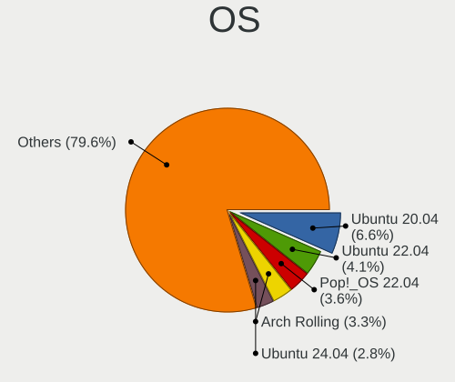

| Name                         | Computers | Percent |
|------------------------------|-----------|---------|
| Ubuntu 20.04                 | 454       | 6.61%   |
| Ubuntu 22.04                 | 280       | 4.08%   |
| Pop!_OS 22.04                | 244       | 3.55%   |
| Arch Rolling                 | 227       | 3.31%   |
| Ubuntu 24.04                 | 193       | 2.81%   |
| Ubuntu 18.04                 | 179       | 2.61%   |
| Debian 12                    | 130       | 1.89%   |
| Debian 11                    | 122       | 1.78%   |
| Fedora 40                    | 109       | 1.59%   |
| OpenMandriva 24.12           | 97        | 1.41%   |
| Fedora 42                    | 93        | 1.35%   |
| Zorin 17                     | 91        | 1.33%   |
| Linux Mint 22.1              | 88        | 1.28%   |
| CentOS 7                     | 88        | 1.28%   |
| Linux Mint 20.3              | 85        | 1.24%   |
| Fedora 38                    | 84        | 1.22%   |
| OpenMandriva 25.90           | 81        | 1.18%   |
| Fedora 39                    | 81        | 1.18%   |
| Zorin 16                     | 78        | 1.14%   |
| ArcoLinux Rolling            | 77        | 1.12%   |
| OpenMandriva 4.3             | 75        | 1.09%   |
| KDE neon 20.04               | 71        | 1.03%   |
| Fedora 41                    | 71        | 1.03%   |
| Manjaro                      | 68        | 0.99%   |
| OpenMandriva 25.06           | 67        | 0.98%   |
| Fedora 36                    | 66        | 0.96%   |
| Pop!_OS 21.04                | 65        | 0.95%   |
| Linux Mint 22.2              | 63        | 0.92%   |
| Linux Mint 21.2              | 60        | 0.87%   |
| OpenMandriva 4.2             | 56        | 0.82%   |
| Fedora 37                    | 56        | 0.82%   |
| Bazzite 42                   | 56        | 0.82%   |
| Linux Mint 21.1              | 54        | 0.79%   |
| EndeavourOS Rolling          | 52        | 0.76%   |
| Pop!_OS 20.04                | 51        | 0.74%   |
| OpenMandriva 6.0             | 51        | 0.74%   |
| Linux Mint 20.2              | 51        | 0.74%   |
| Pop!_OS 20.10                | 48        | 0.7%    |
| openSUSE Tumbleweed-XXXXXXXX | 48        | 0.7%    |
| Linux Mint 21.3              | 48        | 0.7%    |

OS Family
---------

OS without a version

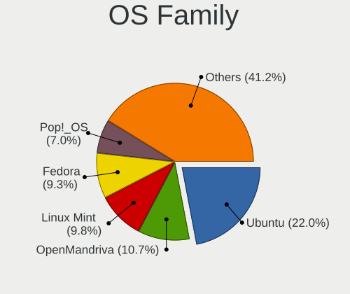

| Name          | Computers | Percent |
|---------------|-----------|---------|
| Ubuntu        | 1390      | 22.01%  |
| OpenMandriva  | 674       | 10.67%  |
| Linux Mint    | 616       | 9.75%   |
| Fedora        | 590       | 9.34%   |
| Pop!_OS       | 441       | 6.98%   |
| Debian        | 336       | 5.32%   |
| Arch          | 268       | 4.24%   |
| Zorin         | 226       | 3.58%   |
| KDE neon      | 142       | 2.25%   |
| Manjaro       | 137       | 2.17%   |
| Kubuntu       | 136       | 2.15%   |
| Bazzite       | 108       | 1.71%   |
| Xubuntu       | 101       | 1.6%    |
| CentOS        | 94        | 1.49%   |
| ArcoLinux     | 79        | 1.25%   |
| openSUSE      | 70        | 1.11%   |
| Kali          | 69        | 1.09%   |
| Elementary    | 60        | 0.95%   |
| EndeavourOS   | 53        | 0.84%   |
| Nobara        | 50        | 0.79%   |
| SteamOS       | 45        | 0.71%   |
| Gentoo        | 43        | 0.68%   |
| MX            | 40        | 0.63%   |
| Ubuntu MATE   | 32        | 0.51%   |
| ROSA          | 30        | 0.48%   |
| Lubuntu       | 30        | 0.48%   |
| Clear Linux   | 30        | 0.48%   |
| LMDE          | 29        | 0.46%   |
| CachyOS       | 26        | 0.41%   |
| ClearOS       | 23        | 0.36%   |
| NixOS         | 22        | 0.35%   |
| Raspbian      | 20        | 0.32%   |
| Garuda Linux  | 19        | 0.3%    |
| Endless       | 19        | 0.3%    |
| BlackPanther  | 19        | 0.3%    |
| Ubuntu Unity  | 16        | 0.25%   |
| Parrot        | 16        | 0.25%   |
| Ubuntu Budgie | 14        | 0.22%   |
| Rocky Linux   | 14        | 0.22%   |
| TUXEDO OS     | 10        | 0.16%   |

Kernel
------

Version of the Linux kernel

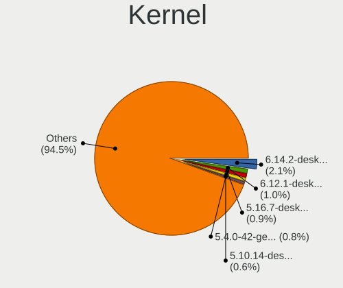

| Version                      | Computers | Percent |
|------------------------------|-----------|---------|
| 6.14.2-desktop-3omv2590      | 173       | 2.15%   |
| 6.12.1-desktop-1omv2490      | 83        | 1.03%   |
| 5.16.7-desktop-1omv4003      | 72        | 0.89%   |
| 5.4.0-42-generic             | 64        | 0.79%   |
| 5.10.14-desktop-1omv4002     | 52        | 0.65%   |
| 6.9.3-76060903-generic       | 50        | 0.62%   |
| 3.10.0-1160.114.2.el7.x86_64 | 49        | 0.61%   |
| 6.6.2-desktop-1omv2390       | 45        | 0.56%   |
| 3.10.0-1160.102.1.el7.x86_64 | 44        | 0.55%   |
| 6.12.9-desktop-1omv2490      | 42        | 0.52%   |
| 6.4.11-desktop-1omv2390      | 37        | 0.46%   |
| 6.12.10-76061203-generic     | 37        | 0.46%   |
| 5.15.0-56-generic            | 32        | 0.4%    |
| 6.2.6-desktop-1omv2390       | 31        | 0.38%   |
| 6.14.0-29-generic            | 31        | 0.38%   |
| 6.8.0-51-generic             | 30        | 0.37%   |
| 5.4.0-40-generic             | 30        | 0.37%   |
| 5.11.0-7620-generic          | 30        | 0.37%   |
| 6.8.0-52-generic             | 29        | 0.36%   |
| 6.8.0-49-generic             | 29        | 0.36%   |
| 6.1.1-desktop-1omv2290       | 29        | 0.36%   |
| 5.4.0-58-generic             | 29        | 0.36%   |
| 6.8.0-45-generic             | 28        | 0.35%   |
| 5.4.0-48-generic             | 27        | 0.34%   |
| 6.2.0-39-generic             | 26        | 0.32%   |
| 6.14.0-36-generic            | 25        | 0.31%   |
| 6.14.0-33-generic            | 25        | 0.31%   |
| 5.15.0-58-generic            | 25        | 0.31%   |
| 5.15.0-52-generic            | 25        | 0.31%   |
| 6.8.0-60-generic             | 24        | 0.3%    |
| 6.6.10-76060610-generic      | 24        | 0.3%    |
| 6.2.6-76060206-generic       | 24        | 0.3%    |
| 5.4.0-26-generic             | 24        | 0.3%    |
| 5.3.0-46-generic             | 24        | 0.3%    |
| 6.8.0-31-generic             | 23        | 0.29%   |
| 5.4.0-52-generic             | 23        | 0.29%   |
| 5.17.5-76051705-generic      | 23        | 0.29%   |
| 5.11.0-37-generic            | 23        | 0.29%   |
| 5.4.0-29-generic             | 22        | 0.27%   |
| 5.3.0-40-generic             | 22        | 0.27%   |

Kernel Family
-------------

Linux kernel without a distro release

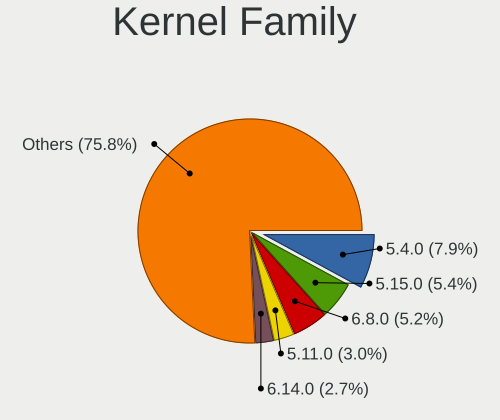

| Version | Computers | Percent |
|---------|-----------|---------|
| 5.4.0   | 596       | 7.92%   |
| 5.15.0  | 410       | 5.45%   |
| 6.8.0   | 391       | 5.2%    |
| 5.11.0  | 227       | 3.02%   |
| 6.14.0  | 201       | 2.67%   |
| 5.13.0  | 192       | 2.55%   |
| 6.14.2  | 185       | 2.46%   |
| 5.8.0   | 181       | 2.4%    |
| 6.5.0   | 169       | 2.25%   |
| 4.15.0  | 165       | 2.19%   |
| 6.2.0   | 142       | 1.89%   |
| 5.19.0  | 137       | 1.82%   |
| 6.1.0   | 131       | 1.74%   |
| 5.3.0   | 128       | 1.7%    |
| 5.10.0  | 118       | 1.57%   |
| 3.10.0  | 109       | 1.45%   |
| 6.11.0  | 96        | 1.28%   |
| 6.12.1  | 88        | 1.17%   |
| 5.0.0   | 87        | 1.16%   |
| 5.16.7  | 73        | 0.97%   |
| 4.18.0  | 66        | 0.88%   |
| 6.2.6   | 57        | 0.76%   |
| 6.9.3   | 55        | 0.73%   |
| 6.6.2   | 54        | 0.72%   |
| 5.10.14 | 52        | 0.69%   |
| 6.17.7  | 51        | 0.68%   |
| 6.12.9  | 47        | 0.62%   |
| 6.12.10 | 46        | 0.61%   |
| 6.4.11  | 44        | 0.58%   |
| 6.1.1   | 36        | 0.48%   |
| 4.19.0  | 36        | 0.48%   |
| 5.17.5  | 33        | 0.44%   |
| 6.8.7   | 30        | 0.4%    |
| 6.14.6  | 30        | 0.4%    |
| 6.5.6   | 28        | 0.37%   |
| 6.6.10  | 27        | 0.36%   |
| 6.16.4  | 25        | 0.33%   |
| 5.14.0  | 25        | 0.33%   |
| 6.0.12  | 23        | 0.31%   |
| 6.15.0  | 22        | 0.29%   |

Kernel Major Ver.
-----------------

Linux kernel major version

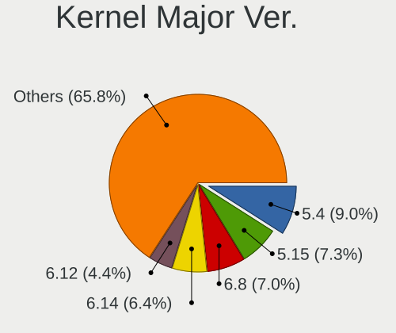

| Version | Computers | Percent |
|---------|-----------|---------|
| 5.4     | 648       | 9.01%   |
| 5.15    | 526       | 7.32%   |
| 6.8     | 504       | 7.01%   |
| 6.14    | 461       | 6.41%   |
| 6.12    | 319       | 4.44%   |
| 6.5     | 267       | 3.71%   |
| 6.1     | 267       | 3.71%   |
| 5.11    | 266       | 3.7%    |
| 6.2     | 248       | 3.45%   |
| 5.10    | 240       | 3.34%   |
| 5.13    | 239       | 3.32%   |
| 5.8     | 227       | 3.16%   |
| 6.6     | 205       | 2.85%   |
| 6.11    | 196       | 2.73%   |
| 5.19    | 186       | 2.59%   |
| 4.15    | 165       | 2.29%   |
| 5.16    | 155       | 2.16%   |
| 6.17    | 150       | 2.09%   |
| 5.3     | 143       | 1.99%   |
| 6.4     | 136       | 1.89%   |
| 6.15    | 127       | 1.77%   |
| 6.9     | 124       | 1.72%   |
| 6.0     | 111       | 1.54%   |
| 3.10    | 109       | 1.52%   |
| 6.10    | 105       | 1.46%   |
| 6.13    | 97        | 1.35%   |
| 5.0     | 96        | 1.34%   |
| 6.16    | 91        | 1.27%   |
| 5.17    | 86        | 1.2%    |
| 5.18    | 81        | 1.13%   |
| 4.18    | 80        | 1.11%   |
| 6.7     | 72        | 1%      |
| 6.3     | 64        | 0.89%   |
| 5.14    | 63        | 0.88%   |
| 5.6     | 47        | 0.65%   |
| 4.19    | 47        | 0.65%   |
| 5.12    | 46        | 0.64%   |
| 5.9     | 38        | 0.53%   |
| 4.9     | 31        | 0.43%   |
| 5.5     | 26        | 0.36%   |

Arch
----

OS architecture (x86_64, i586, etc.)

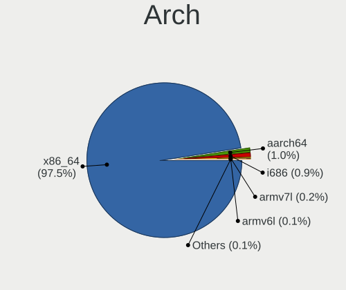

| Name    | Computers | Percent |
|---------|-----------|---------|
| x86_64  | 5867      | 97.52%  |
| aarch64 | 62        | 1.03%   |
| i686    | 57        | 0.95%   |
| armv7l  | 15        | 0.25%   |
| armv6l  | 9         | 0.15%   |
| riscv64 | 3         | 0.05%   |
| i586    | 2         | 0.03%   |
| Unknown | 1         | 0.02%   |

DE
--

Desktop Environment

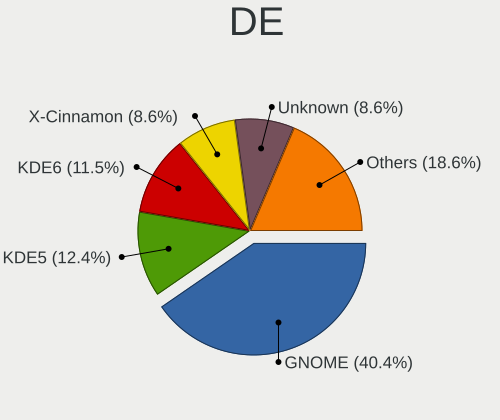

| Name             | Computers | Percent |
|------------------|-----------|---------|
| GNOME            | 2578      | 40.39%  |
| KDE5             | 789       | 12.36%  |
| KDE6             | 736       | 11.53%  |
| X-Cinnamon       | 546       | 8.56%   |
| Unknown          | 546       | 8.56%   |
| XFCE             | 415       | 6.5%    |
| MATE             | 143       | 2.24%   |
| KDE              | 122       | 1.91%   |
| Cinnamon         | 84        | 1.32%   |
| LXQt             | 70        | 1.1%    |
| Pantheon         | 58        | 0.91%   |
| Hyprland         | 47        | 0.74%   |
| Budgie           | 31        | 0.49%   |
| i3               | 30        | 0.47%   |
| KDE4             | 25        | 0.39%   |
| LXDE             | 23        | 0.36%   |
| COSMIC           | 21        | 0.33%   |
| Unity            | 20        | 0.31%   |
| GNOME Classic    | 19        | 0.3%    |
| openbox          | 11        | 0.17%   |
| Deepin           | 9         | 0.14%   |
| awesome          | 9         | 0.14%   |
| GNOME Flashback  | 5         | 0.08%   |
| BunsenLabs       | 5         | 0.08%   |
| sway             | 4         | 0.06%   |
| bspwm            | 4         | 0.06%   |
| xmonad           | 3         | 0.05%   |
| Phosh:GNOME      | 3         | 0.05%   |
| icewm            | 3         | 0.05%   |
| qtile-default    | 2         | 0.03%   |
| qtile            | 2         | 0.03%   |
| Endless:GNOME    | 2         | 0.03%   |
| dwm              | 2         | 0.03%   |
| chadwm           | 2         | 0.03%   |
| wlroots          | 1         | 0.02%   |
| Trinity          | 1         | 0.02%   |
| swaydebug        | 1         | 0.02%   |
| pop              | 1         | 0.02%   |
| LXDE-pi-wayfire  | 1         | 0.02%   |
| lightdm-xsession | 1         | 0.02%   |

Display Server
--------------

X11 or Wayland

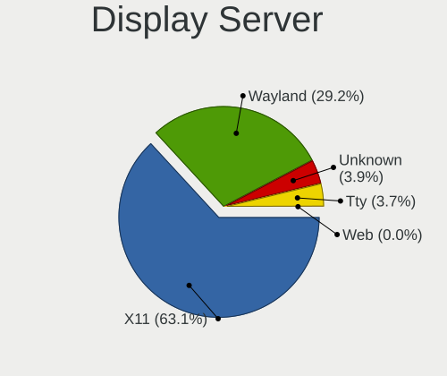

| Name    | Computers | Percent |
|---------|-----------|---------|
| X11     | 3969      | 63.14%  |
| Wayland | 1836      | 29.21%  |
| Unknown | 245       | 3.9%    |
| Tty     | 233       | 3.71%   |
| Web     | 3         | 0.05%   |

Display Manager
---------------

SDDM, LightDM, etc.

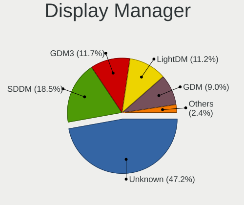

| Name                  | Computers | Percent |
|-----------------------|-----------|---------|
| Unknown               | 2964      | 47.17%  |
| SDDM                  | 1160      | 18.46%  |
| GDM3                  | 736       | 11.71%  |
| LightDM               | 705       | 11.22%  |
| GDM                   | 567       | 9.02%   |
| TDM                   | 87        | 1.38%   |
| KDM                   | 17        | 0.27%   |
| LY-DM                 | 11        | 0.18%   |
| SLiM                  | 9         | 0.14%   |
| LXDM                  | 7         | 0.11%   |
| XDM                   | 5         | 0.08%   |
| GREETD                | 5         | 0.08%   |
| LEMURS                | 4         | 0.06%   |
| Ly                    | 3         | 0.05%   |
| COSMIC-GREETER        | 2         | 0.03%   |
| SLIMSKI               | 1         | 0.02%   |
| DISPLAY-MANAGER-START | 1         | 0.02%   |

OS Lang
-------

Language

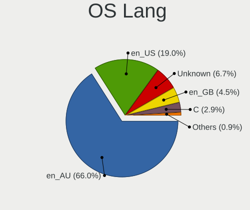

| Lang         | Computers | Percent |
|--------------|-----------|---------|
| en_AU        | 4149      | 65.97%  |
| en_US        | 1196      | 19.02%  |
| Unknown      | 422       | 6.71%   |
| en_GB        | 283       | 4.5%    |
| C            | 180       | 2.86%   |
| zh_CN        | 8         | 0.13%   |
| en_NZ        | 7         | 0.11%   |
| C.UTF8       | 6         | 0.1%    |
| POSIX        | 5         | 0.08%   |
| de_DE        | 5         | 0.08%   |
| ru_RU        | 3         | 0.05%   |
| en_DK        | 3         | 0.05%   |
| en_BW        | 3         | 0.05%   |
| it_IT        | 2         | 0.03%   |
| es_ES        | 2         | 0.03%   |
| en_CA        | 2         | 0.03%   |
| en-AU        | 2         | 0.03%   |
| zh_TW        | 1         | 0.02%   |
| ko_KR        | 1         | 0.02%   |
| fr_FR        | 1         | 0.02%   |
| es_VE        | 1         | 0.02%   |
| en_ZA        | 1         | 0.02%   |
| en_US.utf-8  | 1         | 0.02%   |
| en_IN        | 1         | 0.02%   |
| en_HK        | 1         | 0.02%   |
| en_GB.UTF-12 | 1         | 0.02%   |
| en_AU.UFT-8  | 1         | 0.02%   |
| be_BY@latin  | 1         | 0.02%   |

Boot Mode
---------

EFI or BIOS

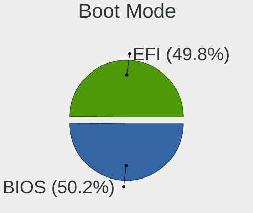

| Mode | Computers | Percent |
|------|-----------|---------|
| BIOS | 3100      | 50.18%  |
| EFI  | 3078      | 49.82%  |

Filesystem
----------

Type of filesystem

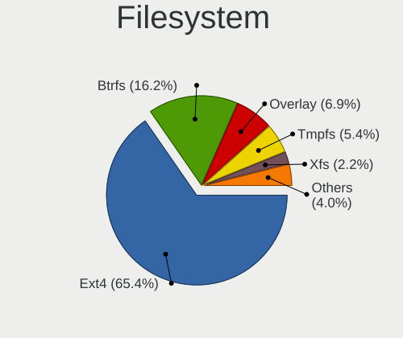

| Type     | Computers | Percent |
|----------|-----------|---------|
| Ext4     | 4079      | 65.37%  |
| Btrfs    | 1010      | 16.19%  |
| Overlay  | 429       | 6.88%   |
| Tmpfs    | 337       | 5.4%    |
| Xfs      | 138       | 2.21%   |
| Unknown  | 103       | 1.65%   |
| Zfs      | 72        | 1.15%   |
| Ext3     | 42        | 0.67%   |
| Ext2     | 11        | 0.18%   |
| F2fs     | 6         | 0.1%    |
| XXXXXXX  | 4         | 0.06%   |
| Rootfs   | 3         | 0.05%   |
| Reiserfs | 3         | 0.05%   |
| Jfs      | 1         | 0.02%   |
| Bcachefs | 1         | 0.02%   |
| Aufs     | 1         | 0.02%   |

Part. scheme
------------

Scheme of partitioning

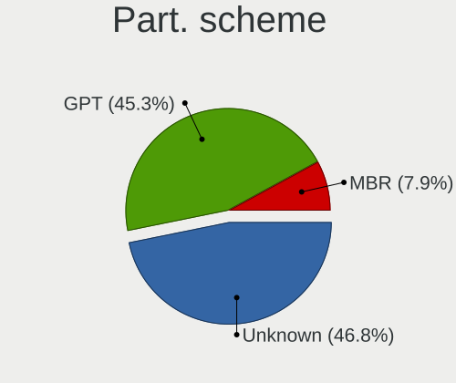

| Type    | Computers | Percent |
|---------|-----------|---------|
| Unknown | 2903      | 46.82%  |
| GPT     | 2806      | 45.25%  |
| MBR     | 492       | 7.93%   |

Dual Boot with Linux/BSD
------------------------

Hosting more than one Linux/BSD

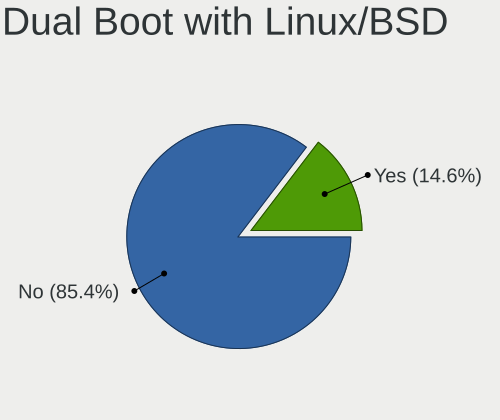

| Dual boot | Computers | Percent |
|-----------|-----------|---------|
| No        | 5252      | 85.37%  |
| Yes       | 900       | 14.63%  |

Dual Boot (Win)
---------------

Hosting Linux and Windows

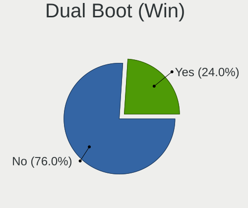

| Dual boot | Computers | Percent |
|-----------|-----------|---------|
| No        | 4672      | 76.03%  |
| Yes       | 1473      | 23.97%  |

Board
-----

Vendor
------

Motherboard manufacturer

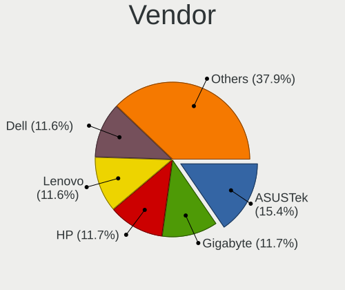

| Name                                 | Computers | Percent |
|--------------------------------------|-----------|---------|
| ASUSTek Computer                     | 928       | 15.44%  |
| Gigabyte Technology                  | 705       | 11.73%  |
| Hewlett-Packard                      | 702       | 11.68%  |
| Lenovo                               | 700       | 11.65%  |
| Dell                                 | 698       | 11.62%  |
| MSI                                  | 484       | 8.05%   |
| Apple                                | 306       | 5.09%   |
| Acer                                 | 275       | 4.58%   |
| ASRock                               | 217       | 3.61%   |
| Toshiba                              | 146       | 2.43%   |
| Intel                                | 138       | 2.3%    |
| Microsoft                            | 82        | 1.36%   |
| Raspberry Pi Foundation              | 51        | 0.85%   |
| Unknown                              | 46        | 0.77%   |
| Alienware                            | 30        | 0.5%    |
| Valve                                | 28        | 0.47%   |
| Framework                            | 26        | 0.43%   |
| Samsung Electronics                  | 19        | 0.32%   |
| Google                               | 19        | 0.32%   |
| AZW                                  | 18        | 0.3%    |
| Sony                                 | 17        | 0.28%   |
| Pegatron                             | 17        | 0.28%   |
| Notebook                             | 16        | 0.27%   |
| Metabox                              | 16        | 0.27%   |
| AMI                                  | 15        | 0.25%   |
| IT Channel Pty                       | 13        | 0.22%   |
| Shenzhen Meigao Electronic Equipment | 12        | 0.2%    |
| Panasonic                            | 12        | 0.2%    |
| Razer                                | 11        | 0.18%   |
| Intel Client Systems                 | 11        | 0.18%   |
| Medion                               | 10        | 0.17%   |
| Timi                                 | 9         | 0.15%   |
| HUAWEI                               | 9         | 0.15%   |
| Supermicro                           | 8         | 0.13%   |
| IBM                                  | 8         | 0.13%   |
| Fujitsu                              | 8         | 0.13%   |
| COM1                                 | 8         | 0.13%   |
| System76                             | 7         | 0.12%   |
| Kogan                                | 7         | 0.12%   |
| Shuttle                              | 6         | 0.1%    |

Model
-----

Motherboard model

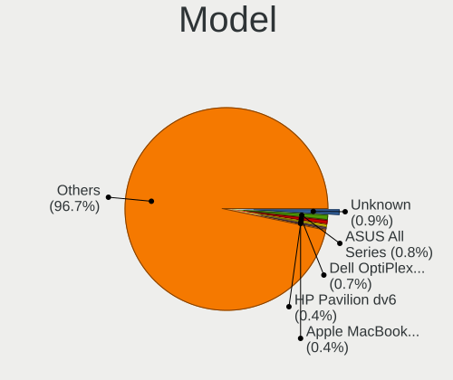

| Name                                       | Computers | Percent |
|--------------------------------------------|-----------|---------|
| Unknown                                    | 54        | 0.9%    |
| ASUS All Series                            | 50        | 0.83%   |
| Dell OptiPlex 9020                         | 42        | 0.7%    |
| HP Pavilion dv6                            | 27        | 0.45%   |
| Apple MacBookAir7,2                        | 24        | 0.4%    |
| Valve Jupiter                              | 21        | 0.35%   |
| MSI MS-7B89                                | 20        | 0.33%   |
| HP Notebook                                | 19        | 0.32%   |
| Gigabyte H81M-S2H                          | 17        | 0.28%   |
| MSI MS-7C31                                | 16        | 0.27%   |
| MSI MS-7C94                                | 15        | 0.25%   |
| MSI MS-7B86                                | 15        | 0.25%   |
| Dell OptiPlex 7040                         | 15        | 0.25%   |
| HP Pavilion g6                             | 14        | 0.23%   |
| ASUS TUF Gaming B650M-E WIFI               | 14        | 0.23%   |
| Apple MacBookPro9,2                        | 13        | 0.22%   |
| Apple MacBookPro8,1                        | 13        | 0.22%   |
| Apple MacBookPro10,1                       | 13        | 0.22%   |
| Apple iMac12,2                             | 13        | 0.22%   |
| MSI MS-7C37                                | 12        | 0.2%    |
| MSI MS-7C02                                | 12        | 0.2%    |
| MSI MS-7A15                                | 12        | 0.2%    |
| Microsoft Surface Pro 3                    | 12        | 0.2%    |
| HP Pavilion 15                             | 12        | 0.2%    |
| Gigabyte 970A-D3P                          | 12        | 0.2%    |
| ASUS VivoBook_ASUSLaptop X515EA_F1500EA    | 12        | 0.2%    |
| MSI MS-7C84                                | 11        | 0.18%   |
| MSI MS-7C56                                | 11        | 0.18%   |
| Dell OptiPlex 780                          | 11        | 0.18%   |
| RPi Raspberry Pi                           | 10        | 0.17%   |
| MSI MS-7C95                                | 10        | 0.17%   |
| MSI MS-7A74                                | 10        | 0.17%   |
| Microsoft Surface Pro 7                    | 10        | 0.17%   |
| Microsoft Surface Pro 4                    | 10        | 0.17%   |
| MSI MS-7C91                                | 9         | 0.15%   |
| MSI MS-7817                                | 9         | 0.15%   |
| Gigabyte X58A-UD3R                         | 9         | 0.15%   |
| Gigabyte B75M-D3H                          | 9         | 0.15%   |
| Framework Laptop 13 (AMD Ryzen 7040Series) | 9         | 0.15%   |
| Dell XPS 13 9360                           | 9         | 0.15%   |

Model Family
------------

Motherboard model prefix

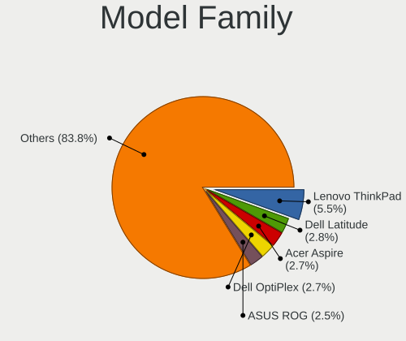

| Name               | Computers | Percent |
|--------------------|-----------|---------|
| Lenovo ThinkPad    | 329       | 5.48%   |
| Dell Latitude      | 168       | 2.8%    |
| Acer Aspire        | 165       | 2.75%   |
| Dell OptiPlex      | 160       | 2.66%   |
| ASUS ROG           | 153       | 2.55%   |
| ASUS PRIME         | 146       | 2.43%   |
| HP Pavilion        | 128       | 2.13%   |
| Dell Inspiron      | 127       | 2.11%   |
| Toshiba Satellite  | 107       | 1.78%   |
| Dell XPS           | 104       | 1.73%   |
| Lenovo IdeaPad     | 98        | 1.63%   |
| HP EliteBook       | 96        | 1.6%    |
| ASUS TUF           | 94        | 1.56%   |
| Microsoft Surface  | 82        | 1.36%   |
| Lenovo Yoga        | 78        | 1.3%    |
| Dell Precision     | 68        | 1.13%   |
| Lenovo ThinkCentre | 66        | 1.1%    |
| HP Compaq          | 62        | 1.03%   |
| Unknown            | 54        | 0.9%    |
| ASUS VivoBook      | 53        | 0.88%   |
| RPi Raspberry      | 51        | 0.85%   |
| HP ProBook         | 51        | 0.85%   |
| HP Laptop          | 50        | 0.83%   |
| ASUS All           | 50        | 0.83%   |
| Gigabyte X570      | 42        | 0.7%    |
| ASUS ZenBook       | 32        | 0.53%   |
| HP ENVY            | 31        | 0.52%   |
| HP ProDesk         | 29        | 0.48%   |
| HP EliteDesk       | 27        | 0.45%   |
| Gigabyte B450      | 27        | 0.45%   |
| Framework Laptop   | 25        | 0.42%   |
| Gigabyte B550      | 24        | 0.4%    |
| Gigabyte B450M     | 24        | 0.4%    |
| Apple MacBookAir7  | 24        | 0.4%    |
| Dell Vostro        | 23        | 0.38%   |
| Acer Nitro         | 23        | 0.38%   |
| Toshiba PORTEGE    | 22        | 0.37%   |
| Valve Jupiter      | 21        | 0.35%   |
| Apple iMac12       | 21        | 0.35%   |
| MSI MS-7B89        | 20        | 0.33%   |

MFG Year
--------

Motherboard manufacture year

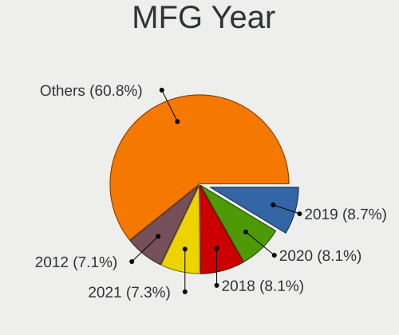

| Year    | Computers | Percent |
|---------|-----------|---------|
| 2019    | 522       | 8.69%   |
| 2020    | 487       | 8.1%    |
| 2018    | 486       | 8.09%   |
| 2021    | 436       | 7.26%   |
| 2012    | 425       | 7.07%   |
| 2013    | 376       | 6.26%   |
| 2014    | 363       | 6.04%   |
| 2022    | 352       | 5.86%   |
| 2017    | 349       | 5.81%   |
| 2011    | 325       | 5.41%   |
| 2016    | 324       | 5.39%   |
| 2015    | 288       | 4.79%   |
| 2023    | 256       | 4.26%   |
| 2010    | 214       | 3.56%   |
| 2024    | 197       | 3.28%   |
| 2009    | 168       | 2.8%    |
| 2008    | 160       | 2.66%   |
| Unknown | 84        | 1.4%    |
| 2007    | 78        | 1.3%    |
| 2025    | 51        | 0.85%   |
| 2006    | 50        | 0.83%   |
| 2005    | 14        | 0.23%   |
| 2004    | 2         | 0.03%   |
| 2003    | 1         | 0.02%   |
| 2002    | 1         | 0.02%   |

Form Factor
-----------

Physical design of the computer

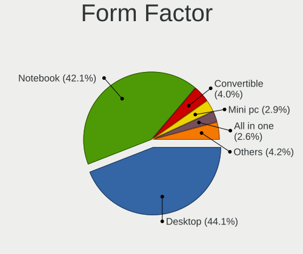

| Name           | Computers | Percent |
|----------------|-----------|---------|
| Desktop        | 2648      | 44.07%  |
| Notebook       | 2531      | 42.12%  |
| Convertible    | 243       | 4.04%   |
| Mini pc        | 175       | 2.91%   |
| All in one     | 158       | 2.63%   |
| Tablet         | 120       | 2%      |
| System on chip | 71        | 1.18%   |
| Server         | 55        | 0.92%   |
| Phone          | 3         | 0.05%   |
| Stick pc       | 3         | 0.05%   |
| Other          | 1         | 0.02%   |
| Firewall       | 1         | 0.02%   |

Secure Boot
-----------

Enabled or disabled

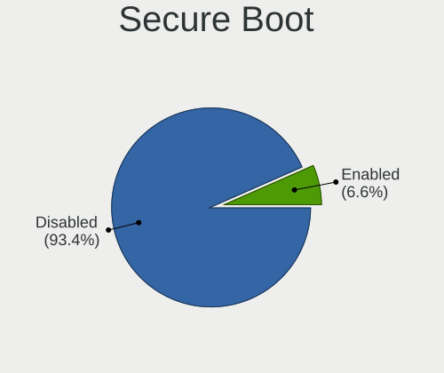

| State    | Computers | Percent |
|----------|-----------|---------|
| Disabled | 5654      | 93.41%  |
| Enabled  | 399       | 6.59%   |

Coreboot
--------

Have coreboot on board

| Used | Computers | Percent |
|------|-----------|---------|
| No   | 5980      | 99.52%  |
| Yes  | 29        | 0.48%   |

RAM Size
--------

Total RAM memory

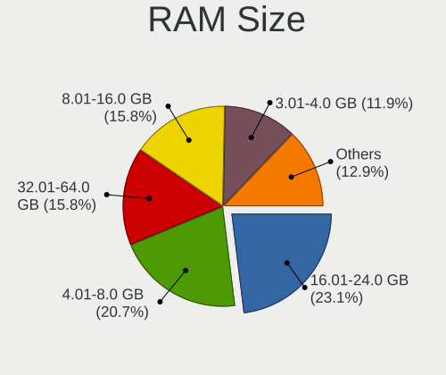

| Size in GB      | Computers | Percent |
|-----------------|-----------|---------|
| 16.01-24.0      | 1417      | 23.05%  |
| 4.01-8.0        | 1272      | 20.69%  |
| 32.01-64.0      | 970       | 15.78%  |
| 8.01-16.0       | 969       | 15.76%  |
| 3.01-4.0        | 729       | 11.86%  |
| 64.01-256.0     | 345       | 5.61%   |
| 24.01-32.0      | 226       | 3.68%   |
| 1.01-2.0        | 134       | 2.18%   |
| 2.01-3.0        | 29        | 0.47%   |
| 0.51-1.0        | 24        | 0.39%   |
| 0.01-0.5        | 18        | 0.29%   |
| More than 256.0 | 13        | 0.21%   |
| Unknown         | 1         | 0.02%   |

RAM Used
--------

Used RAM memory

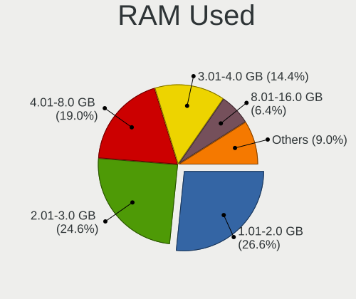

| Used GB     | Computers | Percent |
|-------------|-----------|---------|
| 1.01-2.0    | 1843      | 26.61%  |
| 2.01-3.0    | 1707      | 24.65%  |
| 4.01-8.0    | 1317      | 19.02%  |
| 3.01-4.0    | 994       | 14.35%  |
| 8.01-16.0   | 444       | 6.41%   |
| 0.51-1.0    | 395       | 5.7%    |
| 0.01-0.5    | 85        | 1.23%   |
| 16.01-24.0  | 79        | 1.14%   |
| 24.01-32.0  | 28        | 0.4%    |
| 32.01-64.0  | 21        | 0.3%    |
| 64.01-256.0 | 8         | 0.12%   |
| 0           | 2         | 0.03%   |
| Unknown     | 2         | 0.03%   |

Total Drives
------------

Number of drives on board

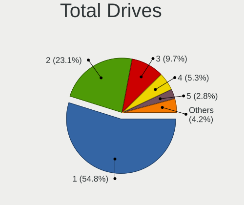

| Drives  | Computers | Percent |
|---------|-----------|---------|
| 1       | 3473      | 54.84%  |
| 2       | 1465      | 23.13%  |
| 3       | 613       | 9.68%   |
| 4       | 338       | 5.34%   |
| 5       | 180       | 2.84%   |
| 6       | 91        | 1.44%   |
| 0       | 59        | 0.93%   |
| 7       | 42        | 0.66%   |
| 8       | 33        | 0.52%   |
| 9       | 16        | 0.25%   |
| 10      | 8         | 0.13%   |
| 13      | 3         | 0.05%   |
| 12      | 3         | 0.05%   |
| 14      | 2         | 0.03%   |
| 11      | 2         | 0.03%   |
| 36      | 1         | 0.02%   |
| 34      | 1         | 0.02%   |
| 26      | 1         | 0.02%   |
| 22      | 1         | 0.02%   |
| Unknown | 1         | 0.02%   |

Has CD-ROM
----------

Has CD-ROM on board

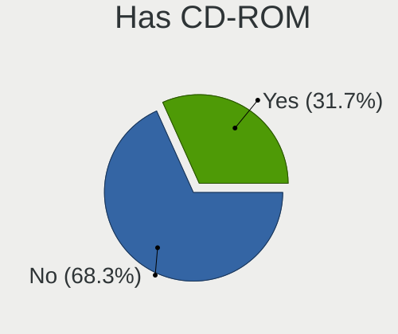

| Presented | Computers | Percent |
|-----------|-----------|---------|
| No        | 4149      | 68.26%  |
| Yes       | 1929      | 31.74%  |

Has Ethernet
------------

Has Ethernet on board

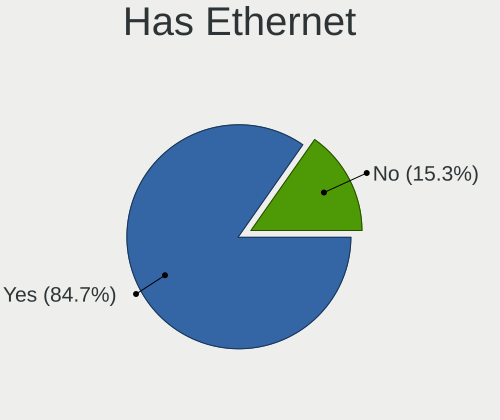

| Presented | Computers | Percent |
|-----------|-----------|---------|
| Yes       | 5109      | 84.73%  |
| No        | 921       | 15.27%  |

Has WiFi
--------

Has WiFi module

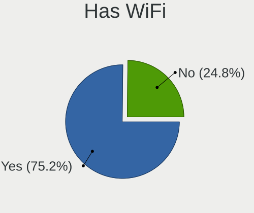

| Presented | Computers | Percent |
|-----------|-----------|---------|
| Yes       | 4572      | 75.17%  |
| No        | 1510      | 24.83%  |

Has Bluetooth
-------------

Has Bluetooth module

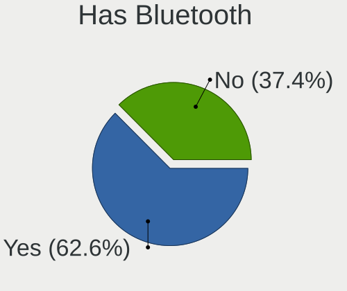

| Presented | Computers | Percent |
|-----------|-----------|---------|
| Yes       | 3815      | 62.55%  |
| No        | 2284      | 37.45%  |

Location
--------

Country
-------

Geographic location (country)

| Country   | Computers | Percent |
|-----------|-----------|---------|
| Australia | 6009      | 100%    |

City
----

Geographic location (city)

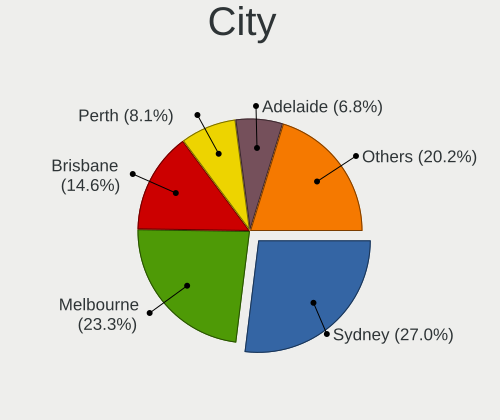

| City           | Computers | Percent |
|----------------|-----------|---------|
| Sydney         | 1720      | 26.96%  |
| Melbourne      | 1486      | 23.29%  |
| Brisbane       | 930       | 14.57%  |
| Perth          | 517       | 8.1%    |
| Adelaide       | 436       | 6.83%   |
| Canberra       | 139       | 2.18%   |
| Hobart         | 59        | 0.92%   |
| Wahroonga      | 40        | 0.63%   |
| Gold Coast     | 39        | 0.61%   |
| Geelong        | 39        | 0.61%   |
| Launceston     | 38        | 0.6%    |
| Newcastle      | 26        | 0.41%   |
| Central Coast  | 23        | 0.36%   |
| Alexandria     | 21        | 0.33%   |
| Nyngan         | 20        | 0.31%   |
| Leinster       | 20        | 0.31%   |
| Richmond       | 17        | 0.27%   |
| Surry Hills    | 16        | 0.25%   |
| Townsville     | 14        | 0.22%   |
| Cairns         | 13        | 0.2%    |
| Morwell        | 12        | 0.19%   |
| Lane Cove      | 12        | 0.19%   |
| Woolloongabba  | 11        | 0.17%   |
| Wollongong     | 11        | 0.17%   |
| Mitcham        | 11        | 0.17%   |
| Darwin         | 11        | 0.17%   |
| Sunshine West  | 10        | 0.16%   |
| Sunshine Coast | 10        | 0.16%   |
| Southport      | 10        | 0.16%   |
| Campbellfield  | 9         | 0.14%   |
| Brighton       | 9         | 0.14%   |
| Warragul       | 8         | 0.13%   |
| Traralgon      | 8         | 0.13%   |
| Mandurah       | 8         | 0.13%   |
| Ballarat       | 8         | 0.13%   |
| Warrnambool    | 7         | 0.11%   |
| Parramatta     | 7         | 0.11%   |
| North Sydney   | 7         | 0.11%   |
| Macquarie Park | 7         | 0.11%   |
| Geraldton      | 7         | 0.11%   |

Drives
------

Drive Vendor
------------

Hard drive vendors

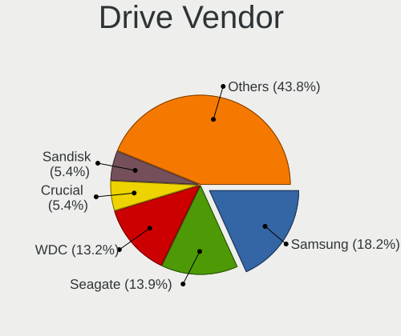

| Vendor                       | Computers | Drives | Percent |
|------------------------------|-----------|--------|---------|
| Samsung Electronics          | 1736      | 3271   | 18.24%  |
| Seagate                      | 1323      | 2682   | 13.9%   |
| WDC                          | 1253      | 2498   | 13.17%  |
| Crucial                      | 518       | 814    | 5.44%   |
| Sandisk                      | 516       | 682    | 5.42%   |
| Kingston                     | 395       | 533    | 4.15%   |
| Toshiba                      | 394       | 560    | 4.14%   |
| Unknown                      | 336       | 540    | 3.53%   |
| Intel                        | 304       | 568    | 3.19%   |
| SK hynix                     | 244       | 300    | 2.56%   |
| Micron/Crucial Technology    | 206       | 293    | 2.16%   |
| Hitachi                      | 204       | 344    | 2.14%   |
| Micron Technology            | 194       | 250    | 2.04%   |
| Apple                        | 189       | 245    | 1.99%   |
| HGST                         | 119       | 188    | 1.25%   |
| Phison Electronics           | 116       | 163    | 1.22%   |
| Kingston Technology Company  | 106       | 128    | 1.11%   |
| KIOXIA                       | 97        | 114    | 1.02%   |
| SPCC                         | 90        | 117    | 0.95%   |
| MAXIO Technology (Hangzhou)  | 61        | 78     | 0.64%   |
| OCZ                          | 51        | 71     | 0.54%   |
| JMicron Technology           | 48        | 65     | 0.5%    |
| Unknown                      | 48        | 64     | 0.5%    |
| Phison                       | 47        | 73     | 0.49%   |
| A-DATA Technology            | 46        | 65     | 0.48%   |
| China                        | 40        | 52     | 0.42%   |
| Patriot                      | 36        | 45     | 0.38%   |
| LITEON                       | 36        | 68     | 0.38%   |
| ASMT                         | 36        | 45     | 0.38%   |
| Realtek Semiconductor        | 34        | 38     | 0.36%   |
| Silicon Motion               | 31        | 45     | 0.33%   |
| Corsair                      | 31        | 47     | 0.33%   |
| Team                         | 29        | 36     | 0.3%    |
| LITEONIT                     | 28        | 52     | 0.29%   |
| KingSpec                     | 28        | 82     | 0.29%   |
| Fujitsu                      | 24        | 33     | 0.25%   |
| Transcend                    | 23        | 34     | 0.24%   |
| Shenzhen Longsys Electronics | 20        | 24     | 0.21%   |
| Realtek                      | 20        | 22     | 0.21%   |
| ADATA Technology             | 19        | 28     | 0.2%    |

Drive Model
-----------

Hard drive models

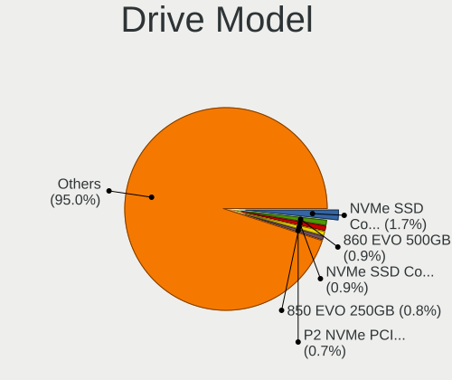

| Model                                                | Computers | Percent |
|------------------------------------------------------|-----------|---------|
| Samsung NVMe SSD Controller SM981/PM981/PM983 1TB    | 185       | 1.69%   |
| Samsung SSD 860 EVO 500GB                            | 103       | 0.94%   |
| Samsung NVMe SSD Controller PM9A1/PM9A3/980PRO 1TB   | 94        | 0.86%   |
| Samsung SSD 850 EVO 250GB                            | 87        | 0.8%    |
| Micron/Crucial P2 NVMe PCIe SSD 2TB                  | 76        | 0.7%    |
| Crucial CT1000BX500SSD1 1TB                          | 65        | 0.6%    |
| Samsung SSD 860 EVO 1TB                              | 63        | 0.58%   |
| Crucial CT500MX500SSD1 500GB                         | 62        | 0.57%   |
| Crucial CT240BX500SSD1 240GB                         | 62        | 0.57%   |
| Unknown MMC Card  64GB                               | 61        | 0.56%   |
| Seagate ST2000DM008-2FR102 2TB                       | 61        | 0.56%   |
| Samsung SSD 850 EVO 500GB                            | 59        | 0.54%   |
| Samsung NVMe SSD Controller SM961/PM961/SM963 1024GB | 59        | 0.54%   |
| WDC WD10EZEX-08WN4A0 1TB                             | 57        | 0.52%   |
| Seagate Expansion 2TB                                | 57        | 0.52%   |
| Unknown MMC Card  32GB                               | 56        | 0.51%   |
| Seagate ST4000DM004-2CV104 4TB                       | 56        | 0.51%   |
| Crucial CT1000MX500SSD1 1TB                          | 56        | 0.51%   |
| Seagate ST500DM002-1BD142 500GB                      | 52        | 0.48%   |
| Seagate ST1000DM010-2EP102 1TB                       | 51        | 0.47%   |
| Kingston SA400S37240G 240GB SSD                      | 48        | 0.44%   |
| Unknown                                              | 48        | 0.44%   |
| Seagate ST2000DM001-1ER164 2TB                       | 47        | 0.43%   |
| Seagate Expansion Desk 4TB                           | 47        | 0.43%   |
| Crucial CT480BX500SSD1 480GB                         | 46        | 0.42%   |
| Unknown MMC Card  128GB                              | 44        | 0.4%    |
| Samsung SSD 860 QVO 1TB                              | 44        | 0.4%    |
| Seagate ST3500418AS 500GB                            | 42        | 0.38%   |
| Seagate ST2000DM001-1CH164 2TB                       | 41        | 0.38%   |
| Kingston SA400S37480G 480GB SSD                      | 40        | 0.37%   |
| Seagate ST1000LM024 HN-M101MBB 1TB                   | 37        | 0.34%   |
| Toshiba MQ01ABD100 1TB                               | 35        | 0.32%   |
| Kingston SV300S37A120G 120GB SSD                     | 34        | 0.31%   |
| Samsung NVMe SSD Drive 1TB                           | 33        | 0.3%    |
| Seagate ST31000528AS 1TB                             | 32        | 0.29%   |
| Samsung SSD 870 EVO 500GB                            | 32        | 0.29%   |
| Unknown SD/MMC/MS PRO 2GB                            | 31        | 0.28%   |
| Kingston Company SNV2S1000G 1TB                      | 31        | 0.28%   |
| WDC WDS240G2G0A-00JH30 240GB SSD                     | 30        | 0.27%   |
| WDC WD20EARX-00PASB0 2TB                             | 30        | 0.27%   |

HDD Vendor
----------

Hard disk drive vendors

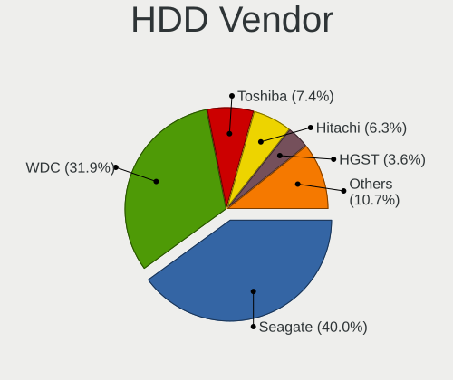

| Vendor              | Computers | Drives | Percent |
|---------------------|-----------|--------|---------|
| Seagate             | 1288      | 2595   | 39.98%  |
| WDC                 | 1029      | 2073   | 31.94%  |
| Toshiba             | 240       | 365    | 7.45%   |
| Hitachi             | 203       | 342    | 6.3%    |
| HGST                | 117       | 186    | 3.63%   |
| Samsung Electronics | 111       | 376    | 3.45%   |
| Apple               | 51        | 60     | 1.58%   |
| Unknown             | 33        | 51     | 1.02%   |
| JMicron Technology  | 30        | 43     | 0.93%   |
| Fujitsu             | 21        | 30     | 0.65%   |
| Maxtor              | 13        | 18     | 0.4%    |
| ASMT                | 12        | 21     | 0.37%   |
| USB                 | 10        | 11     | 0.31%   |
| TO Exter            | 10        | 10     | 0.31%   |
| LaCie               | 10        | 16     | 0.31%   |
| Hewlett-Packard     | 9         | 32     | 0.28%   |
| External            | 4         | 7      | 0.12%   |
| T-FORCE             | 3         | 4      | 0.09%   |
| QNAP                | 3         | 13     | 0.09%   |
| KESU                | 3         | 3      | 0.09%   |
| USB3.0              | 2         | 3      | 0.06%   |
| IET                 | 2         | 2      | 0.06%   |
| HPE                 | 2         | 2      | 0.06%   |
| HGST HUS            | 2         | 2      | 0.06%   |
| WUH72181            | 1         | 2      | 0.03%   |
| ThinkSystem         | 1         | 1      | 0.03%   |
| SABRENT             | 1         | 1      | 0.03%   |
| NVME USB            | 1         | 1      | 0.03%   |
| MaxDigital          | 1         | 1      | 0.03%   |
| MARVELL             | 1         | 1      | 0.03%   |
| IBM/Hitachi         | 1         | 1      | 0.03%   |
| HGST HTS            | 1         | 1      | 0.03%   |
| Hajaan              | 1         | 1      | 0.03%   |
| Esmart              | 1         | 1      | 0.03%   |
| DELLBOSS            | 1         | 1      | 0.03%   |
| DAS                 | 1         | 1      | 0.03%   |
| AAPL                | 1         | 1      | 0.03%   |
| Unknown             | 1         | 7      | 0.03%   |

SSD Vendor
----------

Solid state drive vendors

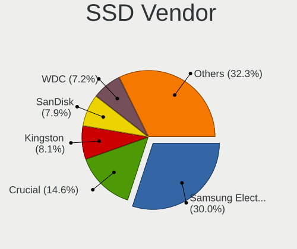

| Vendor              | Computers | Drives | Percent |
|---------------------|-----------|--------|---------|
| Samsung Electronics | 920       | 1617   | 30.02%  |
| Crucial             | 446       | 725    | 14.55%  |
| Kingston            | 249       | 337    | 8.12%   |
| SanDisk             | 241       | 293    | 7.86%   |
| WDC                 | 220       | 314    | 7.18%   |
| Intel               | 141       | 332    | 4.6%    |
| Apple               | 102       | 114    | 3.33%   |
| SPCC                | 78        | 103    | 2.54%   |
| SK hynix            | 68        | 82     | 2.22%   |
| OCZ                 | 51        | 71     | 1.66%   |
| Micron Technology   | 50        | 61     | 1.63%   |
| Toshiba             | 43        | 55     | 1.4%    |
| China               | 40        | 52     | 1.31%   |
| Patriot             | 33        | 42     | 1.08%   |
| LITEON              | 31        | 63     | 1.01%   |
| LITEONIT            | 28        | 52     | 0.91%   |
| KingSpec            | 26        | 80     | 0.85%   |
| A-DATA Technology   | 26        | 34     | 0.85%   |
| Transcend           | 23        | 34     | 0.75%   |
| Team                | 22        | 28     | 0.72%   |
| Corsair             | 22        | 37     | 0.72%   |
| Seagate             | 18        | 28     | 0.59%   |
| PNY                 | 8         | 13     | 0.26%   |
| KUIJIA              | 8         | 41     | 0.26%   |
| Gigabyte Technology | 8         | 8      | 0.26%   |
| OWC                 | 7         | 18     | 0.23%   |
| Lexar               | 7         | 10     | 0.23%   |
| Unknown             | 7         | 8      | 0.23%   |
| Vaseky              | 6         | 15     | 0.2%    |
| Plextor             | 6         | 18     | 0.2%    |
| KingFast            | 5         | 9      | 0.16%   |
| ASMT                | 5         | 5      | 0.16%   |
| SABRENT             | 4         | 4      | 0.13%   |
| NGFF                | 4         | 4      | 0.13%   |
| Netac               | 4         | 7      | 0.13%   |
| Apacer              | 4         | 5      | 0.13%   |
| WDC WDS2            | 3         | 3      | 0.1%    |
| Thinkplus           | 3         | 5      | 0.1%    |
| Hajaan              | 3         | 6      | 0.1%    |
| Fujitsu             | 3         | 3      | 0.1%    |

Drive Kind
----------

HDD or SSD

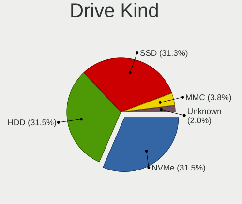

| Kind    | Computers | Drives | Percent |
|---------|-----------|--------|---------|
| NVMe    | 2619      | 4159   | 31.49%  |
| HDD     | 2617      | 6286   | 31.47%  |
| SSD     | 2601      | 4843   | 31.28%  |
| MMC     | 313       | 480    | 3.76%   |
| Unknown | 166       | 232    | 2%      |

Drive Connector
---------------

SATA, SAS, NVMe, etc.

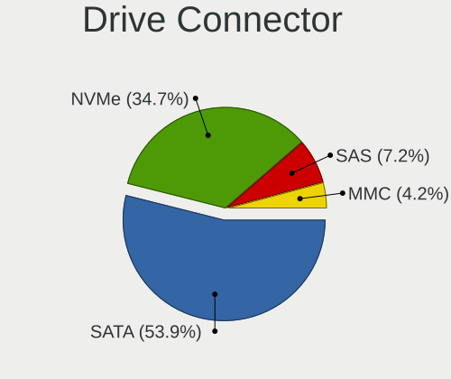

| Type | Computers | Drives | Percent |
|------|-----------|--------|---------|
| SATA | 4061      | 10507  | 53.92%  |
| NVMe | 2616      | 4112   | 34.73%  |
| SAS  | 542       | 901    | 7.2%    |
| MMC  | 313       | 480    | 4.16%   |

Drive Size
----------

Size of hard drive

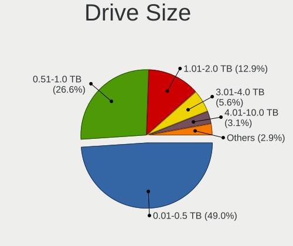

| Size in TB | Computers | Drives | Percent |
|------------|-----------|--------|---------|
| 0.01-0.5   | 2830      | 5547   | 48.96%  |
| 0.51-1.0   | 1537      | 2832   | 26.59%  |
| 1.01-2.0   | 746       | 1351   | 12.91%  |
| 3.01-4.0   | 321       | 716    | 5.55%   |
| 4.01-10.0  | 180       | 388    | 3.11%   |
| 2.01-3.0   | 135       | 228    | 2.34%   |
| 10.01-20.0 | 27        | 61     | 0.47%   |
| 20.01-50.0 | 3         | 5      | 0.05%   |
| 0          | 1         | 1      | 0.02%   |

Space Total
-----------

Amount of disk space available on the file system

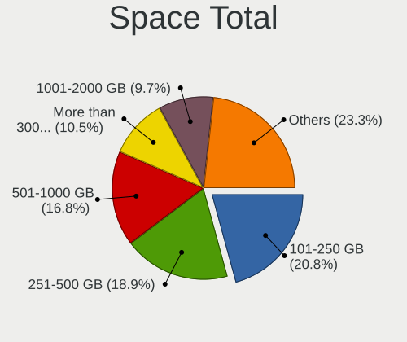

| Size in GB     | Computers | Percent |
|----------------|-----------|---------|
| 101-250        | 1356      | 20.75%  |
| 251-500        | 1238      | 18.95%  |
| 501-1000       | 1099      | 16.82%  |
| More than 3000 | 686       | 10.5%   |
| 1001-2000      | 635       | 9.72%   |
| 1-20           | 493       | 7.55%   |
| 51-100         | 351       | 5.37%   |
| 2001-3000      | 277       | 4.24%   |
| Unknown        | 236       | 3.61%   |
| 21-50          | 163       | 2.49%   |

Space Used
----------

Amount of used disk space

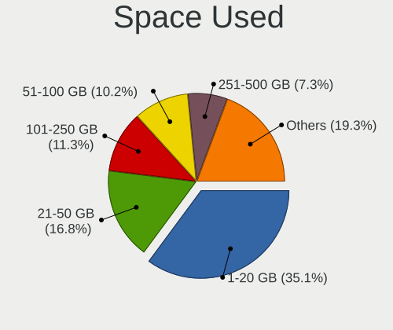

| Used GB        | Computers | Percent |
|----------------|-----------|---------|
| 1-20           | 2408      | 35.13%  |
| 21-50          | 1154      | 16.84%  |
| 101-250        | 773       | 11.28%  |
| 51-100         | 697       | 10.17%  |
| 251-500        | 498       | 7.27%   |
| 501-1000       | 408       | 5.95%   |
| 1001-2000      | 295       | 4.3%    |
| More than 3000 | 253       | 3.69%   |
| Unknown        | 236       | 3.44%   |
| 2001-3000      | 119       | 1.74%   |
| 0              | 13        | 0.19%   |

Malfunc. Drives
---------------

Drive models with a malfunction

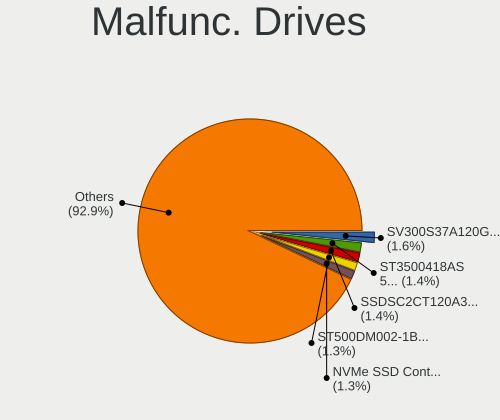

| Model                                                         | Computers | Drives | Percent |
|---------------------------------------------------------------|-----------|--------|---------|
| Kingston SV300S37A120G 120GB SSD                              | 9         | 9      | 1.63%   |
| Seagate ST3500418AS 500GB                                     | 8         | 23     | 1.45%   |
| Intel SSDSC2CT120A3 120GB                                     | 8         | 76     | 1.45%   |
| Seagate ST500DM002-1BD142 500GB                               | 7         | 20     | 1.27%   |
| Samsung Electronics NVMe SSD Controller SM981/PM981/PM983 1TB | 7         | 7      | 1.27%   |
| Seagate ST31000528AS 1TB                                      | 6         | 7      | 1.08%   |
| Seagate ST2000DM001-1CH164 2TB                                | 6         | 8      | 1.08%   |
| Seagate ST1000LM024 HN-M101MBB 1TB                            | 6         | 7      | 1.08%   |
| Hitachi HDS721010DLE630 1TB                                   | 6         | 8      | 1.08%   |
| WDC WD40EFRX-68N32N0 4TB                                      | 5         | 18     | 0.9%    |
| WDC WD20EARX-00PASB0 2TB                                      | 5         | 5      | 0.9%    |
| Toshiba MQ01ABD100 1TB                                        | 5         | 5      | 0.9%    |
| Seagate ST2000DM001-1ER164 2TB                                | 5         | 5      | 0.9%    |
| Samsung Electronics HD501LJ 500GB                             | 5         | 59     | 0.9%    |
| WDC WD20EARS-00MVWB0 2TB                                      | 4         | 4      | 0.72%   |
| WDC WD2002FAEX-007BA0 2TB                                     | 4         | 5      | 0.72%   |
| WDC WD10EZEX-08WN4A0 1TB                                      | 4         | 5      | 0.72%   |
| SK hynix HFS256G3AMNB-2200A 256GB SSD                         | 4         | 4      | 0.72%   |
| Seagate ST31000524AS 1TB                                      | 4         | 19     | 0.72%   |
| Seagate ST2000DM001-9YN164 2TB                                | 4         | 4      | 0.72%   |
| Maxtor 6Y080L0 81GB                                           | 4         | 8      | 0.72%   |
| Kingston SA400S37240G 240GB SSD                               | 4         | 5      | 0.72%   |
| Crucial CT525MX300SSD1 528GB                                  | 4         | 7      | 0.72%   |
| WDC WD20EFRX-68EUZN0 2TB                                      | 3         | 7      | 0.54%   |
| WDC WD2003FZEX-00Z4SA0 2TB                                    | 3         | 3      | 0.54%   |
| WDC WD10SPZX-21Z10T0 1TB                                      | 3         | 4      | 0.54%   |
| WDC WD10EFRX-68FYTN0 1TB                                      | 3         | 3      | 0.54%   |
| WDC WD10EARS-00Y5B1 1TB                                       | 3         | 4      | 0.54%   |
| Seagate ST9500325AS 500GB                                     | 3         | 3      | 0.54%   |
| Seagate ST500LT012-1DG142 500GB                               | 3         | 3      | 0.54%   |
| Seagate ST500LM021-1KJ152 500GB                               | 3         | 3      | 0.54%   |
| Seagate ST4000DM000-1F2168 4TB                                | 3         | 3      | 0.54%   |
| Seagate ST3500413AS 500GB                                     | 3         | 3      | 0.54%   |
| Seagate ST3320620AS 320GB                                     | 3         | 3      | 0.54%   |
| Seagate ST31000333AS 1TB                                      | 3         | 32     | 0.54%   |
| Seagate ST2000DX002-2DV164 2TB                                | 3         | 3      | 0.54%   |
| Seagate ST2000DL003-9VT166 2TB                                | 3         | 3      | 0.54%   |
| Seagate ST1000DM010-2EP102 1TB                                | 3         | 3      | 0.54%   |
| Seagate ST1000DM003-1ER162 1TB                                | 3         | 8      | 0.54%   |
| Samsung Electronics SSD 870 EVO 500GB                         | 3         | 3      | 0.54%   |

Malfunc. Drive Vendor
---------------------

Vendors of faulty drives

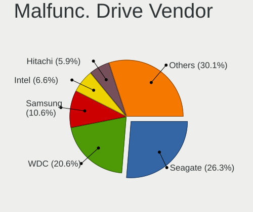

| Vendor                   | Computers | Drives | Percent |
|--------------------------|-----------|--------|---------|
| Seagate                  | 139       | 246    | 26.28%  |
| WDC                      | 109       | 205    | 20.6%   |
| Samsung Electronics      | 56        | 167    | 10.59%  |
| Intel                    | 35        | 133    | 6.62%   |
| Hitachi                  | 31        | 38     | 5.86%   |
| Kingston                 | 26        | 29     | 4.91%   |
| Toshiba                  | 22        | 27     | 4.16%   |
| SanDisk                  | 14        | 15     | 2.65%   |
| SK hynix                 | 11        | 12     | 2.08%   |
| HGST                     | 11        | 12     | 2.08%   |
| Crucial                  | 10        | 13     | 1.89%   |
| Micron Technology        | 7         | 8      | 1.32%   |
| Maxtor                   | 7         | 12     | 1.32%   |
| Fujitsu                  | 7         | 7      | 1.32%   |
| Apple                    | 6         | 6      | 1.13%   |
| Corsair                  | 5         | 6      | 0.95%   |
| Realtek Semiconductor    | 4         | 5      | 0.76%   |
| OCZ                      | 3         | 3      | 0.57%   |
| Phison Electronics       | 2         | 2      | 0.38%   |
| LITEON                   | 2         | 2      | 0.38%   |
| HPE                      | 2         | 2      | 0.38%   |
| Transcend                | 1         | 1      | 0.19%   |
| SPCC M.2                 | 1         | 1      | 0.19%   |
| SPCC                     | 1         | 1      | 0.19%   |
| Realtek                  | 1         | 1      | 0.19%   |
| Patriot                  | 1         | 1      | 0.19%   |
| Netac                    | 1         | 1      | 0.19%   |
| MaxDigital               | 1         | 1      | 0.19%   |
| Lite-On Technology       | 1         | 1      | 0.19%   |
| Lenovo                   | 1         | 1      | 0.19%   |
| KIOXIA                   | 1         | 1      | 0.19%   |
| KingSpec                 | 1         | 3      | 0.19%   |
| KingFast                 | 1         | 1      | 0.19%   |
| Indilinx                 | 1         | 1      | 0.19%   |
| Hikvision                | 1         | 1      | 0.19%   |
| Hewlett-Packard          | 1         | 2      | 0.19%   |
| Gigabyte Technology      | 1         | 1      | 0.19%   |
| Biwin Storage Technology | 1         | 1      | 0.19%   |
| ASMT                     | 1         | 1      | 0.19%   |
| Apacer                   | 1         | 1      | 0.19%   |

Malfunc. HDD Vendor
-------------------

Vendors of faulty HDD drives

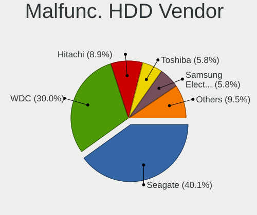

| Vendor              | Computers | Drives | Percent |
|---------------------|-----------|--------|---------|
| Seagate             | 139       | 246    | 40.06%  |
| WDC                 | 104       | 196    | 29.97%  |
| Hitachi             | 31        | 38     | 8.93%   |
| Toshiba             | 20        | 25     | 5.76%   |
| Samsung Electronics | 20        | 128    | 5.76%   |
| HGST                | 11        | 12     | 3.17%   |
| Maxtor              | 7         | 12     | 2.02%   |
| Fujitsu             | 6         | 6      | 1.73%   |
| Apple               | 4         | 4      | 1.15%   |
| HPE                 | 2         | 2      | 0.58%   |
| MaxDigital          | 1         | 1      | 0.29%   |
| Hewlett-Packard     | 1         | 2      | 0.29%   |
| ASMT                | 1         | 1      | 0.29%   |

Malfunc. Drive Kind
-------------------

Kinds of faulty drives

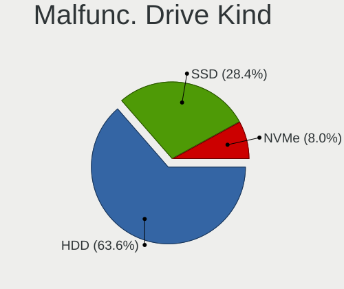

| Kind | Computers | Drives | Percent |
|------|-----------|--------|---------|
| HDD  | 311       | 673    | 63.6%   |
| SSD  | 139       | 254    | 28.43%  |
| NVMe | 39        | 46     | 7.98%   |

Failed Drives
-------------

Failed drive models

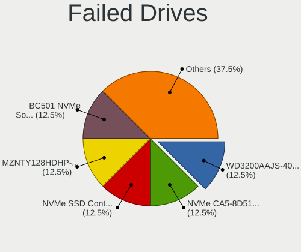

| Model                                                            | Computers | Drives | Percent |
|------------------------------------------------------------------|-----------|--------|---------|
| WDC WD3200AAJS-40RYA0 320GB                                      | 1         | 1      | 12.5%   |
| Solid State Storage NVMe CA5-8D512 512GB                         | 1         | 1      | 12.5%   |
| SK hynix BC501 NVMe Solid State Drive 512GB                      | 1         | 1      | 12.5%   |
| Samsung Electronics NVMe SSD Controller SM961/PM961/SM963 1024GB | 1         | 1      | 12.5%   |
| Samsung Electronics MZNTY128HDHP-00000 128GB SSD                 | 1         | 2      | 12.5%   |
| Hitachi HDS721010DLE630 1TB                                      | 1         | 12     | 12.5%   |
| Hitachi HDS72101 1TB                                             | 1         | 1      | 12.5%   |
| Apple HDD HTS541010A9E662 1TB                                    | 1         | 1      | 12.5%   |

Failed Drive Vendor
-------------------

Failed drive vendors

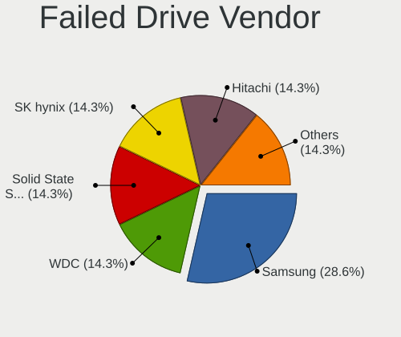

| Vendor              | Computers | Drives | Percent |
|---------------------|-----------|--------|---------|
| Samsung Electronics | 2         | 3      | 28.57%  |
| WDC                 | 1         | 1      | 14.29%  |
| Solid State Storage | 1         | 1      | 14.29%  |
| SK hynix            | 1         | 1      | 14.29%  |
| Hitachi             | 1         | 13     | 14.29%  |
| Apple               | 1         | 1      | 14.29%  |

Drive Status
------------

Number of failed and malfunc. drives

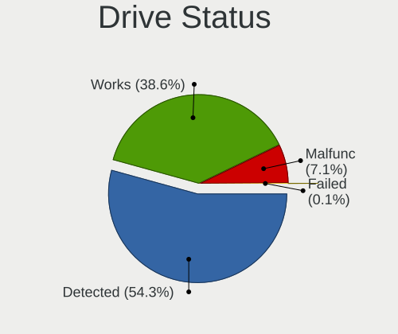

| Status   | Computers | Drives | Percent |
|----------|-----------|--------|---------|
| Detected | 3569      | 8555   | 54.28%  |
| Works    | 2535      | 6452   | 38.56%  |
| Malfunc  | 464       | 973    | 7.06%   |
| Failed   | 7         | 20     | 0.11%   |

Storage controller
------------------

Storage Vendor
--------------

Storage controller vendors

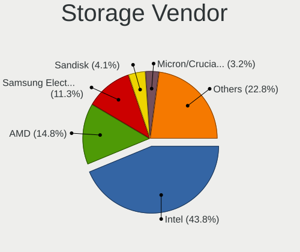

| Vendor                                  | Computers | Percent |
|-----------------------------------------|-----------|---------|
| Intel                                   | 3664      | 43.76%  |
| AMD                                     | 1235      | 14.75%  |
| Samsung Electronics                     | 943       | 11.26%  |
| Sandisk                                 | 345       | 4.12%   |
| Micron/Crucial Technology               | 272       | 3.25%   |
| Kingston Technology Company             | 247       | 2.95%   |
| Phison Electronics                      | 187       | 2.23%   |
| SK hynix                                | 177       | 2.11%   |
| ASMedia Technology                      | 174       | 2.08%   |
| Micron Technology                       | 152       | 1.82%   |
| Marvell Technology Group                | 148       | 1.77%   |
| Toshiba America Info Systems            | 110       | 1.31%   |
| KIOXIA                                  | 99        | 1.18%   |
| JMicron Technology                      | 99        | 1.18%   |
| MAXIO Technology (Hangzhou)             | 74        | 0.88%   |
| Nvidia                                  | 49        | 0.59%   |
| ADATA Technology                        | 44        | 0.53%   |
| Silicon Motion                          | 43        | 0.51%   |
| Realtek Semiconductor                   | 42        | 0.5%    |
| Apple                                   | 36        | 0.43%   |
| LSI Logic / Symbios Logic               | 31        | 0.37%   |
| Broadcom / LSI                          | 26        | 0.31%   |
| Shenzhen Longsys Electronics            | 25        | 0.3%    |
| Seagate Technology                      | 16        | 0.19%   |
| VIA Technologies                        | 13        | 0.16%   |
| Lite-On Technology                      | 12        | 0.14%   |
| Integrated Technology Express           | 12        | 0.14%   |
| Solid State Storage Technology          | 10        | 0.12%   |
| Adaptec                                 | 10        | 0.12%   |
| Solidigm                                | 9         | 0.11%   |
| Hewlett-Packard                         | 9         | 0.11%   |
| Union Memory (Shenzhen)                 | 8         | 0.1%    |
| Lenovo                                  | 8         | 0.1%    |
| Silicon Image                           | 7         | 0.08%   |
| INNOGRIT                                | 4         | 0.05%   |
| Hosin Global Electronics                | 4         | 0.05%   |
| Biwin Storage Technology                | 4         | 0.05%   |
| ULi Electronics                         | 3         | 0.04%   |
| Silicon Integrated Systems [SiS]        | 3         | 0.04%   |
| Shenzhen Unionmemory Information System | 3         | 0.04%   |

Storage Model
-------------

Storage controller models

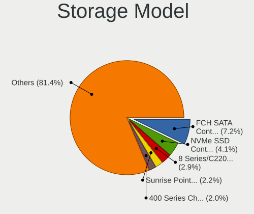

| Model                                                                                   | Computers | Percent |
|-----------------------------------------------------------------------------------------|-----------|---------|
| AMD FCH SATA Controller [AHCI mode]                                                     | 684       | 7.22%   |
| Samsung NVMe SSD Controller SM981/PM981/PM983                                           | 393       | 4.15%   |
| Intel 8 Series/C220 Series Chipset Family 6-port SATA Controller 1 [AHCI mode]          | 279       | 2.95%   |
| Intel Sunrise Point-LP SATA Controller [AHCI mode]                                      | 212       | 2.24%   |
| AMD 400 Series Chipset SATA Controller                                                  | 192       | 2.03%   |
| Intel 7 Series Chipset Family 6-port SATA Controller [AHCI mode]                        | 188       | 1.99%   |
| AMD 500 Series Chipset SATA Controller                                                  | 185       | 1.95%   |
| Intel Q170/Q150/B150/H170/H110/Z170/CM236 Chipset SATA Controller [AHCI Mode]           | 179       | 1.89%   |
| Intel 82801 Mobile SATA Controller [RAID mode]                                          | 168       | 1.77%   |
| AMD 600 Series Chipset SATA Controller                                                  | 168       | 1.77%   |
| Intel Volume Management Device NVMe RAID Controller                                     | 162       | 1.71%   |
| Samsung NVMe SSD Controller PM9A1/PM9A3/980PRO                                          | 157       | 1.66%   |
| Intel SATA Controller [RAID mode]                                                       | 155       | 1.64%   |
| ASMedia ASM1061/ASM1062 Serial ATA Controller                                           | 151       | 1.59%   |
| Intel 200 Series PCH SATA controller [AHCI mode]                                        | 149       | 1.57%   |
| Intel 6 Series/C200 Series Chipset Family 6 port Mobile SATA AHCI Controller            | 148       | 1.56%   |
| Intel Cannon Lake PCH SATA AHCI Controller                                              | 128       | 1.35%   |
| Samsung NVMe SSD Controller SM961/PM961/SM963                                           | 124       | 1.31%   |
| Intel 8 Series SATA Controller 1 [AHCI mode]                                            | 124       | 1.31%   |
| Micron/Crucial P2 [Nick P2] / P3 / P3 Plus NVMe PCIe SSD (DRAM-less)                    | 117       | 1.24%   |
| Intel 7 Series/C210 Series Chipset Family 6-port SATA Controller [AHCI mode]            | 112       | 1.18%   |
| Intel 6 Series/C200 Series Chipset Family 6 port Desktop SATA AHCI Controller           | 111       | 1.17%   |
| Samsung NVMe SSD Controller 980 (DRAM-less)                                             | 107       | 1.13%   |
| AMD SB7x0/SB8x0/SB9x0 SATA Controller [AHCI mode]                                       | 86        | 0.91%   |
| AMD SB7x0/SB8x0/SB9x0 IDE Controller                                                    | 81        | 0.86%   |
| Intel Cannon Lake Mobile PCH SATA AHCI Controller                                       | 78        | 0.82%   |
| Intel Wildcat Point-LP SATA Controller [AHCI Mode]                                      | 77        | 0.81%   |
| JMicron JMB363 SATA/IDE Controller                                                      | 73        | 0.77%   |
| KIOXIA NVMe SSD Controller BG4 (DRAM-less)                                              | 71        | 0.75%   |
| Intel Alder Lake-S PCH SATA Controller [AHCI Mode]                                      | 68        | 0.72%   |
| Intel 5 Series/3400 Series Chipset 4 port SATA AHCI Controller                          | 65        | 0.69%   |
| Intel 5 Series/3400 Series Chipset 6 port SATA AHCI Controller                          | 64        | 0.68%   |
| Intel Comet Lake SATA AHCI Controller                                                   | 59        | 0.62%   |
| Intel SSD 660P Series                                                                   | 54        | 0.57%   |
| SanDisk Extreme Pro / WD Black SN750 / PC SN730 / Red SN700 NVMe SSD                    | 53        | 0.56%   |
| Samsung NVMe SSD Controller S4LV008[Pascal]                                             | 52        | 0.55%   |
| Phison E16 PCIe4 NVMe Controller                                                        | 51        | 0.54%   |
| Intel Tiger Lake-LP SATA Controller                                                     | 50        | 0.53%   |
| Intel 6 Series/C200 Series Chipset Family Desktop SATA Controller (IDE mode, ports 0-3) | 49        | 0.52%   |
| Intel 6 Series/C200 Series Chipset Family Desktop SATA Controller (IDE mode, ports 4-5) | 48        | 0.51%   |

Storage Kind
------------

Kind of storage controller (IDE, SATA, NVMe, SAS, ...)

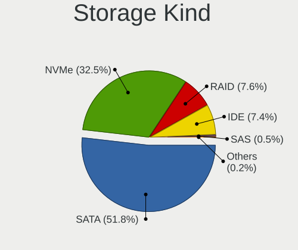

| Kind | Computers | Percent |
|------|-----------|---------|
| SATA | 4178      | 51.81%  |
| NVMe | 2620      | 32.49%  |
| RAID | 612       | 7.59%   |
| IDE  | 599       | 7.43%   |
| SAS  | 41        | 0.51%   |
| SCSI | 14        | 0.17%   |

Processor
---------

CPU Vendor
----------

Processor vendors

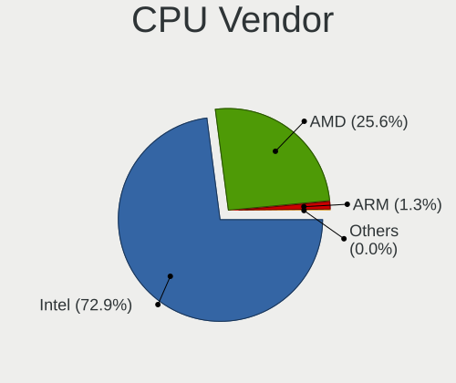

| Vendor        | Computers | Percent |
|---------------|-----------|---------|
| Intel         | 4384      | 72.95%  |
| AMD           | 1536      | 25.56%  |
| ARM           | 80        | 1.33%   |
| Unknown       | 5         | 0.08%   |
| Qualcomm      | 2         | 0.03%   |
| sifive,u74-mc | 1         | 0.02%   |
| eswin,eic770x | 1         | 0.02%   |
| CentaurHauls  | 1         | 0.02%   |

CPU Model
---------

Processor models

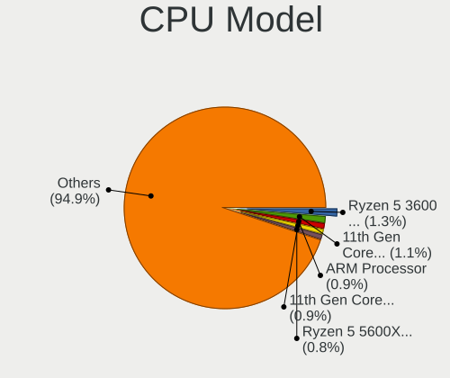

| Model                                   | Computers | Percent |
|-----------------------------------------|-----------|---------|
| AMD Ryzen 5 3600 6-Core Processor       | 78        | 1.29%   |
| Intel 11th Gen Core i5-1135G7 @ 2.40GHz | 69        | 1.14%   |
| ARM Processor                           | 56        | 0.93%   |
| Intel 11th Gen Core i7-1165G7 @ 2.80GHz | 53        | 0.88%   |
| AMD Ryzen 5 5600X 6-Core Processor      | 51        | 0.85%   |
| Intel Core i7-9750H CPU @ 2.60GHz       | 50        | 0.83%   |
| AMD Ryzen 7 3700X 8-Core Processor      | 48        | 0.8%    |
| Intel Core i7-8550U CPU @ 1.80GHz       | 47        | 0.78%   |
| Intel Core i7-2600 CPU @ 3.40GHz        | 43        | 0.71%   |
| Intel Core i5-7200U CPU @ 2.50GHz       | 43        | 0.71%   |
| Intel Core i5-6300U CPU @ 2.40GHz       | 42        | 0.7%    |
| Intel Core i7-3770 CPU @ 3.40GHz        | 41        | 0.68%   |
| Intel Core i5-8250U CPU @ 1.60GHz       | 41        | 0.68%   |
| Intel Core i5-6200U CPU @ 2.30GHz       | 39        | 0.65%   |
| Intel Core i7-7700HQ CPU @ 2.80GHz      | 38        | 0.63%   |
| Intel Core i5-4460 CPU @ 3.20GHz        | 37        | 0.61%   |
| AMD Ryzen 9 5950X 16-Core Processor     | 37        | 0.61%   |
| AMD Ryzen 9 3900X 12-Core Processor     | 35        | 0.58%   |
| Intel Core i5-8265U CPU @ 1.60GHz       | 34        | 0.56%   |
| Intel Core i7-4790 CPU @ 3.60GHz        | 33        | 0.55%   |
| Intel Core i7-10510U CPU @ 1.80GHz      | 33        | 0.55%   |
| Intel Core i5-7400 CPU @ 3.00GHz        | 33        | 0.55%   |
| Intel Core i5-3470 CPU @ 3.20GHz        | 33        | 0.55%   |
| Intel Core 2 Duo CPU E8400 @ 3.00GHz    | 33        | 0.55%   |
| AMD Ryzen 5 2600 Six-Core Processor     | 33        | 0.55%   |
| Intel Core i5-9400 CPU @ 2.90GHz        | 31        | 0.51%   |
| Intel Core i5-10210U CPU @ 1.60GHz      | 31        | 0.51%   |
| AMD Ryzen 7 7800X3D 8-Core Processor    | 31        | 0.51%   |
| Intel Core i7-8565U CPU @ 1.80GHz       | 30        | 0.5%    |
| Intel Core i7-7500U CPU @ 2.70GHz       | 30        | 0.5%    |
| Intel Core i7-4770 CPU @ 3.40GHz        | 29        | 0.48%   |
| Intel Core i7-10750H CPU @ 2.60GHz      | 29        | 0.48%   |
| Intel 12th Gen Core i7-1255U            | 29        | 0.48%   |
| Intel Core i7-8650U CPU @ 1.90GHz       | 28        | 0.46%   |
| Intel Core i5-3210M CPU @ 2.50GHz       | 28        | 0.46%   |
| AMD Ryzen 9 5900X 12-Core Processor     | 28        | 0.46%   |
| AMD Ryzen 7 5800X 8-Core Processor      | 28        | 0.46%   |
| Intel Core i7-8750H CPU @ 2.20GHz       | 27        | 0.45%   |
| Intel Core i7-6700 CPU @ 3.40GHz        | 27        | 0.45%   |
| Intel Core i5-7300U CPU @ 2.60GHz       | 27        | 0.45%   |

CPU Model Family
----------------

Processor model prefix

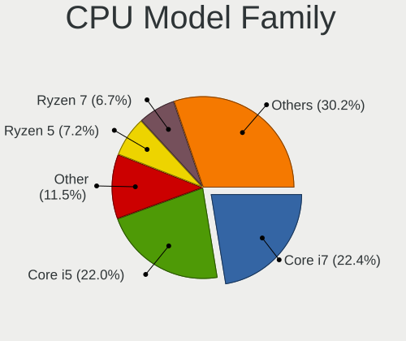

| Model                   | Computers | Percent |
|-------------------------|-----------|---------|
| Intel Core i7           | 1351      | 22.44%  |
| Intel Core i5           | 1325      | 22.01%  |
| Other                   | 691       | 11.48%  |
| AMD Ryzen 5             | 434       | 7.21%   |
| AMD Ryzen 7             | 402       | 6.68%   |
| Intel Core i3           | 210       | 3.49%   |
| AMD Ryzen 9             | 197       | 3.27%   |
| Intel Celeron           | 187       | 3.11%   |
| Intel Core 2 Duo        | 182       | 3.02%   |
| Intel Xeon              | 165       | 2.74%   |
| Intel Pentium           | 68        | 1.13%   |
| AMD FX                  | 61        | 1.01%   |
| Intel Core              | 60        | 1%      |
| Intel Core i9           | 47        | 0.78%   |
| AMD A6                  | 47        | 0.78%   |
| Intel Atom              | 42        | 0.7%    |
| AMD Ryzen 3             | 39        | 0.65%   |
| AMD A4                  | 36        | 0.6%    |
| AMD A8                  | 35        | 0.58%   |
| Intel Core 2 Quad       | 28        | 0.47%   |
| Intel Core 2            | 28        | 0.47%   |
| Intel Pentium Dual-Core | 27        | 0.45%   |
| AMD E2                  | 22        | 0.37%   |
| ARM BCM                 | 21        | 0.35%   |
| AMD Phenom II X4        | 21        | 0.35%   |
| AMD A10                 | 21        | 0.35%   |
| Intel Core m3           | 19        | 0.32%   |
| AMD Ryzen 7 PRO         | 18        | 0.3%    |
| AMD Ryzen Threadripper  | 16        | 0.27%   |
| AMD Athlon              | 13        | 0.22%   |
| Intel Core M            | 12        | 0.2%    |
| Intel Genuine           | 11        | 0.18%   |
| AMD Ryzen 5 PRO         | 11        | 0.18%   |
| AMD Phenom II X6        | 11        | 0.18%   |
| Intel Pentium Dual      | 10        | 0.17%   |
| AMD E1                  | 10        | 0.17%   |
| AMD Athlon II X2        | 10        | 0.17%   |
| Intel Pentium Silver    | 9         | 0.15%   |
| Intel Pentium D         | 9         | 0.15%   |
| AMD E                   | 7         | 0.12%   |

CPU Cores
---------

Number of processor cores

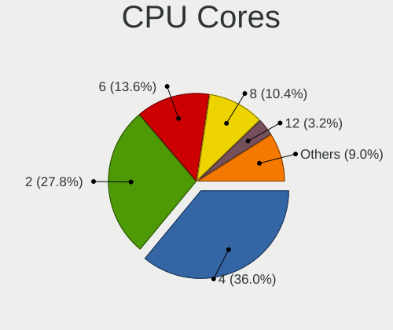

| Number  | Computers | Percent |
|---------|-----------|---------|
| 4       | 2171      | 35.99%  |
| 2       | 1677      | 27.8%   |
| 6       | 819       | 13.58%  |
| 8       | 629       | 10.43%  |
| 12      | 195       | 3.23%   |
| 16      | 143       | 2.37%   |
| 10      | 113       | 1.87%   |
| 1       | 80        | 1.33%   |
| 14      | 69        | 1.14%   |
| 24      | 53        | 0.88%   |
| Unknown | 23        | 0.38%   |
| 3       | 20        | 0.33%   |
| 20      | 14        | 0.23%   |
| 32      | 7         | 0.12%   |
| 18      | 5         | 0.08%   |
| 40      | 3         | 0.05%   |
| 128     | 2         | 0.03%   |
| 44      | 2         | 0.03%   |
| 36      | 2         | 0.03%   |
| 5       | 2         | 0.03%   |
| 112     | 1         | 0.02%   |
| 48      | 1         | 0.02%   |
| 46      | 1         | 0.02%   |
| 28      | 1         | 0.02%   |

CPU Sockets
-----------

Number of sockets

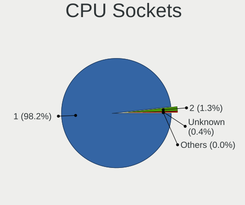

| Number  | Computers | Percent |
|---------|-----------|---------|
| 1       | 5904      | 98.17%  |
| 2       | 81        | 1.35%   |
| Unknown | 23        | 0.38%   |
| 20      | 2         | 0.03%   |
| 4       | 2         | 0.03%   |
| 24      | 1         | 0.02%   |
| 8       | 1         | 0.02%   |

CPU Threads
-----------

Threads per core (Hyper-Threading)

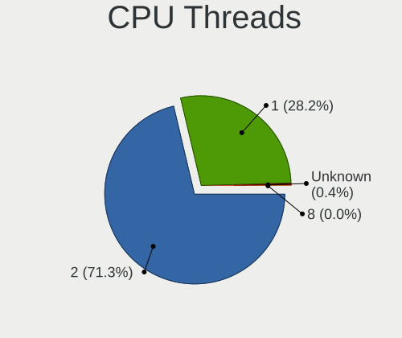

| Number  | Computers | Percent |
|---------|-----------|---------|
| 2       | 4297      | 71.3%   |
| 1       | 1702      | 28.24%  |
| Unknown | 23        | 0.38%   |
| 4       | 3         | 0.05%   |
| 8       | 2         | 0.03%   |

CPU Op-Modes
------------

CPU Operation Modes (32-bit, 64-bit)

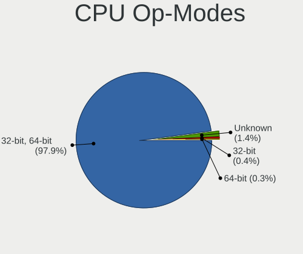

| Op mode        | Computers | Percent |
|----------------|-----------|---------|
| 32-bit, 64-bit | 5892      | 97.86%  |
| Unknown        | 85        | 1.41%   |
| 32-bit         | 27        | 0.45%   |
| 64-bit         | 17        | 0.28%   |

CPU Microcode
-------------

Microcode number

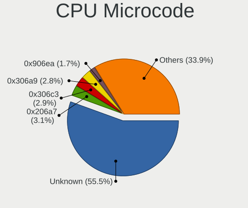

| Number     | Computers | Percent |
|------------|-----------|---------|
| Unknown    | 3487      | 55.54%  |
| 0x206a7    | 196       | 3.12%   |
| 0x306c3    | 183       | 2.91%   |
| 0x306a9    | 177       | 2.82%   |
| 0x906ea    | 109       | 1.74%   |
| 0x1067a    | 103       | 1.64%   |
| 0x906e9    | 99        | 1.58%   |
| 0x506e3    | 81        | 1.29%   |
| 0x806e9    | 71        | 1.13%   |
| 0x08701021 | 71        | 1.13%   |
| 0x406e3    | 64        | 1.02%   |
| 0x40651    | 62        | 0.99%   |
| 0x806ea    | 61        | 0.97%   |
| 0x806ec    | 60        | 0.96%   |
| 0x806c1    | 56        | 0.89%   |
| 0x306d4    | 51        | 0.81%   |
| 0x20655    | 51        | 0.81%   |
| 0x08701013 | 38        | 0.61%   |
| 0x0800820d | 37        | 0.59%   |
| 0x106e5    | 35        | 0.56%   |
| 0x10676    | 31        | 0.49%   |
| 0x0a50000c | 31        | 0.49%   |
| 0x30678    | 28        | 0.45%   |
| 0x20652    | 28        | 0.45%   |
| 0x906ed    | 26        | 0.41%   |
| 0x08108109 | 26        | 0.41%   |
| 0x06006705 | 25        | 0.4%    |
| 0x06000852 | 25        | 0.4%    |
| 0xa0652    | 23        | 0.37%   |
| 0x706e5    | 23        | 0.37%   |
| 0x0a201016 | 23        | 0.37%   |
| 0x010000c8 | 23        | 0.37%   |
| 0x106a5    | 22        | 0.35%   |
| 0x906a3    | 21        | 0.33%   |
| 0x6fb      | 21        | 0.33%   |
| 0x806eb    | 20        | 0.32%   |
| 0x406c4    | 20        | 0.32%   |
| 0x07030105 | 20        | 0.32%   |
| 0x06001119 | 20        | 0.32%   |
| 0x6fd      | 18        | 0.29%   |

CPU Microarch
-------------

Microarchitecture

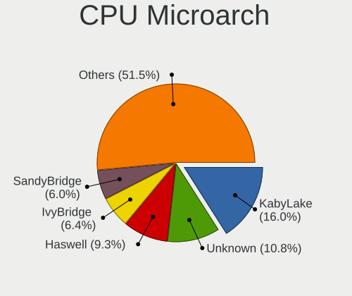

| Name              | Computers | Percent |
|-------------------|-----------|---------|
| KabyLake          | 963       | 15.96%  |
| Unknown           | 652       | 10.81%  |
| Haswell           | 559       | 9.26%   |
| IvyBridge         | 389       | 6.45%   |
| SandyBridge       | 364       | 6.03%   |
| Zen 3             | 346       | 5.73%   |
| Skylake           | 339       | 5.62%   |
| Zen 2             | 275       | 4.56%   |
| Penryn            | 201       | 3.33%   |
| Alderlake Hybrid  | 201       | 3.33%   |
| TigerLake         | 159       | 2.64%   |
| Westmere          | 152       | 2.52%   |
| Broadwell         | 143       | 2.37%   |
| Zen+              | 137       | 2.27%   |
| CometLake         | 128       | 2.12%   |
| Core              | 97        | 1.61%   |
| Silvermont        | 96        | 1.59%   |
| Zen               | 95        | 1.57%   |
| IceLake           | 94        | 1.56%   |
| Nehalem           | 92        | 1.52%   |
| Piledriver        | 79        | 1.31%   |
| K10               | 68        | 1.13%   |
| Excavator         | 62        | 1.03%   |
| Goldmont plus     | 55        | 0.91%   |
| Puma              | 38        | 0.63%   |
| Goldmont          | 30        | 0.5%    |
| Steamroller       | 23        | 0.38%   |
| Jaguar            | 22        | 0.36%   |
| Meteorlake Hybrid | 19        | 0.31%   |
| Bonnell           | 19        | 0.31%   |
| Tremont           | 18        | 0.3%    |
| P6                | 17        | 0.28%   |
| K8 Hammer         | 17        | 0.28%   |
| NetBurst          | 16        | 0.27%   |
| Bulldozer         | 15        | 0.25%   |
| K10 Llano         | 14        | 0.23%   |
| Lunarlake Hybrid  | 13        | 0.22%   |
| Bobcat            | 13        | 0.22%   |
| Gracemont         | 10        | 0.17%   |
| K8 & K10 hybrid   | 2         | 0.03%   |

Graphics
--------

GPU Vendor
----------

Vendors of graphics cards

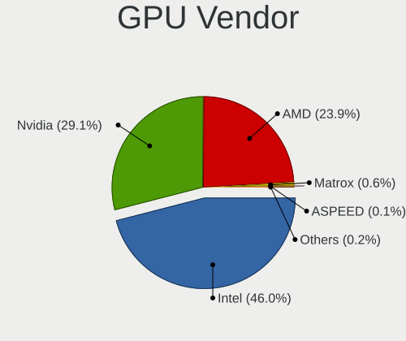

| Vendor                           | Computers | Percent |
|----------------------------------|-----------|---------|
| Intel                            | 3234      | 45.99%  |
| Nvidia                           | 2048      | 29.12%  |
| AMD                              | 1683      | 23.93%  |
| Matrox Electronics Systems       | 44        | 0.63%   |
| ASPEED Technology                | 9         | 0.13%   |
| VIA Technologies                 | 5         | 0.07%   |
| Silicon Integrated Systems [SiS] | 3         | 0.04%   |
| Red Hat                          | 2         | 0.03%   |
| Neomagic                         | 2         | 0.03%   |
| Racore Computer Products         | 1         | 0.01%   |
| ATI Technologies                 | 1         | 0.01%   |

GPU Model
---------

Graphics card models

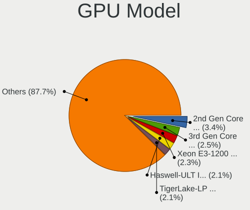

| Model                                                                                    | Computers | Percent |
|------------------------------------------------------------------------------------------|-----------|---------|
| Intel 2nd Generation Core Processor Family Integrated Graphics Controller                | 246       | 3.37%   |
| Intel 3rd Gen Core processor Graphics Controller                                         | 184       | 2.52%   |
| Intel Xeon E3-1200 v3/4th Gen Core Processor Integrated Graphics Controller              | 167       | 2.29%   |
| Intel Haswell-ULT Integrated Graphics Controller                                         | 153       | 2.09%   |
| Intel TigerLake-LP GT2 [Iris Xe Graphics]                                                | 151       | 2.07%   |
| AMD Ellesmere [Radeon RX 470/480/570/570X/580/580X/590]                                  | 139       | 1.9%    |
| Intel Kaby Lake-R GT2 [UHD Graphics 620]                                                 | 133       | 1.82%   |
| Intel Skylake-U GT2 [HD Graphics 520]                                                    | 129       | 1.77%   |
| Intel Kaby Lake-U GT2 [HD Graphics 620]                                                  | 115       | 1.57%   |
| Intel CoffeeLake-H GT2 [UHD Graphics 630]                                                | 99        | 1.36%   |
| AMD Cezanne [Radeon Vega Series / Radeon Vega Mobile Series]                             | 93        | 1.27%   |
| Intel CoffeeLake-S GT2 [UHD Graphics 630]                                                | 92        | 1.26%   |
| AMD Raphael                                                                              | 92        | 1.26%   |
| Intel Skylake-S GT2 [HD Graphics 530]                                                    | 86        | 1.18%   |
| Intel WhiskeyLake-U GT2 [UHD Graphics 620]                                               | 76        | 1.04%   |
| Intel Core Processor Integrated Graphics Controller                                      | 76        | 1.04%   |
| Intel CometLake-U GT2 [UHD Graphics]                                                     | 76        | 1.04%   |
| Nvidia GK208B [GeForce GT 710]                                                           | 73        | 1%      |
| AMD Picasso/Raven 2 [Radeon Vega Series / Radeon Vega Mobile Series]                     | 72        | 0.99%   |
| Intel Kaby Lake-S GT2 [HD Graphics 630]                                                  | 69        | 0.94%   |
| Intel Broadwell-U GT2 [HD Graphics 5500]                                                 | 69        | 0.94%   |
| Intel 4th Gen Core Processor Integrated Graphics Controller                              | 62        | 0.85%   |
| AMD Navi 23 [Radeon RX 6600/6600 XT/6600M]                                               | 60        | 0.82%   |
| Intel CometLake-H GT2 [UHD Graphics]                                                     | 53        | 0.73%   |
| Intel Alder Lake-P GT2 [Iris Xe Graphics]                                                | 53        | 0.73%   |
| AMD Renoir [Radeon Vega Series / Radeon Vega Mobile Series]                              | 52        | 0.71%   |
| Intel Alder Lake-UP3 GT2 [Iris Xe Graphics]                                              | 49        | 0.67%   |
| AMD Navi 10 [Radeon RX 5600 OEM/5600 XT / 5700/5700 XT]                                  | 49        | 0.67%   |
| Intel Raptor Lake-P [Iris Xe Graphics]                                                   | 48        | 0.66%   |
| Intel GeminiLake [UHD Graphics 600]                                                      | 48        | 0.66%   |
| Intel Atom/Celeron/Pentium Processor x5-E8000/J3xxx/N3xxx Integrated Graphics Controller | 48        | 0.66%   |
| Intel Atom Processor Z36xxx/Z37xxx Series Graphics & Display                             | 48        | 0.66%   |
| Intel Kaby Lake-H GT2 [HD Graphics 630]                                                  | 47        | 0.64%   |
| Nvidia TU117M [GeForce GTX 1650 Mobile / Max-Q]                                          | 46        | 0.63%   |
| Nvidia GP107 [GeForce GTX 1050 Ti]                                                       | 46        | 0.63%   |
| AMD Stoney [Radeon R2/R3/R4/R5 Graphics]                                                 | 46        | 0.63%   |
| Intel Xeon E3-1200 v2/3rd Gen Core processor Graphics Controller                         | 44        | 0.6%    |
| Nvidia GP108 [GeForce GT 1030]                                                           | 42        | 0.58%   |
| AMD Granite Ridge [Radeon Graphics]                                                      | 42        | 0.58%   |
| Intel Mobile 4 Series Chipset Integrated Graphics Controller                             | 40        | 0.55%   |

GPU Combo
---------

Combinations of graphics cards

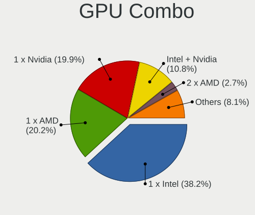

| Name                                      | Computers | Percent |
|-------------------------------------------|-----------|---------|
| 1 x Intel                                 | 2329      | 38.19%  |
| 1 x AMD                                   | 1234      | 20.24%  |
| 1 x Nvidia                                | 1216      | 19.94%  |
| Intel + Nvidia                            | 658       | 10.79%  |
| 2 x AMD                                   | 165       | 2.71%   |
| AMD + Nvidia                              | 153       | 2.51%   |
| Intel + AMD                               | 134       | 2.2%    |
| Other                                     | 92        | 1.51%   |
| 1 x Matrox                                | 34        | 0.56%   |
| 2 x Intel                                 | 26        | 0.43%   |
| 2 x Nvidia                                | 17        | 0.28%   |
| Nvidia + Matrox                           | 10        | 0.16%   |
| 1 x VIA                                   | 5         | 0.08%   |
| Nvidia + ASPEED                           | 5         | 0.08%   |
| 1 x ASPEED                                | 4         | 0.07%   |
| 1 x SiS                                   | 3         | 0.05%   |
| Intel + AMD + 1 x Nvidia                  | 3         | 0.05%   |
| 3 x AMD                                   | 2         | 0.03%   |
| 1 x Red Hat                               | 2         | 0.03%   |
| 1 x Neomagic                              | 2         | 0.03%   |
| 3 x Nvidia + 1 x Racore Computer Products | 1         | 0.02%   |
| Intel + 2 x Nvidia                        | 1         | 0.02%   |
| Intel + 2 x AMD                           | 1         | 0.02%   |
| 1 x AMD + 3 x Nvidia                      | 1         | 0.02%   |

GPU Driver
----------

Free vs proprietary

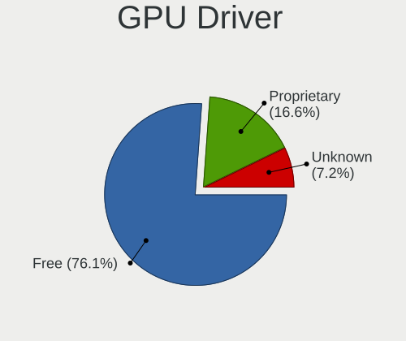

| Driver      | Computers | Percent |
|-------------|-----------|---------|
| Free        | 4697      | 76.14%  |
| Proprietary | 1027      | 16.65%  |
| Unknown     | 445       | 7.21%   |

GPU Memory
----------

Total video memory

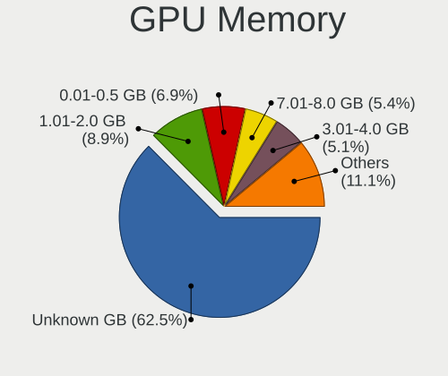

| Size in GB | Computers | Percent |
|------------|-----------|---------|
| Unknown    | 3893      | 62.55%  |
| 1.01-2.0   | 556       | 8.93%   |
| 0.01-0.5   | 432       | 6.94%   |
| 7.01-8.0   | 337       | 5.41%   |
| 3.01-4.0   | 318       | 5.11%   |
| 0.51-1.0   | 318       | 5.11%   |
| 8.01-16.0  | 161       | 2.59%   |
| 5.01-6.0   | 124       | 1.99%   |
| 2.01-3.0   | 43        | 0.69%   |
| 16.01-24.0 | 38        | 0.61%   |
| 32.01-64.0 | 2         | 0.03%   |
| 4.01-5.0   | 2         | 0.03%   |

Monitor
-------

Monitor Vendor
--------------

Monitor vendors

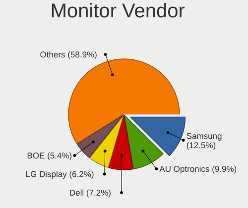

| Vendor                  | Computers | Percent |
|-------------------------|-----------|---------|
| Samsung Electronics     | 844       | 12.46%  |
| AU Optronics            | 668       | 9.86%   |
| Dell                    | 488       | 7.2%    |
| LG Display              | 417       | 6.15%   |
| BOE                     | 367       | 5.42%   |
| Chimei Innolux          | 363       | 5.36%   |
| Goldstar                | 326       | 4.81%   |
| Acer                    | 313       | 4.62%   |
| Apple                   | 263       | 3.88%   |
| Hewlett-Packard         | 236       | 3.48%   |
| Philips                 | 225       | 3.32%   |
| BenQ                    | 220       | 3.25%   |
| AOC                     | 210       | 3.1%    |
| Lenovo                  | 180       | 2.66%   |
| Ancor Communications    | 163       | 2.41%   |
| Sharp                   | 148       | 2.18%   |
| ViewSonic               | 117       | 1.73%   |
| ASUSTek Computer        | 91        | 1.34%   |
| Unknown                 | 74        | 1.09%   |
| MSI                     | 67        | 0.99%   |
| Sony                    | 65        | 0.96%   |
| Chi Mei Optoelectronics | 62        | 0.91%   |
| Gigabyte Technology     | 56        | 0.83%   |
| Panasonic               | 53        | 0.78%   |
| Kogan                   | 53        | 0.78%   |
| ___                     | 42        | 0.62%   |
| PANDA                   | 40        | 0.59%   |
| LG Electronics          | 31        | 0.46%   |
| Hitachi                 | 31        | 0.46%   |
| Valve                   | 30        | 0.44%   |
| InfoVision              | 30        | 0.44%   |
| Unknown (XXX)           | 23        | 0.34%   |
| Toshiba                 | 23        | 0.34%   |
| GKK                     | 23        | 0.34%   |
| TCL                     | 19        | 0.28%   |
| MiTAC                   | 18        | 0.27%   |
| SAC                     | 14        | 0.21%   |
| MStar                   | 14        | 0.21%   |
| CSO                     | 14        | 0.21%   |
| Unknown                 | 13        | 0.19%   |

Monitor Model
-------------

Monitor models

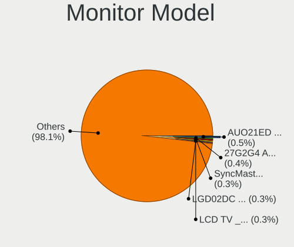

| Model                                                                 | Computers | Percent |
|-----------------------------------------------------------------------|-----------|---------|
| AU Optronics LCD Monitor AUO21ED 1920x1080 344x193mm 15.5-inch        | 36        | 0.51%   |
| AOC 27G2G4 AOC2702 1920x1080 598x336mm 27.0-inch                      | 25        | 0.35%   |
| Samsung Electronics SyncMaster SAM01D3 1440x900 410x260mm 19.1-inch   | 24        | 0.34%   |
| LG Display LCD Monitor LGD02DC 1366x768 344x194mm 15.5-inch           | 24        | 0.34%   |
| ___ LCD TV ___9000 1360x768                                           | 23        | 0.32%   |
| ___ LCD TV ___0101 1360x768                                           | 22        | 0.31%   |
| Panasonic VVX11F009G00 MEI96A2 1920x1080 344x193mm 15.5-inch          | 21        | 0.29%   |
| LG Display LCD Monitor LGD0555 2736x1824 260x173mm 12.3-inch          | 21        | 0.29%   |
| Valve ANX7530 U VLV3001 800x1280 100x150mm 7.1-inch                   | 20        | 0.28%   |
| Chimei Innolux LCD Monitor CMN15AB 1366x768 344x193mm 15.5-inch       | 20        | 0.28%   |
| Samsung Electronics LCD Monitor SEC5441 1280x800 331x207mm 15.4-inch  | 19        | 0.27%   |
| Chimei Innolux LCD Monitor CMN14D4 1920x1080 309x173mm 13.9-inch      | 18        | 0.25%   |
| Goldstar HDR WFHD GSM7714 2560x1080 798x334mm 34.1-inch               | 17        | 0.24%   |
| AU Optronics LCD Monitor AUO22EC 1366x768 344x193mm 15.5-inch         | 17        | 0.24%   |
| Apple Color LCD APP9CDF 1440x900 286x179mm 13.3-inch                  | 17        | 0.24%   |
| Unknown (XXX) Beyond TV XXX2851 3840x2160 1209x680mm 54.6-inch        | 15        | 0.21%   |
| Samsung Electronics C24F390 SAM0D2C 1920x1080 521x293mm 23.5-inch     | 15        | 0.21%   |
| Goldstar LG ULTRAWIDE GSM59F1 2560x1080 670x280mm 28.6-inch           | 15        | 0.21%   |
| Dell U2412M DELA07A 1920x1200 518x324mm 24.1-inch                     | 15        | 0.21%   |
| Chimei Innolux LCD Monitor CMN15E7 1920x1080 344x193mm 15.5-inch      | 15        | 0.21%   |
| AU Optronics LCD Monitor AUO403D 1920x1080 309x174mm 14.0-inch        | 15        | 0.21%   |
| Hitachi HISENSE HEC0030 3840x2160 1872x1053mm 84.6-inch               | 14        | 0.2%    |
| BenQ GL2460 BNQ78CE 1920x1080 531x299mm 24.0-inch                     | 14        | 0.2%    |
| BenQ G2420HD BNQ7840 1920x1080 531x299mm 24.0-inch                    | 14        | 0.2%    |
| Apple Color LCD APP9CF0 1440x900 290x180mm 13.4-inch                  | 14        | 0.2%    |
| ViewSonic VA2226w-3 VSC2051 1680x1050 490x290mm 22.4-inch             | 13        | 0.18%   |
| Philips PHL 243V7 PHLC155 1920x1080 527x296mm 23.8-inch               | 13        | 0.18%   |
| Dell S2721DGF DEL41D9 2560x1440 597x336mm 27.0-inch                   | 13        | 0.18%   |
| AOC 32G2WG3 AOC3202 1920x1080 698x393mm 31.5-inch                     | 13        | 0.18%   |
| Unknown                                                               | 13        | 0.18%   |
| Unknown LCDTV16 9000 1360x768 1600x900mm 72.3-inch                    | 12        | 0.17%   |
| Samsung Electronics LCD Monitor SEC3542 2160x1440 254x169mm 12.0-inch | 12        | 0.17%   |
| PANDA LCD Monitor NCP004D 1920x1080 344x194mm 15.5-inch               | 12        | 0.17%   |
| Goldstar FULL HD GSM5B55 1920x1080 480x270mm 21.7-inch                | 12        | 0.17%   |
| Chimei Innolux LCD Monitor CMN1521 1920x1080 344x193mm 15.5-inch      | 12        | 0.17%   |
| Apple iMac APPA007 2560x1440 597x336mm 27.0-inch                      | 12        | 0.17%   |
| Apple Color LCD APP9CC7 1280x800 286x179mm 13.3-inch                  | 12        | 0.17%   |
| Ancor Communications VE248 ACI2494 1920x1080 531x299mm 24.0-inch      | 12        | 0.17%   |
| ViewSonic VX2758-SERIES VSCA738 2560x1440 598x336mm 27.0-inch         | 11        | 0.15%   |
| Sharp LCD Monitor SHP148D 3840x2160 344x194mm 15.5-inch               | 11        | 0.15%   |

Monitor Resolution
------------------

Monitor screen resolution

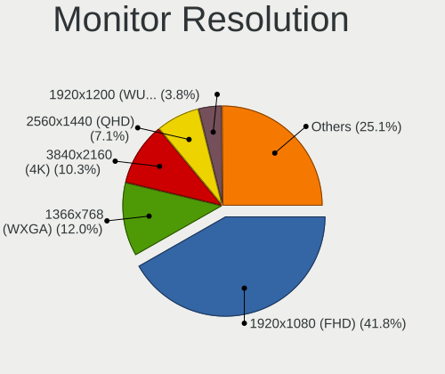

| Resolution         | Computers | Percent |
|--------------------|-----------|---------|
| 1920x1080 (FHD)    | 2689      | 41.76%  |
| 1366x768 (WXGA)    | 772       | 11.99%  |
| 3840x2160 (4K)     | 660       | 10.25%  |
| 2560x1440 (QHD)    | 457       | 7.1%    |
| 1920x1200 (WUXGA)  | 245       | 3.8%    |
| 1680x1050 (WSXGA+) | 171       | 2.66%   |
| 3440x1440          | 155       | 2.41%   |
| 1440x900 (WXGA+)   | 139       | 2.16%   |
| 1280x1024 (SXGA)   | 138       | 2.14%   |
| 1600x900 (HD+)     | 117       | 1.82%   |
| 2560x1600          | 109       | 1.69%   |
| 1280x800 (WXGA)    | 99        | 1.54%   |
| Unknown            | 82        | 1.27%   |
| 2880x1800          | 75        | 1.16%   |
| 2560x1080          | 57        | 0.89%   |
| 3840x1080          | 51        | 0.79%   |
| 1360x768           | 36        | 0.56%   |
| 3840x2400          | 31        | 0.48%   |
| 800x1280           | 28        | 0.43%   |
| 2880x1920          | 26        | 0.4%    |
| 1920x540           | 21        | 0.33%   |
| 2256x1504          | 20        | 0.31%   |
| 2160x1440          | 20        | 0.31%   |
| 3200x2000          | 16        | 0.25%   |
| 1920x1280          | 16        | 0.25%   |
| 3200x1800 (QHD+)   | 15        | 0.23%   |
| 1280x768           | 13        | 0.2%    |
| 3072x1920          | 12        | 0.19%   |
| 1280x720 (HD)      | 12        | 0.19%   |
| 2288x1287          | 10        | 0.16%   |
| 3840x1600          | 9         | 0.14%   |
| 1024x768 (XGA)     | 9         | 0.14%   |
| 1024x600           | 9         | 0.14%   |
| 2736x1824          | 8         | 0.12%   |
| 2240x1400          | 8         | 0.12%   |
| 5120x1440          | 6         | 0.09%   |
| 2880x1620          | 6         | 0.09%   |
| 1600x1200          | 6         | 0.09%   |
| 5760x2160          | 5         | 0.08%   |
| 4480x1440          | 5         | 0.08%   |

Monitor Diagonal
----------------

Diagonal size in inches

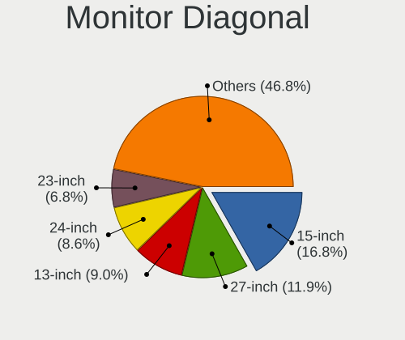

| Inches  | Computers | Percent |
|---------|-----------|---------|
| 15      | 1135      | 16.79%  |
| 27      | 804       | 11.9%   |
| 13      | 611       | 9.04%   |
| 24      | 584       | 8.64%   |
| 23      | 460       | 6.81%   |
| 14      | 434       | 6.42%   |
| Unknown | 322       | 4.76%   |
| 21      | 316       | 4.68%   |
| 31      | 309       | 4.57%   |
| 17      | 189       | 2.8%    |
| 19      | 174       | 2.57%   |
| 34      | 167       | 2.47%   |
| 22      | 136       | 2.01%   |
| 16      | 119       | 1.76%   |
| 12      | 111       | 1.64%   |
| 11      | 84        | 1.24%   |
| 72      | 82        | 1.21%   |
| 20      | 61        | 0.9%    |
| 18      | 59        | 0.87%   |
| 84      | 58        | 0.86%   |
| 32      | 57        | 0.84%   |
| 63      | 44        | 0.65%   |
| 26      | 38        | 0.56%   |
| 40      | 34        | 0.5%    |
| 54      | 32        | 0.47%   |
| 7       | 30        | 0.44%   |
| 48      | 28        | 0.41%   |
| 42      | 25        | 0.37%   |
| 52      | 24        | 0.36%   |
| 28      | 23        | 0.34%   |
| 10      | 19        | 0.28%   |
| 37      | 17        | 0.25%   |
| 65      | 16        | 0.24%   |
| 49      | 16        | 0.24%   |
| 29      | 16        | 0.24%   |
| 25      | 16        | 0.24%   |
| 35      | 13        | 0.19%   |
| 46      | 11        | 0.16%   |
| 142     | 9         | 0.13%   |
| 36      | 8         | 0.12%   |

Monitor Width
-------------

Physical width

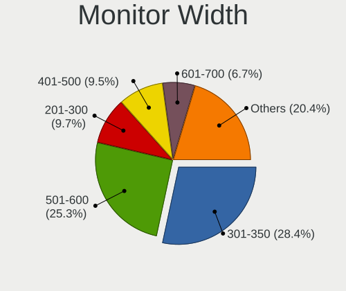

| Width in mm    | Computers | Percent |
|----------------|-----------|---------|
| 301-350        | 1868      | 28.36%  |
| 501-600        | 1666      | 25.29%  |
| 201-300        | 640       | 9.72%   |
| 401-500        | 625       | 9.49%   |
| 601-700        | 443       | 6.73%   |
| Unknown        | 322       | 4.89%   |
| 351-400        | 293       | 4.45%   |
| 701-800        | 228       | 3.46%   |
| 1001-1500      | 201       | 3.05%   |
| 1501-2000      | 151       | 2.29%   |
| 801-900        | 72        | 1.09%   |
| 901-1000       | 37        | 0.56%   |
| 1-100          | 27        | 0.41%   |
| More than 2000 | 9         | 0.14%   |
| 101-200        | 5         | 0.08%   |

Aspect Ratio
------------

Proportional relationship between the width and the height

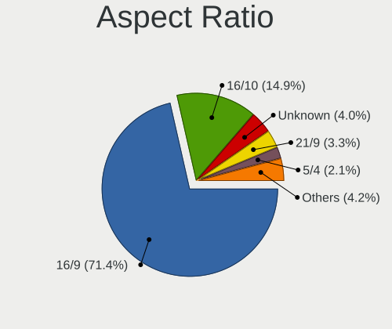

| Ratio   | Computers | Percent |
|---------|-----------|---------|
| 16/9    | 4289      | 71.45%  |
| 16/10   | 894       | 14.89%  |
| Unknown | 242       | 4.03%   |
| 21/9    | 201       | 3.35%   |
| 5/4     | 127       | 2.12%   |
| 3/2     | 105       | 1.75%   |
| 32/9    | 45        | 0.75%   |
| 4/3     | 38        | 0.63%   |
| 0.67    | 20        | 0.33%   |
| 6/5     | 14        | 0.23%   |
| 1.00    | 9         | 0.15%   |
| 0.62    | 9         | 0.15%   |
| 0.56    | 5         | 0.08%   |
| 3.40    | 2         | 0.03%   |
| 3.73    | 1         | 0.02%   |
| 2.00    | 1         | 0.02%   |
| 0.31    | 1         | 0.02%   |

Monitor Area
------------

Area in inch²

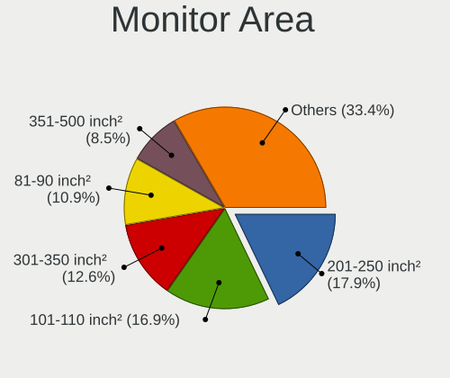

| Area in inch² | Computers | Percent |
|----------------|-----------|---------|
| 201-250        | 1189      | 17.85%  |
| 101-110        | 1123      | 16.86%  |
| 301-350        | 837       | 12.57%  |
| 81-90          | 723       | 10.86%  |
| 351-500        | 563       | 8.45%   |
| Unknown        | 322       | 4.83%   |
| 151-200        | 308       | 4.62%   |
| 71-80          | 305       | 4.58%   |
| More than 1000 | 302       | 4.53%   |
| 251-300        | 211       | 3.17%   |
| 501-1000       | 150       | 2.25%   |
| 121-130        | 128       | 1.92%   |
| 111-120        | 126       | 1.89%   |
| 61-70          | 107       | 1.61%   |
| 51-60          | 89        | 1.34%   |
| 141-150        | 77        | 1.16%   |
| 1-40           | 32        | 0.48%   |
| 91-100         | 27        | 0.41%   |
| 131-140        | 24        | 0.36%   |
| 41-50          | 17        | 0.26%   |

Pixel Density
-------------

Pixels per inch

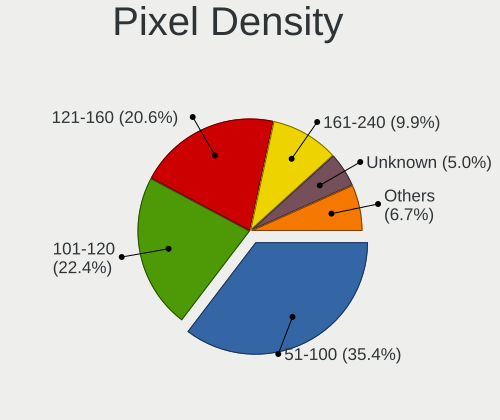

| Density       | Computers | Percent |
|---------------|-----------|---------|
| 51-100        | 2266      | 35.37%  |
| 101-120       | 1437      | 22.43%  |
| 121-160       | 1318      | 20.57%  |
| 161-240       | 635       | 9.91%   |
| Unknown       | 322       | 5.03%   |
| 1-50          | 218       | 3.4%    |
| More than 240 | 211       | 3.29%   |

Multiple Monitors
-----------------

Total monitors connected

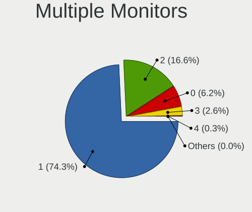

| Total | Computers | Percent |
|-------|-----------|---------|
| 1     | 4642      | 74.27%  |
| 2     | 1038      | 16.61%  |
| 0     | 389       | 6.22%   |
| 3     | 162       | 2.59%   |
| 4     | 17        | 0.27%   |
| 5     | 2         | 0.03%   |

Network
-------

Net Controller Vendor
---------------------

Controller vendors

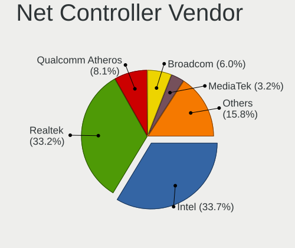

| Vendor                          | Computers | Percent |
|---------------------------------|-----------|---------|
| Intel                           | 3136      | 33.66%  |
| Realtek Semiconductor           | 3089      | 33.15%  |
| Qualcomm Atheros                | 757       | 8.12%   |
| Broadcom                        | 559       | 6%      |
| MediaTek                        | 301       | 3.23%   |
| Broadcom Limited                | 137       | 1.47%   |
| Marvell Technology Group        | 103       | 1.11%   |
| TP-Link                         | 88        | 0.94%   |
| Ralink Technology               | 83        | 0.89%   |
| Ralink                          | 77        | 0.83%   |
| Samsung Electronics             | 66        | 0.71%   |
| NetGear                         | 53        | 0.57%   |
| Microsoft                       | 52        | 0.56%   |
| ASIX Electronics                | 49        | 0.53%   |
| DisplayLink                     | 48        | 0.52%   |
| Sierra Wireless                 | 44        | 0.47%   |
| Aquantia                        | 41        | 0.44%   |
| Nvidia                          | 38        | 0.41%   |
| D-Link                          | 36        | 0.39%   |
| Dell                            | 32        | 0.34%   |
| Shenzhen Goodix Technology      | 31        | 0.33%   |
| Qualcomm                        | 28        | 0.3%    |
| Google                          | 28        | 0.3%    |
| ASUSTek Computer                | 28        | 0.3%    |
| Lenovo                          | 27        | 0.29%   |
| Huawei Technologies             | 23        | 0.25%   |
| Edimax Technology               | 23        | 0.25%   |
| D-Link System                   | 22        | 0.24%   |
| Qualcomm Atheros Communications | 21        | 0.23%   |
| Apple                           | 21        | 0.23%   |
| ZTE WCDMA Technologies MSM      | 17        | 0.18%   |
| Hewlett-Packard                 | 17        | 0.18%   |
| Motorola PCS                    | 15        | 0.16%   |
| OPPO Electronics                | 14        | 0.15%   |
| Microchip Technology            | 14        | 0.15%   |
| Qualcomm Technologies           | 12        | 0.13%   |
| Mellanox Technologies           | 12        | 0.13%   |
| VIA Technologies                | 9         | 0.1%    |
| QinHeng Electronics             | 8         | 0.09%   |
| Arduino SA                      | 8         | 0.09%   |

Net Controller Model
--------------------

Controller models

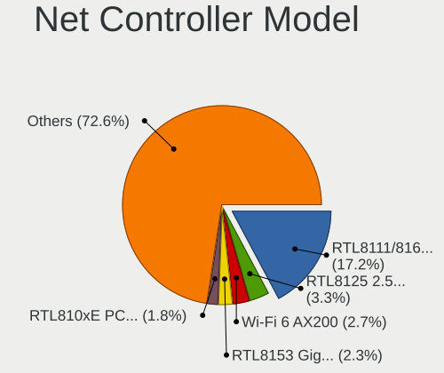

| Model                                                                  | Computers | Percent |
|------------------------------------------------------------------------|-----------|---------|
| Realtek RTL8111/8168/8211/8411 PCI Express Gigabit Ethernet Controller | 1890      | 17.21%  |
| Realtek RTL8125 2.5GbE Controller                                      | 365       | 3.32%   |
| Intel Wi-Fi 6 AX200                                                    | 301       | 2.74%   |
| Realtek RTL8153 Gigabit Ethernet Adapter                               | 258       | 2.35%   |
| Realtek RTL810xE PCI Express Fast Ethernet controller                  | 196       | 1.78%   |
| Intel I211 Gigabit Network Connection                                  | 196       | 1.78%   |
| Intel 82579LM Gigabit Network Connection (Lewisville)                  | 184       | 1.68%   |
| Intel Wireless 8265 / 8275                                             | 175       | 1.59%   |
| Intel Wi-Fi 6E(802.11ax) AX210/AX1675* 2x2 [Typhoon Peak]              | 134       | 1.22%   |
| Intel Ethernet Controller I225-V                                       | 129       | 1.17%   |
| MediaTek MT7922 802.11ax PCI Express Wireless Network Adapter          | 126       | 1.15%   |
| Intel Wireless 8260                                                    | 122       | 1.11%   |
| Intel Wi-Fi 6 AX201                                                    | 121       | 1.1%    |
| Intel Wireless 7260                                                    | 115       | 1.05%   |
| Intel Wireless 7265                                                    | 107       | 0.97%   |
| Intel Ethernet Connection I217-LM                                      | 106       | 0.96%   |
| Intel Alder Lake-P PCH CNVi WiFi                                       | 104       | 0.95%   |
| Qualcomm Atheros QCA6174 802.11ac Wireless Network Adapter             | 102       | 0.93%   |
| Intel Ethernet Connection (2) I219-V                                   | 100       | 0.91%   |
| Qualcomm Atheros AR9485 Wireless Network Adapter                       | 97        | 0.88%   |
| Realtek RTL8821CE 802.11ac PCIe Wireless Network Adapter               | 87        | 0.79%   |
| Realtek RTL8822CE 802.11ac PCIe Wireless Network Adapter               | 86        | 0.78%   |
| Qualcomm Atheros QCA9377 802.11ac Wireless Network Adapter             | 85        | 0.77%   |
| Intel Cannon Lake PCH CNVi WiFi                                        | 84        | 0.76%   |
| Intel Ethernet Connection (2) I219-LM                                  | 79        | 0.72%   |
| Intel Dual Band Wireless-AC 3168NGW [Stone Peak]                       | 78        | 0.71%   |
| Qualcomm Atheros AR9285 Wireless Network Adapter (PCI-Express)         | 76        | 0.69%   |
| Realtek 802.11ac NIC                                                   | 75        | 0.68%   |
| Intel Ethernet Connection (7) I219-V                                   | 74        | 0.67%   |
| Intel Comet Lake PCH-LP CNVi WiFi                                      | 71        | 0.65%   |
| Broadcom BCM4360 802.11ac Dual Band Wireless Network Adapter           | 71        | 0.65%   |
| Intel Wireless 3165                                                    | 64        | 0.58%   |
| Intel Wi-Fi 5(802.11ac) Wireless-AC 9x6x [Thunder Peak]                | 63        | 0.57%   |
| Qualcomm Atheros QCA9565 / AR9565 Wireless Network Adapter             | 58        | 0.53%   |
| Intel Comet Lake PCH CNVi WiFi                                         | 58        | 0.53%   |
| Qualcomm Atheros AR8151 v2.0 Gigabit Ethernet                          | 56        | 0.51%   |
| Broadcom NetXtreme BCM57766 Gigabit Ethernet PCIe                      | 56        | 0.51%   |
| MediaTek MT7921 802.11ax PCIe Wireless Network Adapter [Filogic 330]   | 55        | 0.5%    |
| Broadcom NetXtreme BCM57765 Gigabit Ethernet PCIe                      | 55        | 0.5%    |
| Intel Raptor Lake PCH CNVi WiFi                                        | 54        | 0.49%   |

Wireless Vendor
---------------

Wireless vendors

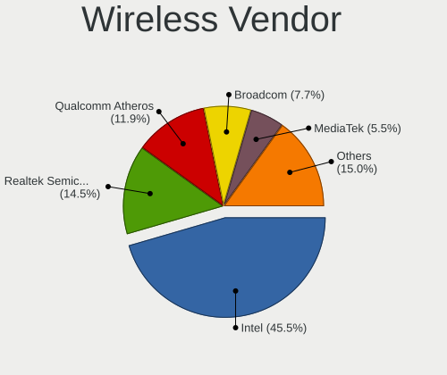

| Vendor                            | Computers | Percent |
|-----------------------------------|-----------|---------|
| Intel                             | 2234      | 45.49%  |
| Realtek Semiconductor             | 710       | 14.46%  |
| Qualcomm Atheros                  | 583       | 11.87%  |
| Broadcom                          | 376       | 7.66%   |
| MediaTek                          | 269       | 5.48%   |
| Broadcom Limited                  | 109       | 2.22%   |
| TP-Link                           | 85        | 1.73%   |
| Ralink Technology                 | 83        | 1.69%   |
| Ralink                            | 77        | 1.57%   |
| NetGear                           | 51        | 1.04%   |
| Marvell Technology Group          | 49        | 1%      |
| Sierra Wireless                   | 44        | 0.9%    |
| Microsoft                         | 40        | 0.81%   |
| ASUSTek Computer                  | 27        | 0.55%   |
| D-Link                            | 26        | 0.53%   |
| Edimax Technology                 | 23        | 0.47%   |
| Qualcomm                          | 22        | 0.45%   |
| Dell                              | 22        | 0.45%   |
| Qualcomm Atheros Communications   | 21        | 0.43%   |
| D-Link System                     | 16        | 0.33%   |
| Realtek                           | 6         | 0.12%   |
| Qualcomm Technologies             | 5         | 0.1%    |
| Hewlett-Packard                   | 5         | 0.1%    |
| Belkin Components                 | 5         | 0.1%    |
| Linksys                           | 4         | 0.08%   |
| BUFFALO                           | 4         | 0.08%   |
| Wacom                             | 3         | 0.06%   |
| Ericsson Business Mobile Networks | 2         | 0.04%   |
| AVM                               | 2         | 0.04%   |
| Xiaomi                            | 1         | 0.02%   |
| Wilocity                          | 1         | 0.02%   |
| Toshiba                           | 1         | 0.02%   |
| Ovislink                          | 1         | 0.02%   |
| Micro Star International          | 1         | 0.02%   |
| Mercucys                          | 1         | 0.02%   |
| IMC Networks                      | 1         | 0.02%   |
| AboCom Systems                    | 1         | 0.02%   |

Wireless Model
--------------

Wireless models

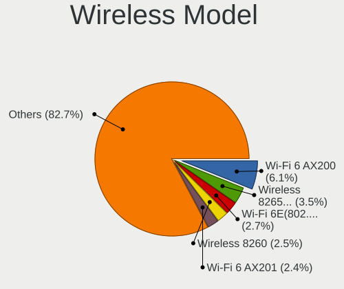

| Model                                                                | Computers | Percent |
|----------------------------------------------------------------------|-----------|---------|
| Intel Wi-Fi 6 AX200                                                  | 301       | 6.09%   |
| Intel Wireless 8265 / 8275                                           | 175       | 3.54%   |
| Intel Wi-Fi 6E(802.11ax) AX210/AX1675* 2x2 [Typhoon Peak]            | 134       | 2.71%   |
| Intel Wireless 8260                                                  | 122       | 2.47%   |
| Intel Wi-Fi 6 AX201                                                  | 121       | 2.45%   |
| Intel Wireless 7260                                                  | 115       | 2.33%   |
| MediaTek MT7922 802.11ax PCI Express Wireless Network Adapter        | 113       | 2.29%   |
| Intel Wireless 7265                                                  | 107       | 2.16%   |
| Qualcomm Atheros QCA6174 802.11ac Wireless Network Adapter           | 102       | 2.06%   |
| Qualcomm Atheros AR9485 Wireless Network Adapter                     | 97        | 1.96%   |
| Realtek RTL8821CE 802.11ac PCIe Wireless Network Adapter             | 87        | 1.76%   |
| Realtek RTL8822CE 802.11ac PCIe Wireless Network Adapter             | 86        | 1.74%   |
| Qualcomm Atheros QCA9377 802.11ac Wireless Network Adapter           | 85        | 1.72%   |
| Intel Cannon Lake PCH CNVi WiFi                                      | 84        | 1.7%    |
| Intel Dual Band Wireless-AC 3168NGW [Stone Peak]                     | 78        | 1.58%   |
| Intel Alder Lake-P PCH CNVi WiFi                                     | 77        | 1.56%   |
| Qualcomm Atheros AR9285 Wireless Network Adapter (PCI-Express)       | 76        | 1.54%   |
| Realtek 802.11ac NIC                                                 | 75        | 1.52%   |
| Intel Comet Lake PCH-LP CNVi WiFi                                    | 71        | 1.44%   |
| Broadcom BCM4360 802.11ac Dual Band Wireless Network Adapter         | 71        | 1.44%   |
| Intel Wireless 3165                                                  | 64        | 1.29%   |
| Intel Wi-Fi 5(802.11ac) Wireless-AC 9x6x [Thunder Peak]              | 63        | 1.27%   |
| Qualcomm Atheros QCA9565 / AR9565 Wireless Network Adapter           | 58        | 1.17%   |
| Intel Comet Lake PCH CNVi WiFi                                       | 58        | 1.17%   |
| MediaTek MT7921 802.11ax PCIe Wireless Network Adapter [Filogic 330] | 55        | 1.11%   |
| Intel Cannon Point-LP CNVi [Wireless-AC]                             | 53        | 1.07%   |
| Broadcom Limited BCM4360 802.11ac Dual Band Wireless Network Adapter | 53        | 1.07%   |
| Intel Centrino Advanced-N 6205 [Taylor Peak]                         | 52        | 1.05%   |
| Intel Raptor Lake PCH CNVi WiFi                                      | 50        | 1.01%   |
| Intel Centrino Ultimate-N 6300                                       | 50        | 1.01%   |
| Marvell Group 88W8897 [AVASTAR] 802.11ac Wireless                    | 48        | 0.97%   |
| Realtek RTL88x2bu [AC1200 Techkey]                                   | 45        | 0.91%   |
| Realtek RTL8188EUS 802.11n Wireless Network Adapter                  | 42        | 0.85%   |
| Qualcomm Atheros AR93xx Wireless Network Adapter                     | 42        | 0.85%   |
| Intel Wireless 3160                                                  | 42        | 0.85%   |
| Intel Ice Lake-LP PCH CNVi WiFi                                      | 41        | 0.83%   |
| Intel 700 Series Chipset CNVi WiFi                                   | 41        | 0.83%   |
| Broadcom BCM4331 802.11a/b/g/n                                       | 41        | 0.83%   |
| MediaTek MT7902 802.11ax PCIe Wireless Network Adapter [Filogic 310] | 39        | 0.79%   |
| Realtek RTL8822BE 802.11a/b/g/n/ac WiFi adapter                      | 36        | 0.73%   |

Ethernet Vendor
---------------

Ethernet vendors

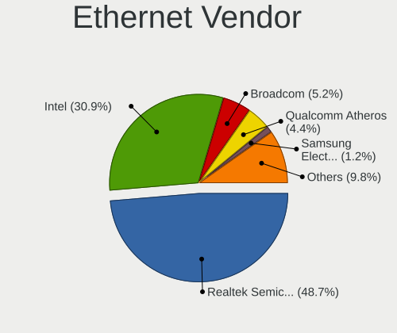

| Vendor                                 | Computers | Percent |
|----------------------------------------|-----------|---------|
| Realtek Semiconductor                  | 2750      | 48.66%  |
| Intel                                  | 1745      | 30.88%  |
| Broadcom                               | 292       | 5.17%   |
| Qualcomm Atheros                       | 246       | 4.35%   |
| Samsung Electronics                    | 66        | 1.17%   |
| Marvell Technology Group               | 54        | 0.96%   |
| ASIX Electronics                       | 49        | 0.87%   |
| DisplayLink                            | 48        | 0.85%   |
| Aquantia                               | 41        | 0.73%   |
| Nvidia                                 | 38        | 0.67%   |
| Google                                 | 28        | 0.5%    |
| Broadcom Limited                       | 28        | 0.5%    |
| MediaTek                               | 27        | 0.48%   |
| Lenovo                                 | 27        | 0.48%   |
| Apple                                  | 21        | 0.37%   |
| Huawei Technologies                    | 18        | 0.32%   |
| Motorola PCS                           | 15        | 0.27%   |
| OPPO Electronics                       | 14        | 0.25%   |
| Microchip Technology                   | 13        | 0.23%   |
| ZTE WCDMA Technologies MSM             | 11        | 0.19%   |
| D-Link                                 | 10        | 0.18%   |
| VIA Technologies                       | 9         | 0.16%   |
| Microsoft                              | 9         | 0.16%   |
| Mellanox Technologies                  | 8         | 0.14%   |
| Qualcomm Technologies                  | 7         | 0.12%   |
| JMicron Technology                     | 7         | 0.12%   |
| ICS Advent                             | 7         | 0.12%   |
| D-Link System                          | 6         | 0.11%   |
| Qualcomm                               | 5         | 0.09%   |
| IBM                                    | 5         | 0.09%   |
| Hewlett-Packard                        | 5         | 0.09%   |
| Xiaomi                                 | 4         | 0.07%   |
| Raspberry Pi                           | 4         | 0.07%   |
| Dell                                   | 4         | 0.07%   |
| Suzhou Motorcomm Electronic Technology | 3         | 0.05%   |
| QLogic                                 | 3         | 0.05%   |
| NetGear                                | 3         | 0.05%   |
| TP-Link                                | 2         | 0.04%   |
| Silicon Integrated Systems [SiS]       | 2         | 0.04%   |
| HMD Global                             | 2         | 0.04%   |

Ethernet Model
--------------

Ethernet models

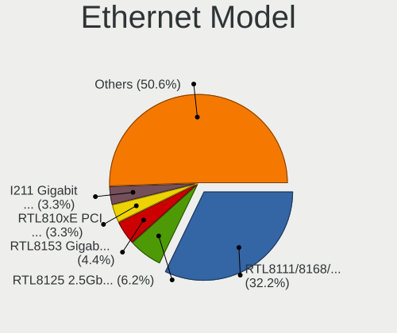

| Model                                                                  | Computers | Percent |
|------------------------------------------------------------------------|-----------|---------|
| Realtek RTL8111/8168/8211/8411 PCI Express Gigabit Ethernet Controller | 1890      | 32.16%  |
| Realtek RTL8125 2.5GbE Controller                                      | 365       | 6.21%   |
| Realtek RTL8153 Gigabit Ethernet Adapter                               | 258       | 4.39%   |
| Realtek RTL810xE PCI Express Fast Ethernet controller                  | 196       | 3.34%   |
| Intel I211 Gigabit Network Connection                                  | 196       | 3.34%   |
| Intel 82579LM Gigabit Network Connection (Lewisville)                  | 184       | 3.13%   |
| Intel Ethernet Controller I225-V                                       | 129       | 2.2%    |
| Intel Ethernet Connection I217-LM                                      | 106       | 1.8%    |
| Intel Ethernet Connection (2) I219-V                                   | 100       | 1.7%    |
| Intel Ethernet Connection (2) I219-LM                                  | 79        | 1.34%   |
| Intel Ethernet Connection (7) I219-V                                   | 74        | 1.26%   |
| Qualcomm Atheros AR8151 v2.0 Gigabit Ethernet                          | 56        | 0.95%   |
| Broadcom NetXtreme BCM57766 Gigabit Ethernet PCIe                      | 56        | 0.95%   |
| Broadcom NetXtreme BCM57765 Gigabit Ethernet PCIe                      | 55        | 0.94%   |
| Samsung Galaxy series, misc. (tethering mode)                          | 52        | 0.88%   |
| Intel Ethernet Connection (4) I219-LM                                  | 51        | 0.87%   |
| Intel Ethernet Connection I219-LM                                      | 50        | 0.85%   |
| Intel 82579V Gigabit Network Connection                                | 44        | 0.75%   |
| Qualcomm Atheros Killer E220x Gigabit Ethernet Controller              | 43        | 0.73%   |
| ASIX AX88179 Gigabit Ethernet                                          | 42        | 0.71%   |
| Intel Ethernet Connection I217-V                                       | 41        | 0.7%    |
| Intel Ethernet Connection (4) I219-V                                   | 36        | 0.61%   |
| Intel 82574L Gigabit Network Connection                                | 36        | 0.61%   |
| Qualcomm Atheros AR8161 Gigabit Ethernet                               | 34        | 0.58%   |
| Intel I210 Gigabit Network Connection                                  | 32        | 0.54%   |
| Intel Ethernet Connection (7) I219-LM                                  | 32        | 0.54%   |
| Intel Ethernet Controller I226-V                                       | 31        | 0.53%   |
| Broadcom NetXtreme BCM5764M Gigabit Ethernet PCIe                      | 31        | 0.53%   |
| Intel 82577LM Gigabit Network Connection                               | 30        | 0.51%   |
| Intel 82567LM-3 Gigabit Network Connection                             | 30        | 0.51%   |
| Intel Ethernet Connection I218-LM                                      | 29        | 0.49%   |
| Intel Ethernet Connection (2) I218-V                                   | 29        | 0.49%   |
| Intel Ethernet Connection (6) I219-V                                   | 28        | 0.48%   |
| Intel Alder Lake-P PCH CNVi WiFi                                       | 27        | 0.46%   |
| Qualcomm Atheros Killer E2500 Gigabit Ethernet Controller              | 25        | 0.43%   |
| Google Pixel 9a                                                        | 24        | 0.41%   |
| Broadcom NetXtreme BCM57786 Gigabit Ethernet PCIe                      | 23        | 0.39%   |
| Intel Ethernet Connection (10) I219-V                                  | 22        | 0.37%   |
| Realtek RTL8152 Fast Ethernet Adapter                                  | 21        | 0.36%   |
| Intel Ethernet Connection (3) I218-LM                                  | 20        | 0.34%   |

Net Controller Kind
-------------------

Ethernet, WiFi or modem

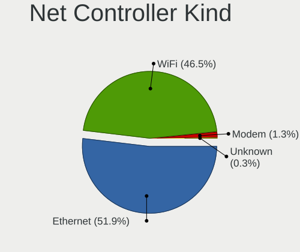

| Kind     | Computers | Percent |
|----------|-----------|---------|
| Ethernet | 5093      | 51.88%  |
| WiFi     | 4565      | 46.5%   |
| Modem    | 132       | 1.34%   |
| Unknown  | 27        | 0.28%   |

Used Controller
---------------

Currently used network controller

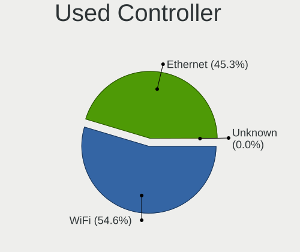

| Kind     | Computers | Percent |
|----------|-----------|---------|
| WiFi     | 3418      | 54.63%  |
| Ethernet | 2837      | 45.34%  |
| Modem    | 1         | 0.02%   |
| Unknown  | 1         | 0.02%   |

NICs
----

Total network controllers on board

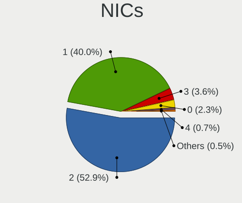

| Total | Computers | Percent |
|-------|-----------|---------|
| 2     | 3207      | 52.87%  |
| 1     | 2427      | 40.01%  |
| 3     | 216       | 3.56%   |
| 0     | 141       | 2.32%   |
| 4     | 45        | 0.74%   |
| 5     | 14        | 0.23%   |
| 6     | 8         | 0.13%   |
| 8     | 3         | 0.05%   |
| 7     | 3         | 0.05%   |
| 10    | 1         | 0.02%   |
| 9     | 1         | 0.02%   |

IPv6
----

IPv6 vs IPv4

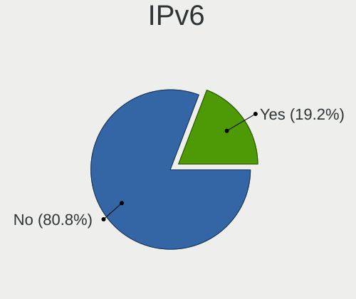

| Used | Computers | Percent |
|------|-----------|---------|
| No   | 4978      | 80.81%  |
| Yes  | 1182      | 19.19%  |

Bluetooth
---------

Bluetooth Vendor
----------------

Controller vendors

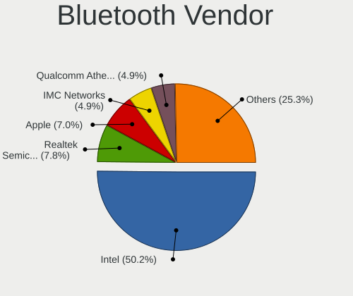

| Vendor                          | Computers | Percent |
|---------------------------------|-----------|---------|
| Intel                           | 1953      | 50.15%  |
| Realtek Semiconductor           | 302       | 7.76%   |
| Apple                           | 273       | 7.01%   |
| IMC Networks                    | 191       | 4.9%    |
| Qualcomm Atheros Communications | 189       | 4.85%   |
| Cambridge Silicon Radio         | 181       | 4.65%   |
| Broadcom                        | 168       | 4.31%   |
| Foxconn / Hon Hai               | 137       | 3.52%   |
| MediaTek                        | 107       | 2.75%   |
| Lite-On Technology              | 73        | 1.87%   |
| Marvell Semiconductor           | 49        | 1.26%   |
| Toshiba                         | 48        | 1.23%   |
| ASUSTek Computer                | 39        | 1%      |
| Dell                            | 36        | 0.92%   |
| Hewlett-Packard                 | 31        | 0.8%    |
| TP-Link                         | 29        | 0.74%   |
| Ralink                          | 21        | 0.54%   |
| Realtek                         | 10        | 0.26%   |
| USI                             | 9         | 0.23%   |
| Alps Electric                   | 9         | 0.23%   |
| Edimax Technology               | 6         | 0.15%   |
| Ralink Technology               | 4         | 0.1%    |
| Integrated System Solution      | 4         | 0.1%    |
| Actions                         | 4         | 0.1%    |
| Unknown                         | 4         | 0.1%    |
| SINO WEALTH                     | 2         | 0.05%   |
| Micro Star International        | 2         | 0.05%   |
| Logitech                        | 2         | 0.05%   |
| Belkin Components               | 2         | 0.05%   |
| Taiyo Yuden                     | 1         | 0.03%   |
| Qcom                            | 1         | 0.03%   |
| Opticis                         | 1         | 0.03%   |
| Mobile Action Technology        | 1         | 0.03%   |
| Mercucys                        | 1         | 0.03%   |
| HTC (High Tech Computer)        | 1         | 0.03%   |
| Fujitsu                         | 1         | 0.03%   |
| Creative Technology             | 1         | 0.03%   |
| Askey Computer                  | 1         | 0.03%   |

Bluetooth Model
---------------

Controller models

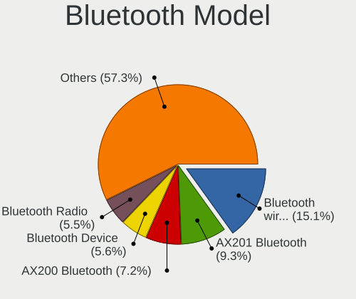

| Model                                               | Computers | Percent |
|-----------------------------------------------------|-----------|---------|
| Intel Bluetooth wireless interface                  | 588       | 15.07%  |
| Intel AX201 Bluetooth                               | 363       | 9.31%   |
| Intel AX200 Bluetooth                               | 281       | 7.2%    |
| Intel Bluetooth Device                              | 217       | 5.56%   |
| Realtek Bluetooth Radio                             | 215       | 5.51%   |
| Intel Bluetooth 9460/9560 Jefferson Peak (JfP)      | 189       | 4.84%   |
| Cambridge Silicon Radio Bluetooth Dongle (HCI mode) | 181       | 4.64%   |
| Intel AX210 Bluetooth                               | 119       | 3.05%   |
| Apple Bluetooth Host Controller                     | 119       | 3.05%   |
| MediaTek Wireless_Device                            | 107       | 2.74%   |
| Qualcomm Atheros  Bluetooth Device                  | 88        | 2.26%   |
| IMC Networks Wireless_Device                        | 86        | 2.2%    |
| Apple Bluetooth USB Host Controller                 | 85        | 2.18%   |
| Intel Wireless-AC 3168 Bluetooth                    | 77        | 1.97%   |
| IMC Networks Bluetooth Radio                        | 72        | 1.85%   |
| Broadcom BCM20702A0 Bluetooth 4.0                   | 64        | 1.64%   |
| Intel Wireless-AC 9260 Bluetooth Adapter            | 58        | 1.49%   |
| Realtek  Bluetooth 4.2 Adapter                      | 57        | 1.46%   |
| Apple Built-in Bluetooth 2.0+EDR HCI                | 54        | 1.38%   |
| Qualcomm Atheros QCA61x4 Bluetooth 4.0              | 46        | 1.18%   |
| Foxconn / Hon Hai Wireless_Device                   | 46        | 1.18%   |
| Foxconn / Hon Hai Bluetooth Device                  | 40        | 1.03%   |
| Intel Centrino Bluetooth Wireless Transceiver       | 37        | 0.95%   |
| Marvell Bluetooth and Wireless LAN Composite        | 35        | 0.9%    |
| Qualcomm Atheros AR3011 Bluetooth                   | 31        | 0.79%   |
| TP-Link TP-T@- UB500 Adapter                        | 29        | 0.74%   |
| Lite-On Qualcomm Atheros QCA9377 Bluetooth          | 25        | 0.64%   |
| Ralink RT3290 Bluetooth                             | 21        | 0.54%   |
| Intel Centrino Advanced-N 6230 Bluetooth adapter    | 21        | 0.54%   |
| HP Broadcom 2070 Bluetooth Combo                    | 20        | 0.51%   |
| Broadcom BCM2045B (BDC-2.1)                         | 20        | 0.51%   |
| Lite-On Atheros AR3012 Bluetooth                    | 19        | 0.49%   |
| Lite-On Bluetooth Device                            | 18        | 0.46%   |
| Foxconn / Hon Hai MediaTek Bluetooth Adapter        | 17        | 0.44%   |
| Toshiba Bluetooth Device                            | 16        | 0.41%   |
| Dell DW375 Bluetooth Module                         | 15        | 0.38%   |
| Apple Bluetooth HCI                                 | 15        | 0.38%   |
| Qualcomm Atheros AR3012 Bluetooth 4.0               | 14        | 0.36%   |
| Marvell Bluetooth and Wireless LAN Composite Device | 14        | 0.36%   |
| Realtek RTL8821A Bluetooth                          | 12        | 0.31%   |

Sound
-----

Sound Vendor
------------

Sound card vendors

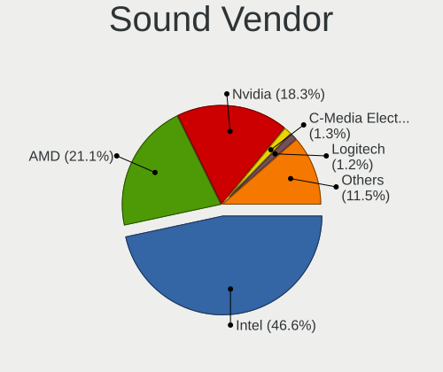

| Vendor                               | Computers | Percent |
|--------------------------------------|-----------|---------|
| Intel                                | 4213      | 46.63%  |
| AMD                                  | 1904      | 21.07%  |
| Nvidia                               | 1653      | 18.3%   |
| C-Media Electronics                  | 120       | 1.33%   |
| Logitech                             | 110       | 1.22%   |
| Realtek Semiconductor                | 50        | 0.55%   |
| Creative Labs                        | 49        | 0.54%   |
| SteelSeries ApS                      | 45        | 0.5%    |
| Razer USA                            | 42        | 0.46%   |
| JMTek                                | 38        | 0.42%   |
| Texas Instruments                    | 36        | 0.4%    |
| Micro Star International             | 36        | 0.4%    |
| GN Netcom                            | 33        | 0.37%   |
| Kingston Technology                  | 32        | 0.35%   |
| Creative Technology                  | 32        | 0.35%   |
| ASUSTek Computer                     | 31        | 0.34%   |
| Apple                                | 31        | 0.34%   |
| Generalplus Technology               | 30        | 0.33%   |
| Corsair                              | 30        | 0.33%   |
| Hewlett-Packard                      | 28        | 0.31%   |
| Focusrite-Novation                   | 28        | 0.31%   |
| Plantronics                          | 24        | 0.27%   |
| Lenovo                               | 24        | 0.27%   |
| RODE Microphones                     | 23        | 0.25%   |
| Sony                                 | 18        | 0.2%    |
| DSEA A/S                             | 18        | 0.2%    |
| Audio-Technica                       | 17        | 0.19%   |
| Blue Microphones                     | 16        | 0.18%   |
| Astro Gaming                         | 15        | 0.17%   |
| Thesycon Systemsoftware & Consulting | 12        | 0.13%   |
| M-Audio                              | 12        | 0.13%   |
| Dell                                 | 12        | 0.13%   |
| BEHRINGER International              | 10        | 0.11%   |
| Microsoft                            | 9         | 0.1%    |
| Giga-Byte Technology                 | 9         | 0.1%    |
| Walmart                              | 8         | 0.09%   |
| VIA Technologies                     | 8         | 0.09%   |
| Samson Technologies                  | 8         | 0.09%   |
| ASRock                               | 8         | 0.09%   |
| Jieli Technology                     | 7         | 0.08%   |

Sound Model
-----------

Sound card models

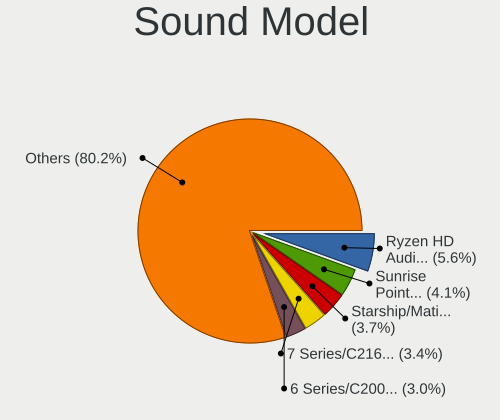

| Model                                                                      | Computers | Percent |
|----------------------------------------------------------------------------|-----------|---------|
| AMD Ryzen HD Audio Controller                                              | 600       | 5.56%   |
| Intel Sunrise Point-LP HD Audio                                            | 443       | 4.1%    |
| AMD Starship/Matisse HD Audio Controller                                   | 404       | 3.74%   |
| Intel 7 Series/C216 Chipset Family High Definition Audio Controller        | 363       | 3.36%   |
| Intel 6 Series/C200 Series Chipset Family High Definition Audio Controller | 327       | 3.03%   |
| Intel 8 Series/C220 Series Chipset High Definition Audio Controller        | 322       | 2.98%   |
| AMD Radeon High Definition Audio Controller                                | 269       | 2.49%   |
| Intel Cannon Lake PCH cAVS                                                 | 238       | 2.21%   |
| Intel Xeon E3-1200 v3/4th Gen Core Processor HD Audio Controller           | 233       | 2.16%   |
| AMD Renoir/Cezanne HDMI/DP Audio Controller                                | 219       | 2.03%   |
| Intel 100 Series/C230 Series Chipset Family HD Audio Controller            | 207       | 1.92%   |
| Intel 5 Series/3400 Series Chipset High Definition Audio                   | 173       | 1.6%    |
| Intel 200 Series PCH HD Audio                                              | 163       | 1.51%   |
| Intel 8 Series HD Audio Controller                                         | 158       | 1.46%   |
| Intel Tiger Lake-LP Smart Sound Technology Audio Controller                | 157       | 1.45%   |
| Intel Haswell-ULT HD Audio Controller                                      | 157       | 1.45%   |
| AMD Ellesmere HDMI Audio [Radeon RX 470/480 / 570/580/590]                 | 151       | 1.4%    |
| AMD Navi 21/23 HDMI/DP Audio Controller                                    | 144       | 1.33%   |
| AMD FCH Azalia Controller                                                  | 132       | 1.22%   |
| Intel Alder Lake PCH-P High Definition Audio Controller                    | 131       | 1.21%   |
| AMD SBx00 Azalia (Intel HDA)                                               | 122       | 1.13%   |
| Intel Broadwell-U Audio Controller                                         | 120       | 1.11%   |
| Intel Wildcat Point-LP High Definition Audio Controller                    | 117       | 1.08%   |
| AMD Family 17h (Models 00h-0fh) HD Audio Controller                        | 113       | 1.05%   |
| Nvidia GK208 HDMI/DP Audio Controller                                      | 110       | 1.02%   |
| Intel 82801I (ICH9 Family) HD Audio Controller                             | 95        | 0.88%   |
| Nvidia GP104 High Definition Audio Controller                              | 94        | 0.87%   |
| Nvidia GP107GL High Definition Audio Controller                            | 93        | 0.86%   |
| Nvidia TU116 High Definition Audio Controller                              | 91        | 0.84%   |
| Intel Cannon Point-LP High Definition Audio Controller                     | 91        | 0.84%   |
| Nvidia TU106 High Definition Audio Controller                              | 87        | 0.81%   |
| AMD Raven/Raven2/Fenghuang HDMI/DP Audio Controller                        | 87        | 0.81%   |
| Intel Comet Lake PCH-LP cAVS                                               | 86        | 0.8%    |
| Nvidia GA104 High Definition Audio Controller                              | 82        | 0.76%   |
| Intel Comet Lake PCH cAVS                                                  | 77        | 0.71%   |
| Intel NM10/ICH7 Family High Definition Audio Controller                    | 76        | 0.7%    |
| Intel 82801JI (ICH10 Family) HD Audio Controller                           | 76        | 0.7%    |
| AMD Oland/Hainan/Cape Verde/Pitcairn HDMI Audio [Radeon HD 7000 Series]    | 75        | 0.69%   |
| AMD Navi 31 HDMI/DP Audio                                                  | 73        | 0.68%   |
| Intel Alder Lake-S HD Audio Controller                                     | 71        | 0.66%   |

Memory
------

Memory Vendor
-------------

Memory module vendors

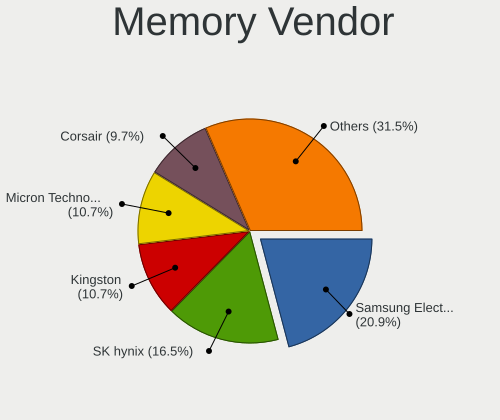

| Vendor                                  | Computers | Percent |
|-----------------------------------------|-----------|---------|
| Samsung Electronics                     | 737       | 20.9%   |
| SK hynix                                | 581       | 16.47%  |
| Kingston                                | 379       | 10.75%  |
| Micron Technology                       | 376       | 10.66%  |
| Corsair                                 | 343       | 9.72%   |
| G.Skill                                 | 227       | 6.44%   |
| Unknown                                 | 222       | 6.29%   |
| Crucial                                 | 220       | 6.24%   |
| Team                                    | 59        | 1.67%   |
| Elpida                                  | 45        | 1.28%   |
| A-DATA Technology                       | 41        | 1.16%   |
| Unknown                                 | 41        | 1.16%   |
| Nanya Technology                        | 37        | 1.05%   |
| Ramaxel Technology                      | 35        | 0.99%   |
| Patriot                                 | 19        | 0.54%   |
| GeIL                                    | 16        | 0.45%   |
| Apacer                                  | 15        | 0.43%   |
| Transcend                               | 14        | 0.4%    |
| Unknown (ABCD)                          | 13        | 0.37%   |
| Hewlett-Packard                         | 8         | 0.23%   |
| Silicon Power                           | 6         | 0.17%   |
| Timetec                                 | 5         | 0.14%   |
| Strontium                               | 5         | 0.14%   |
| Neo Forza                               | 5         | 0.14%   |
| PNY                                     | 4         | 0.11%   |
| Lexar                                   | 4         | 0.11%   |
| Toshiba                                 | 3         | 0.09%   |
| Silicon Power Computer & Communications | 3         | 0.09%   |
| ASint Technology                        | 3         | 0.09%   |
| Unknown (0x873E)                        | 2         | 0.06%   |
| Unknown (0x0B45)                        | 2         | 0.06%   |
| Thermaltake                             | 2         | 0.06%   |
| TeamGroup                               | 2         | 0.06%   |
| Smart                                   | 2         | 0.06%   |
| Red Hat                                 | 2         | 0.06%   |
| Qimonda                                 | 2         | 0.06%   |
| pqi                                     | 2         | 0.06%   |
| Hyundai lnc                             | 2         | 0.06%   |
| HPE                                     | 2         | 0.06%   |
| Goldenmars                              | 2         | 0.06%   |

Memory Model
------------

Memory module models

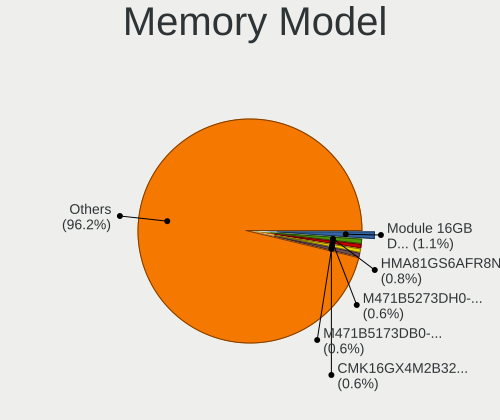

| Model                                                    | Computers | Percent |
|----------------------------------------------------------|-----------|---------|
| Unknown                                                  | 41        | 1.09%   |
| SK hynix RAM HMA81GS6AFR8N-UH 8GB SODIMM DDR4 2667MT/s   | 29        | 0.77%   |
| Samsung RAM M471B5273DH0-CH9 4GB SODIMM DDR3 1600MT/s    | 24        | 0.64%   |
| Samsung RAM M471B5173DB0-YK0 4GB SODIMM DDR3 1600MT/s    | 24        | 0.64%   |
| Corsair RAM CMK16GX4M2B3200C16 8GB DIMM DDR4 3600MT/s    | 24        | 0.64%   |
| Corsair RAM CMK16GX4M2B3000C15 8GB DIMM DDR4 3600MT/s    | 22        | 0.58%   |
| Samsung RAM M471A1K43CB1-CRC 8GB SODIMM DDR4 8400MT/s    | 19        | 0.5%    |
| Corsair RAM CMK32GX4M2B3200C16 16GB DIMM DDR4 3800MT/s   | 19        | 0.5%    |
| Samsung RAM M471B1G73DB0-YK0 8GB SODIMM DDR3 1600MT/s    | 18        | 0.48%   |
| SK hynix RAM HMAA1GS6CJR6N-XN 8GB SODIMM DDR4 3200MT/s   | 17        | 0.45%   |
| Samsung RAM M471A1K43CB1-CTD 8GB SODIMM DDR4 3200MT/s    | 17        | 0.45%   |
| SK hynix RAM Module 4GB SODIMM DDR3 1600MT/s             | 16        | 0.42%   |
| SK hynix RAM HMA81GS6CJR8N-VK 8GB SODIMM DDR4 2667MT/s   | 16        | 0.42%   |
| Samsung RAM M471B5273CH0-CH9 4GB SODIMM DDR3 1334MT/s    | 16        | 0.42%   |
| Samsung RAM M471B5173EB0-YK0 4GB SODIMM DDR3 1600MT/s    | 16        | 0.42%   |
| Samsung RAM M471B1G73QH0-YK0 8GB SODIMM DDR3 1600MT/s    | 15        | 0.4%    |
| Samsung RAM M471A5244CB0-CWE 4GB SODIMM DDR4 3200MT/s    | 15        | 0.4%    |
| Samsung RAM M471A5244CB0-CTD 4GB SODIMM DDR4 3266MT/s    | 15        | 0.4%    |
| SK hynix RAM HMT351S6CFR8C-PB 4GB SODIMM DDR3 1600MT/s   | 14        | 0.37%   |
| Kingston RAM CL16-16-16 D4-2400 8GB DIMM DDR4 2400MT/s   | 14        | 0.37%   |
| Corsair RAM CMK32GX4M2E3200C16 16GB DIMM DDR4 3600MT/s   | 14        | 0.37%   |
| SK hynix RAM HMT451S6BFR8A-PB 4GB SODIMM DDR3 1600MT/s   | 13        | 0.34%   |
| Samsung RAM M471A1K43DB1-CWE 8GB SODIMM DDR4 3200MT/s    | 13        | 0.34%   |
| Samsung RAM M471A1G44BB0-CWE 8GB SODIMM DDR4 3200MT/s    | 13        | 0.34%   |
| SK hynix RAM HMA41GS6AFR8N-TF 8GB SODIMM DDR4 2667MT/s   | 12        | 0.32%   |
| Samsung RAM M471A5244BB0-CWE 4GB SODIMM DDR4 3200MT/s    | 12        | 0.32%   |
| Samsung RAM M471A1G44AB0-CWE 8GiB SODIMM DDR4 3200MT/s   | 12        | 0.32%   |
| Micron RAM 8ATF1G64HZ-3G2R1 8GB SODIMM DDR4 3200MT/s     | 12        | 0.32%   |
| Kingston RAM KF3200C16D4/16GX 16GB DIMM DDR4 3733MT/s    | 12        | 0.32%   |
| Corsair RAM CMK16GX4M2A2133C13 8GB DIMM DDR4 3000MT/s    | 12        | 0.32%   |
| Unknown RAM Module 4GB DIMM 1333MT/s                     | 11        | 0.29%   |
| SK hynix RAM HMA82GS6AFR8N-UH 16GB SODIMM DDR4 2667MT/s  | 11        | 0.29%   |
| Samsung RAM M471B1G73EB0-YK0 8192MB SODIMM DDR3 1600MT/s | 11        | 0.29%   |
| Samsung RAM M471A1K43EB1-CWE 8GB SODIMM DDR4 3200MT/s    | 11        | 0.29%   |
| Micron RAM 4ATF1G64HZ-3G2E1 8GB SODIMM DDR4 3200MT/s     | 11        | 0.29%   |
| GeIL RAM CL11-11-11 D3-1600 4GB DIMM 1866MT/s            | 11        | 0.29%   |
| G.Skill RAM F4-3600C16-16GTZNC 16GiB DIMM DDR4 3600MT/s  | 11        | 0.29%   |
| SK hynix RAM HMT41GS6AFR8A-PB 8GiB SODIMM DDR3 2667MT/s  | 10        | 0.27%   |
| SK hynix RAM HMA81GS6DJR8N-XN 8GB SODIMM DDR4 3200MT/s   | 10        | 0.27%   |
| Samsung RAM M471B5173QH0-YK0 4GB SODIMM DDR3 1600MT/s    | 10        | 0.27%   |

Memory Kind
-----------

Memory module kinds

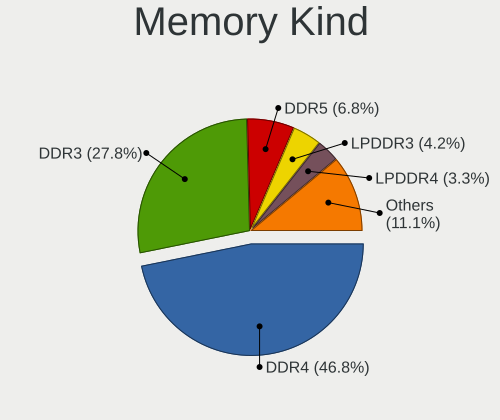

| Kind    | Computers | Percent |
|---------|-----------|---------|
| DDR4    | 1468      | 46.81%  |
| DDR3    | 871       | 27.77%  |
| DDR5    | 214       | 6.82%   |
| LPDDR3  | 132       | 4.21%   |
| LPDDR4  | 104       | 3.32%   |
| Unknown | 102       | 3.25%   |
| LPDDR5  | 96        | 3.06%   |
| DDR2    | 82        | 2.61%   |
| SDRAM   | 45        | 1.43%   |
| DDR     | 14        | 0.45%   |
| DRAM    | 6         | 0.19%   |
| RAM     | 2         | 0.06%   |

Memory Form Factor
------------------

Physical design of the memory module

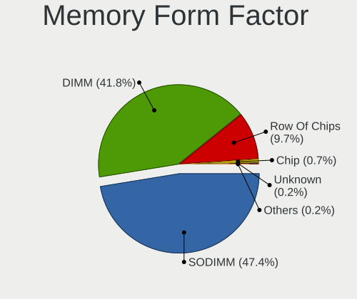

| Name         | Computers | Percent |
|--------------|-----------|---------|
| SODIMM       | 1481      | 47.42%  |
| DIMM         | 1305      | 41.79%  |
| Row Of Chips | 302       | 9.67%   |
| Chip         | 23        | 0.74%   |
| Unknown      | 7         | 0.22%   |
| FB-DIMM      | 3         | 0.1%    |
| RIMM         | 2         | 0.06%   |

Memory Size
-----------

Memory module size

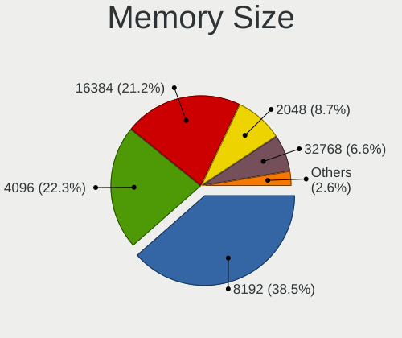

| Size  | Computers | Percent |
|-------|-----------|---------|
| 8192  | 1288      | 38.51%  |
| 4096  | 747       | 22.33%  |
| 16384 | 710       | 21.23%  |
| 2048  | 290       | 8.67%   |
| 32768 | 222       | 6.64%   |
| 1024  | 59        | 1.76%   |
| 512   | 10        | 0.3%    |
| 49152 | 8         | 0.24%   |
| 65536 | 4         | 0.12%   |
| 24576 | 3         | 0.09%   |
| 12288 | 1         | 0.03%   |
| 3072  | 1         | 0.03%   |
| 1536  | 1         | 0.03%   |
| 256   | 1         | 0.03%   |

Memory Speed
------------

Memory module speed

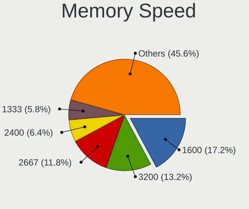

| Speed   | Computers | Percent |
|---------|-----------|---------|
| 1600    | 581       | 17.17%  |
| 3200    | 447       | 13.21%  |
| 2667    | 398       | 11.76%  |
| 2400    | 218       | 6.44%   |
| 1333    | 196       | 5.79%   |
| 2133    | 191       | 5.64%   |
| 3600    | 142       | 4.2%    |
| 1867    | 89        | 2.63%   |
| 6000    | 64        | 1.89%   |
| 4800    | 64        | 1.89%   |
| 5600    | 59        | 1.74%   |
| 800     | 58        | 1.71%   |
| 6400    | 57        | 1.68%   |
| 667     | 53        | 1.57%   |
| 4267    | 52        | 1.54%   |
| 1334    | 48        | 1.42%   |
| 3800    | 45        | 1.33%   |
| 3000    | 43        | 1.27%   |
| 3733    | 40        | 1.18%   |
| 1866    | 37        | 1.09%   |
| 1067    | 34        | 1%      |
| Unknown | 32        | 0.95%   |
| 8400    | 31        | 0.92%   |
| 3400    | 27        | 0.8%    |
| 7500    | 25        | 0.74%   |
| 2933    | 23        | 0.68%   |
| 2666    | 23        | 0.68%   |
| 4000    | 21        | 0.62%   |
| 1066    | 20        | 0.59%   |
| 3866    | 19        | 0.56%   |
| 3266    | 17        | 0.5%    |
| 4266    | 13        | 0.38%   |
| 1800    | 13        | 0.38%   |
| 8533    | 11        | 0.33%   |
| 3466    | 11        | 0.33%   |
| 2800    | 11        | 0.33%   |
| 12800   | 10        | 0.3%    |
| 4199    | 10        | 0.3%    |
| 400     | 10        | 0.3%    |
| 2500    | 9         | 0.27%   |

Printers & scanners
-------------------

Printer Vendor
--------------

Printer device vendors

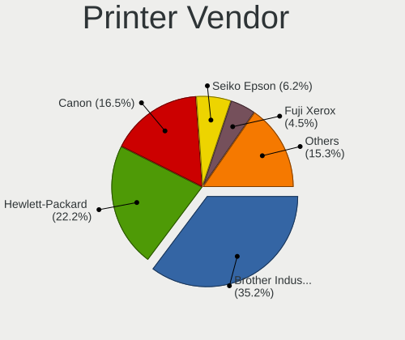

| Vendor                 | Computers | Percent |
|------------------------|-----------|---------|
| Brother Industries     | 62        | 35.23%  |
| Hewlett-Packard        | 39        | 22.16%  |
| Canon                  | 29        | 16.48%  |
| Seiko Epson            | 11        | 6.25%   |
| Fuji Xerox             | 8         | 4.55%   |
| Samsung Electronics    | 6         | 3.41%   |
| Prolific Technology    | 6         | 3.41%   |
| Dymo-CoStar            | 4         | 2.27%   |
| Xerox                  | 2         | 1.14%   |
| Lexmark International  | 2         | 1.14%   |
| Kyocera                | 2         | 1.14%   |
| Zebra                  | 1         | 0.57%   |
| STMicroelectronics     | 1         | 0.57%   |
| Ricoh                  | 1         | 0.57%   |
| Custom Engineering SPA | 1         | 0.57%   |
| BIXOLON                | 1         | 0.57%   |

Printer Model
-------------

Printer device models

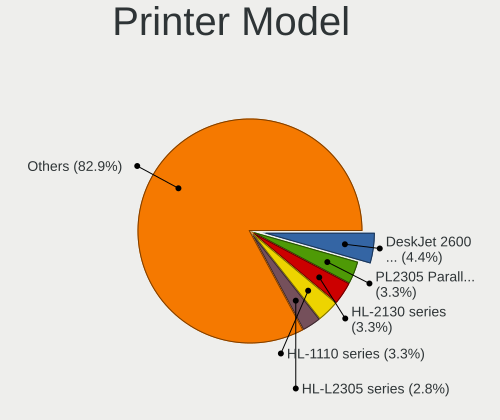

| Model                                                     | Computers | Percent |
|-----------------------------------------------------------|-----------|---------|
| HP DeskJet 2600 series                                    | 8         | 4.42%   |
| Prolific PL2305 Parallel Port                             | 6         | 3.31%   |
| Brother HL-2130 series                                    | 6         | 3.31%   |
| Brother HL-1110 series                                    | 6         | 3.31%   |
| Brother HL-L2305 series                                   | 5         | 2.76%   |
| HP DeskJet 2130 series                                    | 4         | 2.21%   |
| Canon LiDE 400                                            | 4         | 2.21%   |
| Brother HL-1210W series                                   | 4         | 2.21%   |
| HP ENVY 5000 series                                       | 3         | 1.66%   |
| HP DeskJet F2100 Printer series                           | 3         | 1.66%   |
| Fuji Xerox DocuPrint CM215 fw                             | 3         | 1.66%   |
| Canon TS3100 series                                       | 3         | 1.66%   |
| Canon LiDE 300                                            | 3         | 1.66%   |
| Brother MFC-L2700DW                                       | 3         | 1.66%   |
| Brother HL-L3230CDW series                                | 3         | 1.66%   |
| Seiko Epson XP-240 Series                                 | 2         | 1.1%    |
| HP OfficeJet 5200 series                                  | 2         | 1.1%    |
| HP DeskJet 3630 series                                    | 2         | 1.1%    |
| HP Deskjet 2540 series                                    | 2         | 1.1%    |
| Fuji Xerox DocuPrint P205 b                               | 2         | 1.1%    |
| Dymo-CoStar DYMO LabelWriter 4XL                          | 2         | 1.1%    |
| Dymo-CoStar DYMO LabelWriter 450 Turbo                    | 2         | 1.1%    |
| Canon TR8500 series                                       | 2         | 1.1%    |
| Canon PIXMA MX920 Series                                  | 2         | 1.1%    |
| Canon PIXMA MG5600 Series                                 | 2         | 1.1%    |
| Canon PIXMA MG2500 Series                                 | 2         | 1.1%    |
| Brother QL-570 Label Printer                              | 2         | 1.1%    |
| Brother Printer                                           | 2         | 1.1%    |
| Brother MFC-L8690CDW series                               | 2         | 1.1%    |
| Brother MFC-J430W                                         | 2         | 1.1%    |
| Brother MFC-1810                                          | 2         | 1.1%    |
| Brother HL-L2400DW                                        | 2         | 1.1%    |
| Brother HL-3150CDN series                                 | 2         | 1.1%    |
| Zebra ZTC LP2844-Z-200dpi                                 | 1         | 0.55%   |
| Xerox Phaser 8400N                                        | 1         | 0.55%   |
| Xerox Phaser 3160                                         | 1         | 0.55%   |
| STMicroelectronics LED badge -- mini LED display -- 11x44 | 1         | 0.55%   |
| Seiko Epson XP-4100 Series                                | 1         | 0.55%   |
| Seiko Epson WF-5190 Series                                | 1         | 0.55%   |
| Seiko Epson WF-4830 Series                                | 1         | 0.55%   |

Scanner Vendor
--------------

Scanner device vendors

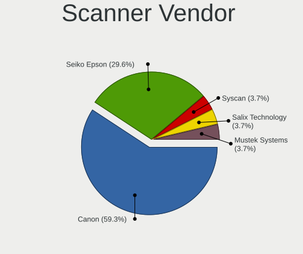

| Vendor           | Computers | Percent |
|------------------|-----------|---------|
| Canon            | 16        | 59.26%  |
| Seiko Epson      | 8         | 29.63%  |
| Syscan           | 1         | 3.7%    |
| Salix Technology | 1         | 3.7%    |
| Mustek Systems   | 1         | 3.7%    |

Scanner Model
-------------

Scanner device models

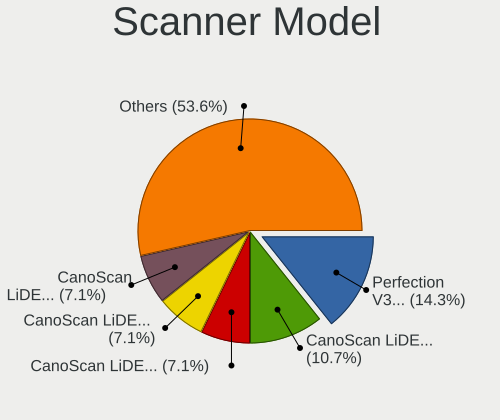

| Model                                                   | Computers | Percent |
|---------------------------------------------------------|-----------|---------|
| Seiko Epson Perfection V37/V370                         | 4         | 14.29%  |
| Canon CanoScan LiDE 210                                 | 3         | 10.71%  |
| Canon CanoScan LiDE 50/LiDE 35/LiDE 40                  | 2         | 7.14%   |
| Canon CanoScan LIDE 25                                  | 2         | 7.14%   |
| Canon CanoScan LiDE 220                                 | 2         | 7.14%   |
| Canon CanoScan LiDE 110                                 | 2         | 7.14%   |
| Syscan TravelScan 460/464                               | 1         | 3.57%   |
| Seiko Epson Scanner                                     | 1         | 3.57%   |
| Seiko Epson GT-X820 [Perfection V600 Photo]             | 1         | 3.57%   |
| Seiko Epson GT-F730 [GT-S630/Perfection V33/V330 Photo] | 1         | 3.57%   |
| Seiko Epson GT-F720 [GT-S620/Perfection V30/V300 Photo] | 1         | 3.57%   |
| Seiko Epson GT-7300U [Perfection 1260/1260 PHOTO]       | 1         | 3.57%   |
| Salix USB Scanner.                                      | 1         | 3.57%   |
| Mustek Systems BearPaw 2448 TA Plus                     | 1         | 3.57%   |
| Canon CanoScan N670U/N676U/LiDE 20                      | 1         | 3.57%   |
| Canon CanoScan N1240U/LiDE 30                           | 1         | 3.57%   |
| Canon CanoScan LiDE 500F                                | 1         | 3.57%   |
| Canon CanoScan LiDE 200                                 | 1         | 3.57%   |
| Canon CanoScan 1220U                                    | 1         | 3.57%   |

Camera
------

Camera Vendor
-------------

Camera device vendors

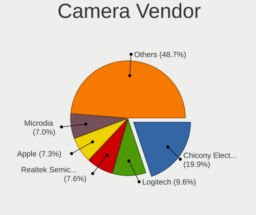

| Vendor                                 | Computers | Percent |
|----------------------------------------|-----------|---------|
| Chicony Electronics                    | 653       | 19.88%  |
| Logitech                               | 314       | 9.56%   |
| Realtek Semiconductor                  | 248       | 7.55%   |
| Apple                                  | 239       | 7.28%   |
| Microdia                               | 230       | 7%      |
| IMC Networks                           | 216       | 6.58%   |
| Bison Electronics                      | 208       | 6.33%   |
| Sunplus Innovation Technology          | 184       | 5.6%    |
| Quanta                                 | 128       | 3.9%    |
| Cheng Uei Precision Industry (Foxlink) | 91        | 2.77%   |
| Suyin                                  | 90        | 2.74%   |
| Microsoft                              | 83        | 2.53%   |
| Luxvisions Innotech Limited            | 82        | 2.5%    |
| Syntek                                 | 64        | 1.95%   |
| Lite-On Technology                     | 49        | 1.49%   |
| Samsung Electronics                    | 47        | 1.43%   |
| Sonix Technology                       | 40        | 1.22%   |
| Alcor Micro                            | 19        | 0.58%   |
| Shinetech                              | 17        | 0.52%   |
| Ricoh                                  | 17        | 0.52%   |
| Razer USA                              | 16        | 0.49%   |
| Importek                               | 16        | 0.49%   |
| Silicon Motion                         | 14        | 0.43%   |
| Lenovo                                 | 13        | 0.4%    |
| Generalplus Technology                 | 11        | 0.33%   |
| GEMBIRD                                | 11        | 0.33%   |
| Acer                                   | 11        | 0.33%   |
| Z-Star Microelectronics                | 8         | 0.24%   |
| icSpring                               | 8         | 0.24%   |
| Primax Electronics                     | 7         | 0.21%   |
| OPPO Electronics                       | 7         | 0.21%   |
| OmniVision Technologies                | 7         | 0.21%   |
| MacroSilicon                           | 7         | 0.21%   |
| LG Electronics                         | 6         | 0.18%   |
| ALi                                    | 6         | 0.18%   |
| Magic Control Technology               | 5         | 0.15%   |
| Genesys Logic                          | 5         | 0.15%   |
| DigiTech                               | 5         | 0.15%   |
| SunplusIT                              | 4         | 0.12%   |
| Hewlett-Packard                        | 4         | 0.12%   |

Camera Model
------------

Camera device models

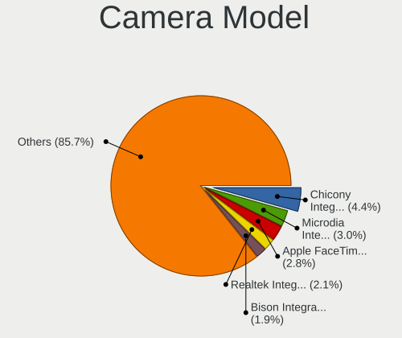

| Model                                                   | Computers | Percent |
|---------------------------------------------------------|-----------|---------|
| Chicony Integrated Camera                               | 147       | 4.38%   |
| Microdia Integrated_Webcam_HD                           | 101       | 3.01%   |
| Apple FaceTime HD Camera (Built-in)                     | 95        | 2.83%   |
| Realtek Integrated_Webcam_HD                            | 72        | 2.14%   |
| Bison Integrated Camera                                 | 65        | 1.94%   |
| IMC Networks USB2.0 HD UVC WebCam                       | 63        | 1.88%   |
| IMC Networks Integrated Camera                          | 60        | 1.79%   |
| Apple iPhone 5/5C/5S/6/SE/7/8/X                         | 60        | 1.79%   |
| Chicony HD Webcam                                       | 52        | 1.55%   |
| Syntek Integrated Camera                                | 49        | 1.46%   |
| Apple Built-in iSight                                   | 49        | 1.46%   |
| Samsung Galaxy series, misc. (MTP mode)                 | 47        | 1.4%    |
| Logitech HD Pro Webcam C920                             | 45        | 1.34%   |
| Logitech Webcam C270                                    | 44        | 1.31%   |
| Sunplus Integrated_Webcam_HD                            | 43        | 1.28%   |
| Logitech C922 Pro Stream Webcam                         | 38        | 1.13%   |
| Chicony TOSHIBA Web Camera - HD                         | 35        | 1.04%   |
| Chicony HP HD Camera                                    | 29        | 0.86%   |
| Realtek USB Camera                                      | 27        | 0.8%    |
| Apple FaceTime HD Camera                                | 27        | 0.8%    |
| Chicony HP TrueVision HD Camera                         | 24        | 0.71%   |
| Realtek Integrated Webcam HD                            | 23        | 0.68%   |
| Quanta HD User Facing                                   | 23        | 0.68%   |
| Luxvisions Innotech Limited Integrated Camera           | 23        | 0.68%   |
| Chicony HD User Facing                                  | 23        | 0.68%   |
| Logitech BRIO Ultra HD Webcam                           | 22        | 0.65%   |
| Chicony HP Truevision HD                                | 22        | 0.65%   |
| Microsoft LifeCam HD-3000                               | 21        | 0.63%   |
| Lite-On Integrated Camera                               | 21        | 0.63%   |
| Microdia Integrated_Webcam_FHD                          | 20        | 0.6%    |
| Cheng Uei Precision Industry (Foxlink) HP TrueVision HD | 20        | 0.6%    |
| Bison HD Webcam                                         | 19        | 0.57%   |
| Sunplus HD WebCam                                       | 18        | 0.54%   |
| Sonix USB2.0 HD UVC WebCam                              | 18        | 0.54%   |
| Chicony USB2.0 HD UVC WebCam                            | 18        | 0.54%   |
| Chicony USB 2.0 Camera                                  | 18        | 0.54%   |
| Bison EasyCamera                                        | 18        | 0.54%   |
| Microdia Integrated Webcam                              | 17        | 0.51%   |
| Luxvisions Innotech Limited HP TrueVision HD Camera     | 17        | 0.51%   |
| Logitech StreamCam                                      | 17        | 0.51%   |

Security
--------

Fingerprint Vendor
------------------

Fingerprint sensor vendors

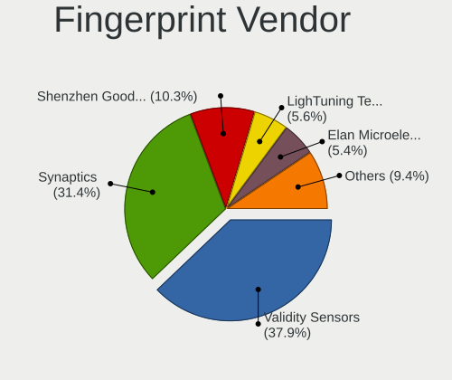

| Vendor                             | Computers | Percent |
|------------------------------------|-----------|---------|
| Validity Sensors                   | 217       | 37.87%  |
| Synaptics                          | 180       | 31.41%  |
| Shenzhen Goodix Technology         | 59        | 10.3%   |
| LighTuning Technology              | 32        | 5.58%   |
| Elan Microelectronics              | 31        | 5.41%   |
| AuthenTec                          | 23        | 4.01%   |
| Upek                               | 17        | 2.97%   |
| STMicroelectronics                 | 8         | 1.4%    |
| Realtek USB2.0 Finger Print Bridge | 4         | 0.7%    |
| Focal-systems.Corp                 | 1         | 0.17%   |
| Dell                               | 1         | 0.17%   |

Fingerprint Model
-----------------

Fingerprint sensor models

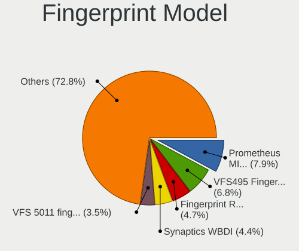

| Model                                                                      | Computers | Percent |
|----------------------------------------------------------------------------|-----------|---------|
| Synaptics Prometheus MIS Touch Fingerprint Reader                          | 45        | 7.85%   |
| Validity Sensors VFS495 Fingerprint Reader                                 | 39        | 6.81%   |
| Shenzhen Goodix Fingerprint Reader                                         | 27        | 4.71%   |
| Validity Sensors Synaptics WBDI                                            | 25        | 4.36%   |
| Validity Sensors VFS 5011 fingerprint sensor                               | 20        | 3.49%   |
| Synaptics Prometheus Fingerprint Reader                                    | 19        | 3.32%   |
| Synaptics Metallica MIS Touch Fingerprint Reader                           | 18        | 3.14%   |
| Shenzhen Goodix  FingerPrint Device                                        | 18        | 3.14%   |
| Validity Sensors Fingerprint scanner                                       | 17        | 2.97%   |
| Upek Biometric Touchchip/Touchstrip Fingerprint Sensor                     | 17        | 2.97%   |
| Validity Sensors VFS7552 Touch Fingerprint Sensor                          | 16        | 2.79%   |
| Synaptics UWP WBDI Device                                                  | 16        | 2.79%   |
| Elan ELAN:ARM-M4                                                           | 16        | 2.79%   |
| Elan ELAN:Fingerprint                                                      | 15        | 2.62%   |
| Synaptics  WBDI                                                            | 14        | 2.44%   |
| Synaptics FS7604 Touch Fingerprint Sensor with PurePrint                   | 14        | 2.44%   |
| Shenzhen Goodix FingerPrint                                                | 14        | 2.44%   |
| LighTuning ES603 Swipe Fingerprint Sensor                                  | 14        | 2.44%   |
| Validity Sensors VFS7500 Touch Fingerprint Sensor                          | 13        | 2.27%   |
| Validity Sensors VFS491                                                    | 13        | 2.27%   |
| LighTuning EgisTec Touch Fingerprint Sensor                                | 13        | 2.27%   |
| Validity Sensors VFS471 Fingerprint Reader                                 | 12        | 2.09%   |
| Validity Sensors VFS Fingerprint sensor                                    | 12        | 2.09%   |
| Validity Sensors Synaptics VFS7552 Touch Fingerprint Sensor                | 12        | 2.09%   |
| Validity Sensors VFS451 Fingerprint Reader                                 | 10        | 1.75%   |
| Synaptics WBDI                                                             | 10        | 1.75%   |
| Synaptics UWP WBDI                                                         | 10        | 1.75%   |
| Validity Sensors Synaptics VFS7552 Touch Fingerprint Sensor with PurePrint | 9         | 1.57%   |
| Synaptics Fingerprint reader [HP G6]                                       | 8         | 1.4%    |
| STMicroelectronics Fingerprint Reader                                      | 8         | 1.4%    |
| AuthenTec AES2501 Fingerprint Sensor                                       | 8         | 1.4%    |
| Validity Sensors Swipe Fingerprint Sensor                                  | 7         | 1.22%   |
| Validity Sensors VFS301 Fingerprint Reader                                 | 6         | 1.05%   |
| Synaptics  FS7604 Touch Fingerprint Sensor with PurePrint                  | 6         | 1.05%   |
| Validity Sensors VFS5011 Fingerprint Reader                                | 5         | 0.87%   |
| Synaptics WBDI Fingerprint Reader USB 086                                  | 5         | 0.87%   |
| Synaptics WBDI Device                                                      | 5         | 0.87%   |
| AuthenTec Fingerprint Sensor                                               | 5         | 0.87%   |
| Synaptics TouchPad                                                         | 4         | 0.7%    |
| Realtek USB2.0 Finger Print Bridge FocalTech Fingerprint Device            | 4         | 0.7%    |

Chipcard Vendor
---------------

Chipcard module vendors

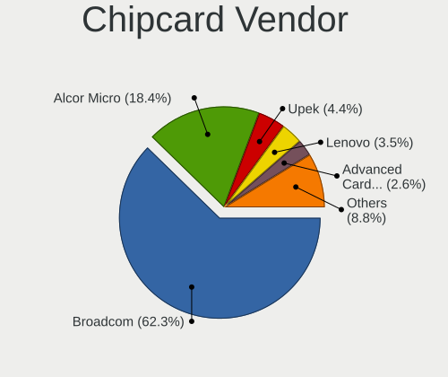

| Vendor                | Computers | Percent |
|-----------------------|-----------|---------|
| Broadcom              | 71        | 62.28%  |
| Alcor Micro           | 21        | 18.42%  |
| Upek                  | 5         | 4.39%   |
| Lenovo                | 4         | 3.51%   |
| Advanced Card Systems | 3         | 2.63%   |
| Yubico.com            | 2         | 1.75%   |
| SCM Microsystems      | 2         | 1.75%   |
| O2 Micro              | 2         | 1.75%   |
| Gemalto (was Gemplus) | 2         | 1.75%   |
| Pol Henarejos         | 1         | 0.88%   |
| Microchip Technology  | 1         | 0.88%   |

Chipcard Model
--------------

Chipcard module models

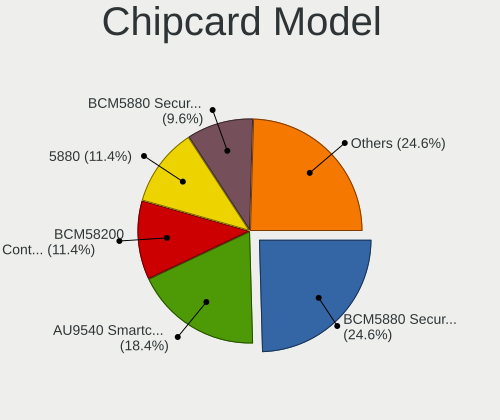

| Model                                                                        | Computers | Percent |
|------------------------------------------------------------------------------|-----------|---------|
| Broadcom BCM5880 Secure Applications Processor                               | 28        | 24.56%  |
| Alcor Micro AU9540 Smartcard Reader                                          | 21        | 18.42%  |
| Broadcom BCM58200 ControlVault 3 (FingerPrint sensor + Contacted SmartCard)  | 13        | 11.4%   |
| Broadcom 5880                                                                | 13        | 11.4%   |
| Broadcom BCM5880 Secure Applications Processor with fingerprint swipe sensor | 11        | 9.65%   |
| Broadcom 58200                                                               | 6         | 5.26%   |
| Upek TouchChip Fingerprint Coprocessor (WBF advanced mode)                   | 5         | 4.39%   |
| Lenovo Integrated Smart Card Reader                                          | 4         | 3.51%   |
| Advanced Card Systems ACR122U                                                | 3         | 2.63%   |
| SCM Microsystems SCR3500 C Contact Reader                                    | 2         | 1.75%   |
| O2 Micro OZ776 CCID Smartcard Reader                                         | 2         | 1.75%   |
| Gemalto (was Gemplus) GemPC Twin SmartCard Reader                            | 2         | 1.75%   |
| Yubico.com Yubikey NEO(-N) U2F+CCID                                          | 1         | 0.88%   |
| Yubico.com Yubikey 4/5 U2F+CCID                                              | 1         | 0.88%   |
| Pol Henarejos Pico Key                                                       | 1         | 0.88%   |
| Microchip Technology SMSC USX101x Reader                                     | 1         | 0.88%   |

Unsupported
-----------

Unsupported Devices
-------------------

Total unsupported devices on board

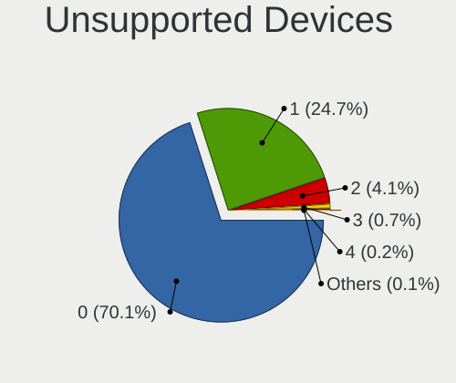

| Total | Computers | Percent |
|-------|-----------|---------|
| 0     | 4363      | 70.08%  |
| 1     | 1539      | 24.72%  |
| 2     | 257       | 4.13%   |
| 3     | 45        | 0.72%   |
| 4     | 14        | 0.22%   |
| 5     | 6         | 0.1%    |
| 7     | 1         | 0.02%   |
| 6     | 1         | 0.02%   |

Unsupported Device Types
------------------------

Types of unsupported devices

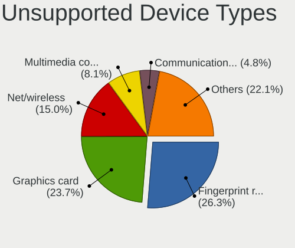

| Type                     | Computers | Percent |
|--------------------------|-----------|---------|
| Fingerprint reader       | 566       | 26.26%  |
| Graphics card            | 511       | 23.71%  |
| Net/wireless             | 323       | 14.99%  |
| Multimedia controller    | 175       | 8.12%   |
| Communication controller | 104       | 4.83%   |
| Chipcard                 | 99        | 4.59%   |
| Bluetooth                | 63        | 2.92%   |
| Unassigned class         | 60        | 2.78%   |
| Camera                   | 60        | 2.78%   |
| Net/ethernet             | 43        | 2%      |
| Sound                    | 37        | 1.72%   |
| Storage                  | 27        | 1.25%   |
| Network                  | 17        | 0.79%   |
| Card reader              | 15        | 0.7%    |
| Modem                    | 14        | 0.65%   |
| Storage/raid             | 12        | 0.56%   |
| Dvb card                 | 10        | 0.46%   |
| Firewire controller      | 7         | 0.32%   |
| Storage/ata              | 4         | 0.19%   |
| Video                    | 3         | 0.14%   |
| Unclassified device      | 1         | 0.05%   |
| Tv card                  | 1         | 0.05%   |
| Storage/nvme             | 1         | 0.05%   |
| Storage/ide              | 1         | 0.05%   |
| Flash memory             | 1         | 0.05%   |

