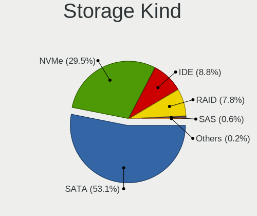
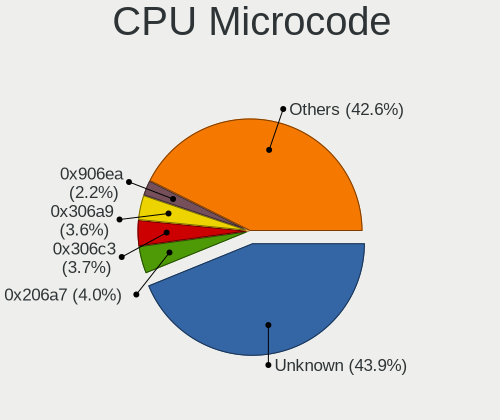
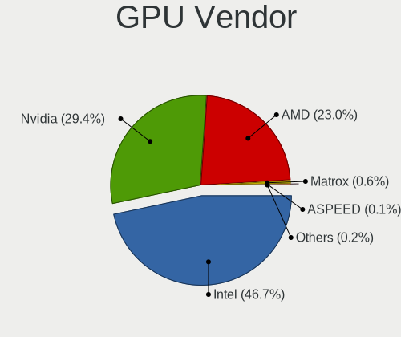
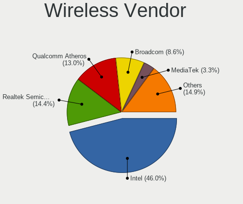
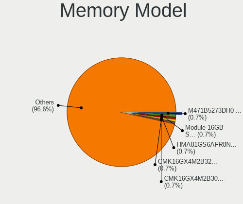

Linux in Australia - Tested Hardware & Statistics
-------------------------------------------------

A project to collect tested hardware configurations for Linux in Australia.

Anyone can contribute to this report by the [hw-probe](https://github.com/linuxhw/hw-probe) tool:

    sudo -E hw-probe -all -upload

Please contribute! Especially if your hardware is rare.

This is a report for all computer types. See also reports for [desktops](/Location/Australia/Desktop/README.md) and [notebooks](/Location/Australia/Notebook/README.md).

Contents
--------

* [ Test Cases ](#test-cases)

* [ System ](#system)
  - [ OS                       ](#os)
  - [ OS Family                ](#os-family)
  - [ Kernel                   ](#kernel)
  - [ Kernel Family            ](#kernel-family)
  - [ Kernel Major Ver.        ](#kernel-major-ver)
  - [ Arch                     ](#arch)
  - [ DE                       ](#de)
  - [ Display Server           ](#display-server)
  - [ Display Manager          ](#display-manager)
  - [ OS Lang                  ](#os-lang)
  - [ Boot Mode                ](#boot-mode)
  - [ Filesystem               ](#filesystem)
  - [ Part. scheme             ](#part-scheme)
  - [ Dual Boot with Linux/BSD ](#dual-boot-with-linuxbsd)
  - [ Dual Boot (Win)          ](#dual-boot-win)

* [ Board ](#board)
  - [ Vendor                   ](#vendor)
  - [ Model                    ](#model)
  - [ Model Family             ](#model-family)
  - [ MFG Year                 ](#mfg-year)
  - [ Form Factor              ](#form-factor)
  - [ Secure Boot              ](#secure-boot)
  - [ Coreboot                 ](#coreboot)
  - [ RAM Size                 ](#ram-size)
  - [ RAM Used                 ](#ram-used)
  - [ Total Drives             ](#total-drives)
  - [ Has CD-ROM               ](#has-cd-rom)
  - [ Has Ethernet             ](#has-ethernet)
  - [ Has WiFi                 ](#has-wifi)
  - [ Has Bluetooth            ](#has-bluetooth)

* [ Location ](#location)
  - [ Country                  ](#country)
  - [ City                     ](#city)

* [ Drives ](#drives)
  - [ Drive Vendor             ](#drive-vendor)
  - [ Drive Model              ](#drive-model)
  - [ HDD Vendor               ](#hdd-vendor)
  - [ SSD Vendor               ](#ssd-vendor)
  - [ Drive Kind               ](#drive-kind)
  - [ Drive Connector          ](#drive-connector)
  - [ Drive Size               ](#drive-size)
  - [ Space Total              ](#space-total)
  - [ Space Used               ](#space-used)
  - [ Malfunc. Drives          ](#malfunc-drives)
  - [ Malfunc. Drive Vendor    ](#malfunc-drive-vendor)
  - [ Malfunc. HDD Vendor      ](#malfunc-hdd-vendor)
  - [ Malfunc. Drive Kind      ](#malfunc-drive-kind)
  - [ Failed Drives            ](#failed-drives)
  - [ Failed Drive Vendor      ](#failed-drive-vendor)
  - [ Drive Status             ](#drive-status)

* [ Storage controller ](#storage-controller)
  - [ Storage Vendor           ](#storage-vendor)
  - [ Storage Model            ](#storage-model)
  - [ Storage Kind             ](#storage-kind)

* [ Processor ](#processor)
  - [ CPU Vendor               ](#cpu-vendor)
  - [ CPU Model                ](#cpu-model)
  - [ CPU Model Family         ](#cpu-model-family)
  - [ CPU Cores                ](#cpu-cores)
  - [ CPU Sockets              ](#cpu-sockets)
  - [ CPU Threads              ](#cpu-threads)
  - [ CPU Op-Modes             ](#cpu-op-modes)
  - [ CPU Microcode            ](#cpu-microcode)
  - [ CPU Microarch            ](#cpu-microarch)

* [ Graphics ](#graphics)
  - [ GPU Vendor               ](#gpu-vendor)
  - [ GPU Model                ](#gpu-model)
  - [ GPU Combo                ](#gpu-combo)
  - [ GPU Driver               ](#gpu-driver)
  - [ GPU Memory               ](#gpu-memory)

* [ Monitor ](#monitor)
  - [ Monitor Vendor           ](#monitor-vendor)
  - [ Monitor Model            ](#monitor-model)
  - [ Monitor Resolution       ](#monitor-resolution)
  - [ Monitor Diagonal         ](#monitor-diagonal)
  - [ Monitor Width            ](#monitor-width)
  - [ Aspect Ratio             ](#aspect-ratio)
  - [ Monitor Area             ](#monitor-area)
  - [ Pixel Density            ](#pixel-density)
  - [ Multiple Monitors        ](#multiple-monitors)

* [ Network ](#network)
  - [ Net Controller Vendor    ](#net-controller-vendor)
  - [ Net Controller Model     ](#net-controller-model)
  - [ Wireless Vendor          ](#wireless-vendor)
  - [ Wireless Model           ](#wireless-model)
  - [ Ethernet Vendor          ](#ethernet-vendor)
  - [ Ethernet Model           ](#ethernet-model)
  - [ Net Controller Kind      ](#net-controller-kind)
  - [ Used Controller          ](#used-controller)
  - [ NICs                     ](#nics)
  - [ IPv6                     ](#ipv6)

* [ Bluetooth ](#bluetooth)
  - [ Bluetooth Vendor         ](#bluetooth-vendor)
  - [ Bluetooth Model          ](#bluetooth-model)

* [ Sound ](#sound)
  - [ Sound Vendor             ](#sound-vendor)
  - [ Sound Model              ](#sound-model)

* [ Memory ](#memory)
  - [ Memory Vendor            ](#memory-vendor)
  - [ Memory Model             ](#memory-model)
  - [ Memory Kind              ](#memory-kind)
  - [ Memory Form Factor       ](#memory-form-factor)
  - [ Memory Size              ](#memory-size)
  - [ Memory Speed             ](#memory-speed)

* [ Printers & scanners ](#printers--scanners)
  - [ Printer Vendor           ](#printer-vendor)
  - [ Printer Model            ](#printer-model)
  - [ Scanner Vendor           ](#scanner-vendor)
  - [ Scanner Model            ](#scanner-model)

* [ Camera ](#camera)
  - [ Camera Vendor            ](#camera-vendor)
  - [ Camera Model             ](#camera-model)

* [ Security ](#security)
  - [ Fingerprint Vendor       ](#fingerprint-vendor)
  - [ Fingerprint Model        ](#fingerprint-model)
  - [ Chipcard Vendor          ](#chipcard-vendor)
  - [ Chipcard Model           ](#chipcard-model)

* [ Unsupported ](#unsupported)
  - [ Unsupported Devices      ](#unsupported-devices)
  - [ Unsupported Device Types ](#unsupported-device-types)

Test Cases
----------

Total: 7894

| Vendor        | Model                       | Form-Factor | Probe                                                      | Date         |
|---------------|-----------------------------|-------------|------------------------------------------------------------|--------------|
| ASUSTek       | PRIME H510M-K R2.0          | Desktop     | [5fb39d6837](https://linux-hardware.org/?probe=5fb39d6837) | Jan 06, 2025 |
| WIWYNN        | Qualcomm Centriq 2400 Cu... | Server      | [bd0fe2f7fd](https://linux-hardware.org/?probe=bd0fe2f7fd) | Jan 05, 2025 |
| Acer          | Aspire 5750G                | Notebook    | [68404201a9](https://linux-hardware.org/?probe=68404201a9) | Jan 05, 2025 |
| Gigabyte      | B560M AORUS PRO             | Desktop     | [f43945b8dd](https://linux-hardware.org/?probe=f43945b8dd) | Jan 05, 2025 |
| HP            | ZHAN 66 Pro A 14 G4 Note... | Notebook    | [0c0d5510fc](https://linux-hardware.org/?probe=0c0d5510fc) | Jan 05, 2025 |
| HP            | Pavilion Gaming Laptop 1... | Notebook    | [cc86c7e5c1](https://linux-hardware.org/?probe=cc86c7e5c1) | Jan 05, 2025 |
| Gigabyte      | B760M AORUS ELITE AX        | Desktop     | [0181bfcd89](https://linux-hardware.org/?probe=0181bfcd89) | Jan 04, 2025 |
| HP            | Pavilion Gaming Laptop 1... | Notebook    | [5b3ef34113](https://linux-hardware.org/?probe=5b3ef34113) | Jan 04, 2025 |
| Dell          | Latitude 5310 2-in-1        | Convertible | [6fd5c30874](https://linux-hardware.org/?probe=6fd5c30874) | Jan 04, 2025 |
| ASUSTek       | VivoBook E14 E402WAS        | Notebook    | [208b3336eb](https://linux-hardware.org/?probe=208b3336eb) | Jan 04, 2025 |
| ASRock        | X870E Nova WiFi             | Desktop     | [71b3539951](https://linux-hardware.org/?probe=71b3539951) | Jan 04, 2025 |
| Gigabyte      | G41MT-D3                    | Desktop     | [c5a86cbe2b](https://linux-hardware.org/?probe=c5a86cbe2b) | Jan 04, 2025 |
| Lenovo        | IdeaPadFlex 5 14IAU7 82R... | Convertible | [779fdc8ded](https://linux-hardware.org/?probe=779fdc8ded) | Jan 03, 2025 |
| Gigabyte      | H81M-S2H                    | Desktop     | [6a06903b4a](https://linux-hardware.org/?probe=6a06903b4a) | Jan 03, 2025 |
| HP            | Spectre x360 Convertible    | Convertible | [f3f5de25ba](https://linux-hardware.org/?probe=f3f5de25ba) | Jan 03, 2025 |
| HP            | Notebook                    | Notebook    | [b50d5a2974](https://linux-hardware.org/?probe=b50d5a2974) | Jan 03, 2025 |
| HP            | Spectre x360 Convertible    | Convertible | [b8ffaea3a9](https://linux-hardware.org/?probe=b8ffaea3a9) | Jan 03, 2025 |
| HP            | Laptop 14s-fq1xxx           | Notebook    | [890bc399f9](https://linux-hardware.org/?probe=890bc399f9) | Jan 03, 2025 |
| ASUSTek       | PRIME B550M-A WIFI II       | Desktop     | [5a6a67b7a4](https://linux-hardware.org/?probe=5a6a67b7a4) | Jan 02, 2025 |
| MSI           | PRO H610M-G                 | Desktop     | [c0a5a2e654](https://linux-hardware.org/?probe=c0a5a2e654) | Jan 02, 2025 |
| Lenovo        | ThinkCentre M93p            | Desktop     | [3a7e0b811f](https://linux-hardware.org/?probe=3a7e0b811f) | Jan 02, 2025 |
| sunxi         | Unknown                     | Soc         | [b37770e49e](https://linux-hardware.org/?probe=b37770e49e) | Jan 01, 2025 |
| Lenovo        | IdeaPad L340-15IRH Gamin... | Notebook    | [8782970610](https://linux-hardware.org/?probe=8782970610) | Jan 01, 2025 |
| HP            | EliteBook 820 G3            | Notebook    | [eeb8564089](https://linux-hardware.org/?probe=eeb8564089) | Jan 01, 2025 |
| Gigabyte      | GA-MA785G-UD3H              | Desktop     | [61fe87d63e](https://linux-hardware.org/?probe=61fe87d63e) | Jan 01, 2025 |
| Raspberry ... | Raspberry Pi Zero 2 W Re... | Soc         | [2763398ce9](https://linux-hardware.org/?probe=2763398ce9) | Jan 01, 2025 |
| HP            | Pavilion Gaming Laptop 1... | Notebook    | [38accd1b79](https://linux-hardware.org/?probe=38accd1b79) | Jan 01, 2025 |
| Dell          | 0P096C A00                  | Desktop     | [7a9c5b5c35](https://linux-hardware.org/?probe=7a9c5b5c35) | Jan 01, 2025 |
| MSI           | Prestige 13 AI+ Evo A2VM... | Notebook    | [e0ef8014cc](https://linux-hardware.org/?probe=e0ef8014cc) | Dec 31, 2024 |
| Microsoft     | Surface Book                | Tablet      | [e334442819](https://linux-hardware.org/?probe=e334442819) | Dec 31, 2024 |
| ASUSTek       | M4A78LT-M-LE                | Desktop     | [65345c7ef4](https://linux-hardware.org/?probe=65345c7ef4) | Dec 31, 2024 |
| Dell          | Inspiron 14 7440 2-in-1     | Convertible | [1c748f0bb6](https://linux-hardware.org/?probe=1c748f0bb6) | Dec 30, 2024 |
| Dell          | 0P096C A00                  | Desktop     | [f85266bf30](https://linux-hardware.org/?probe=f85266bf30) | Dec 30, 2024 |
| ASUSTek       | X541UJ                      | Notebook    | [5d46dedc86](https://linux-hardware.org/?probe=5d46dedc86) | Dec 30, 2024 |
| ASRock        | X570 Steel Legend WiFi a... | Desktop     | [3fa5c306da](https://linux-hardware.org/?probe=3fa5c306da) | Dec 29, 2024 |
| ASUSTek       | TP500LN                     | Notebook    | [beeccb21e7](https://linux-hardware.org/?probe=beeccb21e7) | Dec 29, 2024 |
| ASUSTek       | TP500LN                     | Notebook    | [e71efdddcc](https://linux-hardware.org/?probe=e71efdddcc) | Dec 29, 2024 |
| Gigabyte      | GA-MA785G-UD3H              | Desktop     | [135c62cd91](https://linux-hardware.org/?probe=135c62cd91) | Dec 29, 2024 |
| Framework     | Laptop 16 (AMD Ryzen 704... | Notebook    | [c19c3fe9fc](https://linux-hardware.org/?probe=c19c3fe9fc) | Dec 29, 2024 |
| Dell          | 08WXMX A02                  | Desktop     | [81f35b96d9](https://linux-hardware.org/?probe=81f35b96d9) | Dec 29, 2024 |
| Lenovo        | IdeaPadFlex 5 14IAU7 82R... | Convertible | [d8b62d6567](https://linux-hardware.org/?probe=d8b62d6567) | Dec 29, 2024 |
| HP            | Laptop 15s-eq1xxx           | Notebook    | [9ce5b91ecb](https://linux-hardware.org/?probe=9ce5b91ecb) | Dec 28, 2024 |
| Gigabyte      | H77N-WIFI                   | Desktop     | [e22cddb5fd](https://linux-hardware.org/?probe=e22cddb5fd) | Dec 28, 2024 |
| ASUSTek       | ROG STRIX Z390-E GAMING     | Desktop     | [4e361461b4](https://linux-hardware.org/?probe=4e361461b4) | Dec 28, 2024 |
| Acer          | Aspire Z3-105               | All in one  | [678d72f8e1](https://linux-hardware.org/?probe=678d72f8e1) | Dec 28, 2024 |
| Acer          | Aspire 5750G                | Notebook    | [39cfeac033](https://linux-hardware.org/?probe=39cfeac033) | Dec 28, 2024 |
| ASUSTek       | VivoBook 14_ASUS Laptop ... | Notebook    | [29e44582de](https://linux-hardware.org/?probe=29e44582de) | Dec 28, 2024 |
| Acer          | Aspire 5750G                | Notebook    | [ffcb19aa37](https://linux-hardware.org/?probe=ffcb19aa37) | Dec 28, 2024 |
| Gigabyte      | G41MT-D3                    | Desktop     | [dc90350a72](https://linux-hardware.org/?probe=dc90350a72) | Dec 28, 2024 |
| ASUSTek       | TUF Gaming X570-PLUS        | Desktop     | [b654a18eee](https://linux-hardware.org/?probe=b654a18eee) | Dec 28, 2024 |
| ASUSTek       | TUF Gaming X570-PLUS        | Desktop     | [81e034c5f8](https://linux-hardware.org/?probe=81e034c5f8) | Dec 28, 2024 |
| ASUSTek       | ROG STRIX Z390-E GAMING     | Desktop     | [3ab8537cf8](https://linux-hardware.org/?probe=3ab8537cf8) | Dec 27, 2024 |
| Framework     | Laptop 16 (AMD Ryzen 704... | Notebook    | [b892b107e9](https://linux-hardware.org/?probe=b892b107e9) | Dec 27, 2024 |
| Gigabyte      | GA-A55M-S2V                 | Desktop     | [476ca1ca6d](https://linux-hardware.org/?probe=476ca1ca6d) | Dec 27, 2024 |
| ASUSTek       | VivoBook_ASUSLaptop K660... | Notebook    | [b9d5bc89b8](https://linux-hardware.org/?probe=b9d5bc89b8) | Dec 27, 2024 |
| Lenovo        | ThinkPad X1 Carbon Gen 9... | Notebook    | [a9e7731362](https://linux-hardware.org/?probe=a9e7731362) | Dec 27, 2024 |
| ASUSTek       | VivoBook_ASUSLaptop K660... | Notebook    | [03ce070dd2](https://linux-hardware.org/?probe=03ce070dd2) | Dec 27, 2024 |
| Raspberry ... | Raspberry Pi Zero 2 W Re... | Soc         | [0382ee6455](https://linux-hardware.org/?probe=0382ee6455) | Dec 27, 2024 |
| Apple         | Mac-77F17D7DA9285301 iMa... | All in one  | [9c21fda832](https://linux-hardware.org/?probe=9c21fda832) | Dec 27, 2024 |
| HP            | 1905                        | Desktop     | [9566049ee0](https://linux-hardware.org/?probe=9566049ee0) | Dec 27, 2024 |
| HP            | 1905                        | Desktop     | [7223de1d2e](https://linux-hardware.org/?probe=7223de1d2e) | Dec 26, 2024 |
| Lenovo        | ThinkCentre M58p 7220A72    | Desktop     | [f41fa38fd7](https://linux-hardware.org/?probe=f41fa38fd7) | Dec 26, 2024 |
| Dell          | Latitude 14 Rugged (5404... | Notebook    | [58a8c67731](https://linux-hardware.org/?probe=58a8c67731) | Dec 26, 2024 |
| HP            | Laptop 14s-fq1xxx           | Notebook    | [efbbc1e8ad](https://linux-hardware.org/?probe=efbbc1e8ad) | Dec 26, 2024 |
| Gigabyte      | B450 AORUS PRO WIFI-CF      | Desktop     | [283a58ac15](https://linux-hardware.org/?probe=283a58ac15) | Dec 26, 2024 |
| Raspberry ... | Raspberry Pi                | Soc         | [7b7bfcf547](https://linux-hardware.org/?probe=7b7bfcf547) | Dec 26, 2024 |
| Gigabyte      | GA-MA780G-UD3H              | Desktop     | [b44b582e4b](https://linux-hardware.org/?probe=b44b582e4b) | Dec 25, 2024 |
| ASUSTek       | VivoBook_ASUSLaptop K360... | Notebook    | [a6423a604b](https://linux-hardware.org/?probe=a6423a604b) | Dec 24, 2024 |
| Dell          | XPS 13 9365                 | Convertible | [92dce0f9ac](https://linux-hardware.org/?probe=92dce0f9ac) | Dec 24, 2024 |
| Oracle        | ASSY,MOTHERBOARD,1U         | Server      | [067a495d60](https://linux-hardware.org/?probe=067a495d60) | Dec 24, 2024 |
| Gigabyte      | J1900M-D2P                  | Desktop     | [6d2e2dedfe](https://linux-hardware.org/?probe=6d2e2dedfe) | Dec 23, 2024 |
| Gigabyte      | B450M H                     | Desktop     | [d4e50fb2da](https://linux-hardware.org/?probe=d4e50fb2da) | Dec 23, 2024 |
| Lenovo        | ThinkPad Yoga 370 20JH00... | Convertible | [9711be4bfb](https://linux-hardware.org/?probe=9711be4bfb) | Dec 22, 2024 |
| AZW           | MINI S 10                   | Desktop     | [2309fa6c0a](https://linux-hardware.org/?probe=2309fa6c0a) | Dec 22, 2024 |
| MSI           | B560M-A PRO                 | Desktop     | [814f11f38f](https://linux-hardware.org/?probe=814f11f38f) | Dec 22, 2024 |
| Acer          | Predator PH315-51           | Notebook    | [0cce8338d7](https://linux-hardware.org/?probe=0cce8338d7) | Dec 22, 2024 |
| Dell          | Latitude E6430              | Notebook    | [7715633f8e](https://linux-hardware.org/?probe=7715633f8e) | Dec 21, 2024 |
| ASUSTek       | P8Z77-V LE PLUS             | Desktop     | [25d5764264](https://linux-hardware.org/?probe=25d5764264) | Dec 21, 2024 |
| HP            | 18E7                        | Desktop     | [4ed0c6182c](https://linux-hardware.org/?probe=4ed0c6182c) | Dec 21, 2024 |
| Gigabyte      | Z77X-UD3H                   | Desktop     | [1e178d7ba3](https://linux-hardware.org/?probe=1e178d7ba3) | Dec 21, 2024 |
| Apple         | Mac-63001698E7A34814 iMa... | All in one  | [0c36bc1e93](https://linux-hardware.org/?probe=0c36bc1e93) | Dec 21, 2024 |
| Acer          | Aspire AG14-31P             | Notebook    | [08d3fd4cb9](https://linux-hardware.org/?probe=08d3fd4cb9) | Dec 20, 2024 |
| HP            | 1589                        | Desktop     | [37255e8353](https://linux-hardware.org/?probe=37255e8353) | Dec 20, 2024 |
| Unknown       | Unknown                     | Notebook    | [8cedb6a671](https://linux-hardware.org/?probe=8cedb6a671) | Dec 20, 2024 |
| HP            | 829E                        | Mini pc     | [246c5d2532](https://linux-hardware.org/?probe=246c5d2532) | Dec 20, 2024 |
| sunxi         | Unknown                     | Soc         | [2d87b1c141](https://linux-hardware.org/?probe=2d87b1c141) | Dec 20, 2024 |
| Gigabyte      | B550M K                     | Desktop     | [356514da21](https://linux-hardware.org/?probe=356514da21) | Dec 19, 2024 |
| HP            | Laptop 14-bs0xx             | Notebook    | [ba1d6aa1a1](https://linux-hardware.org/?probe=ba1d6aa1a1) | Dec 19, 2024 |
| ASUSTek       | GA15DH                      | Desktop     | [97bd3b6074](https://linux-hardware.org/?probe=97bd3b6074) | Dec 19, 2024 |
| GPD           | G1621-02                    | Notebook    | [97b2f3034e](https://linux-hardware.org/?probe=97b2f3034e) | Dec 19, 2024 |
| Acer          | Spin SP513-53N              | Convertible | [6a294f74e1](https://linux-hardware.org/?probe=6a294f74e1) | Dec 19, 2024 |
| ASUSTek       | PRIME B450M-A               | Desktop     | [52e0c1bf8f](https://linux-hardware.org/?probe=52e0c1bf8f) | Dec 19, 2024 |
| HP            | Laptop 14s-fq1xxx           | Notebook    | [85527618fc](https://linux-hardware.org/?probe=85527618fc) | Dec 19, 2024 |
| ASUSTek       | VC65R                       | Desktop     | [4448e95ce5](https://linux-hardware.org/?probe=4448e95ce5) | Dec 19, 2024 |
| ASUSTek       | VC65R                       | Desktop     | [62a516f5ab](https://linux-hardware.org/?probe=62a516f5ab) | Dec 19, 2024 |
| ASUSTek       | PRIME B660M-A D4            | Desktop     | [42fb938577](https://linux-hardware.org/?probe=42fb938577) | Dec 19, 2024 |
| Lenovo        | SHARKBAY 0B98401 PRO        | Desktop     | [ab4132ad4c](https://linux-hardware.org/?probe=ab4132ad4c) | Dec 19, 2024 |
| Lenovo        | SHARKBAY 0B98401 PRO        | Desktop     | [cbeebff465](https://linux-hardware.org/?probe=cbeebff465) | Dec 19, 2024 |
| Raspberry ... | Raspberry Pi 3 Model B P... | Soc         | [0e9fe2a6d3](https://linux-hardware.org/?probe=0e9fe2a6d3) | Dec 19, 2024 |
| Pegatron      | 2AC2                        | Desktop     | [98b70ae737](https://linux-hardware.org/?probe=98b70ae737) | Dec 18, 2024 |
| Gigabyte      | B550 AORUS ELITE AX V2      | Notebook    | [193c96330e](https://linux-hardware.org/?probe=193c96330e) | Dec 18, 2024 |
| Apple         | MacBookPro11,3              | Notebook    | [26fb82a499](https://linux-hardware.org/?probe=26fb82a499) | Dec 18, 2024 |
| Raspberry ... | Raspberry Pi Zero W Rev ... | Soc         | [1e8219932f](https://linux-hardware.org/?probe=1e8219932f) | Dec 18, 2024 |
| Gigabyte      | Z77MX-D3H                   | Desktop     | [9b82850a59](https://linux-hardware.org/?probe=9b82850a59) | Dec 18, 2024 |
| HP            | 829E                        | Mini pc     | [c1dab94853](https://linux-hardware.org/?probe=c1dab94853) | Dec 18, 2024 |
| Raspberry ... | Raspberry Pi 3 Model B P... | Soc         | [2dc8856814](https://linux-hardware.org/?probe=2dc8856814) | Dec 18, 2024 |
| HP            | EliteBook 820 G4            | Notebook    | [3f127bb0d5](https://linux-hardware.org/?probe=3f127bb0d5) | Dec 18, 2024 |
| Dell          | 014GRG A00                  | Desktop     | [a68144eb72](https://linux-hardware.org/?probe=a68144eb72) | Dec 17, 2024 |
| Gigabyte      | B550 AORUS ELITE AX V2      | Notebook    | [db89962085](https://linux-hardware.org/?probe=db89962085) | Dec 17, 2024 |
| Gigabyte      | X570 AORUS ULTRA            | Desktop     | [b7fa7d97c0](https://linux-hardware.org/?probe=b7fa7d97c0) | Dec 17, 2024 |
| Raspberry ... | Raspberry Pi Zero W Rev ... | Soc         | [1b6ddd36ae](https://linux-hardware.org/?probe=1b6ddd36ae) | Dec 17, 2024 |
| Raspberry ... | Raspberry Pi 3 Model A P... | Soc         | [79775e4e5c](https://linux-hardware.org/?probe=79775e4e5c) | Dec 17, 2024 |
| Raspberry ... | Raspberry Pi 3 Model B P... | Soc         | [2484776b20](https://linux-hardware.org/?probe=2484776b20) | Dec 17, 2024 |
| Raspberry ... | Raspberry Pi 3 Model A P... | Soc         | [caa52c2602](https://linux-hardware.org/?probe=caa52c2602) | Dec 17, 2024 |
| Toshiba       | Satellite C850              | Notebook    | [38ed2a4b9e](https://linux-hardware.org/?probe=38ed2a4b9e) | Dec 17, 2024 |
| HP            | 83E2                        | Desktop     | [1b12192911](https://linux-hardware.org/?probe=1b12192911) | Dec 16, 2024 |
| MSI           | X99S GAMING 9 AC            | Desktop     | [dd95266cf8](https://linux-hardware.org/?probe=dd95266cf8) | Dec 16, 2024 |
| Acer          | TravelMate P653-M           | Notebook    | [433663f1d2](https://linux-hardware.org/?probe=433663f1d2) | Dec 16, 2024 |
| MSI           | X99S GAMING 9 AC            | Desktop     | [5e49b2a07b](https://linux-hardware.org/?probe=5e49b2a07b) | Dec 16, 2024 |
| HP            | 829B                        | All in one  | [349ddefd63](https://linux-hardware.org/?probe=349ddefd63) | Dec 16, 2024 |
| Lenovo        | ThinkCentre A52 8289G4M     | Desktop     | [d07ac546df](https://linux-hardware.org/?probe=d07ac546df) | Dec 16, 2024 |
| ASUSTek       | ProArt Studiobook H7604J... | Notebook    | [a099000019](https://linux-hardware.org/?probe=a099000019) | Dec 15, 2024 |
| Acer          | Predator PH517-51           | Notebook    | [0035c618aa](https://linux-hardware.org/?probe=0035c618aa) | Dec 15, 2024 |
| Lenovo        | SHARKBAY 0B98401 PRO        | Desktop     | [880ae3d999](https://linux-hardware.org/?probe=880ae3d999) | Dec 14, 2024 |
| Dell          | 096JG8 A01                  | Desktop     | [63cf395d23](https://linux-hardware.org/?probe=63cf395d23) | Dec 14, 2024 |
| ASUSTek       | P5G41T-M LX PLUS            | Desktop     | [9ca8033b01](https://linux-hardware.org/?probe=9ca8033b01) | Dec 14, 2024 |
| Gigabyte      | G41MT-D3                    | Desktop     | [51632357e5](https://linux-hardware.org/?probe=51632357e5) | Dec 14, 2024 |
| Dell          | Latitude 7390               | Notebook    | [94f7f49765](https://linux-hardware.org/?probe=94f7f49765) | Dec 14, 2024 |
| Acer          | Swift SF514-55T             | Notebook    | [3f6fe24453](https://linux-hardware.org/?probe=3f6fe24453) | Dec 13, 2024 |
| Gigabyte      | X570 AORUS ELITE WIFI       | Desktop     | [c3817fc2bf](https://linux-hardware.org/?probe=c3817fc2bf) | Dec 13, 2024 |
| ASUSTek       | P5G41T-M LX PLUS            | Desktop     | [18bf59400f](https://linux-hardware.org/?probe=18bf59400f) | Dec 13, 2024 |
| HP            | Spectre x360 Convertible... | Convertible | [0942a5a5e2](https://linux-hardware.org/?probe=0942a5a5e2) | Dec 13, 2024 |
| ASUSTek       | VivoBook_ASUSLaptop K360... | Notebook    | [73bcd406d0](https://linux-hardware.org/?probe=73bcd406d0) | Dec 12, 2024 |
| Raspberry ... | Raspberry Pi Zero 2 W Re... | Soc         | [296b8db68e](https://linux-hardware.org/?probe=296b8db68e) | Dec 12, 2024 |
| Raspberry ... | Raspberry Pi Zero Rev 1.... | Soc         | [4da8e36831](https://linux-hardware.org/?probe=4da8e36831) | Dec 12, 2024 |
| Lenovo        | ThinkPad X1 Carbon 5th 2... | Notebook    | [1b4e08a55a](https://linux-hardware.org/?probe=1b4e08a55a) | Dec 12, 2024 |
| Dell          | 00V62H A00                  | Desktop     | [819dcf4075](https://linux-hardware.org/?probe=819dcf4075) | Dec 12, 2024 |
| Lenovo        | ThinkPad X13 Yoga Gen 1 ... | Convertible | [b016a9b767](https://linux-hardware.org/?probe=b016a9b767) | Dec 12, 2024 |
| Lenovo        | ThinkPad X1 Yoga 2nd 20J... | Convertible | [04d4e1d228](https://linux-hardware.org/?probe=04d4e1d228) | Dec 12, 2024 |
| Microsoft     | Surface Laptop, 7th Edit... | Tablet      | [eac614f699](https://linux-hardware.org/?probe=eac614f699) | Dec 12, 2024 |
| MSI           | B550M PRO-VDH WIFI          | Desktop     | [27b32efcbb](https://linux-hardware.org/?probe=27b32efcbb) | Dec 12, 2024 |
| Chuwi         | UBook                       | Notebook    | [08e88467cb](https://linux-hardware.org/?probe=08e88467cb) | Dec 12, 2024 |
| Gigabyte      | B760 DS3H AX DDR4           | Desktop     | [ff4117e2d4](https://linux-hardware.org/?probe=ff4117e2d4) | Dec 12, 2024 |
| ASUSTek       | VivoBook 14_ASUS Laptop ... | Notebook    | [c4f5feb755](https://linux-hardware.org/?probe=c4f5feb755) | Dec 11, 2024 |
| ASRock        | H97M Pro4                   | Desktop     | [ad4a8c30fa](https://linux-hardware.org/?probe=ad4a8c30fa) | Dec 10, 2024 |
| Toshiba       | PORTEGE X30-E               | Notebook    | [6c8506b8a9](https://linux-hardware.org/?probe=6c8506b8a9) | Dec 10, 2024 |
| ASUSTek       | Z87-PRO                     | Desktop     | [47f8810b21](https://linux-hardware.org/?probe=47f8810b21) | Dec 10, 2024 |
| Dell          | Latitude E6330              | Notebook    | [aff00f3865](https://linux-hardware.org/?probe=aff00f3865) | Dec 10, 2024 |
| Intel         | LADPNVMO AAE76523-300       | Desktop     | [e42ba66dd1](https://linux-hardware.org/?probe=e42ba66dd1) | Dec 09, 2024 |
| Dell          | XPS 15 9510                 | Notebook    | [ff4cc61f47](https://linux-hardware.org/?probe=ff4cc61f47) | Dec 09, 2024 |
| Dell          | Latitude E6330              | Notebook    | [7f633e8b4d](https://linux-hardware.org/?probe=7f633e8b4d) | Dec 09, 2024 |
| Apple         | MacBookAir7,2               | Notebook    | [c4d956f844](https://linux-hardware.org/?probe=c4d956f844) | Dec 09, 2024 |
| Toshiba       | PORTEGE X30-E               | Notebook    | [1be2e9c5d1](https://linux-hardware.org/?probe=1be2e9c5d1) | Dec 09, 2024 |
| Lenovo        | ThinkPad X1 Carbon Gen 1... | Notebook    | [814ce2b076](https://linux-hardware.org/?probe=814ce2b076) | Dec 09, 2024 |
| Lenovo        | 30D2 SDK0J40705 WIN 3425... | Desktop     | [2a300e3d41](https://linux-hardware.org/?probe=2a300e3d41) | Dec 08, 2024 |
| HP            | Laptop 14s-dq3xxx           | Notebook    | [dd50a8ad3b](https://linux-hardware.org/?probe=dd50a8ad3b) | Dec 07, 2024 |
| HP            | Laptop 14s-dq3xxx           | Notebook    | [3b9ccf4f6d](https://linux-hardware.org/?probe=3b9ccf4f6d) | Dec 07, 2024 |
| Gigabyte      | B365M H                     | Desktop     | [a922a7763f](https://linux-hardware.org/?probe=a922a7763f) | Dec 07, 2024 |
| Lenovo        | ThinkPad L13 Gen 2a 21AB... | Notebook    | [8a5754e888](https://linux-hardware.org/?probe=8a5754e888) | Dec 07, 2024 |
| Dell          | Precision 3560              | Notebook    | [d30964e712](https://linux-hardware.org/?probe=d30964e712) | Dec 06, 2024 |
| ASUSTek       | ROG STRIX B660-I GAMING ... | Desktop     | [e12b5bdf82](https://linux-hardware.org/?probe=e12b5bdf82) | Dec 06, 2024 |
| ASRock        | AD2700-ITX                  | Desktop     | [5fdaccb9a8](https://linux-hardware.org/?probe=5fdaccb9a8) | Dec 05, 2024 |
| Apple         | Mac-F65AE981FFA204ED Mac... | Mini pc     | [90ba8c71bd](https://linux-hardware.org/?probe=90ba8c71bd) | Dec 05, 2024 |
| Apple         | Mac-F65AE981FFA204ED Mac... | Mini pc     | [c294b554ab](https://linux-hardware.org/?probe=c294b554ab) | Dec 05, 2024 |
| Gigabyte      | GA-MA780G-UD3H              | Desktop     | [bc1c756ed9](https://linux-hardware.org/?probe=bc1c756ed9) | Dec 05, 2024 |
| Lenovo        | 30D9 SDK0J40697 WIN 3305... | Desktop     | [8b336590d9](https://linux-hardware.org/?probe=8b336590d9) | Dec 04, 2024 |
| Chuwi         | UBook                       | Notebook    | [ddba94874a](https://linux-hardware.org/?probe=ddba94874a) | Dec 04, 2024 |
| ASUSTek       | VivoBook_ASUSLaptop M760... | Notebook    | [834649c8ed](https://linux-hardware.org/?probe=834649c8ed) | Dec 04, 2024 |
| ASUSTek       | K53SC                       | Notebook    | [b7850939a4](https://linux-hardware.org/?probe=b7850939a4) | Dec 04, 2024 |
| Dell          | Latitude E6410              | Notebook    | [208eeccf87](https://linux-hardware.org/?probe=208eeccf87) | Dec 04, 2024 |
| Dell          | XPS 13 9305                 | Notebook    | [8ff051cc6e](https://linux-hardware.org/?probe=8ff051cc6e) | Dec 04, 2024 |
| Raspberry ... | Raspberry Pi Compute Mod... | Soc         | [5312d0eb27](https://linux-hardware.org/?probe=5312d0eb27) | Dec 04, 2024 |
| MSI           | Prestige 16 A13UCX          | Notebook    | [3c4cfbe0c2](https://linux-hardware.org/?probe=3c4cfbe0c2) | Dec 04, 2024 |
| ASUSTek       | A8R32-MVP Deluxe            | Desktop     | [2c25863ae9](https://linux-hardware.org/?probe=2c25863ae9) | Dec 04, 2024 |
| Lenovo        | IdeaPad 5 Pro 14ACN6 82L... | Notebook    | [291629dda6](https://linux-hardware.org/?probe=291629dda6) | Dec 03, 2024 |
| HP            | 8245 001                    | All in one  | [544f0d3076](https://linux-hardware.org/?probe=544f0d3076) | Dec 03, 2024 |
| Intel Clie... | LAPBC710                    | Notebook    | [e603037ba8](https://linux-hardware.org/?probe=e603037ba8) | Dec 03, 2024 |
| HP            | Pavilion dv6                | Notebook    | [f72bd7ca67](https://linux-hardware.org/?probe=f72bd7ca67) | Dec 03, 2024 |
| HP            | 83EF                        | Desktop     | [8ec6753877](https://linux-hardware.org/?probe=8ec6753877) | Dec 03, 2024 |
| ASUSTek       | ROG STRIX B550-I GAMING     | Desktop     | [bd3553c7e3](https://linux-hardware.org/?probe=bd3553c7e3) | Dec 03, 2024 |
| Gigabyte      | H77N-WIFI                   | Desktop     | [fb898274e9](https://linux-hardware.org/?probe=fb898274e9) | Dec 03, 2024 |
| ASUSTek       | VivoBook_ASUSLaptop M760... | Notebook    | [8150c1fd65](https://linux-hardware.org/?probe=8150c1fd65) | Dec 02, 2024 |
| Gigabyte      | GA-A55M-S2V                 | Desktop     | [64ef142041](https://linux-hardware.org/?probe=64ef142041) | Dec 02, 2024 |
| Dell          | Inspiron 3580               | Notebook    | [cd4f2164a0](https://linux-hardware.org/?probe=cd4f2164a0) | Dec 02, 2024 |
| HP            | 82B4                        | Desktop     | [21e739a9b4](https://linux-hardware.org/?probe=21e739a9b4) | Dec 02, 2024 |
| Gigabyte      | J1900M-D2P                  | Desktop     | [7997ade01f](https://linux-hardware.org/?probe=7997ade01f) | Dec 02, 2024 |
| ASRock        | Z390 Phantom Gaming 9       | Desktop     | [6573a24594](https://linux-hardware.org/?probe=6573a24594) | Dec 01, 2024 |
| Gigabyte      | GA-MA785G-UD3H              | Desktop     | [cf6a4a0297](https://linux-hardware.org/?probe=cf6a4a0297) | Dec 01, 2024 |
| Lenovo        | IdeaPad 3 15ADA05 81W1      | Notebook    | [5b0a65bb7c](https://linux-hardware.org/?probe=5b0a65bb7c) | Dec 01, 2024 |
| HP            | ProBook x360 435 G8 Note... | Convertible | [6a06b51e9a](https://linux-hardware.org/?probe=6a06b51e9a) | Dec 01, 2024 |
| Gigabyte      | B360M D3H-CF                | Desktop     | [7f3136b79b](https://linux-hardware.org/?probe=7f3136b79b) | Dec 01, 2024 |
| HP            | Pavilion x360 Convertibl... | Convertible | [014cfa2104](https://linux-hardware.org/?probe=014cfa2104) | Dec 01, 2024 |
| HP            | 3646h                       | Desktop     | [d16e3af848](https://linux-hardware.org/?probe=d16e3af848) | Dec 01, 2024 |
| Lenovo        | ThinkPad P53 20QQS01L25     | Notebook    | [2ab5a606c9](https://linux-hardware.org/?probe=2ab5a606c9) | Nov 30, 2024 |
| ASUSTek       | Maximus IV GENE-Z/GEN3      | Desktop     | [df1e7231c1](https://linux-hardware.org/?probe=df1e7231c1) | Nov 30, 2024 |
| Lenovo        | ThinkPad L470 W10DG 20JV... | Notebook    | [751428f37c](https://linux-hardware.org/?probe=751428f37c) | Nov 29, 2024 |
| Gigabyte      | B250M-HD3-CF                | Desktop     | [285af8915b](https://linux-hardware.org/?probe=285af8915b) | Nov 29, 2024 |
| Nvidia        | M750SLI-DS4                 | Desktop     | [6e2167686c](https://linux-hardware.org/?probe=6e2167686c) | Nov 29, 2024 |
| Gigabyte      | H61M-USB3-B3                | Desktop     | [9233297ff7](https://linux-hardware.org/?probe=9233297ff7) | Nov 29, 2024 |
| JGINYUE       | X99-8D4G Server             | Desktop     | [aa29f05efb](https://linux-hardware.org/?probe=aa29f05efb) | Nov 29, 2024 |
| MSI           | Z97 PC Mate                 | Desktop     | [2f0201c36b](https://linux-hardware.org/?probe=2f0201c36b) | Nov 29, 2024 |
| HP            | ENVY x360 Convertible 15... | Convertible | [a5f7c00c87](https://linux-hardware.org/?probe=a5f7c00c87) | Nov 29, 2024 |
| Dell          | 014GRG A00                  | Desktop     | [9f1d4366ae](https://linux-hardware.org/?probe=9f1d4366ae) | Nov 29, 2024 |
| Alienware     | 17 R4                       | Notebook    | [ef42de0d20](https://linux-hardware.org/?probe=ef42de0d20) | Nov 28, 2024 |
| MSI           | Z97 PC Mate                 | Desktop     | [1bda8fbcb4](https://linux-hardware.org/?probe=1bda8fbcb4) | Nov 28, 2024 |
| AMI           | Aptio CRB                   | Mini pc     | [dcb299a261](https://linux-hardware.org/?probe=dcb299a261) | Nov 27, 2024 |
| Lenovo        | ThinkPad X1 Yoga 1st 20F... | Convertible | [228a12053f](https://linux-hardware.org/?probe=228a12053f) | Nov 27, 2024 |
| HP            | EliteBook 840 G4            | Notebook    | [801af34dc8](https://linux-hardware.org/?probe=801af34dc8) | Nov 27, 2024 |
| Gigabyte      | Z77MX-D3H                   | Desktop     | [3bdd24a725](https://linux-hardware.org/?probe=3bdd24a725) | Nov 26, 2024 |
| Dell          | 08WXMX A02                  | Desktop     | [8bbbb8617e](https://linux-hardware.org/?probe=8bbbb8617e) | Nov 26, 2024 |
| Dell          | Precision 3591              | Notebook    | [71c9c95f67](https://linux-hardware.org/?probe=71c9c95f67) | Nov 26, 2024 |
| ASUSTek       | PRIME X670-P WIFI           | Desktop     | [b671dd7405](https://linux-hardware.org/?probe=b671dd7405) | Nov 26, 2024 |
| ASUSTek       | X550JX                      | Notebook    | [11c59b25e3](https://linux-hardware.org/?probe=11c59b25e3) | Nov 26, 2024 |
| ASUSTek       | PRIME H610M-D D4            | Desktop     | [eb2d759164](https://linux-hardware.org/?probe=eb2d759164) | Nov 26, 2024 |
| Lenovo        | ThinkPad P53 20QQS01L25     | Notebook    | [9a46aa789c](https://linux-hardware.org/?probe=9a46aa789c) | Nov 25, 2024 |
| MSI           | MPG Z390I GAMING EDGE AC    | Desktop     | [a931a49052](https://linux-hardware.org/?probe=a931a49052) | Nov 25, 2024 |
| Gigabyte      | Z68MA-D2H-B3                | Desktop     | [33e54edc5c](https://linux-hardware.org/?probe=33e54edc5c) | Nov 25, 2024 |
| Alienware     | 17 R4                       | Notebook    | [892ac0bb13](https://linux-hardware.org/?probe=892ac0bb13) | Nov 25, 2024 |
| Gigabyte      | J1900M-D2P                  | Desktop     | [02184c6e08](https://linux-hardware.org/?probe=02184c6e08) | Nov 24, 2024 |
| Acer          | TravelMate P446-M           | Notebook    | [37578d27ba](https://linux-hardware.org/?probe=37578d27ba) | Nov 23, 2024 |
| LG Electro... | 16Z90P-G.AA75A              | Notebook    | [c441597519](https://linux-hardware.org/?probe=c441597519) | Nov 23, 2024 |
| Gigabyte      | H81M-DS2                    | Desktop     | [4fbe72a157](https://linux-hardware.org/?probe=4fbe72a157) | Nov 23, 2024 |
| ASUSTek       | Rampage III GENE            | Desktop     | [89662fc2f1](https://linux-hardware.org/?probe=89662fc2f1) | Nov 23, 2024 |
| ASUSTek       | GL752VW                     | Notebook    | [4df66d6d25](https://linux-hardware.org/?probe=4df66d6d25) | Nov 23, 2024 |
| Gigabyte      | G41MT-D3                    | Desktop     | [d6d09e60c8](https://linux-hardware.org/?probe=d6d09e60c8) | Nov 23, 2024 |
| Dell          | Latitude 5430               | Notebook    | [cbb4970afb](https://linux-hardware.org/?probe=cbb4970afb) | Nov 23, 2024 |
| Valve         | Jupiter                     | Notebook    | [e0e7192eba](https://linux-hardware.org/?probe=e0e7192eba) | Nov 22, 2024 |
| Dell          | Latitude 5430               | Notebook    | [7123ed49f7](https://linux-hardware.org/?probe=7123ed49f7) | Nov 22, 2024 |
| Intel         | B760 M-ATX D4               | Desktop     | [adae845d88](https://linux-hardware.org/?probe=adae845d88) | Nov 22, 2024 |
| MSI           | GT75 Titan 8RG              | Notebook    | [4687248040](https://linux-hardware.org/?probe=4687248040) | Nov 22, 2024 |
| ASUSTek       | X550JX                      | Notebook    | [34bfe8d2b6](https://linux-hardware.org/?probe=34bfe8d2b6) | Nov 22, 2024 |
| ASUSTek       | X550JX                      | Notebook    | [3ee3360b2c](https://linux-hardware.org/?probe=3ee3360b2c) | Nov 22, 2024 |
| Lenovo        | Yoga 7 16IAH7 82UF          | Convertible | [e39dd7f77a](https://linux-hardware.org/?probe=e39dd7f77a) | Nov 22, 2024 |
| AZW           | SER V1.0                    | Mini pc     | [01078ae4ec](https://linux-hardware.org/?probe=01078ae4ec) | Nov 22, 2024 |
| Acer          | Aspire A315-510P            | Notebook    | [99993b0f3e](https://linux-hardware.org/?probe=99993b0f3e) | Nov 21, 2024 |
| HP            | 2B42                        | All in one  | [7f7aa21abc](https://linux-hardware.org/?probe=7f7aa21abc) | Nov 21, 2024 |
| Dell          | 051FJ8 A02                  | Desktop     | [66b7975345](https://linux-hardware.org/?probe=66b7975345) | Nov 20, 2024 |
| MSI           | PRO Z690-A DDR4             | Desktop     | [a6a0013e52](https://linux-hardware.org/?probe=a6a0013e52) | Nov 20, 2024 |
| sunxi         | Unknown                     | Soc         | [561fd9db18](https://linux-hardware.org/?probe=561fd9db18) | Nov 20, 2024 |
| ASUSTek       | GL552VW                     | Notebook    | [77e30dc8de](https://linux-hardware.org/?probe=77e30dc8de) | Nov 19, 2024 |
| Dell          | XPS 15 9530                 | Notebook    | [82a3e738b1](https://linux-hardware.org/?probe=82a3e738b1) | Nov 19, 2024 |
| Gigabyte      | GA-MA785G-UD3H              | Desktop     | [9b9550e9cc](https://linux-hardware.org/?probe=9b9550e9cc) | Nov 19, 2024 |
| Dell          | 014GRG A00                  | Desktop     | [1d7c479df7](https://linux-hardware.org/?probe=1d7c479df7) | Nov 19, 2024 |
| Apple         | MacBookPro8,1               | Notebook    | [27ddf4e4b1](https://linux-hardware.org/?probe=27ddf4e4b1) | Nov 18, 2024 |
| ASUSTek       | GL552VW                     | Notebook    | [257a158847](https://linux-hardware.org/?probe=257a158847) | Nov 18, 2024 |
| Intel Clie... | LAPQC71B                    | Notebook    | [5db38e2711](https://linux-hardware.org/?probe=5db38e2711) | Nov 17, 2024 |
| Raspberry ... | Raspberry Pi Zero 2 W Re... | Soc         | [d4909ba27d](https://linux-hardware.org/?probe=d4909ba27d) | Nov 17, 2024 |
| HP            | 1587h                       | Desktop     | [67bbbca7d3](https://linux-hardware.org/?probe=67bbbca7d3) | Nov 17, 2024 |
| Apple         | MacBookPro11,5              | Notebook    | [c2a112f067](https://linux-hardware.org/?probe=c2a112f067) | Nov 16, 2024 |
| AAEON         | MIX-H310A1 V1.0             | Desktop     | [96b20cb963](https://linux-hardware.org/?probe=96b20cb963) | Nov 16, 2024 |
| Lenovo        | IdeaPad S540-13ITL 82H1     | Notebook    | [ae1583866f](https://linux-hardware.org/?probe=ae1583866f) | Nov 16, 2024 |
| Gigabyte      | H77N-WIFI                   | Desktop     | [43c9e814d8](https://linux-hardware.org/?probe=43c9e814d8) | Nov 16, 2024 |
| HP            | 2B42                        | All in one  | [dbc20b68ff](https://linux-hardware.org/?probe=dbc20b68ff) | Nov 16, 2024 |
| Apple         | Mac-942B5BF58194151B        | All in one  | [bd07d42d7c](https://linux-hardware.org/?probe=bd07d42d7c) | Nov 16, 2024 |
| Raspberry ... | Raspberry Pi Zero Rev 1.... | Soc         | [1fb9348d71](https://linux-hardware.org/?probe=1fb9348d71) | Nov 15, 2024 |
| MSI           | Prestige 15 A12UC           | Notebook    | [b1feb7756d](https://linux-hardware.org/?probe=b1feb7756d) | Nov 15, 2024 |
| Gigabyte      | B450M GAMING                | Desktop     | [d6b505fbfd](https://linux-hardware.org/?probe=d6b505fbfd) | Nov 15, 2024 |
| Intel         | DP55WG AAE57269-404         | Desktop     | [c07ecda835](https://linux-hardware.org/?probe=c07ecda835) | Nov 15, 2024 |
| ASRock        | H170M Pro4                  | Desktop     | [eabb883a16](https://linux-hardware.org/?probe=eabb883a16) | Nov 14, 2024 |
| Gigabyte      | B650 AORUS ELITE AX V2      | Desktop     | [701e086dc6](https://linux-hardware.org/?probe=701e086dc6) | Nov 14, 2024 |
| Microsoft     | Surface Pro                 | Tablet      | [2ea7fdf492](https://linux-hardware.org/?probe=2ea7fdf492) | Nov 14, 2024 |
| ASRock        | H410M-ITX/ac                | Desktop     | [7b39f3b2df](https://linux-hardware.org/?probe=7b39f3b2df) | Nov 12, 2024 |
| Apple         | MacBookPro15,2              | Notebook    | [f21bc8c54b](https://linux-hardware.org/?probe=f21bc8c54b) | Nov 12, 2024 |
| Apple         | Mac-031AEE4D24BFF0B1 Mac... | Mini pc     | [d5699cb4f1](https://linux-hardware.org/?probe=d5699cb4f1) | Nov 12, 2024 |
| ASUSTek       | VivoBook_ASUS Laptop E41... | Notebook    | [dc0dd3a948](https://linux-hardware.org/?probe=dc0dd3a948) | Nov 12, 2024 |
| ASUSTek       | F3JP                        | Notebook    | [cd8a9b0278](https://linux-hardware.org/?probe=cd8a9b0278) | Nov 12, 2024 |
| Gigabyte      | B550 AORUS ELITE AX V2      | Desktop     | [2262fccd67](https://linux-hardware.org/?probe=2262fccd67) | Nov 11, 2024 |
| Gigabyte      | B550 AORUS ELITE AX V2      | Desktop     | [25efb695c6](https://linux-hardware.org/?probe=25efb695c6) | Nov 11, 2024 |
| HP            | ML110 G4                    | Desktop     | [68590d593a](https://linux-hardware.org/?probe=68590d593a) | Nov 11, 2024 |
| JGINYUE       | B550i-GAMING                | Desktop     | [2701fc764a](https://linux-hardware.org/?probe=2701fc764a) | Nov 11, 2024 |
| ASRock        | B550 Phantom Gaming-ITX/... | Desktop     | [0b8fc5b8af](https://linux-hardware.org/?probe=0b8fc5b8af) | Nov 11, 2024 |
| Framework     | Laptop 16 (AMD Ryzen 704... | Notebook    | [e16d78d766](https://linux-hardware.org/?probe=e16d78d766) | Nov 10, 2024 |
| Framework     | Laptop 16 (AMD Ryzen 704... | Notebook    | [480d5f0266](https://linux-hardware.org/?probe=480d5f0266) | Nov 10, 2024 |
| ASRock        | H170M Pro4                  | Desktop     | [aec2dc4bb0](https://linux-hardware.org/?probe=aec2dc4bb0) | Nov 10, 2024 |
| Dell          | 014GRG A00                  | Desktop     | [3bf779ef79](https://linux-hardware.org/?probe=3bf779ef79) | Nov 10, 2024 |
| Gigabyte      | G41M-ES2L                   | Desktop     | [d1d98f5e59](https://linux-hardware.org/?probe=d1d98f5e59) | Nov 10, 2024 |
| Intel         | DH55TC AAE70932-302         | Desktop     | [69d72435cd](https://linux-hardware.org/?probe=69d72435cd) | Nov 09, 2024 |
| ASUSTek       | ROG STRIX Z490-F GAMING     | Desktop     | [bd68e159f2](https://linux-hardware.org/?probe=bd68e159f2) | Nov 09, 2024 |
| ASUSTek       | G13CH                       | Desktop     | [4a43a09360](https://linux-hardware.org/?probe=4a43a09360) | Nov 08, 2024 |
| Toshiba       | Satellite Pro L550          | Notebook    | [90ba079d9a](https://linux-hardware.org/?probe=90ba079d9a) | Nov 08, 2024 |
| Gigabyte      | B360 AORUS GAMING 3 WIFI... | Desktop     | [856f712b05](https://linux-hardware.org/?probe=856f712b05) | Nov 08, 2024 |
| MSI           | PRO X670-P WIFI             | Desktop     | [489a1bd51a](https://linux-hardware.org/?probe=489a1bd51a) | Nov 08, 2024 |
| MSI           | PRO B650M-A WIFI            | Desktop     | [5edcef988a](https://linux-hardware.org/?probe=5edcef988a) | Nov 08, 2024 |
| Lenovo        | ThinkPad T410 2522PT3       | Notebook    | [ffed1336ad](https://linux-hardware.org/?probe=ffed1336ad) | Nov 07, 2024 |
| Apple         | MacBookPro8,1               | Notebook    | [f73e960e6b](https://linux-hardware.org/?probe=f73e960e6b) | Nov 07, 2024 |
| Lenovo        | ThinkCentre M58p 7220A72    | Desktop     | [57aba2ee43](https://linux-hardware.org/?probe=57aba2ee43) | Nov 07, 2024 |
| Unknown       | Unknown                     | Notebook    | [723fee0d9d](https://linux-hardware.org/?probe=723fee0d9d) | Nov 06, 2024 |
| Apple         | MacBookPro8,1               | Notebook    | [92cddeb19a](https://linux-hardware.org/?probe=92cddeb19a) | Nov 06, 2024 |
| Nvidia        | M750SLI-DS4                 | Desktop     | [32195a3f35](https://linux-hardware.org/?probe=32195a3f35) | Nov 05, 2024 |
| Gigabyte      | Z77MX-D3H                   | Desktop     | [4fbeaa34cb](https://linux-hardware.org/?probe=4fbeaa34cb) | Nov 05, 2024 |
| Timi          | Redmi Book Pro 14 2022      | Notebook    | [317fe89cc5](https://linux-hardware.org/?probe=317fe89cc5) | Nov 05, 2024 |
| HP            | Notebook                    | Notebook    | [a1bc0f7cfa](https://linux-hardware.org/?probe=a1bc0f7cfa) | Nov 05, 2024 |
| Lenovo        | ThinkPad T480s 20L7S0060... | Notebook    | [ebf7e20a00](https://linux-hardware.org/?probe=ebf7e20a00) | Nov 05, 2024 |
| Gigabyte      | B660 DS3H DDR4              | Desktop     | [c86bce35fb](https://linux-hardware.org/?probe=c86bce35fb) | Nov 05, 2024 |
| ASUSTek       | ROG Ally RC71L_RC71L        | Tablet      | [f9659bffcf](https://linux-hardware.org/?probe=f9659bffcf) | Nov 04, 2024 |
| ASUSTek       | P9X79 PRO                   | Desktop     | [c08e489129](https://linux-hardware.org/?probe=c08e489129) | Nov 03, 2024 |
| Apple         | MacBookPro11,4              | Notebook    | [eb4be42b97](https://linux-hardware.org/?probe=eb4be42b97) | Nov 03, 2024 |
| Lenovo        | IdeaPad 5 Pro 14ARH7 82S... | Notebook    | [ee9620d5e3](https://linux-hardware.org/?probe=ee9620d5e3) | Nov 03, 2024 |
| Dell          | Inspiron 16 7610            | Notebook    | [f0d1717af2](https://linux-hardware.org/?probe=f0d1717af2) | Nov 02, 2024 |
| HP            | Compaq CQ45                 | Notebook    | [37a06dc980](https://linux-hardware.org/?probe=37a06dc980) | Nov 02, 2024 |
| HP            | Compaq CQ45                 | Notebook    | [eea008157b](https://linux-hardware.org/?probe=eea008157b) | Nov 02, 2024 |
| ASUSTek       | S550CB                      | Notebook    | [d50e1a8a06](https://linux-hardware.org/?probe=d50e1a8a06) | Nov 02, 2024 |
| Unknown       | Unknown                     | Desktop     | [2eb724a1a3](https://linux-hardware.org/?probe=2eb724a1a3) | Nov 01, 2024 |
| ASUSTek       | ROG Flow Z13 GZ301ZE_GZ3... | Tablet      | [b48bbd9d54](https://linux-hardware.org/?probe=b48bbd9d54) | Nov 01, 2024 |
| ASRock        | AD2700-ITX                  | Desktop     | [6a162c50dd](https://linux-hardware.org/?probe=6a162c50dd) | Oct 31, 2024 |
| MSI           | Z87M GAMING                 | Desktop     | [127a8e1abd](https://linux-hardware.org/?probe=127a8e1abd) | Oct 31, 2024 |
| Gigabyte      | X58A-UD5                    | Desktop     | [5ecd8898e9](https://linux-hardware.org/?probe=5ecd8898e9) | Oct 31, 2024 |
| Gigabyte      | J1900M-D2P                  | Desktop     | [a12900be5b](https://linux-hardware.org/?probe=a12900be5b) | Oct 31, 2024 |
| Apple         | MacBookPro11,4              | Notebook    | [cb30874017](https://linux-hardware.org/?probe=cb30874017) | Oct 30, 2024 |
| ASUSTek       | VivoBook_ASUSLaptop X150... | Notebook    | [b1695ef355](https://linux-hardware.org/?probe=b1695ef355) | Oct 30, 2024 |
| HP            | Laptop 15s-fq5xxx           | Notebook    | [4af4c5982b](https://linux-hardware.org/?probe=4af4c5982b) | Oct 30, 2024 |
| Gigabyte      | 990FXA-UD3                  | Desktop     | [30395c06ea](https://linux-hardware.org/?probe=30395c06ea) | Oct 30, 2024 |
| Gigabyte      | Z68MA-D2H-B3                | Desktop     | [07e7c599ef](https://linux-hardware.org/?probe=07e7c599ef) | Oct 30, 2024 |
| Dell          | Inspiron M5010              | Notebook    | [c33b702644](https://linux-hardware.org/?probe=c33b702644) | Oct 30, 2024 |
| Gigabyte      | J1900M-D2P                  | Desktop     | [17555d3426](https://linux-hardware.org/?probe=17555d3426) | Oct 30, 2024 |
| Gigabyte      | Z590I AORUS ULTRA           | Notebook    | [816bafe83f](https://linux-hardware.org/?probe=816bafe83f) | Oct 30, 2024 |
| Dell          | Precision 5540              | Notebook    | [cabab07d6f](https://linux-hardware.org/?probe=cabab07d6f) | Oct 30, 2024 |
| Acer          | Aspire A514-52K             | Notebook    | [102e60dfa8](https://linux-hardware.org/?probe=102e60dfa8) | Oct 30, 2024 |
| Gigabyte      | Z690 AORUS ULTRA            | Desktop     | [0718027c91](https://linux-hardware.org/?probe=0718027c91) | Oct 29, 2024 |
| ASUSTek       | TUF Gaming B660M-E D4       | Desktop     | [1e1cd86cb5](https://linux-hardware.org/?probe=1e1cd86cb5) | Oct 29, 2024 |
| MSI           | GF63 Thin 11UC              | Notebook    | [6f3cddbb64](https://linux-hardware.org/?probe=6f3cddbb64) | Oct 28, 2024 |
| Dell          | XPS 13 9350                 | Notebook    | [624d31014e](https://linux-hardware.org/?probe=624d31014e) | Oct 28, 2024 |
| Dell          | 096JG8 A00                  | Desktop     | [4a16e8e7f8](https://linux-hardware.org/?probe=4a16e8e7f8) | Oct 27, 2024 |
| Dell          | 096JG8 A00                  | Desktop     | [c2510e4429](https://linux-hardware.org/?probe=c2510e4429) | Oct 27, 2024 |
| Gigabyte      | Z390 GAMING X-CF            | Desktop     | [2d60c3fa69](https://linux-hardware.org/?probe=2d60c3fa69) | Oct 27, 2024 |
| Acer          | Aspire 5600                 | Notebook    | [02813ab0f6](https://linux-hardware.org/?probe=02813ab0f6) | Oct 27, 2024 |
| MSI           | Bravo 17 C7VFK              | Notebook    | [a7adfb673d](https://linux-hardware.org/?probe=a7adfb673d) | Oct 27, 2024 |
| Lenovo        | Legion Y740-15IRHg 81UH     | Notebook    | [e489d3c5f1](https://linux-hardware.org/?probe=e489d3c5f1) | Oct 27, 2024 |
| Toshiba       | PORTEGE X30-E               | Notebook    | [8171ac365f](https://linux-hardware.org/?probe=8171ac365f) | Oct 27, 2024 |
| Gigabyte      | GA-870A-UD3                 | Desktop     | [195e8d177d](https://linux-hardware.org/?probe=195e8d177d) | Oct 26, 2024 |
| Gigabyte      | H77N-WIFI                   | Desktop     | [b1fe176a80](https://linux-hardware.org/?probe=b1fe176a80) | Oct 26, 2024 |
| ASRock        | X670E Taichi                | Desktop     | [f0d7df377f](https://linux-hardware.org/?probe=f0d7df377f) | Oct 26, 2024 |
| HP            | EliteBook 850 G3            | Notebook    | [a62e77d2a5](https://linux-hardware.org/?probe=a62e77d2a5) | Oct 26, 2024 |
| Unknown       | MT6877V/ZA (DT)             | Soc         | [e51d457c7a](https://linux-hardware.org/?probe=e51d457c7a) | Oct 25, 2024 |
| Lenovo        | IdeaPad 5 Pro 14ACN6 82L... | Notebook    | [50274618bd](https://linux-hardware.org/?probe=50274618bd) | Oct 25, 2024 |
| Apple         | MacBookPro5,5               | Notebook    | [64a2cc3677](https://linux-hardware.org/?probe=64a2cc3677) | Oct 25, 2024 |
| HP            | Pavilion dv6                | Notebook    | [e0742f5a71](https://linux-hardware.org/?probe=e0742f5a71) | Oct 25, 2024 |
| Gigabyte      | B450M H                     | Desktop     | [8647102690](https://linux-hardware.org/?probe=8647102690) | Oct 25, 2024 |
| MSI           | PRO B650M-A WIFI            | Desktop     | [02c64fea57](https://linux-hardware.org/?probe=02c64fea57) | Oct 25, 2024 |
| HP            | Pavilion dv6                | Notebook    | [6038c991fd](https://linux-hardware.org/?probe=6038c991fd) | Oct 25, 2024 |
| Dell          | Inspiron 14 5420            | Notebook    | [83d1e56980](https://linux-hardware.org/?probe=83d1e56980) | Oct 25, 2024 |
| Dell          | 03NVJ6 A01                  | Desktop     | [fd3d2e254d](https://linux-hardware.org/?probe=fd3d2e254d) | Oct 25, 2024 |
| Dell          | 0VWT90 A02                  | Server      | [c8e4174b2a](https://linux-hardware.org/?probe=c8e4174b2a) | Oct 24, 2024 |
| Dell          | 0H5J4J A01                  | Server      | [8b77a5fd4d](https://linux-hardware.org/?probe=8b77a5fd4d) | Oct 24, 2024 |
| ASUSTek       | PRIME B650M-A WIFI II       | Desktop     | [0c5c97d6d4](https://linux-hardware.org/?probe=0c5c97d6d4) | Oct 24, 2024 |
| Gigabyte      | MZ22-G20-00 01000100        | Server      | [5f638caf1f](https://linux-hardware.org/?probe=5f638caf1f) | Oct 24, 2024 |
| Dell          | Inspiron M5010              | Notebook    | [f8441a09c6](https://linux-hardware.org/?probe=f8441a09c6) | Oct 24, 2024 |
| HP            | 8643 SMVB                   | Desktop     | [d8f502fc39](https://linux-hardware.org/?probe=d8f502fc39) | Oct 24, 2024 |
| HP            | 212A                        | Desktop     | [e28d7fe1da](https://linux-hardware.org/?probe=e28d7fe1da) | Oct 23, 2024 |
| HP            | Spectre x360 Convertible... | Convertible | [6d336318c3](https://linux-hardware.org/?probe=6d336318c3) | Oct 23, 2024 |
| Toshiba       | Satellite NB10-A            | Notebook    | [22b28cedab](https://linux-hardware.org/?probe=22b28cedab) | Oct 23, 2024 |
| HP            | Notebook                    | Notebook    | [c77d9407e6](https://linux-hardware.org/?probe=c77d9407e6) | Oct 23, 2024 |
| Lenovo        | IdeaPad 110-15ACL 80TJ      | Notebook    | [00ece3282c](https://linux-hardware.org/?probe=00ece3282c) | Oct 22, 2024 |
| ASRock        | Z590 Phantom Gaming 4/ac    | Desktop     | [b6c5d66ad9](https://linux-hardware.org/?probe=b6c5d66ad9) | Oct 22, 2024 |
| ASUSTek       | ROG STRIX B650E-I GAMING... | Desktop     | [aa357a1b8a](https://linux-hardware.org/?probe=aa357a1b8a) | Oct 22, 2024 |
| IT Channel... | NP5x_6x_7x_SNx              | Notebook    | [f92a3a6051](https://linux-hardware.org/?probe=f92a3a6051) | Oct 21, 2024 |
| Gigabyte      | B560 AORUS PRO AX           | Desktop     | [c1c6b1d019](https://linux-hardware.org/?probe=c1c6b1d019) | Oct 21, 2024 |
| ASRock        | Z690 PG Velocita            | Desktop     | [d6f7b880a7](https://linux-hardware.org/?probe=d6f7b880a7) | Oct 21, 2024 |
| Toshiba       | Satellite NB10-A            | Notebook    | [21513242cc](https://linux-hardware.org/?probe=21513242cc) | Oct 21, 2024 |
| Lenovo        | ThinkPad E16 Gen 1 21JT0... | Notebook    | [7ae8bf79b4](https://linux-hardware.org/?probe=7ae8bf79b4) | Oct 21, 2024 |
| IT Channel... | PCX0DX                      | Notebook    | [c8d8110356](https://linux-hardware.org/?probe=c8d8110356) | Oct 21, 2024 |
| ASUSTek       | TUF Z390-PLUS GAMING        | Desktop     | [d9af644b1b](https://linux-hardware.org/?probe=d9af644b1b) | Oct 20, 2024 |
| Gigabyte      | A520M DS3H                  | Desktop     | [d2270f1ff7](https://linux-hardware.org/?probe=d2270f1ff7) | Oct 19, 2024 |
| Gigabyte      | A520M DS3H                  | Desktop     | [2b6bf521eb](https://linux-hardware.org/?probe=2b6bf521eb) | Oct 19, 2024 |
| MSI           | Z87M GAMING                 | Desktop     | [0b431f4f2e](https://linux-hardware.org/?probe=0b431f4f2e) | Oct 19, 2024 |
| ASUSTek       | PRIME B650M-A AX6           | Desktop     | [061ccf9c50](https://linux-hardware.org/?probe=061ccf9c50) | Oct 19, 2024 |
| Gigabyte      | G41MT-D3                    | Desktop     | [8b50e7ae55](https://linux-hardware.org/?probe=8b50e7ae55) | Oct 19, 2024 |
| ASUSTek       | ROG STRIX B550-F GAMING ... | Desktop     | [74bfaad70a](https://linux-hardware.org/?probe=74bfaad70a) | Oct 18, 2024 |
| Lenovo        | Legion 7 16IAX7 82TD        | Notebook    | [84339c1373](https://linux-hardware.org/?probe=84339c1373) | Oct 18, 2024 |
| MSI           | B550M PRO-VDH WIFI          | Desktop     | [1b2b89b297](https://linux-hardware.org/?probe=1b2b89b297) | Oct 18, 2024 |
| Dell          | XPS 13 9360                 | Notebook    | [cb4c412377](https://linux-hardware.org/?probe=cb4c412377) | Oct 18, 2024 |
| Gigabyte      | B360 AORUS GAMING 3 WIFI... | Desktop     | [9644c911da](https://linux-hardware.org/?probe=9644c911da) | Oct 18, 2024 |
| Gigabyte      | J1900M-D2P                  | Desktop     | [f2ab342fab](https://linux-hardware.org/?probe=f2ab342fab) | Oct 18, 2024 |
| HP            | ENVY x360 2-in-1 Laptop ... | Convertible | [b10034c28c](https://linux-hardware.org/?probe=b10034c28c) | Oct 18, 2024 |
| Dell          | 00V62H A01                  | Desktop     | [ca46fe38b0](https://linux-hardware.org/?probe=ca46fe38b0) | Oct 17, 2024 |
| Apple         | MacBookPro8,1               | Notebook    | [83508d3840](https://linux-hardware.org/?probe=83508d3840) | Oct 17, 2024 |
| sunxi         | Unknown                     | Soc         | [a94bd9f1da](https://linux-hardware.org/?probe=a94bd9f1da) | Oct 17, 2024 |
| Gigabyte      | GA-MA780G-UD3H              | Desktop     | [53be6a83c8](https://linux-hardware.org/?probe=53be6a83c8) | Oct 17, 2024 |
| Gigabyte      | P55A-UD5                    | Desktop     | [427287ea8d](https://linux-hardware.org/?probe=427287ea8d) | Oct 16, 2024 |
| Dell          | Latitude E6520              | Notebook    | [aff7fc0640](https://linux-hardware.org/?probe=aff7fc0640) | Oct 16, 2024 |
| Gigabyte      | GA-MA785G-UD3H              | Desktop     | [c110e51329](https://linux-hardware.org/?probe=c110e51329) | Oct 16, 2024 |
| HP            | 82B4                        | Desktop     | [a5022d795a](https://linux-hardware.org/?probe=a5022d795a) | Oct 16, 2024 |
| Gigabyte      | Z77MX-D3H                   | Desktop     | [5b988280c5](https://linux-hardware.org/?probe=5b988280c5) | Oct 16, 2024 |
| MSI           | PRO Z790-P WIFI             | Desktop     | [80a134427f](https://linux-hardware.org/?probe=80a134427f) | Oct 15, 2024 |
| Rockchip      | RK3566 OPi 3B               | Soc         | [d7b1178808](https://linux-hardware.org/?probe=d7b1178808) | Oct 14, 2024 |
| Raspberry ... | Raspberry Pi 3 Model B P... | Soc         | [bbf0c08de6](https://linux-hardware.org/?probe=bbf0c08de6) | Oct 14, 2024 |
| Nvidia        | M750SLI-DS4                 | Desktop     | [597ea8c178](https://linux-hardware.org/?probe=597ea8c178) | Oct 14, 2024 |
| Dell          | Vostro 1015                 | Notebook    | [8326428537](https://linux-hardware.org/?probe=8326428537) | Oct 14, 2024 |
| Gigabyte      | X58A-UD5                    | Desktop     | [cdab8fc3a6](https://linux-hardware.org/?probe=cdab8fc3a6) | Oct 14, 2024 |
| ASRock        | Z87E-ITX                    | Desktop     | [99a3a914fe](https://linux-hardware.org/?probe=99a3a914fe) | Oct 13, 2024 |
| ASUSTek       | PRIME B450M-A II            | Desktop     | [38ada20a08](https://linux-hardware.org/?probe=38ada20a08) | Oct 13, 2024 |
| MSI           | MPG X570 GAMING EDGE WIF... | Desktop     | [45e481e85a](https://linux-hardware.org/?probe=45e481e85a) | Oct 13, 2024 |
| Raspberry ... | Raspberry Pi                | Soc         | [70ea76b19e](https://linux-hardware.org/?probe=70ea76b19e) | Oct 13, 2024 |
| MSI           | B550M PRO-VDH WIFI          | Desktop     | [da39a314a5](https://linux-hardware.org/?probe=da39a314a5) | Oct 13, 2024 |
| Gigabyte      | Z68XP-UD3                   | Desktop     | [58c0235a50](https://linux-hardware.org/?probe=58c0235a50) | Oct 13, 2024 |
| Dell          | Latitude E7450              | Notebook    | [7119b42c95](https://linux-hardware.org/?probe=7119b42c95) | Oct 13, 2024 |
| Dell          | 03KWTV A00                  | Desktop     | [c322e91ef2](https://linux-hardware.org/?probe=c322e91ef2) | Oct 12, 2024 |
| FriendlyEl... | NanoPi NEO3                 | Soc         | [434208e85f](https://linux-hardware.org/?probe=434208e85f) | Oct 12, 2024 |
| Intel         | X99                         | Desktop     | [7ca33d39bb](https://linux-hardware.org/?probe=7ca33d39bb) | Oct 12, 2024 |
| Intel         | X99                         | Desktop     | [99769d030a](https://linux-hardware.org/?probe=99769d030a) | Oct 12, 2024 |
| MSI           | Prestige 14Evo B13M         | Notebook    | [88ce0526f2](https://linux-hardware.org/?probe=88ce0526f2) | Oct 12, 2024 |
| Intel         | X99                         | Desktop     | [d49cc77165](https://linux-hardware.org/?probe=d49cc77165) | Oct 12, 2024 |
| Gigabyte      | GA-870A-UD3                 | Desktop     | [729c7d3da6](https://linux-hardware.org/?probe=729c7d3da6) | Oct 12, 2024 |
| MSI           | Prestige 16 A13UCX          | Notebook    | [13ecbc66e6](https://linux-hardware.org/?probe=13ecbc66e6) | Oct 12, 2024 |
| Gigabyte      | B550I AORUS PRO AX          | Desktop     | [9aeb802c66](https://linux-hardware.org/?probe=9aeb802c66) | Oct 11, 2024 |
| ASUSTek       | ROG STRIX Z370-E GAMING     | Desktop     | [21f53b5459](https://linux-hardware.org/?probe=21f53b5459) | Oct 11, 2024 |
| MSI           | PRO Z790-P WIFI             | Desktop     | [504f098627](https://linux-hardware.org/?probe=504f098627) | Oct 11, 2024 |
| Dell          | Latitude E7450              | Notebook    | [b5f8c62bb7](https://linux-hardware.org/?probe=b5f8c62bb7) | Oct 11, 2024 |
| Acer          | Nitro AN515-58              | Notebook    | [6ee0998a25](https://linux-hardware.org/?probe=6ee0998a25) | Oct 11, 2024 |
| Lenovo        | IdeaPad Slim 1-14AST-05 ... | Notebook    | [22b89f33b2](https://linux-hardware.org/?probe=22b89f33b2) | Oct 10, 2024 |
| Dell          | 084J0R A00                  | Desktop     | [046a21c868](https://linux-hardware.org/?probe=046a21c868) | Oct 10, 2024 |
| Dell          | 03VTJ7 A01                  | All in one  | [8af622d194](https://linux-hardware.org/?probe=8af622d194) | Oct 10, 2024 |
| Gigabyte      | J1900M-D2P                  | Desktop     | [5064bb0b8d](https://linux-hardware.org/?probe=5064bb0b8d) | Oct 10, 2024 |
| Gigabyte      | GA-MA780G-UD3H              | Desktop     | [e70ba79a1b](https://linux-hardware.org/?probe=e70ba79a1b) | Oct 10, 2024 |
| Dell          | Latitude E7440              | Notebook    | [d319ecb94f](https://linux-hardware.org/?probe=d319ecb94f) | Oct 09, 2024 |
| Dell          | 084J0R A00                  | Desktop     | [f6ebb721be](https://linux-hardware.org/?probe=f6ebb721be) | Oct 09, 2024 |
| HP            | EliteBook 2740p             | Notebook    | [8eaeff2eea](https://linux-hardware.org/?probe=8eaeff2eea) | Oct 09, 2024 |
| Gigabyte      | Z68AP-D3                    | Desktop     | [1205d137c5](https://linux-hardware.org/?probe=1205d137c5) | Oct 09, 2024 |
| ASRock        | B450M Steel Legend          | Desktop     | [7714ccab3e](https://linux-hardware.org/?probe=7714ccab3e) | Oct 08, 2024 |
| Unknown       | YL-SKUL6-7 Series           | Desktop     | [b7abec0820](https://linux-hardware.org/?probe=b7abec0820) | Oct 08, 2024 |
| Lenovo        | IdeaPad Slim 1-14AST-05 ... | Notebook    | [947a9dce93](https://linux-hardware.org/?probe=947a9dce93) | Oct 07, 2024 |
| Acer          | Aspire E3-111               | Notebook    | [873a0c69dc](https://linux-hardware.org/?probe=873a0c69dc) | Oct 07, 2024 |
| Framework     | Laptop 16 (AMD Ryzen 704... | Notebook    | [4dc891703c](https://linux-hardware.org/?probe=4dc891703c) | Oct 07, 2024 |
| Dell          | Inspiron 14 5420            | Notebook    | [14b93e06ea](https://linux-hardware.org/?probe=14b93e06ea) | Oct 07, 2024 |
| Gigabyte      | B550 UD AC-Y1               | Desktop     | [c3897a8ae8](https://linux-hardware.org/?probe=c3897a8ae8) | Oct 07, 2024 |
| Gigabyte      | B550 UD AC-Y1               | Desktop     | [5a48984410](https://linux-hardware.org/?probe=5a48984410) | Oct 07, 2024 |
| Dell          | Inspiron 14 5420            | Notebook    | [d56abe08ed](https://linux-hardware.org/?probe=d56abe08ed) | Oct 07, 2024 |
| Raspberry ... | Raspberry Pi 3 Model B P... | Soc         | [f904b49c37](https://linux-hardware.org/?probe=f904b49c37) | Oct 06, 2024 |
| MSI           | B550-A PRO                  | Desktop     | [00e8066675](https://linux-hardware.org/?probe=00e8066675) | Oct 06, 2024 |
| Gigabyte      | Z68MA-D2H-B3                | Desktop     | [493742aa29](https://linux-hardware.org/?probe=493742aa29) | Oct 06, 2024 |
| Dell          | 0K240Y A01                  | Desktop     | [67e40a612b](https://linux-hardware.org/?probe=67e40a612b) | Oct 05, 2024 |
| HP            | 250 G5 Notebook PC          | Notebook    | [7eb76fb226](https://linux-hardware.org/?probe=7eb76fb226) | Oct 05, 2024 |
| ASUSTek       | ROG Zephyrus G14 GA401II... | Notebook    | [86664c2cf3](https://linux-hardware.org/?probe=86664c2cf3) | Oct 05, 2024 |
| Gigabyte      | GA-A55M-S2V                 | Desktop     | [7039933c26](https://linux-hardware.org/?probe=7039933c26) | Oct 05, 2024 |
| Gigabyte      | GA-MA785G-UD3H              | Desktop     | [984497e592](https://linux-hardware.org/?probe=984497e592) | Oct 05, 2024 |
| Gigabyte      | H77N-WIFI                   | Desktop     | [1fd638437e](https://linux-hardware.org/?probe=1fd638437e) | Oct 05, 2024 |
| HP            | ProBook 6460b               | Notebook    | [1d1b1f1089](https://linux-hardware.org/?probe=1d1b1f1089) | Oct 05, 2024 |
| Gigabyte      | Z170-HD3-CF                 | Desktop     | [8ef4229227](https://linux-hardware.org/?probe=8ef4229227) | Oct 05, 2024 |
| Gigabyte      | Z170-HD3-CF                 | Desktop     | [b3d161f10c](https://linux-hardware.org/?probe=b3d161f10c) | Oct 05, 2024 |
| Intel         | DP55WG AAE57269-404         | Desktop     | [8b71ef1fb5](https://linux-hardware.org/?probe=8b71ef1fb5) | Oct 05, 2024 |
| Apple         | MacBookPro8,1               | Notebook    | [2f5e90883a](https://linux-hardware.org/?probe=2f5e90883a) | Oct 05, 2024 |
| Gigabyte      | G41MT-D3                    | Desktop     | [10bf4a66cb](https://linux-hardware.org/?probe=10bf4a66cb) | Oct 05, 2024 |
| Firebat_Co... | T8_Plus                     | Desktop     | [e570b978d0](https://linux-hardware.org/?probe=e570b978d0) | Oct 05, 2024 |
| Microsoft     | Surface Laptop 4            | Tablet      | [dc904edb7c](https://linux-hardware.org/?probe=dc904edb7c) | Oct 05, 2024 |
| Dell          | Latitude E6220              | Notebook    | [e81d7d990f](https://linux-hardware.org/?probe=e81d7d990f) | Oct 04, 2024 |
| sunxi         | Unknown                     | Soc         | [2bd9a629ab](https://linux-hardware.org/?probe=2bd9a629ab) | Oct 04, 2024 |
| Acer          | Aspire XC600 v1.0           | Desktop     | [a804ec25cb](https://linux-hardware.org/?probe=a804ec25cb) | Oct 04, 2024 |
| Lenovo        | IdeaPad 5 2-in-1 14AHP9 ... | Convertible | [5c6e36b1e6](https://linux-hardware.org/?probe=5c6e36b1e6) | Oct 04, 2024 |
| HP            | EliteBook 840 G6            | Notebook    | [af948b81a2](https://linux-hardware.org/?probe=af948b81a2) | Oct 04, 2024 |
| sunxi         | Unknown                     | Soc         | [1cb39a71da](https://linux-hardware.org/?probe=1cb39a71da) | Oct 03, 2024 |
| Lenovo        | ThinkPad E580 20KSCTO1WW    | Notebook    | [ef65dcda3a](https://linux-hardware.org/?probe=ef65dcda3a) | Oct 02, 2024 |
| Toshiba       | Satellite Pro C50-B         | Notebook    | [73cecf0985](https://linux-hardware.org/?probe=73cecf0985) | Oct 02, 2024 |
| Lenovo        | NB LN Legion PRO 5 16IRX... | Notebook    | [777ce0c1e8](https://linux-hardware.org/?probe=777ce0c1e8) | Oct 01, 2024 |
| Lenovo        | ThinkPad Edge E530 3259C... | Notebook    | [3e7004b434](https://linux-hardware.org/?probe=3e7004b434) | Oct 01, 2024 |
| HP            | 83EF                        | Desktop     | [3799ba66c9](https://linux-hardware.org/?probe=3799ba66c9) | Oct 01, 2024 |
| MSI           | PRO B650M-A WIFI            | Desktop     | [2b749f43d9](https://linux-hardware.org/?probe=2b749f43d9) | Oct 01, 2024 |
| Raspberry ... | Raspberry Pi 3 Model A P... | Soc         | [886b73ccaf](https://linux-hardware.org/?probe=886b73ccaf) | Oct 01, 2024 |
| ASRock        | A320M-HDV R4.0              | Desktop     | [efe808d639](https://linux-hardware.org/?probe=efe808d639) | Sep 30, 2024 |
| Raspberry ... | Raspberry Pi Zero 2 W Re... | Soc         | [7a3aa5e7f0](https://linux-hardware.org/?probe=7a3aa5e7f0) | Sep 30, 2024 |
| HP            | Pavilion g6                 | Notebook    | [c886f47dc8](https://linux-hardware.org/?probe=c886f47dc8) | Sep 30, 2024 |
| HP            | Pavilion g6                 | Notebook    | [d78a433c09](https://linux-hardware.org/?probe=d78a433c09) | Sep 30, 2024 |
| Gigabyte      | X670 GAMING X AX            | Desktop     | [ddf6aa09c8](https://linux-hardware.org/?probe=ddf6aa09c8) | Sep 29, 2024 |
| MSI           | B550-A PRO                  | Desktop     | [354adca291](https://linux-hardware.org/?probe=354adca291) | Sep 29, 2024 |
| ASUSTek       | Zenbook 15 UM3504DA_UM35... | Notebook    | [abb2f28947](https://linux-hardware.org/?probe=abb2f28947) | Sep 28, 2024 |
| HP            | 212A                        | Desktop     | [471fc85c0b](https://linux-hardware.org/?probe=471fc85c0b) | Sep 28, 2024 |
| HP            | 212A                        | Desktop     | [f62f7300c0](https://linux-hardware.org/?probe=f62f7300c0) | Sep 28, 2024 |
| HP            | 81B7 0100                   | All in one  | [a74c24ff67](https://linux-hardware.org/?probe=a74c24ff67) | Sep 28, 2024 |
| Gigabyte      | X58A-UD5                    | Desktop     | [a6c2b82581](https://linux-hardware.org/?probe=a6c2b82581) | Sep 27, 2024 |
| Unknown       | Unknown                     | Notebook    | [ce872708f4](https://linux-hardware.org/?probe=ce872708f4) | Sep 27, 2024 |
| MSI           | B550-A PRO                  | Desktop     | [1a953cc7cd](https://linux-hardware.org/?probe=1a953cc7cd) | Sep 27, 2024 |
| ASUSTek       | K56CM                       | Notebook    | [11dfa26058](https://linux-hardware.org/?probe=11dfa26058) | Sep 26, 2024 |
| Google        | Peppy                       | Notebook    | [43b1f58c7d](https://linux-hardware.org/?probe=43b1f58c7d) | Sep 26, 2024 |
| Toshiba       | PORTEGE Z30t-C              | Notebook    | [06807aa903](https://linux-hardware.org/?probe=06807aa903) | Sep 25, 2024 |
| Microsoft     | Surface Pro 2               | Tablet      | [1af4c3f604](https://linux-hardware.org/?probe=1af4c3f604) | Sep 25, 2024 |
| Toshiba       | Satellite L750              | Notebook    | [282bccacf0](https://linux-hardware.org/?probe=282bccacf0) | Sep 25, 2024 |
| Apple         | MacBookPro8,2               | Notebook    | [69e5d056e0](https://linux-hardware.org/?probe=69e5d056e0) | Sep 25, 2024 |
| Lenovo        | Yoga S730-13IML 81U4        | Notebook    | [b411da6d9e](https://linux-hardware.org/?probe=b411da6d9e) | Sep 25, 2024 |
| Apple         | MacBookPro5,5               | Notebook    | [a0bb48750a](https://linux-hardware.org/?probe=a0bb48750a) | Sep 25, 2024 |
| Gigabyte      | Z77MX-D3H                   | Desktop     | [94429e8102](https://linux-hardware.org/?probe=94429e8102) | Sep 25, 2024 |
| ASUSTek       | P8Z68-V LX                  | Desktop     | [9710369443](https://linux-hardware.org/?probe=9710369443) | Sep 25, 2024 |
| Gigabyte      | X570S AORUS ELITE AX        | Desktop     | [617c7ae365](https://linux-hardware.org/?probe=617c7ae365) | Sep 25, 2024 |
| Lenovo        | ThinkPad E550 20DF002MAU    | Notebook    | [311e26a0a8](https://linux-hardware.org/?probe=311e26a0a8) | Sep 24, 2024 |
| Dell          | Inspiron M5010              | Notebook    | [f3866be309](https://linux-hardware.org/?probe=f3866be309) | Sep 24, 2024 |
| MSI           | B450 TOMAHAWK MAX           | Desktop     | [7579b1ab9b](https://linux-hardware.org/?probe=7579b1ab9b) | Sep 24, 2024 |
| Gigabyte      | X570S AORUS ELITE AX        | Desktop     | [0735df7dc5](https://linux-hardware.org/?probe=0735df7dc5) | Sep 24, 2024 |
| Dell          | Inspiron N311z              | Notebook    | [83a0e6b52d](https://linux-hardware.org/?probe=83a0e6b52d) | Sep 24, 2024 |
| Raspberry ... | Raspberry Pi 3 Model B P... | Soc         | [e9565abc85](https://linux-hardware.org/?probe=e9565abc85) | Sep 24, 2024 |
| ASUSTek       | ROG STRIX B450-F GAMING     | Desktop     | [ed0490260d](https://linux-hardware.org/?probe=ed0490260d) | Sep 23, 2024 |
| Gigabyte      | B450M H                     | Desktop     | [eaf773b0b3](https://linux-hardware.org/?probe=eaf773b0b3) | Sep 23, 2024 |
| ASUSTek       | ROG STRIX Z390-E GAMING     | Desktop     | [2b4b738285](https://linux-hardware.org/?probe=2b4b738285) | Sep 23, 2024 |
| Gigabyte      | P55A-UD5                    | Desktop     | [03ad1cf760](https://linux-hardware.org/?probe=03ad1cf760) | Sep 23, 2024 |
| Gigabyte      | P55A-UD5                    | Desktop     | [46eade1992](https://linux-hardware.org/?probe=46eade1992) | Sep 23, 2024 |
| Dell          | Latitude 5290 2-in-1        | Notebook    | [c6a31952c8](https://linux-hardware.org/?probe=c6a31952c8) | Sep 22, 2024 |
| Dell          | Latitude 5430               | Notebook    | [31f6be1458](https://linux-hardware.org/?probe=31f6be1458) | Sep 22, 2024 |
| Raspberry ... | Raspberry Pi 3 Model B P... | Soc         | [9cf63bbfb8](https://linux-hardware.org/?probe=9cf63bbfb8) | Sep 22, 2024 |
| Raspberry ... | Raspberry Pi 3 Model A P... | Soc         | [449defcb2d](https://linux-hardware.org/?probe=449defcb2d) | Sep 22, 2024 |
| Raspberry ... | Raspberry Pi                | Soc         | [0235b425ad](https://linux-hardware.org/?probe=0235b425ad) | Sep 22, 2024 |
| Valve         | Galileo                     | Notebook    | [8a2afaa250](https://linux-hardware.org/?probe=8a2afaa250) | Sep 22, 2024 |
| Lenovo        | IdeaPad 720S-13ARR 81BR     | Notebook    | [78ff671bcc](https://linux-hardware.org/?probe=78ff671bcc) | Sep 22, 2024 |
| ASUSTek       | PRIME Z690M-PLUS D4         | Desktop     | [0908a175f3](https://linux-hardware.org/?probe=0908a175f3) | Sep 21, 2024 |
| Gigabyte      | H87-D3H-CF                  | Desktop     | [d110bb4405](https://linux-hardware.org/?probe=d110bb4405) | Sep 21, 2024 |
| Lenovo        | Legion Pro 7 16IRX8 82WR    | Notebook    | [9af1acf316](https://linux-hardware.org/?probe=9af1acf316) | Sep 21, 2024 |
| Gigabyte      | B550 UD AC-Y1               | Desktop     | [aa5cd0be8f](https://linux-hardware.org/?probe=aa5cd0be8f) | Sep 21, 2024 |
| ASUSTek       | ROG STRIX Z390-F GAMING     | Desktop     | [0c52cbf1a7](https://linux-hardware.org/?probe=0c52cbf1a7) | Sep 21, 2024 |
| Dell          | Inspiron 5567               | Notebook    | [2ffb704d95](https://linux-hardware.org/?probe=2ffb704d95) | Sep 21, 2024 |
| Gigabyte      | G41MT-D3                    | Desktop     | [c2816cf003](https://linux-hardware.org/?probe=c2816cf003) | Sep 21, 2024 |
| Lenovo        | ThinkPad T490 20N2S07G00    | Notebook    | [4a36fced72](https://linux-hardware.org/?probe=4a36fced72) | Sep 20, 2024 |
| ASRock        | H170M Pro4                  | Desktop     | [5253f50483](https://linux-hardware.org/?probe=5253f50483) | Sep 20, 2024 |
| Lenovo        | SKYBAY SDK0J40705 WIN 34... | Desktop     | [ee7fddf7f2](https://linux-hardware.org/?probe=ee7fddf7f2) | Sep 20, 2024 |
| Gigabyte      | B450M H                     | Desktop     | [be59e2f196](https://linux-hardware.org/?probe=be59e2f196) | Sep 20, 2024 |
| ASUSTek       | ROG STRIX B550-I GAMING     | Desktop     | [109404b71a](https://linux-hardware.org/?probe=109404b71a) | Sep 19, 2024 |
| ASUSTek       | ROG STRIX B450-F GAMING     | Desktop     | [6197c34742](https://linux-hardware.org/?probe=6197c34742) | Sep 19, 2024 |
| HP            | ZBook Fury 15.6 inch G8 ... | Notebook    | [3c2971d6a1](https://linux-hardware.org/?probe=3c2971d6a1) | Sep 19, 2024 |
| Toshiba       | Satellite Pro C50-B         | Notebook    | [42a9f50fe0](https://linux-hardware.org/?probe=42a9f50fe0) | Sep 19, 2024 |
| Gigabyte      | J1900M-D2P                  | Desktop     | [38e7274df7](https://linux-hardware.org/?probe=38e7274df7) | Sep 18, 2024 |
| HP            | ZBook Fury 15.6 inch G8 ... | Notebook    | [3f70b9217c](https://linux-hardware.org/?probe=3f70b9217c) | Sep 18, 2024 |
| Lenovo        | ThinkPad T490 20N2S07G00    | Notebook    | [b44af6782f](https://linux-hardware.org/?probe=b44af6782f) | Sep 18, 2024 |
| ASUSTek       | TUF Gaming B650M-E WIFI     | Desktop     | [55e66ff398](https://linux-hardware.org/?probe=55e66ff398) | Sep 17, 2024 |
| Apple         | Mac-7BA5B2D9E42DDD94 iMa... | Desktop     | [9f2ade2f11](https://linux-hardware.org/?probe=9f2ade2f11) | Sep 17, 2024 |
| Gigabyte      | GA-A55M-S2V                 | Desktop     | [4a6e4e03fa](https://linux-hardware.org/?probe=4a6e4e03fa) | Sep 17, 2024 |
| Intel         | LADPNVMO AAE76523-300       | Desktop     | [1063294051](https://linux-hardware.org/?probe=1063294051) | Sep 16, 2024 |
| MSI           | MAG B650 TOMAHAWK WIFI      | Desktop     | [0000a74ff9](https://linux-hardware.org/?probe=0000a74ff9) | Sep 16, 2024 |
| Intel         | X99                         | Desktop     | [c802e1f9ae](https://linux-hardware.org/?probe=c802e1f9ae) | Sep 16, 2024 |
| MSI           | 970 GAMING                  | Desktop     | [d91286acb1](https://linux-hardware.org/?probe=d91286acb1) | Sep 16, 2024 |
| Gigabyte      | X58A-UD5                    | Desktop     | [ace76981ef](https://linux-hardware.org/?probe=ace76981ef) | Sep 16, 2024 |
| Lenovo        | ThinkPad R61 8933B51        | Notebook    | [cfaf73140e](https://linux-hardware.org/?probe=cfaf73140e) | Sep 15, 2024 |
| HP            | 1589                        | Desktop     | [3db889216b](https://linux-hardware.org/?probe=3db889216b) | Sep 15, 2024 |
| MSI           | GF63 Thin 10SCXR            | Notebook    | [3c67243640](https://linux-hardware.org/?probe=3c67243640) | Sep 15, 2024 |
| Gigabyte      | Z68MA-D2H-B3                | Desktop     | [429adf372d](https://linux-hardware.org/?probe=429adf372d) | Sep 14, 2024 |
| Apple         | MacBookPro5,5               | Notebook    | [a2641e138d](https://linux-hardware.org/?probe=a2641e138d) | Sep 14, 2024 |
| Gigabyte      | X570S GAMING X              | Desktop     | [f6e2dd1616](https://linux-hardware.org/?probe=f6e2dd1616) | Sep 14, 2024 |
| Gigabyte      | GA-870A-UD3                 | Desktop     | [06e4677817](https://linux-hardware.org/?probe=06e4677817) | Sep 14, 2024 |
| Gigabyte      | H77N-WIFI                   | Desktop     | [a4898be57b](https://linux-hardware.org/?probe=a4898be57b) | Sep 14, 2024 |
| Gigabyte      | X58A-UD5                    | Desktop     | [9f151991ff](https://linux-hardware.org/?probe=9f151991ff) | Sep 14, 2024 |
| KGN           | Kogan Atlas G600 Mini PC... | Mini pc     | [8ed900ce92](https://linux-hardware.org/?probe=8ed900ce92) | Sep 14, 2024 |
| Lenovo        | Yoga 7 2-in-1 14AHP9 83D... | Convertible | [7a844177e6](https://linux-hardware.org/?probe=7a844177e6) | Sep 13, 2024 |
| Gigabyte      | P55-USB3                    | Desktop     | [ff4e81663f](https://linux-hardware.org/?probe=ff4e81663f) | Sep 13, 2024 |
| Lenovo        | IdeaPad 1 15ADA7 82R1       | Notebook    | [617baa60e9](https://linux-hardware.org/?probe=617baa60e9) | Sep 12, 2024 |
| Lenovo        | ThinkPad T410 2522PT3       | Notebook    | [e6fc0b663c](https://linux-hardware.org/?probe=e6fc0b663c) | Sep 12, 2024 |
| Lenovo        | IdeaPad 1 15ADA7 82R1       | Notebook    | [73e1d4ab66](https://linux-hardware.org/?probe=73e1d4ab66) | Sep 12, 2024 |
| Gigabyte      | X570 UD                     | Desktop     | [1fc0cb7105](https://linux-hardware.org/?probe=1fc0cb7105) | Sep 12, 2024 |
| Gigabyte      | B450M DS3H-CF               | Desktop     | [70ab7fabc5](https://linux-hardware.org/?probe=70ab7fabc5) | Sep 11, 2024 |
| ASUSTek       | ROG Maximus XI CODE         | Desktop     | [6c3c2b3468](https://linux-hardware.org/?probe=6c3c2b3468) | Sep 11, 2024 |
| ASRock        | H170M Pro4                  | Desktop     | [f263cf1630](https://linux-hardware.org/?probe=f263cf1630) | Sep 11, 2024 |
| Gigabyte      | GA-MA780G-UD3H              | Desktop     | [ae85c7dccd](https://linux-hardware.org/?probe=ae85c7dccd) | Sep 11, 2024 |
| Framework     | Laptop 16 (AMD Ryzen 704... | Notebook    | [7d69f47d2e](https://linux-hardware.org/?probe=7d69f47d2e) | Sep 11, 2024 |
| Gigabyte      | GA-MA785G-UD3H              | Desktop     | [447e93d2cf](https://linux-hardware.org/?probe=447e93d2cf) | Sep 10, 2024 |
| HP            | OMEN by Laptop              | Notebook    | [5b85c9bd17](https://linux-hardware.org/?probe=5b85c9bd17) | Sep 10, 2024 |
| Notebook      | N85_N87,HJ,HJ1,HK1          | Notebook    | [cf75a7672b](https://linux-hardware.org/?probe=cf75a7672b) | Sep 10, 2024 |
| Microsoft     | Surface Pro 7               | Tablet      | [ca86aef95f](https://linux-hardware.org/?probe=ca86aef95f) | Sep 09, 2024 |
| Apple         | Mac-031AEE4D24BFF0B1 Mac... | Mini pc     | [36af2423f6](https://linux-hardware.org/?probe=36af2423f6) | Sep 09, 2024 |
| MSI           | MAG B660 TOMAHAWK WIFI D... | Desktop     | [755e169171](https://linux-hardware.org/?probe=755e169171) | Sep 08, 2024 |
| Acer          | Aspire XC100A               | Desktop     | [1ad96742a9](https://linux-hardware.org/?probe=1ad96742a9) | Sep 08, 2024 |
| Dell          | 02YYK5 A01                  | Desktop     | [9f186cbc12](https://linux-hardware.org/?probe=9f186cbc12) | Sep 08, 2024 |
| Valve         | Jupiter                     | Notebook    | [708c2f4588](https://linux-hardware.org/?probe=708c2f4588) | Sep 07, 2024 |
| Gigabyte      | X58A-UD5                    | Desktop     | [6634da131a](https://linux-hardware.org/?probe=6634da131a) | Sep 07, 2024 |
| Gigabyte      | X58A-UD5                    | Desktop     | [f606c929e5](https://linux-hardware.org/?probe=f606c929e5) | Sep 07, 2024 |
| ASUSTek       | Z170M-PLUS                  | Desktop     | [6532896d24](https://linux-hardware.org/?probe=6532896d24) | Sep 07, 2024 |
| ASUSTek       | Z170M-PLUS                  | Desktop     | [03187646eb](https://linux-hardware.org/?probe=03187646eb) | Sep 07, 2024 |
| ASUSTek       | PRIME Z690-P WIFI D4        | Desktop     | [44816b6c87](https://linux-hardware.org/?probe=44816b6c87) | Sep 07, 2024 |
| Gigabyte      | G41MT-D3                    | Desktop     | [ffa997d716](https://linux-hardware.org/?probe=ffa997d716) | Sep 07, 2024 |
| Gigabyte      | B550 AORUS PRO AC           | Desktop     | [af604f5866](https://linux-hardware.org/?probe=af604f5866) | Sep 07, 2024 |
| HP            | ENVY x360 2-in-1 Laptop ... | Convertible | [1f49086f4d](https://linux-hardware.org/?probe=1f49086f4d) | Sep 07, 2024 |
| COM1          | NBINF-X5-9G5                | Notebook    | [11fab9215d](https://linux-hardware.org/?probe=11fab9215d) | Sep 06, 2024 |
| Dynabook E... | Satellite Pro ET10-G-106    | Tablet      | [7dca9f13e8](https://linux-hardware.org/?probe=7dca9f13e8) | Sep 06, 2024 |
| ASUSTek       | ROG Flow Z13 GZ301ZE_GZ3... | Tablet      | [3fd893e91c](https://linux-hardware.org/?probe=3fd893e91c) | Sep 06, 2024 |
| Apple         | Mac-27ADBB7B4CEE8E61 iMa... | All in one  | [696d22bc47](https://linux-hardware.org/?probe=696d22bc47) | Sep 05, 2024 |
| ASUSTek       | ROG Flow Z13 GZ301ZE_GZ3... | Tablet      | [76f01e6d2a](https://linux-hardware.org/?probe=76f01e6d2a) | Sep 05, 2024 |
| Gigabyte      | GA-MA785G-UD3H              | Desktop     | [254f5dac74](https://linux-hardware.org/?probe=254f5dac74) | Sep 05, 2024 |
| Raspberry ... | Raspberry Pi Zero 2 W Re... | Soc         | [dc45dc80bc](https://linux-hardware.org/?probe=dc45dc80bc) | Sep 05, 2024 |
| Gigabyte      | B550 AORUS ELITE AX V2      | Desktop     | [73a562487c](https://linux-hardware.org/?probe=73a562487c) | Sep 04, 2024 |
| LG Electro... | 16Z90P-G.AA75A              | Notebook    | [9c2dee17b6](https://linux-hardware.org/?probe=9c2dee17b6) | Sep 04, 2024 |
| ASRock        | B550M-ITX/ac                | Desktop     | [569f106b52](https://linux-hardware.org/?probe=569f106b52) | Sep 04, 2024 |
| ASUSTek       | ASUS TUF Gaming F15 FX50... | Notebook    | [a6d2ed102d](https://linux-hardware.org/?probe=a6d2ed102d) | Sep 04, 2024 |
| Lenovo        | 310B SDK0J40697 WIN 3305... | Mini pc     | [e9ecdad096](https://linux-hardware.org/?probe=e9ecdad096) | Sep 04, 2024 |
| Lenovo        | 310B SDK0J40697 WIN 3305... | Mini pc     | [56b813e829](https://linux-hardware.org/?probe=56b813e829) | Sep 04, 2024 |
| Gigabyte      | Z77MX-D3H                   | Desktop     | [a7a1644414](https://linux-hardware.org/?probe=a7a1644414) | Sep 04, 2024 |
| HP            | EliteBook 840 Aero G8 No... | Notebook    | [ac61d0049a](https://linux-hardware.org/?probe=ac61d0049a) | Sep 03, 2024 |
| Acer          | Aspire E5-571               | Notebook    | [75556b65ba](https://linux-hardware.org/?probe=75556b65ba) | Sep 03, 2024 |
| Dell          | OptiPlex 980                | Desktop     | [38a8537bfe](https://linux-hardware.org/?probe=38a8537bfe) | Sep 03, 2024 |
| Dell          | 0496JX A01                  | Desktop     | [c38f0ceb74](https://linux-hardware.org/?probe=c38f0ceb74) | Sep 03, 2024 |
| ASRock        | H170M Pro4                  | Desktop     | [1846c4eb3f](https://linux-hardware.org/?probe=1846c4eb3f) | Sep 03, 2024 |
| HP            | Laptop 15s-eq3xxx           | Notebook    | [09495efcc3](https://linux-hardware.org/?probe=09495efcc3) | Sep 03, 2024 |
| Raspberry ... | Raspberry Pi 5 Model B R... | Soc         | [ba4d2e3c0b](https://linux-hardware.org/?probe=ba4d2e3c0b) | Sep 03, 2024 |
| ASRock        | H170M Pro4                  | Desktop     | [6e1160875e](https://linux-hardware.org/?probe=6e1160875e) | Sep 02, 2024 |
| ASUSTek       | ROG STRIX B365-G GAMING     | Desktop     | [3b1e843fbf](https://linux-hardware.org/?probe=3b1e843fbf) | Sep 02, 2024 |
| Acer          | Nitro ANV15-41              | Notebook    | [e1113be0dd](https://linux-hardware.org/?probe=e1113be0dd) | Sep 02, 2024 |
| Acer          | Swift SFG16-71              | Notebook    | [99dba8223c](https://linux-hardware.org/?probe=99dba8223c) | Sep 02, 2024 |
| Gigabyte      | Z370 HD3-CF                 | Desktop     | [261e9b3e63](https://linux-hardware.org/?probe=261e9b3e63) | Sep 02, 2024 |
| Gigabyte      | B550 AORUS ELITE AX V2      | Desktop     | [1a0b6d1e93](https://linux-hardware.org/?probe=1a0b6d1e93) | Sep 02, 2024 |
| MSI           | MAG B550M MORTAR WIFI       | Desktop     | [9995468211](https://linux-hardware.org/?probe=9995468211) | Sep 01, 2024 |
| Lenovo        | ThinkPad T410 2522PT3       | Notebook    | [0a640526c1](https://linux-hardware.org/?probe=0a640526c1) | Sep 01, 2024 |
| Dell          | XPS 13 9340                 | Notebook    | [603ca9d077](https://linux-hardware.org/?probe=603ca9d077) | Sep 01, 2024 |
| ASUSTek       | VivoBook_ASUSLaptop TP42... | Convertible | [11715ce070](https://linux-hardware.org/?probe=11715ce070) | Sep 01, 2024 |
| HP            | EliteBook 840 G7 Noteboo... | Notebook    | [f50e74ffd4](https://linux-hardware.org/?probe=f50e74ffd4) | Sep 01, 2024 |
| MSI           | B450 GAMING PRO CARBON A... | Desktop     | [6085a7ebcc](https://linux-hardware.org/?probe=6085a7ebcc) | Sep 01, 2024 |
| Apple         | Mac-FC02E91DDD3FA6A4 iMa... | All in one  | [41f23348e1](https://linux-hardware.org/?probe=41f23348e1) | Sep 01, 2024 |
| Apple         | MacBookPro8,1               | Notebook    | [de9b13b2e1](https://linux-hardware.org/?probe=de9b13b2e1) | Aug 31, 2024 |
| Lenovo        | G50-70 20351                | Notebook    | [8175aeac94](https://linux-hardware.org/?probe=8175aeac94) | Aug 31, 2024 |
| Raspberry ... | Raspberry Pi 3 Model A P... | Soc         | [5ef75367bd](https://linux-hardware.org/?probe=5ef75367bd) | Aug 30, 2024 |
| Dell          | 08NPPY A00                  | Desktop     | [73d12bedde](https://linux-hardware.org/?probe=73d12bedde) | Aug 29, 2024 |
| MSI           | PRO Z790-A MAX WIFI         | Desktop     | [e36c8d0f5d](https://linux-hardware.org/?probe=e36c8d0f5d) | Aug 29, 2024 |
| HP            | Pavilion 15                 | Notebook    | [1476a39fe1](https://linux-hardware.org/?probe=1476a39fe1) | Aug 28, 2024 |
| Gigabyte      | J1900M-D2P                  | Desktop     | [fbe5faf064](https://linux-hardware.org/?probe=fbe5faf064) | Aug 28, 2024 |
| Raspberry ... | Raspberry Pi 3 Model B R... | Soc         | [10f1997672](https://linux-hardware.org/?probe=10f1997672) | Aug 28, 2024 |
| Dell          | Inspiron 7537               | Notebook    | [75a1e25d77](https://linux-hardware.org/?probe=75a1e25d77) | Aug 28, 2024 |
| AMI           | Aptio CRB                   | Mini pc     | [270457bc3c](https://linux-hardware.org/?probe=270457bc3c) | Aug 28, 2024 |
| HP            | 18E9                        | Desktop     | [ef77568b87](https://linux-hardware.org/?probe=ef77568b87) | Aug 28, 2024 |
| Acer          | Aspire Z5610                | All in one  | [9d826bce47](https://linux-hardware.org/?probe=9d826bce47) | Aug 28, 2024 |
| SZMZ          | B75-MS V1.0                 | Desktop     | [d4d6bf2159](https://linux-hardware.org/?probe=d4d6bf2159) | Aug 28, 2024 |
| Dell          | Precision 5540              | Notebook    | [70876aced0](https://linux-hardware.org/?probe=70876aced0) | Aug 28, 2024 |
| Apple         | Mac-031AEE4D24BFF0B1 Mac... | Mini pc     | [cd64c754cc](https://linux-hardware.org/?probe=cd64c754cc) | Aug 28, 2024 |
| Apple         | Mac-031AEE4D24BFF0B1 Mac... | Mini pc     | [f6731a1db6](https://linux-hardware.org/?probe=f6731a1db6) | Aug 28, 2024 |
| Dell          | Inspiron 7591 2n1           | Convertible | [e1914611bb](https://linux-hardware.org/?probe=e1914611bb) | Aug 27, 2024 |
| ASUSTek       | ROG STRIX Z490-F GAMING     | Desktop     | [fafee6010b](https://linux-hardware.org/?probe=fafee6010b) | Aug 27, 2024 |
| ASRock        | H170M Pro4                  | Desktop     | [503ee7ab5d](https://linux-hardware.org/?probe=503ee7ab5d) | Aug 27, 2024 |
| ASUSTek       | ROG STRIX Z490-F GAMING     | Desktop     | [d349f84342](https://linux-hardware.org/?probe=d349f84342) | Aug 27, 2024 |
| Dell          | 0X2MKR A00                  | All in one  | [a3c12f8793](https://linux-hardware.org/?probe=a3c12f8793) | Aug 27, 2024 |
| Gigabyte      | Z170X-Gaming 7              | Desktop     | [65025236cb](https://linux-hardware.org/?probe=65025236cb) | Aug 26, 2024 |
| ASUSTek       | PRIME X670-P                | Desktop     | [527d036fe3](https://linux-hardware.org/?probe=527d036fe3) | Aug 26, 2024 |
| Dell          | 042P49 A02                  | Desktop     | [e4528b878c](https://linux-hardware.org/?probe=e4528b878c) | Aug 26, 2024 |
| Gigabyte      | GA-MA780G-UD3H              | Desktop     | [55b5d417e1](https://linux-hardware.org/?probe=55b5d417e1) | Aug 26, 2024 |
| ASUSTek       | G13CH                       | Desktop     | [b11e7fb2ec](https://linux-hardware.org/?probe=b11e7fb2ec) | Aug 26, 2024 |
| Microsoft     | Surface Pro 7               | Tablet      | [77bd51a6c1](https://linux-hardware.org/?probe=77bd51a6c1) | Aug 25, 2024 |
| Acer          | Altos P10 F8                | Desktop     | [609a70d26a](https://linux-hardware.org/?probe=609a70d26a) | Aug 25, 2024 |
| Acer          | Aspire E5-523G              | Notebook    | [bfc409fa43](https://linux-hardware.org/?probe=bfc409fa43) | Aug 25, 2024 |
| Lenovo        | 310B NOK                    | Mini pc     | [662cb02513](https://linux-hardware.org/?probe=662cb02513) | Aug 25, 2024 |
| Gigabyte      | GA-870A-UD3                 | Desktop     | [31e7a3a92e](https://linux-hardware.org/?probe=31e7a3a92e) | Aug 24, 2024 |
| Apple         | Mac-942B5BF58194151B        | All in one  | [8b2ecaa315](https://linux-hardware.org/?probe=8b2ecaa315) | Aug 24, 2024 |
| Gigabyte      | X570 UD                     | Desktop     | [fc029ddca1](https://linux-hardware.org/?probe=fc029ddca1) | Aug 24, 2024 |
| Gigabyte      | Z590 AORUS ELITE            | Desktop     | [f133a301ef](https://linux-hardware.org/?probe=f133a301ef) | Aug 24, 2024 |
| HP            | EliteBook 830 G8 Noteboo... | Notebook    | [d0049c7c01](https://linux-hardware.org/?probe=d0049c7c01) | Aug 24, 2024 |
| Intel         | NUC12EDBi7 M27908-302       | Mini pc     | [3ace899796](https://linux-hardware.org/?probe=3ace899796) | Aug 24, 2024 |
| Intel         | NUC12EDBi7 M27908-302       | Mini pc     | [a734afc53e](https://linux-hardware.org/?probe=a734afc53e) | Aug 24, 2024 |
| Acer          | Aspire5750G                 | Notebook    | [3bfc89a964](https://linux-hardware.org/?probe=3bfc89a964) | Aug 23, 2024 |
| ASRock        | Z77 Extreme4-M              | Desktop     | [cebaebc39f](https://linux-hardware.org/?probe=cebaebc39f) | Aug 23, 2024 |
| ASUSTek       | PRIME H610M-D D4            | Desktop     | [01869985af](https://linux-hardware.org/?probe=01869985af) | Aug 23, 2024 |
| Notebook      | N85_N87,HJ,HJ1,HK1          | Notebook    | [2eb4a32e24](https://linux-hardware.org/?probe=2eb4a32e24) | Aug 23, 2024 |
| Framework     | Laptop 16 (AMD Ryzen 704... | Notebook    | [4b0a67dcc1](https://linux-hardware.org/?probe=4b0a67dcc1) | Aug 22, 2024 |
| Framework     | Laptop 16 (AMD Ryzen 704... | Notebook    | [9d0b0627bc](https://linux-hardware.org/?probe=9d0b0627bc) | Aug 22, 2024 |
| Lenovo        | ThinkPad 11e Yoga Gen 6 ... | Convertible | [da8956c0a7](https://linux-hardware.org/?probe=da8956c0a7) | Aug 22, 2024 |
| Lenovo        | IdeaPad S340-15IIL 81VW     | Notebook    | [9ea4cb510f](https://linux-hardware.org/?probe=9ea4cb510f) | Aug 22, 2024 |
| Acer          | Aspire E5-571G              | Notebook    | [5d217cd410](https://linux-hardware.org/?probe=5d217cd410) | Aug 22, 2024 |
| Lenovo        | ThinkPad 10 20C3A00QAU      | Tablet      | [119359530b](https://linux-hardware.org/?probe=119359530b) | Aug 22, 2024 |
| Gigabyte      | GA-MA780G-UD3H              | Desktop     | [29c387515b](https://linux-hardware.org/?probe=29c387515b) | Aug 22, 2024 |
| Gigabyte      | GA-MA785G-UD3H              | Desktop     | [15facff2aa](https://linux-hardware.org/?probe=15facff2aa) | Aug 21, 2024 |
| ASUSTek       | GL752VW                     | Notebook    | [7b575fa627](https://linux-hardware.org/?probe=7b575fa627) | Aug 21, 2024 |
| LG Electro... | 17Z90R-G.AA78A              | Notebook    | [77759984d8](https://linux-hardware.org/?probe=77759984d8) | Aug 21, 2024 |
| Intel Clie... | LAPRC510                    | Notebook    | [1fd9d1dc79](https://linux-hardware.org/?probe=1fd9d1dc79) | Aug 21, 2024 |
| Lenovo        | IdeaPad 5 2-in-1 14AHP9 ... | Convertible | [d67ff01db5](https://linux-hardware.org/?probe=d67ff01db5) | Aug 21, 2024 |
| ASRock        | Z77 Extreme4-M              | Desktop     | [aa44dc61f4](https://linux-hardware.org/?probe=aa44dc61f4) | Aug 21, 2024 |
| Shenzhen M... | F7BSC                       | Desktop     | [2fa636330a](https://linux-hardware.org/?probe=2fa636330a) | Aug 21, 2024 |
| Valve         | Jupiter                     | Notebook    | [e7cf12d289](https://linux-hardware.org/?probe=e7cf12d289) | Aug 21, 2024 |
| Lenovo        | 310B NOK                    | Mini pc     | [39df9886c3](https://linux-hardware.org/?probe=39df9886c3) | Aug 20, 2024 |
| Acer          | Swift SFG14-63              | Notebook    | [b90ba62ddf](https://linux-hardware.org/?probe=b90ba62ddf) | Aug 20, 2024 |
| Intel         | X99                         | Desktop     | [5e06934bd3](https://linux-hardware.org/?probe=5e06934bd3) | Aug 19, 2024 |
| MSI           | GF63 Thin 11UC              | Notebook    | [0d829aac0e](https://linux-hardware.org/?probe=0d829aac0e) | Aug 19, 2024 |
| Intel         | X99                         | Desktop     | [9f2e2a97db](https://linux-hardware.org/?probe=9f2e2a97db) | Aug 19, 2024 |
| Gigabyte      | Z390 I AORUS PRO WIFI-CF    | Desktop     | [45562667fa](https://linux-hardware.org/?probe=45562667fa) | Aug 18, 2024 |
| Panasonic     | CF-54-2                     | Notebook    | [d910c83116](https://linux-hardware.org/?probe=d910c83116) | Aug 18, 2024 |
| Microsoft     | Surface Pro 7               | Tablet      | [9c5d903b1e](https://linux-hardware.org/?probe=9c5d903b1e) | Aug 18, 2024 |
| ASUSTek       | G13CH                       | Desktop     | [8ac1041239](https://linux-hardware.org/?probe=8ac1041239) | Aug 17, 2024 |
| ASUSTek       | ASUS Zenbook Duo UX8406M... | Tablet      | [29c863e625](https://linux-hardware.org/?probe=29c863e625) | Aug 17, 2024 |
| Acer          | Aspire X1920                | Desktop     | [4245827fac](https://linux-hardware.org/?probe=4245827fac) | Aug 17, 2024 |
| Gigabyte      | G41MT-D3                    | Desktop     | [710c4ef6f8](https://linux-hardware.org/?probe=710c4ef6f8) | Aug 17, 2024 |
| Lenovo        | IdeaPad 5 2-in-1 14AHP9 ... | Convertible | [8489345168](https://linux-hardware.org/?probe=8489345168) | Aug 16, 2024 |
| MSI           | Z790 GAMING PLUS WIFI       | Desktop     | [0508702536](https://linux-hardware.org/?probe=0508702536) | Aug 16, 2024 |
| Lenovo        | IdeaPad 3 14IML05 81WA      | Notebook    | [baa230a51b](https://linux-hardware.org/?probe=baa230a51b) | Aug 16, 2024 |
| Gigabyte      | GA-880GM-UD2H               | Desktop     | [5981144a2c](https://linux-hardware.org/?probe=5981144a2c) | Aug 16, 2024 |
| Gigabyte      | H77N-WIFI                   | Desktop     | [913f0aed2f](https://linux-hardware.org/?probe=913f0aed2f) | Aug 16, 2024 |
| HP            | 83EF                        | Desktop     | [dd1df351e3](https://linux-hardware.org/?probe=dd1df351e3) | Aug 16, 2024 |
| ASUSTek       | PRIME B250M-C               | Desktop     | [25395694f9](https://linux-hardware.org/?probe=25395694f9) | Aug 16, 2024 |
| Gigabyte      | B550M K                     | Desktop     | [f0aa282c50](https://linux-hardware.org/?probe=f0aa282c50) | Aug 16, 2024 |
| Toshiba       | Satellite L50D-A            | Notebook    | [fac7ed2f09](https://linux-hardware.org/?probe=fac7ed2f09) | Aug 15, 2024 |
| Toshiba       | Satellite L50D-A            | Notebook    | [fb54610e9a](https://linux-hardware.org/?probe=fb54610e9a) | Aug 15, 2024 |
| HP            | 83EF                        | Desktop     | [1896685640](https://linux-hardware.org/?probe=1896685640) | Aug 15, 2024 |
| Microsoft     | Surface Pro 3               | Tablet      | [486cb30463](https://linux-hardware.org/?probe=486cb30463) | Aug 14, 2024 |
| Gigabyte      | GA-880GM-UD2H               | Desktop     | [ad926e6a90](https://linux-hardware.org/?probe=ad926e6a90) | Aug 14, 2024 |
| ASRock        | B550M-HDV                   | Desktop     | [51181a6a08](https://linux-hardware.org/?probe=51181a6a08) | Aug 14, 2024 |
| ASRock        | AB350 Gaming-ITX/ac         | Desktop     | [95633b9a12](https://linux-hardware.org/?probe=95633b9a12) | Aug 14, 2024 |
| ASRock Ind... | IMB-X1316                   | Desktop     | [12e8462c49](https://linux-hardware.org/?probe=12e8462c49) | Aug 14, 2024 |
| Gigabyte      | B650 AORUS ELITE AX V2      | Desktop     | [fe6038ad0d](https://linux-hardware.org/?probe=fe6038ad0d) | Aug 14, 2024 |
| Shenzhen M... | DNBIB                       | Desktop     | [b96a88e34c](https://linux-hardware.org/?probe=b96a88e34c) | Aug 13, 2024 |
| ASUSTek       | G13CH                       | Desktop     | [eb19b5fb0e](https://linux-hardware.org/?probe=eb19b5fb0e) | Aug 13, 2024 |
| Lenovo        | Gardenia CRB SDK0J40709 ... | All in one  | [d68501a3d9](https://linux-hardware.org/?probe=d68501a3d9) | Aug 13, 2024 |
| MSI           | B550M PRO-VDH WIFI          | Desktop     | [91a8e030f8](https://linux-hardware.org/?probe=91a8e030f8) | Aug 12, 2024 |
| Gigabyte      | GA-MA69GM-S2H               | Desktop     | [27116cd0ce](https://linux-hardware.org/?probe=27116cd0ce) | Aug 12, 2024 |
| Gigabyte      | J1900M-D2P                  | Desktop     | [d419c47ca8](https://linux-hardware.org/?probe=d419c47ca8) | Aug 12, 2024 |
| MSI           | MAG B550M MORTAR MAX WIF... | Desktop     | [40896227ba](https://linux-hardware.org/?probe=40896227ba) | Aug 11, 2024 |
| Dell          | Latitude 5290 2-in-1        | Tablet      | [83f266708a](https://linux-hardware.org/?probe=83f266708a) | Aug 11, 2024 |
| Acer          | Aspire 5750G                | Notebook    | [c358a93700](https://linux-hardware.org/?probe=c358a93700) | Aug 11, 2024 |
| TUXEDO        | InfinityBook_S_14_v5        | Notebook    | [f45a4fb889](https://linux-hardware.org/?probe=f45a4fb889) | Aug 11, 2024 |
| Apple         | Mac-031AEE4D24BFF0B1 Mac... | Mini pc     | [913b1d97cd](https://linux-hardware.org/?probe=913b1d97cd) | Aug 11, 2024 |
| ASRock        | H81M-HDS R2.0               | Desktop     | [9506e966af](https://linux-hardware.org/?probe=9506e966af) | Aug 11, 2024 |
| ASUSTek       | PRIME X470-PRO              | Desktop     | [18de747300](https://linux-hardware.org/?probe=18de747300) | Aug 10, 2024 |
| Metabox       | Aer-X NV41RNC               | Notebook    | [d9ea6407d0](https://linux-hardware.org/?probe=d9ea6407d0) | Aug 10, 2024 |
| Gigabyte      | GA-870A-UD3                 | Desktop     | [cdd1d38881](https://linux-hardware.org/?probe=cdd1d38881) | Aug 10, 2024 |
| ASUSTek       | ZenBook UX425JA_UX425JA     | Notebook    | [26aa0dc00c](https://linux-hardware.org/?probe=26aa0dc00c) | Aug 10, 2024 |
| Gigabyte      | GA-MA785G-UD3H              | Desktop     | [69bb0fe998](https://linux-hardware.org/?probe=69bb0fe998) | Aug 09, 2024 |
| ASUSTek       | K45VS                       | Notebook    | [ec01d897b3](https://linux-hardware.org/?probe=ec01d897b3) | Aug 09, 2024 |
| Intel         | X99                         | Desktop     | [947835c542](https://linux-hardware.org/?probe=947835c542) | Aug 09, 2024 |
| MSI           | B450M MORTAR MAX            | Desktop     | [2ae38468fe](https://linux-hardware.org/?probe=2ae38468fe) | Aug 09, 2024 |
| Gigabyte      | B150M-D3H-CF                | Desktop     | [dc966fdca4](https://linux-hardware.org/?probe=dc966fdca4) | Aug 09, 2024 |
| Acer          | Swift SFG14-63              | Notebook    | [13962c151c](https://linux-hardware.org/?probe=13962c151c) | Aug 09, 2024 |
| Lenovo        | SDK0E50510 WIN              | Desktop     | [d073e261cc](https://linux-hardware.org/?probe=d073e261cc) | Aug 08, 2024 |
| Gigabyte      | P55-USB3                    | Desktop     | [d13ef904ba](https://linux-hardware.org/?probe=d13ef904ba) | Aug 08, 2024 |
| Gigabyte      | B450M H                     | Desktop     | [4608705c1b](https://linux-hardware.org/?probe=4608705c1b) | Aug 08, 2024 |
| Dell          | Latitude 5410               | Notebook    | [68aa0b4d8d](https://linux-hardware.org/?probe=68aa0b4d8d) | Aug 08, 2024 |
| Gigabyte      | H77N-WIFI                   | Desktop     | [6c85e3b0a4](https://linux-hardware.org/?probe=6c85e3b0a4) | Aug 08, 2024 |
| Lenovo        | IdeaPadFlex 5 14ALC7 82R... | Convertible | [22b7518b3f](https://linux-hardware.org/?probe=22b7518b3f) | Aug 08, 2024 |
| ASUSTek       | ROG Zephyrus G16 GU605MV... | Notebook    | [29b6fb5308](https://linux-hardware.org/?probe=29b6fb5308) | Aug 08, 2024 |
| Gigabyte      | J1900M-D2P                  | Desktop     | [c79cc6a233](https://linux-hardware.org/?probe=c79cc6a233) | Aug 07, 2024 |
| ASRock        | B460M Pro4                  | Desktop     | [17c1b47990](https://linux-hardware.org/?probe=17c1b47990) | Aug 07, 2024 |
| Acer          | Aspire A515-41G             | Notebook    | [06ea19973a](https://linux-hardware.org/?probe=06ea19973a) | Aug 06, 2024 |
| Dell          | Inspiron 14 5410 2-in-1     | Convertible | [6940366495](https://linux-hardware.org/?probe=6940366495) | Aug 06, 2024 |
| Apple         | MacBookAir8,2               | Notebook    | [45ff608372](https://linux-hardware.org/?probe=45ff608372) | Aug 05, 2024 |
| Apple         | Mac-F221BEC8                | Desktop     | [c5d08d410b](https://linux-hardware.org/?probe=c5d08d410b) | Aug 05, 2024 |
| MSI           | Alpha 15 A3DDK              | Notebook    | [c40e59e663](https://linux-hardware.org/?probe=c40e59e663) | Aug 05, 2024 |
| Acer          | Spin SP513-52N              | Convertible | [22aa28b0b4](https://linux-hardware.org/?probe=22aa28b0b4) | Aug 05, 2024 |
| Apple         | MacBookPro11,2              | Notebook    | [c8123a73d3](https://linux-hardware.org/?probe=c8123a73d3) | Aug 05, 2024 |
| HP            | ProBook 640 G8 Notebook ... | Notebook    | [6c0d4e1016](https://linux-hardware.org/?probe=6c0d4e1016) | Aug 05, 2024 |
| Dell          | Inspiron 14 5420            | Notebook    | [c2b4786970](https://linux-hardware.org/?probe=c2b4786970) | Aug 05, 2024 |
| Lenovo        | ThinkPad T580 20LAS3NJ0T    | Notebook    | [49710c775e](https://linux-hardware.org/?probe=49710c775e) | Aug 05, 2024 |
| Microsoft     | Surface Pro 3               | Tablet      | [01720c5ec4](https://linux-hardware.org/?probe=01720c5ec4) | Aug 05, 2024 |
| Gigabyte      | Z68MA-D2H-B3                | Desktop     | [3da8f2baba](https://linux-hardware.org/?probe=3da8f2baba) | Aug 05, 2024 |
| Microsoft     | Surface Laptop 3            | Tablet      | [9151eddcf9](https://linux-hardware.org/?probe=9151eddcf9) | Aug 05, 2024 |
| HP            | 8055                        | Desktop     | [92b01941af](https://linux-hardware.org/?probe=92b01941af) | Aug 04, 2024 |
| Lenovo        | ThinkPad X1 Carbon Gen 1... | Notebook    | [908893ae01](https://linux-hardware.org/?probe=908893ae01) | Aug 04, 2024 |
| Apple         | Mac-942B59F58194171B iMa... | All in one  | [53b173b79d](https://linux-hardware.org/?probe=53b173b79d) | Aug 04, 2024 |
| Gigabyte      | Z87X-UD3H-CF                | Desktop     | [c54ee32bf7](https://linux-hardware.org/?probe=c54ee32bf7) | Aug 04, 2024 |
| MSI           | Alpha 15 A3DDK              | Notebook    | [022db633e9](https://linux-hardware.org/?probe=022db633e9) | Aug 03, 2024 |
| GB20          | Atlas G700 Mini PC          | Mini pc     | [234bd7a11b](https://linux-hardware.org/?probe=234bd7a11b) | Aug 03, 2024 |
| Gigabyte      | GA-870A-UD3                 | Desktop     | [6a4d9c428c](https://linux-hardware.org/?probe=6a4d9c428c) | Aug 03, 2024 |
| Dell          | 0KV62T A00                  | Desktop     | [bcc5c6c1aa](https://linux-hardware.org/?probe=bcc5c6c1aa) | Aug 03, 2024 |
| Lenovo        | Yoga Pro 9 16IMH9 83DN      | Notebook    | [2c21e380ca](https://linux-hardware.org/?probe=2c21e380ca) | Aug 02, 2024 |
| ASUSTek       | PRIME X570-P                | Desktop     | [262b4a9344](https://linux-hardware.org/?probe=262b4a9344) | Aug 02, 2024 |
| ASRock        | AD525PV3                    | Desktop     | [9d2648dfb7](https://linux-hardware.org/?probe=9d2648dfb7) | Aug 02, 2024 |
| Alienware     | 02XRCM A01                  | Desktop     | [0bed66a016](https://linux-hardware.org/?probe=0bed66a016) | Aug 02, 2024 |
| Dell          | Inspiron 3576               | Notebook    | [f14330846e](https://linux-hardware.org/?probe=f14330846e) | Aug 02, 2024 |
| ASUSTek       | GA15DH                      | Desktop     | [20c5bb0dcd](https://linux-hardware.org/?probe=20c5bb0dcd) | Aug 01, 2024 |
| Dell          | Inspiron 5555               | Notebook    | [e38b2e5911](https://linux-hardware.org/?probe=e38b2e5911) | Aug 01, 2024 |
| ASRock        | AD525PV3                    | Desktop     | [b219f82efc](https://linux-hardware.org/?probe=b219f82efc) | Aug 01, 2024 |
| Dell          | Inspiron 5555               | Notebook    | [242945f213](https://linux-hardware.org/?probe=242945f213) | Aug 01, 2024 |
| AZW           | SER V1.0                    | Mini pc     | [b71c134022](https://linux-hardware.org/?probe=b71c134022) | Aug 01, 2024 |
| Apple         | Mac-77F17D7DA9285301 iMa... | All in one  | [bb7e3202cf](https://linux-hardware.org/?probe=bb7e3202cf) | Aug 01, 2024 |
| ASUSTek       | ASUS Vivobook S 14 M5406... | Notebook    | [f25f2b97ef](https://linux-hardware.org/?probe=f25f2b97ef) | Aug 01, 2024 |
| Gigabyte      | GA-MA780G-UD3H              | Desktop     | [0b543fd8a4](https://linux-hardware.org/?probe=0b543fd8a4) | Aug 01, 2024 |
| Apple         | MacBookAir4,1               | Notebook    | [f65048efaa](https://linux-hardware.org/?probe=f65048efaa) | Aug 01, 2024 |
| Apple         | MacBookAir4,1               | Notebook    | [c7ffe318c6](https://linux-hardware.org/?probe=c7ffe318c6) | Aug 01, 2024 |
| Dell          | 0VNP2H A01                  | Desktop     | [115c8b642e](https://linux-hardware.org/?probe=115c8b642e) | Jul 31, 2024 |
| Lenovo        | ThinkPad T440s 20ARS2410... | Notebook    | [a3226495ea](https://linux-hardware.org/?probe=a3226495ea) | Jul 31, 2024 |
| Dell          | 0PU052                      | Desktop     | [b9f98b68db](https://linux-hardware.org/?probe=b9f98b68db) | Jul 31, 2024 |
| Dell          | 0PU052                      | Desktop     | [e497fee49d](https://linux-hardware.org/?probe=e497fee49d) | Jul 31, 2024 |
| ASUSTek       | PRIME B450M-A               | Desktop     | [d31bc372dd](https://linux-hardware.org/?probe=d31bc372dd) | Jul 30, 2024 |
| Dell          | Latitude 5420               | Notebook    | [fe99c9a692](https://linux-hardware.org/?probe=fe99c9a692) | Jul 30, 2024 |
| Lenovo        | IdeaPad 5 Pro 14ACN6 82L... | Notebook    | [f4300b5164](https://linux-hardware.org/?probe=f4300b5164) | Jul 30, 2024 |
| MSI           | Creator M16 B13VE           | Notebook    | [a8f65dda60](https://linux-hardware.org/?probe=a8f65dda60) | Jul 29, 2024 |
| MSI           | Creator M16 B13VE           | Notebook    | [a3ff8b007b](https://linux-hardware.org/?probe=a3ff8b007b) | Jul 29, 2024 |
| HP            | Notebook                    | Notebook    | [5dcd24bbc1](https://linux-hardware.org/?probe=5dcd24bbc1) | Jul 29, 2024 |
| ASUSTek       | ROG STRIX B450-F GAMING     | Desktop     | [ccbe9d66bb](https://linux-hardware.org/?probe=ccbe9d66bb) | Jul 29, 2024 |
| Lenovo        | Yoga Pro 9 16IMH9 83DN      | Notebook    | [9f5153cf7e](https://linux-hardware.org/?probe=9f5153cf7e) | Jul 29, 2024 |
| Lenovo        | Yoga 7 14ARB7 82QF          | Convertible | [8fa06ab0c3](https://linux-hardware.org/?probe=8fa06ab0c3) | Jul 27, 2024 |
| ASUSTek       | PRIME B550M-K               | Desktop     | [0d3c21b355](https://linux-hardware.org/?probe=0d3c21b355) | Jul 27, 2024 |
| Lenovo        | Yoga Pro 7 14IMH9 83E2      | Notebook    | [6a84a95d7b](https://linux-hardware.org/?probe=6a84a95d7b) | Jul 27, 2024 |
| Gigabyte      | H270M-D3H-CF                | Desktop     | [527bafa1a2](https://linux-hardware.org/?probe=527bafa1a2) | Jul 27, 2024 |
| Gigabyte      | H270M-D3H-CF                | Desktop     | [8e61c77d83](https://linux-hardware.org/?probe=8e61c77d83) | Jul 27, 2024 |
| Gigabyte      | X570 AORUS MASTER           | Desktop     | [5b73fc65a2](https://linux-hardware.org/?probe=5b73fc65a2) | Jul 27, 2024 |
| MSI           | MAG Z790 TOMAHAWK MAX WI... | Desktop     | [22446cd537](https://linux-hardware.org/?probe=22446cd537) | Jul 27, 2024 |
| Acer          | Aspire E5-523G              | Notebook    | [3330b5c2d6](https://linux-hardware.org/?probe=3330b5c2d6) | Jul 26, 2024 |
| MSI           | MPG X570 GAMING PLUS        | Desktop     | [6715f512f6](https://linux-hardware.org/?probe=6715f512f6) | Jul 26, 2024 |
| MSI           | MPG X570 GAMING PLUS        | Desktop     | [1dada87aeb](https://linux-hardware.org/?probe=1dada87aeb) | Jul 26, 2024 |
| Gigabyte      | G41MT-D3                    | Desktop     | [722d6dd4fa](https://linux-hardware.org/?probe=722d6dd4fa) | Jul 26, 2024 |
| Raspberry ... | Raspberry Pi 3 Model B P... | Soc         | [06f676289f](https://linux-hardware.org/?probe=06f676289f) | Jul 26, 2024 |
| Gigabyte      | X570 AORUS PRO WIFI         | Desktop     | [3c706bb452](https://linux-hardware.org/?probe=3c706bb452) | Jul 25, 2024 |
| ASUSTek       | ROG Zephyrus G14 GA401QC... | Notebook    | [474c2741f9](https://linux-hardware.org/?probe=474c2741f9) | Jul 25, 2024 |
| ASRock        | H170M Pro4                  | Desktop     | [6cc1de4761](https://linux-hardware.org/?probe=6cc1de4761) | Jul 25, 2024 |
| Intel         | S3420GP E51976-407          | Server      | [806213dac1](https://linux-hardware.org/?probe=806213dac1) | Jul 25, 2024 |
| HP            | EliteBook x360 1030 G2      | Convertible | [5bb26fb44c](https://linux-hardware.org/?probe=5bb26fb44c) | Jul 25, 2024 |
| Toshiba       | QOSMIO X505                 | Notebook    | [27d3cf680a](https://linux-hardware.org/?probe=27d3cf680a) | Jul 25, 2024 |
| Apple         | MacBookAir6,1               | Notebook    | [a776984c1f](https://linux-hardware.org/?probe=a776984c1f) | Jul 25, 2024 |
| HP            | 83EF                        | Desktop     | [705a5c32aa](https://linux-hardware.org/?probe=705a5c32aa) | Jul 24, 2024 |
| Lenovo        | Yoga C740-14IML 81TC        | Convertible | [4bb537ecbc](https://linux-hardware.org/?probe=4bb537ecbc) | Jul 24, 2024 |
| Gigabyte      | B450 AORUS PRO-CF           | Desktop     | [a8ee725733](https://linux-hardware.org/?probe=a8ee725733) | Jul 24, 2024 |
| Gigabyte      | GA-880GM-UD2H               | Desktop     | [d8795b7285](https://linux-hardware.org/?probe=d8795b7285) | Jul 24, 2024 |
| Gigabyte      | Z77MX-D3H                   | Desktop     | [ace50cfb7f](https://linux-hardware.org/?probe=ace50cfb7f) | Jul 24, 2024 |
| Lenovo        | IdeaPadFlex 5 14IAU7 82R... | Convertible | [3cdab430b8](https://linux-hardware.org/?probe=3cdab430b8) | Jul 24, 2024 |
| ASUSTek       | P5QL-ASUS-SE                | Desktop     | [1a5f561d06](https://linux-hardware.org/?probe=1a5f561d06) | Jul 24, 2024 |
| Intel         | S3420GP E51976-407          | Server      | [a0b71f63ac](https://linux-hardware.org/?probe=a0b71f63ac) | Jul 23, 2024 |
| Dell          | Latitude E5470              | Notebook    | [d2229f1d02](https://linux-hardware.org/?probe=d2229f1d02) | Jul 23, 2024 |
| MSI           | B550 GAMING GEN3            | Desktop     | [f0ac757384](https://linux-hardware.org/?probe=f0ac757384) | Jul 23, 2024 |
| ASUSTek       | PRIME Z370-P                | Desktop     | [7a88a3f633](https://linux-hardware.org/?probe=7a88a3f633) | Jul 23, 2024 |
| Gigabyte      | Z390 UD                     | Desktop     | [e9c56b9e88](https://linux-hardware.org/?probe=e9c56b9e88) | Jul 22, 2024 |
| Gigabyte      | Z390 UD                     | Desktop     | [888191a1b0](https://linux-hardware.org/?probe=888191a1b0) | Jul 22, 2024 |
| Fujitsu       | LIFEBOOK U749               | Notebook    | [29bbb72f54](https://linux-hardware.org/?probe=29bbb72f54) | Jul 22, 2024 |
| Lenovo        | ThinkPad L470 W10DG 20JV... | Notebook    | [dd6b222ed9](https://linux-hardware.org/?probe=dd6b222ed9) | Jul 22, 2024 |
| Apple         | MacBookPro11,3              | Notebook    | [13b2fdb2eb](https://linux-hardware.org/?probe=13b2fdb2eb) | Jul 22, 2024 |
| Gigabyte      | B550 AORUS ELITE V2         | Desktop     | [afc41ec199](https://linux-hardware.org/?probe=afc41ec199) | Jul 22, 2024 |
| ASRock        | B550M Steel Legend          | Desktop     | [27d4caebac](https://linux-hardware.org/?probe=27d4caebac) | Jul 22, 2024 |
| Gigabyte      | B550 AORUS ELITE V2         | Desktop     | [3a615506cf](https://linux-hardware.org/?probe=3a615506cf) | Jul 22, 2024 |
| Intel         | NUC7JYB M37316-600          | Mini pc     | [1f99b5572f](https://linux-hardware.org/?probe=1f99b5572f) | Jul 21, 2024 |
| Panasonic     | CF-AX2LDDEEA                | Notebook    | [92cfd61c6b](https://linux-hardware.org/?probe=92cfd61c6b) | Jul 21, 2024 |
| Microsoft     | Surface Pro 3               | Tablet      | [ad852b22eb](https://linux-hardware.org/?probe=ad852b22eb) | Jul 21, 2024 |
| Acer          | Swift SF314-43              | Notebook    | [5b55cbc48b](https://linux-hardware.org/?probe=5b55cbc48b) | Jul 21, 2024 |
| Lenovo        | IdeaPad 5 15ITL05 82FG      | Notebook    | [7aafcbd9f1](https://linux-hardware.org/?probe=7aafcbd9f1) | Jul 20, 2024 |
| ASUSTek       | PRIME X570-P                | Desktop     | [1eac9b075d](https://linux-hardware.org/?probe=1eac9b075d) | Jul 20, 2024 |
| ASUSTek       | PRIME B550M-K               | Desktop     | [7e4b8265a6](https://linux-hardware.org/?probe=7e4b8265a6) | Jul 20, 2024 |
| ASUSTek       | VivoBook_ASUSLaptop X150... | Notebook    | [1b9c748044](https://linux-hardware.org/?probe=1b9c748044) | Jul 20, 2024 |
| ASUSTek       | ROG STRIX Z370-E GAMING     | Desktop     | [742fc54f71](https://linux-hardware.org/?probe=742fc54f71) | Jul 20, 2024 |
| Rockchip      | RK3566 OPi 3B               | Soc         | [821a5d6505](https://linux-hardware.org/?probe=821a5d6505) | Jul 19, 2024 |
| Acer          | Aspire A315-35              | Notebook    | [b0dd66f64e](https://linux-hardware.org/?probe=b0dd66f64e) | Jul 19, 2024 |
| Gigabyte      | B550 AORUS PRO AC           | Desktop     | [6481810eb1](https://linux-hardware.org/?probe=6481810eb1) | Jul 19, 2024 |
| Microsoft     | Surface Pro 7               | Tablet      | [c175a1cf13](https://linux-hardware.org/?probe=c175a1cf13) | Jul 19, 2024 |
| Valve         | Jupiter                     | Notebook    | [0af4c8e33d](https://linux-hardware.org/?probe=0af4c8e33d) | Jul 18, 2024 |
| Gigabyte      | GA-MA780G-UD3H              | Desktop     | [f2b9cc0642](https://linux-hardware.org/?probe=f2b9cc0642) | Jul 18, 2024 |
| ASUSTek       | X441UAK                     | Notebook    | [1eaca5d0f2](https://linux-hardware.org/?probe=1eaca5d0f2) | Jul 17, 2024 |
| HP            | 82B4                        | Desktop     | [2501c683d0](https://linux-hardware.org/?probe=2501c683d0) | Jul 17, 2024 |
| ASUSTek       | PRIME H610M-D D4            | Desktop     | [25c7915739](https://linux-hardware.org/?probe=25c7915739) | Jul 17, 2024 |
| Gigabyte      | J1900M-D2P                  | Desktop     | [204ccd6a69](https://linux-hardware.org/?probe=204ccd6a69) | Jul 17, 2024 |
| MSI           | Bravo 17 C7VFKP             | Notebook    | [dd2fe09896](https://linux-hardware.org/?probe=dd2fe09896) | Jul 17, 2024 |
| Unknown       | V00                         | Mini pc     | [def1b53d5e](https://linux-hardware.org/?probe=def1b53d5e) | Jul 16, 2024 |
| ASUSTek       | ROG STRIX B760-I GAMING ... | Desktop     | [75dbf5b437](https://linux-hardware.org/?probe=75dbf5b437) | Jul 16, 2024 |
| Amlogic       | Meson GXM (S912) Q201 De... | Soc         | [2df2cab45c](https://linux-hardware.org/?probe=2df2cab45c) | Jul 16, 2024 |
| Gigabyte      | P55-USB3                    | Desktop     | [245504804b](https://linux-hardware.org/?probe=245504804b) | Jul 16, 2024 |
| Raspberry ... | Raspberry Pi                | Soc         | [a1f7c881bb](https://linux-hardware.org/?probe=a1f7c881bb) | Jul 16, 2024 |
| Raspberry ... | Raspberry Pi 3 Model B P... | Soc         | [879fdf7c92](https://linux-hardware.org/?probe=879fdf7c92) | Jul 16, 2024 |
| Raspberry ... | Raspberry Pi 3 Model A P... | Soc         | [6c8d758875](https://linux-hardware.org/?probe=6c8d758875) | Jul 16, 2024 |
| Dell          | Latitude E6400              | Notebook    | [6902c998ab](https://linux-hardware.org/?probe=6902c998ab) | Jul 16, 2024 |
| MSI           | MAG B550M MORTAR MAX WIF... | Desktop     | [6a192163d7](https://linux-hardware.org/?probe=6a192163d7) | Jul 15, 2024 |
| Amlogic       | Meson GXM (S912) Q201 De... | Soc         | [2f7fbfc473](https://linux-hardware.org/?probe=2f7fbfc473) | Jul 15, 2024 |
| Acer          | Predator PH315-52           | Notebook    | [a914faf95f](https://linux-hardware.org/?probe=a914faf95f) | Jul 15, 2024 |
| MSI           | PRO B650M-A WIFI            | Desktop     | [9b5364c4d8](https://linux-hardware.org/?probe=9b5364c4d8) | Jul 14, 2024 |
| Acer          | Nitro AN16-41               | Notebook    | [43da5dbf7c](https://linux-hardware.org/?probe=43da5dbf7c) | Jul 13, 2024 |
| MSI           | PRO Z790-P WIFI DDR4        | Desktop     | [9eead908cd](https://linux-hardware.org/?probe=9eead908cd) | Jul 13, 2024 |
| ASUSTek       | X555BP                      | Notebook    | [61b239da43](https://linux-hardware.org/?probe=61b239da43) | Jul 13, 2024 |
| Gigabyte      | Z790 UD AX                  | Desktop     | [fc6b6d2302](https://linux-hardware.org/?probe=fc6b6d2302) | Jul 13, 2024 |
| ASUSTek       | VivoBook_ASUSLaptop X150... | Notebook    | [49537384d4](https://linux-hardware.org/?probe=49537384d4) | Jul 13, 2024 |
| ASUSTek       | VivoBook_ASUSLaptop X150... | Notebook    | [64475ea14d](https://linux-hardware.org/?probe=64475ea14d) | Jul 13, 2024 |
| Gigabyte      | G41MT-D3                    | Desktop     | [3ec3848282](https://linux-hardware.org/?probe=3ec3848282) | Jul 13, 2024 |
| Gigabyte      | Z68MA-D2H-B3                | Desktop     | [5106456b87](https://linux-hardware.org/?probe=5106456b87) | Jul 13, 2024 |
| Gigabyte      | EP45-DS3L                   | Desktop     | [7cc9015c96](https://linux-hardware.org/?probe=7cc9015c96) | Jul 13, 2024 |
| ASUSTek       | X555BP                      | Notebook    | [d35be2903b](https://linux-hardware.org/?probe=d35be2903b) | Jul 13, 2024 |
| Microsoft     | Surface Pro 8               | Tablet      | [099ab803b9](https://linux-hardware.org/?probe=099ab803b9) | Jul 12, 2024 |
| Gigabyte      | Z790 UD AX                  | Desktop     | [84b3251468](https://linux-hardware.org/?probe=84b3251468) | Jul 12, 2024 |
| ASRock        | B550M Pro4                  | Desktop     | [a9609c5b68](https://linux-hardware.org/?probe=a9609c5b68) | Jul 12, 2024 |
| Gigabyte      | GA-MA785G-UD3H              | Desktop     | [22fc4247a6](https://linux-hardware.org/?probe=22fc4247a6) | Jul 12, 2024 |
| Acer          | EQ45LM                      | Desktop     | [b939357aca](https://linux-hardware.org/?probe=b939357aca) | Jul 12, 2024 |
| Gigabyte      | X570 UD                     | Desktop     | [1827c855ee](https://linux-hardware.org/?probe=1827c855ee) | Jul 12, 2024 |
| Lenovo        | ThinkPad E16 Gen 1 21JT0... | Notebook    | [dd1cfc0693](https://linux-hardware.org/?probe=dd1cfc0693) | Jul 11, 2024 |
| ASUSTek       | G13CH                       | Desktop     | [710d799cea](https://linux-hardware.org/?probe=710d799cea) | Jul 11, 2024 |
| Lenovo        | ThinkPad P50 20EQS37300     | Notebook    | [2fc66ed5e8](https://linux-hardware.org/?probe=2fc66ed5e8) | Jul 10, 2024 |
| HP            | EliteBook x360 830 G8 No... | Convertible | [d6d376abbd](https://linux-hardware.org/?probe=d6d376abbd) | Jul 10, 2024 |
| FriendlyEl... | CM3588                      | Soc         | [79c1cd33c2](https://linux-hardware.org/?probe=79c1cd33c2) | Jul 10, 2024 |
| Lenovo        | IdeaPad Slim 5 16ABR8 82... | Notebook    | [4f3b511f6d](https://linux-hardware.org/?probe=4f3b511f6d) | Jul 09, 2024 |
| HP            | Laptop 15s-eq2xxx           | Notebook    | [52570c7c5b](https://linux-hardware.org/?probe=52570c7c5b) | Jul 09, 2024 |
| MSI           | B550-A PRO                  | Desktop     | [cd3ea20f60](https://linux-hardware.org/?probe=cd3ea20f60) | Jul 09, 2024 |
| MSI           | GP60 2QF                    | Notebook    | [e6e2f54f2f](https://linux-hardware.org/?probe=e6e2f54f2f) | Jul 09, 2024 |
| HP            | 0B4Ch D                     | Desktop     | [d47f31c364](https://linux-hardware.org/?probe=d47f31c364) | Jul 09, 2024 |
| MSI           | PRO X670-P WIFI             | Desktop     | [3620911b2d](https://linux-hardware.org/?probe=3620911b2d) | Jul 09, 2024 |
| ASUSTek       | Maximus VIII HERO           | Desktop     | [43820b64f9](https://linux-hardware.org/?probe=43820b64f9) | Jul 09, 2024 |
| MSI           | X570-A PRO                  | Desktop     | [bfa12ebd07](https://linux-hardware.org/?probe=bfa12ebd07) | Jul 09, 2024 |
| MSI           | B550-A PRO                  | Desktop     | [6613cedf60](https://linux-hardware.org/?probe=6613cedf60) | Jul 08, 2024 |
| ASUSTek       | Maximus VIII HERO           | Desktop     | [d25386744b](https://linux-hardware.org/?probe=d25386744b) | Jul 08, 2024 |
| Lenovo        | ThinkPad P15v Gen 1 20TQ... | Notebook    | [de776d60f2](https://linux-hardware.org/?probe=de776d60f2) | Jul 08, 2024 |
| ASRock        | B360 Pro4                   | Desktop     | [d18b75b081](https://linux-hardware.org/?probe=d18b75b081) | Jul 08, 2024 |
| HP            | Pavilion Gaming Laptop 1... | Notebook    | [a0e8d69d0e](https://linux-hardware.org/?probe=a0e8d69d0e) | Jul 07, 2024 |
| ASRock        | X570 Phantom Gaming X       | Desktop     | [c4be133df4](https://linux-hardware.org/?probe=c4be133df4) | Jul 07, 2024 |
| Microsoft     | Surface with Windows 8 P... | Tablet      | [7b8f2d47fa](https://linux-hardware.org/?probe=7b8f2d47fa) | Jul 07, 2024 |
| Microsoft     | Surface with Windows 8 P... | Tablet      | [f86b101653](https://linux-hardware.org/?probe=f86b101653) | Jul 07, 2024 |
| Samsung       | R530/R730                   | Notebook    | [99950e102d](https://linux-hardware.org/?probe=99950e102d) | Jul 07, 2024 |
| Gigabyte      | GA-MA785G-UD3H              | Desktop     | [5de20c8913](https://linux-hardware.org/?probe=5de20c8913) | Jul 07, 2024 |
| Dell          | Inspiron 5520               | Notebook    | [12258a9a37](https://linux-hardware.org/?probe=12258a9a37) | Jul 07, 2024 |
| MSI           | B550-A PRO                  | Desktop     | [bf818bb856](https://linux-hardware.org/?probe=bf818bb856) | Jul 07, 2024 |
| MSI           | B450 GAMING PLUS MAX        | Desktop     | [a846e8b4be](https://linux-hardware.org/?probe=a846e8b4be) | Jul 06, 2024 |
| Unknown       | Unknown                     | All in one  | [5b98dcfaaa](https://linux-hardware.org/?probe=5b98dcfaaa) | Jul 06, 2024 |
| MSI           | B550-A PRO                  | Desktop     | [14d5c74475](https://linux-hardware.org/?probe=14d5c74475) | Jul 06, 2024 |
| ASRock        | AD2700-ITX                  | Desktop     | [c53cb5d6cb](https://linux-hardware.org/?probe=c53cb5d6cb) | Jul 06, 2024 |
| ASUSTek       | ROG STRIX B650E-F GAMING... | Desktop     | [07e6ddc501](https://linux-hardware.org/?probe=07e6ddc501) | Jul 06, 2024 |
| Gigabyte      | GA-870A-UD3                 | Desktop     | [3d12f00702](https://linux-hardware.org/?probe=3d12f00702) | Jul 06, 2024 |
| Apple         | MacBookAir5,1               | Notebook    | [b624cf2897](https://linux-hardware.org/?probe=b624cf2897) | Jul 06, 2024 |
| Dell          | Inspiron 16 7610            | Notebook    | [c7c6c133a8](https://linux-hardware.org/?probe=c7c6c133a8) | Jul 05, 2024 |
| Dell          | Inspiron 3531               | Notebook    | [76485bd2b3](https://linux-hardware.org/?probe=76485bd2b3) | Jul 05, 2024 |
| Gigabyte      | H61M-USB3-B3                | Desktop     | [79825281cd](https://linux-hardware.org/?probe=79825281cd) | Jul 05, 2024 |
| Dell          | Latitude 5500               | Notebook    | [2c25e016f3](https://linux-hardware.org/?probe=2c25e016f3) | Jul 05, 2024 |
| HP            | 83EF                        | Desktop     | [5bf64a3a80](https://linux-hardware.org/?probe=5bf64a3a80) | Jul 05, 2024 |
| Gigabyte      | X670E AORUS MASTER          | Desktop     | [2000b5b97c](https://linux-hardware.org/?probe=2000b5b97c) | Jul 04, 2024 |
| Dell          | XPS 13 9350                 | Notebook    | [888c2fd638](https://linux-hardware.org/?probe=888c2fd638) | Jul 04, 2024 |
| Gigabyte      | GA-MA780G-UD3H              | Desktop     | [4c5faac06b](https://linux-hardware.org/?probe=4c5faac06b) | Jul 04, 2024 |
| Intel         | NUC10i7FNB K61360-306       | Mini pc     | [0c8c72f440](https://linux-hardware.org/?probe=0c8c72f440) | Jul 03, 2024 |
| Gigabyte      | Z77MX-D3H                   | Desktop     | [7db57df54a](https://linux-hardware.org/?probe=7db57df54a) | Jul 03, 2024 |
| Dell          | 0D6H9T A01                  | Desktop     | [ecaf2d712b](https://linux-hardware.org/?probe=ecaf2d712b) | Jul 03, 2024 |
| ASUSTek       | K45VS                       | Notebook    | [f73262802d](https://linux-hardware.org/?probe=f73262802d) | Jul 03, 2024 |
| HP            | Pavilion dv6                | Notebook    | [a068dc2ce0](https://linux-hardware.org/?probe=a068dc2ce0) | Jul 02, 2024 |
| HP            | Compaq 6910p                | Notebook    | [2ba8c6fe46](https://linux-hardware.org/?probe=2ba8c6fe46) | Jul 01, 2024 |
| ASUSTek       | ROG STRIX B550-F GAMING     | Desktop     | [3de33bd3c7](https://linux-hardware.org/?probe=3de33bd3c7) | Jul 01, 2024 |
| ASUSTek       | VivoBook_ASUSLaptop TN34... | Convertible | [720aa3b209](https://linux-hardware.org/?probe=720aa3b209) | Jul 01, 2024 |
| Lenovo        | Yoga 7 2-in-1 14AHP9 83D... | Convertible | [d41b119f04](https://linux-hardware.org/?probe=d41b119f04) | Jul 01, 2024 |
| Gigabyte      | GA-880GM-UD2H               | Desktop     | [89c1a6d579](https://linux-hardware.org/?probe=89c1a6d579) | Jul 01, 2024 |
| Gigabyte      | X670E AORUS MASTER          | Desktop     | [ed9325d6a4](https://linux-hardware.org/?probe=ed9325d6a4) | Jun 30, 2024 |
| Lenovo        | 103D SDK0J40697 WIN 3305... | Desktop     | [847ea17fcc](https://linux-hardware.org/?probe=847ea17fcc) | Jun 30, 2024 |
| IBM           | 00MV214                     | Server      | [f44d953566](https://linux-hardware.org/?probe=f44d953566) | Jun 30, 2024 |
| ASUSTek       | ROG STRIX X670E-E GAMING... | Desktop     | [1b9874e95f](https://linux-hardware.org/?probe=1b9874e95f) | Jun 30, 2024 |
| Gigabyte      | H61M-USB3-B3                | Desktop     | [926ad81862](https://linux-hardware.org/?probe=926ad81862) | Jun 29, 2024 |
| Gigabyte      | J1900M-D2P                  | Desktop     | [5d9fa85b92](https://linux-hardware.org/?probe=5d9fa85b92) | Jun 29, 2024 |
| Gigabyte      | Z68MA-D2H-B3                | Desktop     | [c7f7cace9e](https://linux-hardware.org/?probe=c7f7cace9e) | Jun 29, 2024 |
| Gigabyte      | EP45-DS3L                   | Desktop     | [c9655947d6](https://linux-hardware.org/?probe=c9655947d6) | Jun 29, 2024 |
| Medion        | MAG Z390M MORTAR            | Desktop     | [01f25763d5](https://linux-hardware.org/?probe=01f25763d5) | Jun 29, 2024 |
| Gigabyte      | G6 KF                       | Notebook    | [e524f43718](https://linux-hardware.org/?probe=e524f43718) | Jun 28, 2024 |
| ASUSTek       | H110M-A/M.2                 | Desktop     | [ef55e011c4](https://linux-hardware.org/?probe=ef55e011c4) | Jun 28, 2024 |
| Gigabyte      | B360 AORUS GAMING 3 WIFI... | Desktop     | [c45e854d18](https://linux-hardware.org/?probe=c45e854d18) | Jun 28, 2024 |
| HP            | ProBook 430 G8 Notebook ... | Notebook    | [fbbc42a496](https://linux-hardware.org/?probe=fbbc42a496) | Jun 28, 2024 |
| HP            | 805D                        | Desktop     | [06aebc26c3](https://linux-hardware.org/?probe=06aebc26c3) | Jun 28, 2024 |
| Dell          | 0X2MKR A00                  | All in one  | [4104f6913f](https://linux-hardware.org/?probe=4104f6913f) | Jun 28, 2024 |
| Acer          | Spin SP314-21N              | Convertible | [ccd376a1eb](https://linux-hardware.org/?probe=ccd376a1eb) | Jun 28, 2024 |
| Intel Clie... | LAPBC710                    | Notebook    | [8e40ad586e](https://linux-hardware.org/?probe=8e40ad586e) | Jun 27, 2024 |
| Dell          | 0KYJ8C A00                  | Desktop     | [ab23f339de](https://linux-hardware.org/?probe=ab23f339de) | Jun 27, 2024 |
| HP            | 83E2                        | Desktop     | [1a864207c6](https://linux-hardware.org/?probe=1a864207c6) | Jun 27, 2024 |
| MSI           | PRO B650M-A WIFI            | Desktop     | [585f404af7](https://linux-hardware.org/?probe=585f404af7) | Jun 27, 2024 |
| Gigabyte      | B760M AORUS ELITE AX        | Desktop     | [86cafd9087](https://linux-hardware.org/?probe=86cafd9087) | Jun 27, 2024 |
| HP            | 15                          | Notebook    | [3c1be5ebbe](https://linux-hardware.org/?probe=3c1be5ebbe) | Jun 27, 2024 |
| HP            | 15                          | Notebook    | [4ab07750f7](https://linux-hardware.org/?probe=4ab07750f7) | Jun 27, 2024 |
| Apple         | MacBook7,1                  | Notebook    | [ea7955c183](https://linux-hardware.org/?probe=ea7955c183) | Jun 27, 2024 |
| Gigabyte      | J1900M-D2P                  | Desktop     | [caa26af4d9](https://linux-hardware.org/?probe=caa26af4d9) | Jun 26, 2024 |
| MSI           | GL65 9SCK                   | Notebook    | [6dfd90d8e1](https://linux-hardware.org/?probe=6dfd90d8e1) | Jun 26, 2024 |
| Apple         | Mac-BE088AF8C5EB4FA2 iMa... | All in one  | [4f2699035d](https://linux-hardware.org/?probe=4f2699035d) | Jun 26, 2024 |
| Dell          | 0X2MKR A00                  | All in one  | [61840aeaed](https://linux-hardware.org/?probe=61840aeaed) | Jun 26, 2024 |
| Lenovo        | ThinkPad E16 Gen 1 21JTS... | Notebook    | [2e2982a0f3](https://linux-hardware.org/?probe=2e2982a0f3) | Jun 26, 2024 |
| ASUSTek       | Maximus VI GENE             | Desktop     | [309582e7e2](https://linux-hardware.org/?probe=309582e7e2) | Jun 25, 2024 |
| MSI           | PRO Z790-A MAX WIFI         | Desktop     | [c8f9823971](https://linux-hardware.org/?probe=c8f9823971) | Jun 25, 2024 |
| MSI           | B365M PRO-VDH               | Desktop     | [bf340a8641](https://linux-hardware.org/?probe=bf340a8641) | Jun 25, 2024 |
| MSI           | PRO Z790-A MAX WIFI         | Desktop     | [4407bce46b](https://linux-hardware.org/?probe=4407bce46b) | Jun 25, 2024 |
| Gigabyte      | 970A-D3                     | Desktop     | [f5d4e9d9b0](https://linux-hardware.org/?probe=f5d4e9d9b0) | Jun 25, 2024 |
| Apple         | Mac-7BA5B2DFE22DDD8C Mac... | Mini pc     | [2b8796b58f](https://linux-hardware.org/?probe=2b8796b58f) | Jun 25, 2024 |
| Gigabyte      | B650 GAMING X AX            | Desktop     | [afd7e0a738](https://linux-hardware.org/?probe=afd7e0a738) | Jun 25, 2024 |
| ASUSTek       | Maximus VI GENE             | Desktop     | [ecadf3dd2d](https://linux-hardware.org/?probe=ecadf3dd2d) | Jun 24, 2024 |
| ASRock        | B450M Steel Legend          | Desktop     | [700f421434](https://linux-hardware.org/?probe=700f421434) | Jun 24, 2024 |
| Raspberry ... | Raspberry Pi 3 Model B R... | Soc         | [5259fb1773](https://linux-hardware.org/?probe=5259fb1773) | Jun 24, 2024 |
| HP            | Notebook                    | Notebook    | [35d237b320](https://linux-hardware.org/?probe=35d237b320) | Jun 24, 2024 |
| MSI           | B365M PRO-VDH               | Desktop     | [850f3ea904](https://linux-hardware.org/?probe=850f3ea904) | Jun 24, 2024 |
| Dell          | 0NW6H5 A00                  | Desktop     | [90e668cba8](https://linux-hardware.org/?probe=90e668cba8) | Jun 23, 2024 |
| Dell          | 0NW6H5 A00                  | Desktop     | [a4bb0225dd](https://linux-hardware.org/?probe=a4bb0225dd) | Jun 23, 2024 |
| ASUSTek       | PRIME H510M-E               | Desktop     | [8cb5cb292d](https://linux-hardware.org/?probe=8cb5cb292d) | Jun 23, 2024 |
| ASUSTek       | PRIME H510M-E               | Desktop     | [bc2c867ba7](https://linux-hardware.org/?probe=bc2c867ba7) | Jun 23, 2024 |
| ASUSTek       | ROG STRIX Z690-G GAMING ... | Desktop     | [874da67eba](https://linux-hardware.org/?probe=874da67eba) | Jun 23, 2024 |
| ASUSTek       | VivoBook_ASUSLaptop K650... | Notebook    | [df574c18dc](https://linux-hardware.org/?probe=df574c18dc) | Jun 22, 2024 |
| Gigabyte      | GA-A55M-S2V                 | Desktop     | [9ffaff1b52](https://linux-hardware.org/?probe=9ffaff1b52) | Jun 21, 2024 |
| ASUSTek       | VivoBook_ASUSLaptop K650... | Notebook    | [3f4695b0bc](https://linux-hardware.org/?probe=3f4695b0bc) | Jun 20, 2024 |
| Unknown       | Apple MacBook Air (13-in... | Notebook    | [0e6ac8237e](https://linux-hardware.org/?probe=0e6ac8237e) | Jun 20, 2024 |
| Microsoft     | Surface Pro 4               | Tablet      | [71bbacf2ef](https://linux-hardware.org/?probe=71bbacf2ef) | Jun 20, 2024 |
| HP            | 83EF                        | Desktop     | [5b831d3418](https://linux-hardware.org/?probe=5b831d3418) | Jun 19, 2024 |
| Apple         | MacBookPro8,1               | Notebook    | [271345ac67](https://linux-hardware.org/?probe=271345ac67) | Jun 19, 2024 |
| Lenovo        | ThinkBook 14s G2 ITL 20V... | Notebook    | [5f3b725a8a](https://linux-hardware.org/?probe=5f3b725a8a) | Jun 19, 2024 |
| Microsoft     | Surface Pro 4               | Tablet      | [e70af45633](https://linux-hardware.org/?probe=e70af45633) | Jun 18, 2024 |
| Lenovo        | SHARKBAY SDK0E50510 WIN     | Desktop     | [1bcea64f89](https://linux-hardware.org/?probe=1bcea64f89) | Jun 18, 2024 |
| Lenovo        | ThinkPad X1 Carbon Gen 1... | Notebook    | [5e31e8c54d](https://linux-hardware.org/?probe=5e31e8c54d) | Jun 18, 2024 |
| MSI           | MAG X570 TOMAHAWK WIFI      | Desktop     | [68d634239b](https://linux-hardware.org/?probe=68d634239b) | Jun 18, 2024 |
| Alienware     | 02XRCM A01                  | Desktop     | [44ed9f5f2b](https://linux-hardware.org/?probe=44ed9f5f2b) | Jun 17, 2024 |
| GEEKOM        | XT12 Pro                    | Server      | [c4704a4519](https://linux-hardware.org/?probe=c4704a4519) | Jun 17, 2024 |
| Intel         | D54250WYK H13922-305        | Desktop     | [9bb4261142](https://linux-hardware.org/?probe=9bb4261142) | Jun 17, 2024 |
| Gigabyte      | R3                          | Notebook    | [54a83350ce](https://linux-hardware.org/?probe=54a83350ce) | Jun 17, 2024 |
| Gigabyte      | X570S UD                    | Desktop     | [b90e6bea36](https://linux-hardware.org/?probe=b90e6bea36) | Jun 16, 2024 |
| Gigabyte      | B450M DS3H-CF               | Desktop     | [c0139d445b](https://linux-hardware.org/?probe=c0139d445b) | Jun 16, 2024 |
| ASUSTek       | ZenBook UX434FAC_UX434FA    | Notebook    | [7265cd673f](https://linux-hardware.org/?probe=7265cd673f) | Jun 16, 2024 |
| Lenovo        | 1055 SDK0T76557 WIN 3915... | Desktop     | [5900ffb655](https://linux-hardware.org/?probe=5900ffb655) | Jun 15, 2024 |
| Lenovo        | 1055 SDK0T76557 WIN 3915... | Desktop     | [646e60dcff](https://linux-hardware.org/?probe=646e60dcff) | Jun 15, 2024 |
| Dell          | Latitude 7212 Rugged Ext... | Tablet      | [21a4bd396e](https://linux-hardware.org/?probe=21a4bd396e) | Jun 15, 2024 |
| Gigabyte      | B650 AORUS ELITE AX         | Desktop     | [98fea18a60](https://linux-hardware.org/?probe=98fea18a60) | Jun 15, 2024 |
| Raspberry ... | Raspberry Pi 3 Model A P... | Soc         | [dc9e8cde0e](https://linux-hardware.org/?probe=dc9e8cde0e) | Jun 14, 2024 |
| ASUSTek       | TUF Gaming B550M-PLUS       | Desktop     | [40fe92193e](https://linux-hardware.org/?probe=40fe92193e) | Jun 14, 2024 |
| Gigabyte      | B75M-D2V                    | Desktop     | [1bdb0774ec](https://linux-hardware.org/?probe=1bdb0774ec) | Jun 14, 2024 |
| Apple         | MacBook7,1                  | Notebook    | [dcc7c75595](https://linux-hardware.org/?probe=dcc7c75595) | Jun 14, 2024 |
| Lenovo        | Yoga Pro 7 14ARP8 83AU      | Notebook    | [269c4f0a9d](https://linux-hardware.org/?probe=269c4f0a9d) | Jun 13, 2024 |
| Dell          | 0D6H9T A01                  | Desktop     | [fc61008277](https://linux-hardware.org/?probe=fc61008277) | Jun 13, 2024 |
| COM1          | NBINF-M7-11R6N              | Notebook    | [88af20853c](https://linux-hardware.org/?probe=88af20853c) | Jun 13, 2024 |
| Gigabyte      | B550 AORUS ELITE AX V2      | Desktop     | [d778008485](https://linux-hardware.org/?probe=d778008485) | Jun 12, 2024 |
| ASUSTek       | VivoBook_ASUSLaptop X150... | Notebook    | [fc89987b9e](https://linux-hardware.org/?probe=fc89987b9e) | Jun 12, 2024 |
| Metabox       | Flo L140MU                  | Notebook    | [ad826eb0d8](https://linux-hardware.org/?probe=ad826eb0d8) | Jun 12, 2024 |
| HP            | 3397                        | Desktop     | [ae5a477626](https://linux-hardware.org/?probe=ae5a477626) | Jun 12, 2024 |
| Valve         | Jupiter                     | Notebook    | [0cb758c7b4](https://linux-hardware.org/?probe=0cb758c7b4) | Jun 11, 2024 |
| Apple         | Mac-7BA5B2DFE22DDD8C Mac... | Mini pc     | [42fbf1154c](https://linux-hardware.org/?probe=42fbf1154c) | Jun 11, 2024 |
| Lenovo        | 14w Gen 2 82N9              | Notebook    | [09180d04da](https://linux-hardware.org/?probe=09180d04da) | Jun 11, 2024 |
| Gigabyte      | B550 AORUS PRO AX           | Desktop     | [efba37c03f](https://linux-hardware.org/?probe=efba37c03f) | Jun 11, 2024 |
| Dell          | Inspiron 14 5420            | Notebook    | [5032c9a79e](https://linux-hardware.org/?probe=5032c9a79e) | Jun 10, 2024 |
| Gigabyte      | X570 AORUS ELITE WIFI       | Desktop     | [422927f9e1](https://linux-hardware.org/?probe=422927f9e1) | Jun 10, 2024 |
| MSI           | B450M MORTAR MAX            | Desktop     | [1d847efc24](https://linux-hardware.org/?probe=1d847efc24) | Jun 10, 2024 |
| ASUSTek       | PRIME B450-PLUS             | Desktop     | [25637fcd16](https://linux-hardware.org/?probe=25637fcd16) | Jun 10, 2024 |
| HP            | ENVY x360 Convertible 15... | Convertible | [0a7d2675a3](https://linux-hardware.org/?probe=0a7d2675a3) | Jun 10, 2024 |
| Lenovo        | ThinkPad W520 42763JU       | Notebook    | [4917a1d71e](https://linux-hardware.org/?probe=4917a1d71e) | Jun 10, 2024 |
| Dell          | 0MWYPT A00                  | Desktop     | [7f56e32c62](https://linux-hardware.org/?probe=7f56e32c62) | Jun 09, 2024 |
| ASUSTek       | PRIME B450-PLUS             | Desktop     | [29676eb2af](https://linux-hardware.org/?probe=29676eb2af) | Jun 09, 2024 |
| HP            | 212B                        | Desktop     | [378d35b688](https://linux-hardware.org/?probe=378d35b688) | Jun 09, 2024 |
| HP            | Pavilion Notebook           | Notebook    | [86a2753021](https://linux-hardware.org/?probe=86a2753021) | Jun 09, 2024 |
| HP            | 212B                        | Desktop     | [d78752f721](https://linux-hardware.org/?probe=d78752f721) | Jun 08, 2024 |
| HP            | EliteBook Folio 9470m       | Notebook    | [d9e925bab3](https://linux-hardware.org/?probe=d9e925bab3) | Jun 08, 2024 |
| Dell          | 0MWYPT A00                  | Desktop     | [411eda45bc](https://linux-hardware.org/?probe=411eda45bc) | Jun 07, 2024 |
| MSI           | PRO B650M-A WIFI            | Desktop     | [64b7141ada](https://linux-hardware.org/?probe=64b7141ada) | Jun 07, 2024 |
| Dell          | 06NWYK A00                  | Desktop     | [b97a0543db](https://linux-hardware.org/?probe=b97a0543db) | Jun 07, 2024 |
| Lenovo        | ThinkPad P16 Gen 2 21FAC... | Notebook    | [35afce799d](https://linux-hardware.org/?probe=35afce799d) | Jun 07, 2024 |
| Gigabyte      | X570 AORUS ELITE WIFI       | Desktop     | [d0ac35e8b2](https://linux-hardware.org/?probe=d0ac35e8b2) | Jun 07, 2024 |
| Unknown       | Unknown                     | Notebook    | [b5454196c5](https://linux-hardware.org/?probe=b5454196c5) | Jun 07, 2024 |
| Dell          | 00V62H A01                  | Desktop     | [6cc3abff8f](https://linux-hardware.org/?probe=6cc3abff8f) | Jun 06, 2024 |
| Gigabyte      | B360 AORUS GAMING 3 WIFI... | Desktop     | [410de4c679](https://linux-hardware.org/?probe=410de4c679) | Jun 06, 2024 |

...

See full list of test cases in the file [Test_Cases.md](</Location/Australia/All/Test_Cases.md>).

System
------

OS
--

Installed operating systems

| Name                | Computers | Percent |
|---------------------|-----------|---------|
| Ubuntu 20.04        | 451       | 8.53%   |
| Ubuntu 22.04        | 273       | 5.16%   |
| Pop!_OS 22.04       | 198       | 3.74%   |
| Ubuntu 18.04        | 178       | 3.37%   |
| Arch Rolling        | 145       | 2.74%   |
| Debian 11           | 117       | 2.21%   |
| Fedora 40           | 107       | 2.02%   |
| Debian 12           | 89        | 1.68%   |
| Fedora 38           | 84        | 1.59%   |
| Linux Mint 20.3     | 83        | 1.57%   |
| Fedora 39           | 81        | 1.53%   |
| Ubuntu 24.04        | 80        | 1.51%   |
| CentOS 7            | 80        | 1.51%   |
| Zorin 16            | 78        | 1.47%   |
| ArcoLinux Rolling   | 77        | 1.46%   |
| OpenMandriva 4.3    | 75        | 1.42%   |
| KDE neon 20.04      | 71        | 1.34%   |
| Fedora 36           | 66        | 1.25%   |
| Pop!_OS 21.04       | 65        | 1.23%   |
| Manjaro             | 61        | 1.15%   |
| Linux Mint 21.2     | 60        | 1.13%   |
| OpenMandriva 4.2    | 56        | 1.06%   |
| Fedora 37           | 56        | 1.06%   |
| Linux Mint 21.1     | 52        | 0.98%   |
| Pop!_OS 20.04       | 51        | 0.96%   |
| Linux Mint 20.2     | 51        | 0.96%   |
| Pop!_OS 20.10       | 48        | 0.91%   |
| Ubuntu 21.10        | 46        | 0.87%   |
| Zorin 17            | 45        | 0.85%   |
| Linux Mint 21.3     | 44        | 0.83%   |
| Arch                | 44        | 0.83%   |
| Linux Mint 20.1     | 43        | 0.81%   |
| Fedora 35           | 43        | 0.81%   |
| OpenMandriva 23.08  | 42        | 0.79%   |
| KDE neon 22.04      | 42        | 0.79%   |
| Ubuntu 19.04        | 41        | 0.78%   |
| Fedora 33           | 41        | 0.78%   |
| EndeavourOS Rolling | 40        | 0.76%   |
| Ubuntu 20.10        | 39        | 0.74%   |
| Ubuntu 23.04        | 38        | 0.72%   |

OS Family
---------

OS without a version

| Name          | Computers | Percent |
|---------------|-----------|---------|
| Ubuntu        | 1238      | 25.47%  |
| Fedora        | 458       | 9.42%   |
| Linux Mint    | 454       | 9.34%   |
| Pop!_OS       | 378       | 7.78%   |
| OpenMandriva  | 326       | 6.71%   |
| Debian        | 260       | 5.35%   |
| Arch          | 186       | 3.83%   |
| Zorin         | 153       | 3.15%   |
| KDE neon      | 126       | 2.59%   |
| Manjaro       | 124       | 2.55%   |
| Kubuntu       | 106       | 2.18%   |
| Xubuntu       | 94        | 1.93%   |
| CentOS        | 86        | 1.77%   |
| ArcoLinux     | 79        | 1.63%   |
| openSUSE      | 57        | 1.17%   |
| Kali          | 56        | 1.15%   |
| Elementary    | 49        | 1.01%   |
| EndeavourOS   | 41        | 0.84%   |
| Gentoo        | 39        | 0.8%    |
| Nobara        | 35        | 0.72%   |
| MX            | 33        | 0.68%   |
| SteamOS       | 30        | 0.62%   |
| ROSA          | 30        | 0.62%   |
| Clear Linux   | 30        | 0.62%   |
| Ubuntu MATE   | 29        | 0.6%    |
| Lubuntu       | 29        | 0.6%    |
| ClearOS       | 23        | 0.47%   |
| LMDE          | 22        | 0.45%   |
| BlackPanther  | 19        | 0.39%   |
| Endless       | 18        | 0.37%   |
| Raspbian      | 17        | 0.35%   |
| Ubuntu Unity  | 15        | 0.31%   |
| Ubuntu Budgie | 14        | 0.29%   |
| NixOS         | 14        | 0.29%   |
| Parrot        | 13        | 0.27%   |
| Garuda Linux  | 10        | 0.21%   |
| Rocky Linux   | 9         | 0.19%   |
| Bazzite       | 9         | 0.19%   |
| Xero          | 8         | 0.16%   |
| Feren OS      | 8         | 0.16%   |

Kernel
------

Version of the Linux kernel

| Version                      | Computers | Percent |
|------------------------------|-----------|---------|
| 5.16.7-desktop-1omv4003      | 72        | 1.17%   |
| 5.4.0-42-generic             | 64        | 1.04%   |
| 5.10.14-desktop-1omv4002     | 52        | 0.84%   |
| 3.10.0-1160.102.1.el7.x86_64 | 44        | 0.71%   |
| 6.9.3-76060903-generic       | 36        | 0.58%   |
| 6.4.11-desktop-1omv2390      | 35        | 0.57%   |
| 5.15.0-56-generic            | 32        | 0.52%   |
| 6.2.6-desktop-1omv2390       | 31        | 0.5%    |
| 5.4.0-40-generic             | 30        | 0.49%   |
| 5.11.0-7620-generic          | 30        | 0.49%   |
| 6.1.1-desktop-1omv2290       | 29        | 0.47%   |
| 5.4.0-58-generic             | 29        | 0.47%   |
| 6.8.0-45-generic             | 28        | 0.45%   |
| 6.12.1-desktop-1omv2490      | 28        | 0.45%   |
| 5.4.0-48-generic             | 27        | 0.44%   |
| 6.2.0-39-generic             | 26        | 0.42%   |
| 6.8.0-49-generic             | 25        | 0.4%    |
| 6.6.2-desktop-1omv2390       | 25        | 0.4%    |
| 5.15.0-58-generic            | 25        | 0.4%    |
| 5.15.0-52-generic            | 25        | 0.4%    |
| 6.6.10-76060610-generic      | 24        | 0.39%   |
| 6.2.6-76060206-generic       | 24        | 0.39%   |
| 5.4.0-26-generic             | 24        | 0.39%   |
| 5.3.0-46-generic             | 24        | 0.39%   |
| 5.4.0-52-generic             | 23        | 0.37%   |
| 5.11.0-37-generic            | 23        | 0.37%   |
| 6.8.0-31-generic             | 22        | 0.36%   |
| 5.4.0-29-generic             | 22        | 0.36%   |
| 5.3.0-40-generic             | 22        | 0.36%   |
| 5.3.0-28-generic             | 22        | 0.36%   |
| 5.17.5-76051705-generic      | 22        | 0.36%   |
| 5.15.0-91-generic            | 21        | 0.34%   |
| 5.15.0-48-generic            | 21        | 0.34%   |
| 6.5.0-35-generic             | 20        | 0.32%   |
| 6.2.0-26-generic             | 20        | 0.32%   |
| 6.2.0-20-generic             | 20        | 0.32%   |
| 5.11.0-27-generic            | 20        | 0.32%   |
| 6.8.0-40-generic             | 19        | 0.31%   |
| 5.4.0-7634-generic           | 19        | 0.31%   |
| 5.15.0-46-generic            | 19        | 0.31%   |

Kernel Family
-------------

Linux kernel without a distro release

| Version | Computers | Percent |
|---------|-----------|---------|
| 5.4.0   | 589       | 10.2%   |
| 5.15.0  | 400       | 6.93%   |
| 5.11.0  | 227       | 3.93%   |
| 5.13.0  | 192       | 3.33%   |
| 6.8.0   | 191       | 3.31%   |
| 5.8.0   | 181       | 3.13%   |
| 4.15.0  | 165       | 2.86%   |
| 6.5.0   | 164       | 2.84%   |
| 6.2.0   | 142       | 2.46%   |
| 5.19.0  | 137       | 2.37%   |
| 5.3.0   | 128       | 2.22%   |
| 5.10.0  | 116       | 2.01%   |
| 3.10.0  | 101       | 1.75%   |
| 6.1.0   | 92        | 1.59%   |
| 5.0.0   | 87        | 1.51%   |
| 5.16.7  | 73        | 1.26%   |
| 4.18.0  | 65        | 1.13%   |
| 6.2.6   | 57        | 0.99%   |
| 5.10.14 | 52        | 0.9%    |
| 6.4.11  | 42        | 0.73%   |
| 6.9.3   | 41        | 0.71%   |
| 6.1.1   | 36        | 0.62%   |
| 4.19.0  | 36        | 0.62%   |
| 6.6.2   | 34        | 0.59%   |
| 6.12.1  | 32        | 0.55%   |
| 5.17.5  | 32        | 0.55%   |
| 6.8.7   | 30        | 0.52%   |
| 6.5.6   | 28        | 0.48%   |
| 6.6.10  | 27        | 0.47%   |
| 6.0.12  | 23        | 0.4%    |
| 5.14.0  | 23        | 0.4%    |
| 6.0.0   | 22        | 0.38%   |
| 6.11.5  | 21        | 0.36%   |
| 6.10.0  | 19        | 0.33%   |
| 6.6.9   | 18        | 0.31%   |
| 6.5.5   | 18        | 0.31%   |
| 6.5.11  | 17        | 0.29%   |
| 6.4.6   | 17        | 0.29%   |
| 5.18.0  | 17        | 0.29%   |
| 6.9.7   | 16        | 0.28%   |

Kernel Major Ver.
-----------------

Linux kernel major version

| Version | Computers | Percent |
|---------|-----------|---------|
| 5.4     | 641       | 11.56%  |
| 5.15    | 515       | 9.29%   |
| 6.8     | 299       | 5.39%   |
| 5.11    | 266       | 4.8%    |
| 6.5     | 261       | 4.71%   |
| 6.2     | 248       | 4.47%   |
| 5.13    | 239       | 4.31%   |
| 5.10    | 236       | 4.26%   |
| 5.8     | 227       | 4.09%   |
| 6.1     | 222       | 4%      |
| 5.19    | 186       | 3.35%   |
| 6.6     | 171       | 3.08%   |
| 4.15    | 165       | 2.98%   |
| 5.16    | 155       | 2.8%    |
| 5.3     | 143       | 2.58%   |
| 6.4     | 130       | 2.34%   |
| 6.0     | 111       | 2%      |
| 6.9     | 110       | 1.98%   |
| 6.10    | 105       | 1.89%   |
| 3.10    | 101       | 1.82%   |
| 6.11    | 98        | 1.77%   |
| 5.0     | 96        | 1.73%   |
| 5.17    | 85        | 1.53%   |
| 5.18    | 81        | 1.46%   |
| 4.18    | 79        | 1.42%   |
| 6.7     | 71        | 1.28%   |
| 6.3     | 64        | 1.15%   |
| 5.14    | 61        | 1.1%    |
| 6.12    | 49        | 0.88%   |
| 5.6     | 47        | 0.85%   |
| 4.19    | 47        | 0.85%   |
| 5.12    | 46        | 0.83%   |
| 5.9     | 38        | 0.69%   |
| 4.9     | 31        | 0.56%   |
| 5.5     | 26        | 0.47%   |
| 5.7     | 25        | 0.45%   |
| 5.2     | 17        | 0.31%   |
| 4.4     | 14        | 0.25%   |
| 5.1     | 9         | 0.16%   |
| 6.13    | 6         | 0.11%   |

Arch
----

OS architecture (x86_64, i586, etc.)

| Name    | Computers | Percent |
|---------|-----------|---------|
| x86_64  | 4481      | 97.14%  |
| i686    | 55        | 1.19%   |
| aarch64 | 52        | 1.13%   |
| armv7l  | 14        | 0.3%    |
| armv6l  | 6         | 0.13%   |
| riscv64 | 2         | 0.04%   |
| i586    | 2         | 0.04%   |
| Unknown | 1         | 0.02%   |

DE
--

Desktop Environment

| Name             | Computers | Percent |
|------------------|-----------|---------|
| GNOME            | 2138      | 43.56%  |
| KDE5             | 748       | 15.24%  |
| Unknown          | 517       | 10.53%  |
| X-Cinnamon       | 390       | 7.95%   |
| XFCE             | 348       | 7.09%   |
| KDE6             | 135       | 2.75%   |
| MATE             | 130       | 2.65%   |
| KDE              | 109       | 2.22%   |
| Cinnamon         | 81        | 1.65%   |
| LXQt             | 48        | 0.98%   |
| Pantheon         | 47        | 0.96%   |
| Budgie           | 27        | 0.55%   |
| i3               | 23        | 0.47%   |
| Hyprland         | 22        | 0.45%   |
| LXDE             | 21        | 0.43%   |
| Unity            | 20        | 0.41%   |
| KDE4             | 20        | 0.41%   |
| GNOME Classic    | 15        | 0.31%   |
| Openbox          | 9         | 0.18%   |
| Deepin           | 9         | 0.18%   |
| awesome          | 8         | 0.16%   |
| GNOME Flashback  | 4         | 0.08%   |
| BunsenLabs       | 4         | 0.08%   |
| bspwm            | 4         | 0.08%   |
| xmonad           | 3         | 0.06%   |
| sway             | 2         | 0.04%   |
| qtile-default    | 2         | 0.04%   |
| qtile            | 2         | 0.04%   |
| Phosh:GNOME      | 2         | 0.04%   |
| icewm            | 2         | 0.04%   |
| dwm              | 2         | 0.04%   |
| COSMIC           | 2         | 0.04%   |
| chadwm           | 2         | 0.04%   |
| wlroots          | 1         | 0.02%   |
| Trinity          | 1         | 0.02%   |
| pop              | 1         | 0.02%   |
| LXDE-pi-wayfire  | 1         | 0.02%   |
| lightdm-xsession | 1         | 0.02%   |
| LeftWM           | 1         | 0.02%   |
| herbstluftwm     | 1         | 0.02%   |

Display Server
--------------

X11 or Wayland

| Name    | Computers | Percent |
|---------|-----------|---------|
| X11     | 3306      | 68.5%   |
| Wayland | 1120      | 23.21%  |
| Unknown | 216       | 4.48%   |
| Tty     | 181       | 3.75%   |
| Web     | 3         | 0.06%   |

Display Manager
---------------

SDDM, LightDM, etc.

| Name    | Computers | Percent |
|---------|-----------|---------|
| Unknown | 2329      | 48.15%  |
| SDDM    | 729       | 15.07%  |
| LightDM | 578       | 11.95%  |
| GDM3    | 569       | 11.76%  |
| GDM     | 501       | 10.36%  |
| TDM     | 87        | 1.8%    |
| KDM     | 17        | 0.35%   |
| SLiM    | 8         | 0.17%   |
| LXDM    | 6         | 0.12%   |
| XDM     | 5         | 0.1%    |
| LY-DM   | 4         | 0.08%   |
| Ly      | 3         | 0.06%   |
| GREETD  | 1         | 0.02%   |

OS Lang
-------

Language

| Lang         | Computers | Percent |
|--------------|-----------|---------|
| en_AU        | 3235      | 67.55%  |
| en_US        | 833       | 17.39%  |
| Unknown      | 414       | 8.64%   |
| C            | 134       | 2.8%    |
| en_GB        | 129       | 2.69%   |
| zh_CN        | 6         | 0.13%   |
| C.UTF8       | 6         | 0.13%   |
| POSIX        | 4         | 0.08%   |
| de_DE        | 4         | 0.08%   |
| es_ES        | 2         | 0.04%   |
| en_NZ        | 2         | 0.04%   |
| en_DK        | 2         | 0.04%   |
| en_CA        | 2         | 0.04%   |
| en_BW        | 2         | 0.04%   |
| en-AU        | 2         | 0.04%   |
| zh_TW        | 1         | 0.02%   |
| ru_RU        | 1         | 0.02%   |
| ko_KR        | 1         | 0.02%   |
| it_IT        | 1         | 0.02%   |
| fr_FR        | 1         | 0.02%   |
| es_VE        | 1         | 0.02%   |
| en_ZA        | 1         | 0.02%   |
| en_US.utf-8  | 1         | 0.02%   |
| en_IN        | 1         | 0.02%   |
| en_GB.UTF-12 | 1         | 0.02%   |
| en_AU.UFT-8  | 1         | 0.02%   |
| be_BY@latin  | 1         | 0.02%   |

Boot Mode
---------

EFI or BIOS

| Mode | Computers | Percent |
|------|-----------|---------|
| BIOS | 2390      | 50.41%  |
| EFI  | 2351      | 49.59%  |

Filesystem
----------

Type of filesystem

| Type     | Computers | Percent |
|----------|-----------|---------|
| Ext4     | 3276      | 68.31%  |
| Btrfs    | 618       | 12.89%  |
| Overlay  | 321       | 6.69%   |
| Tmpfs    | 235       | 4.9%    |
| Xfs      | 120       | 2.5%    |
| Unknown  | 101       | 2.11%   |
| Zfs      | 66        | 1.38%   |
| Ext3     | 36        | 0.75%   |
| Ext2     | 10        | 0.21%   |
| XXXXXXX  | 4         | 0.08%   |
| F2fs     | 4         | 0.08%   |
| Reiserfs | 3         | 0.06%   |
| Jfs      | 1         | 0.02%   |
| Aufs     | 1         | 0.02%   |

Part. scheme
------------

Scheme of partitioning

| Type    | Computers | Percent |
|---------|-----------|---------|
| Unknown | 2319      | 48.57%  |
| GPT     | 2014      | 42.18%  |
| MBR     | 442       | 9.26%   |

Dual Boot with Linux/BSD
------------------------

Hosting more than one Linux/BSD

| Dual boot | Computers | Percent |
|-----------|-----------|---------|
| No        | 4029      | 85.25%  |
| Yes       | 697       | 14.75%  |

Dual Boot (Win)
---------------

Hosting Linux and Windows

| Dual boot | Computers | Percent |
|-----------|-----------|---------|
| No        | 3521      | 74.6%   |
| Yes       | 1199      | 25.4%   |

Board
-----

Vendor
------

Motherboard manufacturer

| Name                                 | Computers | Percent |
|--------------------------------------|-----------|---------|
| ASUSTek Computer                     | 671       | 14.56%  |
| Hewlett-Packard                      | 572       | 12.42%  |
| Dell                                 | 560       | 12.16%  |
| Gigabyte Technology                  | 549       | 11.92%  |
| Lenovo                               | 507       | 11%     |
| MSI                                  | 348       | 7.55%   |
| Apple                                | 233       | 5.06%   |
| Acer                                 | 226       | 4.91%   |
| ASRock                               | 166       | 3.6%    |
| Toshiba                              | 121       | 2.63%   |
| Intel                                | 119       | 2.58%   |
| Microsoft                            | 63        | 1.37%   |
| Raspberry Pi Foundation              | 44        | 0.96%   |
| Unknown                              | 36        | 0.78%   |
| Alienware                            | 26        | 0.56%   |
| Valve                                | 19        | 0.41%   |
| Samsung Electronics                  | 19        | 0.41%   |
| Pegatron                             | 14        | 0.3%    |
| AMI                                  | 13        | 0.28%   |
| Sony                                 | 12        | 0.26%   |
| Metabox                              | 12        | 0.26%   |
| Panasonic                            | 11        | 0.24%   |
| Notebook                             | 11        | 0.24%   |
| Google                               | 11        | 0.24%   |
| Framework                            | 11        | 0.24%   |
| AZW                                  | 11        | 0.24%   |
| Intel Client Systems                 | 10        | 0.22%   |
| Timi                                 | 9         | 0.2%    |
| Medion                               | 9         | 0.2%    |
| IT Channel Pty                       | 9         | 0.2%    |
| HUAWEI                               | 9         | 0.2%    |
| Shenzhen Meigao Electronic Equipment | 8         | 0.17%   |
| IBM                                  | 8         | 0.17%   |
| Supermicro                           | 7         | 0.15%   |
| Shuttle                              | 6         | 0.13%   |
| Razer                                | 6         | 0.13%   |
| LG Electronics                       | 6         | 0.13%   |
| Kogan                                | 6         | 0.13%   |
| Fanless Mini PC                      | 6         | 0.13%   |
| ECS                                  | 6         | 0.13%   |

Model
-----

Motherboard model

| Name                    | Computers | Percent |
|-------------------------|-----------|---------|
| Unknown                 | 44        | 0.96%   |
| ASUS All Series         | 38        | 0.82%   |
| Dell OptiPlex 9020      | 36        | 0.78%   |
| HP Pavilion dv6         | 21        | 0.46%   |
| Valve Jupiter           | 17        | 0.37%   |
| HP Notebook             | 17        | 0.37%   |
| Gigabyte H81M-S2H       | 16        | 0.35%   |
| MSI MS-7C31             | 15        | 0.33%   |
| HP Pavilion g6          | 14        | 0.3%    |
| MSI MS-7C94             | 13        | 0.28%   |
| Apple MacBookAir7,2     | 13        | 0.28%   |
| MSI MS-7B89             | 12        | 0.26%   |
| Apple MacBookPro8,1     | 12        | 0.26%   |
| RPi Raspberry Pi        | 11        | 0.24%   |
| MSI MS-7A15             | 11        | 0.24%   |
| Gigabyte 970A-D3P       | 11        | 0.24%   |
| Dell OptiPlex 780       | 11        | 0.24%   |
| Apple iMac12,2          | 11        | 0.24%   |
| MSI MS-7C37             | 10        | 0.22%   |
| HP Pavilion 15          | 10        | 0.22%   |
| Dell OptiPlex 7040      | 10        | 0.22%   |
| Apple MacBookPro9,2     | 10        | 0.22%   |
| Apple MacBookPro10,1    | 10        | 0.22%   |
| MSI MS-7C02             | 9         | 0.2%    |
| MSI MS-7B86             | 9         | 0.2%    |
| MSI MS-7817             | 9         | 0.2%    |
| Microsoft Surface Pro 3 | 9         | 0.2%    |
| Dell XPS 13 9360        | 9         | 0.2%    |
| MSI MS-7C95             | 8         | 0.17%   |
| MSI MS-7A74             | 8         | 0.17%   |
| Microsoft Surface Pro 7 | 8         | 0.17%   |
| Microsoft Surface Pro 4 | 8         | 0.17%   |
| Dell OptiPlex 990       | 8         | 0.17%   |
| Dell OptiPlex 9010      | 8         | 0.17%   |
| MSI MS-7C84             | 7         | 0.15%   |
| MSI MS-7A38             | 7         | 0.15%   |
| Gigabyte X58A-UD3R      | 7         | 0.15%   |
| Gigabyte H81M-DS2       | 7         | 0.15%   |
| Gigabyte B75M-D3H       | 7         | 0.15%   |
| Gigabyte B450M DS3H     | 7         | 0.15%   |

Model Family
------------

Motherboard model prefix

| Name               | Computers | Percent |
|--------------------|-----------|---------|
| Lenovo ThinkPad    | 233       | 5.06%   |
| Acer Aspire        | 142       | 3.08%   |
| Dell OptiPlex      | 135       | 2.93%   |
| Dell Latitude      | 119       | 2.58%   |
| ASUS ROG           | 108       | 2.34%   |
| HP Pavilion        | 107       | 2.32%   |
| ASUS PRIME         | 107       | 2.32%   |
| Dell Inspiron      | 103       | 2.24%   |
| Toshiba Satellite  | 90        | 1.95%   |
| Dell XPS           | 86        | 1.87%   |
| HP EliteBook       | 80        | 1.74%   |
| Lenovo IdeaPad     | 68        | 1.48%   |
| Microsoft Surface  | 63        | 1.37%   |
| Lenovo Yoga        | 60        | 1.3%    |
| Dell Precision     | 57        | 1.24%   |
| Lenovo ThinkCentre | 56        | 1.22%   |
| HP Compaq          | 52        | 1.13%   |
| ASUS TUF           | 52        | 1.13%   |
| RPi Raspberry      | 44        | 0.96%   |
| Unknown            | 44        | 0.96%   |
| HP ProBook         | 42        | 0.91%   |
| HP Laptop          | 40        | 0.87%   |
| ASUS All           | 38        | 0.82%   |
| Gigabyte X570      | 33        | 0.72%   |
| ASUS VivoBook      | 33        | 0.72%   |
| ASUS ZenBook       | 27        | 0.59%   |
| HP ENVY            | 26        | 0.56%   |
| Gigabyte B450M     | 22        | 0.48%   |
| HP ProDesk         | 21        | 0.46%   |
| Dell Vostro        | 21        | 0.46%   |
| Gigabyte B450      | 20        | 0.43%   |
| Toshiba PORTEGE    | 19        | 0.41%   |
| Valve Jupiter      | 17        | 0.37%   |
| HP Spectre         | 17        | 0.37%   |
| HP Notebook        | 17        | 0.37%   |
| Apple iMac12       | 17        | 0.37%   |
| HP EliteDesk       | 16        | 0.35%   |
| Gigabyte H81M-S2H  | 16        | 0.35%   |
| Apple MacBookPro11 | 16        | 0.35%   |
| Acer Swift         | 16        | 0.35%   |

MFG Year
--------

Motherboard manufacture year

| Year    | Computers | Percent |
|---------|-----------|---------|
| 2019    | 411       | 8.92%   |
| 2018    | 393       | 8.53%   |
| 2020    | 383       | 8.31%   |
| 2012    | 353       | 7.66%   |
| 2021    | 333       | 7.23%   |
| 2013    | 308       | 6.69%   |
| 2014    | 290       | 6.29%   |
| 2011    | 283       | 6.14%   |
| 2017    | 282       | 6.12%   |
| 2016    | 268       | 5.82%   |
| 2022    | 229       | 4.97%   |
| 2015    | 226       | 4.91%   |
| 2010    | 187       | 4.06%   |
| 2023    | 143       | 3.1%    |
| 2009    | 142       | 3.08%   |
| 2008    | 138       | 3%      |
| 2007    | 83        | 1.8%    |
| Unknown | 70        | 1.52%   |
| 2024    | 42        | 0.91%   |
| 2006    | 26        | 0.56%   |
| 2005    | 13        | 0.28%   |
| 2004    | 2         | 0.04%   |
| 2003    | 1         | 0.02%   |
| 2002    | 1         | 0.02%   |

Form Factor
-----------

Physical design of the computer

| Name           | Computers | Percent |
|----------------|-----------|---------|
| Desktop        | 2051      | 44.52%  |
| Notebook       | 1934      | 41.98%  |
| Convertible    | 177       | 3.84%   |
| Mini pc        | 132       | 2.87%   |
| All in one     | 114       | 2.47%   |
| Tablet         | 90        | 1.95%   |
| System on chip | 60        | 1.3%    |
| Server         | 42        | 0.91%   |
| Phone          | 3         | 0.07%   |
| Stick pc       | 3         | 0.07%   |
| Firewall       | 1         | 0.02%   |

Secure Boot
-----------

Enabled or disabled

| State    | Computers | Percent |
|----------|-----------|---------|
| Disabled | 4310      | 92.85%  |
| Enabled  | 332       | 7.15%   |

Coreboot
--------

Have coreboot on board

| Used | Computers | Percent |
|------|-----------|---------|
| No   | 4588      | 99.59%  |
| Yes  | 19        | 0.41%   |

RAM Size
--------

Total RAM memory

| Size in GB      | Computers | Percent |
|-----------------|-----------|---------|
| 16.01-24.0      | 1132      | 23.95%  |
| 4.01-8.0        | 1019      | 21.56%  |
| 8.01-16.0       | 758       | 16.04%  |
| 32.01-64.0      | 666       | 14.09%  |
| 3.01-4.0        | 628       | 13.29%  |
| 64.01-256.0     | 229       | 4.85%   |
| 1.01-2.0        | 117       | 2.48%   |
| 24.01-32.0      | 109       | 2.31%   |
| 2.01-3.0        | 24        | 0.51%   |
| 0.51-1.0        | 21        | 0.44%   |
| 0.01-0.5        | 14        | 0.3%    |
| More than 256.0 | 8         | 0.17%   |
| Unknown         | 1         | 0.02%   |

RAM Used
--------

Used RAM memory

| Used GB     | Computers | Percent |
|-------------|-----------|---------|
| 1.01-2.0    | 1535      | 28.81%  |
| 2.01-3.0    | 1341      | 25.17%  |
| 4.01-8.0    | 938       | 17.61%  |
| 3.01-4.0    | 757       | 14.21%  |
| 8.01-16.0   | 300       | 5.63%   |
| 0.51-1.0    | 293       | 5.5%    |
| 0.01-0.5    | 72        | 1.35%   |
| 16.01-24.0  | 51        | 0.96%   |
| 24.01-32.0  | 19        | 0.36%   |
| 32.01-64.0  | 14        | 0.26%   |
| 64.01-256.0 | 4         | 0.08%   |
| 0           | 2         | 0.04%   |
| Unknown     | 2         | 0.04%   |

Total Drives
------------

Number of drives on board

| Drives  | Computers | Percent |
|---------|-----------|---------|
| 1       | 2652      | 54.47%  |
| 2       | 1148      | 23.58%  |
| 3       | 466       | 9.57%   |
| 4       | 267       | 5.48%   |
| 5       | 127       | 2.61%   |
| 6       | 72        | 1.48%   |
| 0       | 49        | 1.01%   |
| 7       | 31        | 0.64%   |
| 8       | 28        | 0.58%   |
| 9       | 13        | 0.27%   |
| 10      | 6         | 0.12%   |
| 13      | 3         | 0.06%   |
| 12      | 2         | 0.04%   |
| 11      | 2         | 0.04%   |
| 36      | 1         | 0.02%   |
| 14      | 1         | 0.02%   |
| Unknown | 1         | 0.02%   |

Has CD-ROM
----------

Has CD-ROM on board

| Presented | Computers | Percent |
|-----------|-----------|---------|
| No        | 3054      | 65.4%   |
| Yes       | 1616      | 34.6%   |

Has Ethernet
------------

Has Ethernet on board

| Presented | Computers | Percent |
|-----------|-----------|---------|
| Yes       | 3931      | 85.09%  |
| No        | 689       | 14.91%  |

Has WiFi
--------

Has WiFi module

| Presented | Computers | Percent |
|-----------|-----------|---------|
| Yes       | 3458      | 74.08%  |
| No        | 1210      | 25.92%  |

Has Bluetooth
-------------

Has Bluetooth module

| Presented | Computers | Percent |
|-----------|-----------|---------|
| Yes       | 2818      | 60.2%   |
| No        | 1863      | 39.8%   |

Location
--------

Country
-------

Geographic location (country)

| Country   | Computers | Percent |
|-----------|-----------|---------|
| Australia | 4607      | 100%    |

City
----

Geographic location (city)

| City           | Computers | Percent |
|----------------|-----------|---------|
| Sydney         | 1298      | 26.4%   |
| Melbourne      | 1112      | 22.62%  |
| Brisbane       | 696       | 14.15%  |
| Perth          | 389       | 7.91%   |
| Adelaide       | 311       | 6.32%   |
| Canberra       | 110       | 2.24%   |
| Hobart         | 47        | 0.96%   |
| Wahroonga      | 40        | 0.81%   |
| Launceston     | 31        | 0.63%   |
| Geelong        | 28        | 0.57%   |
| Gold Coast     | 24        | 0.49%   |
| Alexandria     | 21        | 0.43%   |
| Leinster       | 20        | 0.41%   |
| Central Coast  | 19        | 0.39%   |
| Nyngan         | 18        | 0.37%   |
| Richmond       | 17        | 0.35%   |
| Surry Hills    | 16        | 0.33%   |
| Newcastle      | 14        | 0.28%   |
| Morwell        | 12        | 0.24%   |
| Lane Cove      | 12        | 0.24%   |
| Woolloongabba  | 11        | 0.22%   |
| Mitcham        | 11        | 0.22%   |
| Cairns         | 11        | 0.22%   |
| Southport      | 10        | 0.2%    |
| Wollongong     | 9         | 0.18%   |
| Sunshine West  | 9         | 0.18%   |
| Campbellfield  | 9         | 0.18%   |
| Brighton       | 9         | 0.18%   |
| Traralgon      | 8         | 0.16%   |
| Townsville     | 8         | 0.16%   |
| Sunshine Coast | 8         | 0.16%   |
| Mandurah       | 8         | 0.16%   |
| Warragul       | 7         | 0.14%   |
| Parramatta     | 7         | 0.14%   |
| North Sydney   | 7         | 0.14%   |
| Macquarie Park | 7         | 0.14%   |
| Geraldton      | 7         | 0.14%   |
| Darwin         | 7         | 0.14%   |
| Artarmon       | 7         | 0.14%   |
| West End       | 6         | 0.12%   |

Drives
------

Drive Vendor
------------

Hard drive vendors

| Vendor                      | Computers | Drives | Percent |
|-----------------------------|-----------|--------|---------|
| Samsung Electronics         | 1304      | 2484   | 17.99%  |
| Seagate                     | 1087      | 2177   | 15%     |
| WDC                         | 1053      | 2039   | 14.53%  |
| Crucial                     | 385       | 606    | 5.31%   |
| SanDisk                     | 360       | 474    | 4.97%   |
| Toshiba                     | 325       | 471    | 4.48%   |
| Kingston                    | 314       | 427    | 4.33%   |
| Unknown                     | 273       | 407    | 3.77%   |
| Intel                       | 245       | 462    | 3.38%   |
| Hitachi                     | 184       | 308    | 2.54%   |
| SK hynix                    | 179       | 213    | 2.47%   |
| Apple                       | 141       | 189    | 1.95%   |
| Micron Technology           | 118       | 148    | 1.63%   |
| Micron/Crucial Technology   | 115       | 173    | 1.59%   |
| HGST                        | 100       | 157    | 1.38%   |
| Phison Electronics          | 67        | 93     | 0.92%   |
| SPCC                        | 60        | 78     | 0.83%   |
| KIOXIA                      | 53        | 63     | 0.73%   |
| Kingston Technology Company | 53        | 63     | 0.73%   |
| Phison                      | 44        | 67     | 0.61%   |
| OCZ                         | 40        | 57     | 0.55%   |
| JMicron Technology          | 40        | 54     | 0.55%   |
| A-DATA Technology           | 37        | 55     | 0.51%   |
| ASMT                        | 34        | 42     | 0.47%   |
| Unknown                     | 33        | 37     | 0.46%   |
| Corsair                     | 29        | 45     | 0.4%    |
| LITEON                      | 28        | 48     | 0.39%   |
| China                       | 26        | 31     | 0.36%   |
| MAXIO Technology (Hangzhou) | 24        | 33     | 0.33%   |
| LITEONIT                    | 24        | 39     | 0.33%   |
| KingSpec                    | 23        | 52     | 0.32%   |
| Silicon Motion              | 20        | 33     | 0.28%   |
| Fujitsu                     | 20        | 25     | 0.28%   |
| Team                        | 18        | 23     | 0.25%   |
| Patriot                     | 18        | 25     | 0.25%   |
| Transcend                   | 17        | 24     | 0.23%   |
| Realtek Semiconductor       | 16        | 19     | 0.22%   |
| Gigabyte Technology         | 16        | 20     | 0.22%   |
| LaCie                       | 14        | 21     | 0.19%   |
| Hewlett-Packard             | 14        | 19     | 0.19%   |

Drive Model
-----------

Hard drive models

| Model                                                | Computers | Percent |
|------------------------------------------------------|-----------|---------|
| Samsung NVMe SSD Controller SM981/PM981/PM983 512GB  | 112       | 1.34%   |
| Samsung SSD 860 EVO 500GB                            | 79        | 0.95%   |
| Samsung SSD 850 EVO 250GB                            | 62        | 0.74%   |
| Samsung NVMe SSD Controller PM9A1/PM9A3/980PRO 512GB | 52        | 0.62%   |
| Crucial CT500MX500SSD1 500GB                         | 52        | 0.62%   |
| WDC WD10EZEX-08WN4A0 1TB                             | 51        | 0.61%   |
| Seagate ST2000DM008-2FR102 2TB                       | 50        | 0.6%    |
| Crucial CT240BX500SSD1 240GB                         | 50        | 0.6%    |
| Unknown MMC Card  64GB                               | 48        | 0.58%   |
| Samsung SSD 860 EVO 1TB                              | 47        | 0.56%   |
| Micron/Crucial P2 NVMe PCIe SSD 500GB                | 47        | 0.56%   |
| Unknown MMC Card  32GB                               | 46        | 0.55%   |
| Seagate ST4000DM004-2CV104 4TB                       | 46        | 0.55%   |
| Seagate Expansion 1TB                                | 46        | 0.55%   |
| Seagate ST1000DM010-2EP102 1TB                       | 45        | 0.54%   |
| Samsung SSD 850 EVO 500GB                            | 44        | 0.53%   |
| Crucial CT1000BX500SSD1 1TB                          | 44        | 0.53%   |
| Seagate ST500DM002-1BD142 500GB                      | 43        | 0.52%   |
| Kingston SA400S37240G 240GB SSD                      | 43        | 0.52%   |
| Seagate Expansion Desk 5TB                           | 41        | 0.49%   |
| Seagate ST2000DM001-1ER164 2TB                       | 37        | 0.44%   |
| Seagate ST2000DM001-1CH164 2TB                       | 37        | 0.44%   |
| Crucial CT480BX500SSD1 480GB                         | 37        | 0.44%   |
| Crucial CT1000MX500SSD1 1TB                          | 36        | 0.43%   |
| Seagate ST3500418AS 500GB                            | 34        | 0.41%   |
| Samsung NVMe SSD Controller SM961/PM961/SM963 256GB  | 34        | 0.41%   |
| Kingston SA400S37480G 480GB SSD                      | 34        | 0.41%   |
| Unknown                                              | 33        | 0.4%    |
| Samsung NVMe SSD Drive 1TB                           | 32        | 0.38%   |
| Toshiba MQ01ABD100 1TB                               | 30        | 0.36%   |
| Seagate ST31000528AS 1TB                             | 29        | 0.35%   |
| Samsung SSD 860 QVO 1TB                              | 29        | 0.35%   |
| Kingston SV300S37A120G 120GB SSD                     | 29        | 0.35%   |
| Unknown SD/MMC/MS PRO 128GB                          | 28        | 0.34%   |
| Samsung NVMe SSD Drive 512GB                         | 28        | 0.34%   |
| Samsung NVMe SSD Drive 500GB                         | 28        | 0.34%   |
| Unknown MMC Card  128GB                              | 27        | 0.32%   |
| Seagate ST2000DL003-9VT166 2TB                       | 27        | 0.32%   |
| Seagate ST2000DM006-2DM164 2TB                       | 26        | 0.31%   |
| Seagate ST1000LM035-1RK172 1TB                       | 26        | 0.31%   |

HDD Vendor
----------

Hard disk drive vendors

| Vendor              | Computers | Drives | Percent |
|---------------------|-----------|--------|---------|
| Seagate             | 1061      | 2107   | 39.12%  |
| WDC                 | 863       | 1698   | 31.82%  |
| Toshiba             | 208       | 318    | 7.67%   |
| Hitachi             | 183       | 306    | 6.75%   |
| Samsung Electronics | 103       | 325    | 3.8%    |
| HGST                | 98        | 155    | 3.61%   |
| Apple               | 37        | 45     | 1.36%   |
| Unknown             | 30        | 44     | 1.11%   |
| JMicron Technology  | 25        | 36     | 0.92%   |
| Fujitsu             | 17        | 22     | 0.63%   |
| ASMT                | 15        | 23     | 0.55%   |
| Maxtor              | 12        | 16     | 0.44%   |
| TO Exter            | 10        | 10     | 0.37%   |
| LaCie               | 10        | 16     | 0.37%   |
| Hewlett-Packard     | 8         | 10     | 0.29%   |
| USB                 | 7         | 8      | 0.26%   |
| SABRENT             | 4         | 4      | 0.15%   |
| KESU                | 3         | 3      | 0.11%   |
| External            | 3         | 6      | 0.11%   |
| USB3.0              | 2         | 3      | 0.07%   |
| QNAP                | 2         | 5      | 0.07%   |
| HGST HUS            | 2         | 2      | 0.07%   |
| MaxDigital          | 1         | 1      | 0.04%   |
| IET                 | 1         | 1      | 0.04%   |
| IBM/Hitachi         | 1         | 1      | 0.04%   |
| HPE                 | 1         | 1      | 0.04%   |
| HGST HTS            | 1         | 1      | 0.04%   |
| Hajaan              | 1         | 1      | 0.04%   |
| DAS                 | 1         | 1      | 0.04%   |
| AAPL                | 1         | 1      | 0.04%   |
| Unknown             | 1         | 2      | 0.04%   |

SSD Vendor
----------

Solid state drive vendors

| Vendor              | Computers | Drives | Percent |
|---------------------|-----------|--------|---------|
| Samsung Electronics | 713       | 1257   | 30.31%  |
| Crucial             | 331       | 539    | 14.07%  |
| Kingston            | 212       | 287    | 9.01%   |
| SanDisk             | 183       | 224    | 7.78%   |
| WDC                 | 180       | 245    | 7.65%   |
| Intel               | 120       | 272    | 5.1%    |
| Apple               | 71        | 83     | 3.02%   |
| SPCC                | 54        | 70     | 2.3%    |
| SK hynix            | 50        | 59     | 2.13%   |
| OCZ                 | 40        | 57     | 1.7%    |
| Micron Technology   | 38        | 47     | 1.62%   |
| Toshiba             | 35        | 47     | 1.49%   |
| China               | 26        | 31     | 1.11%   |
| LITEON              | 25        | 45     | 1.06%   |
| LITEONIT            | 24        | 39     | 1.02%   |
| KingSpec            | 22        | 51     | 0.94%   |
| Corsair             | 21        | 36     | 0.89%   |
| A-DATA Technology   | 20        | 28     | 0.85%   |
| Transcend           | 17        | 24     | 0.72%   |
| Seagate             | 16        | 25     | 0.68%   |
| Patriot             | 16        | 23     | 0.68%   |
| Team                | 14        | 19     | 0.6%    |
| Gigabyte Technology | 8         | 8      | 0.34%   |
| OWC                 | 7         | 18     | 0.3%    |
| Lexar               | 6         | 7      | 0.26%   |
| PNY                 | 5         | 9      | 0.21%   |
| Plextor             | 5         | 17     | 0.21%   |
| KUIJIA              | 5         | 14     | 0.21%   |
| KingFast            | 5         | 6      | 0.21%   |
| Unknown             | 5         | 6      | 0.21%   |
| Vaseky              | 3         | 10     | 0.13%   |
| Netac               | 3         | 3      | 0.13%   |
| Fujitsu             | 3         | 3      | 0.13%   |
| FORESEE             | 3         | 3      | 0.13%   |
| Apacer              | 3         | 4      | 0.13%   |
| T-CREATE            | 2         | 2      | 0.09%   |
| NGFF                | 2         | 2      | 0.09%   |
| Hoodisk             | 2         | 2      | 0.09%   |
| Hajaan              | 2         | 2      | 0.09%   |
| 2.0TB               | 2         | 4      | 0.09%   |

Drive Kind
----------

HDD or SSD

| Kind    | Computers | Drives | Percent |
|---------|-----------|--------|---------|
| HDD     | 2186      | 5172   | 34.43%  |
| SSD     | 2003      | 3684   | 31.55%  |
| NVMe    | 1785      | 2818   | 28.11%  |
| MMC     | 245       | 343    | 3.86%   |
| Unknown | 130       | 183    | 2.05%   |

Drive Connector
---------------

SATA, SAS, NVMe, etc.

| Type | Computers | Drives | Percent |
|------|-----------|--------|---------|
| SATA | 3251      | 8361   | 56.95%  |
| NVMe | 1784      | 2800   | 31.25%  |
| SAS  | 429       | 696    | 7.51%   |
| MMC  | 245       | 343    | 4.29%   |

Drive Size
----------

Size of hard drive

| Size in TB | Computers | Drives | Percent |
|------------|-----------|--------|---------|
| 0.01-0.5   | 2285      | 4501   | 49.44%  |
| 0.51-1.0   | 1255      | 2274   | 27.15%  |
| 1.01-2.0   | 564       | 1042   | 12.2%   |
| 3.01-4.0   | 200       | 472    | 4.33%   |
| 4.01-10.0  | 175       | 347    | 3.79%   |
| 2.01-3.0   | 113       | 183    | 2.44%   |
| 10.01-20.0 | 29        | 36     | 0.63%   |
| 0          | 1         | 1      | 0.02%   |

Space Total
-----------

Amount of disk space available on the file system

| Size in GB     | Computers | Percent |
|----------------|-----------|---------|
| 101-250        | 1069      | 21.25%  |
| 251-500        | 997       | 19.82%  |
| 501-1000       | 845       | 16.8%   |
| 1001-2000      | 487       | 9.68%   |
| More than 3000 | 456       | 9.06%   |
| 1-20           | 397       | 7.89%   |
| 51-100         | 303       | 6.02%   |
| 2001-3000      | 192       | 3.82%   |
| Unknown        | 153       | 3.04%   |
| 21-50          | 132       | 2.62%   |

Space Used
----------

Amount of used disk space

| Used GB        | Computers | Percent |
|----------------|-----------|---------|
| 1-20           | 1874      | 35.62%  |
| 21-50          | 892       | 16.95%  |
| 101-250        | 621       | 11.8%   |
| 51-100         | 549       | 10.44%  |
| 251-500        | 417       | 7.93%   |
| 501-1000       | 297       | 5.65%   |
| 1001-2000      | 201       | 3.82%   |
| More than 3000 | 168       | 3.19%   |
| Unknown        | 153       | 2.91%   |
| 2001-3000      | 84        | 1.6%    |
| 0              | 5         | 0.1%    |

Malfunc. Drives
---------------

Drive models with a malfunction

| Model                                                           | Computers | Drives | Percent |
|-----------------------------------------------------------------|-----------|--------|---------|
| Kingston SV300S37A120G 120GB SSD                                | 8         | 8      | 1.8%    |
| Intel SSDSC2CT120A3 120GB                                       | 8         | 61     | 1.8%    |
| Seagate ST500DM002-1BD142 500GB                                 | 7         | 20     | 1.57%   |
| Seagate ST3500418AS 500GB                                       | 7         | 21     | 1.57%   |
| Seagate ST31000528AS 1TB                                        | 6         | 7      | 1.35%   |
| Seagate ST2000DM001-1CH164 2TB                                  | 6         | 7      | 1.35%   |
| WDC WD40EFRX-68N32N0 4TB                                        | 5         | 13     | 1.12%   |
| Hitachi HDS721010DLE630 1TB                                     | 5         | 7      | 1.12%   |
| WDC WD20EARS-00MVWB0 2TB                                        | 4         | 4      | 0.9%    |
| WDC WD2002FAEX-007BA0 2TB                                       | 4         | 5      | 0.9%    |
| Toshiba MQ01ABD100 1TB                                          | 4         | 4      | 0.9%    |
| SK hynix HFS256G3AMNB-2200A 256GB SSD                           | 4         | 4      | 0.9%    |
| Seagate ST2000DM001-9YN164 2TB                                  | 4         | 4      | 0.9%    |
| Samsung Electronics NVMe SSD Controller SM981/PM981/PM983 512GB | 4         | 4      | 0.9%    |
| Samsung Electronics HD501LJ 500GB                               | 4         | 50     | 0.9%    |
| Maxtor 6Y080L0 82GB                                             | 4         | 7      | 0.9%    |
| WDC WD20EFRX-68EUZN0 2TB                                        | 3         | 5      | 0.67%   |
| WDC WD20EARX-00PASB0 2TB                                        | 3         | 3      | 0.67%   |
| WDC WD10EZEX-08WN4A0 1TB                                        | 3         | 3      | 0.67%   |
| WDC WD10EARS-00Y5B1 1TB                                         | 3         | 4      | 0.67%   |
| Seagate ST9500325AS 500GB                                       | 3         | 3      | 0.67%   |
| Seagate ST500LM021-1KJ152 500GB                                 | 3         | 3      | 0.67%   |
| Seagate ST4000DM000-1F2168 4TB                                  | 3         | 3      | 0.67%   |
| Seagate ST3500413AS 500GB                                       | 3         | 3      | 0.67%   |
| Seagate ST31000524AS 1TB                                        | 3         | 14     | 0.67%   |
| Seagate ST31000333AS 1TB                                        | 3         | 16     | 0.67%   |
| Seagate ST2000DX002-2DV164 2TB                                  | 3         | 3      | 0.67%   |
| Seagate ST2000DM001-1ER164 2TB                                  | 3         | 3      | 0.67%   |
| Seagate ST2000DL003-9VT166 2TB                                  | 3         | 3      | 0.67%   |
| Seagate ST1000LM024 HN-M101MBB 1TB                              | 3         | 4      | 0.67%   |
| Seagate ST1000DM003-1ER162 1TB                                  | 3         | 8      | 0.67%   |
| Maxtor 6L200M0 208GB                                            | 3         | 4      | 0.67%   |
| Kingston SA400S37240G 240GB SSD                                 | 3         | 3      | 0.67%   |
| Kingston RBU-SNS8350DES3128GP 128GB SSD                         | 3         | 3      | 0.67%   |
| HGST HTS725050A7E630 500GB                                      | 3         | 3      | 0.67%   |
| HGST HTS545050A7E680 500GB                                      | 3         | 4      | 0.67%   |
| Crucial CT525MX300SSD1 528GB                                    | 3         | 5      | 0.67%   |
| WDC WDS500G1X0E-00AFY0 500GB                                    | 2         | 2      | 0.45%   |
| WDC WDS480G2G0A-00JH30 480GB SSD                                | 2         | 2      | 0.45%   |
| WDC WD5000AVCS-632DY1 500GB                                     | 2         | 16     | 0.45%   |

Malfunc. Drive Vendor
---------------------

Vendors of faulty drives

| Vendor                   | Computers | Drives | Percent |
|--------------------------|-----------|--------|---------|
| Seagate                  | 114       | 192    | 26.89%  |
| WDC                      | 88        | 160    | 20.75%  |
| Samsung Electronics      | 44        | 130    | 10.38%  |
| Hitachi                  | 28        | 35     | 6.6%    |
| Intel                    | 27        | 104    | 6.37%   |
| Kingston                 | 21        | 23     | 4.95%   |
| Toshiba                  | 18        | 22     | 4.25%   |
| SanDisk                  | 10        | 11     | 2.36%   |
| HGST                     | 10        | 11     | 2.36%   |
| SK hynix                 | 9         | 9      | 2.12%   |
| Crucial                  | 9         | 11     | 2.12%   |
| Maxtor                   | 7         | 11     | 1.65%   |
| Micron Technology        | 6         | 7      | 1.42%   |
| Fujitsu                  | 6         | 6      | 1.42%   |
| Corsair                  | 4         | 5      | 0.94%   |
| Apple                    | 3         | 3      | 0.71%   |
| Realtek Semiconductor    | 2         | 3      | 0.47%   |
| OCZ                      | 2         | 2      | 0.47%   |
| Transcend                | 1         | 1      | 0.24%   |
| SPCC                     | 1         | 1      | 0.24%   |
| Phison Electronics       | 1         | 1      | 0.24%   |
| Netac                    | 1         | 1      | 0.24%   |
| MaxDigital               | 1         | 1      | 0.24%   |
| LITEON                   | 1         | 1      | 0.24%   |
| Lite-On Technology       | 1         | 1      | 0.24%   |
| KingSpec                 | 1         | 3      | 0.24%   |
| KingFast                 | 1         | 1      | 0.24%   |
| Indilinx                 | 1         | 1      | 0.24%   |
| HPE                      | 1         | 1      | 0.24%   |
| Hewlett-Packard          | 1         | 2      | 0.24%   |
| Gigabyte Technology      | 1         | 1      | 0.24%   |
| Biwin Storage Technology | 1         | 1      | 0.24%   |
| ASMT                     | 1         | 1      | 0.24%   |
| A-DATA Technology        | 1         | 1      | 0.24%   |

Malfunc. HDD Vendor
-------------------

Vendors of faulty HDD drives

| Vendor              | Computers | Drives | Percent |
|---------------------|-----------|--------|---------|
| Seagate             | 114       | 192    | 39.58%  |
| WDC                 | 84        | 153    | 29.17%  |
| Hitachi             | 28        | 35     | 9.72%   |
| Samsung Electronics | 18        | 102    | 6.25%   |
| Toshiba             | 16        | 20     | 5.56%   |
| HGST                | 10        | 11     | 3.47%   |
| Maxtor              | 7         | 11     | 2.43%   |
| Fujitsu             | 5         | 5      | 1.74%   |
| Apple               | 2         | 2      | 0.69%   |
| MaxDigital          | 1         | 1      | 0.35%   |
| HPE                 | 1         | 1      | 0.35%   |
| Hewlett-Packard     | 1         | 2      | 0.35%   |
| ASMT                | 1         | 1      | 0.35%   |

Malfunc. Drive Kind
-------------------

Kinds of faulty drives

| Kind | Computers | Drives | Percent |
|------|-----------|--------|---------|
| HDD  | 256       | 536    | 65.81%  |
| SSD  | 110       | 199    | 28.28%  |
| NVMe | 23        | 29     | 5.91%   |

Failed Drives
-------------

Failed drive models

| Model                                       | Computers | Drives | Percent |
|---------------------------------------------|-----------|--------|---------|
| WDC WD3200AAJS-40RYA0 320GB                 | 1         | 1      | 20%     |
| SK hynix BC501 NVMe Solid State Drive 512GB | 1         | 1      | 20%     |
| Hitachi HDS721010DLE630 1TB                 | 1         | 12     | 20%     |
| Hitachi HDS72101 1TB                        | 1         | 1      | 20%     |
| Apple HDD HTS541010A9E662 1TB               | 1         | 1      | 20%     |

Failed Drive Vendor
-------------------

Failed drive vendors

| Vendor   | Computers | Drives | Percent |
|----------|-----------|--------|---------|
| WDC      | 1         | 1      | 25%     |
| SK hynix | 1         | 1      | 25%     |
| Hitachi  | 1         | 13     | 25%     |
| Apple    | 1         | 1      | 25%     |

Drive Status
------------

Number of failed and malfunc. drives

| Status   | Computers | Drives | Percent |
|----------|-----------|--------|---------|
| Detected | 2810      | 6672   | 55.57%  |
| Works    | 1873      | 4748   | 37.04%  |
| Malfunc  | 370       | 764    | 7.32%   |
| Failed   | 4         | 16     | 0.08%   |

Storage controller
------------------

Storage Vendor
--------------

Storage controller vendors

| Vendor                                  | Computers | Percent |
|-----------------------------------------|-----------|---------|
| Intel                                   | 2954      | 47.54%  |
| AMD                                     | 880       | 14.16%  |
| Samsung Electronics                     | 665       | 10.7%   |
| SanDisk                                 | 235       | 3.78%   |
| Micron/Crucial Technology               | 170       | 2.74%   |
| Kingston Technology Company             | 155       | 2.49%   |
| Phison Electronics                      | 131       | 2.11%   |
| SK hynix                                | 130       | 2.09%   |
| ASMedia Technology                      | 128       | 2.06%   |
| Marvell Technology Group                | 119       | 1.92%   |
| JMicron Technology                      | 86        | 1.38%   |
| Toshiba America Info Systems            | 82        | 1.32%   |
| Micron Technology                       | 81        | 1.3%    |
| KIOXIA                                  | 54        | 0.87%   |
| Nvidia                                  | 34        | 0.55%   |
| Silicon Motion                          | 32        | 0.51%   |
| Apple                                   | 32        | 0.51%   |
| MAXIO Technology (Hangzhou)             | 31        | 0.5%    |
| ADATA Technology                        | 31        | 0.5%    |
| LSI Logic / Symbios Logic               | 28        | 0.45%   |
| Realtek Semiconductor                   | 22        | 0.35%   |
| Broadcom / LSI                          | 17        | 0.27%   |
| VIA Technologies                        | 13        | 0.21%   |
| Seagate Technology                      | 13        | 0.21%   |
| Integrated Technology Express           | 11        | 0.18%   |
| Lite-On Technology                      | 10        | 0.16%   |
| Solid State Storage Technology          | 8         | 0.13%   |
| Shenzhen Longsys Electronics            | 8         | 0.13%   |
| Adaptec                                 | 7         | 0.11%   |
| Silicon Image                           | 6         | 0.1%    |
| Hewlett-Packard                         | 6         | 0.1%    |
| Union Memory (Shenzhen)                 | 5         | 0.08%   |
| Solidigm                                | 5         | 0.08%   |
| Lenovo                                  | 5         | 0.08%   |
| ULi Electronics                         | 3         | 0.05%   |
| Silicon Integrated Systems [SiS]        | 3         | 0.05%   |
| O2 Micro                                | 3         | 0.05%   |
| 3ware                                   | 3         | 0.05%   |
| Biwin Storage Technology                | 2         | 0.03%   |
| Shenzhen Unionmemory Information System | 1         | 0.02%   |

Storage Model
-------------

Storage controller models

| Model                                                                                   | Computers | Percent |
|-----------------------------------------------------------------------------------------|-----------|---------|
| AMD FCH SATA Controller [AHCI mode]                                                     | 551       | 7.76%   |
| Samsung NVMe SSD Controller SM981/PM981/PM983                                           | 305       | 4.3%    |
| Intel 8 Series/C220 Series Chipset Family 6-port SATA Controller 1 [AHCI mode]          | 238       | 3.35%   |
| Intel Sunrise Point-LP SATA Controller [AHCI mode]                                      | 168       | 2.37%   |
| Intel 7 Series Chipset Family 6-port SATA Controller [AHCI mode]                        | 155       | 2.18%   |
| Intel Q170/Q150/B150/H170/H110/Z170/CM236 Chipset SATA Controller [AHCI Mode]           | 145       | 2.04%   |
| AMD 400 Series Chipset SATA Controller                                                  | 145       | 2.04%   |
| Intel 82801 Mobile SATA Controller [RAID mode]                                          | 143       | 2.02%   |
| Intel SATA Controller [RAID mode]                                                       | 128       | 1.8%    |
| Intel 6 Series/C200 Series Chipset Family 6 port Mobile SATA AHCI Controller            | 124       | 1.75%   |
| AMD 500 Series Chipset SATA Controller                                                  | 120       | 1.69%   |
| Intel 200 Series PCH SATA controller [AHCI mode]                                        | 116       | 1.63%   |
| Intel Volume Management Device NVMe RAID Controller                                     | 112       | 1.58%   |
| ASMedia ASM1061/ASM1062 Serial ATA Controller                                           | 109       | 1.54%   |
| Samsung NVMe SSD Controller PM9A1/PM9A3/980PRO                                          | 107       | 1.51%   |
| Intel Cannon Lake PCH SATA AHCI Controller                                              | 97        | 1.37%   |
| Samsung NVMe SSD Controller SM961/PM961/SM963                                           | 96        | 1.35%   |
| Intel 8 Series SATA Controller 1 [AHCI mode]                                            | 95        | 1.34%   |
| Intel 7 Series/C210 Series Chipset Family 6-port SATA Controller [AHCI mode]            | 95        | 1.34%   |
| Intel 6 Series/C200 Series Chipset Family 6 port Desktop SATA AHCI Controller           | 94        | 1.32%   |
| Samsung NVMe SSD Controller 980 (DRAM-less)                                             | 81        | 1.14%   |
| Micron/Crucial P2 [Nick P2] / P3 / P3 Plus NVMe PCIe SSD (DRAM-less)                    | 80        | 1.13%   |
| AMD SB7x0/SB8x0/SB9x0 SATA Controller [AHCI mode]                                       | 76        | 1.07%   |
| AMD SB7x0/SB8x0/SB9x0 IDE Controller                                                    | 72        | 1.01%   |
| Intel Cannon Lake Mobile PCH SATA AHCI Controller                                       | 65        | 0.92%   |
| JMicron JMB363 SATA/IDE Controller                                                      | 64        | 0.9%    |
| Intel 5 Series/3400 Series Chipset 6 port SATA AHCI Controller                          | 57        | 0.8%    |
| Intel 5 Series/3400 Series Chipset 4 port SATA AHCI Controller                          | 57        | 0.8%    |
| Intel Wildcat Point-LP SATA Controller [AHCI Mode]                                      | 56        | 0.79%   |
| Intel Alder Lake-S PCH SATA Controller [AHCI Mode]                                      | 52        | 0.73%   |
| AMD 600 Series Chipset SATA Controller                                                  | 48        | 0.68%   |
| Intel Comet Lake SATA AHCI Controller                                                   | 47        | 0.66%   |
| Intel SSD 660P Series                                                                   | 45        | 0.63%   |
| Intel 6 Series/C200 Series Chipset Family Desktop SATA Controller (IDE mode, ports 0-3) | 43        | 0.61%   |
| KIOXIA NVMe SSD Controller BG4 (DRAM-less)                                              | 42        | 0.59%   |
| Intel 6 Series/C200 Series Chipset Family Desktop SATA Controller (IDE mode, ports 4-5) | 42        | 0.59%   |
| Intel NM10/ICH7 Family SATA Controller [IDE mode]                                       | 40        | 0.56%   |
| Intel 82801IBM/IEM (ICH9M/ICH9M-E) 4 port SATA Controller [AHCI mode]                   | 40        | 0.56%   |
| SanDisk Extreme Pro / WD Black SN750 / PC SN730 / Red SN700 NVMe SSD                    | 39        | 0.55%   |
| Intel Celeron/Pentium Silver Processor SATA Controller                                  | 38        | 0.54%   |

Storage Kind
------------

Kind of storage controller (IDE, SATA, NVMe, SAS, ...)

| Kind | Computers | Percent |
|------|-----------|---------|
| SATA | 3218      | 53.11%  |
| NVMe | 1788      | 29.51%  |
| IDE  | 536       | 8.85%   |
| RAID | 470       | 7.76%   |
| SAS  | 36        | 0.59%   |
| SCSI | 11        | 0.18%   |

Processor
---------

CPU Vendor
----------

Processor vendors

| Vendor        | Computers | Percent |
|---------------|-----------|---------|
| Intel         | 3457      | 75.04%  |
| AMD           | 1075      | 23.33%  |
| ARM           | 68        | 1.48%   |
| Unknown       | 3         | 0.07%   |
| Qualcomm      | 2         | 0.04%   |
| sifive,u74-mc | 1         | 0.02%   |
| CentaurHauls  | 1         | 0.02%   |

CPU Model
---------

Processor models

| Model                                   | Computers | Percent |
|-----------------------------------------|-----------|---------|
| AMD Ryzen 5 3600 6-Core Processor       | 57        | 1.23%   |
| ARM Processor                           | 48        | 1.04%   |
| Intel Core i7-9750H CPU @ 2.60GHz       | 45        | 0.97%   |
| Intel 11th Gen Core i5-1135G7 @ 2.40GHz | 44        | 0.95%   |
| Intel Core i7-2600 CPU @ 3.40GHz        | 42        | 0.91%   |
| Intel 11th Gen Core i7-1165G7 @ 2.80GHz | 40        | 0.87%   |
| AMD Ryzen 7 3700X 8-Core Processor      | 39        | 0.84%   |
| Intel Core i7-8550U CPU @ 1.80GHz       | 37        | 0.8%    |
| AMD Ryzen 5 5600X 6-Core Processor      | 37        | 0.8%    |
| Intel Core i7-3770 CPU @ 3.40GHz        | 34        | 0.74%   |
| Intel Core i5-7200U CPU @ 2.50GHz       | 34        | 0.74%   |
| Intel Core i5-4460 CPU @ 3.20GHz        | 33        | 0.71%   |
| Intel Core i5-6300U CPU @ 2.40GHz       | 32        | 0.69%   |
| Intel Core i5-3470 CPU @ 3.20GHz        | 32        | 0.69%   |
| Intel Core 2 Duo CPU E8400 @ 3.00GHz    | 32        | 0.69%   |
| Intel Core i7-10510U CPU @ 1.80GHz      | 31        | 0.67%   |
| Intel Core i5-8250U CPU @ 1.60GHz       | 31        | 0.67%   |
| Intel Core i5-6200U CPU @ 2.30GHz       | 30        | 0.65%   |
| AMD Ryzen 9 3900X 12-Core Processor     | 30        | 0.65%   |
| Intel Core i7-4790 CPU @ 3.60GHz        | 29        | 0.63%   |
| Intel Core i5-7400 CPU @ 3.00GHz        | 29        | 0.63%   |
| Intel Core i7-8565U CPU @ 1.80GHz       | 27        | 0.58%   |
| Intel Core i7-7700HQ CPU @ 2.80GHz      | 27        | 0.58%   |
| Intel Core i5-8265U CPU @ 1.60GHz       | 27        | 0.58%   |
| AMD Ryzen 9 5950X 16-Core Processor     | 27        | 0.58%   |
| Intel Core i7-7500U CPU @ 2.70GHz       | 26        | 0.56%   |
| Intel Core i5-9400 CPU @ 2.90GHz        | 26        | 0.56%   |
| AMD Ryzen 5 2600 Six-Core Processor     | 25        | 0.54%   |
| Intel Core i7-8650U CPU @ 1.90GHz       | 24        | 0.52%   |
| Intel Core i7-10750H CPU @ 2.60GHz      | 24        | 0.52%   |
| Intel Core i5-3210M CPU @ 2.50GHz       | 24        | 0.52%   |
| Intel Core i5-10210U CPU @ 1.60GHz      | 24        | 0.52%   |
| Intel Core i7-6700 CPU @ 3.40GHz        | 23        | 0.5%    |
| Intel Core i7-4770 CPU @ 3.40GHz        | 23        | 0.5%    |
| Intel Core i7-8750H CPU @ 2.20GHz       | 22        | 0.48%   |
| Intel Core i7-6600U CPU @ 2.60GHz       | 21        | 0.45%   |
| Intel Core i7-6500U CPU @ 2.50GHz       | 21        | 0.45%   |
| Intel Core i5-2520M CPU @ 2.50GHz       | 20        | 0.43%   |
| Intel 12th Gen Core i7-1255U            | 20        | 0.43%   |
| Intel Core i7-7700 CPU @ 3.60GHz        | 19        | 0.41%   |

CPU Model Family
----------------

Processor model prefix

| Model                   | Computers | Percent |
|-------------------------|-----------|---------|
| Intel Core i7           | 1112      | 24.11%  |
| Intel Core i5           | 1043      | 22.61%  |
| Other                   | 469       | 10.17%  |
| AMD Ryzen 5             | 294       | 6.37%   |
| AMD Ryzen 7             | 244       | 5.29%   |
| Intel Core i3           | 172       | 3.73%   |
| Intel Core 2 Duo        | 159       | 3.45%   |
| Intel Celeron           | 155       | 3.36%   |
| Intel Xeon              | 135       | 2.93%   |
| AMD Ryzen 9             | 129       | 2.8%    |
| Intel Pentium           | 59        | 1.28%   |
| AMD FX                  | 52        | 1.13%   |
| AMD A6                  | 40        | 0.87%   |
| Intel Core i9           | 39        | 0.85%   |
| Intel Atom              | 35        | 0.76%   |
| AMD Ryzen 3             | 35        | 0.76%   |
| AMD A4                  | 32        | 0.69%   |
| Intel Core 2 Quad       | 28        | 0.61%   |
| Intel Core 2            | 27        | 0.59%   |
| AMD A8                  | 26        | 0.56%   |
| Intel Pentium Dual-Core | 21        | 0.46%   |
| AMD E2                  | 20        | 0.43%   |
| ARM BCM                 | 18        | 0.39%   |
| AMD Phenom II X4        | 18        | 0.39%   |
| AMD A10                 | 18        | 0.39%   |
| AMD Ryzen 7 PRO         | 13        | 0.28%   |
| Intel Core m3           | 12        | 0.26%   |
| AMD Ryzen Threadripper  | 12        | 0.26%   |
| Intel Core              | 11        | 0.24%   |
| AMD Phenom II X6        | 11        | 0.24%   |
| AMD Athlon              | 11        | 0.24%   |
| Intel Core M            | 10        | 0.22%   |
| Intel Pentium Dual      | 9         | 0.2%    |
| Intel Pentium D         | 9         | 0.2%    |
| Intel Genuine           | 9         | 0.2%    |
| AMD E1                  | 9         | 0.2%    |
| AMD Ryzen 5 PRO         | 8         | 0.17%   |
| Intel Pentium Silver    | 7         | 0.15%   |
| AMD Athlon II X2        | 7         | 0.15%   |
| AMD Phenom II X2        | 6         | 0.13%   |

CPU Cores
---------

Number of processor cores

| Number  | Computers | Percent |
|---------|-----------|---------|
| 4       | 1767      | 38.25%  |
| 2       | 1371      | 29.68%  |
| 6       | 593       | 12.84%  |
| 8       | 400       | 8.66%   |
| 12      | 133       | 2.88%   |
| 16      | 81        | 1.75%   |
| 10      | 71        | 1.54%   |
| 1       | 71        | 1.54%   |
| 14      | 51        | 1.1%    |
| 24      | 29        | 0.63%   |
| 3       | 19        | 0.41%   |
| Unknown | 15        | 0.32%   |
| 32      | 5         | 0.11%   |
| 20      | 3         | 0.06%   |
| 18      | 3         | 0.06%   |
| 128     | 2         | 0.04%   |
| 40      | 2         | 0.04%   |
| 46      | 1         | 0.02%   |
| 44      | 1         | 0.02%   |
| 28      | 1         | 0.02%   |
| 5       | 1         | 0.02%   |

CPU Sockets
-----------

Number of sockets

| Number  | Computers | Percent |
|---------|-----------|---------|
| 1       | 4531      | 98.29%  |
| 2       | 62        | 1.34%   |
| Unknown | 15        | 0.33%   |
| 8       | 1         | 0.02%   |
| 4       | 1         | 0.02%   |

CPU Threads
-----------

Threads per core (Hyper-Threading)

| Number  | Computers | Percent |
|---------|-----------|---------|
| 2       | 3214      | 69.6%   |
| 1       | 1384      | 29.97%  |
| Unknown | 15        | 0.32%   |
| 4       | 3         | 0.06%   |
| 8       | 2         | 0.04%   |

CPU Op-Modes
------------

CPU Operation Modes (32-bit, 64-bit)

| Op mode        | Computers | Percent |
|----------------|-----------|---------|
| 32-bit, 64-bit | 4497      | 97.38%  |
| Unknown        | 80        | 1.73%   |
| 32-bit         | 26        | 0.56%   |
| 64-bit         | 15        | 0.32%   |

CPU Microcode
-------------

Microcode number

| Number     | Computers | Percent |
|------------|-----------|---------|
| Unknown    | 2128      | 43.86%  |
| 0x206a7    | 193       | 3.98%   |
| 0x306c3    | 181       | 3.73%   |
| 0x306a9    | 175       | 3.61%   |
| 0x906ea    | 107       | 2.21%   |
| 0x1067a    | 101       | 2.08%   |
| 0x906e9    | 94        | 1.94%   |
| 0x506e3    | 79        | 1.63%   |
| 0x08701021 | 70        | 1.44%   |
| 0x806e9    | 68        | 1.4%    |
| 0x406e3    | 64        | 1.32%   |
| 0x806ea    | 61        | 1.26%   |
| 0x40651    | 60        | 1.24%   |
| 0x806ec    | 59        | 1.22%   |
| 0x806c1    | 55        | 1.13%   |
| 0x20655    | 50        | 1.03%   |
| 0x306d4    | 49        | 1.01%   |
| 0x08701013 | 38        | 0.78%   |
| 0x0800820d | 36        | 0.74%   |
| 0x106e5    | 35        | 0.72%   |
| 0x10676    | 31        | 0.64%   |
| 0x0a50000c | 31        | 0.64%   |
| 0x30678    | 27        | 0.56%   |
| 0x20652    | 26        | 0.54%   |
| 0x906ed    | 25        | 0.52%   |
| 0x06006705 | 25        | 0.52%   |
| 0x08108109 | 24        | 0.49%   |
| 0x06000852 | 24        | 0.49%   |
| 0xa0652    | 23        | 0.47%   |
| 0x0a201016 | 23        | 0.47%   |
| 0x010000c8 | 23        | 0.47%   |
| 0x706e5    | 22        | 0.45%   |
| 0x106a5    | 21        | 0.43%   |
| 0x806eb    | 20        | 0.41%   |
| 0x6fb      | 20        | 0.41%   |
| 0x07030105 | 19        | 0.39%   |
| 0x906a3    | 18        | 0.37%   |
| 0x6fd      | 18        | 0.37%   |
| 0x406c4    | 18        | 0.37%   |
| 0x206c2    | 18        | 0.37%   |

CPU Microarch
-------------

Microarchitecture

| Name              | Computers | Percent |
|-------------------|-----------|---------|
| KabyLake          | 749       | 16.21%  |
| Haswell           | 456       | 9.87%   |
| Unknown           | 341       | 7.38%   |
| IvyBridge         | 329       | 7.12%   |
| SandyBridge       | 308       | 6.67%   |
| Skylake           | 273       | 5.91%   |
| Zen 2             | 224       | 4.85%   |
| Zen 3             | 223       | 4.83%   |
| Penryn            | 175       | 3.79%   |
| Alderlake Hybrid  | 135       | 2.92%   |
| Westmere          | 130       | 2.81%   |
| TigerLake         | 111       | 2.4%    |
| Zen+              | 104       | 2.25%   |
| CometLake         | 99        | 2.14%   |
| Broadwell         | 99        | 2.14%   |
| Core              | 89        | 1.93%   |
| Zen               | 83        | 1.8%    |
| Nehalem           | 83        | 1.8%    |
| Silvermont        | 82        | 1.77%   |
| Icelake           | 81        | 1.75%   |
| Piledriver        | 64        | 1.38%   |
| K10               | 60        | 1.3%    |
| Excavator         | 54        | 1.17%   |
| Goldmont plus     | 48        | 1.04%   |
| Puma              | 32        | 0.69%   |
| Goldmont          | 26        | 0.56%   |
| Steamroller       | 20        | 0.43%   |
| Jaguar            | 19        | 0.41%   |
| P6                | 16        | 0.35%   |
| NetBurst          | 16        | 0.35%   |
| Bonnell           | 16        | 0.35%   |
| K8 Hammer         | 14        | 0.3%    |
| K10 Llano         | 14        | 0.3%    |
| Bulldozer         | 14        | 0.3%    |
| Bobcat            | 10        | 0.22%   |
| Tremont           | 9         | 0.19%   |
| Gracemont         | 7         | 0.15%   |
| Meteorlake Hybrid | 4         | 0.09%   |
| K8 & K10 hybrid   | 2         | 0.04%   |
| Sapphire Rapids   | 1         | 0.02%   |

Graphics
--------

GPU Vendor
----------

Vendors of graphics cards

| Vendor                           | Computers | Percent |
|----------------------------------|-----------|---------|
| Intel                            | 2508      | 46.69%  |
| Nvidia                           | 1581      | 29.43%  |
| AMD                              | 1233      | 22.95%  |
| Matrox Electronics Systems       | 33        | 0.61%   |
| ASPEED Technology                | 7         | 0.13%   |
| VIA Technologies                 | 5         | 0.09%   |
| Silicon Integrated Systems [SiS] | 3         | 0.06%   |
| Neomagic                         | 2         | 0.04%   |

GPU Model
---------

Graphics card models

| Model                                                                                    | Computers | Percent |
|------------------------------------------------------------------------------------------|-----------|---------|
| Intel 2nd Generation Core Processor Family Integrated Graphics Controller                | 206       | 3.71%   |
| Intel 3rd Gen Core processor Graphics Controller                                         | 153       | 2.76%   |
| Intel Xeon E3-1200 v3/4th Gen Core Processor Integrated Graphics Controller              | 141       | 2.54%   |
| Intel Haswell-ULT Integrated Graphics Controller                                         | 116       | 2.09%   |
| AMD Ellesmere [Radeon RX 470/480/570/570X/580/580X/590]                                  | 114       | 2.05%   |
| Intel TigerLake-LP GT2 [Iris Xe Graphics]                                                | 105       | 1.89%   |
| Intel Skylake GT2 [HD Graphics 520]                                                      | 105       | 1.89%   |
| Intel UHD Graphics 620                                                                   | 100       | 1.8%    |
| Intel HD Graphics 530                                                                    | 90        | 1.62%   |
| Intel HD Graphics 620                                                                    | 89        | 1.6%    |
| Intel HD Graphics 630                                                                    | 85        | 1.53%   |
| Intel CoffeeLake-H GT2 [UHD Graphics 630]                                                | 85        | 1.53%   |
| Intel Core Processor Integrated Graphics Controller                                      | 66        | 1.19%   |
| Intel CoffeeLake-S GT2 [UHD Graphics 630]                                                | 66        | 1.19%   |
| AMD Cezanne [Radeon Vega Series / Radeon Vega Mobile Series]                             | 66        | 1.19%   |
| Intel CometLake-U GT2 [UHD Graphics]                                                     | 63        | 1.14%   |
| Nvidia GK208B [GeForce GT 710]                                                           | 60        | 1.08%   |
| Intel WhiskeyLake-U GT2 [UHD Graphics 620]                                               | 60        | 1.08%   |
| Intel 4th Gen Core Processor Integrated Graphics Controller                              | 53        | 0.96%   |
| AMD Picasso/Raven 2 [Radeon Vega Series / Radeon Vega Mobile Series]                     | 52        | 0.94%   |
| Intel HD Graphics 5500                                                                   | 50        | 0.9%    |
| AMD Renoir [Radeon Vega Series / Radeon Vega Mobile Series]                              | 45        | 0.81%   |
| Intel GeminiLake [UHD Graphics 600]                                                      | 42        | 0.76%   |
| Intel CometLake-H GT2 [UHD Graphics]                                                     | 42        | 0.76%   |
| Intel Atom Processor Z36xxx/Z37xxx Series Graphics & Display                             | 42        | 0.76%   |
| AMD Stoney [Radeon R2/R3/R4/R5 Graphics]                                                 | 42        | 0.76%   |
| AMD Navi 10 [Radeon RX 5600 OEM/5600 XT / 5700/5700 XT]                                  | 41        | 0.74%   |
| Nvidia TU117M [GeForce GTX 1650 Mobile / Max-Q]                                          | 40        | 0.72%   |
| Intel Xeon E3-1200 v2/3rd Gen Core processor Graphics Controller                         | 40        | 0.72%   |
| Intel Atom/Celeron/Pentium Processor x5-E8000/J3xxx/N3xxx Integrated Graphics Controller | 40        | 0.72%   |
| Nvidia GP107 [GeForce GTX 1050 Ti]                                                       | 37        | 0.67%   |
| Intel Alder Lake-P GT2 [Iris Xe Graphics]                                                | 37        | 0.67%   |
| AMD Raphael                                                                              | 36        | 0.65%   |
| Intel Raptor Lake-P [Iris Xe Graphics]                                                   | 35        | 0.63%   |
| Nvidia GP108 [GeForce GT 1030]                                                           | 34        | 0.61%   |
| Nvidia GP104 [GeForce GTX 1070]                                                          | 33        | 0.59%   |
| Intel Mobile 4 Series Chipset Integrated Graphics Controller                             | 33        | 0.59%   |
| AMD Navi 23 [Radeon RX 6600/6600 XT/6600M]                                               | 32        | 0.58%   |
| Intel Alder Lake-UP3 GT2 [Iris Xe Graphics]                                              | 31        | 0.56%   |
| AMD Navi 22 [Radeon RX 6700/6700 XT/6750 XT / 6800M/6850M XT]                            | 29        | 0.52%   |

GPU Combo
---------

Combinations of graphics cards

| Name                     | Computers | Percent |
|--------------------------|-----------|---------|
| 1 x Intel                | 1793      | 38.34%  |
| 1 x Nvidia               | 970       | 20.74%  |
| 1 x AMD                  | 947       | 20.25%  |
| Intel + Nvidia           | 517       | 11.06%  |
| Intel + AMD              | 110       | 2.35%   |
| 2 x AMD                  | 97        | 2.07%   |
| AMD + Nvidia             | 82        | 1.75%   |
| Other                    | 75        | 1.6%    |
| 1 x Matrox               | 27        | 0.58%   |
| 2 x Intel                | 16        | 0.34%   |
| 2 x Nvidia               | 12        | 0.26%   |
| Nvidia + Matrox          | 6         | 0.13%   |
| 1 x VIA                  | 5         | 0.11%   |
| 1 x ASPEED               | 4         | 0.09%   |
| 1 x SiS                  | 3         | 0.06%   |
| Nvidia + ASPEED          | 3         | 0.06%   |
| Intel + AMD + 1 x Nvidia | 3         | 0.06%   |
| 1 x Neomagic             | 2         | 0.04%   |
| 3 x AMD                  | 1         | 0.02%   |
| Intel + 2 x Nvidia       | 1         | 0.02%   |
| Intel + 2 x AMD          | 1         | 0.02%   |
| 1 x AMD + 3 x Nvidia     | 1         | 0.02%   |

GPU Driver
----------

Free vs proprietary

| Driver      | Computers | Percent |
|-------------|-----------|---------|
| Free        | 3574      | 75.51%  |
| Proprietary | 882       | 18.64%  |
| Unknown     | 277       | 5.85%   |

GPU Memory
----------

Total video memory

| Size in GB | Computers | Percent |
|------------|-----------|---------|
| Unknown    | 2808      | 58.67%  |
| 1.01-2.0   | 502       | 10.49%  |
| 0.01-0.5   | 358       | 7.48%   |
| 0.51-1.0   | 298       | 6.23%   |
| 3.01-4.0   | 283       | 5.91%   |
| 7.01-8.0   | 267       | 5.58%   |
| 5.01-6.0   | 106       | 2.21%   |
| 8.01-16.0  | 101       | 2.11%   |
| 2.01-3.0   | 35        | 0.73%   |
| 16.01-24.0 | 25        | 0.52%   |
| 4.01-5.0   | 2         | 0.04%   |
| 32.01-64.0 | 1         | 0.02%   |

Monitor
-------

Monitor Vendor
--------------

Monitor vendors

| Vendor                  | Computers | Percent |
|-------------------------|-----------|---------|
| Samsung Electronics     | 645       | 12.5%   |
| AU Optronics            | 510       | 9.88%   |
| Dell                    | 389       | 7.54%   |
| LG Display              | 335       | 6.49%   |
| Chimei Innolux          | 270       | 5.23%   |
| BOE                     | 270       | 5.23%   |
| Acer                    | 242       | 4.69%   |
| Goldstar                | 237       | 4.59%   |
| Apple                   | 199       | 3.86%   |
| Hewlett-Packard         | 192       | 3.72%   |
| BenQ                    | 180       | 3.49%   |
| Philips                 | 170       | 3.29%   |
| AOC                     | 154       | 2.98%   |
| Ancor Communications    | 132       | 2.56%   |
| Lenovo                  | 121       | 2.34%   |
| Sharp                   | 112       | 2.17%   |
| ViewSonic               | 97        | 1.88%   |
| Unknown                 | 67        | 1.3%    |
| ASUSTek Computer        | 59        | 1.14%   |
| Chi Mei Optoelectronics | 52        | 1.01%   |
| Sony                    | 51        | 0.99%   |
| Kogan                   | 42        | 0.81%   |
| ___                     | 40        | 0.78%   |
| Panasonic               | 40        | 0.78%   |
| PANDA                   | 34        | 0.66%   |
| Gigabyte Technology     | 31        | 0.6%    |
| MSI                     | 28        | 0.54%   |
| LG Electronics          | 28        | 0.54%   |
| GKK                     | 23        | 0.45%   |
| Hitachi                 | 22        | 0.43%   |
| Valve                   | 21        | 0.41%   |
| InfoVision              | 19        | 0.37%   |
| Unknown (XXX)           | 18        | 0.35%   |
| Toshiba                 | 18        | 0.35%   |
| MiTAC                   | 15        | 0.29%   |
| SAC                     | 14        | 0.27%   |
| CSO                     | 14        | 0.27%   |
| TCL                     | 12        | 0.23%   |
| MStar                   | 12        | 0.23%   |
| CVT                     | 12        | 0.23%   |

Monitor Model
-------------

Monitor models

| Model                                                                 | Computers | Percent |
|-----------------------------------------------------------------------|-----------|---------|
| ___ LCD TV ___9000 1360x768                                           | 23        | 0.42%   |
| Samsung Electronics SyncMaster SAM01D3 1440x900 408x225mm 18.3-inch   | 21        | 0.39%   |
| LG Display LCD Monitor LGD02DC 1366x768 344x194mm 15.5-inch           | 21        | 0.39%   |
| AU Optronics LCD Monitor AUO21ED 1920x1080 344x193mm 15.5-inch        | 21        | 0.39%   |
| ___ LCDTV16 ___0101 1920x1080                                         | 20        | 0.37%   |
| Valve ANX7530 U VLV3001 800x1280 100x150mm 7.1-inch                   | 16        | 0.29%   |
| Panasonic LCD Monitor MEI96A2 2560x1440 309x173mm 13.9-inch           | 16        | 0.29%   |
| Chimei Innolux LCD Monitor CMN14D4 1920x1080 309x173mm 13.9-inch      | 15        | 0.28%   |
| Samsung Electronics LCD Monitor SEC5441 1280x800 286x179mm 13.3-inch  | 14        | 0.26%   |
| LG Display LCD Monitor LGD0555 2880x1920 274x183mm 13.0-inch          | 14        | 0.26%   |
| ViewSonic VA2226w-3 VSC2051 1680x1050 495x291mm 22.6-inch             | 13        | 0.24%   |
| Unknown (XXX) Beyond TV XXX2851 3840x2160 1210x680mm 54.6-inch        | 13        | 0.24%   |
| AU Optronics LCD Monitor AUO403D 1920x1080 309x174mm 14.0-inch        | 13        | 0.24%   |
| AU Optronics LCD Monitor AUO22EC 1366x768 344x193mm 15.5-inch         | 13        | 0.24%   |
| Unknown LCDTV16 9000 1360x768 1600x900mm 72.3-inch                    | 12        | 0.22%   |
| Goldstar ULTRAWIDE GSM59F1 2560x1080 677x290mm 29.0-inch              | 12        | 0.22%   |
| Dell U2412M DELA07A 1920x1200 518x324mm 24.1-inch                     | 12        | 0.22%   |
| BenQ GL2460 BNQ78CE 1920x1080 531x299mm 24.0-inch                     | 12        | 0.22%   |
| Apple Color LCD APP9CDF 1440x900 286x179mm 13.3-inch                  | 12        | 0.22%   |
| Unknown                                                               | 12        | 0.22%   |
| Philips PHL 243V7 PHLC155 1920x1080 527x296mm 23.8-inch               | 11        | 0.2%    |
| Dell S2721DGF DEL41D9 2560x1440 597x336mm 27.0-inch                   | 11        | 0.2%    |
| Chimei Innolux LCD Monitor CMN15E7 1920x1080 344x193mm 15.5-inch      | 11        | 0.2%    |
| BenQ G2420HD BNQ7840 1920x1080 531x299mm 24.0-inch                    | 11        | 0.2%    |
| AU Optronics LCD Monitor AUO26EC 1366x768 344x193mm 15.5-inch         | 11        | 0.2%    |
| AOC Q27G2WG4 AOC2702 2560x1440 597x336mm 27.0-inch                    | 11        | 0.2%    |
| Unknown LCDTV16 0101 1920x1080 1600x900mm 72.3-inch                   | 10        | 0.18%   |
| Sharp LCD Monitor SHP148D 3840x2160 344x194mm 15.5-inch               | 10        | 0.18%   |
| Samsung Electronics U28E590 SAM0C4D 3840x2160 607x345mm 27.5-inch     | 10        | 0.18%   |
| SAC LED MONITOR SAC952D 1920x1080 443x249mm 20.0-inch                 | 10        | 0.18%   |
| Hitachi HISENSE HEC0030 3840x2160 1872x1053mm 84.6-inch               | 10        | 0.18%   |
| Goldstar HDR WFHD GSM7714 2560x1080 798x334mm 34.1-inch               | 10        | 0.18%   |
| CVT CVTE TV CVT0003 1440x900                                          | 10        | 0.18%   |
| AU Optronics LCD Monitor AUO46EC 1366x768 344x193mm 15.5-inch         | 10        | 0.18%   |
| Apple iMac APPA007 2560x1440 597x336mm 27.0-inch                      | 10        | 0.18%   |
| Apple Color LCD APP9CC7 1280x800 286x179mm 13.3-inch                  | 10        | 0.18%   |
| Samsung Electronics LCD Monitor SEC3542 2160x1440 254x169mm 12.0-inch | 9         | 0.17%   |
| Samsung Electronics C24F390 SAM0D2C 1920x1080 521x293mm 23.5-inch     | 9         | 0.17%   |
| Goldstar IPS FULLHD GSM5AB8 1920x1080 480x270mm 21.7-inch             | 9         | 0.17%   |
| CHO Smart TV CHO0030 1920x1080 1390x780mm 62.8-inch                   | 9         | 0.17%   |

Monitor Resolution
------------------

Monitor screen resolution

| Resolution         | Computers | Percent |
|--------------------|-----------|---------|
| 1920x1080 (FHD)    | 2069      | 42.1%   |
| 1366x768 (WXGA)    | 626       | 12.74%  |
| 3840x2160 (4K)     | 469       | 9.54%   |
| 2560x1440 (QHD)    | 315       | 6.41%   |
| 1920x1200 (WUXGA)  | 179       | 3.64%   |
| 1680x1050 (WSXGA+) | 146       | 2.97%   |
| 1280x1024 (SXGA)   | 129       | 2.63%   |
| 1440x900 (WXGA+)   | 108       | 2.2%    |
| 3440x1440          | 101       | 2.06%   |
| 1600x900 (HD+)     | 100       | 2.04%   |
| 1280x800 (WXGA)    | 82        | 1.67%   |
| 2560x1600          | 74        | 1.51%   |
| Unknown            | 69        | 1.4%    |
| 2880x1800          | 52        | 1.06%   |
| 3840x1080          | 40        | 0.81%   |
| 2560x1080          | 37        | 0.75%   |
| 1360x768           | 33        | 0.67%   |
| 3840x2400          | 22        | 0.45%   |
| 800x1280           | 18        | 0.37%   |
| 1920x540           | 17        | 0.35%   |
| 2880x1920          | 15        | 0.31%   |
| 3200x1800 (QHD+)   | 13        | 0.26%   |
| 2160x1440          | 13        | 0.26%   |
| 3200x2000          | 12        | 0.24%   |
| 1920x1280          | 12        | 0.24%   |
| 2256x1504          | 11        | 0.22%   |
| 1280x720 (HD)      | 10        | 0.2%    |
| 3072x1920          | 9         | 0.18%   |
| 1280x768           | 9         | 0.18%   |
| 1024x768 (XGA)     | 8         | 0.16%   |
| 3840x1600          | 7         | 0.14%   |
| 2736x1824          | 7         | 0.14%   |
| 2288x1287          | 7         | 0.14%   |
| 2240x1400          | 7         | 0.14%   |
| 5120x1440          | 6         | 0.12%   |
| 1600x1200          | 6         | 0.12%   |
| 1024x600           | 6         | 0.12%   |
| 4480x1440          | 5         | 0.1%    |
| 5760x2160          | 4         | 0.08%   |
| 3600x1080          | 4         | 0.08%   |

Monitor Diagonal
----------------

Diagonal size in inches

| Inches  | Computers | Percent |
|---------|-----------|---------|
| 15      | 876       | 17%     |
| 27      | 560       | 10.87%  |
| 13      | 460       | 8.93%   |
| 24      | 453       | 8.79%   |
| 23      | 368       | 7.14%   |
| 14      | 324       | 6.29%   |
| Unknown | 280       | 5.43%   |
| 21      | 252       | 4.89%   |
| 31      | 222       | 4.31%   |
| 17      | 162       | 3.14%   |
| 19      | 156       | 3.03%   |
| 34      | 117       | 2.27%   |
| 22      | 108       | 2.1%    |
| 12      | 75        | 1.46%   |
| 16      | 74        | 1.44%   |
| 72      | 71        | 1.38%   |
| 11      | 68        | 1.32%   |
| 20      | 57        | 1.11%   |
| 18      | 50        | 0.97%   |
| 32      | 45        | 0.87%   |
| 84      | 44        | 0.85%   |
| 54      | 31        | 0.6%    |
| 26      | 26        | 0.5%    |
| 40      | 25        | 0.49%   |
| 52      | 22        | 0.43%   |
| 48      | 22        | 0.43%   |
| 7       | 20        | 0.39%   |
| 42      | 17        | 0.33%   |
| 37      | 15        | 0.29%   |
| 25      | 13        | 0.25%   |
| 10      | 13        | 0.25%   |
| 35      | 12        | 0.23%   |
| 29      | 12        | 0.23%   |
| 49      | 11        | 0.21%   |
| 28      | 10        | 0.19%   |
| 63      | 9         | 0.17%   |
| 46      | 8         | 0.16%   |
| 36      | 8         | 0.16%   |
| 55      | 7         | 0.14%   |
| 142     | 6         | 0.12%   |

Monitor Width
-------------

Physical width

| Width in mm    | Computers | Percent |
|----------------|-----------|---------|
| 301-350        | 1419      | 28.27%  |
| 501-600        | 1243      | 24.77%  |
| 401-500        | 512       | 10.2%   |
| 201-300        | 471       | 9.38%   |
| 601-700        | 316       | 6.3%    |
| Unknown        | 280       | 5.58%   |
| 351-400        | 253       | 5.04%   |
| 701-800        | 167       | 3.33%   |
| 1001-1500      | 130       | 2.59%   |
| 1501-2000      | 121       | 2.41%   |
| 801-900        | 57        | 1.14%   |
| 901-1000       | 22        | 0.44%   |
| 1-100          | 18        | 0.36%   |
| More than 2000 | 6         | 0.12%   |
| 101-200        | 4         | 0.08%   |

Aspect Ratio
------------

Proportional relationship between the width and the height

| Ratio   | Computers | Percent |
|---------|-----------|---------|
| 16/9    | 3257      | 71.05%  |
| 16/10   | 674       | 14.7%   |
| Unknown | 220       | 4.8%    |
| 21/9    | 141       | 3.08%   |
| 5/4     | 117       | 2.55%   |
| 3/2     | 70        | 1.53%   |
| 32/9    | 32        | 0.7%    |
| 4/3     | 30        | 0.65%   |
| 0.67    | 16        | 0.35%   |
| 6/5     | 12        | 0.26%   |
| 1.00    | 6         | 0.13%   |
| 0.56    | 4         | 0.09%   |
| 0.62    | 3         | 0.07%   |
| 3.40    | 2         | 0.04%   |

Monitor Area
------------

Area in inch

| Area in inch | Computers | Percent |
|----------------|-----------|---------|
| 201-250        | 937       | 18.46%  |
| 101-110        | 867       | 17.08%  |
| 301-350        | 580       | 11.43%  |
| 81-90          | 541       | 10.66%  |
| 351-500        | 401       | 7.9%    |
| Unknown        | 280       | 5.52%   |
| 151-200        | 274       | 5.4%    |
| 71-80          | 233       | 4.59%   |
| More than 1000 | 215       | 4.24%   |
| 251-300        | 168       | 3.31%   |
| 501-1000       | 110       | 2.17%   |
| 121-130        | 109       | 2.15%   |
| 111-120        | 78        | 1.54%   |
| 51-60          | 72        | 1.42%   |
| 61-70          | 71        | 1.4%    |
| 141-150        | 67        | 1.32%   |
| 1-40           | 22        | 0.43%   |
| 131-140        | 19        | 0.37%   |
| 91-100         | 19        | 0.37%   |
| 41-50          | 12        | 0.24%   |

Pixel Density
-------------

Pixels per inch

| Density       | Computers | Percent |
|---------------|-----------|---------|
| 51-100        | 1759      | 36.07%  |
| 101-120       | 1113      | 22.82%  |
| 121-160       | 967       | 19.83%  |
| 161-240       | 428       | 8.78%   |
| Unknown       | 280       | 5.74%   |
| More than 240 | 166       | 3.4%    |
| 1-50          | 164       | 3.36%   |

Multiple Monitors
-----------------

Total monitors connected

| Total | Computers | Percent |
|-------|-----------|---------|
| 1     | 3567      | 74.24%  |
| 2     | 790       | 16.44%  |
| 0     | 309       | 6.43%   |
| 3     | 124       | 2.58%   |
| 4     | 14        | 0.29%   |
| 5     | 1         | 0.02%   |

Network
-------

Net Controller Vendor
---------------------

Controller vendors

| Vendor                          | Computers | Percent |
|---------------------------------|-----------|---------|
| Intel                           | 2417      | 34.2%   |
| Realtek Semiconductor           | 2339      | 33.1%   |
| Qualcomm Atheros                | 632       | 8.94%   |
| Broadcom                        | 466       | 6.59%   |
| MediaTek                        | 140       | 1.98%   |
| Broadcom Limited                | 95        | 1.34%   |
| Marvell Technology Group        | 85        | 1.2%    |
| Ralink Technology               | 75        | 1.06%   |
| TP-Link                         | 70        | 0.99%   |
| Ralink                          | 64        | 0.91%   |
| Samsung Electronics             | 46        | 0.65%   |
| NetGear                         | 38        | 0.54%   |
| DisplayLink                     | 37        | 0.52%   |
| ASIX Electronics                | 35        | 0.5%    |
| Sierra Wireless                 | 33        | 0.47%   |
| Microsoft                       | 29        | 0.41%   |
| Aquantia                        | 29        | 0.41%   |
| D-Link                          | 26        | 0.37%   |
| Nvidia                          | 25        | 0.35%   |
| Dell                            | 24        | 0.34%   |
| ASUSTek Computer                | 24        | 0.34%   |
| Huawei Technologies             | 22        | 0.31%   |
| Edimax Technology               | 19        | 0.27%   |
| D-Link System                   | 18        | 0.25%   |
| Apple                           | 18        | 0.25%   |
| ZTE WCDMA Technologies MSM      | 17        | 0.24%   |
| Lenovo                          | 17        | 0.24%   |
| Qualcomm Atheros Communications | 16        | 0.23%   |
| Qualcomm                        | 15        | 0.21%   |
| Hewlett-Packard                 | 15        | 0.21%   |
| Google                          | 15        | 0.21%   |
| Motorola PCS                    | 12        | 0.17%   |
| Microchip Technology            | 12        | 0.17%   |
| OPPO Electronics                | 10        | 0.14%   |
| VIA Technologies                | 9         | 0.13%   |
| Mellanox Technologies           | 7         | 0.1%    |
| ICS Advent                      | 7         | 0.1%    |
| STMicroelectronics              | 6         | 0.08%   |
| Arduino SA                      | 6         | 0.08%   |
| JMicron Technology              | 5         | 0.07%   |

Net Controller Model
--------------------

Controller models

| Model                                                                  | Computers | Percent |
|------------------------------------------------------------------------|-----------|---------|
| Realtek RTL8111/8168/8211/8411 PCI Express Gigabit Ethernet Controller | 1500      | 18.03%  |
| Intel Wi-Fi 6 AX200                                                    | 232       | 2.79%   |
| Realtek RTL8153 Gigabit Ethernet Adapter                               | 191       | 2.3%    |
| Realtek RTL8125 2.5GbE Controller                                      | 186       | 2.24%   |
| Intel I211 Gigabit Network Connection                                  | 164       | 1.97%   |
| Intel 82579LM Gigabit Network Connection (Lewisville)                  | 164       | 1.97%   |
| Realtek RTL810xE PCI Express Fast Ethernet controller                  | 159       | 1.91%   |
| Intel Wireless 8265 / 8275                                             | 127       | 1.53%   |
| Intel Ethernet Controller I225-V                                       | 103       | 1.24%   |
| Intel Wireless 8260                                                    | 102       | 1.23%   |
| Intel Wi-Fi 6 AX201                                                    | 89        | 1.07%   |
| Intel Wireless 7260                                                    | 87        | 1.05%   |
| Intel Wi-Fi 6E(802.11ax) AX210/AX1675* 2x2 [Typhoon Peak]              | 87        | 1.05%   |
| Intel Ethernet Connection I217-LM                                      | 86        | 1.03%   |
| Intel Ethernet Connection (2) I219-V                                   | 85        | 1.02%   |
| Qualcomm Atheros QCA6174 802.11ac Wireless Network Adapter             | 83        | 1%      |
| Intel Wireless 7265                                                    | 78        | 0.94%   |
| Qualcomm Atheros AR9485 Wireless Network Adapter                       | 75        | 0.9%    |
| Intel Alder Lake-P PCH CNVi WiFi                                       | 71        | 0.85%   |
| Qualcomm Atheros QCA9377 802.11ac Wireless Network Adapter             | 69        | 0.83%   |
| Intel Cannon Lake PCH CNVi WiFi                                        | 68        | 0.82%   |
| Realtek RTL8822CE 802.11ac PCIe Wireless Network Adapter               | 67        | 0.81%   |
| Realtek RTL8821CE 802.11ac PCIe Wireless Network Adapter               | 62        | 0.75%   |
| Qualcomm Atheros AR9285 Wireless Network Adapter (PCI-Express)         | 62        | 0.75%   |
| Intel Ethernet Connection (7) I219-V                                   | 61        | 0.73%   |
| Intel Dual Band Wireless-AC 3168NGW [Stone Peak]                       | 61        | 0.73%   |
| Broadcom BCM4360 802.11ac Dual Band Wireless Network Adapter           | 60        | 0.72%   |
| Intel Ethernet Connection (2) I219-LM                                  | 57        | 0.69%   |
| Intel Wireless 3165                                                    | 55        | 0.66%   |
| Intel Comet Lake PCH-LP CNVi WiFi                                      | 55        | 0.66%   |
| Qualcomm Atheros QCA9565 / AR9565 Wireless Network Adapter             | 52        | 0.62%   |
| Realtek 802.11ac NIC                                                   | 51        | 0.61%   |
| MediaTek MT7922 802.11ax PCI Express Wireless Network Adapter          | 50        | 0.6%    |
| Intel Wi-Fi 5(802.11ac) Wireless-AC 9x6x [Thunder Peak]                | 50        | 0.6%    |
| Qualcomm Atheros AR8151 v2.0 Gigabit Ethernet                          | 47        | 0.56%   |
| Intel Ethernet Connection I219-LM                                      | 46        | 0.55%   |
| Intel Comet Lake PCH CNVi WiFi                                         | 46        | 0.55%   |
| Intel Centrino Advanced-N 6205 [Taylor Peak]                           | 46        | 0.55%   |
| Broadcom NetXtreme BCM57765 Gigabit Ethernet PCIe                      | 45        | 0.54%   |
| Intel Cannon Point-LP CNVi [Wireless-AC]                               | 41        | 0.49%   |

Wireless Vendor
---------------

Wireless vendors

| Vendor                          | Computers | Percent |
|---------------------------------|-----------|---------|
| Intel                           | 1704      | 45.98%  |
| Realtek Semiconductor           | 532       | 14.36%  |
| Qualcomm Atheros                | 480       | 12.95%  |
| Broadcom                        | 317       | 8.55%   |
| MediaTek                        | 122       | 3.29%   |
| Ralink Technology               | 75        | 2.02%   |
| Broadcom Limited                | 73        | 1.97%   |
| TP-Link                         | 67        | 1.81%   |
| Ralink                          | 64        | 1.73%   |
| Marvell Technology Group        | 37        | 1%      |
| NetGear                         | 36        | 0.97%   |
| Sierra Wireless                 | 33        | 0.89%   |
| ASUSTek Computer                | 24        | 0.65%   |
| Microsoft                       | 19        | 0.51%   |
| Edimax Technology               | 19        | 0.51%   |
| Qualcomm Atheros Communications | 16        | 0.43%   |
| Dell                            | 16        | 0.43%   |
| D-Link                          | 16        | 0.43%   |
| D-Link System                   | 13        | 0.35%   |
| Qualcomm                        | 11        | 0.3%    |
| Hewlett-Packard                 | 5         | 0.13%   |
| Belkin Components               | 5         | 0.13%   |
| Qualcomm Technologies           | 4         | 0.11%   |
| Linksys                         | 4         | 0.11%   |
| BUFFALO                         | 4         | 0.11%   |
| Wacom                           | 2         | 0.05%   |
| AVM                             | 2         | 0.05%   |
| Xiaomi                          | 1         | 0.03%   |
| Wilocity                        | 1         | 0.03%   |
| Toshiba                         | 1         | 0.03%   |
| Mercucys                        | 1         | 0.03%   |
| IMC Networks                    | 1         | 0.03%   |
| AboCom Systems                  | 1         | 0.03%   |

Wireless Model
--------------

Wireless models

| Model                                                                | Computers | Percent |
|----------------------------------------------------------------------|-----------|---------|
| Intel Wi-Fi 6 AX200                                                  | 232       | 6.22%   |
| Intel Wireless 8265 / 8275                                           | 127       | 3.4%    |
| Intel Wireless 8260                                                  | 102       | 2.73%   |
| Intel Wi-Fi 6 AX201                                                  | 89        | 2.38%   |
| Intel Wireless 7260                                                  | 87        | 2.33%   |
| Intel Wi-Fi 6E(802.11ax) AX210/AX1675* 2x2 [Typhoon Peak]            | 87        | 2.33%   |
| Qualcomm Atheros QCA6174 802.11ac Wireless Network Adapter           | 83        | 2.22%   |
| Intel Wireless 7265                                                  | 78        | 2.09%   |
| Qualcomm Atheros AR9485 Wireless Network Adapter                     | 75        | 2.01%   |
| Intel Alder Lake-P PCH CNVi WiFi                                     | 71        | 1.9%    |
| Qualcomm Atheros QCA9377 802.11ac Wireless Network Adapter           | 69        | 1.85%   |
| Intel Cannon Lake PCH CNVi WiFi                                      | 68        | 1.82%   |
| Realtek RTL8822CE 802.11ac PCIe Wireless Network Adapter             | 67        | 1.8%    |
| Realtek RTL8821CE 802.11ac PCIe Wireless Network Adapter             | 62        | 1.66%   |
| Qualcomm Atheros AR9285 Wireless Network Adapter (PCI-Express)       | 62        | 1.66%   |
| Intel Dual Band Wireless-AC 3168NGW [Stone Peak]                     | 61        | 1.63%   |
| Broadcom BCM4360 802.11ac Dual Band Wireless Network Adapter         | 60        | 1.61%   |
| Intel Wireless 3165                                                  | 55        | 1.47%   |
| Intel Comet Lake PCH-LP CNVi WiFi                                    | 55        | 1.47%   |
| Qualcomm Atheros QCA9565 / AR9565 Wireless Network Adapter           | 52        | 1.39%   |
| Realtek 802.11ac NIC                                                 | 51        | 1.37%   |
| Intel Wi-Fi 5(802.11ac) Wireless-AC 9x6x [Thunder Peak]              | 50        | 1.34%   |
| Intel Comet Lake PCH CNVi WiFi                                       | 46        | 1.23%   |
| Intel Centrino Advanced-N 6205 [Taylor Peak]                         | 46        | 1.23%   |
| Intel Cannon Point-LP CNVi [Wireless-AC]                             | 41        | 1.1%    |
| Intel Centrino Ultimate-N 6300                                       | 39        | 1.05%   |
| MediaTek MT7922 802.11ax PCI Express Wireless Network Adapter        | 38        | 1.02%   |
| Realtek RTL88x2bu [AC1200 Techkey]                                   | 37        | 0.99%   |
| Marvell Group 88W8897 [AVASTAR] 802.11ac Wireless                    | 36        | 0.96%   |
| Intel Raptor Lake PCH CNVi WiFi                                      | 36        | 0.96%   |
| Intel Ice Lake-LP PCH CNVi WiFi                                      | 36        | 0.96%   |
| Broadcom BCM4331 802.11a/b/g/n                                       | 36        | 0.96%   |
| Qualcomm Atheros AR93xx Wireless Network Adapter                     | 35        | 0.94%   |
| MediaTek MT7921 802.11ax PCI Express Wireless Network Adapter        | 35        | 0.94%   |
| Realtek RTL8188EUS 802.11n Wireless Network Adapter                  | 33        | 0.88%   |
| Broadcom Limited BCM4360 802.11ac Dual Band Wireless Network Adapter | 33        | 0.88%   |
| Qualcomm Atheros AR9462 Wireless Network Adapter                     | 32        | 0.86%   |
| Intel Wireless 3160                                                  | 32        | 0.86%   |
| Realtek RTL8822BE 802.11a/b/g/n/ac WiFi adapter                      | 30        | 0.8%    |
| Intel Alder Lake-S PCH CNVi WiFi                                     | 27        | 0.72%   |

Ethernet Vendor
---------------

Ethernet vendors

| Vendor                           | Computers | Percent |
|----------------------------------|-----------|---------|
| Realtek Semiconductor            | 2067      | 47.79%  |
| Intel                            | 1361      | 31.47%  |
| Broadcom                         | 235       | 5.43%   |
| Qualcomm Atheros                 | 217       | 5.02%   |
| Marvell Technology Group         | 48        | 1.11%   |
| DisplayLink                      | 37        | 0.86%   |
| ASIX Electronics                 | 35        | 0.81%   |
| Samsung Electronics              | 33        | 0.76%   |
| Aquantia                         | 29        | 0.67%   |
| Nvidia                           | 25        | 0.58%   |
| Broadcom Limited                 | 22        | 0.51%   |
| Apple                            | 18        | 0.42%   |
| MediaTek                         | 17        | 0.39%   |
| Lenovo                           | 17        | 0.39%   |
| Huawei Technologies              | 17        | 0.39%   |
| Google                           | 15        | 0.35%   |
| Motorola PCS                     | 12        | 0.28%   |
| Microchip Technology             | 12        | 0.28%   |
| ZTE WCDMA Technologies MSM       | 11        | 0.25%   |
| OPPO Electronics                 | 10        | 0.23%   |
| D-Link                           | 10        | 0.23%   |
| VIA Technologies                 | 9         | 0.21%   |
| Microsoft                        | 9         | 0.21%   |
| ICS Advent                       | 7         | 0.16%   |
| JMicron Technology               | 5         | 0.12%   |
| D-Link System                    | 5         | 0.12%   |
| IBM                              | 4         | 0.09%   |
| Hewlett-Packard                  | 4         | 0.09%   |
| Xiaomi                           | 3         | 0.07%   |
| Qualcomm                         | 3         | 0.07%   |
| QLogic                           | 3         | 0.07%   |
| NetGear                          | 3         | 0.07%   |
| Mellanox Technologies            | 3         | 0.07%   |
| TP-Link                          | 2         | 0.05%   |
| Silicon Integrated Systems [SiS] | 2         | 0.05%   |
| Raspberry Pi                     | 2         | 0.05%   |
| HMD Global                       | 2         | 0.05%   |
| Dell                             | 2         | 0.05%   |
| vivo                             | 1         | 0.02%   |
| T & A Mobile Phones              | 1         | 0.02%   |

Ethernet Model
--------------

Ethernet models

| Model                                                                          | Computers | Percent |
|--------------------------------------------------------------------------------|-----------|---------|
| Realtek RTL8111/8168/8211/8411 PCI Express Gigabit Ethernet Controller         | 1500      | 33.47%  |
| Realtek RTL8153 Gigabit Ethernet Adapter                                       | 191       | 4.26%   |
| Realtek RTL8125 2.5GbE Controller                                              | 186       | 4.15%   |
| Intel I211 Gigabit Network Connection                                          | 164       | 3.66%   |
| Intel 82579LM Gigabit Network Connection (Lewisville)                          | 164       | 3.66%   |
| Realtek RTL810xE PCI Express Fast Ethernet controller                          | 159       | 3.55%   |
| Intel Ethernet Controller I225-V                                               | 103       | 2.3%    |
| Intel Ethernet Connection I217-LM                                              | 86        | 1.92%   |
| Intel Ethernet Connection (2) I219-V                                           | 85        | 1.9%    |
| Intel Ethernet Connection (7) I219-V                                           | 61        | 1.36%   |
| Intel Ethernet Connection (2) I219-LM                                          | 57        | 1.27%   |
| Qualcomm Atheros AR8151 v2.0 Gigabit Ethernet                                  | 47        | 1.05%   |
| Intel Ethernet Connection I219-LM                                              | 46        | 1.03%   |
| Broadcom NetXtreme BCM57765 Gigabit Ethernet PCIe                              | 45        | 1%      |
| Qualcomm Atheros Killer E220x Gigabit Ethernet Controller                      | 40        | 0.89%   |
| Intel 82579V Gigabit Network Connection                                        | 36        | 0.8%    |
| Broadcom NetXtreme BCM57766 Gigabit Ethernet PCIe                              | 36        | 0.8%    |
| Intel Ethernet Connection I217-V                                               | 34        | 0.76%   |
| Samsung Galaxy series, misc. (tethering mode)                                  | 33        | 0.74%   |
| Qualcomm Atheros AR8161 Gigabit Ethernet                                       | 30        | 0.67%   |
| Intel 82574L Gigabit Network Connection                                        | 30        | 0.67%   |
| Intel 82567LM-3 Gigabit Network Connection                                     | 29        | 0.65%   |
| Intel Ethernet Connection (4) I219-LM                                          | 28        | 0.62%   |
| ASIX AX88179 Gigabit Ethernet                                                  | 28        | 0.62%   |
| Intel I210 Gigabit Network Connection                                          | 25        | 0.56%   |
| Broadcom NetXtreme BCM5764M Gigabit Ethernet PCIe                              | 25        | 0.56%   |
| Intel Ethernet Connection I218-LM                                              | 24        | 0.54%   |
| Intel Ethernet Connection (4) I219-V                                           | 24        | 0.54%   |
| Intel 82577LM Gigabit Network Connection                                       | 23        | 0.51%   |
| Qualcomm Atheros Killer E2500 Gigabit Ethernet Controller                      | 22        | 0.49%   |
| Intel Ethernet Connection (2) I218-V                                           | 22        | 0.49%   |
| Intel Ethernet Connection (6) I219-V                                           | 20        | 0.45%   |
| Realtek RTL-8100/8101L/8139 PCI Fast Ethernet Adapter                          | 19        | 0.42%   |
| Intel Ethernet Connection (7) I219-LM                                          | 19        | 0.42%   |
| Intel Ethernet Connection (10) I219-V                                          | 18        | 0.4%    |
| Broadcom NetXtreme BCM57786 Gigabit Ethernet PCIe                              | 18        | 0.4%    |
| Aquantia AQtion AQC107 NBase-T/IEEE 802.3an Ethernet Controller [Atlantic 10G] | 18        | 0.4%    |
| Realtek RTL8152 Fast Ethernet Adapter                                          | 17        | 0.38%   |
| Intel Ethernet Connection I219-V                                               | 17        | 0.38%   |
| Qualcomm Atheros Killer E2400 Gigabit Ethernet Controller                      | 15        | 0.33%   |

Net Controller Kind
-------------------

Ethernet, WiFi or modem

| Kind     | Computers | Percent |
|----------|-----------|---------|
| Ethernet | 3912      | 52.38%  |
| WiFi     | 3452      | 46.22%  |
| Modem    | 89        | 1.19%   |
| Unknown  | 16        | 0.21%   |

Used Controller
---------------

Currently used network controller

| Kind     | Computers | Percent |
|----------|-----------|---------|
| WiFi     | 2616      | 54.42%  |
| Ethernet | 2187      | 45.5%   |
| Modem    | 3         | 0.06%   |
| Unknown  | 1         | 0.02%   |

NICs
----

Total network controllers on board

| Total | Computers | Percent |
|-------|-----------|---------|
| 2     | 2417      | 51.93%  |
| 1     | 1894      | 40.7%   |
| 3     | 168       | 3.61%   |
| 0     | 114       | 2.45%   |
| 4     | 36        | 0.77%   |
| 5     | 13        | 0.28%   |
| 6     | 7         | 0.15%   |
| 8     | 3         | 0.06%   |
| 9     | 1         | 0.02%   |
| 7     | 1         | 0.02%   |

IPv6
----

IPv6 vs IPv4

| Used | Computers | Percent |
|------|-----------|---------|
| No   | 3932      | 83.32%  |
| Yes  | 787       | 16.68%  |

Bluetooth
---------

Bluetooth Vendor
----------------

Controller vendors

| Vendor                          | Computers | Percent |
|---------------------------------|-----------|---------|
| Intel                           | 1447      | 50.4%   |
| Realtek Semiconductor           | 211       | 7.35%   |
| Apple                           | 204       | 7.11%   |
| Qualcomm Atheros Communications | 156       | 5.43%   |
| Cambridge Silicon Radio         | 149       | 5.19%   |
| Broadcom                        | 149       | 5.19%   |
| IMC Networks                    | 113       | 3.94%   |
| Foxconn / Hon Hai               | 83        | 2.89%   |
| Lite-On Technology              | 63        | 2.19%   |
| Toshiba                         | 44        | 1.53%   |
| MediaTek                        | 43        | 1.5%    |
| Marvell Semiconductor           | 37        | 1.29%   |
| ASUSTek Computer                | 35        | 1.22%   |
| Hewlett-Packard                 | 27        | 0.94%   |
| Dell                            | 27        | 0.94%   |
| Ralink                          | 18        | 0.63%   |
| TP-Link                         | 16        | 0.56%   |
| Alps Electric                   | 9         | 0.31%   |
| Realtek                         | 8         | 0.28%   |
| Edimax Technology               | 6         | 0.21%   |
| USI                             | 5         | 0.17%   |
| Ralink Technology               | 4         | 0.14%   |
| Integrated System Solution      | 3         | 0.1%    |
| Micro Star International        | 2         | 0.07%   |
| Logitech                        | 2         | 0.07%   |
| Belkin Components               | 2         | 0.07%   |
| Taiyo Yuden                     | 1         | 0.03%   |
| Qcom                            | 1         | 0.03%   |
| Opticis                         | 1         | 0.03%   |
| Mobile Action Technology        | 1         | 0.03%   |
| Creative Technology             | 1         | 0.03%   |
| Askey Computer                  | 1         | 0.03%   |
| Actions                         | 1         | 0.03%   |
| Unknown                         | 1         | 0.03%   |

Bluetooth Model
---------------

Controller models

| Model                                               | Computers | Percent |
|-----------------------------------------------------|-----------|---------|
| Intel Bluetooth wireless interface                  | 449       | 15.61%  |
| Intel AX201 Bluetooth                               | 267       | 9.28%   |
| Intel AX200 Bluetooth                               | 218       | 7.58%   |
| Intel Bluetooth 9460/9560 Jefferson Peak (JfP)      | 152       | 5.28%   |
| Cambridge Silicon Radio Bluetooth Dongle (HCI mode) | 149       | 5.18%   |
| Realtek Bluetooth Radio                             | 129       | 4.48%   |
| Intel AX211 Bluetooth                               | 123       | 4.28%   |
| Apple Bluetooth Host Controller                     | 91        | 3.16%   |
| Intel AX210 Bluetooth                               | 80        | 2.78%   |
| Qualcomm Atheros  Bluetooth Device                  | 68        | 2.36%   |
| Intel Wireless-AC 3168 Bluetooth                    | 61        | 2.12%   |
| Apple Bluetooth USB Host Controller                 | 58        | 2.02%   |
| Broadcom BCM20702A0 Bluetooth 4.0                   | 57        | 1.98%   |
| Realtek  Bluetooth 4.2 Adapter                      | 49        | 1.7%    |
| IMC Networks Bluetooth Radio                        | 47        | 1.63%   |
| Intel Wireless-AC 9260 Bluetooth Adapter            | 46        | 1.6%    |
| MediaTek Wireless_Device                            | 43        | 1.49%   |
| Apple Built-in Bluetooth 2.0+EDR HCI                | 40        | 1.39%   |
| Qualcomm Atheros QCA61x4 Bluetooth 4.0              | 39        | 1.36%   |
| IMC Networks Wireless_Device                        | 39        | 1.36%   |
| Intel Centrino Bluetooth Wireless Transceiver       | 32        | 1.11%   |
| Qualcomm Atheros AR3011 Bluetooth                   | 27        | 0.94%   |
| Marvell Bluetooth and Wireless LAN Composite        | 26        | 0.9%    |
| Foxconn / Hon Hai Bluetooth Device                  | 23        | 0.8%    |
| Lite-On Qualcomm Atheros QCA9377 Bluetooth          | 22        | 0.76%   |
| Ralink RT3290 Bluetooth                             | 18        | 0.63%   |
| Lite-On Atheros AR3012 Bluetooth                    | 18        | 0.63%   |
| HP Broadcom 2070 Bluetooth Combo                    | 17        | 0.59%   |
| Broadcom BCM2045B (BDC-2.1)                         | 17        | 0.59%   |
| TP-Link TP-Link Bluetooth USB Adapter               | 16        | 0.56%   |
| Lite-On Bluetooth Device                            | 16        | 0.56%   |
| Intel Centrino Advanced-N 6230 Bluetooth adapter    | 16        | 0.56%   |
| Foxconn / Hon Hai Wireless_Device                   | 16        | 0.56%   |
| Toshiba Bluetooth Device                            | 15        | 0.52%   |
| Foxconn / Hon Hai MediaTek Bluetooth Adapter        | 15        | 0.52%   |
| Apple Bluetooth HCI                                 | 15        | 0.52%   |
| Qualcomm Atheros AR3012 Bluetooth 4.0               | 14        | 0.49%   |
| Realtek 802.11ac WLAN Adapter                       | 12        | 0.42%   |
| Marvell Bluetooth and Wireless LAN Composite Device | 11        | 0.38%   |
| Dell DW375 Bluetooth Module                         | 11        | 0.38%   |

Sound
-----

Sound Vendor
------------

Sound card vendors

| Vendor                               | Computers | Percent |
|--------------------------------------|-----------|---------|
| Intel                                | 3322      | 48.67%  |
| AMD                                  | 1391      | 20.38%  |
| Nvidia                               | 1242      | 18.2%   |
| C-Media Electronics                  | 94        | 1.38%   |
| Logitech                             | 78        | 1.14%   |
| Realtek Semiconductor                | 40        | 0.59%   |
| Creative Labs                        | 38        | 0.56%   |
| GN Netcom                            | 28        | 0.41%   |
| Apple                                | 27        | 0.4%    |
| Kingston Technology                  | 26        | 0.38%   |
| Razer USA                            | 24        | 0.35%   |
| Generalplus Technology               | 24        | 0.35%   |
| Texas Instruments                    | 23        | 0.34%   |
| Creative Technology                  | 23        | 0.34%   |
| Plantronics                          | 20        | 0.29%   |
| JMTek                                | 20        | 0.29%   |
| Corsair                              | 19        | 0.28%   |
| RODE Microphones                     | 18        | 0.26%   |
| Micro Star International             | 17        | 0.25%   |
| Lenovo                               | 17        | 0.25%   |
| ASUSTek Computer                     | 17        | 0.25%   |
| Focusrite-Novation                   | 16        | 0.23%   |
| SteelSeries ApS                      | 14        | 0.21%   |
| Hewlett-Packard                      | 14        | 0.21%   |
| Astro Gaming                         | 12        | 0.18%   |
| Blue Microphones                     | 11        | 0.16%   |
| Audio-Technica                       | 10        | 0.15%   |
| Thesycon Systemsoftware & Consulting | 9         | 0.13%   |
| Microsoft                            | 9         | 0.13%   |
| M-Audio                              | 9         | 0.13%   |
| DSEA A/S                             | 9         | 0.13%   |
| VIA Technologies                     | 8         | 0.12%   |
| Sony                                 | 8         | 0.12%   |
| Samson Technologies                  | 7         | 0.1%    |
| Giga-Byte Technology                 | 7         | 0.1%    |
| Dell                                 | 7         | 0.1%    |
| Cambridge Silicon Radio              | 6         | 0.09%   |
| BEHRINGER International              | 6         | 0.09%   |
| Walmart                              | 5         | 0.07%   |
| PreSonus Audio Electronics           | 5         | 0.07%   |

Sound Model
-----------

Sound card models

| Model                                                                      | Computers | Percent |
|----------------------------------------------------------------------------|-----------|---------|
| AMD Family 17h/19h/1ah HD Audio Controller                                 | 341       | 4.24%   |
| Intel Sunrise Point-LP HD Audio                                            | 338       | 4.21%   |
| Intel 7 Series/C216 Chipset Family High Definition Audio Controller        | 305       | 3.79%   |
| AMD Starship/Matisse HD Audio Controller                                   | 297       | 3.7%    |
| Intel 6 Series/C200 Series Chipset Family High Definition Audio Controller | 280       | 3.48%   |
| Intel 8 Series/C220 Series Chipset High Definition Audio Controller        | 272       | 3.38%   |
| Intel Xeon E3-1200 v3/4th Gen Core Processor HD Audio Controller           | 198       | 2.46%   |
| Intel Cannon Lake PCH cAVS                                                 | 190       | 2.36%   |
| Intel 100 Series/C230 Series Chipset Family HD Audio Controller            | 171       | 2.13%   |
| AMD Renoir Radeon High Definition Audio Controller                         | 153       | 1.9%    |
| Intel 5 Series/3400 Series Chipset High Definition Audio                   | 151       | 1.88%   |
| Intel 200 Series PCH HD Audio                                              | 130       | 1.62%   |
| Intel 8 Series HD Audio Controller                                         | 121       | 1.51%   |
| Intel Haswell-ULT HD Audio Controller                                      | 120       | 1.49%   |
| AMD Ellesmere HDMI Audio [Radeon RX 470/480 / 570/580/590]                 | 118       | 1.47%   |
| AMD FCH Azalia Controller                                                  | 112       | 1.39%   |
| Intel Tiger Lake-LP Smart Sound Technology Audio Controller                | 109       | 1.36%   |
| AMD SBx00 Azalia (Intel HDA)                                               | 106       | 1.32%   |
| AMD Rembrandt Radeon High Definition Audio Controller                      | 105       | 1.31%   |
| AMD Family 17h (Models 00h-0fh) HD Audio Controller                        | 94        | 1.17%   |
| Nvidia GK208 HDMI/DP Audio Controller                                      | 93        | 1.16%   |
| AMD Navi 21/23 HDMI/DP Audio Controller                                    | 90        | 1.12%   |
| Intel 82801I (ICH9 Family) HD Audio Controller                             | 85        | 1.06%   |
| Intel Alder Lake PCH-P High Definition Audio Controller                    | 84        | 1.05%   |
| Intel Broadwell-U Audio Controller                                         | 82        | 1.02%   |
| Intel Wildcat Point-LP High Definition Audio Controller                    | 81        | 1.01%   |
| Nvidia GP107GL High Definition Audio Controller                            | 77        | 0.96%   |
| Nvidia GP104 High Definition Audio Controller                              | 74        | 0.92%   |
| Intel Cannon Point-LP High Definition Audio Controller                     | 72        | 0.9%    |
| Nvidia TU116 High Definition Audio Controller                              | 70        | 0.87%   |
| Intel Comet Lake PCH-LP cAVS                                               | 69        | 0.86%   |
| Intel 82801JI (ICH10 Family) HD Audio Controller                           | 69        | 0.86%   |
| Intel NM10/ICH7 Family High Definition Audio Controller                    | 68        | 0.85%   |
| AMD Raven/Raven2/Fenghuang HDMI/DP Audio Controller                        | 68        | 0.85%   |
| Nvidia TU106 High Definition Audio Controller                              | 66        | 0.82%   |
| AMD Oland/Hainan/Cape Verde/Pitcairn HDMI Audio [Radeon HD 7000 Series]    | 63        | 0.78%   |
| Nvidia TU107 GeForce GTX 1650 High Definition Audio Controller             | 61        | 0.76%   |
| Intel Comet Lake PCH cAVS                                                  | 59        | 0.73%   |
| AMD Kabini HDMI/DP Audio                                                   | 59        | 0.73%   |
| Nvidia GF108 High Definition Audio Controller                              | 57        | 0.71%   |

Memory
------

Memory Vendor
-------------

Memory module vendors

| Vendor                                  | Computers | Percent |
|-----------------------------------------|-----------|---------|
| Samsung Electronics                     | 547       | 20.41%  |
| SK hynix                                | 449       | 16.75%  |
| Kingston                                | 307       | 11.46%  |
| Micron Technology                       | 283       | 10.56%  |
| Corsair                                 | 241       | 8.99%   |
| Unknown                                 | 190       | 7.09%   |
| Crucial                                 | 168       | 6.27%   |
| G.Skill                                 | 167       | 6.23%   |
| Team                                    | 49        | 1.83%   |
| Elpida                                  | 37        | 1.38%   |
| Nanya Technology                        | 31        | 1.16%   |
| A-DATA Technology                       | 26        | 0.97%   |
| Ramaxel Technology                      | 24        | 0.9%    |
| Unknown                                 | 21        | 0.78%   |
| Patriot                                 | 18        | 0.67%   |
| GeIL                                    | 15        | 0.56%   |
| Apacer                                  | 14        | 0.52%   |
| Transcend                               | 13        | 0.49%   |
| Unknown (ABCD)                          | 11        | 0.41%   |
| Silicon Power                           | 6         | 0.22%   |
| Strontium                               | 4         | 0.15%   |
| PNY                                     | 4         | 0.15%   |
| Neo Forza                               | 4         | 0.15%   |
| Hewlett-Packard                         | 4         | 0.15%   |
| Toshiba                                 | 3         | 0.11%   |
| Unknown (0x873E)                        | 2         | 0.07%   |
| Timetec                                 | 2         | 0.07%   |
| Smart                                   | 2         | 0.07%   |
| Silicon Power Computer & Communications | 2         | 0.07%   |
| pqi                                     | 2         | 0.07%   |
| Lexar                                   | 2         | 0.07%   |
| Goldenmars                              | 2         | 0.07%   |
| Golden Empire                           | 2         | 0.07%   |
| Essencore                               | 2         | 0.07%   |
| Avant                                   | 2         | 0.07%   |
| ASint Technology                        | 2         | 0.07%   |
| Wodposit                                | 1         | 0.04%   |
| Unknown (0x89AD)                        | 1         | 0.04%   |
| Unknown (0x0562)                        | 1         | 0.04%   |
| Unifosa                                 | 1         | 0.04%   |

Memory Model
------------

Memory module models

| Model                                                            | Computers | Percent |
|------------------------------------------------------------------|-----------|---------|
| Samsung RAM M471B5273DH0-CH9 4GB SODIMM DDR3 1334MT/s            | 21        | 0.73%   |
| Unknown                                                          | 21        | 0.73%   |
| SK hynix RAM HMA81GS6AFR8N-UH 8GB SODIMM DDR4 2667MT/s           | 19        | 0.66%   |
| Corsair RAM CMK16GX4M2B3200C16 8GB DIMM DDR4 3600MT/s            | 19        | 0.66%   |
| Corsair RAM CMK16GX4M2B3000C15 8GB DIMM DDR4 3600MT/s            | 19        | 0.66%   |
| Samsung RAM M471B5173DB0-YK0 4GB SODIMM DDR3 1600MT/s            | 17        | 0.59%   |
| Samsung RAM M471A1K43CB1-CTD 8GB SODIMM DDR4 2667MT/s            | 16        | 0.56%   |
| SK hynix RAM HMT41GS6BFR8A-PB 8GB SODIMM DDR3 1600MT/s           | 14        | 0.49%   |
| SK hynix RAM HMT351S6CFR8C-PB 4GB SODIMM DDR3 1600MT/s           | 14        | 0.49%   |
| Samsung RAM M471B1G73DB0-YK0 8GB SODIMM DDR3 1600MT/s            | 14        | 0.49%   |
| Samsung RAM M471B5273CH0-CH9 4GB SODIMM DDR3 1334MT/s            | 13        | 0.45%   |
| Samsung RAM M471A5244CB0-CTD 4GB SODIMM DDR4 3266MT/s            | 13        | 0.45%   |
| Samsung RAM M471A1K43CB1-CRC 8GB SODIMM DDR4 2667MT/s            | 13        | 0.45%   |
| Kingston RAM CL16-16-16 D4-2400 8GB DIMM DDR4 2400MT/s           | 13        | 0.45%   |
| SK hynix RAM HMA41GS6AFR8N-TF 8GB SODIMM DDR4 2667MT/s           | 12        | 0.42%   |
| Samsung RAM M471B5173EB0-YK0 4GB SODIMM DDR3 1600MT/s            | 12        | 0.42%   |
| Samsung RAM M471B1G73QH0-YK0 8GB SODIMM DDR3 1600MT/s            | 12        | 0.42%   |
| Corsair RAM CMK32GX4M2B3200C16 16GB DIMM DDR4 3800MT/s           | 12        | 0.42%   |
| SK hynix RAM HMAA1GS6CJR6N-XN 8GB SODIMM DDR4 3200MT/s           | 11        | 0.38%   |
| SK hynix RAM HMA81GS6CJR8N-VK 8GB SODIMM DDR4 2667MT/s           | 11        | 0.38%   |
| Samsung RAM M471A1K43DB1-CWE 8GB SODIMM DDR4 3200MT/s            | 11        | 0.38%   |
| GeIL RAM CL11-11-11 D3-1600 8GB DIMM DDR3 1600MT/s               | 11        | 0.38%   |
| Unknown RAM Module 4GB DIMM 1333MT/s                             | 10        | 0.35%   |
| SK hynix RAM Module 4GB SODIMM DDR3 1600MT/s                     | 10        | 0.35%   |
| Samsung RAM M471B1G73EB0-YK0 8GB SODIMM DDR3 1600MT/s            | 10        | 0.35%   |
| Samsung RAM M471A1G44AB0-CWE 8GB SODIMM DDR4 3200MT/s            | 10        | 0.35%   |
| SK hynix RAM H9HCNNNCPMALHR-NEE 8GB Row Of Chips LPDDR4 4800MT/s | 9         | 0.31%   |
| Samsung RAM M471A5244CB0-CRC 4GB SODIMM DDR4 2667MT/s            | 9         | 0.31%   |
| Samsung RAM M471A1K43EB1-CWE 8GB SODIMM DDR4 3200MT/s            | 9         | 0.31%   |
| Micron RAM 4ATF1G64HZ-3G2E1 8GB SODIMM DDR4 3200MT/s             | 9         | 0.31%   |
| Kingston RAM KF3200C16D4/16GX 16GB DIMM DDR4 3200MT/s            | 9         | 0.31%   |
| G.Skill RAM F4-2666C19-8GIS 8192MB DIMM DDR4 3200MT/s            | 9         | 0.31%   |
| Corsair RAM CMK16GX4M2A2133C13 8GB DIMM DDR4 3000MT/s            | 9         | 0.31%   |
| Unknown RAM Module 4096MB DIMM 1333MT/s                          | 8         | 0.28%   |
| SK hynix RAM HMT451S6BFR8A-PB 4096MB SODIMM DDR3 1600MT/s        | 8         | 0.28%   |
| SK hynix RAM HMT41GS6AFR8A-PB 8GB SODIMM DDR3 2667MT/s           | 8         | 0.28%   |
| SK hynix RAM HMA82GS6AFR8N-UH 16GB SODIMM DDR4 2667MT/s          | 8         | 0.28%   |
| SK hynix RAM HMA81GS6JJR8N-VK 8GB SODIMM DDR4 2667MT/s           | 8         | 0.28%   |
| Samsung RAM M471B5173QH0-YK0 4GB SODIMM DDR3 1600MT/s            | 8         | 0.28%   |
| Samsung RAM M471A1K43BB1-CRC 8GB SODIMM DDR4 2667MT/s            | 8         | 0.28%   |

Memory Kind
-----------

Memory module kinds

| Kind    | Computers | Percent |
|---------|-----------|---------|
| DDR4    | 1116      | 47.05%  |
| DDR3    | 723       | 30.48%  |
| LPDDR3  | 99        | 4.17%   |
| Unknown | 88        | 3.71%   |
| LPDDR4  | 86        | 3.63%   |
| DDR5    | 83        | 3.5%    |
| DDR2    | 71        | 2.99%   |
| LPDDR5  | 59        | 2.49%   |
| SDRAM   | 29        | 1.22%   |
| DDR     | 14        | 0.59%   |
| DRAM    | 4         | 0.17%   |

Memory Form Factor
------------------

Physical design of the memory module

| Name         | Computers | Percent |
|--------------|-----------|---------|
| SODIMM       | 1110      | 46.97%  |
| DIMM         | 1007      | 42.62%  |
| Row Of Chips | 221       | 9.35%   |
| Chip         | 17        | 0.72%   |
| Unknown      | 4         | 0.17%   |
| FB-DIMM      | 3         | 0.13%   |
| RIMM         | 1         | 0.04%   |

Memory Size
-----------

Memory module size

| Size  | Computers | Percent |
|-------|-----------|---------|
| 8192  | 1005      | 39.69%  |
| 4096  | 590       | 23.3%   |
| 16384 | 494       | 19.51%  |
| 2048  | 244       | 9.64%   |
| 32768 | 134       | 5.29%   |
| 1024  | 46        | 1.82%   |
| 512   | 10        | 0.39%   |
| 65536 | 4         | 0.16%   |
| 49152 | 3         | 0.12%   |
| 1536  | 1         | 0.04%   |
| 256   | 1         | 0.04%   |

Memory Speed
------------

Memory module speed

| Speed   | Computers | Percent |
|---------|-----------|---------|
| 1600    | 488       | 18.91%  |
| 2667    | 334       | 12.94%  |
| 3200    | 321       | 12.44%  |
| 2400    | 175       | 6.78%   |
| 1333    | 170       | 6.59%   |
| 2133    | 147       | 5.7%    |
| 3600    | 101       | 3.91%   |
| 1867    | 69        | 2.67%   |
| 1334    | 66        | 2.56%   |
| 4800    | 53        | 2.05%   |
| 800     | 50        | 1.94%   |
| 667     | 46        | 1.78%   |
| 4267    | 43        | 1.67%   |
| 6400    | 42        | 1.63%   |
| 3800    | 29        | 1.12%   |
| 3000    | 26        | 1.01%   |
| 1866    | 25        | 0.97%   |
| 1067    | 25        | 0.97%   |
| Unknown | 25        | 0.97%   |
| 3733    | 23        | 0.89%   |
| 3400    | 21        | 0.81%   |
| 5600    | 17        | 0.66%   |
| 1066    | 17        | 0.66%   |
| 3266    | 15        | 0.58%   |
| 6000    | 14        | 0.54%   |
| 4000    | 14        | 0.54%   |
| 2666    | 14        | 0.54%   |
| 1800    | 13        | 0.5%    |
| 3866    | 12        | 0.46%   |
| 2933    | 12        | 0.46%   |
| 7500    | 11        | 0.43%   |
| 4266    | 11        | 0.43%   |
| 3666    | 9         | 0.35%   |
| 3466    | 9         | 0.35%   |
| 2800    | 9         | 0.35%   |
| 8400    | 8         | 0.31%   |
| 5200    | 7         | 0.27%   |
| 3534    | 7         | 0.27%   |
| 2500    | 7         | 0.27%   |
| 2048    | 7         | 0.27%   |

Printers & scanners
-------------------

Printer Vendor
--------------

Printer device vendors

| Vendor                 | Computers | Percent |
|------------------------|-----------|---------|
| Brother Industries     | 46        | 30.46%  |
| Hewlett-Packard        | 36        | 23.84%  |
| Canon                  | 26        | 17.22%  |
| Seiko Epson            | 10        | 6.62%   |
| Fuji Xerox             | 8         | 5.3%    |
| Samsung Electronics    | 6         | 3.97%   |
| Prolific Technology    | 6         | 3.97%   |
| Dymo-CoStar            | 4         | 2.65%   |
| Lexmark International  | 2         | 1.32%   |
| Kyocera                | 2         | 1.32%   |
| Zebra                  | 1         | 0.66%   |
| Xerox                  | 1         | 0.66%   |
| Ricoh                  | 1         | 0.66%   |
| Custom Engineering SPA | 1         | 0.66%   |
| BIXOLON                | 1         | 0.66%   |

Printer Model
-------------

Printer device models

| Model                                        | Computers | Percent |
|----------------------------------------------|-----------|---------|
| HP DeskJet 2620 All-in-One Printer           | 8         | 5.13%   |
| Prolific PL2305 Parallel Port                | 6         | 3.85%   |
| Brother HL-2130 series                       | 6         | 3.85%   |
| Brother HL-1110 series                       | 5         | 3.21%   |
| HP DeskJet 2130 series                       | 4         | 2.56%   |
| Brother HL-1210W series                      | 4         | 2.56%   |
| HP ENVY 5000 series                          | 3         | 1.92%   |
| HP DeskJet F2100 Printer series              | 3         | 1.92%   |
| Fuji Xerox DocuPrint CM215 fw                | 3         | 1.92%   |
| Canon TS3100 series                          | 3         | 1.92%   |
| Canon LiDE 400                               | 3         | 1.92%   |
| Brother HL-L3230CDW series                   | 3         | 1.92%   |
| Brother HL-L2305 series                      | 3         | 1.92%   |
| Seiko Epson XP-243 245 247 Series            | 2         | 1.28%   |
| HP OfficeJet 5200 series                     | 2         | 1.28%   |
| HP DeskJet 3630 series                       | 2         | 1.28%   |
| HP Deskjet 2540 series                       | 2         | 1.28%   |
| Fuji Xerox DocuPrint P205 b                  | 2         | 1.28%   |
| Dymo-CoStar DYMO LabelWriter 4XL             | 2         | 1.28%   |
| Dymo-CoStar DYMO LabelWriter 450 Turbo       | 2         | 1.28%   |
| Canon TR8500 series                          | 2         | 1.28%   |
| Canon PIXMA MX920 Series                     | 2         | 1.28%   |
| Canon PIXMA MG5600 Series                    | 2         | 1.28%   |
| Canon PIXMA MG2500 Series                    | 2         | 1.28%   |
| Canon CanoScan LiDE 300                      | 2         | 1.28%   |
| Brother QL-570 Label Printer                 | 2         | 1.28%   |
| Brother Printer                              | 2         | 1.28%   |
| Brother MFC-L8690CDW series                  | 2         | 1.28%   |
| Brother MFC-1810                             | 2         | 1.28%   |
| Zebra ZTC LP2844-Z-200dpi                    | 1         | 0.64%   |
| Xerox Phaser 8400N                           | 1         | 0.64%   |
| Seiko Epson XP-4100 Series                   | 1         | 0.64%   |
| Seiko Epson WF-5190 Series                   | 1         | 0.64%   |
| Seiko Epson WF-4830 Series                   | 1         | 0.64%   |
| Seiko Epson WF-2830 Series                   | 1         | 0.64%   |
| Seiko Epson Thermal Receipt Printer [TM-T20] | 1         | 0.64%   |
| Seiko Epson ME 320/330 Series [Stylus SX125] | 1         | 0.64%   |
| Seiko Epson ET-2820 Series                   | 1         | 0.64%   |
| Seiko Epson ET-2810 Series                   | 1         | 0.64%   |
| Samsung ML-2010P Mono Laser Printer          | 1         | 0.64%   |

Scanner Vendor
--------------

Scanner device vendors

| Vendor           | Computers | Percent |
|------------------|-----------|---------|
| Canon            | 14        | 58.33%  |
| Seiko Epson      | 7         | 29.17%  |
| Syscan           | 1         | 4.17%   |
| Salix Technology | 1         | 4.17%   |
| Mustek Systems   | 1         | 4.17%   |

Scanner Model
-------------

Scanner device models

| Model                                                   | Computers | Percent |
|---------------------------------------------------------|-----------|---------|
| Seiko Epson Perfection V37/V370                         | 4         | 16%     |
| Canon CanoScan LiDE 210                                 | 3         | 12%     |
| Canon CanoScan LIDE 25                                  | 2         | 8%      |
| Canon CanoScan LiDE 220                                 | 2         | 8%      |
| Syscan TravelScan 460/464                               | 1         | 4%      |
| Seiko Epson Scanner                                     | 1         | 4%      |
| Seiko Epson GT-X820 [Perfection V600 Photo]             | 1         | 4%      |
| Seiko Epson GT-F730 [GT-S630/Perfection V33/V330 Photo] | 1         | 4%      |
| Seiko Epson GT-7300U [Perfection 1260/1260 PHOTO]       | 1         | 4%      |
| Salix USB Scanner.                                      | 1         | 4%      |
| Mustek Systems BearPaw 2448 TA Plus                     | 1         | 4%      |
| Canon CanoScan N670U/N676U/LiDE 20                      | 1         | 4%      |
| Canon CanoScan N1240U/LiDE 30                           | 1         | 4%      |
| Canon CanoScan LiDE 500F                                | 1         | 4%      |
| Canon CanoScan LiDE 50/LiDE 35/LiDE 40                  | 1         | 4%      |
| Canon CanoScan LiDE 200                                 | 1         | 4%      |
| Canon CanoScan LiDE 110                                 | 1         | 4%      |
| Canon CanoScan 1220U                                    | 1         | 4%      |

Camera
------

Camera Vendor
-------------

Camera device vendors

| Vendor                                 | Computers | Percent |
|----------------------------------------|-----------|---------|
| Chicony Electronics                    | 515       | 20.58%  |
| Logitech                               | 246       | 9.83%   |
| Microdia                               | 190       | 7.59%   |
| Apple                                  | 183       | 7.31%   |
| Realtek Semiconductor                  | 172       | 6.87%   |
| IMC Networks                           | 162       | 6.47%   |
| Sunplus Innovation Technology          | 152       | 6.08%   |
| Bison Electronics                      | 124       | 4.96%   |
| Quanta                                 | 99        | 3.96%   |
| Cheng Uei Precision Industry (Foxlink) | 80        | 3.2%    |
| Microsoft                              | 71        | 2.84%   |
| Suyin                                  | 69        | 2.76%   |
| Luxvisions Innotech Limited            | 50        | 2%      |
| Samsung Electronics                    | 40        | 1.6%    |
| Lite-On Technology                     | 37        | 1.48%   |
| Syntek                                 | 36        | 1.44%   |
| Acer                                   | 30        | 1.2%    |
| Sonix Technology                       | 20        | 0.8%    |
| Alcor Micro                            | 15        | 0.6%    |
| Silicon Motion                         | 14        | 0.56%   |
| Ricoh                                  | 13        | 0.52%   |
| Importek                               | 12        | 0.48%   |
| Razer USA                              | 11        | 0.44%   |
| GEMBIRD                                | 11        | 0.44%   |
| Lenovo                                 | 10        | 0.4%    |
| Generalplus Technology                 | 8         | 0.32%   |
| Z-Star Microelectronics                | 7         | 0.28%   |
| Shinetech                              | 7         | 0.28%   |
| Primax Electronics                     | 7         | 0.28%   |
| OPPO Electronics                       | 6         | 0.24%   |
| OmniVision Technologies                | 6         | 0.24%   |
| LG Electronics                         | 6         | 0.24%   |
| icSpring                               | 6         | 0.24%   |
| Magic Control Technology               | 5         | 0.2%    |
| Genesys Logic                          | 5         | 0.2%    |
| DigiTech                               | 5         | 0.2%    |
| MacroSilicon                           | 4         | 0.16%   |
| Cubeternet                             | 4         | 0.16%   |
| ALi                                    | 4         | 0.16%   |
| SunplusIT                              | 3         | 0.12%   |

Camera Model
------------

Camera device models

| Model                                                   | Computers | Percent |
|---------------------------------------------------------|-----------|---------|
| Chicony Integrated Camera                               | 107       | 4.18%   |
| Microdia Integrated_Webcam_HD                           | 87        | 3.4%    |
| Apple FaceTime HD Camera (Built-in)                     | 66        | 2.58%   |
| Realtek Integrated_Webcam_HD                            | 51        | 1.99%   |
| Apple iPhone 5/5C/5S/6/SE/7/8/X/XR                      | 51        | 1.99%   |
| Bison Integrated Camera                                 | 45        | 1.76%   |
| Logitech HD Pro Webcam C920                             | 42        | 1.64%   |
| IMC Networks USB2.0 HD UVC WebCam                       | 42        | 1.64%   |
| IMC Networks Integrated Camera                          | 41        | 1.6%    |
| Samsung Galaxy series, misc. (MTP mode)                 | 40        | 1.56%   |
| Chicony HD WebCam                                       | 39        | 1.52%   |
| Apple Built-in iSight                                   | 38        | 1.48%   |
| Sunplus Integrated_Webcam_HD                            | 36        | 1.41%   |
| Logitech Webcam C270                                    | 33        | 1.29%   |
| Logitech C922 Pro Stream Webcam                         | 33        | 1.29%   |
| Chicony TOSHIBA Web Camera - HD                         | 31        | 1.21%   |
| Syntek Integrated Camera                                | 26        | 1.02%   |
| Chicony HP HD Camera                                    | 23        | 0.9%    |
| Apple FaceTime HD Camera                                | 22        | 0.86%   |
| Quanta HD User Facing                                   | 20        | 0.78%   |
| Chicony HP TrueVision HD Camera                         | 20        | 0.78%   |
| Chicony HD User Facing                                  | 20        | 0.78%   |
| Realtek USB Camera                                      | 18        | 0.7%    |
| Chicony HP Truevision HD                                | 18        | 0.7%    |
| Cheng Uei Precision Industry (Foxlink) HP Truevision HD | 18        | 0.7%    |
| Microsoft LifeCam HD-3000                               | 17        | 0.66%   |
| Sunplus HD WebCam                                       | 16        | 0.63%   |
| Microdia Integrated_Webcam_FHD                          | 14        | 0.55%   |
| Logitech StreamCam                                      | 14        | 0.55%   |
| Logitech HD Webcam C615                                 | 14        | 0.55%   |
| Chicony USB 2.0 Camera                                  | 14        | 0.55%   |
| Chicony EasyCamera                                      | 14        | 0.55%   |
| Bison HD Webcam                                         | 14        | 0.55%   |
| Suyin HP Truevision HD                                  | 13        | 0.51%   |
| Microdia Integrated Webcam                              | 13        | 0.51%   |
| Luxvisions Innotech Limited HP TrueVision HD Camera     | 13        | 0.51%   |
| Logitech Webcam C930e                                   | 13        | 0.51%   |
| Lite-On Integrated Camera                               | 13        | 0.51%   |
| Chicony USB2.0 Camera                                   | 13        | 0.51%   |
| Quanta HP TrueVision HD Camera                          | 12        | 0.47%   |

Security
--------

Fingerprint Vendor
------------------

Fingerprint sensor vendors

| Vendor                             | Computers | Percent |
|------------------------------------|-----------|---------|
| Validity Sensors                   | 181       | 40.13%  |
| Synaptics                          | 129       | 28.6%   |
| Shenzhen Goodix Technology         | 49        | 10.86%  |
| LighTuning Technology              | 26        | 5.76%   |
| Elan Microelectronics              | 21        | 4.66%   |
| AuthenTec                          | 20        | 4.43%   |
| Upek                               | 15        | 3.33%   |
| STMicroelectronics                 | 7         | 1.55%   |
| Realtek USB2.0 Finger Print Bridge | 2         | 0.44%   |
| Focal-systems.Corp                 | 1         | 0.22%   |

Fingerprint Model
-----------------

Fingerprint sensor models

| Model                                                                      | Computers | Percent |
|----------------------------------------------------------------------------|-----------|---------|
| Synaptics Prometheus MIS Touch Fingerprint Reader                          | 37        | 8.2%    |
| Validity Sensors VFS495 Fingerprint Reader                                 | 33        | 7.32%   |
| Shenzhen Goodix Fingerprint Reader                                         | 23        | 5.1%    |
| Validity Sensors Synaptics WBDI                                            | 18        | 3.99%   |
| Upek Biometric Touchchip/Touchstrip Fingerprint Sensor                     | 15        | 3.33%   |
| Shenzhen Goodix  Fingerprint Device                                        | 15        | 3.33%   |
| Validity Sensors VFS7552 Touch Fingerprint Sensor                          | 14        | 3.1%    |
| Validity Sensors VFS 5011 fingerprint sensor                               | 14        | 3.1%    |
| Validity Sensors Fingerprint scanner                                       | 13        | 2.88%   |
| Synaptics Prometheus Fingerprint Reader                                    | 13        | 2.88%   |
| LighTuning EgisTec Touch Fingerprint Sensor                                | 13        | 2.88%   |
| Validity Sensors VFS7500 Touch Fingerprint Sensor                          | 12        | 2.66%   |
| Validity Sensors VFS491                                                    | 12        | 2.66%   |
| Validity Sensors VFS471 Fingerprint Reader                                 | 12        | 2.66%   |
| Validity Sensors Synaptics VFS7552 Touch Fingerprint Sensor                | 12        | 2.66%   |
| Synaptics  WBDI                                                            | 12        | 2.66%   |
| Synaptics Metallica MIS Touch Fingerprint Reader                           | 11        | 2.44%   |
| Shenzhen Goodix FingerPrint                                                | 11        | 2.44%   |
| Validity Sensors VFS Fingerprint sensor                                    | 10        | 2.22%   |
| Synaptics WBDI                                                             | 10        | 2.22%   |
| Synaptics FS7604 Touch Fingerprint Sensor with PurePrint                   | 10        | 2.22%   |
| LighTuning ES603 Swipe Fingerprint Sensor                                  | 10        | 2.22%   |
| Elan ELAN:ARM-M4                                                           | 10        | 2.22%   |
| Synaptics UWP WBDI                                                         | 8         | 1.77%   |
| AuthenTec AES2501 Fingerprint Sensor                                       | 8         | 1.77%   |
| Validity Sensors VFS451 Fingerprint Reader                                 | 7         | 1.55%   |
| Validity Sensors Synaptics VFS7552 Touch Fingerprint Sensor with PurePrint | 7         | 1.55%   |
| Validity Sensors Swipe Fingerprint Sensor                                  | 7         | 1.55%   |
| STMicroelectronics Fingerprint Reader                                      | 7         | 1.55%   |
| Elan WBF Fingerprint Sensor                                                | 7         | 1.55%   |
| Validity Sensors VFS5011 Fingerprint Reader                                | 5         | 1.11%   |
| Validity Sensors VFS301 Fingerprint Reader                                 | 5         | 1.11%   |
| Synaptics WBDI Device                                                      | 5         | 1.11%   |
| Synaptics WBDI Fingerprint Reader USB 086                                  | 4         | 0.89%   |
| Synaptics UWP WBDI Device                                                  | 4         | 0.89%   |
| Synaptics  FS7604 Touch Fingerprint Sensor with PurePrint                  | 4         | 0.89%   |
| Synaptics Fingerprint reader [HP G6]                                       | 4         | 0.89%   |
| Elan ELAN:Fingerprint                                                      | 4         | 0.89%   |
| AuthenTec AES1600                                                          | 4         | 0.89%   |
| AuthenTec Fingerprint Sensor                                               | 3         | 0.67%   |

Chipcard Vendor
---------------

Chipcard module vendors

| Vendor                | Computers | Percent |
|-----------------------|-----------|---------|
| Broadcom              | 51        | 60.71%  |
| Alcor Micro           | 18        | 21.43%  |
| Upek                  | 4         | 4.76%   |
| Lenovo                | 3         | 3.57%   |
| Advanced Card Systems | 3         | 3.57%   |
| O2 Micro              | 2         | 2.38%   |
| Gemalto (was Gemplus) | 2         | 2.38%   |
| Microchip Technology  | 1         | 1.19%   |

Chipcard Model
--------------

Chipcard module models

| Model                                                                        | Computers | Percent |
|------------------------------------------------------------------------------|-----------|---------|
| Broadcom BCM5880 Secure Applications Processor                               | 23        | 27.38%  |
| Alcor Micro AU9540 Smartcard Reader                                          | 18        | 21.43%  |
| Broadcom 5880                                                                | 10        | 11.9%   |
| Broadcom BCM5880 Secure Applications Processor with fingerprint swipe sensor | 9         | 10.71%  |
| Broadcom 58200                                                               | 9         | 10.71%  |
| Upek TouchChip Fingerprint Coprocessor (WBF advanced mode)                   | 4         | 4.76%   |
| Lenovo Integrated Smart Card Reader                                          | 3         | 3.57%   |
| Advanced Card Systems ACR122U                                                | 3         | 3.57%   |
| O2 Micro OZ776 CCID Smartcard Reader                                         | 2         | 2.38%   |
| Gemalto (was Gemplus) GemPC Twin SmartCard Reader                            | 2         | 2.38%   |
| Microchip Technology SMSC USX101x Reader                                     | 1         | 1.19%   |

Unsupported
-----------

Unsupported Devices
-------------------

Total unsupported devices on board

| Total | Computers | Percent |
|-------|-----------|---------|
| 0     | 3329      | 69.57%  |
| 1     | 1200      | 25.08%  |
| 2     | 203       | 4.24%   |
| 3     | 38        | 0.79%   |
| 4     | 11        | 0.23%   |
| 5     | 3         | 0.06%   |
| 7     | 1         | 0.02%   |

Unsupported Device Types
------------------------

Types of unsupported devices

| Type                     | Computers | Percent |
|--------------------------|-----------|---------|
| Fingerprint reader       | 446       | 26.45%  |
| Graphics card            | 410       | 24.32%  |
| Net/wireless             | 248       | 14.71%  |
| Multimedia controller    | 132       | 7.83%   |
| Communication controller | 74        | 4.39%   |
| Chipcard                 | 74        | 4.39%   |
| Camera                   | 56        | 3.32%   |
| Bluetooth                | 49        | 2.91%   |
| Unassigned class         | 44        | 2.61%   |
| Net/ethernet             | 32        | 1.9%    |
| Sound                    | 30        | 1.78%   |
| Storage                  | 24        | 1.42%   |
| Modem                    | 13        | 0.77%   |
| Network                  | 11        | 0.65%   |
| Card reader              | 11        | 0.65%   |
| Storage/raid             | 9         | 0.53%   |
| Dvb card                 | 8         | 0.47%   |
| Firewire controller      | 5         | 0.3%    |
| Video                    | 3         | 0.18%   |
| Storage/ata              | 2         | 0.12%   |
| Unclassified device      | 1         | 0.06%   |
| Tv card                  | 1         | 0.06%   |
| Storage/nvme             | 1         | 0.06%   |
| Storage/ide              | 1         | 0.06%   |
| Flash memory             | 1         | 0.06%   |

