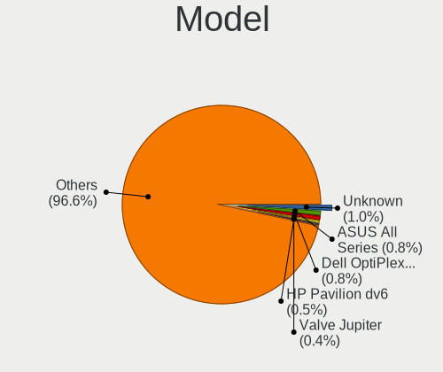
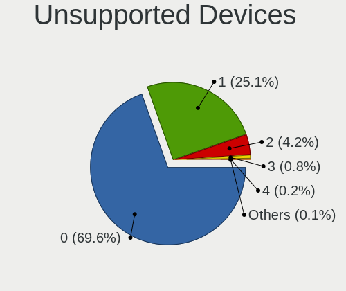

Linux in Australia - Tested Hardware & Statistics
-------------------------------------------------

A project to collect tested hardware configurations for Linux in Australia.

Anyone can contribute to this report by the [hw-probe](https://github.com/linuxhw/hw-probe) tool:

    sudo -E hw-probe -all -upload

Please contribute! Especially if your hardware is rare.

This is a report for all computer types. See also reports for [desktops](/Location/Australia/Desktop/README.md) and [notebooks](/Location/Australia/Notebook/README.md).

Contents
--------

* [ Test Cases ](#test-cases)

* [ System ](#system)
  - [ OS                       ](#os)
  - [ OS Family                ](#os-family)
  - [ Kernel                   ](#kernel)
  - [ Kernel Family            ](#kernel-family)
  - [ Kernel Major Ver.        ](#kernel-major-ver)
  - [ Arch                     ](#arch)
  - [ DE                       ](#de)
  - [ Display Server           ](#display-server)
  - [ Display Manager          ](#display-manager)
  - [ OS Lang                  ](#os-lang)
  - [ Boot Mode                ](#boot-mode)
  - [ Filesystem               ](#filesystem)
  - [ Part. scheme             ](#part-scheme)
  - [ Dual Boot with Linux/BSD ](#dual-boot-with-linuxbsd)
  - [ Dual Boot (Win)          ](#dual-boot-win)

* [ Board ](#board)
  - [ Vendor                   ](#vendor)
  - [ Model                    ](#model)
  - [ Model Family             ](#model-family)
  - [ MFG Year                 ](#mfg-year)
  - [ Form Factor              ](#form-factor)
  - [ Secure Boot              ](#secure-boot)
  - [ Coreboot                 ](#coreboot)
  - [ RAM Size                 ](#ram-size)
  - [ RAM Used                 ](#ram-used)
  - [ Total Drives             ](#total-drives)
  - [ Has CD-ROM               ](#has-cd-rom)
  - [ Has Ethernet             ](#has-ethernet)
  - [ Has WiFi                 ](#has-wifi)
  - [ Has Bluetooth            ](#has-bluetooth)

* [ Location ](#location)
  - [ Country                  ](#country)
  - [ City                     ](#city)

* [ Drives ](#drives)
  - [ Drive Vendor             ](#drive-vendor)
  - [ Drive Model              ](#drive-model)
  - [ HDD Vendor               ](#hdd-vendor)
  - [ SSD Vendor               ](#ssd-vendor)
  - [ Drive Kind               ](#drive-kind)
  - [ Drive Connector          ](#drive-connector)
  - [ Drive Size               ](#drive-size)
  - [ Space Total              ](#space-total)
  - [ Space Used               ](#space-used)
  - [ Malfunc. Drives          ](#malfunc-drives)
  - [ Malfunc. Drive Vendor    ](#malfunc-drive-vendor)
  - [ Malfunc. HDD Vendor      ](#malfunc-hdd-vendor)
  - [ Malfunc. Drive Kind      ](#malfunc-drive-kind)
  - [ Failed Drives            ](#failed-drives)
  - [ Failed Drive Vendor      ](#failed-drive-vendor)
  - [ Drive Status             ](#drive-status)

* [ Storage controller ](#storage-controller)
  - [ Storage Vendor           ](#storage-vendor)
  - [ Storage Model            ](#storage-model)
  - [ Storage Kind             ](#storage-kind)

* [ Processor ](#processor)
  - [ CPU Vendor               ](#cpu-vendor)
  - [ CPU Model                ](#cpu-model)
  - [ CPU Model Family         ](#cpu-model-family)
  - [ CPU Cores                ](#cpu-cores)
  - [ CPU Sockets              ](#cpu-sockets)
  - [ CPU Threads              ](#cpu-threads)
  - [ CPU Op-Modes             ](#cpu-op-modes)
  - [ CPU Microcode            ](#cpu-microcode)
  - [ CPU Microarch            ](#cpu-microarch)

* [ Graphics ](#graphics)
  - [ GPU Vendor               ](#gpu-vendor)
  - [ GPU Model                ](#gpu-model)
  - [ GPU Combo                ](#gpu-combo)
  - [ GPU Driver               ](#gpu-driver)
  - [ GPU Memory               ](#gpu-memory)

* [ Monitor ](#monitor)
  - [ Monitor Vendor           ](#monitor-vendor)
  - [ Monitor Model            ](#monitor-model)
  - [ Monitor Resolution       ](#monitor-resolution)
  - [ Monitor Diagonal         ](#monitor-diagonal)
  - [ Monitor Width            ](#monitor-width)
  - [ Aspect Ratio             ](#aspect-ratio)
  - [ Monitor Area             ](#monitor-area)
  - [ Pixel Density            ](#pixel-density)
  - [ Multiple Monitors        ](#multiple-monitors)

* [ Network ](#network)
  - [ Net Controller Vendor    ](#net-controller-vendor)
  - [ Net Controller Model     ](#net-controller-model)
  - [ Wireless Vendor          ](#wireless-vendor)
  - [ Wireless Model           ](#wireless-model)
  - [ Ethernet Vendor          ](#ethernet-vendor)
  - [ Ethernet Model           ](#ethernet-model)
  - [ Net Controller Kind      ](#net-controller-kind)
  - [ Used Controller          ](#used-controller)
  - [ NICs                     ](#nics)
  - [ IPv6                     ](#ipv6)

* [ Bluetooth ](#bluetooth)
  - [ Bluetooth Vendor         ](#bluetooth-vendor)
  - [ Bluetooth Model          ](#bluetooth-model)

* [ Sound ](#sound)
  - [ Sound Vendor             ](#sound-vendor)
  - [ Sound Model              ](#sound-model)

* [ Memory ](#memory)
  - [ Memory Vendor            ](#memory-vendor)
  - [ Memory Model             ](#memory-model)
  - [ Memory Kind              ](#memory-kind)
  - [ Memory Form Factor       ](#memory-form-factor)
  - [ Memory Size              ](#memory-size)
  - [ Memory Speed             ](#memory-speed)

* [ Printers & scanners ](#printers--scanners)
  - [ Printer Vendor           ](#printer-vendor)
  - [ Printer Model            ](#printer-model)
  - [ Scanner Vendor           ](#scanner-vendor)
  - [ Scanner Model            ](#scanner-model)

* [ Camera ](#camera)
  - [ Camera Vendor            ](#camera-vendor)
  - [ Camera Model             ](#camera-model)

* [ Security ](#security)
  - [ Fingerprint Vendor       ](#fingerprint-vendor)
  - [ Fingerprint Model        ](#fingerprint-model)
  - [ Chipcard Vendor          ](#chipcard-vendor)
  - [ Chipcard Model           ](#chipcard-model)

* [ Unsupported ](#unsupported)
  - [ Unsupported Devices      ](#unsupported-devices)
  - [ Unsupported Device Types ](#unsupported-device-types)

Test Cases
----------

Total: 4418

| Vendor        | Model                       | Form-Factor | Probe                                                      | Date         |
|---------------|-----------------------------|-------------|------------------------------------------------------------|--------------|
| ASRock        | AD525PV3                    | Desktop     | [da83c87218](https://linux-hardware.org/?probe=da83c87218) | Dec 01, 2022 |
| ASRock        | Z68 Extreme4 Gen3           | Desktop     | [c14e2149eb](https://linux-hardware.org/?probe=c14e2149eb) | Dec 01, 2022 |
| Dell          | 0WR7PY A03                  | Desktop     | [ba1e414d62](https://linux-hardware.org/?probe=ba1e414d62) | Nov 30, 2022 |
| Gigabyte      | H77N-WIFI                   | Desktop     | [f4fa3a4e7f](https://linux-hardware.org/?probe=f4fa3a4e7f) | Nov 30, 2022 |
| Gigabyte      | GA-MA780G-UD3H              | Desktop     | [bc3188dd75](https://linux-hardware.org/?probe=bc3188dd75) | Nov 29, 2022 |
| AMI           | Intel                       | Notebook    | [3e2e312c6e](https://linux-hardware.org/?probe=3e2e312c6e) | Nov 29, 2022 |
| Razer         | Blade                       | Notebook    | [de6f0ebcad](https://linux-hardware.org/?probe=de6f0ebcad) | Nov 28, 2022 |
| Lenovo        | IdeaPad 3 15ADA05 81W1      | Notebook    | [3433fd5db6](https://linux-hardware.org/?probe=3433fd5db6) | Nov 28, 2022 |
| MSI           | IONA                        | Desktop     | [255f7f8dc4](https://linux-hardware.org/?probe=255f7f8dc4) | Nov 28, 2022 |
| Apple         | MacBookAir6,2               | Notebook    | [ed4692d2a7](https://linux-hardware.org/?probe=ed4692d2a7) | Nov 28, 2022 |
| Lenovo        | ThinkPad P15s Gen 2i 20W... | Notebook    | [ea6f1fc82e](https://linux-hardware.org/?probe=ea6f1fc82e) | Nov 28, 2022 |
| MSI           | IONA                        | Desktop     | [94841f2b61](https://linux-hardware.org/?probe=94841f2b61) | Nov 28, 2022 |
| ASUSTek       | M5A88-M                     | Desktop     | [f4b2035429](https://linux-hardware.org/?probe=f4b2035429) | Nov 28, 2022 |
| Dell          | XPS 15 9500                 | Notebook    | [f149afb5d1](https://linux-hardware.org/?probe=f149afb5d1) | Nov 28, 2022 |
| Intel Clie... | LAPBC510                    | Notebook    | [f58ff7b6fa](https://linux-hardware.org/?probe=f58ff7b6fa) | Nov 27, 2022 |
| Dell          | Latitude E7440              | Notebook    | [3709af0366](https://linux-hardware.org/?probe=3709af0366) | Nov 27, 2022 |
| Apple         | MacBookPro15,2              | Notebook    | [446ef54cb5](https://linux-hardware.org/?probe=446ef54cb5) | Nov 26, 2022 |
| Apple         | MacBookAir8,1               | Notebook    | [6656b4e315](https://linux-hardware.org/?probe=6656b4e315) | Nov 26, 2022 |
| Kogan         | KAL11C250SB                 | Notebook    | [9ca4f71bb9](https://linux-hardware.org/?probe=9ca4f71bb9) | Nov 26, 2022 |
| Lenovo        | Yoga C940-14IIL 81Q9        | Convertible | [2d8e324570](https://linux-hardware.org/?probe=2d8e324570) | Nov 26, 2022 |
| Razer         | Blade Pro                   | Notebook    | [dabfd64904](https://linux-hardware.org/?probe=dabfd64904) | Nov 25, 2022 |
| MSI           | GS60 6QE                    | Notebook    | [80d61ee685](https://linux-hardware.org/?probe=80d61ee685) | Nov 25, 2022 |
| HP            | 18E9                        | Desktop     | [dab5e242fd](https://linux-hardware.org/?probe=dab5e242fd) | Nov 25, 2022 |
| ASUSTek       | ROG Zephyrus G14 GA401II... | Notebook    | [16f086de33](https://linux-hardware.org/?probe=16f086de33) | Nov 25, 2022 |
| Dell          | Inspiron 7586               | Convertible | [91dcb3265a](https://linux-hardware.org/?probe=91dcb3265a) | Nov 24, 2022 |
| ASUSTek       | ROG ZENITH EXTREME ALPHA    | Desktop     | [1d224863f2](https://linux-hardware.org/?probe=1d224863f2) | Nov 24, 2022 |
| Acer          | Aspire R3-131T              | Notebook    | [5395a2556c](https://linux-hardware.org/?probe=5395a2556c) | Nov 24, 2022 |
| ASRock        | Z170 Pro4                   | Desktop     | [ac6ad8d54d](https://linux-hardware.org/?probe=ac6ad8d54d) | Nov 24, 2022 |
| Acer          | ConceptD CN315-71P          | Notebook    | [db3ccac179](https://linux-hardware.org/?probe=db3ccac179) | Nov 23, 2022 |
| Gigabyte      | B550M S2H                   | Desktop     | [8ea3c120c6](https://linux-hardware.org/?probe=8ea3c120c6) | Nov 23, 2022 |
| Apple         | MacBookPro5,1               | Notebook    | [62c77a0e63](https://linux-hardware.org/?probe=62c77a0e63) | Nov 23, 2022 |
| Lenovo        | IdeaPadFlex 5 14ALC05 82... | Convertible | [f396cc27ff](https://linux-hardware.org/?probe=f396cc27ff) | Nov 23, 2022 |
| Intel         | LADPNVMO AAE76523-300       | Desktop     | [db4e4c9c5b](https://linux-hardware.org/?probe=db4e4c9c5b) | Nov 22, 2022 |
| MSI           | IONA                        | Desktop     | [280083cfa1](https://linux-hardware.org/?probe=280083cfa1) | Nov 22, 2022 |
| MSI           | IONA                        | Desktop     | [39bcd0f2d8](https://linux-hardware.org/?probe=39bcd0f2d8) | Nov 22, 2022 |
| Apple         | MacBookPro5,1               | Notebook    | [06c02ff303](https://linux-hardware.org/?probe=06c02ff303) | Nov 21, 2022 |
| Acer          | TravelMate Spin B118-R      | Convertible | [16dc5dd369](https://linux-hardware.org/?probe=16dc5dd369) | Nov 20, 2022 |
| Lenovo        | ThinkPad X240 20AMA0LTAU    | Notebook    | [54ce03d1f1](https://linux-hardware.org/?probe=54ce03d1f1) | Nov 20, 2022 |
| Lenovo        | 312D SDK0J40697 WIN 3305... | Mini pc     | [cb18ed6ab1](https://linux-hardware.org/?probe=cb18ed6ab1) | Nov 20, 2022 |
| Samsung       | RC410/RC510/RC710           | Notebook    | [06a337fda3](https://linux-hardware.org/?probe=06a337fda3) | Nov 20, 2022 |
| Samsung       | RC410/RC510/RC710           | Notebook    | [965d9d2f5c](https://linux-hardware.org/?probe=965d9d2f5c) | Nov 20, 2022 |
| HP            | 1495                        | Desktop     | [3ac774a6d6](https://linux-hardware.org/?probe=3ac774a6d6) | Nov 19, 2022 |
| HP            | 1495                        | Desktop     | [659062ad1d](https://linux-hardware.org/?probe=659062ad1d) | Nov 19, 2022 |
| MSI           | GP62M 7REX                  | Notebook    | [2125546b68](https://linux-hardware.org/?probe=2125546b68) | Nov 19, 2022 |
| MSI           | GP62M 7REX                  | Notebook    | [6ea684de8c](https://linux-hardware.org/?probe=6ea684de8c) | Nov 19, 2022 |
| ASRock        | AD2700-ITX                  | Desktop     | [806ac66c75](https://linux-hardware.org/?probe=806ac66c75) | Nov 19, 2022 |
| Gigabyte      | X570 GAMING X               | Desktop     | [587db1b08f](https://linux-hardware.org/?probe=587db1b08f) | Nov 19, 2022 |
| ASRock        | AD525PV3                    | Desktop     | [4bba69ecd9](https://linux-hardware.org/?probe=4bba69ecd9) | Nov 18, 2022 |
| Gigabyte      | B550M DS3H                  | Desktop     | [884474637c](https://linux-hardware.org/?probe=884474637c) | Nov 18, 2022 |
| Gigabyte      | B550M DS3H                  | Desktop     | [0b7bd42177](https://linux-hardware.org/?probe=0b7bd42177) | Nov 18, 2022 |
| Lenovo        | ThinkPad X1 Yoga 2nd 20J... | Convertible | [dbbfcd826c](https://linux-hardware.org/?probe=dbbfcd826c) | Nov 18, 2022 |
| Lenovo        | IdeaPad 720S-13ARR 81BR     | Notebook    | [2cb56b8c63](https://linux-hardware.org/?probe=2cb56b8c63) | Nov 17, 2022 |
| Gigabyte      | GA-MA780G-UD3H              | Desktop     | [e9eb63ca62](https://linux-hardware.org/?probe=e9eb63ca62) | Nov 17, 2022 |
| Dell          | 0D6H9T A01                  | Desktop     | [a50bca5670](https://linux-hardware.org/?probe=a50bca5670) | Nov 17, 2022 |
| Gigabyte      | X570 AORUS ULTRA            | Desktop     | [07d80f1783](https://linux-hardware.org/?probe=07d80f1783) | Nov 16, 2022 |
| Intel         | NUC6i7KYB H90766-406        | Mini pc     | [769e7a63d1](https://linux-hardware.org/?probe=769e7a63d1) | Nov 16, 2022 |
| Lenovo        | ThinkPad X1 Yoga 2nd 20J... | Convertible | [5e42accb39](https://linux-hardware.org/?probe=5e42accb39) | Nov 16, 2022 |
| Lenovo        | ThinkPad P1 Gen 3 20TJS2... | Notebook    | [2d0fb1c5d1](https://linux-hardware.org/?probe=2d0fb1c5d1) | Nov 16, 2022 |
| AMI           | Intel                       | Notebook    | [ac36a02403](https://linux-hardware.org/?probe=ac36a02403) | Nov 16, 2022 |
| HP            | Spectre x360 Convertible... | Convertible | [22b0ad0cb0](https://linux-hardware.org/?probe=22b0ad0cb0) | Nov 15, 2022 |
| ASUSTek       | Zenbook UM3402YA_UM3402Y... | Notebook    | [66737bb1cc](https://linux-hardware.org/?probe=66737bb1cc) | Nov 15, 2022 |
| MSI           | MAG Z590 TOMAHAWK WIFI      | Notebook    | [ccbda507a9](https://linux-hardware.org/?probe=ccbda507a9) | Nov 14, 2022 |
| Acer          | Aspire XC-840               | Desktop     | [fe8db55aac](https://linux-hardware.org/?probe=fe8db55aac) | Nov 14, 2022 |
| Gigabyte      | EP45-DS3L                   | Desktop     | [fd017849be](https://linux-hardware.org/?probe=fd017849be) | Nov 13, 2022 |
| Gigabyte      | GA-MA780G-UD3H              | Desktop     | [97bfce0a04](https://linux-hardware.org/?probe=97bfce0a04) | Nov 13, 2022 |
| Lenovo        | ThinkCentre A70z 0401G6M    | Desktop     | [a84e5c2107](https://linux-hardware.org/?probe=a84e5c2107) | Nov 13, 2022 |
| ASUSTek       | X550CC                      | Notebook    | [d37b8f7bbd](https://linux-hardware.org/?probe=d37b8f7bbd) | Nov 13, 2022 |
| Dell          | Latitude 7210 2-in-1        | Tablet      | [acce4cc1af](https://linux-hardware.org/?probe=acce4cc1af) | Nov 13, 2022 |
| Apple         | Mac-4BC72D62AD45599E Mac... | Mini pc     | [67c110e0a7](https://linux-hardware.org/?probe=67c110e0a7) | Nov 13, 2022 |
| Acer          | ConceptD CN315-71P          | Notebook    | [2d3a3f4ac8](https://linux-hardware.org/?probe=2d3a3f4ac8) | Nov 13, 2022 |
| Intel         | LADPNVMO AAE76523-300       | Desktop     | [ea94d443c9](https://linux-hardware.org/?probe=ea94d443c9) | Nov 12, 2022 |
| ASUSTek       | PRIME A320M-E               | Desktop     | [2eacb090ee](https://linux-hardware.org/?probe=2eacb090ee) | Nov 12, 2022 |
| ASUSTek       | PRIME A320M-E               | Desktop     | [a35ca3673b](https://linux-hardware.org/?probe=a35ca3673b) | Nov 12, 2022 |
| ASRock        | B75M                        | Desktop     | [7da4910326](https://linux-hardware.org/?probe=7da4910326) | Nov 12, 2022 |
| ASUSTek       | VivoBook_ASUSLaptop X513... | Notebook    | [57368a1129](https://linux-hardware.org/?probe=57368a1129) | Nov 12, 2022 |
| Apple         | MacBook9,1                  | Notebook    | [755a70132f](https://linux-hardware.org/?probe=755a70132f) | Nov 12, 2022 |
| Apple         | MacBook9,1                  | Notebook    | [4371465097](https://linux-hardware.org/?probe=4371465097) | Nov 12, 2022 |
| HP            | Pavilion Notebook           | Notebook    | [1d6ae45d45](https://linux-hardware.org/?probe=1d6ae45d45) | Nov 11, 2022 |
| MSI           | GS60 6QE                    | Notebook    | [a571dc503c](https://linux-hardware.org/?probe=a571dc503c) | Nov 11, 2022 |
| Toshiba       | TECRA A40-D                 | Notebook    | [ab2d9e2712](https://linux-hardware.org/?probe=ab2d9e2712) | Nov 11, 2022 |
| Acer          | Aspire A315-22              | Notebook    | [cde0b24cde](https://linux-hardware.org/?probe=cde0b24cde) | Nov 10, 2022 |
| ASRock        | Z68 Extreme3 Gen3           | Desktop     | [01cb4ff120](https://linux-hardware.org/?probe=01cb4ff120) | Nov 10, 2022 |
| ASUSTek       | Rampage V EDITION 10        | Desktop     | [4ff6488cb2](https://linux-hardware.org/?probe=4ff6488cb2) | Nov 10, 2022 |
| Lenovo        | ThinkPad T420 4180PEM       | Notebook    | [ad4d7f338d](https://linux-hardware.org/?probe=ad4d7f338d) | Nov 09, 2022 |
| HP            | ProBook 640 G1              | Notebook    | [3189f08179](https://linux-hardware.org/?probe=3189f08179) | Nov 09, 2022 |
| HP            | Pavilion Notebook           | Notebook    | [a7de751ce8](https://linux-hardware.org/?probe=a7de751ce8) | Nov 09, 2022 |
| Lenovo        | 364F SDK0J40700 WIN 3258... | Desktop     | [dbf32417df](https://linux-hardware.org/?probe=dbf32417df) | Nov 09, 2022 |
| Lenovo        | ThinkCentre A70z 0401G6M    | Desktop     | [f2afc66464](https://linux-hardware.org/?probe=f2afc66464) | Nov 09, 2022 |
| ASRock        | B550 Steel Legend           | Desktop     | [8c775416b9](https://linux-hardware.org/?probe=8c775416b9) | Nov 08, 2022 |
| Microsoft     | Surface Laptop 2            | Tablet      | [43bf170205](https://linux-hardware.org/?probe=43bf170205) | Nov 08, 2022 |
| ASRock        | X570 Steel Legend           | Desktop     | [638b6a52ff](https://linux-hardware.org/?probe=638b6a52ff) | Nov 08, 2022 |
| Gigabyte      | B360M D3H-CF                | Desktop     | [ee895bde1f](https://linux-hardware.org/?probe=ee895bde1f) | Nov 08, 2022 |
| Gigabyte      | X570 I AORUS PRO WIFI       | Desktop     | [0e2747c7ab](https://linux-hardware.org/?probe=0e2747c7ab) | Nov 08, 2022 |
| Dell          | XPS 13 9310                 | Notebook    | [5f358af327](https://linux-hardware.org/?probe=5f358af327) | Nov 08, 2022 |
| MSI           | GS60 6QE                    | Notebook    | [c843b1ff5e](https://linux-hardware.org/?probe=c843b1ff5e) | Nov 08, 2022 |
| Dell          | 0DF42J A00                  | Desktop     | [67928f8921](https://linux-hardware.org/?probe=67928f8921) | Nov 07, 2022 |
| Microsoft     | Surface Laptop 2            | Tablet      | [27acb96a8f](https://linux-hardware.org/?probe=27acb96a8f) | Nov 07, 2022 |
| ASUSTek       | ROG STRIX X570-E GAMING     | Desktop     | [a38da64b4f](https://linux-hardware.org/?probe=a38da64b4f) | Nov 07, 2022 |
| Gigabyte      | B660M D3H DDR4              | Desktop     | [64aed4564c](https://linux-hardware.org/?probe=64aed4564c) | Nov 07, 2022 |
| ASUSTek       | K53E                        | Notebook    | [07d6d01b99](https://linux-hardware.org/?probe=07d6d01b99) | Nov 06, 2022 |
| Gigabyte      | J1900M-D2P                  | Desktop     | [7ea9f2df61](https://linux-hardware.org/?probe=7ea9f2df61) | Nov 06, 2022 |
| ASUSTek       | M5A99X EVO R2.0             | Desktop     | [dd757fb650](https://linux-hardware.org/?probe=dd757fb650) | Nov 06, 2022 |
| Dell          | Latitude E6430              | Notebook    | [fcd82d5966](https://linux-hardware.org/?probe=fcd82d5966) | Nov 06, 2022 |
| Toshiba       | Satellite L500              | Notebook    | [0d6bb9cde0](https://linux-hardware.org/?probe=0d6bb9cde0) | Nov 05, 2022 |
| Toshiba       | Satellite L500              | Notebook    | [3d7692d178](https://linux-hardware.org/?probe=3d7692d178) | Nov 05, 2022 |
| HP            | 3396                        | Desktop     | [d6867789ca](https://linux-hardware.org/?probe=d6867789ca) | Nov 04, 2022 |
| MSI           | Katana GF76 12UC            | Notebook    | [3cb05bdb95](https://linux-hardware.org/?probe=3cb05bdb95) | Nov 04, 2022 |
| Framework     | Laptop (12th Gen Intel C... | Notebook    | [c39a19fa2f](https://linux-hardware.org/?probe=c39a19fa2f) | Nov 04, 2022 |
| ASRock        | X570 Phantom Gaming 4       | Desktop     | [4be0967ca1](https://linux-hardware.org/?probe=4be0967ca1) | Nov 04, 2022 |
| ASUSTek       | VivoBook_ASUSLaptop X712... | Notebook    | [cc28dc5c8b](https://linux-hardware.org/?probe=cc28dc5c8b) | Nov 04, 2022 |
| HP            | Pavilion Notebook           | Notebook    | [a8f3260004](https://linux-hardware.org/?probe=a8f3260004) | Nov 04, 2022 |
| MSI           | B450 TOMAHAWK               | Desktop     | [c4b2b4072b](https://linux-hardware.org/?probe=c4b2b4072b) | Nov 04, 2022 |
| Dell          | 0200DY A01                  | Desktop     | [a473b71b4e](https://linux-hardware.org/?probe=a473b71b4e) | Nov 03, 2022 |
| Gigabyte      | G41MT-D3                    | Desktop     | [921a646464](https://linux-hardware.org/?probe=921a646464) | Nov 03, 2022 |
| Intel         | NUC7JYB J67967-404          | Mini pc     | [80e0ccbf42](https://linux-hardware.org/?probe=80e0ccbf42) | Nov 03, 2022 |
| HP            | Pavilion Notebook           | Notebook    | [e24f2a2f57](https://linux-hardware.org/?probe=e24f2a2f57) | Nov 03, 2022 |
| ASUSTek       | 1005HA                      | Notebook    | [1d386943d6](https://linux-hardware.org/?probe=1d386943d6) | Nov 02, 2022 |
| HP            | Pavilion Notebook           | Notebook    | [9fef9a6a8a](https://linux-hardware.org/?probe=9fef9a6a8a) | Nov 02, 2022 |
| Cube          | i18-BL                      | Notebook    | [725100a829](https://linux-hardware.org/?probe=725100a829) | Nov 02, 2022 |
| Lenovo        | IdeaPad 720S-13ARR 81BR     | Notebook    | [fefe8e5d04](https://linux-hardware.org/?probe=fefe8e5d04) | Nov 01, 2022 |
| HP            | Notebook                    | Notebook    | [27d097b522](https://linux-hardware.org/?probe=27d097b522) | Nov 01, 2022 |
| Acer          | Aspire 3000                 | Notebook    | [02693e03ca](https://linux-hardware.org/?probe=02693e03ca) | Nov 01, 2022 |
| Lenovo        | IdeaPad 720S-13ARR 81BR     | Notebook    | [df949b6e10](https://linux-hardware.org/?probe=df949b6e10) | Nov 01, 2022 |
| ASUSTek       | X501A                       | Notebook    | [d5a34df414](https://linux-hardware.org/?probe=d5a34df414) | Nov 01, 2022 |
| Lenovo        | SHARKBAY NOK                | Desktop     | [722ae37952](https://linux-hardware.org/?probe=722ae37952) | Nov 01, 2022 |
| ASUSTek       | B150M-V PLUS                | Desktop     | [a451844625](https://linux-hardware.org/?probe=a451844625) | Nov 01, 2022 |
| ASUSTek       | A8R32-MVP Deluxe            | Desktop     | [a2a8473e4b](https://linux-hardware.org/?probe=a2a8473e4b) | Oct 31, 2022 |
| ASRock        | X670E Pro RS                | Desktop     | [5ebdf73c67](https://linux-hardware.org/?probe=5ebdf73c67) | Oct 31, 2022 |
| HP            | 8653 A                      | Desktop     | [9c19089f51](https://linux-hardware.org/?probe=9c19089f51) | Oct 29, 2022 |
| Gigabyte      | B550M DS3H                  | Desktop     | [1c5d979ba1](https://linux-hardware.org/?probe=1c5d979ba1) | Oct 29, 2022 |
| Dell          | 0478VN A00                  | Desktop     | [883100c74f](https://linux-hardware.org/?probe=883100c74f) | Oct 29, 2022 |
| MSI           | X570-A PRO                  | Desktop     | [1d3ff229c6](https://linux-hardware.org/?probe=1d3ff229c6) | Oct 29, 2022 |
| HP            | OMEN Laptop 15-en0xxx       | Notebook    | [c3ea4065c4](https://linux-hardware.org/?probe=c3ea4065c4) | Oct 29, 2022 |
| Dell          | 0478VN A00                  | Desktop     | [629858e96c](https://linux-hardware.org/?probe=629858e96c) | Oct 29, 2022 |
| Intel         | NUC11PABi5 K90634-305       | Mini pc     | [af4751bfcf](https://linux-hardware.org/?probe=af4751bfcf) | Oct 28, 2022 |
| Gigabyte      | G41MT-D3                    | Desktop     | [2e4153161f](https://linux-hardware.org/?probe=2e4153161f) | Oct 28, 2022 |
| ASUSTek       | U50Vg                       | Notebook    | [5f2997ec95](https://linux-hardware.org/?probe=5f2997ec95) | Oct 28, 2022 |
| HP            | 829B                        | All in one  | [1f8f75d1c0](https://linux-hardware.org/?probe=1f8f75d1c0) | Oct 27, 2022 |
| HP            | ProBook 640 G1              | Notebook    | [b096155d39](https://linux-hardware.org/?probe=b096155d39) | Oct 27, 2022 |
| HP            | 8653 A                      | Desktop     | [92b68870ca](https://linux-hardware.org/?probe=92b68870ca) | Oct 27, 2022 |
| Lenovo        | ThinkPad E14 Gen 2 20TA0... | Notebook    | [73d5bfb13a](https://linux-hardware.org/?probe=73d5bfb13a) | Oct 27, 2022 |
| Apple         | MacBookAir6,2               | Notebook    | [cca0d420fe](https://linux-hardware.org/?probe=cca0d420fe) | Oct 27, 2022 |
| HP            | G71                         | Notebook    | [3223e2fcc8](https://linux-hardware.org/?probe=3223e2fcc8) | Oct 27, 2022 |
| Lenovo        | ThinkPad E14 Gen 2 20TA0... | Notebook    | [7290786792](https://linux-hardware.org/?probe=7290786792) | Oct 26, 2022 |
| Microsoft     | Surface Pro                 | Tablet      | [df069d17c5](https://linux-hardware.org/?probe=df069d17c5) | Oct 26, 2022 |
| Apple         | Mac-942B5BF58194151B        | All in one  | [54f6493d11](https://linux-hardware.org/?probe=54f6493d11) | Oct 26, 2022 |
| Apple         | Mac-942B59F58194171B iMa... | All in one  | [3848afd2c8](https://linux-hardware.org/?probe=3848afd2c8) | Oct 26, 2022 |
| ASUSTek       | A8R32-MVP Deluxe            | Desktop     | [6896f337ab](https://linux-hardware.org/?probe=6896f337ab) | Oct 25, 2022 |
| Gigabyte      | Z590I VISION D              | Desktop     | [be4c6573cd](https://linux-hardware.org/?probe=be4c6573cd) | Oct 25, 2022 |
| MSI           | X470 GAMING PLUS MAX        | Desktop     | [82fb357322](https://linux-hardware.org/?probe=82fb357322) | Oct 25, 2022 |
| ASUSTek       | VivoBook_ASUSLaptop X509... | Notebook    | [4ffd604fea](https://linux-hardware.org/?probe=4ffd604fea) | Oct 25, 2022 |
| Gigabyte      | H81M-S2PV                   | Desktop     | [23be2713d2](https://linux-hardware.org/?probe=23be2713d2) | Oct 24, 2022 |
| MSI           | PRO Z690-A DDR4             | Desktop     | [6331b122dc](https://linux-hardware.org/?probe=6331b122dc) | Oct 24, 2022 |
| Apple         | MacBookAir7,2               | Notebook    | [6f72d6443c](https://linux-hardware.org/?probe=6f72d6443c) | Oct 23, 2022 |
| HP            | 0B40h                       | Desktop     | [981b4e9553](https://linux-hardware.org/?probe=981b4e9553) | Oct 23, 2022 |
| Apple         | MacBookAir6,2               | Notebook    | [edd13bcc76](https://linux-hardware.org/?probe=edd13bcc76) | Oct 23, 2022 |
| Notebook      | W650EH                      | Notebook    | [6bb1a8b1f1](https://linux-hardware.org/?probe=6bb1a8b1f1) | Oct 23, 2022 |
| ASUSTek       | ROG CROSSHAIR VIII EXTRE... | Desktop     | [32cd9cd246](https://linux-hardware.org/?probe=32cd9cd246) | Oct 22, 2022 |
| Gigabyte      | H77N-WIFI                   | Desktop     | [3e2bd05f56](https://linux-hardware.org/?probe=3e2bd05f56) | Oct 22, 2022 |
| Purism        | Librem 13 v2                | Notebook    | [5296ed1e19](https://linux-hardware.org/?probe=5296ed1e19) | Oct 21, 2022 |
| HP            | EliteBook 840 G7 Noteboo... | Notebook    | [cb901021a7](https://linux-hardware.org/?probe=cb901021a7) | Oct 21, 2022 |
| Lenovo        | IdeaPad 5 15ALC05 82LN      | Notebook    | [63751816bc](https://linux-hardware.org/?probe=63751816bc) | Oct 21, 2022 |
| Gigabyte      | GA-MA780G-UD3H              | Desktop     | [1ab730c85c](https://linux-hardware.org/?probe=1ab730c85c) | Oct 21, 2022 |
| Gigabyte      | X570S AORUS ELITE           | Desktop     | [bc75d3cc30](https://linux-hardware.org/?probe=bc75d3cc30) | Oct 21, 2022 |
| MSI           | MPG X570 GAMING PLUS        | Desktop     | [60d4787bb7](https://linux-hardware.org/?probe=60d4787bb7) | Oct 21, 2022 |
| HP            | Pavilion Notebook           | Notebook    | [31d7e67080](https://linux-hardware.org/?probe=31d7e67080) | Oct 21, 2022 |
| Acer          | Aspire 5600                 | Notebook    | [202a7e570e](https://linux-hardware.org/?probe=202a7e570e) | Oct 20, 2022 |
| MSI           | MPG X570 GAMING PLUS        | Desktop     | [502ae94f8f](https://linux-hardware.org/?probe=502ae94f8f) | Oct 20, 2022 |
| Lenovo        | ThinkPad T410 2522PT3       | Notebook    | [2cd92a7da8](https://linux-hardware.org/?probe=2cd92a7da8) | Oct 19, 2022 |
| HUAWEI        | MACHD-WXX9                  | Notebook    | [5086e64fed](https://linux-hardware.org/?probe=5086e64fed) | Oct 19, 2022 |
| Intel         | NUC11PABi5 K90634-302       | Mini pc     | [4c9eafcd7f](https://linux-hardware.org/?probe=4c9eafcd7f) | Oct 19, 2022 |
| Dell          | Inspiron M5010              | Notebook    | [026a7a8cd3](https://linux-hardware.org/?probe=026a7a8cd3) | Oct 18, 2022 |
| HP            | 2B21 A01                    | All in one  | [8a8935ed07](https://linux-hardware.org/?probe=8a8935ed07) | Oct 18, 2022 |
| HP            | EliteBook 840 G7 Noteboo... | Notebook    | [926d661756](https://linux-hardware.org/?probe=926d661756) | Oct 17, 2022 |
| HP            | G71                         | Notebook    | [46b6033e1e](https://linux-hardware.org/?probe=46b6033e1e) | Oct 17, 2022 |
| HP            | Pavilion Notebook           | Notebook    | [50c44df4fb](https://linux-hardware.org/?probe=50c44df4fb) | Oct 17, 2022 |
| Apple         | Mac-F227BEC8 PVT            | All in one  | [f30aab43b6](https://linux-hardware.org/?probe=f30aab43b6) | Oct 16, 2022 |
| Dell          | Inspiron 1545               | Notebook    | [d9928a4ee9](https://linux-hardware.org/?probe=d9928a4ee9) | Oct 16, 2022 |
| System76      | Galago Pro                  | Notebook    | [ec92c5a918](https://linux-hardware.org/?probe=ec92c5a918) | Oct 14, 2022 |
| Gigabyte      | B450 AORUS ELITE            | Desktop     | [79eba98b95](https://linux-hardware.org/?probe=79eba98b95) | Oct 14, 2022 |
| HUAWEI        | MACHD-WXX9                  | Notebook    | [5f0c4b3acb](https://linux-hardware.org/?probe=5f0c4b3acb) | Oct 13, 2022 |
| Acer          | Aspire XC100A               | Desktop     | [6fade2c77f](https://linux-hardware.org/?probe=6fade2c77f) | Oct 13, 2022 |
| Apple         | MacBookPro15,2              | Notebook    | [705e4f406a](https://linux-hardware.org/?probe=705e4f406a) | Oct 13, 2022 |
| HP            | EliteBook 8540p             | Notebook    | [cd65876f22](https://linux-hardware.org/?probe=cd65876f22) | Oct 12, 2022 |
| HP            | 1497                        | Desktop     | [ff6d690da4](https://linux-hardware.org/?probe=ff6d690da4) | Oct 12, 2022 |
| Gigabyte      | X570S GAMING X              | Desktop     | [e966aea162](https://linux-hardware.org/?probe=e966aea162) | Oct 12, 2022 |
| Lenovo        | 3129 SDK0J40700 WIN 3258... | Desktop     | [1798dba7f1](https://linux-hardware.org/?probe=1798dba7f1) | Oct 12, 2022 |
| Gigabyte      | B75M-D3H                    | Desktop     | [4bc40092b2](https://linux-hardware.org/?probe=4bc40092b2) | Oct 11, 2022 |
| Apple         | MacBookPro15,2              | Notebook    | [56fc798c2e](https://linux-hardware.org/?probe=56fc798c2e) | Oct 11, 2022 |
| Dell          | 07WJF3 A00                  | Desktop     | [62f8858433](https://linux-hardware.org/?probe=62f8858433) | Oct 11, 2022 |
| Gigabyte      | J1900M-D2P                  | Desktop     | [dde4a94108](https://linux-hardware.org/?probe=dde4a94108) | Oct 11, 2022 |
| Acer          | Aspire A315-22              | Notebook    | [07870a3cde](https://linux-hardware.org/?probe=07870a3cde) | Oct 11, 2022 |
| Gigabyte      | H410M DS2V                  | Desktop     | [bd9d9e10c7](https://linux-hardware.org/?probe=bd9d9e10c7) | Oct 11, 2022 |
| Lenovo        | IdeaPad 5 15ITL05 82FG      | Notebook    | [1ae81569dd](https://linux-hardware.org/?probe=1ae81569dd) | Oct 11, 2022 |
| Dell          | Inspiron 16 5620            | Notebook    | [72151cd0e8](https://linux-hardware.org/?probe=72151cd0e8) | Oct 10, 2022 |
| Gigabyte      | P34V7                       | Notebook    | [c1423fce9e](https://linux-hardware.org/?probe=c1423fce9e) | Oct 10, 2022 |
| System76      | Galago Pro                  | Notebook    | [28e36afa26](https://linux-hardware.org/?probe=28e36afa26) | Oct 10, 2022 |
| HP            | ProBook 470 G5              | Notebook    | [a7b96649da](https://linux-hardware.org/?probe=a7b96649da) | Oct 09, 2022 |
| Gigabyte      | AB350-Gaming 3-CF           | Desktop     | [e26fca4929](https://linux-hardware.org/?probe=e26fca4929) | Oct 09, 2022 |
| Panasonic     | CF-19-8                     | Notebook    | [439e2c8122](https://linux-hardware.org/?probe=439e2c8122) | Oct 09, 2022 |
| Panasonic     | CF-19-8                     | Notebook    | [bc5820629b](https://linux-hardware.org/?probe=bc5820629b) | Oct 09, 2022 |
| Dell          | XPS 15 9510                 | Notebook    | [6b62586012](https://linux-hardware.org/?probe=6b62586012) | Oct 09, 2022 |
| MSI           | X399 SLI PLUS               | Desktop     | [027504f861](https://linux-hardware.org/?probe=027504f861) | Oct 08, 2022 |
| Gigabyte      | B365M D3H-CF                | Desktop     | [2ad7a0c296](https://linux-hardware.org/?probe=2ad7a0c296) | Oct 08, 2022 |
| Apple         | MacBookAir7,2               | Notebook    | [e26911cff6](https://linux-hardware.org/?probe=e26911cff6) | Oct 08, 2022 |
| Shuttle       | FS81                        | Desktop     | [ba7c22e135](https://linux-hardware.org/?probe=ba7c22e135) | Oct 07, 2022 |
| Shuttle       | FS81                        | Desktop     | [63ec5c8971](https://linux-hardware.org/?probe=63ec5c8971) | Oct 07, 2022 |
| Apple         | Mac-942B5BF58194151B        | All in one  | [e05dbad108](https://linux-hardware.org/?probe=e05dbad108) | Oct 07, 2022 |
| MSI           | H110M PRO-VH PLUS           | Desktop     | [9dc72dc357](https://linux-hardware.org/?probe=9dc72dc357) | Oct 07, 2022 |
| Gigabyte      | GA-MA780G-UD3H              | Desktop     | [3ea8d4d25e](https://linux-hardware.org/?probe=3ea8d4d25e) | Oct 06, 2022 |
| HP            | Presario V4000 (EQ608PA#... | Notebook    | [f462d80b2a](https://linux-hardware.org/?probe=f462d80b2a) | Oct 06, 2022 |
| Gigabyte      | Z270X-Gaming 5              | Desktop     | [9ad9a1c969](https://linux-hardware.org/?probe=9ad9a1c969) | Oct 06, 2022 |
| Gigabyte      | B250M-D3H-CF                | Desktop     | [2e57f97484](https://linux-hardware.org/?probe=2e57f97484) | Oct 06, 2022 |
| ASUSTek       | Rampage V EDITION 10        | Desktop     | [9232451f1a](https://linux-hardware.org/?probe=9232451f1a) | Oct 06, 2022 |
| Gigabyte      | B450 AORUS ELITE            | Desktop     | [b5cf733c51](https://linux-hardware.org/?probe=b5cf733c51) | Oct 06, 2022 |
| ASUSTek       | PRIME X299-DELUXE II        | Desktop     | [4f3856c8f0](https://linux-hardware.org/?probe=4f3856c8f0) | Oct 06, 2022 |
| MSI           | B450-A PRO                  | Desktop     | [5ff1f9c5c3](https://linux-hardware.org/?probe=5ff1f9c5c3) | Oct 05, 2022 |
| Lenovo        | ThinkStation S30 0569BE3    | Desktop     | [026d1ee25e](https://linux-hardware.org/?probe=026d1ee25e) | Oct 05, 2022 |
| Dell          | XPS 15 9510                 | Notebook    | [99f16967b2](https://linux-hardware.org/?probe=99f16967b2) | Oct 05, 2022 |
| Gigabyte      | GA-MA785G-UD3H              | Desktop     | [ca81117136](https://linux-hardware.org/?probe=ca81117136) | Oct 05, 2022 |
| Gigabyte      | AORUS 7 SB                  | Notebook    | [444224d1e0](https://linux-hardware.org/?probe=444224d1e0) | Oct 04, 2022 |
| Dell          | 0WF810                      | Desktop     | [dd24119965](https://linux-hardware.org/?probe=dd24119965) | Oct 04, 2022 |
| Acer          | TravelMate 8572T            | Notebook    | [6abaaf4aa6](https://linux-hardware.org/?probe=6abaaf4aa6) | Oct 03, 2022 |
| Gigabyte      | D525TUD                     | Desktop     | [47d31ff25c](https://linux-hardware.org/?probe=47d31ff25c) | Oct 03, 2022 |
| HP            | ENVY x360 Convertible 15... | Convertible | [a7e31149f2](https://linux-hardware.org/?probe=a7e31149f2) | Oct 02, 2022 |
| Dell          | 0XCR8D A00                  | Desktop     | [82e52ab722](https://linux-hardware.org/?probe=82e52ab722) | Oct 02, 2022 |
| Dell          | 0XCR8D A00                  | Desktop     | [a6db1f5075](https://linux-hardware.org/?probe=a6db1f5075) | Oct 02, 2022 |
| Dell          | Inspiron 15 7510            | Notebook    | [521636075a](https://linux-hardware.org/?probe=521636075a) | Oct 02, 2022 |
| Lenovo        | IdeaPad 1 14IGL05 81VU      | Notebook    | [c555fbbf75](https://linux-hardware.org/?probe=c555fbbf75) | Oct 01, 2022 |
| HP            | ProBook 450 G4              | Notebook    | [9c6340e585](https://linux-hardware.org/?probe=9c6340e585) | Oct 01, 2022 |
| Lenovo        | ThinkPad Yoga 260 20FE00... | Convertible | [4eaeb1d5ad](https://linux-hardware.org/?probe=4eaeb1d5ad) | Oct 01, 2022 |
| ASRock        | AD2700-ITX                  | Desktop     | [4275ef3653](https://linux-hardware.org/?probe=4275ef3653) | Oct 01, 2022 |
| MSI           | PRO X670-P WIFI             | Desktop     | [64299c7b4a](https://linux-hardware.org/?probe=64299c7b4a) | Oct 01, 2022 |
| Toshiba       | PORTEGE Z10t-A              | Notebook    | [1aa913c010](https://linux-hardware.org/?probe=1aa913c010) | Oct 01, 2022 |
| ASUSTek       | UX360UAK                    | Convertible | [4662cb1d99](https://linux-hardware.org/?probe=4662cb1d99) | Oct 01, 2022 |
| Lenovo        | ThinkPad E14 Gen 2 20TA0... | Notebook    | [025a55eab7](https://linux-hardware.org/?probe=025a55eab7) | Sep 30, 2022 |
| Lenovo        | ThinkPad E14 Gen 2 20TA0... | Notebook    | [875b1df312](https://linux-hardware.org/?probe=875b1df312) | Sep 30, 2022 |
| ASUSTek       | GRYPHON Z87                 | Desktop     | [3f01bbaa12](https://linux-hardware.org/?probe=3f01bbaa12) | Sep 30, 2022 |
| Acer          | TravelMate 8572T            | Notebook    | [927bf01e34](https://linux-hardware.org/?probe=927bf01e34) | Sep 30, 2022 |
| Gigabyte      | AORUS 17 YE5                | Notebook    | [54b271c3fd](https://linux-hardware.org/?probe=54b271c3fd) | Sep 30, 2022 |
| Lenovo        | Yoga 310-11IAP 80U2         | Convertible | [cc7ad91815](https://linux-hardware.org/?probe=cc7ad91815) | Sep 29, 2022 |
| Acer          | Aspire 5742G                | Notebook    | [354a9c2bc2](https://linux-hardware.org/?probe=354a9c2bc2) | Sep 29, 2022 |
| Dell          | Inspiron 7347               | Notebook    | [ac3079df8c](https://linux-hardware.org/?probe=ac3079df8c) | Sep 29, 2022 |
| Dell          | Inspiron 7347               | Notebook    | [144cad649c](https://linux-hardware.org/?probe=144cad649c) | Sep 29, 2022 |
| ASUSTek       | ROG Strix G513QY_G513QY     | Notebook    | [fbc4f29134](https://linux-hardware.org/?probe=fbc4f29134) | Sep 28, 2022 |
| HP            | EliteBook 8770w             | Notebook    | [e5ec559da4](https://linux-hardware.org/?probe=e5ec559da4) | Sep 28, 2022 |
| Dell          | Latitude E7450              | Notebook    | [daeb4afb69](https://linux-hardware.org/?probe=daeb4afb69) | Sep 28, 2022 |
| ASUSTek       | ROG CROSSHAIR VIII HERO     | Desktop     | [76aac25208](https://linux-hardware.org/?probe=76aac25208) | Sep 28, 2022 |
| Acer          | Spin SP314-53               | Convertible | [ce95ade177](https://linux-hardware.org/?probe=ce95ade177) | Sep 27, 2022 |
| Raspberry ... | Raspberry Pi 3 Model B R... | Soc         | [565d46fb85](https://linux-hardware.org/?probe=565d46fb85) | Sep 27, 2022 |
| MSI           | MPG X570 GAMING EDGE WIF... | Desktop     | [2c69225287](https://linux-hardware.org/?probe=2c69225287) | Sep 27, 2022 |
| Gigabyte      | P34V7                       | Notebook    | [27b9651432](https://linux-hardware.org/?probe=27b9651432) | Sep 27, 2022 |
| Intel         | NUC12WSBi7 M46422-302       | Mini pc     | [1b2f7b8972](https://linux-hardware.org/?probe=1b2f7b8972) | Sep 27, 2022 |
| ASUSTek       | TUF Gaming FX505DV          | Notebook    | [2154b531c9](https://linux-hardware.org/?probe=2154b531c9) | Sep 26, 2022 |
| System76      | Galago Pro                  | Notebook    | [6b2de473b7](https://linux-hardware.org/?probe=6b2de473b7) | Sep 26, 2022 |
| MSI           | B450M-A PRO MAX             | Desktop     | [dce9d30a10](https://linux-hardware.org/?probe=dce9d30a10) | Sep 26, 2022 |
| Gigabyte      | AORUS 7 SB                  | Notebook    | [3e8222ad7c](https://linux-hardware.org/?probe=3e8222ad7c) | Sep 26, 2022 |
| ASUSTek       | TUF Gaming FX505DV          | Notebook    | [6b3be4af70](https://linux-hardware.org/?probe=6b3be4af70) | Sep 26, 2022 |
| Dell          | G15 5511                    | Notebook    | [f960f38940](https://linux-hardware.org/?probe=f960f38940) | Sep 26, 2022 |
| ASUSTek       | 970 PRO GAMING/AURA         | Desktop     | [f61a736922](https://linux-hardware.org/?probe=f61a736922) | Sep 26, 2022 |
| ASUSTek       | 970 PRO GAMING/AURA         | Desktop     | [1ecfe379e7](https://linux-hardware.org/?probe=1ecfe379e7) | Sep 26, 2022 |
| Apple         | Mac-A369DDC4E67F1C45 iMa... | All in one  | [a96f37005a](https://linux-hardware.org/?probe=a96f37005a) | Sep 26, 2022 |
| Lenovo        | ThinkPad E14 Gen 4 21EB0... | Notebook    | [6c0c9c0037](https://linux-hardware.org/?probe=6c0c9c0037) | Sep 25, 2022 |
| ASRock        | B450M-HDV R4.0              | Desktop     | [479dfeae74](https://linux-hardware.org/?probe=479dfeae74) | Sep 25, 2022 |
| Lenovo        | Yoga 310-11IAP 80U2         | Convertible | [6c8a53f608](https://linux-hardware.org/?probe=6c8a53f608) | Sep 25, 2022 |
| MSI           | H170M PRO-VDH               | Desktop     | [f7254adff2](https://linux-hardware.org/?probe=f7254adff2) | Sep 25, 2022 |
| Apple         | MacBookAir7,2               | Notebook    | [93dd525100](https://linux-hardware.org/?probe=93dd525100) | Sep 25, 2022 |
| MSI           | MAG Z590 TORPEDO            | Desktop     | [cedbd8909f](https://linux-hardware.org/?probe=cedbd8909f) | Sep 25, 2022 |
| Gigabyte      | GA-MA785G-UD3H              | Desktop     | [66b5b65077](https://linux-hardware.org/?probe=66b5b65077) | Sep 25, 2022 |
| Microsoft     | Surface Pro 3               | Tablet      | [05dc7a54c7](https://linux-hardware.org/?probe=05dc7a54c7) | Sep 25, 2022 |
| Gigabyte      | GA-MA780G-UD3H              | Desktop     | [a35dda8c10](https://linux-hardware.org/?probe=a35dda8c10) | Sep 25, 2022 |
| Gigabyte      | GA-870A-UD3                 | Desktop     | [33a0b663ea](https://linux-hardware.org/?probe=33a0b663ea) | Sep 25, 2022 |
| Lenovo        | Yoga 310-11IAP 80U2         | Convertible | [b598ecc4f8](https://linux-hardware.org/?probe=b598ecc4f8) | Sep 24, 2022 |
| HP            | Pavilion dv6                | Notebook    | [ae43d0bbce](https://linux-hardware.org/?probe=ae43d0bbce) | Sep 24, 2022 |
| Lenovo        | IdeaPad 5 15ALC05 82LN      | Notebook    | [24b2810c64](https://linux-hardware.org/?probe=24b2810c64) | Sep 24, 2022 |
| ASUSTek       | P8B75-M                     | Desktop     | [0299e4f7b1](https://linux-hardware.org/?probe=0299e4f7b1) | Sep 24, 2022 |
| ASUSTek       | P8B75-M                     | Desktop     | [cad0f6f375](https://linux-hardware.org/?probe=cad0f6f375) | Sep 24, 2022 |
| MSI           | C236A WORKSTATION           | Desktop     | [67432a461e](https://linux-hardware.org/?probe=67432a461e) | Sep 24, 2022 |
| ASUSTek       | P8B75-M                     | Desktop     | [91d179670c](https://linux-hardware.org/?probe=91d179670c) | Sep 23, 2022 |
| Acer          | TMP645-M                    | Notebook    | [83b27c389c](https://linux-hardware.org/?probe=83b27c389c) | Sep 23, 2022 |
| Dell          | 0KV62T A01                  | Desktop     | [d8d21241de](https://linux-hardware.org/?probe=d8d21241de) | Sep 23, 2022 |
| ASUSTek       | P6T                         | Desktop     | [612682c52d](https://linux-hardware.org/?probe=612682c52d) | Sep 23, 2022 |
| Dell          | Precision 7760              | Notebook    | [f47fe0314b](https://linux-hardware.org/?probe=f47fe0314b) | Sep 23, 2022 |
| Timi          | Redmi Book Pro 15 2022      | Notebook    | [accc831d30](https://linux-hardware.org/?probe=accc831d30) | Sep 23, 2022 |
| Lenovo        | ThinkPad E595 20NFA000AU    | Notebook    | [a01352810a](https://linux-hardware.org/?probe=a01352810a) | Sep 22, 2022 |
| Lenovo        | ThinkPad X1 Extreme Gen2... | Notebook    | [87a3d977b1](https://linux-hardware.org/?probe=87a3d977b1) | Sep 22, 2022 |
| Dell          | 09M8Y8 A01                  | Desktop     | [aa3088ed0e](https://linux-hardware.org/?probe=aa3088ed0e) | Sep 22, 2022 |
| Apple         | MacBookPro8,1               | Notebook    | [d97b8fc0ed](https://linux-hardware.org/?probe=d97b8fc0ed) | Sep 21, 2022 |
| ASRock        | Z690 Pro RS                 | Desktop     | [787589762f](https://linux-hardware.org/?probe=787589762f) | Sep 21, 2022 |
| Shuttle       | FS81                        | Desktop     | [4c1fb942aa](https://linux-hardware.org/?probe=4c1fb942aa) | Sep 20, 2022 |
| ASRock        | HM55-HT                     | Desktop     | [64fff8f065](https://linux-hardware.org/?probe=64fff8f065) | Sep 20, 2022 |
| ASUSTek       | Z97-AR                      | Desktop     | [5cf4494f07](https://linux-hardware.org/?probe=5cf4494f07) | Sep 20, 2022 |
| ASRock        | H610M-HDV/M.2               | Desktop     | [02a5a10d7a](https://linux-hardware.org/?probe=02a5a10d7a) | Sep 20, 2022 |
| ASUSTek       | Maximus VI HERO             | Desktop     | [7c7043ad0f](https://linux-hardware.org/?probe=7c7043ad0f) | Sep 19, 2022 |
| ASUSTek       | Maximus VI HERO             | Desktop     | [48d71b12fc](https://linux-hardware.org/?probe=48d71b12fc) | Sep 19, 2022 |
| Apple         | MacBookPro10,2              | Notebook    | [ecc3b7e71d](https://linux-hardware.org/?probe=ecc3b7e71d) | Sep 19, 2022 |
| MSI           | Z370-A PRO                  | Desktop     | [43fbf9fec9](https://linux-hardware.org/?probe=43fbf9fec9) | Sep 19, 2022 |
| MSI           | Z370-A PRO                  | Desktop     | [850e17ede5](https://linux-hardware.org/?probe=850e17ede5) | Sep 19, 2022 |
| Gigabyte      | GA-MA780G-UD3H              | Desktop     | [6c63c03b9f](https://linux-hardware.org/?probe=6c63c03b9f) | Sep 19, 2022 |
| ASUSTek       | 1005HA                      | Notebook    | [3b5d6a5b1d](https://linux-hardware.org/?probe=3b5d6a5b1d) | Sep 18, 2022 |
| ASUSTek       | 1005HA                      | Notebook    | [3b1ce0471e](https://linux-hardware.org/?probe=3b1ce0471e) | Sep 18, 2022 |
| ASUSTek       | TUF Gaming X570-PRO         | Desktop     | [126b3ed209](https://linux-hardware.org/?probe=126b3ed209) | Sep 14, 2022 |
| ASUSTek       | TUF Gaming X570-PRO         | Desktop     | [08c270ce3d](https://linux-hardware.org/?probe=08c270ce3d) | Sep 14, 2022 |
| Lenovo        | V310-15ISK 80SY             | Notebook    | [fbd66d36f4](https://linux-hardware.org/?probe=fbd66d36f4) | Sep 14, 2022 |
| Apple         | MacBookAir7,2               | Notebook    | [03ba2808d7](https://linux-hardware.org/?probe=03ba2808d7) | Sep 13, 2022 |
| Acer          | Aspire A315-42              | Notebook    | [6121dfd67d](https://linux-hardware.org/?probe=6121dfd67d) | Sep 13, 2022 |
| HP            | ENVY 15                     | Notebook    | [fdb07294df](https://linux-hardware.org/?probe=fdb07294df) | Sep 13, 2022 |
| ASUSTek       | P5KPL-CM                    | Desktop     | [ebd7ab6202](https://linux-hardware.org/?probe=ebd7ab6202) | Sep 12, 2022 |
| Inventec      | C CLASS A01                 | Desktop     | [613f741235](https://linux-hardware.org/?probe=613f741235) | Sep 12, 2022 |
| HP            | Pavilion x360 Convertibl... | Convertible | [491242ea90](https://linux-hardware.org/?probe=491242ea90) | Sep 11, 2022 |
| Inventec      | C CLASS A01                 | Desktop     | [21ae14e7a0](https://linux-hardware.org/?probe=21ae14e7a0) | Sep 11, 2022 |
| Inventec      | C CLASS A01                 | Desktop     | [3ddd0d7aa0](https://linux-hardware.org/?probe=3ddd0d7aa0) | Sep 11, 2022 |
| Intel         | NUC7JYB J67967-404          | Mini pc     | [c3ceb9c38b](https://linux-hardware.org/?probe=c3ceb9c38b) | Sep 11, 2022 |
| Lenovo        | Legion S7 15ACH6 82K8       | Notebook    | [d477c1084d](https://linux-hardware.org/?probe=d477c1084d) | Sep 10, 2022 |
| Gigabyte      | GA-MA780G-UD3H              | Desktop     | [2cb423c8e7](https://linux-hardware.org/?probe=2cb423c8e7) | Sep 10, 2022 |
| HP            | Spectre x360 Convertible... | Convertible | [1e8c2730c9](https://linux-hardware.org/?probe=1e8c2730c9) | Sep 10, 2022 |
| Acer          | Aspire A315-22              | Notebook    | [82058771f7](https://linux-hardware.org/?probe=82058771f7) | Sep 09, 2022 |
| Gigabyte      | H77N-WIFI                   | Desktop     | [3c454664b0](https://linux-hardware.org/?probe=3c454664b0) | Sep 09, 2022 |
| Dell          | Latitude E7470              | Notebook    | [4a2f647549](https://linux-hardware.org/?probe=4a2f647549) | Sep 08, 2022 |
| ASRock        | J5040-ITX                   | Desktop     | [e36022370b](https://linux-hardware.org/?probe=e36022370b) | Sep 08, 2022 |
| Acer          | Aspire A315-22              | Notebook    | [49d54ac5c5](https://linux-hardware.org/?probe=49d54ac5c5) | Sep 07, 2022 |
| ASUSTek       | X99-E WS/USB                | Desktop     | [56357e3cc7](https://linux-hardware.org/?probe=56357e3cc7) | Sep 07, 2022 |
| ASUSTek       | X99-E WS/USB                | Desktop     | [3432790e95](https://linux-hardware.org/?probe=3432790e95) | Sep 07, 2022 |
| ASUSTek       | Z97-AR                      | Desktop     | [01dbdc3b29](https://linux-hardware.org/?probe=01dbdc3b29) | Sep 06, 2022 |
| ASUSTek       | K55VD                       | Notebook    | [c1ca471555](https://linux-hardware.org/?probe=c1ca471555) | Sep 06, 2022 |
| Gigabyte      | Z690 AERO G DDR4            | Desktop     | [ccd383a106](https://linux-hardware.org/?probe=ccd383a106) | Sep 05, 2022 |
| HP            | Pavilion dv6500             | Notebook    | [c37bace401](https://linux-hardware.org/?probe=c37bace401) | Sep 05, 2022 |
| Gigabyte      | AB350M-HD3-CF se1           | Desktop     | [0859dbdb1c](https://linux-hardware.org/?probe=0859dbdb1c) | Sep 04, 2022 |
| Dell          | 0D24M8 A01                  | Desktop     | [a746f6faa6](https://linux-hardware.org/?probe=a746f6faa6) | Sep 04, 2022 |
| HP            | 2AF3                        | Desktop     | [58eae39fe2](https://linux-hardware.org/?probe=58eae39fe2) | Sep 03, 2022 |
| Gigabyte      | Z590 AORUS ELITE AX         | Desktop     | [e03d937610](https://linux-hardware.org/?probe=e03d937610) | Sep 02, 2022 |
| MSI           | MAG B550M BAZOOKA           | Desktop     | [a1b5555512](https://linux-hardware.org/?probe=a1b5555512) | Sep 02, 2022 |
| Gigabyte      | GA-MA780G-UD3H              | Desktop     | [0a1de8a406](https://linux-hardware.org/?probe=0a1de8a406) | Sep 02, 2022 |
| ASUSTek       | ROG CROSSHAIR VIII HERO     | Desktop     | [ac65980e25](https://linux-hardware.org/?probe=ac65980e25) | Sep 02, 2022 |
| ASUSTek       | PRIME B250M-PLUS            | Desktop     | [888ed47bbe](https://linux-hardware.org/?probe=888ed47bbe) | Sep 02, 2022 |
| Dell          | XPS 13 9350                 | Notebook    | [dc37712dfc](https://linux-hardware.org/?probe=dc37712dfc) | Sep 02, 2022 |
| Dell          | 0WPG9H A00                  | All in one  | [67aeed6eb1](https://linux-hardware.org/?probe=67aeed6eb1) | Sep 01, 2022 |
| Gigabyte      | GA-MA785G-UD3H              | Desktop     | [2cf98644bc](https://linux-hardware.org/?probe=2cf98644bc) | Sep 01, 2022 |
| Lenovo        | Z50-70 20354                | Notebook    | [8ac8531142](https://linux-hardware.org/?probe=8ac8531142) | Sep 01, 2022 |
| Toshiba       | Satellite C850              | Notebook    | [6cf6d8fca8](https://linux-hardware.org/?probe=6cf6d8fca8) | Sep 01, 2022 |
| ASUSTek       | X550CC                      | Notebook    | [21f3eb8b1d](https://linux-hardware.org/?probe=21f3eb8b1d) | Sep 01, 2022 |
| Lenovo        | Z50-70 20354                | Notebook    | [6e245e4c63](https://linux-hardware.org/?probe=6e245e4c63) | Sep 01, 2022 |
| HP            | Notebook                    | Notebook    | [ee135c3930](https://linux-hardware.org/?probe=ee135c3930) | Aug 31, 2022 |
| Toshiba       | Satellite C850              | Notebook    | [5d7cb36794](https://linux-hardware.org/?probe=5d7cb36794) | Aug 31, 2022 |
| Lenovo        | MAHOBAY                     | Desktop     | [53af4f5de7](https://linux-hardware.org/?probe=53af4f5de7) | Aug 30, 2022 |
| HP            | EliteBook 830 G6            | Notebook    | [897046248f](https://linux-hardware.org/?probe=897046248f) | Aug 30, 2022 |
| Lenovo        | V14-ADA 82C6                | Notebook    | [ce25a77e25](https://linux-hardware.org/?probe=ce25a77e25) | Aug 29, 2022 |
| HP            | EW7-I7D22875GR1             | Notebook    | [307b75624e](https://linux-hardware.org/?probe=307b75624e) | Aug 29, 2022 |
| ASRock        | Z170 Pro4                   | Desktop     | [eaa574481f](https://linux-hardware.org/?probe=eaa574481f) | Aug 29, 2022 |
| Unknown       | Unknown                     | Desktop     | [fd4ab67b77](https://linux-hardware.org/?probe=fd4ab67b77) | Aug 29, 2022 |
| Toshiba       | Satellite L850              | Notebook    | [fe1480794c](https://linux-hardware.org/?probe=fe1480794c) | Aug 29, 2022 |
| IT Channel... | NH5xAx                      | Notebook    | [66573b4b48](https://linux-hardware.org/?probe=66573b4b48) | Aug 28, 2022 |
| ASUSTek       | B85M-E                      | Desktop     | [a0f47aaaa7](https://linux-hardware.org/?probe=a0f47aaaa7) | Aug 28, 2022 |
| ASUSTek       | PRIME Z390-A                | Desktop     | [459c7c1eee](https://linux-hardware.org/?probe=459c7c1eee) | Aug 27, 2022 |
| ASUSTek       | Z170-K                      | Desktop     | [137641269c](https://linux-hardware.org/?probe=137641269c) | Aug 27, 2022 |
| Lenovo        | ThinkPad L15 Gen 2a 20X7... | Notebook    | [f30320f76e](https://linux-hardware.org/?probe=f30320f76e) | Aug 27, 2022 |
| Acer          | Aspire V5-531               | Notebook    | [75b841b0b8](https://linux-hardware.org/?probe=75b841b0b8) | Aug 26, 2022 |
| HP            | Laptop 15-da1xxx            | Notebook    | [51e23209a4](https://linux-hardware.org/?probe=51e23209a4) | Aug 26, 2022 |
| Dell          | Latitude 5300               | Notebook    | [f336b3aeaf](https://linux-hardware.org/?probe=f336b3aeaf) | Aug 26, 2022 |
| Gigabyte      | B550 GAMING X V2            | Desktop     | [f37ee1975e](https://linux-hardware.org/?probe=f37ee1975e) | Aug 26, 2022 |
| Lenovo        | Yoga S940-14IWL 81Q7        | Notebook    | [416e5db831](https://linux-hardware.org/?probe=416e5db831) | Aug 26, 2022 |
| Lenovo        | 1046 NO DPK                 | Desktop     | [e21e07827d](https://linux-hardware.org/?probe=e21e07827d) | Aug 26, 2022 |
| Acer          | Aspire V5-531               | Notebook    | [4ae228e219](https://linux-hardware.org/?probe=4ae228e219) | Aug 25, 2022 |
| ASUSTek       | ROG STRIX B550-F GAMING     | Desktop     | [2388b95ce9](https://linux-hardware.org/?probe=2388b95ce9) | Aug 25, 2022 |
| ASUSTek       | Z97-AR                      | Desktop     | [a766ce2d5a](https://linux-hardware.org/?probe=a766ce2d5a) | Aug 24, 2022 |
| ASUSTek       | B85M-E                      | Desktop     | [fda9abd530](https://linux-hardware.org/?probe=fda9abd530) | Aug 24, 2022 |
| HP            | 1905                        | Desktop     | [6693a2b3c7](https://linux-hardware.org/?probe=6693a2b3c7) | Aug 24, 2022 |
| Gigabyte      | B360 AORUS GAMING 3 WIFI... | Desktop     | [18102e8a9a](https://linux-hardware.org/?probe=18102e8a9a) | Aug 24, 2022 |
| Gigabyte      | EP45-DS3L                   | Desktop     | [738a69419b](https://linux-hardware.org/?probe=738a69419b) | Aug 24, 2022 |
| Dell          | XPS 13 7390                 | Notebook    | [d609bf3253](https://linux-hardware.org/?probe=d609bf3253) | Aug 24, 2022 |
| Gigabyte      | B550M AORUS PRO-P           | Desktop     | [7dae220687](https://linux-hardware.org/?probe=7dae220687) | Aug 23, 2022 |
| Alienware     | 15 R4                       | Notebook    | [f53260e0c2](https://linux-hardware.org/?probe=f53260e0c2) | Aug 23, 2022 |
| Dell          | Inspiron 5770               | Notebook    | [49314a1dfe](https://linux-hardware.org/?probe=49314a1dfe) | Aug 23, 2022 |
| Apple         | MacBook9,1                  | Notebook    | [a6726b8439](https://linux-hardware.org/?probe=a6726b8439) | Aug 22, 2022 |
| Apple         | MacBook9,1                  | Notebook    | [aff9259c2c](https://linux-hardware.org/?probe=aff9259c2c) | Aug 22, 2022 |
| Samsung       | 550P5C/550P7C               | Notebook    | [75f94f8fa5](https://linux-hardware.org/?probe=75f94f8fa5) | Aug 21, 2022 |
| ASRock        | AD2700-ITX                  | Desktop     | [4be47e3738](https://linux-hardware.org/?probe=4be47e3738) | Aug 21, 2022 |
| Samsung       | 550P5C/550P7C               | Notebook    | [c369daf6b0](https://linux-hardware.org/?probe=c369daf6b0) | Aug 21, 2022 |
| ASRock        | Z77 Extreme6                | Desktop     | [660091e5bb](https://linux-hardware.org/?probe=660091e5bb) | Aug 20, 2022 |
| Google        | Teemo                       | Desktop     | [4cc9295e6d](https://linux-hardware.org/?probe=4cc9295e6d) | Aug 20, 2022 |
| ASUSTek       | ROG Flow Z13 GZ301ZE_GZ3... | Tablet      | [7a8fee05aa](https://linux-hardware.org/?probe=7a8fee05aa) | Aug 20, 2022 |
| Gigabyte      | GA-MA780G-UD3H              | Desktop     | [c9738d69e9](https://linux-hardware.org/?probe=c9738d69e9) | Aug 20, 2022 |
| Gigabyte      | X570 AORUS MASTER           | Desktop     | [9bfc03d98e](https://linux-hardware.org/?probe=9bfc03d98e) | Aug 20, 2022 |
| MSI           | MAG B550 TOMAHAWK           | Desktop     | [ed2076bba5](https://linux-hardware.org/?probe=ed2076bba5) | Aug 20, 2022 |
| ASUSTek       | X756UAK                     | Notebook    | [6db3b2a7bc](https://linux-hardware.org/?probe=6db3b2a7bc) | Aug 20, 2022 |
| Dell          | G3 3779                     | Notebook    | [a2b721ca15](https://linux-hardware.org/?probe=a2b721ca15) | Aug 19, 2022 |
| Dell          | XPS 15 9530                 | Notebook    | [9e6a3e80b4](https://linux-hardware.org/?probe=9e6a3e80b4) | Aug 19, 2022 |
| Dell          | Inspiron M5010              | Notebook    | [266f9fc41d](https://linux-hardware.org/?probe=266f9fc41d) | Aug 19, 2022 |
| ASUSTek       | VivoBook 15_ASUS Laptop ... | Notebook    | [e500790878](https://linux-hardware.org/?probe=e500790878) | Aug 18, 2022 |
| Gigabyte      | B360 AORUS GAMING 3 WIFI... | Desktop     | [1e4e125d11](https://linux-hardware.org/?probe=1e4e125d11) | Aug 17, 2022 |
| Lenovo        | ThinkPad T480s 20L70044A... | Notebook    | [f90559618b](https://linux-hardware.org/?probe=f90559618b) | Aug 17, 2022 |
| ASUSTek       | P8B75-M LX                  | Desktop     | [1efeb7be2c](https://linux-hardware.org/?probe=1efeb7be2c) | Aug 17, 2022 |
| HP            | EliteBook 8460p             | Notebook    | [26f646cca0](https://linux-hardware.org/?probe=26f646cca0) | Aug 17, 2022 |
| Gigabyte      | D525TUD                     | Desktop     | [125fdc6af1](https://linux-hardware.org/?probe=125fdc6af1) | Aug 17, 2022 |
| Dell          | 0WPG9H A00                  | All in one  | [87ba9f4be1](https://linux-hardware.org/?probe=87ba9f4be1) | Aug 17, 2022 |
| HP            | EliteBook 8460p             | Notebook    | [98b5311ef6](https://linux-hardware.org/?probe=98b5311ef6) | Aug 17, 2022 |
| Gigabyte      | D525TUD                     | Desktop     | [e68748c0f1](https://linux-hardware.org/?probe=e68748c0f1) | Aug 16, 2022 |
| Gigabyte      | B660M DS3H AX DDR4          | Desktop     | [171a797c22](https://linux-hardware.org/?probe=171a797c22) | Aug 16, 2022 |
| Gigabyte      | B660M DS3H AX DDR4          | Desktop     | [f882fcbe3a](https://linux-hardware.org/?probe=f882fcbe3a) | Aug 16, 2022 |
| Gigabyte      | GA-MA785G-UD3H              | Desktop     | [8072e15459](https://linux-hardware.org/?probe=8072e15459) | Aug 15, 2022 |
| Lenovo        | ThinkPad X131e 33672K5      | Notebook    | [e32eeecfaa](https://linux-hardware.org/?probe=e32eeecfaa) | Aug 15, 2022 |
| Gigabyte      | H77N-WIFI                   | Desktop     | [20d9ba44b5](https://linux-hardware.org/?probe=20d9ba44b5) | Aug 15, 2022 |
| Gigabyte      | Z77MX-D3H                   | Desktop     | [be0b70efdb](https://linux-hardware.org/?probe=be0b70efdb) | Aug 15, 2022 |
| MSI           | H61M-P20                    | Desktop     | [9adc2fa427](https://linux-hardware.org/?probe=9adc2fa427) | Aug 15, 2022 |
| HP            | 1493                        | Desktop     | [e5d0f16bbc](https://linux-hardware.org/?probe=e5d0f16bbc) | Aug 14, 2022 |
| Apple         | MacBookAir6,2               | Notebook    | [2c210a5825](https://linux-hardware.org/?probe=2c210a5825) | Aug 14, 2022 |
| Microsoft     | Surface Pro 6               | Tablet      | [dc9013cc44](https://linux-hardware.org/?probe=dc9013cc44) | Aug 14, 2022 |
| ASRock        | AB350 Gaming K4             | Desktop     | [8a6141848a](https://linux-hardware.org/?probe=8a6141848a) | Aug 13, 2022 |
| Toshiba       | Satellite L500              | Notebook    | [0d58c17039](https://linux-hardware.org/?probe=0d58c17039) | Aug 13, 2022 |
| MSI           | H61M-P20                    | Desktop     | [acc2520058](https://linux-hardware.org/?probe=acc2520058) | Aug 13, 2022 |
| Lenovo        | ThinkPad X1 Carbon 7th 2... | Notebook    | [26c131aca1](https://linux-hardware.org/?probe=26c131aca1) | Aug 13, 2022 |
| Gigabyte      | EP35C-DS3R                  | Desktop     | [762d78160d](https://linux-hardware.org/?probe=762d78160d) | Aug 12, 2022 |
| HP            | OMEN Laptop 15-ek0xxx       | Notebook    | [662f0801b7](https://linux-hardware.org/?probe=662f0801b7) | Aug 12, 2022 |
| Lenovo        | ThinkPad L15 Gen 2a 20X7... | Notebook    | [166edbd7db](https://linux-hardware.org/?probe=166edbd7db) | Aug 12, 2022 |
| Dell          | Latitude 6430U              | Notebook    | [d21ca8c2e6](https://linux-hardware.org/?probe=d21ca8c2e6) | Aug 11, 2022 |
| Gigabyte      | Z87M-D3HP                   | Desktop     | [b6612680e2](https://linux-hardware.org/?probe=b6612680e2) | Aug 11, 2022 |
| ASRock        | X58 Extreme3                | Desktop     | [81f68d4fc7](https://linux-hardware.org/?probe=81f68d4fc7) | Aug 10, 2022 |
| Unknown       | Unknown                     | Desktop     | [dc354e0b4f](https://linux-hardware.org/?probe=dc354e0b4f) | Aug 10, 2022 |
| ASUSTek       | TUF B360-PRO GAMING         | Desktop     | [62d813423e](https://linux-hardware.org/?probe=62d813423e) | Aug 10, 2022 |
| Gigabyte      | GA-MA780G-UD3H              | Desktop     | [e74a95c4d9](https://linux-hardware.org/?probe=e74a95c4d9) | Aug 09, 2022 |
| Gigabyte      | GA-MA785G-UD3H              | Desktop     | [42d32cdfda](https://linux-hardware.org/?probe=42d32cdfda) | Aug 09, 2022 |
| MSI           | Z97 GAMING 5                | Desktop     | [7f1e38b57b](https://linux-hardware.org/?probe=7f1e38b57b) | Aug 07, 2022 |
| HP            | 2B21 A01                    | All in one  | [aba1a53f52](https://linux-hardware.org/?probe=aba1a53f52) | Aug 07, 2022 |
| HP            | EliteBook x360 1030 G2      | Convertible | [6a73917b78](https://linux-hardware.org/?probe=6a73917b78) | Aug 07, 2022 |
| Apple         | Mac-942B59F58194171B iMa... | All in one  | [db3d9f24c6](https://linux-hardware.org/?probe=db3d9f24c6) | Aug 07, 2022 |
| ASUSTek       | ET2701I-W8                  | Desktop     | [5f9c4b50db](https://linux-hardware.org/?probe=5f9c4b50db) | Aug 07, 2022 |
| Unknown       | Unknown                     | Soc         | [9efd347024](https://linux-hardware.org/?probe=9efd347024) | Aug 06, 2022 |
| Gigabyte      | 945GCM-S2L                  | Desktop     | [fd6cf872ae](https://linux-hardware.org/?probe=fd6cf872ae) | Aug 06, 2022 |
| Gigabyte      | GA-MA785G-UD3H              | Desktop     | [1798c25088](https://linux-hardware.org/?probe=1798c25088) | Aug 05, 2022 |
| HP            | ProBook 430 G5              | Notebook    | [72a09e7b69](https://linux-hardware.org/?probe=72a09e7b69) | Aug 05, 2022 |
| Lenovo        | XiaoXinPro 16 ARH7 82SN     | Notebook    | [abaec227ae](https://linux-hardware.org/?probe=abaec227ae) | Aug 05, 2022 |
| Lenovo        | XiaoXinPro 16 ARH7 82SN     | Notebook    | [a1effa04c3](https://linux-hardware.org/?probe=a1effa04c3) | Aug 05, 2022 |
| ASUSTek       | ASUS TUF Gaming A15 FA50... | Notebook    | [209cd4bc66](https://linux-hardware.org/?probe=209cd4bc66) | Aug 05, 2022 |
| Gigabyte      | H77N-WIFI                   | Desktop     | [caa404d4c6](https://linux-hardware.org/?probe=caa404d4c6) | Aug 05, 2022 |
| Acer          | Nitro AN515-52              | Notebook    | [8b737740c3](https://linux-hardware.org/?probe=8b737740c3) | Aug 05, 2022 |
| Gigabyte      | H61M-D2-B3                  | Desktop     | [e477bf9f83](https://linux-hardware.org/?probe=e477bf9f83) | Aug 05, 2022 |
| Acer          | Aspire A515-55              | Notebook    | [3ef0714d78](https://linux-hardware.org/?probe=3ef0714d78) | Aug 04, 2022 |
| Gigabyte      | Z77MX-D3H                   | Desktop     | [360447806b](https://linux-hardware.org/?probe=360447806b) | Aug 04, 2022 |
| Dell          | 06WXJT A02                  | Server      | [424b1059df](https://linux-hardware.org/?probe=424b1059df) | Aug 03, 2022 |
| Toshiba       | Satellite Pro L670          | Notebook    | [302749341d](https://linux-hardware.org/?probe=302749341d) | Aug 03, 2022 |
| Lenovo        | 3102                        | Desktop     | [73e0fee2bc](https://linux-hardware.org/?probe=73e0fee2bc) | Aug 03, 2022 |
| Dell          | 06WXJT A07                  | Server      | [e0b1ede266](https://linux-hardware.org/?probe=e0b1ede266) | Aug 03, 2022 |
| Dell          | 06WXJT A02                  | Server      | [fcf7baab04](https://linux-hardware.org/?probe=fcf7baab04) | Aug 03, 2022 |
| Lenovo        | IdeaPadFlex 5 14ALC7 82R... | Convertible | [713884d2c8](https://linux-hardware.org/?probe=713884d2c8) | Aug 03, 2022 |
| ASUSTek       | P8Z77-M PRO                 | Desktop     | [b81c8578b9](https://linux-hardware.org/?probe=b81c8578b9) | Aug 03, 2022 |
| Dell          | XPS 9320                    | Notebook    | [9b24b29553](https://linux-hardware.org/?probe=9b24b29553) | Aug 03, 2022 |
| HP            | ProLiant DL380p Gen8        | Server      | [63553d673b](https://linux-hardware.org/?probe=63553d673b) | Aug 03, 2022 |
| Toshiba       | Satellite Pro L670          | Notebook    | [e6189ba78c](https://linux-hardware.org/?probe=e6189ba78c) | Aug 02, 2022 |
| Hardkernel    | ODROID-C4                   | Soc         | [85ed0f33f0](https://linux-hardware.org/?probe=85ed0f33f0) | Aug 02, 2022 |
| Lenovo        | Yoga Slim 7 Pro 14IHU5 8... | Notebook    | [a67d881d6f](https://linux-hardware.org/?probe=a67d881d6f) | Aug 02, 2022 |
| HP            | EliteBook 2570p             | Notebook    | [b352b7e051](https://linux-hardware.org/?probe=b352b7e051) | Aug 02, 2022 |
| Fanless Mi... | Rev GMLR1                   | Mini pc     | [2de5d5cf8a](https://linux-hardware.org/?probe=2de5d5cf8a) | Aug 02, 2022 |
| Apple         | MacBook9,1                  | Notebook    | [77687a9bac](https://linux-hardware.org/?probe=77687a9bac) | Aug 02, 2022 |
| ASRock        | X370 Gaming-ITX/ac          | Desktop     | [6127d6e7a3](https://linux-hardware.org/?probe=6127d6e7a3) | Aug 02, 2022 |
| ASRock        | Z390 Extreme4               | Desktop     | [9983a0cc64](https://linux-hardware.org/?probe=9983a0cc64) | Aug 02, 2022 |
| Gigabyte      | GA-MA785G-UD3H              | Desktop     | [dcccfd1beb](https://linux-hardware.org/?probe=dcccfd1beb) | Aug 01, 2022 |
| QIYIDA        | X99-H9 V2.0                 | Desktop     | [e1fa8ab12b](https://linux-hardware.org/?probe=e1fa8ab12b) | Aug 01, 2022 |
| ASUSTek       | ROG Strix G513QY_G513QY     | Notebook    | [370b872aa5](https://linux-hardware.org/?probe=370b872aa5) | Aug 01, 2022 |
| Gigabyte      | B450 AORUS PRO-CF           | Desktop     | [81c46b891f](https://linux-hardware.org/?probe=81c46b891f) | Aug 01, 2022 |
| ASUSTek       | P7P55D-E PRO                | Desktop     | [d58be7b6d1](https://linux-hardware.org/?probe=d58be7b6d1) | Aug 01, 2022 |
| Unknown       | Unknown                     | Soc         | [9ebddaa953](https://linux-hardware.org/?probe=9ebddaa953) | Jul 31, 2022 |
| ASRock        | Z170 Pro4                   | Desktop     | [e8dba6ab7e](https://linux-hardware.org/?probe=e8dba6ab7e) | Jul 31, 2022 |
| Gigabyte      | GA-880GM-UD2H               | Desktop     | [f6a106d6df](https://linux-hardware.org/?probe=f6a106d6df) | Jul 31, 2022 |
| Intel         | NUC7i5BNB J31144-302        | Mini pc     | [638275ad97](https://linux-hardware.org/?probe=638275ad97) | Jul 31, 2022 |
| HP            | 82F2                        | Desktop     | [0c2d091c2e](https://linux-hardware.org/?probe=0c2d091c2e) | Jul 31, 2022 |
| Acer          | ConceptD CN315-71P          | Notebook    | [c7ed484a1f](https://linux-hardware.org/?probe=c7ed484a1f) | Jul 30, 2022 |
| Dell          | Inspiron M5010              | Notebook    | [bd4cf45b33](https://linux-hardware.org/?probe=bd4cf45b33) | Jul 30, 2022 |
| Intel         | NUC6i5SYB H81131-505        | Mini pc     | [51695dd3ea](https://linux-hardware.org/?probe=51695dd3ea) | Jul 29, 2022 |
| Intel         | NUC6i5SYB H81131-505        | Mini pc     | [2381ee35c0](https://linux-hardware.org/?probe=2381ee35c0) | Jul 29, 2022 |
| ASRock        | Z170 Pro4                   | Desktop     | [73c8bc2ae1](https://linux-hardware.org/?probe=73c8bc2ae1) | Jul 28, 2022 |
| Lenovo        | 3717 SDK0R32862 WIN 3258... | Desktop     | [757ba0f252](https://linux-hardware.org/?probe=757ba0f252) | Jul 28, 2022 |
| Gigabyte      | B450M H                     | Desktop     | [1357e3b3d3](https://linux-hardware.org/?probe=1357e3b3d3) | Jul 28, 2022 |
| Acer          | Aspire 5742G                | Notebook    | [e42501aacb](https://linux-hardware.org/?probe=e42501aacb) | Jul 28, 2022 |
| ASUSTek       | X555YA                      | Notebook    | [ddd00fbeea](https://linux-hardware.org/?probe=ddd00fbeea) | Jul 28, 2022 |
| Unknown       | HX90                        | Desktop     | [1594710372](https://linux-hardware.org/?probe=1594710372) | Jul 28, 2022 |
| Dell          | Latitude E7250              | Notebook    | [26a8591f1d](https://linux-hardware.org/?probe=26a8591f1d) | Jul 27, 2022 |
| HP            | Laptop 17-cp0xxx            | Notebook    | [761563e485](https://linux-hardware.org/?probe=761563e485) | Jul 27, 2022 |
| Apple         | MacBookAir7,2               | Notebook    | [5e7b9f2b14](https://linux-hardware.org/?probe=5e7b9f2b14) | Jul 26, 2022 |
| Gigabyte      | X570 AORUS ULTRA            | Desktop     | [331a99ef9a](https://linux-hardware.org/?probe=331a99ef9a) | Jul 26, 2022 |
| Gigabyte      | X570 AORUS ULTRA            | Desktop     | [1f3433b9e1](https://linux-hardware.org/?probe=1f3433b9e1) | Jul 26, 2022 |
| ASRock        | Z170 Pro4                   | Desktop     | [876c60188f](https://linux-hardware.org/?probe=876c60188f) | Jul 26, 2022 |
| Gigabyte      | B75M-D3H                    | Desktop     | [050aa57cb4](https://linux-hardware.org/?probe=050aa57cb4) | Jul 26, 2022 |
| Dell          | Latitude 3400               | Notebook    | [3412e8deac](https://linux-hardware.org/?probe=3412e8deac) | Jul 26, 2022 |
| Lenovo        | G570 4334                   | Notebook    | [e4c223e83e](https://linux-hardware.org/?probe=e4c223e83e) | Jul 25, 2022 |
| Gigabyte      | X570 AORUS MASTER           | Desktop     | [7af6c5cebe](https://linux-hardware.org/?probe=7af6c5cebe) | Jul 24, 2022 |
| Lenovo        | 3702 SDK0J40700 WIN 3258... | All in one  | [95af4e4f8e](https://linux-hardware.org/?probe=95af4e4f8e) | Jul 23, 2022 |
| Apple         | MacBookAir6,1               | Notebook    | [ede7f6cdae](https://linux-hardware.org/?probe=ede7f6cdae) | Jul 23, 2022 |
| Acer          | Nitro AN515-55              | Notebook    | [85f2ffe45a](https://linux-hardware.org/?probe=85f2ffe45a) | Jul 22, 2022 |
| Lenovo        | ThinkCentre M58p 7220A72    | Desktop     | [d57e35934f](https://linux-hardware.org/?probe=d57e35934f) | Jul 22, 2022 |
| Acer          | ConceptD CN315-71P          | Notebook    | [2723b19c18](https://linux-hardware.org/?probe=2723b19c18) | Jul 22, 2022 |
| Gigabyte      | B75M-D3H                    | Desktop     | [80dcd8a0f7](https://linux-hardware.org/?probe=80dcd8a0f7) | Jul 22, 2022 |
| Google        | Peppy                       | Notebook    | [3bfdae8e5e](https://linux-hardware.org/?probe=3bfdae8e5e) | Jul 21, 2022 |
| Acer          | Aspire One 753              | Notebook    | [eff74923d7](https://linux-hardware.org/?probe=eff74923d7) | Jul 21, 2022 |
| MSI           | Z97 GAMING 5                | Desktop     | [89e0889e94](https://linux-hardware.org/?probe=89e0889e94) | Jul 21, 2022 |
| Dell          | Latitude 5430               | Notebook    | [f02c4072c1](https://linux-hardware.org/?probe=f02c4072c1) | Jul 21, 2022 |
| Acer          | Aspire R3-131T              | Notebook    | [c3722806fe](https://linux-hardware.org/?probe=c3722806fe) | Jul 21, 2022 |
| Apple         | MacBookPro9,2               | Notebook    | [add1e46d7e](https://linux-hardware.org/?probe=add1e46d7e) | Jul 20, 2022 |
| Dell          | Inspiron MM061              | Notebook    | [2360c35ac1](https://linux-hardware.org/?probe=2360c35ac1) | Jul 20, 2022 |
| Dell          | Inspiron MM061              | Notebook    | [5cb9487776](https://linux-hardware.org/?probe=5cb9487776) | Jul 20, 2022 |
| ASUSTek       | Z170M-PLUS                  | Desktop     | [85df5dd7a2](https://linux-hardware.org/?probe=85df5dd7a2) | Jul 19, 2022 |
| Dell          | Inspiron 1545               | Notebook    | [b0e3b75c3b](https://linux-hardware.org/?probe=b0e3b75c3b) | Jul 19, 2022 |
| Gigabyte      | GA-880GM-UD2H               | Desktop     | [a5082efd70](https://linux-hardware.org/?probe=a5082efd70) | Jul 19, 2022 |
| Acer          | TravelMate 8572T            | Notebook    | [54e7b50fc7](https://linux-hardware.org/?probe=54e7b50fc7) | Jul 18, 2022 |
| ASRock        | AD2700-ITX                  | Desktop     | [870cda5796](https://linux-hardware.org/?probe=870cda5796) | Jul 17, 2022 |
| ReachingTe... | Dream Quest Office 2021     | Mini pc     | [662e59e904](https://linux-hardware.org/?probe=662e59e904) | Jul 17, 2022 |
| Alienware     | x17 R1                      | Notebook    | [9fc2d6416d](https://linux-hardware.org/?probe=9fc2d6416d) | Jul 16, 2022 |
| Gigabyte      | GA-A55M-S2V                 | Desktop     | [713765e224](https://linux-hardware.org/?probe=713765e224) | Jul 16, 2022 |
| Apple         | MacBookAir7,2               | Notebook    | [a1a565d211](https://linux-hardware.org/?probe=a1a565d211) | Jul 16, 2022 |
| Gigabyte      | GA-870A-UD3                 | Desktop     | [950542a4a3](https://linux-hardware.org/?probe=950542a4a3) | Jul 16, 2022 |
| HP            | 802E                        | Desktop     | [c86ddd647b](https://linux-hardware.org/?probe=c86ddd647b) | Jul 16, 2022 |
| HP            | Spectre 13-SMB Pro Ultra... | Notebook    | [5fd8a1dcf4](https://linux-hardware.org/?probe=5fd8a1dcf4) | Jul 15, 2022 |
| Gigabyte      | H77N-WIFI                   | Desktop     | [f655a34cc1](https://linux-hardware.org/?probe=f655a34cc1) | Jul 15, 2022 |
| Acer          | ConceptD CN315-71P          | Notebook    | [de83d4ef43](https://linux-hardware.org/?probe=de83d4ef43) | Jul 15, 2022 |
| HP            | 0B4Ch D                     | Desktop     | [a27d53815e](https://linux-hardware.org/?probe=a27d53815e) | Jul 15, 2022 |
| Acer          | ConceptD CN315-71P          | Notebook    | [01e6c30eff](https://linux-hardware.org/?probe=01e6c30eff) | Jul 15, 2022 |
| Dell          | Inspiron 16 Plus 7620       | Notebook    | [73be4f7864](https://linux-hardware.org/?probe=73be4f7864) | Jul 14, 2022 |
| Acer          | Nitro AN515-56              | Notebook    | [2418745195](https://linux-hardware.org/?probe=2418745195) | Jul 14, 2022 |
| Dell          | Inspiron M5010              | Notebook    | [56be64f444](https://linux-hardware.org/?probe=56be64f444) | Jul 14, 2022 |
| ASUSTek       | GL702ZC                     | Notebook    | [755f571a3e](https://linux-hardware.org/?probe=755f571a3e) | Jul 14, 2022 |
| Dell          | 0W2F8G A01                  | Desktop     | [77f2181e08](https://linux-hardware.org/?probe=77f2181e08) | Jul 13, 2022 |
| Dell          | 0GXM1W A02                  | Desktop     | [ff67056edc](https://linux-hardware.org/?probe=ff67056edc) | Jul 13, 2022 |
| Gigabyte      | J1900M-D2P                  | Desktop     | [29602ec66f](https://linux-hardware.org/?probe=29602ec66f) | Jul 13, 2022 |
| Dell          | XPS 13 9360                 | Notebook    | [ef3bc84295](https://linux-hardware.org/?probe=ef3bc84295) | Jul 13, 2022 |
| ASUSTek       | P8Z77-M PRO                 | Desktop     | [0c70241041](https://linux-hardware.org/?probe=0c70241041) | Jul 13, 2022 |
| Acer          | Aspire R3-131T              | Notebook    | [4126a95603](https://linux-hardware.org/?probe=4126a95603) | Jul 13, 2022 |
| Apple         | MacBook9,1                  | Notebook    | [0ce6078768](https://linux-hardware.org/?probe=0ce6078768) | Jul 12, 2022 |
| Unknown       | Unknown                     | Soc         | [d3742575fd](https://linux-hardware.org/?probe=d3742575fd) | Jul 12, 2022 |
| Apple         | MacBookPro10,2              | Notebook    | [facbace782](https://linux-hardware.org/?probe=facbace782) | Jul 12, 2022 |
| MSI           | X99S GAMING 9 AC            | Desktop     | [5f682aadd5](https://linux-hardware.org/?probe=5f682aadd5) | Jul 12, 2022 |
| ASUSTek       | P8Z77-M PRO                 | Desktop     | [4929b942aa](https://linux-hardware.org/?probe=4929b942aa) | Jul 12, 2022 |
| Intel         | LADPNVMO AAE76523-300       | Desktop     | [07a37c99cb](https://linux-hardware.org/?probe=07a37c99cb) | Jul 11, 2022 |
| Acer          | Aspire 1830T                | Notebook    | [d2ff08ade8](https://linux-hardware.org/?probe=d2ff08ade8) | Jul 10, 2022 |
| Gigabyte      | GA-MA780G-UD3H              | Desktop     | [cdf7b9a4d1](https://linux-hardware.org/?probe=cdf7b9a4d1) | Jul 10, 2022 |
| Gigabyte      | H170N-WIFI-CF               | Desktop     | [2f3e59dc30](https://linux-hardware.org/?probe=2f3e59dc30) | Jul 09, 2022 |
| MSI           | B450M MORTAR MAX            | Desktop     | [60d115ad0c](https://linux-hardware.org/?probe=60d115ad0c) | Jul 09, 2022 |
| ASRock        | Z77 Extreme6                | Desktop     | [fd8bd29c03](https://linux-hardware.org/?probe=fd8bd29c03) | Jul 09, 2022 |
| Acer          | Aspire Z3-710               | All in one  | [5f7d41a8ae](https://linux-hardware.org/?probe=5f7d41a8ae) | Jul 09, 2022 |
| Gigabyte      | J1900M-D2P                  | Desktop     | [36fa61e21d](https://linux-hardware.org/?probe=36fa61e21d) | Jul 09, 2022 |
| Gigabyte      | EP45-DS3L                   | Desktop     | [4b7c20d75e](https://linux-hardware.org/?probe=4b7c20d75e) | Jul 09, 2022 |
| Gigabyte      | X570 AORUS PRO WIFI         | Desktop     | [fb5a2ac873](https://linux-hardware.org/?probe=fb5a2ac873) | Jul 09, 2022 |
| HP            | EliteBook 8470p             | Notebook    | [c048bb9697](https://linux-hardware.org/?probe=c048bb9697) | Jul 09, 2022 |
| Apple         | MacBookPro9,2               | Notebook    | [663a6c9413](https://linux-hardware.org/?probe=663a6c9413) | Jul 08, 2022 |
| ASUSTek       | ROG STRIX B660-I GAMING ... | Desktop     | [48bd0906cf](https://linux-hardware.org/?probe=48bd0906cf) | Jul 08, 2022 |
| Acer          | Aspire R3-131T              | Notebook    | [749a597089](https://linux-hardware.org/?probe=749a597089) | Jul 08, 2022 |
| Gigabyte      | B550 AORUS PRO AX           | Desktop     | [9ad45447d4](https://linux-hardware.org/?probe=9ad45447d4) | Jul 08, 2022 |
| Lenovo        | ThinkPad X1 Carbon 3460A... | Notebook    | [e34a9c3166](https://linux-hardware.org/?probe=e34a9c3166) | Jul 08, 2022 |
| Gigabyte      | GA-MA785G-UD3H              | Desktop     | [4da61d3e61](https://linux-hardware.org/?probe=4da61d3e61) | Jul 07, 2022 |
| Gigabyte      | X570 AORUS PRO WIFI         | Desktop     | [503c38154f](https://linux-hardware.org/?probe=503c38154f) | Jul 07, 2022 |
| HP            | EliteBook 850 G1            | Notebook    | [1a2485b399](https://linux-hardware.org/?probe=1a2485b399) | Jul 06, 2022 |
| Lenovo        | ThinkPad T470s W10DG 20J... | Notebook    | [ce6d3ec137](https://linux-hardware.org/?probe=ce6d3ec137) | Jul 06, 2022 |
| Lenovo        | Legion S7 15ACH6 82K8       | Notebook    | [e24a6dd845](https://linux-hardware.org/?probe=e24a6dd845) | Jul 05, 2022 |
| HP            | EliteBook 840 G6            | Notebook    | [d6dccd6ed7](https://linux-hardware.org/?probe=d6dccd6ed7) | Jul 05, 2022 |
| HUAWEI        | KLVD-WXX9                   | Notebook    | [422a12c217](https://linux-hardware.org/?probe=422a12c217) | Jul 05, 2022 |
| HP            | Pavilion g6                 | Notebook    | [0cd693879d](https://linux-hardware.org/?probe=0cd693879d) | Jul 05, 2022 |
| Acer          | ConceptD CN315-71P          | Notebook    | [76d6073818](https://linux-hardware.org/?probe=76d6073818) | Jul 05, 2022 |
| Raspberry ... | Raspberry Pi                | Soc         | [e69b07f3e9](https://linux-hardware.org/?probe=e69b07f3e9) | Jul 05, 2022 |
| Dell          | Precision M4700             | Notebook    | [48cbbf8dd2](https://linux-hardware.org/?probe=48cbbf8dd2) | Jul 05, 2022 |
| ASRock        | 990FX Killer                | Desktop     | [28b0984086](https://linux-hardware.org/?probe=28b0984086) | Jul 05, 2022 |
| Gigabyte      | H77N-WIFI                   | Desktop     | [e795477a20](https://linux-hardware.org/?probe=e795477a20) | Jul 05, 2022 |
| Acer          | Aspire R3-131T              | Notebook    | [748f42be21](https://linux-hardware.org/?probe=748f42be21) | Jul 05, 2022 |
| Apple         | MacBookPro10,2              | Notebook    | [40d0cb89c5](https://linux-hardware.org/?probe=40d0cb89c5) | Jul 04, 2022 |
| Dell          | 0T10XW A01                  | Desktop     | [e165fd805c](https://linux-hardware.org/?probe=e165fd805c) | Jul 04, 2022 |
| HP            | 3646h                       | Desktop     | [9e0737f23f](https://linux-hardware.org/?probe=9e0737f23f) | Jul 04, 2022 |
| Dell          | 0Y5DDC A00                  | Desktop     | [e99c8ae46f](https://linux-hardware.org/?probe=e99c8ae46f) | Jul 04, 2022 |
| HP            | EliteBook 8470p             | Notebook    | [4600681149](https://linux-hardware.org/?probe=4600681149) | Jul 03, 2022 |
| HP            | EliteBook 8470p             | Notebook    | [85c5a62101](https://linux-hardware.org/?probe=85c5a62101) | Jul 03, 2022 |
| Acer          | Aspire A315-21G             | Notebook    | [bcc3835be5](https://linux-hardware.org/?probe=bcc3835be5) | Jul 03, 2022 |
| Intel         | NUC10i7FNB K61360-303       | Mini pc     | [fc29bb14e9](https://linux-hardware.org/?probe=fc29bb14e9) | Jul 03, 2022 |
| Acer          | Aspire A315-21G             | Notebook    | [5f3197f581](https://linux-hardware.org/?probe=5f3197f581) | Jul 03, 2022 |
| Dell          | Inspiron 14 7420 2-in-1     | Convertible | [f2a1afe8eb](https://linux-hardware.org/?probe=f2a1afe8eb) | Jul 03, 2022 |
| Dell          | Inspiron 14 7420 2-in-1     | Convertible | [1295c3de55](https://linux-hardware.org/?probe=1295c3de55) | Jul 03, 2022 |
| Acer          | Swift SF114-34              | Notebook    | [dd9610011c](https://linux-hardware.org/?probe=dd9610011c) | Jul 02, 2022 |
| Lenovo        | Yoga 9 14IAP7 82LU          | Convertible | [4044d76f9b](https://linux-hardware.org/?probe=4044d76f9b) | Jul 02, 2022 |
| Intel         | DH67BL AAG10189-211         | Desktop     | [ef2f004b52](https://linux-hardware.org/?probe=ef2f004b52) | Jul 02, 2022 |
| ASRock        | Z390 Pro4                   | Desktop     | [25bd784ca6](https://linux-hardware.org/?probe=25bd784ca6) | Jul 02, 2022 |
| Apple         | MacBookPro9,2               | Notebook    | [4f6364d861](https://linux-hardware.org/?probe=4f6364d861) | Jul 02, 2022 |
| Dell          | Inspiron M5010              | Notebook    | [14b9aa33d2](https://linux-hardware.org/?probe=14b9aa33d2) | Jul 01, 2022 |
| Gigabyte      | Z97X-Gaming 3               | Desktop     | [9b8bb163d3](https://linux-hardware.org/?probe=9b8bb163d3) | Jul 01, 2022 |
| Gigabyte      | X570 I AORUS PRO WIFI       | Desktop     | [d82f88e20c](https://linux-hardware.org/?probe=d82f88e20c) | Jul 01, 2022 |
| Lenovo        | ThinkCentre M58p 7220A72    | Desktop     | [cea6c9ea52](https://linux-hardware.org/?probe=cea6c9ea52) | Jun 30, 2022 |
| HP            | EliteBook 8470p             | Notebook    | [cd488e4f64](https://linux-hardware.org/?probe=cd488e4f64) | Jun 30, 2022 |
| HP            | EliteBook 8470p             | Notebook    | [52dfa0a4ee](https://linux-hardware.org/?probe=52dfa0a4ee) | Jun 30, 2022 |
| ASUSTek       | VivoBook_ASUSLaptop X515... | Notebook    | [3a423eae14](https://linux-hardware.org/?probe=3a423eae14) | Jun 30, 2022 |
| HP            | ENVY x360 Convertible 15... | Convertible | [af29dc9fe1](https://linux-hardware.org/?probe=af29dc9fe1) | Jun 30, 2022 |
| Lenovo        | Legion Y540-15IRH 81SX      | Notebook    | [1b5babe2aa](https://linux-hardware.org/?probe=1b5babe2aa) | Jun 29, 2022 |
| AMI           | Intel                       | Notebook    | [2b592e2f4a](https://linux-hardware.org/?probe=2b592e2f4a) | Jun 29, 2022 |
| MSI           | Z77A-G43                    | Desktop     | [909e3e3c2e](https://linux-hardware.org/?probe=909e3e3c2e) | Jun 29, 2022 |
| Dell          | Latitude 5430               | Notebook    | [119502eddb](https://linux-hardware.org/?probe=119502eddb) | Jun 29, 2022 |
| Gigabyte      | D525TUD                     | Desktop     | [b6cfc5d2df](https://linux-hardware.org/?probe=b6cfc5d2df) | Jun 28, 2022 |
| Gigabyte      | G41MT-D3                    | Desktop     | [20de16a046](https://linux-hardware.org/?probe=20de16a046) | Jun 28, 2022 |
| Dell          | XPS 13 9310 2-in-1          | Convertible | [d2034a53b8](https://linux-hardware.org/?probe=d2034a53b8) | Jun 28, 2022 |
| ASUSTek       | A88X-GAMER                  | Desktop     | [b7e193f50c](https://linux-hardware.org/?probe=b7e193f50c) | Jun 28, 2022 |
| Dell          | G3 3500                     | Notebook    | [0df1b9607c](https://linux-hardware.org/?probe=0df1b9607c) | Jun 27, 2022 |
| Dell          | 051FJ8 A02                  | Desktop     | [5b997790f1](https://linux-hardware.org/?probe=5b997790f1) | Jun 27, 2022 |
| HUAWEI        | KLVD-WXX9                   | Notebook    | [b947b14fe4](https://linux-hardware.org/?probe=b947b14fe4) | Jun 27, 2022 |
| Gigabyte      | J1900M-D2P                  | Desktop     | [d703a63932](https://linux-hardware.org/?probe=d703a63932) | Jun 26, 2022 |
| MSI           | PRO Z690-A                  | Desktop     | [34a2f4f726](https://linux-hardware.org/?probe=34a2f4f726) | Jun 26, 2022 |
| Microsoft     | Surface Pro 7               | Tablet      | [2f4500ddad](https://linux-hardware.org/?probe=2f4500ddad) | Jun 26, 2022 |
| Gigabyte      | B250M-D3H-CF                | Desktop     | [bd52209b2a](https://linux-hardware.org/?probe=bd52209b2a) | Jun 24, 2022 |
| Alienware     | 14                          | Notebook    | [8846f2e474](https://linux-hardware.org/?probe=8846f2e474) | Jun 24, 2022 |
| Raspberry ... | Raspberry Pi Compute Mod... | Soc         | [015aa87271](https://linux-hardware.org/?probe=015aa87271) | Jun 24, 2022 |
| Apple         | MacBook9,1                  | Notebook    | [e6f1068c91](https://linux-hardware.org/?probe=e6f1068c91) | Jun 24, 2022 |
| HP            | Presario CQ62               | Notebook    | [2f136051c9](https://linux-hardware.org/?probe=2f136051c9) | Jun 24, 2022 |
| HP            | Presario CQ62               | Notebook    | [9beeb6d3c2](https://linux-hardware.org/?probe=9beeb6d3c2) | Jun 23, 2022 |
| Lenovo        | ThinkPad E490s 20NG0002A... | Notebook    | [4cce05dc1c](https://linux-hardware.org/?probe=4cce05dc1c) | Jun 23, 2022 |
| Apple         | MacBook9,1                  | Notebook    | [3656b8227f](https://linux-hardware.org/?probe=3656b8227f) | Jun 23, 2022 |
| Toshiba       | TECRA A40-D                 | Notebook    | [6307594332](https://linux-hardware.org/?probe=6307594332) | Jun 23, 2022 |
| Gigabyte      | B450 AORUS PRO-CF           | Desktop     | [989b450d8b](https://linux-hardware.org/?probe=989b450d8b) | Jun 23, 2022 |
| Dell          | 0W2F8G A01                  | Desktop     | [4610c38358](https://linux-hardware.org/?probe=4610c38358) | Jun 22, 2022 |
| ASUSTek       | PRIME X570-PRO              | Desktop     | [ae30cadddf](https://linux-hardware.org/?probe=ae30cadddf) | Jun 22, 2022 |
| Gigabyte      | Z690 AORUS ELITE AX DDR4    | Desktop     | [b65a5020db](https://linux-hardware.org/?probe=b65a5020db) | Jun 22, 2022 |
| Acer          | Nitro AN515-55              | Notebook    | [bc159b637c](https://linux-hardware.org/?probe=bc159b637c) | Jun 22, 2022 |
| Microsoft     | Surface Laptop 3            | Tablet      | [d5098cc011](https://linux-hardware.org/?probe=d5098cc011) | Jun 22, 2022 |
| Toshiba       | PORTEGE X20W-E              | Convertible | [20cf9d2706](https://linux-hardware.org/?probe=20cf9d2706) | Jun 21, 2022 |
| HP            | 250 G6 Notebook PC          | Notebook    | [30d0a46d81](https://linux-hardware.org/?probe=30d0a46d81) | Jun 21, 2022 |
| ASUSTek       | ROG CROSSHAIR VIII DARK ... | Desktop     | [ecc6e0f4ef](https://linux-hardware.org/?probe=ecc6e0f4ef) | Jun 21, 2022 |
| Lenovo        | ThinkPad X1 Carbon 4th 2... | Notebook    | [f013ebb91b](https://linux-hardware.org/?probe=f013ebb91b) | Jun 20, 2022 |
| Acer          | Iconia                      | Notebook    | [2d1f1a2c32](https://linux-hardware.org/?probe=2d1f1a2c32) | Jun 20, 2022 |
| ASUSTek       | VivoBook_ASUSLaptop M350... | Notebook    | [b3da04a3af](https://linux-hardware.org/?probe=b3da04a3af) | Jun 20, 2022 |
| Framework     | Laptop                      | Notebook    | [f5ece7ce85](https://linux-hardware.org/?probe=f5ece7ce85) | Jun 19, 2022 |
| MSI           | MAG B550M MORTAR WIFI       | Desktop     | [a59676f7be](https://linux-hardware.org/?probe=a59676f7be) | Jun 19, 2022 |
| Apple         | MacBookPro11,1              | Notebook    | [b88b88ba84](https://linux-hardware.org/?probe=b88b88ba84) | Jun 19, 2022 |
| Apple         | MacBookPro11,1              | Notebook    | [ec132b0ba5](https://linux-hardware.org/?probe=ec132b0ba5) | Jun 19, 2022 |
| Acer          | ConceptD CN315-71P          | Notebook    | [66d09f029f](https://linux-hardware.org/?probe=66d09f029f) | Jun 18, 2022 |
| Gigabyte      | GA-MA785G-UD3H              | Desktop     | [dfed0867e1](https://linux-hardware.org/?probe=dfed0867e1) | Jun 17, 2022 |
| Dell          | Precision 5540              | Notebook    | [6d3f2c188b](https://linux-hardware.org/?probe=6d3f2c188b) | Jun 17, 2022 |
| ASUSTek       | M5A99X EVO R2.0             | Desktop     | [0d4c3d0c10](https://linux-hardware.org/?probe=0d4c3d0c10) | Jun 17, 2022 |
| Acer          | Aspire TC-230               | Desktop     | [ac205eb1ec](https://linux-hardware.org/?probe=ac205eb1ec) | Jun 17, 2022 |
| Acer          | ConceptD CN315-71P          | Notebook    | [9b162f339b](https://linux-hardware.org/?probe=9b162f339b) | Jun 16, 2022 |
| ASUSTek       | PRIME A320M-K               | Desktop     | [17e9f5a71f](https://linux-hardware.org/?probe=17e9f5a71f) | Jun 16, 2022 |
| ASUSTek       | PRIME B550M-A               | Desktop     | [527aea0d6e](https://linux-hardware.org/?probe=527aea0d6e) | Jun 16, 2022 |
| HUAWEI        | KLVD-WXX9                   | Notebook    | [4c97b8cc3a](https://linux-hardware.org/?probe=4c97b8cc3a) | Jun 16, 2022 |
| Alienware     | m15 R7                      | Notebook    | [9775a12e11](https://linux-hardware.org/?probe=9775a12e11) | Jun 16, 2022 |
| Acer          | Nitro AN515-55              | Notebook    | [bb631825e3](https://linux-hardware.org/?probe=bb631825e3) | Jun 15, 2022 |
| MSI           | B350M MORTAR ARCTIC         | Desktop     | [57ad2e9147](https://linux-hardware.org/?probe=57ad2e9147) | Jun 15, 2022 |
| Gigabyte      | J1900M-D2P                  | Desktop     | [8ded20d82b](https://linux-hardware.org/?probe=8ded20d82b) | Jun 15, 2022 |
| Timi          | Redmi Book Pro 15 2022      | Notebook    | [76fd9cba2e](https://linux-hardware.org/?probe=76fd9cba2e) | Jun 15, 2022 |
| Gigabyte      | H61M-S2PV                   | Desktop     | [cc88cec642](https://linux-hardware.org/?probe=cc88cec642) | Jun 14, 2022 |
| Timi          | Redmi Book Pro 15 2022      | Notebook    | [b3259c0af4](https://linux-hardware.org/?probe=b3259c0af4) | Jun 14, 2022 |
| MSI           | Modern 15 A5M               | Notebook    | [bd16d5829c](https://linux-hardware.org/?probe=bd16d5829c) | Jun 14, 2022 |
| Lenovo        | 312D SDK0J40697 WIN 3305... | Mini pc     | [848f1d55c8](https://linux-hardware.org/?probe=848f1d55c8) | Jun 14, 2022 |
| Gigabyte      | H110-D3A-CF                 | Desktop     | [aca5883c17](https://linux-hardware.org/?probe=aca5883c17) | Jun 14, 2022 |
| Lenovo        | Yoga 520-14IKB 80X8         | Convertible | [fb157585e5](https://linux-hardware.org/?probe=fb157585e5) | Jun 14, 2022 |
| Apple         | MacBookPro11,1              | Notebook    | [57b90afcda](https://linux-hardware.org/?probe=57b90afcda) | Jun 14, 2022 |
| Intel         | DH67BL AAG10189-211         | Desktop     | [8bb84d5aaf](https://linux-hardware.org/?probe=8bb84d5aaf) | Jun 14, 2022 |
| Gigabyte      | AB350-Gaming 3-CF           | Desktop     | [f9e74fdcd3](https://linux-hardware.org/?probe=f9e74fdcd3) | Jun 13, 2022 |
| Unknown       | Unknown                     | Desktop     | [c62add2d70](https://linux-hardware.org/?probe=c62add2d70) | Jun 13, 2022 |
| Hardkernel    | ODROID-N2Plus               | Soc         | [94abe2c8af](https://linux-hardware.org/?probe=94abe2c8af) | Jun 13, 2022 |
| ASUSTek       | P5KPL/1600                  | Desktop     | [0c6a9f5dff](https://linux-hardware.org/?probe=0c6a9f5dff) | Jun 13, 2022 |
| ASUSTek       | P5KPL/1600                  | Desktop     | [aeec9e715d](https://linux-hardware.org/?probe=aeec9e715d) | Jun 13, 2022 |
| Dell          | Vostro 1500                 | Notebook    | [748a8a831b](https://linux-hardware.org/?probe=748a8a831b) | Jun 12, 2022 |
| ASUSTek       | P6T DELUXE V2               | Desktop     | [db209b6bf1](https://linux-hardware.org/?probe=db209b6bf1) | Jun 12, 2022 |
| ASUSTek       | A8R32-MVP Deluxe            | Desktop     | [0c0715a9b2](https://linux-hardware.org/?probe=0c0715a9b2) | Jun 12, 2022 |
| Dell          | 0T10XW A01                  | Desktop     | [1e3a9647e9](https://linux-hardware.org/?probe=1e3a9647e9) | Jun 12, 2022 |
| Gigabyte      | H77N-WIFI                   | Desktop     | [23fa842567](https://linux-hardware.org/?probe=23fa842567) | Jun 11, 2022 |
| HP            | Compaq 6730b                | Notebook    | [dd94c9145b](https://linux-hardware.org/?probe=dd94c9145b) | Jun 11, 2022 |
| ASUSTek       | ROG STRIX Z390-E GAMING     | Desktop     | [576fc8e8ed](https://linux-hardware.org/?probe=576fc8e8ed) | Jun 11, 2022 |
| Gigabyte      | H77N-WIFI                   | Desktop     | [fd1478145b](https://linux-hardware.org/?probe=fd1478145b) | Jun 11, 2022 |
| ASUSTek       | ROG STRIX B560-F GAMING ... | Desktop     | [a4277bcba9](https://linux-hardware.org/?probe=a4277bcba9) | Jun 11, 2022 |
| ASUSTek       | TUF B360M-E GAMING          | Desktop     | [b1e492c444](https://linux-hardware.org/?probe=b1e492c444) | Jun 10, 2022 |
| Gigabyte      | GA-MA785G-UD3H              | Desktop     | [b771c75e31](https://linux-hardware.org/?probe=b771c75e31) | Jun 10, 2022 |
| ASUSTek       | P6T DELUXE V2               | Desktop     | [9198e2d64c](https://linux-hardware.org/?probe=9198e2d64c) | Jun 10, 2022 |
| Gigabyte      | GA-880GM-UD2H               | Desktop     | [267db233fa](https://linux-hardware.org/?probe=267db233fa) | Jun 10, 2022 |
| Gigabyte      | GA-990FXA-UD5               | Desktop     | [b33d07af6c](https://linux-hardware.org/?probe=b33d07af6c) | Jun 09, 2022 |
| ASUSTek       | Unknown                     | Notebook    | [1cc4adfa36](https://linux-hardware.org/?probe=1cc4adfa36) | Jun 09, 2022 |
| Alienware     | x17 R2                      | Notebook    | [78b867a06e](https://linux-hardware.org/?probe=78b867a06e) | Jun 08, 2022 |
| Lenovo        | ThinkPad T410 2522PT3       | Notebook    | [75d6b8489b](https://linux-hardware.org/?probe=75d6b8489b) | Jun 08, 2022 |
| Gigabyte      | G41MT-D3                    | Desktop     | [2ac69cc327](https://linux-hardware.org/?probe=2ac69cc327) | Jun 08, 2022 |
| ASRock        | AD2700-ITX                  | Desktop     | [9342f5c46b](https://linux-hardware.org/?probe=9342f5c46b) | Jun 08, 2022 |
| Gigabyte      | D525TUD                     | Desktop     | [fdba6d0041](https://linux-hardware.org/?probe=fdba6d0041) | Jun 08, 2022 |
| Gigabyte      | X570 I AORUS PRO WIFI       | Desktop     | [d984f403e9](https://linux-hardware.org/?probe=d984f403e9) | Jun 08, 2022 |
| Gigabyte      | B360M D3H-CF                | Desktop     | [73e68df88c](https://linux-hardware.org/?probe=73e68df88c) | Jun 08, 2022 |
| Gigabyte      | GA-MA785G-UD3H              | Desktop     | [bfa4e4ff74](https://linux-hardware.org/?probe=bfa4e4ff74) | Jun 07, 2022 |
| Lenovo        | 0B98401 PRO                 | Desktop     | [67cfa56623](https://linux-hardware.org/?probe=67cfa56623) | Jun 07, 2022 |
| Acer          | Aspire R3-131T              | Notebook    | [1dab354de2](https://linux-hardware.org/?probe=1dab354de2) | Jun 07, 2022 |
| Gigabyte      | Z690 AORUS PRO DDR4         | Desktop     | [1196dd3b41](https://linux-hardware.org/?probe=1196dd3b41) | Jun 06, 2022 |
| Gigabyte      | Z690 AORUS PRO DDR4         | Desktop     | [15efe8a0a2](https://linux-hardware.org/?probe=15efe8a0a2) | Jun 06, 2022 |
| Acer          | Nitro AN515-55              | Notebook    | [4ab9f94abe](https://linux-hardware.org/?probe=4ab9f94abe) | Jun 06, 2022 |
| Lenovo        | ThinkPad Edge E531 6885C... | Notebook    | [d98f987b46](https://linux-hardware.org/?probe=d98f987b46) | Jun 06, 2022 |
| Lenovo        | ThinkPad X1 Yoga 4th 20Q... | Convertible | [8f496dbb19](https://linux-hardware.org/?probe=8f496dbb19) | Jun 06, 2022 |
| Lenovo        | ThinkPad T470s 20HGS2KW1... | Notebook    | [686fcbebd3](https://linux-hardware.org/?probe=686fcbebd3) | Jun 06, 2022 |
| Lenovo        | Yoga710-14ISK 80TY          | Notebook    | [116abb675e](https://linux-hardware.org/?probe=116abb675e) | Jun 06, 2022 |
| Lenovo        | ThinkPad Edge E531 6885C... | Notebook    | [1b09ad54c8](https://linux-hardware.org/?probe=1b09ad54c8) | Jun 05, 2022 |
| Acer          | Veriton N4670G              | Desktop     | [0b85f95c4c](https://linux-hardware.org/?probe=0b85f95c4c) | Jun 05, 2022 |
| ASUSTek       | PRIME X570-P                | Desktop     | [3b4483236d](https://linux-hardware.org/?probe=3b4483236d) | Jun 05, 2022 |
| ASUSTek       | PRIME H510M-E               | Desktop     | [9207d2f2d8](https://linux-hardware.org/?probe=9207d2f2d8) | Jun 04, 2022 |
| Intel         | NUC5i5RYB H40999-503        | Mini pc     | [a77acb5d89](https://linux-hardware.org/?probe=a77acb5d89) | Jun 04, 2022 |
| Lenovo        | ThinkPad P15 Gen 2i 20YQ... | Notebook    | [57e7433cc5](https://linux-hardware.org/?probe=57e7433cc5) | Jun 04, 2022 |
| Gigabyte      | B85M-D3H                    | Desktop     | [4bbee9909a](https://linux-hardware.org/?probe=4bbee9909a) | Jun 04, 2022 |
| Gigabyte      | H77M-D3H                    | Desktop     | [f770ece55b](https://linux-hardware.org/?probe=f770ece55b) | Jun 03, 2022 |
| Gigabyte      | Z77MX-D3H                   | Desktop     | [24c8a035ac](https://linux-hardware.org/?probe=24c8a035ac) | Jun 03, 2022 |
| Lenovo        | IdeaPad L340-17IWL 81M0     | Notebook    | [b5bb3c0725](https://linux-hardware.org/?probe=b5bb3c0725) | Jun 02, 2022 |
| Apple         | MacBookAir4,2               | Notebook    | [86902cb11f](https://linux-hardware.org/?probe=86902cb11f) | Jun 02, 2022 |
| Dell          | G15 5515                    | Notebook    | [24ddbd70dc](https://linux-hardware.org/?probe=24ddbd70dc) | Jun 02, 2022 |
| Gigabyte      | B85M-D3H                    | Desktop     | [0ddfd77617](https://linux-hardware.org/?probe=0ddfd77617) | Jun 02, 2022 |
| HP            | 250 G6 Notebook PC          | Notebook    | [878274dbce](https://linux-hardware.org/?probe=878274dbce) | Jun 02, 2022 |
| Acer          | Aspire A315-58              | Notebook    | [b63e54900e](https://linux-hardware.org/?probe=b63e54900e) | Jun 02, 2022 |
| Dell          | Latitude E6540              | Notebook    | [9cbdc3f892](https://linux-hardware.org/?probe=9cbdc3f892) | Jun 02, 2022 |
| Lenovo        | IdeaPad 5 Pro 14ACN6 82L... | Notebook    | [ae39e96b1a](https://linux-hardware.org/?probe=ae39e96b1a) | Jun 01, 2022 |
| Alienware     | 0XJKKD A00                  | Desktop     | [ae3a750f2e](https://linux-hardware.org/?probe=ae3a750f2e) | Jun 01, 2022 |
| HP            | 1632                        | Desktop     | [4f7993cf34](https://linux-hardware.org/?probe=4f7993cf34) | Jun 01, 2022 |
| HP            | 1632                        | Desktop     | [9e69c11025](https://linux-hardware.org/?probe=9e69c11025) | Jun 01, 2022 |
| Lenovo        | Yoga Slim 7 Pro 14ACH5 D... | Notebook    | [57f540db26](https://linux-hardware.org/?probe=57f540db26) | Jun 01, 2022 |
| Raspberry ... | Raspberry Pi                | Soc         | [20de61bf9f](https://linux-hardware.org/?probe=20de61bf9f) | Jun 01, 2022 |
| ASUSTek       | A8R32-MVP Deluxe            | Desktop     | [0faa61f3a9](https://linux-hardware.org/?probe=0faa61f3a9) | May 31, 2022 |
| ASUSTek       | A8R32-MVP Deluxe            | Desktop     | [9f5906337b](https://linux-hardware.org/?probe=9f5906337b) | May 31, 2022 |
| Intel         | NUC8BEB J72693-306          | Mini pc     | [ec75dd8324](https://linux-hardware.org/?probe=ec75dd8324) | May 31, 2022 |
| Lenovo        | IdeaPad Gaming 3 15IHU6 ... | Notebook    | [6378f52a92](https://linux-hardware.org/?probe=6378f52a92) | May 31, 2022 |
| Dell          | Inspiron 5770               | Notebook    | [02b32c935c](https://linux-hardware.org/?probe=02b32c935c) | May 31, 2022 |
| IT Channel... | PA70Hx                      | Notebook    | [091ad22c2d](https://linux-hardware.org/?probe=091ad22c2d) | May 30, 2022 |
| Gigabyte      | GA-78LMT-USB3               | Desktop     | [33ac99c04e](https://linux-hardware.org/?probe=33ac99c04e) | May 30, 2022 |
| ASUSTek       | SABERTOOTH Z77              | Desktop     | [3bb74db496](https://linux-hardware.org/?probe=3bb74db496) | May 30, 2022 |
| Dell          | 0C522T A03                  | Desktop     | [b1323f0c11](https://linux-hardware.org/?probe=b1323f0c11) | May 29, 2022 |
| Lenovo        | ThinkCentre M58p 7220A72    | Desktop     | [96cd8abf05](https://linux-hardware.org/?probe=96cd8abf05) | May 29, 2022 |
| ASUSTek       | SABERTOOTH 990FX R2.0       | Desktop     | [9c69f7b836](https://linux-hardware.org/?probe=9c69f7b836) | May 29, 2022 |
| Apple         | MacBookPro9,1               | Notebook    | [6fe2c4a416](https://linux-hardware.org/?probe=6fe2c4a416) | May 29, 2022 |
| HP            | EW7-I7D22875GR1             | Notebook    | [e34608096b](https://linux-hardware.org/?probe=e34608096b) | May 29, 2022 |
| HP            | EW7-I7D22875GR1             | Notebook    | [d21454c335](https://linux-hardware.org/?probe=d21454c335) | May 29, 2022 |
| MSI           | GT70 2OC/2OD                | Notebook    | [43144c3166](https://linux-hardware.org/?probe=43144c3166) | May 28, 2022 |
| Gigabyte      | GA-MA785G-UD3H              | Desktop     | [b810bd52cc](https://linux-hardware.org/?probe=b810bd52cc) | May 28, 2022 |
| Gigabyte      | GA-870A-UD3                 | Desktop     | [719fe6db76](https://linux-hardware.org/?probe=719fe6db76) | May 28, 2022 |
| Gigabyte      | B560M AORUS PRO             | Desktop     | [31f246f96e](https://linux-hardware.org/?probe=31f246f96e) | May 27, 2022 |
| Gigabyte      | B560M AORUS PRO             | Desktop     | [1d381d6ec9](https://linux-hardware.org/?probe=1d381d6ec9) | May 27, 2022 |
| HP            | Pavilion x360 Convertibl... | Convertible | [6e7b6eddea](https://linux-hardware.org/?probe=6e7b6eddea) | May 27, 2022 |
| Lenovo        | IdeaPad 520-15IKB 81BF      | Notebook    | [37d87b9245](https://linux-hardware.org/?probe=37d87b9245) | May 27, 2022 |
| AMI           | Aptio CRB                   | Mini pc     | [3302c5de16](https://linux-hardware.org/?probe=3302c5de16) | May 27, 2022 |
| HP            | 0AECh D                     | Desktop     | [ee3f56c60e](https://linux-hardware.org/?probe=ee3f56c60e) | May 27, 2022 |
| AMI           | Aptio CRB                   | Mini pc     | [9011cf0a9b](https://linux-hardware.org/?probe=9011cf0a9b) | May 27, 2022 |
| Gigabyte      | H77N-WIFI                   | Desktop     | [ac41fb756c](https://linux-hardware.org/?probe=ac41fb756c) | May 26, 2022 |
| Acer          | Seawolf                     | Desktop     | [dccbcb7ef3](https://linux-hardware.org/?probe=dccbcb7ef3) | May 25, 2022 |
| Toshiba       | Satellite P850              | Notebook    | [9ec49310ff](https://linux-hardware.org/?probe=9ec49310ff) | May 25, 2022 |
| Intel         | NUC11PABi5 K90634-305       | Mini pc     | [18427eddde](https://linux-hardware.org/?probe=18427eddde) | May 25, 2022 |
| Gigabyte      | AB350-Gaming 3-CF           | Desktop     | [4738560555](https://linux-hardware.org/?probe=4738560555) | May 25, 2022 |
| Gigabyte      | G41MT-D3                    | Desktop     | [89927eb8f5](https://linux-hardware.org/?probe=89927eb8f5) | May 25, 2022 |
| Gigabyte      | B450 AORUS PRO WIFI-CF      | Desktop     | [6e45ae9f7c](https://linux-hardware.org/?probe=6e45ae9f7c) | May 24, 2022 |
| Lenovo        | ThinkPad T14 Gen 1 20UDC... | Notebook    | [00baf8a2ff](https://linux-hardware.org/?probe=00baf8a2ff) | May 24, 2022 |
| Lenovo        | ThinkPad X1 Carbon 7th 2... | Notebook    | [32f7f3aa4b](https://linux-hardware.org/?probe=32f7f3aa4b) | May 24, 2022 |
| ASUSTek       | B85M-E                      | Desktop     | [4ea6883bee](https://linux-hardware.org/?probe=4ea6883bee) | May 23, 2022 |
| ASUSTek       | ROG Zephyrus G14 GA401QM... | Notebook    | [43a374c1d4](https://linux-hardware.org/?probe=43a374c1d4) | May 23, 2022 |
| Acer          | Nitro AN515-45              | Notebook    | [293712cc51](https://linux-hardware.org/?probe=293712cc51) | May 23, 2022 |
| Apple         | MacBookPro6,1               | Notebook    | [40d33cea3f](https://linux-hardware.org/?probe=40d33cea3f) | May 23, 2022 |
| Lenovo        | ThinkPad X1 Extreme 20MF... | Notebook    | [1d8684d1f5](https://linux-hardware.org/?probe=1d8684d1f5) | May 23, 2022 |
| Gigabyte      | P34V5                       | Notebook    | [6fa844b91e](https://linux-hardware.org/?probe=6fa844b91e) | May 23, 2022 |
| Gigabyte      | P34V5                       | Notebook    | [3ad8e4b239](https://linux-hardware.org/?probe=3ad8e4b239) | May 23, 2022 |
| ASUSTek       | TUF Z390-PLUS GAMING        | Desktop     | [192f2ac212](https://linux-hardware.org/?probe=192f2ac212) | May 23, 2022 |
| Toshiba       | TECRA R850                  | Notebook    | [aa0bfd6c6a](https://linux-hardware.org/?probe=aa0bfd6c6a) | May 22, 2022 |
| HP            | EliteBook x360 1030 G2      | Convertible | [0ea1ce7372](https://linux-hardware.org/?probe=0ea1ce7372) | May 22, 2022 |
| Dell          | G3 3500                     | Notebook    | [49f86cc226](https://linux-hardware.org/?probe=49f86cc226) | May 22, 2022 |
| MSI           | MAG X570S TORPEDO MAX       | Desktop     | [eaf9e6332b](https://linux-hardware.org/?probe=eaf9e6332b) | May 21, 2022 |
| Dell          | Inspiron 1545               | Notebook    | [890010e793](https://linux-hardware.org/?probe=890010e793) | May 21, 2022 |
| Gigabyte      | EP45-DS3L                   | Desktop     | [81360dffcc](https://linux-hardware.org/?probe=81360dffcc) | May 21, 2022 |
| HP            | 0A08h                       | Desktop     | [86c65b6b1f](https://linux-hardware.org/?probe=86c65b6b1f) | May 21, 2022 |
| HP            | 0A08h                       | Desktop     | [18b2ce1297](https://linux-hardware.org/?probe=18b2ce1297) | May 21, 2022 |
| Unknown       | Unknown                     | Soc         | [3028420085](https://linux-hardware.org/?probe=3028420085) | May 20, 2022 |
| HP            | ENVY x360 Convertible 15... | Convertible | [acbead429c](https://linux-hardware.org/?probe=acbead429c) | May 20, 2022 |
| HP            | 8053                        | Desktop     | [53c0148d64](https://linux-hardware.org/?probe=53c0148d64) | May 20, 2022 |
| ECS           | P67H2-A3                    | Desktop     | [2bc21b9c81](https://linux-hardware.org/?probe=2bc21b9c81) | May 20, 2022 |
| HP            | 8381 1000                   | All in one  | [04684aee01](https://linux-hardware.org/?probe=04684aee01) | May 19, 2022 |
| HP            | 8381 1000                   | All in one  | [57e63582bf](https://linux-hardware.org/?probe=57e63582bf) | May 19, 2022 |
| ASUSTek       | ROG CROSSHAIR VIII IMPAC... | Desktop     | [d94f4b0a43](https://linux-hardware.org/?probe=d94f4b0a43) | May 19, 2022 |
| Lenovo        | ThinkPad E595 20NFA000AU    | Notebook    | [5d150789cb](https://linux-hardware.org/?probe=5d150789cb) | May 19, 2022 |
| Dell          | Inspiron 7572               | Notebook    | [b7747e3ea4](https://linux-hardware.org/?probe=b7747e3ea4) | May 19, 2022 |
| ASUSTek       | P8Z68-V                     | Desktop     | [c3438d922b](https://linux-hardware.org/?probe=c3438d922b) | May 19, 2022 |
| Dell          | XPS 13 7390                 | Notebook    | [98752f9fb4](https://linux-hardware.org/?probe=98752f9fb4) | May 18, 2022 |
| Acer          | Aspire A515-55              | Notebook    | [c01f14c77f](https://linux-hardware.org/?probe=c01f14c77f) | May 18, 2022 |
| Dell          | Latitude E7450              | Notebook    | [26b07c8dfc](https://linux-hardware.org/?probe=26b07c8dfc) | May 18, 2022 |
| Gigabyte      | AX370M-DS3H-CF              | Desktop     | [2f7a99c28b](https://linux-hardware.org/?probe=2f7a99c28b) | May 17, 2022 |
| Toshiba       | Satellite C850              | Notebook    | [5927aac0b7](https://linux-hardware.org/?probe=5927aac0b7) | May 17, 2022 |
| ASUSTek       | M4A785TD-V EVO              | Desktop     | [ee4e4a7bc7](https://linux-hardware.org/?probe=ee4e4a7bc7) | May 17, 2022 |
| ASUSTek       | ROG Zephyrus G14 GA401QM... | Notebook    | [d4f9f894b6](https://linux-hardware.org/?probe=d4f9f894b6) | May 16, 2022 |
| Dell          | Inspiron 5570               | Notebook    | [faf97fa9a0](https://linux-hardware.org/?probe=faf97fa9a0) | May 16, 2022 |
| Apple         | Mac-AA95B1DDAB278B95 iMa... | All in one  | [c831b3937a](https://linux-hardware.org/?probe=c831b3937a) | May 16, 2022 |
| Gigabyte      | MQLP7AP-00                  | Desktop     | [3c99b8d861](https://linux-hardware.org/?probe=3c99b8d861) | May 16, 2022 |
| Gigabyte      | A7 K1                       | Notebook    | [9cd1ec32e4](https://linux-hardware.org/?probe=9cd1ec32e4) | May 16, 2022 |
| ASUSTek       | Z170I PRO GAMING            | Desktop     | [a58685906f](https://linux-hardware.org/?probe=a58685906f) | May 15, 2022 |
| Dell          | 0CRH6C A02                  | Desktop     | [655afd62e6](https://linux-hardware.org/?probe=655afd62e6) | May 14, 2022 |
| Intel         | LADPNVMO AAE76523-300       | Desktop     | [9161d40357](https://linux-hardware.org/?probe=9161d40357) | May 14, 2022 |
| Gigabyte      | EX58-UD4P                   | Desktop     | [e34d9464b2](https://linux-hardware.org/?probe=e34d9464b2) | May 14, 2022 |
| MSI           | 970A SLI Krait Edition      | Desktop     | [45a26a9322](https://linux-hardware.org/?probe=45a26a9322) | May 14, 2022 |
| Dell          | XPS 15 9560                 | Notebook    | [04f0e074cb](https://linux-hardware.org/?probe=04f0e074cb) | May 14, 2022 |
| MSI           | B450M MORTAR MAX            | Desktop     | [3a07cc7daf](https://linux-hardware.org/?probe=3a07cc7daf) | May 14, 2022 |
| AMI           | Aptio CRB                   | Mini pc     | [91730625e9](https://linux-hardware.org/?probe=91730625e9) | May 14, 2022 |
| Apple         | Mac-942B59F58194171B iMa... | All in one  | [b31c3ee2d6](https://linux-hardware.org/?probe=b31c3ee2d6) | May 14, 2022 |
| HP            | EliteBook x360 1030 G2      | Convertible | [210d27dd90](https://linux-hardware.org/?probe=210d27dd90) | May 14, 2022 |
| Toshiba       | Satellite L50-A             | Notebook    | [30a7bebcd3](https://linux-hardware.org/?probe=30a7bebcd3) | May 14, 2022 |
| HP            | 82B4                        | Desktop     | [3a1723a2ee](https://linux-hardware.org/?probe=3a1723a2ee) | May 13, 2022 |
| Gigabyte      | G41MT-D3                    | Desktop     | [78c64b498b](https://linux-hardware.org/?probe=78c64b498b) | May 13, 2022 |
| ASUSTek       | ROG Zephyrus G14 GA401QM... | Notebook    | [6251446c92](https://linux-hardware.org/?probe=6251446c92) | May 13, 2022 |
| Intel         | DH67BL AAG10189-210         | Desktop     | [2340d530cd](https://linux-hardware.org/?probe=2340d530cd) | May 13, 2022 |
| ASRock        | X570M Pro4                  | Desktop     | [fca86a854a](https://linux-hardware.org/?probe=fca86a854a) | May 13, 2022 |
| HP            | EliteBook x360 1030 G3      | Convertible | [602289ad13](https://linux-hardware.org/?probe=602289ad13) | May 13, 2022 |
| Dell          | Inspiron 15 3515            | Notebook    | [dd8e112250](https://linux-hardware.org/?probe=dd8e112250) | May 12, 2022 |
| Raspberry ... | Raspberry Pi 4 Model B R... | Soc         | [05b277774e](https://linux-hardware.org/?probe=05b277774e) | May 12, 2022 |
| HP            | 8526 MVB, A                 | Desktop     | [50b2aa8de2](https://linux-hardware.org/?probe=50b2aa8de2) | May 12, 2022 |
| ASUSTek       | P8H61                       | Desktop     | [d2b843c446](https://linux-hardware.org/?probe=d2b843c446) | May 12, 2022 |
| HP            | Pavilion g6                 | Notebook    | [5662b515c3](https://linux-hardware.org/?probe=5662b515c3) | May 12, 2022 |
| Acer          | Aspire V5-573G              | Notebook    | [4477112f3a](https://linux-hardware.org/?probe=4477112f3a) | May 11, 2022 |
| Acer          | Aspire X3990                | Desktop     | [c6753ff37f](https://linux-hardware.org/?probe=c6753ff37f) | May 11, 2022 |
| Lenovo        | ThinkPad E570 20H5CTO1WW    | Notebook    | [a22c347eaf](https://linux-hardware.org/?probe=a22c347eaf) | May 11, 2022 |
| Lenovo        | Yoga 720-13IKB 80X6         | Convertible | [9797dc24f1](https://linux-hardware.org/?probe=9797dc24f1) | May 11, 2022 |
| HP            | 250 G6 Notebook PC          | Notebook    | [f2f010a36d](https://linux-hardware.org/?probe=f2f010a36d) | May 11, 2022 |
| Apple         | MacBookPro12,1              | Notebook    | [0d9616886e](https://linux-hardware.org/?probe=0d9616886e) | May 11, 2022 |
| MSI           | H97M-E35                    | Desktop     | [fdd0f51b46](https://linux-hardware.org/?probe=fdd0f51b46) | May 10, 2022 |
| Gigabyte      | H370M D3H-CF                | Desktop     | [ffc3d3cf27](https://linux-hardware.org/?probe=ffc3d3cf27) | May 10, 2022 |
| ASUSTek       | ROG Zephyrus G14 GA401QM... | Notebook    | [ce3addb8a4](https://linux-hardware.org/?probe=ce3addb8a4) | May 10, 2022 |
| Lenovo        | Legion S7 15ACH6 82K8       | Notebook    | [7d146e5dec](https://linux-hardware.org/?probe=7d146e5dec) | May 10, 2022 |
| ASRock        | H87M                        | Desktop     | [9c031f1e71](https://linux-hardware.org/?probe=9c031f1e71) | May 09, 2022 |
| MSI           | MPG B550I GAMING EDGE WI... | Desktop     | [89f0b017b1](https://linux-hardware.org/?probe=89f0b017b1) | May 09, 2022 |
| MSI           | MPG B550I GAMING EDGE WI... | Desktop     | [bd7335e1cd](https://linux-hardware.org/?probe=bd7335e1cd) | May 09, 2022 |
| Acer          | Aspire XC-603               | Desktop     | [3d806cb212](https://linux-hardware.org/?probe=3d806cb212) | May 08, 2022 |
| Apple         | MacBookPro7,1               | Notebook    | [7ff6997105](https://linux-hardware.org/?probe=7ff6997105) | May 08, 2022 |
| Dell          | Studio XPS 1645             | Notebook    | [0d213120b4](https://linux-hardware.org/?probe=0d213120b4) | May 08, 2022 |
| HP            | Compaq Presario CQ60        | Notebook    | [9d27bd494e](https://linux-hardware.org/?probe=9d27bd494e) | May 08, 2022 |
| ASUSTek       | PRIME B250M-K               | Desktop     | [e4340f1707](https://linux-hardware.org/?probe=e4340f1707) | May 07, 2022 |
| Lenovo        | Yoga C930-13IKB 81C4        | Convertible | [3d921b618b](https://linux-hardware.org/?probe=3d921b618b) | May 07, 2022 |
| Dell          | 00V62H A00                  | Desktop     | [5c5f2f2b5c](https://linux-hardware.org/?probe=5c5f2f2b5c) | May 07, 2022 |
| Gigabyte      | Z68A-D3H-B3                 | Desktop     | [1441dfb79e](https://linux-hardware.org/?probe=1441dfb79e) | May 07, 2022 |
| Gigabyte      | GA-78LMT-USB3 SEx           | Desktop     | [79c87fe48c](https://linux-hardware.org/?probe=79c87fe48c) | May 07, 2022 |
| MSI           | C236A WORKSTATION           | Desktop     | [57d0654584](https://linux-hardware.org/?probe=57d0654584) | May 06, 2022 |
| HP            | Folio 13 - 2000             | Notebook    | [e859aed666](https://linux-hardware.org/?probe=e859aed666) | May 06, 2022 |
| ASRock        | AD2700-ITX                  | Desktop     | [c44c5e8931](https://linux-hardware.org/?probe=c44c5e8931) | May 06, 2022 |
| Lenovo        | Yoga 720-15IKB 80X7         | Convertible | [f99b5cee66](https://linux-hardware.org/?probe=f99b5cee66) | May 06, 2022 |
| Lenovo        | IdeaPad 3 15ALC6 82KU       | Notebook    | [3d07e8a45e](https://linux-hardware.org/?probe=3d07e8a45e) | May 05, 2022 |
| Gigabyte      | GA-MA785G-UD3H              | Desktop     | [46adc67882](https://linux-hardware.org/?probe=46adc67882) | May 05, 2022 |
| Dell          | Studio 1555                 | Notebook    | [c02949a388](https://linux-hardware.org/?probe=c02949a388) | May 05, 2022 |
| Acer          | Aspire A315-34              | Notebook    | [3ed5a6d961](https://linux-hardware.org/?probe=3ed5a6d961) | May 04, 2022 |
| ASUSTek       | B85M-E                      | Desktop     | [2b6338d755](https://linux-hardware.org/?probe=2b6338d755) | May 04, 2022 |
| Gigabyte      | H77M-D3H                    | Desktop     | [ba7fe58d02](https://linux-hardware.org/?probe=ba7fe58d02) | May 03, 2022 |
| Lenovo        | ThinkPad E595 20NFA000AU    | Notebook    | [43dcfa4094](https://linux-hardware.org/?probe=43dcfa4094) | May 03, 2022 |
| Dell          | 0NC2VH A01                  | Desktop     | [f05a6e7d31](https://linux-hardware.org/?probe=f05a6e7d31) | May 03, 2022 |
| ASUSTek       | B85M-E                      | Desktop     | [9645231d87](https://linux-hardware.org/?probe=9645231d87) | May 03, 2022 |
| Gigabyte      | X570S AORUS MASTER          | Desktop     | [c6da7b776e](https://linux-hardware.org/?probe=c6da7b776e) | May 03, 2022 |
| MSI           | B450M MORTAR MAX            | Desktop     | [1d6bcd7320](https://linux-hardware.org/?probe=1d6bcd7320) | May 02, 2022 |
| MSI           | B450M MORTAR MAX            | Desktop     | [8e220517f5](https://linux-hardware.org/?probe=8e220517f5) | May 02, 2022 |
| Framework     | Laptop                      | Notebook    | [0d35134041](https://linux-hardware.org/?probe=0d35134041) | May 02, 2022 |
| HP            | 250 G5 Notebook PC          | Notebook    | [0e6717d54b](https://linux-hardware.org/?probe=0e6717d54b) | May 02, 2022 |
| Gigabyte      | H77M-D3H                    | Desktop     | [579cadce96](https://linux-hardware.org/?probe=579cadce96) | May 02, 2022 |
| Gigabyte      | Z77MX-D3H                   | Desktop     | [42067d196a](https://linux-hardware.org/?probe=42067d196a) | May 02, 2022 |
| HP            | EliteBook 850 G3            | Notebook    | [ab86c0118b](https://linux-hardware.org/?probe=ab86c0118b) | May 02, 2022 |
| Dell          | Inspiron 14 7420 2-in-1     | Convertible | [6203143b59](https://linux-hardware.org/?probe=6203143b59) | May 02, 2022 |
| Lenovo        | IdeaPad 3 15ALC6 82KU       | Notebook    | [7206b41211](https://linux-hardware.org/?probe=7206b41211) | May 01, 2022 |
| MSI           | A320M-A PRO MAX             | Desktop     | [c396021a33](https://linux-hardware.org/?probe=c396021a33) | May 01, 2022 |
| Lenovo        | Legion Y9000X 2020 81TH     | Notebook    | [c335cbb270](https://linux-hardware.org/?probe=c335cbb270) | May 01, 2022 |
| HUAWEI        | BOM-WXX9                    | Notebook    | [faa7213f5c](https://linux-hardware.org/?probe=faa7213f5c) | Apr 30, 2022 |
| Apple         | MacBookPro8,1               | Notebook    | [8826e1d451](https://linux-hardware.org/?probe=8826e1d451) | Apr 30, 2022 |
| HP            | ZBook 15 G6                 | Notebook    | [f948921cba](https://linux-hardware.org/?probe=f948921cba) | Apr 30, 2022 |
| Dell          | Inspiron 14 7420 2-in-1     | Convertible | [71fee7e383](https://linux-hardware.org/?probe=71fee7e383) | Apr 29, 2022 |
| Gigabyte      | B365M H                     | Desktop     | [6755ed2aa6](https://linux-hardware.org/?probe=6755ed2aa6) | Apr 29, 2022 |
| HP            | Spectre x360 Convertible... | Convertible | [64cb392628](https://linux-hardware.org/?probe=64cb392628) | Apr 28, 2022 |
| Apple         | Mac-81E3E92DD6088272 iMa... | All in one  | [1f26415f58](https://linux-hardware.org/?probe=1f26415f58) | Apr 28, 2022 |
| Dell          | Inspiron 3543               | Notebook    | [6165b0554d](https://linux-hardware.org/?probe=6165b0554d) | Apr 28, 2022 |
| Gigabyte      | EX58-UD4P                   | Desktop     | [910da71dd2](https://linux-hardware.org/?probe=910da71dd2) | Apr 28, 2022 |
| ASUSTek       | VANGUARD B85                | Desktop     | [d591002039](https://linux-hardware.org/?probe=d591002039) | Apr 27, 2022 |
| ASUSTek       | TUF Z390-PLUS GAMING        | Desktop     | [77c2b99e9b](https://linux-hardware.org/?probe=77c2b99e9b) | Apr 27, 2022 |
| Lenovo        | ThinkPad X250 20CLS52P0F    | Notebook    | [a4d291ccda](https://linux-hardware.org/?probe=a4d291ccda) | Apr 27, 2022 |
| Acer          | Aspire 5750G                | Notebook    | [3a96bf8237](https://linux-hardware.org/?probe=3a96bf8237) | Apr 27, 2022 |
| Unknown       | Unknown                     | Soc         | [5937b60f18](https://linux-hardware.org/?probe=5937b60f18) | Apr 26, 2022 |
| MSI           | A320M-A PRO MAX             | Desktop     | [e06fd46729](https://linux-hardware.org/?probe=e06fd46729) | Apr 26, 2022 |
| Lenovo        | 3106 SDK0J40705 WIN 3425... | Desktop     | [93c883ef59](https://linux-hardware.org/?probe=93c883ef59) | Apr 26, 2022 |
| Gigabyte      | H77N-WIFI                   | Desktop     | [205ae74d07](https://linux-hardware.org/?probe=205ae74d07) | Apr 26, 2022 |
| HP            | ProBook 4710s               | Notebook    | [03d5c4c5b2](https://linux-hardware.org/?probe=03d5c4c5b2) | Apr 25, 2022 |
| HP            | Laptop 15s-eq2xxx           | Notebook    | [981d5e03b3](https://linux-hardware.org/?probe=981d5e03b3) | Apr 25, 2022 |
| HP            | Laptop 15s-eq2xxx           | Notebook    | [0b3a1039fb](https://linux-hardware.org/?probe=0b3a1039fb) | Apr 25, 2022 |
| HP            | Spectre x360 Convertible... | Convertible | [973e161bd9](https://linux-hardware.org/?probe=973e161bd9) | Apr 25, 2022 |
| HP            | 0AACh                       | Desktop     | [f9e511945d](https://linux-hardware.org/?probe=f9e511945d) | Apr 25, 2022 |
| Dell          | Inspiron 15 7000 Gaming     | Notebook    | [b1b4ea439d](https://linux-hardware.org/?probe=b1b4ea439d) | Apr 25, 2022 |
| HP            | ProBook 470 G5              | Notebook    | [e0def5bddc](https://linux-hardware.org/?probe=e0def5bddc) | Apr 25, 2022 |
| ASUSTek       | PRIME Z690M-PLUS D4         | Desktop     | [f0aea29124](https://linux-hardware.org/?probe=f0aea29124) | Apr 25, 2022 |
| HUAWEI        | BOM-WXX9                    | Notebook    | [a771d771b2](https://linux-hardware.org/?probe=a771d771b2) | Apr 24, 2022 |
| HUAWEI        | BOM-WXX9                    | Notebook    | [1a195527a4](https://linux-hardware.org/?probe=1a195527a4) | Apr 24, 2022 |
| Gigabyte      | H110M-S2PV-CF               | Desktop     | [d076b5c763](https://linux-hardware.org/?probe=d076b5c763) | Apr 24, 2022 |
| Gigabyte      | B360 AORUS GAMING 3 WIFI... | Desktop     | [fabaa5b3ab](https://linux-hardware.org/?probe=fabaa5b3ab) | Apr 24, 2022 |
| Dell          | Latitude E5500              | Notebook    | [c954cb4ba4](https://linux-hardware.org/?probe=c954cb4ba4) | Apr 24, 2022 |
| Dell          | Latitude E5500              | Notebook    | [ab88dc2482](https://linux-hardware.org/?probe=ab88dc2482) | Apr 24, 2022 |
| Lenovo        | ThinkCentre M58p 7220A72    | Desktop     | [e686789a94](https://linux-hardware.org/?probe=e686789a94) | Apr 24, 2022 |
| ASRock        | B85M Pro3                   | Desktop     | [551ea1b91f](https://linux-hardware.org/?probe=551ea1b91f) | Apr 23, 2022 |
| Dell          | 00V62H A00                  | Desktop     | [2da43c32a4](https://linux-hardware.org/?probe=2da43c32a4) | Apr 23, 2022 |
| Microsoft     | Surface Pro 7               | Tablet      | [8ff97fd246](https://linux-hardware.org/?probe=8ff97fd246) | Apr 23, 2022 |
| HP            | EliteBook 2530p             | Notebook    | [bfaeba4483](https://linux-hardware.org/?probe=bfaeba4483) | Apr 22, 2022 |
| Dell          | Latitude 7490               | Notebook    | [2b8d24f8ae](https://linux-hardware.org/?probe=2b8d24f8ae) | Apr 22, 2022 |
| HP            | EliteBook 2530p             | Notebook    | [a68c57ea30](https://linux-hardware.org/?probe=a68c57ea30) | Apr 22, 2022 |
| Lenovo        | Gardenia CRB SDK0J40709 ... | All in one  | [e8e0b5fd5d](https://linux-hardware.org/?probe=e8e0b5fd5d) | Apr 22, 2022 |
| Microsoft     | Surface Book 2              | Tablet      | [c32d394b3a](https://linux-hardware.org/?probe=c32d394b3a) | Apr 21, 2022 |
| MSI           | GS65 Stealth Thin 8RE       | Notebook    | [cbb3f353a5](https://linux-hardware.org/?probe=cbb3f353a5) | Apr 21, 2022 |
| Lenovo        | Gardenia CRB SDK0J40709 ... | All in one  | [df18833e16](https://linux-hardware.org/?probe=df18833e16) | Apr 21, 2022 |
| ASUSTek       | ROG CROSSHAIR VIII DARK ... | Desktop     | [fc1fd7355c](https://linux-hardware.org/?probe=fc1fd7355c) | Apr 21, 2022 |
| Gigabyte      | GA-MA785G-UD3H              | Desktop     | [1c54ba7a0c](https://linux-hardware.org/?probe=1c54ba7a0c) | Apr 21, 2022 |
| Gigabyte      | B85M-D3H                    | Desktop     | [3e69787ee4](https://linux-hardware.org/?probe=3e69787ee4) | Apr 21, 2022 |
| HP            | Laptop 14s-dk0xxx           | Notebook    | [ec7bef597a](https://linux-hardware.org/?probe=ec7bef597a) | Apr 20, 2022 |
| MSI           | Z97 GAMING 5                | Desktop     | [a6bd59cad3](https://linux-hardware.org/?probe=a6bd59cad3) | Apr 20, 2022 |
| HP            | Laptop 14s-dk0xxx           | Notebook    | [1edc356b52](https://linux-hardware.org/?probe=1edc356b52) | Apr 20, 2022 |
| Lenovo        | ThinkPad T590 20N5S2NC0V    | Notebook    | [d6bf3c27ef](https://linux-hardware.org/?probe=d6bf3c27ef) | Apr 20, 2022 |
| ASUSTek       | A8R32-MVP Deluxe            | Desktop     | [7969fc986b](https://linux-hardware.org/?probe=7969fc986b) | Apr 20, 2022 |
| MSI           | Z97 GAMING 5                | Desktop     | [350979cb0a](https://linux-hardware.org/?probe=350979cb0a) | Apr 19, 2022 |
| Dell          | XPS 13 7390                 | Notebook    | [80c38b1425](https://linux-hardware.org/?probe=80c38b1425) | Apr 19, 2022 |
| Unknown       | Unknown                     | Soc         | [290d2ba979](https://linux-hardware.org/?probe=290d2ba979) | Apr 19, 2022 |
| Timi          | A35S                        | Notebook    | [e7d8adf61f](https://linux-hardware.org/?probe=e7d8adf61f) | Apr 19, 2022 |
| Razer         | Blade 15 Base Model (Ear... | Notebook    | [4c845dc459](https://linux-hardware.org/?probe=4c845dc459) | Apr 19, 2022 |
| Gigabyte      | GA-78LMT-USB3 SEx           | Desktop     | [179b76718e](https://linux-hardware.org/?probe=179b76718e) | Apr 18, 2022 |
| Dell          | 0X9M3X A05                  | Desktop     | [f049c88dfe](https://linux-hardware.org/?probe=f049c88dfe) | Apr 18, 2022 |
| Gigabyte      | J1900M-D2P                  | Desktop     | [170db82573](https://linux-hardware.org/?probe=170db82573) | Apr 18, 2022 |
| ASRock        | AD525PV3                    | Desktop     | [b5c71cfdef](https://linux-hardware.org/?probe=b5c71cfdef) | Apr 18, 2022 |
| HP            | 250 G5 Notebook PC          | Notebook    | [5cb8325ed4](https://linux-hardware.org/?probe=5cb8325ed4) | Apr 18, 2022 |
| Acer          | Aspire R3-131T              | Notebook    | [48f584f713](https://linux-hardware.org/?probe=48f584f713) | Apr 17, 2022 |
| Apple         | MacBookPro5,4               | Notebook    | [918fef81c3](https://linux-hardware.org/?probe=918fef81c3) | Apr 17, 2022 |
| HP            | EliteBook x360 1030 G2      | Convertible | [69fdb71a72](https://linux-hardware.org/?probe=69fdb71a72) | Apr 16, 2022 |
| Dell          | Studio XPS 1645             | Notebook    | [6e722019b4](https://linux-hardware.org/?probe=6e722019b4) | Apr 16, 2022 |
| Gigabyte      | GA-MA785G-UD3H              | Desktop     | [7c4882a4ef](https://linux-hardware.org/?probe=7c4882a4ef) | Apr 16, 2022 |
| Gigabyte      | GA-870A-UD3                 | Desktop     | [2bc3cb42bb](https://linux-hardware.org/?probe=2bc3cb42bb) | Apr 16, 2022 |
| MSI           | MAG B460M MORTAR            | Desktop     | [eeccee9c29](https://linux-hardware.org/?probe=eeccee9c29) | Apr 15, 2022 |
| Dell          | Inspiron 1012               | Notebook    | [4659a757bf](https://linux-hardware.org/?probe=4659a757bf) | Apr 15, 2022 |
| Dell          | Inspiron 1012               | Notebook    | [ebfcf670fc](https://linux-hardware.org/?probe=ebfcf670fc) | Apr 15, 2022 |
| Lenovo        | ThinkPad E570 20H5CTO1WW    | Notebook    | [c43bc1fcba](https://linux-hardware.org/?probe=c43bc1fcba) | Apr 15, 2022 |
| Dell          | Latitude 7210 2-in-1        | Tablet      | [568ce07bd0](https://linux-hardware.org/?probe=568ce07bd0) | Apr 15, 2022 |
| Dell          | Latitude E6530              | Notebook    | [d6f985e2ca](https://linux-hardware.org/?probe=d6f985e2ca) | Apr 15, 2022 |
| Lenovo        | Yoga C740-14IML 81TC        | Convertible | [2b32ed7311](https://linux-hardware.org/?probe=2b32ed7311) | Apr 14, 2022 |
| ASRock        | X570 Steel Legend           | Desktop     | [bbd732b5ca](https://linux-hardware.org/?probe=bbd732b5ca) | Apr 14, 2022 |
| Intel         | S5520UR E22554-752          | Server      | [476430304c](https://linux-hardware.org/?probe=476430304c) | Apr 14, 2022 |
| MSI           | Z97 PC Mate                 | Desktop     | [930c18b320](https://linux-hardware.org/?probe=930c18b320) | Apr 14, 2022 |
| Dell          | 0H7TGR A00                  | Desktop     | [70bdc97d85](https://linux-hardware.org/?probe=70bdc97d85) | Apr 14, 2022 |
| Dell          | 01J90F A09                  | Server      | [a42e535407](https://linux-hardware.org/?probe=a42e535407) | Apr 14, 2022 |
| Gigabyte      | J1900M-D2P                  | Desktop     | [794fbc68d8](https://linux-hardware.org/?probe=794fbc68d8) | Apr 14, 2022 |
| HP            | ProLiant ML330 G6           | Desktop     | [a62736690a](https://linux-hardware.org/?probe=a62736690a) | Apr 14, 2022 |
| Gigabyte      | GA-MA780G-UD3H              | Desktop     | [43aa5ccd47](https://linux-hardware.org/?probe=43aa5ccd47) | Apr 14, 2022 |
| Dell          | Latitude E6230              | Notebook    | [19e2fe3c97](https://linux-hardware.org/?probe=19e2fe3c97) | Apr 14, 2022 |
| Dell          | Latitude 5590               | Notebook    | [c306b97fcd](https://linux-hardware.org/?probe=c306b97fcd) | Apr 14, 2022 |
| Lenovo        | ThinkPad X220 4291IU6       | Notebook    | [a4c2a2bff9](https://linux-hardware.org/?probe=a4c2a2bff9) | Apr 14, 2022 |
| Lenovo        | ThinkPad T430 2350BC6       | Notebook    | [c2ffb2a421](https://linux-hardware.org/?probe=c2ffb2a421) | Apr 14, 2022 |
| HP            | 805D                        | Desktop     | [56634964fb](https://linux-hardware.org/?probe=56634964fb) | Apr 13, 2022 |
| ASUSTek       | X580VD                      | Notebook    | [4c5ccfbe60](https://linux-hardware.org/?probe=4c5ccfbe60) | Apr 12, 2022 |
| Acer          | Aspire Z5801                | All in one  | [b1f38ece1e](https://linux-hardware.org/?probe=b1f38ece1e) | Apr 12, 2022 |
| Lenovo        | ThinkCentre A55 8982A48     | Desktop     | [8de4cd1654](https://linux-hardware.org/?probe=8de4cd1654) | Apr 12, 2022 |
| ASUSTek       | PRIME X299-A                | Desktop     | [3cfaa62e07](https://linux-hardware.org/?probe=3cfaa62e07) | Apr 11, 2022 |
| Lenovo        | IdeaPadFlex 5 14ITL05 82... | Convertible | [8cdc4f4558](https://linux-hardware.org/?probe=8cdc4f4558) | Apr 10, 2022 |
| ASUSTek       | ProArt X570-CREATOR WIFI    | Desktop     | [e4fc7cc2cc](https://linux-hardware.org/?probe=e4fc7cc2cc) | Apr 10, 2022 |
| ASUSTek       | H87M-PRO                    | Desktop     | [0d2b6aaa56](https://linux-hardware.org/?probe=0d2b6aaa56) | Apr 10, 2022 |
| ASUSTek       | P8Z77-V DELUXE              | Desktop     | [e890c4c2f7](https://linux-hardware.org/?probe=e890c4c2f7) | Apr 10, 2022 |
| Lenovo        | IdeaPadFlex 5 14ITL05 82... | Convertible | [aa7db96c10](https://linux-hardware.org/?probe=aa7db96c10) | Apr 09, 2022 |
| Toshiba       | Satellite L50-A             | Notebook    | [9a4f7c7381](https://linux-hardware.org/?probe=9a4f7c7381) | Apr 09, 2022 |
| Lenovo        | IdeaPadFlex 5 14ITL05 82... | Convertible | [28b5efd5f1](https://linux-hardware.org/?probe=28b5efd5f1) | Apr 09, 2022 |
| Toshiba       | Satellite L50-A             | Notebook    | [ce1ec01972](https://linux-hardware.org/?probe=ce1ec01972) | Apr 09, 2022 |
| ASUSTek       | P8H67-V                     | Desktop     | [a2ae5eb5b9](https://linux-hardware.org/?probe=a2ae5eb5b9) | Apr 09, 2022 |
| ASRock        | X299 Gaming K6              | Desktop     | [86fc074c1f](https://linux-hardware.org/?probe=86fc074c1f) | Apr 09, 2022 |
| ASUSTek       | H87M-PRO                    | Desktop     | [86b82467fd](https://linux-hardware.org/?probe=86b82467fd) | Apr 08, 2022 |
| ASRock        | X399 Taichi                 | Desktop     | [2e37b66578](https://linux-hardware.org/?probe=2e37b66578) | Apr 08, 2022 |
| ASRock        | X399 Taichi                 | Desktop     | [e7b1a0df67](https://linux-hardware.org/?probe=e7b1a0df67) | Apr 08, 2022 |
| Lenovo        | SHARKBAY SDK0E50510 PRO ... | Desktop     | [10458d0000](https://linux-hardware.org/?probe=10458d0000) | Apr 08, 2022 |
| Gigabyte      | Z77M-D3H-MVP                | Desktop     | [8ee23e0e96](https://linux-hardware.org/?probe=8ee23e0e96) | Apr 08, 2022 |
| ASRock        | Z77 Extreme4                | Desktop     | [3524c0ef61](https://linux-hardware.org/?probe=3524c0ef61) | Apr 08, 2022 |
| Apple         | MacBookPro9,2               | Notebook    | [8ae799c372](https://linux-hardware.org/?probe=8ae799c372) | Apr 08, 2022 |
| Lenovo        | MAHOBAY NO DPK              | Desktop     | [1592895310](https://linux-hardware.org/?probe=1592895310) | Apr 07, 2022 |
| ASUSTek       | P8B75-M                     | Desktop     | [bc01cf4afc](https://linux-hardware.org/?probe=bc01cf4afc) | Apr 05, 2022 |
| HP            | Spectre 13-SMB Pro Ultra... | Notebook    | [c8a1f60191](https://linux-hardware.org/?probe=c8a1f60191) | Apr 05, 2022 |
| HP            | Pavilion g6                 | Notebook    | [a2d8dcb1bf](https://linux-hardware.org/?probe=a2d8dcb1bf) | Apr 05, 2022 |
| ASUSTek       | TUF Gaming B550-PLUS        | Desktop     | [403a6830d9](https://linux-hardware.org/?probe=403a6830d9) | Apr 04, 2022 |
| Toshiba       | Satellite L50-A             | Notebook    | [b51d99ad47](https://linux-hardware.org/?probe=b51d99ad47) | Apr 04, 2022 |
| MSI           | MAG X570 TOMAHAWK WIFI      | Desktop     | [e12e7fdd89](https://linux-hardware.org/?probe=e12e7fdd89) | Apr 04, 2022 |
| Kogan         | KAL11C250SB                 | Notebook    | [ea426eda5e](https://linux-hardware.org/?probe=ea426eda5e) | Apr 03, 2022 |
| ASUSTek       | H81M-PLUS                   | Desktop     | [a517bb6633](https://linux-hardware.org/?probe=a517bb6633) | Apr 03, 2022 |
| MSI           | A88XM-E35 V2                | Desktop     | [2366707e2c](https://linux-hardware.org/?probe=2366707e2c) | Apr 03, 2022 |
| Lenovo        | ThinkPad T470s W10DG 20J... | Notebook    | [6154972f18](https://linux-hardware.org/?probe=6154972f18) | Apr 03, 2022 |
| ASUSTek       | P552LA                      | Notebook    | [94ef2678d5](https://linux-hardware.org/?probe=94ef2678d5) | Apr 03, 2022 |
| ASUSTek       | P552LA                      | Notebook    | [9166f15878](https://linux-hardware.org/?probe=9166f15878) | Apr 03, 2022 |
| Apple         | Mac-942B59F58194171B iMa... | All in one  | [c5df2732a7](https://linux-hardware.org/?probe=c5df2732a7) | Apr 02, 2022 |
| ASRock        | B85M Pro3                   | Desktop     | [8d14068c4b](https://linux-hardware.org/?probe=8d14068c4b) | Apr 02, 2022 |
| ASUSTek       | ROG CROSSHAIR VIII FORMU... | Desktop     | [e94a772f2b](https://linux-hardware.org/?probe=e94a772f2b) | Apr 02, 2022 |
| ASUSTek       | ROG STRIX X470-F GAMING     | Desktop     | [3bcc5c9790](https://linux-hardware.org/?probe=3bcc5c9790) | Apr 02, 2022 |
| Lenovo        | ThinkPad T410s 2912BR7      | Notebook    | [04098ae404](https://linux-hardware.org/?probe=04098ae404) | Apr 02, 2022 |
| Gigabyte      | X570 GAMING X               | Desktop     | [348ccc5750](https://linux-hardware.org/?probe=348ccc5750) | Apr 01, 2022 |
| Gigabyte      | X570 GAMING X               | Desktop     | [32eabd9ac8](https://linux-hardware.org/?probe=32eabd9ac8) | Apr 01, 2022 |
| Toshiba       | TECRA M11                   | Notebook    | [c81e18c0f3](https://linux-hardware.org/?probe=c81e18c0f3) | Apr 01, 2022 |
| Acer          | Aspire Z24-880              | All in one  | [7df055cfac](https://linux-hardware.org/?probe=7df055cfac) | Apr 01, 2022 |
| Dell          | Precision 5540              | Notebook    | [d923ae2736](https://linux-hardware.org/?probe=d923ae2736) | Apr 01, 2022 |
| Lenovo        | ThinkPad E14 Gen 3 20YDC... | Notebook    | [39b70e2f99](https://linux-hardware.org/?probe=39b70e2f99) | Apr 01, 2022 |
| Pegatron      | 2AD5                        | Desktop     | [0e27c2feb0](https://linux-hardware.org/?probe=0e27c2feb0) | Mar 31, 2022 |
| MSI           | MEG X570 ACE                | Desktop     | [55572b8a7e](https://linux-hardware.org/?probe=55572b8a7e) | Mar 31, 2022 |
| Lenovo        | ThinkPad T420 4180MBM       | Notebook    | [339d70da8c](https://linux-hardware.org/?probe=339d70da8c) | Mar 30, 2022 |
| MSI           | MAG X570 TOMAHAWK WIFI      | Desktop     | [d5b2536b95](https://linux-hardware.org/?probe=d5b2536b95) | Mar 30, 2022 |
| Unknown       | Unknown                     | Soc         | [509d960112](https://linux-hardware.org/?probe=509d960112) | Mar 30, 2022 |
| Dell          | Studio 1555                 | Notebook    | [db9f06343c](https://linux-hardware.org/?probe=db9f06343c) | Mar 30, 2022 |
| HP            | ENVY x360 Convertible 13... | Convertible | [01f1ca7f9d](https://linux-hardware.org/?probe=01f1ca7f9d) | Mar 29, 2022 |
| HP            | ENVY x360 Convertible 13... | Convertible | [d299b01a23](https://linux-hardware.org/?probe=d299b01a23) | Mar 29, 2022 |
| HP            | ENVY x360 Convertible 13... | Convertible | [1b9e12b8fb](https://linux-hardware.org/?probe=1b9e12b8fb) | Mar 29, 2022 |
| Toshiba       | Satellite Radius L10W-C     | Notebook    | [fc18e171f3](https://linux-hardware.org/?probe=fc18e171f3) | Mar 29, 2022 |
| HP            | Notebook                    | Notebook    | [c53a6a41a2](https://linux-hardware.org/?probe=c53a6a41a2) | Mar 29, 2022 |
| Pine Micro... | Pine64 PinePhonePro         | Phone       | [235c763f19](https://linux-hardware.org/?probe=235c763f19) | Mar 28, 2022 |
| ASUSTek       | K55VD                       | Notebook    | [5c65461fe1](https://linux-hardware.org/?probe=5c65461fe1) | Mar 28, 2022 |
| Gigabyte      | AB350-Gaming 3-CF           | Desktop     | [756231c2f0](https://linux-hardware.org/?probe=756231c2f0) | Mar 27, 2022 |
| Dell          | Inspiron 1545               | Notebook    | [0521ab3bd7](https://linux-hardware.org/?probe=0521ab3bd7) | Mar 27, 2022 |
| Apple         | MacBook7,1                  | Notebook    | [70413280df](https://linux-hardware.org/?probe=70413280df) | Mar 26, 2022 |
| Gigabyte      | B360 AORUS GAMING 3 WIFI... | Desktop     | [296d97246f](https://linux-hardware.org/?probe=296d97246f) | Mar 26, 2022 |
| Gigabyte      | B360 AORUS GAMING 3 WIFI... | Desktop     | [1272ec27ff](https://linux-hardware.org/?probe=1272ec27ff) | Mar 26, 2022 |
| Dell          | 0C522T A00                  | Desktop     | [33ae998152](https://linux-hardware.org/?probe=33ae998152) | Mar 26, 2022 |
| Dell          | 0C522T A00                  | Desktop     | [90242bb090](https://linux-hardware.org/?probe=90242bb090) | Mar 26, 2022 |
| Apple         | MacBookPro10,1              | Notebook    | [a9caf3d428](https://linux-hardware.org/?probe=a9caf3d428) | Mar 25, 2022 |
| Raspberry ... | Raspberry Pi 3 Model B P... | Soc         | [f3f6025791](https://linux-hardware.org/?probe=f3f6025791) | Mar 25, 2022 |
| ASRock        | B560M-HDV                   | Desktop     | [f54eafc909](https://linux-hardware.org/?probe=f54eafc909) | Mar 23, 2022 |
| MSI           | B450 TOMAHAWK               | Desktop     | [e7181d25ff](https://linux-hardware.org/?probe=e7181d25ff) | Mar 23, 2022 |
| ASUSTek       | ROG CROSSHAIR VIII HERO     | Desktop     | [fc5cdc4595](https://linux-hardware.org/?probe=fc5cdc4595) | Mar 23, 2022 |
| Lenovo        | ThinkPad X1 Extreme 2nd ... | Notebook    | [20f2d24112](https://linux-hardware.org/?probe=20f2d24112) | Mar 23, 2022 |
| Dell          | Vostro 5402                 | Notebook    | [64718709d1](https://linux-hardware.org/?probe=64718709d1) | Mar 23, 2022 |

...

See full list of test cases in the file [Test_Cases.md](</Location/Australia/All/Test_Cases.md>).

System
------

OS
--

Installed operating systems

| Name              | Computers | Percent |
|-------------------|-----------|---------|
| Ubuntu 20.04      | 421       | 14.37%  |
| Ubuntu 18.04      | 172       | 5.87%   |
| Ubuntu 22.04      | 80        | 2.73%   |
| Debian 11         | 73        | 2.49%   |
| KDE neon 20.04    | 70        | 2.39%   |
| OpenMandriva 4.3  | 69        | 2.35%   |
| Pop!_OS 21.04     | 64        | 2.18%   |
| Fedora 36         | 62        | 2.12%   |
| Linux Mint 20.3   | 60        | 2.05%   |
| OpenMandriva 4.2  | 56        | 1.91%   |
| Zorin 16          | 51        | 1.74%   |
| Pop!_OS 22.04     | 50        | 1.71%   |
| Pop!_OS 20.04     | 50        | 1.71%   |
| Pop!_OS 20.10     | 48        | 1.64%   |
| Ubuntu 21.10      | 46        | 1.57%   |
| Linux Mint 20.2   | 46        | 1.57%   |
| Arch              | 44        | 1.5%    |
| Linux Mint 20.1   | 42        | 1.43%   |
| Fedora 35         | 42        | 1.43%   |
| Ubuntu 19.04      | 41        | 1.4%    |
| Fedora 33         | 41        | 1.4%    |
| Arch Rolling      | 40        | 1.37%   |
| Ubuntu 20.10      | 39        | 1.33%   |
| Manjaro           | 39        | 1.33%   |
| Fedora 34         | 38        | 1.3%    |
| Ubuntu 21.04      | 37        | 1.26%   |
| Ubuntu 19.10      | 37        | 1.26%   |
| Linux Mint 19.3   | 34        | 1.16%   |
| Linux Mint 20     | 32        | 1.09%   |
| Pop!_OS 21.10     | 30        | 1.02%   |
| ArcoLinux Rolling | 30        | 1.02%   |
| Xubuntu 20.04     | 29        | 0.99%   |
| Fedora 32         | 29        | 0.99%   |
| Xubuntu 18.04     | 28        | 0.96%   |
| Ubuntu 18.10      | 26        | 0.89%   |
| Zorin 15          | 24        | 0.82%   |
| Linux Mint 21     | 24        | 0.82%   |
| ClearOS 7         | 23        | 0.78%   |
| Debian 10         | 21        | 0.72%   |
| Fedora 31         | 19        | 0.65%   |

OS Family
---------

OS without a version

| Name          | Computers | Percent |
|---------------|-----------|---------|
| Ubuntu        | 868       | 31.61%  |
| Linux Mint    | 253       | 9.21%   |
| Pop!_OS       | 229       | 8.34%   |
| Fedora        | 202       | 7.36%   |
| OpenMandriva  | 145       | 5.28%   |
| Debian        | 123       | 4.48%   |
| Manjaro       | 85        | 3.1%    |
| Zorin         | 84        | 3.06%   |
| Arch          | 84        | 3.06%   |
| KDE neon      | 81        | 2.95%   |
| Xubuntu       | 76        | 2.77%   |
| Kubuntu       | 59        | 2.15%   |
| Elementary    | 31        | 1.13%   |
| ArcoLinux     | 31        | 1.13%   |
| ROSA          | 28        | 1.02%   |
| Gentoo        | 27        | 0.98%   |
| Kali          | 25        | 0.91%   |
| ClearOS       | 23        | 0.84%   |
| Clear Linux   | 22        | 0.8%    |
| Ubuntu MATE   | 21        | 0.76%   |
| openSUSE      | 21        | 0.76%   |
| Lubuntu       | 19        | 0.69%   |
| Endless       | 17        | 0.62%   |
| BlackPanther  | 17        | 0.62%   |
| EndeavourOS   | 14        | 0.51%   |
| Ubuntu Unity  | 13        | 0.47%   |
| LMDE          | 12        | 0.44%   |
| CentOS        | 10        | 0.36%   |
| Ubuntu Budgie | 8         | 0.29%   |
| MX            | 8         | 0.29%   |
| Raspbian      | 7         | 0.25%   |
| Parrot        | 7         | 0.25%   |
| LinuxFX       | 7         | 0.25%   |
| Feren OS      | 7         | 0.25%   |
| Reborn OS     | 6         | 0.22%   |
| Solus         | 5         | 0.18%   |
| Rocky Linux   | 5         | 0.18%   |
| Manjaro-ARM   | 5         | 0.18%   |
| Garuda Linux  | 5         | 0.18%   |
| SteamOS       | 4         | 0.15%   |

Kernel
------

Version of the Linux kernel

| Version                  | Computers | Percent |
|--------------------------|-----------|---------|
| 5.16.7-desktop-1omv4003  | 66        | 1.94%   |
| 5.4.0-42-generic         | 64        | 1.88%   |
| 5.10.14-desktop-1omv4002 | 52        | 1.53%   |
| 5.4.0-40-generic         | 30        | 0.88%   |
| 5.11.0-7620-generic      | 30        | 0.88%   |
| 5.4.0-58-generic         | 29        | 0.85%   |
| 5.4.0-48-generic         | 27        | 0.79%   |
| 5.4.0-26-generic         | 24        | 0.71%   |
| 5.3.0-46-generic         | 24        | 0.71%   |
| 5.4.0-52-generic         | 23        | 0.68%   |
| 5.15.0-52-generic        | 23        | 0.68%   |
| 5.11.0-37-generic        | 23        | 0.68%   |
| 5.4.0-29-generic         | 22        | 0.65%   |
| 5.3.0-40-generic         | 22        | 0.65%   |
| 5.3.0-28-generic         | 22        | 0.65%   |
| 5.17.5-76051705-generic  | 21        | 0.62%   |
| 5.15.0-48-generic        | 20        | 0.59%   |
| 5.11.0-27-generic        | 20        | 0.59%   |
| 5.4.0-7634-generic       | 19        | 0.56%   |
| 5.4.0-47-generic         | 18        | 0.53%   |
| 5.15.0-46-generic        | 18        | 0.53%   |
| 5.4.0-74-generic         | 17        | 0.5%    |
| 5.13.0-7620-generic      | 17        | 0.5%    |
| 5.8.0-7630-generic       | 16        | 0.47%   |
| 5.8.0-44-generic         | 16        | 0.47%   |
| 5.4.0-91-generic         | 16        | 0.47%   |
| 5.4.0-65-generic         | 16        | 0.47%   |
| 5.13.0-40-generic        | 16        | 0.47%   |
| 4.15.0-99-generic        | 16        | 0.47%   |
| 5.8.0-7642-generic       | 15        | 0.44%   |
| 5.8.0-63-generic         | 15        | 0.44%   |
| 5.4.0-66-generic         | 15        | 0.44%   |
| 5.4.0-54-generic         | 15        | 0.44%   |
| 5.8.0-55-generic         | 14        | 0.41%   |
| 5.8.0-50-generic         | 14        | 0.41%   |
| 5.4.0-7642-generic       | 14        | 0.41%   |
| 5.15.0-43-generic        | 14        | 0.41%   |
| 5.15.0-41-generic        | 14        | 0.41%   |
| 5.13.0-39-generic        | 14        | 0.41%   |
| 5.13.0-30-generic        | 14        | 0.41%   |

Kernel Family
-------------

Linux kernel without a distro release

| Version | Computers | Percent |
|---------|-----------|---------|
| 5.4.0   | 549       | 17.53%  |
| 5.11.0  | 228       | 7.28%   |
| 5.13.0  | 183       | 5.84%   |
| 5.8.0   | 181       | 5.78%   |
| 5.15.0  | 166       | 5.3%    |
| 4.15.0  | 159       | 5.08%   |
| 5.3.0   | 128       | 4.09%   |
| 5.0.0   | 86        | 2.75%   |
| 5.10.0  | 74        | 2.36%   |
| 5.16.7  | 67        | 2.14%   |
| 4.18.0  | 61        | 1.95%   |
| 5.10.14 | 52        | 1.66%   |
| 4.19.0  | 35        | 1.12%   |
| 5.17.5  | 31        | 0.99%   |
| 3.10.0  | 29        | 0.93%   |
| 5.19.0  | 25        | 0.8%    |
| 5.16.11 | 14        | 0.45%   |
| 5.18.10 | 13        | 0.42%   |
| 5.18.0  | 13        | 0.42%   |
| 5.16.0  | 13        | 0.42%   |
| 4.4.0   | 12        | 0.38%   |
| 5.17.0  | 11        | 0.35%   |
| 5.14.0  | 11        | 0.35%   |
| 5.9.16  | 10        | 0.32%   |
| 5.6.14  | 10        | 0.32%   |
| 5.18.12 | 10        | 0.32%   |
| 5.15.11 | 10        | 0.32%   |
| 5.13.13 | 10        | 0.32%   |
| 5.11.12 | 10        | 0.32%   |
| 4.9.60  | 10        | 0.32%   |
| 4.18.16 | 10        | 0.32%   |
| 5.19.16 | 9         | 0.29%   |
| 5.16.19 | 9         | 0.29%   |
| 5.13.12 | 9         | 0.29%   |
| 5.12.4  | 9         | 0.29%   |
| 6.0.8   | 8         | 0.26%   |
| 5.8.16  | 8         | 0.26%   |
| 5.7.0   | 8         | 0.26%   |
| 5.6.6   | 8         | 0.26%   |
| 5.3.18  | 8         | 0.26%   |

Kernel Major Ver.
-----------------

Linux kernel major version

| Version | Computers | Percent |
|---------|-----------|---------|
| 5.4     | 600       | 19.71%  |
| 5.11    | 267       | 8.77%   |
| 5.15    | 256       | 8.41%   |
| 5.13    | 229       | 7.52%   |
| 5.8     | 228       | 7.49%   |
| 5.10    | 187       | 6.14%   |
| 4.15    | 159       | 5.22%   |
| 5.16    | 148       | 4.86%   |
| 5.3     | 143       | 4.7%    |
| 5.0     | 95        | 3.12%   |
| 5.17    | 83        | 2.73%   |
| 5.18    | 76        | 2.5%    |
| 4.18    | 73        | 2.4%    |
| 5.19    | 68        | 2.23%   |
| 5.12    | 46        | 1.51%   |
| 5.6     | 45        | 1.48%   |
| 4.19    | 45        | 1.48%   |
| 6.0     | 42        | 1.38%   |
| 5.14    | 42        | 1.38%   |
| 5.9     | 38        | 1.25%   |
| 4.9     | 30        | 0.99%   |
| 3.10    | 29        | 0.95%   |
| 5.5     | 26        | 0.85%   |
| 5.7     | 25        | 0.82%   |
| 5.2     | 17        | 0.56%   |
| 4.4     | 13        | 0.43%   |
| 5.1     | 9         | 0.3%    |
| 4.1     | 4         | 0.13%   |
| 4.20    | 3         | 0.1%    |
| 4.14    | 3         | 0.1%    |
| 4.13    | 3         | 0.1%    |
| 6.1     | 2         | 0.07%   |
| 3.16    | 2         | 0.07%   |
| 5       | 1         | 0.03%   |
| 4.8     | 1         | 0.03%   |
| 4.17    | 1         | 0.03%   |
| 4.16    | 1         | 0.03%   |
| 4.11    | 1         | 0.03%   |
| 4.10    | 1         | 0.03%   |
| 3.9     | 1         | 0.03%   |

Arch
----

OS architecture (x86_64, i586, etc.)

| Name    | Computers | Percent |
|---------|-----------|---------|
| x86_64  | 2527      | 96.56%  |
| i686    | 47        | 1.8%    |
| aarch64 | 28        | 1.07%   |
| armv7l  | 11        | 0.42%   |
| i586    | 2         | 0.08%   |
| riscv64 | 1         | 0.04%   |
| Unknown | 1         | 0.04%   |

DE
--

Desktop Environment

| Name            | Computers | Percent |
|-----------------|-----------|---------|
| GNOME           | 1211      | 43.7%   |
| KDE5            | 390       | 14.07%  |
| Unknown         | 366       | 13.21%  |
| X-Cinnamon      | 211       | 7.61%   |
| XFCE            | 192       | 6.93%   |
| KDE             | 100       | 3.61%   |
| MATE            | 78        | 2.81%   |
| Cinnamon        | 49        | 1.77%   |
| Pantheon        | 29        | 1.05%   |
| LXQt            | 21        | 0.76%   |
| Unity           | 18        | 0.65%   |
| KDE4            | 18        | 0.65%   |
| LXDE            | 16        | 0.58%   |
| Budgie          | 16        | 0.58%   |
| i3              | 14        | 0.51%   |
| Deepin          | 7         | 0.25%   |
| awesome         | 7         | 0.25%   |
| Openbox         | 6         | 0.22%   |
| GNOME Flashback | 4         | 0.14%   |
| GNOME Classic   | 4         | 0.14%   |
| xmonad          | 3         | 0.11%   |
| qtile           | 2         | 0.07%   |
| Trinity         | 1         | 0.04%   |
| sway            | 1         | 0.04%   |
| pop             | 1         | 0.04%   |
| Phosh:GNOME     | 1         | 0.04%   |
| icewm           | 1         | 0.04%   |
| GNUstep         | 1         | 0.04%   |
| DWM             | 1         | 0.04%   |
| dusk            | 1         | 0.04%   |
| bspwm           | 1         | 0.04%   |

Display Server
--------------

X11 or Wayland

| Name    | Computers | Percent |
|---------|-----------|---------|
| X11     | 2133      | 78.74%  |
| Wayland | 314       | 11.59%  |
| Unknown | 164       | 6.05%   |
| Tty     | 97        | 3.58%   |
| Web     | 1         | 0.04%   |

Display Manager
---------------

SDDM, LightDM, etc.

| Name    | Computers | Percent |
|---------|-----------|---------|
| Unknown | 1539      | 56.56%  |
| SDDM    | 340       | 12.5%   |
| GDM     | 290       | 10.66%  |
| LightDM | 248       | 9.11%   |
| GDM3    | 184       | 6.76%   |
| TDM     | 85        | 3.12%   |
| KDM     | 17        | 0.62%   |
| SLiM    | 6         | 0.22%   |
| LXDM    | 5         | 0.18%   |
| XDM     | 4         | 0.15%   |
| Ly      | 2         | 0.07%   |
| GREETD  | 1         | 0.04%   |

OS Lang
-------

Language

| Lang         | Computers | Percent |
|--------------|-----------|---------|
| en_AU        | 1921      | 70.99%  |
| en_US        | 361       | 13.34%  |
| Unknown      | 318       | 11.75%  |
| C            | 61        | 2.25%   |
| en_GB        | 29        | 1.07%   |
| C.UTF8       | 5         | 0.18%   |
| zh_CN        | 2         | 0.07%   |
| de_DE        | 2         | 0.07%   |
| ru_RU        | 1         | 0.04%   |
| POSIX        | 1         | 0.04%   |
| fr_FR        | 1         | 0.04%   |
| es_ES        | 1         | 0.04%   |
| en_IN        | 1         | 0.04%   |
| en_GB.UTF-12 | 1         | 0.04%   |
| en_CA        | 1         | 0.04%   |

Boot Mode
---------

EFI or BIOS

| Mode | Computers | Percent |
|------|-----------|---------|
| BIOS | 1403      | 52.47%  |
| EFI  | 1271      | 47.53%  |

Filesystem
----------

Type of filesystem

| Type    | Computers | Percent |
|---------|-----------|---------|
| Ext4    | 2054      | 76.47%  |
| Btrfs   | 214       | 7.97%   |
| Overlay | 185       | 6.89%   |
| Unknown | 100       | 3.72%   |
| Xfs     | 73        | 2.72%   |
| Zfs     | 35        | 1.3%    |
| Ext2    | 8         | 0.3%    |
| Tmpfs   | 5         | 0.19%   |
| Ext3    | 5         | 0.19%   |
| XXXXXXX | 3         | 0.11%   |
| F2fs    | 2         | 0.07%   |
| Jfs     | 1         | 0.04%   |
| Aufs    | 1         | 0.04%   |

Part. scheme
------------

Scheme of partitioning

| Type    | Computers | Percent |
|---------|-----------|---------|
| Unknown | 1612      | 60.22%  |
| GPT     | 788       | 29.44%  |
| MBR     | 277       | 10.35%  |

Dual Boot with Linux/BSD
------------------------

Hosting more than one Linux/BSD

| Dual boot | Computers | Percent |
|-----------|-----------|---------|
| No        | 2256      | 84.3%   |
| Yes       | 420       | 15.7%   |

Dual Boot (Win)
---------------

Hosting Linux and Windows

| Dual boot | Computers | Percent |
|-----------|-----------|---------|
| No        | 1954      | 73.16%  |
| Yes       | 717       | 26.84%  |

Board
-----

Vendor
------

Motherboard manufacturer

| Name                    | Computers | Percent |
|-------------------------|-----------|---------|
| ASUSTek Computer        | 379       | 14.52%  |
| Hewlett-Packard         | 349       | 13.37%  |
| Dell                    | 338       | 12.95%  |
| Gigabyte Technology     | 331       | 12.68%  |
| Lenovo                  | 269       | 10.3%   |
| MSI                     | 160       | 6.13%   |
| Acer                    | 130       | 4.98%   |
| ASRock                  | 108       | 4.14%   |
| Apple                   | 108       | 4.14%   |
| Toshiba                 | 89        | 3.41%   |
| Intel                   | 75        | 2.87%   |
| Microsoft               | 27        | 1.03%   |
| Raspberry Pi Foundation | 26        | 1%      |
| Alienware               | 19        | 0.73%   |
| Unknown                 | 15        | 0.57%   |
| Samsung Electronics     | 13        | 0.5%    |
| Sony                    | 10        | 0.38%   |
| Notebook                | 10        | 0.38%   |
| AMI                     | 9         | 0.34%   |
| Timi                    | 8         | 0.31%   |
| Pegatron                | 7         | 0.27%   |
| Medion                  | 7         | 0.27%   |
| IT Channel Pty          | 7         | 0.27%   |
| Razer                   | 6         | 0.23%   |
| Panasonic               | 6         | 0.23%   |
| Metabox                 | 6         | 0.23%   |
| HUAWEI                  | 6         | 0.23%   |
| Google                  | 6         | 0.23%   |
| Supermicro              | 5         | 0.19%   |
| Pine Microsystems       | 5         | 0.19%   |
| Kogan                   | 5         | 0.19%   |
| ECS                     | 5         | 0.19%   |
| System76                | 4         | 0.15%   |
| IBM                     | 4         | 0.15%   |
| Hardkernel              | 4         | 0.15%   |
| Shuttle                 | 3         | 0.11%   |
| LG Electronics          | 3         | 0.11%   |
| Intel Client Systems    | 3         | 0.11%   |
| Framework               | 3         | 0.11%   |
| Purism                  | 2         | 0.08%   |

Model
-----

Motherboard model

| Name                          | Computers | Percent |
|-------------------------------|-----------|---------|
| ASUS All Series               | 28        | 1.07%   |
| Dell OptiPlex 9020            | 22        | 0.84%   |
| Unknown                       | 19        | 0.73%   |
| HP Pavilion dv6               | 14        | 0.54%   |
| HP Pavilion g6                | 11        | 0.42%   |
| RPi Raspberry Pi              | 10        | 0.38%   |
| Gigabyte 970A-D3P             | 10        | 0.38%   |
| HP Notebook                   | 9         | 0.34%   |
| Apple iMac12,2                | 9         | 0.34%   |
| MSI MS-7B89                   | 8         | 0.31%   |
| HP Pavilion 15                | 8         | 0.31%   |
| Dell OptiPlex 780             | 8         | 0.31%   |
| MSI MS-7C37                   | 7         | 0.27%   |
| MSI MS-7817                   | 7         | 0.27%   |
| Apple MacBookPro9,2           | 7         | 0.27%   |
| MSI MS-7C84                   | 6         | 0.23%   |
| Gigabyte X58A-UD3R            | 6         | 0.23%   |
| Gigabyte B75M-D3H             | 6         | 0.23%   |
| Dell OptiPlex 9010            | 6         | 0.23%   |
| Apple MacBookPro10,1          | 6         | 0.23%   |
| Acer ConceptD CN315-71P       | 6         | 0.23%   |
| HP Compaq 8200 Elite SFF PC   | 5         | 0.19%   |
| Gigabyte X570 AORUS PRO WIFI  | 5         | 0.19%   |
| Gigabyte GA-870A-UD3          | 5         | 0.19%   |
| Dell XPS 15 9560              | 5         | 0.19%   |
| Dell OptiPlex 3010            | 5         | 0.19%   |
| ASUS ROG CROSSHAIR VIII HERO  | 5         | 0.19%   |
| Apple MacBookPro8,1           | 5         | 0.19%   |
| Acer Aspire 5750G             | 5         | 0.19%   |
| Toshiba Satellite P750        | 4         | 0.15%   |
| Toshiba Satellite L850        | 4         | 0.15%   |
| Toshiba Satellite L500        | 4         | 0.15%   |
| Toshiba Satellite L50-A       | 4         | 0.15%   |
| MSI MS-7C02                   | 4         | 0.15%   |
| MSI MS-7B79                   | 4         | 0.15%   |
| MSI MS-7A38                   | 4         | 0.15%   |
| MSI MS-7A37                   | 4         | 0.15%   |
| Microsoft Surface Book 2      | 4         | 0.15%   |
| Lenovo IdeaPad 1 14IGL05 81VU | 4         | 0.15%   |
| Lenovo G50-45 80E3            | 4         | 0.15%   |

Model Family
------------

Motherboard model prefix

| Name               | Computers | Percent |
|--------------------|-----------|---------|
| Lenovo ThinkPad    | 124       | 4.75%   |
| Acer Aspire        | 90        | 3.45%   |
| Dell OptiPlex      | 82        | 3.14%   |
| HP Pavilion        | 73        | 2.8%    |
| Toshiba Satellite  | 72        | 2.76%   |
| Dell Latitude      | 67        | 2.57%   |
| Dell Inspiron      | 67        | 2.57%   |
| Dell XPS           | 52        | 1.99%   |
| ASUS PRIME         | 52        | 1.99%   |
| ASUS ROG           | 49        | 1.88%   |
| HP EliteBook       | 46        | 1.76%   |
| HP Compaq          | 39        | 1.49%   |
| Dell Precision     | 34        | 1.3%    |
| Lenovo IdeaPad     | 31        | 1.19%   |
| Lenovo ThinkCentre | 30        | 1.15%   |
| Lenovo Yoga        | 29        | 1.11%   |
| ASUS All           | 28        | 1.07%   |
| Microsoft Surface  | 27        | 1.03%   |
| RPi Raspberry      | 26        | 1%      |
| HP ProBook         | 26        | 1%      |
| ASUS TUF           | 23        | 0.88%   |
| HP ENVY            | 19        | 0.73%   |
| Gigabyte X570      | 19        | 0.73%   |
| Unknown            | 19        | 0.73%   |
| HP Laptop          | 17        | 0.65%   |
| Gigabyte B450      | 15        | 0.57%   |
| Dell Vostro        | 14        | 0.54%   |
| Gigabyte B450M     | 12        | 0.46%   |
| HP ProDesk         | 11        | 0.42%   |
| ASUS ZenBook       | 11        | 0.42%   |
| Apple iMac12       | 11        | 0.42%   |
| Gigabyte 970A-D3P  | 10        | 0.38%   |
| HP Spectre         | 9         | 0.34%   |
| HP Notebook        | 9         | 0.34%   |
| Apple MacBookPro10 | 9         | 0.34%   |
| Acer Swift         | 9         | 0.34%   |
| Toshiba PORTEGE    | 8         | 0.31%   |
| MSI MS-7B89        | 8         | 0.31%   |
| Lenovo IdeaPadFlex | 8         | 0.31%   |
| Lenovo IdeaCentre  | 8         | 0.31%   |

MFG Year
--------

Motherboard manufacture year

| Year    | Computers | Percent |
|---------|-----------|---------|
| 2019    | 252       | 9.65%   |
| 2018    | 244       | 9.35%   |
| 2020    | 220       | 8.43%   |
| 2012    | 209       | 8%      |
| 2013    | 205       | 7.85%   |
| 2011    | 198       | 7.58%   |
| 2017    | 190       | 7.28%   |
| 2014    | 162       | 6.2%    |
| 2016    | 151       | 5.78%   |
| 2010    | 137       | 5.25%   |
| 2021    | 136       | 5.21%   |
| 2015    | 134       | 5.13%   |
| 2009    | 109       | 4.17%   |
| 2008    | 104       | 3.98%   |
| 2007    | 49        | 1.88%   |
| 2022    | 39        | 1.49%   |
| Unknown | 38        | 1.46%   |
| 2006    | 19        | 0.73%   |
| 2005    | 11        | 0.42%   |
| 2004    | 2         | 0.08%   |
| 2003    | 1         | 0.04%   |
| 2002    | 1         | 0.04%   |

Form Factor
-----------

Physical design of the computer

| Name           | Computers | Percent |
|----------------|-----------|---------|
| Desktop        | 1185      | 45.38%  |
| Notebook       | 1120      | 42.9%   |
| Convertible    | 86        | 3.29%   |
| All in one     | 65        | 2.49%   |
| Mini pc        | 57        | 2.18%   |
| Tablet         | 40        | 1.53%   |
| System on chip | 33        | 1.26%   |
| Server         | 20        | 0.77%   |
| Phone          | 3         | 0.11%   |
| Stick pc       | 2         | 0.08%   |

Secure Boot
-----------

Enabled or disabled

| State    | Computers | Percent |
|----------|-----------|---------|
| Disabled | 2409      | 91.7%   |
| Enabled  | 218       | 8.3%    |

Coreboot
--------

Have coreboot on board

| Used | Computers | Percent |
|------|-----------|---------|
| No   | 2600      | 99.58%  |
| Yes  | 11        | 0.42%   |

RAM Size
--------

Total RAM memory

| Size in GB      | Computers | Percent |
|-----------------|-----------|---------|
| 16.01-24.0      | 656       | 24.54%  |
| 4.01-8.0        | 538       | 20.13%  |
| 8.01-16.0       | 456       | 17.06%  |
| 3.01-4.0        | 443       | 16.57%  |
| 32.01-64.0      | 322       | 12.05%  |
| 1.01-2.0        | 93        | 3.48%   |
| 64.01-256.0     | 83        | 3.11%   |
| 24.01-32.0      | 41        | 1.53%   |
| 2.01-3.0        | 18        | 0.67%   |
| 0.51-1.0        | 13        | 0.49%   |
| 0.01-0.5        | 6         | 0.22%   |
| More than 256.0 | 3         | 0.11%   |
| Unknown         | 1         | 0.04%   |

RAM Used
--------

Used RAM memory

| Used GB     | Computers | Percent |
|-------------|-----------|---------|
| 1.01-2.0    | 1026      | 34.21%  |
| 2.01-3.0    | 755       | 25.18%  |
| 4.01-8.0    | 411       | 13.7%   |
| 3.01-4.0    | 371       | 12.37%  |
| 0.51-1.0    | 213       | 7.1%    |
| 8.01-16.0   | 143       | 4.77%   |
| 0.01-0.5    | 46        | 1.53%   |
| 16.01-24.0  | 22        | 0.73%   |
| 24.01-32.0  | 6         | 0.2%    |
| 64.01-256.0 | 2         | 0.07%   |
| 0           | 2         | 0.07%   |
| Unknown     | 2         | 0.07%   |

Total Drives
------------

Number of drives on board

| Drives  | Computers | Percent |
|---------|-----------|---------|
| 1       | 1482      | 53.77%  |
| 2       | 649       | 23.55%  |
| 3       | 279       | 10.12%  |
| 4       | 158       | 5.73%   |
| 5       | 69        | 2.5%    |
| 6       | 38        | 1.38%   |
| 0       | 30        | 1.09%   |
| 7       | 21        | 0.76%   |
| 8       | 14        | 0.51%   |
| 9       | 7         | 0.25%   |
| 10      | 3         | 0.11%   |
| 13      | 2         | 0.07%   |
| 36      | 1         | 0.04%   |
| 14      | 1         | 0.04%   |
| 11      | 1         | 0.04%   |
| Unknown | 1         | 0.04%   |

Has CD-ROM
----------

Has CD-ROM on board

| Presented | Computers | Percent |
|-----------|-----------|---------|
| No        | 1541      | 58.3%   |
| Yes       | 1102      | 41.7%   |

Has Ethernet
------------

Has Ethernet on board

| Presented | Computers | Percent |
|-----------|-----------|---------|
| Yes       | 2279      | 87.08%  |
| No        | 338       | 12.92%  |

Has WiFi
--------

Has WiFi module

| Presented | Computers | Percent |
|-----------|-----------|---------|
| Yes       | 1918      | 72.62%  |
| No        | 723       | 27.38%  |

Has Bluetooth
-------------

Has Bluetooth module

| Presented | Computers | Percent |
|-----------|-----------|---------|
| Yes       | 1475      | 55.6%   |
| No        | 1178      | 44.4%   |

Location
--------

Country
-------

Geographic location (country)

| Country   | Computers | Percent |
|-----------|-----------|---------|
| Australia | 2611      | 100%    |

City
----

Geographic location (city)

| City           | Computers | Percent |
|----------------|-----------|---------|
| Sydney         | 733       | 26.01%  |
| Melbourne      | 520       | 18.45%  |
| Brisbane       | 400       | 14.19%  |
| Perth          | 238       | 8.45%   |
| Adelaide       | 169       | 6%      |
| Canberra       | 59        | 2.09%   |
| Wahroonga      | 39        | 1.38%   |
| Hobart         | 28        | 0.99%   |
| Launceston     | 22        | 0.78%   |
| Alexandria     | 19        | 0.67%   |
| Surry Hills    | 17        | 0.6%    |
| Lane Cove      | 12        | 0.43%   |
| Mitcham        | 11        | 0.39%   |
| Gold Coast     | 11        | 0.39%   |
| Geelong        | 11        | 0.39%   |
| Woolloongabba  | 10        | 0.35%   |
| Newcastle      | 10        | 0.35%   |
| Richmond       | 9         | 0.32%   |
| Central Coast  | 9         | 0.32%   |
| Brighton       | 9         | 0.32%   |
| Traralgon      | 8         | 0.28%   |
| Wollongong     | 7         | 0.25%   |
| Townsville     | 7         | 0.25%   |
| Southport      | 7         | 0.25%   |
| Parramatta     | 7         | 0.25%   |
| Mandurah       | 7         | 0.25%   |
| Artarmon       | 7         | 0.25%   |
| West End       | 6         | 0.21%   |
| Point Cook     | 6         | 0.21%   |
| North Sydney   | 6         | 0.21%   |
| Mount Waverley | 6         | 0.21%   |
| Macquarie Park | 6         | 0.21%   |
| Spring Field   | 5         | 0.18%   |
| Ringwood East  | 5         | 0.18%   |
| Northcote      | 5         | 0.18%   |
| Mascot         | 5         | 0.18%   |
| Hawthorn       | 5         | 0.18%   |
| Doncaster      | 5         | 0.18%   |
| Clifton Hill   | 5         | 0.18%   |
| Buderim        | 5         | 0.18%   |

Drives
------

Drive Vendor
------------

Hard drive vendors

| Vendor                    | Computers | Drives | Percent |
|---------------------------|-----------|--------|---------|
| Samsung Electronics       | 738       | 1323   | 18.34%  |
| Seagate                   | 699       | 1313   | 17.37%  |
| WDC                       | 649       | 1217   | 16.13%  |
| Toshiba                   | 213       | 302    | 5.29%   |
| Crucial                   | 207       | 312    | 5.14%   |
| Kingston                  | 179       | 233    | 4.45%   |
| SanDisk                   | 154       | 203    | 3.83%   |
| Intel                     | 152       | 272    | 3.78%   |
| Unknown                   | 149       | 225    | 3.7%    |
| Hitachi                   | 134       | 213    | 3.33%   |
| SK hynix                  | 80        | 97     | 1.99%   |
| HGST                      | 61        | 88     | 1.52%   |
| Apple                     | 59        | 81     | 1.47%   |
| Micron Technology         | 49        | 62     | 1.22%   |
| Micron/Crucial Technology | 37        | 52     | 0.92%   |
| Phison                    | 35        | 53     | 0.87%   |
| OCZ                       | 32        | 48     | 0.8%    |
| A-DATA Technology         | 26        | 35     | 0.65%   |
| KIOXIA                    | 25        | 27     | 0.62%   |
| SPCC                      | 22        | 28     | 0.55%   |
| Corsair                   | 18        | 31     | 0.45%   |
| JMicron Technology        | 17        | 20     | 0.42%   |
| LITEON                    | 16        | 24     | 0.4%    |
| LITEONIT                  | 14        | 19     | 0.35%   |
| Fujitsu                   | 14        | 18     | 0.35%   |
| Patriot                   | 13        | 18     | 0.32%   |
| KingSpec                  | 13        | 30     | 0.32%   |
| Transcend                 | 12        | 18     | 0.3%    |
| LaCie                     | 11        | 18     | 0.27%   |
| Maxtor                    | 9         | 11     | 0.22%   |
| Gigabyte Technology       | 9         | 12     | 0.22%   |
| China                     | 9         | 11     | 0.22%   |
| ASMT                      | 9         | 15     | 0.22%   |
| Unknown                   | 9         | 10     | 0.22%   |
| Realtek Semiconductor     | 8         | 10     | 0.2%    |
| Hewlett-Packard           | 8         | 12     | 0.2%    |
| Silicon Motion            | 7         | 17     | 0.17%   |
| Phison Electronics        | 7         | 7      | 0.17%   |
| XPG                       | 6         | 7      | 0.15%   |
| TO Exter                  | 6         | 6      | 0.15%   |

Drive Model
-----------

Hard drive models

| Model                                  | Computers | Percent |
|----------------------------------------|-----------|---------|
| Samsung SSD 860 EVO 500GB              | 51        | 1.09%   |
| Samsung SSD 850 EVO 250GB              | 42        | 0.9%    |
| Unknown MMC Card  32GB                 | 34        | 0.73%   |
| Samsung NVMe SSD Drive 1TB             | 32        | 0.69%   |
| Seagate ST500DM002-1BD142 500GB        | 31        | 0.66%   |
| Seagate Expansion Desk 8TB             | 31        | 0.66%   |
| Crucial CT240BX500SSD1 240GB           | 31        | 0.66%   |
| Samsung SSD 850 EVO 500GB              | 30        | 0.64%   |
| Seagate ST1000DM010-2EP102 1TB         | 29        | 0.62%   |
| Unknown MMC Card  64GB                 | 28        | 0.6%    |
| Samsung NVMe SSD Drive 512GB           | 28        | 0.6%    |
| Samsung NVMe SSD Drive 500GB           | 28        | 0.6%    |
| Seagate ST4000DM004-2CV104 4TB         | 27        | 0.58%   |
| Seagate Expansion 1TB                  | 27        | 0.58%   |
| Seagate ST2000DM008-2FR102 2TB         | 26        | 0.56%   |
| Seagate ST2000DM001-1ER164 2TB         | 26        | 0.56%   |
| Seagate ST3500418AS 500GB              | 23        | 0.49%   |
| Seagate ST2000DM001-1CH164 2TB         | 23        | 0.49%   |
| Kingston SA400S37240G 240GB SSD        | 23        | 0.49%   |
| Crucial CT500MX500SSD1 500GB           | 23        | 0.49%   |
| Crucial CT480BX500SSD1 480GB           | 23        | 0.49%   |
| Samsung SSD 860 EVO 1TB                | 22        | 0.47%   |
| Samsung SM963 2.5" NVMe PCIe SSD 256GB | 22        | 0.47%   |
| Crucial CT1000MX500SSD1 1TB            | 22        | 0.47%   |
| Toshiba MQ01ABD100 1TB                 | 21        | 0.45%   |
| Kingston SA400S37120G 120GB SSD        | 20        | 0.43%   |
| WDC WD20EARX-00PASB0 2TB               | 19        | 0.41%   |
| Seagate ST1000LM035-1RK172 1TB         | 19        | 0.41%   |
| Samsung SSD 860 QVO 1TB                | 19        | 0.41%   |
| Kingston SV300S37A120G 120GB SSD       | 19        | 0.41%   |
| Seagate ST31000528AS 1TB               | 18        | 0.39%   |
| Seagate ST2000DM006-2DM164 2TB         | 18        | 0.39%   |
| Seagate ST2000DL003-9VT166 2TB         | 18        | 0.39%   |
| Seagate ST1000LM024 HN-M101MBB 1TB     | 18        | 0.39%   |
| Seagate ST1000DM003-1ER162 1TB         | 18        | 0.39%   |
| SanDisk NVMe SSD Drive 512GB           | 18        | 0.39%   |
| Samsung SSD 970 EVO Plus 500GB         | 18        | 0.39%   |
| Intel NVMe SSD Drive 512GB             | 18        | 0.39%   |
| WDC WDS240G2G0A-00JH30 240GB SSD       | 16        | 0.34%   |
| Samsung SSD 970 EVO Plus 1TB           | 16        | 0.34%   |

HDD Vendor
----------

Hard disk drive vendors

| Vendor              | Computers | Drives | Percent |
|---------------------|-----------|--------|---------|
| Seagate             | 687       | 1274   | 39.71%  |
| WDC                 | 527       | 1005   | 30.46%  |
| Toshiba             | 149       | 221    | 8.61%   |
| Hitachi             | 134       | 213    | 7.75%   |
| Samsung Electronics | 89        | 201    | 5.14%   |
| HGST                | 59        | 86     | 3.41%   |
| Unknown             | 15        | 25     | 0.87%   |
| Apple               | 15        | 20     | 0.87%   |
| Fujitsu             | 13        | 17     | 0.75%   |
| Maxtor              | 9         | 11     | 0.52%   |
| LaCie               | 9         | 15     | 0.52%   |
| ASMT                | 8         | 14     | 0.46%   |
| Hewlett-Packard     | 3         | 4      | 0.17%   |
| USB                 | 2         | 3      | 0.12%   |
| KESU                | 2         | 2      | 0.12%   |
| HGST HUS            | 2         | 2      | 0.12%   |
| USB3.0              | 1         | 2      | 0.06%   |
| MaxDigital          | 1         | 1      | 0.06%   |
| IBM/Hitachi         | 1         | 1      | 0.06%   |
| HPE                 | 1         | 1      | 0.06%   |
| Hajaan              | 1         | 1      | 0.06%   |
| DAS                 | 1         | 1      | 0.06%   |
| AAPL                | 1         | 1      | 0.06%   |

SSD Vendor
----------

Solid state drive vendors

| Vendor              | Computers | Drives | Percent |
|---------------------|-----------|--------|---------|
| Samsung Electronics | 427       | 702    | 31.15%  |
| Crucial             | 184       | 282    | 13.42%  |
| Kingston            | 135       | 173    | 9.85%   |
| WDC                 | 110       | 143    | 8.02%   |
| SanDisk             | 102       | 130    | 7.44%   |
| Intel               | 79        | 157    | 5.76%   |
| Apple               | 33        | 36     | 2.41%   |
| OCZ                 | 32        | 48     | 2.33%   |
| SK hynix            | 27        | 33     | 1.97%   |
| Toshiba             | 22        | 29     | 1.6%    |
| SPCC                | 21        | 26     | 1.53%   |
| Micron Technology   | 19        | 22     | 1.39%   |
| A-DATA Technology   | 15        | 20     | 1.09%   |
| LITEONIT            | 14        | 19     | 1.02%   |
| LITEON              | 14        | 22     | 1.02%   |
| Patriot             | 13        | 18     | 0.95%   |
| Transcend           | 12        | 18     | 0.88%   |
| Seagate             | 12        | 17     | 0.88%   |
| KingSpec            | 11        | 27     | 0.8%    |
| Corsair             | 11        | 24     | 0.8%    |
| JMicron Technology  | 9         | 10     | 0.66%   |
| China               | 9         | 11     | 0.66%   |
| TO Exter            | 6         | 6      | 0.44%   |
| OWC                 | 6         | 13     | 0.44%   |
| Plextor             | 5         | 16     | 0.36%   |
| Gigabyte Technology | 5         | 5      | 0.36%   |
| Team                | 3         | 4      | 0.22%   |
| Vaseky              | 2         | 5      | 0.15%   |
| T-CREATE            | 2         | 2      | 0.15%   |
| Lexar               | 2         | 2      | 0.15%   |
| KingFast            | 2         | 2      | 0.15%   |
| Hajaan              | 2         | 2      | 0.15%   |
| FORESEE             | 2         | 2      | 0.15%   |
| Unknown             | 1         | 1      | 0.07%   |
| SATA3 12            | 1         | 1      | 0.07%   |
| SAMSWEET            | 1         | 1      | 0.07%   |
| Radeon              | 1         | 1      | 0.07%   |
| PNY                 | 1         | 1      | 0.07%   |
| OCZ-VERTEX3         | 1         | 1      | 0.07%   |
| Netac               | 1         | 1      | 0.07%   |

Drive Kind
----------

HDD or SSD

| Kind    | Computers | Drives | Percent |
|---------|-----------|--------|---------|
| HDD     | 1399      | 3121   | 39.3%   |
| SSD     | 1186      | 2052   | 33.31%  |
| NVMe    | 791       | 1214   | 22.22%  |
| MMC     | 129       | 189    | 3.62%   |
| Unknown | 55        | 72     | 1.54%   |

Drive Connector
---------------

SATA, SAS, NVMe, etc.

| Type | Computers | Drives | Percent |
|------|-----------|--------|---------|
| SATA | 2020      | 4899   | 64.01%  |
| NVMe | 790       | 1205   | 25.03%  |
| SAS  | 217       | 355    | 6.88%   |
| MMC  | 129       | 189    | 4.09%   |

Drive Size
----------

Size of hard drive

| Size in TB | Computers | Drives | Percent |
|------------|-----------|--------|---------|
| 0.01-0.5   | 1469      | 2725   | 52.02%  |
| 0.51-1.0   | 760       | 1346   | 26.91%  |
| 1.01-2.0   | 313       | 561    | 11.08%  |
| 3.01-4.0   | 103       | 211    | 3.65%   |
| 4.01-10.0  | 103       | 201    | 3.65%   |
| 2.01-3.0   | 68        | 118    | 2.41%   |
| 10.01-20.0 | 7         | 10     | 0.25%   |
| 0          | 1         | 1      | 0.04%   |

Space Total
-----------

Amount of disk space available on the file system

| Size in GB     | Computers | Percent |
|----------------|-----------|---------|
| 101-250        | 627       | 22.23%  |
| 251-500        | 589       | 20.88%  |
| 501-1000       | 434       | 15.38%  |
| 1001-2000      | 261       | 9.25%   |
| More than 3000 | 220       | 7.8%    |
| 1-20           | 217       | 7.69%   |
| 51-100         | 195       | 6.91%   |
| 2001-3000      | 108       | 3.83%   |
| 21-50          | 86        | 3.05%   |
| Unknown        | 84        | 2.98%   |

Space Used
----------

Amount of used disk space

| Used GB        | Computers | Percent |
|----------------|-----------|---------|
| 1-20           | 1118      | 37.69%  |
| 21-50          | 482       | 16.25%  |
| 101-250        | 334       | 11.26%  |
| 51-100         | 297       | 10.01%  |
| 251-500        | 242       | 8.16%   |
| 501-1000       | 161       | 5.43%   |
| 1001-2000      | 113       | 3.81%   |
| More than 3000 | 89        | 3%      |
| Unknown        | 84        | 2.83%   |
| 2001-3000      | 45        | 1.52%   |
| 0              | 1         | 0.03%   |

Malfunc. Drives
---------------

Drive models with a malfunction

| Model                                   | Computers | Drives | Percent |
|-----------------------------------------|-----------|--------|---------|
| Intel SSDSC2CT120A3 120GB               | 7         | 27     | 2.88%   |
| Seagate ST3500418AS 500GB               | 5         | 11     | 2.06%   |
| Hitachi HDS721010DLE630 1TB             | 5         | 7      | 2.06%   |
| Seagate ST500DM002-1BD142 500GB         | 4         | 4      | 1.65%   |
| WDC WD20EARX-00PASB0 2TB                | 3         | 3      | 1.23%   |
| Seagate ST9500325AS 500GB               | 3         | 3      | 1.23%   |
| Seagate ST1000LM024 HN-M101MBB 1TB      | 3         | 4      | 1.23%   |
| Maxtor 6Y080L0 81GB                     | 3         | 4      | 1.23%   |
| Maxtor 6L200M0 208GB                    | 3         | 4      | 1.23%   |
| Kingston SV300S37A120G 120GB SSD        | 3         | 3      | 1.23%   |
| HGST HTS725050A7E630 500GB              | 3         | 3      | 1.23%   |
| WDC WDS500G1X0E-00AFY0 500GB            | 2         | 2      | 0.82%   |
| WDC WD30EZRX-00DC0B0 3TB                | 2         | 2      | 0.82%   |
| WDC WD20EFRX-68EUZN0 2TB                | 2         | 2      | 0.82%   |
| WDC WD2002FAEX-007BA0 2TB               | 2         | 3      | 0.82%   |
| WDC WD1600AVVS-63L2B0 160GB             | 2         | 5      | 0.82%   |
| WDC WD10EZEX-60WN4A0 1TB                | 2         | 3      | 0.82%   |
| WDC WD10EFRX-68FYTN0 1TB                | 2         | 2      | 0.82%   |
| WDC WD1003FZEX-00K3CA0 1TB              | 2         | 2      | 0.82%   |
| Toshiba THNSNK128GCS8 SATA 128GB SSD    | 2         | 2      | 0.82%   |
| Seagate ST9320423AS 320GB               | 2         | 3      | 0.82%   |
| Seagate ST500LT012-9WS142 500GB         | 2         | 4      | 0.82%   |
| Seagate ST500LT012-1DG142 500GB         | 2         | 2      | 0.82%   |
| Seagate ST500LM021-1KJ152 500GB         | 2         | 2      | 0.82%   |
| Seagate ST3500413AS 500GB               | 2         | 2      | 0.82%   |
| Seagate ST31000333AS 1TB                | 2         | 4      | 0.82%   |
| Seagate ST2000DM001-9YN164 2TB          | 2         | 2      | 0.82%   |
| Seagate ST2000DM001-1ER164 2TB          | 2         | 2      | 0.82%   |
| Seagate ST2000DM001-1CH164 2TB          | 2         | 2      | 0.82%   |
| Seagate ST1000DX001-1CM162 1TB          | 2         | 2      | 0.82%   |
| Seagate ST1000DM010-2EP102 1TB          | 2         | 2      | 0.82%   |
| Seagate ST1000DM003-1ER162 1TB          | 2         | 6      | 0.82%   |
| Samsung Electronics HD501LJ 500GB       | 2         | 26     | 0.82%   |
| Samsung Electronics HD154UI 1TB         | 2         | 3      | 0.82%   |
| Samsung Electronics HD103UJ 1TB         | 2         | 13     | 0.82%   |
| Kingston RBU-SNS8350DES3128GP 128GB SSD | 2         | 2      | 0.82%   |
| Intel SSDSC2KW010T8 1TB                 | 2         | 2      | 0.82%   |
| HGST HTS545050A7E680 500GB              | 2         | 3      | 0.82%   |
| WDC WDS240G2G0A-00JH30 240GB SSD        | 1         | 1      | 0.41%   |
| WDC WD6400BEVT-22A0RT0 640GB            | 1         | 1      | 0.41%   |

Malfunc. Drive Vendor
---------------------

Vendors of faulty drives

| Vendor                | Computers | Drives | Percent |
|-----------------------|-----------|--------|---------|
| Seagate               | 62        | 91     | 27.19%  |
| WDC                   | 47        | 79     | 20.61%  |
| Samsung Electronics   | 25        | 66     | 10.96%  |
| Intel                 | 19        | 48     | 8.33%   |
| Hitachi               | 16        | 19     | 7.02%   |
| Toshiba               | 9         | 12     | 3.95%   |
| Kingston              | 9         | 9      | 3.95%   |
| HGST                  | 7         | 8      | 3.07%   |
| Maxtor                | 6         | 8      | 2.63%   |
| Crucial               | 4         | 5      | 1.75%   |
| Corsair               | 4         | 5      | 1.75%   |
| SanDisk               | 3         | 3      | 1.32%   |
| Fujitsu               | 3         | 3      | 1.32%   |
| SK hynix              | 2         | 2      | 0.88%   |
| SPCC                  | 1         | 1      | 0.44%   |
| Realtek Semiconductor | 1         | 1      | 0.44%   |
| OCZ                   | 1         | 1      | 0.44%   |
| Netac                 | 1         | 1      | 0.44%   |
| MaxDigital            | 1         | 1      | 0.44%   |
| KingSpec              | 1         | 3      | 0.44%   |
| KingFast              | 1         | 1      | 0.44%   |
| HPE                   | 1         | 1      | 0.44%   |
| Hewlett-Packard       | 1         | 2      | 0.44%   |
| Gigabyte Technology   | 1         | 1      | 0.44%   |
| Apple                 | 1         | 1      | 0.44%   |
| A-DATA Technology     | 1         | 1      | 0.44%   |

Malfunc. HDD Vendor
-------------------

Vendors of faulty HDD drives

| Vendor              | Computers | Drives | Percent |
|---------------------|-----------|--------|---------|
| Seagate             | 62        | 91     | 38.04%  |
| WDC                 | 46        | 76     | 28.22%  |
| Hitachi             | 16        | 19     | 9.82%   |
| Samsung Electronics | 13        | 53     | 7.98%   |
| Toshiba             | 7         | 10     | 4.29%   |
| HGST                | 7         | 8      | 4.29%   |
| Maxtor              | 6         | 8      | 3.68%   |
| Fujitsu             | 3         | 3      | 1.84%   |
| MaxDigital          | 1         | 1      | 0.61%   |
| HPE                 | 1         | 1      | 0.61%   |
| Hewlett-Packard     | 1         | 2      | 0.61%   |

Malfunc. Drive Kind
-------------------

Kinds of faulty drives

| Kind | Computers | Drives | Percent |
|------|-----------|--------|---------|
| HDD  | 145       | 272    | 68.72%  |
| SSD  | 56        | 89     | 26.54%  |
| NVMe | 10        | 12     | 4.74%   |

Failed Drives
-------------

Failed drive models

| Model                       | Computers | Drives | Percent |
|-----------------------------|-----------|--------|---------|
| WDC WD3200AAJS-40RYA0 320GB | 1         | 1      | 50%     |
| Hitachi HDS721010DLE630 1TB | 1         | 6      | 50%     |

Failed Drive Vendor
-------------------

Failed drive vendors

| Vendor  | Computers | Drives | Percent |
|---------|-----------|--------|---------|
| WDC     | 1         | 1      | 50%     |
| Hitachi | 1         | 6      | 50%     |

Drive Status
------------

Number of failed and malfunc. drives

| Status   | Computers | Drives | Percent |
|----------|-----------|--------|---------|
| Detected | 1724      | 3962   | 60.64%  |
| Works    | 913       | 2306   | 32.11%  |
| Malfunc  | 204       | 373    | 7.18%   |
| Failed   | 2         | 7      | 0.07%   |

Storage controller
------------------

Storage Vendor
--------------

Storage controller vendors

| Vendor                           | Computers | Percent |
|----------------------------------|-----------|---------|
| Intel                            | 1757      | 52.01%  |
| AMD                              | 516       | 15.28%  |
| Samsung Electronics              | 324       | 9.59%   |
| SanDisk                          | 93        | 2.75%   |
| Marvell Technology Group         | 80        | 2.37%   |
| JMicron Technology               | 66        | 1.95%   |
| ASMedia Technology               | 64        | 1.89%   |
| Micron/Crucial Technology        | 61        | 1.81%   |
| SK hynix                         | 54        | 1.6%    |
| Phison Electronics               | 53        | 1.57%   |
| Kingston Technology Company      | 49        | 1.45%   |
| Toshiba America Info Systems     | 44        | 1.3%    |
| Micron Technology                | 30        | 0.89%   |
| Nvidia                           | 24        | 0.71%   |
| KIOXIA                           | 23        | 0.68%   |
| ADATA Technology                 | 19        | 0.56%   |
| LSI Logic / Symbios Logic        | 16        | 0.47%   |
| Silicon Motion                   | 12        | 0.36%   |
| VIA Technologies                 | 11        | 0.33%   |
| Apple                            | 11        | 0.33%   |
| Realtek Semiconductor            | 10        | 0.3%    |
| Seagate Technology               | 7         | 0.21%   |
| Integrated Technology Express    | 7         | 0.21%   |
| Silicon Image                    | 6         | 0.18%   |
| Broadcom / LSI                   | 6         | 0.18%   |
| Lite-On Technology               | 5         | 0.15%   |
| Union Memory (Shenzhen)          | 4         | 0.12%   |
| Solid State Storage Technology   | 4         | 0.12%   |
| Hewlett-Packard                  | 4         | 0.12%   |
| ULi Electronics                  | 3         | 0.09%   |
| Silicon Integrated Systems [SiS] | 3         | 0.09%   |
| Adaptec                          | 3         | 0.09%   |
| Shenzhen Longsys Electronics     | 2         | 0.06%   |
| Lenovo                           | 2         | 0.06%   |
| 3ware                            | 2         | 0.06%   |
| Promise Technology               | 1         | 0.03%   |
| Lite-On IT Corp. / Plextor       | 1         | 0.03%   |
| Biwin Storage Technology         | 1         | 0.03%   |

Storage Model
-------------

Storage controller models

| Model                                                                                   | Computers | Percent |
|-----------------------------------------------------------------------------------------|-----------|---------|
| AMD FCH SATA Controller [AHCI mode]                                                     | 349       | 8.81%   |
| Samsung NVMe SSD Controller SM981/PM981/PM983                                           | 182       | 4.6%    |
| Intel 8 Series/C220 Series Chipset Family 6-port SATA Controller 1 [AHCI mode]          | 133       | 3.36%   |
| Intel Sunrise Point-LP SATA Controller [AHCI mode]                                      | 106       | 2.68%   |
| Intel 7 Series Chipset Family 6-port SATA Controller [AHCI mode]                        | 95        | 2.4%    |
| Intel 82801 Mobile SATA Controller [RAID mode]                                          | 92        | 2.32%   |
| AMD 400 Series Chipset SATA Controller                                                  | 83        | 2.1%    |
| Intel 6 Series/C200 Series Chipset Family 6 port Mobile SATA AHCI Controller            | 77        | 1.94%   |
| Intel SATA Controller [RAID mode]                                                       | 72        | 1.82%   |
| Intel Q170/Q150/B150/H170/H110/Z170/CM236 Chipset SATA Controller [AHCI Mode]           | 68        | 1.72%   |
| Intel 6 Series/C200 Series Chipset Family 6 port Desktop SATA AHCI Controller           | 68        | 1.72%   |
| AMD SB7x0/SB8x0/SB9x0 SATA Controller [AHCI mode]                                       | 66        | 1.67%   |
| Intel 7 Series/C210 Series Chipset Family 6-port SATA Controller [AHCI mode]            | 62        | 1.57%   |
| AMD SB7x0/SB8x0/SB9x0 IDE Controller                                                    | 61        | 1.54%   |
| Samsung NVMe SSD Controller SM961/PM961/SM963                                           | 59        | 1.49%   |
| Intel 200 Series PCH SATA controller [AHCI mode]                                        | 57        | 1.44%   |
| ASMedia ASM1062 Serial ATA Controller                                                   | 57        | 1.44%   |
| Intel 8 Series SATA Controller 1 [AHCI mode]                                            | 55        | 1.39%   |
| JMicron JMB363 SATA/IDE Controller                                                      | 52        | 1.31%   |
| Intel Cannon Lake PCH SATA AHCI Controller                                              | 47        | 1.19%   |
| Intel Cannon Lake Mobile PCH SATA AHCI Controller                                       | 46        | 1.16%   |
| Intel 5 Series/3400 Series Chipset 4 port SATA AHCI Controller                          | 46        | 1.16%   |
| AMD 500 Series Chipset SATA Controller                                                  | 43        | 1.09%   |
| Intel 5 Series/3400 Series Chipset 6 port SATA AHCI Controller                          | 40        | 1.01%   |
| Intel Volume Management Device NVMe RAID Controller                                     | 37        | 0.93%   |
| Intel Wildcat Point-LP SATA Controller [AHCI Mode]                                      | 34        | 0.86%   |
| Intel 6 Series/C200 Series Chipset Family Desktop SATA Controller (IDE mode, ports 0-3) | 34        | 0.86%   |
| Samsung NVMe SSD Controller 980                                                         | 33        | 0.83%   |
| Intel 82801IBM/IEM (ICH9M/ICH9M-E) 4 port SATA Controller [AHCI mode]                   | 33        | 0.83%   |
| Intel 6 Series/C200 Series Chipset Family Desktop SATA Controller (IDE mode, ports 4-5) | 33        | 0.83%   |
| Intel NM10/ICH7 Family SATA Controller [IDE mode]                                       | 32        | 0.81%   |
| AMD SB7x0/SB8x0/SB9x0 SATA Controller [IDE mode]                                        | 32        | 0.81%   |
| Intel 82801G (ICH7 Family) IDE Controller                                               | 31        | 0.78%   |
| Samsung NVMe SSD Controller PM9A1/PM9A3/980PRO                                          | 30        | 0.76%   |
| Intel SSD 660P Series                                                                   | 30        | 0.76%   |
| Micron Non-Volatile memory controller                                                   | 29        | 0.73%   |
| Intel Atom Processor E3800 Series SATA AHCI Controller                                  | 27        | 0.68%   |
| Intel Comet Lake SATA AHCI Controller                                                   | 26        | 0.66%   |
| Intel 82801JI (ICH10 Family) 4 port SATA IDE Controller #1                              | 26        | 0.66%   |
| Intel HM170/QM170 Chipset SATA Controller [AHCI Mode]                                   | 25        | 0.63%   |

Storage Kind
------------

Kind of storage controller (IDE, SATA, NVMe, SAS, ...)

| Kind | Computers | Percent |
|------|-----------|---------|
| SATA | 1869      | 56.04%  |
| NVMe | 795       | 23.84%  |
| IDE  | 407       | 12.2%   |
| RAID | 244       | 7.32%   |
| SAS  | 13        | 0.39%   |
| SCSI | 7         | 0.21%   |

Processor
---------

CPU Vendor
----------

Processor vendors

| Vendor       | Computers | Percent |
|--------------|-----------|---------|
| Intel        | 1990      | 76.22%  |
| AMD          | 580       | 22.21%  |
| ARM          | 39        | 1.49%   |
| CentaurHauls | 1         | 0.04%   |
| Unknown      | 1         | 0.04%   |

CPU Model
---------

Processor models

| Model                                   | Computers | Percent |
|-----------------------------------------|-----------|---------|
| AMD Ryzen 5 3600 6-Core Processor       | 35        | 1.34%   |
| Intel Core i7-2600 CPU @ 3.40GHz        | 33        | 1.26%   |
| Intel Core i7-9750H CPU @ 2.60GHz       | 30        | 1.15%   |
| ARM Processor                           | 28        | 1.07%   |
| Intel Core i7-8550U CPU @ 1.80GHz       | 27        | 1.03%   |
| Intel Core i5-7200U CPU @ 2.50GHz       | 26        | 0.99%   |
| Intel Core 2 Duo CPU E8400 @ 3.00GHz    | 26        | 0.99%   |
| AMD Ryzen 7 3700X 8-Core Processor      | 24        | 0.92%   |
| AMD Ryzen 9 3900X 12-Core Processor     | 22        | 0.84%   |
| Intel Core i7-3770 CPU @ 3.40GHz        | 21        | 0.8%    |
| Intel Core i7-10750H CPU @ 2.60GHz      | 21        | 0.8%    |
| Intel Core i7-10510U CPU @ 1.80GHz      | 21        | 0.8%    |
| Intel Core i5-6200U CPU @ 2.30GHz       | 21        | 0.8%    |
| Intel Core i5-3470 CPU @ 3.20GHz        | 21        | 0.8%    |
| Intel 11th Gen Core i7-1165G7 @ 2.80GHz | 21        | 0.8%    |
| Intel Core i7-7700HQ CPU @ 2.80GHz      | 20        | 0.76%   |
| Intel Core i5-8250U CPU @ 1.60GHz       | 20        | 0.76%   |
| Intel Core i7-4790 CPU @ 3.60GHz        | 19        | 0.73%   |
| Intel 11th Gen Core i5-1135G7 @ 2.40GHz | 18        | 0.69%   |
| AMD Ryzen 5 5600X 6-Core Processor      | 18        | 0.69%   |
| Intel Core i7-8650U CPU @ 1.90GHz       | 17        | 0.65%   |
| Intel Core i7-8565U CPU @ 1.80GHz       | 17        | 0.65%   |
| Intel Core i5-8265U CPU @ 1.60GHz       | 17        | 0.65%   |
| AMD Ryzen 5 2600 Six-Core Processor     | 17        | 0.65%   |
| AMD Ryzen 9 5950X 16-Core Processor     | 16        | 0.61%   |
| Intel Core i7-8750H CPU @ 2.20GHz       | 15        | 0.57%   |
| Intel Core i7-6500U CPU @ 2.50GHz       | 15        | 0.57%   |
| Intel Core i7-4770 CPU @ 3.40GHz        | 15        | 0.57%   |
| Intel Core i5-2520M CPU @ 2.50GHz       | 15        | 0.57%   |
| Intel Core i7-7500U CPU @ 2.70GHz       | 14        | 0.54%   |
| Intel Core i7-4700MQ CPU @ 2.40GHz      | 13        | 0.5%    |
| Intel Core i5-2400 CPU @ 3.10GHz        | 13        | 0.5%    |
| Intel Core i5-10210U CPU @ 1.60GHz      | 13        | 0.5%    |
| AMD FX-6300 Six-Core Processor          | 13        | 0.5%    |
| Intel Core i7-3770K CPU @ 3.50GHz       | 12        | 0.46%   |
| Intel Core i7-1065G7 CPU @ 1.30GHz      | 12        | 0.46%   |
| Intel Core i5-6500 CPU @ 3.20GHz        | 12        | 0.46%   |
| AMD Ryzen 7 1700 Eight-Core Processor   | 12        | 0.46%   |
| Intel Core i7-6700HQ CPU @ 2.60GHz      | 11        | 0.42%   |
| Intel Core i7-6700 CPU @ 3.40GHz        | 11        | 0.42%   |

CPU Model Family
----------------

Processor model prefix

| Model                   | Computers | Percent |
|-------------------------|-----------|---------|
| Intel Core i7           | 708       | 27.08%  |
| Intel Core i5           | 593       | 22.69%  |
| Other                   | 142       | 5.43%   |
| AMD Ryzen 5             | 139       | 5.32%   |
| Intel Core 2 Duo        | 117       | 4.48%   |
| Intel Core i3           | 113       | 4.32%   |
| AMD Ryzen 7             | 105       | 4.02%   |
| Intel Celeron           | 90        | 3.44%   |
| Intel Xeon              | 61        | 2.33%   |
| AMD Ryzen 9             | 60        | 2.3%    |
| AMD FX                  | 44        | 1.68%   |
| Intel Pentium           | 43        | 1.64%   |
| Intel Atom              | 31        | 1.19%   |
| AMD A6                  | 25        | 0.96%   |
| AMD Ryzen 3             | 23        | 0.88%   |
| Intel Core 2            | 22        | 0.84%   |
| AMD A4                  | 21        | 0.8%    |
| Intel Core 2 Quad       | 20        | 0.77%   |
| AMD A8                  | 19        | 0.73%   |
| Intel Core i9           | 16        | 0.61%   |
| Intel Pentium Dual-Core | 15        | 0.57%   |
| AMD Phenom II X4        | 14        | 0.54%   |
| AMD E2                  | 14        | 0.54%   |
| AMD A10                 | 13        | 0.5%    |
| AMD Ryzen Threadripper  | 10        | 0.38%   |
| AMD Phenom II X6        | 10        | 0.38%   |
| ARM BCM                 | 9         | 0.34%   |
| AMD Athlon              | 9         | 0.34%   |
| Intel Genuine           | 8         | 0.31%   |
| Intel Core m3           | 8         | 0.31%   |
| Intel Pentium D         | 7         | 0.27%   |
| AMD Ryzen 7 PRO         | 7         | 0.27%   |
| AMD E1                  | 7         | 0.27%   |
| Intel Pentium 4         | 5         | 0.19%   |
| AMD Phenom II X2        | 5         | 0.19%   |
| AMD E                   | 5         | 0.19%   |
| AMD Athlon II X4        | 5         | 0.19%   |
| AMD Athlon II X2        | 5         | 0.19%   |
| AMD Athlon 64 X2        | 5         | 0.19%   |
| Intel Pentium Dual      | 4         | 0.15%   |

CPU Cores
---------

Number of processor cores

| Number  | Computers | Percent |
|---------|-----------|---------|
| 4       | 1046      | 40%     |
| 2       | 896       | 34.26%  |
| 6       | 306       | 11.7%   |
| 8       | 181       | 6.92%   |
| 12      | 54        | 2.07%   |
| 1       | 51        | 1.95%   |
| 16      | 29        | 1.11%   |
| 3       | 19        | 0.73%   |
| 10      | 12        | 0.46%   |
| 14      | 7         | 0.27%   |
| 24      | 5         | 0.19%   |
| 32      | 3         | 0.11%   |
| Unknown | 3         | 0.11%   |
| 40      | 2         | 0.08%   |
| 128     | 1         | 0.04%   |

CPU Sockets
-----------

Number of sockets

| Number  | Computers | Percent |
|---------|-----------|---------|
| 1       | 2573      | 98.51%  |
| 2       | 35        | 1.34%   |
| Unknown | 3         | 0.11%   |
| 4       | 1         | 0.04%   |

CPU Threads
-----------

Threads per core (Hyper-Threading)

| Number  | Computers | Percent |
|---------|-----------|---------|
| 2       | 1764      | 67.48%  |
| 1       | 845       | 32.33%  |
| Unknown | 3         | 0.11%   |
| 8       | 1         | 0.04%   |
| 4       | 1         | 0.04%   |

CPU Op-Modes
------------

CPU Operation Modes (32-bit, 64-bit)

| Op mode        | Computers | Percent |
|----------------|-----------|---------|
| 32-bit, 64-bit | 2527      | 96.41%  |
| Unknown        | 66        | 2.52%   |
| 32-bit         | 22        | 0.84%   |
| 64-bit         | 6         | 0.23%   |

CPU Microcode
-------------

Microcode number

| Number     | Computers | Percent |
|------------|-----------|---------|
| Unknown    | 652       | 24.04%  |
| 0x206a7    | 164       | 6.05%   |
| 0x306a9    | 153       | 5.64%   |
| 0x306c3    | 129       | 4.76%   |
| 0x1067a    | 89        | 3.28%   |
| 0x906ea    | 76        | 2.8%    |
| 0x906e9    | 62        | 2.29%   |
| 0x506e3    | 59        | 2.18%   |
| 0x806e9    | 56        | 2.06%   |
| 0x806ea    | 53        | 1.95%   |
| 0x40651    | 53        | 1.95%   |
| 0x806ec    | 51        | 1.88%   |
| 0x406e3    | 50        | 1.84%   |
| 0x08701021 | 49        | 1.81%   |
| 0x20655    | 42        | 1.55%   |
| 0x806c1    | 41        | 1.51%   |
| 0x306d4    | 38        | 1.4%    |
| 0x08701013 | 33        | 1.22%   |
| 0x106e5    | 29        | 1.07%   |
| 0x0800820d | 28        | 1.03%   |
| 0x30678    | 24        | 0.88%   |
| 0x20652    | 24        | 0.88%   |
| 0x10676    | 24        | 0.88%   |
| 0xa0652    | 21        | 0.77%   |
| 0x06000852 | 21        | 0.77%   |
| 0x906ed    | 18        | 0.66%   |
| 0x106a5    | 18        | 0.66%   |
| 0x0a50000c | 18        | 0.66%   |
| 0x010000c8 | 18        | 0.66%   |
| 0x806eb    | 17        | 0.63%   |
| 0x706e5    | 17        | 0.63%   |
| 0x08108109 | 17        | 0.63%   |
| 0x06001119 | 17        | 0.63%   |
| 0x6fb      | 16        | 0.59%   |
| 0x6f6      | 16        | 0.59%   |
| 0x206c2    | 15        | 0.55%   |
| 0x08001138 | 15        | 0.55%   |
| 0x06006705 | 15        | 0.55%   |
| 0x0a201016 | 14        | 0.52%   |
| 0x0a201009 | 14        | 0.52%   |

CPU Microarch
-------------

Microarchitecture

| Name             | Computers | Percent |
|------------------|-----------|---------|
| KabyLake         | 432       | 16.51%  |
| Haswell          | 259       | 9.9%    |
| SandyBridge      | 208       | 7.95%   |
| IvyBridge        | 203       | 7.76%   |
| Skylake          | 151       | 5.77%   |
| Zen 2            | 135       | 5.16%   |
| Penryn           | 132       | 5.05%   |
| Westmere         | 99        | 3.78%   |
| Zen 3            | 81        | 3.1%    |
| Unknown          | 76        | 2.91%   |
| Zen+             | 67        | 2.56%   |
| Core             | 63        | 2.41%   |
| CometLake        | 62        | 2.37%   |
| Zen              | 59        | 2.26%   |
| Silvermont       | 58        | 2.22%   |
| Nehalem          | 58        | 2.22%   |
| TigerLake        | 52        | 1.99%   |
| Piledriver       | 52        | 1.99%   |
| K10              | 51        | 1.95%   |
| Broadwell        | 51        | 1.95%   |
| IceLake          | 38        | 1.45%   |
| Excavator        | 32        | 1.22%   |
| Goldmont plus    | 25        | 0.96%   |
| Puma             | 19        | 0.73%   |
| Goldmont         | 18        | 0.69%   |
| Bonnell          | 16        | 0.61%   |
| Alderlake Hybrid | 16        | 0.61%   |
| Steamroller      | 14        | 0.54%   |
| NetBurst         | 14        | 0.54%   |
| Jaguar           | 13        | 0.5%    |
| Bulldozer        | 13        | 0.5%    |
| P6               | 12        | 0.46%   |
| K8 Hammer        | 12        | 0.46%   |
| K10 Llano        | 10        | 0.38%   |
| Bobcat           | 9         | 0.34%   |
| Tremont          | 4         | 0.15%   |
| K8 & K10 hybrid  | 2         | 0.08%   |

Graphics
--------

GPU Vendor
----------

Vendors of graphics cards

| Vendor                           | Computers | Percent |
|----------------------------------|-----------|---------|
| Intel                            | 1390      | 45.54%  |
| Nvidia                           | 953       | 31.23%  |
| AMD                              | 684       | 22.41%  |
| Matrox Electronics Systems       | 14        | 0.46%   |
| VIA Technologies                 | 4         | 0.13%   |
| Silicon Integrated Systems [SiS] | 3         | 0.1%    |
| Neomagic                         | 2         | 0.07%   |
| ASPEED Technology                | 2         | 0.07%   |

GPU Model
---------

Graphics card models

| Model                                                                                    | Computers | Percent |
|------------------------------------------------------------------------------------------|-----------|---------|
| Intel 2nd Generation Core Processor Family Integrated Graphics Controller                | 139       | 4.41%   |
| Intel 3rd Gen Core processor Graphics Controller                                         | 89        | 2.83%   |
| AMD Ellesmere [Radeon RX 470/480/570/570X/580/580X/590]                                  | 71        | 2.25%   |
| Intel Haswell-ULT Integrated Graphics Controller                                         | 68        | 2.16%   |
| Intel Xeon E3-1200 v3/4th Gen Core Processor Integrated Graphics Controller              | 65        | 2.06%   |
| Intel UHD Graphics 620                                                                   | 65        | 2.06%   |
| Intel Skylake GT2 [HD Graphics 520]                                                      | 58        | 1.84%   |
| Intel CoffeeLake-H GT2 [UHD Graphics 630]                                                | 58        | 1.84%   |
| Intel HD Graphics 620                                                                    | 53        | 1.68%   |
| Intel Core Processor Integrated Graphics Controller                                      | 52        | 1.65%   |
| Intel TigerLake-LP GT2 [Iris Xe Graphics]                                                | 49        | 1.56%   |
| Intel HD Graphics 530                                                                    | 43        | 1.37%   |
| Intel 4th Gen Core Processor Integrated Graphics Controller                              | 43        | 1.37%   |
| Intel HD Graphics 630                                                                    | 40        | 1.27%   |
| Nvidia GK208B [GeForce GT 710]                                                           | 39        | 1.24%   |
| Intel CometLake-U GT2 [UHD Graphics]                                                     | 39        | 1.24%   |
| Intel WhiskeyLake-U GT2 [UHD Graphics 620]                                               | 38        | 1.21%   |
| Intel CometLake-H GT2 [UHD Graphics]                                                     | 33        | 1.05%   |
| Intel Atom Processor Z36xxx/Z37xxx Series Graphics & Display                             | 32        | 1.02%   |
| Intel HD Graphics 5500                                                                   | 31        | 0.98%   |
| AMD Picasso/Raven 2 [Radeon Vega Series / Radeon Vega Mobile Series]                     | 29        | 0.92%   |
| Intel Xeon E3-1200 v2/3rd Gen Core processor Graphics Controller                         | 28        | 0.89%   |
| Intel Mobile 4 Series Chipset Integrated Graphics Controller                             | 27        | 0.86%   |
| Intel Atom/Celeron/Pentium Processor x5-E8000/J3xxx/N3xxx Integrated Graphics Controller | 26        | 0.83%   |
| AMD Cezanne [Radeon Vega Series / Radeon Vega Mobile Series]                             | 26        | 0.83%   |
| Intel CoffeeLake-S GT2 [UHD Graphics 630]                                                | 25        | 0.79%   |
| AMD Stoney [Radeon R2/R3/R4/R5 Graphics]                                                 | 24        | 0.76%   |
| AMD Renoir                                                                               | 24        | 0.76%   |
| Nvidia GP108 [GeForce GT 1030]                                                           | 23        | 0.73%   |
| Intel 4 Series Chipset Integrated Graphics Controller                                    | 23        | 0.73%   |
| Nvidia GP104 [GeForce GTX 1070]                                                          | 22        | 0.7%    |
| Intel GeminiLake [UHD Graphics 600]                                                      | 22        | 0.7%    |
| AMD Navi 10 [Radeon RX 5600 OEM/5600 XT / 5700/5700 XT]                                  | 22        | 0.7%    |
| Nvidia GP107 [GeForce GTX 1050 Ti]                                                       | 21        | 0.67%   |
| Intel IvyBridge GT2 [HD Graphics 4000]                                                   | 20        | 0.63%   |
| Nvidia GM107 [GeForce GTX 750 Ti]                                                        | 19        | 0.6%    |
| AMD Topaz XT [Radeon R7 M260/M265 / M340/M360 / M440/M445 / 530/535 / 620/625 Mobile]    | 19        | 0.6%    |
| Nvidia GP102 [GeForce GTX 1080 Ti]                                                       | 17        | 0.54%   |
| AMD Raven Ridge [Radeon Vega Series / Radeon Vega Mobile Series]                         | 17        | 0.54%   |
| Nvidia GP107M [GeForce GTX 1050 Mobile]                                                  | 16        | 0.51%   |

GPU Combo
---------

Combinations of graphics cards

| Name                     | Computers | Percent |
|--------------------------|-----------|---------|
| 1 x Intel                | 965       | 36.48%  |
| 1 x Nvidia               | 602       | 22.76%  |
| 1 x AMD                  | 545       | 20.6%   |
| Intel + Nvidia           | 312       | 11.8%   |
| Intel + AMD              | 63        | 2.38%   |
| 2 x AMD                  | 50        | 1.89%   |
| Other                    | 40        | 1.51%   |
| AMD + Nvidia             | 28        | 1.06%   |
| 1 x Matrox               | 11        | 0.42%   |
| 2 x Nvidia               | 9         | 0.34%   |
| 1 x VIA                  | 4         | 0.15%   |
| 1 x SiS                  | 3         | 0.11%   |
| Nvidia + Matrox          | 3         | 0.11%   |
| Intel + AMD + 1 x Nvidia | 3         | 0.11%   |
| 2 x Intel                | 2         | 0.08%   |
| Nvidia + ASPEED          | 2         | 0.08%   |
| 1 x Neomagic             | 2         | 0.08%   |
| Intel + 2 x AMD          | 1         | 0.04%   |

GPU Driver
----------

Free vs proprietary

| Driver      | Computers | Percent |
|-------------|-----------|---------|
| Free        | 2002      | 74.79%  |
| Proprietary | 535       | 19.99%  |
| Unknown     | 140       | 5.23%   |

GPU Memory
----------

Total video memory

| Size in GB | Computers | Percent |
|------------|-----------|---------|
| Unknown    | 1371      | 50.74%  |
| 1.01-2.0   | 352       | 13.03%  |
| 0.01-0.5   | 249       | 9.22%   |
| 0.51-1.0   | 225       | 8.33%   |
| 3.01-4.0   | 203       | 7.51%   |
| 7.01-8.0   | 159       | 5.88%   |
| 5.01-6.0   | 69        | 2.55%   |
| 8.01-16.0  | 38        | 1.41%   |
| 2.01-3.0   | 26        | 0.96%   |
| 16.01-24.0 | 8         | 0.3%    |
| 32.01-64.0 | 1         | 0.04%   |
| 4.01-5.0   | 1         | 0.04%   |

Monitor
-------

Monitor Vendor
--------------

Monitor vendors

| Vendor                  | Computers | Percent |
|-------------------------|-----------|---------|
| Samsung Electronics     | 371       | 12.51%  |
| AU Optronics            | 283       | 9.54%   |
| Dell                    | 224       | 7.55%   |
| LG Display              | 219       | 7.38%   |
| Chimei Innolux          | 167       | 5.63%   |
| Acer                    | 143       | 4.82%   |
| Goldstar                | 134       | 4.52%   |
| BOE                     | 127       | 4.28%   |
| BenQ                    | 123       | 4.15%   |
| Hewlett-Packard         | 118       | 3.98%   |
| Apple                   | 100       | 3.37%   |
| Philips                 | 92        | 3.1%    |
| Ancor Communications    | 91        | 3.07%   |
| AOC                     | 68        | 2.29%   |
| Sharp                   | 65        | 2.19%   |
| ViewSonic               | 60        | 2.02%   |
| Lenovo                  | 59        | 1.99%   |
| Unknown                 | 53        | 1.79%   |
| Chi Mei Optoelectronics | 42        | 1.42%   |
| Sony                    | 33        | 1.11%   |
| ASUSTek Computer        | 32        | 1.08%   |
| ___                     | 28        | 0.94%   |
| LG Electronics          | 25        | 0.84%   |
| Panasonic               | 23        | 0.78%   |
| Kogan                   | 19        | 0.64%   |
| GKK                     | 16        | 0.54%   |
| PANDA                   | 15        | 0.51%   |
| Toshiba                 | 13        | 0.44%   |
| SAC                     | 11        | 0.37%   |
| Hitachi                 | 11        | 0.37%   |
| Unknown (XXX)           | 10        | 0.34%   |
| MSI                     | 9         | 0.3%    |
| CVT                     | 8         | 0.27%   |
| TCL                     | 7         | 0.24%   |
| MStar                   | 7         | 0.24%   |
| eMachines               | 7         | 0.24%   |
| Eizo                    | 7         | 0.24%   |
| MiTAC                   | 6         | 0.2%    |
| LG Philips              | 6         | 0.2%    |
| InfoVision              | 6         | 0.2%    |

Monitor Model
-------------

Monitor models

| Model                                                                    | Computers | Percent |
|--------------------------------------------------------------------------|-----------|---------|
| Samsung Electronics SyncMaster SAM01D3 1440x900 408x225mm 18.3-inch      | 21        | 0.67%   |
| ___ LCDTV16 ___0101 1360x768                                             | 19        | 0.61%   |
| LG Display LCD Monitor LGD02DC 1366x768 344x194mm 15.5-inch              | 16        | 0.51%   |
| ViewSonic VA2226w-3 VSC2051 1680x1050 490x290mm 22.4-inch                | 12        | 0.38%   |
| Panasonic LCD Monitor MEI96A2 2560x1440 309x173mm 13.9-inch              | 11        | 0.35%   |
| ___ LCD TV ___9000 1360x768                                              | 10        | 0.32%   |
| Samsung Electronics LCD Monitor SEC5441 1366x768 344x194mm 15.5-inch     | 10        | 0.32%   |
| Unknown LCDTV16 0101 1920x1080 1600x900mm 72.3-inch                      | 9         | 0.29%   |
| Goldstar LG ULTRAWIDE GSM59F1 2560x1080 670x280mm 28.6-inch              | 9         | 0.29%   |
| BenQ G2420HD BNQ7840 1920x1080 530x300mm 24.0-inch                       | 9         | 0.29%   |
| AU Optronics LCD Monitor AUO22EC 1366x768 344x193mm 15.5-inch            | 9         | 0.29%   |
| AU Optronics LCD Monitor AUO21ED 1920x1080 344x193mm 15.5-inch           | 9         | 0.29%   |
| Sharp LCD Monitor SHP148D 3840x2160 344x194mm 15.5-inch                  | 8         | 0.26%   |
| Samsung Electronics LCD Monitor SAM2C35 1024x768 280x210mm 13.8-inch     | 8         | 0.26%   |
| Chimei Innolux LCD Monitor CMN14D4 1920x1080 309x173mm 13.9-inch         | 8         | 0.26%   |
| BenQ GL2460 BNQ78CE 1920x1080 531x299mm 24.0-inch                        | 8         | 0.26%   |
| AU Optronics LCD Monitor AUO26EC 1366x768 344x193mm 15.5-inch            | 8         | 0.26%   |
| Apple iMac APPA007 2560x1440 597x336mm 27.0-inch                         | 8         | 0.26%   |
| Unknown (XXX) Beyond TV XXX2851 3840x2160 1209x680mm 54.6-inch           | 7         | 0.22%   |
| SAC LED MONITOR SAC952D 1920x1080 480x270mm 21.7-inch                    | 7         | 0.22%   |
| LG Display LCD Monitor LGD0555 2736x1824 260x173mm 12.3-inch             | 7         | 0.22%   |
| Goldstar HDR 4K GSM7707 3840x2160 600x340mm 27.2-inch                    | 7         | 0.22%   |
| CVT CVTE TV CVT0003 1920x1080 575x323mm 26.0-inch                        | 7         | 0.22%   |
| Chimei Innolux LCD Monitor CMN15AB 1366x768 344x194mm 15.5-inch          | 7         | 0.22%   |
| Chimei Innolux LCD Monitor CMN1514 1920x1080 344x193mm 15.5-inch         | 7         | 0.22%   |
| AOC 2470W AOC2470 1920x1080 521x293mm 23.5-inch                          | 7         | 0.22%   |
| Ancor Communications MW221 ACI22B1 1680x1050 473x296mm 22.0-inch         | 7         | 0.22%   |
| Unknown LCDTV16 9000 1360x768 1600x900mm 72.3-inch                       | 6         | 0.19%   |
| Samsung Electronics U28E590 SAM0C4D 3840x2160 610x350mm 27.7-inch        | 6         | 0.19%   |
| eMachines E190HQV EMA0212 1366x768 409x230mm 18.5-inch                   | 6         | 0.19%   |
| Chimei Innolux LCD Monitor CMN15E7 1920x1080 344x193mm 15.5-inch         | 6         | 0.19%   |
| Chimei Innolux LCD Monitor CMN15DB 1366x768 344x193mm 15.5-inch          | 6         | 0.19%   |
| Chi Mei Optoelectronics LCD Monitor CMO15A2 1366x768 344x193mm 15.5-inch | 6         | 0.19%   |
| BOE LCD Monitor BOE07CE 1366x768 344x193mm 15.5-inch                     | 6         | 0.19%   |
| AU Optronics LCD Monitor AUO70EC 1366x768 344x193mm 15.5-inch            | 6         | 0.19%   |
| AU Optronics LCD Monitor AUO46EC 1366x768 344x193mm 15.5-inch            | 6         | 0.19%   |
| AU Optronics LCD Monitor AUO38ED 1920x1080 344x193mm 15.5-inch           | 6         | 0.19%   |
| Apple Color LCD APP9CDF 1440x900 286x179mm 13.3-inch                     | 6         | 0.19%   |
| Apple Color LCD APP9CC7 1280x800 286x179mm 13.3-inch                     | 6         | 0.19%   |
| Acer ET322QR ACR0568 1920x1080 698x393mm 31.5-inch                       | 6         | 0.19%   |

Monitor Resolution
------------------

Monitor screen resolution

| Resolution         | Computers | Percent |
|--------------------|-----------|---------|
| 1920x1080 (FHD)    | 1194      | 42.33%  |
| 1366x768 (WXGA)    | 421       | 14.92%  |
| 3840x2160 (4K)     | 247       | 8.76%   |
| 2560x1440 (QHD)    | 142       | 5.03%   |
| 1680x1050 (WSXGA+) | 111       | 3.93%   |
| 1280x1024 (SXGA)   | 105       | 3.72%   |
| 1440x900 (WXGA+)   | 84        | 2.98%   |
| 1920x1200 (WUXGA)  | 78        | 2.76%   |
| 1600x900 (HD+)     | 63        | 2.23%   |
| 1280x800 (WXGA)    | 53        | 1.88%   |
| Unknown            | 46        | 1.63%   |
| 3440x1440          | 35        | 1.24%   |
| 3840x1080          | 24        | 0.85%   |
| 2560x1600          | 24        | 0.85%   |
| 1360x768           | 20        | 0.71%   |
| 2560x1080          | 18        | 0.64%   |
| 3840x2400          | 12        | 0.43%   |
| 2880x1800          | 12        | 0.43%   |
| 2736x1824          | 10        | 0.35%   |
| 1920x540           | 9         | 0.32%   |
| 1280x768           | 9         | 0.32%   |
| 3200x1800 (QHD+)   | 7         | 0.25%   |
| 2160x1440          | 7         | 0.25%   |
| 1280x720 (HD)      | 6         | 0.21%   |
| 1024x600           | 6         | 0.21%   |
| 3840x1600          | 5         | 0.18%   |
| 1920x1280          | 5         | 0.18%   |
| 1024x768 (XGA)     | 5         | 0.18%   |
| 5760x2160          | 4         | 0.14%   |
| 5120x1440          | 4         | 0.14%   |
| 4480x1440          | 4         | 0.14%   |
| 3600x1080          | 4         | 0.14%   |
| 3072x1920          | 4         | 0.14%   |
| 2256x1504          | 4         | 0.14%   |
| 1600x1200          | 4         | 0.14%   |
| 7680x2160          | 2         | 0.07%   |
| 3456x2160          | 2         | 0.07%   |
| 3286x1080          | 2         | 0.07%   |
| 3200x2000          | 2         | 0.07%   |
| 3200x1080          | 2         | 0.07%   |

Monitor Diagonal
----------------

Diagonal size in inches

| Inches  | Computers | Percent |
|---------|-----------|---------|
| 15      | 552       | 18.78%  |
| 27      | 291       | 9.9%    |
| 13      | 241       | 8.2%    |
| 24      | 232       | 7.89%   |
| 23      | 218       | 7.41%   |
| Unknown | 200       | 6.8%    |
| 21      | 168       | 5.71%   |
| 14      | 157       | 5.34%   |
| 19      | 122       | 4.15%   |
| 17      | 122       | 4.15%   |
| 31      | 86        | 2.93%   |
| 22      | 77        | 2.62%   |
| 12      | 53        | 1.8%    |
| 72      | 47        | 1.6%    |
| 34      | 47        | 1.6%    |
| 20      | 45        | 1.53%   |
| 11      | 39        | 1.33%   |
| 18      | 31        | 1.05%   |
| 84      | 22        | 0.75%   |
| 26      | 19        | 0.65%   |
| 32      | 17        | 0.58%   |
| 54      | 16        | 0.54%   |
| 52      | 13        | 0.44%   |
| 16      | 13        | 0.44%   |
| 40      | 12        | 0.41%   |
| 48      | 11        | 0.37%   |
| 37      | 8         | 0.27%   |
| 25      | 8         | 0.27%   |
| 10      | 8         | 0.27%   |
| 29      | 7         | 0.24%   |
| 55      | 6         | 0.2%    |
| 42      | 6         | 0.2%    |
| 35      | 6         | 0.2%    |
| 49      | 5         | 0.17%   |
| 46      | 5         | 0.17%   |
| 63      | 4         | 0.14%   |
| 36      | 4         | 0.14%   |
| 75      | 2         | 0.07%   |
| 65      | 2         | 0.07%   |
| 60      | 2         | 0.07%   |

Monitor Width
-------------

Physical width

| Width in mm | Computers | Percent |
|-------------|-----------|---------|
| 301-350     | 816       | 28.38%  |
| 501-600     | 670       | 23.3%   |
| 401-500     | 356       | 12.38%  |
| 201-300     | 253       | 8.8%    |
| Unknown     | 200       | 6.96%   |
| 351-400     | 193       | 6.71%   |
| 601-700     | 142       | 4.94%   |
| 1501-2000   | 73        | 2.54%   |
| 1001-1500   | 69        | 2.4%    |
| 701-800     | 65        | 2.26%   |
| 801-900     | 29        | 1.01%   |
| 901-1000    | 7         | 0.24%   |
| 101-200     | 2         | 0.07%   |

Aspect Ratio
------------

Proportional relationship between the width and the height

| Ratio   | Computers | Percent |
|---------|-----------|---------|
| 16/9    | 1863      | 71.11%  |
| 16/10   | 353       | 13.47%  |
| Unknown | 167       | 6.37%   |
| 5/4     | 92        | 3.51%   |
| 21/9    | 59        | 2.25%   |
| 3/2     | 36        | 1.37%   |
| 4/3     | 26        | 0.99%   |
| 32/9    | 13        | 0.5%    |
| 6/5     | 10        | 0.38%   |
| 0.62    | 1         | 0.04%   |

Monitor Area
------------

Area in inch

| Area in inch | Computers | Percent |
|----------------|-----------|---------|
| 201-250        | 576       | 19.83%  |
| 101-110        | 551       | 18.97%  |
| 301-350        | 304       | 10.46%  |
| 81-90          | 277       | 9.54%   |
| 151-200        | 202       | 6.95%   |
| Unknown        | 200       | 6.88%   |
| 351-500        | 158       | 5.44%   |
| 71-80          | 124       | 4.27%   |
| More than 1000 | 122       | 4.2%    |
| 251-300        | 87        | 2.99%   |
| 121-130        | 85        | 2.93%   |
| 501-1000       | 51        | 1.76%   |
| 141-150        | 43        | 1.48%   |
| 61-70          | 42        | 1.45%   |
| 51-60          | 40        | 1.38%   |
| 111-120        | 13        | 0.45%   |
| 131-140        | 10        | 0.34%   |
| 91-100         | 10        | 0.34%   |
| 41-50          | 8         | 0.28%   |
| 1-40           | 2         | 0.07%   |

Pixel Density
-------------

Pixels per inch

| Density       | Computers | Percent |
|---------------|-----------|---------|
| 51-100        | 1021      | 36.58%  |
| 101-120       | 651       | 23.32%  |
| 121-160       | 554       | 19.85%  |
| Unknown       | 200       | 7.17%   |
| 161-240       | 168       | 6.02%   |
| 1-50          | 100       | 3.58%   |
| More than 240 | 97        | 3.48%   |

Multiple Monitors
-----------------

Total monitors connected

| Total | Computers | Percent |
|-------|-----------|---------|
| 1     | 2075      | 76.26%  |
| 2     | 459       | 16.87%  |
| 0     | 125       | 4.59%   |
| 3     | 57        | 2.09%   |
| 4     | 5         | 0.18%   |

Network
-------

Net Controller Vendor
---------------------

Controller vendors

| Vendor                          | Computers | Percent |
|---------------------------------|-----------|---------|
| Intel                           | 1359      | 33.82%  |
| Realtek Semiconductor           | 1330      | 33.1%   |
| Qualcomm Atheros                | 431       | 10.73%  |
| Broadcom                        | 264       | 6.57%   |
| Broadcom Limited                | 58        | 1.44%   |
| Marvell Technology Group        | 54        | 1.34%   |
| Ralink                          | 52        | 1.29%   |
| TP-Link                         | 39        | 0.97%   |
| Ralink Technology               | 37        | 0.92%   |
| Samsung Electronics             | 28        | 0.7%    |
| NetGear                         | 22        | 0.55%   |
| MediaTek                        | 21        | 0.52%   |
| D-Link                          | 18        | 0.45%   |
| Nvidia                          | 17        | 0.42%   |
| DisplayLink                     | 17        | 0.42%   |
| D-Link System                   | 17        | 0.42%   |
| Huawei Technologies             | 16        | 0.4%    |
| Sierra Wireless                 | 14        | 0.35%   |
| Microsoft                       | 14        | 0.35%   |
| Edimax Technology               | 14        | 0.35%   |
| Dell                            | 14        | 0.35%   |
| Aquantia                        | 14        | 0.35%   |
| ASIX Electronics                | 12        | 0.3%    |
| Apple                           | 11        | 0.27%   |
| Lenovo                          | 10        | 0.25%   |
| ZTE WCDMA Technologies MSM      | 9         | 0.22%   |
| Motorola PCS                    | 9         | 0.22%   |
| ASUSTek Computer                | 9         | 0.22%   |
| VIA Technologies                | 7         | 0.17%   |
| OPPO Electronics                | 7         | 0.17%   |
| Google                          | 7         | 0.17%   |
| Qualcomm Atheros Communications | 6         | 0.15%   |
| Hewlett-Packard                 | 6         | 0.15%   |
| Mellanox Technologies           | 5         | 0.12%   |
| Arduino SA                      | 5         | 0.12%   |
| Standard Microsystems           | 4         | 0.1%    |
| Qualcomm                        | 4         | 0.1%    |
| JMicron Technology              | 4         | 0.1%    |
| ICS Advent                      | 4         | 0.1%    |
| Xiaomi                          | 3         | 0.07%   |

Net Controller Model
--------------------

Controller models

| Model                                                             | Computers | Percent |
|-------------------------------------------------------------------|-----------|---------|
| Realtek RTL8111/8168/8411 PCI Express Gigabit Ethernet Controller | 915       | 19.43%  |
| Intel Wi-Fi 6 AX200                                               | 129       | 2.74%   |
| Realtek RTL810xE PCI Express Fast Ethernet controller             | 109       | 2.31%   |
| Intel I211 Gigabit Network Connection                             | 109       | 2.31%   |
| Intel 82579LM Gigabit Network Connection (Lewisville)             | 106       | 2.25%   |
| Realtek RTL8153 Gigabit Ethernet Adapter                          | 93        | 1.97%   |
| Intel Wireless 8265 / 8275                                        | 69        | 1.47%   |
| Intel Wireless 8260                                               | 62        | 1.32%   |
| Realtek RTL8125 2.5GbE Controller                                 | 59        | 1.25%   |
| Qualcomm Atheros QCA6174 802.11ac Wireless Network Adapter        | 57        | 1.21%   |
| Intel Ethernet Connection (2) I219-V                              | 54        | 1.15%   |
| Intel Wireless 7260                                               | 49        | 1.04%   |
| Intel Ethernet Connection I217-LM                                 | 49        | 1.04%   |
| Qualcomm Atheros AR9485 Wireless Network Adapter                  | 48        | 1.02%   |
| Qualcomm Atheros AR9285 Wireless Network Adapter (PCI-Express)    | 48        | 1.02%   |
| Intel Wireless 7265                                               | 47        | 1%      |
| Qualcomm Atheros QCA9377 802.11ac Wireless Network Adapter        | 43        | 0.91%   |
| Intel Cannon Lake PCH CNVi WiFi                                   | 43        | 0.91%   |
| Intel Wi-Fi 6 AX201                                               | 41        | 0.87%   |
| Intel Wireless 3165                                               | 40        | 0.85%   |
| Intel Ethernet Connection (7) I219-V                              | 39        | 0.83%   |
| Intel Dual Band Wireless-AC 3168NGW [Stone Peak]                  | 39        | 0.83%   |
| Intel Wireless-AC 9260                                            | 36        | 0.76%   |
| Intel Comet Lake PCH CNVi WiFi                                    | 36        | 0.76%   |
| Qualcomm Atheros AR8151 v2.0 Gigabit Ethernet                     | 34        | 0.72%   |
| Qualcomm Atheros QCA9565 / AR9565 Wireless Network Adapter        | 33        | 0.7%    |
| Intel Ethernet Controller I225-V                                  | 33        | 0.7%    |
| Intel Comet Lake PCH-LP CNVi WiFi                                 | 33        | 0.7%    |
| Realtek RTL8821CE 802.11ac PCIe Wireless Network Adapter          | 31        | 0.66%   |
| Intel Centrino Advanced-N 6205 [Taylor Peak]                      | 31        | 0.66%   |
| Broadcom BCM4360 802.11ac Wireless Network Adapter                | 31        | 0.66%   |
| Intel Centrino Ultimate-N 6300                                    | 29        | 0.62%   |
| Intel Cannon Point-LP CNVi [Wireless-AC]                          | 28        | 0.59%   |
| Realtek 802.11ac NIC                                              | 25        | 0.53%   |
| Intel Ethernet Connection (2) I219-LM                             | 25        | 0.53%   |
| Broadcom NetXtreme BCM57765 Gigabit Ethernet PCIe                 | 25        | 0.53%   |
| Qualcomm Atheros Killer E220x Gigabit Ethernet Controller         | 24        | 0.51%   |
| Qualcomm Atheros AR9462 Wireless Network Adapter                  | 24        | 0.51%   |
| Realtek RTL8822CE 802.11ac PCIe Wireless Network Adapter          | 23        | 0.49%   |
| Intel Wi-Fi 6 AX210/AX211/AX411 160MHz                            | 23        | 0.49%   |

Wireless Vendor
---------------

Wireless vendors

| Vendor                          | Computers | Percent |
|---------------------------------|-----------|---------|
| Intel                           | 939       | 45.76%  |
| Qualcomm Atheros                | 321       | 15.64%  |
| Realtek Semiconductor           | 289       | 14.08%  |
| Broadcom                        | 179       | 8.72%   |
| Ralink                          | 52        | 2.53%   |
| Broadcom Limited                | 39        | 1.9%    |
| TP-Link                         | 37        | 1.8%    |
| Ralink Technology               | 37        | 1.8%    |
| NetGear                         | 21        | 1.02%   |
| Marvell Technology Group        | 19        | 0.93%   |
| MediaTek                        | 17        | 0.83%   |
| Sierra Wireless                 | 14        | 0.68%   |
| Edimax Technology               | 14        | 0.68%   |
| D-Link System                   | 12        | 0.58%   |
| Microsoft                       | 10        | 0.49%   |
| D-Link                          | 10        | 0.49%   |
| ASUSTek Computer                | 9         | 0.44%   |
| Dell                            | 8         | 0.39%   |
| Qualcomm Atheros Communications | 6         | 0.29%   |
| Hewlett-Packard                 | 3         | 0.15%   |
| BUFFALO                         | 3         | 0.15%   |
| Belkin Components               | 3         | 0.15%   |
| Wacom                           | 2         | 0.1%    |
| Linksys                         | 2         | 0.1%    |
| Xiaomi                          | 1         | 0.05%   |
| Wilocity                        | 1         | 0.05%   |
| Toshiba                         | 1         | 0.05%   |
| Qualcomm                        | 1         | 0.05%   |
| IMC Networks                    | 1         | 0.05%   |
| AboCom Systems                  | 1         | 0.05%   |

Wireless Model
--------------

Wireless models

| Model                                                          | Computers | Percent |
|----------------------------------------------------------------|-----------|---------|
| Intel Wi-Fi 6 AX200                                            | 129       | 6.25%   |
| Intel Wireless 8265 / 8275                                     | 69        | 3.34%   |
| Intel Wireless 8260                                            | 62        | 3%      |
| Qualcomm Atheros QCA6174 802.11ac Wireless Network Adapter     | 57        | 2.76%   |
| Intel Wireless 7260                                            | 49        | 2.37%   |
| Qualcomm Atheros AR9485 Wireless Network Adapter               | 48        | 2.32%   |
| Qualcomm Atheros AR9285 Wireless Network Adapter (PCI-Express) | 48        | 2.32%   |
| Intel Wireless 7265                                            | 47        | 2.28%   |
| Qualcomm Atheros QCA9377 802.11ac Wireless Network Adapter     | 43        | 2.08%   |
| Intel Cannon Lake PCH CNVi WiFi                                | 43        | 2.08%   |
| Intel Wi-Fi 6 AX201                                            | 41        | 1.99%   |
| Intel Wireless 3165                                            | 40        | 1.94%   |
| Intel Dual Band Wireless-AC 3168NGW [Stone Peak]               | 39        | 1.89%   |
| Intel Wireless-AC 9260                                         | 36        | 1.74%   |
| Intel Comet Lake PCH CNVi WiFi                                 | 36        | 1.74%   |
| Qualcomm Atheros QCA9565 / AR9565 Wireless Network Adapter     | 33        | 1.6%    |
| Intel Comet Lake PCH-LP CNVi WiFi                              | 33        | 1.6%    |
| Realtek RTL8821CE 802.11ac PCIe Wireless Network Adapter       | 31        | 1.5%    |
| Intel Centrino Advanced-N 6205 [Taylor Peak]                   | 31        | 1.5%    |
| Broadcom BCM4360 802.11ac Wireless Network Adapter             | 31        | 1.5%    |
| Intel Centrino Ultimate-N 6300                                 | 29        | 1.4%    |
| Intel Cannon Point-LP CNVi [Wireless-AC]                       | 28        | 1.36%   |
| Realtek 802.11ac NIC                                           | 25        | 1.21%   |
| Qualcomm Atheros AR9462 Wireless Network Adapter               | 24        | 1.16%   |
| Realtek RTL8822CE 802.11ac PCIe Wireless Network Adapter       | 23        | 1.11%   |
| Intel Wi-Fi 6 AX210/AX211/AX411 160MHz                         | 23        | 1.11%   |
| Qualcomm Atheros AR93xx Wireless Network Adapter               | 22        | 1.07%   |
| Intel Ice Lake-LP PCH CNVi WiFi                                | 22        | 1.07%   |
| Intel Wireless 3160                                            | 20        | 0.97%   |
| Broadcom BCM4313 802.11bgn Wireless Network Adapter            | 20        | 0.97%   |
| Realtek RTL8822BE 802.11a/b/g/n/ac WiFi adapter                | 19        | 0.92%   |
| Realtek RTL8188EUS 802.11n Wireless Network Adapter            | 18        | 0.87%   |
| Marvell Group 88W8897 [AVASTAR] 802.11ac Wireless              | 18        | 0.87%   |
| Realtek RTL88x2bu [AC1200 Techkey]                             | 17        | 0.82%   |
| Broadcom Limited BCM4360 802.11ac Wireless Network Adapter     | 17        | 0.82%   |
| Ralink RT3290 Wireless 802.11n 1T/1R PCIe                      | 16        | 0.77%   |
| Broadcom BCM4331 802.11a/b/g/n                                 | 16        | 0.77%   |
| Broadcom BCM43228 802.11a/b/g/n                                | 16        | 0.77%   |
| Realtek RTL8192CE PCIe Wireless Network Adapter                | 15        | 0.73%   |
| Intel Alder Lake-P PCH CNVi WiFi                               | 15        | 0.73%   |

Ethernet Vendor
---------------

Ethernet vendors

| Vendor                           | Computers | Percent |
|----------------------------------|-----------|---------|
| Realtek Semiconductor            | 1186      | 47.23%  |
| Intel                            | 775       | 30.86%  |
| Qualcomm Atheros                 | 159       | 6.33%   |
| Broadcom                         | 129       | 5.14%   |
| Marvell Technology Group         | 35        | 1.39%   |
| Samsung Electronics              | 28        | 1.12%   |
| Broadcom Limited                 | 19        | 0.76%   |
| Nvidia                           | 17        | 0.68%   |
| DisplayLink                      | 17        | 0.68%   |
| Aquantia                         | 14        | 0.56%   |
| Huawei Technologies              | 12        | 0.48%   |
| ASIX Electronics                 | 12        | 0.48%   |
| Apple                            | 11        | 0.44%   |
| Lenovo                           | 10        | 0.4%    |
| ZTE WCDMA Technologies MSM       | 9         | 0.36%   |
| D-Link                           | 8         | 0.32%   |
| VIA Technologies                 | 7         | 0.28%   |
| OPPO Electronics                 | 7         | 0.28%   |
| Google                           | 7         | 0.28%   |
| Motorola PCS                     | 5         | 0.2%    |
| D-Link System                    | 5         | 0.2%    |
| Standard Microsystems            | 4         | 0.16%   |
| JMicron Technology               | 4         | 0.16%   |
| ICS Advent                       | 4         | 0.16%   |
| Microsoft                        | 3         | 0.12%   |
| Microchip Technology             | 3         | 0.12%   |
| MediaTek                         | 3         | 0.12%   |
| Xiaomi                           | 2         | 0.08%   |
| Silicon Integrated Systems [SiS] | 2         | 0.08%   |
| Qualcomm                         | 2         | 0.08%   |
| NetGear                          | 2         | 0.08%   |
| Mellanox Technologies            | 2         | 0.08%   |
| vivo                             | 1         | 0.04%   |
| TP-Link                          | 1         | 0.04%   |
| T & A Mobile Phones              | 1         | 0.04%   |
| IBM                              | 1         | 0.04%   |
| HMD Global                       | 1         | 0.04%   |
| Cypress Semiconductor            | 1         | 0.04%   |
| Attansic Technology              | 1         | 0.04%   |
| Alteon Networks                  | 1         | 0.04%   |

Ethernet Model
--------------

Ethernet models

| Model                                                             | Computers | Percent |
|-------------------------------------------------------------------|-----------|---------|
| Realtek RTL8111/8168/8411 PCI Express Gigabit Ethernet Controller | 915       | 35.34%  |
| Realtek RTL810xE PCI Express Fast Ethernet controller             | 109       | 4.21%   |
| Intel I211 Gigabit Network Connection                             | 109       | 4.21%   |
| Intel 82579LM Gigabit Network Connection (Lewisville)             | 106       | 4.09%   |
| Realtek RTL8153 Gigabit Ethernet Adapter                          | 93        | 3.59%   |
| Realtek RTL8125 2.5GbE Controller                                 | 59        | 2.28%   |
| Intel Ethernet Connection (2) I219-V                              | 54        | 2.09%   |
| Intel Ethernet Connection I217-LM                                 | 49        | 1.89%   |
| Intel Ethernet Connection (7) I219-V                              | 39        | 1.51%   |
| Qualcomm Atheros AR8151 v2.0 Gigabit Ethernet                     | 34        | 1.31%   |
| Intel Ethernet Controller I225-V                                  | 33        | 1.27%   |
| Intel Ethernet Connection (2) I219-LM                             | 25        | 0.97%   |
| Broadcom NetXtreme BCM57765 Gigabit Ethernet PCIe                 | 25        | 0.97%   |
| Qualcomm Atheros Killer E220x Gigabit Ethernet Controller         | 24        | 0.93%   |
| Intel 82579V Gigabit Network Connection                           | 23        | 0.89%   |
| Qualcomm Atheros AR8161 Gigabit Ethernet                          | 22        | 0.85%   |
| Intel Ethernet Connection I219-LM                                 | 22        | 0.85%   |
| Intel 82567LM-3 Gigabit Network Connection                        | 22        | 0.85%   |
| Samsung Galaxy series, misc. (tethering mode)                     | 20        | 0.77%   |
| Intel Ethernet Connection I217-V                                  | 20        | 0.77%   |
| Intel 82577LM Gigabit Network Connection                          | 19        | 0.73%   |
| Qualcomm Atheros Killer E2500 Gigabit Ethernet Controller         | 16        | 0.62%   |
| Intel Ethernet Connection (2) I218-V                              | 16        | 0.62%   |
| Broadcom NetXtreme BCM5764M Gigabit Ethernet PCIe                 | 16        | 0.62%   |
| Realtek RTL-8100/8101L/8139 PCI Fast Ethernet Adapter             | 15        | 0.58%   |
| Intel I210 Gigabit Network Connection                             | 15        | 0.58%   |
| Intel Ethernet Connection (4) I219-LM                             | 15        | 0.58%   |
| Intel 82574L Gigabit Network Connection                           | 15        | 0.58%   |
| Intel Ethernet Connection (4) I219-V                              | 14        | 0.54%   |
| Intel Ethernet Connection I219-V                                  | 12        | 0.46%   |
| Qualcomm Atheros QCA8171 Gigabit Ethernet                         | 11        | 0.42%   |
| Intel Ethernet Connection I218-LM                                 | 11        | 0.42%   |
| Intel 82578DM Gigabit Network Connection                          | 11        | 0.42%   |
| Intel 82546EB Gigabit Ethernet Controller (Copper)                | 11        | 0.42%   |
| Qualcomm Atheros AR8131 Gigabit Ethernet                          | 10        | 0.39%   |
| Intel Ethernet Connection (6) I219-V                              | 10        | 0.39%   |
| Intel Ethernet Connection (3) I218-LM                             | 10        | 0.39%   |
| Broadcom NetXtreme BCM57786 Gigabit Ethernet PCIe                 | 10        | 0.39%   |
| Broadcom NetLink BCM57780 Gigabit Ethernet PCIe                   | 10        | 0.39%   |
| Intel Ethernet Connection (10) I219-V                             | 9         | 0.35%   |

Net Controller Kind
-------------------

Ethernet, WiFi or modem

| Kind     | Computers | Percent |
|----------|-----------|---------|
| Ethernet | 2272      | 53.6%   |
| WiFi     | 1913      | 45.13%  |
| Modem    | 39        | 0.92%   |
| Unknown  | 15        | 0.35%   |

Used Controller
---------------

Currently used network controller

| Kind     | Computers | Percent |
|----------|-----------|---------|
| WiFi     | 1446      | 53.4%   |
| Ethernet | 1261      | 46.57%  |
| Unknown  | 1         | 0.04%   |

NICs
----

Total network controllers on board

| Total | Computers | Percent |
|-------|-----------|---------|
| 2     | 1380      | 52.35%  |
| 1     | 1065      | 40.4%   |
| 3     | 95        | 3.6%    |
| 0     | 69        | 2.62%   |
| 4     | 17        | 0.64%   |
| 5     | 7         | 0.27%   |
| 6     | 3         | 0.11%   |

IPv6
----

IPv6 vs IPv4

| Used | Computers | Percent |
|------|-----------|---------|
| No   | 2374      | 89.18%  |
| Yes  | 288       | 10.82%  |

Bluetooth
---------

Bluetooth Vendor
----------------

Controller vendors

| Vendor                          | Computers | Percent |
|---------------------------------|-----------|---------|
| Intel                           | 756       | 50.43%  |
| Broadcom                        | 103       | 6.87%   |
| Apple                           | 100       | 6.67%   |
| Cambridge Silicon Radio         | 98        | 6.54%   |
| Qualcomm Atheros Communications | 94        | 6.27%   |
| Realtek Semiconductor           | 86        | 5.74%   |
| Lite-On Technology              | 40        | 2.67%   |
| IMC Networks                    | 37        | 2.47%   |
| Toshiba                         | 35        | 2.33%   |
| Foxconn / Hon Hai               | 33        | 2.2%    |
| ASUSTek Computer                | 22        | 1.47%   |
| Marvell Semiconductor           | 17        | 1.13%   |
| Ralink                          | 16        | 1.07%   |
| Hewlett-Packard                 | 16        | 1.07%   |
| Dell                            | 15        | 1%      |
| Alps Electric                   | 6         | 0.4%    |
| Realtek                         | 5         | 0.33%   |
| Ralink Technology               | 3         | 0.2%    |
| MediaTek                        | 3         | 0.2%    |
| Edimax Technology               | 3         | 0.2%    |
| USI                             | 2         | 0.13%   |
| TP-Link                         | 2         | 0.13%   |
| Integrated System Solution      | 2         | 0.13%   |
| Belkin Components               | 2         | 0.13%   |
| Opticis                         | 1         | 0.07%   |
| Logitech                        | 1         | 0.07%   |
| Creative Technology             | 1         | 0.07%   |

Bluetooth Model
---------------

Controller models

| Model                                               | Computers | Percent |
|-----------------------------------------------------|-----------|---------|
| Intel Bluetooth wireless interface                  | 273       | 18.19%  |
| Intel AX201 Bluetooth                               | 128       | 8.53%   |
| Intel AX200 Bluetooth                               | 125       | 8.33%   |
| Cambridge Silicon Radio Bluetooth Dongle (HCI mode) | 98        | 6.53%   |
| Intel Bluetooth 9460/9560 Jefferson Peak (JfP)      | 92        | 6.13%   |
| Realtek Bluetooth Radio                             | 48        | 3.2%    |
| Intel Wireless-AC 3168 Bluetooth                    | 39        | 2.6%    |
| Qualcomm Atheros  Bluetooth Device                  | 37        | 2.47%   |
| Broadcom BCM20702A0 Bluetooth 4.0                   | 37        | 2.47%   |
| Apple Bluetooth Host Controller                     | 35        | 2.33%   |
| Apple Bluetooth USB Host Controller                 | 34        | 2.27%   |
| Intel Wireless-AC 9260 Bluetooth Adapter            | 33        | 2.2%    |
| Realtek  Bluetooth 4.2 Adapter                      | 30        | 2%      |
| Qualcomm Atheros QCA61x4 Bluetooth 4.0              | 26        | 1.73%   |
| Intel Centrino Bluetooth Wireless Transceiver       | 21        | 1.4%    |
| Intel AX210 Bluetooth                               | 20        | 1.33%   |
| Apple Built-in Bluetooth 2.0+EDR HCI                | 20        | 1.33%   |
| Qualcomm Atheros AR3011 Bluetooth                   | 18        | 1.2%    |
| Ralink RT3290 Bluetooth                             | 16        | 1.07%   |
| Lite-On Qualcomm Atheros QCA9377 Bluetooth          | 16        | 1.07%   |
| Marvell Bluetooth and Wireless LAN Composite        | 14        | 0.93%   |
| Intel Bluetooth Device                              | 14        | 0.93%   |
| Broadcom BCM2045B (BDC-2.1)                         | 14        | 0.93%   |
| Foxconn / Hon Hai Bluetooth Device                  | 13        | 0.87%   |
| Toshiba Bluetooth Device                            | 12        | 0.8%    |
| Lite-On Bluetooth Device                            | 12        | 0.8%    |
| Intel Centrino Advanced-N 6230 Bluetooth adapter    | 11        | 0.73%   |
| Apple Bluetooth HCI                                 | 11        | 0.73%   |
| Lite-On Atheros AR3012 Bluetooth                    | 10        | 0.67%   |
| IMC Networks Bluetooth Radio                        | 10        | 0.67%   |
| HP Broadcom 2070 Bluetooth Combo                    | 10        | 0.67%   |
| Broadcom HP Portable Bumble Bee                     | 9         | 0.6%    |
| Toshiba Integrated Bluetooth HCI                    | 8         | 0.53%   |
| Broadcom HP Portable SoftSailing                    | 8         | 0.53%   |
| Qualcomm Atheros AR3012 Bluetooth 4.0               | 7         | 0.47%   |
| IMC Networks Bluetooth Device                       | 7         | 0.47%   |
| Dell BCM20702A0 Bluetooth Module                    | 7         | 0.47%   |
| HP Bluetooth 2.0 Interface [Broadcom BCM2045]       | 6         | 0.4%    |
| Toshiba Askey Bluetooth Module                      | 5         | 0.33%   |
| Realtek RTL8821A Bluetooth                          | 5         | 0.33%   |

Sound
-----

Sound Vendor
------------

Sound card vendors

| Vendor                               | Computers | Percent |
|--------------------------------------|-----------|---------|
| Intel                                | 1901      | 49.63%  |
| AMD                                  | 769       | 20.08%  |
| Nvidia                               | 709       | 18.51%  |
| C-Media Electronics                  | 51        | 1.33%   |
| Logitech                             | 41        | 1.07%   |
| Creative Labs                        | 25        | 0.65%   |
| Realtek Semiconductor                | 21        | 0.55%   |
| Texas Instruments                    | 17        | 0.44%   |
| Kingston Technology                  | 16        | 0.42%   |
| Creative Technology                  | 16        | 0.42%   |
| Plantronics                          | 13        | 0.34%   |
| GN Netcom                            | 12        | 0.31%   |
| Generalplus Technology               | 12        | 0.31%   |
| RODE Microphones                     | 11        | 0.29%   |
| Razer USA                            | 11        | 0.29%   |
| Apple                                | 11        | 0.29%   |
| Lenovo                               | 8         | 0.21%   |
| Blue Microphones                     | 8         | 0.21%   |
| VIA Technologies                     | 7         | 0.18%   |
| SteelSeries ApS                      | 7         | 0.18%   |
| Dell                                 | 7         | 0.18%   |
| Corsair                              | 7         | 0.18%   |
| JMTek                                | 6         | 0.16%   |
| Hewlett-Packard                      | 6         | 0.16%   |
| Thesycon Systemsoftware & Consulting | 5         | 0.13%   |
| Sennheiser Communications            | 5         | 0.13%   |
| OPPO Electronics                     | 5         | 0.13%   |
| Microsoft                            | 5         | 0.13%   |
| M-Audio                              | 5         | 0.13%   |
| Cambridge Silicon Radio              | 5         | 0.13%   |
| Astro Gaming                         | 5         | 0.13%   |
| Micro Star International             | 4         | 0.1%    |
| Giga-Byte Technology                 | 4         | 0.1%    |
| Chicony Electronics                  | 4         | 0.1%    |
| Audio-Technica                       | 4         | 0.1%    |
| ASUSTek Computer                     | 4         | 0.1%    |
| Unknown                              | 3         | 0.08%   |
| ULi Electronics                      | 3         | 0.08%   |
| Turtle Beach                         | 3         | 0.08%   |
| Sony                                 | 3         | 0.08%   |

Sound Model
-----------

Sound card models

| Model                                                                             | Computers | Percent |
|-----------------------------------------------------------------------------------|-----------|---------|
| Intel Sunrise Point-LP HD Audio                                                   | 199       | 4.47%   |
| Intel 7 Series/C216 Chipset Family High Definition Audio Controller               | 198       | 4.45%   |
| Intel 6 Series/C200 Series Chipset Family High Definition Audio Controller        | 189       | 4.25%   |
| AMD Starship/Matisse HD Audio Controller                                          | 157       | 3.53%   |
| Intel 8 Series/C220 Series Chipset High Definition Audio Controller               | 154       | 3.46%   |
| AMD Family 17h/19h HD Audio Controller                                            | 118       | 2.65%   |
| Intel 5 Series/3400 Series Chipset High Definition Audio                          | 114       | 2.56%   |
| Intel Cannon Lake PCH cAVS                                                        | 112       | 2.52%   |
| Intel Xeon E3-1200 v3/4th Gen Core Processor HD Audio Controller                  | 109       | 2.45%   |
| AMD SBx00 Azalia (Intel HDA)                                                      | 88        | 1.98%   |
| Intel 100 Series/C230 Series Chipset Family HD Audio Controller                   | 82        | 1.84%   |
| AMD FCH Azalia Controller                                                         | 79        | 1.78%   |
| AMD Ellesmere HDMI Audio [Radeon RX 470/480 / 570/580/590]                        | 71        | 1.6%    |
| Intel 8 Series HD Audio Controller                                                | 70        | 1.57%   |
| Intel Haswell-ULT HD Audio Controller                                             | 69        | 1.55%   |
| AMD Family 17h (Models 00h-0fh) HD Audio Controller                               | 69        | 1.55%   |
| Intel 82801I (ICH9 Family) HD Audio Controller                                    | 68        | 1.53%   |
| Intel 200 Series PCH HD Audio                                                     | 64        | 1.44%   |
| Nvidia GK208 HDMI/DP Audio Controller                                             | 57        | 1.28%   |
| Intel NM10/ICH7 Family High Definition Audio Controller                           | 56        | 1.26%   |
| AMD Renoir Radeon High Definition Audio Controller                                | 55        | 1.24%   |
| Intel Tiger Lake-LP Smart Sound Technology Audio Controller                       | 51        | 1.15%   |
| Intel 82801JI (ICH10 Family) HD Audio Controller                                  | 50        | 1.12%   |
| Nvidia TU116 High Definition Audio Controller                                     | 49        | 1.1%    |
| Nvidia GP104 High Definition Audio Controller                                     | 46        | 1.03%   |
| Intel Cannon Point-LP High Definition Audio Controller                            | 46        | 1.03%   |
| Intel Wildcat Point-LP High Definition Audio Controller                           | 44        | 0.99%   |
| Intel Broadwell-U Audio Controller                                                | 44        | 0.99%   |
| Nvidia GP107GL High Definition Audio Controller                                   | 43        | 0.97%   |
| Intel Comet Lake PCH-LP cAVS                                                      | 43        | 0.97%   |
| Intel Comet Lake PCH cAVS                                                         | 43        | 0.97%   |
| Nvidia TU106 High Definition Audio Controller                                     | 42        | 0.94%   |
| AMD Raven/Raven2/Fenghuang HDMI/DP Audio Controller                               | 42        | 0.94%   |
| AMD Oland/Hainan/Cape Verde/Pitcairn HDMI Audio [Radeon HD 7000 Series]           | 41        | 0.92%   |
| AMD Kabini HDMI/DP Audio                                                          | 37        | 0.83%   |
| Nvidia TU107 GeForce GTX 1650 High Definition Audio Controller                    | 36        | 0.81%   |
| Nvidia GF108 High Definition Audio Controller                                     | 35        | 0.79%   |
| AMD Caicos HDMI Audio [Radeon HD 6450 / 7450/8450/8490 OEM / R5 230/235/235X OEM] | 35        | 0.79%   |
| AMD Family 15h (Models 60h-6fh) Audio Controller                                  | 32        | 0.72%   |
| AMD Navi 21/23 HDMI/DP Audio Controller                                           | 31        | 0.7%    |

Memory
------

Memory Vendor
-------------

Memory module vendors

| Vendor              | Computers | Percent |
|---------------------|-----------|---------|
| Samsung Electronics | 293       | 20.88%  |
| SK hynix            | 237       | 16.89%  |
| Kingston            | 157       | 11.19%  |
| Corsair             | 132       | 9.41%   |
| Micron Technology   | 130       | 9.27%   |
| Unknown             | 125       | 8.91%   |
| Crucial             | 83        | 5.92%   |
| G.Skill             | 78        | 5.56%   |
| Team                | 25        | 1.78%   |
| Nanya Technology    | 23        | 1.64%   |
| Elpida              | 22        | 1.57%   |
| Patriot             | 15        | 1.07%   |
| Ramaxel Technology  | 14        | 1%      |
| A-DATA Technology   | 9         | 0.64%   |
| Transcend           | 8         | 0.57%   |
| Apacer              | 8         | 0.57%   |
| Unknown             | 6         | 0.43%   |
| Neo Forza           | 4         | 0.29%   |
| GeIL                | 4         | 0.29%   |
| Strontium           | 3         | 0.21%   |
| Silicon Power       | 3         | 0.21%   |
| Unknown (ABCD)      | 2         | 0.14%   |
| Smart               | 2         | 0.14%   |
| pqi                 | 2         | 0.14%   |
| Unknown (0x89AD)    | 1         | 0.07%   |
| Unknown (0x873E)    | 1         | 0.07%   |
| Unknown (0x0562)    | 1         | 0.07%   |
| Undefi              | 1         | 0.07%   |
| Toshiba             | 1         | 0.07%   |
| Qimonda             | 1         | 0.07%   |
| Princeton           | 1         | 0.07%   |
| PNY                 | 1         | 0.07%   |
| Netlist             | 1         | 0.07%   |
| Innodisk            | 1         | 0.07%   |
| Hewlett-Packard     | 1         | 0.07%   |
| GSkill              | 1         | 0.07%   |
| Goldenmars          | 1         | 0.07%   |
| Golden Empire       | 1         | 0.07%   |
| CSX                 | 1         | 0.07%   |
| Avant               | 1         | 0.07%   |

Memory Model
------------

Memory module models

| Model                                                         | Computers | Percent |
|---------------------------------------------------------------|-----------|---------|
| Samsung RAM M471B5273DH0-CH9 4GB SODIMM DDR3 1334MT/s         | 17        | 1.12%   |
| Corsair RAM CMK16GX4M2B3200C16 8GB DIMM DDR4 3600MT/s         | 13        | 0.85%   |
| Samsung RAM M471B5173DB0-YK0 4096MB SODIMM DDR3 1600MT/s      | 12        | 0.79%   |
| Corsair RAM CMK16GX4M2B3000C15 8GB DIMM DDR4 3200MT/s         | 12        | 0.79%   |
| SK hynix RAM HMT41GS6AFR8A-PB 8GB SODIMM DDR3 1600MT/s        | 10        | 0.66%   |
| SK hynix RAM HMA81GS6AFR8N-UH 8GB SODIMM DDR4 2667MT/s        | 10        | 0.66%   |
| Samsung RAM M471A5244CB0-CTD 4GB SODIMM DDR4 3266MT/s         | 10        | 0.66%   |
| Samsung RAM M471B1G73DB0-YK0 8GB SODIMM DDR3 1600MT/s         | 9         | 0.59%   |
| Samsung RAM M471A1K43DB1-CWE 8192MB SODIMM DDR4 3200MT/s      | 9         | 0.59%   |
| Corsair RAM CMK32GX4M2B3200C16 16GB DIMM DDR4 3400MT/s        | 9         | 0.59%   |
| Unknown RAM Module 4096MB DIMM 1333MT/s                       | 8         | 0.53%   |
| Samsung RAM M471A1K43CB1-CRC 8GB SODIMM DDR4 2667MT/s         | 8         | 0.53%   |
| Unknown RAM Module 2048MB DIMM 800MT/s                        | 7         | 0.46%   |
| SK hynix RAM HMT451S6BFR8A-PB 4GB SODIMM DDR3 1600MT/s        | 7         | 0.46%   |
| SK hynix RAM HMT41GS6BFR8A-PB 8GB SODIMM DDR3 1600MT/s        | 7         | 0.46%   |
| SK hynix RAM HMT351S6CFR8C-PB 4GB SODIMM DDR3 1600MT/s        | 7         | 0.46%   |
| Samsung RAM M471B5273CH0-CH9 4GB SODIMM DDR3 1334MT/s         | 7         | 0.46%   |
| Samsung RAM M471B1G73QH0-YK0 8GB SODIMM DDR3 1600MT/s         | 7         | 0.46%   |
| Samsung RAM M471A1G44AB0-CWE 8GB SODIMM DDR4 3200MT/s         | 7         | 0.46%   |
| Micron RAM MT52L1G32D4PG-093 8GB Row Of Chips LPDDR3 2133MT/s | 7         | 0.46%   |
| SK hynix RAM HMT451U6AFR8C-PB 4GB DIMM DDR3 1600MT/s          | 6         | 0.39%   |
| SK hynix RAM HMA82GS6AFR8N-UH 16384MB SODIMM DDR4 2667MT/s    | 6         | 0.39%   |
| SK hynix RAM HMA81GS6JJR8N-VK 8GB SODIMM DDR4 2667MT/s        | 6         | 0.39%   |
| SK hynix RAM HMA81GS6CJR8N-VK 8GB SODIMM DDR4 2667MT/s        | 6         | 0.39%   |
| Samsung RAM M471B5173QH0-YK0 4GB SODIMM DDR3 1600MT/s         | 6         | 0.39%   |
| Samsung RAM M471A1K43CB1-CTD 8GB SODIMM DDR4 2667MT/s         | 6         | 0.39%   |
| Samsung RAM M471A1K43BB0-CPB 8GB SODIMM DDR4 2133MT/s         | 6         | 0.39%   |
| Micron RAM 4ATF1G64HZ-3G2E1 8GB SODIMM DDR4 3200MT/s          | 6         | 0.39%   |
| Micron RAM 16KTF1G64HZ-1G6E1 8GB SODIMM DDR3 1600MT/s         | 6         | 0.39%   |
| Unknown                                                       | 6         | 0.39%   |
| Unknown RAM Module 4GB DIMM 1333MT/s                          | 5         | 0.33%   |
| SK hynix RAM HMA851S6CJR6N-VK 4GB SODIMM DDR4 2667MT/s        | 5         | 0.33%   |
| SK hynix RAM HMA41GS6AFR8N-TF 8GB SODIMM DDR4 2667MT/s        | 5         | 0.33%   |
| Samsung RAM M471B5773DH0-CH9 2GB SODIMM DDR3 1600MT/s         | 5         | 0.33%   |
| Samsung RAM M471A5244CB0-CRC 4GB SODIMM DDR4 2667MT/s         | 5         | 0.33%   |
| Samsung RAM M471A2K43CB1-CTD 16GB SODIMM DDR4 8400MT/s        | 5         | 0.33%   |
| Samsung RAM M471A1K43DB1-CTD 8GB SODIMM DDR4 2667MT/s         | 5         | 0.33%   |
| Samsung RAM M471A1G44AB0-CWE 8GB Row Of Chips DDR4 3200MT/s   | 5         | 0.33%   |
| Micron RAM 8ATF1G64HZ-2G6E1 8GB SODIMM DDR4 2667MT/s          | 5         | 0.33%   |
| G.Skill RAM F4-3200C16-8GVKB 8GB DIMM DDR4 3866MT/s           | 5         | 0.33%   |

Memory Kind
-----------

Memory module kinds

| Kind    | Computers | Percent |
|---------|-----------|---------|
| DDR4    | 566       | 45.98%  |
| DDR3    | 424       | 34.44%  |
| LPDDR3  | 62        | 5.04%   |
| Unknown | 61        | 4.96%   |
| DDR2    | 48        | 3.9%    |
| LPDDR4  | 31        | 2.52%   |
| SDRAM   | 17        | 1.38%   |
| DDR     | 9         | 0.73%   |
| DDR5    | 6         | 0.49%   |
| LPDDR5  | 5         | 0.41%   |
| DRAM    | 2         | 0.16%   |

Memory Form Factor
------------------

Physical design of the memory module

| Name         | Computers | Percent |
|--------------|-----------|---------|
| SODIMM       | 585       | 47.68%  |
| DIMM         | 533       | 43.44%  |
| Row Of Chips | 97        | 7.91%   |
| Chip         | 8         | 0.65%   |
| FB-DIMM      | 2         | 0.16%   |
| Unknown      | 2         | 0.16%   |

Memory Size
-----------

Memory module size

| Size  | Computers | Percent |
|-------|-----------|---------|
| 8192  | 507       | 38.7%   |
| 4096  | 352       | 26.87%  |
| 16384 | 206       | 15.73%  |
| 2048  | 165       | 12.6%   |
| 32768 | 39        | 2.98%   |
| 1024  | 31        | 2.37%   |
| 512   | 7         | 0.53%   |
| 65536 | 2         | 0.15%   |
| 256   | 1         | 0.08%   |

Memory Speed
------------

Memory module speed

| Speed   | Computers | Percent |
|---------|-----------|---------|
| 1600    | 275       | 20.54%  |
| 2667    | 183       | 13.67%  |
| 3200    | 143       | 10.68%  |
| 1333    | 111       | 8.29%   |
| 2133    | 89        | 6.65%   |
| 2400    | 78        | 5.83%   |
| 3600    | 51        | 3.81%   |
| 1334    | 44        | 3.29%   |
| 800     | 41        | 3.06%   |
| 1867    | 35        | 2.61%   |
| 667     | 32        | 2.39%   |
| 1067    | 21        | 1.57%   |
| 4267    | 18        | 1.34%   |
| 3400    | 18        | 1.34%   |
| Unknown | 18        | 1.34%   |
| 3000    | 17        | 1.27%   |
| 3466    | 14        | 1.05%   |
| 1066    | 14        | 1.05%   |
| 1866    | 11        | 0.82%   |
| 3266    | 10        | 0.75%   |
| 4800    | 9         | 0.67%   |
| 3733    | 8         | 0.6%    |
| 2666    | 8         | 0.6%    |
| 8400    | 7         | 0.52%   |
| 2933    | 7         | 0.52%   |
| 3866    | 6         | 0.45%   |
| 6400    | 5         | 0.37%   |
| 3800    | 5         | 0.37%   |
| 3100    | 5         | 0.37%   |
| 2800    | 5         | 0.37%   |
| 2048    | 5         | 0.37%   |
| 400     | 5         | 0.37%   |
| 3500    | 4         | 0.3%    |
| 533     | 4         | 0.3%    |
| 4000    | 3         | 0.22%   |
| 1800    | 3         | 0.22%   |
| 933     | 3         | 0.22%   |
| 333     | 3         | 0.22%   |
| 4266    | 2         | 0.15%   |
| 4199    | 2         | 0.15%   |

Printers & scanners
-------------------

Printer Vendor
--------------

Printer device vendors

| Vendor                 | Computers | Percent |
|------------------------|-----------|---------|
| Brother Industries     | 26        | 25.74%  |
| Hewlett-Packard        | 25        | 24.75%  |
| Canon                  | 16        | 15.84%  |
| Fuji Xerox             | 7         | 6.93%   |
| Samsung Electronics    | 6         | 5.94%   |
| Prolific Technology    | 6         | 5.94%   |
| Seiko Epson            | 5         | 4.95%   |
| Lexmark International  | 2         | 1.98%   |
| Dymo-CoStar            | 2         | 1.98%   |
| Zebra                  | 1         | 0.99%   |
| Xerox                  | 1         | 0.99%   |
| Ricoh                  | 1         | 0.99%   |
| Kyocera                | 1         | 0.99%   |
| Custom Engineering SPA | 1         | 0.99%   |
| BIXOLON                | 1         | 0.99%   |

Printer Model
-------------

Printer device models

| Model                                        | Computers | Percent |
|----------------------------------------------|-----------|---------|
| HP DeskJet 2620 All-in-One Printer           | 8         | 7.77%   |
| Prolific PL2305 Parallel Port                | 6         | 5.83%   |
| Brother HL-2130 series                       | 5         | 4.85%   |
| HP DeskJet 2130 series                       | 4         | 3.88%   |
| Fuji Xerox DocuPrint CM215 fw                | 3         | 2.91%   |
| Brother HL-1110 series                       | 3         | 2.91%   |
| HP ENVY 5000 series                          | 2         | 1.94%   |
| HP DeskJet F2100 Printer series              | 2         | 1.94%   |
| HP DeskJet 3630 series                       | 2         | 1.94%   |
| Canon TR8500 series                          | 2         | 1.94%   |
| Canon PIXMA MX920 Series                     | 2         | 1.94%   |
| Canon PIXMA MG2500 Series                    | 2         | 1.94%   |
| Canon MG5600 series                          | 2         | 1.94%   |
| Brother MFC-L8690CDW series                  | 2         | 1.94%   |
| Brother HL-L3230CDW series                   | 2         | 1.94%   |
| Zebra ZTC LP2844-Z-200dpi                    | 1         | 0.97%   |
| Xerox Phaser 8400N                           | 1         | 0.97%   |
| Seiko Epson XP-4100 Series                   | 1         | 0.97%   |
| Seiko Epson XP-243 245 247 Series            | 1         | 0.97%   |
| Seiko Epson WF-5190 Series                   | 1         | 0.97%   |
| Seiko Epson TM-T20                           | 1         | 0.97%   |
| Seiko Epson ME 320/330 Series [Stylus SX125] | 1         | 0.97%   |
| Samsung ML-2010P Mono Laser Printer          | 1         | 0.97%   |
| Samsung ML-1865                              | 1         | 0.97%   |
| Samsung ML-1640 Series Laser Printer         | 1         | 0.97%   |
| Samsung ML-1450                              | 1         | 0.97%   |
| Samsung M267x 287x Series                    | 1         | 0.97%   |
| Samsung M2020 Series                         | 1         | 0.97%   |
| Ricoh Printer                                | 1         | 0.97%   |
| Lexmark International Lexmark E260dn         | 1         | 0.97%   |
| Lexmark International CX410de                | 1         | 0.97%   |
| Kyocera FS-1100                              | 1         | 0.97%   |
| HP OfficeJet 5200 series                     | 1         | 0.97%   |
| HP LaserJet Professional P 1102w             | 1         | 0.97%   |
| HP ENVY Photo 7100 series                    | 1         | 0.97%   |
| HP ENVY 4520 series                          | 1         | 0.97%   |
| HP Deskjet 3520 series                       | 1         | 0.97%   |
| HP DeskJet 2300 series                       | 1         | 0.97%   |
| HP Deskjet 1050 J410                         | 1         | 0.97%   |
| Fuji Xerox DocuPrint P355 d                  | 1         | 0.97%   |

Scanner Vendor
--------------

Scanner device vendors

| Vendor         | Computers | Percent |
|----------------|-----------|---------|
| Canon          | 9         | 60%     |
| Seiko Epson    | 4         | 26.67%  |
| Syscan         | 1         | 6.67%   |
| Mustek Systems | 1         | 6.67%   |

Scanner Model
-------------

Scanner device models

| Model                                                   | Computers | Percent |
|---------------------------------------------------------|-----------|---------|
| Canon CanoScan LIDE 25                                  | 2         | 13.33%  |
| Canon CanoScan LiDE 210                                 | 2         | 13.33%  |
| Syscan TravelScan 460/464                               | 1         | 6.67%   |
| Seiko Epson Scanner                                     | 1         | 6.67%   |
| Seiko Epson GT-X820 [Perfection V600 Photo]             | 1         | 6.67%   |
| Seiko Epson GT-F730 [GT-S630/Perfection V33/V330 Photo] | 1         | 6.67%   |
| Seiko Epson GT-7300U [Perfection 1260/1260 PHOTO]       | 1         | 6.67%   |
| Mustek Systems BearPaw 2448 TA Plus                     | 1         | 6.67%   |
| Canon CanoScan N670U/N676U/LiDE 20                      | 1         | 6.67%   |
| Canon CanoScan N1240U/LiDE 30                           | 1         | 6.67%   |
| Canon CanoScan LiDE 220                                 | 1         | 6.67%   |
| Canon CanoScan LiDE 200                                 | 1         | 6.67%   |
| Canon CanoScan LiDE 110                                 | 1         | 6.67%   |

Camera
------

Camera Vendor
-------------

Camera device vendors

| Vendor                                 | Computers | Percent |
|----------------------------------------|-----------|---------|
| Chicony Electronics                    | 311       | 21.6%   |
| Logitech                               | 139       | 9.65%   |
| Microdia                               | 119       | 8.26%   |
| Realtek Semiconductor                  | 115       | 7.99%   |
| Sunplus Innovation Technology          | 101       | 7.01%   |
| Apple                                  | 100       | 6.94%   |
| IMC Networks                           | 92        | 6.39%   |
| Acer                                   | 73        | 5.07%   |
| Quanta                                 | 51        | 3.54%   |
| Suyin                                  | 47        | 3.26%   |
| Cheng Uei Precision Industry (Foxlink) | 47        | 3.26%   |
| Microsoft                              | 34        | 2.36%   |
| Lite-On Technology                     | 26        | 1.81%   |
| Samsung Electronics                    | 20        | 1.39%   |
| Syntek                                 | 18        | 1.25%   |
| Luxvisions Innotech Limited            | 12        | 0.83%   |
| Silicon Motion                         | 10        | 0.69%   |
| Importek                               | 10        | 0.69%   |
| Ricoh                                  | 9         | 0.63%   |
| Lenovo                                 | 9         | 0.63%   |
| Alcor Micro                            | 8         | 0.56%   |
| Primax Electronics                     | 7         | 0.49%   |
| GEMBIRD                                | 7         | 0.49%   |
| Razer USA                              | 6         | 0.42%   |
| LG Electronics                         | 5         | 0.35%   |
| Generalplus Technology                 | 5         | 0.35%   |
| OmniVision Technologies                | 4         | 0.28%   |
| Magic Control Technology               | 4         | 0.28%   |
| Genesys Logic                          | 4         | 0.28%   |
| DigiTech                               | 4         | 0.28%   |
| Cubeternet                             | 4         | 0.28%   |
| Z-Star Microelectronics                | 3         | 0.21%   |
| Sonix Technology                       | 3         | 0.21%   |
| ALi                                    | 3         | 0.21%   |
| Unknown                                | 2         | 0.14%   |
| SunplusIT                              | 2         | 0.14%   |
| Asuscom Network                        | 2         | 0.14%   |
| USB Camera                             | 1         | 0.07%   |
| Tobii Technology AB                    | 1         | 0.07%   |
| T & A Mobile Phones                    | 1         | 0.07%   |

Camera Model
------------

Camera device models

| Model                                                   | Computers | Percent |
|---------------------------------------------------------|-----------|---------|
| Microdia Integrated_Webcam_HD                           | 56        | 3.81%   |
| Chicony Integrated Camera                               | 42        | 2.86%   |
| Realtek Integrated_Webcam_HD                            | 32        | 2.18%   |
| Apple FaceTime HD Camera (Built-in)                     | 31        | 2.11%   |
| IMC Networks Integrated Camera                          | 27        | 1.84%   |
| Apple Built-in iSight                                   | 25        | 1.7%    |
| Sunplus Integrated_Webcam_HD                            | 24        | 1.63%   |
| Chicony TOSHIBA Web Camera - HD                         | 24        | 1.63%   |
| Chicony HD WebCam                                       | 24        | 1.63%   |
| Apple iPhone 5/5C/5S/6/SE                               | 24        | 1.63%   |
| Acer Integrated Camera                                  | 22        | 1.5%    |
| Samsung Galaxy series, misc. (MTP mode)                 | 20        | 1.36%   |
| Logitech HD Pro Webcam C920                             | 20        | 1.36%   |
| Realtek USB Camera                                      | 19        | 1.29%   |
| IMC Networks USB2.0 HD UVC WebCam                       | 19        | 1.29%   |
| Logitech Webcam C270                                    | 15        | 1.02%   |
| Chicony USB 2.0 Camera                                  | 14        | 0.95%   |
| Chicony HP TrueVision HD Camera                         | 14        | 0.95%   |
| Chicony HP HD Camera                                    | 14        | 0.95%   |
| Syntek Integrated Camera                                | 13        | 0.89%   |
| Sunplus HD WebCam                                       | 13        | 0.89%   |
| Chicony HP Truevision HD                                | 13        | 0.89%   |
| Apple FaceTime HD Camera                                | 13        | 0.89%   |
| Logitech C922 Pro Stream Webcam                         | 12        | 0.82%   |
| Chicony HD User Facing                                  | 12        | 0.82%   |
| Microsoft LifeCam HD-3000                               | 11        | 0.75%   |
| Logitech Webcam C930e                                   | 11        | 0.75%   |
| Lite-On Integrated Camera                               | 11        | 0.75%   |
| Chicony USB2.0 Camera                                   | 11        | 0.75%   |
| Acer EasyCamera                                         | 11        | 0.75%   |
| Quanta HD User Facing                                   | 10        | 0.68%   |
| Cheng Uei Precision Industry (Foxlink) HP Truevision HD | 10        | 0.68%   |
| Microdia Integrated Webcam                              | 9         | 0.61%   |
| Logitech Webcam C170                                    | 9         | 0.61%   |
| Chicony EasyCamera                                      | 9         | 0.61%   |
| Chicony CNF9055 Toshiba Webcam                          | 9         | 0.61%   |
| Cheng Uei Precision Industry (Foxlink) HP HD Camera     | 9         | 0.61%   |
| Suyin HP Truevision HD                                  | 8         | 0.54%   |
| Quanta HP TrueVision HD Camera                          | 8         | 0.54%   |
| Microdia Integrated_Webcam_FHD                          | 8         | 0.54%   |

Security
--------

Fingerprint Vendor
------------------

Fingerprint sensor vendors

| Vendor                     | Computers | Percent |
|----------------------------|-----------|---------|
| Validity Sensors           | 108       | 39.42%  |
| Synaptics                  | 71        | 25.91%  |
| Shenzhen Goodix Technology | 33        | 12.04%  |
| LighTuning Technology      | 18        | 6.57%   |
| AuthenTec                  | 14        | 5.11%   |
| Upek                       | 12        | 4.38%   |
| Elan Microelectronics      | 12        | 4.38%   |
| STMicroelectronics         | 6         | 2.19%   |

Fingerprint Model
-----------------

Fingerprint sensor models

| Model                                                                      | Computers | Percent |
|----------------------------------------------------------------------------|-----------|---------|
| Synaptics Prometheus MIS Touch Fingerprint Reader                          | 21        | 7.66%   |
| Unknown                                                                    | 20        | 7.3%    |
| Validity Sensors VFS495 Fingerprint Reader                                 | 18        | 6.57%   |
| Shenzhen Goodix Fingerprint Reader                                         | 15        | 5.47%   |
| Upek Biometric Touchchip/Touchstrip Fingerprint Sensor                     | 12        | 4.38%   |
| LighTuning EgisTec Touch Fingerprint Sensor                                | 12        | 4.38%   |
| Synaptics  WBDI                                                            | 10        | 3.65%   |
| Validity Sensors VFS491                                                    | 9         | 3.28%   |
| Validity Sensors Synaptics WBDI                                            | 9         | 3.28%   |
| Shenzhen Goodix  Fingerprint Device                                        | 9         | 3.28%   |
| Shenzhen Goodix FingerPrint                                                | 9         | 3.28%   |
| Validity Sensors VFS7552 Touch Fingerprint Sensor                          | 8         | 2.92%   |
| Validity Sensors VFS471 Fingerprint Reader                                 | 8         | 2.92%   |
| Validity Sensors VFS 5011 fingerprint sensor                               | 8         | 2.92%   |
| Validity Sensors Fingerprint scanner                                       | 8         | 2.92%   |
| Synaptics Metallica MIS Touch Fingerprint Reader                           | 8         | 2.92%   |
| Validity Sensors Synaptics VFS7552 Touch Fingerprint Sensor                | 7         | 2.55%   |
| Elan ELAN:Fingerprint                                                      | 7         | 2.55%   |
| Validity Sensors VFS7500 Touch Fingerprint Sensor                          | 6         | 2.19%   |
| Validity Sensors VFS451 Fingerprint Reader                                 | 6         | 2.19%   |
| Validity Sensors Swipe Fingerprint Sensor                                  | 6         | 2.19%   |
| STMicroelectronics Fingerprint Reader                                      | 6         | 2.19%   |
| Validity Sensors Synaptics VFS7552 Touch Fingerprint Sensor with PurePrint | 5         | 1.82%   |
| Synaptics WBDI Device                                                      | 5         | 1.82%   |
| LighTuning ES603 Swipe Fingerprint Sensor                                  | 5         | 1.82%   |
| Elan ELAN:ARM-M4                                                           | 5         | 1.82%   |
| Validity Sensors VFS Fingerprint sensor                                    | 4         | 1.46%   |
| AuthenTec AES2501 Fingerprint Sensor                                       | 4         | 1.46%   |
| AuthenTec AES1600                                                          | 4         | 1.46%   |
| Validity Sensors VFS5011 Fingerprint Reader                                | 3         | 1.09%   |
| Validity Sensors VFS301 Fingerprint Reader                                 | 3         | 1.09%   |
| Synaptics  VFS7552 Touch Fingerprint Sensor with PurePrint                 | 3         | 1.09%   |
| Synaptics  FS7604 Touch Fingerprint Sensor with PurePrint                  | 3         | 1.09%   |
| AuthenTec Fingerprint Sensor                                               | 3         | 1.09%   |
| AuthenTec AES2810                                                          | 2         | 0.73%   |
| Synaptics Metallica MOH Touch Fingerprint Reader                           | 1         | 0.36%   |
| LighTuning Fingerprint Reader                                              | 1         | 0.36%   |
| AuthenTec AES2550 Fingerprint Sensor                                       | 1         | 0.36%   |

Chipcard Vendor
---------------

Chipcard module vendors

| Vendor                | Computers | Percent |
|-----------------------|-----------|---------|
| Broadcom              | 30        | 61.22%  |
| Alcor Micro           | 12        | 24.49%  |
| Upek                  | 2         | 4.08%   |
| O2 Micro              | 2         | 4.08%   |
| Lenovo                | 2         | 4.08%   |
| Advanced Card Systems | 1         | 2.04%   |

Chipcard Model
--------------

Chipcard module models

| Model                                                                        | Computers | Percent |
|------------------------------------------------------------------------------|-----------|---------|
| Broadcom BCM5880 Secure Applications Processor                               | 14        | 28.57%  |
| Alcor Micro AU9540 Smartcard Reader                                          | 12        | 24.49%  |
| Broadcom BCM5880 Secure Applications Processor with fingerprint swipe sensor | 6         | 12.24%  |
| Broadcom 5880                                                                | 5         | 10.2%   |
| Broadcom 58200                                                               | 5         | 10.2%   |
| Upek TouchChip Fingerprint Coprocessor (WBF advanced mode)                   | 2         | 4.08%   |
| O2 Micro OZ776 CCID Smartcard Reader                                         | 2         | 4.08%   |
| Lenovo Integrated Smart Card Reader                                          | 2         | 4.08%   |
| Advanced Card Systems ACR122U                                                | 1         | 2.04%   |

Unsupported
-----------

Unsupported Devices
-------------------

Total unsupported devices on board

| Total | Computers | Percent |
|-------|-----------|---------|
| 0     | 1911      | 70.62%  |
| 1     | 659       | 24.35%  |
| 2     | 105       | 3.88%   |
| 3     | 22        | 0.81%   |
| 4     | 8         | 0.3%    |
| 7     | 1         | 0.04%   |

Unsupported Device Types
------------------------

Types of unsupported devices

| Type                     | Computers | Percent |
|--------------------------|-----------|---------|
| Fingerprint reader       | 272       | 29.63%  |
| Graphics card            | 203       | 22.11%  |
| Net/wireless             | 141       | 15.36%  |
| Multimedia controller    | 52        | 5.66%   |
| Chipcard                 | 44        | 4.79%   |
| Communication controller | 43        | 4.68%   |
| Camera                   | 28        | 3.05%   |
| Bluetooth                | 28        | 3.05%   |
| Unassigned class         | 25        | 2.72%   |
| Net/ethernet             | 16        | 1.74%   |
| Sound                    | 15        | 1.63%   |
| Storage                  | 10        | 1.09%   |
| Modem                    | 8         | 0.87%   |
| Dvb card                 | 8         | 0.87%   |
| Network                  | 7         | 0.76%   |
| Card reader              | 7         | 0.76%   |
| Video                    | 2         | 0.22%   |
| Storage/raid             | 2         | 0.22%   |
| Storage/ata              | 2         | 0.22%   |
| Unclassified device      | 1         | 0.11%   |
| Tv card                  | 1         | 0.11%   |
| Storage/nvme             | 1         | 0.11%   |
| Storage/ide              | 1         | 0.11%   |
| Firewire controller      | 1         | 0.11%   |

