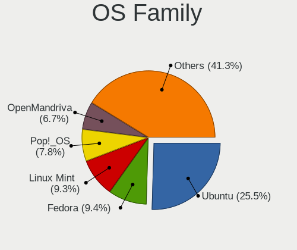
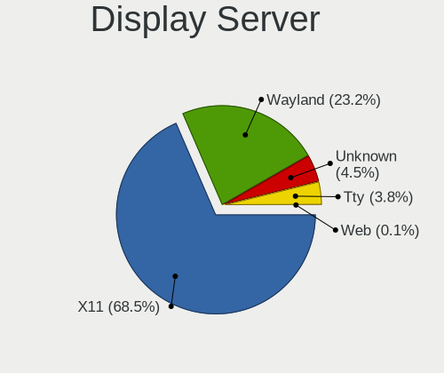
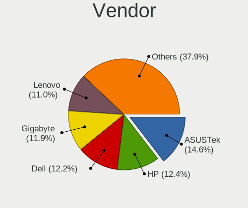
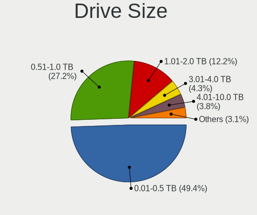
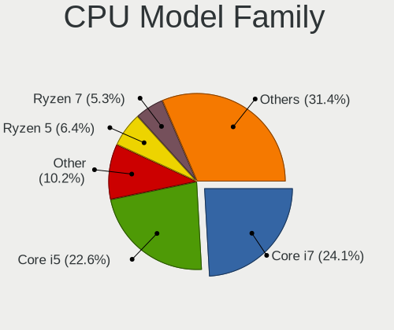
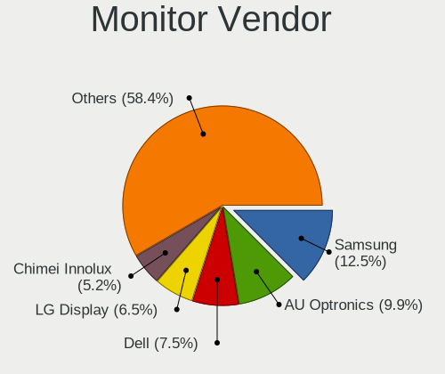
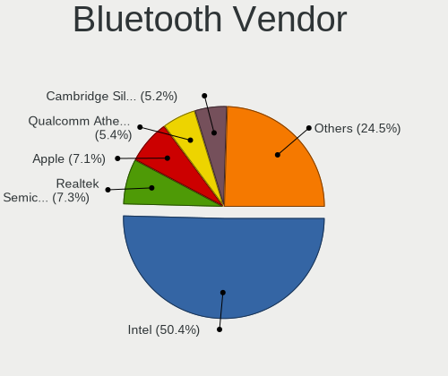

Linux in Australia - Tested Hardware & Statistics
-------------------------------------------------

A project to collect tested hardware configurations for Linux in Australia.

Anyone can contribute to this report by the [hw-probe](https://github.com/linuxhw/hw-probe) tool:

    sudo -E hw-probe -all -upload

Please contribute! Especially if your hardware is rare.

This is a report for all computer types. See also reports for [desktops](/Location/Australia/Desktop/README.md) and [notebooks](/Location/Australia/Notebook/README.md).

Contents
--------

* [ Test Cases ](#test-cases)

* [ System ](#system)
  - [ OS                       ](#os)
  - [ OS Family                ](#os-family)
  - [ Kernel                   ](#kernel)
  - [ Kernel Family            ](#kernel-family)
  - [ Kernel Major Ver.        ](#kernel-major-ver)
  - [ Arch                     ](#arch)
  - [ DE                       ](#de)
  - [ Display Server           ](#display-server)
  - [ Display Manager          ](#display-manager)
  - [ OS Lang                  ](#os-lang)
  - [ Boot Mode                ](#boot-mode)
  - [ Filesystem               ](#filesystem)
  - [ Part. scheme             ](#part-scheme)
  - [ Dual Boot with Linux/BSD ](#dual-boot-with-linuxbsd)
  - [ Dual Boot (Win)          ](#dual-boot-win)

* [ Board ](#board)
  - [ Vendor                   ](#vendor)
  - [ Model                    ](#model)
  - [ Model Family             ](#model-family)
  - [ MFG Year                 ](#mfg-year)
  - [ Form Factor              ](#form-factor)
  - [ Secure Boot              ](#secure-boot)
  - [ Coreboot                 ](#coreboot)
  - [ RAM Size                 ](#ram-size)
  - [ RAM Used                 ](#ram-used)
  - [ Total Drives             ](#total-drives)
  - [ Has CD-ROM               ](#has-cd-rom)
  - [ Has Ethernet             ](#has-ethernet)
  - [ Has WiFi                 ](#has-wifi)
  - [ Has Bluetooth            ](#has-bluetooth)

* [ Location ](#location)
  - [ Country                  ](#country)
  - [ City                     ](#city)

* [ Drives ](#drives)
  - [ Drive Vendor             ](#drive-vendor)
  - [ Drive Model              ](#drive-model)
  - [ HDD Vendor               ](#hdd-vendor)
  - [ SSD Vendor               ](#ssd-vendor)
  - [ Drive Kind               ](#drive-kind)
  - [ Drive Connector          ](#drive-connector)
  - [ Drive Size               ](#drive-size)
  - [ Space Total              ](#space-total)
  - [ Space Used               ](#space-used)
  - [ Malfunc. Drives          ](#malfunc-drives)
  - [ Malfunc. Drive Vendor    ](#malfunc-drive-vendor)
  - [ Malfunc. HDD Vendor      ](#malfunc-hdd-vendor)
  - [ Malfunc. Drive Kind      ](#malfunc-drive-kind)
  - [ Failed Drives            ](#failed-drives)
  - [ Failed Drive Vendor      ](#failed-drive-vendor)
  - [ Drive Status             ](#drive-status)

* [ Storage controller ](#storage-controller)
  - [ Storage Vendor           ](#storage-vendor)
  - [ Storage Model            ](#storage-model)
  - [ Storage Kind             ](#storage-kind)

* [ Processor ](#processor)
  - [ CPU Vendor               ](#cpu-vendor)
  - [ CPU Model                ](#cpu-model)
  - [ CPU Model Family         ](#cpu-model-family)
  - [ CPU Cores                ](#cpu-cores)
  - [ CPU Sockets              ](#cpu-sockets)
  - [ CPU Threads              ](#cpu-threads)
  - [ CPU Op-Modes             ](#cpu-op-modes)
  - [ CPU Microcode            ](#cpu-microcode)
  - [ CPU Microarch            ](#cpu-microarch)

* [ Graphics ](#graphics)
  - [ GPU Vendor               ](#gpu-vendor)
  - [ GPU Model                ](#gpu-model)
  - [ GPU Combo                ](#gpu-combo)
  - [ GPU Driver               ](#gpu-driver)
  - [ GPU Memory               ](#gpu-memory)

* [ Monitor ](#monitor)
  - [ Monitor Vendor           ](#monitor-vendor)
  - [ Monitor Model            ](#monitor-model)
  - [ Monitor Resolution       ](#monitor-resolution)
  - [ Monitor Diagonal         ](#monitor-diagonal)
  - [ Monitor Width            ](#monitor-width)
  - [ Aspect Ratio             ](#aspect-ratio)
  - [ Monitor Area             ](#monitor-area)
  - [ Pixel Density            ](#pixel-density)
  - [ Multiple Monitors        ](#multiple-monitors)

* [ Network ](#network)
  - [ Net Controller Vendor    ](#net-controller-vendor)
  - [ Net Controller Model     ](#net-controller-model)
  - [ Wireless Vendor          ](#wireless-vendor)
  - [ Wireless Model           ](#wireless-model)
  - [ Ethernet Vendor          ](#ethernet-vendor)
  - [ Ethernet Model           ](#ethernet-model)
  - [ Net Controller Kind      ](#net-controller-kind)
  - [ Used Controller          ](#used-controller)
  - [ NICs                     ](#nics)
  - [ IPv6                     ](#ipv6)

* [ Bluetooth ](#bluetooth)
  - [ Bluetooth Vendor         ](#bluetooth-vendor)
  - [ Bluetooth Model          ](#bluetooth-model)

* [ Sound ](#sound)
  - [ Sound Vendor             ](#sound-vendor)
  - [ Sound Model              ](#sound-model)

* [ Memory ](#memory)
  - [ Memory Vendor            ](#memory-vendor)
  - [ Memory Model             ](#memory-model)
  - [ Memory Kind              ](#memory-kind)
  - [ Memory Form Factor       ](#memory-form-factor)
  - [ Memory Size              ](#memory-size)
  - [ Memory Speed             ](#memory-speed)

* [ Printers & scanners ](#printers--scanners)
  - [ Printer Vendor           ](#printer-vendor)
  - [ Printer Model            ](#printer-model)
  - [ Scanner Vendor           ](#scanner-vendor)
  - [ Scanner Model            ](#scanner-model)

* [ Camera ](#camera)
  - [ Camera Vendor            ](#camera-vendor)
  - [ Camera Model             ](#camera-model)

* [ Security ](#security)
  - [ Fingerprint Vendor       ](#fingerprint-vendor)
  - [ Fingerprint Model        ](#fingerprint-model)
  - [ Chipcard Vendor          ](#chipcard-vendor)
  - [ Chipcard Model           ](#chipcard-model)

* [ Unsupported ](#unsupported)
  - [ Unsupported Devices      ](#unsupported-devices)
  - [ Unsupported Device Types ](#unsupported-device-types)

Test Cases
----------

Total: 5057

| Vendor        | Model                       | Form-Factor | Probe                                                      | Date         |
|---------------|-----------------------------|-------------|------------------------------------------------------------|--------------|
| Fanless Mi... | Rev JSL1                    | Mini pc     | [e812a255a4](https://linux-hardware.org/?probe=e812a255a4) | May 01, 2023 |
| Gigabyte      | Z77MX-D3H                   | Desktop     | [fa4e32fe2c](https://linux-hardware.org/?probe=fa4e32fe2c) | May 01, 2023 |
| ASRock        | B660M-HDV                   | Desktop     | [a137e6ab62](https://linux-hardware.org/?probe=a137e6ab62) | May 01, 2023 |
| Dell          | 0NC2VH A01                  | Desktop     | [7fb1708706](https://linux-hardware.org/?probe=7fb1708706) | May 01, 2023 |
| Lenovo        | ThinkPad X260 20F5002NAU    | Notebook    | [7fcb72c132](https://linux-hardware.org/?probe=7fcb72c132) | May 01, 2023 |
| ASUSTek       | X501A1                      | Notebook    | [66b02cc148](https://linux-hardware.org/?probe=66b02cc148) | Apr 30, 2023 |
| HP            | Laptop 15s-eq2xxx           | Notebook    | [7a86bdd993](https://linux-hardware.org/?probe=7a86bdd993) | Apr 30, 2023 |
| HP            | Laptop 15s-eq2xxx           | Notebook    | [6206b317f2](https://linux-hardware.org/?probe=6206b317f2) | Apr 30, 2023 |
| Gigabyte      | AB350-Gaming 3-CF           | Desktop     | [01311e320c](https://linux-hardware.org/?probe=01311e320c) | Apr 30, 2023 |
| MSI           | MPG B650I EDGE WIFI         | Desktop     | [eda4874295](https://linux-hardware.org/?probe=eda4874295) | Apr 30, 2023 |
| Apple         | Mac-F2208EC8                | Mini pc     | [6bad65ad2d](https://linux-hardware.org/?probe=6bad65ad2d) | Apr 29, 2023 |
| ASUSTek       | TUF B450M-PRO GAMING        | Desktop     | [081551c776](https://linux-hardware.org/?probe=081551c776) | Apr 29, 2023 |
| Apple         | Mac-BE088AF8C5EB4FA2 iMa... | All in one  | [ee288626f4](https://linux-hardware.org/?probe=ee288626f4) | Apr 29, 2023 |
| MSI           | MAG Z790 TOMAHAWK WIFI D... | Desktop     | [c880b8dcdd](https://linux-hardware.org/?probe=c880b8dcdd) | Apr 29, 2023 |
| ASUSTek       | PRIME A520M-E               | Desktop     | [048fda2c60](https://linux-hardware.org/?probe=048fda2c60) | Apr 28, 2023 |
| MSI           | MPG X570S CARBON MAX WIF... | Desktop     | [d472fb0a32](https://linux-hardware.org/?probe=d472fb0a32) | Apr 28, 2023 |
| Intel         | DZ68DB AAG27985-101         | Desktop     | [b3323dcc11](https://linux-hardware.org/?probe=b3323dcc11) | Apr 28, 2023 |
| ASRock        | X470 Master SLI             | Desktop     | [cded55a936](https://linux-hardware.org/?probe=cded55a936) | Apr 28, 2023 |
| Lenovo        | ThinkPad L13 Yoga 20R6S1... | Convertible | [c01483e50f](https://linux-hardware.org/?probe=c01483e50f) | Apr 28, 2023 |
| Acer          | ConceptD CN315-71P          | Notebook    | [3cc902ff5c](https://linux-hardware.org/?probe=3cc902ff5c) | Apr 28, 2023 |
| Lenovo        | IdeaPad 110S-11IBR 80WG     | Notebook    | [73141c5006](https://linux-hardware.org/?probe=73141c5006) | Apr 27, 2023 |
| Lenovo        | IdeaPad 110S-11IBR 80WG     | Notebook    | [0cb164ac2f](https://linux-hardware.org/?probe=0cb164ac2f) | Apr 27, 2023 |
| Lenovo        | ThinkPad X1 Carbon Gen 1... | Notebook    | [3f44947226](https://linux-hardware.org/?probe=3f44947226) | Apr 27, 2023 |
| HP            | Laptop 15s-eq2xxx           | Notebook    | [198fa6162e](https://linux-hardware.org/?probe=198fa6162e) | Apr 27, 2023 |
| ASUSTek       | X99-A                       | Desktop     | [6788eea8d2](https://linux-hardware.org/?probe=6788eea8d2) | Apr 26, 2023 |
| ASUSTek       | X550CA                      | Notebook    | [a63293fe36](https://linux-hardware.org/?probe=a63293fe36) | Apr 26, 2023 |
| ASUSTek       | PRIME B350M-A               | Desktop     | [b8b51b29ef](https://linux-hardware.org/?probe=b8b51b29ef) | Apr 25, 2023 |
| Dell          | Inspiron 5548               | Notebook    | [42908a7ab7](https://linux-hardware.org/?probe=42908a7ab7) | Apr 25, 2023 |
| Dell          | System XPS L702X            | Notebook    | [d1aa167e90](https://linux-hardware.org/?probe=d1aa167e90) | Apr 25, 2023 |
| Acer          | E5-551G-871W                | Notebook    | [2730a30d89](https://linux-hardware.org/?probe=2730a30d89) | Apr 25, 2023 |
| MSI           | GE72VR 6RF                  | Notebook    | [89cb17ee72](https://linux-hardware.org/?probe=89cb17ee72) | Apr 25, 2023 |
| Gigabyte      | Z77MX-D3H                   | Desktop     | [373372bf75](https://linux-hardware.org/?probe=373372bf75) | Apr 25, 2023 |
| Dell          | 08WXMX A02                  | Desktop     | [5f68c6a285](https://linux-hardware.org/?probe=5f68c6a285) | Apr 24, 2023 |
| MSI           | Z97S SLI Krait Edition      | Desktop     | [6ed93f8338](https://linux-hardware.org/?probe=6ed93f8338) | Apr 24, 2023 |
| HP            | 0AA8h                       | Desktop     | [071191ddf3](https://linux-hardware.org/?probe=071191ddf3) | Apr 23, 2023 |
| Dell          | Precision 5520              | Notebook    | [4d1dd8b673](https://linux-hardware.org/?probe=4d1dd8b673) | Apr 23, 2023 |
| ASRock        | A520M-ITX/ac                | Desktop     | [ef59f5ff9b](https://linux-hardware.org/?probe=ef59f5ff9b) | Apr 23, 2023 |
| Apple         | Mac-BE088AF8C5EB4FA2 iMa... | All in one  | [5da3166132](https://linux-hardware.org/?probe=5da3166132) | Apr 22, 2023 |
| ASUSTek       | ROG STRIX B660-I GAMING ... | Desktop     | [03a331aa44](https://linux-hardware.org/?probe=03a331aa44) | Apr 22, 2023 |
| Gigabyte      | H77N-WIFI                   | Desktop     | [80312ab34c](https://linux-hardware.org/?probe=80312ab34c) | Apr 22, 2023 |
| Shuttle       | DS10U                       | Desktop     | [ffcce61d82](https://linux-hardware.org/?probe=ffcce61d82) | Apr 22, 2023 |
| Gigabyte      | X79-UD3                     | Desktop     | [1dd1bcd00e](https://linux-hardware.org/?probe=1dd1bcd00e) | Apr 22, 2023 |
| Valve         | Jupiter                     | Notebook    | [b5be7aa6ff](https://linux-hardware.org/?probe=b5be7aa6ff) | Apr 21, 2023 |
| ASRock        | AD2700-ITX                  | Desktop     | [e688e656cd](https://linux-hardware.org/?probe=e688e656cd) | Apr 21, 2023 |
| Shuttle       | FS81                        | Desktop     | [051b7f4753](https://linux-hardware.org/?probe=051b7f4753) | Apr 20, 2023 |
| Acer          | Predator G9-793             | Notebook    | [664d6de816](https://linux-hardware.org/?probe=664d6de816) | Apr 20, 2023 |
| Lenovo        | ThinkPad T410 2522PT3       | Notebook    | [8daf9af9b5](https://linux-hardware.org/?probe=8daf9af9b5) | Apr 20, 2023 |
| Acer          | Aspire 5733Z                | Notebook    | [de205c8c62](https://linux-hardware.org/?probe=de205c8c62) | Apr 19, 2023 |
| HP            | Stream Laptop 11-ak0xxx     | Notebook    | [7da02a75b5](https://linux-hardware.org/?probe=7da02a75b5) | Apr 18, 2023 |
| ASRock        | Z170 Gaming K4              | Desktop     | [cbd09f0f67](https://linux-hardware.org/?probe=cbd09f0f67) | Apr 18, 2023 |
| Shuttle       | DS10U                       | Desktop     | [b25013d04f](https://linux-hardware.org/?probe=b25013d04f) | Apr 18, 2023 |
| Gigabyte      | GA-MA780G-UD3H              | Desktop     | [07a49303af](https://linux-hardware.org/?probe=07a49303af) | Apr 17, 2023 |
| Toshiba       | Satellite E45-B             | Notebook    | [ec0bb6bfc6](https://linux-hardware.org/?probe=ec0bb6bfc6) | Apr 17, 2023 |
| MSI           | MS-B0A41                    | Desktop     | [5950f6e73c](https://linux-hardware.org/?probe=5950f6e73c) | Apr 17, 2023 |
| Dell          | Inspiron 13-5378            | Notebook    | [bcb18ae818](https://linux-hardware.org/?probe=bcb18ae818) | Apr 17, 2023 |
| HP            | Pavilion dv6                | Notebook    | [fc41269cf8](https://linux-hardware.org/?probe=fc41269cf8) | Apr 16, 2023 |
| Gigabyte      | GA-880GM-UD2H               | Desktop     | [1fa07cd218](https://linux-hardware.org/?probe=1fa07cd218) | Apr 16, 2023 |
| HP            | 212B                        | Desktop     | [343f1f5eba](https://linux-hardware.org/?probe=343f1f5eba) | Apr 16, 2023 |
| Dell          | Latitude 5420               | Notebook    | [03247dc98c](https://linux-hardware.org/?probe=03247dc98c) | Apr 16, 2023 |
| ASUSTek       | VivoBook 15_ASUS Laptop ... | Notebook    | [71e03c5459](https://linux-hardware.org/?probe=71e03c5459) | Apr 15, 2023 |
| Gigabyte      | X79-UD5                     | Desktop     | [369c3cfdb2](https://linux-hardware.org/?probe=369c3cfdb2) | Apr 15, 2023 |
| Apple         | MacBookPro7,1               | Notebook    | [3470b35550](https://linux-hardware.org/?probe=3470b35550) | Apr 15, 2023 |
| Lenovo        | ThinkCentre M58p 7220A72    | Desktop     | [2be395131f](https://linux-hardware.org/?probe=2be395131f) | Apr 15, 2023 |
| Lenovo        | ThinkCentre M58p 7220A72    | Desktop     | [0ca4b7045e](https://linux-hardware.org/?probe=0ca4b7045e) | Apr 15, 2023 |
| Toshiba       | QOSMIO F750                 | Notebook    | [590801670a](https://linux-hardware.org/?probe=590801670a) | Apr 15, 2023 |
| Gigabyte      | Z97X-Gaming 3               | Desktop     | [ffa823032e](https://linux-hardware.org/?probe=ffa823032e) | Apr 14, 2023 |
| Toshiba       | Satellite L850              | Notebook    | [dc9e77bd65](https://linux-hardware.org/?probe=dc9e77bd65) | Apr 14, 2023 |
| Gigabyte      | B560M DS3H V2               | Desktop     | [fe75c98b15](https://linux-hardware.org/?probe=fe75c98b15) | Apr 14, 2023 |
| Lenovo        | ThinkStation D30 42234T7    | Desktop     | [7730eb04fa](https://linux-hardware.org/?probe=7730eb04fa) | Apr 14, 2023 |
| Dell          | Latitude E6540              | Notebook    | [61ab891b01](https://linux-hardware.org/?probe=61ab891b01) | Apr 13, 2023 |
| Dell          | Vostro 7590                 | Notebook    | [f759d8ab72](https://linux-hardware.org/?probe=f759d8ab72) | Apr 13, 2023 |
| Lenovo        | ThinkBook 13s G2 ITL 20V... | Notebook    | [8e641b5fd5](https://linux-hardware.org/?probe=8e641b5fd5) | Apr 13, 2023 |
| Acer          | Aspire 5720Z                | Notebook    | [1ac7eb0d0c](https://linux-hardware.org/?probe=1ac7eb0d0c) | Apr 13, 2023 |
| ECS           | H61H2-MV                    | Desktop     | [5a3fbafb75](https://linux-hardware.org/?probe=5a3fbafb75) | Apr 12, 2023 |
| HP            | 843B                        | Desktop     | [90de5c4ff1](https://linux-hardware.org/?probe=90de5c4ff1) | Apr 12, 2023 |
| Gigabyte      | X79-UP4                     | Desktop     | [8f9b60caf3](https://linux-hardware.org/?probe=8f9b60caf3) | Apr 12, 2023 |
| HP            | 3646h                       | Desktop     | [c36653d824](https://linux-hardware.org/?probe=c36653d824) | Apr 12, 2023 |
| ASRock        | X370 Gaming-ITX/ac          | Desktop     | [29ed28536e](https://linux-hardware.org/?probe=29ed28536e) | Apr 12, 2023 |
| Acer          | TM6495T                     | Notebook    | [435ae018a2](https://linux-hardware.org/?probe=435ae018a2) | Apr 11, 2023 |
| Lenovo        | ThinkPad L13 Yoga 20R6S1... | Convertible | [8ca7e7c5ad](https://linux-hardware.org/?probe=8ca7e7c5ad) | Apr 10, 2023 |
| MSI           | H81M-P33                    | Desktop     | [129abe0b90](https://linux-hardware.org/?probe=129abe0b90) | Apr 10, 2023 |
| Raspberry ... | Raspberry Pi 3 Model B P... | Soc         | [f9382ece8e](https://linux-hardware.org/?probe=f9382ece8e) | Apr 10, 2023 |
| Raspberry ... | Raspberry Pi 3 Model B P... | Soc         | [6dd2d460aa](https://linux-hardware.org/?probe=6dd2d460aa) | Apr 10, 2023 |
| MSI           | B450M MORTAR MAX            | Desktop     | [7d5fb1a311](https://linux-hardware.org/?probe=7d5fb1a311) | Apr 10, 2023 |
| Unknown       | Unknown                     | Desktop     | [2765290b8c](https://linux-hardware.org/?probe=2765290b8c) | Apr 09, 2023 |
| Lenovo        | ThinkPad E460 20ETA05KAU    | Notebook    | [a8090f51bc](https://linux-hardware.org/?probe=a8090f51bc) | Apr 09, 2023 |
| SYWZ          | S210H Series                | Desktop     | [5989537064](https://linux-hardware.org/?probe=5989537064) | Apr 09, 2023 |
| Dell          | Inspiron 1720               | Notebook    | [a2e3b07f6b](https://linux-hardware.org/?probe=a2e3b07f6b) | Apr 09, 2023 |
| ASUSTek       | PRIME Z590-P WIFI           | Desktop     | [e579aabfdb](https://linux-hardware.org/?probe=e579aabfdb) | Apr 09, 2023 |
| Samsung       | Galaxy Book 12              | Tablet      | [d866c03132](https://linux-hardware.org/?probe=d866c03132) | Apr 08, 2023 |
| Dell          | Latitude E5470              | Notebook    | [3e49e9c541](https://linux-hardware.org/?probe=3e49e9c541) | Apr 08, 2023 |
| MSI           | B550M-A PRO                 | Desktop     | [e3fcf877c0](https://linux-hardware.org/?probe=e3fcf877c0) | Apr 08, 2023 |
| Apple         | MacBookAir7,2               | Notebook    | [5aad90904c](https://linux-hardware.org/?probe=5aad90904c) | Apr 07, 2023 |
| Acer          | TravelMate 8572T            | Notebook    | [04f50662d8](https://linux-hardware.org/?probe=04f50662d8) | Apr 07, 2023 |
| Toshiba       | Satellite P70-A             | Notebook    | [6ffb7a79ef](https://linux-hardware.org/?probe=6ffb7a79ef) | Apr 06, 2023 |
| MSI           | MS-B1831                    | Desktop     | [9ea2ec4f47](https://linux-hardware.org/?probe=9ea2ec4f47) | Apr 06, 2023 |
| MSI           | A88XM-E35 V2                | Desktop     | [bf4c16404e](https://linux-hardware.org/?probe=bf4c16404e) | Apr 06, 2023 |
| ASUSTek       | Z170M-PLUS                  | Desktop     | [be741560b8](https://linux-hardware.org/?probe=be741560b8) | Apr 06, 2023 |
| Gigabyte      | Z690 UD DDR4                | Desktop     | [7644d4a8fa](https://linux-hardware.org/?probe=7644d4a8fa) | Apr 06, 2023 |
| HP            | Pavilion dv6                | Notebook    | [be695e2cd4](https://linux-hardware.org/?probe=be695e2cd4) | Apr 06, 2023 |
| ASUSTek       | H87-PRO                     | Desktop     | [085dc66a77](https://linux-hardware.org/?probe=085dc66a77) | Apr 05, 2023 |
| HP            | ZBook 17 G2                 | Notebook    | [258f32d502](https://linux-hardware.org/?probe=258f32d502) | Apr 05, 2023 |
| HUAWEI        | MACHD-WXX9                  | Notebook    | [7e5be74f0b](https://linux-hardware.org/?probe=7e5be74f0b) | Apr 05, 2023 |
| Apple         | MacBookPro10,1              | Notebook    | [473a8c1d7b](https://linux-hardware.org/?probe=473a8c1d7b) | Apr 05, 2023 |
| Shenzhen M... | F7BFD                       | Desktop     | [7f6103b394](https://linux-hardware.org/?probe=7f6103b394) | Apr 05, 2023 |
| Shenzhen M... | F7BFD                       | Desktop     | [ac039ed7e6](https://linux-hardware.org/?probe=ac039ed7e6) | Apr 05, 2023 |
| HP            | Notebook                    | Notebook    | [50c03e608d](https://linux-hardware.org/?probe=50c03e608d) | Apr 05, 2023 |
| Apple         | MacBookPro10,1              | Notebook    | [56079f49e3](https://linux-hardware.org/?probe=56079f49e3) | Apr 04, 2023 |
| Apple         | MacBookPro8,1               | Notebook    | [4ef5210167](https://linux-hardware.org/?probe=4ef5210167) | Apr 04, 2023 |
| HP            | 843B                        | Desktop     | [aa679005d3](https://linux-hardware.org/?probe=aa679005d3) | Apr 04, 2023 |
| HP            | 843B                        | Desktop     | [ba686ac542](https://linux-hardware.org/?probe=ba686ac542) | Apr 04, 2023 |
| Shuttle       | DS10U                       | Desktop     | [a35fd102f2](https://linux-hardware.org/?probe=a35fd102f2) | Apr 04, 2023 |
| Lenovo        | 312D SDK0J40697 WIN 3305... | Mini pc     | [3a87280f55](https://linux-hardware.org/?probe=3a87280f55) | Apr 03, 2023 |
| Lenovo        | 312D SDK0J40697 WIN 3305... | Mini pc     | [1cb5977d82](https://linux-hardware.org/?probe=1cb5977d82) | Apr 03, 2023 |
| HP            | EliteBook Folio 1040 G3     | Notebook    | [9e25dfd6bb](https://linux-hardware.org/?probe=9e25dfd6bb) | Apr 02, 2023 |
| ASRock        | FM2A55M-DGS                 | Desktop     | [250384a794](https://linux-hardware.org/?probe=250384a794) | Apr 02, 2023 |
| Dell          | 096JG8 A01                  | Desktop     | [d016e78eab](https://linux-hardware.org/?probe=d016e78eab) | Apr 02, 2023 |
| Acer          | EQ45LM                      | Desktop     | [5bafe47784](https://linux-hardware.org/?probe=5bafe47784) | Apr 02, 2023 |
| HP            | ProBook 650 G2              | Notebook    | [89622c73d1](https://linux-hardware.org/?probe=89622c73d1) | Apr 02, 2023 |
| Gigabyte      | X99-UD3-CF                  | Desktop     | [82a3b55b60](https://linux-hardware.org/?probe=82a3b55b60) | Apr 02, 2023 |
| Dell          | 09M8Y8 A01                  | Desktop     | [17d5390549](https://linux-hardware.org/?probe=17d5390549) | Apr 01, 2023 |
| Dell          | XPS 15 9570                 | Notebook    | [7beef34820](https://linux-hardware.org/?probe=7beef34820) | Apr 01, 2023 |
| Lenovo        | IdeaPadFlex 5 14ABR8 82X... | Convertible | [8357ff8cf5](https://linux-hardware.org/?probe=8357ff8cf5) | Apr 01, 2023 |
| Gigabyte      | Z97X-Gaming 3               | Desktop     | [89ca656f30](https://linux-hardware.org/?probe=89ca656f30) | Apr 01, 2023 |
| Lenovo        | ThinkPad E14 Gen 2 20TA0... | Notebook    | [2a881cc01e](https://linux-hardware.org/?probe=2a881cc01e) | Apr 01, 2023 |
| Gigabyte      | Z77X-UD5H                   | Desktop     | [2be0fa6524](https://linux-hardware.org/?probe=2be0fa6524) | Apr 01, 2023 |
| Lenovo        | ThinkStation D30 42234T7    | Desktop     | [47f6f4653b](https://linux-hardware.org/?probe=47f6f4653b) | Mar 31, 2023 |
| Unknown       | Unknown                     | Desktop     | [1f64d2db28](https://linux-hardware.org/?probe=1f64d2db28) | Mar 31, 2023 |
| ASRock        | FM2A55M-DGS                 | Desktop     | [3ab2e2c720](https://linux-hardware.org/?probe=3ab2e2c720) | Mar 31, 2023 |
| Gigabyte      | B85M-HD3                    | Desktop     | [3d24b75a10](https://linux-hardware.org/?probe=3d24b75a10) | Mar 31, 2023 |
| Dell          | 00V62H A01                  | Desktop     | [05d42527df](https://linux-hardware.org/?probe=05d42527df) | Mar 31, 2023 |
| Dell          | 09M8Y8 A01                  | Desktop     | [2c13e40cd2](https://linux-hardware.org/?probe=2c13e40cd2) | Mar 30, 2023 |
| ASUSTek       | TUF Gaming B550M-PLUS       | Desktop     | [92981c741d](https://linux-hardware.org/?probe=92981c741d) | Mar 30, 2023 |
| Gigabyte      | B450 AORUS PRO WIFI-CF      | Desktop     | [af4901f141](https://linux-hardware.org/?probe=af4901f141) | Mar 30, 2023 |
| HP            | ProBook 450 G5              | Notebook    | [89dfecad7e](https://linux-hardware.org/?probe=89dfecad7e) | Mar 30, 2023 |
| Dell          | XPS 15 9570                 | Notebook    | [8d0c93e1a8](https://linux-hardware.org/?probe=8d0c93e1a8) | Mar 30, 2023 |
| Gigabyte      | J1900M-D2P                  | Desktop     | [881f70cb12](https://linux-hardware.org/?probe=881f70cb12) | Mar 30, 2023 |
| Dell          | Precision 5550              | Notebook    | [c7244f1e31](https://linux-hardware.org/?probe=c7244f1e31) | Mar 30, 2023 |
| Dell          | G3 3590                     | Notebook    | [f61ce9bb82](https://linux-hardware.org/?probe=f61ce9bb82) | Mar 28, 2023 |
| Gigabyte      | H55M-USB3                   | Desktop     | [140b984b9f](https://linux-hardware.org/?probe=140b984b9f) | Mar 28, 2023 |
| Lenovo        | SHARKBAY 31900058 STD       | Desktop     | [5064a5267e](https://linux-hardware.org/?probe=5064a5267e) | Mar 28, 2023 |
| MSI           | Delta 15 A5EFK              | Notebook    | [6f4e3ec28b](https://linux-hardware.org/?probe=6f4e3ec28b) | Mar 28, 2023 |
| MSI           | Delta 15 A5EFK              | Notebook    | [9dd1b67b2f](https://linux-hardware.org/?probe=9dd1b67b2f) | Mar 28, 2023 |
| Lenovo        | 0x36A017AA SDK0J40709 WI... | Desktop     | [562426633d](https://linux-hardware.org/?probe=562426633d) | Mar 28, 2023 |
| ASRock        | FM2A88X+ Killer             | Desktop     | [6180e562dd](https://linux-hardware.org/?probe=6180e562dd) | Mar 27, 2023 |
| Unknown       | Unknown                     | Desktop     | [de6a63685a](https://linux-hardware.org/?probe=de6a63685a) | Mar 27, 2023 |
| Lenovo        | ThinkStation D30 42234T7    | Desktop     | [cfb8c9d396](https://linux-hardware.org/?probe=cfb8c9d396) | Mar 27, 2023 |
| Apple         | Mac-27ADBB7B4CEE8E61 iMa... | All in one  | [e67759f49b](https://linux-hardware.org/?probe=e67759f49b) | Mar 26, 2023 |
| HP            | 0B54h D                     | Desktop     | [540caaf04c](https://linux-hardware.org/?probe=540caaf04c) | Mar 26, 2023 |
| ASUSTek       | Maximus VIII HERO ALPHA     | Desktop     | [cc262bb41a](https://linux-hardware.org/?probe=cc262bb41a) | Mar 26, 2023 |
| ASRock        | AD525PV3                    | Desktop     | [84545fd0ea](https://linux-hardware.org/?probe=84545fd0ea) | Mar 25, 2023 |
| HUAWEI        | NBD-WXX9                    | Notebook    | [8060aec150](https://linux-hardware.org/?probe=8060aec150) | Mar 25, 2023 |
| Gigabyte      | J1900M-D2P                  | Desktop     | [5acd2b0492](https://linux-hardware.org/?probe=5acd2b0492) | Mar 25, 2023 |
| Dell          | 00V62H A01                  | Desktop     | [5312ec3cc9](https://linux-hardware.org/?probe=5312ec3cc9) | Mar 25, 2023 |
| Gigabyte      | H77N-WIFI                   | Desktop     | [1503a33123](https://linux-hardware.org/?probe=1503a33123) | Mar 24, 2023 |
| Lenovo        | IdeaPad 320-15AST 80XV      | Notebook    | [9edd5002f0](https://linux-hardware.org/?probe=9edd5002f0) | Mar 24, 2023 |
| HP            | ProBook 470 G5              | Notebook    | [1672158957](https://linux-hardware.org/?probe=1672158957) | Mar 24, 2023 |
| HP            | ProBook 470 G5              | Notebook    | [383b333f72](https://linux-hardware.org/?probe=383b333f72) | Mar 24, 2023 |
| ReachingTe... | DreamQuest Pro 2022         | Mini pc     | [696a898cd2](https://linux-hardware.org/?probe=696a898cd2) | Mar 24, 2023 |
| ASRock        | AD525PV3                    | Desktop     | [0749ec7b44](https://linux-hardware.org/?probe=0749ec7b44) | Mar 23, 2023 |
| Lenovo        | ThinkPad T14 Gen 1 20UDS... | Notebook    | [fc1c184c05](https://linux-hardware.org/?probe=fc1c184c05) | Mar 23, 2023 |
| AMI           | Intel                       | Desktop     | [5e7b21c227](https://linux-hardware.org/?probe=5e7b21c227) | Mar 23, 2023 |
| Acer          | ConceptD CN315-71P          | Notebook    | [14b71e7a26](https://linux-hardware.org/?probe=14b71e7a26) | Mar 22, 2023 |
| ASUSTek       | B85M-E                      | Desktop     | [10269c811b](https://linux-hardware.org/?probe=10269c811b) | Mar 22, 2023 |
| MSI           | MS-7142                     | Desktop     | [1cb67ac1ca](https://linux-hardware.org/?probe=1cb67ac1ca) | Mar 22, 2023 |
| HP            | EliteBook 8470p             | Notebook    | [61025e6e8b](https://linux-hardware.org/?probe=61025e6e8b) | Mar 22, 2023 |
| Lenovo        | ThinkPad P15s Gen 2i 20W... | Notebook    | [80d1a2d67d](https://linux-hardware.org/?probe=80d1a2d67d) | Mar 22, 2023 |
| Lenovo        | ThinkPad P15s Gen 2i 20W... | Notebook    | [eb718edb23](https://linux-hardware.org/?probe=eb718edb23) | Mar 22, 2023 |
| ASUSTek       | M5A99FX PRO R2.0            | Desktop     | [8c50d5ae87](https://linux-hardware.org/?probe=8c50d5ae87) | Mar 21, 2023 |
| Acer          | Spin SP314-54N              | Convertible | [4f2e83ab00](https://linux-hardware.org/?probe=4f2e83ab00) | Mar 21, 2023 |
| ASUSTek       | Z170M-PLUS                  | Desktop     | [a1e76aa5c1](https://linux-hardware.org/?probe=a1e76aa5c1) | Mar 21, 2023 |
| ASRock        | B550M Pro4                  | Desktop     | [16253cadcf](https://linux-hardware.org/?probe=16253cadcf) | Mar 21, 2023 |
| Dell          | Latitude E6520              | Notebook    | [857fdb4095](https://linux-hardware.org/?probe=857fdb4095) | Mar 21, 2023 |
| Lenovo        | 312D SDK0J40697 WIN 3305... | Mini pc     | [c2191470c7](https://linux-hardware.org/?probe=c2191470c7) | Mar 21, 2023 |
| Dell          | Inspiron 5559               | Notebook    | [6f98b39459](https://linux-hardware.org/?probe=6f98b39459) | Mar 21, 2023 |
| HP            | Spectre x360 2-in-1 Lapt... | Convertible | [c5c907b643](https://linux-hardware.org/?probe=c5c907b643) | Mar 21, 2023 |
| MACHINIST     | X99-RS9 V2.0                | Desktop     | [ad4c43dd09](https://linux-hardware.org/?probe=ad4c43dd09) | Mar 21, 2023 |
| Apple         | Mac-F2208EC8                | Mini pc     | [4b47e3ed6c](https://linux-hardware.org/?probe=4b47e3ed6c) | Mar 20, 2023 |
| Gigabyte      | H610M H DDR4                | Desktop     | [b7cf9d91ee](https://linux-hardware.org/?probe=b7cf9d91ee) | Mar 20, 2023 |
| Acer          | Spin SP314-54N              | Convertible | [40d6f69489](https://linux-hardware.org/?probe=40d6f69489) | Mar 20, 2023 |
| Lenovo        | IdeaPadFlex 5 14ARE05 81... | Convertible | [c63a27da32](https://linux-hardware.org/?probe=c63a27da32) | Mar 20, 2023 |
| ASUSTek       | Maximus Extreme             | Desktop     | [c6215ec2f3](https://linux-hardware.org/?probe=c6215ec2f3) | Mar 20, 2023 |
| ASUSTek       | PRIME B250M-K               | Desktop     | [99cb000a4e](https://linux-hardware.org/?probe=99cb000a4e) | Mar 19, 2023 |
| Microsoft     | Surface Laptop 3            | Tablet      | [67c8f562e5](https://linux-hardware.org/?probe=67c8f562e5) | Mar 18, 2023 |
| Apple         | Mac-031B6874CF7F642A iMa... | All in one  | [dc411c9ce3](https://linux-hardware.org/?probe=dc411c9ce3) | Mar 18, 2023 |
| Lenovo        | IdeaPad 5 Pro 14ARH7 82S... | Notebook    | [786fded1ce](https://linux-hardware.org/?probe=786fded1ce) | Mar 17, 2023 |
| Lenovo        | IdeaPad 3 15IGL05 81WQ      | Notebook    | [49bb337156](https://linux-hardware.org/?probe=49bb337156) | Mar 17, 2023 |
| Lenovo        | IdeaPad 520-15IKB 81BF      | Notebook    | [d762fe2bf3](https://linux-hardware.org/?probe=d762fe2bf3) | Mar 17, 2023 |
| Valve         | Jupiter                     | Notebook    | [8f51ab644e](https://linux-hardware.org/?probe=8f51ab644e) | Mar 17, 2023 |
| Gigabyte      | G41MT-D3                    | Desktop     | [b4483fd4e2](https://linux-hardware.org/?probe=b4483fd4e2) | Mar 16, 2023 |
| Dell          | G3 3590                     | Notebook    | [9ef42643d8](https://linux-hardware.org/?probe=9ef42643d8) | Mar 16, 2023 |
| MSI           | B450M MORTAR TITANIUM       | Desktop     | [a4c449eef4](https://linux-hardware.org/?probe=a4c449eef4) | Mar 16, 2023 |
| HP            | ProBook 430 G8 Notebook ... | Notebook    | [ca6ab3c197](https://linux-hardware.org/?probe=ca6ab3c197) | Mar 16, 2023 |
| ASUSTek       | VivoBook_ASUSLaptop X712... | Notebook    | [684375b9a0](https://linux-hardware.org/?probe=684375b9a0) | Mar 16, 2023 |
| ASUSTek       | ZenBook UX425UA_UM425UA     | Notebook    | [787dfaa7d4](https://linux-hardware.org/?probe=787dfaa7d4) | Mar 15, 2023 |
| Apple         | Mac-7BA5B2DFE22DDD8C Mac... | Mini pc     | [12e9972d5a](https://linux-hardware.org/?probe=12e9972d5a) | Mar 15, 2023 |
| Huanan        | X99-AD3 GAMING V2.0         | Desktop     | [0586633e29](https://linux-hardware.org/?probe=0586633e29) | Mar 15, 2023 |
| ASUSTek       | A8R32-MVP Deluxe            | Desktop     | [b324afc6f8](https://linux-hardware.org/?probe=b324afc6f8) | Mar 14, 2023 |
| Intel         | DB85FL AAG89861-203         | Desktop     | [e17dae3447](https://linux-hardware.org/?probe=e17dae3447) | Mar 14, 2023 |
| Intel         | DB85FL AAG89861-203         | Desktop     | [f1004a32e1](https://linux-hardware.org/?probe=f1004a32e1) | Mar 14, 2023 |
| Acer          | Swift SFX14-41G             | Notebook    | [59478f318e](https://linux-hardware.org/?probe=59478f318e) | Mar 14, 2023 |
| Dell          | XPS 13 9360                 | Notebook    | [954055245e](https://linux-hardware.org/?probe=954055245e) | Mar 14, 2023 |
| Dell          | Inspiron M5010              | Notebook    | [0a5d0c9169](https://linux-hardware.org/?probe=0a5d0c9169) | Mar 14, 2023 |
| QIYIDA        | X99-H9 V2.0                 | Desktop     | [0f440670f2](https://linux-hardware.org/?probe=0f440670f2) | Mar 14, 2023 |
| Acer          | Aspire E5-511               | Notebook    | [5343f73c67](https://linux-hardware.org/?probe=5343f73c67) | Mar 13, 2023 |
| MSI           | B450M MORTAR TITANIUM       | Desktop     | [61af17e1cd](https://linux-hardware.org/?probe=61af17e1cd) | Mar 13, 2023 |
| Apple         | Mac-7BA5B2794B2CDB12 Mac... | Mini pc     | [cd75bab781](https://linux-hardware.org/?probe=cd75bab781) | Mar 13, 2023 |
| Fanless Mi... | Rev GMLR1                   | Mini pc     | [4ac1bccada](https://linux-hardware.org/?probe=4ac1bccada) | Mar 13, 2023 |
| Lenovo        | IdeaPad 5 15IAL7 82SF       | Notebook    | [b5d8bdc57d](https://linux-hardware.org/?probe=b5d8bdc57d) | Mar 12, 2023 |
| Lenovo        | IdeaPad 5 15IAL7 82SF       | Notebook    | [4525fa2931](https://linux-hardware.org/?probe=4525fa2931) | Mar 12, 2023 |
| Lenovo        | ThinkPad E590 20NBA000AU    | Notebook    | [47bfd44610](https://linux-hardware.org/?probe=47bfd44610) | Mar 12, 2023 |
| MSI           | MAG B550M MORTAR WIFI       | Desktop     | [e45386803e](https://linux-hardware.org/?probe=e45386803e) | Mar 12, 2023 |
| Gigabyte      | Z590I AORUS ULTRA           | Desktop     | [47ea9647d3](https://linux-hardware.org/?probe=47ea9647d3) | Mar 12, 2023 |
| Gigabyte      | X670E AORUS XTREME          | Desktop     | [83cb566647](https://linux-hardware.org/?probe=83cb566647) | Mar 12, 2023 |
| ASUSTek       | A88X-PLUS                   | Desktop     | [3624df5386](https://linux-hardware.org/?probe=3624df5386) | Mar 11, 2023 |
| Maibenben     | P748                        | Notebook    | [a44d1bb8e4](https://linux-hardware.org/?probe=a44d1bb8e4) | Mar 11, 2023 |
| Gigabyte      | EP45-DS3L                   | Desktop     | [23b5dbe59d](https://linux-hardware.org/?probe=23b5dbe59d) | Mar 11, 2023 |
| ASRock        | 990FX Killer                | Desktop     | [23bd30e79e](https://linux-hardware.org/?probe=23bd30e79e) | Mar 11, 2023 |
| Apple         | Mac-FC02E91DDD3FA6A4 iMa... | All in one  | [46c1d399ac](https://linux-hardware.org/?probe=46c1d399ac) | Mar 11, 2023 |
| Gigabyte      | Z590 AORUS ELITE            | Desktop     | [790a51e99f](https://linux-hardware.org/?probe=790a51e99f) | Mar 11, 2023 |
| Acer          | Veriton X4640G V:1.1        | Desktop     | [dd3e15feee](https://linux-hardware.org/?probe=dd3e15feee) | Mar 10, 2023 |
| Gigabyte      | X570 AORUS ULTRA            | Desktop     | [35ab0f32c5](https://linux-hardware.org/?probe=35ab0f32c5) | Mar 10, 2023 |
| Dell          | XPS 15 9570                 | Notebook    | [9d14bee09f](https://linux-hardware.org/?probe=9d14bee09f) | Mar 10, 2023 |
| Gigabyte      | G41MT-D3                    | Desktop     | [e27d91ea6f](https://linux-hardware.org/?probe=e27d91ea6f) | Mar 09, 2023 |
| Gigabyte      | G41MT-D3                    | Desktop     | [790877da61](https://linux-hardware.org/?probe=790877da61) | Mar 09, 2023 |
| Lenovo        | ThinkPad L13 Yoga 20R6S1... | Convertible | [970e94ad07](https://linux-hardware.org/?probe=970e94ad07) | Mar 09, 2023 |
| HP            | Laptop 15-db0xxx            | Notebook    | [ded87de736](https://linux-hardware.org/?probe=ded87de736) | Mar 09, 2023 |
| ASUSTek       | PRIME B450M-A II            | Desktop     | [7413353e38](https://linux-hardware.org/?probe=7413353e38) | Mar 09, 2023 |
| ASUSTek       | TUF Gaming B550M-PLUS       | Desktop     | [89647ee142](https://linux-hardware.org/?probe=89647ee142) | Mar 08, 2023 |
| Apple         | Mac-F226BEC8 PVT            | All in one  | [fd0eabacbf](https://linux-hardware.org/?probe=fd0eabacbf) | Mar 08, 2023 |
| Gigabyte      | J1900M-D2P                  | Desktop     | [dfe7f75406](https://linux-hardware.org/?probe=dfe7f75406) | Mar 08, 2023 |
| Gigabyte      | H77N-WIFI                   | Desktop     | [ffaa232ea2](https://linux-hardware.org/?probe=ffaa232ea2) | Mar 08, 2023 |
| Gigabyte      | Z77MX-D3H                   | Desktop     | [916862cd66](https://linux-hardware.org/?probe=916862cd66) | Mar 08, 2023 |
| ASUSTek       | ROG Zephyrus Duo 16 GX65... | Notebook    | [54ad36532c](https://linux-hardware.org/?probe=54ad36532c) | Mar 07, 2023 |
| HP            | Stream Laptop 11-ah1XX      | Notebook    | [61e3840465](https://linux-hardware.org/?probe=61e3840465) | Mar 07, 2023 |
| Microsoft     | Surface Laptop 3            | Tablet      | [70eb1caef5](https://linux-hardware.org/?probe=70eb1caef5) | Mar 07, 2023 |
| HP            | Compaq Presario C700        | Notebook    | [fe1c136403](https://linux-hardware.org/?probe=fe1c136403) | Mar 06, 2023 |
| HP            | Compaq Presario C700        | Notebook    | [0b29805ec8](https://linux-hardware.org/?probe=0b29805ec8) | Mar 06, 2023 |
| HP            | ENVY 17                     | Notebook    | [ce2278a2e4](https://linux-hardware.org/?probe=ce2278a2e4) | Mar 05, 2023 |
| Gigabyte      | H77N-WIFI                   | Desktop     | [dfc84acc1a](https://linux-hardware.org/?probe=dfc84acc1a) | Mar 05, 2023 |
| Gigabyte      | X570 AORUS ELITE            | Desktop     | [3d1560d3d1](https://linux-hardware.org/?probe=3d1560d3d1) | Mar 05, 2023 |
| MSI           | X570-A PRO                  | Desktop     | [7d1b3a73f9](https://linux-hardware.org/?probe=7d1b3a73f9) | Mar 05, 2023 |
| HP            | Spectre x2 Detachable 12... | Tablet      | [9de6b65a45](https://linux-hardware.org/?probe=9de6b65a45) | Mar 04, 2023 |
| Google        | Ultima                      | Notebook    | [5e42f67839](https://linux-hardware.org/?probe=5e42f67839) | Mar 04, 2023 |
| HP            | Spectre x2 Detachable 12... | Tablet      | [fca1ca2628](https://linux-hardware.org/?probe=fca1ca2628) | Mar 04, 2023 |
| SONIQ Digi... | Soniq 11.6inch Convertib... | Convertible | [e0b2fdc347](https://linux-hardware.org/?probe=e0b2fdc347) | Mar 04, 2023 |
| Valve         | Jupiter                     | Notebook    | [65a9e7ef52](https://linux-hardware.org/?probe=65a9e7ef52) | Mar 04, 2023 |
| Intel         | NUC12EDBi7 M27908-302       | Mini pc     | [bb51e864a7](https://linux-hardware.org/?probe=bb51e864a7) | Mar 03, 2023 |
| ASUSTek       | PRIME A520M-K               | Desktop     | [3be3c8d79d](https://linux-hardware.org/?probe=3be3c8d79d) | Mar 03, 2023 |
| HP            | Pavilion Notebook           | Notebook    | [906cb4b50a](https://linux-hardware.org/?probe=906cb4b50a) | Mar 03, 2023 |
| Lenovo        | V14-ADA 82C6                | Notebook    | [f043beec18](https://linux-hardware.org/?probe=f043beec18) | Mar 03, 2023 |
| Dell          | 0KC9NP A00                  | Desktop     | [45397750b4](https://linux-hardware.org/?probe=45397750b4) | Mar 02, 2023 |
| HP            | Pavilion Notebook           | Notebook    | [2173dea5df](https://linux-hardware.org/?probe=2173dea5df) | Mar 02, 2023 |
| Toshiba       | TECRA Z50-C                 | Notebook    | [c30ead38bd](https://linux-hardware.org/?probe=c30ead38bd) | Mar 02, 2023 |
| MSI           | PRO H610M-G DDR4            | Desktop     | [8ecbea06f8](https://linux-hardware.org/?probe=8ecbea06f8) | Mar 02, 2023 |
| Apple         | MacBookPro14,3              | Notebook    | [6f952b4c9b](https://linux-hardware.org/?probe=6f952b4c9b) | Mar 01, 2023 |
| ASUSTek       | PRIME Z270-A                | Desktop     | [25c46b6f70](https://linux-hardware.org/?probe=25c46b6f70) | Mar 01, 2023 |
| Dell          | 09KPNV A01                  | Desktop     | [08346526f3](https://linux-hardware.org/?probe=08346526f3) | Mar 01, 2023 |
| Biostar       | B450MH                      | Desktop     | [aa05ee87d1](https://linux-hardware.org/?probe=aa05ee87d1) | Mar 01, 2023 |
| Gigabyte      | Z97X-Gaming 3               | Desktop     | [131f94f213](https://linux-hardware.org/?probe=131f94f213) | Mar 01, 2023 |
| Intel Clie... | LAPRC510                    | Notebook    | [925c24b3db](https://linux-hardware.org/?probe=925c24b3db) | Feb 28, 2023 |
| ASUSTek       | TUF Gaming FX505DD_FX505... | Notebook    | [021853dafb](https://linux-hardware.org/?probe=021853dafb) | Feb 28, 2023 |
| Intel Clie... | LAPRC510                    | Notebook    | [6d9a8edb0c](https://linux-hardware.org/?probe=6d9a8edb0c) | Feb 28, 2023 |
| Dell          | 0XHGV1 A00                  | Desktop     | [75249be116](https://linux-hardware.org/?probe=75249be116) | Feb 27, 2023 |
| Apple         | MacBookPro10,1              | Notebook    | [816a4eb27e](https://linux-hardware.org/?probe=816a4eb27e) | Feb 26, 2023 |
| MSI           | B450M MORTAR TITANIUM       | Desktop     | [b27fb5e204](https://linux-hardware.org/?probe=b27fb5e204) | Feb 26, 2023 |
| Pegatron      | 2ACB                        | Desktop     | [13355a7d07](https://linux-hardware.org/?probe=13355a7d07) | Feb 26, 2023 |
| MSI           | B450M MORTAR TITANIUM       | Desktop     | [a2356a66ba](https://linux-hardware.org/?probe=a2356a66ba) | Feb 26, 2023 |
| Intel         | NUC8i7HVB J68196-502        | Mini pc     | [ce67684fdf](https://linux-hardware.org/?probe=ce67684fdf) | Feb 26, 2023 |
| Gigabyte      | B450 AORUS PRO-CF           | Desktop     | [7f2823a756](https://linux-hardware.org/?probe=7f2823a756) | Feb 26, 2023 |
| HP            | 0AECh D                     | Desktop     | [5baf25e8af](https://linux-hardware.org/?probe=5baf25e8af) | Feb 26, 2023 |
| Gigabyte      | B450 AORUS PRO-CF           | Desktop     | [0b1c4036b1](https://linux-hardware.org/?probe=0b1c4036b1) | Feb 26, 2023 |
| HP            | Notebook                    | Notebook    | [4a72575c17](https://linux-hardware.org/?probe=4a72575c17) | Feb 25, 2023 |
| Medion        | MAG Z390M MORTAR            | Desktop     | [e2445cf24c](https://linux-hardware.org/?probe=e2445cf24c) | Feb 25, 2023 |
| Toshiba       | Satellite C850              | Notebook    | [99d4efbb52](https://linux-hardware.org/?probe=99d4efbb52) | Feb 25, 2023 |
| MSI           | MAG B550M MORTAR WIFI       | Desktop     | [4a0d65f6b5](https://linux-hardware.org/?probe=4a0d65f6b5) | Feb 24, 2023 |
| Gigabyte      | Z77M-D3H-MVP                | Desktop     | [e27e1cd0e8](https://linux-hardware.org/?probe=e27e1cd0e8) | Feb 24, 2023 |
| Apple         | MacBookAir7,2               | Notebook    | [72e11db1c0](https://linux-hardware.org/?probe=72e11db1c0) | Feb 24, 2023 |
| MSI           | Vector GP66 12UEO           | Notebook    | [9b6bf9479e](https://linux-hardware.org/?probe=9b6bf9479e) | Feb 24, 2023 |
| HUAWEI        | NBD-WXX9                    | Notebook    | [ea2663126f](https://linux-hardware.org/?probe=ea2663126f) | Feb 24, 2023 |
| ASUSTek       | B85M-E                      | Desktop     | [8a09d5e812](https://linux-hardware.org/?probe=8a09d5e812) | Feb 23, 2023 |
| Apple         | Mac-7BA5B2DFE22DDD8C Mac... | Mini pc     | [e386073c5d](https://linux-hardware.org/?probe=e386073c5d) | Feb 23, 2023 |
| MSI           | MPG X570 GAMING PLUS        | Desktop     | [d65a9c975d](https://linux-hardware.org/?probe=d65a9c975d) | Feb 23, 2023 |
| ASUSTek       | ZenBook UX425UA_UM425UA     | Notebook    | [fa9427d71f](https://linux-hardware.org/?probe=fa9427d71f) | Feb 22, 2023 |
| ASUSTek       | ROG CROSSHAIR VIII DARK ... | Desktop     | [2d36b57c9c](https://linux-hardware.org/?probe=2d36b57c9c) | Feb 22, 2023 |
| Lenovo        | ThinkPad X131e 3367AH5      | Notebook    | [3c1cec4c1c](https://linux-hardware.org/?probe=3c1cec4c1c) | Feb 22, 2023 |
| ASUSTek       | VivoBook_ASUSLaptop X515... | Notebook    | [8110c575e9](https://linux-hardware.org/?probe=8110c575e9) | Feb 22, 2023 |
| Acer          | TravelMate 8572T            | Notebook    | [20d7321f8f](https://linux-hardware.org/?probe=20d7321f8f) | Feb 21, 2023 |
| Gigabyte      | Z97X-Gaming 3               | Desktop     | [e293e73518](https://linux-hardware.org/?probe=e293e73518) | Feb 21, 2023 |
| MSI           | B550 GAMING GEN3            | Desktop     | [d92a4239ee](https://linux-hardware.org/?probe=d92a4239ee) | Feb 21, 2023 |
| Gigabyte      | J1900M-D2P                  | Desktop     | [edd5640ca7](https://linux-hardware.org/?probe=edd5640ca7) | Feb 21, 2023 |
| Dell          | Latitude 5430               | Notebook    | [69fd82c453](https://linux-hardware.org/?probe=69fd82c453) | Feb 21, 2023 |
| Acer          | Aspire X3950                | Desktop     | [f5b4a3baa3](https://linux-hardware.org/?probe=f5b4a3baa3) | Feb 20, 2023 |
| Dell          | Latitude E6430              | Notebook    | [42750c43b5](https://linux-hardware.org/?probe=42750c43b5) | Feb 20, 2023 |
| ASUSTek       | VivoBook_ASUSLaptop TP42... | Convertible | [2cc51656a5](https://linux-hardware.org/?probe=2cc51656a5) | Feb 20, 2023 |
| Gigabyte      | X570 AORUS PRO WIFI         | Desktop     | [f8a26128a4](https://linux-hardware.org/?probe=f8a26128a4) | Feb 20, 2023 |
| Lenovo        | ThinkPad E14 Gen 2 20TA0... | Notebook    | [d4663db4e0](https://linux-hardware.org/?probe=d4663db4e0) | Feb 19, 2023 |
| AZW           | GTi                         | Desktop     | [17bb698441](https://linux-hardware.org/?probe=17bb698441) | Feb 19, 2023 |
| HP            | 250 G5 Notebook PC          | Notebook    | [ca676dc566](https://linux-hardware.org/?probe=ca676dc566) | Feb 19, 2023 |
| Lenovo        | IdeaPad 5 15ALC05 82LN      | Notebook    | [9b0ecbd3c7](https://linux-hardware.org/?probe=9b0ecbd3c7) | Feb 19, 2023 |
| Gigabyte      | Z590I AORUS ULTRA           | Desktop     | [9805ab5764](https://linux-hardware.org/?probe=9805ab5764) | Feb 19, 2023 |
| Gigabyte      | B365M D3H-CF                | Desktop     | [aa49c18960](https://linux-hardware.org/?probe=aa49c18960) | Feb 19, 2023 |
| ASUSTek       | VivoBook_ASUSLaptop TP42... | Convertible | [0365a40dd4](https://linux-hardware.org/?probe=0365a40dd4) | Feb 18, 2023 |
| Lenovo        | ThinkPad Z16 Gen 1 21D40... | Notebook    | [cc44156b99](https://linux-hardware.org/?probe=cc44156b99) | Feb 17, 2023 |
| Lenovo        | ThinkPad Z16 Gen 1 21D40... | Notebook    | [bc234d0b32](https://linux-hardware.org/?probe=bc234d0b32) | Feb 17, 2023 |
| Toshiba       | Satellite P750              | Notebook    | [6f5f99b514](https://linux-hardware.org/?probe=6f5f99b514) | Feb 16, 2023 |
| ASUSTek       | H110M-A/M.2                 | Desktop     | [68f0415788](https://linux-hardware.org/?probe=68f0415788) | Feb 16, 2023 |
| ASUSTek       | H110M-A/M.2                 | Desktop     | [2560ba7644](https://linux-hardware.org/?probe=2560ba7644) | Feb 16, 2023 |
| Raspberry ... | Raspberry Pi Model B Plu... | Soc         | [65c778e356](https://linux-hardware.org/?probe=65c778e356) | Feb 16, 2023 |
| ASRock        | Z77 Extreme6                | Desktop     | [48328ab864](https://linux-hardware.org/?probe=48328ab864) | Feb 15, 2023 |
| HUAWEI        | NBD-WXX9                    | Notebook    | [8f5697ea3a](https://linux-hardware.org/?probe=8f5697ea3a) | Feb 15, 2023 |
| Apple         | Mac-BE088AF8C5EB4FA2 iMa... | All in one  | [f12f20217b](https://linux-hardware.org/?probe=f12f20217b) | Feb 15, 2023 |
| ASUSTek       | V-P7H55E                    | Desktop     | [27ddce20a1](https://linux-hardware.org/?probe=27ddce20a1) | Feb 15, 2023 |
| Gigabyte      | H410M DS2V                  | Desktop     | [b2e8c15dc4](https://linux-hardware.org/?probe=b2e8c15dc4) | Feb 15, 2023 |
| Dell          | 09M8Y8 A01                  | Desktop     | [beabc46f67](https://linux-hardware.org/?probe=beabc46f67) | Feb 14, 2023 |
| ASUSTek       | SABERTOOTH Z77              | Desktop     | [f298c1fc7e](https://linux-hardware.org/?probe=f298c1fc7e) | Feb 14, 2023 |
| ASUSTek       | SABERTOOTH Z77              | Desktop     | [45cfd72091](https://linux-hardware.org/?probe=45cfd72091) | Feb 14, 2023 |
| Dell          | 09M8Y8 A01                  | Desktop     | [fb1ff4a6d9](https://linux-hardware.org/?probe=fb1ff4a6d9) | Feb 14, 2023 |
| Lenovo        | ThinkPad X1 Carbon 5th 2... | Notebook    | [1a20fdd090](https://linux-hardware.org/?probe=1a20fdd090) | Feb 14, 2023 |
| Lenovo        | ThinkPad X1 Carbon 5th 2... | Notebook    | [3384ced1ca](https://linux-hardware.org/?probe=3384ced1ca) | Feb 14, 2023 |
| MSI           | Vector GP66 12UEO           | Notebook    | [040bddeff8](https://linux-hardware.org/?probe=040bddeff8) | Feb 14, 2023 |
| Gigabyte      | Z68X-UD3H-B3                | Desktop     | [0ad0fe310f](https://linux-hardware.org/?probe=0ad0fe310f) | Feb 14, 2023 |
| HP            | Compaq nc6400 (RM741PA#A... | Notebook    | [d556bf453d](https://linux-hardware.org/?probe=d556bf453d) | Feb 13, 2023 |
| MSI           | B550-A PRO                  | Desktop     | [b563d8f052](https://linux-hardware.org/?probe=b563d8f052) | Feb 13, 2023 |
| ASUSTek       | K45VS                       | Notebook    | [faf4fc0251](https://linux-hardware.org/?probe=faf4fc0251) | Feb 12, 2023 |
| MSI           | MEG X570 UNIFY              | Desktop     | [219157717b](https://linux-hardware.org/?probe=219157717b) | Feb 12, 2023 |
| MSI           | MEG X570 UNIFY              | Desktop     | [cdc63fb05e](https://linux-hardware.org/?probe=cdc63fb05e) | Feb 12, 2023 |
| MSI           | B450M MORTAR TITANIUM       | Desktop     | [7fec987264](https://linux-hardware.org/?probe=7fec987264) | Feb 12, 2023 |
| HP            | 250 G5 Notebook PC          | Notebook    | [72b0ba099a](https://linux-hardware.org/?probe=72b0ba099a) | Feb 11, 2023 |
| Acer          | Aspire One 753              | Notebook    | [b3ef912b35](https://linux-hardware.org/?probe=b3ef912b35) | Feb 10, 2023 |
| Dell          | G15 5520                    | Notebook    | [121b06f3cc](https://linux-hardware.org/?probe=121b06f3cc) | Feb 10, 2023 |
| Lenovo        | ThinkPad E14 Gen 4 21EB0... | Notebook    | [e3ea6ad8da](https://linux-hardware.org/?probe=e3ea6ad8da) | Feb 10, 2023 |
| Fanless Mi... | Rev JSL1                    | Mini pc     | [99dda6c06c](https://linux-hardware.org/?probe=99dda6c06c) | Feb 09, 2023 |
| Fanless Mi... | Rev JSL1                    | Mini pc     | [30363b3a5d](https://linux-hardware.org/?probe=30363b3a5d) | Feb 09, 2023 |
| ASUSTek       | PRIME Z690-P WIFI           | Desktop     | [fff70a8d2c](https://linux-hardware.org/?probe=fff70a8d2c) | Feb 09, 2023 |
| ASUSTek       | ASUS EXPERTBOOK P2451FA_... | Notebook    | [b79b2f3f75](https://linux-hardware.org/?probe=b79b2f3f75) | Feb 09, 2023 |
| Intel         | LADPNVMO AAE76523-300       | Desktop     | [6ced92edc7](https://linux-hardware.org/?probe=6ced92edc7) | Feb 09, 2023 |
| ASUSTek       | ZenBook UX463FA_UX463FA     | Convertible | [e43aebc69d](https://linux-hardware.org/?probe=e43aebc69d) | Feb 08, 2023 |
| Dell          | G15 5520                    | Notebook    | [7f4d36cea1](https://linux-hardware.org/?probe=7f4d36cea1) | Feb 08, 2023 |
| ASUSTek       | P5Q3 DELUXE                 | Desktop     | [16c72d3532](https://linux-hardware.org/?probe=16c72d3532) | Feb 08, 2023 |
| Alienware     | m15 R7                      | Notebook    | [254ab40fcf](https://linux-hardware.org/?probe=254ab40fcf) | Feb 07, 2023 |
| MSI           | B450 GAMING PLUS MAX        | Desktop     | [0f4be18646](https://linux-hardware.org/?probe=0f4be18646) | Feb 07, 2023 |
| HP            | 0AA0h                       | Desktop     | [921b7f0d0c](https://linux-hardware.org/?probe=921b7f0d0c) | Feb 07, 2023 |
| HP            | Laptop 15s-eq2xxx           | Notebook    | [4a647dd6b9](https://linux-hardware.org/?probe=4a647dd6b9) | Feb 07, 2023 |
| ASUSTek       | VivoBook_ASUSLaptop X712... | Notebook    | [8b26ec07a6](https://linux-hardware.org/?probe=8b26ec07a6) | Feb 07, 2023 |
| Acer          | Aspire E3-111               | Notebook    | [a7c14e51ff](https://linux-hardware.org/?probe=a7c14e51ff) | Feb 06, 2023 |
| Gigabyte      | GA-MA780G-UD3H              | Desktop     | [99d0ce5421](https://linux-hardware.org/?probe=99d0ce5421) | Feb 05, 2023 |
| MSI           | B450M MORTAR MAX            | Desktop     | [2f0810d441](https://linux-hardware.org/?probe=2f0810d441) | Feb 05, 2023 |
| Lenovo        | IdeaPad 3 15ADA05 81W1      | Notebook    | [a0fc4f78ea](https://linux-hardware.org/?probe=a0fc4f78ea) | Feb 05, 2023 |
| Lenovo        | IdeaPad 3 15ADA05 81W1      | Notebook    | [5a7ae4b151](https://linux-hardware.org/?probe=5a7ae4b151) | Feb 05, 2023 |
| MSI           | B450 GAMING PLUS MAX        | Desktop     | [2b9cb5eea6](https://linux-hardware.org/?probe=2b9cb5eea6) | Feb 05, 2023 |
| Intel         | X99                         | Desktop     | [e8790caf8d](https://linux-hardware.org/?probe=e8790caf8d) | Feb 05, 2023 |
| HUAWEI        | NBD-WXX9                    | Notebook    | [0eb4367fb4](https://linux-hardware.org/?probe=0eb4367fb4) | Feb 04, 2023 |
| ASUSTek       | X550LC                      | Notebook    | [f22682c35f](https://linux-hardware.org/?probe=f22682c35f) | Feb 04, 2023 |
| Toshiba       | Satellite P500              | Notebook    | [78ebd7c272](https://linux-hardware.org/?probe=78ebd7c272) | Feb 04, 2023 |
| Gigabyte      | Z77MX-D3H                   | Desktop     | [a17959ea9b](https://linux-hardware.org/?probe=a17959ea9b) | Feb 04, 2023 |
| Apple         | Mac-BE088AF8C5EB4FA2 iMa... | All in one  | [38625b9f02](https://linux-hardware.org/?probe=38625b9f02) | Feb 03, 2023 |
| Apple         | Mac-BE088AF8C5EB4FA2 iMa... | All in one  | [6ffe048ee2](https://linux-hardware.org/?probe=6ffe048ee2) | Feb 03, 2023 |
| Acer          | Aspire XC-603               | Desktop     | [fff64928e8](https://linux-hardware.org/?probe=fff64928e8) | Feb 03, 2023 |
| Acer          | Aspire XC-603               | Desktop     | [2cd1d2f51f](https://linux-hardware.org/?probe=2cd1d2f51f) | Feb 03, 2023 |
| Lenovo        | IdeaPad 310-15ISK 80SM      | Notebook    | [13bdc2b06c](https://linux-hardware.org/?probe=13bdc2b06c) | Feb 03, 2023 |
| ASUSTek       | ROG STRIX X570-I GAMING     | Desktop     | [866e97ab12](https://linux-hardware.org/?probe=866e97ab12) | Feb 03, 2023 |
| Toshiba       | Satellite C660              | Notebook    | [9cabffbc86](https://linux-hardware.org/?probe=9cabffbc86) | Feb 03, 2023 |
| HUAWEI        | NBD-WXX9                    | Notebook    | [17b77b89e5](https://linux-hardware.org/?probe=17b77b89e5) | Feb 03, 2023 |
| Lenovo        | ThinkPad T420s 4173CTO      | Notebook    | [232ff7a382](https://linux-hardware.org/?probe=232ff7a382) | Feb 02, 2023 |
| HP            | 212B                        | Desktop     | [cb1e6fa666](https://linux-hardware.org/?probe=cb1e6fa666) | Feb 02, 2023 |
| HP            | 212B                        | Desktop     | [e3e8d72420](https://linux-hardware.org/?probe=e3e8d72420) | Feb 02, 2023 |
| HP            | 250 G5 Notebook PC          | Notebook    | [687b1ec2d7](https://linux-hardware.org/?probe=687b1ec2d7) | Feb 02, 2023 |
| Dell          | Latitude 7320 Detachable    | Tablet      | [7560429d05](https://linux-hardware.org/?probe=7560429d05) | Feb 02, 2023 |
| Gigabyte      | Z77M-D3H-MVP                | Desktop     | [9b2f47d039](https://linux-hardware.org/?probe=9b2f47d039) | Feb 02, 2023 |
| Gigabyte      | J1900M-D2P                  | Desktop     | [c7b6222f08](https://linux-hardware.org/?probe=c7b6222f08) | Feb 02, 2023 |
| Dell          | Latitude E6520              | Notebook    | [548b13cd43](https://linux-hardware.org/?probe=548b13cd43) | Feb 02, 2023 |
| Lenovo        | ThinkPad X220 4286CTO       | Notebook    | [465114aa14](https://linux-hardware.org/?probe=465114aa14) | Feb 01, 2023 |
| Gigabyte      | Z170X-Gaming 3              | Desktop     | [b0697611f6](https://linux-hardware.org/?probe=b0697611f6) | Feb 01, 2023 |
| Gigabyte      | G41MT-D3                    | Desktop     | [99127d4bed](https://linux-hardware.org/?probe=99127d4bed) | Feb 01, 2023 |
| Acer          | Predator PH315-52           | Notebook    | [b1c77eb9c7](https://linux-hardware.org/?probe=b1c77eb9c7) | Jan 31, 2023 |
| ASRock        | AD2700-ITX                  | Desktop     | [2f14c18867](https://linux-hardware.org/?probe=2f14c18867) | Jan 31, 2023 |
| Acer          | MCP73VE NVIDIA MCP73        | Desktop     | [840102fa91](https://linux-hardware.org/?probe=840102fa91) | Jan 31, 2023 |
| ASUSTek       | X550LC                      | Notebook    | [4c50999862](https://linux-hardware.org/?probe=4c50999862) | Jan 30, 2023 |
| ASUSTek       | X550LC                      | Notebook    | [41d606bbe8](https://linux-hardware.org/?probe=41d606bbe8) | Jan 30, 2023 |
| Dell          | 0D6H9T A00                  | Desktop     | [2c34aba28a](https://linux-hardware.org/?probe=2c34aba28a) | Jan 30, 2023 |
| Dell          | Inspiron 5770               | Notebook    | [b5612c2501](https://linux-hardware.org/?probe=b5612c2501) | Jan 29, 2023 |
| Dell          | Latitude 5400               | Notebook    | [80651273e4](https://linux-hardware.org/?probe=80651273e4) | Jan 29, 2023 |
| Dell          | Latitude 5400               | Notebook    | [eb97e73f08](https://linux-hardware.org/?probe=eb97e73f08) | Jan 29, 2023 |
| ASUSTek       | PRIME B560M-K               | Desktop     | [c74b6b90f0](https://linux-hardware.org/?probe=c74b6b90f0) | Jan 28, 2023 |
| Gigabyte      | EP45-DS3L                   | Desktop     | [684748c9b4](https://linux-hardware.org/?probe=684748c9b4) | Jan 28, 2023 |
| MSI           | TRX40 PRO WIFI              | Desktop     | [d9508d5b22](https://linux-hardware.org/?probe=d9508d5b22) | Jan 27, 2023 |
| Lenovo        | 0B98401 PRO                 | Desktop     | [06086e6112](https://linux-hardware.org/?probe=06086e6112) | Jan 27, 2023 |
| Apple         | MacBook8,1                  | Notebook    | [02cd28549c](https://linux-hardware.org/?probe=02cd28549c) | Jan 27, 2023 |
| ASRock        | AD2700-ITX                  | Desktop     | [7b711bee4f](https://linux-hardware.org/?probe=7b711bee4f) | Jan 26, 2023 |
| Gigabyte      | J1900M-D2P                  | Desktop     | [4213c95d3d](https://linux-hardware.org/?probe=4213c95d3d) | Jan 26, 2023 |
| Gigabyte      | J1900M-D2P                  | Desktop     | [b44aa465bc](https://linux-hardware.org/?probe=b44aa465bc) | Jan 26, 2023 |
| Shenzhen M... | F6BFC                       | Desktop     | [fab7cead8c](https://linux-hardware.org/?probe=fab7cead8c) | Jan 26, 2023 |
| Lenovo        | Yoga Slim 7 Pro 14ACH5 D... | Notebook    | [d2a46bd14a](https://linux-hardware.org/?probe=d2a46bd14a) | Jan 26, 2023 |
| Apple         | MacBook5,1                  | Notebook    | [b7759508d9](https://linux-hardware.org/?probe=b7759508d9) | Jan 26, 2023 |
| Apple         | MacBook5,1                  | Notebook    | [72f2c3fddc](https://linux-hardware.org/?probe=72f2c3fddc) | Jan 26, 2023 |
| Panasonic     | FZ55-2                      | Notebook    | [dd9ddb12b6](https://linux-hardware.org/?probe=dd9ddb12b6) | Jan 25, 2023 |
| ASUSTek       | VivoBook_ASUSLaptop X712... | Notebook    | [26abf66da5](https://linux-hardware.org/?probe=26abf66da5) | Jan 25, 2023 |
| Acer          | Aspire A315-22              | Notebook    | [7c048a8058](https://linux-hardware.org/?probe=7c048a8058) | Jan 24, 2023 |
| MeLE          | Rev GMLR1                   | Mini pc     | [1f294d6a67](https://linux-hardware.org/?probe=1f294d6a67) | Jan 24, 2023 |
| Pegatron      | 2AEE                        | Desktop     | [1c59133176](https://linux-hardware.org/?probe=1c59133176) | Jan 24, 2023 |
| ASUSTek       | PRIME Z690-A                | Desktop     | [ea5c2d01c2](https://linux-hardware.org/?probe=ea5c2d01c2) | Jan 24, 2023 |
| HP            | OMEN Laptop 15-en0xxx       | Notebook    | [c2226035ce](https://linux-hardware.org/?probe=c2226035ce) | Jan 24, 2023 |
| Dell          | 0X2MKR A00                  | All in one  | [5b29ed7213](https://linux-hardware.org/?probe=5b29ed7213) | Jan 23, 2023 |
| HP            | 8860 A                      | Desktop     | [ffb17b2c42](https://linux-hardware.org/?probe=ffb17b2c42) | Jan 23, 2023 |
| Alienware     | 15 R4                       | Notebook    | [8833335118](https://linux-hardware.org/?probe=8833335118) | Jan 23, 2023 |
| MSI           | B450 TOMAHAWK MAX II        | Desktop     | [447e624609](https://linux-hardware.org/?probe=447e624609) | Jan 22, 2023 |
| ASUSTek       | Z87-EXPERT                  | Desktop     | [852add0d4b](https://linux-hardware.org/?probe=852add0d4b) | Jan 22, 2023 |
| Dell          | XPS 13 9350                 | Notebook    | [223ab1f016](https://linux-hardware.org/?probe=223ab1f016) | Jan 22, 2023 |
| Lenovo        | ThinkPad X250 20CLS2JV01    | Notebook    | [932148f478](https://linux-hardware.org/?probe=932148f478) | Jan 21, 2023 |
| Intel         | NUC11ATBPE M49844-202       | Mini pc     | [74d7964357](https://linux-hardware.org/?probe=74d7964357) | Jan 21, 2023 |
| Dell          | XPS 9315                    | Notebook    | [9dfb19b7c1](https://linux-hardware.org/?probe=9dfb19b7c1) | Jan 21, 2023 |
| ASUSTek       | TUF X470-PLUS GAMING        | Desktop     | [46a3691da9](https://linux-hardware.org/?probe=46a3691da9) | Jan 21, 2023 |
| Dell          | Latitude 5300               | Notebook    | [e8c4218110](https://linux-hardware.org/?probe=e8c4218110) | Jan 21, 2023 |
| MSI           | B550M PRO-VDH WIFI          | Desktop     | [bd601f83d3](https://linux-hardware.org/?probe=bd601f83d3) | Jan 21, 2023 |
| Apple         | MacBookPro11,3              | Notebook    | [28b4d041ad](https://linux-hardware.org/?probe=28b4d041ad) | Jan 20, 2023 |
| MSI           | B450 TOMAHAWK MAX II        | Desktop     | [1b41330a7e](https://linux-hardware.org/?probe=1b41330a7e) | Jan 20, 2023 |
| ASUSTek       | Z87-EXPERT                  | Desktop     | [ff72c387c7](https://linux-hardware.org/?probe=ff72c387c7) | Jan 20, 2023 |
| Apple         | MacBookAir7,2               | Notebook    | [ead0a07135](https://linux-hardware.org/?probe=ead0a07135) | Jan 20, 2023 |
| ASUSTek       | TUF Gaming B550-PLUS        | Desktop     | [1a80b30106](https://linux-hardware.org/?probe=1a80b30106) | Jan 20, 2023 |
| Apple         | MacBookAir5,2               | Notebook    | [03e73c44b7](https://linux-hardware.org/?probe=03e73c44b7) | Jan 20, 2023 |
| Apple         | MacBookPro14,3              | Notebook    | [82a49878eb](https://linux-hardware.org/?probe=82a49878eb) | Jan 19, 2023 |
| ASUSTek       | Z87-EXPERT                  | Desktop     | [91a963e420](https://linux-hardware.org/?probe=91a963e420) | Jan 19, 2023 |
| AZW           | SER V01                     | Mini pc     | [b209807db5](https://linux-hardware.org/?probe=b209807db5) | Jan 19, 2023 |
| ASUSTek       | PRIME Z690-A                | Desktop     | [ed9e94399a](https://linux-hardware.org/?probe=ed9e94399a) | Jan 18, 2023 |
| Lenovo        | 0B98401 WIN                 | Desktop     | [8d4e5b4499](https://linux-hardware.org/?probe=8d4e5b4499) | Jan 18, 2023 |
| Dell          | XPS 15 7590                 | Notebook    | [9a7659a260](https://linux-hardware.org/?probe=9a7659a260) | Jan 18, 2023 |
| Gigabyte      | Z68M-D2H                    | Desktop     | [c7f31be903](https://linux-hardware.org/?probe=c7f31be903) | Jan 18, 2023 |
| Gigabyte      | B650M GAMING X AX           | Desktop     | [fb01eafa41](https://linux-hardware.org/?probe=fb01eafa41) | Jan 18, 2023 |
| Dell          | Precision 3561              | Notebook    | [9528d74be6](https://linux-hardware.org/?probe=9528d74be6) | Jan 18, 2023 |
| Dell          | Precision 3561              | Notebook    | [5f23addbde](https://linux-hardware.org/?probe=5f23addbde) | Jan 18, 2023 |
| Gigabyte      | G41MT-D3                    | Desktop     | [16be0552b2](https://linux-hardware.org/?probe=16be0552b2) | Jan 17, 2023 |
| Lenovo        | ThinkPad X230 2325CW1       | Notebook    | [44a8ae0b56](https://linux-hardware.org/?probe=44a8ae0b56) | Jan 17, 2023 |
| HP            | Spectre x360 Convertible... | Convertible | [d87fb3cf65](https://linux-hardware.org/?probe=d87fb3cf65) | Jan 17, 2023 |
| Gigabyte      | B550I AORUS PRO AX          | Desktop     | [564482477e](https://linux-hardware.org/?probe=564482477e) | Jan 17, 2023 |
| Intel         | NUC12WSBi7 M46422-302       | Mini pc     | [0d7c3e0009](https://linux-hardware.org/?probe=0d7c3e0009) | Jan 17, 2023 |
| Dell          | 075CGM A00                  | Mini pc     | [5df3707c20](https://linux-hardware.org/?probe=5df3707c20) | Jan 17, 2023 |
| HP            | ProBook 440 G8 Notebook ... | Notebook    | [a80f36a4eb](https://linux-hardware.org/?probe=a80f36a4eb) | Jan 16, 2023 |
| Samsung       | 350V5C/350V5X/350V4C/350... | Notebook    | [f0b2886993](https://linux-hardware.org/?probe=f0b2886993) | Jan 15, 2023 |
| HP            | ProLiant DL380 G6           | Server      | [73b5a8c763](https://linux-hardware.org/?probe=73b5a8c763) | Jan 15, 2023 |
| Acer          | Aspire R3-131T              | Notebook    | [268413b274](https://linux-hardware.org/?probe=268413b274) | Jan 15, 2023 |
| ASUSTek       | PRIME X570-P                | Desktop     | [ab5933911d](https://linux-hardware.org/?probe=ab5933911d) | Jan 15, 2023 |
| Valve         | Jupiter                     | Notebook    | [8830efc64d](https://linux-hardware.org/?probe=8830efc64d) | Jan 15, 2023 |
| HP            | Laptop 14s-dk0xxx           | Notebook    | [6efb68b8da](https://linux-hardware.org/?probe=6efb68b8da) | Jan 14, 2023 |
| MSI           | H310M PRO-VDH PLUS          | Desktop     | [dc3317fe82](https://linux-hardware.org/?probe=dc3317fe82) | Jan 14, 2023 |
| ASUSTek       | GL10DH                      | Desktop     | [c1f3c3b1c4](https://linux-hardware.org/?probe=c1f3c3b1c4) | Jan 14, 2023 |
| ASUSTek       | TUF Gaming B660M-E D4       | Desktop     | [79753b9bcd](https://linux-hardware.org/?probe=79753b9bcd) | Jan 14, 2023 |
| Pegatron      | 2ACB                        | Desktop     | [6a129c6fde](https://linux-hardware.org/?probe=6a129c6fde) | Jan 13, 2023 |
| Lenovo        | V14-IIL 82C4                | Notebook    | [3837db6f8a](https://linux-hardware.org/?probe=3837db6f8a) | Jan 13, 2023 |
| ASUSTek       | Z170-DELUXE                 | Desktop     | [433bc4fddd](https://linux-hardware.org/?probe=433bc4fddd) | Jan 13, 2023 |
| Intel Clie... | LAPBC510                    | Notebook    | [493f0e9608](https://linux-hardware.org/?probe=493f0e9608) | Jan 13, 2023 |
| Dell          | Latitude 5300               | Notebook    | [148745c883](https://linux-hardware.org/?probe=148745c883) | Jan 13, 2023 |
| Intel Clie... | LAPBC510                    | Notebook    | [ac0b81bf2e](https://linux-hardware.org/?probe=ac0b81bf2e) | Jan 13, 2023 |
| Acer          | Predator PH315-52           | Notebook    | [c6a710b940](https://linux-hardware.org/?probe=c6a710b940) | Jan 13, 2023 |
| ASUSTek       | Z87-EXPERT                  | Desktop     | [7c8a02d00a](https://linux-hardware.org/?probe=7c8a02d00a) | Jan 13, 2023 |
| ASUSTek       | PRIME H510M-A               | Desktop     | [252041601b](https://linux-hardware.org/?probe=252041601b) | Jan 12, 2023 |
| Dell          | Inspiron 5770               | Notebook    | [7435d85aca](https://linux-hardware.org/?probe=7435d85aca) | Jan 12, 2023 |
| Dell          | XPS 17 9700                 | Notebook    | [09f6a754d6](https://linux-hardware.org/?probe=09f6a754d6) | Jan 12, 2023 |
| Dell          | 09KPNV A00                  | Desktop     | [1859af08ff](https://linux-hardware.org/?probe=1859af08ff) | Jan 11, 2023 |
| Acer          | Swift SF514-54T             | Notebook    | [98a18475e8](https://linux-hardware.org/?probe=98a18475e8) | Jan 11, 2023 |
| ASUSTek       | H87-PRO                     | Desktop     | [4ac36f25a9](https://linux-hardware.org/?probe=4ac36f25a9) | Jan 11, 2023 |
| Lenovo        | IdeaPad 5 15ITL05 82FG      | Notebook    | [511306775e](https://linux-hardware.org/?probe=511306775e) | Jan 11, 2023 |
| Dell          | Inspiron 3543               | Notebook    | [c7c7419fd5](https://linux-hardware.org/?probe=c7c7419fd5) | Jan 10, 2023 |
| Gigabyte      | H97M-Gaming 3               | Desktop     | [22ee51c3f8](https://linux-hardware.org/?probe=22ee51c3f8) | Jan 10, 2023 |
| HP            | 2179                        | Desktop     | [ad75cc2104](https://linux-hardware.org/?probe=ad75cc2104) | Jan 10, 2023 |
| ReachingTe... | DreamQuest Pro 2022         | Mini pc     | [06eee6367f](https://linux-hardware.org/?probe=06eee6367f) | Jan 10, 2023 |
| HP            | ProBook 440 G8 Notebook ... | Notebook    | [17dc10d7bb](https://linux-hardware.org/?probe=17dc10d7bb) | Jan 10, 2023 |
| Intel         | NUC10i7FNB K61360-306       | Mini pc     | [f03ae5d905](https://linux-hardware.org/?probe=f03ae5d905) | Jan 10, 2023 |
| Intel         | NUC10i7FNB K61360-306       | Mini pc     | [9645ad91cc](https://linux-hardware.org/?probe=9645ad91cc) | Jan 10, 2023 |
| ASUSTek       | H110M-A/M.2                 | Desktop     | [5656924057](https://linux-hardware.org/?probe=5656924057) | Jan 10, 2023 |
| SYWZ          | S210HA Series               | Desktop     | [0cabf3b51e](https://linux-hardware.org/?probe=0cabf3b51e) | Jan 09, 2023 |
| Lenovo        | ThinkPad T430s 2356AF9      | Notebook    | [eca34fb600](https://linux-hardware.org/?probe=eca34fb600) | Jan 09, 2023 |
| MSI           | MAG B550M MORTAR WIFI       | Desktop     | [29ac3deef8](https://linux-hardware.org/?probe=29ac3deef8) | Jan 09, 2023 |
| Gigabyte      | H77N-WIFI                   | Desktop     | [95cfb68187](https://linux-hardware.org/?probe=95cfb68187) | Jan 09, 2023 |
| Techvision    | TVI7309X B0                 | Desktop     | [e336a260d6](https://linux-hardware.org/?probe=e336a260d6) | Jan 09, 2023 |
| Gigabyte      | B560M DS3H AC               | Desktop     | [3b4f027444](https://linux-hardware.org/?probe=3b4f027444) | Jan 09, 2023 |
| Techvision    | TVI7309X B0                 | Desktop     | [43cc06ef1d](https://linux-hardware.org/?probe=43cc06ef1d) | Jan 09, 2023 |
| Dell          | XPS 13 9333                 | Notebook    | [f291c4d057](https://linux-hardware.org/?probe=f291c4d057) | Jan 09, 2023 |
| MSI           | PRO B550M-P GEN3            | Desktop     | [5b62f9f024](https://linux-hardware.org/?probe=5b62f9f024) | Jan 09, 2023 |
| HP            | EliteBook Folio 9470m       | Notebook    | [1c4f7f2f2a](https://linux-hardware.org/?probe=1c4f7f2f2a) | Jan 09, 2023 |
| ASUSTek       | ROG CROSSHAIR VIII DARK ... | Desktop     | [36ed66f057](https://linux-hardware.org/?probe=36ed66f057) | Jan 08, 2023 |
| Dell          | Latitude 7280               | Notebook    | [931dcfb8be](https://linux-hardware.org/?probe=931dcfb8be) | Jan 08, 2023 |
| Dell          | Latitude E7450              | Notebook    | [635ef7be4a](https://linux-hardware.org/?probe=635ef7be4a) | Jan 08, 2023 |
| Lenovo        | ThinkPad W530 2463B87       | Notebook    | [5ac9828d4c](https://linux-hardware.org/?probe=5ac9828d4c) | Jan 08, 2023 |
| ASUSTek       | PRIME Z270-A                | Desktop     | [b4c192526f](https://linux-hardware.org/?probe=b4c192526f) | Jan 08, 2023 |
| Unknown       | Unknown                     | Desktop     | [8df8f7c51f](https://linux-hardware.org/?probe=8df8f7c51f) | Jan 07, 2023 |
| Acer          | Veriton N4640G              | Desktop     | [3392dd3c90](https://linux-hardware.org/?probe=3392dd3c90) | Jan 07, 2023 |
| Acer          | Predator G9-793             | Notebook    | [5256ec6943](https://linux-hardware.org/?probe=5256ec6943) | Jan 07, 2023 |
| Lenovo        | ThinkPad Helix 2nd 20CHS... | Tablet      | [e6190d3469](https://linux-hardware.org/?probe=e6190d3469) | Jan 07, 2023 |
| HP            | 212A                        | Desktop     | [21acb67653](https://linux-hardware.org/?probe=21acb67653) | Jan 06, 2023 |
| Apple         | MacBookPro12,1              | Notebook    | [67f40c78ec](https://linux-hardware.org/?probe=67f40c78ec) | Jan 06, 2023 |
| Apple         | MacBookPro12,1              | Notebook    | [58f2e834d8](https://linux-hardware.org/?probe=58f2e834d8) | Jan 06, 2023 |
| GPU Compan... | GWTN156-2BK                 | Notebook    | [263354b92e](https://linux-hardware.org/?probe=263354b92e) | Jan 06, 2023 |
| Dell          | Precision M4700             | Notebook    | [414d8c4701](https://linux-hardware.org/?probe=414d8c4701) | Jan 06, 2023 |
| HP            | 1905                        | Desktop     | [01fb70526d](https://linux-hardware.org/?probe=01fb70526d) | Jan 06, 2023 |
| GPU Compan... | GWTN156-2BK                 | Notebook    | [99bf8fff2f](https://linux-hardware.org/?probe=99bf8fff2f) | Jan 06, 2023 |
| GPU Compan... | GWTN156-2BK                 | Notebook    | [d9fa2355b0](https://linux-hardware.org/?probe=d9fa2355b0) | Jan 05, 2023 |
| HP            | 821D                        | Desktop     | [d859c928b8](https://linux-hardware.org/?probe=d859c928b8) | Jan 05, 2023 |
| ASRock        | H310M-HDV/M.2               | Desktop     | [cf98b88234](https://linux-hardware.org/?probe=cf98b88234) | Jan 05, 2023 |
| Microsoft     | Surface Laptop 3            | Tablet      | [88ea27e220](https://linux-hardware.org/?probe=88ea27e220) | Jan 04, 2023 |
| Gigabyte      | X570S AORUS ELITE AX        | Desktop     | [02b3cbc8c6](https://linux-hardware.org/?probe=02b3cbc8c6) | Jan 04, 2023 |
| Gigabyte      | J1900M-D2P                  | Desktop     | [ad776cdf84](https://linux-hardware.org/?probe=ad776cdf84) | Jan 04, 2023 |
| Dell          | 0RRXFP A00                  | All in one  | [38be4b535f](https://linux-hardware.org/?probe=38be4b535f) | Jan 04, 2023 |
| Intel         | NUC13SBBi9 M58736-302       | Mini pc     | [f30031a156](https://linux-hardware.org/?probe=f30031a156) | Jan 04, 2023 |
| HP            | Laptop 15s-fq1xxx           | Notebook    | [488e1f656c](https://linux-hardware.org/?probe=488e1f656c) | Jan 03, 2023 |
| ASUSTek       | M5A97 EVO R2.0              | Desktop     | [c2c723d7b2](https://linux-hardware.org/?probe=c2c723d7b2) | Jan 03, 2023 |
| Gigabyte      | X58A-UD7                    | Desktop     | [5b07c849cc](https://linux-hardware.org/?probe=5b07c849cc) | Jan 03, 2023 |
| HP            | Laptop 15s-fq1xxx           | Notebook    | [d0ac402ed9](https://linux-hardware.org/?probe=d0ac402ed9) | Jan 03, 2023 |
| HP            | Pavilion                    | Notebook    | [466e855af1](https://linux-hardware.org/?probe=466e855af1) | Jan 03, 2023 |
| Lenovo        | ThinkPad X260 20F5005NAU    | Notebook    | [3f68b8438c](https://linux-hardware.org/?probe=3f68b8438c) | Jan 02, 2023 |
| Intel         | NUC6i7KYB H90766-404        | Mini pc     | [961f0cc73a](https://linux-hardware.org/?probe=961f0cc73a) | Jan 02, 2023 |
| Gigabyte      | Z68X-UD3H-B3                | Desktop     | [1de40c1ae3](https://linux-hardware.org/?probe=1de40c1ae3) | Jan 02, 2023 |
| ASUSTek       | H81M-PLUS                   | Desktop     | [752fe53b7c](https://linux-hardware.org/?probe=752fe53b7c) | Jan 01, 2023 |
| Gigabyte      | X570S AORUS ELITE AX        | Desktop     | [13ae6c7e25](https://linux-hardware.org/?probe=13ae6c7e25) | Jan 01, 2023 |
| ASUSTek       | TUF Gaming B550M-PLUS       | Desktop     | [28f9b91b32](https://linux-hardware.org/?probe=28f9b91b32) | Jan 01, 2023 |
| HP            | EliteBook 2760p             | Notebook    | [91741e63eb](https://linux-hardware.org/?probe=91741e63eb) | Jan 01, 2023 |
| ASUSTek       | TUF Gaming B550M-PLUS       | Desktop     | [6b98637c82](https://linux-hardware.org/?probe=6b98637c82) | Jan 01, 2023 |
| Lenovo        | ThinkPad Yoga 370 20JJ00... | Convertible | [1e4997593d](https://linux-hardware.org/?probe=1e4997593d) | Jan 01, 2023 |
| Lenovo        | ThinkPad Yoga 370 20JJ00... | Convertible | [99d2f193c4](https://linux-hardware.org/?probe=99d2f193c4) | Jan 01, 2023 |
| ASUSTek       | H87-PRO                     | Desktop     | [f95906c714](https://linux-hardware.org/?probe=f95906c714) | Jan 01, 2023 |
| HP            | EliteBook 2760p             | Notebook    | [6ac462efda](https://linux-hardware.org/?probe=6ac462efda) | Jan 01, 2023 |
| Lenovo        | IdeaPad 5 Pro 14ACN6 82L... | Notebook    | [cf40d3f30c](https://linux-hardware.org/?probe=cf40d3f30c) | Dec 31, 2022 |
| Apple         | MacBookAir7,2               | Notebook    | [8b84042dc6](https://linux-hardware.org/?probe=8b84042dc6) | Dec 30, 2022 |
| Apple         | MacBookAir7,2               | Notebook    | [dae09ec15f](https://linux-hardware.org/?probe=dae09ec15f) | Dec 30, 2022 |
| Intel         | LADPNVMO AAE76523-300       | Desktop     | [4e6065532f](https://linux-hardware.org/?probe=4e6065532f) | Dec 30, 2022 |
| Dell          | XPS 15 9570                 | Notebook    | [cc31efb32d](https://linux-hardware.org/?probe=cc31efb32d) | Dec 30, 2022 |
| ASUSTek       | X555UJ                      | Notebook    | [f4ba8643aa](https://linux-hardware.org/?probe=f4ba8643aa) | Dec 30, 2022 |
| AMI           | F3C2                        | Notebook    | [ed7d4a2a13](https://linux-hardware.org/?probe=ed7d4a2a13) | Dec 30, 2022 |
| Dell          | Inspiron 7506 2n1           | Convertible | [716ba7f970](https://linux-hardware.org/?probe=716ba7f970) | Dec 29, 2022 |
| Dell          | Inspiron 7506 2n1           | Convertible | [7881f027ea](https://linux-hardware.org/?probe=7881f027ea) | Dec 29, 2022 |
| HP            | Pavilion Gaming Laptop 1... | Notebook    | [1cf63ef1ad](https://linux-hardware.org/?probe=1cf63ef1ad) | Dec 28, 2022 |
| HP            | 1905                        | Desktop     | [5c576316f8](https://linux-hardware.org/?probe=5c576316f8) | Dec 28, 2022 |
| ASUSTek       | Z87-C                       | Desktop     | [4929f6a6c9](https://linux-hardware.org/?probe=4929f6a6c9) | Dec 28, 2022 |
| Dell          | Inspiron 7586               | Convertible | [d670af270f](https://linux-hardware.org/?probe=d670af270f) | Dec 28, 2022 |
| Acer          | Aspire 5742G                | Notebook    | [f58bb411b8](https://linux-hardware.org/?probe=f58bb411b8) | Dec 28, 2022 |
| ASUSTek       | ROG Zephyrus G14 GA401IU... | Notebook    | [d1f63174e4](https://linux-hardware.org/?probe=d1f63174e4) | Dec 28, 2022 |
| Lenovo        | ThinkPad X131e 33672K5      | Notebook    | [70d10e91fb](https://linux-hardware.org/?probe=70d10e91fb) | Dec 28, 2022 |
| MSI           | Z97 GAMING 3                | Desktop     | [7aab4546f6](https://linux-hardware.org/?probe=7aab4546f6) | Dec 28, 2022 |
| ASUSTek       | ROG Zephyrus G14 GA401IU... | Notebook    | [6eaa690ff2](https://linux-hardware.org/?probe=6eaa690ff2) | Dec 28, 2022 |
| Toshiba       | PORTEGE Z30-C               | Notebook    | [03dad182bb](https://linux-hardware.org/?probe=03dad182bb) | Dec 28, 2022 |
| MSI           | Raider GE77HX 12UGS         | Notebook    | [9f7185ccd7](https://linux-hardware.org/?probe=9f7185ccd7) | Dec 27, 2022 |
| ASRock        | AD2700-ITX                  | Desktop     | [d4fff49f31](https://linux-hardware.org/?probe=d4fff49f31) | Dec 27, 2022 |
| Lenovo        | ThinkStation D30 42234T7    | Desktop     | [6ad649ad46](https://linux-hardware.org/?probe=6ad649ad46) | Dec 26, 2022 |
| Lenovo        | ThinkStation D30 42234T7    | Desktop     | [6ac63aca4f](https://linux-hardware.org/?probe=6ac63aca4f) | Dec 25, 2022 |
| Gigabyte      | X570 I AORUS PRO WIFI       | Desktop     | [8d9b11c617](https://linux-hardware.org/?probe=8d9b11c617) | Dec 25, 2022 |
| MSI           | GP62M 7REX                  | Notebook    | [f49c90b8dc](https://linux-hardware.org/?probe=f49c90b8dc) | Dec 25, 2022 |
| MSI           | B450 GAMING PRO CARBON A... | Desktop     | [82de75771e](https://linux-hardware.org/?probe=82de75771e) | Dec 25, 2022 |
| Dell          | Inspiron 7506 2n1           | Convertible | [b5eaa2b6aa](https://linux-hardware.org/?probe=b5eaa2b6aa) | Dec 25, 2022 |
| Gigabyte      | EP45-DS3L                   | Desktop     | [b95d3d3c7a](https://linux-hardware.org/?probe=b95d3d3c7a) | Dec 25, 2022 |
| Dell          | Latitude E6520              | Notebook    | [33a51c934d](https://linux-hardware.org/?probe=33a51c934d) | Dec 25, 2022 |
| MSI           | X470 GAMING PRO CARBON      | Desktop     | [10b9f48473](https://linux-hardware.org/?probe=10b9f48473) | Dec 25, 2022 |
| MSI           | GS60 6QE                    | Notebook    | [aa2f6b0f24](https://linux-hardware.org/?probe=aa2f6b0f24) | Dec 24, 2022 |
| MSI           | B450M MORTAR TITANIUM       | Desktop     | [2a7ce79df8](https://linux-hardware.org/?probe=2a7ce79df8) | Dec 24, 2022 |
| Lenovo        | MIIX 510-12IKB 80XE         | Tablet      | [d88bd74acf](https://linux-hardware.org/?probe=d88bd74acf) | Dec 24, 2022 |
| Toshiba       | Satellite C50D-C            | Notebook    | [5f2debe594](https://linux-hardware.org/?probe=5f2debe594) | Dec 23, 2022 |
| Gigabyte      | Z170X-Gaming 3              | Desktop     | [3073d2d4e1](https://linux-hardware.org/?probe=3073d2d4e1) | Dec 23, 2022 |
| Lenovo        | ThinkPad X260 20F5005NAU    | Notebook    | [5f75bb423d](https://linux-hardware.org/?probe=5f75bb423d) | Dec 23, 2022 |
| Lenovo        | ThinkPad X260 20F5005NAU    | Notebook    | [844f589d20](https://linux-hardware.org/?probe=844f589d20) | Dec 22, 2022 |
| Raspberry ... | Raspberry Pi 4 Model B R... | Soc         | [29e02a10bf](https://linux-hardware.org/?probe=29e02a10bf) | Dec 22, 2022 |
| MSI           | B450M MORTAR                | Desktop     | [2279954594](https://linux-hardware.org/?probe=2279954594) | Dec 22, 2022 |
| Acer          | Nitro AN515-52              | Notebook    | [4732443b9e](https://linux-hardware.org/?probe=4732443b9e) | Dec 22, 2022 |
| Apple         | Mac-AA95B1DDAB278B95 iMa... | All in one  | [36fbefc790](https://linux-hardware.org/?probe=36fbefc790) | Dec 22, 2022 |
| MSI           | B85M-E45                    | Desktop     | [b60edb092f](https://linux-hardware.org/?probe=b60edb092f) | Dec 21, 2022 |
| Acer          | Nitro AN515-52              | Notebook    | [354b048898](https://linux-hardware.org/?probe=354b048898) | Dec 21, 2022 |
| ASRock        | Z170 Pro4                   | Desktop     | [ca027f264a](https://linux-hardware.org/?probe=ca027f264a) | Dec 20, 2022 |
| HP            | Pavilion dv6                | Notebook    | [8b0f82599c](https://linux-hardware.org/?probe=8b0f82599c) | Dec 20, 2022 |
| HUAWEI        | NBD-WXX9                    | Notebook    | [1fec8c22dc](https://linux-hardware.org/?probe=1fec8c22dc) | Dec 20, 2022 |
| Lenovo        | ThinkPad X1 Yoga Gen 6 2... | Convertible | [b8b3b4f2bd](https://linux-hardware.org/?probe=b8b3b4f2bd) | Dec 19, 2022 |
| Pegatron      | 2ACB                        | Desktop     | [f77ff3b9b5](https://linux-hardware.org/?probe=f77ff3b9b5) | Dec 19, 2022 |
| Lenovo        | Yoga C740-14IML 81TC        | Convertible | [d45689035c](https://linux-hardware.org/?probe=d45689035c) | Dec 19, 2022 |
| HP            | 0B4Ch D                     | Desktop     | [2318fda45f](https://linux-hardware.org/?probe=2318fda45f) | Dec 19, 2022 |
| MSI           | Boston                      | Desktop     | [8587c9cf45](https://linux-hardware.org/?probe=8587c9cf45) | Dec 19, 2022 |
| HUAWEI        | NBD-WXX9                    | Notebook    | [b0a4a9919c](https://linux-hardware.org/?probe=b0a4a9919c) | Dec 18, 2022 |
| Gigabyte      | J1900M-D2P                  | Desktop     | [26ecfabc95](https://linux-hardware.org/?probe=26ecfabc95) | Dec 17, 2022 |
| Lenovo        | Yoga C740-14IML 81TC        | Convertible | [a17338c77a](https://linux-hardware.org/?probe=a17338c77a) | Dec 17, 2022 |
| Gigabyte      | Z77MX-D3H                   | Desktop     | [50ba321b50](https://linux-hardware.org/?probe=50ba321b50) | Dec 16, 2022 |
| Lenovo        | ThinkPad X1 Yoga Gen 6 2... | Convertible | [d54bfbf8ff](https://linux-hardware.org/?probe=d54bfbf8ff) | Dec 16, 2022 |
| Lenovo        | ThinkPad X1 Yoga Gen 6 2... | Convertible | [310076ab4f](https://linux-hardware.org/?probe=310076ab4f) | Dec 16, 2022 |
| ASUSTek       | X550LD                      | Notebook    | [2960bdb195](https://linux-hardware.org/?probe=2960bdb195) | Dec 16, 2022 |
| Intel         | NUC13SBBi9 M58736-302       | Mini pc     | [de15eb8246](https://linux-hardware.org/?probe=de15eb8246) | Dec 16, 2022 |
| Lenovo        | ThinkPad X1 Yoga Gen 6 2... | Convertible | [aad215d28c](https://linux-hardware.org/?probe=aad215d28c) | Dec 15, 2022 |
| Lenovo        | ThinkPad X1 Yoga Gen 6 2... | Convertible | [0f506ff34d](https://linux-hardware.org/?probe=0f506ff34d) | Dec 15, 2022 |
| HP            | 212A                        | Desktop     | [c21bb6d20d](https://linux-hardware.org/?probe=c21bb6d20d) | Dec 14, 2022 |
| Apple         | MacBookPro14,2              | Notebook    | [702a622854](https://linux-hardware.org/?probe=702a622854) | Dec 14, 2022 |
| Apple         | MacBookAir7,2               | Notebook    | [b1386d66d5](https://linux-hardware.org/?probe=b1386d66d5) | Dec 13, 2022 |
| Kogan         | KAL11C250SB                 | Notebook    | [e7ad1c21ad](https://linux-hardware.org/?probe=e7ad1c21ad) | Dec 13, 2022 |
| Lenovo        | ThinkPad T470s W10DG 20J... | Notebook    | [265ba7b252](https://linux-hardware.org/?probe=265ba7b252) | Dec 13, 2022 |
| ASUSTek       | M5A99FX PRO R2.0            | Desktop     | [259f85d65b](https://linux-hardware.org/?probe=259f85d65b) | Dec 12, 2022 |
| ASUSTek       | B85M-E                      | Desktop     | [6c3fcfbb13](https://linux-hardware.org/?probe=6c3fcfbb13) | Dec 12, 2022 |
| Gigabyte      | J1900M-D2P                  | Desktop     | [8111a18c7c](https://linux-hardware.org/?probe=8111a18c7c) | Dec 12, 2022 |
| Dell          | XPS L521X                   | Notebook    | [c69c906797](https://linux-hardware.org/?probe=c69c906797) | Dec 12, 2022 |
| ASUSTek       | K56CB                       | Notebook    | [94b056f1f4](https://linux-hardware.org/?probe=94b056f1f4) | Dec 12, 2022 |
| MSI           | MAG B550M MORTAR WIFI       | Desktop     | [4f1f6fde97](https://linux-hardware.org/?probe=4f1f6fde97) | Dec 10, 2022 |
| Gigabyte      | Z77MX-D3H                   | Desktop     | [b77b64cc48](https://linux-hardware.org/?probe=b77b64cc48) | Dec 09, 2022 |
| Acer          | Aspire A515-45              | Notebook    | [26f5bfeb45](https://linux-hardware.org/?probe=26f5bfeb45) | Dec 09, 2022 |
| ASUSTek       | ROG STRIX X570-I GAMING     | Desktop     | [e95599a479](https://linux-hardware.org/?probe=e95599a479) | Dec 09, 2022 |
| Gigabyte      | EP45-DS4P                   | Desktop     | [5acdccf7c0](https://linux-hardware.org/?probe=5acdccf7c0) | Dec 09, 2022 |
| HP            | Laptop 15-db0xxx            | Notebook    | [b0de030271](https://linux-hardware.org/?probe=b0de030271) | Dec 09, 2022 |
| Dell          | 0WPG9H A00                  | All in one  | [3a67010b28](https://linux-hardware.org/?probe=3a67010b28) | Dec 08, 2022 |
| Gigabyte      | B550M S2H                   | Desktop     | [5e56097f25](https://linux-hardware.org/?probe=5e56097f25) | Dec 08, 2022 |
| MSI           | PRO B650-P WIFI             | Desktop     | [b74866314e](https://linux-hardware.org/?probe=b74866314e) | Dec 08, 2022 |
| HP            | 0B4Ch D                     | Desktop     | [bede7701b9](https://linux-hardware.org/?probe=bede7701b9) | Dec 08, 2022 |
| HP            | 3395                        | All in one  | [daedb871f5](https://linux-hardware.org/?probe=daedb871f5) | Dec 08, 2022 |
| HP            | ProLiant DL380 Gen9         | Server      | [d368f224c8](https://linux-hardware.org/?probe=d368f224c8) | Dec 08, 2022 |
| MSI           | PRO B660M-A WIFI DDR4       | Desktop     | [6f715ffe60](https://linux-hardware.org/?probe=6f715ffe60) | Dec 08, 2022 |
| ASUSTek       | VivoBook_ASUSLaptop X421... | Notebook    | [b5f311cc8f](https://linux-hardware.org/?probe=b5f311cc8f) | Dec 07, 2022 |
| Microsoft     | Surface Laptop 3            | Tablet      | [d1e2a097a9](https://linux-hardware.org/?probe=d1e2a097a9) | Dec 07, 2022 |
| Gigabyte      | D525TUD                     | Desktop     | [cfddc4ddef](https://linux-hardware.org/?probe=cfddc4ddef) | Dec 06, 2022 |
| Dell          | G15 5511                    | Notebook    | [999ed53283](https://linux-hardware.org/?probe=999ed53283) | Dec 05, 2022 |
| Apple         | MacBookPro15,1              | Notebook    | [36732e2602](https://linux-hardware.org/?probe=36732e2602) | Dec 05, 2022 |
| Dell          | Latitude 7390 2-in-1        | Convertible | [32594286ae](https://linux-hardware.org/?probe=32594286ae) | Dec 05, 2022 |
| Lenovo        | IdeaPad S145-14IIL 81W6     | Notebook    | [c458ba13c3](https://linux-hardware.org/?probe=c458ba13c3) | Dec 05, 2022 |
| Lenovo        | IdeaPad S145-14IIL 81W6     | Notebook    | [bd9f0dc967](https://linux-hardware.org/?probe=bd9f0dc967) | Dec 05, 2022 |
| Dell          | 0C2XKD A01                  | Desktop     | [e3d7eb48ec](https://linux-hardware.org/?probe=e3d7eb48ec) | Dec 05, 2022 |
| Gigabyte      | B550M S2H                   | Desktop     | [dd012c9f92](https://linux-hardware.org/?probe=dd012c9f92) | Dec 04, 2022 |
| Lenovo        | ThinkPad T470s W10DG 20J... | Notebook    | [fb96bd56ad](https://linux-hardware.org/?probe=fb96bd56ad) | Dec 04, 2022 |
| ASUSTek       | A8R32-MVP Deluxe            | Desktop     | [cbb4692837](https://linux-hardware.org/?probe=cbb4692837) | Dec 04, 2022 |
| Unknown       | Unknown                     | Notebook    | [54c6593c53](https://linux-hardware.org/?probe=54c6593c53) | Dec 03, 2022 |
| ASRock        | Z68 Extreme4 Gen3           | Desktop     | [c2a68eb192](https://linux-hardware.org/?probe=c2a68eb192) | Dec 03, 2022 |
| Unknown       | Unknown                     | Notebook    | [7668b4d9a2](https://linux-hardware.org/?probe=7668b4d9a2) | Dec 03, 2022 |
| Apple         | MacBookPro8,1               | Notebook    | [af40c4e286](https://linux-hardware.org/?probe=af40c4e286) | Dec 03, 2022 |
| Acer          | ConceptD CN315-71P          | Notebook    | [370356b4a8](https://linux-hardware.org/?probe=370356b4a8) | Dec 02, 2022 |
| Acer          | ConceptD CN315-71P          | Notebook    | [bbdfc25e56](https://linux-hardware.org/?probe=bbdfc25e56) | Dec 02, 2022 |
| Gigabyte      | X58A-UD3R                   | Desktop     | [7e188d7537](https://linux-hardware.org/?probe=7e188d7537) | Dec 02, 2022 |
| Intel Clie... | LAPBC510                    | Notebook    | [e903f5edea](https://linux-hardware.org/?probe=e903f5edea) | Dec 02, 2022 |
| Lenovo        | ThinkPad T420 4236GY3       | Notebook    | [63dd78fcec](https://linux-hardware.org/?probe=63dd78fcec) | Dec 02, 2022 |
| IBM           | 90Y4784                     | Server      | [a9289ca04c](https://linux-hardware.org/?probe=a9289ca04c) | Dec 02, 2022 |
| Dell          | 01V648 A02                  | Server      | [b8747a97b7](https://linux-hardware.org/?probe=b8747a97b7) | Dec 02, 2022 |
| Intel         | S1200RP G62251-405          | Server      | [28f4ceb8ee](https://linux-hardware.org/?probe=28f4ceb8ee) | Dec 02, 2022 |
| IBM           | 00MV214                     | Server      | [f2d1382390](https://linux-hardware.org/?probe=f2d1382390) | Dec 02, 2022 |
| Dell          | XPS 13 9310                 | Notebook    | [ca1fab4db1](https://linux-hardware.org/?probe=ca1fab4db1) | Dec 02, 2022 |
| ASUSTek       | SABERTOOTH X79              | Desktop     | [85f6854ce5](https://linux-hardware.org/?probe=85f6854ce5) | Dec 02, 2022 |
| Lenovo        | SHARKBAY SDK0E50510 WIN     | Desktop     | [919c5d80c8](https://linux-hardware.org/?probe=919c5d80c8) | Dec 02, 2022 |
| Gigabyte      | X570 I AORUS PRO WIFI       | Desktop     | [0949d0916c](https://linux-hardware.org/?probe=0949d0916c) | Dec 02, 2022 |
| Shuttle       | FS81                        | Desktop     | [6352050887](https://linux-hardware.org/?probe=6352050887) | Dec 02, 2022 |
| Dell          | XPS 13 9310                 | Notebook    | [2adab1a5b2](https://linux-hardware.org/?probe=2adab1a5b2) | Dec 02, 2022 |
| Gigabyte      | B360M D3H-CF                | Desktop     | [e902390c9c](https://linux-hardware.org/?probe=e902390c9c) | Dec 02, 2022 |
| Gigabyte      | X570 I AORUS PRO WIFI       | Desktop     | [f9ff6b9e31](https://linux-hardware.org/?probe=f9ff6b9e31) | Dec 02, 2022 |
| ASRock        | Z68 Extreme4 Gen3           | Desktop     | [717d165f0e](https://linux-hardware.org/?probe=717d165f0e) | Dec 02, 2022 |
| ASRock        | AD525PV3                    | Desktop     | [da83c87218](https://linux-hardware.org/?probe=da83c87218) | Dec 01, 2022 |
| ASRock        | Z68 Extreme4 Gen3           | Desktop     | [c14e2149eb](https://linux-hardware.org/?probe=c14e2149eb) | Dec 01, 2022 |
| Dell          | 0WR7PY A03                  | Desktop     | [ba1e414d62](https://linux-hardware.org/?probe=ba1e414d62) | Nov 30, 2022 |
| Gigabyte      | H77N-WIFI                   | Desktop     | [f4fa3a4e7f](https://linux-hardware.org/?probe=f4fa3a4e7f) | Nov 30, 2022 |
| Gigabyte      | GA-MA780G-UD3H              | Desktop     | [bc3188dd75](https://linux-hardware.org/?probe=bc3188dd75) | Nov 29, 2022 |
| AMI           | Intel                       | Notebook    | [3e2e312c6e](https://linux-hardware.org/?probe=3e2e312c6e) | Nov 29, 2022 |
| Razer         | Blade                       | Notebook    | [de6f0ebcad](https://linux-hardware.org/?probe=de6f0ebcad) | Nov 28, 2022 |
| Lenovo        | IdeaPad 3 15ADA05 81W1      | Notebook    | [3433fd5db6](https://linux-hardware.org/?probe=3433fd5db6) | Nov 28, 2022 |
| MSI           | IONA                        | Desktop     | [255f7f8dc4](https://linux-hardware.org/?probe=255f7f8dc4) | Nov 28, 2022 |
| Apple         | MacBookAir6,2               | Notebook    | [ed4692d2a7](https://linux-hardware.org/?probe=ed4692d2a7) | Nov 28, 2022 |
| Lenovo        | ThinkPad P15s Gen 2i 20W... | Notebook    | [ea6f1fc82e](https://linux-hardware.org/?probe=ea6f1fc82e) | Nov 28, 2022 |
| MSI           | IONA                        | Desktop     | [94841f2b61](https://linux-hardware.org/?probe=94841f2b61) | Nov 28, 2022 |
| ASUSTek       | M5A88-M                     | Desktop     | [f4b2035429](https://linux-hardware.org/?probe=f4b2035429) | Nov 28, 2022 |
| Dell          | XPS 15 9500                 | Notebook    | [f149afb5d1](https://linux-hardware.org/?probe=f149afb5d1) | Nov 28, 2022 |
| Intel Clie... | LAPBC510                    | Notebook    | [f58ff7b6fa](https://linux-hardware.org/?probe=f58ff7b6fa) | Nov 27, 2022 |
| Dell          | Latitude E7440              | Notebook    | [3709af0366](https://linux-hardware.org/?probe=3709af0366) | Nov 27, 2022 |
| Apple         | MacBookPro15,2              | Notebook    | [446ef54cb5](https://linux-hardware.org/?probe=446ef54cb5) | Nov 26, 2022 |
| Apple         | MacBookAir8,1               | Notebook    | [6656b4e315](https://linux-hardware.org/?probe=6656b4e315) | Nov 26, 2022 |
| Kogan         | KAL11C250SB                 | Notebook    | [9ca4f71bb9](https://linux-hardware.org/?probe=9ca4f71bb9) | Nov 26, 2022 |
| Lenovo        | Yoga C940-14IIL 81Q9        | Convertible | [2d8e324570](https://linux-hardware.org/?probe=2d8e324570) | Nov 26, 2022 |
| Razer         | Blade Pro                   | Notebook    | [dabfd64904](https://linux-hardware.org/?probe=dabfd64904) | Nov 25, 2022 |
| MSI           | GS60 6QE                    | Notebook    | [80d61ee685](https://linux-hardware.org/?probe=80d61ee685) | Nov 25, 2022 |
| HP            | 18E9                        | Desktop     | [dab5e242fd](https://linux-hardware.org/?probe=dab5e242fd) | Nov 25, 2022 |
| ASUSTek       | ROG Zephyrus G14 GA401II... | Notebook    | [16f086de33](https://linux-hardware.org/?probe=16f086de33) | Nov 25, 2022 |
| Dell          | Inspiron 7586               | Convertible | [91dcb3265a](https://linux-hardware.org/?probe=91dcb3265a) | Nov 24, 2022 |
| ASUSTek       | ROG ZENITH EXTREME ALPHA    | Desktop     | [1d224863f2](https://linux-hardware.org/?probe=1d224863f2) | Nov 24, 2022 |
| Acer          | Aspire R3-131T              | Notebook    | [5395a2556c](https://linux-hardware.org/?probe=5395a2556c) | Nov 24, 2022 |
| ASRock        | Z170 Pro4                   | Desktop     | [ac6ad8d54d](https://linux-hardware.org/?probe=ac6ad8d54d) | Nov 24, 2022 |
| Acer          | ConceptD CN315-71P          | Notebook    | [db3ccac179](https://linux-hardware.org/?probe=db3ccac179) | Nov 23, 2022 |
| Gigabyte      | B550M S2H                   | Desktop     | [8ea3c120c6](https://linux-hardware.org/?probe=8ea3c120c6) | Nov 23, 2022 |
| Apple         | MacBookPro5,1               | Notebook    | [62c77a0e63](https://linux-hardware.org/?probe=62c77a0e63) | Nov 23, 2022 |
| Lenovo        | IdeaPadFlex 5 14ALC05 82... | Convertible | [f396cc27ff](https://linux-hardware.org/?probe=f396cc27ff) | Nov 23, 2022 |
| Intel         | LADPNVMO AAE76523-300       | Desktop     | [db4e4c9c5b](https://linux-hardware.org/?probe=db4e4c9c5b) | Nov 22, 2022 |
| MSI           | IONA                        | Desktop     | [280083cfa1](https://linux-hardware.org/?probe=280083cfa1) | Nov 22, 2022 |
| MSI           | IONA                        | Desktop     | [39bcd0f2d8](https://linux-hardware.org/?probe=39bcd0f2d8) | Nov 22, 2022 |
| Apple         | MacBookPro5,1               | Notebook    | [06c02ff303](https://linux-hardware.org/?probe=06c02ff303) | Nov 21, 2022 |
| Acer          | TravelMate Spin B118-R      | Convertible | [16dc5dd369](https://linux-hardware.org/?probe=16dc5dd369) | Nov 20, 2022 |
| Lenovo        | ThinkPad X240 20AMA0LTAU    | Notebook    | [54ce03d1f1](https://linux-hardware.org/?probe=54ce03d1f1) | Nov 20, 2022 |
| Lenovo        | 312D SDK0J40697 WIN 3305... | Mini pc     | [cb18ed6ab1](https://linux-hardware.org/?probe=cb18ed6ab1) | Nov 20, 2022 |
| Samsung       | RC410/RC510/RC710           | Notebook    | [06a337fda3](https://linux-hardware.org/?probe=06a337fda3) | Nov 20, 2022 |
| Samsung       | RC410/RC510/RC710           | Notebook    | [965d9d2f5c](https://linux-hardware.org/?probe=965d9d2f5c) | Nov 20, 2022 |
| HP            | 1495                        | Desktop     | [3ac774a6d6](https://linux-hardware.org/?probe=3ac774a6d6) | Nov 19, 2022 |
| HP            | 1495                        | Desktop     | [659062ad1d](https://linux-hardware.org/?probe=659062ad1d) | Nov 19, 2022 |
| MSI           | GP62M 7REX                  | Notebook    | [2125546b68](https://linux-hardware.org/?probe=2125546b68) | Nov 19, 2022 |
| MSI           | GP62M 7REX                  | Notebook    | [6ea684de8c](https://linux-hardware.org/?probe=6ea684de8c) | Nov 19, 2022 |
| ASRock        | AD2700-ITX                  | Desktop     | [806ac66c75](https://linux-hardware.org/?probe=806ac66c75) | Nov 19, 2022 |
| Gigabyte      | X570 GAMING X               | Desktop     | [587db1b08f](https://linux-hardware.org/?probe=587db1b08f) | Nov 19, 2022 |
| ASRock        | AD525PV3                    | Desktop     | [4bba69ecd9](https://linux-hardware.org/?probe=4bba69ecd9) | Nov 18, 2022 |
| Gigabyte      | B550M DS3H                  | Desktop     | [884474637c](https://linux-hardware.org/?probe=884474637c) | Nov 18, 2022 |
| Gigabyte      | B550M DS3H                  | Desktop     | [0b7bd42177](https://linux-hardware.org/?probe=0b7bd42177) | Nov 18, 2022 |
| Lenovo        | ThinkPad X1 Yoga 2nd 20J... | Convertible | [dbbfcd826c](https://linux-hardware.org/?probe=dbbfcd826c) | Nov 18, 2022 |
| Lenovo        | IdeaPad 720S-13ARR 81BR     | Notebook    | [2cb56b8c63](https://linux-hardware.org/?probe=2cb56b8c63) | Nov 17, 2022 |
| Gigabyte      | GA-MA780G-UD3H              | Desktop     | [e9eb63ca62](https://linux-hardware.org/?probe=e9eb63ca62) | Nov 17, 2022 |
| Dell          | 0D6H9T A01                  | Desktop     | [a50bca5670](https://linux-hardware.org/?probe=a50bca5670) | Nov 17, 2022 |
| Gigabyte      | X570 AORUS ULTRA            | Desktop     | [07d80f1783](https://linux-hardware.org/?probe=07d80f1783) | Nov 16, 2022 |
| Intel         | NUC6i7KYB H90766-406        | Mini pc     | [769e7a63d1](https://linux-hardware.org/?probe=769e7a63d1) | Nov 16, 2022 |
| Lenovo        | ThinkPad X1 Yoga 2nd 20J... | Convertible | [5e42accb39](https://linux-hardware.org/?probe=5e42accb39) | Nov 16, 2022 |
| Lenovo        | ThinkPad P1 Gen 3 20TJS2... | Notebook    | [2d0fb1c5d1](https://linux-hardware.org/?probe=2d0fb1c5d1) | Nov 16, 2022 |
| AMI           | Intel                       | Notebook    | [ac36a02403](https://linux-hardware.org/?probe=ac36a02403) | Nov 16, 2022 |
| HP            | Spectre x360 Convertible... | Convertible | [22b0ad0cb0](https://linux-hardware.org/?probe=22b0ad0cb0) | Nov 15, 2022 |
| ASUSTek       | Zenbook UM3402YA_UM3402Y... | Notebook    | [66737bb1cc](https://linux-hardware.org/?probe=66737bb1cc) | Nov 15, 2022 |
| MSI           | MAG Z590 TOMAHAWK WIFI      | Notebook    | [ccbda507a9](https://linux-hardware.org/?probe=ccbda507a9) | Nov 14, 2022 |
| Acer          | Aspire XC-840               | Desktop     | [fe8db55aac](https://linux-hardware.org/?probe=fe8db55aac) | Nov 14, 2022 |
| Gigabyte      | EP45-DS3L                   | Desktop     | [fd017849be](https://linux-hardware.org/?probe=fd017849be) | Nov 13, 2022 |
| Gigabyte      | GA-MA780G-UD3H              | Desktop     | [97bfce0a04](https://linux-hardware.org/?probe=97bfce0a04) | Nov 13, 2022 |
| Lenovo        | ThinkCentre A70z 0401G6M    | Desktop     | [a84e5c2107](https://linux-hardware.org/?probe=a84e5c2107) | Nov 13, 2022 |
| ASUSTek       | X550CC                      | Notebook    | [d37b8f7bbd](https://linux-hardware.org/?probe=d37b8f7bbd) | Nov 13, 2022 |
| Dell          | Latitude 7210 2-in-1        | Tablet      | [acce4cc1af](https://linux-hardware.org/?probe=acce4cc1af) | Nov 13, 2022 |
| Apple         | Mac-4BC72D62AD45599E Mac... | Mini pc     | [67c110e0a7](https://linux-hardware.org/?probe=67c110e0a7) | Nov 13, 2022 |
| Acer          | ConceptD CN315-71P          | Notebook    | [2d3a3f4ac8](https://linux-hardware.org/?probe=2d3a3f4ac8) | Nov 13, 2022 |
| Intel         | LADPNVMO AAE76523-300       | Desktop     | [ea94d443c9](https://linux-hardware.org/?probe=ea94d443c9) | Nov 12, 2022 |
| ASUSTek       | PRIME A320M-E               | Desktop     | [2eacb090ee](https://linux-hardware.org/?probe=2eacb090ee) | Nov 12, 2022 |
| ASUSTek       | PRIME A320M-E               | Desktop     | [a35ca3673b](https://linux-hardware.org/?probe=a35ca3673b) | Nov 12, 2022 |
| ASRock        | B75M                        | Desktop     | [7da4910326](https://linux-hardware.org/?probe=7da4910326) | Nov 12, 2022 |
| ASUSTek       | VivoBook_ASUSLaptop X513... | Notebook    | [57368a1129](https://linux-hardware.org/?probe=57368a1129) | Nov 12, 2022 |
| Apple         | MacBook9,1                  | Notebook    | [755a70132f](https://linux-hardware.org/?probe=755a70132f) | Nov 12, 2022 |
| Apple         | MacBook9,1                  | Notebook    | [4371465097](https://linux-hardware.org/?probe=4371465097) | Nov 12, 2022 |
| HP            | Pavilion Notebook           | Notebook    | [1d6ae45d45](https://linux-hardware.org/?probe=1d6ae45d45) | Nov 11, 2022 |
| MSI           | GS60 6QE                    | Notebook    | [a571dc503c](https://linux-hardware.org/?probe=a571dc503c) | Nov 11, 2022 |
| Toshiba       | TECRA A40-D                 | Notebook    | [ab2d9e2712](https://linux-hardware.org/?probe=ab2d9e2712) | Nov 11, 2022 |
| Acer          | Aspire A315-22              | Notebook    | [cde0b24cde](https://linux-hardware.org/?probe=cde0b24cde) | Nov 10, 2022 |
| ASRock        | Z68 Extreme3 Gen3           | Desktop     | [01cb4ff120](https://linux-hardware.org/?probe=01cb4ff120) | Nov 10, 2022 |
| ASUSTek       | Rampage V EDITION 10        | Desktop     | [4ff6488cb2](https://linux-hardware.org/?probe=4ff6488cb2) | Nov 10, 2022 |
| Lenovo        | ThinkPad T420 4180PEM       | Notebook    | [ad4d7f338d](https://linux-hardware.org/?probe=ad4d7f338d) | Nov 09, 2022 |
| HP            | ProBook 640 G1              | Notebook    | [3189f08179](https://linux-hardware.org/?probe=3189f08179) | Nov 09, 2022 |
| HP            | Pavilion Notebook           | Notebook    | [a7de751ce8](https://linux-hardware.org/?probe=a7de751ce8) | Nov 09, 2022 |
| Lenovo        | 364F SDK0J40700 WIN 3258... | Desktop     | [dbf32417df](https://linux-hardware.org/?probe=dbf32417df) | Nov 09, 2022 |
| Lenovo        | ThinkCentre A70z 0401G6M    | Desktop     | [f2afc66464](https://linux-hardware.org/?probe=f2afc66464) | Nov 09, 2022 |
| ASRock        | B550 Steel Legend           | Desktop     | [8c775416b9](https://linux-hardware.org/?probe=8c775416b9) | Nov 08, 2022 |
| Microsoft     | Surface Laptop 2            | Tablet      | [43bf170205](https://linux-hardware.org/?probe=43bf170205) | Nov 08, 2022 |
| ASRock        | X570 Steel Legend           | Desktop     | [638b6a52ff](https://linux-hardware.org/?probe=638b6a52ff) | Nov 08, 2022 |
| Gigabyte      | B360M D3H-CF                | Desktop     | [ee895bde1f](https://linux-hardware.org/?probe=ee895bde1f) | Nov 08, 2022 |
| Gigabyte      | X570 I AORUS PRO WIFI       | Desktop     | [0e2747c7ab](https://linux-hardware.org/?probe=0e2747c7ab) | Nov 08, 2022 |
| Dell          | XPS 13 9310                 | Notebook    | [5f358af327](https://linux-hardware.org/?probe=5f358af327) | Nov 08, 2022 |
| MSI           | GS60 6QE                    | Notebook    | [c843b1ff5e](https://linux-hardware.org/?probe=c843b1ff5e) | Nov 08, 2022 |
| Dell          | 0DF42J A00                  | Desktop     | [67928f8921](https://linux-hardware.org/?probe=67928f8921) | Nov 07, 2022 |
| Microsoft     | Surface Laptop 2            | Tablet      | [27acb96a8f](https://linux-hardware.org/?probe=27acb96a8f) | Nov 07, 2022 |
| ASUSTek       | ROG STRIX X570-E GAMING     | Desktop     | [a38da64b4f](https://linux-hardware.org/?probe=a38da64b4f) | Nov 07, 2022 |
| Gigabyte      | B660M D3H DDR4              | Desktop     | [64aed4564c](https://linux-hardware.org/?probe=64aed4564c) | Nov 07, 2022 |
| ASUSTek       | K53E                        | Notebook    | [07d6d01b99](https://linux-hardware.org/?probe=07d6d01b99) | Nov 06, 2022 |
| Gigabyte      | J1900M-D2P                  | Desktop     | [7ea9f2df61](https://linux-hardware.org/?probe=7ea9f2df61) | Nov 06, 2022 |
| ASUSTek       | M5A99X EVO R2.0             | Desktop     | [dd757fb650](https://linux-hardware.org/?probe=dd757fb650) | Nov 06, 2022 |
| Dell          | Latitude E6430              | Notebook    | [fcd82d5966](https://linux-hardware.org/?probe=fcd82d5966) | Nov 06, 2022 |
| Toshiba       | Satellite L500              | Notebook    | [0d6bb9cde0](https://linux-hardware.org/?probe=0d6bb9cde0) | Nov 05, 2022 |
| Toshiba       | Satellite L500              | Notebook    | [3d7692d178](https://linux-hardware.org/?probe=3d7692d178) | Nov 05, 2022 |
| HP            | 3396                        | Desktop     | [d6867789ca](https://linux-hardware.org/?probe=d6867789ca) | Nov 04, 2022 |
| MSI           | Katana GF76 12UC            | Notebook    | [3cb05bdb95](https://linux-hardware.org/?probe=3cb05bdb95) | Nov 04, 2022 |
| Framework     | Laptop (12th Gen Intel C... | Notebook    | [c39a19fa2f](https://linux-hardware.org/?probe=c39a19fa2f) | Nov 04, 2022 |
| ASRock        | X570 Phantom Gaming 4       | Desktop     | [4be0967ca1](https://linux-hardware.org/?probe=4be0967ca1) | Nov 04, 2022 |
| ASUSTek       | VivoBook_ASUSLaptop X712... | Notebook    | [cc28dc5c8b](https://linux-hardware.org/?probe=cc28dc5c8b) | Nov 04, 2022 |
| HP            | Pavilion Notebook           | Notebook    | [a8f3260004](https://linux-hardware.org/?probe=a8f3260004) | Nov 04, 2022 |
| MSI           | B450 TOMAHAWK               | Desktop     | [c4b2b4072b](https://linux-hardware.org/?probe=c4b2b4072b) | Nov 04, 2022 |
| Dell          | 0200DY A01                  | Desktop     | [a473b71b4e](https://linux-hardware.org/?probe=a473b71b4e) | Nov 03, 2022 |
| Gigabyte      | G41MT-D3                    | Desktop     | [921a646464](https://linux-hardware.org/?probe=921a646464) | Nov 03, 2022 |
| Intel         | NUC7JYB J67967-404          | Mini pc     | [80e0ccbf42](https://linux-hardware.org/?probe=80e0ccbf42) | Nov 03, 2022 |
| HP            | Pavilion Notebook           | Notebook    | [e24f2a2f57](https://linux-hardware.org/?probe=e24f2a2f57) | Nov 03, 2022 |
| ASUSTek       | 1005HA                      | Notebook    | [1d386943d6](https://linux-hardware.org/?probe=1d386943d6) | Nov 02, 2022 |
| HP            | Pavilion Notebook           | Notebook    | [9fef9a6a8a](https://linux-hardware.org/?probe=9fef9a6a8a) | Nov 02, 2022 |
| Cube          | i18-BL                      | Notebook    | [725100a829](https://linux-hardware.org/?probe=725100a829) | Nov 02, 2022 |
| Lenovo        | IdeaPad 720S-13ARR 81BR     | Notebook    | [fefe8e5d04](https://linux-hardware.org/?probe=fefe8e5d04) | Nov 01, 2022 |
| HP            | Notebook                    | Notebook    | [27d097b522](https://linux-hardware.org/?probe=27d097b522) | Nov 01, 2022 |
| Acer          | Aspire 3000                 | Notebook    | [02693e03ca](https://linux-hardware.org/?probe=02693e03ca) | Nov 01, 2022 |
| Lenovo        | IdeaPad 720S-13ARR 81BR     | Notebook    | [df949b6e10](https://linux-hardware.org/?probe=df949b6e10) | Nov 01, 2022 |
| ASUSTek       | X501A                       | Notebook    | [d5a34df414](https://linux-hardware.org/?probe=d5a34df414) | Nov 01, 2022 |
| Lenovo        | SHARKBAY NOK                | Desktop     | [722ae37952](https://linux-hardware.org/?probe=722ae37952) | Nov 01, 2022 |
| ASUSTek       | B150M-V PLUS                | Desktop     | [a451844625](https://linux-hardware.org/?probe=a451844625) | Nov 01, 2022 |
| ASUSTek       | A8R32-MVP Deluxe            | Desktop     | [a2a8473e4b](https://linux-hardware.org/?probe=a2a8473e4b) | Oct 31, 2022 |
| ASRock        | X670E Pro RS                | Desktop     | [5ebdf73c67](https://linux-hardware.org/?probe=5ebdf73c67) | Oct 31, 2022 |
| HP            | 8653 A                      | Desktop     | [9c19089f51](https://linux-hardware.org/?probe=9c19089f51) | Oct 29, 2022 |
| Gigabyte      | B550M DS3H                  | Desktop     | [1c5d979ba1](https://linux-hardware.org/?probe=1c5d979ba1) | Oct 29, 2022 |
| Dell          | 0478VN A00                  | Desktop     | [883100c74f](https://linux-hardware.org/?probe=883100c74f) | Oct 29, 2022 |
| MSI           | X570-A PRO                  | Desktop     | [1d3ff229c6](https://linux-hardware.org/?probe=1d3ff229c6) | Oct 29, 2022 |
| HP            | OMEN Laptop 15-en0xxx       | Notebook    | [c3ea4065c4](https://linux-hardware.org/?probe=c3ea4065c4) | Oct 29, 2022 |
| Dell          | 0478VN A00                  | Desktop     | [629858e96c](https://linux-hardware.org/?probe=629858e96c) | Oct 29, 2022 |
| Intel         | NUC11PABi5 K90634-305       | Mini pc     | [af4751bfcf](https://linux-hardware.org/?probe=af4751bfcf) | Oct 28, 2022 |
| Gigabyte      | G41MT-D3                    | Desktop     | [2e4153161f](https://linux-hardware.org/?probe=2e4153161f) | Oct 28, 2022 |
| ASUSTek       | U50Vg                       | Notebook    | [5f2997ec95](https://linux-hardware.org/?probe=5f2997ec95) | Oct 28, 2022 |
| HP            | 829B                        | All in one  | [1f8f75d1c0](https://linux-hardware.org/?probe=1f8f75d1c0) | Oct 27, 2022 |
| HP            | ProBook 640 G1              | Notebook    | [b096155d39](https://linux-hardware.org/?probe=b096155d39) | Oct 27, 2022 |
| HP            | 8653 A                      | Desktop     | [92b68870ca](https://linux-hardware.org/?probe=92b68870ca) | Oct 27, 2022 |
| Lenovo        | ThinkPad E14 Gen 2 20TA0... | Notebook    | [73d5bfb13a](https://linux-hardware.org/?probe=73d5bfb13a) | Oct 27, 2022 |
| Apple         | MacBookAir6,2               | Notebook    | [cca0d420fe](https://linux-hardware.org/?probe=cca0d420fe) | Oct 27, 2022 |
| HP            | G71                         | Notebook    | [3223e2fcc8](https://linux-hardware.org/?probe=3223e2fcc8) | Oct 27, 2022 |
| Lenovo        | ThinkPad E14 Gen 2 20TA0... | Notebook    | [7290786792](https://linux-hardware.org/?probe=7290786792) | Oct 26, 2022 |
| Microsoft     | Surface Pro                 | Tablet      | [df069d17c5](https://linux-hardware.org/?probe=df069d17c5) | Oct 26, 2022 |
| Apple         | Mac-942B5BF58194151B        | All in one  | [54f6493d11](https://linux-hardware.org/?probe=54f6493d11) | Oct 26, 2022 |
| Apple         | Mac-942B59F58194171B iMa... | All in one  | [3848afd2c8](https://linux-hardware.org/?probe=3848afd2c8) | Oct 26, 2022 |
| ASUSTek       | A8R32-MVP Deluxe            | Desktop     | [6896f337ab](https://linux-hardware.org/?probe=6896f337ab) | Oct 25, 2022 |
| Gigabyte      | Z590I VISION D              | Desktop     | [be4c6573cd](https://linux-hardware.org/?probe=be4c6573cd) | Oct 25, 2022 |
| MSI           | X470 GAMING PLUS MAX        | Desktop     | [82fb357322](https://linux-hardware.org/?probe=82fb357322) | Oct 25, 2022 |
| ASUSTek       | VivoBook_ASUSLaptop X509... | Notebook    | [4ffd604fea](https://linux-hardware.org/?probe=4ffd604fea) | Oct 25, 2022 |
| Gigabyte      | H81M-S2PV                   | Desktop     | [23be2713d2](https://linux-hardware.org/?probe=23be2713d2) | Oct 24, 2022 |
| MSI           | PRO Z690-A DDR4             | Desktop     | [6331b122dc](https://linux-hardware.org/?probe=6331b122dc) | Oct 24, 2022 |
| Apple         | MacBookAir7,2               | Notebook    | [6f72d6443c](https://linux-hardware.org/?probe=6f72d6443c) | Oct 23, 2022 |
| HP            | 0B40h                       | Desktop     | [981b4e9553](https://linux-hardware.org/?probe=981b4e9553) | Oct 23, 2022 |
| Apple         | MacBookAir6,2               | Notebook    | [edd13bcc76](https://linux-hardware.org/?probe=edd13bcc76) | Oct 23, 2022 |
| Notebook      | W650EH                      | Notebook    | [6bb1a8b1f1](https://linux-hardware.org/?probe=6bb1a8b1f1) | Oct 23, 2022 |
| ASUSTek       | ROG CROSSHAIR VIII EXTRE... | Desktop     | [32cd9cd246](https://linux-hardware.org/?probe=32cd9cd246) | Oct 22, 2022 |
| Gigabyte      | H77N-WIFI                   | Desktop     | [3e2bd05f56](https://linux-hardware.org/?probe=3e2bd05f56) | Oct 22, 2022 |
| Purism        | Librem 13 v2                | Notebook    | [5296ed1e19](https://linux-hardware.org/?probe=5296ed1e19) | Oct 21, 2022 |
| HP            | EliteBook 840 G7 Noteboo... | Notebook    | [cb901021a7](https://linux-hardware.org/?probe=cb901021a7) | Oct 21, 2022 |
| Lenovo        | IdeaPad 5 15ALC05 82LN      | Notebook    | [63751816bc](https://linux-hardware.org/?probe=63751816bc) | Oct 21, 2022 |
| Gigabyte      | GA-MA780G-UD3H              | Desktop     | [1ab730c85c](https://linux-hardware.org/?probe=1ab730c85c) | Oct 21, 2022 |
| Gigabyte      | X570S AORUS ELITE           | Desktop     | [bc75d3cc30](https://linux-hardware.org/?probe=bc75d3cc30) | Oct 21, 2022 |
| MSI           | MPG X570 GAMING PLUS        | Desktop     | [60d4787bb7](https://linux-hardware.org/?probe=60d4787bb7) | Oct 21, 2022 |
| HP            | Pavilion Notebook           | Notebook    | [31d7e67080](https://linux-hardware.org/?probe=31d7e67080) | Oct 21, 2022 |
| Acer          | Aspire 5600                 | Notebook    | [202a7e570e](https://linux-hardware.org/?probe=202a7e570e) | Oct 20, 2022 |
| MSI           | MPG X570 GAMING PLUS        | Desktop     | [502ae94f8f](https://linux-hardware.org/?probe=502ae94f8f) | Oct 20, 2022 |
| Lenovo        | ThinkPad T410 2522PT3       | Notebook    | [2cd92a7da8](https://linux-hardware.org/?probe=2cd92a7da8) | Oct 19, 2022 |
| HUAWEI        | MACHD-WXX9                  | Notebook    | [5086e64fed](https://linux-hardware.org/?probe=5086e64fed) | Oct 19, 2022 |
| Intel         | NUC11PABi5 K90634-302       | Mini pc     | [4c9eafcd7f](https://linux-hardware.org/?probe=4c9eafcd7f) | Oct 19, 2022 |
| Dell          | Inspiron M5010              | Notebook    | [026a7a8cd3](https://linux-hardware.org/?probe=026a7a8cd3) | Oct 18, 2022 |
| HP            | 2B21 A01                    | All in one  | [8a8935ed07](https://linux-hardware.org/?probe=8a8935ed07) | Oct 18, 2022 |
| HP            | EliteBook 840 G7 Noteboo... | Notebook    | [926d661756](https://linux-hardware.org/?probe=926d661756) | Oct 17, 2022 |
| HP            | G71                         | Notebook    | [46b6033e1e](https://linux-hardware.org/?probe=46b6033e1e) | Oct 17, 2022 |
| HP            | Pavilion Notebook           | Notebook    | [50c44df4fb](https://linux-hardware.org/?probe=50c44df4fb) | Oct 17, 2022 |
| Apple         | Mac-F227BEC8 PVT            | All in one  | [f30aab43b6](https://linux-hardware.org/?probe=f30aab43b6) | Oct 16, 2022 |
| Dell          | Inspiron 1545               | Notebook    | [d9928a4ee9](https://linux-hardware.org/?probe=d9928a4ee9) | Oct 16, 2022 |
| System76      | Galago Pro                  | Notebook    | [ec92c5a918](https://linux-hardware.org/?probe=ec92c5a918) | Oct 14, 2022 |
| Gigabyte      | B450 AORUS ELITE            | Desktop     | [79eba98b95](https://linux-hardware.org/?probe=79eba98b95) | Oct 14, 2022 |
| HUAWEI        | MACHD-WXX9                  | Notebook    | [5f0c4b3acb](https://linux-hardware.org/?probe=5f0c4b3acb) | Oct 13, 2022 |
| Acer          | Aspire XC100A               | Desktop     | [6fade2c77f](https://linux-hardware.org/?probe=6fade2c77f) | Oct 13, 2022 |
| Apple         | MacBookPro15,2              | Notebook    | [705e4f406a](https://linux-hardware.org/?probe=705e4f406a) | Oct 13, 2022 |
| HP            | EliteBook 8540p             | Notebook    | [cd65876f22](https://linux-hardware.org/?probe=cd65876f22) | Oct 12, 2022 |
| HP            | 1497                        | Desktop     | [ff6d690da4](https://linux-hardware.org/?probe=ff6d690da4) | Oct 12, 2022 |
| Gigabyte      | X570S GAMING X              | Desktop     | [e966aea162](https://linux-hardware.org/?probe=e966aea162) | Oct 12, 2022 |
| Lenovo        | 3129 SDK0J40700 WIN 3258... | Desktop     | [1798dba7f1](https://linux-hardware.org/?probe=1798dba7f1) | Oct 12, 2022 |
| Gigabyte      | B75M-D3H                    | Desktop     | [4bc40092b2](https://linux-hardware.org/?probe=4bc40092b2) | Oct 11, 2022 |
| Apple         | MacBookPro15,2              | Notebook    | [56fc798c2e](https://linux-hardware.org/?probe=56fc798c2e) | Oct 11, 2022 |
| Dell          | 07WJF3 A00                  | Desktop     | [62f8858433](https://linux-hardware.org/?probe=62f8858433) | Oct 11, 2022 |
| Gigabyte      | J1900M-D2P                  | Desktop     | [dde4a94108](https://linux-hardware.org/?probe=dde4a94108) | Oct 11, 2022 |
| Acer          | Aspire A315-22              | Notebook    | [07870a3cde](https://linux-hardware.org/?probe=07870a3cde) | Oct 11, 2022 |
| Gigabyte      | H410M DS2V                  | Desktop     | [bd9d9e10c7](https://linux-hardware.org/?probe=bd9d9e10c7) | Oct 11, 2022 |
| Lenovo        | IdeaPad 5 15ITL05 82FG      | Notebook    | [1ae81569dd](https://linux-hardware.org/?probe=1ae81569dd) | Oct 11, 2022 |
| Dell          | Inspiron 16 5620            | Notebook    | [72151cd0e8](https://linux-hardware.org/?probe=72151cd0e8) | Oct 10, 2022 |
| Gigabyte      | P34V7                       | Notebook    | [c1423fce9e](https://linux-hardware.org/?probe=c1423fce9e) | Oct 10, 2022 |
| System76      | Galago Pro                  | Notebook    | [28e36afa26](https://linux-hardware.org/?probe=28e36afa26) | Oct 10, 2022 |
| HP            | ProBook 470 G5              | Notebook    | [a7b96649da](https://linux-hardware.org/?probe=a7b96649da) | Oct 09, 2022 |
| Gigabyte      | AB350-Gaming 3-CF           | Desktop     | [e26fca4929](https://linux-hardware.org/?probe=e26fca4929) | Oct 09, 2022 |
| Panasonic     | CF-19-8                     | Notebook    | [439e2c8122](https://linux-hardware.org/?probe=439e2c8122) | Oct 09, 2022 |
| Panasonic     | CF-19-8                     | Notebook    | [bc5820629b](https://linux-hardware.org/?probe=bc5820629b) | Oct 09, 2022 |
| Dell          | XPS 15 9510                 | Notebook    | [6b62586012](https://linux-hardware.org/?probe=6b62586012) | Oct 09, 2022 |
| MSI           | X399 SLI PLUS               | Desktop     | [027504f861](https://linux-hardware.org/?probe=027504f861) | Oct 08, 2022 |
| Gigabyte      | B365M D3H-CF                | Desktop     | [2ad7a0c296](https://linux-hardware.org/?probe=2ad7a0c296) | Oct 08, 2022 |
| Apple         | MacBookAir7,2               | Notebook    | [e26911cff6](https://linux-hardware.org/?probe=e26911cff6) | Oct 08, 2022 |
| Shuttle       | FS81                        | Desktop     | [ba7c22e135](https://linux-hardware.org/?probe=ba7c22e135) | Oct 07, 2022 |
| Shuttle       | FS81                        | Desktop     | [63ec5c8971](https://linux-hardware.org/?probe=63ec5c8971) | Oct 07, 2022 |
| Apple         | Mac-942B5BF58194151B        | All in one  | [e05dbad108](https://linux-hardware.org/?probe=e05dbad108) | Oct 07, 2022 |
| MSI           | H110M PRO-VH PLUS           | Desktop     | [9dc72dc357](https://linux-hardware.org/?probe=9dc72dc357) | Oct 07, 2022 |
| Gigabyte      | GA-MA780G-UD3H              | Desktop     | [3ea8d4d25e](https://linux-hardware.org/?probe=3ea8d4d25e) | Oct 06, 2022 |
| HP            | Presario V4000 (EQ608PA#... | Notebook    | [f462d80b2a](https://linux-hardware.org/?probe=f462d80b2a) | Oct 06, 2022 |
| Gigabyte      | Z270X-Gaming 5              | Desktop     | [9ad9a1c969](https://linux-hardware.org/?probe=9ad9a1c969) | Oct 06, 2022 |
| Gigabyte      | B250M-D3H-CF                | Desktop     | [2e57f97484](https://linux-hardware.org/?probe=2e57f97484) | Oct 06, 2022 |
| ASUSTek       | Rampage V EDITION 10        | Desktop     | [9232451f1a](https://linux-hardware.org/?probe=9232451f1a) | Oct 06, 2022 |
| Gigabyte      | B450 AORUS ELITE            | Desktop     | [b5cf733c51](https://linux-hardware.org/?probe=b5cf733c51) | Oct 06, 2022 |
| ASUSTek       | PRIME X299-DELUXE II        | Desktop     | [4f3856c8f0](https://linux-hardware.org/?probe=4f3856c8f0) | Oct 06, 2022 |
| MSI           | B450-A PRO                  | Desktop     | [5ff1f9c5c3](https://linux-hardware.org/?probe=5ff1f9c5c3) | Oct 05, 2022 |
| Lenovo        | ThinkStation S30 0569BE3    | Desktop     | [026d1ee25e](https://linux-hardware.org/?probe=026d1ee25e) | Oct 05, 2022 |
| Dell          | XPS 15 9510                 | Notebook    | [99f16967b2](https://linux-hardware.org/?probe=99f16967b2) | Oct 05, 2022 |
| Gigabyte      | GA-MA785G-UD3H              | Desktop     | [ca81117136](https://linux-hardware.org/?probe=ca81117136) | Oct 05, 2022 |
| Gigabyte      | AORUS 7 SB                  | Notebook    | [444224d1e0](https://linux-hardware.org/?probe=444224d1e0) | Oct 04, 2022 |
| Dell          | 0WF810                      | Desktop     | [dd24119965](https://linux-hardware.org/?probe=dd24119965) | Oct 04, 2022 |
| Acer          | TravelMate 8572T            | Notebook    | [6abaaf4aa6](https://linux-hardware.org/?probe=6abaaf4aa6) | Oct 03, 2022 |
| Gigabyte      | D525TUD                     | Desktop     | [47d31ff25c](https://linux-hardware.org/?probe=47d31ff25c) | Oct 03, 2022 |
| HP            | ENVY x360 Convertible 15... | Convertible | [a7e31149f2](https://linux-hardware.org/?probe=a7e31149f2) | Oct 02, 2022 |
| Dell          | 0XCR8D A00                  | Desktop     | [82e52ab722](https://linux-hardware.org/?probe=82e52ab722) | Oct 02, 2022 |
| Dell          | 0XCR8D A00                  | Desktop     | [a6db1f5075](https://linux-hardware.org/?probe=a6db1f5075) | Oct 02, 2022 |
| Dell          | Inspiron 15 7510            | Notebook    | [521636075a](https://linux-hardware.org/?probe=521636075a) | Oct 02, 2022 |
| Lenovo        | IdeaPad 1 14IGL05 81VU      | Notebook    | [c555fbbf75](https://linux-hardware.org/?probe=c555fbbf75) | Oct 01, 2022 |
| HP            | ProBook 450 G4              | Notebook    | [9c6340e585](https://linux-hardware.org/?probe=9c6340e585) | Oct 01, 2022 |
| Lenovo        | ThinkPad Yoga 260 20FE00... | Convertible | [4eaeb1d5ad](https://linux-hardware.org/?probe=4eaeb1d5ad) | Oct 01, 2022 |
| ASRock        | AD2700-ITX                  | Desktop     | [4275ef3653](https://linux-hardware.org/?probe=4275ef3653) | Oct 01, 2022 |
| MSI           | PRO X670-P WIFI             | Desktop     | [64299c7b4a](https://linux-hardware.org/?probe=64299c7b4a) | Oct 01, 2022 |
| Toshiba       | PORTEGE Z10t-A              | Notebook    | [1aa913c010](https://linux-hardware.org/?probe=1aa913c010) | Oct 01, 2022 |
| ASUSTek       | UX360UAK                    | Convertible | [4662cb1d99](https://linux-hardware.org/?probe=4662cb1d99) | Oct 01, 2022 |
| Lenovo        | ThinkPad E14 Gen 2 20TA0... | Notebook    | [025a55eab7](https://linux-hardware.org/?probe=025a55eab7) | Sep 30, 2022 |
| Lenovo        | ThinkPad E14 Gen 2 20TA0... | Notebook    | [875b1df312](https://linux-hardware.org/?probe=875b1df312) | Sep 30, 2022 |
| ASUSTek       | GRYPHON Z87                 | Desktop     | [3f01bbaa12](https://linux-hardware.org/?probe=3f01bbaa12) | Sep 30, 2022 |
| Acer          | TravelMate 8572T            | Notebook    | [927bf01e34](https://linux-hardware.org/?probe=927bf01e34) | Sep 30, 2022 |
| Gigabyte      | AORUS 17 YE5                | Notebook    | [54b271c3fd](https://linux-hardware.org/?probe=54b271c3fd) | Sep 30, 2022 |
| Lenovo        | Yoga 310-11IAP 80U2         | Convertible | [cc7ad91815](https://linux-hardware.org/?probe=cc7ad91815) | Sep 29, 2022 |
| Acer          | Aspire 5742G                | Notebook    | [354a9c2bc2](https://linux-hardware.org/?probe=354a9c2bc2) | Sep 29, 2022 |
| Dell          | Inspiron 7347               | Notebook    | [ac3079df8c](https://linux-hardware.org/?probe=ac3079df8c) | Sep 29, 2022 |
| Dell          | Inspiron 7347               | Notebook    | [144cad649c](https://linux-hardware.org/?probe=144cad649c) | Sep 29, 2022 |
| ASUSTek       | ROG Strix G513QY_G513QY     | Notebook    | [fbc4f29134](https://linux-hardware.org/?probe=fbc4f29134) | Sep 28, 2022 |
| HP            | EliteBook 8770w             | Notebook    | [e5ec559da4](https://linux-hardware.org/?probe=e5ec559da4) | Sep 28, 2022 |
| Dell          | Latitude E7450              | Notebook    | [daeb4afb69](https://linux-hardware.org/?probe=daeb4afb69) | Sep 28, 2022 |
| ASUSTek       | ROG CROSSHAIR VIII HERO     | Desktop     | [76aac25208](https://linux-hardware.org/?probe=76aac25208) | Sep 28, 2022 |
| Acer          | Spin SP314-53               | Convertible | [ce95ade177](https://linux-hardware.org/?probe=ce95ade177) | Sep 27, 2022 |
| Raspberry ... | Raspberry Pi 3 Model B R... | Soc         | [565d46fb85](https://linux-hardware.org/?probe=565d46fb85) | Sep 27, 2022 |
| MSI           | MPG X570 GAMING EDGE WIF... | Desktop     | [2c69225287](https://linux-hardware.org/?probe=2c69225287) | Sep 27, 2022 |
| Gigabyte      | P34V7                       | Notebook    | [27b9651432](https://linux-hardware.org/?probe=27b9651432) | Sep 27, 2022 |
| Intel         | NUC12WSBi7 M46422-302       | Mini pc     | [1b2f7b8972](https://linux-hardware.org/?probe=1b2f7b8972) | Sep 27, 2022 |
| ASUSTek       | TUF Gaming FX505DV          | Notebook    | [2154b531c9](https://linux-hardware.org/?probe=2154b531c9) | Sep 26, 2022 |
| System76      | Galago Pro                  | Notebook    | [6b2de473b7](https://linux-hardware.org/?probe=6b2de473b7) | Sep 26, 2022 |
| MSI           | B450M-A PRO MAX             | Desktop     | [dce9d30a10](https://linux-hardware.org/?probe=dce9d30a10) | Sep 26, 2022 |
| Gigabyte      | AORUS 7 SB                  | Notebook    | [3e8222ad7c](https://linux-hardware.org/?probe=3e8222ad7c) | Sep 26, 2022 |
| ASUSTek       | TUF Gaming FX505DV          | Notebook    | [6b3be4af70](https://linux-hardware.org/?probe=6b3be4af70) | Sep 26, 2022 |
| Dell          | G15 5511                    | Notebook    | [f960f38940](https://linux-hardware.org/?probe=f960f38940) | Sep 26, 2022 |
| ASUSTek       | 970 PRO GAMING/AURA         | Desktop     | [f61a736922](https://linux-hardware.org/?probe=f61a736922) | Sep 26, 2022 |
| ASUSTek       | 970 PRO GAMING/AURA         | Desktop     | [1ecfe379e7](https://linux-hardware.org/?probe=1ecfe379e7) | Sep 26, 2022 |
| Apple         | Mac-A369DDC4E67F1C45 iMa... | All in one  | [a96f37005a](https://linux-hardware.org/?probe=a96f37005a) | Sep 26, 2022 |
| Lenovo        | ThinkPad E14 Gen 4 21EB0... | Notebook    | [6c0c9c0037](https://linux-hardware.org/?probe=6c0c9c0037) | Sep 25, 2022 |
| ASRock        | B450M-HDV R4.0              | Desktop     | [479dfeae74](https://linux-hardware.org/?probe=479dfeae74) | Sep 25, 2022 |
| Lenovo        | Yoga 310-11IAP 80U2         | Convertible | [6c8a53f608](https://linux-hardware.org/?probe=6c8a53f608) | Sep 25, 2022 |
| MSI           | H170M PRO-VDH               | Desktop     | [f7254adff2](https://linux-hardware.org/?probe=f7254adff2) | Sep 25, 2022 |
| Apple         | MacBookAir7,2               | Notebook    | [93dd525100](https://linux-hardware.org/?probe=93dd525100) | Sep 25, 2022 |
| MSI           | MAG Z590 TORPEDO            | Desktop     | [cedbd8909f](https://linux-hardware.org/?probe=cedbd8909f) | Sep 25, 2022 |
| Gigabyte      | GA-MA785G-UD3H              | Desktop     | [66b5b65077](https://linux-hardware.org/?probe=66b5b65077) | Sep 25, 2022 |
| Microsoft     | Surface Pro 3               | Tablet      | [05dc7a54c7](https://linux-hardware.org/?probe=05dc7a54c7) | Sep 25, 2022 |
| Gigabyte      | GA-MA780G-UD3H              | Desktop     | [a35dda8c10](https://linux-hardware.org/?probe=a35dda8c10) | Sep 25, 2022 |
| Gigabyte      | GA-870A-UD3                 | Desktop     | [33a0b663ea](https://linux-hardware.org/?probe=33a0b663ea) | Sep 25, 2022 |
| Lenovo        | Yoga 310-11IAP 80U2         | Convertible | [b598ecc4f8](https://linux-hardware.org/?probe=b598ecc4f8) | Sep 24, 2022 |
| HP            | Pavilion dv6                | Notebook    | [ae43d0bbce](https://linux-hardware.org/?probe=ae43d0bbce) | Sep 24, 2022 |
| Lenovo        | IdeaPad 5 15ALC05 82LN      | Notebook    | [24b2810c64](https://linux-hardware.org/?probe=24b2810c64) | Sep 24, 2022 |
| ASUSTek       | P8B75-M                     | Desktop     | [0299e4f7b1](https://linux-hardware.org/?probe=0299e4f7b1) | Sep 24, 2022 |
| ASUSTek       | P8B75-M                     | Desktop     | [cad0f6f375](https://linux-hardware.org/?probe=cad0f6f375) | Sep 24, 2022 |
| MSI           | C236A WORKSTATION           | Desktop     | [67432a461e](https://linux-hardware.org/?probe=67432a461e) | Sep 24, 2022 |
| ASUSTek       | P8B75-M                     | Desktop     | [91d179670c](https://linux-hardware.org/?probe=91d179670c) | Sep 23, 2022 |
| Acer          | TMP645-M                    | Notebook    | [83b27c389c](https://linux-hardware.org/?probe=83b27c389c) | Sep 23, 2022 |
| Dell          | 0KV62T A01                  | Desktop     | [d8d21241de](https://linux-hardware.org/?probe=d8d21241de) | Sep 23, 2022 |
| ASUSTek       | P6T                         | Desktop     | [612682c52d](https://linux-hardware.org/?probe=612682c52d) | Sep 23, 2022 |
| Dell          | Precision 7760              | Notebook    | [f47fe0314b](https://linux-hardware.org/?probe=f47fe0314b) | Sep 23, 2022 |
| Timi          | Redmi Book Pro 15 2022      | Notebook    | [accc831d30](https://linux-hardware.org/?probe=accc831d30) | Sep 23, 2022 |
| Lenovo        | ThinkPad E595 20NFA000AU    | Notebook    | [a01352810a](https://linux-hardware.org/?probe=a01352810a) | Sep 22, 2022 |
| Lenovo        | ThinkPad X1 Extreme Gen2... | Notebook    | [87a3d977b1](https://linux-hardware.org/?probe=87a3d977b1) | Sep 22, 2022 |
| Dell          | 09M8Y8 A01                  | Desktop     | [aa3088ed0e](https://linux-hardware.org/?probe=aa3088ed0e) | Sep 22, 2022 |
| Apple         | MacBookPro8,1               | Notebook    | [d97b8fc0ed](https://linux-hardware.org/?probe=d97b8fc0ed) | Sep 21, 2022 |
| ASRock        | Z690 Pro RS                 | Desktop     | [787589762f](https://linux-hardware.org/?probe=787589762f) | Sep 21, 2022 |
| Shuttle       | FS81                        | Desktop     | [4c1fb942aa](https://linux-hardware.org/?probe=4c1fb942aa) | Sep 20, 2022 |
| ASRock        | HM55-HT                     | Desktop     | [64fff8f065](https://linux-hardware.org/?probe=64fff8f065) | Sep 20, 2022 |
| ASUSTek       | Z97-AR                      | Desktop     | [5cf4494f07](https://linux-hardware.org/?probe=5cf4494f07) | Sep 20, 2022 |
| ASRock        | H610M-HDV/M.2               | Desktop     | [02a5a10d7a](https://linux-hardware.org/?probe=02a5a10d7a) | Sep 20, 2022 |
| ASUSTek       | Maximus VI HERO             | Desktop     | [7c7043ad0f](https://linux-hardware.org/?probe=7c7043ad0f) | Sep 19, 2022 |
| ASUSTek       | Maximus VI HERO             | Desktop     | [48d71b12fc](https://linux-hardware.org/?probe=48d71b12fc) | Sep 19, 2022 |
| Apple         | MacBookPro10,2              | Notebook    | [ecc3b7e71d](https://linux-hardware.org/?probe=ecc3b7e71d) | Sep 19, 2022 |
| MSI           | Z370-A PRO                  | Desktop     | [43fbf9fec9](https://linux-hardware.org/?probe=43fbf9fec9) | Sep 19, 2022 |
| MSI           | Z370-A PRO                  | Desktop     | [850e17ede5](https://linux-hardware.org/?probe=850e17ede5) | Sep 19, 2022 |
| Gigabyte      | GA-MA780G-UD3H              | Desktop     | [6c63c03b9f](https://linux-hardware.org/?probe=6c63c03b9f) | Sep 19, 2022 |
| ASUSTek       | 1005HA                      | Notebook    | [3b5d6a5b1d](https://linux-hardware.org/?probe=3b5d6a5b1d) | Sep 18, 2022 |
| ASUSTek       | 1005HA                      | Notebook    | [3b1ce0471e](https://linux-hardware.org/?probe=3b1ce0471e) | Sep 18, 2022 |
| ASUSTek       | TUF Gaming X570-PRO         | Desktop     | [126b3ed209](https://linux-hardware.org/?probe=126b3ed209) | Sep 14, 2022 |
| ASUSTek       | TUF Gaming X570-PRO         | Desktop     | [08c270ce3d](https://linux-hardware.org/?probe=08c270ce3d) | Sep 14, 2022 |
| Lenovo        | V310-15ISK 80SY             | Notebook    | [fbd66d36f4](https://linux-hardware.org/?probe=fbd66d36f4) | Sep 14, 2022 |
| Apple         | MacBookAir7,2               | Notebook    | [03ba2808d7](https://linux-hardware.org/?probe=03ba2808d7) | Sep 13, 2022 |
| Acer          | Aspire A315-42              | Notebook    | [6121dfd67d](https://linux-hardware.org/?probe=6121dfd67d) | Sep 13, 2022 |
| HP            | ENVY 15                     | Notebook    | [fdb07294df](https://linux-hardware.org/?probe=fdb07294df) | Sep 13, 2022 |
| ASUSTek       | P5KPL-CM                    | Desktop     | [ebd7ab6202](https://linux-hardware.org/?probe=ebd7ab6202) | Sep 12, 2022 |
| Inventec      | C CLASS A01                 | Desktop     | [613f741235](https://linux-hardware.org/?probe=613f741235) | Sep 12, 2022 |
| HP            | Pavilion x360 Convertibl... | Convertible | [491242ea90](https://linux-hardware.org/?probe=491242ea90) | Sep 11, 2022 |
| Inventec      | C CLASS A01                 | Desktop     | [21ae14e7a0](https://linux-hardware.org/?probe=21ae14e7a0) | Sep 11, 2022 |
| Inventec      | C CLASS A01                 | Desktop     | [3ddd0d7aa0](https://linux-hardware.org/?probe=3ddd0d7aa0) | Sep 11, 2022 |
| Intel         | NUC7JYB J67967-404          | Mini pc     | [c3ceb9c38b](https://linux-hardware.org/?probe=c3ceb9c38b) | Sep 11, 2022 |
| Lenovo        | Legion S7 15ACH6 82K8       | Notebook    | [d477c1084d](https://linux-hardware.org/?probe=d477c1084d) | Sep 10, 2022 |
| Gigabyte      | GA-MA780G-UD3H              | Desktop     | [2cb423c8e7](https://linux-hardware.org/?probe=2cb423c8e7) | Sep 10, 2022 |
| HP            | Spectre x360 Convertible... | Convertible | [1e8c2730c9](https://linux-hardware.org/?probe=1e8c2730c9) | Sep 10, 2022 |
| Acer          | Aspire A315-22              | Notebook    | [82058771f7](https://linux-hardware.org/?probe=82058771f7) | Sep 09, 2022 |
| Gigabyte      | H77N-WIFI                   | Desktop     | [3c454664b0](https://linux-hardware.org/?probe=3c454664b0) | Sep 09, 2022 |
| Dell          | Latitude E7470              | Notebook    | [4a2f647549](https://linux-hardware.org/?probe=4a2f647549) | Sep 08, 2022 |
| ASRock        | J5040-ITX                   | Desktop     | [e36022370b](https://linux-hardware.org/?probe=e36022370b) | Sep 08, 2022 |
| Acer          | Aspire A315-22              | Notebook    | [49d54ac5c5](https://linux-hardware.org/?probe=49d54ac5c5) | Sep 07, 2022 |
| ASUSTek       | X99-E WS/USB                | Desktop     | [56357e3cc7](https://linux-hardware.org/?probe=56357e3cc7) | Sep 07, 2022 |
| ASUSTek       | X99-E WS/USB                | Desktop     | [3432790e95](https://linux-hardware.org/?probe=3432790e95) | Sep 07, 2022 |
| ASUSTek       | Z97-AR                      | Desktop     | [01dbdc3b29](https://linux-hardware.org/?probe=01dbdc3b29) | Sep 06, 2022 |
| ASUSTek       | K55VD                       | Notebook    | [c1ca471555](https://linux-hardware.org/?probe=c1ca471555) | Sep 06, 2022 |
| Gigabyte      | Z690 AERO G DDR4            | Desktop     | [ccd383a106](https://linux-hardware.org/?probe=ccd383a106) | Sep 05, 2022 |
| HP            | Pavilion dv6500             | Notebook    | [c37bace401](https://linux-hardware.org/?probe=c37bace401) | Sep 05, 2022 |
| Gigabyte      | AB350M-HD3-CF se1           | Desktop     | [0859dbdb1c](https://linux-hardware.org/?probe=0859dbdb1c) | Sep 04, 2022 |
| Dell          | 0D24M8 A01                  | Desktop     | [a746f6faa6](https://linux-hardware.org/?probe=a746f6faa6) | Sep 04, 2022 |
| HP            | 2AF3                        | Desktop     | [58eae39fe2](https://linux-hardware.org/?probe=58eae39fe2) | Sep 03, 2022 |
| Gigabyte      | Z590 AORUS ELITE AX         | Desktop     | [e03d937610](https://linux-hardware.org/?probe=e03d937610) | Sep 02, 2022 |
| MSI           | MAG B550M BAZOOKA           | Desktop     | [a1b5555512](https://linux-hardware.org/?probe=a1b5555512) | Sep 02, 2022 |
| Gigabyte      | GA-MA780G-UD3H              | Desktop     | [0a1de8a406](https://linux-hardware.org/?probe=0a1de8a406) | Sep 02, 2022 |
| ASUSTek       | ROG CROSSHAIR VIII HERO     | Desktop     | [ac65980e25](https://linux-hardware.org/?probe=ac65980e25) | Sep 02, 2022 |
| ASUSTek       | PRIME B250M-PLUS            | Desktop     | [888ed47bbe](https://linux-hardware.org/?probe=888ed47bbe) | Sep 02, 2022 |
| Dell          | XPS 13 9350                 | Notebook    | [dc37712dfc](https://linux-hardware.org/?probe=dc37712dfc) | Sep 02, 2022 |
| Dell          | 0WPG9H A00                  | All in one  | [67aeed6eb1](https://linux-hardware.org/?probe=67aeed6eb1) | Sep 01, 2022 |
| Gigabyte      | GA-MA785G-UD3H              | Desktop     | [2cf98644bc](https://linux-hardware.org/?probe=2cf98644bc) | Sep 01, 2022 |
| Lenovo        | Z50-70 20354                | Notebook    | [8ac8531142](https://linux-hardware.org/?probe=8ac8531142) | Sep 01, 2022 |
| Toshiba       | Satellite C850              | Notebook    | [6cf6d8fca8](https://linux-hardware.org/?probe=6cf6d8fca8) | Sep 01, 2022 |
| ASUSTek       | X550CC                      | Notebook    | [21f3eb8b1d](https://linux-hardware.org/?probe=21f3eb8b1d) | Sep 01, 2022 |
| Lenovo        | Z50-70 20354                | Notebook    | [6e245e4c63](https://linux-hardware.org/?probe=6e245e4c63) | Sep 01, 2022 |
| HP            | Notebook                    | Notebook    | [ee135c3930](https://linux-hardware.org/?probe=ee135c3930) | Aug 31, 2022 |
| Toshiba       | Satellite C850              | Notebook    | [5d7cb36794](https://linux-hardware.org/?probe=5d7cb36794) | Aug 31, 2022 |
| Lenovo        | MAHOBAY                     | Desktop     | [53af4f5de7](https://linux-hardware.org/?probe=53af4f5de7) | Aug 30, 2022 |
| HP            | EliteBook 830 G6            | Notebook    | [897046248f](https://linux-hardware.org/?probe=897046248f) | Aug 30, 2022 |
| Lenovo        | V14-ADA 82C6                | Notebook    | [ce25a77e25](https://linux-hardware.org/?probe=ce25a77e25) | Aug 29, 2022 |
| HP            | EW7-I7D22875GR1             | Notebook    | [307b75624e](https://linux-hardware.org/?probe=307b75624e) | Aug 29, 2022 |
| ASRock        | Z170 Pro4                   | Desktop     | [eaa574481f](https://linux-hardware.org/?probe=eaa574481f) | Aug 29, 2022 |
| Unknown       | Unknown                     | Desktop     | [fd4ab67b77](https://linux-hardware.org/?probe=fd4ab67b77) | Aug 29, 2022 |
| Toshiba       | Satellite L850              | Notebook    | [fe1480794c](https://linux-hardware.org/?probe=fe1480794c) | Aug 29, 2022 |
| IT Channel... | NH5xAx                      | Notebook    | [66573b4b48](https://linux-hardware.org/?probe=66573b4b48) | Aug 28, 2022 |
| ASUSTek       | B85M-E                      | Desktop     | [a0f47aaaa7](https://linux-hardware.org/?probe=a0f47aaaa7) | Aug 28, 2022 |
| ASUSTek       | PRIME Z390-A                | Desktop     | [459c7c1eee](https://linux-hardware.org/?probe=459c7c1eee) | Aug 27, 2022 |
| ASUSTek       | Z170-K                      | Desktop     | [137641269c](https://linux-hardware.org/?probe=137641269c) | Aug 27, 2022 |
| Lenovo        | ThinkPad L15 Gen 2a 20X7... | Notebook    | [f30320f76e](https://linux-hardware.org/?probe=f30320f76e) | Aug 27, 2022 |
| Acer          | Aspire V5-531               | Notebook    | [75b841b0b8](https://linux-hardware.org/?probe=75b841b0b8) | Aug 26, 2022 |
| HP            | Laptop 15-da1xxx            | Notebook    | [51e23209a4](https://linux-hardware.org/?probe=51e23209a4) | Aug 26, 2022 |
| Dell          | Latitude 5300               | Notebook    | [f336b3aeaf](https://linux-hardware.org/?probe=f336b3aeaf) | Aug 26, 2022 |
| Gigabyte      | B550 GAMING X V2            | Desktop     | [f37ee1975e](https://linux-hardware.org/?probe=f37ee1975e) | Aug 26, 2022 |
| Lenovo        | Yoga S940-14IWL 81Q7        | Notebook    | [416e5db831](https://linux-hardware.org/?probe=416e5db831) | Aug 26, 2022 |
| Lenovo        | 1046 NO DPK                 | Desktop     | [e21e07827d](https://linux-hardware.org/?probe=e21e07827d) | Aug 26, 2022 |

...

See full list of test cases in the file [Test_Cases.md](</Location/Australia/All/Test_Cases.md>).

System
------

OS
--

Installed operating systems

| Name               | Computers | Percent |
|--------------------|-----------|---------|
| Ubuntu 20.04       | 432       | 12.79%  |
| Ubuntu 18.04       | 173       | 5.12%   |
| Ubuntu 22.04       | 121       | 3.58%   |
| Debian 11          | 95        | 2.81%   |
| Pop!_OS 22.04      | 78        | 2.31%   |
| OpenMandriva 4.3   | 74        | 2.19%   |
| Linux Mint 20.3    | 70        | 2.07%   |
| KDE neon 20.04     | 70        | 2.07%   |
| Fedora 36          | 65        | 1.92%   |
| Zorin 16           | 64        | 1.89%   |
| Pop!_OS 21.04      | 64        | 1.89%   |
| Arch Rolling       | 63        | 1.87%   |
| OpenMandriva 4.2   | 56        | 1.66%   |
| Pop!_OS 20.04      | 51        | 1.51%   |
| Fedora 37          | 49        | 1.45%   |
| Pop!_OS 20.10      | 48        | 1.42%   |
| Linux Mint 20.2    | 47        | 1.39%   |
| Ubuntu 21.10       | 46        | 1.36%   |
| Arch               | 44        | 1.3%    |
| Linux Mint 20.1    | 42        | 1.24%   |
| Fedora 35          | 42        | 1.24%   |
| Ubuntu 19.04       | 41        | 1.21%   |
| Manjaro            | 41        | 1.21%   |
| Fedora 33          | 41        | 1.21%   |
| Ubuntu 20.10       | 39        | 1.15%   |
| Fedora 34          | 38        | 1.12%   |
| Ubuntu 21.04       | 37        | 1.1%    |
| Ubuntu 19.10       | 37        | 1.1%    |
| Linux Mint 19.3    | 35        | 1.04%   |
| Linux Mint 21.1    | 34        | 1.01%   |
| ArcoLinux Rolling  | 34        | 1.01%   |
| Linux Mint 20      | 32        | 0.95%   |
| OpenMandriva 23.01 | 31        | 0.92%   |
| Pop!_OS 21.10      | 30        | 0.89%   |
| Xubuntu 20.04      | 29        | 0.86%   |
| Xubuntu 18.04      | 29        | 0.86%   |
| Ubuntu 22.10       | 29        | 0.86%   |
| Fedora 32          | 29        | 0.86%   |
| Ubuntu 18.10       | 26        | 0.77%   |
| Linux Mint 21      | 26        | 0.77%   |

OS Family
---------

OS without a version

| Name          | Computers | Percent |
|---------------|-----------|---------|
| Ubuntu        | 941       | 29.81%  |
| Linux Mint    | 295       | 9.34%   |
| Pop!_OS       | 258       | 8.17%   |
| Fedora        | 239       | 7.57%   |
| OpenMandriva  | 203       | 6.43%   |
| Debian        | 147       | 4.66%   |
| Arch          | 106       | 3.36%   |
| Zorin         | 97        | 3.07%   |
| Manjaro       | 93        | 2.95%   |
| KDE neon      | 93        | 2.95%   |
| Xubuntu       | 80        | 2.53%   |
| Kubuntu       | 68        | 2.15%   |
| Elementary    | 35        | 1.11%   |
| ArcoLinux     | 35        | 1.11%   |
| Gentoo        | 34        | 1.08%   |
| ROSA          | 29        | 0.92%   |
| Kali          | 28        | 0.89%   |
| openSUSE      | 27        | 0.86%   |
| Ubuntu MATE   | 26        | 0.82%   |
| Clear Linux   | 24        | 0.76%   |
| ClearOS       | 23        | 0.73%   |
| Lubuntu       | 20        | 0.63%   |
| EndeavourOS   | 18        | 0.57%   |
| BlackPanther  | 18        | 0.57%   |
| Endless       | 17        | 0.54%   |
| MX            | 15        | 0.48%   |
| Ubuntu Unity  | 14        | 0.44%   |
| LMDE          | 13        | 0.41%   |
| SteamOS       | 11        | 0.35%   |
| Parrot        | 11        | 0.35%   |
| CentOS        | 11        | 0.35%   |
| Raspbian      | 10        | 0.32%   |
| Ubuntu Budgie | 9         | 0.29%   |
| Feren OS      | 8         | 0.25%   |
| LinuxFX       | 7         | 0.22%   |
| Rocky Linux   | 6         | 0.19%   |
| Reborn OS     | 6         | 0.19%   |
| Solus         | 5         | 0.16%   |
| Nobara        | 5         | 0.16%   |
| Manjaro-ARM   | 5         | 0.16%   |

Kernel
------

Version of the Linux kernel

| Version                  | Computers | Percent |
|--------------------------|-----------|---------|
| 5.16.7-desktop-1omv4003  | 71        | 1.81%   |
| 5.4.0-42-generic         | 64        | 1.63%   |
| 5.10.14-desktop-1omv4002 | 52        | 1.33%   |
| 5.4.0-40-generic         | 30        | 0.77%   |
| 5.11.0-7620-generic      | 30        | 0.77%   |
| 6.1.1-desktop-1omv2290   | 29        | 0.74%   |
| 5.4.0-58-generic         | 29        | 0.74%   |
| 5.15.0-56-generic        | 29        | 0.74%   |
| 5.4.0-48-generic         | 27        | 0.69%   |
| 5.15.0-52-generic        | 25        | 0.64%   |
| 5.4.0-26-generic         | 24        | 0.61%   |
| 5.3.0-46-generic         | 24        | 0.61%   |
| 6.2.6-desktop-1omv2390   | 23        | 0.59%   |
| 5.4.0-52-generic         | 23        | 0.59%   |
| 5.15.0-58-generic        | 23        | 0.59%   |
| 5.11.0-37-generic        | 23        | 0.59%   |
| 5.4.0-29-generic         | 22        | 0.56%   |
| 5.3.0-40-generic         | 22        | 0.56%   |
| 5.3.0-28-generic         | 22        | 0.56%   |
| 5.17.5-76051705-generic  | 21        | 0.54%   |
| 5.15.0-48-generic        | 21        | 0.54%   |
| 5.11.0-27-generic        | 20        | 0.51%   |
| 5.4.0-7634-generic       | 19        | 0.49%   |
| 5.15.0-46-generic        | 19        | 0.49%   |
| 5.4.0-47-generic         | 18        | 0.46%   |
| 5.4.0-74-generic         | 17        | 0.43%   |
| 5.13.0-7620-generic      | 17        | 0.43%   |
| 5.8.0-7630-generic       | 16        | 0.41%   |
| 5.8.0-44-generic         | 16        | 0.41%   |
| 5.4.0-91-generic         | 16        | 0.41%   |
| 5.4.0-65-generic         | 16        | 0.41%   |
| 5.13.0-40-generic        | 16        | 0.41%   |
| 4.15.0-99-generic        | 16        | 0.41%   |
| 6.0.12-76060006-generic  | 15        | 0.38%   |
| 5.8.0-7642-generic       | 15        | 0.38%   |
| 5.8.0-63-generic         | 15        | 0.38%   |
| 5.4.0-66-generic         | 15        | 0.38%   |
| 5.4.0-54-generic         | 15        | 0.38%   |
| 5.19.0-38-generic        | 15        | 0.38%   |
| 5.15.0-43-generic        | 15        | 0.38%   |

Kernel Family
-------------

Linux kernel without a distro release

| Version | Computers | Percent |
|---------|-----------|---------|
| 5.4.0   | 562       | 15.55%  |
| 5.15.0  | 254       | 7.03%   |
| 5.11.0  | 228       | 6.31%   |
| 5.13.0  | 190       | 5.26%   |
| 5.8.0   | 181       | 5.01%   |
| 4.15.0  | 161       | 4.46%   |
| 5.3.0   | 128       | 3.54%   |
| 5.10.0  | 97        | 2.68%   |
| 5.19.0  | 88        | 2.44%   |
| 5.0.0   | 86        | 2.38%   |
| 5.16.7  | 72        | 1.99%   |
| 4.18.0  | 62        | 1.72%   |
| 5.10.14 | 52        | 1.44%   |
| 6.1.1   | 36        | 1%      |
| 4.19.0  | 35        | 0.97%   |
| 5.17.5  | 31        | 0.86%   |
| 6.2.6   | 30        | 0.83%   |
| 3.10.0  | 30        | 0.83%   |
| 6.0.12  | 21        | 0.58%   |
| 6.0.0   | 17        | 0.47%   |
| 5.18.0  | 14        | 0.39%   |
| 5.16.11 | 14        | 0.39%   |
| 5.14.0  | 14        | 0.39%   |
| 6.0.7   | 13        | 0.36%   |
| 5.18.10 | 13        | 0.36%   |
| 5.16.0  | 13        | 0.36%   |
| 4.4.0   | 13        | 0.36%   |
| 6.2.0   | 12        | 0.33%   |
| 5.17.0  | 11        | 0.3%    |
| 4.18.16 | 11        | 0.3%    |
| 6.1.0   | 10        | 0.28%   |
| 6.0.6   | 10        | 0.28%   |
| 5.9.16  | 10        | 0.28%   |
| 5.6.14  | 10        | 0.28%   |
| 5.18.12 | 10        | 0.28%   |
| 5.15.11 | 10        | 0.28%   |
| 5.13.13 | 10        | 0.28%   |
| 5.11.12 | 10        | 0.28%   |
| 4.9.60  | 10        | 0.28%   |
| 5.19.16 | 9         | 0.25%   |

Kernel Major Ver.
-----------------

Linux kernel major version

| Version | Computers | Percent |
|---------|-----------|---------|
| 5.4     | 613       | 17.46%  |
| 5.15    | 358       | 10.2%   |
| 5.11    | 267       | 7.61%   |
| 5.13    | 236       | 6.72%   |
| 5.8     | 228       | 6.5%    |
| 5.10    | 211       | 6.01%   |
| 4.15    | 161       | 4.59%   |
| 5.16    | 154       | 4.39%   |
| 5.3     | 143       | 4.07%   |
| 5.19    | 137       | 3.9%    |
| 6.0     | 102       | 2.91%   |
| 6.1     | 101       | 2.88%   |
| 5.0     | 95        | 2.71%   |
| 5.17    | 83        | 2.36%   |
| 5.18    | 79        | 2.25%   |
| 4.18    | 75        | 2.14%   |
| 6.2     | 73        | 2.08%   |
| 5.14    | 46        | 1.31%   |
| 5.12    | 46        | 1.31%   |
| 5.6     | 45        | 1.28%   |
| 4.19    | 45        | 1.28%   |
| 5.9     | 38        | 1.08%   |
| 4.9     | 30        | 0.85%   |
| 3.10    | 30        | 0.85%   |
| 5.5     | 26        | 0.74%   |
| 5.7     | 25        | 0.71%   |
| 5.2     | 17        | 0.48%   |
| 4.4     | 14        | 0.4%    |
| 5.1     | 9         | 0.26%   |
| 4.1     | 4         | 0.11%   |
| 4.20    | 3         | 0.09%   |
| 4.14    | 3         | 0.09%   |
| 4.13    | 3         | 0.09%   |
| 3.16    | 2         | 0.06%   |
| 5       | 1         | 0.03%   |
| 4.8     | 1         | 0.03%   |
| 4.17    | 1         | 0.03%   |
| 4.16    | 1         | 0.03%   |
| 4.11    | 1         | 0.03%   |
| 4.10    | 1         | 0.03%   |

Arch
----

OS architecture (x86_64, i586, etc.)

| Name    | Computers | Percent |
|---------|-----------|---------|
| x86_64  | 2910      | 96.84%  |
| i686    | 48        | 1.6%    |
| aarch64 | 28        | 0.93%   |
| armv7l  | 13        | 0.43%   |
| riscv64 | 2         | 0.07%   |
| i586    | 2         | 0.07%   |
| armv6l  | 1         | 0.03%   |
| Unknown | 1         | 0.03%   |

DE
--

Desktop Environment

| Name             | Computers | Percent |
|------------------|-----------|---------|
| GNOME            | 1376      | 43.28%  |
| KDE5             | 504       | 15.85%  |
| Unknown          | 385       | 12.11%  |
| X-Cinnamon       | 245       | 7.71%   |
| XFCE             | 219       | 6.89%   |
| KDE              | 100       | 3.15%   |
| MATE             | 95        | 2.99%   |
| Cinnamon         | 57        | 1.79%   |
| Pantheon         | 33        | 1.04%   |
| LXQt             | 23        | 0.72%   |
| Unity            | 19        | 0.6%    |
| LXDE             | 19        | 0.6%    |
| KDE4             | 18        | 0.57%   |
| Budgie           | 17        | 0.53%   |
| i3               | 16        | 0.5%    |
| awesome          | 8         | 0.25%   |
| Deepin           | 7         | 0.22%   |
| Openbox          | 6         | 0.19%   |
| GNOME Classic    | 5         | 0.16%   |
| GNOME Flashback  | 4         | 0.13%   |
| xmonad           | 3         | 0.09%   |
| BunsenLabs       | 3         | 0.09%   |
| qtile            | 2         | 0.06%   |
| Hyprland         | 2         | 0.06%   |
| DWM              | 2         | 0.06%   |
| Trinity          | 1         | 0.03%   |
| sway             | 1         | 0.03%   |
| pop              | 1         | 0.03%   |
| Phosh:GNOME      | 1         | 0.03%   |
| lightdm-xsession | 1         | 0.03%   |
| LeftWM           | 1         | 0.03%   |
| icewm            | 1         | 0.03%   |
| herbstluftwm     | 1         | 0.03%   |
| GNUstep          | 1         | 0.03%   |
| dusk             | 1         | 0.03%   |
| bspwm            | 1         | 0.03%   |

Display Server
--------------

X11 or Wayland

| Name    | Computers | Percent |
|---------|-----------|---------|
| X11     | 2406      | 77.26%  |
| Wayland | 417       | 13.39%  |
| Unknown | 175       | 5.62%   |
| Tty     | 115       | 3.69%   |
| Web     | 1         | 0.03%   |

Display Manager
---------------

SDDM, LightDM, etc.

| Name    | Computers | Percent |
|---------|-----------|---------|
| Unknown | 1684      | 53.8%   |
| SDDM    | 435       | 13.9%   |
| GDM     | 331       | 10.58%  |
| LightDM | 305       | 9.74%   |
| GDM3    | 255       | 8.15%   |
| TDM     | 85        | 2.72%   |
| KDM     | 17        | 0.54%   |
| SLiM    | 6         | 0.19%   |
| LXDM    | 5         | 0.16%   |
| XDM     | 4         | 0.13%   |
| Ly      | 2         | 0.06%   |
| GREETD  | 1         | 0.03%   |

OS Lang
-------

Language

| Lang         | Computers | Percent |
|--------------|-----------|---------|
| en_AU        | 2188      | 70.47%  |
| en_US        | 460       | 14.81%  |
| Unknown      | 321       | 10.34%  |
| C            | 71        | 2.29%   |
| en_GB        | 41        | 1.32%   |
| C.UTF8       | 6         | 0.19%   |
| de_DE        | 3         | 0.1%    |
| zh_CN        | 2         | 0.06%   |
| POSIX        | 2         | 0.06%   |
| en_CA        | 2         | 0.06%   |
| ru_RU        | 1         | 0.03%   |
| it_IT        | 1         | 0.03%   |
| fr_FR        | 1         | 0.03%   |
| es_ES        | 1         | 0.03%   |
| en_IN        | 1         | 0.03%   |
| en_GB.UTF-12 | 1         | 0.03%   |
| en_BW        | 1         | 0.03%   |
| en_AU.UFT-8  | 1         | 0.03%   |
| en-AU        | 1         | 0.03%   |

Boot Mode
---------

EFI or BIOS

| Mode | Computers | Percent |
|------|-----------|---------|
| BIOS | 1582      | 51.4%   |
| EFI  | 1496      | 48.6%   |

Filesystem
----------

Type of filesystem

| Type    | Computers | Percent |
|---------|-----------|---------|
| Ext4    | 2317      | 75.11%  |
| Btrfs   | 280       | 9.08%   |
| Overlay | 227       | 7.36%   |
| Unknown | 100       | 3.24%   |
| Xfs     | 82        | 2.66%   |
| Zfs     | 46        | 1.49%   |
| Ext2    | 10        | 0.32%   |
| Tmpfs   | 9         | 0.29%   |
| Ext3    | 5         | 0.16%   |
| XXXXXXX | 4         | 0.13%   |
| F2fs    | 3         | 0.1%    |
| Jfs     | 1         | 0.03%   |
| Aufs    | 1         | 0.03%   |

Part. scheme
------------

Scheme of partitioning

| Type    | Computers | Percent |
|---------|-----------|---------|
| Unknown | 1737      | 56.29%  |
| GPT     | 1044      | 33.83%  |
| MBR     | 305       | 9.88%   |

Dual Boot with Linux/BSD
------------------------

Hosting more than one Linux/BSD

| Dual boot | Computers | Percent |
|-----------|-----------|---------|
| No        | 2582      | 83.97%  |
| Yes       | 493       | 16.03%  |

Dual Boot (Win)
---------------

Hosting Linux and Windows

| Dual boot | Computers | Percent |
|-----------|-----------|---------|
| No        | 2265      | 73.71%  |
| Yes       | 808       | 26.29%  |

Board
-----

Vendor
------

Motherboard manufacturer

| Name                    | Computers | Percent |
|-------------------------|-----------|---------|
| ASUSTek Computer        | 435       | 14.5%   |
| Hewlett-Packard         | 394       | 13.14%  |
| Dell                    | 387       | 12.9%   |
| Gigabyte Technology     | 363       | 12.1%   |
| Lenovo                  | 313       | 10.44%  |
| MSI                     | 197       | 6.57%   |
| Acer                    | 149       | 4.97%   |
| Apple                   | 135       | 4.5%    |
| ASRock                  | 116       | 3.87%   |
| Toshiba                 | 98        | 3.27%   |
| Intel                   | 86        | 2.87%   |
| Microsoft               | 30        | 1%      |
| Raspberry Pi Foundation | 29        | 0.97%   |
| Alienware               | 20        | 0.67%   |
| Unknown                 | 19        | 0.63%   |
| Samsung Electronics     | 15        | 0.5%    |
| AMI                     | 11        | 0.37%   |
| Sony                    | 10        | 0.33%   |
| Pegatron                | 10        | 0.33%   |
| Notebook                | 10        | 0.33%   |
| Timi                    | 8         | 0.27%   |
| Medion                  | 8         | 0.27%   |
| Panasonic               | 7         | 0.23%   |
| IT Channel Pty          | 7         | 0.23%   |
| HUAWEI                  | 7         | 0.23%   |
| Google                  | 7         | 0.23%   |
| Razer                   | 6         | 0.2%    |
| Metabox                 | 6         | 0.2%    |
| IBM                     | 6         | 0.2%    |
| ECS                     | 6         | 0.2%    |
| Supermicro              | 5         | 0.17%   |
| Shuttle                 | 5         | 0.17%   |
| Pine Microsystems       | 5         | 0.17%   |
| Kogan                   | 5         | 0.17%   |
| Fanless Mini PC         | 5         | 0.17%   |
| Valve                   | 4         | 0.13%   |
| System76                | 4         | 0.13%   |
| Intel Client Systems    | 4         | 0.13%   |
| Hardkernel              | 4         | 0.13%   |
| ReachingTech            | 3         | 0.1%    |

Model
-----

Motherboard model

| Name                         | Computers | Percent |
|------------------------------|-----------|---------|
| ASUS All Series              | 33        | 1.1%    |
| Dell OptiPlex 9020           | 24        | 0.8%    |
| Unknown                      | 23        | 0.77%   |
| HP Pavilion dv6              | 16        | 0.53%   |
| MSI MS-7B89                  | 11        | 0.37%   |
| HP Pavilion g6               | 11        | 0.37%   |
| HP Notebook                  | 11        | 0.37%   |
| RPi Raspberry Pi             | 10        | 0.33%   |
| Gigabyte 970A-D3P            | 10        | 0.33%   |
| MSI MS-7817                  | 9         | 0.3%    |
| Apple iMac12,2               | 9         | 0.3%    |
| MSI MS-7C37                  | 8         | 0.27%   |
| HP Pavilion 15               | 8         | 0.27%   |
| Dell OptiPlex 780            | 8         | 0.27%   |
| Apple MacBookPro10,1         | 8         | 0.27%   |
| Gigabyte X58A-UD3R           | 7         | 0.23%   |
| Dell XPS 15 9570             | 7         | 0.23%   |
| Apple MacBookPro9,2          | 7         | 0.23%   |
| Apple MacBookAir7,2          | 7         | 0.23%   |
| MSI MS-7C94                  | 6         | 0.2%    |
| MSI MS-7C84                  | 6         | 0.2%    |
| MSI MS-7C02                  | 6         | 0.2%    |
| Gigabyte B75M-D3H            | 6         | 0.2%    |
| Dell OptiPlex 9010           | 6         | 0.2%    |
| Apple MacBookPro8,1          | 6         | 0.2%    |
| Acer ConceptD CN315-71P      | 6         | 0.2%    |
| Toshiba Satellite P750       | 5         | 0.17%   |
| Toshiba Satellite L850       | 5         | 0.17%   |
| MSI MS-7B86                  | 5         | 0.17%   |
| Microsoft Surface Laptop 3   | 5         | 0.17%   |
| HP Compaq 8200 Elite SFF PC  | 5         | 0.17%   |
| Gigabyte Z77MX-D3H           | 5         | 0.17%   |
| Gigabyte X570 AORUS PRO WIFI | 5         | 0.17%   |
| Gigabyte GA-870A-UD3         | 5         | 0.17%   |
| Gigabyte B85M-HD3            | 5         | 0.17%   |
| Gigabyte B450 AORUS PRO      | 5         | 0.17%   |
| Gigabyte AB350-Gaming 3      | 5         | 0.17%   |
| Dell XPS 15 9560             | 5         | 0.17%   |
| Dell XPS 13 9360             | 5         | 0.17%   |
| Dell OptiPlex 990            | 5         | 0.17%   |

Model Family
------------

Motherboard model prefix

| Name                | Computers | Percent |
|---------------------|-----------|---------|
| Lenovo ThinkPad     | 147       | 4.9%    |
| Acer Aspire         | 98        | 3.27%   |
| Dell OptiPlex       | 89        | 2.97%   |
| HP Pavilion         | 80        | 2.67%   |
| Toshiba Satellite   | 78        | 2.6%    |
| Dell Latitude       | 78        | 2.6%    |
| Dell Inspiron       | 76        | 2.53%   |
| ASUS PRIME          | 65        | 2.17%   |
| Dell XPS            | 61        | 2.03%   |
| ASUS ROG            | 55        | 1.83%   |
| HP EliteBook        | 49        | 1.63%   |
| HP Compaq           | 42        | 1.4%    |
| Lenovo IdeaPad      | 40        | 1.33%   |
| Dell Precision      | 40        | 1.33%   |
| ASUS All            | 33        | 1.1%    |
| Lenovo Yoga         | 31        | 1.03%   |
| Lenovo ThinkCentre  | 31        | 1.03%   |
| HP ProBook          | 31        | 1.03%   |
| Microsoft Surface   | 30        | 1%      |
| ASUS TUF            | 30        | 1%      |
| RPi Raspberry       | 29        | 0.97%   |
| HP Laptop           | 24        | 0.8%    |
| Unknown             | 23        | 0.77%   |
| Gigabyte X570       | 22        | 0.73%   |
| HP ENVY             | 20        | 0.67%   |
| Gigabyte B450       | 17        | 0.57%   |
| Dell Vostro         | 15        | 0.5%    |
| ASUS ZenBook        | 13        | 0.43%   |
| HP Spectre          | 12        | 0.4%    |
| Gigabyte B450M      | 12        | 0.4%    |
| ASUS VivoBook       | 12        | 0.4%    |
| MSI MS-7B89         | 11        | 0.37%   |
| HP ProDesk          | 11        | 0.37%   |
| HP Notebook         | 11        | 0.37%   |
| Apple MacBookPro10  | 11        | 0.37%   |
| Apple iMac12        | 11        | 0.37%   |
| Acer Swift          | 11        | 0.37%   |
| Lenovo ThinkStation | 10        | 0.33%   |
| Lenovo IdeaPadFlex  | 10        | 0.33%   |
| Gigabyte 970A-D3P   | 10        | 0.33%   |

MFG Year
--------

Motherboard manufacture year

| Year    | Computers | Percent |
|---------|-----------|---------|
| 2019    | 287       | 9.57%   |
| 2018    | 278       | 9.27%   |
| 2020    | 265       | 8.84%   |
| 2012    | 243       | 8.1%    |
| 2013    | 229       | 7.64%   |
| 2011    | 220       | 7.34%   |
| 2017    | 207       | 6.9%    |
| 2014    | 180       | 6%      |
| 2021    | 176       | 5.87%   |
| 2016    | 174       | 5.8%    |
| 2015    | 151       | 5.04%   |
| 2010    | 151       | 5.04%   |
| 2008    | 113       | 3.77%   |
| 2009    | 112       | 3.73%   |
| 2022    | 80        | 2.67%   |
| 2007    | 54        | 1.8%    |
| Unknown | 42        | 1.4%    |
| 2006    | 19        | 0.63%   |
| 2005    | 11        | 0.37%   |
| 2023    | 3         | 0.1%    |
| 2004    | 2         | 0.07%   |
| 2003    | 1         | 0.03%   |
| 2002    | 1         | 0.03%   |

Form Factor
-----------

Physical design of the computer

| Name           | Computers | Percent |
|----------------|-----------|---------|
| Desktop        | 1351      | 45.05%  |
| Notebook       | 1282      | 42.75%  |
| Convertible    | 100       | 3.33%   |
| Mini pc        | 76        | 2.53%   |
| All in one     | 75        | 2.5%    |
| Tablet         | 48        | 1.6%    |
| System on chip | 36        | 1.2%    |
| Server         | 26        | 0.87%   |
| Phone          | 3         | 0.1%    |
| Stick pc       | 2         | 0.07%   |

Secure Boot
-----------

Enabled or disabled

| State    | Computers | Percent |
|----------|-----------|---------|
| Disabled | 2781      | 92.12%  |
| Enabled  | 238       | 7.88%   |

Coreboot
--------

Have coreboot on board

| Used | Computers | Percent |
|------|-----------|---------|
| No   | 2987      | 99.6%   |
| Yes  | 12        | 0.4%    |

RAM Size
--------

Total RAM memory

| Size in GB      | Computers | Percent |
|-----------------|-----------|---------|
| 16.01-24.0      | 755       | 24.58%  |
| 4.01-8.0        | 626       | 20.38%  |
| 8.01-16.0       | 514       | 16.73%  |
| 3.01-4.0        | 479       | 15.59%  |
| 32.01-64.0      | 389       | 12.66%  |
| 64.01-256.0     | 109       | 3.55%   |
| 1.01-2.0        | 99        | 3.22%   |
| 24.01-32.0      | 55        | 1.79%   |
| 2.01-3.0        | 20        | 0.65%   |
| 0.51-1.0        | 14        | 0.46%   |
| 0.01-0.5        | 7         | 0.23%   |
| More than 256.0 | 4         | 0.13%   |
| Unknown         | 1         | 0.03%   |

RAM Used
--------

Used RAM memory

| Used GB     | Computers | Percent |
|-------------|-----------|---------|
| 1.01-2.0    | 1157      | 33.54%  |
| 2.01-3.0    | 869       | 25.19%  |
| 4.01-8.0    | 493       | 14.29%  |
| 3.01-4.0    | 447       | 12.96%  |
| 0.51-1.0    | 219       | 6.35%   |
| 8.01-16.0   | 168       | 4.87%   |
| 0.01-0.5    | 49        | 1.42%   |
| 16.01-24.0  | 26        | 0.75%   |
| 24.01-32.0  | 11        | 0.32%   |
| 32.01-64.0  | 4         | 0.12%   |
| 64.01-256.0 | 3         | 0.09%   |
| 0           | 2         | 0.06%   |
| Unknown     | 2         | 0.06%   |

Total Drives
------------

Number of drives on board

| Drives  | Computers | Percent |
|---------|-----------|---------|
| 1       | 1680      | 53.15%  |
| 2       | 774       | 24.49%  |
| 3       | 304       | 9.62%   |
| 4       | 184       | 5.82%   |
| 5       | 82        | 2.59%   |
| 6       | 45        | 1.42%   |
| 0       | 34        | 1.08%   |
| 7       | 23        | 0.73%   |
| 8       | 16        | 0.51%   |
| 9       | 8         | 0.25%   |
| 10      | 4         | 0.13%   |
| 13      | 3         | 0.09%   |
| 36      | 1         | 0.03%   |
| 14      | 1         | 0.03%   |
| 11      | 1         | 0.03%   |
| Unknown | 1         | 0.03%   |

Has CD-ROM
----------

Has CD-ROM on board

| Presented | Computers | Percent |
|-----------|-----------|---------|
| No        | 1818      | 59.92%  |
| Yes       | 1216      | 40.08%  |

Has Ethernet
------------

Has Ethernet on board

| Presented | Computers | Percent |
|-----------|-----------|---------|
| Yes       | 2610      | 86.83%  |
| No        | 396       | 13.17%  |

Has WiFi
--------

Has WiFi module

| Presented | Computers | Percent |
|-----------|-----------|---------|
| Yes       | 2227      | 73.4%   |
| No        | 807       | 26.6%   |

Has Bluetooth
-------------

Has Bluetooth module

| Presented | Computers | Percent |
|-----------|-----------|---------|
| Yes       | 1740      | 57.03%  |
| No        | 1311      | 42.97%  |

Location
--------

Country
-------

Geographic location (country)

| Country   | Computers | Percent |
|-----------|-----------|---------|
| Australia | 2999      | 100%    |

City
----

Geographic location (city)

| City           | Computers | Percent |
|----------------|-----------|---------|
| Sydney         | 837       | 25.95%  |
| Melbourne      | 627       | 19.44%  |
| Brisbane       | 461       | 14.29%  |
| Perth          | 276       | 8.56%   |
| Adelaide       | 193       | 5.98%   |
| Canberra       | 71        | 2.2%    |
| Wahroonga      | 39        | 1.21%   |
| Hobart         | 31        | 0.96%   |
| Launceston     | 23        | 0.71%   |
| Alexandria     | 20        | 0.62%   |
| Surry Hills    | 17        | 0.53%   |
| Gold Coast     | 13        | 0.4%    |
| Geelong        | 13        | 0.4%    |
| Newcastle      | 12        | 0.37%   |
| Lane Cove      | 12        | 0.37%   |
| Central Coast  | 12        | 0.37%   |
| Mitcham        | 11        | 0.34%   |
| Woolloongabba  | 10        | 0.31%   |
| Southport      | 10        | 0.31%   |
| Richmond       | 9         | 0.28%   |
| Brighton       | 9         | 0.28%   |
| Traralgon      | 8         | 0.25%   |
| Wollongong     | 7         | 0.22%   |
| Townsville     | 7         | 0.22%   |
| Parramatta     | 7         | 0.22%   |
| North Sydney   | 7         | 0.22%   |
| Mandurah       | 7         | 0.22%   |
| Macquarie Park | 7         | 0.22%   |
| Artarmon       | 7         | 0.22%   |
| West End       | 6         | 0.19%   |
| Point Cook     | 6         | 0.19%   |
| Mount Waverley | 6         | 0.19%   |
| Warragul       | 5         | 0.15%   |
| Sunshine Coast | 5         | 0.15%   |
| Spring Field   | 5         | 0.15%   |
| Ringwood East  | 5         | 0.15%   |
| Northcote      | 5         | 0.15%   |
| Mascot         | 5         | 0.15%   |
| Hawthorn       | 5         | 0.15%   |
| Geraldton      | 5         | 0.15%   |

Drives
------

Drive Vendor
------------

Hard drive vendors

| Vendor                    | Computers | Drives | Percent |
|---------------------------|-----------|--------|---------|
| Samsung Electronics       | 856       | 1546   | 18.41%  |
| Seagate                   | 776       | 1458   | 16.69%  |
| WDC                       | 712       | 1363   | 15.31%  |
| Toshiba                   | 246       | 347    | 5.29%   |
| Crucial                   | 246       | 373    | 5.29%   |
| Kingston                  | 212       | 274    | 4.56%   |
| Unknown                   | 182       | 268    | 3.91%   |
| SanDisk                   | 182       | 242    | 3.91%   |
| Intel                     | 173       | 311    | 3.72%   |
| Hitachi                   | 145       | 230    | 3.12%   |
| SK hynix                  | 94        | 113    | 2.02%   |
| Apple                     | 79        | 107    | 1.7%    |
| HGST                      | 72        | 103    | 1.55%   |
| Micron Technology         | 61        | 79     | 1.31%   |
| Micron/Crucial Technology | 48        | 67     | 1.03%   |
| Phison                    | 36        | 55     | 0.77%   |
| OCZ                       | 34        | 50     | 0.73%   |
| SPCC                      | 31        | 39     | 0.67%   |
| KIOXIA                    | 30        | 32     | 0.65%   |
| A-DATA Technology         | 29        | 39     | 0.62%   |
| Corsair                   | 20        | 34     | 0.43%   |
| LITEON                    | 19        | 29     | 0.41%   |
| JMicron Technology        | 19        | 22     | 0.41%   |
| LITEONIT                  | 17        | 23     | 0.37%   |
| Phison Electronics        | 16        | 21     | 0.34%   |
| KingSpec                  | 16        | 35     | 0.34%   |
| Fujitsu                   | 16        | 20     | 0.34%   |
| Transcend                 | 14        | 21     | 0.3%    |
| Patriot                   | 14        | 21     | 0.3%    |
| Unknown                   | 14        | 15     | 0.3%    |
| Gigabyte Technology       | 12        | 15     | 0.26%   |
| ASMT                      | 12        | 19     | 0.26%   |
| LaCie                     | 11        | 18     | 0.24%   |
| China                     | 11        | 13     | 0.24%   |
| Silicon Motion            | 9         | 20     | 0.19%   |
| Maxtor                    | 9         | 12     | 0.19%   |
| Realtek Semiconductor     | 8         | 11     | 0.17%   |
| Hewlett-Packard           | 8         | 12     | 0.17%   |
| XPG                       | 7         | 8      | 0.15%   |
| TO Exter                  | 7         | 7      | 0.15%   |

Drive Model
-----------

Hard drive models

| Model                                             | Computers | Percent |
|---------------------------------------------------|-----------|---------|
| Samsung SSD 860 EVO 500GB                         | 57        | 1.06%   |
| Samsung SSD 850 EVO 250GB                         | 43        | 0.8%    |
| Samsung NVMe SSD Controller SM981/PM981/PM983 1TB | 39        | 0.73%   |
| Unknown MMC Card  32GB                            | 36        | 0.67%   |
| Seagate ST1000DM010-2EP102 1TB                    | 34        | 0.63%   |
| Seagate Expansion Desk 8TB                        | 34        | 0.63%   |
| Samsung SSD 850 EVO 500GB                         | 33        | 0.62%   |
| Crucial CT240BX500SSD1 240GB                      | 33        | 0.62%   |
| Unknown MMC Card  64GB                            | 32        | 0.6%    |
| Seagate ST500DM002-1BD142 500GB                   | 32        | 0.6%    |
| Samsung NVMe SSD Drive 1TB                        | 32        | 0.6%    |
| Seagate Expansion 4TB                             | 31        | 0.58%   |
| Crucial CT500MX500SSD1 500GB                      | 30        | 0.56%   |
| Seagate ST4000DM004-2CV104 4TB                    | 29        | 0.54%   |
| Seagate ST2000DM008-2FR102 2TB                    | 29        | 0.54%   |
| Seagate ST2000DM001-1ER164 2TB                    | 28        | 0.52%   |
| Samsung NVMe SSD Drive 512GB                      | 28        | 0.52%   |
| Samsung NVMe SSD Drive 500GB                      | 28        | 0.52%   |
| Kingston SA400S37240G 240GB SSD                   | 28        | 0.52%   |
| Samsung SSD 860 EVO 1TB                           | 27        | 0.5%    |
| Seagate ST2000DM001-1CH164 2TB                    | 26        | 0.48%   |
| Crucial CT480BX500SSD1 480GB                      | 25        | 0.47%   |
| Crucial CT1000MX500SSD1 1TB                       | 24        | 0.45%   |
| Toshiba MQ01ABD100 1TB                            | 23        | 0.43%   |
| Seagate ST3500418AS 500GB                         | 23        | 0.43%   |
| Seagate ST1000LM024 HN-M101MBB 1TB                | 22        | 0.41%   |
| Samsung NVMe SSD Drive 256GB                      | 22        | 0.41%   |
| Kingston SV300S37A120G 120GB SSD                  | 22        | 0.41%   |
| Seagate ST31000528AS 1TB                          | 21        | 0.39%   |
| Samsung SSD 860 QVO 1TB                           | 21        | 0.39%   |
| Kingston SA400S37120G 120GB SSD                   | 21        | 0.39%   |
| WDC WD20EARX-00PASB0 2TB                          | 20        | 0.37%   |
| Seagate ST2000DM006-2DM164 2TB                    | 20        | 0.37%   |
| Seagate ST2000DL003-9VT166 2TB                    | 20        | 0.37%   |
| Seagate ST1000LM035-1RK172 970GB                  | 20        | 0.37%   |
| Kingston SA400S37480G 480GB SSD                   | 20        | 0.37%   |
| Samsung SSD 970 EVO Plus 500GB                    | 19        | 0.35%   |
| WDC WDS240G2G0A-00JH30 240GB SSD                  | 18        | 0.34%   |
| Unknown SD/MMC/MS PRO 249GB                       | 18        | 0.34%   |
| Seagate ST1000DM003-1ER162 1TB                    | 18        | 0.34%   |

HDD Vendor
----------

Hard disk drive vendors

| Vendor              | Computers | Drives | Percent |
|---------------------|-----------|--------|---------|
| Seagate             | 761       | 1414   | 39.27%  |
| WDC                 | 584       | 1136   | 30.13%  |
| Toshiba             | 170       | 252    | 8.77%   |
| Hitachi             | 145       | 230    | 7.48%   |
| Samsung Electronics | 92        | 223    | 4.75%   |
| HGST                | 70        | 101    | 3.61%   |
| Apple               | 22        | 27     | 1.14%   |
| Unknown             | 20        | 31     | 1.03%   |
| Fujitsu             | 15        | 19     | 0.77%   |
| JMicron Technology  | 11        | 12     | 0.57%   |
| Maxtor              | 9         | 12     | 0.46%   |
| LaCie               | 9         | 15     | 0.46%   |
| ASMT                | 8         | 15     | 0.41%   |
| USB                 | 4         | 5      | 0.21%   |
| Hewlett-Packard     | 3         | 4      | 0.15%   |
| T-CREATE            | 2         | 2      | 0.1%    |
| KESU                | 2         | 2      | 0.1%    |
| HGST HUS            | 2         | 2      | 0.1%    |
| USB3.0              | 1         | 2      | 0.05%   |
| QNAP                | 1         | 2      | 0.05%   |
| MaxDigital          | 1         | 1      | 0.05%   |
| IET                 | 1         | 1      | 0.05%   |
| IBM/Hitachi         | 1         | 1      | 0.05%   |
| HPE                 | 1         | 1      | 0.05%   |
| Hajaan              | 1         | 1      | 0.05%   |
| DAS                 | 1         | 1      | 0.05%   |
| AAPL                | 1         | 1      | 0.05%   |

SSD Vendor
----------

Solid state drive vendors

| Vendor              | Computers | Drives | Percent |
|---------------------|-----------|--------|---------|
| Samsung Electronics | 481       | 799    | 30.87%  |
| Crucial             | 211       | 328    | 13.54%  |
| Kingston            | 154       | 199    | 9.88%   |
| SanDisk             | 119       | 150    | 7.64%   |
| WDC                 | 117       | 156    | 7.51%   |
| Intel               | 85        | 175    | 5.46%   |
| Apple               | 41        | 46     | 2.63%   |
| OCZ                 | 34        | 50     | 2.18%   |
| SK hynix            | 33        | 39     | 2.12%   |
| SPCC                | 28        | 34     | 1.8%    |
| Toshiba             | 25        | 33     | 1.6%    |
| Micron Technology   | 25        | 28     | 1.6%    |
| LITEONIT            | 17        | 23     | 1.09%   |
| LITEON              | 17        | 27     | 1.09%   |
| A-DATA Technology   | 17        | 23     | 1.09%   |
| KingSpec            | 15        | 34     | 0.96%   |
| Transcend           | 14        | 21     | 0.9%    |
| Patriot             | 14        | 21     | 0.9%    |
| Corsair             | 13        | 27     | 0.83%   |
| Seagate             | 12        | 19     | 0.77%   |
| China               | 11        | 13     | 0.71%   |
| TO Exter            | 7         | 7      | 0.45%   |
| Gigabyte Technology | 7         | 7      | 0.45%   |
| OWC                 | 6         | 15     | 0.39%   |
| Plextor             | 5         | 17     | 0.32%   |
| Team                | 3         | 4      | 0.19%   |
| Lexar               | 3         | 3      | 0.19%   |
| KingFast            | 3         | 3      | 0.19%   |
| ASMT                | 3         | 3      | 0.19%   |
| Vaseky              | 2         | 6      | 0.13%   |
| PNY                 | 2         | 2      | 0.13%   |
| NGFF                | 2         | 2      | 0.13%   |
| Hajaan              | 2         | 2      | 0.13%   |
| FORESEE             | 2         | 2      | 0.13%   |
| External            | 2         | 2      | 0.13%   |
| XPG                 | 1         | 1      | 0.06%   |
| Unknown             | 1         | 1      | 0.06%   |
| SATA3 12            | 1         | 1      | 0.06%   |
| SAMSWEET            | 1         | 1      | 0.06%   |
| Radeon              | 1         | 1      | 0.06%   |

Drive Kind
----------

HDD or SSD

| Kind    | Computers | Drives | Percent |
|---------|-----------|--------|---------|
| HDD     | 1568      | 3513   | 38.17%  |
| SSD     | 1350      | 2353   | 32.86%  |
| NVMe    | 965       | 1495   | 23.49%  |
| MMC     | 160       | 225    | 3.89%   |
| Unknown | 65        | 92     | 1.58%   |

Drive Connector
---------------

SATA, SAS, NVMe, etc.

| Type | Computers | Drives | Percent |
|------|-----------|--------|---------|
| SATA | 2272      | 5546   | 62.21%  |
| NVMe | 965       | 1488   | 26.42%  |
| SAS  | 255       | 419    | 6.98%   |
| MMC  | 160       | 225    | 4.38%   |

Drive Size
----------

Size of hard drive

| Size in TB | Computers | Drives | Percent |
|------------|-----------|--------|---------|
| 0.01-0.5   | 1638      | 3094   | 51.27%  |
| 0.51-1.0   | 846       | 1478   | 26.48%  |
| 1.01-2.0   | 365       | 651    | 11.42%  |
| 3.01-4.0   | 143       | 272    | 4.48%   |
| 4.01-10.0  | 116       | 227    | 3.63%   |
| 2.01-3.0   | 76        | 131    | 2.38%   |
| 10.01-20.0 | 10        | 12     | 0.31%   |
| 0          | 1         | 1      | 0.03%   |

Space Total
-----------

Amount of disk space available on the file system

| Size in GB     | Computers | Percent |
|----------------|-----------|---------|
| 101-250        | 724       | 22.32%  |
| 251-500        | 666       | 20.53%  |
| 501-1000       | 498       | 15.35%  |
| 1001-2000      | 297       | 9.16%   |
| 1-20           | 265       | 8.17%   |
| More than 3000 | 262       | 8.08%   |
| 51-100         | 222       | 6.84%   |
| 2001-3000      | 121       | 3.73%   |
| 21-50          | 95        | 2.93%   |
| Unknown        | 94        | 2.9%    |

Space Used
----------

Amount of used disk space

| Used GB        | Computers | Percent |
|----------------|-----------|---------|
| 1-20           | 1294      | 37.98%  |
| 21-50          | 545       | 16%     |
| 101-250        | 383       | 11.24%  |
| 51-100         | 348       | 10.21%  |
| 251-500        | 281       | 8.25%   |
| 501-1000       | 184       | 5.4%    |
| 1001-2000      | 124       | 3.64%   |
| More than 3000 | 103       | 3.02%   |
| Unknown        | 94        | 2.76%   |
| 2001-3000      | 49        | 1.44%   |
| 0              | 2         | 0.06%   |

Malfunc. Drives
---------------

Drive models with a malfunction

| Model                                   | Computers | Drives | Percent |
|-----------------------------------------|-----------|--------|---------|
| Intel SSDSC2CT120A3 120GB               | 7         | 33     | 2.49%   |
| Seagate ST500DM002-1BD142 500GB         | 5         | 15     | 1.78%   |
| Seagate ST3500418AS 500GB               | 5         | 12     | 1.78%   |
| Hitachi HDS721010DLE630 1TB             | 5         | 7      | 1.78%   |
| Kingston SV300S37A120G 120GB SSD        | 4         | 4      | 1.42%   |
| WDC WD20EARX-00PASB0 2TB                | 3         | 3      | 1.07%   |
| Seagate ST9500325AS 500GB               | 3         | 3      | 1.07%   |
| Seagate ST2000DM001-9YN164 2TB          | 3         | 3      | 1.07%   |
| Seagate ST2000DM001-1CH164 2TB          | 3         | 3      | 1.07%   |
| Seagate ST1000LM024 HN-M101MBB 1TB      | 3         | 4      | 1.07%   |
| Maxtor 6Y080L0 82GB                     | 3         | 5      | 1.07%   |
| Maxtor 6L200M0 208GB                    | 3         | 4      | 1.07%   |
| Kingston RBU-SNS8350DES3128GP 128GB SSD | 3         | 3      | 1.07%   |
| HGST HTS725050A7E630 500GB              | 3         | 3      | 1.07%   |
| HGST HTS545050A7E680 500GB              | 3         | 4      | 1.07%   |
| Crucial CT525MX300SSD1 528GB            | 3         | 5      | 1.07%   |
| WDC WDS500G1X0E-00AFY0 500GB            | 2         | 2      | 0.71%   |
| WDC WD30EZRX-00DC0B0 3TB                | 2         | 2      | 0.71%   |
| WDC WD20EFRX-68EUZN0 2TB                | 2         | 3      | 0.71%   |
| WDC WD2002FAEX-007BA0 2TB               | 2         | 3      | 0.71%   |
| WDC WD1600AVVS-63L2B0 160GB             | 2         | 5      | 0.71%   |
| WDC WD10EZEX-60ZF5A0 1TB                | 2         | 2      | 0.71%   |
| WDC WD10EZEX-60WN4A0 1TB                | 2         | 3      | 0.71%   |
| WDC WD10EFRX-68FYTN0 1TB                | 2         | 2      | 0.71%   |
| WDC WD10EADS-11M2B1 1TB                 | 2         | 2      | 0.71%   |
| WDC WD1003FZEX-00K3CA0 1TB              | 2         | 3      | 0.71%   |
| Toshiba THNSNK128GCS8 SATA 128GB SSD    | 2         | 2      | 0.71%   |
| Toshiba MQ01ABF050 500GB                | 2         | 2      | 0.71%   |
| Toshiba MQ01ABD100 1TB                  | 2         | 2      | 0.71%   |
| Seagate ST9320423AS 320GB               | 2         | 3      | 0.71%   |
| Seagate ST500LT012-9WS142 500GB         | 2         | 4      | 0.71%   |
| Seagate ST500LT012-1DG142 500GB         | 2         | 2      | 0.71%   |
| Seagate ST500LM021-1KJ152 500GB         | 2         | 2      | 0.71%   |
| Seagate ST3500413AS 500GB               | 2         | 2      | 0.71%   |
| Seagate ST31000528AS 1TB                | 2         | 2      | 0.71%   |
| Seagate ST31000333AS 1TB                | 2         | 4      | 0.71%   |
| Seagate ST2000DM001-1ER164 2TB          | 2         | 2      | 0.71%   |
| Seagate ST1000DX001-1CM162 1TB          | 2         | 2      | 0.71%   |
| Seagate ST1000DM010-2EP102 1TB          | 2         | 2      | 0.71%   |
| Seagate ST1000DM003-1ER162 1TB          | 2         | 6      | 0.71%   |

Malfunc. Drive Vendor
---------------------

Vendors of faulty drives

| Vendor                   | Computers | Drives | Percent |
|--------------------------|-----------|--------|---------|
| Seagate                  | 70        | 112    | 26.42%  |
| WDC                      | 53        | 91     | 20%     |
| Samsung Electronics      | 25        | 70     | 9.43%   |
| Hitachi                  | 20        | 23     | 7.55%   |
| Intel                    | 19        | 57     | 7.17%   |
| Toshiba                  | 13        | 17     | 4.91%   |
| Kingston                 | 12        | 12     | 4.53%   |
| HGST                     | 9         | 10     | 3.4%    |
| Maxtor                   | 6         | 9      | 2.26%   |
| Crucial                  | 6         | 8      | 2.26%   |
| Sandisk                  | 5         | 5      | 1.89%   |
| Fujitsu                  | 4         | 4      | 1.51%   |
| Corsair                  | 4         | 5      | 1.51%   |
| SK hynix                 | 3         | 3      | 1.13%   |
| Apple                    | 2         | 2      | 0.75%   |
| Transcend                | 1         | 1      | 0.38%   |
| SPCC                     | 1         | 1      | 0.38%   |
| Realtek Semiconductor    | 1         | 2      | 0.38%   |
| OCZ                      | 1         | 1      | 0.38%   |
| Netac                    | 1         | 1      | 0.38%   |
| MaxDigital               | 1         | 1      | 0.38%   |
| KingSpec                 | 1         | 3      | 0.38%   |
| KingFast                 | 1         | 1      | 0.38%   |
| HPE                      | 1         | 1      | 0.38%   |
| Hewlett-Packard          | 1         | 2      | 0.38%   |
| Gigabyte Technology      | 1         | 1      | 0.38%   |
| Biwin Storage Technology | 1         | 1      | 0.38%   |
| ASMT                     | 1         | 1      | 0.38%   |
| A-DATA Technology        | 1         | 1      | 0.38%   |

Malfunc. HDD Vendor
-------------------

Vendors of faulty HDD drives

| Vendor              | Computers | Drives | Percent |
|---------------------|-----------|--------|---------|
| Seagate             | 70        | 112    | 36.84%  |
| WDC                 | 52        | 88     | 27.37%  |
| Hitachi             | 20        | 23     | 10.53%  |
| Samsung Electronics | 13        | 57     | 6.84%   |
| Toshiba             | 11        | 15     | 5.79%   |
| HGST                | 9         | 10     | 4.74%   |
| Maxtor              | 6         | 9      | 3.16%   |
| Fujitsu             | 4         | 4      | 2.11%   |
| MaxDigital          | 1         | 1      | 0.53%   |
| HPE                 | 1         | 1      | 0.53%   |
| Hewlett-Packard     | 1         | 2      | 0.53%   |
| ASMT                | 1         | 1      | 0.53%   |
| Apple               | 1         | 1      | 0.53%   |

Malfunc. Drive Kind
-------------------

Kinds of faulty drives

| Kind | Computers | Drives | Percent |
|------|-----------|--------|---------|
| HDD  | 172       | 324    | 69.64%  |
| SSD  | 64        | 107    | 25.91%  |
| NVMe | 11        | 15     | 4.45%   |

Failed Drives
-------------

Failed drive models

| Model                       | Computers | Drives | Percent |
|-----------------------------|-----------|--------|---------|
| WDC WD3200AAJS-40RYA0 320GB | 1         | 1      | 50%     |
| Hitachi HDS721010DLE630 1TB | 1         | 6      | 50%     |

Failed Drive Vendor
-------------------

Failed drive vendors

| Vendor  | Computers | Drives | Percent |
|---------|-----------|--------|---------|
| WDC     | 1         | 1      | 50%     |
| Hitachi | 1         | 6      | 50%     |

Drive Status
------------

Number of failed and malfunc. drives

| Status   | Computers | Drives | Percent |
|----------|-----------|--------|---------|
| Detected | 1932      | 4482   | 59.06%  |
| Works    | 1098      | 2743   | 33.57%  |
| Malfunc  | 239       | 446    | 7.31%   |
| Failed   | 2         | 7      | 0.06%   |

Storage controller
------------------

Storage Vendor
--------------

Storage controller vendors

| Vendor                           | Computers | Percent |
|----------------------------------|-----------|---------|
| Intel                            | 1996      | 50.76%  |
| AMD                              | 594       | 15.11%  |
| Samsung Electronics              | 401       | 10.2%   |
| SanDisk                          | 104       | 2.64%   |
| Marvell Technology Group         | 91        | 2.31%   |
| Micron/Crucial Technology        | 84        | 2.14%   |
| ASMedia Technology               | 79        | 2.01%   |
| JMicron Technology               | 70        | 1.78%   |
| Kingston Technology Company      | 67        | 1.7%    |
| Phison Electronics               | 64        | 1.63%   |
| SK hynix                         | 62        | 1.58%   |
| Toshiba America Info Systems     | 52        | 1.32%   |
| Micron Technology                | 37        | 0.94%   |
| KIOXIA                           | 29        | 0.74%   |
| Nvidia                           | 28        | 0.71%   |
| ADATA Technology                 | 20        | 0.51%   |
| Silicon Motion                   | 19        | 0.48%   |
| LSI Logic / Symbios Logic        | 19        | 0.48%   |
| Apple                            | 16        | 0.41%   |
| VIA Technologies                 | 11        | 0.28%   |
| Realtek Semiconductor            | 11        | 0.28%   |
| Broadcom / LSI                   | 11        | 0.28%   |
| Seagate Technology               | 9         | 0.23%   |
| Integrated Technology Express    | 8         | 0.2%    |
| Solid State Storage Technology   | 6         | 0.15%   |
| Silicon Image                    | 6         | 0.15%   |
| Hewlett-Packard                  | 6         | 0.15%   |
| Lite-On Technology               | 5         | 0.13%   |
| Union Memory (Shenzhen)          | 4         | 0.1%    |
| Adaptec                          | 4         | 0.1%    |
| ULi Electronics                  | 3         | 0.08%   |
| Silicon Integrated Systems [SiS] | 3         | 0.08%   |
| Lenovo                           | 3         | 0.08%   |
| 3ware                            | 3         | 0.08%   |
| Shenzhen Longsys Electronics     | 2         | 0.05%   |
| Biwin Storage Technology         | 2         | 0.05%   |
| Promise Technology               | 1         | 0.03%   |
| MAXIO Technology (Hangzhou)      | 1         | 0.03%   |
| Lite-On IT Corp. / Plextor       | 1         | 0.03%   |

Storage Model
-------------

Storage controller models

| Model                                                                                   | Computers | Percent |
|-----------------------------------------------------------------------------------------|-----------|---------|
| AMD FCH SATA Controller [AHCI mode]                                                     | 410       | 8.93%   |
| Samsung NVMe SSD Controller SM981/PM981/PM983                                           | 210       | 4.57%   |
| Intel 8 Series/C220 Series Chipset Family 6-port SATA Controller 1 [AHCI mode]          | 155       | 3.38%   |
| Intel Sunrise Point-LP SATA Controller [AHCI mode]                                      | 124       | 2.7%    |
| Intel 7 Series Chipset Family 6-port SATA Controller [AHCI mode]                        | 108       | 2.35%   |
| Intel 82801 Mobile SATA Controller [RAID mode]                                          | 101       | 2.2%    |
| AMD 400 Series Chipset SATA Controller                                                  | 99        | 2.16%   |
| Intel 6 Series/C200 Series Chipset Family 6 port Mobile SATA AHCI Controller            | 86        | 1.87%   |
| Intel Q170/Q150/B150/H170/H110/Z170/CM236 Chipset SATA Controller [AHCI Mode]           | 83        | 1.81%   |
| Intel SATA Controller [RAID mode]                                                       | 81        | 1.76%   |
| Samsung NVMe SSD Controller SM961/PM961/SM963                                           | 71        | 1.55%   |
| Intel 6 Series/C200 Series Chipset Family 6 port Desktop SATA AHCI Controller           | 71        | 1.55%   |
| AMD SB7x0/SB8x0/SB9x0 SATA Controller [AHCI mode]                                       | 68        | 1.48%   |
| Intel 7 Series/C210 Series Chipset Family 6-port SATA Controller [AHCI mode]            | 66        | 1.44%   |
| ASMedia ASM1062 Serial ATA Controller                                                   | 66        | 1.44%   |
| AMD SB7x0/SB8x0/SB9x0 IDE Controller                                                    | 61        | 1.33%   |
| Intel 200 Series PCH SATA controller [AHCI mode]                                        | 60        | 1.31%   |
| Intel 8 Series SATA Controller 1 [AHCI mode]                                            | 59        | 1.29%   |
| AMD 500 Series Chipset SATA Controller                                                  | 59        | 1.29%   |
| JMicron JMB363 SATA/IDE Controller                                                      | 55        | 1.2%    |
| Intel Cannon Lake Mobile PCH SATA AHCI Controller                                       | 54        | 1.18%   |
| Intel Cannon Lake PCH SATA AHCI Controller                                              | 52        | 1.13%   |
| Intel Volume Management Device NVMe RAID Controller                                     | 51        | 1.11%   |
| Samsung NVMe SSD Controller 980                                                         | 50        | 1.09%   |
| Intel 5 Series/3400 Series Chipset 4 port SATA AHCI Controller                          | 49        | 1.07%   |
| Samsung NVMe SSD Controller PM9A1/PM9A3/980PRO                                          | 42        | 0.91%   |
| Intel 5 Series/3400 Series Chipset 6 port SATA AHCI Controller                          | 41        | 0.89%   |
| Intel Wildcat Point-LP SATA Controller [AHCI Mode]                                      | 39        | 0.85%   |
| Intel 6 Series/C200 Series Chipset Family Desktop SATA Controller (IDE mode, ports 0-3) | 36        | 0.78%   |
| Micron NVMe Storage Controller                                                          | 35        | 0.76%   |
| Intel 6 Series/C200 Series Chipset Family Desktop SATA Controller (IDE mode, ports 4-5) | 35        | 0.76%   |
| Intel 82801IBM/IEM (ICH9M/ICH9M-E) 4 port SATA Controller [AHCI mode]                   | 34        | 0.74%   |
| Intel SSD 660P Series                                                                   | 33        | 0.72%   |
| Intel NM10/ICH7 Family SATA Controller [IDE mode]                                       | 33        | 0.72%   |
| Micron/Crucial NVMe Storage Controller                                                  | 32        | 0.7%    |
| Intel Comet Lake SATA AHCI Controller                                                   | 32        | 0.7%    |
| Intel 82801JI (ICH10 Family) 4 port SATA IDE Controller #1                              | 32        | 0.7%    |
| Intel 82801G (ICH7 Family) IDE Controller                                               | 32        | 0.7%    |
| AMD SB7x0/SB8x0/SB9x0 SATA Controller [IDE mode]                                        | 32        | 0.7%    |
| Intel Atom Processor E3800 Series SATA AHCI Controller                                  | 29        | 0.63%   |

Storage Kind
------------

Kind of storage controller (IDE, SATA, NVMe, SAS, ...)

| Kind | Computers | Percent |
|------|-----------|---------|
| SATA | 2147      | 55.48%  |
| NVMe | 971       | 25.09%  |
| IDE  | 440       | 11.37%  |
| RAID | 283       | 7.31%   |
| SAS  | 20        | 0.52%   |
| SCSI | 9         | 0.23%   |

Processor
---------

CPU Vendor
----------

Processor vendors

| Vendor        | Computers | Percent |
|---------------|-----------|---------|
| Intel         | 2274      | 75.83%  |
| AMD           | 680       | 22.67%  |
| ARM           | 42        | 1.4%    |
| sifive,u74-mc | 1         | 0.03%   |
| CentaurHauls  | 1         | 0.03%   |
| Unknown       | 1         | 0.03%   |

CPU Model
---------

Processor models

| Model                                   | Computers | Percent |
|-----------------------------------------|-----------|---------|
| AMD Ryzen 5 3600 6-Core Processor       | 41        | 1.36%   |
| Intel Core i7-9750H CPU @ 2.60GHz       | 34        | 1.13%   |
| Intel Core i7-2600 CPU @ 3.40GHz        | 33        | 1.1%    |
| Intel Core i7-8550U CPU @ 1.80GHz       | 29        | 0.96%   |
| Intel Core i5-7200U CPU @ 2.50GHz       | 29        | 0.96%   |
| Intel Core 2 Duo CPU E8400 @ 3.00GHz    | 29        | 0.96%   |
| ARM Processor                           | 28        | 0.93%   |
| AMD Ryzen 7 3700X 8-Core Processor      | 27        | 0.9%    |
| Intel Core i7-3770 CPU @ 3.40GHz        | 26        | 0.86%   |
| Intel 11th Gen Core i5-1135G7 @ 2.40GHz | 25        | 0.83%   |
| Intel Core i7-10510U CPU @ 1.80GHz      | 24        | 0.8%    |
| Intel 11th Gen Core i7-1165G7 @ 2.80GHz | 24        | 0.8%    |
| AMD Ryzen 5 5600X 6-Core Processor      | 24        | 0.8%    |
| Intel Core i7-4790 CPU @ 3.60GHz        | 23        | 0.77%   |
| Intel Core i5-6200U CPU @ 2.30GHz       | 23        | 0.77%   |
| Intel Core i7-7700HQ CPU @ 2.80GHz      | 22        | 0.73%   |
| Intel Core i7-10750H CPU @ 2.60GHz      | 22        | 0.73%   |
| Intel Core i5-8250U CPU @ 1.60GHz       | 22        | 0.73%   |
| AMD Ryzen 9 3900X 12-Core Processor     | 22        | 0.73%   |
| Intel Core i5-3470 CPU @ 3.20GHz        | 21        | 0.7%    |
| AMD Ryzen 9 5950X 16-Core Processor     | 20        | 0.67%   |
| Intel Core i7-6500U CPU @ 2.50GHz       | 19        | 0.63%   |
| Intel Core i5-8265U CPU @ 1.60GHz       | 19        | 0.63%   |
| AMD Ryzen 5 2600 Six-Core Processor     | 19        | 0.63%   |
| Intel Core i7-4770 CPU @ 3.40GHz        | 18        | 0.6%    |
| Intel Core i5-2520M CPU @ 2.50GHz       | 18        | 0.6%    |
| Intel Core i7-8750H CPU @ 2.20GHz       | 17        | 0.57%   |
| Intel Core i7-8650U CPU @ 1.90GHz       | 17        | 0.57%   |
| Intel Core i7-8565U CPU @ 1.80GHz       | 17        | 0.57%   |
| Intel Core i7-7500U CPU @ 2.70GHz       | 16        | 0.53%   |
| Intel Core i7-1065G7 CPU @ 1.30GHz      | 16        | 0.53%   |
| Intel Core i5-6300U CPU @ 2.40GHz       | 16        | 0.53%   |
| Intel Core i5-10210U CPU @ 1.60GHz      | 15        | 0.5%    |
| Intel Core i7-6600U CPU @ 2.60GHz       | 14        | 0.47%   |
| Intel Core i7-4700MQ CPU @ 2.40GHz      | 14        | 0.47%   |
| Intel Core i5-2400 CPU @ 3.10GHz        | 14        | 0.47%   |
| Intel Core i7-6700 CPU @ 3.40GHz        | 13        | 0.43%   |
| Intel Core i7-3770K CPU @ 3.50GHz       | 13        | 0.43%   |
| Intel Core i5-6500 CPU @ 3.20GHz        | 13        | 0.43%   |
| Intel Core i5-5200U CPU @ 2.20GHz       | 13        | 0.43%   |

CPU Model Family
----------------

Processor model prefix

| Model                   | Computers | Percent |
|-------------------------|-----------|---------|
| Intel Core i7           | 803       | 26.75%  |
| Intel Core i5           | 656       | 21.85%  |
| Other                   | 190       | 6.33%   |
| AMD Ryzen 5             | 178       | 5.93%   |
| AMD Ryzen 7             | 130       | 4.33%   |
| Intel Core i3           | 127       | 4.23%   |
| Intel Core 2 Duo        | 126       | 4.2%    |
| Intel Celeron           | 112       | 3.73%   |
| Intel Xeon              | 80        | 2.66%   |
| AMD Ryzen 9             | 70        | 2.33%   |
| Intel Pentium           | 48        | 1.6%    |
| AMD FX                  | 46        | 1.53%   |
| Intel Atom              | 32        | 1.07%   |
| AMD A6                  | 29        | 0.97%   |
| AMD A4                  | 25        | 0.83%   |
| AMD Ryzen 3             | 24        | 0.8%    |
| Intel Core 2 Quad       | 23        | 0.77%   |
| Intel Core 2            | 23        | 0.77%   |
| AMD A8                  | 21        | 0.7%    |
| Intel Core i9           | 19        | 0.63%   |
| Intel Pentium Dual-Core | 17        | 0.57%   |
| AMD E2                  | 15        | 0.5%    |
| AMD A10                 | 15        | 0.5%    |
| AMD Phenom II X4        | 14        | 0.47%   |
| ARM BCM                 | 12        | 0.4%    |
| AMD Ryzen Threadripper  | 11        | 0.37%   |
| AMD Phenom II X6        | 10        | 0.33%   |
| AMD Athlon              | 9         | 0.3%    |
| Intel Genuine           | 8         | 0.27%   |
| Intel Core m3           | 8         | 0.27%   |
| AMD Ryzen 7 PRO         | 8         | 0.27%   |
| AMD E1                  | 8         | 0.27%   |
| Intel Pentium D         | 7         | 0.23%   |
| Intel Pentium Dual      | 6         | 0.2%    |
| Intel Core M            | 6         | 0.2%    |
| Intel Pentium 4         | 5         | 0.17%   |
| AMD Phenom II X2        | 5         | 0.17%   |
| AMD E                   | 5         | 0.17%   |
| AMD Athlon II X4        | 5         | 0.17%   |
| AMD Athlon II X2        | 5         | 0.17%   |

CPU Cores
---------

Number of processor cores

| Number  | Computers | Percent |
|---------|-----------|---------|
| 4       | 1180      | 39.27%  |
| 2       | 1003      | 33.38%  |
| 6       | 371       | 12.35%  |
| 8       | 222       | 7.39%   |
| 12      | 65        | 2.16%   |
| 1       | 57        | 1.9%    |
| 16      | 41        | 1.36%   |
| 3       | 19        | 0.63%   |
| 10      | 17        | 0.57%   |
| 14      | 10        | 0.33%   |
| 24      | 8         | 0.27%   |
| 32      | 4         | 0.13%   |
| Unknown | 4         | 0.13%   |
| 40      | 2         | 0.07%   |
| 128     | 1         | 0.03%   |
| 5       | 1         | 0.03%   |

CPU Sockets
-----------

Number of sockets

| Number  | Computers | Percent |
|---------|-----------|---------|
| 1       | 2951      | 98.37%  |
| 2       | 44        | 1.47%   |
| Unknown | 4         | 0.13%   |
| 4       | 1         | 0.03%   |

CPU Threads
-----------

Threads per core (Hyper-Threading)

| Number  | Computers | Percent |
|---------|-----------|---------|
| 2       | 2059      | 68.59%  |
| 1       | 935       | 31.15%  |
| Unknown | 4         | 0.13%   |
| 8       | 2         | 0.07%   |
| 4       | 2         | 0.07%   |

CPU Op-Modes
------------

CPU Operation Modes (32-bit, 64-bit)

| Op mode        | Computers | Percent |
|----------------|-----------|---------|
| 32-bit, 64-bit | 2911      | 96.74%  |
| Unknown        | 70        | 2.33%   |
| 32-bit         | 22        | 0.73%   |
| 64-bit         | 6         | 0.2%    |

CPU Microcode
-------------

Microcode number

| Number     | Computers | Percent |
|------------|-----------|---------|
| Unknown    | 835       | 26.74%  |
| 0x206a7    | 174       | 5.57%   |
| 0x306a9    | 161       | 5.16%   |
| 0x306c3    | 139       | 4.45%   |
| 0x1067a    | 94        | 3.01%   |
| 0x906ea    | 83        | 2.66%   |
| 0x906e9    | 68        | 2.18%   |
| 0x506e3    | 68        | 2.18%   |
| 0x806e9    | 61        | 1.95%   |
| 0x406e3    | 59        | 1.89%   |
| 0x08701021 | 57        | 1.83%   |
| 0x40651    | 56        | 1.79%   |
| 0x806ec    | 54        | 1.73%   |
| 0x806ea    | 54        | 1.73%   |
| 0x806c1    | 51        | 1.63%   |
| 0x306d4    | 45        | 1.44%   |
| 0x20655    | 43        | 1.38%   |
| 0x08701013 | 34        | 1.09%   |
| 0x106e5    | 31        | 0.99%   |
| 0x0800820d | 31        | 0.99%   |
| 0x10676    | 28        | 0.9%    |
| 0x30678    | 26        | 0.83%   |
| 0x20652    | 24        | 0.77%   |
| 0x0a50000c | 24        | 0.77%   |
| 0xa0652    | 22        | 0.7%    |
| 0x706e5    | 22        | 0.7%    |
| 0x06000852 | 22        | 0.7%    |
| 0x106a5    | 21        | 0.67%   |
| 0x906ed    | 19        | 0.61%   |
| 0x06006705 | 19        | 0.61%   |
| 0x806eb    | 18        | 0.58%   |
| 0x6fb      | 18        | 0.58%   |
| 0x0a201016 | 18        | 0.58%   |
| 0x08108109 | 18        | 0.58%   |
| 0x06001119 | 18        | 0.58%   |
| 0x010000c8 | 18        | 0.58%   |
| 0x206c2    | 17        | 0.54%   |
| 0x08001138 | 17        | 0.54%   |
| 0x6f6      | 16        | 0.51%   |
| 0x406c4    | 16        | 0.51%   |

CPU Microarch
-------------

Microarchitecture

| Name             | Computers | Percent |
|------------------|-----------|---------|
| KabyLake         | 482       | 16.04%  |
| Haswell          | 296       | 9.85%   |
| SandyBridge      | 229       | 7.62%   |
| IvyBridge        | 229       | 7.62%   |
| Skylake          | 180       | 5.99%   |
| Zen 2            | 158       | 5.26%   |
| Penryn           | 144       | 4.79%   |
| Zen 3            | 108       | 3.59%   |
| Westmere         | 108       | 3.59%   |
| Unknown          | 107       | 3.56%   |
| Zen+             | 76        | 2.53%   |
| CometLake        | 71        | 2.36%   |
| Core             | 68        | 2.26%   |
| Zen              | 66        | 2.2%    |
| TigerLake        | 64        | 2.13%   |
| Silvermont       | 64        | 2.13%   |
| Nehalem          | 63        | 2.1%    |
| Broadwell        | 63        | 2.1%    |
| Piledriver       | 56        | 1.86%   |
| K10              | 51        | 1.7%    |
| IceLake          | 50        | 1.66%   |
| Excavator        | 38        | 1.26%   |
| Alderlake Hybrid | 34        | 1.13%   |
| Goldmont plus    | 33        | 1.1%    |
| Puma             | 21        | 0.7%    |
| Goldmont         | 20        | 0.67%   |
| Steamroller      | 16        | 0.53%   |
| Bonnell          | 16        | 0.53%   |
| NetBurst         | 14        | 0.47%   |
| Jaguar           | 13        | 0.43%   |
| Bulldozer        | 13        | 0.43%   |
| P6               | 12        | 0.4%    |
| K8 Hammer        | 12        | 0.4%    |
| K10 Llano        | 12        | 0.4%    |
| Bobcat           | 9         | 0.3%    |
| Tremont          | 7         | 0.23%   |
| K8 & K10 hybrid  | 2         | 0.07%   |

Graphics
--------

GPU Vendor
----------

Vendors of graphics cards

| Vendor                           | Computers | Percent |
|----------------------------------|-----------|---------|
| Intel                            | 1598      | 45.51%  |
| Nvidia                           | 1091      | 31.07%  |
| AMD                              | 792       | 22.56%  |
| Matrox Electronics Systems       | 19        | 0.54%   |
| VIA Technologies                 | 4         | 0.11%   |
| Silicon Integrated Systems [SiS] | 3         | 0.09%   |
| Neomagic                         | 2         | 0.06%   |
| ASPEED Technology                | 2         | 0.06%   |

GPU Model
---------

Graphics card models

| Model                                                                                    | Computers | Percent |
|------------------------------------------------------------------------------------------|-----------|---------|
| Intel 2nd Generation Core Processor Family Integrated Graphics Controller                | 154       | 4.25%   |
| Intel 3rd Gen Core processor Graphics Controller                                         | 103       | 2.84%   |
| AMD Ellesmere [Radeon RX 470/480/570/570X/580/580X/590]                                  | 85        | 2.35%   |
| Intel Xeon E3-1200 v3/4th Gen Core Processor Integrated Graphics Controller              | 75        | 2.07%   |
| Intel Skylake GT2 [HD Graphics 520]                                                      | 73        | 2.02%   |
| Intel Haswell-ULT Integrated Graphics Controller                                         | 72        | 1.99%   |
| Intel UHD Graphics 620                                                                   | 69        | 1.91%   |
| Intel CoffeeLake-H GT2 [UHD Graphics 630]                                                | 68        | 1.88%   |
| Intel TigerLake-LP GT2 [Iris Xe Graphics]                                                | 60        | 1.66%   |
| Intel HD Graphics 620                                                                    | 59        | 1.63%   |
| Intel Core Processor Integrated Graphics Controller                                      | 55        | 1.52%   |
| Intel HD Graphics 530                                                                    | 53        | 1.46%   |
| Intel 4th Gen Core Processor Integrated Graphics Controller                              | 47        | 1.3%    |
| Intel HD Graphics 630                                                                    | 45        | 1.24%   |
| Intel CometLake-U GT2 [UHD Graphics]                                                     | 44        | 1.22%   |
| Nvidia GK208B [GeForce GT 710]                                                           | 43        | 1.19%   |
| Intel WhiskeyLake-U GT2 [UHD Graphics 620]                                               | 40        | 1.1%    |
| Intel HD Graphics 5500                                                                   | 36        | 0.99%   |
| Intel CometLake-H GT2 [UHD Graphics]                                                     | 35        | 0.97%   |
| AMD Cezanne [Radeon Vega Series / Radeon Vega Mobile Series]                             | 35        | 0.97%   |
| Intel Atom Processor Z36xxx/Z37xxx Series Graphics & Display                             | 34        | 0.94%   |
| AMD Renoir                                                                               | 33        | 0.91%   |
| AMD Picasso/Raven 2 [Radeon Vega Series / Radeon Vega Mobile Series]                     | 33        | 0.91%   |
| Intel GeminiLake [UHD Graphics 600]                                                      | 30        | 0.83%   |
| Intel Atom/Celeron/Pentium Processor x5-E8000/J3xxx/N3xxx Integrated Graphics Controller | 30        | 0.83%   |
| AMD Stoney [Radeon R2/R3/R4/R5 Graphics]                                                 | 29        | 0.8%    |
| Intel Xeon E3-1200 v2/3rd Gen Core processor Graphics Controller                         | 28        | 0.77%   |
| Intel Mobile 4 Series Chipset Integrated Graphics Controller                             | 28        | 0.77%   |
| Intel CoffeeLake-S GT2 [UHD Graphics 630]                                                | 28        | 0.77%   |
| AMD Navi 10 [Radeon RX 5600 OEM/5600 XT / 5700/5700 XT]                                  | 27        | 0.75%   |
| Intel 4 Series Chipset Integrated Graphics Controller                                    | 25        | 0.69%   |
| Nvidia GP108 [GeForce GT 1030]                                                           | 24        | 0.66%   |
| Nvidia GP104 [GeForce GTX 1070]                                                          | 24        | 0.66%   |
| Nvidia GP107 [GeForce GTX 1050 Ti]                                                       | 23        | 0.64%   |
| AMD Topaz XT [Radeon R7 M260/M265 / M340/M360 / M440/M445 / 530/535 / 620/625 Mobile]    | 22        | 0.61%   |
| Intel IvyBridge GT2 [HD Graphics 4000]                                                   | 21        | 0.58%   |
| Nvidia GM107 [GeForce GTX 750 Ti]                                                        | 19        | 0.52%   |
| Intel Iris Plus Graphics G7                                                              | 19        | 0.52%   |
| Nvidia GP107M [GeForce GTX 1050 Mobile]                                                  | 18        | 0.5%    |
| AMD Sun XT [Radeon HD 8670A/8670M/8690M / R5 M330 / M430 / Radeon 520 Mobile]            | 18        | 0.5%    |

GPU Combo
---------

Combinations of graphics cards

| Name                     | Computers | Percent |
|--------------------------|-----------|---------|
| 1 x Intel                | 1112      | 36.59%  |
| 1 x Nvidia               | 683       | 22.47%  |
| 1 x AMD                  | 624       | 20.53%  |
| Intel + Nvidia           | 358       | 11.78%  |
| Intel + AMD              | 73        | 2.4%    |
| 2 x AMD                  | 55        | 1.81%   |
| Other                    | 44        | 1.45%   |
| AMD + Nvidia             | 42        | 1.38%   |
| 1 x Matrox               | 16        | 0.53%   |
| 2 x Nvidia               | 10        | 0.33%   |
| 1 x VIA                  | 4         | 0.13%   |
| 2 x Intel                | 3         | 0.1%    |
| 1 x SiS                  | 3         | 0.1%    |
| Nvidia + Matrox          | 3         | 0.1%    |
| Intel + AMD + 1 x Nvidia | 3         | 0.1%    |
| Nvidia + ASPEED          | 2         | 0.07%   |
| 1 x Neomagic             | 2         | 0.07%   |
| Intel + 2 x Nvidia       | 1         | 0.03%   |
| Intel + 2 x AMD          | 1         | 0.03%   |

GPU Driver
----------

Free vs proprietary

| Driver      | Computers | Percent |
|-------------|-----------|---------|
| Free        | 2312      | 75.11%  |
| Proprietary | 612       | 19.88%  |
| Unknown     | 154       | 5%      |

GPU Memory
----------

Total video memory

| Size in GB | Computers | Percent |
|------------|-----------|---------|
| Unknown    | 1634      | 52.59%  |
| 1.01-2.0   | 391       | 12.58%  |
| 0.01-0.5   | 273       | 8.79%   |
| 0.51-1.0   | 239       | 7.69%   |
| 3.01-4.0   | 228       | 7.34%   |
| 7.01-8.0   | 180       | 5.79%   |
| 5.01-6.0   | 75        | 2.41%   |
| 8.01-16.0  | 47        | 1.51%   |
| 2.01-3.0   | 28        | 0.9%    |
| 16.01-24.0 | 9         | 0.29%   |
| 4.01-5.0   | 2         | 0.06%   |
| 32.01-64.0 | 1         | 0.03%   |

Monitor
-------

Monitor Vendor
--------------

Monitor vendors

| Vendor                  | Computers | Percent |
|-------------------------|-----------|---------|
| Samsung Electronics     | 418       | 12.37%  |
| AU Optronics            | 324       | 9.59%   |
| Dell                    | 259       | 7.66%   |
| LG Display              | 243       | 7.19%   |
| Chimei Innolux          | 193       | 5.71%   |
| Acer                    | 166       | 4.91%   |
| BOE                     | 152       | 4.5%    |
| Goldstar                | 143       | 4.23%   |
| Hewlett-Packard         | 136       | 4.02%   |
| BenQ                    | 132       | 3.91%   |
| Apple                   | 121       | 3.58%   |
| Philips                 | 110       | 3.25%   |
| Ancor Communications    | 95        | 2.81%   |
| AOC                     | 90        | 2.66%   |
| Sharp                   | 79        | 2.34%   |
| ViewSonic               | 71        | 2.1%    |
| Lenovo                  | 66        | 1.95%   |
| Unknown                 | 56        | 1.66%   |
| Chi Mei Optoelectronics | 44        | 1.3%    |
| ASUSTek Computer        | 36        | 1.07%   |
| Sony                    | 33        | 0.98%   |
| ___                     | 28        | 0.83%   |
| Panasonic               | 25        | 0.74%   |
| LG Electronics          | 25        | 0.74%   |
| Kogan                   | 23        | 0.68%   |
| PANDA                   | 20        | 0.59%   |
| GKK                     | 17        | 0.5%    |
| Toshiba                 | 15        | 0.44%   |
| Hitachi                 | 13        | 0.38%   |
| Unknown (XXX)           | 11        | 0.33%   |
| SAC                     | 11        | 0.33%   |
| MSI                     | 11        | 0.33%   |
| Gigabyte Technology     | 10        | 0.3%    |
| InfoVision              | 9         | 0.27%   |
| TCL                     | 8         | 0.24%   |
| MiTAC                   | 8         | 0.24%   |
| Eizo                    | 8         | 0.24%   |
| CVT                     | 8         | 0.24%   |
| MStar                   | 7         | 0.21%   |
| eMachines               | 7         | 0.21%   |

Monitor Model
-------------

Monitor models

| Model                                                                | Computers | Percent |
|----------------------------------------------------------------------|-----------|---------|
| Samsung Electronics SyncMaster SAM01D3 1440x900 408x225mm 18.3-inch  | 21        | 0.59%   |
| ___ LCDTV16 ___0101 1360x768                                         | 19        | 0.53%   |
| LG Display LCD Monitor LGD02DC 1366x768 344x194mm 15.5-inch          | 17        | 0.48%   |
| ViewSonic VA2226w-3 VSC2051 1680x1050 490x290mm 22.4-inch            | 12        | 0.34%   |
| Samsung Electronics LCD Monitor SEC5441 1366x768 344x194mm 15.5-inch | 11        | 0.31%   |
| Panasonic VVY13F001G10 MEI96A2 1920x1080 344x193mm 15.5-inch         | 11        | 0.31%   |
| Chimei Innolux LCD Monitor CMN14D4 1920x1080 309x173mm 13.9-inch     | 11        | 0.31%   |
| AU Optronics LCD Monitor AUO21ED 1920x1080 344x193mm 15.5-inch       | 11        | 0.31%   |
| ___ LCD TV ___9000 1360x768                                          | 10        | 0.28%   |
| Unknown LCDTV16 0101 1920x1080 1600x900mm 72.3-inch                  | 10        | 0.28%   |
| Sharp LCD Monitor SHP148D 3840x2160 344x194mm 15.5-inch              | 10        | 0.28%   |
| Goldstar ULTRAWIDE GSM59F1 2560x1080 673x284mm 28.8-inch             | 10        | 0.28%   |
| BenQ GL2460 BNQ78CE 1920x1080 531x299mm 24.0-inch                    | 9         | 0.25%   |
| BenQ G2420HD BNQ7840 1920x1080 531x299mm 24.0-inch                   | 9         | 0.25%   |
| AU Optronics LCD Monitor AUO26EC 1366x768 344x193mm 15.5-inch        | 9         | 0.25%   |
| AU Optronics LCD Monitor AUO22EC 1366x768 344x193mm 15.5-inch        | 9         | 0.25%   |
| Unknown (XXX) Beyond TV XXX2851 3840x2160 1209x680mm 54.6-inch       | 8         | 0.22%   |
| Samsung Electronics U28E590 SAM0C4D 3840x2160 607x345mm 27.5-inch    | 8         | 0.22%   |
| Samsung Electronics LCD Monitor SAM2C35 1024x768 280x210mm 13.8-inch | 8         | 0.22%   |
| AU Optronics LCD Monitor AUO46EC 1366x768 344x193mm 15.5-inch        | 8         | 0.22%   |
| Apple iMac APPA007 2560x1440 597x336mm 27.0-inch                     | 8         | 0.22%   |
| SAC LED MONITOR SAC952D 1920x1080 443x249mm 20.0-inch                | 7         | 0.2%    |
| LG Display LCD Monitor LGD0555 2736x1824 260x173mm 12.3-inch         | 7         | 0.2%    |
| CVT CVTE TV CVT0003 1360x768 575x323mm 26.0-inch                     | 7         | 0.2%    |
| Chimei Innolux LCD Monitor CMN15DB 1366x768 344x193mm 15.5-inch      | 7         | 0.2%    |
| Chimei Innolux LCD Monitor CMN15AB 1366x768 344x193mm 15.5-inch      | 7         | 0.2%    |
| Chimei Innolux LCD Monitor CMN1514 1920x1080 344x193mm 15.5-inch     | 7         | 0.2%    |
| Apple Color LCD APP9CDF 1440x900 286x179mm 13.3-inch                 | 7         | 0.2%    |
| Apple Color LCD APP9CC7 1280x800 286x179mm 13.3-inch                 | 7         | 0.2%    |
| AOC 2470W AOC2470 1920x1080 521x293mm 23.5-inch                      | 7         | 0.2%    |
| Ancor Communications MW221 ACI22B1 1680x1050 473x296mm 22.0-inch     | 7         | 0.2%    |
| Unknown LCDTV16 9000 1360x768 1600x900mm 72.3-inch                   | 6         | 0.17%   |
| Samsung Electronics LCD Monitor SEC5541 1366x768 344x193mm 15.5-inch | 6         | 0.17%   |
| Philips PHL 273V7 PHLC156 1920x1080 598x336mm 27.0-inch              | 6         | 0.17%   |
| Philips PHL 243V7 PHLC155 1920x1080 527x296mm 23.8-inch              | 6         | 0.17%   |
| LG Display LCD Monitor LGD0469 1920x1080 382x215mm 17.3-inch         | 6         | 0.17%   |
| LG Display LCD Monitor LGD02D8 1366x768 277x156mm 12.5-inch          | 6         | 0.17%   |
| Kogan HDMI1 KGN3400 3440x1440 796x334mm 34.0-inch                    | 6         | 0.17%   |
| Goldstar IPS FULLHD GSM5AB8 1920x1080 480x270mm 21.7-inch            | 6         | 0.17%   |
| eMachines E190HQV EMA0212 1366x768 409x230mm 18.5-inch               | 6         | 0.17%   |

Monitor Resolution
------------------

Monitor screen resolution

| Resolution         | Computers | Percent |
|--------------------|-----------|---------|
| 1920x1080 (FHD)    | 1372      | 42.61%  |
| 1366x768 (WXGA)    | 471       | 14.63%  |
| 3840x2160 (4K)     | 279       | 8.66%   |
| 2560x1440 (QHD)    | 174       | 5.4%    |
| 1680x1050 (WSXGA+) | 121       | 3.76%   |
| 1280x1024 (SXGA)   | 108       | 3.35%   |
| 1440x900 (WXGA+)   | 93        | 2.89%   |
| 1920x1200 (WUXGA)  | 90        | 2.8%    |
| 1600x900 (HD+)     | 71        | 2.2%    |
| 1280x800 (WXGA)    | 59        | 1.83%   |
| Unknown            | 54        | 1.68%   |
| 3440x1440          | 45        | 1.4%    |
| 3840x1080          | 25        | 0.78%   |
| 2560x1600          | 25        | 0.78%   |
| 2560x1080          | 20        | 0.62%   |
| 1360x768           | 20        | 0.62%   |
| 2880x1800          | 18        | 0.56%   |
| 3840x2400          | 15        | 0.47%   |
| 2736x1824          | 10        | 0.31%   |
| 3200x1800 (QHD+)   | 9         | 0.28%   |
| 1920x540           | 9         | 0.28%   |
| 1280x768           | 9         | 0.28%   |
| 2160x1440          | 7         | 0.22%   |
| 1920x1280          | 7         | 0.22%   |
| 1280x720 (HD)      | 7         | 0.22%   |
| 2256x1504          | 6         | 0.19%   |
| 1024x768 (XGA)     | 6         | 0.19%   |
| 1024x600           | 6         | 0.19%   |
| 3840x1600          | 5         | 0.16%   |
| 800x1280           | 4         | 0.12%   |
| 5760x2160          | 4         | 0.12%   |
| 5120x1440          | 4         | 0.12%   |
| 4480x1440          | 4         | 0.12%   |
| 3600x1080          | 4         | 0.12%   |
| 3072x1920          | 4         | 0.12%   |
| 2240x1400          | 4         | 0.12%   |
| 1600x1200          | 4         | 0.12%   |
| 3200x1080          | 3         | 0.09%   |
| 2288x1287          | 3         | 0.09%   |
| 7680x2160          | 2         | 0.06%   |

Monitor Diagonal
----------------

Diagonal size in inches

| Inches  | Computers | Percent |
|---------|-----------|---------|
| 15      | 630       | 18.74%  |
| 27      | 335       | 9.96%   |
| 24      | 281       | 8.36%   |
| 13      | 277       | 8.24%   |
| 23      | 249       | 7.41%   |
| Unknown | 216       | 6.42%   |
| 21      | 187       | 5.56%   |
| 14      | 187       | 5.56%   |
| 17      | 132       | 3.93%   |
| 19      | 125       | 3.72%   |
| 31      | 110       | 3.27%   |
| 22      | 86        | 2.56%   |
| 12      | 62        | 1.84%   |
| 34      | 56        | 1.67%   |
| 72      | 49        | 1.46%   |
| 20      | 48        | 1.43%   |
| 11      | 48        | 1.43%   |
| 18      | 35        | 1.04%   |
| 84      | 26        | 0.77%   |
| 54      | 20        | 0.59%   |
| 26      | 20        | 0.59%   |
| 32      | 18        | 0.54%   |
| 52      | 16        | 0.48%   |
| 16      | 15        | 0.45%   |
| 40      | 14        | 0.42%   |
| 48      | 13        | 0.39%   |
| 42      | 11        | 0.33%   |
| 37      | 9         | 0.27%   |
| 25      | 9         | 0.27%   |
| 35      | 8         | 0.24%   |
| 10      | 8         | 0.24%   |
| 29      | 7         | 0.21%   |
| 55      | 6         | 0.18%   |
| 46      | 5         | 0.15%   |
| 36      | 5         | 0.15%   |
| 63      | 4         | 0.12%   |
| 7       | 4         | 0.12%   |
| 49      | 3         | 0.09%   |
| 30      | 3         | 0.09%   |
| 28      | 3         | 0.09%   |

Monitor Width
-------------

Physical width

| Width in mm    | Computers | Percent |
|----------------|-----------|---------|
| 301-350        | 932       | 28.36%  |
| 501-600        | 783       | 23.83%  |
| 401-500        | 392       | 11.93%  |
| 201-300        | 297       | 9.04%   |
| Unknown        | 216       | 6.57%   |
| 351-400        | 208       | 6.33%   |
| 601-700        | 171       | 5.2%    |
| 1501-2000      | 79        | 2.4%    |
| 701-800        | 77        | 2.34%   |
| 1001-1500      | 76        | 2.31%   |
| 801-900        | 34        | 1.03%   |
| 901-1000       | 13        | 0.4%    |
| 1-100          | 4         | 0.12%   |
| More than 2000 | 2         | 0.06%   |
| 101-200        | 2         | 0.06%   |

Aspect Ratio
------------

Proportional relationship between the width and the height

| Ratio   | Computers | Percent |
|---------|-----------|---------|
| 16/9    | 2144      | 71.56%  |
| 16/10   | 406       | 13.55%  |
| Unknown | 182       | 6.07%   |
| 5/4     | 94        | 3.14%   |
| 21/9    | 69        | 2.3%    |
| 3/2     | 43        | 1.44%   |
| 4/3     | 27        | 0.9%    |
| 32/9    | 13        | 0.43%   |
| 6/5     | 10        | 0.33%   |
| 0.67    | 4         | 0.13%   |
| 1.00    | 2         | 0.07%   |
| 3.40    | 1         | 0.03%   |
| 0.62    | 1         | 0.03%   |

Monitor Area
------------

Area in inch

| Area in inch | Computers | Percent |
|----------------|-----------|---------|
| 201-250        | 658       | 19.85%  |
| 101-110        | 629       | 18.97%  |
| 301-350        | 348       | 10.5%   |
| 81-90          | 327       | 9.86%   |
| 151-200        | 216       | 6.52%   |
| Unknown        | 216       | 6.52%   |
| 351-500        | 197       | 5.94%   |
| 71-80          | 139       | 4.19%   |
| More than 1000 | 136       | 4.1%    |
| 251-300        | 97        | 2.93%   |
| 121-130        | 93        | 2.81%   |
| 501-1000       | 61        | 1.84%   |
| 61-70          | 51        | 1.54%   |
| 51-60          | 50        | 1.51%   |
| 141-150        | 46        | 1.39%   |
| 111-120        | 15        | 0.45%   |
| 131-140        | 12        | 0.36%   |
| 91-100         | 10        | 0.3%    |
| 41-50          | 8         | 0.24%   |
| 1-40           | 6         | 0.18%   |

Pixel Density
-------------

Pixels per inch

| Density       | Computers | Percent |
|---------------|-----------|---------|
| 51-100        | 1170      | 36.69%  |
| 101-120       | 739       | 23.17%  |
| 121-160       | 643       | 20.16%  |
| Unknown       | 216       | 6.77%   |
| 161-240       | 203       | 6.37%   |
| More than 240 | 110       | 3.45%   |
| 1-50          | 108       | 3.39%   |

Multiple Monitors
-----------------

Total monitors connected

| Total | Computers | Percent |
|-------|-----------|---------|
| 1     | 2375      | 75.78%  |
| 2     | 531       | 16.94%  |
| 0     | 157       | 5.01%   |
| 3     | 63        | 2.01%   |
| 4     | 8         | 0.26%   |

Network
-------

Net Controller Vendor
---------------------

Controller vendors

| Vendor                          | Computers | Percent |
|---------------------------------|-----------|---------|
| Intel                           | 1562      | 33.79%  |
| Realtek Semiconductor           | 1527      | 33.04%  |
| Qualcomm Atheros                | 478       | 10.34%  |
| Broadcom                        | 309       | 6.69%   |
| Broadcom Limited                | 70        | 1.51%   |
| Ralink                          | 59        | 1.28%   |
| Marvell Technology Group        | 57        | 1.23%   |
| Ralink Technology               | 47        | 1.02%   |
| TP-Link                         | 40        | 0.87%   |
| MediaTek                        | 33        | 0.71%   |
| Samsung Electronics             | 32        | 0.69%   |
| NetGear                         | 24        | 0.52%   |
| DisplayLink                     | 23        | 0.5%    |
| Sierra Wireless                 | 20        | 0.43%   |
| Nvidia                          | 19        | 0.41%   |
| Huawei Technologies             | 19        | 0.41%   |
| D-Link                          | 19        | 0.41%   |
| Aquantia                        | 19        | 0.41%   |
| Edimax Technology               | 17        | 0.37%   |
| D-Link System                   | 17        | 0.37%   |
| Dell                            | 15        | 0.32%   |
| Microsoft                       | 14        | 0.3%    |
| ASIX Electronics                | 14        | 0.3%    |
| ZTE WCDMA Technologies MSM      | 13        | 0.28%   |
| Apple                           | 12        | 0.26%   |
| Lenovo                          | 11        | 0.24%   |
| ASUSTek Computer                | 11        | 0.24%   |
| Motorola PCS                    | 10        | 0.22%   |
| OPPO Electronics                | 9         | 0.19%   |
| Hewlett-Packard                 | 8         | 0.17%   |
| Google                          | 8         | 0.17%   |
| VIA Technologies                | 7         | 0.15%   |
| Qualcomm Atheros Communications | 7         | 0.15%   |
| ICS Advent                      | 6         | 0.13%   |
| Standard Microsystems           | 5         | 0.11%   |
| Qualcomm                        | 5         | 0.11%   |
| Mellanox Technologies           | 5         | 0.11%   |
| Arduino SA                      | 5         | 0.11%   |
| Xiaomi                          | 4         | 0.09%   |
| Microchip Technology            | 4         | 0.09%   |

Net Controller Model
--------------------

Controller models

| Model                                                             | Computers | Percent |
|-------------------------------------------------------------------|-----------|---------|
| Realtek RTL8111/8168/8411 PCI Express Gigabit Ethernet Controller | 1037      | 19.1%   |
| Intel Wi-Fi 6 AX200                                               | 155       | 2.86%   |
| Intel 82579LM Gigabit Network Connection (Lewisville)             | 123       | 2.27%   |
| Intel I211 Gigabit Network Connection                             | 122       | 2.25%   |
| Realtek RTL810xE PCI Express Fast Ethernet controller             | 121       | 2.23%   |
| Realtek RTL8153 Gigabit Ethernet Adapter                          | 109       | 2.01%   |
| Intel Wireless 8265 / 8275                                        | 81        | 1.49%   |
| Realtek RTL8125 2.5GbE Controller                                 | 80        | 1.47%   |
| Intel Wireless 8260                                               | 74        | 1.36%   |
| Qualcomm Atheros QCA6174 802.11ac Wireless Network Adapter        | 63        | 1.16%   |
| Intel Ethernet Connection (2) I219-V                              | 59        | 1.09%   |
| Qualcomm Atheros AR9485 Wireless Network Adapter                  | 57        | 1.05%   |
| Intel Wireless 7265                                               | 57        | 1.05%   |
| Intel Wireless 7260                                               | 55        | 1.01%   |
| Intel Ethernet Connection I217-LM                                 | 54        | 0.99%   |
| Intel Wi-Fi 6 AX201                                               | 52        | 0.96%   |
| Qualcomm Atheros AR9285 Wireless Network Adapter (PCI-Express)    | 50        | 0.92%   |
| Qualcomm Atheros QCA9377 802.11ac Wireless Network Adapter        | 48        | 0.88%   |
| Intel Wireless 3165                                               | 45        | 0.83%   |
| Realtek RTL8821CE 802.11ac PCIe Wireless Network Adapter          | 44        | 0.81%   |
| Intel Ethernet Controller I225-V                                  | 44        | 0.81%   |
| Intel Dual Band Wireless-AC 3168NGW [Stone Peak]                  | 44        | 0.81%   |
| Intel Cannon Lake PCH CNVi WiFi                                   | 44        | 0.81%   |
| Intel Ethernet Connection (7) I219-V                              | 41        | 0.76%   |
| Qualcomm Atheros QCA9565 / AR9565 Wireless Network Adapter        | 39        | 0.72%   |
| Intel Wireless-AC 9260                                            | 39        | 0.72%   |
| Intel Comet Lake PCH-LP CNVi WiFi                                 | 39        | 0.72%   |
| Intel Comet Lake PCH CNVi WiFi                                    | 37        | 0.68%   |
| Broadcom BCM4360 802.11ac Wireless Network Adapter                | 37        | 0.68%   |
| Intel Centrino Advanced-N 6205 [Taylor Peak]                      | 36        | 0.66%   |
| Qualcomm Atheros AR8151 v2.0 Gigabit Ethernet                     | 35        | 0.64%   |
| Realtek RTL8822CE 802.11ac PCIe Wireless Network Adapter          | 34        | 0.63%   |
| Intel Wi-Fi 6 AX210/AX211/AX411 160MHz                            | 34        | 0.63%   |
| Intel Centrino Ultimate-N 6300                                    | 32        | 0.59%   |
| Intel Ethernet Connection I219-LM                                 | 30        | 0.55%   |
| Intel Ethernet Connection (2) I219-LM                             | 30        | 0.55%   |
| Qualcomm Atheros Killer E220x Gigabit Ethernet Controller         | 29        | 0.53%   |
| Intel Cannon Point-LP CNVi [Wireless-AC]                          | 28        | 0.52%   |
| Intel 82579V Gigabit Network Connection                           | 28        | 0.52%   |
| Broadcom NetXtreme BCM57765 Gigabit Ethernet PCIe                 | 28        | 0.52%   |

Wireless Vendor
---------------

Wireless vendors

| Vendor                          | Computers | Percent |
|---------------------------------|-----------|---------|
| Intel                           | 1093      | 46%     |
| Qualcomm Atheros                | 357       | 15.03%  |
| Realtek Semiconductor           | 338       | 14.23%  |
| Broadcom                        | 209       | 8.8%    |
| Ralink                          | 59        | 2.48%   |
| Broadcom Limited                | 49        | 2.06%   |
| Ralink Technology               | 47        | 1.98%   |
| TP-Link                         | 38        | 1.6%    |
| MediaTek                        | 29        | 1.22%   |
| NetGear                         | 23        | 0.97%   |
| Marvell Technology Group        | 19        | 0.8%    |
| Sierra Wireless                 | 18        | 0.76%   |
| Edimax Technology               | 17        | 0.72%   |
| D-Link System                   | 12        | 0.51%   |
| D-Link                          | 11        | 0.46%   |
| ASUSTek Computer                | 11        | 0.46%   |
| Microsoft                       | 10        | 0.42%   |
| Dell                            | 8         | 0.34%   |
| Qualcomm Atheros Communications | 7         | 0.29%   |
| Belkin Components               | 4         | 0.17%   |
| BUFFALO                         | 3         | 0.13%   |
| Wacom                           | 2         | 0.08%   |
| Qualcomm                        | 2         | 0.08%   |
| Linksys                         | 2         | 0.08%   |
| AVM                             | 2         | 0.08%   |
| Xiaomi                          | 1         | 0.04%   |
| Wilocity                        | 1         | 0.04%   |
| Toshiba                         | 1         | 0.04%   |
| IMC Networks                    | 1         | 0.04%   |
| Hewlett-Packard                 | 1         | 0.04%   |
| AboCom Systems                  | 1         | 0.04%   |

Wireless Model
--------------

Wireless models

| Model                                                          | Computers | Percent |
|----------------------------------------------------------------|-----------|---------|
| Intel Wi-Fi 6 AX200                                            | 155       | 6.49%   |
| Intel Wireless 8265 / 8275                                     | 81        | 3.39%   |
| Intel Wireless 8260                                            | 74        | 3.1%    |
| Qualcomm Atheros QCA6174 802.11ac Wireless Network Adapter     | 63        | 2.64%   |
| Qualcomm Atheros AR9485 Wireless Network Adapter               | 57        | 2.39%   |
| Intel Wireless 7265                                            | 57        | 2.39%   |
| Intel Wireless 7260                                            | 55        | 2.3%    |
| Intel Wi-Fi 6 AX201                                            | 52        | 2.18%   |
| Qualcomm Atheros AR9285 Wireless Network Adapter (PCI-Express) | 50        | 2.09%   |
| Qualcomm Atheros QCA9377 802.11ac Wireless Network Adapter     | 48        | 2.01%   |
| Intel Wireless 3165                                            | 45        | 1.88%   |
| Realtek RTL8821CE 802.11ac PCIe Wireless Network Adapter       | 44        | 1.84%   |
| Intel Dual Band Wireless-AC 3168NGW [Stone Peak]               | 44        | 1.84%   |
| Intel Cannon Lake PCH CNVi WiFi                                | 44        | 1.84%   |
| Qualcomm Atheros QCA9565 / AR9565 Wireless Network Adapter     | 39        | 1.63%   |
| Intel Wireless-AC 9260                                         | 39        | 1.63%   |
| Intel Comet Lake PCH-LP CNVi WiFi                              | 39        | 1.63%   |
| Intel Comet Lake PCH CNVi WiFi                                 | 37        | 1.55%   |
| Broadcom BCM4360 802.11ac Wireless Network Adapter             | 37        | 1.55%   |
| Intel Centrino Advanced-N 6205 [Taylor Peak]                   | 36        | 1.51%   |
| Realtek RTL8822CE 802.11ac PCIe Wireless Network Adapter       | 34        | 1.42%   |
| Intel Wi-Fi 6 AX210/AX211/AX411 160MHz                         | 34        | 1.42%   |
| Intel Centrino Ultimate-N 6300                                 | 32        | 1.34%   |
| Intel Cannon Point-LP CNVi [Wireless-AC]                       | 28        | 1.17%   |
| Realtek 802.11ac NIC                                           | 27        | 1.13%   |
| Intel Ice Lake-LP PCH CNVi WiFi                                | 27        | 1.13%   |
| Qualcomm Atheros AR9462 Wireless Network Adapter               | 25        | 1.05%   |
| Qualcomm Atheros AR93xx Wireless Network Adapter               | 25        | 1.05%   |
| Intel Alder Lake-P PCH CNVi WiFi                               | 25        | 1.05%   |
| Intel Wireless 3160                                            | 23        | 0.96%   |
| Broadcom BCM4313 802.11bgn Wireless Network Adapter            | 21        | 0.88%   |
| Realtek RTL88x2bu [AC1200 Techkey]                             | 20        | 0.84%   |
| Realtek RTL8822BE 802.11a/b/g/n/ac WiFi adapter                | 20        | 0.84%   |
| Broadcom Limited BCM4360 802.11ac Wireless Network Adapter     | 20        | 0.84%   |
| Realtek RTL8188EUS 802.11n Wireless Network Adapter            | 19        | 0.8%    |
| Marvell Group 88W8897 [AVASTAR] 802.11ac Wireless              | 18        | 0.75%   |
| Broadcom BCM4331 802.11a/b/g/n                                 | 17        | 0.71%   |
| Broadcom BCM43228 802.11a/b/g/n                                | 17        | 0.71%   |
| Broadcom BCM43224 802.11a/b/g/n                                | 17        | 0.71%   |
| Ralink MT7601U Wireless Adapter                                | 16        | 0.67%   |

Ethernet Vendor
---------------

Ethernet vendors

| Vendor                           | Computers | Percent |
|----------------------------------|-----------|---------|
| Realtek Semiconductor            | 1357      | 47.2%   |
| Intel                            | 885       | 30.78%  |
| Qualcomm Atheros                 | 173       | 6.02%   |
| Broadcom                         | 155       | 5.39%   |
| Marvell Technology Group         | 38        | 1.32%   |
| Samsung Electronics              | 23        | 0.8%    |
| DisplayLink                      | 23        | 0.8%    |
| Broadcom Limited                 | 21        | 0.73%   |
| Nvidia                           | 19        | 0.66%   |
| Aquantia                         | 19        | 0.66%   |
| Huawei Technologies              | 14        | 0.49%   |
| ASIX Electronics                 | 14        | 0.49%   |
| ZTE WCDMA Technologies MSM       | 13        | 0.45%   |
| Apple                            | 12        | 0.42%   |
| Lenovo                           | 11        | 0.38%   |
| OPPO Electronics                 | 9         | 0.31%   |
| Google                           | 8         | 0.28%   |
| D-Link                           | 8         | 0.28%   |
| VIA Technologies                 | 7         | 0.24%   |
| Motorola PCS                     | 6         | 0.21%   |
| ICS Advent                       | 6         | 0.21%   |
| Standard Microsystems            | 5         | 0.17%   |
| D-Link System                    | 5         | 0.17%   |
| Microchip Technology             | 4         | 0.14%   |
| JMicron Technology               | 4         | 0.14%   |
| Xiaomi                           | 3         | 0.1%    |
| Microsoft                        | 3         | 0.1%    |
| MediaTek                         | 3         | 0.1%    |
| IBM                              | 3         | 0.1%    |
| Hewlett-Packard                  | 3         | 0.1%    |
| Silicon Integrated Systems [SiS] | 2         | 0.07%   |
| Sierra Wireless                  | 2         | 0.07%   |
| Qualcomm                         | 2         | 0.07%   |
| QLogic                           | 2         | 0.07%   |
| NetGear                          | 2         | 0.07%   |
| Mellanox Technologies            | 2         | 0.07%   |
| Dell                             | 2         | 0.07%   |
| vivo                             | 1         | 0.03%   |
| TP-Link                          | 1         | 0.03%   |
| T & A Mobile Phones              | 1         | 0.03%   |

Ethernet Model
--------------

Ethernet models

| Model                                                             | Computers | Percent |
|-------------------------------------------------------------------|-----------|---------|
| Realtek RTL8111/8168/8411 PCI Express Gigabit Ethernet Controller | 1037      | 34.92%  |
| Intel 82579LM Gigabit Network Connection (Lewisville)             | 123       | 4.14%   |
| Intel I211 Gigabit Network Connection                             | 122       | 4.11%   |
| Realtek RTL810xE PCI Express Fast Ethernet controller             | 121       | 4.07%   |
| Realtek RTL8153 Gigabit Ethernet Adapter                          | 109       | 3.67%   |
| Realtek RTL8125 2.5GbE Controller                                 | 80        | 2.69%   |
| Intel Ethernet Connection (2) I219-V                              | 59        | 1.99%   |
| Intel Ethernet Connection I217-LM                                 | 54        | 1.82%   |
| Intel Ethernet Controller I225-V                                  | 44        | 1.48%   |
| Intel Ethernet Connection (7) I219-V                              | 41        | 1.38%   |
| Qualcomm Atheros AR8151 v2.0 Gigabit Ethernet                     | 35        | 1.18%   |
| Intel Ethernet Connection I219-LM                                 | 30        | 1.01%   |
| Intel Ethernet Connection (2) I219-LM                             | 30        | 1.01%   |
| Qualcomm Atheros Killer E220x Gigabit Ethernet Controller         | 29        | 0.98%   |
| Intel 82579V Gigabit Network Connection                           | 28        | 0.94%   |
| Broadcom NetXtreme BCM57765 Gigabit Ethernet PCIe                 | 28        | 0.94%   |
| Qualcomm Atheros AR8161 Gigabit Ethernet                          | 25        | 0.84%   |
| Intel 82567LM-3 Gigabit Network Connection                        | 24        | 0.81%   |
| Samsung Galaxy series, misc. (tethering mode)                     | 23        | 0.77%   |
| Intel Ethernet Connection I217-V                                  | 21        | 0.71%   |
| Broadcom NetXtreme BCM5764M Gigabit Ethernet PCIe                 | 20        | 0.67%   |
| Intel 82577LM Gigabit Network Connection                          | 19        | 0.64%   |
| Intel I210 Gigabit Network Connection                             | 18        | 0.61%   |
| Intel Ethernet Connection (2) I218-V                              | 18        | 0.61%   |
| Intel 82574L Gigabit Network Connection                           | 18        | 0.61%   |
| Realtek RTL-8100/8101L/8139 PCI Fast Ethernet Adapter             | 17        | 0.57%   |
| Qualcomm Atheros Killer E2500 Gigabit Ethernet Controller         | 17        | 0.57%   |
| Intel Ethernet Connection (4) I219-LM                             | 17        | 0.57%   |
| Broadcom NetXtreme BCM57766 Gigabit Ethernet PCIe                 | 17        | 0.57%   |
| Intel Ethernet Connection (4) I219-V                              | 15        | 0.51%   |
| Intel Ethernet Connection I219-V                                  | 13        | 0.44%   |
| Intel Ethernet Connection (6) I219-V                              | 12        | 0.4%    |
| Intel Ethernet Connection (3) I218-LM                             | 12        | 0.4%    |
| Intel Ethernet Connection (10) I219-V                             | 12        | 0.4%    |
| Broadcom NetXtreme BCM57786 Gigabit Ethernet PCIe                 | 12        | 0.4%    |
| Qualcomm Atheros QCA8171 Gigabit Ethernet                         | 11        | 0.37%   |
| Qualcomm Atheros Killer E2400 Gigabit Ethernet Controller         | 11        | 0.37%   |
| Intel Ethernet Connection I218-LM                                 | 11        | 0.37%   |
| Intel 82578DM Gigabit Network Connection                          | 11        | 0.37%   |
| Intel 82546EB Gigabit Ethernet Controller (Copper)                | 11        | 0.37%   |

Net Controller Kind
-------------------

Ethernet, WiFi or modem

| Kind     | Computers | Percent |
|----------|-----------|---------|
| Ethernet | 2600      | 53.2%   |
| WiFi     | 2220      | 45.43%  |
| Modem    | 54        | 1.1%    |
| Unknown  | 13        | 0.27%   |

Used Controller
---------------

Currently used network controller

| Kind     | Computers | Percent |
|----------|-----------|---------|
| WiFi     | 1667      | 53.67%  |
| Ethernet | 1439      | 46.33%  |

NICs
----

Total network controllers on board

| Total | Computers | Percent |
|-------|-----------|---------|
| 2     | 1582      | 52.21%  |
| 1     | 1226      | 40.46%  |
| 3     | 116       | 3.83%   |
| 0     | 74        | 2.44%   |
| 4     | 20        | 0.66%   |
| 5     | 8         | 0.26%   |
| 6     | 3         | 0.1%    |
| 8     | 1         | 0.03%   |

IPv6
----

IPv6 vs IPv4

| Used | Computers | Percent |
|------|-----------|---------|
| No   | 2682      | 87.79%  |
| Yes  | 373       | 12.21%  |

Bluetooth
---------

Bluetooth Vendor
----------------

Controller vendors

| Vendor                          | Computers | Percent |
|---------------------------------|-----------|---------|
| Intel                           | 892       | 50.34%  |
| Broadcom                        | 121       | 6.83%   |
| Apple                           | 121       | 6.83%   |
| Cambridge Silicon Radio         | 114       | 6.43%   |
| Realtek Semiconductor           | 112       | 6.32%   |
| Qualcomm Atheros Communications | 110       | 6.21%   |
| Lite-On Technology              | 46        | 2.6%    |
| IMC Networks                    | 45        | 2.54%   |
| Toshiba                         | 38        | 2.14%   |
| Foxconn / Hon Hai               | 37        | 2.09%   |
| ASUSTek Computer                | 25        | 1.41%   |
| Hewlett-Packard                 | 18        | 1.02%   |
| Marvell Semiconductor           | 17        | 0.96%   |
| Dell                            | 17        | 0.96%   |
| Ralink                          | 16        | 0.9%    |
| MediaTek                        | 9         | 0.51%   |
| Alps Electric                   | 6         | 0.34%   |
| Realtek                         | 5         | 0.28%   |
| Edimax Technology               | 5         | 0.28%   |
| TP-Link                         | 4         | 0.23%   |
| Ralink Technology               | 4         | 0.23%   |
| USI                             | 3         | 0.17%   |
| Integrated System Solution      | 2         | 0.11%   |
| Belkin Components               | 2         | 0.11%   |
| Opticis                         | 1         | 0.06%   |
| Logitech                        | 1         | 0.06%   |
| Creative Technology             | 1         | 0.06%   |

Bluetooth Model
---------------

Controller models

| Model                                               | Computers | Percent |
|-----------------------------------------------------|-----------|---------|
| Intel Bluetooth wireless interface                  | 318       | 17.92%  |
| Intel AX201 Bluetooth                               | 159       | 8.96%   |
| Intel AX200 Bluetooth                               | 150       | 8.45%   |
| Cambridge Silicon Radio Bluetooth Dongle (HCI mode) | 114       | 6.42%   |
| Intel Bluetooth 9460/9560 Jefferson Peak (JfP)      | 96        | 5.41%   |
| Qualcomm Atheros  Bluetooth Device                  | 74        | 4.17%   |
| Realtek Bluetooth Radio                             | 63        | 3.55%   |
| Apple Bluetooth Host Controller                     | 54        | 3.04%   |
| Broadcom BCM20702A0 Bluetooth 4.0                   | 45        | 2.54%   |
| Intel Wireless-AC 3168 Bluetooth                    | 44        | 2.48%   |
| Realtek  Bluetooth 4.2 Adapter                      | 37        | 2.08%   |
| Intel Wireless-AC 9260 Bluetooth Adapter            | 35        | 1.97%   |
| Apple Bluetooth USB Host Controller                 | 34        | 1.92%   |
| Intel AX210 Bluetooth                               | 30        | 1.69%   |
| Intel Bluetooth Device                              | 25        | 1.41%   |
| Intel Centrino Bluetooth Wireless Transceiver       | 23        | 1.3%    |
| Apple Built-in Bluetooth 2.0+EDR HCI                | 21        | 1.18%   |
| Qualcomm Atheros AR3011 Bluetooth                   | 20        | 1.13%   |
| Lite-On Qualcomm Atheros QCA9377 Bluetooth          | 17        | 0.96%   |
| IMC Networks Bluetooth Radio                        | 17        | 0.96%   |
| Ralink RT3290 Bluetooth                             | 16        | 0.9%    |
| Broadcom BCM2045B (BDC-2.1)                         | 16        | 0.9%    |
| Marvell Bluetooth and Wireless LAN Composite        | 14        | 0.79%   |
| Toshiba Bluetooth Device                            | 13        | 0.73%   |
| Lite-On Bluetooth Device                            | 13        | 0.73%   |
| Lite-On Atheros AR3012 Bluetooth                    | 13        | 0.73%   |
| Foxconn / Hon Hai Bluetooth Device                  | 13        | 0.73%   |
| Intel Centrino Advanced-N 6230 Bluetooth adapter    | 12        | 0.68%   |
| Apple Bluetooth HCI                                 | 12        | 0.68%   |
| Qualcomm Atheros AR3012 Bluetooth 4.0               | 10        | 0.56%   |
| HP Broadcom 2070 Bluetooth Combo                    | 10        | 0.56%   |
| Broadcom HP Portable Bumble Bee                     | 10        | 0.56%   |
| MediaTek Wireless_Device                            | 9         | 0.51%   |
| Toshiba Integrated Bluetooth HCI                    | 8         | 0.45%   |
| HP Bluetooth 2.0 Interface [Broadcom BCM2045]       | 8         | 0.45%   |
| Foxconn / Hon Hai Wireless_Device                   | 8         | 0.45%   |
| Broadcom HP Portable SoftSailing                    | 8         | 0.45%   |
| IMC Networks Bluetooth Device                       | 7         | 0.39%   |
| Dell BCM20702A0 Bluetooth Module                    | 7         | 0.39%   |
| Broadcom BCM20702 Bluetooth 4.0 [ThinkPad]          | 7         | 0.39%   |

Sound
-----

Sound Vendor
------------

Sound card vendors

| Vendor                               | Computers | Percent |
|--------------------------------------|-----------|---------|
| Intel                                | 2171      | 49.17%  |
| AMD                                  | 895       | 20.27%  |
| Nvidia                               | 822       | 18.62%  |
| C-Media Electronics                  | 60        | 1.36%   |
| Logitech                             | 53        | 1.2%    |
| Creative Labs                        | 29        | 0.66%   |
| Realtek Semiconductor                | 24        | 0.54%   |
| Texas Instruments                    | 20        | 0.45%   |
| Kingston Technology                  | 18        | 0.41%   |
| Razer USA                            | 16        | 0.36%   |
| GN Netcom                            | 16        | 0.36%   |
| Creative Technology                  | 16        | 0.36%   |
| Plantronics                          | 14        | 0.32%   |
| Generalplus Technology               | 14        | 0.32%   |
| Apple                                | 14        | 0.32%   |
| RODE Microphones                     | 11        | 0.25%   |
| Lenovo                               | 9         | 0.2%    |
| Micro Star International             | 8         | 0.18%   |
| JMTek                                | 8         | 0.18%   |
| Corsair                              | 8         | 0.18%   |
| Blue Microphones                     | 8         | 0.18%   |
| Astro Gaming                         | 8         | 0.18%   |
| VIA Technologies                     | 7         | 0.16%   |
| SteelSeries ApS                      | 7         | 0.16%   |
| Dell                                 | 7         | 0.16%   |
| M-Audio                              | 6         | 0.14%   |
| Hewlett-Packard                      | 6         | 0.14%   |
| Focusrite-Novation                   | 6         | 0.14%   |
| Cambridge Silicon Radio              | 6         | 0.14%   |
| Thesycon Systemsoftware & Consulting | 5         | 0.11%   |
| OPPO Electronics                     | 5         | 0.11%   |
| Microsoft                            | 5         | 0.11%   |
| ASUSTek Computer                     | 5         | 0.11%   |
| Sennheiser Communications            | 4         | 0.09%   |
| Samson Technologies                  | 4         | 0.09%   |
| PreSonus Audio Electronics           | 4         | 0.09%   |
| Giga-Byte Technology                 | 4         | 0.09%   |
| DSEA A/S                             | 4         | 0.09%   |
| Chicony Electronics                  | 4         | 0.09%   |
| Audio-Technica                       | 4         | 0.09%   |

Sound Model
-----------

Sound card models

| Model                                                                      | Computers | Percent |
|----------------------------------------------------------------------------|-----------|---------|
| Intel Sunrise Point-LP HD Audio                                            | 227       | 4.42%   |
| Intel 7 Series/C216 Chipset Family High Definition Audio Controller        | 219       | 4.26%   |
| Intel 6 Series/C200 Series Chipset Family High Definition Audio Controller | 206       | 4.01%   |
| AMD Starship/Matisse HD Audio Controller                                   | 186       | 3.62%   |
| Intel 8 Series/C220 Series Chipset High Definition Audio Controller        | 177       | 3.45%   |
| AMD Family 17h/19h HD Audio Controller                                     | 160       | 3.11%   |
| Intel Cannon Lake PCH cAVS                                                 | 126       | 2.45%   |
| Intel Xeon E3-1200 v3/4th Gen Core Processor HD Audio Controller           | 124       | 2.41%   |
| Intel 5 Series/3400 Series Chipset High Definition Audio                   | 120       | 2.34%   |
| Intel 100 Series/C230 Series Chipset Family HD Audio Controller            | 100       | 1.95%   |
| AMD SBx00 Azalia (Intel HDA)                                               | 90        | 1.75%   |
| AMD FCH Azalia Controller                                                  | 87        | 1.69%   |
| AMD Ellesmere HDMI Audio [Radeon RX 470/480 / 570/580/590]                 | 86        | 1.67%   |
| AMD Renoir Radeon High Definition Audio Controller                         | 79        | 1.54%   |
| AMD Family 17h (Models 00h-0fh) HD Audio Controller                        | 78        | 1.52%   |
| Intel 8 Series HD Audio Controller                                         | 74        | 1.44%   |
| Intel Haswell-ULT HD Audio Controller                                      | 73        | 1.42%   |
| Intel 82801I (ICH9 Family) HD Audio Controller                             | 72        | 1.4%    |
| Intel 200 Series PCH HD Audio                                              | 69        | 1.34%   |
| Nvidia GK208 HDMI/DP Audio Controller                                      | 64        | 1.25%   |
| Intel Tiger Lake-LP Smart Sound Technology Audio Controller                | 63        | 1.23%   |
| Intel NM10/ICH7 Family High Definition Audio Controller                    | 58        | 1.13%   |
| Intel 82801JI (ICH10 Family) HD Audio Controller                           | 56        | 1.09%   |
| Intel Broadwell-U Audio Controller                                         | 55        | 1.07%   |
| Nvidia TU116 High Definition Audio Controller                              | 54        | 1.05%   |
| Intel Wildcat Point-LP High Definition Audio Controller                    | 54        | 1.05%   |
| Nvidia GP107GL High Definition Audio Controller                            | 52        | 1.01%   |
| Nvidia GP104 High Definition Audio Controller                              | 51        | 0.99%   |
| Intel Comet Lake PCH-LP cAVS                                               | 49        | 0.95%   |
| Intel Cannon Point-LP High Definition Audio Controller                     | 49        | 0.95%   |
| Nvidia TU106 High Definition Audio Controller                              | 46        | 0.9%    |
| Intel Comet Lake PCH cAVS                                                  | 46        | 0.9%    |
| AMD Oland/Hainan/Cape Verde/Pitcairn HDMI Audio [Radeon HD 7000 Series]    | 46        | 0.9%    |
| AMD Raven/Raven2/Fenghuang HDMI/DP Audio Controller                        | 44        | 0.86%   |
| Nvidia TU107 GeForce GTX 1650 High Definition Audio Controller             | 42        | 0.82%   |
| Nvidia GF108 High Definition Audio Controller                              | 42        | 0.82%   |
| AMD Navi 21/23 HDMI/DP Audio Controller                                    | 42        | 0.82%   |
| AMD Kabini HDMI/DP Audio                                                   | 40        | 0.78%   |
| Nvidia GK107 HDMI Audio Controller                                         | 39        | 0.76%   |
| AMD Family 15h (Models 60h-6fh) Audio Controller                           | 38        | 0.74%   |

Memory
------

Memory Vendor
-------------

Memory module vendors

| Vendor              | Computers | Percent |
|---------------------|-----------|---------|
| Samsung Electronics | 339       | 20.45%  |
| SK hynix            | 291       | 17.55%  |
| Kingston            | 187       | 11.28%  |
| Micron Technology   | 169       | 10.19%  |
| Corsair             | 150       | 9.05%   |
| Unknown             | 133       | 8.02%   |
| Crucial             | 106       | 6.39%   |
| G.Skill             | 89        | 5.37%   |
| Team                | 29        | 1.75%   |
| Nanya Technology    | 24        | 1.45%   |
| Elpida              | 24        | 1.45%   |
| Ramaxel Technology  | 15        | 0.9%    |
| Patriot             | 15        | 0.9%    |
| A-DATA Technology   | 13        | 0.78%   |
| Apacer              | 11        | 0.66%   |
| Transcend           | 9         | 0.54%   |
| Unknown             | 7         | 0.42%   |
| Unknown (ABCD)      | 4         | 0.24%   |
| Strontium           | 4         | 0.24%   |
| Silicon Power       | 4         | 0.24%   |
| Neo Forza           | 4         | 0.24%   |
| GeIL                | 4         | 0.24%   |
| Toshiba             | 2         | 0.12%   |
| Smart               | 2         | 0.12%   |
| pqi                 | 2         | 0.12%   |
| Hewlett-Packard     | 2         | 0.12%   |
| Avant               | 2         | 0.12%   |
| ASint Technology    | 2         | 0.12%   |
| Unknown (0x89AD)    | 1         | 0.06%   |
| Unknown (0x873E)    | 1         | 0.06%   |
| Unknown (0x0562)    | 1         | 0.06%   |
| Undefi              | 1         | 0.06%   |
| Qimonda             | 1         | 0.06%   |
| Princeton           | 1         | 0.06%   |
| PNY                 | 1         | 0.06%   |
| Netlist             | 1         | 0.06%   |
| Innodisk            | 1         | 0.06%   |
| GSkill              | 1         | 0.06%   |
| Goldenmars          | 1         | 0.06%   |
| Golden Empire       | 1         | 0.06%   |

Memory Model
------------

Memory module models

| Model                                                         | Computers | Percent |
|---------------------------------------------------------------|-----------|---------|
| Samsung RAM M471B5273DH0-CH9 4GB SODIMM DDR3 1334MT/s         | 18        | 1.01%   |
| Corsair RAM CMK16GX4M2B3200C16 8GB DIMM DDR4 3600MT/s         | 15        | 0.84%   |
| Corsair RAM CMK16GX4M2B3000C15 8192MB DIMM DDR4 3200MT/s      | 14        | 0.78%   |
| SK hynix RAM HMA81GS6AFR8N-UH 8GB SODIMM DDR4 2667MT/s        | 12        | 0.67%   |
| Samsung RAM M471B5173DB0-YK0 4GB SODIMM DDR3 1600MT/s         | 12        | 0.67%   |
| SK hynix RAM HMT41GS6BFR8A-PB 8GB SODIMM DDR3 1600MT/s        | 11        | 0.61%   |
| SK hynix RAM HMT41GS6AFR8A-PB 8GB SODIMM DDR3 1600MT/s        | 11        | 0.61%   |
| Samsung RAM M471B1G73DB0-YK0 8GB SODIMM DDR3 1600MT/s         | 11        | 0.61%   |
| Samsung RAM M471A5244CB0-CTD 4GB SODIMM DDR4 3266MT/s         | 11        | 0.61%   |
| SK hynix RAM HMT351S6CFR8C-PB 4GB SODIMM DDR3 1600MT/s        | 10        | 0.56%   |
| Samsung RAM M471A1K43DB1-CWE 8GB SODIMM DDR4 3200MT/s         | 10        | 0.56%   |
| Corsair RAM CMK32GX4M2B3200C16 16GB DIMM DDR4 3400MT/s        | 10        | 0.56%   |
| Samsung RAM M471A1K43CB1-CTD 8GB SODIMM DDR4 2667MT/s         | 9         | 0.5%    |
| Samsung RAM M471A1K43CB1-CRC 8GB SODIMM DDR4 2667MT/s         | 9         | 0.5%    |
| Unknown RAM Module 4096MB DIMM 1333MT/s                       | 8         | 0.45%   |
| SK hynix RAM HMT451S6BFR8A-PB 4GB SODIMM DDR3 1600MT/s        | 8         | 0.45%   |
| SK hynix RAM HMA81GS6CJR8N-VK 8GB SODIMM DDR4 2667MT/s        | 8         | 0.45%   |
| SK hynix RAM HMA41GS6AFR8N-TF 8GB SODIMM DDR4 2667MT/s        | 8         | 0.45%   |
| Micron RAM MT52L1G32D4PG-093 8GB Row Of Chips LPDDR3 2133MT/s | 8         | 0.45%   |
| Unknown RAM Module 2048MB DIMM 800MT/s                        | 7         | 0.39%   |
| SK hynix RAM HMA82GS6AFR8N-UH 16GB SODIMM DDR4 2667MT/s       | 7         | 0.39%   |
| SK hynix RAM HMA81GS6JJR8N-VK 8GB SODIMM DDR4 2667MT/s        | 7         | 0.39%   |
| Samsung RAM M471B5273CH0-CH9 4GB SODIMM DDR3 1334MT/s         | 7         | 0.39%   |
| Samsung RAM M471B5173QH0-YK0 4GB SODIMM DDR3 1600MT/s         | 7         | 0.39%   |
| Samsung RAM M471B1G73QH0-YK0 8GB SODIMM DDR3 1867MT/s         | 7         | 0.39%   |
| Samsung RAM M471A1G44AB0-CWE 8GB SODIMM DDR4 3200MT/s         | 7         | 0.39%   |
| Micron RAM 4ATF1G64HZ-3G2E1 8GB SODIMM DDR4 3200MT/s          | 7         | 0.39%   |
| Micron RAM 16KTF1G64HZ-1G6E1 8192MB SODIMM DDR3 1600MT/s      | 7         | 0.39%   |
| Unknown                                                       | 7         | 0.39%   |
| SK hynix RAM HMT451U6AFR8C-PB 4096MB DIMM DDR3 1600MT/s       | 6         | 0.34%   |
| SK hynix RAM HMT351S6EFR8A-PB 4GB SODIMM DDR3 1600MT/s        | 6         | 0.34%   |
| SK hynix RAM HMAA1GS6CJR6N-XN 8GB SODIMM DDR4 3200MT/s        | 6         | 0.34%   |
| SK hynix RAM HMA851S6CJR6N-VK 4GB SODIMM DDR4 2667MT/s        | 6         | 0.34%   |
| Samsung RAM M471A5244CB0-CRC 4GB SODIMM DDR4 2667MT/s         | 6         | 0.34%   |
| Samsung RAM M471A1K43BB0-CPB 8192MB SODIMM DDR4 2133MT/s      | 6         | 0.34%   |
| Micron RAM 8ATF1G64HZ-2G6E1 8GB SODIMM DDR4 2667MT/s          | 6         | 0.34%   |
| Unknown RAM Module 4GB DIMM 1333MT/s                          | 5         | 0.28%   |
| Unknown RAM Module 2GB DIMM 800MT/s                           | 5         | 0.28%   |
| Unknown RAM Module 2GB DIMM 1333MT/s                          | 5         | 0.28%   |
| Samsung RAM M471B5773DH0-CH9 2GB SODIMM DDR3 1600MT/s         | 5         | 0.28%   |

Memory Kind
-----------

Memory module kinds

| Kind    | Computers | Percent |
|---------|-----------|---------|
| DDR4    | 682       | 46.71%  |
| DDR3    | 491       | 33.63%  |
| LPDDR3  | 67        | 4.59%   |
| Unknown | 65        | 4.45%   |
| DDR2    | 55        | 3.77%   |
| LPDDR4  | 44        | 3.01%   |
| SDRAM   | 18        | 1.23%   |
| DDR5    | 16        | 1.1%    |
| DDR     | 11        | 0.75%   |
| LPDDR5  | 9         | 0.62%   |
| DRAM    | 2         | 0.14%   |

Memory Form Factor
------------------

Physical design of the memory module

| Name         | Computers | Percent |
|--------------|-----------|---------|
| SODIMM       | 712       | 48.93%  |
| DIMM         | 613       | 42.13%  |
| Row Of Chips | 117       | 8.04%   |
| Chip         | 9         | 0.62%   |
| FB-DIMM      | 2         | 0.14%   |
| Unknown      | 2         | 0.14%   |

Memory Size
-----------

Memory module size

| Size  | Computers | Percent |
|-------|-----------|---------|
| 8192  | 606       | 39.17%  |
| 4096  | 406       | 26.24%  |
| 16384 | 252       | 16.29%  |
| 2048  | 180       | 11.64%  |
| 32768 | 59        | 3.81%   |
| 1024  | 33        | 2.13%   |
| 512   | 8         | 0.52%   |
| 65536 | 2         | 0.13%   |
| 256   | 1         | 0.06%   |

Memory Speed
------------

Memory module speed

| Speed   | Computers | Percent |
|---------|-----------|---------|
| 1600    | 330       | 20.83%  |
| 2667    | 220       | 13.89%  |
| 3200    | 180       | 11.36%  |
| 1333    | 124       | 7.83%   |
| 2133    | 100       | 6.31%   |
| 2400    | 96        | 6.06%   |
| 3600    | 58        | 3.66%   |
| 1334    | 47        | 2.97%   |
| 800     | 44        | 2.78%   |
| 1867    | 39        | 2.46%   |
| 667     | 35        | 2.21%   |
| 4267    | 24        | 1.52%   |
| 3400    | 22        | 1.39%   |
| 1067    | 22        | 1.39%   |
| 3000    | 20        | 1.26%   |
| 4800    | 19        | 1.2%    |
| Unknown | 18        | 1.14%   |
| 3466    | 17        | 1.07%   |
| 1866    | 14        | 0.88%   |
| 1066    | 14        | 0.88%   |
| 3266    | 11        | 0.69%   |
| 2933    | 10        | 0.63%   |
| 6400    | 9         | 0.57%   |
| 3733    | 9         | 0.57%   |
| 2800    | 8         | 0.51%   |
| 8400    | 7         | 0.44%   |
| 2666    | 7         | 0.44%   |
| 3866    | 6         | 0.38%   |
| 3800    | 5         | 0.32%   |
| 3100    | 5         | 0.32%   |
| 2048    | 5         | 0.32%   |
| 400     | 5         | 0.32%   |
| 4266    | 4         | 0.25%   |
| 3500    | 4         | 0.25%   |
| 533     | 4         | 0.25%   |
| 5200    | 3         | 0.19%   |
| 4199    | 3         | 0.19%   |
| 4133    | 3         | 0.19%   |
| 4000    | 3         | 0.19%   |
| 2733    | 3         | 0.19%   |

Printers & scanners
-------------------

Printer Vendor
--------------

Printer device vendors

| Vendor                 | Computers | Percent |
|------------------------|-----------|---------|
| Brother Industries     | 34        | 28.1%   |
| Hewlett-Packard        | 28        | 23.14%  |
| Canon                  | 21        | 17.36%  |
| Fuji Xerox             | 8         | 6.61%   |
| Seiko Epson            | 6         | 4.96%   |
| Samsung Electronics    | 6         | 4.96%   |
| Prolific Technology    | 6         | 4.96%   |
| Dymo-CoStar            | 3         | 2.48%   |
| Lexmark International  | 2         | 1.65%   |
| Kyocera                | 2         | 1.65%   |
| Zebra                  | 1         | 0.83%   |
| Xerox                  | 1         | 0.83%   |
| Ricoh                  | 1         | 0.83%   |
| Custom Engineering SPA | 1         | 0.83%   |
| BIXOLON                | 1         | 0.83%   |

Printer Model
-------------

Printer device models

| Model                                        | Computers | Percent |
|----------------------------------------------|-----------|---------|
| HP DeskJet 2620 All-in-One Printer           | 8         | 6.45%   |
| Prolific PL2305 Parallel Port                | 6         | 4.84%   |
| Brother HL-2130 series                       | 5         | 4.03%   |
| HP DeskJet 2130 series                       | 4         | 3.23%   |
| Brother HL-1110 series                       | 4         | 3.23%   |
| HP ENVY 5000 series                          | 3         | 2.42%   |
| Fuji Xerox DocuPrint CM215 fw                | 3         | 2.42%   |
| Canon TS3100 series                          | 3         | 2.42%   |
| Brother HL-1210W series                      | 3         | 2.42%   |
| HP OfficeJet 5200 series                     | 2         | 1.61%   |
| HP DeskJet F2100 Printer series              | 2         | 1.61%   |
| HP DeskJet 3630 series                       | 2         | 1.61%   |
| Fuji Xerox DocuPrint P205 b                  | 2         | 1.61%   |
| Dymo-CoStar DYMO LabelWriter 450 Turbo       | 2         | 1.61%   |
| Canon TR8500 series                          | 2         | 1.61%   |
| Canon PIXMA MX920 Series                     | 2         | 1.61%   |
| Canon PIXMA MG2500 Series                    | 2         | 1.61%   |
| Canon MG5600 series                          | 2         | 1.61%   |
| Brother MFC-L8690CDW series                  | 2         | 1.61%   |
| Brother MFC-1810                             | 2         | 1.61%   |
| Brother HL-L3230CDW series                   | 2         | 1.61%   |
| Brother HL-L2305 series                      | 2         | 1.61%   |
| Zebra ZTC LP2844-Z-200dpi                    | 1         | 0.81%   |
| Xerox Phaser 8400N                           | 1         | 0.81%   |
| Seiko Epson XP-4100 Series                   | 1         | 0.81%   |
| Seiko Epson XP-243 245 247 Series            | 1         | 0.81%   |
| Seiko Epson WF-5190 Series                   | 1         | 0.81%   |
| Seiko Epson Thermal Receipt Printer [TM-T20] | 1         | 0.81%   |
| Seiko Epson ME 320/330 Series [Stylus SX125] | 1         | 0.81%   |
| Seiko Epson ET-2820 Series                   | 1         | 0.81%   |
| Samsung ML-2010P Mono Laser Printer          | 1         | 0.81%   |
| Samsung ML-1865                              | 1         | 0.81%   |
| Samsung ML-1640 Series Laser Printer         | 1         | 0.81%   |
| Samsung ML-1450                              | 1         | 0.81%   |
| Samsung M267x 287x Series                    | 1         | 0.81%   |
| Samsung M2020 Series                         | 1         | 0.81%   |
| Ricoh Printer                                | 1         | 0.81%   |
| Lexmark International E260dn                 | 1         | 0.81%   |
| Lexmark International CX410de                | 1         | 0.81%   |
| Kyocera FS-1100                              | 1         | 0.81%   |

Scanner Vendor
--------------

Scanner device vendors

| Vendor           | Computers | Percent |
|------------------|-----------|---------|
| Canon            | 10        | 58.82%  |
| Seiko Epson      | 4         | 23.53%  |
| Syscan           | 1         | 5.88%   |
| Salix Technology | 1         | 5.88%   |
| Mustek Systems   | 1         | 5.88%   |

Scanner Model
-------------

Scanner device models

| Model                                                   | Computers | Percent |
|---------------------------------------------------------|-----------|---------|
| Canon CanoScan LIDE 25                                  | 2         | 11.76%  |
| Canon CanoScan LiDE 210                                 | 2         | 11.76%  |
| Syscan TravelScan 460/464                               | 1         | 5.88%   |
| Seiko Epson Scanner                                     | 1         | 5.88%   |
| Seiko Epson GT-X820 [Perfection V600 Photo]             | 1         | 5.88%   |
| Seiko Epson GT-F730 [GT-S630/Perfection V33/V330 Photo] | 1         | 5.88%   |
| Seiko Epson GT-7300U [Perfection 1260/1260 PHOTO]       | 1         | 5.88%   |
| Salix USB Scanner.                                      | 1         | 5.88%   |
| Mustek Systems BearPaw 2448 TA Plus                     | 1         | 5.88%   |
| Canon CanoScan N670U/N676U/LiDE 20                      | 1         | 5.88%   |
| Canon CanoScan N1240U/LiDE 30                           | 1         | 5.88%   |
| Canon CanoScan LiDE 220                                 | 1         | 5.88%   |
| Canon CanoScan LiDE 200                                 | 1         | 5.88%   |
| Canon CanoScan LiDE 110                                 | 1         | 5.88%   |
| Canon CanoScan 1220U                                    | 1         | 5.88%   |

Camera
------

Camera Vendor
-------------

Camera device vendors

| Vendor                                 | Computers | Percent |
|----------------------------------------|-----------|---------|
| Chicony Electronics                    | 359       | 21.63%  |
| Logitech                               | 159       | 9.58%   |
| Microdia                               | 136       | 8.19%   |
| Realtek Semiconductor                  | 128       | 7.71%   |
| Apple                                  | 119       | 7.17%   |
| IMC Networks                           | 109       | 6.57%   |
| Sunplus Innovation Technology          | 107       | 6.45%   |
| Quanta                                 | 61        | 3.67%   |
| Cheng Uei Precision Industry (Foxlink) | 55        | 3.31%   |
| Suyin                                  | 51        | 3.07%   |
| Bison Electronics                      | 50        | 3.01%   |
| Microsoft                              | 46        | 2.77%   |
| Acer                                   | 39        | 2.35%   |
| Lite-On Technology                     | 26        | 1.57%   |
| Syntek                                 | 22        | 1.33%   |
| Samsung Electronics                    | 22        | 1.33%   |
| Luxvisions Innotech Limited            | 17        | 1.02%   |
| Silicon Motion                         | 11        | 0.66%   |
| Importek                               | 10        | 0.6%    |
| Alcor Micro                            | 10        | 0.6%    |
| Ricoh                                  | 9         | 0.54%   |
| Lenovo                                 | 9         | 0.54%   |
| Razer USA                              | 8         | 0.48%   |
| Primax Electronics                     | 7         | 0.42%   |
| GEMBIRD                                | 7         | 0.42%   |
| Generalplus Technology                 | 6         | 0.36%   |
| OPPO Electronics                       | 5         | 0.3%    |
| OmniVision Technologies                | 5         | 0.3%    |
| LG Electronics                         | 5         | 0.3%    |
| Z-Star Microelectronics                | 4         | 0.24%   |
| Magic Control Technology               | 4         | 0.24%   |
| Genesys Logic                          | 4         | 0.24%   |
| DigiTech                               | 4         | 0.24%   |
| Cubeternet                             | 4         | 0.24%   |
| ALi                                    | 4         | 0.24%   |
| Sonix Technology                       | 3         | 0.18%   |
| SunplusIT                              | 2         | 0.12%   |
| Intel                                  | 2         | 0.12%   |
| icSpring                               | 2         | 0.12%   |
| Asuscom Network                        | 2         | 0.12%   |

Camera Model
------------

Camera device models

| Model                                                   | Computers | Percent |
|---------------------------------------------------------|-----------|---------|
| Microdia Integrated_Webcam_HD                           | 66        | 3.9%    |
| Chicony Integrated Camera                               | 59        | 3.49%   |
| Apple FaceTime HD Camera (Built-in)                     | 41        | 2.42%   |
| Realtek Integrated_Webcam_HD                            | 38        | 2.25%   |
| Apple iPhone 5/5C/5S/6/SE/7/8/X                         | 31        | 1.83%   |
| Chicony HD WebCam                                       | 30        | 1.77%   |
| IMC Networks Integrated Camera                          | 29        | 1.71%   |
| Apple Built-in iSight                                   | 28        | 1.65%   |
| Sunplus Integrated_Webcam_HD                            | 27        | 1.6%    |
| Chicony TOSHIBA Web Camera - HD                         | 27        | 1.6%    |
| IMC Networks USB2.0 HD UVC WebCam                       | 25        | 1.48%   |
| Samsung Galaxy series, misc. (MTP mode)                 | 22        | 1.3%    |
| Logitech HD Pro Webcam C920                             | 22        | 1.3%    |
| Logitech Webcam C270                                    | 21        | 1.24%   |
| Chicony HP TrueVision HD Camera                         | 17        | 1%      |
| Syntek Integrated Camera                                | 15        | 0.89%   |
| Chicony HP HD Camera                                    | 15        | 0.89%   |
| Bison Integrated Camera                                 | 15        | 0.89%   |
| Chicony USB 2.0 Camera                                  | 14        | 0.83%   |
| Chicony HP Truevision HD                                | 14        | 0.83%   |
| Sunplus HD WebCam                                       | 13        | 0.77%   |
| Quanta HD User Facing                                   | 13        | 0.77%   |
| Logitech C922 Pro Stream Webcam                         | 13        | 0.77%   |
| Chicony HD User Facing                                  | 13        | 0.77%   |
| Cheng Uei Precision Industry (Foxlink) HP TrueVision HD | 13        | 0.77%   |
| Apple FaceTime HD Camera                                | 13        | 0.77%   |
| Acer Integrated Camera                                  | 13        | 0.77%   |
| Realtek USB Camera                                      | 12        | 0.71%   |
| Microsoft LifeCam HD-3000                               | 12        | 0.71%   |
| Logitech Webcam C930e                                   | 12        | 0.71%   |
| Lite-On Integrated Camera                               | 11        | 0.65%   |
| Chicony USB2.0 Camera                                   | 11        | 0.65%   |
| Microdia Integrated Webcam                              | 10        | 0.59%   |
| Logitech Webcam C170                                    | 10        | 0.59%   |
| Chicony CNF9055 Toshiba Webcam                          | 10        | 0.59%   |
| Suyin HP Truevision HD                                  | 9         | 0.53%   |
| Quanta HP TrueVision HD Camera                          | 9         | 0.53%   |
| Logitech StreamCam                                      | 9         | 0.53%   |
| Logitech HD Webcam C615                                 | 9         | 0.53%   |
| Chicony EasyCamera                                      | 9         | 0.53%   |

Security
--------

Fingerprint Vendor
------------------

Fingerprint sensor vendors

| Vendor                     | Computers | Percent |
|----------------------------|-----------|---------|
| Validity Sensors           | 124       | 40.39%  |
| Synaptics                  | 76        | 24.76%  |
| Shenzhen Goodix Technology | 35        | 11.4%   |
| LighTuning Technology      | 21        | 6.84%   |
| Elan Microelectronics      | 15        | 4.89%   |
| AuthenTec                  | 15        | 4.89%   |
| Upek                       | 14        | 4.56%   |
| STMicroelectronics         | 6         | 1.95%   |
| Focal-systems.Corp         | 1         | 0.33%   |

Fingerprint Model
-----------------

Fingerprint sensor models

| Model                                                                      | Computers | Percent |
|----------------------------------------------------------------------------|-----------|---------|
| Synaptics Prometheus MIS Touch Fingerprint Reader                          | 22        | 7.17%   |
| Validity Sensors VFS495 Fingerprint Reader                                 | 21        | 6.84%   |
| Shenzhen Goodix Fingerprint Reader                                         | 15        | 4.89%   |
| Upek Biometric Touchchip/Touchstrip Fingerprint Sensor                     | 14        | 4.56%   |
| LighTuning EgisTec Touch Fingerprint Sensor                                | 13        | 4.23%   |
| Validity Sensors VFS 5011 fingerprint sensor                               | 11        | 3.58%   |
| Validity Sensors Synaptics WBDI                                            | 11        | 3.58%   |
| Validity Sensors VFS491                                                    | 10        | 3.26%   |
| Synaptics  WBDI                                                            | 10        | 3.26%   |
| Shenzhen Goodix  Fingerprint Device                                        | 10        | 3.26%   |
| Shenzhen Goodix FingerPrint                                                | 10        | 3.26%   |
| Validity Sensors VFS7552 Touch Fingerprint Sensor                          | 9         | 2.93%   |
| Validity Sensors VFS471 Fingerprint Reader                                 | 9         | 2.93%   |
| Validity Sensors Fingerprint scanner                                       | 9         | 2.93%   |
| Synaptics WBDI                                                             | 9         | 2.93%   |
| Synaptics UWP WBDI                                                         | 8         | 2.61%   |
| Synaptics Metallica MIS Touch Fingerprint Reader                           | 8         | 2.61%   |
| Elan ELAN:ARM-M4                                                           | 8         | 2.61%   |
| Validity Sensors Synaptics VFS7552 Touch Fingerprint Sensor                | 7         | 2.28%   |
| Validity Sensors Swipe Fingerprint Sensor                                  | 7         | 2.28%   |
| Elan ELAN:Fingerprint                                                      | 7         | 2.28%   |
| Validity Sensors VFS7500 Touch Fingerprint Sensor                          | 6         | 1.95%   |
| Validity Sensors VFS451 Fingerprint Reader                                 | 6         | 1.95%   |
| Validity Sensors VFS Fingerprint sensor                                    | 6         | 1.95%   |
| STMicroelectronics Fingerprint Reader                                      | 6         | 1.95%   |
| LighTuning ES603 Swipe Fingerprint Sensor                                  | 6         | 1.95%   |
| Validity Sensors Synaptics VFS7552 Touch Fingerprint Sensor with PurePrint | 5         | 1.63%   |
| Synaptics WBDI Device                                                      | 5         | 1.63%   |
| AuthenTec AES2501 Fingerprint Sensor                                       | 5         | 1.63%   |
| Validity Sensors VFS301 Fingerprint Reader                                 | 4         | 1.3%    |
| AuthenTec AES1600                                                          | 4         | 1.3%    |
| Validity Sensors VFS5011 Fingerprint Reader                                | 3         | 0.98%   |
| Synaptics WBDI Fingerprint Reader USB 086                                  | 3         | 0.98%   |
| Synaptics  VFS7552 Touch Fingerprint Sensor with PurePrint                 | 3         | 0.98%   |
| Synaptics  FS7604 Touch Fingerprint Sensor with PurePrint                  | 3         | 0.98%   |
| AuthenTec Fingerprint Sensor                                               | 3         | 0.98%   |
| Synaptics WBDI Fingerprint Reader USB 102                                  | 2         | 0.65%   |
| AuthenTec AES2810                                                          | 2         | 0.65%   |
| Synaptics UWP WBDI Device                                                  | 1         | 0.33%   |
| Synaptics Metallica MOH Touch Fingerprint Reader                           | 1         | 0.33%   |

Chipcard Vendor
---------------

Chipcard module vendors

| Vendor                | Computers | Percent |
|-----------------------|-----------|---------|
| Broadcom              | 34        | 60.71%  |
| Alcor Micro           | 12        | 21.43%  |
| Upek                  | 4         | 7.14%   |
| Lenovo                | 3         | 5.36%   |
| O2 Micro              | 2         | 3.57%   |
| Advanced Card Systems | 1         | 1.79%   |

Chipcard Model
--------------

Chipcard module models

| Model                                                                        | Computers | Percent |
|------------------------------------------------------------------------------|-----------|---------|
| Broadcom BCM5880 Secure Applications Processor                               | 16        | 28.57%  |
| Alcor Micro AU9540 Smartcard Reader                                          | 12        | 21.43%  |
| Broadcom BCM5880 Secure Applications Processor with fingerprint swipe sensor | 6         | 10.71%  |
| Broadcom 5880                                                                | 6         | 10.71%  |
| Broadcom 58200                                                               | 6         | 10.71%  |
| Upek TouchChip Fingerprint Coprocessor (WBF advanced mode)                   | 4         | 7.14%   |
| Lenovo Integrated Smart Card Reader                                          | 3         | 5.36%   |
| O2 Micro OZ776 CCID Smartcard Reader                                         | 2         | 3.57%   |
| Advanced Card Systems ACR122U                                                | 1         | 1.79%   |

Unsupported
-----------

Unsupported Devices
-------------------

Total unsupported devices on board

| Total | Computers | Percent |
|-------|-----------|---------|
| 0     | 2182      | 70%     |
| 1     | 760       | 24.38%  |
| 2     | 136       | 4.36%   |
| 3     | 27        | 0.87%   |
| 4     | 10        | 0.32%   |
| 7     | 1         | 0.03%   |
| 5     | 1         | 0.03%   |

Unsupported Device Types
------------------------

Types of unsupported devices

| Type                     | Computers | Percent |
|--------------------------|-----------|---------|
| Fingerprint reader       | 306       | 28.07%  |
| Graphics card            | 254       | 23.3%   |
| Net/wireless             | 162       | 14.86%  |
| Multimedia controller    | 67        | 6.15%   |
| Chipcard                 | 51        | 4.68%   |
| Communication controller | 49        | 4.5%    |
| Camera                   | 36        | 3.3%    |
| Bluetooth                | 34        | 3.12%   |
| Unassigned class         | 31        | 2.84%   |
| Net/ethernet             | 23        | 2.11%   |
| Sound                    | 19        | 1.74%   |
| Storage                  | 12        | 1.1%    |
| Network                  | 9         | 0.83%   |
| Modem                    | 9         | 0.83%   |
| Dvb card                 | 8         | 0.73%   |
| Card reader              | 8         | 0.73%   |
| Storage/raid             | 3         | 0.28%   |
| Video                    | 2         | 0.18%   |
| Storage/ata              | 2         | 0.18%   |
| Unclassified device      | 1         | 0.09%   |
| Tv card                  | 1         | 0.09%   |
| Storage/nvme             | 1         | 0.09%   |
| Storage/ide              | 1         | 0.09%   |
| Firewire controller      | 1         | 0.09%   |

