Linux in Austria - Tested Hardware & Statistics
-----------------------------------------------

A project to collect tested hardware configurations for Linux in Austria.

Anyone can contribute to this report by the [hw-probe](https://github.com/linuxhw/hw-probe) tool:

    sudo -E hw-probe -all -upload

Please contribute! Especially if your hardware is rare.

This is a report for all computer types. See also reports for [desktops](/Location/Austria/Desktop/README.md) and [notebooks](/Location/Austria/Notebook/README.md).

Contents
--------

* [ Test Cases ](#test-cases)

* [ System ](#system)
  - [ OS                       ](#os)
  - [ OS Family                ](#os-family)
  - [ Kernel                   ](#kernel)
  - [ Kernel Family            ](#kernel-family)
  - [ Kernel Major Ver.        ](#kernel-major-ver)
  - [ Arch                     ](#arch)
  - [ DE                       ](#de)
  - [ Display Server           ](#display-server)
  - [ Display Manager          ](#display-manager)
  - [ OS Lang                  ](#os-lang)
  - [ Boot Mode                ](#boot-mode)
  - [ Filesystem               ](#filesystem)
  - [ Part. scheme             ](#part-scheme)
  - [ Dual Boot with Linux/BSD ](#dual-boot-with-linuxbsd)
  - [ Dual Boot (Win)          ](#dual-boot-win)

* [ Board ](#board)
  - [ Vendor                   ](#vendor)
  - [ Model                    ](#model)
  - [ Model Family             ](#model-family)
  - [ MFG Year                 ](#mfg-year)
  - [ Form Factor              ](#form-factor)
  - [ Secure Boot              ](#secure-boot)
  - [ Coreboot                 ](#coreboot)
  - [ RAM Size                 ](#ram-size)
  - [ RAM Used                 ](#ram-used)
  - [ Total Drives             ](#total-drives)
  - [ Has CD-ROM               ](#has-cd-rom)
  - [ Has Ethernet             ](#has-ethernet)
  - [ Has WiFi                 ](#has-wifi)
  - [ Has Bluetooth            ](#has-bluetooth)

* [ Location ](#location)
  - [ Country                  ](#country)
  - [ City                     ](#city)

* [ Drives ](#drives)
  - [ Drive Vendor             ](#drive-vendor)
  - [ Drive Model              ](#drive-model)
  - [ HDD Vendor               ](#hdd-vendor)
  - [ SSD Vendor               ](#ssd-vendor)
  - [ Drive Kind               ](#drive-kind)
  - [ Drive Connector          ](#drive-connector)
  - [ Drive Size               ](#drive-size)
  - [ Space Total              ](#space-total)
  - [ Space Used               ](#space-used)
  - [ Malfunc. Drives          ](#malfunc-drives)
  - [ Malfunc. Drive Vendor    ](#malfunc-drive-vendor)
  - [ Malfunc. HDD Vendor      ](#malfunc-hdd-vendor)
  - [ Malfunc. Drive Kind      ](#malfunc-drive-kind)
  - [ Failed Drives            ](#failed-drives)
  - [ Failed Drive Vendor      ](#failed-drive-vendor)
  - [ Drive Status             ](#drive-status)

* [ Storage controller ](#storage-controller)
  - [ Storage Vendor           ](#storage-vendor)
  - [ Storage Model            ](#storage-model)
  - [ Storage Kind             ](#storage-kind)

* [ Processor ](#processor)
  - [ CPU Vendor               ](#cpu-vendor)
  - [ CPU Model                ](#cpu-model)
  - [ CPU Model Family         ](#cpu-model-family)
  - [ CPU Cores                ](#cpu-cores)
  - [ CPU Sockets              ](#cpu-sockets)
  - [ CPU Threads              ](#cpu-threads)
  - [ CPU Op-Modes             ](#cpu-op-modes)
  - [ CPU Microcode            ](#cpu-microcode)
  - [ CPU Microarch            ](#cpu-microarch)

* [ Graphics ](#graphics)
  - [ GPU Vendor               ](#gpu-vendor)
  - [ GPU Model                ](#gpu-model)
  - [ GPU Combo                ](#gpu-combo)
  - [ GPU Driver               ](#gpu-driver)
  - [ GPU Memory               ](#gpu-memory)

* [ Monitor ](#monitor)
  - [ Monitor Vendor           ](#monitor-vendor)
  - [ Monitor Model            ](#monitor-model)
  - [ Monitor Resolution       ](#monitor-resolution)
  - [ Monitor Diagonal         ](#monitor-diagonal)
  - [ Monitor Width            ](#monitor-width)
  - [ Aspect Ratio             ](#aspect-ratio)
  - [ Monitor Area             ](#monitor-area)
  - [ Pixel Density            ](#pixel-density)
  - [ Multiple Monitors        ](#multiple-monitors)

* [ Network ](#network)
  - [ Net Controller Vendor    ](#net-controller-vendor)
  - [ Net Controller Model     ](#net-controller-model)
  - [ Wireless Vendor          ](#wireless-vendor)
  - [ Wireless Model           ](#wireless-model)
  - [ Ethernet Vendor          ](#ethernet-vendor)
  - [ Ethernet Model           ](#ethernet-model)
  - [ Net Controller Kind      ](#net-controller-kind)
  - [ Used Controller          ](#used-controller)
  - [ NICs                     ](#nics)
  - [ IPv6                     ](#ipv6)

* [ Bluetooth ](#bluetooth)
  - [ Bluetooth Vendor         ](#bluetooth-vendor)
  - [ Bluetooth Model          ](#bluetooth-model)

* [ Sound ](#sound)
  - [ Sound Vendor             ](#sound-vendor)
  - [ Sound Model              ](#sound-model)

* [ Memory ](#memory)
  - [ Memory Vendor            ](#memory-vendor)
  - [ Memory Model             ](#memory-model)
  - [ Memory Kind              ](#memory-kind)
  - [ Memory Form Factor       ](#memory-form-factor)
  - [ Memory Size              ](#memory-size)
  - [ Memory Speed             ](#memory-speed)

* [ Printers & scanners ](#printers--scanners)
  - [ Printer Vendor           ](#printer-vendor)
  - [ Printer Model            ](#printer-model)
  - [ Scanner Vendor           ](#scanner-vendor)
  - [ Scanner Model            ](#scanner-model)

* [ Camera ](#camera)
  - [ Camera Vendor            ](#camera-vendor)
  - [ Camera Model             ](#camera-model)

* [ Security ](#security)
  - [ Fingerprint Vendor       ](#fingerprint-vendor)
  - [ Fingerprint Model        ](#fingerprint-model)
  - [ Chipcard Vendor          ](#chipcard-vendor)
  - [ Chipcard Model           ](#chipcard-model)

* [ Unsupported ](#unsupported)
  - [ Unsupported Devices      ](#unsupported-devices)
  - [ Unsupported Device Types ](#unsupported-device-types)

Test Cases
----------

Total: 4831

| Vendor        | Model                       | Form-Factor | Probe                                                      | Date         |
|---------------|-----------------------------|-------------|------------------------------------------------------------|--------------|
| Lenovo        | Unknown                     | Notebook    | [bcc2862f42](https://linux-hardware.org/?probe=bcc2862f42) | Jan 03, 2026 |
| Lenovo        | Unknown                     | Notebook    | [680abec869](https://linux-hardware.org/?probe=680abec869) | Jan 03, 2026 |
| MSI           | PRO B660M-A DDR4            | Desktop     | [72e427ba57](https://linux-hardware.org/?probe=72e427ba57) | Jan 03, 2026 |
| Intel         | X99-D4-V5 BSF Ver:1.00      | Desktop     | [2c71402f48](https://linux-hardware.org/?probe=2c71402f48) | Jan 02, 2026 |
| ASUSTek       | BM6820_BM6620_BP6320-8      | Desktop     | [48b9578d1c](https://linux-hardware.org/?probe=48b9578d1c) | Jan 02, 2026 |
| Lenovo        | Y520-15IKBA 80WY            | Notebook    | [822240fb4e](https://linux-hardware.org/?probe=822240fb4e) | Jan 02, 2026 |
| ASUSTek       | UX550VE                     | Notebook    | [e3ff5623d1](https://linux-hardware.org/?probe=e3ff5623d1) | Jan 01, 2026 |
| Gigabyte      | GA-970A-UD3                 | Desktop     | [b837898d0d](https://linux-hardware.org/?probe=b837898d0d) | Dec 31, 2025 |
| Gigabyte      | GA-970A-UD3                 | Desktop     | [0808060ea1](https://linux-hardware.org/?probe=0808060ea1) | Dec 31, 2025 |
| Apple         | Mac-F2218FC8                | All in one  | [d1fe9c0bfa](https://linux-hardware.org/?probe=d1fe9c0bfa) | Dec 31, 2025 |
| Gigabyte      | B550M AORUS ELITE           | Desktop     | [0f1139b1d4](https://linux-hardware.org/?probe=0f1139b1d4) | Dec 31, 2025 |
| Gigabyte      | 970A-DS3P                   | Desktop     | [4d210ed7d4](https://linux-hardware.org/?probe=4d210ed7d4) | Dec 31, 2025 |
| HP            | 3031h                       | Desktop     | [802b5cd39b](https://linux-hardware.org/?probe=802b5cd39b) | Dec 31, 2025 |
| MSI           | MAG X870 TOMAHAWK WIFI      | Desktop     | [653ac800ef](https://linux-hardware.org/?probe=653ac800ef) | Dec 31, 2025 |
| Dell          | Latitude 5400               | Notebook    | [302a883b7d](https://linux-hardware.org/?probe=302a883b7d) | Dec 30, 2025 |
| HP            | ProBook 470 G5              | Notebook    | [a48dc616a7](https://linux-hardware.org/?probe=a48dc616a7) | Dec 30, 2025 |
| Lenovo        | ThinkPad T14 Gen 1 20UD0... | Notebook    | [2cd900b46a](https://linux-hardware.org/?probe=2cd900b46a) | Dec 30, 2025 |
| Dell          | Latitude 5290 2-in-1        | Tablet      | [dfa1b98e88](https://linux-hardware.org/?probe=dfa1b98e88) | Dec 30, 2025 |
| ASUSTek       | Z97-A                       | Desktop     | [932662072b](https://linux-hardware.org/?probe=932662072b) | Dec 30, 2025 |
| Gigabyte      | B450 AORUS ELITE            | Desktop     | [b4cdf3668b](https://linux-hardware.org/?probe=b4cdf3668b) | Dec 30, 2025 |
| HP            | 1905                        | Desktop     | [6df27d6e04](https://linux-hardware.org/?probe=6df27d6e04) | Dec 29, 2025 |
| Dell          | Inspiron 16 5645            | Notebook    | [fc6ab21cfe](https://linux-hardware.org/?probe=fc6ab21cfe) | Dec 29, 2025 |
| Gigabyte      | B760M DS3H DDR4             | Desktop     | [fb1e976ebe](https://linux-hardware.org/?probe=fb1e976ebe) | Dec 29, 2025 |
| Dell          | 0XHGV1 A00                  | Desktop     | [14d0598c9f](https://linux-hardware.org/?probe=14d0598c9f) | Dec 29, 2025 |
| Dell          | Precision M4700             | Notebook    | [da80225f41](https://linux-hardware.org/?probe=da80225f41) | Dec 28, 2025 |
| Gigabyte      | Z790 AORUS MASTER X         | Desktop     | [d60ee79e6f](https://linux-hardware.org/?probe=d60ee79e6f) | Dec 28, 2025 |
| HP            | EliteBook 840 G1            | Notebook    | [e079930036](https://linux-hardware.org/?probe=e079930036) | Dec 28, 2025 |
| Apple         | Mac-F2218FC8                | All in one  | [09b6d41629](https://linux-hardware.org/?probe=09b6d41629) | Dec 28, 2025 |
| ASRock        | HM87-HT                     | Desktop     | [8c660aeb3c](https://linux-hardware.org/?probe=8c660aeb3c) | Dec 28, 2025 |
| ASRock        | HM87-HT                     | Desktop     | [cd0b01a7c8](https://linux-hardware.org/?probe=cd0b01a7c8) | Dec 28, 2025 |
| MSI           | PRO X870-P WIFI             | Desktop     | [48c2121370](https://linux-hardware.org/?probe=48c2121370) | Dec 28, 2025 |
| HP            | 2B47                        | Desktop     | [1148ed9096](https://linux-hardware.org/?probe=1148ed9096) | Dec 27, 2025 |
| Lenovo        | 1030 SDK0J40705 WIN 3425... | Desktop     | [98aea8f9e1](https://linux-hardware.org/?probe=98aea8f9e1) | Dec 26, 2025 |
| Lenovo        | 1030 SDK0J40705 WIN 3425... | Desktop     | [4eab10a028](https://linux-hardware.org/?probe=4eab10a028) | Dec 26, 2025 |
| HC Technol... | HCAR5000-MI                 | Desktop     | [183a2dd574](https://linux-hardware.org/?probe=183a2dd574) | Dec 26, 2025 |
| Schenker      | XMG EVO (E25)               | Notebook    | [bed3c72aa9](https://linux-hardware.org/?probe=bed3c72aa9) | Dec 26, 2025 |
| ASUSTek       | PRIME X299-A II             | Desktop     | [4f9347a625](https://linux-hardware.org/?probe=4f9347a625) | Dec 26, 2025 |
| XIAOMI        | REDMI Book Pro 16 2025      | Notebook    | [2b278d83e0](https://linux-hardware.org/?probe=2b278d83e0) | Dec 25, 2025 |
| Dell          | Latitude E6400              | Notebook    | [c0cf6c1c2f](https://linux-hardware.org/?probe=c0cf6c1c2f) | Dec 25, 2025 |
| Apple         | Mac-F2218FC8                | All in one  | [f7fd3d0f66](https://linux-hardware.org/?probe=f7fd3d0f66) | Dec 25, 2025 |
| Acer          | Aspire VN7-571G             | Notebook    | [3ae6b29bf3](https://linux-hardware.org/?probe=3ae6b29bf3) | Dec 25, 2025 |
| MS-16GA       | Unknown                     | Notebook    | [d3bbce8704](https://linux-hardware.org/?probe=d3bbce8704) | Dec 25, 2025 |
| Acer          | Aspire E5-773G              | Notebook    | [ec4b2ed4a9](https://linux-hardware.org/?probe=ec4b2ed4a9) | Dec 24, 2025 |
| Biostar       | A68N-5600E                  | Desktop     | [c788ac433a](https://linux-hardware.org/?probe=c788ac433a) | Dec 24, 2025 |
| Lenovo        | Yoga 7 14ARB7 82QF          | Convertible | [e87566617a](https://linux-hardware.org/?probe=e87566617a) | Dec 24, 2025 |
| HUAWEI        | KLVC-WXX9                   | Notebook    | [890b2db723](https://linux-hardware.org/?probe=890b2db723) | Dec 23, 2025 |
| Lenovo        | ThinkPad E14 20RA001LGE     | Notebook    | [2cfe28347f](https://linux-hardware.org/?probe=2cfe28347f) | Dec 22, 2025 |
| ASUSTek       | K53SK                       | Notebook    | [3e10902997](https://linux-hardware.org/?probe=3e10902997) | Dec 22, 2025 |
| ASUSTek       | P7P55D-E LX                 | Desktop     | [5983833b83](https://linux-hardware.org/?probe=5983833b83) | Dec 22, 2025 |
| Lenovo        | ThinkCentre M91 2491A3G     | Desktop     | [c78b201924](https://linux-hardware.org/?probe=c78b201924) | Dec 22, 2025 |
| Medion        | Akoya P7818                 | Notebook    | [353db88445](https://linux-hardware.org/?probe=353db88445) | Dec 22, 2025 |
| Wortmann      | TERRA_MOBILE_1513           | Notebook    | [0557ff7fae](https://linux-hardware.org/?probe=0557ff7fae) | Dec 20, 2025 |
| Lenovo        | IdeaPad 5 Pro 16ACH6 82L... | Notebook    | [bad68def3c](https://linux-hardware.org/?probe=bad68def3c) | Dec 19, 2025 |
| Dell          | 0C4Y3R A00                  | Server      | [c6012e5ae9](https://linux-hardware.org/?probe=c6012e5ae9) | Dec 17, 2025 |
| Gigabyte      | X870E AORUS MASTER          | Desktop     | [bceeaa913f](https://linux-hardware.org/?probe=bceeaa913f) | Dec 17, 2025 |
| HP            | OmniBook Ultra Flip Lapt... | Convertible | [713eb09a50](https://linux-hardware.org/?probe=713eb09a50) | Dec 17, 2025 |
| HP            | 1905                        | Desktop     | [df6d959cc2](https://linux-hardware.org/?probe=df6d959cc2) | Dec 16, 2025 |
| Acer          | Nitro AN515-54              | Notebook    | [0a749a6f18](https://linux-hardware.org/?probe=0a749a6f18) | Dec 15, 2025 |
| Lenovo        | Yoga Slim 7 15ILL9 83HM     | Notebook    | [0e189c5b46](https://linux-hardware.org/?probe=0e189c5b46) | Dec 14, 2025 |
| Apple         | Mac-F60DEB81FF30ACF6 Mac... | Desktop     | [52ef84b987](https://linux-hardware.org/?probe=52ef84b987) | Dec 14, 2025 |
| Lenovo        | V14 G3 IAP 82TS             | Notebook    | [1c9f95b16a](https://linux-hardware.org/?probe=1c9f95b16a) | Dec 14, 2025 |
| Unknown       | Unknown                     | Desktop     | [524341ceca](https://linux-hardware.org/?probe=524341ceca) | Dec 13, 2025 |
| ASUSTek       | ASUS TUF Gaming F17 FX70... | Notebook    | [dc8cf5ffcf](https://linux-hardware.org/?probe=dc8cf5ffcf) | Dec 13, 2025 |
| MSI           | B650 GAMING PLUS WIFI       | Desktop     | [64258336a3](https://linux-hardware.org/?probe=64258336a3) | Dec 12, 2025 |
| Gigabyte      | X870E AORUS PRO ICE         | Desktop     | [eb720b7dd3](https://linux-hardware.org/?probe=eb720b7dd3) | Dec 12, 2025 |
| Unknown       | 1.0                         | Desktop     | [326b32ede3](https://linux-hardware.org/?probe=326b32ede3) | Dec 12, 2025 |
| Rockchip      | RK3566 BOX DEMO             | Soc         | [be7c20b33e](https://linux-hardware.org/?probe=be7c20b33e) | Dec 12, 2025 |
| ASUSTek       | TUF Gaming B850-PLUS WIF... | Desktop     | [e66b9cee3f](https://linux-hardware.org/?probe=e66b9cee3f) | Dec 12, 2025 |
| ASUSTek       | G750JS                      | Notebook    | [5f6ca0077b](https://linux-hardware.org/?probe=5f6ca0077b) | Dec 11, 2025 |
| ASUSTek       | TUF Gaming B850-PLUS WIF... | Desktop     | [806edbcb03](https://linux-hardware.org/?probe=806edbcb03) | Dec 11, 2025 |
| Fujitsu       | D3400-A1 S26361-D3400-A1    | Desktop     | [43a088fff2](https://linux-hardware.org/?probe=43a088fff2) | Dec 11, 2025 |
| Lenovo        | B580 4377A5G                | Notebook    | [4d5b722cf0](https://linux-hardware.org/?probe=4d5b722cf0) | Dec 10, 2025 |
| Lenovo        | ThinkPad T460s 20FAS0KH0... | Notebook    | [4b6c2b8bd0](https://linux-hardware.org/?probe=4b6c2b8bd0) | Dec 10, 2025 |
| HP            | Elite x2 1012 G2            | Tablet      | [6fc9ac6399](https://linux-hardware.org/?probe=6fc9ac6399) | Dec 09, 2025 |
| Lenovo        | ThinkPad X230 2325CN9       | Notebook    | [01ed588d92](https://linux-hardware.org/?probe=01ed588d92) | Dec 09, 2025 |
| ASUSTek       | ASUS TUF Gaming F17 FX70... | Notebook    | [d09c14e57d](https://linux-hardware.org/?probe=d09c14e57d) | Dec 09, 2025 |
| Acer          | Aspire V5-561G              | Notebook    | [c339ee7f31](https://linux-hardware.org/?probe=c339ee7f31) | Dec 08, 2025 |
| Intel         | NUC12WSBi3 M36953-303       | Mini pc     | [51e30de904](https://linux-hardware.org/?probe=51e30de904) | Dec 08, 2025 |
| Apple         | MacBookAir6,2               | Notebook    | [e6a82fcad1](https://linux-hardware.org/?probe=e6a82fcad1) | Dec 08, 2025 |
| Lenovo        | 3102 SDK0J40697 WIN 3305... | Desktop     | [81ec785df6](https://linux-hardware.org/?probe=81ec785df6) | Dec 07, 2025 |
| Gigabyte      | X870E AORUS PRO ICE         | Desktop     | [0460bde0d3](https://linux-hardware.org/?probe=0460bde0d3) | Dec 07, 2025 |
| ASUSTek       | H110M-A/M.2                 | Desktop     | [c77b817dae](https://linux-hardware.org/?probe=c77b817dae) | Dec 07, 2025 |
| Lenovo        | ThinkPad X280 20KF001GGE    | Notebook    | [d58c2d578f](https://linux-hardware.org/?probe=d58c2d578f) | Dec 07, 2025 |
| Lenovo        | ThinkPad E560 20EV000YGE    | Notebook    | [16fa2037ac](https://linux-hardware.org/?probe=16fa2037ac) | Dec 07, 2025 |
| MSI           | Summit E14FlipEvo A12MT     | Notebook    | [a6c80ac087](https://linux-hardware.org/?probe=a6c80ac087) | Dec 07, 2025 |
| ASUSTek       | TUF Gaming X570-PLUS        | Desktop     | [28ba832f3a](https://linux-hardware.org/?probe=28ba832f3a) | Dec 07, 2025 |
| HP            | ProBook 450 G5              | Notebook    | [b6b55deb8e](https://linux-hardware.org/?probe=b6b55deb8e) | Dec 07, 2025 |
| Gigabyte      | B650 AORUS ELITE AX V2      | Desktop     | [8414d6e668](https://linux-hardware.org/?probe=8414d6e668) | Dec 06, 2025 |
| MSI           | MPG X570 GAMING PLUS        | Desktop     | [d4da434d7b](https://linux-hardware.org/?probe=d4da434d7b) | Dec 06, 2025 |
| HP            | 625                         | Notebook    | [a28fc48473](https://linux-hardware.org/?probe=a28fc48473) | Dec 06, 2025 |
| Gigabyte      | Z790 AORUS ELITE AX         | Desktop     | [6ff1f06b52](https://linux-hardware.org/?probe=6ff1f06b52) | Dec 06, 2025 |
| Samsung       | 275E4E/275E5E               | Notebook    | [832263c37c](https://linux-hardware.org/?probe=832263c37c) | Dec 06, 2025 |
| HP            | EliteBook 840 G2            | Notebook    | [a82c8cff55](https://linux-hardware.org/?probe=a82c8cff55) | Dec 05, 2025 |
| ASUSTek       | ProArt X870E-CREATOR WIF... | Desktop     | [dadbd84dd4](https://linux-hardware.org/?probe=dadbd84dd4) | Dec 05, 2025 |
| Toshiba       | Satellite C50-A-1F1         | Notebook    | [2b09fccef4](https://linux-hardware.org/?probe=2b09fccef4) | Dec 05, 2025 |
| Lenovo        | ThinkPad W530 244743G       | Notebook    | [63347ef845](https://linux-hardware.org/?probe=63347ef845) | Dec 05, 2025 |
| Medion        | E7220                       | Notebook    | [e9fa21b1d4](https://linux-hardware.org/?probe=e9fa21b1d4) | Dec 05, 2025 |
| Medion        | E7220                       | Notebook    | [ee6f6da985](https://linux-hardware.org/?probe=ee6f6da985) | Dec 05, 2025 |
| Lenovo        | ThinkPad T14s Gen 6 21TB... | Notebook    | [e96e611e89](https://linux-hardware.org/?probe=e96e611e89) | Dec 04, 2025 |
| ASUSTek       | Z97-P                       | Desktop     | [7a9265d273](https://linux-hardware.org/?probe=7a9265d273) | Dec 04, 2025 |
| Microsoft     | Surface Laptop 2            | Tablet      | [2bcba08d97](https://linux-hardware.org/?probe=2bcba08d97) | Dec 03, 2025 |
| ASRock        | B850 Steel Legend WiFi      | Desktop     | [ded284f60f](https://linux-hardware.org/?probe=ded284f60f) | Dec 03, 2025 |
| Supermicro    | X10SLM+-LN4F                | Server      | [91e5d2c668](https://linux-hardware.org/?probe=91e5d2c668) | Dec 02, 2025 |
| HP            | ProLiant DL380p Gen8        | Server      | [0083e25909](https://linux-hardware.org/?probe=0083e25909) | Dec 02, 2025 |
| Dell          | Latitude 5410               | Notebook    | [161e2a43ea](https://linux-hardware.org/?probe=161e2a43ea) | Dec 02, 2025 |
| Dell          | Latitude 5410               | Notebook    | [28adf66208](https://linux-hardware.org/?probe=28adf66208) | Dec 02, 2025 |
| HP            | EliteBook 840 G1            | Notebook    | [58e0ab32d1](https://linux-hardware.org/?probe=58e0ab32d1) | Dec 02, 2025 |
| Fujitsu       | LIFEBOOK U7413              | Notebook    | [c9d13451df](https://linux-hardware.org/?probe=c9d13451df) | Dec 01, 2025 |
| Fujitsu       | LIFEBOOK U7413              | Notebook    | [184b277553](https://linux-hardware.org/?probe=184b277553) | Dec 01, 2025 |
| Sony          | VGN-NS11M_S                 | Notebook    | [0ba839ab0a](https://linux-hardware.org/?probe=0ba839ab0a) | Dec 01, 2025 |
| MSI           | MPG X670E CARBON WIFI       | Desktop     | [fa85eaeae5](https://linux-hardware.org/?probe=fa85eaeae5) | Dec 01, 2025 |
| Gigabyte      | B660 GAMING X DDR4          | Desktop     | [f52e8ade60](https://linux-hardware.org/?probe=f52e8ade60) | Dec 01, 2025 |
| ASUSTek       | UX550VE                     | Notebook    | [a5e1f77bdd](https://linux-hardware.org/?probe=a5e1f77bdd) | Dec 01, 2025 |
| Gigabyte      | B660 GAMING X DDR4          | Desktop     | [f73babd0ab](https://linux-hardware.org/?probe=f73babd0ab) | Nov 30, 2025 |
| Acer          | Aspire E5-575G              | Notebook    | [6e8d70284d](https://linux-hardware.org/?probe=6e8d70284d) | Nov 30, 2025 |
| Lenovo        | Yoga 500-14IBD 80N4         | Notebook    | [68f414c4c4](https://linux-hardware.org/?probe=68f414c4c4) | Nov 30, 2025 |
| ASUSTek       | PRIME X870-P WIFI           | Desktop     | [d644a709ab](https://linux-hardware.org/?probe=d644a709ab) | Nov 30, 2025 |
| ASUSTek       | P8Z77-V LX                  | Desktop     | [7fb23e2906](https://linux-hardware.org/?probe=7fb23e2906) | Nov 30, 2025 |
| ASUSTek       | PRIME X870-P WIFI           | Desktop     | [c1b3fc9ca9](https://linux-hardware.org/?probe=c1b3fc9ca9) | Nov 30, 2025 |
| Gigabyte      | B450 AORUS ELITE            | Desktop     | [1d9976ca91](https://linux-hardware.org/?probe=1d9976ca91) | Nov 29, 2025 |
| Shenzhen M... | F8BSC                       | Mini pc     | [33c733709f](https://linux-hardware.org/?probe=33c733709f) | Nov 29, 2025 |
| Lenovo        | ThinkPad E570 20H500B4GE    | Notebook    | [ebb1705aec](https://linux-hardware.org/?probe=ebb1705aec) | Nov 29, 2025 |
| Lenovo        | ThinkPad T510 4314DZG       | Notebook    | [938339c969](https://linux-hardware.org/?probe=938339c969) | Nov 29, 2025 |
| MSI           | CR70 2M/CX70 2OC/CX70 2O... | Notebook    | [01b6fc996c](https://linux-hardware.org/?probe=01b6fc996c) | Nov 29, 2025 |
| ASUSTek       | PRIME Z370-P                | Desktop     | [182bd2fd58](https://linux-hardware.org/?probe=182bd2fd58) | Nov 28, 2025 |
| Lenovo        | ThinkBook 16 G7+ ASP 21Q... | Notebook    | [6b78557545](https://linux-hardware.org/?probe=6b78557545) | Nov 28, 2025 |
| Gigabyte      | Z68X-UD3H-B3                | Desktop     | [381b09b741](https://linux-hardware.org/?probe=381b09b741) | Nov 27, 2025 |
| Gigabyte      | Z68X-UD3H-B3                | Desktop     | [64fef6a500](https://linux-hardware.org/?probe=64fef6a500) | Nov 27, 2025 |
| Dell          | 0GXM1W A01                  | Desktop     | [a53766f4c4](https://linux-hardware.org/?probe=a53766f4c4) | Nov 27, 2025 |
| ASUSTek       | PRIME X870-P WIFI           | Desktop     | [5ef55f6026](https://linux-hardware.org/?probe=5ef55f6026) | Nov 26, 2025 |
| Lenovo        | ThinkPad T480 20L6S8LU1W    | Notebook    | [2e01ed1a91](https://linux-hardware.org/?probe=2e01ed1a91) | Nov 26, 2025 |
| MSI           | MAG X870 TOMAHAWK WIFI      | Desktop     | [b1318b9f28](https://linux-hardware.org/?probe=b1318b9f28) | Nov 26, 2025 |
| ASUSTek       | Maximus III Formula         | Desktop     | [6ce70a372f](https://linux-hardware.org/?probe=6ce70a372f) | Nov 25, 2025 |
| ASUSTek       | ROG STRIX X570-I GAMING     | Desktop     | [570ff21afb](https://linux-hardware.org/?probe=570ff21afb) | Nov 25, 2025 |
| ASUSTek       | PRIME B350M-E               | Desktop     | [8eab91607d](https://linux-hardware.org/?probe=8eab91607d) | Nov 25, 2025 |
| Lenovo        | ThinkPad X1 Yoga Gen 5 2... | Convertible | [eee2859d64](https://linux-hardware.org/?probe=eee2859d64) | Nov 24, 2025 |
| Gigabyte      | B660 GAMING X DDR4          | Desktop     | [e7c920af31](https://linux-hardware.org/?probe=e7c920af31) | Nov 24, 2025 |
| Apple         | Mac-F2268DC8                | All in one  | [8f02900a5b](https://linux-hardware.org/?probe=8f02900a5b) | Nov 24, 2025 |
| Lenovo        | ThinkPad T570 W10DG 20JX... | Notebook    | [d74e022eba](https://linux-hardware.org/?probe=d74e022eba) | Nov 23, 2025 |
| Lenovo        | V15 G4 ABP 82YY             | Notebook    | [92d367a89f](https://linux-hardware.org/?probe=92d367a89f) | Nov 23, 2025 |
| ASRock        | H110 Pro BTC+               | Desktop     | [d0461d95f5](https://linux-hardware.org/?probe=d0461d95f5) | Nov 23, 2025 |
| Lenovo        | Yoga 7 2-in-1 14ILL10 83... | Convertible | [8c39f65841](https://linux-hardware.org/?probe=8c39f65841) | Nov 21, 2025 |
| HP            | ProBook 470 G4              | Notebook    | [5dd41684d1](https://linux-hardware.org/?probe=5dd41684d1) | Nov 21, 2025 |
| Gigabyte      | B660 GAMING X DDR4          | Desktop     | [bec134f202](https://linux-hardware.org/?probe=bec134f202) | Nov 19, 2025 |
| Gigabyte      | X570 AORUS MASTER           | Desktop     | [54400c2ba9](https://linux-hardware.org/?probe=54400c2ba9) | Nov 18, 2025 |
| Gigabyte      | B760M DS3H DDR4             | Desktop     | [76458089e5](https://linux-hardware.org/?probe=76458089e5) | Nov 18, 2025 |
| HP            | ProLiant DL380p Gen8        | Server      | [1817782141](https://linux-hardware.org/?probe=1817782141) | Nov 18, 2025 |
| Supermicro    | X10SLM+-LN4F                | Desktop     | [fb792ac368](https://linux-hardware.org/?probe=fb792ac368) | Nov 18, 2025 |
| Gigabyte      | GB-BRR7H-4800               | Desktop     | [580a05422b](https://linux-hardware.org/?probe=580a05422b) | Nov 18, 2025 |
| ASUSTek       | ASUS TUF Gaming A17 FA70... | Notebook    | [159d852da5](https://linux-hardware.org/?probe=159d852da5) | Nov 18, 2025 |
| MSI           | Z87-G45 GAMING              | Desktop     | [503c68ee60](https://linux-hardware.org/?probe=503c68ee60) | Nov 18, 2025 |
| MSI           | B85M ECO                    | Desktop     | [d7efca8fdf](https://linux-hardware.org/?probe=d7efca8fdf) | Nov 18, 2025 |
| MSI           | B85M ECO                    | Desktop     | [3e99154d03](https://linux-hardware.org/?probe=3e99154d03) | Nov 17, 2025 |
| Gigabyte      | B760M DS3H DDR4             | Desktop     | [deb8f10cd5](https://linux-hardware.org/?probe=deb8f10cd5) | Nov 17, 2025 |
| HP            | Laptop 14-ck0xxx            | Notebook    | [6bd78857ae](https://linux-hardware.org/?probe=6bd78857ae) | Nov 16, 2025 |
| MSI           | MAG X870E TOMAHAWK WIFI     | Desktop     | [d90056a9f9](https://linux-hardware.org/?probe=d90056a9f9) | Nov 16, 2025 |
| MSI           | MPG X670E CARBON WIFI       | Desktop     | [cd55248be8](https://linux-hardware.org/?probe=cd55248be8) | Nov 16, 2025 |
| ASUSTek       | NUC14RVB 60AS0080-MB2A05    | Mini pc     | [7680db09e1](https://linux-hardware.org/?probe=7680db09e1) | Nov 16, 2025 |
| Gigabyte      | B650 AORUS ELITE AX V2      | Desktop     | [b6647898dd](https://linux-hardware.org/?probe=b6647898dd) | Nov 16, 2025 |
| Lenovo        | ThinkPad X1 Carbon 4th 2... | Notebook    | [0e5c4bd811](https://linux-hardware.org/?probe=0e5c4bd811) | Nov 15, 2025 |
| Lenovo        | ThinkPad X1 Carbon 4th 2... | Notebook    | [a9519ad6ab](https://linux-hardware.org/?probe=a9519ad6ab) | Nov 15, 2025 |
| HP            | ProLiant DL380p Gen8        | Server      | [ce2e651b71](https://linux-hardware.org/?probe=ce2e651b71) | Nov 15, 2025 |
| ASUSTek       | PRIME X670-P WIFI           | Desktop     | [7e9635a6c4](https://linux-hardware.org/?probe=7e9635a6c4) | Nov 15, 2025 |
| Gigabyte      | B450 AORUS ELITE            | Desktop     | [fd5750ef89](https://linux-hardware.org/?probe=fd5750ef89) | Nov 15, 2025 |
| GMKtec        | V1.1                        | Mini pc     | [b6114062be](https://linux-hardware.org/?probe=b6114062be) | Nov 14, 2025 |
| HP            | 1905                        | Desktop     | [b275be6aa0](https://linux-hardware.org/?probe=b275be6aa0) | Nov 14, 2025 |
| Lenovo        | SHARKBAY 31900058 STD or... | Desktop     | [6b9096e299](https://linux-hardware.org/?probe=6b9096e299) | Nov 13, 2025 |
| Shenzhen M... | F7BFC                       | Desktop     | [12ef48a5f2](https://linux-hardware.org/?probe=12ef48a5f2) | Nov 13, 2025 |
| Lenovo        | ThinkPad P14s Gen 6 AMD ... | Notebook    | [7318c166f2](https://linux-hardware.org/?probe=7318c166f2) | Nov 12, 2025 |
| Gigabyte      | B450 AORUS ELITE            | Desktop     | [b534111178](https://linux-hardware.org/?probe=b534111178) | Nov 12, 2025 |
| HP            | Laptop 14-ck0xxx            | Notebook    | [637efc709a](https://linux-hardware.org/?probe=637efc709a) | Nov 12, 2025 |
| Lenovo        | MIIX 310-10ICR 80SG         | Tablet      | [2a934b630e](https://linux-hardware.org/?probe=2a934b630e) | Nov 12, 2025 |
| ASUSTek       | M5A97 R2.0                  | Desktop     | [11e8a206a7](https://linux-hardware.org/?probe=11e8a206a7) | Nov 11, 2025 |
| Lenovo        | MIIX 310-10ICR 80SG         | Tablet      | [0c223842b5](https://linux-hardware.org/?probe=0c223842b5) | Nov 10, 2025 |
| Packard Be... | EasyNote TE69KB             | Notebook    | [bdd9c7b115](https://linux-hardware.org/?probe=bdd9c7b115) | Nov 09, 2025 |
| Lenovo        | B580 4377A5G                | Notebook    | [8644ee8ce4](https://linux-hardware.org/?probe=8644ee8ce4) | Nov 09, 2025 |
| HP            | ZBook 15 G6                 | Notebook    | [7afab44274](https://linux-hardware.org/?probe=7afab44274) | Nov 09, 2025 |
| Gigabyte      | X870 GAMING WIFI6           | Desktop     | [512519ffef](https://linux-hardware.org/?probe=512519ffef) | Nov 08, 2025 |
| ASRock        | Z87 Extreme4                | Desktop     | [948480a24e](https://linux-hardware.org/?probe=948480a24e) | Nov 08, 2025 |
| TUXEDO        | Unknown                     | Notebook    | [e99399e577](https://linux-hardware.org/?probe=e99399e577) | Nov 07, 2025 |
| MSI           | B550-A PRO                  | Desktop     | [451c7832bd](https://linux-hardware.org/?probe=451c7832bd) | Nov 07, 2025 |
| Shenzhen M... | F7BSI                       | Mini pc     | [2831bde41a](https://linux-hardware.org/?probe=2831bde41a) | Nov 07, 2025 |
| ASUSTek       | TUF Gaming B650-PLUS WIF... | Desktop     | [3cbf8a5eec](https://linux-hardware.org/?probe=3cbf8a5eec) | Nov 05, 2025 |
| HP            | 845A                        | Desktop     | [25b6abdbe1](https://linux-hardware.org/?probe=25b6abdbe1) | Nov 05, 2025 |
| Acer          | TravelMate P214-53          | Notebook    | [bf791bc667](https://linux-hardware.org/?probe=bf791bc667) | Nov 04, 2025 |
| Shenzhen M... | F7BSI                       | Mini pc     | [9bc8fbdac6](https://linux-hardware.org/?probe=9bc8fbdac6) | Nov 04, 2025 |
| Shenzhen M... | F7BSI                       | Mini pc     | [84533c7f8a](https://linux-hardware.org/?probe=84533c7f8a) | Nov 04, 2025 |
| Acer          | Aspire 5750G                | Notebook    | [fb5901def8](https://linux-hardware.org/?probe=fb5901def8) | Nov 04, 2025 |
| Apple         | MacBookPro8,1               | Notebook    | [3d6011182f](https://linux-hardware.org/?probe=3d6011182f) | Nov 04, 2025 |
| MSI           | MAG X870 TOMAHAWK WIFI      | Desktop     | [6322da645a](https://linux-hardware.org/?probe=6322da645a) | Nov 04, 2025 |
| MSI           | B550-A PRO                  | Desktop     | [80a9af1c44](https://linux-hardware.org/?probe=80a9af1c44) | Nov 03, 2025 |
| Dell          | Latitude E6410              | Notebook    | [f563e4248d](https://linux-hardware.org/?probe=f563e4248d) | Nov 03, 2025 |
| Medion        | MS-7708                     | Desktop     | [4e10b8aeec](https://linux-hardware.org/?probe=4e10b8aeec) | Nov 02, 2025 |
| Fujitsu       | D3167-A1 S26361-D3167-A1    | Desktop     | [13aadff028](https://linux-hardware.org/?probe=13aadff028) | Nov 02, 2025 |
| HUAWEI        | BOHK-WAX9X                  | Notebook    | [ff318077e1](https://linux-hardware.org/?probe=ff318077e1) | Nov 02, 2025 |
| ASUSTek       | PRIME B450-PLUS             | Desktop     | [c4d4756790](https://linux-hardware.org/?probe=c4d4756790) | Nov 02, 2025 |
| ASUSTek       | ROG STRIX X570-I GAMING     | Desktop     | [0584626cbd](https://linux-hardware.org/?probe=0584626cbd) | Nov 02, 2025 |
| BESSTAR Te... | UM300 V1.0                  | Desktop     | [55af6dead4](https://linux-hardware.org/?probe=55af6dead4) | Nov 02, 2025 |
| AiStone       | X5SP4NAG                    | Notebook    | [cf278b89a4](https://linux-hardware.org/?probe=cf278b89a4) | Nov 01, 2025 |
| HP            | EliteBook 850 G5            | Notebook    | [b2b57c1cdc](https://linux-hardware.org/?probe=b2b57c1cdc) | Nov 01, 2025 |
| ASUSTek       | ROG Zephyrus G15 GA503QS... | Notebook    | [af70708b20](https://linux-hardware.org/?probe=af70708b20) | Nov 01, 2025 |
| MSI           | MAG X870 TOMAHAWK WIFI      | Desktop     | [62e997d51c](https://linux-hardware.org/?probe=62e997d51c) | Oct 31, 2025 |
| ASRock        | X58 Extreme                 | Desktop     | [7fb1924f3a](https://linux-hardware.org/?probe=7fb1924f3a) | Oct 30, 2025 |
| Toshiba       | Satellite Pro L770-12T      | Notebook    | [ea2899b2ba](https://linux-hardware.org/?probe=ea2899b2ba) | Oct 29, 2025 |
| MSI           | MAG X670E TOMAHAWK WIFI     | Desktop     | [e245761597](https://linux-hardware.org/?probe=e245761597) | Oct 29, 2025 |
| Gigabyte      | B660 GAMING X DDR4          | Desktop     | [a251bdefc3](https://linux-hardware.org/?probe=a251bdefc3) | Oct 28, 2025 |
| Apple         | Mac-942B5BF58194151B        | All in one  | [395b8d1056](https://linux-hardware.org/?probe=395b8d1056) | Oct 27, 2025 |
| HP            | ProLiant DL380p Gen8        | Server      | [5e6b578e55](https://linux-hardware.org/?probe=5e6b578e55) | Oct 27, 2025 |
| MSI           | X370 GAMING PRO CARBON      | Desktop     | [71123aefe7](https://linux-hardware.org/?probe=71123aefe7) | Oct 27, 2025 |
| Acer          | Aspire A315-44P             | Notebook    | [f90c7f9f1c](https://linux-hardware.org/?probe=f90c7f9f1c) | Oct 26, 2025 |
| Medion        | H81H3-EM2 H81EM2W08.309     | Desktop     | [248f05aa87](https://linux-hardware.org/?probe=248f05aa87) | Oct 26, 2025 |
| Gigabyte      | A520M DS3H V2               | Desktop     | [1d570c5739](https://linux-hardware.org/?probe=1d570c5739) | Oct 26, 2025 |
| Gigabyte      | B650 AORUS ELITE AX         | Desktop     | [016ebd87a2](https://linux-hardware.org/?probe=016ebd87a2) | Oct 25, 2025 |
| HP            | Notebook                    | Notebook    | [282362f63c](https://linux-hardware.org/?probe=282362f63c) | Oct 25, 2025 |
| Fujitsu       | LIFEBOOK E5511              | Notebook    | [9514667ed4](https://linux-hardware.org/?probe=9514667ed4) | Oct 25, 2025 |
| ASUSTek       | PRIME B550-PLUS             | Desktop     | [5d6c6ef41d](https://linux-hardware.org/?probe=5d6c6ef41d) | Oct 24, 2025 |
| ASUSTek       | PRIME B550-PLUS             | Desktop     | [06c904caf5](https://linux-hardware.org/?probe=06c904caf5) | Oct 24, 2025 |
| Dell          | Latitude 5490               | Notebook    | [7d2ab907e2](https://linux-hardware.org/?probe=7d2ab907e2) | Oct 24, 2025 |
| Intel         | NUC12SNKi72 M45201-502      | Mini pc     | [0e7b0ed0d5](https://linux-hardware.org/?probe=0e7b0ed0d5) | Oct 24, 2025 |
| Acer          | Aspire A15-61M              | Notebook    | [8f551f4ea6](https://linux-hardware.org/?probe=8f551f4ea6) | Oct 24, 2025 |
| HP            | Notebook                    | Notebook    | [754ae6de88](https://linux-hardware.org/?probe=754ae6de88) | Oct 23, 2025 |
| Gigabyte      | B660 GAMING X DDR4          | Desktop     | [d7acf1bccc](https://linux-hardware.org/?probe=d7acf1bccc) | Oct 23, 2025 |
| MSI           | MAG B650 TOMAHAWK WIFI      | Desktop     | [246fd84aea](https://linux-hardware.org/?probe=246fd84aea) | Oct 23, 2025 |
| MSI           | MAG B650 TOMAHAWK WIFI      | Desktop     | [fca08f8783](https://linux-hardware.org/?probe=fca08f8783) | Oct 23, 2025 |
| Shenzhen M... | F7BSI                       | Mini pc     | [5b7b7485ab](https://linux-hardware.org/?probe=5b7b7485ab) | Oct 23, 2025 |
| ASUSTek       | ROG Zephyrus G14 GA402RJ... | Notebook    | [ca00cff375](https://linux-hardware.org/?probe=ca00cff375) | Oct 23, 2025 |
| HP            | 8703                        | Desktop     | [bd11630ff2](https://linux-hardware.org/?probe=bd11630ff2) | Oct 22, 2025 |
| Dell          | Latitude 3520               | Notebook    | [19be02a8c4](https://linux-hardware.org/?probe=19be02a8c4) | Oct 22, 2025 |
| HP            | Notebook                    | Notebook    | [caa85d9d23](https://linux-hardware.org/?probe=caa85d9d23) | Oct 21, 2025 |
| HP            | 8055                        | Desktop     | [063fc1be5c](https://linux-hardware.org/?probe=063fc1be5c) | Oct 21, 2025 |
| Lenovo        | ThinkPad E14 Gen 3 20Y70... | Notebook    | [b0f21cca7c](https://linux-hardware.org/?probe=b0f21cca7c) | Oct 21, 2025 |
| Dell          | Latitude E6420              | Notebook    | [2b116ffd1a](https://linux-hardware.org/?probe=2b116ffd1a) | Oct 18, 2025 |
| Dell          | Latitude 3520               | Notebook    | [bc7cb8fd3e](https://linux-hardware.org/?probe=bc7cb8fd3e) | Oct 18, 2025 |
| Gigabyte      | A520M DS3H V2               | Desktop     | [540c147aa6](https://linux-hardware.org/?probe=540c147aa6) | Oct 18, 2025 |
| Gigabyte      | B550 AORUS ELITE AX V2      | Desktop     | [0899ddb6b6](https://linux-hardware.org/?probe=0899ddb6b6) | Oct 16, 2025 |
| Acer          | Aspire AGSP14-31PT          | Convertible | [420a1ad44a](https://linux-hardware.org/?probe=420a1ad44a) | Oct 15, 2025 |
| Lenovo        | ThinkPad T480 20L6S8LU1W    | Notebook    | [34560a5d64](https://linux-hardware.org/?probe=34560a5d64) | Oct 15, 2025 |
| MSI           | MAG X870 TOMAHAWK WIFI      | Desktop     | [30e0c00079](https://linux-hardware.org/?probe=30e0c00079) | Oct 14, 2025 |
| Acer          | Switch SW312-31             | Tablet      | [c065de0d7c](https://linux-hardware.org/?probe=c065de0d7c) | Oct 13, 2025 |
| Lenovo        | Legion Pro 7 16AFR10H 83... | Notebook    | [ce763f1389](https://linux-hardware.org/?probe=ce763f1389) | Oct 13, 2025 |
| Lenovo        | ThinkPad T480s 20L8S02D0... | Notebook    | [8b1cd3d9aa](https://linux-hardware.org/?probe=8b1cd3d9aa) | Oct 13, 2025 |
| Toshiba       | Satellite C50D-A-10E        | Notebook    | [19cc6e0a57](https://linux-hardware.org/?probe=19cc6e0a57) | Oct 13, 2025 |
| ASUSTek       | M4N98TD EVO                 | Desktop     | [38b306fdd1](https://linux-hardware.org/?probe=38b306fdd1) | Oct 13, 2025 |
| Toshiba       | Satellite C50D-A-10E        | Notebook    | [752e82a8fc](https://linux-hardware.org/?probe=752e82a8fc) | Oct 13, 2025 |
| Medion        | H81H3-EM2 H81EM2W08.309     | Desktop     | [1bcdd2411d](https://linux-hardware.org/?probe=1bcdd2411d) | Oct 13, 2025 |
| Gigabyte      | H81M-DS2V                   | Desktop     | [f4fcb7ce57](https://linux-hardware.org/?probe=f4fcb7ce57) | Oct 12, 2025 |
| ASUSTek       | PRIME X370-PRO              | Desktop     | [2c158dd85e](https://linux-hardware.org/?probe=2c158dd85e) | Oct 12, 2025 |
| Lenovo        | ThinkPad L480 20LTSAUK00    | Notebook    | [319d34b1f4](https://linux-hardware.org/?probe=319d34b1f4) | Oct 11, 2025 |
| Lenovo        | IdeaPad 510s-14IKB 80UV     | Notebook    | [b51ef84e90](https://linux-hardware.org/?probe=b51ef84e90) | Oct 11, 2025 |
| Gigabyte      | B660 GAMING X DDR4          | Desktop     | [b4b49178ad](https://linux-hardware.org/?probe=b4b49178ad) | Oct 11, 2025 |
| ASUSTek       | M4N98TD EVO                 | Desktop     | [d704055171](https://linux-hardware.org/?probe=d704055171) | Oct 11, 2025 |
| Lenovo        | ThinkPad T480 20L50063GE    | Notebook    | [22bd7c2b6e](https://linux-hardware.org/?probe=22bd7c2b6e) | Oct 11, 2025 |
| MSI           | B650 GAMING PLUS WIFI       | Desktop     | [0d5bc5a4cb](https://linux-hardware.org/?probe=0d5bc5a4cb) | Oct 10, 2025 |
| Gigabyte      | B660 GAMING X DDR4          | Desktop     | [55a7689f82](https://linux-hardware.org/?probe=55a7689f82) | Oct 10, 2025 |
| Gigabyte      | X470 AORUS ULTRA GAMING-... | Desktop     | [b76f8d3819](https://linux-hardware.org/?probe=b76f8d3819) | Oct 10, 2025 |
| Gigabyte      | X570 AORUS ULTRA            | Desktop     | [ca25bf9ace](https://linux-hardware.org/?probe=ca25bf9ace) | Oct 09, 2025 |
| HP            | 1790                        | Desktop     | [c6a242ab21](https://linux-hardware.org/?probe=c6a242ab21) | Oct 09, 2025 |
| ASUSTek       | M5A99X EVO R2.0             | Desktop     | [1e61bc67f9](https://linux-hardware.org/?probe=1e61bc67f9) | Oct 09, 2025 |
| ASRockRack    | ALTRAD8UD-1L2T              | Server      | [7b5bd75194](https://linux-hardware.org/?probe=7b5bd75194) | Oct 09, 2025 |
| ASRockRack    | ALTRAD8UD-1L2T              | Server      | [b9b73acd86](https://linux-hardware.org/?probe=b9b73acd86) | Oct 09, 2025 |
| Apple         | Mac-942B59F58194171B iMa... | All in one  | [af5dcb3c45](https://linux-hardware.org/?probe=af5dcb3c45) | Oct 08, 2025 |
| Apple         | Mac-942B59F58194171B iMa... | All in one  | [a91331605b](https://linux-hardware.org/?probe=a91331605b) | Oct 08, 2025 |
| Framework     | Laptop 13 (AMD Ryzen 704... | Notebook    | [ab9e196470](https://linux-hardware.org/?probe=ab9e196470) | Oct 08, 2025 |
| MSI           | Z87-G43                     | Desktop     | [e2e973b0f9](https://linux-hardware.org/?probe=e2e973b0f9) | Oct 08, 2025 |
| T-bao         | MINI PC                     | Desktop     | [62531d7bcb](https://linux-hardware.org/?probe=62531d7bcb) | Oct 08, 2025 |
| Lenovo        | 3307 NOK                    | Mini pc     | [a47a5167ad](https://linux-hardware.org/?probe=a47a5167ad) | Oct 08, 2025 |
| Samsung       | 950QDB                      | Convertible | [9ffea26283](https://linux-hardware.org/?probe=9ffea26283) | Oct 08, 2025 |
| MSI           | X570-A PRO                  | Desktop     | [d68db2f7ee](https://linux-hardware.org/?probe=d68db2f7ee) | Oct 06, 2025 |
| Gigabyte      | B650 GAMING X AX V2         | Desktop     | [002025b0a1](https://linux-hardware.org/?probe=002025b0a1) | Oct 06, 2025 |
| MSI           | MAG X870 TOMAHAWK WIFI      | Desktop     | [f055d50d57](https://linux-hardware.org/?probe=f055d50d57) | Oct 06, 2025 |
| ASUSTek       | B150M-A D3                  | Desktop     | [7f991257df](https://linux-hardware.org/?probe=7f991257df) | Oct 05, 2025 |
| Standard      | Mini Air12                  | Desktop     | [4faa524093](https://linux-hardware.org/?probe=4faa524093) | Oct 05, 2025 |
| ASUSTek       | TUF X470-PLUS GAMING        | Desktop     | [36559badd5](https://linux-hardware.org/?probe=36559badd5) | Oct 04, 2025 |
| Acer          | Predator G3-710             | Desktop     | [8a843ab0af](https://linux-hardware.org/?probe=8a843ab0af) | Oct 04, 2025 |
| MSI           | MAG X570 TOMAHAWK WIFI      | Desktop     | [94fd7e76c6](https://linux-hardware.org/?probe=94fd7e76c6) | Oct 04, 2025 |
| HP            | 8CF2                        | Desktop     | [125979ed5b](https://linux-hardware.org/?probe=125979ed5b) | Oct 04, 2025 |
| ZOTAC         | ZBOX-MI/CI625/645/665NAN... | Mini pc     | [180dca4c87](https://linux-hardware.org/?probe=180dca4c87) | Oct 04, 2025 |
| ZOTAC         | ZBOX-MI/CI625/645/665NAN... | Mini pc     | [003412db2b](https://linux-hardware.org/?probe=003412db2b) | Oct 04, 2025 |
| Acer          | Aspire E5-551G              | Notebook    | [d0b222567d](https://linux-hardware.org/?probe=d0b222567d) | Oct 02, 2025 |
| Lenovo        | Legion Pro 5 16ARX8 82WM    | Notebook    | [8c2ff2410e](https://linux-hardware.org/?probe=8c2ff2410e) | Oct 01, 2025 |
| Lenovo        | ThinkBook 15 G2 ITL 20VE    | Notebook    | [e4cb0196d4](https://linux-hardware.org/?probe=e4cb0196d4) | Oct 01, 2025 |
| Gigabyte      | B650 GAMING X AX V2         | Desktop     | [7a9c4c481f](https://linux-hardware.org/?probe=7a9c4c481f) | Sep 30, 2025 |
| Apple         | MacBookPro16,1              | Notebook    | [9d780f1d10](https://linux-hardware.org/?probe=9d780f1d10) | Sep 30, 2025 |
| Dell          | 0XPDFK A01                  | Desktop     | [8eaa5bc00f](https://linux-hardware.org/?probe=8eaa5bc00f) | Sep 29, 2025 |
| MSI           | B350M MORTAR                | Desktop     | [db09f4eac8](https://linux-hardware.org/?probe=db09f4eac8) | Sep 28, 2025 |
| MSI           | MAG X870 TOMAHAWK WIFI      | Desktop     | [823e5bc50b](https://linux-hardware.org/?probe=823e5bc50b) | Sep 26, 2025 |
| Dell          | 0FGCC7 A02                  | Server      | [8cbc42c4cd](https://linux-hardware.org/?probe=8cbc42c4cd) | Sep 25, 2025 |
| Gigabyte      | B660 GAMING X DDR4          | Desktop     | [46a09fed88](https://linux-hardware.org/?probe=46a09fed88) | Sep 24, 2025 |
| Lenovo        | ThinkPad P15 Gen 1 20ST0... | Notebook    | [670c847678](https://linux-hardware.org/?probe=670c847678) | Sep 24, 2025 |
| HP            | 21B4 A01                    | Desktop     | [69b2dbf23d](https://linux-hardware.org/?probe=69b2dbf23d) | Sep 23, 2025 |
| HP            | 21B4 A01                    | Desktop     | [f9e36ccc64](https://linux-hardware.org/?probe=f9e36ccc64) | Sep 22, 2025 |
| HP            | ENVY x360 Convertible 15... | Convertible | [8553bd6c47](https://linux-hardware.org/?probe=8553bd6c47) | Sep 22, 2025 |
| HP            | EliteBook x360 1040 G6      | Convertible | [26c3d81b6b](https://linux-hardware.org/?probe=26c3d81b6b) | Sep 21, 2025 |
| Lenovo        | Yoga Slim 7 14AKP10 83JY    | Notebook    | [7f59c14462](https://linux-hardware.org/?probe=7f59c14462) | Sep 21, 2025 |
| MSI           | MPG X570 GAMING PLUS        | Desktop     | [092fd85ec7](https://linux-hardware.org/?probe=092fd85ec7) | Sep 21, 2025 |
| MSI           | MAG X670E TOMAHAWK WIFI     | Desktop     | [f5a66dc25f](https://linux-hardware.org/?probe=f5a66dc25f) | Sep 20, 2025 |
| Acer          | Swift SFG16-73              | Notebook    | [56ecf206a5](https://linux-hardware.org/?probe=56ecf206a5) | Sep 20, 2025 |
| ASUSTek       | PRIME Z590-A                | Desktop     | [21262cd684](https://linux-hardware.org/?probe=21262cd684) | Sep 19, 2025 |
| HP            | 635                         | Notebook    | [05862b8280](https://linux-hardware.org/?probe=05862b8280) | Sep 19, 2025 |
| HP            | Pavilion Gaming Laptop 1... | Notebook    | [cdca0c34c7](https://linux-hardware.org/?probe=cdca0c34c7) | Sep 17, 2025 |
| ASUSTek       | ASUS EXPERTBOOK B1500CEA... | Notebook    | [67cae4df38](https://linux-hardware.org/?probe=67cae4df38) | Sep 16, 2025 |
| MSI           | MAG B550 TOMAHAWK MAX WI... | Desktop     | [c406c1fd6b](https://linux-hardware.org/?probe=c406c1fd6b) | Sep 14, 2025 |
| MSI           | MAG B550 TOMAHAWK MAX WI... | Desktop     | [89e08af1cb](https://linux-hardware.org/?probe=89e08af1cb) | Sep 14, 2025 |
| ASUSTek       | TUF Gaming B650M-E WIFI     | Desktop     | [4134a7ab41](https://linux-hardware.org/?probe=4134a7ab41) | Sep 14, 2025 |
| HP            | 1905                        | Desktop     | [7f9939fccf](https://linux-hardware.org/?probe=7f9939fccf) | Sep 13, 2025 |
| ASUSTek       | N53Jf                       | Notebook    | [e37fbbf945](https://linux-hardware.org/?probe=e37fbbf945) | Sep 11, 2025 |
| ASRock        | B650M-HDV/M.2               | Desktop     | [8bf4210202](https://linux-hardware.org/?probe=8bf4210202) | Sep 10, 2025 |
| HP            | ProBook 450 G8 Notebook ... | Notebook    | [f4a8147543](https://linux-hardware.org/?probe=f4a8147543) | Sep 10, 2025 |
| HP            | 1790                        | Desktop     | [f4a4ccf236](https://linux-hardware.org/?probe=f4a4ccf236) | Sep 10, 2025 |
| Medion        | Akoya P7631                 | Desktop     | [9330bde9a9](https://linux-hardware.org/?probe=9330bde9a9) | Sep 09, 2025 |
| MSI           | MAG X870 TOMAHAWK WIFI      | Desktop     | [2a3158dd93](https://linux-hardware.org/?probe=2a3158dd93) | Sep 09, 2025 |
| Gigabyte      | H610M S2H V3 DDR4           | Desktop     | [e0ad7e57b2](https://linux-hardware.org/?probe=e0ad7e57b2) | Sep 08, 2025 |
| Lenovo        | ThinkPad L14 Gen 2 20X1C... | Notebook    | [0f9185dbd2](https://linux-hardware.org/?probe=0f9185dbd2) | Sep 07, 2025 |
| Medion        | Akoya P7631                 | Desktop     | [b186fdb725](https://linux-hardware.org/?probe=b186fdb725) | Sep 07, 2025 |
| ASRock        | B450 Steel Legend           | Desktop     | [9bded4f8af](https://linux-hardware.org/?probe=9bded4f8af) | Sep 07, 2025 |
| Lenovo        | ThinkPad P1 Gen 3 20TH00... | Notebook    | [72f8dc2114](https://linux-hardware.org/?probe=72f8dc2114) | Sep 07, 2025 |
| ASRock        | A320M-ITX                   | Desktop     | [226a8ad3fb](https://linux-hardware.org/?probe=226a8ad3fb) | Sep 07, 2025 |
| Lenovo        | ThinkPad P1 Gen 3 20TH00... | Notebook    | [80c0361d2c](https://linux-hardware.org/?probe=80c0361d2c) | Sep 07, 2025 |
| ASUSTek       | ROG STRIX B460-I GAMING     | Desktop     | [9ef6ca0391](https://linux-hardware.org/?probe=9ef6ca0391) | Sep 07, 2025 |
| ASUSTek       | P5B-Deluxe                  | Desktop     | [ce9a2fb878](https://linux-hardware.org/?probe=ce9a2fb878) | Sep 06, 2025 |
| ASUSTek       | Zenbook UN5401QA_UN5401Q... | Convertible | [7de9002d13](https://linux-hardware.org/?probe=7de9002d13) | Sep 06, 2025 |
| MSI           | MAG X870 TOMAHAWK WIFI      | Desktop     | [b312b68e1e](https://linux-hardware.org/?probe=b312b68e1e) | Sep 06, 2025 |
| Lenovo        | V15 G4 AMN 82YU             | Notebook    | [978834bf38](https://linux-hardware.org/?probe=978834bf38) | Sep 05, 2025 |
| ASRock        | B450 Steel Legend           | Desktop     | [c07093bf8a](https://linux-hardware.org/?probe=c07093bf8a) | Sep 05, 2025 |
| Gigabyte      | B550 AORUS ELITE V2         | Desktop     | [95b65524c3](https://linux-hardware.org/?probe=95b65524c3) | Sep 05, 2025 |
| ASUSTek       | STRIX Z270F GAMING          | Desktop     | [cf352ba357](https://linux-hardware.org/?probe=cf352ba357) | Sep 05, 2025 |
| Lenovo        | ThinkPad T450s 20BWS0090... | Notebook    | [ba433857db](https://linux-hardware.org/?probe=ba433857db) | Sep 04, 2025 |
| ASRock        | X99 WS                      | Desktop     | [cccacdaf17](https://linux-hardware.org/?probe=cccacdaf17) | Sep 04, 2025 |
| Apple         | Mac-F2238AC8                | All in one  | [ac95a25e09](https://linux-hardware.org/?probe=ac95a25e09) | Sep 04, 2025 |
| Apple         | Mac-F2238AC8                | All in one  | [4f637e9bdf](https://linux-hardware.org/?probe=4f637e9bdf) | Sep 04, 2025 |
| HP            | ProLiant DL380p Gen8        | Server      | [79ebfe036b](https://linux-hardware.org/?probe=79ebfe036b) | Sep 03, 2025 |
| Acer          | Aspire 5750G                | Notebook    | [af69f0a550](https://linux-hardware.org/?probe=af69f0a550) | Sep 03, 2025 |
| Acer          | Aspire 5750G                | Notebook    | [687ab2d932](https://linux-hardware.org/?probe=687ab2d932) | Sep 03, 2025 |
| MSI           | MPG B550 GAMING PLUS        | Desktop     | [87d1f6014a](https://linux-hardware.org/?probe=87d1f6014a) | Sep 02, 2025 |
| ASUSTek       | PRIME X299-A II             | Desktop     | [97547e6d5a](https://linux-hardware.org/?probe=97547e6d5a) | Sep 02, 2025 |
| Gigabyte      | X870 EAGLE WIFI7            | Desktop     | [5bd5c86ef1](https://linux-hardware.org/?probe=5bd5c86ef1) | Sep 01, 2025 |
| Gigabyte      | X870 EAGLE WIFI7            | Desktop     | [3aa03fe8fd](https://linux-hardware.org/?probe=3aa03fe8fd) | Sep 01, 2025 |
| Apple         | MacBookPro9,2               | Notebook    | [64b4adb30d](https://linux-hardware.org/?probe=64b4adb30d) | Sep 01, 2025 |
| Dell          | Inspiron 7720               | Notebook    | [78491d17ec](https://linux-hardware.org/?probe=78491d17ec) | Sep 01, 2025 |
| MSI           | MAG X670E TOMAHAWK WIFI     | Desktop     | [e9ffa0a2ce](https://linux-hardware.org/?probe=e9ffa0a2ce) | Aug 31, 2025 |
| MSI           | MAG B650M MORTAR WIFI       | Desktop     | [cbfd6f0c29](https://linux-hardware.org/?probe=cbfd6f0c29) | Aug 30, 2025 |
| Lenovo        | ThinkPad X1 Carbon 6th 2... | Notebook    | [b766c1d8c3](https://linux-hardware.org/?probe=b766c1d8c3) | Aug 30, 2025 |
| Intel         | NUC5i5RYB H40999-502        | Mini pc     | [9cc7b925ca](https://linux-hardware.org/?probe=9cc7b925ca) | Aug 30, 2025 |
| Lenovo        | ThinkPad X1 Carbon 6th 2... | Notebook    | [03299315fb](https://linux-hardware.org/?probe=03299315fb) | Aug 29, 2025 |
| ZOTAC         | ZBOX-CI527/CI547            | Mini pc     | [1606348598](https://linux-hardware.org/?probe=1606348598) | Aug 29, 2025 |
| Fujitsu Si... | CELSIUS H250                | Notebook    | [27ea38249e](https://linux-hardware.org/?probe=27ea38249e) | Aug 29, 2025 |
| Intel         | NUC5i5RYB H40999-502        | Mini pc     | [a3f8f14568](https://linux-hardware.org/?probe=a3f8f14568) | Aug 29, 2025 |
| ASUSTek       | PRIME X870-P WIFI           | Desktop     | [cb84a5fbcf](https://linux-hardware.org/?probe=cb84a5fbcf) | Aug 28, 2025 |
| Dell          | Inspiron 7720               | Notebook    | [027e73b986](https://linux-hardware.org/?probe=027e73b986) | Aug 27, 2025 |
| Gigabyte      | X870E AORUS ELITE WIFI7     | Desktop     | [8f16e93653](https://linux-hardware.org/?probe=8f16e93653) | Aug 27, 2025 |
| ZOTAC         | ZBOX-CI527/CI547            | Mini pc     | [e06f470c77](https://linux-hardware.org/?probe=e06f470c77) | Aug 26, 2025 |
| ASUSTek       | PRIME B450-PLUS             | Desktop     | [bf1f62aaa5](https://linux-hardware.org/?probe=bf1f62aaa5) | Aug 26, 2025 |
| Apple         | MacBookPro7,1               | Notebook    | [372f5133c9](https://linux-hardware.org/?probe=372f5133c9) | Aug 25, 2025 |
| Acer          | Swift SF314-59              | Notebook    | [20d4a18672](https://linux-hardware.org/?probe=20d4a18672) | Aug 25, 2025 |
| GEEKOM        | AE8 MAX                     | Desktop     | [a60df324d2](https://linux-hardware.org/?probe=a60df324d2) | Aug 24, 2025 |
| Intel         | NUC6CAYB J23203-408         | Mini pc     | [999ba4d72e](https://linux-hardware.org/?probe=999ba4d72e) | Aug 24, 2025 |
| HP            | 1790                        | Desktop     | [9b0bedd9b7](https://linux-hardware.org/?probe=9b0bedd9b7) | Aug 24, 2025 |
| HP            | 1790                        | Desktop     | [e34fdab0a9](https://linux-hardware.org/?probe=e34fdab0a9) | Aug 24, 2025 |
| Shenzhen M... | HPBSD                       | Mini pc     | [f809b761bf](https://linux-hardware.org/?probe=f809b761bf) | Aug 24, 2025 |
| Lenovo        | 1030 SDK0J40705 WIN 3425... | Desktop     | [6d338550f3](https://linux-hardware.org/?probe=6d338550f3) | Aug 23, 2025 |
| Fujitsu       | D3183-A1 S26361-D3183-A1    | Desktop     | [89a51a3044](https://linux-hardware.org/?probe=89a51a3044) | Aug 23, 2025 |
| ASRock        | TRX50 WS                    | Desktop     | [f809d378c9](https://linux-hardware.org/?probe=f809d378c9) | Aug 23, 2025 |
| ASUSTek       | PRIME B450M-K               | Desktop     | [678102761a](https://linux-hardware.org/?probe=678102761a) | Aug 22, 2025 |
| Fujitsu Si... | CELSIUS H250                | Notebook    | [f924d85093](https://linux-hardware.org/?probe=f924d85093) | Aug 22, 2025 |
| ASUSTek       | ROG CROSSHAIR VIII FORMU... | Desktop     | [cfad11ab2a](https://linux-hardware.org/?probe=cfad11ab2a) | Aug 21, 2025 |
| Gigabyte      | H310M H                     | Desktop     | [bc2eef827e](https://linux-hardware.org/?probe=bc2eef827e) | Aug 20, 2025 |
| HP            | 255 15.6 inch G9 Noteboo... | Notebook    | [307b882e42](https://linux-hardware.org/?probe=307b882e42) | Aug 20, 2025 |
| MSI           | CR600                       | Notebook    | [833196ddf9](https://linux-hardware.org/?probe=833196ddf9) | Aug 20, 2025 |
| Lenovo        | ThinkPad P51 20HJS0Q900     | Notebook    | [875e89692e](https://linux-hardware.org/?probe=875e89692e) | Aug 20, 2025 |
| Lenovo        | ThinkBook 16 G6 ABP 21KK    | Notebook    | [b594c66acb](https://linux-hardware.org/?probe=b594c66acb) | Aug 19, 2025 |
| Acer          | Swift SF314-59              | Notebook    | [faa8c9437b](https://linux-hardware.org/?probe=faa8c9437b) | Aug 19, 2025 |
| Dell          | Latitude 7420               | Notebook    | [92e6c4fdc9](https://linux-hardware.org/?probe=92e6c4fdc9) | Aug 19, 2025 |
| ASUSTek       | ROG Zephyrus G14 GA403UI... | Notebook    | [2ad2e98b47](https://linux-hardware.org/?probe=2ad2e98b47) | Aug 18, 2025 |
| Acer          | TravelMate P276-MG          | Notebook    | [307f59f727](https://linux-hardware.org/?probe=307f59f727) | Aug 18, 2025 |
| HC Technol... | HCAR5000-MI                 | Desktop     | [1c7e89de81](https://linux-hardware.org/?probe=1c7e89de81) | Aug 18, 2025 |
| GEEKOM        | AE8 MAX                     | Desktop     | [75d46a511d](https://linux-hardware.org/?probe=75d46a511d) | Aug 17, 2025 |
| ASRock        | B365M Phantom Gaming 4      | Desktop     | [4a75259a2f](https://linux-hardware.org/?probe=4a75259a2f) | Aug 16, 2025 |
| MSI           | X58 Pro-E                   | Desktop     | [45a8fe9ef9](https://linux-hardware.org/?probe=45a8fe9ef9) | Aug 16, 2025 |
| HP            | Pavilion Gaming Laptop 1... | Notebook    | [e2d8c856a0](https://linux-hardware.org/?probe=e2d8c856a0) | Aug 15, 2025 |
| ASUSTek       | UX550VE                     | Notebook    | [aa77e914a3](https://linux-hardware.org/?probe=aa77e914a3) | Aug 14, 2025 |
| Acer          | Predator G3-710             | Desktop     | [b1a54136c8](https://linux-hardware.org/?probe=b1a54136c8) | Aug 14, 2025 |
| ASRock        | B550M-ITX/ac                | Desktop     | [8cc4c86829](https://linux-hardware.org/?probe=8cc4c86829) | Aug 14, 2025 |
| ASRock        | B550M-ITX/ac                | Desktop     | [b915bed1fa](https://linux-hardware.org/?probe=b915bed1fa) | Aug 14, 2025 |
| ASUSTek       | PRIME B560-PLUS             | Desktop     | [3a07ec8362](https://linux-hardware.org/?probe=3a07ec8362) | Aug 13, 2025 |
| AZW           | MINI S 10                   | Desktop     | [856ada8e2a](https://linux-hardware.org/?probe=856ada8e2a) | Aug 13, 2025 |
| Lenovo        | ThinkPad P51 20HJS0Q900     | Notebook    | [70b3ce4de1](https://linux-hardware.org/?probe=70b3ce4de1) | Aug 12, 2025 |
| ASUSTek       | PRIME B550-PLUS             | Desktop     | [718e523135](https://linux-hardware.org/?probe=718e523135) | Aug 12, 2025 |
| Lenovo        | ThinkPad Yoga 460 20EM00... | Convertible | [a538671bbc](https://linux-hardware.org/?probe=a538671bbc) | Aug 11, 2025 |
| Acer          | Aspire VN7-571G             | Notebook    | [0f52eb1fe1](https://linux-hardware.org/?probe=0f52eb1fe1) | Aug 10, 2025 |
| Lenovo        | ThinkPad E14 Gen 3 20YDS... | Notebook    | [e91d4090d7](https://linux-hardware.org/?probe=e91d4090d7) | Aug 07, 2025 |
| ASUSTek       | PRIME B550-PLUS             | Desktop     | [45e66a4bb4](https://linux-hardware.org/?probe=45e66a4bb4) | Aug 06, 2025 |
| Acer          | Aspire 7730G                | Notebook    | [2959f332f6](https://linux-hardware.org/?probe=2959f332f6) | Aug 06, 2025 |
| Acer          | Aspire 7730G                | Notebook    | [e6f9627d91](https://linux-hardware.org/?probe=e6f9627d91) | Aug 05, 2025 |
| ASUSTek       | PRIME B550-PLUS             | Desktop     | [abc01f31d7](https://linux-hardware.org/?probe=abc01f31d7) | Aug 05, 2025 |
| MSI           | MPG X570 GAMING PLUS        | Desktop     | [631b11e75b](https://linux-hardware.org/?probe=631b11e75b) | Aug 04, 2025 |
| MSI           | MS-B1831                    | Desktop     | [495238d2a9](https://linux-hardware.org/?probe=495238d2a9) | Aug 04, 2025 |
| MSI           | MS-B1831                    | Desktop     | [a0160fc796](https://linux-hardware.org/?probe=a0160fc796) | Aug 04, 2025 |
| MSI           | MPG X570 GAMING PLUS        | Desktop     | [bd5e4c80e1](https://linux-hardware.org/?probe=bd5e4c80e1) | Aug 04, 2025 |
| Acer          | Swift SF314-51              | Notebook    | [643ec09138](https://linux-hardware.org/?probe=643ec09138) | Aug 04, 2025 |
| MSI           | B450M PRO-M2 MAX            | Notebook    | [15a8da0050](https://linux-hardware.org/?probe=15a8da0050) | Aug 02, 2025 |
| ASUSTek       | ROG STRIX B550-E GAMING     | Desktop     | [87f4ad54bc](https://linux-hardware.org/?probe=87f4ad54bc) | Aug 02, 2025 |
| ASUSTek       | PRIME X470-PRO              | Desktop     | [a3769c6929](https://linux-hardware.org/?probe=a3769c6929) | Aug 01, 2025 |
| HP            | 83E1                        | Desktop     | [53a4cacb95](https://linux-hardware.org/?probe=53a4cacb95) | Jul 31, 2025 |
| MSI           | X570-A PRO                  | Desktop     | [b15e25dd23](https://linux-hardware.org/?probe=b15e25dd23) | Jul 30, 2025 |
| Gigabyte      | H610M H DDR4                | Desktop     | [a7d0dae5e2](https://linux-hardware.org/?probe=a7d0dae5e2) | Jul 30, 2025 |
| MSI           | B450-A PRO MAX              | Desktop     | [cd189a02ba](https://linux-hardware.org/?probe=cd189a02ba) | Jul 30, 2025 |
| Lenovo        | ThinkPad X1 Carbon 7th 2... | Notebook    | [0f6bfa377d](https://linux-hardware.org/?probe=0f6bfa377d) | Jul 30, 2025 |
| Apple         | Mac-7BA5B2DFE22DDD8C Mac... | Mini pc     | [04e5abcd67](https://linux-hardware.org/?probe=04e5abcd67) | Jul 30, 2025 |
| ASRock        | X79 Extreme3                | Desktop     | [3fdea51cce](https://linux-hardware.org/?probe=3fdea51cce) | Jul 30, 2025 |
| Lenovo        | 30D0 SDK0J40697 WIN 3305... | Desktop     | [1c9905b058](https://linux-hardware.org/?probe=1c9905b058) | Jul 30, 2025 |
| MSI           | B450-A PRO MAX              | Desktop     | [8c523e07da](https://linux-hardware.org/?probe=8c523e07da) | Jul 30, 2025 |
| AMI           | Intel                       | Desktop     | [6aae0dd6d9](https://linux-hardware.org/?probe=6aae0dd6d9) | Jul 29, 2025 |
| Dell          | XPS 15 9560                 | Notebook    | [ac5152b436](https://linux-hardware.org/?probe=ac5152b436) | Jul 29, 2025 |
| MSI           | Summit E16Flip A12UCT       | Notebook    | [2a4e99e857](https://linux-hardware.org/?probe=2a4e99e857) | Jul 28, 2025 |
| Dell          | Latitude 7285               | Tablet      | [3ad0ad02a1](https://linux-hardware.org/?probe=3ad0ad02a1) | Jul 27, 2025 |
| TUXEDO        | Stellaris AMD Gen5          | Notebook    | [5093551223](https://linux-hardware.org/?probe=5093551223) | Jul 27, 2025 |
| Lenovo        | Yoga 500-15IBD 80N6         | Notebook    | [326afaaebc](https://linux-hardware.org/?probe=326afaaebc) | Jul 27, 2025 |
| MSI           | B150M PRO-VDH               | Desktop     | [25dccd337f](https://linux-hardware.org/?probe=25dccd337f) | Jul 26, 2025 |
| ASUSTek       | VivoBook_ASUSLaptop X415... | Notebook    | [66f17e58c7](https://linux-hardware.org/?probe=66f17e58c7) | Jul 22, 2025 |
| MSI           | B550-A PRO                  | Desktop     | [52a7a22377](https://linux-hardware.org/?probe=52a7a22377) | Jul 22, 2025 |
| Gigabyte      | B450 I AORUS PRO WIFI-CF    | Desktop     | [e312c37a3c](https://linux-hardware.org/?probe=e312c37a3c) | Jul 22, 2025 |
| ASUSTek       | Zenbook UM6702RC_RM6702R... | Notebook    | [1eab1af538](https://linux-hardware.org/?probe=1eab1af538) | Jul 21, 2025 |
| Lenovo        | IdeaPad 1 14IGL05 81VU      | Notebook    | [d5fd106b9f](https://linux-hardware.org/?probe=d5fd106b9f) | Jul 21, 2025 |
| Lenovo        | 312D 000000B98417 WIN 18... | Mini pc     | [086938f884](https://linux-hardware.org/?probe=086938f884) | Jul 20, 2025 |
| Gigabyte      | H610M H DDR4                | Desktop     | [8865f11188](https://linux-hardware.org/?probe=8865f11188) | Jul 19, 2025 |
| AZW           | SER V3.0                    | Mini pc     | [7af1ede42a](https://linux-hardware.org/?probe=7af1ede42a) | Jul 19, 2025 |
| MSI           | MAG X870 TOMAHAWK WIFI      | Desktop     | [225706d884](https://linux-hardware.org/?probe=225706d884) | Jul 19, 2025 |
| Lenovo        | Legion Slim 5 14APH8 82Y... | Notebook    | [ce7e1cc1c2](https://linux-hardware.org/?probe=ce7e1cc1c2) | Jul 18, 2025 |
| Supermicro    | X10SLM+-LN4F                | Server      | [03b962cc5c](https://linux-hardware.org/?probe=03b962cc5c) | Jul 18, 2025 |
| Lenovo        | ThinkPad T14 Gen 6 21QJC... | Notebook    | [d80c8882d3](https://linux-hardware.org/?probe=d80c8882d3) | Jul 17, 2025 |
| Lenovo        | ThinkPad T14 Gen 6 21QJC... | Notebook    | [7c427f13ee](https://linux-hardware.org/?probe=7c427f13ee) | Jul 17, 2025 |
| NZXT          | N5 Z690                     | Desktop     | [39976372e8](https://linux-hardware.org/?probe=39976372e8) | Jul 17, 2025 |
| ASUSTek       | PRIME X870-P WIFI           | Desktop     | [d8b7a3bb4e](https://linux-hardware.org/?probe=d8b7a3bb4e) | Jul 16, 2025 |
| Lenovo        | IdeaPad Pro 5 14AKP10 83... | Notebook    | [05a83f1a81](https://linux-hardware.org/?probe=05a83f1a81) | Jul 16, 2025 |
| Lenovo        | IdeaPad Pro 5 14AKP10 83... | Notebook    | [733739e54f](https://linux-hardware.org/?probe=733739e54f) | Jul 16, 2025 |
| HP            | EliteBook x360 1030 G4      | Convertible | [e2a9fb598f](https://linux-hardware.org/?probe=e2a9fb598f) | Jul 16, 2025 |
| ASUSTek       | Zenbook UM6702RC_RM6702R... | Notebook    | [6264caf2b6](https://linux-hardware.org/?probe=6264caf2b6) | Jul 15, 2025 |
| Lenovo        | ThinkBook 15 G2 ITL 20VE    | Notebook    | [efae1c3685](https://linux-hardware.org/?probe=efae1c3685) | Jul 15, 2025 |
| Lenovo        | ThinkPad T14 Gen 1 20S1S... | Notebook    | [80aabd4b12](https://linux-hardware.org/?probe=80aabd4b12) | Jul 15, 2025 |
| Medion        | Akoya E7226                 | Notebook    | [f6610f5e67](https://linux-hardware.org/?probe=f6610f5e67) | Jul 15, 2025 |
| Lenovo        | ThinkPad T14 Gen 5 21MC0... | Notebook    | [a727f37f57](https://linux-hardware.org/?probe=a727f37f57) | Jul 14, 2025 |
| Gigabyte      | X870I AORUS PRO ICE         | Desktop     | [e9f64464e4](https://linux-hardware.org/?probe=e9f64464e4) | Jul 14, 2025 |
| MSI           | B460M PRO-VDH WIFI          | Desktop     | [3bea065b63](https://linux-hardware.org/?probe=3bea065b63) | Jul 14, 2025 |
| Gigabyte      | A520M DS3H V2               | Desktop     | [ed35814407](https://linux-hardware.org/?probe=ed35814407) | Jul 13, 2025 |
| Lenovo        | Yoga Pro 9 14IRP8 83BU      | Notebook    | [64f6473a91](https://linux-hardware.org/?probe=64f6473a91) | Jul 13, 2025 |
| HP            | 8054                        | Desktop     | [4df74e09b3](https://linux-hardware.org/?probe=4df74e09b3) | Jul 12, 2025 |
| Dell          | Precision 5540              | Notebook    | [b7d88a9da5](https://linux-hardware.org/?probe=b7d88a9da5) | Jul 11, 2025 |
| Lenovo        | ThinkPad T450s 20BWS49A0... | Notebook    | [3ee1134a53](https://linux-hardware.org/?probe=3ee1134a53) | Jul 11, 2025 |
| ASUSTek       | PRIME X470-PRO              | Desktop     | [59fe9f3b30](https://linux-hardware.org/?probe=59fe9f3b30) | Jul 10, 2025 |
| Microsoft     | Surface Pro 4               | Tablet      | [b2b1dd0d92](https://linux-hardware.org/?probe=b2b1dd0d92) | Jul 10, 2025 |
| ASUSTek       | ROG STRIX B450-F GAMING     | Desktop     | [cf9ae139bb](https://linux-hardware.org/?probe=cf9ae139bb) | Jul 10, 2025 |
| Apple         | MacBookAir7,2               | Notebook    | [f83065a883](https://linux-hardware.org/?probe=f83065a883) | Jul 10, 2025 |
| HP            | 8054                        | Desktop     | [e7f78fd4f4](https://linux-hardware.org/?probe=e7f78fd4f4) | Jul 09, 2025 |
| Microsoft     | Surface Pro                 | Tablet      | [04ad5a8714](https://linux-hardware.org/?probe=04ad5a8714) | Jul 09, 2025 |
| MSI           | MAG X870 TOMAHAWK WIFI      | Desktop     | [8afdf03556](https://linux-hardware.org/?probe=8afdf03556) | Jul 09, 2025 |
| Dell          | 0HY9JP A00                  | Desktop     | [1f7020d171](https://linux-hardware.org/?probe=1f7020d171) | Jul 08, 2025 |
| Gigabyte      | B450 AORUS ELITE            | Desktop     | [664e83549f](https://linux-hardware.org/?probe=664e83549f) | Jul 07, 2025 |
| Lenovo        | ThinkPad T14 Gen 5 21MC0... | Notebook    | [c62d7a3dd1](https://linux-hardware.org/?probe=c62d7a3dd1) | Jul 07, 2025 |
| Medion        | Akoya E7226                 | Notebook    | [247757364f](https://linux-hardware.org/?probe=247757364f) | Jul 06, 2025 |
| HP            | EliteBook 745 G2            | Notebook    | [5399580af6](https://linux-hardware.org/?probe=5399580af6) | Jul 04, 2025 |
| Lenovo        | SHARKBAY SDK0E50510 WIN     | Desktop     | [b52bf649b5](https://linux-hardware.org/?probe=b52bf649b5) | Jul 04, 2025 |
| Lenovo        | SHARKBAY SDK0E50510 WIN     | Desktop     | [cd919e579c](https://linux-hardware.org/?probe=cd919e579c) | Jul 04, 2025 |
| Acer          | Aspire VN7-792G             | Notebook    | [d7dda43ba4](https://linux-hardware.org/?probe=d7dda43ba4) | Jul 04, 2025 |
| Lenovo        | ThinkPad T14s Gen 1 20T1... | Notebook    | [adba5dcfac](https://linux-hardware.org/?probe=adba5dcfac) | Jul 03, 2025 |
| Framework     | Laptop 16 (AMD Ryzen 704... | Notebook    | [7ebabf653d](https://linux-hardware.org/?probe=7ebabf653d) | Jul 02, 2025 |
| Dell          | XPS 15 9520                 | Notebook    | [a889abef94](https://linux-hardware.org/?probe=a889abef94) | Jul 02, 2025 |
| Toshiba       | Satellite C70D-B            | Notebook    | [35f24ff6b4](https://linux-hardware.org/?probe=35f24ff6b4) | Jul 01, 2025 |
| ASUSTek       | UX550VE                     | Notebook    | [34c89539fc](https://linux-hardware.org/?probe=34c89539fc) | Jul 01, 2025 |
| Acer          | Aspire AGSP14-31PT          | Convertible | [df90410a70](https://linux-hardware.org/?probe=df90410a70) | Jul 01, 2025 |
| Lenovo        | B580 4377A5G                | Notebook    | [c5f7381c94](https://linux-hardware.org/?probe=c5f7381c94) | Jul 01, 2025 |
| Dell          | Latitude E7240              | Notebook    | [4b0256da5e](https://linux-hardware.org/?probe=4b0256da5e) | Jul 01, 2025 |
| Dell          | Latitude 7650               | Notebook    | [8e1bd8a42c](https://linux-hardware.org/?probe=8e1bd8a42c) | Jul 01, 2025 |
| Gigabyte      | H170-HD3-CF                 | Desktop     | [f6df9a485a](https://linux-hardware.org/?probe=f6df9a485a) | Jun 30, 2025 |
| MSI           | MPG X570 GAMING PLUS        | Desktop     | [532e70336f](https://linux-hardware.org/?probe=532e70336f) | Jun 30, 2025 |
| Dell          | Inspiron 16 5645            | Notebook    | [5bf4f778b5](https://linux-hardware.org/?probe=5bf4f778b5) | Jun 30, 2025 |
| Fujitsu       | LIFEBOOK E736               | Notebook    | [e1448204d3](https://linux-hardware.org/?probe=e1448204d3) | Jun 29, 2025 |
| MSI           | GS75 Stealth 10SF           | Notebook    | [aa31cc998f](https://linux-hardware.org/?probe=aa31cc998f) | Jun 29, 2025 |
| Lenovo        | Yoga 7 2-in-1 14AKP10 83... | Convertible | [d4379fe299](https://linux-hardware.org/?probe=d4379fe299) | Jun 29, 2025 |
| MSI           | PRO Z790-A WIFI             | Desktop     | [6ab1d0570b](https://linux-hardware.org/?probe=6ab1d0570b) | Jun 29, 2025 |
| MSI           | MPG X570 GAMING PLUS        | Desktop     | [878cb694e2](https://linux-hardware.org/?probe=878cb694e2) | Jun 28, 2025 |
| Apple         | MacBookPro9,2               | Notebook    | [1f09f16866](https://linux-hardware.org/?probe=1f09f16866) | Jun 27, 2025 |
| Acer          | TravelMate P214-53          | Notebook    | [3268363061](https://linux-hardware.org/?probe=3268363061) | Jun 27, 2025 |
| MSI           | A520M PRO                   | Desktop     | [f78806dffd](https://linux-hardware.org/?probe=f78806dffd) | Jun 26, 2025 |
| Dell          | Latitude E5550              | Notebook    | [ac2cfdf6f5](https://linux-hardware.org/?probe=ac2cfdf6f5) | Jun 26, 2025 |
| ASUSTek       | ROG CROSSHAIR VIII HERO     | Desktop     | [8dae128c9f](https://linux-hardware.org/?probe=8dae128c9f) | Jun 26, 2025 |
| Lenovo        | ThinkPad T15 Gen 1 20S6S... | Notebook    | [68948df298](https://linux-hardware.org/?probe=68948df298) | Jun 26, 2025 |
| MSI           | D2415 S26361-D2415-A21      | Desktop     | [3abd9fd4cb](https://linux-hardware.org/?probe=3abd9fd4cb) | Jun 24, 2025 |
| Lenovo        | IdeaPad 530S-14IKB 81EU     | Notebook    | [3d7bb10bac](https://linux-hardware.org/?probe=3d7bb10bac) | Jun 23, 2025 |
| HP            | EliteBook 745 G2            | Notebook    | [4ebf1877fc](https://linux-hardware.org/?probe=4ebf1877fc) | Jun 22, 2025 |
| Timi          | TM1707                      | Notebook    | [e285cc2fae](https://linux-hardware.org/?probe=e285cc2fae) | Jun 22, 2025 |
| Timi          | TM1707                      | Notebook    | [5e9304de1c](https://linux-hardware.org/?probe=5e9304de1c) | Jun 22, 2025 |
| Lenovo        | ThinkPad T14s Gen 2a 20X... | Notebook    | [7fc90b1e61](https://linux-hardware.org/?probe=7fc90b1e61) | Jun 21, 2025 |
| ASUSTek       | ROG STRIX B550-E GAMING     | Desktop     | [ea3919b62c](https://linux-hardware.org/?probe=ea3919b62c) | Jun 20, 2025 |
| TUXEDO        | Sirius 16 Gen2              | Notebook    | [b38554dcd2](https://linux-hardware.org/?probe=b38554dcd2) | Jun 20, 2025 |
| Lenovo        | 376D NOK                    | Desktop     | [dfed080f6f](https://linux-hardware.org/?probe=dfed080f6f) | Jun 20, 2025 |
| Acer          | Predator PO3-600 V:1.1      | Desktop     | [41dc58a484](https://linux-hardware.org/?probe=41dc58a484) | Jun 20, 2025 |
| ASUSTek       | F7Z                         | Notebook    | [f2631f1e06](https://linux-hardware.org/?probe=f2631f1e06) | Jun 20, 2025 |
| Shenzhen M... | AHBNB OEM                   | Desktop     | [0841574347](https://linux-hardware.org/?probe=0841574347) | Jun 18, 2025 |
| MSI           | B450-A PRO MAX              | Desktop     | [72136aa845](https://linux-hardware.org/?probe=72136aa845) | Jun 18, 2025 |
| Gigabyte      | B550 GAMING X V2            | Desktop     | [b71fd57b67](https://linux-hardware.org/?probe=b71fd57b67) | Jun 18, 2025 |
| ASUSTek       | K56CB                       | Notebook    | [11f289dae0](https://linux-hardware.org/?probe=11f289dae0) | Jun 18, 2025 |
| Dell          | Latitude E6530              | Notebook    | [6dd202ad5d](https://linux-hardware.org/?probe=6dd202ad5d) | Jun 17, 2025 |
| Dell          | Latitude 5410               | Notebook    | [9ae790aee5](https://linux-hardware.org/?probe=9ae790aee5) | Jun 17, 2025 |
| Apple         | MacBookPro10,1              | Notebook    | [85f06966b5](https://linux-hardware.org/?probe=85f06966b5) | Jun 14, 2025 |
| Lenovo        | ThinkBook 15 G2 ITL 20VE    | Notebook    | [4ff87d7ad2](https://linux-hardware.org/?probe=4ff87d7ad2) | Jun 13, 2025 |
| ASUSTek       | TUF Gaming B550-PLUS WIF... | Desktop     | [d57bf6853f](https://linux-hardware.org/?probe=d57bf6853f) | Jun 12, 2025 |
| Fujitsu       | LIFEBOOK P702               | Notebook    | [c145d0e3e0](https://linux-hardware.org/?probe=c145d0e3e0) | Jun 12, 2025 |
| Valve         | Galileo                     | Notebook    | [3b02268526](https://linux-hardware.org/?probe=3b02268526) | Jun 10, 2025 |
| ASUSTek       | Z170M-E D3                  | Notebook    | [e749e211e2](https://linux-hardware.org/?probe=e749e211e2) | Jun 10, 2025 |
| ASRock        | B450 Gaming-ITX/ac          | Desktop     | [924045ef06](https://linux-hardware.org/?probe=924045ef06) | Jun 10, 2025 |
| Dell          | Precision 5520              | Notebook    | [bfd2ab0cbf](https://linux-hardware.org/?probe=bfd2ab0cbf) | Jun 10, 2025 |
| MSI           | H110 PC MATE                | Desktop     | [f9aefcf927](https://linux-hardware.org/?probe=f9aefcf927) | Jun 09, 2025 |
| Acer          | Spin SP313-51N              | Convertible | [0d80b60baa](https://linux-hardware.org/?probe=0d80b60baa) | Jun 09, 2025 |
| ASUSTek       | ROG Zephyrus G14 GA403UI... | Notebook    | [95bc558383](https://linux-hardware.org/?probe=95bc558383) | Jun 09, 2025 |
| ASUSTek       | PRIME X870-P WIFI           | Desktop     | [95e8e73d90](https://linux-hardware.org/?probe=95e8e73d90) | Jun 07, 2025 |
| Dell          | Inspiron 16 5645            | Notebook    | [a9a7a43fe5](https://linux-hardware.org/?probe=a9a7a43fe5) | Jun 07, 2025 |
| ASUSTek       | Pro B550M-C                 | Desktop     | [810aba6f34](https://linux-hardware.org/?probe=810aba6f34) | Jun 06, 2025 |
| Gigabyte      | B450 AORUS ELITE            | Desktop     | [38c920b038](https://linux-hardware.org/?probe=38c920b038) | Jun 06, 2025 |
| HP            | EliteBook X G1a 14 inch ... | Notebook    | [d4a39e0a20](https://linux-hardware.org/?probe=d4a39e0a20) | Jun 05, 2025 |
| MSI           | X370 GAMING PRO             | Desktop     | [62bc54c88b](https://linux-hardware.org/?probe=62bc54c88b) | Jun 05, 2025 |
| Foxconn       | 2ABF                        | Desktop     | [5ebb612a06](https://linux-hardware.org/?probe=5ebb612a06) | Jun 05, 2025 |
| MSI           | MAG X870 TOMAHAWK WIFI      | Desktop     | [028512151d](https://linux-hardware.org/?probe=028512151d) | Jun 05, 2025 |
| Microsoft     | Surface Pro                 | Tablet      | [e7523588d0](https://linux-hardware.org/?probe=e7523588d0) | Jun 04, 2025 |
| HP            | EliteBook 8540p             | Notebook    | [1a1f691a3f](https://linux-hardware.org/?probe=1a1f691a3f) | Jun 04, 2025 |
| Dell          | XPS 13 9310                 | Notebook    | [dc32e85613](https://linux-hardware.org/?probe=dc32e85613) | Jun 02, 2025 |
| TUXEDO        | InfinityBook S Gen8         | Notebook    | [df943f459b](https://linux-hardware.org/?probe=df943f459b) | Jun 02, 2025 |
| Gigabyte      | B660 GAMING X DDR4          | Desktop     | [74d54558fe](https://linux-hardware.org/?probe=74d54558fe) | Jun 01, 2025 |
| Lenovo        | B570 1068FCG                | Notebook    | [b8bf96f68c](https://linux-hardware.org/?probe=b8bf96f68c) | Jun 01, 2025 |
| Lenovo        | ThinkPad X13 Gen 1 20UFS... | Notebook    | [eb54b03966](https://linux-hardware.org/?probe=eb54b03966) | May 31, 2025 |
| Foxconn       | 2ABF                        | Desktop     | [eecc9ed2f1](https://linux-hardware.org/?probe=eecc9ed2f1) | May 31, 2025 |
| ASUSTek       | VivoBook_ASUSLaptop X712... | Notebook    | [8dc3194971](https://linux-hardware.org/?probe=8dc3194971) | May 29, 2025 |
| ASUSTek       | ROG CROSSHAIR VIII HERO     | Desktop     | [da4830299e](https://linux-hardware.org/?probe=da4830299e) | May 28, 2025 |
| MSI           | Z97-G43 GAMING              | Desktop     | [11f8307447](https://linux-hardware.org/?probe=11f8307447) | May 28, 2025 |
| Lenovo        | ThinkPad P14s Gen 2a 21A... | Notebook    | [4ce944be28](https://linux-hardware.org/?probe=4ce944be28) | May 28, 2025 |
| MSI           | MAG X870 TOMAHAWK WIFI      | Desktop     | [3f6e1a11b2](https://linux-hardware.org/?probe=3f6e1a11b2) | May 27, 2025 |
| Wortmann      | TERRA_MOBILE_1513           | Notebook    | [b0125e1439](https://linux-hardware.org/?probe=b0125e1439) | May 27, 2025 |
| AZW           | SER V2.0                    | Mini pc     | [1119b5962f](https://linux-hardware.org/?probe=1119b5962f) | May 26, 2025 |
| AZW           | SER V1                      | Desktop     | [98404ae024](https://linux-hardware.org/?probe=98404ae024) | May 26, 2025 |
| HP            | EliteBook 745 G2            | Notebook    | [ea3938f5c2](https://linux-hardware.org/?probe=ea3938f5c2) | May 26, 2025 |
| Lenovo        | ThinkPad P14s Gen 4 21HF... | Notebook    | [2839e34880](https://linux-hardware.org/?probe=2839e34880) | May 26, 2025 |
| Lenovo        | ThinkPad P14s Gen 4 21HF... | Notebook    | [1ef53030ef](https://linux-hardware.org/?probe=1ef53030ef) | May 26, 2025 |
| Acer          | Spin SP313-51N              | Convertible | [37b4c88ecd](https://linux-hardware.org/?probe=37b4c88ecd) | May 25, 2025 |
| ASUSTek       | PRIME B450M-K II            | Desktop     | [63f57a41e9](https://linux-hardware.org/?probe=63f57a41e9) | May 25, 2025 |
| Lenovo        | ThinkPad X220 Tablet 429... | Notebook    | [1a7e8ca920](https://linux-hardware.org/?probe=1a7e8ca920) | May 25, 2025 |
| HP            | 1905                        | Desktop     | [ab7350f324](https://linux-hardware.org/?probe=ab7350f324) | May 25, 2025 |
| Lenovo        | Yoga Slim 7 14AKP10 83JY    | Notebook    | [9b11bfb363](https://linux-hardware.org/?probe=9b11bfb363) | May 24, 2025 |
| ASUSTek       | 1000HG                      | Notebook    | [b1a314182d](https://linux-hardware.org/?probe=b1a314182d) | May 24, 2025 |
| Lenovo        | ThinkPad P14s Gen 2a 21A... | Notebook    | [45461181ba](https://linux-hardware.org/?probe=45461181ba) | May 23, 2025 |
| ASUSTek       | ROG Zephyrus G14 GA403UI... | Notebook    | [107ea46092](https://linux-hardware.org/?probe=107ea46092) | May 23, 2025 |
| ASUSTek       | PRIME B450M-K II            | Desktop     | [6f88678a05](https://linux-hardware.org/?probe=6f88678a05) | May 23, 2025 |
| Lenovo        | ThinkPad P14s Gen 2a 21A... | Notebook    | [7f5c21ffe7](https://linux-hardware.org/?probe=7f5c21ffe7) | May 23, 2025 |
| ASUSTek       | ROG Flow X13 GV301RE_GV3... | Convertible | [1785ffa085](https://linux-hardware.org/?probe=1785ffa085) | May 23, 2025 |
| HP            | Notebook                    | Notebook    | [636a756ca6](https://linux-hardware.org/?probe=636a756ca6) | May 23, 2025 |
| ASUSTek       | ROG STRIX B550-E GAMING     | Desktop     | [81be4bd497](https://linux-hardware.org/?probe=81be4bd497) | May 22, 2025 |
| Acer          | Swift SF314-511             | Notebook    | [79eae4ee25](https://linux-hardware.org/?probe=79eae4ee25) | May 22, 2025 |
| Lenovo        | ThinkPad X1C 5th W10DG 2... | Notebook    | [20fd286ea7](https://linux-hardware.org/?probe=20fd286ea7) | May 22, 2025 |
| ASUSTek       | 1000HG                      | Notebook    | [080a23593a](https://linux-hardware.org/?probe=080a23593a) | May 22, 2025 |
| HP            | ZBook Firefly 14 G7 Mobi... | Notebook    | [b800ed7152](https://linux-hardware.org/?probe=b800ed7152) | May 21, 2025 |
| HP            | EliteBook 745 G2            | Notebook    | [5331b9884a](https://linux-hardware.org/?probe=5331b9884a) | May 21, 2025 |
| HP            | Notebook                    | Notebook    | [416f13cf51](https://linux-hardware.org/?probe=416f13cf51) | May 20, 2025 |
| Dell          | Latitude 3520               | Notebook    | [83ef76e240](https://linux-hardware.org/?probe=83ef76e240) | May 20, 2025 |
| TUXEDO        | InfinityBook Pro Gen8 (M... | Notebook    | [b355101b92](https://linux-hardware.org/?probe=b355101b92) | May 20, 2025 |
| HP            | ProBook 430 G8 Notebook ... | Notebook    | [6da5bcc421](https://linux-hardware.org/?probe=6da5bcc421) | May 20, 2025 |
| Intel         | NUC5i5RYB H40999-502        | Mini pc     | [d4be1713e9](https://linux-hardware.org/?probe=d4be1713e9) | May 19, 2025 |
| ASUSTek       | PRIME X870-P WIFI           | Desktop     | [8d54bc6a95](https://linux-hardware.org/?probe=8d54bc6a95) | May 18, 2025 |
| Lenovo        | ThinkPad T14s Gen 4 21F9... | Notebook    | [2d61752d87](https://linux-hardware.org/?probe=2d61752d87) | May 18, 2025 |
| C5500Q        | Unknown                     | Notebook    | [e062409fb1](https://linux-hardware.org/?probe=e062409fb1) | May 18, 2025 |
| Dell          | XPS 15 9510                 | Notebook    | [15544d202b](https://linux-hardware.org/?probe=15544d202b) | May 17, 2025 |
| HP            | 1905                        | Desktop     | [3f035e0473](https://linux-hardware.org/?probe=3f035e0473) | May 17, 2025 |
| MSI           | X399 GAMING PRO CARBON A... | Desktop     | [dc00caf922](https://linux-hardware.org/?probe=dc00caf922) | May 15, 2025 |
| ASUSTek       | ROG Strix G712LWS_G712LW... | Notebook    | [7c3ce360d1](https://linux-hardware.org/?probe=7c3ce360d1) | May 15, 2025 |
| HP            | 255 G5 Notebook PC          | Notebook    | [e08d36fa6a](https://linux-hardware.org/?probe=e08d36fa6a) | May 15, 2025 |
| Dell          | 0XPDFK A01                  | Desktop     | [566fb9e250](https://linux-hardware.org/?probe=566fb9e250) | May 14, 2025 |
| Lenovo        | ThinkPad T450 20BUS3V800    | Notebook    | [6023ff3536](https://linux-hardware.org/?probe=6023ff3536) | May 14, 2025 |
| Lenovo        | ThinkPad T450 20BUS3V800    | Notebook    | [694a829a5c](https://linux-hardware.org/?probe=694a829a5c) | May 14, 2025 |
| Dell          | 0XPDFK A01                  | Desktop     | [999c0f744f](https://linux-hardware.org/?probe=999c0f744f) | May 14, 2025 |
| Dell          | 0XPDFK A01                  | Desktop     | [5675284b73](https://linux-hardware.org/?probe=5675284b73) | May 14, 2025 |
| ASUSTek       | M3N78-VM                    | Desktop     | [4eb5e7289f](https://linux-hardware.org/?probe=4eb5e7289f) | May 14, 2025 |
| ASUSTek       | M3N78-VM                    | Desktop     | [85a8965793](https://linux-hardware.org/?probe=85a8965793) | May 14, 2025 |
| Lenovo        | ThinkPad X1 Yoga 2nd 20J... | Convertible | [8b14650d0b](https://linux-hardware.org/?probe=8b14650d0b) | May 14, 2025 |
| MSI           | MPG B550 GAMING PLUS        | Desktop     | [4f194ed081](https://linux-hardware.org/?probe=4f194ed081) | May 13, 2025 |
| ASUSTek       | P8H67-M                     | Desktop     | [6db5765396](https://linux-hardware.org/?probe=6db5765396) | May 13, 2025 |
| ASRock        | FM2A68M-DG3+                | Desktop     | [6a765d2ecc](https://linux-hardware.org/?probe=6a765d2ecc) | May 13, 2025 |
| Lenovo        | Yoga 510-14IKB 80VB         | Convertible | [cb3441e7eb](https://linux-hardware.org/?probe=cb3441e7eb) | May 13, 2025 |
| ASUSTek       | P8B75-M LE                  | Desktop     | [590043f79e](https://linux-hardware.org/?probe=590043f79e) | May 13, 2025 |
| ASUSTek       | ASUS Zenbook S 16 UM5606... | Notebook    | [7d6d3bc05d](https://linux-hardware.org/?probe=7d6d3bc05d) | May 13, 2025 |
| Lenovo        | ThinkPad X390 20Q1S43P21    | Notebook    | [c6973ce0ef](https://linux-hardware.org/?probe=c6973ce0ef) | May 13, 2025 |
| ASUSTek       | P8B75-M LE                  | Desktop     | [b609b3495c](https://linux-hardware.org/?probe=b609b3495c) | May 12, 2025 |
| Lenovo        | Yoga 510-14IKB 80VB         | Convertible | [cb0cc9de4d](https://linux-hardware.org/?probe=cb0cc9de4d) | May 12, 2025 |
| HP            | OmniBook Ultra Flip Lapt... | Convertible | [82942a1c7a](https://linux-hardware.org/?probe=82942a1c7a) | May 12, 2025 |
| Toshiba       | Satellite C50D-A-10E        | Notebook    | [346876ccf7](https://linux-hardware.org/?probe=346876ccf7) | May 12, 2025 |
| ASUSTek       | ProArt B650-CREATOR         | Desktop     | [f9e9b2e41d](https://linux-hardware.org/?probe=f9e9b2e41d) | May 10, 2025 |
| Acer          | Nitro AN515-45              | Notebook    | [6db10cbe3d](https://linux-hardware.org/?probe=6db10cbe3d) | May 10, 2025 |
| ASUSTek       | NUC14RVB 60AS0080-MB2A05    | Mini pc     | [0352f43751](https://linux-hardware.org/?probe=0352f43751) | May 10, 2025 |
| Shenzhen M... | F7BSC                       | Mini pc     | [484ff69820](https://linux-hardware.org/?probe=484ff69820) | May 09, 2025 |
| ASUSTek       | ROG Strix G712LWS_G712LW... | Notebook    | [241ce9bd1c](https://linux-hardware.org/?probe=241ce9bd1c) | May 09, 2025 |
| ASUSTek       | PRIME B550-PLUS             | Desktop     | [ff0a876782](https://linux-hardware.org/?probe=ff0a876782) | May 08, 2025 |
| ASUSTek       | PRIME B550-PLUS             | Desktop     | [a79b5491fc](https://linux-hardware.org/?probe=a79b5491fc) | May 07, 2025 |
| Acer          | Aspire AGSP14-31PT          | Convertible | [ece18181ae](https://linux-hardware.org/?probe=ece18181ae) | May 07, 2025 |
| Lenovo        | ThinkPad X201 3680HW9       | Notebook    | [3c502b6767](https://linux-hardware.org/?probe=3c502b6767) | May 06, 2025 |
| MSI           | MAG X870 TOMAHAWK WIFI      | Desktop     | [c499ef8f58](https://linux-hardware.org/?probe=c499ef8f58) | May 05, 2025 |
| Lenovo        | Yoga Duet 7 13ITL6 82MA     | Tablet      | [f80cd520c3](https://linux-hardware.org/?probe=f80cd520c3) | May 05, 2025 |
| Sony          | VGN-NS11M_S                 | Notebook    | [a9ee2967aa](https://linux-hardware.org/?probe=a9ee2967aa) | May 04, 2025 |
| ASUSTek       | M5A99X EVO R2.0             | Desktop     | [c26b50e856](https://linux-hardware.org/?probe=c26b50e856) | May 04, 2025 |
| Acer          | Predator PO3-620            | Desktop     | [69fae7412c](https://linux-hardware.org/?probe=69fae7412c) | May 04, 2025 |
| Gigabyte      | B660 GAMING X DDR4          | Desktop     | [435f1a90ba](https://linux-hardware.org/?probe=435f1a90ba) | May 04, 2025 |
| Dell          | XPS 13 9310                 | Notebook    | [f54d7e82e7](https://linux-hardware.org/?probe=f54d7e82e7) | May 04, 2025 |
| Dell          | XPS 13 9310                 | Notebook    | [96fce2ce6f](https://linux-hardware.org/?probe=96fce2ce6f) | May 04, 2025 |
| Lenovo        | MAHOBAY                     | Desktop     | [abd44f1708](https://linux-hardware.org/?probe=abd44f1708) | May 04, 2025 |
| Lenovo        | MAHOBAY                     | Desktop     | [b82b7c33c4](https://linux-hardware.org/?probe=b82b7c33c4) | May 03, 2025 |
| ASUSTek       | ROG Zephyrus G14 GA403UI... | Notebook    | [b384d17be4](https://linux-hardware.org/?probe=b384d17be4) | May 03, 2025 |
| Dell          | XPS 15 9560                 | Notebook    | [dff9570687](https://linux-hardware.org/?probe=dff9570687) | May 03, 2025 |
| HP            | EliteBook 840 14 inch G9... | Notebook    | [15e1b3d408](https://linux-hardware.org/?probe=15e1b3d408) | May 01, 2025 |
| ASUSTek       | Z87-C                       | Desktop     | [61728d78b5](https://linux-hardware.org/?probe=61728d78b5) | May 01, 2025 |
| Fujitsu Si... | D2312-A3 S26361-D2312-A3    | Desktop     | [355b586119](https://linux-hardware.org/?probe=355b586119) | May 01, 2025 |
| Lenovo        | 312D SDK0J40697 WIN 3305... | Mini pc     | [38bcffe498](https://linux-hardware.org/?probe=38bcffe498) | Apr 30, 2025 |
| Dell          | 096JG8 A01                  | Desktop     | [5f662a947b](https://linux-hardware.org/?probe=5f662a947b) | Apr 30, 2025 |
| Unknown       | V00                         | Mini pc     | [c0469fb167](https://linux-hardware.org/?probe=c0469fb167) | Apr 30, 2025 |
| Lenovo        | IdeaPad 5 Pro 16ACH6 82L... | Notebook    | [0093259d47](https://linux-hardware.org/?probe=0093259d47) | Apr 30, 2025 |
| MSI           | MAG X870 TOMAHAWK WIFI      | Desktop     | [33abcf6661](https://linux-hardware.org/?probe=33abcf6661) | Apr 29, 2025 |
| HP            | ZBook 15 G6                 | Notebook    | [7500556566](https://linux-hardware.org/?probe=7500556566) | Apr 28, 2025 |
| HP            | ZBook 15 G6                 | Notebook    | [e6fa67e706](https://linux-hardware.org/?probe=e6fa67e706) | Apr 28, 2025 |
| Apple         | MacBook7,1                  | Notebook    | [4a80dd44fc](https://linux-hardware.org/?probe=4a80dd44fc) | Apr 28, 2025 |
| HP            | Spectre x360 Convertible... | Convertible | [66decb8238](https://linux-hardware.org/?probe=66decb8238) | Apr 28, 2025 |
| ASUSTek       | ASUS EXPERTBOOK B1500CEA... | Notebook    | [76b479941a](https://linux-hardware.org/?probe=76b479941a) | Apr 27, 2025 |
| HP            | Spectre x360 Convertible... | Convertible | [b6b2d41fe0](https://linux-hardware.org/?probe=b6b2d41fe0) | Apr 27, 2025 |
| HP            | EliteBook x360 1030 G2      | Convertible | [9c2024c1b8](https://linux-hardware.org/?probe=9c2024c1b8) | Apr 27, 2025 |
| MSI           | CR70 2M/CX70 2OC/CX70 2O... | Notebook    | [7ecff8b956](https://linux-hardware.org/?probe=7ecff8b956) | Apr 27, 2025 |
| Raspberry ... | Raspberry Pi 4 Model B R... | Soc         | [4a73b48e7a](https://linux-hardware.org/?probe=4a73b48e7a) | Apr 26, 2025 |
| Medion        | H110H4-CM2                  | Desktop     | [e95177bf40](https://linux-hardware.org/?probe=e95177bf40) | Apr 26, 2025 |
| ASUSTek       | F2A85-V                     | Desktop     | [47a86e735f](https://linux-hardware.org/?probe=47a86e735f) | Apr 26, 2025 |
| ASUSTek       | F2A85-V                     | Desktop     | [0f19b8178f](https://linux-hardware.org/?probe=0f19b8178f) | Apr 26, 2025 |
| Dell          | Inspiron 7737               | Notebook    | [9deffd787e](https://linux-hardware.org/?probe=9deffd787e) | Apr 26, 2025 |
| Lenovo        | ThinkPad T490s 20NX000EG... | Notebook    | [5d4f4cf677](https://linux-hardware.org/?probe=5d4f4cf677) | Apr 25, 2025 |
| ASUSTek       | ROG Zephyrus G15 GA503QS... | Notebook    | [c03aec0c54](https://linux-hardware.org/?probe=c03aec0c54) | Apr 25, 2025 |
| MSI           | PRO X870-P WIFI             | Desktop     | [21c487727f](https://linux-hardware.org/?probe=21c487727f) | Apr 25, 2025 |
| Intel         | NUC8BEB J72693-307          | Mini pc     | [a8aa27f944](https://linux-hardware.org/?probe=a8aa27f944) | Apr 25, 2025 |
| ASUSTek       | K73SV                       | Notebook    | [e846722f52](https://linux-hardware.org/?probe=e846722f52) | Apr 25, 2025 |
| Sapphire      | IPC-350DM1W 1AOVQ055        | Desktop     | [e0542bea36](https://linux-hardware.org/?probe=e0542bea36) | Apr 24, 2025 |
| ASUSTek       | P8H67-M                     | Desktop     | [15e0437e89](https://linux-hardware.org/?probe=15e0437e89) | Apr 24, 2025 |
| Medion        | P6402 MD60800               | Notebook    | [2ab2877156](https://linux-hardware.org/?probe=2ab2877156) | Apr 24, 2025 |
| ASRock        | FM2A68M-DG3+                | Desktop     | [f5bd4c233b](https://linux-hardware.org/?probe=f5bd4c233b) | Apr 24, 2025 |
| ASRock        | FM2A68M-DG3+                | Desktop     | [2b4950ef6b](https://linux-hardware.org/?probe=2b4950ef6b) | Apr 24, 2025 |
| MSI           | Z77A-GD55                   | Desktop     | [ad9b8e9716](https://linux-hardware.org/?probe=ad9b8e9716) | Apr 24, 2025 |
| Lenovo        | 1064 SDK0T76530 WIN 3556... | Desktop     | [e48111054e](https://linux-hardware.org/?probe=e48111054e) | Apr 23, 2025 |
| HP            | 8055                        | Desktop     | [831f9befb6](https://linux-hardware.org/?probe=831f9befb6) | Apr 23, 2025 |
| HP            | 8055                        | Desktop     | [6bef848754](https://linux-hardware.org/?probe=6bef848754) | Apr 23, 2025 |
| Dell          | Latitude 5450               | Notebook    | [79241bacad](https://linux-hardware.org/?probe=79241bacad) | Apr 21, 2025 |
| Gigabyte      | H510M K V2                  | Desktop     | [28d9105a8e](https://linux-hardware.org/?probe=28d9105a8e) | Apr 21, 2025 |
| Acer          | Aspire AGSP14-31PT          | Convertible | [668ef2d261](https://linux-hardware.org/?probe=668ef2d261) | Apr 21, 2025 |
| HP            | Spectre x360 Convertible... | Convertible | [3eac81120b](https://linux-hardware.org/?probe=3eac81120b) | Apr 20, 2025 |
| Lenovo        | ThinkPad L14 Gen 5 21L10... | Notebook    | [da80642db3](https://linux-hardware.org/?probe=da80642db3) | Apr 20, 2025 |
| Lenovo        | ThinkPad X1 Carbon 7th 2... | Notebook    | [2f2c0faa19](https://linux-hardware.org/?probe=2f2c0faa19) | Apr 19, 2025 |
| Apple         | Mac-F22C86C8                | Mini pc     | [52433d61e7](https://linux-hardware.org/?probe=52433d61e7) | Apr 18, 2025 |
| Apple         | Mac-F22C86C8                | Mini pc     | [7b4784f8a4](https://linux-hardware.org/?probe=7b4784f8a4) | Apr 18, 2025 |
| AZW           | GTR V21                     | Desktop     | [082dd8c756](https://linux-hardware.org/?probe=082dd8c756) | Apr 17, 2025 |
| Acer          | Swift SF114-34              | Notebook    | [98c10bf35d](https://linux-hardware.org/?probe=98c10bf35d) | Apr 16, 2025 |
| Dell          | Latitude 7650               | Notebook    | [8425aeeec0](https://linux-hardware.org/?probe=8425aeeec0) | Apr 16, 2025 |
| MSI           | X570-A PRO                  | Desktop     | [157c4afbb8](https://linux-hardware.org/?probe=157c4afbb8) | Apr 15, 2025 |
| Gigabyte      | B660 GAMING X DDR4          | Desktop     | [03d48ea3f7](https://linux-hardware.org/?probe=03d48ea3f7) | Apr 15, 2025 |
| ASUSTek       | PRIME B450M-A II            | Desktop     | [35b5508ff9](https://linux-hardware.org/?probe=35b5508ff9) | Apr 15, 2025 |
| Gigabyte      | B660 GAMING X DDR4          | Desktop     | [18867fd48f](https://linux-hardware.org/?probe=18867fd48f) | Apr 14, 2025 |
| Lenovo        | ThinkBook 16p Gen 4 21J8    | Notebook    | [a683218a5b](https://linux-hardware.org/?probe=a683218a5b) | Apr 13, 2025 |
| ASUSTek       | TUF Gaming B550-PLUS WIF... | Desktop     | [c7db849fe4](https://linux-hardware.org/?probe=c7db849fe4) | Apr 13, 2025 |
| MSI           | MPG B550 GAMING EDGE WIF... | Notebook    | [14bd71c1a2](https://linux-hardware.org/?probe=14bd71c1a2) | Apr 12, 2025 |
| Gigabyte      | X870 EAGLE WIFI7            | Desktop     | [95f872da5d](https://linux-hardware.org/?probe=95f872da5d) | Apr 12, 2025 |
| Lenovo        | ThinkPad P16v Gen 1 21FE... | Notebook    | [9ad32195b4](https://linux-hardware.org/?probe=9ad32195b4) | Apr 12, 2025 |
| Lenovo        | ThinkPad L14 Gen 1 20U50... | Notebook    | [4fc75a1282](https://linux-hardware.org/?probe=4fc75a1282) | Apr 11, 2025 |
| Lenovo        | IdeaPad Slim 5 16AHP9 83... | Notebook    | [b820c648e8](https://linux-hardware.org/?probe=b820c648e8) | Apr 11, 2025 |
| ASUSTek       | ROG Flow X13 GV301RE_GV3... | Convertible | [739457c9d0](https://linux-hardware.org/?probe=739457c9d0) | Apr 09, 2025 |
| Lenovo        | Yoga Pro 7 14ASP9 83HN      | Notebook    | [f1b744d9ff](https://linux-hardware.org/?probe=f1b744d9ff) | Apr 09, 2025 |
| Shenzhen M... | HPBSD                       | Mini pc     | [0df3e5ef9a](https://linux-hardware.org/?probe=0df3e5ef9a) | Apr 08, 2025 |
| Shenzhen M... | HPBSD                       | Mini pc     | [480d11b897](https://linux-hardware.org/?probe=480d11b897) | Apr 08, 2025 |
| ASUSTek       | ROG STRIX B550-F GAMING     | Desktop     | [bc92d9219c](https://linux-hardware.org/?probe=bc92d9219c) | Apr 08, 2025 |
| ASUSTek       | ROG STRIX B550-F GAMING     | Desktop     | [ea4a2e96d0](https://linux-hardware.org/?probe=ea4a2e96d0) | Apr 08, 2025 |
| Sony          | VPCEB2M1E                   | Notebook    | [b146af2a86](https://linux-hardware.org/?probe=b146af2a86) | Apr 07, 2025 |
| Dell          | 0TP406                      | Desktop     | [58c0decbe5](https://linux-hardware.org/?probe=58c0decbe5) | Apr 07, 2025 |
| HP            | OmniBook Ultra Flip Lapt... | Convertible | [fadc0c2606](https://linux-hardware.org/?probe=fadc0c2606) | Apr 07, 2025 |
| ASUSTek       | ROG Flow X13 GV301RE_GV3... | Convertible | [cc3fd2c1ce](https://linux-hardware.org/?probe=cc3fd2c1ce) | Apr 06, 2025 |
| Apple         | MacBook5,1                  | Notebook    | [50ba7df9e9](https://linux-hardware.org/?probe=50ba7df9e9) | Apr 06, 2025 |
| ASRock        | B450 Steel Legend           | Desktop     | [1311dcfd35](https://linux-hardware.org/?probe=1311dcfd35) | Apr 05, 2025 |
| ASUSTek       | H97-PLUS                    | Desktop     | [8ca7195f41](https://linux-hardware.org/?probe=8ca7195f41) | Apr 05, 2025 |
| HP            | 0A64h                       | Desktop     | [915241bfde](https://linux-hardware.org/?probe=915241bfde) | Apr 04, 2025 |
| MSI           | MAG X870 TOMAHAWK WIFI      | Desktop     | [5c61870f29](https://linux-hardware.org/?probe=5c61870f29) | Apr 04, 2025 |
| Lenovo        | ThinkPad E15 Gen 4 21ED0... | Notebook    | [9abbb03d97](https://linux-hardware.org/?probe=9abbb03d97) | Apr 04, 2025 |
| Gigabyte      | A520M DS3H V2               | Desktop     | [42cccbc2b2](https://linux-hardware.org/?probe=42cccbc2b2) | Apr 03, 2025 |
| MSI           | X470 GAMING PRO CARBON      | Desktop     | [65d210a8cc](https://linux-hardware.org/?probe=65d210a8cc) | Apr 03, 2025 |
| Gigabyte      | A520M DS3H V2               | Desktop     | [b5a90cf774](https://linux-hardware.org/?probe=b5a90cf774) | Apr 03, 2025 |
| HP            | 0A64h                       | Desktop     | [34f530c4ce](https://linux-hardware.org/?probe=34f530c4ce) | Apr 02, 2025 |
| Intel         | DH67BL AAG10189-207         | Desktop     | [16cca3f702](https://linux-hardware.org/?probe=16cca3f702) | Apr 02, 2025 |
| HP            | ProBook 455 G3              | Notebook    | [1b2d9a76f8](https://linux-hardware.org/?probe=1b2d9a76f8) | Apr 02, 2025 |
| ASRock        | X670E PG Lightning          | Desktop     | [bcfddc2029](https://linux-hardware.org/?probe=bcfddc2029) | Apr 02, 2025 |
| ASRock        | X670E PG Lightning          | Desktop     | [cf4b3e6489](https://linux-hardware.org/?probe=cf4b3e6489) | Apr 02, 2025 |
| ASUSTek       | GL702ZC                     | Notebook    | [b69e404909](https://linux-hardware.org/?probe=b69e404909) | Apr 01, 2025 |
| HP            | EliteBook 845 14 inch G1... | Notebook    | [b4fb1620e1](https://linux-hardware.org/?probe=b4fb1620e1) | Mar 31, 2025 |
| Lenovo        | ThinkPad X1 Carbon 7th 2... | Notebook    | [a00c6ee17b](https://linux-hardware.org/?probe=a00c6ee17b) | Mar 31, 2025 |
| Lenovo        | ThinkPad X1 Carbon 7th 2... | Notebook    | [6bacdec957](https://linux-hardware.org/?probe=6bacdec957) | Mar 31, 2025 |
| ASUSTek       | F2A85-V PRO                 | Desktop     | [083929f5f2](https://linux-hardware.org/?probe=083929f5f2) | Mar 31, 2025 |
| Lenovo        | ThinkPad T440s 20AQ007SG... | Notebook    | [4090546a88](https://linux-hardware.org/?probe=4090546a88) | Mar 31, 2025 |
| Pegatron      | 2AC3                        | Desktop     | [38814ce1c4](https://linux-hardware.org/?probe=38814ce1c4) | Mar 30, 2025 |
| Gigabyte      | B550M AORUS ELITE           | Desktop     | [f1abc39362](https://linux-hardware.org/?probe=f1abc39362) | Mar 30, 2025 |
| Gigabyte      | B660M DS3H DDR4             | Desktop     | [232d19f903](https://linux-hardware.org/?probe=232d19f903) | Mar 30, 2025 |
| Lenovo        | ThinkPad T440s 20ARS24H0... | Notebook    | [24aa9bae19](https://linux-hardware.org/?probe=24aa9bae19) | Mar 30, 2025 |
| ASUSTek       | ROG Flow X13 GV301RE_GV3... | Convertible | [0f36ebe47c](https://linux-hardware.org/?probe=0f36ebe47c) | Mar 29, 2025 |
| Raspberry ... | Raspberry Pi 4 Model B R... | Soc         | [64802fbde3](https://linux-hardware.org/?probe=64802fbde3) | Mar 29, 2025 |
| Gigabyte      | AORUS 5 SE                  | Notebook    | [7e81e1cfd0](https://linux-hardware.org/?probe=7e81e1cfd0) | Mar 29, 2025 |
| Shenzhen M... | AHBNB OEM                   | Desktop     | [af57eef1b5](https://linux-hardware.org/?probe=af57eef1b5) | Mar 29, 2025 |
| Gigabyte      | Z390 DESIGNARE-CF           | Desktop     | [518e1b3860](https://linux-hardware.org/?probe=518e1b3860) | Mar 29, 2025 |
| HP            | Pavilion dv7                | Notebook    | [1f98b39fe9](https://linux-hardware.org/?probe=1f98b39fe9) | Mar 29, 2025 |
| Gigabyte      | X79S-UP5                    | Desktop     | [9425ddca75](https://linux-hardware.org/?probe=9425ddca75) | Mar 28, 2025 |
| Sophos        | SG                          | Firewall    | [ec2a5974a9](https://linux-hardware.org/?probe=ec2a5974a9) | Mar 28, 2025 |
| ASUSTek       | M4A88T-M/USB3               | Desktop     | [6c2e466d8e](https://linux-hardware.org/?probe=6c2e466d8e) | Mar 27, 2025 |
| Apple         | Mac-F2238AC8                | All in one  | [74fa344c69](https://linux-hardware.org/?probe=74fa344c69) | Mar 26, 2025 |
| Acer          | Aspire 5742G                | Notebook    | [cf7c987d55](https://linux-hardware.org/?probe=cf7c987d55) | Mar 25, 2025 |
| MSI           | MEG X570 UNIFY              | Desktop     | [b919607c87](https://linux-hardware.org/?probe=b919607c87) | Mar 25, 2025 |
| Fujitsu Si... | AMILO Pi 3525               | Notebook    | [e80a270b32](https://linux-hardware.org/?probe=e80a270b32) | Mar 25, 2025 |
| MSI           | MEG X570 ACE                | Desktop     | [7d6a0bab57](https://linux-hardware.org/?probe=7d6a0bab57) | Mar 24, 2025 |
| ASUSTek       | ASUS EXPERTBOOK B1500CEA... | Notebook    | [bafbb1c186](https://linux-hardware.org/?probe=bafbb1c186) | Mar 24, 2025 |
| Acer          | Aspire A15-41M              | Notebook    | [41afd2418f](https://linux-hardware.org/?probe=41afd2418f) | Mar 23, 2025 |
| HP            | Laptop 15-fc0xxx            | Notebook    | [7dcb4d628d](https://linux-hardware.org/?probe=7dcb4d628d) | Mar 23, 2025 |
| Gigabyte      | B660 GAMING X DDR4          | Desktop     | [938372380c](https://linux-hardware.org/?probe=938372380c) | Mar 23, 2025 |
| ASUSTek       | ASUS EXPERTBOOK B1500CEA... | Notebook    | [3533dd9053](https://linux-hardware.org/?probe=3533dd9053) | Mar 23, 2025 |
| ASUSTek       | PRIME Z390-A                | Desktop     | [84ec19b5d9](https://linux-hardware.org/?probe=84ec19b5d9) | Mar 22, 2025 |
| MSI           | MAG Z790 TOMAHAWK WIFI      | Desktop     | [8cf245dc50](https://linux-hardware.org/?probe=8cf245dc50) | Mar 22, 2025 |
| HP            | 3399                        | Desktop     | [2fff2265dc](https://linux-hardware.org/?probe=2fff2265dc) | Mar 22, 2025 |
| Gigabyte      | Z690 AORUS PRO              | Desktop     | [5da0955903](https://linux-hardware.org/?probe=5da0955903) | Mar 22, 2025 |
| MSI           | PRO Z690-A DDR4             | Desktop     | [00621a4bb2](https://linux-hardware.org/?probe=00621a4bb2) | Mar 22, 2025 |
| MSI           | PRO Z690-A DDR4             | Desktop     | [5f1048f012](https://linux-hardware.org/?probe=5f1048f012) | Mar 22, 2025 |
| HP            | Compaq 6730b (KE717AV)      | Notebook    | [4d05160c8f](https://linux-hardware.org/?probe=4d05160c8f) | Mar 21, 2025 |
| MSI           | MAG X870 TOMAHAWK WIFI      | Desktop     | [90d0e9c25d](https://linux-hardware.org/?probe=90d0e9c25d) | Mar 21, 2025 |
| HP            | ENVY x360 Convertible       | Convertible | [61639a0629](https://linux-hardware.org/?probe=61639a0629) | Mar 20, 2025 |
| HP            | ENVY x360 Convertible       | Convertible | [70e785c9a7](https://linux-hardware.org/?probe=70e785c9a7) | Mar 20, 2025 |
| MSI           | B650 GAMING PLUS WIFI       | Desktop     | [48190a4174](https://linux-hardware.org/?probe=48190a4174) | Mar 20, 2025 |
| ASUSTek       | PRIME B450M-K II            | Desktop     | [b85795695e](https://linux-hardware.org/?probe=b85795695e) | Mar 20, 2025 |
| Lenovo        | ThinkPad W550s 20E2001JG... | Notebook    | [b3c14f4e36](https://linux-hardware.org/?probe=b3c14f4e36) | Mar 19, 2025 |
| Raspberry ... | Raspberry Pi 4 Model B R... | Soc         | [275a2638fd](https://linux-hardware.org/?probe=275a2638fd) | Mar 19, 2025 |
| HP            | OMEN by Laptop 15-dh0xxx    | Notebook    | [2a6cfd951b](https://linux-hardware.org/?probe=2a6cfd951b) | Mar 19, 2025 |
| Lenovo        | Yoga C940-14IIL 81Q9        | Convertible | [3d1f20d606](https://linux-hardware.org/?probe=3d1f20d606) | Mar 19, 2025 |
| ASUSTek       | PRIME B450M-K II            | Desktop     | [4e67f2c959](https://linux-hardware.org/?probe=4e67f2c959) | Mar 19, 2025 |
| HP            | Pavilion dv6                | Notebook    | [42a77caa28](https://linux-hardware.org/?probe=42a77caa28) | Mar 18, 2025 |
| Gigabyte      | B660 GAMING X DDR4          | Desktop     | [cbcd050ff5](https://linux-hardware.org/?probe=cbcd050ff5) | Mar 18, 2025 |
| HP            | 2129                        | Desktop     | [c0841afc40](https://linux-hardware.org/?probe=c0841afc40) | Mar 18, 2025 |
| Acer          | Aspire AGSP14-31PT          | Convertible | [6f3b17001c](https://linux-hardware.org/?probe=6f3b17001c) | Mar 17, 2025 |
| Fanless Mi... | PCG02 GLE                   | Stick pc    | [9d11ce0a52](https://linux-hardware.org/?probe=9d11ce0a52) | Mar 17, 2025 |
| Fujitsu       | D3164-A1 S26361-D3164-A1    | Desktop     | [c0b7608b02](https://linux-hardware.org/?probe=c0b7608b02) | Mar 16, 2025 |
| HP            | ZBook 15 G6                 | Notebook    | [c7b2f20767](https://linux-hardware.org/?probe=c7b2f20767) | Mar 16, 2025 |
| HP            | ZBook 15 G6                 | Notebook    | [4d73777c57](https://linux-hardware.org/?probe=4d73777c57) | Mar 16, 2025 |
| ASUSTek       | ROG STRIX B650E-F GAMING... | Notebook    | [21677bd915](https://linux-hardware.org/?probe=21677bd915) | Mar 16, 2025 |
| ASRock        | X570 Creator                | Desktop     | [f58a0acfe1](https://linux-hardware.org/?probe=f58a0acfe1) | Mar 15, 2025 |
| Lenovo        | IdeaPad 3 15IGL05 81WQ      | Notebook    | [0ab93331c3](https://linux-hardware.org/?probe=0ab93331c3) | Mar 15, 2025 |
| ASUSTek       | ROG Flow X13 GV301RE_GV3... | Convertible | [7ee6cf364c](https://linux-hardware.org/?probe=7ee6cf364c) | Mar 15, 2025 |
| ASUSTek       | T101HA                      | Notebook    | [720e41ab07](https://linux-hardware.org/?probe=720e41ab07) | Mar 15, 2025 |
| MSI           | B650 GAMING PLUS WIFI       | Desktop     | [503b1b1e6a](https://linux-hardware.org/?probe=503b1b1e6a) | Mar 15, 2025 |
| ASUSTek       | ROG Flow X13 GV301RE_GV3... | Convertible | [5a9f95e6b1](https://linux-hardware.org/?probe=5a9f95e6b1) | Mar 14, 2025 |
| Dell          | 05R2TK A00                  | All in one  | [57602afa77](https://linux-hardware.org/?probe=57602afa77) | Mar 13, 2025 |
| Fujitsu       | D3400-A1 S26361-D3400-A1    | Desktop     | [385d170fb0](https://linux-hardware.org/?probe=385d170fb0) | Mar 13, 2025 |
| ASUSTek       | ASUS Zenbook 14 UM3406KA... | Notebook    | [6ed981922c](https://linux-hardware.org/?probe=6ed981922c) | Mar 12, 2025 |
| Lenovo        | IdeaPadFlex 5 14ALC7 82R... | Convertible | [ed38c68aea](https://linux-hardware.org/?probe=ed38c68aea) | Mar 12, 2025 |
| Gigabyte      | B550 GAMING X V2            | Desktop     | [33474e6949](https://linux-hardware.org/?probe=33474e6949) | Mar 10, 2025 |
| ASUSTek       | PRIME X299-A II             | Desktop     | [10f80dcc9f](https://linux-hardware.org/?probe=10f80dcc9f) | Mar 10, 2025 |
| HP            | Pavilion Laptop 16-ag0xx... | Notebook    | [75610538a4](https://linux-hardware.org/?probe=75610538a4) | Mar 10, 2025 |
| ASUSTek       | ASUS EXPERTBOOK B1500CEA... | Notebook    | [3c93217621](https://linux-hardware.org/?probe=3c93217621) | Mar 10, 2025 |
| Raspberry ... | Raspberry Pi 5 Model B R... | Soc         | [f0992e9fe0](https://linux-hardware.org/?probe=f0992e9fe0) | Mar 09, 2025 |
| ASRock        | B450M Pro4 R2.0             | Desktop     | [c2e14787ef](https://linux-hardware.org/?probe=c2e14787ef) | Mar 09, 2025 |
| Apple         | Mac-27ADBB7B4CEE8E61 iMa... | All in one  | [b328f34a5a](https://linux-hardware.org/?probe=b328f34a5a) | Mar 08, 2025 |
| Dell          | Precision 3490              | Notebook    | [6eccba0722](https://linux-hardware.org/?probe=6eccba0722) | Mar 08, 2025 |
| ASRock        | X570 Phantom Gaming 4       | Desktop     | [e0dba58cbe](https://linux-hardware.org/?probe=e0dba58cbe) | Mar 08, 2025 |
| ASUSTek       | ROG STRIX B350-F GAMING     | Desktop     | [7942a83336](https://linux-hardware.org/?probe=7942a83336) | Mar 07, 2025 |
| Apple         | Mac-F65AE981FFA204ED Mac... | Mini pc     | [df2be654d8](https://linux-hardware.org/?probe=df2be654d8) | Mar 07, 2025 |
| Lenovo        | ThinkPad E15 Gen 4 21ED0... | Notebook    | [2c16e2c840](https://linux-hardware.org/?probe=2c16e2c840) | Mar 06, 2025 |
| Lenovo        | Yoga Slim 7 Pro 14ARH7 8... | Notebook    | [7c1cb3ddf3](https://linux-hardware.org/?probe=7c1cb3ddf3) | Mar 06, 2025 |
| Unknown       | Unknown                     | Desktop     | [f993a18cc8](https://linux-hardware.org/?probe=f993a18cc8) | Mar 06, 2025 |
| MSI           | MAG X870 TOMAHAWK WIFI      | Desktop     | [1360ca9ca2](https://linux-hardware.org/?probe=1360ca9ca2) | Mar 06, 2025 |
| ASUSTek       | 1000HG                      | Notebook    | [57f026924b](https://linux-hardware.org/?probe=57f026924b) | Mar 04, 2025 |
| Lenovo        | ThinkPad L14 Gen 1 20U50... | Notebook    | [23c956da06](https://linux-hardware.org/?probe=23c956da06) | Mar 04, 2025 |
| Lenovo        | ThinkPad T490 20N3S2PK00    | Notebook    | [aa8a69c846](https://linux-hardware.org/?probe=aa8a69c846) | Mar 03, 2025 |
| ASUSTek       | ROG STRIX Z370-E GAMING     | Desktop     | [1264ec4a55](https://linux-hardware.org/?probe=1264ec4a55) | Mar 02, 2025 |
| ASUSTek       | TUF Z370-PRO GAMING         | Desktop     | [540cf09f50](https://linux-hardware.org/?probe=540cf09f50) | Mar 02, 2025 |
| Dell          | Latitude E6220              | Notebook    | [4e7ff1b36a](https://linux-hardware.org/?probe=4e7ff1b36a) | Mar 02, 2025 |
| Intel         | NUC10i7FNB M38062-307       | Mini pc     | [daffe3cab7](https://linux-hardware.org/?probe=daffe3cab7) | Mar 01, 2025 |
| Dell          | Latitude 5590               | Notebook    | [a6adcf8a06](https://linux-hardware.org/?probe=a6adcf8a06) | Mar 01, 2025 |
| Dell          | Latitude 5590               | Notebook    | [af376be81b](https://linux-hardware.org/?probe=af376be81b) | Mar 01, 2025 |
| Intel         | NUC10i7FNB M38062-307       | Mini pc     | [fab948d79b](https://linux-hardware.org/?probe=fab948d79b) | Mar 01, 2025 |
| Intel         | NUC11ATBC4 M53051-202       | Mini pc     | [38f0ab9177](https://linux-hardware.org/?probe=38f0ab9177) | Mar 01, 2025 |
| ASUSTek       | NUC14MNB2 60AS00H0-MB7A0... | Mini pc     | [0e6c6e0f24](https://linux-hardware.org/?probe=0e6c6e0f24) | Mar 01, 2025 |
| Unknown       | Unknown                     | Desktop     | [22d7088c6f](https://linux-hardware.org/?probe=22d7088c6f) | Mar 01, 2025 |
| HP            | 18E4                        | Desktop     | [737b016734](https://linux-hardware.org/?probe=737b016734) | Feb 28, 2025 |
| ASUSTek       | Pro B550M-C                 | Desktop     | [d5de66dc47](https://linux-hardware.org/?probe=d5de66dc47) | Feb 28, 2025 |
| Unknown       | Unknown                     | Desktop     | [98cd0850ff](https://linux-hardware.org/?probe=98cd0850ff) | Feb 28, 2025 |
| Toshiba       | Satellite C660D             | Notebook    | [3be30c44a6](https://linux-hardware.org/?probe=3be30c44a6) | Feb 27, 2025 |
| Toshiba       | Satellite C670D-11L         | Notebook    | [fafe172237](https://linux-hardware.org/?probe=fafe172237) | Feb 26, 2025 |
| Acer          | Aspire E1-522               | Notebook    | [0aeeccb570](https://linux-hardware.org/?probe=0aeeccb570) | Feb 26, 2025 |
| ASUSTek       | PRIME B450M-K               | Desktop     | [b56c7b6f97](https://linux-hardware.org/?probe=b56c7b6f97) | Feb 25, 2025 |
| Schenker      | VISION 14                   | Notebook    | [79c5db718c](https://linux-hardware.org/?probe=79c5db718c) | Feb 25, 2025 |
| MSI           | B450-A PRO MAX              | Desktop     | [68ac2815d7](https://linux-hardware.org/?probe=68ac2815d7) | Feb 24, 2025 |
| ASUSTek       | 1000HG                      | Notebook    | [784da38f11](https://linux-hardware.org/?probe=784da38f11) | Feb 23, 2025 |
| ASUSTek       | PRIME Z370-P                | Desktop     | [9fbbcbc23c](https://linux-hardware.org/?probe=9fbbcbc23c) | Feb 23, 2025 |
| ASUSTek       | ROG CROSSHAIR X870E HERO    | Desktop     | [03f59f0863](https://linux-hardware.org/?probe=03f59f0863) | Feb 20, 2025 |
| ASUSTek       | X540LA                      | Notebook    | [11c234d7e7](https://linux-hardware.org/?probe=11c234d7e7) | Feb 20, 2025 |
| Gigabyte      | X870I AORUS PRO ICE         | Desktop     | [c70703323f](https://linux-hardware.org/?probe=c70703323f) | Feb 20, 2025 |
| Sony          | VPCEH2J1E                   | Notebook    | [b27ee2fb9a](https://linux-hardware.org/?probe=b27ee2fb9a) | Feb 20, 2025 |
| ASUSTek       | ROG CROSSHAIR X870E HERO    | Desktop     | [88b80e2fca](https://linux-hardware.org/?probe=88b80e2fca) | Feb 20, 2025 |
| HP            | ProBook 650 G3              | Notebook    | [3324fdafe6](https://linux-hardware.org/?probe=3324fdafe6) | Feb 19, 2025 |
| HP            | EliteBook 755 G5            | Notebook    | [0adaad1c11](https://linux-hardware.org/?probe=0adaad1c11) | Feb 19, 2025 |
| Gigabyte      | B450 AORUS ELITE            | Desktop     | [b2dd897e33](https://linux-hardware.org/?probe=b2dd897e33) | Feb 18, 2025 |
| Pegatron      | 2AD5                        | Desktop     | [017eae4b98](https://linux-hardware.org/?probe=017eae4b98) | Feb 18, 2025 |
| Pegatron      | 2AD5                        | Desktop     | [9ac7b9fc92](https://linux-hardware.org/?probe=9ac7b9fc92) | Feb 18, 2025 |
| MSI           | B650 GAMING PLUS WIFI       | Desktop     | [d3e478fc3a](https://linux-hardware.org/?probe=d3e478fc3a) | Feb 18, 2025 |
| Dell          | 0C4Y3R A00                  | Server      | [a82f7bf3b9](https://linux-hardware.org/?probe=a82f7bf3b9) | Feb 17, 2025 |
| Unknown       | Unknown                     | Desktop     | [3bd22f9972](https://linux-hardware.org/?probe=3bd22f9972) | Feb 17, 2025 |
| ASUSTek       | ROG STRIX B550-E GAMING     | Desktop     | [a7d7d8e188](https://linux-hardware.org/?probe=a7d7d8e188) | Feb 16, 2025 |
| ASUSTek       | ROG Zephyrus G14 GA402RK... | Notebook    | [41e98648fb](https://linux-hardware.org/?probe=41e98648fb) | Feb 16, 2025 |
| Acer          | Aspire R3-131T              | Notebook    | [e7920f542c](https://linux-hardware.org/?probe=e7920f542c) | Feb 15, 2025 |
| ASRock        | B550 Phantom Gaming-ITX/... | Desktop     | [ef8e21b76f](https://linux-hardware.org/?probe=ef8e21b76f) | Feb 15, 2025 |
| Lenovo        | ThinkPad Edge E540 20C6S... | Notebook    | [bf61dbe3da](https://linux-hardware.org/?probe=bf61dbe3da) | Feb 15, 2025 |
| ASUSTek       | PRIME Z790-P                | Desktop     | [0b23c24af9](https://linux-hardware.org/?probe=0b23c24af9) | Feb 15, 2025 |
| ASUSTek       | P6T SE                      | Desktop     | [a37d3cab7b](https://linux-hardware.org/?probe=a37d3cab7b) | Feb 14, 2025 |
| ASUSTek       | PRIME B360M-C               | Desktop     | [714e937802](https://linux-hardware.org/?probe=714e937802) | Feb 14, 2025 |
| ASRock        | N100DC-ITX                  | Desktop     | [6ecb275322](https://linux-hardware.org/?probe=6ecb275322) | Feb 14, 2025 |
| Gigabyte      | A520M DS3H V2               | Desktop     | [79145f3382](https://linux-hardware.org/?probe=79145f3382) | Feb 14, 2025 |
| Lenovo        | ThinkPad Edge E145 20BC0... | Notebook    | [1d14a1529b](https://linux-hardware.org/?probe=1d14a1529b) | Feb 14, 2025 |
| Lenovo        | ThinkPad Edge E145 20BC0... | Notebook    | [405027df0f](https://linux-hardware.org/?probe=405027df0f) | Feb 14, 2025 |
| ASRock        | A520M-HDVP/DASH             | Desktop     | [70fc12ec91](https://linux-hardware.org/?probe=70fc12ec91) | Feb 13, 2025 |
| Lenovo        | ThinkPad E555 20DH000WGE    | Notebook    | [ca6830af49](https://linux-hardware.org/?probe=ca6830af49) | Feb 13, 2025 |
| Sony          | SVF1521A1EW                 | Notebook    | [b31f8e7865](https://linux-hardware.org/?probe=b31f8e7865) | Feb 13, 2025 |
| ASUSTek       | PRIME X299-A II             | Desktop     | [a003501927](https://linux-hardware.org/?probe=a003501927) | Feb 12, 2025 |
| Apple         | Mac-F65AE981FFA204ED Mac... | Mini pc     | [763541c663](https://linux-hardware.org/?probe=763541c663) | Feb 11, 2025 |
| Fujitsu       | D3417-B1 S26361-D3417-B1    | Desktop     | [68da80f149](https://linux-hardware.org/?probe=68da80f149) | Feb 11, 2025 |
| Fujitsu       | D3417-B1 S26361-D3417-B1    | Desktop     | [6d1c36ca37](https://linux-hardware.org/?probe=6d1c36ca37) | Feb 11, 2025 |
| Dell          | Latitude 7450               | Notebook    | [ae8c58e357](https://linux-hardware.org/?probe=ae8c58e357) | Feb 11, 2025 |
| Dell          | Latitude 7450               | Notebook    | [8804d60637](https://linux-hardware.org/?probe=8804d60637) | Feb 11, 2025 |
| AZW           | SER V2.0                    | Mini pc     | [96cda1882d](https://linux-hardware.org/?probe=96cda1882d) | Feb 11, 2025 |
| Acer          | JM11-MS                     | Notebook    | [caadc0ed68](https://linux-hardware.org/?probe=caadc0ed68) | Feb 11, 2025 |
| Medion        | E6430 MD99930               | Notebook    | [aeb1baecf1](https://linux-hardware.org/?probe=aeb1baecf1) | Feb 10, 2025 |
| Lenovo        | IdeaPad 3 17IML05 81WC      | Notebook    | [5a8ed7c1d6](https://linux-hardware.org/?probe=5a8ed7c1d6) | Feb 10, 2025 |
| ASUSTek       | PRIME Z390-A                | Desktop     | [26b796e58d](https://linux-hardware.org/?probe=26b796e58d) | Feb 09, 2025 |
| HP            | EliteBook 840 G6            | Notebook    | [274a91d230](https://linux-hardware.org/?probe=274a91d230) | Feb 09, 2025 |
| Gigabyte      | Z77X-D3H                    | Desktop     | [93734a4200](https://linux-hardware.org/?probe=93734a4200) | Feb 09, 2025 |
| ASUSTek       | P5QPL-AM                    | Desktop     | [5472ee6ff2](https://linux-hardware.org/?probe=5472ee6ff2) | Feb 08, 2025 |
| ASUSTek       | M2A-VM                      | Desktop     | [57e0c65846](https://linux-hardware.org/?probe=57e0c65846) | Feb 07, 2025 |
| ASUSTek       | P5KC                        | Desktop     | [e8610b0fd3](https://linux-hardware.org/?probe=e8610b0fd3) | Feb 07, 2025 |
| HP            | G62                         | Notebook    | [0f2cb29381](https://linux-hardware.org/?probe=0f2cb29381) | Feb 06, 2025 |
| Lenovo        | ThinkPad P14s Gen 3 21J5... | Notebook    | [50bdc2c6e3](https://linux-hardware.org/?probe=50bdc2c6e3) | Feb 06, 2025 |
| MSI           | MAG X870 TOMAHAWK WIFI      | Desktop     | [afa19fc6c3](https://linux-hardware.org/?probe=afa19fc6c3) | Feb 06, 2025 |
| Dell          | Latitude 7390               | Notebook    | [fce3d28805](https://linux-hardware.org/?probe=fce3d28805) | Feb 04, 2025 |
| HP            | ProBook 4710s               | Notebook    | [d374bf8e9d](https://linux-hardware.org/?probe=d374bf8e9d) | Feb 03, 2025 |
| MSI           | X99A GODLIKE GAMING CARB... | Desktop     | [9eb4e174e0](https://linux-hardware.org/?probe=9eb4e174e0) | Feb 03, 2025 |
| BESSTAR Te... | UM250 V1.0                  | Desktop     | [dbc0f49991](https://linux-hardware.org/?probe=dbc0f49991) | Feb 02, 2025 |
| MSI           | MAG X870 TOMAHAWK WIFI      | Desktop     | [b6de1dee26](https://linux-hardware.org/?probe=b6de1dee26) | Feb 01, 2025 |
| MSI           | MAG X870 TOMAHAWK WIFI      | Desktop     | [a97cd24057](https://linux-hardware.org/?probe=a97cd24057) | Feb 01, 2025 |
| Lenovo        | IdeaPad 1 11IGL05 81VT      | Notebook    | [429beba248](https://linux-hardware.org/?probe=429beba248) | Feb 01, 2025 |
| MSI           | B560M PRO                   | Desktop     | [788749e005](https://linux-hardware.org/?probe=788749e005) | Feb 01, 2025 |
| Apple         | MacBook10,1                 | Notebook    | [3b5c024a12](https://linux-hardware.org/?probe=3b5c024a12) | Jan 30, 2025 |
| Lenovo        | MAU3685                     | Notebook    | [9df7a2cca9](https://linux-hardware.org/?probe=9df7a2cca9) | Jan 30, 2025 |
| MSI           | X570-A PRO                  | Desktop     | [c60549ff9d](https://linux-hardware.org/?probe=c60549ff9d) | Jan 30, 2025 |
| Apple         | Mac-7BA5B2DFE22DDD8C Mac... | Mini pc     | [eb34ffaec8](https://linux-hardware.org/?probe=eb34ffaec8) | Jan 30, 2025 |
| Gigabyte      | Z270-Gaming K3              | Desktop     | [1d0b708253](https://linux-hardware.org/?probe=1d0b708253) | Jan 30, 2025 |
| Gigabyte      | B650I AX                    | Desktop     | [87d6806b00](https://linux-hardware.org/?probe=87d6806b00) | Jan 29, 2025 |
| HP            | ProBook 4515s               | Notebook    | [ab2318bc07](https://linux-hardware.org/?probe=ab2318bc07) | Jan 29, 2025 |
| Dell          | Latitude E6220              | Notebook    | [e99681ef92](https://linux-hardware.org/?probe=e99681ef92) | Jan 29, 2025 |
| Lenovo        | MAHOBAY NOK                 | Desktop     | [ef6fc62204](https://linux-hardware.org/?probe=ef6fc62204) | Jan 28, 2025 |
| MSI           | B650 GAMING PLUS WIFI       | Desktop     | [6ce1a6cfa4](https://linux-hardware.org/?probe=6ce1a6cfa4) | Jan 28, 2025 |
| MSI           | 2A9Ch                       | Desktop     | [ff69b3b7b1](https://linux-hardware.org/?probe=ff69b3b7b1) | Jan 28, 2025 |
| MSI           | 2A9Ch                       | Desktop     | [51b6c974e3](https://linux-hardware.org/?probe=51b6c974e3) | Jan 28, 2025 |
| ASUSTek       | Vivobook_S_Flip TN3604YA... | Convertible | [4ac4ef9740](https://linux-hardware.org/?probe=4ac4ef9740) | Jan 27, 2025 |
| ASUSTek       | PRIME H510M-K R2.0          | Desktop     | [68ab9c516a](https://linux-hardware.org/?probe=68ab9c516a) | Jan 27, 2025 |
| Acer          | Aspire TC-780               | Desktop     | [ba21b93040](https://linux-hardware.org/?probe=ba21b93040) | Jan 27, 2025 |
| ASRock        | QC5000M-ITX/PH              | Desktop     | [6c06dcc2b4](https://linux-hardware.org/?probe=6c06dcc2b4) | Jan 26, 2025 |
| Gigabyte      | GA-990XA-UD3                | Desktop     | [6f7f22bf70](https://linux-hardware.org/?probe=6f7f22bf70) | Jan 26, 2025 |
| Lenovo        | ThinkPad P14s Gen 4 21HF... | Notebook    | [d408a0a288](https://linux-hardware.org/?probe=d408a0a288) | Jan 26, 2025 |
| Biostar       | H81MHV3                     | Desktop     | [7b83c9e94b](https://linux-hardware.org/?probe=7b83c9e94b) | Jan 25, 2025 |
| ASRock        | A620M Pro RS WiFi           | Desktop     | [f0b8de5d7d](https://linux-hardware.org/?probe=f0b8de5d7d) | Jan 24, 2025 |
| HP            | ENVY x360 Convertible 13... | Convertible | [fda7b88a80](https://linux-hardware.org/?probe=fda7b88a80) | Jan 24, 2025 |
| Apple         | Mac-7BA5B2DFE22DDD8C Mac... | Mini pc     | [c795682b6a](https://linux-hardware.org/?probe=c795682b6a) | Jan 24, 2025 |
| OEM           | X79-Turbo                   | Desktop     | [15b2eded0d](https://linux-hardware.org/?probe=15b2eded0d) | Jan 23, 2025 |
| Lenovo        | MAHOBAY NOK                 | Desktop     | [e37fe958c4](https://linux-hardware.org/?probe=e37fe958c4) | Jan 23, 2025 |
| Lenovo        | MAHOBAY NOK                 | Desktop     | [21270ca4ac](https://linux-hardware.org/?probe=21270ca4ac) | Jan 23, 2025 |
| Framework     | Laptop 13 (AMD Ryzen 704... | Notebook    | [a8963ef672](https://linux-hardware.org/?probe=a8963ef672) | Jan 23, 2025 |
| MSI           | B650 GAMING PLUS WIFI       | Desktop     | [20ab6dd761](https://linux-hardware.org/?probe=20ab6dd761) | Jan 22, 2025 |
| AZW           | MINI S 10                   | Desktop     | [07aa7ac492](https://linux-hardware.org/?probe=07aa7ac492) | Jan 22, 2025 |
| HP            | 8906 SMVB                   | Desktop     | [d6516d10cc](https://linux-hardware.org/?probe=d6516d10cc) | Jan 22, 2025 |
| Gigabyte      | B450M S2H                   | Desktop     | [4f99af1fa0](https://linux-hardware.org/?probe=4f99af1fa0) | Jan 22, 2025 |
| Microsoft     | Surface Pro 7               | Tablet      | [c5c1c3c68e](https://linux-hardware.org/?probe=c5c1c3c68e) | Jan 22, 2025 |
| Microsoft     | Surface Pro 7               | Tablet      | [b606b9ae26](https://linux-hardware.org/?probe=b606b9ae26) | Jan 22, 2025 |
| Framework     | Laptop (12th Gen Intel C... | Notebook    | [7d0a63cb30](https://linux-hardware.org/?probe=7d0a63cb30) | Jan 21, 2025 |
| MSI           | MAG B550 TOMAHAWK MAX WI... | Desktop     | [527207ee59](https://linux-hardware.org/?probe=527207ee59) | Jan 21, 2025 |
| Dell          | Precision M6700             | Notebook    | [74b47170fa](https://linux-hardware.org/?probe=74b47170fa) | Jan 21, 2025 |
| ASUSTek       | P8Z77-V                     | Desktop     | [6e3682fe59](https://linux-hardware.org/?probe=6e3682fe59) | Jan 20, 2025 |
| Gigabyte      | H97-D3H-CF                  | Desktop     | [9900a2cdba](https://linux-hardware.org/?probe=9900a2cdba) | Jan 19, 2025 |
| Gigabyte      | H97-D3H-CF                  | Desktop     | [081da2c865](https://linux-hardware.org/?probe=081da2c865) | Jan 19, 2025 |
| HP            | Elite Dragonfly             | Convertible | [f59edba301](https://linux-hardware.org/?probe=f59edba301) | Jan 19, 2025 |
| Acer          | Aspire V3-572G              | Notebook    | [b397200f9a](https://linux-hardware.org/?probe=b397200f9a) | Jan 19, 2025 |
| Acer          | Aspire V3-572G              | Notebook    | [cd320db2f0](https://linux-hardware.org/?probe=cd320db2f0) | Jan 19, 2025 |
| Toshiba       | Satellite Pro L770-12T      | Notebook    | [a8f1004067](https://linux-hardware.org/?probe=a8f1004067) | Jan 18, 2025 |
| Dell          | Latitude 5290 2-in-1        | Tablet      | [bee652c5d8](https://linux-hardware.org/?probe=bee652c5d8) | Jan 18, 2025 |
| ASUSTek       | TUF Gaming B550-PLUS        | Desktop     | [9f3665d2f7](https://linux-hardware.org/?probe=9f3665d2f7) | Jan 17, 2025 |
| Lenovo        | ThinkPad T450s 20BWS0090... | Notebook    | [09c15fc6f1](https://linux-hardware.org/?probe=09c15fc6f1) | Jan 17, 2025 |
| ASUSTek       | P5QPL-AM                    | Desktop     | [0fe7d71580](https://linux-hardware.org/?probe=0fe7d71580) | Jan 17, 2025 |
| Dell          | Latitude 7390               | Notebook    | [80bcd30748](https://linux-hardware.org/?probe=80bcd30748) | Jan 16, 2025 |
| Gigabyte      | Z270-HD3P-CF                | Desktop     | [521cfbb3b5](https://linux-hardware.org/?probe=521cfbb3b5) | Jan 15, 2025 |
| Apple         | MacBook7,1                  | Notebook    | [b79f1f55dd](https://linux-hardware.org/?probe=b79f1f55dd) | Jan 15, 2025 |
| MSI           | A520M PRO                   | Desktop     | [818227e1dd](https://linux-hardware.org/?probe=818227e1dd) | Jan 15, 2025 |
| Samsung       | 350V5C/351V5C/3540VC/344... | Notebook    | [e1d33980ae](https://linux-hardware.org/?probe=e1d33980ae) | Jan 14, 2025 |
| ASRock        | A620M Pro RS                | Desktop     | [f4f76f1bc9](https://linux-hardware.org/?probe=f4f76f1bc9) | Jan 14, 2025 |
| Acer          | Nitro AN517-52              | Notebook    | [1d2110d2ac](https://linux-hardware.org/?probe=1d2110d2ac) | Jan 12, 2025 |
| Shenzhen M... | F7BSI                       | Mini pc     | [8c8adb3890](https://linux-hardware.org/?probe=8c8adb3890) | Jan 11, 2025 |
| Shenzhen M... | F7BSI                       | Mini pc     | [eacce2d258](https://linux-hardware.org/?probe=eacce2d258) | Jan 10, 2025 |
| Intel         | NUC9i9QNB K49243-403        | Mini pc     | [e0c89c4f3b](https://linux-hardware.org/?probe=e0c89c4f3b) | Jan 09, 2025 |
| Lenovo        | ThinkPad X1 Carbon 5th 2... | Notebook    | [71e291e9b7](https://linux-hardware.org/?probe=71e291e9b7) | Jan 08, 2025 |
| HP            | Pavilion dv7                | Notebook    | [32c923dabe](https://linux-hardware.org/?probe=32c923dabe) | Jan 08, 2025 |
| Lenovo        | IdeaPad 3 15IGL05 81WQ      | Notebook    | [6507dcfb4d](https://linux-hardware.org/?probe=6507dcfb4d) | Jan 08, 2025 |
| Lenovo        | ThinkPad X1 Carbon 5th 2... | Notebook    | [fadc365abb](https://linux-hardware.org/?probe=fadc365abb) | Jan 08, 2025 |
| ZOTAC         | ZBOX                        | Mini pc     | [b10b52aa08](https://linux-hardware.org/?probe=b10b52aa08) | Jan 07, 2025 |
| MSI           | B85M-E45                    | Desktop     | [ce0086ec71](https://linux-hardware.org/?probe=ce0086ec71) | Jan 06, 2025 |
| MSI           | B85M-E45                    | Desktop     | [a341da3c42](https://linux-hardware.org/?probe=a341da3c42) | Jan 06, 2025 |
| Acer          | Aspire E1-572               | Notebook    | [e825292593](https://linux-hardware.org/?probe=e825292593) | Jan 06, 2025 |
| ASUSTek       | P8P67                       | Desktop     | [26e848809d](https://linux-hardware.org/?probe=26e848809d) | Jan 05, 2025 |
| Unknown       | Unknown                     | Desktop     | [fa69a9bfbc](https://linux-hardware.org/?probe=fa69a9bfbc) | Jan 05, 2025 |
| Lenovo        | ThinkPad T14 Gen 2i 20W0... | Notebook    | [b228dff2bb](https://linux-hardware.org/?probe=b228dff2bb) | Jan 05, 2025 |
| Biostar       | H81MHV3                     | Desktop     | [4018e1961c](https://linux-hardware.org/?probe=4018e1961c) | Jan 05, 2025 |
| Biostar       | H81MHV3                     | Desktop     | [d03cc0092f](https://linux-hardware.org/?probe=d03cc0092f) | Jan 05, 2025 |
| ASRock        | Z690M-ITX/ax                | Desktop     | [bbbb62d243](https://linux-hardware.org/?probe=bbbb62d243) | Jan 05, 2025 |
| Lenovo        | ThinkPad T460 20FMS0EP00    | Notebook    | [438781676d](https://linux-hardware.org/?probe=438781676d) | Jan 04, 2025 |
| Fujitsu       | D3183-A1 S26361-D3183-A1    | Desktop     | [3696f797a8](https://linux-hardware.org/?probe=3696f797a8) | Jan 04, 2025 |
| Intel         | DH61CR AAG14064-204         | Desktop     | [0b1feaadef](https://linux-hardware.org/?probe=0b1feaadef) | Jan 04, 2025 |
| HP            | Victus by Laptop 16-e0xx... | Notebook    | [125f9224f6](https://linux-hardware.org/?probe=125f9224f6) | Jan 04, 2025 |
| Samsung       | 940XGK                      | Notebook    | [71e577e3c1](https://linux-hardware.org/?probe=71e577e3c1) | Jan 03, 2025 |
| HP            | 3399                        | Desktop     | [1371b1c64d](https://linux-hardware.org/?probe=1371b1c64d) | Jan 03, 2025 |
| Gigabyte      | B450 AORUS ELITE            | Desktop     | [849e3021f2](https://linux-hardware.org/?probe=849e3021f2) | Jan 02, 2025 |
| ASUSTek       | ROG STRIX X670E-E GAMING... | Desktop     | [99fc88c92b](https://linux-hardware.org/?probe=99fc88c92b) | Jan 02, 2025 |
| Dell          | Latitude E5420              | Notebook    | [e1a5c8fd29](https://linux-hardware.org/?probe=e1a5c8fd29) | Jan 01, 2025 |
| Fujitsu Si... | ESPRIMO Mobile V5535        | Notebook    | [eeb85155e5](https://linux-hardware.org/?probe=eeb85155e5) | Jan 01, 2025 |
| HP            | TouchSmart tm2              | Notebook    | [1750c192e9](https://linux-hardware.org/?probe=1750c192e9) | Jan 01, 2025 |
| Gigabyte      | B450 AORUS ELITE            | Desktop     | [896517452f](https://linux-hardware.org/?probe=896517452f) | Jan 01, 2025 |
| HP            | ENVY x360 Convertible 13... | Convertible | [8bf9b1ce8c](https://linux-hardware.org/?probe=8bf9b1ce8c) | Dec 31, 2024 |
| MSI           | A520M PRO                   | Desktop     | [092cdc906c](https://linux-hardware.org/?probe=092cdc906c) | Dec 31, 2024 |
| Dell          | Latitude E5550              | Notebook    | [4df1fcb20c](https://linux-hardware.org/?probe=4df1fcb20c) | Dec 31, 2024 |
| Dell          | Latitude E7440              | Notebook    | [e25716eb4b](https://linux-hardware.org/?probe=e25716eb4b) | Dec 31, 2024 |
| HP            | 8054                        | Desktop     | [c48b0d78c7](https://linux-hardware.org/?probe=c48b0d78c7) | Dec 30, 2024 |
| Gigabyte      | B450 AORUS ELITE            | Desktop     | [d122d7fcbd](https://linux-hardware.org/?probe=d122d7fcbd) | Dec 28, 2024 |
| Apple         | MacBookPro11,4              | Notebook    | [6f5640dbff](https://linux-hardware.org/?probe=6f5640dbff) | Dec 28, 2024 |
| Dell          | Latitude E5550              | Notebook    | [643b7759bc](https://linux-hardware.org/?probe=643b7759bc) | Dec 27, 2024 |
| HP            | 8054                        | Desktop     | [2ad24afc7c](https://linux-hardware.org/?probe=2ad24afc7c) | Dec 27, 2024 |
| Dell          | Latitude E5550              | Notebook    | [d4783d7b35](https://linux-hardware.org/?probe=d4783d7b35) | Dec 26, 2024 |
| Lenovo        | ThinkPad P14s Gen 5 21G2... | Notebook    | [f1a3b79f94](https://linux-hardware.org/?probe=f1a3b79f94) | Dec 26, 2024 |
| MSI           | PRO X870-P WIFI             | Desktop     | [e93d4e3b9c](https://linux-hardware.org/?probe=e93d4e3b9c) | Dec 26, 2024 |
| HP            | EliteBook 840 G6            | Notebook    | [00cc148a0c](https://linux-hardware.org/?probe=00cc148a0c) | Dec 25, 2024 |
| HP            | EliteBook 840 G6            | Notebook    | [42a4a782de](https://linux-hardware.org/?probe=42a4a782de) | Dec 25, 2024 |
| Lenovo        | ThinkPad T14s Gen 3 21CQ... | Notebook    | [a16e1a46ec](https://linux-hardware.org/?probe=a16e1a46ec) | Dec 25, 2024 |
| Lenovo        | ThinkPad T14s Gen 3 21CQ... | Notebook    | [0659ed4270](https://linux-hardware.org/?probe=0659ed4270) | Dec 25, 2024 |
| Apple         | Mac-F65AE981FFA204ED Mac... | Mini pc     | [f288e84971](https://linux-hardware.org/?probe=f288e84971) | Dec 25, 2024 |
| ZOTAC         | NM10                        | Desktop     | [48bdd764c8](https://linux-hardware.org/?probe=48bdd764c8) | Dec 25, 2024 |
| HP            | EliteBook 850 G4            | Notebook    | [d577b1a30c](https://linux-hardware.org/?probe=d577b1a30c) | Dec 24, 2024 |
| Lenovo        | ThinkPad E16 Gen 2 21M5C... | Notebook    | [70bf652ec8](https://linux-hardware.org/?probe=70bf652ec8) | Dec 24, 2024 |
| Lenovo        | Yoga 530-14IKB 81EK         | Convertible | [72f62139ad](https://linux-hardware.org/?probe=72f62139ad) | Dec 23, 2024 |
| HP            | ProBook 4730s               | Notebook    | [0b185e0e1f](https://linux-hardware.org/?probe=0b185e0e1f) | Dec 23, 2024 |
| ASRock        | N100DC-ITX                  | Desktop     | [3bc5422fdb](https://linux-hardware.org/?probe=3bc5422fdb) | Dec 22, 2024 |
| Gigabyte      | A520M DS3H V2               | Desktop     | [667755c495](https://linux-hardware.org/?probe=667755c495) | Dec 22, 2024 |
| HP            | ProBook 4730s               | Notebook    | [03483a3212](https://linux-hardware.org/?probe=03483a3212) | Dec 22, 2024 |
| Fujitsu       | LIFEBOOK U727               | Notebook    | [b10ff0a543](https://linux-hardware.org/?probe=b10ff0a543) | Dec 21, 2024 |
| Fujitsu       | D3162-A1 S26361-D3162-A1    | Desktop     | [bb59d2737c](https://linux-hardware.org/?probe=bb59d2737c) | Dec 20, 2024 |
| Acer          | Nitro AN517-52              | Notebook    | [4233b4277f](https://linux-hardware.org/?probe=4233b4277f) | Dec 20, 2024 |
| Gigabyte      | B550 AORUS ELITE AX V2      | Desktop     | [fec2e89dd2](https://linux-hardware.org/?probe=fec2e89dd2) | Dec 20, 2024 |
| Unknown       | Unknown                     | Desktop     | [581bac2845](https://linux-hardware.org/?probe=581bac2845) | Dec 20, 2024 |
| Intel         | NUC10i7FNB K61360-306       | Mini pc     | [a8590c9436](https://linux-hardware.org/?probe=a8590c9436) | Dec 18, 2024 |
| Intel         | NUC10i7FNB K61360-306       | Mini pc     | [f5b0929884](https://linux-hardware.org/?probe=f5b0929884) | Dec 18, 2024 |
| Acer          | Aspire E5-772               | Notebook    | [14088b3895](https://linux-hardware.org/?probe=14088b3895) | Dec 18, 2024 |
| Lenovo        | ThinkPad T14 Gen 5 21MCC... | Notebook    | [e33e8e4bbb](https://linux-hardware.org/?probe=e33e8e4bbb) | Dec 17, 2024 |
| ASRock        | A520M-ITX/ac                | Desktop     | [6e85c5b749](https://linux-hardware.org/?probe=6e85c5b749) | Dec 17, 2024 |
| HP            | ProBook 450 G3              | Notebook    | [4f8f97ac4c](https://linux-hardware.org/?probe=4f8f97ac4c) | Dec 17, 2024 |
| MSI           | PRO X870-P WIFI             | Desktop     | [42ae1f2830](https://linux-hardware.org/?probe=42ae1f2830) | Dec 16, 2024 |
| ASRock        | Z97E-ITX/ac                 | Desktop     | [bab03d17ee](https://linux-hardware.org/?probe=bab03d17ee) | Dec 15, 2024 |
| MSI           | MS-7502 Fab D               | Desktop     | [0eba44ff1d](https://linux-hardware.org/?probe=0eba44ff1d) | Dec 15, 2024 |
| HP            | EliteBook 6930p (ELITE B... | Notebook    | [e2babd2e7e](https://linux-hardware.org/?probe=e2babd2e7e) | Dec 14, 2024 |
| HP            | 2187 A01                    | Desktop     | [fe4a768b42](https://linux-hardware.org/?probe=fe4a768b42) | Dec 14, 2024 |
| ASUSTek       | PRIME B650-PLUS             | Desktop     | [dbfe399fdb](https://linux-hardware.org/?probe=dbfe399fdb) | Dec 13, 2024 |
| Medion        | E2228T MD62250              | Convertible | [72309dd11d](https://linux-hardware.org/?probe=72309dd11d) | Dec 13, 2024 |
| Dell          | 0N4YC8 A00                  | Desktop     | [292ab9f2e5](https://linux-hardware.org/?probe=292ab9f2e5) | Dec 13, 2024 |
| AMI           | Intel                       | Notebook    | [744da97070](https://linux-hardware.org/?probe=744da97070) | Dec 13, 2024 |
| MSI           | MAG X870 TOMAHAWK WIFI      | Desktop     | [83c21053dc](https://linux-hardware.org/?probe=83c21053dc) | Dec 12, 2024 |
| Acer          | Predator PO3-600 V:1.1      | Desktop     | [f1bf00b4ee](https://linux-hardware.org/?probe=f1bf00b4ee) | Dec 12, 2024 |
| MSI           | Bravo 17 A4DDR              | Notebook    | [d8d5ecc26c](https://linux-hardware.org/?probe=d8d5ecc26c) | Dec 11, 2024 |
| Shuttle       | SH310V2                     | Desktop     | [e3abcefd64](https://linux-hardware.org/?probe=e3abcefd64) | Dec 11, 2024 |
| Lenovo        | 31900058 STD                | Desktop     | [7a653bac15](https://linux-hardware.org/?probe=7a653bac15) | Dec 09, 2024 |
| MSI           | MAG X570 TOMAHAWK WIFI      | Desktop     | [9a987bc4b0](https://linux-hardware.org/?probe=9a987bc4b0) | Dec 09, 2024 |
| ASUSTek       | ProArt X670E-CREATOR WIF... | Desktop     | [26cbfb371f](https://linux-hardware.org/?probe=26cbfb371f) | Dec 08, 2024 |
| HP            | Notebook                    | Notebook    | [77999cdfef](https://linux-hardware.org/?probe=77999cdfef) | Dec 08, 2024 |
| ASUSTek       | K53SC                       | Notebook    | [3e7484539c](https://linux-hardware.org/?probe=3e7484539c) | Dec 08, 2024 |
| ASUSTek       | TUF Gaming B650M-E WIFI     | Desktop     | [2c55540d18](https://linux-hardware.org/?probe=2c55540d18) | Dec 07, 2024 |
| ASUSTek       | P8P67 PRO                   | Desktop     | [89c4ef1413](https://linux-hardware.org/?probe=89c4ef1413) | Dec 07, 2024 |
| ASUSTek       | P8P67 PRO                   | Desktop     | [40751025a5](https://linux-hardware.org/?probe=40751025a5) | Dec 07, 2024 |
| ASUSTek       | P8H61-M                     | Desktop     | [cfef2f57c3](https://linux-hardware.org/?probe=cfef2f57c3) | Dec 05, 2024 |
| HUAWEI        | NBLK-WAX9X                  | Notebook    | [8a46fcd616](https://linux-hardware.org/?probe=8a46fcd616) | Dec 05, 2024 |
| HP            | Pavilion 17                 | Notebook    | [12a5dae4b2](https://linux-hardware.org/?probe=12a5dae4b2) | Dec 05, 2024 |
| ASUSTek       | TUF Gaming X670E-PLUS       | Desktop     | [d5da253b51](https://linux-hardware.org/?probe=d5da253b51) | Dec 05, 2024 |
| Dell          | Latitude 5290 2-in-1        | Tablet      | [2c75ca87d5](https://linux-hardware.org/?probe=2c75ca87d5) | Dec 04, 2024 |
| HP            | EliteBook 850 G6            | Notebook    | [af2a2b7059](https://linux-hardware.org/?probe=af2a2b7059) | Dec 04, 2024 |
| ASUSTek       | PB50                        | Desktop     | [4c089afc7d](https://linux-hardware.org/?probe=4c089afc7d) | Dec 03, 2024 |
| MSI           | PRO H610M-G DDR4            | Desktop     | [d495cf5482](https://linux-hardware.org/?probe=d495cf5482) | Dec 03, 2024 |
| Apple         | Mac-F65AE981FFA204ED Mac... | Mini pc     | [1a9a544a72](https://linux-hardware.org/?probe=1a9a544a72) | Dec 02, 2024 |
| Lenovo        | LOQ 15ARP9 83JC             | Notebook    | [5bc6d451f8](https://linux-hardware.org/?probe=5bc6d451f8) | Dec 01, 2024 |

...

See full list of test cases in the file [Test_Cases.md](</Location/Austria/All/Test_Cases.md>).

System
------

OS
--

Installed operating systems

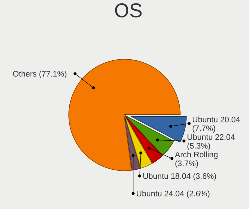

| Name                         | Computers | Percent |
|------------------------------|-----------|---------|
| Ubuntu 20.04                 | 272       | 7.74%   |
| Ubuntu 22.04                 | 185       | 5.27%   |
| Arch Rolling                 | 129       | 3.67%   |
| Ubuntu 18.04                 | 126       | 3.59%   |
| Ubuntu 24.04                 | 92        | 2.62%   |
| Debian 12                    | 85        | 2.42%   |
| Pop!_OS 22.04                | 61        | 1.74%   |
| Linux Mint 22.1              | 57        | 1.62%   |
| Debian 11                    | 56        | 1.59%   |
| Zorin 17                     | 54        | 1.54%   |
| OpenMandriva 4.3             | 54        | 1.54%   |
| Manjaro                      | 50        | 1.42%   |
| Arch                         | 46        | 1.31%   |
| Linux Mint 20.2              | 45        | 1.28%   |
| Fedora 39                    | 45        | 1.28%   |
| Zorin 16                     | 44        | 1.25%   |
| Linux Mint 22.2              | 42        | 1.2%    |
| OpenMandriva 4.2             | 41        | 1.17%   |
| Fedora 40                    | 41        | 1.17%   |
| Linux Mint 21.2              | 38        | 1.08%   |
| Linux Mint 21.1              | 37        | 1.05%   |
| Fedora 42                    | 37        | 1.05%   |
| Fedora 41                    | 36        | 1.02%   |
| EndeavourOS Rolling          | 36        | 1.02%   |
| Fedora 35                    | 34        | 0.97%   |
| openSUSE Tumbleweed-XXXXXXXX | 33        | 0.94%   |
| Fedora 37                    | 33        | 0.94%   |
| Fedora 38                    | 31        | 0.88%   |
| BlackPanther 18.1            | 30        | 0.85%   |
| Linux Mint 21.3              | 29        | 0.83%   |
| Ubuntu 21.04                 | 28        | 0.8%    |
| OpenMandriva 24.12           | 27        | 0.77%   |
| Linux Mint 20.1              | 27        | 0.77%   |
| Debian                       | 27        | 0.77%   |
| ArcoLinux Rolling            | 27        | 0.77%   |
| Linux Mint 19.3              | 26        | 0.74%   |
| Zorin 18                     | 25        | 0.71%   |
| Linux Mint 20.3              | 25        | 0.71%   |
| Ubuntu 20.10                 | 23        | 0.65%   |
| Linux Mint 20                | 23        | 0.65%   |

OS Family
---------

OS without a version

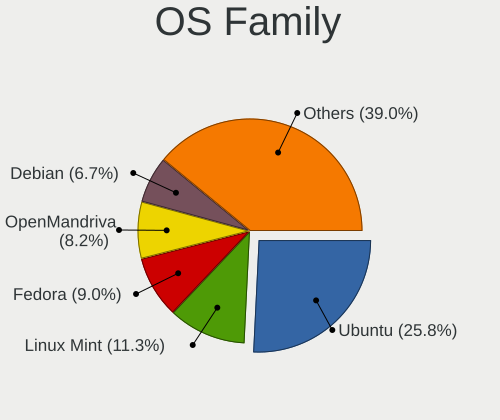

| Name          | Computers | Percent |
|---------------|-----------|---------|
| Ubuntu        | 839       | 25.78%  |
| Linux Mint    | 367       | 11.27%  |
| Fedora        | 292       | 8.97%   |
| OpenMandriva  | 267       | 8.2%    |
| Debian        | 219       | 6.73%   |
| Arch          | 169       | 5.19%   |
| Manjaro       | 133       | 4.09%   |
| Zorin         | 132       | 4.06%   |
| Pop!_OS       | 113       | 3.47%   |
| Kubuntu       | 60        | 1.84%   |
| openSUSE      | 53        | 1.63%   |
| Xubuntu       | 45        | 1.38%   |
| ROSA          | 42        | 1.29%   |
| Elementary    | 37        | 1.14%   |
| EndeavourOS   | 36        | 1.11%   |
| KDE neon      | 35        | 1.08%   |
| BlackPanther  | 35        | 1.08%   |
| ArcoLinux     | 28        | 0.86%   |
| Nobara        | 27        | 0.83%   |
| Ubuntu MATE   | 22        | 0.68%   |
| Bazzite       | 22        | 0.68%   |
| SteamOS       | 20        | 0.61%   |
| LMDE          | 20        | 0.61%   |
| MX            | 18        | 0.55%   |
| Gentoo        | 18        | 0.55%   |
| NixOS         | 17        | 0.52%   |
| CachyOS       | 17        | 0.52%   |
| Kali          | 14        | 0.43%   |
| Garuda Linux  | 12        | 0.37%   |
| Endless       | 12        | 0.37%   |
| Ubuntu Unity  | 10        | 0.31%   |
| Ubuntu Budgie | 10        | 0.31%   |
| TUXEDO OS     | 10        | 0.31%   |
| Ubuntu Studio | 6         | 0.18%   |
| Raspbian      | 6         | 0.18%   |
| Lubuntu       | 6         | 0.18%   |
| Devuan        | 6         | 0.18%   |
| Clear Linux   | 6         | 0.18%   |
| Siduction     | 5         | 0.15%   |
| RHEL          | 5         | 0.15%   |

Kernel
------

Version of the Linux kernel

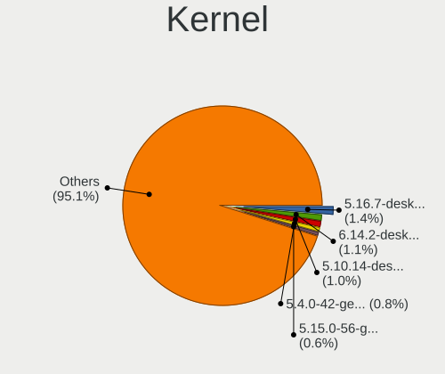

| Version                  | Computers | Percent |
|--------------------------|-----------|---------|
| 5.16.7-desktop-1omv4003  | 54        | 1.39%   |
| 6.14.2-desktop-3omv2590  | 41        | 1.05%   |
| 5.10.14-desktop-1omv4002 | 40        | 1.03%   |
| 5.4.0-42-generic         | 30        | 0.77%   |
| 5.15.0-56-generic        | 25        | 0.64%   |
| 6.8.0-41-generic         | 22        | 0.57%   |
| 6.12.1-desktop-1omv2490  | 22        | 0.57%   |
| 5.4.0-58-generic         | 21        | 0.54%   |
| 6.9.3-76060903-generic   | 19        | 0.49%   |
| 6.8.0-51-generic         | 19        | 0.49%   |
| 6.2.6-desktop-1omv2390   | 18        | 0.46%   |
| 6.14.0-33-generic        | 18        | 0.46%   |
| 5.4.0-52-generic         | 18        | 0.46%   |
| 5.15.0-52-generic        | 18        | 0.46%   |
| 5.15.0-43-generic        | 18        | 0.46%   |
| 4.18.16-desktop-1bP      | 18        | 0.46%   |
| 6.8.0-60-generic         | 17        | 0.44%   |
| 6.8.0-52-generic         | 17        | 0.44%   |
| 6.1.1-desktop-1omv2290   | 17        | 0.44%   |
| 5.13.0-39-generic        | 17        | 0.44%   |
| 6.4.11-desktop-1omv2390  | 16        | 0.41%   |
| 6.14.0-36-generic        | 16        | 0.41%   |
| 5.3.0-46-generic         | 16        | 0.41%   |
| 5.15.0-58-generic        | 16        | 0.41%   |
| 6.6.2-desktop-1omv2390   | 15        | 0.39%   |
| 5.4.0-91-generic         | 15        | 0.39%   |
| 6.8.0-49-generic         | 14        | 0.36%   |
| 6.14.0-35-generic        | 14        | 0.36%   |
| 6.5.0-14-generic         | 13        | 0.33%   |
| 6.14.0-37-generic        | 13        | 0.33%   |
| 5.4.0-48-generic         | 13        | 0.33%   |
| 5.4.0-26-generic         | 13        | 0.33%   |
| 5.13.0-28-generic        | 13        | 0.33%   |
| 6.8.0-45-generic         | 12        | 0.31%   |
| 5.4.0-74-generic         | 12        | 0.31%   |
| 5.4.0-33-generic         | 12        | 0.31%   |
| 5.4.0-28-generic         | 12        | 0.31%   |
| 5.15.0-91-generic        | 12        | 0.31%   |
| 5.13.0-27-generic        | 12        | 0.31%   |
| 5.11.0-37-generic        | 12        | 0.31%   |

Kernel Family
-------------

Linux kernel without a distro release

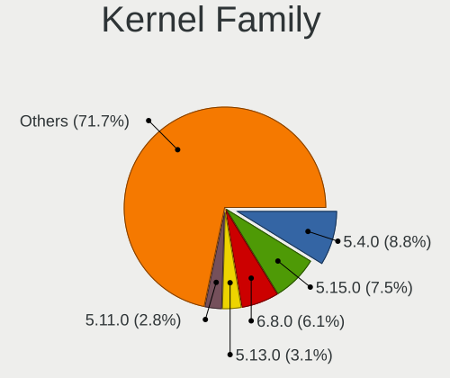

| Version | Computers | Percent |
|---------|-----------|---------|
| 5.4.0   | 325       | 8.8%    |
| 5.15.0  | 276       | 7.47%   |
| 6.8.0   | 225       | 6.09%   |
| 5.13.0  | 115       | 3.11%   |
| 5.11.0  | 103       | 2.79%   |
| 4.15.0  | 103       | 2.79%   |
| 6.14.0  | 94        | 2.54%   |
| 5.8.0   | 94        | 2.54%   |
| 6.1.0   | 93        | 2.52%   |
| 6.5.0   | 82        | 2.22%   |
| 5.19.0  | 75        | 2.03%   |
| 6.2.0   | 69        | 1.87%   |
| 5.3.0   | 66        | 1.79%   |
| 5.10.0  | 58        | 1.57%   |
| 5.16.7  | 56        | 1.52%   |
| 6.11.0  | 48        | 1.3%    |
| 6.14.2  | 43        | 1.16%   |
| 5.10.14 | 42        | 1.14%   |
| 6.2.6   | 35        | 0.95%   |
| 5.0.0   | 35        | 0.95%   |
| 4.18.0  | 34        | 0.92%   |
| 6.12.1  | 24        | 0.65%   |
| 4.19.0  | 23        | 0.62%   |
| 6.9.3   | 21        | 0.57%   |
| 6.4.11  | 20        | 0.54%   |
| 6.6.2   | 19        | 0.51%   |
| 6.1.1   | 18        | 0.49%   |
| 4.18.16 | 18        | 0.49%   |
| 6.8.11  | 15        | 0.41%   |
| 6.17.0  | 13        | 0.35%   |
| 6.8.5   | 12        | 0.32%   |
| 6.12.6  | 12        | 0.32%   |
| 6.10.6  | 12        | 0.32%   |
| 6.6.6   | 11        | 0.3%    |
| 6.6.10  | 11        | 0.3%    |
| 6.17.7  | 11        | 0.3%    |
| 6.10.0  | 11        | 0.3%    |
| 5.6.14  | 11        | 0.3%    |
| 5.17.5  | 11        | 0.3%    |
| 6.8.7   | 10        | 0.27%   |

Kernel Major Ver.
-----------------

Linux kernel major version

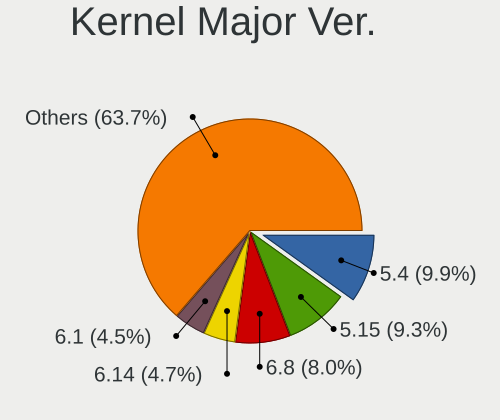

| Version | Computers | Percent |
|---------|-----------|---------|
| 5.4     | 360       | 9.91%   |
| 5.15    | 336       | 9.25%   |
| 6.8     | 289       | 7.96%   |
| 6.14    | 169       | 4.65%   |
| 6.1     | 165       | 4.54%   |
| 5.10    | 144       | 3.96%   |
| 6.2     | 140       | 3.85%   |
| 5.13    | 137       | 3.77%   |
| 5.11    | 125       | 3.44%   |
| 5.8     | 124       | 3.41%   |
| 6.5     | 123       | 3.39%   |
| 6.6     | 117       | 3.22%   |
| 6.12    | 110       | 3.03%   |
| 4.15    | 103       | 2.84%   |
| 5.19    | 100       | 2.75%   |
| 6.11    | 92        | 2.53%   |
| 5.16    | 87        | 2.4%    |
| 5.3     | 79        | 2.18%   |
| 6.17    | 58        | 1.6%    |
| 4.18    | 54        | 1.49%   |
| 6.4     | 52        | 1.43%   |
| 6.9     | 50        | 1.38%   |
| 6.0     | 49        | 1.35%   |
| 6.10    | 46        | 1.27%   |
| 6.15    | 45        | 1.24%   |
| 5.17    | 37        | 1.02%   |
| 6.13    | 36        | 0.99%   |
| 5.0     | 36        | 0.99%   |
| 5.9     | 33        | 0.91%   |
| 5.6     | 32        | 0.88%   |
| 4.19    | 31        | 0.85%   |
| 5.14    | 30        | 0.83%   |
| 6.16    | 29        | 0.8%    |
| 5.12    | 28        | 0.77%   |
| 6.3     | 27        | 0.74%   |
| 5.18    | 26        | 0.72%   |
| 6.7     | 25        | 0.69%   |
| 5.7     | 25        | 0.69%   |
| 4.9     | 22        | 0.61%   |
| 5.5     | 11        | 0.3%    |

Arch
----

OS architecture (x86_64, i586, etc.)

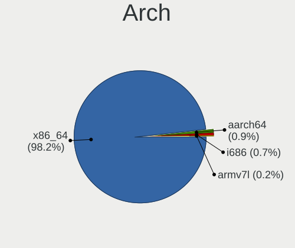

| Name    | Computers | Percent |
|---------|-----------|---------|
| x86_64  | 3071      | 98.24%  |
| aarch64 | 27        | 0.86%   |
| i686    | 21        | 0.67%   |
| armv7l  | 7         | 0.22%   |

DE
--

Desktop Environment

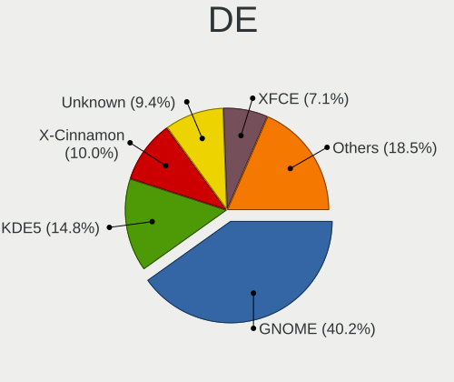

| Name                    | Computers | Percent |
|-------------------------|-----------|---------|
| GNOME                   | 1314      | 40.16%  |
| KDE5                    | 485       | 14.82%  |
| X-Cinnamon              | 327       | 9.99%   |
| Unknown                 | 309       | 9.44%   |
| XFCE                    | 232       | 7.09%   |
| KDE6                    | 231       | 7.06%   |
| MATE                    | 71        | 2.17%   |
| KDE                     | 62        | 1.89%   |
| Pantheon                | 37        | 1.13%   |
| LXQt                    | 26        | 0.79%   |
| Cinnamon                | 26        | 0.79%   |
| KDE4                    | 22        | 0.67%   |
| Budgie                  | 17        | 0.52%   |
| i3                      | 16        | 0.49%   |
| Hyprland                | 13        | 0.4%    |
| Unity                   | 10        | 0.31%   |
| sway                    | 9         | 0.28%   |
| LXDE                    | 8         | 0.24%   |
| COSMIC                  | 7         | 0.21%   |
| GNOME Flashback         | 6         | 0.18%   |
| Deepin                  | 6         | 0.18%   |
| awesome                 | 6         | 0.18%   |
| xmonad                  | 4         | 0.12%   |
| sway:wlroots            | 4         | 0.12%   |
| qtile                   | 2         | 0.06%   |
| openbox                 | 2         | 0.06%   |
| niri                    | 2         | 0.06%   |
| lightdm-xsession        | 2         | 0.06%   |
| labwc:wlroots           | 2         | 0.06%   |
| GNOME Classic           | 2         | 0.06%   |
| fluxbox                 | 2         | 0.06%   |
| Trinity                 | 1         | 0.03%   |
| Phosh:GNOME             | 1         | 0.03%   |
| leftwm                  | 1         | 0.03%   |
| Hyprland:start-hyprland | 1         | 0.03%   |
| gamescope               | 1         | 0.03%   |
| Enlightenment           | 1         | 0.03%   |
| Endless:GNOME           | 1         | 0.03%   |
| DWM                     | 1         | 0.03%   |
| DDE                     | 1         | 0.03%   |

Display Server
--------------

X11 or Wayland

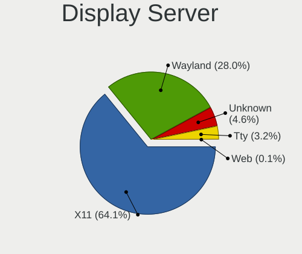

| Name    | Computers | Percent |
|---------|-----------|---------|
| X11     | 2093      | 64.12%  |
| Wayland | 913       | 27.97%  |
| Unknown | 151       | 4.63%   |
| Tty     | 105       | 3.22%   |
| Web     | 2         | 0.06%   |

Display Manager
---------------

SDDM, LightDM, etc.

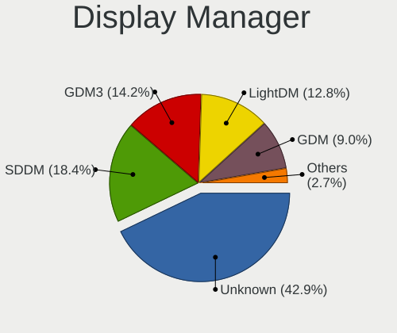

| Name           | Computers | Percent |
|----------------|-----------|---------|
| Unknown        | 1402      | 42.87%  |
| SDDM           | 603       | 18.44%  |
| GDM3           | 464       | 14.19%  |
| LightDM        | 417       | 12.75%  |
| GDM            | 295       | 9.02%   |
| TDM            | 51        | 1.56%   |
| KDM            | 21        | 0.64%   |
| SLiM           | 5         | 0.15%   |
| COSMIC-GREETER | 4         | 0.12%   |
| XDM            | 2         | 0.06%   |
| LXDM           | 2         | 0.06%   |
| PLASMALOGIN    | 1         | 0.03%   |
| MDM            | 1         | 0.03%   |
| Ly             | 1         | 0.03%   |
| GREETD         | 1         | 0.03%   |

OS Lang
-------

Language

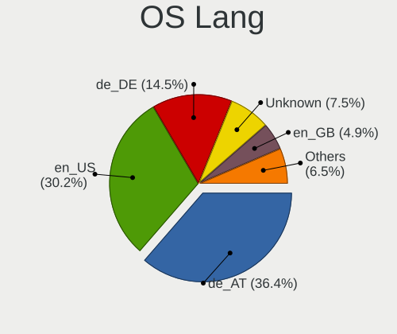

| Lang       | Computers | Percent |
|------------|-----------|---------|
| de_AT      | 1178      | 36.38%  |
| en_US      | 977       | 30.17%  |
| de_DE      | 471       | 14.55%  |
| Unknown    | 243       | 7.5%    |
| en_GB      | 160       | 4.94%   |
| C          | 71        | 2.19%   |
| en_IE      | 27        | 0.83%   |
| pl_PL      | 14        | 0.43%   |
| es_ES      | 10        | 0.31%   |
| it_IT      | 8         | 0.25%   |
| hu_HU      | 8         | 0.25%   |
| ru_RU      | 6         | 0.19%   |
| POSIX      | 6         | 0.19%   |
| de_CH      | 6         | 0.19%   |
| en_AT      | 5         | 0.15%   |
| tr_TR      | 4         | 0.12%   |
| uk_UA      | 3         | 0.09%   |
| en_AU      | 3         | 0.09%   |
| C.UTF8     | 3         | 0.09%   |
| sk_SK      | 2         | 0.06%   |
| ro_RO      | 2         | 0.06%   |
| nl_NL      | 2         | 0.06%   |
| nl_BE      | 2         | 0.06%   |
| fr_FR      | 2         | 0.06%   |
| en_DE      | 2         | 0.06%   |
| en_CA      | 2         | 0.06%   |
| de_AT.UTF8 | 2         | 0.06%   |
| cs_CZ      | 2         | 0.06%   |
| bg_BG      | 2         | 0.06%   |
| UTF-8      | 1         | 0.03%   |
| sv_SE      | 1         | 0.03%   |
| sr_RS      | 1         | 0.03%   |
| ru_UA      | 1         | 0.03%   |
| pt_BR      | 1         | 0.03%   |
| nb_NO      | 1         | 0.03%   |
| hr_HR      | 1         | 0.03%   |
| gl_ES      | 1         | 0.03%   |
| fa_IR      | 1         | 0.03%   |
| en_US.UTF8 | 1         | 0.03%   |
| en_BW      | 1         | 0.03%   |

Boot Mode
---------

EFI or BIOS

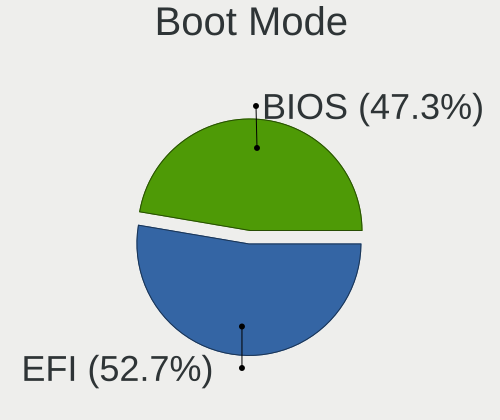

| Mode | Computers | Percent |
|------|-----------|---------|
| EFI  | 1693      | 52.68%  |
| BIOS | 1521      | 47.32%  |

Filesystem
----------

Type of filesystem

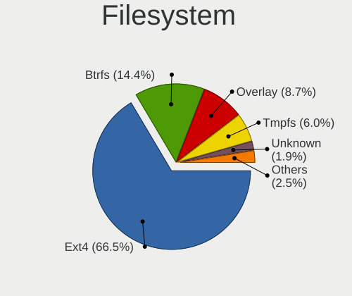

| Type    | Computers | Percent |
|---------|-----------|---------|
| Ext4    | 2155      | 66.47%  |
| Btrfs   | 467       | 14.4%   |
| Overlay | 283       | 8.73%   |
| Tmpfs   | 193       | 5.95%   |
| Unknown | 62        | 1.91%   |
| Xfs     | 42        | 1.3%    |
| Zfs     | 24        | 0.74%   |
| Ext2    | 6         | 0.19%   |
| F2fs    | 4         | 0.12%   |
| Ext3    | 3         | 0.09%   |
| XXXXXXX | 1         | 0.03%   |
| Nfs     | 1         | 0.03%   |
| Aufs    | 1         | 0.03%   |

Part. scheme
------------

Scheme of partitioning

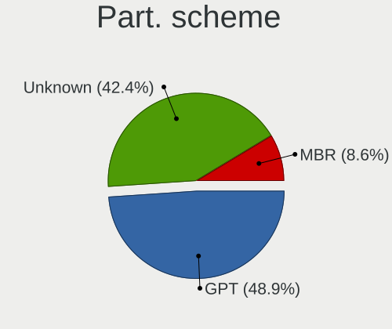

| Type    | Computers | Percent |
|---------|-----------|---------|
| GPT     | 1577      | 48.93%  |
| Unknown | 1368      | 42.44%  |
| MBR     | 278       | 8.63%   |

Dual Boot with Linux/BSD
------------------------

Hosting more than one Linux/BSD

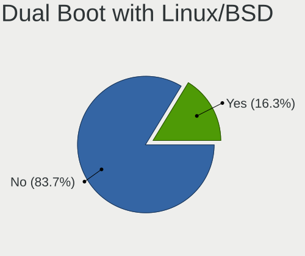

| Dual boot | Computers | Percent |
|-----------|-----------|---------|
| No        | 2683      | 83.71%  |
| Yes       | 522       | 16.29%  |

Dual Boot (Win)
---------------

Hosting Linux and Windows

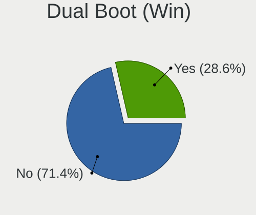

| Dual boot | Computers | Percent |
|-----------|-----------|---------|
| No        | 2281      | 71.42%  |
| Yes       | 913       | 28.58%  |

Board
-----

Vendor
------

Motherboard manufacturer

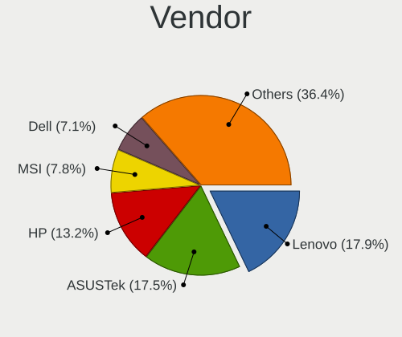

| Name                                 | Computers | Percent |
|--------------------------------------|-----------|---------|
| Lenovo                               | 559       | 17.89%  |
| ASUSTek Computer                     | 548       | 17.54%  |
| Hewlett-Packard                      | 414       | 13.25%  |
| MSI                                  | 245       | 7.84%   |
| Dell                                 | 221       | 7.07%   |
| Gigabyte Technology                  | 174       | 5.57%   |
| Acer                                 | 166       | 5.31%   |
| ASRock                               | 134       | 4.29%   |
| Apple                                | 79        | 2.53%   |
| Medion                               | 68        | 2.18%   |
| Fujitsu                              | 38        | 1.22%   |
| Toshiba                              | 37        | 1.18%   |
| Intel                                | 37        | 1.18%   |
| Unknown                              | 30        | 0.96%   |
| TUXEDO                               | 29        | 0.93%   |
| Sony                                 | 27        | 0.86%   |
| Raspberry Pi Foundation              | 20        | 0.64%   |
| Valve                                | 17        | 0.54%   |
| HUAWEI                               | 17        | 0.54%   |
| Microsoft                            | 16        | 0.51%   |
| Shenzhen Meigao Electronic Equipment | 15        | 0.48%   |
| Samsung Electronics                  | 15        | 0.48%   |
| Supermicro                           | 11        | 0.35%   |
| Fujitsu Siemens                      | 11        | 0.35%   |
| Biostar                              | 10        | 0.32%   |
| ZOTAC                                | 9         | 0.29%   |
| TrekStor                             | 8         | 0.26%   |
| BESSTAR Tech                         | 8         | 0.26%   |
| Schenker                             | 7         | 0.22%   |
| Notebook                             | 7         | 0.22%   |
| Framework                            | 7         | 0.22%   |
| Foxconn                              | 7         | 0.22%   |
| AZW                                  | 7         | 0.22%   |
| Shuttle                              | 6         | 0.19%   |
| AMI                                  | 6         | 0.19%   |
| Pegatron                             | 5         | 0.16%   |
| Wortmann AG                          | 4         | 0.13%   |
| VALE                                 | 4         | 0.13%   |
| Timi                                 | 4         | 0.13%   |
| Razer                                | 4         | 0.13%   |

Model
-----

Motherboard model

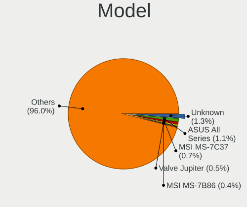

| Name                                                  | Computers | Percent |
|-------------------------------------------------------|-----------|---------|
| Unknown                                               | 41        | 1.31%   |
| ASUS All Series                                       | 33        | 1.06%   |
| MSI MS-7C37                                           | 23        | 0.74%   |
| Valve Jupiter                                         | 15        | 0.48%   |
| MSI MS-7B86                                           | 12        | 0.38%   |
| HP Notebook                                           | 11        | 0.35%   |
| ASUS ROG STRIX B550-F GAMING                          | 11        | 0.35%   |
| MSI MS-7C91                                           | 10        | 0.32%   |
| ASUS PRIME B450-PLUS                                  | 10        | 0.32%   |
| ASUS H110M-A                                          | 10        | 0.32%   |
| MSI MS-7B79                                           | 8         | 0.26%   |
| Apple MacBookPro15,1                                  | 8         | 0.26%   |
| HP EliteBook 8570p                                    | 7         | 0.22%   |
| HP EliteBook 840 G6                                   | 7         | 0.22%   |
| HP EliteBook 840 G3                                   | 7         | 0.22%   |
| ASUS TUF Gaming B550-PLUS                             | 7         | 0.22%   |
| ASUS ROG STRIX B450-F GAMING                          | 7         | 0.22%   |
| Apple MacBookPro9,2                                   | 7         | 0.22%   |
| RPi Raspberry Pi 4 Model B Rev 1.1                    | 6         | 0.19%   |
| MSI MS-7C56                                           | 6         | 0.19%   |
| MSI MS-7817                                           | 6         | 0.19%   |
| HP Pavilion dv7                                       | 6         | 0.19%   |
| HP Pavilion dv6                                       | 6         | 0.19%   |
| HP EliteBook 840 G1                                   | 6         | 0.19%   |
| ASUS TUF Gaming X570-PLUS                             | 6         | 0.19%   |
| ASUS PRIME B550-PLUS                                  | 6         | 0.19%   |
| ASRock Z87 Killer                                     | 6         | 0.19%   |
| Apple MacBookPro8,1                                   | 6         | 0.19%   |
| Toshiba Satellite C70D-B                              | 5         | 0.16%   |
| Shenzhen Meigao Electronic Equipment EliteMini Series | 5         | 0.16%   |
| RPi Raspberry Pi                                      | 5         | 0.16%   |
| MSI MS-7E26                                           | 5         | 0.16%   |
| Lenovo IdeaPad 5 15ARE05 81YQ                         | 5         | 0.16%   |
| HP EliteBook 8460p                                    | 5         | 0.16%   |
| HP EliteBook 840 G8 Notebook PC                       | 5         | 0.16%   |
| Gigabyte B450 AORUS ELITE                             | 5         | 0.16%   |
| Dell XPS 15 9570                                      | 5         | 0.16%   |
| Dell Latitude E6400                                   | 5         | 0.16%   |
| ASUS PRIME X470-PRO                                   | 5         | 0.16%   |
| ASUS ASUS EXPERTBOOK B1500CEAEY_B1500CEAE             | 5         | 0.16%   |

Model Family
------------

Motherboard model prefix

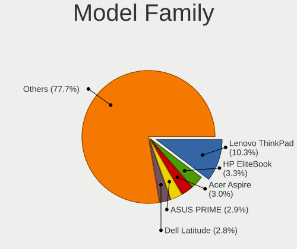

| Name               | Computers | Percent |
|--------------------|-----------|---------|
| Lenovo ThinkPad    | 323       | 10.34%  |
| HP EliteBook       | 103       | 3.3%    |
| Acer Aspire        | 93        | 2.98%   |
| ASUS PRIME         | 92        | 2.94%   |
| Dell Latitude      | 87        | 2.78%   |
| ASUS ROG           | 83        | 2.66%   |
| Lenovo IdeaPad     | 51        | 1.63%   |
| HP ProBook         | 50        | 1.6%    |
| HP Pavilion        | 47        | 1.5%    |
| Lenovo Yoga        | 43        | 1.38%   |
| Dell XPS           | 41        | 1.31%   |
| Unknown            | 41        | 1.31%   |
| ASUS TUF           | 35        | 1.12%   |
| Toshiba Satellite  | 34        | 1.09%   |
| ASUS All           | 33        | 1.06%   |
| Lenovo ThinkCentre | 31        | 0.99%   |
| HP Compaq          | 31        | 0.99%   |
| Dell Precision     | 29        | 0.93%   |
| ASUS VivoBook      | 25        | 0.8%    |
| MSI MS-7C37        | 23        | 0.74%   |
| Dell OptiPlex      | 23        | 0.74%   |
| Dell Inspiron      | 23        | 0.74%   |
| RPi Raspberry      | 20        | 0.64%   |
| Lenovo ThinkBook   | 20        | 0.64%   |
| Fujitsu LIFEBOOK   | 19        | 0.61%   |
| HP ZBook           | 18        | 0.58%   |
| HP ENVY            | 18        | 0.58%   |
| Microsoft Surface  | 16        | 0.51%   |
| HP Laptop          | 16        | 0.51%   |
| HP EliteDesk       | 16        | 0.51%   |
| Valve Jupiter      | 15        | 0.48%   |
| Gigabyte B550      | 15        | 0.48%   |
| Acer Swift         | 15        | 0.48%   |
| Gigabyte X570      | 14        | 0.45%   |
| Acer TravelMate    | 14        | 0.45%   |
| Lenovo Legion      | 13        | 0.42%   |
| MSI MS-7B86        | 12        | 0.38%   |
| Acer Nitro         | 12        | 0.38%   |
| HP Notebook        | 11        | 0.35%   |
| ASUS H110M-A       | 11        | 0.35%   |

MFG Year
--------

Motherboard manufacture year

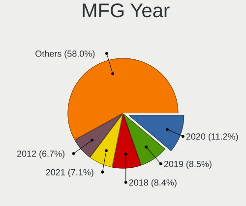

| Year    | Computers | Percent |
|---------|-----------|---------|
| 2020    | 349       | 11.17%  |
| 2019    | 266       | 8.51%   |
| 2018    | 264       | 8.45%   |
| 2021    | 222       | 7.1%    |
| 2012    | 210       | 6.72%   |
| 2017    | 188       | 6.02%   |
| 2011    | 188       | 6.02%   |
| 2013    | 176       | 5.63%   |
| 2014    | 170       | 5.44%   |
| 2015    | 165       | 5.28%   |
| 2022    | 161       | 5.15%   |
| 2016    | 155       | 4.96%   |
| 2023    | 129       | 4.13%   |
| 2010    | 110       | 3.52%   |
| 2009    | 92        | 2.94%   |
| 2024    | 86        | 2.75%   |
| 2008    | 80        | 2.56%   |
| 2007    | 45        | 1.44%   |
| Unknown | 26        | 0.83%   |
| 2025    | 22        | 0.7%    |
| 2006    | 18        | 0.58%   |
| 2005    | 3         | 0.1%    |

Form Factor
-----------

Physical design of the computer

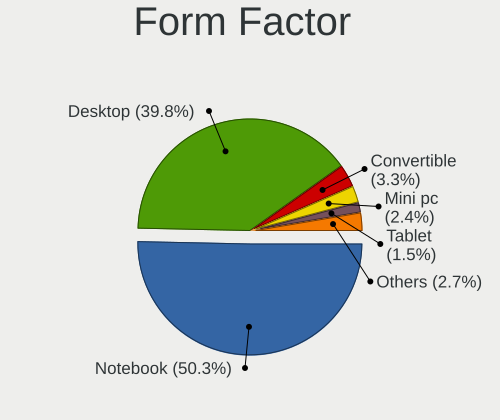

| Name           | Computers | Percent |
|----------------|-----------|---------|
| Notebook       | 1573      | 50.34%  |
| Desktop        | 1245      | 39.84%  |
| Convertible    | 102       | 3.26%   |
| Mini pc        | 76        | 2.43%   |
| Tablet         | 46        | 1.47%   |
| System on chip | 33        | 1.06%   |
| Server         | 32        | 1.02%   |
| All in one     | 16        | 0.51%   |
| Stick pc       | 1         | 0.03%   |
| Firewall       | 1         | 0.03%   |

Secure Boot
-----------

Enabled or disabled

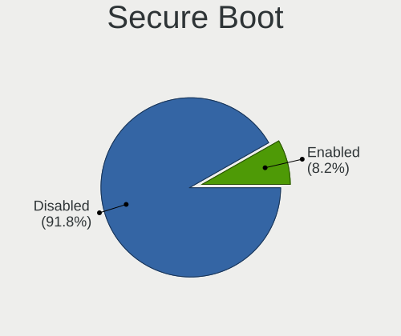

| State    | Computers | Percent |
|----------|-----------|---------|
| Disabled | 2899      | 91.77%  |
| Enabled  | 260       | 8.23%   |

Coreboot
--------

Have coreboot on board

| Used | Computers | Percent |
|------|-----------|---------|
| No   | 3118      | 99.78%  |
| Yes  | 7         | 0.22%   |

RAM Size
--------

Total RAM memory

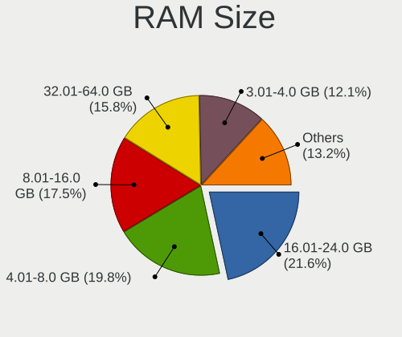

| Size in GB      | Computers | Percent |
|-----------------|-----------|---------|
| 16.01-24.0      | 686       | 21.63%  |
| 4.01-8.0        | 627       | 19.77%  |
| 8.01-16.0       | 554       | 17.47%  |
| 32.01-64.0      | 502       | 15.83%  |
| 3.01-4.0        | 385       | 12.14%  |
| 64.01-256.0     | 175       | 5.52%   |
| 24.01-32.0      | 133       | 4.19%   |
| 1.01-2.0        | 62        | 1.95%   |
| 2.01-3.0        | 20        | 0.63%   |
| More than 256.0 | 14        | 0.44%   |
| 0.51-1.0        | 13        | 0.41%   |
| Unknown         | 1         | 0.03%   |

RAM Used
--------

Used RAM memory

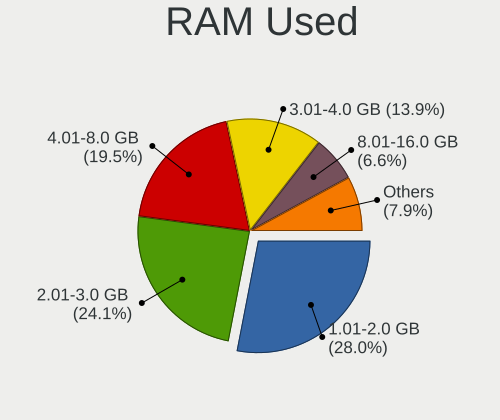

| Used GB         | Computers | Percent |
|-----------------|-----------|---------|
| 1.01-2.0        | 985       | 28.05%  |
| 2.01-3.0        | 845       | 24.06%  |
| 4.01-8.0        | 686       | 19.53%  |
| 3.01-4.0        | 487       | 13.87%  |
| 8.01-16.0       | 231       | 6.58%   |
| 0.51-1.0        | 162       | 4.61%   |
| 16.01-24.0      | 44        | 1.25%   |
| 24.01-32.0      | 28        | 0.8%    |
| 0.01-0.5        | 25        | 0.71%   |
| 32.01-64.0      | 17        | 0.48%   |
| More than 256.0 | 1         | 0.03%   |
| Unknown         | 1         | 0.03%   |

Total Drives
------------

Number of drives on board

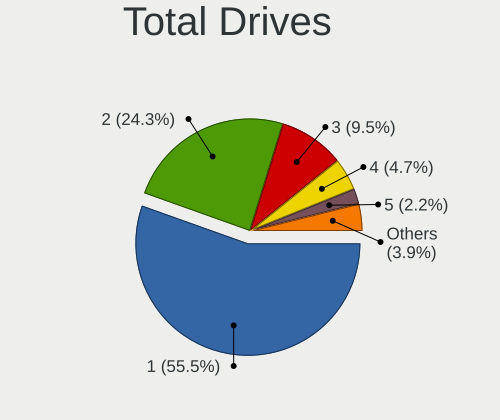

| Drives | Computers | Percent |
|--------|-----------|---------|
| 1      | 1805      | 55.45%  |
| 2      | 791       | 24.3%   |
| 3      | 308       | 9.46%   |
| 4      | 152       | 4.67%   |
| 5      | 72        | 2.21%   |
| 6      | 46        | 1.41%   |
| 7      | 23        | 0.71%   |
| 0      | 18        | 0.55%   |
| 9      | 13        | 0.4%    |
| 10     | 9         | 0.28%   |
| 8      | 7         | 0.22%   |
| 11     | 5         | 0.15%   |
| 12     | 3         | 0.09%   |
| 18     | 2         | 0.06%   |
| 14     | 1         | 0.03%   |

Has CD-ROM
----------

Has CD-ROM on board

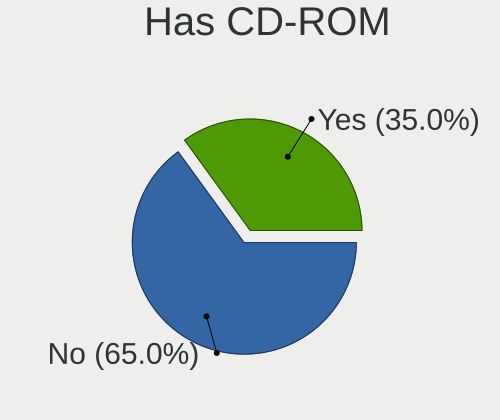

| Presented | Computers | Percent |
|-----------|-----------|---------|
| No        | 2047      | 65%     |
| Yes       | 1102      | 35%     |

Has Ethernet
------------

Has Ethernet on board

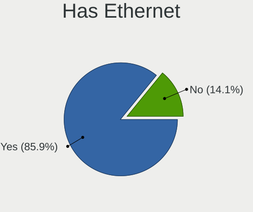

| Presented | Computers | Percent |
|-----------|-----------|---------|
| Yes       | 2694      | 85.88%  |
| No        | 443       | 14.12%  |

Has WiFi
--------

Has WiFi module

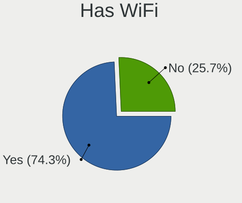

| Presented | Computers | Percent |
|-----------|-----------|---------|
| Yes       | 2337      | 74.28%  |
| No        | 809       | 25.72%  |

Has Bluetooth
-------------

Has Bluetooth module

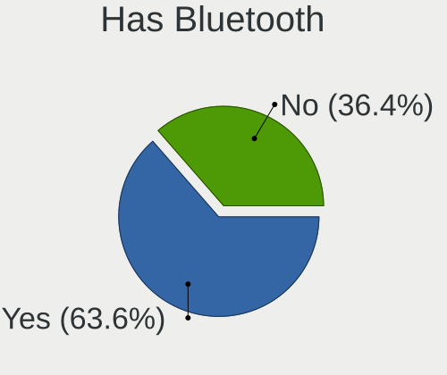

| Presented | Computers | Percent |
|-----------|-----------|---------|
| Yes       | 2007      | 63.59%  |
| No        | 1149      | 36.41%  |

Location
--------

Country
-------

Geographic location (country)

| Country | Computers | Percent |
|---------|-----------|---------|
| Austria | 3125      | 100%    |

City
----

Geographic location (city)

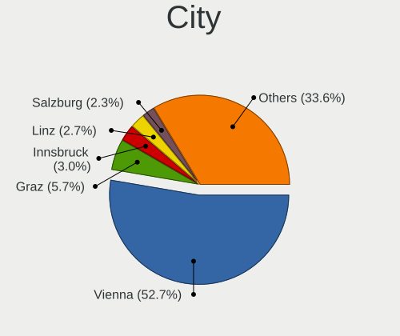

| City             | Computers | Percent |
|------------------|-----------|---------|
| Vienna           | 1749      | 52.68%  |
| Graz             | 188       | 5.66%   |
| Innsbruck        | 99        | 2.98%   |
| Linz             | 91        | 2.74%   |
| Salzburg         | 76        | 2.29%   |
| Klagenfurt       | 37        | 1.11%   |
| Sankt Pölten    | 32        | 0.96%   |
| Dornbirn         | 32        | 0.96%   |
| Bad Hall         | 31        | 0.93%   |
| Wels             | 29        | 0.87%   |
| Wiener Neustadt  | 25        | 0.75%   |
| Villach          | 23        | 0.69%   |
| Steyr            | 21        | 0.63%   |
| Leonding         | 18        | 0.54%   |
| Baden bei Wien   | 16        | 0.48%   |
| Feldkirch        | 15        | 0.45%   |
| Traun            | 10        | 0.3%    |
| Perg             | 10        | 0.3%    |
| Hallein          | 10        | 0.3%    |
| Wörgl           | 9         | 0.27%   |
| Bregenz          | 9         | 0.27%   |
| Ried im Innkreis | 8         | 0.24%   |
| Mödling         | 8         | 0.24%   |
| Schwechat        | 7         | 0.21%   |
| Perchtoldsdorf   | 7         | 0.21%   |
| Leibnitz, Styria | 7         | 0.21%   |
| Kufstein         | 7         | 0.21%   |
| Korneuburg       | 7         | 0.21%   |
| Knittelfeld      | 7         | 0.21%   |
| Falkenstein      | 7         | 0.21%   |
| Zell am See      | 6         | 0.18%   |
| Voecklabruck     | 6         | 0.18%   |
| Traiskirchen     | 6         | 0.18%   |
| Lustenau         | 6         | 0.18%   |
| Klosterneuburg   | 6         | 0.18%   |
| Hall in Tirol    | 6         | 0.18%   |
| Zirl             | 5         | 0.15%   |
| Traunkirchen     | 5         | 0.15%   |
| Mautern          | 5         | 0.15%   |
| Lienz            | 5         | 0.15%   |

Drives
------

Drive Vendor
------------

Hard drive vendors

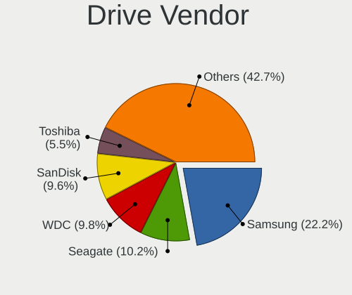

| Vendor                       | Computers | Drives | Percent |
|------------------------------|-----------|--------|---------|
| Samsung Electronics          | 1081      | 1849   | 22.17%  |
| Seagate                      | 498       | 784    | 10.21%  |
| WDC                          | 479       | 796    | 9.82%   |
| SanDisk                      | 467       | 676    | 9.58%   |
| Toshiba                      | 268       | 424    | 5.5%    |
| Crucial                      | 231       | 376    | 4.74%   |
| Kingston                     | 220       | 310    | 4.51%   |
| Unknown                      | 181       | 282    | 3.71%   |
| SK hynix                     | 128       | 183    | 2.63%   |
| Intel                        | 121       | 159    | 2.48%   |
| Intenso                      | 100       | 150    | 2.05%   |
| Micron Technology            | 95        | 123    | 1.95%   |
| Hitachi                      | 84        | 101    | 1.72%   |
| Micron/Crucial Technology    | 74        | 100    | 1.52%   |
| HGST                         | 53        | 86     | 1.09%   |
| KIOXIA                       | 48        | 75     | 0.98%   |
| Kingston Technology Company  | 40        | 76     | 0.82%   |
| Apple                        | 40        | 60     | 0.82%   |
| Phison Electronics           | 39        | 56     | 0.8%    |
| Transcend                    | 38        | 48     | 0.78%   |
| A-DATA Technology            | 34        | 44     | 0.7%    |
| China                        | 33        | 48     | 0.68%   |
| Phison                       | 31        | 44     | 0.64%   |
| Silicon Motion               | 21        | 24     | 0.43%   |
| OCZ                          | 20        | 32     | 0.41%   |
| Unknown                      | 20        | 26     | 0.41%   |
| MAXIO Technology (Hangzhou)  | 19        | 21     | 0.39%   |
| Corsair                      | 19        | 22     | 0.39%   |
| ASMT                         | 17        | 26     | 0.35%   |
| Patriot                      | 15        | 19     | 0.31%   |
| JMicron Technology           | 15        | 38     | 0.31%   |
| SABRENT                      | 14        | 16     | 0.29%   |
| LITEON                       | 14        | 16     | 0.29%   |
| Fanxiang                     | 14        | 16     | 0.29%   |
| USB                          | 13        | 14     | 0.27%   |
| Hewlett-Packard              | 13        | 25     | 0.27%   |
| Verbatim                     | 12        | 13     | 0.25%   |
| Shenzhen Longsys Electronics | 10        | 13     | 0.21%   |
| LITEONIT                     | 10        | 13     | 0.21%   |
| INNOVATION IT                | 9         | 12     | 0.18%   |

Drive Model
-----------

Hard drive models

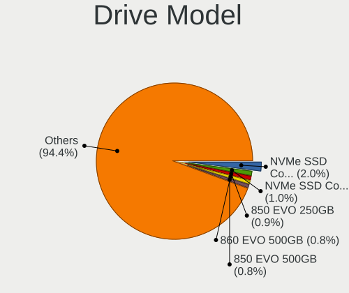

| Model                                                | Computers | Percent |
|------------------------------------------------------|-----------|---------|
| Samsung NVMe SSD Controller SM981/PM981/PM983 1TB    | 110       | 1.98%   |
| Samsung NVMe SSD Controller PM9A1/PM9A3/980PRO 1TB   | 58        | 1.04%   |
| Samsung SSD 850 EVO 250GB                            | 51        | 0.92%   |
| Samsung SSD 860 EVO 500GB                            | 47        | 0.85%   |
| Samsung SSD 850 EVO 500GB                            | 45        | 0.81%   |
| Crucial CT500MX500SSD1 500GB                         | 36        | 0.65%   |
| Unknown MMC Card  64GB                               | 34        | 0.61%   |
| Samsung SSD 860 EVO 1TB                              | 33        | 0.59%   |
| SanDisk SSD PLUS 1000GB                              | 31        | 0.56%   |
| Crucial CT1000MX500SSD1 1TB                          | 31        | 0.56%   |
| Samsung SSD 850 PRO 256GB                            | 30        | 0.54%   |
| Seagate Expansion 2TB                                | 29        | 0.52%   |
| SanDisk SSD PLUS 240GB                               | 29        | 0.52%   |
| Samsung NVMe SSD Controller SM961/PM961/SM963 1024GB | 29        | 0.52%   |
| Samsung SSD 840 EVO 250GB                            | 27        | 0.49%   |
| Samsung NVMe SSD Drive 512GB                         | 27        | 0.49%   |
| Micron/Crucial P2 NVMe PCIe SSD 2TB                  | 25        | 0.45%   |
| Kingston SA400S37240G 240GB SSD                      | 25        | 0.45%   |
| SanDisk NVMe SSD Drive 1TB                           | 23        | 0.41%   |
| Toshiba MQ01ABD100 1TB                               | 22        | 0.4%    |
| Samsung SSD 870 EVO 1TB                              | 22        | 0.4%    |
| Samsung SSD 860 EVO 250GB                            | 22        | 0.4%    |
| Toshiba DT01ACA200 2TB                               | 21        | 0.38%   |
| Seagate ST2000DM008-2FR102 2TB                       | 21        | 0.38%   |
| Sandisk WD Black SN750 / PC SN730 NVMe SSD 500GB     | 21        | 0.38%   |
| Samsung SSD 870 QVO 1TB                              | 21        | 0.38%   |
| Unknown MMC Card  32GB                               | 20        | 0.36%   |
| Samsung SSD 980 PRO 1TB                              | 20        | 0.36%   |
| Unknown                                              | 20        | 0.36%   |
| Crucial CT240BX500SSD1 240GB                         | 19        | 0.34%   |
| Toshiba DT01ACA100 1TB                               | 18        | 0.32%   |
| Seagate ST1000LM024 HN-M101MBB 1TB                   | 18        | 0.32%   |
| SanDisk SSD PLUS 480GB                               | 18        | 0.32%   |
| SanDisk SDSSDH3 1T00 1TB                             | 18        | 0.32%   |
| Samsung SSD 980 1TB                                  | 18        | 0.32%   |
| Samsung SSD 970 EVO Plus 1TB                         | 18        | 0.32%   |
| Samsung NVMe SSD Drive 500GB                         | 18        | 0.32%   |
| Samsung NVMe SSD Drive 1TB                           | 18        | 0.32%   |
| Kingston SUV400S37240G 240GB SSD                     | 18        | 0.32%   |
| Kingston SA400S37480G 480GB SSD                      | 18        | 0.32%   |

HDD Vendor
----------

Hard disk drive vendors

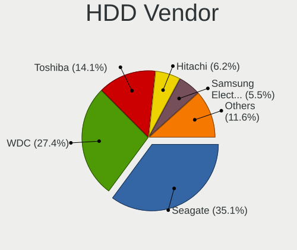

| Vendor              | Computers | Drives | Percent |
|---------------------|-----------|--------|---------|
| Seagate             | 477       | 737    | 35.13%  |
| WDC                 | 372       | 633    | 27.39%  |
| Toshiba             | 192       | 311    | 14.14%  |
| Hitachi             | 84        | 101    | 6.19%   |
| Samsung Electronics | 75        | 114    | 5.52%   |
| HGST                | 53        | 86     | 3.9%    |
| Unknown             | 19        | 28     | 1.4%    |
| Intenso             | 18        | 22     | 1.33%   |
| JMicron Technology  | 9         | 31     | 0.66%   |
| Hewlett-Packard     | 6         | 19     | 0.44%   |
| ASMT                | 6         | 12     | 0.44%   |
| Apple               | 6         | 8      | 0.44%   |
| USB                 | 5         | 5      | 0.37%   |
| Maxtor              | 5         | 6      | 0.37%   |
| Fujitsu             | 4         | 5      | 0.29%   |
| SSK                 | 3         | 3      | 0.22%   |
| LaCie               | 3         | 3      | 0.22%   |
| TO Exter            | 2         | 4      | 0.15%   |
| SABRENT             | 2         | 2      | 0.15%   |
| JetFlash            | 2         | 2      | 0.15%   |
| IB-1122             | 2         | 2      | 0.15%   |
| WD MediaMax         | 1         | 1      | 0.07%   |
| USB3.0              | 1         | 2      | 0.07%   |
| TrueNAS             | 1         | 1      | 0.07%   |
| Synology            | 1         | 8      | 0.07%   |
| NETAPP              | 1         | 18     | 0.07%   |
| Magnetic Data       | 1         | 1      | 0.07%   |
| LENOVO-X            | 1         | 4      | 0.07%   |
| Inateck             | 1         | 1      | 0.07%   |
| IET                 | 1         | 8      | 0.07%   |
| IBM-ESXS            | 1         | 2      | 0.07%   |
| IB                  | 1         | 2      | 0.07%   |
| Ext Hard            | 1         | 1      | 0.07%   |
| ASMedia             | 1         | 1      | 0.07%   |

SSD Vendor
----------

Solid state drive vendors

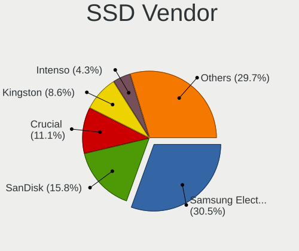

| Vendor              | Computers | Drives | Percent |
|---------------------|-----------|--------|---------|
| Samsung Electronics | 553       | 846    | 30.52%  |
| SanDisk             | 286       | 408    | 15.78%  |
| Crucial             | 202       | 316    | 11.15%  |
| Kingston            | 155       | 203    | 8.55%   |
| Intenso             | 78        | 121    | 4.3%    |
| WDC                 | 56        | 74     | 3.09%   |
| Intel               | 49        | 67     | 2.7%    |
| Transcend           | 35        | 40     | 1.93%   |
| Micron Technology   | 35        | 49     | 1.93%   |
| China               | 33        | 48     | 1.82%   |
| SK hynix            | 28        | 48     | 1.55%   |
| A-DATA Technology   | 27        | 35     | 1.49%   |
| OCZ                 | 20        | 32     | 1.1%    |
| Apple               | 19        | 22     | 1.05%   |
| Toshiba             | 14        | 16     | 0.77%   |
| LITEON              | 14        | 16     | 0.77%   |
| SABRENT             | 12        | 14     | 0.66%   |
| Corsair             | 11        | 11     | 0.61%   |
| LITEONIT            | 10        | 13     | 0.55%   |
| Verbatim            | 9         | 10     | 0.5%    |
| Patriot             | 9         | 10     | 0.5%    |
| INNOVATION IT       | 9         | 12     | 0.5%    |
| ASMT                | 9         | 10     | 0.5%    |
| Fanxiang            | 7         | 9      | 0.39%   |
| PNY                 | 6         | 7      | 0.33%   |
| Netac               | 6         | 10     | 0.33%   |
| GOODRAM             | 6         | 6      | 0.33%   |
| Dogfish             | 6         | 6      | 0.33%   |
| Unknown             | 6         | 6      | 0.33%   |
| SPCC                | 5         | 5      | 0.28%   |
| Seagate             | 5         | 7      | 0.28%   |
| Phison              | 5         | 7      | 0.28%   |
| Apacer              | 5         | 6      | 0.28%   |
| KingDian            | 4         | 4      | 0.22%   |
| Hewlett-Packard     | 4         | 4      | 0.22%   |
| Emtec               | 4         | 4      | 0.22%   |
| Unknown             | 3         | 4      | 0.17%   |
| TCSUNBOW            | 3         | 3      | 0.17%   |
| SD                  | 3         | 4      | 0.17%   |
| Plextor             | 3         | 3      | 0.17%   |

Drive Kind
----------

HDD or SSD

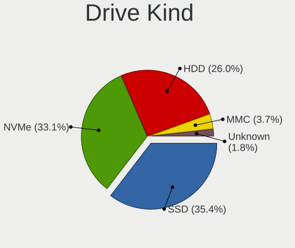

| Kind    | Computers | Drives | Percent |
|---------|-----------|--------|---------|
| SSD     | 1521      | 2587   | 35.45%  |
| NVMe    | 1419      | 2384   | 33.07%  |
| HDD     | 1114      | 2184   | 25.96%  |
| MMC     | 160       | 236    | 3.73%   |
| Unknown | 77        | 151    | 1.79%   |

Drive Connector
---------------

SATA, SAS, NVMe, etc.

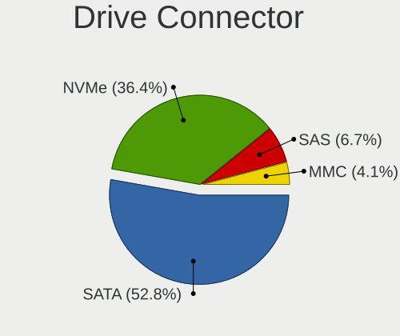

| Type | Computers | Drives | Percent |
|------|-----------|--------|---------|
| SATA | 2050      | 4483   | 52.78%  |
| NVMe | 1415      | 2363   | 36.43%  |
| SAS  | 259       | 460    | 6.67%   |
| MMC  | 160       | 236    | 4.12%   |

Drive Size
----------

Size of hard drive

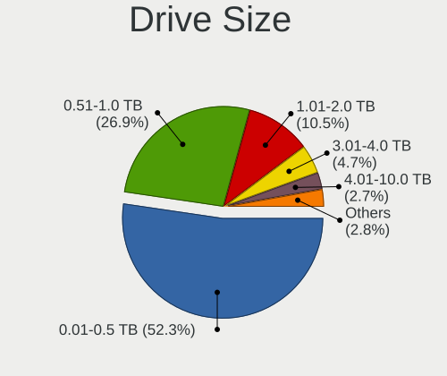

| Size in TB | Computers | Drives | Percent |
|------------|-----------|--------|---------|
| 0.01-0.5   | 1500      | 2497   | 52.32%  |
| 0.51-1.0   | 772       | 1176   | 26.93%  |
| 1.01-2.0   | 302       | 520    | 10.53%  |
| 3.01-4.0   | 134       | 254    | 4.67%   |
| 4.01-10.0  | 78        | 158    | 2.72%   |
| 2.01-3.0   | 60        | 101    | 2.09%   |
| 10.01-20.0 | 19        | 59     | 0.66%   |
| 20.01-50.0 | 2         | 6      | 0.07%   |

Space Total
-----------

Amount of disk space available on the file system

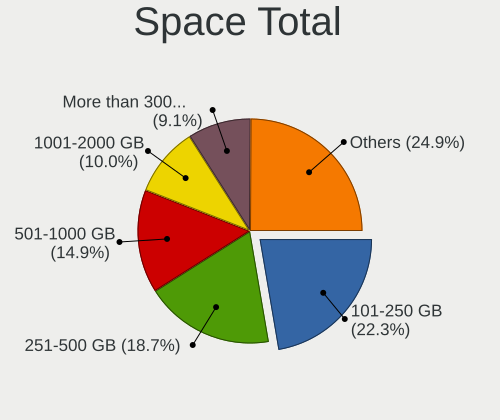

| Size in GB     | Computers | Percent |
|----------------|-----------|---------|
| 101-250        | 756       | 22.31%  |
| 251-500        | 634       | 18.71%  |
| 501-1000       | 505       | 14.91%  |
| 1001-2000      | 340       | 10.04%  |
| More than 3000 | 309       | 9.12%   |
| 1-20           | 274       | 8.09%   |
| 51-100         | 181       | 5.34%   |
| Unknown        | 150       | 4.43%   |
| 2001-3000      | 124       | 3.66%   |
| 21-50          | 115       | 3.39%   |

Space Used
----------

Amount of used disk space

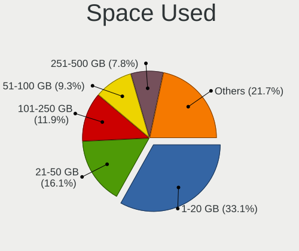

| Used GB        | Computers | Percent |
|----------------|-----------|---------|
| 1-20           | 1155      | 33.11%  |
| 21-50          | 563       | 16.14%  |
| 101-250        | 415       | 11.9%   |
| 51-100         | 326       | 9.35%   |
| 251-500        | 273       | 7.83%   |
| 501-1000       | 254       | 7.28%   |
| 1001-2000      | 158       | 4.53%   |
| Unknown        | 150       | 4.3%    |
| More than 3000 | 119       | 3.41%   |
| 2001-3000      | 71        | 2.04%   |
| 0              | 4         | 0.11%   |

Malfunc. Drives
---------------

Drive models with a malfunction

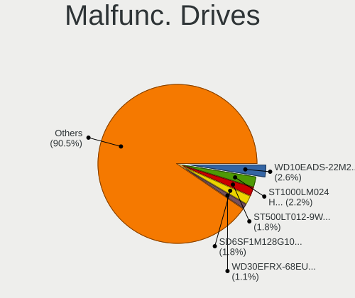

| Model                                                         | Computers | Drives | Percent |
|---------------------------------------------------------------|-----------|--------|---------|
| WDC WD10EADS-22M2B0 1TB                                       | 7         | 7      | 2.56%   |
| Seagate ST1000LM024 HN-M101MBB 1TB                            | 6         | 6      | 2.2%    |
| Seagate ST500LT012-9WS142 500GB                               | 5         | 13     | 1.83%   |
| SanDisk SD6SF1M128G1022I 128GB SSD                            | 5         | 5      | 1.83%   |
| WDC WD30EFRX-68EUZN0 3TB                                      | 3         | 3      | 1.1%    |
| Toshiba MQ01ABF050 500GB                                      | 3         | 4      | 1.1%    |
| Toshiba MQ01ABD100 1TB                                        | 3         | 3      | 1.1%    |
| Seagate ST3500413AS 500GB                                     | 3         | 3      | 1.1%    |
| SanDisk SSD PLUS 480GB                                        | 3         | 3      | 1.1%    |
| SanDisk SSD PLUS 240GB                                        | 3         | 3      | 1.1%    |
| Samsung Electronics SSD 870 EVO 1TB                           | 3         | 3      | 1.1%    |
| Samsung Electronics HM500JI 500GB                             | 3         | 3      | 1.1%    |
| Samsung Electronics HD103UJ 1TB                               | 3         | 3      | 1.1%    |
| Kingston SA400S37240G 240GB SSD                               | 3         | 3      | 1.1%    |
| HGST HTS721010A9E630 1TB                                      | 3         | 4      | 1.1%    |
| WDC WD3200JD-22KLB0 320GB                                     | 2         | 3      | 0.73%   |
| WDC WD20EZRZ-00Z5HB0 2TB                                      | 2         | 2      | 0.73%   |
| WDC WD20EZRX-22D8PB0 2TB                                      | 2         | 2      | 0.73%   |
| WDC WD20EZRX-00D8PB0 2TB                                      | 2         | 2      | 0.73%   |
| WDC WD1002FAEX-00Y9A0 1TB                                     | 2         | 2      | 0.73%   |
| Toshiba DT01ACA100 1TB                                        | 2         | 2      | 0.73%   |
| Seagate ST9750420AS 752GB                                     | 2         | 2      | 0.73%   |
| Seagate ST9250315AS 250GB                                     | 2         | 2      | 0.73%   |
| Seagate ST9160412AS 160GB                                     | 2         | 2      | 0.73%   |
| Samsung Electronics SSD 870 EVO 500GB                         | 2         | 2      | 0.73%   |
| Samsung Electronics SSD 840 Series 120GB                      | 2         | 2      | 0.73%   |
| Samsung Electronics SSD 840 PRO Series 512GB                  | 2         | 4      | 0.73%   |
| Samsung Electronics NVMe SSD Controller SM981/PM981/PM983 1TB | 2         | 2      | 0.73%   |
| Samsung Electronics HD753LJ 752GB                             | 2         | 2      | 0.73%   |
| Intel SSDSC2BF240A5L 240GB                                    | 2         | 3      | 0.73%   |
| Intel SSDSC2BF180A5L 180GB                                    | 2         | 2      | 0.73%   |
| Hitachi HTS547575A9E384 752GB                                 | 2         | 2      | 0.73%   |
| Hitachi HTS543232A7A384 320GB                                 | 2         | 2      | 0.73%   |
| HGST HTS725050A7E630 500GB                                    | 2         | 14     | 0.73%   |
| WDC WDS240G2G0B-00EPW0 240GB SSD                              | 1         | 1      | 0.37%   |
| WDC WDS240G2G0A-00JH30 240GB SSD                              | 1         | 1      | 0.37%   |
| WDC WDS100T2G0A-00JH30 1TB SSD                                | 1         | 1      | 0.37%   |
| WDC WD80EFZZ-68BTXN0 8TB                                      | 1         | 1      | 0.37%   |
| WDC WD6400AACS-00G8B0 640GB                                   | 1         | 1      | 0.37%   |
| WDC WD5000LPLX-00ZNTT0 500GB                                  | 1         | 1      | 0.37%   |

Malfunc. Drive Vendor
---------------------

Vendors of faulty drives

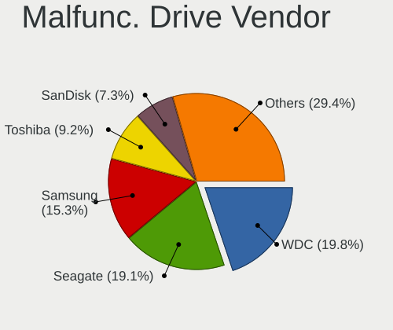

| Vendor                      | Computers | Drives | Percent |
|-----------------------------|-----------|--------|---------|
| WDC                         | 52        | 84     | 19.85%  |
| Seagate                     | 50        | 79     | 19.08%  |
| Samsung Electronics         | 40        | 50     | 15.27%  |
| Toshiba                     | 24        | 33     | 9.16%   |
| SanDisk                     | 19        | 20     | 7.25%   |
| Hitachi                     | 16        | 17     | 6.11%   |
| HGST                        | 8         | 21     | 3.05%   |
| Intel                       | 7         | 8      | 2.67%   |
| Crucial                     | 7         | 8      | 2.67%   |
| Kingston                    | 5         | 6      | 1.91%   |
| SK hynix                    | 4         | 14     | 1.53%   |
| OCZ                         | 3         | 5      | 1.15%   |
| A-DATA Technology           | 3         | 5      | 1.15%   |
| Micron Technology           | 2         | 2      | 0.76%   |
| LITEONIT                    | 2         | 3      | 0.76%   |
| LITEON                      | 2         | 2      | 0.76%   |
| Intenso                     | 2         | 3      | 0.76%   |
| China                       | 2         | 3      | 0.76%   |
| Verbatim                    | 1         | 1      | 0.38%   |
| TrekStor                    | 1         | 1      | 0.38%   |
| Transcend                   | 1         | 1      | 0.38%   |
| Patriot                     | 1         | 1      | 0.38%   |
| Netac                       | 1         | 1      | 0.38%   |
| Maxtor                      | 1         | 1      | 0.38%   |
| Kingston Technology Company | 1         | 1      | 0.38%   |
| HP Phison                   | 1         | 1      | 0.38%   |
| GOODRAM                     | 1         | 1      | 0.38%   |
| Fujitsu                     | 1         | 1      | 0.38%   |
| Dogfish                     | 1         | 1      | 0.38%   |
| Corsair                     | 1         | 1      | 0.38%   |
| BAITITON                    | 1         | 2      | 0.38%   |
| ADATA Technology            | 1         | 1      | 0.38%   |

Malfunc. HDD Vendor
-------------------

Vendors of faulty HDD drives

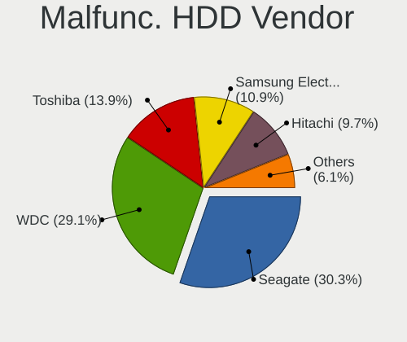

| Vendor              | Computers | Drives | Percent |
|---------------------|-----------|--------|---------|
| Seagate             | 50        | 79     | 30.3%   |
| WDC                 | 48        | 80     | 29.09%  |
| Toshiba             | 23        | 32     | 13.94%  |
| Samsung Electronics | 18        | 20     | 10.91%  |
| Hitachi             | 16        | 17     | 9.7%    |
| HGST                | 8         | 21     | 4.85%   |
| Maxtor              | 1         | 1      | 0.61%   |
| Fujitsu             | 1         | 1      | 0.61%   |

Malfunc. Drive Kind
-------------------

Kinds of faulty drives

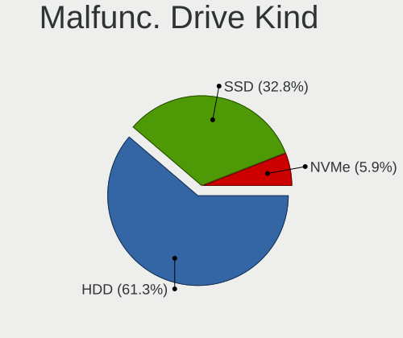

| Kind | Computers | Drives | Percent |
|------|-----------|--------|---------|
| HDD  | 155       | 251    | 61.26%  |
| SSD  | 83        | 111    | 32.81%  |
| NVMe | 15        | 16     | 5.93%   |

Failed Drives
-------------

Failed drive models

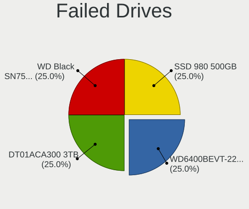

| Model                                            | Computers | Drives | Percent |
|--------------------------------------------------|-----------|--------|---------|
| WDC WD6400BEVT-22A0RT0 640GB                     | 1         | 1      | 25%     |
| Toshiba DT01ACA300 3TB                           | 1         | 1      | 25%     |
| Sandisk WD Black SN750 / PC SN730 NVMe SSD 500GB | 1         | 1      | 25%     |
| Samsung Electronics SSD 980 500GB                | 1         | 1      | 25%     |

Failed Drive Vendor
-------------------

Failed drive vendors

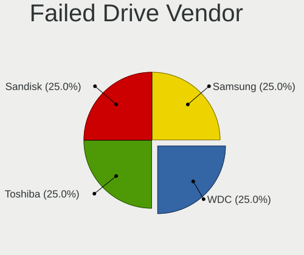

| Vendor              | Computers | Drives | Percent |
|---------------------|-----------|--------|---------|
| WDC                 | 1         | 1      | 25%     |
| Toshiba             | 1         | 1      | 25%     |
| Sandisk             | 1         | 1      | 25%     |
| Samsung Electronics | 1         | 1      | 25%     |

Drive Status
------------

Number of failed and malfunc. drives

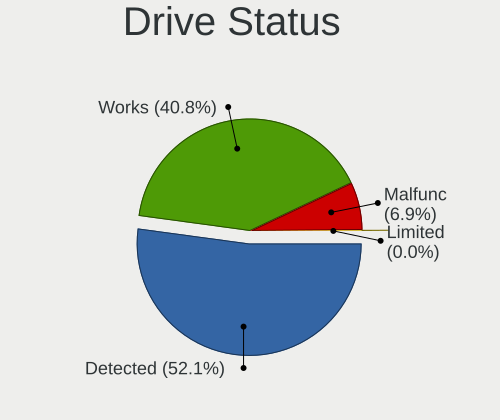

| Status   | Computers | Drives | Percent |
|----------|-----------|--------|---------|
| Detected | 1815      | 3996   | 52.14%  |
| Works    | 1421      | 3163   | 40.82%  |
| Malfunc  | 240       | 378    | 6.89%   |
| Failed   | 4         | 4      | 0.11%   |
| Limited  | 1         | 1      | 0.03%   |

Storage controller
------------------

Storage Vendor
--------------

Storage controller vendors

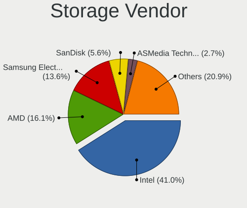

| Vendor                           | Computers | Percent |
|----------------------------------|-----------|---------|
| Intel                            | 1776      | 41.04%  |
| AMD                              | 697       | 16.11%  |
| Samsung Electronics              | 589       | 13.61%  |
| SanDisk                          | 244       | 5.64%   |
| ASMedia Technology               | 115       | 2.66%   |
| Kingston Technology Company      | 104       | 2.4%    |
| SK hynix                         | 102       | 2.36%   |
| Micron/Crucial Technology        | 101       | 2.33%   |
| Phison Electronics               | 74        | 1.71%   |
| Toshiba America Info Systems     | 65        | 1.5%    |
| Micron Technology                | 62        | 1.43%   |
| Marvell Technology Group         | 55        | 1.27%   |
| KIOXIA                           | 47        | 1.09%   |
| JMicron Technology               | 44        | 1.02%   |
| Nvidia                           | 38        | 0.88%   |
| MAXIO Technology (Hangzhou)      | 29        | 0.67%   |
| Silicon Motion                   | 26        | 0.6%    |
| Broadcom / LSI                   | 17        | 0.39%   |
| ADATA Technology                 | 16        | 0.37%   |
| LSI Logic / Symbios Logic        | 15        | 0.35%   |
| Apple                            | 14        | 0.32%   |
| Shenzhen Longsys Electronics     | 13        | 0.3%    |
| Seagate Technology               | 13        | 0.3%    |
| VIA Technologies                 | 10        | 0.23%   |
| Union Memory (Shenzhen)          | 8         | 0.18%   |
| Silicon Image                    | 6         | 0.14%   |
| Lenovo                           | 5         | 0.12%   |
| Solidigm                         | 4         | 0.09%   |
| Realtek Semiconductor            | 4         | 0.09%   |
| Hewlett-Packard                  | 4         | 0.09%   |
| Biwin Storage Technology         | 4         | 0.09%   |
| Transcend                        | 3         | 0.07%   |
| Adaptec                          | 3         | 0.07%   |
| Solid State Storage Technology   | 2         | 0.05%   |
| Silicon Integrated Systems [SiS] | 2         | 0.05%   |
| OCZ Technology Group             | 2         | 0.05%   |
| Lite-On IT Corp. / Plextor       | 2         | 0.05%   |
| INNOGRIT                         | 2         | 0.05%   |
| Hosin Global Electronics         | 2         | 0.05%   |
| Yangtze Memory Technologies      | 1         | 0.02%   |

Storage Model
-------------

Storage controller models

| Model                                                                          | Computers | Percent |
|--------------------------------------------------------------------------------|-----------|---------|
| AMD FCH SATA Controller [AHCI mode]                                            | 394       | 8.13%   |
| Samsung NVMe SSD Controller SM981/PM981/PM983                                  | 265       | 5.47%   |
| Intel Sunrise Point-LP SATA Controller [AHCI mode]                             | 138       | 2.85%   |
| Intel 8 Series/C220 Series Chipset Family 6-port SATA Controller 1 [AHCI mode] | 119       | 2.45%   |
| Intel 7 Series Chipset Family 6-port SATA Controller [AHCI mode]               | 113       | 2.33%   |
| Samsung NVMe SSD Controller PM9A1/PM9A3/980PRO                                 | 110       | 2.27%   |
| AMD 400 Series Chipset SATA Controller                                         | 103       | 2.12%   |
| Intel 6 Series/C200 Series Chipset Family 6 port Mobile SATA AHCI Controller   | 99        | 2.04%   |
| AMD 500 Series Chipset SATA Controller                                         | 98        | 2.02%   |
| Intel Q170/Q150/B150/H170/H110/Z170/CM236 Chipset SATA Controller [AHCI Mode]  | 96        | 1.98%   |
| ASMedia ASM1061/ASM1062 Serial ATA Controller                                  | 96        | 1.98%   |
| Samsung NVMe SSD Controller 980 (DRAM-less)                                    | 95        | 1.96%   |
| Intel 82801 Mobile SATA Controller [RAID mode]                                 | 76        | 1.57%   |
| AMD 600 Series Chipset SATA Controller                                         | 73        | 1.51%   |
| AMD SB7x0/SB8x0/SB9x0 SATA Controller [AHCI mode]                              | 68        | 1.4%    |
| Samsung NVMe SSD Controller SM961/PM961/SM963                                  | 67        | 1.38%   |
| Intel Volume Management Device NVMe RAID Controller                            | 64        | 1.32%   |
| Intel 8 Series SATA Controller 1 [AHCI mode]                                   | 61        | 1.26%   |
| Intel 6 Series/C200 Series Chipset Family 6 port Desktop SATA AHCI Controller  | 58        | 1.2%    |
| SanDisk Extreme Pro / WD Black SN750 / PC SN730 / Red SN700 NVMe SSD           | 53        | 1.09%   |
| Intel 200 Series PCH SATA controller [AHCI mode]                               | 53        | 1.09%   |
| Intel SATA Controller [RAID mode]                                              | 52        | 1.07%   |
| AMD SB7x0/SB8x0/SB9x0 IDE Controller                                           | 51        | 1.05%   |
| Intel Wildcat Point-LP SATA Controller [AHCI Mode]                             | 49        | 1.01%   |
| Intel 82801IBM/IEM (ICH9M/ICH9M-E) 4 port SATA Controller [AHCI mode]          | 45        | 0.93%   |
| Intel 7 Series/C210 Series Chipset Family 6-port SATA Controller [AHCI mode]   | 45        | 0.93%   |
| Intel Comet Lake SATA AHCI Controller                                          | 44        | 0.91%   |
| Intel Cannon Lake PCH SATA AHCI Controller                                     | 41        | 0.85%   |
| Micron/Crucial P2 [Nick P2] / P3 / P3 Plus NVMe PCIe SSD (DRAM-less)           | 39        | 0.8%    |
| Intel 5 Series/3400 Series Chipset 6 port SATA AHCI Controller                 | 38        | 0.78%   |
| Samsung NVMe SSD Controller S4LV008[Pascal]                                    | 36        | 0.74%   |
| Intel Cannon Lake Mobile PCH SATA AHCI Controller                              | 35        | 0.72%   |
| Intel SSD 660P Series                                                          | 32        | 0.66%   |
| SanDisk Ultra 3D / WD PC SN530, IX SN530, Blue SN550 NVMe SSD (DRAM-less)      | 31        | 0.64%   |
| Intel Celeron/Pentium Silver Processor SATA Controller                         | 31        | 0.64%   |
| Intel HM170/QM170 Chipset SATA Controller [AHCI Mode]                          | 30        | 0.62%   |
| Intel Celeron N3350/Pentium N4200/Atom E3900 Series SATA AHCI Controller       | 30        | 0.62%   |
| Sandisk WD Black SN850X NVMe SSD                                               | 27        | 0.56%   |
| Phison E12 NVMe Controller                                                     | 26        | 0.54%   |
| JMicron JMB363 SATA/IDE Controller                                             | 26        | 0.54%   |

Storage Kind
------------

Kind of storage controller (IDE, SATA, NVMe, SAS, ...)

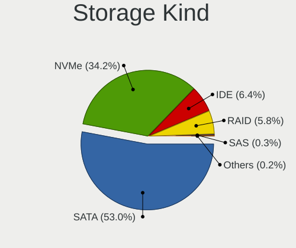

| Kind | Computers | Percent |
|------|-----------|---------|
| SATA | 2199      | 52.98%  |
| NVMe | 1421      | 34.23%  |
| IDE  | 267       | 6.43%   |
| RAID | 241       | 5.81%   |
| SAS  | 14        | 0.34%   |
| SCSI | 9         | 0.22%   |

Processor
---------

CPU Vendor
----------

Processor vendors

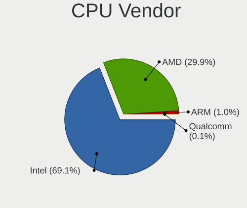

| Vendor   | Computers | Percent |
|----------|-----------|---------|
| Intel    | 2158      | 69.06%  |
| AMD      | 933       | 29.86%  |
| ARM      | 32        | 1.02%   |
| Qualcomm | 2         | 0.06%   |

CPU Model
---------

Processor models

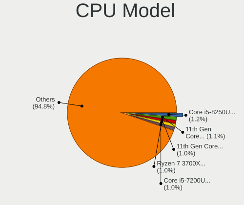

| Model                                      | Computers | Percent |
|--------------------------------------------|-----------|---------|
| Intel Core i5-8250U CPU @ 1.60GHz          | 37        | 1.18%   |
| Intel 11th Gen Core i5-1135G7 @ 2.40GHz    | 33        | 1.05%   |
| Intel 11th Gen Core i7-1165G7 @ 2.80GHz    | 32        | 1.02%   |
| AMD Ryzen 7 3700X 8-Core Processor         | 32        | 1.02%   |
| Intel Core i5-7200U CPU @ 2.50GHz          | 30        | 0.96%   |
| Intel Core i7-8565U CPU @ 1.80GHz          | 29        | 0.93%   |
| AMD Ryzen 5 3600 6-Core Processor          | 28        | 0.89%   |
| Intel Core i5-10210U CPU @ 1.60GHz         | 27        | 0.86%   |
| Intel Core i7-10510U CPU @ 1.80GHz         | 26        | 0.83%   |
| Intel Core i5-6200U CPU @ 2.30GHz          | 26        | 0.83%   |
| Intel Core i7-8550U CPU @ 1.80GHz          | 25        | 0.8%    |
| ARM Processor                              | 25        | 0.8%    |
| Intel Core i5-6300U CPU @ 2.40GHz          | 24        | 0.77%   |
| AMD Ryzen 7 5800X 8-Core Processor         | 22        | 0.7%    |
| Intel Core i5-6600 CPU @ 3.30GHz           | 20        | 0.64%   |
| AMD Ryzen 9 5900X 12-Core Processor        | 20        | 0.64%   |
| AMD Ryzen 5 5600X 6-Core Processor         | 20        | 0.64%   |
| Intel Core i5-5200U CPU @ 2.20GHz          | 19        | 0.61%   |
| Intel Core i5-3320M CPU @ 2.60GHz          | 19        | 0.61%   |
| Intel Core i5-2520M CPU @ 2.50GHz          | 19        | 0.61%   |
| Intel Core i7-7700HQ CPU @ 2.80GHz         | 18        | 0.57%   |
| Intel Core i7-7500U CPU @ 2.70GHz          | 18        | 0.57%   |
| Intel Core i7-6700K CPU @ 4.00GHz          | 18        | 0.57%   |
| Intel Core i5-4210U CPU @ 1.70GHz          | 18        | 0.57%   |
| Intel Core i5-3210M CPU @ 2.50GHz          | 17        | 0.54%   |
| Intel Core i7-3770 CPU @ 3.40GHz           | 16        | 0.51%   |
| Intel Atom x5-Z8350 CPU @ 1.44GHz          | 16        | 0.51%   |
| AMD Custom APU 0405                        | 16        | 0.51%   |
| Intel Core i7-8750H CPU @ 2.20GHz          | 15        | 0.48%   |
| Intel Core i7-2670QM CPU @ 2.20GHz         | 15        | 0.48%   |
| Intel Core i7-1065G7 CPU @ 1.30GHz         | 15        | 0.48%   |
| Intel Core i5-4570 CPU @ 3.20GHz           | 15        | 0.48%   |
| AMD Ryzen 7 PRO 4750U with Radeon Graphics | 15        | 0.48%   |
| AMD Ryzen 5 4500U with Radeon Graphics     | 14        | 0.45%   |
| Intel Core i7-7700K CPU @ 4.20GHz          | 13        | 0.42%   |
| Intel Core 2 Duo CPU P8600 @ 2.40GHz       | 13        | 0.42%   |
| AMD Ryzen 7 5800H with Radeon Graphics     | 13        | 0.42%   |
| AMD Ryzen 7 5700U with Radeon Graphics     | 13        | 0.42%   |
| AMD Ryzen 7 4700U with Radeon Graphics     | 13        | 0.42%   |
| AMD Ryzen 5 5500U with Radeon Graphics     | 13        | 0.42%   |

CPU Model Family
----------------

Processor model prefix

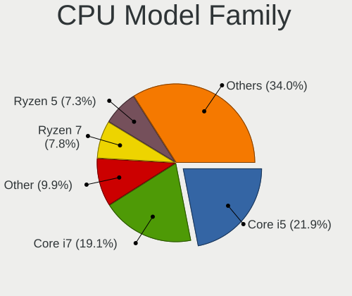

| Model                   | Computers | Percent |
|-------------------------|-----------|---------|
| Intel Core i5           | 686       | 21.94%  |
| Intel Core i7           | 597       | 19.09%  |
| Other                   | 309       | 9.88%   |
| AMD Ryzen 7             | 243       | 7.77%   |
| AMD Ryzen 5             | 228       | 7.29%   |
| Intel Core i3           | 120       | 3.84%   |
| AMD Ryzen 9             | 111       | 3.55%   |
| Intel Core 2 Duo        | 95        | 3.04%   |
| Intel Celeron           | 94        | 3.01%   |
| Intel Xeon              | 71        | 2.27%   |
| Intel Pentium           | 55        | 1.76%   |
| Intel Atom              | 46        | 1.47%   |
| AMD Ryzen 7 PRO         | 45        | 1.44%   |
| Intel Core i9           | 38        | 1.22%   |
| AMD FX                  | 38        | 1.22%   |
| AMD A8                  | 26        | 0.83%   |
| AMD Ryzen 3             | 25        | 0.8%    |
| Intel Core              | 24        | 0.77%   |
| Intel Pentium Dual-Core | 18        | 0.58%   |
| AMD Phenom II X4        | 17        | 0.54%   |
| AMD Ryzen 5 PRO         | 16        | 0.51%   |
| AMD A4                  | 15        | 0.48%   |
| Intel Core 2            | 14        | 0.45%   |
| Intel Pentium Silver    | 13        | 0.42%   |
| Intel Core 2 Quad       | 13        | 0.42%   |
| AMD A6                  | 13        | 0.42%   |
| AMD A10                 | 13        | 0.42%   |
| AMD E                   | 11        | 0.35%   |
| AMD Phenom II X6        | 10        | 0.32%   |
| AMD E2                  | 9         | 0.29%   |
| AMD Athlon 64 X2        | 8         | 0.26%   |
| AMD Athlon              | 8         | 0.26%   |
| AMD Ryzen Threadripper  | 7         | 0.22%   |
| AMD Athlon II X4        | 7         | 0.22%   |
| Intel Pentium Dual      | 6         | 0.19%   |
| AMD E1                  | 6         | 0.19%   |
| AMD Athlon II           | 6         | 0.19%   |
| Intel Xeon Silver       | 5         | 0.16%   |
| Intel Genuine           | 5         | 0.16%   |
| ARM BCM                 | 5         | 0.16%   |

CPU Cores
---------

Number of processor cores

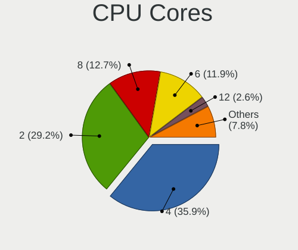

| Number  | Computers | Percent |
|---------|-----------|---------|
| 4       | 1125      | 35.89%  |
| 2       | 914       | 29.15%  |
| 8       | 398       | 12.7%   |
| 6       | 374       | 11.93%  |
| 12      | 81        | 2.58%   |
| 16      | 77        | 2.46%   |
| 10      | 40        | 1.28%   |
| 14      | 39        | 1.24%   |
| 1       | 27        | 0.86%   |
| Unknown | 18        | 0.57%   |
| 24      | 14        | 0.45%   |
| 20      | 12        | 0.38%   |
| 3       | 8         | 0.26%   |
| 128     | 1         | 0.03%   |
| 80      | 1         | 0.03%   |
| 64      | 1         | 0.03%   |
| 48      | 1         | 0.03%   |
| 40      | 1         | 0.03%   |
| 32      | 1         | 0.03%   |
| 28      | 1         | 0.03%   |
| 5       | 1         | 0.03%   |

CPU Sockets
-----------

Number of sockets

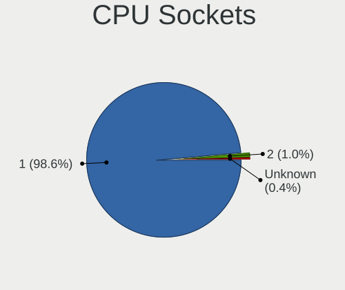

| Number  | Computers | Percent |
|---------|-----------|---------|
| 1       | 3082      | 98.56%  |
| 2       | 31        | 0.99%   |
| Unknown | 14        | 0.45%   |

CPU Threads
-----------

Threads per core (Hyper-Threading)

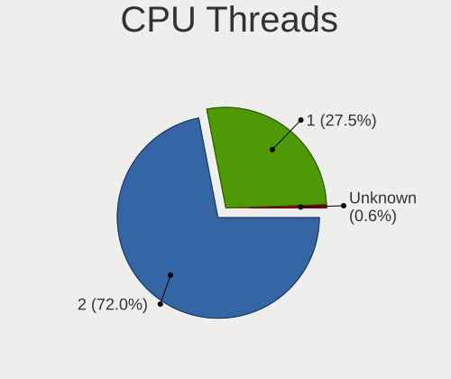

| Number  | Computers | Percent |
|---------|-----------|---------|
| 2       | 2258      | 71.96%  |
| 1       | 862       | 27.47%  |
| Unknown | 18        | 0.57%   |

CPU Op-Modes
------------

CPU Operation Modes (32-bit, 64-bit)

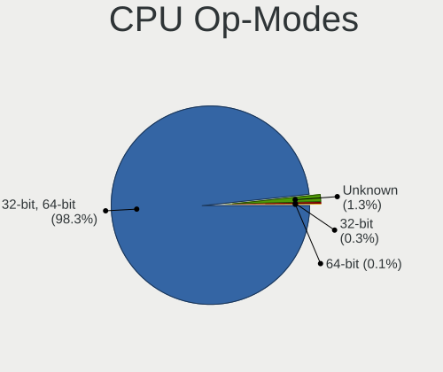

| Op mode        | Computers | Percent |
|----------------|-----------|---------|
| 32-bit, 64-bit | 3074      | 98.31%  |
| Unknown        | 40        | 1.28%   |
| 32-bit         | 10        | 0.32%   |
| 64-bit         | 3         | 0.1%    |

CPU Microcode
-------------

Microcode number

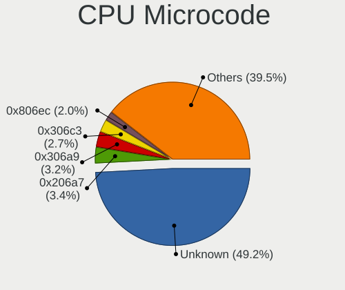

| Number     | Computers | Percent |
|------------|-----------|---------|
| Unknown    | 1606      | 49.19%  |
| 0x206a7    | 112       | 3.43%   |
| 0x306a9    | 106       | 3.25%   |
| 0x306c3    | 87        | 2.66%   |
| 0x806ec    | 64        | 1.96%   |
| 0x506e3    | 53        | 1.62%   |
| 0x1067a    | 52        | 1.59%   |
| 0x806ea    | 51        | 1.56%   |
| 0x906ea    | 46        | 1.41%   |
| 0x806c1    | 45        | 1.38%   |
| 0x406e3    | 40        | 1.23%   |
| 0x306d4    | 40        | 1.23%   |
| 0x40651    | 38        | 1.16%   |
| 0x906e9    | 35        | 1.07%   |
| 0x08701021 | 34        | 1.04%   |
| 0x806e9    | 30        | 0.92%   |
| 0x08600106 | 30        | 0.92%   |
| 0x0a50000c | 29        | 0.89%   |
| 0x08108109 | 22        | 0.67%   |
| 0x010000c8 | 20        | 0.61%   |
| 0x506c9    | 19        | 0.58%   |
| 0x20655    | 18        | 0.55%   |
| 0x10676    | 18        | 0.55%   |
| 0x06000852 | 18        | 0.55%   |
| 0x0a50000d | 17        | 0.52%   |
| 0x08701013 | 17        | 0.52%   |
| 0x706e5    | 16        | 0.49%   |
| 0x406c4    | 16        | 0.49%   |
| 0x0800820d | 16        | 0.49%   |
| 0x706a8    | 15        | 0.46%   |
| 0x106e5    | 15        | 0.46%   |
| 0x0a201016 | 15        | 0.46%   |
| 0x08600103 | 15        | 0.46%   |
| 0x08108102 | 14        | 0.43%   |
| 0x06001119 | 14        | 0.43%   |
| 0xa0652    | 13        | 0.4%    |
| 0x906ed    | 13        | 0.4%    |
| 0x08600104 | 13        | 0.4%    |
| 0x07030105 | 13        | 0.4%    |
| 0x806eb    | 11        | 0.34%   |

CPU Microarch
-------------

Microarchitecture

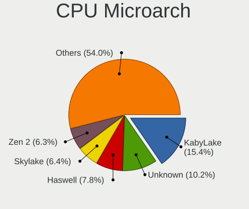

| Name               | Computers | Percent |
|--------------------|-----------|---------|
| KabyLake           | 483       | 15.42%  |
| Unknown            | 318       | 10.15%  |
| Haswell            | 244       | 7.79%   |
| Skylake            | 199       | 6.35%   |
| Zen 2              | 198       | 6.32%   |
| IvyBridge          | 194       | 6.19%   |
| SandyBridge        | 190       | 6.06%   |
| Zen 3              | 181       | 5.78%   |
| Penryn             | 111       | 3.54%   |
| Zen+               | 87        | 2.78%   |
| TigerLake          | 86        | 2.74%   |
| Alderlake Hybrid   | 78        | 2.49%   |
| Broadwell          | 69        | 2.2%    |
| CometLake          | 66        | 2.11%   |
| Westmere           | 59        | 1.88%   |
| Silvermont         | 58        | 1.85%   |
| K10                | 55        | 1.76%   |
| Zen                | 49        | 1.56%   |
| Piledriver         | 46        | 1.47%   |
| Icelake            | 46        | 1.47%   |
| Core               | 42        | 1.34%   |
| Goldmont plus      | 36        | 1.15%   |
| Nehalem            | 33        | 1.05%   |
| Goldmont           | 31        | 0.99%   |
| Excavator          | 24        | 0.77%   |
| Puma               | 20        | 0.64%   |
| Bobcat             | 19        | 0.61%   |
| Bonnell            | 16        | 0.51%   |
| Jaguar             | 15        | 0.48%   |
| K8 Hammer          | 13        | 0.41%   |
| Steamroller        | 11        | 0.35%   |
| Meteorlake Hybrid  | 10        | 0.32%   |
| Gracemont          | 10        | 0.32%   |
| Tremont            | 8         | 0.26%   |
| K10 Llano          | 7         | 0.22%   |
| K8 & K10 hybrid    | 5         | 0.16%   |
| Bulldozer          | 5         | 0.16%   |
| NetBurst           | 4         | 0.13%   |
| P6                 | 3         | 0.1%    |
| ArrowLake-H Hybrid | 2         | 0.06%   |

Graphics
--------

GPU Vendor
----------

Vendors of graphics cards

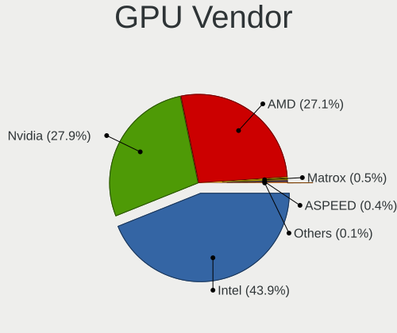

| Vendor                           | Computers | Percent |
|----------------------------------|-----------|---------|
| Intel                            | 1588      | 43.93%  |
| Nvidia                           | 1007      | 27.86%  |
| AMD                              | 981       | 27.14%  |
| Matrox Electronics Systems       | 19        | 0.53%   |
| ASPEED Technology                | 16        | 0.44%   |
| Silicon Integrated Systems [SiS] | 2         | 0.06%   |
| ATI Technologies                 | 2         | 0.06%   |

GPU Model
---------

Graphics card models

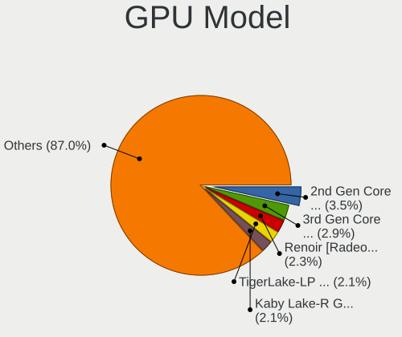

| Model                                                                                    | Computers | Percent |
|------------------------------------------------------------------------------------------|-----------|---------|
| Intel 2nd Generation Core Processor Family Integrated Graphics Controller                | 130       | 3.49%   |
| Intel 3rd Gen Core processor Graphics Controller                                         | 109       | 2.92%   |
| AMD Renoir [Radeon Vega Series / Radeon Vega Mobile Series]                              | 85        | 2.28%   |
| Intel TigerLake-LP GT2 [Iris Xe Graphics]                                                | 80        | 2.14%   |
| Intel Kaby Lake-R GT2 [UHD Graphics 620]                                                 | 80        | 2.14%   |
| Intel Kaby Lake-U GT2 [HD Graphics 620]                                                  | 68        | 1.82%   |
| Intel Haswell-ULT Integrated Graphics Controller                                         | 67        | 1.8%    |
| Intel Skylake-U GT2 [HD Graphics 520]                                                    | 66        | 1.77%   |
| Intel CometLake-U GT2 [UHD Graphics]                                                     | 64        | 1.72%   |
| AMD Cezanne [Radeon Vega Series / Radeon Vega Mobile Series]                             | 59        | 1.58%   |
| Intel WhiskeyLake-U GT2 [UHD Graphics 620]                                               | 55        | 1.47%   |
| Intel Broadwell-U GT2 [HD Graphics 5500]                                                 | 50        | 1.34%   |
| Intel Xeon E3-1200 v3/4th Gen Core Processor Integrated Graphics Controller              | 49        | 1.31%   |
| Intel CoffeeLake-H GT2 [UHD Graphics 630]                                                | 49        | 1.31%   |
| AMD Picasso/Raven 2 [Radeon Vega Series / Radeon Vega Mobile Series]                     | 49        | 1.31%   |
| AMD Ellesmere [Radeon RX 470/480/570/570X/580/580X/590]                                  | 47        | 1.26%   |
| Intel Atom/Celeron/Pentium Processor x5-E8000/J3xxx/N3xxx Integrated Graphics Controller | 41        | 1.1%    |
| AMD Raphael                                                                              | 41        | 1.1%    |
| Intel Core Processor Integrated Graphics Controller                                      | 32        | 0.86%   |
| Intel 4th Gen Core Processor Integrated Graphics Controller                              | 32        | 0.86%   |
| Intel Skylake-S GT2 [HD Graphics 530]                                                    | 31        | 0.83%   |
| Intel Mobile 4 Series Chipset Integrated Graphics Controller                             | 30        | 0.8%    |
| Intel GeminiLake [UHD Graphics 600]                                                      | 30        | 0.8%    |
| AMD Rembrandt [Radeon 680M]                                                              | 27        | 0.72%   |
| Nvidia GP108 [GeForce GT 1030]                                                           | 26        | 0.7%    |
| AMD Lucienne                                                                             | 26        | 0.7%    |
| Nvidia GK208B [GeForce GT 710]                                                           | 25        | 0.67%   |
| AMD Navi 31 [Radeon RX 7900 XT/7900 XTX/7900 GRE/7900M]                                  | 25        | 0.67%   |
| Nvidia GP106 [GeForce GTX 1060 6GB]                                                      | 24        | 0.64%   |
| Intel Raptor Lake-P [Iris Xe Graphics]                                                   | 24        | 0.64%   |
| Intel CoffeeLake-S GT2 [UHD Graphics 630]                                                | 24        | 0.64%   |
| AMD Raven Ridge [Radeon Vega Series / Radeon Vega Mobile Series]                         | 24        | 0.64%   |
| AMD Navi 21 [Radeon RX 6800/6800 XT / 6900 XT]                                           | 24        | 0.64%   |
| AMD Phoenix1                                                                             | 23        | 0.62%   |
| AMD Navi 10 [Radeon RX 5600 OEM/5600 XT / 5700/5700 XT]                                  | 23        | 0.62%   |
| Nvidia GP107 [GeForce GTX 1050 Ti]                                                       | 22        | 0.59%   |
| Intel Xeon E3-1200 v2/3rd Gen Core processor Graphics Controller                         | 22        | 0.59%   |
| Intel Kaby Lake-H GT2 [HD Graphics 630]                                                  | 22        | 0.59%   |
| Intel CometLake-H GT2 [UHD Graphics]                                                     | 22        | 0.59%   |
| Intel Skylake-H GT2 [HD Graphics 530]                                                    | 21        | 0.56%   |

GPU Combo
---------

Combinations of graphics cards

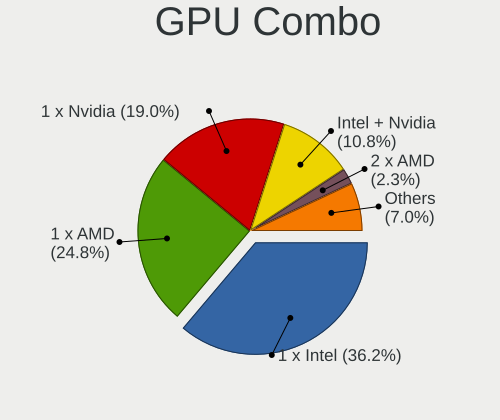

| Name                    | Computers | Percent |
|-------------------------|-----------|---------|
| 1 x Intel               | 1141      | 36.18%  |
| 1 x AMD                 | 782       | 24.79%  |
| 1 x Nvidia              | 598       | 18.96%  |
| Intel + Nvidia          | 341       | 10.81%  |
| 2 x AMD                 | 72        | 2.28%   |
| Intel + AMD             | 71        | 2.25%   |
| AMD + Nvidia            | 60        | 1.9%    |
| Other                   | 34        | 1.08%   |
| 1 x Matrox              | 17        | 0.54%   |
| 1 x ASPEED              | 12        | 0.38%   |
| 2 x Intel               | 11        | 0.35%   |
| 2 x Nvidia              | 5         | 0.16%   |
| Nvidia + ASPEED         | 3         | 0.1%    |
| 2 x Nvidia + 1 x Matrox | 2         | 0.06%   |
| 1 x SiS                 | 2         | 0.06%   |
| Intel + 2 x AMD         | 1         | 0.03%   |
| AMD + 2 x Nvidia        | 1         | 0.03%   |
| AMD + ASPEED            | 1         | 0.03%   |

GPU Driver
----------

Free vs proprietary

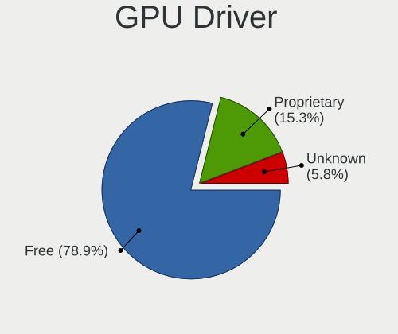

| Driver      | Computers | Percent |
|-------------|-----------|---------|
| Free        | 2515      | 78.89%  |
| Proprietary | 489       | 15.34%  |
| Unknown     | 184       | 5.77%   |

GPU Memory
----------

Total video memory

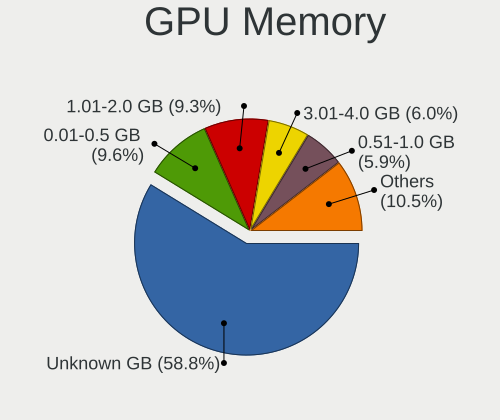

| Size in GB | Computers | Percent |
|------------|-----------|---------|
| Unknown    | 1894      | 58.77%  |
| 0.01-0.5   | 310       | 9.62%   |
| 1.01-2.0   | 299       | 9.28%   |
| 3.01-4.0   | 193       | 5.99%   |
| 0.51-1.0   | 190       | 5.9%    |
| 7.01-8.0   | 153       | 4.75%   |
| 8.01-16.0  | 83        | 2.58%   |
| 5.01-6.0   | 63        | 1.95%   |
| 16.01-24.0 | 23        | 0.71%   |
| 2.01-3.0   | 14        | 0.43%   |
| 4.01-5.0   | 1         | 0.03%   |

Monitor
-------

Monitor Vendor
--------------

Monitor vendors

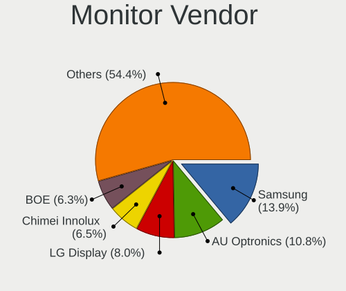

| Vendor                  | Computers | Percent |
|-------------------------|-----------|---------|
| Samsung Electronics     | 500       | 13.92%  |
| AU Optronics            | 388       | 10.8%   |
| LG Display              | 289       | 8.05%   |
| Chimei Innolux          | 234       | 6.51%   |
| BOE                     | 228       | 6.35%   |
| BenQ                    | 175       | 4.87%   |
| Dell                    | 169       | 4.7%    |
| Goldstar                | 150       | 4.18%   |
| Hewlett-Packard         | 128       | 3.56%   |
| AOC                     | 116       | 3.23%   |
| Acer                    | 113       | 3.15%   |
| Lenovo                  | 98        | 2.73%   |
| Philips                 | 76        | 2.12%   |
| Iiyama                  | 75        | 2.09%   |
| Apple                   | 75        | 2.09%   |
| Sharp                   | 68        | 1.89%   |
| Ancor Communications    | 68        | 1.89%   |
| Eizo                    | 43        | 1.2%    |
| ASUSTek Computer        | 40        | 1.11%   |
| Chi Mei Optoelectronics | 32        | 0.89%   |
| Medion                  | 28        | 0.78%   |
| Gericom                 | 27        | 0.75%   |
| Sony                    | 24        | 0.67%   |
| InfoVision              | 24        | 0.67%   |
| Fujitsu Siemens         | 21        | 0.58%   |
| ViewSonic               | 20        | 0.56%   |
| Unknown                 | 20        | 0.56%   |
| CSO                     | 20        | 0.56%   |
| NEC Computers           | 18        | 0.5%    |
| PANDA                   | 16        | 0.45%   |
| MSI                     | 16        | 0.45%   |
| HannStar                | 16        | 0.45%   |
| Valve                   | 15        | 0.42%   |
| Gigabyte Technology     | 14        | 0.39%   |
| LG Philips              | 13        | 0.36%   |
| Toshiba                 | 12        | 0.33%   |
| Vestel Elektronik       | 10        | 0.28%   |
| Panasonic               | 10        | 0.28%   |
| GRM                     | 8         | 0.22%   |
| TMX                     | 7         | 0.19%   |

Monitor Model
-------------

Monitor models

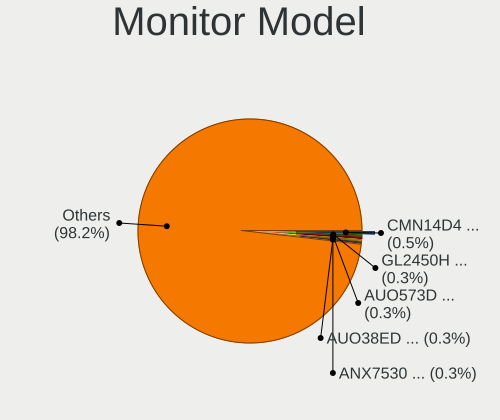

| Model                                                                | Computers | Percent |
|----------------------------------------------------------------------|-----------|---------|
| Chimei Innolux LCD Monitor CMN14D4 1920x1080 309x173mm 13.9-inch     | 18        | 0.48%   |
| BenQ GL2450H BNQ78A7 1920x1080 531x298mm 24.0-inch                   | 13        | 0.34%   |
| AU Optronics LCD Monitor AUO573D 1920x1080 309x174mm 14.0-inch       | 13        | 0.34%   |
| AU Optronics LCD Monitor AUO38ED 1920x1080 344x193mm 15.5-inch       | 13        | 0.34%   |
| Valve ANX7530 U VLV3001 800x1280 100x150mm 7.1-inch                  | 12        | 0.32%   |
| LG Display LCD Monitor LGD02D8 1366x768 277x156mm 12.5-inch          | 12        | 0.32%   |
| Chimei Innolux LCD Monitor CMN15E8 1920x1080 344x193mm 15.5-inch     | 12        | 0.32%   |
| Unknown LCD Monitor FFFF 2288x1287 2550x2550mm 142.0-inch            | 11        | 0.29%   |
| Samsung Electronics U28E590 SAM0C4D 3840x2160 607x345mm 27.5-inch    | 11        | 0.29%   |
| Gericom Q26 QMX2426 1920x1080 550x344mm 25.5-inch                    | 11        | 0.29%   |
| AOC 27G2G4 AOC2702 1920x1080 598x336mm 27.0-inch                     | 11        | 0.29%   |
| Vestel Elektronik 40UHD_LCD_TV VES3700 3840x2160 880x500mm 39.8-inch | 10        | 0.26%   |
| LG Display LCD Monitor LGD0521 1920x1080 309x174mm 14.0-inch         | 10        | 0.26%   |
| LG Display LCD Monitor LGD046D 1920x1080 309x174mm 14.0-inch         | 10        | 0.26%   |
| Goldstar 27GL850 GSM5B7F 2560x1440 597x336mm 27.0-inch               | 10        | 0.26%   |
| Dell U2412M DELA07A 1920x1200 518x324mm 24.1-inch                    | 10        | 0.26%   |
| BOE LCD Monitor BOE084E 1920x1080 382x215mm 17.3-inch                | 10        | 0.26%   |
| AOC 24B1W1 AOC2401 1920x1080 527x296mm 23.8-inch                     | 10        | 0.26%   |
| Samsung Electronics C32F391 SAM0D35 1920x1080 698x393mm 31.5-inch    | 9         | 0.24%   |
| LG Display LCD Monitor LGD046F 1920x1080 344x194mm 15.5-inch         | 9         | 0.24%   |
| Chimei Innolux LCD Monitor CMN14C9 1920x1080 309x173mm 13.9-inch     | 9         | 0.24%   |
| AOC 24G2W1G3 AOC2402 1920x1080 527x296mm 23.8-inch                   | 9         | 0.24%   |
| Samsung Electronics LCD Monitor SEC5441 1280x800 331x207mm 15.4-inch | 8         | 0.21%   |
| Samsung Electronics C27F390 SAM0D32 1920x1080 598x336mm 27.0-inch    | 8         | 0.21%   |
| LG Display LCD Monitor LGD02DC 1366x768 344x194mm 15.5-inch          | 8         | 0.21%   |
| GRM GM26900 GRM5BC6 1920x1080 550x344mm 25.5-inch                    | 8         | 0.21%   |
| Chimei Innolux LCD Monitor CMN15E7 1920x1080 344x193mm 15.5-inch     | 8         | 0.21%   |
| AU Optronics LCD Monitor AUO22EC 1366x768 344x193mm 15.5-inch        | 8         | 0.21%   |
| AU Optronics LCD Monitor AUO123D 1920x1080 309x173mm 13.9-inch       | 8         | 0.21%   |
| Apple LCD Monitor APP9CC5 1280x800 286x179mm 13.3-inch               | 8         | 0.21%   |
| Apple Color LCD APPA040 2880x1800 331x207mm 15.4-inch                | 8         | 0.21%   |
| Acer B193 ACR001D 1280x1024 380x300mm 19.1-inch                      | 8         | 0.21%   |
| Samsung Electronics C24F390 SAM0D2C 1920x1080 521x293mm 23.5-inch    | 7         | 0.18%   |
| NEC Computers EA243WM NEC6864 1920x1200 519x324mm 24.1-inch          | 7         | 0.18%   |
| Hewlett-Packard w2207 HWP26A8 1680x1050 473x296mm 22.0-inch          | 7         | 0.18%   |
| Chimei Innolux LCD Monitor CMN15D5 1920x1080 344x193mm 15.5-inch     | 7         | 0.18%   |
| AU Optronics LCD Monitor AUO683D 1920x1080 309x174mm 14.0-inch       | 7         | 0.18%   |
| AU Optronics LCD Monitor AUO133D 1920x1080 309x173mm 13.9-inch       | 7         | 0.18%   |
| AU Optronics LCD Monitor AUO106C 1366x768 276x155mm 12.5-inch        | 7         | 0.18%   |
| AOC 32G1WG4 AOC3201 1920x1080 697x392mm 31.5-inch                    | 7         | 0.18%   |

Monitor Resolution
------------------

Monitor screen resolution

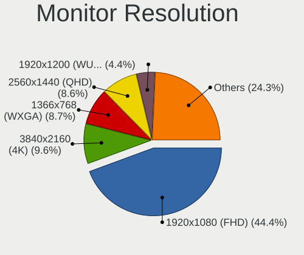

| Resolution         | Computers | Percent |
|--------------------|-----------|---------|
| 1920x1080 (FHD)    | 1527      | 44.38%  |
| 3840x2160 (4K)     | 330       | 9.59%   |
| 1366x768 (WXGA)    | 299       | 8.69%   |
| 2560x1440 (QHD)    | 297       | 8.63%   |
| 1920x1200 (WUXGA)  | 153       | 4.45%   |
| 1600x900 (HD+)     | 120       | 3.49%   |
| 1680x1050 (WSXGA+) | 107       | 3.11%   |
| 1280x1024 (SXGA)   | 80        | 2.32%   |
| 3440x1440          | 71        | 2.06%   |
| 1280x800 (WXGA)    | 65        | 1.89%   |
| 1440x900 (WXGA+)   | 43        | 1.25%   |
| 2880x1800          | 39        | 1.13%   |
| 2560x1600          | 39        | 1.13%   |
| Unknown            | 34        | 0.99%   |
| 3840x1080          | 26        | 0.76%   |
| 2560x1080          | 22        | 0.64%   |
| 1920x540           | 20        | 0.58%   |
| 800x1280           | 16        | 0.46%   |
| 3840x2400          | 15        | 0.44%   |
| 2288x1287          | 12        | 0.35%   |
| 2880x1920          | 11        | 0.32%   |
| 1920x1280          | 8         | 0.23%   |
| 2048x1152          | 7         | 0.2%    |
| 1024x600           | 7         | 0.2%    |
| 3840x1600          | 6         | 0.17%   |
| 2160x1440          | 6         | 0.17%   |
| 1360x768           | 6         | 0.17%   |
| 2256x1504          | 5         | 0.15%   |
| 1024x768 (XGA)     | 5         | 0.15%   |
| 3456x2160          | 4         | 0.12%   |
| 3200x1800 (QHD+)   | 4         | 0.12%   |
| 2736x1824          | 4         | 0.12%   |
| 1600x1200          | 4         | 0.12%   |
| 3840x2560          | 3         | 0.09%   |
| 3072x1920          | 3         | 0.09%   |
| 2160x1200          | 3         | 0.09%   |
| 5760x2160          | 2         | 0.06%   |
| 5760x1080          | 2         | 0.06%   |
| 5120x1440          | 2         | 0.06%   |
| 4480x1440          | 2         | 0.06%   |

Monitor Diagonal
----------------

Diagonal size in inches

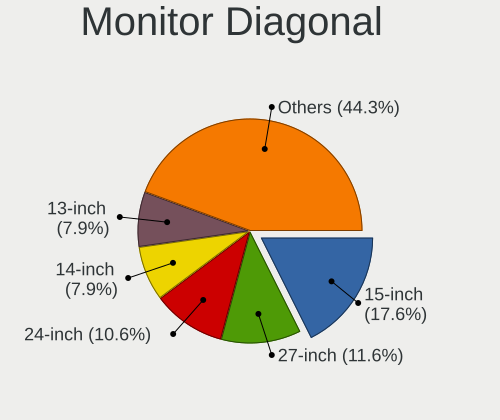

| Inches  | Computers | Percent |
|---------|-----------|---------|
| 15      | 635       | 17.61%  |
| 27      | 417       | 11.56%  |
| 24      | 383       | 10.62%  |
| 14      | 286       | 7.93%   |
| 13      | 286       | 7.93%   |
| 17      | 206       | 5.71%   |
| 23      | 204       | 5.66%   |
| 31      | 153       | 4.24%   |
| Unknown | 132       | 3.66%   |
| 21      | 122       | 3.38%   |
| 34      | 80        | 2.22%   |
| 22      | 74        | 2.05%   |
| 19      | 71        | 1.97%   |
| 12      | 70        | 1.94%   |
| 16      | 62        | 1.72%   |
| 25      | 43        | 1.19%   |
| 84      | 30        | 0.83%   |
| 11      | 30        | 0.83%   |
| 54      | 29        | 0.8%    |
| 20      | 29        | 0.8%    |
| 32      | 24        | 0.67%   |
| 40      | 23        | 0.64%   |
| 28      | 18        | 0.5%    |
| 72      | 15        | 0.42%   |
| 18      | 15        | 0.42%   |
| 7       | 15        | 0.42%   |
| 48      | 14        | 0.39%   |
| 26      | 14        | 0.39%   |
| 10      | 12        | 0.33%   |
| 142     | 11        | 0.31%   |
| 63      | 9         | 0.25%   |
| 42      | 8         | 0.22%   |
| 65      | 7         | 0.19%   |
| 52      | 7         | 0.19%   |
| 49      | 7         | 0.19%   |
| 33      | 7         | 0.19%   |
| 47      | 6         | 0.17%   |
| 85      | 5         | 0.14%   |
| 39      | 5         | 0.14%   |
| 37      | 5         | 0.14%   |

Monitor Width
-------------

Physical width

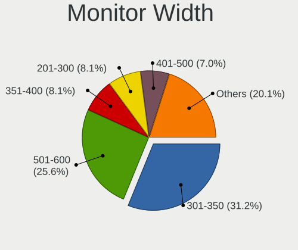

| Width in mm    | Computers | Percent |
|----------------|-----------|---------|
| 301-350        | 1088      | 31.17%  |
| 501-600        | 895       | 25.64%  |
| 351-400        | 282       | 8.08%   |
| 201-300        | 281       | 8.05%   |
| 401-500        | 243       | 6.96%   |
| 601-700        | 236       | 6.76%   |
| Unknown        | 132       | 3.78%   |
| 701-800        | 109       | 3.12%   |
| 1001-1500      | 94        | 2.69%   |
| 1501-2000      | 51        | 1.46%   |
| 801-900        | 39        | 1.12%   |
| 1-100          | 16        | 0.46%   |
| 901-1000       | 12        | 0.34%   |
| More than 2000 | 11        | 0.32%   |
| 101-200        | 1         | 0.03%   |

Aspect Ratio
------------

Proportional relationship between the width and the height

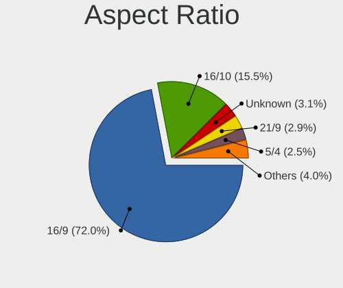

| Ratio   | Computers | Percent |
|---------|-----------|---------|
| 16/9    | 2314      | 72.02%  |
| 16/10   | 499       | 15.53%  |
| Unknown | 100       | 3.11%   |
| 21/9    | 92        | 2.86%   |
| 5/4     | 81        | 2.52%   |
| 3/2     | 47        | 1.46%   |
| 32/9    | 27        | 0.84%   |
| 1.00    | 12        | 0.37%   |
| 0.67    | 12        | 0.37%   |
| 4/3     | 11        | 0.34%   |
| 6/5     | 6         | 0.19%   |
| 0.56    | 4         | 0.12%   |
| 0.89    | 3         | 0.09%   |
| 0.62    | 2         | 0.06%   |
| 3.20    | 1         | 0.03%   |
| 1.96    | 1         | 0.03%   |
| 0.80    | 1         | 0.03%   |

Monitor Area
------------

Area in inch²

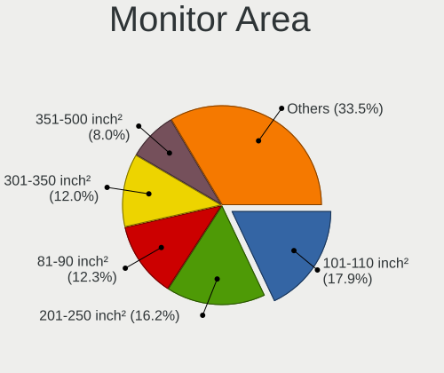

| Area in inch² | Computers | Percent |
|----------------|-----------|---------|
| 101-110        | 639       | 17.94%  |
| 201-250        | 577       | 16.2%   |
| 81-90          | 439       | 12.32%  |
| 301-350        | 426       | 11.96%  |
| 351-500        | 286       | 8.03%   |
| 251-300        | 196       | 5.5%    |
| 121-130        | 168       | 4.72%   |
| 151-200        | 133       | 3.73%   |
| Unknown        | 132       | 3.71%   |
| 71-80          | 129       | 3.62%   |
| More than 1000 | 124       | 3.48%   |
| 501-1000       | 75        | 2.11%   |
| 61-70          | 69        | 1.94%   |
| 111-120        | 51        | 1.43%   |
| 51-60          | 31        | 0.87%   |
| 141-150        | 28        | 0.79%   |
| 131-140        | 24        | 0.67%   |
| 1-40           | 17        | 0.48%   |
| 41-50          | 11        | 0.31%   |
| 91-100         | 7         | 0.2%    |

Pixel Density
-------------

Pixels per inch

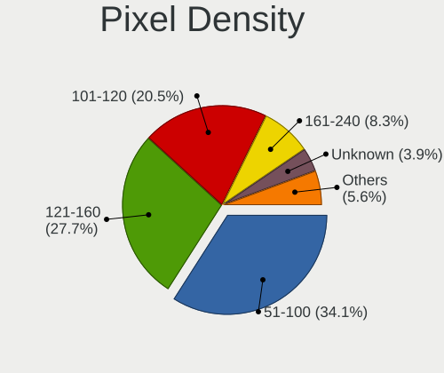

| Density       | Computers | Percent |
|---------------|-----------|---------|
| 51-100        | 1164      | 34.06%  |
| 121-160       | 948       | 27.74%  |
| 101-120       | 700       | 20.48%  |
| 161-240       | 282       | 8.25%   |
| Unknown       | 132       | 3.86%   |
| More than 240 | 103       | 3.01%   |
| 1-50          | 89        | 2.6%    |

Multiple Monitors
-----------------

Total monitors connected

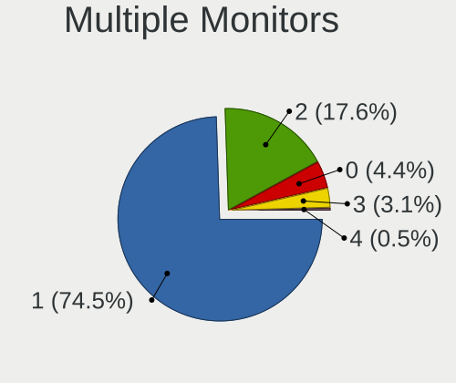

| Total | Computers | Percent |
|-------|-----------|---------|
| 1     | 2390      | 74.48%  |
| 2     | 564       | 17.58%  |
| 0     | 140       | 4.36%   |
| 3     | 100       | 3.12%   |
| 4     | 15        | 0.47%   |

Network
-------

Net Controller Vendor
---------------------

Controller vendors

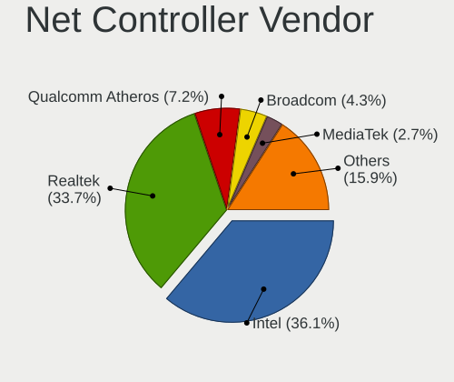

| Vendor                            | Computers | Percent |
|-----------------------------------|-----------|---------|
| Intel                             | 1707      | 36.14%  |
| Realtek Semiconductor             | 1592      | 33.71%  |
| Qualcomm Atheros                  | 342       | 7.24%   |
| Broadcom                          | 205       | 4.34%   |
| MediaTek                          | 127       | 2.69%   |
| Broadcom Limited                  | 45        | 0.95%   |
| TP-Link                           | 41        | 0.87%   |
| Marvell Technology Group          | 41        | 0.87%   |
| ASIX Electronics                  | 36        | 0.76%   |
| Ralink Technology                 | 33        | 0.7%    |
| Sierra Wireless                   | 31        | 0.66%   |
| Nvidia                            | 31        | 0.66%   |
| Ralink                            | 30        | 0.64%   |
| Dell                              | 25        | 0.53%   |
| Lenovo                            | 23        | 0.49%   |
| Aquantia                          | 22        | 0.47%   |
| Samsung Electronics               | 21        | 0.44%   |
| Qualcomm                          | 21        | 0.44%   |
| NetGear                           | 21        | 0.44%   |
| Ericsson Business Mobile Networks | 21        | 0.44%   |
| Microsoft                         | 20        | 0.42%   |
| Huawei Technologies               | 19        | 0.4%    |
| Shenzhen Goodix Technology        | 18        | 0.38%   |
| Edimax Technology                 | 18        | 0.38%   |
| DisplayLink                       | 18        | 0.38%   |
| ASUSTek Computer                  | 17        | 0.36%   |
| IMC Networks                      | 15        | 0.32%   |
| Fibocom                           | 14        | 0.3%    |
| Hewlett-Packard                   | 13        | 0.28%   |
| Qualcomm Atheros Communications   | 9         | 0.19%   |
| D-Link System                     | 9         | 0.19%   |
| D-Link                            | 9         | 0.19%   |
| Xiaomi                            | 8         | 0.17%   |
| Qualcomm Technologies             | 7         | 0.15%   |
| JMicron Technology                | 7         | 0.15%   |
| Google                            | 7         | 0.15%   |
| OnePlus Technology (Shenzhen)     | 5         | 0.11%   |
| Mellanox Technologies             | 5         | 0.11%   |
| ZyXEL Communications              | 4         | 0.08%   |
| VIA Technologies                  | 4         | 0.08%   |

Net Controller Model
--------------------

Controller models

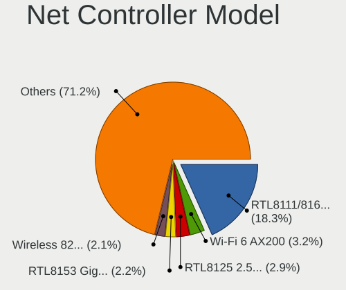

| Model                                                                  | Computers | Percent |
|------------------------------------------------------------------------|-----------|---------|
| Realtek RTL8111/8168/8211/8411 PCI Express Gigabit Ethernet Controller | 1043      | 18.33%  |
| Intel Wi-Fi 6 AX200                                                    | 180       | 3.16%   |
| Realtek RTL8125 2.5GbE Controller                                      | 165       | 2.9%    |
| Realtek RTL8153 Gigabit Ethernet Adapter                               | 128       | 2.25%   |
| Intel Wireless 8265 / 8275                                             | 121       | 2.13%   |
| Intel 82579LM Gigabit Network Connection (Lewisville)                  | 112       | 1.97%   |
| Intel I211 Gigabit Network Connection                                  | 95        | 1.67%   |
| Realtek RTL810xE PCI Express Fast Ethernet controller                  | 90        | 1.58%   |
| Intel Ethernet Controller I225-V                                       | 77        | 1.35%   |
| Intel Wi-Fi 6 AX201                                                    | 69        | 1.21%   |
| Intel Wireless 7265                                                    | 68        | 1.19%   |
| Intel Wireless 8260                                                    | 63        | 1.11%   |
| Intel Ethernet Connection (2) I219-V                                   | 63        | 1.11%   |
| Realtek RTL8822CE 802.11ac PCIe Wireless Network Adapter               | 59        | 1.04%   |
| MediaTek MT7922 802.11ax PCI Express Wireless Network Adapter          | 57        | 1%      |
| Intel Wi-Fi 6E(802.11ax) AX210/AX1675* 2x2 [Typhoon Peak]              | 56        | 0.98%   |
| Intel Comet Lake PCH-LP CNVi WiFi                                      | 55        | 0.97%   |
| Realtek RTL8821CE 802.11ac PCIe Wireless Network Adapter               | 51        | 0.9%    |
| Intel Centrino Advanced-N 6205 [Taylor Peak]                           | 51        | 0.9%    |
| Qualcomm Atheros AR9285 Wireless Network Adapter (PCI-Express)         | 48        | 0.84%   |
| Intel Wireless 3165                                                    | 48        | 0.84%   |
| Intel Wireless 7260                                                    | 47        | 0.83%   |
| Qualcomm Atheros QCA9377 802.11ac Wireless Network Adapter             | 40        | 0.7%    |
| Qualcomm Atheros QCA6174 802.11ac Wireless Network Adapter             | 40        | 0.7%    |
| Intel Dual Band Wireless-AC 3168NGW [Stone Peak]                       | 40        | 0.7%    |
| Intel Cannon Point-LP CNVi [Wireless-AC]                               | 40        | 0.7%    |
| Intel Wi-Fi 5(802.11ac) Wireless-AC 9x6x [Thunder Peak]                | 39        | 0.69%   |
| Intel Ethernet Connection I217-LM                                      | 37        | 0.65%   |
| Qualcomm Atheros AR9485 Wireless Network Adapter                       | 35        | 0.62%   |
| Intel Alder Lake-P PCH CNVi WiFi                                       | 32        | 0.56%   |
| Intel Ethernet Connection I219-LM                                      | 31        | 0.54%   |
| Intel Ethernet Connection (4) I219-V                                   | 31        | 0.54%   |
| Qualcomm Atheros QCA9565 / AR9565 Wireless Network Adapter             | 30        | 0.53%   |
| Intel Raptor Lake PCH CNVi WiFi                                        | 30        | 0.53%   |
| Intel Ethernet Connection (7) I219-V                                   | 30        | 0.53%   |
| Intel Comet Lake PCH CNVi WiFi                                         | 30        | 0.53%   |
| Intel Cannon Lake PCH CNVi WiFi                                        | 30        | 0.53%   |
| Intel 82579V Gigabit Network Connection                                | 30        | 0.53%   |
| ASIX AX88179 Gigabit Ethernet                                          | 30        | 0.53%   |
| MediaTek MT7921 802.11ax PCIe Wireless Network Adapter [Filogic 330]   | 29        | 0.51%   |

Wireless Vendor
---------------

Wireless vendors

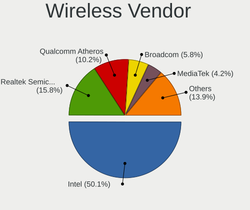

| Vendor                                | Computers | Percent |
|---------------------------------------|-----------|---------|
| Intel                                 | 1259      | 50.06%  |
| Realtek Semiconductor                 | 397       | 15.79%  |
| Qualcomm Atheros                      | 257       | 10.22%  |
| Broadcom                              | 146       | 5.81%   |
| MediaTek                              | 106       | 4.21%   |
| TP-Link                               | 39        | 1.55%   |
| Ralink Technology                     | 33        | 1.31%   |
| Sierra Wireless                       | 31        | 1.23%   |
| Ralink                                | 30        | 1.19%   |
| Broadcom Limited                      | 25        | 0.99%   |
| NetGear                               | 20        | 0.8%    |
| Edimax Technology                     | 18        | 0.72%   |
| Qualcomm                              | 17        | 0.68%   |
| Microsoft                             | 17        | 0.68%   |
| Dell                                  | 16        | 0.64%   |
| ASUSTek Computer                      | 16        | 0.64%   |
| IMC Networks                          | 15        | 0.6%    |
| Fibocom                               | 14        | 0.56%   |
| Qualcomm Atheros Communications       | 9         | 0.36%   |
| Marvell Technology Group              | 7         | 0.28%   |
| D-Link System                         | 7         | 0.28%   |
| D-Link                                | 7         | 0.28%   |
| ZyXEL Communications                  | 4         | 0.16%   |
| Qualcomm Technologies                 | 4         | 0.16%   |
| ZyDAS                                 | 3         | 0.12%   |
| Sitecom Europe                        | 3         | 0.12%   |
| Quectel Wireless Solutions            | 2         | 0.08%   |
| Hewlett-Packard                       | 2         | 0.08%   |
| AVM                                   | 2         | 0.08%   |
| 802.11g Adapter [Linksys WUSB54GC v3] | 2         | 0.08%   |
| Wilocity                              | 1         | 0.04%   |
| Wacom                                 | 1         | 0.04%   |
| Philips (or NXP)                      | 1         | 0.04%   |
| Linksys                               | 1         | 0.04%   |
| Ericsson Business Mobile Networks     | 1         | 0.04%   |
| BUFFALO                               | 1         | 0.04%   |
| Belkin Components                     | 1         | 0.04%   |

Wireless Model
--------------

Wireless models

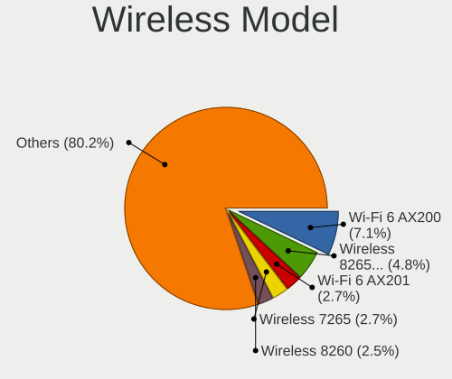

| Model                                                                | Computers | Percent |
|----------------------------------------------------------------------|-----------|---------|
| Intel Wi-Fi 6 AX200                                                  | 180       | 7.12%   |
| Intel Wireless 8265 / 8275                                           | 121       | 4.79%   |
| Intel Wi-Fi 6 AX201                                                  | 69        | 2.73%   |
| Intel Wireless 7265                                                  | 68        | 2.69%   |
| Intel Wireless 8260                                                  | 63        | 2.49%   |
| Realtek RTL8822CE 802.11ac PCIe Wireless Network Adapter             | 59        | 2.33%   |
| Intel Wi-Fi 6E(802.11ax) AX210/AX1675* 2x2 [Typhoon Peak]            | 56        | 2.22%   |
| Intel Comet Lake PCH-LP CNVi WiFi                                    | 55        | 2.18%   |
| Realtek RTL8821CE 802.11ac PCIe Wireless Network Adapter             | 51        | 2.02%   |
| Intel Centrino Advanced-N 6205 [Taylor Peak]                         | 51        | 2.02%   |
| Qualcomm Atheros AR9285 Wireless Network Adapter (PCI-Express)       | 48        | 1.9%    |
| Intel Wireless 3165                                                  | 48        | 1.9%    |
| MediaTek MT7922 802.11ax PCI Express Wireless Network Adapter        | 47        | 1.86%   |
| Intel Wireless 7260                                                  | 47        | 1.86%   |
| Qualcomm Atheros QCA9377 802.11ac Wireless Network Adapter           | 40        | 1.58%   |
| Qualcomm Atheros QCA6174 802.11ac Wireless Network Adapter           | 40        | 1.58%   |
| Intel Dual Band Wireless-AC 3168NGW [Stone Peak]                     | 40        | 1.58%   |
| Intel Cannon Point-LP CNVi [Wireless-AC]                             | 40        | 1.58%   |
| Intel Wi-Fi 5(802.11ac) Wireless-AC 9x6x [Thunder Peak]              | 39        | 1.54%   |
| Qualcomm Atheros AR9485 Wireless Network Adapter                     | 35        | 1.39%   |
| Qualcomm Atheros QCA9565 / AR9565 Wireless Network Adapter           | 30        | 1.19%   |
| Intel Raptor Lake PCH CNVi WiFi                                      | 30        | 1.19%   |
| Intel Comet Lake PCH CNVi WiFi                                       | 30        | 1.19%   |
| Intel Cannon Lake PCH CNVi WiFi                                      | 30        | 1.19%   |
| MediaTek MT7921 802.11ax PCIe Wireless Network Adapter [Filogic 330] | 29        | 1.15%   |
| Intel Centrino Ultimate-N 6300                                       | 29        | 1.15%   |
| Realtek RTL8822BE 802.11a/b/g/n/ac WiFi adapter                      | 27        | 1.07%   |
| Realtek RTL88x2bu [AC1200 Techkey]                                   | 23        | 0.91%   |
| Realtek RTL8723BE PCIe Wireless Network Adapter                      | 23        | 0.91%   |
| Intel Alder Lake-P PCH CNVi WiFi                                     | 23        | 0.91%   |
| Broadcom BCM43142 802.11b/g/n                                        | 23        | 0.91%   |
| Realtek RTL8852AE 802.11ax PCIe Wireless Network Adapter             | 20        | 0.79%   |
| Intel Ice Lake-LP PCH CNVi WiFi                                      | 20        | 0.79%   |
| Realtek RTL8852BE PCIe 802.11ax Wireless Network Controller          | 19        | 0.75%   |
| Realtek RTL8192CE PCIe Wireless Network Adapter                      | 19        | 0.75%   |
| Broadcom BCM4313 802.11bgn Wireless Network Adapter                  | 19        | 0.75%   |
| Sierra Wireless EM7455                                               | 18        | 0.71%   |
| Intel Wireless 3160                                                  | 17        | 0.67%   |
| Qualcomm Atheros AR9462 Wireless Network Adapter                     | 16        | 0.63%   |
| Intel WiFi Link 5100                                                 | 16        | 0.63%   |

Ethernet Vendor
---------------

Ethernet vendors

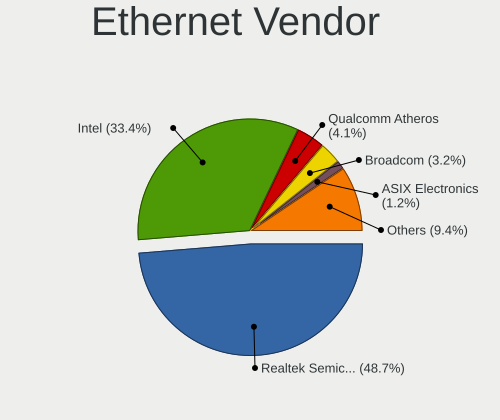

| Vendor                           | Computers | Percent |
|----------------------------------|-----------|---------|
| Realtek Semiconductor            | 1431      | 48.69%  |
| Intel                            | 981       | 33.38%  |
| Qualcomm Atheros                 | 121       | 4.12%   |
| Broadcom                         | 93        | 3.16%   |
| ASIX Electronics                 | 36        | 1.22%   |
| Marvell Technology Group         | 34        | 1.16%   |
| Nvidia                           | 31        | 1.05%   |
| Aquantia                         | 22        | 0.75%   |
| Samsung Electronics              | 21        | 0.71%   |
| Lenovo                           | 21        | 0.71%   |
| Broadcom Limited                 | 20        | 0.68%   |
| MediaTek                         | 18        | 0.61%   |
| DisplayLink                      | 18        | 0.61%   |
| Xiaomi                           | 8         | 0.27%   |
| Huawei Technologies              | 8         | 0.27%   |
| JMicron Technology               | 7         | 0.24%   |
| Google                           | 7         | 0.24%   |
| OnePlus Technology (Shenzhen)    | 5         | 0.17%   |
| VIA Technologies                 | 4         | 0.14%   |
| Qualcomm                         | 4         | 0.14%   |
| Mellanox Technologies            | 4         | 0.14%   |
| Hewlett-Packard                  | 4         | 0.14%   |
| Qualcomm Technologies            | 3         | 0.1%    |
| Motorola PCS                     | 3         | 0.1%    |
| Insyde Software                  | 3         | 0.1%    |
| Dell                             | 3         | 0.1%    |
| Apple                            | 3         | 0.1%    |
| TP-Link                          | 2         | 0.07%   |
| Motorcomm Microelectronics.      | 2         | 0.07%   |
| Microsoft                        | 2         | 0.07%   |
| IBM                              | 2         | 0.07%   |
| D-Link System                    | 2         | 0.07%   |
| D-Link                           | 2         | 0.07%   |
| Teltonika Networks               | 1         | 0.03%   |
| Silicon Integrated Systems [SiS] | 1         | 0.03%   |
| Rivet                            | 1         | 0.03%   |
| Research In Motion               | 1         | 0.03%   |
| Raspberry Pi                     | 1         | 0.03%   |
| NetGear                          | 1         | 0.03%   |
| Microchip Technology / SMSC      | 1         | 0.03%   |

Ethernet Model
--------------

Ethernet models

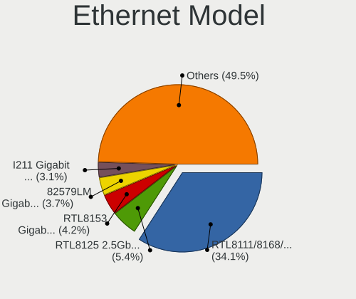

| Model                                                                  | Computers | Percent |
|------------------------------------------------------------------------|-----------|---------|
| Realtek RTL8111/8168/8211/8411 PCI Express Gigabit Ethernet Controller | 1043      | 34.13%  |
| Realtek RTL8125 2.5GbE Controller                                      | 165       | 5.4%    |
| Realtek RTL8153 Gigabit Ethernet Adapter                               | 128       | 4.19%   |
| Intel 82579LM Gigabit Network Connection (Lewisville)                  | 112       | 3.66%   |
| Intel I211 Gigabit Network Connection                                  | 95        | 3.11%   |
| Realtek RTL810xE PCI Express Fast Ethernet controller                  | 90        | 2.95%   |
| Intel Ethernet Controller I225-V                                       | 77        | 2.52%   |
| Intel Ethernet Connection (2) I219-V                                   | 63        | 2.06%   |
| Intel Ethernet Connection I217-LM                                      | 37        | 1.21%   |
| Intel Ethernet Connection I219-LM                                      | 31        | 1.01%   |
| Intel Ethernet Connection (4) I219-V                                   | 31        | 1.01%   |
| Intel Ethernet Connection (7) I219-V                                   | 30        | 0.98%   |
| Intel 82579V Gigabit Network Connection                                | 30        | 0.98%   |
| ASIX AX88179 Gigabit Ethernet                                          | 30        | 0.98%   |
| Intel Ethernet Connection (6) I219-V                                   | 28        | 0.92%   |
| Intel Ethernet Connection (2) I219-LM                                  | 27        | 0.88%   |
| Intel I210 Gigabit Network Connection                                  | 26        | 0.85%   |
| Intel Ethernet Connection I218-LM                                      | 24        | 0.79%   |
| Intel Ethernet Connection (4) I219-LM                                  | 24        | 0.79%   |
| Intel 82577LM Gigabit Network Connection                               | 23        | 0.75%   |
| Qualcomm Atheros AR8151 v2.0 Gigabit Ethernet                          | 22        | 0.72%   |
| Intel Ethernet Connection (3) I218-LM                                  | 21        | 0.69%   |
| Intel Ethernet Connection (10) I219-V                                  | 21        | 0.69%   |
| Intel 82567LM Gigabit Network Connection                               | 20        | 0.65%   |
| Intel Ethernet Connection I219-V                                       | 18        | 0.59%   |
| Intel Ethernet Connection (7) I219-LM                                  | 18        | 0.59%   |
| Intel Ethernet Connection I217-V                                       | 17        | 0.56%   |
| Broadcom NetXtreme BCM57765 Gigabit Ethernet PCIe                      | 17        | 0.56%   |
| Samsung Galaxy series, misc. (tethering mode)                          | 16        | 0.52%   |
| Qualcomm Atheros Killer E220x Gigabit Ethernet Controller              | 16        | 0.52%   |
| Qualcomm Atheros AR8161 Gigabit Ethernet                               | 16        | 0.52%   |
| Intel Ethernet Connection (2) I218-V                                   | 15        | 0.49%   |
| Nvidia MCP79 Ethernet                                                  | 14        | 0.46%   |
| Intel 82574L Gigabit Network Connection                                | 14        | 0.46%   |
| Qualcomm Atheros QCA8171 Gigabit Ethernet                              | 13        | 0.43%   |
| Intel Ethernet Connection (13) I219-V                                  | 13        | 0.43%   |
| Intel Ethernet Connection (6) I219-LM                                  | 12        | 0.39%   |
| Intel Ethernet Controller I226-V                                       | 11        | 0.36%   |
| Qualcomm Atheros AR8131 Gigabit Ethernet                               | 10        | 0.33%   |
| MediaTek MT7922 802.11ax PCI Express Wireless Network Adapter          | 10        | 0.33%   |

Net Controller Kind
-------------------

Ethernet, WiFi or modem

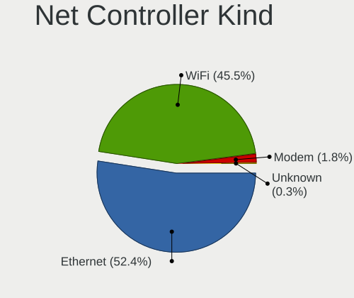

| Kind     | Computers | Percent |
|----------|-----------|---------|
| Ethernet | 2691      | 52.44%  |
| WiFi     | 2336      | 45.52%  |
| Modem    | 92        | 1.79%   |
| Unknown  | 13        | 0.25%   |

Used Controller
---------------

Currently used network controller

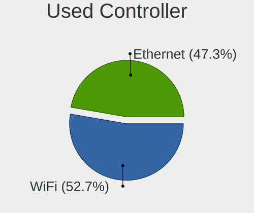

| Kind     | Computers | Percent |
|----------|-----------|---------|
| WiFi     | 1701      | 52.73%  |
| Ethernet | 1525      | 47.27%  |

NICs
----

Total network controllers on board

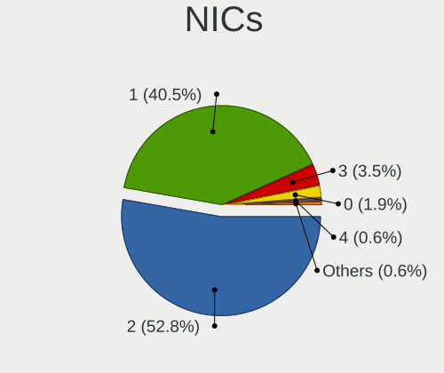

| Total | Computers | Percent |
|-------|-----------|---------|
| 2     | 1656      | 52.76%  |
| 1     | 1272      | 40.52%  |
| 3     | 111       | 3.54%   |
| 0     | 61        | 1.94%   |
| 4     | 20        | 0.64%   |
| 6     | 8         | 0.25%   |
| 5     | 7         | 0.22%   |
| 12    | 3         | 0.1%    |
| 13    | 1         | 0.03%   |

IPv6
----

IPv6 vs IPv4

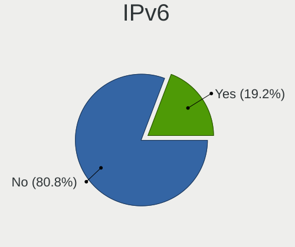

| Used | Computers | Percent |
|------|-----------|---------|
| No   | 2570      | 80.77%  |
| Yes  | 612       | 19.23%  |

Bluetooth
---------

Bluetooth Vendor
----------------

Controller vendors

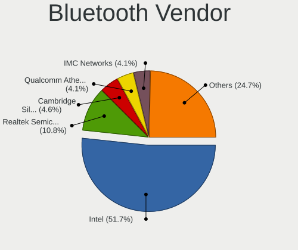

| Vendor                          | Computers | Percent |
|---------------------------------|-----------|---------|
| Intel                           | 1055      | 51.69%  |
| Realtek Semiconductor           | 221       | 10.83%  |
| Cambridge Silicon Radio         | 94        | 4.61%   |
| Qualcomm Atheros Communications | 84        | 4.12%   |
| IMC Networks                    | 83        | 4.07%   |
| Foxconn / Hon Hai               | 83        | 4.07%   |
| Broadcom                        | 77        | 3.77%   |
| Apple                           | 66        | 3.23%   |
| MediaTek                        | 48        | 2.35%   |
| Lite-On Technology              | 46        | 2.25%   |
| ASUSTek Computer                | 41        | 2.01%   |
| Dell                            | 23        | 1.13%   |
| Hewlett-Packard                 | 22        | 1.08%   |
| TP-Link                         | 17        | 0.83%   |
| Toshiba                         | 12        | 0.59%   |
| USI                             | 10        | 0.49%   |
| Marvell Semiconductor           | 9         | 0.44%   |
| Realtek                         | 6         | 0.29%   |
| Foxconn International           | 6         | 0.29%   |
| Actions                         | 6         | 0.29%   |
| Ralink                          | 5         | 0.24%   |
| HTC (High Tech Computer)        | 4         | 0.2%    |
| Belkin Components               | 4         | 0.2%    |
| Edimax Technology               | 3         | 0.15%   |
| Unknown                         | 3         | 0.15%   |
| Logitech                        | 2         | 0.1%    |
| D-Link System                   | 2         | 0.1%    |
| Alps Electric                   | 2         | 0.1%    |
| Taiyo Yuden                     | 1         | 0.05%   |
| SiW                             | 1         | 0.05%   |
| Quectel Wireless Solutions      | 1         | 0.05%   |
| Micro Star International        | 1         | 0.05%   |
| i.Tech Dynamic Limited          | 1         | 0.05%   |
| Fujitsu                         | 1         | 0.05%   |
| Askey Computer                  | 1         | 0.05%   |

Bluetooth Model
---------------

Controller models

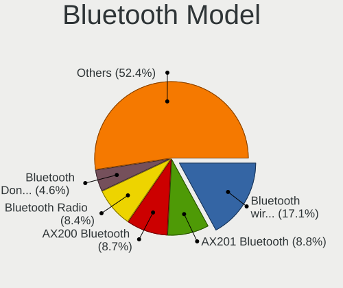

| Model                                               | Computers | Percent |
|-----------------------------------------------------|-----------|---------|
| Intel Bluetooth wireless interface                  | 348       | 17.05%  |
| Intel AX201 Bluetooth                               | 180       | 8.82%   |
| Intel AX200 Bluetooth                               | 178       | 8.72%   |
| Realtek Bluetooth Radio                             | 172       | 8.43%   |
| Cambridge Silicon Radio Bluetooth Dongle (HCI mode) | 94        | 4.61%   |
| Intel Bluetooth 9460/9560 Jefferson Peak (JfP)      | 93        | 4.56%   |
| Intel Bluetooth Device                              | 85        | 4.16%   |
| Intel AX210 Bluetooth                               | 55        | 2.69%   |
| MediaTek Wireless_Device                            | 46        | 2.25%   |
| Intel Wireless-AC 3168 Bluetooth                    | 38        | 1.86%   |
| Intel Wireless-AC 9260 Bluetooth Adapter            | 37        | 1.81%   |
| IMC Networks Bluetooth Radio                        | 35        | 1.71%   |
| Apple Bluetooth Host Controller                     | 31        | 1.52%   |
| Foxconn / Hon Hai Bluetooth Device                  | 29        | 1.42%   |
| Qualcomm Atheros AR3011 Bluetooth                   | 28        | 1.37%   |
| Intel Centrino Bluetooth Wireless Transceiver       | 27        | 1.32%   |
| IMC Networks Wireless_Device                        | 27        | 1.32%   |
| Foxconn / Hon Hai Wireless_Device                   | 27        | 1.32%   |
| Realtek  Bluetooth 4.2 Adapter                      | 26        | 1.27%   |
| Qualcomm Atheros QCA61x4 Bluetooth 4.0              | 21        | 1.03%   |
| Apple Bluetooth USB Host Controller                 | 21        | 1.03%   |
| Qualcomm Atheros  Bluetooth Device                  | 18        | 0.88%   |
| Broadcom BCM2045B (BDC-2.1)                         | 18        | 0.88%   |
| TP-Link TP-T@- UB500 Adapter                        | 17        | 0.83%   |
| Lite-On Qualcomm Atheros QCA9377 Bluetooth          | 15        | 0.73%   |
| Intel Centrino Advanced-N 6230 Bluetooth adapter    | 13        | 0.64%   |
| IMC Networks Bluetooth Device                       | 13        | 0.64%   |
| ASUS Broadcom BCM20702A0 Bluetooth                  | 13        | 0.64%   |
| Qualcomm Atheros AR3012 Bluetooth 4.0               | 12        | 0.59%   |
| HP Broadcom 2070 Bluetooth Combo                    | 12        | 0.59%   |
| Lite-On Bluetooth Device                            | 11        | 0.54%   |
| Broadcom BCM20702 Bluetooth 4.0 [ThinkPad]          | 11        | 0.54%   |
| USI Bluetooth Device                                | 10        | 0.49%   |
| Lite-On Atheros AR3012 Bluetooth                    | 10        | 0.49%   |
| HP Bluetooth 2.0 Interface [Broadcom BCM2045]       | 10        | 0.49%   |
| Foxconn / Hon Hai MediaTek Bluetooth Adapter        | 10        | 0.49%   |
| Dell BCM20702A0 Bluetooth Module                    | 9         | 0.44%   |
| ASUS ASUS USB-BT500                                 | 9         | 0.44%   |
| Apple Built-in Bluetooth 2.0+EDR HCI                | 9         | 0.44%   |
| Realtek RTL8822BE Bluetooth 4.2 Adapter             | 8         | 0.39%   |

Sound
-----

Sound Vendor
------------

Sound card vendors

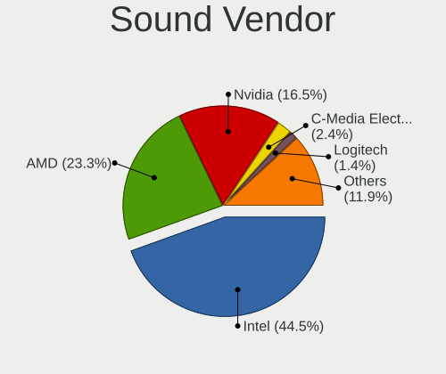

| Vendor                                       | Computers | Percent |
|----------------------------------------------|-----------|---------|
| Intel                                        | 2041      | 44.49%  |
| AMD                                          | 1071      | 23.34%  |
| Nvidia                                       | 758       | 16.52%  |
| C-Media Electronics                          | 110       | 2.4%    |
| Logitech                                     | 64        | 1.39%   |
| GN Netcom                                    | 31        | 0.68%   |
| Lenovo                                       | 25        | 0.54%   |
| ASUSTek Computer                             | 24        | 0.52%   |
| Realtek Semiconductor                        | 21        | 0.46%   |
| Creative Labs                                | 20        | 0.44%   |
| Corsair                                      | 20        | 0.44%   |
| Razer USA                                    | 19        | 0.41%   |
| Creative Technology                          | 19        | 0.41%   |
| SteelSeries ApS                              | 17        | 0.37%   |
| Micro Star International                     | 17        | 0.37%   |
| Focusrite-Novation                           | 17        | 0.37%   |
| JMTek                                        | 15        | 0.33%   |
| Hewlett-Packard                              | 15        | 0.33%   |
| Apple                                        | 15        | 0.33%   |
| Texas Instruments                            | 13        | 0.28%   |
| Kingston Technology                          | 13        | 0.28%   |
| Zoran Co. Personal Media Division (Nogatech) | 11        | 0.24%   |
| Generalplus Technology                       | 11        | 0.24%   |
| Sony                                         | 10        | 0.22%   |
| Plantronics                                  | 10        | 0.22%   |
| RODE Microphones                             | 9         | 0.2%    |
| BEHRINGER International                      | 9         | 0.2%    |
| Bose                                         | 8         | 0.17%   |
| DSEA A/S                                     | 7         | 0.15%   |
| Samson Technologies                          | 6         | 0.13%   |
| Jieli Technology                             | 6         | 0.13%   |
| Dell                                         | 6         | 0.13%   |
| ZOOM                                         | 5         | 0.11%   |
| SAVITECH                                     | 5         | 0.11%   |
| Yamaha                                       | 4         | 0.09%   |
| M-Audio                                      | 4         | 0.09%   |
| Lautsprecher Teufel                          | 4         | 0.09%   |
| Giga-Byte Technology                         | 4         | 0.09%   |
| XMOS                                         | 3         | 0.07%   |
| Harman International                         | 3         | 0.07%   |

Sound Model
-----------

Sound card models

| Model                                                                      | Computers | Percent |
|----------------------------------------------------------------------------|-----------|---------|
| AMD Ryzen HD Audio Controller                                              | 415       | 7.46%   |
| Intel Sunrise Point-LP HD Audio                                            | 231       | 4.15%   |
| AMD Starship/Matisse HD Audio Controller                                   | 192       | 3.45%   |
| Intel 7 Series/C216 Chipset Family High Definition Audio Controller        | 185       | 3.32%   |
| AMD Renoir/Cezanne HDMI/DP Audio Controller                                | 181       | 3.25%   |
| Intel 6 Series/C200 Series Chipset Family High Definition Audio Controller | 170       | 3.05%   |
| AMD Radeon High Definition Audio Controller                                | 152       | 2.73%   |
| Intel 8 Series/C220 Series Chipset High Definition Audio Controller        | 126       | 2.26%   |
| Intel 100 Series/C230 Series Chipset Family HD Audio Controller            | 106       | 1.9%    |
| Intel Cannon Lake PCH cAVS                                                 | 103       | 1.85%   |
| AMD SBx00 Azalia (Intel HDA)                                               | 101       | 1.81%   |
| Intel Tiger Lake-LP Smart Sound Technology Audio Controller                | 86        | 1.55%   |
| Intel Xeon E3-1200 v3/4th Gen Core Processor HD Audio Controller           | 85        | 1.53%   |
| AMD FCH Azalia Controller                                                  | 75        | 1.35%   |
| AMD Navi 21/23 HDMI/DP Audio Controller                                    | 73        | 1.31%   |
| AMD Raven/Raven2/Fenghuang HDMI/DP Audio Controller                        | 71        | 1.28%   |
| Intel Haswell-ULT HD Audio Controller                                      | 70        | 1.26%   |
| Intel 8 Series HD Audio Controller                                         | 70        | 1.26%   |
| Intel Comet Lake PCH-LP cAVS                                               | 67        | 1.2%    |
| Intel 5 Series/3400 Series Chipset High Definition Audio                   | 67        | 1.2%    |
| Intel 82801I (ICH9 Family) HD Audio Controller                             | 65        | 1.17%   |
| Intel Broadwell-U Audio Controller                                         | 63        | 1.13%   |
| Intel 200 Series PCH HD Audio                                              | 61        | 1.1%    |
| Intel Wildcat Point-LP High Definition Audio Controller                    | 60        | 1.08%   |
| Intel Cannon Point-LP High Definition Audio Controller                     | 60        | 1.08%   |
| AMD Family 17h (Models 00h-0fh) HD Audio Controller                        | 57        | 1.02%   |
| AMD Ellesmere HDMI Audio [Radeon RX 470/480 / 570/580/590]                 | 48        | 0.86%   |
| AMD Navi 31 HDMI/DP Audio                                                  | 47        | 0.84%   |
| AMD Kabini HDMI/DP Audio                                                   | 47        | 0.84%   |
| Nvidia GP107GL High Definition Audio Controller                            | 46        | 0.83%   |
| Nvidia GP104 High Definition Audio Controller                              | 46        | 0.83%   |
| Intel Comet Lake PCH cAVS                                                  | 44        | 0.79%   |
| Nvidia TU106 High Definition Audio Controller                              | 43        | 0.77%   |
| Nvidia GK208 HDMI/DP Audio Controller                                      | 42        | 0.75%   |
| Nvidia GP106 High Definition Audio Controller                              | 38        | 0.68%   |
| Nvidia GM204 High Definition Audio Controller                              | 37        | 0.66%   |
| Intel Alder Lake PCH-P High Definition Audio Controller                    | 37        | 0.66%   |
| Nvidia TU104 HD Audio Controller                                           | 36        | 0.65%   |
| Nvidia GA104 High Definition Audio Controller                              | 36        | 0.65%   |
| Intel Celeron/Pentium Silver Processor High Definition Audio               | 36        | 0.65%   |

Memory
------

Memory Vendor
-------------

Memory module vendors

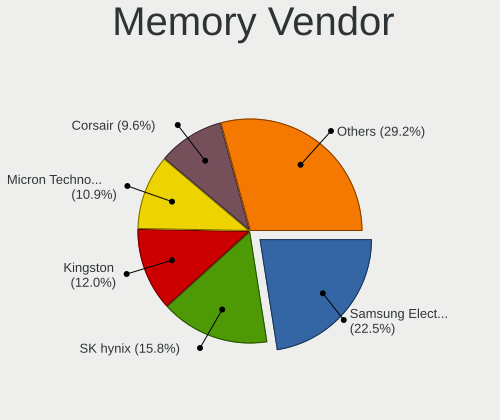

| Vendor                       | Computers | Percent |
|------------------------------|-----------|---------|
| Samsung Electronics          | 460       | 22.53%  |
| SK hynix                     | 322       | 15.77%  |
| Kingston                     | 245       | 12%     |
| Micron Technology            | 222       | 10.87%  |
| Corsair                      | 196       | 9.6%    |
| Crucial                      | 161       | 7.88%   |
| Unknown                      | 124       | 6.07%   |
| G.Skill                      | 117       | 5.73%   |
| Ramaxel Technology           | 38        | 1.86%   |
| Elpida                       | 24        | 1.18%   |
| Unknown (ABCD)               | 20        | 0.98%   |
| A-DATA Technology            | 20        | 0.98%   |
| Unknown                      | 16        | 0.78%   |
| Nanya Technology             | 15        | 0.73%   |
| Transcend                    | 7         | 0.34%   |
| Team                         | 7         | 0.34%   |
| Silicon Power                | 4         | 0.2%    |
| Hewlett-Packard              | 4         | 0.2%    |
| GOODRAM                      | 4         | 0.2%    |
| Unknown (0x0E9D)             | 3         | 0.15%   |
| Patriot                      | 3         | 0.15%   |
| Avant                        | 3         | 0.15%   |
| Toshiba                      | 2         | 0.1%    |
| Timetec                      | 2         | 0.1%    |
| Patriot Memory               | 2         | 0.1%    |
| JOY-IT                       | 2         | 0.1%    |
| Vaseky                       | 1         | 0.05%   |
| Unknown (130B)               | 1         | 0.05%   |
| Unknown (0x0FF4)             | 1         | 0.05%   |
| Unknown (09D5)               | 1         | 0.05%   |
| Unifosa                      | 1         | 0.05%   |
| TakeMS                       | 1         | 0.05%   |
| Smart                        | 1         | 0.05%   |
| Qimonda                      | 1         | 0.05%   |
| PNY                          | 1         | 0.05%   |
| Patriot Memory (PDP Systems) | 1         | 0.05%   |
| Neo Forza                    | 1         | 0.05%   |
| Mushkin                      | 1         | 0.05%   |
| Kingmax Semiconductor        | 1         | 0.05%   |
| Hitachi                      | 1         | 0.05%   |

Memory Model
------------

Memory module models

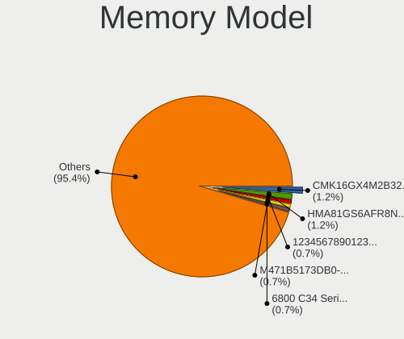

| Model                                                            | Computers | Percent |
|------------------------------------------------------------------|-----------|---------|
| Corsair RAM CMK16GX4M2B3200C16 8GB DIMM DDR4 3600MT/s            | 26        | 1.2%    |
| SK hynix RAM HMA81GS6AFR8N-UH 8GB SODIMM DDR4 2667MT/s           | 25        | 1.16%   |
| Unknown (ABCD) RAM 123456789012345678 2GB SODIMM LPDDR4 2400MT/s | 16        | 0.74%   |
| Samsung RAM M471B5173DB0-YK0 4GB SODIMM DDR3 1600MT/s            | 16        | 0.74%   |
| Unknown                                                          | 16        | 0.74%   |
| Samsung RAM M471A1G44AB0-CWE 8GiB SODIMM DDR4 3200MT/s           | 15        | 0.69%   |
| Samsung RAM M471A1K43DB1-CWE 8GB SODIMM DDR4 3200MT/s            | 14        | 0.65%   |
| G.Skill RAM F4-3000C16-8GISB 8GB DIMM DDR4 3200MT/s              | 14        | 0.65%   |
| Crucial RAM BLS8G3D1609DS1S00. 8GB DIMM DDR3 1800MT/s            | 14        | 0.65%   |
| SK hynix RAM HMT451S6BFR8A-PB 4GB SODIMM DDR3 1600MT/s           | 13        | 0.6%    |
| SK hynix RAM HMAA2GS6CJR8N-XN 16GB SODIMM DDR4 3200MT/s          | 13        | 0.6%    |
| SK hynix RAM HMAA1GS6CJR6N-XN 8GB SODIMM DDR4 3200MT/s           | 11        | 0.51%   |
| Samsung RAM M471A1K43CB1-CRC 8GB SODIMM DDR4 8400MT/s            | 11        | 0.51%   |
| Samsung RAM M471A1G44AB0-CWE 8GB Row Of Chips DDR4 3200MT/s      | 11        | 0.51%   |
| Samsung RAM M471B5273DH0-CH9 4GB SODIMM DDR3 1600MT/s            | 10        | 0.46%   |
| Samsung RAM M471A5244CB0-CTD 4GB SODIMM DDR4 3266MT/s            | 10        | 0.46%   |
| Samsung RAM M471A2G44AM0-CWE 16GB SODIMM DDR4 3200MT/s           | 10        | 0.46%   |
| Samsung RAM M471A1G44BB0-CWE 8GB SODIMM DDR4 3200MT/s            | 10        | 0.46%   |
| Micron RAM 4ATS2G64HZ-3G2B1 16GB SODIMM DDR4 3200MT/s            | 10        | 0.46%   |
| SK hynix RAM HMT351S6CFR8C-PB 4GB SODIMM DDR3 1600MT/s           | 9         | 0.42%   |
| SK hynix RAM HMA81GS6DJR8N-XN 8GB SODIMM DDR4 3200MT/s           | 9         | 0.42%   |
| Samsung RAM M471B1G73QH0-YK0 8GB SODIMM DDR3 1600MT/s            | 9         | 0.42%   |
| Samsung RAM M471A2K43CB1-CTD 16GB SODIMM DDR4 8400MT/s           | 9         | 0.42%   |
| Micron RAM 8JTF51264AZ-1G6E1 4GB DIMM DDR3 1600MT/s              | 9         | 0.42%   |
| G.Skill RAM F4-3200C16-16GIS 16GB DIMM DDR4 3600MT/s             | 9         | 0.42%   |
| Corsair RAM CMK16GX4M2B3000C15 8GB DIMM DDR4 3600MT/s            | 9         | 0.42%   |
| Samsung RAM M471B5273CH0-CH9 4GB SODIMM DDR3 1334MT/s            | 8         | 0.37%   |
| Samsung RAM M471A5244CB0-CWE 4GB SODIMM DDR4 3200MT/s            | 8         | 0.37%   |
| Samsung RAM M471A2K43DB1-CWE 16GB SODIMM DDR4 3200MT/s           | 8         | 0.37%   |
| Samsung RAM M471A2G43AB2-CWE 16GB SODIMM DDR4 3200MT/s           | 8         | 0.37%   |
| Kingston RAM KHX1600C9D3/4GX 4GB DIMM DDR3 1867MT/s              | 8         | 0.37%   |
| G.Skill RAM F4-3200C16-8GVKB 8GB DIMM DDR4 4000MT/s              | 8         | 0.37%   |
| G.Skill RAM F4-3200C16-8GIS 8GB DIMM DDR4 3600MT/s               | 8         | 0.37%   |
| SK hynix RAM HMT351S6EFR8A-PB 4GB SODIMM DDR3 1600MT/s           | 7         | 0.32%   |
| Samsung RAM M471B5773CHS-CH9 2GB SODIMM DDR3 4199MT/s            | 7         | 0.32%   |
| Samsung RAM M471B5173QH0-YK0 4GB SODIMM DDR3 1600MT/s            | 7         | 0.32%   |
| Samsung RAM M471A4G43MB1-CTD 32GB SODIMM DDR4 2667MT/s           | 7         | 0.32%   |
| Samsung RAM M471A1K43CB1-CTD 8GB SODIMM DDR4 3200MT/s            | 7         | 0.32%   |
| Micron RAM Module 8GB SODIMM DDR4 3200MT/s                       | 7         | 0.32%   |
| Kingston RAM Module 32GB DIMM DDR4 2400MT/s                      | 7         | 0.32%   |

Memory Kind
-----------

Memory module kinds

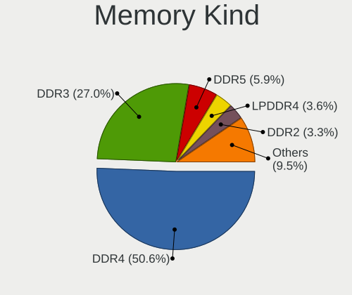

| Kind    | Computers | Percent |
|---------|-----------|---------|
| DDR4    | 903       | 50.64%  |
| DDR3    | 482       | 27.03%  |
| DDR5    | 106       | 5.95%   |
| LPDDR4  | 64        | 3.59%   |
| DDR2    | 58        | 3.25%   |
| LPDDR5  | 54        | 3.03%   |
| LPDDR3  | 48        | 2.69%   |
| SDRAM   | 43        | 2.41%   |
| Unknown | 20        | 1.12%   |
| DDR     | 4         | 0.22%   |
| DRAM    | 1         | 0.06%   |

Memory Form Factor
------------------

Physical design of the memory module

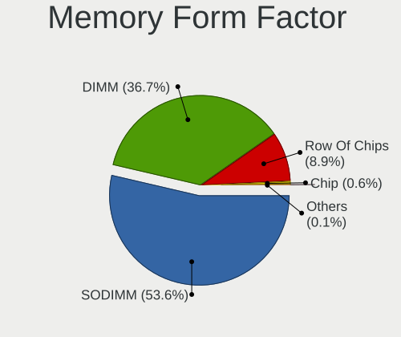

| Name         | Computers | Percent |
|--------------|-----------|---------|
| SODIMM       | 959       | 53.64%  |
| DIMM         | 656       | 36.69%  |
| Row Of Chips | 159       | 8.89%   |
| Chip         | 11        | 0.62%   |
| Unknown      | 2         | 0.11%   |
| FB-DIMM      | 1         | 0.06%   |

Memory Size
-----------

Memory module size

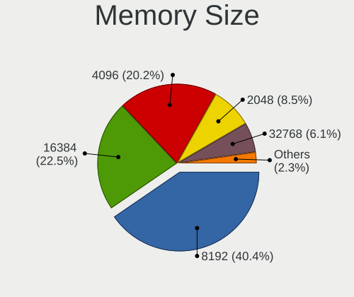

| Size  | Computers | Percent |
|-------|-----------|---------|
| 8192  | 776       | 40.44%  |
| 16384 | 432       | 22.51%  |
| 4096  | 387       | 20.17%  |
| 2048  | 163       | 8.49%   |
| 32768 | 117       | 6.1%    |
| 1024  | 26        | 1.35%   |
| 49152 | 5         | 0.26%   |
| 24576 | 4         | 0.21%   |
| 512   | 4         | 0.21%   |
| 65536 | 3         | 0.16%   |
| 256   | 1         | 0.05%   |
| 16    | 1         | 0.05%   |

Memory Speed
------------

Memory module speed

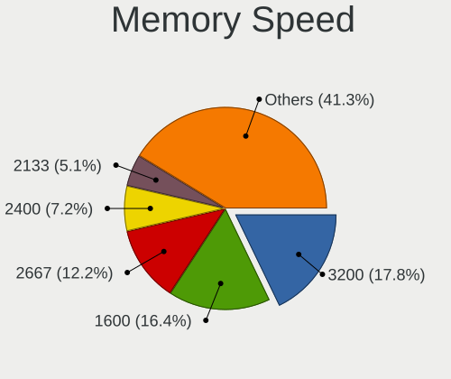

| Speed   | Computers | Percent |
|---------|-----------|---------|
| 3200    | 343       | 17.84%  |
| 1600    | 315       | 16.38%  |
| 2667    | 234       | 12.17%  |
| 2400    | 139       | 7.23%   |
| 2133    | 98        | 5.1%    |
| 3600    | 93        | 4.84%   |
| 1333    | 93        | 4.84%   |
| 5600    | 44        | 2.29%   |
| 6400    | 33        | 1.72%   |
| 3733    | 30        | 1.56%   |
| 1867    | 30        | 1.56%   |
| 1334    | 29        | 1.51%   |
| 667     | 29        | 1.51%   |
| 4800    | 26        | 1.35%   |
| 4267    | 26        | 1.35%   |
| 800     | 23        | 1.2%    |
| 8400    | 20        | 1.04%   |
| 3800    | 20        | 1.04%   |
| 6000    | 18        | 0.94%   |
| 1800    | 18        | 0.94%   |
| 1067    | 17        | 0.88%   |
| 4000    | 16        | 0.83%   |
| 3000    | 15        | 0.78%   |
| Unknown | 15        | 0.78%   |
| 4199    | 14        | 0.73%   |
| 1866    | 13        | 0.68%   |
| 3266    | 12        | 0.62%   |
| 2666    | 12        | 0.62%   |
| 2933    | 11        | 0.57%   |
| 2048    | 10        | 0.52%   |
| 1066    | 10        | 0.52%   |
| 7500    | 9         | 0.47%   |
| 3400    | 8         | 0.42%   |
| 7467    | 6         | 0.31%   |
| 4266    | 6         | 0.31%   |
| 8533    | 5         | 0.26%   |
| 3866    | 5         | 0.26%   |
| 5200    | 4         | 0.21%   |
| 3466    | 4         | 0.21%   |
| 2134    | 4         | 0.21%   |

Printers & scanners
-------------------

Printer Vendor
--------------

Printer device vendors

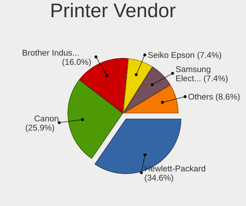

| Vendor                | Computers | Percent |
|-----------------------|-----------|---------|
| Hewlett-Packard       | 28        | 34.57%  |
| Canon                 | 21        | 25.93%  |
| Brother Industries    | 13        | 16.05%  |
| Seiko Epson           | 6         | 7.41%   |
| Samsung Electronics   | 6         | 7.41%   |
| Ricoh                 | 2         | 2.47%   |
| QinHeng Electronics   | 1         | 1.23%   |
| Prolific Technology   | 1         | 1.23%   |
| Oki Data              | 1         | 1.23%   |
| Lexmark International | 1         | 1.23%   |
| Dell                  | 1         | 1.23%   |

Printer Model
-------------

Printer device models

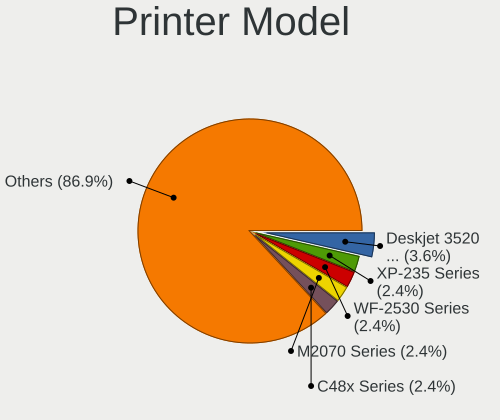

| Model                                                      | Computers | Percent |
|------------------------------------------------------------|-----------|---------|
| HP Deskjet 3520 series                                     | 3         | 3.57%   |
| Seiko Epson XP-235 Series                                  | 2         | 2.38%   |
| Seiko Epson WF-2530 Series                                 | 2         | 2.38%   |
| Samsung M2070 Series                                       | 2         | 2.38%   |
| Samsung C48x Series                                        | 2         | 2.38%   |
| HP LaserJet Professional P1102w                            | 2         | 2.38%   |
| HP LaserJet P1102                                          | 2         | 2.38%   |
| HP LaserJet 1320                                           | 2         | 2.38%   |
| HP ENVY Photo 6200 series                                  | 2         | 2.38%   |
| HP ENVY 4520 series                                        | 2         | 2.38%   |
| HP Color Laser 150nw                                       | 2         | 2.38%   |
| Canon TS700 series                                         | 2         | 2.38%   |
| Canon TS5100 series                                        | 2         | 2.38%   |
| Canon PIXMA MX320 series                                   | 2         | 2.38%   |
| Canon PIXMA MG2500 Series                                  | 2         | 2.38%   |
| Canon LiDE 300                                             | 2         | 2.38%   |
| Brother Printer                                            | 2         | 2.38%   |
| Brother MFC-L2710DW series                                 | 2         | 2.38%   |
| Brother HL-3040CN series                                   | 2         | 2.38%   |
| Seiko Epson ET-4750 [WorkForce ET-4750 EcoTank All-in-One] | 1         | 1.19%   |
| Seiko Epson AL-M310DN                                      | 1         | 1.19%   |
| Samsung SCX-4300 Series                                    | 1         | 1.19%   |
| Samsung C1810 Series                                       | 1         | 1.19%   |
| Ricoh RICOH SP 211SU                                       | 1         | 1.19%   |
| Ricoh Aficio SP 3400N                                      | 1         | 1.19%   |
| QinHeng CH340S                                             | 1         | 1.19%   |
| Prolific PL2305 Parallel Port                              | 1         | 1.19%   |
| Oki Data USB Device                                        | 1         | 1.19%   |
| Lexmark International CS417dn                              | 1         | 1.19%   |
| HP PSC 1400                                                | 1         | 1.19%   |
| HP OfficeJet Pro 7720 series                               | 1         | 1.19%   |
| HP LaserJet M14-M17                                        | 1         | 1.19%   |
| HP LaserJet 1200                                           | 1         | 1.19%   |
| HP LaserJet 1022                                           | 1         | 1.19%   |
| HP HP OfficeJet Pro 8020 series                            | 1         | 1.19%   |
| HP ENVY Pro 6400 series                                    | 1         | 1.19%   |
| HP ENVY 5000 series                                        | 1         | 1.19%   |
| HP DeskJet D2300                                           | 1         | 1.19%   |
| HP DeskJet 940c                                            | 1         | 1.19%   |
| HP DeskJet 2800 series                                     | 1         | 1.19%   |

Scanner Vendor
--------------

Scanner device vendors

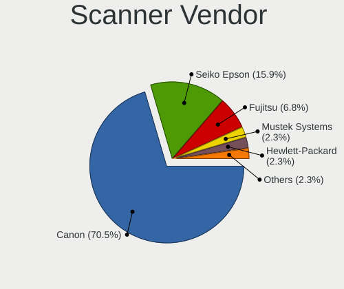

| Vendor          | Computers | Percent |
|-----------------|-----------|---------|
| Canon           | 31        | 70.45%  |
| Seiko Epson     | 7         | 15.91%  |
| Fujitsu         | 3         | 6.82%   |
| Mustek Systems  | 1         | 2.27%   |
| Hewlett-Packard | 1         | 2.27%   |
| AGFA-Gevaert NV | 1         | 2.27%   |

Scanner Model
-------------

Scanner device models

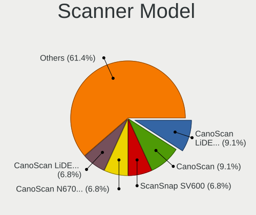

| Model                                                    | Computers | Percent |
|----------------------------------------------------------|-----------|---------|
| Canon CanoScan LiDE 110                                  | 4         | 9.09%   |
| Canon CanoScan                                           | 4         | 9.09%   |
| Fujitsu ScanSnap SV600                                   | 3         | 6.82%   |
| Canon CanoScan N670U/N676U/LiDE 20                       | 3         | 6.82%   |
| Canon CanoScan LiDE 200                                  | 3         | 6.82%   |
| Seiko Epson GT-F500/GT-F550 [Perfection 2480/2580 PHOTO] | 2         | 4.55%   |
| Canon CanoScan N1240U/LiDE 30                            | 2         | 4.55%   |
| Canon CanoScan LiDE 60                                   | 2         | 4.55%   |
| Canon CanoScan LiDE 50/LiDE 35/LiDE 40                   | 2         | 4.55%   |
| Canon CanoScan LiDE 220                                  | 2         | 4.55%   |
| Canon CanoScan LiDE 210                                  | 2         | 4.55%   |
| Canon CanoScan LiDE 100                                  | 2         | 4.55%   |
| Seiko Epson Perfection V37/V370                          | 1         | 2.27%   |
| Seiko Epson GT-X800 [Perfection 4990 PHOTO]              | 1         | 2.27%   |
| Seiko Epson GT-F720 [GT-S620/Perfection V30/V300 Photo]  | 1         | 2.27%   |
| Seiko Epson GT-9300UF [Perfection 2400 PHOTO]            | 1         | 2.27%   |
| Seiko Epson GT-7200U [Perfection 1250/1250 PHOTO]        | 1         | 2.27%   |
| Mustek Systems SNAPSCAN e22                              | 1         | 2.27%   |
| HP ScanJet 4850C/4890C                                   | 1         | 2.27%   |
| Canon CanoScan N650U/N656U                               | 1         | 2.27%   |
| Canon CanoScan LiDE 500F                                 | 1         | 2.27%   |
| Canon CanoScan LIDE 25                                   | 1         | 2.27%   |
| Canon CanoScan LiDE 120                                  | 1         | 2.27%   |
| Canon CanoScan FB630U                                    | 1         | 2.27%   |
| AGFA-Gevaert NV SnapScan e20                             | 1         | 2.27%   |

Camera
------

Camera Vendor
-------------

Camera device vendors

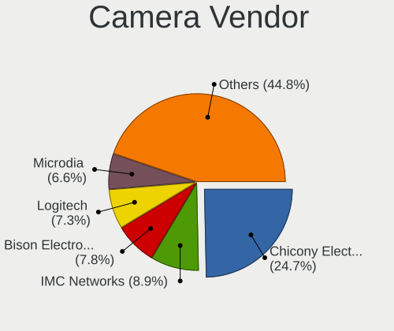

| Vendor                                 | Computers | Percent |
|----------------------------------------|-----------|---------|
| Chicony Electronics                    | 440       | 24.66%  |
| IMC Networks                           | 159       | 8.91%   |
| Bison Electronics                      | 139       | 7.79%   |
| Logitech                               | 130       | 7.29%   |
| Microdia                               | 117       | 6.56%   |
| Realtek Semiconductor                  | 89        | 4.99%   |
| Sunplus Innovation Technology          | 85        | 4.76%   |
| Quanta                                 | 80        | 4.48%   |
| Apple                                  | 61        | 3.42%   |
| Luxvisions Innotech Limited            | 55        | 3.08%   |
| Cheng Uei Precision Industry (Foxlink) | 49        | 2.75%   |
| Lite-On Technology                     | 48        | 2.69%   |
| Suyin                                  | 42        | 2.35%   |
| Syntek                                 | 39        | 2.19%   |
| Microsoft                              | 23        | 1.29%   |
| Alcor Micro                            | 20        | 1.12%   |
| Samsung Electronics                    | 16        | 0.9%    |
| ARC International                      | 12        | 0.67%   |
| Lenovo                                 | 11        | 0.62%   |
| SunplusIT                              | 10        | 0.56%   |
| Ricoh                                  | 10        | 0.56%   |
| Z-Star Microelectronics                | 9         | 0.5%    |
| Silicon Motion                         | 7         | 0.39%   |
| Shinetech                              | 7         | 0.39%   |
| Primax Electronics                     | 7         | 0.39%   |
| Jieli Technology                       | 7         | 0.39%   |
| SHENZHEN EMEET TECHNOLOGY              | 5         | 0.28%   |
| icSpring                               | 5         | 0.28%   |
| Generalplus Technology                 | 5         | 0.28%   |
| Tobii Technology AB                    | 4         | 0.22%   |
| Sonix Technology                       | 4         | 0.22%   |
| SHENZHEN AONI ELECTRONIC               | 4         | 0.22%   |
| OmniVision Technologies                | 4         | 0.22%   |
| Novatek Microelectronics               | 4         | 0.22%   |
| KYE Systems (Mouse Systems)            | 4         | 0.22%   |
| Acer                                   | 4         | 0.22%   |
| Sunplus Technology                     | 3         | 0.17%   |
| Shenzhen Kingcome Optoelectronic       | 3         | 0.17%   |
| Razer USA                              | 3         | 0.17%   |
| Fujitsu                                | 3         | 0.17%   |

Camera Model
------------

Camera device models

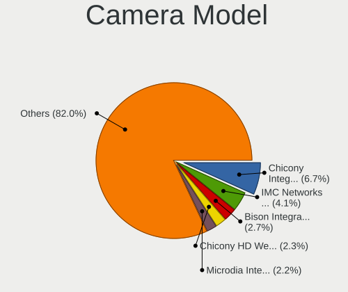

| Model                                             | Computers | Percent |
|---------------------------------------------------|-----------|---------|
| Chicony Integrated Camera                         | 121       | 6.73%   |
| IMC Networks Integrated Camera                    | 74        | 4.12%   |
| Bison Integrated Camera                           | 49        | 2.73%   |
| Chicony HD WebCam                                 | 41        | 2.28%   |
| Microdia Integrated_Webcam_HD                     | 39        | 2.17%   |
| IMC Networks USB2.0 HD UVC WebCam                 | 35        | 1.95%   |
| Syntek Integrated Camera                          | 26        | 1.45%   |
| Chicony HP HD Camera                              | 26        | 1.45%   |
| Realtek Integrated_Webcam_HD                      | 21        | 1.17%   |
| Quanta HD User Facing                             | 20        | 1.11%   |
| Logitech Webcam C270                              | 20        | 1.11%   |
| Lite-On Integrated Camera                         | 19        | 1.06%   |
| Apple iPhone 5/5C/5S/6/SE/7/8/X                   | 19        | 1.06%   |
| Sunplus Integrated_Webcam_HD                      | 18        | 1%      |
| Quanta HP HD Camera                               | 18        | 1%      |
| Luxvisions Innotech Limited Integrated Camera     | 18        | 1%      |
| Logitech HD Pro Webcam C920                       | 17        | 0.95%   |
| Apple Built-in iSight                             | 17        | 0.95%   |
| Samsung Galaxy series, misc. (MTP mode)           | 16        | 0.89%   |
| IMC Networks USB2.0 VGA UVC WebCam                | 16        | 0.89%   |
| Chicony TOSHIBA Web Camera - HD                   | 15        | 0.83%   |
| Bison SunplusIT Integrated Camera                 | 14        | 0.78%   |
| Apple FaceTime HD Camera                          | 14        | 0.78%   |
| Lite-On HP HD Camera                              | 13        | 0.72%   |
| Chicony USB2.0 HD UVC WebCam                      | 13        | 0.72%   |
| Realtek USB2.0 HD UVC WebCam                      | 12        | 0.67%   |
| Logitech C922 Pro Stream Webcam                   | 12        | 0.67%   |
| Chicony HD User Facing                            | 12        | 0.67%   |
| Chicony FJ Camera                                 | 12        | 0.67%   |
| Bison Lenovo EasyCamera                           | 12        | 0.67%   |
| ARC International Camera                          | 12        | 0.67%   |
| Sunplus Integrated Camera                         | 11        | 0.61%   |
| Microdia Webcam Vitade AF                         | 11        | 0.61%   |
| Luxvisions Innotech Limited Integrated RGB Camera | 11        | 0.61%   |
| Chicony VGA Webcam                                | 11        | 0.61%   |
| Chicony HP HD Webcam                              | 11        | 0.61%   |
| Bison Integrated RGB Camera                       | 11        | 0.61%   |
| Bison HD Webcam                                   | 11        | 0.61%   |
| Sunplus HD WebCam                                 | 10        | 0.56%   |
| Luxvisions Innotech Limited HP HD Camera          | 10        | 0.56%   |

Security
--------

Fingerprint Vendor
------------------

Fingerprint sensor vendors

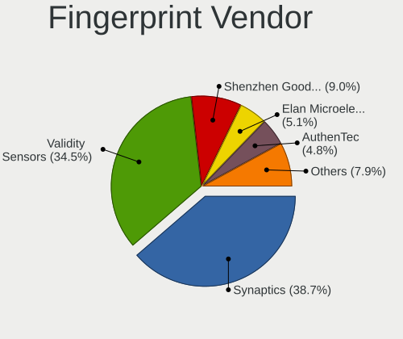

| Vendor                             | Computers | Percent |
|------------------------------------|-----------|---------|
| Synaptics                          | 176       | 38.68%  |
| Validity Sensors                   | 157       | 34.51%  |
| Shenzhen Goodix Technology         | 41        | 9.01%   |
| Elan Microelectronics              | 23        | 5.05%   |
| AuthenTec                          | 22        | 4.84%   |
| Upek                               | 21        | 4.62%   |
| LighTuning Technology              | 11        | 2.42%   |
| ZKSoftware                         | 1         | 0.22%   |
| STMicroelectronics                 | 1         | 0.22%   |
| Realtek USB2.0 Finger Print Bridge | 1         | 0.22%   |
| Focal-systems.Corp                 | 1         | 0.22%   |

Fingerprint Model
-----------------

Fingerprint sensor models

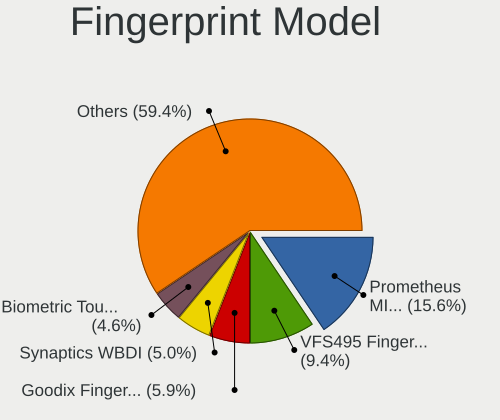

| Model                                                                      | Computers | Percent |
|----------------------------------------------------------------------------|-----------|---------|
| Synaptics Prometheus MIS Touch Fingerprint Reader                          | 71        | 15.57%  |
| Validity Sensors VFS495 Fingerprint Reader                                 | 43        | 9.43%   |
| Shenzhen Goodix  FingerPrint Device                                        | 27        | 5.92%   |
| Validity Sensors Synaptics WBDI                                            | 23        | 5.04%   |
| Upek Biometric Touchchip/Touchstrip Fingerprint Sensor                     | 21        | 4.61%   |
| Synaptics Metallica MIS Touch Fingerprint Reader                           | 15        | 3.29%   |
| Synaptics WBDI                                                             | 14        | 3.07%   |
| Elan ELAN:Fingerprint                                                      | 14        | 3.07%   |
| Validity Sensors VFS5011 Fingerprint Reader                                | 13        | 2.85%   |
| Validity Sensors VFS471 Fingerprint Reader                                 | 13        | 2.85%   |
| Synaptics Fingerprint reader [HP G6]                                       | 13        | 2.85%   |
| Validity Sensors VFS491                                                    | 11        | 2.41%   |
| Validity Sensors VFS 5011 fingerprint sensor                               | 11        | 2.41%   |
| Synaptics UWP WBDI Device                                                  | 11        | 2.41%   |
| Synaptics FS7604 Touch Fingerprint Sensor with PurePrint                   | 11        | 2.41%   |
| AuthenTec AES2810                                                          | 11        | 2.41%   |
| Validity Sensors VFS7500 Touch Fingerprint Sensor                          | 10        | 2.19%   |
| Synaptics  FS7604 Touch Fingerprint Sensor with PurePrint                  | 9         | 1.97%   |
| Validity Sensors Fingerprint scanner                                       | 8         | 1.75%   |
| Shenzhen Goodix Fingerprint Reader                                         | 8         | 1.75%   |
| Validity Sensors Synaptics VFS7552 Touch Fingerprint Sensor with PurePrint | 7         | 1.54%   |
| Synaptics Metallica MOH Touch Fingerprint Reader                           | 7         | 1.54%   |
| Synaptics  WBDI                                                            | 6         | 1.32%   |
| Shenzhen Goodix FingerPrint                                                | 6         | 1.32%   |
| Elan ELAN:ARM-M4                                                           | 6         | 1.32%   |
| Validity Sensors VFS451 Fingerprint Reader                                 | 5         | 1.1%    |
| Synaptics UWP WBDI                                                         | 5         | 1.1%    |
| LighTuning ES603 Swipe Fingerprint Sensor                                  | 5         | 1.1%    |
| Validity Sensors Synaptics VFS7552 Touch Fingerprint Sensor                | 4         | 0.88%   |
| Validity Sensors Swipe Fingerprint Sensor                                  | 4         | 0.88%   |
| Synaptics WBDI Device                                                      | 4         | 0.88%   |
| LighTuning EgisTec Touch Fingerprint Sensor                                | 4         | 0.88%   |
| AuthenTec Fingerprint Sensor                                               | 4         | 0.88%   |
| AuthenTec AES2501 Fingerprint Sensor                                       | 4         | 0.88%   |
| Validity Sensors VFS Fingerprint sensor                                    | 3         | 0.66%   |
| Synaptics  WBDI Fingerprint Reader - USB 052                               | 3         | 0.66%   |
| Elan fingerprint sensor [FeinTech FPS00200]                                | 3         | 0.66%   |
| Synaptics WBDI Fingerprint Reader USB 086                                  | 2         | 0.44%   |
| Synaptics TouchPad                                                         | 2         | 0.44%   |
| Synaptics Prometheus Fingerprint Reader                                    | 2         | 0.44%   |

Chipcard Vendor
---------------

Chipcard module vendors

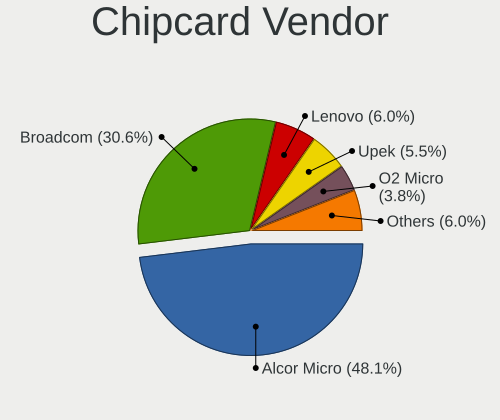

| Vendor                | Computers | Percent |
|-----------------------|-----------|---------|
| Alcor Micro           | 113       | 48.09%  |
| Broadcom              | 72        | 30.64%  |
| Lenovo                | 14        | 5.96%   |
| Upek                  | 13        | 5.53%   |
| O2 Micro              | 9         | 3.83%   |
| SCM Microsystems      | 3         | 1.28%   |
| Yubico.com            | 2         | 0.85%   |
| Realtek Semiconductor | 2         | 0.85%   |
| OmniKey               | 2         | 0.85%   |
| Gemalto (was Gemplus) | 2         | 0.85%   |
| Cherry                | 2         | 0.85%   |
| Advanced Card Systems | 1         | 0.43%   |

Chipcard Model
--------------

Chipcard module models

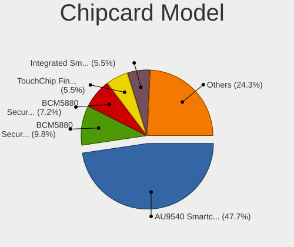

| Model                                                                        | Computers | Percent |
|------------------------------------------------------------------------------|-----------|---------|
| Alcor Micro AU9540 Smartcard Reader                                          | 112       | 47.66%  |
| Broadcom BCM5880 Secure Applications Processor                               | 23        | 9.79%   |
| Broadcom BCM5880 Secure Applications Processor with fingerprint swipe sensor | 17        | 7.23%   |
| Upek TouchChip Fingerprint Coprocessor (WBF advanced mode)                   | 13        | 5.53%   |
| Lenovo Integrated Smart Card Reader                                          | 13        | 5.53%   |
| Broadcom BCM58200 ControlVault 3 (FingerPrint sensor + Contacted SmartCard)  | 13        | 5.53%   |
| Broadcom 5880                                                                | 10        | 4.26%   |
| Broadcom 58200                                                               | 9         | 3.83%   |
| O2 Micro OZ776 CCID Smartcard Reader                                         | 8         | 3.4%    |
| Yubico.com Yubikey 4/5 U2F+CCID                                              | 2         | 0.85%   |
| SCM Microsystems SCR3340 - ExpressCard54 Smart Card Reader                   | 2         | 0.85%   |
| Realtek Semiconductor Smart Card Reader Interface                            | 2         | 0.85%   |
| SCM Microsystems CLOUD 2700 F Smart Card Reader                              | 1         | 0.43%   |
| OmniKey CardMan 3121 (HID Technologies)                                      | 1         | 0.43%   |
| OmniKey CardMan 3021 / 3121                                                  | 1         | 0.43%   |
| O2 Micro Oz776 SmartCard Reader                                              | 1         | 0.43%   |
| Lenovo Smartcard Keyboard                                                    | 1         | 0.43%   |
| Gemalto (was Gemplus) GemPC Twin SmartCard Reader                            | 1         | 0.43%   |
| Gemalto (was Gemplus) GemPC Key SmartCard Reader                             | 1         | 0.43%   |
| Cherry SmartTerminal XX44                                                    | 1         | 0.43%   |
| Cherry Smart Terminal XX44                                                   | 1         | 0.43%   |
| Alcor Micro Watchdata W 1981                                                 | 1         | 0.43%   |
| Advanced Card Systems ACR122U                                                | 1         | 0.43%   |

Unsupported
-----------

Unsupported Devices
-------------------

Total unsupported devices on board

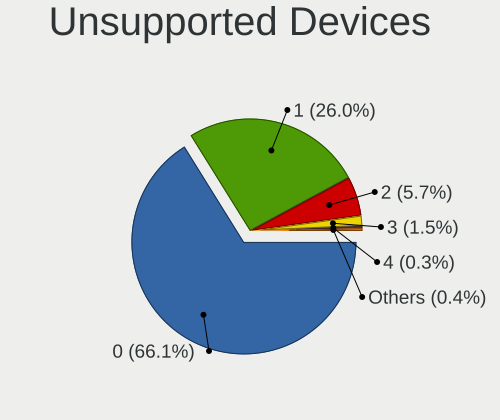

| Total | Computers | Percent |
|-------|-----------|---------|
| 0     | 2133      | 66.14%  |
| 1     | 838       | 25.98%  |
| 2     | 183       | 5.67%   |
| 3     | 47        | 1.46%   |
| 4     | 11        | 0.34%   |
| 5     | 6         | 0.19%   |
| 6     | 4         | 0.12%   |
| 8     | 2         | 0.06%   |
| 7     | 1         | 0.03%   |

Unsupported Device Types
------------------------

Types of unsupported devices

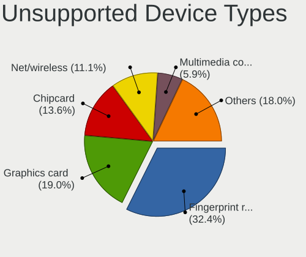

| Type                     | Computers | Percent |
|--------------------------|-----------|---------|
| Fingerprint reader       | 447       | 32.37%  |
| Graphics card            | 263       | 19.04%  |
| Chipcard                 | 188       | 13.61%  |
| Net/wireless             | 153       | 11.08%  |
| Multimedia controller    | 82        | 5.94%   |
| Communication controller | 50        | 3.62%   |
| Unassigned class         | 33        | 2.39%   |
| Sound                    | 31        | 2.24%   |
| Camera                   | 30        | 2.17%   |
| Bluetooth                | 30        | 2.17%   |
| Card reader              | 18        | 1.3%    |
| Net/ethernet             | 16        | 1.16%   |
| Storage                  | 13        | 0.94%   |
| Network                  | 8         | 0.58%   |
| Storage/raid             | 5         | 0.36%   |
| Modem                    | 5         | 0.36%   |
| Tv card                  | 2         | 0.14%   |
| Storage/ide              | 2         | 0.14%   |
| Flash memory             | 2         | 0.14%   |
| Storage/nvme             | 1         | 0.07%   |
| Storage/ata              | 1         | 0.07%   |
| Firewire controller      | 1         | 0.07%   |

