Linux in Austria - Tested Hardware & Statistics
-----------------------------------------------

A project to collect tested hardware configurations for Linux in Austria.

Anyone can contribute to this report by the [hw-probe](https://github.com/linuxhw/hw-probe) tool:

    sudo -E hw-probe -all -upload

Please contribute! Especially if your hardware is rare.

This is a report for all computer types. See also reports for [desktops](/Location/Austria/Desktop/README.md) and [notebooks](/Location/Austria/Notebook/README.md).

Contents
--------

* [ Test Cases ](#test-cases)

* [ System ](#system)
  - [ OS                       ](#os)
  - [ OS Family                ](#os-family)
  - [ Kernel                   ](#kernel)
  - [ Kernel Family            ](#kernel-family)
  - [ Kernel Major Ver.        ](#kernel-major-ver)
  - [ Arch                     ](#arch)
  - [ DE                       ](#de)
  - [ Display Server           ](#display-server)
  - [ Display Manager          ](#display-manager)
  - [ OS Lang                  ](#os-lang)
  - [ Boot Mode                ](#boot-mode)
  - [ Filesystem               ](#filesystem)
  - [ Part. scheme             ](#part-scheme)
  - [ Dual Boot with Linux/BSD ](#dual-boot-with-linuxbsd)
  - [ Dual Boot (Win)          ](#dual-boot-win)

* [ Board ](#board)
  - [ Vendor                   ](#vendor)
  - [ Model                    ](#model)
  - [ Model Family             ](#model-family)
  - [ MFG Year                 ](#mfg-year)
  - [ Form Factor              ](#form-factor)
  - [ Secure Boot              ](#secure-boot)
  - [ Coreboot                 ](#coreboot)
  - [ RAM Size                 ](#ram-size)
  - [ RAM Used                 ](#ram-used)
  - [ Total Drives             ](#total-drives)
  - [ Has CD-ROM               ](#has-cd-rom)
  - [ Has Ethernet             ](#has-ethernet)
  - [ Has WiFi                 ](#has-wifi)
  - [ Has Bluetooth            ](#has-bluetooth)

* [ Location ](#location)
  - [ Country                  ](#country)
  - [ City                     ](#city)

* [ Drives ](#drives)
  - [ Drive Vendor             ](#drive-vendor)
  - [ Drive Model              ](#drive-model)
  - [ HDD Vendor               ](#hdd-vendor)
  - [ SSD Vendor               ](#ssd-vendor)
  - [ Drive Kind               ](#drive-kind)
  - [ Drive Connector          ](#drive-connector)
  - [ Drive Size               ](#drive-size)
  - [ Space Total              ](#space-total)
  - [ Space Used               ](#space-used)
  - [ Malfunc. Drives          ](#malfunc-drives)
  - [ Malfunc. Drive Vendor    ](#malfunc-drive-vendor)
  - [ Malfunc. HDD Vendor      ](#malfunc-hdd-vendor)
  - [ Malfunc. Drive Kind      ](#malfunc-drive-kind)
  - [ Failed Drives            ](#failed-drives)
  - [ Failed Drive Vendor      ](#failed-drive-vendor)
  - [ Drive Status             ](#drive-status)

* [ Storage controller ](#storage-controller)
  - [ Storage Vendor           ](#storage-vendor)
  - [ Storage Model            ](#storage-model)
  - [ Storage Kind             ](#storage-kind)

* [ Processor ](#processor)
  - [ CPU Vendor               ](#cpu-vendor)
  - [ CPU Model                ](#cpu-model)
  - [ CPU Model Family         ](#cpu-model-family)
  - [ CPU Cores                ](#cpu-cores)
  - [ CPU Sockets              ](#cpu-sockets)
  - [ CPU Threads              ](#cpu-threads)
  - [ CPU Op-Modes             ](#cpu-op-modes)
  - [ CPU Microcode            ](#cpu-microcode)
  - [ CPU Microarch            ](#cpu-microarch)

* [ Graphics ](#graphics)
  - [ GPU Vendor               ](#gpu-vendor)
  - [ GPU Model                ](#gpu-model)
  - [ GPU Combo                ](#gpu-combo)
  - [ GPU Driver               ](#gpu-driver)
  - [ GPU Memory               ](#gpu-memory)

* [ Monitor ](#monitor)
  - [ Monitor Vendor           ](#monitor-vendor)
  - [ Monitor Model            ](#monitor-model)
  - [ Monitor Resolution       ](#monitor-resolution)
  - [ Monitor Diagonal         ](#monitor-diagonal)
  - [ Monitor Width            ](#monitor-width)
  - [ Aspect Ratio             ](#aspect-ratio)
  - [ Monitor Area             ](#monitor-area)
  - [ Pixel Density            ](#pixel-density)
  - [ Multiple Monitors        ](#multiple-monitors)

* [ Network ](#network)
  - [ Net Controller Vendor    ](#net-controller-vendor)
  - [ Net Controller Model     ](#net-controller-model)
  - [ Wireless Vendor          ](#wireless-vendor)
  - [ Wireless Model           ](#wireless-model)
  - [ Ethernet Vendor          ](#ethernet-vendor)
  - [ Ethernet Model           ](#ethernet-model)
  - [ Net Controller Kind      ](#net-controller-kind)
  - [ Used Controller          ](#used-controller)
  - [ NICs                     ](#nics)
  - [ IPv6                     ](#ipv6)

* [ Bluetooth ](#bluetooth)
  - [ Bluetooth Vendor         ](#bluetooth-vendor)
  - [ Bluetooth Model          ](#bluetooth-model)

* [ Sound ](#sound)
  - [ Sound Vendor             ](#sound-vendor)
  - [ Sound Model              ](#sound-model)

* [ Memory ](#memory)
  - [ Memory Vendor            ](#memory-vendor)
  - [ Memory Model             ](#memory-model)
  - [ Memory Kind              ](#memory-kind)
  - [ Memory Form Factor       ](#memory-form-factor)
  - [ Memory Size              ](#memory-size)
  - [ Memory Speed             ](#memory-speed)

* [ Printers & scanners ](#printers--scanners)
  - [ Printer Vendor           ](#printer-vendor)
  - [ Printer Model            ](#printer-model)
  - [ Scanner Vendor           ](#scanner-vendor)
  - [ Scanner Model            ](#scanner-model)

* [ Camera ](#camera)
  - [ Camera Vendor            ](#camera-vendor)
  - [ Camera Model             ](#camera-model)

* [ Security ](#security)
  - [ Fingerprint Vendor       ](#fingerprint-vendor)
  - [ Fingerprint Model        ](#fingerprint-model)
  - [ Chipcard Vendor          ](#chipcard-vendor)
  - [ Chipcard Model           ](#chipcard-model)

* [ Unsupported ](#unsupported)
  - [ Unsupported Devices      ](#unsupported-devices)
  - [ Unsupported Device Types ](#unsupported-device-types)

Test Cases
----------

Total: 2104

| Vendor        | Model                       | Form-Factor | Probe                                                      | Date         |
|---------------|-----------------------------|-------------|------------------------------------------------------------|--------------|
| Lenovo        | IdeaPad 3 17IML05 81WC      | Notebook    | [e722d17a52](https://linux-hardware.org/?probe=e722d17a52) | Oct 01, 2022 |
| HP            | EliteBook 850 G1            | Notebook    | [9667dac801](https://linux-hardware.org/?probe=9667dac801) | Sep 30, 2022 |
| Lenovo        | ThinkBook 13s G2 ITL 20V... | Notebook    | [e829c9c0c6](https://linux-hardware.org/?probe=e829c9c0c6) | Sep 30, 2022 |
| Lenovo        | ThinkBook 15p Gen 2 21B1    | Notebook    | [16f1ddb076](https://linux-hardware.org/?probe=16f1ddb076) | Sep 30, 2022 |
| Unknown       | 775VM8                      | Desktop     | [114c84d76c](https://linux-hardware.org/?probe=114c84d76c) | Sep 30, 2022 |
| Unknown       | 775VM8                      | Desktop     | [903649eae9](https://linux-hardware.org/?probe=903649eae9) | Sep 30, 2022 |
| MSI           | H110 PC MATE                | Desktop     | [ac97c636a5](https://linux-hardware.org/?probe=ac97c636a5) | Sep 30, 2022 |
| Notebook      | NJ50_70CU                   | Notebook    | [4914d3ffe1](https://linux-hardware.org/?probe=4914d3ffe1) | Sep 29, 2022 |
| Biostar       | A10N-8800E                  | Desktop     | [d27bf09dc8](https://linux-hardware.org/?probe=d27bf09dc8) | Sep 27, 2022 |
| Medion        | MS-7728                     | Desktop     | [82da4b643b](https://linux-hardware.org/?probe=82da4b643b) | Sep 27, 2022 |
| Gigabyte      | 990FXA-UD5                  | Desktop     | [89303afdb5](https://linux-hardware.org/?probe=89303afdb5) | Sep 26, 2022 |
| Lenovo        | V15 G2 ALC 82KD             | Notebook    | [3c0a494baa](https://linux-hardware.org/?probe=3c0a494baa) | Sep 26, 2022 |
| Dell          | Latitude E6400              | Notebook    | [c1190109d0](https://linux-hardware.org/?probe=c1190109d0) | Sep 26, 2022 |
| Dell          | XPS 17 9700                 | Notebook    | [76166adede](https://linux-hardware.org/?probe=76166adede) | Sep 26, 2022 |
| MSI           | MAG B460 TOMAHAWK           | Desktop     | [a213c6d22a](https://linux-hardware.org/?probe=a213c6d22a) | Sep 26, 2022 |
| AMI           | Intel                       | Notebook    | [56de8f8b8a](https://linux-hardware.org/?probe=56de8f8b8a) | Sep 25, 2022 |
| AMI           | Intel                       | Notebook    | [330585dcd8](https://linux-hardware.org/?probe=330585dcd8) | Sep 25, 2022 |
| MSI           | MPG X570 GAMING PLUS        | Desktop     | [0047e2de0e](https://linux-hardware.org/?probe=0047e2de0e) | Sep 24, 2022 |
| MSI           | MPG X570 GAMING PLUS        | Desktop     | [54bafde5a9](https://linux-hardware.org/?probe=54bafde5a9) | Sep 24, 2022 |
| Acer          | Aspire E5-771G              | Notebook    | [39dc43058e](https://linux-hardware.org/?probe=39dc43058e) | Sep 23, 2022 |
| MSI           | H110 PC MATE                | Desktop     | [006830e521](https://linux-hardware.org/?probe=006830e521) | Sep 23, 2022 |
| HP            | Compaq 15                   | Notebook    | [345fe48777](https://linux-hardware.org/?probe=345fe48777) | Sep 22, 2022 |
| MSI           | MPG X570 GAMING PLUS        | Desktop     | [a766b7b9d0](https://linux-hardware.org/?probe=a766b7b9d0) | Sep 22, 2022 |
| MSI           | MPG X570 GAMING PLUS        | Desktop     | [34fea4fedc](https://linux-hardware.org/?probe=34fea4fedc) | Sep 22, 2022 |
| Dell          | Latitude E6510              | Notebook    | [fa644f90c4](https://linux-hardware.org/?probe=fa644f90c4) | Sep 22, 2022 |
| ASUSTek       | WS C422 PRO_SE              | Desktop     | [e278a4ab5e](https://linux-hardware.org/?probe=e278a4ab5e) | Sep 21, 2022 |
| HP            | Pavilion 17                 | Notebook    | [0f7eec1f7a](https://linux-hardware.org/?probe=0f7eec1f7a) | Sep 21, 2022 |
| HP            | 1998                        | Desktop     | [5148539ae1](https://linux-hardware.org/?probe=5148539ae1) | Sep 21, 2022 |
| ASUSTek       | UX303LAB                    | Notebook    | [2165b4b046](https://linux-hardware.org/?probe=2165b4b046) | Sep 20, 2022 |
| HP            | EliteBook 840 G3            | Notebook    | [233ba928b8](https://linux-hardware.org/?probe=233ba928b8) | Sep 20, 2022 |
| ASUSTek       | ROG STRIX B550-F GAMING     | Desktop     | [256ff04106](https://linux-hardware.org/?probe=256ff04106) | Sep 20, 2022 |
| Lenovo        | ThinkPad E14 Gen 3 20YDS... | Notebook    | [7561f24877](https://linux-hardware.org/?probe=7561f24877) | Sep 20, 2022 |
| Dell          | XPS 13 9380                 | Notebook    | [0c6c042af0](https://linux-hardware.org/?probe=0c6c042af0) | Sep 20, 2022 |
| Lenovo        | MAHOBAY Win8 STD MM DPK ... | Desktop     | [4d5fc6b39f](https://linux-hardware.org/?probe=4d5fc6b39f) | Sep 20, 2022 |
| Samsung       | R530/R730                   | Notebook    | [0d4e13e70f](https://linux-hardware.org/?probe=0d4e13e70f) | Sep 19, 2022 |
| Dell          | 02M8NY A01                  | Desktop     | [498286eb91](https://linux-hardware.org/?probe=498286eb91) | Sep 19, 2022 |
| HP            | ProBook 470 G4              | Notebook    | [c11b354c39](https://linux-hardware.org/?probe=c11b354c39) | Sep 18, 2022 |
| Dell          | 0T7D40 A01                  | Desktop     | [9eba047248](https://linux-hardware.org/?probe=9eba047248) | Sep 18, 2022 |
| Lenovo        | ThinkBook 15 G3 ACL 21A4    | Notebook    | [004d0a2b9d](https://linux-hardware.org/?probe=004d0a2b9d) | Sep 17, 2022 |
| MSI           | MPG X570 GAMING PLUS        | Desktop     | [980e4272fb](https://linux-hardware.org/?probe=980e4272fb) | Sep 17, 2022 |
| Lenovo        | V15 G2 ALC 82KD             | Notebook    | [4053fdc410](https://linux-hardware.org/?probe=4053fdc410) | Sep 14, 2022 |
| Intel         | DH67BL AAG10189-209         | Desktop     | [3507c0cdb7](https://linux-hardware.org/?probe=3507c0cdb7) | Sep 14, 2022 |
| ASUSTek       | PRIME B450-PLUS             | Desktop     | [3c37d36ba8](https://linux-hardware.org/?probe=3c37d36ba8) | Sep 13, 2022 |
| ASUSTek       | PRIME B450-PLUS             | Desktop     | [6ddf2bafef](https://linux-hardware.org/?probe=6ddf2bafef) | Sep 13, 2022 |
| ASUSTek       | PRIME B550-PLUS             | Desktop     | [321432c752](https://linux-hardware.org/?probe=321432c752) | Sep 12, 2022 |
| Lenovo        | ThinkPad W510 4391W3V       | Notebook    | [cae551826b](https://linux-hardware.org/?probe=cae551826b) | Sep 10, 2022 |
| Valve         | Jupiter                     | Notebook    | [49694d92f6](https://linux-hardware.org/?probe=49694d92f6) | Sep 09, 2022 |
| ASUSTek       | PRIME B550-PLUS             | Desktop     | [718876491c](https://linux-hardware.org/?probe=718876491c) | Sep 08, 2022 |
| HP            | ProBook 450 G0              | Notebook    | [07dfc865cf](https://linux-hardware.org/?probe=07dfc865cf) | Sep 08, 2022 |
| ASUSTek       | H170M-PLUS                  | Desktop     | [df80ca89ee](https://linux-hardware.org/?probe=df80ca89ee) | Sep 08, 2022 |
| Lenovo        | ThinkPad T16 Gen 1 21BVC... | Notebook    | [044bee5e0c](https://linux-hardware.org/?probe=044bee5e0c) | Sep 07, 2022 |
| Dell          | XPS 13 9310 2-in-1          | Convertible | [b5270dfd32](https://linux-hardware.org/?probe=b5270dfd32) | Sep 07, 2022 |
| TUXEDO        | InfinityBook S 15/17 Gen... | Notebook    | [e1a78657ba](https://linux-hardware.org/?probe=e1a78657ba) | Sep 07, 2022 |
| Acer          | Aspire S3                   | Notebook    | [cb62300974](https://linux-hardware.org/?probe=cb62300974) | Sep 07, 2022 |
| HP            | EliteBook 8460p             | Notebook    | [12abaecf7e](https://linux-hardware.org/?probe=12abaecf7e) | Sep 05, 2022 |
| Acer          | Aspire A517-52G             | Notebook    | [c1709e40b7](https://linux-hardware.org/?probe=c1709e40b7) | Sep 05, 2022 |
| TrekStor      | Notebook Slim S130          | Notebook    | [abd3c1ccf8](https://linux-hardware.org/?probe=abd3c1ccf8) | Sep 05, 2022 |
| Unknown       | Unknown                     | Desktop     | [e2115bf207](https://linux-hardware.org/?probe=e2115bf207) | Sep 05, 2022 |
| Lenovo        | ThinkPad T500 2241WH7       | Notebook    | [1e14648d27](https://linux-hardware.org/?probe=1e14648d27) | Sep 04, 2022 |
| Gigabyte      | B550 AORUS PRO V2           | Desktop     | [106bdf4d1b](https://linux-hardware.org/?probe=106bdf4d1b) | Sep 04, 2022 |
| ASUSTek       | H81M-E                      | Desktop     | [ebceb9b949](https://linux-hardware.org/?probe=ebceb9b949) | Sep 04, 2022 |
| ASUSTek       | H81M-E                      | Desktop     | [d7c48b7007](https://linux-hardware.org/?probe=d7c48b7007) | Sep 04, 2022 |
| Samsung       | 950QDB                      | Convertible | [ec7cdfdff7](https://linux-hardware.org/?probe=ec7cdfdff7) | Sep 04, 2022 |
| ASUSTek       | Maximus VIII RANGER         | Desktop     | [b298d162b1](https://linux-hardware.org/?probe=b298d162b1) | Sep 04, 2022 |
| ASUSTek       | H61M-A/USB3                 | Desktop     | [7801ef775b](https://linux-hardware.org/?probe=7801ef775b) | Sep 03, 2022 |
| BESSTAR Te... | X400                        | Notebook    | [8eb69c0ad6](https://linux-hardware.org/?probe=8eb69c0ad6) | Sep 03, 2022 |
| TUXEDO        | InfinityBook S 15/17 Gen... | Notebook    | [1ce3a883a0](https://linux-hardware.org/?probe=1ce3a883a0) | Sep 03, 2022 |
| Lenovo        | V15 G2 ALC 82KD             | Notebook    | [6109fc3fa8](https://linux-hardware.org/?probe=6109fc3fa8) | Sep 02, 2022 |
| Lenovo        | V15 G2 ALC 82KD             | Notebook    | [9f98c80601](https://linux-hardware.org/?probe=9f98c80601) | Sep 02, 2022 |
| BESSTAR Te... | X400                        | Notebook    | [2a6969af70](https://linux-hardware.org/?probe=2a6969af70) | Sep 02, 2022 |
| Dell          | XPS 13 9305                 | Notebook    | [1746053c5b](https://linux-hardware.org/?probe=1746053c5b) | Sep 01, 2022 |
| Panasonic     | CF-191HACHFG                | Notebook    | [c1f0177dcb](https://linux-hardware.org/?probe=c1f0177dcb) | Sep 01, 2022 |
| Gigabyte      | B450 AORUS PRO-CF           | Desktop     | [37695eb7e5](https://linux-hardware.org/?probe=37695eb7e5) | Aug 31, 2022 |
| Dell          | 0T7D40 A01                  | Desktop     | [0968e0629e](https://linux-hardware.org/?probe=0968e0629e) | Aug 31, 2022 |
| Gigabyte      | B450 AORUS ELITE            | Desktop     | [f07bd2b99b](https://linux-hardware.org/?probe=f07bd2b99b) | Aug 28, 2022 |
| BESSTAR Te... | X400                        | Notebook    | [ab70086ae7](https://linux-hardware.org/?probe=ab70086ae7) | Aug 27, 2022 |
| BESSTAR Te... | X400                        | Notebook    | [f8d3611cf0](https://linux-hardware.org/?probe=f8d3611cf0) | Aug 27, 2022 |
| Dell          | XPS 15 9575                 | Convertible | [e18118bf63](https://linux-hardware.org/?probe=e18118bf63) | Aug 27, 2022 |
| Foxconn       | A6VMX 0A                    | Desktop     | [f31fcbf60d](https://linux-hardware.org/?probe=f31fcbf60d) | Aug 26, 2022 |
| Fujitsu       | LIFEBOOK E752               | Notebook    | [adf76251c5](https://linux-hardware.org/?probe=adf76251c5) | Aug 26, 2022 |
| Fujitsu       | LIFEBOOK E752               | Notebook    | [7c7a83f951](https://linux-hardware.org/?probe=7c7a83f951) | Aug 26, 2022 |
| Lenovo        | ThinkBook 13s G2 ITL 20V... | Notebook    | [cf7da7df12](https://linux-hardware.org/?probe=cf7da7df12) | Aug 26, 2022 |
| Lenovo        | ThinkBook 13s G2 ITL 20V... | Notebook    | [76db86107b](https://linux-hardware.org/?probe=76db86107b) | Aug 26, 2022 |
| HUAWEI        | KLVL-WXX9                   | Notebook    | [fcfd89bb32](https://linux-hardware.org/?probe=fcfd89bb32) | Aug 25, 2022 |
| ASUSTek       | X580VD                      | Notebook    | [c579b49e4c](https://linux-hardware.org/?probe=c579b49e4c) | Aug 25, 2022 |
| Lenovo        | ThinkPad X1 Yoga Gen 5 2... | Convertible | [57727c2af7](https://linux-hardware.org/?probe=57727c2af7) | Aug 23, 2022 |
| Acer          | Predator G3-710             | Desktop     | [7a58c9348e](https://linux-hardware.org/?probe=7a58c9348e) | Aug 22, 2022 |
| MSI           | 2A9C                        | Desktop     | [4f15bcded6](https://linux-hardware.org/?probe=4f15bcded6) | Aug 22, 2022 |
| Dell          | 0T10XW A01                  | Desktop     | [30ebde5edc](https://linux-hardware.org/?probe=30ebde5edc) | Aug 21, 2022 |
| HP            | 250 G7 Notebook PC          | Notebook    | [ced2388c29](https://linux-hardware.org/?probe=ced2388c29) | Aug 21, 2022 |
| HP            | ENVY x360 Convertible 13... | Convertible | [e4869235d8](https://linux-hardware.org/?probe=e4869235d8) | Aug 20, 2022 |
| ASUSTek       | Maximus IX HERO             | Desktop     | [782466213a](https://linux-hardware.org/?probe=782466213a) | Aug 19, 2022 |
| MSI           | 760GM-P23                   | Desktop     | [42245b8fc8](https://linux-hardware.org/?probe=42245b8fc8) | Aug 18, 2022 |
| ASUSTek       | PRIME Z390-A                | Desktop     | [859884934f](https://linux-hardware.org/?probe=859884934f) | Aug 17, 2022 |
| Shuttle       | DS437                       | Notebook    | [21e0ca6a77](https://linux-hardware.org/?probe=21e0ca6a77) | Aug 17, 2022 |
| HP            | ENVY x360 Convertible 13... | Convertible | [9b0baef94d](https://linux-hardware.org/?probe=9b0baef94d) | Aug 17, 2022 |
| HP            | 250 G7 Notebook PC          | Notebook    | [8ea659cd8c](https://linux-hardware.org/?probe=8ea659cd8c) | Aug 17, 2022 |
| TrekStor      | Notebook Slim S130          | Notebook    | [2b5689655d](https://linux-hardware.org/?probe=2b5689655d) | Aug 16, 2022 |
| TrekStor      | Notebook Slim S130          | Notebook    | [baf685c170](https://linux-hardware.org/?probe=baf685c170) | Aug 16, 2022 |
| ASUSTek       | F2A85-V                     | Desktop     | [cc26af3a41](https://linux-hardware.org/?probe=cc26af3a41) | Aug 16, 2022 |
| VALE          | Notebook Classic C170       | Notebook    | [e1563aa775](https://linux-hardware.org/?probe=e1563aa775) | Aug 15, 2022 |
| Apple         | MacBookPro15,1              | Notebook    | [ce03a2383e](https://linux-hardware.org/?probe=ce03a2383e) | Aug 15, 2022 |
| Apple         | MacBookPro15,1              | Notebook    | [cb10c34587](https://linux-hardware.org/?probe=cb10c34587) | Aug 15, 2022 |
| ASUSTek       | TUF Gaming X570-PLUS        | Desktop     | [76e185a2e5](https://linux-hardware.org/?probe=76e185a2e5) | Aug 15, 2022 |
| Acer          | Spin SP314-54N              | Convertible | [24b804043b](https://linux-hardware.org/?probe=24b804043b) | Aug 14, 2022 |
| BESSTAR Te... | X400                        | Notebook    | [b6dcf79292](https://linux-hardware.org/?probe=b6dcf79292) | Aug 13, 2022 |
| Lenovo        | ThinkPad T440p 20AWS1C00... | Notebook    | [dbbae31450](https://linux-hardware.org/?probe=dbbae31450) | Aug 13, 2022 |
| ASUSTek       | VivoBook_ASUSLaptop X515... | Notebook    | [fb405688fe](https://linux-hardware.org/?probe=fb405688fe) | Aug 13, 2022 |
| ASUSTek       | VivoBook_ASUSLaptop X515... | Notebook    | [62a1acd85d](https://linux-hardware.org/?probe=62a1acd85d) | Aug 13, 2022 |
| Lenovo        | ThinkPad T430s 2356A89      | Notebook    | [4a52da1c38](https://linux-hardware.org/?probe=4a52da1c38) | Aug 13, 2022 |
| Lenovo        | ThinkPad T430s 2356A89      | Notebook    | [f71b1992c9](https://linux-hardware.org/?probe=f71b1992c9) | Aug 13, 2022 |
| BESSTAR Te... | X400                        | Notebook    | [e8424e153d](https://linux-hardware.org/?probe=e8424e153d) | Aug 12, 2022 |
| MSI           | B450M PRO-VDH MAX           | Desktop     | [059e0786bf](https://linux-hardware.org/?probe=059e0786bf) | Aug 11, 2022 |
| MSI           | MS-77311                    | Desktop     | [86b4d71bc0](https://linux-hardware.org/?probe=86b4d71bc0) | Aug 11, 2022 |
| HP            | EliteBook 840 G8 Noteboo... | Notebook    | [0f33fa05f5](https://linux-hardware.org/?probe=0f33fa05f5) | Aug 10, 2022 |
| AMI           | Intel                       | Notebook    | [8d8db9dc8b](https://linux-hardware.org/?probe=8d8db9dc8b) | Aug 09, 2022 |
| AMI           | Intel                       | Notebook    | [0958b0a578](https://linux-hardware.org/?probe=0958b0a578) | Aug 09, 2022 |
| ASUSTek       | N56VZ                       | Notebook    | [3ee621b609](https://linux-hardware.org/?probe=3ee621b609) | Aug 07, 2022 |
| Lenovo        | ThinkPad T460s 20FAS6JY0... | Notebook    | [7d85d4f00b](https://linux-hardware.org/?probe=7d85d4f00b) | Aug 06, 2022 |
| HP            | 3031h                       | Desktop     | [2409514846](https://linux-hardware.org/?probe=2409514846) | Aug 06, 2022 |
| Dell          | Latitude E5550              | Notebook    | [c1d9204443](https://linux-hardware.org/?probe=c1d9204443) | Aug 06, 2022 |
| MSI           | 2A9C                        | Desktop     | [e279622ca6](https://linux-hardware.org/?probe=e279622ca6) | Aug 06, 2022 |
| Lenovo        | ThinkPad E15 Gen 4 21EES... | Notebook    | [91998a6bfe](https://linux-hardware.org/?probe=91998a6bfe) | Aug 06, 2022 |
| ASUSTek       | VivoBook_ASUSLaptop X515... | Notebook    | [d19309cb56](https://linux-hardware.org/?probe=d19309cb56) | Aug 06, 2022 |
| Fujitsu Si... | MS-7504VP-PV                | Desktop     | [03f6cbc20a](https://linux-hardware.org/?probe=03f6cbc20a) | Aug 05, 2022 |
| HP            | 8054                        | Desktop     | [888466c84e](https://linux-hardware.org/?probe=888466c84e) | Aug 04, 2022 |
| Lenovo        | ThinkPad E14 Gen 4 21ECS... | Notebook    | [8f934de8ef](https://linux-hardware.org/?probe=8f934de8ef) | Aug 03, 2022 |
| Dell          | Latitude E6430              | Notebook    | [82abc4b330](https://linux-hardware.org/?probe=82abc4b330) | Aug 03, 2022 |
| Gigabyte      | Z390 AORUS ELITE-CF         | Desktop     | [8251f56856](https://linux-hardware.org/?probe=8251f56856) | Aug 03, 2022 |
| Gigabyte      | Z390 AORUS ELITE-CF         | Desktop     | [06c0366665](https://linux-hardware.org/?probe=06c0366665) | Aug 03, 2022 |
| HP            | EliteBook x360 1030 G2      | Convertible | [a43bd517bb](https://linux-hardware.org/?probe=a43bd517bb) | Aug 02, 2022 |
| Sony          | VGN-FW51ZF_H                | Notebook    | [f42e9458c7](https://linux-hardware.org/?probe=f42e9458c7) | Jul 31, 2022 |
| ASUSTek       | P9X79                       | Desktop     | [4a518ab792](https://linux-hardware.org/?probe=4a518ab792) | Jul 31, 2022 |
| Acer          | RS880M05                    | Desktop     | [0a5ede14e3](https://linux-hardware.org/?probe=0a5ede14e3) | Jul 30, 2022 |
| Toshiba       | Satellite L70-B             | Notebook    | [bee2cdca79](https://linux-hardware.org/?probe=bee2cdca79) | Jul 29, 2022 |
| Gigabyte      | B450 AORUS ELITE            | Desktop     | [31b2d82a52](https://linux-hardware.org/?probe=31b2d82a52) | Jul 29, 2022 |
| HP            | 0AA0h                       | Desktop     | [5d21c69a99](https://linux-hardware.org/?probe=5d21c69a99) | Jul 29, 2022 |
| ASUSTek       | B85M-G                      | Desktop     | [5d5fd15071](https://linux-hardware.org/?probe=5d5fd15071) | Jul 28, 2022 |
| MSI           | B350 TOMAHAWK               | Desktop     | [1d04421fd5](https://linux-hardware.org/?probe=1d04421fd5) | Jul 27, 2022 |
| Dell          | 08WKV3 A00                  | Desktop     | [fe23b6e49a](https://linux-hardware.org/?probe=fe23b6e49a) | Jul 27, 2022 |
| HP            | ZBook 17 G5                 | Notebook    | [c1ab099582](https://linux-hardware.org/?probe=c1ab099582) | Jul 27, 2022 |
| HP            | ZBook 17 G5                 | Notebook    | [b690b57222](https://linux-hardware.org/?probe=b690b57222) | Jul 27, 2022 |
| HP            | ZBook 17 G5                 | Notebook    | [af6e67c798](https://linux-hardware.org/?probe=af6e67c798) | Jul 27, 2022 |
| MSI           | X79A-GD45 Plus              | Desktop     | [5496428dac](https://linux-hardware.org/?probe=5496428dac) | Jul 27, 2022 |
| ASUSTek       | M5A78L-M PLUS/USB3          | Desktop     | [611f1d79e3](https://linux-hardware.org/?probe=611f1d79e3) | Jul 26, 2022 |
| Acer          | Aspire 3810T                | Notebook    | [92f9c99b5e](https://linux-hardware.org/?probe=92f9c99b5e) | Jul 26, 2022 |
| Intel         | NUC5i5RYB H40999-503        | Mini pc     | [f2f3a8788e](https://linux-hardware.org/?probe=f2f3a8788e) | Jul 23, 2022 |
| ASUSTek       | P5QPL-AM                    | Desktop     | [79113b8782](https://linux-hardware.org/?probe=79113b8782) | Jul 23, 2022 |
| ASUSTek       | X556UQK                     | Notebook    | [3e6c333747](https://linux-hardware.org/?probe=3e6c333747) | Jul 22, 2022 |
| Shuttle       | FH67H                       | Desktop     | [fe77bc1ab0](https://linux-hardware.org/?probe=fe77bc1ab0) | Jul 22, 2022 |
| Lenovo        | ThinkPad 13 2nd Gen 20J2... | Notebook    | [f611683c8a](https://linux-hardware.org/?probe=f611683c8a) | Jul 22, 2022 |
| Lenovo        | ThinkPad E495 20NE000BGE    | Notebook    | [bad36e8ab5](https://linux-hardware.org/?probe=bad36e8ab5) | Jul 19, 2022 |
| Lenovo        | ThinkPad T440 20B7S1QQ1P    | Notebook    | [b8220c7bb8](https://linux-hardware.org/?probe=b8220c7bb8) | Jul 18, 2022 |
| HP            | ProBook 450 G4              | Notebook    | [b2e75a35a2](https://linux-hardware.org/?probe=b2e75a35a2) | Jul 17, 2022 |
| ASUSTek       | UX31E                       | Notebook    | [b3059e0094](https://linux-hardware.org/?probe=b3059e0094) | Jul 17, 2022 |
| Lenovo        | ThinkPad T440 20B7S1QQ1P    | Notebook    | [01fae3a07c](https://linux-hardware.org/?probe=01fae3a07c) | Jul 15, 2022 |
| MSI           | H77MA-G43                   | Desktop     | [4cb547564b](https://linux-hardware.org/?probe=4cb547564b) | Jul 13, 2022 |
| MSI           | MAG B550 TOMAHAWK           | Desktop     | [05b0102f01](https://linux-hardware.org/?probe=05b0102f01) | Jul 11, 2022 |
| Gigabyte      | X470 AORUS ULTRA GAMING-... | Desktop     | [bb0bb0b58f](https://linux-hardware.org/?probe=bb0bb0b58f) | Jul 07, 2022 |
| Lenovo        | Yoga Slim 7 14ITL05 82A3    | Notebook    | [3b7528beab](https://linux-hardware.org/?probe=3b7528beab) | Jul 07, 2022 |
| ASUSTek       | PRIME Z390-A                | Desktop     | [0e7b73b341](https://linux-hardware.org/?probe=0e7b73b341) | Jul 06, 2022 |
| Lenovo        | ThinkPad X1 Carbon Gen 1... | Notebook    | [6606cb7d46](https://linux-hardware.org/?probe=6606cb7d46) | Jul 06, 2022 |
| Sony          | VPCEH2J1E                   | Notebook    | [e51b908744](https://linux-hardware.org/?probe=e51b908744) | Jul 06, 2022 |
| HP            | ZBook Firefly 15.6 inch ... | Notebook    | [454fed051a](https://linux-hardware.org/?probe=454fed051a) | Jul 06, 2022 |
| ASUSTek       | PRIME B550M-A               | Desktop     | [a5e8e3a046](https://linux-hardware.org/?probe=a5e8e3a046) | Jul 05, 2022 |
| Gigabyte      | X570 AORUS ELITE            | Desktop     | [9fd928b97f](https://linux-hardware.org/?probe=9fd928b97f) | Jul 03, 2022 |
| ASUSTek       | VivoBook_ASUSLaptop TP42... | Convertible | [949457a05f](https://linux-hardware.org/?probe=949457a05f) | Jul 03, 2022 |
| AXDIA Inte... | WINPAD 12                   | Notebook    | [c263197569](https://linux-hardware.org/?probe=c263197569) | Jul 02, 2022 |
| Dell          | 0T7D40 A01                  | Desktop     | [42b1694c97](https://linux-hardware.org/?probe=42b1694c97) | Jul 01, 2022 |
| Lenovo        | ThinkBook 15 G3 ACL 21A4    | Notebook    | [ccb50bd0f4](https://linux-hardware.org/?probe=ccb50bd0f4) | Jun 30, 2022 |
| Raspberry ... | Raspberry Pi 3 Model B R... | Soc         | [d400a91be1](https://linux-hardware.org/?probe=d400a91be1) | Jun 28, 2022 |
| ASRock        | Z490 Pro4                   | Desktop     | [f84c8a756c](https://linux-hardware.org/?probe=f84c8a756c) | Jun 25, 2022 |
| MSI           | MAG Z690 TORPEDO            | Desktop     | [44700880cf](https://linux-hardware.org/?probe=44700880cf) | Jun 24, 2022 |
| MSI           | MAG Z690 TORPEDO            | Desktop     | [517a155f9b](https://linux-hardware.org/?probe=517a155f9b) | Jun 24, 2022 |
| HP            | 8906 SMVB                   | Desktop     | [a10adc5a33](https://linux-hardware.org/?probe=a10adc5a33) | Jun 24, 2022 |
| Clevo         | Modified by dsanke          | Notebook    | [b88e7a22fe](https://linux-hardware.org/?probe=b88e7a22fe) | Jun 22, 2022 |
| Acer          | Aspire A315-53              | Notebook    | [e18983e0d8](https://linux-hardware.org/?probe=e18983e0d8) | Jun 22, 2022 |
| Acer          | Aspire A315-53              | Notebook    | [d59ef2842d](https://linux-hardware.org/?probe=d59ef2842d) | Jun 21, 2022 |
| ASRock        | Z370 Extreme4               | Desktop     | [c971857c53](https://linux-hardware.org/?probe=c971857c53) | Jun 20, 2022 |
| Razer         | Blade 15 Advanced Model ... | Notebook    | [de5d975c12](https://linux-hardware.org/?probe=de5d975c12) | Jun 20, 2022 |
| Lenovo        | ThinkPad X1 Carbon Gen 1... | Notebook    | [bfc7b65dee](https://linux-hardware.org/?probe=bfc7b65dee) | Jun 18, 2022 |
| Lenovo        | ThinkPad X1 Carbon Gen 1... | Notebook    | [eb60cda77f](https://linux-hardware.org/?probe=eb60cda77f) | Jun 18, 2022 |
| HP            | EliteBook 8460p             | Notebook    | [e19c095325](https://linux-hardware.org/?probe=e19c095325) | Jun 18, 2022 |
| MSI           | 970A-G43                    | Desktop     | [9514e1e2ef](https://linux-hardware.org/?probe=9514e1e2ef) | Jun 16, 2022 |
| AZW           | U59                         | Desktop     | [5a661910dc](https://linux-hardware.org/?probe=5a661910dc) | Jun 16, 2022 |
| Acer          | Aspire A515-44G             | Notebook    | [f07dc47259](https://linux-hardware.org/?probe=f07dc47259) | Jun 16, 2022 |
| MSI           | H510M PRO                   | Desktop     | [b75b035492](https://linux-hardware.org/?probe=b75b035492) | Jun 14, 2022 |
| HP            | 8906 SMVB                   | Desktop     | [772043704c](https://linux-hardware.org/?probe=772043704c) | Jun 13, 2022 |
| HP            | 8906 SMVB                   | Desktop     | [7cc9d90361](https://linux-hardware.org/?probe=7cc9d90361) | Jun 12, 2022 |
| Lenovo        | ThinkPad X1 Carbon 7th 2... | Notebook    | [6db07f5434](https://linux-hardware.org/?probe=6db07f5434) | Jun 11, 2022 |
| Lenovo        | ThinkPad L14 Gen 1 20U50... | Notebook    | [c637722355](https://linux-hardware.org/?probe=c637722355) | Jun 11, 2022 |
| Valve         | Jupiter                     | Notebook    | [2353bf0f9d](https://linux-hardware.org/?probe=2353bf0f9d) | Jun 11, 2022 |
| Lenovo        | ThinkPad X220 4291IR6       | Notebook    | [958f8bb25b](https://linux-hardware.org/?probe=958f8bb25b) | Jun 09, 2022 |
| HP            | ProBook 450 G6              | Notebook    | [898eff4fae](https://linux-hardware.org/?probe=898eff4fae) | Jun 09, 2022 |
| MSI           | B350 GAMING PRO CARBON      | Desktop     | [2f1acce421](https://linux-hardware.org/?probe=2f1acce421) | Jun 08, 2022 |
| HP            | Spectre x360 Convertible... | Convertible | [37e02e84a5](https://linux-hardware.org/?probe=37e02e84a5) | Jun 07, 2022 |
| MSI           | B450M PRO-VDH MAX           | Desktop     | [11c7f60ef1](https://linux-hardware.org/?probe=11c7f60ef1) | Jun 07, 2022 |
| ASRock        | B365M Pro4-F                | Desktop     | [90b2505b78](https://linux-hardware.org/?probe=90b2505b78) | Jun 07, 2022 |
| HP            | EliteBook 845 G7 Noteboo... | Notebook    | [b2f7663fc9](https://linux-hardware.org/?probe=b2f7663fc9) | Jun 07, 2022 |
| HP            | EliteBook 845 G7 Noteboo... | Notebook    | [39bb0fa0c5](https://linux-hardware.org/?probe=39bb0fa0c5) | Jun 07, 2022 |
| Dell          | Inspiron 14 5410 2-in-1     | Notebook    | [5ad950659b](https://linux-hardware.org/?probe=5ad950659b) | Jun 06, 2022 |
| ASRock        | B365M Pro4-F                | Desktop     | [722cfa9375](https://linux-hardware.org/?probe=722cfa9375) | Jun 06, 2022 |
| Lenovo        | ThinkBook 15 G3 ACL 21A4    | Notebook    | [24da0cf09c](https://linux-hardware.org/?probe=24da0cf09c) | Jun 06, 2022 |
| MSI           | B450M PRO-VDH MAX           | Desktop     | [2aeb22bc4b](https://linux-hardware.org/?probe=2aeb22bc4b) | Jun 06, 2022 |
| ASUSTek       | H87-PRO                     | Desktop     | [fd496870e4](https://linux-hardware.org/?probe=fd496870e4) | Jun 06, 2022 |
| ASUSTek       | TUF Gaming Z590-PLUS WIF... | Desktop     | [eccf357f9f](https://linux-hardware.org/?probe=eccf357f9f) | Jun 03, 2022 |
| Acer          | Swift SFX14-41G             | Notebook    | [38fb3963cd](https://linux-hardware.org/?probe=38fb3963cd) | Jun 01, 2022 |
| Acer          | Swift SFX14-41G             | Notebook    | [6f5f1c9373](https://linux-hardware.org/?probe=6f5f1c9373) | Jun 01, 2022 |
| ASUSTek       | PRIME B550-PLUS             | Desktop     | [156b265da0](https://linux-hardware.org/?probe=156b265da0) | Jun 01, 2022 |
| Gigabyte      | 970A-UD3                    | Desktop     | [c56522071c](https://linux-hardware.org/?probe=c56522071c) | Jun 01, 2022 |
| Dell          | Latitude 5520               | Notebook    | [03622600a8](https://linux-hardware.org/?probe=03622600a8) | May 30, 2022 |
| MSI           | MEG X570 UNIFY              | Desktop     | [b86f47e828](https://linux-hardware.org/?probe=b86f47e828) | May 29, 2022 |
| Dell          | Latitude E6410              | Notebook    | [72345f9352](https://linux-hardware.org/?probe=72345f9352) | May 28, 2022 |
| HP            | ProBook 470 G4              | Notebook    | [6049c10c3c](https://linux-hardware.org/?probe=6049c10c3c) | May 28, 2022 |
| HP            | 158B                        | Desktop     | [a74e9da8aa](https://linux-hardware.org/?probe=a74e9da8aa) | May 28, 2022 |
| HP            | 304Bh                       | Desktop     | [eaf30cead9](https://linux-hardware.org/?probe=eaf30cead9) | May 27, 2022 |
| System76      | Lemur Pro                   | Notebook    | [dcfd3abdd6](https://linux-hardware.org/?probe=dcfd3abdd6) | May 26, 2022 |
| ASUSTek       | ROG STRIX B550-I GAMING     | Desktop     | [d6bd3ae553](https://linux-hardware.org/?probe=d6bd3ae553) | May 26, 2022 |
| Valve         | Jupiter                     | Notebook    | [643322d821](https://linux-hardware.org/?probe=643322d821) | May 26, 2022 |
| ASUSTek       | M5A97 EVO R2.0              | Desktop     | [257b7363bd](https://linux-hardware.org/?probe=257b7363bd) | May 24, 2022 |
| ASUSTek       | M5A97 EVO R2.0              | Desktop     | [666b9afd8f](https://linux-hardware.org/?probe=666b9afd8f) | May 24, 2022 |
| Lenovo        | ThinkPad T480s 20L8S1RS0... | Notebook    | [174f6e2270](https://linux-hardware.org/?probe=174f6e2270) | May 23, 2022 |
| Gigabyte      | Z68MA-D2H-B3                | Desktop     | [e4fa1610cb](https://linux-hardware.org/?probe=e4fa1610cb) | May 22, 2022 |
| ASUSTek       | F2A85-V                     | Desktop     | [4d990d8f08](https://linux-hardware.org/?probe=4d990d8f08) | May 21, 2022 |
| ASUSTek       | H61M-A/USB3                 | Desktop     | [4d5f3d8c33](https://linux-hardware.org/?probe=4d5f3d8c33) | May 21, 2022 |
| ASUSTek       | SABERTOOTH 990FX R2.0       | Desktop     | [886a958a28](https://linux-hardware.org/?probe=886a958a28) | May 20, 2022 |
| Dell          | Latitude E6410              | Notebook    | [39be06dd23](https://linux-hardware.org/?probe=39be06dd23) | May 19, 2022 |
| Acer          | Extensa 2509                | Notebook    | [46df59d8b3](https://linux-hardware.org/?probe=46df59d8b3) | May 19, 2022 |
| Gigabyte      | B550 GAMING X V2            | Desktop     | [371eb0d1b7](https://linux-hardware.org/?probe=371eb0d1b7) | May 19, 2022 |
| Gigabyte      | Z68XP-UD3                   | Desktop     | [063aeed1a1](https://linux-hardware.org/?probe=063aeed1a1) | May 19, 2022 |
| Acer          | Aspire A515-51G             | Notebook    | [9a945a6cf5](https://linux-hardware.org/?probe=9a945a6cf5) | May 17, 2022 |
| Intel         | NUC10i5FNB K61361-306       | Mini pc     | [c118c850c6](https://linux-hardware.org/?probe=c118c850c6) | May 15, 2022 |
| MSI           | MPG X570 GAMING PRO CARB... | Desktop     | [cea36d8ad8](https://linux-hardware.org/?probe=cea36d8ad8) | May 15, 2022 |
| Apple         | MacBookPro5,4               | Notebook    | [5b7383f9cb](https://linux-hardware.org/?probe=5b7383f9cb) | May 15, 2022 |
| ASUSTek       | ROG Strix G733QS_G733QS     | Notebook    | [b28d047360](https://linux-hardware.org/?probe=b28d047360) | May 14, 2022 |
| ASUSTek       | ROG Strix G733QS_G733QS     | Notebook    | [36ccfac84d](https://linux-hardware.org/?probe=36ccfac84d) | May 14, 2022 |
| Gigabyte      | B450M S2H                   | Desktop     | [1185abcaaa](https://linux-hardware.org/?probe=1185abcaaa) | May 14, 2022 |
| ASRock        | N68C-S UCC                  | Desktop     | [369f214ed2](https://linux-hardware.org/?probe=369f214ed2) | May 13, 2022 |
| ASUSTek       | PRIME B450-PLUS             | Desktop     | [6003e5a67f](https://linux-hardware.org/?probe=6003e5a67f) | May 13, 2022 |
| ASUSTek       | PRIME B450-PLUS             | Desktop     | [f7d09ea6c5](https://linux-hardware.org/?probe=f7d09ea6c5) | May 13, 2022 |
| Valve         | Jupiter                     | Notebook    | [9cf4d23a81](https://linux-hardware.org/?probe=9cf4d23a81) | May 13, 2022 |
| ASRock        | B365M Pro4-F                | Desktop     | [75587e5d3e](https://linux-hardware.org/?probe=75587e5d3e) | May 12, 2022 |
| Lenovo        | ThinkPad T14s Gen 1 20T1... | Notebook    | [d3d6871bf7](https://linux-hardware.org/?probe=d3d6871bf7) | May 12, 2022 |
| MSI           | MPG B550 GAMING EDGE WIF... | Desktop     | [91404c39c7](https://linux-hardware.org/?probe=91404c39c7) | May 12, 2022 |
| Dell          | Latitude 5520               | Notebook    | [927a4b0ed0](https://linux-hardware.org/?probe=927a4b0ed0) | May 12, 2022 |
| Lenovo        | ThinkBook 14-IML 20RV       | Notebook    | [17dda821a0](https://linux-hardware.org/?probe=17dda821a0) | May 11, 2022 |
| ASUSTek       | Z87-A                       | Desktop     | [62ffc7ab1a](https://linux-hardware.org/?probe=62ffc7ab1a) | May 11, 2022 |
| Apple         | MacBook1,1                  | Notebook    | [399e291a66](https://linux-hardware.org/?probe=399e291a66) | May 09, 2022 |
| Dell          | XPS 13 9310                 | Notebook    | [d95a50c16a](https://linux-hardware.org/?probe=d95a50c16a) | May 09, 2022 |
| Dell          | 0T7D40 A01                  | Desktop     | [36b253f8bc](https://linux-hardware.org/?probe=36b253f8bc) | May 09, 2022 |
| Dell          | Latitude E6430              | Notebook    | [a6b570e125](https://linux-hardware.org/?probe=a6b570e125) | May 08, 2022 |
| HP            | 255 G8 Notebook PC          | Notebook    | [ee92f88374](https://linux-hardware.org/?probe=ee92f88374) | May 07, 2022 |
| ASUSTek       | ROG ZENITH EXTREME          | Desktop     | [5f90cb38d2](https://linux-hardware.org/?probe=5f90cb38d2) | May 07, 2022 |
| Lenovo        | ThinkPad T14 Gen 2a 20XL... | Notebook    | [8fda480b12](https://linux-hardware.org/?probe=8fda480b12) | May 06, 2022 |
| Lenovo        | ThinkPad T450s 20BWS1U60... | Notebook    | [ffafca2b97](https://linux-hardware.org/?probe=ffafca2b97) | May 06, 2022 |
| ASRock        | B450 Steel Legend           | Desktop     | [d2a6709c96](https://linux-hardware.org/?probe=d2a6709c96) | May 06, 2022 |
| Gigabyte      | B550 AORUS PRO V2           | Desktop     | [feaa2cb9fb](https://linux-hardware.org/?probe=feaa2cb9fb) | May 06, 2022 |
| HP            | ZBook 17 G5                 | Notebook    | [5190bc7cf3](https://linux-hardware.org/?probe=5190bc7cf3) | May 06, 2022 |
| Toshiba       | Satellite C70D-B            | Notebook    | [0bc5a5fb9f](https://linux-hardware.org/?probe=0bc5a5fb9f) | May 05, 2022 |
| BESSTAR Te... | GB1B                        | Mini pc     | [9a83464a3b](https://linux-hardware.org/?probe=9a83464a3b) | May 04, 2022 |
| ASUSTek       | ROG STRIX B550-A GAMING     | Desktop     | [935eb1722b](https://linux-hardware.org/?probe=935eb1722b) | May 02, 2022 |
| ASUSTek       | ROG STRIX B350-F GAMING     | Desktop     | [925447d7e9](https://linux-hardware.org/?probe=925447d7e9) | May 01, 2022 |
| ASUSTek       | ROG STRIX B350-F GAMING     | Desktop     | [b1e331055f](https://linux-hardware.org/?probe=b1e331055f) | May 01, 2022 |
| Lenovo        | Legion 5 15ACH6H 82JU       | Notebook    | [5838cd4268](https://linux-hardware.org/?probe=5838cd4268) | Apr 30, 2022 |
| Sony          | VPCEH2J1E                   | Notebook    | [86f6b8c750](https://linux-hardware.org/?probe=86f6b8c750) | Apr 30, 2022 |
| Lenovo        | ThinkPad P14s Gen 2a 21A... | Notebook    | [9f5c24d3e8](https://linux-hardware.org/?probe=9f5c24d3e8) | Apr 29, 2022 |
| Lenovo        | ThinkPad P14s Gen 2a 21A... | Notebook    | [da73d0b77d](https://linux-hardware.org/?probe=da73d0b77d) | Apr 29, 2022 |
| MSI           | B550M PRO-VDH WIFI          | Desktop     | [b923126955](https://linux-hardware.org/?probe=b923126955) | Apr 27, 2022 |
| Lenovo        | ThinkPad T14s Gen 1 20UJ... | Notebook    | [2b7f66b701](https://linux-hardware.org/?probe=2b7f66b701) | Apr 26, 2022 |
| Fujitsu       | LIFEBOOK E751               | Notebook    | [ace84bb1e5](https://linux-hardware.org/?probe=ace84bb1e5) | Apr 25, 2022 |
| Lenovo        | Yoga C940-14IIL 81Q9        | Convertible | [bf7a7381a8](https://linux-hardware.org/?probe=bf7a7381a8) | Apr 24, 2022 |
| ASRock        | H110 Pro BTC+               | Desktop     | [1251ef669d](https://linux-hardware.org/?probe=1251ef669d) | Apr 24, 2022 |
| ASUSTek       | M4A89GTD-PRO/USB3           | Desktop     | [dbb48b83bf](https://linux-hardware.org/?probe=dbb48b83bf) | Apr 24, 2022 |
| ASUSTek       | M4A78-E                     | Desktop     | [e4779f4dc8](https://linux-hardware.org/?probe=e4779f4dc8) | Apr 23, 2022 |
| Lenovo        | ThinkBook 16p Gen 2 20YM    | Notebook    | [a8038d3972](https://linux-hardware.org/?probe=a8038d3972) | Apr 22, 2022 |
| HP            | ProBook 450 G4              | Notebook    | [77a6f92da0](https://linux-hardware.org/?probe=77a6f92da0) | Apr 22, 2022 |
| Lenovo        | Yoga 9 14ITL5 82BG          | Convertible | [208e83a199](https://linux-hardware.org/?probe=208e83a199) | Apr 22, 2022 |
| HP            | 250 G7 Notebook PC          | Notebook    | [e7f7e1188e](https://linux-hardware.org/?probe=e7f7e1188e) | Apr 21, 2022 |
| ASRock        | X470 Taichi Ultimate        | Desktop     | [d10be6941f](https://linux-hardware.org/?probe=d10be6941f) | Apr 20, 2022 |
| HUAWEI        | NBLK-WAX9X                  | Notebook    | [bbc4928d39](https://linux-hardware.org/?probe=bbc4928d39) | Apr 19, 2022 |
| ASRock        | Z490 Pro4                   | Desktop     | [67071d11a1](https://linux-hardware.org/?probe=67071d11a1) | Apr 18, 2022 |
| Apple         | MacBookPro9,2               | Notebook    | [812afb255a](https://linux-hardware.org/?probe=812afb255a) | Apr 18, 2022 |
| Gigabyte      | B450 AORUS ELITE            | Desktop     | [e269a6b9b8](https://linux-hardware.org/?probe=e269a6b9b8) | Apr 18, 2022 |
| Lenovo        | ThinkPad E14 Gen 3 20YDS... | Notebook    | [b228a9bf01](https://linux-hardware.org/?probe=b228a9bf01) | Apr 15, 2022 |
| Notebook      | NJ50_70CU                   | Notebook    | [1ec86958b8](https://linux-hardware.org/?probe=1ec86958b8) | Apr 15, 2022 |
| ASUSTek       | P7P55D LE                   | Desktop     | [381477f3e6](https://linux-hardware.org/?probe=381477f3e6) | Apr 15, 2022 |
| Fujitsu       | D3434-S2 S26361-D3434-S2    | Desktop     | [7ff488cc8d](https://linux-hardware.org/?probe=7ff488cc8d) | Apr 14, 2022 |
| Lenovo        | ThinkPad Yoga 370 20JH00... | Convertible | [51ba8cd105](https://linux-hardware.org/?probe=51ba8cd105) | Apr 14, 2022 |
| Lenovo        | ThinkPad X220 Tablet 429... | Notebook    | [c68c62f98c](https://linux-hardware.org/?probe=c68c62f98c) | Apr 14, 2022 |
| MSI           | MPG X570 GAMING EDGE WIF... | Desktop     | [cf0c239670](https://linux-hardware.org/?probe=cf0c239670) | Apr 13, 2022 |
| ASUSTek       | ROG STRIX B450-F GAMING     | Desktop     | [9af096ef7f](https://linux-hardware.org/?probe=9af096ef7f) | Apr 13, 2022 |
| ASUSTek       | PRIME X370-A                | Desktop     | [cb3eb74403](https://linux-hardware.org/?probe=cb3eb74403) | Apr 13, 2022 |
| ASUSTek       | P9X79                       | Desktop     | [b7a035ea6b](https://linux-hardware.org/?probe=b7a035ea6b) | Apr 13, 2022 |
| ASUSTek       | ROG STRIX B550-I GAMING     | Desktop     | [f75dc153d0](https://linux-hardware.org/?probe=f75dc153d0) | Apr 13, 2022 |
| Medion        | X6816                       | Notebook    | [41350ad402](https://linux-hardware.org/?probe=41350ad402) | Apr 12, 2022 |
| ASUSTek       | 1000H                       | Notebook    | [ac82d62350](https://linux-hardware.org/?probe=ac82d62350) | Apr 12, 2022 |
| ASUSTek       | 1000H                       | Notebook    | [60a1fc5c39](https://linux-hardware.org/?probe=60a1fc5c39) | Apr 12, 2022 |
| ASUSTek       | M5A97 EVO R2.0              | Desktop     | [3930b32e77](https://linux-hardware.org/?probe=3930b32e77) | Apr 12, 2022 |
| ASUSTek       | M5A97 EVO R2.0              | Desktop     | [1e302e1cce](https://linux-hardware.org/?probe=1e302e1cce) | Apr 12, 2022 |
| TUXEDO        | P65xHP                      | Notebook    | [a29da5ce79](https://linux-hardware.org/?probe=a29da5ce79) | Apr 11, 2022 |
| Medion        | MS-7707                     | Desktop     | [fb95ae3a92](https://linux-hardware.org/?probe=fb95ae3a92) | Apr 09, 2022 |
| Acer          | Aspire A114-31              | Notebook    | [8779ba2891](https://linux-hardware.org/?probe=8779ba2891) | Apr 09, 2022 |
| Acer          | Aspire A114-31              | Notebook    | [298acab48c](https://linux-hardware.org/?probe=298acab48c) | Apr 08, 2022 |
| Lenovo        | ThinkPad T470 W10DG 20JN... | Notebook    | [0b5e11625d](https://linux-hardware.org/?probe=0b5e11625d) | Apr 08, 2022 |
| Lenovo        | 314F SDK0T08861 WIN 3305... | Desktop     | [fa2e3ae8ee](https://linux-hardware.org/?probe=fa2e3ae8ee) | Apr 08, 2022 |
| Lenovo        | ThinkPad T470 W10DG 20JN... | Notebook    | [fed3e90b10](https://linux-hardware.org/?probe=fed3e90b10) | Apr 08, 2022 |
| Lenovo        | ThinkPad L13 Yoga 20R500... | Convertible | [79304f2f1b](https://linux-hardware.org/?probe=79304f2f1b) | Apr 06, 2022 |
| HP            | Pavilion dv6                | Notebook    | [b69de03677](https://linux-hardware.org/?probe=b69de03677) | Apr 06, 2022 |
| HP            | Pavilion dv6                | Notebook    | [9e8312e9c1](https://linux-hardware.org/?probe=9e8312e9c1) | Apr 06, 2022 |
| Dell          | XPS 13 9305                 | Notebook    | [0e254bc578](https://linux-hardware.org/?probe=0e254bc578) | Apr 05, 2022 |
| Medion        | E7216                       | Notebook    | [58f12f9e91](https://linux-hardware.org/?probe=58f12f9e91) | Apr 05, 2022 |
| ECS           | CMLU-MINI                   | Desktop     | [742c0da37b](https://linux-hardware.org/?probe=742c0da37b) | Apr 05, 2022 |
| ASUSTek       | VivoBook_ASUSLaptop X712... | Notebook    | [edf4c472c3](https://linux-hardware.org/?probe=edf4c472c3) | Apr 05, 2022 |
| Gigabyte      | B75M-D3V                    | Desktop     | [16d1981053](https://linux-hardware.org/?probe=16d1981053) | Apr 04, 2022 |
| ASUSTek       | VivoBook_ASUSLaptop X712... | Notebook    | [35e0c67fed](https://linux-hardware.org/?probe=35e0c67fed) | Apr 03, 2022 |
| Acer          | TravelMate 7730             | Notebook    | [c0c1bedcec](https://linux-hardware.org/?probe=c0c1bedcec) | Apr 03, 2022 |
| Lenovo        | ThinkPad X250 20CLS2B000    | Notebook    | [869407eb01](https://linux-hardware.org/?probe=869407eb01) | Apr 03, 2022 |
| MSI           | MEG X570 UNIFY              | Desktop     | [0c57600526](https://linux-hardware.org/?probe=0c57600526) | Apr 03, 2022 |
| HP            | EliteBook 840 G8 Noteboo... | Notebook    | [26082e6921](https://linux-hardware.org/?probe=26082e6921) | Apr 02, 2022 |
| HP            | EliteBook 840 G8 Noteboo... | Notebook    | [0f191252cb](https://linux-hardware.org/?probe=0f191252cb) | Apr 02, 2022 |
| MSI           | Bravo 17 A4DDR              | Notebook    | [590d188f5d](https://linux-hardware.org/?probe=590d188f5d) | Apr 01, 2022 |
| ASUSTek       | ROG STRIX B550-XE GAMING... | Desktop     | [a9cf0523c2](https://linux-hardware.org/?probe=a9cf0523c2) | Mar 31, 2022 |
| VALE          | Notebook Slim S132          | Notebook    | [138a4f1d68](https://linux-hardware.org/?probe=138a4f1d68) | Mar 31, 2022 |
| Acer          | TravelMate 7730             | Notebook    | [6cabffccbe](https://linux-hardware.org/?probe=6cabffccbe) | Mar 30, 2022 |
| TUXEDO        | N7x0WU                      | Notebook    | [cf4f31fe3c](https://linux-hardware.org/?probe=cf4f31fe3c) | Mar 30, 2022 |
| Notebook      | NJ50_70CU                   | Notebook    | [ba5b62756b](https://linux-hardware.org/?probe=ba5b62756b) | Mar 29, 2022 |
| MSI           | MAG B660 TOMAHAWK WIFI D... | Desktop     | [99acee5d56](https://linux-hardware.org/?probe=99acee5d56) | Mar 29, 2022 |
| Lenovo        | 30BC SDK0J40705 WIN 3425... | Desktop     | [85a3c0a47e](https://linux-hardware.org/?probe=85a3c0a47e) | Mar 29, 2022 |
| Supermicro    | X11DPG-QTA                  | Server      | [dcbb3d117a](https://linux-hardware.org/?probe=dcbb3d117a) | Mar 29, 2022 |
| Acer          | Aspire XC-885 V:1.1         | Desktop     | [8696148b4a](https://linux-hardware.org/?probe=8696148b4a) | Mar 29, 2022 |
| Microsoft     | Surface Pro 4               | Tablet      | [a63052c272](https://linux-hardware.org/?probe=a63052c272) | Mar 29, 2022 |
| Lenovo        | 30BC SDK0J40705 WIN 3425... | Desktop     | [973087697b](https://linux-hardware.org/?probe=973087697b) | Mar 28, 2022 |
| Supermicro    | X11DPG-QTA                  | Server      | [ac15801ad7](https://linux-hardware.org/?probe=ac15801ad7) | Mar 28, 2022 |
| Sony          | VPCEH2J1E                   | Notebook    | [23d5b99aca](https://linux-hardware.org/?probe=23d5b99aca) | Mar 27, 2022 |
| Acer          | Nitro AN515-45              | Notebook    | [c6fa89e81f](https://linux-hardware.org/?probe=c6fa89e81f) | Mar 26, 2022 |
| HUAWEI        | NBLB-WAX9N                  | Notebook    | [76b97dcfe7](https://linux-hardware.org/?probe=76b97dcfe7) | Mar 25, 2022 |
| HUAWEI        | NBLB-WAX9N                  | Notebook    | [ec3089df82](https://linux-hardware.org/?probe=ec3089df82) | Mar 25, 2022 |
| Medion        | E6220                       | Notebook    | [e739ef27a1](https://linux-hardware.org/?probe=e739ef27a1) | Mar 24, 2022 |
| ASUSTek       | X540SAA                     | Notebook    | [988b4570ed](https://linux-hardware.org/?probe=988b4570ed) | Mar 24, 2022 |
| HP            | 250 G7 Notebook PC          | Notebook    | [552f06718c](https://linux-hardware.org/?probe=552f06718c) | Mar 23, 2022 |
| HP            | Pavilion dv7                | Notebook    | [64d5f14244](https://linux-hardware.org/?probe=64d5f14244) | Mar 22, 2022 |
| HP            | Pavilion dv7                | Notebook    | [e2bfdae482](https://linux-hardware.org/?probe=e2bfdae482) | Mar 22, 2022 |
| Intel         | NUC9VXQNB K47179-402        | Mini pc     | [835e767bde](https://linux-hardware.org/?probe=835e767bde) | Mar 22, 2022 |
| MSI           | Modern 14 B10MW             | Notebook    | [e8bbca6adf](https://linux-hardware.org/?probe=e8bbca6adf) | Mar 21, 2022 |
| Intel         | NUC9VXQNB K47179-402        | Mini pc     | [2cd178853b](https://linux-hardware.org/?probe=2cd178853b) | Mar 21, 2022 |
| Fujitsu Si... | AMILO Pro Edition V3545     | Notebook    | [be2c23f4a5](https://linux-hardware.org/?probe=be2c23f4a5) | Mar 21, 2022 |
| HUAWEI        | KPL-W0X                     | Notebook    | [fbe7d7c6b0](https://linux-hardware.org/?probe=fbe7d7c6b0) | Mar 21, 2022 |
| Medion        | E14410                      | Notebook    | [800f98d1ef](https://linux-hardware.org/?probe=800f98d1ef) | Mar 21, 2022 |
| ASUSTek       | M3A32-MVP DELUXE            | Desktop     | [1bfef458ea](https://linux-hardware.org/?probe=1bfef458ea) | Mar 20, 2022 |
| Sony          | VPCEH2J1E                   | Notebook    | [ae54fc4033](https://linux-hardware.org/?probe=ae54fc4033) | Mar 19, 2022 |
| ASUSTek       | X201EP                      | Notebook    | [864fc80ac3](https://linux-hardware.org/?probe=864fc80ac3) | Mar 17, 2022 |
| ASUSTek       | TUF Gaming B550-PLUS        | Desktop     | [d2b4181439](https://linux-hardware.org/?probe=d2b4181439) | Mar 16, 2022 |
| MSI           | Alpha 15 B5EEK              | Notebook    | [f4c72eaa35](https://linux-hardware.org/?probe=f4c72eaa35) | Mar 15, 2022 |
| Dell          | 0T7D40 A01                  | Desktop     | [192926e183](https://linux-hardware.org/?probe=192926e183) | Mar 14, 2022 |
| Acer          | Predator PO3-600 V:1.1      | Desktop     | [fc992250ca](https://linux-hardware.org/?probe=fc992250ca) | Mar 13, 2022 |
| Apple         | Mac-F2218FC8                | All in one  | [9eb7577acd](https://linux-hardware.org/?probe=9eb7577acd) | Mar 12, 2022 |
| MSI           | Alpha 15 B5EEK              | Notebook    | [8859888f0c](https://linux-hardware.org/?probe=8859888f0c) | Mar 12, 2022 |
| ASRock        | Z87M Extreme4               | Desktop     | [dba57ee1b3](https://linux-hardware.org/?probe=dba57ee1b3) | Mar 12, 2022 |
| Dell          | Inspiron MM061              | Notebook    | [1aa06e7b53](https://linux-hardware.org/?probe=1aa06e7b53) | Mar 12, 2022 |
| Lenovo        | ThinkPad E14 Gen 3 20Y70... | Notebook    | [e2eacd6969](https://linux-hardware.org/?probe=e2eacd6969) | Mar 12, 2022 |
| Lenovo        | ThinkPad E15 20RES12P00     | Notebook    | [200b3a0b69](https://linux-hardware.org/?probe=200b3a0b69) | Mar 12, 2022 |
| MSI           | H81M-P33                    | Desktop     | [0f103bcb15](https://linux-hardware.org/?probe=0f103bcb15) | Mar 12, 2022 |
| ASUSTek       | UX303LAB                    | Notebook    | [f3d0e8fbea](https://linux-hardware.org/?probe=f3d0e8fbea) | Mar 11, 2022 |
| MSI           | H81M-P33                    | Desktop     | [304738db66](https://linux-hardware.org/?probe=304738db66) | Mar 11, 2022 |
| ASRock        | B450M Pro4                  | Desktop     | [12459fc7ea](https://linux-hardware.org/?probe=12459fc7ea) | Mar 11, 2022 |
| Lenovo        | ThinkBook 16p Gen 2 20YM    | Notebook    | [adf7b6c95e](https://linux-hardware.org/?probe=adf7b6c95e) | Mar 10, 2022 |
| Lenovo        | MIIX 320-10ICR 80XF         | Tablet      | [4758b6520c](https://linux-hardware.org/?probe=4758b6520c) | Mar 10, 2022 |
| ASUSTek       | UX305FA                     | Notebook    | [f1641a436c](https://linux-hardware.org/?probe=f1641a436c) | Mar 09, 2022 |
| Dell          | Vostro 5471                 | Notebook    | [6e46455791](https://linux-hardware.org/?probe=6e46455791) | Mar 09, 2022 |
| Sony          | VPCEH2J1E                   | Notebook    | [713f08757a](https://linux-hardware.org/?probe=713f08757a) | Mar 09, 2022 |
| Lenovo        | MIIX 320-10ICR 80XF         | Tablet      | [1949849d7e](https://linux-hardware.org/?probe=1949849d7e) | Mar 09, 2022 |
| Lenovo        | Yoga C940-14IIL 81Q9        | Convertible | [d6d94816fc](https://linux-hardware.org/?probe=d6d94816fc) | Mar 08, 2022 |
| HP            | EliteBook 850 G1            | Notebook    | [b2aeea55e5](https://linux-hardware.org/?probe=b2aeea55e5) | Mar 07, 2022 |
| Hardkernel    | Odroid XU4                  | Soc         | [8e3573295d](https://linux-hardware.org/?probe=8e3573295d) | Mar 07, 2022 |
| Hardkernel    | Odroid XU4                  | Soc         | [d57f5c8ce3](https://linux-hardware.org/?probe=d57f5c8ce3) | Mar 07, 2022 |
| ASUSTek       | PRIME X299-DELUXE II        | Desktop     | [5183569327](https://linux-hardware.org/?probe=5183569327) | Mar 06, 2022 |
| Lenovo        | Yoga 7 14ITL5 82BH          | Convertible | [0f5c637f94](https://linux-hardware.org/?probe=0f5c637f94) | Mar 06, 2022 |
| IP3 Tech      | GB3B                        | Mini pc     | [b78185d870](https://linux-hardware.org/?probe=b78185d870) | Mar 06, 2022 |
| Lenovo        | ThinkPad E580 20KS001RGE    | Notebook    | [4ccce94591](https://linux-hardware.org/?probe=4ccce94591) | Mar 03, 2022 |
| HP            | Pavilion g6                 | Notebook    | [e9b1f4c1ec](https://linux-hardware.org/?probe=e9b1f4c1ec) | Mar 03, 2022 |
| HP            | Pavilion g6                 | Notebook    | [f378d8a1df](https://linux-hardware.org/?probe=f378d8a1df) | Mar 03, 2022 |
| Lenovo        | ThinkPad X1 Extreme 2nd ... | Notebook    | [359368d345](https://linux-hardware.org/?probe=359368d345) | Feb 26, 2022 |
| Toshiba       | Satellite L775-166          | Notebook    | [f0ad0a4da5](https://linux-hardware.org/?probe=f0ad0a4da5) | Feb 26, 2022 |
| BESSTAR Te... | UM200 V1.0                  | Desktop     | [bae5f3ad77](https://linux-hardware.org/?probe=bae5f3ad77) | Feb 26, 2022 |
| HP            | Laptop 17-by0xxx            | Notebook    | [745fa98d2e](https://linux-hardware.org/?probe=745fa98d2e) | Feb 26, 2022 |
| ASUSTek       | ROG Strix G513QY_G513QY     | Notebook    | [16281a52e8](https://linux-hardware.org/?probe=16281a52e8) | Feb 26, 2022 |
| Toshiba       | Satellite P500              | Notebook    | [980cb1d4af](https://linux-hardware.org/?probe=980cb1d4af) | Feb 25, 2022 |
| Lenovo        | ThinkPad L14 Gen 1 20U10... | Notebook    | [6bf461797c](https://linux-hardware.org/?probe=6bf461797c) | Feb 25, 2022 |
| HP            | ZBook 15 G3                 | Notebook    | [7b9e3082bf](https://linux-hardware.org/?probe=7b9e3082bf) | Feb 25, 2022 |
| ASUSTek       | P9X79                       | Desktop     | [cd0609e2cc](https://linux-hardware.org/?probe=cd0609e2cc) | Feb 25, 2022 |
| ASUSTek       | P9X79                       | Desktop     | [f576f08ecb](https://linux-hardware.org/?probe=f576f08ecb) | Feb 24, 2022 |
| MSI           | H81M-P33                    | Desktop     | [64955f775b](https://linux-hardware.org/?probe=64955f775b) | Feb 24, 2022 |
| HP            | EliteBook 820 G1            | Notebook    | [916b00f114](https://linux-hardware.org/?probe=916b00f114) | Feb 24, 2022 |
| Lenovo        | IdeaPad S206 2638           | Notebook    | [84772cc34d](https://linux-hardware.org/?probe=84772cc34d) | Feb 23, 2022 |
| Medion        | B250H4-EM                   | Desktop     | [851288ccf7](https://linux-hardware.org/?probe=851288ccf7) | Feb 22, 2022 |
| HP            | EliteBook 6930p             | Notebook    | [82000c3346](https://linux-hardware.org/?probe=82000c3346) | Feb 22, 2022 |
| Dell          | 0C4Y3R A00                  | Server      | [3b0d723e31](https://linux-hardware.org/?probe=3b0d723e31) | Feb 21, 2022 |
| Lenovo        | ThinkPad T410 2522W6G       | Notebook    | [d2b007cb44](https://linux-hardware.org/?probe=d2b007cb44) | Feb 20, 2022 |
| HP            | ENVY x360 Convertible 15... | Convertible | [ad584de4c3](https://linux-hardware.org/?probe=ad584de4c3) | Feb 20, 2022 |
| Acer          | Aspire A517-51              | Notebook    | [997108b078](https://linux-hardware.org/?probe=997108b078) | Feb 19, 2022 |
| MSI           | MAG B550 TOMAHAWK           | Desktop     | [803b4d504c](https://linux-hardware.org/?probe=803b4d504c) | Feb 19, 2022 |
| HP            | 8906 SMVB                   | Desktop     | [ae83ee4d22](https://linux-hardware.org/?probe=ae83ee4d22) | Feb 19, 2022 |
| Acer          | Aspire E1-572G              | Notebook    | [c75a02af0d](https://linux-hardware.org/?probe=c75a02af0d) | Feb 18, 2022 |
| HP            | Pavilion x360 Convertibl... | Convertible | [84e32bec2d](https://linux-hardware.org/?probe=84e32bec2d) | Feb 18, 2022 |
| HP            | EliteBook 840 G1            | Notebook    | [3047069a4f](https://linux-hardware.org/?probe=3047069a4f) | Feb 17, 2022 |
| ASRock        | X299 Taichi XE              | Desktop     | [04a1425dca](https://linux-hardware.org/?probe=04a1425dca) | Feb 17, 2022 |
| ASRock        | X299 Taichi XE              | Desktop     | [45b82f5330](https://linux-hardware.org/?probe=45b82f5330) | Feb 17, 2022 |
| Lenovo        | IdeaPad 330S-15IKB 81F5     | Notebook    | [934591472d](https://linux-hardware.org/?probe=934591472d) | Feb 16, 2022 |
| MSI           | Z270 GAMING PRO             | Desktop     | [6c6a916a0b](https://linux-hardware.org/?probe=6c6a916a0b) | Feb 15, 2022 |
| Dell          | XPS 15 9550                 | Notebook    | [701eeea0ed](https://linux-hardware.org/?probe=701eeea0ed) | Feb 14, 2022 |
| Lenovo        | ThinkPad P15 Gen 1 20SUS... | Notebook    | [32022a8232](https://linux-hardware.org/?probe=32022a8232) | Feb 14, 2022 |
| Supermicro    | X11DPG-QTA                  | Server      | [2cdac4454d](https://linux-hardware.org/?probe=2cdac4454d) | Feb 14, 2022 |
| Lenovo        | ThinkPad P15 Gen 1 20SUS... | Notebook    | [372c231b58](https://linux-hardware.org/?probe=372c231b58) | Feb 14, 2022 |
| Acer          | Swift SF114-34              | Notebook    | [31d020671e](https://linux-hardware.org/?probe=31d020671e) | Feb 13, 2022 |
| ASUSTek       | ROG STRIX Z590-A GAMING ... | Desktop     | [4ff66e932f](https://linux-hardware.org/?probe=4ff66e932f) | Feb 13, 2022 |
| HP            | 3397                        | Desktop     | [8ea2c45260](https://linux-hardware.org/?probe=8ea2c45260) | Feb 13, 2022 |
| Lenovo        | ThinkPad X230T 34382AG      | Notebook    | [bec561800f](https://linux-hardware.org/?probe=bec561800f) | Feb 13, 2022 |
| Lenovo        | ThinkCentre A58 7515M6G     | Desktop     | [7b86a1d792](https://linux-hardware.org/?probe=7b86a1d792) | Feb 12, 2022 |
| HP            | 3397                        | Desktop     | [f92e367657](https://linux-hardware.org/?probe=f92e367657) | Feb 12, 2022 |
| ASUSTek       | PRIME X299-DELUXE II        | Desktop     | [b229af38f0](https://linux-hardware.org/?probe=b229af38f0) | Feb 12, 2022 |
| HP            | ProBook 4730s               | Notebook    | [2a3ff15659](https://linux-hardware.org/?probe=2a3ff15659) | Feb 12, 2022 |
| Biostar       | A10N-8800E                  | Desktop     | [8231d95ddc](https://linux-hardware.org/?probe=8231d95ddc) | Feb 12, 2022 |
| Intel         | DH67GD AAG10206-202         | Desktop     | [56c802164a](https://linux-hardware.org/?probe=56c802164a) | Feb 11, 2022 |
| HP            | Compaq 15                   | Notebook    | [78b2f3bfa6](https://linux-hardware.org/?probe=78b2f3bfa6) | Feb 11, 2022 |
| HP            | 1494                        | Desktop     | [93502b8c70](https://linux-hardware.org/?probe=93502b8c70) | Feb 11, 2022 |
| MSI           | B550-A PRO                  | Desktop     | [577fc1abce](https://linux-hardware.org/?probe=577fc1abce) | Feb 11, 2022 |
| ASUSTek       | TUF B365M-PLUS GAMING       | Desktop     | [529666b867](https://linux-hardware.org/?probe=529666b867) | Feb 10, 2022 |
| ASRock        | H81M-HDS                    | Desktop     | [5f2ada50f9](https://linux-hardware.org/?probe=5f2ada50f9) | Feb 10, 2022 |
| ASRock        | 970 Pro3 R2.0               | Desktop     | [c83ca2e528](https://linux-hardware.org/?probe=c83ca2e528) | Feb 10, 2022 |
| HP            | 8906 SMVB                   | Desktop     | [646a1296e0](https://linux-hardware.org/?probe=646a1296e0) | Feb 10, 2022 |
| ASUSTek       | SABERTOOTH Z77              | Desktop     | [4706a4f369](https://linux-hardware.org/?probe=4706a4f369) | Feb 10, 2022 |
| Lenovo        | 30BC SDK0J40705 WIN 3425... | Desktop     | [c945332cad](https://linux-hardware.org/?probe=c945332cad) | Feb 10, 2022 |
| Lenovo        | 30BC SDK0J40705 WIN 3425... | Desktop     | [eb3836e9d0](https://linux-hardware.org/?probe=eb3836e9d0) | Feb 10, 2022 |
| Supermicro    | X11DPG-QTA                  | Server      | [75694b38b0](https://linux-hardware.org/?probe=75694b38b0) | Feb 10, 2022 |
| Acer          | Aspire A315-54              | Notebook    | [d4e5b617c7](https://linux-hardware.org/?probe=d4e5b617c7) | Feb 10, 2022 |
| ASUSTek       | PRIME X570-PRO              | Desktop     | [88181832a0](https://linux-hardware.org/?probe=88181832a0) | Feb 09, 2022 |
| ASUSTek       | PRIME X570-PRO              | Desktop     | [9ff4906aa1](https://linux-hardware.org/?probe=9ff4906aa1) | Feb 09, 2022 |
| Fujitsu       | LIFEBOOK E559               | Notebook    | [66696218c1](https://linux-hardware.org/?probe=66696218c1) | Feb 09, 2022 |
| ASUSTek       | H97-PLUS                    | Desktop     | [435e9532a8](https://linux-hardware.org/?probe=435e9532a8) | Feb 09, 2022 |
| HP            | 8906 SMVB                   | Desktop     | [454f14e47d](https://linux-hardware.org/?probe=454f14e47d) | Feb 09, 2022 |
| Fujitsu       | LIFEBOOK S751               | Notebook    | [42d5c28f38](https://linux-hardware.org/?probe=42d5c28f38) | Feb 09, 2022 |
| Medion        | P6402 MD60800               | Notebook    | [a749ba246d](https://linux-hardware.org/?probe=a749ba246d) | Feb 08, 2022 |
| ASUSTek       | TUF Gaming Z690-PLUS WIF... | Desktop     | [ab81e91207](https://linux-hardware.org/?probe=ab81e91207) | Feb 08, 2022 |
| HP            | ProBook 450 G2              | Notebook    | [57c513ecbc](https://linux-hardware.org/?probe=57c513ecbc) | Feb 08, 2022 |
| Acer          | Predator G9-792             | Notebook    | [8404f2e6d1](https://linux-hardware.org/?probe=8404f2e6d1) | Feb 08, 2022 |
| HP            | EliteBook 840 G3            | Notebook    | [82d892f3e5](https://linux-hardware.org/?probe=82d892f3e5) | Feb 07, 2022 |
| Dell          | 0GY6Y8 A01                  | Desktop     | [8b8eda08e4](https://linux-hardware.org/?probe=8b8eda08e4) | Feb 07, 2022 |
| Dell          | 042P49 A00                  | Desktop     | [9f98143f82](https://linux-hardware.org/?probe=9f98143f82) | Feb 07, 2022 |
| TUXEDO        | Stellaris Intel Gen3 (TG... | Notebook    | [8337edfc91](https://linux-hardware.org/?probe=8337edfc91) | Feb 07, 2022 |
| Acer          | TravelMate 5720             | Notebook    | [9db7cd9351](https://linux-hardware.org/?probe=9db7cd9351) | Feb 06, 2022 |
| Chuwi         | HeroBook Pro                | Notebook    | [9f5da53181](https://linux-hardware.org/?probe=9f5da53181) | Feb 06, 2022 |
| Acer          | Aspire V5-573PG             | Notebook    | [0edb115ff8](https://linux-hardware.org/?probe=0edb115ff8) | Feb 05, 2022 |
| Acer          | Aspire V5-573PG             | Notebook    | [68595aad84](https://linux-hardware.org/?probe=68595aad84) | Feb 05, 2022 |
| Acer          | Swift SF314-54              | Notebook    | [d11fb8c7b6](https://linux-hardware.org/?probe=d11fb8c7b6) | Feb 04, 2022 |
| Acer          | Aspire A114-31              | Notebook    | [caa9365785](https://linux-hardware.org/?probe=caa9365785) | Feb 04, 2022 |
| Sony          | VPCEH2J1E                   | Notebook    | [f5ed0cbaa4](https://linux-hardware.org/?probe=f5ed0cbaa4) | Feb 04, 2022 |
| Lenovo        | ThinkPad E15 Gen 3 20YG0... | Notebook    | [5a1723f28e](https://linux-hardware.org/?probe=5a1723f28e) | Feb 04, 2022 |
| Lenovo        | ThinkPad E15 Gen 3 20YG0... | Notebook    | [7db46606ab](https://linux-hardware.org/?probe=7db46606ab) | Feb 04, 2022 |
| HP            | ZBook Firefly 15 inch G8... | Notebook    | [376503f06d](https://linux-hardware.org/?probe=376503f06d) | Feb 03, 2022 |
| HP            | ProBook 4310s               | Notebook    | [6d2a66aa1e](https://linux-hardware.org/?probe=6d2a66aa1e) | Feb 02, 2022 |
| Lenovo        | ThinkPad X280 20KF001GGE    | Notebook    | [f076061f22](https://linux-hardware.org/?probe=f076061f22) | Feb 02, 2022 |
| Acer          | Aspire E1-572G              | Notebook    | [3deec16346](https://linux-hardware.org/?probe=3deec16346) | Feb 02, 2022 |
| ZOTAC         | ZBOXNANO-CI520NANO/CI540... | Mini pc     | [ee91c21eb4](https://linux-hardware.org/?probe=ee91c21eb4) | Feb 01, 2022 |
| TrekStor      | Primetab T13B               | Tablet      | [172fc399f5](https://linux-hardware.org/?probe=172fc399f5) | Feb 01, 2022 |
| Acer          | Aspire E1-571G              | Notebook    | [440bc30637](https://linux-hardware.org/?probe=440bc30637) | Jan 31, 2022 |
| Acer          | Aspire E1-571G              | Notebook    | [dd2d541140](https://linux-hardware.org/?probe=dd2d541140) | Jan 31, 2022 |
| ASUSTek       | Z87-A                       | Desktop     | [b48601a549](https://linux-hardware.org/?probe=b48601a549) | Jan 31, 2022 |
| ASUSTek       | Z87-A                       | Desktop     | [b62cc09b63](https://linux-hardware.org/?probe=b62cc09b63) | Jan 30, 2022 |
| Dell          | XPS M1530                   | Notebook    | [4b402569cc](https://linux-hardware.org/?probe=4b402569cc) | Jan 29, 2022 |
| ASRock        | 970 Extreme4                | Desktop     | [f024dd97a0](https://linux-hardware.org/?probe=f024dd97a0) | Jan 29, 2022 |
| Acer          | Predator G9-792             | Notebook    | [863bce4abe](https://linux-hardware.org/?probe=863bce4abe) | Jan 28, 2022 |
| Apple         | MacBookPro9,2               | Notebook    | [d112bf0361](https://linux-hardware.org/?probe=d112bf0361) | Jan 27, 2022 |
| ASUSTek       | P8H77-M PRO                 | Desktop     | [16d9024680](https://linux-hardware.org/?probe=16d9024680) | Jan 26, 2022 |
| HP            | 8906 SMVB                   | Desktop     | [132c3acbb1](https://linux-hardware.org/?probe=132c3acbb1) | Jan 26, 2022 |
| Microsoft     | Surface Go                  | Tablet      | [124dcb4c34](https://linux-hardware.org/?probe=124dcb4c34) | Jan 26, 2022 |
| Microsoft     | Surface Go                  | Tablet      | [804f9dbb94](https://linux-hardware.org/?probe=804f9dbb94) | Jan 26, 2022 |
| Gigabyte      | B550 AORUS PRO V2           | Desktop     | [dfe4dda46b](https://linux-hardware.org/?probe=dfe4dda46b) | Jan 26, 2022 |
| Dell          | Precision 5510              | Notebook    | [511eeac9a0](https://linux-hardware.org/?probe=511eeac9a0) | Jan 25, 2022 |
| Lenovo        | IdeaPad 5 15ARE05 81YQ      | Notebook    | [4d5edb2eb3](https://linux-hardware.org/?probe=4d5edb2eb3) | Jan 25, 2022 |
| Lenovo        | ThinkPad T495 20NJS0KB00    | Notebook    | [e92c44b58a](https://linux-hardware.org/?probe=e92c44b58a) | Jan 24, 2022 |
| Dell          | Inspiron 1720               | Notebook    | [0b6d89660a](https://linux-hardware.org/?probe=0b6d89660a) | Jan 24, 2022 |
| Lenovo        | MIIX 320-10ICR 80XF         | Tablet      | [94fe829346](https://linux-hardware.org/?probe=94fe829346) | Jan 24, 2022 |
| Lenovo        | Yoga 500-15IBD 80N6         | Notebook    | [46a5cef815](https://linux-hardware.org/?probe=46a5cef815) | Jan 23, 2022 |
| MSI           | B450M MORTAR MAX            | Desktop     | [619b081f40](https://linux-hardware.org/?probe=619b081f40) | Jan 23, 2022 |
| Lenovo        | ThinkPad T560 20FJS2PN00    | Notebook    | [e9f3d5c785](https://linux-hardware.org/?probe=e9f3d5c785) | Jan 23, 2022 |
| Apple         | MacBookPro9,2               | Notebook    | [a5a4652304](https://linux-hardware.org/?probe=a5a4652304) | Jan 23, 2022 |
| MSI           | MPG Z390 GAMING PLUS        | Desktop     | [635e361ebb](https://linux-hardware.org/?probe=635e361ebb) | Jan 22, 2022 |
| Razer         | Blade Stealth 13 Late 20... | Notebook    | [e19ee364b0](https://linux-hardware.org/?probe=e19ee364b0) | Jan 21, 2022 |
| HP            | 1998                        | Desktop     | [422b7b3f1c](https://linux-hardware.org/?probe=422b7b3f1c) | Jan 21, 2022 |
| HP            | ProBook 650 G8 Notebook ... | Notebook    | [a0399b1c6b](https://linux-hardware.org/?probe=a0399b1c6b) | Jan 21, 2022 |
| Lenovo        | ThinkPad T14 Gen 1 20UES... | Notebook    | [0410ba28b0](https://linux-hardware.org/?probe=0410ba28b0) | Jan 20, 2022 |
| Lenovo        | ThinkPad T14 Gen 1 20UES... | Notebook    | [24c10d9f2d](https://linux-hardware.org/?probe=24c10d9f2d) | Jan 20, 2022 |
| Supermicro    | X11SAE                      | Server      | [79e6eafc82](https://linux-hardware.org/?probe=79e6eafc82) | Jan 20, 2022 |
| Acer          | Nitro AN515-44              | Notebook    | [f45a7eb0bb](https://linux-hardware.org/?probe=f45a7eb0bb) | Jan 20, 2022 |
| ASUSTek       | ROG CROSSHAIR VIII HERO     | Desktop     | [0aab49a3e3](https://linux-hardware.org/?probe=0aab49a3e3) | Jan 20, 2022 |
| Acer          | Swift SF114-34              | Notebook    | [7ea8fc4686](https://linux-hardware.org/?probe=7ea8fc4686) | Jan 19, 2022 |
| Lenovo        | ThinkPad X1 Carbon 5th 2... | Notebook    | [5ba89b6e26](https://linux-hardware.org/?probe=5ba89b6e26) | Jan 18, 2022 |
| ASUSTek       | ROG Strix G513QY_G513QY     | Notebook    | [fca800793f](https://linux-hardware.org/?probe=fca800793f) | Jan 18, 2022 |
| Lenovo        | ThinkPad T560 20FJS2PN00    | Notebook    | [11340212f2](https://linux-hardware.org/?probe=11340212f2) | Jan 18, 2022 |
| Acer          | Aspire ES1-531              | Notebook    | [d089029f6c](https://linux-hardware.org/?probe=d089029f6c) | Jan 18, 2022 |
| Dell          | XPS 15 9570                 | Notebook    | [b8d4a9ee87](https://linux-hardware.org/?probe=b8d4a9ee87) | Jan 17, 2022 |
| HP            | 8906 SMVB                   | Desktop     | [566e943f08](https://linux-hardware.org/?probe=566e943f08) | Jan 16, 2022 |
| Lenovo        | ThinkPad X230 2325WR3       | Notebook    | [decbecce89](https://linux-hardware.org/?probe=decbecce89) | Jan 16, 2022 |
| Lenovo        | Yoga Slim 7 14IIL05 82A1    | Notebook    | [dd69f44bab](https://linux-hardware.org/?probe=dd69f44bab) | Jan 15, 2022 |
| ASUSTek       | ROG STRIX B550-I GAMING     | Desktop     | [6438d5a5af](https://linux-hardware.org/?probe=6438d5a5af) | Jan 15, 2022 |
| ASUSTek       | K52JT                       | Notebook    | [8545fedf93](https://linux-hardware.org/?probe=8545fedf93) | Jan 14, 2022 |
| Lenovo        | Yoga 7 14ITL5 82BH          | Convertible | [9404914df6](https://linux-hardware.org/?probe=9404914df6) | Jan 13, 2022 |
| Medion        | CRAWLER E10                 | Notebook    | [d658e7cd88](https://linux-hardware.org/?probe=d658e7cd88) | Jan 13, 2022 |
| HP            | 8906 SMVB                   | Desktop     | [118b411a8c](https://linux-hardware.org/?probe=118b411a8c) | Jan 12, 2022 |
| ASUSTek       | Maximus VII FORMULA         | Desktop     | [960bd82b34](https://linux-hardware.org/?probe=960bd82b34) | Jan 11, 2022 |
| MSI           | B360M PRO-VDH               | Desktop     | [bd136c19e0](https://linux-hardware.org/?probe=bd136c19e0) | Jan 10, 2022 |
| ASUSTek       | H81M-PLUS                   | Desktop     | [67ab65d5f0](https://linux-hardware.org/?probe=67ab65d5f0) | Jan 10, 2022 |
| HP            | EliteBook 1030 G1           | Notebook    | [73839f5dd5](https://linux-hardware.org/?probe=73839f5dd5) | Jan 09, 2022 |
| Lenovo        | Yoga Slim 7 14ARE05 82A2    | Notebook    | [f212038b15](https://linux-hardware.org/?probe=f212038b15) | Jan 09, 2022 |
| HP            | Compaq 8510p                | Notebook    | [94c5350957](https://linux-hardware.org/?probe=94c5350957) | Jan 09, 2022 |
| ASUSTek       | K52JT                       | Notebook    | [c5d880e138](https://linux-hardware.org/?probe=c5d880e138) | Jan 09, 2022 |
| Lenovo        | ThinkPad L14 Gen 1 20U50... | Notebook    | [dc436bb38c](https://linux-hardware.org/?probe=dc436bb38c) | Jan 08, 2022 |
| HP            | Laptop 15-db1xxx            | Notebook    | [28db094e56](https://linux-hardware.org/?probe=28db094e56) | Jan 08, 2022 |
| Lenovo        | IdeaPad 3 17ARE05 81W5      | Notebook    | [2dbdfe4883](https://linux-hardware.org/?probe=2dbdfe4883) | Jan 08, 2022 |
| Dell          | Vostro 5370                 | Notebook    | [0d027d4b84](https://linux-hardware.org/?probe=0d027d4b84) | Jan 07, 2022 |
| Dell          | Precision 5510              | Notebook    | [7a763a42bb](https://linux-hardware.org/?probe=7a763a42bb) | Jan 07, 2022 |
| ASUSTek       | F2A85-V PRO                 | Desktop     | [9333fdb2cc](https://linux-hardware.org/?probe=9333fdb2cc) | Jan 06, 2022 |
| ASUSTek       | P8B-M Series                | Server      | [8a2fb874fe](https://linux-hardware.org/?probe=8a2fb874fe) | Jan 06, 2022 |
| HP            | Laptop 17-ak0xx             | Notebook    | [fee6068743](https://linux-hardware.org/?probe=fee6068743) | Jan 05, 2022 |
| Dell          | Latitude E6520              | Notebook    | [f9c32b0bee](https://linux-hardware.org/?probe=f9c32b0bee) | Jan 05, 2022 |
| Dell          | Latitude E7440              | Notebook    | [c8811522dd](https://linux-hardware.org/?probe=c8811522dd) | Jan 05, 2022 |
| Dell          | Latitude E5550              | Notebook    | [8956b15ec8](https://linux-hardware.org/?probe=8956b15ec8) | Jan 04, 2022 |
| Intel         | NUC8BEB J72688-307          | Mini pc     | [a5ce28f08f](https://linux-hardware.org/?probe=a5ce28f08f) | Jan 04, 2022 |
| Intel         | NUC10i7FNB K61360-306       | Mini pc     | [2befa53304](https://linux-hardware.org/?probe=2befa53304) | Jan 04, 2022 |
| ASRock        | Z77 Pro4-M                  | Desktop     | [c3ddad9a30](https://linux-hardware.org/?probe=c3ddad9a30) | Jan 03, 2022 |
| HP            | EliteBook 8540p             | Notebook    | [a321b2cfd9](https://linux-hardware.org/?probe=a321b2cfd9) | Jan 03, 2022 |
| HP            | EliteBook 8540p             | Notebook    | [6130b11204](https://linux-hardware.org/?probe=6130b11204) | Jan 03, 2022 |
| ASUSTek       | E202SA                      | Notebook    | [d721e131f4](https://linux-hardware.org/?probe=d721e131f4) | Jan 02, 2022 |
| TUXEDO        | P65_67HSHP                  | Notebook    | [4d448637c0](https://linux-hardware.org/?probe=4d448637c0) | Jan 02, 2022 |
| ASUSTek       | N50Vn                       | Notebook    | [8fadb8c7af](https://linux-hardware.org/?probe=8fadb8c7af) | Jan 01, 2022 |
| Lenovo        | ThinkPad T440s 20ARS05V0... | Notebook    | [7c496e685d](https://linux-hardware.org/?probe=7c496e685d) | Dec 31, 2021 |
| ASRock        | X370 Killer SLI             | Desktop     | [7c10b6f7ae](https://linux-hardware.org/?probe=7c10b6f7ae) | Dec 30, 2021 |
| Unknown       | Unknown                     | Desktop     | [cbe80d8c24](https://linux-hardware.org/?probe=cbe80d8c24) | Dec 30, 2021 |
| Dell          | 051FJ8 A02                  | Desktop     | [8cc53ce548](https://linux-hardware.org/?probe=8cc53ce548) | Dec 30, 2021 |
| ASUSTek       | ROG Zephyrus G14 GA401IV... | Notebook    | [5095c47f07](https://linux-hardware.org/?probe=5095c47f07) | Dec 29, 2021 |
| Apple         | Mac-F4238CC8 PVT            | All in one  | [829dc5243a](https://linux-hardware.org/?probe=829dc5243a) | Dec 28, 2021 |
| Apple         | Mac-F4238CC8 PVT            | All in one  | [5d91acd13d](https://linux-hardware.org/?probe=5d91acd13d) | Dec 27, 2021 |
| Intel         | NUC11PABi5 K90634-304       | Mini pc     | [59a5f5e5c1](https://linux-hardware.org/?probe=59a5f5e5c1) | Dec 27, 2021 |
| Lenovo        | ThinkPad P14s Gen 1 20S4... | Notebook    | [1724d0d357](https://linux-hardware.org/?probe=1724d0d357) | Dec 26, 2021 |
| HP            | ProBook 470 G1              | Notebook    | [0e99096fe2](https://linux-hardware.org/?probe=0e99096fe2) | Dec 26, 2021 |
| Dell          | Inspiron 3505               | Notebook    | [fe87929ac5](https://linux-hardware.org/?probe=fe87929ac5) | Dec 26, 2021 |
| Intel         | NUC11PABi5 K90634-304       | Mini pc     | [536788561f](https://linux-hardware.org/?probe=536788561f) | Dec 26, 2021 |
| ASUSTek       | ROG Strix G513QY_G513QY     | Notebook    | [cb2ae92d82](https://linux-hardware.org/?probe=cb2ae92d82) | Dec 25, 2021 |
| Gigabyte      | Z170N-WIFI-CF               | Desktop     | [9bcfc1e034](https://linux-hardware.org/?probe=9bcfc1e034) | Dec 23, 2021 |
| ASUSTek       | VivoBook 15_ASUS Laptop ... | Notebook    | [492fc37142](https://linux-hardware.org/?probe=492fc37142) | Dec 22, 2021 |
| ASUSTek       | PN41                        | Mini pc     | [26a7b7f737](https://linux-hardware.org/?probe=26a7b7f737) | Dec 22, 2021 |
| HP            | EliteBook 840 G8 Noteboo... | Notebook    | [d7f3d69923](https://linux-hardware.org/?probe=d7f3d69923) | Dec 21, 2021 |
| HP            | EliteBook 8460p             | Notebook    | [59ec7afd71](https://linux-hardware.org/?probe=59ec7afd71) | Dec 20, 2021 |
| ASUSTek       | GL702ZC                     | Notebook    | [ff27d21705](https://linux-hardware.org/?probe=ff27d21705) | Dec 20, 2021 |
| MSI           | MAG B550 TOMAHAWK           | Desktop     | [6653477f61](https://linux-hardware.org/?probe=6653477f61) | Dec 18, 2021 |
| MSI           | X470 GAMING PLUS MAX        | Desktop     | [b3d411a4d7](https://linux-hardware.org/?probe=b3d411a4d7) | Dec 18, 2021 |
| Gigabyte      | GA-870A-UD3                 | Desktop     | [c4b9060346](https://linux-hardware.org/?probe=c4b9060346) | Dec 18, 2021 |
| Lenovo        | ThinkPad P14s Gen 2a 21A... | Notebook    | [a8713c0bd9](https://linux-hardware.org/?probe=a8713c0bd9) | Dec 18, 2021 |
| ASUSTek       | M4A77                       | Desktop     | [4231ac26aa](https://linux-hardware.org/?probe=4231ac26aa) | Dec 17, 2021 |
| ZOTAC         | ZBOX-CI323NANO              | Mini pc     | [175dda01f6](https://linux-hardware.org/?probe=175dda01f6) | Dec 15, 2021 |
| MSI           | Modern 14 B10MW             | Notebook    | [1771ceeb4e](https://linux-hardware.org/?probe=1771ceeb4e) | Dec 14, 2021 |
| ASUSTek       | ROG STRIX X570-E GAMING     | Desktop     | [9fce8b9430](https://linux-hardware.org/?probe=9fce8b9430) | Dec 12, 2021 |
| MSI           | MAG B550 TOMAHAWK           | Desktop     | [bd4a0c5d2f](https://linux-hardware.org/?probe=bd4a0c5d2f) | Dec 12, 2021 |
| Dell          | XPS 17 9700                 | Notebook    | [eef9ef9d60](https://linux-hardware.org/?probe=eef9ef9d60) | Dec 12, 2021 |
| Lenovo        | IdeaPad Y510P 20217         | Notebook    | [c33bc12a7a](https://linux-hardware.org/?probe=c33bc12a7a) | Dec 11, 2021 |
| Dell          | XPS 17 9700                 | Notebook    | [d5ec843ea7](https://linux-hardware.org/?probe=d5ec843ea7) | Dec 11, 2021 |
| Toshiba       | Satellite L500              | Notebook    | [aaab078915](https://linux-hardware.org/?probe=aaab078915) | Dec 11, 2021 |
| Lenovo        | IdeaPad 500-15ACZ 80K4      | Notebook    | [ec9930ae99](https://linux-hardware.org/?probe=ec9930ae99) | Dec 11, 2021 |
| HP            | ZBook Firefly 15 inch G8... | Notebook    | [f2bfaaf185](https://linux-hardware.org/?probe=f2bfaaf185) | Dec 11, 2021 |
| Hardkernel    | ODROID-C4                   | Soc         | [3bd9548bab](https://linux-hardware.org/?probe=3bd9548bab) | Dec 10, 2021 |
| ASUSTek       | STRIX Z270F GAMING          | Desktop     | [89dd614f98](https://linux-hardware.org/?probe=89dd614f98) | Dec 09, 2021 |
| Dell          | XPS M1530                   | Notebook    | [ad4bfb0cbd](https://linux-hardware.org/?probe=ad4bfb0cbd) | Dec 08, 2021 |
| HP            | Pavilion dv6                | Notebook    | [9dd21ffaf4](https://linux-hardware.org/?probe=9dd21ffaf4) | Dec 08, 2021 |
| Acer          | Aspire XC-605               | Desktop     | [770f6167f6](https://linux-hardware.org/?probe=770f6167f6) | Dec 08, 2021 |
| MSI           | X470 GAMING PLUS MAX        | Desktop     | [01b9229bd4](https://linux-hardware.org/?probe=01b9229bd4) | Dec 08, 2021 |
| Medion        | P7624                       | Notebook    | [05d0f23734](https://linux-hardware.org/?probe=05d0f23734) | Dec 08, 2021 |
| Unknown       | Unknown                     | Notebook    | [9e9e0598b6](https://linux-hardware.org/?probe=9e9e0598b6) | Dec 07, 2021 |
| HP            | ProBook 650 G8 Notebook ... | Notebook    | [600faccbe5](https://linux-hardware.org/?probe=600faccbe5) | Dec 07, 2021 |
| Intel         | NUC7i5BNB J31144-310        | Mini pc     | [06a415755c](https://linux-hardware.org/?probe=06a415755c) | Dec 06, 2021 |
| MSI           | X570-A PRO                  | Desktop     | [d2704f29ec](https://linux-hardware.org/?probe=d2704f29ec) | Dec 06, 2021 |
| ASUSTek       | P9X79-E WS                  | Desktop     | [b65be23e52](https://linux-hardware.org/?probe=b65be23e52) | Dec 06, 2021 |
| Khadas        | VIM3                        | Soc         | [a1512911df](https://linux-hardware.org/?probe=a1512911df) | Dec 06, 2021 |
| ASUSTek       | T100HAN                     | Notebook    | [9ad6409a34](https://linux-hardware.org/?probe=9ad6409a34) | Dec 06, 2021 |
| Dell          | Vostro 5471                 | Notebook    | [0d989a4f1f](https://linux-hardware.org/?probe=0d989a4f1f) | Dec 05, 2021 |
| ASRockRack    | C3558D4I-4L                 | Desktop     | [d563eb82ae](https://linux-hardware.org/?probe=d563eb82ae) | Dec 04, 2021 |
| Lenovo        | ThinkPad L14 Gen 1 20U50... | Notebook    | [c91db7e021](https://linux-hardware.org/?probe=c91db7e021) | Dec 04, 2021 |
| Sony          | SVF1532Z1EB                 | Notebook    | [d65626b69d](https://linux-hardware.org/?probe=d65626b69d) | Dec 04, 2021 |
| Lenovo        | ThinkPad W520 42844LG       | Notebook    | [cd254ead05](https://linux-hardware.org/?probe=cd254ead05) | Dec 04, 2021 |
| Gigabyte      | Z270P-D3-CF                 | Desktop     | [ca35105e1a](https://linux-hardware.org/?probe=ca35105e1a) | Dec 04, 2021 |
| HP            | 21D0                        | Desktop     | [50548c11b7](https://linux-hardware.org/?probe=50548c11b7) | Dec 04, 2021 |
| HP            | ProBook 470 G1              | Notebook    | [4359617795](https://linux-hardware.org/?probe=4359617795) | Dec 03, 2021 |
| Lenovo        | ThinkPad Edge E330 33549... | Notebook    | [d8c1e34c94](https://linux-hardware.org/?probe=d8c1e34c94) | Dec 02, 2021 |
| HP            | ProBook 650 G8 Notebook ... | Notebook    | [6204315459](https://linux-hardware.org/?probe=6204315459) | Dec 02, 2021 |
| HP            | Pavilion dv6                | Notebook    | [640e1f0491](https://linux-hardware.org/?probe=640e1f0491) | Dec 01, 2021 |
| Lenovo        | MAHOBAY                     | Desktop     | [e6f6525ecd](https://linux-hardware.org/?probe=e6f6525ecd) | Dec 01, 2021 |
| Lenovo        | IdeaPad 500-15ACZ 80K4      | Notebook    | [d77b252a78](https://linux-hardware.org/?probe=d77b252a78) | Dec 01, 2021 |
| Acer          | Swift SF314-42              | Notebook    | [c77012b538](https://linux-hardware.org/?probe=c77012b538) | Nov 30, 2021 |
| ASUSTek       | ROG STRIX B450-F GAMING     | Desktop     | [a1669a775b](https://linux-hardware.org/?probe=a1669a775b) | Nov 30, 2021 |
| ASUSTek       | ROG STRIX B450-F GAMING     | Desktop     | [0d42fdd2bf](https://linux-hardware.org/?probe=0d42fdd2bf) | Nov 30, 2021 |
| HP            | 625                         | Notebook    | [75b1dd3ee1](https://linux-hardware.org/?probe=75b1dd3ee1) | Nov 29, 2021 |
| Medion        | MS-7748                     | Desktop     | [bb473ca5d8](https://linux-hardware.org/?probe=bb473ca5d8) | Nov 29, 2021 |
| ASUSTek       | TUF Gaming B550-PLUS        | Desktop     | [f6ab5c54f6](https://linux-hardware.org/?probe=f6ab5c54f6) | Nov 27, 2021 |
| Lenovo        | ThinkPad P1 Gen 2 20QT00... | Notebook    | [b9c1906f2b](https://linux-hardware.org/?probe=b9c1906f2b) | Nov 26, 2021 |
| Khadas        | VIM3                        | Soc         | [0a4e689e9c](https://linux-hardware.org/?probe=0a4e689e9c) | Nov 25, 2021 |
| Medion        | P15648                      | Notebook    | [1328e63002](https://linux-hardware.org/?probe=1328e63002) | Nov 25, 2021 |
| Dell          | 0T7D40 A01                  | Desktop     | [065636c444](https://linux-hardware.org/?probe=065636c444) | Nov 25, 2021 |
| MSI           | A78M-E35                    | Desktop     | [999bbc1197](https://linux-hardware.org/?probe=999bbc1197) | Nov 24, 2021 |
| Lenovo        | IdeaPad 5 15IIL05 81YK      | Notebook    | [5632c40eac](https://linux-hardware.org/?probe=5632c40eac) | Nov 24, 2021 |
| Acer          | Revo 70                     | Desktop     | [f5cdb95334](https://linux-hardware.org/?probe=f5cdb95334) | Nov 24, 2021 |
| Acer          | Revo 70                     | Desktop     | [4c99b6ac71](https://linux-hardware.org/?probe=4c99b6ac71) | Nov 24, 2021 |
| HP            | Pavilion g7                 | Notebook    | [c8b8a8bed7](https://linux-hardware.org/?probe=c8b8a8bed7) | Nov 24, 2021 |
| ASRock        | X570 Pro4                   | Desktop     | [1cce90a2eb](https://linux-hardware.org/?probe=1cce90a2eb) | Nov 23, 2021 |
| HP            | Pavilion g7                 | Notebook    | [fab49120f0](https://linux-hardware.org/?probe=fab49120f0) | Nov 23, 2021 |
| HP            | ProBook 455 G8 Notebook ... | Notebook    | [56cd58b089](https://linux-hardware.org/?probe=56cd58b089) | Nov 23, 2021 |
| TrekStor      | Primetab T13B               | Tablet      | [59de544e38](https://linux-hardware.org/?probe=59de544e38) | Nov 23, 2021 |
| TrekStor      | Primetab T13B               | Tablet      | [19b9435dff](https://linux-hardware.org/?probe=19b9435dff) | Nov 23, 2021 |
| ASUSTek       | X751SA                      | Notebook    | [d19fd8c59f](https://linux-hardware.org/?probe=d19fd8c59f) | Nov 22, 2021 |
| MSI           | GF72 7RE                    | Notebook    | [8e48a382b9](https://linux-hardware.org/?probe=8e48a382b9) | Nov 21, 2021 |
| HP            | ENVY x360 Convertible 15... | Convertible | [f865c0e9f8](https://linux-hardware.org/?probe=f865c0e9f8) | Nov 20, 2021 |
| HP            | ENVY 15                     | Notebook    | [f4752615c9](https://linux-hardware.org/?probe=f4752615c9) | Nov 19, 2021 |
| Lenovo        | ThinkPad T15 Gen 1 20S6S... | Notebook    | [73b9b15b14](https://linux-hardware.org/?probe=73b9b15b14) | Nov 19, 2021 |
| HP            | 0AECh D                     | Desktop     | [c81bcc92ca](https://linux-hardware.org/?probe=c81bcc92ca) | Nov 19, 2021 |
| HP            | ENVY x360 Convertible 15... | Convertible | [b4975d2237](https://linux-hardware.org/?probe=b4975d2237) | Nov 19, 2021 |
| Lenovo        | ThinkPad P50 20EQS15P00     | Notebook    | [4c9b03387c](https://linux-hardware.org/?probe=4c9b03387c) | Nov 18, 2021 |
| HP            | ProLiant DL360p Gen8        | Server      | [7052b7628f](https://linux-hardware.org/?probe=7052b7628f) | Nov 18, 2021 |
| HP            | ProLiant MicroServer Gen... | Desktop     | [0178a25382](https://linux-hardware.org/?probe=0178a25382) | Nov 18, 2021 |
| HP            | EliteBook 840 G3            | Notebook    | [9e8fd0520d](https://linux-hardware.org/?probe=9e8fd0520d) | Nov 18, 2021 |
| Lenovo        | Yoga Slim 7 14ARE05 82A2    | Notebook    | [915853adf6](https://linux-hardware.org/?probe=915853adf6) | Nov 18, 2021 |
| ASUSTek       | P7P55D EVO                  | Desktop     | [f453f8d58d](https://linux-hardware.org/?probe=f453f8d58d) | Nov 18, 2021 |
| HP            | Laptop 15-db1xxx            | Notebook    | [cd32f937e9](https://linux-hardware.org/?probe=cd32f937e9) | Nov 17, 2021 |
| Acer          | Aspire 7750G                | Notebook    | [79eb5a8344](https://linux-hardware.org/?probe=79eb5a8344) | Nov 16, 2021 |
| Dell          | Vostro 5471                 | Notebook    | [348b6bc909](https://linux-hardware.org/?probe=348b6bc909) | Nov 16, 2021 |
| Lenovo        | ThinkPad P1 Gen 2 20QT00... | Notebook    | [1976dd6a72](https://linux-hardware.org/?probe=1976dd6a72) | Nov 14, 2021 |
| ASUSTek       | Z170-P                      | Desktop     | [1e333032a4](https://linux-hardware.org/?probe=1e333032a4) | Nov 14, 2021 |
| Lenovo        | ThinkPad P1 Gen 2 20QT00... | Notebook    | [039fb54354](https://linux-hardware.org/?probe=039fb54354) | Nov 12, 2021 |
| HP            | Laptop 15-db1xxx            | Notebook    | [c34d10b1c8](https://linux-hardware.org/?probe=c34d10b1c8) | Nov 12, 2021 |
| ASRock        | P67 Pro3                    | Desktop     | [17c9af356a](https://linux-hardware.org/?probe=17c9af356a) | Nov 08, 2021 |
| ASUSTek       | Z170-P                      | Desktop     | [37f9ff3c0b](https://linux-hardware.org/?probe=37f9ff3c0b) | Nov 07, 2021 |
| Sony          | VPCEH2J1E                   | Notebook    | [02a4a3ea01](https://linux-hardware.org/?probe=02a4a3ea01) | Nov 06, 2021 |
| ASUSTek       | ROG Strix G513QY_G513QY     | Notebook    | [f0d8cb68f0](https://linux-hardware.org/?probe=f0d8cb68f0) | Nov 06, 2021 |
| HP            | EliteBook 850 G7 Noteboo... | Notebook    | [f4273d4dc1](https://linux-hardware.org/?probe=f4273d4dc1) | Nov 06, 2021 |
| HP            | EliteBook 850 G7 Noteboo... | Notebook    | [86f7bd9873](https://linux-hardware.org/?probe=86f7bd9873) | Nov 06, 2021 |
| Lenovo        | Yoga 9 14ITL5 82BG          | Convertible | [32aedc2d5b](https://linux-hardware.org/?probe=32aedc2d5b) | Nov 05, 2021 |
| Lenovo        | G500s 20245                 | Notebook    | [e16940fe24](https://linux-hardware.org/?probe=e16940fe24) | Nov 05, 2021 |
| MSI           | MAG Z490 TOMAHAWK           | Desktop     | [5cea4f8e91](https://linux-hardware.org/?probe=5cea4f8e91) | Nov 04, 2021 |
| HP            | ENVY x360 Convertible 15... | Convertible | [6f7e1ba1c1](https://linux-hardware.org/?probe=6f7e1ba1c1) | Nov 04, 2021 |
| Medion        | E6220                       | Notebook    | [45d5f5ec30](https://linux-hardware.org/?probe=45d5f5ec30) | Nov 04, 2021 |
| Dell          | 0Y2MRG A00                  | Desktop     | [80cfec46fc](https://linux-hardware.org/?probe=80cfec46fc) | Nov 03, 2021 |
| ASUSTek       | TUF Z390-PLUS GAMING        | Desktop     | [4877535f8b](https://linux-hardware.org/?probe=4877535f8b) | Nov 03, 2021 |
| ASRock        | A320M-HDV R4.0              | Desktop     | [267a4603eb](https://linux-hardware.org/?probe=267a4603eb) | Nov 02, 2021 |
| ASUSTek       | X580VD                      | Notebook    | [2970522382](https://linux-hardware.org/?probe=2970522382) | Nov 01, 2021 |
| Apple         | Mac-F2218FC8                | All in one  | [692df23ac8](https://linux-hardware.org/?probe=692df23ac8) | Nov 01, 2021 |
| ASUSTek       | TUF Gaming B550-PLUS        | Desktop     | [500411363b](https://linux-hardware.org/?probe=500411363b) | Nov 01, 2021 |
| Panasonic     | FZG1-3                      | Notebook    | [8a52b831d7](https://linux-hardware.org/?probe=8a52b831d7) | Oct 31, 2021 |
| Lenovo        | ThinkPad T14s Gen 2i 20W... | Notebook    | [ba228b1ed7](https://linux-hardware.org/?probe=ba228b1ed7) | Oct 31, 2021 |
| TrekStor      | Primetab T13B               | Tablet      | [6121781d85](https://linux-hardware.org/?probe=6121781d85) | Oct 30, 2021 |
| Medion        | Akoya S4220 MD99660         | Notebook    | [fd406382b2](https://linux-hardware.org/?probe=fd406382b2) | Oct 30, 2021 |
| Lenovo        | IdeaPad 5 15IIL05 81YK      | Notebook    | [0c865ddf24](https://linux-hardware.org/?probe=0c865ddf24) | Oct 30, 2021 |
| Dell          | Latitude 5490               | Notebook    | [4efdbaeea5](https://linux-hardware.org/?probe=4efdbaeea5) | Oct 30, 2021 |
| Gigabyte      | P55M-UD2                    | Desktop     | [b14c0e8dd2](https://linux-hardware.org/?probe=b14c0e8dd2) | Oct 29, 2021 |
| MSI           | A78M-E35                    | Desktop     | [69da26c946](https://linux-hardware.org/?probe=69da26c946) | Oct 29, 2021 |
| ASUSTek       | SABERTOOTH X79              | Desktop     | [2b361b1035](https://linux-hardware.org/?probe=2b361b1035) | Oct 28, 2021 |
| ASUSTek       | M11BB                       | Desktop     | [c049f2b753](https://linux-hardware.org/?probe=c049f2b753) | Oct 28, 2021 |
| Acer          | Aspire A317-33              | Notebook    | [ad0f3b8799](https://linux-hardware.org/?probe=ad0f3b8799) | Oct 24, 2021 |
| Acer          | TravelMate P253             | Notebook    | [d74c10f41f](https://linux-hardware.org/?probe=d74c10f41f) | Oct 24, 2021 |
| Medion        | E7216                       | Notebook    | [f4c7def4b7](https://linux-hardware.org/?probe=f4c7def4b7) | Oct 24, 2021 |
| Acer          | FIH57                       | Desktop     | [719b6ffbe5](https://linux-hardware.org/?probe=719b6ffbe5) | Oct 24, 2021 |
| Medion        | P7624                       | Notebook    | [efc2ccc6a2](https://linux-hardware.org/?probe=efc2ccc6a2) | Oct 24, 2021 |
| Lenovo        | Yoga 9 14ITL5 82BG          | Convertible | [0e913d2884](https://linux-hardware.org/?probe=0e913d2884) | Oct 23, 2021 |
| HP            | ProBook 430 G5              | Notebook    | [6954277377](https://linux-hardware.org/?probe=6954277377) | Oct 23, 2021 |
| MSI           | Modern 14 B10MW             | Notebook    | [ae43e74753](https://linux-hardware.org/?probe=ae43e74753) | Oct 21, 2021 |
| HP            | ENVY x360 Convertible 15... | Convertible | [5b605bad97](https://linux-hardware.org/?probe=5b605bad97) | Oct 20, 2021 |
| HP            | ENVY x360 Convertible 15... | Convertible | [b054e02856](https://linux-hardware.org/?probe=b054e02856) | Oct 20, 2021 |
| ASUSTek       | PRIME J4005I-C              | Desktop     | [2c5d786879](https://linux-hardware.org/?probe=2c5d786879) | Oct 20, 2021 |
| Lenovo        | ThinkPad T440s 20AQS0090... | Notebook    | [415cc7fe56](https://linux-hardware.org/?probe=415cc7fe56) | Oct 18, 2021 |
| HP            | Pavilion dv6                | Notebook    | [0392f507d0](https://linux-hardware.org/?probe=0392f507d0) | Oct 18, 2021 |
| Intel         | D54250WYK H13922-303        | Desktop     | [21b715e26a](https://linux-hardware.org/?probe=21b715e26a) | Oct 17, 2021 |
| Intel         | NUC6CAYB J23203-409         | Mini pc     | [b1c4af0594](https://linux-hardware.org/?probe=b1c4af0594) | Oct 17, 2021 |
| Apple         | Mac-35C5E08120C7EEAF Mac... | Mini pc     | [ae1729d840](https://linux-hardware.org/?probe=ae1729d840) | Oct 15, 2021 |
| HP            | Laptop 14s-fq1xxx           | Notebook    | [61d5829888](https://linux-hardware.org/?probe=61d5829888) | Oct 14, 2021 |
| HP            | Laptop 14s-fq1xxx           | Notebook    | [c42ff576c7](https://linux-hardware.org/?probe=c42ff576c7) | Oct 14, 2021 |
| Acer          | Aspire A515-51G             | Notebook    | [7555392d34](https://linux-hardware.org/?probe=7555392d34) | Oct 14, 2021 |
| Teclast       | F5                          | Convertible | [e4fb415516](https://linux-hardware.org/?probe=e4fb415516) | Oct 13, 2021 |
| Medion        | P15648                      | Notebook    | [5ea319450e](https://linux-hardware.org/?probe=5ea319450e) | Oct 13, 2021 |
| Gigabyte      | H61MA-D2V                   | Desktop     | [3968e39b0b](https://linux-hardware.org/?probe=3968e39b0b) | Oct 12, 2021 |
| HP            | Laptop 14s-fq1xxx           | Notebook    | [1e047e7a9a](https://linux-hardware.org/?probe=1e047e7a9a) | Oct 12, 2021 |
| ASUSTek       | N61Jv                       | Notebook    | [0e300bafe8](https://linux-hardware.org/?probe=0e300bafe8) | Oct 12, 2021 |
| theobroma-... | puma_rk3399                 | Soc         | [16d3c3d359](https://linux-hardware.org/?probe=16d3c3d359) | Oct 11, 2021 |
| theobroma-... | puma_rk3399                 | Soc         | [64aa8d06f4](https://linux-hardware.org/?probe=64aa8d06f4) | Oct 11, 2021 |
| ASUSTek       | PRIME A320I-K               | Desktop     | [eee2a960f5](https://linux-hardware.org/?probe=eee2a960f5) | Oct 11, 2021 |
| Gigabyte      | B450 I AORUS PRO WIFI-CF    | Desktop     | [4054b4ec35](https://linux-hardware.org/?probe=4054b4ec35) | Oct 11, 2021 |
| Lenovo        | ThinkPad T14s Gen 1 20UH... | Notebook    | [037a558c7d](https://linux-hardware.org/?probe=037a558c7d) | Oct 11, 2021 |
| HP            | 8906 SMVB                   | Desktop     | [8fca5ef20e](https://linux-hardware.org/?probe=8fca5ef20e) | Oct 11, 2021 |
| ASUSTek       | ROG STRIX B450-F GAMING     | Desktop     | [971cdf3ab8](https://linux-hardware.org/?probe=971cdf3ab8) | Oct 11, 2021 |
| Gigabyte      | B450 AORUS ELITE            | Desktop     | [d01c751c63](https://linux-hardware.org/?probe=d01c751c63) | Oct 11, 2021 |
| Lenovo        | ThinkPad P14s Gen 1 20S4... | Notebook    | [1984f59bbe](https://linux-hardware.org/?probe=1984f59bbe) | Oct 10, 2021 |
| MSI           | MPG B550I GAMING EDGE WI... | Desktop     | [719e7db7f5](https://linux-hardware.org/?probe=719e7db7f5) | Oct 09, 2021 |
| Gigabyte      | X570 AORUS PRO              | Desktop     | [d3c72411ee](https://linux-hardware.org/?probe=d3c72411ee) | Oct 09, 2021 |
| TUXEDO        | Polaris 15 AMD Gen1         | Notebook    | [a631c78255](https://linux-hardware.org/?probe=a631c78255) | Oct 09, 2021 |
| Lenovo        | IdeaPad 500-15ACZ 80K4      | Notebook    | [b6715f92f7](https://linux-hardware.org/?probe=b6715f92f7) | Oct 08, 2021 |
| Dell          | Latitude E5550              | Notebook    | [a4f8896675](https://linux-hardware.org/?probe=a4f8896675) | Oct 07, 2021 |
| HP            | 212B                        | Desktop     | [a4318b7064](https://linux-hardware.org/?probe=a4318b7064) | Oct 06, 2021 |
| Medion        | E6415 MD99904               | Notebook    | [4b24e7fb1a](https://linux-hardware.org/?probe=4b24e7fb1a) | Oct 06, 2021 |
| HP            | Elite Dragonfly             | Convertible | [48cabedb1e](https://linux-hardware.org/?probe=48cabedb1e) | Oct 04, 2021 |
| Lenovo        | ThinkPad X1 Carbon 7th 2... | Notebook    | [572e073021](https://linux-hardware.org/?probe=572e073021) | Oct 04, 2021 |
| Lenovo        | ThinkPad L390 20NUS01W00    | Convertible | [880201a9eb](https://linux-hardware.org/?probe=880201a9eb) | Oct 04, 2021 |
| ASUSTek       | Pro WS WRX80E-SAGE SE WI... | Desktop     | [8f7011b085](https://linux-hardware.org/?probe=8f7011b085) | Oct 03, 2021 |
| ASUSTek       | X556UQK                     | Notebook    | [363c1a3642](https://linux-hardware.org/?probe=363c1a3642) | Oct 03, 2021 |
| Lenovo        | ThinkPad X1 Yoga 2nd 20J... | Convertible | [3c24d27d51](https://linux-hardware.org/?probe=3c24d27d51) | Oct 02, 2021 |
| Lenovo        | 102F SDK0J40697 WIN 3305... | Desktop     | [b6eca9083a](https://linux-hardware.org/?probe=b6eca9083a) | Oct 01, 2021 |
| Lenovo        | 102F SDK0J40697 WIN 3305... | Desktop     | [415f0d9244](https://linux-hardware.org/?probe=415f0d9244) | Oct 01, 2021 |
| Apple         | MacBookPro12,1              | Notebook    | [2a4757a98f](https://linux-hardware.org/?probe=2a4757a98f) | Sep 30, 2021 |
| Acer          | Nitro AN515-52              | Notebook    | [a7e79f067e](https://linux-hardware.org/?probe=a7e79f067e) | Sep 30, 2021 |
| Gigabyte      | GA-M56S-S3                  | Desktop     | [4502947e1a](https://linux-hardware.org/?probe=4502947e1a) | Sep 30, 2021 |
| ASRock        | Z170 Gaming K4              | Desktop     | [f107c84c00](https://linux-hardware.org/?probe=f107c84c00) | Sep 30, 2021 |
| Acer          | Nitro AN515-52              | Notebook    | [0b2f645654](https://linux-hardware.org/?probe=0b2f645654) | Sep 30, 2021 |
| TrekStor      | SurfTab wintron 7.0 ST70... | Notebook    | [c63b30f0df](https://linux-hardware.org/?probe=c63b30f0df) | Sep 29, 2021 |
| Lenovo        | Z50-70 20354                | Notebook    | [0aef47a401](https://linux-hardware.org/?probe=0aef47a401) | Sep 29, 2021 |
| TUXEDO        | Book BA1510                 | Notebook    | [e408c8fb46](https://linux-hardware.org/?probe=e408c8fb46) | Sep 28, 2021 |
| Acer          | Aspire ES1-332              | Notebook    | [ae6c812e4c](https://linux-hardware.org/?probe=ae6c812e4c) | Sep 28, 2021 |
| Acer          | Aspire ES1-332              | Notebook    | [6bbaec4cfc](https://linux-hardware.org/?probe=6bbaec4cfc) | Sep 28, 2021 |
| Lenovo        | ThinkPad T14 Gen 2i 20W0... | Notebook    | [4850590ac5](https://linux-hardware.org/?probe=4850590ac5) | Sep 27, 2021 |
| Lenovo        | ThinkPad T14 Gen 2i 20W0... | Notebook    | [e7f361c688](https://linux-hardware.org/?probe=e7f361c688) | Sep 27, 2021 |
| HP            | Pavilion Gaming Laptop 1... | Notebook    | [61fb50bdf0](https://linux-hardware.org/?probe=61fb50bdf0) | Sep 27, 2021 |
| Lenovo        | ThinkPad T14 Gen 2i 20W0... | Notebook    | [17bef7f4cf](https://linux-hardware.org/?probe=17bef7f4cf) | Sep 27, 2021 |
| ASUSTek       | P9D-X Series                | Server      | [fec09c0bac](https://linux-hardware.org/?probe=fec09c0bac) | Sep 27, 2021 |
| ASUSTek       | P9D-X Series                | Server      | [5062e6e567](https://linux-hardware.org/?probe=5062e6e567) | Sep 27, 2021 |
| HP            | Pavilion Gaming Laptop 1... | Notebook    | [3b68a00361](https://linux-hardware.org/?probe=3b68a00361) | Sep 26, 2021 |
| ASUSTek       | ZenBook UX433FN_UX433FN     | Notebook    | [a49a61fb7d](https://linux-hardware.org/?probe=a49a61fb7d) | Sep 26, 2021 |
| MSI           | 790FX-GD70                  | Desktop     | [ba5f2949aa](https://linux-hardware.org/?probe=ba5f2949aa) | Sep 26, 2021 |
| Lenovo        | N23 80UR                    | Convertible | [04e375292d](https://linux-hardware.org/?probe=04e375292d) | Sep 25, 2021 |
| HP            | ENVY x360 Convertible 15... | Convertible | [e3cd7dfeba](https://linux-hardware.org/?probe=e3cd7dfeba) | Sep 25, 2021 |
| Dell          | Latitude E7450              | Notebook    | [f600127ab1](https://linux-hardware.org/?probe=f600127ab1) | Sep 24, 2021 |
| HP            | ENVY x360 Convertible 15... | Convertible | [e7f05eafc3](https://linux-hardware.org/?probe=e7f05eafc3) | Sep 22, 2021 |
| Lenovo        | B575e 368523G               | Notebook    | [f795bbcedc](https://linux-hardware.org/?probe=f795bbcedc) | Sep 22, 2021 |
| HP            | Compaq nc6400 (EH522AV)     | Notebook    | [8e613adf36](https://linux-hardware.org/?probe=8e613adf36) | Sep 22, 2021 |
| Apple         | MacBookPro15,1              | Notebook    | [3a3ccf8143](https://linux-hardware.org/?probe=3a3ccf8143) | Sep 21, 2021 |
| Gigabyte      | Z590 D                      | Desktop     | [97c779cffc](https://linux-hardware.org/?probe=97c779cffc) | Sep 20, 2021 |
| TUXEDO        | N130BU                      | Notebook    | [12a72404ea](https://linux-hardware.org/?probe=12a72404ea) | Sep 18, 2021 |
| Dell          | XPS 13 9305                 | Notebook    | [369e99699a](https://linux-hardware.org/?probe=369e99699a) | Sep 18, 2021 |
| Samsung       | 300E5EV/300E4EV/270E5EV/... | Notebook    | [318f8d1653](https://linux-hardware.org/?probe=318f8d1653) | Sep 18, 2021 |
| ASUSTek       | Maximus VIII RANGER         | Desktop     | [83649103a6](https://linux-hardware.org/?probe=83649103a6) | Sep 18, 2021 |
| ASUSTek       | Maximus VIII RANGER         | Desktop     | [ee40317007](https://linux-hardware.org/?probe=ee40317007) | Sep 18, 2021 |
| ASUSTek       | Maximus VIII RANGER         | Desktop     | [ae610c34e9](https://linux-hardware.org/?probe=ae610c34e9) | Sep 16, 2021 |
| HP            | EliteBook 840 G7 Noteboo... | Notebook    | [385fd35a7e](https://linux-hardware.org/?probe=385fd35a7e) | Sep 16, 2021 |
| Samsung       | 950QDB                      | Convertible | [607bfba560](https://linux-hardware.org/?probe=607bfba560) | Sep 16, 2021 |
| TUXEDO        | Book BA1510                 | Notebook    | [2397ee987d](https://linux-hardware.org/?probe=2397ee987d) | Sep 15, 2021 |
| Apple         | MacBookPro15,1              | Notebook    | [73bab0d19c](https://linux-hardware.org/?probe=73bab0d19c) | Sep 15, 2021 |
| Lenovo        | ThinkPad L15 Gen 2a 20X7... | Notebook    | [5fb084ffa4](https://linux-hardware.org/?probe=5fb084ffa4) | Sep 15, 2021 |
| ASUSTek       | P5K-VM                      | Desktop     | [59fc10448f](https://linux-hardware.org/?probe=59fc10448f) | Sep 14, 2021 |
| Lenovo        | ThinkPad E580 20KS0039GE    | Notebook    | [d85ddde9ba](https://linux-hardware.org/?probe=d85ddde9ba) | Sep 13, 2021 |
| Lenovo        | ThinkPad T14s Gen 1 20UH... | Notebook    | [216f21f8d5](https://linux-hardware.org/?probe=216f21f8d5) | Sep 13, 2021 |
| Dell          | Precision 5540              | Notebook    | [2888ae8d0a](https://linux-hardware.org/?probe=2888ae8d0a) | Sep 13, 2021 |
| AMI           | Aptio CRB                   | Mini pc     | [0d4ac42f55](https://linux-hardware.org/?probe=0d4ac42f55) | Sep 13, 2021 |
| MSI           | Z170-A PRO                  | Desktop     | [5b702a6c05](https://linux-hardware.org/?probe=5b702a6c05) | Sep 12, 2021 |
| ASUSTek       | G750JX                      | Notebook    | [185445c775](https://linux-hardware.org/?probe=185445c775) | Sep 12, 2021 |
| HP            | 8767 A                      | Desktop     | [bb5655cf3b](https://linux-hardware.org/?probe=bb5655cf3b) | Sep 12, 2021 |
| Dell          | Latitude E4300              | Notebook    | [4c52be511c](https://linux-hardware.org/?probe=4c52be511c) | Sep 11, 2021 |
| ASUSTek       | Maximus VIII RANGER         | Desktop     | [bc2d35138c](https://linux-hardware.org/?probe=bc2d35138c) | Sep 10, 2021 |
| TUXEDO        | N130BU                      | Notebook    | [e81e4cc415](https://linux-hardware.org/?probe=e81e4cc415) | Sep 08, 2021 |
| Medion        | P6618                       | Notebook    | [3fabc658b8](https://linux-hardware.org/?probe=3fabc658b8) | Sep 07, 2021 |
| Unknown       | 1.21                        | Desktop     | [dbf4f53e70](https://linux-hardware.org/?probe=dbf4f53e70) | Sep 05, 2021 |
| Unknown       | T3 MRD                      | Notebook    | [e4aff60504](https://linux-hardware.org/?probe=e4aff60504) | Sep 05, 2021 |
| Lenovo        | ThinkPad X130e 06222EU      | Notebook    | [a5822f49a3](https://linux-hardware.org/?probe=a5822f49a3) | Sep 05, 2021 |
| Lenovo        | ThinkPad X270 20HN0016GE    | Notebook    | [cecb5eb453](https://linux-hardware.org/?probe=cecb5eb453) | Sep 05, 2021 |
| Unknown       | T3 MRD                      | Notebook    | [686ecdcfdb](https://linux-hardware.org/?probe=686ecdcfdb) | Sep 04, 2021 |
| Acer          | Aspire A517-52G             | Notebook    | [2d3edcffdd](https://linux-hardware.org/?probe=2d3edcffdd) | Sep 04, 2021 |
| Acer          | Nitro AN517-41              | Notebook    | [5e1633d787](https://linux-hardware.org/?probe=5e1633d787) | Sep 04, 2021 |
| Biostar       | X470NH                      | Desktop     | [f0449b9946](https://linux-hardware.org/?probe=f0449b9946) | Sep 04, 2021 |
| Acer          | Nitro AN517-41              | Notebook    | [37968ff92c](https://linux-hardware.org/?probe=37968ff92c) | Sep 04, 2021 |
| Gigabyte      | M52LT-D3P                   | Desktop     | [949b2062ea](https://linux-hardware.org/?probe=949b2062ea) | Sep 03, 2021 |
| Acer          | Aspire A315-31              | Notebook    | [f07f0d19ca](https://linux-hardware.org/?probe=f07f0d19ca) | Sep 03, 2021 |
| HP            | ENVY x360 Convertible 15... | Convertible | [662b6a0555](https://linux-hardware.org/?probe=662b6a0555) | Sep 01, 2021 |
| Lenovo        | ThinkBook 16p Gen 2 20YM    | Notebook    | [8c8a4d9cdf](https://linux-hardware.org/?probe=8c8a4d9cdf) | Aug 31, 2021 |
| Lenovo        | ThinkBook 16p Gen 2 20YM    | Notebook    | [bb2bba4301](https://linux-hardware.org/?probe=bb2bba4301) | Aug 31, 2021 |
| Apple         | MacBookPro8,1               | Notebook    | [cf9595f120](https://linux-hardware.org/?probe=cf9595f120) | Aug 31, 2021 |
| Lenovo        | IdeaPad 500-15ACZ 80K4      | Notebook    | [2db9a5db96](https://linux-hardware.org/?probe=2db9a5db96) | Aug 29, 2021 |
| ASUSTek       | X556UQK                     | Notebook    | [e0132c63a3](https://linux-hardware.org/?probe=e0132c63a3) | Aug 29, 2021 |
| Medion        | P6618                       | Notebook    | [39c6d2480b](https://linux-hardware.org/?probe=39c6d2480b) | Aug 28, 2021 |
| Fujitsu Si... | ESPRIMO Mobile U9200        | Notebook    | [39ae07c4d8](https://linux-hardware.org/?probe=39ae07c4d8) | Aug 27, 2021 |
| Apple         | MacBookPro8,1               | Notebook    | [c7926f6e27](https://linux-hardware.org/?probe=c7926f6e27) | Aug 27, 2021 |
| HP            | 655                         | Notebook    | [31397c6fa8](https://linux-hardware.org/?probe=31397c6fa8) | Aug 27, 2021 |
| Gigabyte      | GB-BRR7H-4800               | Desktop     | [68da5f41b2](https://linux-hardware.org/?probe=68da5f41b2) | Aug 27, 2021 |
| Gigabyte      | GB-BRR7H-4800               | Desktop     | [d87877599e](https://linux-hardware.org/?probe=d87877599e) | Aug 26, 2021 |
| Shuttle       | FS61                        | Desktop     | [fc97f7167b](https://linux-hardware.org/?probe=fc97f7167b) | Aug 26, 2021 |
| HP            | 8906 SMVB                   | Desktop     | [ea16eee1c7](https://linux-hardware.org/?probe=ea16eee1c7) | Aug 24, 2021 |
| Lenovo        | Yoga 9 14ITL5 82BG          | Convertible | [a428352ddc](https://linux-hardware.org/?probe=a428352ddc) | Aug 21, 2021 |
| Lenovo        | ThinkPad E570 20H500B4GE    | Notebook    | [be964b556b](https://linux-hardware.org/?probe=be964b556b) | Aug 21, 2021 |
| CompuLab      | fitlet2                     | Mini pc     | [eb4d3c15d8](https://linux-hardware.org/?probe=eb4d3c15d8) | Aug 20, 2021 |
| HP            | 8906 SMVB                   | Desktop     | [5f90a39c6f](https://linux-hardware.org/?probe=5f90a39c6f) | Aug 20, 2021 |
| ASRock        | J4205-ITX                   | Desktop     | [30de75d2c8](https://linux-hardware.org/?probe=30de75d2c8) | Aug 18, 2021 |
| ASUSTek       | UX305CA                     | Notebook    | [6ab6beca67](https://linux-hardware.org/?probe=6ab6beca67) | Aug 18, 2021 |
| Apple         | MacBookPro15,1              | Notebook    | [c797030409](https://linux-hardware.org/?probe=c797030409) | Aug 17, 2021 |
| Medion        | MS-7707                     | Desktop     | [66ace31297](https://linux-hardware.org/?probe=66ace31297) | Aug 16, 2021 |
| ASRock        | Z590 Pro4                   | Desktop     | [5d9a3a97f2](https://linux-hardware.org/?probe=5d9a3a97f2) | Aug 16, 2021 |
| MSI           | GE63VR 7RF                  | Notebook    | [d7bffa1592](https://linux-hardware.org/?probe=d7bffa1592) | Aug 15, 2021 |
| ASUSTek       | TUF Gaming B450M-PRO II     | Desktop     | [73beb900ea](https://linux-hardware.org/?probe=73beb900ea) | Aug 15, 2021 |
| Acer          | Aspire 7750G                | Notebook    | [33750f4d18](https://linux-hardware.org/?probe=33750f4d18) | Aug 14, 2021 |
| Acer          | Aspire 7750G                | Notebook    | [0a59ad8e86](https://linux-hardware.org/?probe=0a59ad8e86) | Aug 14, 2021 |
| ASRock        | H97M Pro4                   | Desktop     | [5edf7e02c8](https://linux-hardware.org/?probe=5edf7e02c8) | Aug 14, 2021 |
| MSI           | GE63VR 7RF                  | Notebook    | [15a5918df5](https://linux-hardware.org/?probe=15a5918df5) | Aug 12, 2021 |
| MSI           | MAG B550 TOMAHAWK           | Desktop     | [3fd838012c](https://linux-hardware.org/?probe=3fd838012c) | Aug 12, 2021 |
| Dell          | Precision 7550              | Notebook    | [4fc8f5c8e5](https://linux-hardware.org/?probe=4fc8f5c8e5) | Aug 12, 2021 |
| Lenovo        | V14 G2 ITL 82KA             | Notebook    | [2bc14051d8](https://linux-hardware.org/?probe=2bc14051d8) | Aug 12, 2021 |
| HP            | 8906 SMVB                   | Desktop     | [98dc285619](https://linux-hardware.org/?probe=98dc285619) | Aug 11, 2021 |
| Raspberry ... | Raspberry Pi                | Soc         | [ab15fa7759](https://linux-hardware.org/?probe=ab15fa7759) | Aug 11, 2021 |
| Apple         | MacBookAir7,2               | Notebook    | [54ca114d0c](https://linux-hardware.org/?probe=54ca114d0c) | Aug 10, 2021 |
| Acer          | AO531h                      | Notebook    | [f677e6e910](https://linux-hardware.org/?probe=f677e6e910) | Aug 09, 2021 |
| Acer          | AO531h                      | Notebook    | [42bc030846](https://linux-hardware.org/?probe=42bc030846) | Aug 09, 2021 |
| Acer          | AO531h                      | Notebook    | [3475d2f343](https://linux-hardware.org/?probe=3475d2f343) | Aug 09, 2021 |
| Acer          | Aspire E1-531               | Notebook    | [b26c826616](https://linux-hardware.org/?probe=b26c826616) | Aug 08, 2021 |
| Acer          | Aspire E1-531               | Notebook    | [e3f2ac2973](https://linux-hardware.org/?probe=e3f2ac2973) | Aug 08, 2021 |
| Apple         | MacBookAir6,1               | Notebook    | [5bf397d9fa](https://linux-hardware.org/?probe=5bf397d9fa) | Aug 08, 2021 |
| HP            | 8906 SMVB                   | Desktop     | [4c7e9555c1](https://linux-hardware.org/?probe=4c7e9555c1) | Aug 08, 2021 |
| Lenovo        | IdeaPad 500-15ACZ 80K4      | Notebook    | [dff1b9d6eb](https://linux-hardware.org/?probe=dff1b9d6eb) | Aug 07, 2021 |
| Dell          | 0T7D40 A01                  | Desktop     | [0728097100](https://linux-hardware.org/?probe=0728097100) | Aug 06, 2021 |
| Acer          | Aspire ES1-511              | Notebook    | [d8963041b5](https://linux-hardware.org/?probe=d8963041b5) | Aug 06, 2021 |
| Dell          | Latitude E4300              | Notebook    | [2e5aebdfe9](https://linux-hardware.org/?probe=2e5aebdfe9) | Aug 05, 2021 |
| MSI           | MAG B550 TOMAHAWK           | Desktop     | [2c843a3d35](https://linux-hardware.org/?probe=2c843a3d35) | Aug 04, 2021 |
| Lenovo        | ThinkPad E15 Gen 2 20T8C... | Notebook    | [b83cac3113](https://linux-hardware.org/?probe=b83cac3113) | Aug 03, 2021 |
| ASUSTek       | ROG STRIX B550-F GAMING     | Desktop     | [729ae360b5](https://linux-hardware.org/?probe=729ae360b5) | Aug 03, 2021 |
| HP            | 1495                        | Desktop     | [48e893c344](https://linux-hardware.org/?probe=48e893c344) | Aug 03, 2021 |
| Fujitsu       | D3162-A1 S26361-D3162-A1    | Desktop     | [50136afddd](https://linux-hardware.org/?probe=50136afddd) | Aug 02, 2021 |
| Fujitsu       | D3162-A1 S26361-D3162-A1    | Desktop     | [27e7a22365](https://linux-hardware.org/?probe=27e7a22365) | Aug 02, 2021 |
| Raspberry ... | Raspberry Pi 4 Model B R... | Soc         | [f31e42b06c](https://linux-hardware.org/?probe=f31e42b06c) | Jul 31, 2021 |
| Teclast       | F15S                        | Notebook    | [68bbf00d14](https://linux-hardware.org/?probe=68bbf00d14) | Jul 31, 2021 |
| HP            | ProBook 4740s               | Notebook    | [ac069e99cf](https://linux-hardware.org/?probe=ac069e99cf) | Jul 30, 2021 |
| HP            | ProBook 4740s               | Notebook    | [a5251f5930](https://linux-hardware.org/?probe=a5251f5930) | Jul 30, 2021 |
| TrekStor      | Primebook C13               | Convertible | [e1c816cfcb](https://linux-hardware.org/?probe=e1c816cfcb) | Jul 30, 2021 |
| TENKU         | SB14                        | Notebook    | [b59b680689](https://linux-hardware.org/?probe=b59b680689) | Jul 30, 2021 |
| Gigabyte      | Z390 AORUS ULTRA-CF         | Desktop     | [55f86a29a2](https://linux-hardware.org/?probe=55f86a29a2) | Jul 29, 2021 |
| Lenovo        | ThinkPad P51 20HJS0D107     | Notebook    | [7100544202](https://linux-hardware.org/?probe=7100544202) | Jul 29, 2021 |
| Razer         | Blade 14 - RZ09-0370        | Notebook    | [3927a38ae3](https://linux-hardware.org/?probe=3927a38ae3) | Jul 28, 2021 |
| Dell          | XPS M1530                   | Notebook    | [30b7f582ce](https://linux-hardware.org/?probe=30b7f582ce) | Jul 27, 2021 |
| TUXEDO        | P95_HR                      | Notebook    | [60f8b3ac61](https://linux-hardware.org/?probe=60f8b3ac61) | Jul 26, 2021 |
| ASUSTek       | ROG STRIX B550-I GAMING     | Desktop     | [816edfa4bb](https://linux-hardware.org/?probe=816edfa4bb) | Jul 25, 2021 |
| Gigabyte      | AB350M-DS3H V2-CF           | Desktop     | [8b1c4f962a](https://linux-hardware.org/?probe=8b1c4f962a) | Jul 25, 2021 |
| IBM           | I/O Port                    | Server      | [8538814cd6](https://linux-hardware.org/?probe=8538814cd6) | Jul 25, 2021 |
| ASUSTek       | B150M-K                     | Desktop     | [34e2582dc2](https://linux-hardware.org/?probe=34e2582dc2) | Jul 25, 2021 |
| Lenovo        | ThinkPad E15 Gen 2 20T8C... | Notebook    | [d1e3a988b1](https://linux-hardware.org/?probe=d1e3a988b1) | Jul 25, 2021 |
| Lenovo        | ThinkPad T450s 20BX004QG... | Notebook    | [079f1c9006](https://linux-hardware.org/?probe=079f1c9006) | Jul 25, 2021 |
| ASUSTek       | X79-DELUXE                  | Desktop     | [bc56fe50dd](https://linux-hardware.org/?probe=bc56fe50dd) | Jul 24, 2021 |
| MSI           | B85M-E45                    | Desktop     | [16178cb493](https://linux-hardware.org/?probe=16178cb493) | Jul 24, 2021 |
| ASUSTek       | Z170-WS                     | Desktop     | [3368a26a83](https://linux-hardware.org/?probe=3368a26a83) | Jul 23, 2021 |
| Lenovo        | Yoga Slim 7 15IIL05 82AA    | Notebook    | [5ca74a5c0a](https://linux-hardware.org/?probe=5ca74a5c0a) | Jul 22, 2021 |
| Dell          | Latitude E6320              | Notebook    | [f4460165a4](https://linux-hardware.org/?probe=f4460165a4) | Jul 22, 2021 |
| Acer          | Aspire TC-780               | Desktop     | [cc39834e1d](https://linux-hardware.org/?probe=cc39834e1d) | Jul 21, 2021 |
| Timi          | A35S                        | Notebook    | [203b3229da](https://linux-hardware.org/?probe=203b3229da) | Jul 20, 2021 |
| ASUSTek       | F2A85-V                     | Desktop     | [ad05a07bb3](https://linux-hardware.org/?probe=ad05a07bb3) | Jul 19, 2021 |
| HP            | 1495                        | Desktop     | [f2affe9c46](https://linux-hardware.org/?probe=f2affe9c46) | Jul 18, 2021 |
| HP            | 212A                        | Desktop     | [56cd9e7eaa](https://linux-hardware.org/?probe=56cd9e7eaa) | Jul 18, 2021 |
| Microsoft     | Surface with Windows 8 P... | Tablet      | [4024c402d0](https://linux-hardware.org/?probe=4024c402d0) | Jul 17, 2021 |
| Lenovo        | ThinkPad W520 4284HP9       | Notebook    | [9f00795579](https://linux-hardware.org/?probe=9f00795579) | Jul 15, 2021 |
| Dell          | Latitude E7470              | Notebook    | [d4985046b7](https://linux-hardware.org/?probe=d4985046b7) | Jul 15, 2021 |
| HP            | ProBook 450 G8 Notebook ... | Notebook    | [36f192a564](https://linux-hardware.org/?probe=36f192a564) | Jul 15, 2021 |
| HP            | ZBook 17 G5                 | Notebook    | [5292f36e16](https://linux-hardware.org/?probe=5292f36e16) | Jul 15, 2021 |
| HP            | ZBook 17 G5                 | Notebook    | [3367527048](https://linux-hardware.org/?probe=3367527048) | Jul 15, 2021 |
| HP            | ProBook 450 G8 Notebook ... | Notebook    | [5676714ec9](https://linux-hardware.org/?probe=5676714ec9) | Jul 14, 2021 |
| HP            | 0AECh D                     | Desktop     | [9b91275879](https://linux-hardware.org/?probe=9b91275879) | Jul 13, 2021 |
| Gigabyte      | B450 AORUS ELITE            | Desktop     | [497c16be4b](https://linux-hardware.org/?probe=497c16be4b) | Jul 12, 2021 |
| HP            | EliteBook 1030 G1           | Notebook    | [6c60248fbc](https://linux-hardware.org/?probe=6c60248fbc) | Jul 11, 2021 |
| HP            | 0AECh D                     | Desktop     | [540f6d1b4e](https://linux-hardware.org/?probe=540f6d1b4e) | Jul 11, 2021 |
| ASUSTek       | K95VB                       | Notebook    | [ee4aa23d71](https://linux-hardware.org/?probe=ee4aa23d71) | Jul 11, 2021 |
| HP            | EliteBook 8570p             | Notebook    | [f4d41192b1](https://linux-hardware.org/?probe=f4d41192b1) | Jul 10, 2021 |
| Lenovo        | IdeaPad 5 15ALC05 82LN      | Notebook    | [b411603809](https://linux-hardware.org/?probe=b411603809) | Jul 10, 2021 |
| Lenovo        | ThinkPad T470s 20HGS45C0... | Notebook    | [afc9280a07](https://linux-hardware.org/?probe=afc9280a07) | Jul 09, 2021 |
| ASUSTek       | ROG STRIX Z490-E GAMING     | Desktop     | [7adcf7dc7c](https://linux-hardware.org/?probe=7adcf7dc7c) | Jul 09, 2021 |
| Gigabyte      | B450 AORUS ELITE            | Desktop     | [07e45f519d](https://linux-hardware.org/?probe=07e45f519d) | Jul 09, 2021 |
| ASRock        | H67M                        | Desktop     | [660e47da08](https://linux-hardware.org/?probe=660e47da08) | Jul 08, 2021 |
| Dell          | Precision 5530              | Notebook    | [a2698d4e69](https://linux-hardware.org/?probe=a2698d4e69) | Jul 07, 2021 |
| ASUSTek       | Maximus VII HERO            | Desktop     | [1e8044f366](https://linux-hardware.org/?probe=1e8044f366) | Jul 07, 2021 |
| Sony          | VPCEH2J1E                   | Notebook    | [dcad426e53](https://linux-hardware.org/?probe=dcad426e53) | Jul 06, 2021 |
| Sony          | VPCEH2J1E                   | Notebook    | [d9c094da9f](https://linux-hardware.org/?probe=d9c094da9f) | Jul 05, 2021 |
| MSI           | A78M-E35                    | Desktop     | [cef9d93dd1](https://linux-hardware.org/?probe=cef9d93dd1) | Jul 05, 2021 |
| HP            | ProBook 430 G2              | Notebook    | [82608fa1f4](https://linux-hardware.org/?probe=82608fa1f4) | Jul 04, 2021 |
| HP            | ProBook 430 G2              | Notebook    | [73af72bee1](https://linux-hardware.org/?probe=73af72bee1) | Jul 04, 2021 |
| ASUSTek       | VivoBook_ASUSLaptop X515... | Notebook    | [048d10c013](https://linux-hardware.org/?probe=048d10c013) | Jul 04, 2021 |
| Acer          | Aspire V5-573G              | Notebook    | [eef9527dd8](https://linux-hardware.org/?probe=eef9527dd8) | Jul 04, 2021 |
| Toshiba       | QOSMIO X70-B                | Notebook    | [dcec6c2c5f](https://linux-hardware.org/?probe=dcec6c2c5f) | Jul 02, 2021 |
| ASUSTek       | M5A97 LE R2.0               | Desktop     | [647b8b3725](https://linux-hardware.org/?probe=647b8b3725) | Jul 02, 2021 |
| Acer          | Aspire V5-573G              | Notebook    | [243f7cf95e](https://linux-hardware.org/?probe=243f7cf95e) | Jul 01, 2021 |
| Gigabyte      | Z390 M GAMING-CF            | Desktop     | [9a49b1159d](https://linux-hardware.org/?probe=9a49b1159d) | Jul 01, 2021 |
| Acer          | Aspire E5-575G              | Notebook    | [698f108789](https://linux-hardware.org/?probe=698f108789) | Jun 29, 2021 |
| Acer          | Aspire V5-573G              | Notebook    | [5b40b1a1a3](https://linux-hardware.org/?probe=5b40b1a1a3) | Jun 27, 2021 |
| Sony          | VGN-CR42S_W                 | Notebook    | [26b02ccda4](https://linux-hardware.org/?probe=26b02ccda4) | Jun 26, 2021 |
| ASUSTek       | Maximus VII HERO            | Desktop     | [0e605c5229](https://linux-hardware.org/?probe=0e605c5229) | Jun 26, 2021 |
| Lenovo        | Legion 5 17ARH05H 82GN      | Notebook    | [71134cd640](https://linux-hardware.org/?probe=71134cd640) | Jun 25, 2021 |
| Lenovo        | Legion 5 17ARH05H 82GN      | Notebook    | [7c679b05c3](https://linux-hardware.org/?probe=7c679b05c3) | Jun 25, 2021 |
| Dell          | 0T7D40 A01                  | Desktop     | [5ee785eb32](https://linux-hardware.org/?probe=5ee785eb32) | Jun 24, 2021 |
| MSI           | MPG X570 GAMING EDGE WIF... | Desktop     | [dbc4494db2](https://linux-hardware.org/?probe=dbc4494db2) | Jun 23, 2021 |
| Gigabyte      | X570 AORUS PRO              | Desktop     | [ea70f9fe3b](https://linux-hardware.org/?probe=ea70f9fe3b) | Jun 23, 2021 |
| MSI           | Z170A SLI PLUS              | Desktop     | [d715625644](https://linux-hardware.org/?probe=d715625644) | Jun 22, 2021 |
| Unknown       | Unknown                     | Desktop     | [489dc53e4d](https://linux-hardware.org/?probe=489dc53e4d) | Jun 20, 2021 |
| Unknown       | Unknown                     | Desktop     | [077a1849dd](https://linux-hardware.org/?probe=077a1849dd) | Jun 20, 2021 |
| Lenovo        | ThinkPad Edge E330 3354D... | Notebook    | [2bf10c3d80](https://linux-hardware.org/?probe=2bf10c3d80) | Jun 19, 2021 |
| HP            | EliteBook 8570p             | Notebook    | [f872ec3b49](https://linux-hardware.org/?probe=f872ec3b49) | Jun 18, 2021 |
| Apple         | Mac-77F17D7DA9285301 iMa... | All in one  | [927344483d](https://linux-hardware.org/?probe=927344483d) | Jun 18, 2021 |
| MSI           | B450 GAMING PLUS MAX        | Desktop     | [bd42ad29b1](https://linux-hardware.org/?probe=bd42ad29b1) | Jun 18, 2021 |
| ASUSTek       | ZenBook UX425JA_UX425JA     | Notebook    | [9f796182e7](https://linux-hardware.org/?probe=9f796182e7) | Jun 16, 2021 |
| MSI           | MPG X570 GAMING EDGE WIF... | Desktop     | [42e10b10fd](https://linux-hardware.org/?probe=42e10b10fd) | Jun 15, 2021 |
| Lenovo        | ThinkBook 14 G2 ARE R7 8... | Notebook    | [b2c24061a6](https://linux-hardware.org/?probe=b2c24061a6) | Jun 13, 2021 |
| Sony          | VGN-NW21MF_P                | Notebook    | [60fc563598](https://linux-hardware.org/?probe=60fc563598) | Jun 12, 2021 |
| Gigabyte      | Z590 VISION G               | Desktop     | [c3b20ee137](https://linux-hardware.org/?probe=c3b20ee137) | Jun 12, 2021 |
| Dell          | Precision 5540              | Notebook    | [b21ffd09ff](https://linux-hardware.org/?probe=b21ffd09ff) | Jun 11, 2021 |
| ASRock        | ALiveXFire-eSATA2           | Desktop     | [17af721bae](https://linux-hardware.org/?probe=17af721bae) | Jun 10, 2021 |
| Medion        | P6669 MD60147               | Notebook    | [3ed80daa7b](https://linux-hardware.org/?probe=3ed80daa7b) | Jun 10, 2021 |
| Dell          | Latitude E6400              | Notebook    | [6e177b21bc](https://linux-hardware.org/?probe=6e177b21bc) | Jun 08, 2021 |
| Dell          | Latitude E7450              | Notebook    | [2a06a286c3](https://linux-hardware.org/?probe=2a06a286c3) | Jun 07, 2021 |
| Dell          | Latitude E6540              | Notebook    | [92f0506c6a](https://linux-hardware.org/?probe=92f0506c6a) | Jun 07, 2021 |
| Lenovo        | SDK0E50510 WIN 262508179... | Desktop     | [489ce4720c](https://linux-hardware.org/?probe=489ce4720c) | Jun 06, 2021 |
| ASRock        | H87 Pro4                    | Desktop     | [5f78dd5211](https://linux-hardware.org/?probe=5f78dd5211) | Jun 06, 2021 |
| HP            | Unknown                     | Notebook    | [c3e3f15a63](https://linux-hardware.org/?probe=c3e3f15a63) | Jun 05, 2021 |
| ASUSTek       | P7P55D LE                   | Desktop     | [5e58b5909b](https://linux-hardware.org/?probe=5e58b5909b) | Jun 04, 2021 |
| ASUSTek       | P7P55D LE                   | Desktop     | [119ec1d3ba](https://linux-hardware.org/?probe=119ec1d3ba) | Jun 04, 2021 |
| LG Electro... | 16Z90P-G.AA76G              | Notebook    | [7a64de799d](https://linux-hardware.org/?probe=7a64de799d) | Jun 03, 2021 |
| Dell          | Latitude E6520              | Notebook    | [4a0a20fd2b](https://linux-hardware.org/?probe=4a0a20fd2b) | Jun 03, 2021 |
| Dell          | Latitude E5550              | Notebook    | [4a4f7af190](https://linux-hardware.org/?probe=4a4f7af190) | Jun 03, 2021 |
| ASUSTek       | TUF Gaming FX705DY_FX705... | Notebook    | [6c7ee340df](https://linux-hardware.org/?probe=6c7ee340df) | Jun 03, 2021 |
| Acer          | Aspire S7-191               | Notebook    | [0b0c0919e0](https://linux-hardware.org/?probe=0b0c0919e0) | Jun 02, 2021 |
| Apple         | MacBookPro9,2               | Notebook    | [08232b5b75](https://linux-hardware.org/?probe=08232b5b75) | Jun 02, 2021 |
| HP            | EliteBook 2540p             | Notebook    | [d62314d0c2](https://linux-hardware.org/?probe=d62314d0c2) | Jun 01, 2021 |
| Acer          | Aspire E5-575G              | Notebook    | [d8f16e67c0](https://linux-hardware.org/?probe=d8f16e67c0) | Jun 01, 2021 |
| HP            | EliteBook 2560p             | Notebook    | [e96260cfb9](https://linux-hardware.org/?probe=e96260cfb9) | May 31, 2021 |
| TUXEDO        | InfinityBook_S_14_v5        | Notebook    | [36d147c67f](https://linux-hardware.org/?probe=36d147c67f) | May 31, 2021 |
| Acer          | Aspire ES1-511              | Notebook    | [a7aea0a2dd](https://linux-hardware.org/?probe=a7aea0a2dd) | May 30, 2021 |
| Gigabyte      | Z590 VISION G               | Desktop     | [ea4492aeee](https://linux-hardware.org/?probe=ea4492aeee) | May 30, 2021 |
| MSI           | H97 PC Mate                 | Desktop     | [05dcac5e7f](https://linux-hardware.org/?probe=05dcac5e7f) | May 30, 2021 |
| ASUSTek       | P5Q-E                       | Desktop     | [ef3b21caf0](https://linux-hardware.org/?probe=ef3b21caf0) | May 30, 2021 |
| Acer          | Aspire ES1-511              | Notebook    | [ac5911f3a7](https://linux-hardware.org/?probe=ac5911f3a7) | May 30, 2021 |
| Gigabyte      | 990FXA-UD3                  | Desktop     | [02fee32807](https://linux-hardware.org/?probe=02fee32807) | May 29, 2021 |
| HP            | 1495                        | Desktop     | [660c4ff2ed](https://linux-hardware.org/?probe=660c4ff2ed) | May 28, 2021 |
| ASRock        | J5040-ITX                   | Desktop     | [5ffe86e682](https://linux-hardware.org/?probe=5ffe86e682) | May 28, 2021 |
| Medion        | B460H6-EM                   | Desktop     | [0b9ae4f256](https://linux-hardware.org/?probe=0b9ae4f256) | May 28, 2021 |
| Medion        | Erazer X7841 MD99556        | Notebook    | [3e6f8e05b4](https://linux-hardware.org/?probe=3e6f8e05b4) | May 27, 2021 |
| HP            | 198E                        | Desktop     | [39fd78a563](https://linux-hardware.org/?probe=39fd78a563) | May 26, 2021 |
| MSI           | X570-A PRO                  | Desktop     | [49eb802c2e](https://linux-hardware.org/?probe=49eb802c2e) | May 25, 2021 |
| ASRock        | A320M-HDV R4.0              | Desktop     | [2983d7e745](https://linux-hardware.org/?probe=2983d7e745) | May 25, 2021 |
| Lenovo        | ThinkPad L14 Gen 1 20U50... | Notebook    | [2ffefbd96c](https://linux-hardware.org/?probe=2ffefbd96c) | May 25, 2021 |
| ASRock        | Z170 Extreme7+              | Desktop     | [324df6eb69](https://linux-hardware.org/?probe=324df6eb69) | May 25, 2021 |
| HP            | EliteBook 1030 G1           | Notebook    | [34cf12674c](https://linux-hardware.org/?probe=34cf12674c) | May 24, 2021 |
| Acer          | Swift SF114-34              | Notebook    | [7747754c25](https://linux-hardware.org/?probe=7747754c25) | May 23, 2021 |
| Acer          | Swift SF114-34              | Notebook    | [b8c61540de](https://linux-hardware.org/?probe=b8c61540de) | May 23, 2021 |
| ASRock        | H77M                        | Desktop     | [3a362598fb](https://linux-hardware.org/?probe=3a362598fb) | May 23, 2021 |
| ASUSTek       | J1900I-C                    | Desktop     | [560fd63326](https://linux-hardware.org/?probe=560fd63326) | May 21, 2021 |
| ASRock        | B365M Pro4-F                | Desktop     | [9b31a1e94f](https://linux-hardware.org/?probe=9b31a1e94f) | May 21, 2021 |
| ASRock        | H77M                        | Desktop     | [e3d59b843a](https://linux-hardware.org/?probe=e3d59b843a) | May 21, 2021 |
| Toshiba       | Satellite C50D-B            | Notebook    | [7ae2644ef1](https://linux-hardware.org/?probe=7ae2644ef1) | May 20, 2021 |
| Toshiba       | Satellite C50D-B            | Notebook    | [599106595e](https://linux-hardware.org/?probe=599106595e) | May 20, 2021 |
| ASRock        | 970 Pro3 R2.0               | Desktop     | [d811152e10](https://linux-hardware.org/?probe=d811152e10) | May 19, 2021 |
| MSI           | B450 GAMING PLUS MAX        | Desktop     | [daf3bcdc44](https://linux-hardware.org/?probe=daf3bcdc44) | May 18, 2021 |
| Lenovo        | ThinkPad T14s Gen 1 20UH... | Notebook    | [12ffaaefb1](https://linux-hardware.org/?probe=12ffaaefb1) | May 18, 2021 |
| Dell          | XPS 13 7390                 | Notebook    | [e69f835f2b](https://linux-hardware.org/?probe=e69f835f2b) | May 17, 2021 |
| ASUSTek       | P5B                         | Desktop     | [ff621cb51a](https://linux-hardware.org/?probe=ff621cb51a) | May 17, 2021 |
| ASUSTek       | X406UAR                     | Notebook    | [5c50159b19](https://linux-hardware.org/?probe=5c50159b19) | May 16, 2021 |
| ASUSTek       | X406UAR                     | Notebook    | [e3be0eaa69](https://linux-hardware.org/?probe=e3be0eaa69) | May 16, 2021 |
| ASUSTek       | Z170I PRO GAMING            | Desktop     | [c11404a76b](https://linux-hardware.org/?probe=c11404a76b) | May 14, 2021 |
| MSI           | H97 PC Mate                 | Desktop     | [14457815f8](https://linux-hardware.org/?probe=14457815f8) | May 13, 2021 |
| HP            | EliteBook 8570p             | Notebook    | [2c31a6309e](https://linux-hardware.org/?probe=2c31a6309e) | May 12, 2021 |
| HP            | EliteBook 8570p             | Notebook    | [6d330f71d0](https://linux-hardware.org/?probe=6d330f71d0) | May 12, 2021 |
| Lenovo        | IdeaPad 5 15ARE05 81YQ      | Notebook    | [28f6f5a90b](https://linux-hardware.org/?probe=28f6f5a90b) | May 12, 2021 |
| ASUSTek       | K50IJ                       | Notebook    | [9932cbdd1a](https://linux-hardware.org/?probe=9932cbdd1a) | May 12, 2021 |
| Sony          | VPCEH2D0E                   | Notebook    | [3c201a9337](https://linux-hardware.org/?probe=3c201a9337) | May 11, 2021 |
| Dell          | Venue 11 Pro 7130 MS        | Notebook    | [478ca880ab](https://linux-hardware.org/?probe=478ca880ab) | May 10, 2021 |
| ASUSTek       | P8H77-M PRO                 | Desktop     | [524de3a747](https://linux-hardware.org/?probe=524de3a747) | May 09, 2021 |
| ASUSTek       | P8H77-M PRO                 | Desktop     | [daf2cdf31f](https://linux-hardware.org/?probe=daf2cdf31f) | May 09, 2021 |
| HP            | ENVY x360 Convertible 15... | Convertible | [fbb923829d](https://linux-hardware.org/?probe=fbb923829d) | May 09, 2021 |
| HP            | ENVY x360 Convertible 15... | Convertible | [02b4da25cb](https://linux-hardware.org/?probe=02b4da25cb) | May 08, 2021 |
| ASUSTek       | K52F                        | Notebook    | [0ff0faf2a5](https://linux-hardware.org/?probe=0ff0faf2a5) | May 07, 2021 |
| ASUSTek       | PRIME A320M-K               | Desktop     | [70628bdf55](https://linux-hardware.org/?probe=70628bdf55) | May 06, 2021 |
| Gigabyte      | H110N-CF                    | Desktop     | [d03c007deb](https://linux-hardware.org/?probe=d03c007deb) | May 06, 2021 |
| Gigabyte      | B450M S2H                   | Desktop     | [9e1c2c1ffd](https://linux-hardware.org/?probe=9e1c2c1ffd) | May 05, 2021 |
| Biostar       | A78MD                       | Desktop     | [3f56e00dd2](https://linux-hardware.org/?probe=3f56e00dd2) | May 04, 2021 |
| Acer          | Swift SF314-42              | Notebook    | [ecb10aec9a](https://linux-hardware.org/?probe=ecb10aec9a) | May 03, 2021 |
| HP            | Pavilion x2 Detachable      | Notebook    | [71120b9356](https://linux-hardware.org/?probe=71120b9356) | May 03, 2021 |
| Gigabyte      | Z390 AORUS PRO WIFI-CF      | Desktop     | [573b65efbd](https://linux-hardware.org/?probe=573b65efbd) | May 02, 2021 |
| Lenovo        | G570 4334                   | Notebook    | [e7e1be6de9](https://linux-hardware.org/?probe=e7e1be6de9) | May 01, 2021 |
| Lenovo        | G570 4334                   | Notebook    | [c9ba5be735](https://linux-hardware.org/?probe=c9ba5be735) | May 01, 2021 |
| Lenovo        | ThinkPad E470 20H2S00700    | Notebook    | [cc35722c1f](https://linux-hardware.org/?probe=cc35722c1f) | May 01, 2021 |
| HP            | 844C                        | Desktop     | [913d5aff80](https://linux-hardware.org/?probe=913d5aff80) | Apr 30, 2021 |
| ASRock        | H110 Pro BTC+               | Desktop     | [799ad15d8b](https://linux-hardware.org/?probe=799ad15d8b) | Apr 30, 2021 |
| Lenovo        | G505 20240                  | Notebook    | [3b93e825de](https://linux-hardware.org/?probe=3b93e825de) | Apr 29, 2021 |
| ASRock        | Z170 Extreme6+              | Desktop     | [74e3dec02b](https://linux-hardware.org/?probe=74e3dec02b) | Apr 29, 2021 |
| ASRock        | Z170 Extreme6+              | Desktop     | [7f2a8a7ab8](https://linux-hardware.org/?probe=7f2a8a7ab8) | Apr 29, 2021 |
| Dell          | Latitude E6540              | Notebook    | [b704f13c9d](https://linux-hardware.org/?probe=b704f13c9d) | Apr 29, 2021 |
| Lenovo        | G505 20240                  | Notebook    | [af3eb72485](https://linux-hardware.org/?probe=af3eb72485) | Apr 28, 2021 |
| Lenovo        | ThinkPad T15 Gen 2i 20W4... | Notebook    | [190564ec8e](https://linux-hardware.org/?probe=190564ec8e) | Apr 28, 2021 |
| Dell          | 0Y7WYT A00                  | Desktop     | [399bf0d60e](https://linux-hardware.org/?probe=399bf0d60e) | Apr 28, 2021 |
| HP            | 304Bh                       | Desktop     | [dc42bd8e41](https://linux-hardware.org/?probe=dc42bd8e41) | Apr 27, 2021 |
| ASUSTek       | GRYPHON Z87                 | Desktop     | [8a54738ba0](https://linux-hardware.org/?probe=8a54738ba0) | Apr 26, 2021 |
| MSI           | X570-A PRO                  | Desktop     | [1a7d9facd2](https://linux-hardware.org/?probe=1a7d9facd2) | Apr 25, 2021 |
| ASRock        | Z170 Gaming K4              | Desktop     | [69ec5d246b](https://linux-hardware.org/?probe=69ec5d246b) | Apr 25, 2021 |
| ASRock        | P4i65G                      | Desktop     | [3818ed802a](https://linux-hardware.org/?probe=3818ed802a) | Apr 24, 2021 |
| Sapphire      | PI-AM3RS760G2               | Desktop     | [f54647d31e](https://linux-hardware.org/?probe=f54647d31e) | Apr 24, 2021 |
| Lenovo        | ThinkPad P15 Gen 1 20SUS... | Notebook    | [4e842c54ad](https://linux-hardware.org/?probe=4e842c54ad) | Apr 23, 2021 |
| Lenovo        | ThinkPad T430 23511Z0       | Notebook    | [7bea11a2e4](https://linux-hardware.org/?probe=7bea11a2e4) | Apr 21, 2021 |
| HP            | EliteBook 845 G7 Noteboo... | Notebook    | [7074c51162](https://linux-hardware.org/?probe=7074c51162) | Apr 21, 2021 |
| Toshiba       | Satellite A200              | Notebook    | [3f0ebd44ad](https://linux-hardware.org/?probe=3f0ebd44ad) | Apr 19, 2021 |
| MSI           | MS-7091                     | Desktop     | [f5d9a3ba0e](https://linux-hardware.org/?probe=f5d9a3ba0e) | Apr 19, 2021 |
| Lenovo        | ThinkPad T430s 2356GW2      | Notebook    | [1a6dcc75f5](https://linux-hardware.org/?probe=1a6dcc75f5) | Apr 19, 2021 |
| Lenovo        | ThinkPad E495 20NEA001GE    | Notebook    | [d7fed90840](https://linux-hardware.org/?probe=d7fed90840) | Apr 19, 2021 |
| Lenovo        | ThinkPad P14s Gen 1 20S4... | Notebook    | [0fafab787e](https://linux-hardware.org/?probe=0fafab787e) | Apr 19, 2021 |

...

See full list of test cases in the file [Test_Cases.md](</Location/Austria/All/Test_Cases.md>).

System
------

OS
--

Installed operating systems

| Name                         | Computers | Percent |
|------------------------------|-----------|---------|
| Ubuntu 20.04                 | 244       | 16%     |
| Ubuntu 18.04                 | 123       | 8.07%   |
| Arch                         | 46        | 3.02%   |
| OpenMandriva 4.3             | 40        | 2.62%   |
| OpenMandriva 4.2             | 40        | 2.62%   |
| Arch Rolling                 | 39        | 2.56%   |
| Linux Mint 20.2              | 38        | 2.49%   |
| Ubuntu 22.04                 | 37        | 2.43%   |
| Debian 11                    | 34        | 2.23%   |
| Fedora 35                    | 33        | 2.16%   |
| Ubuntu 21.04                 | 27        | 1.77%   |
| Manjaro                      | 27        | 1.77%   |
| Linux Mint 20.1              | 26        | 1.7%    |
| Linux Mint 19.3              | 26        | 1.7%    |
| Ubuntu 20.10                 | 23        | 1.51%   |
| BlackPanther 18.1            | 23        | 1.51%   |
| Fedora 33                    | 22        | 1.44%   |
| Zorin 16                     | 21        | 1.38%   |
| Fedora 32                    | 20        | 1.31%   |
| KDE neon 20.04               | 19        | 1.25%   |
| Ubuntu 19.10                 | 18        | 1.18%   |
| Linux Mint 20                | 18        | 1.18%   |
| Fedora 34                    | 18        | 1.18%   |
| Ubuntu 21.10                 | 17        | 1.11%   |
| Pop!_OS 20.10                | 17        | 1.11%   |
| Linux Mint 20.3              | 16        | 1.05%   |
| Xubuntu 20.04                | 15        | 0.98%   |
| Pop!_OS 20.04                | 14        | 0.92%   |
| openSUSE Tumbleweed-XXXXXXXX | 14        | 0.92%   |
| ROSA R10                     | 13        | 0.85%   |
| Ubuntu 19.04                 | 12        | 0.79%   |
| Pop!_OS 21.04                | 12        | 0.79%   |
| Fedora 36                    | 12        | 0.79%   |
| Zorin 15                     | 11        | 0.72%   |
| ROSA R11                     | 11        | 0.72%   |
| Pop!_OS 22.04                | 11        | 0.72%   |
| Debian 10                    | 11        | 0.72%   |
| Ubuntu 18.10                 | 10        | 0.66%   |
| OpenMandriva 4.50            | 10        | 0.66%   |
| EndeavourOS Rolling          | 10        | 0.66%   |

OS Family
---------

OS without a version

| Name          | Computers | Percent |
|---------------|-----------|---------|
| Ubuntu        | 509       | 34.98%  |
| Linux Mint    | 140       | 9.62%   |
| Fedora        | 102       | 7.01%   |
| OpenMandriva  | 94        | 6.46%   |
| Arch          | 81        | 5.57%   |
| Manjaro       | 77        | 5.29%   |
| Debian        | 60        | 4.12%   |
| Pop!_OS       | 56        | 3.85%   |
| ROSA          | 36        | 2.47%   |
| Zorin         | 32        | 2.2%    |
| Kubuntu       | 26        | 1.79%   |
| openSUSE      | 24        | 1.65%   |
| KDE neon      | 24        | 1.65%   |
| BlackPanther  | 23        | 1.58%   |
| Xubuntu       | 22        | 1.51%   |
| Elementary    | 17        | 1.17%   |
| Gentoo        | 12        | 0.82%   |
| Ubuntu MATE   | 11        | 0.76%   |
| Endless       | 11        | 0.76%   |
| EndeavourOS   | 10        | 0.69%   |
| ArcoLinux     | 9         | 0.62%   |
| Ubuntu Unity  | 7         | 0.48%   |
| Ubuntu Budgie | 7         | 0.48%   |
| MX            | 7         | 0.48%   |
| LMDE          | 6         | 0.41%   |
| Lubuntu       | 5         | 0.34%   |
| Clear Linux   | 5         | 0.34%   |
| Raspbian      | 4         | 0.27%   |
| Kali          | 4         | 0.27%   |
| Ubuntu Studio | 3         | 0.21%   |
| Parrot        | 3         | 0.21%   |
| NixOS         | 3         | 0.21%   |
| UbuntuDDE     | 2         | 0.14%   |
| SteamOS       | 2         | 0.14%   |
| RHEL          | 2         | 0.14%   |
| Deepin        | 2         | 0.14%   |
| CentOS        | 2         | 0.14%   |
| CachyOS       | 2         | 0.14%   |
| Xero          | 1         | 0.07%   |
| Solus         | 1         | 0.07%   |

Kernel
------

Version of the Linux kernel

| Version                  | Computers | Percent |
|--------------------------|-----------|---------|
| 5.16.7-desktop-1omv4003  | 40        | 2.37%   |
| 5.10.14-desktop-1omv4002 | 39        | 2.31%   |
| 5.4.0-42-generic         | 29        | 1.72%   |
| 5.4.0-58-generic         | 21        | 1.25%   |
| 5.4.0-52-generic         | 18        | 1.07%   |
| 5.13.0-39-generic        | 17        | 1.01%   |
| 4.18.16-desktop-1bP      | 17        | 1.01%   |
| 5.3.0-46-generic         | 16        | 0.95%   |
| 5.4.0-91-generic         | 14        | 0.83%   |
| 5.4.0-48-generic         | 13        | 0.77%   |
| 5.4.0-26-generic         | 13        | 0.77%   |
| 5.13.0-27-generic        | 13        | 0.77%   |
| 5.4.0-33-generic         | 12        | 0.71%   |
| 5.4.0-28-generic         | 12        | 0.71%   |
| 5.13.0-28-generic        | 12        | 0.71%   |
| 5.11.0-37-generic        | 12        | 0.71%   |
| 5.4.0-74-generic         | 11        | 0.65%   |
| 5.4.0-29-generic         | 11        | 0.65%   |
| 5.3.0-26-generic         | 11        | 0.65%   |
| 5.15.0-47-generic        | 11        | 0.65%   |
| 5.15.0-43-generic        | 11        | 0.65%   |
| 5.8.0-7630-generic       | 10        | 0.59%   |
| 5.11.0-27-generic        | 10        | 0.59%   |
| 5.11.0-25-generic        | 10        | 0.59%   |
| 5.4.0-80-generic         | 9         | 0.53%   |
| 5.4.0-72-generic         | 9         | 0.53%   |
| 5.3.0-42-generic         | 9         | 0.53%   |
| 5.15.0-46-generic        | 9         | 0.53%   |
| 5.13.0-35-generic        | 9         | 0.53%   |
| 5.11.0-40-generic        | 9         | 0.53%   |
| 5.11.0-34-generic        | 9         | 0.53%   |
| 5.10.0-8-amd64           | 9         | 0.53%   |
| 5.8.0-43-generic         | 8         | 0.47%   |
| 5.8.0-41-generic         | 8         | 0.47%   |
| 5.6.14-desktop-2bP       | 8         | 0.47%   |
| 5.4.0-89-generic         | 8         | 0.47%   |
| 5.4.0-40-generic         | 8         | 0.47%   |
| 5.13.0-30-generic        | 8         | 0.47%   |
| 5.12.4-desktop-1omv4050  | 8         | 0.47%   |
| 5.11.0-22-generic        | 8         | 0.47%   |

Kernel Family
-------------

Linux kernel without a distro release

| Version | Computers | Percent |
|---------|-----------|---------|
| 5.4.0   | 295       | 18.58%  |
| 5.13.0  | 103       | 6.49%   |
| 5.11.0  | 101       | 6.36%   |
| 4.15.0  | 100       | 6.3%    |
| 5.8.0   | 94        | 5.92%   |
| 5.3.0   | 66        | 4.16%   |
| 5.15.0  | 57        | 3.59%   |
| 5.16.7  | 42        | 2.64%   |
| 5.10.14 | 41        | 2.58%   |
| 5.10.0  | 36        | 2.27%   |
| 5.0.0   | 34        | 2.14%   |
| 4.18.0  | 32        | 2.02%   |
| 4.19.0  | 19        | 1.2%    |
| 4.18.16 | 17        | 1.07%   |
| 5.17.5  | 10        | 0.63%   |
| 5.12.4  | 9         | 0.57%   |
| 5.9.11  | 8         | 0.5%    |
| 5.6.14  | 8         | 0.5%    |
| 4.9.60  | 8         | 0.5%    |
| 5.9.16  | 7         | 0.44%   |
| 5.15.12 | 7         | 0.44%   |
| 4.4.0   | 7         | 0.44%   |
| 5.3.18  | 6         | 0.38%   |
| 5.19.2  | 6         | 0.38%   |
| 5.16.0  | 6         | 0.38%   |
| 5.14.9  | 6         | 0.38%   |
| 5.13.19 | 6         | 0.38%   |
| 5.8.14  | 5         | 0.31%   |
| 5.19.7  | 5         | 0.31%   |
| 5.17.15 | 5         | 0.31%   |
| 5.17.1  | 5         | 0.31%   |
| 5.16.18 | 5         | 0.31%   |
| 5.11.12 | 5         | 0.31%   |
| 5.9.10  | 4         | 0.25%   |
| 5.9.0   | 4         | 0.25%   |
| 5.8.6   | 4         | 0.25%   |
| 5.8.4   | 4         | 0.25%   |
| 5.8.13  | 4         | 0.25%   |
| 5.7.9   | 4         | 0.25%   |
| 5.7.15  | 4         | 0.25%   |

Kernel Major Ver.
-----------------

Linux kernel major version

| Version | Computers | Percent |
|---------|-----------|---------|
| 5.4     | 330       | 21.09%  |
| 5.13    | 125       | 7.99%   |
| 5.8     | 124       | 7.92%   |
| 5.11    | 122       | 7.8%    |
| 5.10    | 115       | 7.35%   |
| 5.15    | 101       | 6.45%   |
| 4.15    | 100       | 6.39%   |
| 5.3     | 79        | 5.05%   |
| 5.16    | 68        | 4.35%   |
| 4.18    | 51        | 3.26%   |
| 5.17    | 35        | 2.24%   |
| 5.0     | 35        | 2.24%   |
| 5.9     | 33        | 2.11%   |
| 5.6     | 29        | 1.85%   |
| 5.12    | 28        | 1.79%   |
| 4.19    | 27        | 1.73%   |
| 5.7     | 25        | 1.6%    |
| 5.19    | 25        | 1.6%    |
| 5.18    | 25        | 1.6%    |
| 4.9     | 21        | 1.34%   |
| 5.14    | 19        | 1.21%   |
| 5.5     | 11        | 0.7%    |
| 4.4     | 8         | 0.51%   |
| 4.17    | 4         | 0.26%   |
| 4.12    | 4         | 0.26%   |
| 4.1     | 4         | 0.26%   |
| 5.2     | 3         | 0.19%   |
| 4.10    | 3         | 0.19%   |
| 5.1     | 2         | 0.13%   |
| 4.13    | 2         | 0.13%   |
| 3.10    | 2         | 0.13%   |
| 6.0     | 1         | 0.06%   |
| 4.8     | 1         | 0.06%   |
| 4.6     | 1         | 0.06%   |
| 4.20    | 1         | 0.06%   |
| 4.14    | 1         | 0.06%   |

Arch
----

OS architecture (x86_64, i586, etc.)

| Name    | Computers | Percent |
|---------|-----------|---------|
| x86_64  | 1385      | 97.67%  |
| i686    | 18        | 1.27%   |
| aarch64 | 10        | 0.71%   |
| armv7l  | 5         | 0.35%   |

DE
--

Desktop Environment

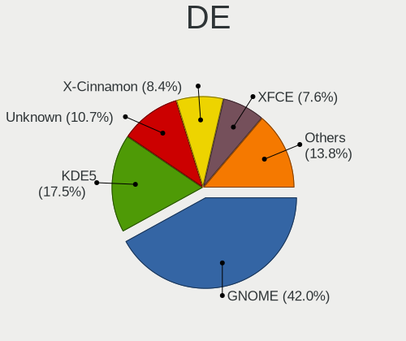

| Name             | Computers | Percent |
|------------------|-----------|---------|
| GNOME            | 619       | 42.02%  |
| KDE5             | 249       | 16.9%   |
| Unknown          | 204       | 13.85%  |
| XFCE             | 107       | 7.26%   |
| X-Cinnamon       | 103       | 6.99%   |
| MATE             | 38        | 2.58%   |
| KDE              | 37        | 2.51%   |
| Cinnamon         | 21        | 1.43%   |
| KDE4             | 19        | 1.29%   |
| Pantheon         | 17        | 1.15%   |
| Budgie           | 11        | 0.75%   |
| LXQt             | 9         | 0.61%   |
| i3               | 9         | 0.61%   |
| Unity            | 7         | 0.48%   |
| Deepin           | 5         | 0.34%   |
| LXDE             | 4         | 0.27%   |
| awesome          | 4         | 0.27%   |
| xmonad           | 2         | 0.14%   |
| sway             | 2         | 0.14%   |
| lightdm-xsession | 1         | 0.07%   |
| leftwm           | 1         | 0.07%   |
| GNOME Flashback  | 1         | 0.07%   |
| GNOME Classic    | 1         | 0.07%   |
| DWM              | 1         | 0.07%   |
| Bspwm            | 1         | 0.07%   |

Display Server
--------------

X11 or Wayland

| Name    | Computers | Percent |
|---------|-----------|---------|
| X11     | 1150      | 78.88%  |
| Wayland | 164       | 11.25%  |
| Unknown | 113       | 7.75%   |
| Tty     | 31        | 2.13%   |

Display Manager
---------------

SDDM, LightDM, etc.

| Name    | Computers | Percent |
|---------|-----------|---------|
| Unknown | 729       | 49.39%  |
| SDDM    | 231       | 15.65%  |
| GDM     | 176       | 11.92%  |
| LightDM | 137       | 9.28%   |
| GDM3    | 125       | 8.47%   |
| TDM     | 50        | 3.39%   |
| KDM     | 20        | 1.36%   |
| SLiM    | 5         | 0.34%   |
| XDM     | 2         | 0.14%   |
| LXDM    | 1         | 0.07%   |

OS Lang
-------

Language

| Lang       | Computers | Percent |
|------------|-----------|---------|
| de_AT      | 511       | 35.07%  |
| en_US      | 402       | 27.59%  |
| de_DE      | 211       | 14.48%  |
| Unknown    | 207       | 14.21%  |
| en_GB      | 51        | 3.5%    |
| C          | 19        | 1.3%    |
| pl_PL      | 8         | 0.55%   |
| en_IE      | 8         | 0.55%   |
| POSIX      | 4         | 0.27%   |
| it_IT      | 4         | 0.27%   |
| tr_TR      | 3         | 0.21%   |
| ru_RU      | 3         | 0.21%   |
| es_ES      | 3         | 0.21%   |
| en_AT      | 3         | 0.21%   |
| de_CH      | 3         | 0.21%   |
| uk_UA      | 2         | 0.14%   |
| hu_HU      | 2         | 0.14%   |
| de_AT.UTF8 | 2         | 0.14%   |
| ro_RO      | 1         | 0.07%   |
| pt_BR      | 1         | 0.07%   |
| nl_BE      | 1         | 0.07%   |
| hr_HR      | 1         | 0.07%   |
| fa_IR      | 1         | 0.07%   |
| en_US.UTF8 | 1         | 0.07%   |
| en         | 1         | 0.07%   |
| de_LI      | 1         | 0.07%   |
| cs_CZ      | 1         | 0.07%   |
| C.UTF8     | 1         | 0.07%   |
| bg_BG      | 1         | 0.07%   |

Boot Mode
---------

EFI or BIOS

| Mode | Computers | Percent |
|------|-----------|---------|
| EFI  | 752       | 51.79%  |
| BIOS | 700       | 48.21%  |

Filesystem
----------

Type of filesystem

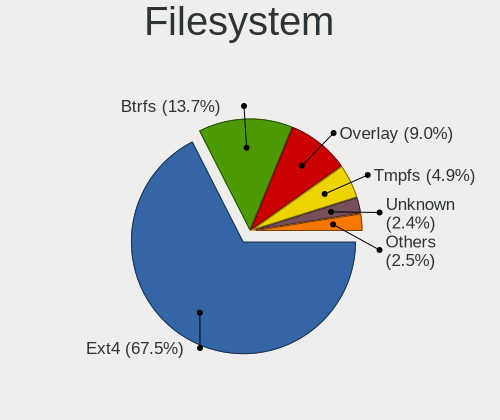

| Type    | Computers | Percent |
|---------|-----------|---------|
| Ext4    | 1102      | 76.69%  |
| Overlay | 130       | 9.05%   |
| Btrfs   | 110       | 7.65%   |
| Unknown | 61        | 4.24%   |
| Xfs     | 14        | 0.97%   |
| Zfs     | 8         | 0.56%   |
| Ext2    | 4         | 0.28%   |
| Tmpfs   | 2         | 0.14%   |
| Ext3    | 2         | 0.14%   |
| XXXXXXX | 1         | 0.07%   |
| Nfs     | 1         | 0.07%   |
| F2fs    | 1         | 0.07%   |
| Aufs    | 1         | 0.07%   |

Part. scheme
------------

Scheme of partitioning

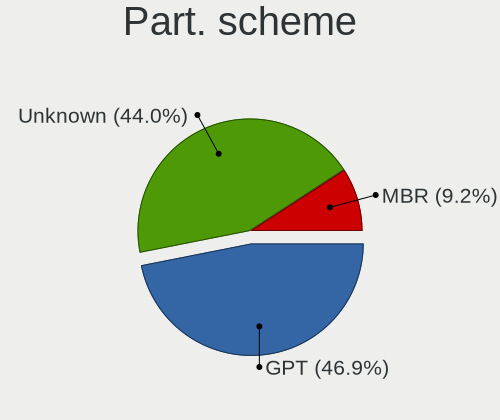

| Type    | Computers | Percent |
|---------|-----------|---------|
| Unknown | 802       | 55.62%  |
| GPT     | 500       | 34.67%  |
| MBR     | 140       | 9.71%   |

Dual Boot with Linux/BSD
------------------------

Hosting more than one Linux/BSD

| Dual boot | Computers | Percent |
|-----------|-----------|---------|
| No        | 1205      | 83.39%  |
| Yes       | 240       | 16.61%  |

Dual Boot (Win)
---------------

Hosting Linux and Windows

| Dual boot | Computers | Percent |
|-----------|-----------|---------|
| No        | 996       | 68.93%  |
| Yes       | 449       | 31.07%  |

Board
-----

Vendor
------

Motherboard manufacturer

| Name                    | Computers | Percent |
|-------------------------|-----------|---------|
| Lenovo                  | 251       | 17.71%  |
| ASUSTek Computer        | 246       | 17.36%  |
| Hewlett-Packard         | 208       | 14.68%  |
| Dell                    | 102       | 7.2%    |
| MSI                     | 99        | 6.99%   |
| Acer                    | 87        | 6.14%   |
| Gigabyte Technology     | 69        | 4.87%   |
| ASRock                  | 68        | 4.8%    |
| Medion                  | 40        | 2.82%   |
| Apple                   | 28        | 1.98%   |
| Intel                   | 21        | 1.48%   |
| Toshiba                 | 20        | 1.41%   |
| Sony                    | 16        | 1.13%   |
| TUXEDO                  | 15        | 1.06%   |
| Fujitsu                 | 14        | 0.99%   |
| Unknown                 | 11        | 0.78%   |
| Raspberry Pi Foundation | 10        | 0.71%   |
| TrekStor                | 7         | 0.49%   |
| Samsung Electronics     | 7         | 0.49%   |
| Biostar                 | 7         | 0.49%   |
| Fujitsu Siemens         | 6         | 0.42%   |
| Shuttle                 | 5         | 0.35%   |
| HUAWEI                  | 5         | 0.35%   |
| ZOTAC                   | 4         | 0.28%   |
| Microsoft               | 4         | 0.28%   |
| Foxconn                 | 4         | 0.28%   |
| Wortmann AG             | 3         | 0.21%   |
| Supermicro              | 3         | 0.21%   |
| Razer                   | 3         | 0.21%   |
| Notebook                | 3         | 0.21%   |
| Clevo                   | 3         | 0.21%   |
| BESSTAR Tech            | 3         | 0.21%   |
| AMI                     | 3         | 0.21%   |
| Valve                   | 2         | 0.14%   |
| VALE                    | 2         | 0.14%   |
| Timi                    | 2         | 0.14%   |
| theobroma-systems       | 2         | 0.14%   |
| Teclast                 | 2         | 0.14%   |
| System76                | 2         | 0.14%   |
| Sapphire                | 2         | 0.14%   |

Model
-----

Motherboard model

| Name                               | Computers | Percent |
|------------------------------------|-----------|---------|
| ASUS All Series                    | 25        | 1.76%   |
| Unknown                            | 14        | 0.99%   |
| MSI MS-7C37                        | 9         | 0.64%   |
| Apple MacBookPro15,1               | 8         | 0.56%   |
| MSI MS-7B79                        | 6         | 0.42%   |
| HP EliteBook 840 G3                | 6         | 0.42%   |
| ASRock Z87 Killer                  | 6         | 0.42%   |
| MSI MS-7B86                        | 5         | 0.35%   |
| Lenovo IdeaPad 5 15ARE05 81YQ      | 5         | 0.35%   |
| HP Pavilion dv6                    | 5         | 0.35%   |
| HP EliteBook 8570p                 | 5         | 0.35%   |
| ASUS ROG STRIX B450-F GAMING       | 5         | 0.35%   |
| RPi Raspberry Pi 4 Model B Rev 1.1 | 4         | 0.28%   |
| MSI MS-7C91                        | 4         | 0.28%   |
| HP EliteBook 8460p                 | 4         | 0.28%   |
| HP EliteBook 840 G6                | 4         | 0.28%   |
| Dell XPS 15 9570                   | 4         | 0.28%   |
| ASUS ROG STRIX B550-I GAMING       | 4         | 0.28%   |
| TrekStor Notebook Slim S130        | 3         | 0.21%   |
| Toshiba Satellite C70D-B           | 3         | 0.21%   |
| RPi Raspberry Pi                   | 3         | 0.21%   |
| MSI MS-7971                        | 3         | 0.21%   |
| MSI MS-7817                        | 3         | 0.21%   |
| MSI MS-7721                        | 3         | 0.21%   |
| Medion P15648                      | 3         | 0.21%   |
| Medion MS-7800                     | 3         | 0.21%   |
| Medion MS-7707                     | 3         | 0.21%   |
| Lenovo Yoga Slim 7 14ARE05 82A2    | 3         | 0.21%   |
| Lenovo Yoga C940-14IIL 81Q9        | 3         | 0.21%   |
| Lenovo ThinkPad E470 20H2S00700    | 3         | 0.21%   |
| Lenovo MIIX 320-10ICR 80XF         | 3         | 0.21%   |
| Intel NUC6CAYH                     | 3         | 0.21%   |
| HP ZBook 17 G5                     | 3         | 0.21%   |
| HP Z800 Workstation                | 3         | 0.21%   |
| HP Pavilion g7                     | 3         | 0.21%   |
| HP Notebook                        | 3         | 0.21%   |
| HP ENVY x360 Convertible 15-ee0xxx | 3         | 0.21%   |
| HP EliteDesk 800 G1 SFF            | 3         | 0.21%   |
| HP EliteBook 840 G1                | 3         | 0.21%   |
| HP EliteBook 6930p                 | 3         | 0.21%   |

Model Family
------------

Motherboard model prefix

| Name               | Computers | Percent |
|--------------------|-----------|---------|
| Lenovo ThinkPad    | 146       | 10.3%   |
| HP EliteBook       | 57        | 4.02%   |
| Acer Aspire        | 50        | 3.53%   |
| Dell Latitude      | 33        | 2.33%   |
| HP Pavilion        | 27        | 1.91%   |
| HP ProBook         | 26        | 1.83%   |
| Dell XPS           | 26        | 1.83%   |
| Lenovo IdeaPad     | 25        | 1.76%   |
| ASUS ROG           | 25        | 1.76%   |
| ASUS PRIME         | 25        | 1.76%   |
| ASUS All           | 25        | 1.76%   |
| HP Compaq          | 19        | 1.34%   |
| Toshiba Satellite  | 18        | 1.27%   |
| Lenovo Yoga        | 18        | 1.27%   |
| Lenovo ThinkCentre | 15        | 1.06%   |
| Dell Inspiron      | 14        | 0.99%   |
| Unknown            | 14        | 0.99%   |
| ASUS TUF           | 13        | 0.92%   |
| HP ENVY            | 11        | 0.78%   |
| RPi Raspberry      | 10        | 0.71%   |
| Dell Precision     | 10        | 0.71%   |
| Dell OptiPlex      | 10        | 0.71%   |
| MSI MS-7C37        | 9         | 0.64%   |
| HP ZBook           | 9         | 0.64%   |
| HP Laptop          | 9         | 0.64%   |
| Fujitsu LIFEBOOK   | 9         | 0.64%   |
| ASUS VivoBook      | 9         | 0.64%   |
| Acer TravelMate    | 9         | 0.64%   |
| Lenovo ThinkBook   | 8         | 0.56%   |
| Apple MacBookPro15 | 8         | 0.56%   |
| Acer Swift         | 8         | 0.56%   |
| Gigabyte X570      | 7         | 0.49%   |
| ASUS SABERTOOTH    | 7         | 0.49%   |
| ASRock Z87         | 7         | 0.49%   |
| MSI MS-7B79        | 6         | 0.42%   |
| Acer Nitro         | 6         | 0.42%   |
| MSI MS-7B86        | 5         | 0.35%   |
| HP EliteDesk       | 5         | 0.35%   |
| HP 250             | 5         | 0.35%   |
| Gigabyte Z390      | 5         | 0.35%   |

MFG Year
--------

Motherboard manufacture year

| Year    | Computers | Percent |
|---------|-----------|---------|
| 2020    | 167       | 11.79%  |
| 2018    | 146       | 10.3%   |
| 2019    | 143       | 10.09%  |
| 2012    | 124       | 8.75%   |
| 2011    | 106       | 7.48%   |
| 2013    | 103       | 7.27%   |
| 2017    | 91        | 6.42%   |
| 2015    | 86        | 6.07%   |
| 2021    | 81        | 5.72%   |
| 2014    | 79        | 5.58%   |
| 2016    | 78        | 5.5%    |
| 2010    | 58        | 4.09%   |
| 2009    | 48        | 3.39%   |
| 2008    | 44        | 3.11%   |
| 2007    | 31        | 2.19%   |
| 2006    | 11        | 0.78%   |
| 2022    | 10        | 0.71%   |
| Unknown | 9         | 0.64%   |
| 2005    | 2         | 0.14%   |

Form Factor
-----------

Physical design of the computer

| Name           | Computers | Percent |
|----------------|-----------|---------|
| Notebook       | 750       | 52.93%  |
| Desktop        | 557       | 39.31%  |
| Convertible    | 42        | 2.96%   |
| Mini pc        | 26        | 1.83%   |
| System on chip | 15        | 1.06%   |
| Server         | 12        | 0.85%   |
| Tablet         | 11        | 0.78%   |
| All in one     | 4         | 0.28%   |

Secure Boot
-----------

Enabled or disabled

| State    | Computers | Percent |
|----------|-----------|---------|
| Disabled | 1310      | 91.48%  |
| Enabled  | 122       | 8.52%   |

Coreboot
--------

Have coreboot on board

| Used | Computers | Percent |
|------|-----------|---------|
| No   | 1415      | 99.86%  |
| Yes  | 2         | 0.14%   |

RAM Size
--------

Total RAM memory

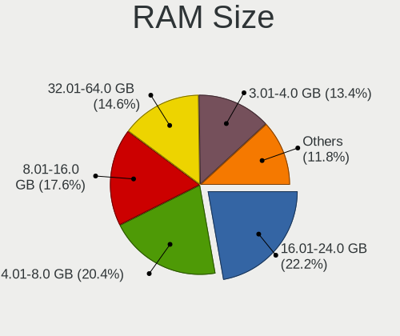

| Size in GB      | Computers | Percent |
|-----------------|-----------|---------|
| 16.01-24.0      | 322       | 22.47%  |
| 4.01-8.0        | 289       | 20.17%  |
| 8.01-16.0       | 275       | 19.19%  |
| 3.01-4.0        | 226       | 15.77%  |
| 32.01-64.0      | 178       | 12.42%  |
| 1.01-2.0        | 45        | 3.14%   |
| 64.01-256.0     | 39        | 2.72%   |
| 24.01-32.0      | 31        | 2.16%   |
| 2.01-3.0        | 12        | 0.84%   |
| 0.51-1.0        | 10        | 0.7%    |
| More than 256.0 | 5         | 0.35%   |
| Unknown         | 1         | 0.07%   |

RAM Used
--------

Used RAM memory

| Used GB    | Computers | Percent |
|------------|-----------|---------|
| 1.01-2.0   | 579       | 37.02%  |
| 2.01-3.0   | 372       | 23.79%  |
| 4.01-8.0   | 216       | 13.81%  |
| 3.01-4.0   | 179       | 11.45%  |
| 0.51-1.0   | 94        | 6.01%   |
| 8.01-16.0  | 81        | 5.18%   |
| 0.01-0.5   | 16        | 1.02%   |
| 16.01-24.0 | 15        | 0.96%   |
| 32.01-64.0 | 6         | 0.38%   |
| 24.01-32.0 | 5         | 0.32%   |
| Unknown    | 1         | 0.06%   |

Total Drives
------------

Number of drives on board

| Drives | Computers | Percent |
|--------|-----------|---------|
| 1      | 839       | 57.31%  |
| 2      | 349       | 23.84%  |
| 3      | 138       | 9.43%   |
| 4      | 62        | 4.23%   |
| 5      | 26        | 1.78%   |
| 6      | 16        | 1.09%   |
| 9      | 10        | 0.68%   |
| 0      | 8         | 0.55%   |
| 7      | 7         | 0.48%   |
| 18     | 2         | 0.14%   |
| 11     | 2         | 0.14%   |
| 10     | 2         | 0.14%   |
| 8      | 2         | 0.14%   |
| 12     | 1         | 0.07%   |

Has CD-ROM
----------

Has CD-ROM on board

| Presented | Computers | Percent |
|-----------|-----------|---------|
| No        | 849       | 59.54%  |
| Yes       | 577       | 40.46%  |

Has Ethernet
------------

Has Ethernet on board

| Presented | Computers | Percent |
|-----------|-----------|---------|
| Yes       | 1245      | 87.55%  |
| No        | 177       | 12.45%  |

Has WiFi
--------

Has WiFi module

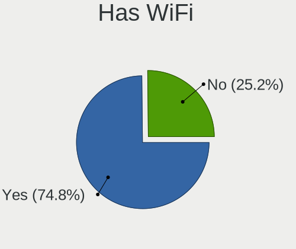

| Presented | Computers | Percent |
|-----------|-----------|---------|
| Yes       | 1055      | 74.09%  |
| No        | 369       | 25.91%  |

Has Bluetooth
-------------

Has Bluetooth module

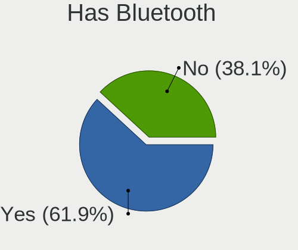

| Presented | Computers | Percent |
|-----------|-----------|---------|
| Yes       | 817       | 57.41%  |
| No        | 606       | 42.59%  |

Location
--------

Country
-------

Geographic location (country)

| Country | Computers | Percent |
|---------|-----------|---------|
| Austria | 1417      | 100%    |

City
----

Geographic location (city)

| City               | Computers | Percent |
|--------------------|-----------|---------|
| Vienna             | 817       | 55.28%  |
| Graz               | 84        | 5.68%   |
| Linz               | 44        | 2.98%   |
| Salzburg           | 37        | 2.5%    |
| Innsbruck          | 35        | 2.37%   |
| Bad Hall           | 31        | 2.1%    |
| Klagenfurt         | 18        | 1.22%   |
| Sankt Plten      | 14        | 0.95%   |
| Wels               | 13        | 0.88%   |
| Dornbirn           | 13        | 0.88%   |
| Wiener Neustadt    | 10        | 0.68%   |
| Wrgl             | 8         | 0.54%   |
| Perg               | 8         | 0.54%   |
| Villach            | 7         | 0.47%   |
| Leonding           | 7         | 0.47%   |
| Bregenz            | 6         | 0.41%   |
| Mautern            | 5         | 0.34%   |
| Korneuburg         | 5         | 0.34%   |
| Baden bei Wien     | 5         | 0.34%   |
| Zell am See        | 4         | 0.27%   |
| Voecklabruck       | 4         | 0.27%   |
| Traunkirchen       | 4         | 0.27%   |
| Steyr              | 4         | 0.27%   |
| Seiersberg         | 4         | 0.27%   |
| Schwechat          | 4         | 0.27%   |
| Perchtoldsdorf     | 4         | 0.27%   |
| Klosterneuburg     | 4         | 0.27%   |
| Gaenserndorf       | 4         | 0.27%   |
| Feldkirch          | 4         | 0.27%   |
| Brunn am Gebirge   | 4         | 0.27%   |
| Traun              | 3         | 0.2%    |
| Mauthausen         | 3         | 0.2%    |
| Horn               | 3         | 0.2%    |
| Hard               | 3         | 0.2%    |
| Hallein            | 3         | 0.2%    |
| Hall in Tirol      | 3         | 0.2%    |
| Altenberg bei Linz | 3         | 0.2%    |
| Woerdern           | 2         | 0.14%   |
| Vorchdorf          | 2         | 0.14%   |
| Voitsberg          | 2         | 0.14%   |

Drives
------

Drive Vendor
------------

Hard drive vendors

| Vendor                    | Computers | Drives | Percent |
|---------------------------|-----------|--------|---------|
| Samsung Electronics       | 484       | 726    | 22.59%  |
| Seagate                   | 263       | 385    | 12.27%  |
| WDC                       | 259       | 398    | 12.09%  |
| SanDisk                   | 195       | 270    | 9.1%    |
| Toshiba                   | 136       | 227    | 6.35%   |
| Kingston                  | 92        | 114    | 4.29%   |
| Unknown                   | 89        | 131    | 4.15%   |
| Crucial                   | 88        | 135    | 4.11%   |
| Intel                     | 59        | 73     | 2.75%   |
| Hitachi                   | 51        | 56     | 2.38%   |
| SK hynix                  | 47        | 63     | 2.19%   |
| HGST                      | 37        | 56     | 1.73%   |
| Micron Technology         | 31        | 37     | 1.45%   |
| Intenso                   | 30        | 38     | 1.4%    |
| Transcend                 | 22        | 25     | 1.03%   |
| Phison                    | 19        | 26     | 0.89%   |
| A-DATA Technology         | 18        | 23     | 0.84%   |
| KIOXIA                    | 14        | 23     | 0.65%   |
| Apple                     | 14        | 25     | 0.65%   |
| OCZ                       | 13        | 22     | 0.61%   |
| Corsair                   | 11        | 14     | 0.51%   |
| China                     | 11        | 12     | 0.51%   |
| ASMT                      | 9         | 17     | 0.42%   |
| LITEON                    | 8         | 9      | 0.37%   |
| Micron/Crucial Technology | 7         | 9      | 0.33%   |
| LITEONIT                  | 7         | 9      | 0.33%   |
| JMicron Technology        | 7         | 13     | 0.33%   |
| SABRENT                   | 6         | 7      | 0.28%   |
| Unknown                   | 6         | 8      | 0.28%   |
| GOODRAM                   | 5         | 5      | 0.23%   |
| Apacer                    | 5         | 6      | 0.23%   |
| Silicon Motion            | 4         | 5      | 0.19%   |
| Maxtor                    | 4         | 4      | 0.19%   |
| INNOVATION IT             | 4         | 4      | 0.19%   |
| Hewlett-Packard           | 4         | 10     | 0.19%   |
| UMIS                      | 3         | 3      | 0.14%   |
| TrekStor                  | 3         | 5      | 0.14%   |
| SPCC                      | 3         | 10     | 0.14%   |
| Patriot                   | 3         | 4      | 0.14%   |
| Lenovo                    | 3         | 4      | 0.14%   |

Drive Model
-----------

Hard drive models

| Model                              | Computers | Percent |
|------------------------------------|-----------|---------|
| Samsung SSD 850 EVO 250GB          | 29        | 1.21%   |
| Samsung NVMe SSD Drive 512GB       | 27        | 1.12%   |
| Samsung SSD 850 EVO 500GB          | 23        | 0.96%   |
| Samsung SSD 860 EVO 500GB          | 21        | 0.87%   |
| Seagate Expansion 1TB              | 19        | 0.79%   |
| Samsung SSD 850 PRO 256GB          | 18        | 0.75%   |
| Samsung SSD 840 EVO 250GB          | 18        | 0.75%   |
| Samsung NVMe SSD Drive 500GB       | 18        | 0.75%   |
| Samsung NVMe SSD Drive 1TB         | 18        | 0.75%   |
| SanDisk SSD PLUS 240GB             | 17        | 0.71%   |
| Samsung SSD 970 EVO Plus 1TB       | 16        | 0.67%   |
| Samsung SSD 860 EVO 1TB            | 16        | 0.67%   |
| Samsung SSD 860 EVO 250GB          | 14        | 0.58%   |
| Unknown MMC Card  64GB             | 13        | 0.54%   |
| Toshiba MQ01ABD100 1TB             | 13        | 0.54%   |
| SanDisk NVMe SSD Drive 512GB       | 13        | 0.54%   |
| Crucial CT500MX500SSD1 500GB       | 13        | 0.54%   |
| Toshiba DT01ACA200 2TB             | 12        | 0.5%    |
| Samsung NVMe SSD Drive 1024GB      | 12        | 0.5%    |
| Crucial CT1000MX500SSD1 1TB        | 12        | 0.5%    |
| SanDisk SSD PLUS 1000GB            | 11        | 0.46%   |
| SanDisk NVMe SSD Drive 1TB         | 11        | 0.46%   |
| Unknown SD/MMC/MS PRO 2GB          | 10        | 0.42%   |
| Seagate ST1000LM024 HN-M101MBB 1TB | 10        | 0.42%   |
| SanDisk SSD PLUS 480GB             | 10        | 0.42%   |
| SanDisk SDSSDH3 1T00 1TB           | 10        | 0.42%   |
| Samsung SSD 860 QVO 1TB            | 10        | 0.42%   |
| Kingston SA400S37120G 120GB SSD    | 10        | 0.42%   |
| Unknown MMC Card  32GB             | 9         | 0.37%   |
| Toshiba HDWD110 1TB                | 9         | 0.37%   |
| Toshiba DT01ACA100 1TB             | 9         | 0.37%   |
| Seagate ST500LT012-1DG142 500GB    | 9         | 0.37%   |
| SanDisk Extreme SSD 500GB          | 9         | 0.37%   |
| Samsung SSD 980 PRO 1TB            | 9         | 0.37%   |
| Samsung SSD 970 EVO Plus 500GB     | 9         | 0.37%   |
| SK hynix NVMe SSD Drive 512GB      | 8         | 0.33%   |
| Seagate ST9500325AS 500GB          | 8         | 0.33%   |
| Seagate ST31000528AS 1TB           | 8         | 0.33%   |
| SanDisk SDSSDA240G 240GB           | 8         | 0.33%   |
| Samsung HD103SJ 1TB                | 8         | 0.33%   |

HDD Vendor
----------

Hard disk drive vendors

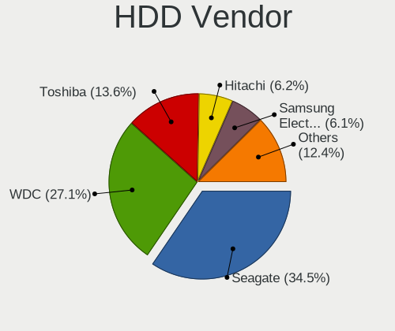

| Vendor              | Computers | Drives | Percent |
|---------------------|-----------|--------|---------|
| Seagate             | 256       | 372    | 35.12%  |
| WDC                 | 208       | 324    | 28.53%  |
| Toshiba             | 97        | 153    | 13.31%  |
| Hitachi             | 51        | 56     | 7%      |
| Samsung Electronics | 44        | 62     | 6.04%   |
| HGST                | 37        | 56     | 5.08%   |
| Unknown             | 11        | 17     | 1.51%   |
| Maxtor              | 4         | 4      | 0.55%   |
| JMicron Technology  | 4         | 8      | 0.55%   |
| USB                 | 2         | 2      | 0.27%   |
| Intenso             | 2         | 2      | 0.27%   |
| Hewlett-Packard     | 2         | 9      | 0.27%   |
| Fujitsu             | 2         | 2      | 0.27%   |
| ASMT                | 2         | 8      | 0.27%   |
| WD MediaMax         | 1         | 1      | 0.14%   |
| TrueNAS             | 1         | 1      | 0.14%   |
| Synology            | 1         | 8      | 0.14%   |
| Inateck             | 1         | 1      | 0.14%   |
| IBM-ESXS            | 1         | 2      | 0.14%   |
| Ext Hard            | 1         | 1      | 0.14%   |
| Apple               | 1         | 1      | 0.14%   |

SSD Vendor
----------

Solid state drive vendors

| Vendor              | Computers | Drives | Percent |
|---------------------|-----------|--------|---------|
| Samsung Electronics | 271       | 369    | 32.38%  |
| SanDisk             | 151       | 214    | 18.04%  |
| Crucial             | 83        | 121    | 9.92%   |
| Kingston            | 71        | 81     | 8.48%   |
| Intel               | 27        | 33     | 3.23%   |
| Intenso             | 25        | 33     | 2.99%   |
| Transcend           | 20        | 23     | 2.39%   |
| Micron Technology   | 17        | 20     | 2.03%   |
| SK hynix            | 16        | 24     | 1.91%   |
| WDC                 | 15        | 17     | 1.79%   |
| OCZ                 | 13        | 22     | 1.55%   |
| A-DATA Technology   | 13        | 17     | 1.55%   |
| China               | 11        | 12     | 1.31%   |
| Toshiba             | 8         | 10     | 0.96%   |
| LITEON              | 8         | 9      | 0.96%   |
| Corsair             | 8         | 8      | 0.96%   |
| LITEONIT            | 7         | 9      | 0.84%   |
| GOODRAM             | 5         | 5      | 0.6%    |
| ASMT                | 5         | 5      | 0.6%    |
| Apple               | 5         | 5      | 0.6%    |
| Apacer              | 5         | 5      | 0.6%    |
| INNOVATION IT       | 4         | 4      | 0.48%   |
| Phison              | 3         | 4      | 0.36%   |
| Unknown             | 2         | 3      | 0.24%   |
| TrekStor            | 2         | 4      | 0.24%   |
| Teclast             | 2         | 2      | 0.24%   |
| TCSUNBOW            | 2         | 2      | 0.24%   |
| SPCC                | 2         | 2      | 0.24%   |
| Seagate             | 2         | 2      | 0.24%   |
| Plextor             | 2         | 2      | 0.24%   |
| Patriot             | 2         | 2      | 0.24%   |
| Netac               | 2         | 2      | 0.24%   |
| KingDian            | 2         | 2      | 0.24%   |
| Dogfish             | 2         | 2      | 0.24%   |
| BIWIN               | 2         | 2      | 0.24%   |
| WDC WDS2            | 1         | 1      | 0.12%   |
| ViperTeq            | 1         | 4      | 0.12%   |
| VERICO              | 1         | 1      | 0.12%   |
| Verbatim            | 1         | 1      | 0.12%   |
| Vaseky              | 1         | 1      | 0.12%   |

Drive Kind
----------

HDD or SSD

| Kind    | Computers | Drives | Percent |
|---------|-----------|--------|---------|
| SSD     | 722       | 1104   | 37.82%  |
| HDD     | 596       | 1090   | 31.22%  |
| NVMe    | 485       | 716    | 25.41%  |
| MMC     | 75        | 110    | 3.93%   |
| Unknown | 31        | 75     | 1.62%   |

Drive Connector
---------------

SATA, SAS, NVMe, etc.

| Type | Computers | Drives | Percent |
|------|-----------|--------|---------|
| SATA | 1042      | 2094   | 61.55%  |
| NVMe | 477       | 707    | 28.17%  |
| SAS  | 99        | 184    | 5.85%   |
| MMC  | 75        | 110    | 4.43%   |

Drive Size
----------

Size of hard drive

| Size in TB | Computers | Drives | Percent |
|------------|-----------|--------|---------|
| 0.01-0.5   | 791       | 1249   | 56.14%  |
| 0.51-1.0   | 384       | 556    | 27.25%  |
| 1.01-2.0   | 116       | 181    | 8.23%   |
| 3.01-4.0   | 52        | 100    | 3.69%   |
| 2.01-3.0   | 34        | 46     | 2.41%   |
| 4.01-10.0  | 25        | 37     | 1.77%   |
| 10.01-20.0 | 7         | 25     | 0.5%    |

Space Total
-----------

Amount of disk space available on the file system

| Size in GB     | Computers | Percent |
|----------------|-----------|---------|
| 101-250        | 388       | 25.92%  |
| 251-500        | 275       | 18.37%  |
| 501-1000       | 221       | 14.76%  |
| 1-20           | 117       | 7.82%   |
| 1001-2000      | 115       | 7.68%   |
| 51-100         | 101       | 6.75%   |
| More than 3000 | 95        | 6.35%   |
| Unknown        | 70        | 4.68%   |
| 21-50          | 62        | 4.14%   |
| 2001-3000      | 53        | 3.54%   |

Space Used
----------

Amount of used disk space

| Used GB        | Computers | Percent |
|----------------|-----------|---------|
| 1-20           | 587       | 38.02%  |
| 21-50          | 238       | 15.41%  |
| 101-250        | 188       | 12.18%  |
| 51-100         | 137       | 8.87%   |
| 251-500        | 102       | 6.61%   |
| 501-1000       | 98        | 6.35%   |
| Unknown        | 70        | 4.53%   |
| 1001-2000      | 64        | 4.15%   |
| More than 3000 | 34        | 2.2%    |
| 2001-3000      | 26        | 1.68%   |

Malfunc. Drives
---------------

Drive models with a malfunction

| Model                              | Computers | Drives | Percent |
|------------------------------------|-----------|--------|---------|
| WDC WD10EADS-22M2B0 1TB            | 7         | 7      | 5.34%   |
| SanDisk SD6SF1M128G1022I 128GB SSD | 5         | 5      | 3.82%   |
| Seagate ST1000LM024 HN-M101MBB 1TB | 4         | 4      | 3.05%   |
| Samsung Electronics HD103UJ 1TB    | 3         | 3      | 2.29%   |
| WDC WD30EFRX-68EUZN0 3TB           | 2         | 2      | 1.53%   |
| Toshiba MQ01ABF050 500GB           | 2         | 3      | 1.53%   |
| Seagate ST3500413AS 500GB          | 2         | 2      | 1.53%   |
| SanDisk SSD PLUS 480GB             | 2         | 2      | 1.53%   |
| Samsung Electronics HM500JI 500GB  | 2         | 2      | 1.53%   |
| Hitachi HTS547575A9E384 752GB      | 2         | 2      | 1.53%   |
| HGST HTS725050A7E630 500GB         | 2         | 9      | 1.53%   |
| HGST HTS721010A9E630 1TB           | 2         | 3      | 1.53%   |
| WDC WD6400AACS-00G8B0 640GB        | 1         | 1      | 0.76%   |
| WDC WD5000LPLX-00ZNTT0 500GB       | 1         | 1      | 0.76%   |
| WDC WD5000AAKX-08U6AA0 500GB       | 1         | 1      | 0.76%   |
| WDC WD5000AAKS-60Z1A0 500GB        | 1         | 1      | 0.76%   |
| WDC WD5000AAKS-00UU3A0 500GB       | 1         | 1      | 0.76%   |
| WDC WD5000AADS-00M2B0 500GB        | 1         | 1      | 0.76%   |
| WDC WD3200BEVT-08A23T1 320GB       | 1         | 1      | 0.76%   |
| WDC WD20EZRZ-00Z5HB0 2TB           | 1         | 1      | 0.76%   |
| WDC WD20EZRX-00D8PB0 2TB           | 1         | 1      | 0.76%   |
| WDC WD20EFRX-68AX9N0 2TB           | 1         | 8      | 0.76%   |
| WDC WD2003FYYS-02W0B1 2TB          | 1         | 1      | 0.76%   |
| WDC WD2000FYYZ-01UL1B1 2TB         | 1         | 1      | 0.76%   |
| WDC WD1600BEVT-22ZCT0 160GB        | 1         | 1      | 0.76%   |
| WDC WD10EZRX-00L4HB0 1TB           | 1         | 1      | 0.76%   |
| WDC WD10EZEX-75M2NA0 1TB           | 1         | 1      | 0.76%   |
| WDC WD10EACS-00D6B0 1TB            | 1         | 2      | 0.76%   |
| WDC WD1002FAEX-00Y9A0 1TB          | 1         | 1      | 0.76%   |
| WDC WD1001FALS-40K1B0 1TB          | 1         | 1      | 0.76%   |
| TrekStor TREKSTORSSD128GB          | 1         | 1      | 0.76%   |
| Transcend TS240GSSD220S 240GB      | 1         | 1      | 0.76%   |
| Toshiba MQ02ABF050H 500GB          | 1         | 1      | 0.76%   |
| Toshiba MQ01ABD100M 1TB            | 1         | 1      | 0.76%   |
| Toshiba MQ01ABD100 1TB             | 1         | 1      | 0.76%   |
| Toshiba MK7559GSXP 752GB           | 1         | 1      | 0.76%   |
| Toshiba MK5055GSX 500GB            | 1         | 1      | 0.76%   |
| Toshiba MK3276GSX 320GB            | 1         | 1      | 0.76%   |
| Toshiba MK1665GSX 160GB            | 1         | 1      | 0.76%   |
| Toshiba KBG30ZPZ128G 128GB         | 1         | 1      | 0.76%   |

Malfunc. Drive Vendor
---------------------

Vendors of faulty drives

| Vendor              | Computers | Drives | Percent |
|---------------------|-----------|--------|---------|
| WDC                 | 26        | 35     | 20.8%   |
| Seagate             | 23        | 35     | 18.4%   |
| Samsung Electronics | 17        | 20     | 13.6%   |
| Toshiba             | 11        | 13     | 8.8%    |
| SanDisk             | 11        | 12     | 8.8%    |
| Hitachi             | 10        | 11     | 8%      |
| HGST                | 7         | 15     | 5.6%    |
| Intel               | 3         | 3      | 2.4%    |
| OCZ                 | 2         | 4      | 1.6%    |
| LITEONIT            | 2         | 3      | 1.6%    |
| Crucial             | 2         | 2      | 1.6%    |
| TrekStor            | 1         | 1      | 0.8%    |
| Transcend           | 1         | 1      | 0.8%    |
| SK hynix            | 1         | 6      | 0.8%    |
| Maxtor              | 1         | 1      | 0.8%    |
| LITEON              | 1         | 1      | 0.8%    |
| Kingston            | 1         | 1      | 0.8%    |
| Intenso             | 1         | 1      | 0.8%    |
| GOODRAM             | 1         | 1      | 0.8%    |
| Fujitsu             | 1         | 1      | 0.8%    |
| Corsair             | 1         | 1      | 0.8%    |
| A-DATA Technology   | 1         | 3      | 0.8%    |

Malfunc. HDD Vendor
-------------------

Vendors of faulty HDD drives

| Vendor              | Computers | Drives | Percent |
|---------------------|-----------|--------|---------|
| WDC                 | 26        | 35     | 29.89%  |
| Seagate             | 23        | 35     | 26.44%  |
| Toshiba             | 10        | 12     | 11.49%  |
| Hitachi             | 10        | 11     | 11.49%  |
| Samsung Electronics | 9         | 10     | 10.34%  |
| HGST                | 7         | 15     | 8.05%   |
| Maxtor              | 1         | 1      | 1.15%   |
| Fujitsu             | 1         | 1      | 1.15%   |

Malfunc. Drive Kind
-------------------

Kinds of faulty drives

| Kind | Computers | Drives | Percent |
|------|-----------|--------|---------|
| HDD  | 82        | 120    | 68.33%  |
| SSD  | 33        | 45     | 27.5%   |
| NVMe | 5         | 6      | 4.17%   |

Failed Drives
-------------

Failed drive models

| Model                        | Computers | Drives | Percent |
|------------------------------|-----------|--------|---------|
| WDC WD6400BEVT-22A0RT0 640GB | 1         | 1      | 100%    |

Failed Drive Vendor
-------------------

Failed drive vendors

| Vendor | Computers | Drives | Percent |
|--------|-----------|--------|---------|
| WDC    | 1         | 1      | 100%    |

Drive Status
------------

Number of failed and malfunc. drives

| Status   | Computers | Drives | Percent |
|----------|-----------|--------|---------|
| Detected | 883       | 1748   | 56.35%  |
| Works    | 572       | 1174   | 36.5%   |
| Malfunc  | 110       | 171    | 7.02%   |
| Failed   | 1         | 1      | 0.06%   |
| Limited  | 1         | 1      | 0.06%   |

Storage controller
------------------

Storage Vendor
--------------

Storage controller vendors

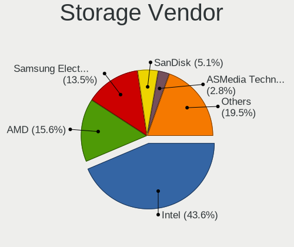

| Vendor                         | Computers | Percent |
|--------------------------------|-----------|---------|
| Intel                          | 902       | 48.7%   |
| AMD                            | 297       | 16.04%  |
| Samsung Electronics            | 216       | 11.66%  |
| SanDisk                        | 81        | 4.37%   |
| ASMedia Technology             | 52        | 2.81%   |
| Marvell Technology Group       | 34        | 1.84%   |
| Toshiba America Info Systems   | 33        | 1.78%   |
| SK hynix                       | 33        | 1.78%   |
| Phison Electronics             | 25        | 1.35%   |
| JMicron Technology             | 25        | 1.35%   |
| Kingston Technology Company    | 23        | 1.24%   |
| Nvidia                         | 19        | 1.03%   |
| Micron Technology              | 14        | 0.76%   |
| KIOXIA                         | 13        | 0.7%    |
| Micron/Crucial Technology      | 12        | 0.65%   |
| LSI Logic / Symbios Logic      | 10        | 0.54%   |
| Broadcom / LSI                 | 9         | 0.49%   |
| Apple                          | 8         | 0.43%   |
| Union Memory (Shenzhen)        | 6         | 0.32%   |
| ADATA Technology               | 6         | 0.32%   |
| VIA Technologies               | 5         | 0.27%   |
| Silicon Motion                 | 5         | 0.27%   |
| Seagate Technology             | 5         | 0.27%   |
| Silicon Image                  | 3         | 0.16%   |
| Lenovo                         | 3         | 0.16%   |
| Solid State Storage Technology | 2         | 0.11%   |
| OCZ Technology Group           | 2         | 0.11%   |
| Adaptec                        | 2         | 0.11%   |
| Transcend                      | 1         | 0.05%   |
| Realtek Semiconductor          | 1         | 0.05%   |
| MAXIO Technology (Hangzhou)    | 1         | 0.05%   |
| Lite-On Technology             | 1         | 0.05%   |
| Lite-On IT Corp. / Plextor     | 1         | 0.05%   |
| Integrated Technology Express  | 1         | 0.05%   |
| Hewlett-Packard                | 1         | 0.05%   |

Storage Model
-------------

Storage controller models

| Model                                                                          | Computers | Percent |
|--------------------------------------------------------------------------------|-----------|---------|
| AMD FCH SATA Controller [AHCI mode]                                            | 198       | 9.34%   |
| Samsung NVMe SSD Controller SM981/PM981/PM983                                  | 128       | 6.04%   |
| Intel Sunrise Point-LP SATA Controller [AHCI mode]                             | 79        | 3.73%   |
| Intel 8 Series/C220 Series Chipset Family 6-port SATA Controller 1 [AHCI mode] | 71        | 3.35%   |
| Intel 7 Series Chipset Family 6-port SATA Controller [AHCI mode]               | 65        | 3.07%   |
| Intel 6 Series/C200 Series Chipset Family 6 port Mobile SATA AHCI Controller   | 57        | 2.69%   |
| ASMedia ASM1062 Serial ATA Controller                                          | 48        | 2.26%   |
| AMD 400 Series Chipset SATA Controller                                         | 45        | 2.12%   |
| Intel Q170/Q150/B150/H170/H110/Z170/CM236 Chipset SATA Controller [AHCI Mode]  | 43        | 2.03%   |
| Intel 82801 Mobile SATA Controller [RAID mode]                                 | 43        | 2.03%   |
| AMD SB7x0/SB8x0/SB9x0 SATA Controller [AHCI mode]                              | 43        | 2.03%   |
| AMD SB7x0/SB8x0/SB9x0 IDE Controller                                           | 36        | 1.7%    |
| Samsung NVMe SSD Controller 980                                                | 35        | 1.65%   |
| Intel 8 Series SATA Controller 1 [AHCI mode]                                   | 34        | 1.6%    |
| Intel 6 Series/C200 Series Chipset Family 6 port Desktop SATA AHCI Controller  | 33        | 1.56%   |
| SanDisk WD Black SN750 / PC SN730 NVMe SSD                                     | 28        | 1.32%   |
| AMD 500 Series Chipset SATA Controller                                         | 28        | 1.32%   |
| Intel 82801IBM/IEM (ICH9M/ICH9M-E) 4 port SATA Controller [AHCI mode]          | 27        | 1.27%   |
| Samsung NVMe SSD Controller SM961/PM961/SM963                                  | 26        | 1.23%   |
| Samsung NVMe SSD Controller PM9A1/PM9A3/980PRO                                 | 24        | 1.13%   |
| Intel Wildcat Point-LP SATA Controller [AHCI Mode]                             | 23        | 1.08%   |
| Intel Volume Management Device NVMe RAID Controller                            | 23        | 1.08%   |
| Intel 200 Series PCH SATA controller [AHCI mode]                               | 23        | 1.08%   |
| Intel 7 Series/C210 Series Chipset Family 6-port SATA Controller [AHCI mode]   | 22        | 1.04%   |
| SanDisk WD Blue SN550 NVMe SSD                                                 | 21        | 0.99%   |
| Intel SATA Controller [RAID mode]                                              | 20        | 0.94%   |
| Intel Cannon Lake PCH SATA AHCI Controller                                     | 20        | 0.94%   |
| Intel Celeron N3350/Pentium N4200/Atom E3900 Series SATA AHCI Controller       | 19        | 0.9%    |
| Intel 82801HM/HEM (ICH8M/ICH8M-E) IDE Controller                               | 19        | 0.9%    |
| Intel 82801HM/HEM (ICH8M/ICH8M-E) SATA Controller [AHCI mode]                  | 18        | 0.85%   |
| AMD SB7x0/SB8x0/SB9x0 SATA Controller [IDE mode]                               | 18        | 0.85%   |
| JMicron JMB363 SATA/IDE Controller                                             | 17        | 0.8%    |
| Intel SSD 660P Series                                                          | 17        | 0.8%    |
| Intel Celeron/Pentium Silver Processor SATA Controller                         | 17        | 0.8%    |
| Intel 5 Series/3400 Series Chipset 6 port SATA AHCI Controller                 | 17        | 0.8%    |
| Intel HM170/QM170 Chipset SATA Controller [AHCI Mode]                          | 16        | 0.75%   |
| Intel Cannon Lake Mobile PCH SATA AHCI Controller                              | 16        | 0.75%   |
| Toshiba America Info Systems XG6 NVMe SSD Controller                           | 15        | 0.71%   |
| Intel Comet Lake SATA AHCI Controller                                          | 15        | 0.71%   |
| Phison E12 NVMe Controller                                                     | 14        | 0.66%   |

Storage Kind
------------

Kind of storage controller (IDE, SATA, NVMe, SAS, ...)

| Kind | Computers | Percent |
|------|-----------|---------|
| SATA | 1056      | 57.74%  |
| NVMe | 482       | 26.35%  |
| IDE  | 172       | 9.4%    |
| RAID | 104       | 5.69%   |
| SAS  | 8         | 0.44%   |
| SCSI | 7         | 0.38%   |

Processor
---------

CPU Vendor
----------

Processor vendors

| Vendor | Computers | Percent |
|--------|-----------|---------|
| Intel  | 1034      | 72.97%  |
| AMD    | 368       | 25.97%  |
| ARM    | 15        | 1.06%   |

CPU Model
---------

Processor models

| Model                                       | Computers | Percent |
|---------------------------------------------|-----------|---------|
| Intel Core i7-8565U CPU @ 1.80GHz           | 21        | 1.48%   |
| Intel Core i5-8250U CPU @ 1.60GHz           | 20        | 1.41%   |
| Intel Core i5-7200U CPU @ 2.50GHz           | 16        | 1.13%   |
| AMD Ryzen 7 3700X 8-Core Processor          | 16        | 1.13%   |
| Intel Core i7-8550U CPU @ 1.80GHz           | 14        | 0.99%   |
| Intel Core i7-10510U CPU @ 1.80GHz          | 14        | 0.99%   |
| Intel 11th Gen Core i7-1165G7 @ 2.80GHz     | 14        | 0.99%   |
| Intel Core i7-1065G7 CPU @ 1.30GHz          | 13        | 0.92%   |
| Intel Core i5-3320M CPU @ 2.60GHz           | 13        | 0.92%   |
| Intel Core i5-10210U CPU @ 1.60GHz          | 13        | 0.92%   |
| Intel Core i5-6200U CPU @ 2.30GHz           | 12        | 0.85%   |
| Intel 11th Gen Core i5-1135G7 @ 2.40GHz     | 12        | 0.85%   |
| Intel Core i5-4210U CPU @ 1.70GHz           | 11        | 0.78%   |
| Intel Core i7-8850H CPU @ 2.60GHz           | 10        | 0.71%   |
| Intel Core i7-7500U CPU @ 2.70GHz           | 10        | 0.71%   |
| Intel Core i5-6300U CPU @ 2.40GHz           | 10        | 0.71%   |
| Intel Core i5-4570 CPU @ 3.20GHz            | 10        | 0.71%   |
| Intel Core i5-2520M CPU @ 2.50GHz           | 10        | 0.71%   |
| ARM Processor                               | 10        | 0.71%   |
| AMD Ryzen 7 PRO 4750U with Radeon Graphics  | 10        | 0.71%   |
| Intel Core i7-6700K CPU @ 4.00GHz           | 9         | 0.64%   |
| Intel Core i7-3770 CPU @ 3.40GHz            | 9         | 0.64%   |
| AMD Ryzen 7 4700U with Radeon Graphics      | 9         | 0.64%   |
| AMD Ryzen 5 2600 Six-Core Processor         | 9         | 0.64%   |
| Intel Core i7-2670QM CPU @ 2.20GHz          | 8         | 0.56%   |
| Intel Core i5-3230M CPU @ 2.60GHz           | 8         | 0.56%   |
| AMD Ryzen 7 5800X 8-Core Processor          | 8         | 0.56%   |
| AMD Ryzen 7 4800H with Radeon Graphics      | 8         | 0.56%   |
| AMD Ryzen 5 4500U with Radeon Graphics      | 8         | 0.56%   |
| AMD Ryzen 5 3600 6-Core Processor           | 8         | 0.56%   |
| AMD Ryzen 5 3400G with Radeon Vega Graphics | 8         | 0.56%   |
| AMD FX-8350 Eight-Core Processor            | 8         | 0.56%   |
| Intel Core i7-8700 CPU @ 3.20GHz            | 7         | 0.49%   |
| Intel Core i7-7700HQ CPU @ 2.80GHz          | 7         | 0.49%   |
| Intel Core i7-5600U CPU @ 2.60GHz           | 7         | 0.49%   |
| Intel Core i7-4790K CPU @ 4.00GHz           | 7         | 0.49%   |
| Intel Core i5-8265U CPU @ 1.60GHz           | 7         | 0.49%   |
| Intel Core i5-2430M CPU @ 2.40GHz           | 7         | 0.49%   |
| Intel Celeron CPU N3350 @ 1.10GHz           | 7         | 0.49%   |
| Intel Atom x5-Z8350 CPU @ 1.44GHz           | 7         | 0.49%   |

CPU Model Family
----------------

Processor model prefix

| Model                   | Computers | Percent |
|-------------------------|-----------|---------|
| Intel Core i5           | 325       | 22.94%  |
| Intel Core i7           | 321       | 22.65%  |
| AMD Ryzen 7             | 86        | 6.07%   |
| AMD Ryzen 5             | 82        | 5.79%   |
| Other                   | 61        | 4.3%    |
| Intel Core i3           | 57        | 4.02%   |
| Intel Core 2 Duo        | 57        | 4.02%   |
| Intel Celeron           | 57        | 4.02%   |
| Intel Xeon              | 34        | 2.4%    |
| Intel Pentium           | 31        | 2.19%   |
| Intel Atom              | 28        | 1.98%   |
| AMD FX                  | 27        | 1.91%   |
| AMD Ryzen 9             | 22        | 1.55%   |
| AMD Ryzen 7 PRO         | 19        | 1.34%   |
| Intel Core i9           | 18        | 1.27%   |
| AMD A8                  | 15        | 1.06%   |
| Intel Pentium Dual-Core | 14        | 0.99%   |
| AMD Ryzen 3             | 14        | 0.99%   |
| AMD Phenom II X4        | 14        | 0.99%   |
| AMD A10                 | 10        | 0.71%   |
| Intel Core 2 Quad       | 9         | 0.64%   |
| Intel Core 2            | 9         | 0.64%   |
| AMD A4                  | 9         | 0.64%   |
| AMD Phenom II X6        | 7         | 0.49%   |
| Intel Pentium Silver    | 6         | 0.42%   |
| AMD E                   | 6         | 0.42%   |
| AMD Athlon II X4        | 6         | 0.42%   |
| AMD Athlon 64 X2        | 6         | 0.42%   |
| AMD A6                  | 6         | 0.42%   |
| Intel Genuine           | 5         | 0.35%   |
| AMD E2                  | 5         | 0.35%   |
| AMD Athlon              | 5         | 0.35%   |
| ARM BCM                 | 4         | 0.28%   |
| AMD Ryzen Threadripper  | 4         | 0.28%   |
| AMD Ryzen 5 PRO         | 4         | 0.28%   |
| AMD E1                  | 4         | 0.28%   |
| Intel Xeon Silver       | 3         | 0.21%   |
| Intel Pentium Dual      | 3         | 0.21%   |
| Intel Pentium 4         | 3         | 0.21%   |
| AMD Athlon II           | 3         | 0.21%   |

CPU Cores
---------

Number of processor cores

| Number  | Computers | Percent |
|---------|-----------|---------|
| 4       | 584       | 41.13%  |
| 2       | 494       | 34.79%  |
| 6       | 135       | 9.51%   |
| 8       | 134       | 9.44%   |
| 12      | 17        | 1.2%    |
| 1       | 16        | 1.13%   |
| 16      | 14        | 0.99%   |
| 3       | 6         | 0.42%   |
| 10      | 5         | 0.35%   |
| Unknown | 5         | 0.35%   |
| 14      | 4         | 0.28%   |
| 20      | 2         | 0.14%   |
| 64      | 1         | 0.07%   |
| 48      | 1         | 0.07%   |
| 40      | 1         | 0.07%   |
| 24      | 1         | 0.07%   |

CPU Sockets
-----------

Number of sockets

| Number  | Computers | Percent |
|---------|-----------|---------|
| 1       | 1402      | 98.87%  |
| 2       | 15        | 1.06%   |
| Unknown | 1         | 0.07%   |

CPU Threads
-----------

Threads per core (Hyper-Threading)

| Number  | Computers | Percent |
|---------|-----------|---------|
| 2       | 966       | 67.93%  |
| 1       | 451       | 31.72%  |
| Unknown | 5         | 0.35%   |

CPU Op-Modes
------------

CPU Operation Modes (32-bit, 64-bit)

| Op mode        | Computers | Percent |
|----------------|-----------|---------|
| 32-bit, 64-bit | 1374      | 96.9%   |
| Unknown        | 36        | 2.54%   |
| 32-bit         | 8         | 0.56%   |

CPU Microcode
-------------

Microcode number

| Number     | Computers | Percent |
|------------|-----------|---------|
| Unknown    | 288       | 19.66%  |
| 0x206a7    | 86        | 5.87%   |
| 0x306a9    | 82        | 5.6%    |
| 0x306c3    | 66        | 4.51%   |
| 0x806ec    | 46        | 3.14%   |
| 0x506e3    | 39        | 2.66%   |
| 0x806ea    | 38        | 2.59%   |
| 0x1067a    | 38        | 2.59%   |
| 0x906ea    | 35        | 2.39%   |
| 0x806c1    | 30        | 2.05%   |
| 0x406e3    | 30        | 2.05%   |
| 0x40651    | 29        | 1.98%   |
| 0x306d4    | 28        | 1.91%   |
| 0x806e9    | 27        | 1.84%   |
| 0x906e9    | 25        | 1.71%   |
| 0x08701021 | 22        | 1.5%    |
| 0x0a50000c | 19        | 1.3%    |
| 0x506c9    | 18        | 1.23%   |
| 0x08600106 | 17        | 1.16%   |
| 0x010000c8 | 16        | 1.09%   |
| 0x706e5    | 15        | 1.02%   |
| 0x10676    | 14        | 0.96%   |
| 0x08701013 | 14        | 0.96%   |
| 0x08108109 | 14        | 0.96%   |
| 0x06000852 | 14        | 0.96%   |
| 0x08108102 | 13        | 0.89%   |
| 0x06001119 | 13        | 0.89%   |
| 0x406c4    | 12        | 0.82%   |
| 0x20655    | 12        | 0.82%   |
| 0x08600103 | 12        | 0.82%   |
| 0x0800820d | 12        | 0.82%   |
| 0x406c3    | 11        | 0.75%   |
| 0x30678    | 11        | 0.75%   |
| 0x106e5    | 11        | 0.75%   |
| 0x906ed    | 9         | 0.61%   |
| 0x706a8    | 9         | 0.61%   |
| 0x20652    | 9         | 0.61%   |
| 0x0a201016 | 9         | 0.61%   |
| 0x08600104 | 9         | 0.61%   |
| 0xa0652    | 8         | 0.55%   |

CPU Microarch
-------------

Microarchitecture

| Name             | Computers | Percent |
|------------------|-----------|---------|
| KabyLake         | 237       | 16.71%  |
| Haswell          | 131       | 9.24%   |
| SandyBridge      | 106       | 7.48%   |
| IvyBridge        | 106       | 7.48%   |
| Zen 2            | 99        | 6.98%   |
| Skylake          | 94        | 6.63%   |
| Penryn           | 66        | 4.65%   |
| Zen+             | 52        | 3.67%   |
| Zen 3            | 48        | 3.39%   |
| Silvermont       | 37        | 2.61%   |
| K10              | 36        | 2.54%   |
| TigerLake        | 35        | 2.47%   |
| Unknown          | 35        | 2.47%   |
| Piledriver       | 34        | 2.4%    |
| Broadwell        | 32        | 2.26%   |
| Westmere         | 29        | 2.05%   |
| Core             | 29        | 2.05%   |
| Zen              | 26        | 1.83%   |
| IceLake          | 22        | 1.55%   |
| CometLake        | 22        | 1.55%   |
| Goldmont         | 20        | 1.41%   |
| Nehalem          | 19        | 1.34%   |
| Goldmont plus    | 17        | 1.2%    |
| Excavator        | 14        | 0.99%   |
| Bobcat           | 12        | 0.85%   |
| Bonnell          | 11        | 0.78%   |
| K8 Hammer        | 9         | 0.63%   |
| Puma             | 8         | 0.56%   |
| K10 Llano        | 5         | 0.35%   |
| Jaguar           | 5         | 0.35%   |
| Alderlake Hybrid | 5         | 0.35%   |
| Steamroller      | 4         | 0.28%   |
| NetBurst         | 4         | 0.28%   |
| Tremont          | 3         | 0.21%   |
| P6               | 3         | 0.21%   |
| Bulldozer        | 3         | 0.21%   |

Graphics
--------

GPU Vendor
----------

Vendors of graphics cards

| Vendor                     | Computers | Percent |
|----------------------------|-----------|---------|
| Intel                      | 723       | 44.14%  |
| Nvidia                     | 469       | 28.63%  |
| AMD                        | 429       | 26.19%  |
| Matrox Electronics Systems | 8         | 0.49%   |
| ASPEED Technology          | 7         | 0.43%   |
| ATI Technologies           | 2         | 0.12%   |

GPU Model
---------

Graphics card models

| Model                                                                                    | Computers | Percent |
|------------------------------------------------------------------------------------------|-----------|---------|
| Intel 2nd Generation Core Processor Family Integrated Graphics Controller                | 65        | 3.87%   |
| Intel 3rd Gen Core processor Graphics Controller                                         | 64        | 3.81%   |
| AMD Renoir                                                                               | 52        | 3.1%    |
| Intel UHD Graphics 620                                                                   | 40        | 2.38%   |
| Intel Haswell-ULT Integrated Graphics Controller                                         | 35        | 2.09%   |
| Intel TigerLake-LP GT2 [Iris Xe Graphics]                                                | 34        | 2.03%   |
| Intel Skylake GT2 [HD Graphics 520]                                                      | 32        | 1.91%   |
| Intel HD Graphics 620                                                                    | 32        | 1.91%   |
| Intel CometLake-U GT2 [UHD Graphics]                                                     | 32        | 1.91%   |
| AMD Picasso/Raven 2 [Radeon Vega Series / Radeon Vega Mobile Series]                     | 30        | 1.79%   |
| Intel WhiskeyLake-U GT2 [UHD Graphics 620]                                               | 29        | 1.73%   |
| AMD Ellesmere [Radeon RX 470/480/570/570X/580/580X/590]                                  | 28        | 1.67%   |
| Intel Xeon E3-1200 v3/4th Gen Core Processor Integrated Graphics Controller              | 25        | 1.49%   |
| Intel HD Graphics 5500                                                                   | 24        | 1.43%   |
| Intel Atom/Celeron/Pentium Processor x5-E8000/J3xxx/N3xxx Integrated Graphics Controller | 24        | 1.43%   |
| AMD Cezanne                                                                              | 23        | 1.37%   |
| Intel HD Graphics 530                                                                    | 19        | 1.13%   |
| Intel CoffeeLake-H GT2 [UHD Graphics 630]                                                | 19        | 1.13%   |
| Intel Mobile 4 Series Chipset Integrated Graphics Controller                             | 18        | 1.07%   |
| Intel Core Processor Integrated Graphics Controller                                      | 16        | 0.95%   |
| Intel HD Graphics 630                                                                    | 15        | 0.89%   |
| Intel GeminiLake [UHD Graphics 600]                                                      | 15        | 0.89%   |
| Intel 4th Gen Core Processor Integrated Graphics Controller                              | 15        | 0.89%   |
| Nvidia GP108 [GeForce GT 1030]                                                           | 14        | 0.83%   |
| Intel HD Graphics 500                                                                    | 14        | 0.83%   |
| Nvidia GP108M [GeForce MX250]                                                            | 13        | 0.77%   |
| Intel Iris Plus Graphics G7                                                              | 13        | 0.77%   |
| Intel Atom Processor Z36xxx/Z37xxx Series Graphics & Display                             | 13        | 0.77%   |
| Nvidia GP106 [GeForce GTX 1060 6GB]                                                      | 12        | 0.72%   |
| Nvidia GK208B [GeForce GT 710]                                                           | 12        | 0.72%   |
| Intel CoffeeLake-S GT2 [UHD Graphics 630]                                                | 12        | 0.72%   |
| AMD Raven Ridge [Radeon Vega Series / Radeon Vega Mobile Series]                         | 12        | 0.72%   |
| AMD Baffin [Radeon RX 460/560D / Pro 450/455/460/555/555X/560/560X]                      | 12        | 0.72%   |
| AMD Lucienne                                                                             | 11        | 0.66%   |
| Nvidia GT218 [GeForce 210]                                                               | 10        | 0.6%    |
| Nvidia GP107 [GeForce GTX 1050 Ti]                                                       | 10        | 0.6%    |
| Nvidia GP104 [GeForce GTX 1070]                                                          | 10        | 0.6%    |
| Intel Xeon E3-1200 v2/3rd Gen Core processor Graphics Controller                         | 10        | 0.6%    |
| Nvidia GP104 [GeForce GTX 1080]                                                          | 9         | 0.54%   |
| AMD Navi 10 [Radeon RX 5600 OEM/5600 XT / 5700/5700 XT]                                  | 9         | 0.54%   |

GPU Combo
---------

Combinations of graphics cards

| Name                    | Computers | Percent |
|-------------------------|-----------|---------|
| 1 x Intel               | 518       | 36.3%   |
| 1 x AMD                 | 349       | 24.46%  |
| 1 x Nvidia              | 296       | 20.74%  |
| Intel + Nvidia          | 147       | 10.3%   |
| Intel + AMD             | 41        | 2.87%   |
| 2 x AMD                 | 21        | 1.47%   |
| AMD + Nvidia            | 20        | 1.4%    |
| Other                   | 16        | 1.12%   |
| 1 x Matrox              | 7         | 0.49%   |
| 1 x ASPEED              | 5         | 0.35%   |
| 2 x Nvidia              | 3         | 0.21%   |
| Nvidia + ASPEED         | 3         | 0.21%   |
| 2 x Nvidia + 1 x Matrox | 1         | 0.07%   |

GPU Driver
----------

Free vs proprietary

| Driver      | Computers | Percent |
|-------------|-----------|---------|
| Free        | 1145      | 79.62%  |
| Proprietary | 236       | 16.41%  |
| Unknown     | 57        | 3.96%   |

GPU Memory
----------

Total video memory

| Size in GB | Computers | Percent |
|------------|-----------|---------|
| Unknown    | 727       | 50.17%  |
| 1.01-2.0   | 196       | 13.53%  |
| 0.01-0.5   | 162       | 11.18%  |
| 0.51-1.0   | 116       | 8.01%   |
| 3.01-4.0   | 107       | 7.38%   |
| 7.01-8.0   | 78        | 5.38%   |
| 5.01-6.0   | 36        | 2.48%   |
| 8.01-16.0  | 14        | 0.97%   |
| 2.01-3.0   | 10        | 0.69%   |
| 16.01-24.0 | 2         | 0.14%   |
| 4.01-5.0   | 1         | 0.07%   |

Monitor
-------

Monitor Vendor
--------------

Monitor vendors

| Vendor                  | Computers | Percent |
|-------------------------|-----------|---------|
| Samsung Electronics     | 237       | 14.93%  |
| AU Optronics            | 193       | 12.16%  |
| LG Display              | 139       | 8.76%   |
| Chimei Innolux          | 106       | 6.68%   |
| BOE                     | 95        | 5.99%   |
| Dell                    | 78        | 4.91%   |
| BenQ                    | 76        | 4.79%   |
| Hewlett-Packard         | 55        | 3.47%   |
| Acer                    | 53        | 3.34%   |
| Goldstar                | 50        | 3.15%   |
| AOC                     | 45        | 2.84%   |
| Iiyama                  | 38        | 2.39%   |
| Philips                 | 37        | 2.33%   |
| Sharp                   | 34        | 2.14%   |
| Lenovo                  | 33        | 2.08%   |
| Apple                   | 30        | 1.89%   |
| Ancor Communications    | 28        | 1.76%   |
| Eizo                    | 26        | 1.64%   |
| Chi Mei Optoelectronics | 17        | 1.07%   |
| Medion                  | 14        | 0.88%   |
| Gericom                 | 13        | 0.82%   |
| Fujitsu Siemens         | 12        | 0.76%   |
| PANDA                   | 10        | 0.63%   |
| NEC Computers           | 10        | 0.63%   |
| InfoVision              | 10        | 0.63%   |
| ViewSonic               | 9         | 0.57%   |
| Unknown                 | 9         | 0.57%   |
| Sony                    | 9         | 0.57%   |
| HannStar                | 8         | 0.5%    |
| Toshiba                 | 6         | 0.38%   |
| LG Philips              | 6         | 0.38%   |
| CSO                     | 6         | 0.38%   |
| Idek Iiyama             | 5         | 0.32%   |
| CPT                     | 5         | 0.32%   |
| ASUSTek Computer        | 5         | 0.32%   |
| Vestel Elektronik       | 4         | 0.25%   |
| LG Electronics          | 4         | 0.25%   |
| Panasonic               | 3         | 0.19%   |
| MSI                     | 3         | 0.19%   |
| LGD                     | 3         | 0.19%   |

Monitor Model
-------------

Monitor models

| Model                                                              | Computers | Percent |
|--------------------------------------------------------------------|-----------|---------|
| Chimei Innolux LCD Monitor CMN14D4 1920x1080 309x173mm 13.9-inch   | 10        | 0.6%    |
| AU Optronics LCD Monitor AUO38ED 1920x1080 344x193mm 15.5-inch     | 8         | 0.48%   |
| Apple Color LCD APPA040 2880x1800 331x207mm 15.4-inch              | 8         | 0.48%   |
| Acer B193 ACR001D 1280x1024 376x301mm 19.0-inch                    | 8         | 0.48%   |
| NEC Computers EA243WM NEC6864 1920x1200 519x324mm 24.1-inch        | 7         | 0.42%   |
| AU Optronics LCD Monitor AUO573D 1920x1080 309x174mm 14.0-inch     | 7         | 0.42%   |
| LG Display LCD Monitor LGD046D 1920x1080 309x174mm 14.0-inch       | 6         | 0.36%   |
| LG Display LCD Monitor LGD02D8 1366x768 277x156mm 12.5-inch        | 6         | 0.36%   |
| Gericom Q24 QMX2421 1920x1080 521x293mm 23.5-inch                  | 6         | 0.36%   |
| BenQ GL2450H BNQ78A7 1920x1080 530x300mm 24.0-inch                 | 6         | 0.36%   |
| AU Optronics LCD Monitor AUO683D 1920x1080 309x174mm 14.0-inch     | 6         | 0.36%   |
| Samsung Electronics U28E590 SAM0C4D 3840x2160 607x345mm 27.5-inch  | 5         | 0.3%    |
| Samsung Electronics U28E590 SAM0C4C 3840x2160 608x345mm 27.5-inch  | 5         | 0.3%    |
| Samsung Electronics S34J55x SAM0F70 3440x1440 797x333mm 34.0-inch  | 5         | 0.3%    |
| Samsung Electronics C32F391 SAM0D35 1920x1080 698x393mm 31.5-inch  | 5         | 0.3%    |
| LG Display LCD Monitor LGD05E5 1920x1080 344x194mm 15.5-inch       | 5         | 0.3%    |
| LG Display LCD Monitor LGD046F 1920x1080 345x194mm 15.6-inch       | 5         | 0.3%    |
| Chimei Innolux LCD Monitor CMN15E7 1920x1080 344x193mm 15.5-inch   | 5         | 0.3%    |
| Chimei Innolux LCD Monitor CMN151E 1920x1080 344x193mm 15.5-inch   | 5         | 0.3%    |
| Chimei Innolux LCD Monitor CMN14C9 1920x1080 309x173mm 13.9-inch   | 5         | 0.3%    |
| BOE LCD Monitor BOE084E 1920x1080 382x215mm 17.3-inch              | 5         | 0.3%    |
| Ancor Communications VS248 ACI2498 1920x1080 531x299mm 24.0-inch   | 5         | 0.3%    |
| Vestel Elektronik 24W_LCD_TV VES3700 1920x1080 706x398mm 31.9-inch | 4         | 0.24%   |
| Samsung Electronics U28E570 SAM0D6F 3840x2160 607x345mm 27.5-inch  | 4         | 0.24%   |
| Samsung Electronics C27F390 SAM0D32 1920x1080 600x340mm 27.2-inch  | 4         | 0.24%   |
| LG Display LCD Monitor LGD0521 1920x1080 309x174mm 14.0-inch       | 4         | 0.24%   |
| Lenovo LCD Monitor LEN40B1 1600x900 345x194mm 15.6-inch            | 4         | 0.24%   |
| Iiyama PLX2783H IVM6611 1920x1080 598x336mm 27.0-inch              | 4         | 0.24%   |
| Goldstar ULTRAWIDE GSM59F2 2560x1080 798x334mm 34.1-inch           | 4         | 0.24%   |
| Dell U2412M DELA07A 1920x1200 518x324mm 24.1-inch                  | 4         | 0.24%   |
| Chimei Innolux LCD Monitor CMN15E8 1920x1080 344x193mm 15.5-inch   | 4         | 0.24%   |
| Chimei Innolux LCD Monitor CMN15D5 1920x1080 344x193mm 15.5-inch   | 4         | 0.24%   |
| Chimei Innolux LCD Monitor CMN14F2 1920x1080 309x173mm 13.9-inch   | 4         | 0.24%   |
| Chimei Innolux LCD Monitor CMN1239 1920x1080 276x155mm 12.5-inch   | 4         | 0.24%   |
| BOE LCD Monitor BOE08E2 1920x1080 344x194mm 15.5-inch              | 4         | 0.24%   |
| AU Optronics LCD Monitor AUO22EC 1366x768 344x193mm 15.5-inch      | 4         | 0.24%   |
| AU Optronics LCD Monitor AUO2036 2560x1440 309x174mm 14.0-inch     | 4         | 0.24%   |
| AU Optronics LCD Monitor AUO123D 1920x1080 309x173mm 13.9-inch     | 4         | 0.24%   |
| AU Optronics LCD Monitor AUO1136 2560x1440 309x174mm 14.0-inch     | 4         | 0.24%   |
| AU Optronics LCD Monitor AUO106C 1366x768 277x156mm 12.5-inch      | 4         | 0.24%   |

Monitor Resolution
------------------

Monitor screen resolution

| Resolution         | Computers | Percent |
|--------------------|-----------|---------|
| 1920x1080 (FHD)    | 703       | 45.98%  |
| 1366x768 (WXGA)    | 159       | 10.4%   |
| 3840x2160 (4K)     | 121       | 7.91%   |
| 2560x1440 (QHD)    | 101       | 6.61%   |
| 1600x900 (HD+)     | 69        | 4.51%   |
| 1680x1050 (WSXGA+) | 67        | 4.38%   |
| 1280x1024 (SXGA)   | 58        | 3.79%   |
| 1920x1200 (WUXGA)  | 56        | 3.66%   |
| 1280x800 (WXGA)    | 36        | 2.35%   |
| 1440x900 (WXGA+)   | 22        | 1.44%   |
| 3440x1440          | 19        | 1.24%   |
| Unknown            | 16        | 1.05%   |
| 2560x1600          | 10        | 0.65%   |
| 2560x1080          | 10        | 0.65%   |
| 3840x1080          | 9         | 0.59%   |
| 2880x1800          | 9         | 0.59%   |
| 1920x540           | 8         | 0.52%   |
| 3840x2400          | 7         | 0.46%   |
| 1024x600           | 6         | 0.39%   |
| 3200x1800 (QHD+)   | 4         | 0.26%   |
| 1600x1200          | 4         | 0.26%   |
| 2048x1152          | 3         | 0.2%    |
| 1024x768 (XGA)     | 3         | 0.2%    |
| 800x1280           | 2         | 0.13%   |
| 5120x1440          | 2         | 0.13%   |
| 4480x1440          | 2         | 0.13%   |
| 2160x1440          | 2         | 0.13%   |
| 2160x1200          | 2         | 0.13%   |
| 1360x768           | 2         | 0.13%   |
| 1280x720 (HD)      | 2         | 0.13%   |
| 5760x2160          | 1         | 0.07%   |
| 5760x1080          | 1         | 0.07%   |
| 3840x2560          | 1         | 0.07%   |
| 3600x1080          | 1         | 0.07%   |
| 3520x1080          | 1         | 0.07%   |
| 3456x2160          | 1         | 0.07%   |
| 3360x1050          | 1         | 0.07%   |
| 3200x1080          | 1         | 0.07%   |
| 2736x1824          | 1         | 0.07%   |
| 2288x1287          | 1         | 0.07%   |

Monitor Diagonal
----------------

Diagonal size in inches

| Inches  | Computers | Percent |
|---------|-----------|---------|
| 15      | 314       | 19.71%  |
| 27      | 157       | 9.86%   |
| 24      | 151       | 9.48%   |
| 13      | 142       | 8.91%   |
| 14      | 120       | 7.53%   |
| 23      | 106       | 6.65%   |
| 17      | 105       | 6.59%   |
| Unknown | 90        | 5.65%   |
| 21      | 52        | 3.26%   |
| 19      | 52        | 3.26%   |
| 22      | 46        | 2.89%   |
| 31      | 38        | 2.39%   |
| 12      | 32        | 2.01%   |
| 34      | 23        | 1.44%   |
| 25      | 20        | 1.26%   |
| 20      | 15        | 0.94%   |
| 11      | 15        | 0.94%   |
| 84      | 13        | 0.82%   |
| 54      | 12        | 0.75%   |
| 18      | 11        | 0.69%   |
| 10      | 10        | 0.63%   |
| 32      | 9         | 0.56%   |
| 28      | 8         | 0.5%    |
| 16      | 8         | 0.5%    |
| 65      | 6         | 0.38%   |
| 40      | 6         | 0.38%   |
| 33      | 4         | 0.25%   |
| 72      | 3         | 0.19%   |
| 42      | 3         | 0.19%   |
| 29      | 3         | 0.19%   |
| 52      | 2         | 0.13%   |
| 49      | 2         | 0.13%   |
| 47      | 2         | 0.13%   |
| 46      | 2         | 0.13%   |
| 39      | 2         | 0.13%   |
| 35      | 2         | 0.13%   |
| 26      | 2         | 0.13%   |
| 142     | 1         | 0.06%   |
| 75      | 1         | 0.06%   |
| 48      | 1         | 0.06%   |

Monitor Width
-------------

Physical width

| Width in mm    | Computers | Percent |
|----------------|-----------|---------|
| 301-350        | 510       | 32.71%  |
| 501-600        | 370       | 23.73%  |
| 351-400        | 153       | 9.81%   |
| 201-300        | 133       | 8.53%   |
| 401-500        | 128       | 8.21%   |
| Unknown        | 90        | 5.77%   |
| 601-700        | 80        | 5.13%   |
| 701-800        | 35        | 2.25%   |
| 1001-1500      | 27        | 1.73%   |
| 1501-2000      | 17        | 1.09%   |
| 801-900        | 10        | 0.64%   |
| 901-1000       | 5         | 0.32%   |
| More than 2000 | 1         | 0.06%   |

Aspect Ratio
------------

Proportional relationship between the width and the height

| Ratio   | Computers | Percent |
|---------|-----------|---------|
| 16/9    | 1046      | 72.79%  |
| 16/10   | 209       | 14.54%  |
| Unknown | 67        | 4.66%   |
| 5/4     | 58        | 4.04%   |
| 21/9    | 25        | 1.74%   |
| 3/2     | 11        | 0.77%   |
| 4/3     | 7         | 0.49%   |
| 32/9    | 7         | 0.49%   |
| 6/5     | 3         | 0.21%   |
| 0.62    | 2         | 0.14%   |
| 1.00    | 1         | 0.07%   |
| 0.80    | 1         | 0.07%   |

Monitor Area
------------

Area in inch

| Area in inch | Computers | Percent |
|----------------|-----------|---------|
| 101-110        | 313       | 19.85%  |
| 201-250        | 264       | 16.74%  |
| 81-90          | 195       | 12.37%  |
| 301-350        | 158       | 10.02%  |
| 151-200        | 90        | 5.71%   |
| Unknown        | 90        | 5.71%   |
| 351-500        | 84        | 5.33%   |
| 251-300        | 83        | 5.26%   |
| 121-130        | 83        | 5.26%   |
| 71-80          | 67        | 4.25%   |
| More than 1000 | 37        | 2.35%   |
| 61-70          | 31        | 1.97%   |
| 501-1000       | 20        | 1.27%   |
| 141-150        | 18        | 1.14%   |
| 51-60          | 15        | 0.95%   |
| 131-140        | 12        | 0.76%   |
| 41-50          | 10        | 0.63%   |
| 111-120        | 5         | 0.32%   |
| 91-100         | 2         | 0.13%   |

Pixel Density
-------------

Pixels per inch

| Density       | Computers | Percent |
|---------------|-----------|---------|
| 51-100        | 523       | 34.52%  |
| 121-160       | 438       | 28.91%  |
| 101-120       | 312       | 20.59%  |
| 161-240       | 94        | 6.2%    |
| Unknown       | 90        | 5.94%   |
| More than 240 | 32        | 2.11%   |
| 1-50          | 26        | 1.72%   |

Multiple Monitors
-----------------

Total monitors connected

| Total | Computers | Percent |
|-------|-----------|---------|
| 1     | 1119      | 76.96%  |
| 2     | 234       | 16.09%  |
| 0     | 59        | 4.06%   |
| 3     | 38        | 2.61%   |
| 4     | 4         | 0.28%   |

Network
-------

Net Controller Vendor
---------------------

Controller vendors

| Vendor                            | Computers | Percent |
|-----------------------------------|-----------|---------|
| Intel                             | 786       | 36.83%  |
| Realtek Semiconductor             | 691       | 32.38%  |
| Qualcomm Atheros                  | 194       | 9.09%   |
| Broadcom                          | 90        | 4.22%   |
| Marvell Technology Group          | 24        | 1.12%   |
| Ralink                            | 22        | 1.03%   |
| Ralink Technology                 | 21        | 0.98%   |
| Broadcom Limited                  | 21        | 0.98%   |
| TP-Link                           | 18        | 0.84%   |
| Nvidia                            | 16        | 0.75%   |
| Ericsson Business Mobile Networks | 14        | 0.66%   |
| Sierra Wireless                   | 13        | 0.61%   |
| NetGear                           | 13        | 0.61%   |
| IMC Networks                      | 12        | 0.56%   |
| ASUSTek Computer                  | 12        | 0.56%   |
| MediaTek                          | 11        | 0.52%   |
| Huawei Technologies               | 11        | 0.52%   |
| Edimax Technology                 | 11        | 0.52%   |
| Dell                              | 11        | 0.52%   |
| Microsoft                         | 10        | 0.47%   |
| Samsung Electronics               | 9         | 0.42%   |
| Lenovo                            | 9         | 0.42%   |
| Hewlett-Packard                   | 9         | 0.42%   |
| DisplayLink                       | 9         | 0.42%   |
| ASIX Electronics                  | 8         | 0.37%   |
| Qualcomm Atheros Communications   | 7         | 0.33%   |
| FIBOCOM                           | 7         | 0.33%   |
| D-Link System                     | 6         | 0.28%   |
| Aquantia                          | 6         | 0.28%   |
| D-Link                            | 5         | 0.23%   |
| Qualcomm                          | 4         | 0.19%   |
| OnePlus Technology (Shenzhen)     | 4         | 0.19%   |
| JMicron Technology                | 4         | 0.19%   |
| ZyXEL Communications              | 3         | 0.14%   |
| Xiaomi                            | 3         | 0.14%   |
| VIA Technologies                  | 3         | 0.14%   |
| Google                            | 3         | 0.14%   |
| Sitecom Europe                    | 2         | 0.09%   |
| Motorola PCS                      | 2         | 0.09%   |
| Microchip Technology              | 2         | 0.09%   |

Net Controller Model
--------------------

Controller models

| Model                                                             | Computers | Percent |
|-------------------------------------------------------------------|-----------|---------|
| Realtek RTL8111/8168/8411 PCI Express Gigabit Ethernet Controller | 504       | 19.69%  |
| Intel Wi-Fi 6 AX200                                               | 98        | 3.83%   |
| Intel 82579LM Gigabit Network Connection (Lewisville)             | 67        | 2.62%   |
| Intel Wireless 8265 / 8275                                        | 52        | 2.03%   |
| Realtek RTL810xE PCI Express Fast Ethernet controller             | 51        | 1.99%   |
| Intel I211 Gigabit Network Connection                             | 47        | 1.84%   |
| Realtek RTL8153 Gigabit Ethernet Adapter                          | 42        | 1.64%   |
| Intel Wireless 8260                                               | 34        | 1.33%   |
| Intel Centrino Advanced-N 6205 [Taylor Peak]                      | 34        | 1.33%   |
| Intel Wireless 7265                                               | 33        | 1.29%   |
| Intel Ethernet Connection (2) I219-V                              | 33        | 1.29%   |
| Qualcomm Atheros AR9285 Wireless Network Adapter (PCI-Express)    | 28        | 1.09%   |
| Realtek RTL8125 2.5GbE Controller                                 | 27        | 1.05%   |
| Qualcomm Atheros QCA9377 802.11ac Wireless Network Adapter        | 27        | 1.05%   |
| Realtek RTL8821CE 802.11ac PCIe Wireless Network Adapter          | 26        | 1.02%   |
| Intel Wireless 3165                                               | 25        | 0.98%   |
| Intel Wi-Fi 6 AX201                                               | 24        | 0.94%   |
| Intel Comet Lake PCH-LP CNVi WiFi                                 | 23        | 0.9%    |
| Qualcomm Atheros QCA6174 802.11ac Wireless Network Adapter        | 22        | 0.86%   |
| Qualcomm Atheros AR9485 Wireless Network Adapter                  | 22        | 0.86%   |
| Intel Wireless 7260                                               | 22        | 0.86%   |
| Intel Cannon Point-LP CNVi [Wireless-AC]                          | 22        | 0.86%   |
| Realtek RTL8822CE 802.11ac PCIe Wireless Network Adapter          | 21        | 0.82%   |
| Intel Ethernet Controller I225-V                                  | 21        | 0.82%   |
| Intel Wireless-AC 9260                                            | 20        | 0.78%   |
| Intel Ethernet Connection (6) I219-V                              | 20        | 0.78%   |
| Intel Centrino Ultimate-N 6300                                    | 19        | 0.74%   |
| Intel 82579V Gigabit Network Connection                           | 19        | 0.74%   |
| Intel Ethernet Connection (7) I219-V                              | 18        | 0.7%    |
| Intel Dual Band Wireless-AC 3168NGW [Stone Peak]                  | 18        | 0.7%    |
| Intel Ethernet Connection I217-LM                                 | 17        | 0.66%   |
| Intel Ethernet Connection (4) I219-V                              | 17        | 0.66%   |
| Intel Cannon Lake PCH CNVi WiFi                                   | 16        | 0.63%   |
| Qualcomm Atheros QCA9565 / AR9565 Wireless Network Adapter        | 15        | 0.59%   |
| Intel Ice Lake-LP PCH CNVi WiFi                                   | 15        | 0.59%   |
| Intel Ethernet Connection I219-LM                                 | 15        | 0.59%   |
| Realtek 802.11ac NIC                                              | 14        | 0.55%   |
| Qualcomm Atheros Killer E220x Gigabit Ethernet Controller         | 13        | 0.51%   |
| Intel WiFi Link 5100                                              | 13        | 0.51%   |
| Intel Ethernet Connection I218-LM                                 | 13        | 0.51%   |

Wireless Vendor
---------------

Wireless vendors

| Vendor                                | Computers | Percent |
|---------------------------------------|-----------|---------|
| Intel                                 | 580       | 50.61%  |
| Realtek Semiconductor                 | 156       | 13.61%  |
| Qualcomm Atheros                      | 142       | 12.39%  |
| Broadcom                              | 65        | 5.67%   |
| Ralink                                | 22        | 1.92%   |
| Ralink Technology                     | 21        | 1.83%   |
| TP-Link                               | 18        | 1.57%   |
| Sierra Wireless                       | 13        | 1.13%   |
| NetGear                               | 12        | 1.05%   |
| IMC Networks                          | 12        | 1.05%   |
| ASUSTek Computer                      | 12        | 1.05%   |
| MediaTek                              | 11        | 0.96%   |
| Edimax Technology                     | 11        | 0.96%   |
| Microsoft                             | 10        | 0.87%   |
| Broadcom Limited                      | 10        | 0.87%   |
| Qualcomm Atheros Communications       | 7         | 0.61%   |
| Fibocom                               | 7         | 0.61%   |
| D-Link System                         | 6         | 0.52%   |
| Dell                                  | 5         | 0.44%   |
| Ericsson Business Mobile Networks     | 4         | 0.35%   |
| ZyXEL Communications                  | 3         | 0.26%   |
| Qualcomm                              | 3         | 0.26%   |
| D-Link                                | 3         | 0.26%   |
| Sitecom Europe                        | 2         | 0.17%   |
| 802.11g Adapter [Linksys WUSB54GC v3] | 2         | 0.17%   |
| ZyDAS                                 | 1         | 0.09%   |
| Wilocity                              | 1         | 0.09%   |
| Philips (or NXP)                      | 1         | 0.09%   |
| Marvell Technology Group              | 1         | 0.09%   |
| Linksys                               | 1         | 0.09%   |
| Hewlett-Packard                       | 1         | 0.09%   |
| BUFFALO                               | 1         | 0.09%   |
| Belkin Components                     | 1         | 0.09%   |
| AVM                                   | 1         | 0.09%   |

Wireless Model
--------------

Wireless models

| Model                                                          | Computers | Percent |
|----------------------------------------------------------------|-----------|---------|
| Intel Wi-Fi 6 AX200                                            | 98        | 8.51%   |
| Intel Wireless 8265 / 8275                                     | 52        | 4.52%   |
| Intel Wireless 8260                                            | 34        | 2.95%   |
| Intel Centrino Advanced-N 6205 [Taylor Peak]                   | 34        | 2.95%   |
| Intel Wireless 7265                                            | 33        | 2.87%   |
| Qualcomm Atheros AR9285 Wireless Network Adapter (PCI-Express) | 28        | 2.43%   |
| Qualcomm Atheros QCA9377 802.11ac Wireless Network Adapter     | 27        | 2.35%   |
| Realtek RTL8821CE 802.11ac PCIe Wireless Network Adapter       | 26        | 2.26%   |
| Intel Wireless 3165                                            | 25        | 2.17%   |
| Intel Wi-Fi 6 AX201                                            | 24        | 2.09%   |
| Intel Comet Lake PCH-LP CNVi WiFi                              | 23        | 2%      |
| Qualcomm Atheros QCA6174 802.11ac Wireless Network Adapter     | 22        | 1.91%   |
| Qualcomm Atheros AR9485 Wireless Network Adapter               | 22        | 1.91%   |
| Intel Wireless 7260                                            | 22        | 1.91%   |
| Intel Cannon Point-LP CNVi [Wireless-AC]                       | 22        | 1.91%   |
| Realtek RTL8822CE 802.11ac PCIe Wireless Network Adapter       | 21        | 1.82%   |
| Intel Wireless-AC 9260                                         | 20        | 1.74%   |
| Intel Centrino Ultimate-N 6300                                 | 19        | 1.65%   |
| Intel Dual Band Wireless-AC 3168NGW [Stone Peak]               | 18        | 1.56%   |
| Intel Cannon Lake PCH CNVi WiFi                                | 16        | 1.39%   |
| Qualcomm Atheros QCA9565 / AR9565 Wireless Network Adapter     | 15        | 1.3%    |
| Intel Ice Lake-LP PCH CNVi WiFi                                | 15        | 1.3%    |
| Realtek 802.11ac NIC                                           | 14        | 1.22%   |
| Intel WiFi Link 5100                                           | 13        | 1.13%   |
| Realtek RTL8723BE PCIe Wireless Network Adapter                | 11        | 0.96%   |
| Intel PRO/Wireless 3945ABG [Golan] Network Connection          | 11        | 0.96%   |
| Broadcom BCM43142 802.11b/g/n                                  | 11        | 0.96%   |
| Broadcom BCM4313 802.11bgn Wireless Network Adapter            | 11        | 0.96%   |
| Intel Wireless 3160                                            | 10        | 0.87%   |
| Intel Wi-Fi 6 AX210/AX211/AX411 160MHz                         | 10        | 0.87%   |
| Intel Centrino Wireless-N 2230                                 | 10        | 0.87%   |
| Realtek RTL8822BE 802.11a/b/g/n/ac WiFi adapter                | 9         | 0.78%   |
| Microsoft Xbox 360 Wireless Adapter                            | 9         | 0.78%   |
| IMC Networks Mediao 802.11n WLAN [Realtek RTL8191SU]           | 9         | 0.78%   |
| Edimax EW-7811Un 802.11n Wireless Adapter [Realtek RTL8188CUS] | 9         | 0.78%   |
| MediaTek MT7921 802.11ax PCI Express Wireless Network Adapter  | 8         | 0.7%    |
| Intel PRO/Wireless 5100 AGN [Shiloh] Network Connection        | 8         | 0.7%    |
| Intel Dual Band Wireless-AC 3165 Plus Bluetooth                | 8         | 0.7%    |
| Intel Comet Lake PCH CNVi WiFi                                 | 8         | 0.7%    |
| Intel Centrino Advanced-N 6235                                 | 8         | 0.7%    |

Ethernet Vendor
---------------

Ethernet vendors

| Vendor                        | Computers | Percent |
|-------------------------------|-----------|---------|
| Realtek Semiconductor         | 631       | 47.44%  |
| Intel                         | 461       | 34.66%  |
| Qualcomm Atheros              | 74        | 5.56%   |
| Broadcom                      | 36        | 2.71%   |
| Marvell Technology Group      | 23        | 1.73%   |
| Nvidia                        | 16        | 1.2%    |
| Broadcom Limited              | 11        | 0.83%   |
| Samsung Electronics           | 9         | 0.68%   |
| DisplayLink                   | 9         | 0.68%   |
| Lenovo                        | 8         | 0.6%    |
| ASIX Electronics              | 8         | 0.6%    |
| Aquantia                      | 6         | 0.45%   |
| OnePlus Technology (Shenzhen) | 4         | 0.3%    |
| JMicron Technology            | 4         | 0.3%    |
| Huawei Technologies           | 4         | 0.3%    |
| Xiaomi                        | 3         | 0.23%   |
| VIA Technologies              | 3         | 0.23%   |
| Google                        | 3         | 0.23%   |
| Motorola PCS                  | 2         | 0.15%   |
| D-Link                        | 2         | 0.15%   |
| Apple                         | 2         | 0.15%   |
| ZTE WCDMA Technologies MSM    | 1         | 0.08%   |
| Research In Motion            | 1         | 0.08%   |
| Qualcomm                      | 1         | 0.08%   |
| NetGear                       | 1         | 0.08%   |
| Microchip Technology          | 1         | 0.08%   |
| Mellanox Technologies         | 1         | 0.08%   |
| Linksys                       | 1         | 0.08%   |
| IBM                           | 1         | 0.08%   |
| Hewlett-Packard               | 1         | 0.08%   |
| Cypress Semiconductor         | 1         | 0.08%   |
| Attansic Technology           | 1         | 0.08%   |

Ethernet Model
--------------

Ethernet models

| Model                                                             | Computers | Percent |
|-------------------------------------------------------------------|-----------|---------|
| Realtek RTL8111/8168/8411 PCI Express Gigabit Ethernet Controller | 504       | 36.87%  |
| Intel 82579LM Gigabit Network Connection (Lewisville)             | 67        | 4.9%    |
| Realtek RTL810xE PCI Express Fast Ethernet controller             | 51        | 3.73%   |
| Intel I211 Gigabit Network Connection                             | 47        | 3.44%   |
| Realtek RTL8153 Gigabit Ethernet Adapter                          | 42        | 3.07%   |
| Intel Ethernet Connection (2) I219-V                              | 33        | 2.41%   |
| Realtek RTL8125 2.5GbE Controller                                 | 27        | 1.98%   |
| Intel Ethernet Controller I225-V                                  | 21        | 1.54%   |
| Intel Ethernet Connection (6) I219-V                              | 20        | 1.46%   |
| Intel 82579V Gigabit Network Connection                           | 19        | 1.39%   |
| Intel Ethernet Connection (7) I219-V                              | 18        | 1.32%   |
| Intel Ethernet Connection I217-LM                                 | 17        | 1.24%   |
| Intel Ethernet Connection (4) I219-V                              | 17        | 1.24%   |
| Intel Ethernet Connection I219-LM                                 | 15        | 1.1%    |
| Qualcomm Atheros Killer E220x Gigabit Ethernet Controller         | 13        | 0.95%   |
| Intel Ethernet Connection I218-LM                                 | 13        | 0.95%   |
| Intel I210 Gigabit Network Connection                             | 12        | 0.88%   |
| Intel Ethernet Connection (3) I218-LM                             | 12        | 0.88%   |
| Intel Ethernet Connection (2) I219-LM                             | 12        | 0.88%   |
| Intel Ethernet Connection I217-V                                  | 11        | 0.8%    |
| Intel 82567LM Gigabit Network Connection                          | 11        | 0.8%    |
| Intel Ethernet Connection (7) I219-LM                             | 10        | 0.73%   |
| Intel 82577LM Gigabit Network Connection                          | 10        | 0.73%   |
| Intel 82574L Gigabit Network Connection                           | 10        | 0.73%   |
| Qualcomm Atheros AR8151 v2.0 Gigabit Ethernet                     | 9         | 0.66%   |
| Intel Ethernet Connection (2) I218-V                              | 9         | 0.66%   |
| Intel Ethernet Connection (10) I219-V                             | 9         | 0.66%   |
| Qualcomm Atheros AR8161 Gigabit Ethernet                          | 8         | 0.59%   |
| Qualcomm Atheros QCA8171 Gigabit Ethernet                         | 7         | 0.51%   |
| Qualcomm Atheros AR8131 Gigabit Ethernet                          | 7         | 0.51%   |
| Qualcomm Atheros AR8121/AR8113/AR8114 Gigabit or Fast Ethernet    | 7         | 0.51%   |
| Intel Ethernet Connection I219-V                                  | 7         | 0.51%   |
| Intel Ethernet Connection (4) I219-LM                             | 7         | 0.51%   |
| Samsung Galaxy series, misc. (tethering mode)                     | 6         | 0.44%   |
| Intel I350 Gigabit Network Connection                             | 6         | 0.44%   |
| Qualcomm Atheros QCA8172 Fast Ethernet                            | 5         | 0.37%   |
| Qualcomm Atheros Killer E2500 Gigabit Ethernet Controller         | 5         | 0.37%   |
| Nvidia MCP79 Ethernet                                             | 5         | 0.37%   |
| Nvidia MCP61 Ethernet                                             | 5         | 0.37%   |
| Marvell Group 88E8056 PCI-E Gigabit Ethernet Controller           | 5         | 0.37%   |

Net Controller Kind
-------------------

Ethernet, WiFi or modem

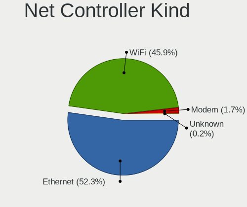

| Kind     | Computers | Percent |
|----------|-----------|---------|
| Ethernet | 1243      | 53.17%  |
| WiFi     | 1055      | 45.12%  |
| Modem    | 36        | 1.54%   |
| Unknown  | 4         | 0.17%   |

Used Controller
---------------

Currently used network controller

| Kind     | Computers | Percent |
|----------|-----------|---------|
| WiFi     | 799       | 54.69%  |
| Ethernet | 660       | 45.17%  |
| Unknown  | 2         | 0.14%   |

NICs
----

Total network controllers on board

| Total | Computers | Percent |
|-------|-----------|---------|
| 2     | 745       | 52.46%  |
| 1     | 584       | 41.13%  |
| 3     | 47        | 3.31%   |
| 0     | 30        | 2.11%   |
| 4     | 8         | 0.56%   |
| 5     | 3         | 0.21%   |
| 13    | 1         | 0.07%   |
| 12    | 1         | 0.07%   |
| 6     | 1         | 0.07%   |

IPv6
----

IPv6 vs IPv4

| Used | Computers | Percent |
|------|-----------|---------|
| No   | 1291      | 89.84%  |
| Yes  | 146       | 10.16%  |

Bluetooth
---------

Bluetooth Vendor
----------------

Controller vendors

| Vendor                          | Computers | Percent |
|---------------------------------|-----------|---------|
| Intel                           | 444       | 53.62%  |
| Realtek Semiconductor           | 75        | 9.06%   |
| Qualcomm Atheros Communications | 54        | 6.52%   |
| Cambridge Silicon Radio         | 53        | 6.4%    |
| Broadcom                        | 41        | 4.95%   |
| IMC Networks                    | 25        | 3.02%   |
| Lite-On Technology              | 24        | 2.9%    |
| Apple                           | 22        | 2.66%   |
| Foxconn / Hon Hai               | 17        | 2.05%   |
| ASUSTek Computer                | 14        | 1.69%   |
| Hewlett-Packard                 | 13        | 1.57%   |
| Dell                            | 11        | 1.33%   |
| Toshiba                         | 7         | 0.85%   |
| Ralink                          | 4         | 0.48%   |
| Foxconn International           | 4         | 0.48%   |
| Marvell Semiconductor           | 3         | 0.36%   |
| Belkin Components               | 3         | 0.36%   |
| Realtek                         | 2         | 0.24%   |
| MediaTek                        | 2         | 0.24%   |
| HTC (High Tech Computer)        | 2         | 0.24%   |
| D-Link System                   | 2         | 0.24%   |
| Alps Electric                   | 2         | 0.24%   |
| Micro Star International        | 1         | 0.12%   |
| Logitech                        | 1         | 0.12%   |
| i.Tech Dynamic Limited          | 1         | 0.12%   |
| Edimax Technology               | 1         | 0.12%   |

Bluetooth Model
---------------

Controller models

| Model                                               | Computers | Percent |
|-----------------------------------------------------|-----------|---------|
| Intel Bluetooth wireless interface                  | 166       | 20.05%  |
| Intel AX200 Bluetooth                               | 96        | 11.59%  |
| Intel AX201 Bluetooth                               | 65        | 7.85%   |
| Realtek Bluetooth Radio                             | 57        | 6.88%   |
| Cambridge Silicon Radio Bluetooth Dongle (HCI mode) | 53        | 6.4%    |
| Intel Bluetooth 9460/9560 Jefferson Peak (JfP)      | 47        | 5.68%   |
| Intel Wireless-AC 9260 Bluetooth Adapter            | 19        | 2.29%   |
| Qualcomm Atheros AR3011 Bluetooth                   | 18        | 2.17%   |
| Intel Wireless-AC 3168 Bluetooth                    | 17        | 2.05%   |
| Intel Centrino Bluetooth Wireless Transceiver       | 17        | 2.05%   |
| Realtek  Bluetooth 4.2 Adapter                      | 15        | 1.81%   |
| Qualcomm Atheros QCA61x4 Bluetooth 4.0              | 14        | 1.69%   |
| Qualcomm Atheros  Bluetooth Device                  | 12        | 1.45%   |
| Lite-On Qualcomm Atheros QCA9377 Bluetooth          | 11        | 1.33%   |
| HP Broadcom 2070 Bluetooth Combo                    | 9         | 1.09%   |
| Broadcom BCM2045B (BDC-2.1)                         | 9         | 1.09%   |
| Apple Bluetooth Host Controller                     | 9         | 1.09%   |
| Intel AX210 Bluetooth                               | 8         | 0.97%   |
| IMC Networks Bluetooth Device                       | 8         | 0.97%   |
| Foxconn / Hon Hai Bluetooth Device                  | 8         | 0.97%   |
| Intel Centrino Advanced-N 6230 Bluetooth adapter    | 7         | 0.85%   |
| IMC Networks Bluetooth Radio                        | 7         | 0.85%   |
| Broadcom BCM20702 Bluetooth 4.0 [ThinkPad]          | 7         | 0.85%   |
| Apple Bluetooth USB Host Controller                 | 7         | 0.85%   |
| Qualcomm Atheros AR3012 Bluetooth 4.0               | 6         | 0.72%   |
| Dell BCM20702A0 Bluetooth Module                    | 5         | 0.6%    |
| Ralink RT3290 Bluetooth                             | 4         | 0.48%   |
| Lite-On Wireless_Device                             | 4         | 0.48%   |
| Lite-On Atheros AR3012 Bluetooth                    | 4         | 0.48%   |
| HP Bluetooth 2.0 Interface [Broadcom BCM2045]       | 4         | 0.48%   |
| Foxconn International BCM43142A0 Bluetooth module   | 4         | 0.48%   |
| Broadcom HP Portable SoftSailing                    | 4         | 0.48%   |
| Broadcom BCM20702A0 Bluetooth 4.0                   | 4         | 0.48%   |
| Broadcom BCM2045 Bluetooth                          | 4         | 0.48%   |
| ASUS Broadcom BCM20702A0 Bluetooth                  | 4         | 0.48%   |
| Apple Bluetooth HCI                                 | 4         | 0.48%   |
| Toshiba Bluetooth Device                            | 3         | 0.36%   |
| Lite-On Bluetooth Device                            | 3         | 0.36%   |
| IMC Networks Wireless_Device                        | 3         | 0.36%   |
| IMC Networks 802.11ac WLAN Adapter                  | 3         | 0.36%   |

Sound
-----

Sound Vendor
------------

Sound card vendors

| Vendor                                       | Computers | Percent |
|----------------------------------------------|-----------|---------|
| Intel                                        | 978       | 48.54%  |
| AMD                                          | 453       | 22.48%  |
| Nvidia                                       | 339       | 16.82%  |
| C-Media Electronics                          | 41        | 2.03%   |
| Logitech                                     | 21        | 1.04%   |
| Creative Labs                                | 12        | 0.6%    |
| GN Netcom                                    | 11        | 0.55%   |
| Apple                                        | 9         | 0.45%   |
| Texas Instruments                            | 8         | 0.4%    |
| Lenovo                                       | 8         | 0.4%    |
| Realtek Semiconductor                        | 7         | 0.35%   |
| Razer USA                                    | 7         | 0.35%   |
| SteelSeries ApS                              | 6         | 0.3%    |
| Hewlett-Packard                              | 6         | 0.3%    |
| Focusrite-Novation                           | 6         | 0.3%    |
| Plantronics                                  | 5         | 0.25%   |
| JMTek                                        | 5         | 0.25%   |
| Creative Technology                          | 5         | 0.25%   |
| Sony                                         | 4         | 0.2%    |
| Sennheiser Communications                    | 4         | 0.2%    |
| RODE Microphones                             | 4         | 0.2%    |
| Kingston Technology                          | 4         | 0.2%    |
| Corsair                                      | 4         | 0.2%    |
| GYROCOM C&C                                  | 3         | 0.15%   |
| Generalplus Technology                       | 3         | 0.15%   |
| Bose                                         | 3         | 0.15%   |
| ASUSTek Computer                             | 3         | 0.15%   |
| ZOOM                                         | 2         | 0.1%    |
| Yamaha                                       | 2         | 0.1%    |
| XMOS                                         | 2         | 0.1%    |
| Thomann                                      | 2         | 0.1%    |
| SAVITECH                                     | 2         | 0.1%    |
| Project                                      | 2         | 0.1%    |
| Microdia                                     | 2         | 0.1%    |
| Micro Star International                     | 2         | 0.1%    |
| M-Audio                                      | 2         | 0.1%    |
| AudioQuest                                   | 2         | 0.1%    |
| Asahi Kasei Microsystems                     | 2         | 0.1%    |
| Zoran Co. Personal Media Division (Nogatech) | 1         | 0.05%   |
| VIA Technologies                             | 1         | 0.05%   |

Sound Model
-----------

Sound card models

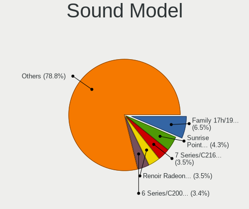

| Model                                                                      | Computers | Percent |
|----------------------------------------------------------------------------|-----------|---------|
| AMD Family 17h/19h HD Audio Controller                                     | 135       | 5.63%   |
| Intel Sunrise Point-LP HD Audio                                            | 114       | 4.75%   |
| Intel 7 Series/C216 Chipset Family High Definition Audio Controller        | 100       | 4.17%   |
| Intel 6 Series/C200 Series Chipset Family High Definition Audio Controller | 95        | 3.96%   |
| AMD Renoir Radeon High Definition Audio Controller                         | 79        | 3.29%   |
| Intel 8 Series/C220 Series Chipset High Definition Audio Controller        | 71        | 2.96%   |
| AMD SBx00 Azalia (Intel HDA)                                               | 66        | 2.75%   |
| AMD Starship/Matisse HD Audio Controller                                   | 63        | 2.63%   |
| Intel 100 Series/C230 Series Chipset Family HD Audio Controller            | 51        | 2.13%   |
| Intel Cannon Lake PCH cAVS                                                 | 49        | 2.04%   |
| Intel 82801I (ICH9 Family) HD Audio Controller                             | 43        | 1.79%   |
| Intel Xeon E3-1200 v3/4th Gen Core Processor HD Audio Controller           | 42        | 1.75%   |
| AMD Raven/Raven2/Fenghuang HDMI/DP Audio Controller                        | 41        | 1.71%   |
| AMD FCH Azalia Controller                                                  | 39        | 1.63%   |
| Intel Haswell-ULT HD Audio Controller                                      | 37        | 1.54%   |
| Intel 8 Series HD Audio Controller                                         | 37        | 1.54%   |
| Intel Tiger Lake-LP Smart Sound Technology Audio Controller                | 35        | 1.46%   |
| Intel Comet Lake PCH-LP cAVS                                               | 33        | 1.38%   |
| AMD Family 17h (Models 00h-0fh) HD Audio Controller                        | 33        | 1.38%   |
| Intel Cannon Point-LP High Definition Audio Controller                     | 32        | 1.33%   |
| Intel 5 Series/3400 Series Chipset High Definition Audio                   | 32        | 1.33%   |
| Intel Broadwell-U Audio Controller                                         | 29        | 1.21%   |
| Intel Wildcat Point-LP High Definition Audio Controller                    | 28        | 1.17%   |
| AMD Ellesmere HDMI Audio [Radeon RX 470/480 / 570/580/590]                 | 28        | 1.17%   |
| Nvidia GP104 High Definition Audio Controller                              | 26        | 1.08%   |
| Intel NM10/ICH7 Family High Definition Audio Controller                    | 26        | 1.08%   |
| Intel 200 Series PCH HD Audio                                              | 25        | 1.04%   |
| Intel 82801H (ICH8 Family) HD Audio Controller                             | 23        | 0.96%   |
| Nvidia TU106 High Definition Audio Controller                              | 21        | 0.88%   |
| AMD Oland/Hainan/Cape Verde/Pitcairn HDMI Audio [Radeon HD 7000 Series]    | 21        | 0.88%   |
| Nvidia GP107GL High Definition Audio Controller                            | 20        | 0.83%   |
| AMD Kabini HDMI/DP Audio                                                   | 20        | 0.83%   |
| Nvidia GP106 High Definition Audio Controller                              | 19        | 0.79%   |
| Intel Celeron N3350/Pentium N4200/Atom E3900 Series Audio Cluster          | 19        | 0.79%   |
| Nvidia GM107 High Definition Audio Controller [GeForce 940MX]              | 18        | 0.75%   |
| Intel Ice Lake-LP Smart Sound Technology Audio Controller                  | 18        | 0.75%   |
| AMD Baffin HDMI/DP Audio [Radeon RX 550 640SP / RX 560/560X]               | 18        | 0.75%   |
| Nvidia GM204 High Definition Audio Controller                              | 17        | 0.71%   |
| Intel Celeron/Pentium Silver Processor High Definition Audio               | 17        | 0.71%   |
| Nvidia GK208 HDMI/DP Audio Controller                                      | 16        | 0.67%   |

Memory
------

Memory Vendor
-------------

Memory module vendors

| Vendor                | Computers | Percent |
|-----------------------|-----------|---------|
| Samsung Electronics   | 194       | 21.68%  |
| SK hynix              | 139       | 15.53%  |
| Kingston              | 108       | 12.07%  |
| Micron Technology     | 89        | 9.94%   |
| Corsair               | 87        | 9.72%   |
| Crucial               | 83        | 9.27%   |
| Unknown               | 71        | 7.93%   |
| G.Skill               | 51        | 5.7%    |
| Ramaxel Technology    | 11        | 1.23%   |
| Elpida                | 11        | 1.23%   |
| Unknown (ABCD)        | 10        | 1.12%   |
| A-DATA Technology     | 7         | 0.78%   |
| Nanya Technology      | 5         | 0.56%   |
| Silicon Power         | 3         | 0.34%   |
| GOODRAM               | 3         | 0.34%   |
| Avant                 | 3         | 0.34%   |
| Transcend             | 2         | 0.22%   |
| Toshiba               | 2         | 0.22%   |
| JOY-IT                | 2         | 0.22%   |
| Hewlett-Packard       | 2         | 0.22%   |
| Vaseky                | 1         | 0.11%   |
| Unifosa               | 1         | 0.11%   |
| Team                  | 1         | 0.11%   |
| TakeMS                | 1         | 0.11%   |
| Smart                 | 1         | 0.11%   |
| Qimonda               | 1         | 0.11%   |
| PNY                   | 1         | 0.11%   |
| Mushkin               | 1         | 0.11%   |
| Kingmax Semiconductor | 1         | 0.11%   |
| Hitachi               | 1         | 0.11%   |
| CSX                   | 1         | 0.11%   |
| Unknown               | 1         | 0.11%   |

Memory Model
------------

Memory module models

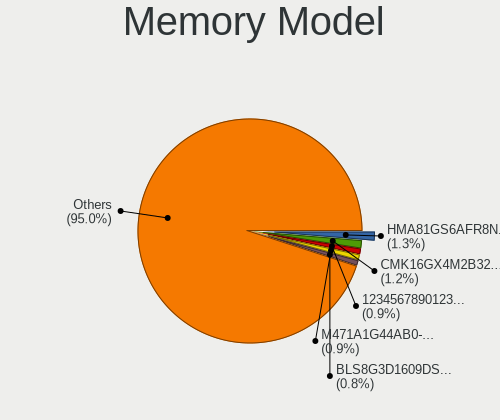

| Model                                                            | Computers | Percent |
|------------------------------------------------------------------|-----------|---------|
| SK hynix RAM HMA81GS6AFR8N-UH 8192MB SODIMM DDR4 2667MT/s        | 14        | 1.46%   |
| Crucial RAM BLS8G3D1609DS1S00. 8GB DIMM DDR3 1600MT/s            | 11        | 1.14%   |
| Micron RAM 4ATS2G64HZ-3G2B1 16GB SODIMM DDR4 3200MT/s            | 9         | 0.94%   |
| Corsair RAM CMK16GX4M2B3200C16 8GB DIMM DDR4 3600MT/s            | 9         | 0.94%   |
| Unknown (ABCD) RAM 123456789012345678 1GB SODIMM LPDDR4 2400MT/s | 8         | 0.83%   |
| Samsung RAM M471A1G44AB0-CWE 8GB SODIMM DDR4 3200MT/s            | 8         | 0.83%   |
| G.Skill RAM F4-3000C16-8GISB 8GB DIMM DDR4 3200MT/s              | 8         | 0.83%   |
| Samsung RAM M471A5244CB0-CTD 4GB SODIMM DDR4 3266MT/s            | 7         | 0.73%   |
| SK hynix RAM HMAA1GS6CJR6N-XN 8GB SODIMM DDR4 3200MT/s           | 6         | 0.62%   |
| Samsung RAM M471A2K43DB1-CWE 16GB SODIMM DDR4 3200MT/s           | 6         | 0.62%   |
| Samsung RAM M471A2G44AM0-CWE 16GB SODIMM DDR4 3200MT/s           | 6         | 0.62%   |
| Samsung RAM M471A2G43AB2-CWE 16GB SODIMM DDR4 3200MT/s           | 6         | 0.62%   |
| SK hynix RAM HMT41GS6BFR8A-PB 8GB SODIMM DDR3 1600MT/s           | 5         | 0.52%   |
| SK hynix RAM HMT351S6CFR8C-PB 4GB SODIMM DDR3 1600MT/s           | 5         | 0.52%   |
| SK hynix RAM HMAA2GS6CJR8N-XN 16GB SODIMM DDR4 3200MT/s          | 5         | 0.52%   |
| Samsung RAM M471B5273DH0-CH9 4GB SODIMM DDR3 1334MT/s            | 5         | 0.52%   |
| Samsung RAM M471B5273CH0-CH9 4GB SODIMM DDR3 1334MT/s            | 5         | 0.52%   |
| Samsung RAM M471B5173DB0-YK0 4GB SODIMM DDR3 1600MT/s            | 5         | 0.52%   |
| Samsung RAM M471B1G73QH0-YK0 8192MB SODIMM DDR3 1600MT/s         | 5         | 0.52%   |
| Samsung RAM M471A2K43CB1-CTD 16384MB SODIMM DDR4 8400MT/s        | 5         | 0.52%   |
| Samsung RAM M471A1K43DB1-CWE 8192MB SODIMM DDR4 3200MT/s         | 5         | 0.52%   |
| Samsung RAM M471A1K43CB1-CRC 8GB SODIMM DDR4 2667MT/s            | 5         | 0.52%   |
| Samsung RAM M471A1G44AB0-CWE 8GB Row Of Chips DDR4 3200MT/s      | 5         | 0.52%   |
| Corsair RAM CMK16GX4M2B3000C15 8GB DIMM DDR4 3200MT/s            | 5         | 0.52%   |
| SK hynix RAM HMT451S6AFR8A-PB 4GB SODIMM DDR3 1600MT/s           | 4         | 0.42%   |
| SK hynix RAM HMT351S6BFR8C-H9 4GB SODIMM DDR3 1333MT/s           | 4         | 0.42%   |
| SK hynix RAM HMA81GS6DJR8N-XN 8GB SODIMM DDR4 3200MT/s           | 4         | 0.42%   |
| Samsung RAM M471B5773CHS-CH9 2GB SODIMM DDR3 4199MT/s            | 4         | 0.42%   |
| Samsung RAM M471A4G43MB1-CTD 32GB SODIMM DDR4 2667MT/s           | 4         | 0.42%   |
| Samsung RAM M471A2K43DB1-CTD 16GB SODIMM DDR4 2667MT/s           | 4         | 0.42%   |
| Samsung RAM M471A1K43DB1-CTD 8GB SODIMM DDR4 2667MT/s            | 4         | 0.42%   |
| Samsung RAM M471A1G43DB0-CPB 8GB SODIMM DDR4 2400MT/s            | 4         | 0.42%   |
| Samsung RAM M4 70T5663EH3-CF7 2GB SODIMM DDR2 975MT/s            | 4         | 0.42%   |
| Micron RAM 8JTF51264AZ-1G6E1 4GB DIMM DDR3 1600MT/s              | 4         | 0.42%   |
| Micron RAM 4ATS1G64HZ-2G6E1 8192MB SODIMM DDR4 2667MT/s          | 4         | 0.42%   |
| Kingston RAM KHX2666C15D4/8G 8GB DIMM DDR4 3200MT/s              | 4         | 0.42%   |
| Kingston RAM KHX1866C10D3/8G 8GB DIMM DDR3 2133MT/s              | 4         | 0.42%   |
| Kingston RAM KHX1600C9D3/4GX 4GB DIMM DDR3 2400MT/s              | 4         | 0.42%   |
| Kingston RAM 99U5428-018.A00LF 8GB SODIMM DDR3 1600MT/s          | 4         | 0.42%   |
| G.Skill RAM F4-3000C16-16GISB 16GB DIMM DDR4 3000MT/s            | 4         | 0.42%   |

Memory Kind
-----------

Memory module kinds

| Kind    | Computers | Percent |
|---------|-----------|---------|
| DDR4    | 389       | 50.19%  |
| DDR3    | 266       | 34.32%  |
| LPDDR4  | 36        | 4.65%   |
| DDR2    | 28        | 3.61%   |
| SDRAM   | 20        | 2.58%   |
| LPDDR3  | 19        | 2.45%   |
| Unknown | 13        | 1.68%   |
| DDR     | 3         | 0.39%   |
| LPDDR5  | 1         | 0.13%   |

Memory Form Factor
------------------

Physical design of the memory module

| Name         | Computers | Percent |
|--------------|-----------|---------|
| SODIMM       | 411       | 53.31%  |
| DIMM         | 298       | 38.65%  |
| Row Of Chips | 58        | 7.52%   |
| Chip         | 4         | 0.52%   |

Memory Size
-----------

Memory module size

| Size  | Computers | Percent |
|-------|-----------|---------|
| 8192  | 345       | 40.93%  |
| 4096  | 213       | 25.27%  |
| 16384 | 156       | 18.51%  |
| 2048  | 86        | 10.2%   |
| 1024  | 19        | 2.25%   |
| 32768 | 17        | 2.02%   |
| 512   | 4         | 0.47%   |
| 65536 | 1         | 0.12%   |
| 256   | 1         | 0.12%   |
| 16    | 1         | 0.12%   |

Memory Speed
------------

Memory module speed

| Speed   | Computers | Percent |
|---------|-----------|---------|
| 1600    | 174       | 20.89%  |
| 3200    | 133       | 15.97%  |
| 2667    | 111       | 13.33%  |
| 2400    | 79        | 9.48%   |
| 1333    | 58        | 6.96%   |
| 2133    | 42        | 5.04%   |
| 3600    | 27        | 3.24%   |
| 1334    | 20        | 2.4%    |
| 1867    | 17        | 2.04%   |
| 4267    | 16        | 1.92%   |
| 667     | 16        | 1.92%   |
| 3000    | 15        | 1.8%    |
| 3266    | 9         | 1.08%   |
| 1067    | 9         | 1.08%   |
| Unknown | 9         | 1.08%   |
| 3466    | 8         | 0.96%   |
| 2933    | 8         | 0.96%   |
| 4199    | 6         | 0.72%   |
| 800     | 6         | 0.72%   |
| 8400    | 5         | 0.6%    |
| 3733    | 5         | 0.6%    |
| 2048    | 5         | 0.6%    |
| 1866    | 5         | 0.6%    |
| 1066    | 5         | 0.6%    |
| 4266    | 4         | 0.48%   |
| 3400    | 4         | 0.48%   |
| 2666    | 4         | 0.48%   |
| 4800    | 3         | 0.36%   |
| 2800    | 3         | 0.36%   |
| 533     | 3         | 0.36%   |
| 3866    | 2         | 0.24%   |
| 3800    | 2         | 0.24%   |
| 3066    | 2         | 0.24%   |
| 2465    | 2         | 0.24%   |
| 1800    | 2         | 0.24%   |
| 400     | 2         | 0.24%   |
| 266     | 2         | 0.24%   |
| 50664   | 1         | 0.12%   |
| 6400    | 1         | 0.12%   |
| 3666    | 1         | 0.12%   |

Printers & scanners
-------------------

Printer Vendor
--------------

Printer device vendors

| Vendor                | Computers | Percent |
|-----------------------|-----------|---------|
| Hewlett-Packard       | 14        | 31.82%  |
| Canon                 | 9         | 20.45%  |
| Brother Industries    | 9         | 20.45%  |
| Seiko Epson           | 4         | 9.09%   |
| Samsung Electronics   | 3         | 6.82%   |
| Ricoh                 | 1         | 2.27%   |
| QinHeng Electronics   | 1         | 2.27%   |
| Prolific Technology   | 1         | 2.27%   |
| Oki Data              | 1         | 2.27%   |
| Lexmark International | 1         | 2.27%   |

Printer Model
-------------

Printer device models

| Model                                                      | Computers | Percent |
|------------------------------------------------------------|-----------|---------|
| HP Deskjet 3520 series                                     | 3         | 6.82%   |
| Seiko Epson WF-2530 Series                                 | 2         | 4.55%   |
| Samsung C48x Series Color Laser Multifunction Printer      | 2         | 4.55%   |
| Brother Printer                                            | 2         | 4.55%   |
| Brother HL-3040CN series                                   | 2         | 4.55%   |
| Seiko Epson XP-230 Series                                  | 1         | 2.27%   |
| Seiko Epson ET-4750 [WorkForce ET-4750 EcoTank All-in-One] | 1         | 2.27%   |
| Samsung SCX-4300 Series                                    | 1         | 2.27%   |
| Ricoh SP 212SUw                                            | 1         | 2.27%   |
| QinHeng CH340S                                             | 1         | 2.27%   |
| Prolific PL2305 Parallel Port                              | 1         | 2.27%   |
| Oki Data USB Device                                        | 1         | 2.27%   |
| Lexmark International CS417dn                              | 1         | 2.27%   |
| HP OfficeJet Pro 7720 series                               | 1         | 2.27%   |
| HP LaserJet 1320                                           | 1         | 2.27%   |
| HP LaserJet 1200                                           | 1         | 2.27%   |
| HP LaserJet 1022                                           | 1         | 2.27%   |
| HP ENVY Pro 6400 series                                    | 1         | 2.27%   |
| HP ENVY 5000 series                                        | 1         | 2.27%   |
| HP ENVY 4520 series                                        | 1         | 2.27%   |
| HP DeskJet 940c                                            | 1         | 2.27%   |
| HP DeskJet 2700 series                                     | 1         | 2.27%   |
| HP DeskJet 2620 All-in-One Printer                         | 1         | 2.27%   |
| HP Deskjet 2050 J510                                       | 1         | 2.27%   |
| Canon TS5100 series                                        | 1         | 2.27%   |
| Canon PIXMA MX320 series                                   | 1         | 2.27%   |
| Canon PIXMA iX6850 Printer                                 | 1         | 2.27%   |
| Canon MG2100 series                                        | 1         | 2.27%   |
| Canon MF5650 (FAX)                                         | 1         | 2.27%   |
| Canon LiDE 300                                             | 1         | 2.27%   |
| Canon LaserShot LBP-1120 Printer                           | 1         | 2.27%   |
| Canon L100/L150/L170                                       | 1         | 2.27%   |
| Canon iP7200 series                                        | 1         | 2.27%   |
| Brother MFC-L2710DW series                                 | 1         | 2.27%   |
| Brother MFC-L2710DN series                                 | 1         | 2.27%   |
| Brother MFC-9142CDN                                        | 1         | 2.27%   |
| Brother DCP-J140W                                          | 1         | 2.27%   |
| Brother DCP-1510                                           | 1         | 2.27%   |

Scanner Vendor
--------------

Scanner device vendors

| Vendor      | Computers | Percent |
|-------------|-----------|---------|
| Canon       | 19        | 76%     |
| Seiko Epson | 3         | 12%     |
| Fujitsu     | 3         | 12%     |

Scanner Model
-------------

Scanner device models

| Model                                                    | Computers | Percent |
|----------------------------------------------------------|-----------|---------|
| Canon CanoScan                                           | 4         | 16%     |
| Fujitsu ScanSnap SV600                                   | 3         | 12%     |
| Seiko Epson GT-F500/GT-F550 [Perfection 2480/2580 PHOTO] | 2         | 8%      |
| Canon CanoScan N670U/N676U/LiDE 20                       | 2         | 8%      |
| Canon CanoScan N1240U/LiDE 30                            | 2         | 8%      |
| Canon CanoScan LiDE 50/LiDE 35/LiDE 40                   | 2         | 8%      |
| Canon CanoScan LiDE 220                                  | 2         | 8%      |
| Canon CanoScan LiDE 110                                  | 2         | 8%      |
| Canon CanoScan LiDE 100                                  | 2         | 8%      |
| Seiko Epson GT-7200U [Perfection 1250/1250 PHOTO]        | 1         | 4%      |
| Canon CanoScan N650U/N656U                               | 1         | 4%      |
| Canon CanoScan LiDE 210                                  | 1         | 4%      |
| Canon CanoScan FB630U                                    | 1         | 4%      |

Camera
------

Camera Vendor
-------------

Camera device vendors

| Vendor                                 | Computers | Percent |
|----------------------------------------|-----------|---------|
| Chicony Electronics                    | 218       | 27.15%  |
| Acer                                   | 75        | 9.34%   |
| IMC Networks                           | 73        | 9.09%   |
| Microdia                               | 52        | 6.48%   |
| Logitech                               | 47        | 5.85%   |
| Realtek Semiconductor                  | 46        | 5.73%   |
| Sunplus Innovation Technology          | 41        | 5.11%   |
| Quanta                                 | 34        | 4.23%   |
| Lite-On Technology                     | 28        | 3.49%   |
| Suyin                                  | 24        | 2.99%   |
| Cheng Uei Precision Industry (Foxlink) | 24        | 2.99%   |
| Apple                                  | 23        | 2.86%   |
| Syntek                                 | 14        | 1.74%   |
| Microsoft                              | 13        | 1.62%   |
| Alcor Micro                            | 9         | 1.12%   |
| Samsung Electronics                    | 8         | 1%      |
| Luxvisions Innotech Limited            | 8         | 1%      |
| Z-Star Microelectronics                | 5         | 0.62%   |
| Ricoh                                  | 5         | 0.62%   |
| Primax Electronics                     | 5         | 0.62%   |
| OmniVision Technologies                | 4         | 0.5%    |
| Lenovo                                 | 4         | 0.5%    |
| ARC International                      | 4         | 0.5%    |
| Silicon Motion                         | 3         | 0.37%   |
| Fujitsu                                | 3         | 0.37%   |
| Unknown                                | 2         | 0.25%   |
| SunplusIT                              | 2         | 0.25%   |
| Sony                                   | 2         | 0.25%   |
| SJ-180517-N                            | 2         | 0.25%   |
| SHENZHEN EMEET TECHNOLOGY              | 2         | 0.25%   |
| Jieli Technology                       | 2         | 0.25%   |
| icSpring                               | 2         | 0.25%   |
| Generalplus Technology                 | 2         | 0.25%   |
| GEMBIRD                                | 2         | 0.25%   |
| DigiTech                               | 2         | 0.25%   |
| Sunplus Technology                     | 1         | 0.12%   |
| SHENZHEN AONI ELECTRONIC               | 1         | 0.12%   |
| Novatek Microelectronics               | 1         | 0.12%   |
| Nikon                                  | 1         | 0.12%   |
| Nebraska Furniture Mart                | 1         | 0.12%   |

Camera Model
------------

Camera device models

| Model                                    | Computers | Percent |
|------------------------------------------|-----------|---------|
| Chicony Integrated Camera                | 55        | 6.8%    |
| IMC Networks Integrated Camera           | 36        | 4.45%   |
| Acer Integrated Camera                   | 30        | 3.71%   |
| Microdia Integrated_Webcam_HD            | 22        | 2.72%   |
| Chicony HP HD Camera                     | 18        | 2.22%   |
| Chicony HD WebCam                        | 17        | 2.1%    |
| Quanta HD User Facing                    | 12        | 1.48%   |
| Realtek Integrated_Webcam_HD             | 11        | 1.36%   |
| Sunplus Integrated_Webcam_HD             | 10        | 1.24%   |
| Logitech Webcam C270                     | 10        | 1.24%   |
| IMC Networks USB2.0 VGA UVC WebCam       | 10        | 1.24%   |
| IMC Networks USB2.0 HD UVC WebCam        | 10        | 1.24%   |
| Chicony TOSHIBA Web Camera - HD          | 10        | 1.24%   |
| Realtek USB2.0 HD UVC WebCam             | 9         | 1.11%   |
| Lite-On Integrated Camera                | 9         | 1.11%   |
| Lite-On HP HD Camera                     | 9         | 1.11%   |
| Samsung Galaxy A5 (MTP)                  | 8         | 0.99%   |
| Quanta HP HD Camera                      | 8         | 0.99%   |
| Chicony VGA WebCam                       | 8         | 0.99%   |
| Logitech HD Pro Webcam C920              | 7         | 0.87%   |
| Chicony USB2.0 HD UVC WebCam             | 7         | 0.87%   |
| Chicony Integrated HP HD Webcam          | 7         | 0.87%   |
| Chicony HP Truevision HD camera          | 7         | 0.87%   |
| Chicony HP HD Webcam                     | 7         | 0.87%   |
| Apple Built-in iSight                    | 7         | 0.87%   |
| Acer Lenovo EasyCamera                   | 7         | 0.87%   |
| Microsoft LifeCam HD-3000                | 6         | 0.74%   |
| Microdia Webcam Vitade AF                | 6         | 0.74%   |
| Chicony Lenovo Integrated Camera (0.3MP) | 6         | 0.74%   |
| Apple iPhone5/5C/5S/6                    | 6         | 0.74%   |
| Acer SunplusIT Integrated Camera         | 6         | 0.74%   |
| Acer BisonCam, NB Pro                    | 6         | 0.74%   |
| Syntek Integrated Camera                 | 5         | 0.62%   |
| Realtek HD WebCam                        | 5         | 0.62%   |
| Logitech HD Webcam C525                  | 5         | 0.62%   |
| Chicony USB 2.0 Camera                   | 5         | 0.62%   |
| Chicony Lenovo EasyCamera                | 5         | 0.62%   |
| Chicony Integrated Camera (1280x720@30)  | 5         | 0.62%   |
| Chicony HD User Facing                   | 5         | 0.62%   |
| Chicony FJ Camera                        | 5         | 0.62%   |

Security
--------

Fingerprint Vendor
------------------

Fingerprint sensor vendors

| Vendor                     | Computers | Percent |
|----------------------------|-----------|---------|
| Validity Sensors           | 91        | 38.56%  |
| Synaptics                  | 84        | 35.59%  |
| Shenzhen Goodix Technology | 24        | 10.17%  |
| AuthenTec                  | 13        | 5.51%   |
| Upek                       | 12        | 5.08%   |
| LighTuning Technology      | 6         | 2.54%   |
| Elan Microelectronics      | 4         | 1.69%   |
| STMicroelectronics         | 1         | 0.42%   |
| Focal-systems.Corp         | 1         | 0.42%   |

Fingerprint Model
-----------------

Fingerprint sensor models

| Model                                                                      | Computers | Percent |
|----------------------------------------------------------------------------|-----------|---------|
| Synaptics Prometheus MIS Touch Fingerprint Reader                          | 37        | 15.61%  |
| Validity Sensors VFS495 Fingerprint Reader                                 | 25        | 10.55%  |
| Shenzhen Goodix  FingerPrint Device                                        | 16        | 6.75%   |
| Unknown                                                                    | 16        | 6.75%   |
| Upek Biometric Touchchip/Touchstrip Fingerprint Sensor                     | 12        | 5.06%   |
| Validity Sensors Synaptics WBDI                                            | 11        | 4.64%   |
| Validity Sensors VFS471 Fingerprint Reader                                 | 10        | 4.22%   |
| Validity Sensors VFS5011 Fingerprint Reader                                | 9         | 3.8%    |
| Synaptics  VFS7552 Touch Fingerprint Sensor with PurePrint                 | 9         | 3.8%    |
| Validity Sensors VFS7500 Touch Fingerprint Sensor                          | 6         | 2.53%   |
| Validity Sensors VFS491                                                    | 6         | 2.53%   |
| Validity Sensors VFS 5011 fingerprint sensor                               | 6         | 2.53%   |
| Synaptics  FS7604 Touch Fingerprint Sensor with PurePrint                  | 6         | 2.53%   |
| Validity Sensors Fingerprint scanner                                       | 5         | 2.11%   |
| Synaptics Metallica MOH Touch Fingerprint Reader                           | 5         | 2.11%   |
| Synaptics Metallica MIS Touch Fingerprint Reader                           | 5         | 2.11%   |
| Shenzhen Goodix FingerPrint                                                | 5         | 2.11%   |
| AuthenTec AES2810                                                          | 5         | 2.11%   |
| Validity Sensors Synaptics VFS7552 Touch Fingerprint Sensor with PurePrint | 4         | 1.69%   |
| Synaptics WBDI Device                                                      | 3         | 1.27%   |
| Synaptics  WBDI Fingerprint Reader - USB 052                               | 3         | 1.27%   |
| Shenzhen Goodix Fingerprint Reader                                         | 3         | 1.27%   |
| LighTuning ES603 Swipe Fingerprint Sensor                                  | 3         | 1.27%   |
| Elan ELAN:Fingerprint                                                      | 3         | 1.27%   |
| AuthenTec Fingerprint Sensor                                               | 3         | 1.27%   |
| AuthenTec AES2501 Fingerprint Sensor                                       | 3         | 1.27%   |
| Validity Sensors VFS451 Fingerprint Reader                                 | 2         | 0.84%   |
| Validity Sensors VFS Fingerprint sensor                                    | 2         | 0.84%   |
| Validity Sensors Synaptics VFS7552 Touch Fingerprint Sensor                | 2         | 0.84%   |
| Validity Sensors Swipe Fingerprint Sensor                                  | 2         | 0.84%   |
| LighTuning EgisTec Touch Fingerprint Sensor                                | 2         | 0.84%   |
| Validity Sensors VFS301 Fingerprint Reader                                 | 1         | 0.42%   |
| Synaptics  WBDI                                                            | 1         | 0.42%   |
| STMicroelectronics Fingerprint Reader                                      | 1         | 0.42%   |
| LighTuning Fingerprint Reader                                              | 1         | 0.42%   |
| Focal-systems.Corp FT9201Fingerprint.                                      | 1         | 0.42%   |
| Elan fingerprint sensor [FeinTech FPS00200]                                | 1         | 0.42%   |
| AuthenTec AES1660 Fingerprint Sensor                                       | 1         | 0.42%   |
| AuthenTec AES1600                                                          | 1         | 0.42%   |

Chipcard Vendor
---------------

Chipcard module vendors

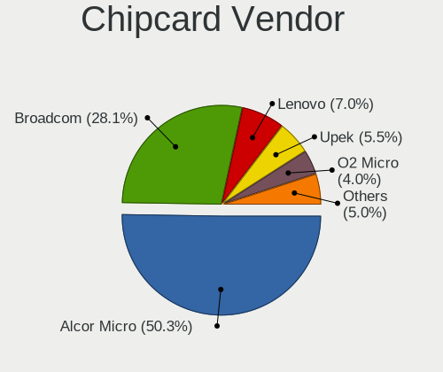

| Vendor                | Computers | Percent |
|-----------------------|-----------|---------|
| Alcor Micro           | 52        | 50%     |
| Broadcom              | 27        | 25.96%  |
| Upek                  | 8         | 7.69%   |
| Lenovo                | 8         | 7.69%   |
| O2 Micro              | 3         | 2.88%   |
| Realtek Semiconductor | 2         | 1.92%   |
| Cherry                | 2         | 1.92%   |
| SCM Microsystems      | 1         | 0.96%   |
| Advanced Card Systems | 1         | 0.96%   |

Chipcard Model
--------------

Chipcard module models

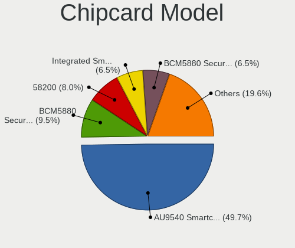

| Model                                                                        | Computers | Percent |
|------------------------------------------------------------------------------|-----------|---------|
| Alcor Micro AU9540 Smartcard Reader                                          | 51        | 49.04%  |
| Broadcom BCM5880 Secure Applications Processor                               | 11        | 10.58%  |
| Upek TouchChip Fingerprint Coprocessor (WBF advanced mode)                   | 8         | 7.69%   |
| Lenovo Integrated Smart Card Reader                                          | 8         | 7.69%   |
| Broadcom BCM5880 Secure Applications Processor with fingerprint swipe sensor | 8         | 7.69%   |
| Broadcom 58200                                                               | 5         | 4.81%   |
| O2 Micro OZ776 CCID Smartcard Reader                                         | 3         | 2.88%   |
| Broadcom 5880                                                                | 3         | 2.88%   |
| Realtek Semiconductor Smart Card Reader Interface                            | 2         | 1.92%   |
| SCM Microsystems SCR3340 - ExpressCard54 Smart Card Reader                   | 1         | 0.96%   |
| Cherry SmartTerminal XX44                                                    | 1         | 0.96%   |
| Cherry Smart Terminal XX44                                                   | 1         | 0.96%   |
| Alcor Micro Watchdata W 1981                                                 | 1         | 0.96%   |
| Advanced Card Systems ACR122U                                                | 1         | 0.96%   |

Unsupported
-----------

Unsupported Devices
-------------------

Total unsupported devices on board

| Total | Computers | Percent |
|-------|-----------|---------|
| 0     | 967       | 66.32%  |
| 1     | 374       | 25.65%  |
| 2     | 79        | 5.42%   |
| 3     | 23        | 1.58%   |
| 4     | 8         | 0.55%   |
| 5     | 3         | 0.21%   |
| 8     | 2         | 0.14%   |
| 6     | 2         | 0.14%   |

Unsupported Device Types
------------------------

Types of unsupported devices

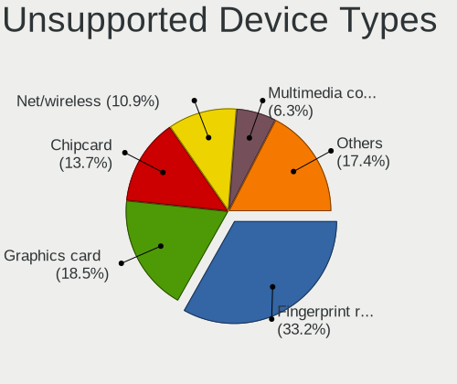

| Type                     | Computers | Percent |
|--------------------------|-----------|---------|
| Fingerprint reader       | 230       | 36.57%  |
| Graphics card            | 101       | 16.06%  |
| Chipcard                 | 81        | 12.88%  |
| Net/wireless             | 74        | 11.76%  |
| Multimedia controller    | 26        | 4.13%   |
| Communication controller | 24        | 3.82%   |
| Unassigned class         | 19        | 3.02%   |
| Sound                    | 15        | 2.38%   |
| Bluetooth                | 15        | 2.38%   |
| Camera                   | 13        | 2.07%   |
| Net/ethernet             | 7         | 1.11%   |
| Card reader              | 6         | 0.95%   |
| Storage                  | 4         | 0.64%   |
| Modem                    | 4         | 0.64%   |
| Tv card                  | 2         | 0.32%   |
| Network                  | 2         | 0.32%   |
| Flash memory             | 2         | 0.32%   |
| Storage/raid             | 1         | 0.16%   |
| Storage/nvme             | 1         | 0.16%   |
| Storage/ide              | 1         | 0.16%   |
| Firewire controller      | 1         | 0.16%   |

