Linux in Austria - Tested Hardware & Statistics
-----------------------------------------------

A project to collect tested hardware configurations for Linux in Austria.

Anyone can contribute to this report by the [hw-probe](https://github.com/linuxhw/hw-probe) tool:

    sudo -E hw-probe -all -upload

Please contribute! Especially if your hardware is rare.

This is a report for all computer types. See also reports for [desktops](/Location/Austria/Desktop/README.md) and [notebooks](/Location/Austria/Notebook/README.md).

Contents
--------

* [ Test Cases ](#test-cases)

* [ System ](#system)
  - [ OS                       ](#os)
  - [ OS Family                ](#os-family)
  - [ Kernel                   ](#kernel)
  - [ Kernel Family            ](#kernel-family)
  - [ Kernel Major Ver.        ](#kernel-major-ver)
  - [ Arch                     ](#arch)
  - [ DE                       ](#de)
  - [ Display Server           ](#display-server)
  - [ Display Manager          ](#display-manager)
  - [ OS Lang                  ](#os-lang)
  - [ Boot Mode                ](#boot-mode)
  - [ Filesystem               ](#filesystem)
  - [ Part. scheme             ](#part-scheme)
  - [ Dual Boot with Linux/BSD ](#dual-boot-with-linuxbsd)
  - [ Dual Boot (Win)          ](#dual-boot-win)

* [ Board ](#board)
  - [ Vendor                   ](#vendor)
  - [ Model                    ](#model)
  - [ Model Family             ](#model-family)
  - [ MFG Year                 ](#mfg-year)
  - [ Form Factor              ](#form-factor)
  - [ Secure Boot              ](#secure-boot)
  - [ Coreboot                 ](#coreboot)
  - [ RAM Size                 ](#ram-size)
  - [ RAM Used                 ](#ram-used)
  - [ Total Drives             ](#total-drives)
  - [ Has CD-ROM               ](#has-cd-rom)
  - [ Has Ethernet             ](#has-ethernet)
  - [ Has WiFi                 ](#has-wifi)
  - [ Has Bluetooth            ](#has-bluetooth)

* [ Location ](#location)
  - [ Country                  ](#country)
  - [ City                     ](#city)

* [ Drives ](#drives)
  - [ Drive Vendor             ](#drive-vendor)
  - [ Drive Model              ](#drive-model)
  - [ HDD Vendor               ](#hdd-vendor)
  - [ SSD Vendor               ](#ssd-vendor)
  - [ Drive Kind               ](#drive-kind)
  - [ Drive Connector          ](#drive-connector)
  - [ Drive Size               ](#drive-size)
  - [ Space Total              ](#space-total)
  - [ Space Used               ](#space-used)
  - [ Malfunc. Drives          ](#malfunc-drives)
  - [ Malfunc. Drive Vendor    ](#malfunc-drive-vendor)
  - [ Malfunc. HDD Vendor      ](#malfunc-hdd-vendor)
  - [ Malfunc. Drive Kind      ](#malfunc-drive-kind)
  - [ Failed Drives            ](#failed-drives)
  - [ Failed Drive Vendor      ](#failed-drive-vendor)
  - [ Drive Status             ](#drive-status)

* [ Storage controller ](#storage-controller)
  - [ Storage Vendor           ](#storage-vendor)
  - [ Storage Model            ](#storage-model)
  - [ Storage Kind             ](#storage-kind)

* [ Processor ](#processor)
  - [ CPU Vendor               ](#cpu-vendor)
  - [ CPU Model                ](#cpu-model)
  - [ CPU Model Family         ](#cpu-model-family)
  - [ CPU Cores                ](#cpu-cores)
  - [ CPU Sockets              ](#cpu-sockets)
  - [ CPU Threads              ](#cpu-threads)
  - [ CPU Op-Modes             ](#cpu-op-modes)
  - [ CPU Microcode            ](#cpu-microcode)
  - [ CPU Microarch            ](#cpu-microarch)

* [ Graphics ](#graphics)
  - [ GPU Vendor               ](#gpu-vendor)
  - [ GPU Model                ](#gpu-model)
  - [ GPU Combo                ](#gpu-combo)
  - [ GPU Driver               ](#gpu-driver)
  - [ GPU Memory               ](#gpu-memory)

* [ Monitor ](#monitor)
  - [ Monitor Vendor           ](#monitor-vendor)
  - [ Monitor Model            ](#monitor-model)
  - [ Monitor Resolution       ](#monitor-resolution)
  - [ Monitor Diagonal         ](#monitor-diagonal)
  - [ Monitor Width            ](#monitor-width)
  - [ Aspect Ratio             ](#aspect-ratio)
  - [ Monitor Area             ](#monitor-area)
  - [ Pixel Density            ](#pixel-density)
  - [ Multiple Monitors        ](#multiple-monitors)

* [ Network ](#network)
  - [ Net Controller Vendor    ](#net-controller-vendor)
  - [ Net Controller Model     ](#net-controller-model)
  - [ Wireless Vendor          ](#wireless-vendor)
  - [ Wireless Model           ](#wireless-model)
  - [ Ethernet Vendor          ](#ethernet-vendor)
  - [ Ethernet Model           ](#ethernet-model)
  - [ Net Controller Kind      ](#net-controller-kind)
  - [ Used Controller          ](#used-controller)
  - [ NICs                     ](#nics)
  - [ IPv6                     ](#ipv6)

* [ Bluetooth ](#bluetooth)
  - [ Bluetooth Vendor         ](#bluetooth-vendor)
  - [ Bluetooth Model          ](#bluetooth-model)

* [ Sound ](#sound)
  - [ Sound Vendor             ](#sound-vendor)
  - [ Sound Model              ](#sound-model)

* [ Memory ](#memory)
  - [ Memory Vendor            ](#memory-vendor)
  - [ Memory Model             ](#memory-model)
  - [ Memory Kind              ](#memory-kind)
  - [ Memory Form Factor       ](#memory-form-factor)
  - [ Memory Size              ](#memory-size)
  - [ Memory Speed             ](#memory-speed)

* [ Printers & scanners ](#printers--scanners)
  - [ Printer Vendor           ](#printer-vendor)
  - [ Printer Model            ](#printer-model)
  - [ Scanner Vendor           ](#scanner-vendor)
  - [ Scanner Model            ](#scanner-model)

* [ Camera ](#camera)
  - [ Camera Vendor            ](#camera-vendor)
  - [ Camera Model             ](#camera-model)

* [ Security ](#security)
  - [ Fingerprint Vendor       ](#fingerprint-vendor)
  - [ Fingerprint Model        ](#fingerprint-model)
  - [ Chipcard Vendor          ](#chipcard-vendor)
  - [ Chipcard Model           ](#chipcard-model)

* [ Unsupported ](#unsupported)
  - [ Unsupported Devices      ](#unsupported-devices)
  - [ Unsupported Device Types ](#unsupported-device-types)

Test Cases
----------

Total: 3412

| Vendor        | Model                       | Form-Factor | Probe                                                      | Date         |
|---------------|-----------------------------|-------------|------------------------------------------------------------|--------------|
| Shenzhen M... | F7BSC                       | Mini pc     | [5782f1959e](https://linux-hardware.org/?probe=5782f1959e) | May 09, 2024 |
| HP            | ProBook 430 G6              | Notebook    | [696c3f2a72](https://linux-hardware.org/?probe=696c3f2a72) | May 07, 2024 |
| ASUSTek       | ASUS EXPERTBOOK B1500CEA... | Notebook    | [3236268f3d](https://linux-hardware.org/?probe=3236268f3d) | May 06, 2024 |
| Toshiba       | Satellite C660D             | Notebook    | [8c4353e699](https://linux-hardware.org/?probe=8c4353e699) | May 06, 2024 |
| ASUSTek       | P5Q                         | Desktop     | [5af3396f04](https://linux-hardware.org/?probe=5af3396f04) | May 05, 2024 |
| HP            | ZBook 15 G3                 | Notebook    | [486b46ac77](https://linux-hardware.org/?probe=486b46ac77) | May 05, 2024 |
| HP            | ZBook 15 G3                 | Notebook    | [74576596b1](https://linux-hardware.org/?probe=74576596b1) | May 05, 2024 |
| Acer          | Switch SW312-31             | Tablet      | [e7fe09d066](https://linux-hardware.org/?probe=e7fe09d066) | May 04, 2024 |
| ASUSTek       | PRIME B450-PLUS             | Desktop     | [2de27a1ebc](https://linux-hardware.org/?probe=2de27a1ebc) | May 04, 2024 |
| AMI           | Intel                       | Convertible | [2b09abb2a6](https://linux-hardware.org/?probe=2b09abb2a6) | May 04, 2024 |
| Lenovo        | ThinkPad W510 4391W3V       | Notebook    | [dbf17c46bd](https://linux-hardware.org/?probe=dbf17c46bd) | May 04, 2024 |
| ASUSTek       | ROG STRIX B550-F GAMING     | Desktop     | [28d0d4304f](https://linux-hardware.org/?probe=28d0d4304f) | May 04, 2024 |
| HP            | EliteBook 865 16 inch G1... | Notebook    | [847e639275](https://linux-hardware.org/?probe=847e639275) | May 02, 2024 |
| Dell          | XPS 15 9570                 | Notebook    | [c5d7b3bc4e](https://linux-hardware.org/?probe=c5d7b3bc4e) | May 01, 2024 |
| Dell          | Latitude E7250              | Notebook    | [e674f5e264](https://linux-hardware.org/?probe=e674f5e264) | May 01, 2024 |
| ASUSTek       | ROG STRIX B550-F GAMING     | Desktop     | [9bb8151528](https://linux-hardware.org/?probe=9bb8151528) | May 01, 2024 |
| Lenovo        | ThinkPad T470s 20HF005QM... | Notebook    | [6fc6e1fa78](https://linux-hardware.org/?probe=6fc6e1fa78) | May 01, 2024 |
| Gigabyte      | X570 AORUS XTREME           | Desktop     | [fbb11f7603](https://linux-hardware.org/?probe=fbb11f7603) | May 01, 2024 |
| ASUSTek       | PRIME H510M-K               | Desktop     | [1cdd242400](https://linux-hardware.org/?probe=1cdd242400) | Apr 30, 2024 |
| ASUSTek       | P7P55D PRO                  | Desktop     | [9ae885f7fd](https://linux-hardware.org/?probe=9ae885f7fd) | Apr 30, 2024 |
| Acer          | Aspire A515-44G             | Notebook    | [a3d6511864](https://linux-hardware.org/?probe=a3d6511864) | Apr 30, 2024 |
| Apple         | MacBook5,1                  | Notebook    | [899bc07aae](https://linux-hardware.org/?probe=899bc07aae) | Apr 29, 2024 |
| Lenovo        | ThinkPad T14s Gen 4 21F7... | Notebook    | [b3d1c71cbf](https://linux-hardware.org/?probe=b3d1c71cbf) | Apr 29, 2024 |
| Medion        | MS-7797                     | Desktop     | [a72c95890e](https://linux-hardware.org/?probe=a72c95890e) | Apr 28, 2024 |
| Lenovo        | ThinkStation S20 4105E2G    | Desktop     | [4754d897eb](https://linux-hardware.org/?probe=4754d897eb) | Apr 27, 2024 |
| ASUSTek       | PRIME B360M-A               | Desktop     | [dfe51458b2](https://linux-hardware.org/?probe=dfe51458b2) | Apr 27, 2024 |
| Lenovo        | ThinkStation S20 4105E2G    | Desktop     | [73705fce63](https://linux-hardware.org/?probe=73705fce63) | Apr 26, 2024 |
| HP            | EliteBook 840 G6            | Notebook    | [cd5b6c35ae](https://linux-hardware.org/?probe=cd5b6c35ae) | Apr 26, 2024 |
| ONE-NETBOO... | ONEXPLAYER X1 i             | Notebook    | [c68eab2b1c](https://linux-hardware.org/?probe=c68eab2b1c) | Apr 26, 2024 |
| ASRock        | B450 Gaming-ITX/ac          | Desktop     | [4ffacbaeac](https://linux-hardware.org/?probe=4ffacbaeac) | Apr 25, 2024 |
| Gigabyte      | X570 AORUS ELITE            | Desktop     | [921fc0d219](https://linux-hardware.org/?probe=921fc0d219) | Apr 25, 2024 |
| Dell          | XPS 13 9310                 | Notebook    | [35ff9b2c9d](https://linux-hardware.org/?probe=35ff9b2c9d) | Apr 24, 2024 |
| HP            | EliteBook 845 14 inch G1... | Notebook    | [d1bfbd2dba](https://linux-hardware.org/?probe=d1bfbd2dba) | Apr 24, 2024 |
| ASRock        | Z390 Taichi Ultimate        | Desktop     | [8f95604689](https://linux-hardware.org/?probe=8f95604689) | Apr 24, 2024 |
| Lenovo        | ThinkPad P16s Gen 2 21HK... | Notebook    | [363e170887](https://linux-hardware.org/?probe=363e170887) | Apr 24, 2024 |
| Lenovo        | ThinkPad P16s Gen 2 21HK... | Notebook    | [5e014cccd3](https://linux-hardware.org/?probe=5e014cccd3) | Apr 24, 2024 |
| Lenovo        | Legion 5 15ACH6A 82NW       | Notebook    | [dc86ce5b59](https://linux-hardware.org/?probe=dc86ce5b59) | Apr 24, 2024 |
| Apple         | MacBook5,1                  | Notebook    | [83ab8ba33c](https://linux-hardware.org/?probe=83ab8ba33c) | Apr 23, 2024 |
| HP            | Pavilion Gaming Notebook    | Notebook    | [9c5d8bd5fe](https://linux-hardware.org/?probe=9c5d8bd5fe) | Apr 23, 2024 |
| TUXEDO        | InfinityBook Pro Gen7 (M... | Notebook    | [894feb1a4d](https://linux-hardware.org/?probe=894feb1a4d) | Apr 23, 2024 |
| ASUSTek       | PRIME B550-PLUS             | Desktop     | [5d5d8db808](https://linux-hardware.org/?probe=5d5d8db808) | Apr 23, 2024 |
| Morshow       | v1.0                        | Mini pc     | [cc244a6fc6](https://linux-hardware.org/?probe=cc244a6fc6) | Apr 22, 2024 |
| Lenovo        | ThinkPad W520 4284HP9       | Notebook    | [3fa1ba6009](https://linux-hardware.org/?probe=3fa1ba6009) | Apr 22, 2024 |
| Morshow       | v1.0                        | Mini pc     | [e4198c0587](https://linux-hardware.org/?probe=e4198c0587) | Apr 22, 2024 |
| Medion        | MS-7797                     | Desktop     | [810a7d7810](https://linux-hardware.org/?probe=810a7d7810) | Apr 22, 2024 |
| ASUSTek       | ROG STRIX B550-E GAMING     | Desktop     | [af767cfb5a](https://linux-hardware.org/?probe=af767cfb5a) | Apr 22, 2024 |
| ASRock        | X570 Taichi Razer Editio... | Desktop     | [3835749abe](https://linux-hardware.org/?probe=3835749abe) | Apr 22, 2024 |
| Acer          | TM8573                      | Notebook    | [9c3c528235](https://linux-hardware.org/?probe=9c3c528235) | Apr 21, 2024 |
| Gigabyte      | B450 AORUS ELITE            | Desktop     | [ff86440a74](https://linux-hardware.org/?probe=ff86440a74) | Apr 21, 2024 |
| Gigabyte      | B550 GAMING X V2            | Desktop     | [713e7bdc86](https://linux-hardware.org/?probe=713e7bdc86) | Apr 20, 2024 |
| Gigabyte      | B550 GAMING X V2            | Desktop     | [24e31227a4](https://linux-hardware.org/?probe=24e31227a4) | Apr 20, 2024 |
| Gigabyte      | B550 AORUS PRO V2           | Desktop     | [4eade3ca4d](https://linux-hardware.org/?probe=4eade3ca4d) | Apr 20, 2024 |
| Gigabyte      | Z390 DESIGNARE-CF           | Desktop     | [19d3a51e2c](https://linux-hardware.org/?probe=19d3a51e2c) | Apr 20, 2024 |
| Notebook      | NJ50_70CU                   | Notebook    | [d0959d96c0](https://linux-hardware.org/?probe=d0959d96c0) | Apr 20, 2024 |
| ASUSTek       | H170-PRO                    | Desktop     | [0b4b15c9a0](https://linux-hardware.org/?probe=0b4b15c9a0) | Apr 20, 2024 |
| ASUSTek       | P7P55D PRO                  | Desktop     | [712655c5bd](https://linux-hardware.org/?probe=712655c5bd) | Apr 19, 2024 |
| ASUSTek       | P5GC-VM PRO                 | Desktop     | [841ad48ae6](https://linux-hardware.org/?probe=841ad48ae6) | Apr 19, 2024 |
| Dell          | Precision 5680              | Notebook    | [165f135e49](https://linux-hardware.org/?probe=165f135e49) | Apr 18, 2024 |
| HP            | EliteBook 2540p             | Notebook    | [9748a3188e](https://linux-hardware.org/?probe=9748a3188e) | Apr 18, 2024 |
| ASUSTek       | PRIME N100I-D D4            | Desktop     | [1b1bec34e3](https://linux-hardware.org/?probe=1b1bec34e3) | Apr 17, 2024 |
| ASRock        | B550 Extreme4               | Desktop     | [6ee8d62842](https://linux-hardware.org/?probe=6ee8d62842) | Apr 17, 2024 |
| Lenovo        | ThinkPad X13 Gen 1 20T20... | Notebook    | [32d8be9f50](https://linux-hardware.org/?probe=32d8be9f50) | Apr 17, 2024 |
| ASUSTek       | P8Z77-V LX                  | Desktop     | [686220b484](https://linux-hardware.org/?probe=686220b484) | Apr 17, 2024 |
| Lenovo        | ThinkPad X13 Gen 1 20T20... | Notebook    | [0ce853dae6](https://linux-hardware.org/?probe=0ce853dae6) | Apr 17, 2024 |
| Acer          | Nitro AN517-52              | Notebook    | [da7720d0f0](https://linux-hardware.org/?probe=da7720d0f0) | Apr 16, 2024 |
| Acer          | Nitro AN517-52              | Notebook    | [a65d6b6abb](https://linux-hardware.org/?probe=a65d6b6abb) | Apr 16, 2024 |
| HUAWEI        | RLEF-XX                     | Notebook    | [461426c098](https://linux-hardware.org/?probe=461426c098) | Apr 16, 2024 |
| HP            | EliteBook 840 G8 Noteboo... | Notebook    | [546afe3c79](https://linux-hardware.org/?probe=546afe3c79) | Apr 15, 2024 |
| ASUSTek       | PRIME B650-PLUS             | Desktop     | [bca932a740](https://linux-hardware.org/?probe=bca932a740) | Apr 15, 2024 |
| Schenker      | XMG FUSION 15 (XFU15L19)    | Notebook    | [46106cf0ed](https://linux-hardware.org/?probe=46106cf0ed) | Apr 14, 2024 |
| Dell          | XPS 9315                    | Notebook    | [a034dc4942](https://linux-hardware.org/?probe=a034dc4942) | Apr 12, 2024 |
| HP            | Pavilion Laptop 15-eh0xx... | Notebook    | [9a688ec725](https://linux-hardware.org/?probe=9a688ec725) | Apr 11, 2024 |
| Gigabyte      | B460M D3H                   | Desktop     | [93b276e677](https://linux-hardware.org/?probe=93b276e677) | Apr 10, 2024 |
| Lenovo        | ThinkPad W510 4391W3V       | Notebook    | [9cf97a6441](https://linux-hardware.org/?probe=9cf97a6441) | Apr 09, 2024 |
| Gigabyte      | B760 GAMING X AX            | Desktop     | [1eeb8355b0](https://linux-hardware.org/?probe=1eeb8355b0) | Apr 09, 2024 |
| Gigabyte      | B760 GAMING X AX            | Desktop     | [f4fd395ac3](https://linux-hardware.org/?probe=f4fd395ac3) | Apr 09, 2024 |
| ASUSTek       | PRIME X299-A II             | Desktop     | [ccd70d8794](https://linux-hardware.org/?probe=ccd70d8794) | Apr 07, 2024 |
| HP            | ENVY x360 Convertible 15... | Convertible | [7d61a78399](https://linux-hardware.org/?probe=7d61a78399) | Apr 07, 2024 |
| HP            | ENVY x360 Convertible 15... | Convertible | [4461108096](https://linux-hardware.org/?probe=4461108096) | Apr 07, 2024 |
| Lenovo        | ThinkPad E14 Gen 2 20T7S... | Notebook    | [278e4869ad](https://linux-hardware.org/?probe=278e4869ad) | Apr 06, 2024 |
| Lenovo        | ThinkPad E14 Gen 2 20T7S... | Notebook    | [65816fc70b](https://linux-hardware.org/?probe=65816fc70b) | Apr 06, 2024 |
| ASUSTek       | TUF Gaming B650-PLUS WIF... | Desktop     | [e7b99f79ab](https://linux-hardware.org/?probe=e7b99f79ab) | Apr 06, 2024 |
| Apple         | MacBookPro8,1               | Notebook    | [fd4157e3ba](https://linux-hardware.org/?probe=fd4157e3ba) | Apr 06, 2024 |
| Lenovo        | ThinkPad T480s 20L7001NG... | Notebook    | [ec916e14d1](https://linux-hardware.org/?probe=ec916e14d1) | Apr 06, 2024 |
| Apple         | MacBookPro8,1               | Notebook    | [0f7ad3e22a](https://linux-hardware.org/?probe=0f7ad3e22a) | Apr 06, 2024 |
| Apple         | MacBookPro9,2               | Notebook    | [a90b694613](https://linux-hardware.org/?probe=a90b694613) | Apr 06, 2024 |
| Apple         | MacBookPro14,1              | Notebook    | [bc52c8c02f](https://linux-hardware.org/?probe=bc52c8c02f) | Apr 06, 2024 |
| HP            | 250 G8 Notebook PC          | Notebook    | [62cd5c6263](https://linux-hardware.org/?probe=62cd5c6263) | Apr 06, 2024 |
| Apple         | Mac-F2218FC8                | All in one  | [fd2a4d2940](https://linux-hardware.org/?probe=fd2a4d2940) | Apr 05, 2024 |
| Medion        | MS-7616                     | Desktop     | [56af7df034](https://linux-hardware.org/?probe=56af7df034) | Apr 05, 2024 |
| Medion        | MS-7616                     | Desktop     | [0e2230b44e](https://linux-hardware.org/?probe=0e2230b44e) | Apr 05, 2024 |
| ASRock        | AD2550-ITX                  | Desktop     | [8cdd16f5de](https://linux-hardware.org/?probe=8cdd16f5de) | Apr 05, 2024 |
| ASRock        | H87 Pro4                    | Desktop     | [46c9acd849](https://linux-hardware.org/?probe=46c9acd849) | Apr 05, 2024 |
| Dell          | Precision 3581              | Notebook    | [929244a82c](https://linux-hardware.org/?probe=929244a82c) | Apr 05, 2024 |
| HUAWEI        | CREM-WXX9                   | Notebook    | [8fb4cdf244](https://linux-hardware.org/?probe=8fb4cdf244) | Apr 04, 2024 |
| MSI           | H110 PC MATE                | Desktop     | [60ca5f5d1a](https://linux-hardware.org/?probe=60ca5f5d1a) | Apr 04, 2024 |
| ASUSTek       | TUF Gaming B550-PLUS        | Desktop     | [47eca507db](https://linux-hardware.org/?probe=47eca507db) | Apr 04, 2024 |
| HP            | ENVY x360 Convertible 15... | Convertible | [1dd4bee031](https://linux-hardware.org/?probe=1dd4bee031) | Apr 04, 2024 |
| Fujitsu       | D3028-A1 S26361-D3028-A1    | Desktop     | [9473d84dbd](https://linux-hardware.org/?probe=9473d84dbd) | Apr 03, 2024 |
| ASUSTek       | P7P55D PRO                  | Desktop     | [0b96c3a901](https://linux-hardware.org/?probe=0b96c3a901) | Apr 02, 2024 |
| ASUSTek       | PRIME H410I-PLUS            | Desktop     | [83512bce25](https://linux-hardware.org/?probe=83512bce25) | Apr 01, 2024 |
| ASUSTek       | PRIME H410I-PLUS            | Desktop     | [49cdc3b7f7](https://linux-hardware.org/?probe=49cdc3b7f7) | Apr 01, 2024 |
| HP            | 3048h                       | Desktop     | [a2b2820843](https://linux-hardware.org/?probe=a2b2820843) | Apr 01, 2024 |
| HP            | Laptop 17-cp2xxx            | Notebook    | [e31c81fe69](https://linux-hardware.org/?probe=e31c81fe69) | Apr 01, 2024 |
| ASUSTek       | PRIME B550M-A               | Notebook    | [e5fc501332](https://linux-hardware.org/?probe=e5fc501332) | Mar 31, 2024 |
| HP            | 15                          | Notebook    | [e1c7ccf97a](https://linux-hardware.org/?probe=e1c7ccf97a) | Mar 31, 2024 |
| Lenovo        | ThinkPad T14 Gen 3 21CGS... | Notebook    | [82ac8c0b36](https://linux-hardware.org/?probe=82ac8c0b36) | Mar 31, 2024 |
| HUAWEI        | NBLB-WAX9N                  | Notebook    | [0ccf6a99da](https://linux-hardware.org/?probe=0ccf6a99da) | Mar 31, 2024 |
| ASRock        | B150M Pro4S                 | Desktop     | [31ad4f5524](https://linux-hardware.org/?probe=31ad4f5524) | Mar 31, 2024 |
| Lenovo        | ThinkPad T14 Gen 2i 20W0... | Notebook    | [de1d63d35e](https://linux-hardware.org/?probe=de1d63d35e) | Mar 30, 2024 |
| HP            | Notebook                    | Notebook    | [1d62a53c3e](https://linux-hardware.org/?probe=1d62a53c3e) | Mar 30, 2024 |
| Dell          | Latitude E6430              | Notebook    | [2504800a70](https://linux-hardware.org/?probe=2504800a70) | Mar 29, 2024 |
| Acer          | Aspire A515-45              | Notebook    | [3333f04923](https://linux-hardware.org/?probe=3333f04923) | Mar 29, 2024 |
| ASUSTek       | ROG STRIX B650E-F GAMING... | Desktop     | [8a038a8035](https://linux-hardware.org/?probe=8a038a8035) | Mar 29, 2024 |
| Fujitsu       | LIFEBOOK T938               | Convertible | [791a897f07](https://linux-hardware.org/?probe=791a897f07) | Mar 28, 2024 |
| Lenovo        | ThinkPad T470 W10DG 20JN... | Notebook    | [0d34620042](https://linux-hardware.org/?probe=0d34620042) | Mar 27, 2024 |
| MSI           | Z170A PC MATE               | Desktop     | [927a9e8dee](https://linux-hardware.org/?probe=927a9e8dee) | Mar 27, 2024 |
| Dell          | Venue 11 Pro 7130 vPro      | Notebook    | [2315863014](https://linux-hardware.org/?probe=2315863014) | Mar 26, 2024 |
| Gigabyte      | Z390 DESIGNARE-CF           | Desktop     | [8bcc48c4f8](https://linux-hardware.org/?probe=8bcc48c4f8) | Mar 25, 2024 |
| Lenovo        | ThinkPad E16 Gen 1 21JT0... | Notebook    | [f2b119f5cc](https://linux-hardware.org/?probe=f2b119f5cc) | Mar 24, 2024 |
| ASUSTek       | VivoBook_ASUSLaptop X712... | Notebook    | [fdae689907](https://linux-hardware.org/?probe=fdae689907) | Mar 24, 2024 |
| HP            | Pavilion Gaming Laptop 1... | Notebook    | [59e0f44e00](https://linux-hardware.org/?probe=59e0f44e00) | Mar 23, 2024 |
| Microsoft     | Surface Pro                 | Tablet      | [f2e22b1f73](https://linux-hardware.org/?probe=f2e22b1f73) | Mar 23, 2024 |
| ASUSTek       | K52N                        | Notebook    | [7f4a855bc0](https://linux-hardware.org/?probe=7f4a855bc0) | Mar 21, 2024 |
| ASUSTek       | K52N                        | Notebook    | [31c9cc7e95](https://linux-hardware.org/?probe=31c9cc7e95) | Mar 21, 2024 |
| ASUSTek       | ASUS EXPERTBOOK B1500CEA... | Notebook    | [89bd2eb279](https://linux-hardware.org/?probe=89bd2eb279) | Mar 20, 2024 |
| Gigabyte      | B450 AORUS ELITE            | Desktop     | [302a31192b](https://linux-hardware.org/?probe=302a31192b) | Mar 20, 2024 |
| ASRock        | B450 Gaming-ITX/ac          | Desktop     | [f7d089869f](https://linux-hardware.org/?probe=f7d089869f) | Mar 20, 2024 |
| HP            | ProBook 430 G5              | Notebook    | [39696543eb](https://linux-hardware.org/?probe=39696543eb) | Mar 20, 2024 |
| Schenker      | VISION (M23)                | Notebook    | [aeb80131e2](https://linux-hardware.org/?probe=aeb80131e2) | Mar 20, 2024 |
| ASUSTek       | M5A97 PRO                   | Desktop     | [56aa7a5265](https://linux-hardware.org/?probe=56aa7a5265) | Mar 19, 2024 |
| MSI           | MAG Z790 TOMAHAWK WIFI      | Desktop     | [86302bbd71](https://linux-hardware.org/?probe=86302bbd71) | Mar 18, 2024 |
| Microsoft     | Surface Pro 8               | Tablet      | [a73f760cb5](https://linux-hardware.org/?probe=a73f760cb5) | Mar 17, 2024 |
| Dell          | Latitude E6540              | Notebook    | [864f594d20](https://linux-hardware.org/?probe=864f594d20) | Mar 16, 2024 |
| HP            | 2B52                        | Desktop     | [c933870078](https://linux-hardware.org/?probe=c933870078) | Mar 16, 2024 |
| Apple         | MacBookAir6,2               | Notebook    | [60d57385af](https://linux-hardware.org/?probe=60d57385af) | Mar 15, 2024 |
| MSI           | B450-A PRO                  | Desktop     | [fcf37e125a](https://linux-hardware.org/?probe=fcf37e125a) | Mar 14, 2024 |
| Lenovo        | ThinkPad T480 20L6S1TV00    | Notebook    | [797839cace](https://linux-hardware.org/?probe=797839cace) | Mar 14, 2024 |
| Schenker      | VISION (M23)                | Notebook    | [63d77f6e25](https://linux-hardware.org/?probe=63d77f6e25) | Mar 14, 2024 |
| Apple         | MacBookAir6,2               | Notebook    | [7ad5a4d115](https://linux-hardware.org/?probe=7ad5a4d115) | Mar 14, 2024 |
| MSI           | B85M-E45                    | Desktop     | [6623f1bc66](https://linux-hardware.org/?probe=6623f1bc66) | Mar 12, 2024 |
| Dell          | Precision 7680              | Notebook    | [fe5f0a0443](https://linux-hardware.org/?probe=fe5f0a0443) | Mar 12, 2024 |
| Acer          | Aspire A317-52              | Notebook    | [dcada3f441](https://linux-hardware.org/?probe=dcada3f441) | Mar 11, 2024 |
| Acer          | Aspire A317-52              | Notebook    | [4946111e3f](https://linux-hardware.org/?probe=4946111e3f) | Mar 11, 2024 |
| ASUSTek       | PRIME B550M-A               | Notebook    | [ed405fd8da](https://linux-hardware.org/?probe=ed405fd8da) | Mar 11, 2024 |
| HP            | Compaq 6715s (RU656EA#AK... | Notebook    | [7bd9b5b150](https://linux-hardware.org/?probe=7bd9b5b150) | Mar 10, 2024 |
| ASUSTek       | PRIME X299-A II             | Desktop     | [d74288750c](https://linux-hardware.org/?probe=d74288750c) | Mar 10, 2024 |
| Sony          | VPCEE4M1E                   | Notebook    | [ac90f6919d](https://linux-hardware.org/?probe=ac90f6919d) | Mar 10, 2024 |
| ASUSTek       | Vivobook_S_Flip TN3604YA... | Convertible | [ab3784d326](https://linux-hardware.org/?probe=ab3784d326) | Mar 09, 2024 |
| MSI           | MAG B650 TOMAHAWK WIFI      | Desktop     | [d6571ee346](https://linux-hardware.org/?probe=d6571ee346) | Mar 09, 2024 |
| ASUSTek       | Vivobook_S_Flip TN3604YA... | Convertible | [50b26c427b](https://linux-hardware.org/?probe=50b26c427b) | Mar 09, 2024 |
| Apple         | MacBookPro11,2              | Notebook    | [486387c7ef](https://linux-hardware.org/?probe=486387c7ef) | Mar 08, 2024 |
| MSI           | Z390-A PRO                  | Desktop     | [47d746805d](https://linux-hardware.org/?probe=47d746805d) | Mar 07, 2024 |
| HP            | EliteBook 840 G2            | Notebook    | [431439414a](https://linux-hardware.org/?probe=431439414a) | Mar 07, 2024 |
| HP            | EliteBook 840 G2            | Notebook    | [571cf278dd](https://linux-hardware.org/?probe=571cf278dd) | Mar 07, 2024 |
| Apple         | MacBookPro11,4              | Notebook    | [0ecd6e5fc1](https://linux-hardware.org/?probe=0ecd6e5fc1) | Mar 06, 2024 |
| HP            | Notebook                    | Notebook    | [653574ff70](https://linux-hardware.org/?probe=653574ff70) | Mar 06, 2024 |
| HP            | 3397                        | Desktop     | [83193af89e](https://linux-hardware.org/?probe=83193af89e) | Mar 06, 2024 |
| ASRock        | B550M-ITX/ac                | Desktop     | [f44ccbad6c](https://linux-hardware.org/?probe=f44ccbad6c) | Mar 05, 2024 |
| ASUSTek       | VivoBook_ASUSLaptop M160... | Notebook    | [de2894497c](https://linux-hardware.org/?probe=de2894497c) | Mar 04, 2024 |
| Apple         | MacBookPro8,1               | Notebook    | [1dc31417b5](https://linux-hardware.org/?probe=1dc31417b5) | Mar 03, 2024 |
| MSI           | MAG Z690 TOMAHAWK WIFI D... | Desktop     | [16284b23e7](https://linux-hardware.org/?probe=16284b23e7) | Mar 03, 2024 |
| Lenovo        | ThinkPad E16 Gen 1 21JT0... | Notebook    | [fef65e6d34](https://linux-hardware.org/?probe=fef65e6d34) | Mar 02, 2024 |
| Gigabyte      | B450 I AORUS PRO WIFI-CF    | Desktop     | [2b0174f80f](https://linux-hardware.org/?probe=2b0174f80f) | Mar 02, 2024 |
| TUXEDO        | Book XP15 / XP17 Gen12      | Notebook    | [c8ca20ec07](https://linux-hardware.org/?probe=c8ca20ec07) | Feb 29, 2024 |
| ASRock        | G41M-VS3                    | Desktop     | [66cd1e7ed0](https://linux-hardware.org/?probe=66cd1e7ed0) | Feb 27, 2024 |
| Intel         | X79Turbo V1.x               | Desktop     | [09f942e7f4](https://linux-hardware.org/?probe=09f942e7f4) | Feb 26, 2024 |
| ASRock        | Z690M-ITX/ax                | Desktop     | [902fe2d8ab](https://linux-hardware.org/?probe=902fe2d8ab) | Feb 26, 2024 |
| TrekStor      | Notebook Slim S130          | Notebook    | [534a53e131](https://linux-hardware.org/?probe=534a53e131) | Feb 26, 2024 |
| Samsung       | 355V4C/355V4X/355V5C/355... | Notebook    | [cded833645](https://linux-hardware.org/?probe=cded833645) | Feb 25, 2024 |
| Gigabyte      | B450 AORUS ELITE            | Desktop     | [2b4ed9044c](https://linux-hardware.org/?probe=2b4ed9044c) | Feb 25, 2024 |
| TrekStor      | Notebook Slim S130          | Notebook    | [829f6953a7](https://linux-hardware.org/?probe=829f6953a7) | Feb 25, 2024 |
| ASUSTek       | P7P55D PRO                  | Desktop     | [f6c4f78658](https://linux-hardware.org/?probe=f6c4f78658) | Feb 24, 2024 |
| Medion        | P17619                      | Notebook    | [57441afe1f](https://linux-hardware.org/?probe=57441afe1f) | Feb 24, 2024 |
| Lenovo        | ThinkPad Edge E325 12972... | Notebook    | [cff3dbd166](https://linux-hardware.org/?probe=cff3dbd166) | Feb 23, 2024 |
| MSI           | X670E GAMING PLUS WIFI      | Desktop     | [98fae51a1e](https://linux-hardware.org/?probe=98fae51a1e) | Feb 22, 2024 |
| Lenovo        | IdeaPad 700-15ISK 80RU      | Notebook    | [d7f17aa5fd](https://linux-hardware.org/?probe=d7f17aa5fd) | Feb 21, 2024 |
| Dell          | Precision 7680              | Notebook    | [831a313255](https://linux-hardware.org/?probe=831a313255) | Feb 21, 2024 |
| ASUSTek       | H170 PRO GAMING             | Desktop     | [86702bc04a](https://linux-hardware.org/?probe=86702bc04a) | Feb 20, 2024 |
| MSI           | Bravo 17 A4DDR              | Notebook    | [ad6fdc9bfd](https://linux-hardware.org/?probe=ad6fdc9bfd) | Feb 19, 2024 |
| MSI           | Bravo 17 A4DDR              | Notebook    | [46b44f8594](https://linux-hardware.org/?probe=46b44f8594) | Feb 19, 2024 |
| Gigabyte      | X570 AORUS PRO              | Desktop     | [c71d21d3c2](https://linux-hardware.org/?probe=c71d21d3c2) | Feb 18, 2024 |
| ASRock        | A320M Pro4-F                | Desktop     | [d4007897b9](https://linux-hardware.org/?probe=d4007897b9) | Feb 18, 2024 |
| Lenovo        | IdeaPad S540-15IML 81NG     | Notebook    | [f1ca049d82](https://linux-hardware.org/?probe=f1ca049d82) | Feb 17, 2024 |
| HP            | Pro x2 612 G2               | Tablet      | [c1651239cb](https://linux-hardware.org/?probe=c1651239cb) | Feb 17, 2024 |
| Lenovo        | ThinkPad T480s 20L8S2R40... | Notebook    | [3ef44c20b3](https://linux-hardware.org/?probe=3ef44c20b3) | Feb 17, 2024 |
| HP            | ProBook 4530s               | Notebook    | [5651d571a8](https://linux-hardware.org/?probe=5651d571a8) | Feb 16, 2024 |
| Lenovo        | ThinkPad T470 20HES2C000    | Notebook    | [e866f9fbc7](https://linux-hardware.org/?probe=e866f9fbc7) | Feb 16, 2024 |
| Dell          | XPS 13 9380                 | Notebook    | [84485c262a](https://linux-hardware.org/?probe=84485c262a) | Feb 15, 2024 |
| ASUSTek       | PRIME B450-PLUS             | Desktop     | [b5a153ca03](https://linux-hardware.org/?probe=b5a153ca03) | Feb 15, 2024 |
| Gigabyte      | X570 AORUS XTREME           | Desktop     | [e962ebfe4d](https://linux-hardware.org/?probe=e962ebfe4d) | Feb 14, 2024 |
| Lenovo        | ThinkPad T480 20L5S31T00    | Notebook    | [201fa11f75](https://linux-hardware.org/?probe=201fa11f75) | Feb 13, 2024 |
| Apple         | Mac-7BA5B2DFE22DDD8C Mac... | Mini pc     | [c31162dd06](https://linux-hardware.org/?probe=c31162dd06) | Feb 13, 2024 |
| ASUSTek       | P7P55D LE                   | Desktop     | [61f1f32d74](https://linux-hardware.org/?probe=61f1f32d74) | Feb 11, 2024 |
| MSI           | A68HM GRENADE               | Desktop     | [9ae121eacc](https://linux-hardware.org/?probe=9ae121eacc) | Feb 10, 2024 |
| Lenovo        | ThinkPad X250 20CLS78300    | Notebook    | [a930329831](https://linux-hardware.org/?probe=a930329831) | Feb 10, 2024 |
| HP            | 250 G7 Notebook PC          | Notebook    | [284bdb6d3c](https://linux-hardware.org/?probe=284bdb6d3c) | Feb 10, 2024 |
| Lenovo        | SHARKBAY 0B98401 PRO        | Desktop     | [e2ed9701bc](https://linux-hardware.org/?probe=e2ed9701bc) | Feb 09, 2024 |
| ASRock        | H97 Anniversary             | Desktop     | [33eb94069d](https://linux-hardware.org/?probe=33eb94069d) | Feb 09, 2024 |
| Lenovo        | ThinkPad T480s 20L8S2R40... | Notebook    | [d10caac148](https://linux-hardware.org/?probe=d10caac148) | Feb 09, 2024 |
| Lenovo        | SHARKBAY 0B98401 PRO        | Desktop     | [aeb6c7f092](https://linux-hardware.org/?probe=aeb6c7f092) | Feb 09, 2024 |
| MSI           | GF63 Thin 11UC              | Notebook    | [5ffbda55e6](https://linux-hardware.org/?probe=5ffbda55e6) | Feb 08, 2024 |
| MSI           | GF63 Thin 11UC              | Notebook    | [1c9674a221](https://linux-hardware.org/?probe=1c9674a221) | Feb 08, 2024 |
| Intel         | X79Turbo V1.x               | Desktop     | [35c4b20053](https://linux-hardware.org/?probe=35c4b20053) | Feb 07, 2024 |
| ASUSTek       | STRIX Z270G GAMING          | Desktop     | [5edaab42ec](https://linux-hardware.org/?probe=5edaab42ec) | Feb 07, 2024 |
| Acer          | Aspire A114-31              | Notebook    | [067304d657](https://linux-hardware.org/?probe=067304d657) | Feb 06, 2024 |
| HP            | EliteBook 820 G3            | Notebook    | [043c5e67f0](https://linux-hardware.org/?probe=043c5e67f0) | Feb 06, 2024 |
| ASUSTek       | PRIME Z690-A                | Desktop     | [53aec14dee](https://linux-hardware.org/?probe=53aec14dee) | Feb 06, 2024 |
| ASRock        | AB350 Gaming-ITX/ac         | Desktop     | [a031d7db6d](https://linux-hardware.org/?probe=a031d7db6d) | Feb 06, 2024 |
| Lenovo        | Yoga 520-14IKB 80X8         | Convertible | [6565663228](https://linux-hardware.org/?probe=6565663228) | Feb 05, 2024 |
| HP            | 8265                        | Desktop     | [f6b2554280](https://linux-hardware.org/?probe=f6b2554280) | Feb 05, 2024 |
| Gigabyte      | X570 AORUS XTREME           | Desktop     | [e70b13c7d6](https://linux-hardware.org/?probe=e70b13c7d6) | Feb 04, 2024 |
| Valve         | Jupiter                     | Notebook    | [658987799e](https://linux-hardware.org/?probe=658987799e) | Feb 03, 2024 |
| HPE           | ProLiant MicroServer Gen... | Server      | [826ecbead0](https://linux-hardware.org/?probe=826ecbead0) | Feb 02, 2024 |
| Acer          | Aspire VN7-592G             | Notebook    | [95f618bdeb](https://linux-hardware.org/?probe=95f618bdeb) | Feb 02, 2024 |
| ASUSTek       | ROG STRIX B650E-E GAMING... | Desktop     | [97d6952c52](https://linux-hardware.org/?probe=97d6952c52) | Feb 02, 2024 |
| ASUSTek       | VivoBook_ASUSLaptop M350... | Notebook    | [cb15afccd0](https://linux-hardware.org/?probe=cb15afccd0) | Feb 02, 2024 |
| HP            | EliteBook 8460p             | Notebook    | [8ddfa07beb](https://linux-hardware.org/?probe=8ddfa07beb) | Jan 31, 2024 |
| Lenovo        | ThinkPad X270 W10DG 20K5... | Notebook    | [c62ec1a167](https://linux-hardware.org/?probe=c62ec1a167) | Jan 31, 2024 |
| HP            | Laptop 17-ak0xx             | Notebook    | [0b511ae973](https://linux-hardware.org/?probe=0b511ae973) | Jan 30, 2024 |
| Medion        | B250H4-EM                   | Desktop     | [418b44d0a2](https://linux-hardware.org/?probe=418b44d0a2) | Jan 29, 2024 |
| ASRock        | B650M Pro RS WiFi           | Desktop     | [b2a4068ec1](https://linux-hardware.org/?probe=b2a4068ec1) | Jan 29, 2024 |
| Acer          | Aspire A114-31              | Notebook    | [9c767147fc](https://linux-hardware.org/?probe=9c767147fc) | Jan 29, 2024 |
| Acer          | Veriton X6630G              | Desktop     | [66d62ae7ed](https://linux-hardware.org/?probe=66d62ae7ed) | Jan 29, 2024 |
| Acer          | Veriton X6630G              | Desktop     | [9684aca764](https://linux-hardware.org/?probe=9684aca764) | Jan 29, 2024 |
| HP            | ENVY x360 Convertible 13... | Convertible | [dda9e159b9](https://linux-hardware.org/?probe=dda9e159b9) | Jan 29, 2024 |
| Intel         | DB75EN AAG39650-302         | Desktop     | [dcc6332a8e](https://linux-hardware.org/?probe=dcc6332a8e) | Jan 29, 2024 |
| Dell          | Latitude 5290 2-in-1        | Notebook    | [5f28b98de6](https://linux-hardware.org/?probe=5f28b98de6) | Jan 27, 2024 |
| Lenovo        | Yoga 520-14IKB 80X8         | Convertible | [94257ca4de](https://linux-hardware.org/?probe=94257ca4de) | Jan 27, 2024 |
| Quanta        | S2B-MB 31S2BMB0040          | Server      | [845035a51b](https://linux-hardware.org/?probe=845035a51b) | Jan 27, 2024 |
| TUXEDO        | InfinityBook Pro Gen8 (M... | Notebook    | [b1abb90a3f](https://linux-hardware.org/?probe=b1abb90a3f) | Jan 25, 2024 |
| MSI           | Z170A KRAIT GAMING 3X       | Desktop     | [ddf5524f10](https://linux-hardware.org/?probe=ddf5524f10) | Jan 25, 2024 |
| Gigabyte      | X570 AORUS ULTRA            | Desktop     | [89d4e508fa](https://linux-hardware.org/?probe=89d4e508fa) | Jan 25, 2024 |
| Hampoo        | Cherry Trail CR             | Notebook    | [1c0466fe53](https://linux-hardware.org/?probe=1c0466fe53) | Jan 25, 2024 |
| Lenovo        | Legion 5 15ARH05 82B5       | Notebook    | [356b235b8b](https://linux-hardware.org/?probe=356b235b8b) | Jan 24, 2024 |
| BESSTAR Te... | VB9                         | All in one  | [864cbd6a4c](https://linux-hardware.org/?probe=864cbd6a4c) | Jan 24, 2024 |
| MSI           | 880GM-E41                   | Desktop     | [a037ec8a1e](https://linux-hardware.org/?probe=a037ec8a1e) | Jan 23, 2024 |
| Quanta        | S2B-MB 31S2BMB0040          | Server      | [c83ba710f9](https://linux-hardware.org/?probe=c83ba710f9) | Jan 23, 2024 |
| Acer          | Aspire A114-31              | Notebook    | [f08742602c](https://linux-hardware.org/?probe=f08742602c) | Jan 23, 2024 |
| ASUSTek       | ASUS EXPERTBOOK B1500CEA... | Notebook    | [09cb74358d](https://linux-hardware.org/?probe=09cb74358d) | Jan 23, 2024 |
| Gigabyte      | X570 AORUS XTREME           | Desktop     | [b63d070fe7](https://linux-hardware.org/?probe=b63d070fe7) | Jan 22, 2024 |
| Dell          | Latitude E7440              | Notebook    | [4e05575433](https://linux-hardware.org/?probe=4e05575433) | Jan 22, 2024 |
| HP            | EliteBook 8460p             | Notebook    | [3055120492](https://linux-hardware.org/?probe=3055120492) | Jan 22, 2024 |
| Dell          | Latitude 5490               | Notebook    | [ebc5bed33f](https://linux-hardware.org/?probe=ebc5bed33f) | Jan 22, 2024 |
| MSI           | PRO B760M-P DDR4            | Desktop     | [75f120a935](https://linux-hardware.org/?probe=75f120a935) | Jan 21, 2024 |
| MSI           | MPG Z790 CARBON WIFI        | Desktop     | [3224331d5e](https://linux-hardware.org/?probe=3224331d5e) | Jan 21, 2024 |
| Dell          | Latitude 5290 2-in-1        | Notebook    | [a06ba088e5](https://linux-hardware.org/?probe=a06ba088e5) | Jan 21, 2024 |
| Lenovo        | Yoga 7 14ARB7 82QF          | Convertible | [93339e731d](https://linux-hardware.org/?probe=93339e731d) | Jan 20, 2024 |
| Lenovo        | ThinkBook 14-IIL 20SL       | Notebook    | [aa40e37f96](https://linux-hardware.org/?probe=aa40e37f96) | Jan 19, 2024 |
| Dell          | 0HD5W2 A01                  | Desktop     | [146eb01239](https://linux-hardware.org/?probe=146eb01239) | Jan 19, 2024 |
| ASRock        | N100DC-ITX                  | Desktop     | [dbca9c4ba2](https://linux-hardware.org/?probe=dbca9c4ba2) | Jan 19, 2024 |
| HP            | OMEN Laptop 15-ek1xxx       | Notebook    | [5c18e1a4bc](https://linux-hardware.org/?probe=5c18e1a4bc) | Jan 18, 2024 |
| Acer          | Aspire A515-44G             | Notebook    | [6d540c596b](https://linux-hardware.org/?probe=6d540c596b) | Jan 17, 2024 |
| Gigabyte      | B450 AORUS ELITE            | Desktop     | [a5bd71f259](https://linux-hardware.org/?probe=a5bd71f259) | Jan 17, 2024 |
| MSI           | PRO Z690-A                  | Desktop     | [57e5890900](https://linux-hardware.org/?probe=57e5890900) | Jan 15, 2024 |
| Fujitsu       | LIFEBOOK U7613              | Notebook    | [9e38b7368d](https://linux-hardware.org/?probe=9e38b7368d) | Jan 14, 2024 |
| Lenovo        | SHARKBAY SDK0E50510 WIN     | Desktop     | [35dd663593](https://linux-hardware.org/?probe=35dd663593) | Jan 14, 2024 |
| Microsoft     | Surface Go 3                | Tablet      | [4940f95cf9](https://linux-hardware.org/?probe=4940f95cf9) | Jan 13, 2024 |
| Gigabyte      | B550 AORUS ELITE            | Desktop     | [62295225a7](https://linux-hardware.org/?probe=62295225a7) | Jan 13, 2024 |
| ASUSTek       | TUF Gaming B550-PLUS WIF... | Desktop     | [1b25ee0779](https://linux-hardware.org/?probe=1b25ee0779) | Jan 13, 2024 |
| SGIN          | M15                         | Notebook    | [022c34815c](https://linux-hardware.org/?probe=022c34815c) | Jan 12, 2024 |
| HP            | 8715                        | Mini pc     | [a7372e4bbc](https://linux-hardware.org/?probe=a7372e4bbc) | Jan 12, 2024 |
| HP            | EliteBook 8470p             | Notebook    | [4ed2b7527c](https://linux-hardware.org/?probe=4ed2b7527c) | Jan 11, 2024 |
| Lenovo        | V15-ADA 82C7                | Notebook    | [e12995730c](https://linux-hardware.org/?probe=e12995730c) | Jan 11, 2024 |
| HP            | 806A                        | Desktop     | [ab302e2dd9](https://linux-hardware.org/?probe=ab302e2dd9) | Jan 11, 2024 |
| HP            | 8715                        | Mini pc     | [912c2d5843](https://linux-hardware.org/?probe=912c2d5843) | Jan 11, 2024 |
| HP            | 8715                        | Mini pc     | [eb1b7c94e2](https://linux-hardware.org/?probe=eb1b7c94e2) | Jan 11, 2024 |
| MSI           | B550M PRO-VDH WIFI          | Desktop     | [2e480c8e36](https://linux-hardware.org/?probe=2e480c8e36) | Jan 11, 2024 |
| Lenovo        | ThinkPad W530 24474LG       | Notebook    | [7c1349e97d](https://linux-hardware.org/?probe=7c1349e97d) | Jan 10, 2024 |
| Valve         | Jupiter                     | Notebook    | [3462a5ad9f](https://linux-hardware.org/?probe=3462a5ad9f) | Jan 09, 2024 |
| Valve         | Jupiter                     | Notebook    | [eac99b5d0a](https://linux-hardware.org/?probe=eac99b5d0a) | Jan 09, 2024 |
| Dell          | 0HD5W2 A01                  | Desktop     | [7194fe43ed](https://linux-hardware.org/?probe=7194fe43ed) | Jan 09, 2024 |
| HP            | EliteBook 8440p             | Notebook    | [6a5afb5dec](https://linux-hardware.org/?probe=6a5afb5dec) | Jan 08, 2024 |
| SGIN          | M15                         | Notebook    | [b0b7267ad7](https://linux-hardware.org/?probe=b0b7267ad7) | Jan 08, 2024 |
| Valve         | Galileo                     | Notebook    | [e71ef9c36d](https://linux-hardware.org/?probe=e71ef9c36d) | Jan 07, 2024 |
| ASUSTek       | X75VC                       | Notebook    | [348451dd8f](https://linux-hardware.org/?probe=348451dd8f) | Jan 06, 2024 |
| Lenovo        | Legion Y740-15IRHg 81UH     | Notebook    | [6e0b491486](https://linux-hardware.org/?probe=6e0b491486) | Jan 05, 2024 |
| Notebook      | P7xxTM1                     | Notebook    | [9ed3be2a69](https://linux-hardware.org/?probe=9ed3be2a69) | Jan 04, 2024 |
| Gigabyte      | Z370P D3-CF                 | Desktop     | [42e67a91b0](https://linux-hardware.org/?probe=42e67a91b0) | Jan 04, 2024 |
| Fujitsu       | LIFEBOOK U7413              | Notebook    | [b709a3069c](https://linux-hardware.org/?probe=b709a3069c) | Jan 03, 2024 |
| Gigabyte      | Z790 UD AX                  | Desktop     | [00913517e5](https://linux-hardware.org/?probe=00913517e5) | Jan 02, 2024 |
| Lenovo        | ThinkBook 16p Gen 2 20YM    | Notebook    | [2cf15e0bf0](https://linux-hardware.org/?probe=2cf15e0bf0) | Jan 02, 2024 |
| Dell          | Latitude 5540               | Notebook    | [96e1aad010](https://linux-hardware.org/?probe=96e1aad010) | Jan 02, 2024 |
| ASUSTek       | X75VC                       | Notebook    | [6e3608409f](https://linux-hardware.org/?probe=6e3608409f) | Jan 02, 2024 |
| ASUSTek       | X75VC                       | Notebook    | [c80297163a](https://linux-hardware.org/?probe=c80297163a) | Jan 02, 2024 |
| Medion        | E11202                      | Notebook    | [cb45690620](https://linux-hardware.org/?probe=cb45690620) | Jan 01, 2024 |
| ASUSTek       | X75VC                       | Notebook    | [cb47b15eb9](https://linux-hardware.org/?probe=cb47b15eb9) | Jan 01, 2024 |
| HP            | EliteBook 840 G1            | Notebook    | [9ab6343dd7](https://linux-hardware.org/?probe=9ab6343dd7) | Jan 01, 2024 |
| MSI           | 880GM-E41                   | Desktop     | [caf8e2f533](https://linux-hardware.org/?probe=caf8e2f533) | Dec 31, 2023 |
| Lenovo        | ThinkPad T470s 20HGS1R90... | Notebook    | [c0587a6f3f](https://linux-hardware.org/?probe=c0587a6f3f) | Dec 31, 2023 |
| ASUSTek       | X75VC                       | Notebook    | [92906e6c95](https://linux-hardware.org/?probe=92906e6c95) | Dec 31, 2023 |
| ASUSTek       | X75VC                       | Notebook    | [e2ebd9354f](https://linux-hardware.org/?probe=e2ebd9354f) | Dec 31, 2023 |
| Raspberry ... | Raspberry Pi 400 Rev 1.0    | Soc         | [fce85a876d](https://linux-hardware.org/?probe=fce85a876d) | Dec 31, 2023 |
| Raspberry ... | Raspberry Pi 400 Rev 1.0    | Soc         | [26371b17d1](https://linux-hardware.org/?probe=26371b17d1) | Dec 31, 2023 |
| Shenzhen M... | AHBNB OEM                   | Desktop     | [9883edd543](https://linux-hardware.org/?probe=9883edd543) | Dec 29, 2023 |
| ASUSTek       | VivoBook_ASUSLaptop X571... | Notebook    | [3b6d015d5a](https://linux-hardware.org/?probe=3b6d015d5a) | Dec 29, 2023 |
| Framework     | Laptop (12th Gen Intel C... | Notebook    | [fb4b958ae6](https://linux-hardware.org/?probe=fb4b958ae6) | Dec 29, 2023 |
| Apple         | MacBookAir4,2               | Notebook    | [ab4628dffe](https://linux-hardware.org/?probe=ab4628dffe) | Dec 29, 2023 |
| Apple         | MacBookAir4,2               | Notebook    | [9a7ee6f89e](https://linux-hardware.org/?probe=9a7ee6f89e) | Dec 29, 2023 |
| Medion        | E11202                      | Notebook    | [9db140d63c](https://linux-hardware.org/?probe=9db140d63c) | Dec 28, 2023 |
| Medion        | E7220                       | Notebook    | [8a10d2f8d1](https://linux-hardware.org/?probe=8a10d2f8d1) | Dec 28, 2023 |
| Acer          | Swift SF314-56              | Notebook    | [d230832e06](https://linux-hardware.org/?probe=d230832e06) | Dec 28, 2023 |
| HUAWEI        | BOD-WXX9                    | Notebook    | [d8e2dd481d](https://linux-hardware.org/?probe=d8e2dd481d) | Dec 28, 2023 |
| Apple         | MacBookAir6,2               | Notebook    | [eaa0ff8b0c](https://linux-hardware.org/?probe=eaa0ff8b0c) | Dec 27, 2023 |
| Apple         | MacBookAir6,2               | Notebook    | [4a28e0da3c](https://linux-hardware.org/?probe=4a28e0da3c) | Dec 27, 2023 |
| Acer          | Aspire A114-31              | Notebook    | [dfa2a6458d](https://linux-hardware.org/?probe=dfa2a6458d) | Dec 27, 2023 |
| ASUSTek       | ROG STRIX X670E-A GAMING... | Desktop     | [a14ae548b1](https://linux-hardware.org/?probe=a14ae548b1) | Dec 26, 2023 |
| Lenovo        | ThinkPad W530 24474LG       | Notebook    | [180b4817c4](https://linux-hardware.org/?probe=180b4817c4) | Dec 26, 2023 |
| MSI           | B450 GAMING PLUS MAX        | Desktop     | [2edba36887](https://linux-hardware.org/?probe=2edba36887) | Dec 26, 2023 |
| Lenovo        | ThinkPad P1 Gen 3 20TH00... | Notebook    | [77553a2b0e](https://linux-hardware.org/?probe=77553a2b0e) | Dec 26, 2023 |
| ASUSTek       | ROG STRIX B550-E GAMING     | Desktop     | [58dd947260](https://linux-hardware.org/?probe=58dd947260) | Dec 25, 2023 |
| ASUSTek       | ROG STRIX B550-E GAMING     | Desktop     | [d8eafc52d5](https://linux-hardware.org/?probe=d8eafc52d5) | Dec 25, 2023 |
| Dell          | XPS 13 9310                 | Notebook    | [78b73643ff](https://linux-hardware.org/?probe=78b73643ff) | Dec 23, 2023 |
| Lenovo        | ThinkPad T500 20564RG       | Notebook    | [e17f4b51d6](https://linux-hardware.org/?probe=e17f4b51d6) | Dec 22, 2023 |
| HP            | EliteBook 655 15.6 inch ... | Notebook    | [72084f8af0](https://linux-hardware.org/?probe=72084f8af0) | Dec 22, 2023 |
| Medion        | E11202                      | Notebook    | [af0c7baf03](https://linux-hardware.org/?probe=af0c7baf03) | Dec 22, 2023 |
| ASUSTek       | BU201LA                     | Notebook    | [2985f7a222](https://linux-hardware.org/?probe=2985f7a222) | Dec 22, 2023 |
| Lenovo        | Legion S7 15IMH5 82BC       | Notebook    | [5d41a0e0d5](https://linux-hardware.org/?probe=5d41a0e0d5) | Dec 22, 2023 |
| Lenovo        | Legion S7 15IMH5 82BC       | Notebook    | [ad67aeb103](https://linux-hardware.org/?probe=ad67aeb103) | Dec 22, 2023 |
| ASUSTek       | PRIME X470-PRO              | Desktop     | [45079856a0](https://linux-hardware.org/?probe=45079856a0) | Dec 22, 2023 |
| TUXEDO        | Book XP15 / XP17 Gen12      | Notebook    | [62624ca97b](https://linux-hardware.org/?probe=62624ca97b) | Dec 21, 2023 |
| Apple         | MacBookPro9,2               | Notebook    | [da159da872](https://linux-hardware.org/?probe=da159da872) | Dec 20, 2023 |
| Valve         | Jupiter                     | Notebook    | [091511a6c2](https://linux-hardware.org/?probe=091511a6c2) | Dec 20, 2023 |
| Apple         | MacBookAir6,2               | Notebook    | [ef17f12758](https://linux-hardware.org/?probe=ef17f12758) | Dec 20, 2023 |
| Raspberry ... | Raspberry Pi 4 Model B R... | Soc         | [fecbe03785](https://linux-hardware.org/?probe=fecbe03785) | Dec 20, 2023 |
| Apple         | MacBook5,1                  | Notebook    | [9839cacb3a](https://linux-hardware.org/?probe=9839cacb3a) | Dec 19, 2023 |
| Apple         | MacBook5,1                  | Notebook    | [8268b72759](https://linux-hardware.org/?probe=8268b72759) | Dec 19, 2023 |
| HP            | Unknown                     | Notebook    | [43fae5ce53](https://linux-hardware.org/?probe=43fae5ce53) | Dec 19, 2023 |
| HP            | ZBook Firefly 15 G7 Mobi... | Notebook    | [020e3af833](https://linux-hardware.org/?probe=020e3af833) | Dec 18, 2023 |
| Dell          | Latitude E5550              | Notebook    | [671595a2e5](https://linux-hardware.org/?probe=671595a2e5) | Dec 18, 2023 |
| Dell          | Latitude E7440              | Notebook    | [c2dce135e4](https://linux-hardware.org/?probe=c2dce135e4) | Dec 18, 2023 |
| ASUSTek       | Z87-A                       | Desktop     | [4824537107](https://linux-hardware.org/?probe=4824537107) | Dec 18, 2023 |
| Lenovo        | Yoga Duet 7 13ITL6 82MA     | Tablet      | [cc0dbece31](https://linux-hardware.org/?probe=cc0dbece31) | Dec 18, 2023 |
| Medion        | E3216 MD61800               | Convertible | [c048f29733](https://linux-hardware.org/?probe=c048f29733) | Dec 18, 2023 |
| Medion        | E3216 MD61800               | Convertible | [fdc44cbae2](https://linux-hardware.org/?probe=fdc44cbae2) | Dec 18, 2023 |
| ASUSTek       | K53SD                       | Notebook    | [4b43240ccd](https://linux-hardware.org/?probe=4b43240ccd) | Dec 18, 2023 |
| MSI           | MPG X570 GAMING PLUS        | Desktop     | [cd04b1b3df](https://linux-hardware.org/?probe=cd04b1b3df) | Dec 17, 2023 |
| ASRock        | X670E PG Lightning          | Desktop     | [b6aa52f693](https://linux-hardware.org/?probe=b6aa52f693) | Dec 17, 2023 |
| Intel         | NUC8BEB J72688-307          | Mini pc     | [f3725914ae](https://linux-hardware.org/?probe=f3725914ae) | Dec 17, 2023 |
| HUAWEI        | NBLB-WAX9N                  | Notebook    | [f64fa9a501](https://linux-hardware.org/?probe=f64fa9a501) | Dec 16, 2023 |
| Lenovo        | 13w Yoga Gen 2 82YR         | Convertible | [8ac4acf05f](https://linux-hardware.org/?probe=8ac4acf05f) | Dec 16, 2023 |
| Lenovo        | ThinkPad T470s 20HGS1R90... | Notebook    | [56e95fc392](https://linux-hardware.org/?probe=56e95fc392) | Dec 16, 2023 |
| ASUSTek       | ROG Strix G814JI_G814JI     | Notebook    | [933e5b48f2](https://linux-hardware.org/?probe=933e5b48f2) | Dec 16, 2023 |
| ASUSTek       | ROG Strix G814JI_G814JI     | Notebook    | [9df7fd000e](https://linux-hardware.org/?probe=9df7fd000e) | Dec 16, 2023 |
| Dell          | Latitude E5550              | Notebook    | [dc16864fb6](https://linux-hardware.org/?probe=dc16864fb6) | Dec 15, 2023 |
| Intel         | NUC10i7FNB K61360-306       | Mini pc     | [ffdec6f614](https://linux-hardware.org/?probe=ffdec6f614) | Dec 14, 2023 |
| Dell          | Precision 5680              | Notebook    | [1e063996da](https://linux-hardware.org/?probe=1e063996da) | Dec 14, 2023 |
| HP            | ZBook 15 G6                 | Notebook    | [1d935cbf02](https://linux-hardware.org/?probe=1d935cbf02) | Dec 13, 2023 |
| HP            | ZBook 15 G6                 | Notebook    | [3deb250922](https://linux-hardware.org/?probe=3deb250922) | Dec 13, 2023 |
| Raspberry ... | Raspberry Pi 4 Model B R... | Soc         | [5200cedaa0](https://linux-hardware.org/?probe=5200cedaa0) | Dec 13, 2023 |
| HP            | EliteBook 655 15.6 inch ... | Notebook    | [ba6f8efad6](https://linux-hardware.org/?probe=ba6f8efad6) | Dec 13, 2023 |
| Samsung       | 355V4C/355V4X/355V5C/355... | Notebook    | [b949261978](https://linux-hardware.org/?probe=b949261978) | Dec 13, 2023 |
| Fujitsu       | LIFEBOOK U7413              | Notebook    | [088a24eb7d](https://linux-hardware.org/?probe=088a24eb7d) | Dec 13, 2023 |
| HP            | ENVY x360 Convertible 15... | Convertible | [d3eea6ef7f](https://linux-hardware.org/?probe=d3eea6ef7f) | Dec 13, 2023 |
| Lenovo        | 1038 SDK0Q40104 WIN 3305... | Server      | [f2240b183a](https://linux-hardware.org/?probe=f2240b183a) | Dec 12, 2023 |
| Toshiba       | Satellite Pro C660          | Notebook    | [63cf57fa53](https://linux-hardware.org/?probe=63cf57fa53) | Dec 12, 2023 |
| ASUSTek       | Pro B550M-C                 | Desktop     | [9887ecb3b0](https://linux-hardware.org/?probe=9887ecb3b0) | Dec 12, 2023 |
| Lenovo        | ThinkPad L470 20J5S1FW00    | Notebook    | [9ea0dccce0](https://linux-hardware.org/?probe=9ea0dccce0) | Dec 11, 2023 |
| HP            | Compaq Presario CQ60        | Notebook    | [0bf86693bc](https://linux-hardware.org/?probe=0bf86693bc) | Dec 11, 2023 |
| HP            | 8643 SMVB                   | Desktop     | [d0ff744f50](https://linux-hardware.org/?probe=d0ff744f50) | Dec 10, 2023 |
| HP            | 8643 SMVB                   | Desktop     | [e7dbed1e89](https://linux-hardware.org/?probe=e7dbed1e89) | Dec 10, 2023 |
| Gigabyte      | X570 AORUS XTREME           | Desktop     | [840ffb67be](https://linux-hardware.org/?probe=840ffb67be) | Dec 10, 2023 |
| MSI           | MPG B760I EDGE WIFI DDR4    | Desktop     | [14c50f3617](https://linux-hardware.org/?probe=14c50f3617) | Dec 10, 2023 |
| ASUSTek       | PRIME H510M-A WIFI          | Desktop     | [ba43863b29](https://linux-hardware.org/?probe=ba43863b29) | Dec 09, 2023 |
| Gigabyte      | X570 AORUS XTREME           | Desktop     | [8ec0cd2d39](https://linux-hardware.org/?probe=8ec0cd2d39) | Dec 09, 2023 |
| ASUSTek       | ASUS EXPERTBOOK B3402FEA... | Convertible | [f499be5e26](https://linux-hardware.org/?probe=f499be5e26) | Dec 09, 2023 |
| ASRock        | H510M-ITX/ac                | Desktop     | [4850c05764](https://linux-hardware.org/?probe=4850c05764) | Dec 08, 2023 |
| Lenovo        | Yoga Slim 6 14IRH8 83E0     | Notebook    | [a8b759b4a8](https://linux-hardware.org/?probe=a8b759b4a8) | Dec 07, 2023 |
| Dell          | 0GVPNP A03                  | Server      | [c618310d44](https://linux-hardware.org/?probe=c618310d44) | Dec 07, 2023 |
| Lenovo        | ThinkPad P14s Gen 4 21HF... | Notebook    | [afd68e777f](https://linux-hardware.org/?probe=afd68e777f) | Dec 06, 2023 |
| Lenovo        | ThinkPad P14s Gen 4 21HF... | Notebook    | [9a8395654c](https://linux-hardware.org/?probe=9a8395654c) | Dec 06, 2023 |
| Samsung       | R580/R590                   | Notebook    | [89f285aacc](https://linux-hardware.org/?probe=89f285aacc) | Dec 05, 2023 |
| Foxconn       | 2ABF                        | Desktop     | [9478c73013](https://linux-hardware.org/?probe=9478c73013) | Dec 05, 2023 |
| Gigabyte      | B450 AORUS ELITE            | Desktop     | [67d1badc93](https://linux-hardware.org/?probe=67d1badc93) | Dec 05, 2023 |
| ASUSTek       | X751LN                      | Notebook    | [72bc3137f4](https://linux-hardware.org/?probe=72bc3137f4) | Dec 05, 2023 |
| HP            | Notebook                    | Notebook    | [4f0e8aad8c](https://linux-hardware.org/?probe=4f0e8aad8c) | Dec 04, 2023 |
| Lenovo        | 1038 SDK0Q40104 WIN 3305... | Server      | [1a4b0ab519](https://linux-hardware.org/?probe=1a4b0ab519) | Dec 04, 2023 |
| Framework     | Laptop 13 (AMD Ryzen 704... | Notebook    | [452f677f7f](https://linux-hardware.org/?probe=452f677f7f) | Dec 03, 2023 |
| Gigabyte      | G41M-ES2L                   | Desktop     | [442d7a2388](https://linux-hardware.org/?probe=442d7a2388) | Dec 03, 2023 |
| ASUSTek       | VivoBook_ASUSLaptop X530... | Notebook    | [1f6674a16b](https://linux-hardware.org/?probe=1f6674a16b) | Dec 03, 2023 |
| MSI           | GE72 6QF                    | Notebook    | [2cce4d92fe](https://linux-hardware.org/?probe=2cce4d92fe) | Dec 02, 2023 |
| Lenovo        | ThinkPad T470 20HDA01RKR    | Notebook    | [f7fb5f1e5d](https://linux-hardware.org/?probe=f7fb5f1e5d) | Dec 01, 2023 |
| Apple         | MacBookPro12,1              | Notebook    | [d956dae97a](https://linux-hardware.org/?probe=d956dae97a) | Nov 30, 2023 |
| Lenovo        | ThinkPad W510 4391W3V       | Notebook    | [bfa4423c0f](https://linux-hardware.org/?probe=bfa4423c0f) | Nov 30, 2023 |
| Lenovo        | ThinkPad T470 20HDA01RKR    | Notebook    | [46a5719afb](https://linux-hardware.org/?probe=46a5719afb) | Nov 30, 2023 |
| Lenovo        | ThinkPad T14 Gen 1 20UES... | Notebook    | [ad9b9e5fd1](https://linux-hardware.org/?probe=ad9b9e5fd1) | Nov 30, 2023 |
| Apple         | MacBook3,1                  | Notebook    | [970202f2a1](https://linux-hardware.org/?probe=970202f2a1) | Nov 30, 2023 |
| Unknown       | Unknown                     | Soc         | [ab9297851b](https://linux-hardware.org/?probe=ab9297851b) | Nov 30, 2023 |
| MSI           | 880GM-E41                   | Desktop     | [e3dab2d6dc](https://linux-hardware.org/?probe=e3dab2d6dc) | Nov 29, 2023 |
| MSI           | 880GM-E41                   | Desktop     | [5bfe0aed96](https://linux-hardware.org/?probe=5bfe0aed96) | Nov 29, 2023 |
| MSI           | B550-A PRO                  | Desktop     | [3bbd848840](https://linux-hardware.org/?probe=3bbd848840) | Nov 29, 2023 |
| Notebook      | P9XXEN_EF_ED                | Notebook    | [cd5316e290](https://linux-hardware.org/?probe=cd5316e290) | Nov 29, 2023 |
| Notebook      | P9XXEN_EF_ED                | Notebook    | [29e5da6013](https://linux-hardware.org/?probe=29e5da6013) | Nov 29, 2023 |
| Unknown       | Unknown                     | Soc         | [7acffa679c](https://linux-hardware.org/?probe=7acffa679c) | Nov 29, 2023 |
| HP            | EliteBook 840 G1            | Notebook    | [bb1d8fb09e](https://linux-hardware.org/?probe=bb1d8fb09e) | Nov 29, 2023 |
| HUAWEI        | NBLB-WAX9N                  | Notebook    | [a638d25ff0](https://linux-hardware.org/?probe=a638d25ff0) | Nov 28, 2023 |
| Lenovo        | ThinkPad P14s Gen 4 21K5... | Notebook    | [8c51aa422e](https://linux-hardware.org/?probe=8c51aa422e) | Nov 27, 2023 |
| Acer          | Aspire A114-31              | Notebook    | [43921895ea](https://linux-hardware.org/?probe=43921895ea) | Nov 27, 2023 |
| HP            | EliteBook 655 15.6 inch ... | Notebook    | [2a870ea79e](https://linux-hardware.org/?probe=2a870ea79e) | Nov 27, 2023 |
| Toshiba       | Satellite Z30-B             | Notebook    | [80f2583617](https://linux-hardware.org/?probe=80f2583617) | Nov 27, 2023 |
| Fujitsu       | LIFEBOOK U7413              | Notebook    | [b8569ba845](https://linux-hardware.org/?probe=b8569ba845) | Nov 27, 2023 |
| VALE          | Notebook Classic C170       | Notebook    | [fcb0ab721b](https://linux-hardware.org/?probe=fcb0ab721b) | Nov 26, 2023 |
| HP            | EliteBook 8570p             | Notebook    | [f31c8412d9](https://linux-hardware.org/?probe=f31c8412d9) | Nov 26, 2023 |
| ASUSTek       | K53SD                       | Notebook    | [e7c6d5b018](https://linux-hardware.org/?probe=e7c6d5b018) | Nov 26, 2023 |
| Jetway        | TI61M5                      | Desktop     | [dff0fcc796](https://linux-hardware.org/?probe=dff0fcc796) | Nov 25, 2023 |
| HP            | 829A                        | Mini pc     | [189ab9b0f9](https://linux-hardware.org/?probe=189ab9b0f9) | Nov 25, 2023 |
| ASUSTek       | ASUS EXPERTBOOK B3402FEA... | Convertible | [1065af244c](https://linux-hardware.org/?probe=1065af244c) | Nov 25, 2023 |
| Lenovo        | ThinkPad P14s Gen 4 21K5... | Notebook    | [e225477a30](https://linux-hardware.org/?probe=e225477a30) | Nov 24, 2023 |
| Dell          | Latitude 7400 2-in-1        | Convertible | [5590ebdcca](https://linux-hardware.org/?probe=5590ebdcca) | Nov 24, 2023 |
| Apple         | MacBookPro11,5              | Notebook    | [a89e3b5a9d](https://linux-hardware.org/?probe=a89e3b5a9d) | Nov 24, 2023 |
| Apple         | MacBookPro11,5              | Notebook    | [52ff8830e8](https://linux-hardware.org/?probe=52ff8830e8) | Nov 24, 2023 |
| HP            | 829A                        | Mini pc     | [b8edb25d4c](https://linux-hardware.org/?probe=b8edb25d4c) | Nov 23, 2023 |
| ASUSTek       | TUF Gaming B550M-PLUS       | Desktop     | [1d10317040](https://linux-hardware.org/?probe=1d10317040) | Nov 22, 2023 |
| HP            | OMEN by Laptop 17-ck0xxx    | Notebook    | [7e25b00cb4](https://linux-hardware.org/?probe=7e25b00cb4) | Nov 22, 2023 |
| MSI           | PRO B760M-P DDR4            | Desktop     | [f892ee3011](https://linux-hardware.org/?probe=f892ee3011) | Nov 21, 2023 |
| HP            | OMEN by Laptop 17-ck0xxx    | Notebook    | [43be1d8514](https://linux-hardware.org/?probe=43be1d8514) | Nov 21, 2023 |
| Jetway        | TI61M5                      | Desktop     | [968d83ba14](https://linux-hardware.org/?probe=968d83ba14) | Nov 21, 2023 |
| Apple         | MacBook3,1                  | Notebook    | [d73c12597f](https://linux-hardware.org/?probe=d73c12597f) | Nov 21, 2023 |
| HUAWEI        | CREFG-XX                    | Notebook    | [97b8871652](https://linux-hardware.org/?probe=97b8871652) | Nov 20, 2023 |
| ASUSTek       | VivoBook_ASUSLaptop X515... | Notebook    | [69d60bac42](https://linux-hardware.org/?probe=69d60bac42) | Nov 20, 2023 |
| Hampoo        | I1D6_C109S_Hi10Pro          | Tablet      | [ea5517388b](https://linux-hardware.org/?probe=ea5517388b) | Nov 19, 2023 |
| HUAWEI        | CREFG-XX                    | Notebook    | [be15ab8952](https://linux-hardware.org/?probe=be15ab8952) | Nov 19, 2023 |
| HUAWEI        | CREFG-XX                    | Notebook    | [747979b60f](https://linux-hardware.org/?probe=747979b60f) | Nov 19, 2023 |
| Acer          | Spin SP513-52N              | Convertible | [339c8003a9](https://linux-hardware.org/?probe=339c8003a9) | Nov 19, 2023 |
| Dell          | XPS 13 9310                 | Notebook    | [ee45badecb](https://linux-hardware.org/?probe=ee45badecb) | Nov 18, 2023 |
| Lenovo        | Legion 5 15ARH05H 82B1      | Notebook    | [2f1ba470f6](https://linux-hardware.org/?probe=2f1ba470f6) | Nov 18, 2023 |
| Lenovo        | Legion 5 15ARH05H 82B1      | Notebook    | [f3170951f8](https://linux-hardware.org/?probe=f3170951f8) | Nov 18, 2023 |
| Hardkernel    | ODROID-H3                   | Desktop     | [f93730616e](https://linux-hardware.org/?probe=f93730616e) | Nov 18, 2023 |
| Fujitsu       | LIFEBOOK U7413              | Notebook    | [62b13a5829](https://linux-hardware.org/?probe=62b13a5829) | Nov 17, 2023 |
| SIEMENS       | A5E49569366 RS-AF           | Desktop     | [07d3a028ec](https://linux-hardware.org/?probe=07d3a028ec) | Nov 17, 2023 |
| Lenovo        | ThinkPad T14 Gen 1 20UDS... | Notebook    | [56ae69a7dc](https://linux-hardware.org/?probe=56ae69a7dc) | Nov 17, 2023 |
| ASUSTek       | VivoBook_ASUSLaptop X712... | Notebook    | [f576d94ac0](https://linux-hardware.org/?probe=f576d94ac0) | Nov 17, 2023 |
| Lenovo        | ThinkPad E485 20KU000ACD    | Notebook    | [e03dd77d39](https://linux-hardware.org/?probe=e03dd77d39) | Nov 16, 2023 |
| HP            | ENVY x360 Convertible 15... | Convertible | [a8112be1bd](https://linux-hardware.org/?probe=a8112be1bd) | Nov 16, 2023 |
| ASUSTek       | ROG STRIX B650E-F GAMING... | Desktop     | [477c710fe1](https://linux-hardware.org/?probe=477c710fe1) | Nov 15, 2023 |
| Notebook      | P9XXEN_EF_ED                | Notebook    | [9119b16d75](https://linux-hardware.org/?probe=9119b16d75) | Nov 15, 2023 |
| Notebook      | P9XXEN_EF_ED                | Notebook    | [ac5c2d0218](https://linux-hardware.org/?probe=ac5c2d0218) | Nov 15, 2023 |
| ASUSTek       | H110M-A                     | Desktop     | [d2b8ae9725](https://linux-hardware.org/?probe=d2b8ae9725) | Nov 13, 2023 |
| Fujitsu       | LIFEBOOK U7413              | Notebook    | [b5ac0ee2ca](https://linux-hardware.org/?probe=b5ac0ee2ca) | Nov 13, 2023 |
| Lenovo        | Yoga Slim 7 Carbon 14ACN... | Notebook    | [c55053fa25](https://linux-hardware.org/?probe=c55053fa25) | Nov 12, 2023 |
| ASUSTek       | SABERTOOTH Z97 MARK 1       | Desktop     | [e82ee1d840](https://linux-hardware.org/?probe=e82ee1d840) | Nov 11, 2023 |
| ASUSTek       | ROG Strix G513QY_G513QY     | Notebook    | [feaa9f3eac](https://linux-hardware.org/?probe=feaa9f3eac) | Nov 11, 2023 |
| BESSTAR Te... | UM700                       | Desktop     | [0c374e0790](https://linux-hardware.org/?probe=0c374e0790) | Nov 11, 2023 |
| Intel         | X99                         | Desktop     | [5c6225ea2d](https://linux-hardware.org/?probe=5c6225ea2d) | Nov 11, 2023 |
| Minix         | NEO Z83-4 V1.5              | Desktop     | [3623dfcb88](https://linux-hardware.org/?probe=3623dfcb88) | Nov 10, 2023 |
| ASUSTek       | PRIME B550-PLUS             | Desktop     | [4859d7ce93](https://linux-hardware.org/?probe=4859d7ce93) | Nov 10, 2023 |
| HP            | Pavilion dv7                | Notebook    | [bd4b3a096e](https://linux-hardware.org/?probe=bd4b3a096e) | Nov 10, 2023 |
| ASUSTek       | PRIME H310-PLUS             | Desktop     | [4e064613e4](https://linux-hardware.org/?probe=4e064613e4) | Nov 10, 2023 |
| Fujitsu       | LIFEBOOK S710               | Notebook    | [ab1560cd77](https://linux-hardware.org/?probe=ab1560cd77) | Nov 09, 2023 |
| MSI           | 970A-G43                    | Desktop     | [c4aecb23af](https://linux-hardware.org/?probe=c4aecb23af) | Nov 09, 2023 |
| MSI           | 970A-G43                    | Desktop     | [7c748629cb](https://linux-hardware.org/?probe=7c748629cb) | Nov 09, 2023 |
| ASUSTek       | ASUS EXPERTBOOK B1500CEA... | Notebook    | [4eb5901f8c](https://linux-hardware.org/?probe=4eb5901f8c) | Nov 08, 2023 |
| ASUSTek       | GL702VMK                    | Notebook    | [4cb218a4f4](https://linux-hardware.org/?probe=4cb218a4f4) | Nov 08, 2023 |
| TUXEDO        | InfinityBook S 15/17 Gen... | Notebook    | [ed6ede63bc](https://linux-hardware.org/?probe=ed6ede63bc) | Nov 07, 2023 |
| Gigabyte      | Z270N-WIFI-CF               | Desktop     | [27efb1bfd6](https://linux-hardware.org/?probe=27efb1bfd6) | Nov 07, 2023 |
| HP            | ProBook 6570b               | Notebook    | [d9cfeee9df](https://linux-hardware.org/?probe=d9cfeee9df) | Nov 06, 2023 |
| Lenovo        | IdeaPad 530S-14IKB 81EU     | Notebook    | [985ed440bf](https://linux-hardware.org/?probe=985ed440bf) | Nov 06, 2023 |
| Lenovo        | Yoga 9 14ITL5 82BG          | Convertible | [18053575fc](https://linux-hardware.org/?probe=18053575fc) | Nov 06, 2023 |
| Lenovo        | Yoga 9 14ITL5 82BG          | Convertible | [52781b1111](https://linux-hardware.org/?probe=52781b1111) | Nov 06, 2023 |
| HP            | ProBook 430 G1              | Notebook    | [451abee058](https://linux-hardware.org/?probe=451abee058) | Nov 05, 2023 |
| MSI           | PRO B760M-P DDR4            | Desktop     | [5b5425c6d8](https://linux-hardware.org/?probe=5b5425c6d8) | Nov 05, 2023 |
| Microsoft     | Surface Go 3                | Tablet      | [d20af6bf95](https://linux-hardware.org/?probe=d20af6bf95) | Nov 05, 2023 |
| HUAWEI        | BOD-WXX9                    | Notebook    | [30a0e0602f](https://linux-hardware.org/?probe=30a0e0602f) | Nov 04, 2023 |
| ASUSTek       | K53SD                       | Notebook    | [e26ed8b740](https://linux-hardware.org/?probe=e26ed8b740) | Nov 03, 2023 |
| Fujitsu       | LIFEBOOK S710               | Notebook    | [b0ee1e5f32](https://linux-hardware.org/?probe=b0ee1e5f32) | Nov 03, 2023 |
| MSI           | B550M PRO-VDH WIFI          | Desktop     | [cd018c7ab7](https://linux-hardware.org/?probe=cd018c7ab7) | Nov 02, 2023 |
| MSI           | B450M MORTAR MAX            | Desktop     | [960c1dbbd2](https://linux-hardware.org/?probe=960c1dbbd2) | Nov 01, 2023 |
| ASUSTek       | M3A32-MVP DELUXE            | Desktop     | [fecdf24435](https://linux-hardware.org/?probe=fecdf24435) | Nov 01, 2023 |
| Fujitsu       | LIFEBOOK S710               | Notebook    | [a8ae4206d4](https://linux-hardware.org/?probe=a8ae4206d4) | Oct 31, 2023 |
| MSI           | Modern 15 A11M              | Notebook    | [43161bd5f4](https://linux-hardware.org/?probe=43161bd5f4) | Oct 30, 2023 |
| Acer          | Veriton M480                | Desktop     | [fb5c756319](https://linux-hardware.org/?probe=fb5c756319) | Oct 30, 2023 |
| MSI           | Z490-A PRO                  | Desktop     | [449c0df691](https://linux-hardware.org/?probe=449c0df691) | Oct 30, 2023 |
| Pine Micro... | Pine64 RockPro64 v2.1       | Soc         | [4e11be8872](https://linux-hardware.org/?probe=4e11be8872) | Oct 30, 2023 |
| Gigabyte      | 970A-DS3P                   | Desktop     | [31d6b19c8d](https://linux-hardware.org/?probe=31d6b19c8d) | Oct 29, 2023 |
| Lenovo        | Yoga 9 14ITL5 82BG          | Convertible | [519bf4fbae](https://linux-hardware.org/?probe=519bf4fbae) | Oct 29, 2023 |
| Lenovo        | MIIX 310-10ICR 80SG         | Tablet      | [e9415cd88b](https://linux-hardware.org/?probe=e9415cd88b) | Oct 26, 2023 |
| Lenovo        | MIIX 310-10ICR 80SG         | Tablet      | [8fb11a836e](https://linux-hardware.org/?probe=8fb11a836e) | Oct 26, 2023 |
| ASUSTek       | ROG STRIX Z790-A GAMING ... | Desktop     | [534c2c528c](https://linux-hardware.org/?probe=534c2c528c) | Oct 26, 2023 |
| HP            | 250 G7 Notebook PC          | Notebook    | [3c8f87fe9e](https://linux-hardware.org/?probe=3c8f87fe9e) | Oct 25, 2023 |
| ASUSTek       | ROG STRIX B550-F GAMING     | Desktop     | [e090fa6279](https://linux-hardware.org/?probe=e090fa6279) | Oct 25, 2023 |
| Lenovo        | Yoga 9 14IAP7 82LU          | Convertible | [d0b6352e7f](https://linux-hardware.org/?probe=d0b6352e7f) | Oct 23, 2023 |
| Fujitsu       | D2778-C1 S26361-D2778-C1    | Desktop     | [e22a3baeb9](https://linux-hardware.org/?probe=e22a3baeb9) | Oct 23, 2023 |
| Acer          | Aspire E1-572G              | Notebook    | [ebfb310a2d](https://linux-hardware.org/?probe=ebfb310a2d) | Oct 23, 2023 |
| AMI           | Intel                       | Desktop     | [5e579268b6](https://linux-hardware.org/?probe=5e579268b6) | Oct 23, 2023 |
| Razer         | Blade 17 (Mid 2021) - RZ... | Notebook    | [c096ac6500](https://linux-hardware.org/?probe=c096ac6500) | Oct 22, 2023 |
| Intel         | HURONRIVER                  | Desktop     | [81a0160338](https://linux-hardware.org/?probe=81a0160338) | Oct 22, 2023 |
| ASUSTek       | ROG STRIX Z790-A GAMING ... | Desktop     | [b3397c9aa2](https://linux-hardware.org/?probe=b3397c9aa2) | Oct 22, 2023 |
| MSI           | B450M MORTAR MAX            | Desktop     | [c1ad18b5c9](https://linux-hardware.org/?probe=c1ad18b5c9) | Oct 21, 2023 |
| HP            | Pavilion dv7                | Notebook    | [d2beead33c](https://linux-hardware.org/?probe=d2beead33c) | Oct 21, 2023 |
| ASUSTek       | PRIME X570-PRO              | Desktop     | [e8216f74dc](https://linux-hardware.org/?probe=e8216f74dc) | Oct 20, 2023 |
| HP            | 829A                        | Mini pc     | [8a3f72e9ef](https://linux-hardware.org/?probe=8a3f72e9ef) | Oct 19, 2023 |
| Lenovo        | ThinkPad P14s Gen 2i 20V... | Notebook    | [686e5c87a9](https://linux-hardware.org/?probe=686e5c87a9) | Oct 18, 2023 |
| ASUSTek       | ROG STRIX X670E-E GAMING... | Desktop     | [d531813a7a](https://linux-hardware.org/?probe=d531813a7a) | Oct 18, 2023 |
| MSI           | MAG B460 TOMAHAWK           | Desktop     | [37b97d2dd2](https://linux-hardware.org/?probe=37b97d2dd2) | Oct 17, 2023 |
| MSI           | Prestige 14H B12UCX         | Notebook    | [17314417bf](https://linux-hardware.org/?probe=17314417bf) | Oct 17, 2023 |
| Unknown       | Unknown                     | Notebook    | [f776cdb186](https://linux-hardware.org/?probe=f776cdb186) | Oct 17, 2023 |
| ASRock        | B365M Pro4                  | Desktop     | [c84d539a84](https://linux-hardware.org/?probe=c84d539a84) | Oct 17, 2023 |
| ASUSTek       | ASUS EXPERTBOOK B1500CEA... | Notebook    | [67ad226870](https://linux-hardware.org/?probe=67ad226870) | Oct 17, 2023 |
| MSI           | Z270 GAMING PRO CARBON      | Desktop     | [47f6f3760d](https://linux-hardware.org/?probe=47f6f3760d) | Oct 17, 2023 |
| HP            | ENVY x360 Convertible 15... | Convertible | [1ab24b9490](https://linux-hardware.org/?probe=1ab24b9490) | Oct 16, 2023 |
| Shenzhen M... | F7BSC                       | Mini pc     | [e41e92379e](https://linux-hardware.org/?probe=e41e92379e) | Oct 15, 2023 |
| ASUSTek       | PRIME B450-PLUS             | Desktop     | [4b5e14f452](https://linux-hardware.org/?probe=4b5e14f452) | Oct 15, 2023 |
| Lenovo        | MIIX 310-10ICR 80SG         | Tablet      | [6ca7e8d16c](https://linux-hardware.org/?probe=6ca7e8d16c) | Oct 15, 2023 |
| MSI           | Z270 GAMING PRO CARBON      | Desktop     | [23c3f61285](https://linux-hardware.org/?probe=23c3f61285) | Oct 14, 2023 |
| Lenovo        | ThinkPad E550 20DF00F0GE    | Notebook    | [61c5a7e37a](https://linux-hardware.org/?probe=61c5a7e37a) | Oct 13, 2023 |
| Lenovo        | V17 G4 IRU 83A2             | Notebook    | [5298e96c35](https://linux-hardware.org/?probe=5298e96c35) | Oct 13, 2023 |
| Packard Be... | EasyNote ENTG81BA           | Notebook    | [f25cb1517e](https://linux-hardware.org/?probe=f25cb1517e) | Oct 12, 2023 |
| ASUSTek       | PRIME X570-PRO              | Desktop     | [5cf8ab4b64](https://linux-hardware.org/?probe=5cf8ab4b64) | Oct 12, 2023 |
| ASRock        | Z790M-ITX WiFi              | Desktop     | [7f65a85252](https://linux-hardware.org/?probe=7f65a85252) | Oct 12, 2023 |
| AMI           | Intel                       | Notebook    | [e60ced0b11](https://linux-hardware.org/?probe=e60ced0b11) | Oct 12, 2023 |
| AMI           | Intel                       | Notebook    | [4b7c1bc00c](https://linux-hardware.org/?probe=4b7c1bc00c) | Oct 12, 2023 |
| Lenovo        | Yoga S740-15IRH 81NX        | Notebook    | [7108bb9955](https://linux-hardware.org/?probe=7108bb9955) | Oct 10, 2023 |
| Lenovo        | Yoga S740-15IRH 81NX        | Notebook    | [7e264895bf](https://linux-hardware.org/?probe=7e264895bf) | Oct 10, 2023 |
| Lenovo        | ThinkPad T14s Gen 2i 20W... | Notebook    | [f91905858e](https://linux-hardware.org/?probe=f91905858e) | Oct 10, 2023 |
| Lenovo        | ThinkPad E14 Gen 5 21JRC... | Notebook    | [a5e4eeba7f](https://linux-hardware.org/?probe=a5e4eeba7f) | Oct 10, 2023 |
| Raspberry ... | Raspberry Pi 4 Model B R... | Soc         | [af435b34a3](https://linux-hardware.org/?probe=af435b34a3) | Oct 07, 2023 |
| HP            | Notebook                    | Notebook    | [be54658252](https://linux-hardware.org/?probe=be54658252) | Oct 06, 2023 |
| HP            | Notebook                    | Notebook    | [02dae8739a](https://linux-hardware.org/?probe=02dae8739a) | Oct 06, 2023 |
| MSI           | B450M MORTAR MAX            | Desktop     | [a2fb75cc3e](https://linux-hardware.org/?probe=a2fb75cc3e) | Oct 06, 2023 |
| Lenovo        | ThinkPad L13 20R30009RT     | Notebook    | [8bc32c8cb6](https://linux-hardware.org/?probe=8bc32c8cb6) | Oct 04, 2023 |
| Dell          | XPS 13 9370                 | Notebook    | [320836ef04](https://linux-hardware.org/?probe=320836ef04) | Oct 02, 2023 |
| Lenovo        | ThinkPad T14 Gen 4 21HDC... | Notebook    | [aa2d376e85](https://linux-hardware.org/?probe=aa2d376e85) | Oct 02, 2023 |
| Lenovo        | V15 G2 ALC 82KD             | Notebook    | [3a5617ed7c](https://linux-hardware.org/?probe=3a5617ed7c) | Oct 01, 2023 |
| ASUSTek       | PRIME X670-P                | Desktop     | [25c3794b84](https://linux-hardware.org/?probe=25c3794b84) | Oct 01, 2023 |
| Gigabyte      | 970A-DS3P FX                | Desktop     | [8f0d72cf69](https://linux-hardware.org/?probe=8f0d72cf69) | Oct 01, 2023 |
| ASUSTek       | VivoBook_ASUSLaptop M160... | Notebook    | [fb307526fa](https://linux-hardware.org/?probe=fb307526fa) | Oct 01, 2023 |
| Lenovo        | ThinkPad W510 4391W3V       | Notebook    | [411e8279da](https://linux-hardware.org/?probe=411e8279da) | Oct 01, 2023 |
| Lenovo        | MIIX 310-10ICR 80SG         | Tablet      | [150d5d9afd](https://linux-hardware.org/?probe=150d5d9afd) | Oct 01, 2023 |
| Acer          | Aspire F5-573G              | Notebook    | [dea46b2302](https://linux-hardware.org/?probe=dea46b2302) | Sep 29, 2023 |
| HP            | 8923 00100                  | All in one  | [31d524cec8](https://linux-hardware.org/?probe=31d524cec8) | Sep 28, 2023 |
| HP            | EliteBook 850 G1            | Notebook    | [35f0e18f04](https://linux-hardware.org/?probe=35f0e18f04) | Sep 28, 2023 |
| Toshiba       | Satellite L550              | Notebook    | [d93c40647f](https://linux-hardware.org/?probe=d93c40647f) | Sep 27, 2023 |
| Dell          | XPS 15 9510                 | Notebook    | [72bb0c5858](https://linux-hardware.org/?probe=72bb0c5858) | Sep 27, 2023 |
| Lenovo        | IdeaPad Duet 3 10IGL5-LT... | Tablet      | [d0b85eac7a](https://linux-hardware.org/?probe=d0b85eac7a) | Sep 26, 2023 |
| Lenovo        | ThinkPad T14 Gen 4 21HD0... | Notebook    | [35e9d35a69](https://linux-hardware.org/?probe=35e9d35a69) | Sep 26, 2023 |
| ASUSTek       | P5QPL-AM                    | Desktop     | [4259a21921](https://linux-hardware.org/?probe=4259a21921) | Sep 26, 2023 |
| Gigabyte      | B760I AORUS PRO DDR4        | Desktop     | [2fe436c443](https://linux-hardware.org/?probe=2fe436c443) | Sep 26, 2023 |
| Acer          | Aspire A515-56              | Notebook    | [b047457fd1](https://linux-hardware.org/?probe=b047457fd1) | Sep 25, 2023 |
| ASUSTek       | P7P55D LE                   | Desktop     | [f47493454f](https://linux-hardware.org/?probe=f47493454f) | Sep 25, 2023 |
| HP            | 802F                        | Desktop     | [a5fa953171](https://linux-hardware.org/?probe=a5fa953171) | Sep 25, 2023 |
| Lenovo        | ThinkPad P14s Gen 4 21HF... | Notebook    | [cada97becf](https://linux-hardware.org/?probe=cada97becf) | Sep 25, 2023 |
| ASUSTek       | PRIME B450-PLUS             | Desktop     | [739be981d6](https://linux-hardware.org/?probe=739be981d6) | Sep 24, 2023 |
| Lenovo        | IdeaPad 330-17AST 81D7      | Notebook    | [0b8e5fc8d0](https://linux-hardware.org/?probe=0b8e5fc8d0) | Sep 24, 2023 |
| Lenovo        | ThinkPad T440s 20ARS0CN0... | Notebook    | [9c0b702e21](https://linux-hardware.org/?probe=9c0b702e21) | Sep 24, 2023 |
| MSI           | 990FXA-GD80                 | Desktop     | [0648a13752](https://linux-hardware.org/?probe=0648a13752) | Sep 24, 2023 |
| Gigabyte      | B550 AORUS PRO V2           | Desktop     | [c0e3bef058](https://linux-hardware.org/?probe=c0e3bef058) | Sep 24, 2023 |
| HP            | 350 G2                      | Notebook    | [8440938e22](https://linux-hardware.org/?probe=8440938e22) | Sep 24, 2023 |
| Schenker      | VISION 15 E23 (SVS15E23)    | Notebook    | [d905d3589d](https://linux-hardware.org/?probe=d905d3589d) | Sep 24, 2023 |
| Sony          | VPCEH2J1E                   | Notebook    | [2a09805fe9](https://linux-hardware.org/?probe=2a09805fe9) | Sep 24, 2023 |
| Lenovo        | IdeaPad 700-15ISK 80RU      | Notebook    | [a616b7f5d0](https://linux-hardware.org/?probe=a616b7f5d0) | Sep 23, 2023 |
| Lenovo        | ThinkPad W510 4391W3V       | Notebook    | [ddac5bba05](https://linux-hardware.org/?probe=ddac5bba05) | Sep 23, 2023 |
| Dell          | Latitude E7270              | Notebook    | [874b8a2ad5](https://linux-hardware.org/?probe=874b8a2ad5) | Sep 23, 2023 |
| HP            | EliteBook 840 G6            | Notebook    | [10cd0244af](https://linux-hardware.org/?probe=10cd0244af) | Sep 23, 2023 |
| Acer          | Switch SW312-31             | Tablet      | [0f276cde5a](https://linux-hardware.org/?probe=0f276cde5a) | Sep 23, 2023 |
| HP            | ProBook 4515s               | Notebook    | [0b755bf978](https://linux-hardware.org/?probe=0b755bf978) | Sep 22, 2023 |
| Gigabyte      | GA-880GMA-UD2H              | Desktop     | [20d494d943](https://linux-hardware.org/?probe=20d494d943) | Sep 22, 2023 |
| Gigabyte      | GA-880GMA-UD2H              | Desktop     | [6e8c507d61](https://linux-hardware.org/?probe=6e8c507d61) | Sep 22, 2023 |
| Acer          | Aspire A114-31              | Notebook    | [968cd24afa](https://linux-hardware.org/?probe=968cd24afa) | Sep 22, 2023 |
| AMI           | Intel                       | Notebook    | [687044ba01](https://linux-hardware.org/?probe=687044ba01) | Sep 21, 2023 |
| Toshiba       | Satellite L550              | Notebook    | [f55adbf4eb](https://linux-hardware.org/?probe=f55adbf4eb) | Sep 20, 2023 |
| Acer          | Aspire E1-572G              | Notebook    | [139fc573bf](https://linux-hardware.org/?probe=139fc573bf) | Sep 19, 2023 |
| Apple         | MacBook3,1                  | Notebook    | [faa5140c74](https://linux-hardware.org/?probe=faa5140c74) | Sep 18, 2023 |
| ASUSTek       | ROG CROSSHAIR VII HERO      | Desktop     | [111652ff69](https://linux-hardware.org/?probe=111652ff69) | Sep 18, 2023 |
| Acer          | Aspire E1-572G              | Notebook    | [0578825483](https://linux-hardware.org/?probe=0578825483) | Sep 18, 2023 |
| Lenovo        | 7X16CTO1WW                  | Server      | [b6d0938617](https://linux-hardware.org/?probe=b6d0938617) | Sep 18, 2023 |
| Dell          | 084XW4 A06                  | Server      | [ea77b31f41](https://linux-hardware.org/?probe=ea77b31f41) | Sep 18, 2023 |
| Lenovo        | SB27B23563 03               | Server      | [b6b52e11fe](https://linux-hardware.org/?probe=b6b52e11fe) | Sep 18, 2023 |
| Lenovo        | Legion 5 17IMH05H 81Y8      | Notebook    | [b9f92fec9c](https://linux-hardware.org/?probe=b9f92fec9c) | Sep 17, 2023 |
| Gigabyte      | Z790 UD AX                  | Desktop     | [5995975e04](https://linux-hardware.org/?probe=5995975e04) | Sep 16, 2023 |
| Lenovo        | ThinkPad W510 4391W3V       | Notebook    | [0379270fb2](https://linux-hardware.org/?probe=0379270fb2) | Sep 15, 2023 |
| Gigabyte      | B550 AORUS ELITE            | Desktop     | [dd369f3c60](https://linux-hardware.org/?probe=dd369f3c60) | Sep 15, 2023 |
| ASUSTek       | PRIME X370-PRO              | Desktop     | [15256fdeb2](https://linux-hardware.org/?probe=15256fdeb2) | Sep 14, 2023 |
| Valve         | Jupiter                     | Notebook    | [5f155701b1](https://linux-hardware.org/?probe=5f155701b1) | Sep 13, 2023 |
| MSI           | PRO B760M-A WIFI            | Desktop     | [87577c165a](https://linux-hardware.org/?probe=87577c165a) | Sep 12, 2023 |
| ASUSTek       | Z170-P                      | Desktop     | [4070a28418](https://linux-hardware.org/?probe=4070a28418) | Sep 11, 2023 |
| ASUSTek       | Z170-P                      | Desktop     | [3abcd33b9c](https://linux-hardware.org/?probe=3abcd33b9c) | Sep 11, 2023 |
| MSI           | X470 GAMING PLUS            | Desktop     | [41a8df4387](https://linux-hardware.org/?probe=41a8df4387) | Sep 10, 2023 |
| Lenovo        | 310B SDK0J40697 WIN 3305... | Mini pc     | [39a15ba0ca](https://linux-hardware.org/?probe=39a15ba0ca) | Sep 10, 2023 |
| MSI           | MAG B560 TORPEDO            | Desktop     | [5828591d02](https://linux-hardware.org/?probe=5828591d02) | Sep 10, 2023 |
| Valve         | Jupiter                     | Notebook    | [3ae7c4440b](https://linux-hardware.org/?probe=3ae7c4440b) | Sep 10, 2023 |
| Gigabyte      | B450 AORUS ELITE            | Desktop     | [56bef39b59](https://linux-hardware.org/?probe=56bef39b59) | Sep 10, 2023 |
| Valve         | Jupiter                     | Notebook    | [bbbc40365d](https://linux-hardware.org/?probe=bbbc40365d) | Sep 10, 2023 |
| HP            | Pavilion Plus Laptop 14-... | Notebook    | [780a68ac11](https://linux-hardware.org/?probe=780a68ac11) | Sep 09, 2023 |
| HP            | Pavilion dv7                | Notebook    | [a928ff5a33](https://linux-hardware.org/?probe=a928ff5a33) | Sep 09, 2023 |
| HP            | EliteBook 8740w             | Notebook    | [e34200af0f](https://linux-hardware.org/?probe=e34200af0f) | Sep 08, 2023 |
| ASUSTek       | ROG STRIX B560-E GAMING ... | Desktop     | [498958a11d](https://linux-hardware.org/?probe=498958a11d) | Sep 07, 2023 |
| Unknown       | Unknown                     | Desktop     | [59544c398a](https://linux-hardware.org/?probe=59544c398a) | Sep 07, 2023 |
| GMKtec        | NucBox G2                   | Desktop     | [8c03fc694f](https://linux-hardware.org/?probe=8c03fc694f) | Sep 05, 2023 |
| GMKtec        | NucBox G2                   | Desktop     | [ba313b48f8](https://linux-hardware.org/?probe=ba313b48f8) | Sep 05, 2023 |
| Inter Sale... | NID-11125DE                 | Notebook    | [2c94bcc096](https://linux-hardware.org/?probe=2c94bcc096) | Sep 05, 2023 |
| Lenovo        | ThinkPad L380 Yoga 20M70... | Convertible | [245441c639](https://linux-hardware.org/?probe=245441c639) | Sep 05, 2023 |
| Lenovo        | Legion Y530-15ICH 81FV      | Notebook    | [5e7621ae15](https://linux-hardware.org/?probe=5e7621ae15) | Sep 04, 2023 |
| ASUSTek       | Z170 PRO GAMING             | Desktop     | [73e3b8ef8a](https://linux-hardware.org/?probe=73e3b8ef8a) | Sep 04, 2023 |
| Lenovo        | IdeaPad Pro 5 14APH8 83A... | Notebook    | [7a27c6dd8d](https://linux-hardware.org/?probe=7a27c6dd8d) | Sep 03, 2023 |
| ASUSTek       | ASUS EXPERTBOOK B1500CEA... | Notebook    | [4764776393](https://linux-hardware.org/?probe=4764776393) | Sep 02, 2023 |
| Lenovo        | IdeaPad 3 15ADA05 81W1      | Notebook    | [ddae17d733](https://linux-hardware.org/?probe=ddae17d733) | Sep 02, 2023 |
| Lenovo        | IdeaPad 3 15ADA05 81W1      | Notebook    | [60889fc028](https://linux-hardware.org/?probe=60889fc028) | Sep 02, 2023 |
| Intel         | NUC10i5FNB K61361-303       | Mini pc     | [7cf0b6a1c4](https://linux-hardware.org/?probe=7cf0b6a1c4) | Sep 01, 2023 |
| HP            | 250 G5 Notebook PC          | Notebook    | [75ad357b16](https://linux-hardware.org/?probe=75ad357b16) | Sep 01, 2023 |
| Lenovo        | IdeaPadFlex 5 14ARE05 81... | Convertible | [5f50ef24fe](https://linux-hardware.org/?probe=5f50ef24fe) | Sep 01, 2023 |
| Sony          | VPCEH2J1E                   | Notebook    | [0d1017e65a](https://linux-hardware.org/?probe=0d1017e65a) | Aug 31, 2023 |
| Dell          | 0P4T42 A01                  | All in one  | [0dd23cfbaa](https://linux-hardware.org/?probe=0dd23cfbaa) | Aug 31, 2023 |
| ASUSTek       | X555LAB                     | Notebook    | [e7d07d7c88](https://linux-hardware.org/?probe=e7d07d7c88) | Aug 31, 2023 |
| ASUSTek       | K53SD                       | Notebook    | [05b083817c](https://linux-hardware.org/?probe=05b083817c) | Aug 31, 2023 |
| ASUSTek       | K53SD                       | Notebook    | [f6f76a2e9d](https://linux-hardware.org/?probe=f6f76a2e9d) | Aug 30, 2023 |
| Acer          | Aspire A114-31              | Notebook    | [6bf92318e7](https://linux-hardware.org/?probe=6bf92318e7) | Aug 30, 2023 |
| Lenovo        | ThinkPad A475 20KMS0K20S    | Notebook    | [2685098cd9](https://linux-hardware.org/?probe=2685098cd9) | Aug 29, 2023 |
| Lenovo        | G70-35 80Q5                 | Notebook    | [0e3563cf3e](https://linux-hardware.org/?probe=0e3563cf3e) | Aug 29, 2023 |
| MSI           | MAG B550 TOMAHAWK           | Desktop     | [036ad179d7](https://linux-hardware.org/?probe=036ad179d7) | Aug 26, 2023 |
| ASUSTek       | Z170-P                      | Desktop     | [9e90f8b308](https://linux-hardware.org/?probe=9e90f8b308) | Aug 26, 2023 |
| Lenovo        | G70-35 80Q5                 | Notebook    | [1025de1dcf](https://linux-hardware.org/?probe=1025de1dcf) | Aug 25, 2023 |
| Lenovo        | Legion Y530-15ICH 81FV      | Notebook    | [2707044ee5](https://linux-hardware.org/?probe=2707044ee5) | Aug 25, 2023 |
| Lenovo        | ThinkPad T410 2537UT5       | Notebook    | [8c0f550b61](https://linux-hardware.org/?probe=8c0f550b61) | Aug 24, 2023 |
| Samsung       | 355V4C/355V4X/355V5C/355... | Notebook    | [b141917712](https://linux-hardware.org/?probe=b141917712) | Aug 23, 2023 |
| HP            | ProBook 445 G7              | Notebook    | [90faf14c05](https://linux-hardware.org/?probe=90faf14c05) | Aug 23, 2023 |
| ASUSTek       | PRIME A320M-K               | Desktop     | [86f9b36e03](https://linux-hardware.org/?probe=86f9b36e03) | Aug 20, 2023 |
| Chuwi         | LapBook SE                  | Notebook    | [8c338913ab](https://linux-hardware.org/?probe=8c338913ab) | Aug 19, 2023 |
| ASUSTek       | M4A77                       | Desktop     | [89bb5a2821](https://linux-hardware.org/?probe=89bb5a2821) | Aug 19, 2023 |
| Acer          | Predator PH317-52           | Notebook    | [c942508cf0](https://linux-hardware.org/?probe=c942508cf0) | Aug 18, 2023 |
| Lenovo        | ThinkPad L15 Gen 1 20U70... | Notebook    | [3b6cc87ac7](https://linux-hardware.org/?probe=3b6cc87ac7) | Aug 17, 2023 |
| Lenovo        | ThinkPad P14s Gen 4 21HF... | Notebook    | [af217ce6dc](https://linux-hardware.org/?probe=af217ce6dc) | Aug 16, 2023 |
| Lenovo        | ThinkPad P14s Gen 4 21HF... | Notebook    | [feeb3d8bbe](https://linux-hardware.org/?probe=feeb3d8bbe) | Aug 16, 2023 |
| Chuwi         | HeroBook Pro                | Notebook    | [0122fef8fd](https://linux-hardware.org/?probe=0122fef8fd) | Aug 15, 2023 |
| MSI           | MS-B1831                    | Desktop     | [25e33380e5](https://linux-hardware.org/?probe=25e33380e5) | Aug 14, 2023 |
| ASUSTek       | PRIME X299-DELUXE II        | Desktop     | [1bb822c058](https://linux-hardware.org/?probe=1bb822c058) | Aug 13, 2023 |
| ASUSTek       | PRIME X299-DELUXE II        | Desktop     | [c24273512e](https://linux-hardware.org/?probe=c24273512e) | Aug 13, 2023 |
| Dell          | Latitude 5290 2-in-1        | Notebook    | [400e17fe60](https://linux-hardware.org/?probe=400e17fe60) | Aug 13, 2023 |
| Lenovo        | ThinkPad E14 Gen 4 21ECS... | Notebook    | [d344d7ada0](https://linux-hardware.org/?probe=d344d7ada0) | Aug 13, 2023 |
| HP            | 350 G2                      | Notebook    | [f0fa8865d3](https://linux-hardware.org/?probe=f0fa8865d3) | Aug 12, 2023 |
| Samsung       | 355V4C/355V4X/355V5C/355... | Notebook    | [6f722400c2](https://linux-hardware.org/?probe=6f722400c2) | Aug 11, 2023 |
| ASRock        | B550M-ITX/ac                | Desktop     | [e6624cc619](https://linux-hardware.org/?probe=e6624cc619) | Aug 11, 2023 |
| HP            | 350 G2                      | Notebook    | [dde52cb361](https://linux-hardware.org/?probe=dde52cb361) | Aug 10, 2023 |
| Gigabyte      | Z390 AORUS PRO WIFI-CF      | Desktop     | [aacbd7403c](https://linux-hardware.org/?probe=aacbd7403c) | Aug 10, 2023 |
| Gigabyte      | Z390 AORUS PRO WIFI-CF      | Desktop     | [a7a57a8a56](https://linux-hardware.org/?probe=a7a57a8a56) | Aug 10, 2023 |
| Lenovo        | ThinkPad T14 Gen 3 21CF0... | Notebook    | [89cb081c1f](https://linux-hardware.org/?probe=89cb081c1f) | Aug 10, 2023 |
| HP            | Laptop 17-cp0xxx            | Notebook    | [c5a255abcb](https://linux-hardware.org/?probe=c5a255abcb) | Aug 10, 2023 |
| HP            | EliteBook 8740w             | Notebook    | [69a5fc6981](https://linux-hardware.org/?probe=69a5fc6981) | Aug 10, 2023 |
| ASRock        | Z68 Pro3                    | Desktop     | [f949a6e2a5](https://linux-hardware.org/?probe=f949a6e2a5) | Aug 09, 2023 |
| Toshiba       | Satellite C70D-B            | Notebook    | [ac775a3228](https://linux-hardware.org/?probe=ac775a3228) | Aug 09, 2023 |
| HP            | 350 G2                      | Notebook    | [3b79bb8a69](https://linux-hardware.org/?probe=3b79bb8a69) | Aug 09, 2023 |
| Toshiba       | Satellite C70D-B            | Notebook    | [e3f3b2fcfb](https://linux-hardware.org/?probe=e3f3b2fcfb) | Aug 09, 2023 |
| Dell          | Latitude 5540               | Notebook    | [08c875f58b](https://linux-hardware.org/?probe=08c875f58b) | Aug 08, 2023 |
| Dell          | XPS 13 9310                 | Notebook    | [1134279f41](https://linux-hardware.org/?probe=1134279f41) | Aug 06, 2023 |
| ASUSTek       | ROG STRIX X570-E GAMING     | Desktop     | [fe4aa817e1](https://linux-hardware.org/?probe=fe4aa817e1) | Aug 06, 2023 |
| ASUSTek       | ROG Ally RC71L_RC71L        | Tablet      | [cb3d78955a](https://linux-hardware.org/?probe=cb3d78955a) | Aug 05, 2023 |
| HP            | EliteBook 8740w             | Notebook    | [b30001b3fe](https://linux-hardware.org/?probe=b30001b3fe) | Aug 05, 2023 |
| ASUSTek       | TUF Gaming X570-PLUS        | Desktop     | [15826fe271](https://linux-hardware.org/?probe=15826fe271) | Aug 04, 2023 |
| Lenovo        | ThinkPad X230 23205XG       | Notebook    | [ca61145546](https://linux-hardware.org/?probe=ca61145546) | Aug 04, 2023 |
| TUXEDO        | XMG FUSION 15 (XFU15L19)    | Notebook    | [64e640ff2b](https://linux-hardware.org/?probe=64e640ff2b) | Aug 04, 2023 |
| ASUSTek       | M3A78-T                     | Desktop     | [e97447ea9d](https://linux-hardware.org/?probe=e97447ea9d) | Aug 03, 2023 |
| ASUSTek       | P5QPL-AM                    | Desktop     | [2254be2ae2](https://linux-hardware.org/?probe=2254be2ae2) | Aug 03, 2023 |
| HP            | EliteBook 8740w             | Notebook    | [49a27fb8fb](https://linux-hardware.org/?probe=49a27fb8fb) | Aug 03, 2023 |
| HP            | EliteBook 8740w             | Notebook    | [e2d58e4a51](https://linux-hardware.org/?probe=e2d58e4a51) | Aug 03, 2023 |
| Notebook      | NJ50_70CU                   | Notebook    | [59cd10f50e](https://linux-hardware.org/?probe=59cd10f50e) | Aug 02, 2023 |
| Lenovo        | ThinkPad X1 Carbon Gen 8... | Notebook    | [291bf82303](https://linux-hardware.org/?probe=291bf82303) | Aug 02, 2023 |
| Lenovo        | ThinkPad X1 Carbon Gen 8... | Notebook    | [7a9c57ad84](https://linux-hardware.org/?probe=7a9c57ad84) | Aug 02, 2023 |
| ASRock        | Z170 Extreme6+              | Desktop     | [84c1a14a56](https://linux-hardware.org/?probe=84c1a14a56) | Aug 01, 2023 |
| Shenzhen M... | HX90G                       | Desktop     | [c04f6d6467](https://linux-hardware.org/?probe=c04f6d6467) | Aug 01, 2023 |
| Dell          | 0T7D40 A01                  | Desktop     | [19c877cd88](https://linux-hardware.org/?probe=19c877cd88) | Jul 31, 2023 |
| Gigabyte      | Z77-DS3H                    | Desktop     | [cd96592ef8](https://linux-hardware.org/?probe=cd96592ef8) | Jul 31, 2023 |
| Dell          | Latitude E6400              | Notebook    | [5863677081](https://linux-hardware.org/?probe=5863677081) | Jul 31, 2023 |
| Lenovo        | ThinkPad T470 20HES2C000    | Notebook    | [6cb5b31808](https://linux-hardware.org/?probe=6cb5b31808) | Jul 29, 2023 |
| ASUSTek       | ASUS EXPERTBOOK B1500CEA... | Notebook    | [68d5cb02bf](https://linux-hardware.org/?probe=68d5cb02bf) | Jul 29, 2023 |
| MSI           | B250M PRO-VDH               | Desktop     | [5bcf13119e](https://linux-hardware.org/?probe=5bcf13119e) | Jul 27, 2023 |
| Dell          | Inspiron 5720               | Notebook    | [8674c464bd](https://linux-hardware.org/?probe=8674c464bd) | Jul 27, 2023 |
| Microsoft     | Surface Pro 4               | Tablet      | [067a1b82b7](https://linux-hardware.org/?probe=067a1b82b7) | Jul 25, 2023 |
| Microsoft     | Surface Go 3                | Tablet      | [ac0ba8e136](https://linux-hardware.org/?probe=ac0ba8e136) | Jul 25, 2023 |
| Gigabyte      | B75M-D2V                    | Desktop     | [60b9e2fbc9](https://linux-hardware.org/?probe=60b9e2fbc9) | Jul 24, 2023 |
| Microsoft     | Surface Go 3                | Tablet      | [bc4c439514](https://linux-hardware.org/?probe=bc4c439514) | Jul 23, 2023 |
| Lenovo        | IdeaPadFlex 5 14IAU7 82R... | Convertible | [c78a2441ee](https://linux-hardware.org/?probe=c78a2441ee) | Jul 23, 2023 |
| ASRock        | TRX40 Creator               | Desktop     | [5bf3142c39](https://linux-hardware.org/?probe=5bf3142c39) | Jul 21, 2023 |
| Dell          | Latitude E6440              | Notebook    | [b60d8ab453](https://linux-hardware.org/?probe=b60d8ab453) | Jul 21, 2023 |
| Valve         | Jupiter                     | Notebook    | [db220d13d6](https://linux-hardware.org/?probe=db220d13d6) | Jul 20, 2023 |
| ASUSTek       | H97M-E                      | Desktop     | [7171de16ea](https://linux-hardware.org/?probe=7171de16ea) | Jul 19, 2023 |
| ASRock        | Z170 Extreme6+              | Desktop     | [5ead4ab228](https://linux-hardware.org/?probe=5ead4ab228) | Jul 17, 2023 |
| Lenovo        | ThinkPad W510 4391W3V       | Notebook    | [01b8ada2a7](https://linux-hardware.org/?probe=01b8ada2a7) | Jul 15, 2023 |
| Samsung       | 355V4C/355V4X/355V5C/355... | Notebook    | [6b351b341e](https://linux-hardware.org/?probe=6b351b341e) | Jul 15, 2023 |
| ASUSTek       | ASUS EXPERTBOOK B3402FEA... | Convertible | [4be00d26b2](https://linux-hardware.org/?probe=4be00d26b2) | Jul 14, 2023 |
| Lenovo        | IdeaPadFlex 5 14IAU7 82R... | Convertible | [080a9244cf](https://linux-hardware.org/?probe=080a9244cf) | Jul 13, 2023 |
| Lenovo        | ThinkPad T460s 20FAS2A50... | Notebook    | [69bd0f2129](https://linux-hardware.org/?probe=69bd0f2129) | Jul 13, 2023 |
| Lenovo        | ThinkPad T460s 20FAS2A50... | Notebook    | [20225a0680](https://linux-hardware.org/?probe=20225a0680) | Jul 13, 2023 |
| ASRock        | H97 Performance             | Desktop     | [3d8cc4b423](https://linux-hardware.org/?probe=3d8cc4b423) | Jul 11, 2023 |
| Gigabyte      | B75M-D2V                    | Desktop     | [2749c7cf78](https://linux-hardware.org/?probe=2749c7cf78) | Jul 11, 2023 |
| ASUSTek       | H110M-A                     | Desktop     | [b2de29a3db](https://linux-hardware.org/?probe=b2de29a3db) | Jul 10, 2023 |
| Pegatron      | 2AD5                        | Desktop     | [04c6c9ba2b](https://linux-hardware.org/?probe=04c6c9ba2b) | Jul 10, 2023 |
| Apple         | MacBookPro9,2               | Notebook    | [3ad7db3176](https://linux-hardware.org/?probe=3ad7db3176) | Jul 10, 2023 |
| Dell          | 09KPNV A01                  | Desktop     | [596389ea27](https://linux-hardware.org/?probe=596389ea27) | Jul 10, 2023 |
| MSI           | MPG X570 GAMING PLUS        | Desktop     | [7c9b47b69f](https://linux-hardware.org/?probe=7c9b47b69f) | Jul 10, 2023 |
| Lenovo        | V15 G2 ALC 82KD             | Notebook    | [919d1fc65b](https://linux-hardware.org/?probe=919d1fc65b) | Jul 09, 2023 |
| Lenovo        | Yoga C940-14IIL 81Q9        | Convertible | [89dc06fa6d](https://linux-hardware.org/?probe=89dc06fa6d) | Jul 09, 2023 |
| ASUSTek       | G60VX                       | Notebook    | [3273a8de27](https://linux-hardware.org/?probe=3273a8de27) | Jul 09, 2023 |
| MSI           | MS-B9181                    | Desktop     | [4702ba374d](https://linux-hardware.org/?probe=4702ba374d) | Jul 09, 2023 |
| ASRock        | H97 Performance             | Desktop     | [8058c54fb2](https://linux-hardware.org/?probe=8058c54fb2) | Jul 08, 2023 |
| ASRock        | H97 Performance             | Desktop     | [6994d9f579](https://linux-hardware.org/?probe=6994d9f579) | Jul 08, 2023 |
| Dell          | 0T7D40 A01                  | Desktop     | [c1b5a5f99b](https://linux-hardware.org/?probe=c1b5a5f99b) | Jul 08, 2023 |
| Acer          | TravelMate P215-53          | Notebook    | [5810f4f1f8](https://linux-hardware.org/?probe=5810f4f1f8) | Jul 08, 2023 |
| Apple         | Mac-7BA5B2DFE22DDD8C Mac... | Mini pc     | [4e0acb57f9](https://linux-hardware.org/?probe=4e0acb57f9) | Jul 07, 2023 |
| Apple         | Mac-7BA5B2DFE22DDD8C Mac... | Mini pc     | [cae21c5121](https://linux-hardware.org/?probe=cae21c5121) | Jul 07, 2023 |
| HP            | ZBook 17 G3                 | Notebook    | [e328019dd8](https://linux-hardware.org/?probe=e328019dd8) | Jul 07, 2023 |
| Medion        | Unknown                     | Notebook    | [8fd3bc8734](https://linux-hardware.org/?probe=8fd3bc8734) | Jul 07, 2023 |
| HP            | EliteBook 840 G1            | Notebook    | [2fd3eada0f](https://linux-hardware.org/?probe=2fd3eada0f) | Jul 07, 2023 |
| ASUSTek       | M4A78-E                     | Desktop     | [c5e94d62b9](https://linux-hardware.org/?probe=c5e94d62b9) | Jul 06, 2023 |
| MSI           | H110 PC MATE                | Desktop     | [cc74c165b7](https://linux-hardware.org/?probe=cc74c165b7) | Jul 06, 2023 |
| Lenovo        | ThinkPad T470 W10DG 20JN... | Notebook    | [bbce89859f](https://linux-hardware.org/?probe=bbce89859f) | Jul 06, 2023 |
| Shenzhen M... | F7BFC                       | Desktop     | [bb708e03aa](https://linux-hardware.org/?probe=bb708e03aa) | Jul 05, 2023 |
| HP            | ProBook 4740s               | Notebook    | [c920d177db](https://linux-hardware.org/?probe=c920d177db) | Jul 03, 2023 |
| ASUSTek       | ROG STRIX B450-F GAMING ... | Desktop     | [117a651e12](https://linux-hardware.org/?probe=117a651e12) | Jul 03, 2023 |
| HP            | EliteBook 840 G8 Noteboo... | Notebook    | [5f2c613312](https://linux-hardware.org/?probe=5f2c613312) | Jul 03, 2023 |
| MSI           | Z370 OC GAMING              | Desktop     | [f2796b9262](https://linux-hardware.org/?probe=f2796b9262) | Jul 02, 2023 |
| HP            | 2129                        | Desktop     | [cc9462c976](https://linux-hardware.org/?probe=cc9462c976) | Jul 02, 2023 |
| MSI           | MAG Z690 TOMAHAWK WIFI D... | Desktop     | [31a9983e65](https://linux-hardware.org/?probe=31a9983e65) | Jul 01, 2023 |
| ASRock        | B450M Pro4                  | Desktop     | [88b0de8666](https://linux-hardware.org/?probe=88b0de8666) | Jul 01, 2023 |
| Valve         | Jupiter                     | Notebook    | [cd28af9419](https://linux-hardware.org/?probe=cd28af9419) | Jun 30, 2023 |
| ASUSTek       | F1A75-V EVO                 | Desktop     | [b59f4f203c](https://linux-hardware.org/?probe=b59f4f203c) | Jun 30, 2023 |
| Acer          | Aspire V3-772               | Notebook    | [0fae87e118](https://linux-hardware.org/?probe=0fae87e118) | Jun 29, 2023 |
| Acer          | Aspire VN7-593G             | Notebook    | [2302cbfba7](https://linux-hardware.org/?probe=2302cbfba7) | Jun 28, 2023 |
| HP            | ProBook 455 15.6 inch G9... | Notebook    | [d4c9f8de35](https://linux-hardware.org/?probe=d4c9f8de35) | Jun 27, 2023 |
| HP            | ProBook 455 15.6 inch G9... | Notebook    | [eeb516967a](https://linux-hardware.org/?probe=eeb516967a) | Jun 26, 2023 |
| Lenovo        | ThinkPad T470 W10DG 20JN... | Notebook    | [a2a87af2a4](https://linux-hardware.org/?probe=a2a87af2a4) | Jun 26, 2023 |
| Gigabyte      | B550M AORUS ELITE           | Desktop     | [2f3a03f9d4](https://linux-hardware.org/?probe=2f3a03f9d4) | Jun 25, 2023 |
| ASUSTek       | ROG STRIX B760-F GAMING ... | Desktop     | [117bfb7088](https://linux-hardware.org/?probe=117bfb7088) | Jun 25, 2023 |
| Lenovo        | ThinkPad X230 2324H58       | Notebook    | [bcf8a71bb4](https://linux-hardware.org/?probe=bcf8a71bb4) | Jun 25, 2023 |
| Acer          | Aspire A114-31              | Notebook    | [3cb015a09d](https://linux-hardware.org/?probe=3cb015a09d) | Jun 23, 2023 |
| ASUSTek       | M4A77                       | Desktop     | [67e6b51c63](https://linux-hardware.org/?probe=67e6b51c63) | Jun 23, 2023 |
| MSI           | 760GM -E51                  | Desktop     | [3f0c7f7d21](https://linux-hardware.org/?probe=3f0c7f7d21) | Jun 22, 2023 |
| ASUSTek       | PRIME Z270-K                | Desktop     | [66736b8fbb](https://linux-hardware.org/?probe=66736b8fbb) | Jun 21, 2023 |
| ASUSTek       | PRIME Z270-K                | Desktop     | [c3961b2aa5](https://linux-hardware.org/?probe=c3961b2aa5) | Jun 21, 2023 |
| ASUSTek       | K56CB                       | Notebook    | [e00f1f735d](https://linux-hardware.org/?probe=e00f1f735d) | Jun 20, 2023 |
| ASUSTek       | ASUS EXPERTBOOK B1500CEA... | Notebook    | [9fa828d2e4](https://linux-hardware.org/?probe=9fa828d2e4) | Jun 20, 2023 |
| Lenovo        | ThinkPad L15 Gen 1 20U70... | Notebook    | [513165d4f6](https://linux-hardware.org/?probe=513165d4f6) | Jun 20, 2023 |
| Lenovo        | ThinkPad L15 Gen 1 20U70... | Notebook    | [15e75e17fc](https://linux-hardware.org/?probe=15e75e17fc) | Jun 20, 2023 |
| Valve         | Jupiter                     | Notebook    | [576a62665a](https://linux-hardware.org/?probe=576a62665a) | Jun 20, 2023 |
| ASUSTek       | Z170 PRO GAMING             | Desktop     | [d95fa943f1](https://linux-hardware.org/?probe=d95fa943f1) | Jun 19, 2023 |
| MSI           | Bravo 17 A4DDR              | Notebook    | [bae46c4d0b](https://linux-hardware.org/?probe=bae46c4d0b) | Jun 19, 2023 |
| ASUSTek       | H110M-A                     | Desktop     | [22fc172f71](https://linux-hardware.org/?probe=22fc172f71) | Jun 18, 2023 |
| HP            | 3646h                       | Desktop     | [bbe600a4ab](https://linux-hardware.org/?probe=bbe600a4ab) | Jun 18, 2023 |
| ASUSTek       | P5QPL-AM                    | Desktop     | [2b3a058830](https://linux-hardware.org/?probe=2b3a058830) | Jun 17, 2023 |
| ASUSTek       | TUF Gaming B550M-PLUS       | Desktop     | [288db43785](https://linux-hardware.org/?probe=288db43785) | Jun 16, 2023 |
| Apple         | MacBookPro8,2               | Notebook    | [d254709437](https://linux-hardware.org/?probe=d254709437) | Jun 15, 2023 |
| HP            | Notebook                    | Notebook    | [e0a00a71de](https://linux-hardware.org/?probe=e0a00a71de) | Jun 15, 2023 |
| HP            | Notebook                    | Notebook    | [76433ab03f](https://linux-hardware.org/?probe=76433ab03f) | Jun 15, 2023 |
| Acer          | TravelMate 5742Z            | Notebook    | [abf5dbde31](https://linux-hardware.org/?probe=abf5dbde31) | Jun 14, 2023 |
| Lenovo        | ThinkPad T470s 20HF005QM... | Notebook    | [2eed8e0355](https://linux-hardware.org/?probe=2eed8e0355) | Jun 13, 2023 |
| ASUSTek       | M5A97 EVO R2.0              | Desktop     | [d2a0d735db](https://linux-hardware.org/?probe=d2a0d735db) | Jun 13, 2023 |
| Samsung       | 355V4C/355V4X/355V5C/355... | Notebook    | [fdc4101cba](https://linux-hardware.org/?probe=fdc4101cba) | Jun 13, 2023 |
| ASUSTek       | ASUS EXPERTBOOK B1500CEA... | Notebook    | [93fe499e47](https://linux-hardware.org/?probe=93fe499e47) | Jun 12, 2023 |
| Lenovo        | ThinkPad W541 20EGS15J0N    | Notebook    | [ba935e9d5c](https://linux-hardware.org/?probe=ba935e9d5c) | Jun 12, 2023 |
| ASUSTek       | PRIME B450-PLUS             | Desktop     | [3918c9dc55](https://linux-hardware.org/?probe=3918c9dc55) | Jun 12, 2023 |
| HP            | ProBook 440 G4              | Notebook    | [411faeafd4](https://linux-hardware.org/?probe=411faeafd4) | Jun 11, 2023 |
| Dell          | 0KC9NP A01                  | Desktop     | [ab5b79d6fd](https://linux-hardware.org/?probe=ab5b79d6fd) | Jun 10, 2023 |
| HUAWEI        | HVY-WXX9                    | Notebook    | [d6be89e452](https://linux-hardware.org/?probe=d6be89e452) | Jun 10, 2023 |
| Notebook      | NJ50_70CU                   | Notebook    | [d39b8694fd](https://linux-hardware.org/?probe=d39b8694fd) | Jun 10, 2023 |
| MSI           | B450M PRO-VDH MAX           | Desktop     | [4dcc51e897](https://linux-hardware.org/?probe=4dcc51e897) | Jun 10, 2023 |
| ASRock        | B365M Pro4-F                | Desktop     | [e54f1a9447](https://linux-hardware.org/?probe=e54f1a9447) | Jun 10, 2023 |
| ASRock        | Z690M-ITX/ax                | Desktop     | [f0bad84fca](https://linux-hardware.org/?probe=f0bad84fca) | Jun 08, 2023 |
| Acer          | Aspire 7741                 | Notebook    | [09b2301e59](https://linux-hardware.org/?probe=09b2301e59) | Jun 08, 2023 |
| ASRock        | B365M Pro4-F                | Desktop     | [7ed0f0346c](https://linux-hardware.org/?probe=7ed0f0346c) | Jun 07, 2023 |
| Valve         | Jupiter                     | Notebook    | [7e07a9c15d](https://linux-hardware.org/?probe=7e07a9c15d) | Jun 07, 2023 |
| Dell          | Latitude E7250              | Notebook    | [a80182e728](https://linux-hardware.org/?probe=a80182e728) | Jun 06, 2023 |
| HP            | 8265                        | Desktop     | [7afc259b97](https://linux-hardware.org/?probe=7afc259b97) | Jun 05, 2023 |
| ASUSTek       | ASUS EXPERTBOOK B1500CEA... | Notebook    | [5b7617b9c0](https://linux-hardware.org/?probe=5b7617b9c0) | Jun 05, 2023 |
| Lenovo        | ThinkPad X1 Extreme 2nd ... | Notebook    | [f53388e7df](https://linux-hardware.org/?probe=f53388e7df) | Jun 05, 2023 |
| HP            | 1998                        | Desktop     | [c6183bd564](https://linux-hardware.org/?probe=c6183bd564) | Jun 05, 2023 |
| Dell          | Latitude E7450              | Notebook    | [e19dbd1a84](https://linux-hardware.org/?probe=e19dbd1a84) | Jun 05, 2023 |
| Lenovo        | ThinkPad X1 Extreme 2nd ... | Notebook    | [6c151a9750](https://linux-hardware.org/?probe=6c151a9750) | Jun 05, 2023 |
| Apple         | MacBookAir7,2               | Notebook    | [274b78cda3](https://linux-hardware.org/?probe=274b78cda3) | Jun 03, 2023 |
| Apple         | MacBookAir7,2               | Notebook    | [119fd5249f](https://linux-hardware.org/?probe=119fd5249f) | Jun 03, 2023 |
| MSI           | B450M BAZOOKA V2            | Desktop     | [e0008bd879](https://linux-hardware.org/?probe=e0008bd879) | Jun 03, 2023 |
| MSI           | B450M BAZOOKA V2            | Desktop     | [979df15914](https://linux-hardware.org/?probe=979df15914) | Jun 03, 2023 |
| HP            | Compaq Presario CQ60        | Notebook    | [2378902ae8](https://linux-hardware.org/?probe=2378902ae8) | Jun 03, 2023 |
| Lenovo        | ThinkPad T470 W10DG 20JN... | Notebook    | [2cacb34a0d](https://linux-hardware.org/?probe=2cacb34a0d) | Jun 02, 2023 |
| Supermicro    | X12STD-F                    | Desktop     | [df7c4a738e](https://linux-hardware.org/?probe=df7c4a738e) | Jun 01, 2023 |
| Dell          | 0T7D40 A01                  | Desktop     | [0c0dc06847](https://linux-hardware.org/?probe=0c0dc06847) | May 31, 2023 |
| Shenzhen M... | F7BFC                       | Desktop     | [c496e8a74f](https://linux-hardware.org/?probe=c496e8a74f) | May 30, 2023 |
| ASUSTek       | PRIME TRX40-PRO             | Desktop     | [4cbc2f9044](https://linux-hardware.org/?probe=4cbc2f9044) | May 30, 2023 |
| ASUSTek       | ROG STRIX B550-F GAMING     | Desktop     | [c2d144c313](https://linux-hardware.org/?probe=c2d144c313) | May 30, 2023 |
| ASUSTek       | ROG STRIX B550-F GAMING     | Desktop     | [4d7ccd868f](https://linux-hardware.org/?probe=4d7ccd868f) | May 30, 2023 |
| ASUSTek       | ROG Zephyrus G15 GA503RW... | Notebook    | [74447476fe](https://linux-hardware.org/?probe=74447476fe) | May 30, 2023 |
| Valve         | Jupiter                     | Notebook    | [f2f00bcfcc](https://linux-hardware.org/?probe=f2f00bcfcc) | May 29, 2023 |
| Valve         | Jupiter                     | Notebook    | [242a13f378](https://linux-hardware.org/?probe=242a13f378) | May 27, 2023 |
| HP            | ENVY x360 Convertible 13... | Convertible | [69adae13fe](https://linux-hardware.org/?probe=69adae13fe) | May 27, 2023 |
| HP            | ZBook 17 G6                 | Notebook    | [177d184559](https://linux-hardware.org/?probe=177d184559) | May 26, 2023 |
| HP            | ZBook 17 G6                 | Notebook    | [56a8a0e368](https://linux-hardware.org/?probe=56a8a0e368) | May 26, 2023 |
| Acer          | Aspire V3-772               | Notebook    | [3eb016e8c7](https://linux-hardware.org/?probe=3eb016e8c7) | May 23, 2023 |
| ASUSTek       | M4A785TD-V EVO              | Desktop     | [692ba9d18f](https://linux-hardware.org/?probe=692ba9d18f) | May 22, 2023 |
| ASUSTek       | ROG STRIX Z370-G GAMING     | Desktop     | [b68e5e0285](https://linux-hardware.org/?probe=b68e5e0285) | May 20, 2023 |
| ASUSTek       | PRIME B650M-A II            | Desktop     | [183b85c77c](https://linux-hardware.org/?probe=183b85c77c) | May 19, 2023 |
| Dell          | 08DM12 A05                  | Server      | [a6c10986c9](https://linux-hardware.org/?probe=a6c10986c9) | May 19, 2023 |
| ASRock        | AM1B-ITX                    | Desktop     | [a2e80bffac](https://linux-hardware.org/?probe=a2e80bffac) | May 19, 2023 |
| ASRock        | AM1B-ITX                    | Desktop     | [d0633ac39d](https://linux-hardware.org/?probe=d0633ac39d) | May 19, 2023 |
| Hampoo        | I1D6_C109S_Hi10Pro          | Tablet      | [9d66e80652](https://linux-hardware.org/?probe=9d66e80652) | May 18, 2023 |
| Lenovo        | ThinkPad T470 W10DG 20JN... | Notebook    | [44bc1d8d62](https://linux-hardware.org/?probe=44bc1d8d62) | May 17, 2023 |
| HP            | ProBook 6570b               | Notebook    | [7d8b9d4be1](https://linux-hardware.org/?probe=7d8b9d4be1) | May 16, 2023 |
| HP            | Pavilion Laptop 15-eh0xx... | Notebook    | [996d19a70c](https://linux-hardware.org/?probe=996d19a70c) | May 15, 2023 |
| HP            | Pavilion Laptop 15-eh0xx... | Notebook    | [3bd39e50a8](https://linux-hardware.org/?probe=3bd39e50a8) | May 15, 2023 |
| Hampoo        | I1D6_C109S_Hi10Pro          | Tablet      | [82db8cdf8a](https://linux-hardware.org/?probe=82db8cdf8a) | May 15, 2023 |
| HP            | ENVY x360 2-in-1 Laptop ... | Convertible | [66f97c57e2](https://linux-hardware.org/?probe=66f97c57e2) | May 14, 2023 |
| Biostar       | N61PB-M2S                   | Desktop     | [4ac75a003b](https://linux-hardware.org/?probe=4ac75a003b) | May 14, 2023 |
| Valve         | Jupiter                     | Notebook    | [a130b1b1d0](https://linux-hardware.org/?probe=a130b1b1d0) | May 14, 2023 |
| Hampoo        | I1D6_C109S_Hi10Pro          | Tablet      | [66ae15a360](https://linux-hardware.org/?probe=66ae15a360) | May 14, 2023 |
| MSI           | GF65 Thin 10UE              | Notebook    | [7d8bb12818](https://linux-hardware.org/?probe=7d8bb12818) | May 14, 2023 |
| Gigabyte      | Z170X-UD5 TH-CF             | Desktop     | [6a84af6428](https://linux-hardware.org/?probe=6a84af6428) | May 14, 2023 |
| HP            | ProBook 640 G1              | Notebook    | [5dceebaf6c](https://linux-hardware.org/?probe=5dceebaf6c) | May 13, 2023 |
| Hampoo        | I1D6_C109S_Hi10Pro          | Tablet      | [53bfb33732](https://linux-hardware.org/?probe=53bfb33732) | May 13, 2023 |
| ASRock        | H510M-ITX/ac                | Desktop     | [9a8da03c1e](https://linux-hardware.org/?probe=9a8da03c1e) | May 12, 2023 |
| Sony          | SVE1513Z1EB                 | Notebook    | [d47ba48012](https://linux-hardware.org/?probe=d47ba48012) | May 12, 2023 |
| MSI           | MPG X570 GAMING PLUS        | Desktop     | [cf7c801d5c](https://linux-hardware.org/?probe=cf7c801d5c) | May 12, 2023 |
| Biostar       | A68N-5600E                  | Desktop     | [55db0c720e](https://linux-hardware.org/?probe=55db0c720e) | May 12, 2023 |
| Hampoo        | I1D6_C109S_Hi10Pro          | Tablet      | [55046e008f](https://linux-hardware.org/?probe=55046e008f) | May 11, 2023 |
| ASUSTek       | Z170-P                      | Desktop     | [17d57b61d7](https://linux-hardware.org/?probe=17d57b61d7) | May 11, 2023 |
| Intel         | NUC5i5RYB H40999-502        | Mini pc     | [aefc60eaea](https://linux-hardware.org/?probe=aefc60eaea) | May 11, 2023 |
| Sony          | VPCEH2J1E                   | Notebook    | [fb307bc1bb](https://linux-hardware.org/?probe=fb307bc1bb) | May 11, 2023 |
| TUXEDO        | Book XP1511                 | Notebook    | [37a17568a0](https://linux-hardware.org/?probe=37a17568a0) | May 11, 2023 |
| Intel         | NUC5i5RYB H40999-502        | Mini pc     | [c40c2cb964](https://linux-hardware.org/?probe=c40c2cb964) | May 10, 2023 |
| Lenovo        | 364F SDK0J40700 WIN 3258... | Desktop     | [a9df4bc7fb](https://linux-hardware.org/?probe=a9df4bc7fb) | May 10, 2023 |
| MSI           | MAG B560 TOMAHAWK WIFI      | Desktop     | [6fd3dea188](https://linux-hardware.org/?probe=6fd3dea188) | May 10, 2023 |
| MSI           | MAG B560 TOMAHAWK WIFI      | Desktop     | [e55b8813e3](https://linux-hardware.org/?probe=e55b8813e3) | May 10, 2023 |
| Lenovo        | 364F SDK0J40700 WIN 3258... | Desktop     | [58a9b45939](https://linux-hardware.org/?probe=58a9b45939) | May 09, 2023 |
| Dell          | Latitude 5310               | Notebook    | [d72db172f0](https://linux-hardware.org/?probe=d72db172f0) | May 07, 2023 |
| Toshiba       | TECRA A11                   | Notebook    | [456421ff37](https://linux-hardware.org/?probe=456421ff37) | May 07, 2023 |
| Hampoo        | I1D6_C109S_Hi10Pro          | Tablet      | [40d1bba9e2](https://linux-hardware.org/?probe=40d1bba9e2) | May 07, 2023 |
| Lenovo        | 1038 SDK0Q40104 WIN 3305... | Server      | [7630762f0e](https://linux-hardware.org/?probe=7630762f0e) | May 06, 2023 |
| Acer          | Aspire 7741                 | Notebook    | [25f9d02593](https://linux-hardware.org/?probe=25f9d02593) | May 06, 2023 |
| Hampoo        | I1D6_C109S_Hi10Pro          | Tablet      | [d7c37a25de](https://linux-hardware.org/?probe=d7c37a25de) | May 05, 2023 |
| Acer          | Aspire A114-31              | Notebook    | [a7e0c2d3b6](https://linux-hardware.org/?probe=a7e0c2d3b6) | May 05, 2023 |
| Toshiba       | Satellite U300              | Notebook    | [470632e542](https://linux-hardware.org/?probe=470632e542) | May 05, 2023 |
| Lenovo        | IdeaPad 5 14ALC05 82LM      | Notebook    | [65ddedbd24](https://linux-hardware.org/?probe=65ddedbd24) | May 05, 2023 |
| TUXEDO        | Aura 15 Gen1                | Notebook    | [7d642208ec](https://linux-hardware.org/?probe=7d642208ec) | May 04, 2023 |
| TUXEDO        | Aura 15 Gen1                | Notebook    | [e31ba8f396](https://linux-hardware.org/?probe=e31ba8f396) | May 04, 2023 |
| Sony          | VPCEH2J1E                   | Notebook    | [c9b6063699](https://linux-hardware.org/?probe=c9b6063699) | May 04, 2023 |
| Lenovo        | 314F SDK0T08861 WIN 3305... | Desktop     | [4e80f798e2](https://linux-hardware.org/?probe=4e80f798e2) | May 04, 2023 |
| Acer          | Spin SP313-51N              | Convertible | [0d4ad3c608](https://linux-hardware.org/?probe=0d4ad3c608) | May 04, 2023 |
| Medion        | MS-7848                     | Desktop     | [ab7b4e658f](https://linux-hardware.org/?probe=ab7b4e658f) | May 03, 2023 |
| Lenovo        | Yoga C940-15IRH 81TE        | Convertible | [b8764f73bc](https://linux-hardware.org/?probe=b8764f73bc) | May 03, 2023 |
| Lenovo        | Yoga C940-15IRH 81TE        | Convertible | [da5caa8155](https://linux-hardware.org/?probe=da5caa8155) | May 03, 2023 |
| Lenovo        | 314F SDK0T08861 WIN 3305... | Desktop     | [0b303a3773](https://linux-hardware.org/?probe=0b303a3773) | May 03, 2023 |
| Fujitsu       | LIFEBOOK E752               | Notebook    | [22f50229d9](https://linux-hardware.org/?probe=22f50229d9) | May 03, 2023 |
| ASUSTek       | H110M-A                     | Desktop     | [a99c9cd007](https://linux-hardware.org/?probe=a99c9cd007) | May 02, 2023 |
| Hampoo        | I1D6_C109S_Hi10Pro          | Tablet      | [79bad18cb6](https://linux-hardware.org/?probe=79bad18cb6) | May 02, 2023 |
| Hampoo        | I1D6_C109S_Hi10Pro          | Tablet      | [9ca19209fd](https://linux-hardware.org/?probe=9ca19209fd) | May 01, 2023 |
| Lenovo        | Tablet 10 20L3000KGE        | Tablet      | [05edd845df](https://linux-hardware.org/?probe=05edd845df) | May 01, 2023 |
| HP            | 8906 SMVB                   | Desktop     | [3fc2c4e9d9](https://linux-hardware.org/?probe=3fc2c4e9d9) | May 01, 2023 |
| Lenovo        | ThinkPad T470s W10DG 20J... | Notebook    | [e3984b7285](https://linux-hardware.org/?probe=e3984b7285) | May 01, 2023 |
| Medion        | E16402                      | Notebook    | [cff2f785ad](https://linux-hardware.org/?probe=cff2f785ad) | May 01, 2023 |
| ZOTAC         | ZBOX-CI527/CI547            | Mini pc     | [86e1a89b72](https://linux-hardware.org/?probe=86e1a89b72) | Apr 30, 2023 |
| HP            | Pavilion x360 Convertibl... | Convertible | [f1faff33de](https://linux-hardware.org/?probe=f1faff33de) | Apr 30, 2023 |
| MSI           | A68HM GRENADE               | Desktop     | [938aa1cb46](https://linux-hardware.org/?probe=938aa1cb46) | Apr 30, 2023 |
| Hampoo        | I1D6_C109S_Hi10Pro          | Tablet      | [91011c02d6](https://linux-hardware.org/?probe=91011c02d6) | Apr 29, 2023 |
| Hampoo        | I1D6_C109S_Hi10Pro          | Tablet      | [c374148e49](https://linux-hardware.org/?probe=c374148e49) | Apr 29, 2023 |
| Hampoo        | I1D6_C109S_Hi10Pro          | Tablet      | [e70ee6019c](https://linux-hardware.org/?probe=e70ee6019c) | Apr 29, 2023 |
| Dell          | 0T7D40 A01                  | Desktop     | [7ce0658b0f](https://linux-hardware.org/?probe=7ce0658b0f) | Apr 29, 2023 |
| Lenovo        | ThinkPad X280 20KESBC402    | Notebook    | [0d5b86146e](https://linux-hardware.org/?probe=0d5b86146e) | Apr 29, 2023 |
| MSI           | B450 TOMAHAWK               | Desktop     | [1404923301](https://linux-hardware.org/?probe=1404923301) | Apr 28, 2023 |
| HP            | 8715                        | Mini pc     | [8d210cce39](https://linux-hardware.org/?probe=8d210cce39) | Apr 28, 2023 |
| Dell          | Latitude D630               | Notebook    | [0fecf73eea](https://linux-hardware.org/?probe=0fecf73eea) | Apr 28, 2023 |
| Lenovo        | ThinkPad T470 W10DG 20JN... | Notebook    | [57261fe5ec](https://linux-hardware.org/?probe=57261fe5ec) | Apr 27, 2023 |
| ASUSTek       | H110M-A                     | Desktop     | [1fa553ab02](https://linux-hardware.org/?probe=1fa553ab02) | Apr 27, 2023 |
| IGEL Techn... | M340C                       | Notebook    | [40970f0528](https://linux-hardware.org/?probe=40970f0528) | Apr 26, 2023 |
| IGEL Techn... | M340C                       | Notebook    | [c3c972facf](https://linux-hardware.org/?probe=c3c972facf) | Apr 26, 2023 |
| IGEL Techn... | M340C                       | Notebook    | [f993513cd3](https://linux-hardware.org/?probe=f993513cd3) | Apr 26, 2023 |
| Biostar       | A68N-5600E                  | Desktop     | [ccaeaae27b](https://linux-hardware.org/?probe=ccaeaae27b) | Apr 25, 2023 |
| HP            | Elite x2 1012 G2            | Tablet      | [f76dc1b9b7](https://linux-hardware.org/?probe=f76dc1b9b7) | Apr 24, 2023 |
| Notebook      | NH5x_NH7x_HHx_HJx_HKx       | Notebook    | [0be1fdd77a](https://linux-hardware.org/?probe=0be1fdd77a) | Apr 23, 2023 |
| Valve         | Jupiter                     | Notebook    | [0d6278dd3a](https://linux-hardware.org/?probe=0d6278dd3a) | Apr 22, 2023 |
| ASRock        | Z97E-ITX/ac                 | Desktop     | [f916f697ed](https://linux-hardware.org/?probe=f916f697ed) | Apr 22, 2023 |
| ASUSTek       | PRIME H510M-K               | Desktop     | [820acdb913](https://linux-hardware.org/?probe=820acdb913) | Apr 22, 2023 |
| Lenovo        | Yoga Slim 7 14ARE05 82A2    | Notebook    | [a7359e872e](https://linux-hardware.org/?probe=a7359e872e) | Apr 22, 2023 |
| Valve         | Jupiter                     | Notebook    | [d315f00cd8](https://linux-hardware.org/?probe=d315f00cd8) | Apr 21, 2023 |
| HP            | ProBook 450 15.6 inch G9... | Notebook    | [3219512811](https://linux-hardware.org/?probe=3219512811) | Apr 20, 2023 |
| Medion        | P17605                      | Notebook    | [b68359f3d1](https://linux-hardware.org/?probe=b68359f3d1) | Apr 20, 2023 |
| MSI           | MEG Z490 UNIFY              | Desktop     | [bebc7ec91b](https://linux-hardware.org/?probe=bebc7ec91b) | Apr 19, 2023 |
| Acer          | AS5755                      | Notebook    | [1c163eb17f](https://linux-hardware.org/?probe=1c163eb17f) | Apr 19, 2023 |
| Lenovo        | IdeaPad 700-15ISK 80RU      | Notebook    | [c36b1a5778](https://linux-hardware.org/?probe=c36b1a5778) | Apr 19, 2023 |
| Fujitsu       | D2778-C1 S26361-D2778-C1    | Desktop     | [10693010af](https://linux-hardware.org/?probe=10693010af) | Apr 18, 2023 |
| Acer          | Aspire E5-575               | Notebook    | [58b159ef8f](https://linux-hardware.org/?probe=58b159ef8f) | Apr 18, 2023 |
| HUAWEI        | RLEF-XX                     | Notebook    | [b425e2afaf](https://linux-hardware.org/?probe=b425e2afaf) | Apr 18, 2023 |
| HP            | ENVY x360 Convertible 13... | Convertible | [52272d52d3](https://linux-hardware.org/?probe=52272d52d3) | Apr 18, 2023 |
| HP            | 8906 SMVB                   | Desktop     | [c00d85072e](https://linux-hardware.org/?probe=c00d85072e) | Apr 18, 2023 |
| ASUSTek       | PRIME B450-PLUS             | Desktop     | [aa1a6072ce](https://linux-hardware.org/?probe=aa1a6072ce) | Apr 18, 2023 |
| ASUSTek       | PRIME B450-PLUS             | Desktop     | [f3ad72b64d](https://linux-hardware.org/?probe=f3ad72b64d) | Apr 18, 2023 |
| ASUSTek       | VivoBook_ASUSLaptop X712... | Notebook    | [4964eb99e9](https://linux-hardware.org/?probe=4964eb99e9) | Apr 18, 2023 |
| ASUSTek       | VivoBook_ASUSLaptop X712... | Notebook    | [6c2d6d52e9](https://linux-hardware.org/?probe=6c2d6d52e9) | Apr 17, 2023 |
| Lenovo        | ThinkPad X13 Gen 1 20T20... | Notebook    | [19bb54bd98](https://linux-hardware.org/?probe=19bb54bd98) | Apr 16, 2023 |
| Lenovo        | ThinkPad P16 Gen 1 21D6S... | Notebook    | [6686a91041](https://linux-hardware.org/?probe=6686a91041) | Apr 16, 2023 |
| ASUSTek       | PRIME X299-DELUXE II        | Desktop     | [fad0ef7fef](https://linux-hardware.org/?probe=fad0ef7fef) | Apr 16, 2023 |
| Medion        | E7220                       | Notebook    | [ab189f426b](https://linux-hardware.org/?probe=ab189f426b) | Apr 15, 2023 |
| ASUSTek       | PRIME B550-PLUS             | Desktop     | [6e9640e9c2](https://linux-hardware.org/?probe=6e9640e9c2) | Apr 15, 2023 |
| Gigabyte      | B550M AORUS PRO-P           | Desktop     | [424d545740](https://linux-hardware.org/?probe=424d545740) | Apr 14, 2023 |
| MSI           | A520M-A PRO                 | Desktop     | [b5f4a1670f](https://linux-hardware.org/?probe=b5f4a1670f) | Apr 13, 2023 |
| HP            | 8906 SMVB                   | Desktop     | [c639e22b34](https://linux-hardware.org/?probe=c639e22b34) | Apr 13, 2023 |
| Lenovo        | ThinkPad X270 W10DG 20K5... | Notebook    | [fcbc0b286f](https://linux-hardware.org/?probe=fcbc0b286f) | Apr 12, 2023 |
| ASUSTek       | H110M-A                     | Desktop     | [2f7cf166f0](https://linux-hardware.org/?probe=2f7cf166f0) | Apr 11, 2023 |
| Gigabyte      | A520I AC                    | Desktop     | [32867fa30e](https://linux-hardware.org/?probe=32867fa30e) | Apr 09, 2023 |
| Lenovo        | Yoga Duet 7 13ITL6 82MA     | Tablet      | [5c0467f4cb](https://linux-hardware.org/?probe=5c0467f4cb) | Apr 09, 2023 |
| Lenovo        | Yoga Duet 7 13ITL6 82MA     | Tablet      | [f410666614](https://linux-hardware.org/?probe=f410666614) | Apr 09, 2023 |
| HP            | 8906 SMVB                   | Desktop     | [44351926f8](https://linux-hardware.org/?probe=44351926f8) | Apr 08, 2023 |
| Dell          | 0T7D40 A01                  | Desktop     | [11aee4ed7b](https://linux-hardware.org/?probe=11aee4ed7b) | Apr 08, 2023 |
| Lenovo        | Yoga Duet 7 13ITL6 82MA     | Tablet      | [a651483f3c](https://linux-hardware.org/?probe=a651483f3c) | Apr 07, 2023 |
| Lenovo        | ThinkPad X121e 3045A63      | Notebook    | [e9fa009df9](https://linux-hardware.org/?probe=e9fa009df9) | Apr 06, 2023 |
| Lenovo        | V15 G2 ITL 82KB             | Notebook    | [0ca203f8b0](https://linux-hardware.org/?probe=0ca203f8b0) | Apr 06, 2023 |
| ASUSTek       | ROG STRIX Z490-E GAMING     | Desktop     | [b81dc294df](https://linux-hardware.org/?probe=b81dc294df) | Apr 06, 2023 |
| Lenovo        | Yoga 9 14ITL5 82BG          | Convertible | [62debd585f](https://linux-hardware.org/?probe=62debd585f) | Apr 05, 2023 |
| HP            | EliteBook 6930p             | Notebook    | [8e769590fb](https://linux-hardware.org/?probe=8e769590fb) | Apr 05, 2023 |
| HP            | 2B52                        | Desktop     | [4def1937bc](https://linux-hardware.org/?probe=4def1937bc) | Apr 04, 2023 |
| Fujitsu       | D3236-S1 S26361-D3236-S1    | Desktop     | [89962b2435](https://linux-hardware.org/?probe=89962b2435) | Apr 04, 2023 |
| ASUSTek       | TUF Gaming B550M-PLUS       | Desktop     | [e33abdae24](https://linux-hardware.org/?probe=e33abdae24) | Apr 03, 2023 |
| ASUSTek       | TUF Gaming B550M-PLUS       | Desktop     | [9f9f72230c](https://linux-hardware.org/?probe=9f9f72230c) | Apr 03, 2023 |
| ASUSTek       | ROG STRIX Z590-A GAMING ... | Desktop     | [2cbd354a8f](https://linux-hardware.org/?probe=2cbd354a8f) | Apr 03, 2023 |
| Valve         | Jupiter                     | Notebook    | [a3c3e3267a](https://linux-hardware.org/?probe=a3c3e3267a) | Apr 02, 2023 |
| Valve         | Jupiter                     | Notebook    | [774af9fced](https://linux-hardware.org/?probe=774af9fced) | Apr 02, 2023 |
| HUAWEI        | BOHB-WAX9                   | Notebook    | [68dade8d0a](https://linux-hardware.org/?probe=68dade8d0a) | Apr 02, 2023 |
| Lenovo        | ThinkPad E480 20KQS0B800    | Notebook    | [9c9b561ca2](https://linux-hardware.org/?probe=9c9b561ca2) | Apr 02, 2023 |
| Gigabyte      | B450 AORUS ELITE            | Desktop     | [5dddcdcb25](https://linux-hardware.org/?probe=5dddcdcb25) | Apr 01, 2023 |
| Gigabyte      | B450 AORUS ELITE            | Desktop     | [277d3c7f43](https://linux-hardware.org/?probe=277d3c7f43) | Apr 01, 2023 |
| HP            | 8715                        | Mini pc     | [bcd377dcb7](https://linux-hardware.org/?probe=bcd377dcb7) | Apr 01, 2023 |
| ASUSTek       | Z170 PRO GAMING             | Desktop     | [b272d7b271](https://linux-hardware.org/?probe=b272d7b271) | Apr 01, 2023 |
| HP            | 8715                        | Mini pc     | [222fde0a83](https://linux-hardware.org/?probe=222fde0a83) | Mar 31, 2023 |
| Gigabyte      | Z68XP-UD3                   | Desktop     | [029afd6a5c](https://linux-hardware.org/?probe=029afd6a5c) | Mar 31, 2023 |
| HP            | EliteBook 2530p (KR059AV... | Notebook    | [e7f9bce466](https://linux-hardware.org/?probe=e7f9bce466) | Mar 31, 2023 |
| Microsoft     | Surface Pro 7               | Tablet      | [fcb2279eb0](https://linux-hardware.org/?probe=fcb2279eb0) | Mar 31, 2023 |
| ASUSTek       | ROG CROSSHAIR VIII EXTRE... | Desktop     | [514d8ed8d6](https://linux-hardware.org/?probe=514d8ed8d6) | Mar 30, 2023 |
| Lenovo        | Yoga 500-15IBD 80N6         | Notebook    | [225e13e1f0](https://linux-hardware.org/?probe=225e13e1f0) | Mar 30, 2023 |
| HP            | Pavilion 17                 | Notebook    | [46e0a0aed1](https://linux-hardware.org/?probe=46e0a0aed1) | Mar 30, 2023 |
| HP            | Pavilion 17                 | Notebook    | [3da4500905](https://linux-hardware.org/?probe=3da4500905) | Mar 30, 2023 |
| HP            | ProBook 640 G1              | Notebook    | [5aa6a42aa2](https://linux-hardware.org/?probe=5aa6a42aa2) | Mar 29, 2023 |
| ASUSTek       | H110M-A                     | Desktop     | [147c0afb99](https://linux-hardware.org/?probe=147c0afb99) | Mar 29, 2023 |
| Lenovo        | ThinkPad X1 Yoga 3rd 20L... | Convertible | [b165f54c80](https://linux-hardware.org/?probe=b165f54c80) | Mar 28, 2023 |
| MSI           | B450M BAZOOKA V2            | Desktop     | [f6236c5962](https://linux-hardware.org/?probe=f6236c5962) | Mar 27, 2023 |
| ASUSTek       | M5A97 EVO R2.0              | Desktop     | [9f3138d8d5](https://linux-hardware.org/?probe=9f3138d8d5) | Mar 27, 2023 |
| TUXEDO        | InfinityBook S 15/17 Gen... | Notebook    | [91e01e5646](https://linux-hardware.org/?probe=91e01e5646) | Mar 26, 2023 |
| HP            | 8158 A01                    | Mini pc     | [8d1c60fe86](https://linux-hardware.org/?probe=8d1c60fe86) | Mar 26, 2023 |
| Samsung       | RC530/RC730                 | Notebook    | [ad2be3eba7](https://linux-hardware.org/?probe=ad2be3eba7) | Mar 26, 2023 |
| Acer          | Spin SP313-51N              | Convertible | [3c68ddf942](https://linux-hardware.org/?probe=3c68ddf942) | Mar 26, 2023 |
| Lenovo        | ThinkPad SL 2743NSC         | Notebook    | [48d6301eaa](https://linux-hardware.org/?probe=48d6301eaa) | Mar 26, 2023 |
| HP            | 1497                        | Desktop     | [fb8706575a](https://linux-hardware.org/?probe=fb8706575a) | Mar 25, 2023 |
| Lenovo        | ThinkPad T14 Gen 2i 20W0... | Notebook    | [64485e9b53](https://linux-hardware.org/?probe=64485e9b53) | Mar 25, 2023 |
| Dell          | 0T7D40 A01                  | Desktop     | [9320ecf2b2](https://linux-hardware.org/?probe=9320ecf2b2) | Mar 25, 2023 |
| MSI           | B450M PRO-VDH MAX           | Desktop     | [76338f95ea](https://linux-hardware.org/?probe=76338f95ea) | Mar 25, 2023 |
| MSI           | A320M-A PRO MAX             | Desktop     | [505777b9b6](https://linux-hardware.org/?probe=505777b9b6) | Mar 25, 2023 |
| Lenovo        | 3746 WIN SDK0T76463 3422... | All in one  | [ec07bb84cf](https://linux-hardware.org/?probe=ec07bb84cf) | Mar 25, 2023 |
| Gigabyte      | B550 AORUS PRO AC           | Desktop     | [2f5c339d88](https://linux-hardware.org/?probe=2f5c339d88) | Mar 25, 2023 |
| ASUSTek       | GRYPHON Z87                 | Desktop     | [befbe47acc](https://linux-hardware.org/?probe=befbe47acc) | Mar 23, 2023 |
| Unknown       | Unknown                     | Soc         | [4a630d847a](https://linux-hardware.org/?probe=4a630d847a) | Mar 23, 2023 |
| Lenovo        | ThinkPad E14 Gen 4 21ECS... | Notebook    | [fab7c8ab05](https://linux-hardware.org/?probe=fab7c8ab05) | Mar 22, 2023 |
| Hampoo        | Cherry Trail CR             | Notebook    | [b293f3ba3e](https://linux-hardware.org/?probe=b293f3ba3e) | Mar 22, 2023 |
| Apple         | MacBookPro8,1               | Notebook    | [b616377b13](https://linux-hardware.org/?probe=b616377b13) | Mar 22, 2023 |
| Lenovo        | ThinkPad X121e 3045A63      | Notebook    | [f4830d41d6](https://linux-hardware.org/?probe=f4830d41d6) | Mar 21, 2023 |
| BESSTAR Te... | UM700                       | Desktop     | [32116dbba8](https://linux-hardware.org/?probe=32116dbba8) | Mar 21, 2023 |
| ASUSTek       | TUF Gaming X570-PLUS        | Desktop     | [844b9094f9](https://linux-hardware.org/?probe=844b9094f9) | Mar 21, 2023 |
| HP            | 255 15.6 inch G9 Noteboo... | Notebook    | [42629ad13b](https://linux-hardware.org/?probe=42629ad13b) | Mar 21, 2023 |
| Lenovo        | Yoga 9 14ITL5 82BG          | Convertible | [c7c5415a8c](https://linux-hardware.org/?probe=c7c5415a8c) | Mar 21, 2023 |
| Lenovo        | ThinkPad Edge S430 33643... | Notebook    | [f6b05c3b0b](https://linux-hardware.org/?probe=f6b05c3b0b) | Mar 21, 2023 |
| Hampoo        | Cherry Trail CR             | Notebook    | [aef19ecbd7](https://linux-hardware.org/?probe=aef19ecbd7) | Mar 21, 2023 |
| Hampoo        | Cherry Trail CR             | Notebook    | [82d9122ebf](https://linux-hardware.org/?probe=82d9122ebf) | Mar 20, 2023 |
| MSI           | MAG B550 TOMAHAWK           | Desktop     | [3298f3c951](https://linux-hardware.org/?probe=3298f3c951) | Mar 20, 2023 |
| ASUSTek       | ZenBook 13 UX331UAL         | Notebook    | [9d44bf5769](https://linux-hardware.org/?probe=9d44bf5769) | Mar 20, 2023 |
| Valve         | Jupiter                     | Notebook    | [192fe75be4](https://linux-hardware.org/?probe=192fe75be4) | Mar 19, 2023 |
| HP            | 8715                        | Mini pc     | [1c2c765978](https://linux-hardware.org/?probe=1c2c765978) | Mar 18, 2023 |
| Dell          | Vostro 5471                 | Notebook    | [3b0eb35766](https://linux-hardware.org/?probe=3b0eb35766) | Mar 18, 2023 |
| Dell          | Vostro 5471                 | Notebook    | [7743b2a5a9](https://linux-hardware.org/?probe=7743b2a5a9) | Mar 18, 2023 |
| Hampoo        | Cherry Trail CR             | Notebook    | [fcb7a079cf](https://linux-hardware.org/?probe=fcb7a079cf) | Mar 18, 2023 |
| HP            | 1495                        | Desktop     | [d83e879ba0](https://linux-hardware.org/?probe=d83e879ba0) | Mar 18, 2023 |
| HP            | 1495                        | Desktop     | [b7b5d46ce0](https://linux-hardware.org/?probe=b7b5d46ce0) | Mar 18, 2023 |
| HP            | 8715                        | Mini pc     | [cd9310c350](https://linux-hardware.org/?probe=cd9310c350) | Mar 17, 2023 |
| HP            | EliteBook 1050 G1           | Notebook    | [6dcfa134ac](https://linux-hardware.org/?probe=6dcfa134ac) | Mar 16, 2023 |
| Biostar       | A10N-8800E                  | Desktop     | [1f081ed675](https://linux-hardware.org/?probe=1f081ed675) | Mar 16, 2023 |
| Acer          | Aspire ES1-521              | Notebook    | [b78130eae1](https://linux-hardware.org/?probe=b78130eae1) | Mar 16, 2023 |
| Acer          | Aspire ES1-521              | Notebook    | [8ea6223dc5](https://linux-hardware.org/?probe=8ea6223dc5) | Mar 16, 2023 |
| Intel         | NUC5i5RYB H40999-502        | Mini pc     | [8f1af30bba](https://linux-hardware.org/?probe=8f1af30bba) | Mar 15, 2023 |
| HP            | 8715                        | Mini pc     | [7f9acb1f3e](https://linux-hardware.org/?probe=7f9acb1f3e) | Mar 15, 2023 |
| Valve         | Jupiter                     | Notebook    | [36eacafa6f](https://linux-hardware.org/?probe=36eacafa6f) | Mar 15, 2023 |
| Lenovo        | Yoga Slim 7 14ARE05 82A2    | Notebook    | [fb73add0f6](https://linux-hardware.org/?probe=fb73add0f6) | Mar 14, 2023 |
| MSI           | X570-A PRO                  | Desktop     | [c4be4f7d67](https://linux-hardware.org/?probe=c4be4f7d67) | Mar 14, 2023 |
| HP            | 2B52                        | Desktop     | [b541e6085e](https://linux-hardware.org/?probe=b541e6085e) | Mar 14, 2023 |
| ASRock        | Z97E-ITX/ac                 | Desktop     | [02c6d19dfa](https://linux-hardware.org/?probe=02c6d19dfa) | Mar 14, 2023 |
| Hampoo        | Cherry Trail CR             | Notebook    | [c9936da6ba](https://linux-hardware.org/?probe=c9936da6ba) | Mar 14, 2023 |
| ASRock        | X670E Steel Legend          | Desktop     | [0eefdece9c](https://linux-hardware.org/?probe=0eefdece9c) | Mar 13, 2023 |
| ASUSTek       | B85M-G                      | Desktop     | [22ae0716b2](https://linux-hardware.org/?probe=22ae0716b2) | Mar 13, 2023 |
| MSI           | GF63 Thin 11UC              | Notebook    | [77569b52db](https://linux-hardware.org/?probe=77569b52db) | Mar 13, 2023 |
| Lenovo        | ThinkPad X230 2325Y2S       | Notebook    | [7f15f7ce79](https://linux-hardware.org/?probe=7f15f7ce79) | Mar 12, 2023 |
| ASRock        | X670E Steel Legend          | Desktop     | [3ec784f6be](https://linux-hardware.org/?probe=3ec784f6be) | Mar 11, 2023 |
| ASUSTek       | PN40                        | Mini pc     | [8c5e382d0a](https://linux-hardware.org/?probe=8c5e382d0a) | Mar 11, 2023 |
| Raspberry ... | Raspberry Pi 4 Model B R... | Soc         | [b6661b1166](https://linux-hardware.org/?probe=b6661b1166) | Mar 10, 2023 |
| TUXEDO        | XMG FUSION 15 (XFU15L19)    | Notebook    | [3cde6f345c](https://linux-hardware.org/?probe=3cde6f345c) | Mar 10, 2023 |
| Samsung       | 950QDB                      | Convertible | [1ed34d5e26](https://linux-hardware.org/?probe=1ed34d5e26) | Mar 09, 2023 |
| Samsung       | 950QDB                      | Convertible | [1d1e08a117](https://linux-hardware.org/?probe=1d1e08a117) | Mar 09, 2023 |
| ASUSTek       | F2A85-V                     | Desktop     | [1470c9fc46](https://linux-hardware.org/?probe=1470c9fc46) | Mar 09, 2023 |
| MSI           | Z68MA-ED55                  | Desktop     | [17a3d0c88b](https://linux-hardware.org/?probe=17a3d0c88b) | Mar 09, 2023 |
| Intel         | NUC5i5RYB H40999-502        | Mini pc     | [7d6aa1edeb](https://linux-hardware.org/?probe=7d6aa1edeb) | Mar 08, 2023 |
| Acer          | Spin SP313-51N              | Convertible | [c1339ac8de](https://linux-hardware.org/?probe=c1339ac8de) | Mar 08, 2023 |
| HP            | ProBook 450 G6              | Notebook    | [44c6479881](https://linux-hardware.org/?probe=44c6479881) | Mar 07, 2023 |
| HP            | EliteBook 840 G1            | Notebook    | [e2c5933515](https://linux-hardware.org/?probe=e2c5933515) | Mar 07, 2023 |
| Clevo         | P370EM                      | Notebook    | [4ac46a0dab](https://linux-hardware.org/?probe=4ac46a0dab) | Mar 07, 2023 |
| HP            | ENVY x360 Convertible 13... | Convertible | [a4ab100e59](https://linux-hardware.org/?probe=a4ab100e59) | Mar 07, 2023 |
| HP            | ProBook 450 G6              | Notebook    | [b27b730e8f](https://linux-hardware.org/?probe=b27b730e8f) | Mar 06, 2023 |
| Dell          | 0F5C5X A00                  | Desktop     | [5f0ab2a253](https://linux-hardware.org/?probe=5f0ab2a253) | Mar 06, 2023 |
| Lenovo        | Yoga 300-11IBR 80M1         | Notebook    | [fc381c78e7](https://linux-hardware.org/?probe=fc381c78e7) | Mar 05, 2023 |
| HP            | EliteBook 8570p             | Notebook    | [1ac55121cf](https://linux-hardware.org/?probe=1ac55121cf) | Mar 05, 2023 |
| Acer          | Nitro N50-600 V:1.1         | Desktop     | [1e09dd1123](https://linux-hardware.org/?probe=1e09dd1123) | Mar 04, 2023 |
| Lenovo        | ThinkPad X201 3680Z38       | Notebook    | [414dc8dc29](https://linux-hardware.org/?probe=414dc8dc29) | Mar 04, 2023 |
| Lenovo        | ThinkPad X201 3680Z38       | Notebook    | [3e60e33df2](https://linux-hardware.org/?probe=3e60e33df2) | Mar 04, 2023 |

...

See full list of test cases in the file [Test_Cases.md](</Location/Austria/All/Test_Cases.md>).

System
------

OS
--

Installed operating systems

| Name                         | Computers | Percent |
|------------------------------|-----------|---------|
| Ubuntu 20.04                 | 265       | 10.79%  |
| Ubuntu 22.04                 | 157       | 6.39%   |
| Ubuntu 18.04                 | 126       | 5.13%   |
| Arch Rolling                 | 74        | 3.01%   |
| OpenMandriva 4.3             | 54        | 2.2%    |
| Debian 11                    | 53        | 2.16%   |
| Arch                         | 46        | 1.87%   |
| Linux Mint 20.2              | 45        | 1.83%   |
| Zorin 16                     | 43        | 1.75%   |
| OpenMandriva 4.2             | 41        | 1.67%   |
| Fedora 39                    | 41        | 1.67%   |
| Pop!_OS 22.04                | 39        | 1.59%   |
| Manjaro                      | 38        | 1.55%   |
| Debian 12                    | 37        | 1.51%   |
| Linux Mint 21.2              | 34        | 1.38%   |
| Fedora 35                    | 34        | 1.38%   |
| Linux Mint 21.1              | 33        | 1.34%   |
| Fedora 37                    | 33        | 1.34%   |
| Fedora 38                    | 31        | 1.26%   |
| Ubuntu 21.04                 | 28        | 1.14%   |
| BlackPanther 18.1            | 28        | 1.14%   |
| Linux Mint 20.1              | 27        | 1.1%    |
| Linux Mint 19.3              | 26        | 1.06%   |
| EndeavourOS Rolling          | 26        | 1.06%   |
| Ubuntu 20.10                 | 23        | 0.94%   |
| Linux Mint 20.3              | 23        | 0.94%   |
| ArcoLinux Rolling            | 23        | 0.94%   |
| Linux Mint 20                | 22        | 0.9%    |
| Fedora 33                    | 22        | 0.9%    |
| openSUSE Tumbleweed-XXXXXXXX | 21        | 0.85%   |
| OpenMandriva 23.01           | 21        | 0.85%   |
| Ubuntu 22.10                 | 20        | 0.81%   |
| Fedora 32                    | 20        | 0.81%   |
| KDE neon 20.04               | 19        | 0.77%   |
| Fedora 34                    | 19        | 0.77%   |
| Xubuntu 20.04                | 18        | 0.73%   |
| Ubuntu 23.04                 | 18        | 0.73%   |
| Ubuntu 19.10                 | 18        | 0.73%   |
| Ubuntu 21.10                 | 17        | 0.69%   |
| Pop!_OS 20.10                | 17        | 0.69%   |

OS Family
---------

OS without a version

| Name          | Computers | Percent |
|---------------|-----------|---------|
| Ubuntu        | 699       | 30.46%  |
| Linux Mint    | 234       | 10.2%   |
| Fedora        | 193       | 8.41%   |
| OpenMandriva  | 164       | 7.15%   |
| Debian        | 130       | 5.66%   |
| Arch          | 115       | 5.01%   |
| Manjaro       | 105       | 4.58%   |
| Pop!_OS       | 85        | 3.7%    |
| Zorin         | 62        | 2.7%    |
| Kubuntu       | 43        | 1.87%   |
| ROSA          | 39        | 1.7%    |
| openSUSE      | 37        | 1.61%   |
| Xubuntu       | 33        | 1.44%   |
| BlackPanther  | 32        | 1.39%   |
| Elementary    | 31        | 1.35%   |
| KDE neon      | 30        | 1.31%   |
| EndeavourOS   | 26        | 1.13%   |
| ArcoLinux     | 24        | 1.05%   |
| SteamOS       | 17        | 0.74%   |
| Ubuntu MATE   | 16        | 0.7%    |
| Gentoo        | 16        | 0.7%    |
| Nobara        | 15        | 0.65%   |
| Endless       | 11        | 0.48%   |
| LMDE          | 10        | 0.44%   |
| Ubuntu Unity  | 9         | 0.39%   |
| Ubuntu Budgie | 9         | 0.39%   |
| MX            | 9         | 0.39%   |
| Kali          | 9         | 0.39%   |
| NixOS         | 8         | 0.35%   |
| Clear Linux   | 6         | 0.26%   |
| Ubuntu Studio | 5         | 0.22%   |
| Raspbian      | 5         | 0.22%   |
| Lubuntu       | 5         | 0.22%   |
| Garuda Linux  | 5         | 0.22%   |
| TUXEDO OS     | 4         | 0.17%   |
| Siduction     | 4         | 0.17%   |
| Parrot        | 4         | 0.17%   |
| Xero          | 3         | 0.13%   |
| Solus         | 3         | 0.13%   |
| Deepin        | 3         | 0.13%   |

Kernel
------

Version of the Linux kernel

| Version                  | Computers | Percent |
|--------------------------|-----------|---------|
| 5.16.7-desktop-1omv4003  | 54        | 1.98%   |
| 5.10.14-desktop-1omv4002 | 40        | 1.47%   |
| 5.4.0-42-generic         | 30        | 1.1%    |
| 5.15.0-56-generic        | 24        | 0.88%   |
| 5.4.0-58-generic         | 21        | 0.77%   |
| 6.2.6-desktop-1omv2390   | 18        | 0.66%   |
| 5.4.0-52-generic         | 18        | 0.66%   |
| 5.15.0-52-generic        | 18        | 0.66%   |
| 5.15.0-43-generic        | 18        | 0.66%   |
| 4.18.16-desktop-1bP      | 18        | 0.66%   |
| 6.1.1-desktop-1omv2290   | 17        | 0.62%   |
| 5.13.0-39-generic        | 17        | 0.62%   |
| 5.3.0-46-generic         | 16        | 0.59%   |
| 5.15.0-58-generic        | 16        | 0.59%   |
| 5.4.0-91-generic         | 15        | 0.55%   |
| 5.4.0-48-generic         | 13        | 0.48%   |
| 5.4.0-26-generic         | 13        | 0.48%   |
| 5.13.0-28-generic        | 13        | 0.48%   |
| 6.5.0-14-generic         | 12        | 0.44%   |
| 6.4.11-desktop-1omv2390  | 12        | 0.44%   |
| 5.4.0-74-generic         | 12        | 0.44%   |
| 5.4.0-33-generic         | 12        | 0.44%   |
| 5.4.0-28-generic         | 12        | 0.44%   |
| 5.13.0-27-generic        | 12        | 0.44%   |
| 5.11.0-37-generic        | 12        | 0.44%   |
| 5.6.14-desktop-2bP       | 11        | 0.4%    |
| 5.4.0-29-generic         | 11        | 0.4%    |
| 5.3.0-26-generic         | 11        | 0.4%    |
| 5.19.0-46-generic        | 11        | 0.4%    |
| 5.15.0-91-generic        | 11        | 0.4%    |
| 6.2.6-76060206-generic   | 10        | 0.37%   |
| 6.2.0-39-generic         | 10        | 0.37%   |
| 5.8.0-7630-generic       | 10        | 0.37%   |
| 5.19.0-35-generic        | 10        | 0.37%   |
| 5.15.0-47-generic        | 10        | 0.37%   |
| 5.15.0-46-generic        | 10        | 0.37%   |
| 5.11.0-27-generic        | 10        | 0.37%   |
| 5.11.0-25-generic        | 10        | 0.37%   |
| 5.4.0-80-generic         | 9         | 0.33%   |
| 5.4.0-72-generic         | 9         | 0.33%   |

Kernel Family
-------------

Linux kernel without a distro release

| Version | Computers | Percent |
|---------|-----------|---------|
| 5.4.0   | 320       | 12.37%  |
| 5.15.0  | 238       | 9.2%    |
| 5.13.0  | 115       | 4.45%   |
| 5.11.0  | 103       | 3.98%   |
| 4.15.0  | 103       | 3.98%   |
| 5.8.0   | 94        | 3.63%   |
| 5.19.0  | 72        | 2.78%   |
| 6.2.0   | 67        | 2.59%   |
| 5.3.0   | 66        | 2.55%   |
| 5.16.7  | 56        | 2.17%   |
| 5.10.0  | 56        | 2.17%   |
| 6.5.0   | 50        | 1.93%   |
| 6.1.0   | 44        | 1.7%    |
| 5.10.14 | 42        | 1.62%   |
| 6.2.6   | 35        | 1.35%   |
| 5.0.0   | 35        | 1.35%   |
| 4.18.0  | 34        | 1.31%   |
| 4.19.0  | 22        | 0.85%   |
| 6.1.1   | 18        | 0.7%    |
| 4.18.16 | 18        | 0.7%    |
| 6.4.11  | 16        | 0.62%   |
| 6.8.0   | 14        | 0.54%   |
| 6.6.6   | 11        | 0.43%   |
| 6.6.2   | 11        | 0.43%   |
| 6.6.10  | 11        | 0.43%   |
| 5.6.14  | 11        | 0.43%   |
| 5.17.5  | 11        | 0.43%   |
| 6.5.6   | 9         | 0.35%   |
| 5.12.4  | 9         | 0.35%   |
| 4.4.0   | 9         | 0.35%   |
| 6.8.7   | 8         | 0.31%   |
| 6.6.8   | 8         | 0.31%   |
| 6.5.3   | 8         | 0.31%   |
| 6.3.5   | 8         | 0.31%   |
| 6.0.7   | 8         | 0.31%   |
| 5.9.11  | 8         | 0.31%   |
| 4.9.60  | 8         | 0.31%   |
| 6.5.5   | 7         | 0.27%   |
| 6.2.11  | 7         | 0.27%   |
| 5.9.16  | 7         | 0.27%   |

Kernel Major Ver.
-----------------

Linux kernel major version

| Version | Computers | Percent |
|---------|-----------|---------|
| 5.4     | 355       | 13.97%  |
| 5.15    | 295       | 11.61%  |
| 5.10    | 140       | 5.51%   |
| 6.2     | 138       | 5.43%   |
| 5.13    | 137       | 5.39%   |
| 5.11    | 125       | 4.92%   |
| 5.8     | 124       | 4.88%   |
| 6.1     | 114       | 4.49%   |
| 4.15    | 103       | 4.05%   |
| 5.19    | 97        | 3.82%   |
| 6.5     | 89        | 3.5%    |
| 5.16    | 87        | 3.42%   |
| 6.6     | 82        | 3.23%   |
| 5.3     | 79        | 3.11%   |
| 4.18    | 54        | 2.13%   |
| 6.0     | 49        | 1.93%   |
| 6.8     | 42        | 1.65%   |
| 6.4     | 40        | 1.57%   |
| 5.17    | 37        | 1.46%   |
| 5.0     | 36        | 1.42%   |
| 5.9     | 33        | 1.3%    |
| 5.6     | 32        | 1.26%   |
| 4.19    | 30        | 1.18%   |
| 5.12    | 28        | 1.1%    |
| 6.3     | 27        | 1.06%   |
| 5.18    | 26        | 1.02%   |
| 5.7     | 25        | 0.98%   |
| 5.14    | 25        | 0.98%   |
| 4.9     | 21        | 0.83%   |
| 6.7     | 20        | 0.79%   |
| 5.5     | 11        | 0.43%   |
| 4.4     | 10        | 0.39%   |
| 4.17    | 4         | 0.16%   |
| 4.12    | 4         | 0.16%   |
| 4.1     | 4         | 0.16%   |
| 5.2     | 3         | 0.12%   |
| 4.10    | 3         | 0.12%   |
| 3.10    | 3         | 0.12%   |
| 5.1     | 2         | 0.08%   |
| 4.13    | 2         | 0.08%   |

Arch
----

OS architecture (x86_64, i586, etc.)

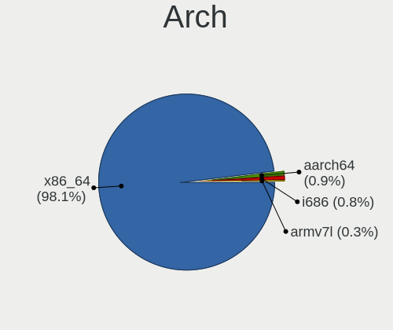

| Name    | Computers | Percent |
|---------|-----------|---------|
| x86_64  | 2175      | 98.06%  |
| i686    | 19        | 0.86%   |
| aarch64 | 17        | 0.77%   |
| armv7l  | 7         | 0.32%   |

DE
--

Desktop Environment

| Name             | Computers | Percent |
|------------------|-----------|---------|
| GNOME            | 976       | 42.32%  |
| KDE5             | 439       | 19.04%  |
| Unknown          | 250       | 10.84%  |
| X-Cinnamon       | 192       | 8.33%   |
| XFCE             | 162       | 7.03%   |
| MATE             | 61        | 2.65%   |
| KDE              | 41        | 1.78%   |
| Pantheon         | 31        | 1.34%   |
| Cinnamon         | 23        | 1%      |
| KDE4             | 20        | 0.87%   |
| Budgie           | 16        | 0.69%   |
| i3               | 15        | 0.65%   |
| LXQt             | 14        | 0.61%   |
| KDE6             | 10        | 0.43%   |
| Unity            | 9         | 0.39%   |
| LXDE             | 8         | 0.35%   |
| Deepin           | 6         | 0.26%   |
| awesome          | 6         | 0.26%   |
| sway             | 5         | 0.22%   |
| GNOME Flashback  | 4         | 0.17%   |
| xmonad           | 3         | 0.13%   |
| qtile            | 2         | 0.09%   |
| lightdm-xsession | 2         | 0.09%   |
| Hyprland         | 2         | 0.09%   |
| fluxbox          | 2         | 0.09%   |
| openbox          | 1         | 0.04%   |
| leftwm           | 1         | 0.04%   |
| GNOME Classic    | 1         | 0.04%   |
| gamescope        | 1         | 0.04%   |
| Enlightenment    | 1         | 0.04%   |
| DWM              | 1         | 0.04%   |
| Bspwm            | 1         | 0.04%   |

Display Server
--------------

X11 or Wayland

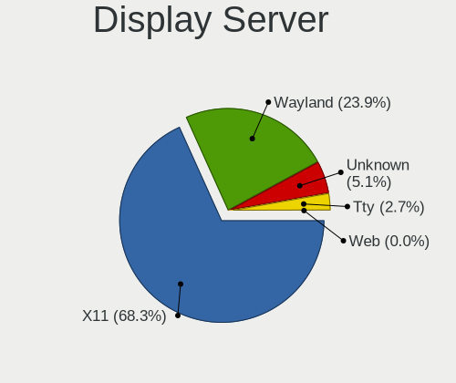

| Name    | Computers | Percent |
|---------|-----------|---------|
| X11     | 1661      | 72.25%  |
| Wayland | 454       | 19.75%  |
| Unknown | 127       | 5.52%   |
| Tty     | 56        | 2.44%   |
| Web     | 1         | 0.04%   |

Display Manager
---------------

SDDM, LightDM, etc.

| Name    | Computers | Percent |
|---------|-----------|---------|
| Unknown | 1023      | 44.27%  |
| SDDM    | 388       | 16.79%  |
| GDM3    | 309       | 13.37%  |
| LightDM | 270       | 11.68%  |
| GDM     | 241       | 10.43%  |
| TDM     | 50        | 2.16%   |
| KDM     | 20        | 0.87%   |
| SLiM    | 5         | 0.22%   |
| XDM     | 2         | 0.09%   |
| LXDM    | 2         | 0.09%   |
| MDM     | 1         | 0.04%   |

OS Lang
-------

Language

| Lang       | Computers | Percent |
|------------|-----------|---------|
| de_AT      | 830       | 36.26%  |
| en_US      | 664       | 29.01%  |
| de_DE      | 324       | 14.15%  |
| Unknown    | 230       | 10.05%  |
| en_GB      | 95        | 4.15%   |
| C          | 45        | 1.97%   |
| en_IE      | 18        | 0.79%   |
| pl_PL      | 9         | 0.39%   |
| it_IT      | 8         | 0.35%   |
| es_ES      | 8         | 0.35%   |
| ru_RU      | 6         | 0.26%   |
| en_AT      | 5         | 0.22%   |
| POSIX      | 4         | 0.17%   |
| de_CH      | 4         | 0.17%   |
| uk_UA      | 3         | 0.13%   |
| tr_TR      | 3         | 0.13%   |
| hu_HU      | 3         | 0.13%   |
| nl_BE      | 2         | 0.09%   |
| en_DE      | 2         | 0.09%   |
| en_CA      | 2         | 0.09%   |
| en_AU      | 2         | 0.09%   |
| de_AT.UTF8 | 2         | 0.09%   |
| cs_CZ      | 2         | 0.09%   |
| C.UTF8     | 2         | 0.09%   |
| sv_SE      | 1         | 0.04%   |
| sr_RS      | 1         | 0.04%   |
| sk_SK      | 1         | 0.04%   |
| ru_UA      | 1         | 0.04%   |
| ro_RO      | 1         | 0.04%   |
| pt_BR      | 1         | 0.04%   |
| nl_NL      | 1         | 0.04%   |
| hr_HR      | 1         | 0.04%   |
| fr_FR      | 1         | 0.04%   |
| fa_IR      | 1         | 0.04%   |
| en_US.UTF8 | 1         | 0.04%   |
| en         | 1         | 0.04%   |
| de_LU      | 1         | 0.04%   |
| de_LI      | 1         | 0.04%   |
| da_DK      | 1         | 0.04%   |
| bg_BG      | 1         | 0.04%   |

Boot Mode
---------

EFI or BIOS

| Mode | Computers | Percent |
|------|-----------|---------|
| EFI  | 1205      | 52.92%  |
| BIOS | 1072      | 47.08%  |

Filesystem
----------

Type of filesystem

| Type    | Computers | Percent |
|---------|-----------|---------|
| Ext4    | 1602      | 70.11%  |
| Btrfs   | 282       | 12.34%  |
| Overlay | 203       | 8.88%   |
| Tmpfs   | 81        | 3.54%   |
| Unknown | 62        | 2.71%   |
| Xfs     | 26        | 1.14%   |
| Zfs     | 16        | 0.7%    |
| Ext2    | 6         | 0.26%   |
| F2fs    | 2         | 0.09%   |
| Ext3    | 2         | 0.09%   |
| XXXXXXX | 1         | 0.04%   |
| Nfs     | 1         | 0.04%   |
| Aufs    | 1         | 0.04%   |

Part. scheme
------------

Scheme of partitioning

| Type    | Computers | Percent |
|---------|-----------|---------|
| Unknown | 1044      | 45.77%  |
| GPT     | 1015      | 44.5%   |
| MBR     | 222       | 9.73%   |

Dual Boot with Linux/BSD
------------------------

Hosting more than one Linux/BSD

| Dual boot | Computers | Percent |
|-----------|-----------|---------|
| No        | 1913      | 84.46%  |
| Yes       | 352       | 15.54%  |

Dual Boot (Win)
---------------

Hosting Linux and Windows

| Dual boot | Computers | Percent |
|-----------|-----------|---------|
| No        | 1570      | 69.38%  |
| Yes       | 693       | 30.62%  |

Board
-----

Vendor
------

Motherboard manufacturer

| Name                                 | Computers | Percent |
|--------------------------------------|-----------|---------|
| Lenovo                               | 397       | 17.91%  |
| ASUSTek Computer                     | 394       | 17.77%  |
| Hewlett-Packard                      | 313       | 14.12%  |
| MSI                                  | 161       | 7.26%   |
| Dell                                 | 156       | 7.04%   |
| Acer                                 | 123       | 5.55%   |
| Gigabyte Technology                  | 109       | 4.92%   |
| ASRock                               | 97        | 4.38%   |
| Medion                               | 56        | 2.53%   |
| Apple                                | 53        | 2.39%   |
| Toshiba                              | 29        | 1.31%   |
| Intel                                | 27        | 1.22%   |
| Fujitsu                              | 25        | 1.13%   |
| TUXEDO                               | 23        | 1.04%   |
| Sony                                 | 20        | 0.9%    |
| Unknown                              | 18        | 0.81%   |
| Valve                                | 15        | 0.68%   |
| Raspberry Pi Foundation              | 15        | 0.68%   |
| HUAWEI                               | 14        | 0.63%   |
| Samsung Electronics                  | 11        | 0.5%    |
| Microsoft                            | 10        | 0.45%   |
| Biostar                              | 9         | 0.41%   |
| TrekStor                             | 8         | 0.36%   |
| Notebook                             | 7         | 0.32%   |
| Fujitsu Siemens                      | 6         | 0.27%   |
| Foxconn                              | 6         | 0.27%   |
| ZOTAC                                | 5         | 0.23%   |
| Supermicro                           | 5         | 0.23%   |
| Shuttle                              | 5         | 0.23%   |
| Shenzhen Meigao Electronic Equipment | 5         | 0.23%   |
| BESSTAR Tech                         | 5         | 0.23%   |
| AMI                                  | 5         | 0.23%   |
| Schenker                             | 4         | 0.18%   |
| Razer                                | 4         | 0.18%   |
| Hampoo                               | 4         | 0.18%   |
| Clevo                                | 4         | 0.18%   |
| Wortmann AG                          | 3         | 0.14%   |
| VALE                                 | 3         | 0.14%   |
| Pegatron                             | 3         | 0.14%   |
| Packard Bell                         | 3         | 0.14%   |

Model
-----

Motherboard model

| Name                               | Computers | Percent |
|------------------------------------|-----------|---------|
| ASUS All Series                    | 28        | 1.26%   |
| Unknown                            | 25        | 1.13%   |
| MSI MS-7C37                        | 16        | 0.72%   |
| Valve Jupiter                      | 14        | 0.63%   |
| ASUS H110M-A                       | 10        | 0.45%   |
| ASUS ROG STRIX B550-F GAMING       | 9         | 0.41%   |
| MSI MS-7B86                        | 8         | 0.36%   |
| MSI MS-7B79                        | 8         | 0.36%   |
| ASUS PRIME B450-PLUS               | 8         | 0.36%   |
| Apple MacBookPro15,1               | 8         | 0.36%   |
| HP EliteBook 8570p                 | 7         | 0.32%   |
| MSI MS-7C91                        | 6         | 0.27%   |
| HP Notebook                        | 6         | 0.27%   |
| HP EliteBook 840 G3                | 6         | 0.27%   |
| ASRock Z87 Killer                  | 6         | 0.27%   |
| Apple MacBookPro8,1                | 6         | 0.27%   |
| RPi Raspberry Pi 4 Model B Rev 1.1 | 5         | 0.23%   |
| Lenovo IdeaPad 5 15ARE05 81YQ      | 5         | 0.23%   |
| HP Pavilion dv6                    | 5         | 0.23%   |
| HP EliteBook 8460p                 | 5         | 0.23%   |
| HP EliteBook 840 G6                | 5         | 0.23%   |
| Dell XPS 15 9570                   | 5         | 0.23%   |
| ASUS TUF Gaming X570-PLUS          | 5         | 0.23%   |
| ASUS TUF Gaming B550-PLUS          | 5         | 0.23%   |
| ASUS ROG STRIX B450-F GAMING       | 5         | 0.23%   |
| Apple MacBookPro9,2                | 5         | 0.23%   |
| TrekStor Notebook Slim S130        | 4         | 0.18%   |
| Toshiba Satellite C70D-B           | 4         | 0.18%   |
| RPi Raspberry Pi                   | 4         | 0.18%   |
| MSI MS-7971                        | 4         | 0.18%   |
| Lenovo Yoga Slim 7 14ARE05 82A2    | 4         | 0.18%   |
| Lenovo IdeaPad 700-15ISK 80RU      | 4         | 0.18%   |
| HP Pavilion dv7                    | 4         | 0.18%   |
| HP ENVY x360 Convertible 15-ee0xxx | 4         | 0.18%   |
| HP EliteDesk 800 G1 SFF            | 4         | 0.18%   |
| HP EliteBook 840 G8 Notebook PC    | 4         | 0.18%   |
| HP EliteBook 840 G1                | 4         | 0.18%   |
| HP EliteBook 6930p                 | 4         | 0.18%   |
| HP Compaq 8200 Elite SFF PC        | 4         | 0.18%   |
| Dell Latitude E7450                | 4         | 0.18%   |

Model Family
------------

Motherboard model prefix

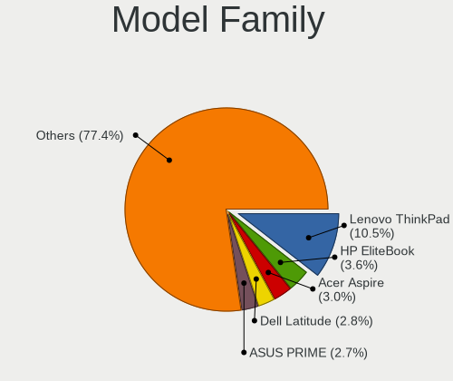

| Name               | Computers | Percent |
|--------------------|-----------|---------|
| Lenovo ThinkPad    | 232       | 10.46%  |
| HP EliteBook       | 82        | 3.7%    |
| Acer Aspire        | 69        | 3.11%   |
| ASUS PRIME         | 59        | 2.66%   |
| Dell Latitude      | 56        | 2.53%   |
| ASUS ROG           | 52        | 2.35%   |
| HP Pavilion        | 38        | 1.71%   |
| Lenovo IdeaPad     | 37        | 1.67%   |
| HP ProBook         | 37        | 1.67%   |
| Dell XPS           | 34        | 1.53%   |
| Lenovo Yoga        | 29        | 1.31%   |
| ASUS All           | 28        | 1.26%   |
| Toshiba Satellite  | 26        | 1.17%   |
| HP Compaq          | 26        | 1.17%   |
| Unknown            | 25        | 1.13%   |
| ASUS TUF           | 21        | 0.95%   |
| Lenovo ThinkCentre | 20        | 0.9%    |
| ASUS VivoBook      | 20        | 0.9%    |
| Dell Precision     | 17        | 0.77%   |
| Dell OptiPlex      | 17        | 0.77%   |
| Dell Inspiron      | 17        | 0.77%   |
| MSI MS-7C37        | 16        | 0.72%   |
| RPi Raspberry      | 15        | 0.68%   |
| HP ZBook           | 15        | 0.68%   |
| HP ENVY            | 15        | 0.68%   |
| Valve Jupiter      | 14        | 0.63%   |
| Fujitsu LIFEBOOK   | 14        | 0.63%   |
| Lenovo ThinkBook   | 13        | 0.59%   |
| HP Laptop          | 12        | 0.54%   |
| Gigabyte X570      | 12        | 0.54%   |
| Acer TravelMate    | 11        | 0.5%    |
| Microsoft Surface  | 10        | 0.45%   |
| Lenovo Legion      | 10        | 0.45%   |
| HP EliteDesk       | 10        | 0.45%   |
| ASUS H110M-A       | 10        | 0.45%   |
| Acer Swift         | 10        | 0.45%   |
| Acer Nitro         | 9         | 0.41%   |
| MSI MS-7B86        | 8         | 0.36%   |
| MSI MS-7B79        | 8         | 0.36%   |
| Gigabyte B550      | 8         | 0.36%   |

MFG Year
--------

Motherboard manufacture year

| Year    | Computers | Percent |
|---------|-----------|---------|
| 2020    | 261       | 11.77%  |
| 2018    | 202       | 9.11%   |
| 2019    | 199       | 8.98%   |
| 2021    | 163       | 7.35%   |
| 2012    | 162       | 7.31%   |
| 2011    | 147       | 6.63%   |
| 2017    | 141       | 6.36%   |
| 2013    | 138       | 6.22%   |
| 2015    | 126       | 5.68%   |
| 2014    | 123       | 5.55%   |
| 2016    | 119       | 5.37%   |
| 2022    | 84        | 3.79%   |
| 2010    | 80        | 3.61%   |
| 2009    | 73        | 3.29%   |
| 2008    | 67        | 3.02%   |
| 2023    | 57        | 2.57%   |
| 2007    | 39        | 1.76%   |
| Unknown | 19        | 0.86%   |
| 2006    | 12        | 0.54%   |
| 2005    | 3         | 0.14%   |
| 2024    | 2         | 0.09%   |

Form Factor
-----------

Physical design of the computer

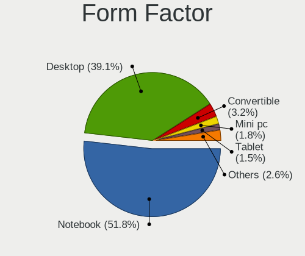

| Name           | Computers | Percent |
|----------------|-----------|---------|
| Notebook       | 1167      | 52.64%  |
| Desktop        | 855       | 38.57%  |
| Convertible    | 71        | 3.2%    |
| Mini pc        | 41        | 1.85%   |
| Tablet         | 30        | 1.35%   |
| System on chip | 24        | 1.08%   |
| Server         | 22        | 0.99%   |
| All in one     | 7         | 0.32%   |

Secure Boot
-----------

Enabled or disabled

| State    | Computers | Percent |
|----------|-----------|---------|
| Disabled | 2046      | 91.38%  |
| Enabled  | 193       | 8.62%   |

Coreboot
--------

Have coreboot on board

| Used | Computers | Percent |
|------|-----------|---------|
| No   | 2212      | 99.77%  |
| Yes  | 5         | 0.23%   |

RAM Size
--------

Total RAM memory

| Size in GB      | Computers | Percent |
|-----------------|-----------|---------|
| 16.01-24.0      | 508       | 22.69%  |
| 4.01-8.0        | 460       | 20.54%  |
| 8.01-16.0       | 406       | 18.13%  |
| 3.01-4.0        | 319       | 14.25%  |
| 32.01-64.0      | 310       | 13.85%  |
| 64.01-256.0     | 94        | 4.2%    |
| 24.01-32.0      | 54        | 2.41%   |
| 1.01-2.0        | 51        | 2.28%   |
| 2.01-3.0        | 15        | 0.67%   |
| 0.51-1.0        | 13        | 0.58%   |
| More than 256.0 | 8         | 0.36%   |
| Unknown         | 1         | 0.04%   |

RAM Used
--------

Used RAM memory

| Used GB    | Computers | Percent |
|------------|-----------|---------|
| 1.01-2.0   | 778       | 31.33%  |
| 2.01-3.0   | 618       | 24.89%  |
| 4.01-8.0   | 424       | 17.08%  |
| 3.01-4.0   | 320       | 12.89%  |
| 8.01-16.0  | 140       | 5.64%   |
| 0.51-1.0   | 126       | 5.07%   |
| 16.01-24.0 | 30        | 1.21%   |
| 0.01-0.5   | 22        | 0.89%   |
| 24.01-32.0 | 14        | 0.56%   |
| 32.01-64.0 | 10        | 0.4%    |
| Unknown    | 1         | 0.04%   |

Total Drives
------------

Number of drives on board

| Drives | Computers | Percent |
|--------|-----------|---------|
| 1      | 1288      | 55.98%  |
| 2      | 571       | 24.82%  |
| 3      | 215       | 9.34%   |
| 4      | 102       | 4.43%   |
| 5      | 45        | 1.96%   |
| 6      | 27        | 1.17%   |
| 7      | 11        | 0.48%   |
| 0      | 11        | 0.48%   |
| 9      | 10        | 0.43%   |
| 10     | 8         | 0.35%   |
| 11     | 4         | 0.17%   |
| 8      | 4         | 0.17%   |
| 12     | 3         | 0.13%   |
| 18     | 2         | 0.09%   |

Has CD-ROM
----------

Has CD-ROM on board

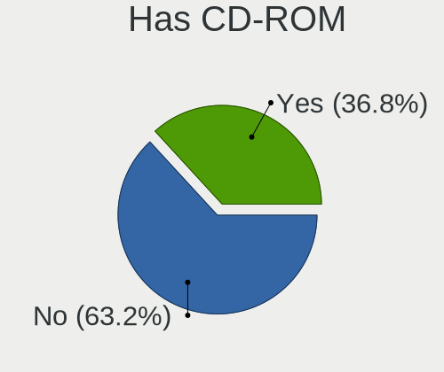

| Presented | Computers | Percent |
|-----------|-----------|---------|
| No        | 1393      | 62.44%  |
| Yes       | 838       | 37.56%  |

Has Ethernet
------------

Has Ethernet on board

| Presented | Computers | Percent |
|-----------|-----------|---------|
| Yes       | 1910      | 85.84%  |
| No        | 315       | 14.16%  |

Has WiFi
--------

Has WiFi module

| Presented | Computers | Percent |
|-----------|-----------|---------|
| Yes       | 1687      | 75.72%  |
| No        | 541       | 24.28%  |

Has Bluetooth
-------------

Has Bluetooth module

| Presented | Computers | Percent |
|-----------|-----------|---------|
| Yes       | 1359      | 61%     |
| No        | 869       | 39%     |

Location
--------

Country
-------

Geographic location (country)

| Country | Computers | Percent |
|---------|-----------|---------|
| Austria | 2217      | 100%    |

City
----

Geographic location (city)

| City             | Computers | Percent |
|------------------|-----------|---------|
| Vienna           | 1262      | 53.63%  |
| Graz             | 127       | 5.4%    |
| Linz             | 71        | 3.02%   |
| Innsbruck        | 71        | 3.02%   |
| Salzburg         | 54        | 2.29%   |
| Bad Hall         | 31        | 1.32%   |
| Sankt Plten    | 26        | 1.1%    |
| Klagenfurt       | 25        | 1.06%   |
| Wels             | 21        | 0.89%   |
| Dornbirn         | 18        | 0.76%   |
| Steyr            | 16        | 0.68%   |
| Wiener Neustadt  | 15        | 0.64%   |
| Leonding         | 15        | 0.64%   |
| Feldkirch        | 12        | 0.51%   |
| Villach          | 10        | 0.42%   |
| Perg             | 10        | 0.42%   |
| Baden bei Wien   | 9         | 0.38%   |
| Wrgl           | 8         | 0.34%   |
| Traun            | 8         | 0.34%   |
| Hallein          | 8         | 0.34%   |
| Korneuburg       | 7         | 0.3%    |
| Falkenstein      | 7         | 0.3%    |
| Bregenz          | 6         | 0.25%   |
| Zell am See      | 5         | 0.21%   |
| Traunkirchen     | 5         | 0.21%   |
| Schwechat        | 5         | 0.21%   |
| Perchtoldsdorf   | 5         | 0.21%   |
| Mautern          | 5         | 0.21%   |
| Lustenau         | 5         | 0.21%   |
| Klosterneuburg   | 5         | 0.21%   |
| Gleisdorf        | 5         | 0.21%   |
| Gaenserndorf     | 5         | 0.21%   |
| Brunn am Gebirge | 5         | 0.21%   |
| Zirl             | 4         | 0.17%   |
| Voecklabruck     | 4         | 0.17%   |
| Umhausen         | 4         | 0.17%   |
| Seiersberg       | 4         | 0.17%   |
| Ried im Innkreis | 4         | 0.17%   |
| Mdling         | 4         | 0.17%   |
| Mauthausen       | 4         | 0.17%   |

Drives
------

Drive Vendor
------------

Hard drive vendors

| Vendor                      | Computers | Drives | Percent |
|-----------------------------|-----------|--------|---------|
| Samsung Electronics         | 774       | 1285   | 22.66%  |
| Seagate                     | 369       | 577    | 10.81%  |
| WDC                         | 352       | 570    | 10.31%  |
| SanDisk                     | 313       | 444    | 9.17%   |
| Toshiba                     | 193       | 314    | 5.65%   |
| Kingston                    | 156       | 204    | 4.57%   |
| Crucial                     | 151       | 253    | 4.42%   |
| Unknown                     | 147       | 227    | 4.3%    |
| Intel                       | 87        | 111    | 2.55%   |
| SK hynix                    | 86        | 123    | 2.52%   |
| Intenso                     | 73        | 89     | 2.14%   |
| Hitachi                     | 71        | 85     | 2.08%   |
| Micron Technology           | 57        | 73     | 1.67%   |
| HGST                        | 47        | 78     | 1.38%   |
| Micron/Crucial Technology   | 34        | 41     | 1%      |
| Transcend                   | 33        | 40     | 0.97%   |
| KIOXIA                      | 30        | 47     | 0.88%   |
| Phison                      | 27        | 38     | 0.79%   |
| Apple                       | 26        | 39     | 0.76%   |
| China                       | 24        | 31     | 0.7%    |
| A-DATA Technology           | 23        | 31     | 0.67%   |
| Phison Electronics          | 20        | 24     | 0.59%   |
| Kingston Technology Company | 18        | 23     | 0.53%   |
| OCZ                         | 15        | 25     | 0.44%   |
| Corsair                     | 13        | 16     | 0.38%   |
| Unknown                     | 13        | 19     | 0.38%   |
| Silicon Motion              | 12        | 15     | 0.35%   |
| Patriot                     | 12        | 15     | 0.35%   |
| ASMT                        | 12        | 20     | 0.35%   |
| SABRENT                     | 10        | 11     | 0.29%   |
| LITEON                      | 10        | 11     | 0.29%   |
| JMicron Technology          | 10        | 24     | 0.29%   |
| LITEONIT                    | 8         | 11     | 0.23%   |
| INNOVATION IT               | 8         | 10     | 0.23%   |
| Hewlett-Packard             | 7         | 14     | 0.2%    |
| Verbatim                    | 6         | 6      | 0.18%   |
| PNY                         | 6         | 7      | 0.18%   |
| Apacer                      | 6         | 9      | 0.18%   |
| USB                         | 5         | 6      | 0.15%   |
| SPCC                        | 5         | 21     | 0.15%   |

Drive Model
-----------

Hard drive models

| Model                                              | Computers | Percent |
|----------------------------------------------------|-----------|---------|
| Samsung NVMe SSD Controller SM981/PM981/PM983 1TB  | 54        | 1.4%    |
| Samsung SSD 850 EVO 250GB                          | 39        | 1.01%   |
| Samsung SSD 850 EVO 500GB                          | 35        | 0.91%   |
| Samsung SSD 860 EVO 500GB                          | 33        | 0.85%   |
| Unknown MMC Card  64GB                             | 31        | 0.8%    |
| Samsung NVMe SSD Drive 512GB                       | 27        | 0.7%    |
| Crucial CT500MX500SSD1 500GB                       | 26        | 0.67%   |
| SanDisk SSD PLUS 240GB                             | 24        | 0.62%   |
| Seagate Expansion 2TB                              | 23        | 0.59%   |
| Samsung SSD 860 EVO 1TB                            | 23        | 0.59%   |
| Samsung SSD 850 PRO 256GB                          | 23        | 0.59%   |
| Samsung SSD 840 EVO 250GB                          | 23        | 0.59%   |
| SanDisk SSD PLUS 1000GB                            | 21        | 0.54%   |
| Samsung NVMe SSD Controller PM9A1/PM9A3/980PRO 1TB | 21        | 0.54%   |
| Crucial CT1000MX500SSD1 1TB                        | 21        | 0.54%   |
| Samsung SSD 860 EVO 250GB                          | 19        | 0.49%   |
| Toshiba MQ01ABD100 1TB                             | 18        | 0.47%   |
| Samsung SSD 980 PRO 1TB                            | 18        | 0.47%   |
| Samsung SSD 970 EVO Plus 1TB                       | 18        | 0.47%   |
| Samsung NVMe SSD Drive 500GB                       | 18        | 0.47%   |
| Samsung NVMe SSD Drive 1TB                         | 18        | 0.47%   |
| Toshiba DT01ACA200 2TB                             | 17        | 0.44%   |
| Unknown MMC Card  32GB                             | 16        | 0.41%   |
| Kingston SUV400S37240G 240GB SSD                   | 16        | 0.41%   |
| SanDisk SSD PLUS 480GB                             | 15        | 0.39%   |
| SanDisk NVMe SSD Drive 1TB                         | 15        | 0.39%   |
| Kingston SA400S37240G 240GB SSD                    | 15        | 0.39%   |
| Crucial CT240BX500SSD1 240GB                       | 15        | 0.39%   |
| Unknown SD/MMC/MS PRO 128GB                        | 14        | 0.36%   |
| Kingston SA400S37120G 120GB SSD                    | 14        | 0.36%   |
| Toshiba MQ04ABF100 1TB                             | 13        | 0.34%   |
| Toshiba HDWD110 1TB                                | 13        | 0.34%   |
| Toshiba DT01ACA100 1TB                             | 13        | 0.34%   |
| Seagate ST4000VN008-2DR166 4TB                     | 13        | 0.34%   |
| Seagate ST2000DM008-2FR102 2TB                     | 13        | 0.34%   |
| Seagate ST1000LM024 HN-M101MBB 1TB                 | 13        | 0.34%   |
| SanDisk SDSSDH3 1T00 1TB                           | 13        | 0.34%   |
| SanDisk NVMe SSD Drive 512GB                       | 13        | 0.34%   |
| Samsung SSD 870 EVO 1TB                            | 13        | 0.34%   |
| Samsung SSD 860 QVO 1TB                            | 13        | 0.34%   |

HDD Vendor
----------

Hard disk drive vendors

| Vendor              | Computers | Drives | Percent |
|---------------------|-----------|--------|---------|
| Seagate             | 357       | 550    | 34.33%  |
| WDC                 | 277       | 453    | 26.63%  |
| Toshiba             | 144       | 229    | 13.85%  |
| Hitachi             | 71        | 85     | 6.83%   |
| Samsung Electronics | 64        | 92     | 6.15%   |
| HGST                | 47        | 78     | 4.52%   |
| Unknown             | 15        | 23     | 1.44%   |
| Intenso             | 15        | 15     | 1.44%   |
| SABRENT             | 10        | 11     | 0.96%   |
| JMicron Technology  | 9         | 23     | 0.87%   |
| Maxtor              | 4         | 5      | 0.38%   |
| ASMT                | 4         | 10     | 0.38%   |
| LaCie               | 3         | 3      | 0.29%   |
| Hewlett-Packard     | 3         | 11     | 0.29%   |
| Apple               | 3         | 3      | 0.29%   |
| USB                 | 2         | 2      | 0.19%   |
| Fujitsu             | 2         | 2      | 0.19%   |
| WD MediaMax         | 1         | 1      | 0.1%    |
| TO Exter            | 1         | 3      | 0.1%    |
| Synology            | 1         | 8      | 0.1%    |
| Magnetic Data       | 1         | 1      | 0.1%    |
| Inateck             | 1         | 1      | 0.1%    |
| IBM-ESXS            | 1         | 2      | 0.1%    |
| IB-1122             | 1         | 1      | 0.1%    |
| IB                  | 1         | 2      | 0.1%    |
| Ext Hard            | 1         | 1      | 0.1%    |
| ASMedia             | 1         | 1      | 0.1%    |

SSD Vendor
----------

Solid state drive vendors

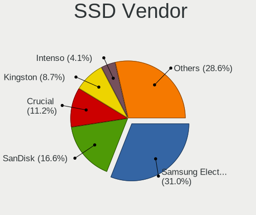

| Vendor              | Computers | Drives | Percent |
|---------------------|-----------|--------|---------|
| Samsung Electronics | 403       | 621    | 31.14%  |
| SanDisk             | 221       | 317    | 17.08%  |
| Crucial             | 136       | 218    | 10.51%  |
| Kingston            | 113       | 140    | 8.73%   |
| Intenso             | 51        | 65     | 3.94%   |
| Intel               | 38        | 51     | 2.94%   |
| WDC                 | 31        | 40     | 2.4%    |
| Transcend           | 30        | 34     | 2.32%   |
| Micron Technology   | 27        | 37     | 2.09%   |
| China               | 24        | 31     | 1.85%   |
| SK hynix            | 23        | 38     | 1.78%   |
| A-DATA Technology   | 17        | 23     | 1.31%   |
| OCZ                 | 15        | 25     | 1.16%   |
| Apple               | 12        | 13     | 0.93%   |
| Toshiba             | 10        | 12     | 0.77%   |
| LITEON              | 10        | 11     | 0.77%   |
| Corsair             | 9         | 9      | 0.7%    |
| Patriot             | 8         | 8      | 0.62%   |
| LITEONIT            | 8         | 11     | 0.62%   |
| INNOVATION IT       | 8         | 10     | 0.62%   |
| ASMT                | 6         | 6      | 0.46%   |
| GOODRAM             | 5         | 5      | 0.39%   |
| Apacer              | 5         | 6      | 0.39%   |
| Verbatim            | 4         | 4      | 0.31%   |
| SPCC                | 4         | 4      | 0.31%   |
| PNY                 | 4         | 5      | 0.31%   |
| Phison              | 4         | 6      | 0.31%   |
| Unknown             | 3         | 4      | 0.23%   |
| Seagate             | 3         | 4      | 0.23%   |
| Plextor             | 3         | 3      | 0.23%   |
| KingDian            | 3         | 3      | 0.23%   |
| Hewlett-Packard     | 3         | 3      | 0.23%   |
| Fanxiang            | 3         | 3      | 0.23%   |
| BAITITON            | 3         | 4      | 0.23%   |
| Unknown             | 3         | 3      | 0.23%   |
| V7                  | 2         | 2      | 0.15%   |
| TrekStor            | 2         | 4      | 0.15%   |
| Teclast             | 2         | 2      | 0.15%   |
| TCSUNBOW            | 2         | 2      | 0.15%   |
| Netac               | 2         | 5      | 0.15%   |

Drive Kind
----------

HDD or SSD

| Kind    | Computers | Drives | Percent |
|---------|-----------|--------|---------|
| SSD     | 1105      | 1832   | 36.42%  |
| NVMe    | 893       | 1416   | 29.43%  |
| HDD     | 853       | 1616   | 28.11%  |
| MMC     | 133       | 201    | 4.38%   |
| Unknown | 50        | 105    | 1.65%   |

Drive Connector
---------------

SATA, SAS, NVMe, etc.

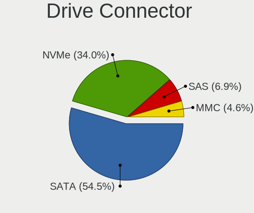

| Type | Computers | Drives | Percent |
|------|-----------|--------|---------|
| SATA | 1529      | 3249   | 56.01%  |
| NVMe | 892       | 1409   | 32.67%  |
| SAS  | 176       | 311    | 6.45%   |
| MMC  | 133       | 201    | 4.87%   |

Drive Size
----------

Size of hard drive

| Size in TB | Computers | Drives | Percent |
|------------|-----------|--------|---------|
| 0.01-0.5   | 1148      | 1900   | 54.67%  |
| 0.51-1.0   | 569       | 856    | 27.1%   |
| 1.01-2.0   | 191       | 328    | 9.1%    |
| 3.01-4.0   | 85        | 165    | 4.05%   |
| 4.01-10.0  | 52        | 97     | 2.48%   |
| 2.01-3.0   | 43        | 63     | 2.05%   |
| 10.01-20.0 | 12        | 39     | 0.57%   |

Space Total
-----------

Amount of disk space available on the file system

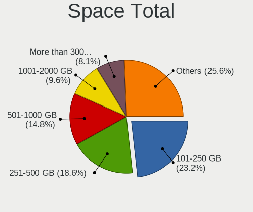

| Size in GB     | Computers | Percent |
|----------------|-----------|---------|
| 101-250        | 558       | 23.42%  |
| 251-500        | 453       | 19.01%  |
| 501-1000       | 356       | 14.94%  |
| 1001-2000      | 220       | 9.23%   |
| 1-20           | 181       | 7.6%    |
| More than 3000 | 170       | 7.13%   |
| 51-100         | 153       | 6.42%   |
| Unknown        | 119       | 4.99%   |
| 21-50          | 94        | 3.94%   |
| 2001-3000      | 79        | 3.32%   |

Space Used
----------

Amount of used disk space

| Used GB        | Computers | Percent |
|----------------|-----------|---------|
| 1-20           | 845       | 34.36%  |
| 21-50          | 390       | 15.86%  |
| 101-250        | 299       | 12.16%  |
| 51-100         | 234       | 9.52%   |
| 251-500        | 191       | 7.77%   |
| 501-1000       | 176       | 7.16%   |
| Unknown        | 119       | 4.84%   |
| 1001-2000      | 100       | 4.07%   |
| More than 3000 | 64        | 2.6%    |
| 2001-3000      | 41        | 1.67%   |

Malfunc. Drives
---------------

Drive models with a malfunction

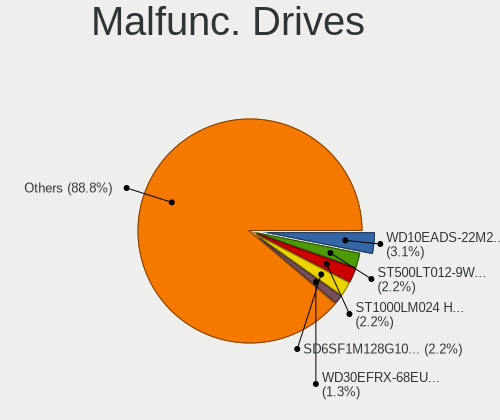

| Model                                        | Computers | Drives | Percent |
|----------------------------------------------|-----------|--------|---------|
| WDC WD10EADS-22M2B0 1TB                      | 7         | 7      | 3.52%   |
| Seagate ST1000LM024 HN-M101MBB 1TB           | 5         | 5      | 2.51%   |
| SanDisk SD6SF1M128G1022I 128GB SSD           | 5         | 5      | 2.51%   |
| Seagate ST500LT012-9WS142 500GB              | 4         | 8      | 2.01%   |
| WDC WD30EFRX-68EUZN0 3TB                     | 3         | 3      | 1.51%   |
| Toshiba MQ01ABF050 500GB                     | 3         | 4      | 1.51%   |
| Samsung Electronics HD103UJ 1TB              | 3         | 3      | 1.51%   |
| HGST HTS721010A9E630 1TB                     | 3         | 4      | 1.51%   |
| Seagate ST9250315AS 250GB                    | 2         | 2      | 1.01%   |
| Seagate ST9160412AS 160GB                    | 2         | 2      | 1.01%   |
| Seagate ST3500413AS 500GB                    | 2         | 2      | 1.01%   |
| SanDisk SSD PLUS 480GB                       | 2         | 2      | 1.01%   |
| Samsung Electronics SSD 840 Series 120GB     | 2         | 2      | 1.01%   |
| Samsung Electronics SSD 840 PRO Series 512GB | 2         | 3      | 1.01%   |
| Samsung Electronics HM500JI 500GB            | 2         | 2      | 1.01%   |
| Samsung Electronics HD753LJ 752GB            | 2         | 2      | 1.01%   |
| Kingston SA400S37240G 240GB SSD              | 2         | 2      | 1.01%   |
| Intel SSDSC2BF180A5L 180GB                   | 2         | 2      | 1.01%   |
| Hitachi HTS547575A9E384 752GB                | 2         | 2      | 1.01%   |
| HGST HTS725050A7E630 500GB                   | 2         | 14     | 1.01%   |
| WDC WD6400AACS-00G8B0 640GB                  | 1         | 1      | 0.5%    |
| WDC WD5000LPLX-00ZNTT0 500GB                 | 1         | 1      | 0.5%    |
| WDC WD5000AAKX-08U6AA0 500GB                 | 1         | 1      | 0.5%    |
| WDC WD5000AAKS-60Z1A0 500GB                  | 1         | 1      | 0.5%    |
| WDC WD5000AAKS-22A7B0 500GB                  | 1         | 1      | 0.5%    |
| WDC WD5000AAKS-00UU3A0 500GB                 | 1         | 1      | 0.5%    |
| WDC WD5000AAKS-00H2B0 500GB                  | 1         | 1      | 0.5%    |
| WDC WD5000AADS-00M2B0 500GB                  | 1         | 1      | 0.5%    |
| WDC WD3200BEVT-08A23T1 320GB                 | 1         | 1      | 0.5%    |
| WDC WD2500AAKX-603CA0 250GB                  | 1         | 1      | 0.5%    |
| WDC WD20EZRZ-00Z5HB0 2TB                     | 1         | 1      | 0.5%    |
| WDC WD20EZRX-22D8PB0 2TB                     | 1         | 1      | 0.5%    |
| WDC WD20EZRX-00D8PB0 2TB                     | 1         | 1      | 0.5%    |
| WDC WD20EFRX-68AX9N0 2TB                     | 1         | 17     | 0.5%    |
| WDC WD20EARS-00MVWB0 2TB                     | 1         | 4      | 0.5%    |
| WDC WD2003FYYS-02W0B1 2TB                    | 1         | 1      | 0.5%    |
| WDC WD2002FYPS-02W3B0 2TB                    | 1         | 1      | 0.5%    |
| WDC WD2000FYYZ-01UL1B1 2TB                   | 1         | 1      | 0.5%    |
| WDC WD1600BEVT-22ZCT0 160GB                  | 1         | 1      | 0.5%    |
| WDC WD10EZRX-00L4HB0 1TB                     | 1         | 1      | 0.5%    |

Malfunc. Drive Vendor
---------------------

Vendors of faulty drives

| Vendor                      | Computers | Drives | Percent |
|-----------------------------|-----------|--------|---------|
| Seagate                     | 39        | 62     | 20.53%  |
| WDC                         | 34        | 56     | 17.89%  |
| Samsung Electronics         | 28        | 34     | 14.74%  |
| Toshiba                     | 17        | 26     | 8.95%   |
| SanDisk                     | 15        | 16     | 7.89%   |
| Hitachi                     | 15        | 16     | 7.89%   |
| HGST                        | 8         | 21     | 4.21%   |
| Intel                       | 6         | 6      | 3.16%   |
| Kingston                    | 4         | 4      | 2.11%   |
| SK hynix                    | 3         | 13     | 1.58%   |
| OCZ                         | 2         | 4      | 1.05%   |
| LITEONIT                    | 2         | 3      | 1.05%   |
| Crucial                     | 2         | 2      | 1.05%   |
| TrekStor                    | 1         | 1      | 0.53%   |
| Transcend                   | 1         | 1      | 0.53%   |
| Patriot                     | 1         | 1      | 0.53%   |
| Micron Technology           | 1         | 1      | 0.53%   |
| Maxtor                      | 1         | 1      | 0.53%   |
| LITEON                      | 1         | 1      | 0.53%   |
| Kingston Technology Company | 1         | 1      | 0.53%   |
| Intenso                     | 1         | 1      | 0.53%   |
| HP Phison                   | 1         | 1      | 0.53%   |
| GOODRAM                     | 1         | 1      | 0.53%   |
| Fujitsu                     | 1         | 1      | 0.53%   |
| Corsair                     | 1         | 1      | 0.53%   |
| China                       | 1         | 1      | 0.53%   |
| BAITITON                    | 1         | 2      | 0.53%   |
| A-DATA Technology           | 1         | 3      | 0.53%   |

Malfunc. HDD Vendor
-------------------

Vendors of faulty HDD drives

| Vendor              | Computers | Drives | Percent |
|---------------------|-----------|--------|---------|
| Seagate             | 39        | 62     | 30.71%  |
| WDC                 | 34        | 56     | 26.77%  |
| Toshiba             | 16        | 25     | 12.6%   |
| Hitachi             | 15        | 16     | 11.81%  |
| Samsung Electronics | 13        | 14     | 10.24%  |
| HGST                | 8         | 21     | 6.3%    |
| Maxtor              | 1         | 1      | 0.79%   |
| Fujitsu             | 1         | 1      | 0.79%   |

Malfunc. Drive Kind
-------------------

Kinds of faulty drives

| Kind | Computers | Drives | Percent |
|------|-----------|--------|---------|
| HDD  | 118       | 196    | 65.19%  |
| SSD  | 52        | 73     | 28.73%  |
| NVMe | 11        | 12     | 6.08%   |

Failed Drives
-------------

Failed drive models

| Model                                            | Computers | Drives | Percent |
|--------------------------------------------------|-----------|--------|---------|
| WDC WD6400BEVT-22A0RT0 640GB                     | 1         | 1      | 33.33%  |
| Sandisk WD Black SN750 / PC SN730 NVMe SSD 512GB | 1         | 1      | 33.33%  |
| Samsung Electronics SSD 980 500GB                | 1         | 1      | 33.33%  |

Failed Drive Vendor
-------------------

Failed drive vendors

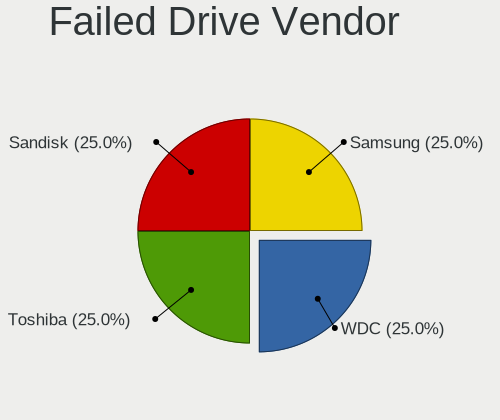

| Vendor              | Computers | Drives | Percent |
|---------------------|-----------|--------|---------|
| WDC                 | 1         | 1      | 33.33%  |
| Sandisk             | 1         | 1      | 33.33%  |
| Samsung Electronics | 1         | 1      | 33.33%  |

Drive Status
------------

Number of failed and malfunc. drives

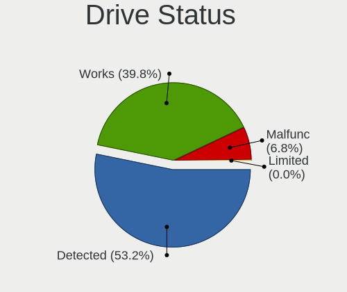

| Status   | Computers | Drives | Percent |
|----------|-----------|--------|---------|
| Detected | 1324      | 2781   | 53.71%  |
| Works    | 966       | 2104   | 39.19%  |
| Malfunc  | 171       | 281    | 6.94%   |
| Failed   | 3         | 3      | 0.12%   |
| Limited  | 1         | 1      | 0.04%   |

Storage controller
------------------

Storage Vendor
--------------

Storage controller vendors

| Vendor                                  | Computers | Percent |
|-----------------------------------------|-----------|---------|
| Intel                                   | 1341      | 44.98%  |
| AMD                                     | 464       | 15.57%  |
| Samsung Electronics                     | 393       | 13.18%  |
| SanDisk                                 | 143       | 4.8%    |
| ASMedia Technology                      | 79        | 2.65%   |
| SK hynix                                | 65        | 2.18%   |
| Kingston Technology Company             | 61        | 2.05%   |
| Phison Electronics                      | 52        | 1.74%   |
| Micron/Crucial Technology               | 49        | 1.64%   |
| Marvell Technology Group                | 44        | 1.48%   |
| Toshiba America Info Systems            | 43        | 1.44%   |
| JMicron Technology                      | 34        | 1.14%   |
| Micron Technology                       | 31        | 1.04%   |
| KIOXIA                                  | 27        | 0.91%   |
| Nvidia                                  | 26        | 0.87%   |
| Silicon Motion                          | 16        | 0.54%   |
| Broadcom / LSI                          | 13        | 0.44%   |
| LSI Logic / Symbios Logic               | 11        | 0.37%   |
| Apple                                   | 10        | 0.34%   |
| ADATA Technology                        | 10        | 0.34%   |
| Seagate Technology                      | 9         | 0.3%    |
| MAXIO Technology (Hangzhou)             | 9         | 0.3%    |
| Union Memory (Shenzhen)                 | 8         | 0.27%   |
| VIA Technologies                        | 7         | 0.23%   |
| Silicon Image                           | 5         | 0.17%   |
| Lenovo                                  | 5         | 0.17%   |
| Shenzhen Longsys Electronics            | 3         | 0.1%    |
| Realtek Semiconductor                   | 3         | 0.1%    |
| Solid State Storage Technology          | 2         | 0.07%   |
| OCZ Technology Group                    | 2         | 0.07%   |
| Lite-On IT Corp. / Plextor              | 2         | 0.07%   |
| Hewlett-Packard                         | 2         | 0.07%   |
| Adaptec                                 | 2         | 0.07%   |
| Transcend                               | 1         | 0.03%   |
| Solidigm                                | 1         | 0.03%   |
| Silicon Integrated Systems [SiS]        | 1         | 0.03%   |
| Shenzhen Unionmemory Information System | 1         | 0.03%   |
| O2 Micro                                | 1         | 0.03%   |
| Lite-On Technology                      | 1         | 0.03%   |
| Integrated Technology Express           | 1         | 0.03%   |

Storage Model
-------------

Storage controller models

| Model                                                                          | Computers | Percent |
|--------------------------------------------------------------------------------|-----------|---------|
| AMD FCH SATA Controller [AHCI mode]                                            | 292       | 8.67%   |
| Samsung NVMe SSD Controller SM981/PM981/PM983                                  | 194       | 5.76%   |
| Intel Sunrise Point-LP SATA Controller [AHCI mode]                             | 101       | 3%      |
| Intel 7 Series Chipset Family 6-port SATA Controller [AHCI mode]               | 90        | 2.67%   |
| Intel 8 Series/C220 Series Chipset Family 6-port SATA Controller 1 [AHCI mode] | 89        | 2.64%   |
| Intel 6 Series/C200 Series Chipset Family 6 port Mobile SATA AHCI Controller   | 83        | 2.47%   |
| Samsung NVMe SSD Controller 980 (DRAM-less)                                    | 74        | 2.2%    |
| Intel Q170/Q150/B150/H170/H110/Z170/CM236 Chipset SATA Controller [AHCI Mode]  | 72        | 2.14%   |
| AMD 400 Series Chipset SATA Controller                                         | 69        | 2.05%   |
| ASMedia ASM1061/ASM1062 Serial ATA Controller                                  | 68        | 2.02%   |
| Samsung NVMe SSD Controller PM9A1/PM9A3/980PRO                                 | 66        | 1.96%   |
| AMD 500 Series Chipset SATA Controller                                         | 63        | 1.87%   |
| Intel 82801 Mobile SATA Controller [RAID mode]                                 | 61        | 1.81%   |
| AMD SB7x0/SB8x0/SB9x0 SATA Controller [AHCI mode]                              | 52        | 1.54%   |
| Intel Volume Management Device NVMe RAID Controller                            | 46        | 1.37%   |
| Intel 8 Series SATA Controller 1 [AHCI mode]                                   | 46        | 1.37%   |
| Samsung NVMe SSD Controller SM961/PM961/SM963                                  | 44        | 1.31%   |
| Intel 6 Series/C200 Series Chipset Family 6 port Desktop SATA AHCI Controller  | 44        | 1.31%   |
| AMD SB7x0/SB8x0/SB9x0 IDE Controller                                           | 43        | 1.28%   |
| SanDisk Extreme Pro / WD Black SN750 / PC SN730 / Red SN700 NVMe SSD           | 42        | 1.25%   |
| Intel 200 Series PCH SATA controller [AHCI mode]                               | 42        | 1.25%   |
| Intel Wildcat Point-LP SATA Controller [AHCI Mode]                             | 38        | 1.13%   |
| Intel SATA Controller [RAID mode]                                              | 37        | 1.1%    |
| Intel 82801IBM/IEM (ICH9M/ICH9M-E) 4 port SATA Controller [AHCI mode]          | 37        | 1.1%    |
| Intel 7 Series/C210 Series Chipset Family 6-port SATA Controller [AHCI mode]   | 34        | 1.01%   |
| Intel Cannon Lake Mobile PCH SATA AHCI Controller                              | 30        | 0.89%   |
| Intel 5 Series/3400 Series Chipset 6 port SATA AHCI Controller                 | 28        | 0.83%   |
| Intel Comet Lake SATA AHCI Controller                                          | 27        | 0.8%    |
| Intel Cannon Lake PCH SATA AHCI Controller                                     | 27        | 0.8%    |
| SanDisk Ultra 3D / WD Blue SN550 NVMe SSD                                      | 26        | 0.77%   |
| Intel HM170/QM170 Chipset SATA Controller [AHCI Mode]                          | 25        | 0.74%   |
| Intel Celeron N3350/Pentium N4200/Atom E3900 Series SATA AHCI Controller       | 25        | 0.74%   |
| Intel Celeron/Pentium Silver Processor SATA Controller                         | 24        | 0.71%   |
| AMD SB7x0/SB8x0/SB9x0 SATA Controller [IDE mode]                               | 23        | 0.68%   |
| Phison E12 NVMe Controller                                                     | 22        | 0.65%   |
| JMicron JMB363 SATA/IDE Controller                                             | 22        | 0.65%   |
| Intel SSD 660P Series                                                          | 22        | 0.65%   |
| Intel 82801HM/HEM (ICH8M/ICH8M-E) IDE Controller                               | 22        | 0.65%   |
| Micron/Crucial P2 [Nick P2] / P3 / P3 Plus NVMe PCIe SSD (DRAM-less)           | 21        | 0.62%   |
| Toshiba America Info Systems XG6 NVMe SSD Controller                           | 20        | 0.59%   |

Storage Kind
------------

Kind of storage controller (IDE, SATA, NVMe, SAS, ...)

| Kind | Computers | Percent |
|------|-----------|---------|
| SATA | 1595      | 54.85%  |
| NVMe | 897       | 30.85%  |
| IDE  | 220       | 7.57%   |
| RAID | 179       | 6.16%   |
| SAS  | 9         | 0.31%   |
| SCSI | 8         | 0.28%   |

Processor
---------

CPU Vendor
----------

Processor vendors

| Vendor   | Computers | Percent |
|----------|-----------|---------|
| Intel    | 1590      | 71.72%  |
| AMD      | 603       | 27.2%   |
| ARM      | 23        | 1.04%   |
| Qualcomm | 1         | 0.05%   |

CPU Model
---------

Processor models

| Model                                       | Computers | Percent |
|---------------------------------------------|-----------|---------|
| Intel Core i5-8250U CPU @ 1.60GHz           | 28        | 1.26%   |
| Intel Core i7-8565U CPU @ 1.80GHz           | 26        | 1.17%   |
| Intel 11th Gen Core i7-1165G7 @ 2.80GHz     | 26        | 1.17%   |
| Intel 11th Gen Core i5-1135G7 @ 2.40GHz     | 25        | 1.13%   |
| AMD Ryzen 7 3700X 8-Core Processor          | 23        | 1.04%   |
| Intel Core i5-10210U CPU @ 1.60GHz          | 22        | 0.99%   |
| Intel Core i5-7200U CPU @ 2.50GHz           | 20        | 0.9%    |
| Intel Core i7-10510U CPU @ 1.80GHz          | 19        | 0.86%   |
| AMD Ryzen 5 3600 6-Core Processor           | 19        | 0.86%   |
| Intel Core i7-8550U CPU @ 1.80GHz           | 18        | 0.81%   |
| Intel Core i5-6200U CPU @ 2.30GHz           | 18        | 0.81%   |
| Intel Core i7-6700K CPU @ 4.00GHz           | 17        | 0.77%   |
| Intel Core i5-6300U CPU @ 2.40GHz           | 17        | 0.77%   |
| Intel Core i5-3320M CPU @ 2.60GHz           | 17        | 0.77%   |
| Intel Core i5-6600 CPU @ 3.30GHz            | 16        | 0.72%   |
| ARM Processor                               | 16        | 0.72%   |
| Intel Core i7-8750H CPU @ 2.20GHz           | 15        | 0.68%   |
| Intel Core i5-5200U CPU @ 2.20GHz           | 15        | 0.68%   |
| Intel Core i5-4210U CPU @ 1.70GHz           | 15        | 0.68%   |
| AMD Ryzen 7 5800X 8-Core Processor          | 15        | 0.68%   |
| AMD Custom APU 0405                         | 15        | 0.68%   |
| Intel Core i7-2670QM CPU @ 2.20GHz          | 14        | 0.63%   |
| Intel Core i7-1065G7 CPU @ 1.30GHz          | 14        | 0.63%   |
| Intel Core i7-7500U CPU @ 2.70GHz           | 13        | 0.59%   |
| Intel Core i5-2520M CPU @ 2.50GHz           | 13        | 0.59%   |
| AMD Ryzen 7 PRO 4750U with Radeon Graphics  | 13        | 0.59%   |
| AMD Ryzen 5 5600X 6-Core Processor          | 13        | 0.59%   |
| AMD Ryzen 5 4500U with Radeon Graphics      | 13        | 0.59%   |
| Intel Core i7-7700HQ CPU @ 2.80GHz          | 12        | 0.54%   |
| Intel Atom x5-Z8350 CPU @ 1.44GHz           | 12        | 0.54%   |
| AMD Ryzen 7 4700U with Radeon Graphics      | 12        | 0.54%   |
| Intel Core i7-9750H CPU @ 2.60GHz           | 11        | 0.5%    |
| Intel Core i7-8850H CPU @ 2.60GHz           | 11        | 0.5%    |
| Intel Core i7-7700K CPU @ 4.20GHz           | 11        | 0.5%    |
| Intel Core i5-8265U CPU @ 1.60GHz           | 11        | 0.5%    |
| Intel Core i5-4570 CPU @ 3.20GHz            | 11        | 0.5%    |
| AMD Ryzen 7 5800H with Radeon Graphics      | 11        | 0.5%    |
| AMD Ryzen 5 5500U with Radeon Graphics      | 11        | 0.5%    |
| AMD Ryzen 5 3400G with Radeon Vega Graphics | 11        | 0.5%    |
| AMD FX-8350 Eight-Core Processor            | 11        | 0.5%    |

CPU Model Family
----------------

Processor model prefix

| Model                   | Computers | Percent |
|-------------------------|-----------|---------|
| Intel Core i5           | 502       | 22.63%  |
| Intel Core i7           | 458       | 20.65%  |
| Other                   | 193       | 8.7%    |
| AMD Ryzen 7             | 145       | 6.54%   |
| AMD Ryzen 5             | 144       | 6.49%   |
| Intel Core i3           | 87        | 3.92%   |
| Intel Core 2 Duo        | 78        | 3.52%   |
| Intel Celeron           | 76        | 3.43%   |
| Intel Xeon              | 52        | 2.34%   |
| AMD Ryzen 9             | 50        | 2.25%   |
| Intel Pentium           | 41        | 1.85%   |
| Intel Atom              | 39        | 1.76%   |
| AMD FX                  | 33        | 1.49%   |
| Intel Core i9           | 29        | 1.31%   |
| AMD Ryzen 7 PRO         | 29        | 1.31%   |
| AMD Ryzen 3             | 22        | 0.99%   |
| AMD A8                  | 21        | 0.95%   |
| Intel Pentium Dual-Core | 17        | 0.77%   |
| AMD Phenom II X4        | 15        | 0.68%   |
| Intel Core 2 Quad       | 13        | 0.59%   |
| AMD A10                 | 13        | 0.59%   |
| Intel Core 2            | 10        | 0.45%   |
| AMD Ryzen 5 PRO         | 10        | 0.45%   |
| AMD A6                  | 10        | 0.45%   |
| AMD A4                  | 10        | 0.45%   |
| Intel Pentium Silver    | 9         | 0.41%   |
| AMD Phenom II X6        | 8         | 0.36%   |
| AMD E                   | 7         | 0.32%   |
| AMD Athlon              | 7         | 0.32%   |
| AMD E2                  | 6         | 0.27%   |
| AMD Athlon II X4        | 6         | 0.27%   |
| AMD Athlon 64 X2        | 6         | 0.27%   |
| Intel Xeon Silver       | 5         | 0.23%   |
| Intel Genuine           | 5         | 0.23%   |
| ARM BCM                 | 5         | 0.23%   |
| AMD Ryzen Threadripper  | 5         | 0.23%   |
| AMD Athlon II           | 5         | 0.23%   |
| AMD E1                  | 4         | 0.18%   |
| AMD Athlon II X2        | 4         | 0.18%   |
| Intel Pentium Dual      | 3         | 0.14%   |

CPU Cores
---------

Number of processor cores

| Number  | Computers | Percent |
|---------|-----------|---------|
| 4       | 861       | 38.75%  |
| 2       | 709       | 31.91%  |
| 8       | 238       | 10.71%  |
| 6       | 237       | 10.67%  |
| 12      | 40        | 1.8%    |
| 16      | 37        | 1.67%   |
| 10      | 26        | 1.17%   |
| 1       | 22        | 0.99%   |
| 14      | 19        | 0.86%   |
| Unknown | 10        | 0.45%   |
| 3       | 7         | 0.32%   |
| 20      | 6         | 0.27%   |
| 24      | 5         | 0.23%   |
| 64      | 1         | 0.05%   |
| 48      | 1         | 0.05%   |
| 40      | 1         | 0.05%   |
| 28      | 1         | 0.05%   |
| 5       | 1         | 0.05%   |

CPU Sockets
-----------

Number of sockets

| Number  | Computers | Percent |
|---------|-----------|---------|
| 1       | 2190      | 98.74%  |
| 2       | 22        | 0.99%   |
| Unknown | 6         | 0.27%   |

CPU Threads
-----------

Threads per core (Hyper-Threading)

| Number  | Computers | Percent |
|---------|-----------|---------|
| 2       | 1567      | 70.49%  |
| 1       | 646       | 29.06%  |
| Unknown | 10        | 0.45%   |

CPU Op-Modes
------------

CPU Operation Modes (32-bit, 64-bit)

| Op mode        | Computers | Percent |
|----------------|-----------|---------|
| 32-bit, 64-bit | 2170      | 97.84%  |
| Unknown        | 38        | 1.71%   |
| 32-bit         | 9         | 0.41%   |
| 64-bit         | 1         | 0.05%   |

CPU Microcode
-------------

Microcode number

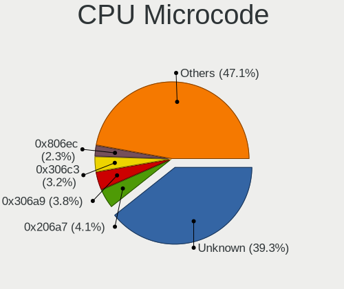

| Number     | Computers | Percent |
|------------|-----------|---------|
| Unknown    | 751       | 32.36%  |
| 0x206a7    | 107       | 4.61%   |
| 0x306a9    | 101       | 4.35%   |
| 0x306c3    | 83        | 3.58%   |
| 0x806ec    | 61        | 2.63%   |
| 0x506e3    | 51        | 2.2%    |
| 0x1067a    | 50        | 2.15%   |
| 0x806ea    | 47        | 2.02%   |
| 0x906ea    | 44        | 1.9%    |
| 0x806c1    | 44        | 1.9%    |
| 0x406e3    | 38        | 1.64%   |
| 0x306d4    | 38        | 1.64%   |
| 0x40651    | 35        | 1.51%   |
| 0x906e9    | 33        | 1.42%   |
| 0x08701021 | 33        | 1.42%   |
| 0x806e9    | 30        | 1.29%   |
| 0x0a50000c | 29        | 1.25%   |
| 0x08600106 | 27        | 1.16%   |
| 0x08108109 | 20        | 0.86%   |
| 0x010000c8 | 20        | 0.86%   |
| 0x506c9    | 18        | 0.78%   |
| 0x20655    | 18        | 0.78%   |
| 0x10676    | 17        | 0.73%   |
| 0x08701013 | 17        | 0.73%   |
| 0x06000852 | 17        | 0.73%   |
| 0x0800820d | 16        | 0.69%   |
| 0x706e5    | 15        | 0.65%   |
| 0x106e5    | 15        | 0.65%   |
| 0x0a50000d | 15        | 0.65%   |
| 0x0a201016 | 15        | 0.65%   |
| 0x08600103 | 15        | 0.65%   |
| 0x706a8    | 14        | 0.6%    |
| 0x406c4    | 14        | 0.6%    |
| 0x08108102 | 14        | 0.6%    |
| 0x06001119 | 14        | 0.6%    |
| 0xa0652    | 13        | 0.56%   |
| 0x906ed    | 13        | 0.56%   |
| 0x08600104 | 12        | 0.52%   |
| 0x806eb    | 11        | 0.47%   |
| 0x6fb      | 11        | 0.47%   |

CPU Microarch
-------------

Microarchitecture

| Name             | Computers | Percent |
|------------------|-----------|---------|
| KabyLake         | 354       | 15.95%  |
| Haswell          | 181       | 8.15%   |
| Zen 2            | 155       | 6.98%   |
| Skylake          | 153       | 6.89%   |
| SandyBridge      | 148       | 6.67%   |
| IvyBridge        | 146       | 6.58%   |
| Unknown          | 127       | 5.72%   |
| Zen 3            | 104       | 4.68%   |
| Penryn           | 91        | 4.1%    |
| Zen+             | 68        | 3.06%   |
| TigerLake        | 68        | 3.06%   |
| Broadwell        | 53        | 2.39%   |
| Silvermont       | 48        | 2.16%   |
| CometLake        | 47        | 2.12%   |
| Westmere         | 45        | 2.03%   |
| K10              | 45        | 2.03%   |
| Alderlake Hybrid | 44        | 1.98%   |
| Piledriver       | 42        | 1.89%   |
| IceLake          | 36        | 1.62%   |
| Zen              | 35        | 1.58%   |
| Core             | 34        | 1.53%   |
| Nehalem          | 27        | 1.22%   |
| Goldmont plus    | 27        | 1.22%   |
| Goldmont         | 26        | 1.17%   |
| Excavator        | 23        | 1.04%   |
| Puma             | 15        | 0.68%   |
| Bonnell          | 13        | 0.59%   |
| Bobcat           | 13        | 0.59%   |
| K8 Hammer        | 11        | 0.5%    |
| Steamroller      | 7         | 0.32%   |
| K10 Llano        | 7         | 0.32%   |
| Jaguar           | 6         | 0.27%   |
| Tremont          | 5         | 0.23%   |
| Bulldozer        | 5         | 0.23%   |
| NetBurst         | 4         | 0.18%   |
| P6               | 3         | 0.14%   |
| K8 & K10 hybrid  | 2         | 0.09%   |
| Gracemont        | 2         | 0.09%   |

Graphics
--------

GPU Vendor
----------

Vendors of graphics cards

| Vendor                           | Computers | Percent |
|----------------------------------|-----------|---------|
| Intel                            | 1157      | 45.34%  |
| Nvidia                           | 713       | 27.94%  |
| AMD                              | 656       | 25.71%  |
| Matrox Electronics Systems       | 14        | 0.55%   |
| ASPEED Technology                | 9         | 0.35%   |
| ATI Technologies                 | 2         | 0.08%   |
| Silicon Integrated Systems [SiS] | 1         | 0.04%   |

GPU Model
---------

Graphics card models

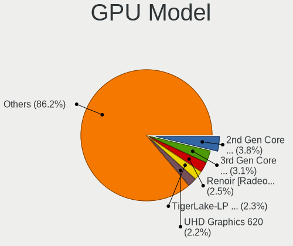

| Model                                                                                    | Computers | Percent |
|------------------------------------------------------------------------------------------|-----------|---------|
| Intel 2nd Generation Core Processor Family Integrated Graphics Controller                | 101       | 3.86%   |
| Intel 3rd Gen Core processor Graphics Controller                                         | 84        | 3.21%   |
| AMD Renoir [Radeon RX Vega 6 (Ryzen 4000/5000 Mobile Series)]                            | 70        | 2.68%   |
| Intel TigerLake-LP GT2 [Iris Xe Graphics]                                                | 63        | 2.41%   |
| Intel UHD Graphics 620                                                                   | 58        | 2.22%   |
| Intel Haswell-ULT Integrated Graphics Controller                                         | 49        | 1.87%   |
| Intel CometLake-U GT2 [UHD Graphics]                                                     | 48        | 1.83%   |
| Intel Skylake GT2 [HD Graphics 520]                                                      | 46        | 1.76%   |
| Intel HD Graphics 620                                                                    | 45        | 1.72%   |
| Intel HD Graphics 530                                                                    | 43        | 1.64%   |
| Intel CoffeeLake-H GT2 [UHD Graphics 630]                                                | 41        | 1.57%   |
| Intel WhiskeyLake-U GT2 [UHD Graphics 620]                                               | 40        | 1.53%   |
| Intel HD Graphics 5500                                                                   | 40        | 1.53%   |
| AMD Picasso/Raven 2 [Radeon Vega Series / Radeon Vega Mobile Series]                     | 40        | 1.53%   |
| AMD Cezanne [Radeon Vega Series / Radeon Vega Mobile Series]                             | 40        | 1.53%   |
| AMD Ellesmere [Radeon RX 470/480/570/570X/580/580X/590]                                  | 37        | 1.41%   |
| Intel Atom/Celeron/Pentium Processor x5-E8000/J3xxx/N3xxx Integrated Graphics Controller | 35        | 1.34%   |
| Intel Xeon E3-1200 v3/4th Gen Core Processor Integrated Graphics Controller              | 34        | 1.3%    |
| Intel HD Graphics 630                                                                    | 25        | 0.96%   |
| Intel Core Processor Integrated Graphics Controller                                      | 25        | 0.96%   |
| Intel Mobile 4 Series Chipset Integrated Graphics Controller                             | 24        | 0.92%   |
| Intel 4th Gen Core Processor Integrated Graphics Controller                              | 24        | 0.92%   |
| Intel GeminiLake [UHD Graphics 600]                                                      | 23        | 0.88%   |
| Nvidia GP108 [GeForce GT 1030]                                                           | 22        | 0.84%   |
| Nvidia GK208B [GeForce GT 710]                                                           | 21        | 0.8%    |
| Nvidia GP106 [GeForce GTX 1060 6GB]                                                      | 19        | 0.73%   |
| AMD Lucienne                                                                             | 19        | 0.73%   |
| Intel HD Graphics 500                                                                    | 18        | 0.69%   |
| Nvidia GP108M [GeForce MX250]                                                            | 17        | 0.65%   |
| Nvidia GP107 [GeForce GTX 1050 Ti]                                                       | 17        | 0.65%   |
| AMD Raven Ridge [Radeon Vega Series / Radeon Vega Mobile Series]                         | 17        | 0.65%   |
| Intel CometLake-H GT2 [UHD Graphics]                                                     | 16        | 0.61%   |
| Intel Xeon E3-1200 v2/3rd Gen Core processor Graphics Controller                         | 15        | 0.57%   |
| Intel CoffeeLake-S GT2 [UHD Graphics 630]                                                | 15        | 0.57%   |
| Nvidia TU117M [GeForce GTX 1650 Mobile / Max-Q]                                          | 14        | 0.54%   |
| Nvidia GP104 [GeForce GTX 1070]                                                          | 14        | 0.54%   |
| Nvidia GM204 [GeForce GTX 970]                                                           | 14        | 0.54%   |
| Intel Raptor Lake-P [Iris Xe Graphics]                                                   | 14        | 0.54%   |
| Intel Iris Plus Graphics G7                                                              | 14        | 0.54%   |
| AMD VanGogh [AMD Custom GPU 0405]                                                        | 14        | 0.54%   |

GPU Combo
---------

Combinations of graphics cards

| Name                    | Computers | Percent |
|-------------------------|-----------|---------|
| 1 x Intel               | 841       | 37.58%  |
| 1 x AMD                 | 544       | 24.31%  |
| 1 x Nvidia              | 434       | 19.39%  |
| Intel + Nvidia          | 246       | 10.99%  |
| Intel + AMD             | 52        | 2.32%   |
| 2 x AMD                 | 39        | 1.74%   |
| AMD + Nvidia            | 26        | 1.16%   |
| Other                   | 25        | 1.12%   |
| 1 x Matrox              | 13        | 0.58%   |
| 1 x ASPEED              | 6         | 0.27%   |
| 2 x Nvidia              | 4         | 0.18%   |
| Nvidia + ASPEED         | 3         | 0.13%   |
| 2 x Intel               | 2         | 0.09%   |
| 2 x Nvidia + 1 x Matrox | 1         | 0.04%   |
| 1 x SiS                 | 1         | 0.04%   |
| AMD + 2 x Nvidia        | 1         | 0.04%   |

GPU Driver
----------

Free vs proprietary

| Driver      | Computers | Percent |
|-------------|-----------|---------|
| Free        | 1773      | 78.8%   |
| Proprietary | 377       | 16.76%  |
| Unknown     | 100       | 4.44%   |

GPU Memory
----------

Total video memory

| Size in GB | Computers | Percent |
|------------|-----------|---------|
| Unknown    | 1266      | 55.53%  |
| 1.01-2.0   | 252       | 11.05%  |
| 0.01-0.5   | 236       | 10.35%  |
| 0.51-1.0   | 152       | 6.67%   |
| 3.01-4.0   | 150       | 6.58%   |
| 7.01-8.0   | 108       | 4.74%   |
| 5.01-6.0   | 53        | 2.32%   |
| 8.01-16.0  | 40        | 1.75%   |
| 2.01-3.0   | 11        | 0.48%   |
| 16.01-24.0 | 11        | 0.48%   |
| 4.01-5.0   | 1         | 0.04%   |

Monitor
-------

Monitor Vendor
--------------

Monitor vendors

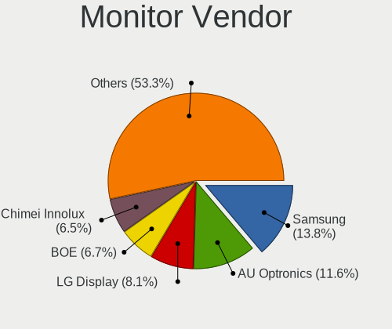

| Vendor                  | Computers | Percent |
|-------------------------|-----------|---------|
| Samsung Electronics     | 351       | 13.96%  |
| AU Optronics            | 295       | 11.73%  |
| LG Display              | 212       | 8.43%   |
| BOE                     | 169       | 6.72%   |
| Chimei Innolux          | 160       | 6.36%   |
| Dell                    | 122       | 4.85%   |
| BenQ                    | 110       | 4.38%   |
| Goldstar                | 102       | 4.06%   |
| Hewlett-Packard         | 89        | 3.54%   |
| Acer                    | 81        | 3.22%   |
| AOC                     | 73        | 2.9%    |
| Lenovo                  | 61        | 2.43%   |
| Philips                 | 58        | 2.31%   |
| Apple                   | 54        | 2.15%   |
| Iiyama                  | 51        | 2.03%   |
| Sharp                   | 46        | 1.83%   |
| Ancor Communications    | 42        | 1.67%   |
| Eizo                    | 36        | 1.43%   |
| Gericom                 | 26        | 1.03%   |
| Medion                  | 25        | 0.99%   |
| Chi Mei Optoelectronics | 24        | 0.95%   |
| Fujitsu Siemens         | 17        | 0.68%   |
| ViewSonic               | 16        | 0.64%   |
| InfoVision              | 16        | 0.64%   |
| NEC Computers           | 15        | 0.6%    |
| ASUSTek Computer        | 15        | 0.6%    |
| Sony                    | 14        | 0.56%   |
| PANDA                   | 14        | 0.56%   |
| CSO                     | 14        | 0.56%   |
| Valve                   | 13        | 0.52%   |
| Unknown                 | 12        | 0.48%   |
| HannStar                | 12        | 0.48%   |
| LG Philips              | 9         | 0.36%   |
| Vestel Elektronik       | 8         | 0.32%   |
| Toshiba                 | 8         | 0.32%   |
| Panasonic               | 6         | 0.24%   |
| MSI                     | 6         | 0.24%   |
| LG Electronics          | 6         | 0.24%   |
| GRM                     | 6         | 0.24%   |
| Lenovo Group Limited    | 5         | 0.2%    |

Monitor Model
-------------

Monitor models

| Model                                                                | Computers | Percent |
|----------------------------------------------------------------------|-----------|---------|
| Valve ANX7530 U VLV3001 800x1280 100x150mm 7.1-inch                  | 11        | 0.42%   |
| Chimei Innolux LCD Monitor CMN14D4 1920x1080 309x173mm 13.9-inch     | 11        | 0.42%   |
| AU Optronics LCD Monitor AUO573D 1920x1080 309x174mm 14.0-inch       | 11        | 0.42%   |
| Gericom Q26 QMX2426 1920x1080 550x344mm 25.5-inch                    | 10        | 0.38%   |
| AU Optronics LCD Monitor AUO38ED 1920x1080 344x193mm 15.5-inch       | 10        | 0.38%   |
| LG Display LCD Monitor LGD0521 1920x1080 309x174mm 14.0-inch         | 9         | 0.34%   |
| LG Display LCD Monitor LGD046F 1920x1080 340x190mm 15.3-inch         | 9         | 0.34%   |
| LG Display LCD Monitor LGD046D 1920x1080 309x174mm 14.0-inch         | 9         | 0.34%   |
| LG Display LCD Monitor LGD02D8 1366x768 277x156mm 12.5-inch          | 9         | 0.34%   |
| Vestel Elektronik 22W_LCD_TV VES3700 1920x540                        | 8         | 0.3%    |
| Samsung Electronics U28E590 SAM0C4D 3840x2160 607x345mm 27.5-inch    | 8         | 0.3%    |
| Samsung Electronics C32F391 SAM0D35 1920x1080 698x393mm 31.5-inch    | 8         | 0.3%    |
| Dell U2412M DELA07A 1920x1200 518x324mm 24.1-inch                    | 8         | 0.3%    |
| Chimei Innolux LCD Monitor CMN15E8 1920x1080 344x193mm 15.5-inch     | 8         | 0.3%    |
| BenQ GL2450H BNQ78A7 1920x1080 531x298mm 24.0-inch                   | 8         | 0.3%    |
| Apple Color LCD APPA040 2880x1800 331x207mm 15.4-inch                | 8         | 0.3%    |
| Acer B193 ACR001D 1280x1024 380x300mm 19.1-inch                      | 8         | 0.3%    |
| Samsung Electronics C27F390 SAM0D32 1920x1080 598x336mm 27.0-inch    | 7         | 0.27%   |
| NEC Computers EA243WM NEC6864 1920x1200 519x324mm 24.1-inch          | 7         | 0.27%   |
| Chimei Innolux LCD Monitor CMN14C9 1920x1080 309x173mm 13.9-inch     | 7         | 0.27%   |
| BOE LCD Monitor BOE084E 1920x1080 382x215mm 17.3-inch                | 7         | 0.27%   |
| AU Optronics LCD Monitor AUO683D 1920x1080 309x174mm 14.0-inch       | 7         | 0.27%   |
| AU Optronics LCD Monitor AUO106C 1366x768 277x156mm 12.5-inch        | 7         | 0.27%   |
| Apple LCD Monitor APP9CC5 1280x800 286x179mm 13.3-inch               | 7         | 0.27%   |
| AOC 24B2W1 AOC2402 1920x1080 527x296mm 23.8-inch                     | 7         | 0.27%   |
| AOC 24B1W1G5 AOC2401 1920x1080 527x296mm 23.8-inch                   | 7         | 0.27%   |
| Philips PHL 273V7 PHLC156 1920x1080 598x336mm 27.0-inch              | 6         | 0.23%   |
| LG Display LCD Monitor LGD056D 1920x1080 382x215mm 17.3-inch         | 6         | 0.23%   |
| Lenovo LCD Monitor LEN40B1 1600x900 345x194mm 15.6-inch              | 6         | 0.23%   |
| Hewlett-Packard w2207 HWP26A8 1680x1050 473x296mm 22.0-inch          | 6         | 0.23%   |
| GRM GM2600 GRM5BC6 1920x1080 550x344mm 25.5-inch                     | 6         | 0.23%   |
| Gericom Q24 QMX2421 1920x1080 521x293mm 23.5-inch                    | 6         | 0.23%   |
| Chimei Innolux LCD Monitor CMN15E7 1920x1080 344x193mm 15.5-inch     | 6         | 0.23%   |
| Chimei Innolux LCD Monitor CMN151E 1920x1080 344x193mm 15.5-inch     | 6         | 0.23%   |
| Unknown LCD Monitor FFFF 2288x1287 2550x2550mm 142.0-inch            | 5         | 0.19%   |
| Samsung Electronics U28E590 SAM0C4C 3840x2160 608x345mm 27.5-inch    | 5         | 0.19%   |
| Samsung Electronics S34J55x SAM0F70 3440x1440 797x333mm 34.0-inch    | 5         | 0.19%   |
| Samsung Electronics LCD Monitor SEC5441 1366x768 344x194mm 15.5-inch | 5         | 0.19%   |
| Samsung Electronics C32F391 SAM0D34 1920x1080 698x393mm 31.5-inch    | 5         | 0.19%   |
| Samsung Electronics C24F390 SAM0D2C 1920x1080 521x293mm 23.5-inch    | 5         | 0.19%   |

Monitor Resolution
------------------

Monitor screen resolution

| Resolution         | Computers | Percent |
|--------------------|-----------|---------|
| 1920x1080 (FHD)    | 1083      | 45.01%  |
| 1366x768 (WXGA)    | 227       | 9.43%   |
| 3840x2160 (4K)     | 210       | 8.73%   |
| 2560x1440 (QHD)    | 174       | 7.23%   |
| 1920x1200 (WUXGA)  | 102       | 4.24%   |
| 1600x900 (HD+)     | 97        | 4.03%   |
| 1680x1050 (WSXGA+) | 89        | 3.7%    |
| 1280x1024 (SXGA)   | 69        | 2.87%   |
| 1280x800 (WXGA)    | 54        | 2.24%   |
| 3440x1440          | 43        | 1.79%   |
| 1440x900 (WXGA+)   | 36        | 1.5%    |
| Unknown            | 25        | 1.04%   |
| 2880x1800          | 24        | 1%      |
| 2560x1600          | 18        | 0.75%   |
| 2560x1080          | 18        | 0.75%   |
| 800x1280           | 14        | 0.58%   |
| 3840x1080          | 14        | 0.58%   |
| 3840x2400          | 11        | 0.46%   |
| 1920x540           | 11        | 0.46%   |
| 2288x1287          | 6         | 0.25%   |
| 1024x600           | 6         | 0.25%   |
| 2736x1824          | 5         | 0.21%   |
| 3200x1800 (QHD+)   | 4         | 0.17%   |
| 2160x1440          | 4         | 0.17%   |
| 2048x1152          | 4         | 0.17%   |
| 1920x1280          | 4         | 0.17%   |
| 1600x1200          | 4         | 0.17%   |
| 1360x768           | 4         | 0.17%   |
| 1024x768 (XGA)     | 4         | 0.17%   |
| 2256x1504          | 3         | 0.12%   |
| 2160x1200          | 3         | 0.12%   |
| 5760x2160          | 2         | 0.08%   |
| 5760x1080          | 2         | 0.08%   |
| 5120x1440          | 2         | 0.08%   |
| 4480x1440          | 2         | 0.08%   |
| 3840x1200          | 2         | 0.08%   |
| 3456x2160          | 2         | 0.08%   |
| 3360x1050          | 2         | 0.08%   |
| 2520x1680          | 2         | 0.08%   |
| 6400x2560          | 1         | 0.04%   |

Monitor Diagonal
----------------

Diagonal size in inches

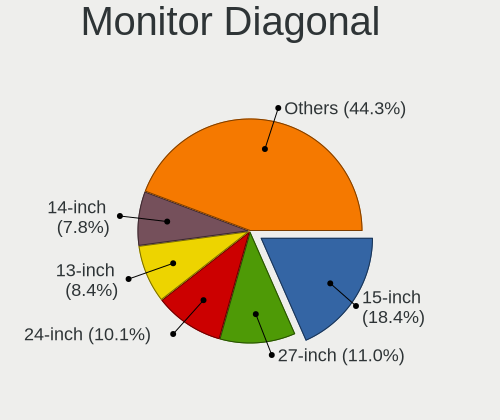

| Inches  | Computers | Percent |
|---------|-----------|---------|
| 15      | 477       | 18.97%  |
| 27      | 259       | 10.3%   |
| 24      | 247       | 9.82%   |
| 13      | 215       | 8.55%   |
| 14      | 199       | 7.91%   |
| 17      | 154       | 6.12%   |
| 23      | 144       | 5.73%   |
| Unknown | 109       | 4.33%   |
| 31      | 83        | 3.3%    |
| 21      | 77        | 3.06%   |
| 22      | 63        | 2.5%    |
| 19      | 62        | 2.47%   |
| 12      | 56        | 2.23%   |
| 34      | 51        | 2.03%   |
| 25      | 36        | 1.43%   |
| 16      | 30        | 1.19%   |
| 20      | 26        | 1.03%   |
| 84      | 23        | 0.91%   |
| 11      | 23        | 0.91%   |
| 54      | 19        | 0.76%   |
| 40      | 18        | 0.72%   |
| 18      | 14        | 0.56%   |
| 7       | 13        | 0.52%   |
| 28      | 11        | 0.44%   |
| 10      | 11        | 0.44%   |
| 72      | 9         | 0.36%   |
| 32      | 9         | 0.36%   |
| 48      | 7         | 0.28%   |
| 26      | 7         | 0.28%   |
| 42      | 6         | 0.24%   |
| 142     | 5         | 0.2%    |
| 65      | 5         | 0.2%    |
| 35      | 5         | 0.2%    |
| 47      | 4         | 0.16%   |
| 33      | 4         | 0.16%   |
| 85      | 3         | 0.12%   |
| 52      | 3         | 0.12%   |
| 39      | 3         | 0.12%   |
| 36      | 3         | 0.12%   |
| 29      | 3         | 0.12%   |

Monitor Width
-------------

Physical width

| Width in mm    | Computers | Percent |
|----------------|-----------|---------|
| 301-350        | 788       | 32.18%  |
| 501-600        | 586       | 23.93%  |
| 351-400        | 219       | 8.94%   |
| 201-300        | 218       | 8.9%    |
| 401-500        | 181       | 7.39%   |
| 601-700        | 144       | 5.88%   |
| Unknown        | 109       | 4.45%   |
| 701-800        | 63        | 2.57%   |
| 1001-1500      | 47        | 1.92%   |
| 1501-2000      | 35        | 1.43%   |
| 801-900        | 31        | 1.27%   |
| 1-100          | 14        | 0.57%   |
| 901-1000       | 8         | 0.33%   |
| More than 2000 | 5         | 0.2%    |
| 101-200        | 1         | 0.04%   |

Aspect Ratio
------------

Proportional relationship between the width and the height

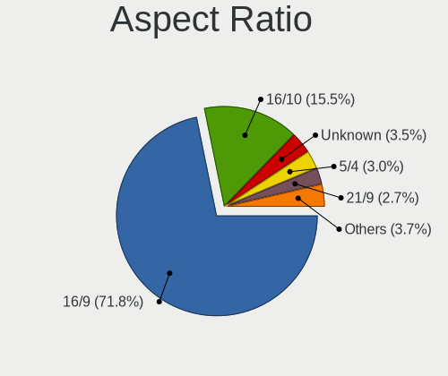

| Ratio   | Computers | Percent |
|---------|-----------|---------|
| 16/9    | 1617      | 71.61%  |
| 16/10   | 356       | 15.77%  |
| Unknown | 83        | 3.68%   |
| 5/4     | 69        | 3.06%   |
| 21/9    | 57        | 2.52%   |
| 3/2     | 27        | 1.2%    |
| 32/9    | 13        | 0.58%   |
| 0.67    | 11        | 0.49%   |
| 4/3     | 9         | 0.4%    |
| 6/5     | 6         | 0.27%   |
| 1.00    | 5         | 0.22%   |
| 3.20    | 1         | 0.04%   |
| 0.89    | 1         | 0.04%   |
| 0.80    | 1         | 0.04%   |
| 0.62    | 1         | 0.04%   |
| 0.56    | 1         | 0.04%   |

Monitor Area
------------

Area in inch

| Area in inch | Computers | Percent |
|----------------|-----------|---------|
| 101-110        | 479       | 19.25%  |
| 201-250        | 390       | 15.68%  |
| 81-90          | 312       | 12.54%  |
| 301-350        | 263       | 10.57%  |
| 351-500        | 163       | 6.55%   |
| 251-300        | 139       | 5.59%   |
| 121-130        | 124       | 4.98%   |
| 151-200        | 117       | 4.7%    |
| Unknown        | 109       | 4.38%   |
| 71-80          | 105       | 4.22%   |
| More than 1000 | 72        | 2.89%   |
| 61-70          | 52        | 2.09%   |
| 501-1000       | 47        | 1.89%   |
| 51-60          | 24        | 0.96%   |
| 141-150        | 23        | 0.92%   |
| 111-120        | 22        | 0.88%   |
| 131-140        | 20        | 0.8%    |
| 1-40           | 15        | 0.6%    |
| 41-50          | 10        | 0.4%    |
| 91-100         | 2         | 0.08%   |

Pixel Density
-------------

Pixels per inch

| Density       | Computers | Percent |
|---------------|-----------|---------|
| 51-100        | 803       | 33.61%  |
| 121-160       | 693       | 29.01%  |
| 101-120       | 485       | 20.3%   |
| 161-240       | 182       | 7.62%   |
| Unknown       | 109       | 4.56%   |
| More than 240 | 69        | 2.89%   |
| 1-50          | 48        | 2.01%   |

Multiple Monitors
-----------------

Total monitors connected

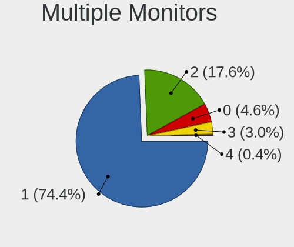

| Total | Computers | Percent |
|-------|-----------|---------|
| 1     | 1702      | 74.78%  |
| 2     | 391       | 17.18%  |
| 0     | 105       | 4.61%   |
| 3     | 69        | 3.03%   |
| 4     | 9         | 0.4%    |

Network
-------

Net Controller Vendor
---------------------

Controller vendors

| Vendor                            | Computers | Percent |
|-----------------------------------|-----------|---------|
| Intel                             | 1243      | 37.55%  |
| Realtek Semiconductor             | 1086      | 32.81%  |
| Qualcomm Atheros                  | 267       | 8.07%   |
| Broadcom                          | 146       | 4.41%   |
| MediaTek                          | 44        | 1.33%   |
| Broadcom Limited                  | 31        | 0.94%   |
| Marvell Technology Group          | 30        | 0.91%   |
| Ralink Technology                 | 29        | 0.88%   |
| Ralink                            | 26        | 0.79%   |
| TP-Link                           | 25        | 0.76%   |
| Nvidia                            | 22        | 0.66%   |
| Sierra Wireless                   | 20        | 0.6%    |
| ASIX Electronics                  | 20        | 0.6%    |
| Lenovo                            | 18        | 0.54%   |
| Dell                              | 18        | 0.54%   |
| NetGear                           | 16        | 0.48%   |
| Ericsson Business Mobile Networks | 16        | 0.48%   |
| Aquantia                          | 16        | 0.48%   |
| Microsoft                         | 15        | 0.45%   |
| Huawei Technologies               | 15        | 0.45%   |
| Edimax Technology                 | 15        | 0.45%   |
| IMC Networks                      | 14        | 0.42%   |
| Samsung Electronics               | 13        | 0.39%   |
| ASUSTek Computer                  | 13        | 0.39%   |
| FIBOCOM                           | 12        | 0.36%   |
| DisplayLink                       | 12        | 0.36%   |
| Hewlett-Packard                   | 11        | 0.33%   |
| Qualcomm                          | 10        | 0.3%    |
| Qualcomm Atheros Communications   | 9         | 0.27%   |
| D-Link System                     | 9         | 0.27%   |
| D-Link                            | 9         | 0.27%   |
| JMicron Technology                | 6         | 0.18%   |
| Google                            | 6         | 0.18%   |
| ZyXEL Communications              | 4         | 0.12%   |
| Xiaomi                            | 4         | 0.12%   |
| OnePlus Technology (Shenzhen)     | 4         | 0.12%   |
| ZTE WCDMA Technologies MSM        | 3         | 0.09%   |
| VIA Technologies                  | 3         | 0.09%   |
| Sigma Sport                       | 3         | 0.09%   |
| Motorola PCS                      | 3         | 0.09%   |

Net Controller Model
--------------------

Controller models

| Model                                                                  | Computers | Percent |
|------------------------------------------------------------------------|-----------|---------|
| Realtek RTL8111/8168/8211/8411 PCI Express Gigabit Ethernet Controller | 757       | 18.93%  |
| Intel Wi-Fi 6 AX200                                                    | 141       | 3.53%   |
| Intel 82579LM Gigabit Network Connection (Lewisville)                  | 87        | 2.18%   |
| Intel Wireless 8265 / 8275                                             | 86        | 2.15%   |
| Realtek RTL8153 Gigabit Ethernet Adapter                               | 84        | 2.1%    |
| Realtek RTL810xE PCI Express Fast Ethernet controller                  | 69        | 1.73%   |
| Intel I211 Gigabit Network Connection                                  | 66        | 1.65%   |
| Realtek RTL8125 2.5GbE Controller                                      | 65        | 1.63%   |
| Intel Wi-Fi 6 AX201                                                    | 53        | 1.33%   |
| Intel Wireless 7265                                                    | 52        | 1.3%    |
| Intel Ethernet Controller I225-V                                       | 52        | 1.3%    |
| Intel Ethernet Connection (2) I219-V                                   | 50        | 1.25%   |
| Intel Wireless 8260                                                    | 45        | 1.13%   |
| Realtek RTL8822CE 802.11ac PCIe Wireless Network Adapter               | 42        | 1.05%   |
| Intel Centrino Advanced-N 6205 [Taylor Peak]                           | 42        | 1.05%   |
| Intel Comet Lake PCH-LP CNVi WiFi                                      | 38        | 0.95%   |
| Realtek RTL8821CE 802.11ac PCIe Wireless Network Adapter               | 37        | 0.93%   |
| Intel Wireless 3165                                                    | 36        | 0.9%    |
| Qualcomm Atheros AR9285 Wireless Network Adapter (PCI-Express)         | 35        | 0.88%   |
| Qualcomm Atheros QCA6174 802.11ac Wireless Network Adapter             | 33        | 0.83%   |
| Intel Wireless 7260                                                    | 33        | 0.83%   |
| Qualcomm Atheros QCA9377 802.11ac Wireless Network Adapter             | 31        | 0.78%   |
| Intel Ethernet Connection I217-LM                                      | 30        | 0.75%   |
| Qualcomm Atheros AR9485 Wireless Network Adapter                       | 29        | 0.73%   |
| Intel Wi-Fi 6E(802.11ax) AX210/AX1675* 2x2 [Typhoon Peak]              | 29        | 0.73%   |
| Intel Wi-Fi 5(802.11ac) Wireless-AC 9x6x [Thunder Peak]                | 29        | 0.73%   |
| Intel Dual Band Wireless-AC 3168NGW [Stone Peak]                       | 29        | 0.73%   |
| Intel Cannon Point-LP CNVi [Wireless-AC]                               | 28        | 0.7%    |
| Intel Cannon Lake PCH CNVi WiFi                                        | 27        | 0.68%   |
| Intel Centrino Ultimate-N 6300                                         | 25        | 0.63%   |
| Intel Ethernet Connection (7) I219-V                                   | 23        | 0.58%   |
| Intel Ethernet Connection (6) I219-V                                   | 23        | 0.58%   |
| Intel Ethernet Connection (4) I219-V                                   | 23        | 0.58%   |
| Intel Ethernet Connection I219-LM                                      | 22        | 0.55%   |
| Intel 82579V Gigabit Network Connection                                | 22        | 0.55%   |
| Qualcomm Atheros QCA9565 / AR9565 Wireless Network Adapter             | 21        | 0.53%   |
| Realtek RTL8822BE 802.11a/b/g/n/ac WiFi adapter                        | 20        | 0.5%    |
| Intel Raptor Lake PCH CNVi WiFi                                        | 20        | 0.5%    |
| Intel Comet Lake PCH CNVi WiFi                                         | 20        | 0.5%    |
| Intel Ethernet Connection (2) I219-LM                                  | 19        | 0.48%   |

Wireless Vendor
---------------

Wireless vendors

| Vendor                                | Computers | Percent |
|---------------------------------------|-----------|---------|
| Intel                                 | 930       | 51.18%  |
| Realtek Semiconductor                 | 280       | 15.41%  |
| Qualcomm Atheros                      | 195       | 10.73%  |
| Broadcom                              | 105       | 5.78%   |
| MediaTek                              | 43        | 2.37%   |
| Ralink Technology                     | 29        | 1.6%    |
| Ralink                                | 26        | 1.43%   |
| TP-Link                               | 25        | 1.38%   |
| Sierra Wireless                       | 20        | 1.1%    |
| Broadcom Limited                      | 16        | 0.88%   |
| NetGear                               | 15        | 0.83%   |
| Edimax Technology                     | 15        | 0.83%   |
| Microsoft                             | 14        | 0.77%   |
| IMC Networks                          | 14        | 0.77%   |
| ASUSTek Computer                      | 13        | 0.72%   |
| FIBOCOM                               | 12        | 0.66%   |
| Dell                                  | 12        | 0.66%   |
| Qualcomm Atheros Communications       | 9         | 0.5%    |
| Qualcomm                              | 8         | 0.44%   |
| D-Link System                         | 7         | 0.39%   |
| D-Link                                | 7         | 0.39%   |
| ZyXEL Communications                  | 4         | 0.22%   |
| Marvell Technology Group              | 3         | 0.17%   |
| ZyDAS                                 | 2         | 0.11%   |
| Sitecom Europe                        | 2         | 0.11%   |
| Hewlett-Packard                       | 2         | 0.11%   |
| AVM                                   | 2         | 0.11%   |
| 802.11g Adapter [Linksys WUSB54GC v3] | 2         | 0.11%   |
| Wilocity                              | 1         | 0.06%   |
| Philips (or NXP)                      | 1         | 0.06%   |
| Linksys                               | 1         | 0.06%   |
| BUFFALO                               | 1         | 0.06%   |
| Belkin Components                     | 1         | 0.06%   |

Wireless Model
--------------

Wireless models

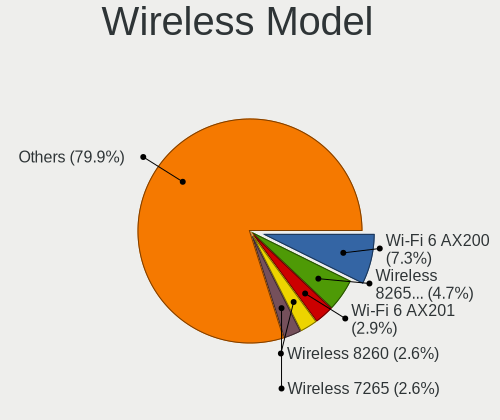

| Model                                                          | Computers | Percent |
|----------------------------------------------------------------|-----------|---------|
| Intel Wi-Fi 6 AX200                                            | 141       | 7.73%   |
| Intel Wireless 8265 / 8275                                     | 86        | 4.71%   |
| Intel Wi-Fi 6 AX201                                            | 53        | 2.91%   |
| Intel Wireless 7265                                            | 52        | 2.85%   |
| Intel Wireless 8260                                            | 45        | 2.47%   |
| Realtek RTL8822CE 802.11ac PCIe Wireless Network Adapter       | 42        | 2.3%    |
| Intel Centrino Advanced-N 6205 [Taylor Peak]                   | 42        | 2.3%    |
| Intel Comet Lake PCH-LP CNVi WiFi                              | 38        | 2.08%   |
| Realtek RTL8821CE 802.11ac PCIe Wireless Network Adapter       | 37        | 2.03%   |
| Intel Wireless 3165                                            | 36        | 1.97%   |
| Qualcomm Atheros AR9285 Wireless Network Adapter (PCI-Express) | 35        | 1.92%   |
| Qualcomm Atheros QCA6174 802.11ac Wireless Network Adapter     | 33        | 1.81%   |
| Intel Wireless 7260                                            | 33        | 1.81%   |
| Qualcomm Atheros QCA9377 802.11ac Wireless Network Adapter     | 31        | 1.7%    |
| Qualcomm Atheros AR9485 Wireless Network Adapter               | 29        | 1.59%   |
| Intel Wi-Fi 6E(802.11ax) AX210/AX1675* 2x2 [Typhoon Peak]      | 29        | 1.59%   |
| Intel Wi-Fi 5(802.11ac) Wireless-AC 9x6x [Thunder Peak]        | 29        | 1.59%   |
| Intel Dual Band Wireless-AC 3168NGW [Stone Peak]               | 29        | 1.59%   |
| Intel Cannon Point-LP CNVi [Wireless-AC]                       | 28        | 1.54%   |
| Intel Cannon Lake PCH CNVi WiFi                                | 27        | 1.48%   |
| Intel Centrino Ultimate-N 6300                                 | 25        | 1.37%   |
| Qualcomm Atheros QCA9565 / AR9565 Wireless Network Adapter     | 21        | 1.15%   |
| Realtek RTL8822BE 802.11a/b/g/n/ac WiFi adapter                | 20        | 1.1%    |
| Intel Raptor Lake PCH CNVi WiFi                                | 20        | 1.1%    |
| Intel Comet Lake PCH CNVi WiFi                                 | 20        | 1.1%    |
| Realtek RTL8192CE PCIe Wireless Network Adapter                | 18        | 0.99%   |
| Intel Ice Lake-LP PCH CNVi WiFi                                | 18        | 0.99%   |
| Realtek RTL8723BE PCIe Wireless Network Adapter                | 17        | 0.93%   |
| MediaTek MT7921 802.11ax PCI Express Wireless Network Adapter  | 17        | 0.93%   |
| Realtek RTL88x2bu [AC1200 Techkey]                             | 16        | 0.88%   |
| Intel Alder Lake-P PCH CNVi WiFi                               | 16        | 0.88%   |
| Realtek RTL8852AE 802.11ax PCIe Wireless Network Adapter       | 15        | 0.82%   |
| MediaTek MT7922 802.11ax PCI Express Wireless Network Adapter  | 15        | 0.82%   |
| Broadcom BCM43142 802.11b/g/n                                  | 15        | 0.82%   |
| Intel WiFi Link 5100                                           | 14        | 0.77%   |
| Intel Wireless 3160                                            | 13        | 0.71%   |
| Intel PRO/Wireless 3945ABG [Golan] Network Connection          | 13        | 0.71%   |
| Intel Centrino Advanced-N 6235                                 | 13        | 0.71%   |
| Broadcom BCM4313 802.11bgn Wireless Network Adapter            | 13        | 0.71%   |
| Sierra Wireless EM7455                                         | 12        | 0.66%   |

Ethernet Vendor
---------------

Ethernet vendors

| Vendor                        | Computers | Percent |
|-------------------------------|-----------|---------|
| Realtek Semiconductor         | 973       | 47.44%  |
| Intel                         | 715       | 34.86%  |
| Qualcomm Atheros              | 97        | 4.73%   |
| Broadcom                      | 63        | 3.07%   |
| Marvell Technology Group      | 27        | 1.32%   |
| Nvidia                        | 22        | 1.07%   |
| ASIX Electronics              | 20        | 0.98%   |
| Lenovo                        | 17        | 0.83%   |
| Aquantia                      | 16        | 0.78%   |
| Broadcom Limited              | 15        | 0.73%   |
| Samsung Electronics           | 13        | 0.63%   |
| DisplayLink                   | 12        | 0.59%   |
| JMicron Technology            | 6         | 0.29%   |
| Huawei Technologies           | 6         | 0.29%   |
| Google                        | 6         | 0.29%   |
| Xiaomi                        | 4         | 0.2%    |
| OnePlus Technology (Shenzhen) | 4         | 0.2%    |
| ZTE WCDMA Technologies MSM    | 3         | 0.15%   |
| VIA Technologies              | 3         | 0.15%   |
| Motorola PCS                  | 3         | 0.15%   |
| Apple                         | 3         | 0.15%   |
| Qualcomm                      | 2         | 0.1%    |
| IBM                           | 2         | 0.1%    |
| Hewlett-Packard               | 2         | 0.1%    |
| Dell                          | 2         | 0.1%    |
| D-Link System                 | 2         | 0.1%    |
| D-Link                        | 2         | 0.1%    |
| Research In Motion            | 1         | 0.05%   |
| NetGear                       | 1         | 0.05%   |
| Microsoft                     | 1         | 0.05%   |
| Microchip Technology          | 1         | 0.05%   |
| Mellanox Technologies         | 1         | 0.05%   |
| MediaTek                      | 1         | 0.05%   |
| Linksys                       | 1         | 0.05%   |
| Insyde Software               | 1         | 0.05%   |
| Emulex                        | 1         | 0.05%   |
| Cypress Semiconductor         | 1         | 0.05%   |
| Attansic Technology           | 1         | 0.05%   |

Ethernet Model
--------------

Ethernet models

| Model                                                                  | Computers | Percent |
|------------------------------------------------------------------------|-----------|---------|
| Realtek RTL8111/8168/8211/8411 PCI Express Gigabit Ethernet Controller | 757       | 35.76%  |
| Intel 82579LM Gigabit Network Connection (Lewisville)                  | 87        | 4.11%   |
| Realtek RTL8153 Gigabit Ethernet Adapter                               | 84        | 3.97%   |
| Realtek RTL810xE PCI Express Fast Ethernet controller                  | 69        | 3.26%   |
| Intel I211 Gigabit Network Connection                                  | 66        | 3.12%   |
| Realtek RTL8125 2.5GbE Controller                                      | 65        | 3.07%   |
| Intel Ethernet Controller I225-V                                       | 52        | 2.46%   |
| Intel Ethernet Connection (2) I219-V                                   | 50        | 2.36%   |
| Intel Ethernet Connection I217-LM                                      | 30        | 1.42%   |
| Intel Ethernet Connection (7) I219-V                                   | 23        | 1.09%   |
| Intel Ethernet Connection (6) I219-V                                   | 23        | 1.09%   |
| Intel Ethernet Connection (4) I219-V                                   | 23        | 1.09%   |
| Intel Ethernet Connection I219-LM                                      | 22        | 1.04%   |
| Intel 82579V Gigabit Network Connection                                | 22        | 1.04%   |
| Intel Ethernet Connection (2) I219-LM                                  | 19        | 0.9%    |
| Intel 82577LM Gigabit Network Connection                               | 19        | 0.9%    |
| Qualcomm Atheros AR8151 v2.0 Gigabit Ethernet                          | 18        | 0.85%   |
| Intel 82567LM Gigabit Network Connection                               | 18        | 0.85%   |
| Intel I210 Gigabit Network Connection                                  | 17        | 0.8%    |
| Intel Ethernet Connection I218-LM                                      | 17        | 0.8%    |
| Intel Ethernet Connection (4) I219-LM                                  | 17        | 0.8%    |
| Intel Ethernet Connection (3) I218-LM                                  | 17        | 0.8%    |
| Intel Ethernet Connection (10) I219-V                                  | 16        | 0.76%   |
| Intel Ethernet Connection (7) I219-LM                                  | 15        | 0.71%   |
| Qualcomm Atheros Killer E220x Gigabit Ethernet Controller              | 14        | 0.66%   |
| ASIX AX88179 Gigabit Ethernet                                          | 14        | 0.66%   |
| Intel Ethernet Connection I217-V                                       | 13        | 0.61%   |
| Intel 82574L Gigabit Network Connection                                | 13        | 0.61%   |
| Qualcomm Atheros AR8161 Gigabit Ethernet                               | 12        | 0.57%   |
| Intel Ethernet Connection (2) I218-V                                   | 12        | 0.57%   |
| Broadcom NetXtreme BCM57765 Gigabit Ethernet PCIe                      | 12        | 0.57%   |
| Intel Ethernet Connection I219-V                                       | 11        | 0.52%   |
| Intel Ethernet Connection (13) I219-V                                  | 11        | 0.52%   |
| Nvidia MCP79 Ethernet                                                  | 9         | 0.43%   |
| Intel I350 Gigabit Network Connection                                  | 9         | 0.43%   |
| Samsung Galaxy series, misc. (tethering mode)                          | 8         | 0.38%   |
| Qualcomm Atheros QCA8171 Gigabit Ethernet                              | 8         | 0.38%   |
| Qualcomm Atheros Killer E2500 Gigabit Ethernet Controller              | 8         | 0.38%   |
| Qualcomm Atheros AR8131 Gigabit Ethernet                               | 8         | 0.38%   |
| Qualcomm Atheros AR8121/AR8113/AR8114 Gigabit or Fast Ethernet         | 8         | 0.38%   |

Net Controller Kind
-------------------

Ethernet, WiFi or modem

| Kind     | Computers | Percent |
|----------|-----------|---------|
| Ethernet | 1904      | 52.22%  |
| WiFi     | 1686      | 46.24%  |
| Modem    | 51        | 1.4%    |
| Unknown  | 5         | 0.14%   |

Used Controller
---------------

Currently used network controller

| Kind     | Computers | Percent |
|----------|-----------|---------|
| WiFi     | 1258      | 55.08%  |
| Ethernet | 1026      | 44.92%  |

NICs
----

Total network controllers on board

| Total | Computers | Percent |
|-------|-----------|---------|
| 2     | 1175      | 52.86%  |
| 1     | 900       | 40.49%  |
| 3     | 72        | 3.24%   |
| 0     | 51        | 2.29%   |
| 4     | 13        | 0.58%   |
| 6     | 5         | 0.22%   |
| 5     | 4         | 0.18%   |
| 12    | 2         | 0.09%   |
| 13    | 1         | 0.04%   |

IPv6
----

IPv6 vs IPv4

| Used | Computers | Percent |
|------|-----------|---------|
| No   | 1917      | 84.97%  |
| Yes  | 339       | 15.03%  |

Bluetooth
---------

Bluetooth Vendor
----------------

Controller vendors

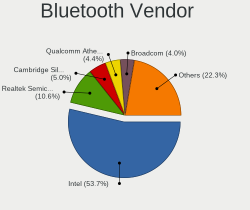

| Vendor                          | Computers | Percent |
|---------------------------------|-----------|---------|
| Intel                           | 749       | 54.28%  |
| Realtek Semiconductor           | 139       | 10.07%  |
| Cambridge Silicon Radio         | 75        | 5.43%   |
| Broadcom                        | 62        | 4.49%   |
| Qualcomm Atheros Communications | 61        | 4.42%   |
| IMC Networks                    | 50        | 3.62%   |
| Apple                           | 44        | 3.19%   |
| Lite-On Technology              | 36        | 2.61%   |
| Foxconn / Hon Hai               | 34        | 2.46%   |
| ASUSTek Computer                | 24        | 1.74%   |
| Hewlett-Packard                 | 19        | 1.38%   |
| Dell                            | 15        | 1.09%   |
| MediaTek                        | 14        | 1.01%   |
| Toshiba                         | 9         | 0.65%   |
| TP-Link                         | 8         | 0.58%   |
| Ralink                          | 5         | 0.36%   |
| Marvell Semiconductor           | 5         | 0.36%   |
| Foxconn International           | 5         | 0.36%   |
| USI                             | 4         | 0.29%   |
| Belkin Components               | 4         | 0.29%   |
| Realtek                         | 3         | 0.22%   |
| HTC (High Tech Computer)        | 3         | 0.22%   |
| Edimax Technology               | 2         | 0.14%   |
| D-Link System                   | 2         | 0.14%   |
| Alps Electric                   | 2         | 0.14%   |
| Micro Star International        | 1         | 0.07%   |
| Logitech                        | 1         | 0.07%   |
| i.Tech Dynamic Limited          | 1         | 0.07%   |
| Fujitsu                         | 1         | 0.07%   |
| Askey Computer                  | 1         | 0.07%   |
| Actions                         | 1         | 0.07%   |

Bluetooth Model
---------------

Controller models

| Model                                               | Computers | Percent |
|-----------------------------------------------------|-----------|---------|
| Intel Bluetooth wireless interface                  | 140       | 10.14%  |
| Intel AX200 Bluetooth                               | 138       | 10%     |
| Intel AX201 Bluetooth                               | 132       | 9.57%   |
| Intel Bluetooth Device                              | 113       | 8.19%   |
| Realtek Bluetooth Radio                             | 98        | 7.1%    |
| Cambridge Silicon Radio Bluetooth Dongle (HCI mode) | 75        | 5.43%   |
| Intel Bluetooth 9460/9560 Jefferson Peak (JfP)      | 71        | 5.14%   |
| Intel AX211 Bluetooth                               | 40        | 2.9%    |
| Intel Wireless-AC 9260 Bluetooth Adapter            | 27        | 1.96%   |
| Intel Wireless-AC 3168 Bluetooth                    | 27        | 1.96%   |
| Intel AX210 Bluetooth                               | 27        | 1.96%   |
| Intel Centrino Bluetooth Wireless Transceiver       | 23        | 1.67%   |
| IMC Networks Bluetooth Radio                        | 23        | 1.67%   |
| Qualcomm Atheros AR3011 Bluetooth                   | 20        | 1.45%   |
| Apple Bluetooth Host Controller                     | 20        | 1.45%   |
| Qualcomm Atheros QCA61x4 Bluetooth 4.0              | 17        | 1.23%   |
| Broadcom BCM2045B (BDC-2.1)                         | 15        | 1.09%   |
| Apple Bluetooth USB Host Controller                 | 15        | 1.09%   |
| Foxconn / Hon Hai Bluetooth Device                  | 14        | 1.01%   |
| Realtek  Bluetooth 4.2 Adapter                      | 13        | 0.94%   |
| Realtek 802.11ac WLAN Adapter                       | 13        | 0.94%   |
| Qualcomm Atheros  Bluetooth Device                  | 13        | 0.94%   |
| MediaTek Wireless_Device                            | 12        | 0.87%   |
| Lite-On Qualcomm Atheros QCA9377 Bluetooth          | 12        | 0.87%   |
| Intel Centrino Advanced-N 6230 Bluetooth adapter    | 11        | 0.8%    |
| IMC Networks Wireless_Device                        | 11        | 0.8%    |
| HP Broadcom 2070 Bluetooth Combo                    | 11        | 0.8%    |
| IMC Networks Bluetooth Device                       | 10        | 0.72%   |
| Broadcom BCM20702 Bluetooth 4.0 [ThinkPad]          | 10        | 0.72%   |
| Lite-On Bluetooth Device                            | 9         | 0.65%   |
| ASUS Broadcom BCM20702A0 Bluetooth                  | 9         | 0.65%   |
| TP-Link UB500 Adapter                               | 8         | 0.58%   |
| HP Bluetooth 2.0 Interface [Broadcom BCM2045]       | 8         | 0.58%   |
| Broadcom HP Portable SoftSailing                    | 8         | 0.58%   |
| Realtek RTL8822BE Bluetooth 4.2 Adapter             | 7         | 0.51%   |
| Qualcomm Atheros AR3012 Bluetooth 4.0               | 7         | 0.51%   |
| Lite-On Atheros AR3012 Bluetooth                    | 7         | 0.51%   |
| Lite-On Wireless_Device                             | 6         | 0.43%   |
| Dell BCM20702A0 Bluetooth Module                    | 6         | 0.43%   |
| Ralink RT3290 Bluetooth                             | 5         | 0.36%   |

Sound
-----

Sound Vendor
------------

Sound card vendors

| Vendor                                       | Computers | Percent |
|----------------------------------------------|-----------|---------|
| Intel                                        | 1504      | 47.12%  |
| AMD                                          | 713       | 22.34%  |
| Nvidia                                       | 530       | 16.6%   |
| C-Media Electronics                          | 75        | 2.35%   |
| Logitech                                     | 43        | 1.35%   |
| GN Netcom                                    | 22        | 0.69%   |
| Lenovo                                       | 18        | 0.56%   |
| Realtek Semiconductor                        | 16        | 0.5%    |
| ASUSTek Computer                             | 16        | 0.5%    |
| Creative Labs                                | 14        | 0.44%   |
| SteelSeries ApS                              | 13        | 0.41%   |
| Razer USA                                    | 12        | 0.38%   |
| Creative Technology                          | 12        | 0.38%   |
| JMTek                                        | 11        | 0.34%   |
| Apple                                        | 11        | 0.34%   |
| Texas Instruments                            | 10        | 0.31%   |
| Corsair                                      | 10        | 0.31%   |
| Kingston Technology                          | 9         | 0.28%   |
| Hewlett-Packard                              | 9         | 0.28%   |
| Focusrite-Novation                           | 8         | 0.25%   |
| Sony                                         | 6         | 0.19%   |
| RODE Microphones                             | 6         | 0.19%   |
| Plantronics                                  | 6         | 0.19%   |
| Micro Star International                     | 6         | 0.19%   |
| Bose                                         | 6         | 0.19%   |
| Zoran Co. Personal Media Division (Nogatech) | 4         | 0.13%   |
| Yamaha                                       | 4         | 0.13%   |
| Generalplus Technology                       | 4         | 0.13%   |
| ZOOM                                         | 3         | 0.09%   |
| GYROCOM C&C                                  | 3         | 0.09%   |
| DSEA A/S                                     | 3         | 0.09%   |
| Conexant Systems                             | 3         | 0.09%   |
| BR25                                         | 3         | 0.09%   |
| BEHRINGER International                      | 3         | 0.09%   |
| Asahi Kasei Microsystems                     | 3         | 0.09%   |
| XMOS                                         | 2         | 0.06%   |
| Thomann                                      | 2         | 0.06%   |
| Sennheiser Communications                    | 2         | 0.06%   |
| SAVITECH                                     | 2         | 0.06%   |
| Samson Technologies                          | 2         | 0.06%   |

Sound Model
-----------

Sound card models

| Model                                                                      | Computers | Percent |
|----------------------------------------------------------------------------|-----------|---------|
| AMD Family 17h/19h HD Audio Controller                                     | 235       | 6.16%   |
| Intel Sunrise Point-LP HD Audio                                            | 164       | 4.3%    |
| Intel 7 Series/C216 Chipset Family High Definition Audio Controller        | 141       | 3.7%    |
| AMD Renoir Radeon High Definition Audio Controller                         | 134       | 3.51%   |
| Intel 6 Series/C200 Series Chipset Family High Definition Audio Controller | 132       | 3.46%   |
| AMD Starship/Matisse HD Audio Controller                                   | 121       | 3.17%   |
| Intel 8 Series/C220 Series Chipset High Definition Audio Controller        | 98        | 2.57%   |
| Intel 100 Series/C230 Series Chipset Family HD Audio Controller            | 83        | 2.18%   |
| AMD SBx00 Azalia (Intel HDA)                                               | 82        | 2.15%   |
| Intel Cannon Lake PCH cAVS                                                 | 81        | 2.12%   |
| Intel Tiger Lake-LP Smart Sound Technology Audio Controller                | 68        | 1.78%   |
| Intel Xeon E3-1200 v3/4th Gen Core Processor HD Audio Controller           | 61        | 1.6%    |
| AMD Raven/Raven2/Fenghuang HDMI/DP Audio Controller                        | 56        | 1.47%   |
| AMD FCH Azalia Controller                                                  | 55        | 1.44%   |
| Intel 82801I (ICH9 Family) HD Audio Controller                             | 54        | 1.42%   |
| Intel Haswell-ULT HD Audio Controller                                      | 52        | 1.36%   |
| Intel 8 Series HD Audio Controller                                         | 52        | 1.36%   |
| Intel 5 Series/3400 Series Chipset High Definition Audio                   | 52        | 1.36%   |
| Intel Broadwell-U Audio Controller                                         | 50        | 1.31%   |
| Intel Comet Lake PCH-LP cAVS                                               | 49        | 1.28%   |
| Intel Wildcat Point-LP High Definition Audio Controller                    | 48        | 1.26%   |
| Intel 200 Series PCH HD Audio                                              | 47        | 1.23%   |
| Intel Cannon Point-LP High Definition Audio Controller                     | 44        | 1.15%   |
| AMD Rembrandt Radeon High Definition Audio Controller                      | 43        | 1.13%   |
| AMD Navi 21/23 HDMI/DP Audio Controller                                    | 40        | 1.05%   |
| AMD Family 17h (Models 00h-0fh) HD Audio Controller                        | 40        | 1.05%   |
| AMD Ellesmere HDMI Audio [Radeon RX 470/480 / 570/580/590]                 | 38        | 1%      |
| Nvidia TU106 High Definition Audio Controller                              | 36        | 0.94%   |
| Nvidia GP107GL High Definition Audio Controller                            | 35        | 0.92%   |
| AMD Kabini HDMI/DP Audio                                                   | 33        | 0.87%   |
| Nvidia GP104 High Definition Audio Controller                              | 32        | 0.84%   |
| Intel NM10/ICH7 Family High Definition Audio Controller                    | 32        | 0.84%   |
| Nvidia GP106 High Definition Audio Controller                              | 31        | 0.81%   |
| Nvidia GK208 HDMI/DP Audio Controller                                      | 31        | 0.81%   |
| Intel Comet Lake PCH cAVS                                                  | 31        | 0.81%   |
| Nvidia TU107 GeForce GTX 1650 High Definition Audio Controller             | 27        | 0.71%   |
| Intel Celeron/Pentium Silver Processor High Definition Audio               | 27        | 0.71%   |
| AMD Oland/Hainan/Cape Verde/Pitcairn HDMI Audio [Radeon HD 7000 Series]    | 27        | 0.71%   |
| Nvidia GM204 High Definition Audio Controller                              | 26        | 0.68%   |
| Intel 82801H (ICH8 Family) HD Audio Controller                             | 26        | 0.68%   |

Memory
------

Memory Vendor
-------------

Memory module vendors

| Vendor                       | Computers | Percent |
|------------------------------|-----------|---------|
| Samsung Electronics          | 327       | 22.54%  |
| SK hynix                     | 231       | 15.92%  |
| Kingston                     | 177       | 12.2%   |
| Micron Technology            | 153       | 10.54%  |
| Corsair                      | 134       | 9.24%   |
| Crucial                      | 112       | 7.72%   |
| Unknown                      | 100       | 6.89%   |
| G.Skill                      | 84        | 5.79%   |
| Ramaxel Technology           | 27        | 1.86%   |
| Elpida                       | 19        | 1.31%   |
| Unknown (ABCD)               | 17        | 1.17%   |
| A-DATA Technology            | 12        | 0.83%   |
| Nanya Technology             | 10        | 0.69%   |
| Unknown                      | 6         | 0.41%   |
| Transcend                    | 4         | 0.28%   |
| Team                         | 4         | 0.28%   |
| Silicon Power                | 4         | 0.28%   |
| GOODRAM                      | 4         | 0.28%   |
| Avant                        | 3         | 0.21%   |
| Toshiba                      | 2         | 0.14%   |
| JOY-IT                       | 2         | 0.14%   |
| Hewlett-Packard              | 2         | 0.14%   |
| Vaseky                       | 1         | 0.07%   |
| Unknown (130B)               | 1         | 0.07%   |
| Unknown (09D5)               | 1         | 0.07%   |
| Unifosa                      | 1         | 0.07%   |
| TakeMS                       | 1         | 0.07%   |
| Smart                        | 1         | 0.07%   |
| Qimonda                      | 1         | 0.07%   |
| PNY                          | 1         | 0.07%   |
| Patriot Memory (PDP Systems) | 1         | 0.07%   |
| Patriot                      | 1         | 0.07%   |
| Mushkin                      | 1         | 0.07%   |
| Kingmax Semiconductor        | 1         | 0.07%   |
| Hitachi                      | 1         | 0.07%   |
| CSX                          | 1         | 0.07%   |
| ChangXin Memory              | 1         | 0.07%   |
| ASint Technology             | 1         | 0.07%   |
| 51010818AB6A1D42             | 1         | 0.07%   |

Memory Model
------------

Memory module models

| Model                                                            | Computers | Percent |
|------------------------------------------------------------------|-----------|---------|
| SK hynix RAM HMA81GS6AFR8N-UH 8GB SODIMM DDR4 2667MT/s           | 22        | 1.44%   |
| Corsair RAM CMK16GX4M2B3200C16 8GB DIMM DDR4 3600MT/s            | 19        | 1.24%   |
| Unknown (ABCD) RAM 123456789012345678 2GB SODIMM LPDDR4 2400MT/s | 14        | 0.91%   |
| Samsung RAM M471A1G44AB0-CWE 8192MB SODIMM DDR4 3200MT/s         | 14        | 0.91%   |
| Samsung RAM M471A1K43DB1-CWE 8GB SODIMM DDR4 3200MT/s            | 13        | 0.85%   |
| Crucial RAM BLS8G3D1609DS1S00. 8GB DIMM DDR3 1800MT/s            | 12        | 0.78%   |
| Samsung RAM M471B5173DB0-YK0 4GB SODIMM DDR3 1600MT/s            | 11        | 0.72%   |
| G.Skill RAM F4-3000C16-8GISB 8192MB DIMM DDR4 3200MT/s           | 11        | 0.72%   |
| SK hynix RAM HMAA2GS6CJR8N-XN 16GB SODIMM DDR4 3200MT/s          | 9         | 0.59%   |
| SK hynix RAM HMAA1GS6CJR6N-XN 8GB SODIMM DDR4 3200MT/s           | 9         | 0.59%   |
| Samsung RAM M471A5244CB0-CTD 4GB SODIMM DDR4 3266MT/s            | 9         | 0.59%   |
| Samsung RAM M471A1K43CB1-CRC 8GB SODIMM DDR4 2667MT/s            | 9         | 0.59%   |
| Samsung RAM M471A1G44BB0-CWE 8GB SODIMM DDR4 3200MT/s            | 9         | 0.59%   |
| Samsung RAM M471A1G44AB0-CWE 8GB Row Of Chips DDR4 3200MT/s      | 9         | 0.59%   |
| Micron RAM 4ATS2G64HZ-3G2B1 16GB SODIMM DDR4 3200MT/s            | 9         | 0.59%   |
| SK hynix RAM HMT451S6BFR8A-PB 4GB SODIMM DDR3 1600MT/s           | 8         | 0.52%   |
| SK hynix RAM HMT351S6CFR8C-PB 4GB SODIMM DDR3 1600MT/s           | 8         | 0.52%   |
| Samsung RAM M471B5273DH0-CH9 4GB SODIMM DDR3 1334MT/s            | 8         | 0.52%   |
| Samsung RAM M471A2K43CB1-CTD 16GB SODIMM DDR4 8400MT/s           | 8         | 0.52%   |
| Samsung RAM M471A2G44AM0-CWE 16GB SODIMM DDR4 3200MT/s           | 8         | 0.52%   |
| SK hynix RAM HMT41GS6BFR8A-PB 8GB SODIMM DDR3 1600MT/s           | 7         | 0.46%   |
| Samsung RAM M471B1G73QH0-YK0 8GB SODIMM DDR3 1600MT/s            | 7         | 0.46%   |
| Samsung RAM M471A2K43DB1-CWE 16GB SODIMM DDR4 3200MT/s           | 7         | 0.46%   |
| Micron RAM 8JTF51264AZ-1G6E1 4GB DIMM DDR3 1600MT/s              | 7         | 0.46%   |
| Kingston RAM KHX1600C9D3/4GX 4GB DIMM DDR3 1600MT/s              | 7         | 0.46%   |
| Corsair RAM CMK16GX4M2B3000C15 8GB DIMM DDR4 3600MT/s            | 7         | 0.46%   |
| Samsung RAM M471B5773CHS-CH9 2048MB SODIMM DDR3 4199MT/s         | 6         | 0.39%   |
| Samsung RAM M471B5273CH0-CH9 4GB SODIMM DDR3 1334MT/s            | 6         | 0.39%   |
| Samsung RAM M471A2G43AB2-CWE 16GB SODIMM DDR4 3200MT/s           | 6         | 0.39%   |
| Kingston RAM KHX3200C16D4/8GX 8GB DIMM DDR4 3733MT/s             | 6         | 0.39%   |
| G.Skill RAM F4-3200C16-8GIS 8GB DIMM DDR4 3200MT/s               | 6         | 0.39%   |
| Unknown                                                          | 6         | 0.39%   |
| SK hynix RAM HMT351S6EFR8A-PB 4GB SODIMM DDR3 1600MT/s           | 5         | 0.33%   |
| SK hynix RAM HMT351S6BFR8C-H9 4GB SODIMM DDR3 1333MT/s           | 5         | 0.33%   |
| Samsung RAM Module 8GB SODIMM DDR4 2133MT/s                      | 5         | 0.33%   |
| Samsung RAM M471B5173QH0-YK0 4GB SODIMM DDR3 1600MT/s            | 5         | 0.33%   |
| Samsung RAM M471A4G43MB1-CTD 32GB SODIMM DDR4 2667MT/s           | 5         | 0.33%   |
| Samsung RAM M471A1K43DB1-CTD 8GB SODIMM DDR4 2667MT/s            | 5         | 0.33%   |
| Samsung RAM M471A1K43BB1-CRC 8192MB SODIMM DDR4 2667MT/s         | 5         | 0.33%   |
| Micron RAM Module 8GB SODIMM DDR4 3200MT/s                       | 5         | 0.33%   |

Memory Kind
-----------

Memory module kinds

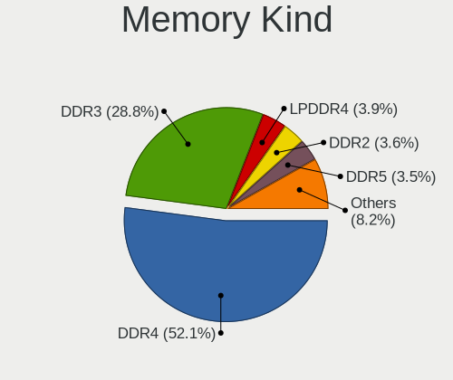

| Kind    | Computers | Percent |
|---------|-----------|---------|
| DDR4    | 658       | 52.56%  |
| DDR3    | 376       | 30.03%  |
| LPDDR4  | 52        | 4.15%   |
| DDR2    | 48        | 3.83%   |
| LPDDR3  | 31        | 2.48%   |
| SDRAM   | 27        | 2.16%   |
| DDR5    | 23        | 1.84%   |
| LPDDR5  | 19        | 1.52%   |
| Unknown | 15        | 1.2%    |
| DDR     | 3         | 0.24%   |

Memory Form Factor
------------------

Physical design of the memory module

| Name         | Computers | Percent |
|--------------|-----------|---------|
| SODIMM       | 685       | 54.58%  |
| DIMM         | 458       | 36.49%  |
| Row Of Chips | 102       | 8.13%   |
| Chip         | 8         | 0.64%   |
| FB-DIMM      | 1         | 0.08%   |
| Unknown      | 1         | 0.08%   |

Memory Size
-----------

Memory module size

| Size  | Computers | Percent |
|-------|-----------|---------|
| 8192  | 558       | 41.09%  |
| 4096  | 291       | 21.43%  |
| 16384 | 283       | 20.84%  |
| 2048  | 136       | 10.01%  |
| 32768 | 57        | 4.2%    |
| 1024  | 26        | 1.91%   |
| 512   | 4         | 0.29%   |
| 65536 | 1         | 0.07%   |
| 256   | 1         | 0.07%   |
| 16    | 1         | 0.07%   |

Memory Speed
------------

Memory module speed

| Speed   | Computers | Percent |
|---------|-----------|---------|
| 3200    | 248       | 18.42%  |
| 1600    | 233       | 17.31%  |
| 2667    | 182       | 13.52%  |
| 2400    | 112       | 8.32%   |
| 1333    | 73        | 5.42%   |
| 2133    | 66        | 4.9%    |
| 3600    | 47        | 3.49%   |
| 1334    | 32        | 2.38%   |
| 667     | 29        | 2.15%   |
| 1867    | 23        | 1.71%   |
| 4267    | 21        | 1.56%   |
| 3733    | 20        | 1.49%   |
| 6400    | 17        | 1.26%   |
| 1800    | 16        | 1.19%   |
| 800     | 16        | 1.19%   |
| 3800    | 13        | 0.97%   |
| 4800    | 12        | 0.89%   |
| 3000    | 12        | 0.89%   |
| 1067    | 12        | 0.89%   |
| Unknown | 12        | 0.89%   |
| 3266    | 11        | 0.82%   |
| 4199    | 9         | 0.67%   |
| 2933    | 9         | 0.67%   |
| 8400    | 8         | 0.59%   |
| 5600    | 8         | 0.59%   |
| 3866    | 7         | 0.52%   |
| 3400    | 7         | 0.52%   |
| 2666    | 7         | 0.52%   |
| 1866    | 7         | 0.52%   |
| 1066    | 7         | 0.52%   |
| 2048    | 6         | 0.45%   |
| 3066    | 5         | 0.37%   |
| 6000    | 4         | 0.3%    |
| 4266    | 4         | 0.3%    |
| 4000    | 4         | 0.3%    |
| 3666    | 4         | 0.3%    |
| 3534    | 3         | 0.22%   |
| 3466    | 3         | 0.22%   |
| 2134    | 3         | 0.22%   |
| 533     | 3         | 0.22%   |

Printers & scanners
-------------------

Printer Vendor
--------------

Printer device vendors

| Vendor                | Computers | Percent |
|-----------------------|-----------|---------|
| Hewlett-Packard       | 18        | 29.03%  |
| Canon                 | 17        | 27.42%  |
| Brother Industries    | 11        | 17.74%  |
| Seiko Epson           | 6         | 9.68%   |
| Samsung Electronics   | 4         | 6.45%   |
| Ricoh                 | 1         | 1.61%   |
| QinHeng Electronics   | 1         | 1.61%   |
| Prolific Technology   | 1         | 1.61%   |
| Oki Data              | 1         | 1.61%   |
| Lexmark International | 1         | 1.61%   |
| Dell                  | 1         | 1.61%   |

Printer Model
-------------

Printer device models

| Model                                                      | Computers | Percent |
|------------------------------------------------------------|-----------|---------|
| HP Deskjet 3520 series                                     | 3         | 4.69%   |
| Seiko Epson XP-235 Series                                  | 2         | 3.13%   |
| Seiko Epson WF-2530 Series                                 | 2         | 3.13%   |
| Samsung C48x Series Color Laser Multifunction Printer      | 2         | 3.13%   |
| HP LaserJet 1320                                           | 2         | 3.13%   |
| HP ENVY 4520 series                                        | 2         | 3.13%   |
| Canon TS5100 series                                        | 2         | 3.13%   |
| Canon PIXMA MG2500 Series                                  | 2         | 3.13%   |
| Canon LiDE 300                                             | 2         | 3.13%   |
| Brother Printer                                            | 2         | 3.13%   |
| Brother MFC-L2710DW series                                 | 2         | 3.13%   |
| Brother HL-3040CN series                                   | 2         | 3.13%   |
| Seiko Epson ET-4750 [WorkForce ET-4750 EcoTank All-in-One] | 1         | 1.56%   |
| Seiko Epson AL-M310DN                                      | 1         | 1.56%   |
| Samsung SCX-4300 Series                                    | 1         | 1.56%   |
| Samsung M2070 Series                                       | 1         | 1.56%   |
| Ricoh SP 213SUw                                            | 1         | 1.56%   |
| QinHeng CH340S                                             | 1         | 1.56%   |
| Prolific PL2305 Parallel Port                              | 1         | 1.56%   |
| Oki Data USB Device                                        | 1         | 1.56%   |
| Lexmark International CS417dn                              | 1         | 1.56%   |
| HP OfficeJet Pro 7720 series                               | 1         | 1.56%   |
| HP LaserJet Professional P1102w                            | 1         | 1.56%   |
| HP LaserJet P1102                                          | 1         | 1.56%   |
| HP LaserJet 1200                                           | 1         | 1.56%   |
| HP LaserJet 1022                                           | 1         | 1.56%   |
| HP ENVY Pro 6400 series                                    | 1         | 1.56%   |
| HP ENVY Photo 6200 series                                  | 1         | 1.56%   |
| HP ENVY 5000 series                                        | 1         | 1.56%   |
| HP DeskJet 940c                                            | 1         | 1.56%   |
| HP DeskJet 2700 series                                     | 1         | 1.56%   |
| HP DeskJet 2600 series                                     | 1         | 1.56%   |
| HP Deskjet 2050 J510                                       | 1         | 1.56%   |
| HP Color Laser 150nw                                       | 1         | 1.56%   |
| Dell C1760nw Color Printer                                 | 1         | 1.56%   |
| Canon TS700 series                                         | 1         | 1.56%   |
| Canon TS6300 series                                        | 1         | 1.56%   |
| Canon PIXMA MX320 series                                   | 1         | 1.56%   |
| Canon PIXMA iX6850 Printer                                 | 1         | 1.56%   |
| Canon MG2100 series                                        | 1         | 1.56%   |

Scanner Vendor
--------------

Scanner device vendors

| Vendor          | Computers | Percent |
|-----------------|-----------|---------|
| Canon           | 26        | 76.47%  |
| Seiko Epson     | 4         | 11.76%  |
| Fujitsu         | 3         | 8.82%   |
| Hewlett-Packard | 1         | 2.94%   |

Scanner Model
-------------

Scanner device models

| Model                                                    | Computers | Percent |
|----------------------------------------------------------|-----------|---------|
| Canon CanoScan                                           | 4         | 11.76%  |
| Fujitsu ScanSnap SV600                                   | 3         | 8.82%   |
| Canon CanoScan N670U/N676U/LiDE 20                       | 3         | 8.82%   |
| Canon CanoScan LiDE 110                                  | 3         | 8.82%   |
| Seiko Epson GT-F500/GT-F550 [Perfection 2480/2580 PHOTO] | 2         | 5.88%   |
| Canon CanoScan N1240U/LiDE 30                            | 2         | 5.88%   |
| Canon CanoScan LiDE 60                                   | 2         | 5.88%   |
| Canon CanoScan LiDE 50/LiDE 35/LiDE 40                   | 2         | 5.88%   |
| Canon CanoScan LiDE 220                                  | 2         | 5.88%   |
| Canon CanoScan LiDE 200                                  | 2         | 5.88%   |
| Canon CanoScan LiDE 100                                  | 2         | 5.88%   |
| Seiko Epson GT-9300UF [Perfection 2400 PHOTO]            | 1         | 2.94%   |
| Seiko Epson GT-7200U [Perfection 1250/1250 PHOTO]        | 1         | 2.94%   |
| HP ScanJet 4850C/4890C                                   | 1         | 2.94%   |
| Canon CanoScan N650U/N656U                               | 1         | 2.94%   |
| Canon CanoScan LIDE 25                                   | 1         | 2.94%   |
| Canon CanoScan LiDE 210                                  | 1         | 2.94%   |
| Canon CanoScan FB630U                                    | 1         | 2.94%   |

Camera
------

Camera Vendor
-------------

Camera device vendors

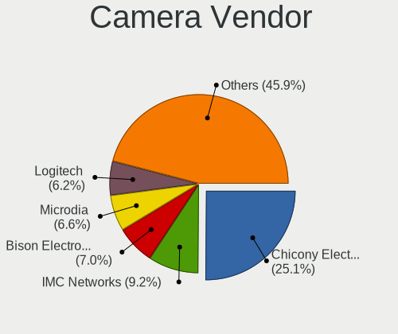

| Vendor                                 | Computers | Percent |
|----------------------------------------|-----------|---------|
| Chicony Electronics                    | 323       | 25.39%  |
| IMC Networks                           | 115       | 9.04%   |
| Bison Electronics                      | 79        | 6.21%   |
| Microdia                               | 77        | 6.05%   |
| Logitech                               | 74        | 5.82%   |
| Realtek Semiconductor                  | 67        | 5.27%   |
| Sunplus Innovation Technology          | 66        | 5.19%   |
| Quanta                                 | 58        | 4.56%   |
| Apple                                  | 42        | 3.3%    |
| Lite-On Technology                     | 40        | 3.14%   |
| Cheng Uei Precision Industry (Foxlink) | 36        | 2.83%   |
| Suyin                                  | 35        | 2.75%   |
| Acer                                   | 31        | 2.44%   |
| Luxvisions Innotech Limited            | 29        | 2.28%   |
| Syntek                                 | 26        | 2.04%   |
| Microsoft                              | 20        | 1.57%   |
| Alcor Micro                            | 16        | 1.26%   |
| Samsung Electronics                    | 12        | 0.94%   |
| Lenovo                                 | 9         | 0.71%   |
| Z-Star Microelectronics                | 8         | 0.63%   |
| Ricoh                                  | 7         | 0.55%   |
| Jieli Technology                       | 7         | 0.55%   |
| Primax Electronics                     | 6         | 0.47%   |
| ARC International                      | 5         | 0.39%   |
| SunplusIT                              | 4         | 0.31%   |
| Sunplus IT                             | 4         | 0.31%   |
| Sonix Technology                       | 4         | 0.31%   |
| Silicon Motion                         | 4         | 0.31%   |
| OmniVision Technologies                | 4         | 0.31%   |
| icSpring                               | 4         | 0.31%   |
| ShineTech                              | 3         | 0.24%   |
| SHENZHEN EMEET TECHNOLOGY              | 3         | 0.24%   |
| SHENZHEN AONI ELECTRONIC               | 3         | 0.24%   |
| KYE Systems (Mouse Systems)            | 3         | 0.24%   |
| Generalplus Technology                 | 3         | 0.24%   |
| Fujitsu                                | 3         | 0.24%   |
| DigiTech                               | 3         | 0.24%   |
| XHT-211220-ZW                          | 2         | 0.16%   |
| Trust                                  | 2         | 0.16%   |
| Tobii Technology AB                    | 2         | 0.16%   |

Camera Model
------------

Camera device models

| Model                                   | Computers | Percent |
|-----------------------------------------|-----------|---------|
| Chicony Integrated Camera               | 85        | 6.63%   |
| IMC Networks Integrated Camera          | 55        | 4.29%   |
| Microdia Integrated_Webcam_HD           | 30        | 2.34%   |
| Chicony HD Webcam                       | 27        | 2.1%    |
| Bison Integrated Camera                 | 26        | 2.03%   |
| IMC Networks USB2.0 HD UVC WebCam       | 22        | 1.71%   |
| Chicony HP HD Camera                    | 21        | 1.64%   |
| Quanta HD User Facing                   | 17        | 1.33%   |
| Realtek Integrated_Webcam_HD            | 16        | 1.25%   |
| Acer Integrated Camera                  | 16        | 1.25%   |
| Lite-On Integrated Camera               | 15        | 1.17%   |
| Syntek Integrated Camera                | 14        | 1.09%   |
| Sunplus Integrated_Webcam_HD            | 14        | 1.09%   |
| Quanta HP HD Camera                     | 14        | 1.09%   |
| Apple iPhone 5/5C/5S/6/SE/7/8/X         | 14        | 1.09%   |
| Samsung Galaxy series, misc. (MTP mode) | 12        | 0.94%   |
| Lite-On HP HD Camera                    | 12        | 0.94%   |
| IMC Networks USB2.0 VGA UVC WebCam      | 12        | 0.94%   |
| Apple FaceTime HD Camera                | 12        | 0.94%   |
| Logitech Webcam C270                    | 11        | 0.86%   |
| Logitech HD Pro Webcam C920             | 11        | 0.86%   |
| Chicony TOSHIBA Web Camera - HD         | 11        | 0.86%   |
| Realtek USB2.0 HD UVC WebCam            | 10        | 0.78%   |
| Chicony VGA WebCam                      | 10        | 0.78%   |
| Chicony USB2.0 HD UVC WebCam            | 10        | 0.78%   |
| Chicony HP HD Webcam                    | 10        | 0.78%   |
| Bison SunplusIT Integrated Camera       | 10        | 0.78%   |
| Apple Built-in iSight                   | 10        | 0.78%   |
| Sunplus PC Camera                       | 9         | 0.7%    |
| Chicony Integrated Camera (1280x720@30) | 9         | 0.7%    |
| Microsoft LifeCam HD-3000               | 8         | 0.62%   |
| Microdia USB 2.0 Camera                 | 8         | 0.62%   |
| Logitech C922 Pro Stream Webcam         | 8         | 0.62%   |
| Chicony Integrated HP HD Webcam         | 8         | 0.62%   |
| Chicony HP TrueVision HD Camera         | 8         | 0.62%   |
| Chicony HD User Facing                  | 8         | 0.62%   |
| Chicony FJ Camera                       | 8         | 0.62%   |
| Bison HD Webcam                         | 8         | 0.62%   |
| Realtek HD WebCam                       | 7         | 0.55%   |
| Microdia Webcam Vitade AF               | 7         | 0.55%   |

Security
--------

Fingerprint Vendor
------------------

Fingerprint sensor vendors

| Vendor                     | Computers | Percent |
|----------------------------|-----------|---------|
| Synaptics                  | 132       | 37.71%  |
| Validity Sensors           | 127       | 36.29%  |
| Shenzhen Goodix Technology | 33        | 9.43%   |
| Upek                       | 18        | 5.14%   |
| AuthenTec                  | 17        | 4.86%   |
| Elan Microelectronics      | 13        | 3.71%   |
| LighTuning Technology      | 8         | 2.29%   |
| STMicroelectronics         | 1         | 0.29%   |
| Focal-systems.Corp         | 1         | 0.29%   |

Fingerprint Model
-----------------

Fingerprint sensor models

| Model                                                                      | Computers | Percent |
|----------------------------------------------------------------------------|-----------|---------|
| Synaptics Prometheus MIS Touch Fingerprint Reader                          | 53        | 15.1%   |
| Validity Sensors VFS495 Fingerprint Reader                                 | 35        | 9.97%   |
| Shenzhen Goodix  Fingerprint Device                                        | 21        | 5.98%   |
| Validity Sensors Synaptics WBDI                                            | 18        | 5.13%   |
| Upek Biometric Touchchip/Touchstrip Fingerprint Sensor                     | 18        | 5.13%   |
| Synaptics WBDI                                                             | 13        | 3.7%    |
| Validity Sensors VFS471 Fingerprint Reader                                 | 12        | 3.42%   |
| Validity Sensors VFS491                                                    | 11        | 3.13%   |
| Validity Sensors VFS5011 Fingerprint Reader                                | 10        | 2.85%   |
| Synaptics Metallica MIS Touch Fingerprint Reader                           | 10        | 2.85%   |
| Synaptics Fingerprint reader [HP G6]                                       | 10        | 2.85%   |
| Synaptics  FS7604 Touch Fingerprint Sensor with PurePrint                  | 8         | 2.28%   |
| AuthenTec AES2810                                                          | 8         | 2.28%   |
| Validity Sensors VFS7500 Touch Fingerprint Sensor                          | 7         | 1.99%   |
| Validity Sensors VFS 5011 fingerprint sensor                               | 7         | 1.99%   |
| Validity Sensors Fingerprint scanner                                       | 7         | 1.99%   |
| Synaptics FS7604 Touch Fingerprint Sensor with PurePrint                   | 7         | 1.99%   |
| Shenzhen Goodix Fingerprint Reader                                         | 7         | 1.99%   |
| Synaptics UWP WBDI Device                                                  | 6         | 1.71%   |
| Synaptics Metallica MOH Touch Fingerprint Reader                           | 6         | 1.71%   |
| Elan ELAN:Fingerprint                                                      | 6         | 1.71%   |
| Validity Sensors VFS451 Fingerprint Reader                                 | 5         | 1.42%   |
| Validity Sensors Synaptics VFS7552 Touch Fingerprint Sensor with PurePrint | 5         | 1.42%   |
| Synaptics UWP WBDI                                                         | 5         | 1.42%   |
| Shenzhen Goodix FingerPrint                                                | 5         | 1.42%   |
| Elan ELAN:ARM-M4                                                           | 5         | 1.42%   |
| Synaptics WBDI Device                                                      | 4         | 1.14%   |
| LighTuning ES603 Swipe Fingerprint Sensor                                  | 4         | 1.14%   |
| AuthenTec Fingerprint Sensor                                               | 4         | 1.14%   |
| Validity Sensors VFS Fingerprint sensor                                    | 3         | 0.85%   |
| Validity Sensors Synaptics VFS7552 Touch Fingerprint Sensor                | 3         | 0.85%   |
| Validity Sensors Swipe Fingerprint Sensor                                  | 3         | 0.85%   |
| Synaptics  WBDI Fingerprint Reader - USB 052                               | 3         | 0.85%   |
| Synaptics  WBDI                                                            | 3         | 0.85%   |
| LighTuning EgisTec Touch Fingerprint Sensor                                | 3         | 0.85%   |
| AuthenTec AES2501 Fingerprint Sensor                                       | 3         | 0.85%   |
| Synaptics TouchPad                                                         | 2         | 0.57%   |
| Elan fingerprint sensor [FeinTech FPS00200]                                | 2         | 0.57%   |
| Validity Sensors VFS301 Fingerprint Reader                                 | 1         | 0.28%   |
| Synaptics WBDI Fingerprint Reader USB 102                                  | 1         | 0.28%   |

Chipcard Vendor
---------------

Chipcard module vendors

| Vendor                | Computers | Percent |
|-----------------------|-----------|---------|
| Alcor Micro           | 92        | 52.87%  |
| Broadcom              | 47        | 27.01%  |
| Lenovo                | 12        | 6.9%    |
| Upek                  | 10        | 5.75%   |
| O2 Micro              | 5         | 2.87%   |
| Realtek Semiconductor | 2         | 1.15%   |
| Cherry                | 2         | 1.15%   |
| SCM Microsystems      | 1         | 0.57%   |
| OmniKey               | 1         | 0.57%   |
| Gemalto (was Gemplus) | 1         | 0.57%   |
| Advanced Card Systems | 1         | 0.57%   |

Chipcard Model
--------------

Chipcard module models

| Model                                                                        | Computers | Percent |
|------------------------------------------------------------------------------|-----------|---------|
| Alcor Micro AU9540 Smartcard Reader                                          | 91        | 52.3%   |
| Broadcom BCM5880 Secure Applications Processor                               | 18        | 10.34%  |
| Broadcom BCM5880 Secure Applications Processor with fingerprint swipe sensor | 12        | 6.9%    |
| Lenovo Integrated Smart Card Reader                                          | 11        | 6.32%   |
| Upek TouchChip Fingerprint Coprocessor (WBF advanced mode)                   | 10        | 5.75%   |
| Broadcom 58200                                                               | 10        | 5.75%   |
| Broadcom 5880                                                                | 7         | 4.02%   |
| O2 Micro OZ776 CCID Smartcard Reader                                         | 4         | 2.3%    |
| Realtek Semiconductor Smart Card Reader Interface                            | 2         | 1.15%   |
| SCM Microsystems SCR3340 - ExpressCard54 Smart Card Reader                   | 1         | 0.57%   |
| OmniKey CardMan 3021 / 3121                                                  | 1         | 0.57%   |
| O2 Micro Oz776 SmartCard Reader                                              | 1         | 0.57%   |
| Lenovo Smartcard Keyboard                                                    | 1         | 0.57%   |
| Gemalto (was Gemplus) GemPC Twin SmartCard Reader                            | 1         | 0.57%   |
| Cherry SmartTerminal XX44                                                    | 1         | 0.57%   |
| Cherry Smart Terminal XX44                                                   | 1         | 0.57%   |
| Alcor Micro Watchdata W 1981                                                 | 1         | 0.57%   |
| Advanced Card Systems ACR122U                                                | 1         | 0.57%   |

Unsupported
-----------

Unsupported Devices
-------------------

Total unsupported devices on board

| Total | Computers | Percent |
|-------|-----------|---------|
| 0     | 1502      | 65.56%  |
| 1     | 597       | 26.06%  |
| 2     | 136       | 5.94%   |
| 3     | 33        | 1.44%   |
| 4     | 10        | 0.44%   |
| 5     | 6         | 0.26%   |
| 6     | 4         | 0.17%   |
| 8     | 2         | 0.09%   |
| 7     | 1         | 0.04%   |

Unsupported Device Types
------------------------

Types of unsupported devices

| Type                     | Computers | Percent |
|--------------------------|-----------|---------|
| Fingerprint reader       | 343       | 33.93%  |
| Graphics card            | 167       | 16.52%  |
| Chipcard                 | 138       | 13.65%  |
| Net/wireless             | 114       | 11.28%  |
| Multimedia controller    | 62        | 6.13%   |
| Communication controller | 37        | 3.66%   |
| Unassigned class         | 26        | 2.57%   |
| Camera                   | 26        | 2.57%   |
| Bluetooth                | 25        | 2.47%   |
| Sound                    | 24        | 2.37%   |
| Card reader              | 12        | 1.19%   |
| Net/ethernet             | 9         | 0.89%   |
| Storage                  | 7         | 0.69%   |
| Modem                    | 5         | 0.49%   |
| Network                  | 4         | 0.4%    |
| Storage/raid             | 3         | 0.3%    |
| Tv card                  | 2         | 0.2%    |
| Storage/ide              | 2         | 0.2%    |
| Flash memory             | 2         | 0.2%    |
| Storage/nvme             | 1         | 0.1%    |
| Storage/ata              | 1         | 0.1%    |
| Firewire controller      | 1         | 0.1%    |

