Linux in Austria - Tested Hardware & Statistics (Desktops)
----------------------------------------------------------

A project to collect tested hardware configurations for Linux in Austria.

Anyone can contribute to this report by the [hw-probe](https://github.com/linuxhw/hw-probe) tool:

    sudo -E hw-probe -all -upload

Please contribute! Especially if your hardware is rare.

Contents
--------

* [ Test Cases ](#test-cases)

* [ System ](#system)
  - [ OS                       ](#os)
  - [ OS Family                ](#os-family)
  - [ Kernel                   ](#kernel)
  - [ Kernel Family            ](#kernel-family)
  - [ Kernel Major Ver.        ](#kernel-major-ver)
  - [ Arch                     ](#arch)
  - [ DE                       ](#de)
  - [ Display Server           ](#display-server)
  - [ Display Manager          ](#display-manager)
  - [ OS Lang                  ](#os-lang)
  - [ Boot Mode                ](#boot-mode)
  - [ Filesystem               ](#filesystem)
  - [ Part. scheme             ](#part-scheme)
  - [ Dual Boot with Linux/BSD ](#dual-boot-with-linuxbsd)
  - [ Dual Boot (Win)          ](#dual-boot-win)

* [ Board ](#board)
  - [ Vendor                   ](#vendor)
  - [ Model                    ](#model)
  - [ Model Family             ](#model-family)
  - [ MFG Year                 ](#mfg-year)
  - [ Form Factor              ](#form-factor)
  - [ Secure Boot              ](#secure-boot)
  - [ Coreboot                 ](#coreboot)
  - [ RAM Size                 ](#ram-size)
  - [ RAM Used                 ](#ram-used)
  - [ Total Drives             ](#total-drives)
  - [ Has CD-ROM               ](#has-cd-rom)
  - [ Has Ethernet             ](#has-ethernet)
  - [ Has WiFi                 ](#has-wifi)
  - [ Has Bluetooth            ](#has-bluetooth)

* [ Location ](#location)
  - [ Country                  ](#country)
  - [ City                     ](#city)

* [ Drives ](#drives)
  - [ Drive Vendor             ](#drive-vendor)
  - [ Drive Model              ](#drive-model)
  - [ HDD Vendor               ](#hdd-vendor)
  - [ SSD Vendor               ](#ssd-vendor)
  - [ Drive Kind               ](#drive-kind)
  - [ Drive Connector          ](#drive-connector)
  - [ Drive Size               ](#drive-size)
  - [ Space Total              ](#space-total)
  - [ Space Used               ](#space-used)
  - [ Malfunc. Drives          ](#malfunc-drives)
  - [ Malfunc. Drive Vendor    ](#malfunc-drive-vendor)
  - [ Malfunc. HDD Vendor      ](#malfunc-hdd-vendor)
  - [ Malfunc. Drive Kind      ](#malfunc-drive-kind)
  - [ Failed Drives            ](#failed-drives)
  - [ Failed Drive Vendor      ](#failed-drive-vendor)
  - [ Drive Status             ](#drive-status)

* [ Storage controller ](#storage-controller)
  - [ Storage Vendor           ](#storage-vendor)
  - [ Storage Model            ](#storage-model)
  - [ Storage Kind             ](#storage-kind)

* [ Processor ](#processor)
  - [ CPU Vendor               ](#cpu-vendor)
  - [ CPU Model                ](#cpu-model)
  - [ CPU Model Family         ](#cpu-model-family)
  - [ CPU Cores                ](#cpu-cores)
  - [ CPU Sockets              ](#cpu-sockets)
  - [ CPU Threads              ](#cpu-threads)
  - [ CPU Op-Modes             ](#cpu-op-modes)
  - [ CPU Microcode            ](#cpu-microcode)
  - [ CPU Microarch            ](#cpu-microarch)

* [ Graphics ](#graphics)
  - [ GPU Vendor               ](#gpu-vendor)
  - [ GPU Model                ](#gpu-model)
  - [ GPU Combo                ](#gpu-combo)
  - [ GPU Driver               ](#gpu-driver)
  - [ GPU Memory               ](#gpu-memory)

* [ Monitor ](#monitor)
  - [ Monitor Vendor           ](#monitor-vendor)
  - [ Monitor Model            ](#monitor-model)
  - [ Monitor Resolution       ](#monitor-resolution)
  - [ Monitor Diagonal         ](#monitor-diagonal)
  - [ Monitor Width            ](#monitor-width)
  - [ Aspect Ratio             ](#aspect-ratio)
  - [ Monitor Area             ](#monitor-area)
  - [ Pixel Density            ](#pixel-density)
  - [ Multiple Monitors        ](#multiple-monitors)

* [ Network ](#network)
  - [ Net Controller Vendor    ](#net-controller-vendor)
  - [ Net Controller Model     ](#net-controller-model)
  - [ Wireless Vendor          ](#wireless-vendor)
  - [ Wireless Model           ](#wireless-model)
  - [ Ethernet Vendor          ](#ethernet-vendor)
  - [ Ethernet Model           ](#ethernet-model)
  - [ Net Controller Kind      ](#net-controller-kind)
  - [ Used Controller          ](#used-controller)
  - [ NICs                     ](#nics)
  - [ IPv6                     ](#ipv6)

* [ Bluetooth ](#bluetooth)
  - [ Bluetooth Vendor         ](#bluetooth-vendor)
  - [ Bluetooth Model          ](#bluetooth-model)

* [ Sound ](#sound)
  - [ Sound Vendor             ](#sound-vendor)
  - [ Sound Model              ](#sound-model)

* [ Memory ](#memory)
  - [ Memory Vendor            ](#memory-vendor)
  - [ Memory Model             ](#memory-model)
  - [ Memory Kind              ](#memory-kind)
  - [ Memory Form Factor       ](#memory-form-factor)
  - [ Memory Size              ](#memory-size)
  - [ Memory Speed             ](#memory-speed)

* [ Printers & scanners ](#printers--scanners)
  - [ Printer Vendor           ](#printer-vendor)
  - [ Printer Model            ](#printer-model)
  - [ Scanner Vendor           ](#scanner-vendor)
  - [ Scanner Model            ](#scanner-model)

* [ Camera ](#camera)
  - [ Camera Vendor            ](#camera-vendor)
  - [ Camera Model             ](#camera-model)

* [ Security ](#security)
  - [ Fingerprint Vendor       ](#fingerprint-vendor)
  - [ Fingerprint Model        ](#fingerprint-model)
  - [ Chipcard Vendor          ](#chipcard-vendor)
  - [ Chipcard Model           ](#chipcard-model)

* [ Unsupported ](#unsupported)
  - [ Unsupported Devices      ](#unsupported-devices)
  - [ Unsupported Device Types ](#unsupported-device-types)

Test Cases
----------

Total: 771

| Vendor        | Model                       | Probe                                                      | Date         |
|---------------|-----------------------------|------------------------------------------------------------|--------------|
| ASRock        | B450 Steel Legend           | [d2a6709c96](https://linux-hardware.org/?probe=d2a6709c96) | May 06, 2022 |
| Gigabyte      | B550 AORUS PRO V2           | [feaa2cb9fb](https://linux-hardware.org/?probe=feaa2cb9fb) | May 06, 2022 |
| ASUSTek       | ROG STRIX B550-A GAMING     | [935eb1722b](https://linux-hardware.org/?probe=935eb1722b) | May 02, 2022 |
| ASUSTek       | ROG STRIX B350-F GAMING     | [925447d7e9](https://linux-hardware.org/?probe=925447d7e9) | May 01, 2022 |
| ASUSTek       | ROG STRIX B350-F GAMING     | [b1e331055f](https://linux-hardware.org/?probe=b1e331055f) | May 01, 2022 |
| MSI           | B550M PRO-VDH WIFI          | [b923126955](https://linux-hardware.org/?probe=b923126955) | Apr 27, 2022 |
| ASRock        | H110 Pro BTC+               | [1251ef669d](https://linux-hardware.org/?probe=1251ef669d) | Apr 24, 2022 |
| ASUSTek       | M4A89GTD-PRO/USB3           | [dbb48b83bf](https://linux-hardware.org/?probe=dbb48b83bf) | Apr 24, 2022 |
| ASUSTek       | M4A78-E                     | [e4779f4dc8](https://linux-hardware.org/?probe=e4779f4dc8) | Apr 23, 2022 |
| ASRock        | X470 Taichi Ultimate        | [d10be6941f](https://linux-hardware.org/?probe=d10be6941f) | Apr 20, 2022 |
| ASRock        | Z490 Pro4                   | [67071d11a1](https://linux-hardware.org/?probe=67071d11a1) | Apr 18, 2022 |
| Gigabyte      | B450 AORUS ELITE            | [e269a6b9b8](https://linux-hardware.org/?probe=e269a6b9b8) | Apr 18, 2022 |
| ASUSTek       | P7P55D LE                   | [381477f3e6](https://linux-hardware.org/?probe=381477f3e6) | Apr 15, 2022 |
| Fujitsu       | D3434-S2 S26361-D3434-S2    | [7ff488cc8d](https://linux-hardware.org/?probe=7ff488cc8d) | Apr 14, 2022 |
| MSI           | MPG X570 GAMING EDGE WIF... | [cf0c239670](https://linux-hardware.org/?probe=cf0c239670) | Apr 13, 2022 |
| ASUSTek       | ROG STRIX B450-F GAMING     | [9af096ef7f](https://linux-hardware.org/?probe=9af096ef7f) | Apr 13, 2022 |
| ASUSTek       | PRIME X370-A                | [cb3eb74403](https://linux-hardware.org/?probe=cb3eb74403) | Apr 13, 2022 |
| ASUSTek       | P9X79                       | [b7a035ea6b](https://linux-hardware.org/?probe=b7a035ea6b) | Apr 13, 2022 |
| ASUSTek       | ROG STRIX B550-I GAMING     | [f75dc153d0](https://linux-hardware.org/?probe=f75dc153d0) | Apr 13, 2022 |
| ASUSTek       | M5A97 EVO R2.0              | [3930b32e77](https://linux-hardware.org/?probe=3930b32e77) | Apr 12, 2022 |
| ASUSTek       | M5A97 EVO R2.0              | [1e302e1cce](https://linux-hardware.org/?probe=1e302e1cce) | Apr 12, 2022 |
| Medion        | MS-7707                     | [fb95ae3a92](https://linux-hardware.org/?probe=fb95ae3a92) | Apr 09, 2022 |
| Lenovo        | 314F SDK0T08861 WIN 3305... | [fa2e3ae8ee](https://linux-hardware.org/?probe=fa2e3ae8ee) | Apr 08, 2022 |
| ASUSTek       | P9X79                       | [d82eb40c27](https://linux-hardware.org/?probe=d82eb40c27) | Apr 05, 2022 |
| ECS           | CMLU-MINI                   | [742c0da37b](https://linux-hardware.org/?probe=742c0da37b) | Apr 05, 2022 |
| Gigabyte      | B75M-D3V                    | [16d1981053](https://linux-hardware.org/?probe=16d1981053) | Apr 04, 2022 |
| MSI           | MEG X570 UNIFY              | [0c57600526](https://linux-hardware.org/?probe=0c57600526) | Apr 03, 2022 |
| ASUSTek       | ROG STRIX B550-XE GAMING... | [a9cf0523c2](https://linux-hardware.org/?probe=a9cf0523c2) | Mar 31, 2022 |
| MSI           | MAG B660 TOMAHAWK WIFI D... | [99acee5d56](https://linux-hardware.org/?probe=99acee5d56) | Mar 29, 2022 |
| Lenovo        | 30BC SDK0J40705 WIN 3425... | [85a3c0a47e](https://linux-hardware.org/?probe=85a3c0a47e) | Mar 29, 2022 |
| Acer          | Aspire XC-885 V:1.1         | [8696148b4a](https://linux-hardware.org/?probe=8696148b4a) | Mar 29, 2022 |
| Lenovo        | 30BC SDK0J40705 WIN 3425... | [973087697b](https://linux-hardware.org/?probe=973087697b) | Mar 28, 2022 |
| ASUSTek       | M3A32-MVP DELUXE            | [1bfef458ea](https://linux-hardware.org/?probe=1bfef458ea) | Mar 20, 2022 |
| ASUSTek       | TUF Gaming B550-PLUS        | [d2b4181439](https://linux-hardware.org/?probe=d2b4181439) | Mar 16, 2022 |
| Dell          | 0T7D40 A01                  | [192926e183](https://linux-hardware.org/?probe=192926e183) | Mar 14, 2022 |
| Acer          | Predator PO3-600 V:1.1      | [fc992250ca](https://linux-hardware.org/?probe=fc992250ca) | Mar 13, 2022 |
| ASRock        | Z87M Extreme4               | [dba57ee1b3](https://linux-hardware.org/?probe=dba57ee1b3) | Mar 12, 2022 |
| MSI           | H81M-P33                    | [0f103bcb15](https://linux-hardware.org/?probe=0f103bcb15) | Mar 12, 2022 |
| MSI           | H81M-P33                    | [304738db66](https://linux-hardware.org/?probe=304738db66) | Mar 11, 2022 |
| ASRock        | B450M Pro4                  | [12459fc7ea](https://linux-hardware.org/?probe=12459fc7ea) | Mar 11, 2022 |
| MSI           | H81M-P33                    | [cf152def87](https://linux-hardware.org/?probe=cf152def87) | Mar 09, 2022 |
| MSI           | H81M-P33                    | [546746c825](https://linux-hardware.org/?probe=546746c825) | Mar 07, 2022 |
| MSI           | H81M-P33                    | [493fe1a76a](https://linux-hardware.org/?probe=493fe1a76a) | Mar 07, 2022 |
| ASUSTek       | PRIME X299-DELUXE II        | [5183569327](https://linux-hardware.org/?probe=5183569327) | Mar 06, 2022 |
| MSI           | H81M-P33                    | [731850ebaf](https://linux-hardware.org/?probe=731850ebaf) | Mar 06, 2022 |
| MSI           | H81M-P33                    | [4595a12a77](https://linux-hardware.org/?probe=4595a12a77) | Feb 28, 2022 |
| MSI           | H81M-P33                    | [60e41d668b](https://linux-hardware.org/?probe=60e41d668b) | Feb 27, 2022 |
| BESSTAR Te... | UM200 V1.0                  | [bae5f3ad77](https://linux-hardware.org/?probe=bae5f3ad77) | Feb 26, 2022 |
| MSI           | H81M-P33                    | [647a154bd6](https://linux-hardware.org/?probe=647a154bd6) | Feb 25, 2022 |
| ASUSTek       | P9X79                       | [cd0609e2cc](https://linux-hardware.org/?probe=cd0609e2cc) | Feb 25, 2022 |
| ASUSTek       | P9X79                       | [f576f08ecb](https://linux-hardware.org/?probe=f576f08ecb) | Feb 24, 2022 |
| MSI           | H81M-P33                    | [64955f775b](https://linux-hardware.org/?probe=64955f775b) | Feb 24, 2022 |
| Medion        | B250H4-EM                   | [851288ccf7](https://linux-hardware.org/?probe=851288ccf7) | Feb 22, 2022 |
| Medion        | B250H4-EM                   | [825c88d62b](https://linux-hardware.org/?probe=825c88d62b) | Feb 22, 2022 |
| MSI           | MAG B550 TOMAHAWK           | [803b4d504c](https://linux-hardware.org/?probe=803b4d504c) | Feb 19, 2022 |
| HP            | 8906 SMVB                   | [ae83ee4d22](https://linux-hardware.org/?probe=ae83ee4d22) | Feb 19, 2022 |
| ASRock        | X299 Taichi XE              | [04a1425dca](https://linux-hardware.org/?probe=04a1425dca) | Feb 17, 2022 |
| ASRock        | X299 Taichi XE              | [45b82f5330](https://linux-hardware.org/?probe=45b82f5330) | Feb 17, 2022 |
| MSI           | Z270 GAMING PRO             | [6c6a916a0b](https://linux-hardware.org/?probe=6c6a916a0b) | Feb 15, 2022 |
| ASUSTek       | ROG STRIX Z590-A GAMING ... | [4ff66e932f](https://linux-hardware.org/?probe=4ff66e932f) | Feb 13, 2022 |
| HP            | 3397                        | [8ea2c45260](https://linux-hardware.org/?probe=8ea2c45260) | Feb 13, 2022 |
| Lenovo        | ThinkCentre A58 7515M6G     | [7b86a1d792](https://linux-hardware.org/?probe=7b86a1d792) | Feb 12, 2022 |
| HP            | 3397                        | [f92e367657](https://linux-hardware.org/?probe=f92e367657) | Feb 12, 2022 |
| ASUSTek       | PRIME X299-DELUXE II        | [b229af38f0](https://linux-hardware.org/?probe=b229af38f0) | Feb 12, 2022 |
| Biostar       | A10N-8800E                  | [8231d95ddc](https://linux-hardware.org/?probe=8231d95ddc) | Feb 12, 2022 |
| Intel         | DH67GD AAG10206-202         | [56c802164a](https://linux-hardware.org/?probe=56c802164a) | Feb 11, 2022 |
| HP            | 1494                        | [93502b8c70](https://linux-hardware.org/?probe=93502b8c70) | Feb 11, 2022 |
| MSI           | B550-A PRO                  | [577fc1abce](https://linux-hardware.org/?probe=577fc1abce) | Feb 11, 2022 |
| ASUSTek       | TUF B365M-PLUS GAMING       | [529666b867](https://linux-hardware.org/?probe=529666b867) | Feb 10, 2022 |
| ASRock        | H81M-HDS                    | [5f2ada50f9](https://linux-hardware.org/?probe=5f2ada50f9) | Feb 10, 2022 |
| ASRock        | 970 Pro3 R2.0               | [c83ca2e528](https://linux-hardware.org/?probe=c83ca2e528) | Feb 10, 2022 |
| HP            | 8906 SMVB                   | [646a1296e0](https://linux-hardware.org/?probe=646a1296e0) | Feb 10, 2022 |
| ASUSTek       | SABERTOOTH Z77              | [4706a4f369](https://linux-hardware.org/?probe=4706a4f369) | Feb 10, 2022 |
| Lenovo        | 30BC SDK0J40705 WIN 3425... | [c945332cad](https://linux-hardware.org/?probe=c945332cad) | Feb 10, 2022 |
| Lenovo        | 30BC SDK0J40705 WIN 3425... | [eb3836e9d0](https://linux-hardware.org/?probe=eb3836e9d0) | Feb 10, 2022 |
| ASUSTek       | PRIME X570-PRO              | [88181832a0](https://linux-hardware.org/?probe=88181832a0) | Feb 09, 2022 |
| ASUSTek       | PRIME X570-PRO              | [9ff4906aa1](https://linux-hardware.org/?probe=9ff4906aa1) | Feb 09, 2022 |
| ASUSTek       | H97-PLUS                    | [435e9532a8](https://linux-hardware.org/?probe=435e9532a8) | Feb 09, 2022 |
| HP            | 8906 SMVB                   | [454f14e47d](https://linux-hardware.org/?probe=454f14e47d) | Feb 09, 2022 |
| ASUSTek       | TUF GAMING Z690-PLUS WIF... | [ab81e91207](https://linux-hardware.org/?probe=ab81e91207) | Feb 08, 2022 |
| Dell          | 0GY6Y8 A01                  | [8b8eda08e4](https://linux-hardware.org/?probe=8b8eda08e4) | Feb 07, 2022 |
| Dell          | 042P49 A00                  | [9f98143f82](https://linux-hardware.org/?probe=9f98143f82) | Feb 07, 2022 |
| ASUSTek       | Z87-A                       | [b48601a549](https://linux-hardware.org/?probe=b48601a549) | Jan 31, 2022 |
| ASUSTek       | Z87-A                       | [b62cc09b63](https://linux-hardware.org/?probe=b62cc09b63) | Jan 30, 2022 |
| ASRock        | 970 Extreme4                | [f024dd97a0](https://linux-hardware.org/?probe=f024dd97a0) | Jan 29, 2022 |
| HP            | 8906 SMVB                   | [8005514f7c](https://linux-hardware.org/?probe=8005514f7c) | Jan 29, 2022 |
| ASUSTek       | P8H77-M PRO                 | [16d9024680](https://linux-hardware.org/?probe=16d9024680) | Jan 26, 2022 |
| HP            | 8906 SMVB                   | [132c3acbb1](https://linux-hardware.org/?probe=132c3acbb1) | Jan 26, 2022 |
| Gigabyte      | B550 AORUS PRO V2           | [dfe4dda46b](https://linux-hardware.org/?probe=dfe4dda46b) | Jan 26, 2022 |
| MSI           | B450M MORTAR MAX            | [619b081f40](https://linux-hardware.org/?probe=619b081f40) | Jan 23, 2022 |
| MSI           | MPG Z390 GAMING PLUS        | [635e361ebb](https://linux-hardware.org/?probe=635e361ebb) | Jan 22, 2022 |
| HP            | 1998                        | [422b7b3f1c](https://linux-hardware.org/?probe=422b7b3f1c) | Jan 21, 2022 |
| ASUSTek       | ROG CROSSHAIR VIII HERO     | [0aab49a3e3](https://linux-hardware.org/?probe=0aab49a3e3) | Jan 20, 2022 |
| HP            | 8906 SMVB                   | [566e943f08](https://linux-hardware.org/?probe=566e943f08) | Jan 16, 2022 |
| ASUSTek       | ROG STRIX B550-I GAMING     | [6438d5a5af](https://linux-hardware.org/?probe=6438d5a5af) | Jan 15, 2022 |
| HP            | 8906 SMVB                   | [118b411a8c](https://linux-hardware.org/?probe=118b411a8c) | Jan 12, 2022 |
| ASUSTek       | Maximus VII FORMULA         | [960bd82b34](https://linux-hardware.org/?probe=960bd82b34) | Jan 11, 2022 |
| MSI           | B360M PRO-VDH               | [bd136c19e0](https://linux-hardware.org/?probe=bd136c19e0) | Jan 10, 2022 |
| ASUSTek       | H81M-PLUS                   | [67ab65d5f0](https://linux-hardware.org/?probe=67ab65d5f0) | Jan 10, 2022 |
| ASUSTek       | F2A85-V PRO                 | [9333fdb2cc](https://linux-hardware.org/?probe=9333fdb2cc) | Jan 06, 2022 |
| ASRock        | Z77 Pro4-M                  | [c3ddad9a30](https://linux-hardware.org/?probe=c3ddad9a30) | Jan 03, 2022 |
| ASRock        | X370 Killer SLI             | [7c10b6f7ae](https://linux-hardware.org/?probe=7c10b6f7ae) | Dec 30, 2021 |
| Unknown       | Unknown                     | [cbe80d8c24](https://linux-hardware.org/?probe=cbe80d8c24) | Dec 30, 2021 |
| Dell          | 051FJ8 A02                  | [8cc53ce548](https://linux-hardware.org/?probe=8cc53ce548) | Dec 30, 2021 |
| Gigabyte      | Z170N-WIFI-CF               | [9bcfc1e034](https://linux-hardware.org/?probe=9bcfc1e034) | Dec 23, 2021 |
| HP            | 8906 SMVB                   | [673f8e22cd](https://linux-hardware.org/?probe=673f8e22cd) | Dec 22, 2021 |
| MSI           | MAG B550 TOMAHAWK           | [6653477f61](https://linux-hardware.org/?probe=6653477f61) | Dec 18, 2021 |
| MSI           | X470 GAMING PLUS MAX        | [b3d411a4d7](https://linux-hardware.org/?probe=b3d411a4d7) | Dec 18, 2021 |
| Gigabyte      | GA-870A-UD3                 | [c4b9060346](https://linux-hardware.org/?probe=c4b9060346) | Dec 18, 2021 |
| ASUSTek       | M4A77                       | [4231ac26aa](https://linux-hardware.org/?probe=4231ac26aa) | Dec 17, 2021 |
| ASUSTek       | ROG STRIX X570-E GAMING     | [9fce8b9430](https://linux-hardware.org/?probe=9fce8b9430) | Dec 12, 2021 |
| MSI           | MAG B550 TOMAHAWK           | [bd4a0c5d2f](https://linux-hardware.org/?probe=bd4a0c5d2f) | Dec 12, 2021 |
| ASUSTek       | STRIX Z270F GAMING          | [89dd614f98](https://linux-hardware.org/?probe=89dd614f98) | Dec 09, 2021 |
| Acer          | Aspire XC-605               | [770f6167f6](https://linux-hardware.org/?probe=770f6167f6) | Dec 08, 2021 |
| MSI           | X470 GAMING PLUS MAX        | [01b9229bd4](https://linux-hardware.org/?probe=01b9229bd4) | Dec 08, 2021 |
| MSI           | X570-A PRO                  | [d2704f29ec](https://linux-hardware.org/?probe=d2704f29ec) | Dec 06, 2021 |
| ASUSTek       | P9X79-E WS                  | [b65be23e52](https://linux-hardware.org/?probe=b65be23e52) | Dec 06, 2021 |
| HP            | 8906 SMVB                   | [24e7aef97f](https://linux-hardware.org/?probe=24e7aef97f) | Dec 05, 2021 |
| ASRockRack    | C3558D4I-4L                 | [d563eb82ae](https://linux-hardware.org/?probe=d563eb82ae) | Dec 04, 2021 |
| Gigabyte      | Z270P-D3-CF                 | [ca35105e1a](https://linux-hardware.org/?probe=ca35105e1a) | Dec 04, 2021 |
| HP            | 21D0                        | [50548c11b7](https://linux-hardware.org/?probe=50548c11b7) | Dec 04, 2021 |
| Lenovo        | MAHOBAY                     | [e6f6525ecd](https://linux-hardware.org/?probe=e6f6525ecd) | Dec 01, 2021 |
| ASUSTek       | ROG STRIX B450-F GAMING     | [a1669a775b](https://linux-hardware.org/?probe=a1669a775b) | Nov 30, 2021 |
| ASUSTek       | ROG STRIX B450-F GAMING     | [0d42fdd2bf](https://linux-hardware.org/?probe=0d42fdd2bf) | Nov 30, 2021 |
| Medion        | MS-7748                     | [bb473ca5d8](https://linux-hardware.org/?probe=bb473ca5d8) | Nov 29, 2021 |
| ASUSTek       | TUF GAMING B550-PLUS        | [f6ab5c54f6](https://linux-hardware.org/?probe=f6ab5c54f6) | Nov 27, 2021 |
| Dell          | 0T7D40 A01                  | [065636c444](https://linux-hardware.org/?probe=065636c444) | Nov 25, 2021 |
| MSI           | A78M-E35                    | [999bbc1197](https://linux-hardware.org/?probe=999bbc1197) | Nov 24, 2021 |
| Acer          | Revo 70                     | [f5cdb95334](https://linux-hardware.org/?probe=f5cdb95334) | Nov 24, 2021 |
| Acer          | Revo 70                     | [4c99b6ac71](https://linux-hardware.org/?probe=4c99b6ac71) | Nov 24, 2021 |
| ASRock        | X570 Pro4                   | [1cce90a2eb](https://linux-hardware.org/?probe=1cce90a2eb) | Nov 23, 2021 |
| HP            | 0AECh D                     | [c81bcc92ca](https://linux-hardware.org/?probe=c81bcc92ca) | Nov 19, 2021 |
| HP            | ProLiant MicroServer Gen... | [0178a25382](https://linux-hardware.org/?probe=0178a25382) | Nov 18, 2021 |
| ASUSTek       | P7P55D EVO                  | [f453f8d58d](https://linux-hardware.org/?probe=f453f8d58d) | Nov 18, 2021 |
| ASUSTek       | Z170-P                      | [1e333032a4](https://linux-hardware.org/?probe=1e333032a4) | Nov 14, 2021 |
| HP            | 8906 SMVB                   | [0b98c04caf](https://linux-hardware.org/?probe=0b98c04caf) | Nov 11, 2021 |
| ASRock        | P67 Pro3                    | [17c9af356a](https://linux-hardware.org/?probe=17c9af356a) | Nov 08, 2021 |
| ASUSTek       | Z170-P                      | [37f9ff3c0b](https://linux-hardware.org/?probe=37f9ff3c0b) | Nov 07, 2021 |
| HP            | 8906 SMVB                   | [f9352b9088](https://linux-hardware.org/?probe=f9352b9088) | Nov 06, 2021 |
| MSI           | MAG Z490 TOMAHAWK           | [5cea4f8e91](https://linux-hardware.org/?probe=5cea4f8e91) | Nov 04, 2021 |
| Dell          | 0Y2MRG A00                  | [80cfec46fc](https://linux-hardware.org/?probe=80cfec46fc) | Nov 03, 2021 |
| ASUSTek       | TUF Z390-PLUS GAMING        | [4877535f8b](https://linux-hardware.org/?probe=4877535f8b) | Nov 03, 2021 |
| ASRock        | A320M-HDV R4.0              | [267a4603eb](https://linux-hardware.org/?probe=267a4603eb) | Nov 02, 2021 |
| ASUSTek       | TUF GAMING B550-PLUS        | [500411363b](https://linux-hardware.org/?probe=500411363b) | Nov 01, 2021 |
| Gigabyte      | P55M-UD2                    | [b14c0e8dd2](https://linux-hardware.org/?probe=b14c0e8dd2) | Oct 29, 2021 |
| MSI           | A78M-E35                    | [69da26c946](https://linux-hardware.org/?probe=69da26c946) | Oct 29, 2021 |
| ASUSTek       | SABERTOOTH X79              | [2b361b1035](https://linux-hardware.org/?probe=2b361b1035) | Oct 28, 2021 |
| ASUSTek       | M11BB                       | [c049f2b753](https://linux-hardware.org/?probe=c049f2b753) | Oct 28, 2021 |
| HP            | 8906 SMVB                   | [b40ea88da1](https://linux-hardware.org/?probe=b40ea88da1) | Oct 25, 2021 |
| HP            | 8906 SMVB                   | [30b96b341e](https://linux-hardware.org/?probe=30b96b341e) | Oct 24, 2021 |
| Acer          | FIH57                       | [719b6ffbe5](https://linux-hardware.org/?probe=719b6ffbe5) | Oct 24, 2021 |
| ASUSTek       | PRIME J4005I-C              | [2c5d786879](https://linux-hardware.org/?probe=2c5d786879) | Oct 20, 2021 |
| Intel         | D54250WYK H13922-303        | [21b715e26a](https://linux-hardware.org/?probe=21b715e26a) | Oct 17, 2021 |
| Medion        | B250H4-EM                   | [e9d4b3c500](https://linux-hardware.org/?probe=e9d4b3c500) | Oct 15, 2021 |
| Medion        | B250H4-EM                   | [a728d25c99](https://linux-hardware.org/?probe=a728d25c99) | Oct 15, 2021 |
| Gigabyte      | H61MA-D2V                   | [3968e39b0b](https://linux-hardware.org/?probe=3968e39b0b) | Oct 12, 2021 |
| ASUSTek       | PRIME A320I-K               | [eee2a960f5](https://linux-hardware.org/?probe=eee2a960f5) | Oct 11, 2021 |
| Gigabyte      | B450 I AORUS PRO WIFI-CF    | [4054b4ec35](https://linux-hardware.org/?probe=4054b4ec35) | Oct 11, 2021 |
| HP            | 8906 SMVB                   | [8fca5ef20e](https://linux-hardware.org/?probe=8fca5ef20e) | Oct 11, 2021 |
| ASUSTek       | ROG STRIX B450-F GAMING     | [971cdf3ab8](https://linux-hardware.org/?probe=971cdf3ab8) | Oct 11, 2021 |
| Gigabyte      | B450 AORUS ELITE            | [d01c751c63](https://linux-hardware.org/?probe=d01c751c63) | Oct 11, 2021 |
| MSI           | MPG B550I GAMING EDGE WI... | [719e7db7f5](https://linux-hardware.org/?probe=719e7db7f5) | Oct 09, 2021 |
| Gigabyte      | X570 AORUS PRO              | [d3c72411ee](https://linux-hardware.org/?probe=d3c72411ee) | Oct 09, 2021 |
| HP            | 212B                        | [a4318b7064](https://linux-hardware.org/?probe=a4318b7064) | Oct 06, 2021 |
| ASUSTek       | Pro WS WRX80E-SAGE SE WI... | [8f7011b085](https://linux-hardware.org/?probe=8f7011b085) | Oct 03, 2021 |
| Lenovo        | 102F SDK0J40697 WIN 3305... | [b6eca9083a](https://linux-hardware.org/?probe=b6eca9083a) | Oct 01, 2021 |
| Lenovo        | 102F SDK0J40697 WIN 3305... | [415f0d9244](https://linux-hardware.org/?probe=415f0d9244) | Oct 01, 2021 |
| Gigabyte      | GA-M56S-S3                  | [4502947e1a](https://linux-hardware.org/?probe=4502947e1a) | Sep 30, 2021 |
| ASRock        | Z170 Gaming K4              | [f107c84c00](https://linux-hardware.org/?probe=f107c84c00) | Sep 30, 2021 |
| MSI           | 790FX-GD70                  | [ba5f2949aa](https://linux-hardware.org/?probe=ba5f2949aa) | Sep 26, 2021 |
| ASUSTek       | P7P55D LE                   | [45b6a5f65a](https://linux-hardware.org/?probe=45b6a5f65a) | Sep 25, 2021 |
| Gigabyte      | Z590 D                      | [97c779cffc](https://linux-hardware.org/?probe=97c779cffc) | Sep 20, 2021 |
| ASUSTek       | Maximus VIII RANGER         | [83649103a6](https://linux-hardware.org/?probe=83649103a6) | Sep 18, 2021 |
| ASUSTek       | Maximus VIII RANGER         | [ee40317007](https://linux-hardware.org/?probe=ee40317007) | Sep 18, 2021 |
| ASUSTek       | Maximus VIII RANGER         | [ae610c34e9](https://linux-hardware.org/?probe=ae610c34e9) | Sep 16, 2021 |
| ASUSTek       | P5K-VM                      | [59fc10448f](https://linux-hardware.org/?probe=59fc10448f) | Sep 14, 2021 |
| MSI           | Z170-A PRO                  | [5b702a6c05](https://linux-hardware.org/?probe=5b702a6c05) | Sep 12, 2021 |
| HP            | 8767 A                      | [bb5655cf3b](https://linux-hardware.org/?probe=bb5655cf3b) | Sep 12, 2021 |
| ASUSTek       | Maximus VIII RANGER         | [bc2d35138c](https://linux-hardware.org/?probe=bc2d35138c) | Sep 10, 2021 |
| Unknown       | 1.21                        | [dbf4f53e70](https://linux-hardware.org/?probe=dbf4f53e70) | Sep 05, 2021 |
| Biostar       | X470NH                      | [f0449b9946](https://linux-hardware.org/?probe=f0449b9946) | Sep 04, 2021 |
| Gigabyte      | M52LT-D3P                   | [949b2062ea](https://linux-hardware.org/?probe=949b2062ea) | Sep 03, 2021 |
| Gigabyte      | GB-BRR7H-4800               | [68da5f41b2](https://linux-hardware.org/?probe=68da5f41b2) | Aug 27, 2021 |
| Gigabyte      | GB-BRR7H-4800               | [f76e6521ae](https://linux-hardware.org/?probe=f76e6521ae) | Aug 27, 2021 |
| Gigabyte      | GB-BRR7H-4800               | [d87877599e](https://linux-hardware.org/?probe=d87877599e) | Aug 26, 2021 |
| Shuttle       | FS61                        | [fc97f7167b](https://linux-hardware.org/?probe=fc97f7167b) | Aug 26, 2021 |
| HP            | 8906 SMVB                   | [ea16eee1c7](https://linux-hardware.org/?probe=ea16eee1c7) | Aug 24, 2021 |
| HP            | 8906 SMVB                   | [5f90a39c6f](https://linux-hardware.org/?probe=5f90a39c6f) | Aug 20, 2021 |
| HP            | 8906 SMVB                   | [49410afaa3](https://linux-hardware.org/?probe=49410afaa3) | Aug 19, 2021 |
| HP            | 8906 SMVB                   | [aa67d33730](https://linux-hardware.org/?probe=aa67d33730) | Aug 18, 2021 |
| HP            | 8906 SMVB                   | [2c85178e09](https://linux-hardware.org/?probe=2c85178e09) | Aug 18, 2021 |
| ASRock        | J4205-ITX                   | [30de75d2c8](https://linux-hardware.org/?probe=30de75d2c8) | Aug 18, 2021 |
| Medion        | MS-7707                     | [66ace31297](https://linux-hardware.org/?probe=66ace31297) | Aug 16, 2021 |
| ASRock        | Z590 Pro4                   | [5d9a3a97f2](https://linux-hardware.org/?probe=5d9a3a97f2) | Aug 16, 2021 |
| ASUSTek       | TUF GAMING B450M-PRO II     | [73beb900ea](https://linux-hardware.org/?probe=73beb900ea) | Aug 15, 2021 |
| ASRock        | H97M Pro4                   | [5edf7e02c8](https://linux-hardware.org/?probe=5edf7e02c8) | Aug 14, 2021 |
| MSI           | MAG B550 TOMAHAWK           | [3fd838012c](https://linux-hardware.org/?probe=3fd838012c) | Aug 12, 2021 |
| HP            | 8906 SMVB                   | [98dc285619](https://linux-hardware.org/?probe=98dc285619) | Aug 11, 2021 |
| HP            | 8906 SMVB                   | [4c7e9555c1](https://linux-hardware.org/?probe=4c7e9555c1) | Aug 08, 2021 |
| Dell          | 0T7D40 A01                  | [0728097100](https://linux-hardware.org/?probe=0728097100) | Aug 06, 2021 |
| MSI           | MAG B550 TOMAHAWK           | [2c843a3d35](https://linux-hardware.org/?probe=2c843a3d35) | Aug 04, 2021 |
| ASUSTek       | ROG STRIX B550-F GAMING     | [729ae360b5](https://linux-hardware.org/?probe=729ae360b5) | Aug 03, 2021 |
| HP            | 1495                        | [48e893c344](https://linux-hardware.org/?probe=48e893c344) | Aug 03, 2021 |
| Fujitsu       | D3162-A1 S26361-D3162-A1    | [50136afddd](https://linux-hardware.org/?probe=50136afddd) | Aug 02, 2021 |
| Fujitsu       | D3162-A1 S26361-D3162-A1    | [27e7a22365](https://linux-hardware.org/?probe=27e7a22365) | Aug 02, 2021 |
| Gigabyte      | Z390 AORUS ULTRA-CF         | [55f86a29a2](https://linux-hardware.org/?probe=55f86a29a2) | Jul 29, 2021 |
| ASUSTek       | ROG STRIX B550-I GAMING     | [816edfa4bb](https://linux-hardware.org/?probe=816edfa4bb) | Jul 25, 2021 |
| Gigabyte      | AB350M-DS3H V2-CF           | [8b1c4f962a](https://linux-hardware.org/?probe=8b1c4f962a) | Jul 25, 2021 |
| ASUSTek       | B150M-K                     | [34e2582dc2](https://linux-hardware.org/?probe=34e2582dc2) | Jul 25, 2021 |
| ASUSTek       | X79-DELUXE                  | [bc56fe50dd](https://linux-hardware.org/?probe=bc56fe50dd) | Jul 24, 2021 |
| MSI           | B85M-E45                    | [16178cb493](https://linux-hardware.org/?probe=16178cb493) | Jul 24, 2021 |
| ASUSTek       | Z170-WS                     | [3368a26a83](https://linux-hardware.org/?probe=3368a26a83) | Jul 23, 2021 |
| Acer          | Aspire TC-780               | [cc39834e1d](https://linux-hardware.org/?probe=cc39834e1d) | Jul 21, 2021 |
| ASUSTek       | F2A85-V                     | [ad05a07bb3](https://linux-hardware.org/?probe=ad05a07bb3) | Jul 19, 2021 |
| HP            | 1495                        | [f2affe9c46](https://linux-hardware.org/?probe=f2affe9c46) | Jul 18, 2021 |
| HP            | 212A                        | [56cd9e7eaa](https://linux-hardware.org/?probe=56cd9e7eaa) | Jul 18, 2021 |
| HP            | 0AECh D                     | [9b91275879](https://linux-hardware.org/?probe=9b91275879) | Jul 13, 2021 |
| Gigabyte      | B450 AORUS ELITE            | [497c16be4b](https://linux-hardware.org/?probe=497c16be4b) | Jul 12, 2021 |
| HP            | 0AECh D                     | [540f6d1b4e](https://linux-hardware.org/?probe=540f6d1b4e) | Jul 11, 2021 |
| ASUSTek       | ROG STRIX Z490-E GAMING     | [7adcf7dc7c](https://linux-hardware.org/?probe=7adcf7dc7c) | Jul 09, 2021 |
| Gigabyte      | B450 AORUS ELITE            | [07e45f519d](https://linux-hardware.org/?probe=07e45f519d) | Jul 09, 2021 |
| ASRock        | H67M                        | [660e47da08](https://linux-hardware.org/?probe=660e47da08) | Jul 08, 2021 |
| ASUSTek       | Maximus VII HERO            | [1e8044f366](https://linux-hardware.org/?probe=1e8044f366) | Jul 07, 2021 |
| MSI           | A78M-E35                    | [cef9d93dd1](https://linux-hardware.org/?probe=cef9d93dd1) | Jul 05, 2021 |
| ASUSTek       | F2A85-V                     | [877795d0fa](https://linux-hardware.org/?probe=877795d0fa) | Jul 05, 2021 |
| ASUSTek       | M5A97 LE R2.0               | [647b8b3725](https://linux-hardware.org/?probe=647b8b3725) | Jul 02, 2021 |
| Gigabyte      | Z390 M GAMING-CF            | [9a49b1159d](https://linux-hardware.org/?probe=9a49b1159d) | Jul 01, 2021 |
| ASUSTek       | Maximus VII HERO            | [0e605c5229](https://linux-hardware.org/?probe=0e605c5229) | Jun 26, 2021 |
| Dell          | 0T7D40 A01                  | [2ca0105e55](https://linux-hardware.org/?probe=2ca0105e55) | Jun 24, 2021 |
| Dell          | 0T7D40 A01                  | [5ee785eb32](https://linux-hardware.org/?probe=5ee785eb32) | Jun 24, 2021 |
| MSI           | MPG X570 GAMING EDGE WIF... | [dbc4494db2](https://linux-hardware.org/?probe=dbc4494db2) | Jun 23, 2021 |
| Gigabyte      | X570 AORUS PRO              | [ea70f9fe3b](https://linux-hardware.org/?probe=ea70f9fe3b) | Jun 23, 2021 |
| MSI           | Z170A SLI PLUS              | [d715625644](https://linux-hardware.org/?probe=d715625644) | Jun 22, 2021 |
| ASUSTek       | F2A85-V                     | [aeee617ccd](https://linux-hardware.org/?probe=aeee617ccd) | Jun 20, 2021 |
| Unknown       | Unknown                     | [489dc53e4d](https://linux-hardware.org/?probe=489dc53e4d) | Jun 20, 2021 |
| Unknown       | Unknown                     | [077a1849dd](https://linux-hardware.org/?probe=077a1849dd) | Jun 20, 2021 |
| MSI           | B450 GAMING PLUS MAX        | [bd42ad29b1](https://linux-hardware.org/?probe=bd42ad29b1) | Jun 18, 2021 |
| MSI           | MPG X570 GAMING EDGE WIF... | [42e10b10fd](https://linux-hardware.org/?probe=42e10b10fd) | Jun 15, 2021 |
| Gigabyte      | Z590 VISION G               | [c3b20ee137](https://linux-hardware.org/?probe=c3b20ee137) | Jun 12, 2021 |
| ASRock        | ALiveXFire-eSATA2           | [17af721bae](https://linux-hardware.org/?probe=17af721bae) | Jun 10, 2021 |
| Lenovo        | SDK0E50510 WIN 262508179... | [489ce4720c](https://linux-hardware.org/?probe=489ce4720c) | Jun 06, 2021 |
| ASRock        | H87 Pro4                    | [5f78dd5211](https://linux-hardware.org/?probe=5f78dd5211) | Jun 06, 2021 |
| ASUSTek       | P7P55D LE                   | [5e58b5909b](https://linux-hardware.org/?probe=5e58b5909b) | Jun 04, 2021 |
| ASUSTek       | P7P55D LE                   | [119ec1d3ba](https://linux-hardware.org/?probe=119ec1d3ba) | Jun 04, 2021 |
| Gigabyte      | Z590 VISION G               | [ea4492aeee](https://linux-hardware.org/?probe=ea4492aeee) | May 30, 2021 |
| MSI           | H97 PC Mate                 | [05dcac5e7f](https://linux-hardware.org/?probe=05dcac5e7f) | May 30, 2021 |
| ASUSTek       | P5Q-E                       | [ef3b21caf0](https://linux-hardware.org/?probe=ef3b21caf0) | May 30, 2021 |
| Gigabyte      | 990FXA-UD3                  | [02fee32807](https://linux-hardware.org/?probe=02fee32807) | May 29, 2021 |
| HP            | 1495                        | [660c4ff2ed](https://linux-hardware.org/?probe=660c4ff2ed) | May 28, 2021 |
| ASRock        | J5040-ITX                   | [5ffe86e682](https://linux-hardware.org/?probe=5ffe86e682) | May 28, 2021 |
| Medion        | B460H6-EM                   | [0b9ae4f256](https://linux-hardware.org/?probe=0b9ae4f256) | May 28, 2021 |
| HP            | 198E                        | [39fd78a563](https://linux-hardware.org/?probe=39fd78a563) | May 26, 2021 |
| MSI           | X570-A PRO                  | [49eb802c2e](https://linux-hardware.org/?probe=49eb802c2e) | May 25, 2021 |
| ASRock        | A320M-HDV R4.0              | [2983d7e745](https://linux-hardware.org/?probe=2983d7e745) | May 25, 2021 |
| ASRock        | Z170 Extreme7+              | [324df6eb69](https://linux-hardware.org/?probe=324df6eb69) | May 25, 2021 |
| ASRock        | H77M                        | [3a362598fb](https://linux-hardware.org/?probe=3a362598fb) | May 23, 2021 |
| ASUSTek       | J1900I-C                    | [560fd63326](https://linux-hardware.org/?probe=560fd63326) | May 21, 2021 |
| ASRock        | B365M Pro4-F                | [9b31a1e94f](https://linux-hardware.org/?probe=9b31a1e94f) | May 21, 2021 |
| ASRock        | H77M                        | [e3d59b843a](https://linux-hardware.org/?probe=e3d59b843a) | May 21, 2021 |
| ASRock        | 970 Pro3 R2.0               | [d811152e10](https://linux-hardware.org/?probe=d811152e10) | May 19, 2021 |
| MSI           | B450 GAMING PLUS MAX        | [daf3bcdc44](https://linux-hardware.org/?probe=daf3bcdc44) | May 18, 2021 |
| ASUSTek       | P5B                         | [ff621cb51a](https://linux-hardware.org/?probe=ff621cb51a) | May 17, 2021 |
| ASUSTek       | Z170I PRO GAMING            | [c11404a76b](https://linux-hardware.org/?probe=c11404a76b) | May 14, 2021 |
| MSI           | H97 PC Mate                 | [14457815f8](https://linux-hardware.org/?probe=14457815f8) | May 13, 2021 |
| ASUSTek       | P8H77-M PRO                 | [524de3a747](https://linux-hardware.org/?probe=524de3a747) | May 09, 2021 |
| ASUSTek       | P8H77-M PRO                 | [daf2cdf31f](https://linux-hardware.org/?probe=daf2cdf31f) | May 09, 2021 |
| ASUSTek       | PRIME A320M-K               | [70628bdf55](https://linux-hardware.org/?probe=70628bdf55) | May 06, 2021 |
| Gigabyte      | H110N-CF                    | [d03c007deb](https://linux-hardware.org/?probe=d03c007deb) | May 06, 2021 |
| Gigabyte      | B450M S2H                   | [9e1c2c1ffd](https://linux-hardware.org/?probe=9e1c2c1ffd) | May 05, 2021 |
| Biostar       | A78MD                       | [3f56e00dd2](https://linux-hardware.org/?probe=3f56e00dd2) | May 04, 2021 |
| Gigabyte      | Z390 AORUS PRO WIFI-CF      | [573b65efbd](https://linux-hardware.org/?probe=573b65efbd) | May 02, 2021 |
| HP            | 844C                        | [913d5aff80](https://linux-hardware.org/?probe=913d5aff80) | Apr 30, 2021 |
| ASRock        | H110 Pro BTC+               | [799ad15d8b](https://linux-hardware.org/?probe=799ad15d8b) | Apr 30, 2021 |
| ASRock        | Z170 Extreme6+              | [74e3dec02b](https://linux-hardware.org/?probe=74e3dec02b) | Apr 29, 2021 |
| ASRock        | Z170 Extreme6+              | [7f2a8a7ab8](https://linux-hardware.org/?probe=7f2a8a7ab8) | Apr 29, 2021 |
| Dell          | 0Y7WYT A00                  | [399bf0d60e](https://linux-hardware.org/?probe=399bf0d60e) | Apr 28, 2021 |
| HP            | 304Bh                       | [dc42bd8e41](https://linux-hardware.org/?probe=dc42bd8e41) | Apr 27, 2021 |
| ASUSTek       | GRYPHON Z87                 | [8a54738ba0](https://linux-hardware.org/?probe=8a54738ba0) | Apr 26, 2021 |
| MSI           | X570-A PRO                  | [1a7d9facd2](https://linux-hardware.org/?probe=1a7d9facd2) | Apr 25, 2021 |
| ASRock        | Z170 Gaming K4              | [69ec5d246b](https://linux-hardware.org/?probe=69ec5d246b) | Apr 25, 2021 |
| ASRock        | P4i65G                      | [3818ed802a](https://linux-hardware.org/?probe=3818ed802a) | Apr 24, 2021 |
| Sapphire      | PI-AM3RS760G2               | [f54647d31e](https://linux-hardware.org/?probe=f54647d31e) | Apr 24, 2021 |
| Sapphire      | PI-AM3RS760G2               | [2ed84562eb](https://linux-hardware.org/?probe=2ed84562eb) | Apr 24, 2021 |
| MSI           | MS-7091                     | [f5d9a3ba0e](https://linux-hardware.org/?probe=f5d9a3ba0e) | Apr 19, 2021 |
| MSI           | B450M PRO-VDH MAX           | [ca0c473e06](https://linux-hardware.org/?probe=ca0c473e06) | Apr 18, 2021 |
| MSI           | X570-A PRO                  | [c4e4afedd6](https://linux-hardware.org/?probe=c4e4afedd6) | Apr 17, 2021 |
| ASUSTek       | J1900I-C                    | [e980e0a528](https://linux-hardware.org/?probe=e980e0a528) | Apr 17, 2021 |
| ASUSTek       | TUF GAMING Z490-PLUS        | [12b9e4bb0f](https://linux-hardware.org/?probe=12b9e4bb0f) | Apr 16, 2021 |
| ASUSTek       | M2N-MX                      | [8dd14baaf0](https://linux-hardware.org/?probe=8dd14baaf0) | Apr 16, 2021 |
| ASUSTek       | TUF GAMING Z490-PLUS        | [194e8387a6](https://linux-hardware.org/?probe=194e8387a6) | Apr 13, 2021 |
| Medion        | MS-7713                     | [0acac9a543](https://linux-hardware.org/?probe=0acac9a543) | Apr 13, 2021 |
| ASUSTek       | M2N-MX                      | [428f29609d](https://linux-hardware.org/?probe=428f29609d) | Apr 11, 2021 |
| ASRock        | X370 Taichi                 | [fbefa3cd0b](https://linux-hardware.org/?probe=fbefa3cd0b) | Apr 11, 2021 |
| ASUSTek       | P5QPL-AM                    | [b609880289](https://linux-hardware.org/?probe=b609880289) | Apr 10, 2021 |
| Acer          | Veriton M480                | [a7a0203b44](https://linux-hardware.org/?probe=a7a0203b44) | Apr 08, 2021 |
| MSI           | MPG X570 GAMING PLUS        | [e4dcbccb5c](https://linux-hardware.org/?probe=e4dcbccb5c) | Apr 05, 2021 |
| MSI           | X570-A PRO                  | [465d54d765](https://linux-hardware.org/?probe=465d54d765) | Apr 05, 2021 |
| Acer          | Nitro N50-600 V:1.1         | [e7ddf93f9f](https://linux-hardware.org/?probe=e7ddf93f9f) | Apr 04, 2021 |
| Acer          | Nitro N50-600 V:1.1         | [b281b84f5b](https://linux-hardware.org/?probe=b281b84f5b) | Apr 04, 2021 |
| MSI           | Z77 MPower                  | [a6d2710163](https://linux-hardware.org/?probe=a6d2710163) | Mar 31, 2021 |
| ASUSTek       | TUF GAMING Z490-PLUS        | [7100e0c7bc](https://linux-hardware.org/?probe=7100e0c7bc) | Mar 30, 2021 |
| ASRock        | J3160-NUC                   | [3f44c1a54f](https://linux-hardware.org/?probe=3f44c1a54f) | Mar 28, 2021 |
| ASUSTek       | PRIME H310-PLUS             | [6e36a57c6d](https://linux-hardware.org/?probe=6e36a57c6d) | Mar 28, 2021 |
| ASUSTek       | M2N-MX                      | [b8b93cf7a6](https://linux-hardware.org/?probe=b8b93cf7a6) | Mar 27, 2021 |
| Medion        | B550A4-EM                   | [641ec219ff](https://linux-hardware.org/?probe=641ec219ff) | Mar 27, 2021 |
| ASUSTek       | M2N-MX                      | [d158dbaf28](https://linux-hardware.org/?probe=d158dbaf28) | Mar 27, 2021 |
| Fujitsu       | D3222-A1 S26361-D3222-A1    | [ed38cf686e](https://linux-hardware.org/?probe=ed38cf686e) | Mar 26, 2021 |
| Fujitsu       | D3222-A1 S26361-D3222-A1    | [70072ce040](https://linux-hardware.org/?probe=70072ce040) | Mar 26, 2021 |
| Lenovo        | SHARKBAY NOK                | [87a2ba2f24](https://linux-hardware.org/?probe=87a2ba2f24) | Mar 25, 2021 |
| ASRock        | Z87 Extreme3                | [702e348746](https://linux-hardware.org/?probe=702e348746) | Mar 25, 2021 |
| ASUSTek       | F2A85-V                     | [a393c07087](https://linux-hardware.org/?probe=a393c07087) | Mar 20, 2021 |
| HP            | 1494                        | [8aec7a3cbf](https://linux-hardware.org/?probe=8aec7a3cbf) | Mar 20, 2021 |
| MSI           | B450-A PRO MAX              | [1f8eee9aa4](https://linux-hardware.org/?probe=1f8eee9aa4) | Mar 18, 2021 |
| HP            | 1998                        | [43924e927e](https://linux-hardware.org/?probe=43924e927e) | Mar 18, 2021 |
| HP            | 1998                        | [c98634a421](https://linux-hardware.org/?probe=c98634a421) | Mar 18, 2021 |
| MSI           | B450-A PRO MAX              | [a15b0ecd7b](https://linux-hardware.org/?probe=a15b0ecd7b) | Mar 18, 2021 |
| ASUSTek       | P8Z68-V LX                  | [d1673f61bc](https://linux-hardware.org/?probe=d1673f61bc) | Mar 17, 2021 |
| HP            | 1998                        | [01c248eed2](https://linux-hardware.org/?probe=01c248eed2) | Mar 16, 2021 |
| ASRock        | B365M Pro4-F                | [334bf85f9c](https://linux-hardware.org/?probe=334bf85f9c) | Mar 16, 2021 |
| ASRock        | H77M                        | [13d87f3380](https://linux-hardware.org/?probe=13d87f3380) | Mar 16, 2021 |
| Biostar       | A78MD                       | [2293475136](https://linux-hardware.org/?probe=2293475136) | Mar 15, 2021 |
| ASRock        | H77M                        | [f7f669b943](https://linux-hardware.org/?probe=f7f669b943) | Mar 14, 2021 |
| ASRock        | B365M Pro4-F                | [0c6489fca5](https://linux-hardware.org/?probe=0c6489fca5) | Mar 14, 2021 |
| ASUSTek       | Z170-A                      | [2fe6674c71](https://linux-hardware.org/?probe=2fe6674c71) | Mar 13, 2021 |
| ASRock        | X570 Taichi                 | [31906d8b73](https://linux-hardware.org/?probe=31906d8b73) | Mar 13, 2021 |
| Gigabyte      | Z390 AORUS PRO WIFI-CF      | [41735bfb3d](https://linux-hardware.org/?probe=41735bfb3d) | Mar 12, 2021 |
| ASUSTek       | Pro WS W480-ACE             | [3825190816](https://linux-hardware.org/?probe=3825190816) | Mar 11, 2021 |
| MSI           | H81M-P33                    | [5498e38a32](https://linux-hardware.org/?probe=5498e38a32) | Mar 10, 2021 |
| ASUSTek       | ROG STRIX B550-F GAMING     | [74c947442a](https://linux-hardware.org/?probe=74c947442a) | Mar 10, 2021 |
| ASUSTek       | ROG STRIX B550-F GAMING     | [a35ded4130](https://linux-hardware.org/?probe=a35ded4130) | Mar 09, 2021 |
| ASRock        | A300M-STX                   | [6377ea853f](https://linux-hardware.org/?probe=6377ea853f) | Mar 07, 2021 |
| ASUSTek       | P5Q3                        | [dd50fe59b2](https://linux-hardware.org/?probe=dd50fe59b2) | Mar 07, 2021 |
| MSI           | Z87-G45 GAMING              | [3464f180fe](https://linux-hardware.org/?probe=3464f180fe) | Mar 04, 2021 |
| Biostar       | A78MD                       | [0bd08c0771](https://linux-hardware.org/?probe=0bd08c0771) | Mar 02, 2021 |
| Gigabyte      | Z97X-UD7 TH-CF              | [332fc8bbcf](https://linux-hardware.org/?probe=332fc8bbcf) | Mar 01, 2021 |
| MSI           | B450 GAMING PRO CARBON A... | [94a4e1db49](https://linux-hardware.org/?probe=94a4e1db49) | Feb 28, 2021 |
| ASUSTek       | P5Q3                        | [55866b4bf2](https://linux-hardware.org/?probe=55866b4bf2) | Feb 28, 2021 |
| Biostar       | A78MD                       | [06b1319f09](https://linux-hardware.org/?probe=06b1319f09) | Feb 28, 2021 |
| Biostar       | A78MD                       | [6aff42d829](https://linux-hardware.org/?probe=6aff42d829) | Feb 28, 2021 |
| Biostar       | A78MD                       | [c468e84e6d](https://linux-hardware.org/?probe=c468e84e6d) | Feb 28, 2021 |
| MSI           | Z97 GAMING 9 ACK            | [11e9217472](https://linux-hardware.org/?probe=11e9217472) | Feb 28, 2021 |
| ASUSTek       | PRIME A320M-K               | [cb866ef0ba](https://linux-hardware.org/?probe=cb866ef0ba) | Feb 28, 2021 |
| MSI           | MAG B550 TOMAHAWK           | [8ad661d01b](https://linux-hardware.org/?probe=8ad661d01b) | Feb 26, 2021 |
| Lenovo        | SHARKBAY SDK0E50510 WIN     | [95f839ef17](https://linux-hardware.org/?probe=95f839ef17) | Feb 26, 2021 |
| ASUSTek       | ROG STRIX Z370-G GAMING     | [fe1a81c6bc](https://linux-hardware.org/?probe=fe1a81c6bc) | Feb 24, 2021 |
| Gigabyte      | A520M S2H                   | [f502acb72d](https://linux-hardware.org/?probe=f502acb72d) | Feb 24, 2021 |
| ASUSTek       | PRIME X370-PRO              | [91a16f1c67](https://linux-hardware.org/?probe=91a16f1c67) | Feb 21, 2021 |
| ASUSTek       | F2A85-V                     | [48e9166aea](https://linux-hardware.org/?probe=48e9166aea) | Feb 21, 2021 |
| ASUSTek       | M5A99X EVO                  | [2300d9d1f9](https://linux-hardware.org/?probe=2300d9d1f9) | Feb 20, 2021 |
| ASUSTek       | PRIME H310-PLUS             | [b0af95e7a7](https://linux-hardware.org/?probe=b0af95e7a7) | Feb 20, 2021 |
| Gigabyte      | GA-MA78LMT-S2               | [a642c82f46](https://linux-hardware.org/?probe=a642c82f46) | Feb 19, 2021 |
| MSI           | A320M-A PRO MAX             | [f22bf6b05d](https://linux-hardware.org/?probe=f22bf6b05d) | Feb 18, 2021 |
| HP            | ProLiant ML30 Gen9          | [f6af5a4d70](https://linux-hardware.org/?probe=f6af5a4d70) | Feb 16, 2021 |
| ASUSTek       | PRIME B450-PLUS             | [015f4f6c33](https://linux-hardware.org/?probe=015f4f6c33) | Feb 15, 2021 |
| ASUSTek       | Z87-C                       | [601b3fd251](https://linux-hardware.org/?probe=601b3fd251) | Feb 14, 2021 |
| ASUSTek       | B85-PRO GAMER               | [3cd9ecf495](https://linux-hardware.org/?probe=3cd9ecf495) | Feb 14, 2021 |
| Gigabyte      | B550I AORUS PRO AX          | [105a38c590](https://linux-hardware.org/?probe=105a38c590) | Feb 14, 2021 |
| ASRock        | Z77 Pro3                    | [d129998ffb](https://linux-hardware.org/?probe=d129998ffb) | Feb 13, 2021 |
| Gigabyte      | 970A-DS3P                   | [bdecca84fa](https://linux-hardware.org/?probe=bdecca84fa) | Feb 13, 2021 |
| ASRock        | Z77 Pro3                    | [06b57f0a75](https://linux-hardware.org/?probe=06b57f0a75) | Feb 13, 2021 |
| Dell          | 0WWJRX A00                  | [a3efc0b825](https://linux-hardware.org/?probe=a3efc0b825) | Feb 13, 2021 |
| ASUSTek       | P5QPL-AM                    | [d51e8f5abc](https://linux-hardware.org/?probe=d51e8f5abc) | Feb 10, 2021 |
| ASUSTek       | M2N-MX                      | [c8ae57e616](https://linux-hardware.org/?probe=c8ae57e616) | Feb 07, 2021 |
| ASUSTek       | P5E3 Deluxe                 | [47324765ec](https://linux-hardware.org/?probe=47324765ec) | Feb 02, 2021 |
| Dell          | 05XGC8 A01                  | [910c9c3e21](https://linux-hardware.org/?probe=910c9c3e21) | Feb 01, 2021 |
| Dell          | 05XGC8 A01                  | [46719a0e53](https://linux-hardware.org/?probe=46719a0e53) | Feb 01, 2021 |
| Dell          | 05XGC8 A01                  | [26c56ee065](https://linux-hardware.org/?probe=26c56ee065) | Feb 01, 2021 |
| Dell          | 05XGC8 A01                  | [b1c22c1894](https://linux-hardware.org/?probe=b1c22c1894) | Feb 01, 2021 |
| ASUSTek       | P5Q                         | [037cf0158e](https://linux-hardware.org/?probe=037cf0158e) | Jan 30, 2021 |
| ASUSTek       | P5Q                         | [aaa6e7b901](https://linux-hardware.org/?probe=aaa6e7b901) | Jan 30, 2021 |
| ASRock        | Z77 Pro3                    | [ea0df821be](https://linux-hardware.org/?probe=ea0df821be) | Jan 28, 2021 |
| ASRock        | Z77 Pro3                    | [9592e5cbb6](https://linux-hardware.org/?probe=9592e5cbb6) | Jan 28, 2021 |
| Lenovo        | SHARKBAY NOK                | [1a868457fe](https://linux-hardware.org/?probe=1a868457fe) | Jan 27, 2021 |
| HP            | 3646h                       | [e540758f9c](https://linux-hardware.org/?probe=e540758f9c) | Jan 26, 2021 |
| ASUSTek       | PRIME Z270-A                | [e6f737276c](https://linux-hardware.org/?probe=e6f737276c) | Jan 25, 2021 |
| ASUSTek       | ROG ZENITH EXTREME          | [5d23694899](https://linux-hardware.org/?probe=5d23694899) | Jan 24, 2021 |
| MSI           | Z170-A PRO                  | [6c8926dc8c](https://linux-hardware.org/?probe=6c8926dc8c) | Jan 23, 2021 |
| MSI           | Z97 GAMING 5                | [8da68cf0c1](https://linux-hardware.org/?probe=8da68cf0c1) | Jan 20, 2021 |
| HP            | 1998                        | [06c680725c](https://linux-hardware.org/?probe=06c680725c) | Jan 19, 2021 |
| Lenovo        | SHARKBAY 0B98401 PRO        | [536f80b3b5](https://linux-hardware.org/?probe=536f80b3b5) | Jan 17, 2021 |
| Lenovo        | SHARKBAY 0B98401 PRO        | [7d647c8ecb](https://linux-hardware.org/?probe=7d647c8ecb) | Jan 16, 2021 |
| MSI           | MS-7A66                     | [083df1e870](https://linux-hardware.org/?probe=083df1e870) | Jan 16, 2021 |
| ASRock        | X470 Taichi                 | [d7179bef44](https://linux-hardware.org/?probe=d7179bef44) | Jan 14, 2021 |
| Lenovo        | SHARKBAY NOK                | [742e66b7f0](https://linux-hardware.org/?probe=742e66b7f0) | Jan 12, 2021 |
| ASRock        | X470 Taichi                 | [da311c1d96](https://linux-hardware.org/?probe=da311c1d96) | Jan 11, 2021 |
| ASRock        | B450 Steel Legend           | [2b825ca52c](https://linux-hardware.org/?probe=2b825ca52c) | Jan 11, 2021 |
| HP            | 0AECh D                     | [8ae3501e15](https://linux-hardware.org/?probe=8ae3501e15) | Jan 10, 2021 |
| Lenovo        | MAHOBAY                     | [6186295ee1](https://linux-hardware.org/?probe=6186295ee1) | Jan 10, 2021 |
| HP            | 0AECh D                     | [85ec9ba194](https://linux-hardware.org/?probe=85ec9ba194) | Jan 10, 2021 |
| MSI           | Z390-A PRO                  | [5927c2d7dd](https://linux-hardware.org/?probe=5927c2d7dd) | Jan 09, 2021 |
| MSI           | Z390-A PRO                  | [f49a27264b](https://linux-hardware.org/?probe=f49a27264b) | Jan 09, 2021 |
| Intel         | B75                         | [991f6ce47d](https://linux-hardware.org/?probe=991f6ce47d) | Jan 09, 2021 |
| Intel         | B75                         | [f2aa38279b](https://linux-hardware.org/?probe=f2aa38279b) | Jan 09, 2021 |
| Gigabyte      | B550M AORUS PRO             | [32a3812ca0](https://linux-hardware.org/?probe=32a3812ca0) | Jan 08, 2021 |
| HP            | 0AECh D                     | [d870844e43](https://linux-hardware.org/?probe=d870844e43) | Jan 08, 2021 |
| ASUSTek       | P8Z77-V LX                  | [c5ed6d05c0](https://linux-hardware.org/?probe=c5ed6d05c0) | Jan 08, 2021 |
| MSI           | H110 PC MATE                | [e4353652f8](https://linux-hardware.org/?probe=e4353652f8) | Jan 07, 2021 |
| Medion        | MS-7707                     | [c48264f558](https://linux-hardware.org/?probe=c48264f558) | Jan 06, 2021 |
| ASRock        | B450 Steel Legend           | [303fd539dd](https://linux-hardware.org/?probe=303fd539dd) | Jan 06, 2021 |
| ASUSTek       | Z97-AR                      | [7bb75eb062](https://linux-hardware.org/?probe=7bb75eb062) | Jan 04, 2021 |
| ASRock        | B450 Steel Legend           | [11ee0a81c2](https://linux-hardware.org/?probe=11ee0a81c2) | Jan 03, 2021 |
| Gigabyte      | X570 AORUS MASTER           | [feb58a7b82](https://linux-hardware.org/?probe=feb58a7b82) | Jan 03, 2021 |
| ASUSTek       | PRIME X470-PRO              | [f3aa67a60f](https://linux-hardware.org/?probe=f3aa67a60f) | Jan 02, 2021 |
| HP            | 0AACh                       | [73e545d08e](https://linux-hardware.org/?probe=73e545d08e) | Dec 30, 2020 |
| ASUSTek       | PRIME B450-PLUS             | [7443ed9c8e](https://linux-hardware.org/?probe=7443ed9c8e) | Dec 29, 2020 |
| ASUSTek       | PRIME X470-PRO              | [7774d76390](https://linux-hardware.org/?probe=7774d76390) | Dec 29, 2020 |
| Gigabyte      | Z390 AORUS PRO WIFI-CF      | [a747cbbc12](https://linux-hardware.org/?probe=a747cbbc12) | Dec 29, 2020 |
| ASUSTek       | P8H77-M PRO                 | [7479398d6b](https://linux-hardware.org/?probe=7479398d6b) | Dec 26, 2020 |
| ASUSTek       | P8H77-M PRO                 | [dae4f56b87](https://linux-hardware.org/?probe=dae4f56b87) | Dec 26, 2020 |
| ASRock        | X470 Gaming-ITX/ac          | [14d8088058](https://linux-hardware.org/?probe=14d8088058) | Dec 26, 2020 |
| ASRock        | X470 Gaming-ITX/ac          | [5f9cd7bf8d](https://linux-hardware.org/?probe=5f9cd7bf8d) | Dec 26, 2020 |
| Gigabyte      | H61M-S2PV                   | [c8192fa1b8](https://linux-hardware.org/?probe=c8192fa1b8) | Dec 25, 2020 |
| ASUSTek       | Z87-A                       | [1f96153282](https://linux-hardware.org/?probe=1f96153282) | Dec 24, 2020 |
| MSI           | B450M MORTAR MAX            | [95d87e6473](https://linux-hardware.org/?probe=95d87e6473) | Dec 22, 2020 |
| ASRock        | 970 Extreme4                | [036cbb8abd](https://linux-hardware.org/?probe=036cbb8abd) | Dec 19, 2020 |
| ASRock        | 970 Extreme4                | [076e600b98](https://linux-hardware.org/?probe=076e600b98) | Dec 17, 2020 |
| ASRock        | 970 Extreme4                | [c772b379fb](https://linux-hardware.org/?probe=c772b379fb) | Dec 16, 2020 |
| Gigabyte      | B450 AORUS ELITE            | [52ea92c087](https://linux-hardware.org/?probe=52ea92c087) | Dec 11, 2020 |
| Gigabyte      | B460M D3H                   | [5a7f0069e7](https://linux-hardware.org/?probe=5a7f0069e7) | Dec 10, 2020 |
| ASUSTek       | P5B-PLUS Series             | [ba214d2a0b](https://linux-hardware.org/?probe=ba214d2a0b) | Dec 08, 2020 |
| MSI           | MPG B550I GAMING EDGE WI... | [3597a3315a](https://linux-hardware.org/?probe=3597a3315a) | Dec 07, 2020 |
| Gigabyte      | GA-890GPA-UD3H              | [e8e2d0cdfc](https://linux-hardware.org/?probe=e8e2d0cdfc) | Dec 05, 2020 |
| ASUSTek       | Rampage II GENE             | [c551fbc02b](https://linux-hardware.org/?probe=c551fbc02b) | Dec 05, 2020 |
| Medion        | MS-7785                     | [7db825feae](https://linux-hardware.org/?probe=7db825feae) | Dec 05, 2020 |
| HP            | 83E1                        | [b02eab0d7b](https://linux-hardware.org/?probe=b02eab0d7b) | Dec 03, 2020 |
| ASUSTek       | PRIME X570-P                | [2745a37c0a](https://linux-hardware.org/?probe=2745a37c0a) | Dec 02, 2020 |
| Gigabyte      | B550 AORUS ELITE            | [4f5d0b5689](https://linux-hardware.org/?probe=4f5d0b5689) | Dec 02, 2020 |
| HP            | 304Ah                       | [e0127b5745](https://linux-hardware.org/?probe=e0127b5745) | Dec 02, 2020 |
| MSI           | H110 PC MATE                | [1ace18d8c6](https://linux-hardware.org/?probe=1ace18d8c6) | Dec 02, 2020 |
| MSI           | X570-A PRO                  | [619a44519d](https://linux-hardware.org/?probe=619a44519d) | Nov 26, 2020 |
| Gigabyte      | X570 AORUS MASTER           | [b88ed0050d](https://linux-hardware.org/?probe=b88ed0050d) | Nov 26, 2020 |
| MSI           | X570-A PRO                  | [4da3e1e733](https://linux-hardware.org/?probe=4da3e1e733) | Nov 25, 2020 |
| Lenovo        | 310B SDK0J40697 WIN 3305... | [c7afad637f](https://linux-hardware.org/?probe=c7afad637f) | Nov 21, 2020 |
| Lenovo        | 36EB SDK0J40700 WIN 3258... | [34e2c6b1de](https://linux-hardware.org/?probe=34e2c6b1de) | Nov 21, 2020 |
| ASUSTek       | P6T SE                      | [ab5ae06143](https://linux-hardware.org/?probe=ab5ae06143) | Nov 20, 2020 |
| Gigabyte      | B450 AORUS ELITE            | [4a2a55be34](https://linux-hardware.org/?probe=4a2a55be34) | Nov 19, 2020 |
| ASUSTek       | Z170-A                      | [7ecb8cf20c](https://linux-hardware.org/?probe=7ecb8cf20c) | Nov 18, 2020 |
| ASUSTek       | P5Q3                        | [7aea73f517](https://linux-hardware.org/?probe=7aea73f517) | Nov 18, 2020 |
| MSI           | B450 TOMAHAWK               | [12ad3a5613](https://linux-hardware.org/?probe=12ad3a5613) | Nov 17, 2020 |
| Unknown       | 1.21                        | [03bbb3fe9d](https://linux-hardware.org/?probe=03bbb3fe9d) | Nov 17, 2020 |
| MSI           | 970 GAMING                  | [ad2e6869d2](https://linux-hardware.org/?probe=ad2e6869d2) | Nov 16, 2020 |
| Gigabyte      | B450 AORUS ELITE            | [dad48b0b71](https://linux-hardware.org/?probe=dad48b0b71) | Nov 15, 2020 |
| ASUSTek       | SABERTOOTH X79              | [85af1aa380](https://linux-hardware.org/?probe=85af1aa380) | Nov 15, 2020 |
| MSI           | B450-A PRO MAX              | [174f09979c](https://linux-hardware.org/?probe=174f09979c) | Nov 15, 2020 |
| Lenovo        | Board                       | [afa9fa19f7](https://linux-hardware.org/?probe=afa9fa19f7) | Nov 13, 2020 |
| Lenovo        | Board                       | [848659f1bb](https://linux-hardware.org/?probe=848659f1bb) | Nov 13, 2020 |
| HP            | 304Bh                       | [eabe5c6576](https://linux-hardware.org/?probe=eabe5c6576) | Nov 12, 2020 |
| HP            | 1998                        | [ba70213a7c](https://linux-hardware.org/?probe=ba70213a7c) | Nov 12, 2020 |
| HP            | 304Bh                       | [2a0818c8b9](https://linux-hardware.org/?probe=2a0818c8b9) | Nov 12, 2020 |
| Dell          | 0KWVT8 A02                  | [f5beb28b88](https://linux-hardware.org/?probe=f5beb28b88) | Nov 10, 2020 |
| Gigabyte      | X470 AORUS ULTRA GAMING-... | [1eaf5979d8](https://linux-hardware.org/?probe=1eaf5979d8) | Nov 10, 2020 |
| Gigabyte      | X470 AORUS ULTRA GAMING-... | [a0619b8d1d](https://linux-hardware.org/?probe=a0619b8d1d) | Nov 10, 2020 |
| ASUSTek       | Z170-DELUXE                 | [ece6cbfa68](https://linux-hardware.org/?probe=ece6cbfa68) | Nov 10, 2020 |
| ASUSTek       | Rampage II GENE             | [bf53346564](https://linux-hardware.org/?probe=bf53346564) | Nov 10, 2020 |
| ASUSTek       | PRIME A320M-K               | [901ff66119](https://linux-hardware.org/?probe=901ff66119) | Nov 10, 2020 |
| Pegatron      | 2A94                        | [0f06bace88](https://linux-hardware.org/?probe=0f06bace88) | Nov 09, 2020 |
| Pegatron      | 2A94                        | [9579588813](https://linux-hardware.org/?probe=9579588813) | Nov 08, 2020 |
| ASUSTek       | ROG ZENITH EXTREME          | [e84ecfe5e0](https://linux-hardware.org/?probe=e84ecfe5e0) | Nov 08, 2020 |
| ASUSTek       | ROG ZENITH EXTREME          | [f33a623bd5](https://linux-hardware.org/?probe=f33a623bd5) | Nov 08, 2020 |
| MSI           | B450-A PRO MAX              | [5052705b44](https://linux-hardware.org/?probe=5052705b44) | Nov 07, 2020 |
| MSI           | B450-A PRO MAX              | [aa0cd52789](https://linux-hardware.org/?probe=aa0cd52789) | Nov 07, 2020 |
| MSI           | MAG X570 TOMAHAWK WIFI      | [8090d5d13d](https://linux-hardware.org/?probe=8090d5d13d) | Nov 07, 2020 |
| MSI           | MAG X570 TOMAHAWK WIFI      | [33b552fa2a](https://linux-hardware.org/?probe=33b552fa2a) | Nov 07, 2020 |
| Medion        | MS-7800                     | [2bda8fb463](https://linux-hardware.org/?probe=2bda8fb463) | Nov 06, 2020 |
| ASUSTek       | Z87M-PLUS                   | [fe30aa6977](https://linux-hardware.org/?probe=fe30aa6977) | Nov 06, 2020 |
| MSI           | 970 GAMING                  | [8787720406](https://linux-hardware.org/?probe=8787720406) | Nov 06, 2020 |
| ASUSTek       | Z170-DELUXE                 | [5b260893c7](https://linux-hardware.org/?probe=5b260893c7) | Nov 04, 2020 |
| Gigabyte      | H61M-S2PV                   | [3ddf6dd16e](https://linux-hardware.org/?probe=3ddf6dd16e) | Nov 02, 2020 |
| Gigabyte      | H61M-S2PV                   | [602a208acb](https://linux-hardware.org/?probe=602a208acb) | Nov 02, 2020 |
| MSI           | Z170-A PRO                  | [6f36f04e56](https://linux-hardware.org/?probe=6f36f04e56) | Oct 31, 2020 |
| MSI           | Z390-A PRO                  | [7e3367f5de](https://linux-hardware.org/?probe=7e3367f5de) | Oct 31, 2020 |
| Gigabyte      | B550M AORUS PRO             | [cc234953ee](https://linux-hardware.org/?probe=cc234953ee) | Oct 29, 2020 |
| Gigabyte      | B550M AORUS PRO             | [8694779259](https://linux-hardware.org/?probe=8694779259) | Oct 28, 2020 |
| Gigabyte      | 990FXA-UD3                  | [2640f19771](https://linux-hardware.org/?probe=2640f19771) | Oct 27, 2020 |
| MSI           | B450-A PRO                  | [8d3080c24b](https://linux-hardware.org/?probe=8d3080c24b) | Oct 27, 2020 |
| Gigabyte      | 990FXA-UD3                  | [edad386a06](https://linux-hardware.org/?probe=edad386a06) | Oct 26, 2020 |
| Gigabyte      | B450 AORUS ELITE            | [a5d599ded4](https://linux-hardware.org/?probe=a5d599ded4) | Oct 26, 2020 |
| Dell          | 0KWVT8 A02                  | [6067b5fdca](https://linux-hardware.org/?probe=6067b5fdca) | Oct 26, 2020 |
| MSI           | 785G-E53                    | [896761d94a](https://linux-hardware.org/?probe=896761d94a) | Oct 26, 2020 |
| MSI           | B450-A PRO                  | [2af48de4a6](https://linux-hardware.org/?probe=2af48de4a6) | Oct 25, 2020 |
| MSI           | MPG X570 GAMING PLUS        | [188755ebc7](https://linux-hardware.org/?probe=188755ebc7) | Oct 25, 2020 |
| Gigabyte      | B450 AORUS ELITE            | [18dfc7eccc](https://linux-hardware.org/?probe=18dfc7eccc) | Oct 20, 2020 |
| Gigabyte      | B450 AORUS ELITE            | [1e299c5dbc](https://linux-hardware.org/?probe=1e299c5dbc) | Oct 20, 2020 |
| Gigabyte      | B450 AORUS ELITE            | [e6d077732c](https://linux-hardware.org/?probe=e6d077732c) | Oct 19, 2020 |
| ASUSTek       | TUF GAMING X570-PLUS        | [c37609a667](https://linux-hardware.org/?probe=c37609a667) | Oct 18, 2020 |
| Medion        | MS-7800                     | [eb503080c0](https://linux-hardware.org/?probe=eb503080c0) | Oct 18, 2020 |
| ASRock        | H55M/USB3                   | [74202436b2](https://linux-hardware.org/?probe=74202436b2) | Oct 18, 2020 |
| ASRock        | B75 Pro3-M                  | [d8b4105b7c](https://linux-hardware.org/?probe=d8b4105b7c) | Oct 18, 2020 |
| Intel         | DN2820FYK H24582-202        | [64105a10e1](https://linux-hardware.org/?probe=64105a10e1) | Oct 13, 2020 |
| ASUSTek       | Z97-DELUXE                  | [5bfe608b47](https://linux-hardware.org/?probe=5bfe608b47) | Oct 12, 2020 |
| Lenovo        | 0x36C017AA SDK0J40700 WI... | [648cae37e8](https://linux-hardware.org/?probe=648cae37e8) | Oct 11, 2020 |
| Fujitsu       | D2779 S26361-D2779-A1       | [07795a357a](https://linux-hardware.org/?probe=07795a357a) | Oct 09, 2020 |
| Dell          | 0G261D A00                  | [f42ed32356](https://linux-hardware.org/?probe=f42ed32356) | Oct 08, 2020 |
| ASRock        | Z170 Extreme4               | [b6708fc3ec](https://linux-hardware.org/?probe=b6708fc3ec) | Oct 08, 2020 |
| ASRock        | Z170 Extreme4               | [67f95905f8](https://linux-hardware.org/?probe=67f95905f8) | Oct 08, 2020 |
| Gigabyte      | Z390 DESIGNARE-CF           | [f304a2629f](https://linux-hardware.org/?probe=f304a2629f) | Oct 04, 2020 |
| ASUSTek       | ROG STRIX B450-F GAMING     | [becb2dabd4](https://linux-hardware.org/?probe=becb2dabd4) | Oct 02, 2020 |
| Gigabyte      | Z77-D3H                     | [12b1ada1b7](https://linux-hardware.org/?probe=12b1ada1b7) | Oct 01, 2020 |
| ASUSTek       | SABERTOOTH 990FX R2.0       | [019f1044f5](https://linux-hardware.org/?probe=019f1044f5) | Sep 30, 2020 |
| Gigabyte      | X570 AORUS MASTER           | [34ab2deca5](https://linux-hardware.org/?probe=34ab2deca5) | Sep 30, 2020 |
| Lenovo        | Board                       | [e66b41beda](https://linux-hardware.org/?probe=e66b41beda) | Sep 30, 2020 |
| Lenovo        | Board                       | [40217b727c](https://linux-hardware.org/?probe=40217b727c) | Sep 30, 2020 |
| HP            | 3396                        | [08d4e10fe8](https://linux-hardware.org/?probe=08d4e10fe8) | Sep 29, 2020 |
| ASRock        | AB350 Gaming-ITX/ac         | [d1379f41e9](https://linux-hardware.org/?probe=d1379f41e9) | Sep 28, 2020 |
| MSI           | X470 GAMING PLUS            | [1f88d959a3](https://linux-hardware.org/?probe=1f88d959a3) | Sep 28, 2020 |
| MSI           | H170A PC MATE               | [1ccbc6d2a3](https://linux-hardware.org/?probe=1ccbc6d2a3) | Sep 26, 2020 |
| HP            | 3396                        | [8c9bf472c7](https://linux-hardware.org/?probe=8c9bf472c7) | Sep 24, 2020 |
| HP            | 3396                        | [54a44b3423](https://linux-hardware.org/?probe=54a44b3423) | Sep 24, 2020 |
| Gigabyte      | B550M AORUS PRO             | [f4ca6f2be3](https://linux-hardware.org/?probe=f4ca6f2be3) | Sep 24, 2020 |
| ASUSTek       | P9X79 PRO                   | [6cdc4d7b68](https://linux-hardware.org/?probe=6cdc4d7b68) | Sep 18, 2020 |
| MSI           | A68HM-E33 V2                | [f3b0511fad](https://linux-hardware.org/?probe=f3b0511fad) | Sep 16, 2020 |
| ASUSTek       | P5E3 Deluxe                 | [694576f25f](https://linux-hardware.org/?probe=694576f25f) | Sep 14, 2020 |
| Lenovo        | 310B SDK0J40697 WIN 3305... | [2a2f29d4f4](https://linux-hardware.org/?probe=2a2f29d4f4) | Sep 13, 2020 |
| MSI           | X470 GAMING PLUS            | [c863e26606](https://linux-hardware.org/?probe=c863e26606) | Sep 13, 2020 |
| Gigabyte      | 970A-UD3                    | [d54620a8e6](https://linux-hardware.org/?probe=d54620a8e6) | Sep 04, 2020 |
| ASUSTek       | Rampage IV EXTREME          | [e5f0dd8145](https://linux-hardware.org/?probe=e5f0dd8145) | Sep 04, 2020 |
| ASUSTek       | NODUSM3                     | [f8d3ca460a](https://linux-hardware.org/?probe=f8d3ca460a) | Sep 04, 2020 |
| MSI           | Z97-G45 GAMING              | [23d327ddd1](https://linux-hardware.org/?probe=23d327ddd1) | Sep 02, 2020 |
| Medion        | MS-7800                     | [350be22d12](https://linux-hardware.org/?probe=350be22d12) | Sep 02, 2020 |
| Gigabyte      | B550M AORUS PRO             | [a4b94dc9a0](https://linux-hardware.org/?probe=a4b94dc9a0) | Sep 02, 2020 |
| MSI           | MS-7502 Fab D               | [90f4a91dab](https://linux-hardware.org/?probe=90f4a91dab) | Sep 02, 2020 |
| MSI           | MS-7502 Fab D               | [bb820cc0f5](https://linux-hardware.org/?probe=bb820cc0f5) | Sep 02, 2020 |
| ASRock        | TRX40 Creator               | [e8bbe1674e](https://linux-hardware.org/?probe=e8bbe1674e) | Sep 01, 2020 |
| Gigabyte      | B250-FinTech-CF             | [0b97759dbc](https://linux-hardware.org/?probe=0b97759dbc) | Aug 31, 2020 |
| Gigabyte      | H370M DS3H-CF               | [affb4f7587](https://linux-hardware.org/?probe=affb4f7587) | Aug 29, 2020 |
| Lenovo        | SHARKBAY 0B98401 PRO        | [9c6deccbd7](https://linux-hardware.org/?probe=9c6deccbd7) | Aug 29, 2020 |
| ASRock        | TRX40 Creator               | [3e63a6cb23](https://linux-hardware.org/?probe=3e63a6cb23) | Aug 29, 2020 |
| ASRock        | X570 Phantom Gaming-ITX/... | [804af7bd77](https://linux-hardware.org/?probe=804af7bd77) | Aug 29, 2020 |
| MSI           | B450 TOMAHAWK               | [8d2a486570](https://linux-hardware.org/?probe=8d2a486570) | Aug 23, 2020 |
| Gigabyte      | 970A-UD3                    | [a5bc169d85](https://linux-hardware.org/?probe=a5bc169d85) | Aug 19, 2020 |
| ASUSTek       | M5A99X EVO                  | [6aae8e8b65](https://linux-hardware.org/?probe=6aae8e8b65) | Aug 12, 2020 |
| ASUSTek       | P5KC                        | [9fb165eec5](https://linux-hardware.org/?probe=9fb165eec5) | Aug 10, 2020 |
| Gigabyte      | X570 GAMING X               | [cf865f40d3](https://linux-hardware.org/?probe=cf865f40d3) | Aug 10, 2020 |
| Gigabyte      | X399 AORUS Gaming 7         | [ba1dcb2d6a](https://linux-hardware.org/?probe=ba1dcb2d6a) | Aug 07, 2020 |
| ASUSTek       | ROG STRIX B450-F GAMING     | [eea93c64ef](https://linux-hardware.org/?probe=eea93c64ef) | Aug 04, 2020 |
| ASUSTek       | ROG STRIX B450-F GAMING     | [5f6337d416](https://linux-hardware.org/?probe=5f6337d416) | Aug 04, 2020 |
| ASRock        | Z390 Taichi Ultimate        | [9bc233d847](https://linux-hardware.org/?probe=9bc233d847) | Jul 28, 2020 |
| ASUSTek       | M5A97 PRO                   | [2feb4909d3](https://linux-hardware.org/?probe=2feb4909d3) | Jul 26, 2020 |
| ASUSTek       | PRIME X570-P                | [57be047558](https://linux-hardware.org/?probe=57be047558) | Jul 21, 2020 |
| ASRock        | Z87M Extreme4               | [c964d8e6aa](https://linux-hardware.org/?probe=c964d8e6aa) | Jul 17, 2020 |
| ASRock        | Z87M Extreme4               | [647e26f9c0](https://linux-hardware.org/?probe=647e26f9c0) | Jul 17, 2020 |
| Lenovo        | 0x36C017AA SDK0J40700 WI... | [eb9e46d965](https://linux-hardware.org/?probe=eb9e46d965) | Jul 16, 2020 |
| MSI           | B360 GAMING PRO CARBON      | [878e756625](https://linux-hardware.org/?probe=878e756625) | Jul 13, 2020 |
| Gigabyte      | X570 AORUS ELITE            | [89a4e31a34](https://linux-hardware.org/?probe=89a4e31a34) | Jul 12, 2020 |
| ASUSTek       | P5KC                        | [b43325a5a2](https://linux-hardware.org/?probe=b43325a5a2) | Jul 09, 2020 |
| Gigabyte      | B450M DS3H-CF               | [f680a985bf](https://linux-hardware.org/?probe=f680a985bf) | Jul 06, 2020 |
| ASUSTek       | SABERTOOTH X58              | [dc448a83c5](https://linux-hardware.org/?probe=dc448a83c5) | Jul 06, 2020 |
| ASUSTek       | SABERTOOTH X58              | [a4a160f8f5](https://linux-hardware.org/?probe=a4a160f8f5) | Jul 06, 2020 |
| Fujitsu       | D2618-C1 S26361-D2618-C1    | [e4db7317e2](https://linux-hardware.org/?probe=e4db7317e2) | Jul 03, 2020 |
| Foxconn       | NETBOX NT-425/525 Ver       | [bdce37f0a6](https://linux-hardware.org/?probe=bdce37f0a6) | Jul 02, 2020 |
| Acer          | Veriton X4630G              | [504ec0d230](https://linux-hardware.org/?probe=504ec0d230) | Jun 30, 2020 |
| MSI           | 760GM-P23                   | [c130373ac8](https://linux-hardware.org/?probe=c130373ac8) | Jun 29, 2020 |
| ASUSTek       | P7H55-M PRO                 | [76aa2e624e](https://linux-hardware.org/?probe=76aa2e624e) | Jun 28, 2020 |
| MSI           | B450 GAMING PRO CARBON A... | [120fd84f28](https://linux-hardware.org/?probe=120fd84f28) | Jun 26, 2020 |
| MSI           | X470 GAMING PRO             | [a7138e79c0](https://linux-hardware.org/?probe=a7138e79c0) | Jun 23, 2020 |
| Gigabyte      | H110N-CF                    | [919163ff41](https://linux-hardware.org/?probe=919163ff41) | Jun 22, 2020 |
| MSI           | 760GM-P23                   | [8463ee797e](https://linux-hardware.org/?probe=8463ee797e) | Jun 21, 2020 |
| ASUSTek       | P5Q3                        | [4e73fc0ebd](https://linux-hardware.org/?probe=4e73fc0ebd) | Jun 16, 2020 |
| Gigabyte      | X570 AORUS MASTER           | [ae1cea8d82](https://linux-hardware.org/?probe=ae1cea8d82) | Jun 15, 2020 |
| ASUSTek       | P5Q3                        | [f2a4215c2c](https://linux-hardware.org/?probe=f2a4215c2c) | Jun 14, 2020 |
| ASUSTek       | P5B                         | [810897c666](https://linux-hardware.org/?probe=810897c666) | Jun 13, 2020 |
| Fujitsu Si... | D2610-A1 S26361-D2610-A1    | [1598cd7c04](https://linux-hardware.org/?probe=1598cd7c04) | Jun 10, 2020 |
| MSI           | H270 GAMING M3              | [10c5cc23af](https://linux-hardware.org/?probe=10c5cc23af) | Jun 09, 2020 |
| MSI           | B450 GAMING PLUS            | [534ac38dd7](https://linux-hardware.org/?probe=534ac38dd7) | Jun 09, 2020 |
| Gigabyte      | H110N-CF                    | [35a51da451](https://linux-hardware.org/?probe=35a51da451) | Jun 09, 2020 |
| ASUSTek       | Q87T                        | [8eae2b51f5](https://linux-hardware.org/?probe=8eae2b51f5) | Jun 08, 2020 |
| ASUSTek       | M4A785TD-M EVO              | [8c865a795a](https://linux-hardware.org/?probe=8c865a795a) | Jun 05, 2020 |
| ASRock        | B150M Pro4                  | [d704cdc9e0](https://linux-hardware.org/?probe=d704cdc9e0) | Jun 04, 2020 |
| Dell          | 0CT017                      | [7a9a09ec49](https://linux-hardware.org/?probe=7a9a09ec49) | Jun 03, 2020 |
| Gigabyte      | H110N-CF                    | [3e9da1e0fc](https://linux-hardware.org/?probe=3e9da1e0fc) | Jun 02, 2020 |
| Gigabyte      | GA-890FXA-UD5               | [b9edeb9db7](https://linux-hardware.org/?probe=b9edeb9db7) | Jun 01, 2020 |
| Fujitsu Si... | D2610-A1 S26361-D2610-A1    | [2290624850](https://linux-hardware.org/?probe=2290624850) | May 31, 2020 |
| Fujitsu Si... | D2610-A1 S26361-D2610-A1    | [5bbc0729aa](https://linux-hardware.org/?probe=5bbc0729aa) | May 28, 2020 |
| MSI           | A88X-G45 GAMING             | [5321862a29](https://linux-hardware.org/?probe=5321862a29) | May 25, 2020 |
| Lenovo        | 0x36C017AA SDK0J40700 WI... | [fe4766c68b](https://linux-hardware.org/?probe=fe4766c68b) | May 24, 2020 |
| Fujitsu Si... | D2610-A1 S26361-D2610-A1    | [73ff075e8b](https://linux-hardware.org/?probe=73ff075e8b) | May 23, 2020 |
| Fujitsu Si... | D2610-A1 S26361-D2610-A1    | [83c143bfd7](https://linux-hardware.org/?probe=83c143bfd7) | May 23, 2020 |
| Lenovo        | 30BE SDK0J40697 WIN 3305... | [04495f26dd](https://linux-hardware.org/?probe=04495f26dd) | May 23, 2020 |
| Lenovo        | 30BE SDK0J40697 WIN 3305... | [104dcd648a](https://linux-hardware.org/?probe=104dcd648a) | May 23, 2020 |
| Medion        | B250H4-EM                   | [7202ccb609](https://linux-hardware.org/?probe=7202ccb609) | May 23, 2020 |
| Gigabyte      | P55A-UD4                    | [c1f8a1209b](https://linux-hardware.org/?probe=c1f8a1209b) | May 20, 2020 |
| ASUSTek       | PRIME A320I-K               | [bea9fd77be](https://linux-hardware.org/?probe=bea9fd77be) | May 19, 2020 |
| ASUSTek       | PRIME A320I-K               | [8459ec742f](https://linux-hardware.org/?probe=8459ec742f) | May 18, 2020 |
| HP            | 1905                        | [e70c3c026a](https://linux-hardware.org/?probe=e70c3c026a) | May 16, 2020 |
| MSI           | Z68MA-ED55                  | [2562e1a6d7](https://linux-hardware.org/?probe=2562e1a6d7) | May 14, 2020 |
| HP            | 1495                        | [f0d3a50933](https://linux-hardware.org/?probe=f0d3a50933) | May 13, 2020 |
| Lenovo        | GA-6UASV2 E1_2              | [38e4b2547a](https://linux-hardware.org/?probe=38e4b2547a) | May 13, 2020 |
| ASUSTek       | P8H77-V LE                  | [bf8510147c](https://linux-hardware.org/?probe=bf8510147c) | May 13, 2020 |
| ASUSTek       | P6X58D-E                    | [5a566d4992](https://linux-hardware.org/?probe=5a566d4992) | May 12, 2020 |
| Gigabyte      | P55A-UD4                    | [697d506a6f](https://linux-hardware.org/?probe=697d506a6f) | May 11, 2020 |
| Gigabyte      | Z97P-D3                     | [9ee0d24e00](https://linux-hardware.org/?probe=9ee0d24e00) | May 10, 2020 |
| HP            | 1495                        | [34b3c59a20](https://linux-hardware.org/?probe=34b3c59a20) | May 09, 2020 |
| ASUSTek       | PRIME A320I-K               | [1a57ba99d4](https://linux-hardware.org/?probe=1a57ba99d4) | May 06, 2020 |
| MSI           | H61MU-E35                   | [e5efecff9f](https://linux-hardware.org/?probe=e5efecff9f) | May 05, 2020 |
| ASUSTek       | PRIME A320I-K               | [1a70114ffb](https://linux-hardware.org/?probe=1a70114ffb) | May 05, 2020 |
| ASUSTek       | Z170I PRO GAMING            | [13c69a7e65](https://linux-hardware.org/?probe=13c69a7e65) | May 05, 2020 |
| IBM           | 59Y3432 SIT                 | [056b639e0c](https://linux-hardware.org/?probe=056b639e0c) | May 04, 2020 |
| HP            | 1495                        | [86e55e895a](https://linux-hardware.org/?probe=86e55e895a) | May 03, 2020 |
| Shuttle       | FS61                        | [06e7b64da1](https://linux-hardware.org/?probe=06e7b64da1) | May 03, 2020 |
| Sapphire      | PI-AM3RS760G2               | [9ac1ac4237](https://linux-hardware.org/?probe=9ac1ac4237) | May 02, 2020 |
| Sapphire      | PI-AM3RS760G2               | [a700f16cf8](https://linux-hardware.org/?probe=a700f16cf8) | May 02, 2020 |
| Sapphire      | PI-AM3RS760G2               | [e0632f7f90](https://linux-hardware.org/?probe=e0632f7f90) | May 02, 2020 |
| HP            | 1495                        | [79ab6a37e9](https://linux-hardware.org/?probe=79ab6a37e9) | May 02, 2020 |
| ASUSTek       | SABERTOOTH 990FX R2.0       | [dd0d7252fc](https://linux-hardware.org/?probe=dd0d7252fc) | May 02, 2020 |
| ASRock        | Z390 Taichi Ultimate        | [b4ed75c290](https://linux-hardware.org/?probe=b4ed75c290) | May 01, 2020 |
| Medion        | MS-7800                     | [b49432576f](https://linux-hardware.org/?probe=b49432576f) | Apr 30, 2020 |
| Medion        | MS-7800                     | [c6e7751601](https://linux-hardware.org/?probe=c6e7751601) | Apr 30, 2020 |
| ASUSTek       | M5A78L-M LE                 | [4c00485154](https://linux-hardware.org/?probe=4c00485154) | Apr 29, 2020 |
| ASUSTek       | P6T                         | [08f2e0c42d](https://linux-hardware.org/?probe=08f2e0c42d) | Apr 29, 2020 |
| Sapphire      | PI-AM3RS760G2               | [d5a11756e4](https://linux-hardware.org/?probe=d5a11756e4) | Apr 27, 2020 |
| ASUSTek       | PRIME H370M-PLUS            | [25299e6aa0](https://linux-hardware.org/?probe=25299e6aa0) | Apr 26, 2020 |
| ASRock        | Z390 Taichi Ultimate        | [0040f0e90b](https://linux-hardware.org/?probe=0040f0e90b) | Apr 26, 2020 |
| MSI           | Z97 GAMING 9 ACK            | [7b9e17c081](https://linux-hardware.org/?probe=7b9e17c081) | Apr 25, 2020 |
| Acer          | RS780HVF                    | [15e8b006b4](https://linux-hardware.org/?probe=15e8b006b4) | Apr 24, 2020 |
| Acer          | RS780HVF                    | [fd298ac831](https://linux-hardware.org/?probe=fd298ac831) | Apr 22, 2020 |
| Acer          | RS780HVF                    | [1118996f35](https://linux-hardware.org/?probe=1118996f35) | Apr 22, 2020 |
| Acer          | RS780HVF                    | [c1fee6cb8b](https://linux-hardware.org/?probe=c1fee6cb8b) | Apr 21, 2020 |
| ASUSTek       | P5B                         | [436080c949](https://linux-hardware.org/?probe=436080c949) | Apr 20, 2020 |
| ASRock        | Z68 Pro3                    | [4313e511b6](https://linux-hardware.org/?probe=4313e511b6) | Apr 14, 2020 |
| ASRock        | Z68 Pro3                    | [099a117f0b](https://linux-hardware.org/?probe=099a117f0b) | Apr 14, 2020 |
| ASUSTek       | F2A85-V PRO                 | [28f4f3baf5](https://linux-hardware.org/?probe=28f4f3baf5) | Apr 10, 2020 |
| ASRock        | N68-GE3 UCC                 | [212d62f70b](https://linux-hardware.org/?probe=212d62f70b) | Apr 10, 2020 |
| Lenovo        | SHARKBAY NOK                | [ca34648c4b](https://linux-hardware.org/?probe=ca34648c4b) | Apr 08, 2020 |
| ASUSTek       | F2A85-V PRO                 | [256ee14889](https://linux-hardware.org/?probe=256ee14889) | Apr 07, 2020 |
| ASUSTek       | F2A85-V PRO                 | [3250215310](https://linux-hardware.org/?probe=3250215310) | Apr 07, 2020 |
| ASUSTek       | F2A85-V PRO                 | [39d4b7909a](https://linux-hardware.org/?probe=39d4b7909a) | Apr 07, 2020 |
| Gigabyte      | X570 AORUS MASTER           | [993050d9df](https://linux-hardware.org/?probe=993050d9df) | Apr 04, 2020 |
| Medion        | MS-7800                     | [f3afd63ba2](https://linux-hardware.org/?probe=f3afd63ba2) | Apr 01, 2020 |
| Gigabyte      | GA-78LMT-S2P                | [0120aa60f5](https://linux-hardware.org/?probe=0120aa60f5) | Mar 29, 2020 |
| Gigabyte      | Z370M D3H-CF                | [176480702c](https://linux-hardware.org/?probe=176480702c) | Mar 14, 2020 |
| Foxconn       | AT-5000 Series PCB/1.1      | [7dc424d59f](https://linux-hardware.org/?probe=7dc424d59f) | Mar 06, 2020 |
| Foxconn       | AT-5000 Series PCB/1.1      | [94c91254ef](https://linux-hardware.org/?probe=94c91254ef) | Mar 06, 2020 |
| ASRock        | Z87 Killer                  | [983418b600](https://linux-hardware.org/?probe=983418b600) | Mar 06, 2020 |
| MSI           | B450 TOMAHAWK               | [8088ded621](https://linux-hardware.org/?probe=8088ded621) | Feb 21, 2020 |
| ASUSTek       | X99-A                       | [2d2ef6c415](https://linux-hardware.org/?probe=2d2ef6c415) | Feb 20, 2020 |
| MSI           | B450 TOMAHAWK               | [ce8f69c02b](https://linux-hardware.org/?probe=ce8f69c02b) | Feb 20, 2020 |
| ASRock        | Z87 Killer                  | [6ce107652f](https://linux-hardware.org/?probe=6ce107652f) | Feb 10, 2020 |
| Medion        | MS-7728                     | [645a7667ce](https://linux-hardware.org/?probe=645a7667ce) | Feb 07, 2020 |
| Medion        | MS-7728                     | [c55f5705f3](https://linux-hardware.org/?probe=c55f5705f3) | Feb 07, 2020 |
| ASRock        | FM2A88X Extreme4+           | [f3c713b688](https://linux-hardware.org/?probe=f3c713b688) | Feb 04, 2020 |
| ASUSTek       | Rampage IV EXTREME          | [c2bebe9cae](https://linux-hardware.org/?probe=c2bebe9cae) | Feb 03, 2020 |
| Pegatron      | Benicia                     | [077bb98064](https://linux-hardware.org/?probe=077bb98064) | Feb 03, 2020 |
| Gigabyte      | X570 AORUS MASTER           | [2fdfff2aeb](https://linux-hardware.org/?probe=2fdfff2aeb) | Feb 02, 2020 |
| ASRock        | H97 Pro4                    | [9692f4331b](https://linux-hardware.org/?probe=9692f4331b) | Jan 30, 2020 |
| Gigabyte      | GA-78LMT-USB3 R2 sex        | [9e2420dad2](https://linux-hardware.org/?probe=9e2420dad2) | Jan 30, 2020 |
| ASRock        | H97 Pro4                    | [56e816f9ee](https://linux-hardware.org/?probe=56e816f9ee) | Jan 30, 2020 |
| ASRock        | H97 Pro4                    | [8e0ed4d700](https://linux-hardware.org/?probe=8e0ed4d700) | Jan 30, 2020 |
| Pegatron      | Benicia                     | [4f1897c0de](https://linux-hardware.org/?probe=4f1897c0de) | Jan 29, 2020 |
| Pegatron      | Benicia                     | [7ad790ff7a](https://linux-hardware.org/?probe=7ad790ff7a) | Jan 29, 2020 |
| ASUSTek       | M5A78L-M/USB3               | [146d3c4f96](https://linux-hardware.org/?probe=146d3c4f96) | Jan 29, 2020 |
| ASRock        | AB350 Gaming-ITX/ac         | [5642861837](https://linux-hardware.org/?probe=5642861837) | Jan 24, 2020 |
| Lenovo        | MAHOBAY No DPK              | [d72cbdf691](https://linux-hardware.org/?probe=d72cbdf691) | Jan 20, 2020 |
| Biostar       | A10N-8800E                  | [1b678941da](https://linux-hardware.org/?probe=1b678941da) | Jan 19, 2020 |
| ASUSTek       | H87M-PRO                    | [001ad7f036](https://linux-hardware.org/?probe=001ad7f036) | Jan 19, 2020 |
| ASUSTek       | M3N78-EM                    | [e7441046c0](https://linux-hardware.org/?probe=e7441046c0) | Jan 15, 2020 |
| ASUSTek       | M4A78T-E                    | [259abe496b](https://linux-hardware.org/?probe=259abe496b) | Jan 10, 2020 |
| HP            | 0AA8h                       | [6bfa4ca4a7](https://linux-hardware.org/?probe=6bfa4ca4a7) | Jan 01, 2020 |
| ASUSTek       | H81M-PLUS                   | [08a52838c1](https://linux-hardware.org/?probe=08a52838c1) | Dec 29, 2019 |
| Medion        | MS-7728                     | [a86ef1e6d5](https://linux-hardware.org/?probe=a86ef1e6d5) | Dec 26, 2019 |
| Gigabyte      | B250-FinTech-CF             | [74a6661df4](https://linux-hardware.org/?probe=74a6661df4) | Dec 09, 2019 |
| MSI           | X470 GAMING PRO             | [3c409e3fac](https://linux-hardware.org/?probe=3c409e3fac) | Nov 17, 2019 |
| ASUSTek       | P8H67                       | [6592929d60](https://linux-hardware.org/?probe=6592929d60) | Nov 13, 2019 |
| MSI           | X370 KRAIT GAMING           | [2030142a09](https://linux-hardware.org/?probe=2030142a09) | Nov 08, 2019 |
| MSI           | X370 KRAIT GAMING           | [2fc6906f36](https://linux-hardware.org/?probe=2fc6906f36) | Nov 08, 2019 |
| Dell          | 0DN075                      | [588c79360b](https://linux-hardware.org/?probe=588c79360b) | Oct 31, 2019 |
| ASUSTek       | V-P7H55E                    | [f973a6c8a9](https://linux-hardware.org/?probe=f973a6c8a9) | Oct 28, 2019 |
| Packard Be... | imedia S1300                | [0fda47e3b7](https://linux-hardware.org/?probe=0fda47e3b7) | Oct 23, 2019 |
| ASRock        | Z87 Killer                  | [8ae3df832b](https://linux-hardware.org/?probe=8ae3df832b) | Oct 17, 2019 |
| ASRock        | Z87 Killer                  | [41c93cac66](https://linux-hardware.org/?probe=41c93cac66) | Oct 08, 2019 |
| MSI           | X470 GAMING PRO             | [7904813ed9](https://linux-hardware.org/?probe=7904813ed9) | Oct 06, 2019 |
| ASRock        | Z87 Killer                  | [ff79176dae](https://linux-hardware.org/?probe=ff79176dae) | Oct 04, 2019 |
| MSI           | X470 GAMING PRO             | [21c0db91eb](https://linux-hardware.org/?probe=21c0db91eb) | Oct 02, 2019 |
| ASRock        | Z87 Killer                  | [46b0add918](https://linux-hardware.org/?probe=46b0add918) | Sep 30, 2019 |
| ASUSTek       | P8H67                       | [8e59924d0d](https://linux-hardware.org/?probe=8e59924d0d) | Sep 30, 2019 |
| ASUSTek       | P6T SE                      | [f829c40cce](https://linux-hardware.org/?probe=f829c40cce) | Sep 28, 2019 |
| ASUSTek       | P6T SE                      | [b5d5f89ece](https://linux-hardware.org/?probe=b5d5f89ece) | Sep 28, 2019 |
| ASUSTek       | P6T SE                      | [8dcf40d84d](https://linux-hardware.org/?probe=8dcf40d84d) | Sep 28, 2019 |
| Acer          | Veriton M2631 V:1.0         | [6542efae35](https://linux-hardware.org/?probe=6542efae35) | Sep 23, 2019 |
| MSI           | X99S MPOWER                 | [fd30de16b0](https://linux-hardware.org/?probe=fd30de16b0) | Sep 22, 2019 |
| Lenovo        | Board                       | [ed59e38f8c](https://linux-hardware.org/?probe=ed59e38f8c) | Sep 06, 2019 |
| Lenovo        | Board                       | [52fa080e49](https://linux-hardware.org/?probe=52fa080e49) | Sep 06, 2019 |
| Unknown       | 1.2                         | [e6ac162ade](https://linux-hardware.org/?probe=e6ac162ade) | Aug 27, 2019 |
| ASUSTek       | P8H61-M LE/USB3             | [d73f3f8528](https://linux-hardware.org/?probe=d73f3f8528) | Aug 22, 2019 |
| Gigabyte      | Z270P-D3-CF                 | [85ef01ba25](https://linux-hardware.org/?probe=85ef01ba25) | Aug 15, 2019 |
| Gigabyte      | Z270P-D3-CF                 | [cfc5e59508](https://linux-hardware.org/?probe=cfc5e59508) | Aug 15, 2019 |
| MSI           | X470 GAMING PRO             | [9d586233cb](https://linux-hardware.org/?probe=9d586233cb) | Aug 13, 2019 |
| ASUSTek       | H61M-A/USB3                 | [f2e8562a52](https://linux-hardware.org/?probe=f2e8562a52) | Aug 10, 2019 |
| MSI           | A75MA-P35                   | [6a11324b77](https://linux-hardware.org/?probe=6a11324b77) | Aug 04, 2019 |
| MSI           | X370 XPOWER GAMING TITAN... | [d084d64bdf](https://linux-hardware.org/?probe=d084d64bdf) | Jul 27, 2019 |
| Medion        | MS-7646                     | [0be5f7a9e8](https://linux-hardware.org/?probe=0be5f7a9e8) | Jul 26, 2019 |
| Gigabyte      | Z270P-D3-CF                 | [9a41c725f3](https://linux-hardware.org/?probe=9a41c725f3) | Jul 23, 2019 |
| HP            | 1495                        | [2d53282148](https://linux-hardware.org/?probe=2d53282148) | Jul 18, 2019 |
| HP            | 1495                        | [5e8c3960bc](https://linux-hardware.org/?probe=5e8c3960bc) | Jul 18, 2019 |
| HP            | 1495                        | [f63a4cd715](https://linux-hardware.org/?probe=f63a4cd715) | Jul 18, 2019 |
| ASUSTek       | P8H67                       | [7a74eb0f6f](https://linux-hardware.org/?probe=7a74eb0f6f) | Jul 16, 2019 |
| ASUSTek       | P8H67                       | [640c9f1ab7](https://linux-hardware.org/?probe=640c9f1ab7) | Jul 16, 2019 |
| ASUSTek       | P8H67                       | [9a951d161f](https://linux-hardware.org/?probe=9a951d161f) | Jul 16, 2019 |
| Medion        | H81H3-EM2                   | [98746816d9](https://linux-hardware.org/?probe=98746816d9) | Jul 04, 2019 |
| Medion        | H81H3-EM2                   | [eb8ac5977f](https://linux-hardware.org/?probe=eb8ac5977f) | Jul 04, 2019 |
| Medion        | H81H3-EM2                   | [a87ceb42ad](https://linux-hardware.org/?probe=a87ceb42ad) | Jul 04, 2019 |
| Pegatron      | Benicia                     | [719994a01b](https://linux-hardware.org/?probe=719994a01b) | Jul 01, 2019 |
| Shuttle       | XS36V                       | [cd64391dda](https://linux-hardware.org/?probe=cd64391dda) | Jun 19, 2019 |
| Acer          | Aspire TC-710 V:1.1         | [98a8d47fc0](https://linux-hardware.org/?probe=98a8d47fc0) | Jun 12, 2019 |
| ASUSTek       | A68HM-K                     | [1a2a8102fb](https://linux-hardware.org/?probe=1a2a8102fb) | Jun 02, 2019 |
| ASUSTek       | H81M-PLUS                   | [d2de9e43a6](https://linux-hardware.org/?probe=d2de9e43a6) | May 13, 2019 |
| ASUSTek       | Rampage III Extreme         | [204eddf27d](https://linux-hardware.org/?probe=204eddf27d) | May 10, 2019 |
| ASUSTek       | M5A78L-M LX3                | [0987b1062f](https://linux-hardware.org/?probe=0987b1062f) | May 09, 2019 |
| Acer          | RS880M05                    | [3cc746c01b](https://linux-hardware.org/?probe=3cc746c01b) | May 04, 2019 |
| ASUSTek       | M5A78L-M PLUS/USB3          | [80427eb045](https://linux-hardware.org/?probe=80427eb045) | May 04, 2019 |
| ASUSTek       | P9X79                       | [e47e6eba5d](https://linux-hardware.org/?probe=e47e6eba5d) | May 02, 2019 |
| ASUSTek       | H81M-PLUS                   | [289f136d3f](https://linux-hardware.org/?probe=289f136d3f) | Apr 29, 2019 |
| ASRock        | 970 Pro3 R2.0               | [89e1c14d18](https://linux-hardware.org/?probe=89e1c14d18) | Apr 28, 2019 |
| HP            | 500-287eg                   | [92eae585a5](https://linux-hardware.org/?probe=92eae585a5) | Apr 21, 2019 |
| Lenovo        | 31900058 STD                | [1b6751d51a](https://linux-hardware.org/?probe=1b6751d51a) | Apr 16, 2019 |
| TYAN Compu... | S5120                       | [7ce7f79d09](https://linux-hardware.org/?probe=7ce7f79d09) | Apr 03, 2019 |
| Gigabyte      | Z87N-WIFI                   | [c689ce31bb](https://linux-hardware.org/?probe=c689ce31bb) | Mar 25, 2019 |
| Biostar       | GF8100 M2+ TE               | [0e4bbf6c92](https://linux-hardware.org/?probe=0e4bbf6c92) | Mar 13, 2019 |
| ASUSTek       | M4A77TD                     | [a3a5486ddc](https://linux-hardware.org/?probe=a3a5486ddc) | Mar 13, 2019 |
| Gigabyte      | Z77X-UP5 TH-CF              | [190e0fcd2a](https://linux-hardware.org/?probe=190e0fcd2a) | Mar 11, 2019 |
| HP            | 8433 11                     | [2bcad0a319](https://linux-hardware.org/?probe=2bcad0a319) | Mar 07, 2019 |
| HP            | 3048h                       | [f6ad16dd3a](https://linux-hardware.org/?probe=f6ad16dd3a) | Mar 01, 2019 |
| MSI           | X470 GAMING PRO             | [040f7ac7c4](https://linux-hardware.org/?probe=040f7ac7c4) | Feb 27, 2019 |
| Acer          | Aspire XC-830               | [683ab95a31](https://linux-hardware.org/?probe=683ab95a31) | Feb 18, 2019 |
| Gigabyte      | MZBSWBP-00                  | [22bf9556b0](https://linux-hardware.org/?probe=22bf9556b0) | Feb 03, 2019 |
| Intel         | DB75EN AAG39650-302         | [1aac6deb59](https://linux-hardware.org/?probe=1aac6deb59) | Jan 31, 2019 |
| AMI           | Cherry Trail CR             | [0ad2e06845](https://linux-hardware.org/?probe=0ad2e06845) | Jan 30, 2019 |
| ASUSTek       | Z10PE-D16 WS                | [9ee9f662a8](https://linux-hardware.org/?probe=9ee9f662a8) | Jan 19, 2019 |
| ASUSTek       | Z10PE-D16 WS                | [890ec6b355](https://linux-hardware.org/?probe=890ec6b355) | Jan 19, 2019 |
| ASUSTek       | Z10PE-D16 WS                | [8683e5f64d](https://linux-hardware.org/?probe=8683e5f64d) | Jan 19, 2019 |
| MSI           | 880GM-E41                   | [4b8fd34544](https://linux-hardware.org/?probe=4b8fd34544) | Jan 12, 2019 |
| ASUSTek       | X99-A                       | [5cf9372da9](https://linux-hardware.org/?probe=5cf9372da9) | Dec 29, 2018 |
| Gigabyte      | X58A-UD3R                   | [06a381a625](https://linux-hardware.org/?probe=06a381a625) | Dec 28, 2018 |
| Gigabyte      | X58A-UD3R                   | [3c1b7efac9](https://linux-hardware.org/?probe=3c1b7efac9) | Dec 28, 2018 |
| ASUSTek       | P8Z68-V PRO                 | [41f8c8c4bb](https://linux-hardware.org/?probe=41f8c8c4bb) | Dec 23, 2018 |
| MSI           | A320M PRO-M2                | [4408553bfe](https://linux-hardware.org/?probe=4408553bfe) | Dec 22, 2018 |
| MSI           | A320M PRO-M2                | [0adc826264](https://linux-hardware.org/?probe=0adc826264) | Dec 22, 2018 |
| ASRock        | H87 Pro4                    | [484cf4a1a4](https://linux-hardware.org/?probe=484cf4a1a4) | Dec 14, 2018 |
| Lenovo        | Board                       | [cc79e0559c](https://linux-hardware.org/?probe=cc79e0559c) | Dec 11, 2018 |
| Lenovo        | Board                       | [49b676468f](https://linux-hardware.org/?probe=49b676468f) | Dec 11, 2018 |
| Biostar       | A78MD                       | [ccfbf83ff8](https://linux-hardware.org/?probe=ccfbf83ff8) | Nov 25, 2018 |
| Biostar       | A78MD                       | [4f40ac89cd](https://linux-hardware.org/?probe=4f40ac89cd) | Nov 25, 2018 |
| Biostar       | A78MD                       | [dff8447505](https://linux-hardware.org/?probe=dff8447505) | Nov 25, 2018 |
| Biostar       | A78MD                       | [80cbd4570d](https://linux-hardware.org/?probe=80cbd4570d) | Nov 25, 2018 |
| HP            | 81C5 MVB                    | [e39b189386](https://linux-hardware.org/?probe=e39b189386) | Nov 24, 2018 |
| Foxconn       | G31MX Series                | [a0a7c180c5](https://linux-hardware.org/?probe=a0a7c180c5) | Nov 21, 2018 |
| MSI           | MS-7502 Fab D               | [11f6c0d362](https://linux-hardware.org/?probe=11f6c0d362) | Nov 16, 2018 |
| MSI           | MS-7502 Fab D               | [52ecca9586](https://linux-hardware.org/?probe=52ecca9586) | Nov 13, 2018 |
| MSI           | MS-7502 Fab D               | [51d22d74fb](https://linux-hardware.org/?probe=51d22d74fb) | Nov 13, 2018 |
| MSI           | MS-7502 Fab D               | [8fa6a7b89f](https://linux-hardware.org/?probe=8fa6a7b89f) | Nov 11, 2018 |
| ASRock        | H97 Anniversary             | [8fd474da8b](https://linux-hardware.org/?probe=8fd474da8b) | Nov 04, 2018 |
| ASRock        | E350M1                      | [51fb6fa87d](https://linux-hardware.org/?probe=51fb6fa87d) | Nov 01, 2018 |
| ASUSTek       | M5A78L-M PLUS/USB3          | [2fe6ddfbdf](https://linux-hardware.org/?probe=2fe6ddfbdf) | Oct 18, 2018 |
| HP            | 0A54h                       | [a30fb7b788](https://linux-hardware.org/?probe=a30fb7b788) | Oct 14, 2018 |
| ASUSTek       | PRIME Z270-A                | [b0872a1be5](https://linux-hardware.org/?probe=b0872a1be5) | Sep 17, 2018 |
| ASRock        | Z270 Gaming K6              | [a64b2acb05](https://linux-hardware.org/?probe=a64b2acb05) | Sep 07, 2018 |
| ASUSTek       | H110M-K                     | [b8488b8bd7](https://linux-hardware.org/?probe=b8488b8bd7) | Sep 07, 2018 |
| ASUSTek       | H110M-K                     | [cc813a1c15](https://linux-hardware.org/?probe=cc813a1c15) | Sep 07, 2018 |
| ASUSTek       | H110M-K                     | [b52d3b38f9](https://linux-hardware.org/?probe=b52d3b38f9) | Sep 07, 2018 |
| ASUSTek       | H110M-K                     | [1d1455fab5](https://linux-hardware.org/?probe=1d1455fab5) | Sep 06, 2018 |
| ASUSTek       | H110M-K                     | [2c499101d4](https://linux-hardware.org/?probe=2c499101d4) | Sep 06, 2018 |
| MSI           | X470 GAMING PRO             | [4d480c550e](https://linux-hardware.org/?probe=4d480c550e) | Sep 02, 2018 |
| MSI           | X470 GAMING PRO             | [75193022d0](https://linux-hardware.org/?probe=75193022d0) | Jul 31, 2018 |
| Intel         | Thurley                     | [e37057e69e](https://linux-hardware.org/?probe=e37057e69e) | Jun 12, 2018 |
| ASRock        | 970M Pro3                   | [c956817504](https://linux-hardware.org/?probe=c956817504) | Dec 22, 2017 |
| ASRock        | Z68 Professional Gen3       | [3e2eeae3e8](https://linux-hardware.org/?probe=3e2eeae3e8) | Jun 02, 2017 |
| ASUSTek       | F1A75-M-PRO R2.0            | [8ae18559e3](https://linux-hardware.org/?probe=8ae18559e3) | May 16, 2017 |
| MSI           | A78M-E35                    | [de8317d2c2](https://linux-hardware.org/?probe=de8317d2c2) | Apr 21, 2017 |
| Gigabyte      | F2A88XM-DS2                 | [1e5325c9d7](https://linux-hardware.org/?probe=1e5325c9d7) | Apr 09, 2017 |
| ASUSTek       | X99-A II                    | [fcf4afe5c6](https://linux-hardware.org/?probe=fcf4afe5c6) | Jan 21, 2017 |
| ECS           | A780GM-A                    | [6a2afa0d77](https://linux-hardware.org/?probe=6a2afa0d77) | Jan 03, 2017 |
| ASUSTek       | Maximus VIII EXTREME        | [f3e8817609](https://linux-hardware.org/?probe=f3e8817609) | Jul 22, 2016 |

System
------

OS
--

Installed operating systems

| Name                | Desktops | Percent |
|---------------------|----------|---------|
| Ubuntu 20.04        | 90       | 17.51%  |
| Ubuntu 18.04        | 57       | 11.09%  |
| OpenMandriva 4.2    | 21       | 4.09%   |
| Arch Rolling        | 17       | 3.31%   |
| OpenMandriva 4.3    | 14       | 2.72%   |
| Arch                | 13       | 2.53%   |
| Debian 11           | 12       | 2.33%   |
| Ubuntu 20.10        | 11       | 2.14%   |
| Pop!_OS 20.10       | 11       | 2.14%   |
| Ubuntu 21.04        | 10       | 1.95%   |
| Manjaro             | 10       | 1.95%   |
| Linux Mint 19.3     | 10       | 1.95%   |
| ROSA R11            | 9        | 1.75%   |
| Linux Mint 20.1     | 9        | 1.75%   |
| Linux Mint 20       | 8        | 1.56%   |
| Xubuntu 20.04       | 7        | 1.36%   |
| ROSA R10            | 7        | 1.36%   |
| Fedora 35           | 7        | 1.36%   |
| Fedora 33           | 7        | 1.36%   |
| Fedora 32           | 7        | 1.36%   |
| Debian 10           | 7        | 1.36%   |
| Ubuntu 18.10        | 6        | 1.17%   |
| OpenMandriva 4.50   | 6        | 1.17%   |
| Linux Mint 20.2     | 6        | 1.17%   |
| Pop!_OS 20.04       | 5        | 0.97%   |
| BlackPanther 18.1   | 5        | 0.97%   |
| ArcoLinux Rolling   | 5        | 0.97%   |
| Ubuntu 21.10        | 4        | 0.78%   |
| Ubuntu 19.04        | 4        | 0.78%   |
| Linux Mint 19.1     | 4        | 0.78%   |
| Kubuntu 20.04       | 4        | 0.78%   |
| KDE neon 20.04      | 4        | 0.78%   |
| Fedora 34           | 4        | 0.78%   |
| EndeavourOS Rolling | 4        | 0.78%   |
| Zorin 16            | 3        | 0.58%   |
| Zorin 15            | 3        | 0.58%   |
| Ubuntu 19.10        | 3        | 0.58%   |
| Ubuntu 16.04        | 3        | 0.58%   |
| ROSA R8.1           | 3        | 0.58%   |
| Linux Mint 20.3     | 3        | 0.58%   |
| Linux Mint 19.2     | 3        | 0.58%   |
| Linux Mint 18.3     | 3        | 0.58%   |
| Kubuntu 18.04       | 3        | 0.58%   |
| Gentoo 2.6          | 3        | 0.58%   |
| Fedora 31           | 3        | 0.58%   |
| Debian Testing      | 3        | 0.58%   |
| Ubuntu 22.04        | 2        | 0.39%   |
| ROSA R8             | 2        | 0.39%   |
| ROSA R11.1          | 2        | 0.39%   |
| ROSA 12             | 2        | 0.39%   |
| Manjaro 20.1        | 2        | 0.39%   |
| Manjaro 18.1.5      | 2        | 0.39%   |
| LMDE 4              | 2        | 0.39%   |
| Gentoo 2.7          | 2        | 0.39%   |
| Fedora 29           | 2        | 0.39%   |
| Elementary 6.1      | 2        | 0.39%   |
| Elementary 6        | 2        | 0.39%   |
| Debian Unstable     | 2        | 0.39%   |
| Xubuntu 19.10       | 1        | 0.19%   |
| Xubuntu 18.04       | 1        | 0.19%   |

OS Family
---------

OS without a version

| Name         | Desktops | Percent |
|--------------|----------|---------|
| Ubuntu       | 189      | 37.8%   |
| Linux Mint   | 46       | 9.2%    |
| OpenMandriva | 41       | 8.2%    |
| Arch         | 30       | 6%      |
| Fedora       | 25       | 5%      |
| Debian       | 25       | 5%      |
| ROSA         | 23       | 4.6%    |
| Manjaro      | 22       | 4.4%    |
| Pop!_OS      | 19       | 3.8%    |
| Xubuntu      | 9        | 1.8%    |
| Kubuntu      | 9        | 1.8%    |
| Zorin        | 6        | 1.2%    |
| ArcoLinux    | 6        | 1.2%    |
| KDE neon     | 5        | 1%      |
| Gentoo       | 5        | 1%      |
| Elementary   | 5        | 1%      |
| BlackPanther | 5        | 1%      |
| openSUSE     | 4        | 0.8%    |
| EndeavourOS  | 4        | 0.8%    |
| Ubuntu MATE  | 3        | 0.6%    |
| Parrot       | 2        | 0.4%    |
| NixOS        | 2        | 0.4%    |
| LMDE         | 2        | 0.4%    |
| Endless      | 2        | 0.4%    |
| Clear Linux  | 2        | 0.4%    |
| Xero         | 1        | 0.2%    |
| Siduction    | 1        | 0.2%    |
| RHEL         | 1        | 0.2%    |
| Reborn OS    | 1        | 0.2%    |
| MX           | 1        | 0.2%    |
| Lubuntu      | 1        | 0.2%    |
| Deepin       | 1        | 0.2%    |
| Artix        | 1        | 0.2%    |
| Alpine       | 1        | 0.2%    |

Kernel
------

Version of the Linux kernel

| Version                         | Desktops | Percent |
|---------------------------------|----------|---------|
| 5.10.14-desktop-1omv4002        | 20       | 3.44%   |
| 5.16.7-desktop-1omv4003         | 14       | 2.41%   |
| 5.4.0-42-generic                | 11       | 1.89%   |
| 5.4.0-58-generic                | 8        | 1.38%   |
| 5.4.0-52-generic                | 7        | 1.2%    |
| 5.4.0-28-generic                | 7        | 1.2%    |
| 5.8.0-7630-generic              | 6        | 1.03%   |
| 5.4.0-33-generic                | 6        | 1.03%   |
| 5.13.0-39-generic               | 6        | 1.03%   |
| 4.18.0-15-generic               | 6        | 1.03%   |
| 4.15.0-desktop-60.7rosa-x86_64  | 6        | 1.03%   |
| 5.4.0-80-generic                | 5        | 0.86%   |
| 5.4.0-74-generic                | 5        | 0.86%   |
| 5.4.0-72-generic                | 5        | 0.86%   |
| 5.4.0-48-generic                | 5        | 0.86%   |
| 5.12.4-desktop-1omv4050         | 5        | 0.86%   |
| 4.9.60-nrj-desktop-1rosa-x86_64 | 5        | 0.86%   |
| 4.18.16-desktop-1bP             | 5        | 0.86%   |
| 5.8.0-44-generic                | 4        | 0.69%   |
| 5.8.0-41-generic                | 4        | 0.69%   |
| 5.4.0-89-generic                | 4        | 0.69%   |
| 5.4.0-71-generic                | 4        | 0.69%   |
| 5.4.0-67-generic                | 4        | 0.69%   |
| 5.4.0-65-generic                | 4        | 0.69%   |
| 5.4.0-40-generic                | 4        | 0.69%   |
| 5.3.0-46-generic                | 4        | 0.69%   |
| 5.13.0-30-generic               | 4        | 0.69%   |
| 5.11.0-37-generic               | 4        | 0.69%   |
| 5.11.0-22-generic               | 4        | 0.69%   |
| 5.10.0-9-amd64                  | 4        | 0.69%   |
| 4.15.0-66-generic               | 4        | 0.69%   |
| 4.15.0-54-generic               | 4        | 0.69%   |
| 5.8.0-7642-generic              | 3        | 0.52%   |
| 5.8.0-43-generic                | 3        | 0.52%   |
| 5.8.0-36-generic                | 3        | 0.52%   |
| 5.4.0-91-generic                | 3        | 0.52%   |
| 5.4.0-77-generic                | 3        | 0.52%   |
| 5.4.0-70-generic                | 3        | 0.52%   |
| 5.4.0-53-generic                | 3        | 0.52%   |
| 5.4.0-45-generic                | 3        | 0.52%   |
| 5.13.0-35-generic               | 3        | 0.52%   |
| 5.13.0-27-generic               | 3        | 0.52%   |
| 5.11.0-40-generic               | 3        | 0.52%   |
| 5.11.0-34-generic               | 3        | 0.52%   |
| 5.11.0-27-generic               | 3        | 0.52%   |
| 5.11.0-25-generic               | 3        | 0.52%   |
| 5.10.0-8-amd64                  | 3        | 0.52%   |
| 4.18.0-18-generic               | 3        | 0.52%   |
| 4.15.0-38-generic               | 3        | 0.52%   |
| 5.9.16-200.fc33.x86_64          | 2        | 0.34%   |
| 5.9.16-1-MANJARO                | 2        | 0.34%   |
| 5.9.14-arch1-1                  | 2        | 0.34%   |
| 5.9.11-arch2-1                  | 2        | 0.34%   |
| 5.9.0-1-amd64                   | 2        | 0.34%   |
| 5.8.6-1-MANJARO                 | 2        | 0.34%   |
| 5.8.4-200.fc32.x86_64           | 2        | 0.34%   |
| 5.8.0-7625-generic              | 2        | 0.34%   |
| 5.8.0-59-generic                | 2        | 0.34%   |
| 5.8.0-55-generic                | 2        | 0.34%   |
| 5.8.0-48-generic                | 2        | 0.34%   |

Kernel Family
-------------

Linux kernel without a distro release

| Version | Desktops | Percent |
|---------|----------|---------|
| 5.4.0   | 111      | 20.59%  |
| 4.15.0  | 50       | 9.28%   |
| 5.8.0   | 36       | 6.68%   |
| 5.11.0  | 33       | 6.12%   |
| 5.13.0  | 22       | 4.08%   |
| 5.10.14 | 21       | 3.9%    |
| 4.18.0  | 18       | 3.34%   |
| 5.3.0   | 15       | 2.78%   |
| 5.16.7  | 15       | 2.78%   |
| 5.10.0  | 12       | 2.23%   |
| 5.0.0   | 10       | 1.86%   |
| 4.19.0  | 7        | 1.3%    |
| 5.12.4  | 6        | 1.11%   |
| 4.9.60  | 5        | 0.93%   |
| 4.18.16 | 5        | 0.93%   |
| 5.9.16  | 4        | 0.74%   |
| 5.9.11  | 4        | 0.74%   |
| 5.16.0  | 4        | 0.74%   |
| 5.15.6  | 4        | 0.74%   |
| 4.4.0   | 4        | 0.74%   |
| 5.8.13  | 3        | 0.56%   |
| 5.15.0  | 3        | 0.56%   |
| 5.9.14  | 2        | 0.37%   |
| 5.9.0   | 2        | 0.37%   |
| 5.8.9   | 2        | 0.37%   |
| 5.8.6   | 2        | 0.37%   |
| 5.8.4   | 2        | 0.37%   |
| 5.8.14  | 2        | 0.37%   |
| 5.7.6   | 2        | 0.37%   |
| 5.6.7   | 2        | 0.37%   |
| 5.5.0   | 2        | 0.37%   |
| 5.4.43  | 2        | 0.37%   |
| 5.4.28  | 2        | 0.37%   |
| 5.4.15  | 2        | 0.37%   |
| 5.16.2  | 2        | 0.37%   |
| 5.16.18 | 2        | 0.37%   |
| 5.15.15 | 2        | 0.37%   |
| 5.14.9  | 2        | 0.37%   |
| 5.13.6  | 2        | 0.37%   |
| 5.12.0  | 2        | 0.37%   |
| 5.11.12 | 2        | 0.37%   |
| 5.10.71 | 2        | 0.37%   |
| 5.10.42 | 2        | 0.37%   |
| 5.10.16 | 2        | 0.37%   |
| 4.10.0  | 2        | 0.37%   |
| 4.1.38  | 2        | 0.37%   |
| 4.1.34  | 2        | 0.37%   |
| 5.9.9   | 1        | 0.19%   |
| 5.9.6   | 1        | 0.19%   |
| 5.9.10  | 1        | 0.19%   |
| 5.9.1   | 1        | 0.19%   |
| 5.8.18  | 1        | 0.19%   |
| 5.8.16  | 1        | 0.19%   |
| 5.8.15  | 1        | 0.19%   |
| 5.8.12  | 1        | 0.19%   |
| 5.8.11  | 1        | 0.19%   |
| 5.7.16  | 1        | 0.19%   |
| 5.7.15  | 1        | 0.19%   |
| 5.7.12  | 1        | 0.19%   |
| 5.6.8   | 1        | 0.19%   |

Kernel Major Ver.
-----------------

Linux kernel major version

| Version | Desktops | Percent |
|---------|----------|---------|
| 5.4     | 130      | 24.57%  |
| 5.8     | 51       | 9.64%   |
| 4.15    | 50       | 9.45%   |
| 5.10    | 48       | 9.07%   |
| 5.11    | 43       | 8.13%   |
| 5.13    | 27       | 5.1%    |
| 5.16    | 25       | 4.73%   |
| 4.18    | 25       | 4.73%   |
| 5.3     | 17       | 3.21%   |
| 5.12    | 17       | 3.21%   |
| 5.9     | 15       | 2.84%   |
| 5.15    | 15       | 2.84%   |
| 5.0     | 10       | 1.89%   |
| 4.9     | 10       | 1.89%   |
| 4.19    | 9        | 1.7%    |
| 5.6     | 6        | 1.13%   |
| 5.14    | 6        | 1.13%   |
| 5.7     | 5        | 0.95%   |
| 5.5     | 4        | 0.76%   |
| 4.4     | 4        | 0.76%   |
| 4.1     | 4        | 0.76%   |
| 5.17    | 3        | 0.57%   |
| 4.10    | 2        | 0.38%   |
| 4.6     | 1        | 0.19%   |
| 4.12    | 1        | 0.19%   |
| 3.10    | 1        | 0.19%   |

Arch
----

OS architecture (x86_64, i586, etc.)

| Name   | Desktops | Percent |
|--------|----------|---------|
| x86_64 | 487      | 98.78%  |
| i686   | 6        | 1.22%   |

DE
--

Desktop Environment

| Name          | Desktops | Percent |
|---------------|----------|---------|
| GNOME         | 189      | 37.06%  |
| Unknown       | 93       | 18.24%  |
| KDE5          | 87       | 17.06%  |
| XFCE          | 40       | 7.84%   |
| X-Cinnamon    | 35       | 6.86%   |
| KDE           | 16       | 3.14%   |
| KDE4          | 13       | 2.55%   |
| MATE          | 12       | 2.35%   |
| Pantheon      | 5        | 0.98%   |
| Cinnamon      | 4        | 0.78%   |
| Unity         | 3        | 0.59%   |
| LXQt          | 3        | 0.59%   |
| xmonad        | 2        | 0.39%   |
| Deepin        | 2        | 0.39%   |
| sway          | 1        | 0.2%    |
| leftwm        | 1        | 0.2%    |
| i3            | 1        | 0.2%    |
| GNOME Classic | 1        | 0.2%    |
| Budgie        | 1        | 0.2%    |
| awesome       | 1        | 0.2%    |

Display Server
--------------

X11 or Wayland

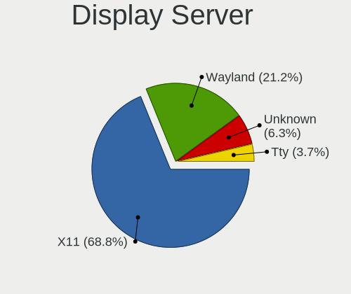

| Name    | Desktops | Percent |
|---------|----------|---------|
| X11     | 398      | 78.97%  |
| Unknown | 50       | 9.92%   |
| Wayland | 36       | 7.14%   |
| Tty     | 20       | 3.97%   |

Display Manager
---------------

SDDM, LightDM, etc.

| Name    | Desktops | Percent |
|---------|----------|---------|
| Unknown | 273      | 53.95%  |
| SDDM    | 87       | 17.19%  |
| GDM     | 48       | 9.49%   |
| LightDM | 33       | 6.52%   |
| GDM3    | 26       | 5.14%   |
| TDM     | 21       | 4.15%   |
| KDM     | 14       | 2.77%   |
| SLiM    | 2        | 0.4%    |
| XDM     | 1        | 0.2%    |
| LXDM    | 1        | 0.2%    |

OS Lang
-------

Language

| Lang       | Desktops | Percent |
|------------|----------|---------|
| de_AT      | 197      | 39.24%  |
| en_US      | 109      | 21.71%  |
| Unknown    | 92       | 18.33%  |
| de_DE      | 68       | 13.55%  |
| en_GB      | 13       | 2.59%   |
| C          | 6        | 1.2%    |
| en_IE      | 5        | 1%      |
| pl_PL      | 3        | 0.6%    |
| ru_RU      | 2        | 0.4%    |
| it_IT      | 2        | 0.4%    |
| tr_TR      | 1        | 0.2%    |
| hu_HU      | 1        | 0.2%    |
| fa_IR      | 1        | 0.2%    |
| en_US.UTF8 | 1        | 0.2%    |
| de_AT.UTF8 | 1        | 0.2%    |

Boot Mode
---------

EFI or BIOS

| Mode | Desktops | Percent |
|------|----------|---------|
| BIOS | 275      | 54.46%  |
| EFI  | 230      | 45.54%  |

Filesystem
----------

Type of filesystem

| Type    | Desktops | Percent |
|---------|----------|---------|
| Ext4    | 381      | 76.2%   |
| Overlay | 50       | 10%     |
| Btrfs   | 30       | 6%      |
| Unknown | 26       | 5.2%    |
| Xfs     | 5        | 1%      |
| Zfs     | 4        | 0.8%    |
| Ext2    | 2        | 0.4%    |
| Tmpfs   | 1        | 0.2%    |
| F2fs    | 1        | 0.2%    |

Part. scheme
------------

Scheme of partitioning

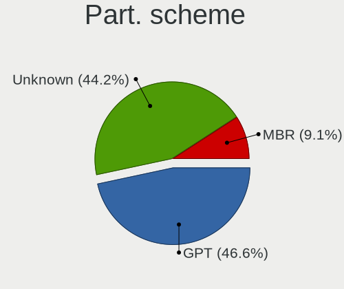

| Type    | Desktops | Percent |
|---------|----------|---------|
| Unknown | 286      | 57.31%  |
| GPT     | 166      | 33.27%  |
| MBR     | 47       | 9.42%   |

Dual Boot with Linux/BSD
------------------------

Hosting more than one Linux/BSD

| Dual boot | Desktops | Percent |
|-----------|----------|---------|
| No        | 397      | 78.77%  |
| Yes       | 107      | 21.23%  |

Dual Boot (Win)
---------------

Hosting Linux and Windows

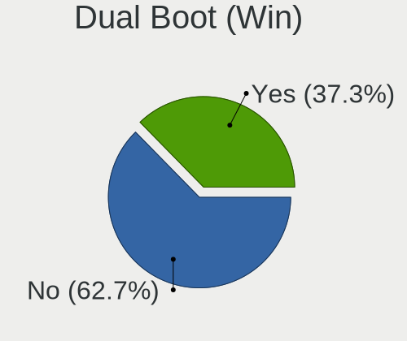

| Dual boot | Desktops | Percent |
|-----------|----------|---------|
| No        | 310      | 61.63%  |
| Yes       | 193      | 38.37%  |

Board
-----

Vendor
------

Motherboard manufacturer

| Name                | Desktops | Percent |
|---------------------|----------|---------|
| ASUSTek Computer    | 153      | 31.03%  |
| MSI                 | 77       | 15.62%  |
| ASRock              | 66       | 13.39%  |
| Gigabyte Technology | 57       | 11.56%  |
| Hewlett-Packard     | 35       | 7.1%    |
| Lenovo              | 23       | 4.67%   |
| Medion              | 16       | 3.25%   |
| Acer                | 14       | 2.84%   |
| Dell                | 12       | 2.43%   |
| Intel               | 6        | 1.22%   |
| Biostar             | 6        | 1.22%   |
| Fujitsu             | 5        | 1.01%   |
| Unknown             | 4        | 0.81%   |
| Pegatron            | 3        | 0.61%   |
| Foxconn             | 3        | 0.61%   |
| Shuttle             | 2        | 0.41%   |
| Sapphire            | 2        | 0.41%   |
| ECS                 | 2        | 0.41%   |
| TYAN Computer       | 1        | 0.2%    |
| Packard Bell        | 1        | 0.2%    |
| IBM                 | 1        | 0.2%    |
| Fujitsu Siemens     | 1        | 0.2%    |
| BESSTAR Tech        | 1        | 0.2%    |
| ASRockRack          | 1        | 0.2%    |
| AMI                 | 1        | 0.2%    |

Model
-----

Motherboard model

| Name                                 | Desktops | Percent |
|--------------------------------------|----------|---------|
| ASUS All Series                      | 21       | 4.26%   |
| MSI MS-7C37                          | 8        | 1.62%   |
| MSI MS-7B79                          | 6        | 1.22%   |
| ASRock Z87 Killer                    | 6        | 1.22%   |
| MSI MS-7B86                          | 5        | 1.01%   |
| ASUS ROG STRIX B450-F GAMING         | 5        | 1.01%   |
| Unknown                              | 4        | 0.81%   |
| MSI MS-7C91                          | 3        | 0.61%   |
| MSI MS-7971                          | 3        | 0.61%   |
| MSI MS-7817                          | 3        | 0.61%   |
| MSI MS-7721                          | 3        | 0.61%   |
| Medion MS-7800                       | 3        | 0.61%   |
| Medion MS-7707                       | 3        | 0.61%   |
| HP Z800 Workstation                  | 3        | 0.61%   |
| ASUS TUF GAMING B550-PLUS            | 3        | 0.61%   |
| ASUS ROG STRIX B550-I GAMING         | 3        | 0.61%   |
| ASUS PRIME A320M-K                   | 3        | 0.61%   |
| ASUS P8H77-M PRO                     | 3        | 0.61%   |
| ASRock 970 Pro3 R2.0                 | 3        | 0.61%   |
| Pegatron FZ116AA-ACP a6551.at        | 2        | 0.41%   |
| MSI MS-7C02                          | 2        | 0.41%   |
| MSI MS-7B89                          | 2        | 0.41%   |
| MSI MS-7B85                          | 2        | 0.41%   |
| MSI MS-7821                          | 2        | 0.41%   |
| MSI MS-7502                          | 2        | 0.41%   |
| Medion MS-7728                       | 2        | 0.41%   |
| Lenovo ThinkCentre M93p 10A8S0CE11   | 2        | 0.41%   |
| HP Pavilion Gaming Desktop TG01-2xxx | 2        | 0.41%   |
| HP EliteDesk 800 G1 SFF              | 2        | 0.41%   |
| HP Compaq Elite 8300 SFF             | 2        | 0.41%   |
| HP Compaq 8200 Elite SFF PC          | 2        | 0.41%   |
| HP Compaq 8200 Elite CMT PC          | 2        | 0.41%   |
| HP Compaq 8100 Elite CMT PC          | 2        | 0.41%   |
| Gigabyte X570 AORUS PRO              | 2        | 0.41%   |
| Gigabyte X570 AORUS MASTER           | 2        | 0.41%   |
| Gigabyte 990FXA-UD3                  | 2        | 0.41%   |
| Biostar A78MD                        | 2        | 0.41%   |
| Biostar A10N-8800E                   | 2        | 0.41%   |
| ASUS Z170I PRO GAMING                | 2        | 0.41%   |
| ASUS Z170-A                          | 2        | 0.41%   |
| ASUS SABERTOOTH X79                  | 2        | 0.41%   |
| ASUS SABERTOOTH 990FX R2.0           | 2        | 0.41%   |
| ASUS ROG STRIX B550-F GAMING         | 2        | 0.41%   |
| ASUS Rampage IV EXTREME              | 2        | 0.41%   |
| ASUS PRIME Z270-A                    | 2        | 0.41%   |
| ASUS PRIME X570-P                    | 2        | 0.41%   |
| ASUS PRIME X299-DELUXE II            | 2        | 0.41%   |
| ASUS PRIME B450-PLUS                 | 2        | 0.41%   |
| ASUS PRIME A320I-K                   | 2        | 0.41%   |
| ASUS P9X79                           | 2        | 0.41%   |
| ASUS P8H67                           | 2        | 0.41%   |
| ASUS P6T SE                          | 2        | 0.41%   |
| ASUS Maximus VIII RANGER             | 2        | 0.41%   |
| ASUS M5A99X EVO                      | 2        | 0.41%   |
| ASUS M5A78L-M PLUS/USB3              | 2        | 0.41%   |
| ASRock Z87M Extreme4                 | 2        | 0.41%   |
| ASRock H87 Pro4                      | 2        | 0.41%   |
| ASRock B450 Steel Legend             | 2        | 0.41%   |
| ASRock A320M-HDV R4.0                | 2        | 0.41%   |
| ASRock 970 Extreme4                  | 2        | 0.41%   |

Model Family
------------

Motherboard model prefix

| Name                 | Desktops | Percent |
|----------------------|----------|---------|
| ASUS All             | 21       | 4.26%   |
| ASUS PRIME           | 20       | 4.06%   |
| ASUS ROG             | 19       | 3.85%   |
| Lenovo ThinkCentre   | 15       | 3.04%   |
| HP Compaq            | 14       | 2.84%   |
| ASUS TUF             | 9        | 1.83%   |
| MSI MS-7C37          | 8        | 1.62%   |
| Dell OptiPlex        | 8        | 1.62%   |
| ASRock Z87           | 7        | 1.42%   |
| MSI MS-7B79          | 6        | 1.22%   |
| Gigabyte X570        | 6        | 1.22%   |
| ASUS SABERTOOTH      | 6        | 1.22%   |
| Acer Aspire          | 6        | 1.22%   |
| MSI MS-7B86          | 5        | 1.01%   |
| ASUS M5A78L-M        | 5        | 1.01%   |
| ASRock 970           | 5        | 1.01%   |
| HP Pavilion          | 4        | 0.81%   |
| Gigabyte Z390        | 4        | 0.81%   |
| ASUS Rampage         | 4        | 0.81%   |
| ASRock Z170          | 4        | 0.81%   |
| Acer Veriton         | 4        | 0.81%   |
| Unknown              | 4        | 0.81%   |
| MSI MS-7C91          | 3        | 0.61%   |
| MSI MS-7971          | 3        | 0.61%   |
| MSI MS-7817          | 3        | 0.61%   |
| MSI MS-7721          | 3        | 0.61%   |
| Medion MS-7800       | 3        | 0.61%   |
| Medion MS-7707       | 3        | 0.61%   |
| Lenovo ThinkStation  | 3        | 0.61%   |
| Lenovo IdeaCentre    | 3        | 0.61%   |
| HP Z800              | 3        | 0.61%   |
| HP EliteDesk         | 3        | 0.61%   |
| ASUS P9X79           | 3        | 0.61%   |
| ASUS P8H77-M         | 3        | 0.61%   |
| ASUS P6T             | 3        | 0.61%   |
| ASUS Maximus         | 3        | 0.61%   |
| ASUS M5A97           | 3        | 0.61%   |
| ASRock X570          | 3        | 0.61%   |
| ASRock X470          | 3        | 0.61%   |
| Pegatron FZ116AA-ACP | 2        | 0.41%   |
| MSI MS-7C02          | 2        | 0.41%   |
| MSI MS-7B89          | 2        | 0.41%   |
| MSI MS-7B85          | 2        | 0.41%   |
| MSI MS-7821          | 2        | 0.41%   |
| MSI MS-7502          | 2        | 0.41%   |
| Medion MS-7728       | 2        | 0.41%   |
| Medion Akoya         | 2        | 0.41%   |
| HP ProLiant          | 2        | 0.41%   |
| HP ProDesk           | 2        | 0.41%   |
| Gigabyte Z590        | 2        | 0.41%   |
| Gigabyte B550        | 2        | 0.41%   |
| Gigabyte B450M       | 2        | 0.41%   |
| Gigabyte B450        | 2        | 0.41%   |
| Gigabyte 990FXA-UD3  | 2        | 0.41%   |
| Fujitsu ESPRIMO      | 2        | 0.41%   |
| Biostar A78MD        | 2        | 0.41%   |
| Biostar A10N-8800E   | 2        | 0.41%   |
| ASUS Z170I           | 2        | 0.41%   |
| ASUS Z170-A          | 2        | 0.41%   |
| ASUS Pro             | 2        | 0.41%   |

MFG Year
--------

Motherboard manufacture year

| Year | Desktops | Percent |
|------|----------|---------|
| 2018 | 65       | 13.18%  |
| 2019 | 54       | 10.95%  |
| 2013 | 54       | 10.95%  |
| 2012 | 44       | 8.92%   |
| 2020 | 39       | 7.91%   |
| 2011 | 39       | 7.91%   |
| 2010 | 31       | 6.29%   |
| 2014 | 29       | 5.88%   |
| 2015 | 26       | 5.27%   |
| 2016 | 25       | 5.07%   |
| 2009 | 23       | 4.67%   |
| 2017 | 21       | 4.26%   |
| 2007 | 13       | 2.64%   |
| 2021 | 12       | 2.43%   |
| 2008 | 10       | 2.03%   |
| 2006 | 6        | 1.22%   |
| 2022 | 1        | 0.2%    |
| 2005 | 1        | 0.2%    |

Form Factor
-----------

Physical design of the computer

| Name    | Desktops | Percent |
|---------|----------|---------|
| Desktop | 493      | 100%    |

Secure Boot
-----------

Enabled or disabled

| State    | Desktops | Percent |
|----------|----------|---------|
| Disabled | 480      | 96.97%  |
| Enabled  | 15       | 3.03%   |

Coreboot
--------

Have coreboot on board

| Used | Desktops | Percent |
|------|----------|---------|
| No   | 493      | 100%    |

RAM Size
--------

Total RAM memory

| Size in GB      | Desktops | Percent |
|-----------------|----------|---------|
| 16.01-24.0      | 132      | 26.56%  |
| 8.01-16.0       | 103      | 20.72%  |
| 32.01-64.0      | 91       | 18.31%  |
| 4.01-8.0        | 64       | 12.88%  |
| 3.01-4.0        | 56       | 11.27%  |
| 64.01-256.0     | 22       | 4.43%   |
| 24.01-32.0      | 15       | 3.02%   |
| 1.01-2.0        | 6        | 1.21%   |
| More than 256.0 | 3        | 0.6%    |
| 2.01-3.0        | 3        | 0.6%    |
| 0.51-1.0        | 1        | 0.2%    |
| Unknown         | 1        | 0.2%    |

RAM Used
--------

Used RAM memory

| Used GB    | Desktops | Percent |
|------------|----------|---------|
| 1.01-2.0   | 189      | 34.87%  |
| 2.01-3.0   | 125      | 23.06%  |
| 4.01-8.0   | 78       | 14.39%  |
| 3.01-4.0   | 66       | 12.18%  |
| 8.01-16.0  | 37       | 6.83%   |
| 0.51-1.0   | 28       | 5.17%   |
| 0.01-0.5   | 8        | 1.48%   |
| 16.01-24.0 | 6        | 1.11%   |
| 32.01-64.0 | 2        | 0.37%   |
| 24.01-32.0 | 2        | 0.37%   |
| Unknown    | 1        | 0.18%   |

Total Drives
------------

Number of drives on board

| Drives | Desktops | Percent |
|--------|----------|---------|
| 1      | 168      | 32.5%   |
| 2      | 149      | 28.82%  |
| 3      | 96       | 18.57%  |
| 4      | 53       | 10.25%  |
| 5      | 20       | 3.87%   |
| 6      | 12       | 2.32%   |
| 9      | 8        | 1.55%   |
| 7      | 4        | 0.77%   |
| 10     | 2        | 0.39%   |
| 8      | 2        | 0.39%   |
| 0      | 2        | 0.39%   |
| 11     | 1        | 0.19%   |

Has CD-ROM
----------

Has CD-ROM on board

| Presented | Desktops | Percent |
|-----------|----------|---------|
| Yes       | 277      | 55.62%  |
| No        | 221      | 44.38%  |

Has Ethernet
------------

Has Ethernet on board

| Presented | Desktops | Percent |
|-----------|----------|---------|
| Yes       | 490      | 99.39%  |
| No        | 3        | 0.61%   |

Has WiFi
--------

Has WiFi module

| Presented | Desktops | Percent |
|-----------|----------|---------|
| No        | 296      | 59.44%  |
| Yes       | 202      | 40.56%  |

Has Bluetooth
-------------

Has Bluetooth module

| Presented | Desktops | Percent |
|-----------|----------|---------|
| No        | 353      | 71.17%  |
| Yes       | 143      | 28.83%  |

Location
--------

Country
-------

Geographic location (country)

| Country | Desktops | Percent |
|---------|----------|---------|
| Austria | 493      | 100%    |

City
----

Geographic location (city)

| City                       | Desktops | Percent |
|----------------------------|----------|---------|
| Vienna                     | 277      | 54.21%  |
| Graz                       | 28       | 5.48%   |
| Linz                       | 19       | 3.72%   |
| Innsbruck                  | 14       | 2.74%   |
| Wels                       | 6        | 1.17%   |
| Steyr                      | 4        | 0.78%   |
| Sankt Plten            | 4        | 0.78%   |
| Hohenems                   | 4        | 0.78%   |
| Sankt Plten            | 3        | 0.59%   |
| Salzburg                   | 3        | 0.59%   |
| Maria Enzersdorf           | 3        | 0.59%   |
| Feldkirch                  | 3        | 0.59%   |
| Enns                       | 3        | 0.59%   |
| Dornbirn                   | 3        | 0.59%   |
| Brunn am Gebirge           | 3        | 0.59%   |
| Zell am See                | 2        | 0.39%   |
| Wiener Neustadt            | 2        | 0.39%   |
| Villach                    | 2        | 0.39%   |
| Tattendorf                 | 2        | 0.39%   |
| Stockerau                  | 2        | 0.39%   |
| Spittal an der Drau        | 2        | 0.39%   |
| Neuhofen an der Krems      | 2        | 0.39%   |
| Leoben                     | 2        | 0.39%   |
| In der Au                  | 2        | 0.39%   |
| Gunskirchen                | 2        | 0.39%   |
| Fulpmes                    | 2        | 0.39%   |
| Ebenfurth                  | 2        | 0.39%   |
| Dross                      | 2        | 0.39%   |
| Bad Hall                   | 2        | 0.39%   |
| Zbing                  | 1        | 0.2%    |
| Weitersfelden              | 1        | 0.2%    |
| Wals                       | 1        | 0.2%    |
| Walding                    | 1        | 0.2%    |
| Voitsberg                  | 1        | 0.2%    |
| Voecklabruck               | 1        | 0.2%    |
| Unterweitersdorf           | 1        | 0.2%    |
| Unterach (Attersee)        | 1        | 0.2%    |
| Traunkirchen               | 1        | 0.2%    |
| Traiskirchen               | 1        | 0.2%    |
| Timelkam                   | 1        | 0.2%    |
| Thaur                      | 1        | 0.2%    |
| Telfs                      | 1        | 0.2%    |
| Strasswalchen              | 1        | 0.2%    |
| Strassengel                | 1        | 0.2%    |
| Strass im Attergau         | 1        | 0.2%    |
| Sipbachzell                | 1        | 0.2%    |
| Sierning                   | 1        | 0.2%    |
| Seiersberg                 | 1        | 0.2%    |
| Schwendau                  | 1        | 0.2%    |
| Schwanenstadt              | 1        | 0.2%    |
| Sattledt                   | 1        | 0.2%    |
| Sankt Valentin             | 1        | 0.2%    |
| Sankt Ulrich im Muehlkreis | 1        | 0.2%    |
| Sankt Plten              | 1        | 0.2%    |
| Sankt Martin               | 1        | 0.2%    |
| Roggendorf                 | 1        | 0.2%    |
| Reichendorf                | 1        | 0.2%    |
| Rabenstein an der Pielach  | 1        | 0.2%    |
| Purkersdorf                | 1        | 0.2%    |
| Pucking                    | 1        | 0.2%    |

Drives
------

Drive Vendor
------------

Hard drive vendors

| Vendor                    | Desktops | Drives | Percent |
|---------------------------|----------|--------|---------|
| Samsung Electronics       | 210      | 343    | 22.06%  |
| WDC                       | 155      | 254    | 16.28%  |
| Seagate                   | 152      | 229    | 15.97%  |
| Sandisk                   | 84       | 117    | 8.82%   |
| Crucial                   | 48       | 71     | 5.04%   |
| Kingston                  | 46       | 55     | 4.83%   |
| Toshiba                   | 45       | 94     | 4.73%   |
| Intel                     | 22       | 33     | 2.31%   |
| Hitachi                   | 21       | 23     | 2.21%   |
| Phison                    | 14       | 22     | 1.47%   |
| Intenso                   | 13       | 18     | 1.37%   |
| Unknown                   | 12       | 26     | 1.26%   |
| HGST                      | 11       | 16     | 1.16%   |
| A-DATA Technology         | 11       | 15     | 1.16%   |
| Transcend                 | 8        | 9      | 0.84%   |
| OCZ                       | 8        | 15     | 0.84%   |
| Micron Technology         | 8        | 9      | 0.84%   |
| Corsair                   | 7        | 10     | 0.74%   |
| Micron/Crucial Technology | 5        | 7      | 0.53%   |
| MAXTOR                    | 4        | 4      | 0.42%   |
| China                     | 4        | 5      | 0.42%   |
| ASMT                      | 4        | 10     | 0.42%   |
| SK Hynix                  | 3        | 4      | 0.32%   |
| Silicon Motion            | 3        | 4      | 0.32%   |
| KIOXIA                    | 3        | 6      | 0.32%   |
| Apacer                    | 3        | 3      | 0.32%   |
| SPCC                      | 2        | 7      | 0.21%   |
| SABRENT                   | 2        | 3      | 0.21%   |
| PNY                       | 2        | 2      | 0.21%   |
| PLEXTOR                   | 2        | 2      | 0.21%   |
| Patriot                   | 2        | 2      | 0.21%   |
| LITEON                    | 2        | 2      | 0.21%   |
| JMicron                   | 2        | 5      | 0.21%   |
| GOODRAM                   | 2        | 2      | 0.21%   |
| Gigabyte Technology       | 2        | 3      | 0.21%   |
| WDC WDS2                  | 1        | 1      | 0.11%   |
| WD MediaMax               | 1        | 1      | 0.11%   |
| ViperTeq                  | 1        | 4      | 0.11%   |
| Verbatim                  | 1        | 1      | 0.11%   |
| V7                        | 1        | 1      | 0.11%   |
| USB3.1                    | 1        | 2      | 0.11%   |
| TSA                       | 1        | 1      | 0.11%   |
| TrekStor                  | 1        | 1      | 0.11%   |
| TO Exter                  | 1        | 2      | 0.11%   |
| Team                      | 1        | 1      | 0.11%   |
| TCSUNBOW                  | 1        | 1      | 0.11%   |
| T-FORCE                   | 1        | 1      | 0.11%   |
| Synology                  | 1        | 8      | 0.11%   |
| Realtek Semiconductor     | 1        | 1      | 0.11%   |
| OCZ-VERTEX3               | 1        | 1      | 0.11%   |
| Magnetic Data             | 1        | 1      | 0.11%   |
| LITEONIT                  | 1        | 1      | 0.11%   |
| Lite-On                   | 1        | 1      | 0.11%   |
| Lexar                     | 1        | 2      | 0.11%   |
| KingSpec                  | 1        | 1      | 0.11%   |
| KingDian                  | 1        | 1      | 0.11%   |
| INNOVATION IT             | 1        | 1      | 0.11%   |
| HUAWEI                    | 1        | 1      | 0.11%   |
| HPE                       | 1        | 1      | 0.11%   |
| Hewlett-Packard           | 1        | 1      | 0.11%   |

Drive Model
-----------

Hard drive models

| Model                              | Desktops | Percent |
|------------------------------------|----------|---------|
| Samsung SSD 850 EVO 250GB          | 16       | 1.44%   |
| Seagate Expansion+ 2TB             | 14       | 1.26%   |
| Samsung SSD 860 EVO 500GB          | 14       | 1.26%   |
| Samsung SSD 860 EVO 1TB            | 13       | 1.17%   |
| Samsung SSD 850 EVO 500GB          | 13       | 1.17%   |
| Samsung SSD 840 EVO 250GB          | 13       | 1.17%   |
| Samsung SSD 850 PRO 256GB          | 11       | 0.99%   |
| Toshiba DT01ACA200 2TB             | 10       | 0.9%    |
| SanDisk SSD PLUS 240GB             | 10       | 0.9%    |
| Samsung NVMe SSD Drive 500GB       | 9        | 0.81%   |
| Toshiba HDWD110 1TB                | 8        | 0.72%   |
| Toshiba DT01ACA100 1TB             | 8        | 0.72%   |
| Seagate ST31000528AS 1TB           | 8        | 0.72%   |
| SanDisk SSD PLUS 1000GB            | 8        | 0.72%   |
| Samsung HD103SJ 1TB                | 8        | 0.72%   |
| Crucial CT500MX500SSD1 500GB       | 8        | 0.72%   |
| WDC WD10EADS-22M2B0 1TB            | 7        | 0.63%   |
| Seagate ST4000DM000-1F2168 4TB     | 7        | 0.63%   |
| Seagate ST2000DM008-2FR102 2TB     | 7        | 0.63%   |
| SanDisk SSD PLUS 480GB             | 7        | 0.63%   |
| SanDisk SDSSDH3 1T00 1TB           | 7        | 0.63%   |
| Samsung SSD 970 EVO Plus 1TB       | 7        | 0.63%   |
| Samsung SSD 860 EVO 250GB          | 7        | 0.63%   |
| WDC WD30EFRX-68EUZN0 3TB           | 6        | 0.54%   |
| WDC WD20EZRX-00D8PB0 2TB           | 6        | 0.54%   |
| Unknown SD/MMC/MS PRO 128GB        | 6        | 0.54%   |
| Seagate ST2000DM001-1ER164 2TB     | 6        | 0.54%   |
| SanDisk SDSSDA240G 240GB           | 6        | 0.54%   |
| Samsung SSD 970 EVO Plus 500GB     | 6        | 0.54%   |
| Samsung SSD 860 QVO 1TB            | 6        | 0.54%   |
| Samsung NVMe SSD Drive 1TB         | 6        | 0.54%   |
| Samsung HD501LJ 500GB              | 6        | 0.54%   |
| Kingston SA400S37240G 240GB SSD    | 6        | 0.54%   |
| Crucial CT1000MX500SSD1 1TB        | 6        | 0.54%   |
| WDC WD20EARX-00PASB0 2TB           | 5        | 0.45%   |
| WDC WD1002FAEX-00Z3A0 1TB          | 5        | 0.45%   |
| Seagate ST4000VN008-2DR166 4TB     | 5        | 0.45%   |
| Seagate ST1000DM010-2EP102 1TB     | 5        | 0.45%   |
| SanDisk SD6SF1M128G1022I 128GB SSD | 5        | 0.45%   |
| Sandisk NVMe SSD Drive 1TB         | 5        | 0.45%   |
| SanDisk Extreme SSD 1TB            | 5        | 0.45%   |
| Samsung SSD 850 EVO 120GB          | 5        | 0.45%   |
| Samsung SSD 840 PRO Series 128GB   | 5        | 0.45%   |
| Kingston SA400S37120G 120GB SSD    | 5        | 0.45%   |
| Crucial CT250BX100SSD1 250GB       | 5        | 0.45%   |
| WDC WD40EZRZ-00GXCB0 4TB           | 4        | 0.36%   |
| WDC WD40EFRX-68WT0N0 4TB           | 4        | 0.36%   |
| WDC WD20EZRZ-00Z5HB0 2TB           | 4        | 0.36%   |
| Seagate ST4000DM004-2CV104 4TB     | 4        | 0.36%   |
| Seagate ST1000DM003-1CH162 1TB     | 4        | 0.36%   |
| Seagate Expansion Desk 3TB         | 4        | 0.36%   |
| SanDisk Ultra II 480GB SSD         | 4        | 0.36%   |
| Samsung SSD 980 1TB                | 4        | 0.36%   |
| Samsung SSD 870 QVO 1TB            | 4        | 0.36%   |
| Samsung SSD 860 EVO 4TB            | 4        | 0.36%   |
| Samsung SSD 850 EVO 1TB            | 4        | 0.36%   |
| Samsung SSD 830 Series 128GB       | 4        | 0.36%   |
| Samsung HD154UI 1TB                | 4        | 0.36%   |
| Samsung HD103UJ 1TB                | 4        | 0.36%   |
| Phison NVMe SSD Drive 240GB        | 4        | 0.36%   |

HDD Vendor
----------

Hard disk drive vendors

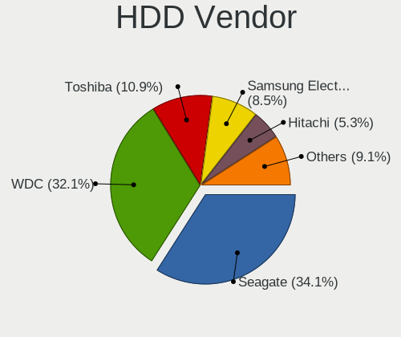

| Vendor              | Desktops | Drives | Percent |
|---------------------|----------|--------|---------|
| Seagate             | 148      | 221    | 34.82%  |
| WDC                 | 141      | 231    | 33.18%  |
| Toshiba             | 45       | 93     | 10.59%  |
| Samsung Electronics | 36       | 52     | 8.47%   |
| Hitachi             | 21       | 23     | 4.94%   |
| HGST                | 11       | 16     | 2.59%   |
| Unknown             | 7        | 14     | 1.65%   |
| MAXTOR              | 4        | 4      | 0.94%   |
| ASMT                | 3        | 4      | 0.71%   |
| SABRENT             | 2        | 3      | 0.47%   |
| JMicron             | 2        | 4      | 0.47%   |
| Intenso             | 2        | 2      | 0.47%   |
| WD MediaMax         | 1        | 1      | 0.24%   |
| Synology            | 1        | 8      | 0.24%   |
| Hewlett-Packard     | 1        | 1      | 0.24%   |

SSD Vendor
----------

Solid state drive vendors

| Vendor              | Desktops | Drives | Percent |
|---------------------|----------|--------|---------|
| Samsung Electronics | 137      | 201    | 34.51%  |
| SanDisk             | 75       | 105    | 18.89%  |
| Crucial             | 44       | 60     | 11.08%  |
| Kingston            | 39       | 44     | 9.82%   |
| Intel               | 13       | 19     | 3.27%   |
| Intenso             | 9        | 14     | 2.27%   |
| Transcend           | 8        | 9      | 2.02%   |
| OCZ                 | 8        | 15     | 2.02%   |
| Micron Technology   | 7        | 8      | 1.76%   |
| A-DATA Technology   | 7        | 10     | 1.76%   |
| WDC                 | 6        | 8      | 1.51%   |
| Corsair             | 5        | 5      | 1.26%   |
| China               | 4        | 5      | 1.01%   |
| Apacer              | 3        | 3      | 0.76%   |
| SK Hynix            | 2        | 3      | 0.5%    |
| PLEXTOR             | 2        | 2      | 0.5%    |
| Patriot             | 2        | 2      | 0.5%    |
| LITEON              | 2        | 2      | 0.5%    |
| GOODRAM             | 2        | 2      | 0.5%    |
| WDC WDS2            | 1        | 1      | 0.25%   |
| ViperTeq            | 1        | 4      | 0.25%   |
| Verbatim            | 1        | 1      | 0.25%   |
| V7                  | 1        | 1      | 0.25%   |
| TSA                 | 1        | 1      | 0.25%   |
| TO Exter            | 1        | 2      | 0.25%   |
| Team                | 1        | 1      | 0.25%   |
| TCSUNBOW            | 1        | 1      | 0.25%   |
| T-FORCE             | 1        | 1      | 0.25%   |
| SPCC                | 1        | 1      | 0.25%   |
| PNY                 | 1        | 1      | 0.25%   |
| PHISON              | 1        | 3      | 0.25%   |
| OCZ-VERTEX3         | 1        | 1      | 0.25%   |
| LITEONIT            | 1        | 1      | 0.25%   |
| KingSpec            | 1        | 1      | 0.25%   |
| KingDian            | 1        | 1      | 0.25%   |
| INNOVATION IT       | 1        | 1      | 0.25%   |
| DREVO               | 1        | 1      | 0.25%   |
| Dogfish             | 1        | 1      | 0.25%   |
| BAITITON            | 1        | 1      | 0.25%   |
| ASMT                | 1        | 6      | 0.25%   |
| AMD                 | 1        | 1      | 0.25%   |

Drive Kind
----------

HDD or SSD

| Kind    | Desktops | Drives | Percent |
|---------|----------|--------|---------|
| SSD     | 321      | 550    | 41.21%  |
| HDD     | 319      | 677    | 40.95%  |
| NVMe    | 125      | 219    | 16.05%  |
| Unknown | 12       | 24     | 1.54%   |
| MMC     | 2        | 3      | 0.26%   |

Drive Connector
---------------

SATA, SAS, NVMe, etc.

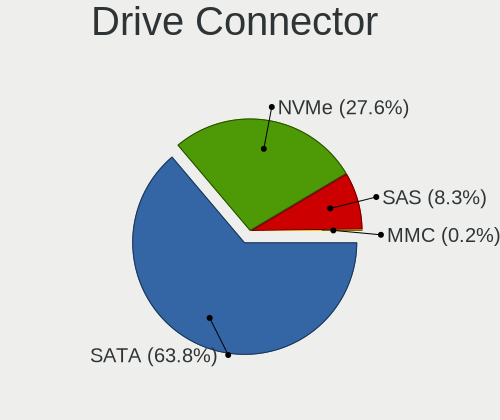

| Type | Desktops | Drives | Percent |
|------|----------|--------|---------|
| SATA | 451      | 1169   | 72.28%  |
| NVMe | 125      | 219    | 20.03%  |
| SAS  | 46       | 82     | 7.37%   |
| MMC  | 2        | 3      | 0.32%   |

Drive Size
----------

Size of hard drive

| Size in TB | Desktops | Drives | Percent |
|------------|----------|--------|---------|
| 0.01-0.5   | 330      | 598    | 45.9%   |
| 0.51-1.0   | 199      | 307    | 27.68%  |
| 1.01-2.0   | 94       | 151    | 13.07%  |
| 3.01-4.0   | 42       | 85     | 5.84%   |
| 2.01-3.0   | 32       | 45     | 4.45%   |
| 4.01-10.0  | 19       | 26     | 2.64%   |
| 10.01-20.0 | 3        | 15     | 0.42%   |

Space Total
-----------

Amount of disk space available on the file system

| Size in GB     | Desktops | Percent |
|----------------|----------|---------|
| 101-250        | 106      | 20.19%  |
| 501-1000       | 84       | 16%     |
| 251-500        | 65       | 12.38%  |
| More than 3000 | 64       | 12.19%  |
| 1001-2000      | 59       | 11.24%  |
| 1-20           | 40       | 7.62%   |
| 2001-3000      | 37       | 7.05%   |
| 51-100         | 28       | 5.33%   |
| Unknown        | 22       | 4.19%   |
| 21-50          | 20       | 3.81%   |

Space Used
----------

Amount of used disk space

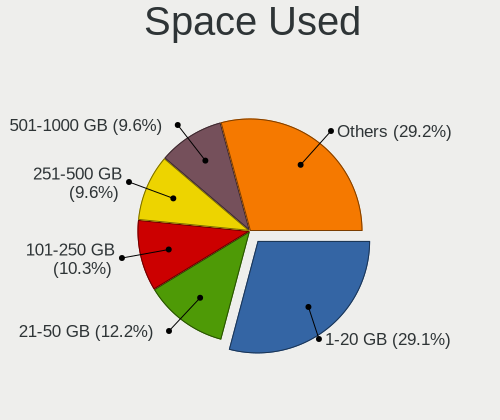

| Used GB        | Desktops | Percent |
|----------------|----------|---------|
| 1-20           | 186      | 34.38%  |
| 21-50          | 54       | 9.98%   |
| 251-500        | 53       | 9.8%    |
| 101-250        | 48       | 8.87%   |
| 501-1000       | 48       | 8.87%   |
| 1001-2000      | 47       | 8.69%   |
| 51-100         | 39       | 7.21%   |
| More than 3000 | 24       | 4.44%   |
| Unknown        | 22       | 4.07%   |
| 2001-3000      | 20       | 3.7%    |

Malfunc. Drives
---------------

Drive models with a malfunction

| Model                                        | Desktops | Drives | Percent |
|----------------------------------------------|----------|--------|---------|
| WDC WD10EADS-22M2B0 1TB                      | 7        | 7      | 9.46%   |
| SanDisk SD6SF1M128G1022I 128GB SSD           | 5        | 5      | 6.76%   |
| WDC WD30EFRX-68EUZN0 3TB                     | 2        | 2      | 2.7%    |
| Seagate ST3500413AS 500GB                    | 2        | 2      | 2.7%    |
| SanDisk SSD PLUS 480GB                       | 2        | 2      | 2.7%    |
| Samsung Electronics HD103UJ 1TB              | 2        | 2      | 2.7%    |
| WDC WD5000AAKX-08U6AA0 500GB                 | 1        | 1      | 1.35%   |
| WDC WD5000AAKS-00UU3A0 500GB                 | 1        | 1      | 1.35%   |
| WDC WD5000AADS-00M2B0 500GB                  | 1        | 1      | 1.35%   |
| WDC WD20EZRZ-00Z5HB0 2TB                     | 1        | 1      | 1.35%   |
| WDC WD20EZRX-00D8PB0 2TB                     | 1        | 1      | 1.35%   |
| WDC WD20EFRX-68AX9N0 2TB                     | 1        | 6      | 1.35%   |
| WDC WD2003FYYS-02W0B1 2TB                    | 1        | 1      | 1.35%   |
| WDC WD2000FYYZ-01UL1B1 2TB                   | 1        | 1      | 1.35%   |
| WDC WD1600BEVT-22ZCT0 160GB                  | 1        | 1      | 1.35%   |
| WDC WD10EZRX-00L4HB0 1TB                     | 1        | 1      | 1.35%   |
| WDC WD10EACS-00D6B0 1TB                      | 1        | 2      | 1.35%   |
| WDC WD1002FAEX-00Y9A0 1TB                    | 1        | 1      | 1.35%   |
| Transcend TS240GSSD220S 240GB                | 1        | 1      | 1.35%   |
| Toshiba MK1665GSX 160GB                      | 1        | 1      | 1.35%   |
| Toshiba HDWD110 1TB                          | 1        | 2      | 1.35%   |
| SK Hynix SC308 SATA 128GB SSD                | 1        | 2      | 1.35%   |
| Seagate ST9500325AS 500GB                    | 1        | 1      | 1.35%   |
| Seagate ST500LM021-1KJ152 500GB              | 1        | 1      | 1.35%   |
| Seagate ST500DM002-1BD142 500GB              | 1        | 1      | 1.35%   |
| Seagate ST3500830AS 500GB                    | 1        | 1      | 1.35%   |
| Seagate ST3250823AS 250GB                    | 1        | 1      | 1.35%   |
| Seagate ST3250410AS 250GB                    | 1        | 1      | 1.35%   |
| Seagate ST31000528AS 1TB                     | 1        | 1      | 1.35%   |
| Seagate ST3000DM001-9YN166 3TB               | 1        | 1      | 1.35%   |
| Seagate ST2000LM003 HN-M201RAD 2TB           | 1        | 1      | 1.35%   |
| Seagate ST2000DX002-2DV164 2TB               | 1        | 1      | 1.35%   |
| Seagate ST2000DM006-2DM164 2TB               | 1        | 1      | 1.35%   |
| Seagate ST2000DM001-9YN164 2TB               | 1        | 1      | 1.35%   |
| Seagate ST2000DM001-1CH164 2TB               | 1        | 1      | 1.35%   |
| SanDisk SD8SBAT256G1122 256GB SSD            | 1        | 1      | 1.35%   |
| SanDisk SD7UB3Q256G1001 256GB SSD            | 1        | 1      | 1.35%   |
| Samsung Electronics SSD 960 PRO 512GB        | 1        | 2      | 1.35%   |
| Samsung Electronics SSD 960 PRO 1TB          | 1        | 1      | 1.35%   |
| Samsung Electronics SSD 850 PRO 1TB          | 1        | 1      | 1.35%   |
| Samsung Electronics SSD 840 Series 120GB     | 1        | 1      | 1.35%   |
| Samsung Electronics SSD 840 PRO Series 512GB | 1        | 1      | 1.35%   |
| Samsung Electronics SSD 840 PRO Series 128GB | 1        | 2      | 1.35%   |
| Samsung Electronics SP1614N 160GB            | 1        | 1      | 1.35%   |
| Samsung Electronics HM500JI 500GB            | 1        | 1      | 1.35%   |
| Samsung Electronics HD502IJ 500GB            | 1        | 1      | 1.35%   |
| Samsung Electronics HD502HJ 500GB            | 1        | 1      | 1.35%   |
| Samsung Electronics HD103SJ 1TB              | 1        | 1      | 1.35%   |
| OCZ AGILITY3 64GB SSD                        | 1        | 1      | 1.35%   |
| OCZ AGILITY3 240GB SSD                       | 1        | 2      | 1.35%   |
| OCZ AGILITY3 120GB SSD                       | 1        | 1      | 1.35%   |
| MAXTOR 6Y200P0 208GB                         | 1        | 1      | 1.35%   |
| Kingston SA400S37240G 240GB SSD              | 1        | 1      | 1.35%   |
| Intenso SSD Sata III 128GB                   | 1        | 1      | 1.35%   |
| Intel SSDPEKKW256G7 256GB                    | 1        | 1      | 1.35%   |
| Hitachi HTS541010G9SA00 100GB                | 1        | 1      | 1.35%   |
| Hitachi HDS5C1010CLA382 1TB                  | 1        | 1      | 1.35%   |
| Hitachi HDP725050GLA360 500GB                | 1        | 1      | 1.35%   |
| HGST HTS725050A7E630 500GB                   | 1        | 4      | 1.35%   |
| Crucial CT240M500SSD1 240GB                  | 1        | 1      | 1.35%   |

Malfunc. Drive Vendor
---------------------

Vendors of faulty drives

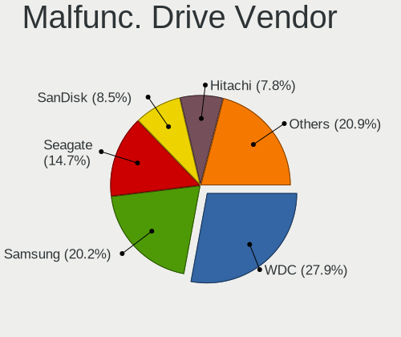

| Vendor              | Desktops | Drives | Percent |
|---------------------|----------|--------|---------|
| WDC                 | 21       | 27     | 30%     |
| Seagate             | 13       | 15     | 18.57%  |
| Samsung Electronics | 12       | 15     | 17.14%  |
| SanDisk             | 9        | 9      | 12.86%  |
| Hitachi             | 3        | 3      | 4.29%   |
| Toshiba             | 2        | 3      | 2.86%   |
| OCZ                 | 2        | 4      | 2.86%   |
| Transcend           | 1        | 1      | 1.43%   |
| SK Hynix            | 1        | 2      | 1.43%   |
| MAXTOR              | 1        | 1      | 1.43%   |
| Kingston            | 1        | 1      | 1.43%   |
| Intenso             | 1        | 1      | 1.43%   |
| Intel               | 1        | 1      | 1.43%   |
| HGST                | 1        | 4      | 1.43%   |
| Crucial             | 1        | 1      | 1.43%   |

Malfunc. HDD Vendor
-------------------

Vendors of faulty HDD drives

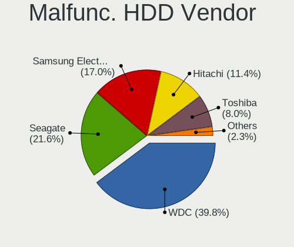

| Vendor              | Desktops | Drives | Percent |
|---------------------|----------|--------|---------|
| WDC                 | 21       | 27     | 44.68%  |
| Seagate             | 13       | 15     | 27.66%  |
| Samsung Electronics | 6        | 7      | 12.77%  |
| Hitachi             | 3        | 3      | 6.38%   |
| Toshiba             | 2        | 3      | 4.26%   |
| MAXTOR              | 1        | 1      | 2.13%   |
| HGST                | 1        | 4      | 2.13%   |

Malfunc. Drive Kind
-------------------

Kinds of faulty drives

| Kind | Desktops | Drives | Percent |
|------|----------|--------|---------|
| HDD  | 43       | 60     | 65.15%  |
| SSD  | 20       | 24     | 30.3%   |
| NVMe | 3        | 4      | 4.55%   |

Failed Drives
-------------

Failed drive models

| Model                        | Desktops | Drives | Percent |
|------------------------------|----------|--------|---------|
| WDC WD6400BEVT-22A0RT0 640GB | 1        | 1      | 100%    |

Failed Drive Vendor
-------------------

Failed drive vendors

| Vendor | Desktops | Drives | Percent |
|--------|----------|--------|---------|
| WDC    | 1        | 1      | 100%    |

Drive Status
------------

Number of failed and malfunc. drives

| Status   | Desktops | Drives | Percent |
|----------|----------|--------|---------|
| Detected | 298      | 782    | 53.02%  |
| Works    | 206      | 601    | 36.65%  |
| Malfunc  | 56       | 88     | 9.96%   |
| Failed   | 1        | 1      | 0.18%   |
| Limited  | 1        | 1      | 0.18%   |

Storage controller
------------------

Storage Vendor
--------------

Storage controller vendors

| Vendor                        | Desktops | Percent |
|-------------------------------|----------|---------|
| Intel                         | 304      | 40.05%  |
| AMD                           | 182      | 23.98%  |
| Samsung Electronics           | 67       | 8.83%   |
| ASMedia Technology            | 47       | 6.19%   |
| Marvell Technology Group      | 30       | 3.95%   |
| JMicron Technology            | 25       | 3.29%   |
| Sandisk                       | 18       | 2.37%   |
| Phison Electronics            | 18       | 2.37%   |
| Micron/Crucial Technology     | 9        | 1.19%   |
| Kingston Technology Company   | 9        | 1.19%   |
| Nvidia                        | 8        | 1.05%   |
| LSI Logic / Symbios Logic     | 8        | 1.05%   |
| ADATA Technology              | 5        | 0.66%   |
| Seagate Technology            | 4        | 0.53%   |
| VIA Technologies              | 3        | 0.4%    |
| Silicon Motion                | 3        | 0.4%    |
| Silicon Image                 | 3        | 0.4%    |
| KIOXIA                        | 3        | 0.4%    |
| Broadcom / LSI                | 3        | 0.4%    |
| SK Hynix                      | 2        | 0.26%   |
| OCZ Technology Group          | 2        | 0.26%   |
| Realtek Semiconductor         | 1        | 0.13%   |
| Micron Technology             | 1        | 0.13%   |
| Lite-On Technology            | 1        | 0.13%   |
| Lite-On IT Corp. / Plextor    | 1        | 0.13%   |
| Integrated Technology Express | 1        | 0.13%   |
| Adaptec                       | 1        | 0.13%   |

Storage Model
-------------

Storage controller models

| Model                                                                                   | Desktops | Percent |
|-----------------------------------------------------------------------------------------|----------|---------|
| AMD FCH SATA Controller [AHCI mode]                                                     | 106      | 11.37%  |
| Intel 8 Series/C220 Series Chipset Family 6-port SATA Controller 1 [AHCI mode]          | 47       | 5.04%   |
| Samsung NVMe SSD Controller SM981/PM981/PM983                                           | 45       | 4.83%   |
| ASMedia ASM1062 Serial ATA Controller                                                   | 43       | 4.61%   |
| AMD 400 Series Chipset SATA Controller                                                  | 41       | 4.4%    |
| Intel Q170/Q150/B150/H170/H110/Z170/CM236 Chipset SATA Controller [AHCI Mode]           | 34       | 3.65%   |
| AMD SB7x0/SB8x0/SB9x0 IDE Controller                                                    | 34       | 3.65%   |
| AMD SB7x0/SB8x0/SB9x0 SATA Controller [AHCI mode]                                       | 30       | 3.22%   |
| Intel 6 Series/C200 Series Chipset Family 6 port Desktop SATA AHCI Controller           | 26       | 2.79%   |
| Intel 7 Series/C210 Series Chipset Family 6-port SATA Controller [AHCI mode]            | 21       | 2.25%   |
| AMD 500 Series Chipset SATA Controller                                                  | 21       | 2.25%   |
| JMicron JMB363 SATA/IDE Controller                                                      | 17       | 1.82%   |
| Intel Cannon Lake PCH SATA AHCI Controller                                              | 17       | 1.82%   |
| Intel 200 Series PCH SATA controller [AHCI mode]                                        | 17       | 1.82%   |
| AMD SB7x0/SB8x0/SB9x0 SATA Controller [IDE mode]                                        | 17       | 1.82%   |
| Intel SATA Controller [RAID mode]                                                       | 16       | 1.72%   |
| Intel 9 Series Chipset Family SATA Controller [AHCI Mode]                               | 13       | 1.39%   |
| Phison E12 NVMe Controller                                                              | 11       | 1.18%   |
| Samsung NVMe SSD Controller SM961/PM961/SM963                                           | 10       | 1.07%   |
| Intel C600/X79 series chipset 6-Port SATA AHCI Controller                               | 9        | 0.97%   |
| AMD FCH SATA Controller D                                                               | 9        | 0.97%   |
| Samsung NVMe SSD Controller PM9A1/PM9A3/980PRO                                          | 8        | 0.86%   |
| Sandisk WD Black 2018/SN750 / PC SN720 NVMe SSD                                         | 7        | 0.75%   |
| Samsung NVMe SSD Controller 980                                                         | 7        | 0.75%   |
| Micron/Crucial P1 NVMe PCIe SSD                                                         | 7        | 0.75%   |
| Marvell Group 88SE9215 PCIe 2.0 x1 4-port SATA 6 Gb/s Controller                        | 7        | 0.75%   |
| Marvell Group 88SE9172 SATA 6Gb/s Controller                                            | 7        | 0.75%   |
| Intel 82801JI (ICH10 Family) SATA AHCI Controller                                       | 7        | 0.75%   |
| Intel 82801JI (ICH10 Family) 4 port SATA IDE Controller #1                              | 7        | 0.75%   |
| Intel 6 Series/C200 Series Chipset Family Desktop SATA Controller (IDE mode, ports 4-5) | 7        | 0.75%   |
| Intel 6 Series/C200 Series Chipset Family Desktop SATA Controller (IDE mode, ports 0-3) | 7        | 0.75%   |
| Kingston Company A2000 NVMe SSD                                                         | 6        | 0.64%   |
| Intel NM10/ICH7 Family SATA Controller [IDE mode]                                       | 6        | 0.64%   |
| Intel C610/X99 series chipset sSATA Controller [AHCI mode]                              | 6        | 0.64%   |
| Intel C610/X99 series chipset 6-Port SATA Controller [AHCI mode]                        | 6        | 0.64%   |
| Intel 82801JI (ICH10 Family) 2 port SATA IDE Controller #2                              | 6        | 0.64%   |
| Intel 82801I (ICH9 Family) 2 port SATA Controller [IDE mode]                            | 6        | 0.64%   |
| Intel 5 Series/3400 Series Chipset 6 port SATA AHCI Controller                          | 6        | 0.64%   |
| Intel 5 Series/3400 Series Chipset 4 port SATA IDE Controller                           | 6        | 0.64%   |
| Intel 5 Series/3400 Series Chipset 2 port SATA IDE Controller                           | 6        | 0.64%   |
| AMD X370 Series Chipset SATA Controller                                                 | 6        | 0.64%   |
| Sandisk WD Blue SN550 NVMe SSD                                                          | 5        | 0.54%   |
| Sandisk WD Black SN750 / PC SN730 NVMe SSD                                              | 5        | 0.54%   |
| Marvell Group 88SE91A3 SATA-600 Controller                                              | 5        | 0.54%   |
| Intel Comet Lake SATA AHCI Controller                                                   | 5        | 0.54%   |
| ADATA XPG SX8200 Pro PCIe Gen3x4 M.2 2280 Solid State Drive                             | 5        | 0.54%   |
| Phison E16 PCIe4 NVMe Controller                                                        | 4        | 0.43%   |
| Nvidia MCP61 SATA Controller                                                            | 4        | 0.43%   |
| Nvidia MCP61 IDE                                                                        | 4        | 0.43%   |
| JMicron JMB362 SATA Controller                                                          | 4        | 0.43%   |
| Intel SSD 660P Series                                                                   | 4        | 0.43%   |
| Intel Celeron/Pentium Silver Processor SATA Controller                                  | 4        | 0.43%   |
| Intel 82801IR/IO/IH (ICH9R/DO/DH) 4 port SATA Controller [IDE mode]                     | 4        | 0.43%   |
| Intel 82801H (ICH8 Family) 4 port SATA Controller [IDE mode]                            | 4        | 0.43%   |
| Intel 500 Series Chipset Family SATA AHCI Controller                                    | 4        | 0.43%   |
| AMD 300 Series Chipset SATA Controller                                                  | 4        | 0.43%   |
| VIA VT6415 PATA IDE Host Controller                                                     | 3        | 0.32%   |
| Silicon Motion SM2263EN/SM2263XT SSD Controller                                         | 3        | 0.32%   |
| Seagate FireCuda 530 SSD                                                                | 3        | 0.32%   |
| Phison PS5013 E13 NVMe Controller                                                       | 3        | 0.32%   |

Storage Kind
------------

Kind of storage controller (IDE, SATA, NVMe, SAS, ...)

| Kind | Desktops | Percent |
|------|----------|---------|
| SATA | 423      | 60.34%  |
| NVMe | 128      | 18.26%  |
| IDE  | 111      | 15.83%  |
| RAID | 29       | 4.14%   |
| SAS  | 5        | 0.71%   |
| SCSI | 5        | 0.71%   |

Processor
---------

CPU Vendor
----------

Processor vendors

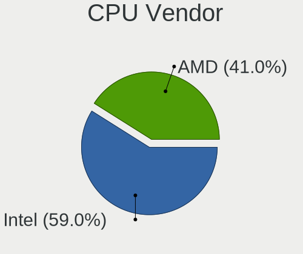

| Vendor | Desktops | Percent |
|--------|----------|---------|
| Intel  | 301      | 61.05%  |
| AMD    | 192      | 38.95%  |

CPU Model
---------

Processor models

| Model                                       | Desktops | Percent |
|---------------------------------------------|----------|---------|
| AMD Ryzen 7 3700X 8-Core Processor          | 14       | 2.84%   |
| Intel Core i7-6700K CPU @ 4.00GHz           | 9        | 1.83%   |
| Intel Core i7-3770 CPU @ 3.40GHz            | 9        | 1.83%   |
| AMD Ryzen 5 3600 6-Core Processor           | 8        | 1.62%   |
| AMD Ryzen 5 3400G with Radeon Vega Graphics | 8        | 1.62%   |
| Intel Core i7-4790K CPU @ 4.00GHz           | 7        | 1.42%   |
| Intel Core i5-4570 CPU @ 3.20GHz            | 7        | 1.42%   |
| AMD Ryzen 5 2600 Six-Core Processor         | 7        | 1.42%   |
| Intel Core i7-8700 CPU @ 3.20GHz            | 6        | 1.22%   |
| Intel Core i5-4570TE CPU @ 2.70GHz          | 6        | 1.22%   |
| Intel Core i5-4440 CPU @ 3.10GHz            | 6        | 1.22%   |
| Intel Core i5 CPU 750 @ 2.67GHz             | 6        | 1.22%   |
| AMD FX-8350 Eight-Core Processor            | 6        | 1.22%   |
| Intel Core i7-7700K CPU @ 4.20GHz           | 5        | 1.01%   |
| Intel Core i7-6700 CPU @ 3.40GHz            | 5        | 1.01%   |
| Intel Core i5-8400 CPU @ 2.80GHz            | 5        | 1.01%   |
| Intel Core i5-6500 CPU @ 3.20GHz            | 5        | 1.01%   |
| Intel Core i5-3570 CPU @ 3.40GHz            | 5        | 1.01%   |
| Intel Core i5-2400 CPU @ 3.10GHz            | 5        | 1.01%   |
| Intel Core 2 Quad CPU Q6600 @ 2.40GHz       | 5        | 1.01%   |
| AMD Ryzen 9 3900X 12-Core Processor         | 5        | 1.01%   |
| AMD Ryzen 7 5800X 8-Core Processor          | 5        | 1.01%   |
| AMD Ryzen 7 2700X Eight-Core Processor      | 5        | 1.01%   |
| AMD Ryzen 3 3200G with Radeon Vega Graphics | 5        | 1.01%   |
| AMD Phenom II X4 955 Processor              | 5        | 1.01%   |
| Intel Core i9-9900K CPU @ 3.60GHz           | 4        | 0.81%   |
| Intel Core i7-2600K CPU @ 3.40GHz           | 4        | 0.81%   |
| Intel Core i7 CPU 920 @ 2.67GHz             | 4        | 0.81%   |
| Intel Core i5-6600 CPU @ 3.30GHz            | 4        | 0.81%   |
| Intel Core i5-3470 CPU @ 3.20GHz            | 4        | 0.81%   |
| Intel Core i5-2500K CPU @ 3.30GHz           | 4        | 0.81%   |
| Intel Core 2 Duo CPU E8400 @ 3.00GHz        | 4        | 0.81%   |
| AMD Ryzen 9 3950X 16-Core Processor         | 4        | 0.81%   |
| AMD Ryzen 7 5700G with Radeon Graphics      | 4        | 0.81%   |
| AMD Ryzen 5 5600X 6-Core Processor          | 4        | 0.81%   |
| AMD Ryzen 5 5600G with Radeon Graphics      | 4        | 0.81%   |
| AMD Phenom II X6 1055T Processor            | 4        | 0.81%   |
| AMD FX-9590 Eight-Core Processor            | 4        | 0.81%   |
| AMD FX-6300 Six-Core Processor              | 4        | 0.81%   |
| Intel Core i7-7700 CPU @ 3.60GHz            | 3        | 0.61%   |
| Intel Core i7-4790 CPU @ 3.60GHz            | 3        | 0.61%   |
| Intel Core i7-4770K CPU @ 3.50GHz           | 3        | 0.61%   |
| Intel Core i7-4770 CPU @ 3.40GHz            | 3        | 0.61%   |
| Intel Core i7-3930K CPU @ 3.20GHz           | 3        | 0.61%   |
| Intel Core i7-3770K CPU @ 3.50GHz           | 3        | 0.61%   |
| Intel Core i5-4460 CPU @ 3.20GHz            | 3        | 0.61%   |
| Intel Core i5-2300 CPU @ 2.80GHz            | 3        | 0.61%   |
| Intel Core i5 CPU 650 @ 3.20GHz             | 3        | 0.61%   |
| Intel Core i3-2120 CPU @ 3.30GHz            | 3        | 0.61%   |
| AMD Ryzen 7 3800X 8-Core Processor          | 3        | 0.61%   |
| AMD Ryzen 7 1700 Eight-Core Processor       | 3        | 0.61%   |
| AMD Ryzen 5 2600X Six-Core Processor        | 3        | 0.61%   |
| AMD Ryzen 5 1600 Six-Core Processor         | 3        | 0.61%   |
| AMD Phenom II X4 945 Processor              | 3        | 0.61%   |
| AMD FX-4300 Quad-Core Processor             | 3        | 0.61%   |
| AMD FX-4100 Quad-Core Processor             | 3        | 0.61%   |
| AMD A8-5500 APU with Radeon HD Graphics     | 3        | 0.61%   |
| Intel Xeon CPU X5690 @ 3.47GHz              | 2        | 0.41%   |
| Intel Xeon CPU X5650 @ 2.67GHz              | 2        | 0.41%   |
| Intel Xeon CPU E5-1620 v3 @ 3.50GHz         | 2        | 0.41%   |

CPU Model Family
----------------

Processor model prefix

| Model                   | Desktops | Percent |
|-------------------------|----------|---------|
| Intel Core i5           | 94       | 19.07%  |
| Intel Core i7           | 92       | 18.66%  |
| AMD Ryzen 5             | 41       | 8.32%   |
| AMD Ryzen 7             | 36       | 7.3%    |
| Intel Xeon              | 22       | 4.46%   |
| AMD FX                  | 22       | 4.46%   |
| Intel Core i3           | 19       | 3.85%   |
| Intel Celeron           | 14       | 2.84%   |
| AMD Ryzen 9             | 13       | 2.64%   |
| AMD Phenom II X4        | 13       | 2.64%   |
| AMD Ryzen 3             | 11       | 2.23%   |
| AMD A8                  | 11       | 2.23%   |
| Intel Core i9           | 10       | 2.03%   |
| Intel Core 2 Quad       | 10       | 2.03%   |
| Intel Core 2 Duo        | 9        | 1.83%   |
| Intel Pentium           | 8        | 1.62%   |
| AMD A10                 | 8        | 1.62%   |
| AMD Phenom II X6        | 7        | 1.42%   |
| AMD Athlon II X4        | 6        | 1.22%   |
| Other                   | 5        | 1.01%   |
| Intel Atom              | 5        | 1.01%   |
| AMD Athlon 64 X2        | 5        | 1.01%   |
| Intel Pentium Dual-Core | 4        | 0.81%   |
| Intel Core 2            | 4        | 0.81%   |
| AMD Ryzen Threadripper  | 4        | 0.81%   |
| AMD Athlon              | 3        | 0.61%   |
| Intel Pentium 4         | 2        | 0.41%   |
| AMD Ryzen 7 PRO         | 2        | 0.41%   |
| AMD Phenom              | 2        | 0.41%   |
| AMD E                   | 2        | 0.41%   |
| AMD Athlon II X2        | 2        | 0.41%   |
| Intel Pentium Silver    | 1        | 0.2%    |
| Intel Pentium Dual      | 1        | 0.2%    |
| Intel Genuine           | 1        | 0.2%    |
| AMD Ryzen 5 PRO         | 1        | 0.2%    |
| AMD Ryzen 3 PRO         | 1        | 0.2%    |
| AMD Phenom II X2        | 1        | 0.2%    |
| AMD A6                  | 1        | 0.2%    |

CPU Cores
---------

Number of processor cores

| Number  | Desktops | Percent |
|---------|----------|---------|
| 4       | 237      | 47.98%  |
| 2       | 98       | 19.84%  |
| 6       | 65       | 13.16%  |
| 8       | 52       | 10.53%  |
| 12      | 13       | 2.63%   |
| 16      | 8        | 1.62%   |
| 10      | 5        | 1.01%   |
| 3       | 4        | 0.81%   |
| 1       | 4        | 0.81%   |
| 14      | 3        | 0.61%   |
| Unknown | 2        | 0.4%    |
| 64      | 1        | 0.2%    |
| 40      | 1        | 0.2%    |
| 24      | 1        | 0.2%    |

CPU Sockets
-----------

Number of sockets

| Number | Desktops | Percent |
|--------|----------|---------|
| 1      | 489      | 99.19%  |
| 2      | 4        | 0.81%   |

CPU Threads
-----------

Threads per core (Hyper-Threading)

| Number  | Desktops | Percent |
|---------|----------|---------|
| 2       | 296      | 59.92%  |
| 1       | 196      | 39.68%  |
| Unknown | 2        | 0.4%    |

CPU Op-Modes
------------

CPU Operation Modes (32-bit, 64-bit)

| Op mode        | Desktops | Percent |
|----------------|----------|---------|
| 32-bit, 64-bit | 480      | 97.36%  |
| Unknown        | 11       | 2.23%   |
| 32-bit         | 2        | 0.41%   |

CPU Microcode
-------------

Microcode number

| Number     | Desktops | Percent |
|------------|----------|---------|
| Unknown    | 91       | 18.02%  |
| 0x306c3    | 46       | 9.11%   |
| 0x506e3    | 24       | 4.75%   |
| 0x306a9    | 24       | 4.75%   |
| 0x206a7    | 24       | 4.75%   |
| 0x08701021 | 19       | 3.76%   |
| 0x08701013 | 13       | 2.57%   |
| 0x906e9    | 12       | 2.38%   |
| 0x08108109 | 12       | 2.38%   |
| 0x06000852 | 12       | 2.38%   |
| 0x906ea    | 11       | 2.18%   |
| 0x0800820d | 11       | 2.18%   |
| 0x06001119 | 11       | 2.18%   |
| 0x010000c8 | 11       | 2.18%   |
| 0x1067a    | 10       | 1.98%   |
| 0x106e5    | 8        | 1.58%   |
| 0x08001138 | 7        | 1.39%   |
| 0x6fb      | 6        | 1.19%   |
| 0x306f2    | 6        | 1.19%   |
| 0x106a5    | 6        | 1.19%   |
| 0x010000dc | 6        | 1.19%   |
| 0xa0655    | 5        | 0.99%   |
| 0x0a50000c | 5        | 0.99%   |
| 0x0a201016 | 5        | 0.99%   |
| 0x0a201009 | 5        | 0.99%   |
| 0x906ed    | 4        | 0.79%   |
| 0x0800820b | 4        | 0.79%   |
| 0x0600611a | 4        | 0.79%   |
| 0x010000db | 4        | 0.79%   |
| 0xa0671    | 3        | 0.59%   |
| 0x6f6      | 3        | 0.59%   |
| 0x506c9    | 3        | 0.59%   |
| 0x206d7    | 3        | 0.59%   |
| 0x206c2    | 3        | 0.59%   |
| 0x20655    | 3        | 0.59%   |
| 0x06003106 | 3        | 0.59%   |
| 0x0600063e | 3        | 0.59%   |
| 0x03000027 | 3        | 0.59%   |
| 0x010000c6 | 3        | 0.59%   |
| 0xa0653    | 2        | 0.4%    |
| 0x906ec    | 2        | 0.4%    |
| 0x90672    | 2        | 0.4%    |
| 0x706a8    | 2        | 0.4%    |
| 0x6fd      | 2        | 0.4%    |
| 0x50657    | 2        | 0.4%    |
| 0x50654    | 2        | 0.4%    |
| 0x406f1    | 2        | 0.4%    |
| 0x406c4    | 2        | 0.4%    |
| 0x306e4    | 2        | 0.4%    |
| 0x30661    | 2        | 0.4%    |
| 0x20652    | 2        | 0.4%    |
| 0x10677    | 2        | 0.4%    |
| 0x10676    | 2        | 0.4%    |
| 0x0a50000b | 2        | 0.4%    |
| 0x08101016 | 2        | 0.4%    |
| 0x0810100b | 2        | 0.4%    |
| 0x06000817 | 2        | 0.4%    |
| 0x010000b6 | 2        | 0.4%    |
| 0x01000095 | 2        | 0.4%    |
| 0xf49      | 1        | 0.2%    |

CPU Microarch
-------------

Microarchitecture

| Name             | Desktops | Percent |
|------------------|----------|---------|
| Haswell          | 68       | 13.79%  |
| Zen 2            | 46       | 9.33%   |
| KabyLake         | 40       | 8.11%   |
| Skylake          | 36       | 7.3%    |
| SandyBridge      | 33       | 6.69%   |
| IvyBridge        | 33       | 6.69%   |
| Zen+             | 31       | 6.29%   |
| K10              | 30       | 6.09%   |
| Piledriver       | 28       | 5.68%   |
| Zen 3            | 20       | 4.06%   |
| Nehalem          | 16       | 3.25%   |
| Zen              | 15       | 3.04%   |
| Penryn           | 15       | 3.04%   |
| Core             | 13       | 2.64%   |
| Westmere         | 10       | 2.03%   |
| CometLake        | 10       | 2.03%   |
| Silvermont       | 5        | 1.01%   |
| K8 Hammer        | 5        | 1.01%   |
| Steamroller      | 4        | 0.81%   |
| Goldmont plus    | 4        | 0.81%   |
| Goldmont         | 4        | 0.81%   |
| Excavator        | 4        | 0.81%   |
| NetBurst         | 3        | 0.61%   |
| K10 Llano        | 3        | 0.61%   |
| Bulldozer        | 3        | 0.61%   |
| Broadwell        | 3        | 0.61%   |
| Bonnell          | 3        | 0.61%   |
| Icelake          | 2        | 0.41%   |
| Bobcat           | 2        | 0.41%   |
| Alderlake Hybrid | 2        | 0.41%   |
| Unknown          | 2        | 0.41%   |

Graphics
--------

GPU Vendor
----------

Vendors of graphics cards

| Vendor                     | Desktops | Percent |
|----------------------------|----------|---------|
| Nvidia                     | 213      | 40.8%   |
| AMD                        | 185      | 35.44%  |
| Intel                      | 119      | 22.8%   |
| Matrox Electronics Systems | 2        | 0.38%   |
| ASPEED Technology          | 2        | 0.38%   |
| ATI Technologies           | 1        | 0.19%   |

GPU Model
---------

Graphics card models

| Model                                                                                    | Desktops | Percent |
|------------------------------------------------------------------------------------------|----------|---------|
| AMD Ellesmere [Radeon RX 470/480/570/570X/580/580X/590]                                  | 25       | 4.69%   |
| Intel Xeon E3-1200 v3/4th Gen Core Processor Integrated Graphics Controller              | 22       | 4.13%   |
| Intel 2nd Generation Core Processor Family Integrated Graphics Controller                | 14       | 2.63%   |
| Nvidia GP108 [GeForce GT 1030]                                                           | 12       | 2.25%   |
| AMD Picasso/Raven 2 [Radeon Vega Series / Radeon Vega Mobile Series]                     | 12       | 2.25%   |
| Nvidia GK208B [GeForce GT 710]                                                           | 11       | 2.06%   |
| Intel CoffeeLake-S GT2 [UHD Graphics 630]                                                | 11       | 2.06%   |
| Nvidia GP107 [GeForce GTX 1050 Ti]                                                       | 10       | 1.88%   |
| Nvidia GP106 [GeForce GTX 1060 6GB]                                                      | 8        | 1.5%    |
| Nvidia GP104 [GeForce GTX 1070]                                                          | 8        | 1.5%    |
| Nvidia GM206 [GeForce GTX 960]                                                           | 8        | 1.5%    |
| Nvidia GM107 [GeForce GTX 750 Ti]                                                        | 8        | 1.5%    |
| Intel Xeon E3-1200 v2/3rd Gen Core processor Graphics Controller                         | 8        | 1.5%    |
| AMD Vega 10 XL/XT [Radeon RX Vega 56/64]                                                 | 8        | 1.5%    |
| AMD Navi 10 [Radeon RX 5600 OEM/5600 XT / 5700/5700 XT]                                  | 8        | 1.5%    |
| Nvidia GT218 [GeForce 210]                                                               | 7        | 1.31%   |
| Nvidia GM204 [GeForce GTX 970]                                                           | 7        | 1.31%   |
| Intel IvyBridge GT2 [HD Graphics 4000]                                                   | 7        | 1.31%   |
| AMD Curacao PRO [Radeon R7 370 / R9 270/370 OEM]                                         | 7        | 1.31%   |
| AMD Caicos [Radeon HD 6450/7450/8450 / R5 230 OEM]                                       | 7        | 1.31%   |
| Nvidia TU116 [GeForce GTX 1660 SUPER]                                                    | 6        | 1.13%   |
| Nvidia TU104 [GeForce RTX 2070 SUPER]                                                    | 6        | 1.13%   |
| Nvidia GP104 [GeForce GTX 1080]                                                          | 6        | 1.13%   |
| Intel HD Graphics 630                                                                    | 6        | 1.13%   |
| Intel HD Graphics 530                                                                    | 6        | 1.13%   |
| AMD Cezanne                                                                              | 6        | 1.13%   |
| Intel 4th Generation Core Processor Family Integrated Graphics Controller                | 5        | 0.94%   |
| AMD Renoir                                                                               | 5        | 0.94%   |
| AMD Navi 14 [Radeon RX 5500/5500M / Pro 5500M]                                           | 5        | 0.94%   |
| Nvidia TU117 [GeForce GTX 1650]                                                          | 4        | 0.75%   |
| Nvidia TU106 [GeForce RTX 2060 SUPER]                                                    | 4        | 0.75%   |
| Nvidia GM204 [GeForce GTX 980]                                                           | 4        | 0.75%   |
| Nvidia GK107 [GeForce GTX 650]                                                           | 4        | 0.75%   |
| Nvidia GK106 [GeForce GTX 660]                                                           | 4        | 0.75%   |
| Nvidia GF106 [GeForce GTS 450 OEM]                                                       | 4        | 0.75%   |
| Nvidia GA102 [GeForce RTX 3090]                                                          | 4        | 0.75%   |
| Intel 4 Series Chipset Integrated Graphics Controller                                    | 4        | 0.75%   |
| AMD Turks XT [Radeon HD 6670/7670]                                                       | 4        | 0.75%   |
| AMD Tahiti XT [Radeon HD 7970/8970 OEM / R9 280X]                                        | 4        | 0.75%   |
| AMD RS780L [Radeon 3000]                                                                 | 4        | 0.75%   |
| AMD Raven Ridge [Radeon Vega Series / Radeon Vega Mobile Series]                         | 4        | 0.75%   |
| AMD Park [Mobility Radeon HD 5430]                                                       | 4        | 0.75%   |
| AMD Hawaii PRO [Radeon R9 290/390]                                                       | 4        | 0.75%   |
| AMD Baffin [Radeon RX 550 640SP / RX 560/560X]                                           | 4        | 0.75%   |
| Nvidia TU102 [GeForce RTX 2080 Ti Rev. A]                                                | 3        | 0.56%   |
| Nvidia GK208B [GeForce GT 730]                                                           | 3        | 0.56%   |
| Nvidia GK104 [GeForce GTX 760]                                                           | 3        | 0.56%   |
| Nvidia GF119 [GeForce GT 610]                                                            | 3        | 0.56%   |
| Nvidia GA102 [GeForce RTX 3080 Lite Hash Rate]                                           | 3        | 0.56%   |
| Intel GeminiLake [UHD Graphics 600]                                                      | 3        | 0.56%   |
| Intel CometLake-S GT2 [UHD Graphics 630]                                                 | 3        | 0.56%   |
| Intel Atom/Celeron/Pentium Processor x5-E8000/J3xxx/N3xxx Integrated Graphics Controller | 3        | 0.56%   |
| AMD Wani [Radeon R5/R6/R7 Graphics]                                                      | 3        | 0.56%   |
| AMD Trinity [Radeon HD 7560D]                                                            | 3        | 0.56%   |
| AMD Tonga XT / Amethyst XT [Radeon R9 380X / R9 M295X]                                   | 3        | 0.56%   |
| AMD Pitcairn XT [Radeon HD 7870 GHz Edition]                                             | 3        | 0.56%   |
| AMD Navi 21 [Radeon RX 6800/6800 XT / 6900 XT]                                           | 3        | 0.56%   |
| AMD Kaveri [Radeon R7 Graphics]                                                          | 3        | 0.56%   |
| AMD Cypress XT [Radeon HD 5870]                                                          | 3        | 0.56%   |
| AMD Cypress PRO [Radeon HD 5850]                                                         | 3        | 0.56%   |

GPU Combo
---------

Combinations of graphics cards

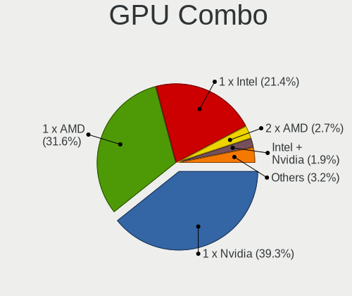

| Name            | Desktops | Percent |
|-----------------|----------|---------|
| 1 x Nvidia      | 201      | 40.61%  |
| 1 x AMD         | 175      | 35.35%  |
| 1 x Intel       | 98       | 19.8%   |
| 2 x AMD         | 5        | 1.01%   |
| AMD + Nvidia    | 5        | 1.01%   |
| Intel + Nvidia  | 3        | 0.61%   |
| 2 x Nvidia      | 2        | 0.4%    |
| 1 x Matrox      | 2        | 0.4%    |
| Other           | 1        | 0.2%    |
| Nvidia + ASPEED | 1        | 0.2%    |
| Intel + AMD     | 1        | 0.2%    |
| 1 x ASPEED      | 1        | 0.2%    |

GPU Driver
----------

Free vs proprietary

| Driver      | Desktops | Percent |
|-------------|----------|---------|
| Free        | 365      | 73.15%  |
| Proprietary | 115      | 23.05%  |
| Unknown     | 19       | 3.81%   |

GPU Memory
----------

Total video memory

| Size in GB | Desktops | Percent |
|------------|----------|---------|
| Unknown    | 164      | 32.6%   |
| 1.01-2.0   | 85       | 16.9%   |
| 7.01-8.0   | 57       | 11.33%  |
| 0.51-1.0   | 54       | 10.74%  |
| 0.01-0.5   | 51       | 10.14%  |
| 3.01-4.0   | 48       | 9.54%   |
| 5.01-6.0   | 23       | 4.57%   |
| 8.01-16.0  | 11       | 2.19%   |
| 2.01-3.0   | 7        | 1.39%   |
| 16.01-24.0 | 2        | 0.4%    |
| 4.01-5.0   | 1        | 0.2%    |

Monitor
-------

Monitor Vendor
--------------

Monitor vendors

| Vendor                  | Desktops | Percent |
|-------------------------|----------|---------|
| Samsung Electronics     | 110      | 20.15%  |
| BenQ                    | 53       | 9.71%   |
| Dell                    | 41       | 7.51%   |
| Acer                    | 37       | 6.78%   |
| Hewlett-Packard         | 34       | 6.23%   |
| Goldstar                | 31       | 5.68%   |
| Philips                 | 27       | 4.95%   |
| Iiyama                  | 27       | 4.95%   |
| AOC                     | 27       | 4.95%   |
| Ancor Communications    | 21       | 3.85%   |
| Eizo                    | 16       | 2.93%   |
| Medion                  | 12       | 2.2%    |
| NEC Computers           | 10       | 1.83%   |
| Unknown                 | 9        | 1.65%   |
| ViewSonic               | 8        | 1.47%   |
| Gericom                 | 7        | 1.28%   |
| Fujitsu Siemens         | 7        | 1.28%   |
| Sony                    | 6        | 1.1%    |
| Lenovo                  | 6        | 1.1%    |
| Idek Iiyama             | 5        | 0.92%   |
| LG Electronics          | 4        | 0.73%   |
| Toshiba                 | 3        | 0.55%   |
| HannStar                | 3        | 0.55%   |
| Belinea                 | 3        | 0.55%   |
| ASUSTek Computer        | 3        | 0.55%   |
| Apple                   | 3        | 0.55%   |
| Plain Tree Systems      | 2        | 0.37%   |
| MSI                     | 2        | 0.37%   |
| Lenovo Group Limited    | 2        | 0.37%   |
| Jean                    | 2        | 0.37%   |
| Hitachi                 | 2        | 0.37%   |
| Chi Mei Optoelectronics | 2        | 0.37%   |
| YUK                     | 1        | 0.18%   |
| Vestel Elektronik       | 1        | 0.18%   |
| TopView                 | 1        | 0.18%   |
| SKY                     | 1        | 0.18%   |
| SIM                     | 1        | 0.18%   |
| Sharp                   | 1        | 0.18%   |
| NEX                     | 1        | 0.18%   |
| Hyundai ImageQuest      | 1        | 0.18%   |
| HVR                     | 1        | 0.18%   |
| HUAWEI                  | 1        | 0.18%   |
| HCG                     | 1        | 0.18%   |
| Grundig                 | 1        | 0.18%   |
| GRM                     | 1        | 0.18%   |
| Gigabyte Technology     | 1        | 0.18%   |
| CVT                     | 1        | 0.18%   |
| Compal                  | 1        | 0.18%   |
| CHD                     | 1        | 0.18%   |
| Beko                    | 1        | 0.18%   |
| AUS                     | 1        | 0.18%   |
| AU Optronics            | 1        | 0.18%   |
| Unknown                 | 1        | 0.18%   |

Monitor Model
-------------

Monitor models

| Model                                                                 | Desktops | Percent |
|-----------------------------------------------------------------------|----------|---------|
| NEC Computers EA243WM NEC6864 1920x1200 519x324mm 24.1-inch           | 7        | 1.18%   |
| Acer B193 ACR001D 1280x1024 376x301mm 19.0-inch                       | 7        | 1.18%   |
| Ancor Communications VS248 ACI2498 1920x1080 531x299mm 24.0-inch      | 5        | 0.84%   |
| Iiyama PLX2783H IVM6611 1920x1080 598x336mm 27.0-inch                 | 4        | 0.68%   |
| Gericom Q24 QMX2421 1920x1080 521x293mm 23.5-inch                     | 4        | 0.68%   |
| BenQ GL2450H BNQ78A7 1920x1080 531x298mm 24.0-inch                    | 4        | 0.68%   |
| Ancor Communications ASUS VS247 ACI249A 1920x1080 521x293mm 23.5-inch | 4        | 0.68%   |
| Samsung Electronics SyncMaster SAM04D4 1920x1080 531x298mm 24.0-inch  | 3        | 0.51%   |
| Samsung Electronics S34J55x SAM0F70 3440x1440 797x333mm 34.0-inch     | 3        | 0.51%   |
| Samsung Electronics C32F391 SAM0D35 1920x1080 698x393mm 31.5-inch     | 3        | 0.51%   |
| Samsung Electronics C27F390 SAM0D32 1920x1080 600x340mm 27.2-inch     | 3        | 0.51%   |
| Iiyama PLE2483H IVM6113 1920x1080 531x299mm 24.0-inch                 | 3        | 0.51%   |
| Eizo S2202W ENC1975 1680x1050 474x297mm 22.0-inch                     | 3        | 0.51%   |
| Dell U2312HM DEL4072 1920x1080 510x287mm 23.0-inch                    | 3        | 0.51%   |
| Acer G246HL ACR02FF 1920x1080 531x299mm 24.0-inch                     | 3        | 0.51%   |
| Unknown LCD Monitor GRM GM2600 1920x1200                              | 2        | 0.34%   |
| Toshiba TV TSB0105 1920x1080 708x398mm 32.0-inch                      | 2        | 0.34%   |
| Samsung Electronics U28E570 SAM0D6F 3840x2160 610x350mm 27.7-inch     | 2        | 0.34%   |
| Samsung Electronics SyncMaster SAM05C5 1920x1080                      | 2        | 0.34%   |
| Samsung Electronics SyncMaster SAM0486 1600x900                       | 2        | 0.34%   |
| Samsung Electronics SyncMaster SAM03E5 1680x1050 474x296mm 22.0-inch  | 2        | 0.34%   |
| Samsung Electronics SyncMaster SAM03E4 1680x1050 474x296mm 22.0-inch  | 2        | 0.34%   |
| Samsung Electronics SyncMaster SAM027F 1680x1050 474x296mm 22.0-inch  | 2        | 0.34%   |
| Samsung Electronics SMBX2450 SAM0722 1920x1080 531x299mm 24.0-inch    | 2        | 0.34%   |
| Samsung Electronics SMBX2035 SAM06FE 1600x900 440x250mm 19.9-inch     | 2        | 0.34%   |
| Samsung Electronics S27E330 SAM0D90 1920x1080 598x336mm 27.0-inch     | 2        | 0.34%   |
| Samsung Electronics S24F350 SAM0D20 1920x1080 520x290mm 23.4-inch     | 2        | 0.34%   |
| Samsung Electronics S24E650 SAM0C86 1920x1200 518x324mm 24.1-inch     | 2        | 0.34%   |
| Samsung Electronics S24D300 SAM0B43 1920x1080 531x299mm 24.0-inch     | 2        | 0.34%   |
| Samsung Electronics LS32R75 SAM0F93 3840x2160 697x392mm 31.5-inch     | 2        | 0.34%   |
| Samsung Electronics LF32TU87 SAM706B 3840x2160 698x393mm 31.5-inch    | 2        | 0.34%   |
| Samsung Electronics LCD Monitor SAM0902 1920x1080 700x390mm 31.5-inch | 2        | 0.34%   |
| Samsung Electronics C32F391 SAM0D34 1920x1080 698x393mm 31.5-inch     | 2        | 0.34%   |
| Samsung Electronics C24F390 SAM0D2C 1920x1080 521x293mm 23.5-inch     | 2        | 0.34%   |
| Philips PHL BDM4037U PHLC142 3840x2160 885x498mm 40.0-inch            | 2        | 0.34%   |
| Philips PHL 273V7 PHLC156 1920x1080 598x336mm 27.0-inch               | 2        | 0.34%   |
| Philips PHL 223V5 PHLC0CF 1920x1080 477x268mm 21.5-inch               | 2        | 0.34%   |
| Philips 220BLP PHL08BF 1680x1050 474x296mm 22.0-inch                  | 2        | 0.34%   |
| Medion MD20432 MED36A8 1920x1080 521x293mm 23.5-inch                  | 2        | 0.34%   |
| Jean GM2200 JEN1003 1680x1050 474x297mm 22.0-inch                     | 2        | 0.34%   |
| Iiyama PL3461WQ IVM7615 3440x1440 800x335mm 34.1-inch                 | 2        | 0.34%   |
| Iiyama PL2776HD IVM6605 1920x1080 598x336mm 27.0-inch                 | 2        | 0.34%   |
| Iiyama PL2492H IVM612F 1920x1080 527x296mm 23.8-inch                  | 2        | 0.34%   |
| Iiyama PL2452 IVM610A 1920x1080 521x293mm 23.5-inch                   | 2        | 0.34%   |
| Idek Iiyama LCD Monitor PL2760Q 2560x1440                             | 2        | 0.34%   |
| Hewlett-Packard V27e HPN36B1 1920x1080 598x336mm 27.0-inch            | 2        | 0.34%   |
| Hewlett-Packard LP2475w HWP26F7 1920x1200 540x350mm 25.3-inch         | 2        | 0.34%   |
| Hewlett-Packard 24w HPN3431 1920x1080 527x296mm 23.8-inch             | 2        | 0.34%   |
| Goldstar W2442 GSM56CC 1920x1080 531x299mm 24.0-inch                  | 2        | 0.34%   |
| Goldstar W2242 GSM5678 1680x1050 474x296mm 22.0-inch                  | 2        | 0.34%   |
| Goldstar ULTRAWIDE GSM59F2 2560x1080 798x334mm 34.1-inch              | 2        | 0.34%   |
| Goldstar HDR 4K GSM7707 3840x2160 600x340mm 27.2-inch                 | 2        | 0.34%   |
| Goldstar 24EB23 GSM59B4 1920x1200 520x330mm 24.2-inch                 | 2        | 0.34%   |
| Gericom Vision L22FHD QMX2472 1920x1080 478x269mm 21.6-inch           | 2        | 0.34%   |
| Dell U2719D DEL415F 2560x1440 597x336mm 27.0-inch                     | 2        | 0.34%   |
| Dell U2713HM DEL4080 2560x1440 600x340mm 27.2-inch                    | 2        | 0.34%   |
| Dell U2515H DELD06F 2560x1440 553x311mm 25.0-inch                     | 2        | 0.34%   |
| Dell U2515H DELD06E 2560x1440 550x310mm 24.9-inch                     | 2        | 0.34%   |
| Dell U2415 DELA0BA 1920x1200 518x324mm 24.1-inch                      | 2        | 0.34%   |
| Dell U2412M DELA07B 1920x1200 518x324mm 24.1-inch                     | 2        | 0.34%   |

Monitor Resolution
------------------

Monitor screen resolution

| Resolution         | Desktops | Percent |
|--------------------|----------|---------|
| 1920x1080 (FHD)    | 243      | 44.75%  |
| 3840x2160 (4K)     | 58       | 10.68%  |
| 2560x1440 (QHD)    | 50       | 9.21%   |
| 1680x1050 (WSXGA+) | 48       | 8.84%   |
| 1280x1024 (SXGA)   | 36       | 6.63%   |
| 1920x1200 (WUXGA)  | 34       | 6.26%   |
| Unknown            | 13       | 2.39%   |
| 3440x1440          | 9        | 1.66%   |
| 2560x1080          | 7        | 1.29%   |
| 3840x1080          | 6        | 1.1%    |
| 2560x1600          | 5        | 0.92%   |
| 1920x540           | 4        | 0.74%   |
| 1600x900 (HD+)     | 4        | 0.74%   |
| 1440x900 (WXGA+)   | 3        | 0.55%   |
| 1366x768 (WXGA)    | 3        | 0.55%   |
| 1024x768 (XGA)     | 3        | 0.55%   |
| 4480x1440          | 2        | 0.37%   |
| 2048x1152          | 2        | 0.37%   |
| 5760x2160          | 1        | 0.18%   |
| 5760x1080          | 1        | 0.18%   |
| 5120x1440          | 1        | 0.18%   |
| 3840x2560          | 1        | 0.18%   |
| 3600x1080          | 1        | 0.18%   |
| 3520x1080          | 1        | 0.18%   |
| 3360x1050          | 1        | 0.18%   |
| 3200x1080          | 1        | 0.18%   |
| 2160x1200          | 1        | 0.18%   |
| 1600x1200          | 1        | 0.18%   |
| 1400x1050          | 1        | 0.18%   |
| 1360x768           | 1        | 0.18%   |
| 1280x960           | 1        | 0.18%   |

Monitor Diagonal
----------------

Diagonal size in inches

| Inches  | Desktops | Percent |
|---------|----------|---------|
| 24      | 95       | 17.3%   |
| 27      | 88       | 16.03%  |
| Unknown | 68       | 12.39%  |
| 23      | 67       | 12.2%   |
| 22      | 36       | 6.56%   |
| 19      | 32       | 5.83%   |
| 21      | 31       | 5.65%   |
| 31      | 27       | 4.92%   |
| 25      | 12       | 2.19%   |
| 34      | 11       | 2%      |
| 20      | 11       | 2%      |
| 17      | 9        | 1.64%   |
| 84      | 8        | 1.46%   |
| 32      | 6        | 1.09%   |
| 54      | 5        | 0.91%   |
| 40      | 5        | 0.91%   |
| 28      | 5        | 0.91%   |
| 18      | 5        | 0.91%   |
| 15      | 4        | 0.73%   |
| 72      | 3        | 0.55%   |
| 65      | 3        | 0.55%   |
| 29      | 3        | 0.55%   |
| 42      | 2        | 0.36%   |
| 33      | 2        | 0.36%   |
| 55      | 1        | 0.18%   |
| 49      | 1        | 0.18%   |
| 48      | 1        | 0.18%   |
| 46      | 1        | 0.18%   |
| 43      | 1        | 0.18%   |
| 41      | 1        | 0.18%   |
| 39      | 1        | 0.18%   |
| 35      | 1        | 0.18%   |
| 26      | 1        | 0.18%   |
| 16      | 1        | 0.18%   |
| 13      | 1        | 0.18%   |

Monitor Width
-------------

Physical width

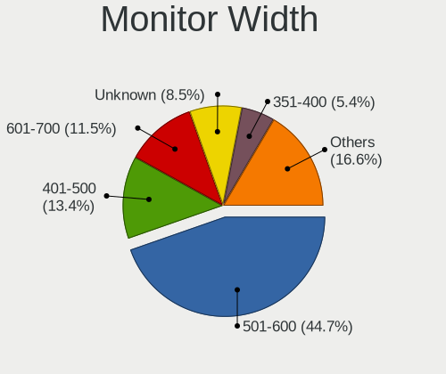

| Width in mm | Desktops | Percent |
|-------------|----------|---------|
| 501-600     | 226      | 42.8%   |
| 401-500     | 85       | 16.1%   |
| Unknown     | 68       | 12.88%  |
| 601-700     | 48       | 9.09%   |
| 351-400     | 34       | 6.44%   |
| 701-800     | 18       | 3.41%   |
| 301-350     | 13       | 2.46%   |
| 1001-1500   | 12       | 2.27%   |
| 1501-2000   | 11       | 2.08%   |
| 801-900     | 7        | 1.33%   |
| 901-1000    | 4        | 0.76%   |
| 201-300     | 2        | 0.38%   |

Aspect Ratio
------------

Proportional relationship between the width and the height

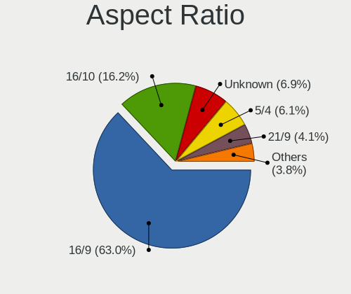

| Ratio   | Desktops | Percent |
|---------|----------|---------|
| 16/9    | 308      | 59.81%  |
| 16/10   | 87       | 16.89%  |
| Unknown | 54       | 10.49%  |
| 5/4     | 37       | 7.18%   |
| 21/9    | 12       | 2.33%   |
| 4/3     | 5        | 0.97%   |
| 32/9    | 5        | 0.97%   |
| 3/2     | 4        | 0.78%   |
| 6/5     | 2        | 0.39%   |
| 0.80    | 1        | 0.19%   |

Monitor Area
------------

Area in inch

| Area in inch | Desktops | Percent |
|----------------|----------|---------|
| 201-250        | 178      | 32.84%  |
| 301-350        | 89       | 16.42%  |
| Unknown        | 68       | 12.55%  |
| 151-200        | 57       | 10.52%  |
| 351-500        | 52       | 9.59%   |
| 251-300        | 49       | 9.04%   |
| More than 1000 | 20       | 3.69%   |
| 501-1000       | 13       | 2.4%    |
| 141-150        | 9        | 1.66%   |
| 101-110        | 3        | 0.55%   |
| 71-80          | 1        | 0.18%   |
| 131-140        | 1        | 0.18%   |
| 121-130        | 1        | 0.18%   |
| 111-120        | 1        | 0.18%   |

Pixel Density
-------------

Pixels per inch

| Density | Desktops | Percent |
|---------|----------|---------|
| 51-100  | 303      | 60.72%  |
| 101-120 | 76       | 15.23%  |
| Unknown | 68       | 13.63%  |
| 121-160 | 30       | 6.01%   |
| 1-50    | 12       | 2.4%    |
| 161-240 | 10       | 2%      |

Multiple Monitors
-----------------

Total monitors connected

| Total | Desktops | Percent |
|-------|----------|---------|
| 1     | 373      | 74.45%  |
| 2     | 90       | 17.96%  |
| 0     | 25       | 4.99%   |
| 3     | 13       | 2.59%   |

Network
-------

Net Controller Vendor
---------------------

Controller vendors

| Vendor                                | Desktops | Percent |
|---------------------------------------|----------|---------|
| Realtek Semiconductor                 | 275      | 39.86%  |
| Intel                                 | 227      | 32.9%   |
| Qualcomm Atheros                      | 42       | 6.09%   |
| Broadcom                              | 16       | 2.32%   |
| Ralink Technology                     | 12       | 1.74%   |
| TP-Link                               | 11       | 1.59%   |
| IMC Networks                          | 11       | 1.59%   |
| ASUSTek Computer                      | 9        | 1.3%    |
| Microsoft                             | 8        | 1.16%   |
| Marvell Technology Group              | 8        | 1.16%   |
| Ralink                                | 7        | 1.01%   |
| Nvidia                                | 7        | 1.01%   |
| NetGear                               | 6        | 0.87%   |
| Edimax Technology                     | 6        | 0.87%   |
| Samsung Electronics                   | 4        | 0.58%   |
| Qualcomm Atheros Communications       | 4        | 0.58%   |
| D-Link System                         | 4        | 0.58%   |
| D-Link                                | 4        | 0.58%   |
| Aquantia                              | 4        | 0.58%   |
| Broadcom Limited                      | 3        | 0.43%   |
| VIA Technologies                      | 2        | 0.29%   |
| Huawei Technologies                   | 2        | 0.29%   |
| ASIX Electronics                      | 2        | 0.29%   |
| 802.11g Adapter [Linksys WUSB54GC v3] | 2        | 0.29%   |
| ZTE WCDMA Technologies MSM            | 1        | 0.14%   |
| Xiaomi                                | 1        | 0.14%   |
| Winbond Electronics                   | 1        | 0.14%   |
| Wilocity                              | 1        | 0.14%   |
| SEGGER                                | 1        | 0.14%   |
| Prusa Research (prusa3d.com)          | 1        | 0.14%   |
| Philips (or NXP)                      | 1        | 0.14%   |
| Oculus VR                             | 1        | 0.14%   |
| Motorola                              | 1        | 0.14%   |
| Mellanox Technologies                 | 1        | 0.14%   |
| Lenovo                                | 1        | 0.14%   |
| BUFFALO                               | 1        | 0.14%   |
| Belkin Components                     | 1        | 0.14%   |
| Arduino SA                            | 1        | 0.14%   |

Net Controller Model
--------------------

Controller models

| Model                                                                | Desktops | Percent |
|----------------------------------------------------------------------|----------|---------|
| Realtek RTL8111/8168/8411 PCI Express Gigabit Ethernet Controller    | 232      | 29.52%  |
| Intel I211 Gigabit Network Connection                                | 40       | 5.09%   |
| Intel Ethernet Connection (2) I219-V                                 | 30       | 3.82%   |
| Intel Wi-Fi 6 AX200                                                  | 25       | 3.18%   |
| Realtek RTL8125 2.5GbE Controller                                    | 21       | 2.67%   |
| Intel 82579V Gigabit Network Connection                              | 15       | 1.91%   |
| Intel 82579LM Gigabit Network Connection (Lewisville)                | 15       | 1.91%   |
| Intel Ethernet Controller I225-V                                     | 14       | 1.78%   |
| Intel Ethernet Connection (7) I219-V                                 | 13       | 1.65%   |
| Qualcomm Atheros Killer E220x Gigabit Ethernet Controller            | 12       | 1.53%   |
| Intel Ethernet Connection I217-V                                     | 10       | 1.27%   |
| Intel Ethernet Connection I217-LM                                    | 10       | 1.27%   |
| Intel Wireless-AC 9260                                               | 9        | 1.15%   |
| Intel Ethernet Connection (2) I218-V                                 | 9        | 1.15%   |
| Intel Dual Band Wireless-AC 3168NGW [Stone Peak]                     | 9        | 1.15%   |
| IMC Networks Mediao 802.11n WLAN [Realtek RTL8191SU]                 | 9        | 1.15%   |
| Realtek RTL88x2bu [AC1200 Techkey]                                   | 7        | 0.89%   |
| Microsoft Xbox 360 Wireless Adapter                                  | 7        | 0.89%   |
| Intel Cannon Lake PCH CNVi WiFi                                      | 7        | 0.89%   |
| Intel 82574L Gigabit Network Connection                              | 7        | 0.89%   |
| ASUS USB-N13 802.11n Network Adapter (rev. B1) [Realtek RTL8192CU]   | 7        | 0.89%   |
| Realtek RTL8188CUS 802.11n WLAN Adapter                              | 6        | 0.76%   |
| Intel Ethernet Connection (2) I219-LM                                | 6        | 0.76%   |
| Ralink RT5370 Wireless Adapter                                       | 5        | 0.64%   |
| Marvell Group 88E8056 PCI-E Gigabit Ethernet Controller              | 5        | 0.64%   |
| Intel I210 Gigabit Network Connection                                | 5        | 0.64%   |
| Realtek RTL8821CE 802.11ac PCIe Wireless Network Adapter             | 4        | 0.51%   |
| Ralink RT2800 802.11n PCI                                            | 4        | 0.51%   |
| Qualcomm Atheros AR9271 802.11n                                      | 4        | 0.51%   |
| Qualcomm Atheros AR8161 Gigabit Ethernet                             | 4        | 0.51%   |
| Nvidia MCP61 Ethernet                                                | 4        | 0.51%   |
| Intel Wireless 8260                                                  | 4        | 0.51%   |
| Intel Ethernet Connection (2) I218-LM                                | 4        | 0.51%   |
| Intel 82578DM Gigabit Network Connection                             | 4        | 0.51%   |
| Intel 82567LM-3 Gigabit Network Connection                           | 4        | 0.51%   |
| Edimax EW-7811Un 802.11n Wireless Adapter [Realtek RTL8188CUS]       | 4        | 0.51%   |
| TP-Link TL-WN823N v2/v3 [Realtek RTL8192EU]                          | 3        | 0.38%   |
| TP-Link Archer T3U [Realtek RTL8812BU]                               | 3        | 0.38%   |
| Samsung Galaxy series, misc. (tethering mode)                        | 3        | 0.38%   |
| Realtek RTL8812AE 802.11ac PCIe Wireless Network Adapter             | 3        | 0.38%   |
| Realtek RTL8192CE PCIe Wireless Network Adapter                      | 3        | 0.38%   |
| Realtek RTL8169 PCI Gigabit Ethernet Controller                      | 3        | 0.38%   |
| Realtek RTL810xE PCI Express Fast Ethernet controller                | 3        | 0.38%   |
| Realtek RTL-8110SC/8169SC Gigabit Ethernet                           | 3        | 0.38%   |
| Realtek RTL-8100/8101L/8139 PCI Fast Ethernet Adapter                | 3        | 0.38%   |
| Realtek 802.11ac NIC                                                 | 3        | 0.38%   |
| Qualcomm Atheros QCA6174 802.11ac Wireless Network Adapter           | 3        | 0.38%   |
| Qualcomm Atheros AR9485 Wireless Network Adapter                     | 3        | 0.38%   |
| Qualcomm Atheros AR8121/AR8113/AR8114 Gigabit or Fast Ethernet       | 3        | 0.38%   |
| NetGear WNA3100M(v1) Wireless-N 300 [Realtek RTL8192CU]              | 3        | 0.38%   |
| Intel Centrino Wireless-N 2230                                       | 3        | 0.38%   |
| D-Link DWA-131 Wireless N Nano Adapter (Rev. E1) [Realtek RTL8192EU] | 3        | 0.38%   |
| Broadcom NetXtreme BCM5764M Gigabit Ethernet PCIe                    | 3        | 0.38%   |
| Broadcom BCM4360 802.11ac Wireless Network Adapter                   | 3        | 0.38%   |
| Broadcom BCM4352 802.11ac Wireless Network Adapter                   | 3        | 0.38%   |
| VIA VT6105/VT6106S [Rhine-III]                                       | 2        | 0.25%   |
| TP-Link TL-WN722N v2/v3 [Realtek RTL8188EUS]                         | 2        | 0.25%   |
| Realtek RTL8812AU 802.11a/b/g/n/ac 2T2R DB WLAN Adapter              | 2        | 0.25%   |
| Realtek RTL8192CU 802.11n WLAN Adapter                               | 2        | 0.25%   |
| Realtek RTL8188SU 802.11n WLAN Adapter                               | 2        | 0.25%   |

Wireless Vendor
---------------

Wireless vendors

| Vendor                                | Desktops | Percent |
|---------------------------------------|----------|---------|
| Intel                                 | 69       | 30.8%   |
| Realtek Semiconductor                 | 44       | 19.64%  |
| Qualcomm Atheros                      | 15       | 6.7%    |
| Ralink Technology                     | 12       | 5.36%   |
| TP-Link                               | 11       | 4.91%   |
| IMC Networks                          | 11       | 4.91%   |
| ASUSTek Computer                      | 9        | 4.02%   |
| Microsoft                             | 8        | 3.57%   |
| Broadcom                              | 8        | 3.57%   |
| Ralink                                | 7        | 3.13%   |
| NetGear                               | 6        | 2.68%   |
| Edimax Technology                     | 6        | 2.68%   |
| Qualcomm Atheros Communications       | 4        | 1.79%   |
| D-Link System                         | 4        | 1.79%   |
| D-Link                                | 3        | 1.34%   |
| 802.11g Adapter [Linksys WUSB54GC v3] | 2        | 0.89%   |
| Wilocity                              | 1        | 0.45%   |
| Philips (or NXP)                      | 1        | 0.45%   |
| BUFFALO                               | 1        | 0.45%   |
| Broadcom Limited                      | 1        | 0.45%   |
| Belkin Components                     | 1        | 0.45%   |

Wireless Model
--------------

Wireless models

| Model                                                                                               | Desktops | Percent |
|-----------------------------------------------------------------------------------------------------|----------|---------|
| Intel Wi-Fi 6 AX200                                                                                 | 25       | 11.01%  |
| Intel Wireless-AC 9260                                                                              | 9        | 3.96%   |
| Intel Dual Band Wireless-AC 3168NGW [Stone Peak]                                                    | 9        | 3.96%   |
| IMC Networks Mediao 802.11n WLAN [Realtek RTL8191SU]                                                | 9        | 3.96%   |
| Realtek RTL88x2bu [AC1200 Techkey]                                                                  | 7        | 3.08%   |
| Microsoft Xbox 360 Wireless Adapter                                                                 | 7        | 3.08%   |
| Intel Cannon Lake PCH CNVi WiFi                                                                     | 7        | 3.08%   |
| ASUS USB-N13 802.11n Network Adapter (rev. B1) [Realtek RTL8192CU]                                  | 7        | 3.08%   |
| Realtek RTL8188CUS 802.11n WLAN Adapter                                                             | 6        | 2.64%   |
| Ralink RT5370 Wireless Adapter                                                                      | 5        | 2.2%    |
| Realtek RTL8821CE 802.11ac PCIe Wireless Network Adapter                                            | 4        | 1.76%   |
| Ralink RT2800 802.11n PCI                                                                           | 4        | 1.76%   |
| Qualcomm Atheros AR9271 802.11n                                                                     | 4        | 1.76%   |
| Intel Wireless 8260                                                                                 | 4        | 1.76%   |
| Edimax EW-7811Un 802.11n Wireless Adapter [Realtek RTL8188CUS]                                      | 4        | 1.76%   |
| TP-Link TL-WN823N v2/v3 [Realtek RTL8192EU]                                                         | 3        | 1.32%   |
| TP-Link Archer T3U [Realtek RTL8812BU]                                                              | 3        | 1.32%   |
| Realtek RTL8812AE 802.11ac PCIe Wireless Network Adapter                                            | 3        | 1.32%   |
| Realtek RTL8192CE PCIe Wireless Network Adapter                                                     | 3        | 1.32%   |
| Realtek 802.11ac NIC                                                                                | 3        | 1.32%   |
| Qualcomm Atheros QCA6174 802.11ac Wireless Network Adapter                                          | 3        | 1.32%   |
| Qualcomm Atheros AR9485 Wireless Network Adapter                                                    | 3        | 1.32%   |
| NetGear WNA3100M(v1) Wireless-N 300 [Realtek RTL8192CU]                                             | 3        | 1.32%   |
| Intel Centrino Wireless-N 2230                                                                      | 3        | 1.32%   |
| D-Link DWA-131 Wireless N Nano Adapter (Rev. E1) [Realtek RTL8192EU]                                | 3        | 1.32%   |
| Broadcom BCM4360 802.11ac Wireless Network Adapter                                                  | 3        | 1.32%   |
| Broadcom BCM4352 802.11ac Wireless Network Adapter                                                  | 3        | 1.32%   |
| TP-Link TL-WN722N v2/v3 [Realtek RTL8188EUS]                                                        | 2        | 0.88%   |
| Realtek RTL8812AU 802.11a/b/g/n/ac 2T2R DB WLAN Adapter                                             | 2        | 0.88%   |
| Realtek RTL8192CU 802.11n WLAN Adapter                                                              | 2        | 0.88%   |
| Realtek RTL8188SU 802.11n WLAN Adapter                                                              | 2        | 0.88%   |
| Realtek RTL8188EUS 802.11n Wireless Network Adapter                                                 | 2        | 0.88%   |
| Ralink RT5572 Wireless Adapter                                                                      | 2        | 0.88%   |
| Ralink MT7601U Wireless Adapter                                                                     | 2        | 0.88%   |
| Ralink RT3062 Wireless 802.11n 2T/2R                                                                | 2        | 0.88%   |
| Qualcomm Atheros AR93xx Wireless Network Adapter                                                    | 2        | 0.88%   |
| NetGear A6100 AC600 DB Wireless Adapter [Realtek RTL8811AU]                                         | 2        | 0.88%   |
| Intel Wireless 8265 / 8275                                                                          | 2        | 0.88%   |
| Intel Wireless 3165                                                                                 | 2        | 0.88%   |
| Intel Comet Lake PCH CNVi WiFi                                                                      | 2        | 0.88%   |
| Intel Alder Lake-S PCH CNVi WiFi                                                                    | 2        | 0.88%   |
| IMC Networks AW-NU222 802.11bgn Wireless Module [Ralink RT2770+RT2720]                              | 2        | 0.88%   |
| D-Link System DWA-160 802.11abgn Xtreme N Dual Band Adapter(rev.A1) [Atheros AR9170+AR9104]         | 2        | 0.88%   |
| 802.11g Adapter [Linksys WUSB54GC v3] WUSB100 v2 RangePlus Wireless Network Adapter [Ralink RT3070] | 2        | 0.88%   |
| Wilocity Wil6200 802.11ad Wireless Network Adapter                                                  | 1        | 0.44%   |
| TP-Link TL-WN822N Version 4 RTL8192EU                                                               | 1        | 0.44%   |
| TP-Link AC600 wireless Realtek RTL8811AU [Archer T2U Nano]                                          | 1        | 0.44%   |
| TP-Link 802.11ac WLAN Adapter                                                                       | 1        | 0.44%   |
| Realtek RTL8822CE 802.11ac PCIe Wireless Network Adapter                                            | 1        | 0.44%   |
| Realtek RTL8821AE 802.11ac PCIe Wireless Network Adapter                                            | 1        | 0.44%   |
| Realtek RTL8811AU 802.11a/b/g/n/ac WLAN Adapter                                                     | 1        | 0.44%   |
| Realtek RTL8723BU 802.11b/g/n WLAN Adapter                                                          | 1        | 0.44%   |
| Realtek RTL8192SU 802.11n WLAN Adapter                                                              | 1        | 0.44%   |
| Realtek RTL8192EU 802.11b/g/n WLAN Adapter                                                          | 1        | 0.44%   |
| Realtek RTL8192EE PCIe Wireless Network Adapter                                                     | 1        | 0.44%   |
| Realtek RTL8191SU 802.11n WLAN Adapter                                                              | 1        | 0.44%   |
| Realtek RTL8191SEvA Wireless LAN Controller                                                         | 1        | 0.44%   |
| Realtek RTL8188EE Wireless Network Adapter                                                          | 1        | 0.44%   |
| Realtek RTL8188CE 802.11b/g/n WiFi Adapter                                                          | 1        | 0.44%   |
| Realtek Realtek 8812AU/8821AU 802.11ac WLAN Adapter [USB Wireless Dual-Band Adapter 2.4/5Ghz]       | 1        | 0.44%   |

Ethernet Vendor
---------------

Ethernet vendors

| Vendor                     | Desktops | Percent |
|----------------------------|----------|---------|
| Realtek Semiconductor      | 262      | 49.34%  |
| Intel                      | 200      | 37.66%  |
| Qualcomm Atheros           | 28       | 5.27%   |
| Marvell Technology Group   | 8        | 1.51%   |
| Broadcom                   | 8        | 1.51%   |
| Nvidia                     | 7        | 1.32%   |
| Samsung Electronics        | 4        | 0.75%   |
| Aquantia                   | 4        | 0.75%   |
| VIA Technologies           | 2        | 0.38%   |
| Broadcom Limited           | 2        | 0.38%   |
| ASIX Electronics           | 2        | 0.38%   |
| ZTE WCDMA Technologies MSM | 1        | 0.19%   |
| Xiaomi                     | 1        | 0.19%   |
| Mellanox Technologies      | 1        | 0.19%   |
| D-Link                     | 1        | 0.19%   |

Ethernet Model
--------------

Ethernet models

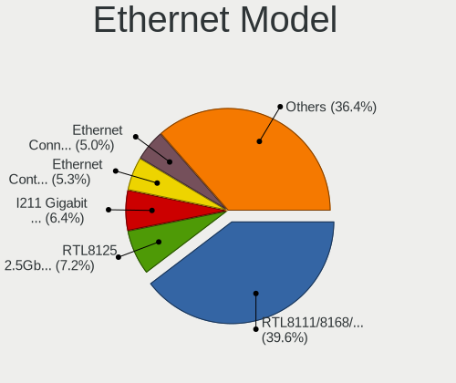

| Model                                                             | Desktops | Percent |
|-------------------------------------------------------------------|----------|---------|
| Realtek RTL8111/8168/8411 PCI Express Gigabit Ethernet Controller | 232      | 42.18%  |
| Intel I211 Gigabit Network Connection                             | 40       | 7.27%   |
| Intel Ethernet Connection (2) I219-V                              | 30       | 5.45%   |
| Realtek RTL8125 2.5GbE Controller                                 | 21       | 3.82%   |
| Intel 82579V Gigabit Network Connection                           | 15       | 2.73%   |
| Intel 82579LM Gigabit Network Connection (Lewisville)             | 15       | 2.73%   |
| Intel Ethernet Controller I225-V                                  | 14       | 2.55%   |
| Intel Ethernet Connection (7) I219-V                              | 13       | 2.36%   |
| Qualcomm Atheros Killer E220x Gigabit Ethernet Controller         | 12       | 2.18%   |
| Intel Ethernet Connection I217-V                                  | 10       | 1.82%   |
| Intel Ethernet Connection I217-LM                                 | 10       | 1.82%   |
| Intel Ethernet Connection (2) I218-V                              | 9        | 1.64%   |
| Intel 82574L Gigabit Network Connection                           | 7        | 1.27%   |
| Intel Ethernet Connection (2) I219-LM                             | 6        | 1.09%   |
| Marvell Group 88E8056 PCI-E Gigabit Ethernet Controller           | 5        | 0.91%   |
| Intel I210 Gigabit Network Connection                             | 5        | 0.91%   |
| Qualcomm Atheros AR8161 Gigabit Ethernet                          | 4        | 0.73%   |
| Nvidia MCP61 Ethernet                                             | 4        | 0.73%   |
| Intel Ethernet Connection (2) I218-LM                             | 4        | 0.73%   |
| Intel 82578DM Gigabit Network Connection                          | 4        | 0.73%   |
| Intel 82567LM-3 Gigabit Network Connection                        | 4        | 0.73%   |
| Samsung Galaxy series, misc. (tethering mode)                     | 3        | 0.55%   |
| Realtek RTL8169 PCI Gigabit Ethernet Controller                   | 3        | 0.55%   |
| Realtek RTL810xE PCI Express Fast Ethernet controller             | 3        | 0.55%   |
| Realtek RTL-8110SC/8169SC Gigabit Ethernet                        | 3        | 0.55%   |
| Realtek RTL-8100/8101L/8139 PCI Fast Ethernet Adapter             | 3        | 0.55%   |
| Qualcomm Atheros AR8121/AR8113/AR8114 Gigabit or Fast Ethernet    | 3        | 0.55%   |
| Broadcom NetXtreme BCM5764M Gigabit Ethernet PCIe                 | 3        | 0.55%   |
| VIA VT6105/VT6106S [Rhine-III]                                    | 2        | 0.36%   |
| Qualcomm Atheros QCA8171 Gigabit Ethernet                         | 2        | 0.36%   |
| Qualcomm Atheros Killer E2500 Gigabit Ethernet Controller         | 2        | 0.36%   |
| Qualcomm Atheros Attansic L1 Gigabit Ethernet                     | 2        | 0.36%   |
| Qualcomm Atheros AR8131 Gigabit Ethernet                          | 2        | 0.36%   |
| Marvell Group 88E8071 PCI-E Gigabit Ethernet Controller           | 2        | 0.36%   |
| Intel I350 Gigabit Network Connection                             | 2        | 0.36%   |
| Intel Ethernet Connection (7) I219-LM                             | 2        | 0.36%   |
| Intel Ethernet Connection (11) I219-V                             | 2        | 0.36%   |
| Intel 82571EB/82571GB Gigabit Ethernet Controller (Copper)        | 2        | 0.36%   |
| Intel 82566DM-2 Gigabit Network Connection                        | 2        | 0.36%   |
| Intel 82562V-2 10/100 Network Connection                          | 2        | 0.36%   |
| Broadcom NetXtreme BCM5720 Gigabit Ethernet PCIe                  | 2        | 0.36%   |
| Aquantia AQC111 NBase-T/IEEE 802.3bz Ethernet Controller [AQtion] | 2        | 0.36%   |
| Aquantia AQC107 NBase-T/IEEE 802.3bz Ethernet Controller [AQtion] | 2        | 0.36%   |
| ZTE WCDMA MSM ZTE MSM                                             | 1        | 0.18%   |
| Xiaomi Mi/Redmi series (RNDIS + ADB)                              | 1        | 0.18%   |
| Samsung GT-I9070 (network tethering, USB debugging enabled)       | 1        | 0.18%   |
| Realtek RTL8153 Gigabit Ethernet Adapter                          | 1        | 0.18%   |
| Qualcomm Atheros Killer E2400 Gigabit Ethernet Controller         | 1        | 0.18%   |
| Nvidia MCP77 Ethernet                                             | 1        | 0.18%   |
| Nvidia MCP65 Ethernet                                             | 1        | 0.18%   |
| Nvidia MCP51 Ethernet Controller                                  | 1        | 0.18%   |
| Mellanox MT27500 Family [ConnectX-3]                              | 1        | 0.18%   |
| Marvell Group 88E8057 PCI-E Gigabit Ethernet Controller           | 1        | 0.18%   |
| Marvell Group 88E8001 Gigabit Ethernet Controller                 | 1        | 0.18%   |
| Intel Ethernet Virtual Function 700 Series                        | 1        | 0.18%   |
| Intel Ethernet Controller XXV710 for 25GbE SFP28                  | 1        | 0.18%   |
| Intel Ethernet Controller X550                                    | 1        | 0.18%   |
| Intel Ethernet Controller I225-LM                                 | 1        | 0.18%   |
| Intel Ethernet Connection X553 1GbE                               | 1        | 0.18%   |
| Intel Ethernet Connection I218-V                                  | 1        | 0.18%   |

Net Controller Kind
-------------------

Ethernet, WiFi or modem

| Kind     | Desktops | Percent |
|----------|----------|---------|
| Ethernet | 490      | 70%     |
| WiFi     | 202      | 28.86%  |
| Modem    | 8        | 1.14%   |

Used Controller
---------------

Currently used network controller

| Kind     | Desktops | Percent |
|----------|----------|---------|
| Ethernet | 423      | 75.67%  |
| WiFi     | 136      | 24.33%  |

NICs
----

Total network controllers on board

| Total | Desktops | Percent |
|-------|----------|---------|
| 1     | 334      | 67.34%  |
| 2     | 124      | 25%     |
| 3     | 27       | 5.44%   |
| 4     | 4        | 0.81%   |
| 5     | 3        | 0.6%    |
| 0     | 2        | 0.4%    |
| 13    | 1        | 0.2%    |
| 6     | 1        | 0.2%    |

IPv6
----

IPv6 vs IPv4

| Used | Desktops | Percent |
|------|----------|---------|
| No   | 460      | 93.12%  |
| Yes  | 34       | 6.88%   |

Bluetooth
---------

Bluetooth Vendor
----------------

Controller vendors

| Vendor                          | Desktops | Percent |
|---------------------------------|----------|---------|
| Intel                           | 66       | 45.21%  |
| Cambridge Silicon Radio         | 38       | 26.03%  |
| ASUSTek Computer                | 11       | 7.53%   |
| Realtek Semiconductor           | 10       | 6.85%   |
| Broadcom                        | 7        | 4.79%   |
| Qualcomm Atheros Communications | 4        | 2.74%   |
| D-Link System                   | 2        | 1.37%   |
| Apple                           | 2        | 1.37%   |
| Micro Star International        | 1        | 0.68%   |
| Logitech                        | 1        | 0.68%   |
| Lite-On Technology              | 1        | 0.68%   |
| IMC Networks                    | 1        | 0.68%   |
| HTC (High Tech Computer)        | 1        | 0.68%   |
| Belkin Components               | 1        | 0.68%   |

Bluetooth Model
---------------

Controller models

| Model                                                                | Desktops | Percent |
|----------------------------------------------------------------------|----------|---------|
| Cambridge Silicon Radio Bluetooth Dongle (HCI mode)                  | 38       | 26.03%  |
| Intel AX200 Bluetooth                                                | 26       | 17.81%  |
| Intel Bluetooth wireless interface                                   | 11       | 7.53%   |
| Intel Wireless-AC 9260 Bluetooth Adapter                             | 8        | 5.48%   |
| Intel Wireless-AC 3168 Bluetooth                                     | 8        | 5.48%   |
| Realtek Bluetooth Radio                                              | 7        | 4.79%   |
| Intel Bluetooth 9460/9560 Jefferson Peak (JfP)                       | 7        | 4.79%   |
| Broadcom BCM20702A0 Bluetooth 4.0                                    | 4        | 2.74%   |
| Qualcomm Atheros AR3011 Bluetooth                                    | 3        | 2.05%   |
| Intel Centrino Bluetooth Wireless Transceiver                        | 3        | 2.05%   |
| Intel AX201 Bluetooth                                                | 3        | 2.05%   |
| ASUS BCM20702A0                                                      | 3        | 2.05%   |
| Realtek  Bluetooth 4.2 Adapter                                       | 2        | 1.37%   |
| D-Link System DBT-122 Bluetooth                                      | 2        | 1.37%   |
| ASUS Broadcom BCM20702A0 Bluetooth                                   | 2        | 1.37%   |
| ASUS Broadcom BCM20702 Single-Chip Bluetooth 4.0 + LE                | 2        | 1.37%   |
| ASUS Bluetooth Adapter                                               | 2        | 1.37%   |
| Apple Bluetooth USB Host Controller                                  | 2        | 1.37%   |
| Realtek Bluetooth 5.1 Radio                                          | 1        | 0.68%   |
| Qualcomm Atheros Bluetooth USB Host Controller                       | 1        | 0.68%   |
| Micro Star International Bluetooth Device                            | 1        | 0.68%   |
| Logitech BT Mini-Receiver (HCI mode)                                 | 1        | 0.68%   |
| Lite-On Bluetooth Device                                             | 1        | 0.68%   |
| IMC Networks Bluetooth Radio                                         | 1        | 0.68%   |
| HTC (High Tech Computer) Vive Hub Bluetooth 4.1 (Broadcom BCM920703) | 1        | 0.68%   |
| Broadcom Bluetooth 3.0 Device                                        | 1        | 0.68%   |
| Broadcom BCM2210 Bluetooth                                           | 1        | 0.68%   |
| Broadcom BCM2045 Bluetooth                                           | 1        | 0.68%   |
| Belkin Components F8T065BF Mini Bluetooth 4.0 Adapter                | 1        | 0.68%   |
| ASUS Qualcomm Bluetooth 4.1                                          | 1        | 0.68%   |
| ASUS Bluetooth Device                                                | 1        | 0.68%   |

Sound
-----

Sound Vendor
------------

Sound card vendors

| Vendor                     | Desktops | Percent |
|----------------------------|----------|---------|
| Intel                      | 286      | 33.29%  |
| AMD                        | 242      | 28.17%  |
| Nvidia                     | 204      | 23.75%  |
| C-Media Electronics        | 27       | 3.14%   |
| Logitech                   | 15       | 1.75%   |
| Creative Labs              | 10       | 1.16%   |
| Razer USA                  | 5        | 0.58%   |
| GN Netcom                  | 4        | 0.47%   |
| Corsair                    | 4        | 0.47%   |
| SteelSeries ApS            | 3        | 0.35%   |
| Kingston Technology        | 3        | 0.35%   |
| JMTek                      | 3        | 0.35%   |
| Focusrite-Novation         | 3        | 0.35%   |
| Bose                       | 3        | 0.35%   |
| ASUSTek Computer           | 3        | 0.35%   |
| Thomann                    | 2        | 0.23%   |
| Texas Instruments          | 2        | 0.23%   |
| Sony                       | 2        | 0.23%   |
| Project                    | 2        | 0.23%   |
| Microdia                   | 2        | 0.23%   |
| GYROCOM C&C                | 2        | 0.23%   |
| Generalplus Technology     | 2        | 0.23%   |
| Asahi Kasei Microsystems   | 2        | 0.23%   |
| ZOOM                       | 1        | 0.12%   |
| VIA Technologies           | 1        | 0.12%   |
| Unknown                    | 1        | 0.12%   |
| Turtle Beach               | 1        | 0.12%   |
| Textech International      | 1        | 0.12%   |
| TerraTec Electronic        | 1        | 0.12%   |
| Sennheiser Communications  | 1        | 0.12%   |
| SAVITECH                   | 1        | 0.12%   |
| RODE Microphones           | 1        | 0.12%   |
| Realtek Semiconductor      | 1        | 0.12%   |
| Razer                      | 1        | 0.12%   |
| Quanta                     | 1        | 0.12%   |
| Qualcomm                   | 1        | 0.12%   |
| PreSonus Audio Electronics | 1        | 0.12%   |
| Plantronics                | 1        | 0.12%   |
| Micro Star International   | 1        | 0.12%   |
| Meizu                      | 1        | 0.12%   |
| Mad Catz                   | 1        | 0.12%   |
| M-Audio                    | 1        | 0.12%   |
| LG Electronics             | 1        | 0.12%   |
| JBL                        | 1        | 0.12%   |
| iCreate Technologies       | 1        | 0.12%   |
| Elite Silicon              | 1        | 0.12%   |
| Elgato Systems             | 1        | 0.12%   |
| Dell                       | 1        | 0.12%   |
| ATI Technologies           | 1        | 0.12%   |
| Apple                      | 1        | 0.12%   |
| Afatech                    | 1        | 0.12%   |

Sound Model
-----------

Sound card models

| Model                                                                             | Desktops | Percent |
|-----------------------------------------------------------------------------------|----------|---------|
| AMD Starship/Matisse HD Audio Controller                                          | 51       | 5.02%   |
| AMD SBx00 Azalia (Intel HDA)                                                      | 50       | 4.93%   |
| Intel 8 Series/C220 Series Chipset High Definition Audio Controller               | 47       | 4.63%   |
| Intel 100 Series/C230 Series Chipset Family HD Audio Controller                   | 33       | 3.25%   |
| AMD Family 17h/19h HD Audio Controller                                            | 31       | 3.05%   |
| Intel 6 Series/C200 Series Chipset Family High Definition Audio Controller        | 30       | 2.96%   |
| AMD Family 17h (Models 00h-0fh) HD Audio Controller                               | 27       | 2.66%   |
| Intel 7 Series/C216 Chipset Family High Definition Audio Controller               | 25       | 2.46%   |
| AMD Ellesmere HDMI Audio [Radeon RX 470/480 / 570/580/590]                        | 25       | 2.46%   |
| Intel Xeon E3-1200 v3/4th Gen Core Processor HD Audio Controller                  | 24       | 2.36%   |
| Intel Cannon Lake PCH cAVS                                                        | 20       | 1.97%   |
| Intel 200 Series PCH HD Audio                                                     | 19       | 1.87%   |
| AMD FCH Azalia Controller                                                         | 18       | 1.77%   |
| Intel 82801JI (ICH10 Family) HD Audio Controller                                  | 17       | 1.67%   |
| AMD Raven/Raven2/Fenghuang HDMI/DP Audio Controller                               | 16       | 1.58%   |
| AMD Oland/Hainan/Cape Verde/Pitcairn HDMI Audio [Radeon HD 7000 Series]           | 16       | 1.58%   |
| Nvidia GK208 HDMI/DP Audio Controller                                             | 15       | 1.48%   |
| Nvidia GP104 High Definition Audio Controller                                     | 14       | 1.38%   |
| Intel 9 Series Chipset Family HD Audio Controller                                 | 14       | 1.38%   |
| Nvidia GP107GL High Definition Audio Controller                                   | 13       | 1.28%   |
| Nvidia GM107 High Definition Audio Controller [GeForce 940MX]                     | 13       | 1.28%   |
| AMD Renoir Radeon High Definition Audio Controller                                | 13       | 1.28%   |
| AMD Navi 10 HDMI Audio                                                            | 13       | 1.28%   |
| Nvidia GP108 High Definition Audio Controller                                     | 12       | 1.18%   |
| Nvidia TU106 High Definition Audio Controller                                     | 11       | 1.08%   |
| Nvidia GM204 High Definition Audio Controller                                     | 11       | 1.08%   |
| Nvidia TU104 HD Audio Controller                                                  | 10       | 0.99%   |
| Nvidia GP106 High Definition Audio Controller                                     | 10       | 0.99%   |
| Nvidia GM206 High Definition Audio Controller                                     | 10       | 0.99%   |
| Intel 5 Series/3400 Series Chipset High Definition Audio                          | 10       | 0.99%   |
| Nvidia High Definition Audio Controller                                           | 9        | 0.89%   |
| Intel NM10/ICH7 Family High Definition Audio Controller                           | 9        | 0.89%   |
| Intel C610/X99 series chipset HD Audio Controller                                 | 9        | 0.89%   |
| Intel C600/X79 series chipset High Definition Audio Controller                    | 9        | 0.89%   |
| Intel 82801I (ICH9 Family) HD Audio Controller                                    | 9        | 0.89%   |
| AMD Baffin HDMI/DP Audio [Radeon RX 550 640SP / RX 560/560X]                      | 9        | 0.89%   |
| Nvidia TU116 High Definition Audio Controller                                     | 8        | 0.79%   |
| Nvidia GA102 High Definition Audio Controller                                     | 8        | 0.79%   |
| AMD Vega 10 HDMI Audio [Radeon Vega 56/64]                                        | 8        | 0.79%   |
| AMD Caicos HDMI Audio [Radeon HD 6450 / 7450/8450/8490 OEM / R5 230/235/235X OEM] | 8        | 0.79%   |
| Nvidia GK107 HDMI Audio Controller                                                | 7        | 0.69%   |
| Intel Comet Lake PCH cAVS                                                         | 7        | 0.69%   |
| AMD Cedar HDMI Audio [Radeon HD 5400/6300/7300 Series]                            | 7        | 0.69%   |
| Nvidia GK106 HDMI Audio Controller                                                | 6        | 0.59%   |
| Nvidia GK104 HDMI Audio Controller                                                | 6        | 0.59%   |
| AMD Trinity HDMI Audio Controller                                                 | 6        | 0.59%   |
| AMD Navi 21/23 HDMI/DP Audio Controller                                           | 6        | 0.59%   |
| AMD Cypress HDMI Audio [Radeon HD 5830/5850/5870 / 6850/6870 Rebrand]             | 6        | 0.59%   |
| Nvidia GF119 HDMI Audio Controller                                                | 5        | 0.49%   |
| Nvidia GA104 High Definition Audio Controller                                     | 5        | 0.49%   |
| C-Media Electronics CMI8788 [Oxygen HD Audio]                                     | 5        | 0.49%   |
| AMD Hawaii HDMI Audio [Radeon R9 290/290X / 390/390X]                             | 5        | 0.49%   |
| Nvidia TU107 GeForce GTX 1650 High Definition Audio Controller                    | 4        | 0.39%   |
| Nvidia MCP61 High Definition Audio                                                | 4        | 0.39%   |
| Nvidia GF108 High Definition Audio Controller                                     | 4        | 0.39%   |
| Nvidia GF106 High Definition Audio Controller                                     | 4        | 0.39%   |
| Intel Celeron/Pentium Silver Processor High Definition Audio                      | 4        | 0.39%   |
| Intel 82801JD/DO (ICH10 Family) HD Audio Controller                               | 4        | 0.39%   |
| C-Media Electronics CMI8738/CMI8768 PCI Audio                                     | 4        | 0.39%   |
| AMD Turks HDMI Audio [Radeon HD 6500/6600 / 6700M Series]                         | 4        | 0.39%   |

Memory
------

Memory Vendor
-------------

Memory module vendors

| Vendor              | Desktops | Percent |
|---------------------|----------|---------|
| Corsair             | 61       | 20.96%  |
| Kingston            | 53       | 18.21%  |
| G.Skill             | 40       | 13.75%  |
| Crucial             | 40       | 13.75%  |
| Unknown             | 32       | 11%     |
| Samsung Electronics | 21       | 7.22%   |
| SK Hynix            | 16       | 5.5%    |
| Micron Technology   | 7        | 2.41%   |
| Nanya Technology    | 3        | 1.03%   |
| A-DATA Technology   | 3        | 1.03%   |
| Elpida              | 2        | 0.69%   |
| Avant               | 2        | 0.69%   |
| Unifosa             | 1        | 0.34%   |
| Transcend           | 1        | 0.34%   |
| Toshiba             | 1        | 0.34%   |
| Team                | 1        | 0.34%   |
| TakeMS              | 1        | 0.34%   |
| Qimonda             | 1        | 0.34%   |
| PNY                 | 1        | 0.34%   |
| Mushkin             | 1        | 0.34%   |
| Hitachi             | 1        | 0.34%   |
| Hewlett-Packard     | 1        | 0.34%   |
| Unknown             | 1        | 0.34%   |

Memory Model
------------

Memory module models

| Model                                                     | Desktops | Percent |
|-----------------------------------------------------------|----------|---------|
| Crucial RAM BLS8G3D1609DS1S00. 8GB DIMM DDR3 1600MT/s     | 10       | 3.15%   |
| G.Skill RAM F4-3000C16-8GISB 8192MB DIMM DDR4 3200MT/s    | 8        | 2.52%   |
| Corsair RAM CMK16GX4M2B3200C16 8GB DIMM DDR4 3600MT/s     | 7        | 2.21%   |
| Kingston RAM KHX2666C15D4/8G 8GB DIMM DDR4 2667MT/s       | 4        | 1.26%   |
| Kingston RAM KHX1600C9D3/4GX 4GB DIMM DDR3 2400MT/s       | 4        | 1.26%   |
| G.Skill RAM F4-3000C16-16GISB 16GB DIMM DDR4 3000MT/s     | 4        | 1.26%   |
| Corsair RAM CMK16GX4M2B3000C15 8GB DIMM DDR4 3000MT/s     | 4        | 1.26%   |
| Micron RAM 8JTF51264AZ-1G6E1 4GB DIMM DDR3 1600MT/s       | 3        | 0.95%   |
| Kingston RAM KHX3200C16D4/8GX 8GB DIMM DDR4 3533MT/s      | 3        | 0.95%   |
| Kingston RAM KHX1866C10D3/8G 8GB DIMM DDR3 1867MT/s       | 3        | 0.95%   |
| Kingston RAM KHX1600C10D3/8G 8GB DIMM DDR3 1600MT/s       | 3        | 0.95%   |
| G.Skill RAM F4-3200C16-8GIS 8GB DIMM DDR4 3200MT/s        | 3        | 0.95%   |
| Corsair RAM CMX8GX3M1A1600C11 8GB DIMM DDR3 1600MT/s      | 3        | 0.95%   |
| Corsair RAM CMK32GX4M2D3600C18 16GB DIMM DDR4 3600MT/s    | 3        | 0.95%   |
| Unknown RAM Module 2GB DIMM DDR2 800MT/s                  | 2        | 0.63%   |
| Unknown RAM Module 2GB DIMM 1066MT/s                      | 2        | 0.63%   |
| Unknown RAM Module 2048MB DIMM DDR3 1333MT/s              | 2        | 0.63%   |
| Unknown RAM Module 1024MB DIMM DDR2 266MT/s               | 2        | 0.63%   |
| SK Hynix RAM HMA41GU6AFR8N-TF 8GB DIMM DDR4 2465MT/s      | 2        | 0.63%   |
| Samsung RAM M378B5773DH0-CH9 2GB DIMM DDR3 1333MT/s       | 2        | 0.63%   |
| Samsung RAM M378A5244CB0-CRC 4GB DIMM DDR4 2400MT/s       | 2        | 0.63%   |
| Samsung RAM M378A1K43CB2-CTD 8GB DIMM DDR4 3200MT/s       | 2        | 0.63%   |
| Kingston RAM Module 32GB DIMM DDR4 2400MT/s               | 2        | 0.63%   |
| Kingston RAM KHX3000C15D4/8GX 8GB DIMM DDR4 3400MT/s      | 2        | 0.63%   |
| Kingston RAM 99U5471-002.A00LF 2GB DIMM DDR3 1334MT/s     | 2        | 0.63%   |
| Kingston RAM 9905584-027.A00LF 4GB DIMM 1600MT/s          | 2        | 0.63%   |
| G.Skill RAM F4-3200C16-8GVKB 8192MB DIMM DDR4 3200MT/s    | 2        | 0.63%   |
| G.Skill RAM F4-3200C16-16GVK 16GB DIMM DDR4 3600MT/s      | 2        | 0.63%   |
| G.Skill RAM F4-2666C19-16GIS 16384MB DIMM DDR4 2667MT/s   | 2        | 0.63%   |
| G.Skill RAM F3-1600C11-4GNS 4GB DIMM DDR3 1600MT/s        | 2        | 0.63%   |
| Crucial RAM CT8G4DFRA32A.C4FE 8GB DIMM DDR4 3200MT/s      | 2        | 0.63%   |
| Crucial RAM CT102464BA160B.C16 8GB DIMM DDR3 1600MT/s     | 2        | 0.63%   |
| Crucial RAM BLS16G4D32AESB.M16FE 16GB DIMM DDR4 3800MT/s  | 2        | 0.63%   |
| Corsair RAM VS2GB1333D3 2GB DIMM DDR3 1333MT/s            | 2        | 0.63%   |
| Corsair RAM CMZ16GX3M4X1600C9 4GB DIMM DDR3 1333MT/s      | 2        | 0.63%   |
| Corsair RAM CMX8GX3M2A1333C9 4096MB DIMM DDR3 1333MT/s    | 2        | 0.63%   |
| Corsair RAM CMW32GX4M2Z3600C18 16GB DIMM DDR4 3733MT/s    | 2        | 0.63%   |
| Corsair RAM CMW16GX4M2C3200C16 8GB DIMM DDR4 3266MT/s     | 2        | 0.63%   |
| Corsair RAM CML8GX3M2A1600C9 4GB DIMM DDR3 1867MT/s       | 2        | 0.63%   |
| Corsair RAM CMK8GX4M1A2666C16 8192MB DIMM DDR4 3000MT/s   | 2        | 0.63%   |
| Corsair RAM CMK32GX4M2E3200C16 16384MB DIMM DDR4 3200MT/s | 2        | 0.63%   |
| Corsair RAM CMK32GX4M2B3200C16 16GB DIMM DDR4 3400MT/s    | 2        | 0.63%   |
| Corsair RAM CMK32GX4M2B3000C15 16384MB DIMM DDR4 3000MT/s | 2        | 0.63%   |
| Unknown RAM Module 8GB DIMM SDRAM 1333MT/s                | 1        | 0.32%   |
| Unknown RAM Module 8GB DIMM DDR4 2400MT/s                 | 1        | 0.32%   |
| Unknown RAM Module 8GB DIMM DDR4 2133MT/s                 | 1        | 0.32%   |
| Unknown RAM Module 8GB DIMM DDR3 1600MT/s                 | 1        | 0.32%   |
| Unknown RAM Module 8192MB DIMM DDR4 2400MT/s              | 1        | 0.32%   |
| Unknown RAM Module 8192MB DIMM DDR3 1600MT/s              | 1        | 0.32%   |
| Unknown RAM Module 8192MB DIMM 2133MT/s                   | 1        | 0.32%   |
| Unknown RAM Module 8192MB DIMM 1333MT/s                   | 1        | 0.32%   |
| Unknown RAM Module 512MB DIMM DDR2 533MT/s                | 1        | 0.32%   |
| Unknown RAM Module 4GB DIMM DDR3 1333MT/s                 | 1        | 0.32%   |
| Unknown RAM Module 4GB DIMM 1333MT/s                      | 1        | 0.32%   |
| Unknown RAM Module 4096MB DIMM DDR3 1600MT/s              | 1        | 0.32%   |
| Unknown RAM Module 4096MB DIMM DDR3 1333MT/s              | 1        | 0.32%   |
| Unknown RAM Module 4096MB DIMM 50664MT/s                  | 1        | 0.32%   |
| Unknown RAM Module 4096MB DIMM 1333MT/s                   | 1        | 0.32%   |
| Unknown RAM Module 4096MB DIMM 1066MT/s                   | 1        | 0.32%   |
| Unknown RAM Module 2GB DIMM DDR 1066MT/s                  | 1        | 0.32%   |

Memory Kind
-----------

Memory module kinds

| Kind    | Desktops | Percent |
|---------|----------|---------|
| DDR4    | 132      | 50%     |
| DDR3    | 100      | 37.88%  |
| Unknown | 11       | 4.17%   |
| SDRAM   | 9        | 3.41%   |
| DDR2    | 9        | 3.41%   |
| DDR     | 3        | 1.14%   |

Memory Form Factor
------------------

Physical design of the memory module

| Name   | Desktops | Percent |
|--------|----------|---------|
| DIMM   | 250      | 96.53%  |
| SODIMM | 9        | 3.47%   |

Memory Size
-----------

Memory module size

| Size  | Desktops | Percent |
|-------|----------|---------|
| 8192  | 116      | 40.14%  |
| 4096  | 68       | 23.53%  |
| 16384 | 50       | 17.3%   |
| 2048  | 33       | 11.42%  |
| 32768 | 9        | 3.11%   |
| 1024  | 8        | 2.77%   |
| 512   | 3        | 1.04%   |
| 256   | 1        | 0.35%   |
| 16    | 1        | 0.35%   |

Memory Speed
------------

Memory module speed

| Speed   | Desktops | Percent |
|---------|----------|---------|
| 1600    | 60       | 21.2%   |
| 3200    | 32       | 11.31%  |
| 1333    | 31       | 10.95%  |
| 2400    | 25       | 8.83%   |
| 3600    | 18       | 6.36%   |
| 3000    | 14       | 4.95%   |
| 2667    | 14       | 4.95%   |
| 2133    | 12       | 4.24%   |
| 1867    | 8        | 2.83%   |
| 2933    | 7        | 2.47%   |
| 3466    | 6        | 2.12%   |
| 667     | 5        | 1.77%   |
| 3733    | 4        | 1.41%   |
| 3400    | 4        | 1.41%   |
| 1066    | 4        | 1.41%   |
| 3533    | 3        | 1.06%   |
| 2666    | 3        | 1.06%   |
| 1334    | 3        | 1.06%   |
| 800     | 3        | 1.06%   |
| 3800    | 2        | 0.71%   |
| 3266    | 2        | 0.71%   |
| 2800    | 2        | 0.71%   |
| 2465    | 2        | 0.71%   |
| 1866    | 2        | 0.71%   |
| 1800    | 2        | 0.71%   |
| 1067    | 2        | 0.71%   |
| 400     | 2        | 0.71%   |
| 266     | 2        | 0.71%   |
| Unknown | 2        | 0.71%   |
| 50664   | 1        | 0.35%   |
| 3866    | 1        | 0.35%   |
| 3334    | 1        | 0.35%   |
| 2733    | 1        | 0.35%   |
| 1400    | 1        | 0.35%   |
| 533     | 1        | 0.35%   |
| 133     | 1        | 0.35%   |

Printers & scanners
-------------------

Printer Vendor
--------------

Printer device vendors

| Vendor                | Desktops | Percent |
|-----------------------|----------|---------|
| Hewlett-Packard       | 8        | 25.81%  |
| Canon                 | 7        | 22.58%  |
| Brother Industries    | 7        | 22.58%  |
| Seiko Epson           | 4        | 12.9%   |
| Samsung Electronics   | 1        | 3.23%   |
| Ricoh                 | 1        | 3.23%   |
| Prolific Technology   | 1        | 3.23%   |
| Oki Data              | 1        | 3.23%   |
| Lexmark International | 1        | 3.23%   |

Printer Model
-------------

Printer device models

| Model                                                      | Desktops | Percent |
|------------------------------------------------------------|----------|---------|
| Seiko Epson WF-2530 Series                                 | 2        | 6.45%   |
| Seiko Epson XP-235 Series                                  | 1        | 3.23%   |
| Seiko Epson ET-4750 [WorkForce ET-4750 EcoTank All-in-One] | 1        | 3.23%   |
| Samsung C48x Series Color Laser Multifunction Printer      | 1        | 3.23%   |
| Ricoh SP 212SUw                                            | 1        | 3.23%   |
| Prolific PL2305 Parallel Port                              | 1        | 3.23%   |
| Oki Data USB Device                                        | 1        | 3.23%   |
| Lexmark International CS417dn                              | 1        | 3.23%   |
| HP OfficeJet Pro 7720 series                               | 1        | 3.23%   |
| HP LaserJet 1320                                           | 1        | 3.23%   |
| HP LaserJet 1200                                           | 1        | 3.23%   |
| HP ENVY 5000 series                                        | 1        | 3.23%   |
| HP ENVY 4520 series                                        | 1        | 3.23%   |
| HP DeskJet 940c                                            | 1        | 3.23%   |
| HP Deskjet 3520 series                                     | 1        | 3.23%   |
| HP Deskjet 2050 J510                                       | 1        | 3.23%   |
| Canon TS5100 series                                        | 1        | 3.23%   |
| Canon PIXMA MX320 series                                   | 1        | 3.23%   |
| Canon MF5650 (FAX)                                         | 1        | 3.23%   |
| Canon LaserShot LBP-1120 Printer                           | 1        | 3.23%   |
| Canon L100/L150/L170                                       | 1        | 3.23%   |
| Canon iP7200 series                                        | 1        | 3.23%   |
| Canon CanoScan LiDE 300                                    | 1        | 3.23%   |
| Brother Printer                                            | 1        | 3.23%   |
| Brother MFC-L2710DW series                                 | 1        | 3.23%   |
| Brother MFC-L2710DN series                                 | 1        | 3.23%   |
| Brother MFC-9142CDN                                        | 1        | 3.23%   |
| Brother HL-3040CN series                                   | 1        | 3.23%   |
| Brother DCP-J140W                                          | 1        | 3.23%   |
| Brother DCP-1510                                           | 1        | 3.23%   |

Scanner Vendor
--------------

Scanner device vendors

| Vendor      | Desktops | Percent |
|-------------|----------|---------|
| Canon       | 15       | 71.43%  |
| Seiko Epson | 3        | 14.29%  |
| Fujitsu     | 3        | 14.29%  |

Scanner Model
-------------

Scanner device models

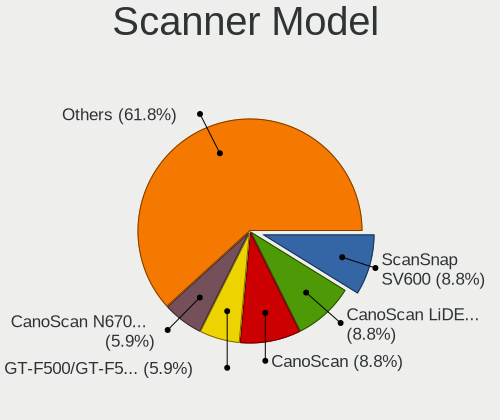

| Model                                                    | Desktops | Percent |
|----------------------------------------------------------|----------|---------|
| Fujitsu ScanSnap SV600                                   | 3        | 14.29%  |
| Canon CanoScan                                           | 3        | 14.29%  |
| Seiko Epson GT-F500/GT-F550 [Perfection 2480/2580 PHOTO] | 2        | 9.52%   |
| Canon CanoScan LiDE 50/LiDE 35/LiDE 40                   | 2        | 9.52%   |
| Canon CanoScan LiDE 220                                  | 2        | 9.52%   |
| Canon CanoScan LiDE 110                                  | 2        | 9.52%   |
| Canon CanoScan LiDE 100                                  | 2        | 9.52%   |
| Seiko Epson GT-7200U [Perfection 1250/1250 PHOTO]        | 1        | 4.76%   |
| Canon CanoScan N650U/N656U                               | 1        | 4.76%   |
| Canon CanoScan N1240U/LiDE 30                            | 1        | 4.76%   |
| Canon CanoScan LiDE 210                                  | 1        | 4.76%   |
| Canon CanoScan FB630U                                    | 1        | 4.76%   |

Camera
------

Camera Vendor
-------------

Camera device vendors

| Vendor                        | Desktops | Percent |
|-------------------------------|----------|---------|
| Logitech                      | 35       | 39.77%  |
| Microsoft                     | 8        | 9.09%   |
| Microdia                      | 7        | 7.95%   |
| Sunplus Innovation Technology | 4        | 4.55%   |
| Realtek Semiconductor         | 4        | 4.55%   |
| ARC International             | 4        | 4.55%   |
| Apple                         | 4        | 4.55%   |
| Z-Star Microelectronics       | 3        | 3.41%   |
| Samsung Electronics           | 3        | 3.41%   |
| Fujitsu                       | 3        | 3.41%   |
| SHENZHEN EMEET TECHNOLOGY     | 2        | 2.27%   |
| GEMBIRD                       | 2        | 2.27%   |
| Unknown                       | 1        | 1.14%   |
| SJ-180517-N                   | 1        | 1.14%   |
| Quanta                        | 1        | 1.14%   |
| Novatek Microelectronics      | 1        | 1.14%   |
| Nikon                         | 1        | 1.14%   |
| Jieli Technology              | 1        | 1.14%   |
| Generalplus Technology        | 1        | 1.14%   |
| Etron Technology              | 1        | 1.14%   |
| Creative Technology           | 1        | 1.14%   |

Camera Model
------------

Camera device models

| Model                                             | Desktops | Percent |
|---------------------------------------------------|----------|---------|
| Logitech Webcam C270                              | 7        | 7.95%   |
| Microsoft LifeCam HD-3000                         | 6        | 6.82%   |
| Microdia Webcam Vitade AF                         | 5        | 5.68%   |
| Logitech HD Webcam C525                           | 5        | 5.68%   |
| Logitech HD Pro Webcam C920                       | 5        | 5.68%   |
| ARC International Camera                          | 4        | 4.55%   |
| Samsung Galaxy A5 (MTP)                           | 3        | 3.41%   |
| Realtek FULL HD 1080P Webcam                      | 3        | 3.41%   |
| Logitech Webcam C170                              | 3        | 3.41%   |
| Logitech QuickCam Pro for Notebooks               | 3        | 3.41%   |
| Logitech QuickCam Pro 9000                        | 3        | 3.41%   |
| Fujitsu USB Camera                                | 3        | 3.41%   |
| Z-Star Venus USB2.0 Camera                        | 2        | 2.27%   |
| SHENZHEN EMEET TECHNOLOGY HD Webcam eMeet C960    | 2        | 2.27%   |
| Logitech HD Webcam C510                           | 2        | 2.27%   |
| GEMBIRD Generic UVC 1.00 camera [AppoTech AX2311] | 2        | 2.27%   |
| Apple iPhone 5/5C/5S/6/SE                         | 2        | 2.27%   |
| Z-Star Integrated Camera                          | 1        | 1.14%   |
| Unknown Konftel Cam20                             | 1        | 1.14%   |
| Sunplus SPCA2281 Web Camera                       | 1        | 1.14%   |
| Sunplus Integrated_Webcam_HD                      | 1        | 1.14%   |
| Sunplus Full HD webcam                            | 1        | 1.14%   |
| Sunplus Aukey-PC-LM1E Camera                      | 1        | 1.14%   |
| SJ-180517-N 1080P Webcam                          | 1        | 1.14%   |
| Realtek Full HD Webcam                            | 1        | 1.14%   |
| Quanta HD Camera                                  | 1        | 1.14%   |
| Novatek J1455                                     | 1        | 1.14%   |
| Nikon DSC D90                                     | 1        | 1.14%   |
| Microsoft Microsoft LifeCam VX-5500          | 1        | 1.14%   |
| Microsoft LifeCam VX-500 [1357]                   | 1        | 1.14%   |
| Microdia USB 2.0 Camera                           | 1        | 1.14%   |
| Microdia Sonix USB 2.0 Camera                     | 1        | 1.14%   |
| Logitech Webcam Pro 9000                          | 1        | 1.14%   |
| Logitech Webcam C925e                             | 1        | 1.14%   |
| Logitech Webcam C310                              | 1        | 1.14%   |
| Logitech Webcam B500                              | 1        | 1.14%   |
| Logitech QuickCam Orbit/Sphere AF                 | 1        | 1.14%   |
| Logitech BRIO 4K Stream Edition                   | 1        | 1.14%   |
| Logitech B525 HD Webcam                           | 1        | 1.14%   |
| Jieli USB PHY 2.0                                 | 1        | 1.14%   |
| Generalplus GENERAL WEBCAM                        | 1        | 1.14%   |
| Etron SPEEDLINK SNAPPY Smart Webcam               | 1        | 1.14%   |
| Creative VF0610 Live! Cam Socialize HD            | 1        | 1.14%   |
| Apple iSight in LED Cinema Display                | 1        | 1.14%   |
| Apple iPhone 4S                                   | 1        | 1.14%   |

Security
--------

Fingerprint Vendor
------------------

Fingerprint sensor vendors

| Vendor | Desktops | Percent |
|--------|----------|---------|
| Upek   | 1        | 100%    |

Fingerprint Model
-----------------

Fingerprint sensor models

| Model                                                  | Desktops | Percent |
|--------------------------------------------------------|----------|---------|
| Upek Biometric Touchchip/Touchstrip Fingerprint Sensor | 1        | 100%    |

Chipcard Vendor
---------------

Chipcard module vendors

Zero info for selected period =(

Chipcard Model
--------------

Chipcard module models

Zero info for selected period =(

Unsupported
-----------

Unsupported Devices
-------------------

Total unsupported devices on board

| Total | Desktops | Percent |
|-------|----------|---------|
| 0     | 430      | 86.17%  |
| 1     | 55       | 11.02%  |
| 2     | 11       | 2.2%    |
| 6     | 1        | 0.2%    |
| 5     | 1        | 0.2%    |
| 4     | 1        | 0.2%    |

Unsupported Device Types
------------------------

Types of unsupported devices

| Type                     | Desktops | Percent |
|--------------------------|----------|---------|
| Graphics card            | 25       | 29.76%  |
| Net/wireless             | 20       | 23.81%  |
| Unassigned class         | 10       | 11.9%   |
| Communication controller | 6        | 7.14%   |
| Multimedia controller    | 4        | 4.76%   |
| Sound                    | 3        | 3.57%   |
| Net/ethernet             | 3        | 3.57%   |
| Camera                   | 3        | 3.57%   |
| Tv card                  | 2        | 2.38%   |
| Bluetooth                | 2        | 2.38%   |
| Storage/raid             | 1        | 1.19%   |
| Storage/ide              | 1        | 1.19%   |
| Network                  | 1        | 1.19%   |
| Modem                    | 1        | 1.19%   |
| Fingerprint reader       | 1        | 1.19%   |
| Card reader              | 1        | 1.19%   |

