Linux in Austria - Tested Hardware & Statistics (Desktops)
----------------------------------------------------------

A project to collect tested hardware configurations for Linux in Austria.

Anyone can contribute to this report by the [hw-probe](https://github.com/linuxhw/hw-probe) tool:

    sudo -E hw-probe -all -upload

Please contribute! Especially if your hardware is rare.

Contents
--------

* [ Test Cases ](#test-cases)

* [ System ](#system)
  - [ OS                       ](#os)
  - [ OS Family                ](#os-family)
  - [ Kernel                   ](#kernel)
  - [ Kernel Family            ](#kernel-family)
  - [ Kernel Major Ver.        ](#kernel-major-ver)
  - [ Arch                     ](#arch)
  - [ DE                       ](#de)
  - [ Display Server           ](#display-server)
  - [ Display Manager          ](#display-manager)
  - [ OS Lang                  ](#os-lang)
  - [ Boot Mode                ](#boot-mode)
  - [ Filesystem               ](#filesystem)
  - [ Part. scheme             ](#part-scheme)
  - [ Dual Boot with Linux/BSD ](#dual-boot-with-linuxbsd)
  - [ Dual Boot (Win)          ](#dual-boot-win)

* [ Board ](#board)
  - [ Vendor                   ](#vendor)
  - [ Model                    ](#model)
  - [ Model Family             ](#model-family)
  - [ MFG Year                 ](#mfg-year)
  - [ Form Factor              ](#form-factor)
  - [ Secure Boot              ](#secure-boot)
  - [ Coreboot                 ](#coreboot)
  - [ RAM Size                 ](#ram-size)
  - [ RAM Used                 ](#ram-used)
  - [ Total Drives             ](#total-drives)
  - [ Has CD-ROM               ](#has-cd-rom)
  - [ Has Ethernet             ](#has-ethernet)
  - [ Has WiFi                 ](#has-wifi)
  - [ Has Bluetooth            ](#has-bluetooth)

* [ Location ](#location)
  - [ Country                  ](#country)
  - [ City                     ](#city)

* [ Drives ](#drives)
  - [ Drive Vendor             ](#drive-vendor)
  - [ Drive Model              ](#drive-model)
  - [ HDD Vendor               ](#hdd-vendor)
  - [ SSD Vendor               ](#ssd-vendor)
  - [ Drive Kind               ](#drive-kind)
  - [ Drive Connector          ](#drive-connector)
  - [ Drive Size               ](#drive-size)
  - [ Space Total              ](#space-total)
  - [ Space Used               ](#space-used)
  - [ Malfunc. Drives          ](#malfunc-drives)
  - [ Malfunc. Drive Vendor    ](#malfunc-drive-vendor)
  - [ Malfunc. HDD Vendor      ](#malfunc-hdd-vendor)
  - [ Malfunc. Drive Kind      ](#malfunc-drive-kind)
  - [ Failed Drives            ](#failed-drives)
  - [ Failed Drive Vendor      ](#failed-drive-vendor)
  - [ Drive Status             ](#drive-status)

* [ Storage controller ](#storage-controller)
  - [ Storage Vendor           ](#storage-vendor)
  - [ Storage Model            ](#storage-model)
  - [ Storage Kind             ](#storage-kind)

* [ Processor ](#processor)
  - [ CPU Vendor               ](#cpu-vendor)
  - [ CPU Model                ](#cpu-model)
  - [ CPU Model Family         ](#cpu-model-family)
  - [ CPU Cores                ](#cpu-cores)
  - [ CPU Sockets              ](#cpu-sockets)
  - [ CPU Threads              ](#cpu-threads)
  - [ CPU Op-Modes             ](#cpu-op-modes)
  - [ CPU Microcode            ](#cpu-microcode)
  - [ CPU Microarch            ](#cpu-microarch)

* [ Graphics ](#graphics)
  - [ GPU Vendor               ](#gpu-vendor)
  - [ GPU Model                ](#gpu-model)
  - [ GPU Combo                ](#gpu-combo)
  - [ GPU Driver               ](#gpu-driver)
  - [ GPU Memory               ](#gpu-memory)

* [ Monitor ](#monitor)
  - [ Monitor Vendor           ](#monitor-vendor)
  - [ Monitor Model            ](#monitor-model)
  - [ Monitor Resolution       ](#monitor-resolution)
  - [ Monitor Diagonal         ](#monitor-diagonal)
  - [ Monitor Width            ](#monitor-width)
  - [ Aspect Ratio             ](#aspect-ratio)
  - [ Monitor Area             ](#monitor-area)
  - [ Pixel Density            ](#pixel-density)
  - [ Multiple Monitors        ](#multiple-monitors)

* [ Network ](#network)
  - [ Net Controller Vendor    ](#net-controller-vendor)
  - [ Net Controller Model     ](#net-controller-model)
  - [ Wireless Vendor          ](#wireless-vendor)
  - [ Wireless Model           ](#wireless-model)
  - [ Ethernet Vendor          ](#ethernet-vendor)
  - [ Ethernet Model           ](#ethernet-model)
  - [ Net Controller Kind      ](#net-controller-kind)
  - [ Used Controller          ](#used-controller)
  - [ NICs                     ](#nics)
  - [ IPv6                     ](#ipv6)

* [ Bluetooth ](#bluetooth)
  - [ Bluetooth Vendor         ](#bluetooth-vendor)
  - [ Bluetooth Model          ](#bluetooth-model)

* [ Sound ](#sound)
  - [ Sound Vendor             ](#sound-vendor)
  - [ Sound Model              ](#sound-model)

* [ Memory ](#memory)
  - [ Memory Vendor            ](#memory-vendor)
  - [ Memory Model             ](#memory-model)
  - [ Memory Kind              ](#memory-kind)
  - [ Memory Form Factor       ](#memory-form-factor)
  - [ Memory Size              ](#memory-size)
  - [ Memory Speed             ](#memory-speed)

* [ Printers & scanners ](#printers--scanners)
  - [ Printer Vendor           ](#printer-vendor)
  - [ Printer Model            ](#printer-model)
  - [ Scanner Vendor           ](#scanner-vendor)
  - [ Scanner Model            ](#scanner-model)

* [ Camera ](#camera)
  - [ Camera Vendor            ](#camera-vendor)
  - [ Camera Model             ](#camera-model)

* [ Security ](#security)
  - [ Fingerprint Vendor       ](#fingerprint-vendor)
  - [ Fingerprint Model        ](#fingerprint-model)
  - [ Chipcard Vendor          ](#chipcard-vendor)
  - [ Chipcard Model           ](#chipcard-model)

* [ Unsupported ](#unsupported)
  - [ Unsupported Devices      ](#unsupported-devices)
  - [ Unsupported Device Types ](#unsupported-device-types)

Test Cases
----------

Total: 1277

| Vendor        | Model                       | Probe                                                      | Date         |
|---------------|-----------------------------|------------------------------------------------------------|--------------|
| ASUSTek       | P5Q                         | [5af3396f04](https://linux-hardware.org/?probe=5af3396f04) | May 05, 2024 |
| ASUSTek       | PRIME B450-PLUS             | [2de27a1ebc](https://linux-hardware.org/?probe=2de27a1ebc) | May 04, 2024 |
| ASUSTek       | ROG STRIX B550-F GAMING     | [28d0d4304f](https://linux-hardware.org/?probe=28d0d4304f) | May 04, 2024 |
| ASUSTek       | ROG STRIX B550-F GAMING     | [9bb8151528](https://linux-hardware.org/?probe=9bb8151528) | May 01, 2024 |
| Gigabyte      | X570 AORUS XTREME           | [fbb11f7603](https://linux-hardware.org/?probe=fbb11f7603) | May 01, 2024 |
| ASUSTek       | PRIME H510M-K               | [1cdd242400](https://linux-hardware.org/?probe=1cdd242400) | Apr 30, 2024 |
| ASUSTek       | P7P55D PRO                  | [9ae885f7fd](https://linux-hardware.org/?probe=9ae885f7fd) | Apr 30, 2024 |
| Medion        | MS-7797                     | [a72c95890e](https://linux-hardware.org/?probe=a72c95890e) | Apr 28, 2024 |
| Lenovo        | ThinkStation S20 4105E2G    | [4754d897eb](https://linux-hardware.org/?probe=4754d897eb) | Apr 27, 2024 |
| ASUSTek       | PRIME B360M-A               | [dfe51458b2](https://linux-hardware.org/?probe=dfe51458b2) | Apr 27, 2024 |
| Lenovo        | ThinkStation S20 4105E2G    | [73705fce63](https://linux-hardware.org/?probe=73705fce63) | Apr 26, 2024 |
| ASRock        | B450 Gaming-ITX/ac          | [4ffacbaeac](https://linux-hardware.org/?probe=4ffacbaeac) | Apr 25, 2024 |
| Gigabyte      | X570 AORUS ELITE            | [921fc0d219](https://linux-hardware.org/?probe=921fc0d219) | Apr 25, 2024 |
| ASRock        | Z390 Taichi Ultimate        | [8f95604689](https://linux-hardware.org/?probe=8f95604689) | Apr 24, 2024 |
| ASUSTek       | PRIME B550-PLUS             | [5d5d8db808](https://linux-hardware.org/?probe=5d5d8db808) | Apr 23, 2024 |
| Medion        | MS-7797                     | [810a7d7810](https://linux-hardware.org/?probe=810a7d7810) | Apr 22, 2024 |
| ASUSTek       | ROG STRIX B550-E GAMING     | [af767cfb5a](https://linux-hardware.org/?probe=af767cfb5a) | Apr 22, 2024 |
| ASRock        | X570 Taichi Razer Editio... | [3835749abe](https://linux-hardware.org/?probe=3835749abe) | Apr 22, 2024 |
| Gigabyte      | B450 AORUS ELITE            | [ff86440a74](https://linux-hardware.org/?probe=ff86440a74) | Apr 21, 2024 |
| Gigabyte      | B550 GAMING X V2            | [713e7bdc86](https://linux-hardware.org/?probe=713e7bdc86) | Apr 20, 2024 |
| Gigabyte      | B550 GAMING X V2            | [24e31227a4](https://linux-hardware.org/?probe=24e31227a4) | Apr 20, 2024 |
| Gigabyte      | B550 AORUS PRO V2           | [4eade3ca4d](https://linux-hardware.org/?probe=4eade3ca4d) | Apr 20, 2024 |
| Gigabyte      | Z390 DESIGNARE-CF           | [19d3a51e2c](https://linux-hardware.org/?probe=19d3a51e2c) | Apr 20, 2024 |
| ASUSTek       | H170-PRO                    | [0b4b15c9a0](https://linux-hardware.org/?probe=0b4b15c9a0) | Apr 20, 2024 |
| ASUSTek       | P7P55D PRO                  | [712655c5bd](https://linux-hardware.org/?probe=712655c5bd) | Apr 19, 2024 |
| ASUSTek       | P5GC-VM PRO                 | [841ad48ae6](https://linux-hardware.org/?probe=841ad48ae6) | Apr 19, 2024 |
| ASUSTek       | PRIME N100I-D D4            | [1b1bec34e3](https://linux-hardware.org/?probe=1b1bec34e3) | Apr 17, 2024 |
| ASRock        | B550 Extreme4               | [6ee8d62842](https://linux-hardware.org/?probe=6ee8d62842) | Apr 17, 2024 |
| ASUSTek       | P8Z77-V LX                  | [686220b484](https://linux-hardware.org/?probe=686220b484) | Apr 17, 2024 |
| ASUSTek       | PRIME B650-PLUS             | [bca932a740](https://linux-hardware.org/?probe=bca932a740) | Apr 15, 2024 |
| Gigabyte      | B460M D3H                   | [93b276e677](https://linux-hardware.org/?probe=93b276e677) | Apr 10, 2024 |
| Gigabyte      | B760 GAMING X AX            | [1eeb8355b0](https://linux-hardware.org/?probe=1eeb8355b0) | Apr 09, 2024 |
| Gigabyte      | B760 GAMING X AX            | [f4fd395ac3](https://linux-hardware.org/?probe=f4fd395ac3) | Apr 09, 2024 |
| ASUSTek       | PRIME X299-A II             | [ccd70d8794](https://linux-hardware.org/?probe=ccd70d8794) | Apr 07, 2024 |
| ASUSTek       | TUF Gaming B650-PLUS WIF... | [e7b99f79ab](https://linux-hardware.org/?probe=e7b99f79ab) | Apr 06, 2024 |
| Medion        | MS-7616                     | [56af7df034](https://linux-hardware.org/?probe=56af7df034) | Apr 05, 2024 |
| Medion        | MS-7616                     | [0e2230b44e](https://linux-hardware.org/?probe=0e2230b44e) | Apr 05, 2024 |
| ASRock        | AD2550-ITX                  | [8cdd16f5de](https://linux-hardware.org/?probe=8cdd16f5de) | Apr 05, 2024 |
| ASRock        | H87 Pro4                    | [46c9acd849](https://linux-hardware.org/?probe=46c9acd849) | Apr 05, 2024 |
| MSI           | H110 PC MATE                | [60ca5f5d1a](https://linux-hardware.org/?probe=60ca5f5d1a) | Apr 04, 2024 |
| ASUSTek       | TUF Gaming B550-PLUS        | [47eca507db](https://linux-hardware.org/?probe=47eca507db) | Apr 04, 2024 |
| Fujitsu       | D3028-A1 S26361-D3028-A1    | [9473d84dbd](https://linux-hardware.org/?probe=9473d84dbd) | Apr 03, 2024 |
| ASUSTek       | P7P55D PRO                  | [0b96c3a901](https://linux-hardware.org/?probe=0b96c3a901) | Apr 02, 2024 |
| ASUSTek       | PRIME H410I-PLUS            | [83512bce25](https://linux-hardware.org/?probe=83512bce25) | Apr 01, 2024 |
| ASUSTek       | PRIME H410I-PLUS            | [49cdc3b7f7](https://linux-hardware.org/?probe=49cdc3b7f7) | Apr 01, 2024 |
| HP            | 3048h                       | [a2b2820843](https://linux-hardware.org/?probe=a2b2820843) | Apr 01, 2024 |
| ASRock        | B150M Pro4S                 | [31ad4f5524](https://linux-hardware.org/?probe=31ad4f5524) | Mar 31, 2024 |
| ASUSTek       | ROG STRIX B650E-F GAMING... | [8a038a8035](https://linux-hardware.org/?probe=8a038a8035) | Mar 29, 2024 |
| MSI           | Z170A PC MATE               | [927a9e8dee](https://linux-hardware.org/?probe=927a9e8dee) | Mar 27, 2024 |
| Gigabyte      | Z390 DESIGNARE-CF           | [8bcc48c4f8](https://linux-hardware.org/?probe=8bcc48c4f8) | Mar 25, 2024 |
| Gigabyte      | B450 AORUS ELITE            | [302a31192b](https://linux-hardware.org/?probe=302a31192b) | Mar 20, 2024 |
| ASRock        | B450 Gaming-ITX/ac          | [f7d089869f](https://linux-hardware.org/?probe=f7d089869f) | Mar 20, 2024 |
| ASUSTek       | M5A97 PRO                   | [56aa7a5265](https://linux-hardware.org/?probe=56aa7a5265) | Mar 19, 2024 |
| MSI           | MAG Z790 TOMAHAWK WIFI      | [86302bbd71](https://linux-hardware.org/?probe=86302bbd71) | Mar 18, 2024 |
| HP            | 2B52                        | [c933870078](https://linux-hardware.org/?probe=c933870078) | Mar 16, 2024 |
| MSI           | B450-A PRO                  | [fcf37e125a](https://linux-hardware.org/?probe=fcf37e125a) | Mar 14, 2024 |
| MSI           | B85M-E45                    | [6623f1bc66](https://linux-hardware.org/?probe=6623f1bc66) | Mar 12, 2024 |
| ASUSTek       | PRIME X299-A II             | [d74288750c](https://linux-hardware.org/?probe=d74288750c) | Mar 10, 2024 |
| MSI           | MAG B650 TOMAHAWK WIFI      | [d6571ee346](https://linux-hardware.org/?probe=d6571ee346) | Mar 09, 2024 |
| MSI           | Z390-A PRO                  | [47d746805d](https://linux-hardware.org/?probe=47d746805d) | Mar 07, 2024 |
| HP            | 3397                        | [83193af89e](https://linux-hardware.org/?probe=83193af89e) | Mar 06, 2024 |
| ASRock        | B550M-ITX/ac                | [f44ccbad6c](https://linux-hardware.org/?probe=f44ccbad6c) | Mar 05, 2024 |
| MSI           | MAG Z690 TOMAHAWK WIFI D... | [16284b23e7](https://linux-hardware.org/?probe=16284b23e7) | Mar 03, 2024 |
| Gigabyte      | B450 I AORUS PRO WIFI-CF    | [2b0174f80f](https://linux-hardware.org/?probe=2b0174f80f) | Mar 02, 2024 |
| ASRock        | G41M-VS3                    | [66cd1e7ed0](https://linux-hardware.org/?probe=66cd1e7ed0) | Feb 27, 2024 |
| Intel         | X79Turbo V1.x               | [09f942e7f4](https://linux-hardware.org/?probe=09f942e7f4) | Feb 26, 2024 |
| ASRock        | Z690M-ITX/ax                | [902fe2d8ab](https://linux-hardware.org/?probe=902fe2d8ab) | Feb 26, 2024 |
| Gigabyte      | B450 AORUS ELITE            | [2b4ed9044c](https://linux-hardware.org/?probe=2b4ed9044c) | Feb 25, 2024 |
| ASUSTek       | P7P55D PRO                  | [f6c4f78658](https://linux-hardware.org/?probe=f6c4f78658) | Feb 24, 2024 |
| MSI           | X670E GAMING PLUS WIFI      | [98fae51a1e](https://linux-hardware.org/?probe=98fae51a1e) | Feb 22, 2024 |
| ASUSTek       | H170 PRO GAMING             | [86702bc04a](https://linux-hardware.org/?probe=86702bc04a) | Feb 20, 2024 |
| Gigabyte      | X570 AORUS PRO              | [c71d21d3c2](https://linux-hardware.org/?probe=c71d21d3c2) | Feb 18, 2024 |
| ASRock        | A320M Pro4-F                | [d4007897b9](https://linux-hardware.org/?probe=d4007897b9) | Feb 18, 2024 |
| ASUSTek       | PRIME B450-PLUS             | [b5a153ca03](https://linux-hardware.org/?probe=b5a153ca03) | Feb 15, 2024 |
| Gigabyte      | X570 AORUS XTREME           | [e962ebfe4d](https://linux-hardware.org/?probe=e962ebfe4d) | Feb 14, 2024 |
| ASUSTek       | P7P55D LE                   | [61f1f32d74](https://linux-hardware.org/?probe=61f1f32d74) | Feb 11, 2024 |
| MSI           | A68HM GRENADE               | [9ae121eacc](https://linux-hardware.org/?probe=9ae121eacc) | Feb 10, 2024 |
| Lenovo        | SHARKBAY 0B98401 PRO        | [e2ed9701bc](https://linux-hardware.org/?probe=e2ed9701bc) | Feb 09, 2024 |
| ASRock        | H97 Anniversary             | [33eb94069d](https://linux-hardware.org/?probe=33eb94069d) | Feb 09, 2024 |
| Lenovo        | SHARKBAY 0B98401 PRO        | [aeb6c7f092](https://linux-hardware.org/?probe=aeb6c7f092) | Feb 09, 2024 |
| Intel         | X79Turbo V1.x               | [35c4b20053](https://linux-hardware.org/?probe=35c4b20053) | Feb 07, 2024 |
| ASUSTek       | STRIX Z270G GAMING          | [5edaab42ec](https://linux-hardware.org/?probe=5edaab42ec) | Feb 07, 2024 |
| ASUSTek       | PRIME Z690-A                | [53aec14dee](https://linux-hardware.org/?probe=53aec14dee) | Feb 06, 2024 |
| ASRock        | AB350 Gaming-ITX/ac         | [a031d7db6d](https://linux-hardware.org/?probe=a031d7db6d) | Feb 06, 2024 |
| HP            | 8265                        | [f6b2554280](https://linux-hardware.org/?probe=f6b2554280) | Feb 05, 2024 |
| Gigabyte      | X570 AORUS XTREME           | [e70b13c7d6](https://linux-hardware.org/?probe=e70b13c7d6) | Feb 04, 2024 |
| ASUSTek       | ROG STRIX B650E-E GAMING... | [97d6952c52](https://linux-hardware.org/?probe=97d6952c52) | Feb 02, 2024 |
| Medion        | B250H4-EM                   | [418b44d0a2](https://linux-hardware.org/?probe=418b44d0a2) | Jan 29, 2024 |
| ASRock        | B650M Pro RS WiFi           | [b2a4068ec1](https://linux-hardware.org/?probe=b2a4068ec1) | Jan 29, 2024 |
| Acer          | Veriton X6630G              | [66d62ae7ed](https://linux-hardware.org/?probe=66d62ae7ed) | Jan 29, 2024 |
| Acer          | Veriton X6630G              | [9684aca764](https://linux-hardware.org/?probe=9684aca764) | Jan 29, 2024 |
| Intel         | DB75EN AAG39650-302         | [dcc6332a8e](https://linux-hardware.org/?probe=dcc6332a8e) | Jan 29, 2024 |
| MSI           | Z170A KRAIT GAMING 3X       | [ddf5524f10](https://linux-hardware.org/?probe=ddf5524f10) | Jan 25, 2024 |
| Gigabyte      | X570 AORUS ULTRA            | [89d4e508fa](https://linux-hardware.org/?probe=89d4e508fa) | Jan 25, 2024 |
| MSI           | 880GM-E41                   | [a037ec8a1e](https://linux-hardware.org/?probe=a037ec8a1e) | Jan 23, 2024 |
| Gigabyte      | X570 AORUS XTREME           | [b63d070fe7](https://linux-hardware.org/?probe=b63d070fe7) | Jan 22, 2024 |
| MSI           | PRO B760M-P DDR4            | [75f120a935](https://linux-hardware.org/?probe=75f120a935) | Jan 21, 2024 |
| MSI           | MPG Z790 CARBON WIFI        | [3224331d5e](https://linux-hardware.org/?probe=3224331d5e) | Jan 21, 2024 |
| Dell          | 0HD5W2 A01                  | [146eb01239](https://linux-hardware.org/?probe=146eb01239) | Jan 19, 2024 |
| ASRock        | N100DC-ITX                  | [dbca9c4ba2](https://linux-hardware.org/?probe=dbca9c4ba2) | Jan 19, 2024 |
| Gigabyte      | B450 AORUS ELITE            | [a5bd71f259](https://linux-hardware.org/?probe=a5bd71f259) | Jan 17, 2024 |
| MSI           | PRO Z690-A                  | [57e5890900](https://linux-hardware.org/?probe=57e5890900) | Jan 15, 2024 |
| Lenovo        | SHARKBAY SDK0E50510 WIN     | [35dd663593](https://linux-hardware.org/?probe=35dd663593) | Jan 14, 2024 |
| Gigabyte      | B550 AORUS ELITE            | [62295225a7](https://linux-hardware.org/?probe=62295225a7) | Jan 13, 2024 |
| ASUSTek       | TUF Gaming B550-PLUS WIF... | [1b25ee0779](https://linux-hardware.org/?probe=1b25ee0779) | Jan 13, 2024 |
| HP            | 806A                        | [ab302e2dd9](https://linux-hardware.org/?probe=ab302e2dd9) | Jan 11, 2024 |
| MSI           | B550M PRO-VDH WIFI          | [2e480c8e36](https://linux-hardware.org/?probe=2e480c8e36) | Jan 11, 2024 |
| Dell          | 0HD5W2 A01                  | [7194fe43ed](https://linux-hardware.org/?probe=7194fe43ed) | Jan 09, 2024 |
| Gigabyte      | Z370P D3-CF                 | [42e67a91b0](https://linux-hardware.org/?probe=42e67a91b0) | Jan 04, 2024 |
| Gigabyte      | Z790 UD AX                  | [00913517e5](https://linux-hardware.org/?probe=00913517e5) | Jan 02, 2024 |
| MSI           | 880GM-E41                   | [caf8e2f533](https://linux-hardware.org/?probe=caf8e2f533) | Dec 31, 2023 |
| Shenzhen M... | AHBNB OEM                   | [9883edd543](https://linux-hardware.org/?probe=9883edd543) | Dec 29, 2023 |
| ASUSTek       | ROG STRIX X670E-A GAMING... | [a14ae548b1](https://linux-hardware.org/?probe=a14ae548b1) | Dec 26, 2023 |
| MSI           | B450 GAMING PLUS MAX        | [2edba36887](https://linux-hardware.org/?probe=2edba36887) | Dec 26, 2023 |
| ASUSTek       | ROG STRIX B550-E GAMING     | [58dd947260](https://linux-hardware.org/?probe=58dd947260) | Dec 25, 2023 |
| ASUSTek       | ROG STRIX B550-E GAMING     | [d8eafc52d5](https://linux-hardware.org/?probe=d8eafc52d5) | Dec 25, 2023 |
| ASUSTek       | PRIME X470-PRO              | [45079856a0](https://linux-hardware.org/?probe=45079856a0) | Dec 22, 2023 |
| ASUSTek       | Z87-A                       | [4824537107](https://linux-hardware.org/?probe=4824537107) | Dec 18, 2023 |
| MSI           | MPG X570 GAMING PLUS        | [cd04b1b3df](https://linux-hardware.org/?probe=cd04b1b3df) | Dec 17, 2023 |
| ASRock        | X670E PG Lightning          | [b6aa52f693](https://linux-hardware.org/?probe=b6aa52f693) | Dec 17, 2023 |
| ASUSTek       | Pro B550M-C                 | [9887ecb3b0](https://linux-hardware.org/?probe=9887ecb3b0) | Dec 12, 2023 |
| HP            | 8643 SMVB                   | [d0ff744f50](https://linux-hardware.org/?probe=d0ff744f50) | Dec 10, 2023 |
| HP            | 8643 SMVB                   | [e7dbed1e89](https://linux-hardware.org/?probe=e7dbed1e89) | Dec 10, 2023 |
| Gigabyte      | X570 AORUS XTREME           | [840ffb67be](https://linux-hardware.org/?probe=840ffb67be) | Dec 10, 2023 |
| MSI           | MPG B760I EDGE WIFI DDR4    | [14c50f3617](https://linux-hardware.org/?probe=14c50f3617) | Dec 10, 2023 |
| ASUSTek       | PRIME H510M-A WIFI          | [ba43863b29](https://linux-hardware.org/?probe=ba43863b29) | Dec 09, 2023 |
| Gigabyte      | X570 AORUS XTREME           | [8ec0cd2d39](https://linux-hardware.org/?probe=8ec0cd2d39) | Dec 09, 2023 |
| ASRock        | H510M-ITX/ac                | [4850c05764](https://linux-hardware.org/?probe=4850c05764) | Dec 08, 2023 |
| Foxconn       | 2ABF                        | [9478c73013](https://linux-hardware.org/?probe=9478c73013) | Dec 05, 2023 |
| Gigabyte      | B450 AORUS ELITE            | [67d1badc93](https://linux-hardware.org/?probe=67d1badc93) | Dec 05, 2023 |
| Gigabyte      | G41M-ES2L                   | [442d7a2388](https://linux-hardware.org/?probe=442d7a2388) | Dec 03, 2023 |
| MSI           | 880GM-E41                   | [e3dab2d6dc](https://linux-hardware.org/?probe=e3dab2d6dc) | Nov 29, 2023 |
| MSI           | 880GM-E41                   | [5bfe0aed96](https://linux-hardware.org/?probe=5bfe0aed96) | Nov 29, 2023 |
| MSI           | B550-A PRO                  | [3bbd848840](https://linux-hardware.org/?probe=3bbd848840) | Nov 29, 2023 |
| Jetway        | TI61M5                      | [dff0fcc796](https://linux-hardware.org/?probe=dff0fcc796) | Nov 25, 2023 |
| ASUSTek       | TUF Gaming B550M-PLUS       | [1d10317040](https://linux-hardware.org/?probe=1d10317040) | Nov 22, 2023 |
| MSI           | PRO B760M-P DDR4            | [f892ee3011](https://linux-hardware.org/?probe=f892ee3011) | Nov 21, 2023 |
| Jetway        | TI61M5                      | [968d83ba14](https://linux-hardware.org/?probe=968d83ba14) | Nov 21, 2023 |
| Hardkernel    | ODROID-H3                   | [f93730616e](https://linux-hardware.org/?probe=f93730616e) | Nov 18, 2023 |
| SIEMENS       | A5E49569366 RS-AF           | [07d3a028ec](https://linux-hardware.org/?probe=07d3a028ec) | Nov 17, 2023 |
| ASUSTek       | ROG STRIX B650E-F GAMING... | [477c710fe1](https://linux-hardware.org/?probe=477c710fe1) | Nov 15, 2023 |
| ASUSTek       | H110M-A                     | [d2b8ae9725](https://linux-hardware.org/?probe=d2b8ae9725) | Nov 13, 2023 |
| ASUSTek       | SABERTOOTH Z97 MARK 1       | [e82ee1d840](https://linux-hardware.org/?probe=e82ee1d840) | Nov 11, 2023 |
| BESSTAR Te... | UM700                       | [0c374e0790](https://linux-hardware.org/?probe=0c374e0790) | Nov 11, 2023 |
| Intel         | X99                         | [5c6225ea2d](https://linux-hardware.org/?probe=5c6225ea2d) | Nov 11, 2023 |
| Minix         | NEO Z83-4 V1.5              | [3623dfcb88](https://linux-hardware.org/?probe=3623dfcb88) | Nov 10, 2023 |
| ASUSTek       | PRIME B550-PLUS             | [4859d7ce93](https://linux-hardware.org/?probe=4859d7ce93) | Nov 10, 2023 |
| ASUSTek       | PRIME H310-PLUS             | [4e064613e4](https://linux-hardware.org/?probe=4e064613e4) | Nov 10, 2023 |
| MSI           | 970A-G43                    | [c4aecb23af](https://linux-hardware.org/?probe=c4aecb23af) | Nov 09, 2023 |
| MSI           | 970A-G43                    | [7c748629cb](https://linux-hardware.org/?probe=7c748629cb) | Nov 09, 2023 |
| Gigabyte      | Z270N-WIFI-CF               | [27efb1bfd6](https://linux-hardware.org/?probe=27efb1bfd6) | Nov 07, 2023 |
| MSI           | PRO B760M-P DDR4            | [5b5425c6d8](https://linux-hardware.org/?probe=5b5425c6d8) | Nov 05, 2023 |
| MSI           | B550M PRO-VDH WIFI          | [cd018c7ab7](https://linux-hardware.org/?probe=cd018c7ab7) | Nov 02, 2023 |
| MSI           | B450M MORTAR MAX            | [960c1dbbd2](https://linux-hardware.org/?probe=960c1dbbd2) | Nov 01, 2023 |
| ASUSTek       | M3A32-MVP DELUXE            | [fecdf24435](https://linux-hardware.org/?probe=fecdf24435) | Nov 01, 2023 |
| Acer          | Veriton M480                | [fb5c756319](https://linux-hardware.org/?probe=fb5c756319) | Oct 30, 2023 |
| MSI           | Z490-A PRO                  | [449c0df691](https://linux-hardware.org/?probe=449c0df691) | Oct 30, 2023 |
| Gigabyte      | 970A-DS3P                   | [31d6b19c8d](https://linux-hardware.org/?probe=31d6b19c8d) | Oct 29, 2023 |
| ASUSTek       | ROG STRIX Z790-A GAMING ... | [534c2c528c](https://linux-hardware.org/?probe=534c2c528c) | Oct 26, 2023 |
| ASUSTek       | ROG STRIX B550-F GAMING     | [e090fa6279](https://linux-hardware.org/?probe=e090fa6279) | Oct 25, 2023 |
| Fujitsu       | D2778-C1 S26361-D2778-C1    | [e22a3baeb9](https://linux-hardware.org/?probe=e22a3baeb9) | Oct 23, 2023 |
| AMI           | Intel                       | [5e579268b6](https://linux-hardware.org/?probe=5e579268b6) | Oct 23, 2023 |
| Intel         | HURONRIVER                  | [81a0160338](https://linux-hardware.org/?probe=81a0160338) | Oct 22, 2023 |
| ASUSTek       | ROG STRIX Z790-A GAMING ... | [b3397c9aa2](https://linux-hardware.org/?probe=b3397c9aa2) | Oct 22, 2023 |
| MSI           | B450M MORTAR MAX            | [c1ad18b5c9](https://linux-hardware.org/?probe=c1ad18b5c9) | Oct 21, 2023 |
| ASUSTek       | PRIME X570-PRO              | [e8216f74dc](https://linux-hardware.org/?probe=e8216f74dc) | Oct 20, 2023 |
| ASUSTek       | ROG STRIX X670E-E GAMING... | [d531813a7a](https://linux-hardware.org/?probe=d531813a7a) | Oct 18, 2023 |
| MSI           | MAG B460 TOMAHAWK           | [37b97d2dd2](https://linux-hardware.org/?probe=37b97d2dd2) | Oct 17, 2023 |
| ASRock        | B365M Pro4                  | [c84d539a84](https://linux-hardware.org/?probe=c84d539a84) | Oct 17, 2023 |
| MSI           | Z270 GAMING PRO CARBON      | [47f6f3760d](https://linux-hardware.org/?probe=47f6f3760d) | Oct 17, 2023 |
| ASUSTek       | PRIME B450-PLUS             | [4b5e14f452](https://linux-hardware.org/?probe=4b5e14f452) | Oct 15, 2023 |
| MSI           | Z270 GAMING PRO CARBON      | [23c3f61285](https://linux-hardware.org/?probe=23c3f61285) | Oct 14, 2023 |
| ASUSTek       | PRIME X570-PRO              | [5cf8ab4b64](https://linux-hardware.org/?probe=5cf8ab4b64) | Oct 12, 2023 |
| ASRock        | Z790M-ITX WiFi              | [7f65a85252](https://linux-hardware.org/?probe=7f65a85252) | Oct 12, 2023 |
| MSI           | B450M MORTAR MAX            | [a2fb75cc3e](https://linux-hardware.org/?probe=a2fb75cc3e) | Oct 06, 2023 |
| ASUSTek       | PRIME X670-P                | [25c3794b84](https://linux-hardware.org/?probe=25c3794b84) | Oct 01, 2023 |
| Gigabyte      | 970A-DS3P FX                | [8f0d72cf69](https://linux-hardware.org/?probe=8f0d72cf69) | Oct 01, 2023 |
| ASUSTek       | P5QPL-AM                    | [4259a21921](https://linux-hardware.org/?probe=4259a21921) | Sep 26, 2023 |
| Gigabyte      | B760I AORUS PRO DDR4        | [2fe436c443](https://linux-hardware.org/?probe=2fe436c443) | Sep 26, 2023 |
| ASUSTek       | P7P55D LE                   | [f47493454f](https://linux-hardware.org/?probe=f47493454f) | Sep 25, 2023 |
| HP            | 802F                        | [a5fa953171](https://linux-hardware.org/?probe=a5fa953171) | Sep 25, 2023 |
| ASUSTek       | PRIME B450-PLUS             | [739be981d6](https://linux-hardware.org/?probe=739be981d6) | Sep 24, 2023 |
| MSI           | 990FXA-GD80                 | [0648a13752](https://linux-hardware.org/?probe=0648a13752) | Sep 24, 2023 |
| Gigabyte      | B550 AORUS PRO V2           | [c0e3bef058](https://linux-hardware.org/?probe=c0e3bef058) | Sep 24, 2023 |
| Gigabyte      | GA-880GMA-UD2H              | [20d494d943](https://linux-hardware.org/?probe=20d494d943) | Sep 22, 2023 |
| Gigabyte      | GA-880GMA-UD2H              | [6e8c507d61](https://linux-hardware.org/?probe=6e8c507d61) | Sep 22, 2023 |
| ASUSTek       | ROG CROSSHAIR VII HERO      | [111652ff69](https://linux-hardware.org/?probe=111652ff69) | Sep 18, 2023 |
| Gigabyte      | Z790 UD AX                  | [5995975e04](https://linux-hardware.org/?probe=5995975e04) | Sep 16, 2023 |
| Gigabyte      | B550 AORUS ELITE            | [dd369f3c60](https://linux-hardware.org/?probe=dd369f3c60) | Sep 15, 2023 |
| ASUSTek       | PRIME X370-PRO              | [15256fdeb2](https://linux-hardware.org/?probe=15256fdeb2) | Sep 14, 2023 |
| MSI           | PRO B760M-A WIFI            | [87577c165a](https://linux-hardware.org/?probe=87577c165a) | Sep 12, 2023 |
| ASUSTek       | Z170-P                      | [4070a28418](https://linux-hardware.org/?probe=4070a28418) | Sep 11, 2023 |
| ASUSTek       | Z170-P                      | [3abcd33b9c](https://linux-hardware.org/?probe=3abcd33b9c) | Sep 11, 2023 |
| MSI           | X470 GAMING PLUS            | [41a8df4387](https://linux-hardware.org/?probe=41a8df4387) | Sep 10, 2023 |
| MSI           | MAG B560 TORPEDO            | [5828591d02](https://linux-hardware.org/?probe=5828591d02) | Sep 10, 2023 |
| Gigabyte      | B450 AORUS ELITE            | [56bef39b59](https://linux-hardware.org/?probe=56bef39b59) | Sep 10, 2023 |
| ASUSTek       | ROG STRIX B560-E GAMING ... | [498958a11d](https://linux-hardware.org/?probe=498958a11d) | Sep 07, 2023 |
| Unknown       | Unknown                     | [59544c398a](https://linux-hardware.org/?probe=59544c398a) | Sep 07, 2023 |
| GMKtec        | NucBox G2                   | [8c03fc694f](https://linux-hardware.org/?probe=8c03fc694f) | Sep 05, 2023 |
| GMKtec        | NucBox G2                   | [ba313b48f8](https://linux-hardware.org/?probe=ba313b48f8) | Sep 05, 2023 |
| ASUSTek       | Z170 PRO GAMING             | [73e3b8ef8a](https://linux-hardware.org/?probe=73e3b8ef8a) | Sep 04, 2023 |
| MSI           | MAG B550 TOMAHAWK           | [036ad179d7](https://linux-hardware.org/?probe=036ad179d7) | Aug 26, 2023 |
| ASUSTek       | Z170-P                      | [9e90f8b308](https://linux-hardware.org/?probe=9e90f8b308) | Aug 26, 2023 |
| ASUSTek       | PRIME A320M-K               | [86f9b36e03](https://linux-hardware.org/?probe=86f9b36e03) | Aug 20, 2023 |
| ASUSTek       | M4A77                       | [89bb5a2821](https://linux-hardware.org/?probe=89bb5a2821) | Aug 19, 2023 |
| MSI           | MS-B1831                    | [25e33380e5](https://linux-hardware.org/?probe=25e33380e5) | Aug 14, 2023 |
| ASUSTek       | PRIME X299-DELUXE II        | [1bb822c058](https://linux-hardware.org/?probe=1bb822c058) | Aug 13, 2023 |
| ASUSTek       | PRIME X299-DELUXE II        | [c24273512e](https://linux-hardware.org/?probe=c24273512e) | Aug 13, 2023 |
| ASRock        | B550M-ITX/ac                | [e6624cc619](https://linux-hardware.org/?probe=e6624cc619) | Aug 11, 2023 |
| Gigabyte      | Z390 AORUS PRO WIFI-CF      | [aacbd7403c](https://linux-hardware.org/?probe=aacbd7403c) | Aug 10, 2023 |
| Gigabyte      | Z390 AORUS PRO WIFI-CF      | [a7a57a8a56](https://linux-hardware.org/?probe=a7a57a8a56) | Aug 10, 2023 |
| ASRock        | Z68 Pro3                    | [f949a6e2a5](https://linux-hardware.org/?probe=f949a6e2a5) | Aug 09, 2023 |
| ASUSTek       | ROG STRIX X570-E GAMING     | [fe4aa817e1](https://linux-hardware.org/?probe=fe4aa817e1) | Aug 06, 2023 |
| ASUSTek       | TUF Gaming X570-PLUS        | [15826fe271](https://linux-hardware.org/?probe=15826fe271) | Aug 04, 2023 |
| ASUSTek       | M3A78-T                     | [e97447ea9d](https://linux-hardware.org/?probe=e97447ea9d) | Aug 03, 2023 |
| ASUSTek       | P5QPL-AM                    | [2254be2ae2](https://linux-hardware.org/?probe=2254be2ae2) | Aug 03, 2023 |
| ASRock        | Z170 Extreme6+              | [84c1a14a56](https://linux-hardware.org/?probe=84c1a14a56) | Aug 01, 2023 |
| Shenzhen M... | HX90G                       | [c04f6d6467](https://linux-hardware.org/?probe=c04f6d6467) | Aug 01, 2023 |
| Dell          | 0T7D40 A01                  | [19c877cd88](https://linux-hardware.org/?probe=19c877cd88) | Jul 31, 2023 |
| Gigabyte      | Z77-DS3H                    | [cd96592ef8](https://linux-hardware.org/?probe=cd96592ef8) | Jul 31, 2023 |
| MSI           | B250M PRO-VDH               | [5bcf13119e](https://linux-hardware.org/?probe=5bcf13119e) | Jul 27, 2023 |
| Gigabyte      | B75M-D2V                    | [60b9e2fbc9](https://linux-hardware.org/?probe=60b9e2fbc9) | Jul 24, 2023 |
| ASRock        | TRX40 Creator               | [5bf3142c39](https://linux-hardware.org/?probe=5bf3142c39) | Jul 21, 2023 |
| ASUSTek       | H97M-E                      | [7171de16ea](https://linux-hardware.org/?probe=7171de16ea) | Jul 19, 2023 |
| ASRock        | Z170 Extreme6+              | [5ead4ab228](https://linux-hardware.org/?probe=5ead4ab228) | Jul 17, 2023 |
| ASRock        | H97 Performance             | [3d8cc4b423](https://linux-hardware.org/?probe=3d8cc4b423) | Jul 11, 2023 |
| Gigabyte      | B75M-D2V                    | [2749c7cf78](https://linux-hardware.org/?probe=2749c7cf78) | Jul 11, 2023 |
| ASUSTek       | H110M-A                     | [b2de29a3db](https://linux-hardware.org/?probe=b2de29a3db) | Jul 10, 2023 |
| Pegatron      | 2AD5                        | [04c6c9ba2b](https://linux-hardware.org/?probe=04c6c9ba2b) | Jul 10, 2023 |
| Dell          | 09KPNV A01                  | [596389ea27](https://linux-hardware.org/?probe=596389ea27) | Jul 10, 2023 |
| MSI           | MPG X570 GAMING PLUS        | [7c9b47b69f](https://linux-hardware.org/?probe=7c9b47b69f) | Jul 10, 2023 |
| MSI           | MS-B9181                    | [4702ba374d](https://linux-hardware.org/?probe=4702ba374d) | Jul 09, 2023 |
| ASRock        | H97 Performance             | [8058c54fb2](https://linux-hardware.org/?probe=8058c54fb2) | Jul 08, 2023 |
| ASRock        | H97 Performance             | [6994d9f579](https://linux-hardware.org/?probe=6994d9f579) | Jul 08, 2023 |
| Dell          | 0T7D40 A01                  | [c1b5a5f99b](https://linux-hardware.org/?probe=c1b5a5f99b) | Jul 08, 2023 |
| ASUSTek       | M4A78-E                     | [c5e94d62b9](https://linux-hardware.org/?probe=c5e94d62b9) | Jul 06, 2023 |
| MSI           | H110 PC MATE                | [cc74c165b7](https://linux-hardware.org/?probe=cc74c165b7) | Jul 06, 2023 |
| Shenzhen M... | F7BFC                       | [bb708e03aa](https://linux-hardware.org/?probe=bb708e03aa) | Jul 05, 2023 |
| ASUSTek       | ROG STRIX B450-F GAMING ... | [117a651e12](https://linux-hardware.org/?probe=117a651e12) | Jul 03, 2023 |
| MSI           | Z370 OC GAMING              | [f2796b9262](https://linux-hardware.org/?probe=f2796b9262) | Jul 02, 2023 |
| HP            | 2129                        | [cc9462c976](https://linux-hardware.org/?probe=cc9462c976) | Jul 02, 2023 |
| MSI           | MAG Z690 TOMAHAWK WIFI D... | [31a9983e65](https://linux-hardware.org/?probe=31a9983e65) | Jul 01, 2023 |
| ASRock        | B450M Pro4                  | [88b0de8666](https://linux-hardware.org/?probe=88b0de8666) | Jul 01, 2023 |
| ASUSTek       | F1A75-V EVO                 | [b59f4f203c](https://linux-hardware.org/?probe=b59f4f203c) | Jun 30, 2023 |
| Gigabyte      | B550M AORUS ELITE           | [2f3a03f9d4](https://linux-hardware.org/?probe=2f3a03f9d4) | Jun 25, 2023 |
| ASUSTek       | ROG STRIX B760-F GAMING ... | [117bfb7088](https://linux-hardware.org/?probe=117bfb7088) | Jun 25, 2023 |
| ASUSTek       | M4A77                       | [67e6b51c63](https://linux-hardware.org/?probe=67e6b51c63) | Jun 23, 2023 |
| MSI           | 760GM -E51                  | [3f0c7f7d21](https://linux-hardware.org/?probe=3f0c7f7d21) | Jun 22, 2023 |
| ASUSTek       | PRIME Z270-K                | [66736b8fbb](https://linux-hardware.org/?probe=66736b8fbb) | Jun 21, 2023 |
| ASUSTek       | PRIME Z270-K                | [c3961b2aa5](https://linux-hardware.org/?probe=c3961b2aa5) | Jun 21, 2023 |
| ASUSTek       | Z170 PRO GAMING             | [d95fa943f1](https://linux-hardware.org/?probe=d95fa943f1) | Jun 19, 2023 |
| ASUSTek       | H110M-A                     | [22fc172f71](https://linux-hardware.org/?probe=22fc172f71) | Jun 18, 2023 |
| HP            | 3646h                       | [bbe600a4ab](https://linux-hardware.org/?probe=bbe600a4ab) | Jun 18, 2023 |
| ASUSTek       | P5QPL-AM                    | [2b3a058830](https://linux-hardware.org/?probe=2b3a058830) | Jun 17, 2023 |
| ASUSTek       | TUF Gaming B550M-PLUS       | [288db43785](https://linux-hardware.org/?probe=288db43785) | Jun 16, 2023 |
| ASUSTek       | M5A97 EVO R2.0              | [d2a0d735db](https://linux-hardware.org/?probe=d2a0d735db) | Jun 13, 2023 |
| ASUSTek       | PRIME B450-PLUS             | [3918c9dc55](https://linux-hardware.org/?probe=3918c9dc55) | Jun 12, 2023 |
| Dell          | 0KC9NP A01                  | [ab5b79d6fd](https://linux-hardware.org/?probe=ab5b79d6fd) | Jun 10, 2023 |
| MSI           | B450M PRO-VDH MAX           | [4dcc51e897](https://linux-hardware.org/?probe=4dcc51e897) | Jun 10, 2023 |
| ASRock        | B365M Pro4-F                | [e54f1a9447](https://linux-hardware.org/?probe=e54f1a9447) | Jun 10, 2023 |
| ASRock        | Z690M-ITX/ax                | [f0bad84fca](https://linux-hardware.org/?probe=f0bad84fca) | Jun 08, 2023 |
| ASRock        | B365M Pro4-F                | [7ed0f0346c](https://linux-hardware.org/?probe=7ed0f0346c) | Jun 07, 2023 |
| HP            | 8265                        | [7afc259b97](https://linux-hardware.org/?probe=7afc259b97) | Jun 05, 2023 |
| HP            | 1998                        | [c6183bd564](https://linux-hardware.org/?probe=c6183bd564) | Jun 05, 2023 |
| MSI           | B450M BAZOOKA V2            | [e0008bd879](https://linux-hardware.org/?probe=e0008bd879) | Jun 03, 2023 |
| MSI           | B450M BAZOOKA V2            | [979df15914](https://linux-hardware.org/?probe=979df15914) | Jun 03, 2023 |
| Supermicro    | X12STD-F                    | [df7c4a738e](https://linux-hardware.org/?probe=df7c4a738e) | Jun 01, 2023 |
| Dell          | 0T7D40 A01                  | [0c0dc06847](https://linux-hardware.org/?probe=0c0dc06847) | May 31, 2023 |
| Shenzhen M... | F7BFC                       | [c496e8a74f](https://linux-hardware.org/?probe=c496e8a74f) | May 30, 2023 |
| ASUSTek       | PRIME TRX40-PRO             | [4cbc2f9044](https://linux-hardware.org/?probe=4cbc2f9044) | May 30, 2023 |
| ASUSTek       | ROG STRIX B550-F GAMING     | [c2d144c313](https://linux-hardware.org/?probe=c2d144c313) | May 30, 2023 |
| ASUSTek       | ROG STRIX B550-F GAMING     | [4d7ccd868f](https://linux-hardware.org/?probe=4d7ccd868f) | May 30, 2023 |
| ASUSTek       | M4A785TD-V EVO              | [692ba9d18f](https://linux-hardware.org/?probe=692ba9d18f) | May 22, 2023 |
| ASUSTek       | ROG STRIX Z370-G GAMING     | [b68e5e0285](https://linux-hardware.org/?probe=b68e5e0285) | May 20, 2023 |
| ASUSTek       | PRIME B650M-A II            | [183b85c77c](https://linux-hardware.org/?probe=183b85c77c) | May 19, 2023 |
| ASRock        | AM1B-ITX                    | [a2e80bffac](https://linux-hardware.org/?probe=a2e80bffac) | May 19, 2023 |
| ASRock        | AM1B-ITX                    | [d0633ac39d](https://linux-hardware.org/?probe=d0633ac39d) | May 19, 2023 |
| Biostar       | N61PB-M2S                   | [4ac75a003b](https://linux-hardware.org/?probe=4ac75a003b) | May 14, 2023 |
| Gigabyte      | Z170X-UD5 TH-CF             | [6a84af6428](https://linux-hardware.org/?probe=6a84af6428) | May 14, 2023 |
| ASRock        | H510M-ITX/ac                | [9a8da03c1e](https://linux-hardware.org/?probe=9a8da03c1e) | May 12, 2023 |
| MSI           | MPG X570 GAMING PLUS        | [cf7c801d5c](https://linux-hardware.org/?probe=cf7c801d5c) | May 12, 2023 |
| Biostar       | A68N-5600E                  | [55db0c720e](https://linux-hardware.org/?probe=55db0c720e) | May 12, 2023 |
| ASUSTek       | Z170-P                      | [17d57b61d7](https://linux-hardware.org/?probe=17d57b61d7) | May 11, 2023 |
| Lenovo        | 364F SDK0J40700 WIN 3258... | [a9df4bc7fb](https://linux-hardware.org/?probe=a9df4bc7fb) | May 10, 2023 |
| MSI           | MAG B560 TOMAHAWK WIFI      | [6fd3dea188](https://linux-hardware.org/?probe=6fd3dea188) | May 10, 2023 |
| MSI           | MAG B560 TOMAHAWK WIFI      | [e55b8813e3](https://linux-hardware.org/?probe=e55b8813e3) | May 10, 2023 |
| Lenovo        | 364F SDK0J40700 WIN 3258... | [58a9b45939](https://linux-hardware.org/?probe=58a9b45939) | May 09, 2023 |
| Lenovo        | 314F SDK0T08861 WIN 3305... | [4e80f798e2](https://linux-hardware.org/?probe=4e80f798e2) | May 04, 2023 |
| Medion        | MS-7848                     | [ab7b4e658f](https://linux-hardware.org/?probe=ab7b4e658f) | May 03, 2023 |
| Lenovo        | 314F SDK0T08861 WIN 3305... | [0b303a3773](https://linux-hardware.org/?probe=0b303a3773) | May 03, 2023 |
| ASUSTek       | H110M-A                     | [a99c9cd007](https://linux-hardware.org/?probe=a99c9cd007) | May 02, 2023 |
| HP            | 8906 SMVB                   | [3fc2c4e9d9](https://linux-hardware.org/?probe=3fc2c4e9d9) | May 01, 2023 |
| MSI           | A68HM GRENADE               | [938aa1cb46](https://linux-hardware.org/?probe=938aa1cb46) | Apr 30, 2023 |
| Dell          | 0T7D40 A01                  | [7ce0658b0f](https://linux-hardware.org/?probe=7ce0658b0f) | Apr 29, 2023 |
| MSI           | B450 TOMAHAWK               | [1404923301](https://linux-hardware.org/?probe=1404923301) | Apr 28, 2023 |
| ASUSTek       | H110M-A                     | [1fa553ab02](https://linux-hardware.org/?probe=1fa553ab02) | Apr 27, 2023 |
| Biostar       | A68N-5600E                  | [ccaeaae27b](https://linux-hardware.org/?probe=ccaeaae27b) | Apr 25, 2023 |
| ASRock        | Z97E-ITX/ac                 | [f916f697ed](https://linux-hardware.org/?probe=f916f697ed) | Apr 22, 2023 |
| ASUSTek       | PRIME H510M-K               | [820acdb913](https://linux-hardware.org/?probe=820acdb913) | Apr 22, 2023 |
| MSI           | MEG Z490 UNIFY              | [bebc7ec91b](https://linux-hardware.org/?probe=bebc7ec91b) | Apr 19, 2023 |
| Fujitsu       | D2778-C1 S26361-D2778-C1    | [10693010af](https://linux-hardware.org/?probe=10693010af) | Apr 18, 2023 |
| HP            | 8906 SMVB                   | [c00d85072e](https://linux-hardware.org/?probe=c00d85072e) | Apr 18, 2023 |
| ASUSTek       | PRIME B450-PLUS             | [aa1a6072ce](https://linux-hardware.org/?probe=aa1a6072ce) | Apr 18, 2023 |
| ASUSTek       | PRIME B450-PLUS             | [f3ad72b64d](https://linux-hardware.org/?probe=f3ad72b64d) | Apr 18, 2023 |
| ASUSTek       | PRIME X299-DELUXE II        | [fad0ef7fef](https://linux-hardware.org/?probe=fad0ef7fef) | Apr 16, 2023 |
| ASUSTek       | PRIME B550-PLUS             | [6e9640e9c2](https://linux-hardware.org/?probe=6e9640e9c2) | Apr 15, 2023 |
| Gigabyte      | B550M AORUS PRO-P           | [424d545740](https://linux-hardware.org/?probe=424d545740) | Apr 14, 2023 |
| MSI           | A520M-A PRO                 | [b5f4a1670f](https://linux-hardware.org/?probe=b5f4a1670f) | Apr 13, 2023 |
| HP            | 8906 SMVB                   | [c639e22b34](https://linux-hardware.org/?probe=c639e22b34) | Apr 13, 2023 |
| ASUSTek       | H110M-A                     | [2f7cf166f0](https://linux-hardware.org/?probe=2f7cf166f0) | Apr 11, 2023 |
| Gigabyte      | A520I AC                    | [32867fa30e](https://linux-hardware.org/?probe=32867fa30e) | Apr 09, 2023 |
| HP            | 8906 SMVB                   | [44351926f8](https://linux-hardware.org/?probe=44351926f8) | Apr 08, 2023 |
| Dell          | 0T7D40 A01                  | [11aee4ed7b](https://linux-hardware.org/?probe=11aee4ed7b) | Apr 08, 2023 |
| ASUSTek       | ROG STRIX Z490-E GAMING     | [b81dc294df](https://linux-hardware.org/?probe=b81dc294df) | Apr 06, 2023 |
| HP            | 2B52                        | [4def1937bc](https://linux-hardware.org/?probe=4def1937bc) | Apr 04, 2023 |
| Fujitsu       | D3236-S1 S26361-D3236-S1    | [89962b2435](https://linux-hardware.org/?probe=89962b2435) | Apr 04, 2023 |
| ASUSTek       | TUF Gaming B550M-PLUS       | [e33abdae24](https://linux-hardware.org/?probe=e33abdae24) | Apr 03, 2023 |
| ASUSTek       | TUF Gaming B550M-PLUS       | [9f9f72230c](https://linux-hardware.org/?probe=9f9f72230c) | Apr 03, 2023 |
| ASUSTek       | ROG STRIX Z590-A GAMING ... | [2cbd354a8f](https://linux-hardware.org/?probe=2cbd354a8f) | Apr 03, 2023 |
| Gigabyte      | B450 AORUS ELITE            | [5dddcdcb25](https://linux-hardware.org/?probe=5dddcdcb25) | Apr 01, 2023 |
| Gigabyte      | B450 AORUS ELITE            | [277d3c7f43](https://linux-hardware.org/?probe=277d3c7f43) | Apr 01, 2023 |
| ASUSTek       | Z170 PRO GAMING             | [b272d7b271](https://linux-hardware.org/?probe=b272d7b271) | Apr 01, 2023 |
| Gigabyte      | Z68XP-UD3                   | [029afd6a5c](https://linux-hardware.org/?probe=029afd6a5c) | Mar 31, 2023 |
| ASUSTek       | ROG CROSSHAIR VIII EXTRE... | [514d8ed8d6](https://linux-hardware.org/?probe=514d8ed8d6) | Mar 30, 2023 |
| ASUSTek       | H110M-A                     | [147c0afb99](https://linux-hardware.org/?probe=147c0afb99) | Mar 29, 2023 |
| MSI           | B450M BAZOOKA V2            | [f6236c5962](https://linux-hardware.org/?probe=f6236c5962) | Mar 27, 2023 |
| ASUSTek       | M5A97 EVO R2.0              | [9f3138d8d5](https://linux-hardware.org/?probe=9f3138d8d5) | Mar 27, 2023 |
| HP            | 1497                        | [fb8706575a](https://linux-hardware.org/?probe=fb8706575a) | Mar 25, 2023 |
| Dell          | 0T7D40 A01                  | [9320ecf2b2](https://linux-hardware.org/?probe=9320ecf2b2) | Mar 25, 2023 |
| MSI           | B450M PRO-VDH MAX           | [76338f95ea](https://linux-hardware.org/?probe=76338f95ea) | Mar 25, 2023 |
| MSI           | A320M-A PRO MAX             | [505777b9b6](https://linux-hardware.org/?probe=505777b9b6) | Mar 25, 2023 |
| Gigabyte      | B550 AORUS PRO AC           | [2f5c339d88](https://linux-hardware.org/?probe=2f5c339d88) | Mar 25, 2023 |
| ASUSTek       | GRYPHON Z87                 | [befbe47acc](https://linux-hardware.org/?probe=befbe47acc) | Mar 23, 2023 |
| BESSTAR Te... | UM700                       | [32116dbba8](https://linux-hardware.org/?probe=32116dbba8) | Mar 21, 2023 |
| ASUSTek       | TUF Gaming X570-PLUS        | [844b9094f9](https://linux-hardware.org/?probe=844b9094f9) | Mar 21, 2023 |
| MSI           | MAG B550 TOMAHAWK           | [3298f3c951](https://linux-hardware.org/?probe=3298f3c951) | Mar 20, 2023 |
| HP            | 1495                        | [d83e879ba0](https://linux-hardware.org/?probe=d83e879ba0) | Mar 18, 2023 |
| HP            | 1495                        | [b7b5d46ce0](https://linux-hardware.org/?probe=b7b5d46ce0) | Mar 18, 2023 |
| Biostar       | A10N-8800E                  | [1f081ed675](https://linux-hardware.org/?probe=1f081ed675) | Mar 16, 2023 |
| MSI           | X570-A PRO                  | [c4be4f7d67](https://linux-hardware.org/?probe=c4be4f7d67) | Mar 14, 2023 |
| HP            | 2B52                        | [b541e6085e](https://linux-hardware.org/?probe=b541e6085e) | Mar 14, 2023 |
| ASRock        | Z97E-ITX/ac                 | [02c6d19dfa](https://linux-hardware.org/?probe=02c6d19dfa) | Mar 14, 2023 |
| ASRock        | X670E Steel Legend          | [0eefdece9c](https://linux-hardware.org/?probe=0eefdece9c) | Mar 13, 2023 |
| ASUSTek       | B85M-G                      | [22ae0716b2](https://linux-hardware.org/?probe=22ae0716b2) | Mar 13, 2023 |
| ASRock        | X670E Steel Legend          | [3ec784f6be](https://linux-hardware.org/?probe=3ec784f6be) | Mar 11, 2023 |
| ASUSTek       | F2A85-V                     | [1470c9fc46](https://linux-hardware.org/?probe=1470c9fc46) | Mar 09, 2023 |
| MSI           | Z68MA-ED55                  | [17a3d0c88b](https://linux-hardware.org/?probe=17a3d0c88b) | Mar 09, 2023 |
| Dell          | 0F5C5X A00                  | [5f0ab2a253](https://linux-hardware.org/?probe=5f0ab2a253) | Mar 06, 2023 |
| Acer          | Nitro N50-600 V:1.1         | [1e09dd1123](https://linux-hardware.org/?probe=1e09dd1123) | Mar 04, 2023 |
| Gigabyte      | B550 AORUS PRO V2           | [422fa2cf16](https://linux-hardware.org/?probe=422fa2cf16) | Mar 02, 2023 |
| HP            | 8906 SMVB                   | [72b59f777e](https://linux-hardware.org/?probe=72b59f777e) | Mar 01, 2023 |
| ASRock        | G41M-S                      | [8802d04f08](https://linux-hardware.org/?probe=8802d04f08) | Feb 27, 2023 |
| HP            | 3397                        | [8081d24eb1](https://linux-hardware.org/?probe=8081d24eb1) | Feb 27, 2023 |
| MSI           | B150M PRO-VDH               | [e538527e6c](https://linux-hardware.org/?probe=e538527e6c) | Feb 26, 2023 |
| MSI           | PRO Z690-A DDR4             | [3ab842532b](https://linux-hardware.org/?probe=3ab842532b) | Feb 26, 2023 |
| ASUSTek       | ROG CROSSHAIR X670E EXTR... | [659ff1672e](https://linux-hardware.org/?probe=659ff1672e) | Feb 26, 2023 |
| MSI           | MAG B550 TOMAHAWK           | [2943aa6cd7](https://linux-hardware.org/?probe=2943aa6cd7) | Feb 25, 2023 |
| ASRock        | H81M-HDS                    | [d4a6916e4f](https://linux-hardware.org/?probe=d4a6916e4f) | Feb 24, 2023 |
| Gigabyte      | H610M S2H DDR4              | [e44618f1c3](https://linux-hardware.org/?probe=e44618f1c3) | Feb 23, 2023 |
| ASUSTek       | TUF Gaming B550M-PLUS       | [09c45a0b09](https://linux-hardware.org/?probe=09c45a0b09) | Feb 21, 2023 |
| ASUSTek       | TUF Gaming B550M-PLUS       | [f5a22b7bb9](https://linux-hardware.org/?probe=f5a22b7bb9) | Feb 21, 2023 |
| MSI           | MPG X570 GAMING EDGE WIF... | [d5f5531b82](https://linux-hardware.org/?probe=d5f5531b82) | Feb 20, 2023 |
| MSI           | MPG X570 GAMING EDGE WIF... | [1263eaf1f9](https://linux-hardware.org/?probe=1263eaf1f9) | Feb 19, 2023 |
| ASUSTek       | PRIME Z270-K                | [5ecce23878](https://linux-hardware.org/?probe=5ecce23878) | Feb 18, 2023 |
| MSI           | A78M-E35                    | [30c75db366](https://linux-hardware.org/?probe=30c75db366) | Feb 16, 2023 |
| ASUSTek       | H110M-A                     | [d2d359be39](https://linux-hardware.org/?probe=d2d359be39) | Feb 14, 2023 |
| Unknown       | Unknown                     | [f2f95aef80](https://linux-hardware.org/?probe=f2f95aef80) | Feb 12, 2023 |
| ASUSTek       | P8H77-I                     | [74013e0688](https://linux-hardware.org/?probe=74013e0688) | Feb 11, 2023 |
| ASUSTek       | B85M-G                      | [7f27fb0a83](https://linux-hardware.org/?probe=7f27fb0a83) | Feb 09, 2023 |
| ASUSTek       | SABERTOOTH 990FX R2.0       | [82173d3b08](https://linux-hardware.org/?probe=82173d3b08) | Feb 09, 2023 |
| ASUSTek       | PRIME B450M-A II            | [10cf328828](https://linux-hardware.org/?probe=10cf328828) | Feb 06, 2023 |
| ASUSTek       | P8P67 WS REVOLUTION         | [c0190f8f57](https://linux-hardware.org/?probe=c0190f8f57) | Feb 06, 2023 |
| HP            | 0A98h                       | [1d3ae20ff5](https://linux-hardware.org/?probe=1d3ae20ff5) | Feb 04, 2023 |
| Dell          | 0D28YY A03                  | [ae7eeb7487](https://linux-hardware.org/?probe=ae7eeb7487) | Feb 04, 2023 |
| Dell          | 0D28YY A03                  | [0fe32fbdc2](https://linux-hardware.org/?probe=0fe32fbdc2) | Feb 04, 2023 |
| HP            | 8906 SMVB                   | [82845bb849](https://linux-hardware.org/?probe=82845bb849) | Feb 02, 2023 |
| ASUSTek       | F2A85-V                     | [c68678a1a5](https://linux-hardware.org/?probe=c68678a1a5) | Jan 31, 2023 |
| MSI           | B450 TOMAHAWK MAX           | [f2a2476d45](https://linux-hardware.org/?probe=f2a2476d45) | Jan 31, 2023 |
| Fujitsu       | D3183-A1 S26361-D3183-A1    | [bfb86ee660](https://linux-hardware.org/?probe=bfb86ee660) | Jan 29, 2023 |
| ASUSTek       | F2A85-V                     | [d528677cfd](https://linux-hardware.org/?probe=d528677cfd) | Jan 28, 2023 |
| HP            | 1495                        | [8c1f7b5fbd](https://linux-hardware.org/?probe=8c1f7b5fbd) | Jan 27, 2023 |
| Gigabyte      | GA-990FXA-UD3               | [6e5884ec0c](https://linux-hardware.org/?probe=6e5884ec0c) | Jan 26, 2023 |
| MSI           | B450-A PRO                  | [e9c7c42a8b](https://linux-hardware.org/?probe=e9c7c42a8b) | Jan 22, 2023 |
| Gigabyte      | Z77-D3H                     | [9035a00600](https://linux-hardware.org/?probe=9035a00600) | Jan 22, 2023 |
| Foxconn       | NETBOX NT-425/525 Ver       | [dfb8c476f9](https://linux-hardware.org/?probe=dfb8c476f9) | Jan 21, 2023 |
| Dell          | 0WR7PY A01                  | [4197c5f3d3](https://linux-hardware.org/?probe=4197c5f3d3) | Jan 19, 2023 |
| HP            | 8643 SMVB                   | [c99128e783](https://linux-hardware.org/?probe=c99128e783) | Jan 16, 2023 |
| HP            | 8643 SMVB                   | [81d232a246](https://linux-hardware.org/?probe=81d232a246) | Jan 14, 2023 |
| MSI           | B450 GAMING PLUS MAX        | [ba09b2045b](https://linux-hardware.org/?probe=ba09b2045b) | Jan 13, 2023 |
| ASUSTek       | TUF Gaming B550-PLUS        | [c3a30838c3](https://linux-hardware.org/?probe=c3a30838c3) | Jan 13, 2023 |
| ASUSTek       | PRIME B450-PLUS             | [e608d09ac5](https://linux-hardware.org/?probe=e608d09ac5) | Jan 11, 2023 |
| ASUSTek       | F2A85-V                     | [0ddddc438d](https://linux-hardware.org/?probe=0ddddc438d) | Jan 11, 2023 |
| HP            | 8906 SMVB                   | [7d56f2f733](https://linux-hardware.org/?probe=7d56f2f733) | Jan 11, 2023 |
| ASUSTek       | Z170-A                      | [0f0b38970a](https://linux-hardware.org/?probe=0f0b38970a) | Jan 11, 2023 |
| ASUSTek       | M5A97 EVO R2.0              | [b2d69bd762](https://linux-hardware.org/?probe=b2d69bd762) | Jan 11, 2023 |
| ASUSTek       | M5A97 EVO R2.0              | [fbde9a1dba](https://linux-hardware.org/?probe=fbde9a1dba) | Jan 10, 2023 |
| Gigabyte      | X570 I AORUS PRO WIFI       | [919b259ea2](https://linux-hardware.org/?probe=919b259ea2) | Jan 09, 2023 |
| ASUSTek       | H110M-A                     | [d67718b4e8](https://linux-hardware.org/?probe=d67718b4e8) | Jan 08, 2023 |
| Gigabyte      | Z690 UD AX                  | [e6ee0cd764](https://linux-hardware.org/?probe=e6ee0cd764) | Jan 04, 2023 |
| Lenovo        | 310B SDK0J40697 WIN 3305... | [b1771ee07c](https://linux-hardware.org/?probe=b1771ee07c) | Jan 03, 2023 |
| ASUSTek       | TUF Gaming B550-PLUS        | [a35156e0c3](https://linux-hardware.org/?probe=a35156e0c3) | Jan 02, 2023 |
| ASUSTek       | P7P55D-E                    | [8f4f98da64](https://linux-hardware.org/?probe=8f4f98da64) | Jan 02, 2023 |
| ASUSTek       | PRIME B350M-E               | [f39e3e8350](https://linux-hardware.org/?probe=f39e3e8350) | Jan 02, 2023 |
| Gigabyte      | B550M AORUS PRO-P           | [de6ea0ae2e](https://linux-hardware.org/?probe=de6ea0ae2e) | Dec 30, 2022 |
| ASUSTek       | P7P55D-E                    | [f725a0095a](https://linux-hardware.org/?probe=f725a0095a) | Dec 30, 2022 |
| Gigabyte      | Z590 AORUS PRO AX           | [d680b8dd2a](https://linux-hardware.org/?probe=d680b8dd2a) | Dec 28, 2022 |
| ASUSTek       | ROG STRIX B550-E GAMING     | [e8dce940d8](https://linux-hardware.org/?probe=e8dce940d8) | Dec 26, 2022 |
| Matrox Ele... | 4GPMOBIL 7449-03-0          | [c02a37a124](https://linux-hardware.org/?probe=c02a37a124) | Dec 26, 2022 |
| ASUSTek       | P7P55D-E                    | [a6be229477](https://linux-hardware.org/?probe=a6be229477) | Dec 24, 2022 |
| ASUSTek       | PRIME B450-PLUS             | [e3e2773bde](https://linux-hardware.org/?probe=e3e2773bde) | Dec 24, 2022 |
| HP            | 8906 SMVB                   | [aeb826326b](https://linux-hardware.org/?probe=aeb826326b) | Dec 20, 2022 |
| Dell          | 0T7D40 A01                  | [74207a9fec](https://linux-hardware.org/?probe=74207a9fec) | Dec 19, 2022 |
| ASUSTek       | ROG CROSSHAIR VIII FORMU... | [fa03fe621a](https://linux-hardware.org/?probe=fa03fe621a) | Dec 17, 2022 |
| ASUSTek       | ROG CROSSHAIR VIII FORMU... | [8480834751](https://linux-hardware.org/?probe=8480834751) | Dec 17, 2022 |
| Gigabyte      | B550M DS3H                  | [ffe85423d8](https://linux-hardware.org/?probe=ffe85423d8) | Dec 15, 2022 |
| ASRock        | X670E PG Lightning          | [08e4e03d36](https://linux-hardware.org/?probe=08e4e03d36) | Dec 13, 2022 |
| ASRock        | X670E PG Lightning          | [3a6a347ff9](https://linux-hardware.org/?probe=3a6a347ff9) | Dec 13, 2022 |
| ASUSTek       | ROG CROSSHAIR VII HERO      | [9b02acceb3](https://linux-hardware.org/?probe=9b02acceb3) | Dec 12, 2022 |
| Fujitsu       | D3417-B1 S26361-D3417-B1    | [fd77b80943](https://linux-hardware.org/?probe=fd77b80943) | Dec 12, 2022 |
| Gigabyte      | B550M DS3H                  | [cc2d9043d9](https://linux-hardware.org/?probe=cc2d9043d9) | Dec 11, 2022 |
| Gigabyte      | B550M DS3H                  | [13434876df](https://linux-hardware.org/?probe=13434876df) | Dec 11, 2022 |
| Medion        | H81H3-EM2 H81EM2W08.309     | [f6341e7afb](https://linux-hardware.org/?probe=f6341e7afb) | Dec 10, 2022 |
| Gigabyte      | B450 AORUS ELITE            | [8f38dcc9d4](https://linux-hardware.org/?probe=8f38dcc9d4) | Dec 10, 2022 |
| Gigabyte      | AB350M-Gaming 3-CF          | [7ae8aecc25](https://linux-hardware.org/?probe=7ae8aecc25) | Dec 08, 2022 |
| Lenovo        | ThinkStation S20 4157DT6    | [7c45cf5115](https://linux-hardware.org/?probe=7c45cf5115) | Dec 07, 2022 |
| ASUSTek       | ROG CROSSHAIR VIII FORMU... | [2b34016cad](https://linux-hardware.org/?probe=2b34016cad) | Dec 04, 2022 |
| ASUSTek       | P8H67-M PRO                 | [05131558b5](https://linux-hardware.org/?probe=05131558b5) | Dec 03, 2022 |
| ASUSTek       | P8H67-M PRO                 | [9fcc18738b](https://linux-hardware.org/?probe=9fcc18738b) | Dec 03, 2022 |
| ASUSTek       | ROG CROSSHAIR VIII FORMU... | [790ae8be94](https://linux-hardware.org/?probe=790ae8be94) | Dec 02, 2022 |
| ASRock        | H110M-DVS R3.0              | [373dac5bbb](https://linux-hardware.org/?probe=373dac5bbb) | Dec 02, 2022 |
| ASUSTek       | H110M-A                     | [d7694493c0](https://linux-hardware.org/?probe=d7694493c0) | Dec 02, 2022 |
| ASRock        | H110M-DVS R3.0              | [01dfdc071e](https://linux-hardware.org/?probe=01dfdc071e) | Dec 01, 2022 |
| Medion        | H81H3-EM2 H81EM2W08.309     | [9aa4880856](https://linux-hardware.org/?probe=9aa4880856) | Dec 01, 2022 |
| Lenovo        | SHARKBAY NOK                | [e03c6b53ed](https://linux-hardware.org/?probe=e03c6b53ed) | Dec 01, 2022 |
| Medion        | H81H3-EM2 H81EM2W08.309     | [c1f5a1f413](https://linux-hardware.org/?probe=c1f5a1f413) | Dec 01, 2022 |
| Gigabyte      | Z97X-SLI-CF                 | [ae01075720](https://linux-hardware.org/?probe=ae01075720) | Nov 28, 2022 |
| ASUSTek       | Z170 PRO GAMING             | [ee234d62ec](https://linux-hardware.org/?probe=ee234d62ec) | Nov 27, 2022 |
| Gigabyte      | Z270-HD3P-CF                | [6d3657ecde](https://linux-hardware.org/?probe=6d3657ecde) | Nov 23, 2022 |
| MSI           | PRO Z690-A DDR4             | [fc53a66047](https://linux-hardware.org/?probe=fc53a66047) | Nov 22, 2022 |
| Gigabyte      | Z590 UD AC                  | [4fc70b9ddc](https://linux-hardware.org/?probe=4fc70b9ddc) | Nov 21, 2022 |
| MSI           | B450 TOMAHAWK               | [8c271e833d](https://linux-hardware.org/?probe=8c271e833d) | Nov 20, 2022 |
| Acer          | FMP55                       | [f35d63ca8b](https://linux-hardware.org/?probe=f35d63ca8b) | Nov 18, 2022 |
| Gigabyte      | B450 AORUS ELITE            | [478fa166bd](https://linux-hardware.org/?probe=478fa166bd) | Nov 17, 2022 |
| ASUSTek       | ROG STRIX B550-F GAMING     | [c8c74ea1ec](https://linux-hardware.org/?probe=c8c74ea1ec) | Nov 15, 2022 |
| Fujitsu       | D3062-A1 S26361-D3062-A1    | [d4240ae5c7](https://linux-hardware.org/?probe=d4240ae5c7) | Nov 12, 2022 |
| MSI           | X470 GAMING PLUS MAX        | [9c6a00b034](https://linux-hardware.org/?probe=9c6a00b034) | Nov 09, 2022 |
| ASUSTek       | VM40B                       | [5736f2e2ae](https://linux-hardware.org/?probe=5736f2e2ae) | Nov 08, 2022 |
| HP            | 8906 SMVB                   | [2670a536f0](https://linux-hardware.org/?probe=2670a536f0) | Nov 08, 2022 |
| Medion        | MS-7797                     | [41ba0c8fdc](https://linux-hardware.org/?probe=41ba0c8fdc) | Nov 08, 2022 |
| ASUSTek       | TUF Gaming X570-PLUS        | [1a0fbb4d0d](https://linux-hardware.org/?probe=1a0fbb4d0d) | Nov 06, 2022 |
| Gigabyte      | Z390 AORUS ELITE-CF         | [7007ab7df6](https://linux-hardware.org/?probe=7007ab7df6) | Nov 03, 2022 |
| Dell          | 0NW6H5 A00                  | [d768cd4c66](https://linux-hardware.org/?probe=d768cd4c66) | Oct 29, 2022 |
| ASUSTek       | Z87-A                       | [0b4711df41](https://linux-hardware.org/?probe=0b4711df41) | Oct 26, 2022 |
| MSI           | H81M-P33                    | [b0f36ae0c5](https://linux-hardware.org/?probe=b0f36ae0c5) | Oct 25, 2022 |
| ASUSTek       | P5QL-E                      | [41810c587a](https://linux-hardware.org/?probe=41810c587a) | Oct 24, 2022 |
| MSI           | Z68MA-G45                   | [3f398756eb](https://linux-hardware.org/?probe=3f398756eb) | Oct 23, 2022 |
| MSI           | Z68MA-G45                   | [d96627943d](https://linux-hardware.org/?probe=d96627943d) | Oct 23, 2022 |
| MSI           | MPG X570 GAMING PLUS        | [e59cef718b](https://linux-hardware.org/?probe=e59cef718b) | Oct 23, 2022 |
| ASUSTek       | M5A99X EVO R2.0             | [5b61c1c241](https://linux-hardware.org/?probe=5b61c1c241) | Oct 23, 2022 |
| ASUSTek       | A88X-PLUS                   | [7435d326b7](https://linux-hardware.org/?probe=7435d326b7) | Oct 23, 2022 |
| Unknown       | Unknown                     | [dcb8b694a7](https://linux-hardware.org/?probe=dcb8b694a7) | Oct 23, 2022 |
| Gigabyte      | H87-HD3                     | [bdd6e6d3a5](https://linux-hardware.org/?probe=bdd6e6d3a5) | Oct 23, 2022 |
| ASRock        | B450M Pro4-F                | [eb651764eb](https://linux-hardware.org/?probe=eb651764eb) | Oct 22, 2022 |
| MSI           | H81M-P33                    | [efbd4959b8](https://linux-hardware.org/?probe=efbd4959b8) | Oct 21, 2022 |
| ASUSTek       | P9X79                       | [285e78cfbe](https://linux-hardware.org/?probe=285e78cfbe) | Oct 19, 2022 |
| ASUSTek       | PRIME H410M-A               | [8dc5e6f530](https://linux-hardware.org/?probe=8dc5e6f530) | Oct 14, 2022 |
| ASUSTek       | PRIME H410M-A               | [dc990d0395](https://linux-hardware.org/?probe=dc990d0395) | Oct 12, 2022 |
| ASUSTek       | PRIME H410I-PLUS            | [10709dd95e](https://linux-hardware.org/?probe=10709dd95e) | Oct 10, 2022 |
| Dell          | 0MN1TX A01                  | [a9faf44fe8](https://linux-hardware.org/?probe=a9faf44fe8) | Oct 07, 2022 |
| Fujitsu       | D3062-A1 S26361-D3062-A1    | [3915f19817](https://linux-hardware.org/?probe=3915f19817) | Oct 03, 2022 |
| Unknown       | 775VM8                      | [114c84d76c](https://linux-hardware.org/?probe=114c84d76c) | Sep 30, 2022 |
| Unknown       | 775VM8                      | [903649eae9](https://linux-hardware.org/?probe=903649eae9) | Sep 30, 2022 |
| MSI           | H110 PC MATE                | [ac97c636a5](https://linux-hardware.org/?probe=ac97c636a5) | Sep 30, 2022 |
| Biostar       | A10N-8800E                  | [d27bf09dc8](https://linux-hardware.org/?probe=d27bf09dc8) | Sep 27, 2022 |
| Medion        | MS-7728                     | [82da4b643b](https://linux-hardware.org/?probe=82da4b643b) | Sep 27, 2022 |
| Gigabyte      | 990FXA-UD5                  | [89303afdb5](https://linux-hardware.org/?probe=89303afdb5) | Sep 26, 2022 |
| MSI           | MAG B460 TOMAHAWK           | [a213c6d22a](https://linux-hardware.org/?probe=a213c6d22a) | Sep 26, 2022 |
| MSI           | MPG X570 GAMING PLUS        | [0047e2de0e](https://linux-hardware.org/?probe=0047e2de0e) | Sep 24, 2022 |
| MSI           | H110 PC MATE                | [006830e521](https://linux-hardware.org/?probe=006830e521) | Sep 23, 2022 |
| ASUSTek       | WS C422 PRO_SE              | [e278a4ab5e](https://linux-hardware.org/?probe=e278a4ab5e) | Sep 21, 2022 |
| HP            | 1998                        | [5148539ae1](https://linux-hardware.org/?probe=5148539ae1) | Sep 21, 2022 |
| ASUSTek       | ROG STRIX B550-F GAMING     | [256ff04106](https://linux-hardware.org/?probe=256ff04106) | Sep 20, 2022 |
| Lenovo        | MAHOBAY Win8 STD MM DPK ... | [4d5fc6b39f](https://linux-hardware.org/?probe=4d5fc6b39f) | Sep 20, 2022 |
| Dell          | 02M8NY A01                  | [498286eb91](https://linux-hardware.org/?probe=498286eb91) | Sep 19, 2022 |
| Dell          | 0T7D40 A01                  | [9eba047248](https://linux-hardware.org/?probe=9eba047248) | Sep 18, 2022 |
| MSI           | MPG X570 GAMING PLUS        | [980e4272fb](https://linux-hardware.org/?probe=980e4272fb) | Sep 17, 2022 |
| Intel         | DH67BL AAG10189-209         | [3507c0cdb7](https://linux-hardware.org/?probe=3507c0cdb7) | Sep 14, 2022 |
| ASUSTek       | PRIME B450-PLUS             | [3c37d36ba8](https://linux-hardware.org/?probe=3c37d36ba8) | Sep 13, 2022 |
| ASUSTek       | PRIME B550-PLUS             | [321432c752](https://linux-hardware.org/?probe=321432c752) | Sep 12, 2022 |
| ASUSTek       | H170M-PLUS                  | [df80ca89ee](https://linux-hardware.org/?probe=df80ca89ee) | Sep 08, 2022 |
| Unknown       | Unknown                     | [e2115bf207](https://linux-hardware.org/?probe=e2115bf207) | Sep 05, 2022 |
| Gigabyte      | B550 AORUS PRO V2           | [106bdf4d1b](https://linux-hardware.org/?probe=106bdf4d1b) | Sep 04, 2022 |
| ASUSTek       | H81M-E                      | [ebceb9b949](https://linux-hardware.org/?probe=ebceb9b949) | Sep 04, 2022 |
| ASUSTek       | H81M-E                      | [d7c48b7007](https://linux-hardware.org/?probe=d7c48b7007) | Sep 04, 2022 |
| ASUSTek       | Maximus VIII RANGER         | [b298d162b1](https://linux-hardware.org/?probe=b298d162b1) | Sep 04, 2022 |
| ASUSTek       | H61M-A/USB3                 | [7801ef775b](https://linux-hardware.org/?probe=7801ef775b) | Sep 03, 2022 |
| Gigabyte      | B450 AORUS PRO-CF           | [37695eb7e5](https://linux-hardware.org/?probe=37695eb7e5) | Aug 31, 2022 |
| Dell          | 0T7D40 A01                  | [0968e0629e](https://linux-hardware.org/?probe=0968e0629e) | Aug 31, 2022 |
| Gigabyte      | B450 AORUS ELITE            | [f07bd2b99b](https://linux-hardware.org/?probe=f07bd2b99b) | Aug 28, 2022 |
| Foxconn       | A6VMX 0A                    | [f31fcbf60d](https://linux-hardware.org/?probe=f31fcbf60d) | Aug 26, 2022 |
| Acer          | Predator G3-710             | [7a58c9348e](https://linux-hardware.org/?probe=7a58c9348e) | Aug 22, 2022 |
| MSI           | 2A9C                        | [4f15bcded6](https://linux-hardware.org/?probe=4f15bcded6) | Aug 22, 2022 |
| Dell          | 0T10XW A01                  | [30ebde5edc](https://linux-hardware.org/?probe=30ebde5edc) | Aug 21, 2022 |
| ASUSTek       | Maximus IX HERO             | [782466213a](https://linux-hardware.org/?probe=782466213a) | Aug 19, 2022 |
| MSI           | 760GM-P23                   | [42245b8fc8](https://linux-hardware.org/?probe=42245b8fc8) | Aug 18, 2022 |
| ASUSTek       | PRIME Z390-A                | [859884934f](https://linux-hardware.org/?probe=859884934f) | Aug 17, 2022 |
| ASUSTek       | F2A85-V                     | [cc26af3a41](https://linux-hardware.org/?probe=cc26af3a41) | Aug 16, 2022 |
| ASUSTek       | TUF Gaming X570-PLUS        | [76e185a2e5](https://linux-hardware.org/?probe=76e185a2e5) | Aug 15, 2022 |
| MSI           | B450M PRO-VDH MAX           | [059e0786bf](https://linux-hardware.org/?probe=059e0786bf) | Aug 11, 2022 |
| MSI           | MS-77311                    | [86b4d71bc0](https://linux-hardware.org/?probe=86b4d71bc0) | Aug 11, 2022 |
| HP            | 3031h                       | [2409514846](https://linux-hardware.org/?probe=2409514846) | Aug 06, 2022 |
| MSI           | 2A9C                        | [e279622ca6](https://linux-hardware.org/?probe=e279622ca6) | Aug 06, 2022 |
| Fujitsu Si... | MS-7504VP-PV                | [03f6cbc20a](https://linux-hardware.org/?probe=03f6cbc20a) | Aug 05, 2022 |
| HP            | 8054                        | [888466c84e](https://linux-hardware.org/?probe=888466c84e) | Aug 04, 2022 |
| Gigabyte      | Z390 AORUS ELITE-CF         | [8251f56856](https://linux-hardware.org/?probe=8251f56856) | Aug 03, 2022 |
| Gigabyte      | Z390 AORUS ELITE-CF         | [06c0366665](https://linux-hardware.org/?probe=06c0366665) | Aug 03, 2022 |
| ASUSTek       | P9X79                       | [4a518ab792](https://linux-hardware.org/?probe=4a518ab792) | Jul 31, 2022 |
| Acer          | RS880M05                    | [0a5ede14e3](https://linux-hardware.org/?probe=0a5ede14e3) | Jul 30, 2022 |
| Gigabyte      | B450 AORUS ELITE            | [31b2d82a52](https://linux-hardware.org/?probe=31b2d82a52) | Jul 29, 2022 |
| HP            | 0AA0h                       | [5d21c69a99](https://linux-hardware.org/?probe=5d21c69a99) | Jul 29, 2022 |
| ASUSTek       | B85M-G                      | [5d5fd15071](https://linux-hardware.org/?probe=5d5fd15071) | Jul 28, 2022 |
| MSI           | B350 TOMAHAWK               | [1d04421fd5](https://linux-hardware.org/?probe=1d04421fd5) | Jul 27, 2022 |
| Dell          | 08WKV3 A00                  | [fe23b6e49a](https://linux-hardware.org/?probe=fe23b6e49a) | Jul 27, 2022 |
| MSI           | X79A-GD45 Plus              | [5496428dac](https://linux-hardware.org/?probe=5496428dac) | Jul 27, 2022 |
| ASUSTek       | M5A78L-M PLUS/USB3          | [611f1d79e3](https://linux-hardware.org/?probe=611f1d79e3) | Jul 26, 2022 |
| ASUSTek       | P5QPL-AM                    | [79113b8782](https://linux-hardware.org/?probe=79113b8782) | Jul 23, 2022 |
| Shuttle       | FH67H                       | [fe77bc1ab0](https://linux-hardware.org/?probe=fe77bc1ab0) | Jul 22, 2022 |
| MSI           | H77MA-G43                   | [4cb547564b](https://linux-hardware.org/?probe=4cb547564b) | Jul 13, 2022 |
| MSI           | MAG B550 TOMAHAWK           | [05b0102f01](https://linux-hardware.org/?probe=05b0102f01) | Jul 11, 2022 |
| Gigabyte      | X470 AORUS ULTRA GAMING-... | [bb0bb0b58f](https://linux-hardware.org/?probe=bb0bb0b58f) | Jul 07, 2022 |
| ASUSTek       | PRIME Z390-A                | [0e7b73b341](https://linux-hardware.org/?probe=0e7b73b341) | Jul 06, 2022 |
| ASUSTek       | PRIME B550M-A               | [a5e8e3a046](https://linux-hardware.org/?probe=a5e8e3a046) | Jul 05, 2022 |
| Gigabyte      | X570 AORUS ELITE            | [9fd928b97f](https://linux-hardware.org/?probe=9fd928b97f) | Jul 03, 2022 |
| Dell          | 0T7D40 A01                  | [42b1694c97](https://linux-hardware.org/?probe=42b1694c97) | Jul 01, 2022 |
| ASRock        | Z490 Pro4                   | [f84c8a756c](https://linux-hardware.org/?probe=f84c8a756c) | Jun 25, 2022 |
| MSI           | MAG Z690 TORPEDO            | [44700880cf](https://linux-hardware.org/?probe=44700880cf) | Jun 24, 2022 |
| MSI           | MAG Z690 TORPEDO            | [517a155f9b](https://linux-hardware.org/?probe=517a155f9b) | Jun 24, 2022 |
| HP            | 8906 SMVB                   | [a10adc5a33](https://linux-hardware.org/?probe=a10adc5a33) | Jun 24, 2022 |
| ASRock        | Z370 Extreme4               | [c971857c53](https://linux-hardware.org/?probe=c971857c53) | Jun 20, 2022 |
| MSI           | 970A-G43                    | [9514e1e2ef](https://linux-hardware.org/?probe=9514e1e2ef) | Jun 16, 2022 |
| AZW           | U59                         | [5a661910dc](https://linux-hardware.org/?probe=5a661910dc) | Jun 16, 2022 |
| MSI           | H510M PRO                   | [b75b035492](https://linux-hardware.org/?probe=b75b035492) | Jun 14, 2022 |
| HP            | 8906 SMVB                   | [772043704c](https://linux-hardware.org/?probe=772043704c) | Jun 13, 2022 |
| HP            | 8906 SMVB                   | [7cc9d90361](https://linux-hardware.org/?probe=7cc9d90361) | Jun 12, 2022 |
| MSI           | B350 GAMING PRO CARBON      | [2f1acce421](https://linux-hardware.org/?probe=2f1acce421) | Jun 08, 2022 |
| ASRock        | B365M Pro4-F                | [90b2505b78](https://linux-hardware.org/?probe=90b2505b78) | Jun 07, 2022 |
| ASRock        | B365M Pro4-F                | [722cfa9375](https://linux-hardware.org/?probe=722cfa9375) | Jun 06, 2022 |
| MSI           | B450M PRO-VDH MAX           | [2aeb22bc4b](https://linux-hardware.org/?probe=2aeb22bc4b) | Jun 06, 2022 |
| ASUSTek       | H87-PRO                     | [fd496870e4](https://linux-hardware.org/?probe=fd496870e4) | Jun 06, 2022 |
| ASUSTek       | TUF Gaming Z590-PLUS WIF... | [eccf357f9f](https://linux-hardware.org/?probe=eccf357f9f) | Jun 03, 2022 |
| ASUSTek       | PRIME B550-PLUS             | [156b265da0](https://linux-hardware.org/?probe=156b265da0) | Jun 01, 2022 |
| Gigabyte      | 970A-UD3                    | [c56522071c](https://linux-hardware.org/?probe=c56522071c) | Jun 01, 2022 |
| MSI           | MEG X570 UNIFY              | [b86f47e828](https://linux-hardware.org/?probe=b86f47e828) | May 29, 2022 |
| HP            | 158B                        | [a74e9da8aa](https://linux-hardware.org/?probe=a74e9da8aa) | May 28, 2022 |
| HP            | 304Bh                       | [eaf30cead9](https://linux-hardware.org/?probe=eaf30cead9) | May 27, 2022 |
| ASUSTek       | ROG STRIX B550-I GAMING     | [d6bd3ae553](https://linux-hardware.org/?probe=d6bd3ae553) | May 26, 2022 |
| ASUSTek       | M5A97 EVO R2.0              | [257b7363bd](https://linux-hardware.org/?probe=257b7363bd) | May 24, 2022 |
| ASUSTek       | M5A97 EVO R2.0              | [666b9afd8f](https://linux-hardware.org/?probe=666b9afd8f) | May 24, 2022 |
| Gigabyte      | Z68MA-D2H-B3                | [e4fa1610cb](https://linux-hardware.org/?probe=e4fa1610cb) | May 22, 2022 |
| ASUSTek       | F2A85-V                     | [4d990d8f08](https://linux-hardware.org/?probe=4d990d8f08) | May 21, 2022 |
| ASUSTek       | H61M-A/USB3                 | [4d5f3d8c33](https://linux-hardware.org/?probe=4d5f3d8c33) | May 21, 2022 |
| ASUSTek       | SABERTOOTH 990FX R2.0       | [886a958a28](https://linux-hardware.org/?probe=886a958a28) | May 20, 2022 |
| Gigabyte      | B550 GAMING X V2            | [371eb0d1b7](https://linux-hardware.org/?probe=371eb0d1b7) | May 19, 2022 |
| Gigabyte      | Z68XP-UD3                   | [063aeed1a1](https://linux-hardware.org/?probe=063aeed1a1) | May 19, 2022 |
| MSI           | MPG X570 GAMING PRO CARB... | [cea36d8ad8](https://linux-hardware.org/?probe=cea36d8ad8) | May 15, 2022 |
| Gigabyte      | B450M S2H                   | [1185abcaaa](https://linux-hardware.org/?probe=1185abcaaa) | May 14, 2022 |
| ASRock        | N68C-S UCC                  | [369f214ed2](https://linux-hardware.org/?probe=369f214ed2) | May 13, 2022 |
| ASUSTek       | PRIME B450-PLUS             | [6003e5a67f](https://linux-hardware.org/?probe=6003e5a67f) | May 13, 2022 |
| ASUSTek       | PRIME B450-PLUS             | [f7d09ea6c5](https://linux-hardware.org/?probe=f7d09ea6c5) | May 13, 2022 |
| ASRock        | B365M Pro4-F                | [75587e5d3e](https://linux-hardware.org/?probe=75587e5d3e) | May 12, 2022 |
| MSI           | MPG B550 GAMING EDGE WIF... | [91404c39c7](https://linux-hardware.org/?probe=91404c39c7) | May 12, 2022 |
| ASUSTek       | Z87-A                       | [62ffc7ab1a](https://linux-hardware.org/?probe=62ffc7ab1a) | May 11, 2022 |
| Dell          | 0T7D40 A01                  | [36b253f8bc](https://linux-hardware.org/?probe=36b253f8bc) | May 09, 2022 |
| ASUSTek       | ROG ZENITH EXTREME          | [5f90cb38d2](https://linux-hardware.org/?probe=5f90cb38d2) | May 07, 2022 |
| ASRock        | B450 Steel Legend           | [d2a6709c96](https://linux-hardware.org/?probe=d2a6709c96) | May 06, 2022 |
| Gigabyte      | B550 AORUS PRO V2           | [feaa2cb9fb](https://linux-hardware.org/?probe=feaa2cb9fb) | May 06, 2022 |
| ASUSTek       | ROG STRIX B550-A GAMING     | [935eb1722b](https://linux-hardware.org/?probe=935eb1722b) | May 02, 2022 |
| ASUSTek       | ROG STRIX B350-F GAMING     | [925447d7e9](https://linux-hardware.org/?probe=925447d7e9) | May 01, 2022 |
| ASUSTek       | ROG STRIX B350-F GAMING     | [b1e331055f](https://linux-hardware.org/?probe=b1e331055f) | May 01, 2022 |
| MSI           | B550M PRO-VDH WIFI          | [b923126955](https://linux-hardware.org/?probe=b923126955) | Apr 27, 2022 |
| ASRock        | H110 Pro BTC+               | [1251ef669d](https://linux-hardware.org/?probe=1251ef669d) | Apr 24, 2022 |
| ASUSTek       | M4A89GTD-PRO/USB3           | [dbb48b83bf](https://linux-hardware.org/?probe=dbb48b83bf) | Apr 24, 2022 |
| ASUSTek       | M4A78-E                     | [e4779f4dc8](https://linux-hardware.org/?probe=e4779f4dc8) | Apr 23, 2022 |
| ASRock        | X470 Taichi Ultimate        | [d10be6941f](https://linux-hardware.org/?probe=d10be6941f) | Apr 20, 2022 |
| ASRock        | Z490 Pro4                   | [67071d11a1](https://linux-hardware.org/?probe=67071d11a1) | Apr 18, 2022 |
| Gigabyte      | B450 AORUS ELITE            | [e269a6b9b8](https://linux-hardware.org/?probe=e269a6b9b8) | Apr 18, 2022 |
| ASUSTek       | P7P55D LE                   | [381477f3e6](https://linux-hardware.org/?probe=381477f3e6) | Apr 15, 2022 |
| Fujitsu       | D3434-S2 S26361-D3434-S2    | [7ff488cc8d](https://linux-hardware.org/?probe=7ff488cc8d) | Apr 14, 2022 |
| MSI           | MPG X570 GAMING EDGE WIF... | [cf0c239670](https://linux-hardware.org/?probe=cf0c239670) | Apr 13, 2022 |
| ASUSTek       | ROG STRIX B450-F GAMING     | [9af096ef7f](https://linux-hardware.org/?probe=9af096ef7f) | Apr 13, 2022 |
| ASUSTek       | PRIME X370-A                | [cb3eb74403](https://linux-hardware.org/?probe=cb3eb74403) | Apr 13, 2022 |
| ASUSTek       | P9X79                       | [b7a035ea6b](https://linux-hardware.org/?probe=b7a035ea6b) | Apr 13, 2022 |
| ASUSTek       | ROG STRIX B550-I GAMING     | [f75dc153d0](https://linux-hardware.org/?probe=f75dc153d0) | Apr 13, 2022 |
| ASUSTek       | M5A97 EVO R2.0              | [3930b32e77](https://linux-hardware.org/?probe=3930b32e77) | Apr 12, 2022 |
| ASUSTek       | M5A97 EVO R2.0              | [1e302e1cce](https://linux-hardware.org/?probe=1e302e1cce) | Apr 12, 2022 |
| Medion        | MS-7707                     | [fb95ae3a92](https://linux-hardware.org/?probe=fb95ae3a92) | Apr 09, 2022 |
| Lenovo        | 314F SDK0T08861 WIN 3305... | [fa2e3ae8ee](https://linux-hardware.org/?probe=fa2e3ae8ee) | Apr 08, 2022 |
| ECS           | CMLU-MINI                   | [742c0da37b](https://linux-hardware.org/?probe=742c0da37b) | Apr 05, 2022 |
| Gigabyte      | B75M-D3V                    | [16d1981053](https://linux-hardware.org/?probe=16d1981053) | Apr 04, 2022 |
| MSI           | MEG X570 UNIFY              | [0c57600526](https://linux-hardware.org/?probe=0c57600526) | Apr 03, 2022 |
| ASUSTek       | ROG STRIX B550-XE GAMING... | [a9cf0523c2](https://linux-hardware.org/?probe=a9cf0523c2) | Mar 31, 2022 |
| MSI           | MAG B660 TOMAHAWK WIFI D... | [99acee5d56](https://linux-hardware.org/?probe=99acee5d56) | Mar 29, 2022 |
| Lenovo        | 30BC SDK0J40705 WIN 3425... | [85a3c0a47e](https://linux-hardware.org/?probe=85a3c0a47e) | Mar 29, 2022 |
| Acer          | Aspire XC-885 V:1.1         | [8696148b4a](https://linux-hardware.org/?probe=8696148b4a) | Mar 29, 2022 |
| Lenovo        | 30BC SDK0J40705 WIN 3425... | [973087697b](https://linux-hardware.org/?probe=973087697b) | Mar 28, 2022 |
| ASUSTek       | M3A32-MVP DELUXE            | [1bfef458ea](https://linux-hardware.org/?probe=1bfef458ea) | Mar 20, 2022 |
| ASUSTek       | TUF Gaming B550-PLUS        | [d2b4181439](https://linux-hardware.org/?probe=d2b4181439) | Mar 16, 2022 |
| Dell          | 0T7D40 A01                  | [192926e183](https://linux-hardware.org/?probe=192926e183) | Mar 14, 2022 |
| Acer          | Predator PO3-600 V:1.1      | [fc992250ca](https://linux-hardware.org/?probe=fc992250ca) | Mar 13, 2022 |
| ASRock        | Z87M Extreme4               | [dba57ee1b3](https://linux-hardware.org/?probe=dba57ee1b3) | Mar 12, 2022 |
| MSI           | H81M-P33                    | [0f103bcb15](https://linux-hardware.org/?probe=0f103bcb15) | Mar 12, 2022 |
| MSI           | H81M-P33                    | [304738db66](https://linux-hardware.org/?probe=304738db66) | Mar 11, 2022 |
| ASRock        | B450M Pro4                  | [12459fc7ea](https://linux-hardware.org/?probe=12459fc7ea) | Mar 11, 2022 |
| ASUSTek       | PRIME X299-DELUXE II        | [5183569327](https://linux-hardware.org/?probe=5183569327) | Mar 06, 2022 |
| BESSTAR Te... | UM200 V1.0                  | [bae5f3ad77](https://linux-hardware.org/?probe=bae5f3ad77) | Feb 26, 2022 |
| ASUSTek       | P9X79                       | [cd0609e2cc](https://linux-hardware.org/?probe=cd0609e2cc) | Feb 25, 2022 |
| ASUSTek       | P9X79                       | [f576f08ecb](https://linux-hardware.org/?probe=f576f08ecb) | Feb 24, 2022 |
| MSI           | H81M-P33                    | [64955f775b](https://linux-hardware.org/?probe=64955f775b) | Feb 24, 2022 |
| Medion        | B250H4-EM                   | [851288ccf7](https://linux-hardware.org/?probe=851288ccf7) | Feb 22, 2022 |
| MSI           | MAG B550 TOMAHAWK           | [803b4d504c](https://linux-hardware.org/?probe=803b4d504c) | Feb 19, 2022 |
| HP            | 8906 SMVB                   | [ae83ee4d22](https://linux-hardware.org/?probe=ae83ee4d22) | Feb 19, 2022 |
| ASRock        | X299 Taichi XE              | [04a1425dca](https://linux-hardware.org/?probe=04a1425dca) | Feb 17, 2022 |
| ASRock        | X299 Taichi XE              | [45b82f5330](https://linux-hardware.org/?probe=45b82f5330) | Feb 17, 2022 |
| MSI           | Z270 GAMING PRO             | [6c6a916a0b](https://linux-hardware.org/?probe=6c6a916a0b) | Feb 15, 2022 |
| ASUSTek       | ROG STRIX Z590-A GAMING ... | [4ff66e932f](https://linux-hardware.org/?probe=4ff66e932f) | Feb 13, 2022 |
| HP            | 3397                        | [8ea2c45260](https://linux-hardware.org/?probe=8ea2c45260) | Feb 13, 2022 |
| Lenovo        | ThinkCentre A58 7515M6G     | [7b86a1d792](https://linux-hardware.org/?probe=7b86a1d792) | Feb 12, 2022 |
| HP            | 3397                        | [f92e367657](https://linux-hardware.org/?probe=f92e367657) | Feb 12, 2022 |
| ASUSTek       | PRIME X299-DELUXE II        | [b229af38f0](https://linux-hardware.org/?probe=b229af38f0) | Feb 12, 2022 |
| Biostar       | A10N-8800E                  | [8231d95ddc](https://linux-hardware.org/?probe=8231d95ddc) | Feb 12, 2022 |
| Intel         | DH67GD AAG10206-202         | [56c802164a](https://linux-hardware.org/?probe=56c802164a) | Feb 11, 2022 |
| HP            | 1494                        | [93502b8c70](https://linux-hardware.org/?probe=93502b8c70) | Feb 11, 2022 |
| MSI           | B550-A PRO                  | [577fc1abce](https://linux-hardware.org/?probe=577fc1abce) | Feb 11, 2022 |
| ASUSTek       | TUF B365M-PLUS GAMING       | [529666b867](https://linux-hardware.org/?probe=529666b867) | Feb 10, 2022 |
| ASRock        | H81M-HDS                    | [5f2ada50f9](https://linux-hardware.org/?probe=5f2ada50f9) | Feb 10, 2022 |
| ASRock        | 970 Pro3 R2.0               | [c83ca2e528](https://linux-hardware.org/?probe=c83ca2e528) | Feb 10, 2022 |
| HP            | 8906 SMVB                   | [646a1296e0](https://linux-hardware.org/?probe=646a1296e0) | Feb 10, 2022 |
| ASUSTek       | SABERTOOTH Z77              | [4706a4f369](https://linux-hardware.org/?probe=4706a4f369) | Feb 10, 2022 |
| Lenovo        | 30BC SDK0J40705 WIN 3425... | [c945332cad](https://linux-hardware.org/?probe=c945332cad) | Feb 10, 2022 |
| Lenovo        | 30BC SDK0J40705 WIN 3425... | [eb3836e9d0](https://linux-hardware.org/?probe=eb3836e9d0) | Feb 10, 2022 |
| ASUSTek       | PRIME X570-PRO              | [88181832a0](https://linux-hardware.org/?probe=88181832a0) | Feb 09, 2022 |
| ASUSTek       | PRIME X570-PRO              | [9ff4906aa1](https://linux-hardware.org/?probe=9ff4906aa1) | Feb 09, 2022 |
| ASUSTek       | H97-PLUS                    | [435e9532a8](https://linux-hardware.org/?probe=435e9532a8) | Feb 09, 2022 |
| HP            | 8906 SMVB                   | [454f14e47d](https://linux-hardware.org/?probe=454f14e47d) | Feb 09, 2022 |
| ASUSTek       | TUF Gaming Z690-PLUS WIF... | [ab81e91207](https://linux-hardware.org/?probe=ab81e91207) | Feb 08, 2022 |
| Dell          | 0GY6Y8 A01                  | [8b8eda08e4](https://linux-hardware.org/?probe=8b8eda08e4) | Feb 07, 2022 |
| Dell          | 042P49 A00                  | [9f98143f82](https://linux-hardware.org/?probe=9f98143f82) | Feb 07, 2022 |
| ASUSTek       | Z87-A                       | [b48601a549](https://linux-hardware.org/?probe=b48601a549) | Jan 31, 2022 |
| ASUSTek       | Z87-A                       | [b62cc09b63](https://linux-hardware.org/?probe=b62cc09b63) | Jan 30, 2022 |
| ASRock        | 970 Extreme4                | [f024dd97a0](https://linux-hardware.org/?probe=f024dd97a0) | Jan 29, 2022 |
| ASUSTek       | P8H77-M PRO                 | [16d9024680](https://linux-hardware.org/?probe=16d9024680) | Jan 26, 2022 |
| HP            | 8906 SMVB                   | [132c3acbb1](https://linux-hardware.org/?probe=132c3acbb1) | Jan 26, 2022 |
| Gigabyte      | B550 AORUS PRO V2           | [dfe4dda46b](https://linux-hardware.org/?probe=dfe4dda46b) | Jan 26, 2022 |
| MSI           | B450M MORTAR MAX            | [619b081f40](https://linux-hardware.org/?probe=619b081f40) | Jan 23, 2022 |
| MSI           | MPG Z390 GAMING PLUS        | [635e361ebb](https://linux-hardware.org/?probe=635e361ebb) | Jan 22, 2022 |
| HP            | 1998                        | [422b7b3f1c](https://linux-hardware.org/?probe=422b7b3f1c) | Jan 21, 2022 |
| ASUSTek       | ROG CROSSHAIR VIII HERO     | [0aab49a3e3](https://linux-hardware.org/?probe=0aab49a3e3) | Jan 20, 2022 |
| HP            | 8906 SMVB                   | [566e943f08](https://linux-hardware.org/?probe=566e943f08) | Jan 16, 2022 |
| ASUSTek       | ROG STRIX B550-I GAMING     | [6438d5a5af](https://linux-hardware.org/?probe=6438d5a5af) | Jan 15, 2022 |
| HP            | 8906 SMVB                   | [118b411a8c](https://linux-hardware.org/?probe=118b411a8c) | Jan 12, 2022 |
| ASUSTek       | Maximus VII FORMULA         | [960bd82b34](https://linux-hardware.org/?probe=960bd82b34) | Jan 11, 2022 |
| MSI           | B360M PRO-VDH               | [bd136c19e0](https://linux-hardware.org/?probe=bd136c19e0) | Jan 10, 2022 |
| ASUSTek       | H81M-PLUS                   | [67ab65d5f0](https://linux-hardware.org/?probe=67ab65d5f0) | Jan 10, 2022 |
| ASUSTek       | F2A85-V PRO                 | [9333fdb2cc](https://linux-hardware.org/?probe=9333fdb2cc) | Jan 06, 2022 |
| ASRock        | Z77 Pro4-M                  | [c3ddad9a30](https://linux-hardware.org/?probe=c3ddad9a30) | Jan 03, 2022 |
| ASRock        | X370 Killer SLI             | [7c10b6f7ae](https://linux-hardware.org/?probe=7c10b6f7ae) | Dec 30, 2021 |
| Unknown       | Unknown                     | [cbe80d8c24](https://linux-hardware.org/?probe=cbe80d8c24) | Dec 30, 2021 |
| Dell          | 051FJ8 A02                  | [8cc53ce548](https://linux-hardware.org/?probe=8cc53ce548) | Dec 30, 2021 |
| Gigabyte      | Z170N-WIFI-CF               | [9bcfc1e034](https://linux-hardware.org/?probe=9bcfc1e034) | Dec 23, 2021 |
| MSI           | MAG B550 TOMAHAWK           | [6653477f61](https://linux-hardware.org/?probe=6653477f61) | Dec 18, 2021 |
| MSI           | X470 GAMING PLUS MAX        | [b3d411a4d7](https://linux-hardware.org/?probe=b3d411a4d7) | Dec 18, 2021 |
| Gigabyte      | GA-870A-UD3                 | [c4b9060346](https://linux-hardware.org/?probe=c4b9060346) | Dec 18, 2021 |
| ASUSTek       | M4A77                       | [4231ac26aa](https://linux-hardware.org/?probe=4231ac26aa) | Dec 17, 2021 |
| ASUSTek       | ROG STRIX X570-E GAMING     | [9fce8b9430](https://linux-hardware.org/?probe=9fce8b9430) | Dec 12, 2021 |
| MSI           | MAG B550 TOMAHAWK           | [bd4a0c5d2f](https://linux-hardware.org/?probe=bd4a0c5d2f) | Dec 12, 2021 |
| ASUSTek       | STRIX Z270F GAMING          | [89dd614f98](https://linux-hardware.org/?probe=89dd614f98) | Dec 09, 2021 |
| Acer          | Aspire XC-605               | [770f6167f6](https://linux-hardware.org/?probe=770f6167f6) | Dec 08, 2021 |
| MSI           | X470 GAMING PLUS MAX        | [01b9229bd4](https://linux-hardware.org/?probe=01b9229bd4) | Dec 08, 2021 |
| MSI           | X570-A PRO                  | [d2704f29ec](https://linux-hardware.org/?probe=d2704f29ec) | Dec 06, 2021 |
| ASUSTek       | P9X79-E WS                  | [b65be23e52](https://linux-hardware.org/?probe=b65be23e52) | Dec 06, 2021 |
| ASRockRack    | C3558D4I-4L                 | [d563eb82ae](https://linux-hardware.org/?probe=d563eb82ae) | Dec 04, 2021 |
| Gigabyte      | Z270P-D3-CF                 | [ca35105e1a](https://linux-hardware.org/?probe=ca35105e1a) | Dec 04, 2021 |
| HP            | 21D0                        | [50548c11b7](https://linux-hardware.org/?probe=50548c11b7) | Dec 04, 2021 |
| Lenovo        | MAHOBAY                     | [e6f6525ecd](https://linux-hardware.org/?probe=e6f6525ecd) | Dec 01, 2021 |
| ASUSTek       | ROG STRIX B450-F GAMING     | [a1669a775b](https://linux-hardware.org/?probe=a1669a775b) | Nov 30, 2021 |
| ASUSTek       | ROG STRIX B450-F GAMING     | [0d42fdd2bf](https://linux-hardware.org/?probe=0d42fdd2bf) | Nov 30, 2021 |
| Medion        | MS-7748                     | [bb473ca5d8](https://linux-hardware.org/?probe=bb473ca5d8) | Nov 29, 2021 |
| ASUSTek       | TUF Gaming B550-PLUS        | [f6ab5c54f6](https://linux-hardware.org/?probe=f6ab5c54f6) | Nov 27, 2021 |
| Dell          | 0T7D40 A01                  | [065636c444](https://linux-hardware.org/?probe=065636c444) | Nov 25, 2021 |
| MSI           | A78M-E35                    | [999bbc1197](https://linux-hardware.org/?probe=999bbc1197) | Nov 24, 2021 |
| Acer          | Revo 70                     | [f5cdb95334](https://linux-hardware.org/?probe=f5cdb95334) | Nov 24, 2021 |
| Acer          | Revo 70                     | [4c99b6ac71](https://linux-hardware.org/?probe=4c99b6ac71) | Nov 24, 2021 |
| ASRock        | X570 Pro4                   | [1cce90a2eb](https://linux-hardware.org/?probe=1cce90a2eb) | Nov 23, 2021 |
| HP            | 0AECh D                     | [c81bcc92ca](https://linux-hardware.org/?probe=c81bcc92ca) | Nov 19, 2021 |
| HP            | ProLiant MicroServer Gen... | [0178a25382](https://linux-hardware.org/?probe=0178a25382) | Nov 18, 2021 |
| ASUSTek       | P7P55D EVO                  | [f453f8d58d](https://linux-hardware.org/?probe=f453f8d58d) | Nov 18, 2021 |
| ASUSTek       | Z170-P                      | [1e333032a4](https://linux-hardware.org/?probe=1e333032a4) | Nov 14, 2021 |
| ASRock        | P67 Pro3                    | [17c9af356a](https://linux-hardware.org/?probe=17c9af356a) | Nov 08, 2021 |
| ASUSTek       | Z170-P                      | [37f9ff3c0b](https://linux-hardware.org/?probe=37f9ff3c0b) | Nov 07, 2021 |
| MSI           | MAG Z490 TOMAHAWK           | [5cea4f8e91](https://linux-hardware.org/?probe=5cea4f8e91) | Nov 04, 2021 |
| Dell          | 0Y2MRG A00                  | [80cfec46fc](https://linux-hardware.org/?probe=80cfec46fc) | Nov 03, 2021 |
| ASUSTek       | TUF Z390-PLUS GAMING        | [4877535f8b](https://linux-hardware.org/?probe=4877535f8b) | Nov 03, 2021 |
| ASRock        | A320M-HDV R4.0              | [267a4603eb](https://linux-hardware.org/?probe=267a4603eb) | Nov 02, 2021 |
| ASUSTek       | TUF Gaming B550-PLUS        | [500411363b](https://linux-hardware.org/?probe=500411363b) | Nov 01, 2021 |
| Gigabyte      | P55M-UD2                    | [b14c0e8dd2](https://linux-hardware.org/?probe=b14c0e8dd2) | Oct 29, 2021 |
| MSI           | A78M-E35                    | [69da26c946](https://linux-hardware.org/?probe=69da26c946) | Oct 29, 2021 |
| ASUSTek       | SABERTOOTH X79              | [2b361b1035](https://linux-hardware.org/?probe=2b361b1035) | Oct 28, 2021 |
| ASUSTek       | M11BB                       | [c049f2b753](https://linux-hardware.org/?probe=c049f2b753) | Oct 28, 2021 |
| Acer          | FIH57                       | [719b6ffbe5](https://linux-hardware.org/?probe=719b6ffbe5) | Oct 24, 2021 |
| ASUSTek       | PRIME J4005I-C              | [2c5d786879](https://linux-hardware.org/?probe=2c5d786879) | Oct 20, 2021 |
| Intel         | D54250WYK H13922-303        | [21b715e26a](https://linux-hardware.org/?probe=21b715e26a) | Oct 17, 2021 |
| Gigabyte      | H61MA-D2V                   | [3968e39b0b](https://linux-hardware.org/?probe=3968e39b0b) | Oct 12, 2021 |
| ASUSTek       | PRIME A320I-K               | [eee2a960f5](https://linux-hardware.org/?probe=eee2a960f5) | Oct 11, 2021 |
| Gigabyte      | B450 I AORUS PRO WIFI-CF    | [4054b4ec35](https://linux-hardware.org/?probe=4054b4ec35) | Oct 11, 2021 |
| HP            | 8906 SMVB                   | [8fca5ef20e](https://linux-hardware.org/?probe=8fca5ef20e) | Oct 11, 2021 |
| ASUSTek       | ROG STRIX B450-F GAMING     | [971cdf3ab8](https://linux-hardware.org/?probe=971cdf3ab8) | Oct 11, 2021 |
| Gigabyte      | B450 AORUS ELITE            | [d01c751c63](https://linux-hardware.org/?probe=d01c751c63) | Oct 11, 2021 |
| MSI           | MPG B550I GAMING EDGE WI... | [719e7db7f5](https://linux-hardware.org/?probe=719e7db7f5) | Oct 09, 2021 |
| Gigabyte      | X570 AORUS PRO              | [d3c72411ee](https://linux-hardware.org/?probe=d3c72411ee) | Oct 09, 2021 |
| HP            | 212B                        | [a4318b7064](https://linux-hardware.org/?probe=a4318b7064) | Oct 06, 2021 |
| ASUSTek       | Pro WS WRX80E-SAGE SE WI... | [8f7011b085](https://linux-hardware.org/?probe=8f7011b085) | Oct 03, 2021 |
| Lenovo        | 102F SDK0J40697 WIN 3305... | [b6eca9083a](https://linux-hardware.org/?probe=b6eca9083a) | Oct 01, 2021 |
| Lenovo        | 102F SDK0J40697 WIN 3305... | [415f0d9244](https://linux-hardware.org/?probe=415f0d9244) | Oct 01, 2021 |
| Gigabyte      | GA-M56S-S3                  | [4502947e1a](https://linux-hardware.org/?probe=4502947e1a) | Sep 30, 2021 |
| ASRock        | Z170 Gaming K4              | [f107c84c00](https://linux-hardware.org/?probe=f107c84c00) | Sep 30, 2021 |
| MSI           | 790FX-GD70                  | [ba5f2949aa](https://linux-hardware.org/?probe=ba5f2949aa) | Sep 26, 2021 |
| Gigabyte      | Z590 D                      | [97c779cffc](https://linux-hardware.org/?probe=97c779cffc) | Sep 20, 2021 |
| ASUSTek       | Maximus VIII RANGER         | [83649103a6](https://linux-hardware.org/?probe=83649103a6) | Sep 18, 2021 |
| ASUSTek       | Maximus VIII RANGER         | [ee40317007](https://linux-hardware.org/?probe=ee40317007) | Sep 18, 2021 |
| ASUSTek       | Maximus VIII RANGER         | [ae610c34e9](https://linux-hardware.org/?probe=ae610c34e9) | Sep 16, 2021 |
| ASUSTek       | P5K-VM                      | [59fc10448f](https://linux-hardware.org/?probe=59fc10448f) | Sep 14, 2021 |
| MSI           | Z170-A PRO                  | [5b702a6c05](https://linux-hardware.org/?probe=5b702a6c05) | Sep 12, 2021 |
| HP            | 8767 A                      | [bb5655cf3b](https://linux-hardware.org/?probe=bb5655cf3b) | Sep 12, 2021 |
| ASUSTek       | Maximus VIII RANGER         | [bc2d35138c](https://linux-hardware.org/?probe=bc2d35138c) | Sep 10, 2021 |
| Unknown       | 1.21                        | [dbf4f53e70](https://linux-hardware.org/?probe=dbf4f53e70) | Sep 05, 2021 |
| Biostar       | X470NH                      | [f0449b9946](https://linux-hardware.org/?probe=f0449b9946) | Sep 04, 2021 |
| Gigabyte      | M52LT-D3P                   | [949b2062ea](https://linux-hardware.org/?probe=949b2062ea) | Sep 03, 2021 |
| Gigabyte      | GB-BRR7H-4800               | [68da5f41b2](https://linux-hardware.org/?probe=68da5f41b2) | Aug 27, 2021 |
| Gigabyte      | GB-BRR7H-4800               | [d87877599e](https://linux-hardware.org/?probe=d87877599e) | Aug 26, 2021 |
| Shuttle       | FS61                        | [fc97f7167b](https://linux-hardware.org/?probe=fc97f7167b) | Aug 26, 2021 |
| HP            | 8906 SMVB                   | [ea16eee1c7](https://linux-hardware.org/?probe=ea16eee1c7) | Aug 24, 2021 |
| HP            | 8906 SMVB                   | [5f90a39c6f](https://linux-hardware.org/?probe=5f90a39c6f) | Aug 20, 2021 |
| ASRock        | J4205-ITX                   | [30de75d2c8](https://linux-hardware.org/?probe=30de75d2c8) | Aug 18, 2021 |
| Medion        | MS-7707                     | [66ace31297](https://linux-hardware.org/?probe=66ace31297) | Aug 16, 2021 |
| ASRock        | Z590 Pro4                   | [5d9a3a97f2](https://linux-hardware.org/?probe=5d9a3a97f2) | Aug 16, 2021 |
| ASUSTek       | TUF Gaming B450M-PRO II     | [73beb900ea](https://linux-hardware.org/?probe=73beb900ea) | Aug 15, 2021 |
| ASRock        | H97M Pro4                   | [5edf7e02c8](https://linux-hardware.org/?probe=5edf7e02c8) | Aug 14, 2021 |
| MSI           | MAG B550 TOMAHAWK           | [3fd838012c](https://linux-hardware.org/?probe=3fd838012c) | Aug 12, 2021 |
| HP            | 8906 SMVB                   | [98dc285619](https://linux-hardware.org/?probe=98dc285619) | Aug 11, 2021 |
| HP            | 8906 SMVB                   | [4c7e9555c1](https://linux-hardware.org/?probe=4c7e9555c1) | Aug 08, 2021 |
| Dell          | 0T7D40 A01                  | [0728097100](https://linux-hardware.org/?probe=0728097100) | Aug 06, 2021 |
| MSI           | MAG B550 TOMAHAWK           | [2c843a3d35](https://linux-hardware.org/?probe=2c843a3d35) | Aug 04, 2021 |
| ASUSTek       | ROG STRIX B550-F GAMING     | [729ae360b5](https://linux-hardware.org/?probe=729ae360b5) | Aug 03, 2021 |
| HP            | 1495                        | [48e893c344](https://linux-hardware.org/?probe=48e893c344) | Aug 03, 2021 |
| Fujitsu       | D3162-A1 S26361-D3162-A1    | [50136afddd](https://linux-hardware.org/?probe=50136afddd) | Aug 02, 2021 |
| Fujitsu       | D3162-A1 S26361-D3162-A1    | [27e7a22365](https://linux-hardware.org/?probe=27e7a22365) | Aug 02, 2021 |
| Gigabyte      | Z390 AORUS ULTRA-CF         | [55f86a29a2](https://linux-hardware.org/?probe=55f86a29a2) | Jul 29, 2021 |
| ASUSTek       | ROG STRIX B550-I GAMING     | [816edfa4bb](https://linux-hardware.org/?probe=816edfa4bb) | Jul 25, 2021 |
| Gigabyte      | AB350M-DS3H V2-CF           | [8b1c4f962a](https://linux-hardware.org/?probe=8b1c4f962a) | Jul 25, 2021 |
| ASUSTek       | B150M-K                     | [34e2582dc2](https://linux-hardware.org/?probe=34e2582dc2) | Jul 25, 2021 |
| ASUSTek       | X79-DELUXE                  | [bc56fe50dd](https://linux-hardware.org/?probe=bc56fe50dd) | Jul 24, 2021 |
| MSI           | B85M-E45                    | [16178cb493](https://linux-hardware.org/?probe=16178cb493) | Jul 24, 2021 |
| ASUSTek       | Z170-WS                     | [3368a26a83](https://linux-hardware.org/?probe=3368a26a83) | Jul 23, 2021 |
| Acer          | Aspire TC-780               | [cc39834e1d](https://linux-hardware.org/?probe=cc39834e1d) | Jul 21, 2021 |
| ASUSTek       | F2A85-V                     | [ad05a07bb3](https://linux-hardware.org/?probe=ad05a07bb3) | Jul 19, 2021 |
| HP            | 1495                        | [f2affe9c46](https://linux-hardware.org/?probe=f2affe9c46) | Jul 18, 2021 |
| HP            | 212A                        | [56cd9e7eaa](https://linux-hardware.org/?probe=56cd9e7eaa) | Jul 18, 2021 |
| HP            | 0AECh D                     | [9b91275879](https://linux-hardware.org/?probe=9b91275879) | Jul 13, 2021 |
| Gigabyte      | B450 AORUS ELITE            | [497c16be4b](https://linux-hardware.org/?probe=497c16be4b) | Jul 12, 2021 |
| HP            | 0AECh D                     | [540f6d1b4e](https://linux-hardware.org/?probe=540f6d1b4e) | Jul 11, 2021 |
| ASUSTek       | ROG STRIX Z490-E GAMING     | [7adcf7dc7c](https://linux-hardware.org/?probe=7adcf7dc7c) | Jul 09, 2021 |
| Gigabyte      | B450 AORUS ELITE            | [07e45f519d](https://linux-hardware.org/?probe=07e45f519d) | Jul 09, 2021 |
| ASRock        | H67M                        | [660e47da08](https://linux-hardware.org/?probe=660e47da08) | Jul 08, 2021 |
| ASUSTek       | Maximus VII HERO            | [1e8044f366](https://linux-hardware.org/?probe=1e8044f366) | Jul 07, 2021 |
| MSI           | A78M-E35                    | [cef9d93dd1](https://linux-hardware.org/?probe=cef9d93dd1) | Jul 05, 2021 |
| ASUSTek       | M5A97 LE R2.0               | [647b8b3725](https://linux-hardware.org/?probe=647b8b3725) | Jul 02, 2021 |
| Gigabyte      | Z390 M GAMING-CF            | [9a49b1159d](https://linux-hardware.org/?probe=9a49b1159d) | Jul 01, 2021 |
| ASUSTek       | Maximus VII HERO            | [0e605c5229](https://linux-hardware.org/?probe=0e605c5229) | Jun 26, 2021 |
| Dell          | 0T7D40 A01                  | [5ee785eb32](https://linux-hardware.org/?probe=5ee785eb32) | Jun 24, 2021 |
| MSI           | MPG X570 GAMING EDGE WIF... | [dbc4494db2](https://linux-hardware.org/?probe=dbc4494db2) | Jun 23, 2021 |
| Gigabyte      | X570 AORUS PRO              | [ea70f9fe3b](https://linux-hardware.org/?probe=ea70f9fe3b) | Jun 23, 2021 |
| MSI           | Z170A SLI PLUS              | [d715625644](https://linux-hardware.org/?probe=d715625644) | Jun 22, 2021 |
| Unknown       | Unknown                     | [489dc53e4d](https://linux-hardware.org/?probe=489dc53e4d) | Jun 20, 2021 |
| Unknown       | Unknown                     | [077a1849dd](https://linux-hardware.org/?probe=077a1849dd) | Jun 20, 2021 |
| MSI           | B450 GAMING PLUS MAX        | [bd42ad29b1](https://linux-hardware.org/?probe=bd42ad29b1) | Jun 18, 2021 |
| MSI           | MPG X570 GAMING EDGE WIF... | [42e10b10fd](https://linux-hardware.org/?probe=42e10b10fd) | Jun 15, 2021 |
| Gigabyte      | Z590 VISION G               | [c3b20ee137](https://linux-hardware.org/?probe=c3b20ee137) | Jun 12, 2021 |
| ASRock        | ALiveXFire-eSATA2           | [17af721bae](https://linux-hardware.org/?probe=17af721bae) | Jun 10, 2021 |
| Lenovo        | SDK0E50510 WIN 262508179... | [489ce4720c](https://linux-hardware.org/?probe=489ce4720c) | Jun 06, 2021 |
| ASRock        | H87 Pro4                    | [5f78dd5211](https://linux-hardware.org/?probe=5f78dd5211) | Jun 06, 2021 |
| ASUSTek       | P7P55D LE                   | [5e58b5909b](https://linux-hardware.org/?probe=5e58b5909b) | Jun 04, 2021 |
| ASUSTek       | P7P55D LE                   | [119ec1d3ba](https://linux-hardware.org/?probe=119ec1d3ba) | Jun 04, 2021 |
| Gigabyte      | Z590 VISION G               | [ea4492aeee](https://linux-hardware.org/?probe=ea4492aeee) | May 30, 2021 |
| MSI           | H97 PC Mate                 | [05dcac5e7f](https://linux-hardware.org/?probe=05dcac5e7f) | May 30, 2021 |
| ASUSTek       | P5Q-E                       | [ef3b21caf0](https://linux-hardware.org/?probe=ef3b21caf0) | May 30, 2021 |
| Gigabyte      | 990FXA-UD3                  | [02fee32807](https://linux-hardware.org/?probe=02fee32807) | May 29, 2021 |
| HP            | 1495                        | [660c4ff2ed](https://linux-hardware.org/?probe=660c4ff2ed) | May 28, 2021 |
| ASRock        | J5040-ITX                   | [5ffe86e682](https://linux-hardware.org/?probe=5ffe86e682) | May 28, 2021 |
| Medion        | B460H6-EM                   | [0b9ae4f256](https://linux-hardware.org/?probe=0b9ae4f256) | May 28, 2021 |
| HP            | 198E                        | [39fd78a563](https://linux-hardware.org/?probe=39fd78a563) | May 26, 2021 |
| MSI           | X570-A PRO                  | [49eb802c2e](https://linux-hardware.org/?probe=49eb802c2e) | May 25, 2021 |
| ASRock        | A320M-HDV R4.0              | [2983d7e745](https://linux-hardware.org/?probe=2983d7e745) | May 25, 2021 |
| ASRock        | Z170 Extreme7+              | [324df6eb69](https://linux-hardware.org/?probe=324df6eb69) | May 25, 2021 |
| ASRock        | H77M                        | [3a362598fb](https://linux-hardware.org/?probe=3a362598fb) | May 23, 2021 |
| ASUSTek       | J1900I-C                    | [560fd63326](https://linux-hardware.org/?probe=560fd63326) | May 21, 2021 |
| ASRock        | B365M Pro4-F                | [9b31a1e94f](https://linux-hardware.org/?probe=9b31a1e94f) | May 21, 2021 |
| ASRock        | H77M                        | [e3d59b843a](https://linux-hardware.org/?probe=e3d59b843a) | May 21, 2021 |
| ASRock        | 970 Pro3 R2.0               | [d811152e10](https://linux-hardware.org/?probe=d811152e10) | May 19, 2021 |
| MSI           | B450 GAMING PLUS MAX        | [daf3bcdc44](https://linux-hardware.org/?probe=daf3bcdc44) | May 18, 2021 |
| ASUSTek       | P5B                         | [ff621cb51a](https://linux-hardware.org/?probe=ff621cb51a) | May 17, 2021 |
| ASUSTek       | Z170I PRO GAMING            | [c11404a76b](https://linux-hardware.org/?probe=c11404a76b) | May 14, 2021 |
| MSI           | H97 PC Mate                 | [14457815f8](https://linux-hardware.org/?probe=14457815f8) | May 13, 2021 |
| ASUSTek       | P8H77-M PRO                 | [524de3a747](https://linux-hardware.org/?probe=524de3a747) | May 09, 2021 |
| ASUSTek       | P8H77-M PRO                 | [daf2cdf31f](https://linux-hardware.org/?probe=daf2cdf31f) | May 09, 2021 |
| ASUSTek       | PRIME A320M-K               | [70628bdf55](https://linux-hardware.org/?probe=70628bdf55) | May 06, 2021 |
| Gigabyte      | H110N-CF                    | [d03c007deb](https://linux-hardware.org/?probe=d03c007deb) | May 06, 2021 |
| Gigabyte      | B450M S2H                   | [9e1c2c1ffd](https://linux-hardware.org/?probe=9e1c2c1ffd) | May 05, 2021 |
| Biostar       | A78MD                       | [3f56e00dd2](https://linux-hardware.org/?probe=3f56e00dd2) | May 04, 2021 |
| Gigabyte      | Z390 AORUS PRO WIFI-CF      | [573b65efbd](https://linux-hardware.org/?probe=573b65efbd) | May 02, 2021 |
| HP            | 844C                        | [913d5aff80](https://linux-hardware.org/?probe=913d5aff80) | Apr 30, 2021 |
| ASRock        | H110 Pro BTC+               | [799ad15d8b](https://linux-hardware.org/?probe=799ad15d8b) | Apr 30, 2021 |
| ASRock        | Z170 Extreme6+              | [74e3dec02b](https://linux-hardware.org/?probe=74e3dec02b) | Apr 29, 2021 |
| ASRock        | Z170 Extreme6+              | [7f2a8a7ab8](https://linux-hardware.org/?probe=7f2a8a7ab8) | Apr 29, 2021 |
| Dell          | 0Y7WYT A00                  | [399bf0d60e](https://linux-hardware.org/?probe=399bf0d60e) | Apr 28, 2021 |
| HP            | 304Bh                       | [dc42bd8e41](https://linux-hardware.org/?probe=dc42bd8e41) | Apr 27, 2021 |
| ASUSTek       | GRYPHON Z87                 | [8a54738ba0](https://linux-hardware.org/?probe=8a54738ba0) | Apr 26, 2021 |
| MSI           | X570-A PRO                  | [1a7d9facd2](https://linux-hardware.org/?probe=1a7d9facd2) | Apr 25, 2021 |
| ASRock        | Z170 Gaming K4              | [69ec5d246b](https://linux-hardware.org/?probe=69ec5d246b) | Apr 25, 2021 |
| ASRock        | P4i65G                      | [3818ed802a](https://linux-hardware.org/?probe=3818ed802a) | Apr 24, 2021 |
| Sapphire      | PI-AM3RS760G2               | [f54647d31e](https://linux-hardware.org/?probe=f54647d31e) | Apr 24, 2021 |
| MSI           | MS-7091                     | [f5d9a3ba0e](https://linux-hardware.org/?probe=f5d9a3ba0e) | Apr 19, 2021 |
| MSI           | B450M PRO-VDH MAX           | [ca0c473e06](https://linux-hardware.org/?probe=ca0c473e06) | Apr 18, 2021 |
| MSI           | X570-A PRO                  | [c4e4afedd6](https://linux-hardware.org/?probe=c4e4afedd6) | Apr 17, 2021 |
| ASUSTek       | J1900I-C                    | [e980e0a528](https://linux-hardware.org/?probe=e980e0a528) | Apr 17, 2021 |
| ASUSTek       | TUF Gaming Z490-PLUS        | [12b9e4bb0f](https://linux-hardware.org/?probe=12b9e4bb0f) | Apr 16, 2021 |
| ASUSTek       | M2N-MX                      | [8dd14baaf0](https://linux-hardware.org/?probe=8dd14baaf0) | Apr 16, 2021 |
| Medion        | MS-7713                     | [0acac9a543](https://linux-hardware.org/?probe=0acac9a543) | Apr 13, 2021 |
| ASRock        | X370 Taichi                 | [fbefa3cd0b](https://linux-hardware.org/?probe=fbefa3cd0b) | Apr 11, 2021 |
| ASUSTek       | P5QPL-AM                    | [b609880289](https://linux-hardware.org/?probe=b609880289) | Apr 10, 2021 |
| Acer          | Veriton M480                | [a7a0203b44](https://linux-hardware.org/?probe=a7a0203b44) | Apr 08, 2021 |
| MSI           | MPG X570 GAMING PLUS        | [e4dcbccb5c](https://linux-hardware.org/?probe=e4dcbccb5c) | Apr 05, 2021 |
| MSI           | X570-A PRO                  | [465d54d765](https://linux-hardware.org/?probe=465d54d765) | Apr 05, 2021 |
| Acer          | Nitro N50-600 V:1.1         | [e7ddf93f9f](https://linux-hardware.org/?probe=e7ddf93f9f) | Apr 04, 2021 |
| Acer          | Nitro N50-600 V:1.1         | [b281b84f5b](https://linux-hardware.org/?probe=b281b84f5b) | Apr 04, 2021 |
| MSI           | Z77 MPower                  | [a6d2710163](https://linux-hardware.org/?probe=a6d2710163) | Mar 31, 2021 |
| ASUSTek       | TUF Gaming Z490-PLUS        | [7100e0c7bc](https://linux-hardware.org/?probe=7100e0c7bc) | Mar 30, 2021 |
| ASRock        | J3160-NUC                   | [3f44c1a54f](https://linux-hardware.org/?probe=3f44c1a54f) | Mar 28, 2021 |
| ASUSTek       | PRIME H310-PLUS             | [6e36a57c6d](https://linux-hardware.org/?probe=6e36a57c6d) | Mar 28, 2021 |
| Medion        | B550A4-EM                   | [641ec219ff](https://linux-hardware.org/?probe=641ec219ff) | Mar 27, 2021 |
| Fujitsu       | D3222-A1 S26361-D3222-A1    | [ed38cf686e](https://linux-hardware.org/?probe=ed38cf686e) | Mar 26, 2021 |
| Fujitsu       | D3222-A1 S26361-D3222-A1    | [70072ce040](https://linux-hardware.org/?probe=70072ce040) | Mar 26, 2021 |
| Lenovo        | SHARKBAY NOK                | [87a2ba2f24](https://linux-hardware.org/?probe=87a2ba2f24) | Mar 25, 2021 |
| ASRock        | Z87 Extreme3                | [702e348746](https://linux-hardware.org/?probe=702e348746) | Mar 25, 2021 |
| ASUSTek       | F2A85-V                     | [a393c07087](https://linux-hardware.org/?probe=a393c07087) | Mar 20, 2021 |
| HP            | 1494                        | [8aec7a3cbf](https://linux-hardware.org/?probe=8aec7a3cbf) | Mar 20, 2021 |
| MSI           | B450-A PRO MAX              | [1f8eee9aa4](https://linux-hardware.org/?probe=1f8eee9aa4) | Mar 18, 2021 |
| HP            | 1998                        | [43924e927e](https://linux-hardware.org/?probe=43924e927e) | Mar 18, 2021 |
| HP            | 1998                        | [c98634a421](https://linux-hardware.org/?probe=c98634a421) | Mar 18, 2021 |
| MSI           | B450-A PRO MAX              | [a15b0ecd7b](https://linux-hardware.org/?probe=a15b0ecd7b) | Mar 18, 2021 |
| ASUSTek       | P8Z68-V LX                  | [d1673f61bc](https://linux-hardware.org/?probe=d1673f61bc) | Mar 17, 2021 |
| ASRock        | H77M                        | [13d87f3380](https://linux-hardware.org/?probe=13d87f3380) | Mar 16, 2021 |
| ASRock        | H77M                        | [f7f669b943](https://linux-hardware.org/?probe=f7f669b943) | Mar 14, 2021 |
| ASRock        | B365M Pro4-F                | [0c6489fca5](https://linux-hardware.org/?probe=0c6489fca5) | Mar 14, 2021 |
| ASUSTek       | Z170-A                      | [2fe6674c71](https://linux-hardware.org/?probe=2fe6674c71) | Mar 13, 2021 |
| ASRock        | X570 Taichi                 | [31906d8b73](https://linux-hardware.org/?probe=31906d8b73) | Mar 13, 2021 |
| Gigabyte      | Z390 AORUS PRO WIFI-CF      | [41735bfb3d](https://linux-hardware.org/?probe=41735bfb3d) | Mar 12, 2021 |
| ASUSTek       | Pro WS W480-ACE             | [3825190816](https://linux-hardware.org/?probe=3825190816) | Mar 11, 2021 |
| MSI           | H81M-P33                    | [5498e38a32](https://linux-hardware.org/?probe=5498e38a32) | Mar 10, 2021 |
| ASUSTek       | ROG STRIX B550-F GAMING     | [74c947442a](https://linux-hardware.org/?probe=74c947442a) | Mar 10, 2021 |
| ASUSTek       | ROG STRIX B550-F GAMING     | [a35ded4130](https://linux-hardware.org/?probe=a35ded4130) | Mar 09, 2021 |
| ASRock        | A300M-STX                   | [6377ea853f](https://linux-hardware.org/?probe=6377ea853f) | Mar 07, 2021 |
| ASUSTek       | P5Q3                        | [dd50fe59b2](https://linux-hardware.org/?probe=dd50fe59b2) | Mar 07, 2021 |
| MSI           | Z87-G45 GAMING              | [3464f180fe](https://linux-hardware.org/?probe=3464f180fe) | Mar 04, 2021 |
| Biostar       | A78MD                       | [0bd08c0771](https://linux-hardware.org/?probe=0bd08c0771) | Mar 02, 2021 |
| Gigabyte      | Z97X-UD7 TH-CF              | [332fc8bbcf](https://linux-hardware.org/?probe=332fc8bbcf) | Mar 01, 2021 |
| MSI           | B450 GAMING PRO CARBON A... | [94a4e1db49](https://linux-hardware.org/?probe=94a4e1db49) | Feb 28, 2021 |
| Biostar       | A78MD                       | [06b1319f09](https://linux-hardware.org/?probe=06b1319f09) | Feb 28, 2021 |
| Biostar       | A78MD                       | [6aff42d829](https://linux-hardware.org/?probe=6aff42d829) | Feb 28, 2021 |
| Biostar       | A78MD                       | [c468e84e6d](https://linux-hardware.org/?probe=c468e84e6d) | Feb 28, 2021 |
| MSI           | Z97 GAMING 9 ACK            | [11e9217472](https://linux-hardware.org/?probe=11e9217472) | Feb 28, 2021 |
| ASUSTek       | PRIME A320M-K               | [cb866ef0ba](https://linux-hardware.org/?probe=cb866ef0ba) | Feb 28, 2021 |
| MSI           | MAG B550 TOMAHAWK           | [8ad661d01b](https://linux-hardware.org/?probe=8ad661d01b) | Feb 26, 2021 |
| Lenovo        | SHARKBAY SDK0E50510 WIN     | [95f839ef17](https://linux-hardware.org/?probe=95f839ef17) | Feb 26, 2021 |
| ASUSTek       | ROG STRIX Z370-G GAMING     | [fe1a81c6bc](https://linux-hardware.org/?probe=fe1a81c6bc) | Feb 24, 2021 |
| Gigabyte      | A520M S2H                   | [f502acb72d](https://linux-hardware.org/?probe=f502acb72d) | Feb 24, 2021 |
| ASUSTek       | PRIME X370-PRO              | [91a16f1c67](https://linux-hardware.org/?probe=91a16f1c67) | Feb 21, 2021 |
| ASUSTek       | F2A85-V                     | [48e9166aea](https://linux-hardware.org/?probe=48e9166aea) | Feb 21, 2021 |
| ASUSTek       | M5A99X EVO                  | [2300d9d1f9](https://linux-hardware.org/?probe=2300d9d1f9) | Feb 20, 2021 |
| ASUSTek       | PRIME H310-PLUS             | [b0af95e7a7](https://linux-hardware.org/?probe=b0af95e7a7) | Feb 20, 2021 |
| Gigabyte      | GA-MA78LMT-S2               | [a642c82f46](https://linux-hardware.org/?probe=a642c82f46) | Feb 19, 2021 |
| MSI           | A320M-A PRO MAX             | [f22bf6b05d](https://linux-hardware.org/?probe=f22bf6b05d) | Feb 18, 2021 |
| HP            | ProLiant ML30 Gen9          | [f6af5a4d70](https://linux-hardware.org/?probe=f6af5a4d70) | Feb 16, 2021 |
| ASUSTek       | PRIME B450-PLUS             | [015f4f6c33](https://linux-hardware.org/?probe=015f4f6c33) | Feb 15, 2021 |
| ASUSTek       | Z87-C                       | [601b3fd251](https://linux-hardware.org/?probe=601b3fd251) | Feb 14, 2021 |
| ASUSTek       | B85-PRO GAMER               | [3cd9ecf495](https://linux-hardware.org/?probe=3cd9ecf495) | Feb 14, 2021 |
| Gigabyte      | B550I AORUS PRO AX          | [105a38c590](https://linux-hardware.org/?probe=105a38c590) | Feb 14, 2021 |
| ASRock        | Z77 Pro3                    | [d129998ffb](https://linux-hardware.org/?probe=d129998ffb) | Feb 13, 2021 |
| Gigabyte      | 970A-DS3P                   | [bdecca84fa](https://linux-hardware.org/?probe=bdecca84fa) | Feb 13, 2021 |
| ASRock        | Z77 Pro3                    | [06b57f0a75](https://linux-hardware.org/?probe=06b57f0a75) | Feb 13, 2021 |
| Dell          | 0WWJRX A00                  | [a3efc0b825](https://linux-hardware.org/?probe=a3efc0b825) | Feb 13, 2021 |
| ASUSTek       | P5QPL-AM                    | [d51e8f5abc](https://linux-hardware.org/?probe=d51e8f5abc) | Feb 10, 2021 |
| ASUSTek       | M2N-MX                      | [c8ae57e616](https://linux-hardware.org/?probe=c8ae57e616) | Feb 07, 2021 |
| ASUSTek       | P5E3 Deluxe                 | [47324765ec](https://linux-hardware.org/?probe=47324765ec) | Feb 02, 2021 |
| Dell          | 05XGC8 A01                  | [910c9c3e21](https://linux-hardware.org/?probe=910c9c3e21) | Feb 01, 2021 |
| Dell          | 05XGC8 A01                  | [46719a0e53](https://linux-hardware.org/?probe=46719a0e53) | Feb 01, 2021 |
| Dell          | 05XGC8 A01                  | [b1c22c1894](https://linux-hardware.org/?probe=b1c22c1894) | Feb 01, 2021 |
| ASUSTek       | P5Q                         | [037cf0158e](https://linux-hardware.org/?probe=037cf0158e) | Jan 30, 2021 |
| ASUSTek       | P5Q                         | [aaa6e7b901](https://linux-hardware.org/?probe=aaa6e7b901) | Jan 30, 2021 |
| ASRock        | Z77 Pro3                    | [ea0df821be](https://linux-hardware.org/?probe=ea0df821be) | Jan 28, 2021 |
| ASRock        | Z77 Pro3                    | [9592e5cbb6](https://linux-hardware.org/?probe=9592e5cbb6) | Jan 28, 2021 |
| HP            | 3646h                       | [e540758f9c](https://linux-hardware.org/?probe=e540758f9c) | Jan 26, 2021 |
| ASUSTek       | PRIME Z270-A                | [e6f737276c](https://linux-hardware.org/?probe=e6f737276c) | Jan 25, 2021 |
| ASUSTek       | ROG ZENITH EXTREME          | [5d23694899](https://linux-hardware.org/?probe=5d23694899) | Jan 24, 2021 |
| MSI           | Z170-A PRO                  | [6c8926dc8c](https://linux-hardware.org/?probe=6c8926dc8c) | Jan 23, 2021 |
| MSI           | Z97 GAMING 5                | [8da68cf0c1](https://linux-hardware.org/?probe=8da68cf0c1) | Jan 20, 2021 |
| HP            | 1998                        | [06c680725c](https://linux-hardware.org/?probe=06c680725c) | Jan 19, 2021 |
| Lenovo        | SHARKBAY 0B98401 PRO        | [536f80b3b5](https://linux-hardware.org/?probe=536f80b3b5) | Jan 17, 2021 |
| Lenovo        | SHARKBAY 0B98401 PRO        | [7d647c8ecb](https://linux-hardware.org/?probe=7d647c8ecb) | Jan 16, 2021 |
| MSI           | MS-7A66                     | [083df1e870](https://linux-hardware.org/?probe=083df1e870) | Jan 16, 2021 |
| ASRock        | X470 Taichi                 | [d7179bef44](https://linux-hardware.org/?probe=d7179bef44) | Jan 14, 2021 |
| Lenovo        | SHARKBAY NOK                | [742e66b7f0](https://linux-hardware.org/?probe=742e66b7f0) | Jan 12, 2021 |
| ASRock        | X470 Taichi                 | [da311c1d96](https://linux-hardware.org/?probe=da311c1d96) | Jan 11, 2021 |
| ASRock        | B450 Steel Legend           | [2b825ca52c](https://linux-hardware.org/?probe=2b825ca52c) | Jan 11, 2021 |
| HP            | 0AECh D                     | [8ae3501e15](https://linux-hardware.org/?probe=8ae3501e15) | Jan 10, 2021 |
| Lenovo        | MAHOBAY                     | [6186295ee1](https://linux-hardware.org/?probe=6186295ee1) | Jan 10, 2021 |
| MSI           | Z390-A PRO                  | [5927c2d7dd](https://linux-hardware.org/?probe=5927c2d7dd) | Jan 09, 2021 |
| Intel         | B75                         | [991f6ce47d](https://linux-hardware.org/?probe=991f6ce47d) | Jan 09, 2021 |
| Intel         | B75                         | [f2aa38279b](https://linux-hardware.org/?probe=f2aa38279b) | Jan 09, 2021 |
| Gigabyte      | B550M AORUS PRO             | [32a3812ca0](https://linux-hardware.org/?probe=32a3812ca0) | Jan 08, 2021 |
| HP            | 0AECh D                     | [d870844e43](https://linux-hardware.org/?probe=d870844e43) | Jan 08, 2021 |
| ASUSTek       | P8Z77-V LX                  | [c5ed6d05c0](https://linux-hardware.org/?probe=c5ed6d05c0) | Jan 08, 2021 |
| MSI           | H110 PC MATE                | [e4353652f8](https://linux-hardware.org/?probe=e4353652f8) | Jan 07, 2021 |
| Medion        | MS-7707                     | [c48264f558](https://linux-hardware.org/?probe=c48264f558) | Jan 06, 2021 |
| ASUSTek       | Z97-AR                      | [7bb75eb062](https://linux-hardware.org/?probe=7bb75eb062) | Jan 04, 2021 |
| ASRock        | B450 Steel Legend           | [11ee0a81c2](https://linux-hardware.org/?probe=11ee0a81c2) | Jan 03, 2021 |
| Gigabyte      | X570 AORUS MASTER           | [feb58a7b82](https://linux-hardware.org/?probe=feb58a7b82) | Jan 03, 2021 |
| ASUSTek       | PRIME X470-PRO              | [f3aa67a60f](https://linux-hardware.org/?probe=f3aa67a60f) | Jan 02, 2021 |
| HP            | 0AACh                       | [73e545d08e](https://linux-hardware.org/?probe=73e545d08e) | Dec 30, 2020 |
| ASUSTek       | PRIME B450-PLUS             | [7443ed9c8e](https://linux-hardware.org/?probe=7443ed9c8e) | Dec 29, 2020 |
| ASUSTek       | PRIME X470-PRO              | [7774d76390](https://linux-hardware.org/?probe=7774d76390) | Dec 29, 2020 |
| Gigabyte      | Z390 AORUS PRO WIFI-CF      | [a747cbbc12](https://linux-hardware.org/?probe=a747cbbc12) | Dec 29, 2020 |
| ASUSTek       | P8H77-M PRO                 | [7479398d6b](https://linux-hardware.org/?probe=7479398d6b) | Dec 26, 2020 |
| ASUSTek       | P8H77-M PRO                 | [dae4f56b87](https://linux-hardware.org/?probe=dae4f56b87) | Dec 26, 2020 |
| ASRock        | X470 Gaming-ITX/ac          | [14d8088058](https://linux-hardware.org/?probe=14d8088058) | Dec 26, 2020 |
| ASRock        | X470 Gaming-ITX/ac          | [5f9cd7bf8d](https://linux-hardware.org/?probe=5f9cd7bf8d) | Dec 26, 2020 |
| Gigabyte      | H61M-S2PV                   | [c8192fa1b8](https://linux-hardware.org/?probe=c8192fa1b8) | Dec 25, 2020 |
| ASUSTek       | Z87-A                       | [1f96153282](https://linux-hardware.org/?probe=1f96153282) | Dec 24, 2020 |
| MSI           | B450M MORTAR MAX            | [95d87e6473](https://linux-hardware.org/?probe=95d87e6473) | Dec 22, 2020 |
| ASRock        | 970 Extreme4                | [036cbb8abd](https://linux-hardware.org/?probe=036cbb8abd) | Dec 19, 2020 |
| ASRock        | 970 Extreme4                | [076e600b98](https://linux-hardware.org/?probe=076e600b98) | Dec 17, 2020 |
| ASRock        | 970 Extreme4                | [c772b379fb](https://linux-hardware.org/?probe=c772b379fb) | Dec 16, 2020 |
| Gigabyte      | B450 AORUS ELITE            | [52ea92c087](https://linux-hardware.org/?probe=52ea92c087) | Dec 11, 2020 |
| Gigabyte      | B460M D3H                   | [5a7f0069e7](https://linux-hardware.org/?probe=5a7f0069e7) | Dec 10, 2020 |
| ASUSTek       | P5B-PLUS Series             | [ba214d2a0b](https://linux-hardware.org/?probe=ba214d2a0b) | Dec 08, 2020 |
| MSI           | MPG B550I GAMING EDGE WI... | [3597a3315a](https://linux-hardware.org/?probe=3597a3315a) | Dec 07, 2020 |
| Gigabyte      | GA-890GPA-UD3H              | [e8e2d0cdfc](https://linux-hardware.org/?probe=e8e2d0cdfc) | Dec 05, 2020 |
| ASUSTek       | Rampage II GENE             | [c551fbc02b](https://linux-hardware.org/?probe=c551fbc02b) | Dec 05, 2020 |
| Medion        | MS-7785                     | [7db825feae](https://linux-hardware.org/?probe=7db825feae) | Dec 05, 2020 |
| HP            | 83E1                        | [b02eab0d7b](https://linux-hardware.org/?probe=b02eab0d7b) | Dec 03, 2020 |
| ASUSTek       | PRIME X570-P                | [2745a37c0a](https://linux-hardware.org/?probe=2745a37c0a) | Dec 02, 2020 |
| Gigabyte      | B550 AORUS ELITE            | [4f5d0b5689](https://linux-hardware.org/?probe=4f5d0b5689) | Dec 02, 2020 |
| HP            | 304Ah                       | [e0127b5745](https://linux-hardware.org/?probe=e0127b5745) | Dec 02, 2020 |
| MSI           | H110 PC MATE                | [1ace18d8c6](https://linux-hardware.org/?probe=1ace18d8c6) | Dec 02, 2020 |
| MSI           | X570-A PRO                  | [619a44519d](https://linux-hardware.org/?probe=619a44519d) | Nov 26, 2020 |
| MSI           | X570-A PRO                  | [4da3e1e733](https://linux-hardware.org/?probe=4da3e1e733) | Nov 25, 2020 |
| Lenovo        | 310B SDK0J40697 WIN 3305... | [c7afad637f](https://linux-hardware.org/?probe=c7afad637f) | Nov 21, 2020 |
| Lenovo        | 36EB SDK0J40700 WIN 3258... | [34e2c6b1de](https://linux-hardware.org/?probe=34e2c6b1de) | Nov 21, 2020 |
| ASUSTek       | P6T SE                      | [ab5ae06143](https://linux-hardware.org/?probe=ab5ae06143) | Nov 20, 2020 |
| Gigabyte      | B450 AORUS ELITE            | [4a2a55be34](https://linux-hardware.org/?probe=4a2a55be34) | Nov 19, 2020 |
| ASUSTek       | Z170-A                      | [7ecb8cf20c](https://linux-hardware.org/?probe=7ecb8cf20c) | Nov 18, 2020 |
| ASUSTek       | P5Q3                        | [7aea73f517](https://linux-hardware.org/?probe=7aea73f517) | Nov 18, 2020 |
| MSI           | B450 TOMAHAWK               | [12ad3a5613](https://linux-hardware.org/?probe=12ad3a5613) | Nov 17, 2020 |
| Unknown       | 1.21                        | [03bbb3fe9d](https://linux-hardware.org/?probe=03bbb3fe9d) | Nov 17, 2020 |
| MSI           | 970 GAMING                  | [ad2e6869d2](https://linux-hardware.org/?probe=ad2e6869d2) | Nov 16, 2020 |
| Gigabyte      | B450 AORUS ELITE            | [dad48b0b71](https://linux-hardware.org/?probe=dad48b0b71) | Nov 15, 2020 |
| ASUSTek       | SABERTOOTH X79              | [85af1aa380](https://linux-hardware.org/?probe=85af1aa380) | Nov 15, 2020 |
| MSI           | B450-A PRO MAX              | [174f09979c](https://linux-hardware.org/?probe=174f09979c) | Nov 15, 2020 |
| Lenovo        | ThinkCentre M91p 4480B2G    | [afa9fa19f7](https://linux-hardware.org/?probe=afa9fa19f7) | Nov 13, 2020 |
| Lenovo        | ThinkCentre M91p 4480B2G    | [848659f1bb](https://linux-hardware.org/?probe=848659f1bb) | Nov 13, 2020 |
| HP            | 304Bh                       | [eabe5c6576](https://linux-hardware.org/?probe=eabe5c6576) | Nov 12, 2020 |
| HP            | 1998                        | [ba70213a7c](https://linux-hardware.org/?probe=ba70213a7c) | Nov 12, 2020 |
| HP            | 304Bh                       | [2a0818c8b9](https://linux-hardware.org/?probe=2a0818c8b9) | Nov 12, 2020 |
| Dell          | 0KWVT8 A02                  | [f5beb28b88](https://linux-hardware.org/?probe=f5beb28b88) | Nov 10, 2020 |
| Gigabyte      | X470 AORUS ULTRA GAMING-... | [1eaf5979d8](https://linux-hardware.org/?probe=1eaf5979d8) | Nov 10, 2020 |
| Gigabyte      | X470 AORUS ULTRA GAMING-... | [a0619b8d1d](https://linux-hardware.org/?probe=a0619b8d1d) | Nov 10, 2020 |
| ASUSTek       | Z170-DELUXE                 | [ece6cbfa68](https://linux-hardware.org/?probe=ece6cbfa68) | Nov 10, 2020 |
| ASUSTek       | Rampage II GENE             | [bf53346564](https://linux-hardware.org/?probe=bf53346564) | Nov 10, 2020 |
| ASUSTek       | PRIME A320M-K               | [901ff66119](https://linux-hardware.org/?probe=901ff66119) | Nov 10, 2020 |
| ASUSTek       | ROG ZENITH EXTREME          | [e84ecfe5e0](https://linux-hardware.org/?probe=e84ecfe5e0) | Nov 08, 2020 |
| ASUSTek       | ROG ZENITH EXTREME          | [f33a623bd5](https://linux-hardware.org/?probe=f33a623bd5) | Nov 08, 2020 |
| MSI           | B450-A PRO MAX              | [5052705b44](https://linux-hardware.org/?probe=5052705b44) | Nov 07, 2020 |
| MSI           | B450-A PRO MAX              | [aa0cd52789](https://linux-hardware.org/?probe=aa0cd52789) | Nov 07, 2020 |
| MSI           | MAG X570 TOMAHAWK WIFI      | [8090d5d13d](https://linux-hardware.org/?probe=8090d5d13d) | Nov 07, 2020 |
| MSI           | MAG X570 TOMAHAWK WIFI      | [33b552fa2a](https://linux-hardware.org/?probe=33b552fa2a) | Nov 07, 2020 |
| Medion        | MS-7800                     | [2bda8fb463](https://linux-hardware.org/?probe=2bda8fb463) | Nov 06, 2020 |
| ASUSTek       | Z87M-PLUS                   | [fe30aa6977](https://linux-hardware.org/?probe=fe30aa6977) | Nov 06, 2020 |
| MSI           | 970 GAMING                  | [8787720406](https://linux-hardware.org/?probe=8787720406) | Nov 06, 2020 |
| ASUSTek       | Z170-DELUXE                 | [5b260893c7](https://linux-hardware.org/?probe=5b260893c7) | Nov 04, 2020 |
| Gigabyte      | H61M-S2PV                   | [3ddf6dd16e](https://linux-hardware.org/?probe=3ddf6dd16e) | Nov 02, 2020 |
| Gigabyte      | H61M-S2PV                   | [602a208acb](https://linux-hardware.org/?probe=602a208acb) | Nov 02, 2020 |
| MSI           | Z170-A PRO                  | [6f36f04e56](https://linux-hardware.org/?probe=6f36f04e56) | Oct 31, 2020 |

...

See full list of test cases in the file [Test_Cases.md](</Location/Austria/Desktop/Test_Cases.md>).

System
------

OS
--

Installed operating systems

| Name                         | Desktops | Percent |
|------------------------------|----------|---------|
| Ubuntu 20.04                 | 97       | 10.32%  |
| Ubuntu 22.04                 | 70       | 7.45%   |
| Ubuntu 18.04                 | 59       | 6.28%   |
| Arch Rolling                 | 32       | 3.4%    |
| OpenMandriva 4.3             | 26       | 2.77%   |
| Debian 11                    | 24       | 2.55%   |
| OpenMandriva 4.2             | 23       | 2.45%   |
| Arch                         | 21       | 2.23%   |
| Pop!_OS 22.04                | 16       | 1.7%    |
| Manjaro                      | 14       | 1.49%   |
| OpenMandriva 23.03           | 13       | 1.38%   |
| Linux Mint 21.1              | 12       | 1.28%   |
| Fedora 39                    | 12       | 1.28%   |
| ArcoLinux Rolling            | 12       | 1.28%   |
| Ubuntu 21.04                 | 11       | 1.17%   |
| Ubuntu 20.10                 | 11       | 1.17%   |
| Pop!_OS 20.10                | 11       | 1.17%   |
| OpenMandriva 23.01           | 11       | 1.17%   |
| Linux Mint 19.3              | 11       | 1.17%   |
| Fedora 38                    | 11       | 1.17%   |
| Debian 12                    | 11       | 1.17%   |
| Linux Mint 21.2              | 10       | 1.06%   |
| Linux Mint 20.1              | 10       | 1.06%   |
| Debian 10                    | 10       | 1.06%   |
| Xubuntu 20.04                | 9        | 0.96%   |
| ROSA R11                     | 9        | 0.96%   |
| Linux Mint 20.2              | 9        | 0.96%   |
| Linux Mint 20                | 9        | 0.96%   |
| Fedora 37                    | 9        | 0.96%   |
| openSUSE Tumbleweed-XXXXXXXX | 8        | 0.85%   |
| OpenMandriva 23.08           | 8        | 0.85%   |
| Fedora 35                    | 8        | 0.85%   |
| EndeavourOS Rolling          | 8        | 0.85%   |
| ROSA R10                     | 7        | 0.74%   |
| Linux Mint 20.3              | 7        | 0.74%   |
| Fedora 33                    | 7        | 0.74%   |
| Fedora 32                    | 7        | 0.74%   |
| Ubuntu 23.10                 | 6        | 0.64%   |
| Ubuntu 23.04                 | 6        | 0.64%   |
| Ubuntu 22.10                 | 6        | 0.64%   |

OS Family
---------

OS without a version

| Name          | Desktops | Percent |
|---------------|----------|---------|
| Ubuntu        | 276      | 31.4%   |
| OpenMandriva  | 86       | 9.78%   |
| Linux Mint    | 84       | 9.56%   |
| Debian        | 56       | 6.37%   |
| Fedora        | 55       | 6.26%   |
| Arch          | 52       | 5.92%   |
| Manjaro       | 38       | 4.32%   |
| Pop!_OS       | 34       | 3.87%   |
| ROSA          | 24       | 2.73%   |
| Kubuntu       | 22       | 2.5%    |
| Xubuntu       | 14       | 1.59%   |
| openSUSE      | 13       | 1.48%   |
| ArcoLinux     | 13       | 1.48%   |
| Elementary    | 10       | 1.14%   |
| Nobara        | 9        | 1.02%   |
| KDE neon      | 9        | 1.02%   |
| EndeavourOS   | 8        | 0.91%   |
| Zorin         | 7        | 0.8%    |
| Ubuntu MATE   | 7        | 0.8%    |
| Gentoo        | 7        | 0.8%    |
| BlackPanther  | 5        | 0.57%   |
| Ubuntu Studio | 4        | 0.46%   |
| NixOS         | 4        | 0.46%   |
| Xero          | 3        | 0.34%   |
| Ubuntu Unity  | 3        | 0.34%   |
| LMDE          | 3        | 0.34%   |
| Garuda Linux  | 3        | 0.34%   |
| Clear Linux   | 3        | 0.34%   |
| TUXEDO OS     | 2        | 0.23%   |
| SteamOS       | 2        | 0.23%   |
| Parrot        | 2        | 0.23%   |
| MX            | 2        | 0.23%   |
| Endless       | 2        | 0.23%   |
| Ultramarine   | 1        | 0.11%   |
| UbuntuDDE     | 1        | 0.11%   |
| Ubuntu Budgie | 1        | 0.11%   |
| Solus         | 1        | 0.11%   |
| Siduction     | 1        | 0.11%   |
| Rocky Linux   | 1        | 0.11%   |
| RHEL          | 1        | 0.11%   |

Kernel
------

Version of the Linux kernel

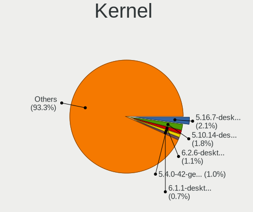

| Version                             | Desktops | Percent |
|-------------------------------------|----------|---------|
| 5.16.7-desktop-1omv4003             | 26       | 2.47%   |
| 5.10.14-desktop-1omv4002            | 22       | 2.09%   |
| 6.2.6-desktop-1omv2390              | 14       | 1.33%   |
| 5.4.0-42-generic                    | 12       | 1.14%   |
| 6.1.1-desktop-1omv2290              | 9        | 0.85%   |
| 5.4.0-58-generic                    | 8        | 0.76%   |
| 6.4.11-desktop-1omv2390             | 7        | 0.66%   |
| 5.4.0-52-generic                    | 7        | 0.66%   |
| 5.4.0-28-generic                    | 7        | 0.66%   |
| 5.19.0-46-generic                   | 7        | 0.66%   |
| 5.19.0-38-generic                   | 7        | 0.66%   |
| 5.15.0-56-generic                   | 7        | 0.66%   |
| 5.8.0-7630-generic                  | 6        | 0.57%   |
| 5.4.0-33-generic                    | 6        | 0.57%   |
| 5.15.0-76-generic                   | 6        | 0.57%   |
| 5.15.0-58-generic                   | 6        | 0.57%   |
| 5.15.0-52-generic                   | 6        | 0.57%   |
| 5.13.0-39-generic                   | 6        | 0.57%   |
| 4.15.0-desktop-60.7rosa-x86_64      | 6        | 0.57%   |
| 6.2.0-26-generic                    | 5        | 0.47%   |
| 5.4.0-80-generic                    | 5        | 0.47%   |
| 5.4.0-72-generic                    | 5        | 0.47%   |
| 5.4.0-48-generic                    | 5        | 0.47%   |
| 5.15.0-57-generic                   | 5        | 0.47%   |
| 5.15.0-47-generic                   | 5        | 0.47%   |
| 5.13.0-30-generic                   | 5        | 0.47%   |
| 5.12.4-desktop-1omv4050             | 5        | 0.47%   |
| 4.9.60-nrj-desktop-1rosa-x86_64     | 5        | 0.47%   |
| 4.18.16-desktop-1bP                 | 5        | 0.47%   |
| 4.18.0-15-generic                   | 5        | 0.47%   |
| 6.8.0-76060800daily20240311-generic | 4        | 0.38%   |
| 6.5.6-300.fc39.x86_64               | 4        | 0.38%   |
| 5.8.0-44-generic                    | 4        | 0.38%   |
| 5.8.0-41-generic                    | 4        | 0.38%   |
| 5.4.0-89-generic                    | 4        | 0.38%   |
| 5.4.0-74-generic                    | 4        | 0.38%   |
| 5.4.0-71-generic                    | 4        | 0.38%   |
| 5.4.0-67-generic                    | 4        | 0.38%   |
| 5.4.0-65-generic                    | 4        | 0.38%   |
| 5.4.0-40-generic                    | 4        | 0.38%   |

Kernel Family
-------------

Linux kernel without a distro release

| Version | Desktops | Percent |
|---------|----------|---------|
| 5.4.0   | 125      | 12.5%   |
| 5.15.0  | 90       | 9%      |
| 4.15.0  | 52       | 5.2%    |
| 5.8.0   | 36       | 3.6%    |
| 5.19.0  | 33       | 3.3%    |
| 5.11.0  | 33       | 3.3%    |
| 5.13.0  | 31       | 3.1%    |
| 5.16.7  | 27       | 2.7%    |
| 5.10.0  | 25       | 2.5%    |
| 5.10.14 | 23       | 2.3%    |
| 6.2.0   | 21       | 2.1%    |
| 6.2.6   | 20       | 2%      |
| 6.5.0   | 19       | 1.9%    |
| 4.18.0  | 19       | 1.9%    |
| 5.3.0   | 15       | 1.5%    |
| 6.1.0   | 12       | 1.2%    |
| 5.0.0   | 11       | 1.1%    |
| 6.1.1   | 10       | 1%      |
| 6.4.11  | 9        | 0.9%    |
| 4.19.0  | 9        | 0.9%    |
| 6.8.0   | 8        | 0.8%    |
| 6.5.6   | 7        | 0.7%    |
| 5.12.4  | 6        | 0.6%    |
| 4.9.60  | 5        | 0.5%    |
| 4.18.16 | 5        | 0.5%    |
| 6.8.7   | 4        | 0.4%    |
| 6.6.4   | 4        | 0.4%    |
| 6.6.10  | 4        | 0.4%    |
| 6.6.1   | 4        | 0.4%    |
| 6.1.9   | 4        | 0.4%    |
| 6.1.4   | 4        | 0.4%    |
| 5.9.16  | 4        | 0.4%    |
| 5.9.11  | 4        | 0.4%    |
| 5.18.12 | 4        | 0.4%    |
| 5.17.5  | 4        | 0.4%    |
| 5.16.0  | 4        | 0.4%    |
| 4.4.0   | 4        | 0.4%    |
| 6.7.4   | 3        | 0.3%    |
| 6.6.2   | 3        | 0.3%    |
| 6.6.15  | 3        | 0.3%    |

Kernel Major Ver.
-----------------

Linux kernel major version

| Version | Desktops | Percent |
|---------|----------|---------|
| 5.4     | 144      | 14.69%  |
| 5.15    | 115      | 11.73%  |
| 5.10    | 64       | 6.53%   |
| 6.2     | 52       | 5.31%   |
| 4.15    | 52       | 5.31%   |
| 5.8     | 51       | 5.2%    |
| 5.11    | 43       | 4.39%   |
| 6.1     | 42       | 4.29%   |
| 5.19    | 42       | 4.29%   |
| 5.16    | 38       | 3.88%   |
| 5.13    | 37       | 3.78%   |
| 6.5     | 35       | 3.57%   |
| 6.6     | 30       | 3.06%   |
| 4.18    | 26       | 2.65%   |
| 5.3     | 18       | 1.84%   |
| 6.0     | 17       | 1.73%   |
| 5.12    | 17       | 1.73%   |
| 6.4     | 16       | 1.63%   |
| 6.8     | 15       | 1.53%   |
| 5.9     | 15       | 1.53%   |
| 5.18    | 12       | 1.22%   |
| 5.17    | 12       | 1.22%   |
| 5.0     | 11       | 1.12%   |
| 4.19    | 11       | 1.12%   |
| 6.7     | 10       | 1.02%   |
| 6.3     | 10       | 1.02%   |
| 4.9     | 10       | 1.02%   |
| 5.14    | 8        | 0.82%   |
| 5.6     | 6        | 0.61%   |
| 5.7     | 4        | 0.41%   |
| 5.5     | 4        | 0.41%   |
| 4.4     | 4        | 0.41%   |
| 4.1     | 4        | 0.41%   |
| 4.10    | 2        | 0.2%    |
| 4.6     | 1        | 0.1%    |
| 4.12    | 1        | 0.1%    |
| 3.10    | 1        | 0.1%    |

Arch
----

OS architecture (x86_64, i586, etc.)

| Name   | Desktops | Percent |
|--------|----------|---------|
| x86_64 | 848      | 99.18%  |
| i686   | 7        | 0.82%   |

DE
--

Desktop Environment

| Name             | Desktops | Percent |
|------------------|----------|---------|
| GNOME            | 347      | 39.12%  |
| KDE5             | 181      | 20.41%  |
| Unknown          | 113      | 12.74%  |
| X-Cinnamon       | 72       | 8.12%   |
| XFCE             | 60       | 6.76%   |
| MATE             | 26       | 2.93%   |
| KDE              | 19       | 2.14%   |
| KDE4             | 14       | 1.58%   |
| Pantheon         | 10       | 1.13%   |
| LXQt             | 7        | 0.79%   |
| i3               | 6        | 0.68%   |
| Cinnamon         | 6        | 0.68%   |
| Budgie           | 5        | 0.56%   |
| Unity            | 3        | 0.34%   |
| KDE6             | 3        | 0.34%   |
| xmonad           | 2        | 0.23%   |
| LXDE             | 2        | 0.23%   |
| Deepin           | 2        | 0.23%   |
| awesome          | 2        | 0.23%   |
| sway             | 1        | 0.11%   |
| qtile            | 1        | 0.11%   |
| lightdm-xsession | 1        | 0.11%   |
| leftwm           | 1        | 0.11%   |
| Hyprland         | 1        | 0.11%   |
| GNOME Flashback  | 1        | 0.11%   |
| GNOME Classic    | 1        | 0.11%   |

Display Server
--------------

X11 or Wayland

| Name    | Desktops | Percent |
|---------|----------|---------|
| X11     | 647      | 72.78%  |
| Wayland | 148      | 16.65%  |
| Unknown | 61       | 6.86%   |
| Tty     | 33       | 3.71%   |

Display Manager
---------------

SDDM, LightDM, etc.

| Name    | Desktops | Percent |
|---------|----------|---------|
| Unknown | 399      | 45.08%  |
| SDDM    | 168      | 18.98%  |
| GDM3    | 116      | 13.11%  |
| LightDM | 95       | 10.73%  |
| GDM     | 67       | 7.57%   |
| TDM     | 21       | 2.37%   |
| KDM     | 14       | 1.58%   |
| SLiM    | 2        | 0.23%   |
| LXDM    | 2        | 0.23%   |
| XDM     | 1        | 0.11%   |

OS Lang
-------

Language

| Lang       | Desktops | Percent |
|------------|----------|---------|
| de_AT      | 362      | 41.04%  |
| en_US      | 220      | 24.94%  |
| de_DE      | 112      | 12.7%   |
| Unknown    | 100      | 11.34%  |
| en_GB      | 36       | 4.08%   |
| C          | 20       | 2.27%   |
| en_IE      | 10       | 1.13%   |
| it_IT      | 4        | 0.45%   |
| ru_RU      | 3        | 0.34%   |
| pl_PL      | 3        | 0.34%   |
| uk_UA      | 1        | 0.11%   |
| tr_TR      | 1        | 0.11%   |
| hu_HU      | 1        | 0.11%   |
| fa_IR      | 1        | 0.11%   |
| en_US.UTF8 | 1        | 0.11%   |
| en_AU      | 1        | 0.11%   |
| en_AT      | 1        | 0.11%   |
| de_LU      | 1        | 0.11%   |
| de_CH      | 1        | 0.11%   |
| de_AT.UTF8 | 1        | 0.11%   |
| da_DK      | 1        | 0.11%   |
| cs_CZ      | 1        | 0.11%   |

Boot Mode
---------

EFI or BIOS

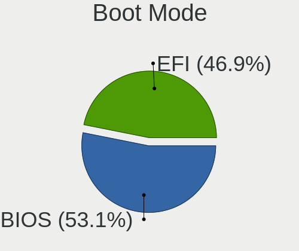

| Mode | Desktops | Percent |
|------|----------|---------|
| BIOS | 466      | 53.26%  |
| EFI  | 409      | 46.74%  |

Filesystem
----------

Type of filesystem

| Type    | Desktops | Percent |
|---------|----------|---------|
| Ext4    | 601      | 67.83%  |
| Btrfs   | 108      | 12.19%  |
| Overlay | 89       | 10.05%  |
| Tmpfs   | 38       | 4.29%   |
| Unknown | 27       | 3.05%   |
| Xfs     | 11       | 1.24%   |
| Zfs     | 7        | 0.79%   |
| Ext2    | 3        | 0.34%   |
| F2fs    | 2        | 0.23%   |

Part. scheme
------------

Scheme of partitioning

| Type    | Desktops | Percent |
|---------|----------|---------|
| Unknown | 401      | 45.62%  |
| GPT     | 394      | 44.82%  |
| MBR     | 84       | 9.56%   |

Dual Boot with Linux/BSD
------------------------

Hosting more than one Linux/BSD

| Dual boot | Desktops | Percent |
|-----------|----------|---------|
| No        | 690      | 78.41%  |
| Yes       | 190      | 21.59%  |

Dual Boot (Win)
---------------

Hosting Linux and Windows

| Dual boot | Desktops | Percent |
|-----------|----------|---------|
| No        | 540      | 61.57%  |
| Yes       | 337      | 38.43%  |

Board
-----

Vendor
------

Motherboard manufacturer

| Name                                 | Desktops | Percent |
|--------------------------------------|----------|---------|
| ASUSTek Computer                     | 276      | 32.28%  |
| MSI                                  | 145      | 16.96%  |
| Gigabyte Technology                  | 107      | 12.51%  |
| ASRock                               | 97       | 11.35%  |
| Hewlett-Packard                      | 56       | 6.55%   |
| Lenovo                               | 32       | 3.74%   |
| Dell                                 | 23       | 2.69%   |
| Medion                               | 22       | 2.57%   |
| Acer                                 | 19       | 2.22%   |
| Intel                                | 11       | 1.29%   |
| Fujitsu                              | 11       | 1.29%   |
| Biostar                              | 9        | 1.05%   |
| Unknown                              | 9        | 1.05%   |
| Foxconn                              | 6        | 0.7%    |
| Shenzhen Meigao Electronic Equipment | 4        | 0.47%   |
| Shuttle                              | 3        | 0.35%   |
| Pegatron                             | 3        | 0.35%   |
| Sapphire                             | 2        | 0.23%   |
| Fujitsu Siemens                      | 2        | 0.23%   |
| ECS                                  | 2        | 0.23%   |
| BESSTAR Tech                         | 2        | 0.23%   |
| AMI                                  | 2        | 0.23%   |
| TYAN Computer                        | 1        | 0.12%   |
| Supermicro                           | 1        | 0.12%   |
| SIEMENS                              | 1        | 0.12%   |
| Packard Bell                         | 1        | 0.12%   |
| Minix                                | 1        | 0.12%   |
| Matrox Electronic Systems            | 1        | 0.12%   |
| Jetway                               | 1        | 0.12%   |
| IBM                                  | 1        | 0.12%   |
| Hardkernel                           | 1        | 0.12%   |
| GMKtec                               | 1        | 0.12%   |
| AZW                                  | 1        | 0.12%   |
| ASRockRack                           | 1        | 0.12%   |

Model
-----

Motherboard model

| Name                         | Desktops | Percent |
|------------------------------|----------|---------|
| ASUS All Series              | 28       | 3.27%   |
| MSI MS-7C37                  | 16       | 1.87%   |
| ASUS H110M-A                 | 10       | 1.17%   |
| Unknown                      | 9        | 1.05%   |
| MSI MS-7B86                  | 8        | 0.94%   |
| MSI MS-7B79                  | 8        | 0.94%   |
| ASUS ROG STRIX B550-F GAMING | 8        | 0.94%   |
| ASUS PRIME B450-PLUS         | 8        | 0.94%   |
| MSI MS-7C91                  | 6        | 0.7%    |
| ASRock Z87 Killer            | 6        | 0.7%    |
| ASUS TUF Gaming X570-PLUS    | 5        | 0.58%   |
| ASUS TUF Gaming B550-PLUS    | 5        | 0.58%   |
| ASUS ROG STRIX B450-F GAMING | 5        | 0.58%   |
| MSI MS-7971                  | 4        | 0.47%   |
| HP EliteDesk 800 G1 SFF      | 4        | 0.47%   |
| HP Compaq 8200 Elite SFF PC  | 4        | 0.47%   |
| ASUS ROG STRIX B550-I GAMING | 4        | 0.47%   |
| ASUS PRIME B550-PLUS         | 4        | 0.47%   |
| ASUS PRIME A320M-K           | 4        | 0.47%   |
| MSI MS-7D25                  | 3        | 0.35%   |
| MSI MS-7C95                  | 3        | 0.35%   |
| MSI MS-7C02                  | 3        | 0.35%   |
| MSI MS-7B89                  | 3        | 0.35%   |
| MSI MS-7A38                  | 3        | 0.35%   |
| MSI MS-7817                  | 3        | 0.35%   |
| MSI MS-7721                  | 3        | 0.35%   |
| MSI MS-7676                  | 3        | 0.35%   |
| Medion MS-7800               | 3        | 0.35%   |
| Medion MS-7707               | 3        | 0.35%   |
| HP Z800 Workstation          | 3        | 0.35%   |
| HP Compaq Elite 8300 SFF     | 3        | 0.35%   |
| HP Compaq 8100 Elite CMT PC  | 3        | 0.35%   |
| Gigabyte X570 AORUS PRO      | 3        | 0.35%   |
| Gigabyte X570 AORUS ELITE    | 3        | 0.35%   |
| Gigabyte B550 AORUS PRO V2   | 3        | 0.35%   |
| Gigabyte B550 AORUS ELITE    | 3        | 0.35%   |
| Dell OptiPlex 7010           | 3        | 0.35%   |
| Biostar A10N-8800E           | 3        | 0.35%   |
| ASUS Z170-P                  | 3        | 0.35%   |
| ASUS Z170-A                  | 3        | 0.35%   |

Model Family
------------

Motherboard model prefix

| Name                | Desktops | Percent |
|---------------------|----------|---------|
| ASUS PRIME          | 58       | 6.78%   |
| ASUS ROG            | 42       | 4.91%   |
| ASUS All            | 28       | 3.27%   |
| Lenovo ThinkCentre  | 19       | 2.22%   |
| HP Compaq           | 19       | 2.22%   |
| ASUS TUF            | 19       | 2.22%   |
| Dell OptiPlex       | 17       | 1.99%   |
| MSI MS-7C37         | 16       | 1.87%   |
| Gigabyte X570       | 12       | 1.4%    |
| ASUS H110M-A        | 10       | 1.17%   |
| Unknown             | 9        | 1.05%   |
| MSI MS-7B86         | 8        | 0.94%   |
| MSI MS-7B79         | 8        | 0.94%   |
| Gigabyte B550       | 8        | 0.94%   |
| HP EliteDesk        | 7        | 0.82%   |
| Gigabyte Z390       | 7        | 0.82%   |
| ASUS SABERTOOTH     | 7        | 0.82%   |
| ASRock Z87          | 7        | 0.82%   |
| Acer Aspire         | 7        | 0.82%   |
| MSI MS-7C91         | 6        | 0.7%    |
| Lenovo ThinkStation | 6        | 0.7%    |
| Gigabyte B550M      | 5        | 0.58%   |
| ASUS M5A97          | 5        | 0.58%   |
| ASUS M5A78L-M       | 5        | 0.58%   |
| ASRock 970          | 5        | 0.58%   |
| Acer Veriton        | 5        | 0.58%   |
| MSI MS-7971         | 4        | 0.47%   |
| Lenovo IdeaCentre   | 4        | 0.47%   |
| HP Pavilion         | 4        | 0.47%   |
| Gigabyte Z590       | 4        | 0.47%   |
| Gigabyte B450       | 4        | 0.47%   |
| Fujitsu ESPRIMO     | 4        | 0.47%   |
| ASUS Rampage        | 4        | 0.47%   |
| ASUS Maximus        | 4        | 0.47%   |
| ASRock Z170         | 4        | 0.47%   |
| ASRock X570         | 4        | 0.47%   |
| ASRock H97          | 4        | 0.47%   |
| ASRock B450         | 4        | 0.47%   |
| MSI MS-7D25         | 3        | 0.35%   |
| MSI MS-7C95         | 3        | 0.35%   |

MFG Year
--------

Motherboard manufacture year

| Year | Desktops | Percent |
|------|----------|---------|
| 2018 | 95       | 11.11%  |
| 2019 | 91       | 10.64%  |
| 2020 | 82       | 9.59%   |
| 2013 | 71       | 8.3%    |
| 2012 | 68       | 7.95%   |
| 2011 | 59       | 6.9%    |
| 2015 | 57       | 6.67%   |
| 2021 | 46       | 5.38%   |
| 2014 | 45       | 5.26%   |
| 2016 | 43       | 5.03%   |
| 2010 | 39       | 4.56%   |
| 2009 | 38       | 4.44%   |
| 2017 | 36       | 4.21%   |
| 2022 | 29       | 3.39%   |
| 2008 | 17       | 1.99%   |
| 2007 | 17       | 1.99%   |
| 2023 | 13       | 1.52%   |
| 2006 | 6        | 0.7%    |
| 2005 | 2        | 0.23%   |
| 2024 | 1        | 0.12%   |

Form Factor
-----------

Physical design of the computer

| Name    | Desktops | Percent |
|---------|----------|---------|
| Desktop | 855      | 100%    |

Secure Boot
-----------

Enabled or disabled

| State    | Desktops | Percent |
|----------|----------|---------|
| Disabled | 826      | 96.38%  |
| Enabled  | 31       | 3.62%   |

Coreboot
--------

Have coreboot on board

| Used | Desktops | Percent |
|------|----------|---------|
| No   | 855      | 100%    |

RAM Size
--------

Total RAM memory

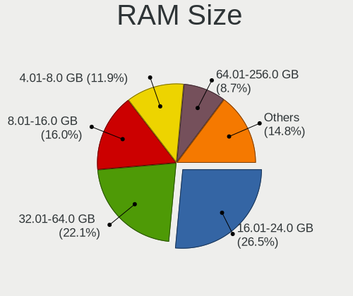

| Size in GB      | Desktops | Percent |
|-----------------|----------|---------|
| 16.01-24.0      | 234      | 27.08%  |
| 32.01-64.0      | 187      | 21.64%  |
| 8.01-16.0       | 145      | 16.78%  |
| 4.01-8.0        | 106      | 12.27%  |
| 3.01-4.0        | 78       | 9.03%   |
| 64.01-256.0     | 64       | 7.41%   |
| 24.01-32.0      | 27       | 3.13%   |
| 1.01-2.0        | 9        | 1.04%   |
| More than 256.0 | 7        | 0.81%   |
| 2.01-3.0        | 4        | 0.46%   |
| 0.51-1.0        | 2        | 0.23%   |
| Unknown         | 1        | 0.12%   |

RAM Used
--------

Used RAM memory

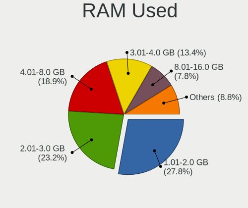

| Used GB    | Desktops | Percent |
|------------|----------|---------|
| 1.01-2.0   | 282      | 29.62%  |
| 2.01-3.0   | 221      | 23.21%  |
| 4.01-8.0   | 180      | 18.91%  |
| 3.01-4.0   | 119      | 12.5%   |
| 8.01-16.0  | 68       | 7.14%   |
| 0.51-1.0   | 48       | 5.04%   |
| 16.01-24.0 | 12       | 1.26%   |
| 0.01-0.5   | 9        | 0.95%   |
| 32.01-64.0 | 6        | 0.63%   |
| 24.01-32.0 | 6        | 0.63%   |
| Unknown    | 1        | 0.11%   |

Total Drives
------------

Number of drives on board

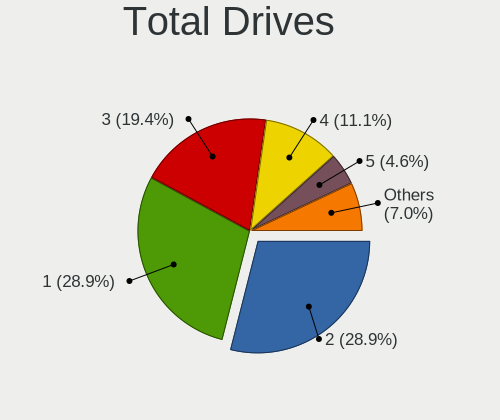

| Drives | Desktops | Percent |
|--------|----------|---------|
| 1      | 274      | 30.21%  |
| 2      | 267      | 29.44%  |
| 3      | 167      | 18.41%  |
| 4      | 95       | 10.47%  |
| 5      | 40       | 4.41%   |
| 6      | 26       | 2.87%   |
| 9      | 10       | 1.1%    |
| 7      | 9        | 0.99%   |
| 10     | 8        | 0.88%   |
| 8      | 4        | 0.44%   |
| 11     | 3        | 0.33%   |
| 12     | 2        | 0.22%   |
| 0      | 2        | 0.22%   |

Has CD-ROM
----------

Has CD-ROM on board

| Presented | Desktops | Percent |
|-----------|----------|---------|
| Yes       | 444      | 51.39%  |
| No        | 420      | 48.61%  |

Has Ethernet
------------

Has Ethernet on board

| Presented | Desktops | Percent |
|-----------|----------|---------|
| Yes       | 851      | 99.53%  |
| No        | 4        | 0.47%   |

Has WiFi
--------

Has WiFi module

| Presented | Desktops | Percent |
|-----------|----------|---------|
| No        | 475      | 54.85%  |
| Yes       | 391      | 45.15%  |

Has Bluetooth
-------------

Has Bluetooth module

| Presented | Desktops | Percent |
|-----------|----------|---------|
| No        | 570      | 66.36%  |
| Yes       | 289      | 33.64%  |

Location
--------

Country
-------

Geographic location (country)

| Country | Desktops | Percent |
|---------|----------|---------|
| Austria | 855      | 100%    |

City
----

Geographic location (city)

| City              | Desktops | Percent |
|-------------------|----------|---------|
| Vienna            | 452      | 50.11%  |
| Graz              | 45       | 4.99%   |
| Innsbruck         | 30       | 3.33%   |
| Linz              | 29       | 3.22%   |
| Salzburg          | 16       | 1.77%   |
| Sankt Plten     | 15       | 1.66%   |
| Bad Hall          | 12       | 1.33%   |
| Dornbirn          | 10       | 1.11%   |
| Wels              | 8        | 0.89%   |
| Steyr             | 8        | 0.89%   |
| Klagenfurt        | 7        | 0.78%   |
| Wiener Neustadt   | 6        | 0.67%   |
| Feldkirch         | 6        | 0.67%   |
| Hallein           | 5        | 0.55%   |
| Zell am See       | 4        | 0.44%   |
| Leonding          | 4        | 0.44%   |
| Falkenstein       | 4        | 0.44%   |
| Voecklabruck      | 3        | 0.33%   |
| Villach           | 3        | 0.33%   |
| Seiersberg        | 3        | 0.33%   |
| Schwechat         | 3        | 0.33%   |
| Ried im Innkreis  | 3        | 0.33%   |
| Perg              | 3        | 0.33%   |
| Perchtoldsdorf    | 3        | 0.33%   |
| Ober-Grafendorf   | 3        | 0.33%   |
| Klosterneuburg    | 3        | 0.33%   |
| Horn              | 3        | 0.33%   |
| Haid              | 3        | 0.33%   |
| Gleisdorf         | 3        | 0.33%   |
| Brunn am Gebirge  | 3        | 0.33%   |
| Bad Tatzmannsdorf | 3        | 0.33%   |
| Woellersdorf      | 2        | 0.22%   |
| Unterpremstaetten | 2        | 0.22%   |
| Traunkirchen      | 2        | 0.22%   |
| Sankt Valentin    | 2        | 0.22%   |
| Poechlarn         | 2        | 0.22%   |
| Neunkirchen       | 2        | 0.22%   |
| Mauthausen        | 2        | 0.22%   |
| Maria Enzersdorf  | 2        | 0.22%   |
| Lustenau          | 2        | 0.22%   |

Drives
------

Drive Vendor
------------

Hard drive vendors

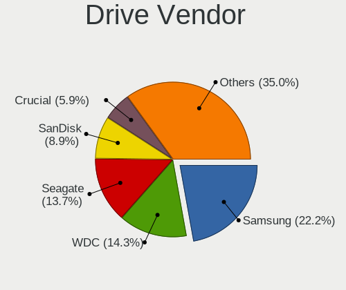

| Vendor                      | Desktops | Drives | Percent |
|-----------------------------|----------|--------|---------|
| Samsung Electronics         | 373      | 719    | 21.97%  |
| WDC                         | 244      | 422    | 14.37%  |
| Seagate                     | 239      | 393    | 14.08%  |
| Sandisk                     | 154      | 232    | 9.07%   |
| Crucial                     | 95       | 177    | 5.59%   |
| Kingston                    | 90       | 119    | 5.3%    |
| Toshiba                     | 75       | 134    | 4.42%   |
| Intenso                     | 41       | 51     | 2.41%   |
| Hitachi                     | 39       | 48     | 2.3%    |
| Intel                       | 31       | 46     | 1.83%   |
| Micron/Crucial Technology   | 25       | 31     | 1.47%   |
| Phison                      | 19       | 29     | 1.12%   |
| Unknown                     | 18       | 41     | 1.06%   |
| Micron Technology           | 18       | 21     | 1.06%   |
| A-DATA Technology           | 17       | 22     | 1%      |
| Transcend                   | 14       | 17     | 0.82%   |
| HGST                        | 14       | 32     | 0.82%   |
| Phison Electronics          | 12       | 13     | 0.71%   |
| OCZ                         | 12       | 21     | 0.71%   |
| Kingston Technology Company | 12       | 15     | 0.71%   |
| China                       | 12       | 19     | 0.71%   |
| Corsair                     | 11       | 14     | 0.65%   |
| Patriot                     | 10       | 13     | 0.59%   |
| Silicon Motion              | 7        | 9      | 0.41%   |
| SK hynix                    | 6        | 16     | 0.35%   |
| ASMT                        | 5        | 11     | 0.29%   |
| Apacer                      | 5        | 8      | 0.29%   |
| PNY                         | 4        | 4      | 0.24%   |
| Maxtor                      | 4        | 5      | 0.24%   |
| LITEON                      | 4        | 4      | 0.24%   |
| Verbatim                    | 3        | 3      | 0.18%   |
| SPCC                        | 3        | 19     | 0.18%   |
| SABRENT                     | 3        | 4      | 0.18%   |
| Plextor                     | 3        | 3      | 0.18%   |
| KIOXIA                      | 3        | 7      | 0.18%   |
| JMicron Technology          | 3        | 6      | 0.18%   |
| INNOVATION IT               | 3        | 3      | 0.18%   |
| Hewlett-Packard             | 3        | 3      | 0.18%   |
| Gigabyte Technology         | 3        | 4      | 0.18%   |
| Fanxiang                    | 3        | 3      | 0.18%   |

Drive Model
-----------

Hard drive models

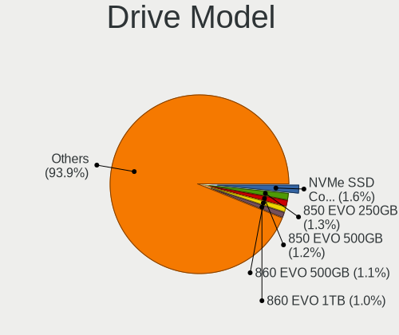

| Model                                              | Desktops | Percent |
|----------------------------------------------------|----------|---------|
| Samsung SSD 850 EVO 500GB                          | 25       | 1.22%   |
| Samsung NVMe SSD Controller SM981/PM981/PM983 1TB  | 25       | 1.22%   |
| Samsung SSD 850 EVO 250GB                          | 24       | 1.17%   |
| Samsung SSD 860 EVO 500GB                          | 20       | 0.98%   |
| Samsung SSD 860 EVO 1TB                            | 20       | 0.98%   |
| Samsung SSD 840 EVO 250GB                          | 19       | 0.93%   |
| Crucial CT500MX500SSD1 500GB                       | 19       | 0.93%   |
| Toshiba DT01ACA200 2TB                             | 16       | 0.78%   |
| Seagate Expansion 2TB                              | 16       | 0.78%   |
| SanDisk SSD PLUS 1000GB                            | 16       | 0.78%   |
| SanDisk SSD PLUS 240GB                             | 15       | 0.73%   |
| Samsung SSD 850 PRO 256GB                          | 15       | 0.73%   |
| Crucial CT1000MX500SSD1 1TB                        | 14       | 0.69%   |
| Toshiba HDWD110 1TB                                | 13       | 0.64%   |
| Toshiba DT01ACA100 1TB                             | 13       | 0.64%   |
| Seagate ST4000VN008-2DR166 4TB                     | 13       | 0.64%   |
| Samsung SSD 980 PRO 1TB                            | 13       | 0.64%   |
| Samsung SSD 860 EVO 250GB                          | 13       | 0.64%   |
| Kingston SUV400S37240G 240GB SSD                   | 13       | 0.64%   |
| Seagate ST2000DM008-2FR102 2TB                     | 12       | 0.59%   |
| Seagate ST1000DM010-2EP102 1TB                     | 11       | 0.54%   |
| Samsung NVMe SSD Drive 500GB                       | 11       | 0.54%   |
| Intenso USB 3.0 device 5TB                         | 11       | 0.54%   |
| WDC WD30EFRX-68EUZN0 3TB                           | 10       | 0.49%   |
| Unknown SD/MMC/MS PRO 128GB                        | 10       | 0.49%   |
| SanDisk SSD PLUS 480GB                             | 10       | 0.49%   |
| Samsung NVMe SSD Controller PM9A1/PM9A3/980PRO 1TB | 10       | 0.49%   |
| Micron/Crucial P2 NVMe PCIe SSD 4TB                | 10       | 0.49%   |
| SanDisk SDSSDA240G 240GB                           | 9        | 0.44%   |
| Samsung SSD 980 1TB                                | 9        | 0.44%   |
| Samsung SSD 970 EVO Plus 2TB                       | 9        | 0.44%   |
| Samsung SSD 970 EVO Plus 1TB                       | 9        | 0.44%   |
| Samsung SSD 870 EVO 1TB                            | 9        | 0.44%   |
| Kingston SA400S37240G 240GB SSD                    | 9        | 0.44%   |
| Kingston SA400S37120G 120GB SSD                    | 9        | 0.44%   |
| WDC WD20EZRZ-00Z5HB0 2TB                           | 8        | 0.39%   |
| Seagate ST31000528AS 1TB                           | 8        | 0.39%   |
| SanDisk SDSSDH3 1T00 1TB                           | 8        | 0.39%   |
| SanDisk NVMe SSD Drive 1TB                         | 8        | 0.39%   |
| Samsung SSD 970 EVO Plus 500GB                     | 8        | 0.39%   |

HDD Vendor
----------

Hard disk drive vendors

| Vendor              | Desktops | Drives | Percent |
|---------------------|----------|--------|---------|
| Seagate             | 229      | 368    | 34.13%  |
| WDC                 | 212      | 366    | 31.59%  |
| Toshiba             | 73       | 131    | 10.88%  |
| Samsung Electronics | 58       | 85     | 8.64%   |
| Hitachi             | 39       | 48     | 5.81%   |
| Intenso             | 14       | 14     | 2.09%   |
| HGST                | 14       | 32     | 2.09%   |
| Unknown             | 11       | 18     | 1.64%   |
| Maxtor              | 4        | 5      | 0.6%    |
| SABRENT             | 3        | 4      | 0.45%   |
| JMicron Technology  | 3        | 6      | 0.45%   |
| ASMT                | 3        | 9      | 0.45%   |
| LaCie               | 2        | 2      | 0.3%    |
| WD MediaMax         | 1        | 1      | 0.15%   |
| USB                 | 1        | 1      | 0.15%   |
| TO Exter            | 1        | 3      | 0.15%   |
| Synology            | 1        | 8      | 0.15%   |
| Magnetic Data       | 1        | 1      | 0.15%   |
| Hewlett-Packard     | 1        | 1      | 0.15%   |

SSD Vendor
----------

Solid state drive vendors

| Vendor              | Desktops | Drives | Percent |
|---------------------|----------|--------|---------|
| Samsung Electronics | 236      | 398    | 33.05%  |
| SanDisk             | 121      | 181    | 16.95%  |
| Crucial             | 86       | 148    | 12.04%  |
| Kingston            | 70       | 85     | 9.8%    |
| WDC                 | 24       | 32     | 3.36%   |
| Intenso             | 23       | 31     | 3.22%   |
| Intel               | 18       | 28     | 2.52%   |
| Transcend           | 12       | 14     | 1.68%   |
| OCZ                 | 12       | 21     | 1.68%   |
| Micron Technology   | 12       | 15     | 1.68%   |
| China               | 12       | 19     | 1.68%   |
| A-DATA Technology   | 11       | 14     | 1.54%   |
| Corsair             | 7        | 7      | 0.98%   |
| Patriot             | 6        | 6      | 0.84%   |
| LITEON              | 4        | 4      | 0.56%   |
| Apacer              | 4        | 5      | 0.56%   |
| Verbatim            | 3        | 3      | 0.42%   |
| Plextor             | 3        | 3      | 0.42%   |
| INNOVATION IT       | 3        | 3      | 0.42%   |
| V7                  | 2        | 2      | 0.28%   |
| SPCC                | 2        | 2      | 0.28%   |
| SK hynix            | 2        | 12     | 0.28%   |
| Seagate             | 2        | 3      | 0.28%   |
| PNY                 | 2        | 2      | 0.28%   |
| Hewlett-Packard     | 2        | 2      | 0.28%   |
| GOODRAM             | 2        | 2      | 0.28%   |
| Fanxiang            | 2        | 2      | 0.28%   |
| BAITITON            | 2        | 3      | 0.28%   |
| ASMT                | 2        | 2      | 0.28%   |
| Unknown             | 2        | 2      | 0.28%   |
| WDC WDS2            | 1        | 1      | 0.14%   |
| ViperTeq            | 1        | 4      | 0.14%   |
| VERICO              | 1        | 2      | 0.14%   |
| TSA                 | 1        | 1      | 0.14%   |
| Toshiba             | 1        | 1      | 0.14%   |
| Team                | 1        | 1      | 0.14%   |
| TCSUNBOW            | 1        | 1      | 0.14%   |
| T-FORCE             | 1        | 1      | 0.14%   |
| Super Talent        | 1        | 1      | 0.14%   |
| SSK                 | 1        | 1      | 0.14%   |

Drive Kind
----------

HDD or SSD

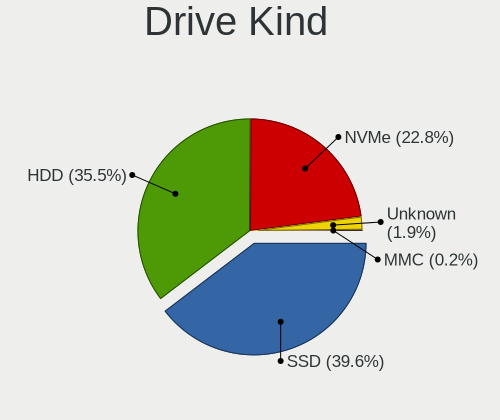

| Kind    | Desktops | Drives | Percent |
|---------|----------|--------|---------|
| SSD     | 563      | 1082   | 40.21%  |
| HDD     | 511      | 1103   | 36.5%   |
| NVMe    | 300      | 582    | 21.43%  |
| Unknown | 23       | 47     | 1.64%   |
| MMC     | 3        | 5      | 0.21%   |

Drive Connector
---------------

SATA, SAS, NVMe, etc.

| Type | Desktops | Drives | Percent |
|------|----------|--------|---------|
| SATA | 758      | 2081   | 65.97%  |
| NVMe | 299      | 580    | 26.02%  |
| SAS  | 89       | 153    | 7.75%   |
| MMC  | 3        | 5      | 0.26%   |

Drive Size
----------

Size of hard drive

| Size in TB | Desktops | Drives | Percent |
|------------|----------|--------|---------|
| 0.01-0.5   | 546      | 1047   | 45.12%  |
| 0.51-1.0   | 334      | 540    | 27.6%   |
| 1.01-2.0   | 154      | 275    | 12.73%  |
| 3.01-4.0   | 77       | 150    | 6.36%   |
| 4.01-10.0  | 48       | 82     | 3.97%   |
| 2.01-3.0   | 41       | 61     | 3.39%   |
| 10.01-20.0 | 10       | 30     | 0.83%   |

Space Total
-----------

Amount of disk space available on the file system

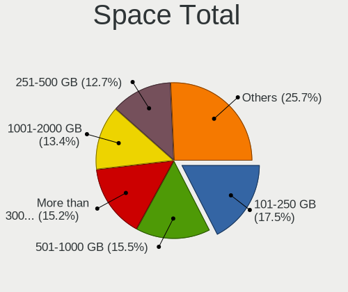

| Size in GB     | Desktops | Percent |
|----------------|----------|---------|
| 101-250        | 161      | 17.46%  |
| 501-1000       | 150      | 16.27%  |
| More than 3000 | 125      | 13.56%  |
| 251-500        | 121      | 13.12%  |
| 1001-2000      | 120      | 13.02%  |
| 1-20           | 67       | 7.27%   |
| 2001-3000      | 52       | 5.64%   |
| 51-100         | 48       | 5.21%   |
| Unknown        | 45       | 4.88%   |
| 21-50          | 33       | 3.58%   |

Space Used
----------

Amount of used disk space

| Used GB        | Desktops | Percent |
|----------------|----------|---------|
| 1-20           | 290      | 30.62%  |
| 21-50          | 112      | 11.83%  |
| 101-250        | 98       | 10.35%  |
| 251-500        | 89       | 9.4%    |
| 501-1000       | 89       | 9.4%    |
| 51-100         | 72       | 7.6%    |
| 1001-2000      | 71       | 7.5%    |
| More than 3000 | 51       | 5.39%   |
| Unknown        | 45       | 4.75%   |
| 2001-3000      | 30       | 3.17%   |

Malfunc. Drives
---------------

Drive models with a malfunction

| Model                                        | Desktops | Drives | Percent |
|----------------------------------------------|----------|--------|---------|
| WDC WD10EADS-22M2B0 1TB                      | 7        | 7      | 5.98%   |
| SanDisk SD6SF1M128G1022I 128GB SSD           | 5        | 5      | 4.27%   |
| WDC WD30EFRX-68EUZN0 3TB                     | 3        | 3      | 2.56%   |
| Samsung Electronics HD103UJ 1TB              | 3        | 3      | 2.56%   |
| Seagate ST3500413AS 500GB                    | 2        | 2      | 1.71%   |
| SanDisk SSD PLUS 480GB                       | 2        | 2      | 1.71%   |
| Samsung Electronics SSD 840 PRO Series 512GB | 2        | 3      | 1.71%   |
| Samsung Electronics HD753LJ 752GB            | 2        | 2      | 1.71%   |
| WDC WD6400AACS-00G8B0 640GB                  | 1        | 1      | 0.85%   |
| WDC WD5000AAKX-08U6AA0 500GB                 | 1        | 1      | 0.85%   |
| WDC WD5000AAKS-60Z1A0 500GB                  | 1        | 1      | 0.85%   |
| WDC WD5000AAKS-22A7B0 500GB                  | 1        | 1      | 0.85%   |
| WDC WD5000AAKS-00UU3A0 500GB                 | 1        | 1      | 0.85%   |
| WDC WD5000AAKS-00H2B0 500GB                  | 1        | 1      | 0.85%   |
| WDC WD5000AADS-00M2B0 500GB                  | 1        | 1      | 0.85%   |
| WDC WD2500AAKX-603CA0 250GB                  | 1        | 1      | 0.85%   |
| WDC WD20EZRZ-00Z5HB0 2TB                     | 1        | 1      | 0.85%   |
| WDC WD20EZRX-22D8PB0 2TB                     | 1        | 1      | 0.85%   |
| WDC WD20EZRX-00D8PB0 2TB                     | 1        | 1      | 0.85%   |
| WDC WD20EFRX-68AX9N0 2TB                     | 1        | 17     | 0.85%   |
| WDC WD20EARS-00MVWB0 2TB                     | 1        | 4      | 0.85%   |
| WDC WD2003FYYS-02W0B1 2TB                    | 1        | 1      | 0.85%   |
| WDC WD2002FYPS-02W3B0 2TB                    | 1        | 1      | 0.85%   |
| WDC WD2000FYYZ-01UL1B1 2TB                   | 1        | 1      | 0.85%   |
| WDC WD1600BEVT-22ZCT0 160GB                  | 1        | 1      | 0.85%   |
| WDC WD10EZRX-00L4HB0 1TB                     | 1        | 1      | 0.85%   |
| WDC WD10EZEX-75M2NA0 1TB                     | 1        | 1      | 0.85%   |
| WDC WD10EZEX-60WN4A0 1TB                     | 1        | 1      | 0.85%   |
| WDC WD10EARS-00Y5B1 1TB                      | 1        | 1      | 0.85%   |
| WDC WD10EACS-00D6B0 1TB                      | 1        | 2      | 0.85%   |
| WDC WD1002FAEX-00Y9A0 1TB                    | 1        | 1      | 0.85%   |
| Transcend TS240GSSD220S 240GB                | 1        | 1      | 0.85%   |
| Toshiba MQ01ABB200 2TB                       | 1        | 4      | 0.85%   |
| Toshiba MK6465GSXNW 640GB                    | 1        | 1      | 0.85%   |
| Toshiba MK3259GSX 320GB                      | 1        | 4      | 0.85%   |
| Toshiba MK1665GSX 160GB                      | 1        | 1      | 0.85%   |
| Toshiba HDWD110 1TB                          | 1        | 2      | 0.85%   |
| Toshiba DT01ACA100 1TB                       | 1        | 1      | 0.85%   |
| SK hynix SC308 SATA 128GB SSD                | 1        | 11     | 0.85%   |
| Seagate ST9500325AS 500GB                    | 1        | 1      | 0.85%   |

Malfunc. Drive Vendor
---------------------

Vendors of faulty drives

| Vendor                      | Desktops | Drives | Percent |
|-----------------------------|----------|--------|---------|
| WDC                         | 31       | 53     | 28.18%  |
| Samsung Electronics         | 21       | 26     | 19.09%  |
| Seagate                     | 19       | 27     | 17.27%  |
| SanDisk                     | 10       | 10     | 9.09%   |
| Hitachi                     | 10       | 10     | 9.09%   |
| Toshiba                     | 5        | 13     | 4.55%   |
| OCZ                         | 2        | 4      | 1.82%   |
| Intel                       | 2        | 2      | 1.82%   |
| Transcend                   | 1        | 1      | 0.91%   |
| SK hynix                    | 1        | 11     | 0.91%   |
| Patriot                     | 1        | 1      | 0.91%   |
| Maxtor                      | 1        | 1      | 0.91%   |
| Kingston Technology Company | 1        | 1      | 0.91%   |
| Kingston                    | 1        | 1      | 0.91%   |
| Intenso                     | 1        | 1      | 0.91%   |
| HGST                        | 1        | 13     | 0.91%   |
| Crucial                     | 1        | 1      | 0.91%   |
| BAITITON                    | 1        | 2      | 0.91%   |

Malfunc. HDD Vendor
-------------------

Vendors of faulty HDD drives

| Vendor              | Desktops | Drives | Percent |
|---------------------|----------|--------|---------|
| WDC                 | 31       | 53     | 39.74%  |
| Seagate             | 19       | 27     | 24.36%  |
| Samsung Electronics | 11       | 12     | 14.1%   |
| Hitachi             | 10       | 10     | 12.82%  |
| Toshiba             | 5        | 13     | 6.41%   |
| Maxtor              | 1        | 1      | 1.28%   |
| HGST                | 1        | 13     | 1.28%   |

Malfunc. Drive Kind
-------------------

Kinds of faulty drives

| Kind | Desktops | Drives | Percent |
|------|----------|--------|---------|
| HDD  | 70       | 129    | 68.63%  |
| SSD  | 25       | 41     | 24.51%  |
| NVMe | 7        | 8      | 6.86%   |

Failed Drives
-------------

Failed drive models

| Model                             | Desktops | Drives | Percent |
|-----------------------------------|----------|--------|---------|
| WDC WD6400BEVT-22A0RT0 640GB      | 1        | 1      | 50%     |
| Samsung Electronics SSD 980 500GB | 1        | 1      | 50%     |

Failed Drive Vendor
-------------------

Failed drive vendors

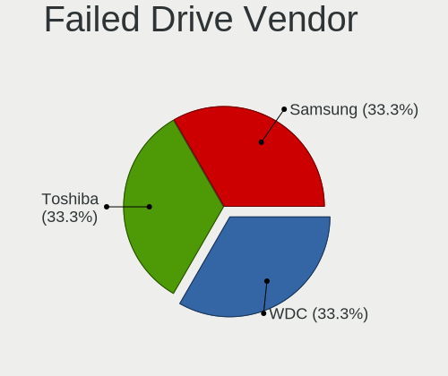

| Vendor              | Desktops | Drives | Percent |
|---------------------|----------|--------|---------|
| WDC                 | 1        | 1      | 50%     |
| Samsung Electronics | 1        | 1      | 50%     |

Drive Status
------------

Number of failed and malfunc. drives

| Status   | Desktops | Drives | Percent |
|----------|----------|--------|---------|
| Detected | 507      | 1401   | 51.68%  |
| Works    | 379      | 1237   | 38.63%  |
| Malfunc  | 92       | 178    | 9.38%   |
| Failed   | 2        | 2      | 0.2%    |
| Limited  | 1        | 1      | 0.1%    |

Storage controller
------------------

Storage Vendor
--------------

Storage controller vendors

| Vendor                        | Desktops | Percent |
|-------------------------------|----------|---------|
| Intel                         | 510      | 36.56%  |
| AMD                           | 330      | 23.66%  |
| Samsung Electronics           | 143      | 10.25%  |
| ASMedia Technology            | 79       | 5.66%   |
| SanDisk                       | 54       | 3.87%   |
| Marvell Technology Group      | 41       | 2.94%   |
| Phison Electronics            | 39       | 2.8%    |
| Micron/Crucial Technology     | 35       | 2.51%   |
| JMicron Technology            | 34       | 2.44%   |
| Kingston Technology Company   | 33       | 2.37%   |
| Nvidia                        | 11       | 0.79%   |
| Silicon Motion                | 10       | 0.72%   |
| LSI Logic / Symbios Logic     | 9        | 0.65%   |
| ADATA Technology              | 9        | 0.65%   |
| Seagate Technology            | 8        | 0.57%   |
| VIA Technologies              | 6        | 0.43%   |
| Micron Technology             | 6        | 0.43%   |
| Broadcom / LSI                | 6        | 0.43%   |
| SK hynix                      | 5        | 0.36%   |
| Silicon Image                 | 5        | 0.36%   |
| MAXIO Technology (Hangzhou)   | 3        | 0.22%   |
| KIOXIA                        | 3        | 0.22%   |
| Shenzhen Longsys Electronics  | 2        | 0.14%   |
| OCZ Technology Group          | 2        | 0.14%   |
| Lite-On IT Corp. / Plextor    | 2        | 0.14%   |
| Adaptec                       | 2        | 0.14%   |
| Toshiba America Info Systems  | 1        | 0.07%   |
| Solidigm                      | 1        | 0.07%   |
| Realtek Semiconductor         | 1        | 0.07%   |
| Lite-On Technology            | 1        | 0.07%   |
| Integrated Technology Express | 1        | 0.07%   |
| INNOGRIT                      | 1        | 0.07%   |
| Hosin Global Electronics      | 1        | 0.07%   |
| HighPoint Technologies        | 1        | 0.07%   |

Storage Model
-------------

Storage controller models

| Model                                                                                   | Desktops | Percent |
|-----------------------------------------------------------------------------------------|----------|---------|
| AMD FCH SATA Controller [AHCI mode]                                                     | 177      | 10.6%   |
| Samsung NVMe SSD Controller SM981/PM981/PM983                                           | 82       | 4.91%   |
| AMD 400 Series Chipset SATA Controller                                                  | 69       | 4.13%   |
| ASMedia ASM1061/ASM1062 Serial ATA Controller                                           | 68       | 4.07%   |
| Intel Q170/Q150/B150/H170/H110/Z170/CM236 Chipset SATA Controller [AHCI Mode]           | 63       | 3.77%   |
| Intel 8 Series/C220 Series Chipset Family 6-port SATA Controller 1 [AHCI mode]          | 62       | 3.71%   |
| AMD 500 Series Chipset SATA Controller                                                  | 61       | 3.65%   |
| Intel 6 Series/C200 Series Chipset Family 6 port Desktop SATA AHCI Controller           | 43       | 2.57%   |
| AMD SB7x0/SB8x0/SB9x0 IDE Controller                                                    | 41       | 2.46%   |
| AMD SB7x0/SB8x0/SB9x0 SATA Controller [AHCI mode]                                       | 40       | 2.4%    |
| Samsung NVMe SSD Controller PM9A1/PM9A3/980PRO                                          | 38       | 2.28%   |
| Intel 200 Series PCH SATA controller [AHCI mode]                                        | 35       | 2.1%    |
| Intel 7 Series/C210 Series Chipset Family 6-port SATA Controller [AHCI mode]            | 34       | 2.04%   |
| Intel SATA Controller [RAID mode]                                                       | 33       | 1.98%   |
| Intel Cannon Lake PCH SATA AHCI Controller                                              | 27       | 1.62%   |
| JMicron JMB363 SATA/IDE Controller                                                      | 22       | 1.32%   |
| AMD SB7x0/SB8x0/SB9x0 SATA Controller [IDE mode]                                        | 20       | 1.2%    |
| Intel 9 Series Chipset Family SATA Controller [AHCI Mode]                               | 18       | 1.08%   |
| Samsung NVMe SSD Controller 980 (DRAM-less)                                             | 16       | 0.96%   |
| Phison E12 NVMe Controller                                                              | 16       | 0.96%   |
| Intel 500 Series Chipset Family SATA AHCI Controller                                    | 16       | 0.96%   |
| Samsung NVMe SSD Controller SM961/PM961/SM963                                           | 15       | 0.9%    |
| Micron/Crucial P2 [Nick P2] / P3 / P3 Plus NVMe PCIe SSD (DRAM-less)                    | 15       | 0.9%    |
| AMD 600 Series Chipset SATA Controller                                                  | 15       | 0.9%    |
| Phison E16 PCIe4 NVMe Controller                                                        | 13       | 0.78%   |
| Intel NM10/ICH7 Family SATA Controller [IDE mode]                                       | 13       | 0.78%   |
| SanDisk Ultra 3D / WD Blue SN550 NVMe SSD                                               | 12       | 0.72%   |
| SanDisk Extreme Pro / WD Black SN750 / PC SN730 / Red SN700 NVMe SSD                    | 12       | 0.72%   |
| Micron/Crucial P1 NVMe PCIe SSD[Frampton]                                               | 12       | 0.72%   |
| Intel Raptor Lake SATA AHCI Controller                                                  | 12       | 0.72%   |
| Intel 82801JI (ICH10 Family) SATA AHCI Controller                                       | 12       | 0.72%   |
| AMD FCH SATA Controller D                                                               | 12       | 0.72%   |
| SanDisk Extreme Pro / WD Black 2018/SN750/PC SN720 NVMe SSD                             | 11       | 0.66%   |
| Kingston Company A2000 NVMe SSD SM2263EN                                                | 11       | 0.66%   |
| Intel Alder Lake-S PCH SATA Controller [AHCI Mode]                                      | 11       | 0.66%   |
| Intel 6 Series/C200 Series Chipset Family Desktop SATA Controller (IDE mode, ports 4-5) | 11       | 0.66%   |
| Marvell Group 88SE9215 PCIe 2.0 x1 4-port SATA 6 Gb/s Controller                        | 10       | 0.6%    |
| Intel C600/X79 series chipset 6-Port SATA AHCI Controller                               | 10       | 0.6%    |
| Intel 6 Series/C200 Series Chipset Family Desktop SATA Controller (IDE mode, ports 0-3) | 10       | 0.6%    |
| Intel 5 Series/3400 Series Chipset 6 port SATA AHCI Controller                          | 10       | 0.6%    |

Storage Kind
------------

Kind of storage controller (IDE, SATA, NVMe, SAS, ...)

| Kind | Desktops | Percent |
|------|----------|---------|
| SATA | 743      | 58.69%  |
| NVMe | 302      | 23.85%  |
| IDE  | 150      | 11.85%  |
| RAID | 56       | 4.42%   |
| SCSI | 8        | 0.63%   |
| SAS  | 7        | 0.55%   |

Processor
---------

CPU Vendor
----------

Processor vendors

| Vendor | Desktops | Percent |
|--------|----------|---------|
| Intel  | 511      | 59.77%  |
| AMD    | 344      | 40.23%  |

CPU Model
---------

Processor models

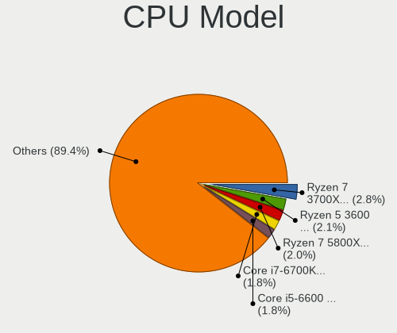

| Model                                       | Desktops | Percent |
|---------------------------------------------|----------|---------|
| AMD Ryzen 7 3700X 8-Core Processor          | 23       | 2.69%   |
| AMD Ryzen 5 3600 6-Core Processor           | 18       | 2.11%   |
| Intel Core i7-6700K CPU @ 4.00GHz           | 17       | 1.99%   |
| Intel Core i5-6600 CPU @ 3.30GHz            | 16       | 1.87%   |
| AMD Ryzen 7 5800X 8-Core Processor          | 15       | 1.75%   |
| AMD Ryzen 5 5600X 6-Core Processor          | 12       | 1.4%    |
| Intel Core i7-7700K CPU @ 4.20GHz           | 11       | 1.29%   |
| Intel Core i5-4570 CPU @ 3.20GHz            | 11       | 1.29%   |
| AMD Ryzen 5 3400G with Radeon Vega Graphics | 11       | 1.29%   |
| AMD FX-8350 Eight-Core Processor            | 11       | 1.29%   |
| Intel Core i7-3770 CPU @ 3.40GHz            | 10       | 1.17%   |
| AMD Ryzen 5 2600 Six-Core Processor         | 10       | 1.17%   |
| AMD Ryzen 7 3800X 8-Core Processor          | 9        | 1.05%   |
| Intel Core i7-6700 CPU @ 3.40GHz            | 8        | 0.94%   |
| Intel Core i7-4790K CPU @ 4.00GHz           | 8        | 0.94%   |
| Intel Core i5-2400 CPU @ 3.10GHz            | 8        | 0.94%   |
| Intel Core i5 CPU 750 @ 2.67GHz             | 8        | 0.94%   |
| AMD Ryzen 9 5900X 12-Core Processor         | 8        | 0.94%   |
| AMD Ryzen 9 3900X 12-Core Processor         | 8        | 0.94%   |
| AMD Ryzen 5 5600G with Radeon Graphics      | 8        | 0.94%   |
| Intel Core i9-9900K CPU @ 3.60GHz           | 7        | 0.82%   |
| Intel Core i7-8700 CPU @ 3.20GHz            | 7        | 0.82%   |
| Intel Core i7-4770 CPU @ 3.40GHz            | 7        | 0.82%   |
| Intel Core i5-6500 CPU @ 3.20GHz            | 7        | 0.82%   |
| Intel Core i5-4440 CPU @ 3.10GHz            | 7        | 0.82%   |
| Intel Core i5-3470 CPU @ 3.20GHz            | 7        | 0.82%   |
| AMD Ryzen 7 5700G with Radeon Graphics      | 7        | 0.82%   |
| AMD Ryzen 7 2700X Eight-Core Processor      | 7        | 0.82%   |
| AMD Ryzen 5 3600X 6-Core Processor          | 7        | 0.82%   |
| AMD Ryzen 3 3200G with Radeon Vega Graphics | 7        | 0.82%   |
| AMD FX-6300 Six-Core Processor              | 7        | 0.82%   |
| Intel Core i7-2600K CPU @ 3.40GHz           | 6        | 0.7%    |
| Intel Core i5-4570TE CPU @ 2.70GHz          | 6        | 0.7%    |
| Intel Core i5-3570 CPU @ 3.40GHz            | 6        | 0.7%    |
| Intel Core 2 Duo CPU E8400 @ 3.00GHz        | 6        | 0.7%    |
| AMD Ryzen 9 5950X 16-Core Processor         | 6        | 0.7%    |
| Intel Core i7-4790 CPU @ 3.60GHz            | 5        | 0.58%   |
| Intel Core i7-2600 CPU @ 3.40GHz            | 5        | 0.58%   |
| Intel Core i5-8400 CPU @ 2.80GHz            | 5        | 0.58%   |
| Intel Core i5-6600K CPU @ 3.50GHz           | 5        | 0.58%   |

CPU Model Family
----------------

Processor model prefix

| Model                   | Desktops | Percent |
|-------------------------|----------|---------|
| Intel Core i5           | 160      | 18.71%  |
| Intel Core i7           | 140      | 16.37%  |
| AMD Ryzen 5             | 85       | 9.94%   |
| AMD Ryzen 7             | 76       | 8.89%   |
| AMD Ryzen 9             | 40       | 4.68%   |
| Other                   | 38       | 4.44%   |
| Intel Core i3           | 36       | 4.21%   |
| Intel Xeon              | 35       | 4.09%   |
| AMD FX                  | 33       | 3.86%   |
| Intel Core i9           | 20       | 2.34%   |
| Intel Celeron           | 19       | 2.22%   |
| AMD Ryzen 3             | 18       | 2.11%   |
| AMD Phenom II X4        | 15       | 1.75%   |
| Intel Core 2 Duo        | 14       | 1.64%   |
| Intel Core 2 Quad       | 13       | 1.52%   |
| AMD A8                  | 13       | 1.52%   |
| Intel Pentium           | 10       | 1.17%   |
| AMD A10                 | 10       | 1.17%   |
| Intel Atom              | 9        | 1.05%   |
| Intel Pentium Dual-Core | 8        | 0.94%   |
| AMD Phenom II X6        | 8        | 0.94%   |
| AMD Athlon II X4        | 6        | 0.7%    |
| AMD Athlon 64 X2        | 6        | 0.7%    |
| AMD Ryzen Threadripper  | 5        | 0.58%   |
| Intel Core 2            | 4        | 0.47%   |
| AMD Ryzen 7 PRO         | 4        | 0.47%   |
| AMD Athlon II X2        | 4        | 0.47%   |
| Intel Pentium 4         | 3        | 0.35%   |
| AMD Ryzen 5 PRO         | 3        | 0.35%   |
| AMD E                   | 3        | 0.35%   |
| AMD Athlon              | 3        | 0.35%   |
| Intel Pentium Silver    | 2        | 0.23%   |
| AMD Phenom II X2        | 2        | 0.23%   |
| AMD Phenom              | 2        | 0.23%   |
| Intel Pentium Dual      | 1        | 0.12%   |
| Intel Genuine           | 1        | 0.12%   |
| AMD Sempron             | 1        | 0.12%   |
| AMD Ryzen 3 PRO         | 1        | 0.12%   |
| AMD PRO A10             | 1        | 0.12%   |
| AMD Athlon X4           | 1        | 0.12%   |

CPU Cores
---------

Number of processor cores

| Number  | Desktops | Percent |
|---------|----------|---------|
| 4       | 370      | 43.12%  |
| 2       | 145      | 16.9%   |
| 6       | 127      | 14.8%   |
| 8       | 115      | 13.4%   |
| 16      | 31       | 3.61%   |
| 12      | 27       | 3.15%   |
| 10      | 11       | 1.28%   |
| 14      | 8        | 0.93%   |
| 3       | 7        | 0.82%   |
| 1       | 7        | 0.82%   |
| 24      | 4        | 0.47%   |
| Unknown | 2        | 0.23%   |
| 64      | 1        | 0.12%   |
| 40      | 1        | 0.12%   |
| 28      | 1        | 0.12%   |
| 20      | 1        | 0.12%   |

CPU Sockets
-----------

Number of sockets

| Number | Desktops | Percent |
|--------|----------|---------|
| 1      | 847      | 99.06%  |
| 2      | 8        | 0.94%   |

CPU Threads
-----------

Threads per core (Hyper-Threading)

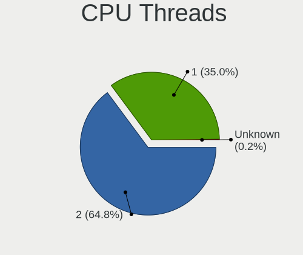

| Number  | Desktops | Percent |
|---------|----------|---------|
| 2       | 547      | 63.75%  |
| 1       | 309      | 36.01%  |
| Unknown | 2        | 0.23%   |

CPU Op-Modes
------------

CPU Operation Modes (32-bit, 64-bit)

| Op mode        | Desktops | Percent |
|----------------|----------|---------|
| 32-bit, 64-bit | 843      | 98.6%   |
| Unknown        | 10       | 1.17%   |
| 32-bit         | 2        | 0.23%   |

CPU Microcode
-------------

Microcode number

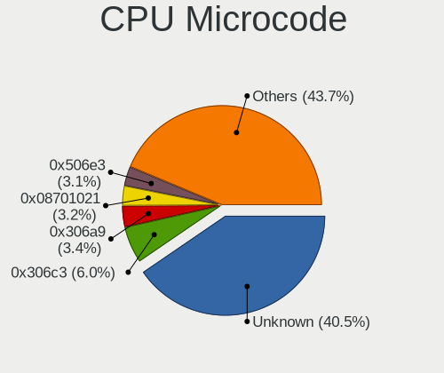

| Number     | Desktops | Percent |
|------------|----------|---------|
| Unknown    | 296      | 32.96%  |
| 0x306c3    | 60       | 6.68%   |
| 0x306a9    | 35       | 3.9%    |
| 0x506e3    | 33       | 3.67%   |
| 0x08701021 | 33       | 3.67%   |
| 0x206a7    | 31       | 3.45%   |
| 0x906e9    | 18       | 2%      |
| 0x08701013 | 17       | 1.89%   |
| 0x06000852 | 17       | 1.89%   |
| 0x0800820d | 16       | 1.78%   |
| 0x0a201016 | 15       | 1.67%   |
| 0x08108109 | 15       | 1.67%   |
| 0x1067a    | 14       | 1.56%   |
| 0x010000c8 | 13       | 1.45%   |
| 0x906ea    | 12       | 1.34%   |
| 0x06001119 | 12       | 1.34%   |
| 0x106e5    | 10       | 1.11%   |
| 0x0a201009 | 10       | 1.11%   |
| 0x08001138 | 10       | 1.11%   |
| 0xa0655    | 9        | 1%      |
| 0x0a50000d | 8        | 0.89%   |
| 0x0a50000c | 8        | 0.89%   |
| 0xa0671    | 7        | 0.78%   |
| 0x010000dc | 7        | 0.78%   |
| 0x6fb      | 6        | 0.67%   |
| 0x306f2    | 6        | 0.67%   |
| 0x106a5    | 6        | 0.67%   |
| 0x0a601203 | 6        | 0.67%   |
| 0x0600611a | 6        | 0.67%   |
| 0x906ed    | 5        | 0.56%   |
| 0x0a20120a | 5        | 0.56%   |
| 0x906ec    | 4        | 0.45%   |
| 0x90672    | 4        | 0.45%   |
| 0x706a8    | 4        | 0.45%   |
| 0x50654    | 4        | 0.45%   |
| 0x20652    | 4        | 0.45%   |
| 0x0800820b | 4        | 0.45%   |
| 0x03000027 | 4        | 0.45%   |
| 0x010000db | 4        | 0.45%   |
| 0xa0653    | 3        | 0.33%   |

CPU Microarch
-------------

Microarchitecture

| Name             | Desktops | Percent |
|------------------|----------|---------|
| Haswell          | 95       | 11.1%   |
| Zen 2            | 90       | 10.51%  |
| Skylake          | 72       | 8.41%   |
| KabyLake         | 68       | 7.94%   |
| Zen 3            | 63       | 7.36%   |
| IvyBridge        | 55       | 6.43%   |
| SandyBridge      | 50       | 5.84%   |
| Zen+             | 44       | 5.14%   |
| Piledriver       | 39       | 4.56%   |
| K10              | 37       | 4.32%   |
| Unknown          | 35       | 4.09%   |
| Penryn           | 28       | 3.27%   |
| CometLake        | 25       | 2.92%   |
| Nehalem          | 22       | 2.57%   |
| Zen              | 21       | 2.45%   |
| Westmere         | 15       | 1.75%   |
| Alderlake Hybrid | 14       | 1.64%   |
| Core             | 13       | 1.52%   |
| Steamroller      | 7        | 0.82%   |
| Excavator        | 7        | 0.82%   |
| Silvermont       | 6        | 0.7%    |
| K8 Hammer        | 6        | 0.7%    |
| Goldmont plus    | 6        | 0.7%    |
| Bonnell          | 5        | 0.58%   |
| NetBurst         | 4        | 0.47%   |
| K10 Llano        | 4        | 0.47%   |
| Icelake          | 4        | 0.47%   |
| Goldmont         | 4        | 0.47%   |
| Bulldozer        | 4        | 0.47%   |
| Tremont          | 3        | 0.35%   |
| Broadwell        | 3        | 0.35%   |
| Bobcat           | 3        | 0.35%   |
| Gracemont        | 2        | 0.23%   |
| Puma             | 1        | 0.12%   |
| Jaguar           | 1        | 0.12%   |

Graphics
--------

GPU Vendor
----------

Vendors of graphics cards

| Vendor                     | Desktops | Percent |
|----------------------------|----------|---------|
| Nvidia                     | 377      | 41.25%  |
| AMD                        | 309      | 33.81%  |
| Intel                      | 221      | 24.18%  |
| ASPEED Technology          | 4        | 0.44%   |
| Matrox Electronics Systems | 2        | 0.22%   |
| ATI Technologies           | 1        | 0.11%   |

GPU Model
---------

Graphics card models

| Model                                                                       | Desktops | Percent |
|-----------------------------------------------------------------------------|----------|---------|
| AMD Ellesmere [Radeon RX 470/480/570/570X/580/580X/590]                     | 35       | 3.72%   |
| Intel Xeon E3-1200 v3/4th Gen Core Processor Integrated Graphics Controller | 34       | 3.61%   |
| Intel HD Graphics 530                                                       | 23       | 2.44%   |
| Intel 2nd Generation Core Processor Family Integrated Graphics Controller   | 23       | 2.44%   |
| Nvidia GP108 [GeForce GT 1030]                                              | 21       | 2.23%   |
| Nvidia GK208B [GeForce GT 710]                                              | 21       | 2.23%   |
| Nvidia GP106 [GeForce GTX 1060 6GB]                                         | 19       | 2.02%   |
| Nvidia GP107 [GeForce GTX 1050 Ti]                                          | 17       | 1.8%    |
| AMD Picasso/Raven 2 [Radeon Vega Series / Radeon Vega Mobile Series]        | 16       | 1.7%    |
| Intel Xeon E3-1200 v2/3rd Gen Core processor Graphics Controller            | 15       | 1.59%   |
| Intel CoffeeLake-S GT2 [UHD Graphics 630]                                   | 15       | 1.59%   |
| Nvidia GP104 [GeForce GTX 1070]                                             | 14       | 1.49%   |
| Nvidia GM204 [GeForce GTX 970]                                              | 14       | 1.49%   |
| AMD Navi 10 [Radeon RX 5600 OEM/5600 XT / 5700/5700 XT]                     | 14       | 1.49%   |
| AMD Navi 21 [Radeon RX 6800/6800 XT / 6900 XT]                              | 13       | 1.38%   |
| AMD Cezanne [Radeon Vega Series / Radeon Vega Mobile Series]                | 13       | 1.38%   |
| Nvidia TU104 [GeForce RTX 2070 SUPER]                                       | 12       | 1.27%   |
| AMD Raphael                                                                 | 12       | 1.27%   |
| Intel IvyBridge GT2 [HD Graphics 4000]                                      | 11       | 1.17%   |
| Nvidia GT218 [GeForce 210]                                                  | 10       | 1.06%   |
| Nvidia GP104 [GeForce GTX 1080]                                             | 10       | 1.06%   |
| Nvidia GM206 [GeForce GTX 960]                                              | 10       | 1.06%   |
| Nvidia GM107 [GeForce GTX 750 Ti]                                           | 10       | 1.06%   |
| Intel HD Graphics 630                                                       | 10       | 1.06%   |
| Intel CometLake-S GT2 [UHD Graphics 630]                                    | 10       | 1.06%   |
| AMD Vega 10 XL/XT [Radeon RX Vega 56/64]                                    | 10       | 1.06%   |
| AMD Navi 22 [Radeon RX 6700/6700 XT/6750 XT / 6800M/6850M XT]               | 10       | 1.06%   |
| AMD Caicos [Radeon HD 6450/7450/8450 / R5 230 OEM]                          | 10       | 1.06%   |
| AMD Renoir [Radeon RX Vega 6 (Ryzen 4000/5000 Mobile Series)]               | 9        | 0.96%   |
| Nvidia TU117 [GeForce GTX 1650]                                             | 8        | 0.85%   |
| Nvidia GK208B [GeForce GT 730]                                              | 8        | 0.85%   |
| Nvidia GA106 [GeForce RTX 3060 Lite Hash Rate]                              | 8        | 0.85%   |
| Nvidia GA102 [GeForce RTX 3090]                                             | 8        | 0.85%   |
| AMD Curacao PRO [Radeon R7 370 / R9 270/370 OEM]                            | 8        | 0.85%   |
| Nvidia TU116 [GeForce GTX 1660 SUPER]                                       | 7        | 0.74%   |
| Nvidia TU106 [GeForce RTX 2060 SUPER]                                       | 7        | 0.74%   |
| Nvidia GM204 [GeForce GTX 980]                                              | 7        | 0.74%   |
| Intel 4th Generation Core Processor Family Integrated Graphics Controller   | 7        | 0.74%   |
| Intel 4 Series Chipset Integrated Graphics Controller                       | 7        | 0.74%   |
| AMD Navi 23 [Radeon RX 6600/6600 XT/6600M]                                  | 7        | 0.74%   |

GPU Combo
---------

Combinations of graphics cards

| Name             | Desktops | Percent |
|------------------|----------|---------|
| 1 x Nvidia       | 346      | 39.68%  |
| 1 x AMD          | 285      | 32.68%  |
| 1 x Intel        | 185      | 21.22%  |
| 2 x AMD          | 18       | 2.06%   |
| Intel + Nvidia   | 16       | 1.83%   |
| AMD + Nvidia     | 9        | 1.03%   |
| 2 x Nvidia       | 4        | 0.46%   |
| Nvidia + ASPEED  | 2        | 0.23%   |
| 1 x Matrox       | 2        | 0.23%   |
| 1 x ASPEED       | 2        | 0.23%   |
| Other            | 1        | 0.11%   |
| Intel + AMD      | 1        | 0.11%   |
| AMD + 2 x Nvidia | 1        | 0.11%   |

GPU Driver
----------

Free vs proprietary

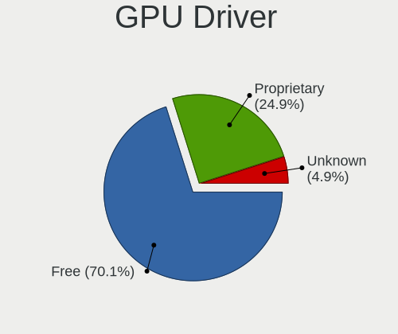

| Driver      | Desktops | Percent |
|-------------|----------|---------|
| Free        | 612      | 70.18%  |
| Proprietary | 219      | 25.11%  |
| Unknown     | 41       | 4.7%    |

GPU Memory
----------

Total video memory

| Size in GB | Desktops | Percent |
|------------|----------|---------|
| Unknown    | 354      | 39.95%  |
| 1.01-2.0   | 118      | 13.32%  |
| 7.01-8.0   | 93       | 10.5%   |
| 3.01-4.0   | 78       | 8.8%    |
| 0.51-1.0   | 75       | 8.47%   |
| 0.01-0.5   | 72       | 8.13%   |
| 8.01-16.0  | 38       | 4.29%   |
| 5.01-6.0   | 37       | 4.18%   |
| 16.01-24.0 | 11       | 1.24%   |
| 2.01-3.0   | 9        | 1.02%   |
| 4.01-5.0   | 1        | 0.11%   |

Monitor
-------

Monitor Vendor
--------------

Monitor vendors

| Vendor               | Desktops | Percent |
|----------------------|----------|---------|
| Samsung Electronics  | 186      | 19.21%  |
| BenQ                 | 95       | 9.81%   |
| Dell                 | 70       | 7.23%   |
| Goldstar             | 68       | 7.02%   |
| Acer                 | 61       | 6.3%    |
| Hewlett-Packard      | 60       | 6.2%    |
| AOC                  | 53       | 5.48%   |
| Philips              | 42       | 4.34%   |
| Iiyama               | 39       | 4.03%   |
| Ancor Communications | 32       | 3.31%   |
| Eizo                 | 25       | 2.58%   |
| Medion               | 23       | 2.38%   |
| Gericom              | 22       | 2.27%   |
| ViewSonic            | 14       | 1.45%   |
| NEC Computers        | 14       | 1.45%   |
| Fujitsu Siemens      | 14       | 1.45%   |
| ASUSTek Computer     | 13       | 1.34%   |
| Lenovo               | 12       | 1.24%   |
| Unknown              | 9        | 0.93%   |
| Sony                 | 9        | 0.93%   |
| MSI                  | 6        | 0.62%   |
| LG Electronics       | 6        | 0.62%   |
| HannStar             | 6        | 0.62%   |
| Toshiba              | 5        | 0.52%   |
| Idek Iiyama          | 5        | 0.52%   |
| GRM                  | 5        | 0.52%   |
| Vestel Elektronik    | 4        | 0.41%   |
| Lenovo Group Limited | 4        | 0.41%   |
| Gigabyte Technology  | 4        | 0.41%   |
| HVR                  | 3        | 0.31%   |
| Belinea              | 3        | 0.31%   |
| AU Optronics         | 3        | 0.31%   |
| Apple                | 3        | 0.31%   |
| Unknown              | 3        | 0.31%   |
| Unknown (XXX)        | 2        | 0.21%   |
| Plain Tree Systems   | 2        | 0.21%   |
| Jean                 | 2        | 0.21%   |
| Hitachi              | 2        | 0.21%   |
| HCG                  | 2        | 0.21%   |
| DENON                | 2        | 0.21%   |

Monitor Model
-------------

Monitor models

| Model                                                                 | Desktops | Percent |
|-----------------------------------------------------------------------|----------|---------|
| Gericom Q26 QMX2426 1920x1080 550x344mm 25.5-inch                     | 10       | 0.95%   |
| BenQ GL2450H BNQ78A7 1920x1080 531x298mm 24.0-inch                    | 8        | 0.76%   |
| Samsung Electronics U28E590 SAM0C4D 3840x2160 607x345mm 27.5-inch     | 7        | 0.66%   |
| NEC Computers EA243WM NEC6864 1920x1200 519x324mm 24.1-inch           | 7        | 0.66%   |
| Acer B193 ACR001D 1280x1024 380x300mm 19.1-inch                       | 7        | 0.66%   |
| Samsung Electronics C32F391 SAM0D35 1920x1080 698x393mm 31.5-inch     | 6        | 0.57%   |
| Samsung Electronics C27F390 SAM0D32 1920x1080 598x336mm 27.0-inch     | 6        | 0.57%   |
| AOC 24B1W1G5 AOC2401 1920x1080 527x296mm 23.8-inch                    | 6        | 0.57%   |
| Samsung Electronics C32F391 SAM0D34 1920x1080 698x393mm 31.5-inch     | 5        | 0.47%   |
| Samsung Electronics C24F390 SAM0D2C 1920x1080 521x293mm 23.5-inch     | 5        | 0.47%   |
| GRM GM2600 GRM5BC6 1920x1080 550x344mm 25.5-inch                      | 5        | 0.47%   |
| Gericom Q24 QMX2421 1920x1080 521x293mm 23.5-inch                     | 5        | 0.47%   |
| Ancor Communications VS248 ACI2498 1920x1080 531x299mm 24.0-inch      | 5        | 0.47%   |
| Vestel Elektronik 22W_LCD_TV VES3700 1920x540                         | 4        | 0.38%   |
| Samsung Electronics U28E570 SAM0D6F 3840x2160 607x345mm 27.5-inch     | 4        | 0.38%   |
| Iiyama PLX2783H IVM6611 1920x1080 598x336mm 27.0-inch                 | 4        | 0.38%   |
| Iiyama PLE2483H IVM6113 1920x1080 531x299mm 24.0-inch                 | 4        | 0.38%   |
| Goldstar Ultra HD GSM5B09 3840x2160 600x340mm 27.2-inch               | 4        | 0.38%   |
| Gericom Vision L22FHD QMX2472 1920x1080 478x269mm 21.6-inch           | 4        | 0.38%   |
| Eizo S2202W ENC1975 1680x1050 474x297mm 22.0-inch                     | 4        | 0.38%   |
| Dell U2412M DELA07A 1920x1200 518x324mm 24.1-inch                     | 4        | 0.38%   |
| AOC 24B2W1 AOC2402 1920x1080 527x296mm 23.8-inch                      | 4        | 0.38%   |
| Ancor Communications ASUS VS247 ACI249A 1920x1080 521x293mm 23.5-inch | 4        | 0.38%   |
| Toshiba TV TSB0108 1360x768 698x393mm 31.5-inch                       | 3        | 0.28%   |
| Samsung Electronics U28E590 SAM0C4E 3840x2160 608x345mm 27.5-inch     | 3        | 0.28%   |
| Samsung Electronics SyncMaster SAM04D4 1920x1080 531x298mm 24.0-inch  | 3        | 0.28%   |
| Samsung Electronics S34J55x SAM0F70 3440x1440 797x333mm 34.0-inch     | 3        | 0.28%   |
| Samsung Electronics S24F350 SAM0D20 1920x1080 521x293mm 23.5-inch     | 3        | 0.28%   |
| Samsung Electronics S24C450 SAM09CA 1920x1080 531x299mm 24.0-inch     | 3        | 0.28%   |
| Iiyama PL3461WQ IVM7615 3440x1440 800x330mm 34.1-inch                 | 3        | 0.28%   |
| Iiyama PL3288UH IVM1176 3840x2160 698x393mm 31.5-inch                 | 3        | 0.28%   |
| HVR HTC-VIVE HVRAA01 2160x1200                                        | 3        | 0.28%   |
| Goldstar ULTRAWIDE GSM59F2 2560x1080 798x334mm 34.1-inch              | 3        | 0.28%   |
| Goldstar ULTRAFINE GSM5BC2 3840x2160 697x392mm 31.5-inch              | 3        | 0.28%   |
| Goldstar LG ULTRAGEAR GSM774B 3440x1440 800x330mm 34.1-inch           | 3        | 0.28%   |
| Dell U2719D DEL415F 2560x1440 597x336mm 27.0-inch                     | 3        | 0.28%   |
| Dell U2415 DELA0BA 1920x1200 518x324mm 24.1-inch                      | 3        | 0.28%   |
| Dell U2312HM DEL4072 1920x1080 510x287mm 23.0-inch                    | 3        | 0.28%   |
| BenQ RL2450H BNQ7F0E 1920x1080 531x298mm 24.0-inch                    | 3        | 0.28%   |
| BenQ GW2780 BNQ78E6 1920x1080 598x336mm 27.0-inch                     | 3        | 0.28%   |

Monitor Resolution
------------------

Monitor screen resolution

| Resolution         | Desktops | Percent |
|--------------------|----------|---------|
| 1920x1080 (FHD)    | 402      | 42.32%  |
| 3840x2160 (4K)     | 128      | 13.47%  |
| 2560x1440 (QHD)    | 105      | 11.05%  |
| 1680x1050 (WSXGA+) | 67       | 7.05%   |
| 1920x1200 (WUXGA)  | 57       | 6%      |
| 1280x1024 (SXGA)   | 57       | 6%      |
| 3440x1440          | 25       | 2.63%   |
| Unknown            | 19       | 2%      |
| 2560x1080          | 13       | 1.37%   |
| 3840x1080          | 9        | 0.95%   |
| 1920x540           | 7        | 0.74%   |
| 2560x1600          | 6        | 0.63%   |
| 1600x900 (HD+)     | 6        | 0.63%   |
| 1440x900 (WXGA+)   | 6        | 0.63%   |
| 1366x768 (WXGA)    | 6        | 0.63%   |
| 1024x768 (XGA)     | 4        | 0.42%   |
| 2160x1200          | 3        | 0.32%   |
| 2048x1152          | 3        | 0.32%   |
| 5760x2160          | 2        | 0.21%   |
| 5760x1080          | 2        | 0.21%   |
| 5120x1440          | 2        | 0.21%   |
| 4480x1440          | 2        | 0.21%   |
| 3360x1050          | 2        | 0.21%   |
| 2288x1287          | 2        | 0.21%   |
| 1600x1200          | 2        | 0.21%   |
| 6400x2560          | 1        | 0.11%   |
| 6400x1440          | 1        | 0.11%   |
| 5560x2000          | 1        | 0.11%   |
| 3840x2560          | 1        | 0.11%   |
| 3840x1600          | 1        | 0.11%   |
| 3840x1200          | 1        | 0.11%   |
| 3600x1080          | 1        | 0.11%   |
| 3520x1080          | 1        | 0.11%   |
| 3200x1080          | 1        | 0.11%   |
| 1920x2160          | 1        | 0.11%   |
| 1400x1050          | 1        | 0.11%   |
| 1360x768           | 1        | 0.11%   |
| 1280x960           | 1        | 0.11%   |

Monitor Diagonal
----------------

Diagonal size in inches

| Inches  | Desktops | Percent |
|---------|----------|---------|
| 24      | 177      | 18.29%  |
| 27      | 174      | 17.98%  |
| 23      | 102      | 10.54%  |
| Unknown | 85       | 8.78%   |
| 31      | 59       | 6.1%    |
| 21      | 53       | 5.48%   |
| 19      | 51       | 5.27%   |
| 22      | 50       | 5.17%   |
| 34      | 31       | 3.2%    |
| 25      | 28       | 2.89%   |
| 20      | 18       | 1.86%   |
| 84      | 16       | 1.65%   |
| 40      | 13       | 1.34%   |
| 17      | 13       | 1.34%   |
| 54      | 8        | 0.83%   |
| 28      | 8        | 0.83%   |
| 15      | 8        | 0.83%   |
| 72      | 7        | 0.72%   |
| 42      | 6        | 0.62%   |
| 32      | 6        | 0.62%   |
| 65      | 5        | 0.52%   |
| 48      | 5        | 0.52%   |
| 18      | 5        | 0.52%   |
| 47      | 4        | 0.41%   |
| 35      | 4        | 0.41%   |
| 26      | 4        | 0.41%   |
| 29      | 3        | 0.31%   |
| 142     | 2        | 0.21%   |
| 85      | 2        | 0.21%   |
| 60      | 2        | 0.21%   |
| 52      | 2        | 0.21%   |
| 46      | 2        | 0.21%   |
| 37      | 2        | 0.21%   |
| 36      | 2        | 0.21%   |
| 33      | 2        | 0.21%   |
| 13      | 2        | 0.21%   |
| 61      | 1        | 0.1%    |
| 49      | 1        | 0.1%    |
| 43      | 1        | 0.1%    |
| 41      | 1        | 0.1%    |

Monitor Width
-------------

Physical width

| Width in mm    | Desktops | Percent |
|----------------|----------|---------|
| 501-600        | 408      | 44.16%  |
| 401-500        | 131      | 14.18%  |
| 601-700        | 102      | 11.04%  |
| Unknown        | 85       | 9.2%    |
| 351-400        | 51       | 5.52%   |
| 701-800        | 36       | 3.9%    |
| 1001-1500      | 30       | 3.25%   |
| 1501-2000      | 25       | 2.71%   |
| 801-900        | 22       | 2.38%   |
| 301-350        | 21       | 2.27%   |
| 901-1000       | 8        | 0.87%   |
| 201-300        | 3        | 0.32%   |
| More than 2000 | 2        | 0.22%   |

Aspect Ratio
------------

Proportional relationship between the width and the height

| Ratio   | Desktops | Percent |
|---------|----------|---------|
| 16/9    | 548      | 61.57%  |
| 16/10   | 155      | 17.42%  |
| Unknown | 66       | 7.42%   |
| 5/4     | 57       | 6.4%    |
| 21/9    | 35       | 3.93%   |
| 32/9    | 10       | 1.12%   |
| 4/3     | 8        | 0.9%    |
| 3/2     | 5        | 0.56%   |
| 6/5     | 2        | 0.22%   |
| 1.00    | 2        | 0.22%   |
| 0.89    | 1        | 0.11%   |
| 0.80    | 1        | 0.11%   |

Monitor Area
------------

Area in inch

| Area in inch | Desktops | Percent |
|----------------|----------|---------|
| 201-250        | 285      | 29.97%  |
| 301-350        | 177      | 18.61%  |
| 351-500        | 111      | 11.67%  |
| 251-300        | 101      | 10.62%  |
| 151-200        | 88       | 9.25%   |
| Unknown        | 85       | 8.94%   |
| More than 1000 | 44       | 4.63%   |
| 501-1000       | 35       | 3.68%   |
| 141-150        | 13       | 1.37%   |
| 101-110        | 7        | 0.74%   |
| 71-80          | 2        | 0.21%   |
| 131-140        | 1        | 0.11%   |
| 121-130        | 1        | 0.11%   |
| 111-120        | 1        | 0.11%   |

Pixel Density
-------------

Pixels per inch

| Density | Desktops | Percent |
|---------|----------|---------|
| 51-100  | 528      | 60%     |
| 101-120 | 154      | 17.5%   |
| Unknown | 85       | 9.66%   |
| 121-160 | 70       | 7.95%   |
| 1-50    | 29       | 3.3%    |
| 161-240 | 14       | 1.59%   |

Multiple Monitors
-----------------

Total monitors connected

| Total | Desktops | Percent |
|-------|----------|---------|
| 1     | 623      | 71.53%  |
| 2     | 169      | 19.4%   |
| 0     | 46       | 5.28%   |
| 3     | 32       | 3.67%   |
| 4     | 1        | 0.11%   |

Network
-------

Net Controller Vendor
---------------------

Controller vendors

| Vendor                                | Desktops | Percent |
|---------------------------------------|----------|---------|
| Realtek Semiconductor                 | 491      | 40.48%  |
| Intel                                 | 415      | 34.21%  |
| Qualcomm Atheros                      | 58       | 4.78%   |
| Broadcom                              | 23       | 1.9%    |
| Ralink Technology                     | 22       | 1.81%   |
| TP-Link                               | 16       | 1.32%   |
| Aquantia                              | 16       | 1.32%   |
| Microsoft                             | 14       | 1.15%   |
| IMC Networks                          | 14       | 1.15%   |
| MediaTek                              | 13       | 1.07%   |
| Ralink                                | 10       | 0.82%   |
| Nvidia                                | 10       | 0.82%   |
| Marvell Technology Group              | 10       | 0.82%   |
| ASUSTek Computer                      | 10       | 0.82%   |
| NetGear                               | 9        | 0.74%   |
| Edimax Technology                     | 9        | 0.74%   |
| D-Link System                         | 7        | 0.58%   |
| D-Link                                | 7        | 0.58%   |
| Qualcomm Atheros Communications       | 6        | 0.49%   |
| Samsung Electronics                   | 5        | 0.41%   |
| Broadcom Limited                      | 5        | 0.41%   |
| Huawei Technologies                   | 4        | 0.33%   |
| ASIX Electronics                      | 4        | 0.33%   |
| VIA Technologies                      | 3        | 0.25%   |
| Sigma Sport                           | 3        | 0.25%   |
| ZTE WCDMA Technologies MSM            | 2        | 0.16%   |
| Xiaomi                                | 2        | 0.16%   |
| Microchip Technology                  | 2        | 0.16%   |
| 802.11g Adapter [Linksys WUSB54GC v3] | 2        | 0.16%   |
| Winbond Electronics                   | 1        | 0.08%   |
| Wilocity                              | 1        | 0.08%   |
| Sigma Designs                         | 1        | 0.08%   |
| SEGGER                                | 1        | 0.08%   |
| ROCCAT                                | 1        | 0.08%   |
| Qualcomm                              | 1        | 0.08%   |
| Prusa                                 | 1        | 0.08%   |
| Philips (or NXP)                      | 1        | 0.08%   |
| Oculus VR                             | 1        | 0.08%   |
| Motorola PCS                          | 1        | 0.08%   |
| Motorola                              | 1        | 0.08%   |

Net Controller Model
--------------------

Controller models

| Model                                                                          | Desktops | Percent |
|--------------------------------------------------------------------------------|----------|---------|
| Realtek RTL8111/8168/8211/8411 PCI Express Gigabit Ethernet Controller         | 394      | 27.86%  |
| Intel I211 Gigabit Network Connection                                          | 64       | 4.53%   |
| Realtek RTL8125 2.5GbE Controller                                              | 59       | 4.17%   |
| Intel Ethernet Connection (2) I219-V                                           | 50       | 3.54%   |
| Intel Ethernet Controller I225-V                                               | 48       | 3.39%   |
| Intel Wi-Fi 6 AX200                                                            | 47       | 3.32%   |
| Intel 82579LM Gigabit Network Connection (Lewisville)                          | 25       | 1.77%   |
| Intel Ethernet Connection I217-LM                                              | 20       | 1.41%   |
| Intel Ethernet Connection (7) I219-V                                           | 20       | 1.41%   |
| Intel Dual Band Wireless-AC 3168NGW [Stone Peak]                               | 20       | 1.41%   |
| Intel 82579V Gigabit Network Connection                                        | 19       | 1.34%   |
| Realtek RTL8192CE PCIe Wireless Network Adapter                                | 18       | 1.27%   |
| Intel Wi-Fi 6E(802.11ax) AX210/AX1675* 2x2 [Typhoon Peak]                      | 14       | 0.99%   |
| Intel Wi-Fi 5(802.11ac) Wireless-AC 9x6x [Thunder Peak]                        | 14       | 0.99%   |
| Qualcomm Atheros Killer E220x Gigabit Ethernet Controller                      | 12       | 0.85%   |
| Intel Ethernet Connection (2) I218-V                                           | 12       | 0.85%   |
| Realtek RTL88x2bu [AC1200 Techkey]                                             | 11       | 0.78%   |
| Intel Ethernet Connection I217-V                                               | 11       | 0.78%   |
| Intel Ethernet Connection (2) I219-LM                                          | 11       | 0.78%   |
| Realtek RTL8188CUS 802.11n WLAN Adapter                                        | 10       | 0.71%   |
| Microsoft Xbox 360 Wireless Adapter                                            | 10       | 0.71%   |
| Intel Cannon Lake PCH CNVi WiFi                                                | 10       | 0.71%   |
| Intel 82574L Gigabit Network Connection                                        | 10       | 0.71%   |
| IMC Networks Mediao 802.11n WLAN [Realtek RTL8191SU]                           | 10       | 0.71%   |
| Realtek RTL8153 Gigabit Ethernet Adapter                                       | 9        | 0.64%   |
| Intel I210 Gigabit Network Connection                                          | 9        | 0.64%   |
| Intel Raptor Lake-S PCH CNVi WiFi                                              | 8        | 0.57%   |
| Realtek RTL8821CE 802.11ac PCIe Wireless Network Adapter                       | 7        | 0.5%    |
| Realtek RTL810xE PCI Express Fast Ethernet controller                          | 7        | 0.5%    |
| Realtek 802.11ac NIC                                                           | 7        | 0.5%    |
| MediaTek MT7922 802.11ax PCI Express Wireless Network Adapter                  | 7        | 0.5%    |
| Intel 82567LM-3 Gigabit Network Connection                                     | 7        | 0.5%    |
| ASUS USB-N13 802.11n Network Adapter (rev. B1) [Realtek RTL8192CU]             | 7        | 0.5%    |
| Aquantia AQtion AQC107 NBase-T/IEEE 802.3an Ethernet Controller [Atlantic 10G] | 7        | 0.5%    |
| Ralink RT5370 Wireless Adapter                                                 | 6        | 0.42%   |
| Qualcomm Atheros AR9271 802.11n                                                | 6        | 0.42%   |
| Qualcomm Atheros AR8161 Gigabit Ethernet                                       | 6        | 0.42%   |
| Nvidia MCP61 Ethernet                                                          | 6        | 0.42%   |
| Marvell Group 88E8056 PCI-E Gigabit Ethernet Controller                        | 6        | 0.42%   |
| TP-Link TL-WN823N v2/v3 [Realtek RTL8192EU]                                    | 5        | 0.35%   |

Wireless Vendor
---------------

Wireless vendors

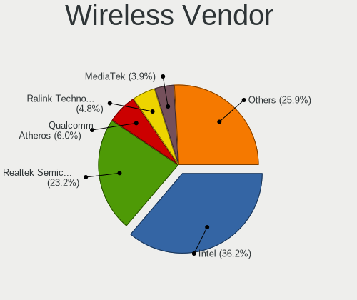

| Vendor                                | Desktops | Percent |
|---------------------------------------|----------|---------|
| Intel                                 | 153      | 36.08%  |
| Realtek Semiconductor                 | 95       | 22.41%  |
| Qualcomm Atheros                      | 23       | 5.42%   |
| Ralink Technology                     | 22       | 5.19%   |
| TP-Link                               | 16       | 3.77%   |
| Microsoft                             | 14       | 3.3%    |
| IMC Networks                          | 14       | 3.3%    |
| MediaTek                              | 13       | 3.07%   |
| Ralink                                | 10       | 2.36%   |
| Broadcom                              | 10       | 2.36%   |
| ASUSTek Computer                      | 10       | 2.36%   |
| NetGear                               | 9        | 2.12%   |
| Edimax Technology                     | 9        | 2.12%   |
| Qualcomm Atheros Communications       | 6        | 1.42%   |
| D-Link                                | 6        | 1.42%   |
| D-Link System                         | 5        | 1.18%   |
| Broadcom Limited                      | 2        | 0.47%   |
| 802.11g Adapter [Linksys WUSB54GC v3] | 2        | 0.47%   |
| Wilocity                              | 1        | 0.24%   |
| Philips (or NXP)                      | 1        | 0.24%   |
| BUFFALO                               | 1        | 0.24%   |
| Belkin Components                     | 1        | 0.24%   |
| AVM                                   | 1        | 0.24%   |

Wireless Model
--------------

Wireless models

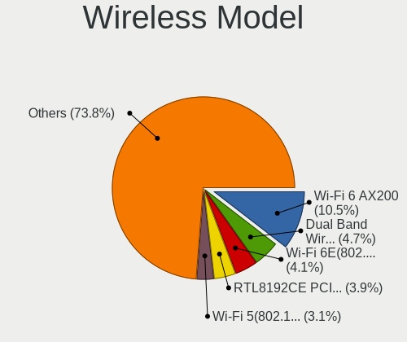

| Model                                                                  | Desktops | Percent |
|------------------------------------------------------------------------|----------|---------|
| Intel Wi-Fi 6 AX200                                                    | 47       | 10.96%  |
| Intel Dual Band Wireless-AC 3168NGW [Stone Peak]                       | 20       | 4.66%   |
| Realtek RTL8192CE PCIe Wireless Network Adapter                        | 18       | 4.2%    |
| Intel Wi-Fi 6E(802.11ax) AX210/AX1675* 2x2 [Typhoon Peak]              | 14       | 3.26%   |
| Intel Wi-Fi 5(802.11ac) Wireless-AC 9x6x [Thunder Peak]                | 14       | 3.26%   |
| Realtek RTL88x2bu [AC1200 Techkey]                                     | 11       | 2.56%   |
| Realtek RTL8188CUS 802.11n WLAN Adapter                                | 10       | 2.33%   |
| Microsoft Xbox 360 Wireless Adapter                                    | 10       | 2.33%   |
| Intel Cannon Lake PCH CNVi WiFi                                        | 10       | 2.33%   |
| IMC Networks Mediao 802.11n WLAN [Realtek RTL8191SU]                   | 10       | 2.33%   |
| Intel Raptor Lake-S PCH CNVi WiFi                                      | 8        | 1.86%   |
| Realtek RTL8821CE 802.11ac PCIe Wireless Network Adapter               | 7        | 1.63%   |
| Realtek 802.11ac NIC                                                   | 7        | 1.63%   |
| MediaTek MT7922 802.11ax PCI Express Wireless Network Adapter          | 7        | 1.63%   |
| ASUS USB-N13 802.11n Network Adapter (rev. B1) [Realtek RTL8192CU]     | 7        | 1.63%   |
| Ralink RT5370 Wireless Adapter                                         | 6        | 1.4%    |
| Qualcomm Atheros AR9271 802.11n                                        | 6        | 1.4%    |
| TP-Link TL-WN823N v2/v3 [Realtek RTL8192EU]                            | 5        | 1.17%   |
| TP-Link Archer T3U [Realtek RTL8812BU]                                 | 5        | 1.17%   |
| Realtek RTL8192EE PCIe Wireless Network Adapter                        | 5        | 1.17%   |
| Realtek RTL8188EUS 802.11n Wireless Network Adapter                    | 5        | 1.17%   |
| Ralink RT5572 Wireless Adapter                                         | 5        | 1.17%   |
| Ralink MT7601U Wireless Adapter                                        | 5        | 1.17%   |
| Ralink RT2800 802.11n PCI                                              | 5        | 1.17%   |
| Qualcomm Atheros AR9485 Wireless Network Adapter                       | 5        | 1.17%   |
| MediaTek MT7921K (RZ608) Wi-Fi 6E 80MHz                                | 5        | 1.17%   |
| Intel Alder Lake-S PCH CNVi WiFi                                       | 5        | 1.17%   |
| Edimax EW-7811Un 802.11n Wireless Adapter [Realtek RTL8188CUS]         | 5        | 1.17%   |
| Realtek RTL8812AE 802.11ac PCIe Wireless Network Adapter               | 4        | 0.93%   |
| Qualcomm Atheros QCA6174 802.11ac Wireless Network Adapter             | 4        | 0.93%   |
| Intel Wireless 8265 / 8275                                             | 4        | 0.93%   |
| Intel Wireless 8260                                                    | 4        | 0.93%   |
| Intel Wireless 7265                                                    | 4        | 0.93%   |
| Intel Wireless 3165                                                    | 4        | 0.93%   |
| Intel Comet Lake PCH CNVi WiFi                                         | 4        | 0.93%   |
| IMC Networks AW-NU222 802.11bgn Wireless Module [Ralink RT2770+RT2720] | 4        | 0.93%   |
| Broadcom BCM4352 802.11ac Dual Band Wireless Network Adapter           | 4        | 0.93%   |
| Realtek RTL8821AE 802.11ac PCIe Wireless Network Adapter               | 3        | 0.7%    |
| Realtek RTL8812AU 802.11a/b/g/n/ac 2T2R DB WLAN Adapter                | 3        | 0.7%    |
| Realtek RTL8192CU 802.11n WLAN Adapter                                 | 3        | 0.7%    |

Ethernet Vendor
---------------

Ethernet vendors

| Vendor                     | Desktops | Percent |
|----------------------------|----------|---------|
| Realtek Semiconductor      | 465      | 50.16%  |
| Intel                      | 347      | 37.43%  |
| Qualcomm Atheros           | 36       | 3.88%   |
| Aquantia                   | 16       | 1.73%   |
| Broadcom                   | 13       | 1.4%    |
| Nvidia                     | 10       | 1.08%   |
| Marvell Technology Group   | 10       | 1.08%   |
| Samsung Electronics        | 5        | 0.54%   |
| ASIX Electronics           | 4        | 0.43%   |
| VIA Technologies           | 3        | 0.32%   |
| Broadcom Limited           | 3        | 0.32%   |
| ZTE WCDMA Technologies MSM | 2        | 0.22%   |
| Xiaomi                     | 2        | 0.22%   |
| D-Link System              | 2        | 0.22%   |
| Qualcomm                   | 1        | 0.11%   |
| Motorola PCS               | 1        | 0.11%   |
| Mellanox Technologies      | 1        | 0.11%   |
| JMicron Technology         | 1        | 0.11%   |
| Insyde Software            | 1        | 0.11%   |
| Huawei Technologies        | 1        | 0.11%   |
| Google                     | 1        | 0.11%   |
| Emulex                     | 1        | 0.11%   |
| D-Link                     | 1        | 0.11%   |

Ethernet Model
--------------

Ethernet models

| Model                                                                          | Desktops | Percent |
|--------------------------------------------------------------------------------|----------|---------|
| Realtek RTL8111/8168/8211/8411 PCI Express Gigabit Ethernet Controller         | 394      | 40.7%   |
| Intel I211 Gigabit Network Connection                                          | 64       | 6.61%   |
| Realtek RTL8125 2.5GbE Controller                                              | 59       | 6.1%    |
| Intel Ethernet Connection (2) I219-V                                           | 50       | 5.17%   |
| Intel Ethernet Controller I225-V                                               | 48       | 4.96%   |
| Intel 82579LM Gigabit Network Connection (Lewisville)                          | 25       | 2.58%   |
| Intel Ethernet Connection I217-LM                                              | 20       | 2.07%   |
| Intel Ethernet Connection (7) I219-V                                           | 20       | 2.07%   |
| Intel 82579V Gigabit Network Connection                                        | 19       | 1.96%   |
| Qualcomm Atheros Killer E220x Gigabit Ethernet Controller                      | 12       | 1.24%   |
| Intel Ethernet Connection (2) I218-V                                           | 12       | 1.24%   |
| Intel Ethernet Connection I217-V                                               | 11       | 1.14%   |
| Intel Ethernet Connection (2) I219-LM                                          | 11       | 1.14%   |
| Intel 82574L Gigabit Network Connection                                        | 10       | 1.03%   |
| Realtek RTL8153 Gigabit Ethernet Adapter                                       | 9        | 0.93%   |
| Intel I210 Gigabit Network Connection                                          | 9        | 0.93%   |
| Realtek RTL810xE PCI Express Fast Ethernet controller                          | 7        | 0.72%   |
| Intel 82567LM-3 Gigabit Network Connection                                     | 7        | 0.72%   |
| Aquantia AQtion AQC107 NBase-T/IEEE 802.3an Ethernet Controller [Atlantic 10G] | 7        | 0.72%   |
| Qualcomm Atheros AR8161 Gigabit Ethernet                                       | 6        | 0.62%   |
| Nvidia MCP61 Ethernet                                                          | 6        | 0.62%   |
| Marvell Group 88E8056 PCI-E Gigabit Ethernet Controller                        | 6        | 0.62%   |
| Qualcomm Atheros AR8121/AR8113/AR8114 Gigabit or Fast Ethernet                 | 5        | 0.52%   |
| Intel Ethernet Connection (2) I218-LM                                          | 5        | 0.52%   |
| Intel 82578DM Gigabit Network Connection                                       | 5        | 0.52%   |
| Samsung Galaxy series, misc. (tethering mode)                                  | 4        | 0.41%   |
| Intel Ethernet Controller I226-V                                               | 4        | 0.41%   |
| Intel Ethernet Connection (14) I219-V                                          | 4        | 0.41%   |
| Aquantia AQC111 NBase-T/IEEE 802.3bz Ethernet Controller [AQtion]              | 4        | 0.41%   |
| Realtek RTL8169 PCI Gigabit Ethernet Controller                                | 3        | 0.31%   |
| Realtek RTL-8110SC/8169SC Gigabit Ethernet                                     | 3        | 0.31%   |
| Realtek RTL-8100/8101L/8139 PCI Fast Ethernet Adapter                          | 3        | 0.31%   |
| Qualcomm Atheros AR8131 Gigabit Ethernet                                       | 3        | 0.31%   |
| Marvell Group 88E8071 PCI-E Gigabit Ethernet Controller                        | 3        | 0.31%   |
| Intel I350 Gigabit Network Connection                                          | 3        | 0.31%   |
| Intel Ethernet Connection (7) I219-LM                                          | 3        | 0.31%   |
| Intel Ethernet Connection (11) I219-V                                          | 3        | 0.31%   |
| Intel 82599ES 10-Gigabit SFI/SFP+ Network Connection                           | 3        | 0.31%   |
| Intel 82571EB/82571GB Gigabit Ethernet Controller D0/D1 (copper applications)  | 3        | 0.31%   |
| Intel 82571EB/82571GB Gigabit Ethernet Controller (Copper)                     | 3        | 0.31%   |

Net Controller Kind
-------------------

Ethernet, WiFi or modem

| Kind     | Desktops | Percent |
|----------|----------|---------|
| Ethernet | 851      | 67.7%   |
| WiFi     | 390      | 31.03%  |
| Modem    | 15       | 1.19%   |
| Unknown  | 1        | 0.08%   |

Used Controller
---------------

Currently used network controller

| Kind     | Desktops | Percent |
|----------|----------|---------|
| Ethernet | 693      | 78.39%  |
| WiFi     | 191      | 21.61%  |

NICs
----

Total network controllers on board

| Total | Desktops | Percent |
|-------|----------|---------|
| 1     | 525      | 61.05%  |
| 2     | 270      | 31.4%   |
| 3     | 48       | 5.58%   |
| 4     | 7        | 0.81%   |
| 5     | 4        | 0.47%   |
| 0     | 3        | 0.35%   |
| 6     | 2        | 0.23%   |
| 13    | 1        | 0.12%   |

IPv6
----

IPv6 vs IPv4

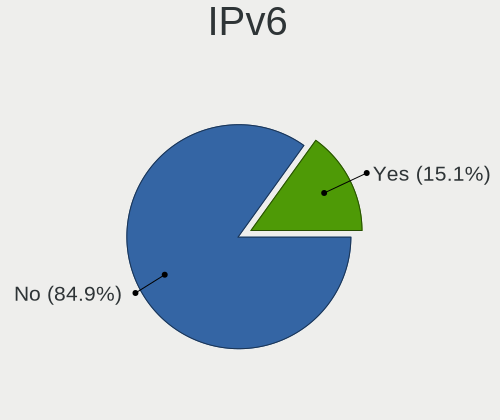

| Used | Desktops | Percent |
|------|----------|---------|
| No   | 750      | 86.61%  |
| Yes  | 116      | 13.39%  |

Bluetooth
---------

Bluetooth Vendor
----------------

Controller vendors

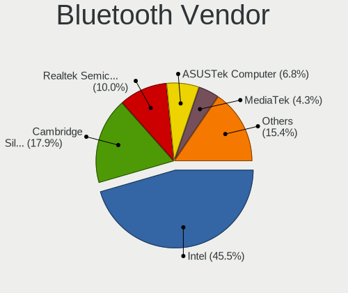

| Vendor                          | Desktops | Percent |
|---------------------------------|----------|---------|
| Intel                           | 145      | 48.82%  |
| Cambridge Silicon Radio         | 62       | 20.88%  |
| Realtek Semiconductor           | 24       | 8.08%   |
| ASUSTek Computer                | 19       | 6.4%    |
| MediaTek                        | 9        | 3.03%   |
| Broadcom                        | 7        | 2.36%   |
| TP-Link                         | 5        | 1.68%   |
| Qualcomm Atheros Communications | 4        | 1.35%   |
| IMC Networks                    | 4        | 1.35%   |
| HTC (High Tech Computer)        | 3        | 1.01%   |
| Belkin Components               | 3        | 1.01%   |
| Apple                           | 3        | 1.01%   |
| D-Link System                   | 2        | 0.67%   |
| Realtek                         | 1        | 0.34%   |
| Micro Star International        | 1        | 0.34%   |
| Logitech                        | 1        | 0.34%   |
| Lite-On Technology              | 1        | 0.34%   |
| Foxconn / Hon Hai               | 1        | 0.34%   |
| Edimax Technology               | 1        | 0.34%   |
| Actions                         | 1        | 0.34%   |

Bluetooth Model
---------------

Controller models

| Model                                                                | Desktops | Percent |
|----------------------------------------------------------------------|----------|---------|
| Cambridge Silicon Radio Bluetooth Dongle (HCI mode)                  | 62       | 20.88%  |
| Intel AX200 Bluetooth                                                | 48       | 16.16%  |
| Intel Wireless-AC 3168 Bluetooth                                     | 18       | 6.06%   |
| Realtek Bluetooth Radio                                              | 17       | 5.72%   |
| Intel AX210 Bluetooth                                                | 13       | 4.38%   |
| Intel Wireless-AC 9260 Bluetooth Adapter                             | 12       | 4.04%   |
| Intel Bluetooth 9460/9560 Jefferson Peak (JfP)                       | 12       | 4.04%   |
| Intel Bluetooth wireless interface                                   | 10       | 3.37%   |
| MediaTek Wireless_Device                                             | 9        | 3.03%   |
| Intel AX211 Bluetooth                                                | 9        | 3.03%   |
| Intel AX201 Bluetooth                                                | 9        | 3.03%   |
| Intel Bluetooth Device                                               | 8        | 2.69%   |
| ASUS Broadcom BCM20702A0 Bluetooth                                   | 7        | 2.36%   |
| Intel Centrino Bluetooth Wireless Transceiver                        | 6        | 2.02%   |
| TP-Link UB500 Adapter                                                | 5        | 1.68%   |
| Realtek  Bluetooth 4.2 Adapter                                       | 4        | 1.35%   |
| Broadcom BCM20702A0 Bluetooth 4.0                                    | 4        | 1.35%   |
| Qualcomm Atheros AR3011 Bluetooth                                    | 3        | 1.01%   |
| HTC (High Tech Computer) Vive Hub Bluetooth 4.1 (Broadcom BCM920703) | 3        | 1.01%   |
| ASUS BCM20702A0                                                      | 3        | 1.01%   |
| IMC Networks Bluetooth Radio                                         | 2        | 0.67%   |
| D-Link System DBT-122 Bluetooth                                      | 2        | 0.67%   |
| ASUS Qualcomm Bluetooth 4.1                                          | 2        | 0.67%   |
| ASUS Broadcom BCM20702 Single-Chip Bluetooth 4.0 + LE                | 2        | 0.67%   |
| ASUS Bluetooth Radio                                                 | 2        | 0.67%   |
| ASUS Bluetooth Adapter                                               | 2        | 0.67%   |
| Apple Bluetooth USB Host Controller                                  | 2        | 0.67%   |
| Realtek RTL8821A Bluetooth                                           | 1        | 0.34%   |
| Realtek Bluetooth 5.3 Radio                                          | 1        | 0.34%   |
| Realtek 802.11ac WLAN Adapter                                        | 1        | 0.34%   |
| Realtek Bluetooth Radio                                              | 1        | 0.34%   |
| Qualcomm Atheros Bluetooth USB Host Controller                       | 1        | 0.34%   |
| Micro Star International Bluetooth Device                            | 1        | 0.34%   |
| Logitech BT Mini-Receiver (HCI mode)                                 | 1        | 0.34%   |
| Lite-On Bluetooth Device                                             | 1        | 0.34%   |
| IMC Networks Wireless_Device                                         | 1        | 0.34%   |
| IMC Networks BCM20702A0                                              | 1        | 0.34%   |
| Foxconn / Hon Hai Wireless_Device                                    | 1        | 0.34%   |
| Edimax Edimax Bluetooth Adapter                                      | 1        | 0.34%   |
| Broadcom Bluetooth 3.0 Device                                        | 1        | 0.34%   |

Sound
-----

Sound Vendor
------------

Sound card vendors

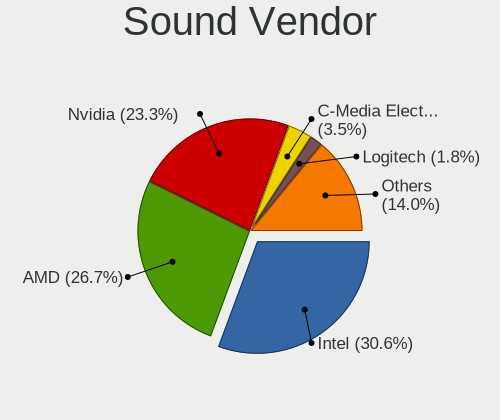

| Vendor                                       | Desktops | Percent |
|----------------------------------------------|----------|---------|
| Intel                                        | 482      | 31.4%   |
| AMD                                          | 417      | 27.17%  |
| Nvidia                                       | 362      | 23.58%  |
| C-Media Electronics                          | 55       | 3.58%   |
| Logitech                                     | 27       | 1.76%   |
| ASUSTek Computer                             | 15       | 0.98%   |
| Creative Labs                                | 14       | 0.91%   |
| Razer USA                                    | 12       | 0.78%   |
| GN Netcom                                    | 10       | 0.65%   |
| SteelSeries ApS                              | 9        | 0.59%   |
| JMTek                                        | 9        | 0.59%   |
| Corsair                                      | 9        | 0.59%   |
| Kingston Technology                          | 7        | 0.46%   |
| Micro Star International                     | 6        | 0.39%   |
| Focusrite-Novation                           | 5        | 0.33%   |
| Bose                                         | 5        | 0.33%   |
| RODE Microphones                             | 4        | 0.26%   |
| Zoran Co. Personal Media Division (Nogatech) | 3        | 0.2%    |
| Texas Instruments                            | 3        | 0.2%    |
| Sony                                         | 3        | 0.2%    |
| Generalplus Technology                       | 3        | 0.2%    |
| Creative Technology                          | 3        | 0.2%    |
| Asahi Kasei Microsystems                     | 3        | 0.2%    |
| Thomann                                      | 2        | 0.13%   |
| Samson Technologies                          | 2        | 0.13%   |
| Realtek Semiconductor                        | 2        | 0.13%   |
| Project                                      | 2        | 0.13%   |
| Plantronics                                  | 2        | 0.13%   |
| Microdia                                     | 2        | 0.13%   |
| Lautsprecher Teufel                          | 2        | 0.13%   |
| GYROCOM C&C                                  | 2        | 0.13%   |
| Elgato Systems                               | 2        | 0.13%   |
| Dell                                         | 2        | 0.13%   |
| BR25                                         | 2        | 0.13%   |
| BEHRINGER International                      | 2        | 0.13%   |
| ZOOM                                         | 1        | 0.07%   |
| Yamaha                                       | 1        | 0.07%   |
| VIA Technologies                             | 1        | 0.07%   |
| Universal Audio                              | 1        | 0.07%   |
| Turtle Beach                                 | 1        | 0.07%   |

Sound Model
-----------

Sound card models

| Model                                                                             | Desktops | Percent |
|-----------------------------------------------------------------------------------|----------|---------|
| AMD Starship/Matisse HD Audio Controller                                          | 120      | 6.62%   |
| AMD SBx00 Azalia (Intel HDA)                                                      | 66       | 3.64%   |
| Intel 8 Series/C220 Series Chipset High Definition Audio Controller               | 65       | 3.59%   |
| AMD Family 17h/19h HD Audio Controller                                            | 63       | 3.48%   |
| Intel 100 Series/C230 Series Chipset Family HD Audio Controller                   | 61       | 3.37%   |
| Intel 6 Series/C200 Series Chipset Family High Definition Audio Controller        | 49       | 2.7%    |
| Intel 7 Series/C216 Chipset Family High Definition Audio Controller               | 41       | 2.26%   |
| Intel 200 Series PCH HD Audio                                                     | 40       | 2.21%   |
| AMD Family 17h (Models 00h-0fh) HD Audio Controller                               | 39       | 2.15%   |
| Intel Xeon E3-1200 v3/4th Gen Core Processor HD Audio Controller                  | 38       | 2.1%    |
| AMD Ellesmere HDMI Audio [Radeon RX 470/480 / 570/580/590]                        | 35       | 1.93%   |
| AMD Navi 21/23 HDMI/DP Audio Controller                                           | 33       | 1.82%   |
| Nvidia GK208 HDMI/DP Audio Controller                                             | 31       | 1.71%   |
| Intel Cannon Lake PCH cAVS                                                        | 30       | 1.66%   |
| AMD Renoir Radeon High Definition Audio Controller                                | 28       | 1.55%   |
| AMD FCH Azalia Controller                                                         | 26       | 1.43%   |
| Nvidia GP104 High Definition Audio Controller                                     | 24       | 1.32%   |
| Nvidia GP107GL High Definition Audio Controller                                   | 23       | 1.27%   |
| Nvidia GP106 High Definition Audio Controller                                     | 22       | 1.21%   |
| Intel 82801JI (ICH10 Family) HD Audio Controller                                  | 22       | 1.21%   |
| Nvidia TU106 High Definition Audio Controller                                     | 21       | 1.16%   |
| Nvidia TU104 HD Audio Controller                                                  | 21       | 1.16%   |
| Nvidia GP108 High Definition Audio Controller                                     | 21       | 1.16%   |
| Nvidia GM204 High Definition Audio Controller                                     | 21       | 1.16%   |
| AMD Oland/Hainan/Cape Verde/Pitcairn HDMI Audio [Radeon HD 7000 Series]           | 21       | 1.16%   |
| AMD Navi 10 HDMI Audio                                                            | 21       | 1.16%   |
| Intel 9 Series Chipset Family HD Audio Controller                                 | 20       | 1.1%    |
| AMD Raven/Raven2/Fenghuang HDMI/DP Audio Controller                               | 20       | 1.1%    |
| Intel 5 Series/3400 Series Chipset High Definition Audio                          | 17       | 0.94%   |
| Nvidia GM107 High Definition Audio Controller [GeForce 940MX]                     | 16       | 0.88%   |
| Nvidia GA102 High Definition Audio Controller                                     | 16       | 0.88%   |
| AMD Baffin HDMI/DP Audio [Radeon RX 550 640SP / RX 560/560X]                      | 16       | 0.88%   |
| Nvidia GA104 High Definition Audio Controller                                     | 15       | 0.83%   |
| Intel NM10/ICH7 Family High Definition Audio Controller                           | 15       | 0.83%   |
| AMD Rembrandt Radeon High Definition Audio Controller                             | 14       | 0.77%   |
| AMD Caicos HDMI Audio [Radeon HD 6450 / 7450/8450/8490 OEM / R5 230/235/235X OEM] | 13       | 0.72%   |
| Nvidia TU116 High Definition Audio Controller                                     | 12       | 0.66%   |
| Nvidia High Definition Audio Controller                                           | 12       | 0.66%   |
| Nvidia GM206 High Definition Audio Controller                                     | 12       | 0.66%   |
| ASUSTek Computer USB Audio                                                        | 12       | 0.66%   |

Memory
------

Memory Vendor
-------------

Memory module vendors

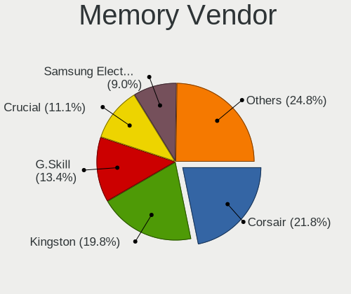

| Vendor                       | Desktops | Percent |
|------------------------------|----------|---------|
| Corsair                      | 116      | 21.93%  |
| Kingston                     | 105      | 19.85%  |
| G.Skill                      | 73       | 13.8%   |
| Crucial                      | 60       | 11.34%  |
| Unknown                      | 46       | 8.7%    |
| Samsung Electronics          | 45       | 8.51%   |
| SK hynix                     | 25       | 4.73%   |
| Micron Technology            | 18       | 3.4%    |
| A-DATA Technology            | 5        | 0.95%   |
| Team                         | 4        | 0.76%   |
| Nanya Technology             | 4        | 0.76%   |
| Elpida                       | 3        | 0.57%   |
| Ramaxel Technology           | 2        | 0.38%   |
| JOY-IT                       | 2        | 0.38%   |
| GOODRAM                      | 2        | 0.38%   |
| Avant                        | 2        | 0.38%   |
| Unknown                      | 2        | 0.38%   |
| Unknown (ABCD)               | 1        | 0.19%   |
| Unknown (09D5)               | 1        | 0.19%   |
| Unifosa                      | 1        | 0.19%   |
| Transcend                    | 1        | 0.19%   |
| Toshiba                      | 1        | 0.19%   |
| TakeMS                       | 1        | 0.19%   |
| Silicon Power                | 1        | 0.19%   |
| Qimonda                      | 1        | 0.19%   |
| PNY                          | 1        | 0.19%   |
| Patriot Memory (PDP Systems) | 1        | 0.19%   |
| Patriot                      | 1        | 0.19%   |
| Mushkin                      | 1        | 0.19%   |
| Hitachi                      | 1        | 0.19%   |
| Hewlett-Packard              | 1        | 0.19%   |
| 51010818AB6A1D42             | 1        | 0.19%   |

Memory Model
------------

Memory module models

| Model                                                  | Desktops | Percent |
|--------------------------------------------------------|----------|---------|
| Corsair RAM CMK16GX4M2B3200C16 8GB DIMM DDR4 3600MT/s  | 19       | 3.38%   |
| Crucial RAM BLS8G3D1609DS1S00. 8GB DIMM DDR3 1800MT/s  | 12       | 2.14%   |
| G.Skill RAM F4-3000C16-8GISB 8192MB DIMM DDR4 3200MT/s | 11       | 1.96%   |
| Micron RAM 8JTF51264AZ-1G6E1 4GB DIMM DDR3 1600MT/s    | 7        | 1.25%   |
| Kingston RAM KHX1600C9D3/4GX 4GB DIMM DDR3 1600MT/s    | 7        | 1.25%   |
| Corsair RAM CMK16GX4M2B3000C15 8GB DIMM DDR4 3600MT/s  | 7        | 1.25%   |
| Kingston RAM KHX3200C16D4/8GX 8GB DIMM DDR4 3733MT/s   | 6        | 1.07%   |
| G.Skill RAM F4-3200C16-8GIS 8GB DIMM DDR4 3200MT/s     | 6        | 1.07%   |
| Kingston RAM Module 32GB DIMM DDR4 2400MT/s            | 5        | 0.89%   |
| Kingston RAM KHX1866C10D3/8G 8GB DIMM DDR3 2133MT/s    | 5        | 0.89%   |
| G.Skill RAM F4-3200C16-16GIS 16GB DIMM DDR4 3600MT/s   | 5        | 0.89%   |
| G.Skill RAM F4-2666C19-16GIS 16GB DIMM DDR4 2667MT/s   | 5        | 0.89%   |
| Corsair RAM CMK32GX4M2D3600C18 16GB DIMM DDR4 3800MT/s | 5        | 0.89%   |
| Unknown RAM Module 2GB DIMM DDR2 800MT/s               | 4        | 0.71%   |
| Kingston RAM KHX2666C15D4/8G 8GB DIMM DDR4 3200MT/s    | 4        | 0.71%   |
| Kingston RAM KHX1600C10D3/8G 8GB DIMM DDR3 1648MT/s    | 4        | 0.71%   |
| G.Skill RAM F4-3200C16-8GVKB 8GB DIMM DDR4 3866MT/s    | 4        | 0.71%   |
| G.Skill RAM F4-3000C16-16GISB 16GB DIMM DDR4 3200MT/s  | 4        | 0.71%   |
| Corsair RAM CMW16GX4M2C3200C16 8GB DIMM DDR4 3733MT/s  | 4        | 0.71%   |
| Corsair RAM CMK32GX4M2B3200C16 16GB DIMM DDR4 3800MT/s | 4        | 0.71%   |
| Kingston RAM 9905734-059.A00G 16GB DIMM DDR4 2667MT/s  | 3        | 0.53%   |
| Crucial RAM BL16G26C16U4W.16FD 16GB DIMM DDR4 2667MT/s | 3        | 0.53%   |
| Corsair RAM CMX8GX3M1A1600C11 8GB DIMM DDR3 1600MT/s   | 3        | 0.53%   |
| Corsair RAM CMW32GX4M2Z3600C18 16GB DIMM DDR4 3733MT/s | 3        | 0.53%   |
| Corsair RAM CML8GX3M2A1600C9 4GB DIMM DDR3 1867MT/s    | 3        | 0.53%   |
| Corsair RAM CMK8GX4M1D3000C16 8GB DIMM DDR4 3200MT/s   | 3        | 0.53%   |
| Corsair RAM CMK32GX4M2E3200C16 16GB DIMM DDR4 3534MT/s | 3        | 0.53%   |
| Corsair RAM CMK32GX4M2B3000C15 16GB DIMM DDR4 3000MT/s | 3        | 0.53%   |
| Unknown RAM Module 2GB DIMM SDRAM                      | 2        | 0.36%   |
| Unknown RAM Module 2GB DIMM 1333MT/s                   | 2        | 0.36%   |
| Unknown RAM Module 2GB DIMM 1066MT/s                   | 2        | 0.36%   |
| Unknown RAM Module 2048MB DIMM DDR3 1333MT/s           | 2        | 0.36%   |
| Unknown RAM Module 1024MB DIMM DDR2 266MT/s            | 2        | 0.36%   |
| SK hynix RAM HMT351U6CFR8C-PB 4GB DIMM DDR3 1800MT/s   | 2        | 0.36%   |
| SK hynix RAM HMA41GU6AFR8N-TF 8GB DIMM DDR4 2465MT/s   | 2        | 0.36%   |
| Samsung RAM Module 4GB DIMM DDR3 1333MT/s              | 2        | 0.36%   |
| Samsung RAM Module 2GB DIMM DDR3 1333MT/s              | 2        | 0.36%   |
| Samsung RAM M378B5773DH0-CH9 2GB DIMM DDR3 1333MT/s    | 2        | 0.36%   |
| Samsung RAM M378B5173QH0-CK0 4GB DIMM DDR3 1600MT/s    | 2        | 0.36%   |
| Samsung RAM M378A5244CB0-CRC 4GB DIMM DDR4 3066MT/s    | 2        | 0.36%   |

Memory Kind
-----------

Memory module kinds

| Kind    | Desktops | Percent |
|---------|----------|---------|
| DDR4    | 258      | 55.36%  |
| DDR3    | 149      | 31.97%  |
| DDR2    | 16       | 3.43%   |
| DDR5    | 14       | 3%      |
| Unknown | 13       | 2.79%   |
| SDRAM   | 12       | 2.58%   |
| DDR     | 3        | 0.64%   |
| LPDDR4  | 1        | 0.21%   |

Memory Form Factor
------------------

Physical design of the memory module

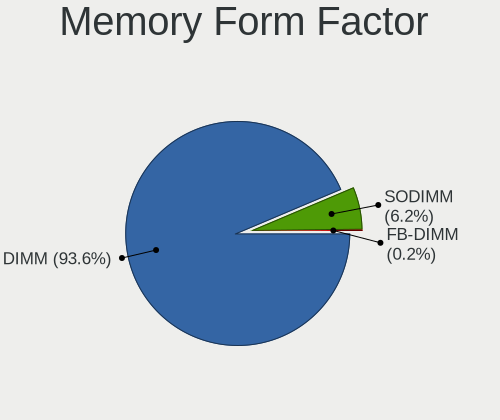

| Name    | Desktops | Percent |
|---------|----------|---------|
| DIMM    | 434      | 94.35%  |
| SODIMM  | 25       | 5.43%   |
| FB-DIMM | 1        | 0.22%   |

Memory Size
-----------

Memory module size

| Size  | Desktops | Percent |
|-------|----------|---------|
| 8192  | 190      | 37.48%  |
| 16384 | 118      | 23.27%  |
| 4096  | 105      | 20.71%  |
| 2048  | 49       | 9.66%   |
| 32768 | 29       | 5.72%   |
| 1024  | 10       | 1.97%   |
| 512   | 4        | 0.79%   |
| 256   | 1        | 0.2%    |
| 16    | 1        | 0.2%    |

Memory Speed
------------

Memory module speed

| Speed   | Desktops | Percent |
|---------|----------|---------|
| 1600    | 75       | 14.76%  |
| 3200    | 62       | 12.2%   |
| 3600    | 47       | 9.25%   |
| 1333    | 43       | 8.46%   |
| 2400    | 37       | 7.28%   |
| 2667    | 26       | 5.12%   |
| 2133    | 23       | 4.53%   |
| 3733    | 18       | 3.54%   |
| 1800    | 16       | 3.15%   |
| 3800    | 13       | 2.56%   |
| 3000    | 12       | 2.36%   |
| 1867    | 11       | 2.17%   |
| 667     | 10       | 1.97%   |
| 3866    | 7        | 1.38%   |
| 3400    | 7        | 1.38%   |
| 2666    | 7        | 1.38%   |
| 800     | 7        | 1.38%   |
| 2933    | 6        | 1.18%   |
| 1866    | 6        | 1.18%   |
| 3066    | 5        | 0.98%   |
| 1334    | 5        | 0.98%   |
| 6000    | 4        | 0.79%   |
| 5600    | 4        | 0.79%   |
| 4000    | 4        | 0.79%   |
| 3666    | 4        | 0.79%   |
| 1066    | 4        | 0.79%   |
| Unknown | 4        | 0.79%   |
| 4800    | 3        | 0.59%   |
| 3534    | 3        | 0.59%   |
| 3466    | 3        | 0.59%   |
| 5200    | 2        | 0.39%   |
| 3933    | 2        | 0.39%   |
| 3266    | 2        | 0.39%   |
| 2800    | 2        | 0.39%   |
| 2465    | 2        | 0.39%   |
| 2134    | 2        | 0.39%   |
| 1067    | 2        | 0.39%   |
| 400     | 2        | 0.39%   |
| 266     | 2        | 0.39%   |
| 50664   | 1        | 0.2%    |

Printers & scanners
-------------------

Printer Vendor
--------------

Printer device vendors

| Vendor                | Desktops | Percent |
|-----------------------|----------|---------|
| Canon                 | 15       | 31.91%  |
| Hewlett-Packard       | 10       | 21.28%  |
| Brother Industries    | 10       | 21.28%  |
| Seiko Epson           | 5        | 10.64%  |
| Samsung Electronics   | 2        | 4.26%   |
| Ricoh                 | 1        | 2.13%   |
| Prolific Technology   | 1        | 2.13%   |
| Oki Data              | 1        | 2.13%   |
| Lexmark International | 1        | 2.13%   |
| Dell                  | 1        | 2.13%   |

Printer Model
-------------

Printer device models

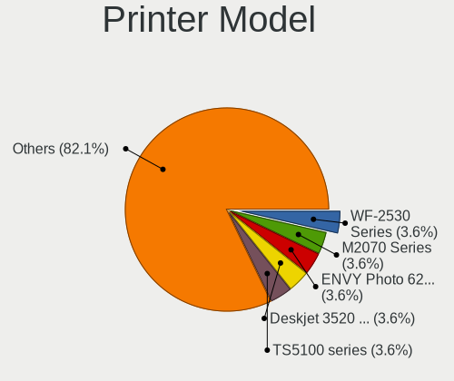

| Model                                                      | Desktops | Percent |
|------------------------------------------------------------|----------|---------|
| Seiko Epson WF-2530 Series                                 | 2        | 4.26%   |
| HP Deskjet 3520 series                                     | 2        | 4.26%   |
| Canon TS5100 series                                        | 2        | 4.26%   |
| Canon PIXMA MG2500 Series                                  | 2        | 4.26%   |
| Canon LiDE 300                                             | 2        | 4.26%   |
| Brother Printer                                            | 2        | 4.26%   |
| Brother HL-3040CN series                                   | 2        | 4.26%   |
| Seiko Epson XP-235 Series                                  | 1        | 2.13%   |
| Seiko Epson ET-4750 [WorkForce ET-4750 EcoTank All-in-One] | 1        | 2.13%   |
| Seiko Epson AL-M310DN                                      | 1        | 2.13%   |
| Samsung M2070 Series                                       | 1        | 2.13%   |
| Samsung C48x Series Color Laser Multifunction Printer      | 1        | 2.13%   |
| Ricoh SP 213SUw                                            | 1        | 2.13%   |
| Prolific PL2305 Parallel Port                              | 1        | 2.13%   |
| Oki Data USB Device                                        | 1        | 2.13%   |
| Lexmark International CS417dn                              | 1        | 2.13%   |
| HP OfficeJet Pro 7720 series                               | 1        | 2.13%   |
| HP LaserJet Professional P1102w                            | 1        | 2.13%   |
| HP LaserJet 1320                                           | 1        | 2.13%   |
| HP ENVY Photo 6200 series                                  | 1        | 2.13%   |
| HP ENVY 5000 series                                        | 1        | 2.13%   |
| HP ENVY 4520 series                                        | 1        | 2.13%   |
| HP DeskJet 940c                                            | 1        | 2.13%   |
| HP Deskjet 2050 J510                                       | 1        | 2.13%   |
| Dell C1760nw Color Printer                                 | 1        | 2.13%   |
| Canon TS700 series                                         | 1        | 2.13%   |
| Canon TS6300 series                                        | 1        | 2.13%   |
| Canon PIXMA MX320 series                                   | 1        | 2.13%   |
| Canon MF5650 (FAX)                                         | 1        | 2.13%   |
| Canon LiDE 400                                             | 1        | 2.13%   |
| Canon LBP2900                                              | 1        | 2.13%   |
| Canon LaserShot LBP-1120 Printer                           | 1        | 2.13%   |
| Canon L100/L150/L170                                       | 1        | 2.13%   |
| Canon iP7200 series                                        | 1        | 2.13%   |
| Brother MFC-L2710DW series                                 | 1        | 2.13%   |
| Brother MFC-L2710DN series                                 | 1        | 2.13%   |
| Brother MFC-9142CDN                                        | 1        | 2.13%   |
| Brother HL-2030 Laser Printer                              | 1        | 2.13%   |
| Brother DCP-J140W                                          | 1        | 2.13%   |
| Brother DCP-1510                                           | 1        | 2.13%   |

Scanner Vendor
--------------

Scanner device vendors

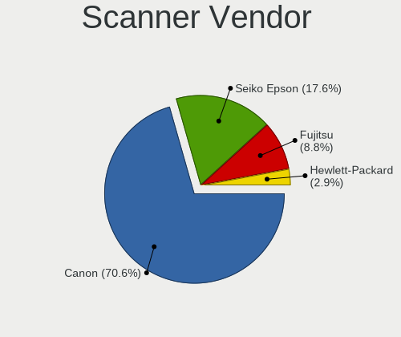

| Vendor          | Desktops | Percent |
|-----------------|----------|---------|
| Canon           | 23       | 74.19%  |
| Seiko Epson     | 4        | 12.9%   |
| Fujitsu         | 3        | 9.68%   |
| Hewlett-Packard | 1        | 3.23%   |

Scanner Model
-------------

Scanner device models

| Model                                                    | Desktops | Percent |
|----------------------------------------------------------|----------|---------|
| Fujitsu ScanSnap SV600                                   | 3        | 9.68%   |
| Canon CanoScan LiDE 110                                  | 3        | 9.68%   |
| Canon CanoScan                                           | 3        | 9.68%   |
| Seiko Epson GT-F500/GT-F550 [Perfection 2480/2580 PHOTO] | 2        | 6.45%   |
| Canon CanoScan N670U/N676U/LiDE 20                       | 2        | 6.45%   |
| Canon CanoScan LiDE 60                                   | 2        | 6.45%   |
| Canon CanoScan LiDE 50/LiDE 35/LiDE 40                   | 2        | 6.45%   |
| Canon CanoScan LiDE 220                                  | 2        | 6.45%   |
| Canon CanoScan LiDE 200                                  | 2        | 6.45%   |
| Canon CanoScan LiDE 100                                  | 2        | 6.45%   |
| Seiko Epson GT-9300UF [Perfection 2400 PHOTO]            | 1        | 3.23%   |
| Seiko Epson GT-7200U [Perfection 1250/1250 PHOTO]        | 1        | 3.23%   |
| HP ScanJet 4850C/4890C                                   | 1        | 3.23%   |
| Canon CanoScan N650U/N656U                               | 1        | 3.23%   |
| Canon CanoScan N1240U/LiDE 30                            | 1        | 3.23%   |
| Canon CanoScan LIDE 25                                   | 1        | 3.23%   |
| Canon CanoScan LiDE 210                                  | 1        | 3.23%   |
| Canon CanoScan FB630U                                    | 1        | 3.23%   |

Camera
------

Camera Vendor
-------------

Camera device vendors

| Vendor                        | Desktops | Percent |
|-------------------------------|----------|---------|
| Logitech                      | 59       | 35.33%  |
| Microsoft                     | 15       | 8.98%   |
| Microdia                      | 13       | 7.78%   |
| Sunplus Innovation Technology | 10       | 5.99%   |
| Realtek Semiconductor         | 8        | 4.79%   |
| Apple                         | 7        | 4.19%   |
| Samsung Electronics           | 5        | 2.99%   |
| Jieli Technology              | 5        | 2.99%   |
| ARC International             | 5        | 2.99%   |
| Z-Star Microelectronics       | 3        | 1.8%    |
| SHENZHEN EMEET TECHNOLOGY     | 3        | 1.8%    |
| Fujitsu                       | 3        | 1.8%    |
| XHT-211220-ZW                 | 2        | 1.2%    |
| Trust                         | 2        | 1.2%    |
| Tobii Technology AB           | 2        | 1.2%    |
| Sunplus IT                    | 2        | 1.2%    |
| KYE Systems (Mouse Systems)   | 2        | 1.2%    |
| YT-221117-J                   | 1        | 0.6%    |
| WaveRider Communications      | 1        | 0.6%    |
| ValueHD                       | 1        | 0.6%    |
| SHENZHEN AONI ELECTRONIC      | 1        | 0.6%    |
| Razer USA                     | 1        | 0.6%    |
| Quanta                        | 1        | 0.6%    |
| Novatek Microelectronics      | 1        | 0.6%    |
| Nikon                         | 1        | 0.6%    |
| Linux Foundation              | 1        | 0.6%    |
| HD USB Camera                 | 1        | 0.6%    |
| Generalplus Technology        | 1        | 0.6%    |
| GEMBIRD                       | 1        | 0.6%    |
| Etron Technology              | 1        | 0.6%    |
| Elgato Systems                | 1        | 0.6%    |
| Creative Technology           | 1        | 0.6%    |
| Chicony Electronics           | 1        | 0.6%    |
| Arkmicro Technologies         | 1        | 0.6%    |
| Anker PowerConf C200          | 1        | 0.6%    |
| Anchor Chips                  | 1        | 0.6%    |
| Alcor Micro                   | 1        | 0.6%    |
| 2M UVC CAMERA                 | 1        | 0.6%    |

Camera Model
------------

Camera device models

| Model                                          | Desktops | Percent |
|------------------------------------------------|----------|---------|
| Microsoft LifeCam HD-3000                      | 8        | 4.76%   |
| Logitech Webcam C270                           | 8        | 4.76%   |
| Logitech HD Pro Webcam C920                    | 7        | 4.17%   |
| Logitech C922 Pro Stream Webcam                | 7        | 4.17%   |
| Logitech HD Webcam C525                        | 6        | 3.57%   |
| Samsung Galaxy series, misc. (MTP mode)        | 5        | 2.98%   |
| Microdia Webcam Vitade AF                      | 5        | 2.98%   |
| Jieli USB PHY 2.0                              | 5        | 2.98%   |
| ARC International Camera                       | 5        | 2.98%   |
| Apple iPhone 5/5C/5S/6/SE/7/8/X                | 5        | 2.98%   |
| Sunplus PC Camera                              | 4        | 2.38%   |
| Realtek FULL HD 1080P Webcam                   | 4        | 2.38%   |
| Logitech QuickCam Pro 9000                     | 4        | 2.38%   |
| SHENZHEN EMEET TECHNOLOGY HD Webcam eMeet C960 | 3        | 1.79%   |
| Microdia USB 2.0 Camera                        | 3        | 1.79%   |
| Microdia Sonix USB 2.0 Camera                  | 3        | 1.79%   |
| Logitech Webcam C170                           | 3        | 1.79%   |
| Logitech QuickCam Pro for Notebooks            | 3        | 1.79%   |
| Logitech C920 PRO HD Webcam                    | 3        | 1.79%   |
| Logitech C505 HD Webcam                        | 3        | 1.79%   |
| Fujitsu USB Camera                             | 3        | 1.79%   |
| Z-Star Venus USB2.0 Camera                     | 2        | 1.19%   |
| XHT-211220-ZW Photry PC230A QHD Webcam         | 2        | 1.19%   |
| Tobii AB EyeChip                               | 2        | 1.19%   |
| Sunplus 5Mega Webcam                           | 2        | 1.19%   |
| Realtek Full HD Webcam                         | 2        | 1.19%   |
| Microsoft Microsoft LifeCam Studio           | 2        | 1.19%   |
| Microsoft LifeCam VX-500 [1357]                | 2        | 1.19%   |
| Logitech Webcam C925e                          | 2        | 1.19%   |
| Logitech Webcam C310                           | 2        | 1.19%   |
| Logitech HD Webcam C615                        | 2        | 1.19%   |
| Logitech HD Webcam C510                        | 2        | 1.19%   |
| Logitech BRIO 4K Stream Edition                | 2        | 1.19%   |
| KYE Systems (Mouse Systems) Genius Webcam      | 2        | 1.19%   |
| Z-Star Integrated Camera                       | 1        | 0.6%    |
| YT-221117-J USB2.0 Camera                      | 1        | 0.6%    |
| WaveRider USB Live camera                      | 1        | 0.6%    |
| ValueHD Konftel Cam20                          | 1        | 0.6%    |
| Trust USB Camera                               | 1        | 0.6%    |
| Trust QHD Webcam                               | 1        | 0.6%    |

Security
--------

Fingerprint Vendor
------------------

Fingerprint sensor vendors

| Vendor                | Desktops | Percent |
|-----------------------|----------|---------|
| Elan Microelectronics | 2        | 66.67%  |
| Upek                  | 1        | 33.33%  |

Fingerprint Model
-----------------

Fingerprint sensor models

| Model                                                  | Desktops | Percent |
|--------------------------------------------------------|----------|---------|
| Elan fingerprint sensor [FeinTech FPS00200]            | 2        | 66.67%  |
| Upek Biometric Touchchip/Touchstrip Fingerprint Sensor | 1        | 33.33%  |

Chipcard Vendor
---------------

Chipcard module vendors

| Vendor                | Desktops | Percent |
|-----------------------|----------|---------|
| Realtek Semiconductor | 1        | 25%     |
| Lenovo                | 1        | 25%     |
| Cherry                | 1        | 25%     |
| Alcor Micro           | 1        | 25%     |

Chipcard Model
--------------

Chipcard module models

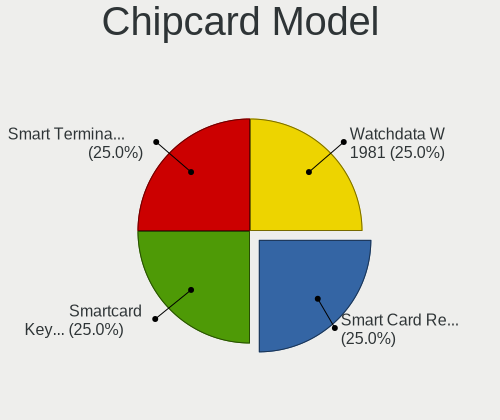

| Model                                             | Desktops | Percent |
|---------------------------------------------------|----------|---------|
| Realtek Semiconductor Smart Card Reader Interface | 1        | 25%     |
| Lenovo Smartcard Keyboard                         | 1        | 25%     |
| Cherry Smart Terminal XX44                        | 1        | 25%     |
| Alcor Micro Watchdata W 1981                      | 1        | 25%     |

Unsupported
-----------

Unsupported Devices
-------------------

Total unsupported devices on board

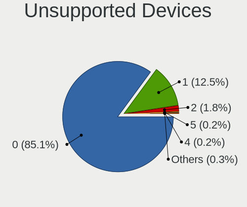

| Total | Desktops | Percent |
|-------|----------|---------|
| 0     | 746      | 85.55%  |
| 1     | 105      | 12.04%  |
| 2     | 15       | 1.72%   |
| 5     | 2        | 0.23%   |
| 3     | 2        | 0.23%   |
| 6     | 1        | 0.11%   |
| 4     | 1        | 0.11%   |

Unsupported Device Types
------------------------

Types of unsupported devices

| Type                     | Desktops | Percent |
|--------------------------|----------|---------|
| Graphics card            | 52       | 35.37%  |
| Net/wireless             | 33       | 22.45%  |
| Unassigned class         | 12       | 8.16%   |
| Communication controller | 10       | 6.8%    |
| Multimedia controller    | 7        | 4.76%   |
| Sound                    | 5        | 3.4%    |
| Net/ethernet             | 5        | 3.4%    |
| Camera                   | 5        | 3.4%    |
| Bluetooth                | 4        | 2.72%   |
| Fingerprint reader       | 3        | 2.04%   |
| Tv card                  | 2        | 1.36%   |
| Storage/raid             | 2        | 1.36%   |
| Chipcard                 | 2        | 1.36%   |
| Storage/ide              | 1        | 0.68%   |
| Storage/ata              | 1        | 0.68%   |
| Network                  | 1        | 0.68%   |
| Modem                    | 1        | 0.68%   |
| Card reader              | 1        | 0.68%   |

