Linux in Austria - Tested Hardware & Statistics (Desktops)
----------------------------------------------------------

A project to collect tested hardware configurations for Linux in Austria.

Anyone can contribute to this report by the [hw-probe](https://github.com/linuxhw/hw-probe) tool:

    sudo -E hw-probe -all -upload

Please contribute! Especially if your hardware is rare.

Contents
--------

* [ Test Cases ](#test-cases)

* [ System ](#system)
  - [ OS                       ](#os)
  - [ OS Family                ](#os-family)
  - [ Kernel                   ](#kernel)
  - [ Kernel Family            ](#kernel-family)
  - [ Kernel Major Ver.        ](#kernel-major-ver)
  - [ Arch                     ](#arch)
  - [ DE                       ](#de)
  - [ Display Server           ](#display-server)
  - [ Display Manager          ](#display-manager)
  - [ OS Lang                  ](#os-lang)
  - [ Boot Mode                ](#boot-mode)
  - [ Filesystem               ](#filesystem)
  - [ Part. scheme             ](#part-scheme)
  - [ Dual Boot with Linux/BSD ](#dual-boot-with-linuxbsd)
  - [ Dual Boot (Win)          ](#dual-boot-win)

* [ Board ](#board)
  - [ Vendor                   ](#vendor)
  - [ Model                    ](#model)
  - [ Model Family             ](#model-family)
  - [ MFG Year                 ](#mfg-year)
  - [ Form Factor              ](#form-factor)
  - [ Secure Boot              ](#secure-boot)
  - [ Coreboot                 ](#coreboot)
  - [ RAM Size                 ](#ram-size)
  - [ RAM Used                 ](#ram-used)
  - [ Total Drives             ](#total-drives)
  - [ Has CD-ROM               ](#has-cd-rom)
  - [ Has Ethernet             ](#has-ethernet)
  - [ Has WiFi                 ](#has-wifi)
  - [ Has Bluetooth            ](#has-bluetooth)

* [ Location ](#location)
  - [ Country                  ](#country)
  - [ City                     ](#city)

* [ Drives ](#drives)
  - [ Drive Vendor             ](#drive-vendor)
  - [ Drive Model              ](#drive-model)
  - [ HDD Vendor               ](#hdd-vendor)
  - [ SSD Vendor               ](#ssd-vendor)
  - [ Drive Kind               ](#drive-kind)
  - [ Drive Connector          ](#drive-connector)
  - [ Drive Size               ](#drive-size)
  - [ Space Total              ](#space-total)
  - [ Space Used               ](#space-used)
  - [ Malfunc. Drives          ](#malfunc-drives)
  - [ Malfunc. Drive Vendor    ](#malfunc-drive-vendor)
  - [ Malfunc. HDD Vendor      ](#malfunc-hdd-vendor)
  - [ Malfunc. Drive Kind      ](#malfunc-drive-kind)
  - [ Failed Drives            ](#failed-drives)
  - [ Failed Drive Vendor      ](#failed-drive-vendor)
  - [ Drive Status             ](#drive-status)

* [ Storage controller ](#storage-controller)
  - [ Storage Vendor           ](#storage-vendor)
  - [ Storage Model            ](#storage-model)
  - [ Storage Kind             ](#storage-kind)

* [ Processor ](#processor)
  - [ CPU Vendor               ](#cpu-vendor)
  - [ CPU Model                ](#cpu-model)
  - [ CPU Model Family         ](#cpu-model-family)
  - [ CPU Cores                ](#cpu-cores)
  - [ CPU Sockets              ](#cpu-sockets)
  - [ CPU Threads              ](#cpu-threads)
  - [ CPU Op-Modes             ](#cpu-op-modes)
  - [ CPU Microcode            ](#cpu-microcode)
  - [ CPU Microarch            ](#cpu-microarch)

* [ Graphics ](#graphics)
  - [ GPU Vendor               ](#gpu-vendor)
  - [ GPU Model                ](#gpu-model)
  - [ GPU Combo                ](#gpu-combo)
  - [ GPU Driver               ](#gpu-driver)
  - [ GPU Memory               ](#gpu-memory)

* [ Monitor ](#monitor)
  - [ Monitor Vendor           ](#monitor-vendor)
  - [ Monitor Model            ](#monitor-model)
  - [ Monitor Resolution       ](#monitor-resolution)
  - [ Monitor Diagonal         ](#monitor-diagonal)
  - [ Monitor Width            ](#monitor-width)
  - [ Aspect Ratio             ](#aspect-ratio)
  - [ Monitor Area             ](#monitor-area)
  - [ Pixel Density            ](#pixel-density)
  - [ Multiple Monitors        ](#multiple-monitors)

* [ Network ](#network)
  - [ Net Controller Vendor    ](#net-controller-vendor)
  - [ Net Controller Model     ](#net-controller-model)
  - [ Wireless Vendor          ](#wireless-vendor)
  - [ Wireless Model           ](#wireless-model)
  - [ Ethernet Vendor          ](#ethernet-vendor)
  - [ Ethernet Model           ](#ethernet-model)
  - [ Net Controller Kind      ](#net-controller-kind)
  - [ Used Controller          ](#used-controller)
  - [ NICs                     ](#nics)
  - [ IPv6                     ](#ipv6)

* [ Bluetooth ](#bluetooth)
  - [ Bluetooth Vendor         ](#bluetooth-vendor)
  - [ Bluetooth Model          ](#bluetooth-model)

* [ Sound ](#sound)
  - [ Sound Vendor             ](#sound-vendor)
  - [ Sound Model              ](#sound-model)

* [ Memory ](#memory)
  - [ Memory Vendor            ](#memory-vendor)
  - [ Memory Model             ](#memory-model)
  - [ Memory Kind              ](#memory-kind)
  - [ Memory Form Factor       ](#memory-form-factor)
  - [ Memory Size              ](#memory-size)
  - [ Memory Speed             ](#memory-speed)

* [ Printers & scanners ](#printers--scanners)
  - [ Printer Vendor           ](#printer-vendor)
  - [ Printer Model            ](#printer-model)
  - [ Scanner Vendor           ](#scanner-vendor)
  - [ Scanner Model            ](#scanner-model)

* [ Camera ](#camera)
  - [ Camera Vendor            ](#camera-vendor)
  - [ Camera Model             ](#camera-model)

* [ Security ](#security)
  - [ Fingerprint Vendor       ](#fingerprint-vendor)
  - [ Fingerprint Model        ](#fingerprint-model)
  - [ Chipcard Vendor          ](#chipcard-vendor)
  - [ Chipcard Model           ](#chipcard-model)

* [ Unsupported ](#unsupported)
  - [ Unsupported Devices      ](#unsupported-devices)
  - [ Unsupported Device Types ](#unsupported-device-types)

Test Cases
----------

Total: 1496

| Vendor        | Model                       | Probe                                                      | Date         |
|---------------|-----------------------------|------------------------------------------------------------|--------------|
| MSI           | B85M-E45                    | [ce0086ec71](https://linux-hardware.org/?probe=ce0086ec71) | Jan 06, 2025 |
| MSI           | B85M-E45                    | [a341da3c42](https://linux-hardware.org/?probe=a341da3c42) | Jan 06, 2025 |
| ASUSTek       | P8P67                       | [26e848809d](https://linux-hardware.org/?probe=26e848809d) | Jan 05, 2025 |
| Unknown       | Unknown                     | [fa69a9bfbc](https://linux-hardware.org/?probe=fa69a9bfbc) | Jan 05, 2025 |
| Biostar       | H81MHV3                     | [4018e1961c](https://linux-hardware.org/?probe=4018e1961c) | Jan 05, 2025 |
| Biostar       | H81MHV3                     | [d03cc0092f](https://linux-hardware.org/?probe=d03cc0092f) | Jan 05, 2025 |
| ASRock        | Z690M-ITX/ax                | [bbbb62d243](https://linux-hardware.org/?probe=bbbb62d243) | Jan 05, 2025 |
| Fujitsu       | D3183-A1 S26361-D3183-A1    | [3696f797a8](https://linux-hardware.org/?probe=3696f797a8) | Jan 04, 2025 |
| Intel         | DH61CR AAG14064-204         | [0b1feaadef](https://linux-hardware.org/?probe=0b1feaadef) | Jan 04, 2025 |
| HP            | 3399                        | [1371b1c64d](https://linux-hardware.org/?probe=1371b1c64d) | Jan 03, 2025 |
| Gigabyte      | B450 AORUS ELITE            | [849e3021f2](https://linux-hardware.org/?probe=849e3021f2) | Jan 02, 2025 |
| ASUSTek       | ROG STRIX X670E-E GAMING... | [99fc88c92b](https://linux-hardware.org/?probe=99fc88c92b) | Jan 02, 2025 |
| Gigabyte      | B450 AORUS ELITE            | [896517452f](https://linux-hardware.org/?probe=896517452f) | Jan 01, 2025 |
| MSI           | A520M PRO                   | [092cdc906c](https://linux-hardware.org/?probe=092cdc906c) | Dec 31, 2024 |
| HP            | 8054                        | [c48b0d78c7](https://linux-hardware.org/?probe=c48b0d78c7) | Dec 30, 2024 |
| Gigabyte      | B450 AORUS ELITE            | [d122d7fcbd](https://linux-hardware.org/?probe=d122d7fcbd) | Dec 28, 2024 |
| HP            | 8054                        | [2ad24afc7c](https://linux-hardware.org/?probe=2ad24afc7c) | Dec 27, 2024 |
| MSI           | PRO X870-P WIFI             | [e93d4e3b9c](https://linux-hardware.org/?probe=e93d4e3b9c) | Dec 26, 2024 |
| ZOTAC         | NM10                        | [48bdd764c8](https://linux-hardware.org/?probe=48bdd764c8) | Dec 25, 2024 |
| ASRock        | N100DC-ITX                  | [3bc5422fdb](https://linux-hardware.org/?probe=3bc5422fdb) | Dec 22, 2024 |
| Gigabyte      | A520M DS3H V2               | [667755c495](https://linux-hardware.org/?probe=667755c495) | Dec 22, 2024 |
| Fujitsu       | D3162-A1 S26361-D3162-A1    | [bb59d2737c](https://linux-hardware.org/?probe=bb59d2737c) | Dec 20, 2024 |
| Gigabyte      | B550 AORUS ELITE AX V2      | [fec2e89dd2](https://linux-hardware.org/?probe=fec2e89dd2) | Dec 20, 2024 |
| Unknown       | Unknown                     | [581bac2845](https://linux-hardware.org/?probe=581bac2845) | Dec 20, 2024 |
| ASRock        | A520M-ITX/ac                | [6e85c5b749](https://linux-hardware.org/?probe=6e85c5b749) | Dec 17, 2024 |
| MSI           | PRO X870-P WIFI             | [42ae1f2830](https://linux-hardware.org/?probe=42ae1f2830) | Dec 16, 2024 |
| ASRock        | Z97E-ITX/ac                 | [bab03d17ee](https://linux-hardware.org/?probe=bab03d17ee) | Dec 15, 2024 |
| MSI           | MS-7502 Fab D               | [0eba44ff1d](https://linux-hardware.org/?probe=0eba44ff1d) | Dec 15, 2024 |
| HP            | 2187 A01                    | [fe4a768b42](https://linux-hardware.org/?probe=fe4a768b42) | Dec 14, 2024 |
| ASUSTek       | PRIME B650-PLUS             | [dbfe399fdb](https://linux-hardware.org/?probe=dbfe399fdb) | Dec 13, 2024 |
| Dell          | 0N4YC8 A00                  | [292ab9f2e5](https://linux-hardware.org/?probe=292ab9f2e5) | Dec 13, 2024 |
| MSI           | MAG X870 TOMAHAWK WIFI      | [83c21053dc](https://linux-hardware.org/?probe=83c21053dc) | Dec 12, 2024 |
| Acer          | Predator PO3-600 V:1.1      | [f1bf00b4ee](https://linux-hardware.org/?probe=f1bf00b4ee) | Dec 12, 2024 |
| Shuttle       | SH310V2                     | [e3abcefd64](https://linux-hardware.org/?probe=e3abcefd64) | Dec 11, 2024 |
| Lenovo        | 31900058 STD                | [7a653bac15](https://linux-hardware.org/?probe=7a653bac15) | Dec 09, 2024 |
| MSI           | MAG X570 TOMAHAWK WIFI      | [9a987bc4b0](https://linux-hardware.org/?probe=9a987bc4b0) | Dec 09, 2024 |
| ASUSTek       | ProArt X670E-CREATOR WIF... | [26cbfb371f](https://linux-hardware.org/?probe=26cbfb371f) | Dec 08, 2024 |
| ASUSTek       | TUF Gaming B650M-E WIFI     | [2c55540d18](https://linux-hardware.org/?probe=2c55540d18) | Dec 07, 2024 |
| ASUSTek       | P8P67 PRO                   | [89c4ef1413](https://linux-hardware.org/?probe=89c4ef1413) | Dec 07, 2024 |
| ASUSTek       | P8P67 PRO                   | [40751025a5](https://linux-hardware.org/?probe=40751025a5) | Dec 07, 2024 |
| ASUSTek       | P8H61-M                     | [cfef2f57c3](https://linux-hardware.org/?probe=cfef2f57c3) | Dec 05, 2024 |
| ASUSTek       | TUF Gaming X670E-PLUS       | [d5da253b51](https://linux-hardware.org/?probe=d5da253b51) | Dec 05, 2024 |
| ASUSTek       | PB50                        | [4c089afc7d](https://linux-hardware.org/?probe=4c089afc7d) | Dec 03, 2024 |
| MSI           | PRO H610M-G DDR4            | [d495cf5482](https://linux-hardware.org/?probe=d495cf5482) | Dec 03, 2024 |
| ASUSTek       | ProArt X870E-CREATOR WIF... | [53562a1d40](https://linux-hardware.org/?probe=53562a1d40) | Nov 27, 2024 |
| Gigabyte      | B550M AORUS ELITE           | [f442911c71](https://linux-hardware.org/?probe=f442911c71) | Nov 26, 2024 |
| Gigabyte      | Z370P D3-CF                 | [f690af96e7](https://linux-hardware.org/?probe=f690af96e7) | Nov 26, 2024 |
| MSI           | PRO Z790-P WIFI             | [35fc330fc8](https://linux-hardware.org/?probe=35fc330fc8) | Nov 25, 2024 |
| MSI           | PRO Z790-P WIFI             | [e7c98ad044](https://linux-hardware.org/?probe=e7c98ad044) | Nov 25, 2024 |
| ASUSTek       | Z170 PRO GAMING/AURA        | [84a1e1d524](https://linux-hardware.org/?probe=84a1e1d524) | Nov 22, 2024 |
| MSI           | B450M MORTAR MAX            | [d30ecaec23](https://linux-hardware.org/?probe=d30ecaec23) | Nov 22, 2024 |
| HP            | 8906 SMVB                   | [310f3d9ee4](https://linux-hardware.org/?probe=310f3d9ee4) | Nov 22, 2024 |
| Dell          | 0HD5W2 A01                  | [ecff12e057](https://linux-hardware.org/?probe=ecff12e057) | Nov 21, 2024 |
| HP            | 0A58h                       | [8063748e4e](https://linux-hardware.org/?probe=8063748e4e) | Nov 20, 2024 |
| ASUSTek       | Z170 PRO GAMING/AURA        | [bd723da808](https://linux-hardware.org/?probe=bd723da808) | Nov 20, 2024 |
| HP            | 87D6 SMVB                   | [88199b7676](https://linux-hardware.org/?probe=88199b7676) | Nov 18, 2024 |
| HP            | 87D6 SMVB                   | [9ee644390f](https://linux-hardware.org/?probe=9ee644390f) | Nov 18, 2024 |
| Shenzhen M... | F7BFC                       | [4a79811e5e](https://linux-hardware.org/?probe=4a79811e5e) | Nov 17, 2024 |
| MSI           | H81M-P33                    | [6c41946bc2](https://linux-hardware.org/?probe=6c41946bc2) | Nov 17, 2024 |
| ASUSTek       | P6T SE                      | [698350692a](https://linux-hardware.org/?probe=698350692a) | Nov 15, 2024 |
| MSI           | MPG Z690 CARBON WIFI        | [7c566f5d03](https://linux-hardware.org/?probe=7c566f5d03) | Nov 14, 2024 |
| ASUSTek       | PRIME B550-PLUS             | [17d949a2b0](https://linux-hardware.org/?probe=17d949a2b0) | Nov 13, 2024 |
| HP            | 1905                        | [9b2b54c155](https://linux-hardware.org/?probe=9b2b54c155) | Nov 13, 2024 |
| HP            | 1905                        | [c253de60d3](https://linux-hardware.org/?probe=c253de60d3) | Nov 13, 2024 |
| ASUSTek       | PRIME B360M-A               | [db45407bc0](https://linux-hardware.org/?probe=db45407bc0) | Nov 12, 2024 |
| Gigabyte      | Z370P D3-CF                 | [f278443ad6](https://linux-hardware.org/?probe=f278443ad6) | Nov 12, 2024 |
| Gigabyte      | Z370P D3-CF                 | [05dec34f84](https://linux-hardware.org/?probe=05dec34f84) | Nov 12, 2024 |
| HP            | 18E9                        | [242f67a98e](https://linux-hardware.org/?probe=242f67a98e) | Nov 10, 2024 |
| Dell          | 0F428D A00                  | [8adf4e27df](https://linux-hardware.org/?probe=8adf4e27df) | Nov 09, 2024 |
| MSI           | MS-B0731 110                | [a3489e342e](https://linux-hardware.org/?probe=a3489e342e) | Nov 06, 2024 |
| ASUSTek       | ROG STRIX B650E-I GAMING... | [240401681e](https://linux-hardware.org/?probe=240401681e) | Nov 05, 2024 |
| ASRock        | AB350 Pro4                  | [94430764b3](https://linux-hardware.org/?probe=94430764b3) | Nov 03, 2024 |
| ASUSTek       | PRIME B550-PLUS             | [286b0d06c1](https://linux-hardware.org/?probe=286b0d06c1) | Nov 02, 2024 |
| MSI           | MAG B550 TOMAHAWK           | [2aaad8cdd1](https://linux-hardware.org/?probe=2aaad8cdd1) | Nov 01, 2024 |
| Gigabyte      | B150M-D3P-WG-CF             | [c6834704e1](https://linux-hardware.org/?probe=c6834704e1) | Nov 01, 2024 |
| ASUSTek       | ROG STRIX X670E-A GAMING... | [a101c103eb](https://linux-hardware.org/?probe=a101c103eb) | Oct 31, 2024 |
| ASUSTek       | ROG STRIX Z590-E GAMING ... | [db69d467bc](https://linux-hardware.org/?probe=db69d467bc) | Oct 28, 2024 |
| MSI           | B85M-E45                    | [d881612505](https://linux-hardware.org/?probe=d881612505) | Oct 28, 2024 |
| MSI           | B85M-E45                    | [7237f73ef0](https://linux-hardware.org/?probe=7237f73ef0) | Oct 28, 2024 |
| ASRock        | AB350 Pro4                  | [15b8bb2764](https://linux-hardware.org/?probe=15b8bb2764) | Oct 27, 2024 |
| Gigabyte      | Z690 UD AX                  | [de1a13fec7](https://linux-hardware.org/?probe=de1a13fec7) | Oct 26, 2024 |
| ASUSTek       | PRIME B360M-A               | [4c5533b93c](https://linux-hardware.org/?probe=4c5533b93c) | Oct 26, 2024 |
| ASUSTek       | ROG STRIX B550-F GAMING     | [08d8d1a7dc](https://linux-hardware.org/?probe=08d8d1a7dc) | Oct 25, 2024 |
| Dell          | 0F428D A00                  | [e18fbb4847](https://linux-hardware.org/?probe=e18fbb4847) | Oct 23, 2024 |
| Gigabyte      | B550 AORUS ELITE AX V2      | [08d5336ac6](https://linux-hardware.org/?probe=08d5336ac6) | Oct 23, 2024 |
| MSI           | B650 GAMING PLUS WIFI       | [d18c209493](https://linux-hardware.org/?probe=d18c209493) | Oct 19, 2024 |
| ASUSTek       | P8H67                       | [cd285aa757](https://linux-hardware.org/?probe=cd285aa757) | Oct 19, 2024 |
| ASUSTek       | SABERTOOTH X58              | [3f95f0fe23](https://linux-hardware.org/?probe=3f95f0fe23) | Oct 19, 2024 |
| ASUSTek       | SABERTOOTH X58              | [097aac0421](https://linux-hardware.org/?probe=097aac0421) | Oct 19, 2024 |
| Gigabyte      | B550M AORUS ELITE           | [9982277c91](https://linux-hardware.org/?probe=9982277c91) | Oct 16, 2024 |
| Gigabyte      | H97-D3H-CF                  | [6e2e987cea](https://linux-hardware.org/?probe=6e2e987cea) | Oct 15, 2024 |
| Gigabyte      | Z77-D3H                     | [cb94eee508](https://linux-hardware.org/?probe=cb94eee508) | Oct 15, 2024 |
| ASUSTek       | B85-PLUS                    | [8bf9815ee9](https://linux-hardware.org/?probe=8bf9815ee9) | Oct 13, 2024 |
| Unknown       | Unknown                     | [d6e2a3fad9](https://linux-hardware.org/?probe=d6e2a3fad9) | Oct 13, 2024 |
| ASUSTek       | Z170 PRO GAMING             | [6920c9c6f9](https://linux-hardware.org/?probe=6920c9c6f9) | Oct 13, 2024 |
| ASRock        | X79 Extreme4                | [5360f41672](https://linux-hardware.org/?probe=5360f41672) | Oct 12, 2024 |
| HP            | 8AB6 SMVB                   | [9ec0f05295](https://linux-hardware.org/?probe=9ec0f05295) | Oct 12, 2024 |
| Gigabyte      | Z490 UD                     | [ee833d893b](https://linux-hardware.org/?probe=ee833d893b) | Oct 12, 2024 |
| Gigabyte      | Z490 UD                     | [6588ad5982](https://linux-hardware.org/?probe=6588ad5982) | Oct 12, 2024 |
| ASUSTek       | TUF Gaming B550M-PLUS       | [89515855aa](https://linux-hardware.org/?probe=89515855aa) | Oct 11, 2024 |
| ASRock        | X670E Taichi Carrara        | [721f31c471](https://linux-hardware.org/?probe=721f31c471) | Oct 08, 2024 |
| ASUSTek       | TUF Gaming X670E-PLUS WI... | [1b038bd2e2](https://linux-hardware.org/?probe=1b038bd2e2) | Oct 07, 2024 |
| ASUSTek       | ROG STRIX B550-F GAMING     | [b1a95a4502](https://linux-hardware.org/?probe=b1a95a4502) | Sep 30, 2024 |
| ASUSTek       | ROG STRIX X670E-A GAMING... | [9b2fb33a76](https://linux-hardware.org/?probe=9b2fb33a76) | Sep 28, 2024 |
| ASUSTek       | TUF Gaming B650M-E WIFI     | [ec4490c177](https://linux-hardware.org/?probe=ec4490c177) | Sep 27, 2024 |
| MSI           | 880GM-E41                   | [337e4c377f](https://linux-hardware.org/?probe=337e4c377f) | Sep 27, 2024 |
| Gigabyte      | B450 AORUS M                | [e0af91a938](https://linux-hardware.org/?probe=e0af91a938) | Sep 27, 2024 |
| MSI           | B450M MORTAR MAX            | [54a3a52ad7](https://linux-hardware.org/?probe=54a3a52ad7) | Sep 24, 2024 |
| MSI           | X670E GAMING PLUS WIFI      | [51cbbfd995](https://linux-hardware.org/?probe=51cbbfd995) | Sep 23, 2024 |
| Gigabyte      | 970A-UD3P                   | [4028960ac0](https://linux-hardware.org/?probe=4028960ac0) | Sep 22, 2024 |
| Gigabyte      | Z68X-UD3H-B3                | [5467b1dd1f](https://linux-hardware.org/?probe=5467b1dd1f) | Sep 21, 2024 |
| ASUSTek       | PRIME X570-P                | [a5c7ffb693](https://linux-hardware.org/?probe=a5c7ffb693) | Sep 19, 2024 |
| Gigabyte      | B450 AORUS ELITE            | [2aaab87e79](https://linux-hardware.org/?probe=2aaab87e79) | Sep 18, 2024 |
| Lenovo        | 32CB SDK0T76530 WIN 3556... | [387447fde3](https://linux-hardware.org/?probe=387447fde3) | Sep 17, 2024 |
| ASUSTek       | PRIME B360M-C               | [6e3463b6d7](https://linux-hardware.org/?probe=6e3463b6d7) | Sep 17, 2024 |
| Fujitsu       | D3162-A1 S26361-D3162-A1    | [9a31fb66d4](https://linux-hardware.org/?probe=9a31fb66d4) | Sep 15, 2024 |
| HP            | 3397                        | [20725f7320](https://linux-hardware.org/?probe=20725f7320) | Sep 14, 2024 |
| ASUSTek       | PRIME X470-PRO              | [ede9d3b2eb](https://linux-hardware.org/?probe=ede9d3b2eb) | Sep 13, 2024 |
| Gigabyte      | Z790 AORUS PRO X            | [139ea99229](https://linux-hardware.org/?probe=139ea99229) | Sep 13, 2024 |
| Fujitsu       | D3162-A1 S26361-D3162-A1    | [3caa210936](https://linux-hardware.org/?probe=3caa210936) | Sep 12, 2024 |
| ASUSTek       | ROG STRIX B550-F GAMING     | [f6c36c8d17](https://linux-hardware.org/?probe=f6c36c8d17) | Sep 11, 2024 |
| ASRock        | A320M Pro4 R2.0             | [5116a9cab2](https://linux-hardware.org/?probe=5116a9cab2) | Sep 11, 2024 |
| MSI           | MPG X570 GAMING EDGE WIF... | [f9c278e43b](https://linux-hardware.org/?probe=f9c278e43b) | Sep 07, 2024 |
| MSI           | B460M PRO-VDH WIFI          | [b07fd86d98](https://linux-hardware.org/?probe=b07fd86d98) | Sep 07, 2024 |
| HP            | 3397                        | [4ad959c5df](https://linux-hardware.org/?probe=4ad959c5df) | Sep 07, 2024 |
| Acer          | Predator PO3-620            | [06ace229aa](https://linux-hardware.org/?probe=06ace229aa) | Sep 06, 2024 |
| ASUSTek       | PRIME X370-PRO              | [238ec468e1](https://linux-hardware.org/?probe=238ec468e1) | Sep 05, 2024 |
| ASUSTek       | ROG STRIX X670E-A GAMING... | [515db10dc4](https://linux-hardware.org/?probe=515db10dc4) | Sep 03, 2024 |
| MSI           | 880GM-E41                   | [6644af397b](https://linux-hardware.org/?probe=6644af397b) | Sep 01, 2024 |
| ASUSTek       | PRIME B650-PLUS             | [ab12851d28](https://linux-hardware.org/?probe=ab12851d28) | Aug 30, 2024 |
| MSI           | B350 TOMAHAWK               | [e38816cd57](https://linux-hardware.org/?probe=e38816cd57) | Aug 29, 2024 |
| Fujitsu       | D3162-A1 S26361-D3162-A1    | [65c69269b7](https://linux-hardware.org/?probe=65c69269b7) | Aug 28, 2024 |
| Gigabyte      | B650M DS3H                  | [9c8f8bf529](https://linux-hardware.org/?probe=9c8f8bf529) | Aug 27, 2024 |
| ASUSTek       | ROG STRIX B550-F GAMING     | [8393e661b6](https://linux-hardware.org/?probe=8393e661b6) | Aug 26, 2024 |
| ASUSTek       | Z170-P                      | [36d7af4cea](https://linux-hardware.org/?probe=36d7af4cea) | Aug 26, 2024 |
| ASRock        | X570 Phantom Gaming 4       | [d286b19352](https://linux-hardware.org/?probe=d286b19352) | Aug 26, 2024 |
| ASRock        | X570 Phantom Gaming 4       | [3bcc570747](https://linux-hardware.org/?probe=3bcc570747) | Aug 26, 2024 |
| ASUSTek       | PRIME B350M-E               | [fbd1e66b0a](https://linux-hardware.org/?probe=fbd1e66b0a) | Aug 26, 2024 |
| MSI           | B450 GAMING PLUS            | [fd87f59f01](https://linux-hardware.org/?probe=fd87f59f01) | Aug 25, 2024 |
| MSI           | X570-A PRO                  | [5d24c43a0f](https://linux-hardware.org/?probe=5d24c43a0f) | Aug 23, 2024 |
| ASUSTek       | M5A97 PRO                   | [85d72ce8ce](https://linux-hardware.org/?probe=85d72ce8ce) | Aug 17, 2024 |
| ASUSTek       | PRIME H510M-K               | [2d5671ed8d](https://linux-hardware.org/?probe=2d5671ed8d) | Aug 16, 2024 |
| Unknown       | Unknown                     | [1cb311ecb3](https://linux-hardware.org/?probe=1cb311ecb3) | Aug 15, 2024 |
| Supermicro    | X9SCL/X9SCMA                | [bdcc9549b9](https://linux-hardware.org/?probe=bdcc9549b9) | Aug 12, 2024 |
| Dell          | 0GY6Y8 A01                  | [7ae6be0f1e](https://linux-hardware.org/?probe=7ae6be0f1e) | Aug 06, 2024 |
| Gigabyte      | Z390 DESIGNARE-CF           | [d6fda43aa3](https://linux-hardware.org/?probe=d6fda43aa3) | Aug 04, 2024 |
| Fujitsu       | D3164-A1 S26361-D3164-A1    | [3529471433](https://linux-hardware.org/?probe=3529471433) | Aug 03, 2024 |
| ASUSTek       | PRIME B550-PLUS             | [9b856f2522](https://linux-hardware.org/?probe=9b856f2522) | Jul 30, 2024 |
| HP            | 212B                        | [188ef53aa1](https://linux-hardware.org/?probe=188ef53aa1) | Jul 27, 2024 |
| AMI           | Intel                       | [60a1b645a2](https://linux-hardware.org/?probe=60a1b645a2) | Jul 26, 2024 |
| ASUSTek       | PRIME Z690-P D4             | [7623e32d5d](https://linux-hardware.org/?probe=7623e32d5d) | Jul 25, 2024 |
| Gigabyte      | B450 AORUS ELITE            | [ce47e04e8c](https://linux-hardware.org/?probe=ce47e04e8c) | Jul 21, 2024 |
| ASUSTek       | ROG STRIX Z390-F GAMING     | [840c02e30a](https://linux-hardware.org/?probe=840c02e30a) | Jul 21, 2024 |
| ASUSTek       | Z170 PRO GAMING             | [9340309f3d](https://linux-hardware.org/?probe=9340309f3d) | Jul 21, 2024 |
| MSI           | A320M PRO-M2                | [3aa1f1ce61](https://linux-hardware.org/?probe=3aa1f1ce61) | Jul 19, 2024 |
| ASUSTek       | ROG Rampage VI APEX         | [d3f5eb9d56](https://linux-hardware.org/?probe=d3f5eb9d56) | Jul 17, 2024 |
| ECS           | H61H2-M2                    | [176ed6a27b](https://linux-hardware.org/?probe=176ed6a27b) | Jul 16, 2024 |
| MSI           | PRO B650-S WIFI             | [c2b885c66a](https://linux-hardware.org/?probe=c2b885c66a) | Jul 16, 2024 |
| Gigabyte      | Z790 GAMING X AX            | [f25d9a2ccb](https://linux-hardware.org/?probe=f25d9a2ccb) | Jul 14, 2024 |
| Unknown       | Unknown                     | [7f104558f2](https://linux-hardware.org/?probe=7f104558f2) | Jul 12, 2024 |
| ASUSTek       | ROG STRIX B550-F GAMING     | [6236a3d216](https://linux-hardware.org/?probe=6236a3d216) | Jul 10, 2024 |
| OEM           | PB-1900-A                   | [afd45443ed](https://linux-hardware.org/?probe=afd45443ed) | Jul 10, 2024 |
| ASUSTek       | P8H61-M LE                  | [c5cd42d27b](https://linux-hardware.org/?probe=c5cd42d27b) | Jul 08, 2024 |
| HP            | 89D8 SMVB                   | [5409aa4c40](https://linux-hardware.org/?probe=5409aa4c40) | Jul 08, 2024 |
| Acer          | Predator G3-710             | [241dae86cd](https://linux-hardware.org/?probe=241dae86cd) | Jul 06, 2024 |
| ASUSTek       | PRIME B760-PLUS D4          | [4cd4caa29c](https://linux-hardware.org/?probe=4cd4caa29c) | Jul 06, 2024 |
| MSI           | PRO B650-S WIFI             | [7d1a47096c](https://linux-hardware.org/?probe=7d1a47096c) | Jul 06, 2024 |
| ASUSTek       | P8Z77-V                     | [79b8e47a4a](https://linux-hardware.org/?probe=79b8e47a4a) | Jul 05, 2024 |
| ASUSTek       | P8Z77-V                     | [422205d075](https://linux-hardware.org/?probe=422205d075) | Jul 04, 2024 |
| ASUSTek       | TUF Gaming B650-PLUS        | [fe2659f635](https://linux-hardware.org/?probe=fe2659f635) | Jul 02, 2024 |
| ASUSTek       | ROG STRIX B550-F GAMING     | [70a230bac1](https://linux-hardware.org/?probe=70a230bac1) | Jul 02, 2024 |
| ASUSTek       | ROG STRIX B550-F GAMING     | [8b7d65a86c](https://linux-hardware.org/?probe=8b7d65a86c) | Jul 02, 2024 |
| Fujitsu       | D3601-A1 S26361-D3601-A1    | [49df17e4c7](https://linux-hardware.org/?probe=49df17e4c7) | Jul 01, 2024 |
| ASRock        | X570 Extreme4               | [168d05ddda](https://linux-hardware.org/?probe=168d05ddda) | Jun 30, 2024 |
| Gigabyte      | GA-78LMT-USB3 R2 sex        | [08b7862f80](https://linux-hardware.org/?probe=08b7862f80) | Jun 29, 2024 |
| Shenzhen M... | F7BFC                       | [f9159f1d37](https://linux-hardware.org/?probe=f9159f1d37) | Jun 27, 2024 |
| ASUSTek       | M5A97 PRO                   | [9534a9bf9b](https://linux-hardware.org/?probe=9534a9bf9b) | Jun 24, 2024 |
| ASUSTek       | Z97-PRO GAMER               | [73032707be](https://linux-hardware.org/?probe=73032707be) | Jun 22, 2024 |
| ASUSTek       | Z97-PRO GAMER               | [15a3dbd5db](https://linux-hardware.org/?probe=15a3dbd5db) | Jun 22, 2024 |
| MSI           | MAG Z790 TOMAHAWK MAX WI... | [17137b7bd9](https://linux-hardware.org/?probe=17137b7bd9) | Jun 20, 2024 |
| MSI           | MAG B460 TOMAHAWK           | [0a7f773c3e](https://linux-hardware.org/?probe=0a7f773c3e) | Jun 18, 2024 |
| Gigabyte      | B450 AORUS ELITE            | [8a2e597dec](https://linux-hardware.org/?probe=8a2e597dec) | Jun 18, 2024 |
| ASRock        | B450 Steel Legend           | [7f57d29743](https://linux-hardware.org/?probe=7f57d29743) | Jun 17, 2024 |
| Unknown       | Unknown                     | [fd4fa297ee](https://linux-hardware.org/?probe=fd4fa297ee) | Jun 15, 2024 |
| ASUSTek       | ROG CROSSHAIR X670E HERO    | [2f452e7bed](https://linux-hardware.org/?probe=2f452e7bed) | Jun 14, 2024 |
| HP            | 8906 SMVB                   | [55d3baa441](https://linux-hardware.org/?probe=55d3baa441) | Jun 13, 2024 |
| ASUSTek       | Z87-A                       | [7784c051dd](https://linux-hardware.org/?probe=7784c051dd) | Jun 12, 2024 |
| MSI           | MAG X570 TOMAHAWK WIFI      | [a62577d5c0](https://linux-hardware.org/?probe=a62577d5c0) | Jun 11, 2024 |
| Gigabyte      | B550 AORUS PRO V2           | [16438f4c7c](https://linux-hardware.org/?probe=16438f4c7c) | Jun 09, 2024 |
| MSI           | B450M MORTAR MAX            | [c2bbd3c44f](https://linux-hardware.org/?probe=c2bbd3c44f) | Jun 09, 2024 |
| ASRock        | Z690M-ITX/ax                | [140a4d343a](https://linux-hardware.org/?probe=140a4d343a) | Jun 09, 2024 |
| Lenovo        | 3106 SDK0J40697 WIN 3305... | [83287943d4](https://linux-hardware.org/?probe=83287943d4) | Jun 08, 2024 |
| HP            | 8906 SMVB                   | [d30bd2d03a](https://linux-hardware.org/?probe=d30bd2d03a) | Jun 07, 2024 |
| ASRock        | Z790 Nova WiFi              | [9b6ec31a31](https://linux-hardware.org/?probe=9b6ec31a31) | Jun 07, 2024 |
| MSI           | PRO Z690-A DDR4             | [5cc0c82dca](https://linux-hardware.org/?probe=5cc0c82dca) | Jun 05, 2024 |
| ASUSTek       | CM6330_CM6630_CM6730_CM6... | [bc788e6b1b](https://linux-hardware.org/?probe=bc788e6b1b) | Jun 05, 2024 |
| Gigabyte      | B450 AORUS ELITE            | [2b10ae5b48](https://linux-hardware.org/?probe=2b10ae5b48) | Jun 03, 2024 |
| ASUSTek       | P5Q                         | [b03f355816](https://linux-hardware.org/?probe=b03f355816) | Jun 02, 2024 |
| ASRock        | X570 Steel Legend           | [9180a3c55c](https://linux-hardware.org/?probe=9180a3c55c) | Jun 01, 2024 |
| ASUSTek       | Maximus IX HERO             | [8a3a1670ed](https://linux-hardware.org/?probe=8a3a1670ed) | Jun 01, 2024 |
| MSI           | MAG X570 TOMAHAWK WIFI      | [5605f73402](https://linux-hardware.org/?probe=5605f73402) | May 30, 2024 |
| Gigabyte      | X570 AORUS ELITE            | [e9bcc1269f](https://linux-hardware.org/?probe=e9bcc1269f) | May 30, 2024 |
| Medion        | MS-7418                     | [0860506f72](https://linux-hardware.org/?probe=0860506f72) | May 29, 2024 |
| MSI           | H110 PC MATE                | [1ec1c2c0d5](https://linux-hardware.org/?probe=1ec1c2c0d5) | May 27, 2024 |
| MSI           | H110 PC MATE                | [ad436fda51](https://linux-hardware.org/?probe=ad436fda51) | May 26, 2024 |
| Supermicro    | X10SLM+-LN4F                | [71e6640b4b](https://linux-hardware.org/?probe=71e6640b4b) | May 26, 2024 |
| ASRock        | B650 LiveMixer              | [e80e27799c](https://linux-hardware.org/?probe=e80e27799c) | May 25, 2024 |
| MSI           | PRO Z790-P WIFI             | [edba15fdd6](https://linux-hardware.org/?probe=edba15fdd6) | May 24, 2024 |
| MSI           | MPG B550 GAMING PLUS        | [28c04475fd](https://linux-hardware.org/?probe=28c04475fd) | May 22, 2024 |
| MSI           | MPG B550 GAMING PLUS        | [6162aa6302](https://linux-hardware.org/?probe=6162aa6302) | May 22, 2024 |
| Gigabyte      | B550 AORUS PRO V2           | [ceff35c915](https://linux-hardware.org/?probe=ceff35c915) | May 22, 2024 |
| Gigabyte      | X470 AORUS ULTRA GAMING-... | [3fa25b46dd](https://linux-hardware.org/?probe=3fa25b46dd) | May 21, 2024 |
| Lenovo        | SHARKBAY 0B98401 PRO        | [5f80ee2e6f](https://linux-hardware.org/?probe=5f80ee2e6f) | May 18, 2024 |
| Gigabyte      | X570S AORUS MASTER          | [31833eb8c1](https://linux-hardware.org/?probe=31833eb8c1) | May 18, 2024 |
| MSI           | 880GM-E41                   | [c75e2bb011](https://linux-hardware.org/?probe=c75e2bb011) | May 17, 2024 |
| ASUSTek       | ROG STRIX B550-F GAMING     | [d6444fea5a](https://linux-hardware.org/?probe=d6444fea5a) | May 16, 2024 |
| ASUSTek       | TUF Gaming B550-PLUS        | [07581ee575](https://linux-hardware.org/?probe=07581ee575) | May 14, 2024 |
| ASUSTek       | ROG STRIX B450-F GAMING     | [754a99ee04](https://linux-hardware.org/?probe=754a99ee04) | May 13, 2024 |
| Gigabyte      | X570 AORUS XTREME           | [d5b0e021f9](https://linux-hardware.org/?probe=d5b0e021f9) | May 13, 2024 |
| ASUSTek       | P5Q                         | [5af3396f04](https://linux-hardware.org/?probe=5af3396f04) | May 05, 2024 |
| ASUSTek       | PRIME B450-PLUS             | [2de27a1ebc](https://linux-hardware.org/?probe=2de27a1ebc) | May 04, 2024 |
| ASUSTek       | ROG STRIX B550-F GAMING     | [28d0d4304f](https://linux-hardware.org/?probe=28d0d4304f) | May 04, 2024 |
| ASUSTek       | ROG STRIX B550-F GAMING     | [9bb8151528](https://linux-hardware.org/?probe=9bb8151528) | May 01, 2024 |
| Gigabyte      | X570 AORUS XTREME           | [fbb11f7603](https://linux-hardware.org/?probe=fbb11f7603) | May 01, 2024 |
| ASUSTek       | PRIME H510M-K               | [1cdd242400](https://linux-hardware.org/?probe=1cdd242400) | Apr 30, 2024 |
| ASUSTek       | P7P55D PRO                  | [9ae885f7fd](https://linux-hardware.org/?probe=9ae885f7fd) | Apr 30, 2024 |
| Medion        | MS-7797                     | [a72c95890e](https://linux-hardware.org/?probe=a72c95890e) | Apr 28, 2024 |
| Lenovo        | ThinkStation S20 4105E2G    | [4754d897eb](https://linux-hardware.org/?probe=4754d897eb) | Apr 27, 2024 |
| ASUSTek       | PRIME B360M-A               | [dfe51458b2](https://linux-hardware.org/?probe=dfe51458b2) | Apr 27, 2024 |
| Lenovo        | ThinkStation S20 4105E2G    | [73705fce63](https://linux-hardware.org/?probe=73705fce63) | Apr 26, 2024 |
| ASRock        | B450 Gaming-ITX/ac          | [4ffacbaeac](https://linux-hardware.org/?probe=4ffacbaeac) | Apr 25, 2024 |
| Gigabyte      | X570 AORUS ELITE            | [921fc0d219](https://linux-hardware.org/?probe=921fc0d219) | Apr 25, 2024 |
| ASRock        | Z390 Taichi Ultimate        | [8f95604689](https://linux-hardware.org/?probe=8f95604689) | Apr 24, 2024 |
| ASUSTek       | PRIME B550-PLUS             | [5d5d8db808](https://linux-hardware.org/?probe=5d5d8db808) | Apr 23, 2024 |
| Medion        | MS-7797                     | [810a7d7810](https://linux-hardware.org/?probe=810a7d7810) | Apr 22, 2024 |
| ASUSTek       | ROG STRIX B550-E GAMING     | [af767cfb5a](https://linux-hardware.org/?probe=af767cfb5a) | Apr 22, 2024 |
| ASRock        | X570 Taichi Razer Editio... | [3835749abe](https://linux-hardware.org/?probe=3835749abe) | Apr 22, 2024 |
| Gigabyte      | B450 AORUS ELITE            | [ff86440a74](https://linux-hardware.org/?probe=ff86440a74) | Apr 21, 2024 |
| Gigabyte      | B550 GAMING X V2            | [713e7bdc86](https://linux-hardware.org/?probe=713e7bdc86) | Apr 20, 2024 |
| Gigabyte      | B550 GAMING X V2            | [24e31227a4](https://linux-hardware.org/?probe=24e31227a4) | Apr 20, 2024 |
| Gigabyte      | B550 AORUS PRO V2           | [4eade3ca4d](https://linux-hardware.org/?probe=4eade3ca4d) | Apr 20, 2024 |
| Gigabyte      | Z390 DESIGNARE-CF           | [19d3a51e2c](https://linux-hardware.org/?probe=19d3a51e2c) | Apr 20, 2024 |
| ASUSTek       | H170-PRO                    | [0b4b15c9a0](https://linux-hardware.org/?probe=0b4b15c9a0) | Apr 20, 2024 |
| ASUSTek       | P7P55D PRO                  | [712655c5bd](https://linux-hardware.org/?probe=712655c5bd) | Apr 19, 2024 |
| ASUSTek       | P5GC-VM PRO                 | [841ad48ae6](https://linux-hardware.org/?probe=841ad48ae6) | Apr 19, 2024 |
| ASUSTek       | PRIME N100I-D D4            | [1b1bec34e3](https://linux-hardware.org/?probe=1b1bec34e3) | Apr 17, 2024 |
| ASRock        | B550 Extreme4               | [6ee8d62842](https://linux-hardware.org/?probe=6ee8d62842) | Apr 17, 2024 |
| ASUSTek       | P8Z77-V LX                  | [686220b484](https://linux-hardware.org/?probe=686220b484) | Apr 17, 2024 |
| ASUSTek       | PRIME B650-PLUS             | [bca932a740](https://linux-hardware.org/?probe=bca932a740) | Apr 15, 2024 |
| Gigabyte      | B460M D3H                   | [93b276e677](https://linux-hardware.org/?probe=93b276e677) | Apr 10, 2024 |
| Gigabyte      | B760 GAMING X AX            | [1eeb8355b0](https://linux-hardware.org/?probe=1eeb8355b0) | Apr 09, 2024 |
| Gigabyte      | B760 GAMING X AX            | [f4fd395ac3](https://linux-hardware.org/?probe=f4fd395ac3) | Apr 09, 2024 |
| ASUSTek       | PRIME X299-A II             | [ccd70d8794](https://linux-hardware.org/?probe=ccd70d8794) | Apr 07, 2024 |
| ASUSTek       | TUF Gaming B650-PLUS WIF... | [e7b99f79ab](https://linux-hardware.org/?probe=e7b99f79ab) | Apr 06, 2024 |
| Medion        | MS-7616                     | [56af7df034](https://linux-hardware.org/?probe=56af7df034) | Apr 05, 2024 |
| Medion        | MS-7616                     | [0e2230b44e](https://linux-hardware.org/?probe=0e2230b44e) | Apr 05, 2024 |
| ASRock        | AD2550-ITX                  | [8cdd16f5de](https://linux-hardware.org/?probe=8cdd16f5de) | Apr 05, 2024 |
| ASRock        | H87 Pro4                    | [46c9acd849](https://linux-hardware.org/?probe=46c9acd849) | Apr 05, 2024 |
| MSI           | H110 PC MATE                | [60ca5f5d1a](https://linux-hardware.org/?probe=60ca5f5d1a) | Apr 04, 2024 |
| ASUSTek       | TUF Gaming B550-PLUS        | [47eca507db](https://linux-hardware.org/?probe=47eca507db) | Apr 04, 2024 |
| Fujitsu       | D3028-A1 S26361-D3028-A1    | [9473d84dbd](https://linux-hardware.org/?probe=9473d84dbd) | Apr 03, 2024 |
| ASUSTek       | P7P55D PRO                  | [0b96c3a901](https://linux-hardware.org/?probe=0b96c3a901) | Apr 02, 2024 |
| ASUSTek       | PRIME H410I-PLUS            | [83512bce25](https://linux-hardware.org/?probe=83512bce25) | Apr 01, 2024 |
| ASUSTek       | PRIME H410I-PLUS            | [49cdc3b7f7](https://linux-hardware.org/?probe=49cdc3b7f7) | Apr 01, 2024 |
| HP            | 3048h                       | [a2b2820843](https://linux-hardware.org/?probe=a2b2820843) | Apr 01, 2024 |
| ASRock        | B150M Pro4S                 | [31ad4f5524](https://linux-hardware.org/?probe=31ad4f5524) | Mar 31, 2024 |
| ASUSTek       | ROG STRIX B650E-F GAMING... | [8a038a8035](https://linux-hardware.org/?probe=8a038a8035) | Mar 29, 2024 |
| MSI           | Z170A PC MATE               | [927a9e8dee](https://linux-hardware.org/?probe=927a9e8dee) | Mar 27, 2024 |
| Gigabyte      | Z390 DESIGNARE-CF           | [8bcc48c4f8](https://linux-hardware.org/?probe=8bcc48c4f8) | Mar 25, 2024 |
| Gigabyte      | B450 AORUS ELITE            | [302a31192b](https://linux-hardware.org/?probe=302a31192b) | Mar 20, 2024 |
| ASRock        | B450 Gaming-ITX/ac          | [f7d089869f](https://linux-hardware.org/?probe=f7d089869f) | Mar 20, 2024 |
| ASUSTek       | M5A97 PRO                   | [56aa7a5265](https://linux-hardware.org/?probe=56aa7a5265) | Mar 19, 2024 |
| MSI           | MAG Z790 TOMAHAWK WIFI      | [86302bbd71](https://linux-hardware.org/?probe=86302bbd71) | Mar 18, 2024 |
| HP            | 2B52                        | [c933870078](https://linux-hardware.org/?probe=c933870078) | Mar 16, 2024 |
| MSI           | B450-A PRO                  | [fcf37e125a](https://linux-hardware.org/?probe=fcf37e125a) | Mar 14, 2024 |
| MSI           | B85M-E45                    | [6623f1bc66](https://linux-hardware.org/?probe=6623f1bc66) | Mar 12, 2024 |
| ASUSTek       | PRIME X299-A II             | [d74288750c](https://linux-hardware.org/?probe=d74288750c) | Mar 10, 2024 |
| MSI           | MAG B650 TOMAHAWK WIFI      | [d6571ee346](https://linux-hardware.org/?probe=d6571ee346) | Mar 09, 2024 |
| MSI           | Z390-A PRO                  | [47d746805d](https://linux-hardware.org/?probe=47d746805d) | Mar 07, 2024 |
| HP            | 3397                        | [83193af89e](https://linux-hardware.org/?probe=83193af89e) | Mar 06, 2024 |
| ASRock        | B550M-ITX/ac                | [f44ccbad6c](https://linux-hardware.org/?probe=f44ccbad6c) | Mar 05, 2024 |
| MSI           | MAG Z690 TOMAHAWK WIFI D... | [16284b23e7](https://linux-hardware.org/?probe=16284b23e7) | Mar 03, 2024 |
| Gigabyte      | B450 I AORUS PRO WIFI-CF    | [2b0174f80f](https://linux-hardware.org/?probe=2b0174f80f) | Mar 02, 2024 |
| ASRock        | G41M-VS3                    | [66cd1e7ed0](https://linux-hardware.org/?probe=66cd1e7ed0) | Feb 27, 2024 |
| Intel         | X79Turbo V1.x               | [09f942e7f4](https://linux-hardware.org/?probe=09f942e7f4) | Feb 26, 2024 |
| ASRock        | Z690M-ITX/ax                | [902fe2d8ab](https://linux-hardware.org/?probe=902fe2d8ab) | Feb 26, 2024 |
| Gigabyte      | B450 AORUS ELITE            | [2b4ed9044c](https://linux-hardware.org/?probe=2b4ed9044c) | Feb 25, 2024 |
| ASUSTek       | P7P55D PRO                  | [f6c4f78658](https://linux-hardware.org/?probe=f6c4f78658) | Feb 24, 2024 |
| MSI           | X670E GAMING PLUS WIFI      | [98fae51a1e](https://linux-hardware.org/?probe=98fae51a1e) | Feb 22, 2024 |
| ASUSTek       | H170 PRO GAMING             | [86702bc04a](https://linux-hardware.org/?probe=86702bc04a) | Feb 20, 2024 |
| Gigabyte      | X570 AORUS PRO              | [c71d21d3c2](https://linux-hardware.org/?probe=c71d21d3c2) | Feb 18, 2024 |
| ASRock        | A320M Pro4-F                | [d4007897b9](https://linux-hardware.org/?probe=d4007897b9) | Feb 18, 2024 |
| ASUSTek       | PRIME B450-PLUS             | [b5a153ca03](https://linux-hardware.org/?probe=b5a153ca03) | Feb 15, 2024 |
| Gigabyte      | X570 AORUS XTREME           | [e962ebfe4d](https://linux-hardware.org/?probe=e962ebfe4d) | Feb 14, 2024 |
| ASUSTek       | P7P55D LE                   | [61f1f32d74](https://linux-hardware.org/?probe=61f1f32d74) | Feb 11, 2024 |
| MSI           | A68HM GRENADE               | [9ae121eacc](https://linux-hardware.org/?probe=9ae121eacc) | Feb 10, 2024 |
| Lenovo        | SHARKBAY 0B98401 PRO        | [e2ed9701bc](https://linux-hardware.org/?probe=e2ed9701bc) | Feb 09, 2024 |
| ASRock        | H97 Anniversary             | [33eb94069d](https://linux-hardware.org/?probe=33eb94069d) | Feb 09, 2024 |
| Lenovo        | SHARKBAY 0B98401 PRO        | [aeb6c7f092](https://linux-hardware.org/?probe=aeb6c7f092) | Feb 09, 2024 |
| Intel         | X79Turbo V1.x               | [35c4b20053](https://linux-hardware.org/?probe=35c4b20053) | Feb 07, 2024 |
| ASUSTek       | STRIX Z270G GAMING          | [5edaab42ec](https://linux-hardware.org/?probe=5edaab42ec) | Feb 07, 2024 |
| ASUSTek       | PRIME Z690-A                | [53aec14dee](https://linux-hardware.org/?probe=53aec14dee) | Feb 06, 2024 |
| ASRock        | AB350 Gaming-ITX/ac         | [a031d7db6d](https://linux-hardware.org/?probe=a031d7db6d) | Feb 06, 2024 |
| HP            | 8265                        | [f6b2554280](https://linux-hardware.org/?probe=f6b2554280) | Feb 05, 2024 |
| Gigabyte      | X570 AORUS XTREME           | [e70b13c7d6](https://linux-hardware.org/?probe=e70b13c7d6) | Feb 04, 2024 |
| ASUSTek       | ROG STRIX B650E-E GAMING... | [97d6952c52](https://linux-hardware.org/?probe=97d6952c52) | Feb 02, 2024 |
| Medion        | B250H4-EM                   | [418b44d0a2](https://linux-hardware.org/?probe=418b44d0a2) | Jan 29, 2024 |
| ASRock        | B650M Pro RS WiFi           | [b2a4068ec1](https://linux-hardware.org/?probe=b2a4068ec1) | Jan 29, 2024 |
| Acer          | Veriton X6630G              | [66d62ae7ed](https://linux-hardware.org/?probe=66d62ae7ed) | Jan 29, 2024 |
| Acer          | Veriton X6630G              | [9684aca764](https://linux-hardware.org/?probe=9684aca764) | Jan 29, 2024 |
| Intel         | DB75EN AAG39650-302         | [dcc6332a8e](https://linux-hardware.org/?probe=dcc6332a8e) | Jan 29, 2024 |
| MSI           | Z170A KRAIT GAMING 3X       | [ddf5524f10](https://linux-hardware.org/?probe=ddf5524f10) | Jan 25, 2024 |
| Gigabyte      | X570 AORUS ULTRA            | [89d4e508fa](https://linux-hardware.org/?probe=89d4e508fa) | Jan 25, 2024 |
| MSI           | 880GM-E41                   | [a037ec8a1e](https://linux-hardware.org/?probe=a037ec8a1e) | Jan 23, 2024 |
| Gigabyte      | X570 AORUS XTREME           | [b63d070fe7](https://linux-hardware.org/?probe=b63d070fe7) | Jan 22, 2024 |
| MSI           | PRO B760M-P DDR4            | [75f120a935](https://linux-hardware.org/?probe=75f120a935) | Jan 21, 2024 |
| MSI           | MPG Z790 CARBON WIFI        | [3224331d5e](https://linux-hardware.org/?probe=3224331d5e) | Jan 21, 2024 |
| Dell          | 0HD5W2 A01                  | [146eb01239](https://linux-hardware.org/?probe=146eb01239) | Jan 19, 2024 |
| ASRock        | N100DC-ITX                  | [dbca9c4ba2](https://linux-hardware.org/?probe=dbca9c4ba2) | Jan 19, 2024 |
| Gigabyte      | B450 AORUS ELITE            | [a5bd71f259](https://linux-hardware.org/?probe=a5bd71f259) | Jan 17, 2024 |
| MSI           | PRO Z690-A                  | [57e5890900](https://linux-hardware.org/?probe=57e5890900) | Jan 15, 2024 |
| Lenovo        | SHARKBAY SDK0E50510 WIN     | [35dd663593](https://linux-hardware.org/?probe=35dd663593) | Jan 14, 2024 |
| Gigabyte      | B550 AORUS ELITE            | [62295225a7](https://linux-hardware.org/?probe=62295225a7) | Jan 13, 2024 |
| ASUSTek       | TUF Gaming B550-PLUS WIF... | [1b25ee0779](https://linux-hardware.org/?probe=1b25ee0779) | Jan 13, 2024 |
| HP            | 806A                        | [ab302e2dd9](https://linux-hardware.org/?probe=ab302e2dd9) | Jan 11, 2024 |
| MSI           | B550M PRO-VDH WIFI          | [2e480c8e36](https://linux-hardware.org/?probe=2e480c8e36) | Jan 11, 2024 |
| Dell          | 0HD5W2 A01                  | [7194fe43ed](https://linux-hardware.org/?probe=7194fe43ed) | Jan 09, 2024 |
| Gigabyte      | Z370P D3-CF                 | [42e67a91b0](https://linux-hardware.org/?probe=42e67a91b0) | Jan 04, 2024 |
| Gigabyte      | Z790 UD AX                  | [00913517e5](https://linux-hardware.org/?probe=00913517e5) | Jan 02, 2024 |
| MSI           | 880GM-E41                   | [caf8e2f533](https://linux-hardware.org/?probe=caf8e2f533) | Dec 31, 2023 |
| Shenzhen M... | AHBNB OEM                   | [9883edd543](https://linux-hardware.org/?probe=9883edd543) | Dec 29, 2023 |
| ASUSTek       | ROG STRIX X670E-A GAMING... | [a14ae548b1](https://linux-hardware.org/?probe=a14ae548b1) | Dec 26, 2023 |
| MSI           | B450 GAMING PLUS MAX        | [2edba36887](https://linux-hardware.org/?probe=2edba36887) | Dec 26, 2023 |
| ASUSTek       | ROG STRIX B550-E GAMING     | [58dd947260](https://linux-hardware.org/?probe=58dd947260) | Dec 25, 2023 |
| ASUSTek       | ROG STRIX B550-E GAMING     | [d8eafc52d5](https://linux-hardware.org/?probe=d8eafc52d5) | Dec 25, 2023 |
| ASUSTek       | PRIME X470-PRO              | [45079856a0](https://linux-hardware.org/?probe=45079856a0) | Dec 22, 2023 |
| ASUSTek       | Z87-A                       | [4824537107](https://linux-hardware.org/?probe=4824537107) | Dec 18, 2023 |
| MSI           | MPG X570 GAMING PLUS        | [cd04b1b3df](https://linux-hardware.org/?probe=cd04b1b3df) | Dec 17, 2023 |
| ASRock        | X670E PG Lightning          | [b6aa52f693](https://linux-hardware.org/?probe=b6aa52f693) | Dec 17, 2023 |
| ASUSTek       | Pro B550M-C                 | [9887ecb3b0](https://linux-hardware.org/?probe=9887ecb3b0) | Dec 12, 2023 |
| HP            | 8643 SMVB                   | [d0ff744f50](https://linux-hardware.org/?probe=d0ff744f50) | Dec 10, 2023 |
| HP            | 8643 SMVB                   | [e7dbed1e89](https://linux-hardware.org/?probe=e7dbed1e89) | Dec 10, 2023 |
| Gigabyte      | X570 AORUS XTREME           | [840ffb67be](https://linux-hardware.org/?probe=840ffb67be) | Dec 10, 2023 |
| MSI           | MPG B760I EDGE WIFI DDR4    | [14c50f3617](https://linux-hardware.org/?probe=14c50f3617) | Dec 10, 2023 |
| ASUSTek       | PRIME H510M-A WIFI          | [ba43863b29](https://linux-hardware.org/?probe=ba43863b29) | Dec 09, 2023 |
| Gigabyte      | X570 AORUS XTREME           | [8ec0cd2d39](https://linux-hardware.org/?probe=8ec0cd2d39) | Dec 09, 2023 |
| ASRock        | H510M-ITX/ac                | [4850c05764](https://linux-hardware.org/?probe=4850c05764) | Dec 08, 2023 |
| Foxconn       | 2ABF                        | [9478c73013](https://linux-hardware.org/?probe=9478c73013) | Dec 05, 2023 |
| Gigabyte      | B450 AORUS ELITE            | [67d1badc93](https://linux-hardware.org/?probe=67d1badc93) | Dec 05, 2023 |
| Gigabyte      | G41M-ES2L                   | [442d7a2388](https://linux-hardware.org/?probe=442d7a2388) | Dec 03, 2023 |
| MSI           | 880GM-E41                   | [e3dab2d6dc](https://linux-hardware.org/?probe=e3dab2d6dc) | Nov 29, 2023 |
| MSI           | 880GM-E41                   | [5bfe0aed96](https://linux-hardware.org/?probe=5bfe0aed96) | Nov 29, 2023 |
| MSI           | B550-A PRO                  | [3bbd848840](https://linux-hardware.org/?probe=3bbd848840) | Nov 29, 2023 |
| Jetway        | TI61M5                      | [dff0fcc796](https://linux-hardware.org/?probe=dff0fcc796) | Nov 25, 2023 |
| ASUSTek       | TUF Gaming B550M-PLUS       | [1d10317040](https://linux-hardware.org/?probe=1d10317040) | Nov 22, 2023 |
| MSI           | PRO B760M-P DDR4            | [f892ee3011](https://linux-hardware.org/?probe=f892ee3011) | Nov 21, 2023 |
| Jetway        | TI61M5                      | [968d83ba14](https://linux-hardware.org/?probe=968d83ba14) | Nov 21, 2023 |
| Hardkernel    | ODROID-H3                   | [f93730616e](https://linux-hardware.org/?probe=f93730616e) | Nov 18, 2023 |
| SIEMENS       | A5E49569366 RS-AF           | [07d3a028ec](https://linux-hardware.org/?probe=07d3a028ec) | Nov 17, 2023 |
| ASUSTek       | ROG STRIX B650E-F GAMING... | [477c710fe1](https://linux-hardware.org/?probe=477c710fe1) | Nov 15, 2023 |
| ASUSTek       | H110M-A                     | [d2b8ae9725](https://linux-hardware.org/?probe=d2b8ae9725) | Nov 13, 2023 |
| ASUSTek       | SABERTOOTH Z97 MARK 1       | [e82ee1d840](https://linux-hardware.org/?probe=e82ee1d840) | Nov 11, 2023 |
| BESSTAR Te... | UM700                       | [0c374e0790](https://linux-hardware.org/?probe=0c374e0790) | Nov 11, 2023 |
| Intel         | X99                         | [5c6225ea2d](https://linux-hardware.org/?probe=5c6225ea2d) | Nov 11, 2023 |
| Minix         | NEO Z83-4 V1.5              | [3623dfcb88](https://linux-hardware.org/?probe=3623dfcb88) | Nov 10, 2023 |
| ASUSTek       | PRIME B550-PLUS             | [4859d7ce93](https://linux-hardware.org/?probe=4859d7ce93) | Nov 10, 2023 |
| ASUSTek       | PRIME H310-PLUS             | [4e064613e4](https://linux-hardware.org/?probe=4e064613e4) | Nov 10, 2023 |
| MSI           | 970A-G43                    | [c4aecb23af](https://linux-hardware.org/?probe=c4aecb23af) | Nov 09, 2023 |
| MSI           | 970A-G43                    | [7c748629cb](https://linux-hardware.org/?probe=7c748629cb) | Nov 09, 2023 |
| Gigabyte      | Z270N-WIFI-CF               | [27efb1bfd6](https://linux-hardware.org/?probe=27efb1bfd6) | Nov 07, 2023 |
| MSI           | PRO B760M-P DDR4            | [5b5425c6d8](https://linux-hardware.org/?probe=5b5425c6d8) | Nov 05, 2023 |
| MSI           | B550M PRO-VDH WIFI          | [cd018c7ab7](https://linux-hardware.org/?probe=cd018c7ab7) | Nov 02, 2023 |
| MSI           | B450M MORTAR MAX            | [960c1dbbd2](https://linux-hardware.org/?probe=960c1dbbd2) | Nov 01, 2023 |
| ASUSTek       | M3A32-MVP DELUXE            | [fecdf24435](https://linux-hardware.org/?probe=fecdf24435) | Nov 01, 2023 |
| Acer          | Veriton M480                | [fb5c756319](https://linux-hardware.org/?probe=fb5c756319) | Oct 30, 2023 |
| MSI           | Z490-A PRO                  | [449c0df691](https://linux-hardware.org/?probe=449c0df691) | Oct 30, 2023 |
| Gigabyte      | 970A-DS3P                   | [31d6b19c8d](https://linux-hardware.org/?probe=31d6b19c8d) | Oct 29, 2023 |
| ASUSTek       | ROG STRIX Z790-A GAMING ... | [534c2c528c](https://linux-hardware.org/?probe=534c2c528c) | Oct 26, 2023 |
| ASUSTek       | ROG STRIX B550-F GAMING     | [e090fa6279](https://linux-hardware.org/?probe=e090fa6279) | Oct 25, 2023 |
| Fujitsu       | D2778-C1 S26361-D2778-C1    | [e22a3baeb9](https://linux-hardware.org/?probe=e22a3baeb9) | Oct 23, 2023 |
| AMI           | Intel                       | [5e579268b6](https://linux-hardware.org/?probe=5e579268b6) | Oct 23, 2023 |
| Intel         | HURONRIVER                  | [81a0160338](https://linux-hardware.org/?probe=81a0160338) | Oct 22, 2023 |
| ASUSTek       | ROG STRIX Z790-A GAMING ... | [b3397c9aa2](https://linux-hardware.org/?probe=b3397c9aa2) | Oct 22, 2023 |
| MSI           | B450M MORTAR MAX            | [c1ad18b5c9](https://linux-hardware.org/?probe=c1ad18b5c9) | Oct 21, 2023 |
| ASUSTek       | PRIME X570-PRO              | [e8216f74dc](https://linux-hardware.org/?probe=e8216f74dc) | Oct 20, 2023 |
| ASUSTek       | ROG STRIX X670E-E GAMING... | [d531813a7a](https://linux-hardware.org/?probe=d531813a7a) | Oct 18, 2023 |
| MSI           | MAG B460 TOMAHAWK           | [37b97d2dd2](https://linux-hardware.org/?probe=37b97d2dd2) | Oct 17, 2023 |
| ASRock        | B365M Pro4                  | [c84d539a84](https://linux-hardware.org/?probe=c84d539a84) | Oct 17, 2023 |
| MSI           | Z270 GAMING PRO CARBON      | [47f6f3760d](https://linux-hardware.org/?probe=47f6f3760d) | Oct 17, 2023 |
| ASUSTek       | PRIME B450-PLUS             | [4b5e14f452](https://linux-hardware.org/?probe=4b5e14f452) | Oct 15, 2023 |
| MSI           | Z270 GAMING PRO CARBON      | [23c3f61285](https://linux-hardware.org/?probe=23c3f61285) | Oct 14, 2023 |
| ASUSTek       | PRIME X570-PRO              | [5cf8ab4b64](https://linux-hardware.org/?probe=5cf8ab4b64) | Oct 12, 2023 |
| ASRock        | Z790M-ITX WiFi              | [7f65a85252](https://linux-hardware.org/?probe=7f65a85252) | Oct 12, 2023 |
| MSI           | B450M MORTAR MAX            | [a2fb75cc3e](https://linux-hardware.org/?probe=a2fb75cc3e) | Oct 06, 2023 |
| ASUSTek       | PRIME X670-P                | [25c3794b84](https://linux-hardware.org/?probe=25c3794b84) | Oct 01, 2023 |
| Gigabyte      | 970A-DS3P FX                | [8f0d72cf69](https://linux-hardware.org/?probe=8f0d72cf69) | Oct 01, 2023 |
| ASUSTek       | P5QPL-AM                    | [4259a21921](https://linux-hardware.org/?probe=4259a21921) | Sep 26, 2023 |
| Gigabyte      | B760I AORUS PRO DDR4        | [2fe436c443](https://linux-hardware.org/?probe=2fe436c443) | Sep 26, 2023 |
| ASUSTek       | P7P55D LE                   | [f47493454f](https://linux-hardware.org/?probe=f47493454f) | Sep 25, 2023 |
| HP            | 802F                        | [a5fa953171](https://linux-hardware.org/?probe=a5fa953171) | Sep 25, 2023 |
| ASUSTek       | PRIME B450-PLUS             | [739be981d6](https://linux-hardware.org/?probe=739be981d6) | Sep 24, 2023 |
| MSI           | 990FXA-GD80                 | [0648a13752](https://linux-hardware.org/?probe=0648a13752) | Sep 24, 2023 |
| Gigabyte      | B550 AORUS PRO V2           | [c0e3bef058](https://linux-hardware.org/?probe=c0e3bef058) | Sep 24, 2023 |
| Gigabyte      | GA-880GMA-UD2H              | [20d494d943](https://linux-hardware.org/?probe=20d494d943) | Sep 22, 2023 |
| Gigabyte      | GA-880GMA-UD2H              | [6e8c507d61](https://linux-hardware.org/?probe=6e8c507d61) | Sep 22, 2023 |
| ASUSTek       | ROG CROSSHAIR VII HERO      | [111652ff69](https://linux-hardware.org/?probe=111652ff69) | Sep 18, 2023 |
| Gigabyte      | Z790 UD AX                  | [5995975e04](https://linux-hardware.org/?probe=5995975e04) | Sep 16, 2023 |
| Gigabyte      | B550 AORUS ELITE            | [dd369f3c60](https://linux-hardware.org/?probe=dd369f3c60) | Sep 15, 2023 |
| ASUSTek       | PRIME X370-PRO              | [15256fdeb2](https://linux-hardware.org/?probe=15256fdeb2) | Sep 14, 2023 |
| MSI           | PRO B760M-A WIFI            | [87577c165a](https://linux-hardware.org/?probe=87577c165a) | Sep 12, 2023 |
| ASUSTek       | Z170-P                      | [4070a28418](https://linux-hardware.org/?probe=4070a28418) | Sep 11, 2023 |
| ASUSTek       | Z170-P                      | [3abcd33b9c](https://linux-hardware.org/?probe=3abcd33b9c) | Sep 11, 2023 |
| MSI           | X470 GAMING PLUS            | [41a8df4387](https://linux-hardware.org/?probe=41a8df4387) | Sep 10, 2023 |
| MSI           | MAG B560 TORPEDO            | [5828591d02](https://linux-hardware.org/?probe=5828591d02) | Sep 10, 2023 |
| Gigabyte      | B450 AORUS ELITE            | [56bef39b59](https://linux-hardware.org/?probe=56bef39b59) | Sep 10, 2023 |
| ASUSTek       | ROG STRIX B560-E GAMING ... | [498958a11d](https://linux-hardware.org/?probe=498958a11d) | Sep 07, 2023 |
| Unknown       | Unknown                     | [59544c398a](https://linux-hardware.org/?probe=59544c398a) | Sep 07, 2023 |
| GMKtec        | NucBox G2                   | [8c03fc694f](https://linux-hardware.org/?probe=8c03fc694f) | Sep 05, 2023 |
| GMKtec        | NucBox G2                   | [ba313b48f8](https://linux-hardware.org/?probe=ba313b48f8) | Sep 05, 2023 |
| ASUSTek       | Z170 PRO GAMING             | [73e3b8ef8a](https://linux-hardware.org/?probe=73e3b8ef8a) | Sep 04, 2023 |
| MSI           | MAG B550 TOMAHAWK           | [036ad179d7](https://linux-hardware.org/?probe=036ad179d7) | Aug 26, 2023 |
| ASUSTek       | Z170-P                      | [9e90f8b308](https://linux-hardware.org/?probe=9e90f8b308) | Aug 26, 2023 |
| ASUSTek       | PRIME A320M-K               | [86f9b36e03](https://linux-hardware.org/?probe=86f9b36e03) | Aug 20, 2023 |
| ASUSTek       | M4A77                       | [89bb5a2821](https://linux-hardware.org/?probe=89bb5a2821) | Aug 19, 2023 |
| MSI           | MS-B1831                    | [25e33380e5](https://linux-hardware.org/?probe=25e33380e5) | Aug 14, 2023 |
| ASUSTek       | PRIME X299-DELUXE II        | [1bb822c058](https://linux-hardware.org/?probe=1bb822c058) | Aug 13, 2023 |
| ASUSTek       | PRIME X299-DELUXE II        | [c24273512e](https://linux-hardware.org/?probe=c24273512e) | Aug 13, 2023 |
| ASRock        | B550M-ITX/ac                | [e6624cc619](https://linux-hardware.org/?probe=e6624cc619) | Aug 11, 2023 |
| Gigabyte      | Z390 AORUS PRO WIFI-CF      | [aacbd7403c](https://linux-hardware.org/?probe=aacbd7403c) | Aug 10, 2023 |
| Gigabyte      | Z390 AORUS PRO WIFI-CF      | [a7a57a8a56](https://linux-hardware.org/?probe=a7a57a8a56) | Aug 10, 2023 |
| ASRock        | Z68 Pro3                    | [f949a6e2a5](https://linux-hardware.org/?probe=f949a6e2a5) | Aug 09, 2023 |
| ASUSTek       | ROG STRIX X570-E GAMING     | [fe4aa817e1](https://linux-hardware.org/?probe=fe4aa817e1) | Aug 06, 2023 |
| ASUSTek       | TUF Gaming X570-PLUS        | [15826fe271](https://linux-hardware.org/?probe=15826fe271) | Aug 04, 2023 |
| ASUSTek       | M3A78-T                     | [e97447ea9d](https://linux-hardware.org/?probe=e97447ea9d) | Aug 03, 2023 |
| ASUSTek       | P5QPL-AM                    | [2254be2ae2](https://linux-hardware.org/?probe=2254be2ae2) | Aug 03, 2023 |
| ASRock        | Z170 Extreme6+              | [84c1a14a56](https://linux-hardware.org/?probe=84c1a14a56) | Aug 01, 2023 |
| Shenzhen M... | HX90G                       | [c04f6d6467](https://linux-hardware.org/?probe=c04f6d6467) | Aug 01, 2023 |
| Dell          | 0T7D40 A01                  | [19c877cd88](https://linux-hardware.org/?probe=19c877cd88) | Jul 31, 2023 |
| Gigabyte      | Z77-DS3H                    | [cd96592ef8](https://linux-hardware.org/?probe=cd96592ef8) | Jul 31, 2023 |
| MSI           | B250M PRO-VDH               | [5bcf13119e](https://linux-hardware.org/?probe=5bcf13119e) | Jul 27, 2023 |
| Gigabyte      | B75M-D2V                    | [60b9e2fbc9](https://linux-hardware.org/?probe=60b9e2fbc9) | Jul 24, 2023 |
| ASRock        | TRX40 Creator               | [5bf3142c39](https://linux-hardware.org/?probe=5bf3142c39) | Jul 21, 2023 |
| ASUSTek       | H97M-E                      | [7171de16ea](https://linux-hardware.org/?probe=7171de16ea) | Jul 19, 2023 |
| ASRock        | Z170 Extreme6+              | [5ead4ab228](https://linux-hardware.org/?probe=5ead4ab228) | Jul 17, 2023 |
| ASRock        | H97 Performance             | [3d8cc4b423](https://linux-hardware.org/?probe=3d8cc4b423) | Jul 11, 2023 |
| Gigabyte      | B75M-D2V                    | [2749c7cf78](https://linux-hardware.org/?probe=2749c7cf78) | Jul 11, 2023 |
| ASUSTek       | H110M-A                     | [b2de29a3db](https://linux-hardware.org/?probe=b2de29a3db) | Jul 10, 2023 |
| Pegatron      | 2AD5                        | [04c6c9ba2b](https://linux-hardware.org/?probe=04c6c9ba2b) | Jul 10, 2023 |
| Dell          | 09KPNV A01                  | [596389ea27](https://linux-hardware.org/?probe=596389ea27) | Jul 10, 2023 |
| MSI           | MPG X570 GAMING PLUS        | [7c9b47b69f](https://linux-hardware.org/?probe=7c9b47b69f) | Jul 10, 2023 |
| MSI           | MS-B9181                    | [4702ba374d](https://linux-hardware.org/?probe=4702ba374d) | Jul 09, 2023 |
| ASRock        | H97 Performance             | [8058c54fb2](https://linux-hardware.org/?probe=8058c54fb2) | Jul 08, 2023 |
| ASRock        | H97 Performance             | [6994d9f579](https://linux-hardware.org/?probe=6994d9f579) | Jul 08, 2023 |
| Dell          | 0T7D40 A01                  | [c1b5a5f99b](https://linux-hardware.org/?probe=c1b5a5f99b) | Jul 08, 2023 |
| ASUSTek       | M4A78-E                     | [c5e94d62b9](https://linux-hardware.org/?probe=c5e94d62b9) | Jul 06, 2023 |
| MSI           | H110 PC MATE                | [cc74c165b7](https://linux-hardware.org/?probe=cc74c165b7) | Jul 06, 2023 |
| Shenzhen M... | F7BFC                       | [bb708e03aa](https://linux-hardware.org/?probe=bb708e03aa) | Jul 05, 2023 |
| ASUSTek       | ROG STRIX B450-F GAMING ... | [117a651e12](https://linux-hardware.org/?probe=117a651e12) | Jul 03, 2023 |
| MSI           | Z370 OC GAMING              | [f2796b9262](https://linux-hardware.org/?probe=f2796b9262) | Jul 02, 2023 |
| HP            | 2129                        | [cc9462c976](https://linux-hardware.org/?probe=cc9462c976) | Jul 02, 2023 |
| MSI           | MAG Z690 TOMAHAWK WIFI D... | [31a9983e65](https://linux-hardware.org/?probe=31a9983e65) | Jul 01, 2023 |
| ASRock        | B450M Pro4                  | [88b0de8666](https://linux-hardware.org/?probe=88b0de8666) | Jul 01, 2023 |
| ASUSTek       | F1A75-V EVO                 | [b59f4f203c](https://linux-hardware.org/?probe=b59f4f203c) | Jun 30, 2023 |
| Gigabyte      | B550M AORUS ELITE           | [2f3a03f9d4](https://linux-hardware.org/?probe=2f3a03f9d4) | Jun 25, 2023 |
| ASUSTek       | ROG STRIX B760-F GAMING ... | [117bfb7088](https://linux-hardware.org/?probe=117bfb7088) | Jun 25, 2023 |
| ASUSTek       | M4A77                       | [67e6b51c63](https://linux-hardware.org/?probe=67e6b51c63) | Jun 23, 2023 |
| MSI           | 760GM -E51                  | [3f0c7f7d21](https://linux-hardware.org/?probe=3f0c7f7d21) | Jun 22, 2023 |
| ASUSTek       | PRIME Z270-K                | [66736b8fbb](https://linux-hardware.org/?probe=66736b8fbb) | Jun 21, 2023 |
| ASUSTek       | PRIME Z270-K                | [c3961b2aa5](https://linux-hardware.org/?probe=c3961b2aa5) | Jun 21, 2023 |
| ASUSTek       | Z170 PRO GAMING             | [d95fa943f1](https://linux-hardware.org/?probe=d95fa943f1) | Jun 19, 2023 |
| ASUSTek       | H110M-A                     | [22fc172f71](https://linux-hardware.org/?probe=22fc172f71) | Jun 18, 2023 |
| HP            | 3646h                       | [bbe600a4ab](https://linux-hardware.org/?probe=bbe600a4ab) | Jun 18, 2023 |
| ASUSTek       | P5QPL-AM                    | [2b3a058830](https://linux-hardware.org/?probe=2b3a058830) | Jun 17, 2023 |
| ASUSTek       | TUF Gaming B550M-PLUS       | [288db43785](https://linux-hardware.org/?probe=288db43785) | Jun 16, 2023 |
| ASUSTek       | M5A97 EVO R2.0              | [d2a0d735db](https://linux-hardware.org/?probe=d2a0d735db) | Jun 13, 2023 |
| ASUSTek       | PRIME B450-PLUS             | [3918c9dc55](https://linux-hardware.org/?probe=3918c9dc55) | Jun 12, 2023 |
| Dell          | 0KC9NP A01                  | [ab5b79d6fd](https://linux-hardware.org/?probe=ab5b79d6fd) | Jun 10, 2023 |
| MSI           | B450M PRO-VDH MAX           | [4dcc51e897](https://linux-hardware.org/?probe=4dcc51e897) | Jun 10, 2023 |
| ASRock        | B365M Pro4-F                | [e54f1a9447](https://linux-hardware.org/?probe=e54f1a9447) | Jun 10, 2023 |
| ASRock        | Z690M-ITX/ax                | [f0bad84fca](https://linux-hardware.org/?probe=f0bad84fca) | Jun 08, 2023 |
| ASRock        | B365M Pro4-F                | [7ed0f0346c](https://linux-hardware.org/?probe=7ed0f0346c) | Jun 07, 2023 |
| HP            | 8265                        | [7afc259b97](https://linux-hardware.org/?probe=7afc259b97) | Jun 05, 2023 |
| HP            | 1998                        | [c6183bd564](https://linux-hardware.org/?probe=c6183bd564) | Jun 05, 2023 |
| MSI           | B450M BAZOOKA V2            | [e0008bd879](https://linux-hardware.org/?probe=e0008bd879) | Jun 03, 2023 |
| MSI           | B450M BAZOOKA V2            | [979df15914](https://linux-hardware.org/?probe=979df15914) | Jun 03, 2023 |
| Supermicro    | X12STD-F                    | [df7c4a738e](https://linux-hardware.org/?probe=df7c4a738e) | Jun 01, 2023 |
| Dell          | 0T7D40 A01                  | [0c0dc06847](https://linux-hardware.org/?probe=0c0dc06847) | May 31, 2023 |
| Shenzhen M... | F7BFC                       | [c496e8a74f](https://linux-hardware.org/?probe=c496e8a74f) | May 30, 2023 |
| ASUSTek       | PRIME TRX40-PRO             | [4cbc2f9044](https://linux-hardware.org/?probe=4cbc2f9044) | May 30, 2023 |
| ASUSTek       | ROG STRIX B550-F GAMING     | [c2d144c313](https://linux-hardware.org/?probe=c2d144c313) | May 30, 2023 |
| ASUSTek       | ROG STRIX B550-F GAMING     | [4d7ccd868f](https://linux-hardware.org/?probe=4d7ccd868f) | May 30, 2023 |
| ASUSTek       | M4A785TD-V EVO              | [692ba9d18f](https://linux-hardware.org/?probe=692ba9d18f) | May 22, 2023 |
| ASUSTek       | ROG STRIX Z370-G GAMING     | [b68e5e0285](https://linux-hardware.org/?probe=b68e5e0285) | May 20, 2023 |
| ASUSTek       | PRIME B650M-A II            | [183b85c77c](https://linux-hardware.org/?probe=183b85c77c) | May 19, 2023 |
| ASRock        | AM1B-ITX                    | [a2e80bffac](https://linux-hardware.org/?probe=a2e80bffac) | May 19, 2023 |
| ASRock        | AM1B-ITX                    | [d0633ac39d](https://linux-hardware.org/?probe=d0633ac39d) | May 19, 2023 |
| Biostar       | N61PB-M2S                   | [4ac75a003b](https://linux-hardware.org/?probe=4ac75a003b) | May 14, 2023 |
| Gigabyte      | Z170X-UD5 TH-CF             | [6a84af6428](https://linux-hardware.org/?probe=6a84af6428) | May 14, 2023 |
| ASRock        | H510M-ITX/ac                | [9a8da03c1e](https://linux-hardware.org/?probe=9a8da03c1e) | May 12, 2023 |
| MSI           | MPG X570 GAMING PLUS        | [cf7c801d5c](https://linux-hardware.org/?probe=cf7c801d5c) | May 12, 2023 |
| Biostar       | A68N-5600E                  | [55db0c720e](https://linux-hardware.org/?probe=55db0c720e) | May 12, 2023 |
| ASUSTek       | Z170-P                      | [17d57b61d7](https://linux-hardware.org/?probe=17d57b61d7) | May 11, 2023 |
| Lenovo        | 364F SDK0J40700 WIN 3258... | [a9df4bc7fb](https://linux-hardware.org/?probe=a9df4bc7fb) | May 10, 2023 |
| MSI           | MAG B560 TOMAHAWK WIFI      | [6fd3dea188](https://linux-hardware.org/?probe=6fd3dea188) | May 10, 2023 |
| MSI           | MAG B560 TOMAHAWK WIFI      | [e55b8813e3](https://linux-hardware.org/?probe=e55b8813e3) | May 10, 2023 |
| Lenovo        | 364F SDK0J40700 WIN 3258... | [58a9b45939](https://linux-hardware.org/?probe=58a9b45939) | May 09, 2023 |
| Lenovo        | 314F SDK0T08861 WIN 3305... | [4e80f798e2](https://linux-hardware.org/?probe=4e80f798e2) | May 04, 2023 |
| Medion        | MS-7848                     | [ab7b4e658f](https://linux-hardware.org/?probe=ab7b4e658f) | May 03, 2023 |
| Lenovo        | 314F SDK0T08861 WIN 3305... | [0b303a3773](https://linux-hardware.org/?probe=0b303a3773) | May 03, 2023 |
| ASUSTek       | H110M-A                     | [a99c9cd007](https://linux-hardware.org/?probe=a99c9cd007) | May 02, 2023 |
| HP            | 8906 SMVB                   | [3fc2c4e9d9](https://linux-hardware.org/?probe=3fc2c4e9d9) | May 01, 2023 |
| MSI           | A68HM GRENADE               | [938aa1cb46](https://linux-hardware.org/?probe=938aa1cb46) | Apr 30, 2023 |
| Dell          | 0T7D40 A01                  | [7ce0658b0f](https://linux-hardware.org/?probe=7ce0658b0f) | Apr 29, 2023 |
| MSI           | B450 TOMAHAWK               | [1404923301](https://linux-hardware.org/?probe=1404923301) | Apr 28, 2023 |
| ASUSTek       | H110M-A                     | [1fa553ab02](https://linux-hardware.org/?probe=1fa553ab02) | Apr 27, 2023 |
| Biostar       | A68N-5600E                  | [ccaeaae27b](https://linux-hardware.org/?probe=ccaeaae27b) | Apr 25, 2023 |
| ASRock        | Z97E-ITX/ac                 | [f916f697ed](https://linux-hardware.org/?probe=f916f697ed) | Apr 22, 2023 |
| ASUSTek       | PRIME H510M-K               | [820acdb913](https://linux-hardware.org/?probe=820acdb913) | Apr 22, 2023 |
| MSI           | MEG Z490 UNIFY              | [bebc7ec91b](https://linux-hardware.org/?probe=bebc7ec91b) | Apr 19, 2023 |
| Fujitsu       | D2778-C1 S26361-D2778-C1    | [10693010af](https://linux-hardware.org/?probe=10693010af) | Apr 18, 2023 |
| HP            | 8906 SMVB                   | [c00d85072e](https://linux-hardware.org/?probe=c00d85072e) | Apr 18, 2023 |
| ASUSTek       | PRIME B450-PLUS             | [aa1a6072ce](https://linux-hardware.org/?probe=aa1a6072ce) | Apr 18, 2023 |
| ASUSTek       | PRIME B450-PLUS             | [f3ad72b64d](https://linux-hardware.org/?probe=f3ad72b64d) | Apr 18, 2023 |
| ASUSTek       | PRIME X299-DELUXE II        | [fad0ef7fef](https://linux-hardware.org/?probe=fad0ef7fef) | Apr 16, 2023 |
| ASUSTek       | PRIME B550-PLUS             | [6e9640e9c2](https://linux-hardware.org/?probe=6e9640e9c2) | Apr 15, 2023 |
| Gigabyte      | B550M AORUS PRO-P           | [424d545740](https://linux-hardware.org/?probe=424d545740) | Apr 14, 2023 |
| MSI           | A520M-A PRO                 | [b5f4a1670f](https://linux-hardware.org/?probe=b5f4a1670f) | Apr 13, 2023 |
| HP            | 8906 SMVB                   | [c639e22b34](https://linux-hardware.org/?probe=c639e22b34) | Apr 13, 2023 |
| ASUSTek       | H110M-A                     | [2f7cf166f0](https://linux-hardware.org/?probe=2f7cf166f0) | Apr 11, 2023 |
| Gigabyte      | A520I AC                    | [32867fa30e](https://linux-hardware.org/?probe=32867fa30e) | Apr 09, 2023 |
| HP            | 8906 SMVB                   | [44351926f8](https://linux-hardware.org/?probe=44351926f8) | Apr 08, 2023 |
| Dell          | 0T7D40 A01                  | [11aee4ed7b](https://linux-hardware.org/?probe=11aee4ed7b) | Apr 08, 2023 |
| ASUSTek       | ROG STRIX Z490-E GAMING     | [b81dc294df](https://linux-hardware.org/?probe=b81dc294df) | Apr 06, 2023 |
| HP            | 2B52                        | [4def1937bc](https://linux-hardware.org/?probe=4def1937bc) | Apr 04, 2023 |
| Fujitsu       | D3236-S1 S26361-D3236-S1    | [89962b2435](https://linux-hardware.org/?probe=89962b2435) | Apr 04, 2023 |
| ASUSTek       | TUF Gaming B550M-PLUS       | [e33abdae24](https://linux-hardware.org/?probe=e33abdae24) | Apr 03, 2023 |
| ASUSTek       | TUF Gaming B550M-PLUS       | [9f9f72230c](https://linux-hardware.org/?probe=9f9f72230c) | Apr 03, 2023 |
| ASUSTek       | ROG STRIX Z590-A GAMING ... | [2cbd354a8f](https://linux-hardware.org/?probe=2cbd354a8f) | Apr 03, 2023 |
| Gigabyte      | B450 AORUS ELITE            | [5dddcdcb25](https://linux-hardware.org/?probe=5dddcdcb25) | Apr 01, 2023 |
| Gigabyte      | B450 AORUS ELITE            | [277d3c7f43](https://linux-hardware.org/?probe=277d3c7f43) | Apr 01, 2023 |
| ASUSTek       | Z170 PRO GAMING             | [b272d7b271](https://linux-hardware.org/?probe=b272d7b271) | Apr 01, 2023 |
| Gigabyte      | Z68XP-UD3                   | [029afd6a5c](https://linux-hardware.org/?probe=029afd6a5c) | Mar 31, 2023 |
| ASUSTek       | ROG CROSSHAIR VIII EXTRE... | [514d8ed8d6](https://linux-hardware.org/?probe=514d8ed8d6) | Mar 30, 2023 |
| ASUSTek       | H110M-A                     | [147c0afb99](https://linux-hardware.org/?probe=147c0afb99) | Mar 29, 2023 |
| MSI           | B450M BAZOOKA V2            | [f6236c5962](https://linux-hardware.org/?probe=f6236c5962) | Mar 27, 2023 |
| ASUSTek       | M5A97 EVO R2.0              | [9f3138d8d5](https://linux-hardware.org/?probe=9f3138d8d5) | Mar 27, 2023 |
| HP            | 1497                        | [fb8706575a](https://linux-hardware.org/?probe=fb8706575a) | Mar 25, 2023 |
| Dell          | 0T7D40 A01                  | [9320ecf2b2](https://linux-hardware.org/?probe=9320ecf2b2) | Mar 25, 2023 |
| MSI           | B450M PRO-VDH MAX           | [76338f95ea](https://linux-hardware.org/?probe=76338f95ea) | Mar 25, 2023 |
| MSI           | A320M-A PRO MAX             | [505777b9b6](https://linux-hardware.org/?probe=505777b9b6) | Mar 25, 2023 |
| Gigabyte      | B550 AORUS PRO AC           | [2f5c339d88](https://linux-hardware.org/?probe=2f5c339d88) | Mar 25, 2023 |
| ASUSTek       | GRYPHON Z87                 | [befbe47acc](https://linux-hardware.org/?probe=befbe47acc) | Mar 23, 2023 |
| BESSTAR Te... | UM700                       | [32116dbba8](https://linux-hardware.org/?probe=32116dbba8) | Mar 21, 2023 |
| ASUSTek       | TUF Gaming X570-PLUS        | [844b9094f9](https://linux-hardware.org/?probe=844b9094f9) | Mar 21, 2023 |
| MSI           | MAG B550 TOMAHAWK           | [3298f3c951](https://linux-hardware.org/?probe=3298f3c951) | Mar 20, 2023 |
| HP            | 1495                        | [d83e879ba0](https://linux-hardware.org/?probe=d83e879ba0) | Mar 18, 2023 |
| HP            | 1495                        | [b7b5d46ce0](https://linux-hardware.org/?probe=b7b5d46ce0) | Mar 18, 2023 |
| Biostar       | A10N-8800E                  | [1f081ed675](https://linux-hardware.org/?probe=1f081ed675) | Mar 16, 2023 |
| MSI           | X570-A PRO                  | [c4be4f7d67](https://linux-hardware.org/?probe=c4be4f7d67) | Mar 14, 2023 |
| HP            | 2B52                        | [b541e6085e](https://linux-hardware.org/?probe=b541e6085e) | Mar 14, 2023 |
| ASRock        | Z97E-ITX/ac                 | [02c6d19dfa](https://linux-hardware.org/?probe=02c6d19dfa) | Mar 14, 2023 |
| ASRock        | X670E Steel Legend          | [0eefdece9c](https://linux-hardware.org/?probe=0eefdece9c) | Mar 13, 2023 |
| ASUSTek       | B85M-G                      | [22ae0716b2](https://linux-hardware.org/?probe=22ae0716b2) | Mar 13, 2023 |
| ASRock        | X670E Steel Legend          | [3ec784f6be](https://linux-hardware.org/?probe=3ec784f6be) | Mar 11, 2023 |
| ASUSTek       | F2A85-V                     | [1470c9fc46](https://linux-hardware.org/?probe=1470c9fc46) | Mar 09, 2023 |
| MSI           | Z68MA-ED55                  | [17a3d0c88b](https://linux-hardware.org/?probe=17a3d0c88b) | Mar 09, 2023 |
| Dell          | 0F5C5X A00                  | [5f0ab2a253](https://linux-hardware.org/?probe=5f0ab2a253) | Mar 06, 2023 |
| Acer          | Nitro N50-600 V:1.1         | [1e09dd1123](https://linux-hardware.org/?probe=1e09dd1123) | Mar 04, 2023 |
| Gigabyte      | B550 AORUS PRO V2           | [422fa2cf16](https://linux-hardware.org/?probe=422fa2cf16) | Mar 02, 2023 |
| HP            | 8906 SMVB                   | [72b59f777e](https://linux-hardware.org/?probe=72b59f777e) | Mar 01, 2023 |
| ASRock        | G41M-S                      | [8802d04f08](https://linux-hardware.org/?probe=8802d04f08) | Feb 27, 2023 |
| HP            | 3397                        | [8081d24eb1](https://linux-hardware.org/?probe=8081d24eb1) | Feb 27, 2023 |
| MSI           | B150M PRO-VDH               | [e538527e6c](https://linux-hardware.org/?probe=e538527e6c) | Feb 26, 2023 |
| MSI           | PRO Z690-A DDR4             | [3ab842532b](https://linux-hardware.org/?probe=3ab842532b) | Feb 26, 2023 |
| ASUSTek       | ROG CROSSHAIR X670E EXTR... | [659ff1672e](https://linux-hardware.org/?probe=659ff1672e) | Feb 26, 2023 |
| MSI           | MAG B550 TOMAHAWK           | [2943aa6cd7](https://linux-hardware.org/?probe=2943aa6cd7) | Feb 25, 2023 |
| ASRock        | H81M-HDS                    | [d4a6916e4f](https://linux-hardware.org/?probe=d4a6916e4f) | Feb 24, 2023 |
| Gigabyte      | H610M S2H DDR4              | [e44618f1c3](https://linux-hardware.org/?probe=e44618f1c3) | Feb 23, 2023 |
| ASUSTek       | TUF Gaming B550M-PLUS       | [09c45a0b09](https://linux-hardware.org/?probe=09c45a0b09) | Feb 21, 2023 |
| ASUSTek       | TUF Gaming B550M-PLUS       | [f5a22b7bb9](https://linux-hardware.org/?probe=f5a22b7bb9) | Feb 21, 2023 |
| MSI           | MPG X570 GAMING EDGE WIF... | [d5f5531b82](https://linux-hardware.org/?probe=d5f5531b82) | Feb 20, 2023 |
| MSI           | MPG X570 GAMING EDGE WIF... | [1263eaf1f9](https://linux-hardware.org/?probe=1263eaf1f9) | Feb 19, 2023 |
| ASUSTek       | PRIME Z270-K                | [5ecce23878](https://linux-hardware.org/?probe=5ecce23878) | Feb 18, 2023 |
| MSI           | A78M-E35                    | [30c75db366](https://linux-hardware.org/?probe=30c75db366) | Feb 16, 2023 |
| ASUSTek       | H110M-A                     | [d2d359be39](https://linux-hardware.org/?probe=d2d359be39) | Feb 14, 2023 |
| Unknown       | Unknown                     | [f2f95aef80](https://linux-hardware.org/?probe=f2f95aef80) | Feb 12, 2023 |
| ASUSTek       | P8H77-I                     | [74013e0688](https://linux-hardware.org/?probe=74013e0688) | Feb 11, 2023 |
| ASUSTek       | B85M-G                      | [7f27fb0a83](https://linux-hardware.org/?probe=7f27fb0a83) | Feb 09, 2023 |
| ASUSTek       | SABERTOOTH 990FX R2.0       | [82173d3b08](https://linux-hardware.org/?probe=82173d3b08) | Feb 09, 2023 |
| ASUSTek       | PRIME B450M-A II            | [10cf328828](https://linux-hardware.org/?probe=10cf328828) | Feb 06, 2023 |
| ASUSTek       | P8P67 WS REVOLUTION         | [c0190f8f57](https://linux-hardware.org/?probe=c0190f8f57) | Feb 06, 2023 |
| HP            | 0A98h                       | [1d3ae20ff5](https://linux-hardware.org/?probe=1d3ae20ff5) | Feb 04, 2023 |
| Dell          | 0D28YY A03                  | [ae7eeb7487](https://linux-hardware.org/?probe=ae7eeb7487) | Feb 04, 2023 |
| Dell          | 0D28YY A03                  | [0fe32fbdc2](https://linux-hardware.org/?probe=0fe32fbdc2) | Feb 04, 2023 |
| HP            | 8906 SMVB                   | [82845bb849](https://linux-hardware.org/?probe=82845bb849) | Feb 02, 2023 |
| ASUSTek       | F2A85-V                     | [c68678a1a5](https://linux-hardware.org/?probe=c68678a1a5) | Jan 31, 2023 |
| MSI           | B450 TOMAHAWK MAX           | [f2a2476d45](https://linux-hardware.org/?probe=f2a2476d45) | Jan 31, 2023 |
| Fujitsu       | D3183-A1 S26361-D3183-A1    | [bfb86ee660](https://linux-hardware.org/?probe=bfb86ee660) | Jan 29, 2023 |
| ASUSTek       | F2A85-V                     | [d528677cfd](https://linux-hardware.org/?probe=d528677cfd) | Jan 28, 2023 |
| HP            | 1495                        | [8c1f7b5fbd](https://linux-hardware.org/?probe=8c1f7b5fbd) | Jan 27, 2023 |
| Gigabyte      | GA-990FXA-UD3               | [6e5884ec0c](https://linux-hardware.org/?probe=6e5884ec0c) | Jan 26, 2023 |
| MSI           | B450-A PRO                  | [e9c7c42a8b](https://linux-hardware.org/?probe=e9c7c42a8b) | Jan 22, 2023 |
| Gigabyte      | Z77-D3H                     | [9035a00600](https://linux-hardware.org/?probe=9035a00600) | Jan 22, 2023 |
| Foxconn       | NETBOX NT-425/525 Ver       | [dfb8c476f9](https://linux-hardware.org/?probe=dfb8c476f9) | Jan 21, 2023 |
| Dell          | 0WR7PY A01                  | [4197c5f3d3](https://linux-hardware.org/?probe=4197c5f3d3) | Jan 19, 2023 |
| HP            | 8643 SMVB                   | [c99128e783](https://linux-hardware.org/?probe=c99128e783) | Jan 16, 2023 |
| HP            | 8643 SMVB                   | [81d232a246](https://linux-hardware.org/?probe=81d232a246) | Jan 14, 2023 |
| MSI           | B450 GAMING PLUS MAX        | [ba09b2045b](https://linux-hardware.org/?probe=ba09b2045b) | Jan 13, 2023 |
| ASUSTek       | TUF Gaming B550-PLUS        | [c3a30838c3](https://linux-hardware.org/?probe=c3a30838c3) | Jan 13, 2023 |
| ASUSTek       | PRIME B450-PLUS             | [e608d09ac5](https://linux-hardware.org/?probe=e608d09ac5) | Jan 11, 2023 |
| ASUSTek       | F2A85-V                     | [0ddddc438d](https://linux-hardware.org/?probe=0ddddc438d) | Jan 11, 2023 |
| HP            | 8906 SMVB                   | [7d56f2f733](https://linux-hardware.org/?probe=7d56f2f733) | Jan 11, 2023 |
| ASUSTek       | Z170-A                      | [0f0b38970a](https://linux-hardware.org/?probe=0f0b38970a) | Jan 11, 2023 |
| ASUSTek       | M5A97 EVO R2.0              | [b2d69bd762](https://linux-hardware.org/?probe=b2d69bd762) | Jan 11, 2023 |
| ASUSTek       | M5A97 EVO R2.0              | [fbde9a1dba](https://linux-hardware.org/?probe=fbde9a1dba) | Jan 10, 2023 |
| Gigabyte      | X570 I AORUS PRO WIFI       | [919b259ea2](https://linux-hardware.org/?probe=919b259ea2) | Jan 09, 2023 |
| ASUSTek       | H110M-A                     | [d67718b4e8](https://linux-hardware.org/?probe=d67718b4e8) | Jan 08, 2023 |
| Gigabyte      | Z690 UD AX                  | [e6ee0cd764](https://linux-hardware.org/?probe=e6ee0cd764) | Jan 04, 2023 |
| Lenovo        | 310B SDK0J40697 WIN 3305... | [b1771ee07c](https://linux-hardware.org/?probe=b1771ee07c) | Jan 03, 2023 |
| ASUSTek       | TUF Gaming B550-PLUS        | [a35156e0c3](https://linux-hardware.org/?probe=a35156e0c3) | Jan 02, 2023 |
| ASUSTek       | P7P55D-E                    | [8f4f98da64](https://linux-hardware.org/?probe=8f4f98da64) | Jan 02, 2023 |
| ASUSTek       | PRIME B350M-E               | [f39e3e8350](https://linux-hardware.org/?probe=f39e3e8350) | Jan 02, 2023 |
| Gigabyte      | B550M AORUS PRO-P           | [de6ea0ae2e](https://linux-hardware.org/?probe=de6ea0ae2e) | Dec 30, 2022 |
| ASUSTek       | P7P55D-E                    | [f725a0095a](https://linux-hardware.org/?probe=f725a0095a) | Dec 30, 2022 |
| Gigabyte      | Z590 AORUS PRO AX           | [d680b8dd2a](https://linux-hardware.org/?probe=d680b8dd2a) | Dec 28, 2022 |
| ASUSTek       | ROG STRIX B550-E GAMING     | [e8dce940d8](https://linux-hardware.org/?probe=e8dce940d8) | Dec 26, 2022 |
| Matrox Ele... | 4GPMOBIL 7449-03-0          | [c02a37a124](https://linux-hardware.org/?probe=c02a37a124) | Dec 26, 2022 |
| ASUSTek       | P7P55D-E                    | [a6be229477](https://linux-hardware.org/?probe=a6be229477) | Dec 24, 2022 |
| ASUSTek       | PRIME B450-PLUS             | [e3e2773bde](https://linux-hardware.org/?probe=e3e2773bde) | Dec 24, 2022 |
| HP            | 8906 SMVB                   | [aeb826326b](https://linux-hardware.org/?probe=aeb826326b) | Dec 20, 2022 |
| Dell          | 0T7D40 A01                  | [74207a9fec](https://linux-hardware.org/?probe=74207a9fec) | Dec 19, 2022 |
| ASUSTek       | ROG CROSSHAIR VIII FORMU... | [fa03fe621a](https://linux-hardware.org/?probe=fa03fe621a) | Dec 17, 2022 |
| ASUSTek       | ROG CROSSHAIR VIII FORMU... | [8480834751](https://linux-hardware.org/?probe=8480834751) | Dec 17, 2022 |
| Gigabyte      | B550M DS3H                  | [ffe85423d8](https://linux-hardware.org/?probe=ffe85423d8) | Dec 15, 2022 |
| ASRock        | X670E PG Lightning          | [08e4e03d36](https://linux-hardware.org/?probe=08e4e03d36) | Dec 13, 2022 |
| ASRock        | X670E PG Lightning          | [3a6a347ff9](https://linux-hardware.org/?probe=3a6a347ff9) | Dec 13, 2022 |
| ASUSTek       | ROG CROSSHAIR VII HERO      | [9b02acceb3](https://linux-hardware.org/?probe=9b02acceb3) | Dec 12, 2022 |
| Fujitsu       | D3417-B1 S26361-D3417-B1    | [fd77b80943](https://linux-hardware.org/?probe=fd77b80943) | Dec 12, 2022 |
| Gigabyte      | B550M DS3H                  | [cc2d9043d9](https://linux-hardware.org/?probe=cc2d9043d9) | Dec 11, 2022 |
| Gigabyte      | B550M DS3H                  | [13434876df](https://linux-hardware.org/?probe=13434876df) | Dec 11, 2022 |
| Medion        | H81H3-EM2 H81EM2W08.309     | [f6341e7afb](https://linux-hardware.org/?probe=f6341e7afb) | Dec 10, 2022 |
| Gigabyte      | B450 AORUS ELITE            | [8f38dcc9d4](https://linux-hardware.org/?probe=8f38dcc9d4) | Dec 10, 2022 |
| Gigabyte      | AB350M-Gaming 3-CF          | [7ae8aecc25](https://linux-hardware.org/?probe=7ae8aecc25) | Dec 08, 2022 |
| Lenovo        | ThinkStation S20 4157DT6    | [7c45cf5115](https://linux-hardware.org/?probe=7c45cf5115) | Dec 07, 2022 |
| ASUSTek       | ROG CROSSHAIR VIII FORMU... | [2b34016cad](https://linux-hardware.org/?probe=2b34016cad) | Dec 04, 2022 |
| ASUSTek       | P8H67-M PRO                 | [05131558b5](https://linux-hardware.org/?probe=05131558b5) | Dec 03, 2022 |
| ASUSTek       | P8H67-M PRO                 | [9fcc18738b](https://linux-hardware.org/?probe=9fcc18738b) | Dec 03, 2022 |
| ASUSTek       | ROG CROSSHAIR VIII FORMU... | [790ae8be94](https://linux-hardware.org/?probe=790ae8be94) | Dec 02, 2022 |
| ASRock        | H110M-DVS R3.0              | [373dac5bbb](https://linux-hardware.org/?probe=373dac5bbb) | Dec 02, 2022 |
| ASUSTek       | H110M-A                     | [d7694493c0](https://linux-hardware.org/?probe=d7694493c0) | Dec 02, 2022 |
| ASRock        | H110M-DVS R3.0              | [01dfdc071e](https://linux-hardware.org/?probe=01dfdc071e) | Dec 01, 2022 |
| Medion        | H81H3-EM2 H81EM2W08.309     | [9aa4880856](https://linux-hardware.org/?probe=9aa4880856) | Dec 01, 2022 |
| Lenovo        | SHARKBAY NOK                | [e03c6b53ed](https://linux-hardware.org/?probe=e03c6b53ed) | Dec 01, 2022 |
| Medion        | H81H3-EM2 H81EM2W08.309     | [c1f5a1f413](https://linux-hardware.org/?probe=c1f5a1f413) | Dec 01, 2022 |
| Gigabyte      | Z97X-SLI-CF                 | [ae01075720](https://linux-hardware.org/?probe=ae01075720) | Nov 28, 2022 |
| ASUSTek       | Z170 PRO GAMING             | [ee234d62ec](https://linux-hardware.org/?probe=ee234d62ec) | Nov 27, 2022 |
| Gigabyte      | Z270-HD3P-CF                | [6d3657ecde](https://linux-hardware.org/?probe=6d3657ecde) | Nov 23, 2022 |
| MSI           | PRO Z690-A DDR4             | [fc53a66047](https://linux-hardware.org/?probe=fc53a66047) | Nov 22, 2022 |
| Gigabyte      | Z590 UD AC                  | [4fc70b9ddc](https://linux-hardware.org/?probe=4fc70b9ddc) | Nov 21, 2022 |
| MSI           | B450 TOMAHAWK               | [8c271e833d](https://linux-hardware.org/?probe=8c271e833d) | Nov 20, 2022 |
| Acer          | FMP55                       | [f35d63ca8b](https://linux-hardware.org/?probe=f35d63ca8b) | Nov 18, 2022 |
| Gigabyte      | B450 AORUS ELITE            | [478fa166bd](https://linux-hardware.org/?probe=478fa166bd) | Nov 17, 2022 |
| ASUSTek       | ROG STRIX B550-F GAMING     | [c8c74ea1ec](https://linux-hardware.org/?probe=c8c74ea1ec) | Nov 15, 2022 |
| Fujitsu       | D3062-A1 S26361-D3062-A1    | [d4240ae5c7](https://linux-hardware.org/?probe=d4240ae5c7) | Nov 12, 2022 |
| MSI           | X470 GAMING PLUS MAX        | [9c6a00b034](https://linux-hardware.org/?probe=9c6a00b034) | Nov 09, 2022 |
| ASUSTek       | VM40B                       | [5736f2e2ae](https://linux-hardware.org/?probe=5736f2e2ae) | Nov 08, 2022 |
| HP            | 8906 SMVB                   | [2670a536f0](https://linux-hardware.org/?probe=2670a536f0) | Nov 08, 2022 |
| Medion        | MS-7797                     | [41ba0c8fdc](https://linux-hardware.org/?probe=41ba0c8fdc) | Nov 08, 2022 |
| ASUSTek       | TUF Gaming X570-PLUS        | [1a0fbb4d0d](https://linux-hardware.org/?probe=1a0fbb4d0d) | Nov 06, 2022 |
| Gigabyte      | Z390 AORUS ELITE-CF         | [7007ab7df6](https://linux-hardware.org/?probe=7007ab7df6) | Nov 03, 2022 |
| Dell          | 0NW6H5 A00                  | [d768cd4c66](https://linux-hardware.org/?probe=d768cd4c66) | Oct 29, 2022 |
| ASUSTek       | Z87-A                       | [0b4711df41](https://linux-hardware.org/?probe=0b4711df41) | Oct 26, 2022 |
| MSI           | H81M-P33                    | [b0f36ae0c5](https://linux-hardware.org/?probe=b0f36ae0c5) | Oct 25, 2022 |
| ASUSTek       | P5QL-E                      | [41810c587a](https://linux-hardware.org/?probe=41810c587a) | Oct 24, 2022 |
| MSI           | Z68MA-G45                   | [3f398756eb](https://linux-hardware.org/?probe=3f398756eb) | Oct 23, 2022 |
| MSI           | Z68MA-G45                   | [d96627943d](https://linux-hardware.org/?probe=d96627943d) | Oct 23, 2022 |
| MSI           | MPG X570 GAMING PLUS        | [e59cef718b](https://linux-hardware.org/?probe=e59cef718b) | Oct 23, 2022 |
| ASUSTek       | M5A99X EVO R2.0             | [5b61c1c241](https://linux-hardware.org/?probe=5b61c1c241) | Oct 23, 2022 |
| ASUSTek       | A88X-PLUS                   | [7435d326b7](https://linux-hardware.org/?probe=7435d326b7) | Oct 23, 2022 |
| Unknown       | Unknown                     | [dcb8b694a7](https://linux-hardware.org/?probe=dcb8b694a7) | Oct 23, 2022 |
| Gigabyte      | H87-HD3                     | [bdd6e6d3a5](https://linux-hardware.org/?probe=bdd6e6d3a5) | Oct 23, 2022 |
| ASRock        | B450M Pro4-F                | [eb651764eb](https://linux-hardware.org/?probe=eb651764eb) | Oct 22, 2022 |
| MSI           | H81M-P33                    | [efbd4959b8](https://linux-hardware.org/?probe=efbd4959b8) | Oct 21, 2022 |
| ASUSTek       | P9X79                       | [285e78cfbe](https://linux-hardware.org/?probe=285e78cfbe) | Oct 19, 2022 |
| ASUSTek       | PRIME H410M-A               | [8dc5e6f530](https://linux-hardware.org/?probe=8dc5e6f530) | Oct 14, 2022 |
| ASUSTek       | PRIME H410M-A               | [dc990d0395](https://linux-hardware.org/?probe=dc990d0395) | Oct 12, 2022 |
| ASUSTek       | PRIME H410I-PLUS            | [10709dd95e](https://linux-hardware.org/?probe=10709dd95e) | Oct 10, 2022 |
| Dell          | 0MN1TX A01                  | [a9faf44fe8](https://linux-hardware.org/?probe=a9faf44fe8) | Oct 07, 2022 |
| Fujitsu       | D3062-A1 S26361-D3062-A1    | [3915f19817](https://linux-hardware.org/?probe=3915f19817) | Oct 03, 2022 |
| Unknown       | 775VM8                      | [114c84d76c](https://linux-hardware.org/?probe=114c84d76c) | Sep 30, 2022 |
| Unknown       | 775VM8                      | [903649eae9](https://linux-hardware.org/?probe=903649eae9) | Sep 30, 2022 |
| MSI           | H110 PC MATE                | [ac97c636a5](https://linux-hardware.org/?probe=ac97c636a5) | Sep 30, 2022 |
| Biostar       | A10N-8800E                  | [d27bf09dc8](https://linux-hardware.org/?probe=d27bf09dc8) | Sep 27, 2022 |
| Medion        | MS-7728                     | [82da4b643b](https://linux-hardware.org/?probe=82da4b643b) | Sep 27, 2022 |
| Gigabyte      | 990FXA-UD5                  | [89303afdb5](https://linux-hardware.org/?probe=89303afdb5) | Sep 26, 2022 |
| MSI           | MAG B460 TOMAHAWK           | [a213c6d22a](https://linux-hardware.org/?probe=a213c6d22a) | Sep 26, 2022 |
| MSI           | MPG X570 GAMING PLUS        | [0047e2de0e](https://linux-hardware.org/?probe=0047e2de0e) | Sep 24, 2022 |
| MSI           | H110 PC MATE                | [006830e521](https://linux-hardware.org/?probe=006830e521) | Sep 23, 2022 |
| ASUSTek       | WS C422 PRO_SE              | [e278a4ab5e](https://linux-hardware.org/?probe=e278a4ab5e) | Sep 21, 2022 |
| HP            | 1998                        | [5148539ae1](https://linux-hardware.org/?probe=5148539ae1) | Sep 21, 2022 |
| ASUSTek       | ROG STRIX B550-F GAMING     | [256ff04106](https://linux-hardware.org/?probe=256ff04106) | Sep 20, 2022 |
| Lenovo        | MAHOBAY Win8 STD MM DPK ... | [4d5fc6b39f](https://linux-hardware.org/?probe=4d5fc6b39f) | Sep 20, 2022 |
| Dell          | 02M8NY A01                  | [498286eb91](https://linux-hardware.org/?probe=498286eb91) | Sep 19, 2022 |
| Dell          | 0T7D40 A01                  | [9eba047248](https://linux-hardware.org/?probe=9eba047248) | Sep 18, 2022 |
| MSI           | MPG X570 GAMING PLUS        | [980e4272fb](https://linux-hardware.org/?probe=980e4272fb) | Sep 17, 2022 |
| Intel         | DH67BL AAG10189-209         | [3507c0cdb7](https://linux-hardware.org/?probe=3507c0cdb7) | Sep 14, 2022 |
| ASUSTek       | PRIME B450-PLUS             | [3c37d36ba8](https://linux-hardware.org/?probe=3c37d36ba8) | Sep 13, 2022 |
| ASUSTek       | PRIME B550-PLUS             | [321432c752](https://linux-hardware.org/?probe=321432c752) | Sep 12, 2022 |
| ASUSTek       | H170M-PLUS                  | [df80ca89ee](https://linux-hardware.org/?probe=df80ca89ee) | Sep 08, 2022 |
| Unknown       | Unknown                     | [e2115bf207](https://linux-hardware.org/?probe=e2115bf207) | Sep 05, 2022 |
| Gigabyte      | B550 AORUS PRO V2           | [106bdf4d1b](https://linux-hardware.org/?probe=106bdf4d1b) | Sep 04, 2022 |
| ASUSTek       | H81M-E                      | [ebceb9b949](https://linux-hardware.org/?probe=ebceb9b949) | Sep 04, 2022 |
| ASUSTek       | H81M-E                      | [d7c48b7007](https://linux-hardware.org/?probe=d7c48b7007) | Sep 04, 2022 |
| ASUSTek       | Maximus VIII RANGER         | [b298d162b1](https://linux-hardware.org/?probe=b298d162b1) | Sep 04, 2022 |
| ASUSTek       | H61M-A/USB3                 | [7801ef775b](https://linux-hardware.org/?probe=7801ef775b) | Sep 03, 2022 |
| Gigabyte      | B450 AORUS PRO-CF           | [37695eb7e5](https://linux-hardware.org/?probe=37695eb7e5) | Aug 31, 2022 |
| Dell          | 0T7D40 A01                  | [0968e0629e](https://linux-hardware.org/?probe=0968e0629e) | Aug 31, 2022 |
| Gigabyte      | B450 AORUS ELITE            | [f07bd2b99b](https://linux-hardware.org/?probe=f07bd2b99b) | Aug 28, 2022 |
| Foxconn       | A6VMX 0A                    | [f31fcbf60d](https://linux-hardware.org/?probe=f31fcbf60d) | Aug 26, 2022 |
| Acer          | Predator G3-710             | [7a58c9348e](https://linux-hardware.org/?probe=7a58c9348e) | Aug 22, 2022 |
| MSI           | 2A9C                        | [4f15bcded6](https://linux-hardware.org/?probe=4f15bcded6) | Aug 22, 2022 |
| Dell          | 0T10XW A01                  | [30ebde5edc](https://linux-hardware.org/?probe=30ebde5edc) | Aug 21, 2022 |
| ASUSTek       | Maximus IX HERO             | [782466213a](https://linux-hardware.org/?probe=782466213a) | Aug 19, 2022 |
| MSI           | 760GM-P23                   | [42245b8fc8](https://linux-hardware.org/?probe=42245b8fc8) | Aug 18, 2022 |
| ASUSTek       | PRIME Z390-A                | [859884934f](https://linux-hardware.org/?probe=859884934f) | Aug 17, 2022 |
| ASUSTek       | F2A85-V                     | [cc26af3a41](https://linux-hardware.org/?probe=cc26af3a41) | Aug 16, 2022 |
| ASUSTek       | TUF Gaming X570-PLUS        | [76e185a2e5](https://linux-hardware.org/?probe=76e185a2e5) | Aug 15, 2022 |
| MSI           | B450M PRO-VDH MAX           | [059e0786bf](https://linux-hardware.org/?probe=059e0786bf) | Aug 11, 2022 |
| MSI           | MS-77311                    | [86b4d71bc0](https://linux-hardware.org/?probe=86b4d71bc0) | Aug 11, 2022 |
| HP            | 3031h                       | [2409514846](https://linux-hardware.org/?probe=2409514846) | Aug 06, 2022 |
| MSI           | 2A9C                        | [e279622ca6](https://linux-hardware.org/?probe=e279622ca6) | Aug 06, 2022 |
| Fujitsu Si... | MS-7504VP-PV                | [03f6cbc20a](https://linux-hardware.org/?probe=03f6cbc20a) | Aug 05, 2022 |
| HP            | 8054                        | [888466c84e](https://linux-hardware.org/?probe=888466c84e) | Aug 04, 2022 |
| Gigabyte      | Z390 AORUS ELITE-CF         | [8251f56856](https://linux-hardware.org/?probe=8251f56856) | Aug 03, 2022 |
| Gigabyte      | Z390 AORUS ELITE-CF         | [06c0366665](https://linux-hardware.org/?probe=06c0366665) | Aug 03, 2022 |
| ASUSTek       | P9X79                       | [4a518ab792](https://linux-hardware.org/?probe=4a518ab792) | Jul 31, 2022 |
| Acer          | RS880M05                    | [0a5ede14e3](https://linux-hardware.org/?probe=0a5ede14e3) | Jul 30, 2022 |
| Gigabyte      | B450 AORUS ELITE            | [31b2d82a52](https://linux-hardware.org/?probe=31b2d82a52) | Jul 29, 2022 |
| HP            | 0AA0h                       | [5d21c69a99](https://linux-hardware.org/?probe=5d21c69a99) | Jul 29, 2022 |
| ASUSTek       | B85M-G                      | [5d5fd15071](https://linux-hardware.org/?probe=5d5fd15071) | Jul 28, 2022 |
| MSI           | B350 TOMAHAWK               | [1d04421fd5](https://linux-hardware.org/?probe=1d04421fd5) | Jul 27, 2022 |
| Dell          | 08WKV3 A00                  | [fe23b6e49a](https://linux-hardware.org/?probe=fe23b6e49a) | Jul 27, 2022 |
| MSI           | X79A-GD45 Plus              | [5496428dac](https://linux-hardware.org/?probe=5496428dac) | Jul 27, 2022 |
| ASUSTek       | M5A78L-M PLUS/USB3          | [611f1d79e3](https://linux-hardware.org/?probe=611f1d79e3) | Jul 26, 2022 |
| ASUSTek       | P5QPL-AM                    | [79113b8782](https://linux-hardware.org/?probe=79113b8782) | Jul 23, 2022 |
| Shuttle       | FH67H                       | [fe77bc1ab0](https://linux-hardware.org/?probe=fe77bc1ab0) | Jul 22, 2022 |
| MSI           | H77MA-G43                   | [4cb547564b](https://linux-hardware.org/?probe=4cb547564b) | Jul 13, 2022 |
| MSI           | MAG B550 TOMAHAWK           | [05b0102f01](https://linux-hardware.org/?probe=05b0102f01) | Jul 11, 2022 |
| Gigabyte      | X470 AORUS ULTRA GAMING-... | [bb0bb0b58f](https://linux-hardware.org/?probe=bb0bb0b58f) | Jul 07, 2022 |
| ASUSTek       | PRIME Z390-A                | [0e7b73b341](https://linux-hardware.org/?probe=0e7b73b341) | Jul 06, 2022 |
| ASUSTek       | PRIME B550M-A               | [a5e8e3a046](https://linux-hardware.org/?probe=a5e8e3a046) | Jul 05, 2022 |
| Gigabyte      | X570 AORUS ELITE            | [9fd928b97f](https://linux-hardware.org/?probe=9fd928b97f) | Jul 03, 2022 |
| Dell          | 0T7D40 A01                  | [42b1694c97](https://linux-hardware.org/?probe=42b1694c97) | Jul 01, 2022 |
| ASRock        | Z490 Pro4                   | [f84c8a756c](https://linux-hardware.org/?probe=f84c8a756c) | Jun 25, 2022 |
| MSI           | MAG Z690 TORPEDO            | [44700880cf](https://linux-hardware.org/?probe=44700880cf) | Jun 24, 2022 |
| MSI           | MAG Z690 TORPEDO            | [517a155f9b](https://linux-hardware.org/?probe=517a155f9b) | Jun 24, 2022 |
| HP            | 8906 SMVB                   | [a10adc5a33](https://linux-hardware.org/?probe=a10adc5a33) | Jun 24, 2022 |
| ASRock        | Z370 Extreme4               | [c971857c53](https://linux-hardware.org/?probe=c971857c53) | Jun 20, 2022 |
| MSI           | 970A-G43                    | [9514e1e2ef](https://linux-hardware.org/?probe=9514e1e2ef) | Jun 16, 2022 |
| AZW           | U59                         | [5a661910dc](https://linux-hardware.org/?probe=5a661910dc) | Jun 16, 2022 |
| MSI           | H510M PRO                   | [b75b035492](https://linux-hardware.org/?probe=b75b035492) | Jun 14, 2022 |
| HP            | 8906 SMVB                   | [772043704c](https://linux-hardware.org/?probe=772043704c) | Jun 13, 2022 |
| HP            | 8906 SMVB                   | [7cc9d90361](https://linux-hardware.org/?probe=7cc9d90361) | Jun 12, 2022 |
| MSI           | B350 GAMING PRO CARBON      | [2f1acce421](https://linux-hardware.org/?probe=2f1acce421) | Jun 08, 2022 |
| ASRock        | B365M Pro4-F                | [90b2505b78](https://linux-hardware.org/?probe=90b2505b78) | Jun 07, 2022 |
| ASRock        | B365M Pro4-F                | [722cfa9375](https://linux-hardware.org/?probe=722cfa9375) | Jun 06, 2022 |
| MSI           | B450M PRO-VDH MAX           | [2aeb22bc4b](https://linux-hardware.org/?probe=2aeb22bc4b) | Jun 06, 2022 |
| ASUSTek       | H87-PRO                     | [fd496870e4](https://linux-hardware.org/?probe=fd496870e4) | Jun 06, 2022 |
| ASUSTek       | TUF Gaming Z590-PLUS WIF... | [eccf357f9f](https://linux-hardware.org/?probe=eccf357f9f) | Jun 03, 2022 |
| ASUSTek       | PRIME B550-PLUS             | [156b265da0](https://linux-hardware.org/?probe=156b265da0) | Jun 01, 2022 |
| Gigabyte      | 970A-UD3                    | [c56522071c](https://linux-hardware.org/?probe=c56522071c) | Jun 01, 2022 |
| MSI           | MEG X570 UNIFY              | [b86f47e828](https://linux-hardware.org/?probe=b86f47e828) | May 29, 2022 |
| HP            | 158B                        | [a74e9da8aa](https://linux-hardware.org/?probe=a74e9da8aa) | May 28, 2022 |
| HP            | 304Bh                       | [eaf30cead9](https://linux-hardware.org/?probe=eaf30cead9) | May 27, 2022 |
| ASUSTek       | ROG STRIX B550-I GAMING     | [d6bd3ae553](https://linux-hardware.org/?probe=d6bd3ae553) | May 26, 2022 |
| ASUSTek       | M5A97 EVO R2.0              | [257b7363bd](https://linux-hardware.org/?probe=257b7363bd) | May 24, 2022 |
| ASUSTek       | M5A97 EVO R2.0              | [666b9afd8f](https://linux-hardware.org/?probe=666b9afd8f) | May 24, 2022 |
| Gigabyte      | Z68MA-D2H-B3                | [e4fa1610cb](https://linux-hardware.org/?probe=e4fa1610cb) | May 22, 2022 |
| ASUSTek       | F2A85-V                     | [4d990d8f08](https://linux-hardware.org/?probe=4d990d8f08) | May 21, 2022 |
| ASUSTek       | H61M-A/USB3                 | [4d5f3d8c33](https://linux-hardware.org/?probe=4d5f3d8c33) | May 21, 2022 |
| ASUSTek       | SABERTOOTH 990FX R2.0       | [886a958a28](https://linux-hardware.org/?probe=886a958a28) | May 20, 2022 |
| Gigabyte      | B550 GAMING X V2            | [371eb0d1b7](https://linux-hardware.org/?probe=371eb0d1b7) | May 19, 2022 |
| Gigabyte      | Z68XP-UD3                   | [063aeed1a1](https://linux-hardware.org/?probe=063aeed1a1) | May 19, 2022 |
| MSI           | MPG X570 GAMING PRO CARB... | [cea36d8ad8](https://linux-hardware.org/?probe=cea36d8ad8) | May 15, 2022 |
| Gigabyte      | B450M S2H                   | [1185abcaaa](https://linux-hardware.org/?probe=1185abcaaa) | May 14, 2022 |
| ASRock        | N68C-S UCC                  | [369f214ed2](https://linux-hardware.org/?probe=369f214ed2) | May 13, 2022 |
| ASUSTek       | PRIME B450-PLUS             | [6003e5a67f](https://linux-hardware.org/?probe=6003e5a67f) | May 13, 2022 |
| ASUSTek       | PRIME B450-PLUS             | [f7d09ea6c5](https://linux-hardware.org/?probe=f7d09ea6c5) | May 13, 2022 |
| ASRock        | B365M Pro4-F                | [75587e5d3e](https://linux-hardware.org/?probe=75587e5d3e) | May 12, 2022 |
| MSI           | MPG B550 GAMING EDGE WIF... | [91404c39c7](https://linux-hardware.org/?probe=91404c39c7) | May 12, 2022 |
| ASUSTek       | Z87-A                       | [62ffc7ab1a](https://linux-hardware.org/?probe=62ffc7ab1a) | May 11, 2022 |
| Dell          | 0T7D40 A01                  | [36b253f8bc](https://linux-hardware.org/?probe=36b253f8bc) | May 09, 2022 |
| ASUSTek       | ROG ZENITH EXTREME          | [5f90cb38d2](https://linux-hardware.org/?probe=5f90cb38d2) | May 07, 2022 |
| ASRock        | B450 Steel Legend           | [d2a6709c96](https://linux-hardware.org/?probe=d2a6709c96) | May 06, 2022 |
| Gigabyte      | B550 AORUS PRO V2           | [feaa2cb9fb](https://linux-hardware.org/?probe=feaa2cb9fb) | May 06, 2022 |
| ASUSTek       | ROG STRIX B550-A GAMING     | [935eb1722b](https://linux-hardware.org/?probe=935eb1722b) | May 02, 2022 |
| ASUSTek       | ROG STRIX B350-F GAMING     | [925447d7e9](https://linux-hardware.org/?probe=925447d7e9) | May 01, 2022 |
| ASUSTek       | ROG STRIX B350-F GAMING     | [b1e331055f](https://linux-hardware.org/?probe=b1e331055f) | May 01, 2022 |
| MSI           | B550M PRO-VDH WIFI          | [b923126955](https://linux-hardware.org/?probe=b923126955) | Apr 27, 2022 |
| ASRock        | H110 Pro BTC+               | [1251ef669d](https://linux-hardware.org/?probe=1251ef669d) | Apr 24, 2022 |
| ASUSTek       | M4A89GTD-PRO/USB3           | [dbb48b83bf](https://linux-hardware.org/?probe=dbb48b83bf) | Apr 24, 2022 |
| ASUSTek       | M4A78-E                     | [e4779f4dc8](https://linux-hardware.org/?probe=e4779f4dc8) | Apr 23, 2022 |
| ASRock        | X470 Taichi Ultimate        | [d10be6941f](https://linux-hardware.org/?probe=d10be6941f) | Apr 20, 2022 |
| ASRock        | Z490 Pro4                   | [67071d11a1](https://linux-hardware.org/?probe=67071d11a1) | Apr 18, 2022 |
| Gigabyte      | B450 AORUS ELITE            | [e269a6b9b8](https://linux-hardware.org/?probe=e269a6b9b8) | Apr 18, 2022 |
| ASUSTek       | P7P55D LE                   | [381477f3e6](https://linux-hardware.org/?probe=381477f3e6) | Apr 15, 2022 |
| Fujitsu       | D3434-S2 S26361-D3434-S2    | [7ff488cc8d](https://linux-hardware.org/?probe=7ff488cc8d) | Apr 14, 2022 |
| MSI           | MPG X570 GAMING EDGE WIF... | [cf0c239670](https://linux-hardware.org/?probe=cf0c239670) | Apr 13, 2022 |
| ASUSTek       | ROG STRIX B450-F GAMING     | [9af096ef7f](https://linux-hardware.org/?probe=9af096ef7f) | Apr 13, 2022 |
| ASUSTek       | PRIME X370-A                | [cb3eb74403](https://linux-hardware.org/?probe=cb3eb74403) | Apr 13, 2022 |
| ASUSTek       | P9X79                       | [b7a035ea6b](https://linux-hardware.org/?probe=b7a035ea6b) | Apr 13, 2022 |
| ASUSTek       | ROG STRIX B550-I GAMING     | [f75dc153d0](https://linux-hardware.org/?probe=f75dc153d0) | Apr 13, 2022 |
| ASUSTek       | M5A97 EVO R2.0              | [3930b32e77](https://linux-hardware.org/?probe=3930b32e77) | Apr 12, 2022 |
| ASUSTek       | M5A97 EVO R2.0              | [1e302e1cce](https://linux-hardware.org/?probe=1e302e1cce) | Apr 12, 2022 |
| Medion        | MS-7707                     | [fb95ae3a92](https://linux-hardware.org/?probe=fb95ae3a92) | Apr 09, 2022 |
| Lenovo        | 314F SDK0T08861 WIN 3305... | [fa2e3ae8ee](https://linux-hardware.org/?probe=fa2e3ae8ee) | Apr 08, 2022 |
| ECS           | CMLU-MINI                   | [742c0da37b](https://linux-hardware.org/?probe=742c0da37b) | Apr 05, 2022 |
| Gigabyte      | B75M-D3V                    | [16d1981053](https://linux-hardware.org/?probe=16d1981053) | Apr 04, 2022 |
| MSI           | MEG X570 UNIFY              | [0c57600526](https://linux-hardware.org/?probe=0c57600526) | Apr 03, 2022 |
| ASUSTek       | ROG STRIX B550-XE GAMING... | [a9cf0523c2](https://linux-hardware.org/?probe=a9cf0523c2) | Mar 31, 2022 |
| MSI           | MAG B660 TOMAHAWK WIFI D... | [99acee5d56](https://linux-hardware.org/?probe=99acee5d56) | Mar 29, 2022 |
| Lenovo        | 30BC SDK0J40705 WIN 3425... | [85a3c0a47e](https://linux-hardware.org/?probe=85a3c0a47e) | Mar 29, 2022 |
| Acer          | Aspire XC-885 V:1.1         | [8696148b4a](https://linux-hardware.org/?probe=8696148b4a) | Mar 29, 2022 |
| Lenovo        | 30BC SDK0J40705 WIN 3425... | [973087697b](https://linux-hardware.org/?probe=973087697b) | Mar 28, 2022 |
| ASUSTek       | M3A32-MVP DELUXE            | [1bfef458ea](https://linux-hardware.org/?probe=1bfef458ea) | Mar 20, 2022 |
| ASUSTek       | TUF Gaming B550-PLUS        | [d2b4181439](https://linux-hardware.org/?probe=d2b4181439) | Mar 16, 2022 |
| Dell          | 0T7D40 A01                  | [192926e183](https://linux-hardware.org/?probe=192926e183) | Mar 14, 2022 |
| Acer          | Predator PO3-600 V:1.1      | [fc992250ca](https://linux-hardware.org/?probe=fc992250ca) | Mar 13, 2022 |
| ASRock        | Z87M Extreme4               | [dba57ee1b3](https://linux-hardware.org/?probe=dba57ee1b3) | Mar 12, 2022 |
| MSI           | H81M-P33                    | [0f103bcb15](https://linux-hardware.org/?probe=0f103bcb15) | Mar 12, 2022 |
| MSI           | H81M-P33                    | [304738db66](https://linux-hardware.org/?probe=304738db66) | Mar 11, 2022 |
| ASRock        | B450M Pro4                  | [12459fc7ea](https://linux-hardware.org/?probe=12459fc7ea) | Mar 11, 2022 |
| ASUSTek       | PRIME X299-DELUXE II        | [5183569327](https://linux-hardware.org/?probe=5183569327) | Mar 06, 2022 |
| BESSTAR Te... | UM200 V1.0                  | [bae5f3ad77](https://linux-hardware.org/?probe=bae5f3ad77) | Feb 26, 2022 |
| ASUSTek       | P9X79                       | [cd0609e2cc](https://linux-hardware.org/?probe=cd0609e2cc) | Feb 25, 2022 |
| ASUSTek       | P9X79                       | [f576f08ecb](https://linux-hardware.org/?probe=f576f08ecb) | Feb 24, 2022 |
| MSI           | H81M-P33                    | [64955f775b](https://linux-hardware.org/?probe=64955f775b) | Feb 24, 2022 |
| Medion        | B250H4-EM                   | [851288ccf7](https://linux-hardware.org/?probe=851288ccf7) | Feb 22, 2022 |
| MSI           | MAG B550 TOMAHAWK           | [803b4d504c](https://linux-hardware.org/?probe=803b4d504c) | Feb 19, 2022 |
| HP            | 8906 SMVB                   | [ae83ee4d22](https://linux-hardware.org/?probe=ae83ee4d22) | Feb 19, 2022 |
| ASRock        | X299 Taichi XE              | [04a1425dca](https://linux-hardware.org/?probe=04a1425dca) | Feb 17, 2022 |
| ASRock        | X299 Taichi XE              | [45b82f5330](https://linux-hardware.org/?probe=45b82f5330) | Feb 17, 2022 |
| MSI           | Z270 GAMING PRO             | [6c6a916a0b](https://linux-hardware.org/?probe=6c6a916a0b) | Feb 15, 2022 |
| ASUSTek       | ROG STRIX Z590-A GAMING ... | [4ff66e932f](https://linux-hardware.org/?probe=4ff66e932f) | Feb 13, 2022 |
| HP            | 3397                        | [8ea2c45260](https://linux-hardware.org/?probe=8ea2c45260) | Feb 13, 2022 |
| Lenovo        | ThinkCentre A58 7515M6G     | [7b86a1d792](https://linux-hardware.org/?probe=7b86a1d792) | Feb 12, 2022 |
| HP            | 3397                        | [f92e367657](https://linux-hardware.org/?probe=f92e367657) | Feb 12, 2022 |
| ASUSTek       | PRIME X299-DELUXE II        | [b229af38f0](https://linux-hardware.org/?probe=b229af38f0) | Feb 12, 2022 |
| Biostar       | A10N-8800E                  | [8231d95ddc](https://linux-hardware.org/?probe=8231d95ddc) | Feb 12, 2022 |
| Intel         | DH67GD AAG10206-202         | [56c802164a](https://linux-hardware.org/?probe=56c802164a) | Feb 11, 2022 |
| HP            | 1494                        | [93502b8c70](https://linux-hardware.org/?probe=93502b8c70) | Feb 11, 2022 |
| MSI           | B550-A PRO                  | [577fc1abce](https://linux-hardware.org/?probe=577fc1abce) | Feb 11, 2022 |
| ASUSTek       | TUF B365M-PLUS GAMING       | [529666b867](https://linux-hardware.org/?probe=529666b867) | Feb 10, 2022 |
| ASRock        | H81M-HDS                    | [5f2ada50f9](https://linux-hardware.org/?probe=5f2ada50f9) | Feb 10, 2022 |
| ASRock        | 970 Pro3 R2.0               | [c83ca2e528](https://linux-hardware.org/?probe=c83ca2e528) | Feb 10, 2022 |
| HP            | 8906 SMVB                   | [646a1296e0](https://linux-hardware.org/?probe=646a1296e0) | Feb 10, 2022 |
| ASUSTek       | SABERTOOTH Z77              | [4706a4f369](https://linux-hardware.org/?probe=4706a4f369) | Feb 10, 2022 |
| Lenovo        | 30BC SDK0J40705 WIN 3425... | [c945332cad](https://linux-hardware.org/?probe=c945332cad) | Feb 10, 2022 |
| Lenovo        | 30BC SDK0J40705 WIN 3425... | [eb3836e9d0](https://linux-hardware.org/?probe=eb3836e9d0) | Feb 10, 2022 |
| ASUSTek       | PRIME X570-PRO              | [88181832a0](https://linux-hardware.org/?probe=88181832a0) | Feb 09, 2022 |
| ASUSTek       | PRIME X570-PRO              | [9ff4906aa1](https://linux-hardware.org/?probe=9ff4906aa1) | Feb 09, 2022 |
| ASUSTek       | H97-PLUS                    | [435e9532a8](https://linux-hardware.org/?probe=435e9532a8) | Feb 09, 2022 |
| HP            | 8906 SMVB                   | [454f14e47d](https://linux-hardware.org/?probe=454f14e47d) | Feb 09, 2022 |
| ASUSTek       | TUF Gaming Z690-PLUS WIF... | [ab81e91207](https://linux-hardware.org/?probe=ab81e91207) | Feb 08, 2022 |
| Dell          | 0GY6Y8 A01                  | [8b8eda08e4](https://linux-hardware.org/?probe=8b8eda08e4) | Feb 07, 2022 |
| Dell          | 042P49 A00                  | [9f98143f82](https://linux-hardware.org/?probe=9f98143f82) | Feb 07, 2022 |
| ASUSTek       | Z87-A                       | [b48601a549](https://linux-hardware.org/?probe=b48601a549) | Jan 31, 2022 |
| ASUSTek       | Z87-A                       | [b62cc09b63](https://linux-hardware.org/?probe=b62cc09b63) | Jan 30, 2022 |
| ASRock        | 970 Extreme4                | [f024dd97a0](https://linux-hardware.org/?probe=f024dd97a0) | Jan 29, 2022 |
| ASUSTek       | P8H77-M PRO                 | [16d9024680](https://linux-hardware.org/?probe=16d9024680) | Jan 26, 2022 |
| HP            | 8906 SMVB                   | [132c3acbb1](https://linux-hardware.org/?probe=132c3acbb1) | Jan 26, 2022 |
| Gigabyte      | B550 AORUS PRO V2           | [dfe4dda46b](https://linux-hardware.org/?probe=dfe4dda46b) | Jan 26, 2022 |
| MSI           | B450M MORTAR MAX            | [619b081f40](https://linux-hardware.org/?probe=619b081f40) | Jan 23, 2022 |
| MSI           | MPG Z390 GAMING PLUS        | [635e361ebb](https://linux-hardware.org/?probe=635e361ebb) | Jan 22, 2022 |
| HP            | 1998                        | [422b7b3f1c](https://linux-hardware.org/?probe=422b7b3f1c) | Jan 21, 2022 |
| ASUSTek       | ROG CROSSHAIR VIII HERO     | [0aab49a3e3](https://linux-hardware.org/?probe=0aab49a3e3) | Jan 20, 2022 |
| HP            | 8906 SMVB                   | [566e943f08](https://linux-hardware.org/?probe=566e943f08) | Jan 16, 2022 |
| ASUSTek       | ROG STRIX B550-I GAMING     | [6438d5a5af](https://linux-hardware.org/?probe=6438d5a5af) | Jan 15, 2022 |
| HP            | 8906 SMVB                   | [118b411a8c](https://linux-hardware.org/?probe=118b411a8c) | Jan 12, 2022 |
| ASUSTek       | Maximus VII FORMULA         | [960bd82b34](https://linux-hardware.org/?probe=960bd82b34) | Jan 11, 2022 |
| MSI           | B360M PRO-VDH               | [bd136c19e0](https://linux-hardware.org/?probe=bd136c19e0) | Jan 10, 2022 |
| ASUSTek       | H81M-PLUS                   | [67ab65d5f0](https://linux-hardware.org/?probe=67ab65d5f0) | Jan 10, 2022 |
| ASUSTek       | F2A85-V PRO                 | [9333fdb2cc](https://linux-hardware.org/?probe=9333fdb2cc) | Jan 06, 2022 |
| ASRock        | Z77 Pro4-M                  | [c3ddad9a30](https://linux-hardware.org/?probe=c3ddad9a30) | Jan 03, 2022 |
| ASRock        | X370 Killer SLI             | [7c10b6f7ae](https://linux-hardware.org/?probe=7c10b6f7ae) | Dec 30, 2021 |
| Unknown       | Unknown                     | [cbe80d8c24](https://linux-hardware.org/?probe=cbe80d8c24) | Dec 30, 2021 |
| Dell          | 051FJ8 A02                  | [8cc53ce548](https://linux-hardware.org/?probe=8cc53ce548) | Dec 30, 2021 |
| Gigabyte      | Z170N-WIFI-CF               | [9bcfc1e034](https://linux-hardware.org/?probe=9bcfc1e034) | Dec 23, 2021 |
| MSI           | MAG B550 TOMAHAWK           | [6653477f61](https://linux-hardware.org/?probe=6653477f61) | Dec 18, 2021 |
| MSI           | X470 GAMING PLUS MAX        | [b3d411a4d7](https://linux-hardware.org/?probe=b3d411a4d7) | Dec 18, 2021 |
| Gigabyte      | GA-870A-UD3                 | [c4b9060346](https://linux-hardware.org/?probe=c4b9060346) | Dec 18, 2021 |
| ASUSTek       | M4A77                       | [4231ac26aa](https://linux-hardware.org/?probe=4231ac26aa) | Dec 17, 2021 |
| ASUSTek       | ROG STRIX X570-E GAMING     | [9fce8b9430](https://linux-hardware.org/?probe=9fce8b9430) | Dec 12, 2021 |
| MSI           | MAG B550 TOMAHAWK           | [bd4a0c5d2f](https://linux-hardware.org/?probe=bd4a0c5d2f) | Dec 12, 2021 |
| ASUSTek       | STRIX Z270F GAMING          | [89dd614f98](https://linux-hardware.org/?probe=89dd614f98) | Dec 09, 2021 |
| Acer          | Aspire XC-605               | [770f6167f6](https://linux-hardware.org/?probe=770f6167f6) | Dec 08, 2021 |
| MSI           | X470 GAMING PLUS MAX        | [01b9229bd4](https://linux-hardware.org/?probe=01b9229bd4) | Dec 08, 2021 |
| MSI           | X570-A PRO                  | [d2704f29ec](https://linux-hardware.org/?probe=d2704f29ec) | Dec 06, 2021 |
| ASUSTek       | P9X79-E WS                  | [b65be23e52](https://linux-hardware.org/?probe=b65be23e52) | Dec 06, 2021 |
| ASRockRack    | C3558D4I-4L                 | [d563eb82ae](https://linux-hardware.org/?probe=d563eb82ae) | Dec 04, 2021 |
| Gigabyte      | Z270P-D3-CF                 | [ca35105e1a](https://linux-hardware.org/?probe=ca35105e1a) | Dec 04, 2021 |
| HP            | 21D0                        | [50548c11b7](https://linux-hardware.org/?probe=50548c11b7) | Dec 04, 2021 |
| Lenovo        | MAHOBAY                     | [e6f6525ecd](https://linux-hardware.org/?probe=e6f6525ecd) | Dec 01, 2021 |
| ASUSTek       | ROG STRIX B450-F GAMING     | [a1669a775b](https://linux-hardware.org/?probe=a1669a775b) | Nov 30, 2021 |
| ASUSTek       | ROG STRIX B450-F GAMING     | [0d42fdd2bf](https://linux-hardware.org/?probe=0d42fdd2bf) | Nov 30, 2021 |
| Medion        | MS-7748                     | [bb473ca5d8](https://linux-hardware.org/?probe=bb473ca5d8) | Nov 29, 2021 |
| ASUSTek       | TUF Gaming B550-PLUS        | [f6ab5c54f6](https://linux-hardware.org/?probe=f6ab5c54f6) | Nov 27, 2021 |
| Dell          | 0T7D40 A01                  | [065636c444](https://linux-hardware.org/?probe=065636c444) | Nov 25, 2021 |
| MSI           | A78M-E35                    | [999bbc1197](https://linux-hardware.org/?probe=999bbc1197) | Nov 24, 2021 |
| Acer          | Revo 70                     | [f5cdb95334](https://linux-hardware.org/?probe=f5cdb95334) | Nov 24, 2021 |
| Acer          | Revo 70                     | [4c99b6ac71](https://linux-hardware.org/?probe=4c99b6ac71) | Nov 24, 2021 |
| ASRock        | X570 Pro4                   | [1cce90a2eb](https://linux-hardware.org/?probe=1cce90a2eb) | Nov 23, 2021 |
| HP            | 0AECh D                     | [c81bcc92ca](https://linux-hardware.org/?probe=c81bcc92ca) | Nov 19, 2021 |
| HP            | ProLiant MicroServer Gen... | [0178a25382](https://linux-hardware.org/?probe=0178a25382) | Nov 18, 2021 |
| ASUSTek       | P7P55D EVO                  | [f453f8d58d](https://linux-hardware.org/?probe=f453f8d58d) | Nov 18, 2021 |
| ASUSTek       | Z170-P                      | [1e333032a4](https://linux-hardware.org/?probe=1e333032a4) | Nov 14, 2021 |
| ASRock        | P67 Pro3                    | [17c9af356a](https://linux-hardware.org/?probe=17c9af356a) | Nov 08, 2021 |
| ASUSTek       | Z170-P                      | [37f9ff3c0b](https://linux-hardware.org/?probe=37f9ff3c0b) | Nov 07, 2021 |
| MSI           | MAG Z490 TOMAHAWK           | [5cea4f8e91](https://linux-hardware.org/?probe=5cea4f8e91) | Nov 04, 2021 |
| Dell          | 0Y2MRG A00                  | [80cfec46fc](https://linux-hardware.org/?probe=80cfec46fc) | Nov 03, 2021 |
| ASUSTek       | TUF Z390-PLUS GAMING        | [4877535f8b](https://linux-hardware.org/?probe=4877535f8b) | Nov 03, 2021 |
| ASRock        | A320M-HDV R4.0              | [267a4603eb](https://linux-hardware.org/?probe=267a4603eb) | Nov 02, 2021 |
| ASUSTek       | TUF Gaming B550-PLUS        | [500411363b](https://linux-hardware.org/?probe=500411363b) | Nov 01, 2021 |
| Gigabyte      | P55M-UD2                    | [b14c0e8dd2](https://linux-hardware.org/?probe=b14c0e8dd2) | Oct 29, 2021 |
| MSI           | A78M-E35                    | [69da26c946](https://linux-hardware.org/?probe=69da26c946) | Oct 29, 2021 |
| ASUSTek       | SABERTOOTH X79              | [2b361b1035](https://linux-hardware.org/?probe=2b361b1035) | Oct 28, 2021 |
| ASUSTek       | M11BB                       | [c049f2b753](https://linux-hardware.org/?probe=c049f2b753) | Oct 28, 2021 |
| Acer          | FIH57                       | [719b6ffbe5](https://linux-hardware.org/?probe=719b6ffbe5) | Oct 24, 2021 |
| ASUSTek       | PRIME J4005I-C              | [2c5d786879](https://linux-hardware.org/?probe=2c5d786879) | Oct 20, 2021 |
| Intel         | D54250WYK H13922-303        | [21b715e26a](https://linux-hardware.org/?probe=21b715e26a) | Oct 17, 2021 |
| Gigabyte      | H61MA-D2V                   | [3968e39b0b](https://linux-hardware.org/?probe=3968e39b0b) | Oct 12, 2021 |
| ASUSTek       | PRIME A320I-K               | [eee2a960f5](https://linux-hardware.org/?probe=eee2a960f5) | Oct 11, 2021 |
| Gigabyte      | B450 I AORUS PRO WIFI-CF    | [4054b4ec35](https://linux-hardware.org/?probe=4054b4ec35) | Oct 11, 2021 |
| HP            | 8906 SMVB                   | [8fca5ef20e](https://linux-hardware.org/?probe=8fca5ef20e) | Oct 11, 2021 |
| ASUSTek       | ROG STRIX B450-F GAMING     | [971cdf3ab8](https://linux-hardware.org/?probe=971cdf3ab8) | Oct 11, 2021 |
| Gigabyte      | B450 AORUS ELITE            | [d01c751c63](https://linux-hardware.org/?probe=d01c751c63) | Oct 11, 2021 |
| MSI           | MPG B550I GAMING EDGE WI... | [719e7db7f5](https://linux-hardware.org/?probe=719e7db7f5) | Oct 09, 2021 |
| Gigabyte      | X570 AORUS PRO              | [d3c72411ee](https://linux-hardware.org/?probe=d3c72411ee) | Oct 09, 2021 |
| HP            | 212B                        | [a4318b7064](https://linux-hardware.org/?probe=a4318b7064) | Oct 06, 2021 |
| ASUSTek       | Pro WS WRX80E-SAGE SE WI... | [8f7011b085](https://linux-hardware.org/?probe=8f7011b085) | Oct 03, 2021 |
| Lenovo        | 102F SDK0J40697 WIN 3305... | [b6eca9083a](https://linux-hardware.org/?probe=b6eca9083a) | Oct 01, 2021 |
| Lenovo        | 102F SDK0J40697 WIN 3305... | [415f0d9244](https://linux-hardware.org/?probe=415f0d9244) | Oct 01, 2021 |
| Gigabyte      | GA-M56S-S3                  | [4502947e1a](https://linux-hardware.org/?probe=4502947e1a) | Sep 30, 2021 |
| ASRock        | Z170 Gaming K4              | [f107c84c00](https://linux-hardware.org/?probe=f107c84c00) | Sep 30, 2021 |
| MSI           | 790FX-GD70                  | [ba5f2949aa](https://linux-hardware.org/?probe=ba5f2949aa) | Sep 26, 2021 |
| Gigabyte      | Z590 D                      | [97c779cffc](https://linux-hardware.org/?probe=97c779cffc) | Sep 20, 2021 |
| ASUSTek       | Maximus VIII RANGER         | [83649103a6](https://linux-hardware.org/?probe=83649103a6) | Sep 18, 2021 |
| ASUSTek       | Maximus VIII RANGER         | [ee40317007](https://linux-hardware.org/?probe=ee40317007) | Sep 18, 2021 |
| ASUSTek       | Maximus VIII RANGER         | [ae610c34e9](https://linux-hardware.org/?probe=ae610c34e9) | Sep 16, 2021 |
| ASUSTek       | P5K-VM                      | [59fc10448f](https://linux-hardware.org/?probe=59fc10448f) | Sep 14, 2021 |
| MSI           | Z170-A PRO                  | [5b702a6c05](https://linux-hardware.org/?probe=5b702a6c05) | Sep 12, 2021 |
| HP            | 8767 A                      | [bb5655cf3b](https://linux-hardware.org/?probe=bb5655cf3b) | Sep 12, 2021 |
| ASUSTek       | Maximus VIII RANGER         | [bc2d35138c](https://linux-hardware.org/?probe=bc2d35138c) | Sep 10, 2021 |
| Unknown       | 1.21                        | [dbf4f53e70](https://linux-hardware.org/?probe=dbf4f53e70) | Sep 05, 2021 |
| Biostar       | X470NH                      | [f0449b9946](https://linux-hardware.org/?probe=f0449b9946) | Sep 04, 2021 |
| Gigabyte      | M52LT-D3P                   | [949b2062ea](https://linux-hardware.org/?probe=949b2062ea) | Sep 03, 2021 |
| Gigabyte      | GB-BRR7H-4800               | [68da5f41b2](https://linux-hardware.org/?probe=68da5f41b2) | Aug 27, 2021 |
| Gigabyte      | GB-BRR7H-4800               | [d87877599e](https://linux-hardware.org/?probe=d87877599e) | Aug 26, 2021 |
| Shuttle       | FS61                        | [fc97f7167b](https://linux-hardware.org/?probe=fc97f7167b) | Aug 26, 2021 |
| HP            | 8906 SMVB                   | [ea16eee1c7](https://linux-hardware.org/?probe=ea16eee1c7) | Aug 24, 2021 |
| HP            | 8906 SMVB                   | [5f90a39c6f](https://linux-hardware.org/?probe=5f90a39c6f) | Aug 20, 2021 |
| ASRock        | J4205-ITX                   | [30de75d2c8](https://linux-hardware.org/?probe=30de75d2c8) | Aug 18, 2021 |
| Medion        | MS-7707                     | [66ace31297](https://linux-hardware.org/?probe=66ace31297) | Aug 16, 2021 |
| ASRock        | Z590 Pro4                   | [5d9a3a97f2](https://linux-hardware.org/?probe=5d9a3a97f2) | Aug 16, 2021 |
| ASUSTek       | TUF Gaming B450M-PRO II     | [73beb900ea](https://linux-hardware.org/?probe=73beb900ea) | Aug 15, 2021 |
| ASRock        | H97M Pro4                   | [5edf7e02c8](https://linux-hardware.org/?probe=5edf7e02c8) | Aug 14, 2021 |
| MSI           | MAG B550 TOMAHAWK           | [3fd838012c](https://linux-hardware.org/?probe=3fd838012c) | Aug 12, 2021 |
| HP            | 8906 SMVB                   | [98dc285619](https://linux-hardware.org/?probe=98dc285619) | Aug 11, 2021 |
| HP            | 8906 SMVB                   | [4c7e9555c1](https://linux-hardware.org/?probe=4c7e9555c1) | Aug 08, 2021 |
| Dell          | 0T7D40 A01                  | [0728097100](https://linux-hardware.org/?probe=0728097100) | Aug 06, 2021 |
| MSI           | MAG B550 TOMAHAWK           | [2c843a3d35](https://linux-hardware.org/?probe=2c843a3d35) | Aug 04, 2021 |
| ASUSTek       | ROG STRIX B550-F GAMING     | [729ae360b5](https://linux-hardware.org/?probe=729ae360b5) | Aug 03, 2021 |
| HP            | 1495                        | [48e893c344](https://linux-hardware.org/?probe=48e893c344) | Aug 03, 2021 |
| Fujitsu       | D3162-A1 S26361-D3162-A1    | [50136afddd](https://linux-hardware.org/?probe=50136afddd) | Aug 02, 2021 |
| Fujitsu       | D3162-A1 S26361-D3162-A1    | [27e7a22365](https://linux-hardware.org/?probe=27e7a22365) | Aug 02, 2021 |
| Gigabyte      | Z390 AORUS ULTRA-CF         | [55f86a29a2](https://linux-hardware.org/?probe=55f86a29a2) | Jul 29, 2021 |
| ASUSTek       | ROG STRIX B550-I GAMING     | [816edfa4bb](https://linux-hardware.org/?probe=816edfa4bb) | Jul 25, 2021 |
| Gigabyte      | AB350M-DS3H V2-CF           | [8b1c4f962a](https://linux-hardware.org/?probe=8b1c4f962a) | Jul 25, 2021 |
| ASUSTek       | B150M-K                     | [34e2582dc2](https://linux-hardware.org/?probe=34e2582dc2) | Jul 25, 2021 |
| ASUSTek       | X79-DELUXE                  | [bc56fe50dd](https://linux-hardware.org/?probe=bc56fe50dd) | Jul 24, 2021 |
| MSI           | B85M-E45                    | [16178cb493](https://linux-hardware.org/?probe=16178cb493) | Jul 24, 2021 |
| ASUSTek       | Z170-WS                     | [3368a26a83](https://linux-hardware.org/?probe=3368a26a83) | Jul 23, 2021 |
| Acer          | Aspire TC-780               | [cc39834e1d](https://linux-hardware.org/?probe=cc39834e1d) | Jul 21, 2021 |
| ASUSTek       | F2A85-V                     | [ad05a07bb3](https://linux-hardware.org/?probe=ad05a07bb3) | Jul 19, 2021 |
| HP            | 1495                        | [f2affe9c46](https://linux-hardware.org/?probe=f2affe9c46) | Jul 18, 2021 |
| HP            | 212A                        | [56cd9e7eaa](https://linux-hardware.org/?probe=56cd9e7eaa) | Jul 18, 2021 |
| HP            | 0AECh D                     | [9b91275879](https://linux-hardware.org/?probe=9b91275879) | Jul 13, 2021 |
| Gigabyte      | B450 AORUS ELITE            | [497c16be4b](https://linux-hardware.org/?probe=497c16be4b) | Jul 12, 2021 |
| HP            | 0AECh D                     | [540f6d1b4e](https://linux-hardware.org/?probe=540f6d1b4e) | Jul 11, 2021 |
| ASUSTek       | ROG STRIX Z490-E GAMING     | [7adcf7dc7c](https://linux-hardware.org/?probe=7adcf7dc7c) | Jul 09, 2021 |
| Gigabyte      | B450 AORUS ELITE            | [07e45f519d](https://linux-hardware.org/?probe=07e45f519d) | Jul 09, 2021 |
| ASRock        | H67M                        | [660e47da08](https://linux-hardware.org/?probe=660e47da08) | Jul 08, 2021 |
| ASUSTek       | Maximus VII HERO            | [1e8044f366](https://linux-hardware.org/?probe=1e8044f366) | Jul 07, 2021 |
| MSI           | A78M-E35                    | [cef9d93dd1](https://linux-hardware.org/?probe=cef9d93dd1) | Jul 05, 2021 |
| ASUSTek       | M5A97 LE R2.0               | [647b8b3725](https://linux-hardware.org/?probe=647b8b3725) | Jul 02, 2021 |
| Gigabyte      | Z390 M GAMING-CF            | [9a49b1159d](https://linux-hardware.org/?probe=9a49b1159d) | Jul 01, 2021 |
| ASUSTek       | Maximus VII HERO            | [0e605c5229](https://linux-hardware.org/?probe=0e605c5229) | Jun 26, 2021 |
| Dell          | 0T7D40 A01                  | [5ee785eb32](https://linux-hardware.org/?probe=5ee785eb32) | Jun 24, 2021 |
| MSI           | MPG X570 GAMING EDGE WIF... | [dbc4494db2](https://linux-hardware.org/?probe=dbc4494db2) | Jun 23, 2021 |
| Gigabyte      | X570 AORUS PRO              | [ea70f9fe3b](https://linux-hardware.org/?probe=ea70f9fe3b) | Jun 23, 2021 |
| MSI           | Z170A SLI PLUS              | [d715625644](https://linux-hardware.org/?probe=d715625644) | Jun 22, 2021 |

...

See full list of test cases in the file [Test_Cases.md](</Location/Austria/Desktop/Test_Cases.md>).

System
------

OS
--

Installed operating systems

| Name                         | Desktops | Percent |
|------------------------------|----------|---------|
| Ubuntu 20.04                 | 99       | 8.98%   |
| Ubuntu 22.04                 | 80       | 7.26%   |
| Ubuntu 18.04                 | 59       | 5.35%   |
| Arch Rolling                 | 39       | 3.54%   |
| OpenMandriva 4.3             | 26       | 2.36%   |
| Debian 11                    | 24       | 2.18%   |
| OpenMandriva 4.2             | 23       | 2.09%   |
| Debian 12                    | 23       | 2.09%   |
| Ubuntu 24.04                 | 21       | 1.91%   |
| Arch                         | 21       | 1.91%   |
| Pop!_OS 22.04                | 19       | 1.72%   |
| Manjaro                      | 17       | 1.54%   |
| Fedora 40                    | 15       | 1.36%   |
| Fedora 39                    | 14       | 1.27%   |
| OpenMandriva 23.03           | 13       | 1.18%   |
| Linux Mint 21.1              | 13       | 1.18%   |
| ArcoLinux Rolling            | 13       | 1.18%   |
| Linux Mint 21.3              | 12       | 1.09%   |
| Ubuntu 21.04                 | 11       | 1%      |
| Ubuntu 20.10                 | 11       | 1%      |
| Pop!_OS 20.10                | 11       | 1%      |
| OpenMandriva 23.01           | 11       | 1%      |
| Linux Mint 21.2              | 11       | 1%      |
| Linux Mint 19.3              | 11       | 1%      |
| Fedora 38                    | 11       | 1%      |
| Debian 10                    | 11       | 1%      |
| Xubuntu 20.04                | 10       | 0.91%   |
| openSUSE Tumbleweed-XXXXXXXX | 10       | 0.91%   |
| OpenMandriva 23.08           | 10       | 0.91%   |
| Linux Mint 20.1              | 10       | 0.91%   |
| ROSA R11                     | 9        | 0.82%   |
| Linux Mint 20.3              | 9        | 0.82%   |
| Linux Mint 20.2              | 9        | 0.82%   |
| Linux Mint 20                | 9        | 0.82%   |
| Kubuntu 22.04                | 9        | 0.82%   |
| Fedora 37                    | 9        | 0.82%   |
| Debian                       | 9        | 0.82%   |
| Nobara 39                    | 8        | 0.73%   |
| Fedora 35                    | 8        | 0.73%   |
| EndeavourOS Rolling          | 8        | 0.73%   |

OS Family
---------

OS without a version

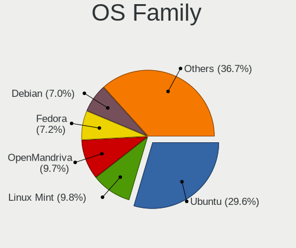

| Name          | Desktops | Percent |
|---------------|----------|---------|
| Ubuntu        | 304      | 29.57%  |
| Linux Mint    | 101      | 9.82%   |
| OpenMandriva  | 100      | 9.73%   |
| Fedora        | 74       | 7.2%    |
| Debian        | 72       | 7%      |
| Arch          | 59       | 5.74%   |
| Manjaro       | 43       | 4.18%   |
| Pop!_OS       | 38       | 3.7%    |
| Kubuntu       | 26       | 2.53%   |
| ROSA          | 24       | 2.33%   |
| Xubuntu       | 18       | 1.75%   |
| Nobara        | 17       | 1.65%   |
| openSUSE      | 16       | 1.56%   |
| ArcoLinux     | 14       | 1.36%   |
| Zorin         | 12       | 1.17%   |
| Elementary    | 10       | 0.97%   |
| KDE neon      | 9        | 0.88%   |
| EndeavourOS   | 8        | 0.78%   |
| Ubuntu MATE   | 7        | 0.68%   |
| Gentoo        | 7        | 0.68%   |
| NixOS         | 5        | 0.49%   |
| Garuda Linux  | 5        | 0.49%   |
| BlackPanther  | 5        | 0.49%   |
| Ubuntu Studio | 4        | 0.39%   |
| Xero          | 3        | 0.29%   |
| Ubuntu Unity  | 3        | 0.29%   |
| MX            | 3        | 0.29%   |
| LMDE          | 3        | 0.29%   |
| Clear Linux   | 3        | 0.29%   |
| TUXEDO OS     | 2        | 0.19%   |
| SteamOS       | 2        | 0.19%   |
| Parrot        | 2        | 0.19%   |
| Endless       | 2        | 0.19%   |
| Devuan        | 2        | 0.19%   |
| CachyOS       | 2        | 0.19%   |
| Bazzite       | 2        | 0.19%   |
| Ultramarine   | 1        | 0.1%    |
| UbuntuDDE     | 1        | 0.1%    |
| Ubuntu Budgie | 1        | 0.1%    |
| Solus         | 1        | 0.1%    |

Kernel
------

Version of the Linux kernel

| Version                             | Desktops | Percent |
|-------------------------------------|----------|---------|
| 5.16.7-desktop-1omv4003             | 26       | 2.11%   |
| 5.10.14-desktop-1omv4002            | 22       | 1.79%   |
| 6.2.6-desktop-1omv2390              | 14       | 1.14%   |
| 5.4.0-42-generic                    | 12       | 0.97%   |
| 6.1.1-desktop-1omv2290              | 9        | 0.73%   |
| 6.8.0-41-generic                    | 8        | 0.65%   |
| 6.4.11-desktop-1omv2390             | 8        | 0.65%   |
| 5.4.0-58-generic                    | 8        | 0.65%   |
| 5.4.0-52-generic                    | 7        | 0.57%   |
| 5.4.0-28-generic                    | 7        | 0.57%   |
| 5.19.0-46-generic                   | 7        | 0.57%   |
| 5.19.0-38-generic                   | 7        | 0.57%   |
| 5.15.0-56-generic                   | 7        | 0.57%   |
| 6.8.0-49-generic                    | 6        | 0.49%   |
| 6.6.2-desktop-1omv2390              | 6        | 0.49%   |
| 6.1.0-28-amd64                      | 6        | 0.49%   |
| 5.8.0-7630-generic                  | 6        | 0.49%   |
| 5.4.0-33-generic                    | 6        | 0.49%   |
| 5.15.0-76-generic                   | 6        | 0.49%   |
| 5.15.0-58-generic                   | 6        | 0.49%   |
| 5.15.0-52-generic                   | 6        | 0.49%   |
| 5.13.0-39-generic                   | 6        | 0.49%   |
| 4.15.0-desktop-60.7rosa-x86_64      | 6        | 0.49%   |
| 6.9.3-76060903-generic              | 5        | 0.41%   |
| 6.8.0-76060800daily20240311-generic | 5        | 0.41%   |
| 6.8.0-45-generic                    | 5        | 0.41%   |
| 6.2.0-26-generic                    | 5        | 0.41%   |
| 5.4.0-80-generic                    | 5        | 0.41%   |
| 5.4.0-72-generic                    | 5        | 0.41%   |
| 5.4.0-48-generic                    | 5        | 0.41%   |
| 5.15.0-57-generic                   | 5        | 0.41%   |
| 5.15.0-47-generic                   | 5        | 0.41%   |
| 5.13.0-30-generic                   | 5        | 0.41%   |
| 5.12.4-desktop-1omv4050             | 5        | 0.41%   |
| 4.9.60-nrj-desktop-1rosa-x86_64     | 5        | 0.41%   |
| 4.18.16-desktop-1bP                 | 5        | 0.41%   |
| 4.18.0-15-generic                   | 5        | 0.41%   |
| 6.8.11-300.fc40.x86_64              | 4        | 0.32%   |
| 6.5.6-300.fc39.x86_64               | 4        | 0.32%   |
| 5.8.0-44-generic                    | 4        | 0.32%   |

Kernel Family
-------------

Linux kernel without a distro release

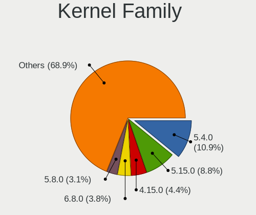

| Version | Desktops | Percent |
|---------|----------|---------|
| 5.4.0   | 128      | 10.92%  |
| 5.15.0  | 103      | 8.79%   |
| 4.15.0  | 52       | 4.44%   |
| 6.8.0   | 45       | 3.84%   |
| 5.8.0   | 36       | 3.07%   |
| 5.19.0  | 34       | 2.9%    |
| 5.11.0  | 33       | 2.82%   |
| 5.13.0  | 31       | 2.65%   |
| 6.5.0   | 29       | 2.47%   |
| 5.16.7  | 27       | 2.3%    |
| 5.10.0  | 25       | 2.13%   |
| 6.1.0   | 24       | 2.05%   |
| 5.10.14 | 23       | 1.96%   |
| 6.2.0   | 22       | 1.88%   |
| 6.2.6   | 20       | 1.71%   |
| 4.18.0  | 19       | 1.62%   |
| 5.3.0   | 15       | 1.28%   |
| 5.0.0   | 11       | 0.94%   |
| 6.4.11  | 10       | 0.85%   |
| 6.1.1   | 10       | 0.85%   |
| 4.19.0  | 10       | 0.85%   |
| 6.9.3   | 7        | 0.6%    |
| 6.5.6   | 7        | 0.6%    |
| 6.8.7   | 6        | 0.51%   |
| 6.6.2   | 6        | 0.51%   |
| 5.12.4  | 6        | 0.51%   |
| 6.10.6  | 5        | 0.43%   |
| 4.9.60  | 5        | 0.43%   |
| 4.18.16 | 5        | 0.43%   |
| 6.9.7   | 4        | 0.34%   |
| 6.8.9   | 4        | 0.34%   |
| 6.8.11  | 4        | 0.34%   |
| 6.7.4   | 4        | 0.34%   |
| 6.6.4   | 4        | 0.34%   |
| 6.6.10  | 4        | 0.34%   |
| 6.6.1   | 4        | 0.34%   |
| 6.12.1  | 4        | 0.34%   |
| 6.10.9  | 4        | 0.34%   |
| 6.1.9   | 4        | 0.34%   |
| 6.1.4   | 4        | 0.34%   |

Kernel Major Ver.
-----------------

Linux kernel major version

| Version | Desktops | Percent |
|---------|----------|---------|
| 5.4     | 147      | 12.77%  |
| 5.15    | 129      | 11.21%  |
| 6.8     | 66       | 5.73%   |
| 5.10    | 64       | 5.56%   |
| 6.1     | 54       | 4.69%   |
| 6.2     | 53       | 4.6%    |
| 4.15    | 52       | 4.52%   |
| 5.8     | 51       | 4.43%   |
| 6.5     | 45       | 3.91%   |
| 5.19    | 43       | 3.74%   |
| 5.11    | 43       | 3.74%   |
| 6.6     | 38       | 3.3%    |
| 5.16    | 38       | 3.3%    |
| 5.13    | 37       | 3.21%   |
| 4.18    | 26       | 2.26%   |
| 6.4     | 20       | 1.74%   |
| 6.10    | 20       | 1.74%   |
| 6.9     | 18       | 1.56%   |
| 5.3     | 18       | 1.56%   |
| 6.0     | 17       | 1.48%   |
| 5.12    | 17       | 1.48%   |
| 6.11    | 15       | 1.3%    |
| 5.9     | 15       | 1.3%    |
| 6.7     | 14       | 1.22%   |
| 5.18    | 12       | 1.04%   |
| 5.17    | 12       | 1.04%   |
| 4.19    | 12       | 1.04%   |
| 5.0     | 11       | 0.96%   |
| 6.3     | 10       | 0.87%   |
| 4.9     | 10       | 0.87%   |
| 6.12    | 9        | 0.78%   |
| 5.14    | 8        | 0.7%    |
| 5.6     | 6        | 0.52%   |
| 5.7     | 4        | 0.35%   |
| 5.5     | 4        | 0.35%   |
| 4.4     | 4        | 0.35%   |
| 4.1     | 4        | 0.35%   |
| 4.10    | 2        | 0.17%   |
| 4.6     | 1        | 0.09%   |
| 4.12    | 1        | 0.09%   |

Arch
----

OS architecture (x86_64, i586, etc.)

| Name   | Desktops | Percent |
|--------|----------|---------|
| x86_64 | 986      | 99.2%   |
| i686   | 8        | 0.8%    |

DE
--

Desktop Environment

| Name             | Desktops | Percent |
|------------------|----------|---------|
| GNOME            | 397      | 38.21%  |
| KDE5             | 194      | 18.67%  |
| Unknown          | 130      | 12.51%  |
| X-Cinnamon       | 90       | 8.66%   |
| XFCE             | 73       | 7.03%   |
| KDE6             | 29       | 2.79%   |
| MATE             | 27       | 2.6%    |
| KDE              | 23       | 2.21%   |
| KDE4             | 15       | 1.44%   |
| LXQt             | 12       | 1.15%   |
| Pantheon         | 10       | 0.96%   |
| Cinnamon         | 7        | 0.67%   |
| i3               | 6        | 0.58%   |
| Budgie           | 5        | 0.48%   |
| Unity            | 3        | 0.29%   |
| GNOME Flashback  | 3        | 0.29%   |
| xmonad           | 2        | 0.19%   |
| LXDE             | 2        | 0.19%   |
| Deepin           | 2        | 0.19%   |
| awesome          | 2        | 0.19%   |
| sway             | 1        | 0.1%    |
| qtile            | 1        | 0.1%    |
| lightdm-xsession | 1        | 0.1%    |
| leftwm           | 1        | 0.1%    |
| Hyprland         | 1        | 0.1%    |
| GNOME Classic    | 1        | 0.1%    |
| COSMIC           | 1        | 0.1%    |

Display Server
--------------

X11 or Wayland

| Name    | Desktops | Percent |
|---------|----------|---------|
| X11     | 716      | 68.85%  |
| Wayland | 220      | 21.15%  |
| Unknown | 66       | 6.35%   |
| Tty     | 38       | 3.65%   |

Display Manager
---------------

SDDM, LightDM, etc.

| Name           | Desktops | Percent |
|----------------|----------|---------|
| Unknown        | 460      | 44.4%   |
| SDDM           | 202      | 19.5%   |
| GDM3           | 143      | 13.8%   |
| LightDM        | 120      | 11.58%  |
| GDM            | 70       | 6.76%   |
| TDM            | 21       | 2.03%   |
| KDM            | 14       | 1.35%   |
| SLiM           | 2        | 0.19%   |
| LXDM           | 2        | 0.19%   |
| XDM            | 1        | 0.1%    |
| COSMIC-GREETER | 1        | 0.1%    |

OS Lang
-------

Language

| Lang       | Desktops | Percent |
|------------|----------|---------|
| de_AT      | 423      | 40.99%  |
| en_US      | 262      | 25.39%  |
| de_DE      | 139      | 13.47%  |
| Unknown    | 104      | 10.08%  |
| en_GB      | 41       | 3.97%   |
| C          | 26       | 2.52%   |
| en_IE      | 11       | 1.07%   |
| pl_PL      | 4        | 0.39%   |
| it_IT      | 4        | 0.39%   |
| ru_RU      | 3        | 0.29%   |
| hu_HU      | 3        | 0.29%   |
| uk_UA      | 1        | 0.1%    |
| tr_TR      | 1        | 0.1%    |
| nb_NO      | 1        | 0.1%    |
| fa_IR      | 1        | 0.1%    |
| en_US.UTF8 | 1        | 0.1%    |
| en_AU      | 1        | 0.1%    |
| en_AT      | 1        | 0.1%    |
| de_LU      | 1        | 0.1%    |
| de_CH      | 1        | 0.1%    |
| de_AT.UTF8 | 1        | 0.1%    |
| da_DK      | 1        | 0.1%    |
| cs_CZ      | 1        | 0.1%    |

Boot Mode
---------

EFI or BIOS

| Mode | Desktops | Percent |
|------|----------|---------|
| BIOS | 543      | 53.13%  |
| EFI  | 479      | 46.87%  |

Filesystem
----------

Type of filesystem

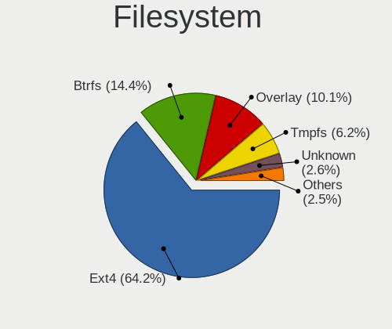

| Type    | Desktops | Percent |
|---------|----------|---------|
| Ext4    | 667      | 64.2%   |
| Btrfs   | 150      | 14.44%  |
| Overlay | 105      | 10.11%  |
| Tmpfs   | 64       | 6.16%   |
| Unknown | 27       | 2.6%    |
| Xfs     | 13       | 1.25%   |
| Zfs     | 7        | 0.67%   |
| Ext2    | 3        | 0.29%   |
| F2fs    | 2        | 0.19%   |
| Ext3    | 1        | 0.1%    |

Part. scheme
------------

Scheme of partitioning

| Type    | Desktops | Percent |
|---------|----------|---------|
| GPT     | 480      | 46.65%  |
| Unknown | 455      | 44.22%  |
| MBR     | 94       | 9.14%   |

Dual Boot with Linux/BSD
------------------------

Hosting more than one Linux/BSD

| Dual boot | Desktops | Percent |
|-----------|----------|---------|
| No        | 804      | 78.29%  |
| Yes       | 223      | 21.71%  |

Dual Boot (Win)
---------------

Hosting Linux and Windows

| Dual boot | Desktops | Percent |
|-----------|----------|---------|
| No        | 640      | 62.68%  |
| Yes       | 381      | 37.32%  |

Board
-----

Vendor
------

Motherboard manufacturer

| Name                                 | Desktops | Percent |
|--------------------------------------|----------|---------|
| ASUSTek Computer                     | 319      | 32.09%  |
| MSI                                  | 169      | 17%     |
| Gigabyte Technology                  | 127      | 12.78%  |
| ASRock                               | 109      | 10.97%  |
| Hewlett-Packard                      | 67       | 6.74%   |
| Lenovo                               | 35       | 3.52%   |
| Dell                                 | 25       | 2.52%   |
| Medion                               | 23       | 2.31%   |
| Acer                                 | 22       | 2.21%   |
| Fujitsu                              | 15       | 1.51%   |
| Unknown                              | 15       | 1.51%   |
| Intel                                | 12       | 1.21%   |
| Biostar                              | 10       | 1.01%   |
| Foxconn                              | 6        | 0.6%    |
| Shenzhen Meigao Electronic Equipment | 5        | 0.5%    |
| Shuttle                              | 4        | 0.4%    |
| Supermicro                           | 3        | 0.3%    |
| Pegatron                             | 3        | 0.3%    |
| ECS                                  | 3        | 0.3%    |
| AMI                                  | 3        | 0.3%    |
| Sapphire                             | 2        | 0.2%    |
| Fujitsu Siemens                      | 2        | 0.2%    |
| BESSTAR Tech                         | 2        | 0.2%    |
| ZOTAC                                | 1        | 0.1%    |
| TYAN Computer                        | 1        | 0.1%    |
| SIEMENS                              | 1        | 0.1%    |
| Packard Bell                         | 1        | 0.1%    |
| OEM                                  | 1        | 0.1%    |
| Minix                                | 1        | 0.1%    |
| Matrox Electronic Systems            | 1        | 0.1%    |
| Jetway                               | 1        | 0.1%    |
| IBM                                  | 1        | 0.1%    |
| Hardkernel                           | 1        | 0.1%    |
| GMKtec                               | 1        | 0.1%    |
| AZW                                  | 1        | 0.1%    |
| ASRockRack                           | 1        | 0.1%    |

Model
-----

Motherboard model

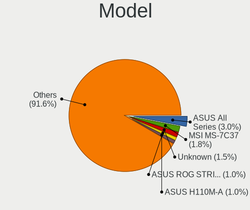

| Name                                       | Desktops | Percent |
|--------------------------------------------|----------|---------|
| ASUS All Series                            | 30       | 3.02%   |
| MSI MS-7C37                                | 18       | 1.81%   |
| Unknown                                    | 15       | 1.51%   |
| ASUS ROG STRIX B550-F GAMING               | 10       | 1.01%   |
| ASUS H110M-A                               | 10       | 1.01%   |
| MSI MS-7B86                                | 9        | 0.91%   |
| MSI MS-7B79                                | 8        | 0.8%    |
| ASUS PRIME B450-PLUS                       | 8        | 0.8%    |
| MSI MS-7C91                                | 7        | 0.7%    |
| ASUS TUF Gaming B550-PLUS                  | 6        | 0.6%    |
| ASUS ROG STRIX B450-F GAMING               | 6        | 0.6%    |
| ASUS PRIME B550-PLUS                       | 6        | 0.6%    |
| ASRock Z87 Killer                          | 6        | 0.6%    |
| MSI MS-7817                                | 5        | 0.5%    |
| ASUS TUF Gaming X570-PLUS                  | 5        | 0.5%    |
| MSI MS-7B89                                | 4        | 0.4%    |
| MSI MS-7971                                | 4        | 0.4%    |
| HP EliteDesk 800 G1 SFF                    | 4        | 0.4%    |
| HP Compaq 8200 Elite SFF PC                | 4        | 0.4%    |
| Gigabyte B550 AORUS PRO V2                 | 4        | 0.4%    |
| ASUS Z170-P                                | 4        | 0.4%    |
| ASUS Z170 PRO GAMING                       | 4        | 0.4%    |
| ASUS ROG STRIX B550-I GAMING               | 4        | 0.4%    |
| ASUS PRIME A320M-K                         | 4        | 0.4%    |
| Shenzhen Meigao Electronic Equipment UM690 | 3        | 0.3%    |
| MSI MS-7D25                                | 3        | 0.3%    |
| MSI MS-7C95                                | 3        | 0.3%    |
| MSI MS-7C84                                | 3        | 0.3%    |
| MSI MS-7C56                                | 3        | 0.3%    |
| MSI MS-7C02                                | 3        | 0.3%    |
| MSI MS-7A38                                | 3        | 0.3%    |
| MSI MS-7721                                | 3        | 0.3%    |
| MSI MS-7676                                | 3        | 0.3%    |
| Medion MS-7800                             | 3        | 0.3%    |
| Medion MS-7707                             | 3        | 0.3%    |
| HP Z800 Workstation                        | 3        | 0.3%    |
| HP EliteDesk 800 G2 SFF                    | 3        | 0.3%    |
| HP Compaq Elite 8300 SFF                   | 3        | 0.3%    |
| HP Compaq 8100 Elite CMT PC                | 3        | 0.3%    |
| Gigabyte Z77-D3H                           | 3        | 0.3%    |

Model Family
------------

Motherboard model prefix

| Name                | Desktops | Percent |
|---------------------|----------|---------|
| ASUS PRIME          | 68       | 6.84%   |
| ASUS ROG            | 51       | 5.13%   |
| ASUS All            | 30       | 3.02%   |
| ASUS TUF            | 25       | 2.52%   |
| Lenovo ThinkCentre  | 21       | 2.11%   |
| HP Compaq           | 21       | 2.11%   |
| Dell OptiPlex       | 19       | 1.91%   |
| MSI MS-7C37         | 18       | 1.81%   |
| Unknown             | 15       | 1.51%   |
| Gigabyte X570       | 12       | 1.21%   |
| Gigabyte B550       | 11       | 1.11%   |
| ASUS H110M-A        | 10       | 1.01%   |
| MSI MS-7B86         | 9        | 0.91%   |
| HP EliteDesk        | 9        | 0.91%   |
| MSI MS-7B79         | 8        | 0.8%    |
| Fujitsu ESPRIMO     | 8        | 0.8%    |
| ASUS SABERTOOTH     | 8        | 0.8%    |
| MSI MS-7C91         | 7        | 0.7%    |
| Gigabyte Z390       | 7        | 0.7%    |
| Gigabyte B450       | 7        | 0.7%    |
| ASRock Z87          | 7        | 0.7%    |
| ASRock X570         | 7        | 0.7%    |
| Acer Aspire         | 7        | 0.7%    |
| Lenovo ThinkStation | 6        | 0.6%    |
| Gigabyte B550M      | 6        | 0.6%    |
| MSI MS-7817         | 5        | 0.5%    |
| ASUS Z170           | 5        | 0.5%    |
| ASUS Maximus        | 5        | 0.5%    |
| ASUS M5A97          | 5        | 0.5%    |
| ASUS M5A78L-M       | 5        | 0.5%    |
| ASRock B450         | 5        | 0.5%    |
| ASRock 970          | 5        | 0.5%    |
| Acer Veriton        | 5        | 0.5%    |
| Acer Predator       | 5        | 0.5%    |
| MSI MS-7B89         | 4        | 0.4%    |
| MSI MS-7971         | 4        | 0.4%    |
| Lenovo IdeaCentre   | 4        | 0.4%    |
| HP ProDesk          | 4        | 0.4%    |
| HP Pavilion         | 4        | 0.4%    |
| HP Desktop          | 4        | 0.4%    |

MFG Year
--------

Motherboard manufacture year

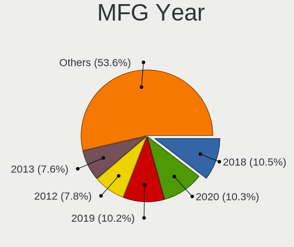

| Year | Desktops | Percent |
|------|----------|---------|
| 2018 | 104      | 10.46%  |
| 2020 | 102      | 10.26%  |
| 2019 | 101      | 10.16%  |
| 2012 | 78       | 7.85%   |
| 2013 | 76       | 7.65%   |
| 2011 | 64       | 6.44%   |
| 2015 | 63       | 6.34%   |
| 2014 | 55       | 5.53%   |
| 2021 | 53       | 5.33%   |
| 2022 | 51       | 5.13%   |
| 2010 | 45       | 4.53%   |
| 2016 | 44       | 4.43%   |
| 2017 | 41       | 4.12%   |
| 2009 | 39       | 3.92%   |
| 2023 | 25       | 2.52%   |
| 2008 | 20       | 2.01%   |
| 2007 | 18       | 1.81%   |
| 2006 | 7        | 0.7%    |
| 2024 | 6        | 0.6%    |
| 2005 | 2        | 0.2%    |

Form Factor
-----------

Physical design of the computer

| Name    | Desktops | Percent |
|---------|----------|---------|
| Desktop | 994      | 100%    |

Secure Boot
-----------

Enabled or disabled

| State    | Desktops | Percent |
|----------|----------|---------|
| Disabled | 962      | 96.59%  |
| Enabled  | 34       | 3.41%   |

Coreboot
--------

Have coreboot on board

| Used | Desktops | Percent |
|------|----------|---------|
| No   | 994      | 100%    |

RAM Size
--------

Total RAM memory

| Size in GB      | Desktops | Percent |
|-----------------|----------|---------|
| 16.01-24.0      | 267      | 26.49%  |
| 32.01-64.0      | 223      | 22.12%  |
| 8.01-16.0       | 161      | 15.97%  |
| 4.01-8.0        | 120      | 11.9%   |
| 64.01-256.0     | 88       | 8.73%   |
| 3.01-4.0        | 83       | 8.23%   |
| 24.01-32.0      | 40       | 3.97%   |
| 1.01-2.0        | 11       | 1.09%   |
| More than 256.0 | 7        | 0.69%   |
| 2.01-3.0        | 5        | 0.5%    |
| 0.51-1.0        | 2        | 0.2%    |
| Unknown         | 1        | 0.1%    |

RAM Used
--------

Used RAM memory

| Used GB    | Desktops | Percent |
|------------|----------|---------|
| 1.01-2.0   | 309      | 27.84%  |
| 2.01-3.0   | 257      | 23.15%  |
| 4.01-8.0   | 210      | 18.92%  |
| 3.01-4.0   | 149      | 13.42%  |
| 8.01-16.0  | 87       | 7.84%   |
| 0.51-1.0   | 54       | 4.86%   |
| 16.01-24.0 | 14       | 1.26%   |
| 24.01-32.0 | 11       | 0.99%   |
| 0.01-0.5   | 10       | 0.9%    |
| 32.01-64.0 | 8        | 0.72%   |
| Unknown    | 1        | 0.09%   |

Total Drives
------------

Number of drives on board

| Drives | Desktops | Percent |
|--------|----------|---------|
| 2      | 306      | 28.95%  |
| 1      | 306      | 28.95%  |
| 3      | 205      | 19.39%  |
| 4      | 117      | 11.07%  |
| 5      | 49       | 4.64%   |
| 6      | 29       | 2.74%   |
| 9      | 12       | 1.14%   |
| 7      | 12       | 1.14%   |
| 10     | 8        | 0.76%   |
| 8      | 5        | 0.47%   |
| 11     | 3        | 0.28%   |
| 0      | 3        | 0.28%   |
| 12     | 2        | 0.19%   |

Has CD-ROM
----------

Has CD-ROM on board

| Presented | Desktops | Percent |
|-----------|----------|---------|
| Yes       | 503      | 50%     |
| No        | 503      | 50%     |

Has Ethernet
------------

Has Ethernet on board

| Presented | Desktops | Percent |
|-----------|----------|---------|
| Yes       | 990      | 99.6%   |
| No        | 4        | 0.4%    |

Has WiFi
--------

Has WiFi module

| Presented | Desktops | Percent |
|-----------|----------|---------|
| No        | 561      | 55.49%  |
| Yes       | 450      | 44.51%  |

Has Bluetooth
-------------

Has Bluetooth module

| Presented | Desktops | Percent |
|-----------|----------|---------|
| No        | 643      | 64.04%  |
| Yes       | 361      | 35.96%  |

Location
--------

Country
-------

Geographic location (country)

| Country | Desktops | Percent |
|---------|----------|---------|
| Austria | 994      | 100%    |

City
----

Geographic location (city)

| City              | Desktops | Percent |
|-------------------|----------|---------|
| Vienna            | 527      | 49.91%  |
| Graz              | 52       | 4.92%   |
| Linz              | 34       | 3.22%   |
| Innsbruck         | 34       | 3.22%   |
| Salzburg          | 18       | 1.7%    |
| Sankt Plten     | 15       | 1.42%   |
| Bad Hall          | 12       | 1.14%   |
| Dornbirn          | 10       | 0.95%   |
| Wels              | 9        | 0.85%   |
| Steyr             | 9        | 0.85%   |
| Klagenfurt        | 9        | 0.85%   |
| Wiener Neustadt   | 8        | 0.76%   |
| Feldkirch         | 8        | 0.76%   |
| Hallein           | 6        | 0.57%   |
| Villach           | 5        | 0.47%   |
| Ried im Innkreis  | 5        | 0.47%   |
| Zell am See       | 4        | 0.38%   |
| Schwechat         | 4        | 0.38%   |
| Perchtoldsdorf    | 4        | 0.38%   |
| Ober-Grafendorf   | 4        | 0.38%   |
| Leonding          | 4        | 0.38%   |
| Falkenstein       | 4        | 0.38%   |
| Voecklabruck      | 3        | 0.28%   |
| Seiersberg        | 3        | 0.28%   |
| Perg              | 3        | 0.28%   |
| Lienz             | 3        | 0.28%   |
| Leibnitz, Styria  | 3        | 0.28%   |
| Klosterneuburg    | 3        | 0.28%   |
| Horn              | 3        | 0.28%   |
| Hall in Tirol     | 3        | 0.28%   |
| Haid              | 3        | 0.28%   |
| Gleisdorf         | 3        | 0.28%   |
| Brunn am Gebirge  | 3        | 0.28%   |
| Baden bei Wien    | 3        | 0.28%   |
| Bad Tatzmannsdorf | 3        | 0.28%   |
| Woellersdorf      | 2        | 0.19%   |
| Unterpremstaetten | 2        | 0.19%   |
| Traunkirchen      | 2        | 0.19%   |
| Schwadorf         | 2        | 0.19%   |
| Schoerfling       | 2        | 0.19%   |

Drives
------

Drive Vendor
------------

Hard drive vendors

| Vendor                       | Desktops | Drives | Percent |
|------------------------------|----------|--------|---------|
| Samsung Electronics          | 443      | 870    | 22.17%  |
| WDC                          | 286      | 502    | 14.31%  |
| Seagate                      | 274      | 449    | 13.71%  |
| SanDisk                      | 178      | 278    | 8.91%   |
| Crucial                      | 118      | 218    | 5.91%   |
| Kingston                     | 102      | 140    | 5.11%   |
| Toshiba                      | 87       | 156    | 4.35%   |
| Intenso                      | 47       | 60     | 2.35%   |
| Hitachi                      | 41       | 51     | 2.05%   |
| Micron/Crucial Technology    | 35       | 45     | 1.75%   |
| Intel                        | 34       | 50     | 1.7%    |
| Unknown                      | 22       | 54     | 1.1%    |
| Micron Technology            | 22       | 27     | 1.1%    |
| Phison                       | 20       | 30     | 1%      |
| A-DATA Technology            | 20       | 27     | 1%      |
| Transcend                    | 15       | 19     | 0.75%   |
| OCZ                          | 15       | 26     | 0.75%   |
| Kingston Technology Company  | 15       | 18     | 0.75%   |
| HGST                         | 15       | 34     | 0.75%   |
| Phison Electronics           | 13       | 18     | 0.65%   |
| Corsair                      | 13       | 16     | 0.65%   |
| China                        | 13       | 20     | 0.65%   |
| Patriot                      | 11       | 15     | 0.55%   |
| Silicon Motion               | 10       | 12     | 0.5%    |
| Verbatim                     | 6        | 6      | 0.3%    |
| USB                          | 6        | 6      | 0.3%    |
| SK hynix                     | 6        | 17     | 0.3%    |
| ASMT                         | 6        | 12     | 0.3%    |
| Hewlett-Packard              | 5        | 5      | 0.25%   |
| Fanxiang                     | 5        | 5      | 0.25%   |
| Apacer                       | 5        | 8      | 0.25%   |
| PNY                          | 4        | 4      | 0.2%    |
| Maxtor                       | 4        | 5      | 0.2%    |
| LITEON                       | 4        | 5      | 0.2%    |
| SSK                          | 3        | 3      | 0.15%   |
| SPCC                         | 3        | 23     | 0.15%   |
| Shenzhen Longsys Electronics | 3        | 4      | 0.15%   |
| SABRENT                      | 3        | 5      | 0.15%   |
| Plextor                      | 3        | 3      | 0.15%   |
| MAXIO Technology (Hangzhou)  | 3        | 3      | 0.15%   |

Drive Model
-----------

Hard drive models

| Model                                                | Desktops | Percent |
|------------------------------------------------------|----------|---------|
| Samsung NVMe SSD Controller SM981/PM981/PM983 512GB  | 38       | 1.57%   |
| Samsung SSD 850 EVO 250GB                            | 31       | 1.28%   |
| Samsung SSD 850 EVO 500GB                            | 28       | 1.16%   |
| Samsung SSD 860 EVO 500GB                            | 26       | 1.07%   |
| Samsung SSD 860 EVO 1TB                              | 25       | 1.03%   |
| Samsung NVMe SSD Controller PM9A1/PM9A3/980PRO 512GB | 21       | 0.87%   |
| Crucial CT500MX500SSD1 500GB                         | 21       | 0.87%   |
| Seagate Expansion 1TB                                | 20       | 0.83%   |
| Samsung SSD 840 EVO 250GB                            | 20       | 0.83%   |
| SanDisk SSD PLUS 1000GB                              | 19       | 0.78%   |
| Samsung SSD 850 PRO 256GB                            | 18       | 0.74%   |
| Crucial CT1000MX500SSD1 1TB                          | 18       | 0.74%   |
| Toshiba DT01ACA200 2TB                               | 17       | 0.7%    |
| SanDisk SSD PLUS 240GB                               | 15       | 0.62%   |
| Toshiba HDWD110 1TB                                  | 14       | 0.58%   |
| Seagate ST4000VN008-2DR166 4TB                       | 14       | 0.58%   |
| Seagate ST2000DM008-2FR102 2TB                       | 14       | 0.58%   |
| Samsung SSD 980 PRO 1TB                              | 14       | 0.58%   |
| Micron/Crucial P2 NVMe PCIe SSD 500GB                | 14       | 0.58%   |
| Kingston SUV400S37240G 240GB SSD                     | 14       | 0.58%   |
| Toshiba DT01ACA100 1TB                               | 13       | 0.54%   |
| Samsung SSD 870 EVO 1TB                              | 13       | 0.54%   |
| Samsung SSD 860 EVO 250GB                            | 13       | 0.54%   |
| WDC WD30EFRX-68EUZN0 3TB                             | 12       | 0.5%    |
| Kingston SA400S37240G 240GB SSD                      | 12       | 0.5%    |
| Intenso USB 3.0 device 1TB                           | 12       | 0.5%    |
| Seagate ST1000DM010-2EP102 1TB                       | 11       | 0.45%   |
| SanDisk SSD PLUS 480GB                               | 11       | 0.45%   |
| Samsung SSD 980 1TB                                  | 11       | 0.45%   |
| Samsung SSD 870 QVO 1TB                              | 11       | 0.45%   |
| Samsung NVMe SSD Drive 500GB                         | 11       | 0.45%   |
| Unknown SD/MMC/MS PRO 128GB                          | 10       | 0.41%   |
| SanDisk SDSSDH3 1T00 1TB                             | 10       | 0.41%   |
| Samsung SSD 970 EVO Plus 500GB                       | 10       | 0.41%   |
| Kingston SA400S37120G 120GB SSD                      | 10       | 0.41%   |
| WDC WD20EZRZ-00Z5HB0 2TB                             | 9        | 0.37%   |
| SanDisk SDSSDA240G 240GB                             | 9        | 0.37%   |
| Samsung SSD 990 PRO 2TB                              | 9        | 0.37%   |
| Samsung SSD 970 EVO Plus 2TB                         | 9        | 0.37%   |
| Samsung SSD 970 EVO Plus 1TB                         | 9        | 0.37%   |

HDD Vendor
----------

Hard disk drive vendors

| Vendor              | Desktops | Drives | Percent |
|---------------------|----------|--------|---------|
| Seagate             | 262      | 418    | 34.07%  |
| WDC                 | 247      | 437    | 32.12%  |
| Toshiba             | 84       | 152    | 10.92%  |
| Samsung Electronics | 65       | 96     | 8.45%   |
| Hitachi             | 41       | 51     | 5.33%   |
| Intenso             | 15       | 15     | 1.95%   |
| HGST                | 15       | 34     | 1.95%   |
| Unknown             | 12       | 20     | 1.56%   |
| ASMT                | 5        | 11     | 0.65%   |
| USB                 | 4        | 4      | 0.52%   |
| Maxtor              | 4        | 5      | 0.52%   |
| SABRENT             | 3        | 5      | 0.39%   |
| JMicron Technology  | 3        | 6      | 0.39%   |
| LaCie               | 2        | 2      | 0.26%   |
| Hewlett-Packard     | 2        | 2      | 0.26%   |
| WD MediaMax         | 1        | 1      | 0.13%   |
| USB3.0              | 1        | 2      | 0.13%   |
| TO Exter            | 1        | 3      | 0.13%   |
| Synology            | 1        | 8      | 0.13%   |
| Magnetic Data       | 1        | 1      | 0.13%   |

SSD Vendor
----------

Solid state drive vendors

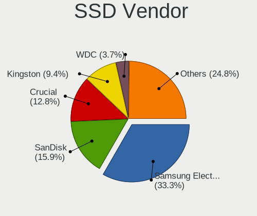

| Vendor              | Desktops | Drives | Percent |
|---------------------|----------|--------|---------|
| Samsung Electronics | 278      | 470    | 33.33%  |
| SanDisk             | 133      | 206    | 15.95%  |
| Crucial             | 107      | 181    | 12.83%  |
| Kingston            | 78       | 97     | 9.35%   |
| WDC                 | 31       | 40     | 3.72%   |
| Intenso             | 29       | 39     | 3.48%   |
| Intel               | 21       | 32     | 2.52%   |
| OCZ                 | 15       | 26     | 1.8%    |
| A-DATA Technology   | 14       | 19     | 1.68%   |
| Transcend           | 13       | 16     | 1.56%   |
| China               | 13       | 20     | 1.56%   |
| Micron Technology   | 12       | 16     | 1.44%   |
| Corsair             | 8        | 8      | 0.96%   |
| Patriot             | 7        | 8      | 0.84%   |
| Verbatim            | 6        | 6      | 0.72%   |
| LITEON              | 4        | 5      | 0.48%   |
| Apacer              | 4        | 5      | 0.48%   |
| Plextor             | 3        | 3      | 0.36%   |
| INNOVATION IT       | 3        | 3      | 0.36%   |
| Dogfish             | 3        | 3      | 0.36%   |
| V7                  | 2        | 2      | 0.24%   |
| TCSUNBOW            | 2        | 2      | 0.24%   |
| SPCC                | 2        | 2      | 0.24%   |
| SK hynix            | 2        | 12     | 0.24%   |
| Seagate             | 2        | 4      | 0.24%   |
| SD                  | 2        | 2      | 0.24%   |
| PNY                 | 2        | 2      | 0.24%   |
| Netac               | 2        | 3      | 0.24%   |
| Hewlett-Packard     | 2        | 2      | 0.24%   |
| GOODRAM             | 2        | 2      | 0.24%   |
| Fanxiang            | 2        | 2      | 0.24%   |
| BAITITON            | 2        | 3      | 0.24%   |
| Unknown             | 2        | 2      | 0.24%   |
| WDC WDS5            | 1        | 1      | 0.12%   |
| WDC WDS2            | 1        | 1      | 0.12%   |
| ViperTeq            | 1        | 4      | 0.12%   |
| VERICO              | 1        | 2      | 0.12%   |
| TSA                 | 1        | 1      | 0.12%   |
| Toshiba             | 1        | 1      | 0.12%   |
| Team                | 1        | 1      | 0.12%   |

Drive Kind
----------

HDD or SSD

| Kind    | Desktops | Drives | Percent |
|---------|----------|--------|---------|
| SSD     | 654      | 1275   | 39.64%  |
| HDD     | 585      | 1273   | 35.45%  |
| NVMe    | 377      | 740    | 22.85%  |
| Unknown | 31       | 65     | 1.88%   |
| MMC     | 3        | 5      | 0.18%   |

Drive Connector
---------------

SATA, SAS, NVMe, etc.

| Type | Desktops | Drives | Percent |
|------|----------|--------|---------|
| SATA | 868      | 2425   | 63.82%  |
| NVMe | 376      | 733    | 27.65%  |
| SAS  | 113      | 195    | 8.31%   |
| MMC  | 3        | 5      | 0.22%   |

Drive Size
----------

Size of hard drive

| Size in TB | Desktops | Drives | Percent |
|------------|----------|--------|---------|
| 0.01-0.5   | 609      | 1177   | 43.47%  |
| 0.51-1.0   | 404      | 663    | 28.84%  |
| 1.01-2.0   | 182      | 327    | 12.99%  |
| 3.01-4.0   | 87       | 172    | 6.21%   |
| 4.01-10.0  | 57       | 101    | 4.07%   |
| 2.01-3.0   | 49       | 72     | 3.5%    |
| 10.01-20.0 | 13       | 36     | 0.93%   |

Space Total
-----------

Amount of disk space available on the file system

| Size in GB     | Desktops | Percent |
|----------------|----------|---------|
| 101-250        | 188      | 17.46%  |
| 501-1000       | 167      | 15.51%  |
| More than 3000 | 164      | 15.23%  |
| 1001-2000      | 144      | 13.37%  |
| 251-500        | 137      | 12.72%  |
| 1-20           | 80       | 7.43%   |
| 2001-3000      | 66       | 6.13%   |
| 51-100         | 50       | 4.64%   |
| Unknown        | 47       | 4.36%   |
| 21-50          | 34       | 3.16%   |

Space Used
----------

Amount of used disk space

| Used GB        | Desktops | Percent |
|----------------|----------|---------|
| 1-20           | 323      | 29.13%  |
| 21-50          | 135      | 12.17%  |
| 101-250        | 114      | 10.28%  |
| 251-500        | 107      | 9.65%   |
| 501-1000       | 106      | 9.56%   |
| 51-100         | 86       | 7.75%   |
| 1001-2000      | 82       | 7.39%   |
| More than 3000 | 67       | 6.04%   |
| Unknown        | 47       | 4.24%   |
| 2001-3000      | 40       | 3.61%   |
| 0              | 2        | 0.18%   |

Malfunc. Drives
---------------

Drive models with a malfunction

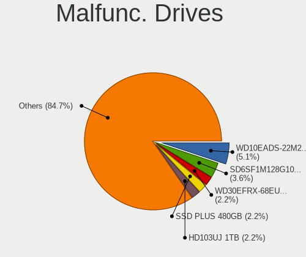

| Model                                        | Desktops | Drives | Percent |
|----------------------------------------------|----------|--------|---------|
| WDC WD10EADS-22M2B0 1TB                      | 7        | 7      | 5.11%   |
| SanDisk SD6SF1M128G1022I 128GB SSD           | 5        | 5      | 3.65%   |
| WDC WD30EFRX-68EUZN0 3TB                     | 3        | 3      | 2.19%   |
| SanDisk SSD PLUS 480GB                       | 3        | 3      | 2.19%   |
| Samsung Electronics HD103UJ 1TB              | 3        | 3      | 2.19%   |
| Seagate ST3500413AS 500GB                    | 2        | 2      | 1.46%   |
| Samsung Electronics SSD 840 PRO Series 512GB | 2        | 3      | 1.46%   |
| Samsung Electronics HM500JI 500GB            | 2        | 2      | 1.46%   |
| Samsung Electronics HD753LJ 752GB            | 2        | 2      | 1.46%   |
| Kingston SA400S37240G 240GB SSD              | 2        | 2      | 1.46%   |
| WDC WDS240G2G0A-00JH30 240GB SSD             | 1        | 1      | 0.73%   |
| WDC WD6400AACS-00G8B0 640GB                  | 1        | 1      | 0.73%   |
| WDC WD5000AAKX-08U6AA0 500GB                 | 1        | 1      | 0.73%   |
| WDC WD5000AAKS-60Z1A0 500GB                  | 1        | 1      | 0.73%   |
| WDC WD5000AAKS-22A7B0 500GB                  | 1        | 1      | 0.73%   |
| WDC WD5000AAKS-00UU3A0 500GB                 | 1        | 1      | 0.73%   |
| WDC WD5000AAKS-00H2B0 500GB                  | 1        | 1      | 0.73%   |
| WDC WD5000AADS-00M2B0 500GB                  | 1        | 1      | 0.73%   |
| WDC WD3200JD-22KLB0 320GB                    | 1        | 1      | 0.73%   |
| WDC WD2500AAKX-603CA0 250GB                  | 1        | 1      | 0.73%   |
| WDC WD20PURX-64P6ZY0 2TB                     | 1        | 1      | 0.73%   |
| WDC WD20EZRZ-00Z5HB0 2TB                     | 1        | 1      | 0.73%   |
| WDC WD20EZRX-22D8PB0 2TB                     | 1        | 1      | 0.73%   |
| WDC WD20EZRX-00D8PB0 2TB                     | 1        | 1      | 0.73%   |
| WDC WD20EFRX-68AX9N0 2TB                     | 1        | 21     | 0.73%   |
| WDC WD20EARX-008FB0 2TB                      | 1        | 1      | 0.73%   |
| WDC WD20EARS-00MVWB0 2TB                     | 1        | 4      | 0.73%   |
| WDC WD2003FYYS-02W0B1 2TB                    | 1        | 1      | 0.73%   |
| WDC WD2002FYPS-02W3B0 2TB                    | 1        | 1      | 0.73%   |
| WDC WD2000FYYZ-01UL1B1 2TB                   | 1        | 1      | 0.73%   |
| WDC WD1600BEVT-22ZCT0 160GB                  | 1        | 1      | 0.73%   |
| WDC WD10EZRX-00L4HB0 1TB                     | 1        | 1      | 0.73%   |
| WDC WD10EZEX-75M2NA0 1TB                     | 1        | 1      | 0.73%   |
| WDC WD10EZEX-60WN4A0 1TB                     | 1        | 1      | 0.73%   |
| WDC WD10EARS-00Z5B1 1TB                      | 1        | 2      | 0.73%   |
| WDC WD10EARS-00Y5B1 1TB                      | 1        | 1      | 0.73%   |
| WDC WD10EACS-00D6B0 1TB                      | 1        | 2      | 0.73%   |
| WDC WD1002FAEX-00Y9A0 1TB                    | 1        | 1      | 0.73%   |
| Transcend TS240GSSD220S 240GB                | 1        | 1      | 0.73%   |
| Toshiba MQ01ABD050 500GB                     | 1        | 1      | 0.73%   |

Malfunc. Drive Vendor
---------------------

Vendors of faulty drives

| Vendor                      | Desktops | Drives | Percent |
|-----------------------------|----------|--------|---------|
| WDC                         | 36       | 63     | 27.91%  |
| Samsung Electronics         | 26       | 32     | 20.16%  |
| Seagate                     | 19       | 27     | 14.73%  |
| SanDisk                     | 11       | 11     | 8.53%   |
| Hitachi                     | 10       | 10     | 7.75%   |
| Toshiba                     | 7        | 15     | 5.43%   |
| OCZ                         | 3        | 5      | 2.33%   |
| Kingston                    | 2        | 2      | 1.55%   |
| Intenso                     | 2        | 2      | 1.55%   |
| Intel                       | 2        | 2      | 1.55%   |
| Crucial                     | 2        | 2      | 1.55%   |
| Transcend                   | 1        | 1      | 0.78%   |
| SK hynix                    | 1        | 11     | 0.78%   |
| Patriot                     | 1        | 1      | 0.78%   |
| Netac                       | 1        | 1      | 0.78%   |
| Maxtor                      | 1        | 1      | 0.78%   |
| Kingston Technology Company | 1        | 1      | 0.78%   |
| HGST                        | 1        | 13     | 0.78%   |
| Dogfish                     | 1        | 1      | 0.78%   |
| BAITITON                    | 1        | 2      | 0.78%   |

Malfunc. HDD Vendor
-------------------

Vendors of faulty HDD drives

| Vendor              | Desktops | Drives | Percent |
|---------------------|----------|--------|---------|
| WDC                 | 35       | 62     | 39.77%  |
| Seagate             | 19       | 27     | 21.59%  |
| Samsung Electronics | 15       | 16     | 17.05%  |
| Hitachi             | 10       | 10     | 11.36%  |
| Toshiba             | 7        | 15     | 7.95%   |
| Maxtor              | 1        | 1      | 1.14%   |
| HGST                | 1        | 13     | 1.14%   |

Malfunc. Drive Kind
-------------------

Kinds of faulty drives

| Kind | Desktops | Drives | Percent |
|------|----------|--------|---------|
| HDD  | 79       | 144    | 65.29%  |
| SSD  | 35       | 51     | 28.93%  |
| NVMe | 7        | 8      | 5.79%   |

Failed Drives
-------------

Failed drive models

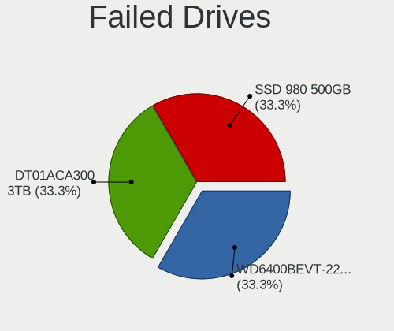

| Model                             | Desktops | Drives | Percent |
|-----------------------------------|----------|--------|---------|
| WDC WD6400BEVT-22A0RT0 640GB      | 1        | 1      | 33.33%  |
| Toshiba DT01ACA300 3TB            | 1        | 1      | 33.33%  |
| Samsung Electronics SSD 980 500GB | 1        | 1      | 33.33%  |

Failed Drive Vendor
-------------------

Failed drive vendors

| Vendor              | Desktops | Drives | Percent |
|---------------------|----------|--------|---------|
| WDC                 | 1        | 1      | 33.33%  |
| Toshiba             | 1        | 1      | 33.33%  |
| Samsung Electronics | 1        | 1      | 33.33%  |

Drive Status
------------

Number of failed and malfunc. drives

| Status   | Desktops | Drives | Percent |
|----------|----------|--------|---------|
| Detected | 592      | 1699   | 51.52%  |
| Works    | 443      | 1452   | 38.56%  |
| Malfunc  | 110      | 203    | 9.57%   |
| Failed   | 3        | 3      | 0.26%   |
| Limited  | 1        | 1      | 0.09%   |

Storage controller
------------------

Storage Vendor
--------------

Storage controller vendors

| Vendor                        | Desktops | Percent |
|-------------------------------|----------|---------|
| Intel                         | 584      | 35.22%  |
| AMD                           | 394      | 23.76%  |
| Samsung Electronics           | 185      | 11.16%  |
| ASMedia Technology            | 96       | 5.79%   |
| SanDisk                       | 69       | 4.16%   |
| Micron/Crucial Technology     | 48       | 2.9%    |
| Marvell Technology Group      | 47       | 2.83%   |
| Phison Electronics            | 42       | 2.53%   |
| Kingston Technology Company   | 40       | 2.41%   |
| JMicron Technology            | 37       | 2.23%   |
| Silicon Motion                | 13       | 0.78%   |
| Nvidia                        | 11       | 0.66%   |
| Micron Technology             | 10       | 0.6%    |
| LSI Logic / Symbios Logic     | 10       | 0.6%    |
| ADATA Technology              | 10       | 0.6%    |
| Seagate Technology            | 8        | 0.48%   |
| VIA Technologies              | 7        | 0.42%   |
| MAXIO Technology (Hangzhou)   | 6        | 0.36%   |
| Broadcom / LSI                | 6        | 0.36%   |
| SK hynix                      | 5        | 0.3%    |
| Silicon Image                 | 5        | 0.3%    |
| KIOXIA                        | 4        | 0.24%   |
| Shenzhen Longsys Electronics  | 3        | 0.18%   |
| Toshiba America Info Systems  | 2        | 0.12%   |
| OCZ Technology Group          | 2        | 0.12%   |
| Lite-On IT Corp. / Plextor    | 2        | 0.12%   |
| Adaptec                       | 2        | 0.12%   |
| Transcend                     | 1        | 0.06%   |
| Solidigm                      | 1        | 0.06%   |
| Realtek Semiconductor         | 1        | 0.06%   |
| Lite-On Technology            | 1        | 0.06%   |
| Integrated Technology Express | 1        | 0.06%   |
| INNOGRIT                      | 1        | 0.06%   |
| Hosin Global Electronics      | 1        | 0.06%   |
| HighPoint Technologies        | 1        | 0.06%   |
| Biwin Storage Technology      | 1        | 0.06%   |
| Unknown                       | 1        | 0.06%   |

Storage Model
-------------

Storage controller models

| Model                                                                                   | Desktops | Percent |
|-----------------------------------------------------------------------------------------|----------|---------|
| AMD FCH SATA Controller [AHCI mode]                                                     | 205      | 10.37%  |
| Samsung NVMe SSD Controller SM981/PM981/PM983                                           | 99       | 5.01%   |
| ASMedia ASM1061/ASM1062 Serial ATA Controller                                           | 81       | 4.1%    |
| AMD 400 Series Chipset SATA Controller                                                  | 81       | 4.1%    |
| AMD 500 Series Chipset SATA Controller                                                  | 76       | 3.84%   |
| Intel 8 Series/C220 Series Chipset Family 6-port SATA Controller 1 [AHCI mode]          | 72       | 3.64%   |
| Intel Q170/Q150/B150/H170/H110/Z170/CM236 Chipset SATA Controller [AHCI Mode]           | 70       | 3.54%   |
| Samsung NVMe SSD Controller PM9A1/PM9A3/980PRO                                          | 54       | 2.73%   |
| Intel 6 Series/C200 Series Chipset Family 6 port Desktop SATA AHCI Controller           | 49       | 2.48%   |
| AMD SB7x0/SB8x0/SB9x0 IDE Controller                                                    | 43       | 2.18%   |
| AMD SB7x0/SB8x0/SB9x0 SATA Controller [AHCI mode]                                       | 41       | 2.07%   |
| Intel 200 Series PCH SATA controller [AHCI mode]                                        | 39       | 1.97%   |
| Intel 7 Series/C210 Series Chipset Family 6-port SATA Controller [AHCI mode]            | 38       | 1.92%   |
| Intel SATA Controller [RAID mode]                                                       | 34       | 1.72%   |
| Intel Cannon Lake PCH SATA AHCI Controller                                              | 32       | 1.62%   |
| AMD 600 Series Chipset SATA Controller                                                  | 32       | 1.62%   |
| JMicron JMB363 SATA/IDE Controller                                                      | 23       | 1.16%   |
| AMD SB7x0/SB8x0/SB9x0 SATA Controller [IDE mode]                                        | 21       | 1.06%   |
| Samsung NVMe SSD Controller SM961/PM961/SM963                                           | 20       | 1.01%   |
| Intel 9 Series Chipset Family SATA Controller [AHCI Mode]                               | 20       | 1.01%   |
| Samsung NVMe SSD Controller 980 (DRAM-less)                                             | 19       | 0.96%   |
| Micron/Crucial P2 [Nick P2] / P3 / P3 Plus NVMe PCIe SSD (DRAM-less)                    | 19       | 0.96%   |
| Intel Raptor Lake SATA AHCI Controller                                                  | 18       | 0.91%   |
| Phison E12 NVMe Controller                                                              | 17       | 0.86%   |
| Intel 500 Series Chipset Family SATA AHCI Controller                                    | 17       | 0.86%   |
| Samsung NVMe SSD Controller S4LV008[Pascal]                                             | 16       | 0.81%   |
| Intel Alder Lake-S PCH SATA Controller [AHCI Mode]                                      | 16       | 0.81%   |
| Micron/Crucial P1 NVMe PCIe SSD[Frampton]                                               | 15       | 0.76%   |
| Intel 6 Series/C200 Series Chipset Family Desktop SATA Controller (IDE mode, ports 4-5) | 15       | 0.76%   |
| Intel NM10/ICH7 Family SATA Controller [IDE mode]                                       | 14       | 0.71%   |
| Intel 6 Series/C200 Series Chipset Family Desktop SATA Controller (IDE mode, ports 0-3) | 14       | 0.71%   |
| AMD A320 Chipset SATA Controller [AHCI mode]                                            | 14       | 0.71%   |
| SanDisk Extreme Pro / WD Black SN750 / PC SN730 / Red SN700 NVMe SSD                    | 13       | 0.66%   |
| Phison E16 PCIe4 NVMe Controller                                                        | 13       | 0.66%   |
| Kingston Company A2000 NVMe SSD [SM2263EN]                                              | 13       | 0.66%   |
| Sandisk WD Black SN850X NVMe SSD                                                        | 12       | 0.61%   |
| SanDisk Ultra 3D / WD PC SN530, IX SN530, Blue SN550 NVMe SSD (DRAM-less)               | 12       | 0.61%   |
| Intel 82801JI (ICH10 Family) SATA AHCI Controller                                       | 12       | 0.61%   |
| SanDisk Extreme Pro / WD Black 2018/SN750/PC SN720 NVMe SSD                             | 11       | 0.56%   |
| Marvell Group 88SE9172 SATA 6Gb/s Controller                                            | 11       | 0.56%   |

Storage Kind
------------

Kind of storage controller (IDE, SATA, NVMe, SAS, ...)

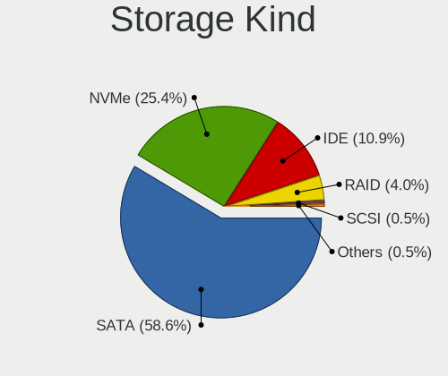

| Kind | Desktops | Percent |
|------|----------|---------|
| SATA | 873      | 58.59%  |
| NVMe | 379      | 25.44%  |
| IDE  | 162      | 10.87%  |
| RAID | 60       | 4.03%   |
| SAS  | 8        | 0.54%   |
| SCSI | 8        | 0.54%   |

Processor
---------

CPU Vendor
----------

Processor vendors

| Vendor | Desktops | Percent |
|--------|----------|---------|
| Intel  | 586      | 58.95%  |
| AMD    | 408      | 41.05%  |

CPU Model
---------

Processor models

| Model                                       | Desktops | Percent |
|---------------------------------------------|----------|---------|
| AMD Ryzen 7 3700X 8-Core Processor          | 28       | 2.81%   |
| AMD Ryzen 5 3600 6-Core Processor           | 21       | 2.11%   |
| AMD Ryzen 7 5800X 8-Core Processor          | 20       | 2.01%   |
| Intel Core i7-6700K CPU @ 4.00GHz           | 18       | 1.81%   |
| Intel Core i5-6600 CPU @ 3.30GHz            | 18       | 1.81%   |
| Intel Core i7-3770 CPU @ 3.40GHz            | 14       | 1.41%   |
| Intel Core i5-4570 CPU @ 3.20GHz            | 14       | 1.41%   |
| AMD Ryzen 5 5600X 6-Core Processor          | 13       | 1.31%   |
| Intel Core i7-7700K CPU @ 4.20GHz           | 12       | 1.21%   |
| Intel Core i5-2400 CPU @ 3.10GHz            | 11       | 1.11%   |
| AMD Ryzen 9 5900X 12-Core Processor         | 11       | 1.11%   |
| AMD Ryzen 5 5600G with Radeon Graphics      | 11       | 1.11%   |
| AMD Ryzen 5 3400G with Radeon Vega Graphics | 11       | 1.11%   |
| AMD Ryzen 5 2600 Six-Core Processor         | 11       | 1.11%   |
| AMD FX-8350 Eight-Core Processor            | 11       | 1.11%   |
| AMD Ryzen 9 3900X 12-Core Processor         | 10       | 1.01%   |
| Intel Core i7-4790K CPU @ 4.00GHz           | 9        | 0.9%    |
| Intel Core i5-3470 CPU @ 3.20GHz            | 9        | 0.9%    |
| AMD Ryzen 7 3800X 8-Core Processor          | 9        | 0.9%    |
| Intel Core i7-8700 CPU @ 3.20GHz            | 8        | 0.8%    |
| Intel Core i7-6700 CPU @ 3.40GHz            | 8        | 0.8%    |
| Intel Core i7-2600K CPU @ 3.40GHz           | 8        | 0.8%    |
| Intel Core i5-6500 CPU @ 3.20GHz            | 8        | 0.8%    |
| Intel Core i5 CPU 750 @ 2.67GHz             | 8        | 0.8%    |
| Intel Core 2 Duo CPU E8400 @ 3.00GHz        | 8        | 0.8%    |
| AMD Ryzen 9 5950X 16-Core Processor         | 8        | 0.8%    |
| AMD Ryzen 7 5700G with Radeon Graphics      | 8        | 0.8%    |
| AMD Ryzen 5 3600X 6-Core Processor          | 8        | 0.8%    |
| Intel Core i9-9900K CPU @ 3.60GHz           | 7        | 0.7%    |
| Intel Core i7-4790 CPU @ 3.60GHz            | 7        | 0.7%    |
| Intel Core i7-4770 CPU @ 3.40GHz            | 7        | 0.7%    |
| Intel Core i5-4440 CPU @ 3.10GHz            | 7        | 0.7%    |
| AMD Ryzen 7 2700X Eight-Core Processor      | 7        | 0.7%    |
| AMD Ryzen 3 3200G with Radeon Vega Graphics | 7        | 0.7%    |
| AMD FX-6300 Six-Core Processor              | 7        | 0.7%    |
| Intel N100                                  | 6        | 0.6%    |
| Intel Core i5-8400 CPU @ 2.80GHz            | 6        | 0.6%    |
| Intel Core i5-6600K CPU @ 3.50GHz           | 6        | 0.6%    |
| Intel Core i5-4570TE CPU @ 2.70GHz          | 6        | 0.6%    |
| Intel Core i5-3570 CPU @ 3.40GHz            | 6        | 0.6%    |

CPU Model Family
----------------

Processor model prefix

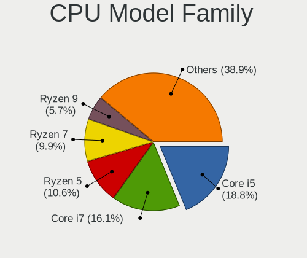

| Model                   | Desktops | Percent |
|-------------------------|----------|---------|
| Intel Core i5           | 187      | 18.79%  |
| Intel Core i7           | 160      | 16.08%  |
| AMD Ryzen 5             | 105      | 10.55%  |
| AMD Ryzen 7             | 99       | 9.95%   |
| AMD Ryzen 9             | 57       | 5.73%   |
| Other                   | 49       | 4.92%   |
| Intel Core i3           | 39       | 3.92%   |
| Intel Xeon              | 38       | 3.82%   |
| AMD FX                  | 34       | 3.42%   |
| Intel Core i9           | 23       | 2.31%   |
| Intel Celeron           | 21       | 2.11%   |
| AMD Ryzen 3             | 20       | 2.01%   |
| Intel Core 2 Duo        | 16       | 1.61%   |
| AMD Phenom II X4        | 15       | 1.51%   |
| Intel Core 2 Quad       | 13       | 1.31%   |
| AMD A8                  | 13       | 1.31%   |
| Intel Pentium           | 11       | 1.11%   |
| Intel Atom              | 11       | 1.11%   |
| AMD A10                 | 10       | 1.01%   |
| Intel Pentium Dual-Core | 8        | 0.8%    |
| AMD Phenom II X6        | 8        | 0.8%    |
| AMD Athlon II X4        | 6        | 0.6%    |
| AMD Athlon 64 X2        | 6        | 0.6%    |
| Intel Core 2            | 5        | 0.5%    |
| AMD Ryzen Threadripper  | 5        | 0.5%    |
| AMD Athlon II X2        | 5        | 0.5%    |
| AMD Ryzen 7 PRO         | 4        | 0.4%    |
| Intel Pentium 4         | 3        | 0.3%    |
| AMD Ryzen 5 PRO         | 3        | 0.3%    |
| AMD E                   | 3        | 0.3%    |
| AMD Athlon              | 3        | 0.3%    |
| Intel Pentium Silver    | 2        | 0.2%    |
| AMD Phenom II X2        | 2        | 0.2%    |
| AMD Phenom              | 2        | 0.2%    |
| Intel Pentium Dual      | 1        | 0.1%    |
| Intel Genuine           | 1        | 0.1%    |
| AMD Sempron             | 1        | 0.1%    |
| AMD Ryzen 3 PRO         | 1        | 0.1%    |
| AMD PRO A10             | 1        | 0.1%    |
| AMD GX                  | 1        | 0.1%    |

CPU Cores
---------

Number of processor cores

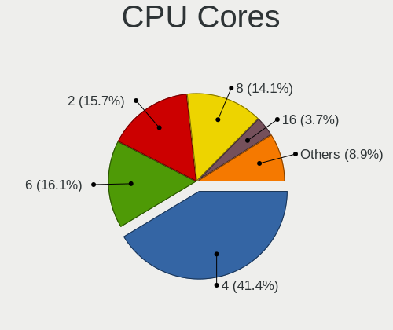

| Number  | Desktops | Percent |
|---------|----------|---------|
| 4       | 413      | 41.38%  |
| 6       | 161      | 16.13%  |
| 2       | 157      | 15.73%  |
| 8       | 141      | 14.13%  |
| 16      | 37       | 3.71%   |
| 12      | 37       | 3.71%   |
| 10      | 13       | 1.3%    |
| 24      | 8        | 0.8%    |
| 14      | 8        | 0.8%    |
| 1       | 8        | 0.8%    |
| 3       | 7        | 0.7%    |
| 20      | 3        | 0.3%    |
| Unknown | 2        | 0.2%    |
| 64      | 1        | 0.1%    |
| 40      | 1        | 0.1%    |
| 28      | 1        | 0.1%    |

CPU Sockets
-----------

Number of sockets

| Number | Desktops | Percent |
|--------|----------|---------|
| 1      | 986      | 99.2%   |
| 2      | 8        | 0.8%    |

CPU Threads
-----------

Threads per core (Hyper-Threading)

| Number  | Desktops | Percent |
|---------|----------|---------|
| 2       | 647      | 64.83%  |
| 1       | 349      | 34.97%  |
| Unknown | 2        | 0.2%    |

CPU Op-Modes
------------

CPU Operation Modes (32-bit, 64-bit)

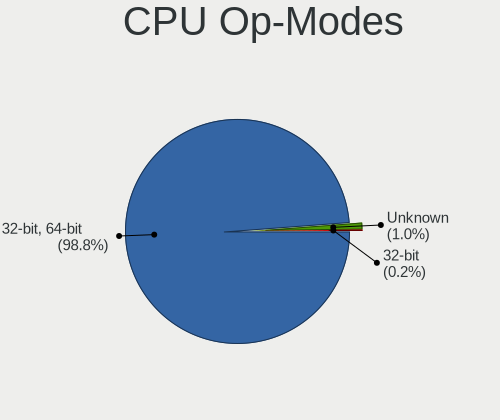

| Op mode        | Desktops | Percent |
|----------------|----------|---------|
| 32-bit, 64-bit | 982      | 98.79%  |
| Unknown        | 10       | 1.01%   |
| 32-bit         | 2        | 0.2%    |

CPU Microcode
-------------

Microcode number

| Number     | Desktops | Percent |
|------------|----------|---------|
| Unknown    | 424      | 40.46%  |
| 0x306c3    | 63       | 6.01%   |
| 0x306a9    | 36       | 3.44%   |
| 0x08701021 | 34       | 3.24%   |
| 0x506e3    | 33       | 3.15%   |
| 0x206a7    | 33       | 3.15%   |
| 0x906e9    | 19       | 1.81%   |
| 0x08701013 | 17       | 1.62%   |
| 0x06000852 | 17       | 1.62%   |
| 0x0800820d | 16       | 1.53%   |
| 0x0a201016 | 15       | 1.43%   |
| 0x08108109 | 15       | 1.43%   |
| 0x906ea    | 14       | 1.34%   |
| 0x1067a    | 14       | 1.34%   |
| 0x010000c8 | 13       | 1.24%   |
| 0x06001119 | 12       | 1.15%   |
| 0x08001138 | 11       | 1.05%   |
| 0x106e5    | 10       | 0.95%   |
| 0x0a201009 | 10       | 0.95%   |
| 0xa0655    | 9        | 0.86%   |
| 0x0a50000d | 8        | 0.76%   |
| 0x0a50000c | 8        | 0.76%   |
| 0xa0671    | 7        | 0.67%   |
| 0x010000dc | 7        | 0.67%   |
| 0x6fb      | 6        | 0.57%   |
| 0x306f2    | 6        | 0.57%   |
| 0x106a5    | 6        | 0.57%   |
| 0x0a601203 | 6        | 0.57%   |
| 0x0600611a | 6        | 0.57%   |
| 0x906ed    | 5        | 0.48%   |
| 0x0a20120a | 5        | 0.48%   |
| 0x08600106 | 5        | 0.48%   |
| 0x906ec    | 4        | 0.38%   |
| 0x90672    | 4        | 0.38%   |
| 0x706a8    | 4        | 0.38%   |
| 0x50654    | 4        | 0.38%   |
| 0x20652    | 4        | 0.38%   |
| 0x0800820b | 4        | 0.38%   |
| 0x03000027 | 4        | 0.38%   |
| 0x010000db | 4        | 0.38%   |

CPU Microarch
-------------

Microarchitecture

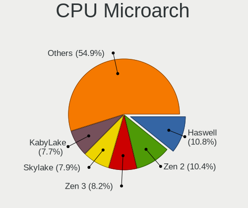

| Name             | Desktops | Percent |
|------------------|----------|---------|
| Haswell          | 108      | 10.83%  |
| Zen 2            | 104      | 10.43%  |
| Zen 3            | 82       | 8.22%   |
| Skylake          | 79       | 7.92%   |
| KabyLake         | 77       | 7.72%   |
| Unknown          | 64       | 6.42%   |
| IvyBridge        | 63       | 6.32%   |
| SandyBridge      | 59       | 5.92%   |
| Zen+             | 48       | 4.81%   |
| Piledriver       | 40       | 4.01%   |
| K10              | 38       | 3.81%   |
| Penryn           | 30       | 3.01%   |
| CometLake        | 28       | 2.81%   |
| Zen              | 26       | 2.61%   |
| Nehalem          | 23       | 2.31%   |
| Alderlake Hybrid | 20       | 2.01%   |
| Westmere         | 15       | 1.5%    |
| Core             | 14       | 1.4%    |
| Steamroller      | 7        | 0.7%    |
| Silvermont       | 7        | 0.7%    |
| Goldmont plus    | 7        | 0.7%    |
| Excavator        | 7        | 0.7%    |
| Bonnell          | 7        | 0.7%    |
| K8 Hammer        | 6        | 0.6%    |
| Icelake          | 5        | 0.5%    |
| Gracemont        | 5        | 0.5%    |
| NetBurst         | 4        | 0.4%    |
| K10 Llano        | 4        | 0.4%    |
| Goldmont         | 4        | 0.4%    |
| Bulldozer        | 4        | 0.4%    |
| Tremont          | 3        | 0.3%    |
| Broadwell        | 3        | 0.3%    |
| Bobcat           | 3        | 0.3%    |
| Jaguar           | 2        | 0.2%    |
| Puma             | 1        | 0.1%    |

Graphics
--------

GPU Vendor
----------

Vendors of graphics cards

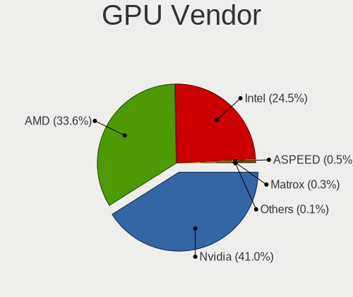

| Vendor                     | Desktops | Percent |
|----------------------------|----------|---------|
| Nvidia                     | 438      | 41.05%  |
| AMD                        | 359      | 33.65%  |
| Intel                      | 261      | 24.46%  |
| ASPEED Technology          | 5        | 0.47%   |
| Matrox Electronics Systems | 3        | 0.28%   |
| ATI Technologies           | 1        | 0.09%   |

GPU Model
---------

Graphics card models

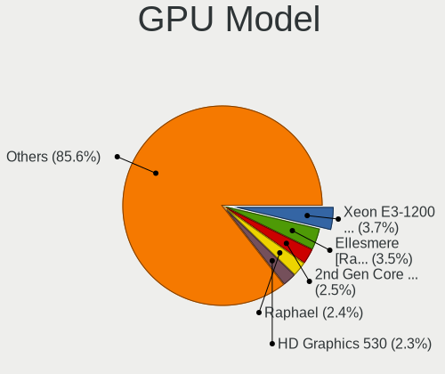

| Model                                                                       | Desktops | Percent |
|-----------------------------------------------------------------------------|----------|---------|
| Intel Xeon E3-1200 v3/4th Gen Core Processor Integrated Graphics Controller | 41       | 3.7%    |
| AMD Ellesmere [Radeon RX 470/480/570/570X/580/580X/590]                     | 39       | 3.52%   |
| Intel 2nd Generation Core Processor Family Integrated Graphics Controller   | 28       | 2.52%   |
| AMD Raphael                                                                 | 27       | 2.43%   |
| Intel HD Graphics 530                                                       | 25       | 2.25%   |
| Nvidia GP106 [GeForce GTX 1060 6GB]                                         | 23       | 2.07%   |
| Nvidia GK208B [GeForce GT 710]                                              | 23       | 2.07%   |
| Nvidia GP108 [GeForce GT 1030]                                              | 22       | 1.98%   |
| Nvidia GP107 [GeForce GTX 1050 Ti]                                          | 19       | 1.71%   |
| Nvidia GP104 [GeForce GTX 1070]                                             | 18       | 1.62%   |
| Intel Xeon E3-1200 v2/3rd Gen Core processor Graphics Controller            | 18       | 1.62%   |
| Nvidia GM204 [GeForce GTX 970]                                              | 17       | 1.53%   |
| Intel CoffeeLake-S GT2 [UHD Graphics 630]                                   | 17       | 1.53%   |
| AMD Picasso/Raven 2 [Radeon Vega Series / Radeon Vega Mobile Series]        | 17       | 1.53%   |
| AMD Navi 10 [Radeon RX 5600 OEM/5600 XT / 5700/5700 XT]                     | 17       | 1.53%   |
| AMD Navi 21 [Radeon RX 6800/6800 XT / 6900 XT]                              | 16       | 1.44%   |
| Nvidia TU104 [GeForce RTX 2070 SUPER]                                       | 15       | 1.35%   |
| AMD Cezanne [Radeon Vega Series / Radeon Vega Mobile Series]                | 15       | 1.35%   |
| Nvidia GP104 [GeForce GTX 1080]                                             | 14       | 1.26%   |
| AMD Navi 31 [Radeon RX 7900 XT/7900 XTX/7900 GRE/7900M]                     | 13       | 1.17%   |
| Intel IvyBridge GT2 [HD Graphics 4000]                                      | 12       | 1.08%   |
| AMD Renoir [Radeon Vega Series / Radeon Vega Mobile Series]                 | 12       | 1.08%   |
| AMD Navi 23 [Radeon RX 6600/6600 XT/6600M]                                  | 12       | 1.08%   |
| Nvidia GT218 [GeForce 210]                                                  | 11       | 0.99%   |
| Nvidia GM107 [GeForce GTX 750 Ti]                                           | 11       | 0.99%   |
| AMD Vega 10 XL/XT [Radeon RX Vega 56/64]                                    | 11       | 0.99%   |
| Nvidia GM206 [GeForce GTX 960]                                              | 10       | 0.9%    |
| Nvidia GK208B [GeForce GT 730]                                              | 10       | 0.9%    |
| Intel HD Graphics 630                                                       | 10       | 0.9%    |
| Intel CometLake-S GT2 [UHD Graphics 630]                                    | 10       | 0.9%    |
| AMD Navi 22 [Radeon RX 6700/6700 XT/6750 XT / 6800M/6850M XT]               | 10       | 0.9%    |
| AMD Caicos [Radeon HD 6450/7450/8450 / R5 230 OEM]                          | 10       | 0.9%    |
| Nvidia GA102 [GeForce RTX 3090]                                             | 9        | 0.81%   |
| Nvidia TU117 [GeForce GTX 1650]                                             | 8        | 0.72%   |
| Nvidia GA106 [GeForce RTX 3060 Lite Hash Rate]                              | 8        | 0.72%   |
| Nvidia GA104 [GeForce RTX 3070 Ti]                                          | 8        | 0.72%   |
| Intel Raptor Lake-S GT1 [UHD Graphics 770]                                  | 8        | 0.72%   |
| Intel AlderLake-S GT1                                                       | 8        | 0.72%   |
| Intel Alder Lake-N [UHD Graphics]                                           | 8        | 0.72%   |
| Intel 4th Generation Core Processor Family Integrated Graphics Controller   | 8        | 0.72%   |

GPU Combo
---------

Combinations of graphics cards

| Name             | Desktops | Percent |
|------------------|----------|---------|
| 1 x Nvidia       | 398      | 39.29%  |
| 1 x AMD          | 320      | 31.59%  |
| 1 x Intel        | 217      | 21.42%  |
| 2 x AMD          | 27       | 2.67%   |
| Intel + Nvidia   | 19       | 1.88%   |
| AMD + Nvidia     | 14       | 1.38%   |
| 2 x Nvidia       | 5        | 0.49%   |
| 1 x Matrox       | 3        | 0.3%    |
| Intel + AMD      | 3        | 0.3%    |
| 1 x ASPEED       | 3        | 0.3%    |
| Nvidia + ASPEED  | 2        | 0.2%    |
| Other            | 1        | 0.1%    |
| AMD + 2 x Nvidia | 1        | 0.1%    |

GPU Driver
----------

Free vs proprietary

| Driver      | Desktops | Percent |
|-------------|----------|---------|
| Free        | 712      | 70.15%  |
| Proprietary | 253      | 24.93%  |
| Unknown     | 50       | 4.93%   |

GPU Memory
----------

Total video memory

| Size in GB | Desktops | Percent |
|------------|----------|---------|
| Unknown    | 444      | 43.02%  |
| 1.01-2.0   | 128      | 12.4%   |
| 7.01-8.0   | 107      | 10.37%  |
| 3.01-4.0   | 83       | 8.04%   |
| 0.51-1.0   | 79       | 7.66%   |
| 0.01-0.5   | 79       | 7.66%   |
| 8.01-16.0  | 46       | 4.46%   |
| 5.01-6.0   | 42       | 4.07%   |
| 16.01-24.0 | 14       | 1.36%   |
| 2.01-3.0   | 9        | 0.87%   |
| 4.01-5.0   | 1        | 0.1%    |

Monitor
-------

Monitor Vendor
--------------

Monitor vendors

| Vendor               | Desktops | Percent |
|----------------------|----------|---------|
| Samsung Electronics  | 216      | 19.2%   |
| BenQ                 | 110      | 9.78%   |
| Goldstar             | 84       | 7.47%   |
| Dell                 | 80       | 7.11%   |
| Hewlett-Packard      | 73       | 6.49%   |
| Acer                 | 67       | 5.96%   |
| AOC                  | 65       | 5.78%   |
| Iiyama               | 48       | 4.27%   |
| Philips              | 44       | 3.91%   |
| Ancor Communications | 37       | 3.29%   |
| Eizo                 | 25       | 2.22%   |
| Medion               | 24       | 2.13%   |
| Gericom              | 23       | 2.04%   |
| ASUSTek Computer     | 21       | 1.87%   |
| Fujitsu Siemens      | 17       | 1.51%   |
| ViewSonic            | 14       | 1.24%   |
| NEC Computers        | 14       | 1.24%   |
| Lenovo               | 14       | 1.24%   |
| Unknown              | 11       | 0.98%   |
| Sony                 | 11       | 0.98%   |
| HannStar             | 8        | 0.71%   |
| MSI                  | 7        | 0.62%   |
| GRM                  | 7        | 0.62%   |
| Toshiba              | 6        | 0.53%   |
| LG Electronics       | 6        | 0.53%   |
| Lenovo Group Limited | 5        | 0.44%   |
| Idek Iiyama          | 5        | 0.44%   |
| Vestel Elektronik    | 4        | 0.36%   |
| Gigabyte Technology  | 4        | 0.36%   |
| Unknown (XXX)        | 3        | 0.27%   |
| HVR                  | 3        | 0.27%   |
| HUAWEI               | 3        | 0.27%   |
| Compal               | 3        | 0.27%   |
| Belinea              | 3        | 0.27%   |
| AU Optronics         | 3        | 0.27%   |
| Apple                | 3        | 0.27%   |
| Unknown              | 3        | 0.27%   |
| SKY                  | 2        | 0.18%   |
| Plain Tree Systems   | 2        | 0.18%   |
| Lanix                | 2        | 0.18%   |

Monitor Model
-------------

Monitor models

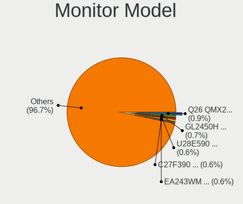

| Model                                                                 | Desktops | Percent |
|-----------------------------------------------------------------------|----------|---------|
| Gericom Q26 QMX2426 1920x1080 550x344mm 25.5-inch                     | 11       | 0.89%   |
| BenQ GL2450H BNQ78A7 1920x1080 530x300mm 24.0-inch                    | 9        | 0.73%   |
| Samsung Electronics U28E590 SAM0C4D 3840x2160 607x345mm 27.5-inch     | 7        | 0.57%   |
| Samsung Electronics C27F390 SAM0D32 1920x1080 600x340mm 27.2-inch     | 7        | 0.57%   |
| NEC Computers EA243WM NEC6864 1920x1200 519x324mm 24.1-inch           | 7        | 0.57%   |
| GRM GM26900 GRM5BC6 1920x1080 550x344mm 25.5-inch                     | 7        | 0.57%   |
| AOC Q27G2WG4 AOC2702 2560x1440 597x336mm 27.0-inch                    | 7        | 0.57%   |
| AOC 24B1W1 AOC2401 1920x1080 527x296mm 23.8-inch                      | 7        | 0.57%   |
| Acer B193 ACR001D 1280x1024 380x300mm 19.1-inch                       | 7        | 0.57%   |
| Samsung Electronics C32F391 SAM0D35 1920x1080 698x393mm 31.5-inch     | 6        | 0.49%   |
| Ancor Communications VS248 ACI2498 1920x1080 531x299mm 24.0-inch      | 6        | 0.49%   |
| Samsung Electronics U28E570 SAM0D6F 3840x2160 607x345mm 27.5-inch     | 5        | 0.41%   |
| Samsung Electronics C32F391 SAM0D34 1920x1080 698x393mm 31.5-inch     | 5        | 0.41%   |
| Samsung Electronics C24F390 SAM0D2C 1920x1080 521x293mm 23.5-inch     | 5        | 0.41%   |
| Goldstar ULTRAGEAR GSM774B 3440x1440 800x335mm 34.1-inch              | 5        | 0.41%   |
| Goldstar ULTRAGEAR GSM5B7F 2560x1440 597x336mm 27.0-inch              | 5        | 0.41%   |
| Gericom Q24 QMX2421 1920x1080 521x293mm 23.5-inch                     | 5        | 0.41%   |
| Dell U2412M DELA07A 1920x1200 518x324mm 24.1-inch                     | 5        | 0.41%   |
| AOC 24G2W1G5 AOC2402 1920x1080 527x296mm 23.8-inch                    | 5        | 0.41%   |
| Vestel Elektronik 49FHD_LCD_TV VES3700 1920x1080 1280x720mm 57.8-inch | 4        | 0.32%   |
| Unknown LCD Monitor FFFF 2288x1287 2550x2550mm 142.0-inch             | 4        | 0.32%   |
| Samsung Electronics SyncMaster SAM04D4 1920x1080 531x298mm 24.0-inch  | 4        | 0.32%   |
| Samsung Electronics S24F350 SAM0D20 1920x1080 521x293mm 23.5-inch     | 4        | 0.32%   |
| Samsung Electronics LU28R55 SAM1018 3840x2160 630x360mm 28.6-inch     | 4        | 0.32%   |
| Iiyama PLX2783H IVM6611 1920x1080 598x336mm 27.0-inch                 | 4        | 0.32%   |
| Iiyama PLE2483H IVM6113 1920x1080 530x300mm 24.0-inch                 | 4        | 0.32%   |
| Goldstar Ultra HD GSM5B09 3840x2160 600x340mm 27.2-inch               | 4        | 0.32%   |
| Gericom Vision L22FHD QMX2472 1920x1080 478x269mm 21.6-inch           | 4        | 0.32%   |
| Eizo S2202W ENC1975 1680x1050 480x300mm 22.3-inch                     | 4        | 0.32%   |
| BenQ RL2455 BNQ7F1C 1920x1080 531x298mm 24.0-inch                     | 4        | 0.32%   |
| BenQ GW2480 BNQ78E7 1920x1080 527x296mm 23.8-inch                     | 4        | 0.32%   |
| Ancor Communications ASUS VS247 ACI249A 1920x1080 521x293mm 23.5-inch | 4        | 0.32%   |
| Toshiba TV TSB0108 1920x540                                           | 3        | 0.24%   |
| Samsung Electronics U28E590 SAM0C4E 3840x2160 608x345mm 27.5-inch     | 3        | 0.24%   |
| Samsung Electronics S34J55x SAM0F70 3440x1440 797x333mm 34.0-inch     | 3        | 0.24%   |
| Samsung Electronics S24C450 SAM09CA 1920x1080 531x299mm 24.0-inch     | 3        | 0.24%   |
| Philips FTV PHL01EA 1920x1080 1440x810mm 65.0-inch                    | 3        | 0.24%   |
| Iiyama PL3461WQ IVM7615 3440x1440 800x335mm 34.1-inch                 | 3        | 0.24%   |
| Iiyama PL3288UH IVM1176 3840x2160 698x393mm 31.5-inch                 | 3        | 0.24%   |
| HVR HTC-VIVE HVRAA01 2160x1200                                        | 3        | 0.24%   |

Monitor Resolution
------------------

Monitor screen resolution

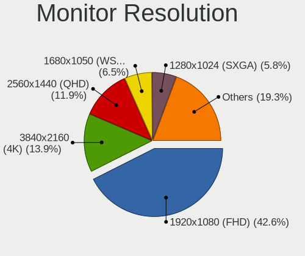

| Resolution         | Desktops | Percent |
|--------------------|----------|---------|
| 1920x1080 (FHD)    | 469      | 42.56%  |
| 3840x2160 (4K)     | 153      | 13.88%  |
| 2560x1440 (QHD)    | 131      | 11.89%  |
| 1680x1050 (WSXGA+) | 72       | 6.53%   |
| 1280x1024 (SXGA)   | 64       | 5.81%   |
| 1920x1200 (WUXGA)  | 61       | 5.54%   |
| 3440x1440          | 30       | 2.72%   |
| Unknown            | 20       | 1.81%   |
| 2560x1080          | 14       | 1.27%   |
| 3840x1080          | 12       | 1.09%   |
| 1920x540           | 7        | 0.64%   |
| 1440x900 (WXGA+)   | 7        | 0.64%   |
| 2560x1600          | 6        | 0.54%   |
| 1600x900 (HD+)     | 6        | 0.54%   |
| 1366x768 (WXGA)    | 6        | 0.54%   |
| 1024x768 (XGA)     | 5        | 0.45%   |
| 2288x1287          | 4        | 0.36%   |
| 2160x1200          | 3        | 0.27%   |
| 2048x1152          | 3        | 0.27%   |
| 5760x2160          | 2        | 0.18%   |
| 5760x1080          | 2        | 0.18%   |
| 5120x1440          | 2        | 0.18%   |
| 4480x1440          | 2        | 0.18%   |
| 3840x2560          | 2        | 0.18%   |
| 3840x1600          | 2        | 0.18%   |
| 3360x1050          | 2        | 0.18%   |
| 1600x1200          | 2        | 0.18%   |
| 1360x768           | 2        | 0.18%   |
| 6400x2560          | 1        | 0.09%   |
| 6400x1440          | 1        | 0.09%   |
| 5560x2000          | 1        | 0.09%   |
| 3840x1200          | 1        | 0.09%   |
| 3600x1080          | 1        | 0.09%   |
| 3520x1080          | 1        | 0.09%   |
| 3200x1080          | 1        | 0.09%   |
| 2560x2880          | 1        | 0.09%   |
| 1920x2160          | 1        | 0.09%   |
| 1400x1050          | 1        | 0.09%   |
| 1280x960           | 1        | 0.09%   |

Monitor Diagonal
----------------

Diagonal size in inches

| Inches  | Desktops | Percent |
|---------|----------|---------|
| 27      | 211      | 18.67%  |
| 24      | 210      | 18.58%  |
| 23      | 112      | 9.91%   |
| Unknown | 91       | 8.05%   |
| 31      | 74       | 6.55%   |
| 21      | 61       | 5.4%    |
| 19      | 57       | 5.04%   |
| 22      | 53       | 4.69%   |
| 34      | 36       | 3.19%   |
| 25      | 32       | 2.83%   |
| 20      | 18       | 1.59%   |
| 84      | 16       | 1.42%   |
| 40      | 15       | 1.33%   |
| 54      | 14       | 1.24%   |
| 17      | 14       | 1.24%   |
| 28      | 12       | 1.06%   |
| 32      | 11       | 0.97%   |
| 15      | 9        | 0.8%    |
| 72      | 7        | 0.62%   |
| 42      | 7        | 0.62%   |
| 65      | 6        | 0.53%   |
| 26      | 6        | 0.53%   |
| 48      | 5        | 0.44%   |
| 18      | 5        | 0.44%   |
| 142     | 4        | 0.35%   |
| 47      | 4        | 0.35%   |
| 35      | 4        | 0.35%   |
| 29      | 4        | 0.35%   |
| 85      | 3        | 0.27%   |
| 49      | 3        | 0.27%   |
| 37      | 3        | 0.27%   |
| 33      | 3        | 0.27%   |
| 16      | 3        | 0.27%   |
| 60      | 2        | 0.18%   |
| 52      | 2        | 0.18%   |
| 46      | 2        | 0.18%   |
| 36      | 2        | 0.18%   |
| 13      | 2        | 0.18%   |
| 86      | 1        | 0.09%   |
| 77      | 1        | 0.09%   |

Monitor Width
-------------

Physical width

| Width in mm    | Desktops | Percent |
|----------------|----------|---------|
| 501-600        | 480      | 44.65%  |
| 401-500        | 144      | 13.4%   |
| 601-700        | 124      | 11.53%  |
| Unknown        | 91       | 8.47%   |
| 351-400        | 58       | 5.4%    |
| 701-800        | 47       | 4.37%   |
| 1001-1500      | 40       | 3.72%   |
| 1501-2000      | 27       | 2.51%   |
| 801-900        | 25       | 2.33%   |
| 301-350        | 23       | 2.14%   |
| 901-1000       | 9        | 0.84%   |
| More than 2000 | 4        | 0.37%   |
| 201-300        | 3        | 0.28%   |

Aspect Ratio
------------

Proportional relationship between the width and the height

| Ratio   | Desktops | Percent |
|---------|----------|---------|
| 16/9    | 651      | 63.02%  |
| 16/10   | 167      | 16.17%  |
| Unknown | 71       | 6.87%   |
| 5/4     | 63       | 6.1%    |
| 21/9    | 42       | 4.07%   |
| 32/9    | 12       | 1.16%   |
| 4/3     | 10       | 0.97%   |
| 3/2     | 7        | 0.68%   |
| 1.00    | 4        | 0.39%   |
| 6/5     | 2        | 0.19%   |
| 0.89    | 2        | 0.19%   |
| 0.80    | 1        | 0.1%    |
| 0.56    | 1        | 0.1%    |

Monitor Area
------------

Area in inch

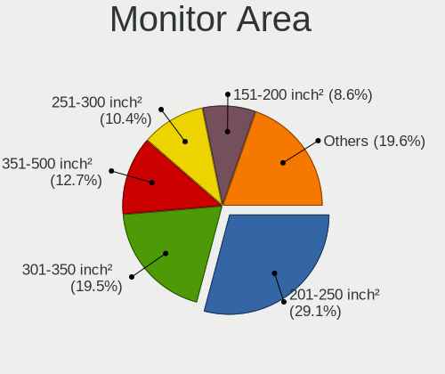

| Area in inch | Desktops | Percent |
|----------------|----------|---------|
| 201-250        | 322      | 29.11%  |
| 301-350        | 216      | 19.53%  |
| 351-500        | 141      | 12.75%  |
| 251-300        | 115      | 10.4%   |
| 151-200        | 95       | 8.59%   |
| Unknown        | 91       | 8.23%   |
| More than 1000 | 56       | 5.06%   |
| 501-1000       | 41       | 3.71%   |
| 141-150        | 14       | 1.27%   |
| 101-110        | 10       | 0.9%    |
| 71-80          | 2        | 0.18%   |
| 131-140        | 1        | 0.09%   |
| 121-130        | 1        | 0.09%   |
| 111-120        | 1        | 0.09%   |

Pixel Density
-------------

Pixels per inch

| Density | Desktops | Percent |
|---------|----------|---------|
| 51-100  | 617      | 60.08%  |
| 101-120 | 181      | 17.62%  |
| Unknown | 91       | 8.86%   |
| 121-160 | 82       | 7.98%   |
| 1-50    | 40       | 3.89%   |
| 161-240 | 16       | 1.56%   |

Multiple Monitors
-----------------

Total monitors connected

| Total | Desktops | Percent |
|-------|----------|---------|
| 1     | 721      | 71.03%  |
| 2     | 205      | 20.2%   |
| 0     | 54       | 5.32%   |
| 3     | 34       | 3.35%   |
| 4     | 1        | 0.1%    |

Network
-------

Net Controller Vendor
---------------------

Controller vendors

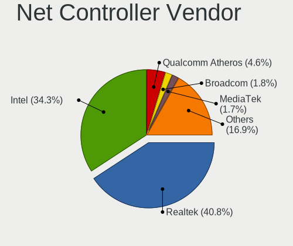

| Vendor                                | Desktops | Percent |
|---------------------------------------|----------|---------|
| Realtek Semiconductor                 | 575      | 40.78%  |
| Intel                                 | 483      | 34.26%  |
| Qualcomm Atheros                      | 65       | 4.61%   |
| Broadcom                              | 25       | 1.77%   |
| MediaTek                              | 24       | 1.7%    |
| Ralink Technology                     | 23       | 1.63%   |
| TP-Link                               | 17       | 1.21%   |
| Aquantia                              | 17       | 1.21%   |
| Microsoft                             | 14       | 0.99%   |
| IMC Networks                          | 14       | 0.99%   |
| Ralink                                | 11       | 0.78%   |
| ASUSTek Computer                      | 11       | 0.78%   |
| Nvidia                                | 10       | 0.71%   |
| NetGear                               | 10       | 0.71%   |
| Marvell Technology Group              | 10       | 0.71%   |
| Edimax Technology                     | 10       | 0.71%   |
| Samsung Electronics                   | 7        | 0.5%    |
| D-Link System                         | 7        | 0.5%    |
| D-Link                                | 7        | 0.5%    |
| Qualcomm Atheros Communications       | 6        | 0.43%   |
| ASIX Electronics                      | 6        | 0.43%   |
| Huawei Technologies                   | 5        | 0.35%   |
| Broadcom Limited                      | 5        | 0.35%   |
| VIA Technologies                      | 4        | 0.28%   |
| Xiaomi                                | 3        | 0.21%   |
| Sigma Sport                           | 3        | 0.21%   |
| ZTE WCDMA Technologies MSM            | 2        | 0.14%   |
| Qualcomm                              | 2        | 0.14%   |
| Microchip Technology                  | 2        | 0.14%   |
| Mellanox Technologies                 | 2        | 0.14%   |
| Arduino SA                            | 2        | 0.14%   |
| 802.11g Adapter [Linksys WUSB54GC v3] | 2        | 0.14%   |
| Winbond Electronics                   | 1        | 0.07%   |
| Wilocity                              | 1        | 0.07%   |
| Sigma Designs                         | 1        | 0.07%   |
| SEGGER                                | 1        | 0.07%   |
| ROCCAT                                | 1        | 0.07%   |
| Rivet                                 | 1        | 0.07%   |
| Qualcomm Technologies                 | 1        | 0.07%   |
| QinHeng Electronics                   | 1        | 0.07%   |

Net Controller Model
--------------------

Controller models

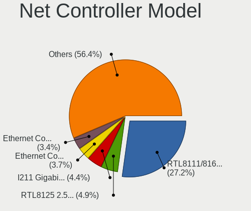

| Model                                                                          | Desktops | Percent |
|--------------------------------------------------------------------------------|----------|---------|
| Realtek RTL8111/8168/8211/8411 PCI Express Gigabit Ethernet Controller         | 446      | 27.2%   |
| Realtek RTL8125 2.5GbE Controller                                              | 81       | 4.94%   |
| Intel I211 Gigabit Network Connection                                          | 72       | 4.39%   |
| Intel Ethernet Controller I225-V                                               | 60       | 3.66%   |
| Intel Ethernet Connection (2) I219-V                                           | 56       | 3.41%   |
| Intel Wi-Fi 6 AX200                                                            | 51       | 3.11%   |
| Intel 82579LM Gigabit Network Connection (Lewisville)                          | 29       | 1.77%   |
| Intel Dual Band Wireless-AC 3168NGW [Stone Peak]                               | 23       | 1.4%    |
| Intel 82579V Gigabit Network Connection                                        | 23       | 1.4%    |
| Intel Ethernet Connection I217-LM                                              | 22       | 1.34%   |
| Intel Ethernet Connection (7) I219-V                                           | 22       | 1.34%   |
| Intel Wi-Fi 6E(802.11ax) AX210/AX1675* 2x2 [Typhoon Peak]                      | 20       | 1.22%   |
| Realtek RTL8192CE PCIe Wireless Network Adapter                                | 19       | 1.16%   |
| Intel Wi-Fi 5(802.11ac) Wireless-AC 9x6x [Thunder Peak]                        | 15       | 0.91%   |
| Intel Ethernet Connection (2) I219-LM                                          | 14       | 0.85%   |
| Intel Ethernet Connection (2) I218-V                                           | 13       | 0.79%   |
| Realtek RTL88x2bu [AC1200 Techkey]                                             | 12       | 0.73%   |
| Realtek RTL8821CE 802.11ac PCIe Wireless Network Adapter                       | 12       | 0.73%   |
| Qualcomm Atheros Killer E220x Gigabit Ethernet Controller                      | 12       | 0.73%   |
| MediaTek MT7922 802.11ax PCI Express Wireless Network Adapter                  | 12       | 0.73%   |
| Intel Ethernet Connection I217-V                                               | 12       | 0.73%   |
| Realtek RTL8188CUS 802.11n WLAN Adapter                                        | 11       | 0.67%   |
| Intel Cannon Lake PCH CNVi WiFi                                                | 11       | 0.67%   |
| Intel 82574L Gigabit Network Connection                                        | 11       | 0.67%   |
| Realtek RTL8153 Gigabit Ethernet Adapter                                       | 10       | 0.61%   |
| Microsoft Xbox 360 Wireless Adapter                                            | 10       | 0.61%   |
| Intel Raptor Lake-S PCH CNVi WiFi                                              | 10       | 0.61%   |
| Intel I210 Gigabit Network Connection                                          | 10       | 0.61%   |
| IMC Networks Mediao 802.11n WLAN [Realtek RTL8191SU]                           | 10       | 0.61%   |
| MediaTek MT7921K (RZ608) Wi-Fi 6E 80MHz                                        | 8        | 0.49%   |
| Intel 82567LM-3 Gigabit Network Connection                                     | 8        | 0.49%   |
| ASUS USB-N13 802.11n Network Adapter (rev. B1) [Realtek RTL8192CU]             | 8        | 0.49%   |
| Realtek RTL8192EE PCIe Wireless Network Adapter                                | 7        | 0.43%   |
| Realtek RTL810xE PCI Express Fast Ethernet controller                          | 7        | 0.43%   |
| Realtek 802.11ac NIC                                                           | 7        | 0.43%   |
| Qualcomm Atheros AR8161 Gigabit Ethernet                                       | 7        | 0.43%   |
| Aquantia AQtion AQC107 NBase-T/IEEE 802.3an Ethernet Controller [Atlantic 10G] | 7        | 0.43%   |
| Samsung Galaxy series, misc. (tethering mode)                                  | 6        | 0.37%   |
| Realtek RTL8188EUS 802.11n Wireless Network Adapter                            | 6        | 0.37%   |
| Ralink RT5370 Wireless Adapter                                                 | 6        | 0.37%   |

Wireless Vendor
---------------

Wireless vendors

| Vendor                                | Desktops | Percent |
|---------------------------------------|----------|---------|
| Intel                                 | 175      | 36.23%  |
| Realtek Semiconductor                 | 112      | 23.19%  |
| Qualcomm Atheros                      | 29       | 6%      |
| Ralink Technology                     | 23       | 4.76%   |
| MediaTek                              | 19       | 3.93%   |
| TP-Link                               | 17       | 3.52%   |
| Microsoft                             | 14       | 2.9%    |
| IMC Networks                          | 14       | 2.9%    |
| Ralink                                | 11       | 2.28%   |
| Broadcom                              | 11       | 2.28%   |
| ASUSTek Computer                      | 11       | 2.28%   |
| NetGear                               | 10       | 2.07%   |
| Edimax Technology                     | 10       | 2.07%   |
| Qualcomm Atheros Communications       | 6        | 1.24%   |
| D-Link                                | 6        | 1.24%   |
| D-Link System                         | 5        | 1.04%   |
| Broadcom Limited                      | 2        | 0.41%   |
| 802.11g Adapter [Linksys WUSB54GC v3] | 2        | 0.41%   |
| Wilocity                              | 1        | 0.21%   |
| Qualcomm Technologies                 | 1        | 0.21%   |
| Philips (or NXP)                      | 1        | 0.21%   |
| BUFFALO                               | 1        | 0.21%   |
| Belkin Components                     | 1        | 0.21%   |
| AVM                                   | 1        | 0.21%   |

Wireless Model
--------------

Wireless models

| Model                                                                  | Desktops | Percent |
|------------------------------------------------------------------------|----------|---------|
| Intel Wi-Fi 6 AX200                                                    | 51       | 10.45%  |
| Intel Dual Band Wireless-AC 3168NGW [Stone Peak]                       | 23       | 4.71%   |
| Intel Wi-Fi 6E(802.11ax) AX210/AX1675* 2x2 [Typhoon Peak]              | 20       | 4.1%    |
| Realtek RTL8192CE PCIe Wireless Network Adapter                        | 19       | 3.89%   |
| Intel Wi-Fi 5(802.11ac) Wireless-AC 9x6x [Thunder Peak]                | 15       | 3.07%   |
| Realtek RTL88x2bu [AC1200 Techkey]                                     | 12       | 2.46%   |
| Realtek RTL8821CE 802.11ac PCIe Wireless Network Adapter               | 12       | 2.46%   |
| Realtek RTL8188CUS 802.11n WLAN Adapter                                | 11       | 2.25%   |
| Intel Cannon Lake PCH CNVi WiFi                                        | 11       | 2.25%   |
| Microsoft Xbox 360 Wireless Adapter                                    | 10       | 2.05%   |
| Intel Raptor Lake-S PCH CNVi WiFi                                      | 10       | 2.05%   |
| IMC Networks Mediao 802.11n WLAN [Realtek RTL8191SU]                   | 10       | 2.05%   |
| MediaTek MT7922 802.11ax PCI Express Wireless Network Adapter          | 8        | 1.64%   |
| MediaTek MT7921K (RZ608) Wi-Fi 6E 80MHz                                | 8        | 1.64%   |
| ASUS USB-N13 802.11n Network Adapter (rev. B1) [Realtek RTL8192CU]     | 8        | 1.64%   |
| Realtek RTL8192EE PCIe Wireless Network Adapter                        | 7        | 1.43%   |
| Realtek 802.11ac NIC                                                   | 7        | 1.43%   |
| Realtek RTL8188EUS 802.11n Wireless Network Adapter                    | 6        | 1.23%   |
| Ralink RT5370 Wireless Adapter                                         | 6        | 1.23%   |
| Qualcomm Atheros AR9271 802.11n                                        | 6        | 1.23%   |
| Qualcomm Atheros AR9485 Wireless Network Adapter                       | 6        | 1.23%   |
| Intel Alder Lake-S PCH CNVi WiFi                                       | 6        | 1.23%   |
| Edimax EW-7811Un 802.11n Wireless Adapter [Realtek RTL8188CUS]         | 6        | 1.23%   |
| TP-Link TL-WN823N v2/v3 [Realtek RTL8192EU]                            | 5        | 1.02%   |
| TP-Link Archer T3U [Realtek RTL8812BU]                                 | 5        | 1.02%   |
| Ralink RT5572 Wireless Adapter                                         | 5        | 1.02%   |
| Ralink MT7601U Wireless Adapter                                        | 5        | 1.02%   |
| Ralink RT2800 802.11n PCI                                              | 5        | 1.02%   |
| Intel Wireless 8265 / 8275                                             | 5        | 1.02%   |
| Intel Comet Lake PCH CNVi WiFi                                         | 5        | 1.02%   |
| Realtek RTL8821AE 802.11ac PCIe Wireless Network Adapter               | 4        | 0.82%   |
| Realtek RTL8812AE 802.11ac PCIe Wireless Network Adapter               | 4        | 0.82%   |
| Qualcomm Atheros QCA6174 802.11ac Wireless Network Adapter             | 4        | 0.82%   |
| Microsoft Xbox Wireless Adapter for Windows                            | 4        | 0.82%   |
| Intel Wireless 8260                                                    | 4        | 0.82%   |
| Intel Wireless 7265                                                    | 4        | 0.82%   |
| Intel Wireless 3165                                                    | 4        | 0.82%   |
| Intel Centrino Advanced-N 6235                                         | 4        | 0.82%   |
| IMC Networks AW-NU222 802.11bgn Wireless Module [Ralink RT2770+RT2720] | 4        | 0.82%   |
| Broadcom BCM4352 802.11ac Dual Band Wireless Network Adapter           | 4        | 0.82%   |

Ethernet Vendor
---------------

Ethernet vendors

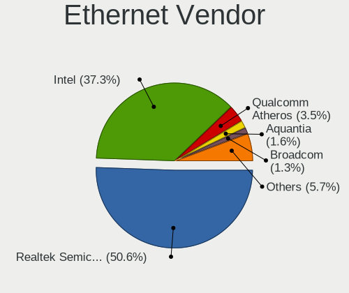

| Vendor                   | Desktops | Percent |
|--------------------------|----------|---------|
| Realtek Semiconductor    | 546      | 50.56%  |
| Intel                    | 403      | 37.31%  |
| Qualcomm Atheros         | 38       | 3.52%   |
| Aquantia                 | 17       | 1.57%   |
| Broadcom                 | 14       | 1.3%    |
| Nvidia                   | 10       | 0.93%   |
| Marvell Technology Group | 10       | 0.93%   |
| Samsung Electronics      | 6        | 0.56%   |
| ASIX Electronics         | 6        | 0.56%   |
| VIA Technologies         | 4        | 0.37%   |
| MediaTek                 | 4        | 0.37%   |
| Xiaomi                   | 3        | 0.28%   |
| Broadcom Limited         | 3        | 0.28%   |
| Qualcomm                 | 2        | 0.19%   |
| Mellanox Technologies    | 2        | 0.19%   |
| Huawei Technologies      | 2        | 0.19%   |
| D-Link System            | 2        | 0.19%   |
| Rivet                    | 1        | 0.09%   |
| Motorola PCS             | 1        | 0.09%   |
| JMicron Technology       | 1        | 0.09%   |
| Insyde Software          | 1        | 0.09%   |
| Google                   | 1        | 0.09%   |
| Emulex                   | 1        | 0.09%   |
| DisplayLink              | 1        | 0.09%   |
| D-Link                   | 1        | 0.09%   |

Ethernet Model
--------------

Ethernet models

| Model                                                                           | Desktops | Percent |
|---------------------------------------------------------------------------------|----------|---------|
| Realtek RTL8111/8168/8211/8411 PCI Express Gigabit Ethernet Controller          | 446      | 39.64%  |
| Realtek RTL8125 2.5GbE Controller                                               | 81       | 7.2%    |
| Intel I211 Gigabit Network Connection                                           | 72       | 6.4%    |
| Intel Ethernet Controller I225-V                                                | 60       | 5.33%   |
| Intel Ethernet Connection (2) I219-V                                            | 56       | 4.98%   |
| Intel 82579LM Gigabit Network Connection (Lewisville)                           | 29       | 2.58%   |
| Intel 82579V Gigabit Network Connection                                         | 23       | 2.04%   |
| Intel Ethernet Connection I217-LM                                               | 22       | 1.96%   |
| Intel Ethernet Connection (7) I219-V                                            | 22       | 1.96%   |
| Intel Ethernet Connection (2) I219-LM                                           | 14       | 1.24%   |
| Intel Ethernet Connection (2) I218-V                                            | 13       | 1.16%   |
| Qualcomm Atheros Killer E220x Gigabit Ethernet Controller                       | 12       | 1.07%   |
| Intel Ethernet Connection I217-V                                                | 12       | 1.07%   |
| Intel 82574L Gigabit Network Connection                                         | 11       | 0.98%   |
| Realtek RTL8153 Gigabit Ethernet Adapter                                        | 10       | 0.89%   |
| Intel I210 Gigabit Network Connection                                           | 10       | 0.89%   |
| Intel 82567LM-3 Gigabit Network Connection                                      | 8        | 0.71%   |
| Realtek RTL810xE PCI Express Fast Ethernet controller                           | 7        | 0.62%   |
| Qualcomm Atheros AR8161 Gigabit Ethernet                                        | 7        | 0.62%   |
| Aquantia AQtion AQC107 NBase-T/IEEE 802.3an Ethernet Controller [Atlantic 10G]  | 7        | 0.62%   |
| Samsung Galaxy series, misc. (tethering mode)                                   | 6        | 0.53%   |
| Nvidia MCP61 Ethernet                                                           | 6        | 0.53%   |
| Marvell Group 88E8056 PCI-E Gigabit Ethernet Controller                         | 6        | 0.53%   |
| Intel Ethernet Controller I226-V                                                | 6        | 0.53%   |
| Intel Ethernet Connection (2) I218-LM                                           | 6        | 0.53%   |
| Realtek RTL-8110SC/8169SC Gigabit Ethernet                                      | 5        | 0.44%   |
| Qualcomm Atheros AR8121/AR8113/AR8114 Gigabit or Fast Ethernet                  | 5        | 0.44%   |
| Intel 82578DM Gigabit Network Connection                                        | 5        | 0.44%   |
| MediaTek MT7922 802.11ax PCI Express Wireless Network Adapter                   | 4        | 0.36%   |
| Intel Ethernet Connection (14) I219-V                                           | 4        | 0.36%   |
| Intel Ethernet Connection (11) I219-V                                           | 4        | 0.36%   |
| Intel 82599ES 10-Gigabit SFI/SFP+ Network Connection                            | 4        | 0.36%   |
| Intel 82571EB/82571GB Gigabit Ethernet Controller D0/D1 (copper applications)   | 4        | 0.36%   |
| ASIX AX88179 Gigabit Ethernet                                                   | 4        | 0.36%   |
| Aquantia AQtion AQC113CS NBase-T/IEEE 802.3an Ethernet Controller [Antigua 10G] | 4        | 0.36%   |
| Aquantia AQC111 NBase-T/IEEE 802.3bz Ethernet Controller [AQtion]               | 4        | 0.36%   |
| VIA VT6105/VT6106S [Rhine-III]                                                  | 3        | 0.27%   |
| Realtek RTL8169 PCI Gigabit Ethernet Controller                                 | 3        | 0.27%   |
| Realtek RTL-8100/8101L/8139 PCI Fast Ethernet Adapter                           | 3        | 0.27%   |
| Realtek RT8126 PCIe Ethernet Controller                                         | 3        | 0.27%   |

Net Controller Kind
-------------------

Ethernet, WiFi or modem

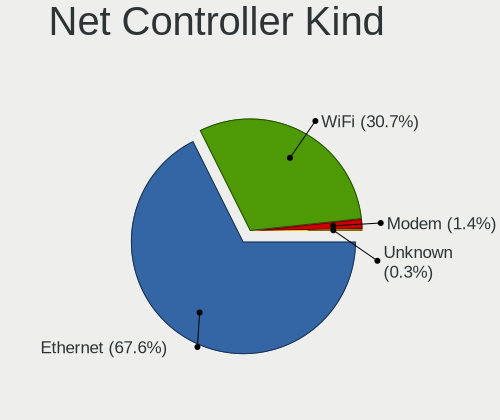

| Kind     | Desktops | Percent |
|----------|----------|---------|
| Ethernet | 990      | 67.62%  |
| WiFi     | 449      | 30.67%  |
| Modem    | 21       | 1.43%   |
| Unknown  | 4        | 0.27%   |

Used Controller
---------------

Currently used network controller

| Kind     | Desktops | Percent |
|----------|----------|---------|
| Ethernet | 811      | 79.35%  |
| WiFi     | 211      | 20.65%  |

NICs
----

Total network controllers on board

| Total | Desktops | Percent |
|-------|----------|---------|
| 1     | 604      | 60.34%  |
| 2     | 324      | 32.37%  |
| 3     | 54       | 5.39%   |
| 4     | 8        | 0.8%    |
| 5     | 5        | 0.5%    |
| 0     | 3        | 0.3%    |
| 6     | 2        | 0.2%    |
| 13    | 1        | 0.1%    |

IPv6
----

IPv6 vs IPv4

| Used | Desktops | Percent |
|------|----------|---------|
| No   | 856      | 84.92%  |
| Yes  | 152      | 15.08%  |

Bluetooth
---------

Bluetooth Vendor
----------------

Controller vendors

| Vendor                          | Desktops | Percent |
|---------------------------------|----------|---------|
| Intel                           | 168      | 45.53%  |
| Cambridge Silicon Radio         | 66       | 17.89%  |
| Realtek Semiconductor           | 37       | 10.03%  |
| ASUSTek Computer                | 25       | 6.78%   |
| MediaTek                        | 16       | 4.34%   |
| TP-Link                         | 11       | 2.98%   |
| Foxconn / Hon Hai               | 8        | 2.17%   |
| Broadcom                        | 7        | 1.9%    |
| IMC Networks                    | 5        | 1.36%   |
| Qualcomm Atheros Communications | 4        | 1.08%   |
| HTC (High Tech Computer)        | 4        | 1.08%   |
| Belkin Components               | 3        | 0.81%   |
| Apple                           | 3        | 0.81%   |
| Actions                         | 3        | 0.81%   |
| Realtek                         | 2        | 0.54%   |
| Logitech                        | 2        | 0.54%   |
| D-Link System                   | 2        | 0.54%   |
| Micro Star International        | 1        | 0.27%   |
| Lite-On Technology              | 1        | 0.27%   |
| Edimax Technology               | 1        | 0.27%   |

Bluetooth Model
---------------

Controller models

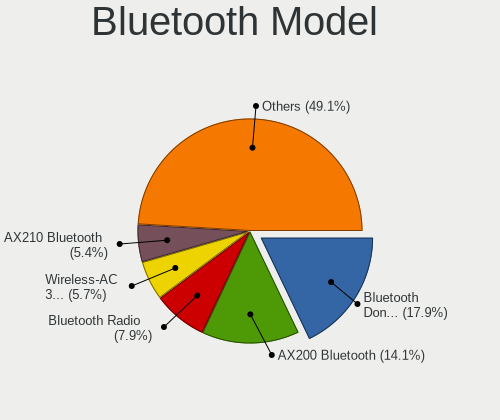

| Model                                                                | Desktops | Percent |
|----------------------------------------------------------------------|----------|---------|
| Cambridge Silicon Radio Bluetooth Dongle (HCI mode)                  | 66       | 17.89%  |
| Intel AX200 Bluetooth                                                | 52       | 14.09%  |
| Realtek Bluetooth Radio                                              | 29       | 7.86%   |
| Intel Wireless-AC 3168 Bluetooth                                     | 21       | 5.69%   |
| Intel AX210 Bluetooth                                                | 20       | 5.42%   |
| Intel Bluetooth wireless interface                                   | 19       | 5.15%   |
| MediaTek Wireless_Device                                             | 16       | 4.34%   |
| Intel Wireless-AC 9260 Bluetooth Adapter                             | 13       | 3.52%   |
| Intel Bluetooth 9460/9560 Jefferson Peak (JfP)                       | 13       | 3.52%   |
| Intel AX211 Bluetooth                                                | 13       | 3.52%   |
| TP-Link TP-Link Bluetooth USB Adapter                                | 11       | 2.98%   |
| Intel AX201 Bluetooth                                                | 9        | 2.44%   |
| ASUS Broadcom BCM20702A0 Bluetooth                                   | 8        | 2.17%   |
| Intel Centrino Bluetooth Wireless Transceiver                        | 7        | 1.9%    |
| Foxconn / Hon Hai Wireless_Device                                    | 5        | 1.36%   |
| Realtek  Bluetooth 4.2 Adapter                                       | 4        | 1.08%   |
| HTC (High Tech Computer) Vive Hub Bluetooth 4.1 (Broadcom BCM920703) | 4        | 1.08%   |
| Broadcom BCM20702A0 Bluetooth 4.0                                    | 4        | 1.08%   |
| ASUS Bluetooth Adapter                                               | 4        | 1.08%   |
| Qualcomm Atheros AR3011 Bluetooth                                    | 3        | 0.81%   |
| Foxconn / Hon Hai Bluetooth Device                                   | 3        | 0.81%   |
| ASUS Bluetooth Radio                                                 | 3        | 0.81%   |
| ASUS BCM20702A0                                                      | 3        | 0.81%   |
| Actions general adapter                                              | 3        | 0.81%   |
| Realtek RTL8821A Bluetooth                                           | 2        | 0.54%   |
| Realtek Bluetooth 5.3 Radio                                          | 2        | 0.54%   |
| Realtek Bluetooth Radio                                              | 2        | 0.54%   |
| Logitech BT Mini-Receiver (HCI mode)                                 | 2        | 0.54%   |
| IMC Networks Wireless_Device                                         | 2        | 0.54%   |
| IMC Networks Bluetooth Radio                                         | 2        | 0.54%   |
| D-Link System DBT-122 Bluetooth                                      | 2        | 0.54%   |
| ASUS Qualcomm Bluetooth 4.1                                          | 2        | 0.54%   |
| ASUS Broadcom BCM20702 Single-Chip Bluetooth 4.0 + LE                | 2        | 0.54%   |
| ASUS ASUS USB-BT500                                                  | 2        | 0.54%   |
| Apple Bluetooth USB Host Controller                                  | 2        | 0.54%   |
| Qualcomm Atheros Bluetooth USB Host Controller                       | 1        | 0.27%   |
| Micro Star International Bluetooth Device                            | 1        | 0.27%   |
| Lite-On Bluetooth Device                                             | 1        | 0.27%   |
| Intel Bluetooth Device                                               | 1        | 0.27%   |
| IMC Networks BCM20702A0                                              | 1        | 0.27%   |

Sound
-----

Sound Vendor
------------

Sound card vendors

| Vendor                                       | Desktops | Percent |
|----------------------------------------------|----------|---------|
| Intel                                        | 555      | 30.65%  |
| AMD                                          | 483      | 26.67%  |
| Nvidia                                       | 422      | 23.3%   |
| C-Media Electronics                          | 64       | 3.53%   |
| Logitech                                     | 33       | 1.82%   |
| ASUSTek Computer                             | 20       | 1.1%    |
| Creative Labs                                | 15       | 0.83%   |
| Razer USA                                    | 14       | 0.77%   |
| GN Netcom                                    | 13       | 0.72%   |
| JMTek                                        | 11       | 0.61%   |
| Corsair                                      | 11       | 0.61%   |
| SteelSeries ApS                              | 10       | 0.55%   |
| Micro Star International                     | 9        | 0.5%    |
| Kingston Technology                          | 9        | 0.5%    |
| Focusrite-Novation                           | 9        | 0.5%    |
| Zoran Co. Personal Media Division (Nogatech) | 7        | 0.39%   |
| Generalplus Technology                       | 6        | 0.33%   |
| Creative Technology                          | 6        | 0.33%   |
| Bose                                         | 6        | 0.33%   |
| Sony                                         | 4        | 0.22%   |
| RODE Microphones                             | 4        | 0.22%   |
| Texas Instruments                            | 3        | 0.17%   |
| SAVITECH                                     | 3        | 0.17%   |
| Samson Technologies                          | 3        | 0.17%   |
| Plantronics                                  | 3        | 0.17%   |
| Jieli Technology                             | 3        | 0.17%   |
| Elgato Systems                               | 3        | 0.17%   |
| DSEA A/S                                     | 3        | 0.17%   |
| Asahi Kasei Microsystems                     | 3        | 0.17%   |
| ZOOM                                         | 2        | 0.11%   |
| Thomann                                      | 2        | 0.11%   |
| Realtek Semiconductor                        | 2        | 0.11%   |
| Project                                      | 2        | 0.11%   |
| Microdia                                     | 2        | 0.11%   |
| M-Audio                                      | 2        | 0.11%   |
| Lautsprecher Teufel                          | 2        | 0.11%   |
| Hewlett-Packard                              | 2        | 0.11%   |
| Harman International                         | 2        | 0.11%   |
| GYROCOM C&C                                  | 2        | 0.11%   |
| Dell                                         | 2        | 0.11%   |

Sound Model
-----------

Sound card models

| Model                                                                      | Desktops | Percent |
|----------------------------------------------------------------------------|----------|---------|
| AMD Starship/Matisse HD Audio Controller                                   | 146      | 6.78%   |
| AMD Family 17h/19h/1ah HD Audio Controller                                 | 86       | 3.99%   |
| Intel 8 Series/C220 Series Chipset High Definition Audio Controller        | 72       | 3.34%   |
| Intel 100 Series/C230 Series Chipset Family HD Audio Controller            | 68       | 3.16%   |
| AMD SBx00 Azalia (Intel HDA)                                               | 68       | 3.16%   |
| Intel 6 Series/C200 Series Chipset Family High Definition Audio Controller | 58       | 2.69%   |
| Intel 7 Series/C216 Chipset Family High Definition Audio Controller        | 47       | 2.18%   |
| Intel Xeon E3-1200 v3/4th Gen Core Processor HD Audio Controller           | 45       | 2.09%   |
| AMD Family 17h (Models 00h-0fh) HD Audio Controller                        | 45       | 2.09%   |
| Intel 200 Series PCH HD Audio                                              | 44       | 2.04%   |
| AMD Navi 21/23 HDMI/DP Audio Controller                                    | 42       | 1.95%   |
| AMD Ellesmere HDMI Audio [Radeon RX 470/480 / 570/580/590]                 | 39       | 1.81%   |
| Nvidia GK208 HDMI/DP Audio Controller                                      | 36       | 1.67%   |
| AMD Renoir Radeon High Definition Audio Controller                         | 35       | 1.63%   |
| Intel Cannon Lake PCH cAVS                                                 | 34       | 1.58%   |
| Nvidia GP104 High Definition Audio Controller                              | 33       | 1.53%   |
| AMD Rembrandt Radeon High Definition Audio Controller                      | 32       | 1.49%   |
| AMD FCH Azalia Controller                                                  | 27       | 1.25%   |
| Nvidia GP106 High Definition Audio Controller                              | 26       | 1.21%   |
| Nvidia GP107GL High Definition Audio Controller                            | 25       | 1.16%   |
| Nvidia TU104 HD Audio Controller                                           | 24       | 1.11%   |
| Nvidia GM204 High Definition Audio Controller                              | 24       | 1.11%   |
| Intel 82801JI (ICH10 Family) HD Audio Controller                           | 24       | 1.11%   |
| AMD Navi 10 HDMI Audio                                                     | 24       | 1.11%   |
| Nvidia TU106 High Definition Audio Controller                              | 23       | 1.07%   |
| AMD Raven/Raven2/Fenghuang HDMI/DP Audio Controller                        | 23       | 1.07%   |
| Nvidia GP108 High Definition Audio Controller                              | 22       | 1.02%   |
| Intel 9 Series Chipset Family HD Audio Controller                          | 22       | 1.02%   |
| AMD Oland/Hainan/Cape Verde/Pitcairn HDMI Audio [Radeon HD 7000 Series]    | 22       | 1.02%   |
| AMD Navi 31 HDMI/DP Audio                                                  | 22       | 1.02%   |
| Nvidia GA104 High Definition Audio Controller                              | 20       | 0.93%   |
| Nvidia GM107 High Definition Audio Controller [GeForce 940MX]              | 18       | 0.84%   |
| Nvidia GA102 High Definition Audio Controller                              | 18       | 0.84%   |
| AMD Baffin HDMI/DP Audio [Radeon RX 550 640SP / RX 560/560X]               | 18       | 0.84%   |
| Intel NM10/ICH7 Family High Definition Audio Controller                    | 17       | 0.79%   |
| Intel 5 Series/3400 Series Chipset High Definition Audio                   | 17       | 0.79%   |
| Intel Raptor Lake High Definition Audio Controller                         | 16       | 0.74%   |
| ASUSTek Computer USB Audio                                                 | 16       | 0.74%   |
| Nvidia TU116 High Definition Audio Controller                              | 15       | 0.7%    |
| Intel Alder Lake-S HD Audio Controller                                     | 15       | 0.7%    |

Memory
------

Memory Vendor
-------------

Memory module vendors

| Vendor                       | Desktops | Percent |
|------------------------------|----------|---------|
| Corsair                      | 133      | 21.8%   |
| Kingston                     | 121      | 19.84%  |
| G.Skill                      | 82       | 13.44%  |
| Crucial                      | 68       | 11.15%  |
| Samsung Electronics          | 55       | 9.02%   |
| Unknown                      | 51       | 8.36%   |
| SK hynix                     | 27       | 4.43%   |
| Micron Technology            | 21       | 3.44%   |
| A-DATA Technology            | 8        | 1.31%   |
| Team                         | 5        | 0.82%   |
| Nanya Technology             | 5        | 0.82%   |
| Elpida                       | 4        | 0.66%   |
| Unknown (0x0E9D)             | 3        | 0.49%   |
| Unknown                      | 3        | 0.49%   |
| Transcend                    | 2        | 0.33%   |
| Ramaxel Technology           | 2        | 0.33%   |
| JOY-IT                       | 2        | 0.33%   |
| GOODRAM                      | 2        | 0.33%   |
| Avant                        | 2        | 0.33%   |
| Unknown (ABCD)               | 1        | 0.16%   |
| Unknown (09D5)               | 1        | 0.16%   |
| Unifosa                      | 1        | 0.16%   |
| Toshiba                      | 1        | 0.16%   |
| TakeMS                       | 1        | 0.16%   |
| Silicon Power                | 1        | 0.16%   |
| Qimonda                      | 1        | 0.16%   |
| PNY                          | 1        | 0.16%   |
| Patriot Memory (PDP Systems) | 1        | 0.16%   |
| Patriot                      | 1        | 0.16%   |
| Mushkin                      | 1        | 0.16%   |
| Hitachi                      | 1        | 0.16%   |
| Hewlett-Packard              | 1        | 0.16%   |
| 51010818AB6A1D42             | 1        | 0.16%   |

Memory Model
------------

Memory module models

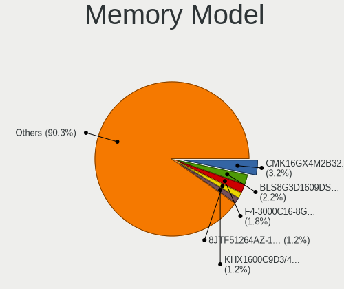

| Model                                                              | Desktops | Percent |
|--------------------------------------------------------------------|----------|---------|
| Corsair RAM CMK16GX4M2B3200C16 8GB DIMM DDR4 3600MT/s              | 21       | 3.24%   |
| Crucial RAM BLS8G3D1609DS1S00. 8GB DIMM DDR3 1800MT/s              | 14       | 2.16%   |
| G.Skill RAM F4-3000C16-8GISB 8GB DIMM DDR4 3200MT/s                | 12       | 1.85%   |
| Micron RAM 8JTF51264AZ-1G6E1 4GB DIMM 1600MT/s                     | 8        | 1.23%   |
| Kingston RAM KHX1600C9D3/4GX 4GB DIMM DDR3 1800MT/s                | 8        | 1.23%   |
| G.Skill RAM F4-3200C16-16GIS 16GB DIMM DDR4 3600MT/s               | 8        | 1.23%   |
| Corsair RAM CMK16GX4M2B3000C15 8GB DIMM DDR4 3600MT/s              | 7        | 1.08%   |
| Kingston RAM KHX3200C16D4/8GX 8GB DIMM DDR4 3733MT/s               | 6        | 0.92%   |
| G.Skill RAM F4-3200C16-8GIS 8GB DIMM DDR4 3200MT/s                 | 6        | 0.92%   |
| Kingston RAM Module 32GB DIMM DDR4 2400MT/s                        | 5        | 0.77%   |
| Kingston RAM KHX1866C10D3/8G 8GB DIMM DDR3 2133MT/s                | 5        | 0.77%   |
| G.Skill RAM F4-3200C16-8GVKB 8GB DIMM DDR4 4000MT/s                | 5        | 0.77%   |
| G.Skill RAM F4-2666C19-16GIS 16GB DIMM DDR4 2667MT/s               | 5        | 0.77%   |
| Corsair RAM CMW16GX4M2C3200C16 8GB DIMM DDR4 3733MT/s              | 5        | 0.77%   |
| Corsair RAM CMK32GX4M2D3600C18 16GB DIMM DDR4 3800MT/s             | 5        | 0.77%   |
| Corsair RAM CMK32GX4M2B3200C16 16GB DIMM DDR4 3800MT/s             | 5        | 0.77%   |
| Unknown RAM Module 2GB DIMM DDR2 800MT/s                           | 4        | 0.62%   |
| Samsung RAM M378B5173QH0-CK0 4GB DIMM DDR3 1600MT/s                | 4        | 0.62%   |
| Kingston RAM KHX2666C15D4/8G 8GB DIMM 3200MT/s                     | 4        | 0.62%   |
| Kingston RAM KHX1600C10D3/8G 8GB DIMM DDR3 1600MT/s                | 4        | 0.62%   |
| Kingston RAM KF3200C16D4/16GX 16GB DIMM DDR4 3200MT/s              | 4        | 0.62%   |
| G.Skill RAM F4-3000C16-16GISB 16GB DIMM DDR4 3200MT/s              | 4        | 0.62%   |
| Unknown RAM Module 8GB DIMM DDR4 2133MT/s                          | 3        | 0.46%   |
| Kingston RAM KF3200C16D4/32GX 32GB DIMM DDR4 3933MT/s              | 3        | 0.46%   |
| Kingston RAM 9905734-059.A00G 16GB DIMM DDR4 2667MT/s              | 3        | 0.46%   |
| Crucial RAM BL16G26C16U4W.16FD 16GB DIMM DDR4 2667MT/s             | 3        | 0.46%   |
| Corsair RAM CMX8GX3M1A1600C11 8GB DIMM DDR3 1600MT/s               | 3        | 0.46%   |
| Corsair RAM CMW32GX4M2Z3600C18 16GB DIMM DDR4 3733MT/s             | 3        | 0.46%   |
| Corsair RAM CML8GX3M2A1600C9 4GB DIMM DDR3 1867MT/s                | 3        | 0.46%   |
| Corsair RAM CMK8GX4M1D3000C16 8GB DIMM DDR4 3600MT/s               | 3        | 0.46%   |
| Corsair RAM CMK64GX4M2E3200C16 32GB DIMM DDR4 3600MT/s             | 3        | 0.46%   |
| Corsair RAM CMK32GX4M2E3200C16 16GB DIMM DDR4 3534MT/s             | 3        | 0.46%   |
| Corsair RAM CMK32GX4M2B3000C15 16GB DIMM DDR4 3000MT/s             | 3        | 0.46%   |
| Unknown                                                            | 3        | 0.46%   |
| Unknown RAM Module 2GB DIMM SDRAM                                  | 2        | 0.31%   |
| Unknown RAM Module 2GB DIMM 1333MT/s                               | 2        | 0.31%   |
| Unknown RAM Module 2GB DIMM 1066MT/s                               | 2        | 0.31%   |
| Unknown RAM Module 2048MB DIMM DDR3 1333MT/s                       | 2        | 0.31%   |
| Unknown RAM Module 1024MB DIMM DDR2 266MT/s                        | 2        | 0.31%   |
| Unknown (0x0E9D) RAM KINSOTIN16GB2666MHZ 16GB SODIMM DDR4 2667MT/s | 2        | 0.31%   |

Memory Kind
-----------

Memory module kinds

| Kind    | Desktops | Percent |
|---------|----------|---------|
| DDR4    | 298      | 55.08%  |
| DDR3    | 165      | 30.5%   |
| DDR5    | 28       | 5.18%   |
| DDR2    | 17       | 3.14%   |
| Unknown | 15       | 2.77%   |
| SDRAM   | 13       | 2.4%    |
| DDR     | 3        | 0.55%   |
| LPDDR4  | 1        | 0.18%   |
| DRAM    | 1        | 0.18%   |

Memory Form Factor
------------------

Physical design of the memory module

| Name    | Desktops | Percent |
|---------|----------|---------|
| DIMM    | 500      | 93.63%  |
| SODIMM  | 33       | 6.18%   |
| FB-DIMM | 1        | 0.19%   |

Memory Size
-----------

Memory module size

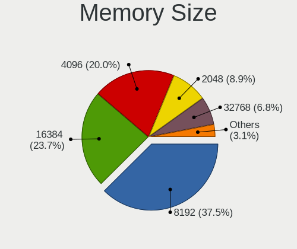

| Size  | Desktops | Percent |
|-------|----------|---------|
| 8192  | 220      | 37.54%  |
| 16384 | 139      | 23.72%  |
| 4096  | 117      | 19.97%  |
| 2048  | 52       | 8.87%   |
| 32768 | 40       | 6.83%   |
| 1024  | 10       | 1.71%   |
| 512   | 4        | 0.68%   |
| 49152 | 1        | 0.17%   |
| 24576 | 1        | 0.17%   |
| 256   | 1        | 0.17%   |
| 16    | 1        | 0.17%   |

Memory Speed
------------

Memory module speed

| Speed   | Desktops | Percent |
|---------|----------|---------|
| 1600    | 85       | 14.33%  |
| 3200    | 69       | 11.64%  |
| 3600    | 61       | 10.29%  |
| 1333    | 49       | 8.26%   |
| 2400    | 41       | 6.91%   |
| 2133    | 31       | 5.23%   |
| 2667    | 29       | 4.89%   |
| 3733    | 18       | 3.04%   |
| 1800    | 18       | 3.04%   |
| 3800    | 15       | 2.53%   |
| 3000    | 15       | 2.53%   |
| 1867    | 11       | 1.85%   |
| 6000    | 10       | 1.69%   |
| 4000    | 10       | 1.69%   |
| 2666    | 10       | 1.69%   |
| 1866    | 10       | 1.69%   |
| 667     | 10       | 1.69%   |
| 800     | 8        | 1.35%   |
| 2933    | 7        | 1.18%   |
| 5600    | 6        | 1.01%   |
| 3400    | 6        | 1.01%   |
| 5200    | 5        | 0.84%   |
| 1334    | 5        | 0.84%   |
| Unknown | 5        | 0.84%   |
| 4800    | 4        | 0.67%   |
| 3666    | 4        | 0.67%   |
| 3466    | 4        | 0.67%   |
| 1066    | 4        | 0.67%   |
| 3933    | 3        | 0.51%   |
| 3866    | 3        | 0.51%   |
| 3534    | 3        | 0.51%   |
| 3066    | 3        | 0.51%   |
| 3266    | 2        | 0.34%   |
| 2800    | 2        | 0.34%   |
| 2465    | 2        | 0.34%   |
| 2134    | 2        | 0.34%   |
| 2000    | 2        | 0.34%   |
| 1067    | 2        | 0.34%   |
| 400     | 2        | 0.34%   |
| 266     | 2        | 0.34%   |

Printers & scanners
-------------------

Printer Vendor
--------------

Printer device vendors

| Vendor                | Desktops | Percent |
|-----------------------|----------|---------|
| Canon                 | 16       | 28.57%  |
| Hewlett-Packard       | 14       | 25%     |
| Brother Industries    | 12       | 21.43%  |
| Seiko Epson           | 5        | 8.93%   |
| Samsung Electronics   | 4        | 7.14%   |
| Ricoh                 | 1        | 1.79%   |
| Prolific Technology   | 1        | 1.79%   |
| Oki Data              | 1        | 1.79%   |
| Lexmark International | 1        | 1.79%   |
| Dell                  | 1        | 1.79%   |

Printer Model
-------------

Printer device models

| Model                                                      | Desktops | Percent |
|------------------------------------------------------------|----------|---------|
| Seiko Epson WF-2530 Series                                 | 2        | 3.57%   |
| Samsung M2070 Series                                       | 2        | 3.57%   |
| HP ENVY Photo 6200 series                                  | 2        | 3.57%   |
| HP Deskjet 3520 series                                     | 2        | 3.57%   |
| Canon TS5100 series                                        | 2        | 3.57%   |
| Canon PIXMA MX320 series                                   | 2        | 3.57%   |
| Canon PIXMA MG2500 Series                                  | 2        | 3.57%   |
| Canon CanoScan LiDE 300                                    | 2        | 3.57%   |
| Brother Printer                                            | 2        | 3.57%   |
| Brother HL-3040CN series                                   | 2        | 3.57%   |
| Seiko Epson XP-235 Series                                  | 1        | 1.79%   |
| Seiko Epson ET-4750 [WorkForce ET-4750 EcoTank All-in-One] | 1        | 1.79%   |
| Seiko Epson AL-M310DN                                      | 1        | 1.79%   |
| Samsung C48x Series Color Laser Multifunction Printer      | 1        | 1.79%   |
| Samsung C1810 Series                                       | 1        | 1.79%   |
| Ricoh SP 213SUw                                            | 1        | 1.79%   |
| Prolific PL2305 Parallel Port                              | 1        | 1.79%   |
| Oki Data USB Device                                        | 1        | 1.79%   |
| Lexmark International CS417dn                              | 1        | 1.79%   |
| HP PSC 1400                                                | 1        | 1.79%   |
| HP OfficeJet Pro 7720 series                               | 1        | 1.79%   |
| HP LaserJet Professional P1102w                            | 1        | 1.79%   |
| HP LaserJet 1320                                           | 1        | 1.79%   |
| HP ENVY 5000 series                                        | 1        | 1.79%   |
| HP ENVY 4520 series                                        | 1        | 1.79%   |
| HP DeskJet D2300                                           | 1        | 1.79%   |
| HP DeskJet 940c                                            | 1        | 1.79%   |
| HP Deskjet 2050 J510                                       | 1        | 1.79%   |
| HP Color LaserJet Pro M478f-9f                             | 1        | 1.79%   |
| Dell C1760nw Color Printer                                 | 1        | 1.79%   |
| Canon TS700 series                                         | 1        | 1.79%   |
| Canon TS6300 series                                        | 1        | 1.79%   |
| Canon MF5650 (FAX)                                         | 1        | 1.79%   |
| Canon LiDE 400                                             | 1        | 1.79%   |
| Canon LBP2900                                              | 1        | 1.79%   |
| Canon LaserShot LBP-1120 Printer                           | 1        | 1.79%   |
| Canon L100/L150/L170                                       | 1        | 1.79%   |
| Canon iP7200 series                                        | 1        | 1.79%   |
| Brother MFC-L2710DW series                                 | 1        | 1.79%   |
| Brother MFC-L2710DN series                                 | 1        | 1.79%   |

Scanner Vendor
--------------

Scanner device vendors

| Vendor          | Desktops | Percent |
|-----------------|----------|---------|
| Canon           | 24       | 70.59%  |
| Seiko Epson     | 6        | 17.65%  |
| Fujitsu         | 3        | 8.82%   |
| Hewlett-Packard | 1        | 2.94%   |

Scanner Model
-------------

Scanner device models

| Model                                                    | Desktops | Percent |
|----------------------------------------------------------|----------|---------|
| Fujitsu ScanSnap SV600                                   | 3        | 8.82%   |
| Canon CanoScan LiDE 110                                  | 3        | 8.82%   |
| Canon CanoScan                                           | 3        | 8.82%   |
| Seiko Epson GT-F500/GT-F550 [Perfection 2480/2580 PHOTO] | 2        | 5.88%   |
| Canon CanoScan N670U/N676U/LiDE 20                       | 2        | 5.88%   |
| Canon CanoScan LiDE 60                                   | 2        | 5.88%   |
| Canon CanoScan LiDE 50/LiDE 35/LiDE 40                   | 2        | 5.88%   |
| Canon CanoScan LiDE 220                                  | 2        | 5.88%   |
| Canon CanoScan LiDE 200                                  | 2        | 5.88%   |
| Canon CanoScan LiDE 100                                  | 2        | 5.88%   |
| Seiko Epson Perfection V37/V370                          | 1        | 2.94%   |
| Seiko Epson GT-X800 [Perfection 4990 PHOTO]              | 1        | 2.94%   |
| Seiko Epson GT-9300UF [Perfection 2400 PHOTO]            | 1        | 2.94%   |
| Seiko Epson GT-7200U [Perfection 1250/1250 PHOTO]        | 1        | 2.94%   |
| HP ScanJet 4850C/4890C                                   | 1        | 2.94%   |
| Canon CanoScan N650U/N656U                               | 1        | 2.94%   |
| Canon CanoScan N1240U/LiDE 30                            | 1        | 2.94%   |
| Canon CanoScan LIDE 25                                   | 1        | 2.94%   |
| Canon CanoScan LiDE 210                                  | 1        | 2.94%   |
| Canon CanoScan LiDE 120                                  | 1        | 2.94%   |
| Canon CanoScan FB630U                                    | 1        | 2.94%   |

Camera
------

Camera Vendor
-------------

Camera device vendors

| Vendor                        | Desktops | Percent |
|-------------------------------|----------|---------|
| Logitech                      | 71       | 35.15%  |
| Microdia                      | 19       | 9.41%   |
| Microsoft                     | 16       | 7.92%   |
| Sunplus Innovation Technology | 13       | 6.44%   |
| Realtek Semiconductor         | 10       | 4.95%   |
| ARC International             | 8        | 3.96%   |
| Apple                         | 8        | 3.96%   |
| Samsung Electronics           | 5        | 2.48%   |
| Jieli Technology              | 5        | 2.48%   |
| SHENZHEN EMEET TECHNOLOGY     | 4        | 1.98%   |
| Z-Star Microelectronics       | 3        | 1.49%   |
| Fujitsu                       | 3        | 1.49%   |
| XHT-211220-ZW                 | 2        | 0.99%   |
| Trust                         | 2        | 0.99%   |
| Tobii Technology AB           | 2        | 0.99%   |
| Novatek Microelectronics      | 2        | 0.99%   |
| KYE Systems (Mouse Systems)   | 2        | 0.99%   |
| Generalplus Technology        | 2        | 0.99%   |
| 2M UVC CAMERA                 | 2        | 0.99%   |
| Xiongmai                      | 1        | 0.5%    |
| WaveRider Communications      | 1        | 0.5%    |
| ValueHD                       | 1        | 0.5%    |
| SunplusIT                     | 1        | 0.5%    |
| Sunplus IT                    | 1        | 0.5%    |
| SHENZHEN AONI ELECTRONIC      | 1        | 0.5%    |
| Razer USA                     | 1        | 0.5%    |
| Quanta                        | 1        | 0.5%    |
| Nikon                         | 1        | 0.5%    |
| Linux Foundation              | 1        | 0.5%    |
| Kensington                    | 1        | 0.5%    |
| Hewlett-Packard               | 1        | 0.5%    |
| HD Camera Manufacturer        | 1        | 0.5%    |
| GEMBIRD                       | 1        | 0.5%    |
| Etron Technology              | 1        | 0.5%    |
| Elgato Systems                | 1        | 0.5%    |
| Creative Technology           | 1        | 0.5%    |
| Chicony Electronics           | 1        | 0.5%    |
| AVerMedia Technologies        | 1        | 0.5%    |
| Arkmicro Technologies         | 1        | 0.5%    |
| Anker PowerConf C200          | 1        | 0.5%    |

Camera Model
------------

Camera device models

| Model                                          | Desktops | Percent |
|------------------------------------------------|----------|---------|
| Logitech HD Pro Webcam C920                    | 12       | 5.91%   |
| Logitech Webcam C270                           | 11       | 5.42%   |
| Logitech C922 Pro Stream Webcam                | 9        | 4.43%   |
| Microsoft LifeCam HD-3000                      | 8        | 3.94%   |
| ARC International Camera                       | 8        | 3.94%   |
| Microdia Webcam Vitade AF                      | 7        | 3.45%   |
| Logitech HD Webcam C525                        | 6        | 2.96%   |
| Apple iPhone 5/5C/5S/6/SE/7/8/X/XR             | 6        | 2.96%   |
| Samsung Galaxy series, misc. (MTP mode)        | 5        | 2.46%   |
| Microdia USB 2.0 Camera                        | 5        | 2.46%   |
| Jieli USB PHY 2.0                              | 5        | 2.46%   |
| Sunplus DICOTA 4K                              | 4        | 1.97%   |
| Realtek FULL HD 1080P Webcam                   | 4        | 1.97%   |
| Logitech QuickCam Pro 9000                     | 4        | 1.97%   |
| Logitech HD Webcam C615                        | 4        | 1.97%   |
| Sunplus FULL HD webcam                         | 3        | 1.48%   |
| SHENZHEN EMEET TECHNOLOGY HD Webcam eMeet C960 | 3        | 1.48%   |
| Microdia Sonix USB 2.0 Camera                  | 3        | 1.48%   |
| Logitech Webcam C170                           | 3        | 1.48%   |
| Logitech QuickCam Pro for Notebooks            | 3        | 1.48%   |
| Logitech C505 HD Webcam                        | 3        | 1.48%   |
| Logitech BRIO 4K Stream Edition                | 3        | 1.48%   |
| Fujitsu USB Camera                             | 3        | 1.48%   |
| Z-Star Venus USB2.0 Camera                     | 2        | 0.99%   |
| XHT-211220-ZW Photry PC230A QHD Webcam         | 2        | 0.99%   |
| Tobii AB EyeChip                               | 2        | 0.99%   |
| Sunplus USB Camera                             | 2        | 0.99%   |
| Realtek NexiGo N660P FHD Webcam                | 2        | 0.99%   |
| Realtek Full HD Webcam                         | 2        | 0.99%   |
| Microsoft Microsoft LifeCam Studio           | 2        | 0.99%   |
| Microsoft LifeCam VX-500 [1357]                | 2        | 0.99%   |
| Microsoft LifeCam VX-2000                      | 2        | 0.99%   |
| Microdia Integrated Camera                     | 2        | 0.99%   |
| Logitech Webcam C310                           | 2        | 0.99%   |
| Logitech Logitech Webcam C925e                 | 2        | 0.99%   |
| Logitech HD Webcam C510                        | 2        | 0.99%   |
| KYE Systems (Mouse Systems) PC-LM1E Camera     | 2        | 0.99%   |
| Generalplus GENERAL WEBCAM                     | 2        | 0.99%   |
| 2M UVC CAMERA NexiGo N60 FHD Webcam            | 2        | 0.99%   |
| Z-Star Integrated Camera                       | 1        | 0.49%   |

Security
--------

Fingerprint Vendor
------------------

Fingerprint sensor vendors

| Vendor                | Desktops | Percent |
|-----------------------|----------|---------|
| Elan Microelectronics | 2        | 66.67%  |
| Upek                  | 1        | 33.33%  |

Fingerprint Model
-----------------

Fingerprint sensor models

| Model                                                  | Desktops | Percent |
|--------------------------------------------------------|----------|---------|
| Elan fingerprint sensor [FeinTech FPS00200]            | 2        | 66.67%  |
| Upek Biometric Touchchip/Touchstrip Fingerprint Sensor | 1        | 33.33%  |

Chipcard Vendor
---------------

Chipcard module vendors

| Vendor                | Desktops | Percent |
|-----------------------|----------|---------|
| Realtek Semiconductor | 1        | 25%     |
| Lenovo                | 1        | 25%     |
| Cherry                | 1        | 25%     |
| Alcor Micro           | 1        | 25%     |

Chipcard Model
--------------

Chipcard module models

| Model                                             | Desktops | Percent |
|---------------------------------------------------|----------|---------|
| Realtek Semiconductor Smart Card Reader Interface | 1        | 25%     |
| Lenovo Smartcard Keyboard                         | 1        | 25%     |
| Cherry Smart Terminal XX44                        | 1        | 25%     |
| Alcor Micro Watchdata W 1981                      | 1        | 25%     |

Unsupported
-----------

Unsupported Devices
-------------------

Total unsupported devices on board

| Total | Desktops | Percent |
|-------|----------|---------|
| 0     | 866      | 85.07%  |
| 1     | 127      | 12.48%  |
| 2     | 18       | 1.77%   |
| 5     | 2        | 0.2%    |
| 4     | 2        | 0.2%    |
| 3     | 2        | 0.2%    |
| 6     | 1        | 0.1%    |

Unsupported Device Types
------------------------

Types of unsupported devices

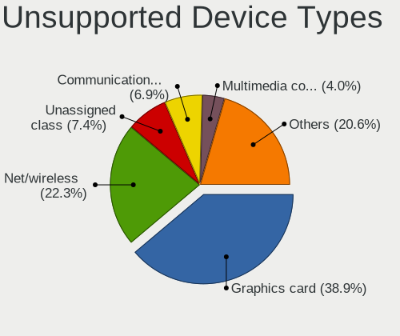

| Type                     | Desktops | Percent |
|--------------------------|----------|---------|
| Graphics card            | 68       | 38.86%  |
| Net/wireless             | 39       | 22.29%  |
| Unassigned class         | 13       | 7.43%   |
| Communication controller | 12       | 6.86%   |
| Multimedia controller    | 7        | 4%      |
| Net/ethernet             | 6        | 3.43%   |
| Sound                    | 5        | 2.86%   |
| Camera                   | 5        | 2.86%   |
| Bluetooth                | 5        | 2.86%   |
| Fingerprint reader       | 3        | 1.71%   |
| Tv card                  | 2        | 1.14%   |
| Storage/raid             | 2        | 1.14%   |
| Network                  | 2        | 1.14%   |
| Chipcard                 | 2        | 1.14%   |
| Storage/ide              | 1        | 0.57%   |
| Storage/ata              | 1        | 0.57%   |
| Modem                    | 1        | 0.57%   |
| Card reader              | 1        | 0.57%   |

