Linux in Austria - Tested Hardware & Statistics (Notebooks)
-----------------------------------------------------------

A project to collect tested hardware configurations for Linux in Austria.

Anyone can contribute to this report by the [hw-probe](https://github.com/linuxhw/hw-probe) tool:

    sudo -E hw-probe -all -upload

Please contribute! Especially if your hardware is rare.

Contents
--------

* [ Test Cases ](#test-cases)

* [ System ](#system)
  - [ OS                       ](#os)
  - [ OS Family                ](#os-family)
  - [ Kernel                   ](#kernel)
  - [ Kernel Family            ](#kernel-family)
  - [ Kernel Major Ver.        ](#kernel-major-ver)
  - [ Arch                     ](#arch)
  - [ DE                       ](#de)
  - [ Display Server           ](#display-server)
  - [ Display Manager          ](#display-manager)
  - [ OS Lang                  ](#os-lang)
  - [ Boot Mode                ](#boot-mode)
  - [ Filesystem               ](#filesystem)
  - [ Part. scheme             ](#part-scheme)
  - [ Dual Boot with Linux/BSD ](#dual-boot-with-linuxbsd)
  - [ Dual Boot (Win)          ](#dual-boot-win)

* [ Board ](#board)
  - [ Vendor                   ](#vendor)
  - [ Model                    ](#model)
  - [ Model Family             ](#model-family)
  - [ MFG Year                 ](#mfg-year)
  - [ Form Factor              ](#form-factor)
  - [ Secure Boot              ](#secure-boot)
  - [ Coreboot                 ](#coreboot)
  - [ RAM Size                 ](#ram-size)
  - [ RAM Used                 ](#ram-used)
  - [ Total Drives             ](#total-drives)
  - [ Has CD-ROM               ](#has-cd-rom)
  - [ Has Ethernet             ](#has-ethernet)
  - [ Has WiFi                 ](#has-wifi)
  - [ Has Bluetooth            ](#has-bluetooth)

* [ Location ](#location)
  - [ Country                  ](#country)
  - [ City                     ](#city)

* [ Drives ](#drives)
  - [ Drive Vendor             ](#drive-vendor)
  - [ Drive Model              ](#drive-model)
  - [ HDD Vendor               ](#hdd-vendor)
  - [ SSD Vendor               ](#ssd-vendor)
  - [ Drive Kind               ](#drive-kind)
  - [ Drive Connector          ](#drive-connector)
  - [ Drive Size               ](#drive-size)
  - [ Space Total              ](#space-total)
  - [ Space Used               ](#space-used)
  - [ Malfunc. Drives          ](#malfunc-drives)
  - [ Malfunc. Drive Vendor    ](#malfunc-drive-vendor)
  - [ Malfunc. HDD Vendor      ](#malfunc-hdd-vendor)
  - [ Malfunc. Drive Kind      ](#malfunc-drive-kind)
  - [ Failed Drives            ](#failed-drives)
  - [ Failed Drive Vendor      ](#failed-drive-vendor)
  - [ Drive Status             ](#drive-status)

* [ Storage controller ](#storage-controller)
  - [ Storage Vendor           ](#storage-vendor)
  - [ Storage Model            ](#storage-model)
  - [ Storage Kind             ](#storage-kind)

* [ Processor ](#processor)
  - [ CPU Vendor               ](#cpu-vendor)
  - [ CPU Model                ](#cpu-model)
  - [ CPU Model Family         ](#cpu-model-family)
  - [ CPU Cores                ](#cpu-cores)
  - [ CPU Sockets              ](#cpu-sockets)
  - [ CPU Threads              ](#cpu-threads)
  - [ CPU Op-Modes             ](#cpu-op-modes)
  - [ CPU Microcode            ](#cpu-microcode)
  - [ CPU Microarch            ](#cpu-microarch)

* [ Graphics ](#graphics)
  - [ GPU Vendor               ](#gpu-vendor)
  - [ GPU Model                ](#gpu-model)
  - [ GPU Combo                ](#gpu-combo)
  - [ GPU Driver               ](#gpu-driver)
  - [ GPU Memory               ](#gpu-memory)

* [ Monitor ](#monitor)
  - [ Monitor Vendor           ](#monitor-vendor)
  - [ Monitor Model            ](#monitor-model)
  - [ Monitor Resolution       ](#monitor-resolution)
  - [ Monitor Diagonal         ](#monitor-diagonal)
  - [ Monitor Width            ](#monitor-width)
  - [ Aspect Ratio             ](#aspect-ratio)
  - [ Monitor Area             ](#monitor-area)
  - [ Pixel Density            ](#pixel-density)
  - [ Multiple Monitors        ](#multiple-monitors)

* [ Network ](#network)
  - [ Net Controller Vendor    ](#net-controller-vendor)
  - [ Net Controller Model     ](#net-controller-model)
  - [ Wireless Vendor          ](#wireless-vendor)
  - [ Wireless Model           ](#wireless-model)
  - [ Ethernet Vendor          ](#ethernet-vendor)
  - [ Ethernet Model           ](#ethernet-model)
  - [ Net Controller Kind      ](#net-controller-kind)
  - [ Used Controller          ](#used-controller)
  - [ NICs                     ](#nics)
  - [ IPv6                     ](#ipv6)

* [ Bluetooth ](#bluetooth)
  - [ Bluetooth Vendor         ](#bluetooth-vendor)
  - [ Bluetooth Model          ](#bluetooth-model)

* [ Sound ](#sound)
  - [ Sound Vendor             ](#sound-vendor)
  - [ Sound Model              ](#sound-model)

* [ Memory ](#memory)
  - [ Memory Vendor            ](#memory-vendor)
  - [ Memory Model             ](#memory-model)
  - [ Memory Kind              ](#memory-kind)
  - [ Memory Form Factor       ](#memory-form-factor)
  - [ Memory Size              ](#memory-size)
  - [ Memory Speed             ](#memory-speed)

* [ Printers & scanners ](#printers--scanners)
  - [ Printer Vendor           ](#printer-vendor)
  - [ Printer Model            ](#printer-model)
  - [ Scanner Vendor           ](#scanner-vendor)
  - [ Scanner Model            ](#scanner-model)

* [ Camera ](#camera)
  - [ Camera Vendor            ](#camera-vendor)
  - [ Camera Model             ](#camera-model)

* [ Security ](#security)
  - [ Fingerprint Vendor       ](#fingerprint-vendor)
  - [ Fingerprint Model        ](#fingerprint-model)
  - [ Chipcard Vendor          ](#chipcard-vendor)
  - [ Chipcard Model           ](#chipcard-model)

* [ Unsupported ](#unsupported)
  - [ Unsupported Devices      ](#unsupported-devices)
  - [ Unsupported Device Types ](#unsupported-device-types)

Test Cases
----------

Total: 2403

| Vendor        | Model                       | Probe                                                      | Date         |
|---------------|-----------------------------|------------------------------------------------------------|--------------|
| Lenovo        | Unknown                     | [bcc2862f42](https://linux-hardware.org/?probe=bcc2862f42) | Jan 03, 2026 |
| Lenovo        | Unknown                     | [680abec869](https://linux-hardware.org/?probe=680abec869) | Jan 03, 2026 |
| Lenovo        | Y520-15IKBA 80WY            | [822240fb4e](https://linux-hardware.org/?probe=822240fb4e) | Jan 02, 2026 |
| ASUSTek       | UX550VE                     | [e3ff5623d1](https://linux-hardware.org/?probe=e3ff5623d1) | Jan 01, 2026 |
| Dell          | Latitude 5400               | [302a883b7d](https://linux-hardware.org/?probe=302a883b7d) | Dec 30, 2025 |
| HP            | ProBook 470 G5              | [a48dc616a7](https://linux-hardware.org/?probe=a48dc616a7) | Dec 30, 2025 |
| Lenovo        | ThinkPad T14 Gen 1 20UD0... | [2cd900b46a](https://linux-hardware.org/?probe=2cd900b46a) | Dec 30, 2025 |
| Dell          | Inspiron 16 5645            | [fc6ab21cfe](https://linux-hardware.org/?probe=fc6ab21cfe) | Dec 29, 2025 |
| Dell          | Precision M4700             | [da80225f41](https://linux-hardware.org/?probe=da80225f41) | Dec 28, 2025 |
| HP            | EliteBook 840 G1            | [e079930036](https://linux-hardware.org/?probe=e079930036) | Dec 28, 2025 |
| Schenker      | XMG EVO (E25)               | [bed3c72aa9](https://linux-hardware.org/?probe=bed3c72aa9) | Dec 26, 2025 |
| XIAOMI        | REDMI Book Pro 16 2025      | [2b278d83e0](https://linux-hardware.org/?probe=2b278d83e0) | Dec 25, 2025 |
| Dell          | Latitude E6400              | [c0cf6c1c2f](https://linux-hardware.org/?probe=c0cf6c1c2f) | Dec 25, 2025 |
| Acer          | Aspire VN7-571G             | [3ae6b29bf3](https://linux-hardware.org/?probe=3ae6b29bf3) | Dec 25, 2025 |
| MS-16GA       | Unknown                     | [d3bbce8704](https://linux-hardware.org/?probe=d3bbce8704) | Dec 25, 2025 |
| Acer          | Aspire E5-773G              | [ec4b2ed4a9](https://linux-hardware.org/?probe=ec4b2ed4a9) | Dec 24, 2025 |
| HUAWEI        | KLVC-WXX9                   | [890b2db723](https://linux-hardware.org/?probe=890b2db723) | Dec 23, 2025 |
| Lenovo        | ThinkPad E14 20RA001LGE     | [2cfe28347f](https://linux-hardware.org/?probe=2cfe28347f) | Dec 22, 2025 |
| ASUSTek       | K53SK                       | [3e10902997](https://linux-hardware.org/?probe=3e10902997) | Dec 22, 2025 |
| Medion        | Akoya P7818                 | [353db88445](https://linux-hardware.org/?probe=353db88445) | Dec 22, 2025 |
| Wortmann      | TERRA_MOBILE_1513           | [0557ff7fae](https://linux-hardware.org/?probe=0557ff7fae) | Dec 20, 2025 |
| Lenovo        | IdeaPad 5 Pro 16ACH6 82L... | [bad68def3c](https://linux-hardware.org/?probe=bad68def3c) | Dec 19, 2025 |
| Acer          | Nitro AN515-54              | [0a749a6f18](https://linux-hardware.org/?probe=0a749a6f18) | Dec 15, 2025 |
| Lenovo        | Yoga Slim 7 15ILL9 83HM     | [0e189c5b46](https://linux-hardware.org/?probe=0e189c5b46) | Dec 14, 2025 |
| Lenovo        | V14 G3 IAP 82TS             | [1c9f95b16a](https://linux-hardware.org/?probe=1c9f95b16a) | Dec 14, 2025 |
| ASUSTek       | ASUS TUF Gaming F17 FX70... | [dc8cf5ffcf](https://linux-hardware.org/?probe=dc8cf5ffcf) | Dec 13, 2025 |
| ASUSTek       | G750JS                      | [5f6ca0077b](https://linux-hardware.org/?probe=5f6ca0077b) | Dec 11, 2025 |
| Lenovo        | B580 4377A5G                | [4d5b722cf0](https://linux-hardware.org/?probe=4d5b722cf0) | Dec 10, 2025 |
| Lenovo        | ThinkPad T460s 20FAS0KH0... | [4b6c2b8bd0](https://linux-hardware.org/?probe=4b6c2b8bd0) | Dec 10, 2025 |
| Lenovo        | ThinkPad X230 2325CN9       | [01ed588d92](https://linux-hardware.org/?probe=01ed588d92) | Dec 09, 2025 |
| ASUSTek       | ASUS TUF Gaming F17 FX70... | [d09c14e57d](https://linux-hardware.org/?probe=d09c14e57d) | Dec 09, 2025 |
| Acer          | Aspire V5-561G              | [c339ee7f31](https://linux-hardware.org/?probe=c339ee7f31) | Dec 08, 2025 |
| Apple         | MacBookAir6,2               | [e6a82fcad1](https://linux-hardware.org/?probe=e6a82fcad1) | Dec 08, 2025 |
| Lenovo        | ThinkPad X280 20KF001GGE    | [d58c2d578f](https://linux-hardware.org/?probe=d58c2d578f) | Dec 07, 2025 |
| Lenovo        | ThinkPad E560 20EV000YGE    | [16fa2037ac](https://linux-hardware.org/?probe=16fa2037ac) | Dec 07, 2025 |
| MSI           | Summit E14FlipEvo A12MT     | [a6c80ac087](https://linux-hardware.org/?probe=a6c80ac087) | Dec 07, 2025 |
| HP            | ProBook 450 G5              | [b6b55deb8e](https://linux-hardware.org/?probe=b6b55deb8e) | Dec 07, 2025 |
| HP            | 625                         | [a28fc48473](https://linux-hardware.org/?probe=a28fc48473) | Dec 06, 2025 |
| Samsung       | 275E4E/275E5E               | [832263c37c](https://linux-hardware.org/?probe=832263c37c) | Dec 06, 2025 |
| HP            | EliteBook 840 G2            | [a82c8cff55](https://linux-hardware.org/?probe=a82c8cff55) | Dec 05, 2025 |
| Toshiba       | Satellite C50-A-1F1         | [2b09fccef4](https://linux-hardware.org/?probe=2b09fccef4) | Dec 05, 2025 |
| Lenovo        | ThinkPad W530 244743G       | [63347ef845](https://linux-hardware.org/?probe=63347ef845) | Dec 05, 2025 |
| Medion        | E7220                       | [e9fa21b1d4](https://linux-hardware.org/?probe=e9fa21b1d4) | Dec 05, 2025 |
| Medion        | E7220                       | [ee6f6da985](https://linux-hardware.org/?probe=ee6f6da985) | Dec 05, 2025 |
| Lenovo        | ThinkPad T14s Gen 6 21TB... | [e96e611e89](https://linux-hardware.org/?probe=e96e611e89) | Dec 04, 2025 |
| Dell          | Latitude 5410               | [161e2a43ea](https://linux-hardware.org/?probe=161e2a43ea) | Dec 02, 2025 |
| Dell          | Latitude 5410               | [28adf66208](https://linux-hardware.org/?probe=28adf66208) | Dec 02, 2025 |
| HP            | EliteBook 840 G1            | [58e0ab32d1](https://linux-hardware.org/?probe=58e0ab32d1) | Dec 02, 2025 |
| Fujitsu       | LIFEBOOK U7413              | [c9d13451df](https://linux-hardware.org/?probe=c9d13451df) | Dec 01, 2025 |
| Fujitsu       | LIFEBOOK U7413              | [184b277553](https://linux-hardware.org/?probe=184b277553) | Dec 01, 2025 |
| Sony          | VGN-NS11M_S                 | [0ba839ab0a](https://linux-hardware.org/?probe=0ba839ab0a) | Dec 01, 2025 |
| ASUSTek       | UX550VE                     | [a5e1f77bdd](https://linux-hardware.org/?probe=a5e1f77bdd) | Dec 01, 2025 |
| Acer          | Aspire E5-575G              | [6e8d70284d](https://linux-hardware.org/?probe=6e8d70284d) | Nov 30, 2025 |
| Lenovo        | Yoga 500-14IBD 80N4         | [68f414c4c4](https://linux-hardware.org/?probe=68f414c4c4) | Nov 30, 2025 |
| Lenovo        | ThinkPad E570 20H500B4GE    | [ebb1705aec](https://linux-hardware.org/?probe=ebb1705aec) | Nov 29, 2025 |
| Lenovo        | ThinkPad T510 4314DZG       | [938339c969](https://linux-hardware.org/?probe=938339c969) | Nov 29, 2025 |
| MSI           | CR70 2M/CX70 2OC/CX70 2O... | [01b6fc996c](https://linux-hardware.org/?probe=01b6fc996c) | Nov 29, 2025 |
| Lenovo        | ThinkBook 16 G7+ ASP 21Q... | [6b78557545](https://linux-hardware.org/?probe=6b78557545) | Nov 28, 2025 |
| Lenovo        | ThinkPad T480 20L6S8LU1W    | [2e01ed1a91](https://linux-hardware.org/?probe=2e01ed1a91) | Nov 26, 2025 |
| Lenovo        | ThinkPad T570 W10DG 20JX... | [d74e022eba](https://linux-hardware.org/?probe=d74e022eba) | Nov 23, 2025 |
| Lenovo        | V15 G4 ABP 82YY             | [92d367a89f](https://linux-hardware.org/?probe=92d367a89f) | Nov 23, 2025 |
| HP            | ProBook 470 G4              | [5dd41684d1](https://linux-hardware.org/?probe=5dd41684d1) | Nov 21, 2025 |
| ASUSTek       | ASUS TUF Gaming A17 FA70... | [159d852da5](https://linux-hardware.org/?probe=159d852da5) | Nov 18, 2025 |
| HP            | Laptop 14-ck0xxx            | [6bd78857ae](https://linux-hardware.org/?probe=6bd78857ae) | Nov 16, 2025 |
| Lenovo        | ThinkPad X1 Carbon 4th 2... | [0e5c4bd811](https://linux-hardware.org/?probe=0e5c4bd811) | Nov 15, 2025 |
| Lenovo        | ThinkPad X1 Carbon 4th 2... | [a9519ad6ab](https://linux-hardware.org/?probe=a9519ad6ab) | Nov 15, 2025 |
| Lenovo        | ThinkPad P14s Gen 6 AMD ... | [7318c166f2](https://linux-hardware.org/?probe=7318c166f2) | Nov 12, 2025 |
| HP            | Laptop 14-ck0xxx            | [637efc709a](https://linux-hardware.org/?probe=637efc709a) | Nov 12, 2025 |
| Packard Be... | EasyNote TE69KB             | [bdd9c7b115](https://linux-hardware.org/?probe=bdd9c7b115) | Nov 09, 2025 |
| Lenovo        | B580 4377A5G                | [8644ee8ce4](https://linux-hardware.org/?probe=8644ee8ce4) | Nov 09, 2025 |
| HP            | ZBook 15 G6                 | [7afab44274](https://linux-hardware.org/?probe=7afab44274) | Nov 09, 2025 |
| TUXEDO        | Unknown                     | [e99399e577](https://linux-hardware.org/?probe=e99399e577) | Nov 07, 2025 |
| Acer          | TravelMate P214-53          | [bf791bc667](https://linux-hardware.org/?probe=bf791bc667) | Nov 04, 2025 |
| Acer          | Aspire 5750G                | [fb5901def8](https://linux-hardware.org/?probe=fb5901def8) | Nov 04, 2025 |
| Apple         | MacBookPro8,1               | [3d6011182f](https://linux-hardware.org/?probe=3d6011182f) | Nov 04, 2025 |
| Dell          | Latitude E6410              | [f563e4248d](https://linux-hardware.org/?probe=f563e4248d) | Nov 03, 2025 |
| HUAWEI        | BOHK-WAX9X                  | [ff318077e1](https://linux-hardware.org/?probe=ff318077e1) | Nov 02, 2025 |
| AiStone       | X5SP4NAG                    | [cf278b89a4](https://linux-hardware.org/?probe=cf278b89a4) | Nov 01, 2025 |
| HP            | EliteBook 850 G5            | [b2b57c1cdc](https://linux-hardware.org/?probe=b2b57c1cdc) | Nov 01, 2025 |
| ASUSTek       | ROG Zephyrus G15 GA503QS... | [af70708b20](https://linux-hardware.org/?probe=af70708b20) | Nov 01, 2025 |
| Toshiba       | Satellite Pro L770-12T      | [ea2899b2ba](https://linux-hardware.org/?probe=ea2899b2ba) | Oct 29, 2025 |
| Acer          | Aspire A315-44P             | [f90c7f9f1c](https://linux-hardware.org/?probe=f90c7f9f1c) | Oct 26, 2025 |
| HP            | Notebook                    | [282362f63c](https://linux-hardware.org/?probe=282362f63c) | Oct 25, 2025 |
| Fujitsu       | LIFEBOOK E5511              | [9514667ed4](https://linux-hardware.org/?probe=9514667ed4) | Oct 25, 2025 |
| Dell          | Latitude 5490               | [7d2ab907e2](https://linux-hardware.org/?probe=7d2ab907e2) | Oct 24, 2025 |
| Acer          | Aspire A15-61M              | [8f551f4ea6](https://linux-hardware.org/?probe=8f551f4ea6) | Oct 24, 2025 |
| HP            | Notebook                    | [754ae6de88](https://linux-hardware.org/?probe=754ae6de88) | Oct 23, 2025 |
| ASUSTek       | ROG Zephyrus G14 GA402RJ... | [ca00cff375](https://linux-hardware.org/?probe=ca00cff375) | Oct 23, 2025 |
| Dell          | Latitude 3520               | [19be02a8c4](https://linux-hardware.org/?probe=19be02a8c4) | Oct 22, 2025 |
| HP            | Notebook                    | [caa85d9d23](https://linux-hardware.org/?probe=caa85d9d23) | Oct 21, 2025 |
| Lenovo        | ThinkPad E14 Gen 3 20Y70... | [b0f21cca7c](https://linux-hardware.org/?probe=b0f21cca7c) | Oct 21, 2025 |
| Dell          | Latitude E6420              | [2b116ffd1a](https://linux-hardware.org/?probe=2b116ffd1a) | Oct 18, 2025 |
| Dell          | Latitude 3520               | [bc7cb8fd3e](https://linux-hardware.org/?probe=bc7cb8fd3e) | Oct 18, 2025 |
| Lenovo        | ThinkPad T480 20L6S8LU1W    | [34560a5d64](https://linux-hardware.org/?probe=34560a5d64) | Oct 15, 2025 |
| Lenovo        | Legion Pro 7 16AFR10H 83... | [ce763f1389](https://linux-hardware.org/?probe=ce763f1389) | Oct 13, 2025 |
| Lenovo        | ThinkPad T480s 20L8S02D0... | [8b1cd3d9aa](https://linux-hardware.org/?probe=8b1cd3d9aa) | Oct 13, 2025 |
| Toshiba       | Satellite C50D-A-10E        | [19cc6e0a57](https://linux-hardware.org/?probe=19cc6e0a57) | Oct 13, 2025 |
| Toshiba       | Satellite C50D-A-10E        | [752e82a8fc](https://linux-hardware.org/?probe=752e82a8fc) | Oct 13, 2025 |
| Lenovo        | ThinkPad L480 20LTSAUK00    | [319d34b1f4](https://linux-hardware.org/?probe=319d34b1f4) | Oct 11, 2025 |
| Lenovo        | IdeaPad 510s-14IKB 80UV     | [b51ef84e90](https://linux-hardware.org/?probe=b51ef84e90) | Oct 11, 2025 |
| Lenovo        | ThinkPad T480 20L50063GE    | [22bd7c2b6e](https://linux-hardware.org/?probe=22bd7c2b6e) | Oct 11, 2025 |
| Framework     | Laptop 13 (AMD Ryzen 704... | [ab9e196470](https://linux-hardware.org/?probe=ab9e196470) | Oct 08, 2025 |
| Acer          | Aspire E5-551G              | [d0b222567d](https://linux-hardware.org/?probe=d0b222567d) | Oct 02, 2025 |
| Lenovo        | Legion Pro 5 16ARX8 82WM    | [8c2ff2410e](https://linux-hardware.org/?probe=8c2ff2410e) | Oct 01, 2025 |
| Lenovo        | ThinkBook 15 G2 ITL 20VE    | [e4cb0196d4](https://linux-hardware.org/?probe=e4cb0196d4) | Oct 01, 2025 |
| Apple         | MacBookPro16,1              | [9d780f1d10](https://linux-hardware.org/?probe=9d780f1d10) | Sep 30, 2025 |
| Lenovo        | ThinkPad P15 Gen 1 20ST0... | [670c847678](https://linux-hardware.org/?probe=670c847678) | Sep 24, 2025 |
| Lenovo        | Yoga Slim 7 14AKP10 83JY    | [7f59c14462](https://linux-hardware.org/?probe=7f59c14462) | Sep 21, 2025 |
| Acer          | Swift SFG16-73              | [56ecf206a5](https://linux-hardware.org/?probe=56ecf206a5) | Sep 20, 2025 |
| HP            | 635                         | [05862b8280](https://linux-hardware.org/?probe=05862b8280) | Sep 19, 2025 |
| HP            | Pavilion Gaming Laptop 1... | [cdca0c34c7](https://linux-hardware.org/?probe=cdca0c34c7) | Sep 17, 2025 |
| ASUSTek       | ASUS EXPERTBOOK B1500CEA... | [67cae4df38](https://linux-hardware.org/?probe=67cae4df38) | Sep 16, 2025 |
| ASUSTek       | N53Jf                       | [e37fbbf945](https://linux-hardware.org/?probe=e37fbbf945) | Sep 11, 2025 |
| HP            | ProBook 450 G8 Notebook ... | [f4a8147543](https://linux-hardware.org/?probe=f4a8147543) | Sep 10, 2025 |
| Lenovo        | ThinkPad L14 Gen 2 20X1C... | [0f9185dbd2](https://linux-hardware.org/?probe=0f9185dbd2) | Sep 07, 2025 |
| Lenovo        | ThinkPad P1 Gen 3 20TH00... | [72f8dc2114](https://linux-hardware.org/?probe=72f8dc2114) | Sep 07, 2025 |
| Lenovo        | ThinkPad P1 Gen 3 20TH00... | [80c0361d2c](https://linux-hardware.org/?probe=80c0361d2c) | Sep 07, 2025 |
| Lenovo        | V15 G4 AMN 82YU             | [978834bf38](https://linux-hardware.org/?probe=978834bf38) | Sep 05, 2025 |
| Lenovo        | ThinkPad T450s 20BWS0090... | [ba433857db](https://linux-hardware.org/?probe=ba433857db) | Sep 04, 2025 |
| Acer          | Aspire 5750G                | [af69f0a550](https://linux-hardware.org/?probe=af69f0a550) | Sep 03, 2025 |
| Acer          | Aspire 5750G                | [687ab2d932](https://linux-hardware.org/?probe=687ab2d932) | Sep 03, 2025 |
| Apple         | MacBookPro9,2               | [64b4adb30d](https://linux-hardware.org/?probe=64b4adb30d) | Sep 01, 2025 |
| Dell          | Inspiron 7720               | [78491d17ec](https://linux-hardware.org/?probe=78491d17ec) | Sep 01, 2025 |
| Lenovo        | ThinkPad X1 Carbon 6th 2... | [b766c1d8c3](https://linux-hardware.org/?probe=b766c1d8c3) | Aug 30, 2025 |
| Lenovo        | ThinkPad X1 Carbon 6th 2... | [03299315fb](https://linux-hardware.org/?probe=03299315fb) | Aug 29, 2025 |
| Fujitsu Si... | CELSIUS H250                | [27ea38249e](https://linux-hardware.org/?probe=27ea38249e) | Aug 29, 2025 |
| Dell          | Inspiron 7720               | [027e73b986](https://linux-hardware.org/?probe=027e73b986) | Aug 27, 2025 |
| Apple         | MacBookPro7,1               | [372f5133c9](https://linux-hardware.org/?probe=372f5133c9) | Aug 25, 2025 |
| Acer          | Swift SF314-59              | [20d4a18672](https://linux-hardware.org/?probe=20d4a18672) | Aug 25, 2025 |
| Fujitsu Si... | CELSIUS H250                | [f924d85093](https://linux-hardware.org/?probe=f924d85093) | Aug 22, 2025 |
| HP            | 255 15.6 inch G9 Noteboo... | [307b882e42](https://linux-hardware.org/?probe=307b882e42) | Aug 20, 2025 |
| MSI           | CR600                       | [833196ddf9](https://linux-hardware.org/?probe=833196ddf9) | Aug 20, 2025 |
| Lenovo        | ThinkPad P51 20HJS0Q900     | [875e89692e](https://linux-hardware.org/?probe=875e89692e) | Aug 20, 2025 |
| Lenovo        | ThinkBook 16 G6 ABP 21KK    | [b594c66acb](https://linux-hardware.org/?probe=b594c66acb) | Aug 19, 2025 |
| Acer          | Swift SF314-59              | [faa8c9437b](https://linux-hardware.org/?probe=faa8c9437b) | Aug 19, 2025 |
| Dell          | Latitude 7420               | [92e6c4fdc9](https://linux-hardware.org/?probe=92e6c4fdc9) | Aug 19, 2025 |
| ASUSTek       | ROG Zephyrus G14 GA403UI... | [2ad2e98b47](https://linux-hardware.org/?probe=2ad2e98b47) | Aug 18, 2025 |
| Acer          | TravelMate P276-MG          | [307f59f727](https://linux-hardware.org/?probe=307f59f727) | Aug 18, 2025 |
| HP            | Pavilion Gaming Laptop 1... | [e2d8c856a0](https://linux-hardware.org/?probe=e2d8c856a0) | Aug 15, 2025 |
| ASUSTek       | UX550VE                     | [aa77e914a3](https://linux-hardware.org/?probe=aa77e914a3) | Aug 14, 2025 |
| Lenovo        | ThinkPad P51 20HJS0Q900     | [70b3ce4de1](https://linux-hardware.org/?probe=70b3ce4de1) | Aug 12, 2025 |
| Acer          | Aspire VN7-571G             | [0f52eb1fe1](https://linux-hardware.org/?probe=0f52eb1fe1) | Aug 10, 2025 |
| Lenovo        | ThinkPad E14 Gen 3 20YDS... | [e91d4090d7](https://linux-hardware.org/?probe=e91d4090d7) | Aug 07, 2025 |
| Acer          | Aspire 7730G                | [2959f332f6](https://linux-hardware.org/?probe=2959f332f6) | Aug 06, 2025 |
| Acer          | Aspire 7730G                | [e6f9627d91](https://linux-hardware.org/?probe=e6f9627d91) | Aug 05, 2025 |
| Acer          | Swift SF314-51              | [643ec09138](https://linux-hardware.org/?probe=643ec09138) | Aug 04, 2025 |
| MSI           | B450M PRO-M2 MAX            | [15a8da0050](https://linux-hardware.org/?probe=15a8da0050) | Aug 02, 2025 |
| Lenovo        | ThinkPad X1 Carbon 7th 2... | [0f6bfa377d](https://linux-hardware.org/?probe=0f6bfa377d) | Jul 30, 2025 |
| Dell          | XPS 15 9560                 | [ac5152b436](https://linux-hardware.org/?probe=ac5152b436) | Jul 29, 2025 |
| MSI           | Summit E16Flip A12UCT       | [2a4e99e857](https://linux-hardware.org/?probe=2a4e99e857) | Jul 28, 2025 |
| TUXEDO        | Stellaris AMD Gen5          | [5093551223](https://linux-hardware.org/?probe=5093551223) | Jul 27, 2025 |
| Lenovo        | Yoga 500-15IBD 80N6         | [326afaaebc](https://linux-hardware.org/?probe=326afaaebc) | Jul 27, 2025 |
| ASUSTek       | VivoBook_ASUSLaptop X415... | [66f17e58c7](https://linux-hardware.org/?probe=66f17e58c7) | Jul 22, 2025 |
| ASUSTek       | Zenbook UM6702RC_RM6702R... | [1eab1af538](https://linux-hardware.org/?probe=1eab1af538) | Jul 21, 2025 |
| Lenovo        | IdeaPad 1 14IGL05 81VU      | [d5fd106b9f](https://linux-hardware.org/?probe=d5fd106b9f) | Jul 21, 2025 |
| Lenovo        | Legion Slim 5 14APH8 82Y... | [ce7e1cc1c2](https://linux-hardware.org/?probe=ce7e1cc1c2) | Jul 18, 2025 |
| Lenovo        | ThinkPad T14 Gen 6 21QJC... | [d80c8882d3](https://linux-hardware.org/?probe=d80c8882d3) | Jul 17, 2025 |
| Lenovo        | ThinkPad T14 Gen 6 21QJC... | [7c427f13ee](https://linux-hardware.org/?probe=7c427f13ee) | Jul 17, 2025 |
| Lenovo        | IdeaPad Pro 5 14AKP10 83... | [05a83f1a81](https://linux-hardware.org/?probe=05a83f1a81) | Jul 16, 2025 |
| Lenovo        | IdeaPad Pro 5 14AKP10 83... | [733739e54f](https://linux-hardware.org/?probe=733739e54f) | Jul 16, 2025 |
| ASUSTek       | Zenbook UM6702RC_RM6702R... | [6264caf2b6](https://linux-hardware.org/?probe=6264caf2b6) | Jul 15, 2025 |
| Lenovo        | ThinkBook 15 G2 ITL 20VE    | [efae1c3685](https://linux-hardware.org/?probe=efae1c3685) | Jul 15, 2025 |
| Lenovo        | ThinkPad T14 Gen 1 20S1S... | [80aabd4b12](https://linux-hardware.org/?probe=80aabd4b12) | Jul 15, 2025 |
| Medion        | Akoya E7226                 | [f6610f5e67](https://linux-hardware.org/?probe=f6610f5e67) | Jul 15, 2025 |
| Lenovo        | ThinkPad T14 Gen 5 21MC0... | [a727f37f57](https://linux-hardware.org/?probe=a727f37f57) | Jul 14, 2025 |
| Lenovo        | Yoga Pro 9 14IRP8 83BU      | [64f6473a91](https://linux-hardware.org/?probe=64f6473a91) | Jul 13, 2025 |
| Dell          | Precision 5540              | [b7d88a9da5](https://linux-hardware.org/?probe=b7d88a9da5) | Jul 11, 2025 |
| Lenovo        | ThinkPad T450s 20BWS49A0... | [3ee1134a53](https://linux-hardware.org/?probe=3ee1134a53) | Jul 11, 2025 |
| Apple         | MacBookAir7,2               | [f83065a883](https://linux-hardware.org/?probe=f83065a883) | Jul 10, 2025 |
| Lenovo        | ThinkPad T14 Gen 5 21MC0... | [c62d7a3dd1](https://linux-hardware.org/?probe=c62d7a3dd1) | Jul 07, 2025 |
| Medion        | Akoya E7226                 | [247757364f](https://linux-hardware.org/?probe=247757364f) | Jul 06, 2025 |
| HP            | EliteBook 745 G2            | [5399580af6](https://linux-hardware.org/?probe=5399580af6) | Jul 04, 2025 |
| Acer          | Aspire VN7-792G             | [d7dda43ba4](https://linux-hardware.org/?probe=d7dda43ba4) | Jul 04, 2025 |
| Lenovo        | ThinkPad T14s Gen 1 20T1... | [adba5dcfac](https://linux-hardware.org/?probe=adba5dcfac) | Jul 03, 2025 |
| Framework     | Laptop 16 (AMD Ryzen 704... | [7ebabf653d](https://linux-hardware.org/?probe=7ebabf653d) | Jul 02, 2025 |
| Dell          | XPS 15 9520                 | [a889abef94](https://linux-hardware.org/?probe=a889abef94) | Jul 02, 2025 |
| Toshiba       | Satellite C70D-B            | [35f24ff6b4](https://linux-hardware.org/?probe=35f24ff6b4) | Jul 01, 2025 |
| ASUSTek       | UX550VE                     | [34c89539fc](https://linux-hardware.org/?probe=34c89539fc) | Jul 01, 2025 |
| Lenovo        | B580 4377A5G                | [c5f7381c94](https://linux-hardware.org/?probe=c5f7381c94) | Jul 01, 2025 |
| Dell          | Latitude E7240              | [4b0256da5e](https://linux-hardware.org/?probe=4b0256da5e) | Jul 01, 2025 |
| Dell          | Latitude 7650               | [8e1bd8a42c](https://linux-hardware.org/?probe=8e1bd8a42c) | Jul 01, 2025 |
| Dell          | Inspiron 16 5645            | [5bf4f778b5](https://linux-hardware.org/?probe=5bf4f778b5) | Jun 30, 2025 |
| Fujitsu       | LIFEBOOK E736               | [e1448204d3](https://linux-hardware.org/?probe=e1448204d3) | Jun 29, 2025 |
| MSI           | GS75 Stealth 10SF           | [aa31cc998f](https://linux-hardware.org/?probe=aa31cc998f) | Jun 29, 2025 |
| Apple         | MacBookPro9,2               | [1f09f16866](https://linux-hardware.org/?probe=1f09f16866) | Jun 27, 2025 |
| Acer          | TravelMate P214-53          | [3268363061](https://linux-hardware.org/?probe=3268363061) | Jun 27, 2025 |
| Dell          | Latitude E5550              | [ac2cfdf6f5](https://linux-hardware.org/?probe=ac2cfdf6f5) | Jun 26, 2025 |
| Lenovo        | ThinkPad T15 Gen 1 20S6S... | [68948df298](https://linux-hardware.org/?probe=68948df298) | Jun 26, 2025 |
| Lenovo        | IdeaPad 530S-14IKB 81EU     | [3d7bb10bac](https://linux-hardware.org/?probe=3d7bb10bac) | Jun 23, 2025 |
| HP            | EliteBook 745 G2            | [4ebf1877fc](https://linux-hardware.org/?probe=4ebf1877fc) | Jun 22, 2025 |
| Timi          | TM1707                      | [e285cc2fae](https://linux-hardware.org/?probe=e285cc2fae) | Jun 22, 2025 |
| Timi          | TM1707                      | [5e9304de1c](https://linux-hardware.org/?probe=5e9304de1c) | Jun 22, 2025 |
| Lenovo        | ThinkPad T14s Gen 2a 20X... | [7fc90b1e61](https://linux-hardware.org/?probe=7fc90b1e61) | Jun 21, 2025 |
| TUXEDO        | Sirius 16 Gen2              | [b38554dcd2](https://linux-hardware.org/?probe=b38554dcd2) | Jun 20, 2025 |
| ASUSTek       | F7Z                         | [f2631f1e06](https://linux-hardware.org/?probe=f2631f1e06) | Jun 20, 2025 |
| ASUSTek       | K56CB                       | [11f289dae0](https://linux-hardware.org/?probe=11f289dae0) | Jun 18, 2025 |
| Dell          | Latitude E6530              | [6dd202ad5d](https://linux-hardware.org/?probe=6dd202ad5d) | Jun 17, 2025 |
| Dell          | Latitude 5410               | [9ae790aee5](https://linux-hardware.org/?probe=9ae790aee5) | Jun 17, 2025 |
| Apple         | MacBookPro10,1              | [85f06966b5](https://linux-hardware.org/?probe=85f06966b5) | Jun 14, 2025 |
| Lenovo        | ThinkBook 15 G2 ITL 20VE    | [4ff87d7ad2](https://linux-hardware.org/?probe=4ff87d7ad2) | Jun 13, 2025 |
| Fujitsu       | LIFEBOOK P702               | [c145d0e3e0](https://linux-hardware.org/?probe=c145d0e3e0) | Jun 12, 2025 |
| Valve         | Galileo                     | [3b02268526](https://linux-hardware.org/?probe=3b02268526) | Jun 10, 2025 |
| ASUSTek       | Z170M-E D3                  | [e749e211e2](https://linux-hardware.org/?probe=e749e211e2) | Jun 10, 2025 |
| Dell          | Precision 5520              | [bfd2ab0cbf](https://linux-hardware.org/?probe=bfd2ab0cbf) | Jun 10, 2025 |
| ASUSTek       | ROG Zephyrus G14 GA403UI... | [95bc558383](https://linux-hardware.org/?probe=95bc558383) | Jun 09, 2025 |
| Dell          | Inspiron 16 5645            | [a9a7a43fe5](https://linux-hardware.org/?probe=a9a7a43fe5) | Jun 07, 2025 |
| HP            | EliteBook X G1a 14 inch ... | [d4a39e0a20](https://linux-hardware.org/?probe=d4a39e0a20) | Jun 05, 2025 |
| HP            | EliteBook 8540p             | [1a1f691a3f](https://linux-hardware.org/?probe=1a1f691a3f) | Jun 04, 2025 |
| Dell          | XPS 13 9310                 | [dc32e85613](https://linux-hardware.org/?probe=dc32e85613) | Jun 02, 2025 |
| TUXEDO        | InfinityBook S Gen8         | [df943f459b](https://linux-hardware.org/?probe=df943f459b) | Jun 02, 2025 |
| Lenovo        | B570 1068FCG                | [b8bf96f68c](https://linux-hardware.org/?probe=b8bf96f68c) | Jun 01, 2025 |
| Lenovo        | ThinkPad X13 Gen 1 20UFS... | [eb54b03966](https://linux-hardware.org/?probe=eb54b03966) | May 31, 2025 |
| ASUSTek       | VivoBook_ASUSLaptop X712... | [8dc3194971](https://linux-hardware.org/?probe=8dc3194971) | May 29, 2025 |
| Lenovo        | ThinkPad P14s Gen 2a 21A... | [4ce944be28](https://linux-hardware.org/?probe=4ce944be28) | May 28, 2025 |
| Wortmann      | TERRA_MOBILE_1513           | [b0125e1439](https://linux-hardware.org/?probe=b0125e1439) | May 27, 2025 |
| HP            | EliteBook 745 G2            | [ea3938f5c2](https://linux-hardware.org/?probe=ea3938f5c2) | May 26, 2025 |
| Lenovo        | ThinkPad P14s Gen 4 21HF... | [2839e34880](https://linux-hardware.org/?probe=2839e34880) | May 26, 2025 |
| Lenovo        | ThinkPad P14s Gen 4 21HF... | [1ef53030ef](https://linux-hardware.org/?probe=1ef53030ef) | May 26, 2025 |
| Lenovo        | ThinkPad X220 Tablet 429... | [1a7e8ca920](https://linux-hardware.org/?probe=1a7e8ca920) | May 25, 2025 |
| Lenovo        | Yoga Slim 7 14AKP10 83JY    | [9b11bfb363](https://linux-hardware.org/?probe=9b11bfb363) | May 24, 2025 |
| ASUSTek       | 1000HG                      | [b1a314182d](https://linux-hardware.org/?probe=b1a314182d) | May 24, 2025 |
| Lenovo        | ThinkPad P14s Gen 2a 21A... | [45461181ba](https://linux-hardware.org/?probe=45461181ba) | May 23, 2025 |
| ASUSTek       | ROG Zephyrus G14 GA403UI... | [107ea46092](https://linux-hardware.org/?probe=107ea46092) | May 23, 2025 |
| Lenovo        | ThinkPad P14s Gen 2a 21A... | [7f5c21ffe7](https://linux-hardware.org/?probe=7f5c21ffe7) | May 23, 2025 |
| HP            | Notebook                    | [636a756ca6](https://linux-hardware.org/?probe=636a756ca6) | May 23, 2025 |
| Acer          | Swift SF314-511             | [79eae4ee25](https://linux-hardware.org/?probe=79eae4ee25) | May 22, 2025 |
| Lenovo        | ThinkPad X1C 5th W10DG 2... | [20fd286ea7](https://linux-hardware.org/?probe=20fd286ea7) | May 22, 2025 |
| ASUSTek       | 1000HG                      | [080a23593a](https://linux-hardware.org/?probe=080a23593a) | May 22, 2025 |
| HP            | ZBook Firefly 14 G7 Mobi... | [b800ed7152](https://linux-hardware.org/?probe=b800ed7152) | May 21, 2025 |
| HP            | EliteBook 745 G2            | [5331b9884a](https://linux-hardware.org/?probe=5331b9884a) | May 21, 2025 |
| HP            | Notebook                    | [416f13cf51](https://linux-hardware.org/?probe=416f13cf51) | May 20, 2025 |
| Dell          | Latitude 3520               | [83ef76e240](https://linux-hardware.org/?probe=83ef76e240) | May 20, 2025 |
| TUXEDO        | InfinityBook Pro Gen8 (M... | [b355101b92](https://linux-hardware.org/?probe=b355101b92) | May 20, 2025 |
| HP            | ProBook 430 G8 Notebook ... | [6da5bcc421](https://linux-hardware.org/?probe=6da5bcc421) | May 20, 2025 |
| Lenovo        | ThinkPad T14s Gen 4 21F9... | [2d61752d87](https://linux-hardware.org/?probe=2d61752d87) | May 18, 2025 |
| C5500Q        | Unknown                     | [e062409fb1](https://linux-hardware.org/?probe=e062409fb1) | May 18, 2025 |
| Dell          | XPS 15 9510                 | [15544d202b](https://linux-hardware.org/?probe=15544d202b) | May 17, 2025 |
| ASUSTek       | ROG Strix G712LWS_G712LW... | [7c3ce360d1](https://linux-hardware.org/?probe=7c3ce360d1) | May 15, 2025 |
| HP            | 255 G5 Notebook PC          | [e08d36fa6a](https://linux-hardware.org/?probe=e08d36fa6a) | May 15, 2025 |
| Lenovo        | ThinkPad T450 20BUS3V800    | [6023ff3536](https://linux-hardware.org/?probe=6023ff3536) | May 14, 2025 |
| Lenovo        | ThinkPad T450 20BUS3V800    | [694a829a5c](https://linux-hardware.org/?probe=694a829a5c) | May 14, 2025 |
| ASUSTek       | ASUS Zenbook S 16 UM5606... | [7d6d3bc05d](https://linux-hardware.org/?probe=7d6d3bc05d) | May 13, 2025 |
| Lenovo        | ThinkPad X390 20Q1S43P21    | [c6973ce0ef](https://linux-hardware.org/?probe=c6973ce0ef) | May 13, 2025 |
| Toshiba       | Satellite C50D-A-10E        | [346876ccf7](https://linux-hardware.org/?probe=346876ccf7) | May 12, 2025 |
| Acer          | Nitro AN515-45              | [6db10cbe3d](https://linux-hardware.org/?probe=6db10cbe3d) | May 10, 2025 |
| ASUSTek       | ROG Strix G712LWS_G712LW... | [241ce9bd1c](https://linux-hardware.org/?probe=241ce9bd1c) | May 09, 2025 |
| Lenovo        | ThinkPad X201 3680HW9       | [3c502b6767](https://linux-hardware.org/?probe=3c502b6767) | May 06, 2025 |
| Sony          | VGN-NS11M_S                 | [a9ee2967aa](https://linux-hardware.org/?probe=a9ee2967aa) | May 04, 2025 |
| Dell          | XPS 13 9310                 | [f54d7e82e7](https://linux-hardware.org/?probe=f54d7e82e7) | May 04, 2025 |
| Dell          | XPS 13 9310                 | [96fce2ce6f](https://linux-hardware.org/?probe=96fce2ce6f) | May 04, 2025 |
| ASUSTek       | ROG Zephyrus G14 GA403UI... | [b384d17be4](https://linux-hardware.org/?probe=b384d17be4) | May 03, 2025 |
| Dell          | XPS 15 9560                 | [dff9570687](https://linux-hardware.org/?probe=dff9570687) | May 03, 2025 |
| HP            | EliteBook 840 14 inch G9... | [15e1b3d408](https://linux-hardware.org/?probe=15e1b3d408) | May 01, 2025 |
| Lenovo        | IdeaPad 5 Pro 16ACH6 82L... | [0093259d47](https://linux-hardware.org/?probe=0093259d47) | Apr 30, 2025 |
| HP            | ZBook 15 G6                 | [7500556566](https://linux-hardware.org/?probe=7500556566) | Apr 28, 2025 |
| HP            | ZBook 15 G6                 | [e6fa67e706](https://linux-hardware.org/?probe=e6fa67e706) | Apr 28, 2025 |
| Apple         | MacBook7,1                  | [4a80dd44fc](https://linux-hardware.org/?probe=4a80dd44fc) | Apr 28, 2025 |
| ASUSTek       | ASUS EXPERTBOOK B1500CEA... | [76b479941a](https://linux-hardware.org/?probe=76b479941a) | Apr 27, 2025 |
| MSI           | CR70 2M/CX70 2OC/CX70 2O... | [7ecff8b956](https://linux-hardware.org/?probe=7ecff8b956) | Apr 27, 2025 |
| Dell          | Inspiron 7737               | [9deffd787e](https://linux-hardware.org/?probe=9deffd787e) | Apr 26, 2025 |
| Lenovo        | ThinkPad T490s 20NX000EG... | [5d4f4cf677](https://linux-hardware.org/?probe=5d4f4cf677) | Apr 25, 2025 |
| ASUSTek       | ROG Zephyrus G15 GA503QS... | [c03aec0c54](https://linux-hardware.org/?probe=c03aec0c54) | Apr 25, 2025 |
| ASUSTek       | K73SV                       | [e846722f52](https://linux-hardware.org/?probe=e846722f52) | Apr 25, 2025 |
| Medion        | P6402 MD60800               | [2ab2877156](https://linux-hardware.org/?probe=2ab2877156) | Apr 24, 2025 |
| Dell          | Latitude 5450               | [79241bacad](https://linux-hardware.org/?probe=79241bacad) | Apr 21, 2025 |
| Lenovo        | ThinkPad L14 Gen 5 21L10... | [da80642db3](https://linux-hardware.org/?probe=da80642db3) | Apr 20, 2025 |
| Lenovo        | ThinkPad X1 Carbon 7th 2... | [2f2c0faa19](https://linux-hardware.org/?probe=2f2c0faa19) | Apr 19, 2025 |
| Acer          | Swift SF114-34              | [98c10bf35d](https://linux-hardware.org/?probe=98c10bf35d) | Apr 16, 2025 |
| Dell          | Latitude 7650               | [8425aeeec0](https://linux-hardware.org/?probe=8425aeeec0) | Apr 16, 2025 |
| Lenovo        | ThinkBook 16p Gen 4 21J8    | [a683218a5b](https://linux-hardware.org/?probe=a683218a5b) | Apr 13, 2025 |
| MSI           | MPG B550 GAMING EDGE WIF... | [14bd71c1a2](https://linux-hardware.org/?probe=14bd71c1a2) | Apr 12, 2025 |
| Lenovo        | ThinkPad P16v Gen 1 21FE... | [9ad32195b4](https://linux-hardware.org/?probe=9ad32195b4) | Apr 12, 2025 |
| Lenovo        | ThinkPad L14 Gen 1 20U50... | [4fc75a1282](https://linux-hardware.org/?probe=4fc75a1282) | Apr 11, 2025 |
| Lenovo        | IdeaPad Slim 5 16AHP9 83... | [b820c648e8](https://linux-hardware.org/?probe=b820c648e8) | Apr 11, 2025 |
| Lenovo        | Yoga Pro 7 14ASP9 83HN      | [f1b744d9ff](https://linux-hardware.org/?probe=f1b744d9ff) | Apr 09, 2025 |
| Sony          | VPCEB2M1E                   | [b146af2a86](https://linux-hardware.org/?probe=b146af2a86) | Apr 07, 2025 |
| Apple         | MacBook5,1                  | [50ba7df9e9](https://linux-hardware.org/?probe=50ba7df9e9) | Apr 06, 2025 |
| Lenovo        | ThinkPad E15 Gen 4 21ED0... | [9abbb03d97](https://linux-hardware.org/?probe=9abbb03d97) | Apr 04, 2025 |
| HP            | ProBook 455 G3              | [1b2d9a76f8](https://linux-hardware.org/?probe=1b2d9a76f8) | Apr 02, 2025 |
| ASUSTek       | GL702ZC                     | [b69e404909](https://linux-hardware.org/?probe=b69e404909) | Apr 01, 2025 |
| HP            | EliteBook 845 14 inch G1... | [b4fb1620e1](https://linux-hardware.org/?probe=b4fb1620e1) | Mar 31, 2025 |
| Lenovo        | ThinkPad X1 Carbon 7th 2... | [a00c6ee17b](https://linux-hardware.org/?probe=a00c6ee17b) | Mar 31, 2025 |
| Lenovo        | ThinkPad X1 Carbon 7th 2... | [6bacdec957](https://linux-hardware.org/?probe=6bacdec957) | Mar 31, 2025 |
| Lenovo        | ThinkPad T440s 20AQ007SG... | [4090546a88](https://linux-hardware.org/?probe=4090546a88) | Mar 31, 2025 |
| Lenovo        | ThinkPad T440s 20ARS24H0... | [24aa9bae19](https://linux-hardware.org/?probe=24aa9bae19) | Mar 30, 2025 |
| Gigabyte      | AORUS 5 SE                  | [7e81e1cfd0](https://linux-hardware.org/?probe=7e81e1cfd0) | Mar 29, 2025 |
| HP            | Pavilion dv7                | [1f98b39fe9](https://linux-hardware.org/?probe=1f98b39fe9) | Mar 29, 2025 |
| Acer          | Aspire 5742G                | [cf7c987d55](https://linux-hardware.org/?probe=cf7c987d55) | Mar 25, 2025 |
| Fujitsu Si... | AMILO Pi 3525               | [e80a270b32](https://linux-hardware.org/?probe=e80a270b32) | Mar 25, 2025 |
| ASUSTek       | ASUS EXPERTBOOK B1500CEA... | [bafbb1c186](https://linux-hardware.org/?probe=bafbb1c186) | Mar 24, 2025 |
| Acer          | Aspire A15-41M              | [41afd2418f](https://linux-hardware.org/?probe=41afd2418f) | Mar 23, 2025 |
| HP            | Laptop 15-fc0xxx            | [7dcb4d628d](https://linux-hardware.org/?probe=7dcb4d628d) | Mar 23, 2025 |
| ASUSTek       | ASUS EXPERTBOOK B1500CEA... | [3533dd9053](https://linux-hardware.org/?probe=3533dd9053) | Mar 23, 2025 |
| HP            | Compaq 6730b (KE717AV)      | [4d05160c8f](https://linux-hardware.org/?probe=4d05160c8f) | Mar 21, 2025 |
| Lenovo        | ThinkPad W550s 20E2001JG... | [b3c14f4e36](https://linux-hardware.org/?probe=b3c14f4e36) | Mar 19, 2025 |
| HP            | OMEN by Laptop 15-dh0xxx    | [2a6cfd951b](https://linux-hardware.org/?probe=2a6cfd951b) | Mar 19, 2025 |
| HP            | Pavilion dv6                | [42a77caa28](https://linux-hardware.org/?probe=42a77caa28) | Mar 18, 2025 |
| HP            | ZBook 15 G6                 | [c7b2f20767](https://linux-hardware.org/?probe=c7b2f20767) | Mar 16, 2025 |
| HP            | ZBook 15 G6                 | [4d73777c57](https://linux-hardware.org/?probe=4d73777c57) | Mar 16, 2025 |
| ASUSTek       | ROG STRIX B650E-F GAMING... | [21677bd915](https://linux-hardware.org/?probe=21677bd915) | Mar 16, 2025 |
| Lenovo        | IdeaPad 3 15IGL05 81WQ      | [0ab93331c3](https://linux-hardware.org/?probe=0ab93331c3) | Mar 15, 2025 |
| ASUSTek       | T101HA                      | [720e41ab07](https://linux-hardware.org/?probe=720e41ab07) | Mar 15, 2025 |
| ASUSTek       | ASUS Zenbook 14 UM3406KA... | [6ed981922c](https://linux-hardware.org/?probe=6ed981922c) | Mar 12, 2025 |
| HP            | Pavilion Laptop 16-ag0xx... | [75610538a4](https://linux-hardware.org/?probe=75610538a4) | Mar 10, 2025 |
| ASUSTek       | ASUS EXPERTBOOK B1500CEA... | [3c93217621](https://linux-hardware.org/?probe=3c93217621) | Mar 10, 2025 |
| Dell          | Precision 3490              | [6eccba0722](https://linux-hardware.org/?probe=6eccba0722) | Mar 08, 2025 |
| Lenovo        | ThinkPad E15 Gen 4 21ED0... | [2c16e2c840](https://linux-hardware.org/?probe=2c16e2c840) | Mar 06, 2025 |
| Lenovo        | Yoga Slim 7 Pro 14ARH7 8... | [7c1cb3ddf3](https://linux-hardware.org/?probe=7c1cb3ddf3) | Mar 06, 2025 |
| ASUSTek       | 1000HG                      | [57f026924b](https://linux-hardware.org/?probe=57f026924b) | Mar 04, 2025 |
| Lenovo        | ThinkPad L14 Gen 1 20U50... | [23c956da06](https://linux-hardware.org/?probe=23c956da06) | Mar 04, 2025 |
| Lenovo        | ThinkPad T490 20N3S2PK00    | [aa8a69c846](https://linux-hardware.org/?probe=aa8a69c846) | Mar 03, 2025 |
| Dell          | Latitude E6220              | [4e7ff1b36a](https://linux-hardware.org/?probe=4e7ff1b36a) | Mar 02, 2025 |
| Dell          | Latitude 5590               | [a6adcf8a06](https://linux-hardware.org/?probe=a6adcf8a06) | Mar 01, 2025 |
| Dell          | Latitude 5590               | [af376be81b](https://linux-hardware.org/?probe=af376be81b) | Mar 01, 2025 |
| Toshiba       | Satellite C660D             | [3be30c44a6](https://linux-hardware.org/?probe=3be30c44a6) | Feb 27, 2025 |
| Toshiba       | Satellite C670D-11L         | [fafe172237](https://linux-hardware.org/?probe=fafe172237) | Feb 26, 2025 |
| Acer          | Aspire E1-522               | [0aeeccb570](https://linux-hardware.org/?probe=0aeeccb570) | Feb 26, 2025 |
| Schenker      | VISION 14                   | [79c5db718c](https://linux-hardware.org/?probe=79c5db718c) | Feb 25, 2025 |
| ASUSTek       | 1000HG                      | [784da38f11](https://linux-hardware.org/?probe=784da38f11) | Feb 23, 2025 |
| ASUSTek       | X540LA                      | [11c234d7e7](https://linux-hardware.org/?probe=11c234d7e7) | Feb 20, 2025 |
| Sony          | VPCEH2J1E                   | [b27ee2fb9a](https://linux-hardware.org/?probe=b27ee2fb9a) | Feb 20, 2025 |
| HP            | ProBook 650 G3              | [3324fdafe6](https://linux-hardware.org/?probe=3324fdafe6) | Feb 19, 2025 |
| HP            | EliteBook 755 G5            | [0adaad1c11](https://linux-hardware.org/?probe=0adaad1c11) | Feb 19, 2025 |
| ASUSTek       | ROG Zephyrus G14 GA402RK... | [41e98648fb](https://linux-hardware.org/?probe=41e98648fb) | Feb 16, 2025 |
| Acer          | Aspire R3-131T              | [e7920f542c](https://linux-hardware.org/?probe=e7920f542c) | Feb 15, 2025 |
| Lenovo        | ThinkPad Edge E540 20C6S... | [bf61dbe3da](https://linux-hardware.org/?probe=bf61dbe3da) | Feb 15, 2025 |
| Lenovo        | ThinkPad Edge E145 20BC0... | [1d14a1529b](https://linux-hardware.org/?probe=1d14a1529b) | Feb 14, 2025 |
| Lenovo        | ThinkPad Edge E145 20BC0... | [405027df0f](https://linux-hardware.org/?probe=405027df0f) | Feb 14, 2025 |
| Lenovo        | ThinkPad E555 20DH000WGE    | [ca6830af49](https://linux-hardware.org/?probe=ca6830af49) | Feb 13, 2025 |
| Sony          | SVF1521A1EW                 | [b31f8e7865](https://linux-hardware.org/?probe=b31f8e7865) | Feb 13, 2025 |
| Dell          | Latitude 7450               | [ae8c58e357](https://linux-hardware.org/?probe=ae8c58e357) | Feb 11, 2025 |
| Dell          | Latitude 7450               | [8804d60637](https://linux-hardware.org/?probe=8804d60637) | Feb 11, 2025 |
| Acer          | JM11-MS                     | [caadc0ed68](https://linux-hardware.org/?probe=caadc0ed68) | Feb 11, 2025 |
| Medion        | E6430 MD99930               | [aeb1baecf1](https://linux-hardware.org/?probe=aeb1baecf1) | Feb 10, 2025 |
| Lenovo        | IdeaPad 3 17IML05 81WC      | [5a8ed7c1d6](https://linux-hardware.org/?probe=5a8ed7c1d6) | Feb 10, 2025 |
| HP            | EliteBook 840 G6            | [274a91d230](https://linux-hardware.org/?probe=274a91d230) | Feb 09, 2025 |
| HP            | G62                         | [0f2cb29381](https://linux-hardware.org/?probe=0f2cb29381) | Feb 06, 2025 |
| Lenovo        | ThinkPad P14s Gen 3 21J5... | [50bdc2c6e3](https://linux-hardware.org/?probe=50bdc2c6e3) | Feb 06, 2025 |
| Dell          | Latitude 7390               | [fce3d28805](https://linux-hardware.org/?probe=fce3d28805) | Feb 04, 2025 |
| HP            | ProBook 4710s               | [d374bf8e9d](https://linux-hardware.org/?probe=d374bf8e9d) | Feb 03, 2025 |
| Lenovo        | IdeaPad 1 11IGL05 81VT      | [429beba248](https://linux-hardware.org/?probe=429beba248) | Feb 01, 2025 |
| Apple         | MacBook10,1                 | [3b5c024a12](https://linux-hardware.org/?probe=3b5c024a12) | Jan 30, 2025 |
| Lenovo        | MAU3685                     | [9df7a2cca9](https://linux-hardware.org/?probe=9df7a2cca9) | Jan 30, 2025 |
| HP            | ProBook 4515s               | [ab2318bc07](https://linux-hardware.org/?probe=ab2318bc07) | Jan 29, 2025 |
| Dell          | Latitude E6220              | [e99681ef92](https://linux-hardware.org/?probe=e99681ef92) | Jan 29, 2025 |
| Lenovo        | ThinkPad P14s Gen 4 21HF... | [d408a0a288](https://linux-hardware.org/?probe=d408a0a288) | Jan 26, 2025 |
| Framework     | Laptop 13 (AMD Ryzen 704... | [a8963ef672](https://linux-hardware.org/?probe=a8963ef672) | Jan 23, 2025 |
| Framework     | Laptop (12th Gen Intel C... | [7d0a63cb30](https://linux-hardware.org/?probe=7d0a63cb30) | Jan 21, 2025 |
| Dell          | Precision M6700             | [74b47170fa](https://linux-hardware.org/?probe=74b47170fa) | Jan 21, 2025 |
| Acer          | Aspire V3-572G              | [b397200f9a](https://linux-hardware.org/?probe=b397200f9a) | Jan 19, 2025 |
| Acer          | Aspire V3-572G              | [cd320db2f0](https://linux-hardware.org/?probe=cd320db2f0) | Jan 19, 2025 |
| Toshiba       | Satellite Pro L770-12T      | [a8f1004067](https://linux-hardware.org/?probe=a8f1004067) | Jan 18, 2025 |
| Lenovo        | ThinkPad T450s 20BWS0090... | [09c15fc6f1](https://linux-hardware.org/?probe=09c15fc6f1) | Jan 17, 2025 |
| Dell          | Latitude 7390               | [80bcd30748](https://linux-hardware.org/?probe=80bcd30748) | Jan 16, 2025 |
| Apple         | MacBook7,1                  | [b79f1f55dd](https://linux-hardware.org/?probe=b79f1f55dd) | Jan 15, 2025 |
| Samsung       | 350V5C/351V5C/3540VC/344... | [e1d33980ae](https://linux-hardware.org/?probe=e1d33980ae) | Jan 14, 2025 |
| Acer          | Nitro AN517-52              | [1d2110d2ac](https://linux-hardware.org/?probe=1d2110d2ac) | Jan 12, 2025 |
| Lenovo        | ThinkPad X1 Carbon 5th 2... | [71e291e9b7](https://linux-hardware.org/?probe=71e291e9b7) | Jan 08, 2025 |
| HP            | Pavilion dv7                | [32c923dabe](https://linux-hardware.org/?probe=32c923dabe) | Jan 08, 2025 |
| Lenovo        | IdeaPad 3 15IGL05 81WQ      | [6507dcfb4d](https://linux-hardware.org/?probe=6507dcfb4d) | Jan 08, 2025 |
| Lenovo        | ThinkPad X1 Carbon 5th 2... | [fadc365abb](https://linux-hardware.org/?probe=fadc365abb) | Jan 08, 2025 |
| Acer          | Aspire E1-572               | [e825292593](https://linux-hardware.org/?probe=e825292593) | Jan 06, 2025 |
| Lenovo        | ThinkPad T14 Gen 2i 20W0... | [b228dff2bb](https://linux-hardware.org/?probe=b228dff2bb) | Jan 05, 2025 |
| Lenovo        | ThinkPad T460 20FMS0EP00    | [438781676d](https://linux-hardware.org/?probe=438781676d) | Jan 04, 2025 |
| HP            | Victus by Laptop 16-e0xx... | [125f9224f6](https://linux-hardware.org/?probe=125f9224f6) | Jan 04, 2025 |
| Samsung       | 940XGK                      | [71e577e3c1](https://linux-hardware.org/?probe=71e577e3c1) | Jan 03, 2025 |
| Dell          | Latitude E5420              | [e1a5c8fd29](https://linux-hardware.org/?probe=e1a5c8fd29) | Jan 01, 2025 |
| Fujitsu Si... | ESPRIMO Mobile V5535        | [eeb85155e5](https://linux-hardware.org/?probe=eeb85155e5) | Jan 01, 2025 |
| HP            | TouchSmart tm2              | [1750c192e9](https://linux-hardware.org/?probe=1750c192e9) | Jan 01, 2025 |
| Dell          | Latitude E5550              | [4df1fcb20c](https://linux-hardware.org/?probe=4df1fcb20c) | Dec 31, 2024 |
| Dell          | Latitude E7440              | [e25716eb4b](https://linux-hardware.org/?probe=e25716eb4b) | Dec 31, 2024 |
| Apple         | MacBookPro11,4              | [6f5640dbff](https://linux-hardware.org/?probe=6f5640dbff) | Dec 28, 2024 |
| Dell          | Latitude E5550              | [643b7759bc](https://linux-hardware.org/?probe=643b7759bc) | Dec 27, 2024 |
| Dell          | Latitude E5550              | [d4783d7b35](https://linux-hardware.org/?probe=d4783d7b35) | Dec 26, 2024 |
| Lenovo        | ThinkPad P14s Gen 5 21G2... | [f1a3b79f94](https://linux-hardware.org/?probe=f1a3b79f94) | Dec 26, 2024 |
| HP            | EliteBook 840 G6            | [00cc148a0c](https://linux-hardware.org/?probe=00cc148a0c) | Dec 25, 2024 |
| HP            | EliteBook 840 G6            | [42a4a782de](https://linux-hardware.org/?probe=42a4a782de) | Dec 25, 2024 |
| Lenovo        | ThinkPad T14s Gen 3 21CQ... | [a16e1a46ec](https://linux-hardware.org/?probe=a16e1a46ec) | Dec 25, 2024 |
| Lenovo        | ThinkPad T14s Gen 3 21CQ... | [0659ed4270](https://linux-hardware.org/?probe=0659ed4270) | Dec 25, 2024 |
| HP            | EliteBook 850 G4            | [d577b1a30c](https://linux-hardware.org/?probe=d577b1a30c) | Dec 24, 2024 |
| Lenovo        | ThinkPad E16 Gen 2 21M5C... | [70bf652ec8](https://linux-hardware.org/?probe=70bf652ec8) | Dec 24, 2024 |
| HP            | ProBook 4730s               | [0b185e0e1f](https://linux-hardware.org/?probe=0b185e0e1f) | Dec 23, 2024 |
| HP            | ProBook 4730s               | [03483a3212](https://linux-hardware.org/?probe=03483a3212) | Dec 22, 2024 |
| Fujitsu       | LIFEBOOK U727               | [b10ff0a543](https://linux-hardware.org/?probe=b10ff0a543) | Dec 21, 2024 |
| Acer          | Nitro AN517-52              | [4233b4277f](https://linux-hardware.org/?probe=4233b4277f) | Dec 20, 2024 |
| Acer          | Aspire E5-772               | [14088b3895](https://linux-hardware.org/?probe=14088b3895) | Dec 18, 2024 |
| Lenovo        | ThinkPad T14 Gen 5 21MCC... | [e33e8e4bbb](https://linux-hardware.org/?probe=e33e8e4bbb) | Dec 17, 2024 |
| HP            | ProBook 450 G3              | [4f8f97ac4c](https://linux-hardware.org/?probe=4f8f97ac4c) | Dec 17, 2024 |
| HP            | EliteBook 6930p (ELITE B... | [e2babd2e7e](https://linux-hardware.org/?probe=e2babd2e7e) | Dec 14, 2024 |
| AMI           | Intel                       | [744da97070](https://linux-hardware.org/?probe=744da97070) | Dec 13, 2024 |
| MSI           | Bravo 17 A4DDR              | [d8d5ecc26c](https://linux-hardware.org/?probe=d8d5ecc26c) | Dec 11, 2024 |
| HP            | Notebook                    | [77999cdfef](https://linux-hardware.org/?probe=77999cdfef) | Dec 08, 2024 |
| ASUSTek       | K53SC                       | [3e7484539c](https://linux-hardware.org/?probe=3e7484539c) | Dec 08, 2024 |
| HUAWEI        | NBLK-WAX9X                  | [8a46fcd616](https://linux-hardware.org/?probe=8a46fcd616) | Dec 05, 2024 |
| HP            | Pavilion 17                 | [12a5dae4b2](https://linux-hardware.org/?probe=12a5dae4b2) | Dec 05, 2024 |
| HP            | EliteBook 850 G6            | [af2a2b7059](https://linux-hardware.org/?probe=af2a2b7059) | Dec 04, 2024 |
| Lenovo        | LOQ 15ARP9 83JC             | [5bc6d451f8](https://linux-hardware.org/?probe=5bc6d451f8) | Dec 01, 2024 |
| Lenovo        | ThinkPad P14s Gen 1 20S4... | [8b5b98ce96](https://linux-hardware.org/?probe=8b5b98ce96) | Nov 30, 2024 |
| Lenovo        | ThinkPad E15 Gen 4 21ED0... | [018f813a0d](https://linux-hardware.org/?probe=018f813a0d) | Nov 30, 2024 |
| HP            | ENVY 15                     | [d48d53e1f2](https://linux-hardware.org/?probe=d48d53e1f2) | Nov 29, 2024 |
| ASUSTek       | VivoBook_ASUSLaptop K370... | [d78e3a7f88](https://linux-hardware.org/?probe=d78e3a7f88) | Nov 28, 2024 |
| Lenovo        | ThinkPad L14 Gen 3 21C50... | [16f61a0dc5](https://linux-hardware.org/?probe=16f61a0dc5) | Nov 27, 2024 |
| HP            | 250 G7 Notebook PC          | [e3d6b07ecf](https://linux-hardware.org/?probe=e3d6b07ecf) | Nov 26, 2024 |
| Dell          | XPS 17 9710                 | [acb695d13e](https://linux-hardware.org/?probe=acb695d13e) | Nov 25, 2024 |
| Lenovo        | ThinkPad P17 Gen 2i 20YU... | [d208c8829e](https://linux-hardware.org/?probe=d208c8829e) | Nov 24, 2024 |
| Acer          | TravelMate P216-51          | [b2a10de376](https://linux-hardware.org/?probe=b2a10de376) | Nov 24, 2024 |
| HP            | ZBook 15 G6                 | [481018cc85](https://linux-hardware.org/?probe=481018cc85) | Nov 24, 2024 |
| HP            | ZBook 15 G6                 | [6ff9c4de66](https://linux-hardware.org/?probe=6ff9c4de66) | Nov 23, 2024 |
| Apple         | MacBook7,1                  | [58ba694f65](https://linux-hardware.org/?probe=58ba694f65) | Nov 23, 2024 |
| Dell          | Inspiron 5570               | [4791473238](https://linux-hardware.org/?probe=4791473238) | Nov 22, 2024 |
| Dell          | Latitude 5290 2-in-1        | [6c79aa8e1c](https://linux-hardware.org/?probe=6c79aa8e1c) | Nov 22, 2024 |
| Dell          | Latitude 5290 2-in-1        | [0ad9b505c5](https://linux-hardware.org/?probe=0ad9b505c5) | Nov 22, 2024 |
| VALE          | Notebook Classic C170       | [d5f2c08e9a](https://linux-hardware.org/?probe=d5f2c08e9a) | Nov 19, 2024 |
| HP            | ProBook 430 G8 Notebook ... | [1e771f1fdb](https://linux-hardware.org/?probe=1e771f1fdb) | Nov 19, 2024 |
| Dell          | XPS 17 9710                 | [29f64d3858](https://linux-hardware.org/?probe=29f64d3858) | Nov 19, 2024 |
| Apple         | MacBook7,1                  | [0bed6b06a7](https://linux-hardware.org/?probe=0bed6b06a7) | Nov 17, 2024 |
| Dell          | Latitude E5540              | [08e9607f7c](https://linux-hardware.org/?probe=08e9607f7c) | Nov 16, 2024 |
| Lenovo        | ThinkPad T460 20FN003LGE    | [06d3c3c63f](https://linux-hardware.org/?probe=06d3c3c63f) | Nov 16, 2024 |
| Apple         | MacBookPro12,1              | [3080a2df87](https://linux-hardware.org/?probe=3080a2df87) | Nov 16, 2024 |
| Timi          | TM1604                      | [d62ad5b401](https://linux-hardware.org/?probe=d62ad5b401) | Nov 12, 2024 |
| HP            | Laptop 15s-eq1xxx           | [2ca5d70008](https://linux-hardware.org/?probe=2ca5d70008) | Nov 12, 2024 |
| Dell          | XPS 13 9310                 | [d8baba8301](https://linux-hardware.org/?probe=d8baba8301) | Nov 10, 2024 |
| HP            | Victus by Gaming Laptop ... | [704e7274cc](https://linux-hardware.org/?probe=704e7274cc) | Nov 09, 2024 |
| Medion        | E15410                      | [bbbb268c4a](https://linux-hardware.org/?probe=bbbb268c4a) | Nov 07, 2024 |
| Lenovo        | ThinkPad X220 4290MM2       | [c1dfdc10d8](https://linux-hardware.org/?probe=c1dfdc10d8) | Nov 07, 2024 |
| Lenovo        | ThinkPad P14s Gen 4 21HF... | [8b3ea8e712](https://linux-hardware.org/?probe=8b3ea8e712) | Nov 02, 2024 |
| Dell          | Latitude 7390               | [fad43df9a7](https://linux-hardware.org/?probe=fad43df9a7) | Nov 01, 2024 |
| HP            | Pavilion Laptop 15-eh0xx... | [819252b38c](https://linux-hardware.org/?probe=819252b38c) | Nov 01, 2024 |
| ASUSTek       | UX430UN                     | [49ef0e9b68](https://linux-hardware.org/?probe=49ef0e9b68) | Nov 01, 2024 |
| Lenovo        | ThinkPad Twist 33477WG      | [612a5251ee](https://linux-hardware.org/?probe=612a5251ee) | Oct 31, 2024 |
| Lenovo        | ThinkPad E550 20DF00D0GE    | [5c2369e5cb](https://linux-hardware.org/?probe=5c2369e5cb) | Oct 30, 2024 |
| HP            | EliteBook 840 G3            | [f65672133c](https://linux-hardware.org/?probe=f65672133c) | Oct 29, 2024 |
| Dell          | XPS 15 9500                 | [186970ddb7](https://linux-hardware.org/?probe=186970ddb7) | Oct 29, 2024 |
| TUXEDO        | N7x0WU                      | [0469701eaf](https://linux-hardware.org/?probe=0469701eaf) | Oct 29, 2024 |
| Toshiba       | Satellite Pro C50-A-1C9     | [09c875c667](https://linux-hardware.org/?probe=09c875c667) | Oct 28, 2024 |
| Fujitsu Si... | AMILO Li 1718               | [8343c4f1d5](https://linux-hardware.org/?probe=8343c4f1d5) | Oct 23, 2024 |
| Fujitsu Si... | AMILO Li 1718               | [5873adb522](https://linux-hardware.org/?probe=5873adb522) | Oct 23, 2024 |
| eMachines     | E725                        | [602b2cd5d8](https://linux-hardware.org/?probe=602b2cd5d8) | Oct 23, 2024 |
| Dell          | Latitude 5490               | [3cabfe000a](https://linux-hardware.org/?probe=3cabfe000a) | Oct 22, 2024 |
| HP            | EliteBook 840 G8 Noteboo... | [16cfd1ae75](https://linux-hardware.org/?probe=16cfd1ae75) | Oct 18, 2024 |
| Lenovo        | ThinkPad T14 Gen 2a 20XL... | [ebed367b62](https://linux-hardware.org/?probe=ebed367b62) | Oct 16, 2024 |
| Toshiba       | Satellite Pro C50-A-1C9     | [18b2fad0cc](https://linux-hardware.org/?probe=18b2fad0cc) | Oct 16, 2024 |
| HP            | Pavilion Gaming Laptop 1... | [e6ff967588](https://linux-hardware.org/?probe=e6ff967588) | Oct 12, 2024 |
| TUXEDO        | Book BA1510                 | [a998b178aa](https://linux-hardware.org/?probe=a998b178aa) | Oct 11, 2024 |
| Lenovo        | ThinkPad T480 20L6S0EY00    | [cd3a3144ba](https://linux-hardware.org/?probe=cd3a3144ba) | Oct 11, 2024 |
| Lenovo        | B50-70 80EU                 | [5c0fd8834f](https://linux-hardware.org/?probe=5c0fd8834f) | Oct 11, 2024 |
| Lenovo        | ThinkPad T14s Gen 2i 20W... | [add46924f1](https://linux-hardware.org/?probe=add46924f1) | Oct 10, 2024 |
| Lenovo        | ThinkPad T480 20L6S0EY00    | [123b9ee07a](https://linux-hardware.org/?probe=123b9ee07a) | Oct 09, 2024 |
| Lenovo        | ThinkPad L15 Gen 3 21C3C... | [424ab9063e](https://linux-hardware.org/?probe=424ab9063e) | Oct 06, 2024 |
| Medion        | E2215T MD60285              | [a3f12e9645](https://linux-hardware.org/?probe=a3f12e9645) | Oct 01, 2024 |
| Lenovo        | ThinkBook 16 G6 ABP 21KK    | [0877d582b8](https://linux-hardware.org/?probe=0877d582b8) | Sep 30, 2024 |
| Lenovo        | ThinkPad T431s 20AA0019G... | [bb76f7cd96](https://linux-hardware.org/?probe=bb76f7cd96) | Sep 29, 2024 |
| Lenovo        | ThinkPad E14 Gen 6 21M30... | [6f7a7d52bc](https://linux-hardware.org/?probe=6f7a7d52bc) | Sep 28, 2024 |
| Dell          | Precision 5540              | [cf02756049](https://linux-hardware.org/?probe=cf02756049) | Sep 28, 2024 |
| Dell          | Latitude E5430 non-vPro     | [6ac57e29ba](https://linux-hardware.org/?probe=6ac57e29ba) | Sep 27, 2024 |
| Dell          | Latitude E5430 non-vPro     | [04b943d1ad](https://linux-hardware.org/?probe=04b943d1ad) | Sep 27, 2024 |
| Acer          | Aspire A515-51              | [0ddaea5e36](https://linux-hardware.org/?probe=0ddaea5e36) | Sep 27, 2024 |
| ASUSTek       | X555LF                      | [0fab3f70ea](https://linux-hardware.org/?probe=0fab3f70ea) | Sep 24, 2024 |
| HP            | 250 15.6 inch G10           | [db8204e75f](https://linux-hardware.org/?probe=db8204e75f) | Sep 24, 2024 |
| ASUSTek       | X555LF                      | [7fa5e25191](https://linux-hardware.org/?probe=7fa5e25191) | Sep 24, 2024 |
| GPD           | G1619-04                    | [058bd4c7ff](https://linux-hardware.org/?probe=058bd4c7ff) | Sep 23, 2024 |
| Apple         | MacBookPro7,1               | [78e53f0016](https://linux-hardware.org/?probe=78e53f0016) | Sep 20, 2024 |
| HP            | Victus by Gaming Laptop ... | [59adb2dd76](https://linux-hardware.org/?probe=59adb2dd76) | Sep 20, 2024 |
| Apple         | MacBook5,2                  | [54a256f9f9](https://linux-hardware.org/?probe=54a256f9f9) | Sep 18, 2024 |
| HP            | ProBook 440 G7              | [a65967b04a](https://linux-hardware.org/?probe=a65967b04a) | Sep 16, 2024 |
| HP            | EliteBook 840 G6            | [0c2e0900d2](https://linux-hardware.org/?probe=0c2e0900d2) | Sep 15, 2024 |
| Lenovo        | IdeaPad Gaming 3 15IMH05... | [9f31983a77](https://linux-hardware.org/?probe=9f31983a77) | Sep 15, 2024 |
| HP            | ZBook 17 G2                 | [15c61e5e5d](https://linux-hardware.org/?probe=15c61e5e5d) | Sep 15, 2024 |
| Fujitsu       | LIFEBOOK S710               | [f82e347a8e](https://linux-hardware.org/?probe=f82e347a8e) | Sep 12, 2024 |
| Inter Sale... | NID-11125DE                 | [5f0390c58c](https://linux-hardware.org/?probe=5f0390c58c) | Sep 12, 2024 |
| Lenovo        | ThinkPad L14 Gen 2a 20X5... | [b06892eff4](https://linux-hardware.org/?probe=b06892eff4) | Sep 09, 2024 |
| Lenovo        | ThinkPad E14 Gen 6 21M30... | [7e8b484ccf](https://linux-hardware.org/?probe=7e8b484ccf) | Sep 08, 2024 |
| ASUSTek       | K53SD                       | [86938db4e8](https://linux-hardware.org/?probe=86938db4e8) | Sep 07, 2024 |
| Schenker      | XMG Mobile A507 VE          | [61782a17ec](https://linux-hardware.org/?probe=61782a17ec) | Sep 06, 2024 |
| HP            | EliteBook 840 G1            | [744d4d925a](https://linux-hardware.org/?probe=744d4d925a) | Sep 05, 2024 |
| Dell          | Precision 5690              | [fe97e83a0c](https://linux-hardware.org/?probe=fe97e83a0c) | Sep 04, 2024 |
| ASUSTek       | VivoBook_ASUSLaptop X512... | [0f5f95ee18](https://linux-hardware.org/?probe=0f5f95ee18) | Sep 04, 2024 |
| Acer          | Nitro AN517-52              | [b88f93fd0c](https://linux-hardware.org/?probe=b88f93fd0c) | Sep 04, 2024 |
| Lenovo        | ThinkBook 15p Gen 2 21B1    | [e6f6bb2e51](https://linux-hardware.org/?probe=e6f6bb2e51) | Aug 31, 2024 |
| Acer          | Aspire A315-51              | [9ed7c06816](https://linux-hardware.org/?probe=9ed7c06816) | Aug 31, 2024 |
| Framework     | Laptop 13 (Intel Core Ul... | [633b884968](https://linux-hardware.org/?probe=633b884968) | Aug 29, 2024 |
| Lenovo        | ThinkPad T430 2349SWS       | [b81923db57](https://linux-hardware.org/?probe=b81923db57) | Aug 29, 2024 |
| Lenovo        | ThinkPad X1 Carbon 6th 2... | [be5587abe0](https://linux-hardware.org/?probe=be5587abe0) | Aug 28, 2024 |
| Sony          | VPCEH1Z1E                   | [ae4f4182a9](https://linux-hardware.org/?probe=ae4f4182a9) | Aug 28, 2024 |
| Sony          | VPCEH1Z1E                   | [2857a8c28f](https://linux-hardware.org/?probe=2857a8c28f) | Aug 28, 2024 |
| Dell          | Inspiron 5520               | [dd2273e8d5](https://linux-hardware.org/?probe=dd2273e8d5) | Aug 28, 2024 |
| Lenovo        | ThinkPad T460s 20FAS2CM0... | [d93fcd5f93](https://linux-hardware.org/?probe=d93fcd5f93) | Aug 26, 2024 |
| Acer          | Aspire E1-571               | [58fce66860](https://linux-hardware.org/?probe=58fce66860) | Aug 26, 2024 |
| Dell          | Latitude E7440              | [e34eb2cc1f](https://linux-hardware.org/?probe=e34eb2cc1f) | Aug 24, 2024 |
| HP            | ZBook 17 G2                 | [dd2712a99b](https://linux-hardware.org/?probe=dd2712a99b) | Aug 24, 2024 |
| ASUSTek       | VivoBook_ASUSLaptop M350... | [5381170302](https://linux-hardware.org/?probe=5381170302) | Aug 21, 2024 |
| ASUSTek       | ZenBook UX534FTC_UX534FT... | [3c3e540de3](https://linux-hardware.org/?probe=3c3e540de3) | Aug 20, 2024 |
| Toshiba       | Satellite C50D-A-12V        | [d9a8616b27](https://linux-hardware.org/?probe=d9a8616b27) | Aug 18, 2024 |
| MSI           | Thin 15 B12UC               | [3295ba7745](https://linux-hardware.org/?probe=3295ba7745) | Aug 18, 2024 |
| MSI           | Thin 15 B12UC               | [70f46af481](https://linux-hardware.org/?probe=70f46af481) | Aug 18, 2024 |
| Lenovo        | IdeaPad 3 15ARE05 81W4      | [eab5264c99](https://linux-hardware.org/?probe=eab5264c99) | Aug 17, 2024 |
| Lenovo        | ThinkPad T431s 20AA0019G... | [f2c0c870e1](https://linux-hardware.org/?probe=f2c0c870e1) | Aug 17, 2024 |
| HP            | G62                         | [a81c67e624](https://linux-hardware.org/?probe=a81c67e624) | Aug 17, 2024 |
| HP            | G62                         | [1cd8015652](https://linux-hardware.org/?probe=1cd8015652) | Aug 17, 2024 |
| Lenovo        | V145-15AST 81MT             | [7d0072134f](https://linux-hardware.org/?probe=7d0072134f) | Aug 17, 2024 |
| PEAQ          | PNB S1415-I1A2 S            | [eb9ea3137d](https://linux-hardware.org/?probe=eb9ea3137d) | Aug 16, 2024 |
| Lenovo        | ThinkPad P14s Gen 4 21K5... | [ec49ad8b11](https://linux-hardware.org/?probe=ec49ad8b11) | Aug 15, 2024 |
| HP            | EliteBook 840 G6            | [197efdfd09](https://linux-hardware.org/?probe=197efdfd09) | Aug 14, 2024 |
| HP            | Laptop 17-ca1xxx            | [259992a3f9](https://linux-hardware.org/?probe=259992a3f9) | Aug 14, 2024 |
| Lenovo        | ThinkPad T430 2349SWS       | [9047cb28e0](https://linux-hardware.org/?probe=9047cb28e0) | Aug 13, 2024 |
| HP            | EliteBook 660 16 inch G1... | [0c79eed659](https://linux-hardware.org/?probe=0c79eed659) | Aug 11, 2024 |
| Valve         | Jupiter                     | [2345802b02](https://linux-hardware.org/?probe=2345802b02) | Aug 09, 2024 |
| MSI           | Vector GP76HX 12UGS         | [2a9472f366](https://linux-hardware.org/?probe=2a9472f366) | Aug 09, 2024 |
| Dell          | Latitude 5530               | [6c06384551](https://linux-hardware.org/?probe=6c06384551) | Aug 08, 2024 |
| HP            | Compaq 6730b (KE717AV)      | [c6ce1872c3](https://linux-hardware.org/?probe=c6ce1872c3) | Aug 07, 2024 |
| Acer          | Aspire VN7-792G             | [6216192d41](https://linux-hardware.org/?probe=6216192d41) | Aug 07, 2024 |
| HP            | G62                         | [a4d69df472](https://linux-hardware.org/?probe=a4d69df472) | Aug 04, 2024 |
| Acer          | Nitro AN515-43              | [779a2b6d51](https://linux-hardware.org/?probe=779a2b6d51) | Aug 02, 2024 |
| Lenovo        | ThinkPad T480 20L6S8LU1W    | [d31d188729](https://linux-hardware.org/?probe=d31d188729) | Jul 31, 2024 |
| Lenovo        | ThinkPad T16 Gen 1 21CHC... | [a0e3acc92b](https://linux-hardware.org/?probe=a0e3acc92b) | Jul 31, 2024 |
| Fujitsu       | LIFEBOOK U7413              | [764711db29](https://linux-hardware.org/?probe=764711db29) | Jul 31, 2024 |
| Apple         | MacBook5,2                  | [59dac6fe3e](https://linux-hardware.org/?probe=59dac6fe3e) | Jul 27, 2024 |
| HP            | Pavilion Gaming Laptop 1... | [7a4b7fc2f8](https://linux-hardware.org/?probe=7a4b7fc2f8) | Jul 25, 2024 |
| HUAWEI        | VGHH-XX                     | [306fd522ac](https://linux-hardware.org/?probe=306fd522ac) | Jul 25, 2024 |
| HP            | 255 G5                      | [738dcbcc7b](https://linux-hardware.org/?probe=738dcbcc7b) | Jul 25, 2024 |
| HP            | EliteBook 840 G6            | [5769f3dbb8](https://linux-hardware.org/?probe=5769f3dbb8) | Jul 25, 2024 |
| Dell          | Precision 5530              | [8ca4a662cb](https://linux-hardware.org/?probe=8ca4a662cb) | Jul 24, 2024 |
| Fujitsu       | LIFEBOOK AH531              | [b2afe39e6f](https://linux-hardware.org/?probe=b2afe39e6f) | Jul 24, 2024 |
| Dell          | Precision 5510              | [2a4a83c055](https://linux-hardware.org/?probe=2a4a83c055) | Jul 23, 2024 |
| Lenovo        | ThinkPad X1 Carbon Gen 1... | [5bba8a12be](https://linux-hardware.org/?probe=5bba8a12be) | Jul 21, 2024 |
| Acer          | Aspire ES1-711              | [e4ff3c6be6](https://linux-hardware.org/?probe=e4ff3c6be6) | Jul 19, 2024 |
| ASUSTek       | ASUS EXPERTBOOK B1500CEA... | [d1f69d6fa7](https://linux-hardware.org/?probe=d1f69d6fa7) | Jul 17, 2024 |
| Dell          | Latitude 5500               | [38113d83b3](https://linux-hardware.org/?probe=38113d83b3) | Jul 16, 2024 |
| HP            | Pavilion Laptop 15-eh0xx... | [2923a6dfb0](https://linux-hardware.org/?probe=2923a6dfb0) | Jul 14, 2024 |
| Lenovo        | Yoga Slim 7 14IIL05 82A1    | [d3a798ed80](https://linux-hardware.org/?probe=d3a798ed80) | Jul 13, 2024 |
| Acer          | NG-G9-791-78G4              | [5f223961af](https://linux-hardware.org/?probe=5f223961af) | Jul 13, 2024 |
| Lenovo        | ThinkPad X1 Carbon 5th 2... | [394e728670](https://linux-hardware.org/?probe=394e728670) | Jul 13, 2024 |
| Lenovo        | ThinkPad T480 20L6S8LU1W    | [54085073a4](https://linux-hardware.org/?probe=54085073a4) | Jul 12, 2024 |
| Sony          | VPCEA2S1E                   | [2d8e49299f](https://linux-hardware.org/?probe=2d8e49299f) | Jul 11, 2024 |
| Lenovo        | ThinkPad T480 20L6S8LU1W    | [3b082a9e88](https://linux-hardware.org/?probe=3b082a9e88) | Jul 06, 2024 |
| HP            | Notebook                    | [46aa9c6ec8](https://linux-hardware.org/?probe=46aa9c6ec8) | Jul 05, 2024 |
| Dell          | Latitude 7450               | [157f0ed6f7](https://linux-hardware.org/?probe=157f0ed6f7) | Jul 04, 2024 |
| Google        | Lantis                      | [274ab4a255](https://linux-hardware.org/?probe=274ab4a255) | Jul 04, 2024 |
| ASUSTek       | ASUS EXPERTBOOK B1500CEA... | [dd7c5a0658](https://linux-hardware.org/?probe=dd7c5a0658) | Jul 04, 2024 |
| Lenovo        | V15-IIL 82C5                | [d62782a945](https://linux-hardware.org/?probe=d62782a945) | Jul 04, 2024 |
| TULPAR        | T7 V20.6                    | [c2d1e64ed3](https://linux-hardware.org/?probe=c2d1e64ed3) | Jul 04, 2024 |
| Dell          | Latitude E6420              | [7f8efd9501](https://linux-hardware.org/?probe=7f8efd9501) | Jul 02, 2024 |
| Lenovo        | ThinkPad T480 20L6S8LU1W    | [2dc1bda0f1](https://linux-hardware.org/?probe=2dc1bda0f1) | Jul 02, 2024 |
| ASUSTek       | ASUS EXPERTBOOK B1500CEA... | [9cae1483de](https://linux-hardware.org/?probe=9cae1483de) | Jul 02, 2024 |
| ASUSTek       | VivoBook_ASUSLaptop X515... | [5b63172bf1](https://linux-hardware.org/?probe=5b63172bf1) | Jun 29, 2024 |
| MSI           | Creator 15 A10SGS           | [9d64eab3a9](https://linux-hardware.org/?probe=9d64eab3a9) | Jun 28, 2024 |
| Lenovo        | ThinkBook 13x G2 IAP 21A... | [cd307f9782](https://linux-hardware.org/?probe=cd307f9782) | Jun 27, 2024 |
| Lenovo        | ThinkPad T570 W10DG 20JX... | [d9f1e88b1d](https://linux-hardware.org/?probe=d9f1e88b1d) | Jun 26, 2024 |
| Dell          | Precision 5690              | [f19c181bb9](https://linux-hardware.org/?probe=f19c181bb9) | Jun 24, 2024 |
| Lenovo        | ThinkPad T470s 20HGS1R90... | [7d9b21eb04](https://linux-hardware.org/?probe=7d9b21eb04) | Jun 23, 2024 |
| HP            | Laptop 17-cp2xxx            | [d73f02434e](https://linux-hardware.org/?probe=d73f02434e) | Jun 21, 2024 |
| Lenovo        | ThinkPad E490 20N80029GE    | [9ef0735764](https://linux-hardware.org/?probe=9ef0735764) | Jun 17, 2024 |
| HP            | EliteBook 820 G3            | [ebdc8ae5c0](https://linux-hardware.org/?probe=ebdc8ae5c0) | Jun 15, 2024 |
| HP            | EliteBook 820 G3            | [14c8f290a6](https://linux-hardware.org/?probe=14c8f290a6) | Jun 15, 2024 |
| ASUSTek       | UX301LAB                    | [e19ea82883](https://linux-hardware.org/?probe=e19ea82883) | Jun 14, 2024 |
| ASUSTek       | UX301LAB                    | [276041c343](https://linux-hardware.org/?probe=276041c343) | Jun 14, 2024 |
| ASUSTek       | ASUS EXPERTBOOK B1500CEA... | [e711ead01f](https://linux-hardware.org/?probe=e711ead01f) | Jun 11, 2024 |
| Dell          | Precision 7680              | [bfde9eecef](https://linux-hardware.org/?probe=bfde9eecef) | Jun 11, 2024 |
| TUXEDO        | Aura 15 Gen1                | [d1a1779e3d](https://linux-hardware.org/?probe=d1a1779e3d) | Jun 10, 2024 |
| Lenovo        | ThinkBook 15 G2 ITL 20VE    | [0352fef083](https://linux-hardware.org/?probe=0352fef083) | Jun 10, 2024 |
| ASUSTek       | VivoBook_ASUSLaptop K350... | [4dade9f011](https://linux-hardware.org/?probe=4dade9f011) | Jun 09, 2024 |
| TUXEDO        | Aura 15 Gen1                | [06c95d74b9](https://linux-hardware.org/?probe=06c95d74b9) | Jun 07, 2024 |
| Lenovo        | ThinkPad P16 Gen 2 21FA0... | [df0c0f9294](https://linux-hardware.org/?probe=df0c0f9294) | Jun 07, 2024 |
| Lenovo        | IdeaPad Slim 3 15ABR8 82... | [69d29f9a84](https://linux-hardware.org/?probe=69d29f9a84) | Jun 06, 2024 |
| Dell          | Precision 7680              | [3cb554991d](https://linux-hardware.org/?probe=3cb554991d) | Jun 06, 2024 |
| Dell          | Precision 5690              | [0dc2bee321](https://linux-hardware.org/?probe=0dc2bee321) | Jun 06, 2024 |
| Dell          | Latitude E6510              | [d726662683](https://linux-hardware.org/?probe=d726662683) | Jun 06, 2024 |
| Dell          | Latitude E5550              | [ed6db64146](https://linux-hardware.org/?probe=ed6db64146) | Jun 05, 2024 |
| Dell          | Latitude E5550              | [15f86e228b](https://linux-hardware.org/?probe=15f86e228b) | Jun 05, 2024 |
| Dell          | Latitude E7440              | [263c956b64](https://linux-hardware.org/?probe=263c956b64) | Jun 05, 2024 |
| Lenovo        | IdeaPad 3 15IML05 81WB      | [055665c491](https://linux-hardware.org/?probe=055665c491) | Jun 05, 2024 |
| ASUSTek       | VivoBook_ASUSLaptop X712... | [696126a9c6](https://linux-hardware.org/?probe=696126a9c6) | May 29, 2024 |
| ASUSTek       | ROG Zephyrus G15 GA503RM... | [9c2659e775](https://linux-hardware.org/?probe=9c2659e775) | May 28, 2024 |
| Acer          | Aspire A114-31              | [c374bb1a0f](https://linux-hardware.org/?probe=c374bb1a0f) | May 23, 2024 |
| HUAWEI        | NBLB-WAX9N                  | [715b80acf5](https://linux-hardware.org/?probe=715b80acf5) | May 20, 2024 |
| HP            | EliteBook 2530p             | [41d8eb1066](https://linux-hardware.org/?probe=41d8eb1066) | May 19, 2024 |
| HP            | EliteBook 2530p             | [737b112587](https://linux-hardware.org/?probe=737b112587) | May 19, 2024 |
| Fujitsu       | CELSIUS H730                | [cfba895fa9](https://linux-hardware.org/?probe=cfba895fa9) | May 18, 2024 |
| Fujitsu       | CELSIUS H730                | [ad9411fe5c](https://linux-hardware.org/?probe=ad9411fe5c) | May 18, 2024 |
| Lenovo        | ThinkPad T460s 20FAS35C0... | [7a448b3f54](https://linux-hardware.org/?probe=7a448b3f54) | May 17, 2024 |
| Apple         | MacBook1,1                  | [d2c4471cc0](https://linux-hardware.org/?probe=d2c4471cc0) | May 15, 2024 |
| HP            | ZBook Power 15.6 inch G1... | [3135c6b864](https://linux-hardware.org/?probe=3135c6b864) | May 15, 2024 |
| HP            | Compaq 6730b (KE717AV)      | [3832c9ecea](https://linux-hardware.org/?probe=3832c9ecea) | May 14, 2024 |
| Apple         | MacBook1,1                  | [b474cba5c4](https://linux-hardware.org/?probe=b474cba5c4) | May 10, 2024 |
| Lenovo        | ThinkPad X13 Gen 1 20UGS... | [f6d9ff6e2a](https://linux-hardware.org/?probe=f6d9ff6e2a) | May 10, 2024 |
| Acer          | Aspire V3-731               | [e8ba8a2ad4](https://linux-hardware.org/?probe=e8ba8a2ad4) | May 09, 2024 |
| ASUSTek       | K55VM                       | [03a6ead357](https://linux-hardware.org/?probe=03a6ead357) | May 09, 2024 |
| HP            | ProBook 430 G6              | [696c3f2a72](https://linux-hardware.org/?probe=696c3f2a72) | May 07, 2024 |
| ASUSTek       | ASUS EXPERTBOOK B1500CEA... | [3236268f3d](https://linux-hardware.org/?probe=3236268f3d) | May 06, 2024 |
| Toshiba       | Satellite C660D             | [8c4353e699](https://linux-hardware.org/?probe=8c4353e699) | May 06, 2024 |
| HP            | ZBook 15 G3                 | [486b46ac77](https://linux-hardware.org/?probe=486b46ac77) | May 05, 2024 |
| HP            | ZBook 15 G3                 | [74576596b1](https://linux-hardware.org/?probe=74576596b1) | May 05, 2024 |
| Lenovo        | ThinkPad W510 4391W3V       | [dbf17c46bd](https://linux-hardware.org/?probe=dbf17c46bd) | May 04, 2024 |
| HP            | EliteBook 865 16 inch G1... | [847e639275](https://linux-hardware.org/?probe=847e639275) | May 02, 2024 |
| Dell          | XPS 15 9570                 | [c5d7b3bc4e](https://linux-hardware.org/?probe=c5d7b3bc4e) | May 01, 2024 |
| Dell          | Latitude E7250              | [e674f5e264](https://linux-hardware.org/?probe=e674f5e264) | May 01, 2024 |
| Lenovo        | ThinkPad T470s 20HF005QM... | [6fc6e1fa78](https://linux-hardware.org/?probe=6fc6e1fa78) | May 01, 2024 |
| Acer          | Aspire A515-44G             | [a3d6511864](https://linux-hardware.org/?probe=a3d6511864) | Apr 30, 2024 |
| Apple         | MacBook5,1                  | [899bc07aae](https://linux-hardware.org/?probe=899bc07aae) | Apr 29, 2024 |
| Lenovo        | ThinkPad T14s Gen 4 21F7... | [b3d1c71cbf](https://linux-hardware.org/?probe=b3d1c71cbf) | Apr 29, 2024 |
| HP            | EliteBook 840 G6            | [cd5b6c35ae](https://linux-hardware.org/?probe=cd5b6c35ae) | Apr 26, 2024 |
| ONE-NETBOO... | ONEXPLAYER X1 i             | [c68eab2b1c](https://linux-hardware.org/?probe=c68eab2b1c) | Apr 26, 2024 |
| Dell          | XPS 13 9310                 | [35ff9b2c9d](https://linux-hardware.org/?probe=35ff9b2c9d) | Apr 24, 2024 |
| HP            | EliteBook 845 14 inch G1... | [d1bfbd2dba](https://linux-hardware.org/?probe=d1bfbd2dba) | Apr 24, 2024 |
| Lenovo        | ThinkPad P16s Gen 2 21HK... | [363e170887](https://linux-hardware.org/?probe=363e170887) | Apr 24, 2024 |
| Lenovo        | ThinkPad P16s Gen 2 21HK... | [5e014cccd3](https://linux-hardware.org/?probe=5e014cccd3) | Apr 24, 2024 |
| Lenovo        | Legion 5 15ACH6A 82NW       | [dc86ce5b59](https://linux-hardware.org/?probe=dc86ce5b59) | Apr 24, 2024 |
| Apple         | MacBook5,1                  | [83ab8ba33c](https://linux-hardware.org/?probe=83ab8ba33c) | Apr 23, 2024 |
| HP            | Pavilion Gaming Notebook    | [9c5d8bd5fe](https://linux-hardware.org/?probe=9c5d8bd5fe) | Apr 23, 2024 |
| TUXEDO        | InfinityBook Pro Gen7 (M... | [894feb1a4d](https://linux-hardware.org/?probe=894feb1a4d) | Apr 23, 2024 |
| Lenovo        | ThinkPad W520 4284HP9       | [3fa1ba6009](https://linux-hardware.org/?probe=3fa1ba6009) | Apr 22, 2024 |
| Acer          | TM8573                      | [9c3c528235](https://linux-hardware.org/?probe=9c3c528235) | Apr 21, 2024 |
| Notebook      | NJ50_70CU                   | [d0959d96c0](https://linux-hardware.org/?probe=d0959d96c0) | Apr 20, 2024 |
| Dell          | Precision 5680              | [165f135e49](https://linux-hardware.org/?probe=165f135e49) | Apr 18, 2024 |
| HP            | EliteBook 2540p             | [9748a3188e](https://linux-hardware.org/?probe=9748a3188e) | Apr 18, 2024 |
| Lenovo        | ThinkPad X13 Gen 1 20T20... | [32d8be9f50](https://linux-hardware.org/?probe=32d8be9f50) | Apr 17, 2024 |
| Lenovo        | ThinkPad X13 Gen 1 20T20... | [0ce853dae6](https://linux-hardware.org/?probe=0ce853dae6) | Apr 17, 2024 |
| Acer          | Nitro AN517-52              | [da7720d0f0](https://linux-hardware.org/?probe=da7720d0f0) | Apr 16, 2024 |
| Acer          | Nitro AN517-52              | [a65d6b6abb](https://linux-hardware.org/?probe=a65d6b6abb) | Apr 16, 2024 |
| HUAWEI        | RLEF-XX                     | [461426c098](https://linux-hardware.org/?probe=461426c098) | Apr 16, 2024 |
| HP            | EliteBook 840 G8 Noteboo... | [546afe3c79](https://linux-hardware.org/?probe=546afe3c79) | Apr 15, 2024 |
| Schenker      | XMG FUSION 15 (XFU15L19)    | [46106cf0ed](https://linux-hardware.org/?probe=46106cf0ed) | Apr 14, 2024 |
| Dell          | XPS 9315                    | [a034dc4942](https://linux-hardware.org/?probe=a034dc4942) | Apr 12, 2024 |
| HP            | Pavilion Laptop 15-eh0xx... | [9a688ec725](https://linux-hardware.org/?probe=9a688ec725) | Apr 11, 2024 |
| Lenovo        | ThinkPad W510 4391W3V       | [9cf97a6441](https://linux-hardware.org/?probe=9cf97a6441) | Apr 09, 2024 |
| Lenovo        | ThinkPad E14 Gen 2 20T7S... | [278e4869ad](https://linux-hardware.org/?probe=278e4869ad) | Apr 06, 2024 |
| Lenovo        | ThinkPad E14 Gen 2 20T7S... | [65816fc70b](https://linux-hardware.org/?probe=65816fc70b) | Apr 06, 2024 |
| Apple         | MacBookPro8,1               | [fd4157e3ba](https://linux-hardware.org/?probe=fd4157e3ba) | Apr 06, 2024 |
| Lenovo        | ThinkPad T480s 20L7001NG... | [ec916e14d1](https://linux-hardware.org/?probe=ec916e14d1) | Apr 06, 2024 |
| Apple         | MacBookPro8,1               | [0f7ad3e22a](https://linux-hardware.org/?probe=0f7ad3e22a) | Apr 06, 2024 |
| Apple         | MacBookPro9,2               | [a90b694613](https://linux-hardware.org/?probe=a90b694613) | Apr 06, 2024 |
| Apple         | MacBookPro14,1              | [bc52c8c02f](https://linux-hardware.org/?probe=bc52c8c02f) | Apr 06, 2024 |
| HP            | 250 G8 Notebook PC          | [62cd5c6263](https://linux-hardware.org/?probe=62cd5c6263) | Apr 06, 2024 |
| Dell          | Precision 3581              | [929244a82c](https://linux-hardware.org/?probe=929244a82c) | Apr 05, 2024 |
| HUAWEI        | CREM-WXX9                   | [8fb4cdf244](https://linux-hardware.org/?probe=8fb4cdf244) | Apr 04, 2024 |
| HP            | Laptop 17-cp2xxx            | [e31c81fe69](https://linux-hardware.org/?probe=e31c81fe69) | Apr 01, 2024 |
| ASUSTek       | PRIME B550M-A               | [e5fc501332](https://linux-hardware.org/?probe=e5fc501332) | Mar 31, 2024 |
| HP            | 15                          | [e1c7ccf97a](https://linux-hardware.org/?probe=e1c7ccf97a) | Mar 31, 2024 |
| Lenovo        | ThinkPad T14 Gen 3 21CGS... | [82ac8c0b36](https://linux-hardware.org/?probe=82ac8c0b36) | Mar 31, 2024 |
| HUAWEI        | NBLB-WAX9N                  | [0ccf6a99da](https://linux-hardware.org/?probe=0ccf6a99da) | Mar 31, 2024 |
| Lenovo        | ThinkPad T14 Gen 2i 20W0... | [de1d63d35e](https://linux-hardware.org/?probe=de1d63d35e) | Mar 30, 2024 |
| HP            | Notebook                    | [1d62a53c3e](https://linux-hardware.org/?probe=1d62a53c3e) | Mar 30, 2024 |
| Dell          | Latitude E6430              | [2504800a70](https://linux-hardware.org/?probe=2504800a70) | Mar 29, 2024 |
| Acer          | Aspire A515-45              | [3333f04923](https://linux-hardware.org/?probe=3333f04923) | Mar 29, 2024 |
| Lenovo        | ThinkPad T470 W10DG 20JN... | [0d34620042](https://linux-hardware.org/?probe=0d34620042) | Mar 27, 2024 |
| Dell          | Venue 11 Pro 7130 vPro      | [2315863014](https://linux-hardware.org/?probe=2315863014) | Mar 26, 2024 |
| Lenovo        | ThinkPad E16 Gen 1 21JT0... | [f2b119f5cc](https://linux-hardware.org/?probe=f2b119f5cc) | Mar 24, 2024 |
| ASUSTek       | VivoBook_ASUSLaptop X712... | [fdae689907](https://linux-hardware.org/?probe=fdae689907) | Mar 24, 2024 |
| HP            | Pavilion Gaming Laptop 1... | [59e0f44e00](https://linux-hardware.org/?probe=59e0f44e00) | Mar 23, 2024 |
| ASUSTek       | K52N                        | [7f4a855bc0](https://linux-hardware.org/?probe=7f4a855bc0) | Mar 21, 2024 |
| ASUSTek       | K52N                        | [31c9cc7e95](https://linux-hardware.org/?probe=31c9cc7e95) | Mar 21, 2024 |
| ASUSTek       | ASUS EXPERTBOOK B1500CEA... | [89bd2eb279](https://linux-hardware.org/?probe=89bd2eb279) | Mar 20, 2024 |
| HP            | ProBook 430 G5              | [39696543eb](https://linux-hardware.org/?probe=39696543eb) | Mar 20, 2024 |
| Schenker      | VISION (M23)                | [aeb80131e2](https://linux-hardware.org/?probe=aeb80131e2) | Mar 20, 2024 |
| Dell          | Latitude E6540              | [864f594d20](https://linux-hardware.org/?probe=864f594d20) | Mar 16, 2024 |
| Apple         | MacBookAir6,2               | [60d57385af](https://linux-hardware.org/?probe=60d57385af) | Mar 15, 2024 |
| Lenovo        | ThinkPad T480 20L6S1TV00    | [797839cace](https://linux-hardware.org/?probe=797839cace) | Mar 14, 2024 |
| Schenker      | VISION (M23)                | [63d77f6e25](https://linux-hardware.org/?probe=63d77f6e25) | Mar 14, 2024 |
| Apple         | MacBookAir6,2               | [7ad5a4d115](https://linux-hardware.org/?probe=7ad5a4d115) | Mar 14, 2024 |
| Dell          | Precision 7680              | [fe5f0a0443](https://linux-hardware.org/?probe=fe5f0a0443) | Mar 12, 2024 |
| Acer          | Aspire A317-52              | [dcada3f441](https://linux-hardware.org/?probe=dcada3f441) | Mar 11, 2024 |
| Acer          | Aspire A317-52              | [4946111e3f](https://linux-hardware.org/?probe=4946111e3f) | Mar 11, 2024 |
| ASUSTek       | PRIME B550M-A               | [ed405fd8da](https://linux-hardware.org/?probe=ed405fd8da) | Mar 11, 2024 |
| HP            | Compaq 6715s (RU656EA#AK... | [7bd9b5b150](https://linux-hardware.org/?probe=7bd9b5b150) | Mar 10, 2024 |
| Sony          | VPCEE4M1E                   | [ac90f6919d](https://linux-hardware.org/?probe=ac90f6919d) | Mar 10, 2024 |
| Apple         | MacBookPro11,2              | [486387c7ef](https://linux-hardware.org/?probe=486387c7ef) | Mar 08, 2024 |
| HP            | EliteBook 840 G2            | [431439414a](https://linux-hardware.org/?probe=431439414a) | Mar 07, 2024 |
| HP            | EliteBook 840 G2            | [571cf278dd](https://linux-hardware.org/?probe=571cf278dd) | Mar 07, 2024 |
| Apple         | MacBookPro11,4              | [0ecd6e5fc1](https://linux-hardware.org/?probe=0ecd6e5fc1) | Mar 06, 2024 |
| HP            | Notebook                    | [653574ff70](https://linux-hardware.org/?probe=653574ff70) | Mar 06, 2024 |
| ASUSTek       | VivoBook_ASUSLaptop M160... | [de2894497c](https://linux-hardware.org/?probe=de2894497c) | Mar 04, 2024 |
| Apple         | MacBookPro8,1               | [1dc31417b5](https://linux-hardware.org/?probe=1dc31417b5) | Mar 03, 2024 |
| Lenovo        | ThinkPad E16 Gen 1 21JT0... | [fef65e6d34](https://linux-hardware.org/?probe=fef65e6d34) | Mar 02, 2024 |
| TUXEDO        | Book XP15 / XP17 Gen12      | [c8ca20ec07](https://linux-hardware.org/?probe=c8ca20ec07) | Feb 29, 2024 |
| TrekStor      | Notebook Slim S130          | [534a53e131](https://linux-hardware.org/?probe=534a53e131) | Feb 26, 2024 |
| Samsung       | 355V4C/355V4X/355V5C/355... | [cded833645](https://linux-hardware.org/?probe=cded833645) | Feb 25, 2024 |
| TrekStor      | Notebook Slim S130          | [829f6953a7](https://linux-hardware.org/?probe=829f6953a7) | Feb 25, 2024 |
| Medion        | P17619                      | [57441afe1f](https://linux-hardware.org/?probe=57441afe1f) | Feb 24, 2024 |
| Lenovo        | ThinkPad Edge E325 12972... | [cff3dbd166](https://linux-hardware.org/?probe=cff3dbd166) | Feb 23, 2024 |
| Lenovo        | IdeaPad 700-15ISK 80RU      | [d7f17aa5fd](https://linux-hardware.org/?probe=d7f17aa5fd) | Feb 21, 2024 |
| Dell          | Precision 7680              | [831a313255](https://linux-hardware.org/?probe=831a313255) | Feb 21, 2024 |
| MSI           | Bravo 17 A4DDR              | [ad6fdc9bfd](https://linux-hardware.org/?probe=ad6fdc9bfd) | Feb 19, 2024 |
| MSI           | Bravo 17 A4DDR              | [46b44f8594](https://linux-hardware.org/?probe=46b44f8594) | Feb 19, 2024 |
| Lenovo        | IdeaPad S540-15IML 81NG     | [f1ca049d82](https://linux-hardware.org/?probe=f1ca049d82) | Feb 17, 2024 |
| Lenovo        | ThinkPad T480s 20L8S2R40... | [3ef44c20b3](https://linux-hardware.org/?probe=3ef44c20b3) | Feb 17, 2024 |
| HP            | ProBook 4530s               | [5651d571a8](https://linux-hardware.org/?probe=5651d571a8) | Feb 16, 2024 |
| Lenovo        | ThinkPad T470 20HES2C000    | [e866f9fbc7](https://linux-hardware.org/?probe=e866f9fbc7) | Feb 16, 2024 |
| Dell          | XPS 13 9380                 | [84485c262a](https://linux-hardware.org/?probe=84485c262a) | Feb 15, 2024 |
| Lenovo        | ThinkPad T480 20L5S31T00    | [201fa11f75](https://linux-hardware.org/?probe=201fa11f75) | Feb 13, 2024 |
| Lenovo        | ThinkPad X250 20CLS78300    | [a930329831](https://linux-hardware.org/?probe=a930329831) | Feb 10, 2024 |
| HP            | 250 G7 Notebook PC          | [284bdb6d3c](https://linux-hardware.org/?probe=284bdb6d3c) | Feb 10, 2024 |
| Lenovo        | ThinkPad T480s 20L8S2R40... | [d10caac148](https://linux-hardware.org/?probe=d10caac148) | Feb 09, 2024 |
| MSI           | GF63 Thin 11UC              | [5ffbda55e6](https://linux-hardware.org/?probe=5ffbda55e6) | Feb 08, 2024 |
| MSI           | GF63 Thin 11UC              | [1c9674a221](https://linux-hardware.org/?probe=1c9674a221) | Feb 08, 2024 |
| Acer          | Aspire A114-31              | [067304d657](https://linux-hardware.org/?probe=067304d657) | Feb 06, 2024 |
| HP            | EliteBook 820 G3            | [043c5e67f0](https://linux-hardware.org/?probe=043c5e67f0) | Feb 06, 2024 |
| Valve         | Jupiter                     | [658987799e](https://linux-hardware.org/?probe=658987799e) | Feb 03, 2024 |
| Acer          | Aspire VN7-592G             | [95f618bdeb](https://linux-hardware.org/?probe=95f618bdeb) | Feb 02, 2024 |
| ASUSTek       | VivoBook_ASUSLaptop M350... | [cb15afccd0](https://linux-hardware.org/?probe=cb15afccd0) | Feb 02, 2024 |
| HP            | EliteBook 8460p             | [8ddfa07beb](https://linux-hardware.org/?probe=8ddfa07beb) | Jan 31, 2024 |
| Lenovo        | ThinkPad X270 W10DG 20K5... | [c62ec1a167](https://linux-hardware.org/?probe=c62ec1a167) | Jan 31, 2024 |
| HP            | Laptop 17-ak0xx             | [0b511ae973](https://linux-hardware.org/?probe=0b511ae973) | Jan 30, 2024 |
| Acer          | Aspire A114-31              | [9c767147fc](https://linux-hardware.org/?probe=9c767147fc) | Jan 29, 2024 |
| Dell          | Latitude 5290 2-in-1        | [5f28b98de6](https://linux-hardware.org/?probe=5f28b98de6) | Jan 27, 2024 |
| TUXEDO        | InfinityBook Pro Gen8 (M... | [b1abb90a3f](https://linux-hardware.org/?probe=b1abb90a3f) | Jan 25, 2024 |
| Hampoo        | Cherry Trail CR             | [1c0466fe53](https://linux-hardware.org/?probe=1c0466fe53) | Jan 25, 2024 |
| Lenovo        | Legion 5 15ARH05 82B5       | [356b235b8b](https://linux-hardware.org/?probe=356b235b8b) | Jan 24, 2024 |
| Acer          | Aspire A114-31              | [f08742602c](https://linux-hardware.org/?probe=f08742602c) | Jan 23, 2024 |
| ASUSTek       | ASUS EXPERTBOOK B1500CEA... | [09cb74358d](https://linux-hardware.org/?probe=09cb74358d) | Jan 23, 2024 |
| Dell          | Latitude E7440              | [4e05575433](https://linux-hardware.org/?probe=4e05575433) | Jan 22, 2024 |
| HP            | EliteBook 8460p             | [3055120492](https://linux-hardware.org/?probe=3055120492) | Jan 22, 2024 |
| Dell          | Latitude 5490               | [ebc5bed33f](https://linux-hardware.org/?probe=ebc5bed33f) | Jan 22, 2024 |
| Dell          | Latitude 5290 2-in-1        | [a06ba088e5](https://linux-hardware.org/?probe=a06ba088e5) | Jan 21, 2024 |
| Lenovo        | ThinkBook 14-IIL 20SL       | [aa40e37f96](https://linux-hardware.org/?probe=aa40e37f96) | Jan 19, 2024 |
| HP            | OMEN Laptop 15-ek1xxx       | [5c18e1a4bc](https://linux-hardware.org/?probe=5c18e1a4bc) | Jan 18, 2024 |
| Acer          | Aspire A515-44G             | [6d540c596b](https://linux-hardware.org/?probe=6d540c596b) | Jan 17, 2024 |
| Fujitsu       | LIFEBOOK U7613              | [9e38b7368d](https://linux-hardware.org/?probe=9e38b7368d) | Jan 14, 2024 |
| SGIN          | M15                         | [022c34815c](https://linux-hardware.org/?probe=022c34815c) | Jan 12, 2024 |
| HP            | EliteBook 8470p             | [4ed2b7527c](https://linux-hardware.org/?probe=4ed2b7527c) | Jan 11, 2024 |
| Lenovo        | V15-ADA 82C7                | [e12995730c](https://linux-hardware.org/?probe=e12995730c) | Jan 11, 2024 |
| Lenovo        | ThinkPad W530 24474LG       | [7c1349e97d](https://linux-hardware.org/?probe=7c1349e97d) | Jan 10, 2024 |
| Valve         | Jupiter                     | [3462a5ad9f](https://linux-hardware.org/?probe=3462a5ad9f) | Jan 09, 2024 |
| Valve         | Jupiter                     | [eac99b5d0a](https://linux-hardware.org/?probe=eac99b5d0a) | Jan 09, 2024 |
| HP            | EliteBook 8440p             | [6a5afb5dec](https://linux-hardware.org/?probe=6a5afb5dec) | Jan 08, 2024 |
| SGIN          | M15                         | [b0b7267ad7](https://linux-hardware.org/?probe=b0b7267ad7) | Jan 08, 2024 |
| Valve         | Galileo                     | [e71ef9c36d](https://linux-hardware.org/?probe=e71ef9c36d) | Jan 07, 2024 |
| ASUSTek       | X75VC                       | [348451dd8f](https://linux-hardware.org/?probe=348451dd8f) | Jan 06, 2024 |
| Lenovo        | Legion Y740-15IRHg 81UH     | [6e0b491486](https://linux-hardware.org/?probe=6e0b491486) | Jan 05, 2024 |
| Notebook      | P7xxTM1                     | [9ed3be2a69](https://linux-hardware.org/?probe=9ed3be2a69) | Jan 04, 2024 |
| Fujitsu       | LIFEBOOK U7413              | [b709a3069c](https://linux-hardware.org/?probe=b709a3069c) | Jan 03, 2024 |
| Lenovo        | ThinkBook 16p Gen 2 20YM    | [2cf15e0bf0](https://linux-hardware.org/?probe=2cf15e0bf0) | Jan 02, 2024 |
| Dell          | Latitude 5540               | [96e1aad010](https://linux-hardware.org/?probe=96e1aad010) | Jan 02, 2024 |
| ASUSTek       | X75VC                       | [6e3608409f](https://linux-hardware.org/?probe=6e3608409f) | Jan 02, 2024 |
| ASUSTek       | X75VC                       | [c80297163a](https://linux-hardware.org/?probe=c80297163a) | Jan 02, 2024 |
| Medion        | E11202                      | [cb45690620](https://linux-hardware.org/?probe=cb45690620) | Jan 01, 2024 |
| ASUSTek       | X75VC                       | [cb47b15eb9](https://linux-hardware.org/?probe=cb47b15eb9) | Jan 01, 2024 |
| HP            | EliteBook 840 G1            | [9ab6343dd7](https://linux-hardware.org/?probe=9ab6343dd7) | Jan 01, 2024 |
| Lenovo        | ThinkPad T470s 20HGS1R90... | [c0587a6f3f](https://linux-hardware.org/?probe=c0587a6f3f) | Dec 31, 2023 |
| ASUSTek       | X75VC                       | [92906e6c95](https://linux-hardware.org/?probe=92906e6c95) | Dec 31, 2023 |
| ASUSTek       | X75VC                       | [e2ebd9354f](https://linux-hardware.org/?probe=e2ebd9354f) | Dec 31, 2023 |
| ASUSTek       | VivoBook_ASUSLaptop X571... | [3b6d015d5a](https://linux-hardware.org/?probe=3b6d015d5a) | Dec 29, 2023 |
| Framework     | Laptop (12th Gen Intel C... | [fb4b958ae6](https://linux-hardware.org/?probe=fb4b958ae6) | Dec 29, 2023 |
| Apple         | MacBookAir4,2               | [ab4628dffe](https://linux-hardware.org/?probe=ab4628dffe) | Dec 29, 2023 |
| Apple         | MacBookAir4,2               | [9a7ee6f89e](https://linux-hardware.org/?probe=9a7ee6f89e) | Dec 29, 2023 |
| Medion        | E11202                      | [9db140d63c](https://linux-hardware.org/?probe=9db140d63c) | Dec 28, 2023 |
| Medion        | E7220                       | [8a10d2f8d1](https://linux-hardware.org/?probe=8a10d2f8d1) | Dec 28, 2023 |
| Acer          | Swift SF314-56              | [d230832e06](https://linux-hardware.org/?probe=d230832e06) | Dec 28, 2023 |
| HUAWEI        | BOD-WXX9                    | [d8e2dd481d](https://linux-hardware.org/?probe=d8e2dd481d) | Dec 28, 2023 |
| Apple         | MacBookAir6,2               | [eaa0ff8b0c](https://linux-hardware.org/?probe=eaa0ff8b0c) | Dec 27, 2023 |
| Apple         | MacBookAir6,2               | [4a28e0da3c](https://linux-hardware.org/?probe=4a28e0da3c) | Dec 27, 2023 |
| Acer          | Aspire A114-31              | [dfa2a6458d](https://linux-hardware.org/?probe=dfa2a6458d) | Dec 27, 2023 |
| Lenovo        | ThinkPad W530 24474LG       | [180b4817c4](https://linux-hardware.org/?probe=180b4817c4) | Dec 26, 2023 |
| Lenovo        | ThinkPad P1 Gen 3 20TH00... | [77553a2b0e](https://linux-hardware.org/?probe=77553a2b0e) | Dec 26, 2023 |
| Dell          | XPS 13 9310                 | [78b73643ff](https://linux-hardware.org/?probe=78b73643ff) | Dec 23, 2023 |
| Lenovo        | ThinkPad T500 20564RG       | [e17f4b51d6](https://linux-hardware.org/?probe=e17f4b51d6) | Dec 22, 2023 |
| HP            | EliteBook 655 15.6 inch ... | [72084f8af0](https://linux-hardware.org/?probe=72084f8af0) | Dec 22, 2023 |
| Medion        | E11202                      | [af0c7baf03](https://linux-hardware.org/?probe=af0c7baf03) | Dec 22, 2023 |
| ASUSTek       | BU201LA                     | [2985f7a222](https://linux-hardware.org/?probe=2985f7a222) | Dec 22, 2023 |
| Lenovo        | Legion S7 15IMH5 82BC       | [5d41a0e0d5](https://linux-hardware.org/?probe=5d41a0e0d5) | Dec 22, 2023 |
| Lenovo        | Legion S7 15IMH5 82BC       | [ad67aeb103](https://linux-hardware.org/?probe=ad67aeb103) | Dec 22, 2023 |
| TUXEDO        | Book XP15 / XP17 Gen12      | [62624ca97b](https://linux-hardware.org/?probe=62624ca97b) | Dec 21, 2023 |
| Apple         | MacBookPro9,2               | [da159da872](https://linux-hardware.org/?probe=da159da872) | Dec 20, 2023 |
| Valve         | Jupiter                     | [091511a6c2](https://linux-hardware.org/?probe=091511a6c2) | Dec 20, 2023 |
| Apple         | MacBookAir6,2               | [ef17f12758](https://linux-hardware.org/?probe=ef17f12758) | Dec 20, 2023 |
| Apple         | MacBook5,1                  | [9839cacb3a](https://linux-hardware.org/?probe=9839cacb3a) | Dec 19, 2023 |
| Apple         | MacBook5,1                  | [8268b72759](https://linux-hardware.org/?probe=8268b72759) | Dec 19, 2023 |
| HP            | Unknown                     | [43fae5ce53](https://linux-hardware.org/?probe=43fae5ce53) | Dec 19, 2023 |
| HP            | ZBook Firefly 15 G7 Mobi... | [020e3af833](https://linux-hardware.org/?probe=020e3af833) | Dec 18, 2023 |
| Dell          | Latitude E5550              | [671595a2e5](https://linux-hardware.org/?probe=671595a2e5) | Dec 18, 2023 |
| Dell          | Latitude E7440              | [c2dce135e4](https://linux-hardware.org/?probe=c2dce135e4) | Dec 18, 2023 |
| ASUSTek       | K53SD                       | [4b43240ccd](https://linux-hardware.org/?probe=4b43240ccd) | Dec 18, 2023 |
| HUAWEI        | NBLB-WAX9N                  | [f64fa9a501](https://linux-hardware.org/?probe=f64fa9a501) | Dec 16, 2023 |
| Lenovo        | ThinkPad T470s 20HGS1R90... | [56e95fc392](https://linux-hardware.org/?probe=56e95fc392) | Dec 16, 2023 |
| ASUSTek       | ROG Strix G814JI_G814JI     | [933e5b48f2](https://linux-hardware.org/?probe=933e5b48f2) | Dec 16, 2023 |
| ASUSTek       | ROG Strix G814JI_G814JI     | [9df7fd000e](https://linux-hardware.org/?probe=9df7fd000e) | Dec 16, 2023 |
| Dell          | Latitude E5550              | [dc16864fb6](https://linux-hardware.org/?probe=dc16864fb6) | Dec 15, 2023 |
| Dell          | Precision 5680              | [1e063996da](https://linux-hardware.org/?probe=1e063996da) | Dec 14, 2023 |
| HP            | ZBook 15 G6                 | [1d935cbf02](https://linux-hardware.org/?probe=1d935cbf02) | Dec 13, 2023 |
| HP            | ZBook 15 G6                 | [3deb250922](https://linux-hardware.org/?probe=3deb250922) | Dec 13, 2023 |
| HP            | EliteBook 655 15.6 inch ... | [ba6f8efad6](https://linux-hardware.org/?probe=ba6f8efad6) | Dec 13, 2023 |
| Samsung       | 355V4C/355V4X/355V5C/355... | [b949261978](https://linux-hardware.org/?probe=b949261978) | Dec 13, 2023 |
| Fujitsu       | LIFEBOOK U7413              | [088a24eb7d](https://linux-hardware.org/?probe=088a24eb7d) | Dec 13, 2023 |
| Toshiba       | Satellite Pro C660          | [63cf57fa53](https://linux-hardware.org/?probe=63cf57fa53) | Dec 12, 2023 |
| Lenovo        | ThinkPad L470 20J5S1FW00    | [9ea0dccce0](https://linux-hardware.org/?probe=9ea0dccce0) | Dec 11, 2023 |
| HP            | Compaq Presario CQ60        | [0bf86693bc](https://linux-hardware.org/?probe=0bf86693bc) | Dec 11, 2023 |
| Lenovo        | Yoga Slim 6 14IRH8 83E0     | [a8b759b4a8](https://linux-hardware.org/?probe=a8b759b4a8) | Dec 07, 2023 |
| Lenovo        | ThinkPad P14s Gen 4 21HF... | [afd68e777f](https://linux-hardware.org/?probe=afd68e777f) | Dec 06, 2023 |
| Lenovo        | ThinkPad P14s Gen 4 21HF... | [9a8395654c](https://linux-hardware.org/?probe=9a8395654c) | Dec 06, 2023 |
| Samsung       | R580/R590                   | [89f285aacc](https://linux-hardware.org/?probe=89f285aacc) | Dec 05, 2023 |
| ASUSTek       | X751LN                      | [72bc3137f4](https://linux-hardware.org/?probe=72bc3137f4) | Dec 05, 2023 |
| HP            | Notebook                    | [4f0e8aad8c](https://linux-hardware.org/?probe=4f0e8aad8c) | Dec 04, 2023 |
| Framework     | Laptop 13 (AMD Ryzen 704... | [452f677f7f](https://linux-hardware.org/?probe=452f677f7f) | Dec 03, 2023 |
| ASUSTek       | VivoBook_ASUSLaptop X530... | [1f6674a16b](https://linux-hardware.org/?probe=1f6674a16b) | Dec 03, 2023 |
| MSI           | GE72 6QF                    | [2cce4d92fe](https://linux-hardware.org/?probe=2cce4d92fe) | Dec 02, 2023 |
| Lenovo        | ThinkPad T470 20HDA01RKR    | [f7fb5f1e5d](https://linux-hardware.org/?probe=f7fb5f1e5d) | Dec 01, 2023 |
| Apple         | MacBookPro12,1              | [d956dae97a](https://linux-hardware.org/?probe=d956dae97a) | Nov 30, 2023 |
| Lenovo        | ThinkPad W510 4391W3V       | [bfa4423c0f](https://linux-hardware.org/?probe=bfa4423c0f) | Nov 30, 2023 |
| Lenovo        | ThinkPad T470 20HDA01RKR    | [46a5719afb](https://linux-hardware.org/?probe=46a5719afb) | Nov 30, 2023 |
| Lenovo        | ThinkPad T14 Gen 1 20UES... | [ad9b9e5fd1](https://linux-hardware.org/?probe=ad9b9e5fd1) | Nov 30, 2023 |
| Apple         | MacBook3,1                  | [970202f2a1](https://linux-hardware.org/?probe=970202f2a1) | Nov 30, 2023 |
| Notebook      | P9XXEN_EF_ED                | [cd5316e290](https://linux-hardware.org/?probe=cd5316e290) | Nov 29, 2023 |
| Notebook      | P9XXEN_EF_ED                | [29e5da6013](https://linux-hardware.org/?probe=29e5da6013) | Nov 29, 2023 |
| HP            | EliteBook 840 G1            | [bb1d8fb09e](https://linux-hardware.org/?probe=bb1d8fb09e) | Nov 29, 2023 |
| HUAWEI        | NBLB-WAX9N                  | [a638d25ff0](https://linux-hardware.org/?probe=a638d25ff0) | Nov 28, 2023 |
| Lenovo        | ThinkPad P14s Gen 4 21K5... | [8c51aa422e](https://linux-hardware.org/?probe=8c51aa422e) | Nov 27, 2023 |
| Acer          | Aspire A114-31              | [43921895ea](https://linux-hardware.org/?probe=43921895ea) | Nov 27, 2023 |
| HP            | EliteBook 655 15.6 inch ... | [2a870ea79e](https://linux-hardware.org/?probe=2a870ea79e) | Nov 27, 2023 |
| Toshiba       | Satellite Z30-B             | [80f2583617](https://linux-hardware.org/?probe=80f2583617) | Nov 27, 2023 |
| Fujitsu       | LIFEBOOK U7413              | [b8569ba845](https://linux-hardware.org/?probe=b8569ba845) | Nov 27, 2023 |
| VALE          | Notebook Classic C170       | [fcb0ab721b](https://linux-hardware.org/?probe=fcb0ab721b) | Nov 26, 2023 |
| HP            | EliteBook 8570p             | [f31c8412d9](https://linux-hardware.org/?probe=f31c8412d9) | Nov 26, 2023 |
| ASUSTek       | K53SD                       | [e7c6d5b018](https://linux-hardware.org/?probe=e7c6d5b018) | Nov 26, 2023 |
| Lenovo        | ThinkPad P14s Gen 4 21K5... | [e225477a30](https://linux-hardware.org/?probe=e225477a30) | Nov 24, 2023 |
| Apple         | MacBookPro11,5              | [a89e3b5a9d](https://linux-hardware.org/?probe=a89e3b5a9d) | Nov 24, 2023 |
| Apple         | MacBookPro11,5              | [52ff8830e8](https://linux-hardware.org/?probe=52ff8830e8) | Nov 24, 2023 |
| HP            | OMEN by Laptop 17-ck0xxx    | [7e25b00cb4](https://linux-hardware.org/?probe=7e25b00cb4) | Nov 22, 2023 |
| HP            | OMEN by Laptop 17-ck0xxx    | [43be1d8514](https://linux-hardware.org/?probe=43be1d8514) | Nov 21, 2023 |
| Apple         | MacBook3,1                  | [d73c12597f](https://linux-hardware.org/?probe=d73c12597f) | Nov 21, 2023 |
| HUAWEI        | CREFG-XX                    | [97b8871652](https://linux-hardware.org/?probe=97b8871652) | Nov 20, 2023 |
| ASUSTek       | VivoBook_ASUSLaptop X515... | [69d60bac42](https://linux-hardware.org/?probe=69d60bac42) | Nov 20, 2023 |
| HUAWEI        | CREFG-XX                    | [be15ab8952](https://linux-hardware.org/?probe=be15ab8952) | Nov 19, 2023 |
| HUAWEI        | CREFG-XX                    | [747979b60f](https://linux-hardware.org/?probe=747979b60f) | Nov 19, 2023 |
| Dell          | XPS 13 9310                 | [ee45badecb](https://linux-hardware.org/?probe=ee45badecb) | Nov 18, 2023 |
| Lenovo        | Legion 5 15ARH05H 82B1      | [2f1ba470f6](https://linux-hardware.org/?probe=2f1ba470f6) | Nov 18, 2023 |
| Lenovo        | Legion 5 15ARH05H 82B1      | [f3170951f8](https://linux-hardware.org/?probe=f3170951f8) | Nov 18, 2023 |
| Fujitsu       | LIFEBOOK U7413              | [62b13a5829](https://linux-hardware.org/?probe=62b13a5829) | Nov 17, 2023 |
| Lenovo        | ThinkPad T14 Gen 1 20UDS... | [56ae69a7dc](https://linux-hardware.org/?probe=56ae69a7dc) | Nov 17, 2023 |
| ASUSTek       | VivoBook_ASUSLaptop X712... | [f576d94ac0](https://linux-hardware.org/?probe=f576d94ac0) | Nov 17, 2023 |
| Lenovo        | ThinkPad E485 20KU000ACD    | [e03dd77d39](https://linux-hardware.org/?probe=e03dd77d39) | Nov 16, 2023 |
| Notebook      | P9XXEN_EF_ED                | [9119b16d75](https://linux-hardware.org/?probe=9119b16d75) | Nov 15, 2023 |
| Notebook      | P9XXEN_EF_ED                | [ac5c2d0218](https://linux-hardware.org/?probe=ac5c2d0218) | Nov 15, 2023 |
| Fujitsu       | LIFEBOOK U7413              | [b5ac0ee2ca](https://linux-hardware.org/?probe=b5ac0ee2ca) | Nov 13, 2023 |
| Lenovo        | Yoga Slim 7 Carbon 14ACN... | [c55053fa25](https://linux-hardware.org/?probe=c55053fa25) | Nov 12, 2023 |
| ASUSTek       | ROG Strix G513QY_G513QY     | [feaa9f3eac](https://linux-hardware.org/?probe=feaa9f3eac) | Nov 11, 2023 |
| HP            | Pavilion dv7                | [bd4b3a096e](https://linux-hardware.org/?probe=bd4b3a096e) | Nov 10, 2023 |
| Fujitsu       | LIFEBOOK S710               | [ab1560cd77](https://linux-hardware.org/?probe=ab1560cd77) | Nov 09, 2023 |
| ASUSTek       | ASUS EXPERTBOOK B1500CEA... | [4eb5901f8c](https://linux-hardware.org/?probe=4eb5901f8c) | Nov 08, 2023 |
| ASUSTek       | GL702VMK                    | [4cb218a4f4](https://linux-hardware.org/?probe=4cb218a4f4) | Nov 08, 2023 |
| TUXEDO        | InfinityBook S 15/17 Gen... | [ed6ede63bc](https://linux-hardware.org/?probe=ed6ede63bc) | Nov 07, 2023 |
| HP            | ProBook 6570b               | [d9cfeee9df](https://linux-hardware.org/?probe=d9cfeee9df) | Nov 06, 2023 |
| Lenovo        | IdeaPad 530S-14IKB 81EU     | [985ed440bf](https://linux-hardware.org/?probe=985ed440bf) | Nov 06, 2023 |
| HP            | ProBook 430 G1              | [451abee058](https://linux-hardware.org/?probe=451abee058) | Nov 05, 2023 |
| HUAWEI        | BOD-WXX9                    | [30a0e0602f](https://linux-hardware.org/?probe=30a0e0602f) | Nov 04, 2023 |
| ASUSTek       | K53SD                       | [e26ed8b740](https://linux-hardware.org/?probe=e26ed8b740) | Nov 03, 2023 |
| Fujitsu       | LIFEBOOK S710               | [b0ee1e5f32](https://linux-hardware.org/?probe=b0ee1e5f32) | Nov 03, 2023 |
| Fujitsu       | LIFEBOOK S710               | [a8ae4206d4](https://linux-hardware.org/?probe=a8ae4206d4) | Oct 31, 2023 |
| MSI           | Modern 15 A11M              | [43161bd5f4](https://linux-hardware.org/?probe=43161bd5f4) | Oct 30, 2023 |
| HP            | 250 G7 Notebook PC          | [3c8f87fe9e](https://linux-hardware.org/?probe=3c8f87fe9e) | Oct 25, 2023 |
| Acer          | Aspire E1-572G              | [ebfb310a2d](https://linux-hardware.org/?probe=ebfb310a2d) | Oct 23, 2023 |
| Razer         | Blade 17 (Mid 2021) - RZ... | [c096ac6500](https://linux-hardware.org/?probe=c096ac6500) | Oct 22, 2023 |
| HP            | Pavilion dv7                | [d2beead33c](https://linux-hardware.org/?probe=d2beead33c) | Oct 21, 2023 |
| Lenovo        | ThinkPad P14s Gen 2i 20V... | [686e5c87a9](https://linux-hardware.org/?probe=686e5c87a9) | Oct 18, 2023 |
| MSI           | Prestige 14H B12UCX         | [17314417bf](https://linux-hardware.org/?probe=17314417bf) | Oct 17, 2023 |
| Unknown       | Unknown                     | [f776cdb186](https://linux-hardware.org/?probe=f776cdb186) | Oct 17, 2023 |
| ASUSTek       | ASUS EXPERTBOOK B1500CEA... | [67ad226870](https://linux-hardware.org/?probe=67ad226870) | Oct 17, 2023 |
| Lenovo        | ThinkPad E550 20DF00F0GE    | [61c5a7e37a](https://linux-hardware.org/?probe=61c5a7e37a) | Oct 13, 2023 |
| Lenovo        | V17 G4 IRU 83A2             | [5298e96c35](https://linux-hardware.org/?probe=5298e96c35) | Oct 13, 2023 |
| Packard Be... | EasyNote ENTG81BA           | [f25cb1517e](https://linux-hardware.org/?probe=f25cb1517e) | Oct 12, 2023 |
| AMI           | Intel                       | [e60ced0b11](https://linux-hardware.org/?probe=e60ced0b11) | Oct 12, 2023 |
| AMI           | Intel                       | [4b7c1bc00c](https://linux-hardware.org/?probe=4b7c1bc00c) | Oct 12, 2023 |
| Lenovo        | Yoga S740-15IRH 81NX        | [7108bb9955](https://linux-hardware.org/?probe=7108bb9955) | Oct 10, 2023 |
| Lenovo        | Yoga S740-15IRH 81NX        | [7e264895bf](https://linux-hardware.org/?probe=7e264895bf) | Oct 10, 2023 |
| Lenovo        | ThinkPad T14s Gen 2i 20W... | [f91905858e](https://linux-hardware.org/?probe=f91905858e) | Oct 10, 2023 |
| Lenovo        | ThinkPad E14 Gen 5 21JRC... | [a5e4eeba7f](https://linux-hardware.org/?probe=a5e4eeba7f) | Oct 10, 2023 |
| HP            | Notebook                    | [be54658252](https://linux-hardware.org/?probe=be54658252) | Oct 06, 2023 |
| HP            | Notebook                    | [02dae8739a](https://linux-hardware.org/?probe=02dae8739a) | Oct 06, 2023 |
| Lenovo        | ThinkPad L13 20R30009RT     | [8bc32c8cb6](https://linux-hardware.org/?probe=8bc32c8cb6) | Oct 04, 2023 |
| Dell          | XPS 13 9370                 | [320836ef04](https://linux-hardware.org/?probe=320836ef04) | Oct 02, 2023 |
| Lenovo        | ThinkPad T14 Gen 4 21HDC... | [aa2d376e85](https://linux-hardware.org/?probe=aa2d376e85) | Oct 02, 2023 |
| Lenovo        | V15 G2 ALC 82KD             | [3a5617ed7c](https://linux-hardware.org/?probe=3a5617ed7c) | Oct 01, 2023 |
| ASUSTek       | VivoBook_ASUSLaptop M160... | [fb307526fa](https://linux-hardware.org/?probe=fb307526fa) | Oct 01, 2023 |
| Lenovo        | ThinkPad W510 4391W3V       | [411e8279da](https://linux-hardware.org/?probe=411e8279da) | Oct 01, 2023 |
| Acer          | Aspire F5-573G              | [dea46b2302](https://linux-hardware.org/?probe=dea46b2302) | Sep 29, 2023 |
| HP            | EliteBook 850 G1            | [35f0e18f04](https://linux-hardware.org/?probe=35f0e18f04) | Sep 28, 2023 |
| Toshiba       | Satellite L550              | [d93c40647f](https://linux-hardware.org/?probe=d93c40647f) | Sep 27, 2023 |
| Dell          | XPS 15 9510                 | [72bb0c5858](https://linux-hardware.org/?probe=72bb0c5858) | Sep 27, 2023 |
| Lenovo        | ThinkPad T14 Gen 4 21HD0... | [35e9d35a69](https://linux-hardware.org/?probe=35e9d35a69) | Sep 26, 2023 |
| Acer          | Aspire A515-56              | [b047457fd1](https://linux-hardware.org/?probe=b047457fd1) | Sep 25, 2023 |
| Lenovo        | ThinkPad P14s Gen 4 21HF... | [cada97becf](https://linux-hardware.org/?probe=cada97becf) | Sep 25, 2023 |
| Lenovo        | IdeaPad 330-17AST 81D7      | [0b8e5fc8d0](https://linux-hardware.org/?probe=0b8e5fc8d0) | Sep 24, 2023 |
| Lenovo        | ThinkPad T440s 20ARS0CN0... | [9c0b702e21](https://linux-hardware.org/?probe=9c0b702e21) | Sep 24, 2023 |
| HP            | 350 G2                      | [8440938e22](https://linux-hardware.org/?probe=8440938e22) | Sep 24, 2023 |
| Schenker      | VISION 15 E23 (SVS15E23)    | [d905d3589d](https://linux-hardware.org/?probe=d905d3589d) | Sep 24, 2023 |
| Sony          | VPCEH2J1E                   | [2a09805fe9](https://linux-hardware.org/?probe=2a09805fe9) | Sep 24, 2023 |
| Lenovo        | IdeaPad 700-15ISK 80RU      | [a616b7f5d0](https://linux-hardware.org/?probe=a616b7f5d0) | Sep 23, 2023 |
| Lenovo        | ThinkPad W510 4391W3V       | [ddac5bba05](https://linux-hardware.org/?probe=ddac5bba05) | Sep 23, 2023 |
| Dell          | Latitude E7270              | [874b8a2ad5](https://linux-hardware.org/?probe=874b8a2ad5) | Sep 23, 2023 |
| HP            | EliteBook 840 G6            | [10cd0244af](https://linux-hardware.org/?probe=10cd0244af) | Sep 23, 2023 |
| HP            | ProBook 4515s               | [0b755bf978](https://linux-hardware.org/?probe=0b755bf978) | Sep 22, 2023 |
| Acer          | Aspire A114-31              | [968cd24afa](https://linux-hardware.org/?probe=968cd24afa) | Sep 22, 2023 |
| AMI           | Intel                       | [687044ba01](https://linux-hardware.org/?probe=687044ba01) | Sep 21, 2023 |
| Toshiba       | Satellite L550              | [f55adbf4eb](https://linux-hardware.org/?probe=f55adbf4eb) | Sep 20, 2023 |
| Acer          | Aspire E1-572G              | [139fc573bf](https://linux-hardware.org/?probe=139fc573bf) | Sep 19, 2023 |
| Apple         | MacBook3,1                  | [faa5140c74](https://linux-hardware.org/?probe=faa5140c74) | Sep 18, 2023 |
| Acer          | Aspire E1-572G              | [0578825483](https://linux-hardware.org/?probe=0578825483) | Sep 18, 2023 |
| Lenovo        | Legion 5 17IMH05H 81Y8      | [b9f92fec9c](https://linux-hardware.org/?probe=b9f92fec9c) | Sep 17, 2023 |
| Lenovo        | ThinkPad W510 4391W3V       | [0379270fb2](https://linux-hardware.org/?probe=0379270fb2) | Sep 15, 2023 |
| Valve         | Jupiter                     | [5f155701b1](https://linux-hardware.org/?probe=5f155701b1) | Sep 13, 2023 |
| Valve         | Jupiter                     | [3ae7c4440b](https://linux-hardware.org/?probe=3ae7c4440b) | Sep 10, 2023 |
| Valve         | Jupiter                     | [bbbc40365d](https://linux-hardware.org/?probe=bbbc40365d) | Sep 10, 2023 |
| HP            | Pavilion Plus Laptop 14-... | [780a68ac11](https://linux-hardware.org/?probe=780a68ac11) | Sep 09, 2023 |
| HP            | Pavilion dv7                | [a928ff5a33](https://linux-hardware.org/?probe=a928ff5a33) | Sep 09, 2023 |
| HP            | EliteBook 8740w             | [e34200af0f](https://linux-hardware.org/?probe=e34200af0f) | Sep 08, 2023 |
| Inter Sale... | NID-11125DE                 | [2c94bcc096](https://linux-hardware.org/?probe=2c94bcc096) | Sep 05, 2023 |
| Lenovo        | Legion Y530-15ICH 81FV      | [5e7621ae15](https://linux-hardware.org/?probe=5e7621ae15) | Sep 04, 2023 |
| Lenovo        | IdeaPad Pro 5 14APH8 83A... | [7a27c6dd8d](https://linux-hardware.org/?probe=7a27c6dd8d) | Sep 03, 2023 |
| ASUSTek       | ASUS EXPERTBOOK B1500CEA... | [4764776393](https://linux-hardware.org/?probe=4764776393) | Sep 02, 2023 |
| Lenovo        | IdeaPad 3 15ADA05 81W1      | [ddae17d733](https://linux-hardware.org/?probe=ddae17d733) | Sep 02, 2023 |
| Lenovo        | IdeaPad 3 15ADA05 81W1      | [60889fc028](https://linux-hardware.org/?probe=60889fc028) | Sep 02, 2023 |
| HP            | 250 G5 Notebook PC          | [75ad357b16](https://linux-hardware.org/?probe=75ad357b16) | Sep 01, 2023 |
| Sony          | VPCEH2J1E                   | [0d1017e65a](https://linux-hardware.org/?probe=0d1017e65a) | Aug 31, 2023 |
| ASUSTek       | X555LAB                     | [e7d07d7c88](https://linux-hardware.org/?probe=e7d07d7c88) | Aug 31, 2023 |
| ASUSTek       | K53SD                       | [05b083817c](https://linux-hardware.org/?probe=05b083817c) | Aug 31, 2023 |
| ASUSTek       | K53SD                       | [f6f76a2e9d](https://linux-hardware.org/?probe=f6f76a2e9d) | Aug 30, 2023 |
| Acer          | Aspire A114-31              | [6bf92318e7](https://linux-hardware.org/?probe=6bf92318e7) | Aug 30, 2023 |
| Lenovo        | ThinkPad A475 20KMS0K20S    | [2685098cd9](https://linux-hardware.org/?probe=2685098cd9) | Aug 29, 2023 |
| Lenovo        | G70-35 80Q5                 | [0e3563cf3e](https://linux-hardware.org/?probe=0e3563cf3e) | Aug 29, 2023 |
| Lenovo        | G70-35 80Q5                 | [1025de1dcf](https://linux-hardware.org/?probe=1025de1dcf) | Aug 25, 2023 |
| Lenovo        | Legion Y530-15ICH 81FV      | [2707044ee5](https://linux-hardware.org/?probe=2707044ee5) | Aug 25, 2023 |
| Lenovo        | ThinkPad T410 2537UT5       | [8c0f550b61](https://linux-hardware.org/?probe=8c0f550b61) | Aug 24, 2023 |
| Samsung       | 355V4C/355V4X/355V5C/355... | [b141917712](https://linux-hardware.org/?probe=b141917712) | Aug 23, 2023 |
| HP            | ProBook 445 G7              | [90faf14c05](https://linux-hardware.org/?probe=90faf14c05) | Aug 23, 2023 |
| Chuwi         | LapBook SE                  | [8c338913ab](https://linux-hardware.org/?probe=8c338913ab) | Aug 19, 2023 |
| Acer          | Predator PH317-52           | [c942508cf0](https://linux-hardware.org/?probe=c942508cf0) | Aug 18, 2023 |
| Lenovo        | ThinkPad L15 Gen 1 20U70... | [3b6cc87ac7](https://linux-hardware.org/?probe=3b6cc87ac7) | Aug 17, 2023 |
| Lenovo        | ThinkPad P14s Gen 4 21HF... | [af217ce6dc](https://linux-hardware.org/?probe=af217ce6dc) | Aug 16, 2023 |
| Lenovo        | ThinkPad P14s Gen 4 21HF... | [feeb3d8bbe](https://linux-hardware.org/?probe=feeb3d8bbe) | Aug 16, 2023 |
| Chuwi         | HeroBook Pro                | [0122fef8fd](https://linux-hardware.org/?probe=0122fef8fd) | Aug 15, 2023 |
| Dell          | Latitude 5290 2-in-1        | [400e17fe60](https://linux-hardware.org/?probe=400e17fe60) | Aug 13, 2023 |
| Lenovo        | ThinkPad E14 Gen 4 21ECS... | [d344d7ada0](https://linux-hardware.org/?probe=d344d7ada0) | Aug 13, 2023 |
| HP            | 350 G2                      | [f0fa8865d3](https://linux-hardware.org/?probe=f0fa8865d3) | Aug 12, 2023 |
| Samsung       | 355V4C/355V4X/355V5C/355... | [6f722400c2](https://linux-hardware.org/?probe=6f722400c2) | Aug 11, 2023 |
| HP            | 350 G2                      | [dde52cb361](https://linux-hardware.org/?probe=dde52cb361) | Aug 10, 2023 |
| Lenovo        | ThinkPad T14 Gen 3 21CF0... | [89cb081c1f](https://linux-hardware.org/?probe=89cb081c1f) | Aug 10, 2023 |
| HP            | Laptop 17-cp0xxx            | [c5a255abcb](https://linux-hardware.org/?probe=c5a255abcb) | Aug 10, 2023 |
| HP            | EliteBook 8740w             | [69a5fc6981](https://linux-hardware.org/?probe=69a5fc6981) | Aug 10, 2023 |
| Toshiba       | Satellite C70D-B            | [ac775a3228](https://linux-hardware.org/?probe=ac775a3228) | Aug 09, 2023 |
| HP            | 350 G2                      | [3b79bb8a69](https://linux-hardware.org/?probe=3b79bb8a69) | Aug 09, 2023 |
| Toshiba       | Satellite C70D-B            | [e3f3b2fcfb](https://linux-hardware.org/?probe=e3f3b2fcfb) | Aug 09, 2023 |
| Dell          | Latitude 5540               | [08c875f58b](https://linux-hardware.org/?probe=08c875f58b) | Aug 08, 2023 |
| Dell          | XPS 13 9310                 | [1134279f41](https://linux-hardware.org/?probe=1134279f41) | Aug 06, 2023 |
| HP            | EliteBook 8740w             | [b30001b3fe](https://linux-hardware.org/?probe=b30001b3fe) | Aug 05, 2023 |
| Lenovo        | ThinkPad X230 23253A2       | [ca61145546](https://linux-hardware.org/?probe=ca61145546) | Aug 04, 2023 |
| TUXEDO        | XMG FUSION 15 (XFU15L19)    | [64e640ff2b](https://linux-hardware.org/?probe=64e640ff2b) | Aug 04, 2023 |
| HP            | EliteBook 8740w             | [49a27fb8fb](https://linux-hardware.org/?probe=49a27fb8fb) | Aug 03, 2023 |
| HP            | EliteBook 8740w             | [e2d58e4a51](https://linux-hardware.org/?probe=e2d58e4a51) | Aug 03, 2023 |
| Notebook      | NJ50_70CU                   | [59cd10f50e](https://linux-hardware.org/?probe=59cd10f50e) | Aug 02, 2023 |
| Lenovo        | ThinkPad X1 Carbon Gen 8... | [291bf82303](https://linux-hardware.org/?probe=291bf82303) | Aug 02, 2023 |
| Lenovo        | ThinkPad X1 Carbon Gen 8... | [7a9c57ad84](https://linux-hardware.org/?probe=7a9c57ad84) | Aug 02, 2023 |
| Dell          | Latitude E6400              | [5863677081](https://linux-hardware.org/?probe=5863677081) | Jul 31, 2023 |
| Lenovo        | ThinkPad T470 20HES2C000    | [6cb5b31808](https://linux-hardware.org/?probe=6cb5b31808) | Jul 29, 2023 |
| ASUSTek       | ASUS EXPERTBOOK B1500CEA... | [68d5cb02bf](https://linux-hardware.org/?probe=68d5cb02bf) | Jul 29, 2023 |
| Dell          | Inspiron 5720               | [8674c464bd](https://linux-hardware.org/?probe=8674c464bd) | Jul 27, 2023 |
| Dell          | Latitude E6440              | [b60d8ab453](https://linux-hardware.org/?probe=b60d8ab453) | Jul 21, 2023 |
| Valve         | Jupiter                     | [db220d13d6](https://linux-hardware.org/?probe=db220d13d6) | Jul 20, 2023 |
| Lenovo        | ThinkPad W510 4391W3V       | [01b8ada2a7](https://linux-hardware.org/?probe=01b8ada2a7) | Jul 15, 2023 |
| Samsung       | 355V4C/355V4X/355V5C/355... | [6b351b341e](https://linux-hardware.org/?probe=6b351b341e) | Jul 15, 2023 |
| Lenovo        | ThinkPad T460s 20FAS2A50... | [69bd0f2129](https://linux-hardware.org/?probe=69bd0f2129) | Jul 13, 2023 |
| Lenovo        | ThinkPad T460s 20FAS2A50... | [20225a0680](https://linux-hardware.org/?probe=20225a0680) | Jul 13, 2023 |
| Apple         | MacBookPro9,2               | [3ad7db3176](https://linux-hardware.org/?probe=3ad7db3176) | Jul 10, 2023 |
| Lenovo        | V15 G2 ALC 82KD             | [919d1fc65b](https://linux-hardware.org/?probe=919d1fc65b) | Jul 09, 2023 |
| ASUSTek       | G60VX                       | [3273a8de27](https://linux-hardware.org/?probe=3273a8de27) | Jul 09, 2023 |
| Acer          | TravelMate P215-53          | [5810f4f1f8](https://linux-hardware.org/?probe=5810f4f1f8) | Jul 08, 2023 |
| HP            | ZBook 17 G3                 | [e328019dd8](https://linux-hardware.org/?probe=e328019dd8) | Jul 07, 2023 |
| Medion        | Unknown                     | [8fd3bc8734](https://linux-hardware.org/?probe=8fd3bc8734) | Jul 07, 2023 |
| HP            | EliteBook 840 G1            | [2fd3eada0f](https://linux-hardware.org/?probe=2fd3eada0f) | Jul 07, 2023 |
| Lenovo        | ThinkPad T470 W10DG 20JN... | [bbce89859f](https://linux-hardware.org/?probe=bbce89859f) | Jul 06, 2023 |
| HP            | ProBook 4740s               | [c920d177db](https://linux-hardware.org/?probe=c920d177db) | Jul 03, 2023 |
| HP            | EliteBook 840 G8 Noteboo... | [5f2c613312](https://linux-hardware.org/?probe=5f2c613312) | Jul 03, 2023 |
| Valve         | Jupiter                     | [cd28af9419](https://linux-hardware.org/?probe=cd28af9419) | Jun 30, 2023 |
| Acer          | Aspire V3-772               | [0fae87e118](https://linux-hardware.org/?probe=0fae87e118) | Jun 29, 2023 |
| Acer          | Aspire VN7-593G             | [2302cbfba7](https://linux-hardware.org/?probe=2302cbfba7) | Jun 28, 2023 |
| HP            | ProBook 455 15.6 inch G9... | [d4c9f8de35](https://linux-hardware.org/?probe=d4c9f8de35) | Jun 27, 2023 |
| HP            | ProBook 455 15.6 inch G9... | [eeb516967a](https://linux-hardware.org/?probe=eeb516967a) | Jun 26, 2023 |
| Lenovo        | ThinkPad T470 W10DG 20JN... | [a2a87af2a4](https://linux-hardware.org/?probe=a2a87af2a4) | Jun 26, 2023 |
| Lenovo        | ThinkPad X230 2324H58       | [bcf8a71bb4](https://linux-hardware.org/?probe=bcf8a71bb4) | Jun 25, 2023 |
| Acer          | Aspire A114-31              | [3cb015a09d](https://linux-hardware.org/?probe=3cb015a09d) | Jun 23, 2023 |
| ASUSTek       | K56CB                       | [e00f1f735d](https://linux-hardware.org/?probe=e00f1f735d) | Jun 20, 2023 |
| ASUSTek       | ASUS EXPERTBOOK B1500CEA... | [9fa828d2e4](https://linux-hardware.org/?probe=9fa828d2e4) | Jun 20, 2023 |
| Lenovo        | ThinkPad L15 Gen 1 20U70... | [513165d4f6](https://linux-hardware.org/?probe=513165d4f6) | Jun 20, 2023 |
| Lenovo        | ThinkPad L15 Gen 1 20U70... | [15e75e17fc](https://linux-hardware.org/?probe=15e75e17fc) | Jun 20, 2023 |
| Valve         | Jupiter                     | [576a62665a](https://linux-hardware.org/?probe=576a62665a) | Jun 20, 2023 |
| MSI           | Bravo 17 A4DDR              | [bae46c4d0b](https://linux-hardware.org/?probe=bae46c4d0b) | Jun 19, 2023 |
| Apple         | MacBookPro8,2               | [d254709437](https://linux-hardware.org/?probe=d254709437) | Jun 15, 2023 |
| HP            | Notebook                    | [e0a00a71de](https://linux-hardware.org/?probe=e0a00a71de) | Jun 15, 2023 |
| HP            | Notebook                    | [76433ab03f](https://linux-hardware.org/?probe=76433ab03f) | Jun 15, 2023 |
| Acer          | TravelMate 5742Z            | [abf5dbde31](https://linux-hardware.org/?probe=abf5dbde31) | Jun 14, 2023 |
| Lenovo        | ThinkPad T470s 20HF005QM... | [2eed8e0355](https://linux-hardware.org/?probe=2eed8e0355) | Jun 13, 2023 |
| Samsung       | 355V4C/355V4X/355V5C/355... | [fdc4101cba](https://linux-hardware.org/?probe=fdc4101cba) | Jun 13, 2023 |
| ASUSTek       | ASUS EXPERTBOOK B1500CEA... | [93fe499e47](https://linux-hardware.org/?probe=93fe499e47) | Jun 12, 2023 |
| Lenovo        | ThinkPad W541 20EGS15J0N    | [ba935e9d5c](https://linux-hardware.org/?probe=ba935e9d5c) | Jun 12, 2023 |
| HP            | ProBook 440 G4              | [411faeafd4](https://linux-hardware.org/?probe=411faeafd4) | Jun 11, 2023 |
| HUAWEI        | HVY-WXX9                    | [d6be89e452](https://linux-hardware.org/?probe=d6be89e452) | Jun 10, 2023 |
| Notebook      | NJ50_70CU                   | [d39b8694fd](https://linux-hardware.org/?probe=d39b8694fd) | Jun 10, 2023 |
| Acer          | Aspire 7741                 | [09b2301e59](https://linux-hardware.org/?probe=09b2301e59) | Jun 08, 2023 |
| Valve         | Jupiter                     | [7e07a9c15d](https://linux-hardware.org/?probe=7e07a9c15d) | Jun 07, 2023 |
| Dell          | Latitude E7250              | [a80182e728](https://linux-hardware.org/?probe=a80182e728) | Jun 06, 2023 |
| ASUSTek       | ASUS EXPERTBOOK B1500CEA... | [5b7617b9c0](https://linux-hardware.org/?probe=5b7617b9c0) | Jun 05, 2023 |
| Lenovo        | ThinkPad X1 Extreme 2nd ... | [f53388e7df](https://linux-hardware.org/?probe=f53388e7df) | Jun 05, 2023 |
| Dell          | Latitude E7450              | [e19dbd1a84](https://linux-hardware.org/?probe=e19dbd1a84) | Jun 05, 2023 |
| Lenovo        | ThinkPad X1 Extreme 2nd ... | [6c151a9750](https://linux-hardware.org/?probe=6c151a9750) | Jun 05, 2023 |

...

See full list of test cases in the file [Test_Cases.md](</Location/Austria/Notebook/Test_Cases.md>).

System
------

OS
--

Installed operating systems

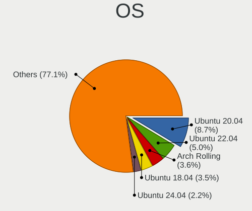

| Name                         | Notebooks | Percent |
|------------------------------|-----------|---------|
| Ubuntu 20.04                 | 152       | 8.66%   |
| Ubuntu 22.04                 | 87        | 4.95%   |
| Arch Rolling                 | 63        | 3.59%   |
| Ubuntu 18.04                 | 61        | 3.47%   |
| Ubuntu 24.04                 | 39        | 2.22%   |
| Zorin 16                     | 34        | 1.94%   |
| Zorin 17                     | 32        | 1.82%   |
| Linux Mint 20.2              | 31        | 1.77%   |
| Debian 12                    | 31        | 1.77%   |
| Manjaro                      | 29        | 1.65%   |
| Linux Mint 22.1              | 28        | 1.59%   |
| Pop!_OS 22.04                | 25        | 1.42%   |
| OpenMandriva 4.3             | 24        | 1.37%   |
| Debian 11                    | 24        | 1.37%   |
| BlackPanther 18.1            | 24        | 1.37%   |
| Linux Mint 21.2              | 23        | 1.31%   |
| Arch                         | 23        | 1.31%   |
| Fedora 39                    | 22        | 1.25%   |
| Fedora 40                    | 21        | 1.2%    |
| Linux Mint 21.1              | 19        | 1.08%   |
| Fedora 37                    | 19        | 1.08%   |
| Fedora 35                    | 19        | 1.08%   |
| Linux Mint 22.2              | 18        | 1.03%   |
| Linux Mint 20.1              | 17        | 0.97%   |
| Fedora 42                    | 17        | 0.97%   |
| EndeavourOS Rolling          | 17        | 0.97%   |
| Ubuntu 21.04                 | 16        | 0.91%   |
| Fedora 41                    | 16        | 0.91%   |
| Fedora 38                    | 16        | 0.91%   |
| Fedora 33                    | 15        | 0.85%   |
| Ubuntu 22.10                 | 14        | 0.8%    |
| Linux Mint 20.3              | 14        | 0.8%    |
| Linux Mint 19.3              | 14        | 0.8%    |
| KDE neon 20.04               | 14        | 0.8%    |
| Zorin 18                     | 13        | 0.74%   |
| Ubuntu 19.10                 | 13        | 0.74%   |
| openSUSE Tumbleweed-XXXXXXXX | 13        | 0.74%   |
| OpenMandriva 24.12           | 13        | 0.74%   |
| Debian                       | 13        | 0.74%   |
| Ubuntu 21.10                 | 12        | 0.68%   |

OS Family
---------

OS without a version

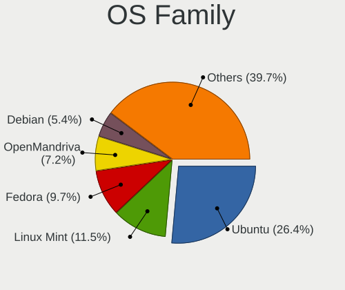

| Name          | Notebooks | Percent |
|---------------|-----------|---------|
| Ubuntu        | 431       | 26.43%  |
| Linux Mint    | 188       | 11.53%  |
| Fedora        | 158       | 9.69%   |
| OpenMandriva  | 118       | 7.23%   |
| Debian        | 88        | 5.4%    |
| Zorin         | 84        | 5.15%   |
| Arch          | 82        | 5.03%   |
| Manjaro       | 76        | 4.66%   |
| Pop!_OS       | 50        | 3.07%   |
| BlackPanther  | 29        | 1.78%   |
| openSUSE      | 25        | 1.53%   |
| Kubuntu       | 24        | 1.47%   |
| KDE neon      | 24        | 1.47%   |
| Xubuntu       | 21        | 1.29%   |
| Elementary    | 20        | 1.23%   |
| SteamOS       | 18        | 1.1%    |
| EndeavourOS   | 17        | 1.04%   |
| ROSA          | 14        | 0.86%   |
| LMDE          | 13        | 0.8%    |
| MX            | 12        | 0.74%   |
| Kali          | 12        | 0.74%   |
| ArcoLinux     | 12        | 0.74%   |
| Endless       | 9         | 0.55%   |
| Ubuntu MATE   | 8         | 0.49%   |
| NixOS         | 8         | 0.49%   |
| Gentoo        | 7         | 0.43%   |
| Ubuntu Unity  | 6         | 0.37%   |
| Ubuntu Budgie | 6         | 0.37%   |
| Nobara        | 6         | 0.37%   |
| Garuda Linux  | 6         | 0.37%   |
| Bazzite       | 6         | 0.37%   |
| TUXEDO OS     | 5         | 0.31%   |
| CachyOS       | 5         | 0.31%   |
| Lubuntu       | 3         | 0.18%   |
| Devuan        | 3         | 0.18%   |
| Deepin        | 3         | 0.18%   |
| Clear Linux   | 3         | 0.18%   |
| Solus         | 2         | 0.12%   |
| Siduction     | 2         | 0.12%   |
| Parrot        | 2         | 0.12%   |

Kernel
------

Version of the Linux kernel

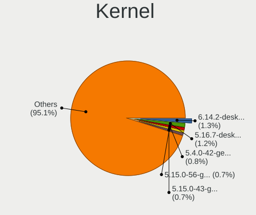

| Version                  | Notebooks | Percent |
|--------------------------|-----------|---------|
| 6.14.2-desktop-3omv2590  | 26        | 1.35%   |
| 5.16.7-desktop-1omv4003  | 24        | 1.24%   |
| 5.4.0-42-generic         | 16        | 0.83%   |
| 5.15.0-56-generic        | 14        | 0.73%   |
| 5.15.0-43-generic        | 14        | 0.73%   |
| 4.18.16-desktop-1bP      | 13        | 0.67%   |
| 6.8.0-52-generic         | 12        | 0.62%   |
| 6.8.0-41-generic         | 12        | 0.62%   |
| 5.4.0-58-generic         | 12        | 0.62%   |
| 5.3.0-46-generic         | 12        | 0.62%   |
| 5.15.0-52-generic        | 11        | 0.57%   |
| 5.10.14-desktop-1omv4002 | 11        | 0.57%   |
| 6.8.0-60-generic         | 10        | 0.52%   |
| 6.14.0-36-generic        | 10        | 0.52%   |
| 6.12.1-desktop-1omv2490  | 10        | 0.52%   |
| 5.6.14-desktop-2bP       | 10        | 0.52%   |
| 5.4.0-52-generic         | 10        | 0.52%   |
| 5.3.0-26-generic         | 10        | 0.52%   |
| 5.13.0-28-generic        | 10        | 0.52%   |
| 6.8.0-51-generic         | 9         | 0.47%   |
| 6.2.0-39-generic         | 9         | 0.47%   |
| 5.4.0-91-generic         | 9         | 0.47%   |
| 5.4.0-29-generic         | 9         | 0.47%   |
| 5.4.0-26-generic         | 9         | 0.47%   |
| 5.13.0-39-generic        | 9         | 0.47%   |
| 6.9.3-76060903-generic   | 8         | 0.41%   |
| 6.6.2-desktop-1omv2390   | 8         | 0.41%   |
| 5.13.0-27-generic        | 8         | 0.41%   |
| 5.11.0-37-generic        | 8         | 0.41%   |
| 6.5.0-14-generic         | 7         | 0.36%   |
| 6.14.0-35-generic        | 7         | 0.36%   |
| 5.4.0-74-generic         | 7         | 0.36%   |
| 5.4.0-48-generic         | 7         | 0.36%   |
| 5.15.0-91-generic        | 7         | 0.36%   |
| 5.15.0-58-generic        | 7         | 0.36%   |
| 5.15.0-46-generic        | 7         | 0.36%   |
| 5.13.0-valve36-1-neptune | 7         | 0.36%   |
| 5.11.0-27-generic        | 7         | 0.36%   |
| 5.11.0-25-generic        | 7         | 0.36%   |
| 6.8.11-300.fc40.x86_64   | 6         | 0.31%   |

Kernel Family
-------------

Linux kernel without a distro release

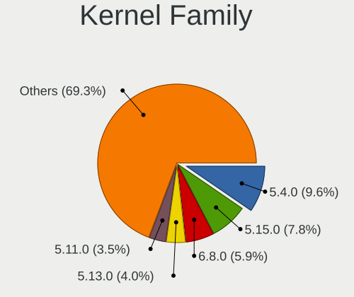

| Version | Notebooks | Percent |
|---------|-----------|---------|
| 5.4.0   | 175       | 9.57%   |
| 5.15.0  | 143       | 7.82%   |
| 6.8.0   | 107       | 5.85%   |
| 5.13.0  | 73        | 3.99%   |
| 5.11.0  | 64        | 3.5%    |
| 5.8.0   | 49        | 2.68%   |
| 6.5.0   | 47        | 2.57%   |
| 5.3.0   | 47        | 2.57%   |
| 4.15.0  | 46        | 2.52%   |
| 6.1.0   | 45        | 2.46%   |
| 6.2.0   | 39        | 2.13%   |
| 6.14.0  | 39        | 2.13%   |
| 5.19.0  | 36        | 1.97%   |
| 5.10.0  | 30        | 1.64%   |
| 6.14.2  | 26        | 1.42%   |
| 5.16.7  | 25        | 1.37%   |
| 5.0.0   | 22        | 1.2%    |
| 6.11.0  | 20        | 1.09%   |
| 4.18.0  | 14        | 0.77%   |
| 4.18.16 | 13        | 0.71%   |
| 6.6.2   | 12        | 0.66%   |
| 6.12.1  | 11        | 0.6%    |
| 5.10.14 | 11        | 0.6%    |
| 4.19.0  | 11        | 0.6%    |
| 5.6.14  | 10        | 0.55%   |
| 6.8.11  | 9         | 0.49%   |
| 6.2.6   | 9         | 0.49%   |
| 6.12.6  | 9         | 0.49%   |
| 6.9.3   | 8         | 0.44%   |
| 6.8.5   | 8         | 0.44%   |
| 6.6.6   | 7         | 0.38%   |
| 6.4.11  | 7         | 0.38%   |
| 6.10.0  | 7         | 0.38%   |
| 6.6.8   | 6         | 0.33%   |
| 6.5.3   | 6         | 0.33%   |
| 6.3.5   | 6         | 0.33%   |
| 6.2.11  | 6         | 0.33%   |
| 6.17.7  | 6         | 0.33%   |
| 6.10.6  | 6         | 0.33%   |
| 6.1.52  | 6         | 0.33%   |

Kernel Major Ver.
-----------------

Linux kernel major version

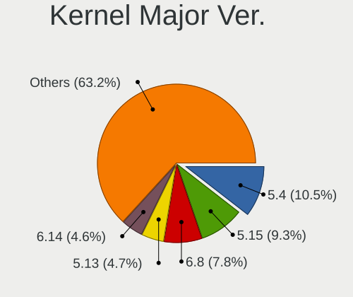

| Version | Notebooks | Percent |
|---------|-----------|---------|
| 5.4     | 189       | 10.49%  |
| 5.15    | 167       | 9.27%   |
| 6.8     | 141       | 7.82%   |
| 5.13    | 84        | 4.66%   |
| 6.14    | 82        | 4.55%   |
| 6.1     | 78        | 4.33%   |
| 5.11    | 75        | 4.16%   |
| 6.5     | 65        | 3.61%   |
| 6.2     | 65        | 3.61%   |
| 5.8     | 64        | 3.55%   |
| 5.10    | 61        | 3.39%   |
| 5.3     | 55        | 3.05%   |
| 6.6     | 51        | 2.83%   |
| 6.12    | 50        | 2.77%   |
| 5.19    | 49        | 2.72%   |
| 4.15    | 46        | 2.55%   |
| 6.11    | 43        | 2.39%   |
| 5.16    | 41        | 2.28%   |
| 6.0     | 29        | 1.61%   |
| 4.18    | 27        | 1.5%    |
| 5.6     | 25        | 1.39%   |
| 6.4     | 24        | 1.33%   |
| 5.0     | 23        | 1.28%   |
| 6.17    | 22        | 1.22%   |
| 6.10    | 22        | 1.22%   |
| 5.17    | 22        | 1.22%   |
| 6.9     | 20        | 1.11%   |
| 6.15    | 18        | 1%      |
| 5.7     | 18        | 1%      |
| 5.9     | 15        | 0.83%   |
| 6.13    | 14        | 0.78%   |
| 5.18    | 13        | 0.72%   |
| 5.14    | 13        | 0.72%   |
| 4.19    | 13        | 0.72%   |
| 6.3     | 12        | 0.67%   |
| 5.12    | 11        | 0.61%   |
| 6.7     | 8         | 0.44%   |
| 4.9     | 8         | 0.44%   |
| 6.16    | 7         | 0.39%   |
| 5.5     | 6         | 0.33%   |

Arch
----

OS architecture (x86_64, i586, etc.)

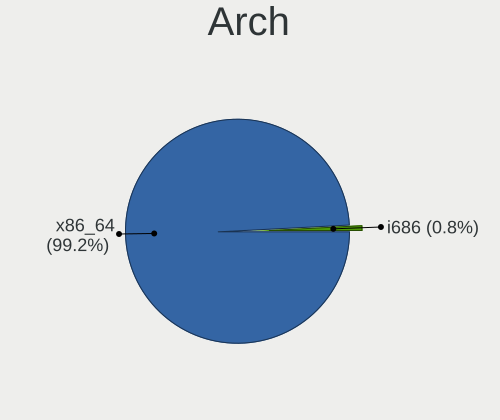

| Name   | Notebooks | Percent |
|--------|-----------|---------|
| x86_64 | 1561      | 99.17%  |
| i686   | 13        | 0.83%   |

DE
--

Desktop Environment

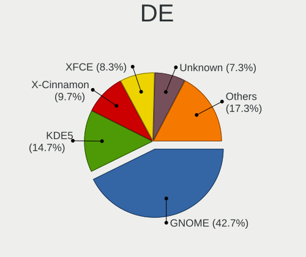

| Name                    | Notebooks | Percent |
|-------------------------|-----------|---------|
| GNOME                   | 698       | 42.72%  |
| KDE5                    | 240       | 14.69%  |
| X-Cinnamon              | 159       | 9.73%   |
| XFCE                    | 135       | 8.26%   |
| Unknown                 | 119       | 7.28%   |
| KDE6                    | 104       | 6.36%   |
| MATE                    | 33        | 2.02%   |
| KDE                     | 25        | 1.53%   |
| Pantheon                | 20        | 1.22%   |
| Cinnamon                | 15        | 0.92%   |
| LXQt                    | 9         | 0.55%   |
| Budgie                  | 9         | 0.55%   |
| sway                    | 8         | 0.49%   |
| i3                      | 8         | 0.49%   |
| Hyprland                | 8         | 0.49%   |
| Unity                   | 6         | 0.37%   |
| KDE4                    | 6         | 0.37%   |
| sway:wlroots            | 4         | 0.24%   |
| LXDE                    | 4         | 0.24%   |
| Deepin                  | 4         | 0.24%   |
| awesome                 | 4         | 0.24%   |
| GNOME Flashback         | 3         | 0.18%   |
| fluxbox                 | 2         | 0.12%   |
| xmonad                  | 1         | 0.06%   |
| Trinity                 | 1         | 0.06%   |
| qtile                   | 1         | 0.06%   |
| openbox                 | 1         | 0.06%   |
| niri                    | 1         | 0.06%   |
| Hyprland:start-hyprland | 1         | 0.06%   |
| gamescope               | 1         | 0.06%   |
| Enlightenment           | 1         | 0.06%   |
| DDE                     | 1         | 0.06%   |
| COSMIC                  | 1         | 0.06%   |
| Bspwm                   | 1         | 0.06%   |

Display Server
--------------

X11 or Wayland

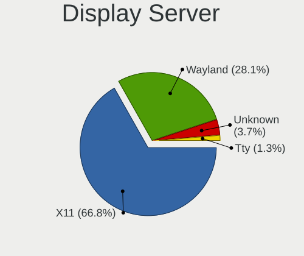

| Name    | Notebooks | Percent |
|---------|-----------|---------|
| X11     | 1092      | 66.79%  |
| Wayland | 460       | 28.13%  |
| Unknown | 61        | 3.73%   |
| Tty     | 22        | 1.35%   |

Display Manager
---------------

SDDM, LightDM, etc.

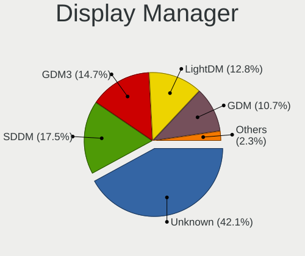

| Name           | Notebooks | Percent |
|----------------|-----------|---------|
| Unknown        | 689       | 42.06%  |
| SDDM           | 286       | 17.46%  |
| GDM3           | 240       | 14.65%  |
| LightDM        | 210       | 12.82%  |
| GDM            | 175       | 10.68%  |
| TDM            | 26        | 1.59%   |
| KDM            | 6         | 0.37%   |
| SLiM           | 1         | 0.06%   |
| PLASMALOGIN    | 1         | 0.06%   |
| MDM            | 1         | 0.06%   |
| Ly             | 1         | 0.06%   |
| GREETD         | 1         | 0.06%   |
| COSMIC-GREETER | 1         | 0.06%   |

OS Lang
-------

Language

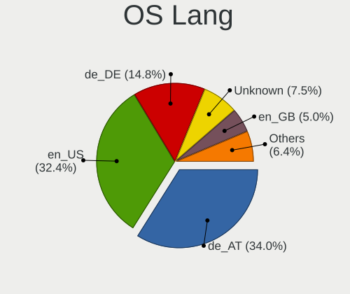

| Lang    | Notebooks | Percent |
|---------|-----------|---------|
| de_AT   | 550       | 33.95%  |
| en_US   | 525       | 32.41%  |
| de_DE   | 240       | 14.81%  |
| Unknown | 121       | 7.47%   |
| en_GB   | 81        | 5%      |
| C       | 28        | 1.73%   |
| pl_PL   | 10        | 0.62%   |
| es_ES   | 10        | 0.62%   |
| en_IE   | 7         | 0.43%   |
| de_CH   | 5         | 0.31%   |
| POSIX   | 4         | 0.25%   |
| it_IT   | 4         | 0.25%   |
| tr_TR   | 3         | 0.19%   |
| ru_RU   | 3         | 0.19%   |
| hu_HU   | 3         | 0.19%   |
| en_AT   | 3         | 0.19%   |
| C.UTF8  | 3         | 0.19%   |
| en_DE   | 2         | 0.12%   |
| en_AU   | 2         | 0.12%   |
| bg_BG   | 2         | 0.12%   |
| uk_UA   | 1         | 0.06%   |
| sv_SE   | 1         | 0.06%   |
| sr_RS   | 1         | 0.06%   |
| sk_SK   | 1         | 0.06%   |
| ru_UA   | 1         | 0.06%   |
| ro_RO   | 1         | 0.06%   |
| pt_BR   | 1         | 0.06%   |
| nl_NL   | 1         | 0.06%   |
| hr_HR   | 1         | 0.06%   |
| gl_ES   | 1         | 0.06%   |
| fr_FR   | 1         | 0.06%   |
| en_CA   | 1         | 0.06%   |
| en      | 1         | 0.06%   |
| de_LI   | 1         | 0.06%   |

Boot Mode
---------

EFI or BIOS

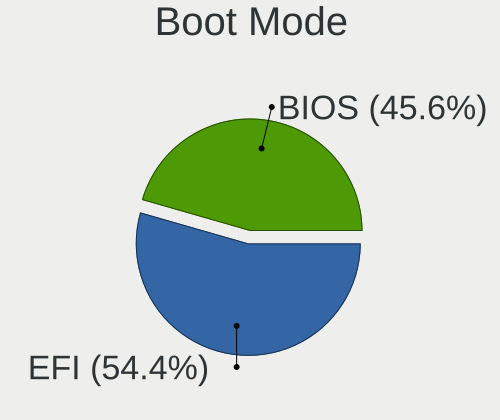

| Mode | Notebooks | Percent |
|------|-----------|---------|
| EFI  | 881       | 54.45%  |
| BIOS | 737       | 45.55%  |

Filesystem
----------

Type of filesystem

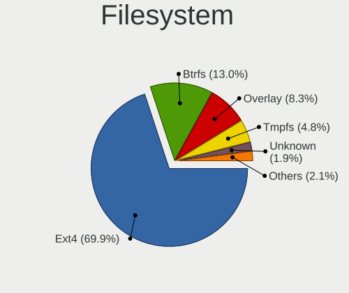

| Type    | Notebooks | Percent |
|---------|-----------|---------|
| Ext4    | 1131      | 69.94%  |
| Btrfs   | 211       | 13.05%  |
| Overlay | 134       | 8.29%   |
| Tmpfs   | 77        | 4.76%   |
| Unknown | 30        | 1.86%   |
| Xfs     | 14        | 0.87%   |
| Zfs     | 11        | 0.68%   |
| Ext2    | 3         | 0.19%   |
| Ext3    | 2         | 0.12%   |
| XXXXXXX | 1         | 0.06%   |
| Nfs     | 1         | 0.06%   |
| F2fs    | 1         | 0.06%   |
| Aufs    | 1         | 0.06%   |

Part. scheme
------------

Scheme of partitioning

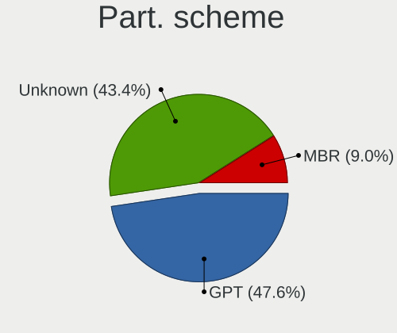

| Type    | Notebooks | Percent |
|---------|-----------|---------|
| GPT     | 770       | 47.65%  |
| Unknown | 701       | 43.38%  |
| MBR     | 145       | 8.97%   |

Dual Boot with Linux/BSD
------------------------

Hosting more than one Linux/BSD

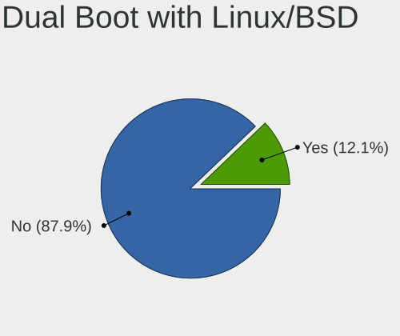

| Dual boot | Notebooks | Percent |
|-----------|-----------|---------|
| No        | 1406      | 87.88%  |
| Yes       | 194       | 12.13%  |

Dual Boot (Win)
---------------

Hosting Linux and Windows

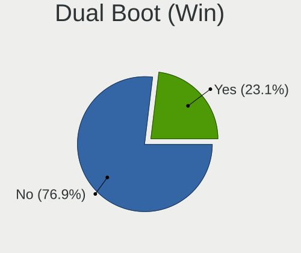

| Dual boot | Notebooks | Percent |
|-----------|-----------|---------|
| No        | 1229      | 76.91%  |
| Yes       | 369       | 23.09%  |

Board
-----

Vendor
------

Motherboard manufacturer

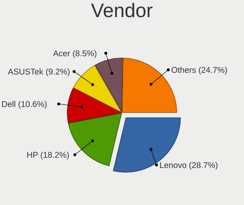

| Name                | Notebooks | Percent |
|---------------------|-----------|---------|
| Lenovo              | 452       | 28.73%  |
| Hewlett-Packard     | 287       | 18.25%  |
| Dell                | 166       | 10.55%  |
| ASUSTek Computer    | 145       | 9.22%   |
| Acer                | 134       | 8.52%   |
| Apple               | 59        | 3.75%   |
| Medion              | 39        | 2.48%   |
| Toshiba             | 37        | 2.35%   |
| TUXEDO              | 29        | 1.84%   |
| MSI                 | 27        | 1.72%   |
| Sony                | 26        | 1.65%   |
| Fujitsu             | 19        | 1.21%   |
| Valve               | 17        | 1.08%   |
| HUAWEI              | 17        | 1.08%   |
| Samsung Electronics | 12        | 0.76%   |
| Fujitsu Siemens     | 8         | 0.51%   |
| Schenker            | 7         | 0.45%   |
| Notebook            | 7         | 0.45%   |
| Framework           | 7         | 0.45%   |
| Unknown             | 7         | 0.45%   |
| TrekStor            | 5         | 0.32%   |
| VALE                | 4         | 0.25%   |
| Timi                | 4         | 0.25%   |
| Razer               | 4         | 0.25%   |
| Clevo               | 4         | 0.25%   |
| Wortmann AG         | 3         | 0.19%   |
| Packard Bell        | 3         | 0.19%   |
| Google              | 3         | 0.19%   |
| Gigabyte Technology | 3         | 0.19%   |
| System76            | 2         | 0.13%   |
| Shuttle             | 2         | 0.13%   |
| Panasonic           | 2         | 0.13%   |
| Inter Sales A/S     | 2         | 0.13%   |
| Hampoo              | 2         | 0.13%   |
| GPD                 | 2         | 0.13%   |
| eMachines           | 2         | 0.13%   |
| Chuwi               | 2         | 0.13%   |
| AXDIA International | 2         | 0.13%   |
| XIAOMI              | 1         | 0.06%   |
| W271ELQ             | 1         | 0.06%   |

Model
-----

Motherboard model

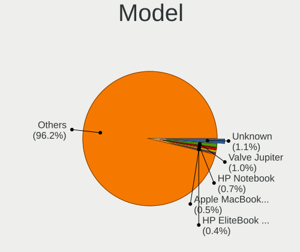

| Name                                      | Notebooks | Percent |
|-------------------------------------------|-----------|---------|
| Unknown                                   | 18        | 1.14%   |
| Valve Jupiter                             | 15        | 0.95%   |
| HP Notebook                               | 11        | 0.7%    |
| Apple MacBookPro15,1                      | 8         | 0.51%   |
| HP EliteBook 8570p                        | 7         | 0.45%   |
| HP EliteBook 840 G6                       | 7         | 0.45%   |
| HP EliteBook 840 G3                       | 7         | 0.45%   |
| Apple MacBookPro9,2                       | 7         | 0.45%   |
| HP Pavilion dv7                           | 6         | 0.38%   |
| HP Pavilion dv6                           | 6         | 0.38%   |
| HP EliteBook 840 G1                       | 6         | 0.38%   |
| Apple MacBookPro8,1                       | 6         | 0.38%   |
| Toshiba Satellite C70D-B                  | 5         | 0.32%   |
| Lenovo IdeaPad 5 15ARE05 81YQ             | 5         | 0.32%   |
| HP EliteBook 8460p                        | 5         | 0.32%   |
| HP EliteBook 840 G8 Notebook PC           | 5         | 0.32%   |
| Dell XPS 15 9570                          | 5         | 0.32%   |
| Dell Latitude E6400                       | 5         | 0.32%   |
| ASUS ASUS EXPERTBOOK B1500CEAEY_B1500CEAE | 5         | 0.32%   |
| TrekStor Notebook Slim S130               | 4         | 0.25%   |
| Lenovo Yoga Slim 7 14ARE05 82A2           | 4         | 0.25%   |
| Lenovo IdeaPad 700-15ISK 80RU             | 4         | 0.25%   |
| HP EliteBook 6930p                        | 4         | 0.25%   |
| Dell Latitude E7450                       | 4         | 0.25%   |
| Dell Latitude E7440                       | 4         | 0.25%   |
| Dell Latitude 5520                        | 4         | 0.25%   |
| Dell Latitude 5490                        | 4         | 0.25%   |
| ASUS VivoBook_ASUSLaptop X712DA_D712DA    | 4         | 0.25%   |
| ASUS UX550VE                              | 4         | 0.25%   |
| ASUS UX303LAB                             | 4         | 0.25%   |
| Apple MacBookAir6,2                       | 4         | 0.25%   |
| Acer Swift SF114-34                       | 4         | 0.25%   |
| VALE Notebook Classic C170                | 3         | 0.19%   |
| Toshiba Satellite Pro C660                | 3         | 0.19%   |
| Medion P15648                             | 3         | 0.19%   |
| Medion E7220                              | 3         | 0.19%   |
| Lenovo V145-15AST 81MT                    | 3         | 0.19%   |
| Lenovo ThinkPad L14 Gen 1 20U50001GE      | 3         | 0.19%   |
| Lenovo ThinkPad E470 20H2S00700           | 3         | 0.19%   |
| Lenovo ThinkBook 16p Gen 2 20YM           | 3         | 0.19%   |

Model Family
------------

Motherboard model prefix

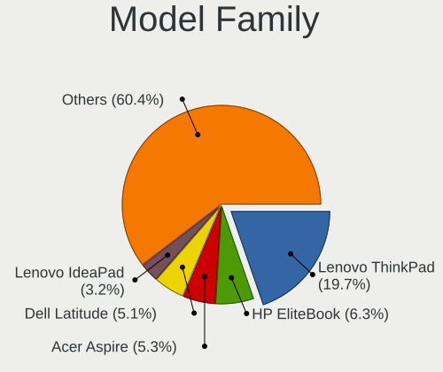

| Name                | Notebooks | Percent |
|---------------------|-----------|---------|
| Lenovo ThinkPad     | 310       | 19.71%  |
| HP EliteBook        | 99        | 6.29%   |
| Acer Aspire         | 84        | 5.34%   |
| Dell Latitude       | 80        | 5.09%   |
| Lenovo IdeaPad      | 50        | 3.18%   |
| HP ProBook          | 49        | 3.12%   |
| HP Pavilion         | 40        | 2.54%   |
| Dell XPS            | 37        | 2.35%   |
| Toshiba Satellite   | 34        | 2.16%   |
| Dell Precision      | 23        | 1.46%   |
| ASUS VivoBook       | 23        | 1.46%   |
| Lenovo Yoga         | 21        | 1.34%   |
| Dell Inspiron       | 20        | 1.27%   |
| Lenovo ThinkBook    | 19        | 1.21%   |
| HP ZBook            | 18        | 1.14%   |
| Fujitsu LIFEBOOK    | 18        | 1.14%   |
| Unknown             | 18        | 1.14%   |
| HP Laptop           | 16        | 1.02%   |
| ASUS ROG            | 16        | 1.02%   |
| Valve Jupiter       | 15        | 0.95%   |
| Acer Swift          | 15        | 0.95%   |
| Acer TravelMate     | 14        | 0.89%   |
| Lenovo Legion       | 13        | 0.83%   |
| HP Notebook         | 11        | 0.7%    |
| Acer Nitro          | 10        | 0.64%   |
| ASUS ZenBook        | 9         | 0.57%   |
| ASUS ASUS           | 9         | 0.57%   |
| HP OMEN             | 8         | 0.51%   |
| HP Compaq           | 8         | 0.51%   |
| HP 250              | 8         | 0.51%   |
| Apple MacBookPro15  | 8         | 0.51%   |
| TUXEDO InfinityBook | 7         | 0.45%   |
| HP 255              | 7         | 0.45%   |
| Framework Laptop    | 7         | 0.45%   |
| Apple MacBookPro9   | 7         | 0.45%   |
| Apple MacBookPro8   | 7         | 0.45%   |
| Apple MacBookAir6   | 5         | 0.32%   |
| VALE Notebook       | 4         | 0.25%   |
| TrekStor Notebook   | 4         | 0.25%   |
| Razer Blade         | 4         | 0.25%   |

MFG Year
--------

Motherboard manufacture year

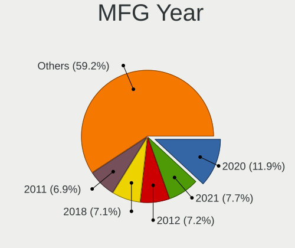

| Year    | Notebooks | Percent |
|---------|-----------|---------|
| 2020    | 187       | 11.89%  |
| 2021    | 121       | 7.69%   |
| 2012    | 113       | 7.18%   |
| 2018    | 111       | 7.06%   |
| 2011    | 109       | 6.93%   |
| 2019    | 108       | 6.87%   |
| 2017    | 105       | 6.68%   |
| 2014    | 91        | 5.79%   |
| 2013    | 90        | 5.72%   |
| 2016    | 83        | 5.28%   |
| 2015    | 79        | 5.02%   |
| 2022    | 69        | 4.39%   |
| 2023    | 63        | 4.01%   |
| 2008    | 57        | 3.62%   |
| 2010    | 56        | 3.56%   |
| 2009    | 44        | 2.8%    |
| 2024    | 43        | 2.73%   |
| 2007    | 22        | 1.4%    |
| 2025    | 11        | 0.7%    |
| 2006    | 9         | 0.57%   |
| 2005    | 1         | 0.06%   |
| Unknown | 1         | 0.06%   |

Form Factor
-----------

Physical design of the computer

| Name     | Notebooks | Percent |
|----------|-----------|---------|
| Notebook | 1573      | 100%    |

Secure Boot
-----------

Enabled or disabled

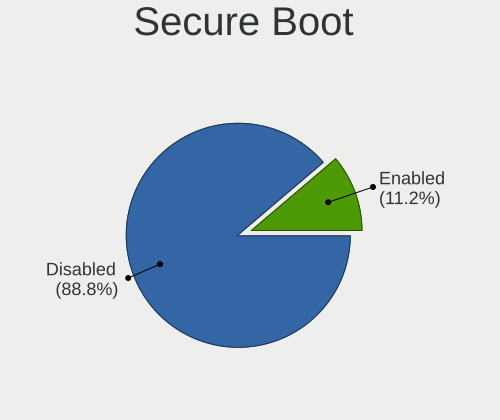

| State    | Notebooks | Percent |
|----------|-----------|---------|
| Disabled | 1416      | 88.78%  |
| Enabled  | 179       | 11.22%  |

Coreboot
--------

Have coreboot on board

| Used | Notebooks | Percent |
|------|-----------|---------|
| No   | 1566      | 99.55%  |
| Yes  | 7         | 0.45%   |

RAM Size
--------

Total RAM memory

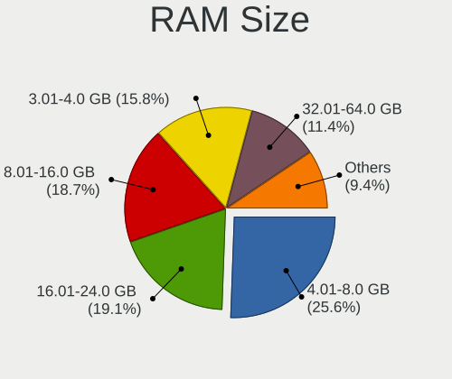

| Size in GB  | Notebooks | Percent |
|-------------|-----------|---------|
| 4.01-8.0    | 407       | 25.57%  |
| 16.01-24.0  | 304       | 19.1%   |
| 8.01-16.0   | 298       | 18.72%  |
| 3.01-4.0    | 251       | 15.77%  |
| 32.01-64.0  | 182       | 11.43%  |
| 24.01-32.0  | 55        | 3.45%   |
| 1.01-2.0    | 42        | 2.64%   |
| 64.01-256.0 | 31        | 1.95%   |
| 2.01-3.0    | 15        | 0.94%   |
| 0.51-1.0    | 7         | 0.44%   |

RAM Used
--------

Used RAM memory

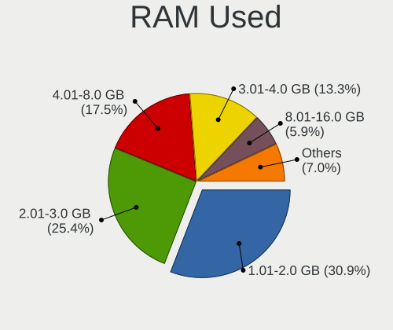

| Used GB    | Notebooks | Percent |
|------------|-----------|---------|
| 1.01-2.0   | 543       | 30.87%  |
| 2.01-3.0   | 446       | 25.36%  |
| 4.01-8.0   | 308       | 17.51%  |
| 3.01-4.0   | 234       | 13.3%   |
| 8.01-16.0  | 104       | 5.91%   |
| 0.51-1.0   | 85        | 4.83%   |
| 16.01-24.0 | 23        | 1.31%   |
| 24.01-32.0 | 8         | 0.45%   |
| 0.01-0.5   | 5         | 0.28%   |
| 32.01-64.0 | 3         | 0.17%   |

Total Drives
------------

Number of drives on board

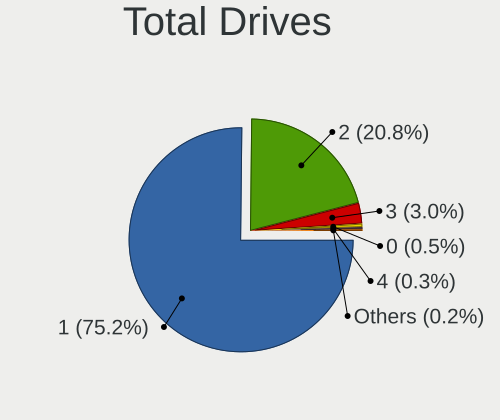

| Drives | Notebooks | Percent |
|--------|-----------|---------|
| 1      | 1208      | 75.17%  |
| 2      | 334       | 20.78%  |
| 3      | 48        | 2.99%   |
| 0      | 8         | 0.5%    |
| 4      | 5         | 0.31%   |
| 5      | 4         | 0.25%   |

Has CD-ROM
----------

Has CD-ROM on board

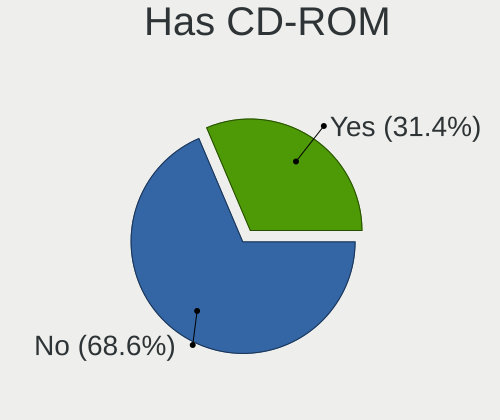

| Presented | Notebooks | Percent |
|-----------|-----------|---------|
| No        | 1084      | 68.61%  |
| Yes       | 496       | 31.39%  |

Has Ethernet
------------

Has Ethernet on board

| Presented | Notebooks | Percent |
|-----------|-----------|---------|
| Yes       | 1280      | 81.06%  |
| No        | 299       | 18.94%  |

Has WiFi
--------

Has WiFi module

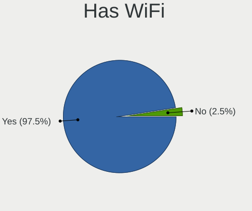

| Presented | Notebooks | Percent |
|-----------|-----------|---------|
| Yes       | 1536      | 97.52%  |
| No        | 39        | 2.48%   |

Has Bluetooth
-------------

Has Bluetooth module

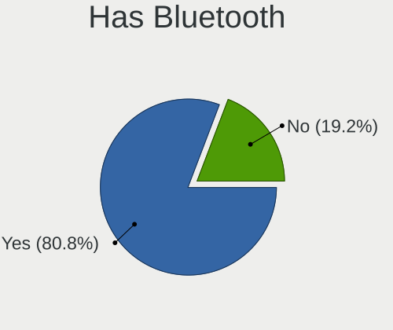

| Presented | Notebooks | Percent |
|-----------|-----------|---------|
| Yes       | 1282      | 80.78%  |
| No        | 305       | 19.22%  |

Location
--------

Country
-------

Geographic location (country)

| Country | Notebooks | Percent |
|---------|-----------|---------|
| Austria | 1573      | 100%    |

City
----

Geographic location (city)

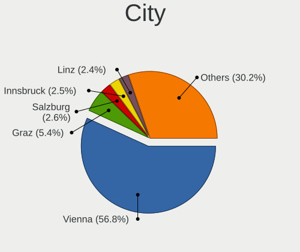

| City              | Notebooks | Percent |
|-------------------|-----------|---------|
| Vienna            | 945       | 56.83%  |
| Graz              | 90        | 5.41%   |
| Salzburg          | 43        | 2.59%   |
| Innsbruck         | 42        | 2.53%   |
| Linz              | 40        | 2.41%   |
| Klagenfurt        | 22        | 1.32%   |
| Bad Hall          | 18        | 1.08%   |
| Wiener Neustadt   | 13        | 0.78%   |
| Wels              | 13        | 0.78%   |
| Villach           | 13        | 0.78%   |
| Leonding          | 11        | 0.66%   |
| Dornbirn          | 11        | 0.66%   |
| Baden bei Wien    | 10        | 0.6%    |
| Traun             | 7         | 0.42%   |
| Sankt Pölten     | 7         | 0.42%   |
| Feldkirch         | 7         | 0.42%   |
| Perg              | 6         | 0.36%   |
| Wörgl            | 5         | 0.3%    |
| Steyr             | 5         | 0.3%    |
| Korneuburg        | 5         | 0.3%    |
| Bregenz           | 5         | 0.3%    |
| Umhausen          | 4         | 0.24%   |
| Mödling          | 4         | 0.24%   |
| Lustenau          | 4         | 0.24%   |
| Knittelfeld       | 4         | 0.24%   |
| Hallein           | 4         | 0.24%   |
| Gaenserndorf      | 4         | 0.24%   |
| Berndorf          | 4         | 0.24%   |
| Traunkirchen      | 3         | 0.18%   |
| Ried im Innkreis  | 3         | 0.18%   |
| Kufstein          | 3         | 0.18%   |
| Kalsdorf bei Graz | 3         | 0.18%   |
| Hard              | 3         | 0.18%   |
| Amstetten         | 3         | 0.18%   |
| Woerdern          | 2         | 0.12%   |
| Voecklabruck      | 2         | 0.12%   |
| Traiskirchen      | 2         | 0.12%   |
| Ternitz           | 2         | 0.12%   |
| Stockerau         | 2         | 0.12%   |
| Spillern          | 2         | 0.12%   |

Drives
------

Drive Vendor
------------

Hard drive vendors

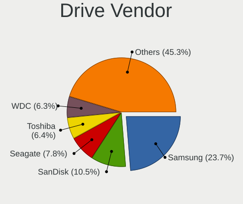

| Vendor                      | Notebooks | Drives | Percent |
|-----------------------------|-----------|--------|---------|
| Samsung Electronics         | 462       | 633    | 23.72%  |
| SanDisk                     | 204       | 277    | 10.47%  |
| Seagate                     | 152       | 202    | 7.8%    |
| Toshiba                     | 125       | 154    | 6.42%   |
| WDC                         | 122       | 160    | 6.26%   |
| SK hynix                    | 108       | 144    | 5.54%   |
| Unknown                     | 95        | 133    | 4.88%   |
| Kingston                    | 73        | 94     | 3.75%   |
| Crucial                     | 72        | 100    | 3.7%    |
| Intel                       | 67        | 79     | 3.44%   |
| Micron Technology           | 58        | 74     | 2.98%   |
| Hitachi                     | 39        | 46     | 2%      |
| HGST                        | 36        | 45     | 1.85%   |
| KIOXIA                      | 34        | 51     | 1.75%   |
| Intenso                     | 30        | 39     | 1.54%   |
| Apple                       | 28        | 41     | 1.44%   |
| Transcend                   | 20        | 22     | 1.03%   |
| China                       | 15        | 19     | 0.77%   |
| Micron/Crucial Technology   | 13        | 15     | 0.67%   |
| Phison Electronics          | 11        | 12     | 0.56%   |
| Phison                      | 8         | 8      | 0.41%   |
| MAXIO Technology (Hangzhou) | 8         | 8      | 0.41%   |
| LITEONIT                    | 8         | 11     | 0.41%   |
| Unknown                     | 8         | 13     | 0.41%   |
| LITEON                      | 7         | 8      | 0.36%   |
| Silicon Motion              | 6         | 7      | 0.31%   |
| SABRENT                     | 6         | 6      | 0.31%   |
| Kingston Technology Company | 6         | 7      | 0.31%   |
| ASMT                        | 6         | 8      | 0.31%   |
| A-DATA Technology           | 6         | 9      | 0.31%   |
| Lenovo                      | 5         | 7      | 0.26%   |
| JMicron Technology          | 5         | 5      | 0.26%   |
| INNOVATION IT               | 5         | 8      | 0.26%   |
| Verbatim                    | 4         | 5      | 0.21%   |
| USB                         | 4         | 5      | 0.21%   |
| Corsair                     | 4         | 4      | 0.21%   |
| Union Memory (Shenzhen)     | 3         | 4      | 0.15%   |
| SPCC                        | 3         | 3      | 0.15%   |
| OCZ                         | 3         | 4      | 0.15%   |
| LaCie                       | 3         | 3      | 0.15%   |

Drive Model
-----------

Hard drive models

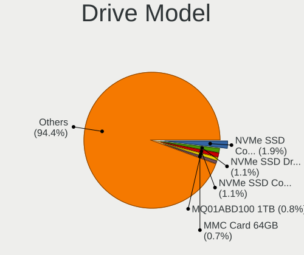

| Model                                                | Notebooks | Percent |
|------------------------------------------------------|-----------|---------|
| Samsung NVMe SSD Controller SM981/PM981/PM983 1TB    | 38        | 1.86%   |
| Samsung NVMe SSD Drive 512GB                         | 23        | 1.12%   |
| Samsung NVMe SSD Controller PM9A1/PM9A3/980PRO 1TB   | 22        | 1.08%   |
| Toshiba MQ01ABD100 1TB                               | 17        | 0.83%   |
| Unknown MMC Card  64GB                               | 15        | 0.73%   |
| Samsung SSD 860 EVO 500GB                            | 15        | 0.73%   |
| Unknown MMC Card  32GB                               | 14        | 0.68%   |
| Seagate ST1000LM024 HN-M101MBB 1TB                   | 14        | 0.68%   |
| Samsung NVMe SSD Controller SM961/PM961/SM963 1024GB | 14        | 0.68%   |
| SanDisk NVMe SSD Drive 512GB                         | 13        | 0.64%   |
| Samsung SSD 850 EVO 250GB                            | 13        | 0.64%   |
| SanDisk SSD PLUS 240GB                               | 12        | 0.59%   |
| Samsung SSD 850 EVO 500GB                            | 12        | 0.59%   |
| Samsung NVMe SSD Drive 1TB                           | 12        | 0.59%   |
| Seagate ST500LT012-1DG142 500GB                      | 11        | 0.54%   |
| Sandisk WD Black SN750 / PC SN730 NVMe SSD 500GB     | 11        | 0.54%   |
| SanDisk NVMe SSD Drive 1TB                           | 11        | 0.54%   |
| Crucial CT240BX500SSD1 240GB                         | 11        | 0.54%   |
| Unknown MMC Card  128GB                              | 10        | 0.49%   |
| Toshiba MQ04ABF100 1TB                               | 10        | 0.49%   |
| Kingston SA400S37240G 240GB SSD                      | 10        | 0.49%   |
| WDC PC SN730 SDBQNTY-512G-1001 512GB                 | 9         | 0.44%   |
| Transcend TS240GMTS420S 240GB SSD                    | 9         | 0.44%   |
| Toshiba MQ01ABF050 500GB                             | 9         | 0.44%   |
| SK hynix HFS256G39TND-N210A 256GB SSD                | 9         | 0.44%   |
| Seagate ST9500325AS 500GB                            | 9         | 0.44%   |
| Seagate ST1000LM035-1RK172 1TB                       | 9         | 0.44%   |
| Samsung SSD 850 PRO 256GB                            | 9         | 0.44%   |
| Samsung NVMe SSD Drive 1024GB                        | 9         | 0.44%   |
| Crucial CT500MX500SSD1 500GB                         | 9         | 0.44%   |
| Crucial CT1000MX500SSD1 1TB                          | 9         | 0.44%   |
| SK hynix NVMe SSD Drive 512GB                        | 8         | 0.39%   |
| SK hynix BC511 512GB                                 | 8         | 0.39%   |
| SanDisk SSD PLUS 1000GB                              | 8         | 0.39%   |
| SanDisk SD8SN8U-256G-1006 256GB SSD                  | 8         | 0.39%   |
| Kingston SV300S37A120G 120GB SSD                     | 8         | 0.39%   |
| Kingston SA400S37480G 480GB SSD                      | 8         | 0.39%   |
| Unknown                                              | 8         | 0.39%   |
| WDC WD5000LPVX-22V0TT0 500GB                         | 7         | 0.34%   |
| Seagate ST500LT012-9WS142 500GB                      | 7         | 0.34%   |

HDD Vendor
----------

Hard disk drive vendors

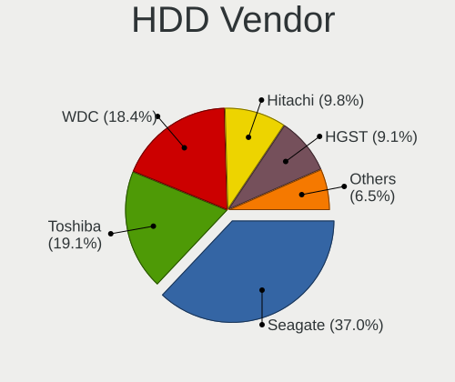

| Vendor              | Notebooks | Drives | Percent |
|---------------------|-----------|--------|---------|
| Seagate             | 147       | 197    | 37.03%  |
| Toshiba             | 76        | 100    | 19.14%  |
| WDC                 | 73        | 95     | 18.39%  |
| Hitachi             | 39        | 46     | 9.82%   |
| HGST                | 36        | 45     | 9.07%   |
| Samsung Electronics | 6         | 7      | 1.51%   |
| JMicron Technology  | 3         | 3      | 0.76%   |
| Fujitsu             | 3         | 4      | 0.76%   |
| Apple               | 3         | 3      | 0.76%   |
| SABRENT             | 2         | 2      | 0.5%    |
| IB-1122             | 2         | 2      | 0.5%    |
| ASMT                | 2         | 2      | 0.5%    |
| Unknown             | 1         | 2      | 0.25%   |
| LaCie               | 1         | 1      | 0.25%   |
| JetFlash            | 1         | 1      | 0.25%   |
| Inateck             | 1         | 1      | 0.25%   |
| IB                  | 1         | 2      | 0.25%   |

SSD Vendor
----------

Solid state drive vendors

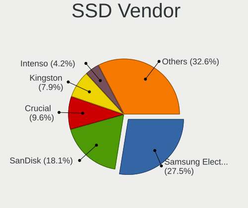

| Vendor              | Notebooks | Drives | Percent |
|---------------------|-----------|--------|---------|
| Samsung Electronics | 184       | 234    | 27.54%  |
| SanDisk             | 121       | 161    | 18.11%  |
| Crucial             | 64        | 92     | 9.58%   |
| Kingston            | 53        | 68     | 7.93%   |
| Intenso             | 28        | 37     | 4.19%   |
| SK hynix            | 23        | 32     | 3.44%   |
| Intel               | 21        | 25     | 3.14%   |
| Transcend           | 20        | 22     | 2.99%   |
| Micron Technology   | 16        | 24     | 2.4%    |
| China               | 15        | 19     | 2.25%   |
| Apple               | 14        | 15     | 2.1%    |
| WDC                 | 13        | 14     | 1.95%   |
| Toshiba             | 10        | 12     | 1.5%    |
| LITEONIT            | 8         | 11     | 1.2%    |
| LITEON              | 7         | 8      | 1.05%   |
| A-DATA Technology   | 6         | 9      | 0.9%    |
| INNOVATION IT       | 5         | 8      | 0.75%   |
| SABRENT             | 4         | 4      | 0.6%    |
| SPCC                | 3         | 3      | 0.45%   |
| Phison              | 3         | 3      | 0.45%   |
| OCZ                 | 3         | 4      | 0.45%   |
| GOODRAM             | 3         | 3      | 0.45%   |
| Verbatim            | 2         | 3      | 0.3%    |
| Seagate             | 2         | 2      | 0.3%    |
| Patriot             | 2         | 2      | 0.3%    |
| Leven               | 2         | 2      | 0.3%    |
| KingDian            | 2         | 2      | 0.3%    |
| Fanxiang            | 2         | 2      | 0.3%    |
| Emtec               | 2         | 2      | 0.3%    |
| Dogfish             | 2         | 2      | 0.3%    |
| Corsair             | 2         | 2      | 0.3%    |
| ASMT                | 2         | 2      | 0.3%    |
| Unknown             | 2         | 2      | 0.3%    |
| Wdxsky              | 1         | 2      | 0.15%   |
| WDC WDS             | 1         | 1      | 0.15%   |
| Vaseky              | 1         | 1      | 0.15%   |
| Unknown             | 1         | 2      | 0.15%   |
| Teclast             | 1         | 1      | 0.15%   |
| Team                | 1         | 1      | 0.15%   |
| TCSUNBOW            | 1         | 1      | 0.15%   |

Drive Kind
----------

HDD or SSD

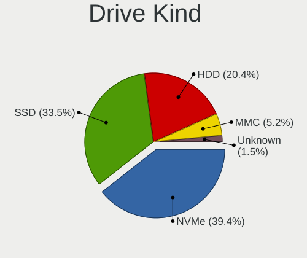

| Kind    | Notebooks | Drives | Percent |
|---------|-----------|--------|---------|
| NVMe    | 729       | 1016   | 39.41%  |
| SSD     | 619       | 858    | 33.46%  |
| HDD     | 378       | 513    | 20.43%  |
| MMC     | 96        | 141    | 5.19%   |
| Unknown | 28        | 29     | 1.51%   |

Drive Connector
---------------

SATA, SAS, NVMe, etc.

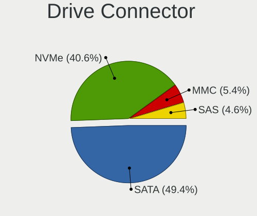

| Type | Notebooks | Drives | Percent |
|------|-----------|--------|---------|
| SATA | 886       | 1297   | 49.41%  |
| NVMe | 728       | 1009   | 40.6%   |
| MMC  | 96        | 141    | 5.35%   |
| SAS  | 83        | 110    | 4.63%   |

Drive Size
----------

Size of hard drive

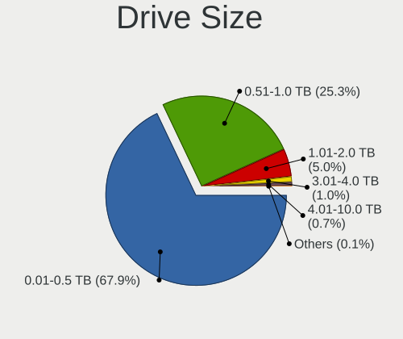

| Size in TB | Notebooks | Drives | Percent |
|------------|-----------|--------|---------|
| 0.01-0.5   | 684       | 964    | 67.92%  |
| 0.51-1.0   | 255       | 318    | 25.32%  |
| 1.01-2.0   | 50        | 68     | 4.97%   |
| 3.01-4.0   | 10        | 12     | 0.99%   |
| 4.01-10.0  | 7         | 8      | 0.7%    |
| 2.01-3.0   | 1         | 1      | 0.1%    |

Space Total
-----------

Amount of disk space available on the file system

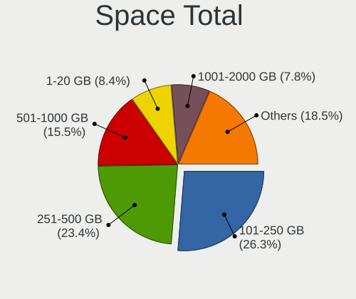

| Size in GB     | Notebooks | Percent |
|----------------|-----------|---------|
| 101-250        | 443       | 26.29%  |
| 251-500        | 395       | 23.44%  |
| 501-1000       | 261       | 15.49%  |
| 1-20           | 142       | 8.43%   |
| 1001-2000      | 132       | 7.83%   |
| 51-100         | 85        | 5.04%   |
| Unknown        | 75        | 4.45%   |
| More than 3000 | 65        | 3.86%   |
| 21-50          | 56        | 3.32%   |
| 2001-3000      | 31        | 1.84%   |

Space Used
----------

Amount of used disk space

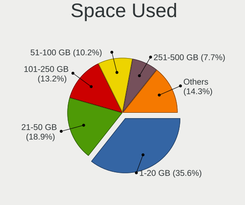

| Used GB        | Notebooks | Percent |
|----------------|-----------|---------|
| 1-20           | 621       | 35.61%  |
| 21-50          | 329       | 18.86%  |
| 101-250        | 231       | 13.25%  |
| 51-100         | 178       | 10.21%  |
| 251-500        | 135       | 7.74%   |
| 501-1000       | 101       | 5.79%   |
| Unknown        | 75        | 4.3%    |
| 1001-2000      | 39        | 2.24%   |
| 2001-3000      | 17        | 0.97%   |
| More than 3000 | 16        | 0.92%   |
| 0              | 2         | 0.11%   |

Malfunc. Drives
---------------

Drive models with a malfunction

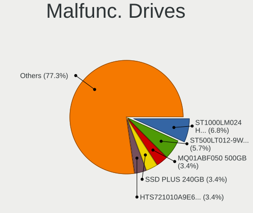

| Model                                            | Notebooks | Drives | Percent |
|--------------------------------------------------|-----------|--------|---------|
| Seagate ST1000LM024 HN-M101MBB 1TB               | 6         | 6      | 6.82%   |
| Seagate ST500LT012-9WS142 500GB                  | 5         | 13     | 5.68%   |
| Toshiba MQ01ABF050 500GB                         | 3         | 4      | 3.41%   |
| SanDisk SSD PLUS 240GB                           | 3         | 3      | 3.41%   |
| HGST HTS721010A9E630 1TB                         | 3         | 4      | 3.41%   |
| Toshiba MQ01ABD100 1TB                           | 2         | 2      | 2.27%   |
| Seagate ST9750420AS 752GB                        | 2         | 2      | 2.27%   |
| Seagate ST9250315AS 250GB                        | 2         | 2      | 2.27%   |
| Seagate ST9160412AS 160GB                        | 2         | 2      | 2.27%   |
| Intel SSDSC2BF240A5L 240GB                       | 2         | 3      | 2.27%   |
| Hitachi HTS543232A7A384 320GB                    | 2         | 2      | 2.27%   |
| WDC WD5000LPLX-00ZNTT0 500GB                     | 1         | 1      | 1.14%   |
| WDC WD3200BEVT-08A23T1 320GB                     | 1         | 1      | 1.14%   |
| WDC WD Blue SA510 M.2 2280 1000GB                | 1         | 1      | 1.14%   |
| Toshiba MQ02ABF050H 500GB                        | 1         | 1      | 1.14%   |
| Toshiba MQ01ABD100M 1TB                          | 1         | 1      | 1.14%   |
| Toshiba MK7559GSXP 752GB                         | 1         | 1      | 1.14%   |
| Toshiba MK5056GSY 500GB                          | 1         | 1      | 1.14%   |
| Toshiba MK5055GSX 500GB                          | 1         | 1      | 1.14%   |
| Toshiba MK3276GSX 320GB                          | 1         | 1      | 1.14%   |
| Toshiba MK2035GSS 200GB                          | 1         | 1      | 1.14%   |
| Toshiba MK1233GSG 120GB                          | 1         | 1      | 1.14%   |
| SK hynix SH920 mSATA 256GB SSD                   | 1         | 1      | 1.14%   |
| SK hynix BC901 NVMe 512GB                        | 1         | 1      | 1.14%   |
| Seagate ST95005620AS 500GB                       | 1         | 1      | 1.14%   |
| Seagate ST9500420AS 500GB                        | 1         | 1      | 1.14%   |
| Seagate ST9320325AS 320GB                        | 1         | 1      | 1.14%   |
| Seagate ST750LM022 HN-M750MBB 752GB              | 1         | 1      | 1.14%   |
| Seagate ST500LM000-SSHD-8GB                      | 1         | 2      | 1.14%   |
| Seagate ST1000LM035-1RK172 1TB                   | 1         | 1      | 1.14%   |
| Seagate ST1000LM014-1EJ164-SSHD 1TB              | 1         | 9      | 1.14%   |
| SanDisk SSD PLUS 120GB                           | 1         | 1      | 1.14%   |
| SanDisk SDSSDH3 1T00 1TB                         | 1         | 1      | 1.14%   |
| Samsung Electronics SSD SM841 mSATA 256GB        | 1         | 1      | 1.14%   |
| Samsung Electronics SSD 870 EVO 500GB            | 1         | 1      | 1.14%   |
| Samsung Electronics SSD 870 EVO 1TB              | 1         | 1      | 1.14%   |
| Samsung Electronics SSD 850 EVO 1TB              | 1         | 1      | 1.14%   |
| Samsung Electronics SSD 840 Series 120GB         | 1         | 1      | 1.14%   |
| Samsung Electronics MZ7PA128HMCD-010H1 128GB SSD | 1         | 1      | 1.14%   |
| Samsung Electronics MMCRE28G8MXP-0VBH1 128GB SSD | 1         | 1      | 1.14%   |

Malfunc. Drive Vendor
---------------------

Vendors of faulty drives

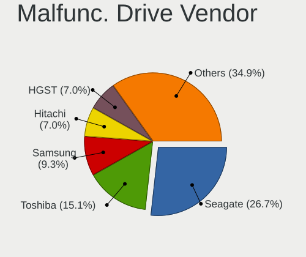

| Vendor              | Notebooks | Drives | Percent |
|---------------------|-----------|--------|---------|
| Seagate             | 23        | 41     | 26.74%  |
| Toshiba             | 13        | 14     | 15.12%  |
| Samsung Electronics | 8         | 9      | 9.3%    |
| Hitachi             | 6         | 7      | 6.98%   |
| HGST                | 6         | 7      | 6.98%   |
| SanDisk             | 5         | 5      | 5.81%   |
| Intel               | 5         | 6      | 5.81%   |
| WDC                 | 3         | 3      | 3.49%   |
| Crucial             | 3         | 3      | 3.49%   |
| SK hynix            | 2         | 2      | 2.33%   |
| LITEONIT            | 2         | 3      | 2.33%   |
| Kingston            | 2         | 3      | 2.33%   |
| China               | 2         | 3      | 2.33%   |
| Micron Technology   | 1         | 1      | 1.16%   |
| LITEON              | 1         | 1      | 1.16%   |
| GOODRAM             | 1         | 1      | 1.16%   |
| Fujitsu             | 1         | 1      | 1.16%   |
| Corsair             | 1         | 1      | 1.16%   |
| A-DATA Technology   | 1         | 3      | 1.16%   |

Malfunc. HDD Vendor
-------------------

Vendors of faulty HDD drives

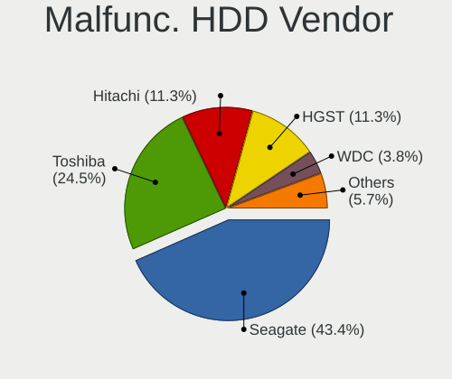

| Vendor              | Notebooks | Drives | Percent |
|---------------------|-----------|--------|---------|
| Seagate             | 23        | 41     | 43.4%   |
| Toshiba             | 13        | 14     | 24.53%  |
| Hitachi             | 6         | 7      | 11.32%  |
| HGST                | 6         | 7      | 11.32%  |
| WDC                 | 2         | 2      | 3.77%   |
| Samsung Electronics | 2         | 2      | 3.77%   |
| Fujitsu             | 1         | 1      | 1.89%   |

Malfunc. Drive Kind
-------------------

Kinds of faulty drives

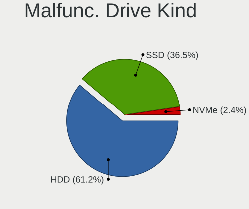

| Kind | Notebooks | Drives | Percent |
|------|-----------|--------|---------|
| HDD  | 52        | 74     | 61.18%  |
| SSD  | 31        | 38     | 36.47%  |
| NVMe | 2         | 2      | 2.35%   |

Failed Drives
-------------

Failed drive models

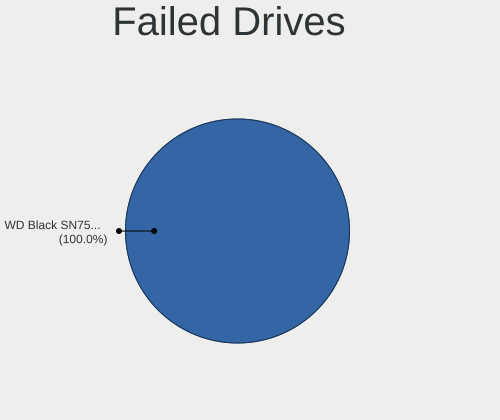

| Model                                            | Notebooks | Drives | Percent |
|--------------------------------------------------|-----------|--------|---------|
| Sandisk WD Black SN750 / PC SN730 NVMe SSD 500GB | 1         | 1      | 100%    |

Failed Drive Vendor
-------------------

Failed drive vendors

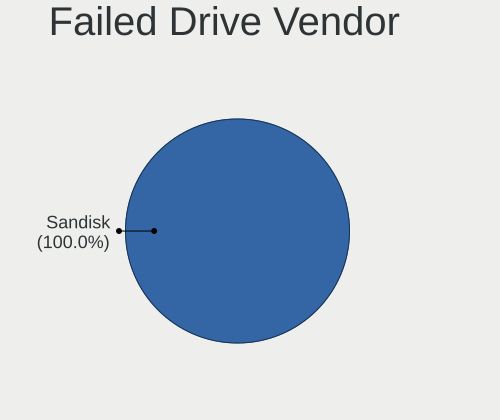

| Vendor  | Notebooks | Drives | Percent |
|---------|-----------|--------|---------|
| Sandisk | 1         | 1      | 100%    |

Drive Status
------------

Number of failed and malfunc. drives

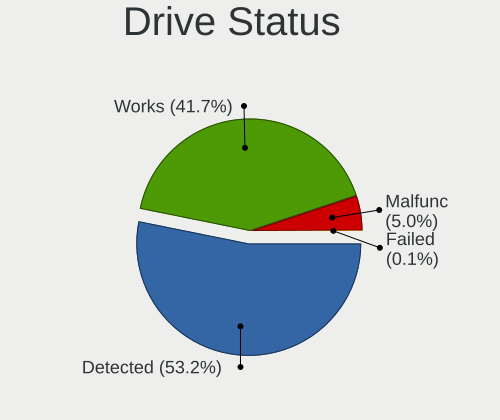

| Status   | Notebooks | Drives | Percent |
|----------|-----------|--------|---------|
| Detected | 897       | 1464   | 53.17%  |
| Works    | 704       | 978    | 41.73%  |
| Malfunc  | 85        | 114    | 5.04%   |
| Failed   | 1         | 1      | 0.06%   |

Storage controller
------------------

Storage Vendor
--------------

Storage controller vendors

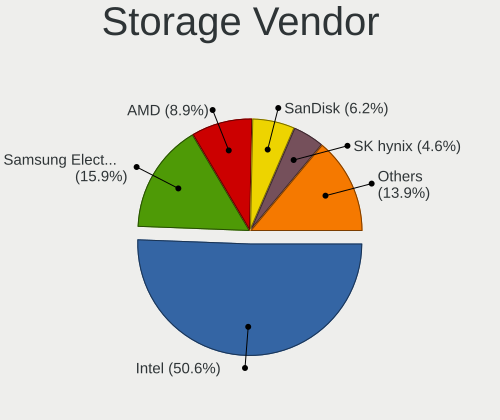

| Vendor                                  | Notebooks | Percent |
|-----------------------------------------|-----------|---------|
| Intel                                   | 937       | 50.59%  |
| Samsung Electronics                     | 294       | 15.87%  |
| AMD                                     | 164       | 8.86%   |
| SanDisk                                 | 114       | 6.16%   |
| SK hynix                                | 85        | 4.59%   |
| Toshiba America Info Systems            | 44        | 2.38%   |
| Micron Technology                       | 43        | 2.32%   |
| KIOXIA                                  | 32        | 1.73%   |
| Kingston Technology Company             | 25        | 1.35%   |
| Micron/Crucial Technology               | 20        | 1.08%   |
| Phison Electronics                      | 17        | 0.92%   |
| Nvidia                                  | 17        | 0.92%   |
| MAXIO Technology (Hangzhou)             | 10        | 0.54%   |
| Apple                                   | 10        | 0.54%   |
| Silicon Motion                          | 8         | 0.43%   |
| Union Memory (Shenzhen)                 | 6         | 0.32%   |
| Lenovo                                  | 5         | 0.27%   |
| Solidigm                                | 3         | 0.16%   |
| Solid State Storage Technology          | 2         | 0.11%   |
| Silicon Integrated Systems [SiS]        | 2         | 0.11%   |
| Marvell Technology Group                | 2         | 0.11%   |
| Biwin Storage Technology                | 2         | 0.11%   |
| ADATA Technology                        | 2         | 0.11%   |
| Yangtze Memory Technologies             | 1         | 0.05%   |
| VIA Technologies                        | 1         | 0.05%   |
| Transcend                               | 1         | 0.05%   |
| Shenzhen Unionmemory Information System | 1         | 0.05%   |
| Shenzhen Longsys Electronics            | 1         | 0.05%   |
| Seagate Technology                      | 1         | 0.05%   |
| Realtek Semiconductor                   | 1         | 0.05%   |
| O2 Micro                                | 1         | 0.05%   |

Storage Model
-------------

Storage controller models

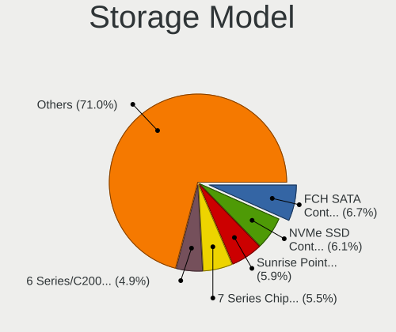

| Model                                                                            | Notebooks | Percent |
|----------------------------------------------------------------------------------|-----------|---------|
| AMD FCH SATA Controller [AHCI mode]                                              | 132       | 6.67%   |
| Samsung NVMe SSD Controller SM981/PM981/PM983                                    | 120       | 6.07%   |
| Intel Sunrise Point-LP SATA Controller [AHCI mode]                               | 117       | 5.92%   |
| Intel 7 Series Chipset Family 6-port SATA Controller [AHCI mode]                 | 108       | 5.46%   |
| Intel 6 Series/C200 Series Chipset Family 6 port Mobile SATA AHCI Controller     | 97        | 4.9%    |
| Intel 82801 Mobile SATA Controller [RAID mode]                                   | 70        | 3.54%   |
| Samsung NVMe SSD Controller 980 (DRAM-less)                                      | 61        | 3.08%   |
| Intel 8 Series SATA Controller 1 [AHCI mode]                                     | 59        | 2.98%   |
| Intel Volume Management Device NVMe RAID Controller                              | 50        | 2.53%   |
| Intel Wildcat Point-LP SATA Controller [AHCI Mode]                               | 45        | 2.28%   |
| Intel 82801IBM/IEM (ICH9M/ICH9M-E) 4 port SATA Controller [AHCI mode]            | 45        | 2.28%   |
| Samsung NVMe SSD Controller PM9A1/PM9A3/980PRO                                   | 40        | 2.02%   |
| Samsung NVMe SSD Controller SM961/PM961/SM963                                    | 34        | 1.72%   |
| Intel Cannon Lake Mobile PCH SATA AHCI Controller                                | 32        | 1.62%   |
| SanDisk Extreme Pro / WD Black SN750 / PC SN730 / Red SN700 NVMe SSD             | 31        | 1.57%   |
| Intel 8 Series/C220 Series Chipset Family 6-port SATA Controller 1 [AHCI mode]   | 31        | 1.57%   |
| Intel HM170/QM170 Chipset SATA Controller [AHCI Mode]                            | 30        | 1.52%   |
| SK hynix Gold P31/BC711/PC711 NVMe Solid State Drive                             | 23        | 1.16%   |
| Intel Tiger Lake-LP SATA Controller                                              | 23        | 1.16%   |
| Intel Comet Lake SATA AHCI Controller                                            | 23        | 1.16%   |
| Intel 82801HM/HEM (ICH8M/ICH8M-E) IDE Controller                                 | 22        | 1.11%   |
| Intel 5 Series/3400 Series Chipset 6 port SATA AHCI Controller                   | 22        | 1.11%   |
| Intel 5 Series/3400 Series Chipset 4 port SATA AHCI Controller                   | 21        | 1.06%   |
| AMD SB7x0/SB8x0/SB9x0 SATA Controller [AHCI mode]                                | 21        | 1.06%   |
| Toshiba America Info Systems XG6 NVMe SSD Controller                             | 20        | 1.01%   |
| Intel SSD 660P Series                                                            | 20        | 1.01%   |
| Intel 82801HM/HEM (ICH8M/ICH8M-E) SATA Controller [AHCI mode]                    | 20        | 1.01%   |
| SK hynix BC511 NVMe SSD                                                          | 17        | 0.86%   |
| SanDisk Ultra 3D / WD PC SN530, IX SN530, Blue SN550 NVMe SSD (DRAM-less)        | 16        | 0.81%   |
| Intel Celeron/Pentium Silver Processor SATA Controller                           | 16        | 0.81%   |
| Samsung NVMe SSD Controller PM9B1 (DRAM-less)                                    | 14        | 0.71%   |
| Intel Celeron N3350/Pentium N4200/Atom E3900 Series SATA AHCI Controller         | 14        | 0.71%   |
| KIOXIA NVMe SSD Controller BG4 (DRAM-less)                                       | 13        | 0.66%   |
| Intel Cannon Point-LP SATA Controller [AHCI Mode]                                | 13        | 0.66%   |
| Intel Atom/Celeron/Pentium Processor x5-E8000/J3xxx/N3xxx Series SATA Controller | 12        | 0.61%   |
| SK hynix PC611 NVMe Solid State Drive                                            | 11        | 0.56%   |
| Micron/Crucial P2 [Nick P2] / P3 / P3 Plus NVMe PCIe SSD (DRAM-less)             | 11        | 0.56%   |
| Intel Mobile 4 Series Chipset PT IDER Controller                                 | 11        | 0.56%   |
| Micron 2450 NVMe SSD [HendrixV] (DRAM-less)                                      | 10        | 0.51%   |
| Intel SSD DC P4101/Pro 7600p/760p/E 6100p Series                                 | 10        | 0.51%   |

Storage Kind
------------

Kind of storage controller (IDE, SATA, NVMe, SAS, ...)

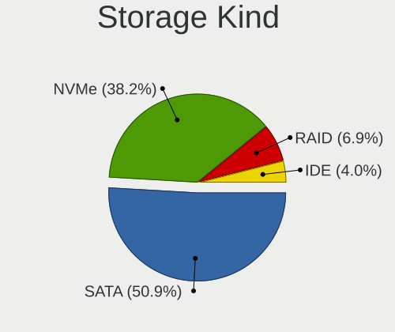

| Kind | Notebooks | Percent |
|------|-----------|---------|
| SATA | 973       | 50.92%  |
| NVMe | 730       | 38.2%   |
| RAID | 132       | 6.91%   |
| IDE  | 76        | 3.98%   |

Processor
---------

CPU Vendor
----------

Processor vendors

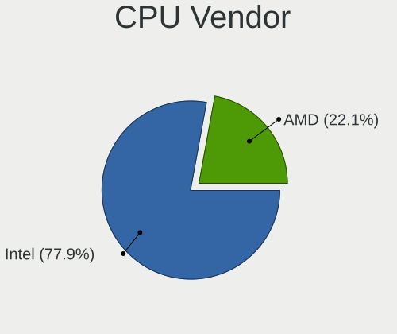

| Vendor | Notebooks | Percent |
|--------|-----------|---------|
| Intel  | 1225      | 77.88%  |
| AMD    | 348       | 22.12%  |

CPU Model
---------

Processor models

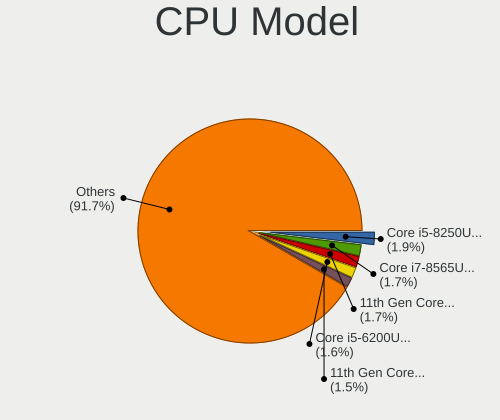

| Model                                         | Notebooks | Percent |
|-----------------------------------------------|-----------|---------|
| Intel Core i5-8250U CPU @ 1.60GHz             | 30        | 1.9%    |
| Intel Core i7-8565U CPU @ 1.80GHz             | 27        | 1.71%   |
| Intel 11th Gen Core i5-1135G7 @ 2.40GHz       | 26        | 1.65%   |
| Intel Core i5-6200U CPU @ 2.30GHz             | 25        | 1.59%   |
| Intel 11th Gen Core i7-1165G7 @ 2.80GHz       | 23        | 1.46%   |
| Intel Core i5-7200U CPU @ 2.50GHz             | 22        | 1.4%    |
| Intel Core i7-10510U CPU @ 1.80GHz            | 21        | 1.33%   |
| Intel Core i5-6300U CPU @ 2.40GHz             | 21        | 1.33%   |
| Intel Core i5-10210U CPU @ 1.60GHz            | 21        | 1.33%   |
| Intel Core i7-8550U CPU @ 1.80GHz             | 20        | 1.27%   |
| Intel Core i5-5200U CPU @ 2.20GHz             | 19        | 1.21%   |
| Intel Core i5-3320M CPU @ 2.60GHz             | 19        | 1.21%   |
| Intel Core i5-2520M CPU @ 2.50GHz             | 19        | 1.21%   |
| Intel Core i7-7700HQ CPU @ 2.80GHz            | 18        | 1.14%   |
| Intel Core i5-4210U CPU @ 1.70GHz             | 18        | 1.14%   |
| Intel Core i5-3210M CPU @ 2.50GHz             | 17        | 1.08%   |
| AMD Custom APU 0405                           | 16        | 1.02%   |
| Intel Core i7-8750H CPU @ 2.20GHz             | 15        | 0.95%   |
| Intel Core i7-7500U CPU @ 2.70GHz             | 15        | 0.95%   |
| Intel Core i7-2670QM CPU @ 2.20GHz            | 15        | 0.95%   |
| AMD Ryzen 7 PRO 4750U with Radeon Graphics    | 15        | 0.95%   |
| Intel Core i7-8850H CPU @ 2.60GHz             | 12        | 0.76%   |
| Intel Core i5-5300U CPU @ 2.30GHz             | 12        | 0.76%   |
| Intel Core 2 Duo CPU P8600 @ 2.40GHz          | 12        | 0.76%   |
| AMD Ryzen 7 5800H with Radeon Graphics        | 12        | 0.76%   |
| AMD Ryzen 5 4500U with Radeon Graphics        | 12        | 0.76%   |
| Intel Core i7-9750H CPU @ 2.60GHz             | 11        | 0.7%    |
| Intel Core i7-6700HQ CPU @ 2.60GHz            | 11        | 0.7%    |
| Intel Core i5-3230M CPU @ 2.60GHz             | 11        | 0.7%    |
| AMD Ryzen 7 4800H with Radeon Graphics        | 11        | 0.7%    |
| Intel Core i7-4600U CPU @ 2.10GHz             | 10        | 0.63%   |
| Intel Core i7-1065G7 CPU @ 1.30GHz            | 10        | 0.63%   |
| Intel Core i5-8265U CPU @ 1.60GHz             | 10        | 0.63%   |
| AMD Ryzen 7 PRO 5850U with Radeon Graphics    | 10        | 0.63%   |
| AMD Ryzen 5 3500U with Radeon Vega Mobile Gfx | 10        | 0.63%   |
| Intel Core i7-5600U CPU @ 2.60GHz             | 9         | 0.57%   |
| Intel Core i5-8350U CPU @ 1.70GHz             | 9         | 0.57%   |
| Intel Core i5-2450M CPU @ 2.50GHz             | 9         | 0.57%   |
| Intel Core i5-2430M CPU @ 2.40GHz             | 9         | 0.57%   |
| AMD Ryzen 7 5700U with Radeon Graphics        | 9         | 0.57%   |

CPU Model Family
----------------

Processor model prefix

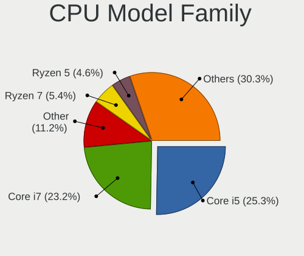

| Model                   | Notebooks | Percent |
|-------------------------|-----------|---------|
| Intel Core i5           | 398       | 25.29%  |
| Intel Core i7           | 365       | 23.19%  |
| Other                   | 177       | 11.25%  |
| AMD Ryzen 7             | 85        | 5.4%    |
| AMD Ryzen 5             | 72        | 4.57%   |
| Intel Core 2 Duo        | 71        | 4.51%   |
| Intel Core i3           | 63        | 4%      |
| Intel Celeron           | 49        | 3.11%   |
| AMD Ryzen 7 PRO         | 40        | 2.54%   |
| Intel Pentium           | 37        | 2.35%   |
| Intel Atom              | 23        | 1.46%   |
| AMD Ryzen 9             | 18        | 1.14%   |
| Intel Core              | 17        | 1.08%   |
| AMD A4                  | 13        | 0.83%   |
| Intel Core i9           | 12        | 0.76%   |
| AMD A8                  | 12        | 0.76%   |
| AMD A6                  | 12        | 0.76%   |
| Intel Pentium Dual-Core | 10        | 0.64%   |
| Intel Pentium Silver    | 9         | 0.57%   |
| AMD Ryzen 5 PRO         | 9         | 0.57%   |
| AMD E2                  | 9         | 0.57%   |
| Intel Core 2            | 7         | 0.44%   |
| AMD E                   | 7         | 0.44%   |
| AMD E1                  | 6         | 0.38%   |
| AMD Athlon II           | 6         | 0.38%   |
| Intel Pentium Dual      | 5         | 0.32%   |
| Intel Genuine           | 4         | 0.25%   |
| AMD Athlon X2           | 4         | 0.25%   |
| AMD Athlon              | 4         | 0.25%   |
| Intel Xeon              | 3         | 0.19%   |
| AMD Turion 64 X2 Mobile | 3         | 0.19%   |
| AMD Ryzen 3             | 3         | 0.19%   |
| AMD A10                 | 3         | 0.19%   |
| Intel Core m5           | 2         | 0.13%   |
| AMD Turion II           | 2         | 0.13%   |
| AMD Sempron             | 2         | 0.13%   |
| Intel Pentium Gold      | 1         | 0.06%   |
| Intel Core m7           | 1         | 0.06%   |
| Intel Core M            | 1         | 0.06%   |
| Intel Core 2 Solo       | 1         | 0.06%   |

CPU Cores
---------

Number of processor cores

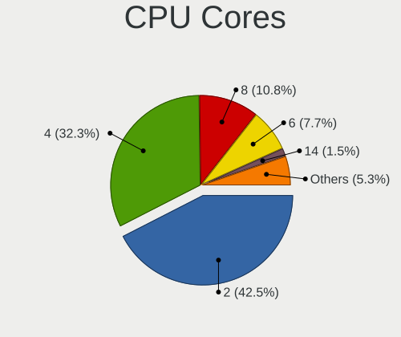

| Number  | Notebooks | Percent |
|---------|-----------|---------|
| 2       | 669       | 42.48%  |
| 4       | 509       | 32.32%  |
| 8       | 170       | 10.79%  |
| 6       | 121       | 7.68%   |
| 14      | 23        | 1.46%   |
| 10      | 23        | 1.46%   |
| 12      | 22        | 1.4%    |
| 1       | 17        | 1.08%   |
| 16      | 16        | 1.02%   |
| 20      | 2         | 0.13%   |
| 24      | 1         | 0.06%   |
| 5       | 1         | 0.06%   |
| Unknown | 1         | 0.06%   |

CPU Sockets
-----------

Number of sockets

| Number | Notebooks | Percent |
|--------|-----------|---------|
| 1      | 1573      | 100%    |

CPU Threads
-----------

Threads per core (Hyper-Threading)

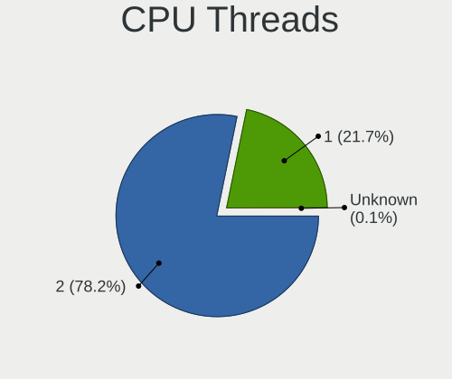

| Number  | Notebooks | Percent |
|---------|-----------|---------|
| 2       | 1234      | 78.2%   |
| 1       | 343       | 21.74%  |
| Unknown | 1         | 0.06%   |

CPU Op-Modes
------------

CPU Operation Modes (32-bit, 64-bit)

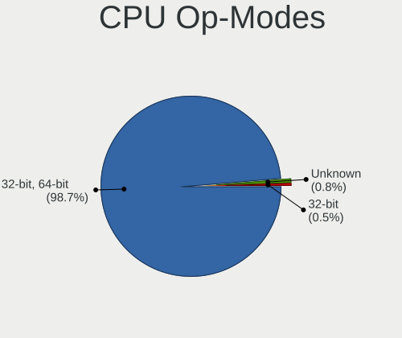

| Op mode        | Notebooks | Percent |
|----------------|-----------|---------|
| 32-bit, 64-bit | 1553      | 98.67%  |
| Unknown        | 13        | 0.83%   |
| 32-bit         | 8         | 0.51%   |

CPU Microcode
-------------

Microcode number

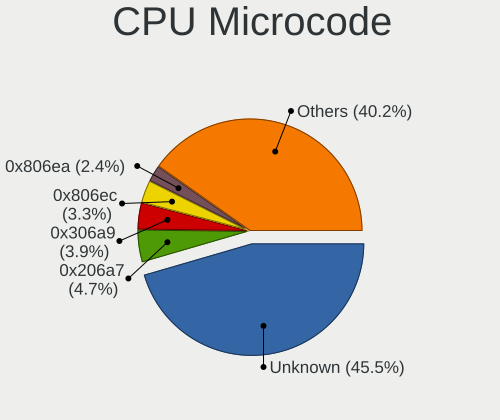

| Number     | Notebooks | Percent |
|------------|-----------|---------|
| Unknown    | 742       | 45.49%  |
| 0x206a7    | 77        | 4.72%   |
| 0x306a9    | 63        | 3.86%   |
| 0x806ec    | 54        | 3.31%   |
| 0x806ea    | 39        | 2.39%   |
| 0x406e3    | 38        | 2.33%   |
| 0x306d4    | 36        | 2.21%   |
| 0x40651    | 35        | 2.15%   |
| 0x806c1    | 34        | 2.08%   |
| 0x1067a    | 34        | 2.08%   |
| 0x906ea    | 31        | 1.9%    |
| 0x08600106 | 24        | 1.47%   |
| 0x806e9    | 23        | 1.41%   |
| 0x306c3    | 21        | 1.29%   |
| 0x0a50000c | 21        | 1.29%   |
| 0x506e3    | 16        | 0.98%   |
| 0x20655    | 15        | 0.92%   |
| 0x10676    | 15        | 0.92%   |
| 0xa0652    | 13        | 0.8%    |
| 0x08600103 | 13        | 0.8%    |
| 0x07030105 | 13        | 0.8%    |
| 0x906e9    | 12        | 0.74%   |
| 0x706e5    | 12        | 0.74%   |
| 0x08108102 | 12        | 0.74%   |
| 0x506c9    | 11        | 0.67%   |
| 0x08608103 | 11        | 0.67%   |
| 0x906a3    | 9         | 0.55%   |
| 0x806eb    | 9         | 0.55%   |
| 0x406c4    | 9         | 0.55%   |
| 0x406c3    | 9         | 0.55%   |
| 0x08600104 | 9         | 0.55%   |
| 0x30678    | 8         | 0.49%   |
| 0x0a50000d | 8         | 0.49%   |
| 0x906ed    | 7         | 0.43%   |
| 0x706a8    | 7         | 0.43%   |
| 0x20652    | 7         | 0.43%   |
| 0x010000c8 | 7         | 0.43%   |
| 0x6fd      | 6         | 0.37%   |
| 0x08108109 | 6         | 0.37%   |
| 0x06006705 | 6         | 0.37%   |

CPU Microarch
-------------

Microarchitecture

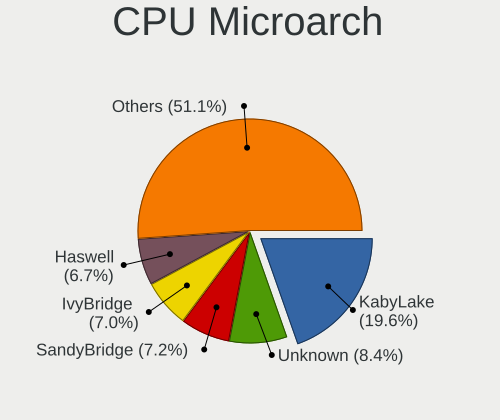

| Name               | Notebooks | Percent |
|--------------------|-----------|---------|
| KabyLake           | 309       | 19.62%  |
| Unknown            | 132       | 8.38%   |
| SandyBridge        | 113       | 7.17%   |
| IvyBridge          | 110       | 6.98%   |
| Haswell            | 106       | 6.73%   |
| Skylake            | 89        | 5.65%   |
| Penryn             | 73        | 4.63%   |
| Zen 2              | 68        | 4.32%   |
| TigerLake          | 67        | 4.25%   |
| Broadwell          | 58        | 3.68%   |
| Zen 3              | 56        | 3.56%   |
| Alderlake Hybrid   | 43        | 2.73%   |
| Westmere           | 39        | 2.48%   |
| Silvermont         | 37        | 2.35%   |
| IceLake            | 28        | 1.78%   |
| CometLake          | 28        | 1.78%   |
| Zen+               | 27        | 1.71%   |
| Core               | 25        | 1.59%   |
| Puma               | 19        | 1.21%   |
| Goldmont plus      | 19        | 1.21%   |
| Excavator          | 15        | 0.95%   |
| Bobcat             | 15        | 0.95%   |
| Goldmont           | 14        | 0.89%   |
| Zen                | 12        | 0.76%   |
| K10                | 11        | 0.7%    |
| Jaguar             | 11        | 0.7%    |
| Meteorlake Hybrid  | 9         | 0.57%   |
| Bonnell            | 9         | 0.57%   |
| Nehalem            | 5         | 0.32%   |
| K8 Hammer          | 5         | 0.32%   |
| K8 & K10 hybrid    | 5         | 0.32%   |
| Tremont            | 4         | 0.25%   |
| Steamroller        | 3         | 0.19%   |
| Piledriver         | 3         | 0.19%   |
| P6                 | 3         | 0.19%   |
| K10 Llano          | 3         | 0.19%   |
| ArrowLake-H Hybrid | 2         | 0.13%   |

Graphics
--------

GPU Vendor
----------

Vendors of graphics cards

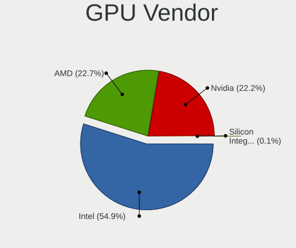

| Vendor                           | Notebooks | Percent |
|----------------------------------|-----------|---------|
| Intel                            | 1084      | 54.91%  |
| AMD                              | 449       | 22.75%  |
| Nvidia                           | 439       | 22.24%  |
| Silicon Integrated Systems [SiS] | 2         | 0.1%    |

GPU Model
---------

Graphics card models

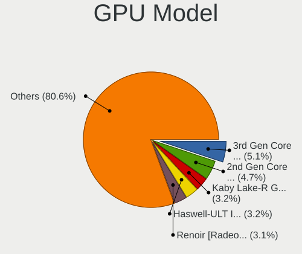

| Model                                                                                    | Notebooks | Percent |
|------------------------------------------------------------------------------------------|-----------|---------|
| Intel 3rd Gen Core processor Graphics Controller                                         | 103       | 5.1%    |
| Intel 2nd Generation Core Processor Family Integrated Graphics Controller                | 95        | 4.7%    |
| Intel Kaby Lake-R GT2 [UHD Graphics 620]                                                 | 65        | 3.22%   |
| Intel Haswell-ULT Integrated Graphics Controller                                         | 65        | 3.22%   |
| AMD Renoir [Radeon Vega Series / Radeon Vega Mobile Series]                              | 63        | 3.12%   |
| Intel TigerLake-LP GT2 [Iris Xe Graphics]                                                | 62        | 3.07%   |
| Intel Skylake-U GT2 [HD Graphics 520]                                                    | 61        | 3.02%   |
| Intel CometLake-U GT2 [UHD Graphics]                                                     | 52        | 2.57%   |
| Intel Kaby Lake-U GT2 [HD Graphics 620]                                                  | 48        | 2.38%   |
| Intel Broadwell-U GT2 [HD Graphics 5500]                                                 | 48        | 2.38%   |
| Intel WhiskeyLake-U GT2 [UHD Graphics 620]                                               | 46        | 2.28%   |
| Intel CoffeeLake-H GT2 [UHD Graphics 630]                                                | 43        | 2.13%   |
| AMD Cezanne [Radeon Vega Series / Radeon Vega Mobile Series]                             | 37        | 1.83%   |
| Intel Mobile 4 Series Chipset Integrated Graphics Controller                             | 30        | 1.49%   |
| Intel 4th Gen Core Processor Integrated Graphics Controller                              | 29        | 1.44%   |
| Intel Core Processor Integrated Graphics Controller                                      | 28        | 1.39%   |
| AMD Picasso/Raven 2 [Radeon Vega Series / Radeon Vega Mobile Series]                     | 27        | 1.34%   |
| Intel Atom/Celeron/Pentium Processor x5-E8000/J3xxx/N3xxx Integrated Graphics Controller | 25        | 1.24%   |
| Intel Raptor Lake-P [Iris Xe Graphics]                                                   | 23        | 1.14%   |
| Intel CometLake-H GT2 [UHD Graphics]                                                     | 22        | 1.09%   |
| Intel Skylake-H GT2 [HD Graphics 530]                                                    | 21        | 1.04%   |
| Intel Kaby Lake-H GT2 [HD Graphics 630]                                                  | 21        | 1.04%   |
| Nvidia TU117M [GeForce GTX 1650 Mobile / Max-Q]                                          | 18        | 0.89%   |
| AMD Lucienne                                                                             | 18        | 0.89%   |
| AMD Barcelo                                                                              | 17        | 0.84%   |
| Nvidia GP107M [GeForce GTX 1050 Ti Mobile]                                               | 16        | 0.79%   |
| Intel GeminiLake [UHD Graphics 600]                                                      | 16        | 0.79%   |
| AMD Rembrandt [Radeon 680M]                                                              | 16        | 0.79%   |
| Nvidia GP108M [GeForce MX250]                                                            | 15        | 0.74%   |
| AMD VanGogh [AMD Custom GPU 0405]                                                        | 15        | 0.74%   |
| Intel Alder Lake-P GT2 [Iris Xe Graphics]                                                | 14        | 0.69%   |
| AMD Phoenix1                                                                             | 14        | 0.69%   |
| Nvidia GM108M [GeForce 840M]                                                             | 13        | 0.64%   |
| Intel Atom Processor Z36xxx/Z37xxx Series Graphics & Display                             | 12        | 0.59%   |
| AMD Mullins [Radeon R4/R5 Graphics]                                                      | 12        | 0.59%   |
| AMD HawkPoint1                                                                           | 12        | 0.59%   |
| Nvidia GA106M [GeForce RTX 3060 Mobile / Max-Q]                                          | 11        | 0.54%   |
| Intel TigerLake-H GT1 [UHD Graphics]                                                     | 11        | 0.54%   |
| Intel Apollo Lake GT1 [HD Graphics 500]                                                  | 11        | 0.54%   |
| AMD Seymour [Radeon HD 6400M/7400M Series]                                               | 11        | 0.54%   |

GPU Combo
---------

Combinations of graphics cards

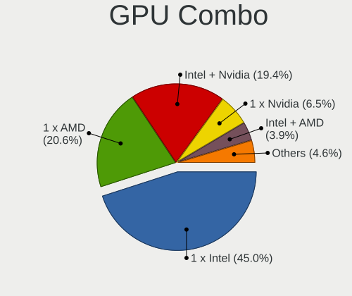

| Name            | Notebooks | Percent |
|-----------------|-----------|---------|
| 1 x Intel       | 711       | 45.03%  |
| 1 x AMD         | 326       | 20.65%  |
| Intel + Nvidia  | 306       | 19.38%  |
| 1 x Nvidia      | 102       | 6.46%   |
| Intel + AMD     | 61        | 3.86%   |
| AMD + Nvidia    | 32        | 2.03%   |
| 2 x AMD         | 29        | 1.84%   |
| 2 x Intel       | 9         | 0.57%   |
| 1 x SiS         | 2         | 0.13%   |
| Intel + 2 x AMD | 1         | 0.06%   |

GPU Driver
----------

Free vs proprietary

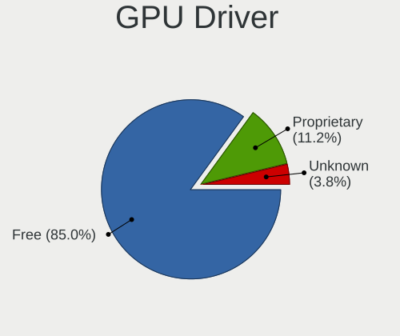

| Driver      | Notebooks | Percent |
|-------------|-----------|---------|
| Free        | 1356      | 85.02%  |
| Proprietary | 179       | 11.22%  |
| Unknown     | 60        | 3.76%   |

GPU Memory
----------

Total video memory

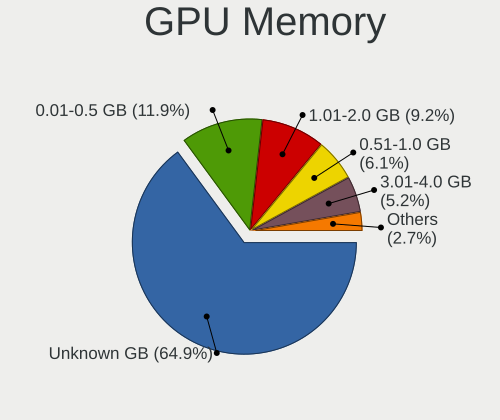

| Size in GB | Notebooks | Percent |
|------------|-----------|---------|
| Unknown    | 1046      | 64.93%  |
| 0.01-0.5   | 191       | 11.86%  |
| 1.01-2.0   | 148       | 9.19%   |
| 0.51-1.0   | 98        | 6.08%   |
| 3.01-4.0   | 84        | 5.21%   |
| 7.01-8.0   | 22        | 1.37%   |
| 5.01-6.0   | 16        | 0.99%   |
| 8.01-16.0  | 4         | 0.25%   |
| 2.01-3.0   | 2         | 0.12%   |

Monitor
-------

Monitor Vendor
--------------

Monitor vendors

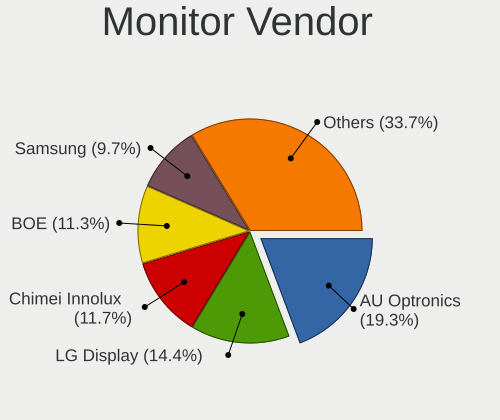

| Vendor                  | Notebooks | Percent |
|-------------------------|-----------|---------|
| AU Optronics            | 360       | 19.29%  |
| LG Display              | 268       | 14.36%  |
| Chimei Innolux          | 218       | 11.68%  |
| BOE                     | 210       | 11.25%  |
| Samsung Electronics     | 181       | 9.7%    |
| Lenovo                  | 63        | 3.38%   |
| Apple                   | 62        | 3.32%   |
| Sharp                   | 51        | 2.73%   |
| Dell                    | 50        | 2.68%   |
| Goldstar                | 40        | 2.14%   |
| Hewlett-Packard         | 34        | 1.82%   |
| Chi Mei Optoelectronics | 29        | 1.55%   |
| AOC                     | 22        | 1.18%   |
| BenQ                    | 21        | 1.13%   |
| Acer                    | 21        | 1.13%   |
| InfoVision              | 19        | 1.02%   |
| CSO                     | 18        | 0.96%   |
| Valve                   | 15        | 0.8%    |
| Philips                 | 15        | 0.8%    |
| Ancor Communications    | 15        | 0.8%    |
| PANDA                   | 13        | 0.7%    |
| LG Philips              | 13        | 0.7%    |
| Iiyama                  | 10        | 0.54%   |
| Sony                    | 8         | 0.43%   |
| Eizo                    | 7         | 0.38%   |
| ASUSTek Computer        | 7         | 0.38%   |
| Panasonic               | 6         | 0.32%   |
| HannStar                | 6         | 0.32%   |
| TMX                     | 5         | 0.27%   |
| CPT                     | 5         | 0.27%   |
| Unknown                 | 4         | 0.21%   |
| Toshiba                 | 4         | 0.21%   |
| Gericom                 | 4         | 0.21%   |
| ViewSonic               | 3         | 0.16%   |
| LGD                     | 3         | 0.16%   |
| CSOT                    | 3         | 0.16%   |
| Analogix                | 3         | 0.16%   |
| TMA                     | 2         | 0.11%   |
| NEC Computers           | 2         | 0.11%   |
| Medion Akoya            | 2         | 0.11%   |

Monitor Model
-------------

Monitor models

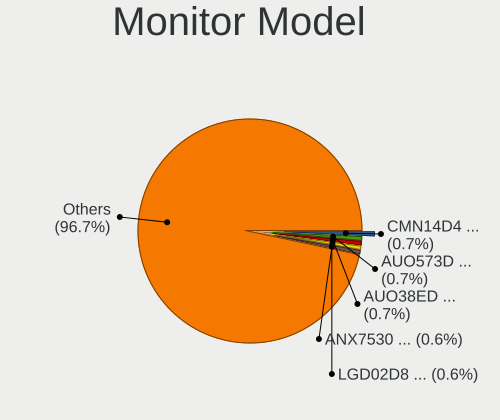

| Model                                                                | Notebooks | Percent |
|----------------------------------------------------------------------|-----------|---------|
| Chimei Innolux LCD Monitor CMN14D4 1920x1080 309x173mm 13.9-inch     | 14        | 0.73%   |
| AU Optronics LCD Monitor AUO573D 1920x1080 309x174mm 14.0-inch       | 13        | 0.68%   |
| AU Optronics LCD Monitor AUO38ED 1920x1080 344x193mm 15.5-inch       | 13        | 0.68%   |
| Valve ANX7530 U VLV3001 800x1280 100x150mm 7.1-inch                  | 12        | 0.63%   |
| LG Display LCD Monitor LGD02D8 1366x768 277x156mm 12.5-inch          | 12        | 0.63%   |
| Chimei Innolux LCD Monitor CMN15E8 1920x1080 344x193mm 15.5-inch     | 12        | 0.63%   |
| LG Display LCD Monitor LGD0521 1920x1080 309x174mm 14.0-inch         | 10        | 0.52%   |
| LG Display LCD Monitor LGD046D 1920x1080 309x174mm 14.0-inch         | 10        | 0.52%   |
| BOE LCD Monitor BOE084E 1920x1080 382x215mm 17.3-inch                | 10        | 0.52%   |
| LG Display LCD Monitor LGD046F 1920x1080 344x194mm 15.5-inch         | 9         | 0.47%   |
| Chimei Innolux LCD Monitor CMN14C9 1920x1080 309x173mm 13.9-inch     | 9         | 0.47%   |
| Samsung Electronics LCD Monitor SEC5441 1280x800 331x207mm 15.4-inch | 8         | 0.42%   |
| LG Display LCD Monitor LGD02DC 1366x768 344x194mm 15.5-inch          | 8         | 0.42%   |
| Chimei Innolux LCD Monitor CMN15E7 1920x1080 344x193mm 15.5-inch     | 8         | 0.42%   |
| AU Optronics LCD Monitor AUO22EC 1366x768 344x193mm 15.5-inch        | 8         | 0.42%   |
| AU Optronics LCD Monitor AUO123D 1920x1080 309x173mm 13.9-inch       | 8         | 0.42%   |
| Apple LCD Monitor APP9CC5 1280x800 286x179mm 13.3-inch               | 8         | 0.42%   |
| Apple Color LCD APPA040 2880x1800 331x207mm 15.4-inch                | 8         | 0.42%   |
| Chimei Innolux LCD Monitor CMN15D5 1920x1080 344x193mm 15.5-inch     | 7         | 0.37%   |
| AU Optronics LCD Monitor AUO683D 1920x1080 309x174mm 14.0-inch       | 7         | 0.37%   |
| AU Optronics LCD Monitor AUO133D 1920x1080 309x173mm 13.9-inch       | 7         | 0.37%   |
| AU Optronics LCD Monitor AUO106C 1366x768 276x155mm 12.5-inch        | 7         | 0.37%   |
| LG Display LCD Monitor LGD056D 1920x1080 382x215mm 17.3-inch         | 6         | 0.31%   |
| Lenovo LCD Monitor LEN40BA 1920x1080 344x194mm 15.5-inch             | 6         | 0.31%   |
| Lenovo LCD Monitor LEN40B1 1600x900 345x194mm 15.6-inch              | 6         | 0.31%   |
| Hewlett-Packard w2207 HWP26A8 1680x1050 473x296mm 22.0-inch          | 6         | 0.31%   |
| Chimei Innolux LCD Monitor CMN15C4 1920x1080 344x193mm 15.5-inch     | 6         | 0.31%   |
| Chimei Innolux LCD Monitor CMN15BE 1366x768 344x193mm 15.5-inch      | 6         | 0.31%   |
| Chimei Innolux LCD Monitor CMN151E 1920x1080 344x193mm 15.5-inch     | 6         | 0.31%   |
| BOE LCD Monitor BOE0812 1920x1080 344x194mm 15.5-inch                | 6         | 0.31%   |
| AU Optronics LCD Monitor AUO243D 1920x1080 309x173mm 13.9-inch       | 6         | 0.31%   |
| AU Optronics LCD Monitor AUO219D 1920x1080 381x214mm 17.2-inch       | 6         | 0.31%   |
| AU Optronics LCD Monitor AUO2036 2560x1440 309x174mm 14.0-inch       | 6         | 0.31%   |
| AU Optronics LCD Monitor AUO129E 1600x900 382x214mm 17.2-inch        | 6         | 0.31%   |
| LG Display LCD Monitor LGD060A 1920x1080 294x165mm 13.3-inch         | 5         | 0.26%   |
| LG Display LCD Monitor LGD05E5 1920x1080 344x194mm 15.5-inch         | 5         | 0.26%   |
| Dell U2412M DELA07A 1920x1200 518x324mm 24.1-inch                    | 5         | 0.26%   |
| Chimei Innolux LCD Monitor CMN1734 1600x900 382x214mm 17.2-inch      | 5         | 0.26%   |
| Chimei Innolux LCD Monitor CMN14F2 1920x1080 309x173mm 13.9-inch     | 5         | 0.26%   |
| Chimei Innolux LCD Monitor CMN1239 1920x1080 276x155mm 12.5-inch     | 5         | 0.26%   |

Monitor Resolution
------------------

Monitor screen resolution

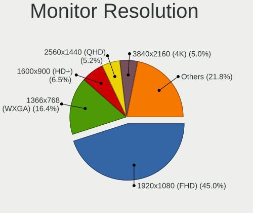

| Resolution         | Notebooks | Percent |
|--------------------|-----------|---------|
| 1920x1080 (FHD)    | 794       | 45.04%  |
| 1366x768 (WXGA)    | 290       | 16.45%  |
| 1600x900 (HD+)     | 114       | 6.47%   |
| 2560x1440 (QHD)    | 91        | 5.16%   |
| 3840x2160 (4K)     | 89        | 5.05%   |
| 1920x1200 (WUXGA)  | 65        | 3.69%   |
| 1280x800 (WXGA)    | 65        | 3.69%   |
| 1440x900 (WXGA+)   | 34        | 1.93%   |
| 2880x1800          | 32        | 1.82%   |
| 2560x1600          | 29        | 1.64%   |
| 3440x1440          | 20        | 1.13%   |
| 1680x1050 (WSXGA+) | 19        | 1.08%   |
| 800x1280           | 16        | 0.91%   |
| 3840x2400          | 14        | 0.79%   |
| Unknown            | 11        | 0.62%   |
| 3840x1080          | 7         | 0.4%    |
| 1280x1024 (SXGA)   | 7         | 0.4%    |
| 1024x600           | 7         | 0.4%    |
| 2560x1080          | 6         | 0.34%   |
| 2288x1287          | 5         | 0.28%   |
| 2256x1504          | 5         | 0.28%   |
| 3456x2160          | 4         | 0.23%   |
| 3200x1800 (QHD+)   | 4         | 0.23%   |
| 2160x1440          | 4         | 0.23%   |
| 1920x540           | 4         | 0.23%   |
| 3072x1920          | 3         | 0.17%   |
| 2880x1920          | 3         | 0.17%   |
| 1360x768           | 3         | 0.17%   |
| 3840x1600          | 2         | 0.11%   |
| 2880x1620          | 2         | 0.11%   |
| 2520x1680          | 2         | 0.11%   |
| 1600x1200          | 2         | 0.11%   |
| 3840x1200          | 1         | 0.06%   |
| 3200x2000          | 1         | 0.06%   |
| 3000x2000          | 1         | 0.06%   |
| 2960x1050          | 1         | 0.06%   |
| 2944x1840          | 1         | 0.06%   |
| 2304x1440          | 1         | 0.06%   |
| 2048x1280          | 1         | 0.06%   |
| 1920x1280          | 1         | 0.06%   |

Monitor Diagonal
----------------

Diagonal size in inches

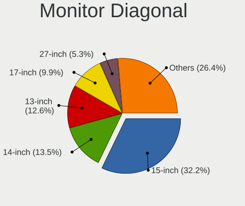

| Inches  | Notebooks | Percent |
|---------|-----------|---------|
| 15      | 603       | 32.21%  |
| 14      | 253       | 13.51%  |
| 13      | 236       | 12.61%  |
| 17      | 186       | 9.94%   |
| 27      | 100       | 5.34%   |
| 24      | 77        | 4.11%   |
| 16      | 59        | 3.15%   |
| 12      | 59        | 3.15%   |
| 23      | 38        | 2.03%   |
| 21      | 34        | 1.82%   |
| 31      | 30        | 1.6%    |
| 11      | 25        | 1.34%   |
| 34      | 24        | 1.28%   |
| Unknown | 24        | 1.28%   |
| 7       | 14        | 0.75%   |
| 22      | 13        | 0.69%   |
| 10      | 10        | 0.53%   |
| 18      | 9         | 0.48%   |
| 54      | 8         | 0.43%   |
| 25      | 8         | 0.43%   |
| 19      | 8         | 0.43%   |
| 20      | 7         | 0.37%   |
| 84      | 5         | 0.27%   |
| 40      | 5         | 0.27%   |
| 142     | 4         | 0.21%   |
| 32      | 4         | 0.21%   |
| 49      | 3         | 0.16%   |
| 28      | 3         | 0.16%   |
| 3       | 3         | 0.16%   |
| 72      | 2         | 0.11%   |
| 48      | 2         | 0.11%   |
| 39      | 2         | 0.11%   |
| 37      | 2         | 0.11%   |
| 86      | 1         | 0.05%   |
| 85      | 1         | 0.05%   |
| 65      | 1         | 0.05%   |
| 63      | 1         | 0.05%   |
| 55      | 1         | 0.05%   |
| 52      | 1         | 0.05%   |
| 47      | 1         | 0.05%   |

Monitor Width
-------------

Physical width

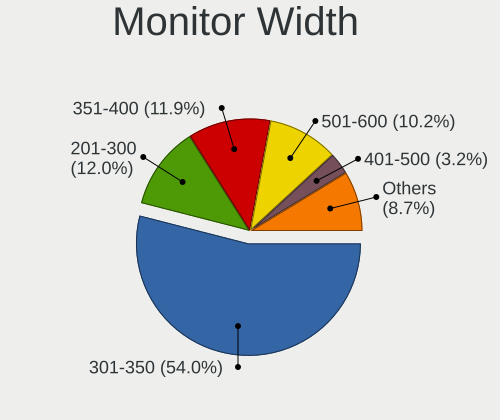

| Width in mm    | Notebooks | Percent |
|----------------|-----------|---------|
| 301-350        | 993       | 54%     |
| 201-300        | 221       | 12.02%  |
| 351-400        | 219       | 11.91%  |
| 501-600        | 188       | 10.22%  |
| 401-500        | 58        | 3.15%   |
| 601-700        | 49        | 2.66%   |
| 701-800        | 29        | 1.58%   |
| Unknown        | 24        | 1.31%   |
| 1001-1500      | 20        | 1.09%   |
| 1-100          | 16        | 0.87%   |
| 801-900        | 10        | 0.54%   |
| 1501-2000      | 8         | 0.44%   |
| More than 2000 | 4         | 0.22%   |

Aspect Ratio
------------

Proportional relationship between the width and the height

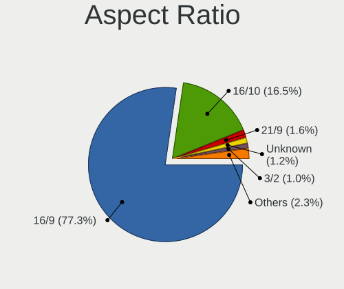

| Ratio   | Notebooks | Percent |
|---------|-----------|---------|
| 16/9    | 1271      | 77.31%  |
| 16/10   | 272       | 16.55%  |
| 21/9    | 27        | 1.64%   |
| Unknown | 20        | 1.22%   |
| 3/2     | 17        | 1.03%   |
| 0.67    | 12        | 0.73%   |
| 5/4     | 7         | 0.43%   |
| 32/9    | 5         | 0.3%    |
| 6/5     | 4         | 0.24%   |
| 1.00    | 4         | 0.24%   |
| 0.62    | 2         | 0.12%   |
| 4/3     | 1         | 0.06%   |
| 3.20    | 1         | 0.06%   |
| 0.56    | 1         | 0.06%   |

Monitor Area
------------

Area in inch²

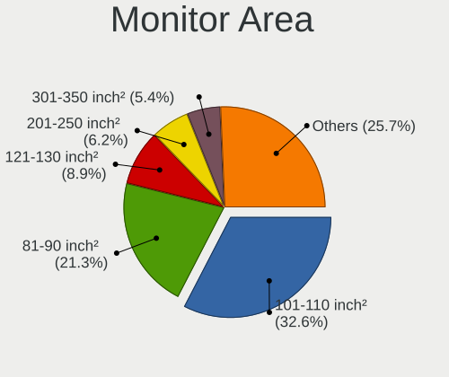

| Area in inch² | Notebooks | Percent |
|----------------|-----------|---------|
| 101-110        | 607       | 32.6%   |
| 81-90          | 396       | 21.27%  |
| 121-130        | 166       | 8.92%   |
| 201-250        | 115       | 6.18%   |
| 301-350        | 100       | 5.37%   |
| 71-80          | 89        | 4.78%   |
| 351-500        | 60        | 3.22%   |
| 61-70          | 59        | 3.17%   |
| 111-120        | 48        | 2.58%   |
| 251-300        | 42        | 2.26%   |
| More than 1000 | 25        | 1.34%   |
| 51-60          | 25        | 1.34%   |
| 151-200        | 25        | 1.34%   |
| Unknown        | 24        | 1.29%   |
| 131-140        | 23        | 1.24%   |
| 501-1000       | 17        | 0.91%   |
| 1-40           | 16        | 0.86%   |
| 41-50          | 10        | 0.54%   |
| 141-150        | 8         | 0.43%   |
| 91-100         | 7         | 0.38%   |

Pixel Density
-------------

Pixels per inch

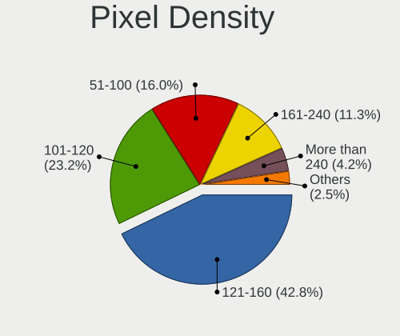

| Density       | Notebooks | Percent |
|---------------|-----------|---------|
| 121-160       | 779       | 42.83%  |
| 101-120       | 422       | 23.2%   |
| 51-100        | 291       | 16%     |
| 161-240       | 205       | 11.27%  |
| More than 240 | 77        | 4.23%   |
| Unknown       | 24        | 1.32%   |
| 1-50          | 21        | 1.15%   |

Multiple Monitors
-----------------

Total monitors connected

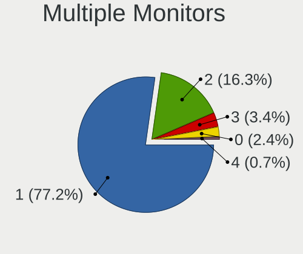

| Total | Notebooks | Percent |
|-------|-----------|---------|
| 1     | 1248      | 77.23%  |
| 2     | 263       | 16.27%  |
| 3     | 55        | 3.4%    |
| 0     | 38        | 2.35%   |
| 4     | 12        | 0.74%   |

Network
-------

Net Controller Vendor
---------------------

Controller vendors

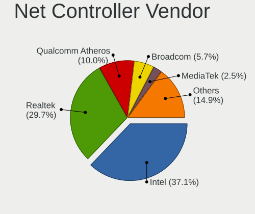

| Vendor                            | Notebooks | Percent |
|-----------------------------------|-----------|---------|
| Intel                             | 941       | 37.13%  |
| Realtek Semiconductor             | 753       | 29.72%  |
| Qualcomm Atheros                  | 254       | 10.02%  |
| Broadcom                          | 145       | 5.72%   |
| MediaTek                          | 63        | 2.49%   |
| Broadcom Limited                  | 32        | 1.26%   |
| Sierra Wireless                   | 28        | 1.1%    |
| Marvell Technology Group          | 21        | 0.83%   |
| Ericsson Business Mobile Networks | 21        | 0.83%   |
| Lenovo                            | 20        | 0.79%   |
| Dell                              | 20        | 0.79%   |
| ASIX Electronics                  | 20        | 0.79%   |
| Ralink                            | 18        | 0.71%   |
| Qualcomm                          | 18        | 0.71%   |
| Shenzhen Goodix Technology        | 17        | 0.67%   |
| DisplayLink                       | 14        | 0.55%   |
| Fibocom                           | 13        | 0.51%   |
| Nvidia                            | 12        | 0.47%   |
| Huawei Technologies               | 12        | 0.47%   |
| Hewlett-Packard                   | 12        | 0.47%   |
| TP-Link                           | 11        | 0.43%   |
| Samsung Electronics               | 10        | 0.39%   |
| NetGear                           | 7         | 0.28%   |
| JMicron Technology                | 6         | 0.24%   |
| Google                            | 6         | 0.24%   |
| Edimax Technology                 | 6         | 0.24%   |
| Xiaomi                            | 5         | 0.2%    |
| OnePlus Technology (Shenzhen)     | 5         | 0.2%    |
| ZyXEL Communications              | 4         | 0.16%   |
| ASUSTek Computer                  | 4         | 0.16%   |
| Ralink Technology                 | 3         | 0.12%   |
| Apple                             | 3         | 0.12%   |
| Silicon Integrated Systems [SiS]  | 2         | 0.08%   |
| Quectel Wireless Solutions        | 2         | 0.08%   |
| Qualcomm Atheros Communications   | 2         | 0.08%   |
| Motorola PCS                      | 2         | 0.08%   |
| Motorcomm Microelectronics.       | 2         | 0.08%   |
| Linksys                           | 2         | 0.08%   |
| D-Link System                     | 2         | 0.08%   |
| ZyDAS                             | 1         | 0.04%   |

Net Controller Model
--------------------

Controller models

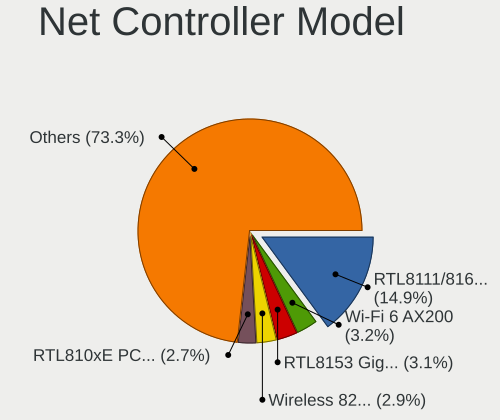

| Model                                                                  | Notebooks | Percent |
|------------------------------------------------------------------------|-----------|---------|
| Realtek RTL8111/8168/8211/8411 PCI Express Gigabit Ethernet Controller | 467       | 14.92%  |
| Intel Wi-Fi 6 AX200                                                    | 99        | 3.16%   |
| Realtek RTL8153 Gigabit Ethernet Adapter                               | 96        | 3.07%   |
| Intel Wireless 8265 / 8275                                             | 92        | 2.94%   |
| Realtek RTL810xE PCI Express Fast Ethernet controller                  | 83        | 2.65%   |
| Intel 82579LM Gigabit Network Connection (Lewisville)                  | 74        | 2.36%   |
| Intel Wi-Fi 6 AX201                                                    | 54        | 1.73%   |
| Intel Wireless 8260                                                    | 53        | 1.69%   |
| Intel Wireless 7265                                                    | 49        | 1.57%   |
| Intel Centrino Advanced-N 6205 [Taylor Peak]                           | 48        | 1.53%   |
| Realtek RTL8822CE 802.11ac PCIe Wireless Network Adapter               | 46        | 1.47%   |
| Qualcomm Atheros AR9285 Wireless Network Adapter (PCI-Express)         | 45        | 1.44%   |
| Intel Wireless 7260                                                    | 44        | 1.41%   |
| Intel Comet Lake PCH-LP CNVi WiFi                                      | 43        | 1.37%   |
| Qualcomm Atheros QCA9377 802.11ac Wireless Network Adapter             | 35        | 1.12%   |
| Intel Wireless 3165                                                    | 33        | 1.05%   |
| Qualcomm Atheros QCA6174 802.11ac Wireless Network Adapter             | 31        | 0.99%   |
| Intel Cannon Point-LP CNVi [Wireless-AC]                               | 31        | 0.99%   |
| Realtek RTL8821CE 802.11ac PCIe Wireless Network Adapter               | 30        | 0.96%   |
| Qualcomm Atheros QCA9565 / AR9565 Wireless Network Adapter             | 29        | 0.93%   |
| Qualcomm Atheros AR9485 Wireless Network Adapter                       | 29        | 0.93%   |
| Intel Raptor Lake PCH CNVi WiFi                                        | 29        | 0.93%   |
| Intel Ethernet Connection I219-LM                                      | 28        | 0.89%   |
| Intel Centrino Ultimate-N 6300                                         | 28        | 0.89%   |
| Intel Ethernet Connection (4) I219-V                                   | 25        | 0.8%    |
| Intel Alder Lake-P PCH CNVi WiFi                                       | 25        | 0.8%    |
| Intel Ethernet Connection I218-LM                                      | 24        | 0.77%   |
| Realtek RTL8723BE PCIe Wireless Network Adapter                        | 23        | 0.74%   |
| MediaTek MT7922 802.11ax PCI Express Wireless Network Adapter          | 23        | 0.74%   |
| MediaTek MT7921 802.11ax PCIe Wireless Network Adapter [Filogic 330]   | 23        | 0.74%   |
| Intel Ethernet Connection (4) I219-LM                                  | 23        | 0.74%   |
| Intel 82577LM Gigabit Network Connection                               | 23        | 0.74%   |
| Broadcom BCM43142 802.11b/g/n                                          | 23        | 0.74%   |
| Intel Wi-Fi 6E(802.11ax) AX210/AX1675* 2x2 [Typhoon Peak]              | 22        | 0.7%    |
| Intel Ethernet Connection (6) I219-V                                   | 21        | 0.67%   |
| Intel Ethernet Connection (3) I218-LM                                  | 21        | 0.67%   |
| Intel Comet Lake PCH CNVi WiFi                                         | 21        | 0.67%   |
| Intel 82567LM Gigabit Network Connection                               | 20        | 0.64%   |
| Qualcomm Atheros AR8151 v2.0 Gigabit Ethernet                          | 19        | 0.61%   |
| Intel Wi-Fi 5(802.11ac) Wireless-AC 9x6x [Thunder Peak]                | 19        | 0.61%   |

Wireless Vendor
---------------

Wireless vendors

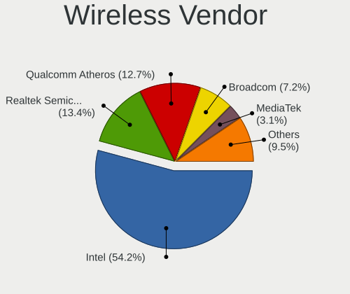

| Vendor                            | Notebooks | Percent |
|-----------------------------------|-----------|---------|
| Intel                             | 899       | 54.19%  |
| Realtek Semiconductor             | 223       | 13.44%  |
| Qualcomm Atheros                  | 210       | 12.66%  |
| Broadcom                          | 119       | 7.17%   |
| MediaTek                          | 51        | 3.07%   |
| Sierra Wireless                   | 28        | 1.69%   |
| Broadcom Limited                  | 19        | 1.15%   |
| Ralink                            | 18        | 1.08%   |
| Qualcomm                          | 17        | 1.02%   |
| Dell                              | 14        | 0.84%   |
| Fibocom                           | 13        | 0.78%   |
| TP-Link                           | 11        | 0.66%   |
| NetGear                           | 6         | 0.36%   |
| Edimax Technology                 | 6         | 0.36%   |
| ZyXEL Communications              | 4         | 0.24%   |
| ASUSTek Computer                  | 4         | 0.24%   |
| Ralink Technology                 | 3         | 0.18%   |
| Quectel Wireless Solutions        | 2         | 0.12%   |
| Qualcomm Atheros Communications   | 2         | 0.12%   |
| Hewlett-Packard                   | 2         | 0.12%   |
| D-Link System                     | 2         | 0.12%   |
| ZyDAS                             | 1         | 0.06%   |
| Sitecom Europe                    | 1         | 0.06%   |
| Qualcomm Technologies             | 1         | 0.06%   |
| Linksys                           | 1         | 0.06%   |
| Ericsson Business Mobile Networks | 1         | 0.06%   |
| D-Link                            | 1         | 0.06%   |

Wireless Model
--------------

Wireless models

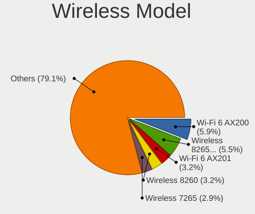

| Model                                                                   | Notebooks | Percent |
|-------------------------------------------------------------------------|-----------|---------|
| Intel Wi-Fi 6 AX200                                                     | 99        | 5.95%   |
| Intel Wireless 8265 / 8275                                              | 92        | 5.53%   |
| Intel Wi-Fi 6 AX201                                                     | 54        | 3.25%   |
| Intel Wireless 8260                                                     | 53        | 3.19%   |
| Intel Wireless 7265                                                     | 49        | 2.94%   |
| Intel Centrino Advanced-N 6205 [Taylor Peak]                            | 48        | 2.88%   |
| Realtek RTL8822CE 802.11ac PCIe Wireless Network Adapter                | 46        | 2.76%   |
| Qualcomm Atheros AR9285 Wireless Network Adapter (PCI-Express)          | 45        | 2.7%    |
| Intel Wireless 7260                                                     | 44        | 2.64%   |
| Intel Comet Lake PCH-LP CNVi WiFi                                       | 43        | 2.58%   |
| Qualcomm Atheros QCA9377 802.11ac Wireless Network Adapter              | 35        | 2.1%    |
| Intel Wireless 3165                                                     | 33        | 1.98%   |
| Qualcomm Atheros QCA6174 802.11ac Wireless Network Adapter              | 31        | 1.86%   |
| Intel Cannon Point-LP CNVi [Wireless-AC]                                | 31        | 1.86%   |
| Realtek RTL8821CE 802.11ac PCIe Wireless Network Adapter                | 30        | 1.8%    |
| Qualcomm Atheros QCA9565 / AR9565 Wireless Network Adapter              | 29        | 1.74%   |
| Qualcomm Atheros AR9485 Wireless Network Adapter                        | 29        | 1.74%   |
| Intel Raptor Lake PCH CNVi WiFi                                         | 29        | 1.74%   |
| Intel Centrino Ultimate-N 6300                                          | 28        | 1.68%   |
| Realtek RTL8723BE PCIe Wireless Network Adapter                         | 23        | 1.38%   |
| MediaTek MT7921 802.11ax PCIe Wireless Network Adapter [Filogic 330]    | 23        | 1.38%   |
| Broadcom BCM43142 802.11b/g/n                                           | 23        | 1.38%   |
| Intel Wi-Fi 6E(802.11ax) AX210/AX1675* 2x2 [Typhoon Peak]               | 22        | 1.32%   |
| Intel Comet Lake PCH CNVi WiFi                                          | 21        | 1.26%   |
| Intel Wi-Fi 5(802.11ac) Wireless-AC 9x6x [Thunder Peak]                 | 19        | 1.14%   |
| Broadcom BCM4313 802.11bgn Wireless Network Adapter                     | 19        | 1.14%   |
| Realtek RTL8852AE 802.11ax PCIe Wireless Network Adapter                | 18        | 1.08%   |
| Intel Cannon Lake PCH CNVi WiFi                                         | 18        | 1.08%   |
| Realtek RTL8822BE 802.11a/b/g/n/ac WiFi adapter                         | 17        | 1.02%   |
| MediaTek MT7922 802.11ax PCI Express Wireless Network Adapter           | 17        | 1.02%   |
| Intel Alder Lake-P PCH CNVi WiFi                                        | 17        | 1.02%   |
| Sierra Wireless EM7455                                                  | 16        | 0.96%   |
| Intel Wireless 3160                                                     | 16        | 0.96%   |
| Intel WiFi Link 5100                                                    | 16        | 0.96%   |
| Broadcom BCM4331 802.11a/b/g/n                                          | 14        | 0.84%   |
| Qualcomm QCNFA765 Wireless Network Adapter                              | 13        | 0.78%   |
| Qualcomm Atheros AR9462 Wireless Network Adapter                        | 13        | 0.78%   |
| Qualcomm Atheros AR242x / AR542x Wireless Network Adapter (PCI-Express) | 13        | 0.78%   |
| Intel PRO/Wireless 3945ABG [Golan] Network Connection                   | 13        | 0.78%   |
| Intel Ice Lake-LP PCH CNVi WiFi                                         | 13        | 0.78%   |

Ethernet Vendor
---------------

Ethernet vendors

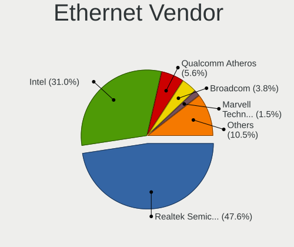

| Vendor                           | Notebooks | Percent |
|----------------------------------|-----------|---------|
| Realtek Semiconductor            | 653       | 47.59%  |
| Intel                            | 425       | 30.98%  |
| Qualcomm Atheros                 | 77        | 5.61%   |
| Broadcom                         | 52        | 3.79%   |
| Marvell Technology Group         | 21        | 1.53%   |
| Lenovo                           | 20        | 1.46%   |
| ASIX Electronics                 | 20        | 1.46%   |
| DisplayLink                      | 14        | 1.02%   |
| Broadcom Limited                 | 13        | 0.95%   |
| Nvidia                           | 12        | 0.87%   |
| MediaTek                         | 11        | 0.8%    |
| Samsung Electronics              | 10        | 0.73%   |
| JMicron Technology               | 6         | 0.44%   |
| Google                           | 6         | 0.44%   |
| Xiaomi                           | 5         | 0.36%   |
| OnePlus Technology (Shenzhen)    | 5         | 0.36%   |
| Huawei Technologies              | 4         | 0.29%   |
| Hewlett-Packard                  | 3         | 0.22%   |
| Apple                            | 3         | 0.22%   |
| Motorola PCS                     | 2         | 0.15%   |
| Motorcomm Microelectronics.      | 2         | 0.15%   |
| Silicon Integrated Systems [SiS] | 1         | 0.07%   |
| Research In Motion               | 1         | 0.07%   |
| Qualcomm                         | 1         | 0.07%   |
| NetGear                          | 1         | 0.07%   |
| Linksys                          | 1         | 0.07%   |
| Cypress Semiconductor            | 1         | 0.07%   |
| Attansic Technology              | 1         | 0.07%   |
| Aquantia                         | 1         | 0.07%   |

Ethernet Model
--------------

Ethernet models

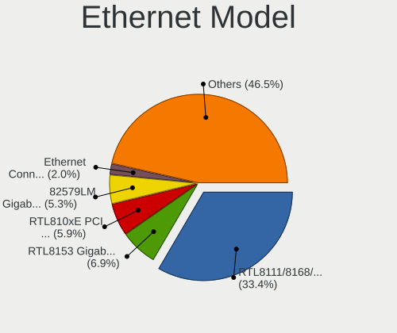

| Model                                                                  | Notebooks | Percent |
|------------------------------------------------------------------------|-----------|---------|
| Realtek RTL8111/8168/8211/8411 PCI Express Gigabit Ethernet Controller | 467       | 33.43%  |
| Realtek RTL8153 Gigabit Ethernet Adapter                               | 96        | 6.87%   |
| Realtek RTL810xE PCI Express Fast Ethernet controller                  | 83        | 5.94%   |
| Intel 82579LM Gigabit Network Connection (Lewisville)                  | 74        | 5.3%    |
| Intel Ethernet Connection I219-LM                                      | 28        | 2%      |
| Intel Ethernet Connection (4) I219-V                                   | 25        | 1.79%   |
| Intel Ethernet Connection I218-LM                                      | 24        | 1.72%   |
| Intel Ethernet Connection (4) I219-LM                                  | 23        | 1.65%   |
| Intel 82577LM Gigabit Network Connection                               | 23        | 1.65%   |
| Intel Ethernet Connection (6) I219-V                                   | 21        | 1.5%    |
| Intel Ethernet Connection (3) I218-LM                                  | 21        | 1.5%    |
| Intel 82567LM Gigabit Network Connection                               | 20        | 1.43%   |
| Qualcomm Atheros AR8151 v2.0 Gigabit Ethernet                          | 19        | 1.36%   |
| ASIX AX88179 Gigabit Ethernet                                          | 18        | 1.29%   |
| Intel Ethernet Connection I219-V                                       | 16        | 1.15%   |
| Broadcom NetXtreme BCM57765 Gigabit Ethernet PCIe                      | 14        | 1%      |
| Intel Ethernet Connection I217-LM                                      | 12        | 0.86%   |
| Intel Ethernet Connection (13) I219-V                                  | 12        | 0.86%   |
| Intel Ethernet Connection (10) I219-V                                  | 12        | 0.86%   |
| Qualcomm Atheros QCA8171 Gigabit Ethernet                              | 11        | 0.79%   |
| Intel Ethernet Connection (7) I219-LM                                  | 11        | 0.79%   |
| Intel Ethernet Connection (6) I219-LM                                  | 10        | 0.72%   |
| Realtek RTL8125 2.5GbE Controller                                      | 9         | 0.64%   |
| Lenovo USB-C Dock Ethernet                                             | 9         | 0.64%   |
| Intel Ethernet Connection (23) I219-LM                                 | 9         | 0.64%   |
| Broadcom NetLink BCM57785 Gigabit Ethernet PCIe                        | 9         | 0.64%   |
| Qualcomm Atheros QCA8172 Fast Ethernet                                 | 8         | 0.57%   |
| Nvidia MCP79 Ethernet                                                  | 8         | 0.57%   |
| Intel Ethernet Connection (13) I219-LM                                 | 8         | 0.57%   |
| Intel Alder Lake-P PCH CNVi WiFi                                       | 8         | 0.57%   |
| Realtek RTL8152 Fast Ethernet Adapter                                  | 7         | 0.5%    |
| Qualcomm Atheros AR8161 Gigabit Ethernet                               | 7         | 0.5%    |
| Qualcomm Atheros AR8131 Gigabit Ethernet                               | 7         | 0.5%    |
| Broadcom NetXtreme BCM57786 Gigabit Ethernet PCIe                      | 7         | 0.5%    |
| Broadcom Limited NetLink BCM57780 Gigabit Ethernet PCIe                | 7         | 0.5%    |
| Samsung Galaxy series, misc. (tethering mode)                          | 6         | 0.43%   |
| Realtek Killer E2600 GbE Controller                                    | 6         | 0.43%   |
| Qualcomm Atheros Killer E2500 Gigabit Ethernet Controller              | 6         | 0.43%   |
| MediaTek MT7922 802.11ax PCI Express Wireless Network Adapter          | 6         | 0.43%   |
| Intel Ethernet Connection (3) I218-V                                   | 6         | 0.43%   |

Net Controller Kind
-------------------

Ethernet, WiFi or modem

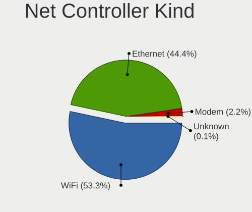

| Kind     | Notebooks | Percent |
|----------|-----------|---------|
| WiFi     | 1536      | 53.31%  |
| Ethernet | 1278      | 44.36%  |
| Modem    | 63        | 2.19%   |
| Unknown  | 4         | 0.14%   |

Used Controller
---------------

Currently used network controller

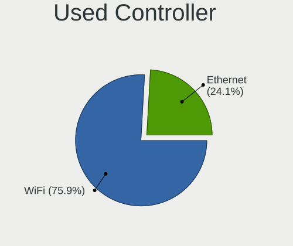

| Kind     | Notebooks | Percent |
|----------|-----------|---------|
| WiFi     | 1259      | 75.89%  |
| Ethernet | 400       | 24.11%  |

NICs
----

Total network controllers on board

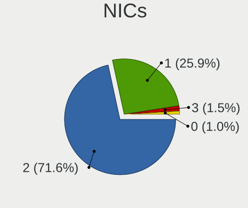

| Total | Notebooks | Percent |
|-------|-----------|---------|
| 2     | 1127      | 71.6%   |
| 1     | 408       | 25.92%  |
| 3     | 23        | 1.46%   |
| 0     | 16        | 1.02%   |

IPv6
----

IPv6 vs IPv4

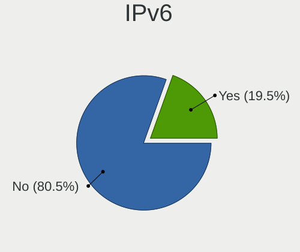

| Used | Notebooks | Percent |
|------|-----------|---------|
| No   | 1289      | 80.46%  |
| Yes  | 313       | 19.54%  |

Bluetooth
---------

Bluetooth Vendor
----------------

Controller vendors

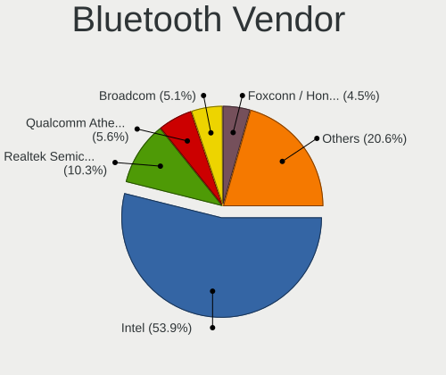

| Vendor                          | Notebooks | Percent |
|---------------------------------|-----------|---------|
| Intel                           | 699       | 53.89%  |
| Realtek Semiconductor           | 134       | 10.33%  |
| Qualcomm Atheros Communications | 73        | 5.63%   |
| Broadcom                        | 66        | 5.09%   |
| Foxconn / Hon Hai               | 58        | 4.47%   |
| IMC Networks                    | 56        | 4.32%   |
| Apple                           | 47        | 3.62%   |
| Lite-On Technology              | 44        | 3.39%   |
| Dell                            | 23        | 1.77%   |
| Hewlett-Packard                 | 22        | 1.7%    |
| MediaTek                        | 13        | 1%      |
| Toshiba                         | 12        | 0.93%   |
| Cambridge Silicon Radio         | 12        | 0.93%   |
| USI                             | 10        | 0.77%   |
| Foxconn International           | 6         | 0.46%   |
| Ralink                          | 5         | 0.39%   |
| ASUSTek Computer                | 4         | 0.31%   |
| Realtek                         | 3         | 0.23%   |
| TP-Link                         | 2         | 0.15%   |
| Alps Electric                   | 2         | 0.15%   |
| Taiyo Yuden                     | 1         | 0.08%   |
| i.Tech Dynamic Limited          | 1         | 0.08%   |
| Fujitsu                         | 1         | 0.08%   |
| Edimax Technology               | 1         | 0.08%   |
| Belkin Components               | 1         | 0.08%   |
| Askey Computer                  | 1         | 0.08%   |

Bluetooth Model
---------------

Controller models

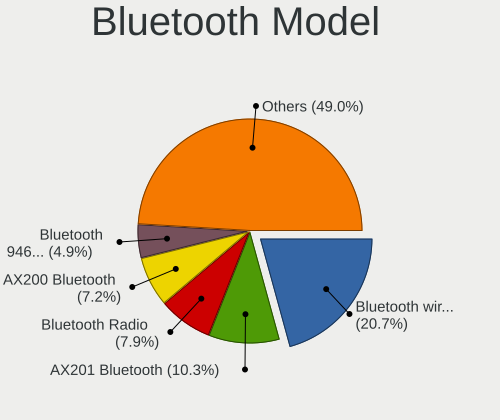

| Model                                               | Notebooks | Percent |
|-----------------------------------------------------|-----------|---------|
| Intel Bluetooth wireless interface                  | 269       | 20.74%  |
| Intel AX201 Bluetooth                               | 133       | 10.25%  |
| Realtek Bluetooth Radio                             | 102       | 7.86%   |
| Intel AX200 Bluetooth                               | 94        | 7.25%   |
| Intel Bluetooth 9460/9560 Jefferson Peak (JfP)      | 63        | 4.86%   |
| Intel Bluetooth Device                              | 59        | 4.55%   |
| Apple Bluetooth Host Controller                     | 25        | 1.93%   |
| Qualcomm Atheros AR3011 Bluetooth                   | 24        | 1.85%   |
| IMC Networks Bluetooth Radio                        | 24        | 1.85%   |
| Intel AX210 Bluetooth                               | 21        | 1.62%   |
| Intel Centrino Bluetooth Wireless Transceiver       | 20        | 1.54%   |
| Qualcomm Atheros QCA61x4 Bluetooth 4.0              | 19        | 1.46%   |
| Intel Wireless-AC 9260 Bluetooth Adapter            | 19        | 1.46%   |
| Realtek  Bluetooth 4.2 Adapter                      | 18        | 1.39%   |
| Foxconn / Hon Hai Bluetooth Device                  | 18        | 1.39%   |
| Broadcom BCM2045B (BDC-2.1)                         | 18        | 1.39%   |
| IMC Networks Wireless_Device                        | 17        | 1.31%   |
| Qualcomm Atheros  Bluetooth Device                  | 16        | 1.23%   |
| Apple Bluetooth USB Host Controller                 | 16        | 1.23%   |
| Lite-On Qualcomm Atheros QCA9377 Bluetooth          | 15        | 1.16%   |
| Foxconn / Hon Hai Wireless_Device                   | 14        | 1.08%   |
| Intel Centrino Advanced-N 6230 Bluetooth adapter    | 13        | 1%      |
| HP Broadcom 2070 Bluetooth Combo                    | 12        | 0.93%   |
| Cambridge Silicon Radio Bluetooth Dongle (HCI mode) | 12        | 0.93%   |
| Qualcomm Atheros AR3012 Bluetooth 4.0               | 11        | 0.85%   |
| MediaTek Wireless_Device                            | 11        | 0.85%   |
| Broadcom BCM20702 Bluetooth 4.0 [ThinkPad]          | 11        | 0.85%   |
| USI Bluetooth Device                                | 10        | 0.77%   |
| Lite-On Atheros AR3012 Bluetooth                    | 10        | 0.77%   |
| HP Bluetooth 2.0 Interface [Broadcom BCM2045]       | 10        | 0.77%   |
| Lite-On Bluetooth Device                            | 9         | 0.69%   |
| IMC Networks Bluetooth Device                       | 9         | 0.69%   |
| Foxconn / Hon Hai MediaTek Bluetooth Adapter        | 9         | 0.69%   |
| Dell BCM20702A0 Bluetooth Module                    | 9         | 0.69%   |
| Intel Wireless-AC 3168 Bluetooth                    | 8         | 0.62%   |
| Broadcom HP Portable SoftSailing                    | 8         | 0.62%   |
| Lite-On Wireless_Device                             | 7         | 0.54%   |
| Dell DW375 Bluetooth Module                         | 7         | 0.54%   |
| Broadcom BCM43142A0 Bluetooth 4.0                   | 7         | 0.54%   |
| Realtek RTL8822BE Bluetooth 4.2 Adapter             | 6         | 0.46%   |

Sound
-----

Sound Vendor
------------

Sound card vendors

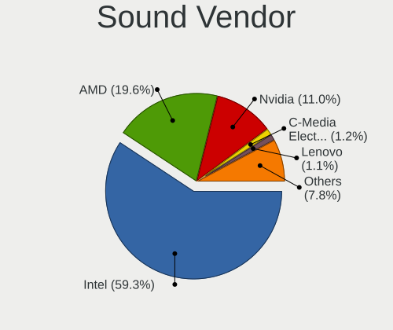

| Vendor                           | Notebooks | Percent |
|----------------------------------|-----------|---------|
| Intel                            | 1186      | 59.3%   |
| AMD                              | 391       | 19.55%  |
| Nvidia                           | 220       | 11%     |
| C-Media Electronics              | 24        | 1.2%    |
| Lenovo                           | 23        | 1.15%   |
| Logitech                         | 19        | 0.95%   |
| Realtek Semiconductor            | 15        | 0.75%   |
| GN Netcom                        | 13        | 0.65%   |
| Hewlett-Packard                  | 11        | 0.55%   |
| Apple                            | 9         | 0.45%   |
| Creative Technology              | 8         | 0.4%    |
| Texas Instruments                | 6         | 0.3%    |
| Sony                             | 5         | 0.25%   |
| Plantronics                      | 5         | 0.25%   |
| SteelSeries ApS                  | 4         | 0.2%    |
| RODE Microphones                 | 4         | 0.2%    |
| Focusrite-Novation               | 4         | 0.2%    |
| Yamaha                           | 3         | 0.15%   |
| DSEA A/S                         | 3         | 0.15%   |
| Corsair                          | 3         | 0.15%   |
| BEHRINGER International          | 3         | 0.15%   |
| ZOOM                             | 2         | 0.1%    |
| Silicon Integrated Systems [SiS] | 2         | 0.1%    |
| Sennheiser Communications        | 2         | 0.1%    |
| Kingston Technology              | 2         | 0.1%    |
| JMTek                            | 2         | 0.1%    |
| Generalplus Technology           | 2         | 0.1%    |
| AudioQuest                       | 2         | 0.1%    |
| ASUSTek Computer                 | 2         | 0.1%    |
| XMOS                             | 1         | 0.05%   |
| Valve Software                   | 1         | 0.05%   |
| Tenx Technology                  | 1         | 0.05%   |
| Silicon Motion                   | 1         | 0.05%   |
| SAVITECH                         | 1         | 0.05%   |
| Samsung Electronics              | 1         | 0.05%   |
| Roland                           | 1         | 0.05%   |
| Razer USA                        | 1         | 0.05%   |
| PreSonus Audio Electronics       | 1         | 0.05%   |
| No brand                         | 1         | 0.05%   |
| Microsoft                        | 1         | 0.05%   |

Sound Model
-----------

Sound card models

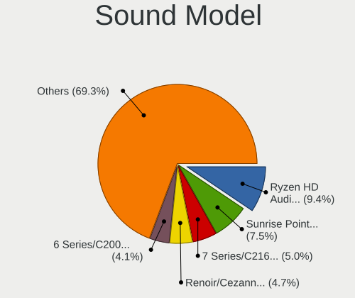

| Model                                                                                             | Notebooks | Percent |
|---------------------------------------------------------------------------------------------------|-----------|---------|
| AMD Ryzen HD Audio Controller                                                                     | 232       | 9.43%   |
| Intel Sunrise Point-LP HD Audio                                                                   | 184       | 7.48%   |
| Intel 7 Series/C216 Chipset Family High Definition Audio Controller                               | 123       | 5%      |
| AMD Renoir/Cezanne HDMI/DP Audio Controller                                                       | 116       | 4.72%   |
| Intel 6 Series/C200 Series Chipset Family High Definition Audio Controller                        | 100       | 4.07%   |
| AMD Radeon High Definition Audio Controller                                                       | 73        | 2.97%   |
| Intel Tiger Lake-LP Smart Sound Technology Audio Controller                                       | 67        | 2.72%   |
| Intel Haswell-ULT HD Audio Controller                                                             | 67        | 2.72%   |
| Intel 8 Series HD Audio Controller                                                                | 67        | 2.72%   |
| Intel Broadwell-U Audio Controller                                                                | 58        | 2.36%   |
| Intel Wildcat Point-LP High Definition Audio Controller                                           | 57        | 2.32%   |
| Intel 82801I (ICH9 Family) HD Audio Controller                                                    | 54        | 2.2%    |
| Intel Comet Lake PCH-LP cAVS                                                                      | 53        | 2.15%   |
| Intel Cannon Lake PCH cAVS                                                                        | 52        | 2.11%   |
| Intel Cannon Point-LP High Definition Audio Controller                                            | 46        | 1.87%   |
| AMD FCH Azalia Controller                                                                         | 45        | 1.83%   |
| Intel 5 Series/3400 Series Chipset High Definition Audio                                          | 44        | 1.79%   |
| Intel 8 Series/C220 Series Chipset High Definition Audio Controller                               | 40        | 1.63%   |
| AMD Raven/Raven2/Fenghuang HDMI/DP Audio Controller                                               | 36        | 1.46%   |
| AMD Kabini HDMI/DP Audio                                                                          | 35        | 1.42%   |
| Intel Raptor Lake-P/U/H cAVS                                                                      | 30        | 1.22%   |
| Intel Xeon E3-1200 v3/4th Gen Core Processor HD Audio Controller                                  | 28        | 1.14%   |
| Intel Alder Lake PCH-P High Definition Audio Controller                                           | 28        | 1.14%   |
| Intel Comet Lake PCH cAVS                                                                         | 27        | 1.1%    |
| Nvidia TU107 GeForce GTX 1650 High Definition Audio Controller                                    | 26        | 1.06%   |
| Intel CM238 HD Audio Controller                                                                   | 25        | 1.02%   |
| Intel 100 Series/C230 Series Chipset Family HD Audio Controller                                   | 25        | 1.02%   |
| AMD SBx00 Azalia (Intel HDA)                                                                      | 25        | 1.02%   |
| Intel 82801H (ICH8 Family) HD Audio Controller                                                    | 23        | 0.93%   |
| Nvidia GF108 High Definition Audio Controller                                                     | 20        | 0.81%   |
| Intel Ice Lake-LP Smart Sound Technology Audio Controller                                         | 19        | 0.77%   |
| Intel Celeron/Pentium Silver Processor High Definition Audio                                      | 19        | 0.77%   |
| Intel NM10/ICH7 Family High Definition Audio Controller                                           | 18        | 0.73%   |
| Nvidia TU106 High Definition Audio Controller                                                     | 16        | 0.65%   |
| Realtek Semiconductor USB Audio                                                                   | 15        | 0.61%   |
| AMD Family 15h (Models 60h-6fh) Audio Controller                                                  | 15        | 0.61%   |
| Nvidia GP107GL High Definition Audio Controller                                                   | 14        | 0.57%   |
| Intel Meteor Lake-P HD Audio Controller                                                           | 14        | 0.57%   |
| Intel Celeron N3350/Pentium N4200/Atom E3900 Series Audio Cluster                                 | 14        | 0.57%   |
| Intel Atom/Celeron/Pentium Processor x5-E8000/J3xxx/N3xxx Series High Definition Audio Controller | 14        | 0.57%   |

Memory
------

Memory Vendor
-------------

Memory module vendors

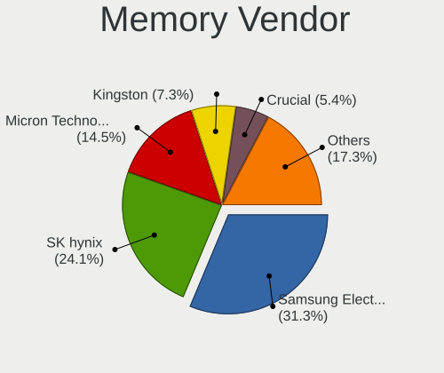

| Vendor                | Notebooks | Percent |
|-----------------------|-----------|---------|
| Samsung Electronics   | 340       | 31.31%  |
| SK hynix              | 262       | 24.13%  |
| Micron Technology     | 158       | 14.55%  |
| Kingston              | 79        | 7.27%   |
| Crucial               | 59        | 5.43%   |
| Unknown               | 52        | 4.79%   |
| Ramaxel Technology    | 34        | 3.13%   |
| Corsair               | 20        | 1.84%   |
| Elpida                | 19        | 1.75%   |
| Unknown (ABCD)        | 12        | 1.1%    |
| G.Skill               | 9         | 0.83%   |
| Nanya Technology      | 8         | 0.74%   |
| A-DATA Technology     | 8         | 0.74%   |
| Unknown               | 8         | 0.74%   |
| Transcend             | 4         | 0.37%   |
| Silicon Power         | 2         | 0.18%   |
| GOODRAM               | 2         | 0.18%   |
| Vaseky                | 1         | 0.09%   |
| Timetec               | 1         | 0.09%   |
| Smart                 | 1         | 0.09%   |
| Neo Forza             | 1         | 0.09%   |
| Kingmax Semiconductor | 1         | 0.09%   |
| Golden Empire         | 1         | 0.09%   |
| CSX                   | 1         | 0.09%   |
| ChangXin Memory       | 1         | 0.09%   |
| Avant                 | 1         | 0.09%   |
| ASint Technology      | 1         | 0.09%   |

Memory Model
------------

Memory module models

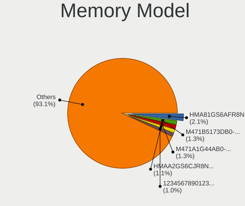

| Model                                                            | Notebooks | Percent |
|------------------------------------------------------------------|-----------|---------|
| SK hynix RAM HMA81GS6AFR8N-UH 8GB SODIMM DDR4 2667MT/s           | 24        | 2.1%    |
| Samsung RAM M471B5173DB0-YK0 4GB SODIMM DDR3 1600MT/s            | 15        | 1.31%   |
| Samsung RAM M471A1G44AB0-CWE 8GiB SODIMM DDR4 3200MT/s           | 15        | 1.31%   |
| SK hynix RAM HMAA2GS6CJR8N-XN 16GB SODIMM DDR4 3200MT/s          | 13        | 1.14%   |
| Unknown (ABCD) RAM 123456789012345678 2GB SODIMM LPDDR4 2400MT/s | 12        | 1.05%   |
| SK hynix RAM HMT451S6BFR8A-PB 4GB SODIMM DDR3 1600MT/s           | 12        | 1.05%   |
| Samsung RAM M471A1K43DB1-CWE 8GB SODIMM DDR4 3200MT/s            | 12        | 1.05%   |
| Samsung RAM M471A2G44AM0-CWE 16GB SODIMM DDR4 3200MT/s           | 10        | 0.87%   |
| Micron RAM 4ATS2G64HZ-3G2B1 16GB SODIMM DDR4 3200MT/s            | 10        | 0.87%   |
| SK hynix RAM HMAA1GS6CJR6N-XN 8GB SODIMM DDR4 3200MT/s           | 9         | 0.79%   |
| Samsung RAM M471B5273DH0-CH9 4GB SODIMM DDR3 1600MT/s            | 9         | 0.79%   |
| Samsung RAM M471B1G73QH0-YK0 8GB SODIMM DDR3 1600MT/s            | 9         | 0.79%   |
| Samsung RAM M471A1G44BB0-CWE 8GB SODIMM DDR4 3200MT/s            | 9         | 0.79%   |
| Samsung RAM M471A1G44AB0-CWE 8GB Row Of Chips DDR4 3200MT/s      | 9         | 0.79%   |
| SK hynix RAM HMT351S6CFR8C-PB 4GB SODIMM DDR3 1600MT/s           | 8         | 0.7%    |
| Samsung RAM M471B5273CH0-CH9 4GB SODIMM DDR3 1334MT/s            | 8         | 0.7%    |
| Samsung RAM M471A5244CB0-CTD 4GB SODIMM DDR4 3266MT/s            | 8         | 0.7%    |
| Samsung RAM M471A2K43DB1-CWE 16GB SODIMM DDR4 3200MT/s           | 8         | 0.7%    |
| Samsung RAM M471A2G43AB2-CWE 16GB SODIMM DDR4 3200MT/s           | 8         | 0.7%    |
| Samsung RAM M471A1K43CB1-CRC 8GB SODIMM DDR4 8400MT/s            | 8         | 0.7%    |
| Unknown                                                          | 8         | 0.7%    |
| SK hynix RAM HMT351S6EFR8A-PB 4GB SODIMM DDR3 1600MT/s           | 7         | 0.61%   |
| SK hynix RAM HMA81GS6DJR8N-XN 8GB SODIMM DDR4 3200MT/s           | 7         | 0.61%   |
| Samsung RAM M471B5773CHS-CH9 2GB SODIMM DDR3 4199MT/s            | 7         | 0.61%   |
| Samsung RAM M471A4G43MB1-CTD 32GB SODIMM DDR4 2667MT/s           | 7         | 0.61%   |
| Micron RAM Module 8GB SODIMM DDR4 3200MT/s                       | 7         | 0.61%   |
| SK hynix RAM HMT41GS6BFR8A-PB 8GB SODIMM DDR3 2667MT/s           | 6         | 0.52%   |
| Samsung RAM Module 8GB SODIMM DDR4 2133MT/s                      | 6         | 0.52%   |
| Samsung RAM Module 16GB SODIMM DDR4 3200MT/s                     | 6         | 0.52%   |
| Samsung RAM Module 16GB SODIMM DDR4 2667MT/s                     | 6         | 0.52%   |
| Samsung RAM M471B5173QH0-YK0 4GB SODIMM DDR3 1600MT/s            | 6         | 0.52%   |
| Samsung RAM M471B5173EB0-YK0 4GB SODIMM DDR3 1600MT/s            | 6         | 0.52%   |
| Samsung RAM M471A5244CB0-CWE 4GB SODIMM DDR4 3200MT/s            | 6         | 0.52%   |
| Samsung RAM M471A1K43CB1-CTD 8GB SODIMM DDR4 3200MT/s            | 6         | 0.52%   |
| SK hynix RAM HMT351S6BFR8C-H9 4GB SODIMM DDR3 1333MT/s           | 5         | 0.44%   |
| SK hynix RAM HMA81GS6JJR8N-VK 8GB SODIMM DDR4 2667MT/s           | 5         | 0.44%   |
| Samsung RAM M471B1G73EB0-YK0 8192MB SODIMM DDR3 1600MT/s         | 5         | 0.44%   |
| Samsung RAM M471B1G73DB0-YK0 8GB SODIMM DDR3 1600MT/s            | 5         | 0.44%   |
| Samsung RAM M471A2K43CB1-CTD 16GB SODIMM DDR4 8400MT/s           | 5         | 0.44%   |
| Samsung RAM M471A1K43DB1-CTD 8GB SODIMM DDR4 2667MT/s            | 5         | 0.44%   |

Memory Kind
-----------

Memory module kinds

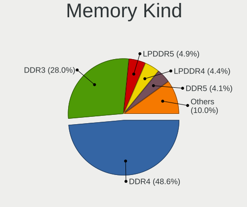

| Kind    | Notebooks | Percent |
|---------|-----------|---------|
| DDR4    | 448       | 48.59%  |
| DDR3    | 258       | 27.98%  |
| LPDDR5  | 45        | 4.88%   |
| LPDDR4  | 41        | 4.45%   |
| DDR5    | 38        | 4.12%   |
| DDR2    | 38        | 4.12%   |
| LPDDR3  | 26        | 2.82%   |
| SDRAM   | 25        | 2.71%   |
| Unknown | 3         | 0.33%   |

Memory Form Factor
------------------

Physical design of the memory module

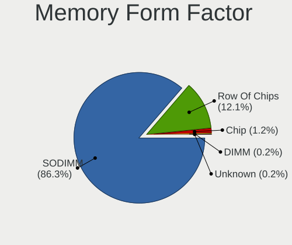

| Name         | Notebooks | Percent |
|--------------|-----------|---------|
| SODIMM       | 807       | 86.31%  |
| Row Of Chips | 113       | 12.09%  |
| Chip         | 11        | 1.18%   |
| DIMM         | 2         | 0.21%   |
| Unknown      | 2         | 0.21%   |

Memory Size
-----------

Memory module size

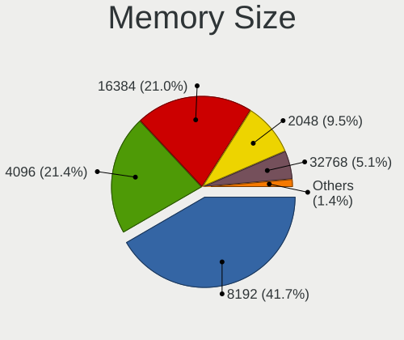

| Size  | Notebooks | Percent |
|-------|-----------|---------|
| 8192  | 419       | 41.65%  |
| 4096  | 215       | 21.37%  |
| 16384 | 211       | 20.97%  |
| 2048  | 96        | 9.54%   |
| 32768 | 51        | 5.07%   |
| 1024  | 14        | 1.39%   |

Memory Speed
------------

Memory module speed

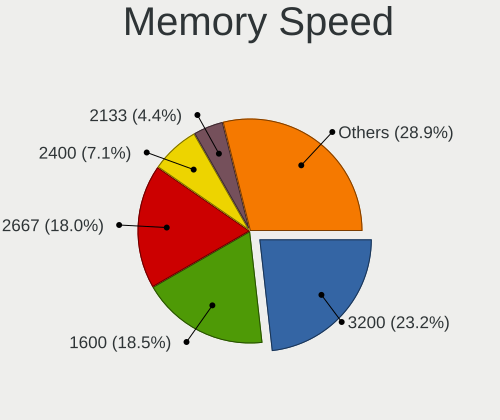

| Speed   | Notebooks | Percent |
|---------|-----------|---------|
| 3200    | 229       | 23.23%  |
| 1600    | 182       | 18.46%  |
| 2667    | 177       | 17.95%  |
| 2400    | 70        | 7.1%    |
| 2133    | 43        | 4.36%   |
| 1333    | 30        | 3.04%   |
| 5600    | 27        | 2.74%   |
| 1334    | 25        | 2.54%   |
| 6400    | 21        | 2.13%   |
| 667     | 19        | 1.93%   |
| 4267    | 15        | 1.52%   |
| 4800    | 14        | 1.42%   |
| 4199    | 14        | 1.42%   |
| 8400    | 13        | 1.32%   |
| 1067    | 12        | 1.22%   |
| 800     | 12        | 1.22%   |
| 2048    | 10        | 1.01%   |
| Unknown | 10        | 1.01%   |
| 7500    | 9         | 0.91%   |
| 1867    | 9         | 0.91%   |
| 3266    | 8         | 0.81%   |
| 7467    | 6         | 0.61%   |
| 4266    | 5         | 0.51%   |
| 8533    | 4         | 0.41%   |
| 975     | 4         | 0.41%   |
| 333     | 3         | 0.3%    |
| 8000    | 2         | 0.2%    |
| 3733    | 2         | 0.2%    |
| 2933    | 2         | 0.2%    |
| 1066    | 2         | 0.2%    |
| 533     | 2         | 0.2%    |
| 8600    | 1         | 0.1%    |
| 7400    | 1         | 0.1%    |
| 5500    | 1         | 0.1%    |
| 5200    | 1         | 0.1%    |
| 2267    | 1         | 0.1%    |

Printers & scanners
-------------------

Printer Vendor
--------------

Printer device vendors

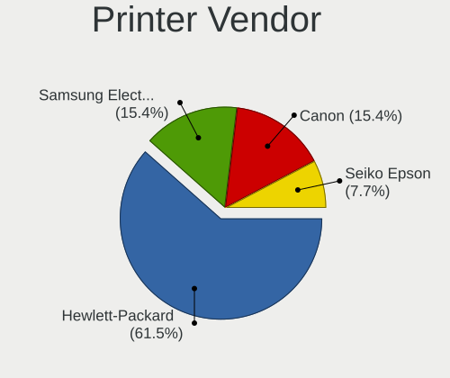

| Vendor              | Notebooks | Percent |
|---------------------|-----------|---------|
| Hewlett-Packard     | 8         | 61.54%  |
| Samsung Electronics | 2         | 15.38%  |
| Canon               | 2         | 15.38%  |
| Seiko Epson         | 1         | 7.69%   |

Printer Model
-------------

Printer device models

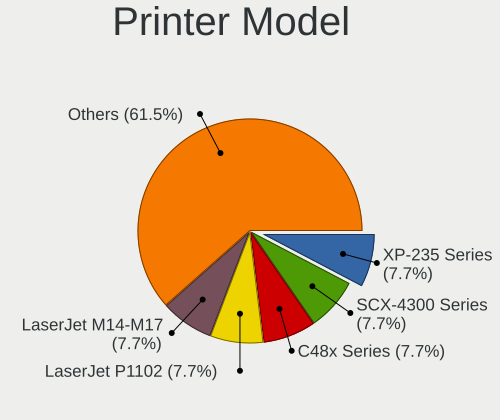

| Model                       | Notebooks | Percent |
|-----------------------------|-----------|---------|
| Seiko Epson XP-235 Series   | 1         | 7.69%   |
| Samsung SCX-4300 Series     | 1         | 7.69%   |
| Samsung C48x Series         | 1         | 7.69%   |
| HP LaserJet P1102           | 1         | 7.69%   |
| HP LaserJet M14-M17         | 1         | 7.69%   |
| HP LaserJet 1200            | 1         | 7.69%   |
| HP LaserJet 1022            | 1         | 7.69%   |
| HP ENVY Pro 6400 series     | 1         | 7.69%   |
| HP Deskjet 3520 series      | 1         | 7.69%   |
| HP DeskJet 2600 series      | 1         | 7.69%   |
| HP Deskjet 1000 J110 series | 1         | 7.69%   |
| Canon PIXMA iX6850 Printer  | 1         | 7.69%   |
| Canon MG2100 series         | 1         | 7.69%   |

Scanner Vendor
--------------

Scanner device vendors

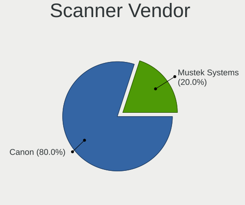

| Vendor         | Notebooks | Percent |
|----------------|-----------|---------|
| Canon          | 4         | 80%     |
| Mustek Systems | 1         | 20%     |

Scanner Model
-------------

Scanner device models

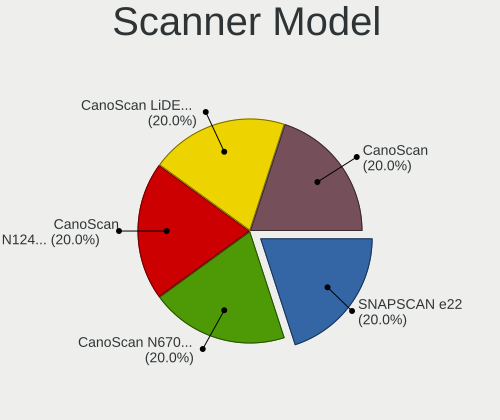

| Model                              | Notebooks | Percent |
|------------------------------------|-----------|---------|
| Mustek Systems SNAPSCAN e22        | 1         | 20%     |
| Canon CanoScan N670U/N676U/LiDE 20 | 1         | 20%     |
| Canon CanoScan N1240U/LiDE 30      | 1         | 20%     |
| Canon CanoScan LiDE 110            | 1         | 20%     |
| Canon CanoScan                     | 1         | 20%     |

Camera
------

Camera Vendor
-------------

Camera device vendors

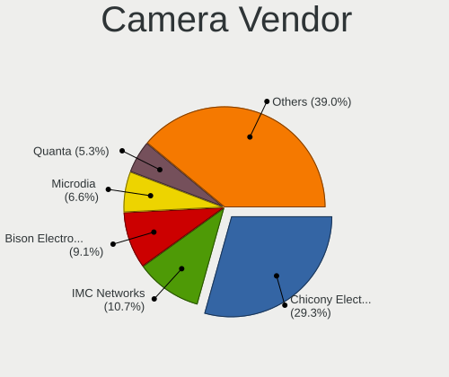

| Vendor                                 | Notebooks | Percent |
|----------------------------------------|-----------|---------|
| Chicony Electronics                    | 407       | 29.32%  |
| IMC Networks                           | 149       | 10.73%  |
| Bison Electronics                      | 127       | 9.15%   |
| Microdia                               | 91        | 6.56%   |
| Quanta                                 | 73        | 5.26%   |
| Realtek Semiconductor                  | 70        | 5.04%   |
| Sunplus Innovation Technology          | 64        | 4.61%   |
| Luxvisions Innotech Limited            | 47        | 3.39%   |
| Cheng Uei Precision Industry (Foxlink) | 46        | 3.31%   |
| Lite-On Technology                     | 43        | 3.1%    |
| Suyin                                  | 40        | 2.88%   |
| Apple                                  | 39        | 2.81%   |
| Syntek                                 | 36        | 2.59%   |
| Logitech                               | 24        | 1.73%   |
| Alcor Micro                            | 18        | 1.3%    |
| Lenovo                                 | 10        | 0.72%   |
| Ricoh                                  | 9         | 0.65%   |
| SunplusIT                              | 7         | 0.5%    |
| Silicon Motion                         | 7         | 0.5%    |
| Samsung Electronics                    | 7         | 0.5%    |
| Primax Electronics                     | 7         | 0.5%    |
| ShineTech                              | 6         | 0.43%   |
| Z-Star Microelectronics                | 5         | 0.36%   |
| icSpring                               | 5         | 0.36%   |
| OmniVision Technologies                | 4         | 0.29%   |
| Acer                                   | 4         | 0.29%   |
| SHENZHEN AONI ELECTRONIC               | 3         | 0.22%   |
| Microsoft                              | 3         | 0.22%   |
| DigiTech                               | 3         | 0.22%   |
| Sony                                   | 2         | 0.14%   |
| Sonix Technology                       | 2         | 0.14%   |
| OYT Tech                               | 2         | 0.14%   |
| MacroSilicon                           | 2         | 0.14%   |
| KYE Systems (Mouse Systems)            | 2         | 0.14%   |
| kingcome                               | 2         | 0.14%   |
| Generalplus Technology                 | 2         | 0.14%   |
| Framework                              | 2         | 0.14%   |
| Alpha Imaging Technology               | 2         | 0.14%   |
| Valve Software                         | 1         | 0.07%   |
| Tripath Technology                     | 1         | 0.07%   |

Camera Model
------------

Camera device models

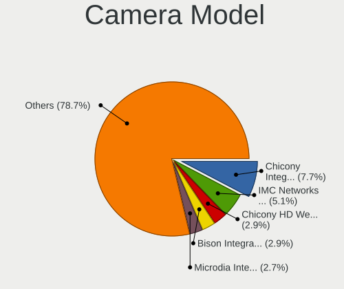

| Model                                             | Notebooks | Percent |
|---------------------------------------------------|-----------|---------|
| Chicony Integrated Camera                         | 107       | 7.69%   |
| IMC Networks Integrated Camera                    | 71        | 5.1%    |
| Chicony HD WebCam                                 | 40        | 2.87%   |
| Bison Integrated Camera                           | 40        | 2.87%   |
| Microdia Integrated_Webcam_HD                     | 38        | 2.73%   |
| IMC Networks USB2.0 HD UVC WebCam                 | 29        | 2.08%   |
| Syntek Integrated Camera                          | 24        | 1.72%   |
| Chicony HP HD Camera                              | 24        | 1.72%   |
| Quanta HD User Facing                             | 19        | 1.36%   |
| Sunplus Integrated_Webcam_HD                      | 18        | 1.29%   |
| Quanta HP HD Camera                               | 18        | 1.29%   |
| Lite-On Integrated Camera                         | 18        | 1.29%   |
| Realtek Integrated_Webcam_HD                      | 16        | 1.15%   |
| Luxvisions Innotech Limited Integrated Camera     | 16        | 1.15%   |
| IMC Networks USB2.0 VGA UVC WebCam                | 16        | 1.15%   |
| Chicony TOSHIBA Web Camera - HD                   | 15        | 1.08%   |
| Apple FaceTime HD Camera                          | 14        | 1.01%   |
| Lite-On HP HD Camera                              | 13        | 0.93%   |
| Bison SunplusIT Integrated Camera                 | 13        | 0.93%   |
| Realtek USB2.0 HD UVC WebCam                      | 12        | 0.86%   |
| Chicony USB2.0 HD UVC WebCam                      | 12        | 0.86%   |
| Chicony HD User Facing                            | 12        | 0.86%   |
| Bison Lenovo EasyCamera                           | 12        | 0.86%   |
| Chicony VGA Webcam                                | 11        | 0.79%   |
| Chicony HP HD Webcam                              | 11        | 0.79%   |
| Chicony FJ Camera                                 | 11        | 0.79%   |
| Bison Integrated RGB Camera                       | 11        | 0.79%   |
| Bison HD Webcam                                   | 11        | 0.79%   |
| Apple Built-in iSight                             | 11        | 0.79%   |
| Sunplus HD WebCam                                 | 10        | 0.72%   |
| Chicony Integrated Camera (1280x720@30)           | 10        | 0.72%   |
| Chicony HP TrueVision HD Camera                   | 10        | 0.72%   |
| Microdia Integrated Webcam                        | 9         | 0.65%   |
| Microdia HP Webcam                                | 9         | 0.65%   |
| Luxvisions Innotech Limited HP HD Camera          | 9         | 0.65%   |
| Chicony USB 2.0 Camera                            | 9         | 0.65%   |
| Chicony Lenovo Integrated Camera (0.3MP)          | 9         | 0.65%   |
| Apple iPhone 5/5C/5S/6/SE/7/8/X                   | 9         | 0.65%   |
| Luxvisions Innotech Limited Integrated RGB Camera | 8         | 0.57%   |
| Chicony Integrated HP HD Webcam                   | 8         | 0.57%   |

Security
--------

Fingerprint Vendor
------------------

Fingerprint sensor vendors

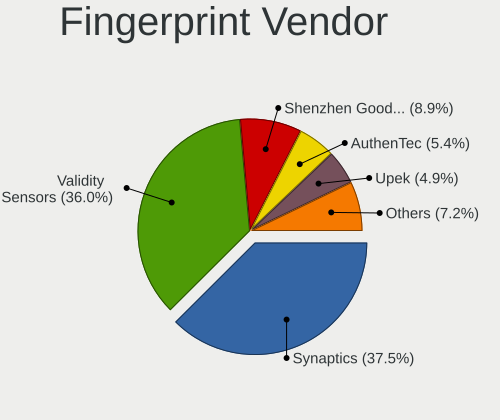

| Vendor                             | Notebooks | Percent |
|------------------------------------|-----------|---------|
| Synaptics                          | 152       | 37.53%  |
| Validity Sensors                   | 146       | 36.05%  |
| Shenzhen Goodix Technology         | 36        | 8.89%   |
| AuthenTec                          | 22        | 5.43%   |
| Upek                               | 20        | 4.94%   |
| Elan Microelectronics              | 16        | 3.95%   |
| LighTuning Technology              | 10        | 2.47%   |
| STMicroelectronics                 | 1         | 0.25%   |
| Realtek USB2.0 Finger Print Bridge | 1         | 0.25%   |
| Focal-systems.Corp                 | 1         | 0.25%   |

Fingerprint Model
-----------------

Fingerprint sensor models

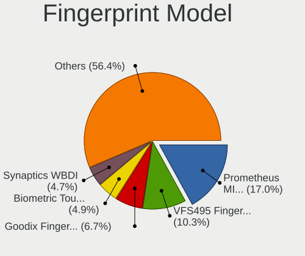

| Model                                                                      | Notebooks | Percent |
|----------------------------------------------------------------------------|-----------|---------|
| Synaptics Prometheus MIS Touch Fingerprint Reader                          | 69        | 17%     |
| Validity Sensors VFS495 Fingerprint Reader                                 | 42        | 10.34%  |
| Shenzhen Goodix  FingerPrint Device                                        | 27        | 6.65%   |
| Upek Biometric Touchchip/Touchstrip Fingerprint Sensor                     | 20        | 4.93%   |
| Validity Sensors Synaptics WBDI                                            | 19        | 4.68%   |
| Synaptics Metallica MIS Touch Fingerprint Reader                           | 14        | 3.45%   |
| Validity Sensors VFS471 Fingerprint Reader                                 | 13        | 3.2%    |
| Validity Sensors VFS5011 Fingerprint Reader                                | 12        | 2.96%   |
| Validity Sensors VFS491                                                    | 11        | 2.71%   |
| Validity Sensors VFS 5011 fingerprint sensor                               | 11        | 2.71%   |
| Synaptics UWP WBDI Device                                                  | 11        | 2.71%   |
| Synaptics FS7604 Touch Fingerprint Sensor with PurePrint                   | 11        | 2.71%   |
| Synaptics Fingerprint reader [HP G6]                                       | 11        | 2.71%   |
| Elan ELAN:Fingerprint                                                      | 11        | 2.71%   |
| AuthenTec AES2810                                                          | 11        | 2.71%   |
| Validity Sensors VFS7500 Touch Fingerprint Sensor                          | 9         | 2.22%   |
| Synaptics  FS7604 Touch Fingerprint Sensor with PurePrint                  | 9         | 2.22%   |
| Validity Sensors Fingerprint scanner                                       | 8         | 1.97%   |
| Validity Sensors Synaptics VFS7552 Touch Fingerprint Sensor with PurePrint | 7         | 1.72%   |
| Synaptics WBDI                                                             | 7         | 1.72%   |
| Shenzhen Goodix FingerPrint                                                | 6         | 1.48%   |
| Validity Sensors VFS451 Fingerprint Reader                                 | 5         | 1.23%   |
| Synaptics Metallica MOH Touch Fingerprint Reader                           | 5         | 1.23%   |
| LighTuning ES603 Swipe Fingerprint Sensor                                  | 5         | 1.23%   |
| Elan ELAN:ARM-M4                                                           | 5         | 1.23%   |
| Validity Sensors Swipe Fingerprint Sensor                                  | 4         | 0.99%   |
| Synaptics WBDI Device                                                      | 4         | 0.99%   |
| LighTuning EgisTec Touch Fingerprint Sensor                                | 4         | 0.99%   |
| AuthenTec Fingerprint Sensor                                               | 4         | 0.99%   |
| AuthenTec AES2501 Fingerprint Sensor                                       | 4         | 0.99%   |
| Validity Sensors VFS Fingerprint sensor                                    | 3         | 0.74%   |
| Shenzhen Goodix Fingerprint Reader                                         | 3         | 0.74%   |
| Synaptics WBDI Fingerprint Reader USB 086                                  | 2         | 0.49%   |
| Synaptics TouchPad                                                         | 2         | 0.49%   |
| Synaptics  WBDI Fingerprint Reader - USB 052                               | 2         | 0.49%   |
| Synaptics  WBDI                                                            | 2         | 0.49%   |
| Synaptics Prometheus Fingerprint Reader                                    | 2         | 0.49%   |
| AuthenTec AES1600                                                          | 2         | 0.49%   |
| Validity Sensors VFS7552 Touch Fingerprint Sensor                          | 1         | 0.25%   |
| Validity Sensors VFS301 Fingerprint Reader                                 | 1         | 0.25%   |

Chipcard Vendor
---------------

Chipcard module vendors

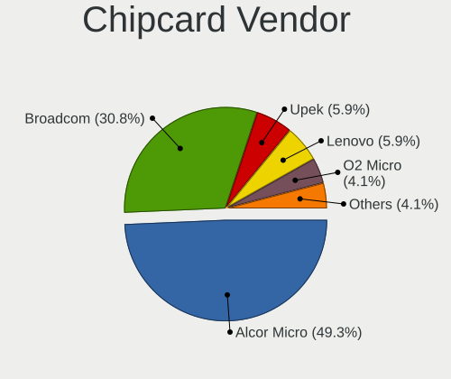

| Vendor                | Notebooks | Percent |
|-----------------------|-----------|---------|
| Alcor Micro           | 109       | 49.32%  |
| Broadcom              | 68        | 30.77%  |
| Upek                  | 13        | 5.88%   |
| Lenovo                | 13        | 5.88%   |
| O2 Micro              | 9         | 4.07%   |
| Yubico.com            | 2         | 0.9%    |
| SCM Microsystems      | 2         | 0.9%    |
| OmniKey               | 2         | 0.9%    |
| Realtek Semiconductor | 1         | 0.45%   |
| Gemalto (was Gemplus) | 1         | 0.45%   |
| Advanced Card Systems | 1         | 0.45%   |

Chipcard Model
--------------

Chipcard module models

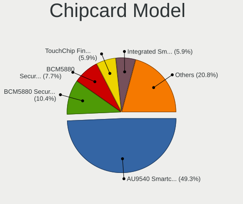

| Model                                                                        | Notebooks | Percent |
|------------------------------------------------------------------------------|-----------|---------|
| Alcor Micro AU9540 Smartcard Reader                                          | 109       | 49.32%  |
| Broadcom BCM5880 Secure Applications Processor                               | 23        | 10.41%  |
| Broadcom BCM5880 Secure Applications Processor with fingerprint swipe sensor | 17        | 7.69%   |
| Upek TouchChip Fingerprint Coprocessor (WBF advanced mode)                   | 13        | 5.88%   |
| Lenovo Integrated Smart Card Reader                                          | 13        | 5.88%   |
| Broadcom BCM58200 ControlVault 3 (FingerPrint sensor + Contacted SmartCard)  | 11        | 4.98%   |
| Broadcom 58200                                                               | 9         | 4.07%   |
| O2 Micro OZ776 CCID Smartcard Reader                                         | 8         | 3.62%   |
| Broadcom 5880                                                                | 8         | 3.62%   |
| Yubico.com Yubikey 4/5 U2F+CCID                                              | 2         | 0.9%    |
| SCM Microsystems SCR3340 - ExpressCard54 Smart Card Reader                   | 2         | 0.9%    |
| Realtek Semiconductor Smart Card Reader Interface                            | 1         | 0.45%   |
| OmniKey CardMan 3121 (HID Technologies)                                      | 1         | 0.45%   |
| OmniKey CardMan 3021 / 3121                                                  | 1         | 0.45%   |
| O2 Micro Oz776 SmartCard Reader                                              | 1         | 0.45%   |
| Gemalto (was Gemplus) GemPC Twin SmartCard Reader                            | 1         | 0.45%   |
| Advanced Card Systems ACR122U                                                | 1         | 0.45%   |

Unsupported
-----------

Unsupported Devices
-------------------

Total unsupported devices on board

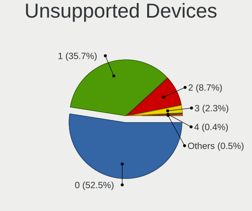

| Total | Notebooks | Percent |
|-------|-----------|---------|
| 0     | 856       | 52.48%  |
| 1     | 582       | 35.68%  |
| 2     | 142       | 8.71%   |
| 3     | 37        | 2.27%   |
| 4     | 6         | 0.37%   |
| 6     | 3         | 0.18%   |
| 5     | 3         | 0.18%   |
| 8     | 2         | 0.12%   |

Unsupported Device Types
------------------------

Types of unsupported devices

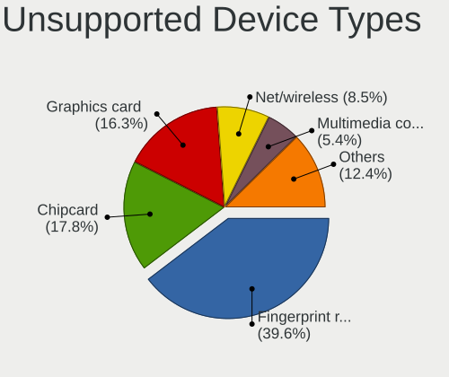

| Type                     | Notebooks | Percent |
|--------------------------|-----------|---------|
| Fingerprint reader       | 398       | 39.64%  |
| Chipcard                 | 179       | 17.83%  |
| Graphics card            | 164       | 16.33%  |
| Net/wireless             | 85        | 8.47%   |
| Multimedia controller    | 54        | 5.38%   |
| Bluetooth                | 22        | 2.19%   |
| Camera                   | 20        | 1.99%   |
| Sound                    | 18        | 1.79%   |
| Communication controller | 16        | 1.59%   |
| Card reader              | 16        | 1.59%   |
| Storage                  | 11        | 1.1%    |
| Net/ethernet             | 7         | 0.7%    |
| Unassigned class         | 4         | 0.4%    |
| Modem                    | 4         | 0.4%    |
| Network                  | 2         | 0.2%    |
| Flash memory             | 2         | 0.2%    |
| Storage/ide              | 1         | 0.1%    |
| Firewire controller      | 1         | 0.1%    |

