Linux in Austria - Tested Hardware & Statistics (Notebooks)
-----------------------------------------------------------

A project to collect tested hardware configurations for Linux in Austria.

Anyone can contribute to this report by the [hw-probe](https://github.com/linuxhw/hw-probe) tool:

    sudo -E hw-probe -all -upload

Please contribute! Especially if your hardware is rare.

Contents
--------

* [ Test Cases ](#test-cases)

* [ System ](#system)
  - [ OS                       ](#os)
  - [ OS Family                ](#os-family)
  - [ Kernel                   ](#kernel)
  - [ Kernel Family            ](#kernel-family)
  - [ Kernel Major Ver.        ](#kernel-major-ver)
  - [ Arch                     ](#arch)
  - [ DE                       ](#de)
  - [ Display Server           ](#display-server)
  - [ Display Manager          ](#display-manager)
  - [ OS Lang                  ](#os-lang)
  - [ Boot Mode                ](#boot-mode)
  - [ Filesystem               ](#filesystem)
  - [ Part. scheme             ](#part-scheme)
  - [ Dual Boot with Linux/BSD ](#dual-boot-with-linuxbsd)
  - [ Dual Boot (Win)          ](#dual-boot-win)

* [ Board ](#board)
  - [ Vendor                   ](#vendor)
  - [ Model                    ](#model)
  - [ Model Family             ](#model-family)
  - [ MFG Year                 ](#mfg-year)
  - [ Form Factor              ](#form-factor)
  - [ Secure Boot              ](#secure-boot)
  - [ Coreboot                 ](#coreboot)
  - [ RAM Size                 ](#ram-size)
  - [ RAM Used                 ](#ram-used)
  - [ Total Drives             ](#total-drives)
  - [ Has CD-ROM               ](#has-cd-rom)
  - [ Has Ethernet             ](#has-ethernet)
  - [ Has WiFi                 ](#has-wifi)
  - [ Has Bluetooth            ](#has-bluetooth)

* [ Location ](#location)
  - [ Country                  ](#country)
  - [ City                     ](#city)

* [ Drives ](#drives)
  - [ Drive Vendor             ](#drive-vendor)
  - [ Drive Model              ](#drive-model)
  - [ HDD Vendor               ](#hdd-vendor)
  - [ SSD Vendor               ](#ssd-vendor)
  - [ Drive Kind               ](#drive-kind)
  - [ Drive Connector          ](#drive-connector)
  - [ Drive Size               ](#drive-size)
  - [ Space Total              ](#space-total)
  - [ Space Used               ](#space-used)
  - [ Malfunc. Drives          ](#malfunc-drives)
  - [ Malfunc. Drive Vendor    ](#malfunc-drive-vendor)
  - [ Malfunc. HDD Vendor      ](#malfunc-hdd-vendor)
  - [ Malfunc. Drive Kind      ](#malfunc-drive-kind)
  - [ Failed Drives            ](#failed-drives)
  - [ Failed Drive Vendor      ](#failed-drive-vendor)
  - [ Drive Status             ](#drive-status)

* [ Storage controller ](#storage-controller)
  - [ Storage Vendor           ](#storage-vendor)
  - [ Storage Model            ](#storage-model)
  - [ Storage Kind             ](#storage-kind)

* [ Processor ](#processor)
  - [ CPU Vendor               ](#cpu-vendor)
  - [ CPU Model                ](#cpu-model)
  - [ CPU Model Family         ](#cpu-model-family)
  - [ CPU Cores                ](#cpu-cores)
  - [ CPU Sockets              ](#cpu-sockets)
  - [ CPU Threads              ](#cpu-threads)
  - [ CPU Op-Modes             ](#cpu-op-modes)
  - [ CPU Microcode            ](#cpu-microcode)
  - [ CPU Microarch            ](#cpu-microarch)

* [ Graphics ](#graphics)
  - [ GPU Vendor               ](#gpu-vendor)
  - [ GPU Model                ](#gpu-model)
  - [ GPU Combo                ](#gpu-combo)
  - [ GPU Driver               ](#gpu-driver)
  - [ GPU Memory               ](#gpu-memory)

* [ Monitor ](#monitor)
  - [ Monitor Vendor           ](#monitor-vendor)
  - [ Monitor Model            ](#monitor-model)
  - [ Monitor Resolution       ](#monitor-resolution)
  - [ Monitor Diagonal         ](#monitor-diagonal)
  - [ Monitor Width            ](#monitor-width)
  - [ Aspect Ratio             ](#aspect-ratio)
  - [ Monitor Area             ](#monitor-area)
  - [ Pixel Density            ](#pixel-density)
  - [ Multiple Monitors        ](#multiple-monitors)

* [ Network ](#network)
  - [ Net Controller Vendor    ](#net-controller-vendor)
  - [ Net Controller Model     ](#net-controller-model)
  - [ Wireless Vendor          ](#wireless-vendor)
  - [ Wireless Model           ](#wireless-model)
  - [ Ethernet Vendor          ](#ethernet-vendor)
  - [ Ethernet Model           ](#ethernet-model)
  - [ Net Controller Kind      ](#net-controller-kind)
  - [ Used Controller          ](#used-controller)
  - [ NICs                     ](#nics)
  - [ IPv6                     ](#ipv6)

* [ Bluetooth ](#bluetooth)
  - [ Bluetooth Vendor         ](#bluetooth-vendor)
  - [ Bluetooth Model          ](#bluetooth-model)

* [ Sound ](#sound)
  - [ Sound Vendor             ](#sound-vendor)
  - [ Sound Model              ](#sound-model)

* [ Memory ](#memory)
  - [ Memory Vendor            ](#memory-vendor)
  - [ Memory Model             ](#memory-model)
  - [ Memory Kind              ](#memory-kind)
  - [ Memory Form Factor       ](#memory-form-factor)
  - [ Memory Size              ](#memory-size)
  - [ Memory Speed             ](#memory-speed)

* [ Printers & scanners ](#printers--scanners)
  - [ Printer Vendor           ](#printer-vendor)
  - [ Printer Model            ](#printer-model)
  - [ Scanner Vendor           ](#scanner-vendor)
  - [ Scanner Model            ](#scanner-model)

* [ Camera ](#camera)
  - [ Camera Vendor            ](#camera-vendor)
  - [ Camera Model             ](#camera-model)

* [ Security ](#security)
  - [ Fingerprint Vendor       ](#fingerprint-vendor)
  - [ Fingerprint Model        ](#fingerprint-model)
  - [ Chipcard Vendor          ](#chipcard-vendor)
  - [ Chipcard Model           ](#chipcard-model)

* [ Unsupported ](#unsupported)
  - [ Unsupported Devices      ](#unsupported-devices)
  - [ Unsupported Device Types ](#unsupported-device-types)

Test Cases
----------

Total: 1298

| Vendor        | Model                       | Probe                                                      | Date         |
|---------------|-----------------------------|------------------------------------------------------------|--------------|
| Apple         | MacBookAir4,2               | [a9605bf85e](https://linux-hardware.org/?probe=a9605bf85e) | Feb 27, 2023 |
| Dell          | Latitude E7250              | [db6ac786ef](https://linux-hardware.org/?probe=db6ac786ef) | Feb 26, 2023 |
| Valve         | Jupiter                     | [c8006c3bd5](https://linux-hardware.org/?probe=c8006c3bd5) | Feb 26, 2023 |
| Toshiba       | Satellite C70D-B            | [0c69e8ef9b](https://linux-hardware.org/?probe=0c69e8ef9b) | Feb 23, 2023 |
| Toshiba       | Satellite C70D-B            | [bcae8ff254](https://linux-hardware.org/?probe=bcae8ff254) | Feb 23, 2023 |
| Apple         | MacBookPro11,5              | [49007433d0](https://linux-hardware.org/?probe=49007433d0) | Feb 23, 2023 |
| Apple         | MacBookPro11,5              | [e67cca4a6c](https://linux-hardware.org/?probe=e67cca4a6c) | Feb 23, 2023 |
| Unknown       | Unknown                     | [1f89daceb8](https://linux-hardware.org/?probe=1f89daceb8) | Feb 20, 2023 |
| Lenovo        | ThinkPad W510 4391W3V       | [f4065623e5](https://linux-hardware.org/?probe=f4065623e5) | Feb 18, 2023 |
| Chuwi         | HeroBook Pro                | [f49ba07c1e](https://linux-hardware.org/?probe=f49ba07c1e) | Feb 18, 2023 |
| Medion        | E7220                       | [289b7dc6aa](https://linux-hardware.org/?probe=289b7dc6aa) | Feb 17, 2023 |
| Gigabyte      | GB-BSi7A-6500               | [9c461d33db](https://linux-hardware.org/?probe=9c461d33db) | Feb 16, 2023 |
| Medion        | E7220                       | [dd9de8bf69](https://linux-hardware.org/?probe=dd9de8bf69) | Feb 15, 2023 |
| Lenovo        | ThinkPad P1 Gen 4i 20Y3S... | [580215c6bb](https://linux-hardware.org/?probe=580215c6bb) | Feb 15, 2023 |
| ASUSTek       | ROG STRIX B550-F GAMING     | [ca4349a929](https://linux-hardware.org/?probe=ca4349a929) | Feb 15, 2023 |
| Apple         | MacBook5,2                  | [72b8d495ff](https://linux-hardware.org/?probe=72b8d495ff) | Feb 13, 2023 |
| Acer          | Aspire 7740                 | [caeb61e835](https://linux-hardware.org/?probe=caeb61e835) | Feb 12, 2023 |
| Apple         | MacBookPro11,5              | [78e7a0ae85](https://linux-hardware.org/?probe=78e7a0ae85) | Feb 12, 2023 |
| Acer          | Aspire A515-54G             | [632c139c4b](https://linux-hardware.org/?probe=632c139c4b) | Feb 12, 2023 |
| Apple         | MacBookPro5,4               | [b7e924b0cd](https://linux-hardware.org/?probe=b7e924b0cd) | Feb 11, 2023 |
| Lenovo        | ThinkPad T450 20BUS1110E    | [d08c46c46d](https://linux-hardware.org/?probe=d08c46c46d) | Feb 10, 2023 |
| ASUSTek       | VivoBook_ASUSLaptop X521... | [3f4b71a601](https://linux-hardware.org/?probe=3f4b71a601) | Feb 09, 2023 |
| MSI           | GF63 Thin 11UC              | [a57b142e05](https://linux-hardware.org/?probe=a57b142e05) | Feb 06, 2023 |
| Lenovo        | ThinkPad L15 Gen 1 20U70... | [7ca566f68b](https://linux-hardware.org/?probe=7ca566f68b) | Feb 05, 2023 |
| Apple         | MacBookPro11,5              | [3407774ba7](https://linux-hardware.org/?probe=3407774ba7) | Feb 05, 2023 |
| Dell          | MXG061                      | [40883298a9](https://linux-hardware.org/?probe=40883298a9) | Feb 04, 2023 |
| MSI           | GF63 Thin 11UC              | [b34b3228d3](https://linux-hardware.org/?probe=b34b3228d3) | Feb 01, 2023 |
| Acer          | Aspire A515-54G             | [a57a68e42f](https://linux-hardware.org/?probe=a57a68e42f) | Jan 31, 2023 |
| ASUSTek       | ROG Zephyrus G14 GA402RK... | [0d500d9d33](https://linux-hardware.org/?probe=0d500d9d33) | Jan 31, 2023 |
| Dell          | Latitude 5480               | [8b43efc7ea](https://linux-hardware.org/?probe=8b43efc7ea) | Jan 31, 2023 |
| Lenovo        | ThinkPad W510 4391W3V       | [78d987fedf](https://linux-hardware.org/?probe=78d987fedf) | Jan 30, 2023 |
| Lenovo        | ThinkPad W510 4391W3V       | [a178301183](https://linux-hardware.org/?probe=a178301183) | Jan 30, 2023 |
| ASUSTek       | G750JX                      | [d868c23c4b](https://linux-hardware.org/?probe=d868c23c4b) | Jan 29, 2023 |
| HP            | OMEN by Laptop 16-c0xxx     | [32d5472e21](https://linux-hardware.org/?probe=32d5472e21) | Jan 29, 2023 |
| Lenovo        | ThinkPad T14 Gen 1 20S1S... | [c5168e6b33](https://linux-hardware.org/?probe=c5168e6b33) | Jan 27, 2023 |
| Dell          | XPS 15 7590                 | [4ecf66ddd9](https://linux-hardware.org/?probe=4ecf66ddd9) | Jan 27, 2023 |
| HP            | OMEN by Laptop 16-c0xxx     | [4024f7c3bd](https://linux-hardware.org/?probe=4024f7c3bd) | Jan 26, 2023 |
| HP            | EliteBook 855 G8 Noteboo... | [ea142e4848](https://linux-hardware.org/?probe=ea142e4848) | Jan 25, 2023 |
| TUXEDO        | Unknown                     | [5973888b27](https://linux-hardware.org/?probe=5973888b27) | Jan 24, 2023 |
| Lenovo        | ThinkPad X1 Carbon 3rd 2... | [be73748546](https://linux-hardware.org/?probe=be73748546) | Jan 24, 2023 |
| Lenovo        | ThinkPad X1 Carbon 3rd 2... | [7595deef91](https://linux-hardware.org/?probe=7595deef91) | Jan 24, 2023 |
| Toshiba       | Satellite Pro C660          | [f1c0237cc0](https://linux-hardware.org/?probe=f1c0237cc0) | Jan 22, 2023 |
| Lenovo        | ThinkPad X230 2333AZ2       | [d9d0138294](https://linux-hardware.org/?probe=d9d0138294) | Jan 19, 2023 |
| ASUSTek       | A6U                         | [58c040d67c](https://linux-hardware.org/?probe=58c040d67c) | Jan 19, 2023 |
| ASUSTek       | A6U                         | [9156e1c9cd](https://linux-hardware.org/?probe=9156e1c9cd) | Jan 19, 2023 |
| ASUSTek       | VivoBook_ASUSLaptop X515... | [eddf4927eb](https://linux-hardware.org/?probe=eddf4927eb) | Jan 19, 2023 |
| MSI           | VR630                       | [943c1d68fa](https://linux-hardware.org/?probe=943c1d68fa) | Jan 19, 2023 |
| ASUSTek       | K53TA                       | [a56a3691e9](https://linux-hardware.org/?probe=a56a3691e9) | Jan 18, 2023 |
| Lenovo        | ThinkPad W510 43892AG       | [b68853abf6](https://linux-hardware.org/?probe=b68853abf6) | Jan 16, 2023 |
| Lenovo        | IdeaPad 5 14ALC05 82LM      | [a159136180](https://linux-hardware.org/?probe=a159136180) | Jan 16, 2023 |
| HP            | Stream Laptop 11-ak0xxx     | [6f3b4fc131](https://linux-hardware.org/?probe=6f3b4fc131) | Jan 16, 2023 |
| HP            | Stream Laptop 11-ak0xxx     | [b33bedc4c2](https://linux-hardware.org/?probe=b33bedc4c2) | Jan 15, 2023 |
| Lenovo        | IdeaPad 3 17ITL6 82H9       | [80f9124e5a](https://linux-hardware.org/?probe=80f9124e5a) | Jan 14, 2023 |
| TUXEDO        | Unknown                     | [5721ffbc43](https://linux-hardware.org/?probe=5721ffbc43) | Jan 13, 2023 |
| HP            | EliteBook 850 G8 Noteboo... | [64c403ce6d](https://linux-hardware.org/?probe=64c403ce6d) | Jan 13, 2023 |
| HP            | Stream Laptop 11-ak0xxx     | [806da9b386](https://linux-hardware.org/?probe=806da9b386) | Jan 12, 2023 |
| HP            | Stream Laptop 11-ak0xxx     | [29e6fcfd32](https://linux-hardware.org/?probe=29e6fcfd32) | Jan 12, 2023 |
| Dell          | Latitude E5550              | [0b14eb18d9](https://linux-hardware.org/?probe=0b14eb18d9) | Jan 12, 2023 |
| Medion        | E6222                       | [e3b3da28fa](https://linux-hardware.org/?probe=e3b3da28fa) | Jan 11, 2023 |
| Dell          | Latitude E5550              | [5e76d378f9](https://linux-hardware.org/?probe=5e76d378f9) | Jan 11, 2023 |
| Dell          | Latitude E7440              | [bfdc9dfc63](https://linux-hardware.org/?probe=bfdc9dfc63) | Jan 11, 2023 |
| Dell          | XPS 13 9380                 | [d8ab62070c](https://linux-hardware.org/?probe=d8ab62070c) | Jan 11, 2023 |
| HP            | OMEN by Laptop              | [a365222a35](https://linux-hardware.org/?probe=a365222a35) | Jan 09, 2023 |
| MSI           | GS63VR 7RF                  | [95aadb3cc4](https://linux-hardware.org/?probe=95aadb3cc4) | Jan 09, 2023 |
| Sony          | SVE1512H1EB                 | [723e8bfbe6](https://linux-hardware.org/?probe=723e8bfbe6) | Jan 09, 2023 |
| Dell          | XPS 15 9510                 | [297380c89a](https://linux-hardware.org/?probe=297380c89a) | Jan 09, 2023 |
| Acer          | Iconia W700                 | [bcfec36896](https://linux-hardware.org/?probe=bcfec36896) | Jan 09, 2023 |
| Google        | Kled                        | [3cb98a4497](https://linux-hardware.org/?probe=3cb98a4497) | Jan 07, 2023 |
| Lenovo        | ThinkPad X220 4290KJ6       | [8296e61afd](https://linux-hardware.org/?probe=8296e61afd) | Jan 05, 2023 |
| Sony          | VPCEH2D0E                   | [78367f11f5](https://linux-hardware.org/?probe=78367f11f5) | Jan 04, 2023 |
| ASUSTek       | K93SM                       | [c0fb78e9a3](https://linux-hardware.org/?probe=c0fb78e9a3) | Jan 03, 2023 |
| Dell          | Latitude 7430               | [ad796336f7](https://linux-hardware.org/?probe=ad796336f7) | Jan 01, 2023 |
| Lenovo        | ThinkPad X270 20K60018GE    | [a92939c1f5](https://linux-hardware.org/?probe=a92939c1f5) | Jan 01, 2023 |
| Lenovo        | ThinkPad X390 20Q00051GE    | [5b3d1b750d](https://linux-hardware.org/?probe=5b3d1b750d) | Dec 31, 2022 |
| Lenovo        | ThinkPad X390 20Q00051GE    | [775096be09](https://linux-hardware.org/?probe=775096be09) | Dec 31, 2022 |
| Chuwi         | HeroBook Pro                | [cdc31b8338](https://linux-hardware.org/?probe=cdc31b8338) | Dec 30, 2022 |
| HP            | Pavilion Gaming Laptop 1... | [c28fb2edb2](https://linux-hardware.org/?probe=c28fb2edb2) | Dec 30, 2022 |
| Medion        | X782X/X783X                 | [a8befc040f](https://linux-hardware.org/?probe=a8befc040f) | Dec 26, 2022 |
| Notebook      | P64_HJ,HK1                  | [26a548a6f3](https://linux-hardware.org/?probe=26a548a6f3) | Dec 23, 2022 |
| Fujitsu       | LIFEBOOK AH544              | [431eac7d11](https://linux-hardware.org/?probe=431eac7d11) | Dec 22, 2022 |
| Lenovo        | ThinkPad T470s 20HF005QM... | [b934598049](https://linux-hardware.org/?probe=b934598049) | Dec 22, 2022 |
| Lenovo        | ThinkPad T490 20N20048GE    | [629a725afa](https://linux-hardware.org/?probe=629a725afa) | Dec 21, 2022 |
| Acer          | Aspire A715-72G             | [8e15fef839](https://linux-hardware.org/?probe=8e15fef839) | Dec 19, 2022 |
| MSI           | GE63 Raider RGB 8RF         | [a85193c482](https://linux-hardware.org/?probe=a85193c482) | Dec 19, 2022 |
| Google        | Cyan                        | [fff3502929](https://linux-hardware.org/?probe=fff3502929) | Dec 19, 2022 |
| Acer          | Nitro AN515-42              | [88d7491a00](https://linux-hardware.org/?probe=88d7491a00) | Dec 19, 2022 |
| AXDIA Inte... | myBook PRO14 SE V2          | [14b79d7a8b](https://linux-hardware.org/?probe=14b79d7a8b) | Dec 18, 2022 |
| Lenovo        | ThinkPad A485 20MVS0LG00    | [86c9426d80](https://linux-hardware.org/?probe=86c9426d80) | Dec 18, 2022 |
| Lenovo        | ThinkPad A485 20MVS0LG00    | [05fcf7302f](https://linux-hardware.org/?probe=05fcf7302f) | Dec 18, 2022 |
| Lenovo        | ThinkPad A485 20MVS0LG00    | [12b3654541](https://linux-hardware.org/?probe=12b3654541) | Dec 15, 2022 |
| HP            | EliteBook 850 G2            | [d0d30cd96f](https://linux-hardware.org/?probe=d0d30cd96f) | Dec 14, 2022 |
| Acer          | Swift SF314-59              | [943bcd1d12](https://linux-hardware.org/?probe=943bcd1d12) | Dec 14, 2022 |
| Lenovo        | ThinkPad T14 Gen 1 20UDS... | [b518609312](https://linux-hardware.org/?probe=b518609312) | Dec 12, 2022 |
| Lenovo        | ThinkPad T14 Gen 1 20UDS... | [f815a2e4a3](https://linux-hardware.org/?probe=f815a2e4a3) | Dec 12, 2022 |
| MSI           | GE63 Raider RGB 8RF         | [b311865418](https://linux-hardware.org/?probe=b311865418) | Dec 12, 2022 |
| HUAWEI        | RLEF-XX                     | [e0b1d50b7c](https://linux-hardware.org/?probe=e0b1d50b7c) | Dec 11, 2022 |
| Lenovo        | ThinkPad T470s 20HF005QM... | [32ce05790e](https://linux-hardware.org/?probe=32ce05790e) | Dec 11, 2022 |
| Lenovo        | ThinkPad P14s Gen 3 21AK... | [50e5b72a10](https://linux-hardware.org/?probe=50e5b72a10) | Dec 10, 2022 |
| Lenovo        | ThinkPad L14 Gen 2a 20X6... | [b7171256c0](https://linux-hardware.org/?probe=b7171256c0) | Dec 07, 2022 |
| Packard Be... | EasyNote TS11HR             | [cd166beede](https://linux-hardware.org/?probe=cd166beede) | Dec 06, 2022 |
| Lenovo        | G700 20251                  | [8d5d04f931](https://linux-hardware.org/?probe=8d5d04f931) | Dec 05, 2022 |
| Lenovo        | G700 20251                  | [4e8f04ce8f](https://linux-hardware.org/?probe=4e8f04ce8f) | Dec 05, 2022 |
| Acer          | Aspire A514-53              | [f0c20f1a0a](https://linux-hardware.org/?probe=f0c20f1a0a) | Dec 04, 2022 |
| ASUSTek       | X580VD                      | [027cd08fb1](https://linux-hardware.org/?probe=027cd08fb1) | Dec 03, 2022 |
| Toshiba       | Satellite C50-A-1HF         | [74902de02b](https://linux-hardware.org/?probe=74902de02b) | Dec 02, 2022 |
| ASUSTek       | VivoBook_ASUS Laptop X50... | [4f36906529](https://linux-hardware.org/?probe=4f36906529) | Dec 02, 2022 |
| Apple         | MacBookPro14,1              | [eb13a8db03](https://linux-hardware.org/?probe=eb13a8db03) | Dec 02, 2022 |
| Acer          | Aspire A514-53              | [07ff06f360](https://linux-hardware.org/?probe=07ff06f360) | Dec 02, 2022 |
| HP            | Stream Laptop 11-ak0xxx     | [d2c04dd7cd](https://linux-hardware.org/?probe=d2c04dd7cd) | Dec 01, 2022 |
| W271ELQ       | Unknown                     | [ae170d1e81](https://linux-hardware.org/?probe=ae170d1e81) | Dec 01, 2022 |
| Lenovo        | ThinkBook 15 G3 ACL 21A4    | [ceb78dbe4e](https://linux-hardware.org/?probe=ceb78dbe4e) | Nov 28, 2022 |
| Lenovo        | ThinkPad T520 4243F53       | [8f9e96442a](https://linux-hardware.org/?probe=8f9e96442a) | Nov 27, 2022 |
| Acer          | Aspire E5-571G              | [7d6eeaf95c](https://linux-hardware.org/?probe=7d6eeaf95c) | Nov 26, 2022 |
| Dell          | Latitude 3520               | [896180c55d](https://linux-hardware.org/?probe=896180c55d) | Nov 25, 2022 |
| Lenovo        | V15 G2 ALC 82KD             | [6646978243](https://linux-hardware.org/?probe=6646978243) | Nov 23, 2022 |
| Lenovo        | V15 G2 ALC 82KD             | [ddcb37ea55](https://linux-hardware.org/?probe=ddcb37ea55) | Nov 23, 2022 |
| Dell          | Precision 5560              | [f20218fb35](https://linux-hardware.org/?probe=f20218fb35) | Nov 23, 2022 |
| TUXEDO        | N7x0WU                      | [614f59ceaf](https://linux-hardware.org/?probe=614f59ceaf) | Nov 22, 2022 |
| Lenovo        | ThinkPad L15 Gen 2a 20X7... | [dc848e747b](https://linux-hardware.org/?probe=dc848e747b) | Nov 21, 2022 |
| ASUSTek       | Zenbook UM6702RA_RM6702R... | [4ea8f7dbb0](https://linux-hardware.org/?probe=4ea8f7dbb0) | Nov 19, 2022 |
| Valve         | Jupiter                     | [5932954a14](https://linux-hardware.org/?probe=5932954a14) | Nov 19, 2022 |
| ASUSTek       | VivoBook_ASUSLaptop X515... | [93ad560f52](https://linux-hardware.org/?probe=93ad560f52) | Nov 17, 2022 |
| Dell          | Latitude E6220              | [b1270460e6](https://linux-hardware.org/?probe=b1270460e6) | Nov 15, 2022 |
| Lenovo        | ThinkBook 15 G2 ITL 20VE    | [d6b19cfd9d](https://linux-hardware.org/?probe=d6b19cfd9d) | Nov 15, 2022 |
| HP            | EliteBook 850 G1            | [a83e2b1a92](https://linux-hardware.org/?probe=a83e2b1a92) | Nov 13, 2022 |
| Lenovo        | ThinkPad S1 Yoga 20CD003... | [4406929fb6](https://linux-hardware.org/?probe=4406929fb6) | Nov 11, 2022 |
| Apple         | MacBookPro9,2               | [695b0b0356](https://linux-hardware.org/?probe=695b0b0356) | Nov 11, 2022 |
| Lenovo        | ThinkPad T14s Gen 3 21BS... | [24c5edc9f9](https://linux-hardware.org/?probe=24c5edc9f9) | Nov 10, 2022 |
| ASUSTek       | X55A                        | [6391006e3d](https://linux-hardware.org/?probe=6391006e3d) | Nov 07, 2022 |
| ASUSTek       | X55A                        | [ae4277aa87](https://linux-hardware.org/?probe=ae4277aa87) | Nov 07, 2022 |
| Lenovo        | ThinkPad P1 Gen 3 20THCT... | [4c47d0ef97](https://linux-hardware.org/?probe=4c47d0ef97) | Nov 05, 2022 |
| ASUSTek       | VivoBook_ASUSLaptop X515... | [18b0671002](https://linux-hardware.org/?probe=18b0671002) | Nov 03, 2022 |
| HP            | EliteBook 8460p             | [565ad502cc](https://linux-hardware.org/?probe=565ad502cc) | Nov 02, 2022 |
| HP            | ZBook 15 G2                 | [05eeb9e341](https://linux-hardware.org/?probe=05eeb9e341) | Nov 01, 2022 |
| ASUSTek       | K54L                        | [200f6044c2](https://linux-hardware.org/?probe=200f6044c2) | Oct 31, 2022 |
| Adlinktech    | SB-MLC                      | [203d95e012](https://linux-hardware.org/?probe=203d95e012) | Oct 31, 2022 |
| Dell          | Latitude E6400              | [8f2639b285](https://linux-hardware.org/?probe=8f2639b285) | Oct 31, 2022 |
| Lenovo        | ThinkPad T510 4384WKU       | [86fee6e260](https://linux-hardware.org/?probe=86fee6e260) | Oct 30, 2022 |
| Dell          | Studio 1737                 | [97f398804e](https://linux-hardware.org/?probe=97f398804e) | Oct 29, 2022 |
| HP            | EliteBook 820 G4            | [c41402e832](https://linux-hardware.org/?probe=c41402e832) | Oct 29, 2022 |
| Lenovo        | IdeaPad 500-15ACZ 80K4      | [c079764998](https://linux-hardware.org/?probe=c079764998) | Oct 28, 2022 |
| Lenovo        | IdeaPad 500-15ACZ 80K4      | [5ef9b4213f](https://linux-hardware.org/?probe=5ef9b4213f) | Oct 28, 2022 |
| Lenovo        | ThinkPad T14 Gen 1 20UD0... | [2f6e4235f7](https://linux-hardware.org/?probe=2f6e4235f7) | Oct 28, 2022 |
| ASUSTek       | UX303LAB                    | [5748274da1](https://linux-hardware.org/?probe=5748274da1) | Oct 27, 2022 |
| Dell          | Precision 7530              | [daee9e9524](https://linux-hardware.org/?probe=daee9e9524) | Oct 26, 2022 |
| Lenovo        | ThinkPad W510 4391W3V       | [a943d9879c](https://linux-hardware.org/?probe=a943d9879c) | Oct 26, 2022 |
| ASUSTek       | UX303LAB                    | [622aa11277](https://linux-hardware.org/?probe=622aa11277) | Oct 26, 2022 |
| Lenovo        | ThinkPad P1 20MD000NGE      | [561f09ba0f](https://linux-hardware.org/?probe=561f09ba0f) | Oct 25, 2022 |
| Lenovo        | ThinkPad T410s 2912AJ7      | [efb2913d22](https://linux-hardware.org/?probe=efb2913d22) | Oct 23, 2022 |
| Lenovo        | ThinkPad Edge S430 33643... | [a73e4a9246](https://linux-hardware.org/?probe=a73e4a9246) | Oct 23, 2022 |
| Valve         | Jupiter                     | [b05efe341f](https://linux-hardware.org/?probe=b05efe341f) | Oct 22, 2022 |
| Lenovo        | ThinkPad L580 20LW0010GE    | [99da3e6f09](https://linux-hardware.org/?probe=99da3e6f09) | Oct 22, 2022 |
| Dell          | XPS 13 9343                 | [1ce3fc664e](https://linux-hardware.org/?probe=1ce3fc664e) | Oct 20, 2022 |
| ASUSTek       | VivoBook_ASUSLaptop X515... | [06328b7f7c](https://linux-hardware.org/?probe=06328b7f7c) | Oct 20, 2022 |
| ASUSTek       | VivoBook_ASUSLaptop X515... | [7d35a56915](https://linux-hardware.org/?probe=7d35a56915) | Oct 20, 2022 |
| Dell          | Latitude 5520               | [fc014585a8](https://linux-hardware.org/?probe=fc014585a8) | Oct 19, 2022 |
| Dell          | Latitude 5520               | [3589f77c74](https://linux-hardware.org/?probe=3589f77c74) | Oct 19, 2022 |
| Lenovo        | ThinkPad T15g Gen 1 20US... | [ec42bc932e](https://linux-hardware.org/?probe=ec42bc932e) | Oct 18, 2022 |
| Dell          | Precision 5510              | [d56d0aceaf](https://linux-hardware.org/?probe=d56d0aceaf) | Oct 18, 2022 |
| Lenovo        | ThinkPad T410s 2912AJ7      | [8c97c331b9](https://linux-hardware.org/?probe=8c97c331b9) | Oct 18, 2022 |
| HP            | Pavilion Gaming Laptop 1... | [76f9929a9c](https://linux-hardware.org/?probe=76f9929a9c) | Oct 17, 2022 |
| Dell          | Latitude 3520               | [f556b42181](https://linux-hardware.org/?probe=f556b42181) | Oct 16, 2022 |
| ASUSTek       | X580VD                      | [59ecc7da84](https://linux-hardware.org/?probe=59ecc7da84) | Oct 15, 2022 |
| Lenovo        | ThinkPad T14s Gen 3 21BS... | [766f4b2d1f](https://linux-hardware.org/?probe=766f4b2d1f) | Oct 14, 2022 |
| Lenovo        | ThinkPad T14s Gen 3 21BS... | [bf46cd0c9e](https://linux-hardware.org/?probe=bf46cd0c9e) | Oct 14, 2022 |
| Lenovo        | V15 G2 ALC 82KD             | [bc23ce28e0](https://linux-hardware.org/?probe=bc23ce28e0) | Oct 14, 2022 |
| Dell          | Inspiron 3505               | [04147466b3](https://linux-hardware.org/?probe=04147466b3) | Oct 13, 2022 |
| Dell          | Latitude E6440              | [3b13c28e46](https://linux-hardware.org/?probe=3b13c28e46) | Oct 12, 2022 |
| Dell          | Latitude E6540              | [d1b0bd16b5](https://linux-hardware.org/?probe=d1b0bd16b5) | Oct 11, 2022 |
| HUAWEI        | MACH-WX9                    | [da36ee9925](https://linux-hardware.org/?probe=da36ee9925) | Oct 11, 2022 |
| Lenovo        | V15 G2 ALC 82KD             | [e860301211](https://linux-hardware.org/?probe=e860301211) | Oct 09, 2022 |
| Valve         | Jupiter                     | [eb5a512250](https://linux-hardware.org/?probe=eb5a512250) | Oct 09, 2022 |
| MSI           | Modern 14 B11M              | [e0391b5084](https://linux-hardware.org/?probe=e0391b5084) | Oct 05, 2022 |
| HP            | ProBook 450 G3              | [16b58b369a](https://linux-hardware.org/?probe=16b58b369a) | Oct 05, 2022 |
| Lenovo        | IdeaPad 3 17IML05 81WC      | [e722d17a52](https://linux-hardware.org/?probe=e722d17a52) | Oct 01, 2022 |
| HP            | EliteBook 850 G1            | [9667dac801](https://linux-hardware.org/?probe=9667dac801) | Sep 30, 2022 |
| Lenovo        | ThinkBook 13s G2 ITL 20V... | [e829c9c0c6](https://linux-hardware.org/?probe=e829c9c0c6) | Sep 30, 2022 |
| Lenovo        | ThinkBook 15p Gen 2 21B1    | [16f1ddb076](https://linux-hardware.org/?probe=16f1ddb076) | Sep 30, 2022 |
| Notebook      | NJ50_70CU                   | [4914d3ffe1](https://linux-hardware.org/?probe=4914d3ffe1) | Sep 29, 2022 |
| Lenovo        | V15 G2 ALC 82KD             | [3c0a494baa](https://linux-hardware.org/?probe=3c0a494baa) | Sep 26, 2022 |
| Dell          | Latitude E6400              | [c1190109d0](https://linux-hardware.org/?probe=c1190109d0) | Sep 26, 2022 |
| Dell          | XPS 17 9700                 | [76166adede](https://linux-hardware.org/?probe=76166adede) | Sep 26, 2022 |
| AMI           | Intel                       | [56de8f8b8a](https://linux-hardware.org/?probe=56de8f8b8a) | Sep 25, 2022 |
| AMI           | Intel                       | [330585dcd8](https://linux-hardware.org/?probe=330585dcd8) | Sep 25, 2022 |
| Acer          | Aspire E5-771G              | [39dc43058e](https://linux-hardware.org/?probe=39dc43058e) | Sep 23, 2022 |
| HP            | Compaq 15                   | [345fe48777](https://linux-hardware.org/?probe=345fe48777) | Sep 22, 2022 |
| Dell          | Latitude E6510              | [fa644f90c4](https://linux-hardware.org/?probe=fa644f90c4) | Sep 22, 2022 |
| HP            | Pavilion 17                 | [0f7eec1f7a](https://linux-hardware.org/?probe=0f7eec1f7a) | Sep 21, 2022 |
| ASUSTek       | UX303LAB                    | [2165b4b046](https://linux-hardware.org/?probe=2165b4b046) | Sep 20, 2022 |
| HP            | EliteBook 840 G3            | [233ba928b8](https://linux-hardware.org/?probe=233ba928b8) | Sep 20, 2022 |
| Lenovo        | ThinkPad E14 Gen 3 20YDS... | [7561f24877](https://linux-hardware.org/?probe=7561f24877) | Sep 20, 2022 |
| Dell          | XPS 13 9380                 | [0c6c042af0](https://linux-hardware.org/?probe=0c6c042af0) | Sep 20, 2022 |
| Samsung       | R530/R730                   | [0d4e13e70f](https://linux-hardware.org/?probe=0d4e13e70f) | Sep 19, 2022 |
| HP            | ProBook 470 G4              | [c11b354c39](https://linux-hardware.org/?probe=c11b354c39) | Sep 18, 2022 |
| Lenovo        | ThinkBook 15 G3 ACL 21A4    | [004d0a2b9d](https://linux-hardware.org/?probe=004d0a2b9d) | Sep 17, 2022 |
| Lenovo        | ThinkPad W510 4391W3V       | [cae551826b](https://linux-hardware.org/?probe=cae551826b) | Sep 10, 2022 |
| Valve         | Jupiter                     | [49694d92f6](https://linux-hardware.org/?probe=49694d92f6) | Sep 09, 2022 |
| HP            | ProBook 450 G0              | [07dfc865cf](https://linux-hardware.org/?probe=07dfc865cf) | Sep 08, 2022 |
| Lenovo        | ThinkPad T16 Gen 1 21BVC... | [044bee5e0c](https://linux-hardware.org/?probe=044bee5e0c) | Sep 07, 2022 |
| TUXEDO        | InfinityBook S 15/17 Gen... | [e1a78657ba](https://linux-hardware.org/?probe=e1a78657ba) | Sep 07, 2022 |
| Acer          | Aspire S3                   | [cb62300974](https://linux-hardware.org/?probe=cb62300974) | Sep 07, 2022 |
| HP            | EliteBook 8460p             | [12abaecf7e](https://linux-hardware.org/?probe=12abaecf7e) | Sep 05, 2022 |
| Acer          | Aspire A517-52G             | [c1709e40b7](https://linux-hardware.org/?probe=c1709e40b7) | Sep 05, 2022 |
| TrekStor      | Notebook Slim S130          | [abd3c1ccf8](https://linux-hardware.org/?probe=abd3c1ccf8) | Sep 05, 2022 |
| Lenovo        | ThinkPad T500 2241WH7       | [1e14648d27](https://linux-hardware.org/?probe=1e14648d27) | Sep 04, 2022 |
| BESSTAR Te... | X400                        | [8eb69c0ad6](https://linux-hardware.org/?probe=8eb69c0ad6) | Sep 03, 2022 |
| TUXEDO        | InfinityBook S 15/17 Gen... | [1ce3a883a0](https://linux-hardware.org/?probe=1ce3a883a0) | Sep 03, 2022 |
| Lenovo        | V15 G2 ALC 82KD             | [6109fc3fa8](https://linux-hardware.org/?probe=6109fc3fa8) | Sep 02, 2022 |
| Lenovo        | V15 G2 ALC 82KD             | [9f98c80601](https://linux-hardware.org/?probe=9f98c80601) | Sep 02, 2022 |
| Dell          | XPS 13 9305                 | [1746053c5b](https://linux-hardware.org/?probe=1746053c5b) | Sep 01, 2022 |
| Panasonic     | CF-191HACHFG                | [c1f0177dcb](https://linux-hardware.org/?probe=c1f0177dcb) | Sep 01, 2022 |
| BESSTAR Te... | X400                        | [ab70086ae7](https://linux-hardware.org/?probe=ab70086ae7) | Aug 27, 2022 |
| Fujitsu       | LIFEBOOK E752               | [adf76251c5](https://linux-hardware.org/?probe=adf76251c5) | Aug 26, 2022 |
| Fujitsu       | LIFEBOOK E752               | [7c7a83f951](https://linux-hardware.org/?probe=7c7a83f951) | Aug 26, 2022 |
| Lenovo        | ThinkBook 13s G2 ITL 20V... | [cf7da7df12](https://linux-hardware.org/?probe=cf7da7df12) | Aug 26, 2022 |
| Lenovo        | ThinkBook 13s G2 ITL 20V... | [76db86107b](https://linux-hardware.org/?probe=76db86107b) | Aug 26, 2022 |
| HUAWEI        | KLVL-WXX9                   | [fcfd89bb32](https://linux-hardware.org/?probe=fcfd89bb32) | Aug 25, 2022 |
| ASUSTek       | X580VD                      | [c579b49e4c](https://linux-hardware.org/?probe=c579b49e4c) | Aug 25, 2022 |
| HP            | 250 G7 Notebook PC          | [ced2388c29](https://linux-hardware.org/?probe=ced2388c29) | Aug 21, 2022 |
| Shuttle       | DS437                       | [21e0ca6a77](https://linux-hardware.org/?probe=21e0ca6a77) | Aug 17, 2022 |
| HP            | 250 G7 Notebook PC          | [8ea659cd8c](https://linux-hardware.org/?probe=8ea659cd8c) | Aug 17, 2022 |
| TrekStor      | Notebook Slim S130          | [2b5689655d](https://linux-hardware.org/?probe=2b5689655d) | Aug 16, 2022 |
| TrekStor      | Notebook Slim S130          | [baf685c170](https://linux-hardware.org/?probe=baf685c170) | Aug 16, 2022 |
| VALE          | Notebook Classic C170       | [e1563aa775](https://linux-hardware.org/?probe=e1563aa775) | Aug 15, 2022 |
| Apple         | MacBookPro15,1              | [ce03a2383e](https://linux-hardware.org/?probe=ce03a2383e) | Aug 15, 2022 |
| Apple         | MacBookPro15,1              | [cb10c34587](https://linux-hardware.org/?probe=cb10c34587) | Aug 15, 2022 |
| Lenovo        | ThinkPad T440p 20AWS1C00... | [dbbae31450](https://linux-hardware.org/?probe=dbbae31450) | Aug 13, 2022 |
| ASUSTek       | VivoBook_ASUSLaptop X515... | [fb405688fe](https://linux-hardware.org/?probe=fb405688fe) | Aug 13, 2022 |
| ASUSTek       | VivoBook_ASUSLaptop X515... | [62a1acd85d](https://linux-hardware.org/?probe=62a1acd85d) | Aug 13, 2022 |
| Lenovo        | ThinkPad T430s 2356A89      | [4a52da1c38](https://linux-hardware.org/?probe=4a52da1c38) | Aug 13, 2022 |
| Lenovo        | ThinkPad T430s 2356A89      | [f71b1992c9](https://linux-hardware.org/?probe=f71b1992c9) | Aug 13, 2022 |
| BESSTAR Te... | X400                        | [e8424e153d](https://linux-hardware.org/?probe=e8424e153d) | Aug 12, 2022 |
| HP            | EliteBook 840 G8 Noteboo... | [0f33fa05f5](https://linux-hardware.org/?probe=0f33fa05f5) | Aug 10, 2022 |
| AMI           | Intel                       | [8d8db9dc8b](https://linux-hardware.org/?probe=8d8db9dc8b) | Aug 09, 2022 |
| AMI           | Intel                       | [0958b0a578](https://linux-hardware.org/?probe=0958b0a578) | Aug 09, 2022 |
| ASUSTek       | N56VZ                       | [3ee621b609](https://linux-hardware.org/?probe=3ee621b609) | Aug 07, 2022 |
| Lenovo        | ThinkPad T460s 20FAS6JY0... | [7d85d4f00b](https://linux-hardware.org/?probe=7d85d4f00b) | Aug 06, 2022 |
| Dell          | Latitude E5550              | [c1d9204443](https://linux-hardware.org/?probe=c1d9204443) | Aug 06, 2022 |
| Lenovo        | ThinkPad E15 Gen 4 21EES... | [91998a6bfe](https://linux-hardware.org/?probe=91998a6bfe) | Aug 06, 2022 |
| ASUSTek       | VivoBook_ASUSLaptop X515... | [d19309cb56](https://linux-hardware.org/?probe=d19309cb56) | Aug 06, 2022 |
| Lenovo        | ThinkPad E14 Gen 4 21ECS... | [8f934de8ef](https://linux-hardware.org/?probe=8f934de8ef) | Aug 03, 2022 |
| Dell          | Latitude E6430              | [82abc4b330](https://linux-hardware.org/?probe=82abc4b330) | Aug 03, 2022 |
| Sony          | VGN-FW51ZF_H                | [f42e9458c7](https://linux-hardware.org/?probe=f42e9458c7) | Jul 31, 2022 |
| Toshiba       | Satellite L70-B             | [bee2cdca79](https://linux-hardware.org/?probe=bee2cdca79) | Jul 29, 2022 |
| HP            | ZBook 17 G5                 | [c1ab099582](https://linux-hardware.org/?probe=c1ab099582) | Jul 27, 2022 |
| HP            | ZBook 17 G5                 | [b690b57222](https://linux-hardware.org/?probe=b690b57222) | Jul 27, 2022 |
| HP            | ZBook 17 G5                 | [af6e67c798](https://linux-hardware.org/?probe=af6e67c798) | Jul 27, 2022 |
| Acer          | Aspire 3810T                | [92f9c99b5e](https://linux-hardware.org/?probe=92f9c99b5e) | Jul 26, 2022 |
| ASUSTek       | X556UQK                     | [3e6c333747](https://linux-hardware.org/?probe=3e6c333747) | Jul 22, 2022 |
| Lenovo        | ThinkPad 13 2nd Gen 20J2... | [f611683c8a](https://linux-hardware.org/?probe=f611683c8a) | Jul 22, 2022 |
| Lenovo        | ThinkPad E495 20NE000BGE    | [bad36e8ab5](https://linux-hardware.org/?probe=bad36e8ab5) | Jul 19, 2022 |
| Lenovo        | ThinkPad T440 20B7S1QQ1P    | [b8220c7bb8](https://linux-hardware.org/?probe=b8220c7bb8) | Jul 18, 2022 |
| HP            | ProBook 450 G4              | [b2e75a35a2](https://linux-hardware.org/?probe=b2e75a35a2) | Jul 17, 2022 |
| ASUSTek       | UX31E                       | [b3059e0094](https://linux-hardware.org/?probe=b3059e0094) | Jul 17, 2022 |
| Lenovo        | ThinkPad T440 20B7S1QQ1P    | [01fae3a07c](https://linux-hardware.org/?probe=01fae3a07c) | Jul 15, 2022 |
| Lenovo        | Yoga Slim 7 14ITL05 82A3    | [3b7528beab](https://linux-hardware.org/?probe=3b7528beab) | Jul 07, 2022 |
| Lenovo        | ThinkPad X1 Carbon Gen 1... | [6606cb7d46](https://linux-hardware.org/?probe=6606cb7d46) | Jul 06, 2022 |
| Sony          | VPCEH2J1E                   | [e51b908744](https://linux-hardware.org/?probe=e51b908744) | Jul 06, 2022 |
| HP            | ZBook Firefly 15.6 inch ... | [454fed051a](https://linux-hardware.org/?probe=454fed051a) | Jul 06, 2022 |
| AXDIA Inte... | WINPAD 12                   | [c263197569](https://linux-hardware.org/?probe=c263197569) | Jul 02, 2022 |
| Lenovo        | ThinkBook 15 G3 ACL 21A4    | [ccb50bd0f4](https://linux-hardware.org/?probe=ccb50bd0f4) | Jun 30, 2022 |
| Clevo         | Modified by dsanke          | [b88e7a22fe](https://linux-hardware.org/?probe=b88e7a22fe) | Jun 22, 2022 |
| Acer          | Aspire A315-53              | [e18983e0d8](https://linux-hardware.org/?probe=e18983e0d8) | Jun 22, 2022 |
| Acer          | Aspire A315-53              | [d59ef2842d](https://linux-hardware.org/?probe=d59ef2842d) | Jun 21, 2022 |
| Razer         | Blade 15 Advanced Model ... | [de5d975c12](https://linux-hardware.org/?probe=de5d975c12) | Jun 20, 2022 |
| Lenovo        | ThinkPad X1 Carbon Gen 1... | [bfc7b65dee](https://linux-hardware.org/?probe=bfc7b65dee) | Jun 18, 2022 |
| Lenovo        | ThinkPad X1 Carbon Gen 1... | [eb60cda77f](https://linux-hardware.org/?probe=eb60cda77f) | Jun 18, 2022 |
| HP            | EliteBook 8460p             | [e19c095325](https://linux-hardware.org/?probe=e19c095325) | Jun 18, 2022 |
| Acer          | Aspire A515-44G             | [f07dc47259](https://linux-hardware.org/?probe=f07dc47259) | Jun 16, 2022 |
| Lenovo        | ThinkPad X1 Carbon 7th 2... | [6db07f5434](https://linux-hardware.org/?probe=6db07f5434) | Jun 11, 2022 |
| Lenovo        | ThinkPad L14 Gen 1 20U50... | [c637722355](https://linux-hardware.org/?probe=c637722355) | Jun 11, 2022 |
| Valve         | Jupiter                     | [2353bf0f9d](https://linux-hardware.org/?probe=2353bf0f9d) | Jun 11, 2022 |
| Lenovo        | ThinkPad X220 4291IR6       | [958f8bb25b](https://linux-hardware.org/?probe=958f8bb25b) | Jun 09, 2022 |
| HP            | ProBook 450 G6              | [898eff4fae](https://linux-hardware.org/?probe=898eff4fae) | Jun 09, 2022 |
| HP            | EliteBook 845 G7 Noteboo... | [b2f7663fc9](https://linux-hardware.org/?probe=b2f7663fc9) | Jun 07, 2022 |
| HP            | EliteBook 845 G7 Noteboo... | [39bb0fa0c5](https://linux-hardware.org/?probe=39bb0fa0c5) | Jun 07, 2022 |
| Dell          | Inspiron 14 5410 2-in-1     | [5ad950659b](https://linux-hardware.org/?probe=5ad950659b) | Jun 06, 2022 |
| Lenovo        | ThinkBook 15 G3 ACL 21A4    | [24da0cf09c](https://linux-hardware.org/?probe=24da0cf09c) | Jun 06, 2022 |
| Acer          | Swift SFX14-41G             | [38fb3963cd](https://linux-hardware.org/?probe=38fb3963cd) | Jun 01, 2022 |
| Acer          | Swift SFX14-41G             | [6f5f1c9373](https://linux-hardware.org/?probe=6f5f1c9373) | Jun 01, 2022 |
| Dell          | Latitude 5520               | [03622600a8](https://linux-hardware.org/?probe=03622600a8) | May 30, 2022 |
| Dell          | Latitude E6410              | [72345f9352](https://linux-hardware.org/?probe=72345f9352) | May 28, 2022 |
| HP            | ProBook 470 G4              | [6049c10c3c](https://linux-hardware.org/?probe=6049c10c3c) | May 28, 2022 |
| System76      | Lemur Pro                   | [dcfd3abdd6](https://linux-hardware.org/?probe=dcfd3abdd6) | May 26, 2022 |
| Valve         | Jupiter                     | [643322d821](https://linux-hardware.org/?probe=643322d821) | May 26, 2022 |
| Lenovo        | ThinkPad T480s 20L8S1RS0... | [174f6e2270](https://linux-hardware.org/?probe=174f6e2270) | May 23, 2022 |
| Dell          | Latitude E6410              | [39be06dd23](https://linux-hardware.org/?probe=39be06dd23) | May 19, 2022 |
| Acer          | Extensa 2509                | [46df59d8b3](https://linux-hardware.org/?probe=46df59d8b3) | May 19, 2022 |
| Acer          | Aspire A515-51G             | [9a945a6cf5](https://linux-hardware.org/?probe=9a945a6cf5) | May 17, 2022 |
| Apple         | MacBookPro5,4               | [5b7383f9cb](https://linux-hardware.org/?probe=5b7383f9cb) | May 15, 2022 |
| ASUSTek       | ROG Strix G733QS_G733QS     | [b28d047360](https://linux-hardware.org/?probe=b28d047360) | May 14, 2022 |
| ASUSTek       | ROG Strix G733QS_G733QS     | [36ccfac84d](https://linux-hardware.org/?probe=36ccfac84d) | May 14, 2022 |
| Valve         | Jupiter                     | [9cf4d23a81](https://linux-hardware.org/?probe=9cf4d23a81) | May 13, 2022 |
| Lenovo        | ThinkPad T14s Gen 1 20T1... | [d3d6871bf7](https://linux-hardware.org/?probe=d3d6871bf7) | May 12, 2022 |
| Dell          | Latitude 5520               | [927a4b0ed0](https://linux-hardware.org/?probe=927a4b0ed0) | May 12, 2022 |
| Lenovo        | ThinkBook 14-IML 20RV       | [17dda821a0](https://linux-hardware.org/?probe=17dda821a0) | May 11, 2022 |
| Apple         | MacBook1,1                  | [399e291a66](https://linux-hardware.org/?probe=399e291a66) | May 09, 2022 |
| Dell          | XPS 13 9310                 | [d95a50c16a](https://linux-hardware.org/?probe=d95a50c16a) | May 09, 2022 |
| Dell          | Latitude E6430              | [a6b570e125](https://linux-hardware.org/?probe=a6b570e125) | May 08, 2022 |
| HP            | 255 G8 Notebook PC          | [ee92f88374](https://linux-hardware.org/?probe=ee92f88374) | May 07, 2022 |
| Lenovo        | ThinkPad T14 Gen 2a 20XL... | [8fda480b12](https://linux-hardware.org/?probe=8fda480b12) | May 06, 2022 |
| Lenovo        | ThinkPad T450s 20BWS1U60... | [ffafca2b97](https://linux-hardware.org/?probe=ffafca2b97) | May 06, 2022 |
| HP            | ZBook 17 G5                 | [5190bc7cf3](https://linux-hardware.org/?probe=5190bc7cf3) | May 06, 2022 |
| Toshiba       | Satellite C70D-B            | [0bc5a5fb9f](https://linux-hardware.org/?probe=0bc5a5fb9f) | May 05, 2022 |
| Lenovo        | Legion 5 15ACH6H 82JU       | [5838cd4268](https://linux-hardware.org/?probe=5838cd4268) | Apr 30, 2022 |
| Sony          | VPCEH2J1E                   | [86f6b8c750](https://linux-hardware.org/?probe=86f6b8c750) | Apr 30, 2022 |
| Lenovo        | ThinkPad P14s Gen 2a 21A... | [9f5c24d3e8](https://linux-hardware.org/?probe=9f5c24d3e8) | Apr 29, 2022 |
| Lenovo        | ThinkPad P14s Gen 2a 21A... | [da73d0b77d](https://linux-hardware.org/?probe=da73d0b77d) | Apr 29, 2022 |
| Lenovo        | ThinkPad T14s Gen 1 20UJ... | [2b7f66b701](https://linux-hardware.org/?probe=2b7f66b701) | Apr 26, 2022 |
| Fujitsu       | LIFEBOOK E751               | [ace84bb1e5](https://linux-hardware.org/?probe=ace84bb1e5) | Apr 25, 2022 |
| Lenovo        | ThinkBook 16p Gen 2 20YM    | [a8038d3972](https://linux-hardware.org/?probe=a8038d3972) | Apr 22, 2022 |
| HP            | ProBook 450 G4              | [77a6f92da0](https://linux-hardware.org/?probe=77a6f92da0) | Apr 22, 2022 |
| HP            | 250 G7 Notebook PC          | [e7f7e1188e](https://linux-hardware.org/?probe=e7f7e1188e) | Apr 21, 2022 |
| HUAWEI        | NBLK-WAX9X                  | [bbc4928d39](https://linux-hardware.org/?probe=bbc4928d39) | Apr 19, 2022 |
| Apple         | MacBookPro9,2               | [812afb255a](https://linux-hardware.org/?probe=812afb255a) | Apr 18, 2022 |
| Lenovo        | ThinkPad E14 Gen 3 20YDS... | [b228a9bf01](https://linux-hardware.org/?probe=b228a9bf01) | Apr 15, 2022 |
| Notebook      | NJ50_70CU                   | [1ec86958b8](https://linux-hardware.org/?probe=1ec86958b8) | Apr 15, 2022 |
| Lenovo        | ThinkPad X220 Tablet 429... | [c68c62f98c](https://linux-hardware.org/?probe=c68c62f98c) | Apr 14, 2022 |
| Medion        | X6816                       | [41350ad402](https://linux-hardware.org/?probe=41350ad402) | Apr 12, 2022 |
| ASUSTek       | 1000H                       | [ac82d62350](https://linux-hardware.org/?probe=ac82d62350) | Apr 12, 2022 |
| ASUSTek       | 1000H                       | [60a1fc5c39](https://linux-hardware.org/?probe=60a1fc5c39) | Apr 12, 2022 |
| TUXEDO        | P65xHP                      | [a29da5ce79](https://linux-hardware.org/?probe=a29da5ce79) | Apr 11, 2022 |
| Acer          | Aspire A114-31              | [8779ba2891](https://linux-hardware.org/?probe=8779ba2891) | Apr 09, 2022 |
| Acer          | Aspire A114-31              | [298acab48c](https://linux-hardware.org/?probe=298acab48c) | Apr 08, 2022 |
| Lenovo        | ThinkPad T470 W10DG 20JN... | [0b5e11625d](https://linux-hardware.org/?probe=0b5e11625d) | Apr 08, 2022 |
| Lenovo        | ThinkPad T470 W10DG 20JN... | [fed3e90b10](https://linux-hardware.org/?probe=fed3e90b10) | Apr 08, 2022 |
| HP            | Pavilion dv6                | [b69de03677](https://linux-hardware.org/?probe=b69de03677) | Apr 06, 2022 |
| HP            | Pavilion dv6                | [9e8312e9c1](https://linux-hardware.org/?probe=9e8312e9c1) | Apr 06, 2022 |
| Dell          | XPS 13 9305                 | [0e254bc578](https://linux-hardware.org/?probe=0e254bc578) | Apr 05, 2022 |
| Medion        | E7216                       | [58f12f9e91](https://linux-hardware.org/?probe=58f12f9e91) | Apr 05, 2022 |
| ASUSTek       | VivoBook_ASUSLaptop X712... | [edf4c472c3](https://linux-hardware.org/?probe=edf4c472c3) | Apr 05, 2022 |
| ASUSTek       | VivoBook_ASUSLaptop X712... | [35e0c67fed](https://linux-hardware.org/?probe=35e0c67fed) | Apr 03, 2022 |
| Acer          | TravelMate 7730             | [c0c1bedcec](https://linux-hardware.org/?probe=c0c1bedcec) | Apr 03, 2022 |
| Lenovo        | ThinkPad X250 20CLS2B000    | [869407eb01](https://linux-hardware.org/?probe=869407eb01) | Apr 03, 2022 |
| HP            | EliteBook 840 G8 Noteboo... | [26082e6921](https://linux-hardware.org/?probe=26082e6921) | Apr 02, 2022 |
| HP            | EliteBook 840 G8 Noteboo... | [0f191252cb](https://linux-hardware.org/?probe=0f191252cb) | Apr 02, 2022 |
| MSI           | Bravo 17 A4DDR              | [590d188f5d](https://linux-hardware.org/?probe=590d188f5d) | Apr 01, 2022 |
| VALE          | Notebook Slim S132          | [138a4f1d68](https://linux-hardware.org/?probe=138a4f1d68) | Mar 31, 2022 |
| Acer          | TravelMate 7730             | [6cabffccbe](https://linux-hardware.org/?probe=6cabffccbe) | Mar 30, 2022 |
| TUXEDO        | N7x0WU                      | [cf4f31fe3c](https://linux-hardware.org/?probe=cf4f31fe3c) | Mar 30, 2022 |
| Notebook      | NJ50_70CU                   | [ba5b62756b](https://linux-hardware.org/?probe=ba5b62756b) | Mar 29, 2022 |
| Sony          | VPCEH2J1E                   | [23d5b99aca](https://linux-hardware.org/?probe=23d5b99aca) | Mar 27, 2022 |
| Acer          | Nitro AN515-45              | [c6fa89e81f](https://linux-hardware.org/?probe=c6fa89e81f) | Mar 26, 2022 |
| HUAWEI        | NBLB-WAX9N                  | [76b97dcfe7](https://linux-hardware.org/?probe=76b97dcfe7) | Mar 25, 2022 |
| HUAWEI        | NBLB-WAX9N                  | [ec3089df82](https://linux-hardware.org/?probe=ec3089df82) | Mar 25, 2022 |
| Medion        | E6220                       | [e739ef27a1](https://linux-hardware.org/?probe=e739ef27a1) | Mar 24, 2022 |
| ASUSTek       | X540SAA                     | [988b4570ed](https://linux-hardware.org/?probe=988b4570ed) | Mar 24, 2022 |
| HP            | 250 G7 Notebook PC          | [552f06718c](https://linux-hardware.org/?probe=552f06718c) | Mar 23, 2022 |
| HP            | Pavilion dv7                | [64d5f14244](https://linux-hardware.org/?probe=64d5f14244) | Mar 22, 2022 |
| HP            | Pavilion dv7                | [e2bfdae482](https://linux-hardware.org/?probe=e2bfdae482) | Mar 22, 2022 |
| MSI           | Modern 14 B10MW             | [e8bbca6adf](https://linux-hardware.org/?probe=e8bbca6adf) | Mar 21, 2022 |
| Fujitsu Si... | AMILO Pro Edition V3545     | [be2c23f4a5](https://linux-hardware.org/?probe=be2c23f4a5) | Mar 21, 2022 |
| HUAWEI        | KPL-W0X                     | [fbe7d7c6b0](https://linux-hardware.org/?probe=fbe7d7c6b0) | Mar 21, 2022 |
| Medion        | E14410                      | [800f98d1ef](https://linux-hardware.org/?probe=800f98d1ef) | Mar 21, 2022 |
| Sony          | VPCEH2J1E                   | [ae54fc4033](https://linux-hardware.org/?probe=ae54fc4033) | Mar 19, 2022 |
| ASUSTek       | X201EP                      | [864fc80ac3](https://linux-hardware.org/?probe=864fc80ac3) | Mar 17, 2022 |
| MSI           | Alpha 15 B5EEK              | [f4c72eaa35](https://linux-hardware.org/?probe=f4c72eaa35) | Mar 15, 2022 |
| MSI           | Alpha 15 B5EEK              | [8859888f0c](https://linux-hardware.org/?probe=8859888f0c) | Mar 12, 2022 |
| Dell          | Inspiron MM061              | [1aa06e7b53](https://linux-hardware.org/?probe=1aa06e7b53) | Mar 12, 2022 |
| Lenovo        | ThinkPad E14 Gen 3 20Y70... | [e2eacd6969](https://linux-hardware.org/?probe=e2eacd6969) | Mar 12, 2022 |
| Lenovo        | ThinkPad E15 20RES12P00     | [200b3a0b69](https://linux-hardware.org/?probe=200b3a0b69) | Mar 12, 2022 |
| ASUSTek       | UX303LAB                    | [f3d0e8fbea](https://linux-hardware.org/?probe=f3d0e8fbea) | Mar 11, 2022 |
| Lenovo        | ThinkBook 16p Gen 2 20YM    | [adf7b6c95e](https://linux-hardware.org/?probe=adf7b6c95e) | Mar 10, 2022 |
| ASUSTek       | UX305FA                     | [f1641a436c](https://linux-hardware.org/?probe=f1641a436c) | Mar 09, 2022 |
| Dell          | Vostro 5471                 | [6e46455791](https://linux-hardware.org/?probe=6e46455791) | Mar 09, 2022 |
| Sony          | VPCEH2J1E                   | [713f08757a](https://linux-hardware.org/?probe=713f08757a) | Mar 09, 2022 |
| HP            | EliteBook 850 G1            | [b2aeea55e5](https://linux-hardware.org/?probe=b2aeea55e5) | Mar 07, 2022 |
| Lenovo        | ThinkPad E580 20KS001RGE    | [4ccce94591](https://linux-hardware.org/?probe=4ccce94591) | Mar 03, 2022 |
| HP            | Pavilion g6                 | [e9b1f4c1ec](https://linux-hardware.org/?probe=e9b1f4c1ec) | Mar 03, 2022 |
| HP            | Pavilion g6                 | [f378d8a1df](https://linux-hardware.org/?probe=f378d8a1df) | Mar 03, 2022 |
| Lenovo        | ThinkPad X1 Extreme 2nd ... | [359368d345](https://linux-hardware.org/?probe=359368d345) | Feb 26, 2022 |
| Toshiba       | Satellite L775-166          | [f0ad0a4da5](https://linux-hardware.org/?probe=f0ad0a4da5) | Feb 26, 2022 |
| HP            | Laptop 17-by0xxx            | [745fa98d2e](https://linux-hardware.org/?probe=745fa98d2e) | Feb 26, 2022 |
| ASUSTek       | ROG Strix G513QY_G513QY     | [16281a52e8](https://linux-hardware.org/?probe=16281a52e8) | Feb 26, 2022 |
| Toshiba       | Satellite P500              | [980cb1d4af](https://linux-hardware.org/?probe=980cb1d4af) | Feb 25, 2022 |
| Lenovo        | ThinkPad L14 Gen 1 20U10... | [6bf461797c](https://linux-hardware.org/?probe=6bf461797c) | Feb 25, 2022 |
| HP            | ZBook 15 G3                 | [7b9e3082bf](https://linux-hardware.org/?probe=7b9e3082bf) | Feb 25, 2022 |
| HP            | EliteBook 820 G1            | [916b00f114](https://linux-hardware.org/?probe=916b00f114) | Feb 24, 2022 |
| Lenovo        | IdeaPad S206 2638           | [84772cc34d](https://linux-hardware.org/?probe=84772cc34d) | Feb 23, 2022 |
| HP            | EliteBook 6930p             | [82000c3346](https://linux-hardware.org/?probe=82000c3346) | Feb 22, 2022 |
| Lenovo        | ThinkPad T410 2522W6G       | [d2b007cb44](https://linux-hardware.org/?probe=d2b007cb44) | Feb 20, 2022 |
| Acer          | Aspire A517-51              | [997108b078](https://linux-hardware.org/?probe=997108b078) | Feb 19, 2022 |
| Acer          | Aspire E1-572G              | [c75a02af0d](https://linux-hardware.org/?probe=c75a02af0d) | Feb 18, 2022 |
| HP            | EliteBook 840 G1            | [3047069a4f](https://linux-hardware.org/?probe=3047069a4f) | Feb 17, 2022 |
| Lenovo        | IdeaPad 330S-15IKB 81F5     | [934591472d](https://linux-hardware.org/?probe=934591472d) | Feb 16, 2022 |
| Dell          | XPS 15 9550                 | [701eeea0ed](https://linux-hardware.org/?probe=701eeea0ed) | Feb 14, 2022 |
| Lenovo        | ThinkPad P15 Gen 1 20SUS... | [32022a8232](https://linux-hardware.org/?probe=32022a8232) | Feb 14, 2022 |
| Lenovo        | ThinkPad P15 Gen 1 20SUS... | [372c231b58](https://linux-hardware.org/?probe=372c231b58) | Feb 14, 2022 |
| Acer          | Swift SF114-34              | [31d020671e](https://linux-hardware.org/?probe=31d020671e) | Feb 13, 2022 |
| Lenovo        | ThinkPad X230T 34382AG      | [bec561800f](https://linux-hardware.org/?probe=bec561800f) | Feb 13, 2022 |
| HP            | ProBook 4730s               | [2a3ff15659](https://linux-hardware.org/?probe=2a3ff15659) | Feb 12, 2022 |
| HP            | Compaq 15                   | [78b2f3bfa6](https://linux-hardware.org/?probe=78b2f3bfa6) | Feb 11, 2022 |
| Acer          | Aspire A315-54              | [d4e5b617c7](https://linux-hardware.org/?probe=d4e5b617c7) | Feb 10, 2022 |
| Fujitsu       | LIFEBOOK E559               | [66696218c1](https://linux-hardware.org/?probe=66696218c1) | Feb 09, 2022 |
| Fujitsu       | LIFEBOOK S751               | [42d5c28f38](https://linux-hardware.org/?probe=42d5c28f38) | Feb 09, 2022 |
| Medion        | P6402 MD60800               | [a749ba246d](https://linux-hardware.org/?probe=a749ba246d) | Feb 08, 2022 |
| HP            | ProBook 450 G2              | [57c513ecbc](https://linux-hardware.org/?probe=57c513ecbc) | Feb 08, 2022 |
| Acer          | Predator G9-792             | [8404f2e6d1](https://linux-hardware.org/?probe=8404f2e6d1) | Feb 08, 2022 |
| HP            | EliteBook 840 G3            | [82d892f3e5](https://linux-hardware.org/?probe=82d892f3e5) | Feb 07, 2022 |
| TUXEDO        | Stellaris Intel Gen3 (TG... | [8337edfc91](https://linux-hardware.org/?probe=8337edfc91) | Feb 07, 2022 |
| Acer          | TravelMate 5720             | [9db7cd9351](https://linux-hardware.org/?probe=9db7cd9351) | Feb 06, 2022 |
| Chuwi         | HeroBook Pro                | [9f5da53181](https://linux-hardware.org/?probe=9f5da53181) | Feb 06, 2022 |
| Acer          | Aspire V5-573PG             | [0edb115ff8](https://linux-hardware.org/?probe=0edb115ff8) | Feb 05, 2022 |
| Acer          | Aspire V5-573PG             | [68595aad84](https://linux-hardware.org/?probe=68595aad84) | Feb 05, 2022 |
| Acer          | Swift SF314-54              | [d11fb8c7b6](https://linux-hardware.org/?probe=d11fb8c7b6) | Feb 04, 2022 |
| Acer          | Aspire A114-31              | [caa9365785](https://linux-hardware.org/?probe=caa9365785) | Feb 04, 2022 |
| Sony          | VPCEH2J1E                   | [f5ed0cbaa4](https://linux-hardware.org/?probe=f5ed0cbaa4) | Feb 04, 2022 |
| Lenovo        | ThinkPad E15 Gen 3 20YG0... | [5a1723f28e](https://linux-hardware.org/?probe=5a1723f28e) | Feb 04, 2022 |
| Lenovo        | ThinkPad E15 Gen 3 20YG0... | [7db46606ab](https://linux-hardware.org/?probe=7db46606ab) | Feb 04, 2022 |
| HP            | ZBook Firefly 15 inch G8... | [376503f06d](https://linux-hardware.org/?probe=376503f06d) | Feb 03, 2022 |
| HP            | ProBook 4310s               | [6d2a66aa1e](https://linux-hardware.org/?probe=6d2a66aa1e) | Feb 02, 2022 |
| Lenovo        | ThinkPad X280 20KF001GGE    | [f076061f22](https://linux-hardware.org/?probe=f076061f22) | Feb 02, 2022 |
| Acer          | Aspire E1-572G              | [3deec16346](https://linux-hardware.org/?probe=3deec16346) | Feb 02, 2022 |
| Acer          | Aspire E1-571G              | [440bc30637](https://linux-hardware.org/?probe=440bc30637) | Jan 31, 2022 |
| Acer          | Aspire E1-571G              | [dd2d541140](https://linux-hardware.org/?probe=dd2d541140) | Jan 31, 2022 |
| Dell          | XPS M1530                   | [4b402569cc](https://linux-hardware.org/?probe=4b402569cc) | Jan 29, 2022 |
| Acer          | Predator G9-792             | [863bce4abe](https://linux-hardware.org/?probe=863bce4abe) | Jan 28, 2022 |
| Apple         | MacBookPro9,2               | [d112bf0361](https://linux-hardware.org/?probe=d112bf0361) | Jan 27, 2022 |
| Dell          | Precision 5510              | [511eeac9a0](https://linux-hardware.org/?probe=511eeac9a0) | Jan 25, 2022 |
| Lenovo        | IdeaPad 5 15ARE05 81YQ      | [4d5edb2eb3](https://linux-hardware.org/?probe=4d5edb2eb3) | Jan 25, 2022 |
| Lenovo        | ThinkPad T495 20NJS0KB00    | [e92c44b58a](https://linux-hardware.org/?probe=e92c44b58a) | Jan 24, 2022 |
| Dell          | Inspiron 1720               | [0b6d89660a](https://linux-hardware.org/?probe=0b6d89660a) | Jan 24, 2022 |
| Lenovo        | Yoga 500-15IBD 80N6         | [46a5cef815](https://linux-hardware.org/?probe=46a5cef815) | Jan 23, 2022 |
| Lenovo        | ThinkPad T560 20FJS2PN00    | [e9f3d5c785](https://linux-hardware.org/?probe=e9f3d5c785) | Jan 23, 2022 |
| Apple         | MacBookPro9,2               | [a5a4652304](https://linux-hardware.org/?probe=a5a4652304) | Jan 23, 2022 |
| Razer         | Blade Stealth 13 Late 20... | [e19ee364b0](https://linux-hardware.org/?probe=e19ee364b0) | Jan 21, 2022 |
| HP            | ProBook 650 G8 Notebook ... | [a0399b1c6b](https://linux-hardware.org/?probe=a0399b1c6b) | Jan 21, 2022 |
| Lenovo        | ThinkPad T14 Gen 1 20UES... | [0410ba28b0](https://linux-hardware.org/?probe=0410ba28b0) | Jan 20, 2022 |
| Lenovo        | ThinkPad T14 Gen 1 20UES... | [24c10d9f2d](https://linux-hardware.org/?probe=24c10d9f2d) | Jan 20, 2022 |
| Acer          | Nitro AN515-44              | [f45a7eb0bb](https://linux-hardware.org/?probe=f45a7eb0bb) | Jan 20, 2022 |
| Acer          | Swift SF114-34              | [7ea8fc4686](https://linux-hardware.org/?probe=7ea8fc4686) | Jan 19, 2022 |
| Lenovo        | ThinkPad X1 Carbon 5th 2... | [5ba89b6e26](https://linux-hardware.org/?probe=5ba89b6e26) | Jan 18, 2022 |
| ASUSTek       | ROG Strix G513QY_G513QY     | [fca800793f](https://linux-hardware.org/?probe=fca800793f) | Jan 18, 2022 |
| Lenovo        | ThinkPad T560 20FJS2PN00    | [11340212f2](https://linux-hardware.org/?probe=11340212f2) | Jan 18, 2022 |
| Acer          | Aspire ES1-531              | [d089029f6c](https://linux-hardware.org/?probe=d089029f6c) | Jan 18, 2022 |
| Dell          | XPS 15 9570                 | [b8d4a9ee87](https://linux-hardware.org/?probe=b8d4a9ee87) | Jan 17, 2022 |
| Lenovo        | ThinkPad X230 2325WR3       | [decbecce89](https://linux-hardware.org/?probe=decbecce89) | Jan 16, 2022 |
| Lenovo        | Yoga Slim 7 14IIL05 82A1    | [dd69f44bab](https://linux-hardware.org/?probe=dd69f44bab) | Jan 15, 2022 |
| ASUSTek       | K52JT                       | [8545fedf93](https://linux-hardware.org/?probe=8545fedf93) | Jan 14, 2022 |
| Medion        | CRAWLER E10                 | [d658e7cd88](https://linux-hardware.org/?probe=d658e7cd88) | Jan 13, 2022 |
| HP            | EliteBook 1030 G1           | [73839f5dd5](https://linux-hardware.org/?probe=73839f5dd5) | Jan 09, 2022 |
| Lenovo        | Yoga Slim 7 14ARE05 82A2    | [f212038b15](https://linux-hardware.org/?probe=f212038b15) | Jan 09, 2022 |
| HP            | Compaq 8510p                | [94c5350957](https://linux-hardware.org/?probe=94c5350957) | Jan 09, 2022 |
| ASUSTek       | K52JT                       | [c5d880e138](https://linux-hardware.org/?probe=c5d880e138) | Jan 09, 2022 |
| Lenovo        | ThinkPad L14 Gen 1 20U50... | [dc436bb38c](https://linux-hardware.org/?probe=dc436bb38c) | Jan 08, 2022 |
| HP            | Laptop 15-db1xxx            | [28db094e56](https://linux-hardware.org/?probe=28db094e56) | Jan 08, 2022 |
| Lenovo        | IdeaPad 3 17ARE05 81W5      | [2dbdfe4883](https://linux-hardware.org/?probe=2dbdfe4883) | Jan 08, 2022 |
| Dell          | Vostro 5370                 | [0d027d4b84](https://linux-hardware.org/?probe=0d027d4b84) | Jan 07, 2022 |
| Dell          | Precision 5510              | [7a763a42bb](https://linux-hardware.org/?probe=7a763a42bb) | Jan 07, 2022 |
| HP            | Laptop 17-ak0xx             | [fee6068743](https://linux-hardware.org/?probe=fee6068743) | Jan 05, 2022 |
| Dell          | Latitude E6520              | [f9c32b0bee](https://linux-hardware.org/?probe=f9c32b0bee) | Jan 05, 2022 |
| Dell          | Latitude E7440              | [c8811522dd](https://linux-hardware.org/?probe=c8811522dd) | Jan 05, 2022 |
| Dell          | Latitude E5550              | [8956b15ec8](https://linux-hardware.org/?probe=8956b15ec8) | Jan 04, 2022 |
| HP            | EliteBook 8540p             | [a321b2cfd9](https://linux-hardware.org/?probe=a321b2cfd9) | Jan 03, 2022 |
| HP            | EliteBook 8540p             | [6130b11204](https://linux-hardware.org/?probe=6130b11204) | Jan 03, 2022 |
| ASUSTek       | E202SA                      | [d721e131f4](https://linux-hardware.org/?probe=d721e131f4) | Jan 02, 2022 |
| TUXEDO        | P65_67HSHP                  | [4d448637c0](https://linux-hardware.org/?probe=4d448637c0) | Jan 02, 2022 |
| ASUSTek       | N50Vn                       | [8fadb8c7af](https://linux-hardware.org/?probe=8fadb8c7af) | Jan 01, 2022 |
| Lenovo        | ThinkPad T440s 20ARS05V0... | [7c496e685d](https://linux-hardware.org/?probe=7c496e685d) | Dec 31, 2021 |
| ASUSTek       | ROG Zephyrus G14 GA401IV... | [5095c47f07](https://linux-hardware.org/?probe=5095c47f07) | Dec 29, 2021 |
| Lenovo        | ThinkPad P14s Gen 1 20S4... | [1724d0d357](https://linux-hardware.org/?probe=1724d0d357) | Dec 26, 2021 |
| HP            | ProBook 470 G1              | [0e99096fe2](https://linux-hardware.org/?probe=0e99096fe2) | Dec 26, 2021 |
| Dell          | Inspiron 3505               | [fe87929ac5](https://linux-hardware.org/?probe=fe87929ac5) | Dec 26, 2021 |
| ASUSTek       | ROG Strix G513QY_G513QY     | [cb2ae92d82](https://linux-hardware.org/?probe=cb2ae92d82) | Dec 25, 2021 |
| ASUSTek       | VivoBook 15_ASUS Laptop ... | [492fc37142](https://linux-hardware.org/?probe=492fc37142) | Dec 22, 2021 |
| HP            | EliteBook 840 G8 Noteboo... | [d7f3d69923](https://linux-hardware.org/?probe=d7f3d69923) | Dec 21, 2021 |
| HP            | EliteBook 8460p             | [59ec7afd71](https://linux-hardware.org/?probe=59ec7afd71) | Dec 20, 2021 |
| ASUSTek       | GL702ZC                     | [ff27d21705](https://linux-hardware.org/?probe=ff27d21705) | Dec 20, 2021 |
| Lenovo        | ThinkPad P14s Gen 2a 21A... | [a8713c0bd9](https://linux-hardware.org/?probe=a8713c0bd9) | Dec 18, 2021 |
| MSI           | Modern 14 B10MW             | [1771ceeb4e](https://linux-hardware.org/?probe=1771ceeb4e) | Dec 14, 2021 |
| Dell          | XPS 17 9700                 | [eef9ef9d60](https://linux-hardware.org/?probe=eef9ef9d60) | Dec 12, 2021 |
| Lenovo        | IdeaPad Y510P 20217         | [c33bc12a7a](https://linux-hardware.org/?probe=c33bc12a7a) | Dec 11, 2021 |
| Dell          | XPS 17 9700                 | [d5ec843ea7](https://linux-hardware.org/?probe=d5ec843ea7) | Dec 11, 2021 |
| Toshiba       | Satellite L500              | [aaab078915](https://linux-hardware.org/?probe=aaab078915) | Dec 11, 2021 |
| Lenovo        | IdeaPad 500-15ACZ 80K4      | [ec9930ae99](https://linux-hardware.org/?probe=ec9930ae99) | Dec 11, 2021 |
| HP            | ZBook Firefly 15 inch G8... | [f2bfaaf185](https://linux-hardware.org/?probe=f2bfaaf185) | Dec 11, 2021 |
| Dell          | XPS M1530                   | [ad4bfb0cbd](https://linux-hardware.org/?probe=ad4bfb0cbd) | Dec 08, 2021 |
| HP            | Pavilion dv6                | [9dd21ffaf4](https://linux-hardware.org/?probe=9dd21ffaf4) | Dec 08, 2021 |
| Medion        | P7624                       | [05d0f23734](https://linux-hardware.org/?probe=05d0f23734) | Dec 08, 2021 |
| Unknown       | Unknown                     | [9e9e0598b6](https://linux-hardware.org/?probe=9e9e0598b6) | Dec 07, 2021 |
| HP            | ProBook 650 G8 Notebook ... | [600faccbe5](https://linux-hardware.org/?probe=600faccbe5) | Dec 07, 2021 |
| ASUSTek       | T100HAN                     | [9ad6409a34](https://linux-hardware.org/?probe=9ad6409a34) | Dec 06, 2021 |
| Dell          | Vostro 5471                 | [0d989a4f1f](https://linux-hardware.org/?probe=0d989a4f1f) | Dec 05, 2021 |
| Lenovo        | ThinkPad L14 Gen 1 20U50... | [c91db7e021](https://linux-hardware.org/?probe=c91db7e021) | Dec 04, 2021 |
| Sony          | SVF1532Z1EB                 | [d65626b69d](https://linux-hardware.org/?probe=d65626b69d) | Dec 04, 2021 |
| Lenovo        | ThinkPad W520 42844LG       | [cd254ead05](https://linux-hardware.org/?probe=cd254ead05) | Dec 04, 2021 |
| HP            | ProBook 470 G1              | [4359617795](https://linux-hardware.org/?probe=4359617795) | Dec 03, 2021 |
| Lenovo        | ThinkPad Edge E330 33549... | [d8c1e34c94](https://linux-hardware.org/?probe=d8c1e34c94) | Dec 02, 2021 |
| HP            | ProBook 650 G8 Notebook ... | [6204315459](https://linux-hardware.org/?probe=6204315459) | Dec 02, 2021 |
| HP            | Pavilion dv6                | [640e1f0491](https://linux-hardware.org/?probe=640e1f0491) | Dec 01, 2021 |
| Lenovo        | IdeaPad 500-15ACZ 80K4      | [d77b252a78](https://linux-hardware.org/?probe=d77b252a78) | Dec 01, 2021 |
| Acer          | Swift SF314-42              | [c77012b538](https://linux-hardware.org/?probe=c77012b538) | Nov 30, 2021 |
| HP            | 625                         | [75b1dd3ee1](https://linux-hardware.org/?probe=75b1dd3ee1) | Nov 29, 2021 |
| Lenovo        | ThinkPad P1 Gen 2 20QT00... | [b9c1906f2b](https://linux-hardware.org/?probe=b9c1906f2b) | Nov 26, 2021 |
| Medion        | P15648                      | [1328e63002](https://linux-hardware.org/?probe=1328e63002) | Nov 25, 2021 |
| Lenovo        | IdeaPad 5 15IIL05 81YK      | [5632c40eac](https://linux-hardware.org/?probe=5632c40eac) | Nov 24, 2021 |
| HP            | Pavilion g7                 | [c8b8a8bed7](https://linux-hardware.org/?probe=c8b8a8bed7) | Nov 24, 2021 |
| HP            | Pavilion g7                 | [fab49120f0](https://linux-hardware.org/?probe=fab49120f0) | Nov 23, 2021 |
| HP            | ProBook 455 G8 Notebook ... | [56cd58b089](https://linux-hardware.org/?probe=56cd58b089) | Nov 23, 2021 |
| ASUSTek       | X751SA                      | [d19fd8c59f](https://linux-hardware.org/?probe=d19fd8c59f) | Nov 22, 2021 |
| MSI           | GF72 7RE                    | [8e48a382b9](https://linux-hardware.org/?probe=8e48a382b9) | Nov 21, 2021 |
| HP            | ENVY 15                     | [f4752615c9](https://linux-hardware.org/?probe=f4752615c9) | Nov 19, 2021 |
| Lenovo        | ThinkPad T15 Gen 1 20S6S... | [73b9b15b14](https://linux-hardware.org/?probe=73b9b15b14) | Nov 19, 2021 |
| Lenovo        | ThinkPad P50 20EQS15P00     | [4c9b03387c](https://linux-hardware.org/?probe=4c9b03387c) | Nov 18, 2021 |
| HP            | EliteBook 840 G3            | [9e8fd0520d](https://linux-hardware.org/?probe=9e8fd0520d) | Nov 18, 2021 |
| Lenovo        | Yoga Slim 7 14ARE05 82A2    | [915853adf6](https://linux-hardware.org/?probe=915853adf6) | Nov 18, 2021 |
| HP            | Laptop 15-db1xxx            | [cd32f937e9](https://linux-hardware.org/?probe=cd32f937e9) | Nov 17, 2021 |
| Acer          | Aspire 7750G                | [79eb5a8344](https://linux-hardware.org/?probe=79eb5a8344) | Nov 16, 2021 |
| Dell          | Vostro 5471                 | [348b6bc909](https://linux-hardware.org/?probe=348b6bc909) | Nov 16, 2021 |
| Lenovo        | ThinkPad P1 Gen 2 20QT00... | [1976dd6a72](https://linux-hardware.org/?probe=1976dd6a72) | Nov 14, 2021 |
| Lenovo        | ThinkPad P1 Gen 2 20QT00... | [039fb54354](https://linux-hardware.org/?probe=039fb54354) | Nov 12, 2021 |
| HP            | Laptop 15-db1xxx            | [c34d10b1c8](https://linux-hardware.org/?probe=c34d10b1c8) | Nov 12, 2021 |
| Sony          | VPCEH2J1E                   | [02a4a3ea01](https://linux-hardware.org/?probe=02a4a3ea01) | Nov 06, 2021 |
| ASUSTek       | ROG Strix G513QY_G513QY     | [f0d8cb68f0](https://linux-hardware.org/?probe=f0d8cb68f0) | Nov 06, 2021 |
| HP            | EliteBook 850 G7 Noteboo... | [f4273d4dc1](https://linux-hardware.org/?probe=f4273d4dc1) | Nov 06, 2021 |
| HP            | EliteBook 850 G7 Noteboo... | [86f7bd9873](https://linux-hardware.org/?probe=86f7bd9873) | Nov 06, 2021 |
| Lenovo        | G500s 20245                 | [e16940fe24](https://linux-hardware.org/?probe=e16940fe24) | Nov 05, 2021 |
| Medion        | E6220                       | [45d5f5ec30](https://linux-hardware.org/?probe=45d5f5ec30) | Nov 04, 2021 |
| ASUSTek       | X580VD                      | [2970522382](https://linux-hardware.org/?probe=2970522382) | Nov 01, 2021 |
| Panasonic     | FZG1-3                      | [8a52b831d7](https://linux-hardware.org/?probe=8a52b831d7) | Oct 31, 2021 |
| Lenovo        | ThinkPad T14s Gen 2i 20W... | [ba228b1ed7](https://linux-hardware.org/?probe=ba228b1ed7) | Oct 31, 2021 |
| Medion        | Akoya S4220 MD99660         | [fd406382b2](https://linux-hardware.org/?probe=fd406382b2) | Oct 30, 2021 |
| Lenovo        | IdeaPad 5 15IIL05 81YK      | [0c865ddf24](https://linux-hardware.org/?probe=0c865ddf24) | Oct 30, 2021 |
| Dell          | Latitude 5490               | [4efdbaeea5](https://linux-hardware.org/?probe=4efdbaeea5) | Oct 30, 2021 |
| Acer          | Aspire A317-33              | [ad0f3b8799](https://linux-hardware.org/?probe=ad0f3b8799) | Oct 24, 2021 |
| Acer          | TravelMate P253             | [d74c10f41f](https://linux-hardware.org/?probe=d74c10f41f) | Oct 24, 2021 |
| Medion        | E7216                       | [f4c7def4b7](https://linux-hardware.org/?probe=f4c7def4b7) | Oct 24, 2021 |
| Medion        | P7624                       | [efc2ccc6a2](https://linux-hardware.org/?probe=efc2ccc6a2) | Oct 24, 2021 |
| HP            | ProBook 430 G5              | [6954277377](https://linux-hardware.org/?probe=6954277377) | Oct 23, 2021 |
| MSI           | Modern 14 B10MW             | [ae43e74753](https://linux-hardware.org/?probe=ae43e74753) | Oct 21, 2021 |
| Lenovo        | ThinkPad T440s 20AQS0090... | [415cc7fe56](https://linux-hardware.org/?probe=415cc7fe56) | Oct 18, 2021 |
| HP            | Pavilion dv6                | [0392f507d0](https://linux-hardware.org/?probe=0392f507d0) | Oct 18, 2021 |
| HP            | Laptop 14s-fq1xxx           | [61d5829888](https://linux-hardware.org/?probe=61d5829888) | Oct 14, 2021 |
| HP            | Laptop 14s-fq1xxx           | [c42ff576c7](https://linux-hardware.org/?probe=c42ff576c7) | Oct 14, 2021 |
| Acer          | Aspire A515-51G             | [7555392d34](https://linux-hardware.org/?probe=7555392d34) | Oct 14, 2021 |
| Medion        | P15648                      | [5ea319450e](https://linux-hardware.org/?probe=5ea319450e) | Oct 13, 2021 |
| HP            | Laptop 14s-fq1xxx           | [1e047e7a9a](https://linux-hardware.org/?probe=1e047e7a9a) | Oct 12, 2021 |
| ASUSTek       | N61Jv                       | [0e300bafe8](https://linux-hardware.org/?probe=0e300bafe8) | Oct 12, 2021 |
| Lenovo        | ThinkPad T14s Gen 1 20UH... | [037a558c7d](https://linux-hardware.org/?probe=037a558c7d) | Oct 11, 2021 |
| Lenovo        | ThinkPad P14s Gen 1 20S4... | [1984f59bbe](https://linux-hardware.org/?probe=1984f59bbe) | Oct 10, 2021 |
| TUXEDO        | Polaris 15 AMD Gen1         | [a631c78255](https://linux-hardware.org/?probe=a631c78255) | Oct 09, 2021 |
| Lenovo        | IdeaPad 500-15ACZ 80K4      | [b6715f92f7](https://linux-hardware.org/?probe=b6715f92f7) | Oct 08, 2021 |
| Dell          | Latitude E5550              | [a4f8896675](https://linux-hardware.org/?probe=a4f8896675) | Oct 07, 2021 |
| Medion        | E6415 MD99904               | [4b24e7fb1a](https://linux-hardware.org/?probe=4b24e7fb1a) | Oct 06, 2021 |
| Lenovo        | ThinkPad X1 Carbon 7th 2... | [572e073021](https://linux-hardware.org/?probe=572e073021) | Oct 04, 2021 |
| ASUSTek       | X556UQK                     | [363c1a3642](https://linux-hardware.org/?probe=363c1a3642) | Oct 03, 2021 |
| Apple         | MacBookPro12,1              | [2a4757a98f](https://linux-hardware.org/?probe=2a4757a98f) | Sep 30, 2021 |
| Acer          | Nitro AN515-52              | [a7e79f067e](https://linux-hardware.org/?probe=a7e79f067e) | Sep 30, 2021 |
| Acer          | Nitro AN515-52              | [0b2f645654](https://linux-hardware.org/?probe=0b2f645654) | Sep 30, 2021 |
| TrekStor      | SurfTab wintron 7.0 ST70... | [c63b30f0df](https://linux-hardware.org/?probe=c63b30f0df) | Sep 29, 2021 |
| Lenovo        | Z50-70 20354                | [0aef47a401](https://linux-hardware.org/?probe=0aef47a401) | Sep 29, 2021 |
| TUXEDO        | Book BA1510                 | [e408c8fb46](https://linux-hardware.org/?probe=e408c8fb46) | Sep 28, 2021 |
| Acer          | Aspire ES1-332              | [ae6c812e4c](https://linux-hardware.org/?probe=ae6c812e4c) | Sep 28, 2021 |
| Acer          | Aspire ES1-332              | [6bbaec4cfc](https://linux-hardware.org/?probe=6bbaec4cfc) | Sep 28, 2021 |
| Lenovo        | ThinkPad T14 Gen 2i 20W0... | [4850590ac5](https://linux-hardware.org/?probe=4850590ac5) | Sep 27, 2021 |
| Lenovo        | ThinkPad T14 Gen 2i 20W0... | [e7f361c688](https://linux-hardware.org/?probe=e7f361c688) | Sep 27, 2021 |
| HP            | Pavilion Gaming Laptop 1... | [61fb50bdf0](https://linux-hardware.org/?probe=61fb50bdf0) | Sep 27, 2021 |
| Lenovo        | ThinkPad T14 Gen 2i 20W0... | [17bef7f4cf](https://linux-hardware.org/?probe=17bef7f4cf) | Sep 27, 2021 |
| HP            | Pavilion Gaming Laptop 1... | [3b68a00361](https://linux-hardware.org/?probe=3b68a00361) | Sep 26, 2021 |
| ASUSTek       | ZenBook UX433FN_UX433FN     | [a49a61fb7d](https://linux-hardware.org/?probe=a49a61fb7d) | Sep 26, 2021 |
| Dell          | Latitude E7450              | [f600127ab1](https://linux-hardware.org/?probe=f600127ab1) | Sep 24, 2021 |
| Lenovo        | B575e 368523G               | [f795bbcedc](https://linux-hardware.org/?probe=f795bbcedc) | Sep 22, 2021 |
| HP            | Compaq nc6400 (EH522AV)     | [8e613adf36](https://linux-hardware.org/?probe=8e613adf36) | Sep 22, 2021 |
| Apple         | MacBookPro15,1              | [3a3ccf8143](https://linux-hardware.org/?probe=3a3ccf8143) | Sep 21, 2021 |
| TUXEDO        | N130BU                      | [12a72404ea](https://linux-hardware.org/?probe=12a72404ea) | Sep 18, 2021 |
| Dell          | XPS 13 9305                 | [369e99699a](https://linux-hardware.org/?probe=369e99699a) | Sep 18, 2021 |
| Samsung       | 300E5EV/300E4EV/270E5EV/... | [318f8d1653](https://linux-hardware.org/?probe=318f8d1653) | Sep 18, 2021 |
| HP            | EliteBook 840 G7 Noteboo... | [385fd35a7e](https://linux-hardware.org/?probe=385fd35a7e) | Sep 16, 2021 |
| TUXEDO        | Book BA1510                 | [2397ee987d](https://linux-hardware.org/?probe=2397ee987d) | Sep 15, 2021 |
| Apple         | MacBookPro15,1              | [73bab0d19c](https://linux-hardware.org/?probe=73bab0d19c) | Sep 15, 2021 |
| Lenovo        | ThinkPad L15 Gen 2a 20X7... | [5fb084ffa4](https://linux-hardware.org/?probe=5fb084ffa4) | Sep 15, 2021 |
| Lenovo        | ThinkPad E580 20KS0039GE    | [d85ddde9ba](https://linux-hardware.org/?probe=d85ddde9ba) | Sep 13, 2021 |
| Lenovo        | ThinkPad T14s Gen 1 20UH... | [216f21f8d5](https://linux-hardware.org/?probe=216f21f8d5) | Sep 13, 2021 |
| Dell          | Precision 5540              | [2888ae8d0a](https://linux-hardware.org/?probe=2888ae8d0a) | Sep 13, 2021 |
| ASUSTek       | G750JX                      | [185445c775](https://linux-hardware.org/?probe=185445c775) | Sep 12, 2021 |
| Dell          | Latitude E4300              | [4c52be511c](https://linux-hardware.org/?probe=4c52be511c) | Sep 11, 2021 |
| TUXEDO        | N130BU                      | [e81e4cc415](https://linux-hardware.org/?probe=e81e4cc415) | Sep 08, 2021 |
| Medion        | P6618                       | [3fabc658b8](https://linux-hardware.org/?probe=3fabc658b8) | Sep 07, 2021 |
| Unknown       | T3 MRD                      | [e4aff60504](https://linux-hardware.org/?probe=e4aff60504) | Sep 05, 2021 |
| Lenovo        | ThinkPad X130e 06222EU      | [a5822f49a3](https://linux-hardware.org/?probe=a5822f49a3) | Sep 05, 2021 |
| Lenovo        | ThinkPad X270 20HN0016GE    | [cecb5eb453](https://linux-hardware.org/?probe=cecb5eb453) | Sep 05, 2021 |
| Unknown       | T3 MRD                      | [686ecdcfdb](https://linux-hardware.org/?probe=686ecdcfdb) | Sep 04, 2021 |
| Acer          | Aspire A517-52G             | [2d3edcffdd](https://linux-hardware.org/?probe=2d3edcffdd) | Sep 04, 2021 |
| Acer          | Nitro AN517-41              | [5e1633d787](https://linux-hardware.org/?probe=5e1633d787) | Sep 04, 2021 |
| Acer          | Nitro AN517-41              | [37968ff92c](https://linux-hardware.org/?probe=37968ff92c) | Sep 04, 2021 |
| Acer          | Aspire A315-31              | [f07f0d19ca](https://linux-hardware.org/?probe=f07f0d19ca) | Sep 03, 2021 |
| Lenovo        | ThinkBook 16p Gen 2 20YM    | [8c8a4d9cdf](https://linux-hardware.org/?probe=8c8a4d9cdf) | Aug 31, 2021 |
| Lenovo        | ThinkBook 16p Gen 2 20YM    | [bb2bba4301](https://linux-hardware.org/?probe=bb2bba4301) | Aug 31, 2021 |
| Apple         | MacBookPro8,1               | [cf9595f120](https://linux-hardware.org/?probe=cf9595f120) | Aug 31, 2021 |
| Lenovo        | IdeaPad 500-15ACZ 80K4      | [2db9a5db96](https://linux-hardware.org/?probe=2db9a5db96) | Aug 29, 2021 |
| ASUSTek       | X556UQK                     | [e0132c63a3](https://linux-hardware.org/?probe=e0132c63a3) | Aug 29, 2021 |
| Medion        | P6618                       | [39c6d2480b](https://linux-hardware.org/?probe=39c6d2480b) | Aug 28, 2021 |
| Fujitsu Si... | ESPRIMO Mobile U9200        | [39ae07c4d8](https://linux-hardware.org/?probe=39ae07c4d8) | Aug 27, 2021 |
| Apple         | MacBookPro8,1               | [c7926f6e27](https://linux-hardware.org/?probe=c7926f6e27) | Aug 27, 2021 |
| HP            | 655                         | [31397c6fa8](https://linux-hardware.org/?probe=31397c6fa8) | Aug 27, 2021 |
| Lenovo        | ThinkPad E570 20H500B4GE    | [be964b556b](https://linux-hardware.org/?probe=be964b556b) | Aug 21, 2021 |
| ASUSTek       | UX305CA                     | [6ab6beca67](https://linux-hardware.org/?probe=6ab6beca67) | Aug 18, 2021 |
| Apple         | MacBookPro15,1              | [c797030409](https://linux-hardware.org/?probe=c797030409) | Aug 17, 2021 |
| MSI           | GE63VR 7RF                  | [d7bffa1592](https://linux-hardware.org/?probe=d7bffa1592) | Aug 15, 2021 |
| Acer          | Aspire 7750G                | [33750f4d18](https://linux-hardware.org/?probe=33750f4d18) | Aug 14, 2021 |
| Acer          | Aspire 7750G                | [0a59ad8e86](https://linux-hardware.org/?probe=0a59ad8e86) | Aug 14, 2021 |
| MSI           | GE63VR 7RF                  | [15a5918df5](https://linux-hardware.org/?probe=15a5918df5) | Aug 12, 2021 |
| Dell          | Precision 7550              | [4fc8f5c8e5](https://linux-hardware.org/?probe=4fc8f5c8e5) | Aug 12, 2021 |
| Lenovo        | V14 G2 ITL 82KA             | [2bc14051d8](https://linux-hardware.org/?probe=2bc14051d8) | Aug 12, 2021 |
| Apple         | MacBookAir7,2               | [54ca114d0c](https://linux-hardware.org/?probe=54ca114d0c) | Aug 10, 2021 |
| Acer          | AO531h                      | [f677e6e910](https://linux-hardware.org/?probe=f677e6e910) | Aug 09, 2021 |
| Acer          | AO531h                      | [42bc030846](https://linux-hardware.org/?probe=42bc030846) | Aug 09, 2021 |
| Acer          | AO531h                      | [3475d2f343](https://linux-hardware.org/?probe=3475d2f343) | Aug 09, 2021 |
| Acer          | Aspire E1-531               | [b26c826616](https://linux-hardware.org/?probe=b26c826616) | Aug 08, 2021 |
| Acer          | Aspire E1-531               | [e3f2ac2973](https://linux-hardware.org/?probe=e3f2ac2973) | Aug 08, 2021 |
| Apple         | MacBookAir6,1               | [5bf397d9fa](https://linux-hardware.org/?probe=5bf397d9fa) | Aug 08, 2021 |
| Lenovo        | IdeaPad 500-15ACZ 80K4      | [dff1b9d6eb](https://linux-hardware.org/?probe=dff1b9d6eb) | Aug 07, 2021 |
| Acer          | Aspire ES1-511              | [d8963041b5](https://linux-hardware.org/?probe=d8963041b5) | Aug 06, 2021 |
| Dell          | Latitude E4300              | [2e5aebdfe9](https://linux-hardware.org/?probe=2e5aebdfe9) | Aug 05, 2021 |
| Lenovo        | ThinkPad E15 Gen 2 20T8C... | [b83cac3113](https://linux-hardware.org/?probe=b83cac3113) | Aug 03, 2021 |
| Teclast       | F15S                        | [68bbf00d14](https://linux-hardware.org/?probe=68bbf00d14) | Jul 31, 2021 |
| HP            | ProBook 4740s               | [ac069e99cf](https://linux-hardware.org/?probe=ac069e99cf) | Jul 30, 2021 |
| HP            | ProBook 4740s               | [a5251f5930](https://linux-hardware.org/?probe=a5251f5930) | Jul 30, 2021 |
| TENKU         | SB14                        | [b59b680689](https://linux-hardware.org/?probe=b59b680689) | Jul 30, 2021 |
| Lenovo        | ThinkPad P51 20HJS0D107     | [7100544202](https://linux-hardware.org/?probe=7100544202) | Jul 29, 2021 |
| Razer         | Blade 14 - RZ09-0370        | [3927a38ae3](https://linux-hardware.org/?probe=3927a38ae3) | Jul 28, 2021 |
| Dell          | XPS M1530                   | [30b7f582ce](https://linux-hardware.org/?probe=30b7f582ce) | Jul 27, 2021 |
| TUXEDO        | P95_HR                      | [60f8b3ac61](https://linux-hardware.org/?probe=60f8b3ac61) | Jul 26, 2021 |
| Lenovo        | ThinkPad E15 Gen 2 20T8C... | [d1e3a988b1](https://linux-hardware.org/?probe=d1e3a988b1) | Jul 25, 2021 |
| Lenovo        | ThinkPad T450s 20BX004QG... | [079f1c9006](https://linux-hardware.org/?probe=079f1c9006) | Jul 25, 2021 |
| Lenovo        | Yoga Slim 7 15IIL05 82AA    | [5ca74a5c0a](https://linux-hardware.org/?probe=5ca74a5c0a) | Jul 22, 2021 |
| Dell          | Latitude E6320              | [f4460165a4](https://linux-hardware.org/?probe=f4460165a4) | Jul 22, 2021 |
| Timi          | A35S                        | [203b3229da](https://linux-hardware.org/?probe=203b3229da) | Jul 20, 2021 |
| Lenovo        | ThinkPad W520 4284HP9       | [9f00795579](https://linux-hardware.org/?probe=9f00795579) | Jul 15, 2021 |
| Dell          | Latitude E7470              | [d4985046b7](https://linux-hardware.org/?probe=d4985046b7) | Jul 15, 2021 |
| HP            | ProBook 450 G8 Notebook ... | [36f192a564](https://linux-hardware.org/?probe=36f192a564) | Jul 15, 2021 |
| HP            | ZBook 17 G5                 | [5292f36e16](https://linux-hardware.org/?probe=5292f36e16) | Jul 15, 2021 |
| HP            | ZBook 17 G5                 | [3367527048](https://linux-hardware.org/?probe=3367527048) | Jul 15, 2021 |
| HP            | ProBook 450 G8 Notebook ... | [5676714ec9](https://linux-hardware.org/?probe=5676714ec9) | Jul 14, 2021 |
| HP            | EliteBook 1030 G1           | [6c60248fbc](https://linux-hardware.org/?probe=6c60248fbc) | Jul 11, 2021 |
| ASUSTek       | K95VB                       | [ee4aa23d71](https://linux-hardware.org/?probe=ee4aa23d71) | Jul 11, 2021 |
| HP            | EliteBook 8570p             | [f4d41192b1](https://linux-hardware.org/?probe=f4d41192b1) | Jul 10, 2021 |
| Lenovo        | IdeaPad 5 15ALC05 82LN      | [b411603809](https://linux-hardware.org/?probe=b411603809) | Jul 10, 2021 |
| Lenovo        | ThinkPad T470s 20HGS45C0... | [afc9280a07](https://linux-hardware.org/?probe=afc9280a07) | Jul 09, 2021 |
| Dell          | Precision 5530              | [a2698d4e69](https://linux-hardware.org/?probe=a2698d4e69) | Jul 07, 2021 |
| Sony          | VPCEH2J1E                   | [dcad426e53](https://linux-hardware.org/?probe=dcad426e53) | Jul 06, 2021 |
| Sony          | VPCEH2J1E                   | [d9c094da9f](https://linux-hardware.org/?probe=d9c094da9f) | Jul 05, 2021 |
| HP            | ProBook 430 G2              | [82608fa1f4](https://linux-hardware.org/?probe=82608fa1f4) | Jul 04, 2021 |
| HP            | ProBook 430 G2              | [73af72bee1](https://linux-hardware.org/?probe=73af72bee1) | Jul 04, 2021 |
| ASUSTek       | VivoBook_ASUSLaptop X515... | [048d10c013](https://linux-hardware.org/?probe=048d10c013) | Jul 04, 2021 |
| Acer          | Aspire V5-573G              | [eef9527dd8](https://linux-hardware.org/?probe=eef9527dd8) | Jul 04, 2021 |
| Toshiba       | QOSMIO X70-B                | [dcec6c2c5f](https://linux-hardware.org/?probe=dcec6c2c5f) | Jul 02, 2021 |
| Acer          | Aspire V5-573G              | [243f7cf95e](https://linux-hardware.org/?probe=243f7cf95e) | Jul 01, 2021 |
| Acer          | Aspire E5-575G              | [698f108789](https://linux-hardware.org/?probe=698f108789) | Jun 29, 2021 |
| Acer          | Aspire V5-573G              | [5b40b1a1a3](https://linux-hardware.org/?probe=5b40b1a1a3) | Jun 27, 2021 |
| Sony          | VGN-CR42S_W                 | [26b02ccda4](https://linux-hardware.org/?probe=26b02ccda4) | Jun 26, 2021 |
| Lenovo        | Legion 5 17ARH05H 82GN      | [71134cd640](https://linux-hardware.org/?probe=71134cd640) | Jun 25, 2021 |
| Lenovo        | Legion 5 17ARH05H 82GN      | [7c679b05c3](https://linux-hardware.org/?probe=7c679b05c3) | Jun 25, 2021 |
| Lenovo        | ThinkPad Edge E330 3354D... | [2bf10c3d80](https://linux-hardware.org/?probe=2bf10c3d80) | Jun 19, 2021 |
| HP            | EliteBook 8570p             | [f872ec3b49](https://linux-hardware.org/?probe=f872ec3b49) | Jun 18, 2021 |
| ASUSTek       | ZenBook UX425JA_UX425JA     | [9f796182e7](https://linux-hardware.org/?probe=9f796182e7) | Jun 16, 2021 |
| Lenovo        | ThinkBook 14 G2 ARE R7 8... | [b2c24061a6](https://linux-hardware.org/?probe=b2c24061a6) | Jun 13, 2021 |
| Sony          | VGN-NW21MF_P                | [60fc563598](https://linux-hardware.org/?probe=60fc563598) | Jun 12, 2021 |
| Dell          | Precision 5540              | [b21ffd09ff](https://linux-hardware.org/?probe=b21ffd09ff) | Jun 11, 2021 |
| Medion        | P6669 MD60147               | [3ed80daa7b](https://linux-hardware.org/?probe=3ed80daa7b) | Jun 10, 2021 |
| Dell          | Latitude E6400              | [6e177b21bc](https://linux-hardware.org/?probe=6e177b21bc) | Jun 08, 2021 |
| Dell          | Latitude E7450              | [2a06a286c3](https://linux-hardware.org/?probe=2a06a286c3) | Jun 07, 2021 |
| Dell          | Latitude E6540              | [92f0506c6a](https://linux-hardware.org/?probe=92f0506c6a) | Jun 07, 2021 |
| HP            | Unknown                     | [c3e3f15a63](https://linux-hardware.org/?probe=c3e3f15a63) | Jun 05, 2021 |
| LG Electro... | 16Z90P-G.AA76G              | [7a64de799d](https://linux-hardware.org/?probe=7a64de799d) | Jun 03, 2021 |
| Dell          | Latitude E6520              | [4a0a20fd2b](https://linux-hardware.org/?probe=4a0a20fd2b) | Jun 03, 2021 |
| Dell          | Latitude E5550              | [4a4f7af190](https://linux-hardware.org/?probe=4a4f7af190) | Jun 03, 2021 |
| ASUSTek       | TUF Gaming FX705DY_FX705... | [6c7ee340df](https://linux-hardware.org/?probe=6c7ee340df) | Jun 03, 2021 |
| Acer          | Aspire S7-191               | [0b0c0919e0](https://linux-hardware.org/?probe=0b0c0919e0) | Jun 02, 2021 |
| Apple         | MacBookPro9,2               | [08232b5b75](https://linux-hardware.org/?probe=08232b5b75) | Jun 02, 2021 |
| HP            | EliteBook 2540p             | [d62314d0c2](https://linux-hardware.org/?probe=d62314d0c2) | Jun 01, 2021 |
| Acer          | Aspire E5-575G              | [d8f16e67c0](https://linux-hardware.org/?probe=d8f16e67c0) | Jun 01, 2021 |
| HP            | EliteBook 2560p             | [e96260cfb9](https://linux-hardware.org/?probe=e96260cfb9) | May 31, 2021 |
| TUXEDO        | InfinityBook_S_14_v5        | [36d147c67f](https://linux-hardware.org/?probe=36d147c67f) | May 31, 2021 |
| Acer          | Aspire ES1-511              | [a7aea0a2dd](https://linux-hardware.org/?probe=a7aea0a2dd) | May 30, 2021 |
| Acer          | Aspire ES1-511              | [ac5911f3a7](https://linux-hardware.org/?probe=ac5911f3a7) | May 30, 2021 |
| Medion        | Erazer X7841 MD99556        | [3e6f8e05b4](https://linux-hardware.org/?probe=3e6f8e05b4) | May 27, 2021 |
| Lenovo        | ThinkPad L14 Gen 1 20U50... | [2ffefbd96c](https://linux-hardware.org/?probe=2ffefbd96c) | May 25, 2021 |
| HP            | EliteBook 1030 G1           | [34cf12674c](https://linux-hardware.org/?probe=34cf12674c) | May 24, 2021 |
| Acer          | Swift SF114-34              | [7747754c25](https://linux-hardware.org/?probe=7747754c25) | May 23, 2021 |
| Acer          | Swift SF114-34              | [b8c61540de](https://linux-hardware.org/?probe=b8c61540de) | May 23, 2021 |
| Toshiba       | Satellite C50D-B            | [7ae2644ef1](https://linux-hardware.org/?probe=7ae2644ef1) | May 20, 2021 |
| Toshiba       | Satellite C50D-B            | [599106595e](https://linux-hardware.org/?probe=599106595e) | May 20, 2021 |
| Lenovo        | ThinkPad T14s Gen 1 20UH... | [12ffaaefb1](https://linux-hardware.org/?probe=12ffaaefb1) | May 18, 2021 |
| Dell          | XPS 13 7390                 | [e69f835f2b](https://linux-hardware.org/?probe=e69f835f2b) | May 17, 2021 |
| ASUSTek       | X406UAR                     | [5c50159b19](https://linux-hardware.org/?probe=5c50159b19) | May 16, 2021 |
| ASUSTek       | X406UAR                     | [e3be0eaa69](https://linux-hardware.org/?probe=e3be0eaa69) | May 16, 2021 |
| HP            | EliteBook 8570p             | [2c31a6309e](https://linux-hardware.org/?probe=2c31a6309e) | May 12, 2021 |
| HP            | EliteBook 8570p             | [6d330f71d0](https://linux-hardware.org/?probe=6d330f71d0) | May 12, 2021 |
| Lenovo        | IdeaPad 5 15ARE05 81YQ      | [28f6f5a90b](https://linux-hardware.org/?probe=28f6f5a90b) | May 12, 2021 |
| ASUSTek       | K50IJ                       | [9932cbdd1a](https://linux-hardware.org/?probe=9932cbdd1a) | May 12, 2021 |
| Sony          | VPCEH2D0E                   | [3c201a9337](https://linux-hardware.org/?probe=3c201a9337) | May 11, 2021 |
| Dell          | Venue 11 Pro 7130 MS        | [478ca880ab](https://linux-hardware.org/?probe=478ca880ab) | May 10, 2021 |
| ASUSTek       | K52F                        | [0ff0faf2a5](https://linux-hardware.org/?probe=0ff0faf2a5) | May 07, 2021 |
| Acer          | Swift SF314-42              | [ecb10aec9a](https://linux-hardware.org/?probe=ecb10aec9a) | May 03, 2021 |
| HP            | Pavilion x2 Detachable      | [71120b9356](https://linux-hardware.org/?probe=71120b9356) | May 03, 2021 |
| Lenovo        | G570 4334                   | [e7e1be6de9](https://linux-hardware.org/?probe=e7e1be6de9) | May 01, 2021 |
| Lenovo        | G570 4334                   | [c9ba5be735](https://linux-hardware.org/?probe=c9ba5be735) | May 01, 2021 |
| Lenovo        | ThinkPad E470 20H2S00700    | [cc35722c1f](https://linux-hardware.org/?probe=cc35722c1f) | May 01, 2021 |
| Lenovo        | G505 20240                  | [3b93e825de](https://linux-hardware.org/?probe=3b93e825de) | Apr 29, 2021 |
| Dell          | Latitude E6540              | [b704f13c9d](https://linux-hardware.org/?probe=b704f13c9d) | Apr 29, 2021 |
| Lenovo        | G505 20240                  | [af3eb72485](https://linux-hardware.org/?probe=af3eb72485) | Apr 28, 2021 |
| Lenovo        | ThinkPad T15 Gen 2i 20W4... | [190564ec8e](https://linux-hardware.org/?probe=190564ec8e) | Apr 28, 2021 |
| Lenovo        | ThinkPad P15 Gen 1 20SUS... | [4e842c54ad](https://linux-hardware.org/?probe=4e842c54ad) | Apr 23, 2021 |
| Lenovo        | ThinkPad T430 23511Z0       | [7bea11a2e4](https://linux-hardware.org/?probe=7bea11a2e4) | Apr 21, 2021 |
| HP            | EliteBook 845 G7 Noteboo... | [7074c51162](https://linux-hardware.org/?probe=7074c51162) | Apr 21, 2021 |
| Toshiba       | Satellite A200              | [3f0ebd44ad](https://linux-hardware.org/?probe=3f0ebd44ad) | Apr 19, 2021 |
| Lenovo        | ThinkPad T430s 2356GW2      | [1a6dcc75f5](https://linux-hardware.org/?probe=1a6dcc75f5) | Apr 19, 2021 |
| Lenovo        | ThinkPad E495 20NEA001GE    | [d7fed90840](https://linux-hardware.org/?probe=d7fed90840) | Apr 19, 2021 |
| Lenovo        | ThinkPad P14s Gen 1 20S4... | [0fafab787e](https://linux-hardware.org/?probe=0fafab787e) | Apr 19, 2021 |
| Shuttle       | DS67U                       | [f1dff13da7](https://linux-hardware.org/?probe=f1dff13da7) | Apr 18, 2021 |
| HP            | EliteBook 845 G7 Noteboo... | [b753c3d9a0](https://linux-hardware.org/?probe=b753c3d9a0) | Apr 16, 2021 |
| HP            | EliteBook 845 G7 Noteboo... | [dd3ff8b26e](https://linux-hardware.org/?probe=dd3ff8b26e) | Apr 16, 2021 |
| HP            | EliteBook 845 G7 Noteboo... | [763d56e304](https://linux-hardware.org/?probe=763d56e304) | Apr 15, 2021 |
| HP            | EliteBook Folio 9470m       | [9801f1066c](https://linux-hardware.org/?probe=9801f1066c) | Apr 14, 2021 |
| HP            | EliteBook Folio 9470m       | [267c47f371](https://linux-hardware.org/?probe=267c47f371) | Apr 14, 2021 |
| Jumper        | EZpad6                      | [4cd7cb7569](https://linux-hardware.org/?probe=4cd7cb7569) | Apr 13, 2021 |
| Jumper        | EZpad6                      | [5c8abe710b](https://linux-hardware.org/?probe=5c8abe710b) | Apr 13, 2021 |
| Lenovo        | IdeaPad U510 4941           | [96b93bc0f4](https://linux-hardware.org/?probe=96b93bc0f4) | Apr 12, 2021 |
| HP            | Laptop 15-bs1xx             | [44520abad1](https://linux-hardware.org/?probe=44520abad1) | Apr 11, 2021 |
| Acer          | Nitro AN515-44              | [19f0a0eeed](https://linux-hardware.org/?probe=19f0a0eeed) | Apr 10, 2021 |
| Medion        | E7426 MD62150               | [e5a42ec693](https://linux-hardware.org/?probe=e5a42ec693) | Apr 10, 2021 |
| Lenovo        | ThinkPad X13 Gen 1 20UGS... | [54d7d9c149](https://linux-hardware.org/?probe=54d7d9c149) | Apr 10, 2021 |
| Lenovo        | ThinkPad X13 Gen 1 20UGS... | [3db45eec95](https://linux-hardware.org/?probe=3db45eec95) | Apr 10, 2021 |
| Notebook      | N8xEJEK                     | [4794a1ad98](https://linux-hardware.org/?probe=4794a1ad98) | Apr 09, 2021 |
| Acer          | Nitro AN515-44              | [c9dcfde4e1](https://linux-hardware.org/?probe=c9dcfde4e1) | Apr 09, 2021 |
| Dell          | Latitude 7280               | [1c4da429ac](https://linux-hardware.org/?probe=1c4da429ac) | Apr 09, 2021 |
| HP            | EliteBook 8760w             | [9067d9bf55](https://linux-hardware.org/?probe=9067d9bf55) | Apr 08, 2021 |
| HP            | EliteBook 8760w             | [59247a25b1](https://linux-hardware.org/?probe=59247a25b1) | Apr 07, 2021 |
| Dell          | Precision M6700             | [8a5e6b4598](https://linux-hardware.org/?probe=8a5e6b4598) | Apr 06, 2021 |
| HP            | EliteBook Folio 9480m       | [c878c10e7b](https://linux-hardware.org/?probe=c878c10e7b) | Apr 03, 2021 |
| Fujitsu Si... | AMILO Xi 1546               | [22a53eeb74](https://linux-hardware.org/?probe=22a53eeb74) | Apr 03, 2021 |
| Medion        | P7402 MD60850               | [0e482f31af](https://linux-hardware.org/?probe=0e482f31af) | Mar 27, 2021 |
| Lenovo        | ThinkPad E15 Gen 2 20T8C... | [430aae4994](https://linux-hardware.org/?probe=430aae4994) | Mar 27, 2021 |
| ASUSTek       | GL702ZC                     | [b79e897508](https://linux-hardware.org/?probe=b79e897508) | Mar 27, 2021 |
| Lenovo        | Yoga S940-14IIL 81Q8        | [53acf73fdc](https://linux-hardware.org/?probe=53acf73fdc) | Mar 25, 2021 |
| Schenker      | VIA 15 Pro                  | [2773f5141e](https://linux-hardware.org/?probe=2773f5141e) | Mar 24, 2021 |
| ASUSTek       | ZenBook UX392FA_UX392FA     | [bc779456b0](https://linux-hardware.org/?probe=bc779456b0) | Mar 20, 2021 |
| Samsung       | 900X3C/900X3D/900X4C/900... | [e143b5b907](https://linux-hardware.org/?probe=e143b5b907) | Mar 17, 2021 |
| Dell          | Latitude E6540              | [1d979a7265](https://linux-hardware.org/?probe=1d979a7265) | Mar 17, 2021 |
| Medion        | Akoya E4214 MD99570         | [45e8b2ad25](https://linux-hardware.org/?probe=45e8b2ad25) | Mar 17, 2021 |
| ASUSTek       | X541NA                      | [c18feddb7b](https://linux-hardware.org/?probe=c18feddb7b) | Mar 15, 2021 |
| Acer          | Aspire 5733Z                | [beb1b7f09e](https://linux-hardware.org/?probe=beb1b7f09e) | Mar 15, 2021 |
| Sony          | VGN-CR42S_W                 | [b45fd47859](https://linux-hardware.org/?probe=b45fd47859) | Mar 14, 2021 |
| Lenovo        | ThinkPad E15 Gen 2 20T8C... | [199c5a397a](https://linux-hardware.org/?probe=199c5a397a) | Mar 14, 2021 |
| Lenovo        | ThinkPad T470s 20HGS45C0... | [8739fea3ef](https://linux-hardware.org/?probe=8739fea3ef) | Mar 14, 2021 |
| Lenovo        | ThinkPad T470s 20HGS45C0... | [b6d9e2c549](https://linux-hardware.org/?probe=b6d9e2c549) | Mar 14, 2021 |
| TUXEDO        | Pulse 15 Gen1               | [ae0a17e8ab](https://linux-hardware.org/?probe=ae0a17e8ab) | Mar 13, 2021 |
| Lenovo        | Yoga S940-14IIL 81Q8        | [4816527f0e](https://linux-hardware.org/?probe=4816527f0e) | Mar 12, 2021 |
| Dell          | Latitude E5470              | [064cf2bccd](https://linux-hardware.org/?probe=064cf2bccd) | Mar 11, 2021 |
| HP            | EliteBook 1030 G1           | [3b865be010](https://linux-hardware.org/?probe=3b865be010) | Mar 09, 2021 |
| Medion        | P6618                       | [70a3be7f75](https://linux-hardware.org/?probe=70a3be7f75) | Mar 06, 2021 |
| Lenovo        | G500 20236                  | [d3f859d949](https://linux-hardware.org/?probe=d3f859d949) | Mar 06, 2021 |
| HP            | EliteBook 840 G1            | [078c01d2d4](https://linux-hardware.org/?probe=078c01d2d4) | Mar 04, 2021 |
| HP            | EliteBook 840 G1            | [4209d1408d](https://linux-hardware.org/?probe=4209d1408d) | Mar 04, 2021 |
| Lenovo        | ThinkPad E495 20NECTO1WW    | [3621039fbb](https://linux-hardware.org/?probe=3621039fbb) | Mar 04, 2021 |
| Acer          | Aspire 2930 V1.04           | [8ec4fa1849](https://linux-hardware.org/?probe=8ec4fa1849) | Feb 26, 2021 |
| Acer          | Aspire 2930 V1.04           | [4730e616bb](https://linux-hardware.org/?probe=4730e616bb) | Feb 26, 2021 |
| Lenovo        | ThinkPad L14 Gen 1 20U10... | [4b4b633bd6](https://linux-hardware.org/?probe=4b4b633bd6) | Feb 22, 2021 |
| Lenovo        | ThinkPad L14 Gen 1 20U10... | [4376a22c0a](https://linux-hardware.org/?probe=4376a22c0a) | Feb 22, 2021 |
| Apple         | MacBookPro15,1              | [566cc27d41](https://linux-hardware.org/?probe=566cc27d41) | Feb 22, 2021 |
| Apple         | MacBookPro15,1              | [18cb9d83ae](https://linux-hardware.org/?probe=18cb9d83ae) | Feb 22, 2021 |
| Acer          | Aspire 7750G                | [68c2e2956e](https://linux-hardware.org/?probe=68c2e2956e) | Feb 21, 2021 |
| HP            | Compaq 6820s                | [26295aee0f](https://linux-hardware.org/?probe=26295aee0f) | Feb 18, 2021 |
| HP            | Compaq 6820s                | [b8c238fd7a](https://linux-hardware.org/?probe=b8c238fd7a) | Feb 18, 2021 |
| Lenovo        | IdeaPad 5 14ARE05 81YM      | [42cd2866c5](https://linux-hardware.org/?probe=42cd2866c5) | Feb 17, 2021 |
| Toshiba       | Satellite C50D-B            | [4114652578](https://linux-hardware.org/?probe=4114652578) | Feb 16, 2021 |
| Toshiba       | Satellite C50D-B            | [63a04a0d52](https://linux-hardware.org/?probe=63a04a0d52) | Feb 16, 2021 |
| HP            | ProBook 450 G3              | [8b14f78b72](https://linux-hardware.org/?probe=8b14f78b72) | Feb 16, 2021 |
| Toshiba       | Satellite L70-B             | [6ac7d50ce6](https://linux-hardware.org/?probe=6ac7d50ce6) | Feb 15, 2021 |
| Acer          | Chapala                     | [317beca6a3](https://linux-hardware.org/?probe=317beca6a3) | Feb 14, 2021 |
| Acer          | Chapala                     | [42de79c5ac](https://linux-hardware.org/?probe=42de79c5ac) | Feb 14, 2021 |
| Medion        | E7426 MD62150               | [12c4a589c1](https://linux-hardware.org/?probe=12c4a589c1) | Feb 14, 2021 |
| ASUSTek       | F5N                         | [40ca2e2a26](https://linux-hardware.org/?probe=40ca2e2a26) | Feb 14, 2021 |
| Toshiba       | Satellite P300              | [a00049839a](https://linux-hardware.org/?probe=a00049839a) | Feb 13, 2021 |
| Toshiba       | Satellite C855D-12N         | [4c6329a7a2](https://linux-hardware.org/?probe=4c6329a7a2) | Feb 13, 2021 |
| Toshiba       | Satellite C855D-12N         | [8ec19f60ae](https://linux-hardware.org/?probe=8ec19f60ae) | Feb 13, 2021 |
| Lenovo        | V15-ADA 82C7                | [b736631193](https://linux-hardware.org/?probe=b736631193) | Feb 11, 2021 |
| Lenovo        | IdeaPad 330S-14IKB 81F4     | [43d2f5786d](https://linux-hardware.org/?probe=43d2f5786d) | Feb 08, 2021 |
| Lenovo        | IdeaPad 330S-14IKB 81F4     | [38992d7b6b](https://linux-hardware.org/?probe=38992d7b6b) | Feb 08, 2021 |
| Lenovo        | IdeaPad 5 14ARE05 81YM      | [fc50e7350b](https://linux-hardware.org/?probe=fc50e7350b) | Feb 07, 2021 |
| Lenovo        | ThinkPad W510 4389W1B       | [ec27151293](https://linux-hardware.org/?probe=ec27151293) | Feb 06, 2021 |
| Acer          | TravelMate P253             | [678af5f2af](https://linux-hardware.org/?probe=678af5f2af) | Feb 06, 2021 |
| HP            | Pavilion x2 Detachable      | [8d05902c8c](https://linux-hardware.org/?probe=8d05902c8c) | Feb 06, 2021 |
| Lenovo        | ThinkPad W530 2447H21       | [9a62d43629](https://linux-hardware.org/?probe=9a62d43629) | Feb 05, 2021 |
| ASUSTek       | VivoBook_ASUSLaptop X509... | [109924ff6a](https://linux-hardware.org/?probe=109924ff6a) | Feb 02, 2021 |
| Lenovo        | ThinkPad T460s 20FAS1TH0... | [2d4882b3f4](https://linux-hardware.org/?probe=2d4882b3f4) | Feb 01, 2021 |
| Lenovo        | ThinkPad T460s 20FAS1TH0... | [bd4071fabf](https://linux-hardware.org/?probe=bd4071fabf) | Feb 01, 2021 |
| HP            | EliteBook 850 G7 Noteboo... | [529126337c](https://linux-hardware.org/?probe=529126337c) | Jan 31, 2021 |
| Lenovo        | ThinkPad T470s 20HGS0B90... | [dfb9858a8f](https://linux-hardware.org/?probe=dfb9858a8f) | Jan 29, 2021 |
| Dell          | Latitude 5490               | [7747e6a7ea](https://linux-hardware.org/?probe=7747e6a7ea) | Jan 28, 2021 |
| Lenovo        | ThinkPad T410 25376R9       | [2ca383227c](https://linux-hardware.org/?probe=2ca383227c) | Jan 27, 2021 |
| HP            | EliteBook Folio 1040 G3     | [78ae5415c8](https://linux-hardware.org/?probe=78ae5415c8) | Jan 22, 2021 |
| Dell          | XPS 13 9300                 | [c014c04288](https://linux-hardware.org/?probe=c014c04288) | Jan 21, 2021 |
| HP            | Pavilion dv6                | [ab2744120a](https://linux-hardware.org/?probe=ab2744120a) | Jan 21, 2021 |
| ASUSTek       | TUF Gaming FX705DY_FX705... | [8ac8b21edc](https://linux-hardware.org/?probe=8ac8b21edc) | Jan 21, 2021 |
| ASUSTek       | TUF Gaming FX705DY_FX705... | [1fd8dfebee](https://linux-hardware.org/?probe=1fd8dfebee) | Jan 20, 2021 |
| HP            | Pavilion dv6                | [facfb18441](https://linux-hardware.org/?probe=facfb18441) | Jan 20, 2021 |
| Lenovo        | Flex 2-14D 20376            | [a93ecc2faa](https://linux-hardware.org/?probe=a93ecc2faa) | Jan 19, 2021 |
| Apple         | MacBookPro9,2               | [25244fe913](https://linux-hardware.org/?probe=25244fe913) | Jan 19, 2021 |
| Toshiba       | Satellite Pro C660          | [ba0d7bcaf8](https://linux-hardware.org/?probe=ba0d7bcaf8) | Jan 19, 2021 |
| Lenovo        | ThinkPad W520 4284HP9       | [4cae7dc78d](https://linux-hardware.org/?probe=4cae7dc78d) | Jan 18, 2021 |
| HP            | Pavilion dv6                | [650296bdfb](https://linux-hardware.org/?probe=650296bdfb) | Jan 16, 2021 |
| Dell          | XPS L322X                   | [e65c21cdd5](https://linux-hardware.org/?probe=e65c21cdd5) | Jan 16, 2021 |
| Lenovo        | ThinkPad T570 W10DG 20JX... | [6a0bdefe43](https://linux-hardware.org/?probe=6a0bdefe43) | Jan 13, 2021 |
| HP            | ProBook 650 G5              | [d81e73dec0](https://linux-hardware.org/?probe=d81e73dec0) | Jan 12, 2021 |
| Lenovo        | IdeaPad 5 14ARE05 81YM      | [a716890bba](https://linux-hardware.org/?probe=a716890bba) | Jan 12, 2021 |
| Lenovo        | IdeaPad 5 14ARE05 81YM      | [cc4b76d3f9](https://linux-hardware.org/?probe=cc4b76d3f9) | Jan 12, 2021 |
| Lenovo        | Yoga Slim 7 14ARE05 82A2    | [d292578866](https://linux-hardware.org/?probe=d292578866) | Jan 11, 2021 |
| Dell          | XPS 13 9310                 | [ac8d0ac299](https://linux-hardware.org/?probe=ac8d0ac299) | Jan 11, 2021 |
| TUXEDO        | P65_67HSHP                  | [ac1abdaf6f](https://linux-hardware.org/?probe=ac1abdaf6f) | Jan 10, 2021 |
| ASUSTek       | K53SC                       | [5bdf46531d](https://linux-hardware.org/?probe=5bdf46531d) | Jan 09, 2021 |
| ASUSTek       | K53SC                       | [14e9aa89c7](https://linux-hardware.org/?probe=14e9aa89c7) | Jan 09, 2021 |
| HP            | EliteBook 840 G3            | [37610922c3](https://linux-hardware.org/?probe=37610922c3) | Jan 06, 2021 |
| Lenovo        | ThinkPad X250 20CLS78300    | [fd874fe822](https://linux-hardware.org/?probe=fd874fe822) | Jan 06, 2021 |
| Sony          | VPCEH2J1E                   | [6ef61078ae](https://linux-hardware.org/?probe=6ef61078ae) | Jan 05, 2021 |
| Sony          | VPCEH2J1E                   | [a063086db9](https://linux-hardware.org/?probe=a063086db9) | Jan 05, 2021 |
| Lenovo        | ThinkPad E14 Gen 2 20T60... | [892e0a235f](https://linux-hardware.org/?probe=892e0a235f) | Jan 05, 2021 |
| HP            | EliteBook 840 G3            | [e6886a3a33](https://linux-hardware.org/?probe=e6886a3a33) | Jan 04, 2021 |
| Lenovo        | IdeaPad 5 14ARE05 81YM      | [0f2ae77a6d](https://linux-hardware.org/?probe=0f2ae77a6d) | Jan 04, 2021 |
| Medion        | Erazer X7841 MD99556        | [13c1c5ae54](https://linux-hardware.org/?probe=13c1c5ae54) | Jan 04, 2021 |
| Unknown       | Unknown                     | [e702e7abac](https://linux-hardware.org/?probe=e702e7abac) | Jan 04, 2021 |
| HP            | Pavilion dv6                | [6f5046b1ce](https://linux-hardware.org/?probe=6f5046b1ce) | Jan 04, 2021 |
| HP            | EliteBook 8570p             | [387e3e274b](https://linux-hardware.org/?probe=387e3e274b) | Jan 03, 2021 |
| HP            | EliteBook 850 G1            | [60b89588c9](https://linux-hardware.org/?probe=60b89588c9) | Jan 03, 2021 |
| HP            | EliteBook 850 G1            | [eafc5693d2](https://linux-hardware.org/?probe=eafc5693d2) | Jan 03, 2021 |
| ASUSTek       | N501VW                      | [76cb94dddc](https://linux-hardware.org/?probe=76cb94dddc) | Dec 31, 2020 |
| HP            | Presario CQ57               | [351ae067b6](https://linux-hardware.org/?probe=351ae067b6) | Dec 31, 2020 |
| Lenovo        | Flex 2-14D 20376            | [c834f7e438](https://linux-hardware.org/?probe=c834f7e438) | Dec 31, 2020 |
| HP            | Presario CQ57               | [94b74045cc](https://linux-hardware.org/?probe=94b74045cc) | Dec 30, 2020 |
| Acer          | TravelMate 5735Z            | [caca9a9ee2](https://linux-hardware.org/?probe=caca9a9ee2) | Dec 30, 2020 |
| HP            | ZBook 17 G5                 | [f314302d88](https://linux-hardware.org/?probe=f314302d88) | Dec 30, 2020 |
| Wortmann      | Mobile 1745                 | [72f9ad676b](https://linux-hardware.org/?probe=72f9ad676b) | Dec 30, 2020 |
| Wortmann      | Mobile 1745                 | [17db63ebf8](https://linux-hardware.org/?probe=17db63ebf8) | Dec 30, 2020 |
| Dell          | Latitude E6320              | [c4cccf3f47](https://linux-hardware.org/?probe=c4cccf3f47) | Dec 30, 2020 |
| HP            | EliteBook 745 G3            | [ec6c4665e1](https://linux-hardware.org/?probe=ec6c4665e1) | Dec 29, 2020 |
| HP            | EliteBook 745 G3            | [50225c105a](https://linux-hardware.org/?probe=50225c105a) | Dec 29, 2020 |
| TUXEDO        | Pulse 15 Gen1               | [84c045204c](https://linux-hardware.org/?probe=84c045204c) | Dec 28, 2020 |
| Dell          | Inspiron 5570               | [a8dfd61976](https://linux-hardware.org/?probe=a8dfd61976) | Dec 28, 2020 |
| Wortmann      | Mobile 1745                 | [579e27e69b](https://linux-hardware.org/?probe=579e27e69b) | Dec 27, 2020 |
| Dell          | Latitude E7440              | [0f52253e24](https://linux-hardware.org/?probe=0f52253e24) | Dec 25, 2020 |
| Dell          | Inspiron 5570               | [d3732710f8](https://linux-hardware.org/?probe=d3732710f8) | Dec 25, 2020 |
| HP            | Notebook                    | [4264579980](https://linux-hardware.org/?probe=4264579980) | Dec 25, 2020 |
| HP            | Notebook                    | [23299a3071](https://linux-hardware.org/?probe=23299a3071) | Dec 25, 2020 |
| HP            | EliteBook 8570p             | [a85684b0e3](https://linux-hardware.org/?probe=a85684b0e3) | Dec 23, 2020 |
| HP            | EliteBook 8570p             | [625c0af78f](https://linux-hardware.org/?probe=625c0af78f) | Dec 23, 2020 |
| Lenovo        | ThinkPad P14s Gen 1 20Y1... | [8b65be60d7](https://linux-hardware.org/?probe=8b65be60d7) | Dec 22, 2020 |
| Fujitsu       | LIFEBOOK E756               | [9072367bc6](https://linux-hardware.org/?probe=9072367bc6) | Dec 22, 2020 |
| Lenovo        | ThinkPad T440s 20ARA1DJM... | [c1f5cdeba9](https://linux-hardware.org/?probe=c1f5cdeba9) | Dec 22, 2020 |
| Apple         | MacBook4,1                  | [0ff1a21e49](https://linux-hardware.org/?probe=0ff1a21e49) | Dec 21, 2020 |
| Dell          | XPS 15 9570                 | [169f75ba5c](https://linux-hardware.org/?probe=169f75ba5c) | Dec 21, 2020 |
| Lenovo        | ThinkPad P70 20ER000EGE     | [6413990c99](https://linux-hardware.org/?probe=6413990c99) | Dec 16, 2020 |
| HP            | EliteBook 840 G3            | [708eaf5602](https://linux-hardware.org/?probe=708eaf5602) | Dec 14, 2020 |
| Dell          | XPS 15 9570                 | [7d337ec9b3](https://linux-hardware.org/?probe=7d337ec9b3) | Dec 13, 2020 |
| HP            | EliteBook 850 G7 Noteboo... | [2494a33ba4](https://linux-hardware.org/?probe=2494a33ba4) | Dec 13, 2020 |
| Apple         | MacBookPro15,1              | [6b39cb0ac1](https://linux-hardware.org/?probe=6b39cb0ac1) | Dec 11, 2020 |
| Apple         | MacBookPro15,1              | [4a2bda5c7e](https://linux-hardware.org/?probe=4a2bda5c7e) | Dec 11, 2020 |
| Medion        | Akoya S4220 MD99660         | [b07a7e906e](https://linux-hardware.org/?probe=b07a7e906e) | Dec 07, 2020 |
| Acer          | TravelMate P253             | [a9e4db8396](https://linux-hardware.org/?probe=a9e4db8396) | Dec 06, 2020 |
| Unknown       | Unknown                     | [b6af52b707](https://linux-hardware.org/?probe=b6af52b707) | Dec 04, 2020 |
| Lenovo        | ThinkPad P14s Gen 1 20S4... | [d8fff30988](https://linux-hardware.org/?probe=d8fff30988) | Dec 04, 2020 |
| HP            | OMEN Laptop 15-en0xxx       | [548218334c](https://linux-hardware.org/?probe=548218334c) | Dec 03, 2020 |
| Acer          | Aspire 5733Z                | [cee0103079](https://linux-hardware.org/?probe=cee0103079) | Dec 02, 2020 |
| Unknown       | Unknown                     | [4102aed9b6](https://linux-hardware.org/?probe=4102aed9b6) | Dec 02, 2020 |
| Dell          | Precision 5530              | [7067683c8a](https://linux-hardware.org/?probe=7067683c8a) | Dec 01, 2020 |
| Clevo         | W150ER                      | [43d4833cd9](https://linux-hardware.org/?probe=43d4833cd9) | Dec 01, 2020 |
| Sony          | SVE1513S1EW                 | [cabda1d2bb](https://linux-hardware.org/?probe=cabda1d2bb) | Nov 30, 2020 |
| Lenovo        | Z710 20250                  | [700c65c16f](https://linux-hardware.org/?probe=700c65c16f) | Nov 29, 2020 |
| Lenovo        | ThinkPad L14 Gen 1 20U50... | [e3c0f67fb8](https://linux-hardware.org/?probe=e3c0f67fb8) | Nov 29, 2020 |
| Lenovo        | IdeaPad Gaming 3 15ARH05... | [14558cdb25](https://linux-hardware.org/?probe=14558cdb25) | Nov 29, 2020 |
| Lenovo        | ThinkPad T420 4236B87       | [c4208169ee](https://linux-hardware.org/?probe=c4208169ee) | Nov 29, 2020 |
| ASUSTek       | X541UAK                     | [b527cf9243](https://linux-hardware.org/?probe=b527cf9243) | Nov 29, 2020 |
| Apple         | MacBookPro15,1              | [9cedfc4727](https://linux-hardware.org/?probe=9cedfc4727) | Nov 25, 2020 |
| Lenovo        | ThinkPad T61 7659AB7        | [87d6a75f6f](https://linux-hardware.org/?probe=87d6a75f6f) | Nov 23, 2020 |
| MSI           | CX700                       | [78401c7758](https://linux-hardware.org/?probe=78401c7758) | Nov 22, 2020 |
| ASUSTek       | X200CA                      | [73a317dd32](https://linux-hardware.org/?probe=73a317dd32) | Nov 21, 2020 |
| ASUSTek       | X200CA                      | [2a86994bf7](https://linux-hardware.org/?probe=2a86994bf7) | Nov 21, 2020 |
| ASUSTek       | P553UA                      | [08a45ba314](https://linux-hardware.org/?probe=08a45ba314) | Nov 16, 2020 |
| HP            | OMEN by Laptop 17-cb0xxx    | [43f7b0ed5e](https://linux-hardware.org/?probe=43f7b0ed5e) | Nov 16, 2020 |
| Lenovo        | IdeaPad 100-15IBD 80QQ      | [4fccf7c912](https://linux-hardware.org/?probe=4fccf7c912) | Nov 15, 2020 |
| Lenovo        | IdeaPad 100-15IBD 80QQ      | [00d5983461](https://linux-hardware.org/?probe=00d5983461) | Nov 15, 2020 |
| Apple         | MacBookPro15,1              | [1ebfd7c5b6](https://linux-hardware.org/?probe=1ebfd7c5b6) | Nov 14, 2020 |
| Apple         | MacBookPro15,1              | [8bc8600e93](https://linux-hardware.org/?probe=8bc8600e93) | Nov 14, 2020 |
| Lenovo        | ThinkPad T490 20N3S5DU0S    | [f70cdb0ad4](https://linux-hardware.org/?probe=f70cdb0ad4) | Nov 12, 2020 |
| Alienware     | 18                          | [57676ac43d](https://linux-hardware.org/?probe=57676ac43d) | Nov 10, 2020 |
| TUXEDO        | P65_67HSHP                  | [66d5b793fb](https://linux-hardware.org/?probe=66d5b793fb) | Nov 08, 2020 |
| HP            | 250 G3                      | [8b5f98ec2a](https://linux-hardware.org/?probe=8b5f98ec2a) | Nov 07, 2020 |
| Medion        | Akoya S4220 MD99660         | [7f1c16bcda](https://linux-hardware.org/?probe=7f1c16bcda) | Nov 06, 2020 |
| Lenovo        | E51-80 80QB                 | [ca5466d80a](https://linux-hardware.org/?probe=ca5466d80a) | Nov 05, 2020 |
| HP            | ProBook 455 G7              | [98b7cd43d4](https://linux-hardware.org/?probe=98b7cd43d4) | Nov 04, 2020 |
| Lenovo        | ThinkPad T14 Gen 1 20UDC... | [aa9c0e0e54](https://linux-hardware.org/?probe=aa9c0e0e54) | Nov 04, 2020 |
| Dell          | Latitude E6530              | [37fe920988](https://linux-hardware.org/?probe=37fe920988) | Oct 31, 2020 |
| Medion        | Akoya S4220 MD99660         | [bb717a9e21](https://linux-hardware.org/?probe=bb717a9e21) | Oct 31, 2020 |
| Gigabyte      | M1M3XBP-00                  | [b6c122e3a8](https://linux-hardware.org/?probe=b6c122e3a8) | Oct 30, 2020 |
| Dell          | Inspiron N5110              | [cf33d9bfbd](https://linux-hardware.org/?probe=cf33d9bfbd) | Oct 30, 2020 |
| Lenovo        | IdeaPad 5 14ARE05 81YM      | [560dfacda1](https://linux-hardware.org/?probe=560dfacda1) | Oct 30, 2020 |
| Acer          | Aspire VN7-571G             | [cb343ac230](https://linux-hardware.org/?probe=cb343ac230) | Oct 29, 2020 |
| HP            | Notebook                    | [e9cffa5296](https://linux-hardware.org/?probe=e9cffa5296) | Oct 27, 2020 |
| Sony          | VPCEH2J1E                   | [63d6cbf81b](https://linux-hardware.org/?probe=63d6cbf81b) | Oct 26, 2020 |
| Apple         | MacBookPro5,1               | [9a77d8bcee](https://linux-hardware.org/?probe=9a77d8bcee) | Oct 25, 2020 |
| HP            | ProBook 455 G7              | [2567e8cd8d](https://linux-hardware.org/?probe=2567e8cd8d) | Oct 22, 2020 |
| ASUSTek       | K70IC                       | [bd81130974](https://linux-hardware.org/?probe=bd81130974) | Oct 21, 2020 |
| Lenovo        | ThinkPad T14 Gen 1 20UD0... | [0795bcf48b](https://linux-hardware.org/?probe=0795bcf48b) | Oct 20, 2020 |
| Dell          | XPS M1530                   | [fe7376d804](https://linux-hardware.org/?probe=fe7376d804) | Oct 20, 2020 |
| HP            | ZBook 15u G6                | [d7fdb50013](https://linux-hardware.org/?probe=d7fdb50013) | Oct 20, 2020 |
| Sony          | VPCEH2J1E                   | [1eaddc7d21](https://linux-hardware.org/?probe=1eaddc7d21) | Oct 19, 2020 |
| Lenovo        | ThinkPad E470 20H2S00700    | [425f8279f4](https://linux-hardware.org/?probe=425f8279f4) | Oct 18, 2020 |
| HP            | Pavilion dv6000 (RM474EA... | [45c9c4c500](https://linux-hardware.org/?probe=45c9c4c500) | Oct 16, 2020 |
| Lenovo        | ThinkPad E470 20H2S00700    | [6c91e0804a](https://linux-hardware.org/?probe=6c91e0804a) | Oct 16, 2020 |
| Lenovo        | ThinkPad P51 20HJS0Q900     | [afbd1d03a4](https://linux-hardware.org/?probe=afbd1d03a4) | Oct 16, 2020 |
| Lenovo        | ThinkPad X1 Carbon 3rd 2... | [8f7686c8ae](https://linux-hardware.org/?probe=8f7686c8ae) | Oct 15, 2020 |
| HP            | 250 G3                      | [66a0f6f80d](https://linux-hardware.org/?probe=66a0f6f80d) | Oct 15, 2020 |
| Lenovo        | ThinkPad L580 20LW0010GE    | [89d37bfc4f](https://linux-hardware.org/?probe=89d37bfc4f) | Oct 15, 2020 |
| HP            | EliteBook 8460p             | [081e9ba453](https://linux-hardware.org/?probe=081e9ba453) | Oct 13, 2020 |
| HP            | ProBook 445 G7              | [d915bbd395](https://linux-hardware.org/?probe=d915bbd395) | Oct 12, 2020 |
| Lenovo        | ThinkPad T480 20L50063GE    | [8e233f307a](https://linux-hardware.org/?probe=8e233f307a) | Oct 12, 2020 |
| HP            | EliteBook 8460p             | [efecdb4bd2](https://linux-hardware.org/?probe=efecdb4bd2) | Oct 11, 2020 |
| HP            | 250 G3                      | [4bd94aaef2](https://linux-hardware.org/?probe=4bd94aaef2) | Oct 07, 2020 |
| Apple         | MacBookPro15,1              | [d1bf2547ae](https://linux-hardware.org/?probe=d1bf2547ae) | Oct 07, 2020 |
| Apple         | MacBookPro15,1              | [9782f126d8](https://linux-hardware.org/?probe=9782f126d8) | Oct 07, 2020 |
| HP            | 250 G3                      | [c4e7564fc7](https://linux-hardware.org/?probe=c4e7564fc7) | Oct 06, 2020 |
| TUXEDO        | P7xxTM1                     | [1c64a38e1e](https://linux-hardware.org/?probe=1c64a38e1e) | Oct 05, 2020 |
| System76      | Lemur Pro                   | [5f01c32134](https://linux-hardware.org/?probe=5f01c32134) | Oct 05, 2020 |
| Dell          | Latitude 5411               | [84fa41043c](https://linux-hardware.org/?probe=84fa41043c) | Oct 05, 2020 |
| Lenovo        | IdeaPad 330-15IKB 81DE      | [ec7ec04666](https://linux-hardware.org/?probe=ec7ec04666) | Oct 01, 2020 |
| Acer          | TravelMate B117-M           | [0d658847c1](https://linux-hardware.org/?probe=0d658847c1) | Sep 30, 2020 |
| Dell          | Latitude 3330               | [e9df98027f](https://linux-hardware.org/?probe=e9df98027f) | Sep 29, 2020 |
| System76      | Lemur Pro                   | [a364cc95e8](https://linux-hardware.org/?probe=a364cc95e8) | Sep 26, 2020 |
| HP            | Notebook                    | [07eb4784fa](https://linux-hardware.org/?probe=07eb4784fa) | Sep 20, 2020 |
| ASUSTek       | G750JZA                     | [0f045b46bd](https://linux-hardware.org/?probe=0f045b46bd) | Sep 20, 2020 |
| Medion        | P15648                      | [c135c2beeb](https://linux-hardware.org/?probe=c135c2beeb) | Sep 20, 2020 |
| Lenovo        | IdeaPad 320S-13IKB 81AK     | [fe11f72b06](https://linux-hardware.org/?probe=fe11f72b06) | Sep 19, 2020 |
| HP            | 255 G7 Notebook PC          | [eee18a3d6f](https://linux-hardware.org/?probe=eee18a3d6f) | Sep 15, 2020 |
| HP            | EliteBook Folio G1          | [406bd04dda](https://linux-hardware.org/?probe=406bd04dda) | Sep 13, 2020 |
| HP            | EliteBook Folio G1          | [cfaad6c829](https://linux-hardware.org/?probe=cfaad6c829) | Sep 13, 2020 |
| Lenovo        | ThinkPad T460s 20FAS54D0... | [1906a25c9b](https://linux-hardware.org/?probe=1906a25c9b) | Sep 13, 2020 |
| Lenovo        | IdeaPad 5 14ARE05 81YM      | [451f9dcbaa](https://linux-hardware.org/?probe=451f9dcbaa) | Sep 13, 2020 |
| Lenovo        | V145-15AST 81MT             | [401a915579](https://linux-hardware.org/?probe=401a915579) | Sep 10, 2020 |
| Lenovo        | ThinkPad T490 20N20048GE    | [3d81acb7a7](https://linux-hardware.org/?probe=3d81acb7a7) | Sep 08, 2020 |
| Apple         | MacBookPro15,1              | [14f7792e0d](https://linux-hardware.org/?probe=14f7792e0d) | Sep 07, 2020 |
| Lenovo        | Flex 2-14D 20376            | [42f622f899](https://linux-hardware.org/?probe=42f622f899) | Sep 06, 2020 |
| Lenovo        | Flex 2-14D 20376            | [976ebfa4ea](https://linux-hardware.org/?probe=976ebfa4ea) | Sep 06, 2020 |
| Apple         | MacBookPro9,2               | [97a1b28c1a](https://linux-hardware.org/?probe=97a1b28c1a) | Sep 06, 2020 |
| HP            | ZBook 15 G2                 | [4517259103](https://linux-hardware.org/?probe=4517259103) | Sep 06, 2020 |
| ASUSTek       | ZenBook UX431DA_UM431DA     | [ee329db2e4](https://linux-hardware.org/?probe=ee329db2e4) | Sep 05, 2020 |
| Apple         | MacBookPro8,1               | [1a243ff587](https://linux-hardware.org/?probe=1a243ff587) | Sep 04, 2020 |
| Lenovo        | ThinkPad L470 20J4000NIX    | [a9bf3bb043](https://linux-hardware.org/?probe=a9bf3bb043) | Sep 04, 2020 |
| Lenovo        | IdeaPad 5 14ARE05 81YM      | [2de7a19bf0](https://linux-hardware.org/?probe=2de7a19bf0) | Sep 02, 2020 |
| Lenovo        | IdeaPad 5 14ARE05 81YM      | [9c0614c658](https://linux-hardware.org/?probe=9c0614c658) | Sep 02, 2020 |
| Medion        | E6415 MD99904               | [736d4513c4](https://linux-hardware.org/?probe=736d4513c4) | Sep 01, 2020 |
| Sony          | VPCSB4M9E                   | [7dcc858a48](https://linux-hardware.org/?probe=7dcc858a48) | Aug 31, 2020 |
| Lenovo        | IdeaPad 330-15IKB 81DE      | [540e8eb564](https://linux-hardware.org/?probe=540e8eb564) | Aug 31, 2020 |
| HP            | ProBook 445 G7              | [b8baf427ab](https://linux-hardware.org/?probe=b8baf427ab) | Aug 28, 2020 |
| Lenovo        | IdeaPad 330-15IKB 81DE      | [f462ed28f8](https://linux-hardware.org/?probe=f462ed28f8) | Aug 27, 2020 |
| Lenovo        | ThinkPad X1 Carbon 7th 2... | [8f4232f9f1](https://linux-hardware.org/?probe=8f4232f9f1) | Aug 27, 2020 |
| Apple         | MacBookPro15,1              | [7453da059c](https://linux-hardware.org/?probe=7453da059c) | Aug 25, 2020 |
| Lenovo        | IdeaPad 330-15IKB 81DE      | [b2afc4638f](https://linux-hardware.org/?probe=b2afc4638f) | Aug 24, 2020 |
| Dell          | XPS 13 9343                 | [65cff6afdc](https://linux-hardware.org/?probe=65cff6afdc) | Aug 24, 2020 |
| Apple         | MacBookPro15,1              | [be21c397d9](https://linux-hardware.org/?probe=be21c397d9) | Aug 23, 2020 |
| Apple         | MacBookPro3,1               | [dfbcd5465f](https://linux-hardware.org/?probe=dfbcd5465f) | Aug 22, 2020 |
| HP            | Pavilion g7                 | [2af3b3e46e](https://linux-hardware.org/?probe=2af3b3e46e) | Aug 21, 2020 |
| Apple         | MacBookPro15,1              | [9bfbed1a2a](https://linux-hardware.org/?probe=9bfbed1a2a) | Aug 21, 2020 |
| Apple         | MacBookPro8,1               | [de109678e9](https://linux-hardware.org/?probe=de109678e9) | Aug 19, 2020 |
| Sony          | VPCSB4M9E                   | [023b8f969c](https://linux-hardware.org/?probe=023b8f969c) | Aug 17, 2020 |
| Lenovo        | ThinkPad T61 7659AB7        | [fd1b79a95a](https://linux-hardware.org/?probe=fd1b79a95a) | Aug 15, 2020 |
| Lenovo        | ThinkPad E15 20RD0011GE     | [b88b8f8632](https://linux-hardware.org/?probe=b88b8f8632) | Aug 13, 2020 |
| Lenovo        | ThinkPad E15 20RD0011GE     | [d4b87a0017](https://linux-hardware.org/?probe=d4b87a0017) | Aug 13, 2020 |
| HP            | EliteBook 840 G6            | [48e5c468eb](https://linux-hardware.org/?probe=48e5c468eb) | Aug 11, 2020 |
| TUXEDO        | Book BA1510                 | [cb33d0e196](https://linux-hardware.org/?probe=cb33d0e196) | Aug 11, 2020 |
| ASUSTek       | X555LAB                     | [53f9b8a1a8](https://linux-hardware.org/?probe=53f9b8a1a8) | Aug 10, 2020 |
| Apple         | MacBookPro15,1              | [f9412036c4](https://linux-hardware.org/?probe=f9412036c4) | Aug 10, 2020 |
| HP            | 255 G3                      | [4d659eb265](https://linux-hardware.org/?probe=4d659eb265) | Aug 10, 2020 |
| Dell          | Inspiron 1012               | [f6bcf43f2d](https://linux-hardware.org/?probe=f6bcf43f2d) | Aug 10, 2020 |
| Acer          | TravelMate P256-MG          | [b87afa646c](https://linux-hardware.org/?probe=b87afa646c) | Aug 08, 2020 |
| Apple         | MacBookPro15,1              | [5cef1b9672](https://linux-hardware.org/?probe=5cef1b9672) | Aug 08, 2020 |
| Lenovo        | ThinkPad X1 Carbon 7th 2... | [3b0831d8cd](https://linux-hardware.org/?probe=3b0831d8cd) | Aug 07, 2020 |
| Lenovo        | ThinkPad W541 20EF000UGE    | [5069a399ae](https://linux-hardware.org/?probe=5069a399ae) | Aug 04, 2020 |
| Apple         | MacBookPro10,1              | [9c24d40f13](https://linux-hardware.org/?probe=9c24d40f13) | Aug 03, 2020 |
| Apple         | MacBookPro15,1              | [6cdc75b450](https://linux-hardware.org/?probe=6cdc75b450) | Jul 30, 2020 |
| Apple         | MacBookPro15,1              | [eeba18a905](https://linux-hardware.org/?probe=eeba18a905) | Jul 30, 2020 |
| Lenovo        | ThinkPad L470 20J4003WGE    | [48cd289259](https://linux-hardware.org/?probe=48cd289259) | Jul 29, 2020 |
| MSI           | P65 Creator 9SE             | [cba3c22a57](https://linux-hardware.org/?probe=cba3c22a57) | Jul 28, 2020 |
| Lenovo        | IdeaPad 5 15ARE05 81YQ      | [c53ab8278b](https://linux-hardware.org/?probe=c53ab8278b) | Jul 27, 2020 |
| HP            | ProBook 440 G4              | [d5dd831e60](https://linux-hardware.org/?probe=d5dd831e60) | Jul 25, 2020 |
| Lenovo        | V110-15AST 80TD             | [f7ebec8b02](https://linux-hardware.org/?probe=f7ebec8b02) | Jul 25, 2020 |
| Apple         | MacBookPro15,1              | [7f8b2568b4](https://linux-hardware.org/?probe=7f8b2568b4) | Jul 18, 2020 |
| Sony          | VPCEJ2L1E                   | [2497ad55e0](https://linux-hardware.org/?probe=2497ad55e0) | Jul 17, 2020 |
| Dell          | Latitude E7450              | [81d0042be7](https://linux-hardware.org/?probe=81d0042be7) | Jul 17, 2020 |
| Apple         | MacBookPro15,1              | [f128e49c63](https://linux-hardware.org/?probe=f128e49c63) | Jul 16, 2020 |
| Apple         | MacBookPro15,1              | [8cdd0c7080](https://linux-hardware.org/?probe=8cdd0c7080) | Jul 16, 2020 |
| ASUSTek       | ZenBook UX392FA_UX392FA     | [56c9214691](https://linux-hardware.org/?probe=56c9214691) | Jul 14, 2020 |
| Lenovo        | V15-IIL 82C5                | [0b79ef9ef1](https://linux-hardware.org/?probe=0b79ef9ef1) | Jul 12, 2020 |
| HP            | 530 Notebook PC(GH634AA#... | [271e393696](https://linux-hardware.org/?probe=271e393696) | Jul 12, 2020 |
| HP            | ENVY Laptop 13-aq0xxx       | [1cb4a44270](https://linux-hardware.org/?probe=1cb4a44270) | Jul 11, 2020 |
| HP            | ProBook 440 G4              | [6a65b389b0](https://linux-hardware.org/?probe=6a65b389b0) | Jul 10, 2020 |
| HP            | EliteBook 840 G2            | [c560a5a1db](https://linux-hardware.org/?probe=c560a5a1db) | Jul 10, 2020 |
| HP            | Pavilion Notebook           | [72710ffdc6](https://linux-hardware.org/?probe=72710ffdc6) | Jul 10, 2020 |
| HP            | EliteBook 840 G6            | [2aa344c383](https://linux-hardware.org/?probe=2aa344c383) | Jul 09, 2020 |
| Toshiba       | Satellite Pro A30t-C        | [02a72184b0](https://linux-hardware.org/?probe=02a72184b0) | Jul 09, 2020 |
| Notebook      | W65_W67RN,RC1,RCY           | [57db8f98a9](https://linux-hardware.org/?probe=57db8f98a9) | Jul 07, 2020 |
| Lenovo        | IdeaPad 5 15ARE05 81YQ      | [a253e286bf](https://linux-hardware.org/?probe=a253e286bf) | Jul 06, 2020 |

...

See full list of test cases in the file [Test_Cases.md](</Location/Austria/Notebook/Test_Cases.md>).

System
------

OS
--

Installed operating systems

| Name                         | Notebooks | Percent |
|------------------------------|-----------|---------|
| Ubuntu 20.04                 | 147       | 15.56%  |
| Ubuntu 18.04                 | 60        | 6.35%   |
| Ubuntu 22.04                 | 44        | 4.66%   |
| Linux Mint 20.2              | 29        | 3.07%   |
| OpenMandriva 4.3             | 24        | 2.54%   |
| Arch                         | 23        | 2.43%   |
| Zorin 16                     | 21        | 2.22%   |
| Fedora 35                    | 19        | 2.01%   |
| BlackPanther 18.1            | 19        | 2.01%   |
| Arch Rolling                 | 19        | 2.01%   |
| Linux Mint 20.1              | 17        | 1.8%    |
| Debian 11                    | 17        | 1.8%    |
| Ubuntu 21.04                 | 16        | 1.69%   |
| Manjaro                      | 16        | 1.69%   |
| Fedora 37                    | 16        | 1.69%   |
| Fedora 33                    | 15        | 1.59%   |
| Linux Mint 19.3              | 14        | 1.48%   |
| KDE neon 20.04               | 14        | 1.48%   |
| Ubuntu 19.10                 | 13        | 1.38%   |
| Ubuntu 21.10                 | 12        | 1.27%   |
| Fedora 36                    | 12        | 1.27%   |
| Fedora 32                    | 12        | 1.27%   |
| OpenMandriva 4.2             | 11        | 1.16%   |
| Fedora 34                    | 10        | 1.06%   |
| Zorin 15                     | 9         | 0.95%   |
| Ubuntu 22.10                 | 9         | 0.95%   |
| Pop!_OS 21.04                | 9         | 0.95%   |
| openSUSE Tumbleweed-XXXXXXXX | 9         | 0.95%   |
| Linux Mint 20                | 9         | 0.95%   |
| Ubuntu 20.10                 | 8         | 0.85%   |
| Pop!_OS 20.04                | 8         | 0.85%   |
| Linux Mint 21.1              | 8         | 0.85%   |
| Linux Mint 21                | 8         | 0.85%   |
| Linux Mint 20.3              | 8         | 0.85%   |
| Ubuntu 19.04                 | 7         | 0.74%   |
| Pop!_OS 22.04                | 7         | 0.74%   |
| Xubuntu 20.04                | 6         | 0.63%   |
| Pop!_OS 20.10                | 6         | 0.63%   |
| OpenMandriva 4.50            | 6         | 0.63%   |
| Ubuntu 16.04                 | 5         | 0.53%   |

OS Family
---------

OS without a version

| Name          | Notebooks | Percent |
|---------------|-----------|---------|
| Ubuntu        | 315       | 35.27%  |
| Linux Mint    | 91        | 10.19%  |
| Fedora        | 78        | 8.73%   |
| Manjaro       | 49        | 5.49%   |
| OpenMandriva  | 46        | 5.15%   |
| Arch          | 39        | 4.37%   |
| Pop!_OS       | 31        | 3.47%   |
| Zorin         | 30        | 3.36%   |
| Debian        | 30        | 3.36%   |
| KDE neon      | 20        | 2.24%   |
| BlackPanther  | 19        | 2.13%   |
| openSUSE      | 16        | 1.79%   |
| Xubuntu       | 13        | 1.46%   |
| ROSA          | 11        | 1.23%   |
| Kubuntu       | 11        | 1.23%   |
| Elementary    | 10        | 1.12%   |
| Endless       | 9         | 1.01%   |
| MX            | 6         | 0.67%   |
| Ubuntu Budgie | 5         | 0.56%   |
| SteamOS       | 5         | 0.56%   |
| Gentoo        | 5         | 0.56%   |
| EndeavourOS   | 5         | 0.56%   |
| Ubuntu Unity  | 4         | 0.45%   |
| LMDE          | 4         | 0.45%   |
| Kali          | 4         | 0.45%   |
| Ubuntu MATE   | 3         | 0.34%   |
| Clear Linux   | 3         | 0.34%   |
| ArcoLinux     | 3         | 0.34%   |
| Parrot        | 2         | 0.22%   |
| Nobara        | 2         | 0.22%   |
| NixOS         | 2         | 0.22%   |
| Lubuntu       | 2         | 0.22%   |
| Devuan        | 2         | 0.22%   |
| Deepin        | 2         | 0.22%   |
| CentOS        | 2         | 0.22%   |
| CachyOS       | 2         | 0.22%   |
| UbuntuDDE     | 1         | 0.11%   |
| Ubuntu Studio | 1         | 0.11%   |
| Solus         | 1         | 0.11%   |
| Sn3rpOs       | 1         | 0.11%   |

Kernel
------

Version of the Linux kernel

| Version                  | Notebooks | Percent |
|--------------------------|-----------|---------|
| 5.16.7-desktop-1omv4003  | 24        | 2.31%   |
| 5.4.0-42-generic         | 16        | 1.54%   |
| 5.15.0-56-generic        | 13        | 1.25%   |
| 4.18.16-desktop-1bP      | 13        | 1.25%   |
| 5.4.0-58-generic         | 12        | 1.16%   |
| 5.3.0-46-generic         | 12        | 1.16%   |
| 5.15.0-52-generic        | 11        | 1.06%   |
| 5.15.0-43-generic        | 11        | 1.06%   |
| 5.10.14-desktop-1omv4002 | 11        | 1.06%   |
| 5.4.0-52-generic         | 10        | 0.96%   |
| 5.3.0-26-generic         | 10        | 0.96%   |
| 5.4.0-29-generic         | 9         | 0.87%   |
| 5.4.0-26-generic         | 9         | 0.87%   |
| 5.13.0-39-generic        | 9         | 0.87%   |
| 5.13.0-28-generic        | 9         | 0.87%   |
| 5.13.0-27-generic        | 9         | 0.87%   |
| 5.4.0-91-generic         | 8         | 0.77%   |
| 5.11.0-37-generic        | 8         | 0.77%   |
| 5.6.14-desktop-2bP       | 7         | 0.68%   |
| 5.4.0-48-generic         | 7         | 0.68%   |
| 5.15.0-58-generic        | 7         | 0.68%   |
| 5.15.0-46-generic        | 7         | 0.68%   |
| 5.11.0-27-generic        | 7         | 0.68%   |
| 5.11.0-25-generic        | 7         | 0.68%   |
| 5.4.0-74-generic         | 6         | 0.58%   |
| 5.4.0-33-generic         | 6         | 0.58%   |
| 5.3.0-42-generic         | 6         | 0.58%   |
| 5.15.0-50-generic        | 6         | 0.58%   |
| 5.11.0-38-generic        | 6         | 0.58%   |
| 5.10.0-8-amd64           | 6         | 0.58%   |
| 5.8.0-43-generic         | 5         | 0.48%   |
| 5.4.0-28-generic         | 5         | 0.48%   |
| 5.15.12-200.fc35.x86_64  | 5         | 0.48%   |
| 5.13.0-40-generic        | 5         | 0.48%   |
| 5.11.0-43-generic        | 5         | 0.48%   |
| 5.11.0-40-generic        | 5         | 0.48%   |
| 5.11.0-34-generic        | 5         | 0.48%   |
| 5.0.0-32-generic         | 5         | 0.48%   |
| 5.0.0-25-generic         | 5         | 0.48%   |
| 6.1.1-desktop-1omv2290   | 4         | 0.39%   |

Kernel Family
-------------

Linux kernel without a distro release

| Version | Notebooks | Percent |
|---------|-----------|---------|
| 5.4.0   | 162       | 16.51%  |
| 5.15.0  | 78        | 7.95%   |
| 5.13.0  | 67        | 6.83%   |
| 5.11.0  | 64        | 6.52%   |
| 5.8.0   | 49        | 4.99%   |
| 5.3.0   | 47        | 4.79%   |
| 4.15.0  | 45        | 4.59%   |
| 5.16.7  | 25        | 2.55%   |
| 5.10.0  | 24        | 2.45%   |
| 5.0.0   | 22        | 2.24%   |
| 5.19.0  | 16        | 1.63%   |
| 4.18.0  | 14        | 1.43%   |
| 4.18.16 | 13        | 1.33%   |
| 5.10.14 | 11        | 1.12%   |
| 4.19.0  | 11        | 1.12%   |
| 5.6.14  | 7         | 0.71%   |
| 5.17.5  | 6         | 0.61%   |
| 6.0.7   | 5         | 0.51%   |
| 5.15.12 | 5         | 0.51%   |
| 6.1.1   | 4         | 0.41%   |
| 6.0.12  | 4         | 0.41%   |
| 5.9.11  | 4         | 0.41%   |
| 5.7.9   | 4         | 0.41%   |
| 5.7.0   | 4         | 0.41%   |
| 5.3.18  | 4         | 0.41%   |
| 5.19.7  | 4         | 0.41%   |
| 5.17.1  | 4         | 0.41%   |
| 4.4.0   | 4         | 0.41%   |
| 6.1.7   | 3         | 0.31%   |
| 6.0.2   | 3         | 0.31%   |
| 6.0.18  | 3         | 0.31%   |
| 5.9.10  | 3         | 0.31%   |
| 5.8.14  | 3         | 0.31%   |
| 5.6.19  | 3         | 0.31%   |
| 5.18.0  | 3         | 0.31%   |
| 5.17.4  | 3         | 0.31%   |
| 5.17.15 | 3         | 0.31%   |
| 5.16.18 | 3         | 0.31%   |
| 5.14.0  | 3         | 0.31%   |
| 5.13.19 | 3         | 0.31%   |

Kernel Major Ver.
-----------------

Linux kernel major version

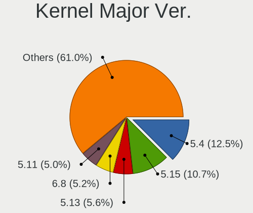

| Version | Notebooks | Percent |
|---------|-----------|---------|
| 5.4     | 176       | 18.18%  |
| 5.15    | 98        | 10.12%  |
| 5.13    | 78        | 8.06%   |
| 5.11    | 74        | 7.64%   |
| 5.8     | 64        | 6.61%   |
| 5.3     | 55        | 5.68%   |
| 5.10    | 55        | 5.68%   |
| 4.15    | 45        | 4.65%   |
| 5.16    | 41        | 4.24%   |
| 6.0     | 29        | 3%      |
| 5.19    | 29        | 3%      |
| 4.18    | 27        | 2.79%   |
| 5.0     | 23        | 2.38%   |
| 5.6     | 22        | 2.27%   |
| 5.17    | 22        | 2.27%   |
| 5.7     | 18        | 1.86%   |
| 5.9     | 15        | 1.55%   |
| 6.1     | 14        | 1.45%   |
| 5.18    | 13        | 1.34%   |
| 4.19    | 13        | 1.34%   |
| 5.14    | 11        | 1.14%   |
| 5.12    | 11        | 1.14%   |
| 4.9     | 7         | 0.72%   |
| 5.5     | 6         | 0.62%   |
| 4.4     | 5         | 0.52%   |
| 4.17    | 4         | 0.41%   |
| 5.2     | 3         | 0.31%   |
| 4.12    | 3         | 0.31%   |
| 5.1     | 2         | 0.21%   |
| 4.13    | 2         | 0.21%   |
| 4.8     | 1         | 0.1%    |
| 4.14    | 1         | 0.1%    |
| 4.10    | 1         | 0.1%    |

Arch
----

OS architecture (x86_64, i586, etc.)

| Name   | Notebooks | Percent |
|--------|-----------|---------|
| x86_64 | 858       | 98.51%  |
| i686   | 13        | 1.49%   |

DE
--

Desktop Environment

| Name            | Notebooks | Percent |
|-----------------|-----------|---------|
| GNOME           | 420       | 46.67%  |
| KDE5            | 148       | 16.44%  |
| Unknown         | 88        | 9.78%   |
| X-Cinnamon      | 70        | 7.78%   |
| XFCE            | 64        | 7.11%   |
| MATE            | 24        | 2.67%   |
| KDE             | 17        | 1.89%   |
| Cinnamon        | 14        | 1.56%   |
| Pantheon        | 10        | 1.11%   |
| i3              | 7         | 0.78%   |
| Budgie          | 6         | 0.67%   |
| KDE4            | 5         | 0.56%   |
| Unity           | 4         | 0.44%   |
| LXDE            | 4         | 0.44%   |
| Deepin          | 4         | 0.44%   |
| awesome         | 4         | 0.44%   |
| LXQt            | 3         | 0.33%   |
| GNOME Flashback | 3         | 0.33%   |
| sway            | 1         | 0.11%   |
| qtile           | 1         | 0.11%   |
| openbox         | 1         | 0.11%   |
| fluxbox         | 1         | 0.11%   |
| Bspwm           | 1         | 0.11%   |

Display Server
--------------

X11 or Wayland

| Name    | Notebooks | Percent |
|---------|-----------|---------|
| X11     | 700       | 78.21%  |
| Wayland | 143       | 15.98%  |
| Unknown | 47        | 5.25%   |
| Tty     | 5         | 0.56%   |

Display Manager
---------------

SDDM, LightDM, etc.

| Name    | Notebooks | Percent |
|---------|-----------|---------|
| Unknown | 424       | 46.75%  |
| SDDM    | 132       | 14.55%  |
| GDM     | 123       | 13.56%  |
| GDM3    | 106       | 11.69%  |
| LightDM | 90        | 9.92%   |
| TDM     | 25        | 2.76%   |
| KDM     | 5         | 0.55%   |
| SLiM    | 1         | 0.11%   |
| MDM     | 1         | 0.11%   |

OS Lang
-------

Language

| Lang    | Notebooks | Percent |
|---------|-----------|---------|
| de_AT   | 312       | 34.86%  |
| en_US   | 272       | 30.39%  |
| de_DE   | 128       | 14.3%   |
| Unknown | 104       | 11.62%  |
| en_GB   | 30        | 3.35%   |
| C       | 9         | 1.01%   |
| pl_PL   | 5         | 0.56%   |
| es_ES   | 5         | 0.56%   |
| ru_RU   | 3         | 0.34%   |
| POSIX   | 3         | 0.34%   |
| it_IT   | 3         | 0.34%   |
| en_IE   | 3         | 0.34%   |
| en_AT   | 3         | 0.34%   |
| de_CH   | 3         | 0.34%   |
| tr_TR   | 2         | 0.22%   |
| en_DE   | 2         | 0.22%   |
| uk_UA   | 1         | 0.11%   |
| ro_RO   | 1         | 0.11%   |
| pt_BR   | 1         | 0.11%   |
| hr_HR   | 1         | 0.11%   |
| en      | 1         | 0.11%   |
| de_LI   | 1         | 0.11%   |
| C.UTF8  | 1         | 0.11%   |
| bg_BG   | 1         | 0.11%   |

Boot Mode
---------

EFI or BIOS

| Mode | Notebooks | Percent |
|------|-----------|---------|
| EFI  | 486       | 54.3%   |
| BIOS | 409       | 45.7%   |

Filesystem
----------

Type of filesystem

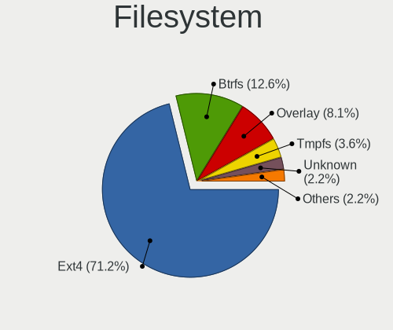

| Type    | Notebooks | Percent |
|---------|-----------|---------|
| Ext4    | 685       | 77.66%  |
| Overlay | 74        | 8.39%   |
| Btrfs   | 74        | 8.39%   |
| Unknown | 30        | 3.4%    |
| Xfs     | 7         | 0.79%   |
| Zfs     | 5         | 0.57%   |
| Ext3    | 2         | 0.23%   |
| XXXXXXX | 1         | 0.11%   |
| Tmpfs   | 1         | 0.11%   |
| Nfs     | 1         | 0.11%   |
| Ext2    | 1         | 0.11%   |
| Aufs    | 1         | 0.11%   |

Part. scheme
------------

Scheme of partitioning

| Type    | Notebooks | Percent |
|---------|-----------|---------|
| Unknown | 464       | 52.13%  |
| GPT     | 330       | 37.08%  |
| MBR     | 96        | 10.79%  |

Dual Boot with Linux/BSD
------------------------

Hosting more than one Linux/BSD

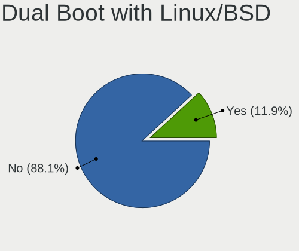

| Dual boot | Notebooks | Percent |
|-----------|-----------|---------|
| No        | 780       | 88.24%  |
| Yes       | 104       | 11.76%  |

Dual Boot (Win)
---------------

Hosting Linux and Windows

| Dual boot | Notebooks | Percent |
|-----------|-----------|---------|
| No        | 657       | 74.41%  |
| Yes       | 226       | 25.59%  |

Board
-----

Vendor
------

Motherboard manufacturer

| Name                | Notebooks | Percent |
|---------------------|-----------|---------|
| Lenovo              | 241       | 27.7%   |
| Hewlett-Packard     | 160       | 18.39%  |
| Dell                | 97        | 11.15%  |
| ASUSTek Computer    | 82        | 9.43%   |
| Acer                | 79        | 9.08%   |
| Medion              | 28        | 3.22%   |
| Apple               | 28        | 3.22%   |
| Toshiba             | 23        | 2.64%   |
| Sony                | 18        | 2.07%   |
| TUXEDO              | 16        | 1.84%   |
| MSI                 | 12        | 1.38%   |
| Fujitsu             | 10        | 1.15%   |
| HUAWEI              | 7         | 0.8%    |
| Samsung Electronics | 6         | 0.69%   |
| Unknown             | 6         | 0.69%   |
| Valve               | 5         | 0.57%   |
| TrekStor            | 4         | 0.46%   |
| Notebook            | 4         | 0.46%   |
| Fujitsu Siemens     | 4         | 0.46%   |
| Razer               | 3         | 0.34%   |
| Clevo               | 3         | 0.34%   |
| Wortmann AG         | 2         | 0.23%   |
| VALE                | 2         | 0.23%   |
| Timi                | 2         | 0.23%   |
| System76            | 2         | 0.23%   |
| Shuttle             | 2         | 0.23%   |
| Panasonic           | 2         | 0.23%   |
| Google              | 2         | 0.23%   |
| Gigabyte Technology | 2         | 0.23%   |
| AXDIA International | 2         | 0.23%   |
| W271ELQ             | 1         | 0.11%   |
| TWJ                 | 1         | 0.11%   |
| TENKU               | 1         | 0.11%   |
| Teclast             | 1         | 0.11%   |
| Schenker            | 1         | 0.11%   |
| Packard Bell        | 1         | 0.11%   |
| MAXDATA             | 1         | 0.11%   |
| LG Electronics      | 1         | 0.11%   |
| Jumper              | 1         | 0.11%   |
| GPD                 | 1         | 0.11%   |

Model
-----

Motherboard model

| Name                            | Notebooks | Percent |
|---------------------------------|-----------|---------|
| Unknown                         | 11        | 1.26%   |
| Apple MacBookPro15,1            | 8         | 0.92%   |
| HP EliteBook 840 G3             | 6         | 0.69%   |
| Valve Jupiter                   | 5         | 0.57%   |
| Lenovo IdeaPad 5 15ARE05 81YQ   | 5         | 0.57%   |
| HP Pavilion dv6                 | 5         | 0.57%   |
| HP EliteBook 8570p              | 5         | 0.57%   |
| Toshiba Satellite C70D-B        | 4         | 0.46%   |
| HP EliteBook 8460p              | 4         | 0.46%   |
| HP EliteBook 840 G6             | 4         | 0.46%   |
| Dell XPS 15 9570                | 4         | 0.46%   |
| Dell Latitude 5520              | 4         | 0.46%   |
| ASUS UX303LAB                   | 4         | 0.46%   |
| TrekStor Notebook Slim S130     | 3         | 0.34%   |
| Medion P15648                   | 3         | 0.34%   |
| Lenovo Yoga Slim 7 14ARE05 82A2 | 3         | 0.34%   |
| Lenovo ThinkPad E470 20H2S00700 | 3         | 0.34%   |
| HP ZBook 17 G5                  | 3         | 0.34%   |
| HP Pavilion g7                  | 3         | 0.34%   |
| HP Notebook                     | 3         | 0.34%   |
| HP EliteBook 840 G1             | 3         | 0.34%   |
| HP EliteBook 6930p              | 3         | 0.34%   |
| HP EliteBook 2560p              | 3         | 0.34%   |
| Dell XPS 17 9700                | 3         | 0.34%   |
| Dell XPS 13 9343                | 3         | 0.34%   |
| Dell XPS 13 9305                | 3         | 0.34%   |
| Dell Latitude E7450             | 3         | 0.34%   |
| Dell Latitude E7440             | 3         | 0.34%   |
| Dell Latitude E6400             | 3         | 0.34%   |
| Dell Latitude E5550             | 3         | 0.34%   |
| Dell Inspiron 1720              | 3         | 0.34%   |
| Apple MacBookPro8,1             | 3         | 0.34%   |
| Acer TravelMate P253            | 3         | 0.34%   |
| Acer Swift SF314-42             | 3         | 0.34%   |
| Acer Swift SF114-34             | 3         | 0.34%   |
| Acer Aspire 7750G               | 3         | 0.34%   |
| TUXEDO Pulse 15 Gen1            | 2         | 0.23%   |
| Toshiba Satellite Pro C660      | 2         | 0.23%   |
| Toshiba Satellite L70-B         | 2         | 0.23%   |
| Toshiba Satellite C50D-B        | 2         | 0.23%   |

Model Family
------------

Motherboard model prefix

| Name                | Notebooks | Percent |
|---------------------|-----------|---------|
| Lenovo ThinkPad     | 169       | 19.43%  |
| HP EliteBook        | 61        | 7.01%   |
| Acer Aspire         | 49        | 5.63%   |
| Dell Latitude       | 43        | 4.94%   |
| Lenovo IdeaPad      | 27        | 3.1%    |
| Dell XPS            | 27        | 3.1%    |
| HP ProBook          | 25        | 2.87%   |
| HP Pavilion         | 23        | 2.64%   |
| Toshiba Satellite   | 21        | 2.41%   |
| Dell Inspiron       | 13        | 1.49%   |
| ASUS VivoBook       | 11        | 1.26%   |
| Unknown             | 11        | 1.26%   |
| Lenovo ThinkBook    | 10        | 1.15%   |
| HP ZBook            | 10        | 1.15%   |
| Fujitsu LIFEBOOK    | 10        | 1.15%   |
| Lenovo Yoga         | 9         | 1.03%   |
| HP Laptop           | 9         | 1.03%   |
| Dell Precision      | 9         | 1.03%   |
| Acer TravelMate     | 9         | 1.03%   |
| Acer Swift          | 9         | 1.03%   |
| Apple MacBookPro15  | 8         | 0.92%   |
| ASUS Zenbook        | 6         | 0.69%   |
| ASUS ROG            | 6         | 0.69%   |
| Acer Nitro          | 6         | 0.69%   |
| Valve Jupiter       | 5         | 0.57%   |
| HP OMEN             | 5         | 0.57%   |
| HP Compaq           | 5         | 0.57%   |
| HP 250              | 5         | 0.57%   |
| ASUS UX303LAB       | 4         | 0.46%   |
| TrekStor Notebook   | 3         | 0.34%   |
| Razer Blade         | 3         | 0.34%   |
| Medion P15648       | 3         | 0.34%   |
| Lenovo Legion       | 3         | 0.34%   |
| HP Notebook         | 3         | 0.34%   |
| HP 255              | 3         | 0.34%   |
| Apple MacBookPro8   | 3         | 0.34%   |
| Apple MacBookPro5   | 3         | 0.34%   |
| VALE Notebook       | 2         | 0.23%   |
| TUXEDO Pulse        | 2         | 0.23%   |
| TUXEDO InfinityBook | 2         | 0.23%   |

MFG Year
--------

Motherboard manufacture year

| Year | Notebooks | Percent |
|------|-----------|---------|
| 2020 | 113       | 12.99%  |
| 2012 | 78        | 8.97%   |
| 2011 | 74        | 8.51%   |
| 2019 | 70        | 8.05%   |
| 2021 | 68        | 7.82%   |
| 2018 | 65        | 7.47%   |
| 2017 | 61        | 7.01%   |
| 2015 | 56        | 6.44%   |
| 2014 | 53        | 6.09%   |
| 2016 | 52        | 5.98%   |
| 2013 | 46        | 5.29%   |
| 2008 | 33        | 3.79%   |
| 2010 | 29        | 3.33%   |
| 2009 | 27        | 3.1%    |
| 2022 | 22        | 2.53%   |
| 2007 | 16        | 1.84%   |
| 2006 | 6         | 0.69%   |
| 2005 | 1         | 0.11%   |

Form Factor
-----------

Physical design of the computer

| Name     | Notebooks | Percent |
|----------|-----------|---------|
| Notebook | 870       | 100%    |

Secure Boot
-----------

Enabled or disabled

| State    | Notebooks | Percent |
|----------|-----------|---------|
| Disabled | 775       | 87.87%  |
| Enabled  | 107       | 12.13%  |

Coreboot
--------

Have coreboot on board

| Used | Notebooks | Percent |
|------|-----------|---------|
| No   | 866       | 99.54%  |
| Yes  | 4         | 0.46%   |

RAM Size
--------

Total RAM memory

| Size in GB  | Notebooks | Percent |
|-------------|-----------|---------|
| 4.01-8.0    | 225       | 25.6%   |
| 16.01-24.0  | 174       | 19.8%   |
| 8.01-16.0   | 172       | 19.57%  |
| 3.01-4.0    | 156       | 17.75%  |
| 32.01-64.0  | 80        | 9.1%    |
| 1.01-2.0    | 34        | 3.87%   |
| 24.01-32.0  | 15        | 1.71%   |
| 2.01-3.0    | 9         | 1.02%   |
| 64.01-256.0 | 7         | 0.8%    |
| 0.51-1.0    | 7         | 0.8%    |

RAM Used
--------

Used RAM memory

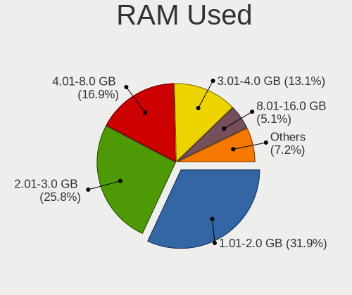

| Used GB    | Notebooks | Percent |
|------------|-----------|---------|
| 1.01-2.0   | 358       | 37.14%  |
| 2.01-3.0   | 242       | 25.1%   |
| 4.01-8.0   | 133       | 13.8%   |
| 3.01-4.0   | 117       | 12.14%  |
| 0.51-1.0   | 58        | 6.02%   |
| 8.01-16.0  | 39        | 4.05%   |
| 16.01-24.0 | 10        | 1.04%   |
| 0.01-0.5   | 4         | 0.41%   |
| 24.01-32.0 | 2         | 0.21%   |
| 32.01-64.0 | 1         | 0.1%    |

Total Drives
------------

Number of drives on board

| Drives | Notebooks | Percent |
|--------|-----------|---------|
| 1      | 664       | 75.03%  |
| 2      | 181       | 20.45%  |
| 3      | 29        | 3.28%   |
| 0      | 7         | 0.79%   |
| 5      | 2         | 0.23%   |
| 4      | 2         | 0.23%   |

Has CD-ROM
----------

Has CD-ROM on board

| Presented | Notebooks | Percent |
|-----------|-----------|---------|
| No        | 576       | 65.9%   |
| Yes       | 298       | 34.1%   |

Has Ethernet
------------

Has Ethernet on board

| Presented | Notebooks | Percent |
|-----------|-----------|---------|
| Yes       | 721       | 82.68%  |
| No        | 151       | 17.32%  |

Has WiFi
--------

Has WiFi module

| Presented | Notebooks | Percent |
|-----------|-----------|---------|
| Yes       | 859       | 98.74%  |
| No        | 11        | 1.26%   |

Has Bluetooth
-------------

Has Bluetooth module

| Presented | Notebooks | Percent |
|-----------|-----------|---------|
| Yes       | 670       | 76.66%  |
| No        | 204       | 23.34%  |

Location
--------

Country
-------

Geographic location (country)

| Country | Notebooks | Percent |
|---------|-----------|---------|
| Austria | 870       | 100%    |

City
----

Geographic location (city)

| City                      | Notebooks | Percent |
|---------------------------|-----------|---------|
| Vienna                    | 525       | 57.57%  |
| Graz                      | 52        | 5.7%    |
| Salzburg                  | 23        | 2.52%   |
| Innsbruck                 | 22        | 2.41%   |
| Linz                      | 21        | 2.3%    |
| Bad Hall                  | 18        | 1.97%   |
| Klagenfurt                | 11        | 1.21%   |
| Wels                      | 7         | 0.77%   |
| Leonding                  | 7         | 0.77%   |
| Villach                   | 6         | 0.66%   |
| Sankt Plten             | 6         | 0.66%   |
| Perg                      | 6         | 0.66%   |
| Wrgl                    | 5         | 0.55%   |
| Wiener Neustadt           | 5         | 0.55%   |
| Korneuburg                | 5         | 0.55%   |
| Dornbirn                  | 5         | 0.55%   |
| Baden bei Wien            | 5         | 0.55%   |
| Umhausen                  | 4         | 0.44%   |
| Bregenz                   | 4         | 0.44%   |
| Traunkirchen              | 3         | 0.33%   |
| Traun                     | 3         | 0.33%   |
| Hard                      | 3         | 0.33%   |
| Gaenserndorf              | 3         | 0.33%   |
| Feldkirch                 | 3         | 0.33%   |
| Woerdern                  | 2         | 0.22%   |
| Traiskirchen              | 2         | 0.22%   |
| Spielberg bei Knittelfeld | 2         | 0.22%   |
| Sommerein                 | 2         | 0.22%   |
| Neusiedl am See           | 2         | 0.22%   |
| Mauthausen                | 2         | 0.22%   |
| Mautern                   | 2         | 0.22%   |
| Lech                      | 2         | 0.22%   |
| Hartberg                  | 2         | 0.22%   |
| Hallwang                  | 2         | 0.22%   |
| Gross-Enzersdorf          | 2         | 0.22%   |
| Fraham                    | 2         | 0.22%   |
| Eisenstadt                | 2         | 0.22%   |
| Deutsch Griffen           | 2         | 0.22%   |
| Zell am See               | 1         | 0.11%   |
| Ybbs an der Donau         | 1         | 0.11%   |

Drives
------

Drive Vendor
------------

Hard drive vendors

| Vendor                         | Notebooks | Drives | Percent |
|--------------------------------|-----------|--------|---------|
| Samsung Electronics            | 252       | 348    | 23.73%  |
| SanDisk                        | 107       | 143    | 10.08%  |
| Seagate                        | 93        | 122    | 8.76%   |
| Toshiba                        | 89        | 109    | 8.38%   |
| WDC                            | 83        | 110    | 7.82%   |
| Unknown                        | 55        | 72     | 5.18%   |
| SK hynix                       | 47        | 59     | 4.43%   |
| Kingston                       | 43        | 53     | 4.05%   |
| Crucial                        | 36        | 48     | 3.39%   |
| Intel                          | 34        | 36     | 3.2%    |
| Hitachi                        | 27        | 29     | 2.54%   |
| HGST                           | 26        | 32     | 2.45%   |
| Micron Technology              | 25        | 32     | 2.35%   |
| Intenso                        | 15        | 17     | 1.41%   |
| Transcend                      | 14        | 16     | 1.32%   |
| Apple                          | 14        | 25     | 1.32%   |
| KIOXIA                         | 11        | 15     | 1.04%   |
| LITEONIT                       | 7         | 9      | 0.66%   |
| China                          | 6         | 6      | 0.56%   |
| LITEON                         | 5         | 6      | 0.47%   |
| A-DATA Technology              | 5         | 8      | 0.47%   |
| Phison                         | 4         | 4      | 0.38%   |
| ASMT                           | 4         | 6      | 0.38%   |
| SABRENT                        | 3         | 3      | 0.28%   |
| OCZ                            | 3         | 4      | 0.28%   |
| Micron/Crucial Technology      | 3         | 3      | 0.28%   |
| Lenovo                         | 3         | 4      | 0.28%   |
| INNOVATION IT                  | 3         | 3      | 0.28%   |
| Unknown                        | 3         | 5      | 0.28%   |
| UMIS                           | 2         | 2      | 0.19%   |
| Solid State Storage Technology | 2         | 2      | 0.19%   |
| Leven                          | 2         | 2      | 0.19%   |
| Kingston Technology Company    | 2         | 2      | 0.19%   |
| JMicron Technology             | 2         | 2      | 0.19%   |
| ICY BOX                        | 2         | 2      | 0.19%   |
| Hewlett-Packard                | 2         | 1      | 0.19%   |
| GOODRAM                        | 2         | 2      | 0.19%   |
| Fujitsu                        | 2         | 2      | 0.19%   |
| Corsair                        | 2         | 2      | 0.19%   |
| Wdxsky                         | 1         | 1      | 0.09%   |

Drive Model
-----------

Hard drive models

| Model                                               | Notebooks | Percent |
|-----------------------------------------------------|-----------|---------|
| Samsung NVMe SSD Drive 512GB                        | 23        | 2.06%   |
| SanDisk NVMe SSD Drive 512GB                        | 12        | 1.08%   |
| Samsung NVMe SSD Drive 1TB                          | 12        | 1.08%   |
| Toshiba MQ01ABD100 1TB                              | 11        | 0.99%   |
| Samsung SSD 850 EVO 250GB                           | 11        | 0.99%   |
| Samsung SSD 860 EVO 500GB                           | 10        | 0.9%    |
| Toshiba MQ04ABF100 1TB                              | 9         | 0.81%   |
| Samsung NVMe SSD Drive 1024GB                       | 9         | 0.81%   |
| Transcend TS240GMTS420S 240GB SSD                   | 8         | 0.72%   |
| SK hynix NVMe SSD Drive 512GB                       | 8         | 0.72%   |
| Seagate ST1000LM024 HN-M101MBB 1TB                  | 8         | 0.72%   |
| WDC PC SN730 SDBQNTY-512G-1001 512GB                | 7         | 0.63%   |
| Unknown MMC Card  32GB                              | 7         | 0.63%   |
| Seagate ST9500325AS 500GB                           | 7         | 0.63%   |
| Seagate ST500LT012-1DG142 500GB                     | 7         | 0.63%   |
| SanDisk SSD PLUS 240GB                              | 7         | 0.63%   |
| Samsung NVMe SSD Drive 500GB                        | 7         | 0.63%   |
| Apple SSD AP0512M 500GB                             | 7         | 0.63%   |
| Toshiba MQ01ABF050 500GB                            | 6         | 0.54%   |
| Samsung SSD 850 PRO 256GB                           | 6         | 0.54%   |
| Samsung SSD 850 EVO 500GB                           | 6         | 0.54%   |
| Samsung NVMe SSD Controller SM981/PM981/PM983 250GB | 6         | 0.54%   |
| Kingston SV300S37A120G 120GB SSD                    | 6         | 0.54%   |
| Kingston NVMe SSD Drive 512GB                       | 6         | 0.54%   |
| HGST HTS721010A9E630 1TB                            | 6         | 0.54%   |
| WDC WD5000LPVX-22V0TT0 500GB                        | 5         | 0.45%   |
| Unknown MMC Card  64GB                              | 5         | 0.45%   |
| Toshiba NVMe SSD Drive 512GB                        | 5         | 0.45%   |
| Toshiba NVMe SSD Drive 256GB                        | 5         | 0.45%   |
| Toshiba KXG6AZNV1T02 1TB                            | 5         | 0.45%   |
| SK hynix HFS256G39TND-N210A 256GB SSD               | 5         | 0.45%   |
| Seagate ST2000LM015-2E8174 2TB                      | 5         | 0.45%   |
| Seagate ST1000LM035-1RK172 1TB                      | 5         | 0.45%   |
| SanDisk SD8SN8U-256G-1006 256GB SSD                 | 5         | 0.45%   |
| Samsung SSD 970 EVO Plus 1TB                        | 5         | 0.45%   |
| Samsung SSD 860 EVO 250GB                           | 5         | 0.45%   |
| Samsung MZVLB1T0HBLR-000L7 1TB                      | 5         | 0.45%   |
| Kingston SA400S37480G 480GB SSD                     | 5         | 0.45%   |
| Intel NVMe SSD Drive 512GB                          | 5         | 0.45%   |
| HGST HTS541010A9E680 1TB                            | 5         | 0.45%   |

HDD Vendor
----------

Hard disk drive vendors

| Vendor              | Notebooks | Drives | Percent |
|---------------------|-----------|--------|---------|
| Seagate             | 91        | 120    | 34.6%   |
| Toshiba             | 54        | 70     | 20.53%  |
| WDC                 | 50        | 65     | 19.01%  |
| Hitachi             | 27        | 29     | 10.27%  |
| HGST                | 26        | 32     | 9.89%   |
| Samsung Electronics | 6         | 7      | 2.28%   |
| SABRENT             | 3         | 3      | 1.14%   |
| JMicron Technology  | 2         | 2      | 0.76%   |
| Fujitsu             | 2         | 2      | 0.76%   |
| Unknown             | 1         | 2      | 0.38%   |
| Apple               | 1         | 1      | 0.38%   |

SSD Vendor
----------

Solid state drive vendors

| Vendor              | Notebooks | Drives | Percent |
|---------------------|-----------|--------|---------|
| Samsung Electronics | 118       | 150    | 29.87%  |
| SanDisk             | 75        | 102    | 18.99%  |
| Crucial             | 33        | 45     | 8.35%   |
| Kingston            | 29        | 34     | 7.34%   |
| Transcend           | 14        | 16     | 3.54%   |
| SK hynix            | 14        | 18     | 3.54%   |
| Intenso             | 13        | 15     | 3.29%   |
| Intel               | 13        | 13     | 3.29%   |
| Micron Technology   | 11        | 15     | 2.78%   |
| Toshiba             | 9         | 11     | 2.28%   |
| LITEONIT            | 7         | 9      | 1.77%   |
| WDC                 | 6         | 7      | 1.52%   |
| China               | 6         | 6      | 1.52%   |
| LITEON              | 5         | 6      | 1.27%   |
| Apple               | 5         | 5      | 1.27%   |
| A-DATA Technology   | 5         | 8      | 1.27%   |
| OCZ                 | 3         | 4      | 0.76%   |
| INNOVATION IT       | 3         | 3      | 0.76%   |
| Phison              | 2         | 2      | 0.51%   |
| Leven               | 2         | 2      | 0.51%   |
| GOODRAM             | 2         | 2      | 0.51%   |
| Corsair             | 2         | 2      | 0.51%   |
| ASMT                | 2         | 2      | 0.51%   |
| Verbatim            | 1         | 1      | 0.25%   |
| Vaseky              | 1         | 1      | 0.25%   |
| Unknown             | 1         | 2      | 0.25%   |
| Teclast             | 1         | 1      | 0.25%   |
| TCSUNBOW            | 1         | 1      | 0.25%   |
| SPCC                | 1         | 1      | 0.25%   |
| Seagate             | 1         | 1      | 0.25%   |
| Patriot             | 1         | 1      | 0.25%   |
| Netac               | 1         | 3      | 0.25%   |
| Mushkin             | 1         | 1      | 0.25%   |
| KingDian            | 1         | 1      | 0.25%   |
| Inateck             | 1         | 1      | 0.25%   |
| Hewlett-Packard     | 1         | 1      | 0.25%   |
| Emtec               | 1         | 1      | 0.25%   |
| BIWIN               | 1         | 1      | 0.25%   |
| Apacer              | 1         | 1      | 0.25%   |

Drive Kind
----------

HDD or SSD

| Kind    | Notebooks | Drives | Percent |
|---------|-----------|--------|---------|
| SSD     | 369       | 496    | 36%     |
| NVMe    | 337       | 452    | 32.88%  |
| HDD     | 251       | 333    | 24.49%  |
| MMC     | 55        | 75     | 5.37%   |
| Unknown | 13        | 14     | 1.27%   |

Drive Connector
---------------

SATA, SAS, NVMe, etc.

| Type | Notebooks | Drives | Percent |
|------|-----------|--------|---------|
| SATA | 550       | 790    | 55.95%  |
| NVMe | 337       | 452    | 34.28%  |
| MMC  | 55        | 75     | 5.6%    |
| SAS  | 41        | 53     | 4.17%   |

Drive Size
----------

Size of hard drive

| Size in TB | Notebooks | Drives | Percent |
|------------|-----------|--------|---------|
| 0.01-0.5   | 427       | 593    | 69.66%  |
| 0.51-1.0   | 159       | 201    | 25.94%  |
| 1.01-2.0   | 21        | 27     | 3.43%   |
| 4.01-10.0  | 5         | 7      | 0.82%   |
| 2.01-3.0   | 1         | 1      | 0.16%   |

Space Total
-----------

Amount of disk space available on the file system

| Size in GB     | Notebooks | Percent |
|----------------|-----------|---------|
| 101-250        | 270       | 29.67%  |
| 251-500        | 215       | 23.63%  |
| 501-1000       | 134       | 14.73%  |
| 1-20           | 69        | 7.58%   |
| 51-100         | 59        | 6.48%   |
| 1001-2000      | 46        | 5.05%   |
| Unknown        | 46        | 5.05%   |
| 21-50          | 38        | 4.18%   |
| More than 3000 | 19        | 2.09%   |
| 2001-3000      | 14        | 1.54%   |

Space Used
----------

Amount of used disk space

| Used GB        | Notebooks | Percent |
|----------------|-----------|---------|
| 1-20           | 367       | 38.92%  |
| 21-50          | 180       | 19.09%  |
| 101-250        | 134       | 14.21%  |
| 51-100         | 97        | 10.29%  |
| 251-500        | 55        | 5.83%   |
| Unknown        | 46        | 4.88%   |
| 501-1000       | 41        | 4.35%   |
| 1001-2000      | 16        | 1.7%    |
| More than 3000 | 4         | 0.42%   |
| 2001-3000      | 3         | 0.32%   |

Malfunc. Drives
---------------

Drive models with a malfunction

| Model                                            | Notebooks | Drives | Percent |
|--------------------------------------------------|-----------|--------|---------|
| Seagate ST1000LM024 HN-M101MBB 1TB               | 4         | 4      | 8.16%   |
| Toshiba MQ01ABF050 500GB                         | 2         | 3      | 4.08%   |
| HGST HTS721010A9E630 1TB                         | 2         | 3      | 4.08%   |
| WDC WD5000LPLX-00ZNTT0 500GB                     | 1         | 1      | 2.04%   |
| WDC WD3200BEVT-08A23T1 320GB                     | 1         | 1      | 2.04%   |
| Toshiba MQ02ABF050H 500GB                        | 1         | 1      | 2.04%   |
| Toshiba MQ01ABD100M 1TB                          | 1         | 1      | 2.04%   |
| Toshiba MQ01ABD100 1TB                           | 1         | 1      | 2.04%   |
| Toshiba MK7559GSXP 752GB                         | 1         | 1      | 2.04%   |
| Toshiba MK5055GSX 500GB                          | 1         | 1      | 2.04%   |
| Toshiba MK3276GSX 320GB                          | 1         | 1      | 2.04%   |
| Seagate ST9500420AS 500GB                        | 1         | 1      | 2.04%   |
| Seagate ST9250315AS 250GB                        | 1         | 1      | 2.04%   |
| Seagate ST500LM000-SSHD-8GB                      | 1         | 2      | 2.04%   |
| Seagate ST1000LM035-1RK172 1TB                   | 1         | 1      | 2.04%   |
| Seagate ST1000LM014-1EJ164-SSHD 1TB              | 1         | 8      | 2.04%   |
| SanDisk SSD PLUS 240GB                           | 1         | 1      | 2.04%   |
| SanDisk SDSSDH3 1T00 1TB                         | 1         | 1      | 2.04%   |
| Samsung Electronics SSD 870 EVO 1TB              | 1         | 1      | 2.04%   |
| Samsung Electronics SSD 850 EVO 1TB              | 1         | 1      | 2.04%   |
| Samsung Electronics SSD 840 Series 120GB         | 1         | 1      | 2.04%   |
| Samsung Electronics MZ7PA128HMCD-010H1 128GB SSD | 1         | 1      | 2.04%   |
| Samsung Electronics MMCRE28G8MXP-0VBH1 128GB SSD | 1         | 1      | 2.04%   |
| Samsung Electronics HN-M101MBB 1TB               | 1         | 1      | 2.04%   |
| Samsung Electronics HM500JI 500GB                | 1         | 1      | 2.04%   |
| LITEONIT LCS-128L9S-11 2.5 7mm 128GB SSD         | 1         | 1      | 2.04%   |
| LITEONIT CMT-64L3M 64GB SSD                      | 1         | 2      | 2.04%   |
| LITEON CV8-8E128-HP 128GB SSD                    | 1         | 1      | 2.04%   |
| Intel SSDSCKJF180A5L 180GB                       | 1         | 1      | 2.04%   |
| Intel SSDSC2BF240A5L 240GB                       | 1         | 1      | 2.04%   |
| Intel SSDPEKNW512G8H 512GB                       | 1         | 1      | 2.04%   |
| Hitachi HTS725050A9A364 500GB                    | 1         | 2      | 2.04%   |
| Hitachi HTS725032A9A364 320GB                    | 1         | 1      | 2.04%   |
| Hitachi HTS547575A9E384 752GB                    | 1         | 1      | 2.04%   |
| Hitachi HTS543232A7A384 320GB                    | 1         | 1      | 2.04%   |
| Hitachi HTS543216A7A384 160GB                    | 1         | 1      | 2.04%   |
| HGST HTS725050A7E630 500GB                       | 1         | 1      | 2.04%   |
| HGST HTS545050A7E680 500GB                       | 1         | 1      | 2.04%   |
| HGST HTS541010A9E680 1TB                         | 1         | 1      | 2.04%   |
| GOODRAM C40 240GB SSD                            | 1         | 1      | 2.04%   |

Malfunc. Drive Vendor
---------------------

Vendors of faulty drives

| Vendor              | Notebooks | Drives | Percent |
|---------------------|-----------|--------|---------|
| Toshiba             | 8         | 9      | 17.02%  |
| Seagate             | 8         | 17     | 17.02%  |
| Samsung Electronics | 6         | 7      | 12.77%  |
| Hitachi             | 5         | 6      | 10.64%  |
| HGST                | 5         | 6      | 10.64%  |
| Intel               | 3         | 3      | 6.38%   |
| WDC                 | 2         | 2      | 4.26%   |
| SanDisk             | 2         | 2      | 4.26%   |
| LITEONIT            | 2         | 3      | 4.26%   |
| LITEON              | 1         | 1      | 2.13%   |
| GOODRAM             | 1         | 1      | 2.13%   |
| Fujitsu             | 1         | 1      | 2.13%   |
| Crucial             | 1         | 1      | 2.13%   |
| Corsair             | 1         | 1      | 2.13%   |
| A-DATA Technology   | 1         | 3      | 2.13%   |

Malfunc. HDD Vendor
-------------------

Vendors of faulty HDD drives

| Vendor              | Notebooks | Drives | Percent |
|---------------------|-----------|--------|---------|
| Toshiba             | 8         | 9      | 25.81%  |
| Seagate             | 8         | 17     | 25.81%  |
| Hitachi             | 5         | 6      | 16.13%  |
| HGST                | 5         | 6      | 16.13%  |
| WDC                 | 2         | 2      | 6.45%   |
| Samsung Electronics | 2         | 2      | 6.45%   |
| Fujitsu             | 1         | 1      | 3.23%   |

Malfunc. Drive Kind
-------------------

Kinds of faulty drives

| Kind | Notebooks | Drives | Percent |
|------|-----------|--------|---------|
| HDD  | 30        | 43     | 65.22%  |
| SSD  | 15        | 19     | 32.61%  |
| NVMe | 1         | 1      | 2.17%   |

Failed Drives
-------------

Failed drive models

Zero info for selected period =(

Failed Drive Vendor
-------------------

Failed drive vendors

Zero info for selected period =(

Drive Status
------------

Number of failed and malfunc. drives

| Status   | Notebooks | Drives | Percent |
|----------|-----------|--------|---------|
| Detected | 544       | 835    | 58.24%  |
| Works    | 344       | 472    | 36.83%  |
| Malfunc  | 46        | 63     | 4.93%   |

Storage controller
------------------

Storage Vendor
--------------

Storage controller vendors

| Vendor                           | Notebooks | Percent |
|----------------------------------|-----------|---------|
| Intel                            | 573       | 56.85%  |
| Samsung Electronics              | 139       | 13.79%  |
| AMD                              | 95        | 9.42%   |
| SanDisk                          | 58        | 5.75%   |
| SK hynix                         | 34        | 3.37%   |
| Toshiba America Info Systems     | 29        | 2.88%   |
| Micron Technology                | 15        | 1.49%   |
| Kingston Technology Company      | 15        | 1.49%   |
| KIOXIA                           | 11        | 1.09%   |
| Nvidia                           | 9         | 0.89%   |
| Apple                            | 8         | 0.79%   |
| Union Memory (Shenzhen)          | 5         | 0.5%    |
| Micron/Crucial Technology        | 5         | 0.5%    |
| Lenovo                           | 3         | 0.3%    |
| Solid State Storage Technology   | 2         | 0.2%    |
| Phison Electronics               | 2         | 0.2%    |
| VIA Technologies                 | 1         | 0.1%    |
| Silicon Motion                   | 1         | 0.1%    |
| Silicon Integrated Systems [SiS] | 1         | 0.1%    |
| Seagate Technology               | 1         | 0.1%    |
| ADATA Technology                 | 1         | 0.1%    |

Storage Model
-------------

Storage controller models

| Model                                                                            | Notebooks | Percent |
|----------------------------------------------------------------------------------|-----------|---------|
| AMD FCH SATA Controller [AHCI mode]                                              | 84        | 7.79%   |
| Samsung NVMe SSD Controller SM981/PM981/PM983                                    | 74        | 6.86%   |
| Intel Sunrise Point-LP SATA Controller [AHCI mode]                               | 71        | 6.59%   |
| Intel 7 Series Chipset Family 6-port SATA Controller [AHCI mode]                 | 69        | 6.4%    |
| Intel 6 Series/C200 Series Chipset Family 6 port Mobile SATA AHCI Controller     | 69        | 6.4%    |
| Intel 82801 Mobile SATA Controller [RAID mode]                                   | 45        | 4.17%   |
| Intel 8 Series SATA Controller 1 [AHCI mode]                                     | 34        | 3.15%   |
| Intel Wildcat Point-LP SATA Controller [AHCI Mode]                               | 29        | 2.69%   |
| Samsung NVMe SSD Controller 980                                                  | 28        | 2.6%    |
| Intel 82801IBM/IEM (ICH9M/ICH9M-E) 4 port SATA Controller [AHCI mode]            | 28        | 2.6%    |
| Intel Volume Management Device NVMe RAID Controller                              | 25        | 2.32%   |
| SanDisk WD Black SN750 / PC SN730 NVMe SSD                                       | 21        | 1.95%   |
| Intel 8 Series/C220 Series Chipset Family 6-port SATA Controller 1 [AHCI mode]   | 20        | 1.86%   |
| Intel HM170/QM170 Chipset SATA Controller [AHCI Mode]                            | 18        | 1.67%   |
| Intel Cannon Lake Mobile PCH SATA AHCI Controller                                | 18        | 1.67%   |
| Intel 82801HM/HEM (ICH8M/ICH8M-E) IDE Controller                                 | 18        | 1.67%   |
| Samsung NVMe SSD Controller SM961/PM961/SM963                                    | 17        | 1.58%   |
| Intel 82801HM/HEM (ICH8M/ICH8M-E) SATA Controller [AHCI mode]                    | 17        | 1.58%   |
| Toshiba America Info Systems XG6 NVMe SSD Controller                             | 15        | 1.39%   |
| Samsung NVMe SSD Controller PM9A1/PM9A3/980PRO                                   | 15        | 1.39%   |
| Micron Non-Volatile memory controller                                            | 15        | 1.39%   |
| SK hynix Non-Volatile memory controller                                          | 14        | 1.3%    |
| Intel 5 Series/3400 Series Chipset 6 port SATA AHCI Controller                   | 13        | 1.21%   |
| SanDisk WD Blue SN550 NVMe SSD                                                   | 12        | 1.11%   |
| Intel SSD 660P Series                                                            | 12        | 1.11%   |
| Intel Comet Lake SATA AHCI Controller                                            | 11        | 1.02%   |
| Intel 5 Series/3400 Series Chipset 4 port SATA AHCI Controller                   | 11        | 1.02%   |
| Intel Tiger Lake-LP SATA Controller                                              | 10        | 0.93%   |
| Intel Celeron N3350/Pentium N4200/Atom E3900 Series SATA AHCI Controller         | 10        | 0.93%   |
| KIOXIA NVMe SSD Controller BG4                                                   | 9         | 0.83%   |
| Intel Celeron/Pentium Silver Processor SATA Controller                           | 9         | 0.83%   |
| Intel Atom/Celeron/Pentium Processor x5-E8000/J3xxx/N3xxx Series SATA Controller | 9         | 0.83%   |
| AMD SB7x0/SB8x0/SB9x0 SATA Controller [AHCI mode]                                | 9         | 0.83%   |
| SanDisk Non-Volatile memory controller                                           | 8         | 0.74%   |
| Intel Mobile 4 Series Chipset PT IDER Controller                                 | 8         | 0.74%   |
| Apple ANS2 NVMe Controller                                                       | 8         | 0.74%   |
| Toshiba America Info Systems BG3 NVMe SSD Controller                             | 7         | 0.65%   |
| SK hynix Gold P31/PC711 NVMe Solid State Drive                                   | 7         | 0.65%   |
| SanDisk WD Blue SN500 / PC SN520 NVMe SSD                                        | 7         | 0.65%   |
| Intel 82801G (ICH7 Family) IDE Controller                                        | 7         | 0.65%   |

Storage Kind
------------

Kind of storage controller (IDE, SATA, NVMe, SAS, ...)

| Kind | Notebooks | Percent |
|------|-----------|---------|
| SATA | 589       | 55.83%  |
| NVMe | 338       | 32.04%  |
| RAID | 73        | 6.92%   |
| IDE  | 55        | 5.21%   |

Processor
---------

CPU Vendor
----------

Processor vendors

| Vendor | Notebooks | Percent |
|--------|-----------|---------|
| Intel  | 705       | 81.03%  |
| AMD    | 165       | 18.97%  |

CPU Model
---------

Processor models

| Model                                         | Notebooks | Percent |
|-----------------------------------------------|-----------|---------|
| Intel Core i7-8565U CPU @ 1.80GHz             | 23        | 2.64%   |
| Intel Core i5-8250U CPU @ 1.60GHz             | 18        | 2.07%   |
| Intel 11th Gen Core i7-1165G7 @ 2.80GHz       | 15        | 1.72%   |
| Intel Core i7-10510U CPU @ 1.80GHz            | 14        | 1.61%   |
| Intel Core i5-3320M CPU @ 2.60GHz             | 14        | 1.61%   |
| Intel Core i7-8550U CPU @ 1.80GHz             | 13        | 1.49%   |
| Intel Core i5-7200U CPU @ 2.50GHz             | 12        | 1.38%   |
| Intel Core i5-6200U CPU @ 2.30GHz             | 12        | 1.38%   |
| Intel Core i5-2520M CPU @ 2.50GHz             | 12        | 1.38%   |
| Intel Core i7-8850H CPU @ 2.60GHz             | 11        | 1.26%   |
| Intel Core i5-5200U CPU @ 2.20GHz             | 11        | 1.26%   |
| Intel Core i5-4210U CPU @ 1.70GHz             | 11        | 1.26%   |
| AMD Ryzen 7 PRO 4750U with Radeon Graphics    | 11        | 1.26%   |
| Intel Core i7-8750H CPU @ 2.20GHz             | 10        | 1.15%   |
| Intel Core i7-7700HQ CPU @ 2.80GHz            | 10        | 1.15%   |
| Intel Core i7-7500U CPU @ 2.70GHz             | 10        | 1.15%   |
| Intel Core i5-6300U CPU @ 2.40GHz             | 10        | 1.15%   |
| Intel Core i5-10210U CPU @ 1.60GHz            | 10        | 1.15%   |
| Intel 11th Gen Core i5-1135G7 @ 2.40GHz       | 10        | 1.15%   |
| Intel Core i7-2670QM CPU @ 2.20GHz            | 9         | 1.03%   |
| Intel Core i7-1065G7 CPU @ 1.30GHz            | 9         | 1.03%   |
| Intel Core i7-5600U CPU @ 2.60GHz             | 8         | 0.92%   |
| Intel Core i5-3230M CPU @ 2.60GHz             | 8         | 0.92%   |
| AMD Ryzen 7 4800H with Radeon Graphics        | 8         | 0.92%   |
| AMD Ryzen 5 4500U with Radeon Graphics        | 8         | 0.92%   |
| Intel Core i5-5300U CPU @ 2.30GHz             | 7         | 0.8%    |
| Intel Core i5-2450M CPU @ 2.50GHz             | 7         | 0.8%    |
| Intel Core i5-2430M CPU @ 2.40GHz             | 7         | 0.8%    |
| Intel 11th Gen Core i7-1185G7 @ 3.00GHz       | 7         | 0.8%    |
| AMD Ryzen 7 5800H with Radeon Graphics        | 7         | 0.8%    |
| AMD Ryzen 7 4700U with Radeon Graphics        | 7         | 0.8%    |
| AMD Ryzen 5 3500U with Radeon Vega Mobile Gfx | 7         | 0.8%    |
| Intel Core i7-6700HQ CPU @ 2.60GHz            | 6         | 0.69%   |
| Intel Core i7-4600U CPU @ 2.10GHz             | 6         | 0.69%   |
| Intel Core i5-8265U CPU @ 1.60GHz             | 6         | 0.69%   |
| Intel Core 2 Duo CPU P8600 @ 2.40GHz          | 6         | 0.69%   |
| AMD Ryzen 7 PRO 5850U with Radeon Graphics    | 6         | 0.69%   |
| AMD Ryzen 7 5700U with Radeon Graphics        | 6         | 0.69%   |
| AMD Ryzen 5 5500U with Radeon Graphics        | 6         | 0.69%   |
| Intel Core i7-9750H CPU @ 2.60GHz             | 5         | 0.57%   |

CPU Model Family
----------------

Processor model prefix

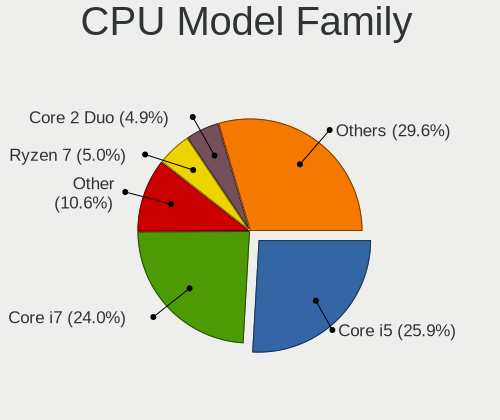

| Model                   | Notebooks | Percent |
|-------------------------|-----------|---------|
| Intel Core i7           | 238       | 27.36%  |
| Intel Core i5           | 217       | 24.94%  |
| Other                   | 56        | 6.44%   |
| Intel Core 2 Duo        | 46        | 5.29%   |
| AMD Ryzen 7             | 43        | 4.94%   |
| Intel Core i3           | 37        | 4.25%   |
| AMD Ryzen 5             | 35        | 4.02%   |
| Intel Celeron           | 31        | 3.56%   |
| Intel Pentium           | 27        | 3.1%    |
| AMD Ryzen 7 PRO         | 20        | 2.3%    |
| Intel Atom              | 18        | 2.07%   |
| Intel Pentium Dual-Core | 9         | 1.03%   |
| AMD A4                  | 9         | 1.03%   |
| Intel Core i9           | 7         | 0.8%    |
| AMD Ryzen 9             | 7         | 0.8%    |
| Intel Core 2            | 6         | 0.69%   |
| AMD Ryzen 5 PRO         | 6         | 0.69%   |
| AMD A6                  | 6         | 0.69%   |
| AMD E2                  | 5         | 0.57%   |
| AMD A8                  | 5         | 0.57%   |
| Intel Pentium Silver    | 4         | 0.46%   |
| Intel Genuine           | 4         | 0.46%   |
| AMD E1                  | 4         | 0.46%   |
| AMD E                   | 3         | 0.34%   |
| AMD Athlon II           | 3         | 0.34%   |
| Intel Xeon              | 2         | 0.23%   |
| Intel Pentium Dual      | 2         | 0.23%   |
| Intel Core m5           | 2         | 0.23%   |
| AMD Turion 64 X2 Mobile | 2         | 0.23%   |
| AMD Ryzen 3             | 2         | 0.23%   |
| AMD Athlon              | 2         | 0.23%   |
| AMD A10                 | 2         | 0.23%   |
| Intel Pentium Gold      | 1         | 0.11%   |
| Intel Core m7           | 1         | 0.11%   |
| Intel Core M            | 1         | 0.11%   |
| Intel Core 2 Solo       | 1         | 0.11%   |
| Intel Celeron M         | 1         | 0.11%   |
| AMD PRO A8              | 1         | 0.11%   |
| AMD Phenom II           | 1         | 0.11%   |
| AMD Mobile Sempron      | 1         | 0.11%   |

CPU Cores
---------

Number of processor cores

| Number  | Notebooks | Percent |
|---------|-----------|---------|
| 2       | 409       | 47.01%  |
| 4       | 300       | 34.48%  |
| 8       | 78        | 8.97%   |
| 6       | 63        | 7.24%   |
| 1       | 12        | 1.38%   |
| 12      | 5         | 0.57%   |
| 14      | 1         | 0.11%   |
| 10      | 1         | 0.11%   |
| Unknown | 1         | 0.11%   |

CPU Sockets
-----------

Number of sockets

| Number | Notebooks | Percent |
|--------|-----------|---------|
| 1      | 870       | 100%    |

CPU Threads
-----------

Threads per core (Hyper-Threading)

| Number  | Notebooks | Percent |
|---------|-----------|---------|
| 2       | 663       | 76.03%  |
| 1       | 208       | 23.85%  |
| Unknown | 1         | 0.11%   |

CPU Op-Modes
------------

CPU Operation Modes (32-bit, 64-bit)

| Op mode        | Notebooks | Percent |
|----------------|-----------|---------|
| 32-bit, 64-bit | 851       | 97.7%   |
| Unknown        | 13        | 1.49%   |
| 32-bit         | 7         | 0.8%    |

CPU Microcode
-------------

Microcode number

| Number     | Notebooks | Percent |
|------------|-----------|---------|
| Unknown    | 170       | 18.93%  |
| 0x206a7    | 70        | 7.8%    |
| 0x306a9    | 54        | 6.01%   |
| 0x806ec    | 43        | 4.79%   |
| 0x806ea    | 32        | 3.56%   |
| 0x406e3    | 32        | 3.56%   |
| 0x306d4    | 32        | 3.56%   |
| 0x806c1    | 30        | 3.34%   |
| 0x1067a    | 30        | 3.34%   |
| 0x906ea    | 27        | 3.01%   |
| 0x40651    | 27        | 3.01%   |
| 0x806e9    | 21        | 2.34%   |
| 0x306c3    | 19        | 2.12%   |
| 0x08600106 | 17        | 1.89%   |
| 0x0a50000c | 15        | 1.67%   |
| 0x506e3    | 14        | 1.56%   |
| 0x906e9    | 12        | 1.34%   |
| 0x08600103 | 12        | 1.34%   |
| 0x08108102 | 12        | 1.34%   |
| 0x706e5    | 11        | 1.22%   |
| 0x10676    | 11        | 1.22%   |
| 0xa0652    | 10        | 1.11%   |
| 0x506c9    | 10        | 1.11%   |
| 0x20655    | 10        | 1.11%   |
| 0x08608103 | 10        | 1.11%   |
| 0x806eb    | 9         | 1%      |
| 0x406c3    | 9         | 1%      |
| 0x30678    | 8         | 0.89%   |
| 0x906a3    | 7         | 0.78%   |
| 0x08600104 | 7         | 0.78%   |
| 0x07030105 | 7         | 0.78%   |
| 0x706a8    | 6         | 0.67%   |
| 0x406c4    | 6         | 0.67%   |
| 0x20652    | 6         | 0.67%   |
| 0x05000119 | 6         | 0.67%   |
| 0x906ed    | 5         | 0.56%   |
| 0x806d1    | 5         | 0.56%   |
| 0x6fd      | 5         | 0.56%   |
| 0x6f6      | 5         | 0.56%   |
| 0x106ca    | 5         | 0.56%   |

CPU Microarch
-------------

Microarchitecture

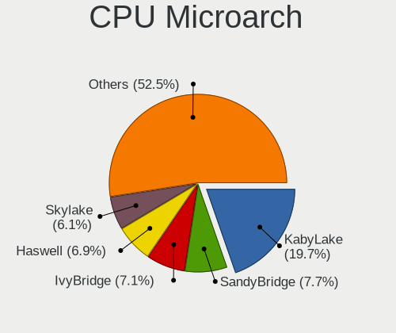

| Name             | Notebooks | Percent |
|------------------|-----------|---------|
| KabyLake         | 183       | 21.03%  |
| SandyBridge      | 80        | 9.2%    |
| IvyBridge        | 69        | 7.93%   |
| Haswell          | 60        | 6.9%    |
| Skylake          | 50        | 5.75%   |
| Penryn           | 49        | 5.63%   |
| Zen 2            | 48        | 5.52%   |
| TigerLake        | 37        | 4.25%   |
| Broadwell        | 36        | 4.14%   |
| Silvermont       | 26        | 2.99%   |
| Zen 3            | 24        | 2.76%   |
| Unknown          | 23        | 2.64%   |
| Westmere         | 20        | 2.3%    |
| Zen+             | 19        | 2.18%   |
| IceLake          | 19        | 2.18%   |
| Core             | 17        | 1.95%   |
| CometLake        | 11        | 1.26%   |
| Goldmont plus    | 10        | 1.15%   |
| Goldmont         | 10        | 1.15%   |
| Zen              | 9         | 1.03%   |
| Puma             | 9         | 1.03%   |
| Excavator        | 9         | 1.03%   |
| Bobcat           | 9         | 1.03%   |
| Bonnell          | 8         | 0.92%   |
| Alderlake Hybrid | 7         | 0.8%    |
| Jaguar           | 5         | 0.57%   |
| Nehalem          | 4         | 0.46%   |
| K8 Hammer        | 4         | 0.46%   |
| K10              | 4         | 0.46%   |
| P6               | 3         | 0.34%   |
| K10 Llano        | 3         | 0.34%   |
| Tremont          | 2         | 0.23%   |
| Piledriver       | 2         | 0.23%   |
| K8 & K10 hybrid  | 1         | 0.11%   |

Graphics
--------

GPU Vendor
----------

Vendors of graphics cards

| Vendor                           | Notebooks | Percent |
|----------------------------------|-----------|---------|
| Intel                            | 605       | 55.76%  |
| Nvidia                           | 242       | 22.3%   |
| AMD                              | 237       | 21.84%  |
| Silicon Integrated Systems [SiS] | 1         | 0.09%   |

GPU Model
---------

Graphics card models

| Model                                                                                    | Notebooks | Percent |
|------------------------------------------------------------------------------------------|-----------|---------|
| Intel 3rd Gen Core processor Graphics Controller                                         | 65        | 5.83%   |
| Intel 2nd Generation Core Processor Family Integrated Graphics Controller                | 64        | 5.75%   |
| AMD Renoir                                                                               | 47        | 4.22%   |
| Intel UHD Graphics 620                                                                   | 36        | 3.23%   |
| Intel Haswell-ULT Integrated Graphics Controller                                         | 35        | 3.14%   |
| Intel TigerLake-LP GT2 [Iris Xe Graphics]                                                | 34        | 3.05%   |
| Intel Skylake GT2 [HD Graphics 520]                                                      | 33        | 2.96%   |
| Intel HD Graphics 5500                                                                   | 31        | 2.78%   |
| Intel WhiskeyLake-U GT2 [UHD Graphics 620]                                               | 30        | 2.69%   |
| Intel HD Graphics 620                                                                    | 28        | 2.51%   |
| Intel CometLake-U GT2 [UHD Graphics]                                                     | 28        | 2.51%   |
| Intel CoffeeLake-H GT2 [UHD Graphics 630]                                                | 24        | 2.15%   |
| AMD Cezanne [Radeon Vega Series / Radeon Vega Mobile Series]                             | 21        | 1.89%   |
| AMD Picasso/Raven 2 [Radeon Vega Series / Radeon Vega Mobile Series]                     | 19        | 1.71%   |
| Intel Mobile 4 Series Chipset Integrated Graphics Controller                             | 18        | 1.62%   |
| Intel 4th Gen Core Processor Integrated Graphics Controller                              | 18        | 1.62%   |
| Intel Atom/Celeron/Pentium Processor x5-E8000/J3xxx/N3xxx Integrated Graphics Controller | 17        | 1.53%   |
| Intel Core Processor Integrated Graphics Controller                                      | 16        | 1.44%   |
| Nvidia GP108M [GeForce MX250]                                                            | 13        | 1.17%   |
| Intel HD Graphics 530                                                                    | 12        | 1.08%   |
| AMD Lucienne                                                                             | 12        | 1.08%   |
| Intel HD Graphics 630                                                                    | 11        | 0.99%   |
| Nvidia GP107M [GeForce GTX 1050 Ti Mobile]                                               | 10        | 0.9%    |
| Intel GeminiLake [UHD Graphics 600]                                                      | 10        | 0.9%    |
| Intel CometLake-H GT2 [UHD Graphics]                                                     | 10        | 0.9%    |
| AMD Baffin [Radeon RX 460/560D / Pro 450/455/460/555/555X/560/560X]                      | 10        | 0.9%    |
| Nvidia GM108M [GeForce 840M]                                                             | 9         | 0.81%   |
| Intel Iris Plus Graphics G7                                                              | 9         | 0.81%   |
| Intel Atom Processor Z36xxx/Z37xxx Series Graphics & Display                             | 9         | 0.81%   |
| AMD Seymour [Radeon HD 6400M/7400M Series]                                               | 8         | 0.72%   |
| AMD Raven Ridge [Radeon Vega Series / Radeon Vega Mobile Series]                         | 8         | 0.72%   |
| Nvidia GM108M [GeForce 940MX]                                                            | 7         | 0.63%   |
| Nvidia G84M [GeForce 8600M GT]                                                           | 7         | 0.63%   |
| Intel HD Graphics 500                                                                    | 7         | 0.63%   |
| Nvidia TU117M [GeForce GTX 1650 Mobile / Max-Q]                                          | 6         | 0.54%   |
| Nvidia GP107M [GeForce MX350]                                                            | 6         | 0.54%   |
| Nvidia GF117M [GeForce 610M/710M/810M/820M / GT 620M/625M/630M/720M]                     | 6         | 0.54%   |
| Intel Mobile GM965/GL960 Integrated Graphics Controller (secondary)                      | 6         | 0.54%   |
| Intel Mobile GM965/GL960 Integrated Graphics Controller (primary)                        | 6         | 0.54%   |
| Intel Alder Lake-P Integrated Graphics Controller                                        | 6         | 0.54%   |

GPU Combo
---------

Combinations of graphics cards

| Name           | Notebooks | Percent |
|----------------|-----------|---------|
| 1 x Intel      | 406       | 46.56%  |
| 1 x AMD        | 166       | 19.04%  |
| Intel + Nvidia | 162       | 18.58%  |
| 1 x Nvidia     | 66        | 7.57%   |
| Intel + AMD    | 38        | 4.36%   |
| 2 x AMD        | 18        | 2.06%   |
| AMD + Nvidia   | 15        | 1.72%   |
| 1 x SiS        | 1         | 0.11%   |

GPU Driver
----------

Free vs proprietary

| Driver      | Notebooks | Percent |
|-------------|-----------|---------|
| Free        | 758       | 86.23%  |
| Proprietary | 106       | 12.06%  |
| Unknown     | 15        | 1.71%   |

GPU Memory
----------

Total video memory

| Size in GB | Notebooks | Percent |
|------------|-----------|---------|
| Unknown    | 529       | 59.3%   |
| 0.01-0.5   | 112       | 12.56%  |
| 1.01-2.0   | 111       | 12.44%  |
| 0.51-1.0   | 60        | 6.73%   |
| 3.01-4.0   | 57        | 6.39%   |
| 7.01-8.0   | 11        | 1.23%   |
| 5.01-6.0   | 9         | 1.01%   |
| 2.01-3.0   | 2         | 0.22%   |
| 8.01-16.0  | 1         | 0.11%   |

Monitor
-------

Monitor Vendor
--------------

Monitor vendors

| Vendor                  | Notebooks | Percent |
|-------------------------|-----------|---------|
| AU Optronics            | 205       | 20.32%  |
| LG Display              | 154       | 15.26%  |
| Chimei Innolux          | 112       | 11.1%   |
| Samsung Electronics     | 107       | 10.6%   |
| BOE                     | 102       | 10.11%  |
| Sharp                   | 32        | 3.17%   |
| Lenovo                  | 32        | 3.17%   |
| Dell                    | 31        | 3.07%   |
| Apple                   | 29        | 2.87%   |
| Goldstar                | 20        | 1.98%   |
| Hewlett-Packard         | 19        | 1.88%   |
| Chi Mei Optoelectronics | 17        | 1.68%   |
| Acer                    | 12        | 1.19%   |
| InfoVision              | 11        | 1.09%   |
| AOC                     | 11        | 1.09%   |
| PANDA                   | 10        | 0.99%   |
| Iiyama                  | 8         | 0.79%   |
| Philips                 | 7         | 0.69%   |
| LG Philips              | 7         | 0.69%   |
| CSO                     | 6         | 0.59%   |
| BenQ                    | 6         | 0.59%   |
| Eizo                    | 5         | 0.5%    |
| CPT                     | 5         | 0.5%    |
| Ancor Communications    | 5         | 0.5%    |
| HannStar                | 4         | 0.4%    |
| Gericom                 | 4         | 0.4%    |
| Toshiba                 | 3         | 0.3%    |
| TMX                     | 3         | 0.3%    |
| Panasonic               | 3         | 0.3%    |
| LGD                     | 3         | 0.3%    |
| Analogix                | 3         | 0.3%    |
| Valve                   | 2         | 0.2%    |
| Sony                    | 2         | 0.2%    |
| Fujitsu Siemens         | 2         | 0.2%    |
| CMN                     | 2         | 0.2%    |
| ASUSTek Computer        | 2         | 0.2%    |
| ANX                     | 2         | 0.2%    |
| WYT                     | 1         | 0.1%    |
| Vestel Elektronik       | 1         | 0.1%    |
| Unknown                 | 1         | 0.1%    |

Monitor Model
-------------

Monitor models

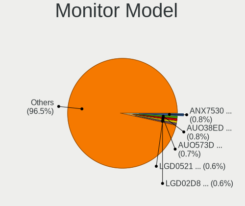

| Model                                                                | Notebooks | Percent |
|----------------------------------------------------------------------|-----------|---------|
| LG Display LCD Monitor LGD046D 1920x1080 309x174mm 14.0-inch         | 8         | 0.78%   |
| LG Display LCD Monitor LGD02D8 1366x768 277x156mm 12.5-inch          | 8         | 0.78%   |
| Chimei Innolux LCD Monitor CMN14D4 1920x1080 309x173mm 13.9-inch     | 8         | 0.78%   |
| AU Optronics LCD Monitor AUO38ED 1920x1080 344x193mm 15.5-inch       | 8         | 0.78%   |
| Apple Color LCD APPA040 2880x1800 331x207mm 15.4-inch                | 8         | 0.78%   |
| LG Display LCD Monitor LGD046F 1920x1080 344x194mm 15.5-inch         | 7         | 0.68%   |
| AU Optronics LCD Monitor AUO573D 1920x1080 309x174mm 14.0-inch       | 7         | 0.68%   |
| Lenovo LCD Monitor LEN40B1 1600x900 344x194mm 15.5-inch              | 6         | 0.58%   |
| Chimei Innolux LCD Monitor CMN15E8 1920x1080 344x193mm 15.5-inch     | 6         | 0.58%   |
| Chimei Innolux LCD Monitor CMN151E 1920x1080 344x193mm 15.5-inch     | 6         | 0.58%   |
| AU Optronics LCD Monitor AUO683D 1920x1080 309x174mm 14.0-inch       | 6         | 0.58%   |
| LG Display LCD Monitor LGD0521 1920x1080 309x174mm 14.0-inch         | 5         | 0.49%   |
| Chimei Innolux LCD Monitor CMN15E7 1920x1080 344x193mm 15.5-inch     | 5         | 0.49%   |
| Chimei Innolux LCD Monitor CMN14C9 1920x1080 309x173mm 13.9-inch     | 5         | 0.49%   |
| BOE LCD Monitor BOE084E 1920x1080 382x215mm 17.3-inch                | 5         | 0.49%   |
| AU Optronics LCD Monitor AUO2036 2560x1440 309x174mm 14.0-inch       | 5         | 0.49%   |
| AU Optronics LCD Monitor AUO123D 1920x1080 309x173mm 13.9-inch       | 5         | 0.49%   |
| AU Optronics LCD Monitor AUO106C 1366x768 277x156mm 12.5-inch        | 5         | 0.49%   |
| Samsung Electronics U28E590 SAM0C4C 3840x2160 608x345mm 27.5-inch    | 4         | 0.39%   |
| Samsung Electronics LCD Monitor SEC5441 1366x768 293x165mm 13.2-inch | 4         | 0.39%   |
| LG Display LCD Monitor LGD05E5 1920x1080 344x194mm 15.5-inch         | 4         | 0.39%   |
| LG Display LCD Monitor LGD0396 1600x900 382x215mm 17.3-inch          | 4         | 0.39%   |
| LG Display LCD Monitor LGD02DC 1366x768 344x194mm 15.5-inch          | 4         | 0.39%   |
| Lenovo LCD Monitor LEN40BA 1920x1080 344x194mm 15.5-inch             | 4         | 0.39%   |
| Chimei Innolux LCD Monitor CMN15D5 1920x1080 344x193mm 15.5-inch     | 4         | 0.39%   |
| Chimei Innolux LCD Monitor CMN14F2 1920x1080 309x173mm 13.9-inch     | 4         | 0.39%   |
| Chimei Innolux LCD Monitor CMN1362 1366x768 290x160mm 13.0-inch      | 4         | 0.39%   |
| Chimei Innolux LCD Monitor CMN1239 1920x1080 276x155mm 12.5-inch     | 4         | 0.39%   |
| BOE LCD Monitor BOE08E2 1920x1080 344x194mm 15.5-inch                | 4         | 0.39%   |
| BOE LCD Monitor BOE07DB 1920x1080 309x174mm 14.0-inch                | 4         | 0.39%   |
| AU Optronics LCD Monitor AUO22EC 1366x768 344x193mm 15.5-inch        | 4         | 0.39%   |
| AU Optronics LCD Monitor AUO219D 1920x1080 381x214mm 17.2-inch       | 4         | 0.39%   |
| AU Optronics LCD Monitor AUO129E 1600x900 382x214mm 17.2-inch        | 4         | 0.39%   |
| AU Optronics LCD Monitor AUO1136 2560x1440 309x174mm 14.0-inch       | 4         | 0.39%   |
| Sharp LQ156M1JW01 SHP14C3 1920x1080 344x194mm 15.5-inch              | 3         | 0.29%   |
| Sharp LCD Monitor SHP14D6 3840x2400 366x229mm 17.0-inch              | 3         | 0.29%   |
| Sharp LCD Monitor SHP149A 1920x1080 344x194mm 15.5-inch              | 3         | 0.29%   |
| Samsung Electronics LCD Monitor SEC4251 1366x768 344x194mm 15.5-inch | 3         | 0.29%   |
| Samsung Electronics LCD Monitor SEC4149 1366x768 292x174mm 13.4-inch | 3         | 0.29%   |
| Samsung Electronics LCD Monitor SEC3143 1366x768 256x144mm 11.6-inch | 3         | 0.29%   |

Monitor Resolution
------------------

Monitor screen resolution

| Resolution         | Notebooks | Percent |
|--------------------|-----------|---------|
| 1920x1080 (FHD)    | 441       | 46.67%  |
| 1366x768 (WXGA)    | 176       | 18.62%  |
| 1600x900 (HD+)     | 75        | 7.94%   |
| 3840x2160 (4K)     | 43        | 4.55%   |
| 2560x1440 (QHD)    | 39        | 4.13%   |
| 1280x800 (WXGA)    | 37        | 3.92%   |
| 1440x900 (WXGA+)   | 23        | 2.43%   |
| 1920x1200 (WUXGA)  | 20        | 2.12%   |
| 2880x1800          | 11        | 1.16%   |
| 1680x1050 (WSXGA+) | 11        | 1.16%   |
| 3440x1440          | 9         | 0.95%   |
| 3840x2400          | 7         | 0.74%   |
| 2560x1600          | 7         | 0.74%   |
| 1280x1024 (SXGA)   | 6         | 0.63%   |
| 1024x600           | 6         | 0.63%   |
| 800x1280           | 5         | 0.53%   |
| 3200x1800 (QHD+)   | 4         | 0.42%   |
| 2560x1080          | 4         | 0.42%   |
| Unknown            | 4         | 0.42%   |
| 3840x1080          | 3         | 0.32%   |
| 1920x540           | 3         | 0.32%   |
| 3456x2160          | 2         | 0.21%   |
| 2288x1287          | 2         | 0.21%   |
| 1600x1200          | 2         | 0.21%   |
| 3000x2000          | 1         | 0.11%   |
| 2256x1504          | 1         | 0.11%   |
| 2160x1440          | 1         | 0.11%   |
| 1680x945           | 1         | 0.11%   |
| 1360x768           | 1         | 0.11%   |

Monitor Diagonal
----------------

Diagonal size in inches

| Inches  | Notebooks | Percent |
|---------|-----------|---------|
| 15      | 350       | 34.72%  |
| 13      | 138       | 13.69%  |
| 14      | 129       | 12.8%   |
| 17      | 103       | 10.22%  |
| 27      | 51        | 5.06%   |
| 12      | 36        | 3.57%   |
| 24      | 32        | 3.17%   |
| 23      | 25        | 2.48%   |
| Unknown | 21        | 2.08%   |
| 21      | 18        | 1.79%   |
| 11      | 15        | 1.49%   |
| 34      | 13        | 1.29%   |
| 31      | 10        | 0.99%   |
| 16      | 10        | 0.99%   |
| 10      | 9         | 0.89%   |
| 19      | 7         | 0.69%   |
| 18      | 7         | 0.69%   |
| 25      | 6         | 0.6%    |
| 22      | 6         | 0.6%    |
| 54      | 4         | 0.4%    |
| 84      | 2         | 0.2%    |
| 40      | 2         | 0.2%    |
| 32      | 2         | 0.2%    |
| 20      | 2         | 0.2%    |
| 142     | 1         | 0.1%    |
| 65      | 1         | 0.1%    |
| 52      | 1         | 0.1%    |
| 49      | 1         | 0.1%    |
| 48      | 1         | 0.1%    |
| 47      | 1         | 0.1%    |
| 39      | 1         | 0.1%    |
| 28      | 1         | 0.1%    |
| 26      | 1         | 0.1%    |
| 7       | 1         | 0.1%    |

Monitor Width
-------------

Physical width

| Width in mm    | Notebooks | Percent |
|----------------|-----------|---------|
| 301-350        | 542       | 54.2%   |
| 201-300        | 131       | 13.1%   |
| 351-400        | 121       | 12.1%   |
| 501-600        | 97        | 9.7%    |
| 401-500        | 34        | 3.4%    |
| 601-700        | 23        | 2.3%    |
| Unknown        | 21        | 2.1%    |
| 701-800        | 15        | 1.5%    |
| 1001-1500      | 9         | 0.9%    |
| 801-900        | 3         | 0.3%    |
| 1501-2000      | 2         | 0.2%    |
| More than 2000 | 1         | 0.1%    |
| 1-100          | 1         | 0.1%    |

Aspect Ratio
------------

Proportional relationship between the width and the height

| Ratio   | Notebooks | Percent |
|---------|-----------|---------|
| 16/9    | 721       | 81.1%   |
| 16/10   | 120       | 13.5%   |
| 21/9    | 13        | 1.46%   |
| Unknown | 13        | 1.46%   |
| 5/4     | 6         | 0.67%   |
| 3/2     | 5         | 0.56%   |
| 0.62    | 5         | 0.56%   |
| 32/9    | 2         | 0.22%   |
| 6/5     | 1         | 0.11%   |
| 4/3     | 1         | 0.11%   |
| 1.00    | 1         | 0.11%   |
| 0.67    | 1         | 0.11%   |

Monitor Area
------------

Area in inch

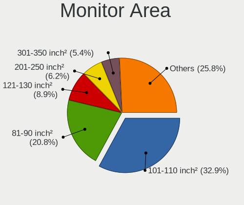

| Area in inch | Notebooks | Percent |
|----------------|-----------|---------|
| 101-110        | 350       | 34.86%  |
| 81-90          | 207       | 20.62%  |
| 121-130        | 91        | 9.06%   |
| 71-80          | 59        | 5.88%   |
| 201-250        | 54        | 5.38%   |
| 301-350        | 51        | 5.08%   |
| 61-70          | 36        | 3.59%   |
| 351-500        | 26        | 2.59%   |
| 251-300        | 23        | 2.29%   |
| Unknown        | 21        | 2.09%   |
| 151-200        | 18        | 1.79%   |
| 51-60          | 15        | 1.49%   |
| 131-140        | 13        | 1.29%   |
| More than 1000 | 10        | 1%      |
| 41-50          | 9         | 0.9%    |
| 111-120        | 7         | 0.7%    |
| 141-150        | 6         | 0.6%    |
| 501-1000       | 5         | 0.5%    |
| 91-100         | 2         | 0.2%    |
| 1-40           | 1         | 0.1%    |

Pixel Density
-------------

Pixels per inch

| Density       | Notebooks | Percent |
|---------------|-----------|---------|
| 121-160       | 435       | 44.03%  |
| 101-120       | 243       | 24.6%   |
| 51-100        | 165       | 16.7%   |
| 161-240       | 83        | 8.4%    |
| More than 240 | 33        | 3.34%   |
| Unknown       | 21        | 2.13%   |
| 1-50          | 8         | 0.81%   |

Multiple Monitors
-----------------

Total monitors connected

| Total | Notebooks | Percent |
|-------|-----------|---------|
| 1     | 705       | 78.68%  |
| 2     | 140       | 15.63%  |
| 3     | 24        | 2.68%   |
| 0     | 22        | 2.46%   |
| 4     | 5         | 0.56%   |

Network
-------

Net Controller Vendor
---------------------

Controller vendors

| Vendor                            | Notebooks | Percent |
|-----------------------------------|-----------|---------|
| Intel                             | 533       | 37.88%  |
| Realtek Semiconductor             | 404       | 28.71%  |
| Qualcomm Atheros                  | 167       | 11.87%  |
| Broadcom                          | 78        | 5.54%   |
| Ericsson Business Mobile Networks | 16        | 1.14%   |
| Sierra Wireless                   | 15        | 1.07%   |
| Ralink                            | 15        | 1.07%   |
| MediaTek                          | 14        | 1%      |
| Marvell Technology Group          | 14        | 1%      |
| Broadcom Limited                  | 14        | 1%      |
| Dell                              | 13        | 0.92%   |
| Lenovo                            | 11        | 0.78%   |
| Hewlett-Packard                   | 10        | 0.71%   |
| Fibocom                           | 9         | 0.64%   |
| DisplayLink                       | 9         | 0.64%   |
| Huawei Technologies               | 8         | 0.57%   |
| Nvidia                            | 6         | 0.43%   |
| Edimax Technology                 | 6         | 0.43%   |
| Samsung Electronics               | 5         | 0.36%   |
| Qualcomm                          | 5         | 0.36%   |
| NetGear                           | 5         | 0.36%   |
| Google                            | 5         | 0.36%   |
| ASIX Electronics                  | 5         | 0.36%   |
| TP-Link                           | 4         | 0.28%   |
| OnePlus Technology (Shenzhen)     | 4         | 0.28%   |
| JMicron Technology                | 4         | 0.28%   |
| ZyXEL Communications              | 3         | 0.21%   |
| Ralink Technology                 | 3         | 0.21%   |
| ASUSTek Computer                  | 3         | 0.21%   |
| Xiaomi                            | 2         | 0.14%   |
| Qualcomm Atheros Communications   | 2         | 0.14%   |
| Linksys                           | 2         | 0.14%   |
| D-Link System                     | 2         | 0.14%   |
| Apple                             | 2         | 0.14%   |
| Sitecom Europe                    | 1         | 0.07%   |
| Silicon Integrated Systems [SiS]  | 1         | 0.07%   |
| Research In Motion                | 1         | 0.07%   |
| Motorola PCS                      | 1         | 0.07%   |
| MicroPython                       | 1         | 0.07%   |
| Manta                             | 1         | 0.07%   |

Net Controller Model
--------------------

Controller models

| Model                                                             | Notebooks | Percent |
|-------------------------------------------------------------------|-----------|---------|
| Realtek RTL8111/8168/8411 PCI Express Gigabit Ethernet Controller | 263       | 15.12%  |
| Intel Wi-Fi 6 AX200                                               | 68        | 3.91%   |
| Intel 82579LM Gigabit Network Connection (Lewisville)             | 55        | 3.16%   |
| Realtek RTL810xE PCI Express Fast Ethernet controller             | 50        | 2.88%   |
| Intel Wireless 8265 / 8275                                        | 49        | 2.82%   |
| Realtek RTL8153 Gigabit Ethernet Adapter                          | 38        | 2.19%   |
| Intel Wireless 7265                                               | 37        | 2.13%   |
| Intel Centrino Advanced-N 6205 [Taylor Peak]                      | 34        | 1.96%   |
| Qualcomm Atheros AR9285 Wireless Network Adapter (PCI-Express)    | 33        | 1.9%    |
| Intel Wireless 8260                                               | 29        | 1.67%   |
| Intel Wi-Fi 6 AX201                                               | 27        | 1.55%   |
| Qualcomm Atheros QCA9377 802.11ac Wireless Network Adapter        | 25        | 1.44%   |
| Intel Wireless 7260                                               | 25        | 1.44%   |
| Realtek RTL8822CE 802.11ac PCIe Wireless Network Adapter          | 21        | 1.21%   |
| Realtek RTL8821CE 802.11ac PCIe Wireless Network Adapter          | 21        | 1.21%   |
| Qualcomm Atheros QCA6174 802.11ac Wireless Network Adapter        | 21        | 1.21%   |
| Qualcomm Atheros AR9485 Wireless Network Adapter                  | 20        | 1.15%   |
| Intel Centrino Ultimate-N 6300                                    | 20        | 1.15%   |
| Intel Cannon Point-LP CNVi [Wireless-AC]                          | 20        | 1.15%   |
| Intel Comet Lake PCH-LP CNVi WiFi                                 | 19        | 1.09%   |
| Intel Ethernet Connection (6) I219-V                              | 18        | 1.04%   |
| Intel Wireless 3165                                               | 17        | 0.98%   |
| Qualcomm Atheros QCA9565 / AR9565 Wireless Network Adapter        | 15        | 0.86%   |
| Intel Ethernet Connection I219-LM                                 | 15        | 0.86%   |
| Intel Ethernet Connection (4) I219-V                              | 15        | 0.86%   |
| Intel Ethernet Connection (3) I218-LM                             | 15        | 0.86%   |
| Intel WiFi Link 5100                                              | 14        | 0.81%   |
| Intel Ethernet Connection I218-LM                                 | 14        | 0.81%   |
| Qualcomm Atheros AR8151 v2.0 Gigabit Ethernet                     | 13        | 0.75%   |
| Intel Cannon Lake PCH CNVi WiFi                                   | 13        | 0.75%   |
| Intel 82577LM Gigabit Network Connection                          | 13        | 0.75%   |
| Broadcom BCM43142 802.11b/g/n                                     | 13        | 0.75%   |
| Intel Wireless-AC 9260                                            | 12        | 0.69%   |
| Intel PRO/Wireless 3945ABG [Golan] Network Connection             | 12        | 0.69%   |
| Intel 82567LM Gigabit Network Connection                          | 12        | 0.69%   |
| Realtek RTL8723BE PCIe Wireless Network Adapter                   | 11        | 0.63%   |
| Intel Ice Lake-LP PCH CNVi WiFi                                   | 11        | 0.63%   |
| Broadcom BCM4313 802.11bgn Wireless Network Adapter               | 11        | 0.63%   |
| Intel Wireless 3160                                               | 10        | 0.58%   |
| Realtek RTL8852AE 802.11ax PCIe Wireless Network Adapter          | 9         | 0.52%   |

Wireless Vendor
---------------

Wireless vendors

| Vendor                            | Notebooks | Percent |
|-----------------------------------|-----------|---------|
| Intel                             | 515       | 55.26%  |
| Qualcomm Atheros                  | 136       | 14.59%  |
| Realtek Semiconductor             | 113       | 12.12%  |
| Broadcom                          | 62        | 6.65%   |
| Sierra Wireless                   | 15        | 1.61%   |
| Ralink                            | 15        | 1.61%   |
| MediaTek                          | 12        | 1.29%   |
| Fibocom                           | 9         | 0.97%   |
| Dell                              | 9         | 0.97%   |
| Broadcom Limited                  | 8         | 0.86%   |
| Edimax Technology                 | 6         | 0.64%   |
| TP-Link                           | 4         | 0.43%   |
| Qualcomm                          | 4         | 0.43%   |
| NetGear                           | 4         | 0.43%   |
| Ericsson Business Mobile Networks | 4         | 0.43%   |
| ZyXEL Communications              | 3         | 0.32%   |
| Ralink Technology                 | 3         | 0.32%   |
| ASUSTek Computer                  | 3         | 0.32%   |
| Qualcomm Atheros Communications   | 2         | 0.21%   |
| D-Link System                     | 2         | 0.21%   |
| Sitecom Europe                    | 1         | 0.11%   |
| Linksys                           | 1         | 0.11%   |
| Hewlett-Packard                   | 1         | 0.11%   |

Wireless Model
--------------

Wireless models

| Model                                                                   | Notebooks | Percent |
|-------------------------------------------------------------------------|-----------|---------|
| Intel Wi-Fi 6 AX200                                                     | 68        | 7.29%   |
| Intel Wireless 8265 / 8275                                              | 49        | 5.25%   |
| Intel Wireless 7265                                                     | 37        | 3.97%   |
| Intel Centrino Advanced-N 6205 [Taylor Peak]                            | 34        | 3.64%   |
| Qualcomm Atheros AR9285 Wireless Network Adapter (PCI-Express)          | 33        | 3.54%   |
| Intel Wireless 8260                                                     | 29        | 3.11%   |
| Intel Wi-Fi 6 AX201                                                     | 27        | 2.89%   |
| Qualcomm Atheros QCA9377 802.11ac Wireless Network Adapter              | 25        | 2.68%   |
| Intel Wireless 7260                                                     | 25        | 2.68%   |
| Realtek RTL8822CE 802.11ac PCIe Wireless Network Adapter                | 21        | 2.25%   |
| Realtek RTL8821CE 802.11ac PCIe Wireless Network Adapter                | 21        | 2.25%   |
| Qualcomm Atheros QCA6174 802.11ac Wireless Network Adapter              | 21        | 2.25%   |
| Qualcomm Atheros AR9485 Wireless Network Adapter                        | 20        | 2.14%   |
| Intel Centrino Ultimate-N 6300                                          | 20        | 2.14%   |
| Intel Cannon Point-LP CNVi [Wireless-AC]                                | 20        | 2.14%   |
| Intel Comet Lake PCH-LP CNVi WiFi                                       | 19        | 2.04%   |
| Intel Wireless 3165                                                     | 17        | 1.82%   |
| Qualcomm Atheros QCA9565 / AR9565 Wireless Network Adapter              | 15        | 1.61%   |
| Intel WiFi Link 5100                                                    | 14        | 1.5%    |
| Intel Cannon Lake PCH CNVi WiFi                                         | 13        | 1.39%   |
| Broadcom BCM43142 802.11b/g/n                                           | 13        | 1.39%   |
| Intel Wireless-AC 9260                                                  | 12        | 1.29%   |
| Intel PRO/Wireless 3945ABG [Golan] Network Connection                   | 12        | 1.29%   |
| Realtek RTL8723BE PCIe Wireless Network Adapter                         | 11        | 1.18%   |
| Intel Ice Lake-LP PCH CNVi WiFi                                         | 11        | 1.18%   |
| Broadcom BCM4313 802.11bgn Wireless Network Adapter                     | 11        | 1.18%   |
| Intel Wireless 3160                                                     | 10        | 1.07%   |
| Realtek RTL8852AE 802.11ax PCIe Wireless Network Adapter                | 9         | 0.96%   |
| Realtek RTL8822BE 802.11a/b/g/n/ac WiFi adapter                         | 9         | 0.96%   |
| Ralink RT5390 Wireless 802.11n 1T/1R PCIe                               | 8         | 0.86%   |
| Qualcomm Atheros AR242x / AR542x Wireless Network Adapter (PCI-Express) | 8         | 0.86%   |
| Intel PRO/Wireless 5100 AGN [Shiloh] Network Connection                 | 8         | 0.86%   |
| Intel Comet Lake PCH CNVi WiFi                                          | 8         | 0.86%   |
| Intel Centrino Wireless-N 2230                                          | 8         | 0.86%   |
| Intel Centrino Wireless-N 1030 [Rainbow Peak]                           | 8         | 0.86%   |
| Intel Centrino Advanced-N 6235                                          | 8         | 0.86%   |
| Fibocom L830-EB-00 LTE WWAN Modem                                       | 8         | 0.86%   |
| Broadcom BCM4364 802.11ac Wireless Network Adapter                      | 8         | 0.86%   |
| Sierra Wireless EM7455                                                  | 7         | 0.75%   |
| MediaTek MT7921 802.11ax PCI Express Wireless Network Adapter           | 7         | 0.75%   |

Ethernet Vendor
---------------

Ethernet vendors

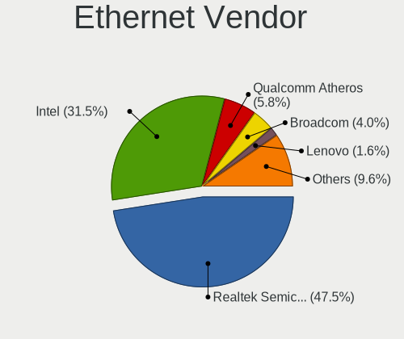

| Vendor                        | Notebooks | Percent |
|-------------------------------|-----------|---------|
| Realtek Semiconductor         | 357       | 46.67%  |
| Intel                         | 238       | 31.11%  |
| Qualcomm Atheros              | 55        | 7.19%   |
| Broadcom                      | 28        | 3.66%   |
| Marvell Technology Group      | 14        | 1.83%   |
| Lenovo                        | 11        | 1.44%   |
| DisplayLink                   | 9         | 1.18%   |
| Nvidia                        | 6         | 0.78%   |
| Broadcom Limited              | 6         | 0.78%   |
| Samsung Electronics           | 5         | 0.65%   |
| Google                        | 5         | 0.65%   |
| ASIX Electronics              | 5         | 0.65%   |
| OnePlus Technology (Shenzhen) | 4         | 0.52%   |
| JMicron Technology            | 4         | 0.52%   |
| Huawei Technologies           | 3         | 0.39%   |
| Xiaomi                        | 2         | 0.26%   |
| MediaTek                      | 2         | 0.26%   |
| Hewlett-Packard               | 2         | 0.26%   |
| Apple                         | 2         | 0.26%   |
| Research In Motion            | 1         | 0.13%   |
| Qualcomm                      | 1         | 0.13%   |
| NetGear                       | 1         | 0.13%   |
| Motorola PCS                  | 1         | 0.13%   |
| Linksys                       | 1         | 0.13%   |
| Cypress Semiconductor         | 1         | 0.13%   |
| Attansic Technology           | 1         | 0.13%   |

Ethernet Model
--------------

Ethernet models

| Model                                                             | Notebooks | Percent |
|-------------------------------------------------------------------|-----------|---------|
| Realtek RTL8111/8168/8411 PCI Express Gigabit Ethernet Controller | 263       | 33.98%  |
| Intel 82579LM Gigabit Network Connection (Lewisville)             | 55        | 7.11%   |
| Realtek RTL810xE PCI Express Fast Ethernet controller             | 50        | 6.46%   |
| Realtek RTL8153 Gigabit Ethernet Adapter                          | 38        | 4.91%   |
| Intel Ethernet Connection (6) I219-V                              | 18        | 2.33%   |
| Intel Ethernet Connection I219-LM                                 | 15        | 1.94%   |
| Intel Ethernet Connection (4) I219-V                              | 15        | 1.94%   |
| Intel Ethernet Connection (3) I218-LM                             | 15        | 1.94%   |
| Intel Ethernet Connection I218-LM                                 | 14        | 1.81%   |
| Qualcomm Atheros AR8151 v2.0 Gigabit Ethernet                     | 13        | 1.68%   |
| Intel 82577LM Gigabit Network Connection                          | 13        | 1.68%   |
| Intel 82567LM Gigabit Network Connection                          | 12        | 1.55%   |
| Intel Ethernet Connection (7) I219-LM                             | 9         | 1.16%   |
| Intel Ethernet Connection (4) I219-LM                             | 9         | 1.16%   |
| Intel Ethernet Connection I217-LM                                 | 8         | 1.03%   |
| Intel Ethernet Connection I219-V                                  | 7         | 0.9%    |
| Realtek RTL8152 Fast Ethernet Adapter                             | 6         | 0.78%   |
| Qualcomm Atheros QCA8172 Fast Ethernet                            | 6         | 0.78%   |
| Qualcomm Atheros QCA8171 Gigabit Ethernet                         | 6         | 0.78%   |
| Lenovo USB-C Dock Ethernet                                        | 6         | 0.78%   |
| Broadcom NetLink BCM57785 Gigabit Ethernet PCIe                   | 6         | 0.78%   |
| Qualcomm Atheros Killer E2500 Gigabit Ethernet Controller         | 5         | 0.65%   |
| Qualcomm Atheros AR8161 Gigabit Ethernet                          | 5         | 0.65%   |
| Qualcomm Atheros AR8131 Gigabit Ethernet                          | 5         | 0.65%   |
| Intel Ethernet Connection (13) I219-LM                            | 5         | 0.65%   |
| Intel Ethernet Connection (10) I219-V                             | 5         | 0.65%   |
| Broadcom NetXtreme BCM57765 Gigabit Ethernet PCIe                 | 5         | 0.65%   |
| Realtek Killer E2600 Gigabit Ethernet Controller                  | 4         | 0.52%   |
| Qualcomm Atheros AR8132 Fast Ethernet                             | 4         | 0.52%   |
| OnePlus (Shenzhen) Android                                        | 4         | 0.52%   |
| Nvidia MCP79 Ethernet                                             | 4         | 0.52%   |
| Marvell Group 88E8055 PCI-E Gigabit Ethernet Controller           | 4         | 0.52%   |
| Intel Ethernet Connection (2) I219-LM                             | 4         | 0.52%   |
| Intel Ethernet Connection (13) I219-V                             | 4         | 0.52%   |
| DisplayLink Dell Universal Dock D6000                             | 4         | 0.52%   |
| Broadcom NetLink BCM5787M Gigabit Ethernet PCI Express            | 4         | 0.52%   |
| ASIX AX88179 Gigabit Ethernet                                     | 4         | 0.52%   |
| Samsung Galaxy series, misc. (tethering mode)                     | 3         | 0.39%   |
| Qualcomm Atheros AR8121/AR8113/AR8114 Gigabit or Fast Ethernet    | 3         | 0.39%   |
| JMicron JMC250 PCI Express Gigabit Ethernet Controller            | 3         | 0.39%   |

Net Controller Kind
-------------------

Ethernet, WiFi or modem

| Kind     | Notebooks | Percent |
|----------|-----------|---------|
| WiFi     | 859       | 53.35%  |
| Ethernet | 720       | 44.72%  |
| Modem    | 30        | 1.86%   |
| Unknown  | 1         | 0.06%   |

Used Controller
---------------

Currently used network controller

| Kind     | Notebooks | Percent |
|----------|-----------|---------|
| WiFi     | 713       | 77.75%  |
| Ethernet | 204       | 22.25%  |

NICs
----

Total network controllers on board

| Total | Notebooks | Percent |
|-------|-----------|---------|
| 2     | 644       | 74.02%  |
| 1     | 199       | 22.87%  |
| 3     | 17        | 1.95%   |
| 0     | 10        | 1.15%   |

IPv6
----

IPv6 vs IPv4

| Used | Notebooks | Percent |
|------|-----------|---------|
| No   | 767       | 86.76%  |
| Yes  | 117       | 13.24%  |

Bluetooth
---------

Bluetooth Vendor
----------------

Controller vendors

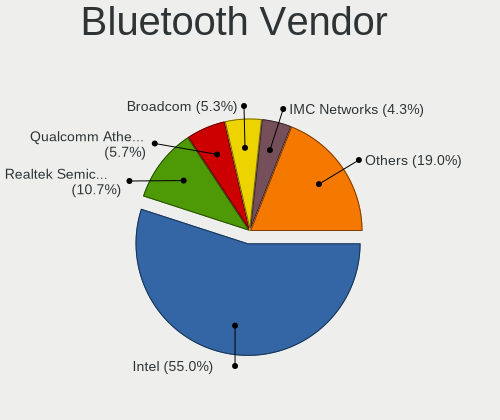

| Vendor                          | Notebooks | Percent |
|---------------------------------|-----------|---------|
| Intel                           | 369       | 54.34%  |
| Realtek Semiconductor           | 66        | 9.72%   |
| Qualcomm Atheros Communications | 50        | 7.36%   |
| Broadcom                        | 40        | 5.89%   |
| IMC Networks                    | 27        | 3.98%   |
| Lite-On Technology              | 26        | 3.83%   |
| Foxconn / Hon Hai               | 19        | 2.8%    |
| Apple                           | 19        | 2.8%    |
| Hewlett-Packard                 | 13        | 1.91%   |
| Dell                            | 13        | 1.91%   |
| Cambridge Silicon Radio         | 9         | 1.33%   |
| Toshiba                         | 8         | 1.18%   |
| Foxconn International           | 5         | 0.74%   |
| Ralink                          | 4         | 0.59%   |
| Realtek                         | 2         | 0.29%   |
| MediaTek                        | 2         | 0.29%   |
| Alps Electric                   | 2         | 0.29%   |
| USI                             | 1         | 0.15%   |
| i.Tech Dynamic Limited          | 1         | 0.15%   |
| Edimax Technology               | 1         | 0.15%   |
| Belkin Components               | 1         | 0.15%   |
| ASUSTek Computer                | 1         | 0.15%   |

Bluetooth Model
---------------

Controller models

| Model                                               | Notebooks | Percent |
|-----------------------------------------------------|-----------|---------|
| Intel Bluetooth wireless interface                  | 154       | 22.68%  |
| Intel AX200 Bluetooth                               | 65        | 9.57%   |
| Intel AX201 Bluetooth                               | 63        | 9.28%   |
| Realtek Bluetooth Radio                             | 48        | 7.07%   |
| Intel Bluetooth 9460/9560 Jefferson Peak (JfP)      | 36        | 5.3%    |
| Qualcomm Atheros AR3011 Bluetooth                   | 17        | 2.5%    |
| Qualcomm Atheros QCA61x4 Bluetooth 4.0              | 15        | 2.21%   |
| Intel Centrino Bluetooth Wireless Transceiver       | 15        | 2.21%   |
| Realtek  Bluetooth 4.2 Adapter                      | 12        | 1.77%   |
| Intel Wireless-AC 9260 Bluetooth Adapter            | 12        | 1.77%   |
| Broadcom BCM2045B (BDC-2.1)                         | 12        | 1.77%   |
| Lite-On Qualcomm Atheros QCA9377 Bluetooth          | 11        | 1.62%   |
| IMC Networks Bluetooth Radio                        | 11        | 1.62%   |
| Qualcomm Atheros  Bluetooth Device                  | 10        | 1.47%   |
| Intel Centrino Advanced-N 6230 Bluetooth adapter    | 9         | 1.33%   |
| HP Broadcom 2070 Bluetooth Combo                    | 9         | 1.33%   |
| Cambridge Silicon Radio Bluetooth Dongle (HCI mode) | 9         | 1.33%   |
| Apple Bluetooth Host Controller                     | 9         | 1.33%   |
| Foxconn / Hon Hai Bluetooth Device                  | 8         | 1.18%   |
| Broadcom BCM20702 Bluetooth 4.0 [ThinkPad]          | 8         | 1.18%   |
| IMC Networks Bluetooth Device                       | 7         | 1.03%   |
| Qualcomm Atheros AR3012 Bluetooth 4.0               | 6         | 0.88%   |
| Intel Wireless-AC 3168 Bluetooth                    | 6         | 0.88%   |
| Intel AX210 Bluetooth                               | 6         | 0.88%   |
| Lite-On Bluetooth Device                            | 5         | 0.74%   |
| IMC Networks Wireless_Device                        | 5         | 0.74%   |
| Foxconn International BCM43142A0 Bluetooth module   | 5         | 0.74%   |
| Dell BCM20702A0 Bluetooth Module                    | 5         | 0.74%   |
| Apple Bluetooth USB Host Controller                 | 5         | 0.74%   |
| Ralink RT3290 Bluetooth                             | 4         | 0.59%   |
| Lite-On Wireless_Device                             | 4         | 0.59%   |
| Lite-On Atheros AR3012 Bluetooth                    | 4         | 0.59%   |
| HP Bluetooth 2.0 Interface [Broadcom BCM2045]       | 4         | 0.59%   |
| Broadcom HP Portable SoftSailing                    | 4         | 0.59%   |
| Toshiba Bluetooth Device                            | 3         | 0.44%   |
| Toshiba BCM43142A0                                  | 3         | 0.44%   |
| Realtek RTL8822BE Bluetooth 4.2 Adapter             | 3         | 0.44%   |
| Intel Bluetooth Device                              | 3         | 0.44%   |
| Foxconn / Hon Hai Bluetooth USB Host Controller     | 3         | 0.44%   |
| Foxconn / Hon Hai BCM20702A0                        | 3         | 0.44%   |

Sound
-----

Sound Vendor
------------

Sound card vendors

| Vendor                           | Notebooks | Percent |
|----------------------------------|-----------|---------|
| Intel                            | 682       | 62.23%  |
| AMD                              | 197       | 17.97%  |
| Nvidia                           | 113       | 10.31%  |
| C-Media Electronics              | 11        | 1%      |
| Lenovo                           | 9         | 0.82%   |
| Hewlett-Packard                  | 8         | 0.73%   |
| GN Netcom                        | 8         | 0.73%   |
| Apple                            | 8         | 0.73%   |
| Logitech                         | 7         | 0.64%   |
| Texas Instruments                | 6         | 0.55%   |
| Realtek Semiconductor            | 5         | 0.46%   |
| Plantronics                      | 4         | 0.36%   |
| Sony                             | 3         | 0.27%   |
| Yamaha                           | 2         | 0.18%   |
| SteelSeries ApS                  | 2         | 0.18%   |
| Sennheiser Communications        | 2         | 0.18%   |
| RODE Microphones                 | 2         | 0.18%   |
| Kingston Technology              | 2         | 0.18%   |
| Focusrite-Novation               | 2         | 0.18%   |
| DSEA A/S                         | 2         | 0.18%   |
| Creative Technology              | 2         | 0.18%   |
| ZOOM                             | 1         | 0.09%   |
| XMOS                             | 1         | 0.09%   |
| Valve Software                   | 1         | 0.09%   |
| Tenx Technology                  | 1         | 0.09%   |
| Silicon Motion                   | 1         | 0.09%   |
| Silicon Integrated Systems [SiS] | 1         | 0.09%   |
| Samsung Electronics              | 1         | 0.09%   |
| Roland                           | 1         | 0.09%   |
| No brand                         | 1         | 0.09%   |
| Microsoft                        | 1         | 0.09%   |
| Mackie Designs                   | 1         | 0.09%   |
| M-Audio                          | 1         | 0.09%   |
| JMTek                            | 1         | 0.09%   |
| GYROCOM C&C                      | 1         | 0.09%   |
| Generalplus Technology           | 1         | 0.09%   |
| FiiO Electronics Technology      | 1         | 0.09%   |
| Blue Microphones                 | 1         | 0.09%   |
| BEHRINGER International          | 1         | 0.09%   |
| AudioQuest                       | 1         | 0.09%   |

Sound Model
-----------

Sound card models

| Model                                                                                             | Notebooks | Percent |
|---------------------------------------------------------------------------------------------------|-----------|---------|
| AMD Family 17h/19h HD Audio Controller                                                            | 112       | 8.41%   |
| Intel Sunrise Point-LP HD Audio                                                                   | 105       | 7.88%   |
| Intel 7 Series/C216 Chipset Family High Definition Audio Controller                               | 79        | 5.93%   |
| Intel 6 Series/C200 Series Chipset Family High Definition Audio Controller                        | 70        | 5.26%   |
| AMD Renoir Radeon High Definition Audio Controller                                                | 70        | 5.26%   |
| Intel Tiger Lake-LP Smart Sound Technology Audio Controller                                       | 37        | 2.78%   |
| Intel Haswell-ULT HD Audio Controller                                                             | 36        | 2.7%    |
| Intel Broadwell-U Audio Controller                                                                | 36        | 2.7%    |
| Intel 8 Series HD Audio Controller                                                                | 36        | 2.7%    |
| Intel Wildcat Point-LP High Definition Audio Controller                                           | 35        | 2.63%   |
| Intel 82801I (ICH9 Family) HD Audio Controller                                                    | 35        | 2.63%   |
| Intel Cannon Lake PCH cAVS                                                                        | 32        | 2.4%    |
| Intel Cannon Point-LP High Definition Audio Controller                                            | 30        | 2.25%   |
| Intel Comet Lake PCH-LP cAVS                                                                      | 28        | 2.1%    |
| AMD Raven/Raven2/Fenghuang HDMI/DP Audio Controller                                               | 26        | 1.95%   |
| Intel 8 Series/C220 Series Chipset High Definition Audio Controller                               | 25        | 1.88%   |
| Intel 5 Series/3400 Series Chipset High Definition Audio                                          | 24        | 1.8%    |
| AMD FCH Azalia Controller                                                                         | 23        | 1.73%   |
| Intel 82801H (ICH8 Family) HD Audio Controller                                                    | 19        | 1.43%   |
| Intel Xeon E3-1200 v3/4th Gen Core Processor HD Audio Controller                                  | 17        | 1.28%   |
| Intel NM10/ICH7 Family High Definition Audio Controller                                           | 17        | 1.28%   |
| AMD Kabini HDMI/DP Audio                                                                          | 17        | 1.28%   |
| Intel Ice Lake-LP Smart Sound Technology Audio Controller                                         | 14        | 1.05%   |
| Intel CM238 HD Audio Controller                                                                   | 14        | 1.05%   |
| Intel 100 Series/C230 Series Chipset Family HD Audio Controller                                   | 14        | 1.05%   |
| Nvidia TU107 GeForce GTX 1650 High Definition Audio Controller                                    | 12        | 0.9%    |
| Intel Comet Lake PCH cAVS                                                                         | 11        | 0.83%   |
| Nvidia GF108 High Definition Audio Controller                                                     | 10        | 0.75%   |
| Intel Celeron/Pentium Silver Processor High Definition Audio                                      | 10        | 0.75%   |
| Intel Celeron N3350/Pentium N4200/Atom E3900 Series Audio Cluster                                 | 10        | 0.75%   |
| Intel Atom/Celeron/Pentium Processor x5-E8000/J3xxx/N3xxx Series High Definition Audio Controller | 10        | 0.75%   |
| AMD SBx00 Azalia (Intel HDA)                                                                      | 10        | 0.75%   |
| Nvidia GP107GL High Definition Audio Controller                                                   | 9         | 0.68%   |
| AMD Family 15h (Models 60h-6fh) Audio Controller                                                  | 9         | 0.68%   |
| Intel Alder Lake PCH-P High Definition Audio Controller                                           | 8         | 0.6%    |
| Hewlett-Packard USB Audio                                                                         | 8         | 0.6%    |
| Apple Audio Device                                                                                | 8         | 0.6%    |
| AMD Wrestler HDMI Audio                                                                           | 8         | 0.6%    |
| AMD Baffin HDMI/DP Audio [Radeon RX 550 640SP / RX 560/560X]                                      | 8         | 0.6%    |
| Nvidia TU106 High Definition Audio Controller                                                     | 7         | 0.53%   |

Memory
------

Memory Vendor
-------------

Memory module vendors

| Vendor                | Notebooks | Percent |
|-----------------------|-----------|---------|
| Samsung Electronics   | 175       | 30.65%  |
| SK hynix              | 139       | 24.34%  |
| Micron Technology     | 82        | 14.36%  |
| Kingston              | 43        | 7.53%   |
| Unknown               | 37        | 6.48%   |
| Crucial               | 33        | 5.78%   |
| Ramaxel Technology    | 11        | 1.93%   |
| Elpida                | 11        | 1.93%   |
| Corsair               | 11        | 1.93%   |
| Unknown (ABCD)        | 6         | 1.05%   |
| G.Skill               | 4         | 0.7%    |
| Nanya Technology      | 3         | 0.53%   |
| A-DATA Technology     | 3         | 0.53%   |
| Silicon Power         | 2         | 0.35%   |
| GOODRAM               | 2         | 0.35%   |
| Unknown               | 2         | 0.35%   |
| Vaseky                | 1         | 0.18%   |
| Transcend             | 1         | 0.18%   |
| Smart                 | 1         | 0.18%   |
| Kingmax Semiconductor | 1         | 0.18%   |
| CSX                   | 1         | 0.18%   |
| Avant                 | 1         | 0.18%   |
| ASint Technology      | 1         | 0.18%   |

Memory Model
------------

Memory module models

| Model                                                            | Notebooks | Percent |
|------------------------------------------------------------------|-----------|---------|
| SK hynix RAM HMA81GS6AFR8N-UH 8GB SODIMM DDR4 2667MT/s           | 17        | 2.81%   |
| Samsung RAM M471A1G44AB0-CWE 8GB SODIMM DDR4 3200MT/s            | 9         | 1.49%   |
| Micron RAM 4ATS2G64HZ-3G2B1 16GB SODIMM DDR4 3200MT/s            | 9         | 1.49%   |
| Samsung RAM M471B5173DB0-YK0 4GB SODIMM DDR3 1600MT/s            | 8         | 1.32%   |
| SK hynix RAM HMAA2GS6CJR8N-XN 16GB SODIMM DDR4 3200MT/s          | 7         | 1.16%   |
| Samsung RAM M471A2G44AM0-CWE 16GB SODIMM DDR4 3200MT/s           | 7         | 1.16%   |
| Unknown (ABCD) RAM 123456789012345678 2GB SODIMM LPDDR4 2400MT/s | 6         | 0.99%   |
| SK hynix RAM HMT451S6BFR8A-PB 4GB SODIMM DDR3 1600MT/s           | 6         | 0.99%   |
| SK hynix RAM HMT41GS6BFR8A-PB 8GB SODIMM DDR3 1600MT/s           | 6         | 0.99%   |
| Samsung RAM M471B5273DH0-CH9 4GB SODIMM DDR3 1334MT/s            | 6         | 0.99%   |
| Samsung RAM M471B1G73QH0-YK0 8GB SODIMM DDR3 1867MT/s            | 6         | 0.99%   |
| Samsung RAM M471A2K43DB1-CWE 16GB SODIMM DDR4 3200MT/s           | 6         | 0.99%   |
| Samsung RAM M471A2G43AB2-CWE 16GB SODIMM DDR4 3200MT/s           | 6         | 0.99%   |
| Samsung RAM M471B5773CHS-CH9 2GB SODIMM DDR3 4199MT/s            | 5         | 0.83%   |
| Samsung RAM M471B5273CH0-CH9 4GB SODIMM DDR3 1334MT/s            | 5         | 0.83%   |
| Samsung RAM M471B5173QH0-YK0 4GB SODIMM DDR3 1600MT/s            | 5         | 0.83%   |
| Samsung RAM M471A5244CB0-CTD 4GB SODIMM DDR4 3266MT/s            | 5         | 0.83%   |
| Samsung RAM M471A4G43MB1-CTD 32GB SODIMM DDR4 2667MT/s           | 5         | 0.83%   |
| Samsung RAM M471A1K43DB1-CWE 8GB SODIMM DDR4 3200MT/s            | 5         | 0.83%   |
| Samsung RAM M471A1K43CB1-CRC 8GB SODIMM DDR4 2667MT/s            | 5         | 0.83%   |
| SK hynix RAM HMT351S6CFR8C-PB 4GB SODIMM DDR3 1600MT/s           | 4         | 0.66%   |
| SK hynix RAM HMT351S6BFR8C-H9 4GB SODIMM DDR3 1333MT/s           | 4         | 0.66%   |
| SK hynix RAM HMAA1GS6CJR6N-XN 8GB SODIMM DDR4 3200MT/s           | 4         | 0.66%   |
| SK hynix RAM HMA81GS6JJR8N-VK 8GB SODIMM DDR4 2667MT/s           | 4         | 0.66%   |
| SK hynix RAM HMA81GS6DJR8N-XN 8GB SODIMM DDR4 3200MT/s           | 4         | 0.66%   |
| Samsung RAM M471A2K43DB1-CTD 16GB SODIMM DDR4 2667MT/s           | 4         | 0.66%   |
| Samsung RAM M471A1K43DB1-CTD 8GB SODIMM DDR4 2667MT/s            | 4         | 0.66%   |
| Samsung RAM M471A1G44AB0-CWE 8GB Row Of Chips DDR4 3200MT/s      | 4         | 0.66%   |
| Samsung RAM M471A1G43DB0-CPB 8GB SODIMM DDR4 2400MT/s            | 4         | 0.66%   |
| Samsung RAM M4 70T5663EH3-CF7 2GB SODIMM DDR 975MT/s             | 4         | 0.66%   |
| Micron RAM 4ATS1G64HZ-2G6E1 8GB SODIMM DDR4 2667MT/s             | 4         | 0.66%   |
| Micron RAM 16KTF51264HZ-1G6M1 4GB SODIMM DDR3 1600MT/s           | 4         | 0.66%   |
| Unknown RAM Module 2048MB SODIMM DDR2                            | 3         | 0.5%    |
| SK hynix RAM Module 8GB SODIMM DDR4 3200MT/s                     | 3         | 0.5%    |
| SK hynix RAM Module 8GB SODIMM DDR4 2133MT/s                     | 3         | 0.5%    |
| SK hynix RAM HMT451S6AFR8A-PB 4GB SODIMM DDR3 1600MT/s           | 3         | 0.5%    |
| SK hynix RAM HMA81GS6CJR8N-VK 8GB SODIMM DDR4 2667MT/s           | 3         | 0.5%    |
| SK hynix RAM HMA41GS6AFR8N-TF 8GB SODIMM DDR4 2667MT/s           | 3         | 0.5%    |
| SK hynix RAM HCNNNCPMBLHR-NEE 2GB Row Of Chips LPDDR4 4267MT/s   | 3         | 0.5%    |
| SK hynix RAM H9HCNNNCPMALHR-NEE 8GB Row Of Chips LPDDR4 4800MT/s | 3         | 0.5%    |

Memory Kind
-----------

Memory module kinds

| Kind    | Notebooks | Percent |
|---------|-----------|---------|
| DDR4    | 239       | 49.79%  |
| DDR3    | 160       | 33.33%  |
| LPDDR4  | 27        | 5.63%   |
| DDR2    | 23        | 4.79%   |
| LPDDR3  | 13        | 2.71%   |
| SDRAM   | 12        | 2.5%    |
| LPDDR5  | 4         | 0.83%   |
| DDR5    | 1         | 0.21%   |
| Unknown | 1         | 0.21%   |

Memory Form Factor
------------------

Physical design of the memory module

| Name         | Notebooks | Percent |
|--------------|-----------|---------|
| SODIMM       | 424       | 87.78%  |
| Row Of Chips | 50        | 10.35%  |
| Chip         | 7         | 1.45%   |
| DIMM         | 2         | 0.41%   |

Memory Size
-----------

Memory module size

| Size  | Notebooks | Percent |
|-------|-----------|---------|
| 8192  | 217       | 41.65%  |
| 4096  | 128       | 24.57%  |
| 16384 | 94        | 18.04%  |
| 2048  | 57        | 10.94%  |
| 32768 | 14        | 2.69%   |
| 1024  | 11        | 2.11%   |

Memory Speed
------------

Memory module speed

| Speed   | Notebooks | Percent |
|---------|-----------|---------|
| 1600    | 109       | 21.21%  |
| 2667    | 106       | 20.62%  |
| 3200    | 103       | 20.04%  |
| 2400    | 41        | 7.98%   |
| 2133    | 25        | 4.86%   |
| 1333    | 23        | 4.47%   |
| 1334    | 20        | 3.89%   |
| 667     | 12        | 2.33%   |
| 4267    | 11        | 2.14%   |
| Unknown | 8         | 1.56%   |
| 4199    | 7         | 1.36%   |
| 1867    | 6         | 1.17%   |
| 1067    | 6         | 1.17%   |
| 3266    | 5         | 0.97%   |
| 2048    | 5         | 0.97%   |
| 800     | 5         | 0.97%   |
| 6400    | 4         | 0.78%   |
| 4800    | 4         | 0.78%   |
| 4266    | 4         | 0.78%   |
| 8400    | 3         | 0.58%   |
| 533     | 2         | 0.39%   |
| 333     | 2         | 0.39%   |
| 3733    | 1         | 0.19%   |
| 1066    | 1         | 0.19%   |
| 975     | 1         | 0.19%   |

Printers & scanners
-------------------

Printer Vendor
--------------

Printer device vendors

| Vendor              | Notebooks | Percent |
|---------------------|-----------|---------|
| Hewlett-Packard     | 5         | 55.56%  |
| Samsung Electronics | 2         | 22.22%  |
| Canon               | 2         | 22.22%  |

Printer Model
-------------

Printer device models

| Model                              | Notebooks | Percent |
|------------------------------------|-----------|---------|
| Samsung SCX-4300 Series            | 1         | 11.11%  |
| Samsung C48x Series                | 1         | 11.11%  |
| HP LaserJet 1200                   | 1         | 11.11%  |
| HP LaserJet 1022                   | 1         | 11.11%  |
| HP ENVY Pro 6400 series            | 1         | 11.11%  |
| HP Deskjet 3520 series             | 1         | 11.11%  |
| HP DeskJet 2620 All-in-One Printer | 1         | 11.11%  |
| Canon PIXMA iX6850 Printer         | 1         | 11.11%  |
| Canon MG2100 series                | 1         | 11.11%  |

Scanner Vendor
--------------

Scanner device vendors

| Vendor | Notebooks | Percent |
|--------|-----------|---------|
| Canon  | 2         | 100%    |

Scanner Model
-------------

Scanner device models

| Model                         | Notebooks | Percent |
|-------------------------------|-----------|---------|
| Canon CanoScan N1240U/LiDE 30 | 1         | 50%     |
| Canon CanoScan                | 1         | 50%     |

Camera
------

Camera Vendor
-------------

Camera device vendors

| Vendor                                 | Notebooks | Percent |
|----------------------------------------|-----------|---------|
| Chicony Electronics                    | 230       | 30.07%  |
| IMC Networks                           | 82        | 10.72%  |
| Acer                                   | 72        | 9.41%   |
| Microdia                               | 52        | 6.8%    |
| Sunplus Innovation Technology          | 42        | 5.49%   |
| Quanta                                 | 41        | 5.36%   |
| Realtek Semiconductor                  | 39        | 5.1%    |
| Suyin                                  | 28        | 3.66%   |
| Lite-On Technology                     | 28        | 3.66%   |
| Cheng Uei Precision Industry (Foxlink) | 27        | 3.53%   |
| Apple                                  | 19        | 2.48%   |
| Syntek                                 | 16        | 2.09%   |
| Alcor Micro                            | 10        | 1.31%   |
| Luxvisions Innotech Limited            | 9         | 1.18%   |
| Logitech                               | 8         | 1.05%   |
| Ricoh                                  | 7         | 0.92%   |
| Lenovo                                 | 7         | 0.92%   |
| Samsung Electronics                    | 5         | 0.65%   |
| Primax Electronics                     | 5         | 0.65%   |
| Bison Electronics                      | 5         | 0.65%   |
| OmniVision Technologies                | 4         | 0.52%   |
| Silicon Motion                         | 3         | 0.39%   |
| icSpring                               | 3         | 0.39%   |
| Z-Star Microelectronics                | 2         | 0.26%   |
| Sony                                   | 2         | 0.26%   |
| Microsoft                              | 2         | 0.26%   |
| DigiTech                               | 2         | 0.26%   |
| Valve Software                         | 1         | 0.13%   |
| SunplusIT                              | 1         | 0.13%   |
| Sunplus Technology                     | 1         | 0.13%   |
| Sonix Technology                       | 1         | 0.13%   |
| SJ-180517-N                            | 1         | 0.13%   |
| SHENZHEN AONI ELECTRONIC               | 1         | 0.13%   |
| Nebraska Furniture Mart                | 1         | 0.13%   |
| KYE Systems (Mouse Systems)            | 1         | 0.13%   |
| Jieli Technology                       | 1         | 0.13%   |
| Goertek Electronics                    | 1         | 0.13%   |
| Genesys Logic                          | 1         | 0.13%   |
| Generalplus Technology                 | 1         | 0.13%   |
| GEMBIRD                                | 1         | 0.13%   |

Camera Model
------------

Camera device models

| Model                                    | Notebooks | Percent |
|------------------------------------------|-----------|---------|
| Chicony Integrated Camera                | 57        | 7.42%   |
| IMC Networks Integrated Camera           | 41        | 5.34%   |
| Microdia Integrated_Webcam_HD            | 27        | 3.52%   |
| Acer Integrated Camera                   | 23        | 2.99%   |
| Chicony HD WebCam                        | 20        | 2.6%    |
| Chicony HP HD Camera                     | 16        | 2.08%   |
| Quanta HD User Facing                    | 14        | 1.82%   |
| Sunplus Integrated_Webcam_HD             | 12        | 1.56%   |
| IMC Networks USB2.0 VGA UVC WebCam       | 11        | 1.43%   |
| IMC Networks USB2.0 HD UVC WebCam        | 11        | 1.43%   |
| Chicony TOSHIBA Web Camera - HD          | 11        | 1.43%   |
| Quanta HP HD Camera                      | 10        | 1.3%    |
| Lite-On Integrated Camera                | 10        | 1.3%    |
| Realtek USB2.0 HD UVC WebCam             | 9         | 1.17%   |
| Realtek Integrated_Webcam_HD             | 9         | 1.17%   |
| Lite-On HP HD Camera                     | 9         | 1.17%   |
| Chicony HP HD Webcam                     | 9         | 1.17%   |
| Chicony VGA WebCam                       | 8         | 1.04%   |
| Chicony USB2.0 HD UVC WebCam             | 8         | 1.04%   |
| Syntek Integrated Camera                 | 7         | 0.91%   |
| Chicony Lenovo Integrated Camera (0.3MP) | 7         | 0.91%   |
| Chicony Integrated HP HD Webcam          | 7         | 0.91%   |
| Chicony HP Truevision HD camera          | 7         | 0.91%   |
| Acer Lenovo EasyCamera                   | 7         | 0.91%   |
| Lenovo Integrated Webcam [R5U877]        | 6         | 0.78%   |
| Chicony USB 2.0 Camera                   | 6         | 0.78%   |
| Chicony Integrated Camera (1280x720@30)  | 6         | 0.78%   |
| Chicony HD User Facing                   | 6         | 0.78%   |
| Chicony FJ Camera                        | 6         | 0.78%   |
| Acer SunplusIT Integrated Camera         | 6         | 0.78%   |
| Acer HD Webcam                           | 6         | 0.78%   |
| Acer BisonCam, NB Pro                    | 6         | 0.78%   |
| Syntek Lenovo EasyCamera                 | 5         | 0.65%   |
| Suyin Asus Integrated Webcam             | 5         | 0.65%   |
| Sunplus Laptop_Integrated_Webcam_HD      | 5         | 0.65%   |
| Sunplus Asus Webcam                      | 5         | 0.65%   |
| Samsung Galaxy A5 (MTP)                  | 5         | 0.65%   |
| Realtek HD WebCam                        | 5         | 0.65%   |
| Chicony USB2.0 Camera                    | 5         | 0.65%   |
| Apple iPhone 5/5C/5S/6/SE                | 5         | 0.65%   |

Security
--------

Fingerprint Vendor
------------------

Fingerprint sensor vendors

| Vendor                     | Notebooks | Percent |
|----------------------------|-----------|---------|
| Validity Sensors           | 91        | 38.08%  |
| Synaptics                  | 84        | 35.15%  |
| Shenzhen Goodix Technology | 25        | 10.46%  |
| Upek                       | 15        | 6.28%   |
| AuthenTec                  | 13        | 5.44%   |
| LighTuning Technology      | 6         | 2.51%   |
| Elan Microelectronics      | 3         | 1.26%   |
| STMicroelectronics         | 1         | 0.42%   |
| Focal-systems.Corp         | 1         | 0.42%   |

Fingerprint Model
-----------------

Fingerprint sensor models

| Model                                                                      | Notebooks | Percent |
|----------------------------------------------------------------------------|-----------|---------|
| Synaptics Prometheus MIS Touch Fingerprint Reader                          | 44        | 18.33%  |
| Validity Sensors VFS495 Fingerprint Reader                                 | 27        | 11.25%  |
| Shenzhen Goodix  FingerPrint Device                                        | 17        | 7.08%   |
| Upek Biometric Touchchip/Touchstrip Fingerprint Sensor                     | 15        | 6.25%   |
| Validity Sensors Synaptics WBDI                                            | 11        | 4.58%   |
| Unknown                                                                    | 11        | 4.58%   |
| Validity Sensors VFS471 Fingerprint Reader                                 | 10        | 4.17%   |
| Validity Sensors VFS5011 Fingerprint Reader                                | 9         | 3.75%   |
| Synaptics  VFS7552 Touch Fingerprint Sensor with PurePrint                 | 9         | 3.75%   |
| Validity Sensors VFS 5011 fingerprint sensor                               | 7         | 2.92%   |
| Validity Sensors VFS491                                                    | 6         | 2.5%    |
| Synaptics  FS7604 Touch Fingerprint Sensor with PurePrint                  | 6         | 2.5%    |
| Synaptics Metallica MIS Touch Fingerprint Reader                           | 6         | 2.5%    |
| Validity Sensors VFS7500 Touch Fingerprint Sensor                          | 5         | 2.08%   |
| Validity Sensors Fingerprint scanner                                       | 5         | 2.08%   |
| Shenzhen Goodix FingerPrint                                                | 5         | 2.08%   |
| AuthenTec AES2810                                                          | 5         | 2.08%   |
| Validity Sensors Synaptics VFS7552 Touch Fingerprint Sensor with PurePrint | 4         | 1.67%   |
| Synaptics Metallica MOH Touch Fingerprint Reader                           | 4         | 1.67%   |
| Synaptics WBDI Device                                                      | 3         | 1.25%   |
| Shenzhen Goodix Fingerprint Reader                                         | 3         | 1.25%   |
| LighTuning ES603 Swipe Fingerprint Sensor                                  | 3         | 1.25%   |
| Elan ELAN:Fingerprint                                                      | 3         | 1.25%   |
| AuthenTec Fingerprint Sensor                                               | 3         | 1.25%   |
| AuthenTec AES2501 Fingerprint Sensor                                       | 3         | 1.25%   |
| Validity Sensors VFS451 Fingerprint Reader                                 | 2         | 0.83%   |
| Validity Sensors VFS Fingerprint sensor                                    | 2         | 0.83%   |
| Validity Sensors Swipe Fingerprint Sensor                                  | 2         | 0.83%   |
| Synaptics  WBDI Fingerprint Reader - USB 052                               | 2         | 0.83%   |
| LighTuning EgisTec Touch Fingerprint Sensor                                | 2         | 0.83%   |
| Validity Sensors VFS301 Fingerprint Reader                                 | 1         | 0.42%   |
| STMicroelectronics Fingerprint Reader                                      | 1         | 0.42%   |
| LighTuning Fingerprint Reader                                              | 1         | 0.42%   |
| Focal-systems.Corp FT9201Fingerprint.                                      | 1         | 0.42%   |
| AuthenTec AES1660 Fingerprint Sensor                                       | 1         | 0.42%   |
| AuthenTec AES1600                                                          | 1         | 0.42%   |

Chipcard Vendor
---------------

Chipcard module vendors

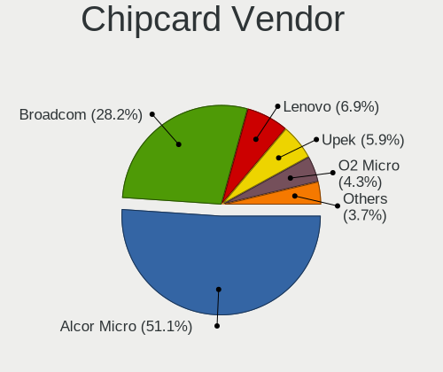

| Vendor                | Notebooks | Percent |
|-----------------------|-----------|---------|
| Alcor Micro           | 60        | 50%     |
| Broadcom              | 34        | 28.33%  |
| Lenovo                | 10        | 8.33%   |
| Upek                  | 9         | 7.5%    |
| O2 Micro              | 4         | 3.33%   |
| SCM Microsystems      | 1         | 0.83%   |
| Realtek Semiconductor | 1         | 0.83%   |
| Advanced Card Systems | 1         | 0.83%   |

Chipcard Model
--------------

Chipcard module models

| Model                                                                        | Notebooks | Percent |
|------------------------------------------------------------------------------|-----------|---------|
| Alcor Micro AU9540 Smartcard Reader                                          | 60        | 50%     |
| Broadcom BCM5880 Secure Applications Processor                               | 14        | 11.67%  |
| Lenovo Integrated Smart Card Reader                                          | 10        | 8.33%   |
| Broadcom BCM5880 Secure Applications Processor with fingerprint swipe sensor | 10        | 8.33%   |
| Upek TouchChip Fingerprint Coprocessor (WBF advanced mode)                   | 9         | 7.5%    |
| Broadcom 5880                                                                | 5         | 4.17%   |
| Broadcom 58200                                                               | 5         | 4.17%   |
| O2 Micro OZ776 CCID Smartcard Reader                                         | 3         | 2.5%    |
| SCM Microsystems SCR3340 - ExpressCard54 Smart Card Reader                   | 1         | 0.83%   |
| Realtek Semiconductor Smart Card Reader Interface                            | 1         | 0.83%   |
| O2 Micro Oz776 SmartCard Reader                                              | 1         | 0.83%   |
| Advanced Card Systems ACR122U                                                | 1         | 0.83%   |

Unsupported
-----------

Unsupported Devices
-------------------

Total unsupported devices on board

| Total | Notebooks | Percent |
|-------|-----------|---------|
| 0     | 484       | 53.84%  |
| 1     | 310       | 34.48%  |
| 2     | 76        | 8.45%   |
| 3     | 21        | 2.34%   |
| 4     | 4         | 0.44%   |
| 8     | 2         | 0.22%   |
| 6     | 1         | 0.11%   |
| 5     | 1         | 0.11%   |

Unsupported Device Types
------------------------

Types of unsupported devices

| Type                     | Notebooks | Percent |
|--------------------------|-----------|---------|
| Fingerprint reader       | 234       | 43.41%  |
| Chipcard                 | 94        | 17.44%  |
| Graphics card            | 68        | 12.62%  |
| Net/wireless             | 51        | 9.46%   |
| Multimedia controller    | 21        | 3.9%    |
| Bluetooth                | 14        | 2.6%    |
| Sound                    | 13        | 2.41%   |
| Camera                   | 10        | 1.86%   |
| Communication controller | 8         | 1.48%   |
| Card reader              | 6         | 1.11%   |
| Storage                  | 5         | 0.93%   |
| Net/ethernet             | 4         | 0.74%   |
| Modem                    | 4         | 0.74%   |
| Unassigned class         | 3         | 0.56%   |
| Flash memory             | 2         | 0.37%   |
| Network                  | 1         | 0.19%   |
| Firewire controller      | 1         | 0.19%   |

