Linux in Austria - Tested Hardware & Statistics (Notebooks)
-----------------------------------------------------------

A project to collect tested hardware configurations for Linux in Austria.

Anyone can contribute to this report by the [hw-probe](https://github.com/linuxhw/hw-probe) tool:

    sudo -E hw-probe -all -upload

Please contribute! Especially if your hardware is rare.

Contents
--------

* [ Test Cases ](#test-cases)

* [ System ](#system)
  - [ OS                       ](#os)
  - [ OS Family                ](#os-family)
  - [ Kernel                   ](#kernel)
  - [ Kernel Family            ](#kernel-family)
  - [ Kernel Major Ver.        ](#kernel-major-ver)
  - [ Arch                     ](#arch)
  - [ DE                       ](#de)
  - [ Display Server           ](#display-server)
  - [ Display Manager          ](#display-manager)
  - [ OS Lang                  ](#os-lang)
  - [ Boot Mode                ](#boot-mode)
  - [ Filesystem               ](#filesystem)
  - [ Part. scheme             ](#part-scheme)
  - [ Dual Boot with Linux/BSD ](#dual-boot-with-linuxbsd)
  - [ Dual Boot (Win)          ](#dual-boot-win)

* [ Board ](#board)
  - [ Vendor                   ](#vendor)
  - [ Model                    ](#model)
  - [ Model Family             ](#model-family)
  - [ MFG Year                 ](#mfg-year)
  - [ Form Factor              ](#form-factor)
  - [ Secure Boot              ](#secure-boot)
  - [ Coreboot                 ](#coreboot)
  - [ RAM Size                 ](#ram-size)
  - [ RAM Used                 ](#ram-used)
  - [ Total Drives             ](#total-drives)
  - [ Has CD-ROM               ](#has-cd-rom)
  - [ Has Ethernet             ](#has-ethernet)
  - [ Has WiFi                 ](#has-wifi)
  - [ Has Bluetooth            ](#has-bluetooth)

* [ Location ](#location)
  - [ Country                  ](#country)
  - [ City                     ](#city)

* [ Drives ](#drives)
  - [ Drive Vendor             ](#drive-vendor)
  - [ Drive Model              ](#drive-model)
  - [ HDD Vendor               ](#hdd-vendor)
  - [ SSD Vendor               ](#ssd-vendor)
  - [ Drive Kind               ](#drive-kind)
  - [ Drive Connector          ](#drive-connector)
  - [ Drive Size               ](#drive-size)
  - [ Space Total              ](#space-total)
  - [ Space Used               ](#space-used)
  - [ Malfunc. Drives          ](#malfunc-drives)
  - [ Malfunc. Drive Vendor    ](#malfunc-drive-vendor)
  - [ Malfunc. HDD Vendor      ](#malfunc-hdd-vendor)
  - [ Malfunc. Drive Kind      ](#malfunc-drive-kind)
  - [ Failed Drives            ](#failed-drives)
  - [ Failed Drive Vendor      ](#failed-drive-vendor)
  - [ Drive Status             ](#drive-status)

* [ Storage controller ](#storage-controller)
  - [ Storage Vendor           ](#storage-vendor)
  - [ Storage Model            ](#storage-model)
  - [ Storage Kind             ](#storage-kind)

* [ Processor ](#processor)
  - [ CPU Vendor               ](#cpu-vendor)
  - [ CPU Model                ](#cpu-model)
  - [ CPU Model Family         ](#cpu-model-family)
  - [ CPU Cores                ](#cpu-cores)
  - [ CPU Sockets              ](#cpu-sockets)
  - [ CPU Threads              ](#cpu-threads)
  - [ CPU Op-Modes             ](#cpu-op-modes)
  - [ CPU Microcode            ](#cpu-microcode)
  - [ CPU Microarch            ](#cpu-microarch)

* [ Graphics ](#graphics)
  - [ GPU Vendor               ](#gpu-vendor)
  - [ GPU Model                ](#gpu-model)
  - [ GPU Combo                ](#gpu-combo)
  - [ GPU Driver               ](#gpu-driver)
  - [ GPU Memory               ](#gpu-memory)

* [ Monitor ](#monitor)
  - [ Monitor Vendor           ](#monitor-vendor)
  - [ Monitor Model            ](#monitor-model)
  - [ Monitor Resolution       ](#monitor-resolution)
  - [ Monitor Diagonal         ](#monitor-diagonal)
  - [ Monitor Width            ](#monitor-width)
  - [ Aspect Ratio             ](#aspect-ratio)
  - [ Monitor Area             ](#monitor-area)
  - [ Pixel Density            ](#pixel-density)
  - [ Multiple Monitors        ](#multiple-monitors)

* [ Network ](#network)
  - [ Net Controller Vendor    ](#net-controller-vendor)
  - [ Net Controller Model     ](#net-controller-model)
  - [ Wireless Vendor          ](#wireless-vendor)
  - [ Wireless Model           ](#wireless-model)
  - [ Ethernet Vendor          ](#ethernet-vendor)
  - [ Ethernet Model           ](#ethernet-model)
  - [ Net Controller Kind      ](#net-controller-kind)
  - [ Used Controller          ](#used-controller)
  - [ NICs                     ](#nics)
  - [ IPv6                     ](#ipv6)

* [ Bluetooth ](#bluetooth)
  - [ Bluetooth Vendor         ](#bluetooth-vendor)
  - [ Bluetooth Model          ](#bluetooth-model)

* [ Sound ](#sound)
  - [ Sound Vendor             ](#sound-vendor)
  - [ Sound Model              ](#sound-model)

* [ Memory ](#memory)
  - [ Memory Vendor            ](#memory-vendor)
  - [ Memory Model             ](#memory-model)
  - [ Memory Kind              ](#memory-kind)
  - [ Memory Form Factor       ](#memory-form-factor)
  - [ Memory Size              ](#memory-size)
  - [ Memory Speed             ](#memory-speed)

* [ Printers & scanners ](#printers--scanners)
  - [ Printer Vendor           ](#printer-vendor)
  - [ Printer Model            ](#printer-model)
  - [ Scanner Vendor           ](#scanner-vendor)
  - [ Scanner Model            ](#scanner-model)

* [ Camera ](#camera)
  - [ Camera Vendor            ](#camera-vendor)
  - [ Camera Model             ](#camera-model)

* [ Security ](#security)
  - [ Fingerprint Vendor       ](#fingerprint-vendor)
  - [ Fingerprint Model        ](#fingerprint-model)
  - [ Chipcard Vendor          ](#chipcard-vendor)
  - [ Chipcard Model           ](#chipcard-model)

* [ Unsupported ](#unsupported)
  - [ Unsupported Devices      ](#unsupported-devices)
  - [ Unsupported Device Types ](#unsupported-device-types)

Test Cases
----------

Total: 1816

| Vendor        | Model                       | Probe                                                      | Date         |
|---------------|-----------------------------|------------------------------------------------------------|--------------|
| HP            | ProBook 430 G6              | [696c3f2a72](https://linux-hardware.org/?probe=696c3f2a72) | May 07, 2024 |
| ASUSTek       | ASUS EXPERTBOOK B1500CEA... | [3236268f3d](https://linux-hardware.org/?probe=3236268f3d) | May 06, 2024 |
| Toshiba       | Satellite C660D             | [8c4353e699](https://linux-hardware.org/?probe=8c4353e699) | May 06, 2024 |
| HP            | ZBook 15 G3                 | [486b46ac77](https://linux-hardware.org/?probe=486b46ac77) | May 05, 2024 |
| HP            | ZBook 15 G3                 | [74576596b1](https://linux-hardware.org/?probe=74576596b1) | May 05, 2024 |
| Lenovo        | ThinkPad W510 4391W3V       | [dbf17c46bd](https://linux-hardware.org/?probe=dbf17c46bd) | May 04, 2024 |
| HP            | EliteBook 865 16 inch G1... | [847e639275](https://linux-hardware.org/?probe=847e639275) | May 02, 2024 |
| Dell          | XPS 15 9570                 | [c5d7b3bc4e](https://linux-hardware.org/?probe=c5d7b3bc4e) | May 01, 2024 |
| Dell          | Latitude E7250              | [e674f5e264](https://linux-hardware.org/?probe=e674f5e264) | May 01, 2024 |
| Lenovo        | ThinkPad T470s 20HF005QM... | [6fc6e1fa78](https://linux-hardware.org/?probe=6fc6e1fa78) | May 01, 2024 |
| Acer          | Aspire A515-44G             | [a3d6511864](https://linux-hardware.org/?probe=a3d6511864) | Apr 30, 2024 |
| Apple         | MacBook5,1                  | [899bc07aae](https://linux-hardware.org/?probe=899bc07aae) | Apr 29, 2024 |
| Lenovo        | ThinkPad T14s Gen 4 21F7... | [b3d1c71cbf](https://linux-hardware.org/?probe=b3d1c71cbf) | Apr 29, 2024 |
| HP            | EliteBook 840 G6            | [cd5b6c35ae](https://linux-hardware.org/?probe=cd5b6c35ae) | Apr 26, 2024 |
| ONE-NETBOO... | ONEXPLAYER X1 i             | [c68eab2b1c](https://linux-hardware.org/?probe=c68eab2b1c) | Apr 26, 2024 |
| Dell          | XPS 13 9310                 | [35ff9b2c9d](https://linux-hardware.org/?probe=35ff9b2c9d) | Apr 24, 2024 |
| HP            | EliteBook 845 14 inch G1... | [d1bfbd2dba](https://linux-hardware.org/?probe=d1bfbd2dba) | Apr 24, 2024 |
| Lenovo        | ThinkPad P16s Gen 2 21HK... | [363e170887](https://linux-hardware.org/?probe=363e170887) | Apr 24, 2024 |
| Lenovo        | ThinkPad P16s Gen 2 21HK... | [5e014cccd3](https://linux-hardware.org/?probe=5e014cccd3) | Apr 24, 2024 |
| Lenovo        | Legion 5 15ACH6A 82NW       | [dc86ce5b59](https://linux-hardware.org/?probe=dc86ce5b59) | Apr 24, 2024 |
| Apple         | MacBook5,1                  | [83ab8ba33c](https://linux-hardware.org/?probe=83ab8ba33c) | Apr 23, 2024 |
| HP            | Pavilion Gaming Notebook    | [9c5d8bd5fe](https://linux-hardware.org/?probe=9c5d8bd5fe) | Apr 23, 2024 |
| TUXEDO        | InfinityBook Pro Gen7 (M... | [894feb1a4d](https://linux-hardware.org/?probe=894feb1a4d) | Apr 23, 2024 |
| Lenovo        | ThinkPad W520 4284HP9       | [3fa1ba6009](https://linux-hardware.org/?probe=3fa1ba6009) | Apr 22, 2024 |
| Acer          | TM8573                      | [9c3c528235](https://linux-hardware.org/?probe=9c3c528235) | Apr 21, 2024 |
| Notebook      | NJ50_70CU                   | [d0959d96c0](https://linux-hardware.org/?probe=d0959d96c0) | Apr 20, 2024 |
| Dell          | Precision 5680              | [165f135e49](https://linux-hardware.org/?probe=165f135e49) | Apr 18, 2024 |
| HP            | EliteBook 2540p             | [9748a3188e](https://linux-hardware.org/?probe=9748a3188e) | Apr 18, 2024 |
| Lenovo        | ThinkPad X13 Gen 1 20T20... | [32d8be9f50](https://linux-hardware.org/?probe=32d8be9f50) | Apr 17, 2024 |
| Lenovo        | ThinkPad X13 Gen 1 20T20... | [0ce853dae6](https://linux-hardware.org/?probe=0ce853dae6) | Apr 17, 2024 |
| Acer          | Nitro AN517-52              | [da7720d0f0](https://linux-hardware.org/?probe=da7720d0f0) | Apr 16, 2024 |
| Acer          | Nitro AN517-52              | [a65d6b6abb](https://linux-hardware.org/?probe=a65d6b6abb) | Apr 16, 2024 |
| HUAWEI        | RLEF-XX                     | [461426c098](https://linux-hardware.org/?probe=461426c098) | Apr 16, 2024 |
| HP            | EliteBook 840 G8 Noteboo... | [546afe3c79](https://linux-hardware.org/?probe=546afe3c79) | Apr 15, 2024 |
| Schenker      | XMG FUSION 15 (XFU15L19)    | [46106cf0ed](https://linux-hardware.org/?probe=46106cf0ed) | Apr 14, 2024 |
| Dell          | XPS 9315                    | [a034dc4942](https://linux-hardware.org/?probe=a034dc4942) | Apr 12, 2024 |
| HP            | Pavilion Laptop 15-eh0xx... | [9a688ec725](https://linux-hardware.org/?probe=9a688ec725) | Apr 11, 2024 |
| Lenovo        | ThinkPad W510 4391W3V       | [9cf97a6441](https://linux-hardware.org/?probe=9cf97a6441) | Apr 09, 2024 |
| Lenovo        | ThinkPad E14 Gen 2 20T7S... | [278e4869ad](https://linux-hardware.org/?probe=278e4869ad) | Apr 06, 2024 |
| Lenovo        | ThinkPad E14 Gen 2 20T7S... | [65816fc70b](https://linux-hardware.org/?probe=65816fc70b) | Apr 06, 2024 |
| Apple         | MacBookPro8,1               | [fd4157e3ba](https://linux-hardware.org/?probe=fd4157e3ba) | Apr 06, 2024 |
| Lenovo        | ThinkPad T480s 20L7001NG... | [ec916e14d1](https://linux-hardware.org/?probe=ec916e14d1) | Apr 06, 2024 |
| Apple         | MacBookPro8,1               | [0f7ad3e22a](https://linux-hardware.org/?probe=0f7ad3e22a) | Apr 06, 2024 |
| Apple         | MacBookPro9,2               | [a90b694613](https://linux-hardware.org/?probe=a90b694613) | Apr 06, 2024 |
| Apple         | MacBookPro14,1              | [bc52c8c02f](https://linux-hardware.org/?probe=bc52c8c02f) | Apr 06, 2024 |
| HP            | 250 G8 Notebook PC          | [62cd5c6263](https://linux-hardware.org/?probe=62cd5c6263) | Apr 06, 2024 |
| Dell          | Precision 3581              | [929244a82c](https://linux-hardware.org/?probe=929244a82c) | Apr 05, 2024 |
| HUAWEI        | CREM-WXX9                   | [8fb4cdf244](https://linux-hardware.org/?probe=8fb4cdf244) | Apr 04, 2024 |
| HP            | Laptop 17-cp2xxx            | [e31c81fe69](https://linux-hardware.org/?probe=e31c81fe69) | Apr 01, 2024 |
| ASUSTek       | PRIME B550M-A               | [e5fc501332](https://linux-hardware.org/?probe=e5fc501332) | Mar 31, 2024 |
| HP            | 15                          | [e1c7ccf97a](https://linux-hardware.org/?probe=e1c7ccf97a) | Mar 31, 2024 |
| Lenovo        | ThinkPad T14 Gen 3 21CGS... | [82ac8c0b36](https://linux-hardware.org/?probe=82ac8c0b36) | Mar 31, 2024 |
| HUAWEI        | NBLB-WAX9N                  | [0ccf6a99da](https://linux-hardware.org/?probe=0ccf6a99da) | Mar 31, 2024 |
| Lenovo        | ThinkPad T14 Gen 2i 20W0... | [de1d63d35e](https://linux-hardware.org/?probe=de1d63d35e) | Mar 30, 2024 |
| HP            | Notebook                    | [1d62a53c3e](https://linux-hardware.org/?probe=1d62a53c3e) | Mar 30, 2024 |
| Dell          | Latitude E6430              | [2504800a70](https://linux-hardware.org/?probe=2504800a70) | Mar 29, 2024 |
| Acer          | Aspire A515-45              | [3333f04923](https://linux-hardware.org/?probe=3333f04923) | Mar 29, 2024 |
| Lenovo        | ThinkPad T470 W10DG 20JN... | [0d34620042](https://linux-hardware.org/?probe=0d34620042) | Mar 27, 2024 |
| Dell          | Venue 11 Pro 7130 vPro      | [2315863014](https://linux-hardware.org/?probe=2315863014) | Mar 26, 2024 |
| Lenovo        | ThinkPad E16 Gen 1 21JT0... | [f2b119f5cc](https://linux-hardware.org/?probe=f2b119f5cc) | Mar 24, 2024 |
| ASUSTek       | VivoBook_ASUSLaptop X712... | [fdae689907](https://linux-hardware.org/?probe=fdae689907) | Mar 24, 2024 |
| HP            | Pavilion Gaming Laptop 1... | [59e0f44e00](https://linux-hardware.org/?probe=59e0f44e00) | Mar 23, 2024 |
| ASUSTek       | K52N                        | [7f4a855bc0](https://linux-hardware.org/?probe=7f4a855bc0) | Mar 21, 2024 |
| ASUSTek       | K52N                        | [31c9cc7e95](https://linux-hardware.org/?probe=31c9cc7e95) | Mar 21, 2024 |
| ASUSTek       | ASUS EXPERTBOOK B1500CEA... | [89bd2eb279](https://linux-hardware.org/?probe=89bd2eb279) | Mar 20, 2024 |
| HP            | ProBook 430 G5              | [39696543eb](https://linux-hardware.org/?probe=39696543eb) | Mar 20, 2024 |
| Schenker      | VISION (M23)                | [aeb80131e2](https://linux-hardware.org/?probe=aeb80131e2) | Mar 20, 2024 |
| Dell          | Latitude E6540              | [864f594d20](https://linux-hardware.org/?probe=864f594d20) | Mar 16, 2024 |
| Apple         | MacBookAir6,2               | [60d57385af](https://linux-hardware.org/?probe=60d57385af) | Mar 15, 2024 |
| Lenovo        | ThinkPad T480 20L6S1TV00    | [797839cace](https://linux-hardware.org/?probe=797839cace) | Mar 14, 2024 |
| Schenker      | VISION (M23)                | [63d77f6e25](https://linux-hardware.org/?probe=63d77f6e25) | Mar 14, 2024 |
| Apple         | MacBookAir6,2               | [7ad5a4d115](https://linux-hardware.org/?probe=7ad5a4d115) | Mar 14, 2024 |
| Dell          | Precision 7680              | [fe5f0a0443](https://linux-hardware.org/?probe=fe5f0a0443) | Mar 12, 2024 |
| Acer          | Aspire A317-52              | [dcada3f441](https://linux-hardware.org/?probe=dcada3f441) | Mar 11, 2024 |
| Acer          | Aspire A317-52              | [4946111e3f](https://linux-hardware.org/?probe=4946111e3f) | Mar 11, 2024 |
| ASUSTek       | PRIME B550M-A               | [ed405fd8da](https://linux-hardware.org/?probe=ed405fd8da) | Mar 11, 2024 |
| HP            | Compaq 6715s (RU656EA#AK... | [7bd9b5b150](https://linux-hardware.org/?probe=7bd9b5b150) | Mar 10, 2024 |
| Sony          | VPCEE4M1E                   | [ac90f6919d](https://linux-hardware.org/?probe=ac90f6919d) | Mar 10, 2024 |
| Apple         | MacBookPro11,2              | [486387c7ef](https://linux-hardware.org/?probe=486387c7ef) | Mar 08, 2024 |
| HP            | EliteBook 840 G2            | [431439414a](https://linux-hardware.org/?probe=431439414a) | Mar 07, 2024 |
| HP            | EliteBook 840 G2            | [571cf278dd](https://linux-hardware.org/?probe=571cf278dd) | Mar 07, 2024 |
| Apple         | MacBookPro11,4              | [0ecd6e5fc1](https://linux-hardware.org/?probe=0ecd6e5fc1) | Mar 06, 2024 |
| HP            | Notebook                    | [653574ff70](https://linux-hardware.org/?probe=653574ff70) | Mar 06, 2024 |
| ASUSTek       | VivoBook_ASUSLaptop M160... | [de2894497c](https://linux-hardware.org/?probe=de2894497c) | Mar 04, 2024 |
| Apple         | MacBookPro8,1               | [1dc31417b5](https://linux-hardware.org/?probe=1dc31417b5) | Mar 03, 2024 |
| Lenovo        | ThinkPad E16 Gen 1 21JT0... | [fef65e6d34](https://linux-hardware.org/?probe=fef65e6d34) | Mar 02, 2024 |
| TUXEDO        | Book XP15 / XP17 Gen12      | [c8ca20ec07](https://linux-hardware.org/?probe=c8ca20ec07) | Feb 29, 2024 |
| TrekStor      | Notebook Slim S130          | [534a53e131](https://linux-hardware.org/?probe=534a53e131) | Feb 26, 2024 |
| Samsung       | 355V4C/355V4X/355V5C/355... | [cded833645](https://linux-hardware.org/?probe=cded833645) | Feb 25, 2024 |
| TrekStor      | Notebook Slim S130          | [829f6953a7](https://linux-hardware.org/?probe=829f6953a7) | Feb 25, 2024 |
| Medion        | P17619                      | [57441afe1f](https://linux-hardware.org/?probe=57441afe1f) | Feb 24, 2024 |
| Lenovo        | ThinkPad Edge E325 12972... | [cff3dbd166](https://linux-hardware.org/?probe=cff3dbd166) | Feb 23, 2024 |
| Lenovo        | IdeaPad 700-15ISK 80RU      | [d7f17aa5fd](https://linux-hardware.org/?probe=d7f17aa5fd) | Feb 21, 2024 |
| Dell          | Precision 7680              | [831a313255](https://linux-hardware.org/?probe=831a313255) | Feb 21, 2024 |
| MSI           | Bravo 17 A4DDR              | [ad6fdc9bfd](https://linux-hardware.org/?probe=ad6fdc9bfd) | Feb 19, 2024 |
| MSI           | Bravo 17 A4DDR              | [46b44f8594](https://linux-hardware.org/?probe=46b44f8594) | Feb 19, 2024 |
| Lenovo        | IdeaPad S540-15IML 81NG     | [f1ca049d82](https://linux-hardware.org/?probe=f1ca049d82) | Feb 17, 2024 |
| Lenovo        | ThinkPad T480s 20L8S2R40... | [3ef44c20b3](https://linux-hardware.org/?probe=3ef44c20b3) | Feb 17, 2024 |
| HP            | ProBook 4530s               | [5651d571a8](https://linux-hardware.org/?probe=5651d571a8) | Feb 16, 2024 |
| Lenovo        | ThinkPad T470 20HES2C000    | [e866f9fbc7](https://linux-hardware.org/?probe=e866f9fbc7) | Feb 16, 2024 |
| Dell          | XPS 13 9380                 | [84485c262a](https://linux-hardware.org/?probe=84485c262a) | Feb 15, 2024 |
| Lenovo        | ThinkPad T480 20L5S31T00    | [201fa11f75](https://linux-hardware.org/?probe=201fa11f75) | Feb 13, 2024 |
| Lenovo        | ThinkPad X250 20CLS78300    | [a930329831](https://linux-hardware.org/?probe=a930329831) | Feb 10, 2024 |
| HP            | 250 G7 Notebook PC          | [284bdb6d3c](https://linux-hardware.org/?probe=284bdb6d3c) | Feb 10, 2024 |
| Lenovo        | ThinkPad T480s 20L8S2R40... | [d10caac148](https://linux-hardware.org/?probe=d10caac148) | Feb 09, 2024 |
| MSI           | GF63 Thin 11UC              | [5ffbda55e6](https://linux-hardware.org/?probe=5ffbda55e6) | Feb 08, 2024 |
| MSI           | GF63 Thin 11UC              | [1c9674a221](https://linux-hardware.org/?probe=1c9674a221) | Feb 08, 2024 |
| Acer          | Aspire A114-31              | [067304d657](https://linux-hardware.org/?probe=067304d657) | Feb 06, 2024 |
| HP            | EliteBook 820 G3            | [043c5e67f0](https://linux-hardware.org/?probe=043c5e67f0) | Feb 06, 2024 |
| Valve         | Jupiter                     | [658987799e](https://linux-hardware.org/?probe=658987799e) | Feb 03, 2024 |
| Acer          | Aspire VN7-592G             | [95f618bdeb](https://linux-hardware.org/?probe=95f618bdeb) | Feb 02, 2024 |
| ASUSTek       | VivoBook_ASUSLaptop M350... | [cb15afccd0](https://linux-hardware.org/?probe=cb15afccd0) | Feb 02, 2024 |
| HP            | EliteBook 8460p             | [8ddfa07beb](https://linux-hardware.org/?probe=8ddfa07beb) | Jan 31, 2024 |
| Lenovo        | ThinkPad X270 W10DG 20K5... | [c62ec1a167](https://linux-hardware.org/?probe=c62ec1a167) | Jan 31, 2024 |
| HP            | Laptop 17-ak0xx             | [0b511ae973](https://linux-hardware.org/?probe=0b511ae973) | Jan 30, 2024 |
| Acer          | Aspire A114-31              | [9c767147fc](https://linux-hardware.org/?probe=9c767147fc) | Jan 29, 2024 |
| Dell          | Latitude 5290 2-in-1        | [5f28b98de6](https://linux-hardware.org/?probe=5f28b98de6) | Jan 27, 2024 |
| TUXEDO        | InfinityBook Pro Gen8 (M... | [b1abb90a3f](https://linux-hardware.org/?probe=b1abb90a3f) | Jan 25, 2024 |
| Hampoo        | Cherry Trail CR             | [1c0466fe53](https://linux-hardware.org/?probe=1c0466fe53) | Jan 25, 2024 |
| Lenovo        | Legion 5 15ARH05 82B5       | [356b235b8b](https://linux-hardware.org/?probe=356b235b8b) | Jan 24, 2024 |
| Acer          | Aspire A114-31              | [f08742602c](https://linux-hardware.org/?probe=f08742602c) | Jan 23, 2024 |
| ASUSTek       | ASUS EXPERTBOOK B1500CEA... | [09cb74358d](https://linux-hardware.org/?probe=09cb74358d) | Jan 23, 2024 |
| Dell          | Latitude E7440              | [4e05575433](https://linux-hardware.org/?probe=4e05575433) | Jan 22, 2024 |
| HP            | EliteBook 8460p             | [3055120492](https://linux-hardware.org/?probe=3055120492) | Jan 22, 2024 |
| Dell          | Latitude 5490               | [ebc5bed33f](https://linux-hardware.org/?probe=ebc5bed33f) | Jan 22, 2024 |
| Dell          | Latitude 5290 2-in-1        | [a06ba088e5](https://linux-hardware.org/?probe=a06ba088e5) | Jan 21, 2024 |
| Lenovo        | ThinkBook 14-IIL 20SL       | [aa40e37f96](https://linux-hardware.org/?probe=aa40e37f96) | Jan 19, 2024 |
| HP            | OMEN Laptop 15-ek1xxx       | [5c18e1a4bc](https://linux-hardware.org/?probe=5c18e1a4bc) | Jan 18, 2024 |
| Acer          | Aspire A515-44G             | [6d540c596b](https://linux-hardware.org/?probe=6d540c596b) | Jan 17, 2024 |
| Fujitsu       | LIFEBOOK U7613              | [9e38b7368d](https://linux-hardware.org/?probe=9e38b7368d) | Jan 14, 2024 |
| SGIN          | M15                         | [022c34815c](https://linux-hardware.org/?probe=022c34815c) | Jan 12, 2024 |
| HP            | EliteBook 8470p             | [4ed2b7527c](https://linux-hardware.org/?probe=4ed2b7527c) | Jan 11, 2024 |
| Lenovo        | V15-ADA 82C7                | [e12995730c](https://linux-hardware.org/?probe=e12995730c) | Jan 11, 2024 |
| Lenovo        | ThinkPad W530 24474LG       | [7c1349e97d](https://linux-hardware.org/?probe=7c1349e97d) | Jan 10, 2024 |
| Valve         | Jupiter                     | [3462a5ad9f](https://linux-hardware.org/?probe=3462a5ad9f) | Jan 09, 2024 |
| Valve         | Jupiter                     | [eac99b5d0a](https://linux-hardware.org/?probe=eac99b5d0a) | Jan 09, 2024 |
| HP            | EliteBook 8440p             | [6a5afb5dec](https://linux-hardware.org/?probe=6a5afb5dec) | Jan 08, 2024 |
| SGIN          | M15                         | [b0b7267ad7](https://linux-hardware.org/?probe=b0b7267ad7) | Jan 08, 2024 |
| Valve         | Galileo                     | [e71ef9c36d](https://linux-hardware.org/?probe=e71ef9c36d) | Jan 07, 2024 |
| ASUSTek       | X75VC                       | [348451dd8f](https://linux-hardware.org/?probe=348451dd8f) | Jan 06, 2024 |
| Lenovo        | Legion Y740-15IRHg 81UH     | [6e0b491486](https://linux-hardware.org/?probe=6e0b491486) | Jan 05, 2024 |
| Notebook      | P7xxTM1                     | [9ed3be2a69](https://linux-hardware.org/?probe=9ed3be2a69) | Jan 04, 2024 |
| Fujitsu       | LIFEBOOK U7413              | [b709a3069c](https://linux-hardware.org/?probe=b709a3069c) | Jan 03, 2024 |
| Lenovo        | ThinkBook 16p Gen 2 20YM    | [2cf15e0bf0](https://linux-hardware.org/?probe=2cf15e0bf0) | Jan 02, 2024 |
| Dell          | Latitude 5540               | [96e1aad010](https://linux-hardware.org/?probe=96e1aad010) | Jan 02, 2024 |
| ASUSTek       | X75VC                       | [6e3608409f](https://linux-hardware.org/?probe=6e3608409f) | Jan 02, 2024 |
| ASUSTek       | X75VC                       | [c80297163a](https://linux-hardware.org/?probe=c80297163a) | Jan 02, 2024 |
| Medion        | E11202                      | [cb45690620](https://linux-hardware.org/?probe=cb45690620) | Jan 01, 2024 |
| ASUSTek       | X75VC                       | [cb47b15eb9](https://linux-hardware.org/?probe=cb47b15eb9) | Jan 01, 2024 |
| HP            | EliteBook 840 G1            | [9ab6343dd7](https://linux-hardware.org/?probe=9ab6343dd7) | Jan 01, 2024 |
| Lenovo        | ThinkPad T470s 20HGS1R90... | [c0587a6f3f](https://linux-hardware.org/?probe=c0587a6f3f) | Dec 31, 2023 |
| ASUSTek       | X75VC                       | [92906e6c95](https://linux-hardware.org/?probe=92906e6c95) | Dec 31, 2023 |
| ASUSTek       | X75VC                       | [e2ebd9354f](https://linux-hardware.org/?probe=e2ebd9354f) | Dec 31, 2023 |
| ASUSTek       | VivoBook_ASUSLaptop X571... | [3b6d015d5a](https://linux-hardware.org/?probe=3b6d015d5a) | Dec 29, 2023 |
| Framework     | Laptop (12th Gen Intel C... | [fb4b958ae6](https://linux-hardware.org/?probe=fb4b958ae6) | Dec 29, 2023 |
| Apple         | MacBookAir4,2               | [ab4628dffe](https://linux-hardware.org/?probe=ab4628dffe) | Dec 29, 2023 |
| Apple         | MacBookAir4,2               | [9a7ee6f89e](https://linux-hardware.org/?probe=9a7ee6f89e) | Dec 29, 2023 |
| Medion        | E11202                      | [9db140d63c](https://linux-hardware.org/?probe=9db140d63c) | Dec 28, 2023 |
| Medion        | E7220                       | [8a10d2f8d1](https://linux-hardware.org/?probe=8a10d2f8d1) | Dec 28, 2023 |
| Acer          | Swift SF314-56              | [d230832e06](https://linux-hardware.org/?probe=d230832e06) | Dec 28, 2023 |
| HUAWEI        | BOD-WXX9                    | [d8e2dd481d](https://linux-hardware.org/?probe=d8e2dd481d) | Dec 28, 2023 |
| Apple         | MacBookAir6,2               | [eaa0ff8b0c](https://linux-hardware.org/?probe=eaa0ff8b0c) | Dec 27, 2023 |
| Apple         | MacBookAir6,2               | [4a28e0da3c](https://linux-hardware.org/?probe=4a28e0da3c) | Dec 27, 2023 |
| Acer          | Aspire A114-31              | [dfa2a6458d](https://linux-hardware.org/?probe=dfa2a6458d) | Dec 27, 2023 |
| Lenovo        | ThinkPad W530 24474LG       | [180b4817c4](https://linux-hardware.org/?probe=180b4817c4) | Dec 26, 2023 |
| Lenovo        | ThinkPad P1 Gen 3 20TH00... | [77553a2b0e](https://linux-hardware.org/?probe=77553a2b0e) | Dec 26, 2023 |
| Dell          | XPS 13 9310                 | [78b73643ff](https://linux-hardware.org/?probe=78b73643ff) | Dec 23, 2023 |
| Lenovo        | ThinkPad T500 20564RG       | [e17f4b51d6](https://linux-hardware.org/?probe=e17f4b51d6) | Dec 22, 2023 |
| HP            | EliteBook 655 15.6 inch ... | [72084f8af0](https://linux-hardware.org/?probe=72084f8af0) | Dec 22, 2023 |
| Medion        | E11202                      | [af0c7baf03](https://linux-hardware.org/?probe=af0c7baf03) | Dec 22, 2023 |
| ASUSTek       | BU201LA                     | [2985f7a222](https://linux-hardware.org/?probe=2985f7a222) | Dec 22, 2023 |
| Lenovo        | Legion S7 15IMH5 82BC       | [5d41a0e0d5](https://linux-hardware.org/?probe=5d41a0e0d5) | Dec 22, 2023 |
| Lenovo        | Legion S7 15IMH5 82BC       | [ad67aeb103](https://linux-hardware.org/?probe=ad67aeb103) | Dec 22, 2023 |
| TUXEDO        | Book XP15 / XP17 Gen12      | [62624ca97b](https://linux-hardware.org/?probe=62624ca97b) | Dec 21, 2023 |
| Apple         | MacBookPro9,2               | [da159da872](https://linux-hardware.org/?probe=da159da872) | Dec 20, 2023 |
| Valve         | Jupiter                     | [091511a6c2](https://linux-hardware.org/?probe=091511a6c2) | Dec 20, 2023 |
| Apple         | MacBookAir6,2               | [ef17f12758](https://linux-hardware.org/?probe=ef17f12758) | Dec 20, 2023 |
| Apple         | MacBook5,1                  | [9839cacb3a](https://linux-hardware.org/?probe=9839cacb3a) | Dec 19, 2023 |
| Apple         | MacBook5,1                  | [8268b72759](https://linux-hardware.org/?probe=8268b72759) | Dec 19, 2023 |
| HP            | Unknown                     | [43fae5ce53](https://linux-hardware.org/?probe=43fae5ce53) | Dec 19, 2023 |
| HP            | ZBook Firefly 15 G7 Mobi... | [020e3af833](https://linux-hardware.org/?probe=020e3af833) | Dec 18, 2023 |
| Dell          | Latitude E5550              | [671595a2e5](https://linux-hardware.org/?probe=671595a2e5) | Dec 18, 2023 |
| Dell          | Latitude E7440              | [c2dce135e4](https://linux-hardware.org/?probe=c2dce135e4) | Dec 18, 2023 |
| ASUSTek       | K53SD                       | [4b43240ccd](https://linux-hardware.org/?probe=4b43240ccd) | Dec 18, 2023 |
| HUAWEI        | NBLB-WAX9N                  | [f64fa9a501](https://linux-hardware.org/?probe=f64fa9a501) | Dec 16, 2023 |
| Lenovo        | ThinkPad T470s 20HGS1R90... | [56e95fc392](https://linux-hardware.org/?probe=56e95fc392) | Dec 16, 2023 |
| ASUSTek       | ROG Strix G814JI_G814JI     | [933e5b48f2](https://linux-hardware.org/?probe=933e5b48f2) | Dec 16, 2023 |
| ASUSTek       | ROG Strix G814JI_G814JI     | [9df7fd000e](https://linux-hardware.org/?probe=9df7fd000e) | Dec 16, 2023 |
| Dell          | Latitude E5550              | [dc16864fb6](https://linux-hardware.org/?probe=dc16864fb6) | Dec 15, 2023 |
| Dell          | Precision 5680              | [1e063996da](https://linux-hardware.org/?probe=1e063996da) | Dec 14, 2023 |
| HP            | ZBook 15 G6                 | [1d935cbf02](https://linux-hardware.org/?probe=1d935cbf02) | Dec 13, 2023 |
| HP            | ZBook 15 G6                 | [3deb250922](https://linux-hardware.org/?probe=3deb250922) | Dec 13, 2023 |
| HP            | EliteBook 655 15.6 inch ... | [ba6f8efad6](https://linux-hardware.org/?probe=ba6f8efad6) | Dec 13, 2023 |
| Samsung       | 355V4C/355V4X/355V5C/355... | [b949261978](https://linux-hardware.org/?probe=b949261978) | Dec 13, 2023 |
| Fujitsu       | LIFEBOOK U7413              | [088a24eb7d](https://linux-hardware.org/?probe=088a24eb7d) | Dec 13, 2023 |
| Toshiba       | Satellite Pro C660          | [63cf57fa53](https://linux-hardware.org/?probe=63cf57fa53) | Dec 12, 2023 |
| Lenovo        | ThinkPad L470 20J5S1FW00    | [9ea0dccce0](https://linux-hardware.org/?probe=9ea0dccce0) | Dec 11, 2023 |
| HP            | Compaq Presario CQ60        | [0bf86693bc](https://linux-hardware.org/?probe=0bf86693bc) | Dec 11, 2023 |
| Lenovo        | Yoga Slim 6 14IRH8 83E0     | [a8b759b4a8](https://linux-hardware.org/?probe=a8b759b4a8) | Dec 07, 2023 |
| Lenovo        | ThinkPad P14s Gen 4 21HF... | [afd68e777f](https://linux-hardware.org/?probe=afd68e777f) | Dec 06, 2023 |
| Lenovo        | ThinkPad P14s Gen 4 21HF... | [9a8395654c](https://linux-hardware.org/?probe=9a8395654c) | Dec 06, 2023 |
| Samsung       | R580/R590                   | [89f285aacc](https://linux-hardware.org/?probe=89f285aacc) | Dec 05, 2023 |
| ASUSTek       | X751LN                      | [72bc3137f4](https://linux-hardware.org/?probe=72bc3137f4) | Dec 05, 2023 |
| HP            | Notebook                    | [4f0e8aad8c](https://linux-hardware.org/?probe=4f0e8aad8c) | Dec 04, 2023 |
| Framework     | Laptop 13 (AMD Ryzen 704... | [452f677f7f](https://linux-hardware.org/?probe=452f677f7f) | Dec 03, 2023 |
| ASUSTek       | VivoBook_ASUSLaptop X530... | [1f6674a16b](https://linux-hardware.org/?probe=1f6674a16b) | Dec 03, 2023 |
| MSI           | GE72 6QF                    | [2cce4d92fe](https://linux-hardware.org/?probe=2cce4d92fe) | Dec 02, 2023 |
| Lenovo        | ThinkPad T470 20HDA01RKR    | [f7fb5f1e5d](https://linux-hardware.org/?probe=f7fb5f1e5d) | Dec 01, 2023 |
| Apple         | MacBookPro12,1              | [d956dae97a](https://linux-hardware.org/?probe=d956dae97a) | Nov 30, 2023 |
| Lenovo        | ThinkPad W510 4391W3V       | [bfa4423c0f](https://linux-hardware.org/?probe=bfa4423c0f) | Nov 30, 2023 |
| Lenovo        | ThinkPad T470 20HDA01RKR    | [46a5719afb](https://linux-hardware.org/?probe=46a5719afb) | Nov 30, 2023 |
| Lenovo        | ThinkPad T14 Gen 1 20UES... | [ad9b9e5fd1](https://linux-hardware.org/?probe=ad9b9e5fd1) | Nov 30, 2023 |
| Apple         | MacBook3,1                  | [970202f2a1](https://linux-hardware.org/?probe=970202f2a1) | Nov 30, 2023 |
| Notebook      | P9XXEN_EF_ED                | [cd5316e290](https://linux-hardware.org/?probe=cd5316e290) | Nov 29, 2023 |
| Notebook      | P9XXEN_EF_ED                | [29e5da6013](https://linux-hardware.org/?probe=29e5da6013) | Nov 29, 2023 |
| HP            | EliteBook 840 G1            | [bb1d8fb09e](https://linux-hardware.org/?probe=bb1d8fb09e) | Nov 29, 2023 |
| HUAWEI        | NBLB-WAX9N                  | [a638d25ff0](https://linux-hardware.org/?probe=a638d25ff0) | Nov 28, 2023 |
| Lenovo        | ThinkPad P14s Gen 4 21K5... | [8c51aa422e](https://linux-hardware.org/?probe=8c51aa422e) | Nov 27, 2023 |
| Acer          | Aspire A114-31              | [43921895ea](https://linux-hardware.org/?probe=43921895ea) | Nov 27, 2023 |
| HP            | EliteBook 655 15.6 inch ... | [2a870ea79e](https://linux-hardware.org/?probe=2a870ea79e) | Nov 27, 2023 |
| Toshiba       | Satellite Z30-B             | [80f2583617](https://linux-hardware.org/?probe=80f2583617) | Nov 27, 2023 |
| Fujitsu       | LIFEBOOK U7413              | [b8569ba845](https://linux-hardware.org/?probe=b8569ba845) | Nov 27, 2023 |
| VALE          | Notebook Classic C170       | [fcb0ab721b](https://linux-hardware.org/?probe=fcb0ab721b) | Nov 26, 2023 |
| HP            | EliteBook 8570p             | [f31c8412d9](https://linux-hardware.org/?probe=f31c8412d9) | Nov 26, 2023 |
| ASUSTek       | K53SD                       | [e7c6d5b018](https://linux-hardware.org/?probe=e7c6d5b018) | Nov 26, 2023 |
| Lenovo        | ThinkPad P14s Gen 4 21K5... | [e225477a30](https://linux-hardware.org/?probe=e225477a30) | Nov 24, 2023 |
| Apple         | MacBookPro11,5              | [a89e3b5a9d](https://linux-hardware.org/?probe=a89e3b5a9d) | Nov 24, 2023 |
| Apple         | MacBookPro11,5              | [52ff8830e8](https://linux-hardware.org/?probe=52ff8830e8) | Nov 24, 2023 |
| HP            | OMEN by Laptop 17-ck0xxx    | [7e25b00cb4](https://linux-hardware.org/?probe=7e25b00cb4) | Nov 22, 2023 |
| HP            | OMEN by Laptop 17-ck0xxx    | [43be1d8514](https://linux-hardware.org/?probe=43be1d8514) | Nov 21, 2023 |
| Apple         | MacBook3,1                  | [d73c12597f](https://linux-hardware.org/?probe=d73c12597f) | Nov 21, 2023 |
| HUAWEI        | CREFG-XX                    | [97b8871652](https://linux-hardware.org/?probe=97b8871652) | Nov 20, 2023 |
| ASUSTek       | VivoBook_ASUSLaptop X515... | [69d60bac42](https://linux-hardware.org/?probe=69d60bac42) | Nov 20, 2023 |
| HUAWEI        | CREFG-XX                    | [be15ab8952](https://linux-hardware.org/?probe=be15ab8952) | Nov 19, 2023 |
| HUAWEI        | CREFG-XX                    | [747979b60f](https://linux-hardware.org/?probe=747979b60f) | Nov 19, 2023 |
| Dell          | XPS 13 9310                 | [ee45badecb](https://linux-hardware.org/?probe=ee45badecb) | Nov 18, 2023 |
| Lenovo        | Legion 5 15ARH05H 82B1      | [2f1ba470f6](https://linux-hardware.org/?probe=2f1ba470f6) | Nov 18, 2023 |
| Lenovo        | Legion 5 15ARH05H 82B1      | [f3170951f8](https://linux-hardware.org/?probe=f3170951f8) | Nov 18, 2023 |
| Fujitsu       | LIFEBOOK U7413              | [62b13a5829](https://linux-hardware.org/?probe=62b13a5829) | Nov 17, 2023 |
| Lenovo        | ThinkPad T14 Gen 1 20UDS... | [56ae69a7dc](https://linux-hardware.org/?probe=56ae69a7dc) | Nov 17, 2023 |
| ASUSTek       | VivoBook_ASUSLaptop X712... | [f576d94ac0](https://linux-hardware.org/?probe=f576d94ac0) | Nov 17, 2023 |
| Lenovo        | ThinkPad E485 20KU000ACD    | [e03dd77d39](https://linux-hardware.org/?probe=e03dd77d39) | Nov 16, 2023 |
| Notebook      | P9XXEN_EF_ED                | [9119b16d75](https://linux-hardware.org/?probe=9119b16d75) | Nov 15, 2023 |
| Notebook      | P9XXEN_EF_ED                | [ac5c2d0218](https://linux-hardware.org/?probe=ac5c2d0218) | Nov 15, 2023 |
| Fujitsu       | LIFEBOOK U7413              | [b5ac0ee2ca](https://linux-hardware.org/?probe=b5ac0ee2ca) | Nov 13, 2023 |
| Lenovo        | Yoga Slim 7 Carbon 14ACN... | [c55053fa25](https://linux-hardware.org/?probe=c55053fa25) | Nov 12, 2023 |
| ASUSTek       | ROG Strix G513QY_G513QY     | [feaa9f3eac](https://linux-hardware.org/?probe=feaa9f3eac) | Nov 11, 2023 |
| HP            | Pavilion dv7                | [bd4b3a096e](https://linux-hardware.org/?probe=bd4b3a096e) | Nov 10, 2023 |
| Fujitsu       | LIFEBOOK S710               | [ab1560cd77](https://linux-hardware.org/?probe=ab1560cd77) | Nov 09, 2023 |
| ASUSTek       | ASUS EXPERTBOOK B1500CEA... | [4eb5901f8c](https://linux-hardware.org/?probe=4eb5901f8c) | Nov 08, 2023 |
| ASUSTek       | GL702VMK                    | [4cb218a4f4](https://linux-hardware.org/?probe=4cb218a4f4) | Nov 08, 2023 |
| TUXEDO        | InfinityBook S 15/17 Gen... | [ed6ede63bc](https://linux-hardware.org/?probe=ed6ede63bc) | Nov 07, 2023 |
| HP            | ProBook 6570b               | [d9cfeee9df](https://linux-hardware.org/?probe=d9cfeee9df) | Nov 06, 2023 |
| Lenovo        | IdeaPad 530S-14IKB 81EU     | [985ed440bf](https://linux-hardware.org/?probe=985ed440bf) | Nov 06, 2023 |
| HP            | ProBook 430 G1              | [451abee058](https://linux-hardware.org/?probe=451abee058) | Nov 05, 2023 |
| HUAWEI        | BOD-WXX9                    | [30a0e0602f](https://linux-hardware.org/?probe=30a0e0602f) | Nov 04, 2023 |
| ASUSTek       | K53SD                       | [e26ed8b740](https://linux-hardware.org/?probe=e26ed8b740) | Nov 03, 2023 |
| Fujitsu       | LIFEBOOK S710               | [b0ee1e5f32](https://linux-hardware.org/?probe=b0ee1e5f32) | Nov 03, 2023 |
| Fujitsu       | LIFEBOOK S710               | [a8ae4206d4](https://linux-hardware.org/?probe=a8ae4206d4) | Oct 31, 2023 |
| MSI           | Modern 15 A11M              | [43161bd5f4](https://linux-hardware.org/?probe=43161bd5f4) | Oct 30, 2023 |
| HP            | 250 G7 Notebook PC          | [3c8f87fe9e](https://linux-hardware.org/?probe=3c8f87fe9e) | Oct 25, 2023 |
| Acer          | Aspire E1-572G              | [ebfb310a2d](https://linux-hardware.org/?probe=ebfb310a2d) | Oct 23, 2023 |
| Razer         | Blade 17 (Mid 2021) - RZ... | [c096ac6500](https://linux-hardware.org/?probe=c096ac6500) | Oct 22, 2023 |
| HP            | Pavilion dv7                | [d2beead33c](https://linux-hardware.org/?probe=d2beead33c) | Oct 21, 2023 |
| Lenovo        | ThinkPad P14s Gen 2i 20V... | [686e5c87a9](https://linux-hardware.org/?probe=686e5c87a9) | Oct 18, 2023 |
| MSI           | Prestige 14H B12UCX         | [17314417bf](https://linux-hardware.org/?probe=17314417bf) | Oct 17, 2023 |
| Unknown       | Unknown                     | [f776cdb186](https://linux-hardware.org/?probe=f776cdb186) | Oct 17, 2023 |
| ASUSTek       | ASUS EXPERTBOOK B1500CEA... | [67ad226870](https://linux-hardware.org/?probe=67ad226870) | Oct 17, 2023 |
| Lenovo        | ThinkPad E550 20DF00F0GE    | [61c5a7e37a](https://linux-hardware.org/?probe=61c5a7e37a) | Oct 13, 2023 |
| Lenovo        | V17 G4 IRU 83A2             | [5298e96c35](https://linux-hardware.org/?probe=5298e96c35) | Oct 13, 2023 |
| Packard Be... | EasyNote ENTG81BA           | [f25cb1517e](https://linux-hardware.org/?probe=f25cb1517e) | Oct 12, 2023 |
| AMI           | Intel                       | [e60ced0b11](https://linux-hardware.org/?probe=e60ced0b11) | Oct 12, 2023 |
| AMI           | Intel                       | [4b7c1bc00c](https://linux-hardware.org/?probe=4b7c1bc00c) | Oct 12, 2023 |
| Lenovo        | Yoga S740-15IRH 81NX        | [7108bb9955](https://linux-hardware.org/?probe=7108bb9955) | Oct 10, 2023 |
| Lenovo        | Yoga S740-15IRH 81NX        | [7e264895bf](https://linux-hardware.org/?probe=7e264895bf) | Oct 10, 2023 |
| Lenovo        | ThinkPad T14s Gen 2i 20W... | [f91905858e](https://linux-hardware.org/?probe=f91905858e) | Oct 10, 2023 |
| Lenovo        | ThinkPad E14 Gen 5 21JRC... | [a5e4eeba7f](https://linux-hardware.org/?probe=a5e4eeba7f) | Oct 10, 2023 |
| HP            | Notebook                    | [be54658252](https://linux-hardware.org/?probe=be54658252) | Oct 06, 2023 |
| HP            | Notebook                    | [02dae8739a](https://linux-hardware.org/?probe=02dae8739a) | Oct 06, 2023 |
| Lenovo        | ThinkPad L13 20R30009RT     | [8bc32c8cb6](https://linux-hardware.org/?probe=8bc32c8cb6) | Oct 04, 2023 |
| Dell          | XPS 13 9370                 | [320836ef04](https://linux-hardware.org/?probe=320836ef04) | Oct 02, 2023 |
| Lenovo        | ThinkPad T14 Gen 4 21HDC... | [aa2d376e85](https://linux-hardware.org/?probe=aa2d376e85) | Oct 02, 2023 |
| Lenovo        | V15 G2 ALC 82KD             | [3a5617ed7c](https://linux-hardware.org/?probe=3a5617ed7c) | Oct 01, 2023 |
| ASUSTek       | VivoBook_ASUSLaptop M160... | [fb307526fa](https://linux-hardware.org/?probe=fb307526fa) | Oct 01, 2023 |
| Lenovo        | ThinkPad W510 4391W3V       | [411e8279da](https://linux-hardware.org/?probe=411e8279da) | Oct 01, 2023 |
| Acer          | Aspire F5-573G              | [dea46b2302](https://linux-hardware.org/?probe=dea46b2302) | Sep 29, 2023 |
| HP            | EliteBook 850 G1            | [35f0e18f04](https://linux-hardware.org/?probe=35f0e18f04) | Sep 28, 2023 |
| Toshiba       | Satellite L550              | [d93c40647f](https://linux-hardware.org/?probe=d93c40647f) | Sep 27, 2023 |
| Dell          | XPS 15 9510                 | [72bb0c5858](https://linux-hardware.org/?probe=72bb0c5858) | Sep 27, 2023 |
| Lenovo        | ThinkPad T14 Gen 4 21HD0... | [35e9d35a69](https://linux-hardware.org/?probe=35e9d35a69) | Sep 26, 2023 |
| Acer          | Aspire A515-56              | [b047457fd1](https://linux-hardware.org/?probe=b047457fd1) | Sep 25, 2023 |
| Lenovo        | ThinkPad P14s Gen 4 21HF... | [cada97becf](https://linux-hardware.org/?probe=cada97becf) | Sep 25, 2023 |
| Lenovo        | IdeaPad 330-17AST 81D7      | [0b8e5fc8d0](https://linux-hardware.org/?probe=0b8e5fc8d0) | Sep 24, 2023 |
| Lenovo        | ThinkPad T440s 20ARS0CN0... | [9c0b702e21](https://linux-hardware.org/?probe=9c0b702e21) | Sep 24, 2023 |
| HP            | 350 G2                      | [8440938e22](https://linux-hardware.org/?probe=8440938e22) | Sep 24, 2023 |
| Schenker      | VISION 15 E23 (SVS15E23)    | [d905d3589d](https://linux-hardware.org/?probe=d905d3589d) | Sep 24, 2023 |
| Sony          | VPCEH2J1E                   | [2a09805fe9](https://linux-hardware.org/?probe=2a09805fe9) | Sep 24, 2023 |
| Lenovo        | IdeaPad 700-15ISK 80RU      | [a616b7f5d0](https://linux-hardware.org/?probe=a616b7f5d0) | Sep 23, 2023 |
| Lenovo        | ThinkPad W510 4391W3V       | [ddac5bba05](https://linux-hardware.org/?probe=ddac5bba05) | Sep 23, 2023 |
| Dell          | Latitude E7270              | [874b8a2ad5](https://linux-hardware.org/?probe=874b8a2ad5) | Sep 23, 2023 |
| HP            | EliteBook 840 G6            | [10cd0244af](https://linux-hardware.org/?probe=10cd0244af) | Sep 23, 2023 |
| HP            | ProBook 4515s               | [0b755bf978](https://linux-hardware.org/?probe=0b755bf978) | Sep 22, 2023 |
| Acer          | Aspire A114-31              | [968cd24afa](https://linux-hardware.org/?probe=968cd24afa) | Sep 22, 2023 |
| AMI           | Intel                       | [687044ba01](https://linux-hardware.org/?probe=687044ba01) | Sep 21, 2023 |
| Toshiba       | Satellite L550              | [f55adbf4eb](https://linux-hardware.org/?probe=f55adbf4eb) | Sep 20, 2023 |
| Acer          | Aspire E1-572G              | [139fc573bf](https://linux-hardware.org/?probe=139fc573bf) | Sep 19, 2023 |
| Apple         | MacBook3,1                  | [faa5140c74](https://linux-hardware.org/?probe=faa5140c74) | Sep 18, 2023 |
| Acer          | Aspire E1-572G              | [0578825483](https://linux-hardware.org/?probe=0578825483) | Sep 18, 2023 |
| Lenovo        | Legion 5 17IMH05H 81Y8      | [b9f92fec9c](https://linux-hardware.org/?probe=b9f92fec9c) | Sep 17, 2023 |
| Lenovo        | ThinkPad W510 4391W3V       | [0379270fb2](https://linux-hardware.org/?probe=0379270fb2) | Sep 15, 2023 |
| Valve         | Jupiter                     | [5f155701b1](https://linux-hardware.org/?probe=5f155701b1) | Sep 13, 2023 |
| Valve         | Jupiter                     | [3ae7c4440b](https://linux-hardware.org/?probe=3ae7c4440b) | Sep 10, 2023 |
| Valve         | Jupiter                     | [bbbc40365d](https://linux-hardware.org/?probe=bbbc40365d) | Sep 10, 2023 |
| HP            | Pavilion Plus Laptop 14-... | [780a68ac11](https://linux-hardware.org/?probe=780a68ac11) | Sep 09, 2023 |
| HP            | Pavilion dv7                | [a928ff5a33](https://linux-hardware.org/?probe=a928ff5a33) | Sep 09, 2023 |
| HP            | EliteBook 8740w             | [e34200af0f](https://linux-hardware.org/?probe=e34200af0f) | Sep 08, 2023 |
| Inter Sale... | NID-11125DE                 | [2c94bcc096](https://linux-hardware.org/?probe=2c94bcc096) | Sep 05, 2023 |
| Lenovo        | Legion Y530-15ICH 81FV      | [5e7621ae15](https://linux-hardware.org/?probe=5e7621ae15) | Sep 04, 2023 |
| Lenovo        | IdeaPad Pro 5 14APH8 83A... | [7a27c6dd8d](https://linux-hardware.org/?probe=7a27c6dd8d) | Sep 03, 2023 |
| ASUSTek       | ASUS EXPERTBOOK B1500CEA... | [4764776393](https://linux-hardware.org/?probe=4764776393) | Sep 02, 2023 |
| Lenovo        | IdeaPad 3 15ADA05 81W1      | [ddae17d733](https://linux-hardware.org/?probe=ddae17d733) | Sep 02, 2023 |
| Lenovo        | IdeaPad 3 15ADA05 81W1      | [60889fc028](https://linux-hardware.org/?probe=60889fc028) | Sep 02, 2023 |
| HP            | 250 G5 Notebook PC          | [75ad357b16](https://linux-hardware.org/?probe=75ad357b16) | Sep 01, 2023 |
| Sony          | VPCEH2J1E                   | [0d1017e65a](https://linux-hardware.org/?probe=0d1017e65a) | Aug 31, 2023 |
| ASUSTek       | X555LAB                     | [e7d07d7c88](https://linux-hardware.org/?probe=e7d07d7c88) | Aug 31, 2023 |
| ASUSTek       | K53SD                       | [05b083817c](https://linux-hardware.org/?probe=05b083817c) | Aug 31, 2023 |
| ASUSTek       | K53SD                       | [f6f76a2e9d](https://linux-hardware.org/?probe=f6f76a2e9d) | Aug 30, 2023 |
| Acer          | Aspire A114-31              | [6bf92318e7](https://linux-hardware.org/?probe=6bf92318e7) | Aug 30, 2023 |
| Lenovo        | ThinkPad A475 20KMS0K20S    | [2685098cd9](https://linux-hardware.org/?probe=2685098cd9) | Aug 29, 2023 |
| Lenovo        | G70-35 80Q5                 | [0e3563cf3e](https://linux-hardware.org/?probe=0e3563cf3e) | Aug 29, 2023 |
| Lenovo        | G70-35 80Q5                 | [1025de1dcf](https://linux-hardware.org/?probe=1025de1dcf) | Aug 25, 2023 |
| Lenovo        | Legion Y530-15ICH 81FV      | [2707044ee5](https://linux-hardware.org/?probe=2707044ee5) | Aug 25, 2023 |
| Lenovo        | ThinkPad T410 2537UT5       | [8c0f550b61](https://linux-hardware.org/?probe=8c0f550b61) | Aug 24, 2023 |
| Samsung       | 355V4C/355V4X/355V5C/355... | [b141917712](https://linux-hardware.org/?probe=b141917712) | Aug 23, 2023 |
| HP            | ProBook 445 G7              | [90faf14c05](https://linux-hardware.org/?probe=90faf14c05) | Aug 23, 2023 |
| Chuwi         | LapBook SE                  | [8c338913ab](https://linux-hardware.org/?probe=8c338913ab) | Aug 19, 2023 |
| Acer          | Predator PH317-52           | [c942508cf0](https://linux-hardware.org/?probe=c942508cf0) | Aug 18, 2023 |
| Lenovo        | ThinkPad L15 Gen 1 20U70... | [3b6cc87ac7](https://linux-hardware.org/?probe=3b6cc87ac7) | Aug 17, 2023 |
| Lenovo        | ThinkPad P14s Gen 4 21HF... | [af217ce6dc](https://linux-hardware.org/?probe=af217ce6dc) | Aug 16, 2023 |
| Lenovo        | ThinkPad P14s Gen 4 21HF... | [feeb3d8bbe](https://linux-hardware.org/?probe=feeb3d8bbe) | Aug 16, 2023 |
| Chuwi         | HeroBook Pro                | [0122fef8fd](https://linux-hardware.org/?probe=0122fef8fd) | Aug 15, 2023 |
| Dell          | Latitude 5290 2-in-1        | [400e17fe60](https://linux-hardware.org/?probe=400e17fe60) | Aug 13, 2023 |
| Lenovo        | ThinkPad E14 Gen 4 21ECS... | [d344d7ada0](https://linux-hardware.org/?probe=d344d7ada0) | Aug 13, 2023 |
| HP            | 350 G2                      | [f0fa8865d3](https://linux-hardware.org/?probe=f0fa8865d3) | Aug 12, 2023 |
| Samsung       | 355V4C/355V4X/355V5C/355... | [6f722400c2](https://linux-hardware.org/?probe=6f722400c2) | Aug 11, 2023 |
| HP            | 350 G2                      | [dde52cb361](https://linux-hardware.org/?probe=dde52cb361) | Aug 10, 2023 |
| Lenovo        | ThinkPad T14 Gen 3 21CF0... | [89cb081c1f](https://linux-hardware.org/?probe=89cb081c1f) | Aug 10, 2023 |
| HP            | Laptop 17-cp0xxx            | [c5a255abcb](https://linux-hardware.org/?probe=c5a255abcb) | Aug 10, 2023 |
| HP            | EliteBook 8740w             | [69a5fc6981](https://linux-hardware.org/?probe=69a5fc6981) | Aug 10, 2023 |
| Toshiba       | Satellite C70D-B            | [ac775a3228](https://linux-hardware.org/?probe=ac775a3228) | Aug 09, 2023 |
| HP            | 350 G2                      | [3b79bb8a69](https://linux-hardware.org/?probe=3b79bb8a69) | Aug 09, 2023 |
| Toshiba       | Satellite C70D-B            | [e3f3b2fcfb](https://linux-hardware.org/?probe=e3f3b2fcfb) | Aug 09, 2023 |
| Dell          | Latitude 5540               | [08c875f58b](https://linux-hardware.org/?probe=08c875f58b) | Aug 08, 2023 |
| Dell          | XPS 13 9310                 | [1134279f41](https://linux-hardware.org/?probe=1134279f41) | Aug 06, 2023 |
| HP            | EliteBook 8740w             | [b30001b3fe](https://linux-hardware.org/?probe=b30001b3fe) | Aug 05, 2023 |
| Lenovo        | ThinkPad X230 23205XG       | [ca61145546](https://linux-hardware.org/?probe=ca61145546) | Aug 04, 2023 |
| TUXEDO        | XMG FUSION 15 (XFU15L19)    | [64e640ff2b](https://linux-hardware.org/?probe=64e640ff2b) | Aug 04, 2023 |
| HP            | EliteBook 8740w             | [49a27fb8fb](https://linux-hardware.org/?probe=49a27fb8fb) | Aug 03, 2023 |
| HP            | EliteBook 8740w             | [e2d58e4a51](https://linux-hardware.org/?probe=e2d58e4a51) | Aug 03, 2023 |
| Notebook      | NJ50_70CU                   | [59cd10f50e](https://linux-hardware.org/?probe=59cd10f50e) | Aug 02, 2023 |
| Lenovo        | ThinkPad X1 Carbon Gen 8... | [291bf82303](https://linux-hardware.org/?probe=291bf82303) | Aug 02, 2023 |
| Lenovo        | ThinkPad X1 Carbon Gen 8... | [7a9c57ad84](https://linux-hardware.org/?probe=7a9c57ad84) | Aug 02, 2023 |
| Dell          | Latitude E6400              | [5863677081](https://linux-hardware.org/?probe=5863677081) | Jul 31, 2023 |
| Lenovo        | ThinkPad T470 20HES2C000    | [6cb5b31808](https://linux-hardware.org/?probe=6cb5b31808) | Jul 29, 2023 |
| ASUSTek       | ASUS EXPERTBOOK B1500CEA... | [68d5cb02bf](https://linux-hardware.org/?probe=68d5cb02bf) | Jul 29, 2023 |
| Dell          | Inspiron 5720               | [8674c464bd](https://linux-hardware.org/?probe=8674c464bd) | Jul 27, 2023 |
| Dell          | Latitude E6440              | [b60d8ab453](https://linux-hardware.org/?probe=b60d8ab453) | Jul 21, 2023 |
| Valve         | Jupiter                     | [db220d13d6](https://linux-hardware.org/?probe=db220d13d6) | Jul 20, 2023 |
| Lenovo        | ThinkPad W510 4391W3V       | [01b8ada2a7](https://linux-hardware.org/?probe=01b8ada2a7) | Jul 15, 2023 |
| Samsung       | 355V4C/355V4X/355V5C/355... | [6b351b341e](https://linux-hardware.org/?probe=6b351b341e) | Jul 15, 2023 |
| Lenovo        | ThinkPad T460s 20FAS2A50... | [69bd0f2129](https://linux-hardware.org/?probe=69bd0f2129) | Jul 13, 2023 |
| Lenovo        | ThinkPad T460s 20FAS2A50... | [20225a0680](https://linux-hardware.org/?probe=20225a0680) | Jul 13, 2023 |
| Apple         | MacBookPro9,2               | [3ad7db3176](https://linux-hardware.org/?probe=3ad7db3176) | Jul 10, 2023 |
| Lenovo        | V15 G2 ALC 82KD             | [919d1fc65b](https://linux-hardware.org/?probe=919d1fc65b) | Jul 09, 2023 |
| ASUSTek       | G60VX                       | [3273a8de27](https://linux-hardware.org/?probe=3273a8de27) | Jul 09, 2023 |
| Acer          | TravelMate P215-53          | [5810f4f1f8](https://linux-hardware.org/?probe=5810f4f1f8) | Jul 08, 2023 |
| HP            | ZBook 17 G3                 | [e328019dd8](https://linux-hardware.org/?probe=e328019dd8) | Jul 07, 2023 |
| Medion        | Unknown                     | [8fd3bc8734](https://linux-hardware.org/?probe=8fd3bc8734) | Jul 07, 2023 |
| HP            | EliteBook 840 G1            | [2fd3eada0f](https://linux-hardware.org/?probe=2fd3eada0f) | Jul 07, 2023 |
| Lenovo        | ThinkPad T470 W10DG 20JN... | [bbce89859f](https://linux-hardware.org/?probe=bbce89859f) | Jul 06, 2023 |
| HP            | ProBook 4740s               | [c920d177db](https://linux-hardware.org/?probe=c920d177db) | Jul 03, 2023 |
| HP            | EliteBook 840 G8 Noteboo... | [5f2c613312](https://linux-hardware.org/?probe=5f2c613312) | Jul 03, 2023 |
| Valve         | Jupiter                     | [cd28af9419](https://linux-hardware.org/?probe=cd28af9419) | Jun 30, 2023 |
| Acer          | Aspire V3-772               | [0fae87e118](https://linux-hardware.org/?probe=0fae87e118) | Jun 29, 2023 |
| Acer          | Aspire VN7-593G             | [2302cbfba7](https://linux-hardware.org/?probe=2302cbfba7) | Jun 28, 2023 |
| HP            | ProBook 455 15.6 inch G9... | [d4c9f8de35](https://linux-hardware.org/?probe=d4c9f8de35) | Jun 27, 2023 |
| HP            | ProBook 455 15.6 inch G9... | [eeb516967a](https://linux-hardware.org/?probe=eeb516967a) | Jun 26, 2023 |
| Lenovo        | ThinkPad T470 W10DG 20JN... | [a2a87af2a4](https://linux-hardware.org/?probe=a2a87af2a4) | Jun 26, 2023 |
| Lenovo        | ThinkPad X230 2324H58       | [bcf8a71bb4](https://linux-hardware.org/?probe=bcf8a71bb4) | Jun 25, 2023 |
| Acer          | Aspire A114-31              | [3cb015a09d](https://linux-hardware.org/?probe=3cb015a09d) | Jun 23, 2023 |
| ASUSTek       | K56CB                       | [e00f1f735d](https://linux-hardware.org/?probe=e00f1f735d) | Jun 20, 2023 |
| ASUSTek       | ASUS EXPERTBOOK B1500CEA... | [9fa828d2e4](https://linux-hardware.org/?probe=9fa828d2e4) | Jun 20, 2023 |
| Lenovo        | ThinkPad L15 Gen 1 20U70... | [513165d4f6](https://linux-hardware.org/?probe=513165d4f6) | Jun 20, 2023 |
| Lenovo        | ThinkPad L15 Gen 1 20U70... | [15e75e17fc](https://linux-hardware.org/?probe=15e75e17fc) | Jun 20, 2023 |
| Valve         | Jupiter                     | [576a62665a](https://linux-hardware.org/?probe=576a62665a) | Jun 20, 2023 |
| MSI           | Bravo 17 A4DDR              | [bae46c4d0b](https://linux-hardware.org/?probe=bae46c4d0b) | Jun 19, 2023 |
| Apple         | MacBookPro8,2               | [d254709437](https://linux-hardware.org/?probe=d254709437) | Jun 15, 2023 |
| HP            | Notebook                    | [e0a00a71de](https://linux-hardware.org/?probe=e0a00a71de) | Jun 15, 2023 |
| HP            | Notebook                    | [76433ab03f](https://linux-hardware.org/?probe=76433ab03f) | Jun 15, 2023 |
| Acer          | TravelMate 5742Z            | [abf5dbde31](https://linux-hardware.org/?probe=abf5dbde31) | Jun 14, 2023 |
| Lenovo        | ThinkPad T470s 20HF005QM... | [2eed8e0355](https://linux-hardware.org/?probe=2eed8e0355) | Jun 13, 2023 |
| Samsung       | 355V4C/355V4X/355V5C/355... | [fdc4101cba](https://linux-hardware.org/?probe=fdc4101cba) | Jun 13, 2023 |
| ASUSTek       | ASUS EXPERTBOOK B1500CEA... | [93fe499e47](https://linux-hardware.org/?probe=93fe499e47) | Jun 12, 2023 |
| Lenovo        | ThinkPad W541 20EGS15J0N    | [ba935e9d5c](https://linux-hardware.org/?probe=ba935e9d5c) | Jun 12, 2023 |
| HP            | ProBook 440 G4              | [411faeafd4](https://linux-hardware.org/?probe=411faeafd4) | Jun 11, 2023 |
| HUAWEI        | HVY-WXX9                    | [d6be89e452](https://linux-hardware.org/?probe=d6be89e452) | Jun 10, 2023 |
| Notebook      | NJ50_70CU                   | [d39b8694fd](https://linux-hardware.org/?probe=d39b8694fd) | Jun 10, 2023 |
| Acer          | Aspire 7741                 | [09b2301e59](https://linux-hardware.org/?probe=09b2301e59) | Jun 08, 2023 |
| Valve         | Jupiter                     | [7e07a9c15d](https://linux-hardware.org/?probe=7e07a9c15d) | Jun 07, 2023 |
| Dell          | Latitude E7250              | [a80182e728](https://linux-hardware.org/?probe=a80182e728) | Jun 06, 2023 |
| ASUSTek       | ASUS EXPERTBOOK B1500CEA... | [5b7617b9c0](https://linux-hardware.org/?probe=5b7617b9c0) | Jun 05, 2023 |
| Lenovo        | ThinkPad X1 Extreme 2nd ... | [f53388e7df](https://linux-hardware.org/?probe=f53388e7df) | Jun 05, 2023 |
| Dell          | Latitude E7450              | [e19dbd1a84](https://linux-hardware.org/?probe=e19dbd1a84) | Jun 05, 2023 |
| Lenovo        | ThinkPad X1 Extreme 2nd ... | [6c151a9750](https://linux-hardware.org/?probe=6c151a9750) | Jun 05, 2023 |
| Apple         | MacBookAir7,2               | [274b78cda3](https://linux-hardware.org/?probe=274b78cda3) | Jun 03, 2023 |
| Apple         | MacBookAir7,2               | [119fd5249f](https://linux-hardware.org/?probe=119fd5249f) | Jun 03, 2023 |
| HP            | Compaq Presario CQ60        | [2378902ae8](https://linux-hardware.org/?probe=2378902ae8) | Jun 03, 2023 |
| Lenovo        | ThinkPad T470 W10DG 20JN... | [2cacb34a0d](https://linux-hardware.org/?probe=2cacb34a0d) | Jun 02, 2023 |
| ASUSTek       | ROG Zephyrus G15 GA503RW... | [74447476fe](https://linux-hardware.org/?probe=74447476fe) | May 30, 2023 |
| Valve         | Jupiter                     | [f2f00bcfcc](https://linux-hardware.org/?probe=f2f00bcfcc) | May 29, 2023 |
| Valve         | Jupiter                     | [242a13f378](https://linux-hardware.org/?probe=242a13f378) | May 27, 2023 |
| HP            | ZBook 17 G6                 | [177d184559](https://linux-hardware.org/?probe=177d184559) | May 26, 2023 |
| HP            | ZBook 17 G6                 | [56a8a0e368](https://linux-hardware.org/?probe=56a8a0e368) | May 26, 2023 |
| Acer          | Aspire V3-772               | [3eb016e8c7](https://linux-hardware.org/?probe=3eb016e8c7) | May 23, 2023 |
| Lenovo        | ThinkPad T470 W10DG 20JN... | [44bc1d8d62](https://linux-hardware.org/?probe=44bc1d8d62) | May 17, 2023 |
| HP            | ProBook 6570b               | [7d8b9d4be1](https://linux-hardware.org/?probe=7d8b9d4be1) | May 16, 2023 |
| HP            | Pavilion Laptop 15-eh0xx... | [996d19a70c](https://linux-hardware.org/?probe=996d19a70c) | May 15, 2023 |
| HP            | Pavilion Laptop 15-eh0xx... | [3bd39e50a8](https://linux-hardware.org/?probe=3bd39e50a8) | May 15, 2023 |
| Valve         | Jupiter                     | [a130b1b1d0](https://linux-hardware.org/?probe=a130b1b1d0) | May 14, 2023 |
| MSI           | GF65 Thin 10UE              | [7d8bb12818](https://linux-hardware.org/?probe=7d8bb12818) | May 14, 2023 |
| HP            | ProBook 640 G1              | [5dceebaf6c](https://linux-hardware.org/?probe=5dceebaf6c) | May 13, 2023 |
| Sony          | SVE1513Z1EB                 | [d47ba48012](https://linux-hardware.org/?probe=d47ba48012) | May 12, 2023 |
| Sony          | VPCEH2J1E                   | [fb307bc1bb](https://linux-hardware.org/?probe=fb307bc1bb) | May 11, 2023 |
| TUXEDO        | Book XP1511                 | [37a17568a0](https://linux-hardware.org/?probe=37a17568a0) | May 11, 2023 |
| Dell          | Latitude 5310               | [d72db172f0](https://linux-hardware.org/?probe=d72db172f0) | May 07, 2023 |
| Toshiba       | TECRA A11                   | [456421ff37](https://linux-hardware.org/?probe=456421ff37) | May 07, 2023 |
| Acer          | Aspire 7741                 | [25f9d02593](https://linux-hardware.org/?probe=25f9d02593) | May 06, 2023 |
| Acer          | Aspire A114-31              | [a7e0c2d3b6](https://linux-hardware.org/?probe=a7e0c2d3b6) | May 05, 2023 |
| Toshiba       | Satellite U300              | [470632e542](https://linux-hardware.org/?probe=470632e542) | May 05, 2023 |
| Lenovo        | IdeaPad 5 14ALC05 82LM      | [65ddedbd24](https://linux-hardware.org/?probe=65ddedbd24) | May 05, 2023 |
| TUXEDO        | Aura 15 Gen1                | [7d642208ec](https://linux-hardware.org/?probe=7d642208ec) | May 04, 2023 |
| TUXEDO        | Aura 15 Gen1                | [e31ba8f396](https://linux-hardware.org/?probe=e31ba8f396) | May 04, 2023 |
| Sony          | VPCEH2J1E                   | [c9b6063699](https://linux-hardware.org/?probe=c9b6063699) | May 04, 2023 |
| Fujitsu       | LIFEBOOK E752               | [22f50229d9](https://linux-hardware.org/?probe=22f50229d9) | May 03, 2023 |
| Lenovo        | ThinkPad T470s W10DG 20J... | [e3984b7285](https://linux-hardware.org/?probe=e3984b7285) | May 01, 2023 |
| Medion        | E16402                      | [cff2f785ad](https://linux-hardware.org/?probe=cff2f785ad) | May 01, 2023 |
| Lenovo        | ThinkPad X280 20KESBC402    | [0d5b86146e](https://linux-hardware.org/?probe=0d5b86146e) | Apr 29, 2023 |
| Dell          | Latitude D630               | [0fecf73eea](https://linux-hardware.org/?probe=0fecf73eea) | Apr 28, 2023 |
| Lenovo        | ThinkPad T470 W10DG 20JN... | [57261fe5ec](https://linux-hardware.org/?probe=57261fe5ec) | Apr 27, 2023 |
| IGEL Techn... | M340C                       | [40970f0528](https://linux-hardware.org/?probe=40970f0528) | Apr 26, 2023 |
| IGEL Techn... | M340C                       | [c3c972facf](https://linux-hardware.org/?probe=c3c972facf) | Apr 26, 2023 |
| IGEL Techn... | M340C                       | [f993513cd3](https://linux-hardware.org/?probe=f993513cd3) | Apr 26, 2023 |
| Notebook      | NH5x_NH7x_HHx_HJx_HKx       | [0be1fdd77a](https://linux-hardware.org/?probe=0be1fdd77a) | Apr 23, 2023 |
| Valve         | Jupiter                     | [0d6278dd3a](https://linux-hardware.org/?probe=0d6278dd3a) | Apr 22, 2023 |
| Lenovo        | Yoga Slim 7 14ARE05 82A2    | [a7359e872e](https://linux-hardware.org/?probe=a7359e872e) | Apr 22, 2023 |
| Valve         | Jupiter                     | [d315f00cd8](https://linux-hardware.org/?probe=d315f00cd8) | Apr 21, 2023 |
| HP            | ProBook 450 15.6 inch G9... | [3219512811](https://linux-hardware.org/?probe=3219512811) | Apr 20, 2023 |
| Medion        | P17605                      | [b68359f3d1](https://linux-hardware.org/?probe=b68359f3d1) | Apr 20, 2023 |
| Acer          | AS5755                      | [1c163eb17f](https://linux-hardware.org/?probe=1c163eb17f) | Apr 19, 2023 |
| Lenovo        | IdeaPad 700-15ISK 80RU      | [c36b1a5778](https://linux-hardware.org/?probe=c36b1a5778) | Apr 19, 2023 |
| Acer          | Aspire E5-575               | [58b159ef8f](https://linux-hardware.org/?probe=58b159ef8f) | Apr 18, 2023 |
| HUAWEI        | RLEF-XX                     | [b425e2afaf](https://linux-hardware.org/?probe=b425e2afaf) | Apr 18, 2023 |
| ASUSTek       | VivoBook_ASUSLaptop X712... | [4964eb99e9](https://linux-hardware.org/?probe=4964eb99e9) | Apr 18, 2023 |
| ASUSTek       | VivoBook_ASUSLaptop X712... | [6c2d6d52e9](https://linux-hardware.org/?probe=6c2d6d52e9) | Apr 17, 2023 |
| Lenovo        | ThinkPad X13 Gen 1 20T20... | [19bb54bd98](https://linux-hardware.org/?probe=19bb54bd98) | Apr 16, 2023 |
| Lenovo        | ThinkPad P16 Gen 1 21D6S... | [6686a91041](https://linux-hardware.org/?probe=6686a91041) | Apr 16, 2023 |
| Medion        | E7220                       | [ab189f426b](https://linux-hardware.org/?probe=ab189f426b) | Apr 15, 2023 |
| Lenovo        | ThinkPad X270 W10DG 20K5... | [fcbc0b286f](https://linux-hardware.org/?probe=fcbc0b286f) | Apr 12, 2023 |
| Lenovo        | ThinkPad X121e 3045A63      | [e9fa009df9](https://linux-hardware.org/?probe=e9fa009df9) | Apr 06, 2023 |
| Lenovo        | V15 G2 ITL 82KB             | [0ca203f8b0](https://linux-hardware.org/?probe=0ca203f8b0) | Apr 06, 2023 |
| HP            | EliteBook 6930p             | [8e769590fb](https://linux-hardware.org/?probe=8e769590fb) | Apr 05, 2023 |
| Valve         | Jupiter                     | [a3c3e3267a](https://linux-hardware.org/?probe=a3c3e3267a) | Apr 02, 2023 |
| Valve         | Jupiter                     | [774af9fced](https://linux-hardware.org/?probe=774af9fced) | Apr 02, 2023 |
| HUAWEI        | BOHB-WAX9                   | [68dade8d0a](https://linux-hardware.org/?probe=68dade8d0a) | Apr 02, 2023 |
| Lenovo        | ThinkPad E480 20KQS0B800    | [9c9b561ca2](https://linux-hardware.org/?probe=9c9b561ca2) | Apr 02, 2023 |
| HP            | EliteBook 2530p (KR059AV... | [e7f9bce466](https://linux-hardware.org/?probe=e7f9bce466) | Mar 31, 2023 |
| Lenovo        | Yoga 500-15IBD 80N6         | [225e13e1f0](https://linux-hardware.org/?probe=225e13e1f0) | Mar 30, 2023 |
| HP            | Pavilion 17                 | [46e0a0aed1](https://linux-hardware.org/?probe=46e0a0aed1) | Mar 30, 2023 |
| HP            | Pavilion 17                 | [3da4500905](https://linux-hardware.org/?probe=3da4500905) | Mar 30, 2023 |
| HP            | ProBook 640 G1              | [5aa6a42aa2](https://linux-hardware.org/?probe=5aa6a42aa2) | Mar 29, 2023 |
| TUXEDO        | InfinityBook S 15/17 Gen... | [91e01e5646](https://linux-hardware.org/?probe=91e01e5646) | Mar 26, 2023 |
| Samsung       | RC530/RC730                 | [ad2be3eba7](https://linux-hardware.org/?probe=ad2be3eba7) | Mar 26, 2023 |
| Lenovo        | ThinkPad SL 2743NSC         | [48d6301eaa](https://linux-hardware.org/?probe=48d6301eaa) | Mar 26, 2023 |
| Lenovo        | ThinkPad T14 Gen 2i 20W0... | [64485e9b53](https://linux-hardware.org/?probe=64485e9b53) | Mar 25, 2023 |
| Lenovo        | ThinkPad E14 Gen 4 21ECS... | [fab7c8ab05](https://linux-hardware.org/?probe=fab7c8ab05) | Mar 22, 2023 |
| Hampoo        | Cherry Trail CR             | [b293f3ba3e](https://linux-hardware.org/?probe=b293f3ba3e) | Mar 22, 2023 |
| Apple         | MacBookPro8,1               | [b616377b13](https://linux-hardware.org/?probe=b616377b13) | Mar 22, 2023 |
| Lenovo        | ThinkPad X121e 3045A63      | [f4830d41d6](https://linux-hardware.org/?probe=f4830d41d6) | Mar 21, 2023 |
| HP            | 255 15.6 inch G9 Noteboo... | [42629ad13b](https://linux-hardware.org/?probe=42629ad13b) | Mar 21, 2023 |
| Lenovo        | ThinkPad Edge S430 33643... | [f6b05c3b0b](https://linux-hardware.org/?probe=f6b05c3b0b) | Mar 21, 2023 |
| Hampoo        | Cherry Trail CR             | [aef19ecbd7](https://linux-hardware.org/?probe=aef19ecbd7) | Mar 21, 2023 |
| Hampoo        | Cherry Trail CR             | [82d9122ebf](https://linux-hardware.org/?probe=82d9122ebf) | Mar 20, 2023 |
| ASUSTek       | ZenBook 13 UX331UAL         | [9d44bf5769](https://linux-hardware.org/?probe=9d44bf5769) | Mar 20, 2023 |
| Valve         | Jupiter                     | [192fe75be4](https://linux-hardware.org/?probe=192fe75be4) | Mar 19, 2023 |
| Dell          | Vostro 5471                 | [3b0eb35766](https://linux-hardware.org/?probe=3b0eb35766) | Mar 18, 2023 |
| Dell          | Vostro 5471                 | [7743b2a5a9](https://linux-hardware.org/?probe=7743b2a5a9) | Mar 18, 2023 |
| Hampoo        | Cherry Trail CR             | [fcb7a079cf](https://linux-hardware.org/?probe=fcb7a079cf) | Mar 18, 2023 |
| HP            | EliteBook 1050 G1           | [6dcfa134ac](https://linux-hardware.org/?probe=6dcfa134ac) | Mar 16, 2023 |
| Acer          | Aspire ES1-521              | [b78130eae1](https://linux-hardware.org/?probe=b78130eae1) | Mar 16, 2023 |
| Acer          | Aspire ES1-521              | [8ea6223dc5](https://linux-hardware.org/?probe=8ea6223dc5) | Mar 16, 2023 |
| Valve         | Jupiter                     | [36eacafa6f](https://linux-hardware.org/?probe=36eacafa6f) | Mar 15, 2023 |
| Lenovo        | Yoga Slim 7 14ARE05 82A2    | [fb73add0f6](https://linux-hardware.org/?probe=fb73add0f6) | Mar 14, 2023 |
| Hampoo        | Cherry Trail CR             | [c9936da6ba](https://linux-hardware.org/?probe=c9936da6ba) | Mar 14, 2023 |
| MSI           | GF63 Thin 11UC              | [77569b52db](https://linux-hardware.org/?probe=77569b52db) | Mar 13, 2023 |
| Lenovo        | ThinkPad X230 2325Y2S       | [7f15f7ce79](https://linux-hardware.org/?probe=7f15f7ce79) | Mar 12, 2023 |
| TUXEDO        | XMG FUSION 15 (XFU15L19)    | [3cde6f345c](https://linux-hardware.org/?probe=3cde6f345c) | Mar 10, 2023 |
| HP            | ProBook 450 G6              | [44c6479881](https://linux-hardware.org/?probe=44c6479881) | Mar 07, 2023 |
| HP            | EliteBook 840 G1            | [e2c5933515](https://linux-hardware.org/?probe=e2c5933515) | Mar 07, 2023 |
| Clevo         | P370EM                      | [4ac46a0dab](https://linux-hardware.org/?probe=4ac46a0dab) | Mar 07, 2023 |
| HP            | ProBook 450 G6              | [b27b730e8f](https://linux-hardware.org/?probe=b27b730e8f) | Mar 06, 2023 |
| Lenovo        | Yoga 300-11IBR 80M1         | [fc381c78e7](https://linux-hardware.org/?probe=fc381c78e7) | Mar 05, 2023 |
| HP            | EliteBook 8570p             | [1ac55121cf](https://linux-hardware.org/?probe=1ac55121cf) | Mar 05, 2023 |
| Lenovo        | ThinkPad X201 3680Z38       | [414dc8dc29](https://linux-hardware.org/?probe=414dc8dc29) | Mar 04, 2023 |
| Lenovo        | ThinkPad X201 3680Z38       | [3e60e33df2](https://linux-hardware.org/?probe=3e60e33df2) | Mar 04, 2023 |
| MSI           | GF63 Thin 11UC              | [188ba8d836](https://linux-hardware.org/?probe=188ba8d836) | Mar 02, 2023 |
| MSI           | GF63 Thin 11UC              | [0ad3a8182e](https://linux-hardware.org/?probe=0ad3a8182e) | Mar 02, 2023 |
| Lenovo        | ThinkPad E14 Gen 3 20YDS... | [22c9e146ee](https://linux-hardware.org/?probe=22c9e146ee) | Mar 02, 2023 |
| Lenovo        | IdeaPad 320-15IKB 81BG      | [d008353c16](https://linux-hardware.org/?probe=d008353c16) | Mar 01, 2023 |
| Apple         | MacBookAir4,2               | [a9605bf85e](https://linux-hardware.org/?probe=a9605bf85e) | Feb 27, 2023 |
| Dell          | Latitude E7250              | [db6ac786ef](https://linux-hardware.org/?probe=db6ac786ef) | Feb 26, 2023 |
| Valve         | Jupiter                     | [c8006c3bd5](https://linux-hardware.org/?probe=c8006c3bd5) | Feb 26, 2023 |
| Toshiba       | Satellite C70D-B            | [0c69e8ef9b](https://linux-hardware.org/?probe=0c69e8ef9b) | Feb 23, 2023 |
| Toshiba       | Satellite C70D-B            | [bcae8ff254](https://linux-hardware.org/?probe=bcae8ff254) | Feb 23, 2023 |
| Apple         | MacBookPro11,5              | [49007433d0](https://linux-hardware.org/?probe=49007433d0) | Feb 23, 2023 |
| Apple         | MacBookPro11,5              | [e67cca4a6c](https://linux-hardware.org/?probe=e67cca4a6c) | Feb 23, 2023 |
| Unknown       | Unknown                     | [1f89daceb8](https://linux-hardware.org/?probe=1f89daceb8) | Feb 20, 2023 |
| Lenovo        | ThinkPad W510 4391W3V       | [f4065623e5](https://linux-hardware.org/?probe=f4065623e5) | Feb 18, 2023 |
| Chuwi         | HeroBook Pro                | [f49ba07c1e](https://linux-hardware.org/?probe=f49ba07c1e) | Feb 18, 2023 |
| Medion        | E7220                       | [289b7dc6aa](https://linux-hardware.org/?probe=289b7dc6aa) | Feb 17, 2023 |
| Gigabyte      | GB-BSi7A-6500               | [9c461d33db](https://linux-hardware.org/?probe=9c461d33db) | Feb 16, 2023 |
| Medion        | E7220                       | [dd9de8bf69](https://linux-hardware.org/?probe=dd9de8bf69) | Feb 15, 2023 |
| Lenovo        | ThinkPad P1 Gen 4i 20Y3S... | [580215c6bb](https://linux-hardware.org/?probe=580215c6bb) | Feb 15, 2023 |
| ASUSTek       | ROG STRIX B550-F GAMING     | [ca4349a929](https://linux-hardware.org/?probe=ca4349a929) | Feb 15, 2023 |
| Apple         | MacBook5,2                  | [72b8d495ff](https://linux-hardware.org/?probe=72b8d495ff) | Feb 13, 2023 |
| Acer          | Aspire 7740                 | [caeb61e835](https://linux-hardware.org/?probe=caeb61e835) | Feb 12, 2023 |
| Apple         | MacBookPro11,5              | [78e7a0ae85](https://linux-hardware.org/?probe=78e7a0ae85) | Feb 12, 2023 |
| Acer          | Aspire A515-54G             | [632c139c4b](https://linux-hardware.org/?probe=632c139c4b) | Feb 12, 2023 |
| Apple         | MacBookPro5,4               | [b7e924b0cd](https://linux-hardware.org/?probe=b7e924b0cd) | Feb 11, 2023 |
| Lenovo        | ThinkPad T450 20BUS1110E    | [d08c46c46d](https://linux-hardware.org/?probe=d08c46c46d) | Feb 10, 2023 |
| ASUSTek       | VivoBook_ASUSLaptop X521... | [3f4b71a601](https://linux-hardware.org/?probe=3f4b71a601) | Feb 09, 2023 |
| MSI           | GF63 Thin 11UC              | [a57b142e05](https://linux-hardware.org/?probe=a57b142e05) | Feb 06, 2023 |
| Lenovo        | ThinkPad L15 Gen 1 20U70... | [7ca566f68b](https://linux-hardware.org/?probe=7ca566f68b) | Feb 05, 2023 |
| Apple         | MacBookPro11,5              | [3407774ba7](https://linux-hardware.org/?probe=3407774ba7) | Feb 05, 2023 |
| Dell          | MXG061                      | [40883298a9](https://linux-hardware.org/?probe=40883298a9) | Feb 04, 2023 |
| MSI           | GF63 Thin 11UC              | [b34b3228d3](https://linux-hardware.org/?probe=b34b3228d3) | Feb 01, 2023 |
| Acer          | Aspire A515-54G             | [a57a68e42f](https://linux-hardware.org/?probe=a57a68e42f) | Jan 31, 2023 |
| ASUSTek       | ROG Zephyrus G14 GA402RK... | [0d500d9d33](https://linux-hardware.org/?probe=0d500d9d33) | Jan 31, 2023 |
| Dell          | Latitude 5480               | [8b43efc7ea](https://linux-hardware.org/?probe=8b43efc7ea) | Jan 31, 2023 |
| Lenovo        | ThinkPad W510 4391W3V       | [78d987fedf](https://linux-hardware.org/?probe=78d987fedf) | Jan 30, 2023 |
| Lenovo        | ThinkPad W510 4391W3V       | [a178301183](https://linux-hardware.org/?probe=a178301183) | Jan 30, 2023 |
| ASUSTek       | G750JX                      | [d868c23c4b](https://linux-hardware.org/?probe=d868c23c4b) | Jan 29, 2023 |
| HP            | OMEN by Laptop 16-c0xxx     | [32d5472e21](https://linux-hardware.org/?probe=32d5472e21) | Jan 29, 2023 |
| Lenovo        | ThinkPad T14 Gen 1 20S1S... | [c5168e6b33](https://linux-hardware.org/?probe=c5168e6b33) | Jan 27, 2023 |
| Dell          | XPS 15 7590                 | [4ecf66ddd9](https://linux-hardware.org/?probe=4ecf66ddd9) | Jan 27, 2023 |
| HP            | OMEN by Laptop 16-c0xxx     | [4024f7c3bd](https://linux-hardware.org/?probe=4024f7c3bd) | Jan 26, 2023 |
| HP            | EliteBook 855 G8 Noteboo... | [ea142e4848](https://linux-hardware.org/?probe=ea142e4848) | Jan 25, 2023 |
| TUXEDO        | Unknown                     | [5973888b27](https://linux-hardware.org/?probe=5973888b27) | Jan 24, 2023 |
| Lenovo        | ThinkPad X1 Carbon 3rd 2... | [be73748546](https://linux-hardware.org/?probe=be73748546) | Jan 24, 2023 |
| Lenovo        | ThinkPad X1 Carbon 3rd 2... | [7595deef91](https://linux-hardware.org/?probe=7595deef91) | Jan 24, 2023 |
| Toshiba       | Satellite Pro C660          | [f1c0237cc0](https://linux-hardware.org/?probe=f1c0237cc0) | Jan 22, 2023 |
| Lenovo        | ThinkPad X230 2333AZ2       | [d9d0138294](https://linux-hardware.org/?probe=d9d0138294) | Jan 19, 2023 |
| ASUSTek       | A6U                         | [58c040d67c](https://linux-hardware.org/?probe=58c040d67c) | Jan 19, 2023 |
| ASUSTek       | A6U                         | [9156e1c9cd](https://linux-hardware.org/?probe=9156e1c9cd) | Jan 19, 2023 |
| ASUSTek       | VivoBook_ASUSLaptop X515... | [eddf4927eb](https://linux-hardware.org/?probe=eddf4927eb) | Jan 19, 2023 |
| MSI           | VR630                       | [943c1d68fa](https://linux-hardware.org/?probe=943c1d68fa) | Jan 19, 2023 |
| ASUSTek       | K53TA                       | [a56a3691e9](https://linux-hardware.org/?probe=a56a3691e9) | Jan 18, 2023 |
| Lenovo        | ThinkPad W510 43892AG       | [b68853abf6](https://linux-hardware.org/?probe=b68853abf6) | Jan 16, 2023 |
| Lenovo        | IdeaPad 5 14ALC05 82LM      | [a159136180](https://linux-hardware.org/?probe=a159136180) | Jan 16, 2023 |
| HP            | Stream Laptop 11-ak0xxx     | [6f3b4fc131](https://linux-hardware.org/?probe=6f3b4fc131) | Jan 16, 2023 |
| HP            | Stream Laptop 11-ak0xxx     | [b33bedc4c2](https://linux-hardware.org/?probe=b33bedc4c2) | Jan 15, 2023 |
| Lenovo        | IdeaPad 3 17ITL6 82H9       | [80f9124e5a](https://linux-hardware.org/?probe=80f9124e5a) | Jan 14, 2023 |
| TUXEDO        | Unknown                     | [5721ffbc43](https://linux-hardware.org/?probe=5721ffbc43) | Jan 13, 2023 |
| HP            | EliteBook 850 G8 Noteboo... | [64c403ce6d](https://linux-hardware.org/?probe=64c403ce6d) | Jan 13, 2023 |
| HP            | Stream Laptop 11-ak0xxx     | [806da9b386](https://linux-hardware.org/?probe=806da9b386) | Jan 12, 2023 |
| HP            | Stream Laptop 11-ak0xxx     | [29e6fcfd32](https://linux-hardware.org/?probe=29e6fcfd32) | Jan 12, 2023 |
| Dell          | Latitude E5550              | [0b14eb18d9](https://linux-hardware.org/?probe=0b14eb18d9) | Jan 12, 2023 |
| Medion        | E6222                       | [e3b3da28fa](https://linux-hardware.org/?probe=e3b3da28fa) | Jan 11, 2023 |
| Dell          | Latitude E5550              | [5e76d378f9](https://linux-hardware.org/?probe=5e76d378f9) | Jan 11, 2023 |
| Dell          | Latitude E7440              | [bfdc9dfc63](https://linux-hardware.org/?probe=bfdc9dfc63) | Jan 11, 2023 |
| Dell          | XPS 13 9380                 | [d8ab62070c](https://linux-hardware.org/?probe=d8ab62070c) | Jan 11, 2023 |
| HP            | OMEN by Laptop              | [a365222a35](https://linux-hardware.org/?probe=a365222a35) | Jan 09, 2023 |
| MSI           | GS63VR 7RF                  | [95aadb3cc4](https://linux-hardware.org/?probe=95aadb3cc4) | Jan 09, 2023 |
| Sony          | SVE1512H1EB                 | [723e8bfbe6](https://linux-hardware.org/?probe=723e8bfbe6) | Jan 09, 2023 |
| Dell          | XPS 15 9510                 | [297380c89a](https://linux-hardware.org/?probe=297380c89a) | Jan 09, 2023 |
| Acer          | Iconia W700                 | [bcfec36896](https://linux-hardware.org/?probe=bcfec36896) | Jan 09, 2023 |
| Google        | Kled                        | [3cb98a4497](https://linux-hardware.org/?probe=3cb98a4497) | Jan 07, 2023 |
| Lenovo        | ThinkPad X220 4290KJ6       | [8296e61afd](https://linux-hardware.org/?probe=8296e61afd) | Jan 05, 2023 |
| Sony          | VPCEH2D0E                   | [78367f11f5](https://linux-hardware.org/?probe=78367f11f5) | Jan 04, 2023 |
| ASUSTek       | K93SM                       | [c0fb78e9a3](https://linux-hardware.org/?probe=c0fb78e9a3) | Jan 03, 2023 |
| Dell          | Latitude 7430               | [ad796336f7](https://linux-hardware.org/?probe=ad796336f7) | Jan 01, 2023 |
| Lenovo        | ThinkPad X270 20K60018GE    | [a92939c1f5](https://linux-hardware.org/?probe=a92939c1f5) | Jan 01, 2023 |
| Lenovo        | ThinkPad X390 20Q00051GE    | [5b3d1b750d](https://linux-hardware.org/?probe=5b3d1b750d) | Dec 31, 2022 |
| Lenovo        | ThinkPad X390 20Q00051GE    | [775096be09](https://linux-hardware.org/?probe=775096be09) | Dec 31, 2022 |
| Chuwi         | HeroBook Pro                | [cdc31b8338](https://linux-hardware.org/?probe=cdc31b8338) | Dec 30, 2022 |
| HP            | Pavilion Gaming Laptop 1... | [c28fb2edb2](https://linux-hardware.org/?probe=c28fb2edb2) | Dec 30, 2022 |
| Medion        | X782X/X783X                 | [a8befc040f](https://linux-hardware.org/?probe=a8befc040f) | Dec 26, 2022 |
| Notebook      | P64_HJ,HK1                  | [26a548a6f3](https://linux-hardware.org/?probe=26a548a6f3) | Dec 23, 2022 |
| Fujitsu       | LIFEBOOK AH544              | [431eac7d11](https://linux-hardware.org/?probe=431eac7d11) | Dec 22, 2022 |
| Lenovo        | ThinkPad T470s 20HF005QM... | [b934598049](https://linux-hardware.org/?probe=b934598049) | Dec 22, 2022 |
| Lenovo        | ThinkPad T490 20N20048GE    | [629a725afa](https://linux-hardware.org/?probe=629a725afa) | Dec 21, 2022 |
| Acer          | Aspire A715-72G             | [8e15fef839](https://linux-hardware.org/?probe=8e15fef839) | Dec 19, 2022 |
| MSI           | GE63 Raider RGB 8RF         | [a85193c482](https://linux-hardware.org/?probe=a85193c482) | Dec 19, 2022 |
| Google        | Cyan                        | [fff3502929](https://linux-hardware.org/?probe=fff3502929) | Dec 19, 2022 |
| Acer          | Nitro AN515-42              | [88d7491a00](https://linux-hardware.org/?probe=88d7491a00) | Dec 19, 2022 |
| AXDIA Inte... | myBook PRO14 SE V2          | [14b79d7a8b](https://linux-hardware.org/?probe=14b79d7a8b) | Dec 18, 2022 |
| Lenovo        | ThinkPad A485 20MVS0LG00    | [86c9426d80](https://linux-hardware.org/?probe=86c9426d80) | Dec 18, 2022 |
| Lenovo        | ThinkPad A485 20MVS0LG00    | [05fcf7302f](https://linux-hardware.org/?probe=05fcf7302f) | Dec 18, 2022 |
| Lenovo        | ThinkPad A485 20MVS0LG00    | [12b3654541](https://linux-hardware.org/?probe=12b3654541) | Dec 15, 2022 |
| HP            | EliteBook 850 G2            | [d0d30cd96f](https://linux-hardware.org/?probe=d0d30cd96f) | Dec 14, 2022 |
| Acer          | Swift SF314-59              | [943bcd1d12](https://linux-hardware.org/?probe=943bcd1d12) | Dec 14, 2022 |
| Lenovo        | ThinkPad T14 Gen 1 20UDS... | [b518609312](https://linux-hardware.org/?probe=b518609312) | Dec 12, 2022 |
| Lenovo        | ThinkPad T14 Gen 1 20UDS... | [f815a2e4a3](https://linux-hardware.org/?probe=f815a2e4a3) | Dec 12, 2022 |
| MSI           | GE63 Raider RGB 8RF         | [b311865418](https://linux-hardware.org/?probe=b311865418) | Dec 12, 2022 |
| HUAWEI        | RLEF-XX                     | [e0b1d50b7c](https://linux-hardware.org/?probe=e0b1d50b7c) | Dec 11, 2022 |
| Lenovo        | ThinkPad T470s 20HF005QM... | [32ce05790e](https://linux-hardware.org/?probe=32ce05790e) | Dec 11, 2022 |
| Lenovo        | ThinkPad P14s Gen 3 21AK... | [50e5b72a10](https://linux-hardware.org/?probe=50e5b72a10) | Dec 10, 2022 |
| Lenovo        | ThinkPad L14 Gen 2a 20X6... | [b7171256c0](https://linux-hardware.org/?probe=b7171256c0) | Dec 07, 2022 |
| Packard Be... | EasyNote TS11HR             | [cd166beede](https://linux-hardware.org/?probe=cd166beede) | Dec 06, 2022 |
| Lenovo        | G700 20251                  | [8d5d04f931](https://linux-hardware.org/?probe=8d5d04f931) | Dec 05, 2022 |
| Lenovo        | G700 20251                  | [4e8f04ce8f](https://linux-hardware.org/?probe=4e8f04ce8f) | Dec 05, 2022 |
| Acer          | Aspire A514-53              | [f0c20f1a0a](https://linux-hardware.org/?probe=f0c20f1a0a) | Dec 04, 2022 |
| ASUSTek       | X580VD                      | [027cd08fb1](https://linux-hardware.org/?probe=027cd08fb1) | Dec 03, 2022 |
| Toshiba       | Satellite C50-A-1HF         | [74902de02b](https://linux-hardware.org/?probe=74902de02b) | Dec 02, 2022 |
| ASUSTek       | VivoBook_ASUS Laptop X50... | [4f36906529](https://linux-hardware.org/?probe=4f36906529) | Dec 02, 2022 |
| Apple         | MacBookPro14,1              | [eb13a8db03](https://linux-hardware.org/?probe=eb13a8db03) | Dec 02, 2022 |
| Acer          | Aspire A514-53              | [07ff06f360](https://linux-hardware.org/?probe=07ff06f360) | Dec 02, 2022 |
| HP            | Stream Laptop 11-ak0xxx     | [d2c04dd7cd](https://linux-hardware.org/?probe=d2c04dd7cd) | Dec 01, 2022 |
| W271ELQ       | Unknown                     | [ae170d1e81](https://linux-hardware.org/?probe=ae170d1e81) | Dec 01, 2022 |
| Lenovo        | ThinkBook 15 G3 ACL 21A4    | [ceb78dbe4e](https://linux-hardware.org/?probe=ceb78dbe4e) | Nov 28, 2022 |
| Lenovo        | ThinkPad T520 4243F53       | [8f9e96442a](https://linux-hardware.org/?probe=8f9e96442a) | Nov 27, 2022 |
| Acer          | Aspire E5-571G              | [7d6eeaf95c](https://linux-hardware.org/?probe=7d6eeaf95c) | Nov 26, 2022 |
| Dell          | Latitude 3520               | [896180c55d](https://linux-hardware.org/?probe=896180c55d) | Nov 25, 2022 |
| Lenovo        | V15 G2 ALC 82KD             | [6646978243](https://linux-hardware.org/?probe=6646978243) | Nov 23, 2022 |
| Lenovo        | V15 G2 ALC 82KD             | [ddcb37ea55](https://linux-hardware.org/?probe=ddcb37ea55) | Nov 23, 2022 |
| Dell          | Precision 5560              | [f20218fb35](https://linux-hardware.org/?probe=f20218fb35) | Nov 23, 2022 |
| TUXEDO        | N7x0WU                      | [614f59ceaf](https://linux-hardware.org/?probe=614f59ceaf) | Nov 22, 2022 |
| Lenovo        | ThinkPad L15 Gen 2a 20X7... | [dc848e747b](https://linux-hardware.org/?probe=dc848e747b) | Nov 21, 2022 |
| ASUSTek       | Zenbook UM6702RA_RM6702R... | [4ea8f7dbb0](https://linux-hardware.org/?probe=4ea8f7dbb0) | Nov 19, 2022 |
| Valve         | Jupiter                     | [5932954a14](https://linux-hardware.org/?probe=5932954a14) | Nov 19, 2022 |
| ASUSTek       | VivoBook_ASUSLaptop X515... | [93ad560f52](https://linux-hardware.org/?probe=93ad560f52) | Nov 17, 2022 |
| Dell          | Latitude E6220              | [b1270460e6](https://linux-hardware.org/?probe=b1270460e6) | Nov 15, 2022 |
| Lenovo        | ThinkBook 15 G2 ITL 20VE    | [d6b19cfd9d](https://linux-hardware.org/?probe=d6b19cfd9d) | Nov 15, 2022 |
| HP            | EliteBook 850 G1            | [a83e2b1a92](https://linux-hardware.org/?probe=a83e2b1a92) | Nov 13, 2022 |
| Lenovo        | ThinkPad S1 Yoga 20CD003... | [4406929fb6](https://linux-hardware.org/?probe=4406929fb6) | Nov 11, 2022 |
| Apple         | MacBookPro9,2               | [695b0b0356](https://linux-hardware.org/?probe=695b0b0356) | Nov 11, 2022 |
| Lenovo        | ThinkPad T14s Gen 3 21BS... | [24c5edc9f9](https://linux-hardware.org/?probe=24c5edc9f9) | Nov 10, 2022 |
| ASUSTek       | X55A                        | [6391006e3d](https://linux-hardware.org/?probe=6391006e3d) | Nov 07, 2022 |
| ASUSTek       | X55A                        | [ae4277aa87](https://linux-hardware.org/?probe=ae4277aa87) | Nov 07, 2022 |
| Lenovo        | ThinkPad P1 Gen 3 20THCT... | [4c47d0ef97](https://linux-hardware.org/?probe=4c47d0ef97) | Nov 05, 2022 |
| ASUSTek       | VivoBook_ASUSLaptop X515... | [18b0671002](https://linux-hardware.org/?probe=18b0671002) | Nov 03, 2022 |
| HP            | EliteBook 8460p             | [565ad502cc](https://linux-hardware.org/?probe=565ad502cc) | Nov 02, 2022 |
| HP            | ZBook 15 G2                 | [05eeb9e341](https://linux-hardware.org/?probe=05eeb9e341) | Nov 01, 2022 |
| ASUSTek       | K54L                        | [200f6044c2](https://linux-hardware.org/?probe=200f6044c2) | Oct 31, 2022 |
| Adlinktech    | SB-MLC                      | [203d95e012](https://linux-hardware.org/?probe=203d95e012) | Oct 31, 2022 |
| Dell          | Latitude E6400              | [8f2639b285](https://linux-hardware.org/?probe=8f2639b285) | Oct 31, 2022 |
| Lenovo        | ThinkPad T510 4384WKU       | [86fee6e260](https://linux-hardware.org/?probe=86fee6e260) | Oct 30, 2022 |
| Dell          | Studio 1737                 | [97f398804e](https://linux-hardware.org/?probe=97f398804e) | Oct 29, 2022 |
| HP            | EliteBook 820 G4            | [c41402e832](https://linux-hardware.org/?probe=c41402e832) | Oct 29, 2022 |
| Lenovo        | IdeaPad 500-15ACZ 80K4      | [c079764998](https://linux-hardware.org/?probe=c079764998) | Oct 28, 2022 |
| Lenovo        | IdeaPad 500-15ACZ 80K4      | [5ef9b4213f](https://linux-hardware.org/?probe=5ef9b4213f) | Oct 28, 2022 |
| Lenovo        | ThinkPad T14 Gen 1 20UD0... | [2f6e4235f7](https://linux-hardware.org/?probe=2f6e4235f7) | Oct 28, 2022 |
| ASUSTek       | UX303LAB                    | [5748274da1](https://linux-hardware.org/?probe=5748274da1) | Oct 27, 2022 |
| Dell          | Precision 7530              | [daee9e9524](https://linux-hardware.org/?probe=daee9e9524) | Oct 26, 2022 |
| Lenovo        | ThinkPad W510 4391W3V       | [a943d9879c](https://linux-hardware.org/?probe=a943d9879c) | Oct 26, 2022 |
| ASUSTek       | UX303LAB                    | [622aa11277](https://linux-hardware.org/?probe=622aa11277) | Oct 26, 2022 |
| Lenovo        | ThinkPad P1 20MD000NGE      | [561f09ba0f](https://linux-hardware.org/?probe=561f09ba0f) | Oct 25, 2022 |
| Lenovo        | ThinkPad T410s 2912AJ7      | [efb2913d22](https://linux-hardware.org/?probe=efb2913d22) | Oct 23, 2022 |
| Lenovo        | ThinkPad Edge S430 33643... | [a73e4a9246](https://linux-hardware.org/?probe=a73e4a9246) | Oct 23, 2022 |
| Valve         | Jupiter                     | [b05efe341f](https://linux-hardware.org/?probe=b05efe341f) | Oct 22, 2022 |
| Lenovo        | ThinkPad L580 20LW0010GE    | [99da3e6f09](https://linux-hardware.org/?probe=99da3e6f09) | Oct 22, 2022 |
| Dell          | XPS 13 9343                 | [1ce3fc664e](https://linux-hardware.org/?probe=1ce3fc664e) | Oct 20, 2022 |
| ASUSTek       | VivoBook_ASUSLaptop X515... | [06328b7f7c](https://linux-hardware.org/?probe=06328b7f7c) | Oct 20, 2022 |
| ASUSTek       | VivoBook_ASUSLaptop X515... | [7d35a56915](https://linux-hardware.org/?probe=7d35a56915) | Oct 20, 2022 |
| Dell          | Latitude 5520               | [fc014585a8](https://linux-hardware.org/?probe=fc014585a8) | Oct 19, 2022 |
| Dell          | Latitude 5520               | [3589f77c74](https://linux-hardware.org/?probe=3589f77c74) | Oct 19, 2022 |
| Lenovo        | ThinkPad T15g Gen 1 20US... | [ec42bc932e](https://linux-hardware.org/?probe=ec42bc932e) | Oct 18, 2022 |
| Dell          | Precision 5510              | [d56d0aceaf](https://linux-hardware.org/?probe=d56d0aceaf) | Oct 18, 2022 |
| Lenovo        | ThinkPad T410s 2912AJ7      | [8c97c331b9](https://linux-hardware.org/?probe=8c97c331b9) | Oct 18, 2022 |
| HP            | Pavilion Gaming Laptop 1... | [76f9929a9c](https://linux-hardware.org/?probe=76f9929a9c) | Oct 17, 2022 |
| Dell          | Latitude 3520               | [f556b42181](https://linux-hardware.org/?probe=f556b42181) | Oct 16, 2022 |
| ASUSTek       | X580VD                      | [59ecc7da84](https://linux-hardware.org/?probe=59ecc7da84) | Oct 15, 2022 |
| Lenovo        | ThinkPad T14s Gen 3 21BS... | [766f4b2d1f](https://linux-hardware.org/?probe=766f4b2d1f) | Oct 14, 2022 |
| Lenovo        | ThinkPad T14s Gen 3 21BS... | [bf46cd0c9e](https://linux-hardware.org/?probe=bf46cd0c9e) | Oct 14, 2022 |
| Lenovo        | V15 G2 ALC 82KD             | [bc23ce28e0](https://linux-hardware.org/?probe=bc23ce28e0) | Oct 14, 2022 |
| Dell          | Inspiron 3505               | [04147466b3](https://linux-hardware.org/?probe=04147466b3) | Oct 13, 2022 |
| Dell          | Latitude E6440              | [3b13c28e46](https://linux-hardware.org/?probe=3b13c28e46) | Oct 12, 2022 |
| Dell          | Latitude E6540              | [d1b0bd16b5](https://linux-hardware.org/?probe=d1b0bd16b5) | Oct 11, 2022 |
| HUAWEI        | MACH-WX9                    | [da36ee9925](https://linux-hardware.org/?probe=da36ee9925) | Oct 11, 2022 |
| Lenovo        | V15 G2 ALC 82KD             | [e860301211](https://linux-hardware.org/?probe=e860301211) | Oct 09, 2022 |
| Valve         | Jupiter                     | [eb5a512250](https://linux-hardware.org/?probe=eb5a512250) | Oct 09, 2022 |
| MSI           | Modern 14 B11M              | [e0391b5084](https://linux-hardware.org/?probe=e0391b5084) | Oct 05, 2022 |
| HP            | ProBook 450 G3              | [16b58b369a](https://linux-hardware.org/?probe=16b58b369a) | Oct 05, 2022 |
| Lenovo        | IdeaPad 3 17IML05 81WC      | [e722d17a52](https://linux-hardware.org/?probe=e722d17a52) | Oct 01, 2022 |
| HP            | EliteBook 850 G1            | [9667dac801](https://linux-hardware.org/?probe=9667dac801) | Sep 30, 2022 |
| Lenovo        | ThinkBook 13s G2 ITL 20V... | [e829c9c0c6](https://linux-hardware.org/?probe=e829c9c0c6) | Sep 30, 2022 |
| Lenovo        | ThinkBook 15p Gen 2 21B1    | [16f1ddb076](https://linux-hardware.org/?probe=16f1ddb076) | Sep 30, 2022 |
| Notebook      | NJ50_70CU                   | [4914d3ffe1](https://linux-hardware.org/?probe=4914d3ffe1) | Sep 29, 2022 |
| Lenovo        | V15 G2 ALC 82KD             | [3c0a494baa](https://linux-hardware.org/?probe=3c0a494baa) | Sep 26, 2022 |
| Dell          | Latitude E6400              | [c1190109d0](https://linux-hardware.org/?probe=c1190109d0) | Sep 26, 2022 |
| Dell          | XPS 17 9700                 | [76166adede](https://linux-hardware.org/?probe=76166adede) | Sep 26, 2022 |
| AMI           | Intel                       | [56de8f8b8a](https://linux-hardware.org/?probe=56de8f8b8a) | Sep 25, 2022 |
| AMI           | Intel                       | [330585dcd8](https://linux-hardware.org/?probe=330585dcd8) | Sep 25, 2022 |
| Acer          | Aspire E5-771G              | [39dc43058e](https://linux-hardware.org/?probe=39dc43058e) | Sep 23, 2022 |
| HP            | Compaq 15                   | [345fe48777](https://linux-hardware.org/?probe=345fe48777) | Sep 22, 2022 |
| Dell          | Latitude E6510              | [fa644f90c4](https://linux-hardware.org/?probe=fa644f90c4) | Sep 22, 2022 |
| HP            | Pavilion 17                 | [0f7eec1f7a](https://linux-hardware.org/?probe=0f7eec1f7a) | Sep 21, 2022 |
| ASUSTek       | UX303LAB                    | [2165b4b046](https://linux-hardware.org/?probe=2165b4b046) | Sep 20, 2022 |
| HP            | EliteBook 840 G3            | [233ba928b8](https://linux-hardware.org/?probe=233ba928b8) | Sep 20, 2022 |
| Lenovo        | ThinkPad E14 Gen 3 20YDS... | [7561f24877](https://linux-hardware.org/?probe=7561f24877) | Sep 20, 2022 |
| Dell          | XPS 13 9380                 | [0c6c042af0](https://linux-hardware.org/?probe=0c6c042af0) | Sep 20, 2022 |
| Samsung       | R530/R730                   | [0d4e13e70f](https://linux-hardware.org/?probe=0d4e13e70f) | Sep 19, 2022 |
| HP            | ProBook 470 G4              | [c11b354c39](https://linux-hardware.org/?probe=c11b354c39) | Sep 18, 2022 |
| Lenovo        | ThinkBook 15 G3 ACL 21A4    | [004d0a2b9d](https://linux-hardware.org/?probe=004d0a2b9d) | Sep 17, 2022 |
| Lenovo        | ThinkPad W510 4391W3V       | [cae551826b](https://linux-hardware.org/?probe=cae551826b) | Sep 10, 2022 |
| Valve         | Jupiter                     | [49694d92f6](https://linux-hardware.org/?probe=49694d92f6) | Sep 09, 2022 |
| HP            | ProBook 450 G0              | [07dfc865cf](https://linux-hardware.org/?probe=07dfc865cf) | Sep 08, 2022 |
| Lenovo        | ThinkPad T16 Gen 1 21BVC... | [044bee5e0c](https://linux-hardware.org/?probe=044bee5e0c) | Sep 07, 2022 |
| TUXEDO        | InfinityBook S 15/17 Gen... | [e1a78657ba](https://linux-hardware.org/?probe=e1a78657ba) | Sep 07, 2022 |
| Acer          | Aspire S3                   | [cb62300974](https://linux-hardware.org/?probe=cb62300974) | Sep 07, 2022 |
| HP            | EliteBook 8460p             | [12abaecf7e](https://linux-hardware.org/?probe=12abaecf7e) | Sep 05, 2022 |
| Acer          | Aspire A517-52G             | [c1709e40b7](https://linux-hardware.org/?probe=c1709e40b7) | Sep 05, 2022 |
| TrekStor      | Notebook Slim S130          | [abd3c1ccf8](https://linux-hardware.org/?probe=abd3c1ccf8) | Sep 05, 2022 |
| Lenovo        | ThinkPad T500 2241WH7       | [1e14648d27](https://linux-hardware.org/?probe=1e14648d27) | Sep 04, 2022 |
| BESSTAR Te... | X400                        | [8eb69c0ad6](https://linux-hardware.org/?probe=8eb69c0ad6) | Sep 03, 2022 |
| TUXEDO        | InfinityBook S 15/17 Gen... | [1ce3a883a0](https://linux-hardware.org/?probe=1ce3a883a0) | Sep 03, 2022 |
| Lenovo        | V15 G2 ALC 82KD             | [6109fc3fa8](https://linux-hardware.org/?probe=6109fc3fa8) | Sep 02, 2022 |
| Lenovo        | V15 G2 ALC 82KD             | [9f98c80601](https://linux-hardware.org/?probe=9f98c80601) | Sep 02, 2022 |
| Dell          | XPS 13 9305                 | [1746053c5b](https://linux-hardware.org/?probe=1746053c5b) | Sep 01, 2022 |
| Panasonic     | CF-191HACHFG                | [c1f0177dcb](https://linux-hardware.org/?probe=c1f0177dcb) | Sep 01, 2022 |
| BESSTAR Te... | X400                        | [ab70086ae7](https://linux-hardware.org/?probe=ab70086ae7) | Aug 27, 2022 |
| Fujitsu       | LIFEBOOK E752               | [adf76251c5](https://linux-hardware.org/?probe=adf76251c5) | Aug 26, 2022 |
| Fujitsu       | LIFEBOOK E752               | [7c7a83f951](https://linux-hardware.org/?probe=7c7a83f951) | Aug 26, 2022 |
| Lenovo        | ThinkBook 13s G2 ITL 20V... | [cf7da7df12](https://linux-hardware.org/?probe=cf7da7df12) | Aug 26, 2022 |
| Lenovo        | ThinkBook 13s G2 ITL 20V... | [76db86107b](https://linux-hardware.org/?probe=76db86107b) | Aug 26, 2022 |
| HUAWEI        | KLVL-WXX9                   | [fcfd89bb32](https://linux-hardware.org/?probe=fcfd89bb32) | Aug 25, 2022 |
| ASUSTek       | X580VD                      | [c579b49e4c](https://linux-hardware.org/?probe=c579b49e4c) | Aug 25, 2022 |
| HP            | 250 G7 Notebook PC          | [ced2388c29](https://linux-hardware.org/?probe=ced2388c29) | Aug 21, 2022 |
| Shuttle       | DS437                       | [21e0ca6a77](https://linux-hardware.org/?probe=21e0ca6a77) | Aug 17, 2022 |
| HP            | 250 G7 Notebook PC          | [8ea659cd8c](https://linux-hardware.org/?probe=8ea659cd8c) | Aug 17, 2022 |
| TrekStor      | Notebook Slim S130          | [2b5689655d](https://linux-hardware.org/?probe=2b5689655d) | Aug 16, 2022 |
| TrekStor      | Notebook Slim S130          | [baf685c170](https://linux-hardware.org/?probe=baf685c170) | Aug 16, 2022 |
| VALE          | Notebook Classic C170       | [e1563aa775](https://linux-hardware.org/?probe=e1563aa775) | Aug 15, 2022 |
| Apple         | MacBookPro15,1              | [ce03a2383e](https://linux-hardware.org/?probe=ce03a2383e) | Aug 15, 2022 |
| Apple         | MacBookPro15,1              | [cb10c34587](https://linux-hardware.org/?probe=cb10c34587) | Aug 15, 2022 |
| Lenovo        | ThinkPad T440p 20AWS1C00... | [dbbae31450](https://linux-hardware.org/?probe=dbbae31450) | Aug 13, 2022 |
| ASUSTek       | VivoBook_ASUSLaptop X515... | [fb405688fe](https://linux-hardware.org/?probe=fb405688fe) | Aug 13, 2022 |
| ASUSTek       | VivoBook_ASUSLaptop X515... | [62a1acd85d](https://linux-hardware.org/?probe=62a1acd85d) | Aug 13, 2022 |
| Lenovo        | ThinkPad T430s 2356A89      | [4a52da1c38](https://linux-hardware.org/?probe=4a52da1c38) | Aug 13, 2022 |
| Lenovo        | ThinkPad T430s 2356A89      | [f71b1992c9](https://linux-hardware.org/?probe=f71b1992c9) | Aug 13, 2022 |
| BESSTAR Te... | X400                        | [e8424e153d](https://linux-hardware.org/?probe=e8424e153d) | Aug 12, 2022 |
| HP            | EliteBook 840 G8 Noteboo... | [0f33fa05f5](https://linux-hardware.org/?probe=0f33fa05f5) | Aug 10, 2022 |
| AMI           | Intel                       | [8d8db9dc8b](https://linux-hardware.org/?probe=8d8db9dc8b) | Aug 09, 2022 |
| AMI           | Intel                       | [0958b0a578](https://linux-hardware.org/?probe=0958b0a578) | Aug 09, 2022 |
| ASUSTek       | N56VZ                       | [3ee621b609](https://linux-hardware.org/?probe=3ee621b609) | Aug 07, 2022 |
| Lenovo        | ThinkPad T460s 20FAS6JY0... | [7d85d4f00b](https://linux-hardware.org/?probe=7d85d4f00b) | Aug 06, 2022 |
| Dell          | Latitude E5550              | [c1d9204443](https://linux-hardware.org/?probe=c1d9204443) | Aug 06, 2022 |
| Lenovo        | ThinkPad E15 Gen 4 21EES... | [91998a6bfe](https://linux-hardware.org/?probe=91998a6bfe) | Aug 06, 2022 |
| ASUSTek       | VivoBook_ASUSLaptop X515... | [d19309cb56](https://linux-hardware.org/?probe=d19309cb56) | Aug 06, 2022 |
| Lenovo        | ThinkPad E14 Gen 4 21ECS... | [8f934de8ef](https://linux-hardware.org/?probe=8f934de8ef) | Aug 03, 2022 |
| Dell          | Latitude E6430              | [82abc4b330](https://linux-hardware.org/?probe=82abc4b330) | Aug 03, 2022 |
| Sony          | VGN-FW51ZF_H                | [f42e9458c7](https://linux-hardware.org/?probe=f42e9458c7) | Jul 31, 2022 |
| Toshiba       | Satellite L70-B             | [bee2cdca79](https://linux-hardware.org/?probe=bee2cdca79) | Jul 29, 2022 |
| HP            | ZBook 17 G5                 | [c1ab099582](https://linux-hardware.org/?probe=c1ab099582) | Jul 27, 2022 |
| HP            | ZBook 17 G5                 | [b690b57222](https://linux-hardware.org/?probe=b690b57222) | Jul 27, 2022 |
| HP            | ZBook 17 G5                 | [af6e67c798](https://linux-hardware.org/?probe=af6e67c798) | Jul 27, 2022 |
| Acer          | Aspire 3810T                | [92f9c99b5e](https://linux-hardware.org/?probe=92f9c99b5e) | Jul 26, 2022 |
| ASUSTek       | X556UQK                     | [3e6c333747](https://linux-hardware.org/?probe=3e6c333747) | Jul 22, 2022 |
| Lenovo        | ThinkPad 13 2nd Gen 20J2... | [f611683c8a](https://linux-hardware.org/?probe=f611683c8a) | Jul 22, 2022 |
| Lenovo        | ThinkPad E495 20NE000BGE    | [bad36e8ab5](https://linux-hardware.org/?probe=bad36e8ab5) | Jul 19, 2022 |
| Lenovo        | ThinkPad T440 20B7S1QQ1P    | [b8220c7bb8](https://linux-hardware.org/?probe=b8220c7bb8) | Jul 18, 2022 |
| HP            | ProBook 450 G4              | [b2e75a35a2](https://linux-hardware.org/?probe=b2e75a35a2) | Jul 17, 2022 |
| ASUSTek       | UX31E                       | [b3059e0094](https://linux-hardware.org/?probe=b3059e0094) | Jul 17, 2022 |
| Lenovo        | ThinkPad T440 20B7S1QQ1P    | [01fae3a07c](https://linux-hardware.org/?probe=01fae3a07c) | Jul 15, 2022 |
| Lenovo        | Yoga Slim 7 14ITL05 82A3    | [3b7528beab](https://linux-hardware.org/?probe=3b7528beab) | Jul 07, 2022 |
| Lenovo        | ThinkPad X1 Carbon Gen 1... | [6606cb7d46](https://linux-hardware.org/?probe=6606cb7d46) | Jul 06, 2022 |
| Sony          | VPCEH2J1E                   | [e51b908744](https://linux-hardware.org/?probe=e51b908744) | Jul 06, 2022 |
| HP            | ZBook Firefly 15.6 inch ... | [454fed051a](https://linux-hardware.org/?probe=454fed051a) | Jul 06, 2022 |
| AXDIA Inte... | WINPAD 12                   | [c263197569](https://linux-hardware.org/?probe=c263197569) | Jul 02, 2022 |
| Lenovo        | ThinkBook 15 G3 ACL 21A4    | [ccb50bd0f4](https://linux-hardware.org/?probe=ccb50bd0f4) | Jun 30, 2022 |
| Clevo         | Modified by dsanke          | [b88e7a22fe](https://linux-hardware.org/?probe=b88e7a22fe) | Jun 22, 2022 |
| Acer          | Aspire A315-53              | [e18983e0d8](https://linux-hardware.org/?probe=e18983e0d8) | Jun 22, 2022 |
| Acer          | Aspire A315-53              | [d59ef2842d](https://linux-hardware.org/?probe=d59ef2842d) | Jun 21, 2022 |
| Razer         | Blade 15 Advanced Model ... | [de5d975c12](https://linux-hardware.org/?probe=de5d975c12) | Jun 20, 2022 |
| Lenovo        | ThinkPad X1 Carbon Gen 1... | [bfc7b65dee](https://linux-hardware.org/?probe=bfc7b65dee) | Jun 18, 2022 |
| Lenovo        | ThinkPad X1 Carbon Gen 1... | [eb60cda77f](https://linux-hardware.org/?probe=eb60cda77f) | Jun 18, 2022 |
| HP            | EliteBook 8460p             | [e19c095325](https://linux-hardware.org/?probe=e19c095325) | Jun 18, 2022 |
| Acer          | Aspire A515-44G             | [f07dc47259](https://linux-hardware.org/?probe=f07dc47259) | Jun 16, 2022 |
| Lenovo        | ThinkPad X1 Carbon 7th 2... | [6db07f5434](https://linux-hardware.org/?probe=6db07f5434) | Jun 11, 2022 |
| Lenovo        | ThinkPad L14 Gen 1 20U50... | [c637722355](https://linux-hardware.org/?probe=c637722355) | Jun 11, 2022 |
| Valve         | Jupiter                     | [2353bf0f9d](https://linux-hardware.org/?probe=2353bf0f9d) | Jun 11, 2022 |
| Lenovo        | ThinkPad X220 4291IR6       | [958f8bb25b](https://linux-hardware.org/?probe=958f8bb25b) | Jun 09, 2022 |
| HP            | ProBook 450 G6              | [898eff4fae](https://linux-hardware.org/?probe=898eff4fae) | Jun 09, 2022 |
| HP            | EliteBook 845 G7 Noteboo... | [b2f7663fc9](https://linux-hardware.org/?probe=b2f7663fc9) | Jun 07, 2022 |
| HP            | EliteBook 845 G7 Noteboo... | [39bb0fa0c5](https://linux-hardware.org/?probe=39bb0fa0c5) | Jun 07, 2022 |
| Dell          | Inspiron 14 5410 2-in-1     | [5ad950659b](https://linux-hardware.org/?probe=5ad950659b) | Jun 06, 2022 |
| Lenovo        | ThinkBook 15 G3 ACL 21A4    | [24da0cf09c](https://linux-hardware.org/?probe=24da0cf09c) | Jun 06, 2022 |
| Acer          | Swift SFX14-41G             | [38fb3963cd](https://linux-hardware.org/?probe=38fb3963cd) | Jun 01, 2022 |
| Acer          | Swift SFX14-41G             | [6f5f1c9373](https://linux-hardware.org/?probe=6f5f1c9373) | Jun 01, 2022 |
| Dell          | Latitude 5520               | [03622600a8](https://linux-hardware.org/?probe=03622600a8) | May 30, 2022 |
| Dell          | Latitude E6410              | [72345f9352](https://linux-hardware.org/?probe=72345f9352) | May 28, 2022 |
| HP            | ProBook 470 G4              | [6049c10c3c](https://linux-hardware.org/?probe=6049c10c3c) | May 28, 2022 |
| System76      | Lemur Pro                   | [dcfd3abdd6](https://linux-hardware.org/?probe=dcfd3abdd6) | May 26, 2022 |
| Valve         | Jupiter                     | [643322d821](https://linux-hardware.org/?probe=643322d821) | May 26, 2022 |
| Lenovo        | ThinkPad T480s 20L8S1RS0... | [174f6e2270](https://linux-hardware.org/?probe=174f6e2270) | May 23, 2022 |
| Dell          | Latitude E6410              | [39be06dd23](https://linux-hardware.org/?probe=39be06dd23) | May 19, 2022 |
| Acer          | Extensa 2509                | [46df59d8b3](https://linux-hardware.org/?probe=46df59d8b3) | May 19, 2022 |
| Acer          | Aspire A515-51G             | [9a945a6cf5](https://linux-hardware.org/?probe=9a945a6cf5) | May 17, 2022 |
| Apple         | MacBookPro5,4               | [5b7383f9cb](https://linux-hardware.org/?probe=5b7383f9cb) | May 15, 2022 |
| ASUSTek       | ROG Strix G733QS_G733QS     | [b28d047360](https://linux-hardware.org/?probe=b28d047360) | May 14, 2022 |
| ASUSTek       | ROG Strix G733QS_G733QS     | [36ccfac84d](https://linux-hardware.org/?probe=36ccfac84d) | May 14, 2022 |
| Valve         | Jupiter                     | [9cf4d23a81](https://linux-hardware.org/?probe=9cf4d23a81) | May 13, 2022 |
| Lenovo        | ThinkPad T14s Gen 1 20T1... | [d3d6871bf7](https://linux-hardware.org/?probe=d3d6871bf7) | May 12, 2022 |
| Dell          | Latitude 5520               | [927a4b0ed0](https://linux-hardware.org/?probe=927a4b0ed0) | May 12, 2022 |
| Lenovo        | ThinkBook 14-IML 20RV       | [17dda821a0](https://linux-hardware.org/?probe=17dda821a0) | May 11, 2022 |
| Apple         | MacBook1,1                  | [399e291a66](https://linux-hardware.org/?probe=399e291a66) | May 09, 2022 |
| Dell          | XPS 13 9310                 | [d95a50c16a](https://linux-hardware.org/?probe=d95a50c16a) | May 09, 2022 |
| Dell          | Latitude E6430              | [a6b570e125](https://linux-hardware.org/?probe=a6b570e125) | May 08, 2022 |
| HP            | 255 G8 Notebook PC          | [ee92f88374](https://linux-hardware.org/?probe=ee92f88374) | May 07, 2022 |
| Lenovo        | ThinkPad T14 Gen 2a 20XL... | [8fda480b12](https://linux-hardware.org/?probe=8fda480b12) | May 06, 2022 |
| Lenovo        | ThinkPad T450s 20BWS1U60... | [ffafca2b97](https://linux-hardware.org/?probe=ffafca2b97) | May 06, 2022 |
| HP            | ZBook 17 G5                 | [5190bc7cf3](https://linux-hardware.org/?probe=5190bc7cf3) | May 06, 2022 |
| Toshiba       | Satellite C70D-B            | [0bc5a5fb9f](https://linux-hardware.org/?probe=0bc5a5fb9f) | May 05, 2022 |
| Lenovo        | Legion 5 15ACH6H 82JU       | [5838cd4268](https://linux-hardware.org/?probe=5838cd4268) | Apr 30, 2022 |
| Sony          | VPCEH2J1E                   | [86f6b8c750](https://linux-hardware.org/?probe=86f6b8c750) | Apr 30, 2022 |
| Lenovo        | ThinkPad P14s Gen 2a 21A... | [9f5c24d3e8](https://linux-hardware.org/?probe=9f5c24d3e8) | Apr 29, 2022 |
| Lenovo        | ThinkPad P14s Gen 2a 21A... | [da73d0b77d](https://linux-hardware.org/?probe=da73d0b77d) | Apr 29, 2022 |
| Lenovo        | ThinkPad T14s Gen 1 20UJ... | [2b7f66b701](https://linux-hardware.org/?probe=2b7f66b701) | Apr 26, 2022 |
| Fujitsu       | LIFEBOOK E751               | [ace84bb1e5](https://linux-hardware.org/?probe=ace84bb1e5) | Apr 25, 2022 |
| Lenovo        | ThinkBook 16p Gen 2 20YM    | [a8038d3972](https://linux-hardware.org/?probe=a8038d3972) | Apr 22, 2022 |
| HP            | ProBook 450 G4              | [77a6f92da0](https://linux-hardware.org/?probe=77a6f92da0) | Apr 22, 2022 |
| HP            | 250 G7 Notebook PC          | [e7f7e1188e](https://linux-hardware.org/?probe=e7f7e1188e) | Apr 21, 2022 |
| HUAWEI        | NBLK-WAX9X                  | [bbc4928d39](https://linux-hardware.org/?probe=bbc4928d39) | Apr 19, 2022 |
| Apple         | MacBookPro9,2               | [812afb255a](https://linux-hardware.org/?probe=812afb255a) | Apr 18, 2022 |
| Lenovo        | ThinkPad E14 Gen 3 20YDS... | [b228a9bf01](https://linux-hardware.org/?probe=b228a9bf01) | Apr 15, 2022 |
| Notebook      | NJ50_70CU                   | [1ec86958b8](https://linux-hardware.org/?probe=1ec86958b8) | Apr 15, 2022 |
| Lenovo        | ThinkPad X220 Tablet 429... | [c68c62f98c](https://linux-hardware.org/?probe=c68c62f98c) | Apr 14, 2022 |
| Medion        | X6816                       | [41350ad402](https://linux-hardware.org/?probe=41350ad402) | Apr 12, 2022 |
| ASUSTek       | 1000H                       | [ac82d62350](https://linux-hardware.org/?probe=ac82d62350) | Apr 12, 2022 |
| ASUSTek       | 1000H                       | [60a1fc5c39](https://linux-hardware.org/?probe=60a1fc5c39) | Apr 12, 2022 |
| TUXEDO        | P65xHP                      | [a29da5ce79](https://linux-hardware.org/?probe=a29da5ce79) | Apr 11, 2022 |
| Acer          | Aspire A114-31              | [8779ba2891](https://linux-hardware.org/?probe=8779ba2891) | Apr 09, 2022 |
| Acer          | Aspire A114-31              | [298acab48c](https://linux-hardware.org/?probe=298acab48c) | Apr 08, 2022 |
| Lenovo        | ThinkPad T470 W10DG 20JN... | [0b5e11625d](https://linux-hardware.org/?probe=0b5e11625d) | Apr 08, 2022 |
| Lenovo        | ThinkPad T470 W10DG 20JN... | [fed3e90b10](https://linux-hardware.org/?probe=fed3e90b10) | Apr 08, 2022 |
| HP            | Pavilion dv6                | [b69de03677](https://linux-hardware.org/?probe=b69de03677) | Apr 06, 2022 |
| HP            | Pavilion dv6                | [9e8312e9c1](https://linux-hardware.org/?probe=9e8312e9c1) | Apr 06, 2022 |
| Dell          | XPS 13 9305                 | [0e254bc578](https://linux-hardware.org/?probe=0e254bc578) | Apr 05, 2022 |
| Medion        | E7216                       | [58f12f9e91](https://linux-hardware.org/?probe=58f12f9e91) | Apr 05, 2022 |
| ASUSTek       | VivoBook_ASUSLaptop X712... | [edf4c472c3](https://linux-hardware.org/?probe=edf4c472c3) | Apr 05, 2022 |
| ASUSTek       | VivoBook_ASUSLaptop X712... | [35e0c67fed](https://linux-hardware.org/?probe=35e0c67fed) | Apr 03, 2022 |
| Acer          | TravelMate 7730             | [c0c1bedcec](https://linux-hardware.org/?probe=c0c1bedcec) | Apr 03, 2022 |
| Lenovo        | ThinkPad X250 20CLS2B000    | [869407eb01](https://linux-hardware.org/?probe=869407eb01) | Apr 03, 2022 |
| HP            | EliteBook 840 G8 Noteboo... | [26082e6921](https://linux-hardware.org/?probe=26082e6921) | Apr 02, 2022 |
| HP            | EliteBook 840 G8 Noteboo... | [0f191252cb](https://linux-hardware.org/?probe=0f191252cb) | Apr 02, 2022 |
| MSI           | Bravo 17 A4DDR              | [590d188f5d](https://linux-hardware.org/?probe=590d188f5d) | Apr 01, 2022 |
| VALE          | Notebook Slim S132          | [138a4f1d68](https://linux-hardware.org/?probe=138a4f1d68) | Mar 31, 2022 |
| Acer          | TravelMate 7730             | [6cabffccbe](https://linux-hardware.org/?probe=6cabffccbe) | Mar 30, 2022 |
| TUXEDO        | N7x0WU                      | [cf4f31fe3c](https://linux-hardware.org/?probe=cf4f31fe3c) | Mar 30, 2022 |
| Notebook      | NJ50_70CU                   | [ba5b62756b](https://linux-hardware.org/?probe=ba5b62756b) | Mar 29, 2022 |
| Sony          | VPCEH2J1E                   | [23d5b99aca](https://linux-hardware.org/?probe=23d5b99aca) | Mar 27, 2022 |
| Acer          | Nitro AN515-45              | [c6fa89e81f](https://linux-hardware.org/?probe=c6fa89e81f) | Mar 26, 2022 |
| HUAWEI        | NBLB-WAX9N                  | [76b97dcfe7](https://linux-hardware.org/?probe=76b97dcfe7) | Mar 25, 2022 |
| HUAWEI        | NBLB-WAX9N                  | [ec3089df82](https://linux-hardware.org/?probe=ec3089df82) | Mar 25, 2022 |
| Medion        | E6220                       | [e739ef27a1](https://linux-hardware.org/?probe=e739ef27a1) | Mar 24, 2022 |
| ASUSTek       | X540SAA                     | [988b4570ed](https://linux-hardware.org/?probe=988b4570ed) | Mar 24, 2022 |
| HP            | 250 G7 Notebook PC          | [552f06718c](https://linux-hardware.org/?probe=552f06718c) | Mar 23, 2022 |
| HP            | Pavilion dv7                | [64d5f14244](https://linux-hardware.org/?probe=64d5f14244) | Mar 22, 2022 |
| HP            | Pavilion dv7                | [e2bfdae482](https://linux-hardware.org/?probe=e2bfdae482) | Mar 22, 2022 |
| MSI           | Modern 14 B10MW             | [e8bbca6adf](https://linux-hardware.org/?probe=e8bbca6adf) | Mar 21, 2022 |
| Fujitsu Si... | AMILO Pro Edition V3545     | [be2c23f4a5](https://linux-hardware.org/?probe=be2c23f4a5) | Mar 21, 2022 |
| HUAWEI        | KPL-W0X                     | [fbe7d7c6b0](https://linux-hardware.org/?probe=fbe7d7c6b0) | Mar 21, 2022 |
| Medion        | E14410                      | [800f98d1ef](https://linux-hardware.org/?probe=800f98d1ef) | Mar 21, 2022 |
| Sony          | VPCEH2J1E                   | [ae54fc4033](https://linux-hardware.org/?probe=ae54fc4033) | Mar 19, 2022 |
| ASUSTek       | X201EP                      | [864fc80ac3](https://linux-hardware.org/?probe=864fc80ac3) | Mar 17, 2022 |
| MSI           | Alpha 15 B5EEK              | [f4c72eaa35](https://linux-hardware.org/?probe=f4c72eaa35) | Mar 15, 2022 |
| MSI           | Alpha 15 B5EEK              | [8859888f0c](https://linux-hardware.org/?probe=8859888f0c) | Mar 12, 2022 |
| Dell          | Inspiron MM061              | [1aa06e7b53](https://linux-hardware.org/?probe=1aa06e7b53) | Mar 12, 2022 |
| Lenovo        | ThinkPad E14 Gen 3 20Y70... | [e2eacd6969](https://linux-hardware.org/?probe=e2eacd6969) | Mar 12, 2022 |
| Lenovo        | ThinkPad E15 20RES12P00     | [200b3a0b69](https://linux-hardware.org/?probe=200b3a0b69) | Mar 12, 2022 |
| ASUSTek       | UX303LAB                    | [f3d0e8fbea](https://linux-hardware.org/?probe=f3d0e8fbea) | Mar 11, 2022 |
| Lenovo        | ThinkBook 16p Gen 2 20YM    | [adf7b6c95e](https://linux-hardware.org/?probe=adf7b6c95e) | Mar 10, 2022 |
| ASUSTek       | UX305FA                     | [f1641a436c](https://linux-hardware.org/?probe=f1641a436c) | Mar 09, 2022 |
| Dell          | Vostro 5471                 | [6e46455791](https://linux-hardware.org/?probe=6e46455791) | Mar 09, 2022 |
| Sony          | VPCEH2J1E                   | [713f08757a](https://linux-hardware.org/?probe=713f08757a) | Mar 09, 2022 |
| HP            | EliteBook 850 G1            | [b2aeea55e5](https://linux-hardware.org/?probe=b2aeea55e5) | Mar 07, 2022 |
| Lenovo        | ThinkPad E580 20KS001RGE    | [4ccce94591](https://linux-hardware.org/?probe=4ccce94591) | Mar 03, 2022 |
| HP            | Pavilion g6                 | [e9b1f4c1ec](https://linux-hardware.org/?probe=e9b1f4c1ec) | Mar 03, 2022 |
| HP            | Pavilion g6                 | [f378d8a1df](https://linux-hardware.org/?probe=f378d8a1df) | Mar 03, 2022 |
| Lenovo        | ThinkPad X1 Extreme 2nd ... | [359368d345](https://linux-hardware.org/?probe=359368d345) | Feb 26, 2022 |
| Toshiba       | Satellite L775-166          | [f0ad0a4da5](https://linux-hardware.org/?probe=f0ad0a4da5) | Feb 26, 2022 |
| HP            | Laptop 17-by0xxx            | [745fa98d2e](https://linux-hardware.org/?probe=745fa98d2e) | Feb 26, 2022 |
| ASUSTek       | ROG Strix G513QY_G513QY     | [16281a52e8](https://linux-hardware.org/?probe=16281a52e8) | Feb 26, 2022 |
| Toshiba       | Satellite P500              | [980cb1d4af](https://linux-hardware.org/?probe=980cb1d4af) | Feb 25, 2022 |
| Lenovo        | ThinkPad L14 Gen 1 20U10... | [6bf461797c](https://linux-hardware.org/?probe=6bf461797c) | Feb 25, 2022 |
| HP            | ZBook 15 G3                 | [7b9e3082bf](https://linux-hardware.org/?probe=7b9e3082bf) | Feb 25, 2022 |
| HP            | EliteBook 820 G1            | [916b00f114](https://linux-hardware.org/?probe=916b00f114) | Feb 24, 2022 |
| Lenovo        | IdeaPad S206 2638           | [84772cc34d](https://linux-hardware.org/?probe=84772cc34d) | Feb 23, 2022 |
| HP            | EliteBook 6930p             | [82000c3346](https://linux-hardware.org/?probe=82000c3346) | Feb 22, 2022 |
| Lenovo        | ThinkPad T410 2522W6G       | [d2b007cb44](https://linux-hardware.org/?probe=d2b007cb44) | Feb 20, 2022 |
| Acer          | Aspire A517-51              | [997108b078](https://linux-hardware.org/?probe=997108b078) | Feb 19, 2022 |
| Acer          | Aspire E1-572G              | [c75a02af0d](https://linux-hardware.org/?probe=c75a02af0d) | Feb 18, 2022 |
| HP            | EliteBook 840 G1            | [3047069a4f](https://linux-hardware.org/?probe=3047069a4f) | Feb 17, 2022 |
| Lenovo        | IdeaPad 330S-15IKB 81F5     | [934591472d](https://linux-hardware.org/?probe=934591472d) | Feb 16, 2022 |
| Dell          | XPS 15 9550                 | [701eeea0ed](https://linux-hardware.org/?probe=701eeea0ed) | Feb 14, 2022 |
| Lenovo        | ThinkPad P15 Gen 1 20SUS... | [32022a8232](https://linux-hardware.org/?probe=32022a8232) | Feb 14, 2022 |
| Lenovo        | ThinkPad P15 Gen 1 20SUS... | [372c231b58](https://linux-hardware.org/?probe=372c231b58) | Feb 14, 2022 |
| Acer          | Swift SF114-34              | [31d020671e](https://linux-hardware.org/?probe=31d020671e) | Feb 13, 2022 |
| Lenovo        | ThinkPad X230T 34382AG      | [bec561800f](https://linux-hardware.org/?probe=bec561800f) | Feb 13, 2022 |
| HP            | ProBook 4730s               | [2a3ff15659](https://linux-hardware.org/?probe=2a3ff15659) | Feb 12, 2022 |
| HP            | Compaq 15                   | [78b2f3bfa6](https://linux-hardware.org/?probe=78b2f3bfa6) | Feb 11, 2022 |
| Acer          | Aspire A315-54              | [d4e5b617c7](https://linux-hardware.org/?probe=d4e5b617c7) | Feb 10, 2022 |
| Fujitsu       | LIFEBOOK E559               | [66696218c1](https://linux-hardware.org/?probe=66696218c1) | Feb 09, 2022 |
| Fujitsu       | LIFEBOOK S751               | [42d5c28f38](https://linux-hardware.org/?probe=42d5c28f38) | Feb 09, 2022 |
| Medion        | P6402 MD60800               | [a749ba246d](https://linux-hardware.org/?probe=a749ba246d) | Feb 08, 2022 |
| HP            | ProBook 450 G2              | [57c513ecbc](https://linux-hardware.org/?probe=57c513ecbc) | Feb 08, 2022 |
| Acer          | Predator G9-792             | [8404f2e6d1](https://linux-hardware.org/?probe=8404f2e6d1) | Feb 08, 2022 |
| HP            | EliteBook 840 G3            | [82d892f3e5](https://linux-hardware.org/?probe=82d892f3e5) | Feb 07, 2022 |
| TUXEDO        | Stellaris Intel Gen3 (TG... | [8337edfc91](https://linux-hardware.org/?probe=8337edfc91) | Feb 07, 2022 |
| Acer          | TravelMate 5720             | [9db7cd9351](https://linux-hardware.org/?probe=9db7cd9351) | Feb 06, 2022 |
| Chuwi         | HeroBook Pro                | [9f5da53181](https://linux-hardware.org/?probe=9f5da53181) | Feb 06, 2022 |
| Acer          | Aspire V5-573PG             | [0edb115ff8](https://linux-hardware.org/?probe=0edb115ff8) | Feb 05, 2022 |
| Acer          | Aspire V5-573PG             | [68595aad84](https://linux-hardware.org/?probe=68595aad84) | Feb 05, 2022 |
| Acer          | Swift SF314-54              | [d11fb8c7b6](https://linux-hardware.org/?probe=d11fb8c7b6) | Feb 04, 2022 |
| Acer          | Aspire A114-31              | [caa9365785](https://linux-hardware.org/?probe=caa9365785) | Feb 04, 2022 |
| Sony          | VPCEH2J1E                   | [f5ed0cbaa4](https://linux-hardware.org/?probe=f5ed0cbaa4) | Feb 04, 2022 |
| Lenovo        | ThinkPad E15 Gen 3 20YG0... | [5a1723f28e](https://linux-hardware.org/?probe=5a1723f28e) | Feb 04, 2022 |
| Lenovo        | ThinkPad E15 Gen 3 20YG0... | [7db46606ab](https://linux-hardware.org/?probe=7db46606ab) | Feb 04, 2022 |
| HP            | ZBook Firefly 15 inch G8... | [376503f06d](https://linux-hardware.org/?probe=376503f06d) | Feb 03, 2022 |
| HP            | ProBook 4310s               | [6d2a66aa1e](https://linux-hardware.org/?probe=6d2a66aa1e) | Feb 02, 2022 |
| Lenovo        | ThinkPad X280 20KF001GGE    | [f076061f22](https://linux-hardware.org/?probe=f076061f22) | Feb 02, 2022 |
| Acer          | Aspire E1-572G              | [3deec16346](https://linux-hardware.org/?probe=3deec16346) | Feb 02, 2022 |
| Acer          | Aspire E1-571G              | [440bc30637](https://linux-hardware.org/?probe=440bc30637) | Jan 31, 2022 |
| Acer          | Aspire E1-571G              | [dd2d541140](https://linux-hardware.org/?probe=dd2d541140) | Jan 31, 2022 |
| Dell          | XPS M1530                   | [4b402569cc](https://linux-hardware.org/?probe=4b402569cc) | Jan 29, 2022 |
| Acer          | Predator G9-792             | [863bce4abe](https://linux-hardware.org/?probe=863bce4abe) | Jan 28, 2022 |
| Apple         | MacBookPro9,2               | [d112bf0361](https://linux-hardware.org/?probe=d112bf0361) | Jan 27, 2022 |
| Dell          | Precision 5510              | [511eeac9a0](https://linux-hardware.org/?probe=511eeac9a0) | Jan 25, 2022 |
| Lenovo        | IdeaPad 5 15ARE05 81YQ      | [4d5edb2eb3](https://linux-hardware.org/?probe=4d5edb2eb3) | Jan 25, 2022 |
| Lenovo        | ThinkPad T495 20NJS0KB00    | [e92c44b58a](https://linux-hardware.org/?probe=e92c44b58a) | Jan 24, 2022 |
| Dell          | Inspiron 1720               | [0b6d89660a](https://linux-hardware.org/?probe=0b6d89660a) | Jan 24, 2022 |
| Lenovo        | Yoga 500-15IBD 80N6         | [46a5cef815](https://linux-hardware.org/?probe=46a5cef815) | Jan 23, 2022 |
| Lenovo        | ThinkPad T560 20FJS2PN00    | [e9f3d5c785](https://linux-hardware.org/?probe=e9f3d5c785) | Jan 23, 2022 |
| Apple         | MacBookPro9,2               | [a5a4652304](https://linux-hardware.org/?probe=a5a4652304) | Jan 23, 2022 |
| Razer         | Blade Stealth 13 Late 20... | [e19ee364b0](https://linux-hardware.org/?probe=e19ee364b0) | Jan 21, 2022 |
| HP            | ProBook 650 G8 Notebook ... | [a0399b1c6b](https://linux-hardware.org/?probe=a0399b1c6b) | Jan 21, 2022 |
| Lenovo        | ThinkPad T14 Gen 1 20UES... | [0410ba28b0](https://linux-hardware.org/?probe=0410ba28b0) | Jan 20, 2022 |
| Lenovo        | ThinkPad T14 Gen 1 20UES... | [24c10d9f2d](https://linux-hardware.org/?probe=24c10d9f2d) | Jan 20, 2022 |
| Acer          | Nitro AN515-44              | [f45a7eb0bb](https://linux-hardware.org/?probe=f45a7eb0bb) | Jan 20, 2022 |
| Acer          | Swift SF114-34              | [7ea8fc4686](https://linux-hardware.org/?probe=7ea8fc4686) | Jan 19, 2022 |
| Lenovo        | ThinkPad X1 Carbon 5th 2... | [5ba89b6e26](https://linux-hardware.org/?probe=5ba89b6e26) | Jan 18, 2022 |
| ASUSTek       | ROG Strix G513QY_G513QY     | [fca800793f](https://linux-hardware.org/?probe=fca800793f) | Jan 18, 2022 |
| Lenovo        | ThinkPad T560 20FJS2PN00    | [11340212f2](https://linux-hardware.org/?probe=11340212f2) | Jan 18, 2022 |
| Acer          | Aspire ES1-531              | [d089029f6c](https://linux-hardware.org/?probe=d089029f6c) | Jan 18, 2022 |
| Dell          | XPS 15 9570                 | [b8d4a9ee87](https://linux-hardware.org/?probe=b8d4a9ee87) | Jan 17, 2022 |
| Lenovo        | ThinkPad X230 2325WR3       | [decbecce89](https://linux-hardware.org/?probe=decbecce89) | Jan 16, 2022 |
| Lenovo        | Yoga Slim 7 14IIL05 82A1    | [dd69f44bab](https://linux-hardware.org/?probe=dd69f44bab) | Jan 15, 2022 |
| ASUSTek       | K52JT                       | [8545fedf93](https://linux-hardware.org/?probe=8545fedf93) | Jan 14, 2022 |
| Medion        | CRAWLER E10                 | [d658e7cd88](https://linux-hardware.org/?probe=d658e7cd88) | Jan 13, 2022 |
| HP            | EliteBook 1030 G1           | [73839f5dd5](https://linux-hardware.org/?probe=73839f5dd5) | Jan 09, 2022 |
| Lenovo        | Yoga Slim 7 14ARE05 82A2    | [f212038b15](https://linux-hardware.org/?probe=f212038b15) | Jan 09, 2022 |
| HP            | Compaq 8510p                | [94c5350957](https://linux-hardware.org/?probe=94c5350957) | Jan 09, 2022 |
| ASUSTek       | K52JT                       | [c5d880e138](https://linux-hardware.org/?probe=c5d880e138) | Jan 09, 2022 |
| Lenovo        | ThinkPad L14 Gen 1 20U50... | [dc436bb38c](https://linux-hardware.org/?probe=dc436bb38c) | Jan 08, 2022 |
| HP            | Laptop 15-db1xxx            | [28db094e56](https://linux-hardware.org/?probe=28db094e56) | Jan 08, 2022 |
| Lenovo        | IdeaPad 3 17ARE05 81W5      | [2dbdfe4883](https://linux-hardware.org/?probe=2dbdfe4883) | Jan 08, 2022 |
| Dell          | Vostro 5370                 | [0d027d4b84](https://linux-hardware.org/?probe=0d027d4b84) | Jan 07, 2022 |
| Dell          | Precision 5510              | [7a763a42bb](https://linux-hardware.org/?probe=7a763a42bb) | Jan 07, 2022 |
| HP            | Laptop 17-ak0xx             | [fee6068743](https://linux-hardware.org/?probe=fee6068743) | Jan 05, 2022 |
| Dell          | Latitude E6520              | [f9c32b0bee](https://linux-hardware.org/?probe=f9c32b0bee) | Jan 05, 2022 |
| Dell          | Latitude E7440              | [c8811522dd](https://linux-hardware.org/?probe=c8811522dd) | Jan 05, 2022 |
| Dell          | Latitude E5550              | [8956b15ec8](https://linux-hardware.org/?probe=8956b15ec8) | Jan 04, 2022 |
| HP            | EliteBook 8540p             | [a321b2cfd9](https://linux-hardware.org/?probe=a321b2cfd9) | Jan 03, 2022 |
| HP            | EliteBook 8540p             | [6130b11204](https://linux-hardware.org/?probe=6130b11204) | Jan 03, 2022 |
| ASUSTek       | E202SA                      | [d721e131f4](https://linux-hardware.org/?probe=d721e131f4) | Jan 02, 2022 |
| TUXEDO        | P65_67HSHP                  | [4d448637c0](https://linux-hardware.org/?probe=4d448637c0) | Jan 02, 2022 |
| ASUSTek       | N50Vn                       | [8fadb8c7af](https://linux-hardware.org/?probe=8fadb8c7af) | Jan 01, 2022 |
| Lenovo        | ThinkPad T440s 20ARS05V0... | [7c496e685d](https://linux-hardware.org/?probe=7c496e685d) | Dec 31, 2021 |
| ASUSTek       | ROG Zephyrus G14 GA401IV... | [5095c47f07](https://linux-hardware.org/?probe=5095c47f07) | Dec 29, 2021 |
| Lenovo        | ThinkPad P14s Gen 1 20S4... | [1724d0d357](https://linux-hardware.org/?probe=1724d0d357) | Dec 26, 2021 |
| HP            | ProBook 470 G1              | [0e99096fe2](https://linux-hardware.org/?probe=0e99096fe2) | Dec 26, 2021 |
| Dell          | Inspiron 3505               | [fe87929ac5](https://linux-hardware.org/?probe=fe87929ac5) | Dec 26, 2021 |
| ASUSTek       | ROG Strix G513QY_G513QY     | [cb2ae92d82](https://linux-hardware.org/?probe=cb2ae92d82) | Dec 25, 2021 |
| ASUSTek       | VivoBook 15_ASUS Laptop ... | [492fc37142](https://linux-hardware.org/?probe=492fc37142) | Dec 22, 2021 |
| HP            | EliteBook 840 G8 Noteboo... | [d7f3d69923](https://linux-hardware.org/?probe=d7f3d69923) | Dec 21, 2021 |
| HP            | EliteBook 8460p             | [59ec7afd71](https://linux-hardware.org/?probe=59ec7afd71) | Dec 20, 2021 |
| ASUSTek       | GL702ZC                     | [ff27d21705](https://linux-hardware.org/?probe=ff27d21705) | Dec 20, 2021 |
| Lenovo        | ThinkPad P14s Gen 2a 21A... | [a8713c0bd9](https://linux-hardware.org/?probe=a8713c0bd9) | Dec 18, 2021 |
| MSI           | Modern 14 B10MW             | [1771ceeb4e](https://linux-hardware.org/?probe=1771ceeb4e) | Dec 14, 2021 |
| Dell          | XPS 17 9700                 | [eef9ef9d60](https://linux-hardware.org/?probe=eef9ef9d60) | Dec 12, 2021 |
| Lenovo        | IdeaPad Y510P 20217         | [c33bc12a7a](https://linux-hardware.org/?probe=c33bc12a7a) | Dec 11, 2021 |
| Dell          | XPS 17 9700                 | [d5ec843ea7](https://linux-hardware.org/?probe=d5ec843ea7) | Dec 11, 2021 |
| Toshiba       | Satellite L500              | [aaab078915](https://linux-hardware.org/?probe=aaab078915) | Dec 11, 2021 |
| Lenovo        | IdeaPad 500-15ACZ 80K4      | [ec9930ae99](https://linux-hardware.org/?probe=ec9930ae99) | Dec 11, 2021 |
| HP            | ZBook Firefly 15 inch G8... | [f2bfaaf185](https://linux-hardware.org/?probe=f2bfaaf185) | Dec 11, 2021 |
| Dell          | XPS M1530                   | [ad4bfb0cbd](https://linux-hardware.org/?probe=ad4bfb0cbd) | Dec 08, 2021 |
| HP            | Pavilion dv6                | [9dd21ffaf4](https://linux-hardware.org/?probe=9dd21ffaf4) | Dec 08, 2021 |
| Medion        | P7624                       | [05d0f23734](https://linux-hardware.org/?probe=05d0f23734) | Dec 08, 2021 |
| Unknown       | Unknown                     | [9e9e0598b6](https://linux-hardware.org/?probe=9e9e0598b6) | Dec 07, 2021 |
| HP            | ProBook 650 G8 Notebook ... | [600faccbe5](https://linux-hardware.org/?probe=600faccbe5) | Dec 07, 2021 |
| ASUSTek       | T100HAN                     | [9ad6409a34](https://linux-hardware.org/?probe=9ad6409a34) | Dec 06, 2021 |
| Dell          | Vostro 5471                 | [0d989a4f1f](https://linux-hardware.org/?probe=0d989a4f1f) | Dec 05, 2021 |

...

See full list of test cases in the file [Test_Cases.md](</Location/Austria/Notebook/Test_Cases.md>).

System
------

OS
--

Installed operating systems

| Name                         | Notebooks | Percent |
|------------------------------|-----------|---------|
| Ubuntu 20.04                 | 150       | 11.66%  |
| Ubuntu 22.04                 | 73        | 5.67%   |
| Ubuntu 18.04                 | 61        | 4.74%   |
| Arch Rolling                 | 37        | 2.87%   |
| Zorin 16                     | 33        | 2.56%   |
| Linux Mint 20.2              | 31        | 2.41%   |
| OpenMandriva 4.3             | 24        | 1.86%   |
| Debian 11                    | 24        | 1.86%   |
| BlackPanther 18.1            | 23        | 1.79%   |
| Arch                         | 23        | 1.79%   |
| Manjaro                      | 22        | 1.71%   |
| Linux Mint 21.2              | 22        | 1.71%   |
| Fedora 39                    | 20        | 1.55%   |
| Fedora 37                    | 19        | 1.48%   |
| Fedora 35                    | 19        | 1.48%   |
| Linux Mint 21.1              | 18        | 1.4%    |
| Linux Mint 20.1              | 17        | 1.32%   |
| Ubuntu 21.04                 | 16        | 1.24%   |
| Fedora 38                    | 16        | 1.24%   |
| Debian 12                    | 16        | 1.24%   |
| Pop!_OS 22.04                | 15        | 1.17%   |
| Fedora 33                    | 15        | 1.17%   |
| Linux Mint 20.3              | 14        | 1.09%   |
| Linux Mint 19.3              | 14        | 1.09%   |
| KDE neon 20.04               | 14        | 1.09%   |
| Ubuntu 19.10                 | 13        | 1.01%   |
| EndeavourOS Rolling          | 13        | 1.01%   |
| Ubuntu 22.10                 | 12        | 0.93%   |
| Ubuntu 21.10                 | 12        | 0.93%   |
| Fedora 36                    | 12        | 0.93%   |
| Fedora 32                    | 12        | 0.93%   |
| OpenMandriva 4.2             | 11        | 0.85%   |
| Fedora 34                    | 11        | 0.85%   |
| openSUSE Tumbleweed-XXXXXXXX | 10        | 0.78%   |
| Linux Mint 21                | 10        | 0.78%   |
| Linux Mint 20                | 10        | 0.78%   |
| ArcoLinux Rolling            | 10        | 0.78%   |
| Zorin 15                     | 9         | 0.7%    |
| Pop!_OS 21.04                | 9         | 0.7%    |
| Zorin 17                     | 8         | 0.62%   |

OS Family
---------

OS without a version

| Name          | Notebooks | Percent |
|---------------|-----------|---------|
| Ubuntu        | 367       | 30.43%  |
| Linux Mint    | 134       | 11.11%  |
| Fedora        | 112       | 9.29%   |
| OpenMandriva  | 64        | 5.31%   |
| Manjaro       | 60        | 4.98%   |
| Arch          | 57        | 4.73%   |
| Debian        | 56        | 4.64%   |
| Zorin         | 49        | 4.06%   |
| Pop!_OS       | 39        | 3.23%   |
| BlackPanther  | 27        | 2.24%   |
| KDE neon      | 21        | 1.74%   |
| openSUSE      | 20        | 1.66%   |
| Elementary    | 18        | 1.49%   |
| Xubuntu       | 17        | 1.41%   |
| Kubuntu       | 17        | 1.41%   |
| SteamOS       | 15        | 1.24%   |
| EndeavourOS   | 13        | 1.08%   |
| ROSA          | 12        | 1%      |
| ArcoLinux     | 10        | 0.83%   |
| Endless       | 9         | 0.75%   |
| Kali          | 7         | 0.58%   |
| Ubuntu Unity  | 6         | 0.5%    |
| Ubuntu Budgie | 6         | 0.5%    |
| MX            | 6         | 0.5%    |
| LMDE          | 6         | 0.5%    |
| Gentoo        | 6         | 0.5%    |
| Ubuntu MATE   | 5         | 0.41%   |
| Nobara        | 5         | 0.41%   |
| NixOS         | 3         | 0.25%   |
| Clear Linux   | 3         | 0.25%   |
| TUXEDO OS     | 2         | 0.17%   |
| Solus         | 2         | 0.17%   |
| Siduction     | 2         | 0.17%   |
| Parrot        | 2         | 0.17%   |
| Lubuntu       | 2         | 0.17%   |
| Garuda Linux  | 2         | 0.17%   |
| Devuan        | 2         | 0.17%   |
| Deepin        | 2         | 0.17%   |
| CentOS        | 2         | 0.17%   |
| CachyOS       | 2         | 0.17%   |

Kernel
------

Version of the Linux kernel

| Version                  | Notebooks | Percent |
|--------------------------|-----------|---------|
| 5.16.7-desktop-1omv4003  | 24        | 1.68%   |
| 5.4.0-42-generic         | 16        | 1.12%   |
| 5.15.0-56-generic        | 14        | 0.98%   |
| 5.15.0-43-generic        | 14        | 0.98%   |
| 4.18.16-desktop-1bP      | 13        | 0.91%   |
| 5.4.0-58-generic         | 12        | 0.84%   |
| 5.3.0-46-generic         | 12        | 0.84%   |
| 5.15.0-52-generic        | 11        | 0.77%   |
| 5.10.14-desktop-1omv4002 | 11        | 0.77%   |
| 5.6.14-desktop-2bP       | 10        | 0.7%    |
| 5.4.0-52-generic         | 10        | 0.7%    |
| 5.3.0-26-generic         | 10        | 0.7%    |
| 5.13.0-28-generic        | 10        | 0.7%    |
| 6.2.0-39-generic         | 9         | 0.63%   |
| 5.4.0-91-generic         | 9         | 0.63%   |
| 5.4.0-29-generic         | 9         | 0.63%   |
| 5.4.0-26-generic         | 9         | 0.63%   |
| 5.13.0-39-generic        | 9         | 0.63%   |
| 5.13.0-27-generic        | 8         | 0.56%   |
| 5.11.0-37-generic        | 8         | 0.56%   |
| 6.5.0-14-generic         | 7         | 0.49%   |
| 5.4.0-74-generic         | 7         | 0.49%   |
| 5.4.0-48-generic         | 7         | 0.49%   |
| 5.15.0-91-generic        | 7         | 0.49%   |
| 5.15.0-58-generic        | 7         | 0.49%   |
| 5.15.0-46-generic        | 7         | 0.49%   |
| 5.13.0-valve36-1-neptune | 7         | 0.49%   |
| 5.11.0-27-generic        | 7         | 0.49%   |
| 5.11.0-25-generic        | 7         | 0.49%   |
| 6.1.1-desktop-1omv2290   | 6         | 0.42%   |
| 5.4.0-33-generic         | 6         | 0.42%   |
| 5.3.0-42-generic         | 6         | 0.42%   |
| 5.15.0-50-generic        | 6         | 0.42%   |
| 5.11.0-38-generic        | 6         | 0.42%   |
| 5.10.0-8-amd64           | 6         | 0.42%   |
| 6.6.6-200.fc39.x86_64    | 5         | 0.35%   |
| 6.2.0-36-generic         | 5         | 0.35%   |
| 6.2.0-32-generic         | 5         | 0.35%   |
| 5.8.0-43-generic         | 5         | 0.35%   |
| 5.4.0-28-generic         | 5         | 0.35%   |

Kernel Family
-------------

Linux kernel without a distro release

| Version | Notebooks | Percent |
|---------|-----------|---------|
| 5.4.0   | 174       | 12.95%  |
| 5.15.0  | 129       | 9.6%    |
| 5.13.0  | 73        | 5.43%   |
| 5.11.0  | 64        | 4.76%   |
| 5.8.0   | 49        | 3.65%   |
| 5.3.0   | 47        | 3.5%    |
| 4.15.0  | 46        | 3.42%   |
| 6.2.0   | 39        | 2.9%    |
| 5.19.0  | 34        | 2.53%   |
| 5.10.0  | 30        | 2.23%   |
| 6.5.0   | 27        | 2.01%   |
| 5.16.7  | 25        | 1.86%   |
| 6.1.0   | 22        | 1.64%   |
| 5.0.0   | 22        | 1.64%   |
| 4.18.0  | 14        | 1.04%   |
| 4.18.16 | 13        | 0.97%   |
| 5.10.14 | 11        | 0.82%   |
| 4.19.0  | 11        | 0.82%   |
| 5.6.14  | 10        | 0.74%   |
| 6.2.6   | 9         | 0.67%   |
| 6.6.2   | 8         | 0.6%    |
| 6.6.6   | 7         | 0.52%   |
| 6.6.8   | 6         | 0.45%   |
| 6.3.5   | 6         | 0.45%   |
| 6.2.11  | 6         | 0.45%   |
| 6.1.1   | 6         | 0.45%   |
| 5.17.5  | 6         | 0.45%   |
| 6.8.0   | 5         | 0.37%   |
| 6.6.10  | 5         | 0.37%   |
| 6.5.3   | 5         | 0.37%   |
| 6.4.11  | 5         | 0.37%   |
| 6.1.52  | 5         | 0.37%   |
| 6.0.7   | 5         | 0.37%   |
| 4.4.0   | 5         | 0.37%   |
| 6.8.5   | 4         | 0.3%    |
| 6.8.4   | 4         | 0.3%    |
| 6.0.12  | 4         | 0.3%    |
| 5.9.11  | 4         | 0.3%    |
| 5.7.9   | 4         | 0.3%    |
| 5.7.0   | 4         | 0.3%    |

Kernel Major Ver.
-----------------

Linux kernel major version

| Version | Notebooks | Percent |
|---------|-----------|---------|
| 5.4     | 188       | 14.2%   |
| 5.15    | 152       | 11.48%  |
| 5.13    | 84        | 6.34%   |
| 5.11    | 75        | 5.66%   |
| 6.2     | 65        | 4.91%   |
| 5.8     | 64        | 4.83%   |
| 5.10    | 61        | 4.61%   |
| 5.3     | 55        | 4.15%   |
| 6.1     | 54        | 4.08%   |
| 5.19    | 47        | 3.55%   |
| 4.15    | 46        | 3.47%   |
| 6.5     | 44        | 3.32%   |
| 6.6     | 42        | 3.17%   |
| 5.16    | 41        | 3.1%    |
| 6.0     | 29        | 2.19%   |
| 4.18    | 27        | 2.04%   |
| 5.6     | 25        | 1.89%   |
| 6.8     | 23        | 1.74%   |
| 5.0     | 23        | 1.74%   |
| 5.17    | 22        | 1.66%   |
| 6.4     | 20        | 1.51%   |
| 5.7     | 18        | 1.36%   |
| 5.9     | 15        | 1.13%   |
| 5.18    | 13        | 0.98%   |
| 4.19    | 13        | 0.98%   |
| 6.3     | 12        | 0.91%   |
| 5.14    | 12        | 0.91%   |
| 5.12    | 11        | 0.83%   |
| 6.7     | 7         | 0.53%   |
| 4.9     | 7         | 0.53%   |
| 5.5     | 6         | 0.45%   |
| 4.4     | 6         | 0.45%   |
| 4.17    | 4         | 0.3%    |
| 5.2     | 3         | 0.23%   |
| 4.12    | 3         | 0.23%   |
| 5.1     | 2         | 0.15%   |
| 4.13    | 2         | 0.15%   |
| 4.8     | 1         | 0.08%   |
| 4.14    | 1         | 0.08%   |
| 4.10    | 1         | 0.08%   |

Arch
----

OS architecture (x86_64, i586, etc.)

| Name   | Notebooks | Percent |
|--------|-----------|---------|
| x86_64 | 1156      | 98.97%  |
| i686   | 12        | 1.03%   |

DE
--

Desktop Environment

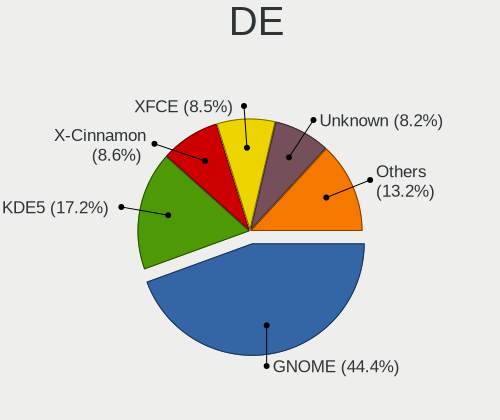

| Name            | Notebooks | Percent |
|-----------------|-----------|---------|
| GNOME           | 539       | 44.51%  |
| KDE5            | 224       | 18.5%   |
| X-Cinnamon      | 107       | 8.84%   |
| Unknown         | 99        | 8.18%   |
| XFCE            | 94        | 7.76%   |
| MATE            | 30        | 2.48%   |
| KDE             | 19        | 1.57%   |
| Pantheon        | 18        | 1.49%   |
| Cinnamon        | 15        | 1.24%   |
| Budgie          | 9         | 0.74%   |
| i3              | 7         | 0.58%   |
| Unity           | 6         | 0.5%    |
| KDE6            | 6         | 0.5%    |
| LXQt            | 5         | 0.41%   |
| KDE4            | 5         | 0.41%   |
| sway            | 4         | 0.33%   |
| LXDE            | 4         | 0.33%   |
| Deepin          | 4         | 0.33%   |
| awesome         | 4         | 0.33%   |
| GNOME Flashback | 3         | 0.25%   |
| fluxbox         | 2         | 0.17%   |
| xmonad          | 1         | 0.08%   |
| qtile           | 1         | 0.08%   |
| openbox         | 1         | 0.08%   |
| Hyprland        | 1         | 0.08%   |
| gamescope       | 1         | 0.08%   |
| Enlightenment   | 1         | 0.08%   |
| Bspwm           | 1         | 0.08%   |

Display Server
--------------

X11 or Wayland

| Name    | Notebooks | Percent |
|---------|-----------|---------|
| X11     | 897       | 74.44%  |
| Wayland | 249       | 20.66%  |
| Unknown | 51        | 4.23%   |
| Tty     | 8         | 0.66%   |

Display Manager
---------------

SDDM, LightDM, etc.

| Name    | Notebooks | Percent |
|---------|-----------|---------|
| Unknown | 538       | 44.24%  |
| SDDM    | 190       | 15.63%  |
| GDM3    | 162       | 13.32%  |
| GDM     | 148       | 12.17%  |
| LightDM | 146       | 12.01%  |
| TDM     | 25        | 2.06%   |
| KDM     | 5         | 0.41%   |
| SLiM    | 1         | 0.08%   |
| MDM     | 1         | 0.08%   |

OS Lang
-------

Language

| Lang    | Notebooks | Percent |
|---------|-----------|---------|
| de_AT   | 411       | 34.16%  |
| en_US   | 377       | 31.34%  |
| de_DE   | 177       | 14.71%  |
| Unknown | 115       | 9.56%   |
| en_GB   | 46        | 3.82%   |
| C       | 20        | 1.66%   |
| es_ES   | 8         | 0.67%   |
| pl_PL   | 6         | 0.5%    |
| en_IE   | 5         | 0.42%   |
| it_IT   | 4         | 0.33%   |
| ru_RU   | 3         | 0.25%   |
| POSIX   | 3         | 0.25%   |
| en_AT   | 3         | 0.25%   |
| de_CH   | 3         | 0.25%   |
| tr_TR   | 2         | 0.17%   |
| en_DE   | 2         | 0.17%   |
| C.UTF8  | 2         | 0.17%   |
| uk_UA   | 1         | 0.08%   |
| sv_SE   | 1         | 0.08%   |
| sr_RS   | 1         | 0.08%   |
| sk_SK   | 1         | 0.08%   |
| ru_UA   | 1         | 0.08%   |
| ro_RO   | 1         | 0.08%   |
| pt_BR   | 1         | 0.08%   |
| nl_NL   | 1         | 0.08%   |
| hu_HU   | 1         | 0.08%   |
| hr_HR   | 1         | 0.08%   |
| fr_FR   | 1         | 0.08%   |
| en_CA   | 1         | 0.08%   |
| en_AU   | 1         | 0.08%   |
| en      | 1         | 0.08%   |
| de_LI   | 1         | 0.08%   |
| bg_BG   | 1         | 0.08%   |

Boot Mode
---------

EFI or BIOS

| Mode | Notebooks | Percent |
|------|-----------|---------|
| EFI  | 663       | 55.16%  |
| BIOS | 539       | 44.84%  |

Filesystem
----------

Type of filesystem

| Type    | Notebooks | Percent |
|---------|-----------|---------|
| Ext4    | 874       | 73.2%   |
| Btrfs   | 138       | 11.56%  |
| Overlay | 97        | 8.12%   |
| Tmpfs   | 30        | 2.51%   |
| Unknown | 30        | 2.51%   |
| Xfs     | 10        | 0.84%   |
| Zfs     | 7         | 0.59%   |
| Ext2    | 3         | 0.25%   |
| Ext3    | 2         | 0.17%   |
| XXXXXXX | 1         | 0.08%   |
| Nfs     | 1         | 0.08%   |
| Aufs    | 1         | 0.08%   |

Part. scheme
------------

Scheme of partitioning

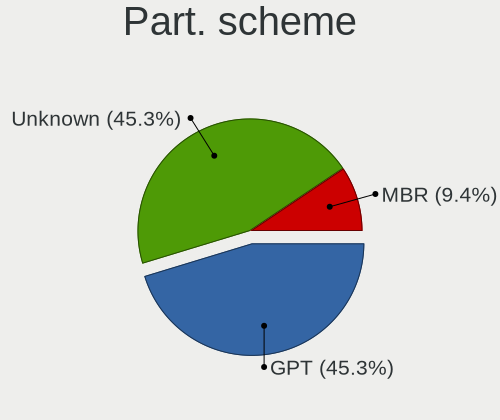

| Type    | Notebooks | Percent |
|---------|-----------|---------|
| Unknown | 569       | 47.5%   |
| GPT     | 509       | 42.49%  |
| MBR     | 120       | 10.02%  |

Dual Boot with Linux/BSD
------------------------

Hosting more than one Linux/BSD

| Dual boot | Notebooks | Percent |
|-----------|-----------|---------|
| No        | 1049      | 88.45%  |
| Yes       | 137       | 11.55%  |

Dual Boot (Win)
---------------

Hosting Linux and Windows

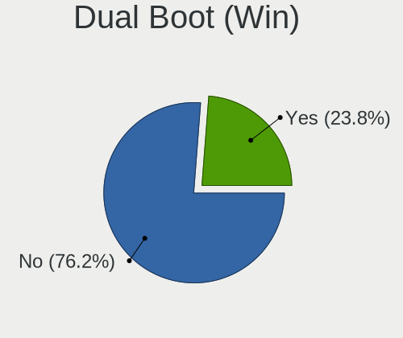

| Dual boot | Notebooks | Percent |
|-----------|-----------|---------|
| No        | 895       | 75.59%  |
| Yes       | 289       | 24.41%  |

Board
-----

Vendor
------

Motherboard manufacturer

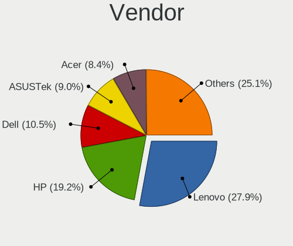

| Name                | Notebooks | Percent |
|---------------------|-----------|---------|
| Lenovo              | 324       | 27.76%  |
| Hewlett-Packard     | 221       | 18.94%  |
| Dell                | 119       | 10.2%   |
| ASUSTek Computer    | 107       | 9.17%   |
| Acer                | 99        | 8.48%   |
| Apple               | 46        | 3.94%   |
| Medion              | 33        | 2.83%   |
| Toshiba             | 29        | 2.49%   |
| TUXEDO              | 23        | 1.97%   |
| Sony                | 20        | 1.71%   |
| MSI                 | 16        | 1.37%   |
| Valve               | 15        | 1.29%   |
| HUAWEI              | 14        | 1.2%    |
| Fujitsu             | 13        | 1.11%   |
| Samsung Electronics | 9         | 0.77%   |
| Notebook            | 7         | 0.6%    |
| Unknown             | 7         | 0.6%    |
| TrekStor            | 5         | 0.43%   |
| Schenker            | 4         | 0.34%   |
| Razer               | 4         | 0.34%   |
| Fujitsu Siemens     | 4         | 0.34%   |
| Clevo               | 4         | 0.34%   |
| VALE                | 3         | 0.26%   |
| Wortmann AG         | 2         | 0.17%   |
| Timi                | 2         | 0.17%   |
| System76            | 2         | 0.17%   |
| Shuttle             | 2         | 0.17%   |
| Panasonic           | 2         | 0.17%   |
| Packard Bell        | 2         | 0.17%   |
| Hampoo              | 2         | 0.17%   |
| Google              | 2         | 0.17%   |
| Gigabyte Technology | 2         | 0.17%   |
| Framework           | 2         | 0.17%   |
| Chuwi               | 2         | 0.17%   |
| AXDIA International | 2         | 0.17%   |
| W271ELQ             | 1         | 0.09%   |
| TWJ                 | 1         | 0.09%   |
| TENKU               | 1         | 0.09%   |
| Teclast             | 1         | 0.09%   |
| SGIN                | 1         | 0.09%   |

Model
-----

Motherboard model

| Name                                      | Notebooks | Percent |
|-------------------------------------------|-----------|---------|
| Valve Jupiter                             | 14        | 1.2%    |
| Unknown                                   | 14        | 1.2%    |
| Apple MacBookPro15,1                      | 8         | 0.69%   |
| HP EliteBook 8570p                        | 7         | 0.6%    |
| HP Notebook                               | 6         | 0.51%   |
| HP EliteBook 840 G3                       | 6         | 0.51%   |
| Apple MacBookPro8,1                       | 6         | 0.51%   |
| Lenovo IdeaPad 5 15ARE05 81YQ             | 5         | 0.43%   |
| HP Pavilion dv6                           | 5         | 0.43%   |
| HP EliteBook 8460p                        | 5         | 0.43%   |
| HP EliteBook 840 G6                       | 5         | 0.43%   |
| Dell XPS 15 9570                          | 5         | 0.43%   |
| Apple MacBookPro9,2                       | 5         | 0.43%   |
| TrekStor Notebook Slim S130               | 4         | 0.34%   |
| Toshiba Satellite C70D-B                  | 4         | 0.34%   |
| Lenovo Yoga Slim 7 14ARE05 82A2           | 4         | 0.34%   |
| Lenovo IdeaPad 700-15ISK 80RU             | 4         | 0.34%   |
| HP Pavilion dv7                           | 4         | 0.34%   |
| HP EliteBook 840 G8 Notebook PC           | 4         | 0.34%   |
| HP EliteBook 840 G1                       | 4         | 0.34%   |
| HP EliteBook 6930p                        | 4         | 0.34%   |
| Dell Latitude E7450                       | 4         | 0.34%   |
| Dell Latitude E6400                       | 4         | 0.34%   |
| Dell Latitude 5520                        | 4         | 0.34%   |
| ASUS UX303LAB                             | 4         | 0.34%   |
| ASUS ASUS EXPERTBOOK B1500CEAEY_B1500CEAE | 4         | 0.34%   |
| Toshiba Satellite Pro C660                | 3         | 0.26%   |
| Medion P15648                             | 3         | 0.26%   |
| Lenovo ThinkPad E470 20H2S00700           | 3         | 0.26%   |
| Lenovo ThinkBook 16p Gen 2 20YM           | 3         | 0.26%   |
| HP ZBook 17 G5                            | 3         | 0.26%   |
| HP ProBook 430 G5                         | 3         | 0.26%   |
| HP Pavilion g7                            | 3         | 0.26%   |
| HP EliteBook 850 G1                       | 3         | 0.26%   |
| HP EliteBook 2560p                        | 3         | 0.26%   |
| Dell XPS 17 9700                          | 3         | 0.26%   |
| Dell XPS 13 9380                          | 3         | 0.26%   |
| Dell XPS 13 9343                          | 3         | 0.26%   |
| Dell XPS 13 9305                          | 3         | 0.26%   |
| Dell Latitude E7440                       | 3         | 0.26%   |

Model Family
------------

Motherboard model prefix

| Name                | Notebooks | Percent |
|---------------------|-----------|---------|
| Lenovo ThinkPad     | 225       | 19.28%  |
| HP EliteBook        | 81        | 6.94%   |
| Acer Aspire         | 62        | 5.31%   |
| Dell Latitude       | 55        | 4.71%   |
| Lenovo IdeaPad      | 36        | 3.08%   |
| HP ProBook          | 36        | 3.08%   |
| HP Pavilion         | 31        | 2.66%   |
| Dell XPS            | 31        | 2.66%   |
| Toshiba Satellite   | 26        | 2.23%   |
| ASUS VivoBook       | 18        | 1.54%   |
| HP ZBook            | 15        | 1.29%   |
| Valve Jupiter       | 14        | 1.2%    |
| Lenovo Yoga         | 14        | 1.2%    |
| Dell Inspiron       | 14        | 1.2%    |
| Unknown             | 14        | 1.2%    |
| Fujitsu LIFEBOOK    | 13        | 1.11%   |
| Dell Precision      | 13        | 1.11%   |
| Lenovo ThinkBook    | 12        | 1.03%   |
| HP Laptop           | 12        | 1.03%   |
| Acer TravelMate     | 11        | 0.94%   |
| Lenovo Legion       | 10        | 0.86%   |
| Acer Swift          | 10        | 0.86%   |
| ASUS ROG            | 9         | 0.77%   |
| Apple MacBookPro15  | 8         | 0.69%   |
| HP OMEN             | 7         | 0.6%    |
| HP Compaq           | 7         | 0.6%    |
| HP 250              | 7         | 0.6%    |
| ASUS ZenBook        | 7         | 0.6%    |
| Apple MacBookPro8   | 7         | 0.6%    |
| Acer Nitro          | 7         | 0.6%    |
| HP Notebook         | 6         | 0.51%   |
| TUXEDO InfinityBook | 5         | 0.43%   |
| Apple MacBookPro9   | 5         | 0.43%   |
| TrekStor Notebook   | 4         | 0.34%   |
| Razer Blade         | 4         | 0.34%   |
| HP 255              | 4         | 0.34%   |
| ASUS UX303LAB       | 4         | 0.34%   |
| ASUS ASUS           | 4         | 0.34%   |
| Apple MacBookAir6   | 4         | 0.34%   |
| VALE Notebook       | 3         | 0.26%   |

MFG Year
--------

Motherboard manufacture year

| Year    | Notebooks | Percent |
|---------|-----------|---------|
| 2020    | 144       | 12.34%  |
| 2021    | 96        | 8.23%   |
| 2012    | 92        | 7.88%   |
| 2011    | 87        | 7.46%   |
| 2018    | 85        | 7.28%   |
| 2017    | 83        | 7.11%   |
| 2019    | 82        | 7.03%   |
| 2014    | 71        | 6.08%   |
| 2013    | 66        | 5.66%   |
| 2016    | 63        | 5.4%    |
| 2015    | 63        | 5.4%    |
| 2008    | 49        | 4.2%    |
| 2022    | 46        | 3.94%   |
| 2010    | 41        | 3.51%   |
| 2023    | 36        | 3.08%   |
| 2009    | 33        | 2.83%   |
| 2007    | 21        | 1.8%    |
| 2006    | 6         | 0.51%   |
| 2024    | 1         | 0.09%   |
| 2005    | 1         | 0.09%   |
| Unknown | 1         | 0.09%   |

Form Factor
-----------

Physical design of the computer

| Name     | Notebooks | Percent |
|----------|-----------|---------|
| Notebook | 1167      | 100%    |

Secure Boot
-----------

Enabled or disabled

| State    | Notebooks | Percent |
|----------|-----------|---------|
| Disabled | 1041      | 88%     |
| Enabled  | 142       | 12%     |

Coreboot
--------

Have coreboot on board

| Used | Notebooks | Percent |
|------|-----------|---------|
| No   | 1162      | 99.57%  |
| Yes  | 5         | 0.43%   |

RAM Size
--------

Total RAM memory

| Size in GB  | Notebooks | Percent |
|-------------|-----------|---------|
| 4.01-8.0    | 300       | 25.47%  |
| 16.01-24.0  | 238       | 20.2%   |
| 8.01-16.0   | 230       | 19.52%  |
| 3.01-4.0    | 202       | 17.15%  |
| 32.01-64.0  | 111       | 9.42%   |
| 1.01-2.0    | 37        | 3.14%   |
| 24.01-32.0  | 25        | 2.12%   |
| 64.01-256.0 | 17        | 1.44%   |
| 2.01-3.0    | 11        | 0.93%   |
| 0.51-1.0    | 7         | 0.59%   |

RAM Used
--------

Used RAM memory

| Used GB    | Notebooks | Percent |
|------------|-----------|---------|
| 1.01-2.0   | 434       | 33.05%  |
| 2.01-3.0   | 343       | 26.12%  |
| 4.01-8.0   | 207       | 15.77%  |
| 3.01-4.0   | 169       | 12.87%  |
| 0.51-1.0   | 68        | 5.18%   |
| 8.01-16.0  | 63        | 4.8%    |
| 16.01-24.0 | 16        | 1.22%   |
| 24.01-32.0 | 6         | 0.46%   |
| 0.01-0.5   | 5         | 0.38%   |
| 32.01-64.0 | 2         | 0.15%   |

Total Drives
------------

Number of drives on board

| Drives | Notebooks | Percent |
|--------|-----------|---------|
| 1      | 878       | 73.72%  |
| 2      | 259       | 21.75%  |
| 3      | 41        | 3.44%   |
| 0      | 7         | 0.59%   |
| 5      | 3         | 0.25%   |
| 4      | 3         | 0.25%   |

Has CD-ROM
----------

Has CD-ROM on board

| Presented | Notebooks | Percent |
|-----------|-----------|---------|
| No        | 793       | 67.66%  |
| Yes       | 379       | 32.34%  |

Has Ethernet
------------

Has Ethernet on board

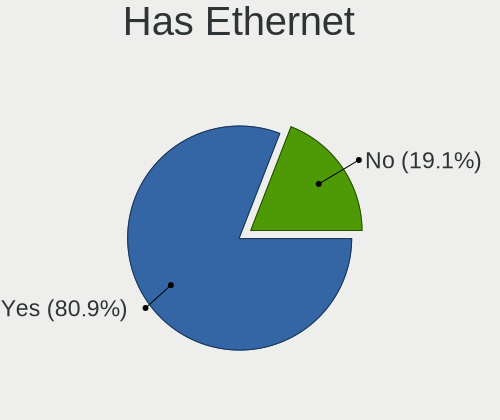

| Presented | Notebooks | Percent |
|-----------|-----------|---------|
| Yes       | 951       | 81.21%  |
| No        | 220       | 18.79%  |

Has WiFi
--------

Has WiFi module

| Presented | Notebooks | Percent |
|-----------|-----------|---------|
| Yes       | 1155      | 98.97%  |
| No        | 12        | 1.03%   |

Has Bluetooth
-------------

Has Bluetooth module

| Presented | Notebooks | Percent |
|-----------|-----------|---------|
| Yes       | 934       | 79.56%  |
| No        | 240       | 20.44%  |

Location
--------

Country
-------

Geographic location (country)

| Country | Notebooks | Percent |
|---------|-----------|---------|
| Austria | 1167      | 100%    |

City
----

Geographic location (city)

| City                      | Notebooks | Percent |
|---------------------------|-----------|---------|
| Vienna                    | 712       | 57.42%  |
| Graz                      | 69        | 5.56%   |
| Linz                      | 33        | 2.66%   |
| Salzburg                  | 32        | 2.58%   |
| Innsbruck                 | 31        | 2.5%    |
| Bad Hall                  | 18        | 1.45%   |
| Klagenfurt                | 15        | 1.21%   |
| Wels                      | 10        | 0.81%   |
| Leonding                  | 10        | 0.81%   |
| Wiener Neustadt           | 8         | 0.65%   |
| Villach                   | 7         | 0.56%   |
| Baden bei Wien            | 7         | 0.56%   |
| Sankt Plten             | 6         | 0.48%   |
| Perg                      | 6         | 0.48%   |
| Feldkirch                 | 6         | 0.48%   |
| Dornbirn                  | 6         | 0.48%   |
| Wrgl                    | 5         | 0.4%    |
| Traun                     | 5         | 0.4%    |
| Korneuburg                | 5         | 0.4%    |
| Umhausen                  | 4         | 0.32%   |
| Gaenserndorf              | 4         | 0.32%   |
| Bregenz                   | 4         | 0.32%   |
| Traunkirchen              | 3         | 0.24%   |
| Steyr                     | 3         | 0.24%   |
| Lustenau                  | 3         | 0.24%   |
| Knittelfeld               | 3         | 0.24%   |
| Hard                      | 3         | 0.24%   |
| Hallein                   | 3         | 0.24%   |
| Woerdern                  | 2         | 0.16%   |
| Traiskirchen              | 2         | 0.16%   |
| Spillern                  | 2         | 0.16%   |
| Spielberg bei Knittelfeld | 2         | 0.16%   |
| Sommerein                 | 2         | 0.16%   |
| Schleinbach               | 2         | 0.16%   |
| Oberneukirchen            | 2         | 0.16%   |
| Neusiedl am See           | 2         | 0.16%   |
| Mdling                  | 2         | 0.16%   |
| Mauthausen                | 2         | 0.16%   |
| Mautern                   | 2         | 0.16%   |
| Mattersburg               | 2         | 0.16%   |

Drives
------

Drive Vendor
------------

Hard drive vendors

| Vendor                         | Notebooks | Drives | Percent |
|--------------------------------|-----------|--------|---------|
| Samsung Electronics            | 348       | 487    | 23.77%  |
| SanDisk                        | 144       | 193    | 9.84%   |
| Seagate                        | 122       | 163    | 8.33%   |
| Toshiba                        | 104       | 129    | 7.1%    |
| WDC                            | 99        | 134    | 6.76%   |
| Unknown                        | 80        | 112    | 5.46%   |
| SK hynix                       | 72        | 95     | 4.92%   |
| Kingston                       | 58        | 73     | 3.96%   |
| Crucial                        | 53        | 73     | 3.62%   |
| Intel                          | 45        | 49     | 3.07%   |
| Micron Technology              | 34        | 45     | 2.32%   |
| HGST                           | 32        | 40     | 2.19%   |
| Hitachi                        | 31        | 36     | 2.12%   |
| Intenso                        | 25        | 31     | 1.71%   |
| Apple                          | 21        | 33     | 1.43%   |
| KIOXIA                         | 20        | 28     | 1.37%   |
| Transcend                      | 18        | 20     | 1.23%   |
| China                          | 12        | 12     | 0.82%   |
| Micron/Crucial Technology      | 8         | 9      | 0.55%   |
| Phison Electronics             | 7         | 8      | 0.48%   |
| Phison                         | 7         | 7      | 0.48%   |
| LITEONIT                       | 7         | 10     | 0.48%   |
| Unknown                        | 7         | 12     | 0.48%   |
| SABRENT                        | 5         | 5      | 0.34%   |
| MAXIO Technology (Hangzhou)    | 5         | 5      | 0.34%   |
| LITEON                         | 5         | 6      | 0.34%   |
| Lenovo                         | 5         | 7      | 0.34%   |
| ASMT                           | 5         | 7      | 0.34%   |
| A-DATA Technology              | 5         | 8      | 0.34%   |
| Silicon Motion                 | 4         | 5      | 0.27%   |
| Kingston Technology Company    | 4         | 4      | 0.27%   |
| INNOVATION IT                  | 4         | 6      | 0.27%   |
| Verbatim                       | 3         | 3      | 0.2%    |
| Union Memory (Shenzhen)        | 3         | 4      | 0.2%    |
| OCZ                            | 3         | 4      | 0.2%    |
| JMicron Technology             | 3         | 3      | 0.2%    |
| UMIS                           | 2         | 2      | 0.14%   |
| SPCC                           | 2         | 2      | 0.14%   |
| Solid State Storage Technology | 2         | 2      | 0.14%   |
| Patriot                        | 2         | 2      | 0.14%   |

Drive Model
-----------

Hard drive models

| Model                                              | Notebooks | Percent |
|----------------------------------------------------|-----------|---------|
| Samsung NVMe SSD Drive 512GB                       | 23        | 1.5%    |
| Samsung NVMe SSD Controller SM981/PM981/PM983 1TB  | 21        | 1.37%   |
| Unknown MMC Card  64GB                             | 15        | 0.98%   |
| Toshiba MQ01ABD100 1TB                             | 15        | 0.98%   |
| Samsung SSD 860 EVO 500GB                          | 13        | 0.85%   |
| Samsung SSD 850 EVO 250GB                          | 13        | 0.85%   |
| SanDisk NVMe SSD Drive 512GB                       | 12        | 0.78%   |
| Samsung NVMe SSD Drive 1TB                         | 12        | 0.78%   |
| Unknown MMC Card  32GB                             | 11        | 0.72%   |
| Toshiba MQ04ABF100 1TB                             | 10        | 0.65%   |
| Seagate ST1000LM024 HN-M101MBB 1TB                 | 10        | 0.65%   |
| Samsung SSD 850 EVO 500GB                          | 10        | 0.65%   |
| Samsung NVMe SSD Controller PM9A1/PM9A3/980PRO 1TB | 10        | 0.65%   |
| Transcend TS240GMTS420S 240GB SSD                  | 9         | 0.59%   |
| Seagate ST500LT012-1DG142 500GB                    | 9         | 0.59%   |
| SanDisk SSD PLUS 240GB                             | 9         | 0.59%   |
| Samsung NVMe SSD Drive 1024GB                      | 9         | 0.59%   |
| Crucial CT240BX500SSD1 240GB                       | 9         | 0.59%   |
| WDC PC SN730 SDBQNTY-512G-1001 512GB               | 8         | 0.52%   |
| Toshiba MQ01ABF050 500GB                           | 8         | 0.52%   |
| SK hynix NVMe SSD Drive 512GB                      | 8         | 0.52%   |
| SK hynix HFS256G39TND-N210A 256GB SSD              | 8         | 0.52%   |
| Samsung SSD 850 PRO 256GB                          | 8         | 0.52%   |
| Seagate ST9500325AS 500GB                          | 7         | 0.46%   |
| SanDisk NVMe SSD Drive 1TB                         | 7         | 0.46%   |
| Samsung NVMe SSD Drive 500GB                       | 7         | 0.46%   |
| HGST HTS721010A9E630 1TB                           | 7         | 0.46%   |
| Crucial CT500MX500SSD1 500GB                       | 7         | 0.46%   |
| Crucial CT1000MX500SSD1 1TB                        | 7         | 0.46%   |
| Apple SSD AP0512M 500GB                            | 7         | 0.46%   |
| Unknown                                            | 7         | 0.46%   |
| Unknown MMC Card  128GB                            | 6         | 0.39%   |
| Seagate ST500LT012-9WS142 500GB                    | 6         | 0.39%   |
| Seagate ST1000LM035-1RK172 1TB                     | 6         | 0.39%   |
| Seagate Expansion 2TB                              | 6         | 0.39%   |
| Sandisk WD Black SN750 / PC SN730 NVMe SSD 512GB   | 6         | 0.39%   |
| SanDisk SD8SN8U-256G-1006 256GB SSD                | 6         | 0.39%   |
| Samsung SSD 970 EVO Plus 1TB                       | 6         | 0.39%   |
| Samsung MZVLW256HEHP-000L7 256GB                   | 6         | 0.39%   |
| Kingston SV300S37A120G 120GB SSD                   | 6         | 0.39%   |

HDD Vendor
----------

Hard disk drive vendors

| Vendor              | Notebooks | Drives | Percent |
|---------------------|-----------|--------|---------|
| Seagate             | 120       | 161    | 35.93%  |
| Toshiba             | 67        | 88     | 20.06%  |
| WDC                 | 60        | 80     | 17.96%  |
| HGST                | 32        | 40     | 9.58%   |
| Hitachi             | 31        | 36     | 9.28%   |
| Samsung Electronics | 6         | 7      | 1.8%    |
| SABRENT             | 5         | 5      | 1.5%    |
| JMicron Technology  | 3         | 3      | 0.9%    |
| Fujitsu             | 2         | 2      | 0.6%    |
| Apple               | 2         | 2      | 0.6%    |
| Unknown             | 1         | 2      | 0.3%    |
| LaCie               | 1         | 1      | 0.3%    |
| Inateck             | 1         | 1      | 0.3%    |
| IB-1122             | 1         | 1      | 0.3%    |
| IB                  | 1         | 2      | 0.3%    |
| ASMT                | 1         | 1      | 0.3%    |

SSD Vendor
----------

Solid state drive vendors

| Vendor              | Notebooks | Drives | Percent |
|---------------------|-----------|--------|---------|
| Samsung Electronics | 149       | 195    | 28.93%  |
| SanDisk             | 92        | 126    | 17.86%  |
| Crucial             | 48        | 68     | 9.32%   |
| Kingston            | 40        | 50     | 7.77%   |
| Intenso             | 23        | 29     | 4.47%   |
| SK hynix            | 19        | 24     | 3.69%   |
| Transcend           | 18        | 20     | 3.5%    |
| Intel               | 16        | 17     | 3.11%   |
| Micron Technology   | 13        | 18     | 2.52%   |
| China               | 12        | 12     | 2.33%   |
| Apple               | 10        | 11     | 1.94%   |
| Toshiba             | 9         | 11     | 1.75%   |
| WDC                 | 7         | 8      | 1.36%   |
| LITEONIT            | 7         | 10     | 1.36%   |
| LITEON              | 5         | 6      | 0.97%   |
| A-DATA Technology   | 5         | 8      | 0.97%   |
| INNOVATION IT       | 4         | 6      | 0.78%   |
| OCZ                 | 3         | 4      | 0.58%   |
| SPCC                | 2         | 2      | 0.39%   |
| Phison              | 2         | 2      | 0.39%   |
| Patriot             | 2         | 2      | 0.39%   |
| Leven               | 2         | 2      | 0.39%   |
| KingDian            | 2         | 2      | 0.39%   |
| GOODRAM             | 2         | 2      | 0.39%   |
| Corsair             | 2         | 2      | 0.39%   |
| ASMT                | 2         | 2      | 0.39%   |
| Wdxsky              | 1         | 2      | 0.19%   |
| WDC WDS             | 1         | 1      | 0.19%   |
| Verbatim            | 1         | 1      | 0.19%   |
| Vaseky              | 1         | 1      | 0.19%   |
| Unknown             | 1         | 2      | 0.19%   |
| Teclast             | 1         | 1      | 0.19%   |
| TCSUNBOW            | 1         | 1      | 0.19%   |
| Seagate             | 1         | 1      | 0.19%   |
| PNY                 | 1         | 1      | 0.19%   |
| Netac               | 1         | 4      | 0.19%   |
| Mushkin             | 1         | 1      | 0.19%   |
| Hewlett-Packard     | 1         | 1      | 0.19%   |
| Gigabyte Technology | 1         | 1      | 0.19%   |
| FORESEE             | 1         | 1      | 0.19%   |

Drive Kind
----------

HDD or SSD

| Kind    | Notebooks | Drives | Percent |
|---------|-----------|--------|---------|
| NVMe    | 500       | 695    | 35.84%  |
| SSD     | 479       | 663    | 34.34%  |
| HDD     | 316       | 432    | 22.65%  |
| MMC     | 83        | 122    | 5.95%   |
| Unknown | 17        | 18     | 1.22%   |

Drive Connector
---------------

SATA, SAS, NVMe, etc.

| Type | Notebooks | Drives | Percent |
|------|-----------|--------|---------|
| SATA | 703       | 1033   | 52.15%  |
| NVMe | 500       | 691    | 37.09%  |
| MMC  | 83        | 122    | 6.16%   |
| SAS  | 62        | 84     | 4.6%    |

Drive Size
----------

Size of hard drive

| Size in TB | Notebooks | Drives | Percent |
|------------|-----------|--------|---------|
| 0.01-0.5   | 544       | 763    | 68.34%  |
| 0.51-1.0   | 213       | 279    | 26.76%  |
| 1.01-2.0   | 31        | 43     | 3.89%   |
| 3.01-4.0   | 5         | 7      | 0.63%   |
| 2.01-3.0   | 1         | 1      | 0.13%   |
| 10.01-20.0 | 1         | 1      | 0.13%   |
| 4.01-10.0  | 1         | 1      | 0.13%   |

Space Total
-----------

Amount of disk space available on the file system

| Size in GB     | Notebooks | Percent |
|----------------|-----------|---------|
| 101-250        | 345       | 27.64%  |
| 251-500        | 295       | 23.64%  |
| 501-1000       | 182       | 14.58%  |
| 1-20           | 92        | 7.37%   |
| 1001-2000      | 90        | 7.21%   |
| 51-100         | 74        | 5.93%   |
| Unknown        | 61        | 4.89%   |
| 21-50          | 47        | 3.77%   |
| More than 3000 | 37        | 2.96%   |
| 2001-3000      | 25        | 2%      |

Space Used
----------

Amount of used disk space

| Used GB        | Notebooks | Percent |
|----------------|-----------|---------|
| 1-20           | 465       | 35.99%  |
| 21-50          | 239       | 18.5%   |
| 101-250        | 175       | 13.54%  |
| 51-100         | 135       | 10.45%  |
| 251-500        | 95        | 7.35%   |
| 501-1000       | 76        | 5.88%   |
| Unknown        | 61        | 4.72%   |
| 1001-2000      | 27        | 2.09%   |
| 2001-3000      | 10        | 0.77%   |
| More than 3000 | 9         | 0.7%    |

Malfunc. Drives
---------------

Drive models with a malfunction

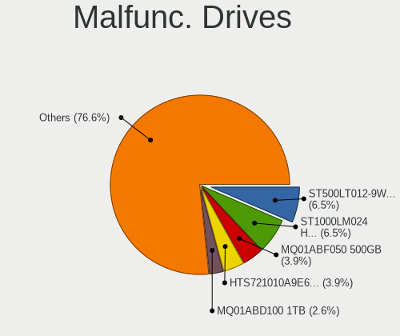

| Model                                            | Notebooks | Drives | Percent |
|--------------------------------------------------|-----------|--------|---------|
| Seagate ST1000LM024 HN-M101MBB 1TB               | 5         | 5      | 6.94%   |
| Seagate ST500LT012-9WS142 500GB                  | 4         | 8      | 5.56%   |
| Toshiba MQ01ABF050 500GB                         | 3         | 4      | 4.17%   |
| HGST HTS721010A9E630 1TB                         | 3         | 4      | 4.17%   |
| Seagate ST9250315AS 250GB                        | 2         | 2      | 2.78%   |
| Seagate ST9160412AS 160GB                        | 2         | 2      | 2.78%   |
| WDC WD5000LPLX-00ZNTT0 500GB                     | 1         | 1      | 1.39%   |
| WDC WD3200BEVT-08A23T1 320GB                     | 1         | 1      | 1.39%   |
| Toshiba MQ02ABF050H 500GB                        | 1         | 1      | 1.39%   |
| Toshiba MQ01ABD100M 1TB                          | 1         | 1      | 1.39%   |
| Toshiba MQ01ABD100 1TB                           | 1         | 1      | 1.39%   |
| Toshiba MK7559GSXP 752GB                         | 1         | 1      | 1.39%   |
| Toshiba MK5055GSX 500GB                          | 1         | 1      | 1.39%   |
| Toshiba MK3276GSX 320GB                          | 1         | 1      | 1.39%   |
| Toshiba MK2035GSS 200GB                          | 1         | 1      | 1.39%   |
| Toshiba MK1233GSG 120GB                          | 1         | 1      | 1.39%   |
| SK hynix BC901 NVMe 512GB                        | 1         | 1      | 1.39%   |
| Seagate ST9750420AS 752GB                        | 1         | 1      | 1.39%   |
| Seagate ST95005620AS 500GB                       | 1         | 1      | 1.39%   |
| Seagate ST9500420AS 500GB                        | 1         | 1      | 1.39%   |
| Seagate ST9320325AS 320GB                        | 1         | 1      | 1.39%   |
| Seagate ST500LM000-SSHD-8GB                      | 1         | 2      | 1.39%   |
| Seagate ST1000LM035-1RK172 1TB                   | 1         | 1      | 1.39%   |
| Seagate ST1000LM014-1EJ164-SSHD 1TB              | 1         | 9      | 1.39%   |
| SanDisk SSD PLUS 240GB                           | 1         | 1      | 1.39%   |
| SanDisk SSD PLUS 120GB                           | 1         | 1      | 1.39%   |
| SanDisk SDSSDH3 1T00 1TB                         | 1         | 1      | 1.39%   |
| Samsung Electronics SSD 870 EVO 500GB            | 1         | 1      | 1.39%   |
| Samsung Electronics SSD 870 EVO 1TB              | 1         | 1      | 1.39%   |
| Samsung Electronics SSD 850 EVO 1TB              | 1         | 1      | 1.39%   |
| Samsung Electronics SSD 840 Series 120GB         | 1         | 1      | 1.39%   |
| Samsung Electronics MZ7PA128HMCD-010H1 128GB SSD | 1         | 1      | 1.39%   |
| Samsung Electronics MMCRE28G8MXP-0VBH1 128GB SSD | 1         | 1      | 1.39%   |
| Samsung Electronics HN-M101MBB 1TB               | 1         | 1      | 1.39%   |
| Samsung Electronics HM500JI 500GB                | 1         | 1      | 1.39%   |
| Micron Technology 1100_MTFDDAV256TBN 256GB SSD   | 1         | 1      | 1.39%   |
| LITEONIT LCS-128L9S-11 2.5 7mm 128GB SSD         | 1         | 1      | 1.39%   |
| LITEONIT CMT-64L3M 64GB SSD                      | 1         | 2      | 1.39%   |
| LITEON CV8-8E128-HP 128GB SSD                    | 1         | 1      | 1.39%   |
| Kingston SMSM150S324G 24GB SSD                   | 1         | 1      | 1.39%   |

Malfunc. Drive Vendor
---------------------

Vendors of faulty drives

| Vendor              | Notebooks | Drives | Percent |
|---------------------|-----------|--------|---------|
| Seagate             | 19        | 33     | 27.14%  |
| Toshiba             | 11        | 12     | 15.71%  |
| Samsung Electronics | 7         | 8      | 10%     |
| HGST                | 6         | 7      | 8.57%   |
| Hitachi             | 5         | 6      | 7.14%   |
| Intel               | 4         | 4      | 5.71%   |
| SanDisk             | 3         | 3      | 4.29%   |
| WDC                 | 2         | 2      | 2.86%   |
| LITEONIT            | 2         | 3      | 2.86%   |
| Kingston            | 2         | 2      | 2.86%   |
| SK hynix            | 1         | 1      | 1.43%   |
| Micron Technology   | 1         | 1      | 1.43%   |
| LITEON              | 1         | 1      | 1.43%   |
| GOODRAM             | 1         | 1      | 1.43%   |
| Fujitsu             | 1         | 1      | 1.43%   |
| Crucial             | 1         | 1      | 1.43%   |
| Corsair             | 1         | 1      | 1.43%   |
| China               | 1         | 1      | 1.43%   |
| A-DATA Technology   | 1         | 3      | 1.43%   |

Malfunc. HDD Vendor
-------------------

Vendors of faulty HDD drives

| Vendor              | Notebooks | Drives | Percent |
|---------------------|-----------|--------|---------|
| Seagate             | 19        | 33     | 41.3%   |
| Toshiba             | 11        | 12     | 23.91%  |
| HGST                | 6         | 7      | 13.04%  |
| Hitachi             | 5         | 6      | 10.87%  |
| WDC                 | 2         | 2      | 4.35%   |
| Samsung Electronics | 2         | 2      | 4.35%   |
| Fujitsu             | 1         | 1      | 2.17%   |

Malfunc. Drive Kind
-------------------

Kinds of faulty drives

| Kind | Notebooks | Drives | Percent |
|------|-----------|--------|---------|
| HDD  | 45        | 63     | 65.22%  |
| SSD  | 22        | 26     | 31.88%  |
| NVMe | 2         | 2      | 2.9%    |

Failed Drives
-------------

Failed drive models

| Model                                            | Notebooks | Drives | Percent |
|--------------------------------------------------|-----------|--------|---------|
| Sandisk WD Black SN750 / PC SN730 NVMe SSD 512GB | 1         | 1      | 100%    |

Failed Drive Vendor
-------------------

Failed drive vendors

| Vendor  | Notebooks | Drives | Percent |
|---------|-----------|--------|---------|
| Sandisk | 1         | 1      | 100%    |

Drive Status
------------

Number of failed and malfunc. drives

| Status   | Notebooks | Drives | Percent |
|----------|-----------|--------|---------|
| Detected | 696       | 1140   | 55.24%  |
| Works    | 494       | 698    | 39.21%  |
| Malfunc  | 69        | 91     | 5.48%   |
| Failed   | 1         | 1      | 0.08%   |

Storage controller
------------------

Storage Vendor
--------------

Storage controller vendors

| Vendor                                  | Notebooks | Percent |
|-----------------------------------------|-----------|---------|
| Intel                                   | 738       | 53.67%  |
| Samsung Electronics                     | 211       | 15.35%  |
| AMD                                     | 122       | 8.87%   |
| SanDisk                                 | 80        | 5.82%   |
| SK hynix                                | 53        | 3.85%   |
| Toshiba America Info Systems            | 33        | 2.4%    |
| Micron Technology                       | 22        | 1.6%    |
| Kingston Technology Company             | 21        | 1.53%   |
| KIOXIA                                  | 18        | 1.31%   |
| Nvidia                                  | 12        | 0.87%   |
| Micron/Crucial Technology               | 12        | 0.87%   |
| Phison Electronics                      | 11        | 0.8%    |
| Apple                                   | 8         | 0.58%   |
| Union Memory (Shenzhen)                 | 6         | 0.44%   |
| MAXIO Technology (Hangzhou)             | 6         | 0.44%   |
| Silicon Motion                          | 5         | 0.36%   |
| Lenovo                                  | 5         | 0.36%   |
| Solid State Storage Technology          | 2         | 0.15%   |
| Marvell Technology Group                | 2         | 0.15%   |
| VIA Technologies                        | 1         | 0.07%   |
| Silicon Integrated Systems [SiS]        | 1         | 0.07%   |
| Shenzhen Unionmemory Information System | 1         | 0.07%   |
| Shenzhen Longsys Electronics            | 1         | 0.07%   |
| Seagate Technology                      | 1         | 0.07%   |
| Realtek Semiconductor                   | 1         | 0.07%   |
| O2 Micro                                | 1         | 0.07%   |
| ADATA Technology                        | 1         | 0.07%   |

Storage Model
-------------

Storage controller models

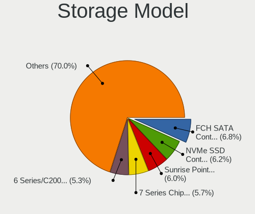

| Model                                                                            | Notebooks | Percent |
|----------------------------------------------------------------------------------|-----------|---------|
| AMD FCH SATA Controller [AHCI mode]                                              | 104       | 7.09%   |
| Samsung NVMe SSD Controller SM981/PM981/PM983                                    | 96        | 6.54%   |
| Intel 7 Series Chipset Family 6-port SATA Controller [AHCI mode]                 | 86        | 5.86%   |
| Intel Sunrise Point-LP SATA Controller [AHCI mode]                               | 85        | 5.79%   |
| Intel 6 Series/C200 Series Chipset Family 6 port Mobile SATA AHCI Controller     | 82        | 5.59%   |
| Intel 82801 Mobile SATA Controller [RAID mode]                                   | 55        | 3.75%   |
| Samsung NVMe SSD Controller 980 (DRAM-less)                                      | 46        | 3.14%   |
| Intel 8 Series SATA Controller 1 [AHCI mode]                                     | 44        | 3%      |
| Intel 82801IBM/IEM (ICH9M/ICH9M-E) 4 port SATA Controller [AHCI mode]            | 37        | 2.52%   |
| Intel Volume Management Device NVMe RAID Controller                              | 36        | 2.45%   |
| Intel Wildcat Point-LP SATA Controller [AHCI Mode]                               | 35        | 2.39%   |
| Intel Cannon Lake Mobile PCH SATA AHCI Controller                                | 28        | 1.91%   |
| Samsung NVMe SSD Controller PM9A1/PM9A3/980PRO                                   | 26        | 1.77%   |
| SanDisk Extreme Pro / WD Black SN750 / PC SN730 / Red SN700 NVMe SSD             | 25        | 1.7%    |
| Intel HM170/QM170 Chipset SATA Controller [AHCI Mode]                            | 25        | 1.7%    |
| Intel 8 Series/C220 Series Chipset Family 6-port SATA Controller 1 [AHCI mode]   | 25        | 1.7%    |
| Samsung NVMe SSD Controller SM961/PM961/SM963                                    | 24        | 1.64%   |
| Intel 82801HM/HEM (ICH8M/ICH8M-E) IDE Controller                                 | 21        | 1.43%   |
| Intel Tiger Lake-LP SATA Controller                                              | 19        | 1.3%    |
| Intel 82801HM/HEM (ICH8M/ICH8M-E) SATA Controller [AHCI mode]                    | 19        | 1.3%    |
| Toshiba America Info Systems XG6 NVMe SSD Controller                             | 18        | 1.23%   |
| Intel 5 Series/3400 Series Chipset 6 port SATA AHCI Controller                   | 18        | 1.23%   |
| Intel 5 Series/3400 Series Chipset 4 port SATA AHCI Controller                   | 16        | 1.09%   |
| SanDisk Ultra 3D / WD Blue SN550 NVMe SSD                                        | 14        | 0.95%   |
| Intel SSD 660P Series                                                            | 14        | 0.95%   |
| Intel Comet Lake SATA AHCI Controller                                            | 14        | 0.95%   |
| Intel Celeron/Pentium Silver Processor SATA Controller                           | 13        | 0.89%   |
| Intel Celeron N3350/Pentium N4200/Atom E3900 Series SATA AHCI Controller         | 13        | 0.89%   |
| AMD SB7x0/SB8x0/SB9x0 SATA Controller [AHCI mode]                                | 12        | 0.82%   |
| SK hynix PC611 NVMe Solid State Drive                                            | 11        | 0.75%   |
| SK hynix Gold P31/BC711/PC711 NVMe Solid State Drive                             | 11        | 0.75%   |
| KIOXIA NVMe SSD Controller BG4 (DRAM-less)                                       | 11        | 0.75%   |
| Intel Atom/Celeron/Pentium Processor x5-E8000/J3xxx/N3xxx Series SATA Controller | 11        | 0.75%   |
| SK hynix BC511 NVMe SSD                                                          | 10        | 0.68%   |
| Intel Mobile 4 Series Chipset PT IDER Controller                                 | 10        | 0.68%   |
| Intel Cannon Point-LP SATA Controller [AHCI Mode]                                | 9         | 0.61%   |
| Samsung NVMe SSD Controller PM9B1 (DRAM-less)                                    | 8         | 0.55%   |
| Kingston Company OM3PDP3 NVMe SSD                                                | 8         | 0.55%   |
| Apple ANS2 NVMe Controller                                                       | 8         | 0.55%   |
| Toshiba America Info Systems BG3 x2 NVMe SSD Controller (DRAM-less)              | 7         | 0.48%   |

Storage Kind
------------

Kind of storage controller (IDE, SATA, NVMe, SAS, ...)

| Kind | Notebooks | Percent |
|------|-----------|---------|
| SATA | 762       | 53.4%   |
| NVMe | 501       | 35.11%  |
| RAID | 99        | 6.94%   |
| IDE  | 65        | 4.56%   |

Processor
---------

CPU Vendor
----------

Processor vendors

| Vendor | Notebooks | Percent |
|--------|-----------|---------|
| Intel  | 932       | 79.86%  |
| AMD    | 235       | 20.14%  |

CPU Model
---------

Processor models

| Model                                         | Notebooks | Percent |
|-----------------------------------------------|-----------|---------|
| Intel Core i7-8565U CPU @ 1.80GHz             | 24        | 2.05%   |
| Intel Core i5-8250U CPU @ 1.60GHz             | 23        | 1.97%   |
| Intel 11th Gen Core i7-1165G7 @ 2.80GHz       | 19        | 1.63%   |
| Intel 11th Gen Core i5-1135G7 @ 2.40GHz       | 19        | 1.63%   |
| Intel Core i5-6200U CPU @ 2.30GHz             | 17        | 1.46%   |
| Intel Core i5-3320M CPU @ 2.60GHz             | 17        | 1.46%   |
| Intel Core i7-10510U CPU @ 1.80GHz            | 16        | 1.37%   |
| Intel Core i5-10210U CPU @ 1.60GHz            | 16        | 1.37%   |
| Intel Core i7-8750H CPU @ 2.20GHz             | 15        | 1.28%   |
| Intel Core i5-6300U CPU @ 2.40GHz             | 15        | 1.28%   |
| Intel Core i5-5200U CPU @ 2.20GHz             | 15        | 1.28%   |
| Intel Core i5-4210U CPU @ 1.70GHz             | 15        | 1.28%   |
| AMD Custom APU 0405                           | 15        | 1.28%   |
| Intel Core i7-8550U CPU @ 1.80GHz             | 14        | 1.2%    |
| Intel Core i7-2670QM CPU @ 2.20GHz            | 14        | 1.2%    |
| Intel Core i5-7200U CPU @ 2.50GHz             | 14        | 1.2%    |
| Intel Core i5-2520M CPU @ 2.50GHz             | 13        | 1.11%   |
| AMD Ryzen 7 PRO 4750U with Radeon Graphics    | 13        | 1.11%   |
| Intel Core i7-7700HQ CPU @ 2.80GHz            | 12        | 1.03%   |
| Intel Core i7-7500U CPU @ 2.70GHz             | 12        | 1.03%   |
| Intel Core i7-8850H CPU @ 2.60GHz             | 11        | 0.94%   |
| AMD Ryzen 7 5800H with Radeon Graphics        | 11        | 0.94%   |
| AMD Ryzen 5 4500U with Radeon Graphics        | 11        | 0.94%   |
| Intel Core i7-9750H CPU @ 2.60GHz             | 10        | 0.86%   |
| Intel Core i5-3230M CPU @ 2.60GHz             | 10        | 0.86%   |
| AMD Ryzen 7 4800H with Radeon Graphics        | 10        | 0.86%   |
| Intel Core i7-6700HQ CPU @ 2.60GHz            | 9         | 0.77%   |
| Intel Core i7-5600U CPU @ 2.60GHz             | 9         | 0.77%   |
| Intel Core i7-1065G7 CPU @ 1.30GHz            | 9         | 0.77%   |
| Intel Core i5-8265U CPU @ 1.60GHz             | 9         | 0.77%   |
| Intel Core i5-5300U CPU @ 2.30GHz             | 9         | 0.77%   |
| Intel Core i5-3210M CPU @ 2.50GHz             | 9         | 0.77%   |
| Intel Core i5-2450M CPU @ 2.50GHz             | 9         | 0.77%   |
| Intel Core 2 Duo CPU P8600 @ 2.40GHz          | 9         | 0.77%   |
| AMD Ryzen 5 5500U with Radeon Graphics        | 9         | 0.77%   |
| Intel Core i5-2430M CPU @ 2.40GHz             | 8         | 0.68%   |
| AMD Ryzen 7 4700U with Radeon Graphics        | 8         | 0.68%   |
| AMD Ryzen 5 3500U with Radeon Vega Mobile Gfx | 8         | 0.68%   |
| Intel Core i5-4200U CPU @ 1.60GHz             | 7         | 0.6%    |
| Intel Celeron CPU N3350 @ 1.10GHz             | 7         | 0.6%    |

CPU Model Family
----------------

Processor model prefix

| Model                   | Notebooks | Percent |
|-------------------------|-----------|---------|
| Intel Core i5           | 298       | 25.51%  |
| Intel Core i7           | 294       | 25.17%  |
| Other                   | 118       | 10.1%   |
| Intel Core 2 Duo        | 60        | 5.14%   |
| AMD Ryzen 7             | 60        | 5.14%   |
| AMD Ryzen 5             | 51        | 4.37%   |
| Intel Core i3           | 47        | 4.02%   |
| Intel Celeron           | 40        | 3.42%   |
| Intel Pentium           | 28        | 2.4%    |
| AMD Ryzen 7 PRO         | 25        | 2.14%   |
| Intel Atom              | 20        | 1.71%   |
| Intel Pentium Dual-Core | 9         | 0.77%   |
| Intel Core i9           | 9         | 0.77%   |
| AMD Ryzen 9             | 9         | 0.77%   |
| AMD A6                  | 9         | 0.77%   |
| AMD A4                  | 9         | 0.77%   |
| AMD A8                  | 8         | 0.68%   |
| AMD Ryzen 5 PRO         | 7         | 0.6%    |
| Intel Core 2            | 6         | 0.51%   |
| AMD E2                  | 6         | 0.51%   |
| Intel Pentium Silver    | 5         | 0.43%   |
| AMD Athlon II           | 5         | 0.43%   |
| Intel Genuine           | 4         | 0.34%   |
| AMD E1                  | 4         | 0.34%   |
| AMD E                   | 4         | 0.34%   |
| Intel Xeon              | 3         | 0.26%   |
| AMD Turion 64 X2 Mobile | 3         | 0.26%   |
| AMD Ryzen 3             | 3         | 0.26%   |
| AMD Athlon              | 3         | 0.26%   |
| AMD A10                 | 3         | 0.26%   |
| Intel Pentium Dual      | 2         | 0.17%   |
| Intel Core m5           | 2         | 0.17%   |
| Intel Pentium Gold      | 1         | 0.09%   |
| Intel Core m7           | 1         | 0.09%   |
| Intel Core M            | 1         | 0.09%   |
| Intel Core 2 Solo       | 1         | 0.09%   |
| Intel Core              | 1         | 0.09%   |
| Intel Celeron M         | 1         | 0.09%   |
| AMD Turion II           | 1         | 0.09%   |
| AMD Sempron             | 1         | 0.09%   |

CPU Cores
---------

Number of processor cores

| Number  | Notebooks | Percent |
|---------|-----------|---------|
| 2       | 520       | 44.52%  |
| 4       | 391       | 33.48%  |
| 8       | 109       | 9.33%   |
| 6       | 94        | 8.05%   |
| 1       | 14        | 1.2%    |
| 10      | 13        | 1.11%   |
| 14      | 11        | 0.94%   |
| 12      | 10        | 0.86%   |
| 16      | 2         | 0.17%   |
| 24      | 1         | 0.09%   |
| 20      | 1         | 0.09%   |
| 5       | 1         | 0.09%   |
| Unknown | 1         | 0.09%   |

CPU Sockets
-----------

Number of sockets

| Number | Notebooks | Percent |
|--------|-----------|---------|
| 1      | 1167      | 100%    |

CPU Threads
-----------

Threads per core (Hyper-Threading)

| Number  | Notebooks | Percent |
|---------|-----------|---------|
| 2       | 902       | 77.16%  |
| 1       | 266       | 22.75%  |
| Unknown | 1         | 0.09%   |

CPU Op-Modes
------------

CPU Operation Modes (32-bit, 64-bit)

| Op mode        | Notebooks | Percent |
|----------------|-----------|---------|
| 32-bit, 64-bit | 1148      | 98.29%  |
| Unknown        | 13        | 1.11%   |
| 32-bit         | 7         | 0.6%    |

CPU Microcode
-------------

Microcode number

| Number     | Notebooks | Percent |
|------------|-----------|---------|
| Unknown    | 360       | 29.65%  |
| 0x206a7    | 76        | 6.26%   |
| 0x306a9    | 62        | 5.11%   |
| 0x806ec    | 51        | 4.2%    |
| 0x806ea    | 36        | 2.97%   |
| 0x406e3    | 36        | 2.97%   |
| 0x306d4    | 35        | 2.88%   |
| 0x806c1    | 34        | 2.8%    |
| 0x1067a    | 33        | 2.72%   |
| 0x40651    | 32        | 2.64%   |
| 0x906ea    | 31        | 2.55%   |
| 0x806e9    | 23        | 1.89%   |
| 0x08600106 | 23        | 1.89%   |
| 0x306c3    | 21        | 1.73%   |
| 0x0a50000c | 21        | 1.73%   |
| 0x506e3    | 16        | 1.32%   |
| 0x20655    | 15        | 1.24%   |
| 0x10676    | 14        | 1.15%   |
| 0xa0652    | 13        | 1.07%   |
| 0x08600103 | 13        | 1.07%   |
| 0x906e9    | 12        | 0.99%   |
| 0x08108102 | 12        | 0.99%   |
| 0x706e5    | 11        | 0.91%   |
| 0x08608103 | 11        | 0.91%   |
| 0x07030105 | 11        | 0.91%   |
| 0x506c9    | 10        | 0.82%   |
| 0x806eb    | 9         | 0.74%   |
| 0x406c3    | 9         | 0.74%   |
| 0x906a3    | 8         | 0.66%   |
| 0x30678    | 8         | 0.66%   |
| 0x08600104 | 8         | 0.66%   |
| 0x906ed    | 7         | 0.58%   |
| 0x706a8    | 7         | 0.58%   |
| 0x406c4    | 7         | 0.58%   |
| 0x20652    | 7         | 0.58%   |
| 0x010000c8 | 7         | 0.58%   |
| 0x0a50000d | 6         | 0.49%   |
| 0x06006705 | 6         | 0.49%   |
| 0x05000119 | 6         | 0.49%   |
| 0x806d1    | 5         | 0.41%   |

CPU Microarch
-------------

Microarchitecture

| Name             | Notebooks | Percent |
|------------------|-----------|---------|
| KabyLake         | 235       | 20.1%   |
| SandyBridge      | 94        | 8.04%   |
| IvyBridge        | 86        | 7.36%   |
| Haswell          | 80        | 6.84%   |
| Skylake          | 67        | 5.73%   |
| Penryn           | 60        | 5.13%   |
| Zen 2            | 59        | 5.05%   |
| Unknown          | 59        | 5.05%   |
| TigerLake        | 53        | 4.53%   |
| Broadwell        | 46        | 3.93%   |
| Zen 3            | 38        | 3.25%   |
| Westmere         | 30        | 2.57%   |
| Silvermont       | 30        | 2.57%   |
| Alderlake Hybrid | 28        | 2.4%    |
| Icelake          | 24        | 2.05%   |
| Zen+             | 22        | 1.88%   |
| Core             | 20        | 1.71%   |
| CometLake        | 19        | 1.63%   |
| Puma             | 14        | 1.2%    |
| Goldmont plus    | 14        | 1.2%    |
| Excavator        | 14        | 1.2%    |
| Goldmont         | 13        | 1.11%   |
| Zen              | 10        | 0.86%   |
| Bobcat           | 10        | 0.86%   |
| K10              | 8         | 0.68%   |
| Bonnell          | 8         | 0.68%   |
| Nehalem          | 5         | 0.43%   |
| K8 Hammer        | 5         | 0.43%   |
| Jaguar           | 5         | 0.43%   |
| Piledriver       | 3         | 0.26%   |
| P6               | 3         | 0.26%   |
| K10 Llano        | 3         | 0.26%   |
| Tremont          | 2         | 0.17%   |
| K8 & K10 hybrid  | 2         | 0.17%   |

Graphics
--------

GPU Vendor
----------

Vendors of graphics cards

| Vendor                           | Notebooks | Percent |
|----------------------------------|-----------|---------|
| Intel                            | 814       | 56.02%  |
| Nvidia                           | 320       | 22.02%  |
| AMD                              | 318       | 21.89%  |
| Silicon Integrated Systems [SiS] | 1         | 0.07%   |

GPU Model
---------

Graphics card models

| Model                                                                                    | Notebooks | Percent |
|------------------------------------------------------------------------------------------|-----------|---------|
| Intel 3rd Gen Core processor Graphics Controller                                         | 79        | 5.31%   |
| Intel 2nd Generation Core Processor Family Integrated Graphics Controller                | 78        | 5.24%   |
| AMD Renoir [Radeon RX Vega 6 (Ryzen 4000/5000 Mobile Series)]                            | 55        | 3.7%    |
| Intel UHD Graphics 620                                                                   | 48        | 3.23%   |
| Intel TigerLake-LP GT2 [Iris Xe Graphics]                                                | 48        | 3.23%   |
| Intel Haswell-ULT Integrated Graphics Controller                                         | 47        | 3.16%   |
| Intel Skylake GT2 [HD Graphics 520]                                                      | 43        | 2.89%   |
| Intel HD Graphics 5500                                                                   | 39        | 2.62%   |
| Intel CometLake-U GT2 [UHD Graphics]                                                     | 38        | 2.55%   |
| Intel CoffeeLake-H GT2 [UHD Graphics 630]                                                | 37        | 2.49%   |
| Intel WhiskeyLake-U GT2 [UHD Graphics 620]                                               | 35        | 2.35%   |
| Intel HD Graphics 620                                                                    | 35        | 2.35%   |
| AMD Cezanne [Radeon Vega Series / Radeon Vega Mobile Series]                             | 27        | 1.81%   |
| Intel Mobile 4 Series Chipset Integrated Graphics Controller                             | 24        | 1.61%   |
| Intel 4th Gen Core Processor Integrated Graphics Controller                              | 23        | 1.55%   |
| Intel Core Processor Integrated Graphics Controller                                      | 22        | 1.48%   |
| AMD Picasso/Raven 2 [Radeon Vega Series / Radeon Vega Mobile Series]                     | 22        | 1.48%   |
| Intel Atom/Celeron/Pentium Processor x5-E8000/J3xxx/N3xxx Integrated Graphics Controller | 21        | 1.41%   |
| Intel HD Graphics 530                                                                    | 18        | 1.21%   |
| Intel CometLake-H GT2 [UHD Graphics]                                                     | 16        | 1.08%   |
| AMD Lucienne                                                                             | 16        | 1.08%   |
| Nvidia GP108M [GeForce MX250]                                                            | 15        | 1.01%   |
| Intel Raptor Lake-P [Iris Xe Graphics]                                                   | 14        | 0.94%   |
| AMD VanGogh [AMD Custom GPU 0405]                                                        | 14        | 0.94%   |
| Nvidia TU117M [GeForce GTX 1650 Mobile / Max-Q]                                          | 13        | 0.87%   |
| Intel GeminiLake [UHD Graphics 600]                                                      | 13        | 0.87%   |
| Nvidia GP107M [GeForce GTX 1050 Ti Mobile]                                               | 12        | 0.81%   |
| Intel HD Graphics 630                                                                    | 12        | 0.81%   |
| Nvidia GM108M [GeForce 840M]                                                             | 10        | 0.67%   |
| Intel HD Graphics 500                                                                    | 10        | 0.67%   |
| AMD Seymour [Radeon HD 6400M/7400M Series]                                               | 10        | 0.67%   |
| AMD Barcelo                                                                              | 10        | 0.67%   |
| AMD Baffin [Radeon RX 460/560D / Pro 450/455/460/555/555X/560/560X]                      | 10        | 0.67%   |
| Nvidia GM107M [GeForce GTX 950M]                                                         | 9         | 0.6%    |
| Nvidia GA106M [GeForce RTX 3060 Mobile / Max-Q]                                          | 9         | 0.6%    |
| Intel Mobile GM965/GL960 Integrated Graphics Controller (secondary)                      | 9         | 0.6%    |
| Intel Mobile GM965/GL960 Integrated Graphics Controller (primary)                        | 9         | 0.6%    |
| Intel Iris Plus Graphics G7                                                              | 9         | 0.6%    |
| Intel Atom Processor Z36xxx/Z37xxx Series Graphics & Display                             | 9         | 0.6%    |
| Intel Alder Lake-P GT2 [Iris Xe Graphics]                                                | 9         | 0.6%    |

GPU Combo
---------

Combinations of graphics cards

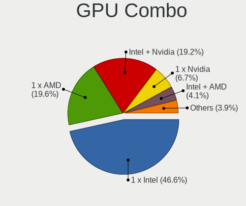

| Name           | Notebooks | Percent |
|----------------|-----------|---------|
| 1 x Intel      | 545       | 46.58%  |
| 1 x AMD        | 233       | 19.91%  |
| Intel + Nvidia | 222       | 18.97%  |
| 1 x Nvidia     | 82        | 7.01%   |
| Intel + AMD    | 47        | 4.02%   |
| 2 x AMD        | 21        | 1.79%   |
| AMD + Nvidia   | 17        | 1.45%   |
| 2 x Intel      | 2         | 0.17%   |
| 1 x SiS        | 1         | 0.09%   |

GPU Driver
----------

Free vs proprietary

| Driver      | Notebooks | Percent |
|-------------|-----------|---------|
| Free        | 1004      | 85.08%  |
| Proprietary | 149       | 12.63%  |
| Unknown     | 27        | 2.29%   |

GPU Memory
----------

Total video memory

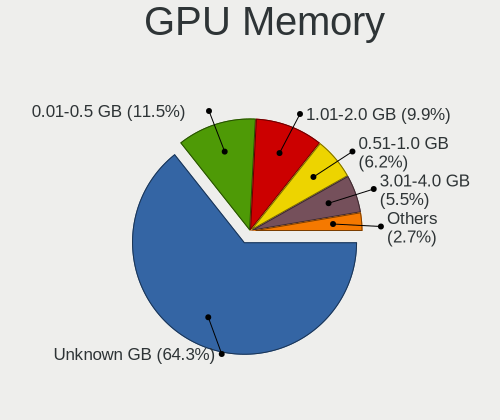

| Size in GB | Notebooks | Percent |
|------------|-----------|---------|
| Unknown    | 746       | 62.32%  |
| 0.01-0.5   | 151       | 12.61%  |
| 1.01-2.0   | 125       | 10.44%  |
| 0.51-1.0   | 75        | 6.27%   |
| 3.01-4.0   | 68        | 5.68%   |
| 7.01-8.0   | 14        | 1.17%   |
| 5.01-6.0   | 14        | 1.17%   |
| 2.01-3.0   | 2         | 0.17%   |
| 8.01-16.0  | 2         | 0.17%   |

Monitor
-------

Monitor Vendor
--------------

Monitor vendors

| Vendor                  | Notebooks | Percent |
|-------------------------|-----------|---------|
| AU Optronics            | 273       | 19.99%  |
| LG Display              | 195       | 14.28%  |
| BOE                     | 155       | 11.35%  |
| Chimei Innolux          | 147       | 10.76%  |
| Samsung Electronics     | 139       | 10.18%  |
| Apple                   | 48        | 3.51%   |
| Lenovo                  | 41        | 3%      |
| Dell                    | 40        | 2.93%   |
| Sharp                   | 38        | 2.78%   |
| Goldstar                | 29        | 2.12%   |
| Hewlett-Packard         | 24        | 1.76%   |
| Chi Mei Optoelectronics | 22        | 1.61%   |
| Acer                    | 17        | 1.24%   |
| InfoVision              | 15        | 1.1%    |
| AOC                     | 15        | 1.1%    |
| Valve                   | 13        | 0.95%   |
| PANDA                   | 12        | 0.88%   |
| CSO                     | 12        | 0.88%   |
| Philips                 | 11        | 0.81%   |
| Ancor Communications    | 10        | 0.73%   |
| LG Philips              | 9         | 0.66%   |
| BenQ                    | 9         | 0.66%   |
| Iiyama                  | 8         | 0.59%   |
| Eizo                    | 6         | 0.44%   |
| Sony                    | 5         | 0.37%   |
| HannStar                | 5         | 0.37%   |
| CPT                     | 5         | 0.37%   |
| Panasonic               | 4         | 0.29%   |
| Gericom                 | 4         | 0.29%   |
| Unknown                 | 3         | 0.22%   |
| Toshiba                 | 3         | 0.22%   |
| TMX                     | 3         | 0.22%   |
| LGD                     | 3         | 0.22%   |
| Analogix                | 3         | 0.22%   |
| ViewSonic               | 2         | 0.15%   |
| Medion Akoya            | 2         | 0.15%   |
| Medion                  | 2         | 0.15%   |
| KDB                     | 2         | 0.15%   |
| HUAWEI                  | 2         | 0.15%   |
| Fujitsu Siemens         | 2         | 0.15%   |

Monitor Model
-------------

Monitor models

| Model                                                                 | Notebooks | Percent |
|-----------------------------------------------------------------------|-----------|---------|
| Valve ANX7530 U VLV3001 800x1280 100x150mm 7.1-inch                   | 11        | 0.79%   |
| AU Optronics LCD Monitor AUO573D 1920x1080 309x174mm 14.0-inch        | 11        | 0.79%   |
| AU Optronics LCD Monitor AUO38ED 1920x1080 344x193mm 15.5-inch        | 10        | 0.72%   |
| LG Display LCD Monitor LGD0521 1920x1080 309x174mm 14.0-inch          | 9         | 0.65%   |
| LG Display LCD Monitor LGD046F 1920x1080 340x190mm 15.3-inch          | 9         | 0.65%   |
| LG Display LCD Monitor LGD046D 1920x1080 309x174mm 14.0-inch          | 9         | 0.65%   |
| LG Display LCD Monitor LGD02D8 1366x768 277x156mm 12.5-inch           | 9         | 0.65%   |
| Chimei Innolux LCD Monitor CMN15E8 1920x1080 344x193mm 15.5-inch      | 8         | 0.57%   |
| Chimei Innolux LCD Monitor CMN14D4 1920x1080 309x173mm 13.9-inch      | 8         | 0.57%   |
| Apple Color LCD APPA040 2880x1800 331x207mm 15.4-inch                 | 8         | 0.57%   |
| Chimei Innolux LCD Monitor CMN14C9 1920x1080 309x173mm 13.9-inch      | 7         | 0.5%    |
| BOE LCD Monitor BOE084E 1920x1080 382x215mm 17.3-inch                 | 7         | 0.5%    |
| AU Optronics LCD Monitor AUO683D 1920x1080 309x174mm 14.0-inch        | 7         | 0.5%    |
| AU Optronics LCD Monitor AUO106C 1366x768 277x156mm 12.5-inch         | 7         | 0.5%    |
| Apple LCD Monitor APP9CC5 1280x800 286x179mm 13.3-inch                | 7         | 0.5%    |
| LG Display LCD Monitor LGD056D 1920x1080 382x215mm 17.3-inch          | 6         | 0.43%   |
| Lenovo LCD Monitor LEN40B1 1600x900 345x194mm 15.6-inch               | 6         | 0.43%   |
| Chimei Innolux LCD Monitor CMN15E7 1920x1080 344x193mm 15.5-inch      | 6         | 0.43%   |
| Chimei Innolux LCD Monitor CMN151E 1920x1080 344x193mm 15.5-inch      | 6         | 0.43%   |
| Samsung Electronics LCD Monitor SEC5441 1366x768 344x194mm 15.5-inch  | 5         | 0.36%   |
| LG Display LCD Monitor LGD02DC 1366x768 344x194mm 15.5-inch           | 5         | 0.36%   |
| Hewlett-Packard w2207 HWP26A8 1680x1050 473x296mm 22.0-inch           | 5         | 0.36%   |
| Chimei Innolux LCD Monitor CMN15D5 1920x1080 344x193mm 15.5-inch      | 5         | 0.36%   |
| Chimei Innolux LCD Monitor CMN1239 1920x1080 276x155mm 12.5-inch      | 5         | 0.36%   |
| BOE LCD Monitor BOE07DB 1920x1080 309x174mm 14.0-inch                 | 5         | 0.36%   |
| AU Optronics LCD Monitor AUO22EC 1366x768 344x193mm 15.5-inch         | 5         | 0.36%   |
| AU Optronics LCD Monitor AUO2036 2560x1440 309x174mm 14.0-inch        | 5         | 0.36%   |
| AU Optronics LCD Monitor AUO133D 1920x1080 309x173mm 13.9-inch        | 5         | 0.36%   |
| AU Optronics LCD Monitor AUO123D 1920x1080 309x173mm 13.9-inch        | 5         | 0.36%   |
| Apple LCD Monitor APP9C5F 1280x800 286x179mm 13.3-inch                | 5         | 0.36%   |
| Samsung Electronics U28E590 SAM0C4C 3840x2160 608x345mm 27.5-inch     | 4         | 0.29%   |
| Samsung Electronics LCD Monitor SDC4C48 1920x1080 344x194mm 15.5-inch | 4         | 0.29%   |
| LG Display LCD Monitor LGD05E5 1920x1080 344x194mm 15.5-inch          | 4         | 0.29%   |
| LG Display LCD Monitor LGD0396 1600x900 382x215mm 17.3-inch           | 4         | 0.29%   |
| LG Display LCD Monitor LGD0395 1366x768 344x194mm 15.5-inch           | 4         | 0.29%   |
| Lenovo LEN P24h-20 LEN61F4 2560x1440 527x296mm 23.8-inch              | 4         | 0.29%   |
| Lenovo LCD Monitor LEN40BA 1920x1080 344x194mm 15.5-inch              | 4         | 0.29%   |
| Lenovo LCD Monitor LEN4036 1440x900 303x190mm 14.1-inch               | 4         | 0.29%   |
| Dell U2412M DELA07A 1920x1200 518x324mm 24.1-inch                     | 4         | 0.29%   |
| Chimei Innolux LCD Monitor CMN15C9 1366x768 344x193mm 15.5-inch       | 4         | 0.29%   |

Monitor Resolution
------------------

Monitor screen resolution

| Resolution         | Notebooks | Percent |
|--------------------|-----------|---------|
| 1920x1080 (FHD)    | 587       | 45.72%  |
| 1366x768 (WXGA)    | 220       | 17.13%  |
| 1600x900 (HD+)     | 91        | 7.09%   |
| 3840x2160 (4K)     | 61        | 4.75%   |
| 2560x1440 (QHD)    | 57        | 4.44%   |
| 1280x800 (WXGA)    | 54        | 4.21%   |
| 1920x1200 (WUXGA)  | 39        | 3.04%   |
| 1440x900 (WXGA+)   | 29        | 2.26%   |
| 2880x1800          | 21        | 1.64%   |
| 1680x1050 (WSXGA+) | 16        | 1.25%   |
| 800x1280           | 14        | 1.09%   |
| 3440x1440          | 14        | 1.09%   |
| 2560x1600          | 11        | 0.86%   |
| 3840x2400          | 10        | 0.78%   |
| 1280x1024 (SXGA)   | 6         | 0.47%   |
| 1024x600           | 6         | 0.47%   |
| Unknown            | 6         | 0.47%   |
| 2560x1080          | 5         | 0.39%   |
| 3840x1080          | 4         | 0.31%   |
| 3200x1800 (QHD+)   | 4         | 0.31%   |
| 2288x1287          | 4         | 0.31%   |
| 2256x1504          | 3         | 0.23%   |
| 2160x1440          | 3         | 0.23%   |
| 1920x540           | 3         | 0.23%   |
| 1360x768           | 3         | 0.23%   |
| 3456x2160          | 2         | 0.16%   |
| 2520x1680          | 2         | 0.16%   |
| 1600x1200          | 2         | 0.16%   |
| 3840x1200          | 1         | 0.08%   |
| 3000x2000          | 1         | 0.08%   |
| 2960x1050          | 1         | 0.08%   |
| 2880x1620          | 1         | 0.08%   |
| 1920x1280          | 1         | 0.08%   |
| 1680x945           | 1         | 0.08%   |
| 1600x2560          | 1         | 0.08%   |

Monitor Diagonal
----------------

Diagonal size in inches

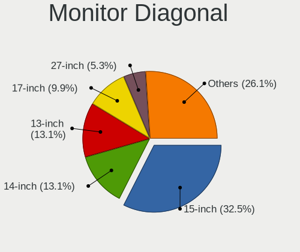

| Inches  | Notebooks | Percent |
|---------|-----------|---------|
| 15      | 449       | 32.87%  |
| 13      | 183       | 13.4%   |
| 14      | 180       | 13.18%  |
| 17      | 138       | 10.1%   |
| 27      | 67        | 4.9%    |
| 24      | 51        | 3.73%   |
| 12      | 48        | 3.51%   |
| 23      | 30        | 2.2%    |
| 16      | 28        | 2.05%   |
| 21      | 22        | 1.61%   |
| 11      | 20        | 1.46%   |
| Unknown | 19        | 1.39%   |
| 34      | 17        | 1.24%   |
| 31      | 17        | 1.24%   |
| 7       | 12        | 0.88%   |
| 22      | 10        | 0.73%   |
| 18      | 9         | 0.66%   |
| 10      | 9         | 0.66%   |
| 54      | 7         | 0.51%   |
| 25      | 7         | 0.51%   |
| 19      | 7         | 0.51%   |
| 20      | 6         | 0.44%   |
| 84      | 4         | 0.29%   |
| 40      | 4         | 0.29%   |
| 142     | 3         | 0.22%   |
| 3       | 3         | 0.22%   |
| 72      | 2         | 0.15%   |
| 39      | 2         | 0.15%   |
| 32      | 2         | 0.15%   |
| 28      | 2         | 0.15%   |
| 85      | 1         | 0.07%   |
| 63      | 1         | 0.07%   |
| 52      | 1         | 0.07%   |
| 49      | 1         | 0.07%   |
| 48      | 1         | 0.07%   |
| 43      | 1         | 0.07%   |
| 38      | 1         | 0.07%   |
| 26      | 1         | 0.07%   |

Monitor Width
-------------

Physical width

| Width in mm    | Notebooks | Percent |
|----------------|-----------|---------|
| 301-350        | 717       | 53.15%  |
| 201-300        | 180       | 13.34%  |
| 351-400        | 163       | 12.08%  |
| 501-600        | 132       | 9.79%   |
| 401-500        | 43        | 3.19%   |
| 601-700        | 33        | 2.45%   |
| 701-800        | 19        | 1.41%   |
| Unknown        | 19        | 1.41%   |
| 1-100          | 14        | 1.04%   |
| 1001-1500      | 12        | 0.89%   |
| 801-900        | 7         | 0.52%   |
| 1501-2000      | 7         | 0.52%   |
| More than 2000 | 3         | 0.22%   |

Aspect Ratio
------------

Proportional relationship between the width and the height

| Ratio   | Notebooks | Percent |
|---------|-----------|---------|
| 16/9    | 947       | 78.72%  |
| 16/10   | 183       | 15.21%  |
| 21/9    | 18        | 1.5%    |
| Unknown | 15        | 1.25%   |
| 3/2     | 11        | 0.91%   |
| 0.67    | 11        | 0.91%   |
| 5/4     | 6         | 0.5%    |
| 6/5     | 4         | 0.33%   |
| 1.00    | 3         | 0.25%   |
| 32/9    | 2         | 0.17%   |
| 4/3     | 1         | 0.08%   |
| 3.20    | 1         | 0.08%   |
| 0.62    | 1         | 0.08%   |

Monitor Area
------------

Area in inch

| Area in inch | Notebooks | Percent |
|----------------|-----------|---------|
| 101-110        | 452       | 33.28%  |
| 81-90          | 285       | 20.99%  |
| 121-130        | 122       | 8.98%   |
| 71-80          | 77        | 5.67%   |
| 201-250        | 75        | 5.52%   |
| 301-350        | 67        | 4.93%   |
| 61-70          | 48        | 3.53%   |
| 351-500        | 37        | 2.72%   |
| 251-300        | 32        | 2.36%   |
| 151-200        | 23        | 1.69%   |
| More than 1000 | 20        | 1.47%   |
| 51-60          | 20        | 1.47%   |
| 111-120        | 20        | 1.47%   |
| 131-140        | 19        | 1.4%    |
| Unknown        | 19        | 1.4%    |
| 1-40           | 14        | 1.03%   |
| 41-50          | 9         | 0.66%   |
| 501-1000       | 9         | 0.66%   |
| 141-150        | 8         | 0.59%   |
| 91-100         | 2         | 0.15%   |

Pixel Density
-------------

Pixels per inch

| Density       | Notebooks | Percent |
|---------------|-----------|---------|
| 121-160       | 578       | 43.33%  |
| 101-120       | 315       | 23.61%  |
| 51-100        | 217       | 16.27%  |
| 161-240       | 137       | 10.27%  |
| More than 240 | 54        | 4.05%   |
| Unknown       | 19        | 1.42%   |
| 1-50          | 14        | 1.05%   |

Multiple Monitors
-----------------

Total monitors connected

| Total | Notebooks | Percent |
|-------|-----------|---------|
| 1     | 932       | 77.47%  |
| 2     | 198       | 16.46%  |
| 3     | 35        | 2.91%   |
| 0     | 31        | 2.58%   |
| 4     | 7         | 0.58%   |

Network
-------

Net Controller Vendor
---------------------

Controller vendors

| Vendor                            | Notebooks | Percent |
|-----------------------------------|-----------|---------|
| Intel                             | 711       | 38.1%   |
| Realtek Semiconductor             | 545       | 29.21%  |
| Qualcomm Atheros                  | 201       | 10.77%  |
| Broadcom                          | 110       | 5.89%   |
| MediaTek                          | 28        | 1.5%    |
| Broadcom Limited                  | 22        | 1.18%   |
| Sierra Wireless                   | 19        | 1.02%   |
| Lenovo                            | 17        | 0.91%   |
| Ralink                            | 16        | 0.86%   |
| Marvell Technology Group          | 16        | 0.86%   |
| Ericsson Business Mobile Networks | 16        | 0.86%   |
| Dell                              | 16        | 0.86%   |
| ASIX Electronics                  | 12        | 0.64%   |
| Hewlett-Packard                   | 11        | 0.59%   |
| FIBOCOM                           | 11        | 0.59%   |
| Huawei Technologies               | 10        | 0.54%   |
| DisplayLink                       | 10        | 0.54%   |
| Qualcomm                          | 9         | 0.48%   |
| Nvidia                            | 9         | 0.48%   |
| Samsung Electronics               | 8         | 0.43%   |
| NetGear                           | 7         | 0.38%   |
| TP-Link                           | 6         | 0.32%   |
| Edimax Technology                 | 6         | 0.32%   |
| JMicron Technology                | 5         | 0.27%   |
| Google                            | 5         | 0.27%   |
| ZyXEL Communications              | 4         | 0.21%   |
| OnePlus Technology (Shenzhen)     | 4         | 0.21%   |
| Ralink Technology                 | 3         | 0.16%   |
| ASUSTek Computer                  | 3         | 0.16%   |
| Apple                             | 3         | 0.16%   |
| Xiaomi                            | 2         | 0.11%   |
| Qualcomm Atheros Communications   | 2         | 0.11%   |
| Motorola PCS                      | 2         | 0.11%   |
| Linksys                           | 2         | 0.11%   |
| D-Link System                     | 2         | 0.11%   |
| ZyDAS                             | 1         | 0.05%   |
| ZTE WCDMA Technologies MSM        | 1         | 0.05%   |
| Sitecom Europe                    | 1         | 0.05%   |
| Silicon Integrated Systems [SiS]  | 1         | 0.05%   |
| Research In Motion                | 1         | 0.05%   |

Net Controller Model
--------------------

Controller models

| Model                                                                  | Notebooks | Percent |
|------------------------------------------------------------------------|-----------|---------|
| Realtek RTL8111/8168/8211/8411 PCI Express Gigabit Ethernet Controller | 345       | 14.94%  |
| Intel Wi-Fi 6 AX200                                                    | 88        | 3.81%   |
| Intel Wireless 8265 / 8275                                             | 67        | 2.9%    |
| Realtek RTL8153 Gigabit Ethernet Adapter                               | 63        | 2.73%   |
| Realtek RTL810xE PCI Express Fast Ethernet controller                  | 62        | 2.68%   |
| Intel 82579LM Gigabit Network Connection (Lewisville)                  | 62        | 2.68%   |
| Intel Wireless 7265                                                    | 41        | 1.77%   |
| Intel Wi-Fi 6 AX201                                                    | 41        | 1.77%   |
| Intel Centrino Advanced-N 6205 [Taylor Peak]                           | 40        | 1.73%   |
| Intel Wireless 8260                                                    | 39        | 1.69%   |
| Qualcomm Atheros AR9285 Wireless Network Adapter (PCI-Express)         | 35        | 1.52%   |
| Realtek RTL8822CE 802.11ac PCIe Wireless Network Adapter               | 34        | 1.47%   |
| Intel Wireless 7260                                                    | 31        | 1.34%   |
| Intel Comet Lake PCH-LP CNVi WiFi                                      | 29        | 1.26%   |
| Qualcomm Atheros QCA9377 802.11ac Wireless Network Adapter             | 28        | 1.21%   |
| Realtek RTL8821CE 802.11ac PCIe Wireless Network Adapter               | 27        | 1.17%   |
| Qualcomm Atheros QCA6174 802.11ac Wireless Network Adapter             | 25        | 1.08%   |
| Qualcomm Atheros AR9485 Wireless Network Adapter                       | 24        | 1.04%   |
| Intel Wireless 3165                                                    | 24        | 1.04%   |
| Intel Centrino Ultimate-N 6300                                         | 24        | 1.04%   |
| Intel Cannon Point-LP CNVi [Wireless-AC]                               | 22        | 0.95%   |
| Qualcomm Atheros QCA9565 / AR9565 Wireless Network Adapter             | 20        | 0.87%   |
| Intel Raptor Lake PCH CNVi WiFi                                        | 20        | 0.87%   |
| Intel Ethernet Connection I219-LM                                      | 20        | 0.87%   |
| Intel 82577LM Gigabit Network Connection                               | 19        | 0.82%   |
| Intel Ethernet Connection (6) I219-V                                   | 18        | 0.78%   |
| Intel Ethernet Connection (4) I219-V                                   | 18        | 0.78%   |
| Intel 82567LM Gigabit Network Connection                               | 18        | 0.78%   |
| Realtek RTL8723BE PCIe Wireless Network Adapter                        | 17        | 0.74%   |
| Intel Ethernet Connection I218-LM                                      | 17        | 0.74%   |
| Intel Ethernet Connection (3) I218-LM                                  | 17        | 0.74%   |
| Intel Cannon Lake PCH CNVi WiFi                                        | 17        | 0.74%   |
| Qualcomm Atheros AR8151 v2.0 Gigabit Ethernet                          | 16        | 0.69%   |
| Intel Ethernet Connection (4) I219-LM                                  | 16        | 0.69%   |
| MediaTek MT7921 802.11ax PCI Express Wireless Network Adapter          | 15        | 0.65%   |
| Broadcom BCM43142 802.11b/g/n                                          | 15        | 0.65%   |
| Realtek RTL8852AE 802.11ax PCIe Wireless Network Adapter               | 14        | 0.61%   |
| Realtek RTL8822BE 802.11a/b/g/n/ac WiFi adapter                        | 14        | 0.61%   |
| Intel WiFi Link 5100                                                   | 14        | 0.61%   |
| Intel Wi-Fi 5(802.11ac) Wireless-AC 9x6x [Thunder Peak]                | 14        | 0.61%   |

Wireless Vendor
---------------

Wireless vendors

| Vendor                          | Notebooks | Percent |
|---------------------------------|-----------|---------|
| Intel                           | 685       | 55.02%  |
| Realtek Semiconductor           | 164       | 13.17%  |
| Qualcomm Atheros                | 164       | 13.17%  |
| Broadcom                        | 89        | 7.15%   |
| MediaTek                        | 27        | 2.17%   |
| Sierra Wireless                 | 19        | 1.53%   |
| Ralink                          | 16        | 1.29%   |
| Dell                            | 12        | 0.96%   |
| Broadcom Limited                | 12        | 0.96%   |
| FIBOCOM                         | 11        | 0.88%   |
| Qualcomm                        | 8         | 0.64%   |
| TP-Link                         | 6         | 0.48%   |
| NetGear                         | 6         | 0.48%   |
| Edimax Technology               | 6         | 0.48%   |
| ZyXEL Communications            | 4         | 0.32%   |
| Ralink Technology               | 3         | 0.24%   |
| ASUSTek Computer                | 3         | 0.24%   |
| Qualcomm Atheros Communications | 2         | 0.16%   |
| Hewlett-Packard                 | 2         | 0.16%   |
| D-Link System                   | 2         | 0.16%   |
| ZyDAS                           | 1         | 0.08%   |
| Sitecom Europe                  | 1         | 0.08%   |
| Linksys                         | 1         | 0.08%   |
| D-Link                          | 1         | 0.08%   |

Wireless Model
--------------

Wireless models

| Model                                                                   | Notebooks | Percent |
|-------------------------------------------------------------------------|-----------|---------|
| Intel Wi-Fi 6 AX200                                                     | 88        | 7.06%   |
| Intel Wireless 8265 / 8275                                              | 67        | 5.38%   |
| Intel Wireless 7265                                                     | 41        | 3.29%   |
| Intel Wi-Fi 6 AX201                                                     | 41        | 3.29%   |
| Intel Centrino Advanced-N 6205 [Taylor Peak]                            | 40        | 3.21%   |
| Intel Wireless 8260                                                     | 39        | 3.13%   |
| Qualcomm Atheros AR9285 Wireless Network Adapter (PCI-Express)          | 35        | 2.81%   |
| Realtek RTL8822CE 802.11ac PCIe Wireless Network Adapter                | 34        | 2.73%   |
| Intel Wireless 7260                                                     | 31        | 2.49%   |
| Intel Comet Lake PCH-LP CNVi WiFi                                       | 29        | 2.33%   |
| Qualcomm Atheros QCA9377 802.11ac Wireless Network Adapter              | 28        | 2.25%   |
| Realtek RTL8821CE 802.11ac PCIe Wireless Network Adapter                | 27        | 2.17%   |
| Qualcomm Atheros QCA6174 802.11ac Wireless Network Adapter              | 25        | 2.01%   |
| Qualcomm Atheros AR9485 Wireless Network Adapter                        | 24        | 1.93%   |
| Intel Wireless 3165                                                     | 24        | 1.93%   |
| Intel Centrino Ultimate-N 6300                                          | 24        | 1.93%   |
| Intel Cannon Point-LP CNVi [Wireless-AC]                                | 22        | 1.77%   |
| Qualcomm Atheros QCA9565 / AR9565 Wireless Network Adapter              | 20        | 1.61%   |
| Intel Raptor Lake PCH CNVi WiFi                                         | 20        | 1.61%   |
| Realtek RTL8723BE PCIe Wireless Network Adapter                         | 17        | 1.36%   |
| Intel Cannon Lake PCH CNVi WiFi                                         | 17        | 1.36%   |
| MediaTek MT7921 802.11ax PCI Express Wireless Network Adapter           | 15        | 1.2%    |
| Broadcom BCM43142 802.11b/g/n                                           | 15        | 1.2%    |
| Realtek RTL8852AE 802.11ax PCIe Wireless Network Adapter                | 14        | 1.12%   |
| Realtek RTL8822BE 802.11a/b/g/n/ac WiFi adapter                         | 14        | 1.12%   |
| Intel WiFi Link 5100                                                    | 14        | 1.12%   |
| Intel Wi-Fi 5(802.11ac) Wireless-AC 9x6x [Thunder Peak]                 | 14        | 1.12%   |
| Intel Comet Lake PCH CNVi WiFi                                          | 14        | 1.12%   |
| Intel PRO/Wireless 3945ABG [Golan] Network Connection                   | 13        | 1.04%   |
| Intel Alder Lake-P PCH CNVi WiFi                                        | 13        | 1.04%   |
| Broadcom BCM4313 802.11bgn Wireless Network Adapter                     | 13        | 1.04%   |
| Intel Wireless 3160                                                     | 12        | 0.96%   |
| Intel Ice Lake-LP PCH CNVi WiFi                                         | 12        | 0.96%   |
| Broadcom BCM4331 802.11a/b/g/n                                          | 12        | 0.96%   |
| Sierra Wireless EM7455                                                  | 11        | 0.88%   |
| Intel PRO/Wireless 5100 AGN [Shiloh] Network Connection                 | 11        | 0.88%   |
| Qualcomm Atheros AR242x / AR542x Wireless Network Adapter (PCI-Express) | 10        | 0.8%    |
| Intel Wi-Fi 6E(802.11ax) AX210/AX1675* 2x2 [Typhoon Peak]               | 10        | 0.8%    |
| Intel Dual Band Wireless-AC 3165 Plus Bluetooth                         | 10        | 0.8%    |
| Intel Centrino Advanced-N 6235                                          | 10        | 0.8%    |

Ethernet Vendor
---------------

Ethernet vendors

| Vendor                        | Notebooks | Percent |
|-------------------------------|-----------|---------|
| Realtek Semiconductor         | 474       | 46.93%  |
| Intel                         | 317       | 31.39%  |
| Qualcomm Atheros              | 61        | 6.04%   |
| Broadcom                      | 41        | 4.06%   |
| Lenovo                        | 17        | 1.68%   |
| Marvell Technology Group      | 16        | 1.58%   |
| ASIX Electronics              | 12        | 1.19%   |
| DisplayLink                   | 10        | 0.99%   |
| Broadcom Limited              | 10        | 0.99%   |
| Nvidia                        | 9         | 0.89%   |
| Samsung Electronics           | 8         | 0.79%   |
| JMicron Technology            | 5         | 0.5%    |
| Google                        | 5         | 0.5%    |
| OnePlus Technology (Shenzhen) | 4         | 0.4%    |
| Huawei Technologies           | 4         | 0.4%    |
| Apple                         | 3         | 0.3%    |
| Xiaomi                        | 2         | 0.2%    |
| Motorola PCS                  | 2         | 0.2%    |
| Hewlett-Packard               | 2         | 0.2%    |
| ZTE WCDMA Technologies MSM    | 1         | 0.1%    |
| Research In Motion            | 1         | 0.1%    |
| Qualcomm                      | 1         | 0.1%    |
| NetGear                       | 1         | 0.1%    |
| MediaTek                      | 1         | 0.1%    |
| Linksys                       | 1         | 0.1%    |
| Cypress Semiconductor         | 1         | 0.1%    |
| Attansic Technology           | 1         | 0.1%    |

Ethernet Model
--------------

Ethernet models

| Model                                                                  | Notebooks | Percent |
|------------------------------------------------------------------------|-----------|---------|
| Realtek RTL8111/8168/8211/8411 PCI Express Gigabit Ethernet Controller | 345       | 33.66%  |
| Realtek RTL8153 Gigabit Ethernet Adapter                               | 63        | 6.15%   |
| Realtek RTL810xE PCI Express Fast Ethernet controller                  | 62        | 6.05%   |
| Intel 82579LM Gigabit Network Connection (Lewisville)                  | 62        | 6.05%   |
| Intel Ethernet Connection I219-LM                                      | 20        | 1.95%   |
| Intel 82577LM Gigabit Network Connection                               | 19        | 1.85%   |
| Intel Ethernet Connection (6) I219-V                                   | 18        | 1.76%   |
| Intel Ethernet Connection (4) I219-V                                   | 18        | 1.76%   |
| Intel 82567LM Gigabit Network Connection                               | 18        | 1.76%   |
| Intel Ethernet Connection I218-LM                                      | 17        | 1.66%   |
| Intel Ethernet Connection (3) I218-LM                                  | 17        | 1.66%   |
| Qualcomm Atheros AR8151 v2.0 Gigabit Ethernet                          | 16        | 1.56%   |
| Intel Ethernet Connection (4) I219-LM                                  | 16        | 1.56%   |
| Broadcom NetXtreme BCM57765 Gigabit Ethernet PCIe                      | 12        | 1.17%   |
| Intel Ethernet Connection (7) I219-LM                                  | 11        | 1.07%   |
| Intel Ethernet Connection I219-V                                       | 10        | 0.98%   |
| Intel Ethernet Connection I217-LM                                      | 10        | 0.98%   |
| Intel Ethernet Connection (13) I219-V                                  | 10        | 0.98%   |
| ASIX AX88179 Gigabit Ethernet                                          | 10        | 0.98%   |
| Intel Ethernet Connection (10) I219-V                                  | 9         | 0.88%   |
| Intel Ethernet Connection (23) I219-LM                                 | 8         | 0.78%   |
| Lenovo USB-C Dock Ethernet                                             | 7         | 0.68%   |
| Broadcom NetLink BCM57785 Gigabit Ethernet PCIe                        | 7         | 0.68%   |
| Realtek RTL8152 Fast Ethernet Adapter                                  | 6         | 0.59%   |
| Qualcomm Atheros QCA8172 Fast Ethernet                                 | 6         | 0.59%   |
| Qualcomm Atheros QCA8171 Gigabit Ethernet                              | 6         | 0.59%   |
| Qualcomm Atheros Killer E2500 Gigabit Ethernet Controller              | 6         | 0.59%   |
| Qualcomm Atheros AR8161 Gigabit Ethernet                               | 6         | 0.59%   |
| Nvidia MCP79 Ethernet                                                  | 6         | 0.59%   |
| Intel Ethernet Connection (2) I219-LM                                  | 6         | 0.59%   |
| Intel Ethernet Connection (13) I219-LM                                 | 6         | 0.59%   |
| Broadcom Limited NetLink BCM57780 Gigabit Ethernet PCIe                | 6         | 0.59%   |
| Realtek Killer E2600 GbE Controller                                    | 5         | 0.49%   |
| Qualcomm Atheros AR8131 Gigabit Ethernet                               | 5         | 0.49%   |
| Samsung GT-I9070 (network tethering, USB debugging enabled)            | 4         | 0.39%   |
| Samsung Galaxy series, misc. (tethering mode)                          | 4         | 0.39%   |
| Qualcomm Atheros AR8132 Fast Ethernet                                  | 4         | 0.39%   |
| OnePlus (Shenzhen) OnePlus                                             | 4         | 0.39%   |
| Marvell Group 88E8055 PCI-E Gigabit Ethernet Controller                | 4         | 0.39%   |
| JMicron JMC250 PCI Express Gigabit Ethernet Controller                 | 4         | 0.39%   |

Net Controller Kind
-------------------

Ethernet, WiFi or modem

| Kind     | Notebooks | Percent |
|----------|-----------|---------|
| WiFi     | 1155      | 53.92%  |
| Ethernet | 949       | 44.3%   |
| Modem    | 36        | 1.68%   |
| Unknown  | 2         | 0.09%   |

Used Controller
---------------

Currently used network controller

| Kind     | Notebooks | Percent |
|----------|-----------|---------|
| WiFi     | 954       | 77.5%   |
| Ethernet | 277       | 22.5%   |

NICs
----

Total network controllers on board

| Total | Notebooks | Percent |
|-------|-----------|---------|
| 2     | 846       | 72.49%  |
| 1     | 289       | 24.76%  |
| 3     | 18        | 1.54%   |
| 0     | 14        | 1.2%    |

IPv6
----

IPv6 vs IPv4

| Used | Notebooks | Percent |
|------|-----------|---------|
| No   | 996       | 83.84%  |
| Yes  | 192       | 16.16%  |

Bluetooth
---------

Bluetooth Vendor
----------------

Controller vendors

| Vendor                          | Notebooks | Percent |
|---------------------------------|-----------|---------|
| Intel                           | 514       | 54.28%  |
| Realtek Semiconductor           | 99        | 10.45%  |
| Broadcom                        | 54        | 5.7%    |
| Qualcomm Atheros Communications | 53        | 5.6%    |
| IMC Networks                    | 42        | 4.44%   |
| Apple                           | 36        | 3.8%    |
| Lite-On Technology              | 34        | 3.59%   |
| Foxconn / Hon Hai               | 30        | 3.17%   |
| Hewlett-Packard                 | 19        | 2.01%   |
| Dell                            | 15        | 1.58%   |
| Cambridge Silicon Radio         | 10        | 1.06%   |
| Toshiba                         | 9         | 0.95%   |
| Ralink                          | 5         | 0.53%   |
| MediaTek                        | 5         | 0.53%   |
| Foxconn International           | 5         | 0.53%   |
| USI                             | 4         | 0.42%   |
| TP-Link                         | 2         | 0.21%   |
| Realtek                         | 2         | 0.21%   |
| ASUSTek Computer                | 2         | 0.21%   |
| Alps Electric                   | 2         | 0.21%   |
| i.Tech Dynamic Limited          | 1         | 0.11%   |
| Fujitsu                         | 1         | 0.11%   |
| Edimax Technology               | 1         | 0.11%   |
| Belkin Components               | 1         | 0.11%   |
| Askey Computer                  | 1         | 0.11%   |

Bluetooth Model
---------------

Controller models

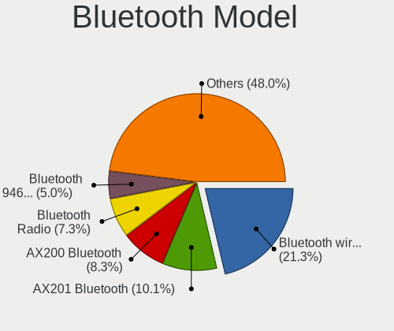

| Model                                               | Notebooks | Percent |
|-----------------------------------------------------|-----------|---------|
| Intel Bluetooth wireless interface                  | 112       | 11.83%  |
| Intel AX201 Bluetooth                               | 95        | 10.03%  |
| Intel Bluetooth Device                              | 89        | 9.4%    |
| Intel AX200 Bluetooth                               | 84        | 8.87%   |
| Realtek Bluetooth Radio                             | 70        | 7.39%   |
| Intel Bluetooth 9460/9560 Jefferson Peak (JfP)      | 48        | 5.07%   |
| Intel AX211 Bluetooth                               | 29        | 3.06%   |
| IMC Networks Bluetooth Radio                        | 20        | 2.11%   |
| Apple Bluetooth Host Controller                     | 18        | 1.9%    |
| Qualcomm Atheros AR3011 Bluetooth                   | 17        | 1.8%    |
| Intel Centrino Bluetooth Wireless Transceiver       | 17        | 1.8%    |
| Qualcomm Atheros QCA61x4 Bluetooth 4.0              | 16        | 1.69%   |
| Broadcom BCM2045B (BDC-2.1)                         | 15        | 1.58%   |
| Intel Wireless-AC 9260 Bluetooth Adapter            | 14        | 1.48%   |
| Foxconn / Hon Hai Bluetooth Device                  | 13        | 1.37%   |
| Lite-On Qualcomm Atheros QCA9377 Bluetooth          | 12        | 1.27%   |
| Apple Bluetooth USB Host Controller                 | 12        | 1.27%   |
| Qualcomm Atheros  Bluetooth Device                  | 11        | 1.16%   |
| Intel Centrino Advanced-N 6230 Bluetooth adapter    | 11        | 1.16%   |
| HP Broadcom 2070 Bluetooth Combo                    | 11        | 1.16%   |
| Cambridge Silicon Radio Bluetooth Dongle (HCI mode) | 10        | 1.06%   |
| Broadcom BCM20702 Bluetooth 4.0 [ThinkPad]          | 10        | 1.06%   |
| Realtek  Bluetooth 4.2 Adapter                      | 9         | 0.95%   |
| Intel AX210 Bluetooth                               | 9         | 0.95%   |
| IMC Networks Wireless_Device                        | 9         | 0.95%   |
| Realtek 802.11ac WLAN Adapter                       | 8         | 0.84%   |
| IMC Networks Bluetooth Device                       | 8         | 0.84%   |
| HP Bluetooth 2.0 Interface [Broadcom BCM2045]       | 8         | 0.84%   |
| Broadcom HP Portable SoftSailing                    | 8         | 0.84%   |
| Qualcomm Atheros AR3012 Bluetooth 4.0               | 7         | 0.74%   |
| Lite-On Bluetooth Device                            | 7         | 0.74%   |
| Lite-On Atheros AR3012 Bluetooth                    | 7         | 0.74%   |
| Realtek RTL8822BE Bluetooth 4.2 Adapter             | 6         | 0.63%   |
| Lite-On Wireless_Device                             | 6         | 0.63%   |
| Intel Wireless-AC 3168 Bluetooth                    | 6         | 0.63%   |
| Dell BCM20702A0 Bluetooth Module                    | 6         | 0.63%   |
| Ralink RT3290 Bluetooth                             | 5         | 0.53%   |
| Foxconn International BCM43142A0 Bluetooth module   | 5         | 0.53%   |
| Foxconn / Hon Hai Bluetooth USB Host Controller     | 5         | 0.53%   |
| USI Bluetooth Device                                | 4         | 0.42%   |

Sound
-----

Sound Vendor
------------

Sound card vendors

| Vendor                           | Notebooks | Percent |
|----------------------------------|-----------|---------|
| Intel                            | 905       | 60.86%  |
| AMD                              | 271       | 18.22%  |
| Nvidia                           | 161       | 10.83%  |
| Lenovo                           | 17        | 1.14%   |
| Logitech                         | 16        | 1.08%   |
| C-Media Electronics              | 16        | 1.08%   |
| GN Netcom                        | 11        | 0.74%   |
| Realtek Semiconductor            | 10        | 0.67%   |
| Hewlett-Packard                  | 8         | 0.54%   |
| Apple                            | 8         | 0.54%   |
| Creative Technology              | 7         | 0.47%   |
| Texas Instruments                | 6         | 0.4%    |
| SteelSeries ApS                  | 4         | 0.27%   |
| Plantronics                      | 4         | 0.27%   |
| Yamaha                           | 3         | 0.2%    |
| Sony                             | 3         | 0.2%    |
| Focusrite-Novation               | 3         | 0.2%    |
| ZOOM                             | 2         | 0.13%   |
| Sennheiser Communications        | 2         | 0.13%   |
| RODE Microphones                 | 2         | 0.13%   |
| Kingston Technology              | 2         | 0.13%   |
| DSEA A/S                         | 2         | 0.13%   |
| XMOS                             | 1         | 0.07%   |
| Valve Software                   | 1         | 0.07%   |
| Tenx Technology                  | 1         | 0.07%   |
| Silicon Motion                   | 1         | 0.07%   |
| Silicon Integrated Systems [SiS] | 1         | 0.07%   |
| Samsung Electronics              | 1         | 0.07%   |
| Roland                           | 1         | 0.07%   |
| No brand                         | 1         | 0.07%   |
| Microsoft                        | 1         | 0.07%   |
| Medeli Electronics               | 1         | 0.07%   |
| Mackie Designs                   | 1         | 0.07%   |
| M-Audio                          | 1         | 0.07%   |
| JMTek                            | 1         | 0.07%   |
| GYROCOM C&C                      | 1         | 0.07%   |
| Generalplus Technology           | 1         | 0.07%   |
| FiiO Electronics Technology      | 1         | 0.07%   |
| Corsair                          | 1         | 0.07%   |
| Conexant Systems                 | 1         | 0.07%   |

Sound Model
-----------

Sound card models

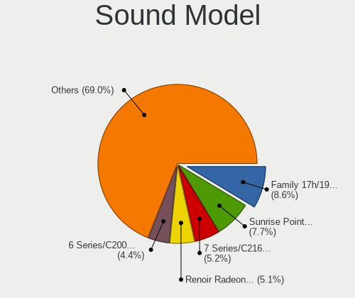

| Model                                                                                             | Notebooks | Percent |
|---------------------------------------------------------------------------------------------------|-----------|---------|
| AMD Family 17h/19h HD Audio Controller                                                            | 151       | 8.37%   |
| Intel Sunrise Point-LP HD Audio                                                                   | 135       | 7.48%   |
| Intel 7 Series/C216 Chipset Family High Definition Audio Controller                               | 97        | 5.37%   |
| AMD Renoir Radeon High Definition Audio Controller                                                | 94        | 5.21%   |
| Intel 6 Series/C200 Series Chipset Family High Definition Audio Controller                        | 83        | 4.6%    |
| Intel Tiger Lake-LP Smart Sound Technology Audio Controller                                       | 53        | 2.94%   |
| Intel Haswell-ULT HD Audio Controller                                                             | 49        | 2.71%   |
| Intel 8 Series HD Audio Controller                                                                | 49        | 2.71%   |
| Intel Cannon Lake PCH cAVS                                                                        | 46        | 2.55%   |
| Intel Broadwell-U Audio Controller                                                                | 46        | 2.55%   |
| Intel Wildcat Point-LP High Definition Audio Controller                                           | 45        | 2.49%   |
| Intel 82801I (ICH9 Family) HD Audio Controller                                                    | 44        | 2.44%   |
| Intel Comet Lake PCH-LP cAVS                                                                      | 38        | 2.11%   |
| Intel Cannon Point-LP High Definition Audio Controller                                            | 35        | 1.94%   |
| Intel 5 Series/3400 Series Chipset High Definition Audio                                          | 35        | 1.94%   |
| Intel 8 Series/C220 Series Chipset High Definition Audio Controller                               | 32        | 1.77%   |
| AMD Raven/Raven2/Fenghuang HDMI/DP Audio Controller                                               | 30        | 1.66%   |
| AMD FCH Azalia Controller                                                                         | 29        | 1.61%   |
| AMD Rembrandt Radeon High Definition Audio Controller                                             | 26        | 1.44%   |
| AMD Kabini HDMI/DP Audio                                                                          | 24        | 1.33%   |
| Intel Xeon E3-1200 v3/4th Gen Core Processor HD Audio Controller                                  | 22        | 1.22%   |
| Intel 82801H (ICH8 Family) HD Audio Controller                                                    | 22        | 1.22%   |
| Intel 100 Series/C230 Series Chipset Family HD Audio Controller                                   | 21        | 1.16%   |
| Intel Raptor Lake-P/U/H cAVS                                                                      | 20        | 1.11%   |
| Nvidia TU107 GeForce GTX 1650 High Definition Audio Controller                                    | 19        | 1.05%   |
| Intel Comet Lake PCH cAVS                                                                         | 19        | 1.05%   |
| Intel NM10/ICH7 Family High Definition Audio Controller                                           | 17        | 0.94%   |
| Intel Ice Lake-LP Smart Sound Technology Audio Controller                                         | 16        | 0.89%   |
| Intel CM238 HD Audio Controller                                                                   | 16        | 0.89%   |
| AMD SBx00 Azalia (Intel HDA)                                                                      | 16        | 0.89%   |
| Intel Alder Lake PCH-P High Definition Audio Controller                                           | 15        | 0.83%   |
| Nvidia TU106 High Definition Audio Controller                                                     | 14        | 0.78%   |
| Intel Celeron/Pentium Silver Processor High Definition Audio                                      | 14        | 0.78%   |
| AMD Family 15h (Models 60h-6fh) Audio Controller                                                  | 14        | 0.78%   |
| Intel Celeron N3350/Pentium N4200/Atom E3900 Series Audio Cluster                                 | 13        | 0.72%   |
| Nvidia GF108 High Definition Audio Controller                                                     | 12        | 0.66%   |
| Intel Atom/Celeron/Pentium Processor x5-E8000/J3xxx/N3xxx Series High Definition Audio Controller | 12        | 0.66%   |
| Nvidia GP107GL High Definition Audio Controller                                                   | 11        | 0.61%   |
| Realtek Semiconductor USB Audio                                                                   | 10        | 0.55%   |
| Nvidia GP106 High Definition Audio Controller                                                     | 9         | 0.5%    |

Memory
------

Memory Vendor
-------------

Memory module vendors

| Vendor                | Notebooks | Percent |
|-----------------------|-----------|---------|
| Samsung Electronics   | 245       | 30.78%  |
| SK hynix              | 190       | 23.87%  |
| Micron Technology     | 114       | 14.32%  |
| Kingston              | 59        | 7.41%   |
| Unknown               | 44        | 5.53%   |
| Crucial               | 40        | 5.03%   |
| Ramaxel Technology    | 25        | 3.14%   |
| Elpida                | 16        | 2.01%   |
| Corsair               | 15        | 1.88%   |
| Unknown (ABCD)        | 11        | 1.38%   |
| G.Skill               | 8         | 1.01%   |
| Nanya Technology      | 6         | 0.75%   |
| A-DATA Technology     | 6         | 0.75%   |
| Transcend             | 3         | 0.38%   |
| Unknown               | 3         | 0.38%   |
| Silicon Power         | 2         | 0.25%   |
| GOODRAM               | 2         | 0.25%   |
| Vaseky                | 1         | 0.13%   |
| Smart                 | 1         | 0.13%   |
| Kingmax Semiconductor | 1         | 0.13%   |
| CSX                   | 1         | 0.13%   |
| ChangXin Memory       | 1         | 0.13%   |
| Avant                 | 1         | 0.13%   |
| ASint Technology      | 1         | 0.13%   |

Memory Model
------------

Memory module models

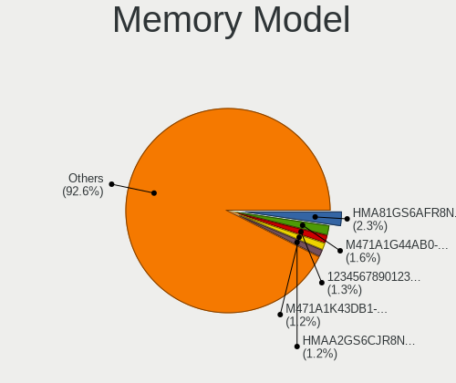

| Model                                                            | Notebooks | Percent |
|------------------------------------------------------------------|-----------|---------|
| SK hynix RAM HMA81GS6AFR8N-UH 8GB SODIMM DDR4 2667MT/s           | 21        | 2.51%   |
| Samsung RAM M471A1G44AB0-CWE 8192MB SODIMM DDR4 3200MT/s         | 14        | 1.67%   |
| Unknown (ABCD) RAM 123456789012345678 2GB SODIMM LPDDR4 2400MT/s | 11        | 1.32%   |
| Samsung RAM M471A1K43DB1-CWE 8GB SODIMM DDR4 3200MT/s            | 11        | 1.32%   |
| Samsung RAM M471B5173DB0-YK0 4GB SODIMM DDR3 1600MT/s            | 10        | 1.2%    |
| SK hynix RAM HMAA2GS6CJR8N-XN 16GB SODIMM DDR4 3200MT/s          | 9         | 1.08%   |
| Micron RAM 4ATS2G64HZ-3G2B1 16GB SODIMM DDR4 3200MT/s            | 9         | 1.08%   |
| SK hynix RAM HMAA1GS6CJR6N-XN 8GB SODIMM DDR4 3200MT/s           | 8         | 0.96%   |
| Samsung RAM M471A2G44AM0-CWE 16GB SODIMM DDR4 3200MT/s           | 8         | 0.96%   |
| Samsung RAM M471A1G44BB0-CWE 8GB SODIMM DDR4 3200MT/s            | 8         | 0.96%   |
| SK hynix RAM HMT451S6BFR8A-PB 4GB SODIMM DDR3 1600MT/s           | 7         | 0.84%   |
| SK hynix RAM HMT41GS6BFR8A-PB 8GB SODIMM DDR3 1600MT/s           | 7         | 0.84%   |
| SK hynix RAM HMT351S6CFR8C-PB 4GB SODIMM DDR3 1600MT/s           | 7         | 0.84%   |
| Samsung RAM M471B5273DH0-CH9 4GB SODIMM DDR3 1334MT/s            | 7         | 0.84%   |
| Samsung RAM M471B1G73QH0-YK0 8GB SODIMM DDR3 1600MT/s            | 7         | 0.84%   |
| Samsung RAM M471A5244CB0-CTD 4GB SODIMM DDR4 3266MT/s            | 7         | 0.84%   |
| Samsung RAM M471A2K43DB1-CWE 16GB SODIMM DDR4 3200MT/s           | 7         | 0.84%   |
| Samsung RAM M471A1G44AB0-CWE 8GB Row Of Chips DDR4 3200MT/s      | 7         | 0.84%   |
| Samsung RAM M471B5773CHS-CH9 2048MB SODIMM DDR3 4199MT/s         | 6         | 0.72%   |
| Samsung RAM M471B5273CH0-CH9 4GB SODIMM DDR3 1334MT/s            | 6         | 0.72%   |
| Samsung RAM M471A2G43AB2-CWE 16GB SODIMM DDR4 3200MT/s           | 6         | 0.72%   |
| Samsung RAM M471A1K43CB1-CRC 8GB SODIMM DDR4 2667MT/s            | 6         | 0.72%   |
| SK hynix RAM HMT351S6EFR8A-PB 4GB SODIMM DDR3 1600MT/s           | 5         | 0.6%    |
| SK hynix RAM HMT351S6BFR8C-H9 4GB SODIMM DDR3 1333MT/s           | 5         | 0.6%    |
| Samsung RAM Module 8GB SODIMM DDR4 2133MT/s                      | 5         | 0.6%    |
| Samsung RAM M471B5173QH0-YK0 4GB SODIMM DDR3 1600MT/s            | 5         | 0.6%    |
| Samsung RAM M471A4G43MB1-CTD 32GB SODIMM DDR4 2667MT/s           | 5         | 0.6%    |
| Samsung RAM M471A1K43DB1-CTD 8GB SODIMM DDR4 2667MT/s            | 5         | 0.6%    |
| Micron RAM Module 8GB SODIMM DDR4 3200MT/s                       | 5         | 0.6%    |
| Micron RAM 4ATF1G64HZ-3G2E1 8GB Row Of Chips DDR4 3200MT/s       | 5         | 0.6%    |
| SK hynix RAM HMA81GS6JJR8N-VK 8GB SODIMM DDR4 2667MT/s           | 4         | 0.48%   |
| SK hynix RAM HMA81GS6DJR8N-XN 8192MB SODIMM DDR4 3200MT/s        | 4         | 0.48%   |
| SK hynix RAM HMA41GS6AFR8N-TF 8GB SODIMM DDR4 2667MT/s           | 4         | 0.48%   |
| Samsung RAM Module 16GB SODIMM DDR4 2667MT/s                     | 4         | 0.48%   |
| Samsung RAM M471B5273CH0-CK0 4096MB SODIMM DDR3 1600MT/s         | 4         | 0.48%   |
| Samsung RAM M471A5244CB0-CRC 4GB SODIMM DDR4 2667MT/s            | 4         | 0.48%   |
| Samsung RAM M471A2K43DB1-CTD 16GB SODIMM DDR4 2667MT/s           | 4         | 0.48%   |
| Samsung RAM M471A2K43CB1-CTD 16GB SODIMM DDR4 8400MT/s           | 4         | 0.48%   |
| Samsung RAM M471A1K43BB1-CRC 8192MB SODIMM DDR4 2667MT/s         | 4         | 0.48%   |
| Samsung RAM M471A1G43DB0-CPB 8GB SODIMM DDR4 3200MT/s            | 4         | 0.48%   |

Memory Kind
-----------

Memory module kinds

| Kind    | Notebooks | Percent |
|---------|-----------|---------|
| DDR4    | 337       | 50.52%  |
| DDR3    | 202       | 30.28%  |
| LPDDR4  | 36        | 5.4%    |
| DDR2    | 32        | 4.8%    |
| LPDDR3  | 18        | 2.7%    |
| LPDDR5  | 17        | 2.55%   |
| SDRAM   | 15        | 2.25%   |
| DDR5    | 8         | 1.2%    |
| Unknown | 2         | 0.3%    |

Memory Form Factor
------------------

Physical design of the memory module

| Name         | Notebooks | Percent |
|--------------|-----------|---------|
| SODIMM       | 590       | 87.41%  |
| Row Of Chips | 74        | 10.96%  |
| Chip         | 8         | 1.19%   |
| DIMM         | 2         | 0.3%    |
| Unknown      | 1         | 0.15%   |

Memory Size
-----------

Memory module size

| Size  | Notebooks | Percent |
|-------|-----------|---------|
| 8192  | 310       | 42.58%  |
| 4096  | 160       | 21.98%  |
| 16384 | 141       | 19.37%  |
| 2048  | 80        | 10.99%  |
| 32768 | 23        | 3.16%   |
| 1024  | 14        | 1.92%   |

Memory Speed
------------

Memory module speed

| Speed   | Notebooks | Percent |
|---------|-----------|---------|
| 3200    | 167       | 23.29%  |
| 2667    | 139       | 19.39%  |
| 1600    | 137       | 19.11%  |
| 2400    | 54        | 7.53%   |
| 2133    | 32        | 4.46%   |
| 1334    | 27        | 3.77%   |
| 1333    | 27        | 3.77%   |
| 667     | 19        | 2.65%   |
| 6400    | 15        | 2.09%   |
| 4267    | 13        | 1.81%   |
| 4800    | 9         | 1.26%   |
| 4199    | 9         | 1.26%   |
| 800     | 9         | 1.26%   |
| 1067    | 8         | 1.12%   |
| Unknown | 8         | 1.12%   |
| 3266    | 7         | 0.98%   |
| 1867    | 7         | 0.98%   |
| 2048    | 6         | 0.84%   |
| 8400    | 4         | 0.56%   |
| 4266    | 4         | 0.56%   |
| 5600    | 3         | 0.42%   |
| 3733    | 2         | 0.28%   |
| 1066    | 2         | 0.28%   |
| 975     | 2         | 0.28%   |
| 533     | 2         | 0.28%   |
| 333     | 2         | 0.28%   |
| 7467    | 1         | 0.14%   |
| 7400    | 1         | 0.14%   |
| 5500    | 1         | 0.14%   |

Printers & scanners
-------------------

Printer Vendor
--------------

Printer device vendors

| Vendor              | Notebooks | Percent |
|---------------------|-----------|---------|
| Hewlett-Packard     | 6         | 54.55%  |
| Samsung Electronics | 2         | 18.18%  |
| Canon               | 2         | 18.18%  |
| Seiko Epson         | 1         | 9.09%   |

Printer Model
-------------

Printer device models

| Model                                                 | Notebooks | Percent |
|-------------------------------------------------------|-----------|---------|
| Seiko Epson XP-235 Series                             | 1         | 9.09%   |
| Samsung SCX-4300 Series                               | 1         | 9.09%   |
| Samsung C48x Series Color Laser Multifunction Printer | 1         | 9.09%   |
| HP LaserJet P1102                                     | 1         | 9.09%   |
| HP LaserJet 1200                                      | 1         | 9.09%   |
| HP LaserJet 1022                                      | 1         | 9.09%   |
| HP ENVY Pro 6400 series                               | 1         | 9.09%   |
| HP Deskjet 3520 series                                | 1         | 9.09%   |
| HP DeskJet 2600 series                                | 1         | 9.09%   |
| Canon PIXMA iX6850 Printer                            | 1         | 9.09%   |
| Canon MG2100 series                                   | 1         | 9.09%   |

Scanner Vendor
--------------

Scanner device vendors

| Vendor | Notebooks | Percent |
|--------|-----------|---------|
| Canon  | 3         | 100%    |

Scanner Model
-------------

Scanner device models

| Model                              | Notebooks | Percent |
|------------------------------------|-----------|---------|
| Canon CanoScan N670U/N676U/LiDE 20 | 1         | 33.33%  |
| Canon CanoScan N1240U/LiDE 30      | 1         | 33.33%  |
| Canon CanoScan                     | 1         | 33.33%  |

Camera
------

Camera Vendor
-------------

Camera device vendors

| Vendor                                 | Notebooks | Percent |
|----------------------------------------|-----------|---------|
| Chicony Electronics                    | 300       | 29.5%   |
| IMC Networks                           | 111       | 10.91%  |
| Bison Electronics                      | 69        | 6.78%   |
| Microdia                               | 61        | 6%      |
| Quanta                                 | 53        | 5.21%   |
| Sunplus Innovation Technology          | 52        | 5.11%   |
| Realtek Semiconductor                  | 52        | 5.11%   |
| Lite-On Technology                     | 35        | 3.44%   |
| Suyin                                  | 34        | 3.34%   |
| Cheng Uei Precision Industry (Foxlink) | 34        | 3.34%   |
| Apple                                  | 31        | 3.05%   |
| Acer                                   | 31        | 3.05%   |
| Syntek                                 | 25        | 2.46%   |
| Luxvisions Innotech Limited            | 24        | 2.36%   |
| Alcor Micro                            | 14        | 1.38%   |
| Logitech                               | 12        | 1.18%   |
| Lenovo                                 | 9         | 0.88%   |
| Ricoh                                  | 7         | 0.69%   |
| Primax Electronics                     | 6         | 0.59%   |
| Z-Star Microelectronics                | 5         | 0.49%   |
| Samsung Electronics                    | 5         | 0.49%   |
| Silicon Motion                         | 4         | 0.39%   |
| OmniVision Technologies                | 4         | 0.39%   |
| icSpring                               | 4         | 0.39%   |
| SunplusIT                              | 3         | 0.29%   |
| ShineTech                              | 3         | 0.29%   |
| Microsoft                              | 3         | 0.29%   |
| DigiTech                               | 3         | 0.29%   |
| Sony                                   | 2         | 0.2%    |
| Sonix Technology                       | 2         | 0.2%    |
| SHENZHEN AONI ELECTRONIC               | 2         | 0.2%    |
| Generalplus Technology                 | 2         | 0.2%    |
| Alpha Imaging Technology               | 2         | 0.2%    |
| Valve Software                         | 1         | 0.1%    |
| Sunplus Technology                     | 1         | 0.1%    |
| Sunplus IT                             | 1         | 0.1%    |
| OYT Tech                               | 1         | 0.1%    |
| Nebraska Furniture Mart                | 1         | 0.1%    |
| KYE Systems (Mouse Systems)            | 1         | 0.1%    |
| Jieli Technology                       | 1         | 0.1%    |

Camera Model
------------

Camera device models

| Model                                               | Notebooks | Percent |
|-----------------------------------------------------|-----------|---------|
| Chicony Integrated Camera                           | 76        | 7.45%   |
| IMC Networks Integrated Camera                      | 53        | 5.2%    |
| Microdia Integrated_Webcam_HD                       | 29        | 2.84%   |
| Chicony HD Webcam                                   | 26        | 2.55%   |
| IMC Networks USB2.0 HD UVC WebCam                   | 20        | 1.96%   |
| Chicony HP HD Camera                                | 19        | 1.86%   |
| Bison Integrated Camera                             | 18        | 1.76%   |
| Quanta HD User Facing                               | 16        | 1.57%   |
| Acer Integrated Camera                              | 16        | 1.57%   |
| Syntek Integrated Camera                            | 14        | 1.37%   |
| Sunplus Integrated_Webcam_HD                        | 14        | 1.37%   |
| Quanta HP HD Camera                                 | 14        | 1.37%   |
| Lite-On Integrated Camera                           | 14        | 1.37%   |
| Realtek Integrated_Webcam_HD                        | 12        | 1.18%   |
| Lite-On HP HD Camera                                | 12        | 1.18%   |
| IMC Networks USB2.0 VGA UVC WebCam                  | 12        | 1.18%   |
| Apple FaceTime HD Camera                            | 12        | 1.18%   |
| Chicony TOSHIBA Web Camera - HD                     | 11        | 1.08%   |
| Realtek USB2.0 HD UVC WebCam                        | 10        | 0.98%   |
| Chicony VGA WebCam                                  | 10        | 0.98%   |
| Chicony USB2.0 HD UVC WebCam                        | 10        | 0.98%   |
| Chicony HP HD Webcam                                | 10        | 0.98%   |
| Chicony Integrated Camera (1280x720@30)             | 9         | 0.88%   |
| Bison SunplusIT Integrated Camera                   | 9         | 0.88%   |
| Chicony Integrated HP HD Webcam                     | 8         | 0.78%   |
| Chicony HP TrueVision HD Camera                     | 8         | 0.78%   |
| Chicony HD User Facing                              | 8         | 0.78%   |
| Bison HD Webcam                                     | 8         | 0.78%   |
| Apple iPhone 5/5C/5S/6/SE/7/8/X                     | 8         | 0.78%   |
| Realtek HD WebCam                                   | 7         | 0.69%   |
| Chicony Lenovo Integrated Camera (0.3MP)            | 7         | 0.69%   |
| Chicony FJ Camera                                   | 7         | 0.69%   |
| Cheng Uei Precision Industry (Foxlink) HP HD Camera | 7         | 0.69%   |
| Bison Lenovo EasyCamera                             | 7         | 0.69%   |
| Apple Built-in iSight                               | 7         | 0.69%   |
| Syntek Lenovo EasyCamera                            | 6         | 0.59%   |
| Sunplus HD WebCam                                   | 6         | 0.59%   |
| Luxvisions Innotech Limited HP HD Camera            | 6         | 0.59%   |
| Lenovo Integrated Webcam [R5U877]                   | 6         | 0.59%   |
| Chicony USB2.0 Camera                               | 6         | 0.59%   |

Security
--------

Fingerprint Vendor
------------------

Fingerprint sensor vendors

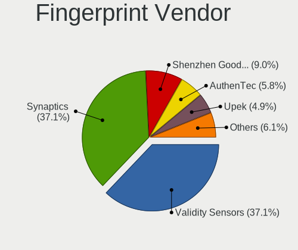

| Vendor                     | Notebooks | Percent |
|----------------------------|-----------|---------|
| Validity Sensors           | 119       | 38.02%  |
| Synaptics                  | 113       | 36.1%   |
| Shenzhen Goodix Technology | 29        | 9.27%   |
| Upek                       | 17        | 5.43%   |
| AuthenTec                  | 17        | 5.43%   |
| LighTuning Technology      | 8         | 2.56%   |
| Elan Microelectronics      | 8         | 2.56%   |
| STMicroelectronics         | 1         | 0.32%   |
| Focal-systems.Corp         | 1         | 0.32%   |

Fingerprint Model
-----------------

Fingerprint sensor models

| Model                                                                      | Notebooks | Percent |
|----------------------------------------------------------------------------|-----------|---------|
| Synaptics Prometheus MIS Touch Fingerprint Reader                          | 52        | 16.56%  |
| Validity Sensors VFS495 Fingerprint Reader                                 | 34        | 10.83%  |
| Shenzhen Goodix  Fingerprint Device                                        | 21        | 6.69%   |
| Upek Biometric Touchchip/Touchstrip Fingerprint Sensor                     | 17        | 5.41%   |
| Validity Sensors Synaptics WBDI                                            | 16        | 5.1%    |
| Validity Sensors VFS471 Fingerprint Reader                                 | 12        | 3.82%   |
| Validity Sensors VFS491                                                    | 11        | 3.5%    |
| Synaptics Fingerprint reader [HP G6]                                       | 10        | 3.18%   |
| Validity Sensors VFS5011 Fingerprint Reader                                | 9         | 2.87%   |
| Synaptics Metallica MIS Touch Fingerprint Reader                           | 9         | 2.87%   |
| Synaptics  FS7604 Touch Fingerprint Sensor with PurePrint                  | 8         | 2.55%   |
| AuthenTec AES2810                                                          | 8         | 2.55%   |
| Validity Sensors VFS 5011 fingerprint sensor                               | 7         | 2.23%   |
| Validity Sensors Fingerprint scanner                                       | 7         | 2.23%   |
| Synaptics FS7604 Touch Fingerprint Sensor with PurePrint                   | 7         | 2.23%   |
| Validity Sensors VFS7500 Touch Fingerprint Sensor                          | 6         | 1.91%   |
| Synaptics WBDI                                                             | 6         | 1.91%   |
| Synaptics UWP WBDI Device                                                  | 6         | 1.91%   |
| Validity Sensors VFS451 Fingerprint Reader                                 | 5         | 1.59%   |
| Validity Sensors Synaptics VFS7552 Touch Fingerprint Sensor with PurePrint | 5         | 1.59%   |
| Shenzhen Goodix FingerPrint                                                | 5         | 1.59%   |
| Synaptics WBDI Device                                                      | 4         | 1.27%   |
| Synaptics Metallica MOH Touch Fingerprint Reader                           | 4         | 1.27%   |
| LighTuning ES603 Swipe Fingerprint Sensor                                  | 4         | 1.27%   |
| Elan ELAN:Fingerprint                                                      | 4         | 1.27%   |
| Elan ELAN:ARM-M4                                                           | 4         | 1.27%   |
| AuthenTec Fingerprint Sensor                                               | 4         | 1.27%   |
| Validity Sensors VFS Fingerprint sensor                                    | 3         | 0.96%   |
| Validity Sensors Swipe Fingerprint Sensor                                  | 3         | 0.96%   |
| Shenzhen Goodix Fingerprint Reader                                         | 3         | 0.96%   |
| LighTuning EgisTec Touch Fingerprint Sensor                                | 3         | 0.96%   |
| AuthenTec AES2501 Fingerprint Sensor                                       | 3         | 0.96%   |
| Synaptics TouchPad                                                         | 2         | 0.64%   |
| Synaptics  WBDI Fingerprint Reader - USB 052                               | 2         | 0.64%   |
| Validity Sensors VFS301 Fingerprint Reader                                 | 1         | 0.32%   |
| Synaptics WBDI Fingerprint Reader USB 086                                  | 1         | 0.32%   |
| Synaptics UWP WBDI                                                         | 1         | 0.32%   |
| Synaptics  WBDI                                                            | 1         | 0.32%   |
| STMicroelectronics Fingerprint Reader                                      | 1         | 0.32%   |
| LighTuning Fingerprint Reader                                              | 1         | 0.32%   |

Chipcard Vendor
---------------

Chipcard module vendors

| Vendor                | Notebooks | Percent |
|-----------------------|-----------|---------|
| Alcor Micro           | 88        | 53.33%  |
| Broadcom              | 46        | 27.88%  |
| Lenovo                | 11        | 6.67%   |
| Upek                  | 10        | 6.06%   |
| O2 Micro              | 5         | 3.03%   |
| SCM Microsystems      | 1         | 0.61%   |
| Realtek Semiconductor | 1         | 0.61%   |
| OmniKey               | 1         | 0.61%   |
| Gemalto (was Gemplus) | 1         | 0.61%   |
| Advanced Card Systems | 1         | 0.61%   |

Chipcard Model
--------------

Chipcard module models

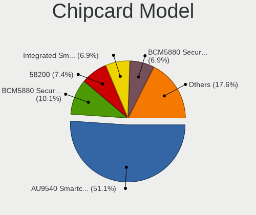

| Model                                                                        | Notebooks | Percent |
|------------------------------------------------------------------------------|-----------|---------|
| Alcor Micro AU9540 Smartcard Reader                                          | 88        | 53.33%  |
| Broadcom BCM5880 Secure Applications Processor                               | 18        | 10.91%  |
| Broadcom BCM5880 Secure Applications Processor with fingerprint swipe sensor | 12        | 7.27%   |
| Lenovo Integrated Smart Card Reader                                          | 11        | 6.67%   |
| Upek TouchChip Fingerprint Coprocessor (WBF advanced mode)                   | 10        | 6.06%   |
| Broadcom 58200                                                               | 9         | 5.45%   |
| Broadcom 5880                                                                | 7         | 4.24%   |
| O2 Micro OZ776 CCID Smartcard Reader                                         | 4         | 2.42%   |
| SCM Microsystems SCR3340 - ExpressCard54 Smart Card Reader                   | 1         | 0.61%   |
| Realtek Semiconductor Smart Card Reader Interface                            | 1         | 0.61%   |
| OmniKey CardMan 3021 / 3121                                                  | 1         | 0.61%   |
| O2 Micro Oz776 SmartCard Reader                                              | 1         | 0.61%   |
| Gemalto (was Gemplus) GemPC Twin SmartCard Reader                            | 1         | 0.61%   |
| Advanced Card Systems ACR122U                                                | 1         | 0.61%   |

Unsupported
-----------

Unsupported Devices
-------------------

Total unsupported devices on board

| Total | Notebooks | Percent |
|-------|-----------|---------|
| 0     | 637       | 52.47%  |
| 1     | 431       | 35.5%   |
| 2     | 107       | 8.81%   |
| 3     | 25        | 2.06%   |
| 4     | 6         | 0.49%   |
| 6     | 3         | 0.25%   |
| 5     | 3         | 0.25%   |
| 8     | 2         | 0.16%   |

Unsupported Device Types
------------------------

Types of unsupported devices

| Type                     | Notebooks | Percent |
|--------------------------|-----------|---------|
| Fingerprint reader       | 307       | 40.77%  |
| Chipcard                 | 133       | 17.66%  |
| Graphics card            | 101       | 13.41%  |
| Net/wireless             | 72        | 9.56%   |
| Multimedia controller    | 40        | 5.31%   |
| Bluetooth                | 20        | 2.66%   |
| Camera                   | 19        | 2.52%   |
| Sound                    | 16        | 2.12%   |
| Communication controller | 12        | 1.59%   |
| Card reader              | 10        | 1.33%   |
| Storage                  | 6         | 0.8%    |
| Unassigned class         | 4         | 0.53%   |
| Net/ethernet             | 4         | 0.53%   |
| Modem                    | 4         | 0.53%   |
| Flash memory             | 2         | 0.27%   |
| Storage/ide              | 1         | 0.13%   |
| Network                  | 1         | 0.13%   |
| Firewire controller      | 1         | 0.13%   |

