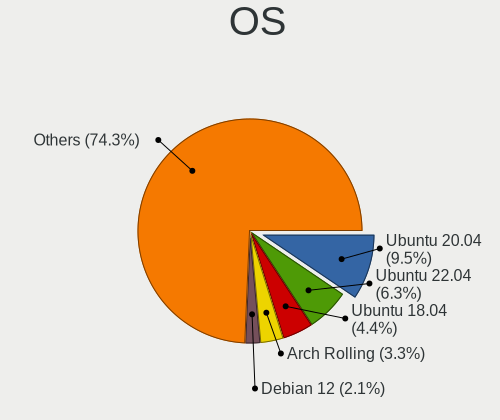
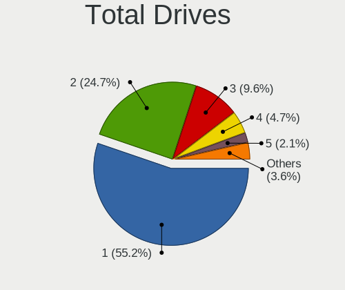
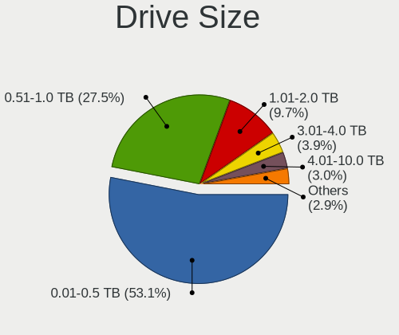
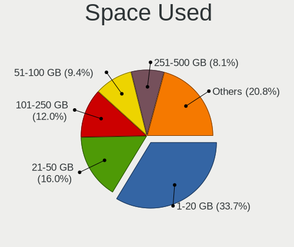
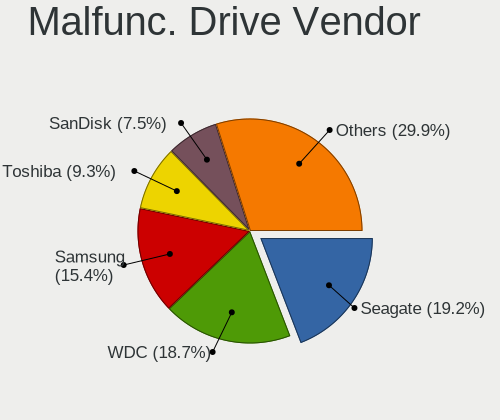
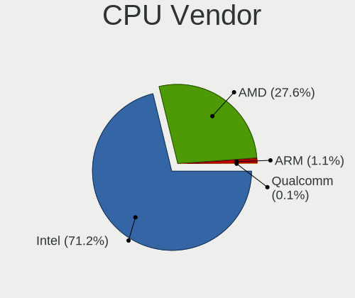
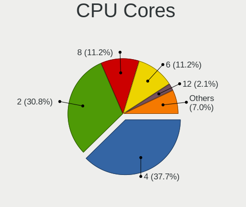
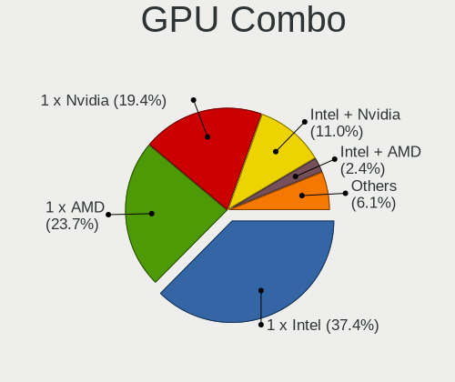
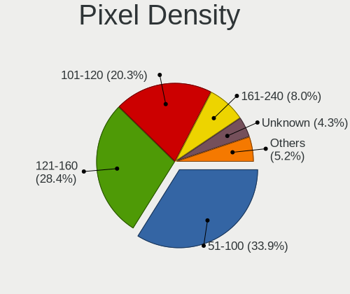
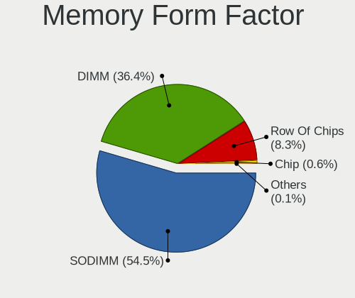

Linux in Austria - Tested Hardware & Statistics
-----------------------------------------------

A project to collect tested hardware configurations for Linux in Austria.

Anyone can contribute to this report by the [hw-probe](https://github.com/linuxhw/hw-probe) tool:

    sudo -E hw-probe -all -upload

Please contribute! Especially if your hardware is rare.

This is a report for all computer types. See also reports for [desktops](/Location/Austria/Desktop/README.md) and [notebooks](/Location/Austria/Notebook/README.md).

Contents
--------

* [ Test Cases ](#test-cases)

* [ System ](#system)
  - [ OS                       ](#os)
  - [ OS Family                ](#os-family)
  - [ Kernel                   ](#kernel)
  - [ Kernel Family            ](#kernel-family)
  - [ Kernel Major Ver.        ](#kernel-major-ver)
  - [ Arch                     ](#arch)
  - [ DE                       ](#de)
  - [ Display Server           ](#display-server)
  - [ Display Manager          ](#display-manager)
  - [ OS Lang                  ](#os-lang)
  - [ Boot Mode                ](#boot-mode)
  - [ Filesystem               ](#filesystem)
  - [ Part. scheme             ](#part-scheme)
  - [ Dual Boot with Linux/BSD ](#dual-boot-with-linuxbsd)
  - [ Dual Boot (Win)          ](#dual-boot-win)

* [ Board ](#board)
  - [ Vendor                   ](#vendor)
  - [ Model                    ](#model)
  - [ Model Family             ](#model-family)
  - [ MFG Year                 ](#mfg-year)
  - [ Form Factor              ](#form-factor)
  - [ Secure Boot              ](#secure-boot)
  - [ Coreboot                 ](#coreboot)
  - [ RAM Size                 ](#ram-size)
  - [ RAM Used                 ](#ram-used)
  - [ Total Drives             ](#total-drives)
  - [ Has CD-ROM               ](#has-cd-rom)
  - [ Has Ethernet             ](#has-ethernet)
  - [ Has WiFi                 ](#has-wifi)
  - [ Has Bluetooth            ](#has-bluetooth)

* [ Location ](#location)
  - [ Country                  ](#country)
  - [ City                     ](#city)

* [ Drives ](#drives)
  - [ Drive Vendor             ](#drive-vendor)
  - [ Drive Model              ](#drive-model)
  - [ HDD Vendor               ](#hdd-vendor)
  - [ SSD Vendor               ](#ssd-vendor)
  - [ Drive Kind               ](#drive-kind)
  - [ Drive Connector          ](#drive-connector)
  - [ Drive Size               ](#drive-size)
  - [ Space Total              ](#space-total)
  - [ Space Used               ](#space-used)
  - [ Malfunc. Drives          ](#malfunc-drives)
  - [ Malfunc. Drive Vendor    ](#malfunc-drive-vendor)
  - [ Malfunc. HDD Vendor      ](#malfunc-hdd-vendor)
  - [ Malfunc. Drive Kind      ](#malfunc-drive-kind)
  - [ Failed Drives            ](#failed-drives)
  - [ Failed Drive Vendor      ](#failed-drive-vendor)
  - [ Drive Status             ](#drive-status)

* [ Storage controller ](#storage-controller)
  - [ Storage Vendor           ](#storage-vendor)
  - [ Storage Model            ](#storage-model)
  - [ Storage Kind             ](#storage-kind)

* [ Processor ](#processor)
  - [ CPU Vendor               ](#cpu-vendor)
  - [ CPU Model                ](#cpu-model)
  - [ CPU Model Family         ](#cpu-model-family)
  - [ CPU Cores                ](#cpu-cores)
  - [ CPU Sockets              ](#cpu-sockets)
  - [ CPU Threads              ](#cpu-threads)
  - [ CPU Op-Modes             ](#cpu-op-modes)
  - [ CPU Microcode            ](#cpu-microcode)
  - [ CPU Microarch            ](#cpu-microarch)

* [ Graphics ](#graphics)
  - [ GPU Vendor               ](#gpu-vendor)
  - [ GPU Model                ](#gpu-model)
  - [ GPU Combo                ](#gpu-combo)
  - [ GPU Driver               ](#gpu-driver)
  - [ GPU Memory               ](#gpu-memory)

* [ Monitor ](#monitor)
  - [ Monitor Vendor           ](#monitor-vendor)
  - [ Monitor Model            ](#monitor-model)
  - [ Monitor Resolution       ](#monitor-resolution)
  - [ Monitor Diagonal         ](#monitor-diagonal)
  - [ Monitor Width            ](#monitor-width)
  - [ Aspect Ratio             ](#aspect-ratio)
  - [ Monitor Area             ](#monitor-area)
  - [ Pixel Density            ](#pixel-density)
  - [ Multiple Monitors        ](#multiple-monitors)

* [ Network ](#network)
  - [ Net Controller Vendor    ](#net-controller-vendor)
  - [ Net Controller Model     ](#net-controller-model)
  - [ Wireless Vendor          ](#wireless-vendor)
  - [ Wireless Model           ](#wireless-model)
  - [ Ethernet Vendor          ](#ethernet-vendor)
  - [ Ethernet Model           ](#ethernet-model)
  - [ Net Controller Kind      ](#net-controller-kind)
  - [ Used Controller          ](#used-controller)
  - [ NICs                     ](#nics)
  - [ IPv6                     ](#ipv6)

* [ Bluetooth ](#bluetooth)
  - [ Bluetooth Vendor         ](#bluetooth-vendor)
  - [ Bluetooth Model          ](#bluetooth-model)

* [ Sound ](#sound)
  - [ Sound Vendor             ](#sound-vendor)
  - [ Sound Model              ](#sound-model)

* [ Memory ](#memory)
  - [ Memory Vendor            ](#memory-vendor)
  - [ Memory Model             ](#memory-model)
  - [ Memory Kind              ](#memory-kind)
  - [ Memory Form Factor       ](#memory-form-factor)
  - [ Memory Size              ](#memory-size)
  - [ Memory Speed             ](#memory-speed)

* [ Printers & scanners ](#printers--scanners)
  - [ Printer Vendor           ](#printer-vendor)
  - [ Printer Model            ](#printer-model)
  - [ Scanner Vendor           ](#scanner-vendor)
  - [ Scanner Model            ](#scanner-model)

* [ Camera ](#camera)
  - [ Camera Vendor            ](#camera-vendor)
  - [ Camera Model             ](#camera-model)

* [ Security ](#security)
  - [ Fingerprint Vendor       ](#fingerprint-vendor)
  - [ Fingerprint Model        ](#fingerprint-model)
  - [ Chipcard Vendor          ](#chipcard-vendor)
  - [ Chipcard Model           ](#chipcard-model)

* [ Unsupported ](#unsupported)
  - [ Unsupported Devices      ](#unsupported-devices)
  - [ Unsupported Device Types ](#unsupported-device-types)

Test Cases
----------

Total: 3918

| Vendor        | Model                       | Form-Factor | Probe                                                      | Date         |
|---------------|-----------------------------|-------------|------------------------------------------------------------|--------------|
| MSI           | B85M-E45                    | Desktop     | [ce0086ec71](https://linux-hardware.org/?probe=ce0086ec71) | Jan 06, 2025 |
| MSI           | B85M-E45                    | Desktop     | [a341da3c42](https://linux-hardware.org/?probe=a341da3c42) | Jan 06, 2025 |
| Acer          | Aspire E1-572               | Notebook    | [e825292593](https://linux-hardware.org/?probe=e825292593) | Jan 06, 2025 |
| ASUSTek       | P8P67                       | Desktop     | [26e848809d](https://linux-hardware.org/?probe=26e848809d) | Jan 05, 2025 |
| Unknown       | Unknown                     | Desktop     | [fa69a9bfbc](https://linux-hardware.org/?probe=fa69a9bfbc) | Jan 05, 2025 |
| Lenovo        | ThinkPad T14 Gen 2i 20W0... | Notebook    | [b228dff2bb](https://linux-hardware.org/?probe=b228dff2bb) | Jan 05, 2025 |
| Biostar       | H81MHV3                     | Desktop     | [4018e1961c](https://linux-hardware.org/?probe=4018e1961c) | Jan 05, 2025 |
| Biostar       | H81MHV3                     | Desktop     | [d03cc0092f](https://linux-hardware.org/?probe=d03cc0092f) | Jan 05, 2025 |
| ASRock        | Z690M-ITX/ax                | Desktop     | [bbbb62d243](https://linux-hardware.org/?probe=bbbb62d243) | Jan 05, 2025 |
| Lenovo        | ThinkPad T460 20FMS0EP00    | Notebook    | [438781676d](https://linux-hardware.org/?probe=438781676d) | Jan 04, 2025 |
| Fujitsu       | D3183-A1 S26361-D3183-A1    | Desktop     | [3696f797a8](https://linux-hardware.org/?probe=3696f797a8) | Jan 04, 2025 |
| Intel         | DH61CR AAG14064-204         | Desktop     | [0b1feaadef](https://linux-hardware.org/?probe=0b1feaadef) | Jan 04, 2025 |
| HP            | Victus by Laptop 16-e0xx... | Notebook    | [125f9224f6](https://linux-hardware.org/?probe=125f9224f6) | Jan 04, 2025 |
| Samsung       | 940XGK                      | Notebook    | [71e577e3c1](https://linux-hardware.org/?probe=71e577e3c1) | Jan 03, 2025 |
| HP            | 3399                        | Desktop     | [1371b1c64d](https://linux-hardware.org/?probe=1371b1c64d) | Jan 03, 2025 |
| Gigabyte      | B450 AORUS ELITE            | Desktop     | [849e3021f2](https://linux-hardware.org/?probe=849e3021f2) | Jan 02, 2025 |
| ASUSTek       | ROG STRIX X670E-E GAMING... | Desktop     | [99fc88c92b](https://linux-hardware.org/?probe=99fc88c92b) | Jan 02, 2025 |
| Dell          | Latitude E5420              | Notebook    | [e1a5c8fd29](https://linux-hardware.org/?probe=e1a5c8fd29) | Jan 01, 2025 |
| Fujitsu Si... | ESPRIMO Mobile V5535        | Notebook    | [eeb85155e5](https://linux-hardware.org/?probe=eeb85155e5) | Jan 01, 2025 |
| HP            | TouchSmart tm2              | Notebook    | [1750c192e9](https://linux-hardware.org/?probe=1750c192e9) | Jan 01, 2025 |
| Gigabyte      | B450 AORUS ELITE            | Desktop     | [896517452f](https://linux-hardware.org/?probe=896517452f) | Jan 01, 2025 |
| HP            | ENVY x360 Convertible 13... | Convertible | [8bf9b1ce8c](https://linux-hardware.org/?probe=8bf9b1ce8c) | Dec 31, 2024 |
| MSI           | A520M PRO                   | Desktop     | [092cdc906c](https://linux-hardware.org/?probe=092cdc906c) | Dec 31, 2024 |
| Dell          | Latitude E5550              | Notebook    | [4df1fcb20c](https://linux-hardware.org/?probe=4df1fcb20c) | Dec 31, 2024 |
| Dell          | Latitude E7440              | Notebook    | [e25716eb4b](https://linux-hardware.org/?probe=e25716eb4b) | Dec 31, 2024 |
| HP            | 8054                        | Desktop     | [c48b0d78c7](https://linux-hardware.org/?probe=c48b0d78c7) | Dec 30, 2024 |
| Gigabyte      | B450 AORUS ELITE            | Desktop     | [d122d7fcbd](https://linux-hardware.org/?probe=d122d7fcbd) | Dec 28, 2024 |
| Apple         | MacBookPro11,4              | Notebook    | [6f5640dbff](https://linux-hardware.org/?probe=6f5640dbff) | Dec 28, 2024 |
| Dell          | Latitude E5550              | Notebook    | [643b7759bc](https://linux-hardware.org/?probe=643b7759bc) | Dec 27, 2024 |
| HP            | 8054                        | Desktop     | [2ad24afc7c](https://linux-hardware.org/?probe=2ad24afc7c) | Dec 27, 2024 |
| Dell          | Latitude E5550              | Notebook    | [d4783d7b35](https://linux-hardware.org/?probe=d4783d7b35) | Dec 26, 2024 |
| Lenovo        | ThinkPad P14s Gen 5 21G2... | Notebook    | [f1a3b79f94](https://linux-hardware.org/?probe=f1a3b79f94) | Dec 26, 2024 |
| MSI           | PRO X870-P WIFI             | Desktop     | [e93d4e3b9c](https://linux-hardware.org/?probe=e93d4e3b9c) | Dec 26, 2024 |
| HP            | EliteBook 840 G6            | Notebook    | [00cc148a0c](https://linux-hardware.org/?probe=00cc148a0c) | Dec 25, 2024 |
| HP            | EliteBook 840 G6            | Notebook    | [42a4a782de](https://linux-hardware.org/?probe=42a4a782de) | Dec 25, 2024 |
| Lenovo        | ThinkPad T14s Gen 3 21CQ... | Notebook    | [a16e1a46ec](https://linux-hardware.org/?probe=a16e1a46ec) | Dec 25, 2024 |
| Lenovo        | ThinkPad T14s Gen 3 21CQ... | Notebook    | [0659ed4270](https://linux-hardware.org/?probe=0659ed4270) | Dec 25, 2024 |
| Apple         | Mac-F65AE981FFA204ED Mac... | Mini pc     | [f288e84971](https://linux-hardware.org/?probe=f288e84971) | Dec 25, 2024 |
| ZOTAC         | NM10                        | Desktop     | [48bdd764c8](https://linux-hardware.org/?probe=48bdd764c8) | Dec 25, 2024 |
| HP            | EliteBook 850 G4            | Notebook    | [d577b1a30c](https://linux-hardware.org/?probe=d577b1a30c) | Dec 24, 2024 |
| Lenovo        | ThinkPad E16 Gen 2 21M5C... | Notebook    | [70bf652ec8](https://linux-hardware.org/?probe=70bf652ec8) | Dec 24, 2024 |
| Lenovo        | Yoga 530-14IKB 81EK         | Convertible | [72f62139ad](https://linux-hardware.org/?probe=72f62139ad) | Dec 23, 2024 |
| HP            | ProBook 4730s               | Notebook    | [0b185e0e1f](https://linux-hardware.org/?probe=0b185e0e1f) | Dec 23, 2024 |
| ASRock        | N100DC-ITX                  | Desktop     | [3bc5422fdb](https://linux-hardware.org/?probe=3bc5422fdb) | Dec 22, 2024 |
| Gigabyte      | A520M DS3H V2               | Desktop     | [667755c495](https://linux-hardware.org/?probe=667755c495) | Dec 22, 2024 |
| HP            | ProBook 4730s               | Notebook    | [03483a3212](https://linux-hardware.org/?probe=03483a3212) | Dec 22, 2024 |
| Fujitsu       | LIFEBOOK U727               | Notebook    | [b10ff0a543](https://linux-hardware.org/?probe=b10ff0a543) | Dec 21, 2024 |
| Fujitsu       | D3162-A1 S26361-D3162-A1    | Desktop     | [bb59d2737c](https://linux-hardware.org/?probe=bb59d2737c) | Dec 20, 2024 |
| Acer          | Nitro AN517-52              | Notebook    | [4233b4277f](https://linux-hardware.org/?probe=4233b4277f) | Dec 20, 2024 |
| Gigabyte      | B550 AORUS ELITE AX V2      | Desktop     | [fec2e89dd2](https://linux-hardware.org/?probe=fec2e89dd2) | Dec 20, 2024 |
| Unknown       | Unknown                     | Desktop     | [581bac2845](https://linux-hardware.org/?probe=581bac2845) | Dec 20, 2024 |
| Intel         | NUC10i7FNB K61360-306       | Mini pc     | [a8590c9436](https://linux-hardware.org/?probe=a8590c9436) | Dec 18, 2024 |
| Intel         | NUC10i7FNB K61360-306       | Mini pc     | [f5b0929884](https://linux-hardware.org/?probe=f5b0929884) | Dec 18, 2024 |
| Acer          | Aspire E5-772               | Notebook    | [14088b3895](https://linux-hardware.org/?probe=14088b3895) | Dec 18, 2024 |
| Lenovo        | ThinkPad T14 Gen 5 21MCC... | Notebook    | [e33e8e4bbb](https://linux-hardware.org/?probe=e33e8e4bbb) | Dec 17, 2024 |
| ASRock        | A520M-ITX/ac                | Desktop     | [6e85c5b749](https://linux-hardware.org/?probe=6e85c5b749) | Dec 17, 2024 |
| HP            | ProBook 450 G3              | Notebook    | [4f8f97ac4c](https://linux-hardware.org/?probe=4f8f97ac4c) | Dec 17, 2024 |
| MSI           | PRO X870-P WIFI             | Desktop     | [42ae1f2830](https://linux-hardware.org/?probe=42ae1f2830) | Dec 16, 2024 |
| ASRock        | Z97E-ITX/ac                 | Desktop     | [bab03d17ee](https://linux-hardware.org/?probe=bab03d17ee) | Dec 15, 2024 |
| MSI           | MS-7502 Fab D               | Desktop     | [0eba44ff1d](https://linux-hardware.org/?probe=0eba44ff1d) | Dec 15, 2024 |
| HP            | EliteBook 6930p (ELITE B... | Notebook    | [e2babd2e7e](https://linux-hardware.org/?probe=e2babd2e7e) | Dec 14, 2024 |
| HP            | 2187 A01                    | Desktop     | [fe4a768b42](https://linux-hardware.org/?probe=fe4a768b42) | Dec 14, 2024 |
| ASUSTek       | PRIME B650-PLUS             | Desktop     | [dbfe399fdb](https://linux-hardware.org/?probe=dbfe399fdb) | Dec 13, 2024 |
| Medion        | E2228T MD62250              | Convertible | [72309dd11d](https://linux-hardware.org/?probe=72309dd11d) | Dec 13, 2024 |
| Dell          | 0N4YC8 A00                  | Desktop     | [292ab9f2e5](https://linux-hardware.org/?probe=292ab9f2e5) | Dec 13, 2024 |
| AMI           | Intel                       | Notebook    | [744da97070](https://linux-hardware.org/?probe=744da97070) | Dec 13, 2024 |
| MSI           | MAG X870 TOMAHAWK WIFI      | Desktop     | [83c21053dc](https://linux-hardware.org/?probe=83c21053dc) | Dec 12, 2024 |
| Acer          | Predator PO3-600 V:1.1      | Desktop     | [f1bf00b4ee](https://linux-hardware.org/?probe=f1bf00b4ee) | Dec 12, 2024 |
| MSI           | Bravo 17 A4DDR              | Notebook    | [d8d5ecc26c](https://linux-hardware.org/?probe=d8d5ecc26c) | Dec 11, 2024 |
| Shuttle       | SH310V2                     | Desktop     | [e3abcefd64](https://linux-hardware.org/?probe=e3abcefd64) | Dec 11, 2024 |
| Lenovo        | 31900058 STD                | Desktop     | [7a653bac15](https://linux-hardware.org/?probe=7a653bac15) | Dec 09, 2024 |
| MSI           | MAG X570 TOMAHAWK WIFI      | Desktop     | [9a987bc4b0](https://linux-hardware.org/?probe=9a987bc4b0) | Dec 09, 2024 |
| ASUSTek       | ProArt X670E-CREATOR WIF... | Desktop     | [26cbfb371f](https://linux-hardware.org/?probe=26cbfb371f) | Dec 08, 2024 |
| HP            | Notebook                    | Notebook    | [77999cdfef](https://linux-hardware.org/?probe=77999cdfef) | Dec 08, 2024 |
| ASUSTek       | K53SC                       | Notebook    | [3e7484539c](https://linux-hardware.org/?probe=3e7484539c) | Dec 08, 2024 |
| ASUSTek       | TUF Gaming B650M-E WIFI     | Desktop     | [2c55540d18](https://linux-hardware.org/?probe=2c55540d18) | Dec 07, 2024 |
| ASUSTek       | P8P67 PRO                   | Desktop     | [89c4ef1413](https://linux-hardware.org/?probe=89c4ef1413) | Dec 07, 2024 |
| ASUSTek       | P8P67 PRO                   | Desktop     | [40751025a5](https://linux-hardware.org/?probe=40751025a5) | Dec 07, 2024 |
| ASUSTek       | P8H61-M                     | Desktop     | [cfef2f57c3](https://linux-hardware.org/?probe=cfef2f57c3) | Dec 05, 2024 |
| HUAWEI        | NBLK-WAX9X                  | Notebook    | [8a46fcd616](https://linux-hardware.org/?probe=8a46fcd616) | Dec 05, 2024 |
| HP            | Pavilion 17                 | Notebook    | [12a5dae4b2](https://linux-hardware.org/?probe=12a5dae4b2) | Dec 05, 2024 |
| ASUSTek       | TUF Gaming X670E-PLUS       | Desktop     | [d5da253b51](https://linux-hardware.org/?probe=d5da253b51) | Dec 05, 2024 |
| Dell          | Latitude 5290 2-in-1        | Tablet      | [2c75ca87d5](https://linux-hardware.org/?probe=2c75ca87d5) | Dec 04, 2024 |
| HP            | EliteBook 850 G6            | Notebook    | [af2a2b7059](https://linux-hardware.org/?probe=af2a2b7059) | Dec 04, 2024 |
| ASUSTek       | PB50                        | Desktop     | [4c089afc7d](https://linux-hardware.org/?probe=4c089afc7d) | Dec 03, 2024 |
| MSI           | PRO H610M-G DDR4            | Desktop     | [d495cf5482](https://linux-hardware.org/?probe=d495cf5482) | Dec 03, 2024 |
| Apple         | Mac-F65AE981FFA204ED Mac... | Mini pc     | [1a9a544a72](https://linux-hardware.org/?probe=1a9a544a72) | Dec 02, 2024 |
| Lenovo        | LOQ 15ARP9 83JC             | Notebook    | [5bc6d451f8](https://linux-hardware.org/?probe=5bc6d451f8) | Dec 01, 2024 |
| Lenovo        | ThinkPad P14s Gen 1 20S4... | Notebook    | [8b5b98ce96](https://linux-hardware.org/?probe=8b5b98ce96) | Nov 30, 2024 |
| Lenovo        | ThinkPad E15 Gen 4 21ED0... | Notebook    | [018f813a0d](https://linux-hardware.org/?probe=018f813a0d) | Nov 30, 2024 |
| HP            | ENVY 15                     | Notebook    | [d48d53e1f2](https://linux-hardware.org/?probe=d48d53e1f2) | Nov 29, 2024 |
| ASUSTek       | VivoBook_ASUSLaptop K370... | Notebook    | [d78e3a7f88](https://linux-hardware.org/?probe=d78e3a7f88) | Nov 28, 2024 |
| ASUSTek       | ProArt X870E-CREATOR WIF... | Desktop     | [53562a1d40](https://linux-hardware.org/?probe=53562a1d40) | Nov 27, 2024 |
| Supermicro    | H12DSi-NT6                  | Server      | [830fdbc722](https://linux-hardware.org/?probe=830fdbc722) | Nov 27, 2024 |
| Lenovo        | ThinkPad L14 Gen 3 21C50... | Notebook    | [16f61a0dc5](https://linux-hardware.org/?probe=16f61a0dc5) | Nov 27, 2024 |
| Microsoft     | Surface Pro 8               | Tablet      | [0b901fda6f](https://linux-hardware.org/?probe=0b901fda6f) | Nov 26, 2024 |
| Gigabyte      | B550M AORUS ELITE           | Desktop     | [f442911c71](https://linux-hardware.org/?probe=f442911c71) | Nov 26, 2024 |
| ASUSTek       | ROG Flow Z13 GZ301VIC_GZ... | Tablet      | [63a4375691](https://linux-hardware.org/?probe=63a4375691) | Nov 26, 2024 |
| HP            | 250 G7 Notebook PC          | Notebook    | [e3d6b07ecf](https://linux-hardware.org/?probe=e3d6b07ecf) | Nov 26, 2024 |
| Gigabyte      | Z370P D3-CF                 | Desktop     | [f690af96e7](https://linux-hardware.org/?probe=f690af96e7) | Nov 26, 2024 |
| Dell          | XPS 17 9710                 | Notebook    | [acb695d13e](https://linux-hardware.org/?probe=acb695d13e) | Nov 25, 2024 |
| MSI           | PRO Z790-P WIFI             | Desktop     | [35fc330fc8](https://linux-hardware.org/?probe=35fc330fc8) | Nov 25, 2024 |
| MSI           | PRO Z790-P WIFI             | Desktop     | [e7c98ad044](https://linux-hardware.org/?probe=e7c98ad044) | Nov 25, 2024 |
| Lenovo        | ThinkPad P17 Gen 2i 20YU... | Notebook    | [d208c8829e](https://linux-hardware.org/?probe=d208c8829e) | Nov 24, 2024 |
| ASUSTek       | TP203NAH                    | Convertible | [0b2979ca7f](https://linux-hardware.org/?probe=0b2979ca7f) | Nov 24, 2024 |
| Acer          | TravelMate P216-51          | Notebook    | [b2a10de376](https://linux-hardware.org/?probe=b2a10de376) | Nov 24, 2024 |
| HP            | ZBook 15 G6                 | Notebook    | [481018cc85](https://linux-hardware.org/?probe=481018cc85) | Nov 24, 2024 |
| HP            | ZBook 15 G6                 | Notebook    | [6ff9c4de66](https://linux-hardware.org/?probe=6ff9c4de66) | Nov 23, 2024 |
| Apple         | MacBook7,1                  | Notebook    | [58ba694f65](https://linux-hardware.org/?probe=58ba694f65) | Nov 23, 2024 |
| Sony          | VAIO                        | All in one  | [a8f1e64b41](https://linux-hardware.org/?probe=a8f1e64b41) | Nov 23, 2024 |
| ASUSTek       | Z170 PRO GAMING/AURA        | Desktop     | [84a1e1d524](https://linux-hardware.org/?probe=84a1e1d524) | Nov 22, 2024 |
| Dell          | Inspiron 5570               | Notebook    | [4791473238](https://linux-hardware.org/?probe=4791473238) | Nov 22, 2024 |
| MSI           | B450M MORTAR MAX            | Desktop     | [d30ecaec23](https://linux-hardware.org/?probe=d30ecaec23) | Nov 22, 2024 |
| Dell          | Latitude 5290 2-in-1        | Notebook    | [6c79aa8e1c](https://linux-hardware.org/?probe=6c79aa8e1c) | Nov 22, 2024 |
| HP            | 8906 SMVB                   | Desktop     | [310f3d9ee4](https://linux-hardware.org/?probe=310f3d9ee4) | Nov 22, 2024 |
| Dell          | Latitude 5290 2-in-1        | Notebook    | [0ad9b505c5](https://linux-hardware.org/?probe=0ad9b505c5) | Nov 22, 2024 |
| Dell          | 0HD5W2 A01                  | Desktop     | [ecff12e057](https://linux-hardware.org/?probe=ecff12e057) | Nov 21, 2024 |
| HP            | 0A58h                       | Desktop     | [8063748e4e](https://linux-hardware.org/?probe=8063748e4e) | Nov 20, 2024 |
| ASUSTek       | Z170 PRO GAMING/AURA        | Desktop     | [bd723da808](https://linux-hardware.org/?probe=bd723da808) | Nov 20, 2024 |
| VALE          | Notebook Classic C170       | Notebook    | [d5f2c08e9a](https://linux-hardware.org/?probe=d5f2c08e9a) | Nov 19, 2024 |
| Lenovo        | ThinkPad X1 Yoga 2nd 20J... | Convertible | [78f9910b5e](https://linux-hardware.org/?probe=78f9910b5e) | Nov 19, 2024 |
| HP            | ProBook 430 G8 Notebook ... | Notebook    | [1e771f1fdb](https://linux-hardware.org/?probe=1e771f1fdb) | Nov 19, 2024 |
| Dell          | XPS 17 9710                 | Notebook    | [29f64d3858](https://linux-hardware.org/?probe=29f64d3858) | Nov 19, 2024 |
| HP            | 87D6 SMVB                   | Desktop     | [88199b7676](https://linux-hardware.org/?probe=88199b7676) | Nov 18, 2024 |
| HP            | 87D6 SMVB                   | Desktop     | [9ee644390f](https://linux-hardware.org/?probe=9ee644390f) | Nov 18, 2024 |
| Shenzhen M... | F7BFC                       | Desktop     | [4a79811e5e](https://linux-hardware.org/?probe=4a79811e5e) | Nov 17, 2024 |
| Apple         | MacBook7,1                  | Notebook    | [0bed6b06a7](https://linux-hardware.org/?probe=0bed6b06a7) | Nov 17, 2024 |
| MSI           | H81M-P33                    | Desktop     | [6c41946bc2](https://linux-hardware.org/?probe=6c41946bc2) | Nov 17, 2024 |
| Dell          | Latitude 7400 2-in-1        | Convertible | [4f72a562b7](https://linux-hardware.org/?probe=4f72a562b7) | Nov 17, 2024 |
| Sony          | VAIO                        | All in one  | [cb7d9be78b](https://linux-hardware.org/?probe=cb7d9be78b) | Nov 16, 2024 |
| Dell          | Latitude E5540              | Notebook    | [08e9607f7c](https://linux-hardware.org/?probe=08e9607f7c) | Nov 16, 2024 |
| Lenovo        | ThinkPad T460 20FN003LGE    | Notebook    | [06d3c3c63f](https://linux-hardware.org/?probe=06d3c3c63f) | Nov 16, 2024 |
| Apple         | MacBookPro12,1              | Notebook    | [3080a2df87](https://linux-hardware.org/?probe=3080a2df87) | Nov 16, 2024 |
| ASUSTek       | P6T SE                      | Desktop     | [698350692a](https://linux-hardware.org/?probe=698350692a) | Nov 15, 2024 |
| MSI           | MPG Z690 CARBON WIFI        | Desktop     | [7c566f5d03](https://linux-hardware.org/?probe=7c566f5d03) | Nov 14, 2024 |
| ASUSTek       | PRIME B550-PLUS             | Desktop     | [17d949a2b0](https://linux-hardware.org/?probe=17d949a2b0) | Nov 13, 2024 |
| HP            | 1905                        | Desktop     | [9b2b54c155](https://linux-hardware.org/?probe=9b2b54c155) | Nov 13, 2024 |
| HP            | 1905                        | Desktop     | [c253de60d3](https://linux-hardware.org/?probe=c253de60d3) | Nov 13, 2024 |
| ASUSTek       | PRIME B360M-A               | Desktop     | [db45407bc0](https://linux-hardware.org/?probe=db45407bc0) | Nov 12, 2024 |
| Timi          | TM1604                      | Notebook    | [d62ad5b401](https://linux-hardware.org/?probe=d62ad5b401) | Nov 12, 2024 |
| Gigabyte      | Z370P D3-CF                 | Desktop     | [f278443ad6](https://linux-hardware.org/?probe=f278443ad6) | Nov 12, 2024 |
| Gigabyte      | Z370P D3-CF                 | Desktop     | [05dec34f84](https://linux-hardware.org/?probe=05dec34f84) | Nov 12, 2024 |
| HP            | Laptop 15s-eq1xxx           | Notebook    | [2ca5d70008](https://linux-hardware.org/?probe=2ca5d70008) | Nov 12, 2024 |
| Dell          | XPS 13 9310                 | Notebook    | [d8baba8301](https://linux-hardware.org/?probe=d8baba8301) | Nov 10, 2024 |
| HP            | 18E9                        | Desktop     | [242f67a98e](https://linux-hardware.org/?probe=242f67a98e) | Nov 10, 2024 |
| HP            | Victus by Gaming Laptop ... | Notebook    | [704e7274cc](https://linux-hardware.org/?probe=704e7274cc) | Nov 09, 2024 |
| Dell          | 0F428D A00                  | Desktop     | [8adf4e27df](https://linux-hardware.org/?probe=8adf4e27df) | Nov 09, 2024 |
| Medion        | E15410                      | Notebook    | [bbbb268c4a](https://linux-hardware.org/?probe=bbbb268c4a) | Nov 07, 2024 |
| Lenovo        | ThinkPad X220 4290MM2       | Notebook    | [c1dfdc10d8](https://linux-hardware.org/?probe=c1dfdc10d8) | Nov 07, 2024 |
| MSI           | MS-B0731 110                | Desktop     | [a3489e342e](https://linux-hardware.org/?probe=a3489e342e) | Nov 06, 2024 |
| ASUSTek       | ROG STRIX B650E-I GAMING... | Desktop     | [240401681e](https://linux-hardware.org/?probe=240401681e) | Nov 05, 2024 |
| ASRock        | AB350 Pro4                  | Desktop     | [94430764b3](https://linux-hardware.org/?probe=94430764b3) | Nov 03, 2024 |
| Lenovo        | ThinkPad P14s Gen 4 21HF... | Notebook    | [8b3ea8e712](https://linux-hardware.org/?probe=8b3ea8e712) | Nov 02, 2024 |
| ASUSTek       | PRIME B550-PLUS             | Desktop     | [286b0d06c1](https://linux-hardware.org/?probe=286b0d06c1) | Nov 02, 2024 |
| Dell          | Latitude 7390               | Notebook    | [fad43df9a7](https://linux-hardware.org/?probe=fad43df9a7) | Nov 01, 2024 |
| MSI           | MAG B550 TOMAHAWK           | Desktop     | [2aaad8cdd1](https://linux-hardware.org/?probe=2aaad8cdd1) | Nov 01, 2024 |
| HP            | Pavilion Laptop 15-eh0xx... | Notebook    | [819252b38c](https://linux-hardware.org/?probe=819252b38c) | Nov 01, 2024 |
| ASUSTek       | UX430UN                     | Notebook    | [49ef0e9b68](https://linux-hardware.org/?probe=49ef0e9b68) | Nov 01, 2024 |
| Gigabyte      | B150M-D3P-WG-CF             | Desktop     | [c6834704e1](https://linux-hardware.org/?probe=c6834704e1) | Nov 01, 2024 |
| Lenovo        | ThinkPad Twist 33477WG      | Notebook    | [612a5251ee](https://linux-hardware.org/?probe=612a5251ee) | Oct 31, 2024 |
| ASUSTek       | ROG STRIX X670E-A GAMING... | Desktop     | [a101c103eb](https://linux-hardware.org/?probe=a101c103eb) | Oct 31, 2024 |
| Lenovo        | ThinkPad E550 20DF00D0GE    | Notebook    | [5c2369e5cb](https://linux-hardware.org/?probe=5c2369e5cb) | Oct 30, 2024 |
| ASUSTek       | ASUS EXPERTBOOK B3402FEA... | Convertible | [0829e95509](https://linux-hardware.org/?probe=0829e95509) | Oct 30, 2024 |
| HP            | EliteBook 840 G3            | Notebook    | [f65672133c](https://linux-hardware.org/?probe=f65672133c) | Oct 29, 2024 |
| Dell          | XPS 15 9500                 | Notebook    | [186970ddb7](https://linux-hardware.org/?probe=186970ddb7) | Oct 29, 2024 |
| TUXEDO        | N7x0WU                      | Notebook    | [0469701eaf](https://linux-hardware.org/?probe=0469701eaf) | Oct 29, 2024 |
| Lenovo        | ThinkPad L13 Yoga Gen 4 ... | Convertible | [e2a9e963de](https://linux-hardware.org/?probe=e2a9e963de) | Oct 29, 2024 |
| ASUSTek       | ROG STRIX Z590-E GAMING ... | Desktop     | [db69d467bc](https://linux-hardware.org/?probe=db69d467bc) | Oct 28, 2024 |
| Toshiba       | Satellite Pro C50-A-1C9     | Notebook    | [09c875c667](https://linux-hardware.org/?probe=09c875c667) | Oct 28, 2024 |
| MSI           | B85M-E45                    | Desktop     | [d881612505](https://linux-hardware.org/?probe=d881612505) | Oct 28, 2024 |
| MSI           | B85M-E45                    | Desktop     | [7237f73ef0](https://linux-hardware.org/?probe=7237f73ef0) | Oct 28, 2024 |
| ASRock        | AB350 Pro4                  | Desktop     | [15b8bb2764](https://linux-hardware.org/?probe=15b8bb2764) | Oct 27, 2024 |
| Gigabyte      | Z690 UD AX                  | Desktop     | [de1a13fec7](https://linux-hardware.org/?probe=de1a13fec7) | Oct 26, 2024 |
| ASUSTek       | PRIME B360M-A               | Desktop     | [4c5533b93c](https://linux-hardware.org/?probe=4c5533b93c) | Oct 26, 2024 |
| ASUSTek       | ROG STRIX B550-F GAMING     | Desktop     | [08d8d1a7dc](https://linux-hardware.org/?probe=08d8d1a7dc) | Oct 25, 2024 |
| Dell          | Latitude 7320 Detachable    | Tablet      | [df9a5fca61](https://linux-hardware.org/?probe=df9a5fca61) | Oct 25, 2024 |
| Dell          | 0F428D A00                  | Desktop     | [e18fbb4847](https://linux-hardware.org/?probe=e18fbb4847) | Oct 23, 2024 |
| Fujitsu Si... | AMILO Li 1718               | Notebook    | [8343c4f1d5](https://linux-hardware.org/?probe=8343c4f1d5) | Oct 23, 2024 |
| Fujitsu Si... | AMILO Li 1718               | Notebook    | [5873adb522](https://linux-hardware.org/?probe=5873adb522) | Oct 23, 2024 |
| Gigabyte      | B550 AORUS ELITE AX V2      | Desktop     | [08d5336ac6](https://linux-hardware.org/?probe=08d5336ac6) | Oct 23, 2024 |
| eMachines     | E725                        | Notebook    | [602b2cd5d8](https://linux-hardware.org/?probe=602b2cd5d8) | Oct 23, 2024 |
| Dell          | Latitude 5490               | Notebook    | [3cabfe000a](https://linux-hardware.org/?probe=3cabfe000a) | Oct 22, 2024 |
| MSI           | B650 GAMING PLUS WIFI       | Desktop     | [d18c209493](https://linux-hardware.org/?probe=d18c209493) | Oct 19, 2024 |
| ASUSTek       | P8H67                       | Desktop     | [cd285aa757](https://linux-hardware.org/?probe=cd285aa757) | Oct 19, 2024 |
| ASUSTek       | SABERTOOTH X58              | Desktop     | [3f95f0fe23](https://linux-hardware.org/?probe=3f95f0fe23) | Oct 19, 2024 |
| ASUSTek       | SABERTOOTH X58              | Desktop     | [097aac0421](https://linux-hardware.org/?probe=097aac0421) | Oct 19, 2024 |
| HP            | EliteBook 840 G8 Noteboo... | Notebook    | [16cfd1ae75](https://linux-hardware.org/?probe=16cfd1ae75) | Oct 18, 2024 |
| BESSTAR Te... | GB7                         | Mini pc     | [1ae416e43a](https://linux-hardware.org/?probe=1ae416e43a) | Oct 17, 2024 |
| BESSTAR Te... | GB7                         | Mini pc     | [fe3c75ebbe](https://linux-hardware.org/?probe=fe3c75ebbe) | Oct 17, 2024 |
| Lenovo        | ThinkPad T14 Gen 2a 20XL... | Notebook    | [ebed367b62](https://linux-hardware.org/?probe=ebed367b62) | Oct 16, 2024 |
| Toshiba       | Satellite Pro C50-A-1C9     | Notebook    | [18b2fad0cc](https://linux-hardware.org/?probe=18b2fad0cc) | Oct 16, 2024 |
| Gigabyte      | B550M AORUS ELITE           | Desktop     | [9982277c91](https://linux-hardware.org/?probe=9982277c91) | Oct 16, 2024 |
| Gigabyte      | H97-D3H-CF                  | Desktop     | [6e2e987cea](https://linux-hardware.org/?probe=6e2e987cea) | Oct 15, 2024 |
| Gigabyte      | Z77-D3H                     | Desktop     | [cb94eee508](https://linux-hardware.org/?probe=cb94eee508) | Oct 15, 2024 |
| ASUSTek       | B85-PLUS                    | Desktop     | [8bf9815ee9](https://linux-hardware.org/?probe=8bf9815ee9) | Oct 13, 2024 |
| Unknown       | Unknown                     | Desktop     | [d6e2a3fad9](https://linux-hardware.org/?probe=d6e2a3fad9) | Oct 13, 2024 |
| ASUSTek       | Z170 PRO GAMING             | Desktop     | [6920c9c6f9](https://linux-hardware.org/?probe=6920c9c6f9) | Oct 13, 2024 |
| ASRock        | X79 Extreme4                | Desktop     | [5360f41672](https://linux-hardware.org/?probe=5360f41672) | Oct 12, 2024 |
| HP            | Pavilion Gaming Laptop 1... | Notebook    | [e6ff967588](https://linux-hardware.org/?probe=e6ff967588) | Oct 12, 2024 |
| HP            | 8AB6 SMVB                   | Desktop     | [9ec0f05295](https://linux-hardware.org/?probe=9ec0f05295) | Oct 12, 2024 |
| Gigabyte      | Z490 UD                     | Desktop     | [ee833d893b](https://linux-hardware.org/?probe=ee833d893b) | Oct 12, 2024 |
| Gigabyte      | Z490 UD                     | Desktop     | [6588ad5982](https://linux-hardware.org/?probe=6588ad5982) | Oct 12, 2024 |
| ASUSTek       | TUF Gaming B550M-PLUS       | Desktop     | [89515855aa](https://linux-hardware.org/?probe=89515855aa) | Oct 11, 2024 |
| TUXEDO        | Book BA1510                 | Notebook    | [a998b178aa](https://linux-hardware.org/?probe=a998b178aa) | Oct 11, 2024 |
| Lenovo        | ThinkPad T480 20L6S0EY00    | Notebook    | [cd3a3144ba](https://linux-hardware.org/?probe=cd3a3144ba) | Oct 11, 2024 |
| Lenovo        | B50-70 80EU                 | Notebook    | [5c0fd8834f](https://linux-hardware.org/?probe=5c0fd8834f) | Oct 11, 2024 |
| Lenovo        | ThinkPad T14s Gen 2i 20W... | Notebook    | [add46924f1](https://linux-hardware.org/?probe=add46924f1) | Oct 10, 2024 |
| Lenovo        | ThinkPad T480 20L6S0EY00    | Notebook    | [123b9ee07a](https://linux-hardware.org/?probe=123b9ee07a) | Oct 09, 2024 |
| ASRock        | X670E Taichi Carrara        | Desktop     | [721f31c471](https://linux-hardware.org/?probe=721f31c471) | Oct 08, 2024 |
| ASUSTek       | TUF Gaming X670E-PLUS WI... | Desktop     | [1b038bd2e2](https://linux-hardware.org/?probe=1b038bd2e2) | Oct 07, 2024 |
| Lenovo        | ThinkPad L15 Gen 3 21C3C... | Notebook    | [424ab9063e](https://linux-hardware.org/?probe=424ab9063e) | Oct 06, 2024 |
| Medion        | E2215T MD60285              | Notebook    | [a3f12e9645](https://linux-hardware.org/?probe=a3f12e9645) | Oct 01, 2024 |
| ASUSTek       | ROG STRIX B550-F GAMING     | Desktop     | [b1a95a4502](https://linux-hardware.org/?probe=b1a95a4502) | Sep 30, 2024 |
| Lenovo        | ThinkBook 16 G6 ABP 21KK    | Notebook    | [0877d582b8](https://linux-hardware.org/?probe=0877d582b8) | Sep 30, 2024 |
| Lenovo        | ThinkPad T431s 20AA0019G... | Notebook    | [bb76f7cd96](https://linux-hardware.org/?probe=bb76f7cd96) | Sep 29, 2024 |
| Dell          | Latitude 7320 Detachable    | Tablet      | [0e00da2a06](https://linux-hardware.org/?probe=0e00da2a06) | Sep 29, 2024 |
| Lenovo        | ThinkPad E14 Gen 6 21M30... | Notebook    | [6f7a7d52bc](https://linux-hardware.org/?probe=6f7a7d52bc) | Sep 28, 2024 |
| Dell          | Latitude 7320 Detachable    | Tablet      | [decab594f0](https://linux-hardware.org/?probe=decab594f0) | Sep 28, 2024 |
| ASUSTek       | ROG STRIX X670E-A GAMING... | Desktop     | [9b2fb33a76](https://linux-hardware.org/?probe=9b2fb33a76) | Sep 28, 2024 |
| Dell          | Precision 5540              | Notebook    | [cf02756049](https://linux-hardware.org/?probe=cf02756049) | Sep 28, 2024 |
| ASUSTek       | TUF Gaming B650M-E WIFI     | Desktop     | [ec4490c177](https://linux-hardware.org/?probe=ec4490c177) | Sep 27, 2024 |
| Dell          | Latitude E5430 non-vPro     | Notebook    | [6ac57e29ba](https://linux-hardware.org/?probe=6ac57e29ba) | Sep 27, 2024 |
| Dell          | Latitude E5430 non-vPro     | Notebook    | [04b943d1ad](https://linux-hardware.org/?probe=04b943d1ad) | Sep 27, 2024 |
| Acer          | Aspire A515-51              | Notebook    | [0ddaea5e36](https://linux-hardware.org/?probe=0ddaea5e36) | Sep 27, 2024 |
| MSI           | 880GM-E41                   | Desktop     | [337e4c377f](https://linux-hardware.org/?probe=337e4c377f) | Sep 27, 2024 |
| Gigabyte      | B450 AORUS M                | Desktop     | [e0af91a938](https://linux-hardware.org/?probe=e0af91a938) | Sep 27, 2024 |
| ASUSTek       | X555LF                      | Notebook    | [0fab3f70ea](https://linux-hardware.org/?probe=0fab3f70ea) | Sep 24, 2024 |
| HP            | 250 15.6 inch G10           | Notebook    | [db8204e75f](https://linux-hardware.org/?probe=db8204e75f) | Sep 24, 2024 |
| ASUSTek       | X555LF                      | Notebook    | [7fa5e25191](https://linux-hardware.org/?probe=7fa5e25191) | Sep 24, 2024 |
| MSI           | B450M MORTAR MAX            | Desktop     | [54a3a52ad7](https://linux-hardware.org/?probe=54a3a52ad7) | Sep 24, 2024 |
| GPD           | G1619-04                    | Notebook    | [058bd4c7ff](https://linux-hardware.org/?probe=058bd4c7ff) | Sep 23, 2024 |
| MSI           | X670E GAMING PLUS WIFI      | Desktop     | [51cbbfd995](https://linux-hardware.org/?probe=51cbbfd995) | Sep 23, 2024 |
| Dell          | Latitude 5285               | Tablet      | [9bdef7697e](https://linux-hardware.org/?probe=9bdef7697e) | Sep 23, 2024 |
| Gigabyte      | 970A-UD3P                   | Desktop     | [4028960ac0](https://linux-hardware.org/?probe=4028960ac0) | Sep 22, 2024 |
| Gigabyte      | Z68X-UD3H-B3                | Desktop     | [5467b1dd1f](https://linux-hardware.org/?probe=5467b1dd1f) | Sep 21, 2024 |
| Apple         | MacBookPro7,1               | Notebook    | [78e53f0016](https://linux-hardware.org/?probe=78e53f0016) | Sep 20, 2024 |
| HP            | Victus by Gaming Laptop ... | Notebook    | [59adb2dd76](https://linux-hardware.org/?probe=59adb2dd76) | Sep 20, 2024 |
| ASUSTek       | PRIME X570-P                | Desktop     | [a5c7ffb693](https://linux-hardware.org/?probe=a5c7ffb693) | Sep 19, 2024 |
| Gigabyte      | B450 AORUS ELITE            | Desktop     | [2aaab87e79](https://linux-hardware.org/?probe=2aaab87e79) | Sep 18, 2024 |
| Apple         | MacBook5,2                  | Notebook    | [54a256f9f9](https://linux-hardware.org/?probe=54a256f9f9) | Sep 18, 2024 |
| Lenovo        | 32CB SDK0T76530 WIN 3556... | Desktop     | [387447fde3](https://linux-hardware.org/?probe=387447fde3) | Sep 17, 2024 |
| ASUSTek       | PRIME B360M-C               | Desktop     | [6e3463b6d7](https://linux-hardware.org/?probe=6e3463b6d7) | Sep 17, 2024 |
| HP            | ProBook 440 G7              | Notebook    | [a65967b04a](https://linux-hardware.org/?probe=a65967b04a) | Sep 16, 2024 |
| HP            | EliteBook 840 G6            | Notebook    | [0c2e0900d2](https://linux-hardware.org/?probe=0c2e0900d2) | Sep 15, 2024 |
| ASUSTek       | ASUS EXPERTBOOK B3402FEA... | Convertible | [7091a187b3](https://linux-hardware.org/?probe=7091a187b3) | Sep 15, 2024 |
| Lenovo        | IdeaPad Gaming 3 15IMH05... | Notebook    | [9f31983a77](https://linux-hardware.org/?probe=9f31983a77) | Sep 15, 2024 |
| HP            | ZBook 17 G2                 | Notebook    | [15c61e5e5d](https://linux-hardware.org/?probe=15c61e5e5d) | Sep 15, 2024 |
| Fujitsu       | D3162-A1 S26361-D3162-A1    | Desktop     | [9a31fb66d4](https://linux-hardware.org/?probe=9a31fb66d4) | Sep 15, 2024 |
| HP            | 3397                        | Desktop     | [20725f7320](https://linux-hardware.org/?probe=20725f7320) | Sep 14, 2024 |
| ASUSTek       | PRIME X470-PRO              | Desktop     | [ede9d3b2eb](https://linux-hardware.org/?probe=ede9d3b2eb) | Sep 13, 2024 |
| Gigabyte      | Z790 AORUS PRO X            | Desktop     | [139ea99229](https://linux-hardware.org/?probe=139ea99229) | Sep 13, 2024 |
| Fujitsu       | LIFEBOOK S710               | Notebook    | [f82e347a8e](https://linux-hardware.org/?probe=f82e347a8e) | Sep 12, 2024 |
| Fujitsu       | D3162-A1 S26361-D3162-A1    | Desktop     | [3caa210936](https://linux-hardware.org/?probe=3caa210936) | Sep 12, 2024 |
| Inter Sale... | NID-11125DE                 | Notebook    | [5f0390c58c](https://linux-hardware.org/?probe=5f0390c58c) | Sep 12, 2024 |
| Apple         | Mac-031B6874CF7F642A iMa... | All in one  | [ddcd661819](https://linux-hardware.org/?probe=ddcd661819) | Sep 12, 2024 |
| ASUSTek       | ROG STRIX B550-F GAMING     | Desktop     | [f6c36c8d17](https://linux-hardware.org/?probe=f6c36c8d17) | Sep 11, 2024 |
| ASRock        | A320M Pro4 R2.0             | Desktop     | [5116a9cab2](https://linux-hardware.org/?probe=5116a9cab2) | Sep 11, 2024 |
| Lenovo        | ThinkPad L14 Gen 2a 20X5... | Notebook    | [b06892eff4](https://linux-hardware.org/?probe=b06892eff4) | Sep 09, 2024 |
| Radxa         | ZERO 3                      | Soc         | [2a505955f1](https://linux-hardware.org/?probe=2a505955f1) | Sep 09, 2024 |
| Lenovo        | ThinkPad E14 Gen 6 21M30... | Notebook    | [7e8b484ccf](https://linux-hardware.org/?probe=7e8b484ccf) | Sep 08, 2024 |
| MSI           | MPG X570 GAMING EDGE WIF... | Desktop     | [f9c278e43b](https://linux-hardware.org/?probe=f9c278e43b) | Sep 07, 2024 |
| MSI           | B460M PRO-VDH WIFI          | Desktop     | [b07fd86d98](https://linux-hardware.org/?probe=b07fd86d98) | Sep 07, 2024 |
| HP            | 3397                        | Desktop     | [4ad959c5df](https://linux-hardware.org/?probe=4ad959c5df) | Sep 07, 2024 |
| ASUSTek       | K53SD                       | Notebook    | [86938db4e8](https://linux-hardware.org/?probe=86938db4e8) | Sep 07, 2024 |
| Acer          | Predator PO3-620            | Desktop     | [06ace229aa](https://linux-hardware.org/?probe=06ace229aa) | Sep 06, 2024 |
| Schenker      | XMG Mobile A507 VE          | Notebook    | [61782a17ec](https://linux-hardware.org/?probe=61782a17ec) | Sep 06, 2024 |
| ASUSTek       | PRIME X370-PRO              | Desktop     | [238ec468e1](https://linux-hardware.org/?probe=238ec468e1) | Sep 05, 2024 |
| HP            | EliteBook 840 G1            | Notebook    | [744d4d925a](https://linux-hardware.org/?probe=744d4d925a) | Sep 05, 2024 |
| Dell          | Precision 5690              | Notebook    | [fe97e83a0c](https://linux-hardware.org/?probe=fe97e83a0c) | Sep 04, 2024 |
| ASUSTek       | VivoBook_ASUSLaptop X512... | Notebook    | [0f5f95ee18](https://linux-hardware.org/?probe=0f5f95ee18) | Sep 04, 2024 |
| Acer          | Nitro AN517-52              | Notebook    | [b88f93fd0c](https://linux-hardware.org/?probe=b88f93fd0c) | Sep 04, 2024 |
| ASUSTek       | ROG STRIX X670E-A GAMING... | Desktop     | [515db10dc4](https://linux-hardware.org/?probe=515db10dc4) | Sep 03, 2024 |
| Raspberry ... | Raspberry Pi 4 Model B R... | Soc         | [32dc2561df](https://linux-hardware.org/?probe=32dc2561df) | Sep 02, 2024 |
| MSI           | 880GM-E41                   | Desktop     | [6644af397b](https://linux-hardware.org/?probe=6644af397b) | Sep 01, 2024 |
| Lenovo        | ThinkBook 15p Gen 2 21B1    | Notebook    | [e6f6bb2e51](https://linux-hardware.org/?probe=e6f6bb2e51) | Aug 31, 2024 |
| Acer          | Aspire A315-51              | Notebook    | [9ed7c06816](https://linux-hardware.org/?probe=9ed7c06816) | Aug 31, 2024 |
| ASUSTek       | PRIME B650-PLUS             | Desktop     | [ab12851d28](https://linux-hardware.org/?probe=ab12851d28) | Aug 30, 2024 |
| Supermicro    | X13SAE-FA                   | Server      | [82704d894b](https://linux-hardware.org/?probe=82704d894b) | Aug 30, 2024 |
| Microsoft     | Surface Pro 4               | Tablet      | [416c6e2f31](https://linux-hardware.org/?probe=416c6e2f31) | Aug 29, 2024 |
| MSI           | B350 TOMAHAWK               | Desktop     | [e38816cd57](https://linux-hardware.org/?probe=e38816cd57) | Aug 29, 2024 |
| Framework     | Laptop 13 (Intel Core Ul... | Notebook    | [633b884968](https://linux-hardware.org/?probe=633b884968) | Aug 29, 2024 |
| Nvidia        | Tegra                       | Soc         | [6b0861a4d4](https://linux-hardware.org/?probe=6b0861a4d4) | Aug 29, 2024 |
| Lenovo        | ThinkPad T430 2349SWS       | Notebook    | [b81923db57](https://linux-hardware.org/?probe=b81923db57) | Aug 29, 2024 |
| Fujitsu       | D3162-A1 S26361-D3162-A1    | Desktop     | [65c69269b7](https://linux-hardware.org/?probe=65c69269b7) | Aug 28, 2024 |
| Nvidia        | Tegra                       | Soc         | [a6967cdc78](https://linux-hardware.org/?probe=a6967cdc78) | Aug 28, 2024 |
| Lenovo        | ThinkPad X1 Carbon 6th 2... | Notebook    | [be5587abe0](https://linux-hardware.org/?probe=be5587abe0) | Aug 28, 2024 |
| Sony          | VPCEH1Z1E                   | Notebook    | [ae4f4182a9](https://linux-hardware.org/?probe=ae4f4182a9) | Aug 28, 2024 |
| Sony          | VPCEH1Z1E                   | Notebook    | [2857a8c28f](https://linux-hardware.org/?probe=2857a8c28f) | Aug 28, 2024 |
| Dell          | Inspiron 5520               | Notebook    | [dd2273e8d5](https://linux-hardware.org/?probe=dd2273e8d5) | Aug 28, 2024 |
| Gigabyte      | B650M DS3H                  | Desktop     | [9c8f8bf529](https://linux-hardware.org/?probe=9c8f8bf529) | Aug 27, 2024 |
| Lenovo        | ThinkPad T460s 20FAS2CM0... | Notebook    | [d93fcd5f93](https://linux-hardware.org/?probe=d93fcd5f93) | Aug 26, 2024 |
| ASUSTek       | ROG STRIX B550-F GAMING     | Desktop     | [8393e661b6](https://linux-hardware.org/?probe=8393e661b6) | Aug 26, 2024 |
| Acer          | Aspire E1-571               | Notebook    | [58fce66860](https://linux-hardware.org/?probe=58fce66860) | Aug 26, 2024 |
| ASUSTek       | Z170-P                      | Desktop     | [36d7af4cea](https://linux-hardware.org/?probe=36d7af4cea) | Aug 26, 2024 |
| ASRock        | X570 Phantom Gaming 4       | Desktop     | [d286b19352](https://linux-hardware.org/?probe=d286b19352) | Aug 26, 2024 |
| ASRock        | X570 Phantom Gaming 4       | Desktop     | [3bcc570747](https://linux-hardware.org/?probe=3bcc570747) | Aug 26, 2024 |
| ASUSTek       | PRIME B350M-E               | Desktop     | [fbd1e66b0a](https://linux-hardware.org/?probe=fbd1e66b0a) | Aug 26, 2024 |
| MSI           | B450 GAMING PLUS            | Desktop     | [fd87f59f01](https://linux-hardware.org/?probe=fd87f59f01) | Aug 25, 2024 |
| Dell          | Latitude E7440              | Notebook    | [e34eb2cc1f](https://linux-hardware.org/?probe=e34eb2cc1f) | Aug 24, 2024 |
| HP            | ZBook 17 G2                 | Notebook    | [dd2712a99b](https://linux-hardware.org/?probe=dd2712a99b) | Aug 24, 2024 |
| MSI           | X570-A PRO                  | Desktop     | [5d24c43a0f](https://linux-hardware.org/?probe=5d24c43a0f) | Aug 23, 2024 |
| ASUSTek       | VivoBook_ASUSLaptop M350... | Notebook    | [5381170302](https://linux-hardware.org/?probe=5381170302) | Aug 21, 2024 |
| ASUSTek       | ZenBook UX534FTC_UX534FT... | Notebook    | [3c3e540de3](https://linux-hardware.org/?probe=3c3e540de3) | Aug 20, 2024 |
| Lenovo        | Yoga 7 16IAP7 82QG          | Convertible | [69b528c02d](https://linux-hardware.org/?probe=69b528c02d) | Aug 19, 2024 |
| Toshiba       | Satellite C50D-A-12V        | Notebook    | [d9a8616b27](https://linux-hardware.org/?probe=d9a8616b27) | Aug 18, 2024 |
| MSI           | Thin 15 B12UC               | Notebook    | [3295ba7745](https://linux-hardware.org/?probe=3295ba7745) | Aug 18, 2024 |
| MSI           | Thin 15 B12UC               | Notebook    | [70f46af481](https://linux-hardware.org/?probe=70f46af481) | Aug 18, 2024 |
| ASUSTek       | M5A97 PRO                   | Desktop     | [85d72ce8ce](https://linux-hardware.org/?probe=85d72ce8ce) | Aug 17, 2024 |
| Lenovo        | IdeaPad 3 15ARE05 81W4      | Notebook    | [eab5264c99](https://linux-hardware.org/?probe=eab5264c99) | Aug 17, 2024 |
| Lenovo        | ThinkPad T431s 20AA0019G... | Notebook    | [f2c0c870e1](https://linux-hardware.org/?probe=f2c0c870e1) | Aug 17, 2024 |
| HP            | G62                         | Notebook    | [a81c67e624](https://linux-hardware.org/?probe=a81c67e624) | Aug 17, 2024 |
| HP            | G62                         | Notebook    | [1cd8015652](https://linux-hardware.org/?probe=1cd8015652) | Aug 17, 2024 |
| Lenovo        | V145-15AST 81MT             | Notebook    | [7d0072134f](https://linux-hardware.org/?probe=7d0072134f) | Aug 17, 2024 |
| PEAQ          | PNB S1415-I1A2 S            | Notebook    | [eb9ea3137d](https://linux-hardware.org/?probe=eb9ea3137d) | Aug 16, 2024 |
| ASUSTek       | PRIME H510M-K               | Desktop     | [2d5671ed8d](https://linux-hardware.org/?probe=2d5671ed8d) | Aug 16, 2024 |
| Unknown       | Unknown                     | Desktop     | [1cb311ecb3](https://linux-hardware.org/?probe=1cb311ecb3) | Aug 15, 2024 |
| Lenovo        | ThinkPad P14s Gen 4 21K5... | Notebook    | [ec49ad8b11](https://linux-hardware.org/?probe=ec49ad8b11) | Aug 15, 2024 |
| HP            | EliteBook 840 G6            | Notebook    | [197efdfd09](https://linux-hardware.org/?probe=197efdfd09) | Aug 14, 2024 |
| HP            | Laptop 17-ca1xxx            | Notebook    | [259992a3f9](https://linux-hardware.org/?probe=259992a3f9) | Aug 14, 2024 |
| Lenovo        | ThinkPad T430 2349SWS       | Notebook    | [9047cb28e0](https://linux-hardware.org/?probe=9047cb28e0) | Aug 13, 2024 |
| Supermicro    | X9SCL/X9SCMA                | Desktop     | [bdcc9549b9](https://linux-hardware.org/?probe=bdcc9549b9) | Aug 12, 2024 |
| HP            | EliteBook 660 16 inch G1... | Notebook    | [0c79eed659](https://linux-hardware.org/?probe=0c79eed659) | Aug 11, 2024 |
| Microsoft     | Surface Pro 4               | Tablet      | [196a4042c3](https://linux-hardware.org/?probe=196a4042c3) | Aug 09, 2024 |
| Valve         | Jupiter                     | Notebook    | [2345802b02](https://linux-hardware.org/?probe=2345802b02) | Aug 09, 2024 |
| MSI           | Vector GP76HX 12UGS         | Notebook    | [2a9472f366](https://linux-hardware.org/?probe=2a9472f366) | Aug 09, 2024 |
| Dell          | Latitude 5530               | Notebook    | [6c06384551](https://linux-hardware.org/?probe=6c06384551) | Aug 08, 2024 |
| HP            | Compaq 6730b (KE717AV)      | Notebook    | [c6ce1872c3](https://linux-hardware.org/?probe=c6ce1872c3) | Aug 07, 2024 |
| Acer          | Aspire VN7-792G             | Notebook    | [6216192d41](https://linux-hardware.org/?probe=6216192d41) | Aug 07, 2024 |
| Dell          | 0GY6Y8 A01                  | Desktop     | [7ae6be0f1e](https://linux-hardware.org/?probe=7ae6be0f1e) | Aug 06, 2024 |
| HP            | G62                         | Notebook    | [a4d69df472](https://linux-hardware.org/?probe=a4d69df472) | Aug 04, 2024 |
| Gigabyte      | Z390 DESIGNARE-CF           | Desktop     | [d6fda43aa3](https://linux-hardware.org/?probe=d6fda43aa3) | Aug 04, 2024 |
| Fujitsu       | D3164-A1 S26361-D3164-A1    | Desktop     | [3529471433](https://linux-hardware.org/?probe=3529471433) | Aug 03, 2024 |
| Apple         | Mac-27ADBB7B4CEE8E61 iMa... | All in one  | [9699e4e6c3](https://linux-hardware.org/?probe=9699e4e6c3) | Aug 02, 2024 |
| Acer          | Nitro AN515-43              | Notebook    | [779a2b6d51](https://linux-hardware.org/?probe=779a2b6d51) | Aug 02, 2024 |
| Apple         | Mac-F2218FC8                | All in one  | [a03eb77fe7](https://linux-hardware.org/?probe=a03eb77fe7) | Aug 01, 2024 |
| Apple         | Mac-27ADBB7B4CEE8E61 iMa... | All in one  | [82935bd4d8](https://linux-hardware.org/?probe=82935bd4d8) | Aug 01, 2024 |
| Lenovo        | ThinkPad T480 20L6S8LU1W    | Notebook    | [d31d188729](https://linux-hardware.org/?probe=d31d188729) | Jul 31, 2024 |
| Lenovo        | ThinkPad T16 Gen 1 21CHC... | Notebook    | [a0e3acc92b](https://linux-hardware.org/?probe=a0e3acc92b) | Jul 31, 2024 |
| Fujitsu       | LIFEBOOK U7413              | Notebook    | [764711db29](https://linux-hardware.org/?probe=764711db29) | Jul 31, 2024 |
| ASUSTek       | PRIME B550-PLUS             | Desktop     | [9b856f2522](https://linux-hardware.org/?probe=9b856f2522) | Jul 30, 2024 |
| Apple         | MacBook5,2                  | Notebook    | [59dac6fe3e](https://linux-hardware.org/?probe=59dac6fe3e) | Jul 27, 2024 |
| HP            | 212B                        | Desktop     | [188ef53aa1](https://linux-hardware.org/?probe=188ef53aa1) | Jul 27, 2024 |
| AMI           | Intel                       | Desktop     | [60a1b645a2](https://linux-hardware.org/?probe=60a1b645a2) | Jul 26, 2024 |
| HP            | Pavilion Gaming Laptop 1... | Notebook    | [7a4b7fc2f8](https://linux-hardware.org/?probe=7a4b7fc2f8) | Jul 25, 2024 |
| HUAWEI        | VGHH-XX                     | Notebook    | [306fd522ac](https://linux-hardware.org/?probe=306fd522ac) | Jul 25, 2024 |
| HP            | 255 G5                      | Notebook    | [738dcbcc7b](https://linux-hardware.org/?probe=738dcbcc7b) | Jul 25, 2024 |
| ASUSTek       | PRIME Z690-P D4             | Desktop     | [7623e32d5d](https://linux-hardware.org/?probe=7623e32d5d) | Jul 25, 2024 |
| HP            | EliteBook 840 G6            | Notebook    | [5769f3dbb8](https://linux-hardware.org/?probe=5769f3dbb8) | Jul 25, 2024 |
| Dell          | Precision 5530              | Notebook    | [8ca4a662cb](https://linux-hardware.org/?probe=8ca4a662cb) | Jul 24, 2024 |
| Fujitsu       | LIFEBOOK AH531              | Notebook    | [b2afe39e6f](https://linux-hardware.org/?probe=b2afe39e6f) | Jul 24, 2024 |
| Dell          | Precision 5510              | Notebook    | [2a4a83c055](https://linux-hardware.org/?probe=2a4a83c055) | Jul 23, 2024 |
| Gigabyte      | B450 AORUS ELITE            | Desktop     | [ce47e04e8c](https://linux-hardware.org/?probe=ce47e04e8c) | Jul 21, 2024 |
| ASUSTek       | ROG STRIX Z390-F GAMING     | Desktop     | [840c02e30a](https://linux-hardware.org/?probe=840c02e30a) | Jul 21, 2024 |
| Lenovo        | ThinkPad X1 Carbon Gen 1... | Notebook    | [5bba8a12be](https://linux-hardware.org/?probe=5bba8a12be) | Jul 21, 2024 |
| ASUSTek       | Z170 PRO GAMING             | Desktop     | [9340309f3d](https://linux-hardware.org/?probe=9340309f3d) | Jul 21, 2024 |
| Acer          | Aspire ES1-711              | Notebook    | [e4ff3c6be6](https://linux-hardware.org/?probe=e4ff3c6be6) | Jul 19, 2024 |
| MSI           | A320M PRO-M2                | Desktop     | [3aa1f1ce61](https://linux-hardware.org/?probe=3aa1f1ce61) | Jul 19, 2024 |
| ASUSTek       | ROG Rampage VI APEX         | Desktop     | [d3f5eb9d56](https://linux-hardware.org/?probe=d3f5eb9d56) | Jul 17, 2024 |
| ASUSTek       | ASUS EXPERTBOOK B1500CEA... | Notebook    | [d1f69d6fa7](https://linux-hardware.org/?probe=d1f69d6fa7) | Jul 17, 2024 |
| Dell          | Latitude 5500               | Notebook    | [38113d83b3](https://linux-hardware.org/?probe=38113d83b3) | Jul 16, 2024 |
| ECS           | H61H2-M2                    | Desktop     | [176ed6a27b](https://linux-hardware.org/?probe=176ed6a27b) | Jul 16, 2024 |
| MSI           | PRO B650-S WIFI             | Desktop     | [c2b885c66a](https://linux-hardware.org/?probe=c2b885c66a) | Jul 16, 2024 |
| HP            | Pavilion Laptop 15-eh0xx... | Notebook    | [2923a6dfb0](https://linux-hardware.org/?probe=2923a6dfb0) | Jul 14, 2024 |
| Gigabyte      | Z790 GAMING X AX            | Desktop     | [f25d9a2ccb](https://linux-hardware.org/?probe=f25d9a2ccb) | Jul 14, 2024 |
| Lenovo        | Yoga Slim 7 14IIL05 82A1    | Notebook    | [d3a798ed80](https://linux-hardware.org/?probe=d3a798ed80) | Jul 13, 2024 |
| Acer          | NG-G9-791-78G4              | Notebook    | [5f223961af](https://linux-hardware.org/?probe=5f223961af) | Jul 13, 2024 |
| Lenovo        | ThinkPad X1 Carbon 5th 2... | Notebook    | [394e728670](https://linux-hardware.org/?probe=394e728670) | Jul 13, 2024 |
| Lenovo        | ThinkPad T480 20L6S8LU1W    | Notebook    | [54085073a4](https://linux-hardware.org/?probe=54085073a4) | Jul 12, 2024 |
| Unknown       | Unknown                     | Desktop     | [7f104558f2](https://linux-hardware.org/?probe=7f104558f2) | Jul 12, 2024 |
| Sony          | VPCEA2S1E                   | Notebook    | [2d8e49299f](https://linux-hardware.org/?probe=2d8e49299f) | Jul 11, 2024 |
| Lenovo        | ThinkPad X1 Yoga 4th 20Q... | Convertible | [2501963dd7](https://linux-hardware.org/?probe=2501963dd7) | Jul 10, 2024 |
| ASUSTek       | ROG STRIX B550-F GAMING     | Desktop     | [6236a3d216](https://linux-hardware.org/?probe=6236a3d216) | Jul 10, 2024 |
| OEM           | PB-1900-A                   | Desktop     | [afd45443ed](https://linux-hardware.org/?probe=afd45443ed) | Jul 10, 2024 |
| ASUSTek       | P8H61-M LE                  | Desktop     | [c5cd42d27b](https://linux-hardware.org/?probe=c5cd42d27b) | Jul 08, 2024 |
| HP            | 89D8 SMVB                   | Desktop     | [5409aa4c40](https://linux-hardware.org/?probe=5409aa4c40) | Jul 08, 2024 |
| Apple         | Mac-27ADBB7B4CEE8E61 iMa... | All in one  | [fc381ab0cd](https://linux-hardware.org/?probe=fc381ab0cd) | Jul 07, 2024 |
| Acer          | Predator G3-710             | Desktop     | [241dae86cd](https://linux-hardware.org/?probe=241dae86cd) | Jul 06, 2024 |
| ASUSTek       | PRIME B760-PLUS D4          | Desktop     | [4cd4caa29c](https://linux-hardware.org/?probe=4cd4caa29c) | Jul 06, 2024 |
| MSI           | PRO B650-S WIFI             | Desktop     | [7d1a47096c](https://linux-hardware.org/?probe=7d1a47096c) | Jul 06, 2024 |
| Lenovo        | ThinkPad T480 20L6S8LU1W    | Notebook    | [3b082a9e88](https://linux-hardware.org/?probe=3b082a9e88) | Jul 06, 2024 |
| ASUSTek       | P8Z77-V                     | Desktop     | [79b8e47a4a](https://linux-hardware.org/?probe=79b8e47a4a) | Jul 05, 2024 |
| HP            | Notebook                    | Notebook    | [46aa9c6ec8](https://linux-hardware.org/?probe=46aa9c6ec8) | Jul 05, 2024 |
| Dell          | Latitude 7450               | Notebook    | [157f0ed6f7](https://linux-hardware.org/?probe=157f0ed6f7) | Jul 04, 2024 |
| Google        | Lantis                      | Notebook    | [274ab4a255](https://linux-hardware.org/?probe=274ab4a255) | Jul 04, 2024 |
| ASUSTek       | ASUS EXPERTBOOK B1500CEA... | Notebook    | [dd7c5a0658](https://linux-hardware.org/?probe=dd7c5a0658) | Jul 04, 2024 |
| Lenovo        | V15-IIL 82C5                | Notebook    | [d62782a945](https://linux-hardware.org/?probe=d62782a945) | Jul 04, 2024 |
| TULPAR        | T7 V20.6                    | Notebook    | [c2d1e64ed3](https://linux-hardware.org/?probe=c2d1e64ed3) | Jul 04, 2024 |
| ASUSTek       | P8Z77-V                     | Desktop     | [422205d075](https://linux-hardware.org/?probe=422205d075) | Jul 04, 2024 |
| ASUSTek       | TUF Gaming B650-PLUS        | Desktop     | [fe2659f635](https://linux-hardware.org/?probe=fe2659f635) | Jul 02, 2024 |
| Dell          | Latitude E6420              | Notebook    | [7f8efd9501](https://linux-hardware.org/?probe=7f8efd9501) | Jul 02, 2024 |
| ASUSTek       | ROG STRIX B550-F GAMING     | Desktop     | [70a230bac1](https://linux-hardware.org/?probe=70a230bac1) | Jul 02, 2024 |
| Lenovo        | ThinkPad T480 20L6S8LU1W    | Notebook    | [2dc1bda0f1](https://linux-hardware.org/?probe=2dc1bda0f1) | Jul 02, 2024 |
| ASUSTek       | ASUS EXPERTBOOK B1500CEA... | Notebook    | [9cae1483de](https://linux-hardware.org/?probe=9cae1483de) | Jul 02, 2024 |
| ASUSTek       | ROG STRIX B550-F GAMING     | Desktop     | [8b7d65a86c](https://linux-hardware.org/?probe=8b7d65a86c) | Jul 02, 2024 |
| Fujitsu       | D3601-A1 S26361-D3601-A1    | Desktop     | [49df17e4c7](https://linux-hardware.org/?probe=49df17e4c7) | Jul 01, 2024 |
| ASRock        | X570 Extreme4               | Desktop     | [168d05ddda](https://linux-hardware.org/?probe=168d05ddda) | Jun 30, 2024 |
| Gigabyte      | GA-78LMT-USB3 R2 sex        | Desktop     | [08b7862f80](https://linux-hardware.org/?probe=08b7862f80) | Jun 29, 2024 |
| ASUSTek       | VivoBook_ASUSLaptop X515... | Notebook    | [5b63172bf1](https://linux-hardware.org/?probe=5b63172bf1) | Jun 29, 2024 |
| Apple         | Mac-F2208EC8                | Mini pc     | [340adaefa3](https://linux-hardware.org/?probe=340adaefa3) | Jun 29, 2024 |
| Apple         | Mac-F2208EC8                | Mini pc     | [c6f5e86373](https://linux-hardware.org/?probe=c6f5e86373) | Jun 29, 2024 |
| MSI           | Creator 15 A10SGS           | Notebook    | [9d64eab3a9](https://linux-hardware.org/?probe=9d64eab3a9) | Jun 28, 2024 |
| Shenzhen M... | F7BFC                       | Desktop     | [f9159f1d37](https://linux-hardware.org/?probe=f9159f1d37) | Jun 27, 2024 |
| Lenovo        | ThinkBook 13x G2 IAP 21A... | Notebook    | [cd307f9782](https://linux-hardware.org/?probe=cd307f9782) | Jun 27, 2024 |
| Lenovo        | ThinkPad T570 W10DG 20JX... | Notebook    | [d9f1e88b1d](https://linux-hardware.org/?probe=d9f1e88b1d) | Jun 26, 2024 |
| Lenovo        | Yoga Book 9 13IMU9 83FF     | Convertible | [d4153d2c2f](https://linux-hardware.org/?probe=d4153d2c2f) | Jun 25, 2024 |
| Lenovo        | Yoga Book 9 13IMU9 83FF     | Convertible | [712b39e0b3](https://linux-hardware.org/?probe=712b39e0b3) | Jun 25, 2024 |
| ASUSTek       | Zenbook UN5401QA_UN5401Q... | Convertible | [162fb9ca8b](https://linux-hardware.org/?probe=162fb9ca8b) | Jun 24, 2024 |
| ASUSTek       | M5A97 PRO                   | Desktop     | [9534a9bf9b](https://linux-hardware.org/?probe=9534a9bf9b) | Jun 24, 2024 |
| Dell          | Precision 5690              | Notebook    | [f19c181bb9](https://linux-hardware.org/?probe=f19c181bb9) | Jun 24, 2024 |
| Lenovo        | ThinkPad T470s 20HGS1R90... | Notebook    | [7d9b21eb04](https://linux-hardware.org/?probe=7d9b21eb04) | Jun 23, 2024 |
| ASUSTek       | Z97-PRO GAMER               | Desktop     | [73032707be](https://linux-hardware.org/?probe=73032707be) | Jun 22, 2024 |
| ASUSTek       | Z97-PRO GAMER               | Desktop     | [15a3dbd5db](https://linux-hardware.org/?probe=15a3dbd5db) | Jun 22, 2024 |
| HP            | Laptop 17-cp2xxx            | Notebook    | [d73f02434e](https://linux-hardware.org/?probe=d73f02434e) | Jun 21, 2024 |
| MSI           | MAG Z790 TOMAHAWK MAX WI... | Desktop     | [17137b7bd9](https://linux-hardware.org/?probe=17137b7bd9) | Jun 20, 2024 |
| MSI           | MAG B460 TOMAHAWK           | Desktop     | [0a7f773c3e](https://linux-hardware.org/?probe=0a7f773c3e) | Jun 18, 2024 |
| Raspberry ... | Raspberry Pi                | Soc         | [0372d5823a](https://linux-hardware.org/?probe=0372d5823a) | Jun 18, 2024 |
| Gigabyte      | B450 AORUS ELITE            | Desktop     | [8a2e597dec](https://linux-hardware.org/?probe=8a2e597dec) | Jun 18, 2024 |
| Lenovo        | ThinkPad E490 20N80029GE    | Notebook    | [9ef0735764](https://linux-hardware.org/?probe=9ef0735764) | Jun 17, 2024 |
| ASRock        | B450 Steel Legend           | Desktop     | [7f57d29743](https://linux-hardware.org/?probe=7f57d29743) | Jun 17, 2024 |
| Unknown       | Unknown                     | Desktop     | [fd4fa297ee](https://linux-hardware.org/?probe=fd4fa297ee) | Jun 15, 2024 |
| Intel         | NUC8BEB J72688-307          | Mini pc     | [1962d278f9](https://linux-hardware.org/?probe=1962d278f9) | Jun 15, 2024 |
| HP            | EliteBook 820 G3            | Notebook    | [ebdc8ae5c0](https://linux-hardware.org/?probe=ebdc8ae5c0) | Jun 15, 2024 |
| HP            | EliteBook 820 G3            | Notebook    | [14c8f290a6](https://linux-hardware.org/?probe=14c8f290a6) | Jun 15, 2024 |
| ASUSTek       | UX301LAB                    | Notebook    | [e19ea82883](https://linux-hardware.org/?probe=e19ea82883) | Jun 14, 2024 |
| ASUSTek       | ROG CROSSHAIR X670E HERO    | Desktop     | [2f452e7bed](https://linux-hardware.org/?probe=2f452e7bed) | Jun 14, 2024 |
| ASUSTek       | UX301LAB                    | Notebook    | [276041c343](https://linux-hardware.org/?probe=276041c343) | Jun 14, 2024 |
| HP            | 8906 SMVB                   | Desktop     | [55d3baa441](https://linux-hardware.org/?probe=55d3baa441) | Jun 13, 2024 |
| ASUSTek       | Z87-A                       | Desktop     | [7784c051dd](https://linux-hardware.org/?probe=7784c051dd) | Jun 12, 2024 |
| ASUSTek       | ASUS EXPERTBOOK B1500CEA... | Notebook    | [e711ead01f](https://linux-hardware.org/?probe=e711ead01f) | Jun 11, 2024 |
| MSI           | MAG X570 TOMAHAWK WIFI      | Desktop     | [a62577d5c0](https://linux-hardware.org/?probe=a62577d5c0) | Jun 11, 2024 |
| Dell          | Precision 7680              | Notebook    | [bfde9eecef](https://linux-hardware.org/?probe=bfde9eecef) | Jun 11, 2024 |
| TUXEDO        | Aura 15 Gen1                | Notebook    | [d1a1779e3d](https://linux-hardware.org/?probe=d1a1779e3d) | Jun 10, 2024 |
| Lenovo        | ThinkBook 15 G2 ITL 20VE    | Notebook    | [0352fef083](https://linux-hardware.org/?probe=0352fef083) | Jun 10, 2024 |
| Gigabyte      | B550 AORUS PRO V2           | Desktop     | [16438f4c7c](https://linux-hardware.org/?probe=16438f4c7c) | Jun 09, 2024 |
| MSI           | B450M MORTAR MAX            | Desktop     | [c2bbd3c44f](https://linux-hardware.org/?probe=c2bbd3c44f) | Jun 09, 2024 |
| ASUSTek       | VivoBook_ASUSLaptop K350... | Notebook    | [4dade9f011](https://linux-hardware.org/?probe=4dade9f011) | Jun 09, 2024 |
| ASRock        | Z690M-ITX/ax                | Desktop     | [140a4d343a](https://linux-hardware.org/?probe=140a4d343a) | Jun 09, 2024 |
| Lenovo        | 3106 SDK0J40697 WIN 3305... | Desktop     | [83287943d4](https://linux-hardware.org/?probe=83287943d4) | Jun 08, 2024 |
| TUXEDO        | Aura 15 Gen1                | Notebook    | [06c95d74b9](https://linux-hardware.org/?probe=06c95d74b9) | Jun 07, 2024 |
| HP            | 8906 SMVB                   | Desktop     | [d30bd2d03a](https://linux-hardware.org/?probe=d30bd2d03a) | Jun 07, 2024 |
| ASRock        | Z790 Nova WiFi              | Desktop     | [9b6ec31a31](https://linux-hardware.org/?probe=9b6ec31a31) | Jun 07, 2024 |
| Lenovo        | ThinkPad P16 Gen 2 21FA0... | Notebook    | [df0c0f9294](https://linux-hardware.org/?probe=df0c0f9294) | Jun 07, 2024 |
| Lenovo        | IdeaPad Slim 3 15ABR8 82... | Notebook    | [69d29f9a84](https://linux-hardware.org/?probe=69d29f9a84) | Jun 06, 2024 |
| Dell          | Precision 7680              | Notebook    | [3cb554991d](https://linux-hardware.org/?probe=3cb554991d) | Jun 06, 2024 |
| Dell          | Precision 5690              | Notebook    | [0dc2bee321](https://linux-hardware.org/?probe=0dc2bee321) | Jun 06, 2024 |
| Dell          | Latitude E6510              | Notebook    | [d726662683](https://linux-hardware.org/?probe=d726662683) | Jun 06, 2024 |
| MSI           | PRO Z690-A DDR4             | Desktop     | [5cc0c82dca](https://linux-hardware.org/?probe=5cc0c82dca) | Jun 05, 2024 |
| Dell          | Latitude E5550              | Notebook    | [ed6db64146](https://linux-hardware.org/?probe=ed6db64146) | Jun 05, 2024 |
| Dell          | Latitude E5550              | Notebook    | [15f86e228b](https://linux-hardware.org/?probe=15f86e228b) | Jun 05, 2024 |
| Dell          | Latitude E7440              | Notebook    | [263c956b64](https://linux-hardware.org/?probe=263c956b64) | Jun 05, 2024 |
| ASUSTek       | CM6330_CM6630_CM6730_CM6... | Desktop     | [bc788e6b1b](https://linux-hardware.org/?probe=bc788e6b1b) | Jun 05, 2024 |
| Lenovo        | IdeaPad 3 15IML05 81WB      | Notebook    | [055665c491](https://linux-hardware.org/?probe=055665c491) | Jun 05, 2024 |
| Intel         | NUC8BEB J72688-307          | Mini pc     | [623a5e2894](https://linux-hardware.org/?probe=623a5e2894) | Jun 04, 2024 |
| Intel         | NUC10i7FNB K61360-306       | Mini pc     | [68dd5c57ca](https://linux-hardware.org/?probe=68dd5c57ca) | Jun 04, 2024 |
| Intel         | NUC10i7FNB K61360-306       | Mini pc     | [9a2accbb82](https://linux-hardware.org/?probe=9a2accbb82) | Jun 04, 2024 |
| Gigabyte      | B450 AORUS ELITE            | Desktop     | [2b10ae5b48](https://linux-hardware.org/?probe=2b10ae5b48) | Jun 03, 2024 |
| ASUSTek       | P5Q                         | Desktop     | [b03f355816](https://linux-hardware.org/?probe=b03f355816) | Jun 02, 2024 |
| ASRock        | X570 Steel Legend           | Desktop     | [9180a3c55c](https://linux-hardware.org/?probe=9180a3c55c) | Jun 01, 2024 |
| ASUSTek       | Maximus IX HERO             | Desktop     | [8a3a1670ed](https://linux-hardware.org/?probe=8a3a1670ed) | Jun 01, 2024 |
| MSI           | MAG X570 TOMAHAWK WIFI      | Desktop     | [5605f73402](https://linux-hardware.org/?probe=5605f73402) | May 30, 2024 |
| Gigabyte      | X570 AORUS ELITE            | Desktop     | [e9bcc1269f](https://linux-hardware.org/?probe=e9bcc1269f) | May 30, 2024 |
| Shenzhen M... | F7BSH                       | Mini pc     | [a33324da15](https://linux-hardware.org/?probe=a33324da15) | May 30, 2024 |
| ASUSTek       | VivoBook_ASUSLaptop X712... | Notebook    | [696126a9c6](https://linux-hardware.org/?probe=696126a9c6) | May 29, 2024 |
| Medion        | MS-7418                     | Desktop     | [0860506f72](https://linux-hardware.org/?probe=0860506f72) | May 29, 2024 |
| ASUSTek       | ROG Zephyrus G15 GA503RM... | Notebook    | [9c2659e775](https://linux-hardware.org/?probe=9c2659e775) | May 28, 2024 |
| HPE           | ProLiant DL380 Gen11        | Server      | [47a35ed32c](https://linux-hardware.org/?probe=47a35ed32c) | May 28, 2024 |
| MSI           | H110 PC MATE                | Desktop     | [1ec1c2c0d5](https://linux-hardware.org/?probe=1ec1c2c0d5) | May 27, 2024 |
| MSI           | H110 PC MATE                | Desktop     | [ad436fda51](https://linux-hardware.org/?probe=ad436fda51) | May 26, 2024 |
| Supermicro    | X10SLM+-LN4F                | Desktop     | [71e6640b4b](https://linux-hardware.org/?probe=71e6640b4b) | May 26, 2024 |
| ASRock        | B650 LiveMixer              | Desktop     | [e80e27799c](https://linux-hardware.org/?probe=e80e27799c) | May 25, 2024 |
| ASUSTek       | ROG Flow Z13 GZ301ZE_GZ3... | Tablet      | [ac82f114fe](https://linux-hardware.org/?probe=ac82f114fe) | May 25, 2024 |
| Microsoft     | Surface Pro 4               | Tablet      | [02f1095889](https://linux-hardware.org/?probe=02f1095889) | May 25, 2024 |
| Lenovo        | Yoga C940-14IIL 81Q9        | Convertible | [e01e29fe11](https://linux-hardware.org/?probe=e01e29fe11) | May 24, 2024 |
| MSI           | PRO Z790-P WIFI             | Desktop     | [edba15fdd6](https://linux-hardware.org/?probe=edba15fdd6) | May 24, 2024 |
| Acer          | Aspire A114-31              | Notebook    | [c374bb1a0f](https://linux-hardware.org/?probe=c374bb1a0f) | May 23, 2024 |
| Sun Micros... | S39                         | Server      | [2d71fecb6d](https://linux-hardware.org/?probe=2d71fecb6d) | May 23, 2024 |
| MSI           | MPG B550 GAMING PLUS        | Desktop     | [28c04475fd](https://linux-hardware.org/?probe=28c04475fd) | May 22, 2024 |
| MSI           | MPG B550 GAMING PLUS        | Desktop     | [6162aa6302](https://linux-hardware.org/?probe=6162aa6302) | May 22, 2024 |
| Gigabyte      | B550 AORUS PRO V2           | Desktop     | [ceff35c915](https://linux-hardware.org/?probe=ceff35c915) | May 22, 2024 |
| Lenovo        | 316E SDK0J40697 WIN 3305... | Mini pc     | [d423804e59](https://linux-hardware.org/?probe=d423804e59) | May 21, 2024 |
| Lenovo        | 316E SDK0J40697 WIN 3305... | Mini pc     | [b6d4d07e57](https://linux-hardware.org/?probe=b6d4d07e57) | May 21, 2024 |
| Gigabyte      | X470 AORUS ULTRA GAMING-... | Desktop     | [3fa25b46dd](https://linux-hardware.org/?probe=3fa25b46dd) | May 21, 2024 |
| HUAWEI        | NBLB-WAX9N                  | Notebook    | [715b80acf5](https://linux-hardware.org/?probe=715b80acf5) | May 20, 2024 |
| HP            | EliteBook 2530p             | Notebook    | [41d8eb1066](https://linux-hardware.org/?probe=41d8eb1066) | May 19, 2024 |
| HP            | EliteBook 2530p             | Notebook    | [737b112587](https://linux-hardware.org/?probe=737b112587) | May 19, 2024 |
| Lenovo        | SHARKBAY 0B98401 PRO        | Desktop     | [5f80ee2e6f](https://linux-hardware.org/?probe=5f80ee2e6f) | May 18, 2024 |
| Fujitsu       | CELSIUS H730                | Notebook    | [cfba895fa9](https://linux-hardware.org/?probe=cfba895fa9) | May 18, 2024 |
| Gigabyte      | X570S AORUS MASTER          | Desktop     | [31833eb8c1](https://linux-hardware.org/?probe=31833eb8c1) | May 18, 2024 |
| Fujitsu       | CELSIUS H730                | Notebook    | [ad9411fe5c](https://linux-hardware.org/?probe=ad9411fe5c) | May 18, 2024 |
| MSI           | 880GM-E41                   | Desktop     | [c75e2bb011](https://linux-hardware.org/?probe=c75e2bb011) | May 17, 2024 |
| Apple         | Mac-7BA5B2DFE22DDD8C Mac... | Mini pc     | [a093b3b3dd](https://linux-hardware.org/?probe=a093b3b3dd) | May 17, 2024 |
| Lenovo        | ThinkPad T460s 20FAS35C0... | Notebook    | [7a448b3f54](https://linux-hardware.org/?probe=7a448b3f54) | May 17, 2024 |
| ASUSTek       | ROG STRIX B550-F GAMING     | Desktop     | [d6444fea5a](https://linux-hardware.org/?probe=d6444fea5a) | May 16, 2024 |
| Apple         | MacBook1,1                  | Notebook    | [d2c4471cc0](https://linux-hardware.org/?probe=d2c4471cc0) | May 15, 2024 |
| HP            | ZBook Power 15.6 inch G1... | Notebook    | [3135c6b864](https://linux-hardware.org/?probe=3135c6b864) | May 15, 2024 |
| ASUSTek       | TUF Gaming B550-PLUS        | Desktop     | [07581ee575](https://linux-hardware.org/?probe=07581ee575) | May 14, 2024 |
| HP            | Compaq 6730b (KE717AV)      | Notebook    | [3832c9ecea](https://linux-hardware.org/?probe=3832c9ecea) | May 14, 2024 |
| ASUSTek       | ROG STRIX B450-F GAMING     | Desktop     | [754a99ee04](https://linux-hardware.org/?probe=754a99ee04) | May 13, 2024 |
| Gigabyte      | X570 AORUS XTREME           | Desktop     | [d5b0e021f9](https://linux-hardware.org/?probe=d5b0e021f9) | May 13, 2024 |
| Lenovo        | IdeaPadFlex 6-14IKB 81EM    | Convertible | [9c21742793](https://linux-hardware.org/?probe=9c21742793) | May 12, 2024 |
| Lenovo        | IdeaPadFlex 6-14IKB 81EM    | Convertible | [015147ca37](https://linux-hardware.org/?probe=015147ca37) | May 11, 2024 |
| Apple         | MacBook1,1                  | Notebook    | [b474cba5c4](https://linux-hardware.org/?probe=b474cba5c4) | May 10, 2024 |
| Lenovo        | ThinkPad X13 Gen 1 20UGS... | Notebook    | [f6d9ff6e2a](https://linux-hardware.org/?probe=f6d9ff6e2a) | May 10, 2024 |
| Xiaomi        | Pocophone F1 (EBBG)         | Soc         | [0f5cb2b2d6](https://linux-hardware.org/?probe=0f5cb2b2d6) | May 10, 2024 |
| Acer          | Aspire V3-731               | Notebook    | [e8ba8a2ad4](https://linux-hardware.org/?probe=e8ba8a2ad4) | May 09, 2024 |
| ASUSTek       | K55VM                       | Notebook    | [03a6ead357](https://linux-hardware.org/?probe=03a6ead357) | May 09, 2024 |
| Shenzhen M... | F7BSC                       | Mini pc     | [5782f1959e](https://linux-hardware.org/?probe=5782f1959e) | May 09, 2024 |
| HP            | ProBook 430 G6              | Notebook    | [696c3f2a72](https://linux-hardware.org/?probe=696c3f2a72) | May 07, 2024 |
| ASUSTek       | ASUS EXPERTBOOK B1500CEA... | Notebook    | [3236268f3d](https://linux-hardware.org/?probe=3236268f3d) | May 06, 2024 |
| Toshiba       | Satellite C660D             | Notebook    | [8c4353e699](https://linux-hardware.org/?probe=8c4353e699) | May 06, 2024 |
| ASUSTek       | P5Q                         | Desktop     | [5af3396f04](https://linux-hardware.org/?probe=5af3396f04) | May 05, 2024 |
| HP            | ZBook 15 G3                 | Notebook    | [486b46ac77](https://linux-hardware.org/?probe=486b46ac77) | May 05, 2024 |
| HP            | ZBook 15 G3                 | Notebook    | [74576596b1](https://linux-hardware.org/?probe=74576596b1) | May 05, 2024 |
| Acer          | Switch SW312-31             | Tablet      | [e7fe09d066](https://linux-hardware.org/?probe=e7fe09d066) | May 04, 2024 |
| ASUSTek       | PRIME B450-PLUS             | Desktop     | [2de27a1ebc](https://linux-hardware.org/?probe=2de27a1ebc) | May 04, 2024 |
| AMI           | Intel                       | Convertible | [2b09abb2a6](https://linux-hardware.org/?probe=2b09abb2a6) | May 04, 2024 |
| Lenovo        | ThinkPad W510 4391W3V       | Notebook    | [dbf17c46bd](https://linux-hardware.org/?probe=dbf17c46bd) | May 04, 2024 |
| ASUSTek       | ROG STRIX B550-F GAMING     | Desktop     | [28d0d4304f](https://linux-hardware.org/?probe=28d0d4304f) | May 04, 2024 |
| HP            | EliteBook 865 16 inch G1... | Notebook    | [847e639275](https://linux-hardware.org/?probe=847e639275) | May 02, 2024 |
| Dell          | XPS 15 9570                 | Notebook    | [c5d7b3bc4e](https://linux-hardware.org/?probe=c5d7b3bc4e) | May 01, 2024 |
| Dell          | Latitude E7250              | Notebook    | [e674f5e264](https://linux-hardware.org/?probe=e674f5e264) | May 01, 2024 |
| ASUSTek       | ROG STRIX B550-F GAMING     | Desktop     | [9bb8151528](https://linux-hardware.org/?probe=9bb8151528) | May 01, 2024 |
| Lenovo        | ThinkPad T470s 20HF005QM... | Notebook    | [6fc6e1fa78](https://linux-hardware.org/?probe=6fc6e1fa78) | May 01, 2024 |
| Gigabyte      | X570 AORUS XTREME           | Desktop     | [fbb11f7603](https://linux-hardware.org/?probe=fbb11f7603) | May 01, 2024 |
| ASUSTek       | PRIME H510M-K               | Desktop     | [1cdd242400](https://linux-hardware.org/?probe=1cdd242400) | Apr 30, 2024 |
| ASUSTek       | P7P55D PRO                  | Desktop     | [9ae885f7fd](https://linux-hardware.org/?probe=9ae885f7fd) | Apr 30, 2024 |
| Acer          | Aspire A515-44G             | Notebook    | [a3d6511864](https://linux-hardware.org/?probe=a3d6511864) | Apr 30, 2024 |
| Apple         | MacBook5,1                  | Notebook    | [899bc07aae](https://linux-hardware.org/?probe=899bc07aae) | Apr 29, 2024 |
| Lenovo        | ThinkPad T14s Gen 4 21F7... | Notebook    | [b3d1c71cbf](https://linux-hardware.org/?probe=b3d1c71cbf) | Apr 29, 2024 |
| Medion        | MS-7797                     | Desktop     | [a72c95890e](https://linux-hardware.org/?probe=a72c95890e) | Apr 28, 2024 |
| Lenovo        | ThinkStation S20 4105E2G    | Desktop     | [4754d897eb](https://linux-hardware.org/?probe=4754d897eb) | Apr 27, 2024 |
| ASUSTek       | PRIME B360M-A               | Desktop     | [dfe51458b2](https://linux-hardware.org/?probe=dfe51458b2) | Apr 27, 2024 |
| Lenovo        | ThinkStation S20 4105E2G    | Desktop     | [73705fce63](https://linux-hardware.org/?probe=73705fce63) | Apr 26, 2024 |
| HP            | EliteBook 840 G6            | Notebook    | [cd5b6c35ae](https://linux-hardware.org/?probe=cd5b6c35ae) | Apr 26, 2024 |
| ONE-NETBOO... | ONEXPLAYER X1 i             | Notebook    | [c68eab2b1c](https://linux-hardware.org/?probe=c68eab2b1c) | Apr 26, 2024 |
| ASRock        | B450 Gaming-ITX/ac          | Desktop     | [4ffacbaeac](https://linux-hardware.org/?probe=4ffacbaeac) | Apr 25, 2024 |
| Gigabyte      | X570 AORUS ELITE            | Desktop     | [921fc0d219](https://linux-hardware.org/?probe=921fc0d219) | Apr 25, 2024 |
| Dell          | XPS 13 9310                 | Notebook    | [35ff9b2c9d](https://linux-hardware.org/?probe=35ff9b2c9d) | Apr 24, 2024 |
| HP            | EliteBook 845 14 inch G1... | Notebook    | [d1bfbd2dba](https://linux-hardware.org/?probe=d1bfbd2dba) | Apr 24, 2024 |
| ASRock        | Z390 Taichi Ultimate        | Desktop     | [8f95604689](https://linux-hardware.org/?probe=8f95604689) | Apr 24, 2024 |
| Lenovo        | ThinkPad P16s Gen 2 21HK... | Notebook    | [363e170887](https://linux-hardware.org/?probe=363e170887) | Apr 24, 2024 |
| Lenovo        | ThinkPad P16s Gen 2 21HK... | Notebook    | [5e014cccd3](https://linux-hardware.org/?probe=5e014cccd3) | Apr 24, 2024 |
| Lenovo        | Legion 5 15ACH6A 82NW       | Notebook    | [dc86ce5b59](https://linux-hardware.org/?probe=dc86ce5b59) | Apr 24, 2024 |
| Apple         | MacBook5,1                  | Notebook    | [83ab8ba33c](https://linux-hardware.org/?probe=83ab8ba33c) | Apr 23, 2024 |
| HP            | Pavilion Gaming Notebook    | Notebook    | [9c5d8bd5fe](https://linux-hardware.org/?probe=9c5d8bd5fe) | Apr 23, 2024 |
| TUXEDO        | InfinityBook Pro Gen7 (M... | Notebook    | [894feb1a4d](https://linux-hardware.org/?probe=894feb1a4d) | Apr 23, 2024 |
| ASUSTek       | PRIME B550-PLUS             | Desktop     | [5d5d8db808](https://linux-hardware.org/?probe=5d5d8db808) | Apr 23, 2024 |
| Morshow       | v1.0                        | Mini pc     | [cc244a6fc6](https://linux-hardware.org/?probe=cc244a6fc6) | Apr 22, 2024 |
| Lenovo        | ThinkPad W520 4284HP9       | Notebook    | [3fa1ba6009](https://linux-hardware.org/?probe=3fa1ba6009) | Apr 22, 2024 |
| Morshow       | v1.0                        | Mini pc     | [e4198c0587](https://linux-hardware.org/?probe=e4198c0587) | Apr 22, 2024 |
| Medion        | MS-7797                     | Desktop     | [810a7d7810](https://linux-hardware.org/?probe=810a7d7810) | Apr 22, 2024 |
| ASUSTek       | ROG STRIX B550-E GAMING     | Desktop     | [af767cfb5a](https://linux-hardware.org/?probe=af767cfb5a) | Apr 22, 2024 |
| ASRock        | X570 Taichi Razer Editio... | Desktop     | [3835749abe](https://linux-hardware.org/?probe=3835749abe) | Apr 22, 2024 |
| Acer          | TM8573                      | Notebook    | [9c3c528235](https://linux-hardware.org/?probe=9c3c528235) | Apr 21, 2024 |
| Gigabyte      | B450 AORUS ELITE            | Desktop     | [ff86440a74](https://linux-hardware.org/?probe=ff86440a74) | Apr 21, 2024 |
| Gigabyte      | B550 GAMING X V2            | Desktop     | [713e7bdc86](https://linux-hardware.org/?probe=713e7bdc86) | Apr 20, 2024 |
| Gigabyte      | B550 GAMING X V2            | Desktop     | [24e31227a4](https://linux-hardware.org/?probe=24e31227a4) | Apr 20, 2024 |
| Gigabyte      | B550 AORUS PRO V2           | Desktop     | [4eade3ca4d](https://linux-hardware.org/?probe=4eade3ca4d) | Apr 20, 2024 |
| Gigabyte      | Z390 DESIGNARE-CF           | Desktop     | [19d3a51e2c](https://linux-hardware.org/?probe=19d3a51e2c) | Apr 20, 2024 |
| Notebook      | NJ50_70CU                   | Notebook    | [d0959d96c0](https://linux-hardware.org/?probe=d0959d96c0) | Apr 20, 2024 |
| ASUSTek       | H170-PRO                    | Desktop     | [0b4b15c9a0](https://linux-hardware.org/?probe=0b4b15c9a0) | Apr 20, 2024 |
| ASUSTek       | P7P55D PRO                  | Desktop     | [712655c5bd](https://linux-hardware.org/?probe=712655c5bd) | Apr 19, 2024 |
| ASUSTek       | P5GC-VM PRO                 | Desktop     | [841ad48ae6](https://linux-hardware.org/?probe=841ad48ae6) | Apr 19, 2024 |
| Dell          | Precision 5680              | Notebook    | [165f135e49](https://linux-hardware.org/?probe=165f135e49) | Apr 18, 2024 |
| HP            | EliteBook 2540p             | Notebook    | [9748a3188e](https://linux-hardware.org/?probe=9748a3188e) | Apr 18, 2024 |
| ASUSTek       | PRIME N100I-D D4            | Desktop     | [1b1bec34e3](https://linux-hardware.org/?probe=1b1bec34e3) | Apr 17, 2024 |
| ASRock        | B550 Extreme4               | Desktop     | [6ee8d62842](https://linux-hardware.org/?probe=6ee8d62842) | Apr 17, 2024 |
| Lenovo        | ThinkPad X13 Gen 1 20T20... | Notebook    | [32d8be9f50](https://linux-hardware.org/?probe=32d8be9f50) | Apr 17, 2024 |
| ASUSTek       | P8Z77-V LX                  | Desktop     | [686220b484](https://linux-hardware.org/?probe=686220b484) | Apr 17, 2024 |
| Lenovo        | ThinkPad X13 Gen 1 20T20... | Notebook    | [0ce853dae6](https://linux-hardware.org/?probe=0ce853dae6) | Apr 17, 2024 |
| Acer          | Nitro AN517-52              | Notebook    | [da7720d0f0](https://linux-hardware.org/?probe=da7720d0f0) | Apr 16, 2024 |
| Acer          | Nitro AN517-52              | Notebook    | [a65d6b6abb](https://linux-hardware.org/?probe=a65d6b6abb) | Apr 16, 2024 |
| HUAWEI        | RLEF-XX                     | Notebook    | [461426c098](https://linux-hardware.org/?probe=461426c098) | Apr 16, 2024 |
| HP            | EliteBook 840 G8 Noteboo... | Notebook    | [546afe3c79](https://linux-hardware.org/?probe=546afe3c79) | Apr 15, 2024 |
| ASUSTek       | PRIME B650-PLUS             | Desktop     | [bca932a740](https://linux-hardware.org/?probe=bca932a740) | Apr 15, 2024 |
| Schenker      | XMG FUSION 15 (XFU15L19)    | Notebook    | [46106cf0ed](https://linux-hardware.org/?probe=46106cf0ed) | Apr 14, 2024 |
| Dell          | XPS 9315                    | Notebook    | [a034dc4942](https://linux-hardware.org/?probe=a034dc4942) | Apr 12, 2024 |
| HP            | Pavilion Laptop 15-eh0xx... | Notebook    | [9a688ec725](https://linux-hardware.org/?probe=9a688ec725) | Apr 11, 2024 |
| Gigabyte      | B460M D3H                   | Desktop     | [93b276e677](https://linux-hardware.org/?probe=93b276e677) | Apr 10, 2024 |
| Lenovo        | ThinkPad W510 4391W3V       | Notebook    | [9cf97a6441](https://linux-hardware.org/?probe=9cf97a6441) | Apr 09, 2024 |
| Gigabyte      | B760 GAMING X AX            | Desktop     | [1eeb8355b0](https://linux-hardware.org/?probe=1eeb8355b0) | Apr 09, 2024 |
| Gigabyte      | B760 GAMING X AX            | Desktop     | [f4fd395ac3](https://linux-hardware.org/?probe=f4fd395ac3) | Apr 09, 2024 |
| ASUSTek       | PRIME X299-A II             | Desktop     | [ccd70d8794](https://linux-hardware.org/?probe=ccd70d8794) | Apr 07, 2024 |
| HP            | ENVY x360 Convertible 15... | Convertible | [7d61a78399](https://linux-hardware.org/?probe=7d61a78399) | Apr 07, 2024 |
| HP            | ENVY x360 Convertible 15... | Convertible | [4461108096](https://linux-hardware.org/?probe=4461108096) | Apr 07, 2024 |
| Lenovo        | ThinkPad E14 Gen 2 20T7S... | Notebook    | [278e4869ad](https://linux-hardware.org/?probe=278e4869ad) | Apr 06, 2024 |
| Lenovo        | ThinkPad E14 Gen 2 20T7S... | Notebook    | [65816fc70b](https://linux-hardware.org/?probe=65816fc70b) | Apr 06, 2024 |
| ASUSTek       | TUF Gaming B650-PLUS WIF... | Desktop     | [e7b99f79ab](https://linux-hardware.org/?probe=e7b99f79ab) | Apr 06, 2024 |
| Apple         | MacBookPro8,1               | Notebook    | [fd4157e3ba](https://linux-hardware.org/?probe=fd4157e3ba) | Apr 06, 2024 |
| Lenovo        | ThinkPad T480s 20L7001NG... | Notebook    | [ec916e14d1](https://linux-hardware.org/?probe=ec916e14d1) | Apr 06, 2024 |
| Apple         | MacBookPro8,1               | Notebook    | [0f7ad3e22a](https://linux-hardware.org/?probe=0f7ad3e22a) | Apr 06, 2024 |
| Apple         | MacBookPro9,2               | Notebook    | [a90b694613](https://linux-hardware.org/?probe=a90b694613) | Apr 06, 2024 |
| Apple         | MacBookPro14,1              | Notebook    | [bc52c8c02f](https://linux-hardware.org/?probe=bc52c8c02f) | Apr 06, 2024 |
| HP            | 250 G8 Notebook PC          | Notebook    | [62cd5c6263](https://linux-hardware.org/?probe=62cd5c6263) | Apr 06, 2024 |
| Apple         | Mac-F2218FC8                | All in one  | [fd2a4d2940](https://linux-hardware.org/?probe=fd2a4d2940) | Apr 05, 2024 |
| Medion        | MS-7616                     | Desktop     | [56af7df034](https://linux-hardware.org/?probe=56af7df034) | Apr 05, 2024 |
| Medion        | MS-7616                     | Desktop     | [0e2230b44e](https://linux-hardware.org/?probe=0e2230b44e) | Apr 05, 2024 |
| ASRock        | AD2550-ITX                  | Desktop     | [8cdd16f5de](https://linux-hardware.org/?probe=8cdd16f5de) | Apr 05, 2024 |
| ASRock        | H87 Pro4                    | Desktop     | [46c9acd849](https://linux-hardware.org/?probe=46c9acd849) | Apr 05, 2024 |
| Dell          | Precision 3581              | Notebook    | [929244a82c](https://linux-hardware.org/?probe=929244a82c) | Apr 05, 2024 |
| HUAWEI        | CREM-WXX9                   | Notebook    | [8fb4cdf244](https://linux-hardware.org/?probe=8fb4cdf244) | Apr 04, 2024 |
| MSI           | H110 PC MATE                | Desktop     | [60ca5f5d1a](https://linux-hardware.org/?probe=60ca5f5d1a) | Apr 04, 2024 |
| ASUSTek       | TUF Gaming B550-PLUS        | Desktop     | [47eca507db](https://linux-hardware.org/?probe=47eca507db) | Apr 04, 2024 |
| HP            | ENVY x360 Convertible 15... | Convertible | [1dd4bee031](https://linux-hardware.org/?probe=1dd4bee031) | Apr 04, 2024 |
| Fujitsu       | D3028-A1 S26361-D3028-A1    | Desktop     | [9473d84dbd](https://linux-hardware.org/?probe=9473d84dbd) | Apr 03, 2024 |
| ASUSTek       | P7P55D PRO                  | Desktop     | [0b96c3a901](https://linux-hardware.org/?probe=0b96c3a901) | Apr 02, 2024 |
| ASUSTek       | PRIME H410I-PLUS            | Desktop     | [83512bce25](https://linux-hardware.org/?probe=83512bce25) | Apr 01, 2024 |
| ASUSTek       | PRIME H410I-PLUS            | Desktop     | [49cdc3b7f7](https://linux-hardware.org/?probe=49cdc3b7f7) | Apr 01, 2024 |
| HP            | 3048h                       | Desktop     | [a2b2820843](https://linux-hardware.org/?probe=a2b2820843) | Apr 01, 2024 |
| HP            | Laptop 17-cp2xxx            | Notebook    | [e31c81fe69](https://linux-hardware.org/?probe=e31c81fe69) | Apr 01, 2024 |
| ASUSTek       | PRIME B550M-A               | Notebook    | [e5fc501332](https://linux-hardware.org/?probe=e5fc501332) | Mar 31, 2024 |
| HP            | 15                          | Notebook    | [e1c7ccf97a](https://linux-hardware.org/?probe=e1c7ccf97a) | Mar 31, 2024 |
| Lenovo        | ThinkPad T14 Gen 3 21CGS... | Notebook    | [82ac8c0b36](https://linux-hardware.org/?probe=82ac8c0b36) | Mar 31, 2024 |
| HUAWEI        | NBLB-WAX9N                  | Notebook    | [0ccf6a99da](https://linux-hardware.org/?probe=0ccf6a99da) | Mar 31, 2024 |
| ASRock        | B150M Pro4S                 | Desktop     | [31ad4f5524](https://linux-hardware.org/?probe=31ad4f5524) | Mar 31, 2024 |
| Lenovo        | ThinkPad T14 Gen 2i 20W0... | Notebook    | [de1d63d35e](https://linux-hardware.org/?probe=de1d63d35e) | Mar 30, 2024 |
| HP            | Notebook                    | Notebook    | [1d62a53c3e](https://linux-hardware.org/?probe=1d62a53c3e) | Mar 30, 2024 |
| Dell          | Latitude E6430              | Notebook    | [2504800a70](https://linux-hardware.org/?probe=2504800a70) | Mar 29, 2024 |
| Acer          | Aspire A515-45              | Notebook    | [3333f04923](https://linux-hardware.org/?probe=3333f04923) | Mar 29, 2024 |
| ASUSTek       | ROG STRIX B650E-F GAMING... | Desktop     | [8a038a8035](https://linux-hardware.org/?probe=8a038a8035) | Mar 29, 2024 |
| Fujitsu       | LIFEBOOK T938               | Convertible | [791a897f07](https://linux-hardware.org/?probe=791a897f07) | Mar 28, 2024 |
| Lenovo        | ThinkPad T470 W10DG 20JN... | Notebook    | [0d34620042](https://linux-hardware.org/?probe=0d34620042) | Mar 27, 2024 |
| MSI           | Z170A PC MATE               | Desktop     | [927a9e8dee](https://linux-hardware.org/?probe=927a9e8dee) | Mar 27, 2024 |
| Dell          | Venue 11 Pro 7130 vPro      | Notebook    | [2315863014](https://linux-hardware.org/?probe=2315863014) | Mar 26, 2024 |
| Gigabyte      | Z390 DESIGNARE-CF           | Desktop     | [8bcc48c4f8](https://linux-hardware.org/?probe=8bcc48c4f8) | Mar 25, 2024 |
| Lenovo        | ThinkPad E16 Gen 1 21JT0... | Notebook    | [f2b119f5cc](https://linux-hardware.org/?probe=f2b119f5cc) | Mar 24, 2024 |
| ASUSTek       | VivoBook_ASUSLaptop X712... | Notebook    | [fdae689907](https://linux-hardware.org/?probe=fdae689907) | Mar 24, 2024 |
| HP            | Pavilion Gaming Laptop 1... | Notebook    | [59e0f44e00](https://linux-hardware.org/?probe=59e0f44e00) | Mar 23, 2024 |
| Microsoft     | Surface Pro                 | Tablet      | [f2e22b1f73](https://linux-hardware.org/?probe=f2e22b1f73) | Mar 23, 2024 |
| ASUSTek       | K52N                        | Notebook    | [7f4a855bc0](https://linux-hardware.org/?probe=7f4a855bc0) | Mar 21, 2024 |
| ASUSTek       | K52N                        | Notebook    | [31c9cc7e95](https://linux-hardware.org/?probe=31c9cc7e95) | Mar 21, 2024 |
| ASUSTek       | ASUS EXPERTBOOK B1500CEA... | Notebook    | [89bd2eb279](https://linux-hardware.org/?probe=89bd2eb279) | Mar 20, 2024 |
| Gigabyte      | B450 AORUS ELITE            | Desktop     | [302a31192b](https://linux-hardware.org/?probe=302a31192b) | Mar 20, 2024 |
| ASRock        | B450 Gaming-ITX/ac          | Desktop     | [f7d089869f](https://linux-hardware.org/?probe=f7d089869f) | Mar 20, 2024 |
| HP            | ProBook 430 G5              | Notebook    | [39696543eb](https://linux-hardware.org/?probe=39696543eb) | Mar 20, 2024 |
| Schenker      | VISION (M23)                | Notebook    | [aeb80131e2](https://linux-hardware.org/?probe=aeb80131e2) | Mar 20, 2024 |
| ASUSTek       | M5A97 PRO                   | Desktop     | [56aa7a5265](https://linux-hardware.org/?probe=56aa7a5265) | Mar 19, 2024 |
| MSI           | MAG Z790 TOMAHAWK WIFI      | Desktop     | [86302bbd71](https://linux-hardware.org/?probe=86302bbd71) | Mar 18, 2024 |
| Microsoft     | Surface Pro 8               | Tablet      | [a73f760cb5](https://linux-hardware.org/?probe=a73f760cb5) | Mar 17, 2024 |
| Dell          | Latitude E6540              | Notebook    | [864f594d20](https://linux-hardware.org/?probe=864f594d20) | Mar 16, 2024 |
| HP            | 2B52                        | Desktop     | [c933870078](https://linux-hardware.org/?probe=c933870078) | Mar 16, 2024 |
| Apple         | MacBookAir6,2               | Notebook    | [60d57385af](https://linux-hardware.org/?probe=60d57385af) | Mar 15, 2024 |
| MSI           | B450-A PRO                  | Desktop     | [fcf37e125a](https://linux-hardware.org/?probe=fcf37e125a) | Mar 14, 2024 |
| Lenovo        | ThinkPad T480 20L6S1TV00    | Notebook    | [797839cace](https://linux-hardware.org/?probe=797839cace) | Mar 14, 2024 |
| Schenker      | VISION (M23)                | Notebook    | [63d77f6e25](https://linux-hardware.org/?probe=63d77f6e25) | Mar 14, 2024 |
| Apple         | MacBookAir6,2               | Notebook    | [7ad5a4d115](https://linux-hardware.org/?probe=7ad5a4d115) | Mar 14, 2024 |
| MSI           | B85M-E45                    | Desktop     | [6623f1bc66](https://linux-hardware.org/?probe=6623f1bc66) | Mar 12, 2024 |
| Dell          | Precision 7680              | Notebook    | [fe5f0a0443](https://linux-hardware.org/?probe=fe5f0a0443) | Mar 12, 2024 |
| Acer          | Aspire A317-52              | Notebook    | [dcada3f441](https://linux-hardware.org/?probe=dcada3f441) | Mar 11, 2024 |
| Acer          | Aspire A317-52              | Notebook    | [4946111e3f](https://linux-hardware.org/?probe=4946111e3f) | Mar 11, 2024 |
| ASUSTek       | PRIME B550M-A               | Notebook    | [ed405fd8da](https://linux-hardware.org/?probe=ed405fd8da) | Mar 11, 2024 |
| HP            | Compaq 6715s (RU656EA#AK... | Notebook    | [7bd9b5b150](https://linux-hardware.org/?probe=7bd9b5b150) | Mar 10, 2024 |
| ASUSTek       | PRIME X299-A II             | Desktop     | [d74288750c](https://linux-hardware.org/?probe=d74288750c) | Mar 10, 2024 |
| Sony          | VPCEE4M1E                   | Notebook    | [ac90f6919d](https://linux-hardware.org/?probe=ac90f6919d) | Mar 10, 2024 |
| ASUSTek       | Vivobook_S_Flip TN3604YA... | Convertible | [ab3784d326](https://linux-hardware.org/?probe=ab3784d326) | Mar 09, 2024 |
| MSI           | MAG B650 TOMAHAWK WIFI      | Desktop     | [d6571ee346](https://linux-hardware.org/?probe=d6571ee346) | Mar 09, 2024 |
| ASUSTek       | Vivobook_S_Flip TN3604YA... | Convertible | [50b26c427b](https://linux-hardware.org/?probe=50b26c427b) | Mar 09, 2024 |
| Apple         | MacBookPro11,2              | Notebook    | [486387c7ef](https://linux-hardware.org/?probe=486387c7ef) | Mar 08, 2024 |
| MSI           | Z390-A PRO                  | Desktop     | [47d746805d](https://linux-hardware.org/?probe=47d746805d) | Mar 07, 2024 |
| HP            | EliteBook 840 G2            | Notebook    | [431439414a](https://linux-hardware.org/?probe=431439414a) | Mar 07, 2024 |
| HP            | EliteBook 840 G2            | Notebook    | [571cf278dd](https://linux-hardware.org/?probe=571cf278dd) | Mar 07, 2024 |
| Apple         | MacBookPro11,4              | Notebook    | [0ecd6e5fc1](https://linux-hardware.org/?probe=0ecd6e5fc1) | Mar 06, 2024 |
| HP            | Notebook                    | Notebook    | [653574ff70](https://linux-hardware.org/?probe=653574ff70) | Mar 06, 2024 |
| HP            | 3397                        | Desktop     | [83193af89e](https://linux-hardware.org/?probe=83193af89e) | Mar 06, 2024 |
| ASRock        | B550M-ITX/ac                | Desktop     | [f44ccbad6c](https://linux-hardware.org/?probe=f44ccbad6c) | Mar 05, 2024 |
| ASUSTek       | VivoBook_ASUSLaptop M160... | Notebook    | [de2894497c](https://linux-hardware.org/?probe=de2894497c) | Mar 04, 2024 |
| Apple         | MacBookPro8,1               | Notebook    | [1dc31417b5](https://linux-hardware.org/?probe=1dc31417b5) | Mar 03, 2024 |
| MSI           | MAG Z690 TOMAHAWK WIFI D... | Desktop     | [16284b23e7](https://linux-hardware.org/?probe=16284b23e7) | Mar 03, 2024 |
| Lenovo        | ThinkPad E16 Gen 1 21JT0... | Notebook    | [fef65e6d34](https://linux-hardware.org/?probe=fef65e6d34) | Mar 02, 2024 |
| Gigabyte      | B450 I AORUS PRO WIFI-CF    | Desktop     | [2b0174f80f](https://linux-hardware.org/?probe=2b0174f80f) | Mar 02, 2024 |
| TUXEDO        | Book XP15 / XP17 Gen12      | Notebook    | [c8ca20ec07](https://linux-hardware.org/?probe=c8ca20ec07) | Feb 29, 2024 |
| ASRock        | G41M-VS3                    | Desktop     | [66cd1e7ed0](https://linux-hardware.org/?probe=66cd1e7ed0) | Feb 27, 2024 |
| Intel         | X79Turbo V1.x               | Desktop     | [09f942e7f4](https://linux-hardware.org/?probe=09f942e7f4) | Feb 26, 2024 |
| ASRock        | Z690M-ITX/ax                | Desktop     | [902fe2d8ab](https://linux-hardware.org/?probe=902fe2d8ab) | Feb 26, 2024 |
| TrekStor      | Notebook Slim S130          | Notebook    | [534a53e131](https://linux-hardware.org/?probe=534a53e131) | Feb 26, 2024 |
| Samsung       | 355V4C/355V4X/355V5C/355... | Notebook    | [cded833645](https://linux-hardware.org/?probe=cded833645) | Feb 25, 2024 |
| Gigabyte      | B450 AORUS ELITE            | Desktop     | [2b4ed9044c](https://linux-hardware.org/?probe=2b4ed9044c) | Feb 25, 2024 |
| TrekStor      | Notebook Slim S130          | Notebook    | [829f6953a7](https://linux-hardware.org/?probe=829f6953a7) | Feb 25, 2024 |
| ASUSTek       | P7P55D PRO                  | Desktop     | [f6c4f78658](https://linux-hardware.org/?probe=f6c4f78658) | Feb 24, 2024 |
| Medion        | P17619                      | Notebook    | [57441afe1f](https://linux-hardware.org/?probe=57441afe1f) | Feb 24, 2024 |
| Lenovo        | ThinkPad Edge E325 12972... | Notebook    | [cff3dbd166](https://linux-hardware.org/?probe=cff3dbd166) | Feb 23, 2024 |
| MSI           | X670E GAMING PLUS WIFI      | Desktop     | [98fae51a1e](https://linux-hardware.org/?probe=98fae51a1e) | Feb 22, 2024 |
| Lenovo        | IdeaPad 700-15ISK 80RU      | Notebook    | [d7f17aa5fd](https://linux-hardware.org/?probe=d7f17aa5fd) | Feb 21, 2024 |
| Dell          | Precision 7680              | Notebook    | [831a313255](https://linux-hardware.org/?probe=831a313255) | Feb 21, 2024 |
| ASUSTek       | H170 PRO GAMING             | Desktop     | [86702bc04a](https://linux-hardware.org/?probe=86702bc04a) | Feb 20, 2024 |
| MSI           | Bravo 17 A4DDR              | Notebook    | [ad6fdc9bfd](https://linux-hardware.org/?probe=ad6fdc9bfd) | Feb 19, 2024 |
| MSI           | Bravo 17 A4DDR              | Notebook    | [46b44f8594](https://linux-hardware.org/?probe=46b44f8594) | Feb 19, 2024 |
| Gigabyte      | X570 AORUS PRO              | Desktop     | [c71d21d3c2](https://linux-hardware.org/?probe=c71d21d3c2) | Feb 18, 2024 |
| ASRock        | A320M Pro4-F                | Desktop     | [d4007897b9](https://linux-hardware.org/?probe=d4007897b9) | Feb 18, 2024 |
| Lenovo        | IdeaPad S540-15IML 81NG     | Notebook    | [f1ca049d82](https://linux-hardware.org/?probe=f1ca049d82) | Feb 17, 2024 |
| HP            | Pro x2 612 G2               | Tablet      | [c1651239cb](https://linux-hardware.org/?probe=c1651239cb) | Feb 17, 2024 |
| Lenovo        | ThinkPad T480s 20L8S2R40... | Notebook    | [3ef44c20b3](https://linux-hardware.org/?probe=3ef44c20b3) | Feb 17, 2024 |
| HP            | ProBook 4530s               | Notebook    | [5651d571a8](https://linux-hardware.org/?probe=5651d571a8) | Feb 16, 2024 |
| Lenovo        | ThinkPad T470 20HES2C000    | Notebook    | [e866f9fbc7](https://linux-hardware.org/?probe=e866f9fbc7) | Feb 16, 2024 |
| Dell          | XPS 13 9380                 | Notebook    | [84485c262a](https://linux-hardware.org/?probe=84485c262a) | Feb 15, 2024 |
| ASUSTek       | PRIME B450-PLUS             | Desktop     | [b5a153ca03](https://linux-hardware.org/?probe=b5a153ca03) | Feb 15, 2024 |
| Gigabyte      | X570 AORUS XTREME           | Desktop     | [e962ebfe4d](https://linux-hardware.org/?probe=e962ebfe4d) | Feb 14, 2024 |
| Lenovo        | ThinkPad T480 20L5S31T00    | Notebook    | [201fa11f75](https://linux-hardware.org/?probe=201fa11f75) | Feb 13, 2024 |
| Apple         | Mac-7BA5B2DFE22DDD8C Mac... | Mini pc     | [c31162dd06](https://linux-hardware.org/?probe=c31162dd06) | Feb 13, 2024 |
| ASUSTek       | P7P55D LE                   | Desktop     | [61f1f32d74](https://linux-hardware.org/?probe=61f1f32d74) | Feb 11, 2024 |
| MSI           | A68HM GRENADE               | Desktop     | [9ae121eacc](https://linux-hardware.org/?probe=9ae121eacc) | Feb 10, 2024 |
| Lenovo        | ThinkPad X250 20CLS78300    | Notebook    | [a930329831](https://linux-hardware.org/?probe=a930329831) | Feb 10, 2024 |
| HP            | 250 G7 Notebook PC          | Notebook    | [284bdb6d3c](https://linux-hardware.org/?probe=284bdb6d3c) | Feb 10, 2024 |
| Lenovo        | SHARKBAY 0B98401 PRO        | Desktop     | [e2ed9701bc](https://linux-hardware.org/?probe=e2ed9701bc) | Feb 09, 2024 |
| ASRock        | H97 Anniversary             | Desktop     | [33eb94069d](https://linux-hardware.org/?probe=33eb94069d) | Feb 09, 2024 |
| Lenovo        | ThinkPad T480s 20L8S2R40... | Notebook    | [d10caac148](https://linux-hardware.org/?probe=d10caac148) | Feb 09, 2024 |
| Lenovo        | SHARKBAY 0B98401 PRO        | Desktop     | [aeb6c7f092](https://linux-hardware.org/?probe=aeb6c7f092) | Feb 09, 2024 |
| MSI           | GF63 Thin 11UC              | Notebook    | [5ffbda55e6](https://linux-hardware.org/?probe=5ffbda55e6) | Feb 08, 2024 |
| MSI           | GF63 Thin 11UC              | Notebook    | [1c9674a221](https://linux-hardware.org/?probe=1c9674a221) | Feb 08, 2024 |
| Intel         | X79Turbo V1.x               | Desktop     | [35c4b20053](https://linux-hardware.org/?probe=35c4b20053) | Feb 07, 2024 |
| ASUSTek       | STRIX Z270G GAMING          | Desktop     | [5edaab42ec](https://linux-hardware.org/?probe=5edaab42ec) | Feb 07, 2024 |
| Acer          | Aspire A114-31              | Notebook    | [067304d657](https://linux-hardware.org/?probe=067304d657) | Feb 06, 2024 |
| HP            | EliteBook 820 G3            | Notebook    | [043c5e67f0](https://linux-hardware.org/?probe=043c5e67f0) | Feb 06, 2024 |
| ASUSTek       | PRIME Z690-A                | Desktop     | [53aec14dee](https://linux-hardware.org/?probe=53aec14dee) | Feb 06, 2024 |
| ASRock        | AB350 Gaming-ITX/ac         | Desktop     | [a031d7db6d](https://linux-hardware.org/?probe=a031d7db6d) | Feb 06, 2024 |
| Lenovo        | Yoga 520-14IKB 80X8         | Convertible | [6565663228](https://linux-hardware.org/?probe=6565663228) | Feb 05, 2024 |
| HP            | 8265                        | Desktop     | [f6b2554280](https://linux-hardware.org/?probe=f6b2554280) | Feb 05, 2024 |
| Gigabyte      | X570 AORUS XTREME           | Desktop     | [e70b13c7d6](https://linux-hardware.org/?probe=e70b13c7d6) | Feb 04, 2024 |
| Valve         | Jupiter                     | Notebook    | [658987799e](https://linux-hardware.org/?probe=658987799e) | Feb 03, 2024 |
| HPE           | ProLiant MicroServer Gen... | Server      | [826ecbead0](https://linux-hardware.org/?probe=826ecbead0) | Feb 02, 2024 |
| Acer          | Aspire VN7-592G             | Notebook    | [95f618bdeb](https://linux-hardware.org/?probe=95f618bdeb) | Feb 02, 2024 |
| ASUSTek       | ROG STRIX B650E-E GAMING... | Desktop     | [97d6952c52](https://linux-hardware.org/?probe=97d6952c52) | Feb 02, 2024 |
| ASUSTek       | VivoBook_ASUSLaptop M350... | Notebook    | [cb15afccd0](https://linux-hardware.org/?probe=cb15afccd0) | Feb 02, 2024 |
| HP            | EliteBook 8460p             | Notebook    | [8ddfa07beb](https://linux-hardware.org/?probe=8ddfa07beb) | Jan 31, 2024 |
| Lenovo        | ThinkPad X270 W10DG 20K5... | Notebook    | [c62ec1a167](https://linux-hardware.org/?probe=c62ec1a167) | Jan 31, 2024 |
| HP            | Laptop 17-ak0xx             | Notebook    | [0b511ae973](https://linux-hardware.org/?probe=0b511ae973) | Jan 30, 2024 |
| Medion        | B250H4-EM                   | Desktop     | [418b44d0a2](https://linux-hardware.org/?probe=418b44d0a2) | Jan 29, 2024 |
| ASRock        | B650M Pro RS WiFi           | Desktop     | [b2a4068ec1](https://linux-hardware.org/?probe=b2a4068ec1) | Jan 29, 2024 |
| Acer          | Aspire A114-31              | Notebook    | [9c767147fc](https://linux-hardware.org/?probe=9c767147fc) | Jan 29, 2024 |
| Acer          | Veriton X6630G              | Desktop     | [66d62ae7ed](https://linux-hardware.org/?probe=66d62ae7ed) | Jan 29, 2024 |
| Acer          | Veriton X6630G              | Desktop     | [9684aca764](https://linux-hardware.org/?probe=9684aca764) | Jan 29, 2024 |
| HP            | ENVY x360 Convertible 13... | Convertible | [dda9e159b9](https://linux-hardware.org/?probe=dda9e159b9) | Jan 29, 2024 |
| Intel         | DB75EN AAG39650-302         | Desktop     | [dcc6332a8e](https://linux-hardware.org/?probe=dcc6332a8e) | Jan 29, 2024 |
| Dell          | Latitude 5290 2-in-1        | Notebook    | [5f28b98de6](https://linux-hardware.org/?probe=5f28b98de6) | Jan 27, 2024 |
| Lenovo        | Yoga 520-14IKB 80X8         | Convertible | [94257ca4de](https://linux-hardware.org/?probe=94257ca4de) | Jan 27, 2024 |
| Quanta        | S2B-MB 31S2BMB0040          | Server      | [845035a51b](https://linux-hardware.org/?probe=845035a51b) | Jan 27, 2024 |
| TUXEDO        | InfinityBook Pro Gen8 (M... | Notebook    | [b1abb90a3f](https://linux-hardware.org/?probe=b1abb90a3f) | Jan 25, 2024 |
| MSI           | Z170A KRAIT GAMING 3X       | Desktop     | [ddf5524f10](https://linux-hardware.org/?probe=ddf5524f10) | Jan 25, 2024 |
| Gigabyte      | X570 AORUS ULTRA            | Desktop     | [89d4e508fa](https://linux-hardware.org/?probe=89d4e508fa) | Jan 25, 2024 |
| Hampoo        | Cherry Trail CR             | Notebook    | [1c0466fe53](https://linux-hardware.org/?probe=1c0466fe53) | Jan 25, 2024 |
| Lenovo        | Legion 5 15ARH05 82B5       | Notebook    | [356b235b8b](https://linux-hardware.org/?probe=356b235b8b) | Jan 24, 2024 |
| BESSTAR Te... | VB9                         | All in one  | [864cbd6a4c](https://linux-hardware.org/?probe=864cbd6a4c) | Jan 24, 2024 |
| MSI           | 880GM-E41                   | Desktop     | [a037ec8a1e](https://linux-hardware.org/?probe=a037ec8a1e) | Jan 23, 2024 |
| Quanta        | S2B-MB 31S2BMB0040          | Server      | [c83ba710f9](https://linux-hardware.org/?probe=c83ba710f9) | Jan 23, 2024 |
| Acer          | Aspire A114-31              | Notebook    | [f08742602c](https://linux-hardware.org/?probe=f08742602c) | Jan 23, 2024 |
| ASUSTek       | ASUS EXPERTBOOK B1500CEA... | Notebook    | [09cb74358d](https://linux-hardware.org/?probe=09cb74358d) | Jan 23, 2024 |
| Gigabyte      | X570 AORUS XTREME           | Desktop     | [b63d070fe7](https://linux-hardware.org/?probe=b63d070fe7) | Jan 22, 2024 |
| Dell          | Latitude E7440              | Notebook    | [4e05575433](https://linux-hardware.org/?probe=4e05575433) | Jan 22, 2024 |
| HP            | EliteBook 8460p             | Notebook    | [3055120492](https://linux-hardware.org/?probe=3055120492) | Jan 22, 2024 |
| Dell          | Latitude 5490               | Notebook    | [ebc5bed33f](https://linux-hardware.org/?probe=ebc5bed33f) | Jan 22, 2024 |
| MSI           | PRO B760M-P DDR4            | Desktop     | [75f120a935](https://linux-hardware.org/?probe=75f120a935) | Jan 21, 2024 |
| MSI           | MPG Z790 CARBON WIFI        | Desktop     | [3224331d5e](https://linux-hardware.org/?probe=3224331d5e) | Jan 21, 2024 |
| Dell          | Latitude 5290 2-in-1        | Notebook    | [a06ba088e5](https://linux-hardware.org/?probe=a06ba088e5) | Jan 21, 2024 |
| Lenovo        | Yoga 7 14ARB7 82QF          | Convertible | [93339e731d](https://linux-hardware.org/?probe=93339e731d) | Jan 20, 2024 |
| Lenovo        | ThinkBook 14-IIL 20SL       | Notebook    | [aa40e37f96](https://linux-hardware.org/?probe=aa40e37f96) | Jan 19, 2024 |
| Dell          | 0HD5W2 A01                  | Desktop     | [146eb01239](https://linux-hardware.org/?probe=146eb01239) | Jan 19, 2024 |
| ASRock        | N100DC-ITX                  | Desktop     | [dbca9c4ba2](https://linux-hardware.org/?probe=dbca9c4ba2) | Jan 19, 2024 |
| HP            | OMEN Laptop 15-ek1xxx       | Notebook    | [5c18e1a4bc](https://linux-hardware.org/?probe=5c18e1a4bc) | Jan 18, 2024 |
| Acer          | Aspire A515-44G             | Notebook    | [6d540c596b](https://linux-hardware.org/?probe=6d540c596b) | Jan 17, 2024 |
| Gigabyte      | B450 AORUS ELITE            | Desktop     | [a5bd71f259](https://linux-hardware.org/?probe=a5bd71f259) | Jan 17, 2024 |
| MSI           | PRO Z690-A                  | Desktop     | [57e5890900](https://linux-hardware.org/?probe=57e5890900) | Jan 15, 2024 |
| Fujitsu       | LIFEBOOK U7613              | Notebook    | [9e38b7368d](https://linux-hardware.org/?probe=9e38b7368d) | Jan 14, 2024 |
| Lenovo        | SHARKBAY SDK0E50510 WIN     | Desktop     | [35dd663593](https://linux-hardware.org/?probe=35dd663593) | Jan 14, 2024 |
| Microsoft     | Surface Go 3                | Tablet      | [4940f95cf9](https://linux-hardware.org/?probe=4940f95cf9) | Jan 13, 2024 |
| Gigabyte      | B550 AORUS ELITE            | Desktop     | [62295225a7](https://linux-hardware.org/?probe=62295225a7) | Jan 13, 2024 |
| ASUSTek       | TUF Gaming B550-PLUS WIF... | Desktop     | [1b25ee0779](https://linux-hardware.org/?probe=1b25ee0779) | Jan 13, 2024 |
| SGIN          | M15                         | Notebook    | [022c34815c](https://linux-hardware.org/?probe=022c34815c) | Jan 12, 2024 |
| HP            | 8715                        | Mini pc     | [a7372e4bbc](https://linux-hardware.org/?probe=a7372e4bbc) | Jan 12, 2024 |
| HP            | EliteBook 8470p             | Notebook    | [4ed2b7527c](https://linux-hardware.org/?probe=4ed2b7527c) | Jan 11, 2024 |
| Lenovo        | V15-ADA 82C7                | Notebook    | [e12995730c](https://linux-hardware.org/?probe=e12995730c) | Jan 11, 2024 |
| HP            | 806A                        | Desktop     | [ab302e2dd9](https://linux-hardware.org/?probe=ab302e2dd9) | Jan 11, 2024 |
| HP            | 8715                        | Mini pc     | [912c2d5843](https://linux-hardware.org/?probe=912c2d5843) | Jan 11, 2024 |
| HP            | 8715                        | Mini pc     | [eb1b7c94e2](https://linux-hardware.org/?probe=eb1b7c94e2) | Jan 11, 2024 |
| MSI           | B550M PRO-VDH WIFI          | Desktop     | [2e480c8e36](https://linux-hardware.org/?probe=2e480c8e36) | Jan 11, 2024 |
| Lenovo        | ThinkPad W530 24474LG       | Notebook    | [7c1349e97d](https://linux-hardware.org/?probe=7c1349e97d) | Jan 10, 2024 |
| Valve         | Jupiter                     | Notebook    | [3462a5ad9f](https://linux-hardware.org/?probe=3462a5ad9f) | Jan 09, 2024 |
| Valve         | Jupiter                     | Notebook    | [eac99b5d0a](https://linux-hardware.org/?probe=eac99b5d0a) | Jan 09, 2024 |
| Dell          | 0HD5W2 A01                  | Desktop     | [7194fe43ed](https://linux-hardware.org/?probe=7194fe43ed) | Jan 09, 2024 |
| HP            | EliteBook 8440p             | Notebook    | [6a5afb5dec](https://linux-hardware.org/?probe=6a5afb5dec) | Jan 08, 2024 |
| SGIN          | M15                         | Notebook    | [b0b7267ad7](https://linux-hardware.org/?probe=b0b7267ad7) | Jan 08, 2024 |
| Valve         | Galileo                     | Notebook    | [e71ef9c36d](https://linux-hardware.org/?probe=e71ef9c36d) | Jan 07, 2024 |
| ASUSTek       | X75VC                       | Notebook    | [348451dd8f](https://linux-hardware.org/?probe=348451dd8f) | Jan 06, 2024 |
| Lenovo        | Legion Y740-15IRHg 81UH     | Notebook    | [6e0b491486](https://linux-hardware.org/?probe=6e0b491486) | Jan 05, 2024 |
| Notebook      | P7xxTM1                     | Notebook    | [9ed3be2a69](https://linux-hardware.org/?probe=9ed3be2a69) | Jan 04, 2024 |
| Gigabyte      | Z370P D3-CF                 | Desktop     | [42e67a91b0](https://linux-hardware.org/?probe=42e67a91b0) | Jan 04, 2024 |
| Fujitsu       | LIFEBOOK U7413              | Notebook    | [b709a3069c](https://linux-hardware.org/?probe=b709a3069c) | Jan 03, 2024 |
| Gigabyte      | Z790 UD AX                  | Desktop     | [00913517e5](https://linux-hardware.org/?probe=00913517e5) | Jan 02, 2024 |
| Lenovo        | ThinkBook 16p Gen 2 20YM    | Notebook    | [2cf15e0bf0](https://linux-hardware.org/?probe=2cf15e0bf0) | Jan 02, 2024 |
| Dell          | Latitude 5540               | Notebook    | [96e1aad010](https://linux-hardware.org/?probe=96e1aad010) | Jan 02, 2024 |
| ASUSTek       | X75VC                       | Notebook    | [6e3608409f](https://linux-hardware.org/?probe=6e3608409f) | Jan 02, 2024 |
| ASUSTek       | X75VC                       | Notebook    | [c80297163a](https://linux-hardware.org/?probe=c80297163a) | Jan 02, 2024 |
| Medion        | E11202                      | Notebook    | [cb45690620](https://linux-hardware.org/?probe=cb45690620) | Jan 01, 2024 |
| ASUSTek       | X75VC                       | Notebook    | [cb47b15eb9](https://linux-hardware.org/?probe=cb47b15eb9) | Jan 01, 2024 |
| HP            | EliteBook 840 G1            | Notebook    | [9ab6343dd7](https://linux-hardware.org/?probe=9ab6343dd7) | Jan 01, 2024 |
| MSI           | 880GM-E41                   | Desktop     | [caf8e2f533](https://linux-hardware.org/?probe=caf8e2f533) | Dec 31, 2023 |
| Lenovo        | ThinkPad T470s 20HGS1R90... | Notebook    | [c0587a6f3f](https://linux-hardware.org/?probe=c0587a6f3f) | Dec 31, 2023 |
| ASUSTek       | X75VC                       | Notebook    | [92906e6c95](https://linux-hardware.org/?probe=92906e6c95) | Dec 31, 2023 |
| ASUSTek       | X75VC                       | Notebook    | [e2ebd9354f](https://linux-hardware.org/?probe=e2ebd9354f) | Dec 31, 2023 |
| Raspberry ... | Raspberry Pi 400 Rev 1.0    | Soc         | [fce85a876d](https://linux-hardware.org/?probe=fce85a876d) | Dec 31, 2023 |
| Raspberry ... | Raspberry Pi 400 Rev 1.0    | Soc         | [26371b17d1](https://linux-hardware.org/?probe=26371b17d1) | Dec 31, 2023 |
| Shenzhen M... | AHBNB OEM                   | Desktop     | [9883edd543](https://linux-hardware.org/?probe=9883edd543) | Dec 29, 2023 |
| ASUSTek       | VivoBook_ASUSLaptop X571... | Notebook    | [3b6d015d5a](https://linux-hardware.org/?probe=3b6d015d5a) | Dec 29, 2023 |
| Framework     | Laptop (12th Gen Intel C... | Notebook    | [fb4b958ae6](https://linux-hardware.org/?probe=fb4b958ae6) | Dec 29, 2023 |
| Apple         | MacBookAir4,2               | Notebook    | [ab4628dffe](https://linux-hardware.org/?probe=ab4628dffe) | Dec 29, 2023 |
| Apple         | MacBookAir4,2               | Notebook    | [9a7ee6f89e](https://linux-hardware.org/?probe=9a7ee6f89e) | Dec 29, 2023 |
| Medion        | E11202                      | Notebook    | [9db140d63c](https://linux-hardware.org/?probe=9db140d63c) | Dec 28, 2023 |
| Medion        | E7220                       | Notebook    | [8a10d2f8d1](https://linux-hardware.org/?probe=8a10d2f8d1) | Dec 28, 2023 |
| Acer          | Swift SF314-56              | Notebook    | [d230832e06](https://linux-hardware.org/?probe=d230832e06) | Dec 28, 2023 |
| HUAWEI        | BOD-WXX9                    | Notebook    | [d8e2dd481d](https://linux-hardware.org/?probe=d8e2dd481d) | Dec 28, 2023 |
| Apple         | MacBookAir6,2               | Notebook    | [eaa0ff8b0c](https://linux-hardware.org/?probe=eaa0ff8b0c) | Dec 27, 2023 |
| Apple         | MacBookAir6,2               | Notebook    | [4a28e0da3c](https://linux-hardware.org/?probe=4a28e0da3c) | Dec 27, 2023 |
| Acer          | Aspire A114-31              | Notebook    | [dfa2a6458d](https://linux-hardware.org/?probe=dfa2a6458d) | Dec 27, 2023 |
| ASUSTek       | ROG STRIX X670E-A GAMING... | Desktop     | [a14ae548b1](https://linux-hardware.org/?probe=a14ae548b1) | Dec 26, 2023 |
| Lenovo        | ThinkPad W530 24474LG       | Notebook    | [180b4817c4](https://linux-hardware.org/?probe=180b4817c4) | Dec 26, 2023 |
| MSI           | B450 GAMING PLUS MAX        | Desktop     | [2edba36887](https://linux-hardware.org/?probe=2edba36887) | Dec 26, 2023 |
| Lenovo        | ThinkPad P1 Gen 3 20TH00... | Notebook    | [77553a2b0e](https://linux-hardware.org/?probe=77553a2b0e) | Dec 26, 2023 |
| ASUSTek       | ROG STRIX B550-E GAMING     | Desktop     | [58dd947260](https://linux-hardware.org/?probe=58dd947260) | Dec 25, 2023 |
| ASUSTek       | ROG STRIX B550-E GAMING     | Desktop     | [d8eafc52d5](https://linux-hardware.org/?probe=d8eafc52d5) | Dec 25, 2023 |
| Dell          | XPS 13 9310                 | Notebook    | [78b73643ff](https://linux-hardware.org/?probe=78b73643ff) | Dec 23, 2023 |
| Lenovo        | ThinkPad T500 20564RG       | Notebook    | [e17f4b51d6](https://linux-hardware.org/?probe=e17f4b51d6) | Dec 22, 2023 |
| HP            | EliteBook 655 15.6 inch ... | Notebook    | [72084f8af0](https://linux-hardware.org/?probe=72084f8af0) | Dec 22, 2023 |
| Medion        | E11202                      | Notebook    | [af0c7baf03](https://linux-hardware.org/?probe=af0c7baf03) | Dec 22, 2023 |
| ASUSTek       | BU201LA                     | Notebook    | [2985f7a222](https://linux-hardware.org/?probe=2985f7a222) | Dec 22, 2023 |
| Lenovo        | Legion S7 15IMH5 82BC       | Notebook    | [5d41a0e0d5](https://linux-hardware.org/?probe=5d41a0e0d5) | Dec 22, 2023 |
| Lenovo        | Legion S7 15IMH5 82BC       | Notebook    | [ad67aeb103](https://linux-hardware.org/?probe=ad67aeb103) | Dec 22, 2023 |
| ASUSTek       | PRIME X470-PRO              | Desktop     | [45079856a0](https://linux-hardware.org/?probe=45079856a0) | Dec 22, 2023 |
| TUXEDO        | Book XP15 / XP17 Gen12      | Notebook    | [62624ca97b](https://linux-hardware.org/?probe=62624ca97b) | Dec 21, 2023 |
| Apple         | MacBookPro9,2               | Notebook    | [da159da872](https://linux-hardware.org/?probe=da159da872) | Dec 20, 2023 |
| Valve         | Jupiter                     | Notebook    | [091511a6c2](https://linux-hardware.org/?probe=091511a6c2) | Dec 20, 2023 |
| Apple         | MacBookAir6,2               | Notebook    | [ef17f12758](https://linux-hardware.org/?probe=ef17f12758) | Dec 20, 2023 |
| Raspberry ... | Raspberry Pi 4 Model B R... | Soc         | [fecbe03785](https://linux-hardware.org/?probe=fecbe03785) | Dec 20, 2023 |
| Apple         | MacBook5,1                  | Notebook    | [9839cacb3a](https://linux-hardware.org/?probe=9839cacb3a) | Dec 19, 2023 |
| Apple         | MacBook5,1                  | Notebook    | [8268b72759](https://linux-hardware.org/?probe=8268b72759) | Dec 19, 2023 |
| HP            | Unknown                     | Notebook    | [43fae5ce53](https://linux-hardware.org/?probe=43fae5ce53) | Dec 19, 2023 |
| HP            | ZBook Firefly 15 G7 Mobi... | Notebook    | [020e3af833](https://linux-hardware.org/?probe=020e3af833) | Dec 18, 2023 |
| Dell          | Latitude E5550              | Notebook    | [671595a2e5](https://linux-hardware.org/?probe=671595a2e5) | Dec 18, 2023 |
| Dell          | Latitude E7440              | Notebook    | [c2dce135e4](https://linux-hardware.org/?probe=c2dce135e4) | Dec 18, 2023 |
| ASUSTek       | Z87-A                       | Desktop     | [4824537107](https://linux-hardware.org/?probe=4824537107) | Dec 18, 2023 |
| Lenovo        | Yoga Duet 7 13ITL6 82MA     | Tablet      | [cc0dbece31](https://linux-hardware.org/?probe=cc0dbece31) | Dec 18, 2023 |
| Medion        | E3216 MD61800               | Convertible | [c048f29733](https://linux-hardware.org/?probe=c048f29733) | Dec 18, 2023 |
| Medion        | E3216 MD61800               | Convertible | [fdc44cbae2](https://linux-hardware.org/?probe=fdc44cbae2) | Dec 18, 2023 |
| ASUSTek       | K53SD                       | Notebook    | [4b43240ccd](https://linux-hardware.org/?probe=4b43240ccd) | Dec 18, 2023 |
| MSI           | MPG X570 GAMING PLUS        | Desktop     | [cd04b1b3df](https://linux-hardware.org/?probe=cd04b1b3df) | Dec 17, 2023 |
| ASRock        | X670E PG Lightning          | Desktop     | [b6aa52f693](https://linux-hardware.org/?probe=b6aa52f693) | Dec 17, 2023 |
| Intel         | NUC8BEB J72688-307          | Mini pc     | [f3725914ae](https://linux-hardware.org/?probe=f3725914ae) | Dec 17, 2023 |
| HUAWEI        | NBLB-WAX9N                  | Notebook    | [f64fa9a501](https://linux-hardware.org/?probe=f64fa9a501) | Dec 16, 2023 |
| Lenovo        | 13w Yoga Gen 2 82YR         | Convertible | [8ac4acf05f](https://linux-hardware.org/?probe=8ac4acf05f) | Dec 16, 2023 |
| Lenovo        | ThinkPad T470s 20HGS1R90... | Notebook    | [56e95fc392](https://linux-hardware.org/?probe=56e95fc392) | Dec 16, 2023 |
| ASUSTek       | ROG Strix G814JI_G814JI     | Notebook    | [933e5b48f2](https://linux-hardware.org/?probe=933e5b48f2) | Dec 16, 2023 |
| ASUSTek       | ROG Strix G814JI_G814JI     | Notebook    | [9df7fd000e](https://linux-hardware.org/?probe=9df7fd000e) | Dec 16, 2023 |
| Dell          | Latitude E5550              | Notebook    | [dc16864fb6](https://linux-hardware.org/?probe=dc16864fb6) | Dec 15, 2023 |
| Intel         | NUC10i7FNB K61360-306       | Mini pc     | [ffdec6f614](https://linux-hardware.org/?probe=ffdec6f614) | Dec 14, 2023 |
| Dell          | Precision 5680              | Notebook    | [1e063996da](https://linux-hardware.org/?probe=1e063996da) | Dec 14, 2023 |
| HP            | ZBook 15 G6                 | Notebook    | [1d935cbf02](https://linux-hardware.org/?probe=1d935cbf02) | Dec 13, 2023 |
| HP            | ZBook 15 G6                 | Notebook    | [3deb250922](https://linux-hardware.org/?probe=3deb250922) | Dec 13, 2023 |
| Raspberry ... | Raspberry Pi 4 Model B R... | Soc         | [5200cedaa0](https://linux-hardware.org/?probe=5200cedaa0) | Dec 13, 2023 |
| HP            | EliteBook 655 15.6 inch ... | Notebook    | [ba6f8efad6](https://linux-hardware.org/?probe=ba6f8efad6) | Dec 13, 2023 |
| Samsung       | 355V4C/355V4X/355V5C/355... | Notebook    | [b949261978](https://linux-hardware.org/?probe=b949261978) | Dec 13, 2023 |
| Fujitsu       | LIFEBOOK U7413              | Notebook    | [088a24eb7d](https://linux-hardware.org/?probe=088a24eb7d) | Dec 13, 2023 |
| HP            | ENVY x360 Convertible 15... | Convertible | [d3eea6ef7f](https://linux-hardware.org/?probe=d3eea6ef7f) | Dec 13, 2023 |
| Lenovo        | 1038 SDK0Q40104 WIN 3305... | Server      | [f2240b183a](https://linux-hardware.org/?probe=f2240b183a) | Dec 12, 2023 |
| Toshiba       | Satellite Pro C660          | Notebook    | [63cf57fa53](https://linux-hardware.org/?probe=63cf57fa53) | Dec 12, 2023 |
| ASUSTek       | Pro B550M-C                 | Desktop     | [9887ecb3b0](https://linux-hardware.org/?probe=9887ecb3b0) | Dec 12, 2023 |
| Lenovo        | ThinkPad L470 20J5S1FW00    | Notebook    | [9ea0dccce0](https://linux-hardware.org/?probe=9ea0dccce0) | Dec 11, 2023 |
| HP            | Compaq Presario CQ60        | Notebook    | [0bf86693bc](https://linux-hardware.org/?probe=0bf86693bc) | Dec 11, 2023 |
| HP            | 8643 SMVB                   | Desktop     | [d0ff744f50](https://linux-hardware.org/?probe=d0ff744f50) | Dec 10, 2023 |
| HP            | 8643 SMVB                   | Desktop     | [e7dbed1e89](https://linux-hardware.org/?probe=e7dbed1e89) | Dec 10, 2023 |
| Gigabyte      | X570 AORUS XTREME           | Desktop     | [840ffb67be](https://linux-hardware.org/?probe=840ffb67be) | Dec 10, 2023 |
| MSI           | MPG B760I EDGE WIFI DDR4    | Desktop     | [14c50f3617](https://linux-hardware.org/?probe=14c50f3617) | Dec 10, 2023 |
| ASUSTek       | PRIME H510M-A WIFI          | Desktop     | [ba43863b29](https://linux-hardware.org/?probe=ba43863b29) | Dec 09, 2023 |
| Gigabyte      | X570 AORUS XTREME           | Desktop     | [8ec0cd2d39](https://linux-hardware.org/?probe=8ec0cd2d39) | Dec 09, 2023 |
| ASUSTek       | ASUS EXPERTBOOK B3402FEA... | Convertible | [f499be5e26](https://linux-hardware.org/?probe=f499be5e26) | Dec 09, 2023 |
| ASRock        | H510M-ITX/ac                | Desktop     | [4850c05764](https://linux-hardware.org/?probe=4850c05764) | Dec 08, 2023 |
| Lenovo        | Yoga Slim 6 14IRH8 83E0     | Notebook    | [a8b759b4a8](https://linux-hardware.org/?probe=a8b759b4a8) | Dec 07, 2023 |
| Dell          | 0GVPNP A03                  | Server      | [c618310d44](https://linux-hardware.org/?probe=c618310d44) | Dec 07, 2023 |
| Lenovo        | ThinkPad P14s Gen 4 21HF... | Notebook    | [afd68e777f](https://linux-hardware.org/?probe=afd68e777f) | Dec 06, 2023 |
| Lenovo        | ThinkPad P14s Gen 4 21HF... | Notebook    | [9a8395654c](https://linux-hardware.org/?probe=9a8395654c) | Dec 06, 2023 |
| Samsung       | R580/R590                   | Notebook    | [89f285aacc](https://linux-hardware.org/?probe=89f285aacc) | Dec 05, 2023 |
| Foxconn       | 2ABF                        | Desktop     | [9478c73013](https://linux-hardware.org/?probe=9478c73013) | Dec 05, 2023 |
| Gigabyte      | B450 AORUS ELITE            | Desktop     | [67d1badc93](https://linux-hardware.org/?probe=67d1badc93) | Dec 05, 2023 |
| ASUSTek       | X751LN                      | Notebook    | [72bc3137f4](https://linux-hardware.org/?probe=72bc3137f4) | Dec 05, 2023 |
| HP            | Notebook                    | Notebook    | [4f0e8aad8c](https://linux-hardware.org/?probe=4f0e8aad8c) | Dec 04, 2023 |
| Lenovo        | 1038 SDK0Q40104 WIN 3305... | Server      | [1a4b0ab519](https://linux-hardware.org/?probe=1a4b0ab519) | Dec 04, 2023 |
| Framework     | Laptop 13 (AMD Ryzen 704... | Notebook    | [452f677f7f](https://linux-hardware.org/?probe=452f677f7f) | Dec 03, 2023 |
| Gigabyte      | G41M-ES2L                   | Desktop     | [442d7a2388](https://linux-hardware.org/?probe=442d7a2388) | Dec 03, 2023 |
| ASUSTek       | VivoBook_ASUSLaptop X530... | Notebook    | [1f6674a16b](https://linux-hardware.org/?probe=1f6674a16b) | Dec 03, 2023 |
| MSI           | GE72 6QF                    | Notebook    | [2cce4d92fe](https://linux-hardware.org/?probe=2cce4d92fe) | Dec 02, 2023 |
| Lenovo        | ThinkPad T470 20HDA01RKR    | Notebook    | [f7fb5f1e5d](https://linux-hardware.org/?probe=f7fb5f1e5d) | Dec 01, 2023 |
| Apple         | MacBookPro12,1              | Notebook    | [d956dae97a](https://linux-hardware.org/?probe=d956dae97a) | Nov 30, 2023 |
| Lenovo        | ThinkPad W510 4391W3V       | Notebook    | [bfa4423c0f](https://linux-hardware.org/?probe=bfa4423c0f) | Nov 30, 2023 |
| Lenovo        | ThinkPad T470 20HDA01RKR    | Notebook    | [46a5719afb](https://linux-hardware.org/?probe=46a5719afb) | Nov 30, 2023 |
| Lenovo        | ThinkPad T14 Gen 1 20UES... | Notebook    | [ad9b9e5fd1](https://linux-hardware.org/?probe=ad9b9e5fd1) | Nov 30, 2023 |
| Apple         | MacBook3,1                  | Notebook    | [970202f2a1](https://linux-hardware.org/?probe=970202f2a1) | Nov 30, 2023 |
| Unknown       | Unknown                     | Soc         | [ab9297851b](https://linux-hardware.org/?probe=ab9297851b) | Nov 30, 2023 |
| MSI           | 880GM-E41                   | Desktop     | [e3dab2d6dc](https://linux-hardware.org/?probe=e3dab2d6dc) | Nov 29, 2023 |
| MSI           | 880GM-E41                   | Desktop     | [5bfe0aed96](https://linux-hardware.org/?probe=5bfe0aed96) | Nov 29, 2023 |
| MSI           | B550-A PRO                  | Desktop     | [3bbd848840](https://linux-hardware.org/?probe=3bbd848840) | Nov 29, 2023 |
| Notebook      | P9XXEN_EF_ED                | Notebook    | [cd5316e290](https://linux-hardware.org/?probe=cd5316e290) | Nov 29, 2023 |
| Notebook      | P9XXEN_EF_ED                | Notebook    | [29e5da6013](https://linux-hardware.org/?probe=29e5da6013) | Nov 29, 2023 |
| Unknown       | Unknown                     | Soc         | [7acffa679c](https://linux-hardware.org/?probe=7acffa679c) | Nov 29, 2023 |
| HP            | EliteBook 840 G1            | Notebook    | [bb1d8fb09e](https://linux-hardware.org/?probe=bb1d8fb09e) | Nov 29, 2023 |
| HUAWEI        | NBLB-WAX9N                  | Notebook    | [a638d25ff0](https://linux-hardware.org/?probe=a638d25ff0) | Nov 28, 2023 |
| Lenovo        | ThinkPad P14s Gen 4 21K5... | Notebook    | [8c51aa422e](https://linux-hardware.org/?probe=8c51aa422e) | Nov 27, 2023 |
| Acer          | Aspire A114-31              | Notebook    | [43921895ea](https://linux-hardware.org/?probe=43921895ea) | Nov 27, 2023 |
| HP            | EliteBook 655 15.6 inch ... | Notebook    | [2a870ea79e](https://linux-hardware.org/?probe=2a870ea79e) | Nov 27, 2023 |
| Toshiba       | Satellite Z30-B             | Notebook    | [80f2583617](https://linux-hardware.org/?probe=80f2583617) | Nov 27, 2023 |
| Fujitsu       | LIFEBOOK U7413              | Notebook    | [b8569ba845](https://linux-hardware.org/?probe=b8569ba845) | Nov 27, 2023 |
| VALE          | Notebook Classic C170       | Notebook    | [fcb0ab721b](https://linux-hardware.org/?probe=fcb0ab721b) | Nov 26, 2023 |
| HP            | EliteBook 8570p             | Notebook    | [f31c8412d9](https://linux-hardware.org/?probe=f31c8412d9) | Nov 26, 2023 |
| ASUSTek       | K53SD                       | Notebook    | [e7c6d5b018](https://linux-hardware.org/?probe=e7c6d5b018) | Nov 26, 2023 |
| Jetway        | TI61M5                      | Desktop     | [dff0fcc796](https://linux-hardware.org/?probe=dff0fcc796) | Nov 25, 2023 |
| HP            | 829A                        | Mini pc     | [189ab9b0f9](https://linux-hardware.org/?probe=189ab9b0f9) | Nov 25, 2023 |
| ASUSTek       | ASUS EXPERTBOOK B3402FEA... | Convertible | [1065af244c](https://linux-hardware.org/?probe=1065af244c) | Nov 25, 2023 |
| Lenovo        | ThinkPad P14s Gen 4 21K5... | Notebook    | [e225477a30](https://linux-hardware.org/?probe=e225477a30) | Nov 24, 2023 |
| Dell          | Latitude 7400 2-in-1        | Convertible | [5590ebdcca](https://linux-hardware.org/?probe=5590ebdcca) | Nov 24, 2023 |
| Apple         | MacBookPro11,5              | Notebook    | [a89e3b5a9d](https://linux-hardware.org/?probe=a89e3b5a9d) | Nov 24, 2023 |
| Apple         | MacBookPro11,5              | Notebook    | [52ff8830e8](https://linux-hardware.org/?probe=52ff8830e8) | Nov 24, 2023 |
| HP            | 829A                        | Mini pc     | [b8edb25d4c](https://linux-hardware.org/?probe=b8edb25d4c) | Nov 23, 2023 |
| ASUSTek       | TUF Gaming B550M-PLUS       | Desktop     | [1d10317040](https://linux-hardware.org/?probe=1d10317040) | Nov 22, 2023 |
| HP            | OMEN by Laptop 17-ck0xxx    | Notebook    | [7e25b00cb4](https://linux-hardware.org/?probe=7e25b00cb4) | Nov 22, 2023 |
| MSI           | PRO B760M-P DDR4            | Desktop     | [f892ee3011](https://linux-hardware.org/?probe=f892ee3011) | Nov 21, 2023 |
| HP            | OMEN by Laptop 17-ck0xxx    | Notebook    | [43be1d8514](https://linux-hardware.org/?probe=43be1d8514) | Nov 21, 2023 |
| Jetway        | TI61M5                      | Desktop     | [968d83ba14](https://linux-hardware.org/?probe=968d83ba14) | Nov 21, 2023 |
| Apple         | MacBook3,1                  | Notebook    | [d73c12597f](https://linux-hardware.org/?probe=d73c12597f) | Nov 21, 2023 |
| HUAWEI        | CREFG-XX                    | Notebook    | [97b8871652](https://linux-hardware.org/?probe=97b8871652) | Nov 20, 2023 |
| ASUSTek       | VivoBook_ASUSLaptop X515... | Notebook    | [69d60bac42](https://linux-hardware.org/?probe=69d60bac42) | Nov 20, 2023 |
| Hampoo        | I1D6_C109S_Hi10Pro          | Tablet      | [ea5517388b](https://linux-hardware.org/?probe=ea5517388b) | Nov 19, 2023 |
| HUAWEI        | CREFG-XX                    | Notebook    | [be15ab8952](https://linux-hardware.org/?probe=be15ab8952) | Nov 19, 2023 |
| HUAWEI        | CREFG-XX                    | Notebook    | [747979b60f](https://linux-hardware.org/?probe=747979b60f) | Nov 19, 2023 |
| Acer          | Spin SP513-52N              | Convertible | [339c8003a9](https://linux-hardware.org/?probe=339c8003a9) | Nov 19, 2023 |
| Dell          | XPS 13 9310                 | Notebook    | [ee45badecb](https://linux-hardware.org/?probe=ee45badecb) | Nov 18, 2023 |
| Lenovo        | Legion 5 15ARH05H 82B1      | Notebook    | [2f1ba470f6](https://linux-hardware.org/?probe=2f1ba470f6) | Nov 18, 2023 |
| Lenovo        | Legion 5 15ARH05H 82B1      | Notebook    | [f3170951f8](https://linux-hardware.org/?probe=f3170951f8) | Nov 18, 2023 |
| Hardkernel    | ODROID-H3                   | Desktop     | [f93730616e](https://linux-hardware.org/?probe=f93730616e) | Nov 18, 2023 |
| Fujitsu       | LIFEBOOK U7413              | Notebook    | [62b13a5829](https://linux-hardware.org/?probe=62b13a5829) | Nov 17, 2023 |
| SIEMENS       | A5E49569366 RS-AF           | Desktop     | [07d3a028ec](https://linux-hardware.org/?probe=07d3a028ec) | Nov 17, 2023 |
| Lenovo        | ThinkPad T14 Gen 1 20UDS... | Notebook    | [56ae69a7dc](https://linux-hardware.org/?probe=56ae69a7dc) | Nov 17, 2023 |
| ASUSTek       | VivoBook_ASUSLaptop X712... | Notebook    | [f576d94ac0](https://linux-hardware.org/?probe=f576d94ac0) | Nov 17, 2023 |
| Lenovo        | ThinkPad E485 20KU000ACD    | Notebook    | [e03dd77d39](https://linux-hardware.org/?probe=e03dd77d39) | Nov 16, 2023 |
| HP            | ENVY x360 Convertible 15... | Convertible | [a8112be1bd](https://linux-hardware.org/?probe=a8112be1bd) | Nov 16, 2023 |
| ASUSTek       | ROG STRIX B650E-F GAMING... | Desktop     | [477c710fe1](https://linux-hardware.org/?probe=477c710fe1) | Nov 15, 2023 |
| Notebook      | P9XXEN_EF_ED                | Notebook    | [9119b16d75](https://linux-hardware.org/?probe=9119b16d75) | Nov 15, 2023 |
| Notebook      | P9XXEN_EF_ED                | Notebook    | [ac5c2d0218](https://linux-hardware.org/?probe=ac5c2d0218) | Nov 15, 2023 |
| ASUSTek       | H110M-A                     | Desktop     | [d2b8ae9725](https://linux-hardware.org/?probe=d2b8ae9725) | Nov 13, 2023 |
| Fujitsu       | LIFEBOOK U7413              | Notebook    | [b5ac0ee2ca](https://linux-hardware.org/?probe=b5ac0ee2ca) | Nov 13, 2023 |
| Lenovo        | Yoga Slim 7 Carbon 14ACN... | Notebook    | [c55053fa25](https://linux-hardware.org/?probe=c55053fa25) | Nov 12, 2023 |
| ASUSTek       | SABERTOOTH Z97 MARK 1       | Desktop     | [e82ee1d840](https://linux-hardware.org/?probe=e82ee1d840) | Nov 11, 2023 |
| ASUSTek       | ROG Strix G513QY_G513QY     | Notebook    | [feaa9f3eac](https://linux-hardware.org/?probe=feaa9f3eac) | Nov 11, 2023 |
| BESSTAR Te... | UM700                       | Desktop     | [0c374e0790](https://linux-hardware.org/?probe=0c374e0790) | Nov 11, 2023 |
| Intel         | X99                         | Desktop     | [5c6225ea2d](https://linux-hardware.org/?probe=5c6225ea2d) | Nov 11, 2023 |
| Minix         | NEO Z83-4 V1.5              | Desktop     | [3623dfcb88](https://linux-hardware.org/?probe=3623dfcb88) | Nov 10, 2023 |
| ASUSTek       | PRIME B550-PLUS             | Desktop     | [4859d7ce93](https://linux-hardware.org/?probe=4859d7ce93) | Nov 10, 2023 |
| HP            | Pavilion dv7                | Notebook    | [bd4b3a096e](https://linux-hardware.org/?probe=bd4b3a096e) | Nov 10, 2023 |
| ASUSTek       | PRIME H310-PLUS             | Desktop     | [4e064613e4](https://linux-hardware.org/?probe=4e064613e4) | Nov 10, 2023 |
| Fujitsu       | LIFEBOOK S710               | Notebook    | [ab1560cd77](https://linux-hardware.org/?probe=ab1560cd77) | Nov 09, 2023 |
| MSI           | 970A-G43                    | Desktop     | [c4aecb23af](https://linux-hardware.org/?probe=c4aecb23af) | Nov 09, 2023 |
| MSI           | 970A-G43                    | Desktop     | [7c748629cb](https://linux-hardware.org/?probe=7c748629cb) | Nov 09, 2023 |
| ASUSTek       | ASUS EXPERTBOOK B1500CEA... | Notebook    | [4eb5901f8c](https://linux-hardware.org/?probe=4eb5901f8c) | Nov 08, 2023 |
| ASUSTek       | GL702VMK                    | Notebook    | [4cb218a4f4](https://linux-hardware.org/?probe=4cb218a4f4) | Nov 08, 2023 |
| TUXEDO        | InfinityBook S 15/17 Gen... | Notebook    | [ed6ede63bc](https://linux-hardware.org/?probe=ed6ede63bc) | Nov 07, 2023 |
| Gigabyte      | Z270N-WIFI-CF               | Desktop     | [27efb1bfd6](https://linux-hardware.org/?probe=27efb1bfd6) | Nov 07, 2023 |
| HP            | ProBook 6570b               | Notebook    | [d9cfeee9df](https://linux-hardware.org/?probe=d9cfeee9df) | Nov 06, 2023 |
| Lenovo        | IdeaPad 530S-14IKB 81EU     | Notebook    | [985ed440bf](https://linux-hardware.org/?probe=985ed440bf) | Nov 06, 2023 |
| Lenovo        | Yoga 9 14ITL5 82BG          | Convertible | [18053575fc](https://linux-hardware.org/?probe=18053575fc) | Nov 06, 2023 |
| Lenovo        | Yoga 9 14ITL5 82BG          | Convertible | [52781b1111](https://linux-hardware.org/?probe=52781b1111) | Nov 06, 2023 |
| HP            | ProBook 430 G1              | Notebook    | [451abee058](https://linux-hardware.org/?probe=451abee058) | Nov 05, 2023 |
| MSI           | PRO B760M-P DDR4            | Desktop     | [5b5425c6d8](https://linux-hardware.org/?probe=5b5425c6d8) | Nov 05, 2023 |
| Microsoft     | Surface Go 3                | Tablet      | [d20af6bf95](https://linux-hardware.org/?probe=d20af6bf95) | Nov 05, 2023 |
| HUAWEI        | BOD-WXX9                    | Notebook    | [30a0e0602f](https://linux-hardware.org/?probe=30a0e0602f) | Nov 04, 2023 |
| ASUSTek       | K53SD                       | Notebook    | [e26ed8b740](https://linux-hardware.org/?probe=e26ed8b740) | Nov 03, 2023 |
| Fujitsu       | LIFEBOOK S710               | Notebook    | [b0ee1e5f32](https://linux-hardware.org/?probe=b0ee1e5f32) | Nov 03, 2023 |
| MSI           | B550M PRO-VDH WIFI          | Desktop     | [cd018c7ab7](https://linux-hardware.org/?probe=cd018c7ab7) | Nov 02, 2023 |
| MSI           | B450M MORTAR MAX            | Desktop     | [960c1dbbd2](https://linux-hardware.org/?probe=960c1dbbd2) | Nov 01, 2023 |
| ASUSTek       | M3A32-MVP DELUXE            | Desktop     | [fecdf24435](https://linux-hardware.org/?probe=fecdf24435) | Nov 01, 2023 |
| Fujitsu       | LIFEBOOK S710               | Notebook    | [a8ae4206d4](https://linux-hardware.org/?probe=a8ae4206d4) | Oct 31, 2023 |
| MSI           | Modern 15 A11M              | Notebook    | [43161bd5f4](https://linux-hardware.org/?probe=43161bd5f4) | Oct 30, 2023 |
| Acer          | Veriton M480                | Desktop     | [fb5c756319](https://linux-hardware.org/?probe=fb5c756319) | Oct 30, 2023 |
| MSI           | Z490-A PRO                  | Desktop     | [449c0df691](https://linux-hardware.org/?probe=449c0df691) | Oct 30, 2023 |
| Pine Micro... | Pine64 RockPro64 v2.1       | Soc         | [4e11be8872](https://linux-hardware.org/?probe=4e11be8872) | Oct 30, 2023 |
| Gigabyte      | 970A-DS3P                   | Desktop     | [31d6b19c8d](https://linux-hardware.org/?probe=31d6b19c8d) | Oct 29, 2023 |
| Lenovo        | Yoga 9 14ITL5 82BG          | Convertible | [519bf4fbae](https://linux-hardware.org/?probe=519bf4fbae) | Oct 29, 2023 |
| Lenovo        | MIIX 310-10ICR 80SG         | Tablet      | [e9415cd88b](https://linux-hardware.org/?probe=e9415cd88b) | Oct 26, 2023 |
| Lenovo        | MIIX 310-10ICR 80SG         | Tablet      | [8fb11a836e](https://linux-hardware.org/?probe=8fb11a836e) | Oct 26, 2023 |
| ASUSTek       | ROG STRIX Z790-A GAMING ... | Desktop     | [534c2c528c](https://linux-hardware.org/?probe=534c2c528c) | Oct 26, 2023 |
| HP            | 250 G7 Notebook PC          | Notebook    | [3c8f87fe9e](https://linux-hardware.org/?probe=3c8f87fe9e) | Oct 25, 2023 |
| ASUSTek       | ROG STRIX B550-F GAMING     | Desktop     | [e090fa6279](https://linux-hardware.org/?probe=e090fa6279) | Oct 25, 2023 |
| Lenovo        | Yoga 9 14IAP7 82LU          | Convertible | [d0b6352e7f](https://linux-hardware.org/?probe=d0b6352e7f) | Oct 23, 2023 |
| Fujitsu       | D2778-C1 S26361-D2778-C1    | Desktop     | [e22a3baeb9](https://linux-hardware.org/?probe=e22a3baeb9) | Oct 23, 2023 |
| Acer          | Aspire E1-572G              | Notebook    | [ebfb310a2d](https://linux-hardware.org/?probe=ebfb310a2d) | Oct 23, 2023 |
| AMI           | Intel                       | Desktop     | [5e579268b6](https://linux-hardware.org/?probe=5e579268b6) | Oct 23, 2023 |
| Razer         | Blade 17 (Mid 2021) - RZ... | Notebook    | [c096ac6500](https://linux-hardware.org/?probe=c096ac6500) | Oct 22, 2023 |
| Intel         | HURONRIVER                  | Desktop     | [81a0160338](https://linux-hardware.org/?probe=81a0160338) | Oct 22, 2023 |
| ASUSTek       | ROG STRIX Z790-A GAMING ... | Desktop     | [b3397c9aa2](https://linux-hardware.org/?probe=b3397c9aa2) | Oct 22, 2023 |
| MSI           | B450M MORTAR MAX            | Desktop     | [c1ad18b5c9](https://linux-hardware.org/?probe=c1ad18b5c9) | Oct 21, 2023 |
| HP            | Pavilion dv7                | Notebook    | [d2beead33c](https://linux-hardware.org/?probe=d2beead33c) | Oct 21, 2023 |
| ASUSTek       | PRIME X570-PRO              | Desktop     | [e8216f74dc](https://linux-hardware.org/?probe=e8216f74dc) | Oct 20, 2023 |
| HP            | 829A                        | Mini pc     | [8a3f72e9ef](https://linux-hardware.org/?probe=8a3f72e9ef) | Oct 19, 2023 |
| Lenovo        | ThinkPad P14s Gen 2i 20V... | Notebook    | [686e5c87a9](https://linux-hardware.org/?probe=686e5c87a9) | Oct 18, 2023 |
| ASUSTek       | ROG STRIX X670E-E GAMING... | Desktop     | [d531813a7a](https://linux-hardware.org/?probe=d531813a7a) | Oct 18, 2023 |
| MSI           | MAG B460 TOMAHAWK           | Desktop     | [37b97d2dd2](https://linux-hardware.org/?probe=37b97d2dd2) | Oct 17, 2023 |
| MSI           | Prestige 14H B12UCX         | Notebook    | [17314417bf](https://linux-hardware.org/?probe=17314417bf) | Oct 17, 2023 |

...

See full list of test cases in the file [Test_Cases.md](</Location/Austria/All/Test_Cases.md>).

System
------

OS
--

Installed operating systems

| Name                         | Computers | Percent |
|------------------------------|-----------|---------|
| Ubuntu 20.04                 | 269       | 9.48%   |
| Ubuntu 22.04                 | 178       | 6.27%   |
| Ubuntu 18.04                 | 126       | 4.44%   |
| Arch Rolling                 | 95        | 3.35%   |
| Debian 12                    | 61        | 2.15%   |
| OpenMandriva 4.3             | 54        | 1.9%    |
| Debian 11                    | 54        | 1.9%    |
| Pop!_OS 22.04                | 51        | 1.8%    |
| Arch                         | 46        | 1.62%   |
| Linux Mint 20.2              | 45        | 1.59%   |
| Fedora 39                    | 45        | 1.59%   |
| Manjaro                      | 44        | 1.55%   |
| Zorin 16                     | 43        | 1.51%   |
| OpenMandriva 4.2             | 41        | 1.44%   |
| Fedora 40                    | 41        | 1.44%   |
| Ubuntu 24.04                 | 40        | 1.41%   |
| Linux Mint 21.2              | 36        | 1.27%   |
| Linux Mint 21.1              | 35        | 1.23%   |
| Fedora 35                    | 34        | 1.2%    |
| Fedora 37                    | 33        | 1.16%   |
| Fedora 38                    | 31        | 1.09%   |
| EndeavourOS Rolling          | 29        | 1.02%   |
| BlackPanther 18.1            | 29        | 1.02%   |
| Ubuntu 21.04                 | 28        | 0.99%   |
| Zorin 17                     | 27        | 0.95%   |
| Linux Mint 20.1              | 27        | 0.95%   |
| Linux Mint 19.3              | 26        | 0.92%   |
| Linux Mint 20.3              | 25        | 0.88%   |
| ArcoLinux Rolling            | 25        | 0.88%   |
| openSUSE Tumbleweed-XXXXXXXX | 24        | 0.85%   |
| Ubuntu 20.10                 | 23        | 0.81%   |
| Ubuntu 22.10                 | 22        | 0.77%   |
| Linux Mint 20                | 22        | 0.77%   |
| Fedora 41                    | 22        | 0.77%   |
| Fedora 33                    | 22        | 0.77%   |
| OpenMandriva 23.01           | 21        | 0.74%   |
| Linux Mint 21.3              | 21        | 0.74%   |
| OpenMandriva 23.08           | 20        | 0.7%    |
| Fedora 32                    | 20        | 0.7%    |
| Xubuntu 20.04                | 19        | 0.67%   |

OS Family
---------

OS without a version

| Name          | Computers | Percent |
|---------------|-----------|---------|
| Ubuntu        | 761       | 28.8%   |
| Linux Mint    | 265       | 10.03%  |
| Fedora        | 244       | 9.24%   |
| OpenMandriva  | 193       | 7.31%   |
| Debian        | 165       | 6.25%   |
| Arch          | 135       | 5.11%   |
| Manjaro       | 117       | 4.43%   |
| Pop!_OS       | 98        | 3.71%   |
| Zorin         | 79        | 2.99%   |
| Kubuntu       | 52        | 1.97%   |
| openSUSE      | 42        | 1.59%   |
| Xubuntu       | 41        | 1.55%   |
| ROSA          | 41        | 1.55%   |
| BlackPanther  | 34        | 1.29%   |
| Elementary    | 33        | 1.25%   |
| KDE neon      | 31        | 1.17%   |
| EndeavourOS   | 29        | 1.1%    |
| ArcoLinux     | 26        | 0.98%   |
| Nobara        | 24        | 0.91%   |
| Ubuntu MATE   | 18        | 0.68%   |
| SteamOS       | 18        | 0.68%   |
| Gentoo        | 16        | 0.61%   |
| MX            | 13        | 0.49%   |
| Kali          | 12        | 0.45%   |
| LMDE          | 11        | 0.42%   |
| Endless       | 11        | 0.42%   |
| NixOS         | 10        | 0.38%   |
| Ubuntu Unity  | 9         | 0.34%   |
| Ubuntu Budgie | 9         | 0.34%   |
| Garuda Linux  | 8         | 0.3%    |
| Clear Linux   | 6         | 0.23%   |
| CachyOS       | 6         | 0.23%   |
| Ubuntu Studio | 5         | 0.19%   |
| TUXEDO OS     | 5         | 0.19%   |
| Raspbian      | 5         | 0.19%   |
| Lubuntu       | 5         | 0.19%   |
| Siduction     | 4         | 0.15%   |
| Parrot        | 4         | 0.15%   |
| Devuan        | 4         | 0.15%   |
| Xero          | 3         | 0.11%   |

Kernel
------

Version of the Linux kernel

| Version                  | Computers | Percent |
|--------------------------|-----------|---------|
| 5.16.7-desktop-1omv4003  | 54        | 1.72%   |
| 5.10.14-desktop-1omv4002 | 40        | 1.27%   |
| 5.4.0-42-generic         | 30        | 0.95%   |
| 5.15.0-56-generic        | 24        | 0.76%   |
| 5.4.0-58-generic         | 21        | 0.67%   |
| 6.8.0-41-generic         | 18        | 0.57%   |
| 6.2.6-desktop-1omv2390   | 18        | 0.57%   |
| 5.4.0-52-generic         | 18        | 0.57%   |
| 5.15.0-52-generic        | 18        | 0.57%   |
| 5.15.0-43-generic        | 18        | 0.57%   |
| 4.18.16-desktop-1bP      | 18        | 0.57%   |
| 6.1.1-desktop-1omv2290   | 17        | 0.54%   |
| 5.13.0-39-generic        | 17        | 0.54%   |
| 6.4.11-desktop-1omv2390  | 16        | 0.51%   |
| 5.3.0-46-generic         | 16        | 0.51%   |
| 5.15.0-58-generic        | 16        | 0.51%   |
| 5.4.0-91-generic         | 15        | 0.48%   |
| 6.9.3-76060903-generic   | 14        | 0.45%   |
| 6.8.0-49-generic         | 14        | 0.45%   |
| 6.5.0-14-generic         | 13        | 0.41%   |
| 5.4.0-48-generic         | 13        | 0.41%   |
| 5.4.0-26-generic         | 13        | 0.41%   |
| 5.13.0-28-generic        | 13        | 0.41%   |
| 6.8.0-45-generic         | 12        | 0.38%   |
| 5.4.0-74-generic         | 12        | 0.38%   |
| 5.4.0-33-generic         | 12        | 0.38%   |
| 5.4.0-28-generic         | 12        | 0.38%   |
| 5.15.0-91-generic        | 12        | 0.38%   |
| 5.13.0-27-generic        | 12        | 0.38%   |
| 5.11.0-37-generic        | 12        | 0.38%   |
| 6.8.11-300.fc40.x86_64   | 11        | 0.35%   |
| 6.6.2-desktop-1omv2390   | 11        | 0.35%   |
| 5.6.14-desktop-2bP       | 11        | 0.35%   |
| 5.4.0-29-generic         | 11        | 0.35%   |
| 5.3.0-26-generic         | 11        | 0.35%   |
| 5.19.0-46-generic        | 11        | 0.35%   |
| 6.2.6-76060206-generic   | 10        | 0.32%   |
| 6.2.0-39-generic         | 10        | 0.32%   |
| 5.8.0-7630-generic       | 10        | 0.32%   |
| 5.19.0-35-generic        | 10        | 0.32%   |

Kernel Family
-------------

Linux kernel without a distro release

| Version | Computers | Percent |
|---------|-----------|---------|
| 5.4.0   | 323       | 10.8%   |
| 5.15.0  | 262       | 8.76%   |
| 5.13.0  | 115       | 3.84%   |
| 5.11.0  | 103       | 3.44%   |
| 4.15.0  | 103       | 3.44%   |
| 6.8.0   | 100       | 3.34%   |
| 5.8.0   | 94        | 3.14%   |
| 6.5.0   | 80        | 2.67%   |
| 5.19.0  | 75        | 2.51%   |
| 6.2.0   | 68        | 2.27%   |
| 6.1.0   | 68        | 2.27%   |
| 5.3.0   | 66        | 2.21%   |
| 5.16.7  | 56        | 1.87%   |
| 5.10.0  | 56        | 1.87%   |
| 5.10.14 | 42        | 1.4%    |
| 6.2.6   | 35        | 1.17%   |
| 5.0.0   | 35        | 1.17%   |
| 4.18.0  | 34        | 1.14%   |
| 4.19.0  | 23        | 0.77%   |
| 6.4.11  | 20        | 0.67%   |
| 6.1.1   | 18        | 0.6%    |
| 4.18.16 | 18        | 0.6%    |
| 6.9.3   | 16        | 0.53%   |
| 6.8.11  | 15        | 0.5%    |
| 6.6.2   | 15        | 0.5%    |
| 6.8.5   | 12        | 0.4%    |
| 6.6.6   | 11        | 0.37%   |
| 6.6.10  | 11        | 0.37%   |
| 6.10.6  | 11        | 0.37%   |
| 6.10.0  | 11        | 0.37%   |
| 5.6.14  | 11        | 0.37%   |
| 5.17.5  | 11        | 0.37%   |
| 6.8.7   | 10        | 0.33%   |
| 6.5.6   | 9         | 0.3%    |
| 6.5.3   | 9         | 0.3%    |
| 6.12.6  | 9         | 0.3%    |
| 6.12.1  | 9         | 0.3%    |
| 5.12.4  | 9         | 0.3%    |
| 4.4.0   | 9         | 0.3%    |
| 6.8.9   | 8         | 0.27%   |

Kernel Major Ver.
-----------------

Linux kernel major version

| Version | Computers | Percent |
|---------|-----------|---------|
| 5.4     | 358       | 12.17%  |
| 5.15    | 321       | 10.91%  |
| 6.8     | 162       | 5.51%   |
| 5.10    | 142       | 4.83%   |
| 6.2     | 139       | 4.73%   |
| 6.1     | 139       | 4.73%   |
| 5.13    | 137       | 4.66%   |
| 5.11    | 125       | 4.25%   |
| 5.8     | 124       | 4.22%   |
| 6.5     | 121       | 4.11%   |
| 4.15    | 103       | 3.5%    |
| 6.6     | 101       | 3.43%   |
| 5.19    | 100       | 3.4%    |
| 5.16    | 87        | 2.96%   |
| 5.3     | 79        | 2.69%   |
| 4.18    | 54        | 1.84%   |
| 6.4     | 49        | 1.67%   |
| 6.0     | 49        | 1.67%   |
| 6.10    | 43        | 1.46%   |
| 6.9     | 42        | 1.43%   |
| 6.11    | 42        | 1.43%   |
| 5.17    | 37        | 1.26%   |
| 5.0     | 36        | 1.22%   |
| 5.9     | 33        | 1.12%   |
| 5.6     | 32        | 1.09%   |
| 4.19    | 31        | 1.05%   |
| 5.12    | 28        | 0.95%   |
| 6.3     | 27        | 0.92%   |
| 5.14    | 27        | 0.92%   |
| 5.18    | 26        | 0.88%   |
| 6.7     | 25        | 0.85%   |
| 5.7     | 25        | 0.85%   |
| 6.12    | 23        | 0.78%   |
| 4.9     | 21        | 0.71%   |
| 5.5     | 11        | 0.37%   |
| 4.4     | 10        | 0.34%   |
| 4.17    | 4         | 0.14%   |
| 4.12    | 4         | 0.14%   |
| 4.1     | 4         | 0.14%   |
| 5.2     | 3         | 0.1%    |

Arch
----

OS architecture (x86_64, i586, etc.)

| Name    | Computers | Percent |
|---------|-----------|---------|
| x86_64  | 2491      | 98.07%  |
| aarch64 | 22        | 0.87%   |
| i686    | 20        | 0.79%   |
| armv7l  | 7         | 0.28%   |

DE
--

Desktop Environment

| Name             | Computers | Percent |
|------------------|-----------|---------|
| GNOME            | 1114      | 42.01%  |
| KDE5             | 464       | 17.5%   |
| Unknown          | 285       | 10.75%  |
| X-Cinnamon       | 222       | 8.37%   |
| XFCE             | 201       | 7.58%   |
| MATE             | 63        | 2.38%   |
| KDE6             | 58        | 2.19%   |
| KDE              | 45        | 1.7%    |
| Pantheon         | 33        | 1.24%   |
| Cinnamon         | 24        | 0.9%    |
| LXQt             | 22        | 0.83%   |
| KDE4             | 21        | 0.79%   |
| Budgie           | 16        | 0.6%    |
| i3               | 15        | 0.57%   |
| Unity            | 9         | 0.34%   |
| LXDE             | 8         | 0.3%    |
| sway             | 7         | 0.26%   |
| Hyprland         | 7         | 0.26%   |
| GNOME Flashback  | 6         | 0.23%   |
| Deepin           | 6         | 0.23%   |
| awesome          | 6         | 0.23%   |
| xmonad           | 3         | 0.11%   |
| qtile            | 2         | 0.08%   |
| openbox          | 2         | 0.08%   |
| lightdm-xsession | 2         | 0.08%   |
| fluxbox          | 2         | 0.08%   |
| Trinity          | 1         | 0.04%   |
| Phosh:GNOME      | 1         | 0.04%   |
| leftwm           | 1         | 0.04%   |
| GNOME Classic    | 1         | 0.04%   |
| gamescope        | 1         | 0.04%   |
| Enlightenment    | 1         | 0.04%   |
| DWM              | 1         | 0.04%   |
| COSMIC           | 1         | 0.04%   |
| Bspwm            | 1         | 0.04%   |

Display Server
--------------

X11 or Wayland

| Name    | Computers | Percent |
|---------|-----------|---------|
| X11     | 1808      | 68.25%  |
| Wayland | 632       | 23.86%  |
| Unknown | 136       | 5.13%   |
| Tty     | 72        | 2.72%   |
| Web     | 1         | 0.04%   |

Display Manager
---------------

SDDM, LightDM, etc.

| Name           | Computers | Percent |
|----------------|-----------|---------|
| Unknown        | 1149      | 43.24%  |
| SDDM           | 462       | 17.39%  |
| GDM3           | 374       | 14.08%  |
| LightDM        | 328       | 12.34%  |
| GDM            | 262       | 9.86%   |
| TDM            | 51        | 1.92%   |
| KDM            | 20        | 0.75%   |
| SLiM           | 5         | 0.19%   |
| XDM            | 2         | 0.08%   |
| LXDM           | 2         | 0.08%   |
| MDM            | 1         | 0.04%   |
| COSMIC-GREETER | 1         | 0.04%   |

OS Lang
-------

Language

| Lang       | Computers | Percent |
|------------|-----------|---------|
| de_AT      | 957       | 36.39%  |
| en_US      | 776       | 29.51%  |
| de_DE      | 379       | 14.41%  |
| Unknown    | 238       | 9.05%   |
| en_GB      | 112       | 4.26%   |
| C          | 54        | 2.05%   |
| en_IE      | 20        | 0.76%   |
| pl_PL      | 11        | 0.42%   |
| es_ES      | 9         | 0.34%   |
| it_IT      | 8         | 0.3%    |
| hu_HU      | 7         | 0.27%   |
| ru_RU      | 6         | 0.23%   |
| POSIX      | 5         | 0.19%   |
| en_AT      | 5         | 0.19%   |
| de_CH      | 4         | 0.15%   |
| uk_UA      | 3         | 0.11%   |
| tr_TR      | 3         | 0.11%   |
| en_AU      | 3         | 0.11%   |
| nl_NL      | 2         | 0.08%   |
| nl_BE      | 2         | 0.08%   |
| en_DE      | 2         | 0.08%   |
| en_CA      | 2         | 0.08%   |
| de_AT.UTF8 | 2         | 0.08%   |
| cs_CZ      | 2         | 0.08%   |
| C.UTF8     | 2         | 0.08%   |
| sv_SE      | 1         | 0.04%   |
| sr_RS      | 1         | 0.04%   |
| sk_SK      | 1         | 0.04%   |
| ru_UA      | 1         | 0.04%   |
| ro_RO      | 1         | 0.04%   |
| pt_BR      | 1         | 0.04%   |
| nb_NO      | 1         | 0.04%   |
| hr_HR      | 1         | 0.04%   |
| fr_FR      | 1         | 0.04%   |
| fa_IR      | 1         | 0.04%   |
| en_US.UTF8 | 1         | 0.04%   |
| en         | 1         | 0.04%   |
| de_LU      | 1         | 0.04%   |
| de_LI      | 1         | 0.04%   |
| da_DK      | 1         | 0.04%   |

Boot Mode
---------

EFI or BIOS

| Mode | Computers | Percent |
|------|-----------|---------|
| EFI  | 1377      | 52.66%  |
| BIOS | 1238      | 47.34%  |

Filesystem
----------

Type of filesystem

| Type    | Computers | Percent |
|---------|-----------|---------|
| Ext4    | 1777      | 67.52%  |
| Btrfs   | 360       | 13.68%  |
| Overlay | 237       | 9%      |
| Tmpfs   | 130       | 4.94%   |
| Unknown | 62        | 2.36%   |
| Xfs     | 32        | 1.22%   |
| Zfs     | 19        | 0.72%   |
| Ext2    | 6         | 0.23%   |
| F2fs    | 3         | 0.11%   |
| Ext3    | 3         | 0.11%   |
| XXXXXXX | 1         | 0.04%   |
| Nfs     | 1         | 0.04%   |
| Aufs    | 1         | 0.04%   |

Part. scheme
------------

Scheme of partitioning

| Type    | Computers | Percent |
|---------|-----------|---------|
| GPT     | 1229      | 46.89%  |
| Unknown | 1152      | 43.95%  |
| MBR     | 240       | 9.16%   |

Dual Boot with Linux/BSD
------------------------

Hosting more than one Linux/BSD

| Dual boot | Computers | Percent |
|-----------|-----------|---------|
| No        | 2189      | 84.13%  |
| Yes       | 413       | 15.87%  |

Dual Boot (Win)
---------------

Hosting Linux and Windows

| Dual boot | Computers | Percent |
|-----------|-----------|---------|
| No        | 1822      | 70.29%  |
| Yes       | 770       | 29.71%  |

Board
-----

Vendor
------

Motherboard manufacturer

| Name                                 | Computers | Percent |
|--------------------------------------|-----------|---------|
| ASUSTek Computer                     | 452       | 17.8%   |
| Lenovo                               | 451       | 17.76%  |
| Hewlett-Packard                      | 355       | 13.98%  |
| MSI                                  | 189       | 7.44%   |
| Dell                                 | 181       | 7.13%   |
| Acer                                 | 137       | 5.4%    |
| Gigabyte Technology                  | 129       | 5.08%   |
| ASRock                               | 109       | 4.29%   |
| Apple                                | 61        | 2.4%    |
| Medion                               | 60        | 2.36%   |
| Fujitsu                              | 32        | 1.26%   |
| Toshiba                              | 31        | 1.22%   |
| Intel                                | 28        | 1.1%    |
| TUXEDO                               | 24        | 0.95%   |
| Unknown                              | 24        | 0.95%   |
| Sony                                 | 23        | 0.91%   |
| Raspberry Pi Foundation              | 17        | 0.67%   |
| Valve                                | 16        | 0.63%   |
| HUAWEI                               | 15        | 0.59%   |
| Samsung Electronics                  | 12        | 0.47%   |
| Microsoft                            | 12        | 0.47%   |
| Biostar                              | 10        | 0.39%   |
| Supermicro                           | 9         | 0.35%   |
| TrekStor                             | 8         | 0.32%   |
| Fujitsu Siemens                      | 8         | 0.32%   |
| Shenzhen Meigao Electronic Equipment | 7         | 0.28%   |
| Notebook                             | 7         | 0.28%   |
| ZOTAC                                | 6         | 0.24%   |
| Shuttle                              | 6         | 0.24%   |
| Foxconn                              | 6         | 0.24%   |
| BESSTAR Tech                         | 6         | 0.24%   |
| AMI                                  | 6         | 0.24%   |
| Schenker                             | 5         | 0.2%    |
| VALE                                 | 4         | 0.16%   |
| Razer                                | 4         | 0.16%   |
| Hampoo                               | 4         | 0.16%   |
| Clevo                                | 4         | 0.16%   |
| Wortmann AG                          | 3         | 0.12%   |
| Timi                                 | 3         | 0.12%   |
| Pegatron                             | 3         | 0.12%   |

Model
-----

Motherboard model

| Name                                      | Computers | Percent |
|-------------------------------------------|-----------|---------|
| Unknown                                   | 31        | 1.22%   |
| ASUS All Series                           | 30        | 1.18%   |
| MSI MS-7C37                               | 18        | 0.71%   |
| Valve Jupiter                             | 15        | 0.59%   |
| ASUS ROG STRIX B550-F GAMING              | 11        | 0.43%   |
| ASUS H110M-A                              | 10        | 0.39%   |
| MSI MS-7B86                               | 9         | 0.35%   |
| MSI MS-7B79                               | 8         | 0.32%   |
| HP Notebook                               | 8         | 0.32%   |
| ASUS PRIME B450-PLUS                      | 8         | 0.32%   |
| Apple MacBookPro15,1                      | 8         | 0.32%   |
| MSI MS-7C91                               | 7         | 0.28%   |
| HP EliteBook 8570p                        | 7         | 0.28%   |
| HP EliteBook 840 G6                       | 7         | 0.28%   |
| HP EliteBook 840 G3                       | 7         | 0.28%   |
| ASUS TUF Gaming B550-PLUS                 | 6         | 0.24%   |
| ASUS ROG STRIX B450-F GAMING              | 6         | 0.24%   |
| ASUS PRIME B550-PLUS                      | 6         | 0.24%   |
| ASRock Z87 Killer                         | 6         | 0.24%   |
| Apple MacBookPro8,1                       | 6         | 0.24%   |
| RPi Raspberry Pi 4 Model B Rev 1.1        | 5         | 0.2%    |
| RPi Raspberry Pi                          | 5         | 0.2%    |
| MSI MS-7817                               | 5         | 0.2%    |
| Lenovo IdeaPad 5 15ARE05 81YQ             | 5         | 0.2%    |
| HP Pavilion dv6                           | 5         | 0.2%    |
| HP EliteBook 8460p                        | 5         | 0.2%    |
| HP EliteBook 840 G8 Notebook PC           | 5         | 0.2%    |
| HP EliteBook 840 G1                       | 5         | 0.2%    |
| Dell XPS 15 9570                          | 5         | 0.2%    |
| ASUS TUF Gaming X570-PLUS                 | 5         | 0.2%    |
| ASUS ASUS EXPERTBOOK B1500CEAEY_B1500CEAE | 5         | 0.2%    |
| Apple MacBookPro9,2                       | 5         | 0.2%    |
| TrekStor Notebook Slim S130               | 4         | 0.16%   |
| Toshiba Satellite C70D-B                  | 4         | 0.16%   |
| Supermicro Super Server                   | 4         | 0.16%   |
| MSI MS-7B89                               | 4         | 0.16%   |
| MSI MS-7971                               | 4         | 0.16%   |
| Lenovo Yoga Slim 7 14ARE05 82A2           | 4         | 0.16%   |
| Lenovo IdeaPad 700-15ISK 80RU             | 4         | 0.16%   |
| HP Pavilion dv7                           | 4         | 0.16%   |

Model Family
------------

Motherboard model prefix

| Name               | Computers | Percent |
|--------------------|-----------|---------|
| Lenovo ThinkPad    | 267       | 10.52%  |
| HP EliteBook       | 92        | 3.62%   |
| Acer Aspire        | 77        | 3.03%   |
| Dell Latitude      | 70        | 2.76%   |
| ASUS PRIME         | 69        | 2.72%   |
| ASUS ROG           | 64        | 2.52%   |
| Lenovo IdeaPad     | 41        | 1.61%   |
| HP ProBook         | 41        | 1.61%   |
| HP Pavilion        | 41        | 1.61%   |
| Dell XPS           | 36        | 1.42%   |
| Lenovo Yoga        | 32        | 1.26%   |
| Unknown            | 31        | 1.22%   |
| ASUS All           | 30        | 1.18%   |
| HP Compaq          | 29        | 1.14%   |
| Toshiba Satellite  | 28        | 1.1%    |
| ASUS TUF           | 27        | 1.06%   |
| Lenovo ThinkCentre | 23        | 0.91%   |
| ASUS VivoBook      | 23        | 0.91%   |
| Dell Precision     | 22        | 0.87%   |
| Dell OptiPlex      | 19        | 0.75%   |
| Dell Inspiron      | 19        | 0.75%   |
| MSI MS-7C37        | 18        | 0.71%   |
| RPi Raspberry      | 17        | 0.67%   |
| HP ZBook           | 17        | 0.67%   |
| Lenovo ThinkBook   | 16        | 0.63%   |
| HP ENVY            | 16        | 0.63%   |
| Fujitsu LIFEBOOK   | 16        | 0.63%   |
| Valve Jupiter      | 15        | 0.59%   |
| HP Laptop          | 14        | 0.55%   |
| Microsoft Surface  | 12        | 0.47%   |
| HP EliteDesk       | 12        | 0.47%   |
| Gigabyte X570      | 12        | 0.47%   |
| Acer TravelMate    | 12        | 0.47%   |
| Gigabyte B550      | 11        | 0.43%   |
| Lenovo Legion      | 10        | 0.39%   |
| ASUS H110M-A       | 10        | 0.39%   |
| Acer Swift         | 10        | 0.39%   |
| Acer Nitro         | 10        | 0.39%   |
| MSI MS-7B86        | 9         | 0.35%   |
| ASUS ZenBook       | 9         | 0.35%   |

MFG Year
--------

Motherboard manufacture year

| Year    | Computers | Percent |
|---------|-----------|---------|
| 2020    | 296       | 11.66%  |
| 2018    | 222       | 8.74%   |
| 2019    | 221       | 8.7%    |
| 2021    | 189       | 7.44%   |
| 2012    | 181       | 7.13%   |
| 2017    | 160       | 6.3%    |
| 2011    | 159       | 6.26%   |
| 2013    | 151       | 5.95%   |
| 2014    | 142       | 5.59%   |
| 2015    | 138       | 5.44%   |
| 2016    | 131       | 5.16%   |
| 2022    | 119       | 4.69%   |
| 2010    | 93        | 3.66%   |
| 2023    | 83        | 3.27%   |
| 2009    | 78        | 3.07%   |
| 2008    | 70        | 2.76%   |
| 2007    | 42        | 1.65%   |
| 2024    | 26        | 1.02%   |
| Unknown | 22        | 0.87%   |
| 2006    | 13        | 0.51%   |
| 2005    | 3         | 0.12%   |

Form Factor
-----------

Physical design of the computer

| Name           | Computers | Percent |
|----------------|-----------|---------|
| Notebook       | 1315      | 51.79%  |
| Desktop        | 994       | 39.15%  |
| Convertible    | 82        | 3.23%   |
| Mini pc        | 46        | 1.81%   |
| Tablet         | 37        | 1.46%   |
| System on chip | 29        | 1.14%   |
| Server         | 26        | 1.02%   |
| All in one     | 10        | 0.39%   |

Secure Boot
-----------

Enabled or disabled

| State    | Computers | Percent |
|----------|-----------|---------|
| Disabled | 2351      | 91.73%  |
| Enabled  | 212       | 8.27%   |

Coreboot
--------

Have coreboot on board

| Used | Computers | Percent |
|------|-----------|---------|
| No   | 2532      | 99.72%  |
| Yes  | 7         | 0.28%   |

RAM Size
--------

Total RAM memory

| Size in GB      | Computers | Percent |
|-----------------|-----------|---------|
| 16.01-24.0      | 571       | 22.24%  |
| 4.01-8.0        | 523       | 20.37%  |
| 8.01-16.0       | 452       | 17.6%   |
| 32.01-64.0      | 374       | 14.56%  |
| 3.01-4.0        | 344       | 13.4%   |
| 64.01-256.0     | 129       | 5.02%   |
| 24.01-32.0      | 77        | 3%      |
| 1.01-2.0        | 57        | 2.22%   |
| 2.01-3.0        | 17        | 0.66%   |
| 0.51-1.0        | 13        | 0.51%   |
| More than 256.0 | 10        | 0.39%   |
| Unknown         | 1         | 0.04%   |

RAM Used
--------

Used RAM memory

| Used GB         | Computers | Percent |
|-----------------|-----------|---------|
| 1.01-2.0        | 852       | 29.94%  |
| 2.01-3.0        | 701       | 24.63%  |
| 4.01-8.0        | 503       | 17.67%  |
| 3.01-4.0        | 383       | 13.46%  |
| 8.01-16.0       | 175       | 6.15%   |
| 0.51-1.0        | 140       | 4.92%   |
| 16.01-24.0      | 35        | 1.23%   |
| 0.01-0.5        | 23        | 0.81%   |
| 24.01-32.0      | 20        | 0.7%    |
| 32.01-64.0      | 12        | 0.42%   |
| More than 256.0 | 1         | 0.04%   |
| Unknown         | 1         | 0.04%   |

Total Drives
------------

Number of drives on board

| Drives | Computers | Percent |
|--------|-----------|---------|
| 1      | 1460      | 55.24%  |
| 2      | 654       | 24.74%  |
| 3      | 255       | 9.65%   |
| 4      | 125       | 4.73%   |
| 5      | 55        | 2.08%   |
| 6      | 31        | 1.17%   |
| 7      | 15        | 0.57%   |
| 0      | 14        | 0.53%   |
| 9      | 12        | 0.45%   |
| 10     | 8         | 0.3%    |
| 8      | 5         | 0.19%   |
| 11     | 4         | 0.15%   |
| 12     | 3         | 0.11%   |
| 18     | 2         | 0.08%   |

Has CD-ROM
----------

Has CD-ROM on board

| Presented | Computers | Percent |
|-----------|-----------|---------|
| No        | 1615      | 63.18%  |
| Yes       | 941       | 36.82%  |

Has Ethernet
------------

Has Ethernet on board

| Presented | Computers | Percent |
|-----------|-----------|---------|
| Yes       | 2183      | 85.71%  |
| No        | 364       | 14.29%  |

Has WiFi
--------

Has WiFi module

| Presented | Computers | Percent |
|-----------|-----------|---------|
| Yes       | 1913      | 74.84%  |
| No        | 643       | 25.16%  |

Has Bluetooth
-------------

Has Bluetooth module

| Presented | Computers | Percent |
|-----------|-----------|---------|
| Yes       | 1584      | 61.88%  |
| No        | 976       | 38.13%  |

Location
--------

Country
-------

Geographic location (country)

| Country | Computers | Percent |
|---------|-----------|---------|
| Austria | 2539      | 100%    |

City
----

Geographic location (city)

| City             | Computers | Percent |
|------------------|-----------|---------|
| Vienna           | 1433      | 53.09%  |
| Graz             | 148       | 5.48%   |
| Linz             | 79        | 2.93%   |
| Innsbruck        | 78        | 2.89%   |
| Salzburg         | 61        | 2.26%   |
| Bad Hall         | 31        | 1.15%   |
| Klagenfurt       | 29        | 1.07%   |
| Sankt Plten    | 28        | 1.04%   |
| Wels             | 23        | 0.85%   |
| Dornbirn         | 19        | 0.7%    |
| Wiener Neustadt  | 18        | 0.67%   |
| Steyr            | 18        | 0.67%   |
| Leonding         | 17        | 0.63%   |
| Villach          | 15        | 0.56%   |
| Feldkirch        | 14        | 0.52%   |
| Baden bei Wien   | 12        | 0.44%   |
| Traun            | 10        | 0.37%   |
| Perg             | 10        | 0.37%   |
| Hallein          | 10        | 0.37%   |
| Wrgl           | 8         | 0.3%    |
| Perchtoldsdorf   | 7         | 0.26%   |
| Korneuburg       | 7         | 0.26%   |
| Falkenstein      | 7         | 0.26%   |
| Bregenz          | 7         | 0.26%   |
| Schwechat        | 6         | 0.22%   |
| Ried im Innkreis | 6         | 0.22%   |
| Klosterneuburg   | 6         | 0.22%   |
| Hall in Tirol    | 6         | 0.22%   |
| Zell am See      | 5         | 0.19%   |
| Voecklabruck     | 5         | 0.19%   |
| Traunkirchen     | 5         | 0.19%   |
| Mdling         | 5         | 0.19%   |
| Mautern          | 5         | 0.19%   |
| Lustenau         | 5         | 0.19%   |
| Lienz            | 5         | 0.19%   |
| Leibnitz, Styria | 5         | 0.19%   |
| Gleisdorf        | 5         | 0.19%   |
| Gaenserndorf     | 5         | 0.19%   |
| Brunn am Gebirge | 5         | 0.19%   |
| Braunau am Inn   | 5         | 0.19%   |

Drives
------

Drive Vendor
------------

Hard drive vendors

| Vendor                      | Computers | Drives | Percent |
|-----------------------------|-----------|--------|---------|
| Samsung Electronics         | 887       | 1493   | 22.51%  |
| Seagate                     | 420       | 652    | 10.66%  |
| WDC                         | 404       | 661    | 10.25%  |
| SanDisk                     | 363       | 528    | 9.21%   |
| Toshiba                     | 217       | 349    | 5.51%   |
| Crucial                     | 183       | 306    | 4.64%   |
| Kingston                    | 178       | 240    | 4.52%   |
| Unknown                     | 163       | 256    | 4.14%   |
| SK hynix                    | 102       | 149    | 2.59%   |
| Intel                       | 101       | 129    | 2.56%   |
| Intenso                     | 82        | 102    | 2.08%   |
| Hitachi                     | 73        | 88     | 1.85%   |
| Micron Technology           | 68        | 88     | 1.73%   |
| HGST                        | 49        | 82     | 1.24%   |
| Micron/Crucial Technology   | 47        | 58     | 1.19%   |
| KIOXIA                      | 38        | 62     | 0.96%   |
| Transcend                   | 35        | 45     | 0.89%   |
| Apple                       | 31        | 46     | 0.79%   |
| Phison                      | 28        | 39     | 0.71%   |
| China                       | 27        | 37     | 0.69%   |
| A-DATA Technology           | 26        | 36     | 0.66%   |
| Phison Electronics          | 23        | 31     | 0.58%   |
| Kingston Technology Company | 22        | 29     | 0.56%   |
| OCZ                         | 18        | 30     | 0.46%   |
| Silicon Motion              | 16        | 19     | 0.41%   |
| Corsair                     | 16        | 19     | 0.41%   |
| ASMT                        | 15        | 23     | 0.38%   |
| Unknown                     | 15        | 21     | 0.38%   |
| Patriot                     | 13        | 17     | 0.33%   |
| LITEON                      | 12        | 14     | 0.3%    |
| JMicron Technology          | 12        | 34     | 0.3%    |
| SABRENT                     | 11        | 13     | 0.28%   |
| Verbatim                    | 10        | 11     | 0.25%   |
| USB                         | 10        | 11     | 0.25%   |
| MAXIO Technology (Hangzhou) | 10        | 10     | 0.25%   |
| Hewlett-Packard             | 10        | 17     | 0.25%   |
| LITEONIT                    | 8         | 11     | 0.2%    |
| INNOVATION IT               | 8         | 11     | 0.2%    |
| PNY                         | 6         | 7      | 0.15%   |
| Fanxiang                    | 6         | 6      | 0.15%   |

Drive Model
-----------

Hard drive models

| Model                                                | Computers | Percent |
|------------------------------------------------------|-----------|---------|
| Samsung NVMe SSD Controller SM981/PM981/PM983 512GB  | 75        | 1.67%   |
| Samsung SSD 850 EVO 250GB                            | 46        | 1.02%   |
| Samsung NVMe SSD Controller PM9A1/PM9A3/980PRO 512GB | 40        | 0.89%   |
| Samsung SSD 860 EVO 500GB                            | 39        | 0.87%   |
| Samsung SSD 850 EVO 500GB                            | 38        | 0.85%   |
| Unknown MMC Card  64GB                               | 32        | 0.71%   |
| Crucial CT500MX500SSD1 500GB                         | 30        | 0.67%   |
| Samsung SSD 860 EVO 1TB                              | 28        | 0.62%   |
| Seagate Expansion 1TB                                | 27        | 0.6%    |
| Samsung NVMe SSD Drive 512GB                         | 27        | 0.6%    |
| Samsung SSD 850 PRO 256GB                            | 26        | 0.58%   |
| Crucial CT1000MX500SSD1 1TB                          | 26        | 0.58%   |
| SanDisk SSD PLUS 240GB                               | 25        | 0.56%   |
| SanDisk SSD PLUS 1000GB                              | 25        | 0.56%   |
| Samsung SSD 840 EVO 250GB                            | 25        | 0.56%   |
| Kingston SA400S37240G 240GB SSD                      | 21        | 0.47%   |
| Toshiba MQ01ABD100 1TB                               | 20        | 0.45%   |
| Samsung SSD 860 EVO 250GB                            | 20        | 0.45%   |
| Unknown MMC Card  32GB                               | 19        | 0.42%   |
| Samsung SSD 980 PRO 1TB                              | 19        | 0.42%   |
| Toshiba DT01ACA200 2TB                               | 18        | 0.4%    |
| SanDisk NVMe SSD Drive 1TB                           | 18        | 0.4%    |
| Samsung SSD 970 EVO Plus 1TB                         | 18        | 0.4%    |
| Samsung SSD 870 EVO 1TB                              | 18        | 0.4%    |
| Samsung NVMe SSD Drive 500GB                         | 18        | 0.4%    |
| Samsung NVMe SSD Drive 1TB                           | 18        | 0.4%    |
| Micron/Crucial P2 NVMe PCIe SSD 500GB                | 18        | 0.4%    |
| Samsung NVMe SSD Controller SM961/PM961/SM963 256GB  | 17        | 0.38%   |
| Kingston SUV400S37240G 240GB SSD                     | 17        | 0.38%   |
| SanDisk SSD PLUS 480GB                               | 16        | 0.36%   |
| SanDisk SDSSDH3 1T00 1TB                             | 16        | 0.36%   |
| Crucial CT240BX500SSD1 240GB                         | 16        | 0.36%   |
| Seagate ST2000DM008-2FR102 2TB                       | 15        | 0.33%   |
| Sandisk WD Black SN750 / PC SN730 NVMe SSD 512GB     | 15        | 0.33%   |
| Kingston SA400S37120G 120GB SSD                      | 15        | 0.33%   |
| Unknown                                              | 15        | 0.33%   |
| Unknown SD/MMC/MS PRO 128GB                          | 14        | 0.31%   |
| Toshiba HDWD110 1TB                                  | 14        | 0.31%   |
| Seagate ST4000VN008-2DR166 4TB                       | 14        | 0.31%   |
| Seagate ST1000LM024 HN-M101MBB 1TB                   | 14        | 0.31%   |

HDD Vendor
----------

Hard disk drive vendors

| Vendor              | Computers | Drives | Percent |
|---------------------|-----------|--------|---------|
| Seagate             | 403       | 616    | 34.5%   |
| WDC                 | 317       | 529    | 27.14%  |
| Toshiba             | 159       | 255    | 13.61%  |
| Hitachi             | 73        | 88     | 6.25%   |
| Samsung Electronics | 71        | 103    | 6.08%   |
| HGST                | 49        | 82     | 4.2%    |
| Unknown             | 16        | 25     | 1.37%   |
| Intenso             | 16        | 16     | 1.37%   |
| SABRENT             | 11        | 13     | 0.94%   |
| ASMT                | 10        | 16     | 0.86%   |
| JMicron Technology  | 9         | 31     | 0.77%   |
| USB                 | 5         | 5      | 0.43%   |
| Apple               | 5         | 5      | 0.43%   |
| Maxtor              | 4         | 5      | 0.34%   |
| Hewlett-Packard     | 4         | 12     | 0.34%   |
| LaCie               | 3         | 3      | 0.26%   |
| Fujitsu             | 2         | 2      | 0.17%   |
| WD MediaMax         | 1         | 1      | 0.09%   |
| USB3.0              | 1         | 2      | 0.09%   |
| TO Exter            | 1         | 3      | 0.09%   |
| Synology            | 1         | 8      | 0.09%   |
| Magnetic Data       | 1         | 1      | 0.09%   |
| Inateck             | 1         | 1      | 0.09%   |
| IBM-ESXS            | 1         | 2      | 0.09%   |
| IB-1122             | 1         | 1      | 0.09%   |
| IB                  | 1         | 2      | 0.09%   |
| Ext Hard            | 1         | 1      | 0.09%   |
| ASMedia             | 1         | 1      | 0.09%   |

SSD Vendor
----------

Solid state drive vendors

| Vendor              | Computers | Drives | Percent |
|---------------------|-----------|--------|---------|
| Samsung Electronics | 458       | 707    | 30.97%  |
| SanDisk             | 245       | 357    | 16.57%  |
| Crucial             | 165       | 262    | 11.16%  |
| Kingston            | 128       | 162    | 8.65%   |
| Intenso             | 60        | 77     | 4.06%   |
| Intel               | 42        | 57     | 2.84%   |
| WDC                 | 41        | 51     | 2.77%   |
| Transcend           | 32        | 37     | 2.16%   |
| Micron Technology   | 27        | 40     | 1.83%   |
| China               | 27        | 37     | 1.83%   |
| SK hynix            | 25        | 43     | 1.69%   |
| A-DATA Technology   | 20        | 28     | 1.35%   |
| OCZ                 | 18        | 30     | 1.22%   |
| Apple               | 15        | 17     | 1.01%   |
| LITEON              | 12        | 14     | 0.81%   |
| Toshiba             | 11        | 13     | 0.74%   |
| Corsair             | 10        | 10     | 0.68%   |
| Patriot             | 9         | 10     | 0.61%   |
| Verbatim            | 8         | 9      | 0.54%   |
| LITEONIT            | 8         | 11     | 0.54%   |
| INNOVATION IT       | 8         | 11     | 0.54%   |
| GOODRAM             | 5         | 5      | 0.34%   |
| Dogfish             | 5         | 5      | 0.34%   |
| Apacer              | 5         | 6      | 0.34%   |
| SPCC                | 4         | 4      | 0.27%   |
| Seagate             | 4         | 6      | 0.27%   |
| PNY                 | 4         | 5      | 0.27%   |
| Phison              | 4         | 6      | 0.27%   |
| Netac               | 4         | 8      | 0.27%   |
| Unknown             | 4         | 4      | 0.27%   |
| Unknown             | 3         | 4      | 0.2%    |
| TCSUNBOW            | 3         | 3      | 0.2%    |
| Plextor             | 3         | 3      | 0.2%    |
| KingDian            | 3         | 3      | 0.2%    |
| Hewlett-Packard     | 3         | 3      | 0.2%    |
| Fanxiang            | 3         | 3      | 0.2%    |
| BIWIN               | 3         | 3      | 0.2%    |
| BAITITON            | 3         | 4      | 0.2%    |
| ASMT                | 3         | 3      | 0.2%    |
| V7                  | 2         | 2      | 0.14%   |

Drive Kind
----------

HDD or SSD

| Kind    | Computers | Drives | Percent |
|---------|-----------|--------|---------|
| SSD     | 1258      | 2115   | 35.95%  |
| NVMe    | 1073      | 1728   | 30.67%  |
| HDD     | 956       | 1829   | 27.32%  |
| MMC     | 145       | 218    | 4.14%   |
| Unknown | 67        | 132    | 1.91%   |

Drive Connector
---------------

SATA, SAS, NVMe, etc.

| Type | Computers | Drives | Percent |
|------|-----------|--------|---------|
| SATA | 1717      | 3706   | 54.51%  |
| NVMe | 1072      | 1715   | 34.03%  |
| SAS  | 216       | 383    | 6.86%   |
| MMC  | 145       | 218    | 4.6%    |

Drive Size
----------

Size of hard drive

| Size in TB | Computers | Drives | Percent |
|------------|-----------|--------|---------|
| 0.01-0.5   | 1266      | 2116   | 53.08%  |
| 0.51-1.0   | 655       | 997    | 27.46%  |
| 1.01-2.0   | 232       | 403    | 9.73%   |
| 3.01-4.0   | 93        | 181    | 3.9%    |
| 4.01-10.0  | 71        | 125    | 2.98%   |
| 2.01-3.0   | 52        | 76     | 2.18%   |
| 10.01-20.0 | 16        | 46     | 0.67%   |

Space Total
-----------

Amount of disk space available on the file system

| Size in GB     | Computers | Percent |
|----------------|-----------|---------|
| 101-250        | 637       | 23.24%  |
| 251-500        | 511       | 18.64%  |
| 501-1000       | 405       | 14.78%  |
| 1001-2000      | 263       | 9.6%    |
| More than 3000 | 222       | 8.1%    |
| 1-20           | 220       | 8.03%   |
| 51-100         | 161       | 5.87%   |
| Unknown        | 127       | 4.63%   |
| 21-50          | 98        | 3.58%   |
| 2001-3000      | 97        | 3.54%   |

Space Used
----------

Amount of used disk space

| Used GB        | Computers | Percent |
|----------------|-----------|---------|
| 1-20           | 954       | 33.69%  |
| 21-50          | 453       | 16%     |
| 101-250        | 341       | 12.04%  |
| 51-100         | 266       | 9.39%   |
| 251-500        | 229       | 8.09%   |
| 501-1000       | 208       | 7.34%   |
| Unknown        | 127       | 4.48%   |
| 1001-2000      | 115       | 4.06%   |
| More than 3000 | 85        | 3%      |
| 2001-3000      | 52        | 1.84%   |
| 0              | 2         | 0.07%   |

Malfunc. Drives
---------------

Drive models with a malfunction

| Model                                        | Computers | Drives | Percent |
|----------------------------------------------|-----------|--------|---------|
| WDC WD10EADS-22M2B0 1TB                      | 7         | 7      | 3.13%   |
| Seagate ST500LT012-9WS142 500GB              | 5         | 10     | 2.23%   |
| Seagate ST1000LM024 HN-M101MBB 1TB           | 5         | 5      | 2.23%   |
| SanDisk SD6SF1M128G1022I 128GB SSD           | 5         | 5      | 2.23%   |
| WDC WD30EFRX-68EUZN0 3TB                     | 3         | 3      | 1.34%   |
| Toshiba MQ01ABF050 500GB                     | 3         | 4      | 1.34%   |
| SanDisk SSD PLUS 480GB                       | 3         | 3      | 1.34%   |
| Samsung Electronics HM500JI 500GB            | 3         | 3      | 1.34%   |
| Samsung Electronics HD103UJ 1TB              | 3         | 3      | 1.34%   |
| Kingston SA400S37240G 240GB SSD              | 3         | 3      | 1.34%   |
| HGST HTS721010A9E630 1TB                     | 3         | 4      | 1.34%   |
| Toshiba MQ01ABD100 1TB                       | 2         | 2      | 0.89%   |
| Seagate ST9250315AS 250GB                    | 2         | 2      | 0.89%   |
| Seagate ST9160412AS 160GB                    | 2         | 2      | 0.89%   |
| Seagate ST3500413AS 500GB                    | 2         | 2      | 0.89%   |
| Samsung Electronics SSD 870 EVO 1TB          | 2         | 2      | 0.89%   |
| Samsung Electronics SSD 840 Series 120GB     | 2         | 2      | 0.89%   |
| Samsung Electronics SSD 840 PRO Series 512GB | 2         | 3      | 0.89%   |
| Samsung Electronics HD753LJ 752GB            | 2         | 2      | 0.89%   |
| Intel SSDSC2BF180A5L 180GB                   | 2         | 2      | 0.89%   |
| Hitachi HTS547575A9E384 752GB                | 2         | 2      | 0.89%   |
| HGST HTS725050A7E630 500GB                   | 2         | 14     | 0.89%   |
| WDC WDS240G2G0A-00JH30 240GB SSD             | 1         | 1      | 0.45%   |
| WDC WD6400AACS-00G8B0 640GB                  | 1         | 1      | 0.45%   |
| WDC WD5000LPLX-00ZNTT0 500GB                 | 1         | 1      | 0.45%   |
| WDC WD5000AAKX-08U6AA0 500GB                 | 1         | 1      | 0.45%   |
| WDC WD5000AAKS-60Z1A0 500GB                  | 1         | 1      | 0.45%   |
| WDC WD5000AAKS-22A7B0 500GB                  | 1         | 1      | 0.45%   |
| WDC WD5000AAKS-00UU3A0 500GB                 | 1         | 1      | 0.45%   |
| WDC WD5000AAKS-00H2B0 500GB                  | 1         | 1      | 0.45%   |
| WDC WD5000AADS-00M2B0 500GB                  | 1         | 1      | 0.45%   |
| WDC WD3200JD-22KLB0 320GB                    | 1         | 1      | 0.45%   |
| WDC WD3200BEVT-08A23T1 320GB                 | 1         | 1      | 0.45%   |
| WDC WD2500AAKX-603CA0 250GB                  | 1         | 1      | 0.45%   |
| WDC WD20PURX-64P6ZY0 2TB                     | 1         | 1      | 0.45%   |
| WDC WD20EZRZ-00Z5HB0 2TB                     | 1         | 1      | 0.45%   |
| WDC WD20EZRX-22D8PB0 2TB                     | 1         | 1      | 0.45%   |
| WDC WD20EZRX-00D8PB0 2TB                     | 1         | 1      | 0.45%   |
| WDC WD20EFRX-68AX9N0 2TB                     | 1         | 21     | 0.45%   |
| WDC WD20EARX-008FB0 2TB                      | 1         | 1      | 0.45%   |

Malfunc. Drive Vendor
---------------------

Vendors of faulty drives

| Vendor                      | Computers | Drives | Percent |
|-----------------------------|-----------|--------|---------|
| Seagate                     | 41        | 65     | 19.16%  |
| WDC                         | 40        | 67     | 18.69%  |
| Samsung Electronics         | 33        | 40     | 15.42%  |
| Toshiba                     | 20        | 29     | 9.35%   |
| SanDisk                     | 16        | 17     | 7.48%   |
| Hitachi                     | 15        | 16     | 7.01%   |
| HGST                        | 8         | 21     | 3.74%   |
| Intel                       | 6         | 6      | 2.8%    |
| Kingston                    | 5         | 5      | 2.34%   |
| SK hynix                    | 4         | 14     | 1.87%   |
| OCZ                         | 3         | 5      | 1.4%    |
| Crucial                     | 3         | 3      | 1.4%    |
| LITEONIT                    | 2         | 3      | 0.93%   |
| Intenso                     | 2         | 2      | 0.93%   |
| TrekStor                    | 1         | 1      | 0.47%   |
| Transcend                   | 1         | 1      | 0.47%   |
| Patriot                     | 1         | 1      | 0.47%   |
| Netac                       | 1         | 1      | 0.47%   |
| Micron Technology           | 1         | 1      | 0.47%   |
| Maxtor                      | 1         | 1      | 0.47%   |
| LITEON                      | 1         | 1      | 0.47%   |
| Kingston Technology Company | 1         | 1      | 0.47%   |
| HP Phison                   | 1         | 1      | 0.47%   |
| GOODRAM                     | 1         | 1      | 0.47%   |
| Fujitsu                     | 1         | 1      | 0.47%   |
| Dogfish                     | 1         | 1      | 0.47%   |
| Corsair                     | 1         | 1      | 0.47%   |
| China                       | 1         | 1      | 0.47%   |
| BAITITON                    | 1         | 2      | 0.47%   |
| A-DATA Technology           | 1         | 3      | 0.47%   |

Malfunc. HDD Vendor
-------------------

Vendors of faulty HDD drives

| Vendor              | Computers | Drives | Percent |
|---------------------|-----------|--------|---------|
| Seagate             | 41        | 65     | 29.29%  |
| WDC                 | 38        | 65     | 27.14%  |
| Toshiba             | 19        | 28     | 13.57%  |
| Samsung Electronics | 17        | 18     | 12.14%  |
| Hitachi             | 15        | 16     | 10.71%  |
| HGST                | 8         | 21     | 5.71%   |
| Maxtor              | 1         | 1      | 0.71%   |
| Fujitsu             | 1         | 1      | 0.71%   |

Malfunc. Drive Kind
-------------------

Kinds of faulty drives

| Kind | Computers | Drives | Percent |
|------|-----------|--------|---------|
| HDD  | 130       | 215    | 63.41%  |
| SSD  | 64        | 85     | 31.22%  |
| NVMe | 11        | 12     | 5.37%   |

Failed Drives
-------------

Failed drive models

| Model                                            | Computers | Drives | Percent |
|--------------------------------------------------|-----------|--------|---------|
| WDC WD6400BEVT-22A0RT0 640GB                     | 1         | 1      | 25%     |
| Toshiba DT01ACA300 3TB                           | 1         | 1      | 25%     |
| Sandisk WD Black SN750 / PC SN730 NVMe SSD 512GB | 1         | 1      | 25%     |
| Samsung Electronics SSD 980 500GB                | 1         | 1      | 25%     |

Failed Drive Vendor
-------------------

Failed drive vendors

| Vendor              | Computers | Drives | Percent |
|---------------------|-----------|--------|---------|
| WDC                 | 1         | 1      | 25%     |
| Toshiba             | 1         | 1      | 25%     |
| Sandisk             | 1         | 1      | 25%     |
| Samsung Electronics | 1         | 1      | 25%     |

Drive Status
------------

Number of failed and malfunc. drives

| Status   | Computers | Drives | Percent |
|----------|-----------|--------|---------|
| Detected | 1507      | 3240   | 53.19%  |
| Works    | 1127      | 2465   | 39.78%  |
| Malfunc  | 194       | 312    | 6.85%   |
| Failed   | 4         | 4      | 0.14%   |
| Limited  | 1         | 1      | 0.04%   |

Storage controller
------------------

Storage Vendor
--------------

Storage controller vendors

| Vendor                                  | Computers | Percent |
|-----------------------------------------|-----------|---------|
| Intel                                   | 1509      | 43.63%  |
| AMD                                     | 538       | 15.55%  |
| Samsung Electronics                     | 467       | 13.5%   |
| SanDisk                                 | 175       | 5.06%   |
| ASMedia Technology                      | 96        | 2.78%   |
| SK hynix                                | 79        | 2.28%   |
| Kingston Technology Company             | 72        | 2.08%   |
| Micron/Crucial Technology               | 66        | 1.91%   |
| Phison Electronics                      | 58        | 1.68%   |
| Toshiba America Info Systems            | 51        | 1.47%   |
| Marvell Technology Group                | 50        | 1.45%   |
| Micron Technology                       | 42        | 1.21%   |
| JMicron Technology                      | 37        | 1.07%   |
| KIOXIA                                  | 36        | 1.04%   |
| Nvidia                                  | 30        | 0.87%   |
| Silicon Motion                          | 20        | 0.58%   |
| MAXIO Technology (Hangzhou)             | 15        | 0.43%   |
| Broadcom / LSI                          | 14        | 0.4%    |
| LSI Logic / Symbios Logic               | 13        | 0.38%   |
| ADATA Technology                        | 12        | 0.35%   |
| Apple                                   | 10        | 0.29%   |
| Seagate Technology                      | 9         | 0.26%   |
| VIA Technologies                        | 8         | 0.23%   |
| Union Memory (Shenzhen)                 | 8         | 0.23%   |
| Silicon Image                           | 5         | 0.14%   |
| Shenzhen Longsys Electronics            | 5         | 0.14%   |
| Lenovo                                  | 5         | 0.14%   |
| Realtek Semiconductor                   | 3         | 0.09%   |
| Adaptec                                 | 3         | 0.09%   |
| Transcend                               | 2         | 0.06%   |
| Solidigm                                | 2         | 0.06%   |
| Solid State Storage Technology          | 2         | 0.06%   |
| Silicon Integrated Systems [SiS]        | 2         | 0.06%   |
| OCZ Technology Group                    | 2         | 0.06%   |
| Lite-On IT Corp. / Plextor              | 2         | 0.06%   |
| Hewlett-Packard                         | 2         | 0.06%   |
| Shenzhen Unionmemory Information System | 1         | 0.03%   |
| O2 Micro                                | 1         | 0.03%   |
| Lite-On Technology                      | 1         | 0.03%   |
| Integrated Technology Express           | 1         | 0.03%   |

Storage Model
-------------

Storage controller models

| Model                                                                          | Computers | Percent |
|--------------------------------------------------------------------------------|-----------|---------|
| AMD FCH SATA Controller [AHCI mode]                                            | 329       | 8.43%   |
| Samsung NVMe SSD Controller SM981/PM981/PM983                                  | 220       | 5.63%   |
| Intel Sunrise Point-LP SATA Controller [AHCI mode]                             | 117       | 3%      |
| Intel 8 Series/C220 Series Chipset Family 6-port SATA Controller 1 [AHCI mode] | 102       | 2.61%   |
| Intel 7 Series Chipset Family 6-port SATA Controller [AHCI mode]               | 99        | 2.54%   |
| Samsung NVMe SSD Controller PM9A1/PM9A3/980PRO                                 | 91        | 2.33%   |
| Intel 6 Series/C200 Series Chipset Family 6 port Mobile SATA AHCI Controller   | 90        | 2.3%    |
| ASMedia ASM1061/ASM1062 Serial ATA Controller                                  | 81        | 2.07%   |
| AMD 400 Series Chipset SATA Controller                                         | 81        | 2.07%   |
| Samsung NVMe SSD Controller 980 (DRAM-less)                                    | 80        | 2.05%   |
| Intel Q170/Q150/B150/H170/H110/Z170/CM236 Chipset SATA Controller [AHCI Mode]  | 80        | 2.05%   |
| AMD 500 Series Chipset SATA Controller                                         | 78        | 2%      |
| Intel 82801 Mobile SATA Controller [RAID mode]                                 | 67        | 1.72%   |
| Intel Volume Management Device NVMe RAID Controller                            | 55        | 1.41%   |
| AMD SB7x0/SB8x0/SB9x0 SATA Controller [AHCI mode]                              | 53        | 1.36%   |
| Intel 8 Series SATA Controller 1 [AHCI mode]                                   | 52        | 1.33%   |
| Samsung NVMe SSD Controller SM961/PM961/SM963                                  | 51        | 1.31%   |
| Intel 6 Series/C200 Series Chipset Family 6 port Desktop SATA AHCI Controller  | 50        | 1.28%   |
| Intel 200 Series PCH SATA controller [AHCI mode]                               | 46        | 1.18%   |
| SanDisk Extreme Pro / WD Black SN750 / PC SN730 / Red SN700 NVMe SSD           | 45        | 1.15%   |
| AMD SB7x0/SB8x0/SB9x0 IDE Controller                                           | 45        | 1.15%   |
| Intel Wildcat Point-LP SATA Controller [AHCI Mode]                             | 41        | 1.05%   |
| Intel 82801IBM/IEM (ICH9M/ICH9M-E) 4 port SATA Controller [AHCI mode]          | 40        | 1.02%   |
| Intel SATA Controller [RAID mode]                                              | 38        | 0.97%   |
| Intel 7 Series/C210 Series Chipset Family 6-port SATA Controller [AHCI mode]   | 38        | 0.97%   |
| Intel Comet Lake SATA AHCI Controller                                          | 33        | 0.85%   |
| Intel Cannon Lake PCH SATA AHCI Controller                                     | 32        | 0.82%   |
| Intel Cannon Lake Mobile PCH SATA AHCI Controller                              | 32        | 0.82%   |
| AMD 600 Series Chipset SATA Controller                                         | 32        | 0.82%   |
| Intel 5 Series/3400 Series Chipset 6 port SATA AHCI Controller                 | 29        | 0.74%   |
| Micron/Crucial P2 [Nick P2] / P3 / P3 Plus NVMe PCIe SSD (DRAM-less)           | 27        | 0.69%   |
| Intel HM170/QM170 Chipset SATA Controller [AHCI Mode]                          | 27        | 0.69%   |
| Intel Celeron/Pentium Silver Processor SATA Controller                         | 27        | 0.69%   |
| Intel Celeron N3350/Pentium N4200/Atom E3900 Series SATA AHCI Controller       | 27        | 0.69%   |
| SanDisk Ultra 3D / WD PC SN530, IX SN530, Blue SN550 NVMe SSD (DRAM-less)      | 26        | 0.67%   |
| Intel SSD 660P Series                                                          | 25        | 0.64%   |
| AMD SB7x0/SB8x0/SB9x0 SATA Controller [IDE mode]                               | 24        | 0.61%   |
| Samsung NVMe SSD Controller S4LV008[Pascal]                                    | 23        | 0.59%   |
| Phison E12 NVMe Controller                                                     | 23        | 0.59%   |
| JMicron JMB363 SATA/IDE Controller                                             | 23        | 0.59%   |

Storage Kind
------------

Kind of storage controller (IDE, SATA, NVMe, SAS, ...)

| Kind | Computers | Percent |
|------|-----------|---------|
| SATA | 1813      | 54.14%  |
| NVMe | 1078      | 32.19%  |
| IDE  | 237       | 7.08%   |
| RAID | 201       | 6%      |
| SAS  | 12        | 0.36%   |
| SCSI | 8         | 0.24%   |

Processor
---------

CPU Vendor
----------

Processor vendors

| Vendor   | Computers | Percent |
|----------|-----------|---------|
| Intel    | 1808      | 71.21%  |
| AMD      | 702       | 27.65%  |
| ARM      | 27        | 1.06%   |
| Qualcomm | 2         | 0.08%   |

CPU Model
---------

Processor models

| Model                                      | Computers | Percent |
|--------------------------------------------|-----------|---------|
| Intel Core i5-8250U CPU @ 1.60GHz          | 31        | 1.22%   |
| Intel 11th Gen Core i5-1135G7 @ 2.40GHz    | 28        | 1.1%    |
| AMD Ryzen 7 3700X 8-Core Processor         | 28        | 1.1%    |
| Intel Core i7-8565U CPU @ 1.80GHz          | 27        | 1.06%   |
| Intel 11th Gen Core i7-1165G7 @ 2.80GHz    | 26        | 1.02%   |
| Intel Core i5-10210U CPU @ 1.60GHz         | 24        | 0.94%   |
| Intel Core i5-6200U CPU @ 2.30GHz          | 23        | 0.9%    |
| Intel Core i7-8550U CPU @ 1.80GHz          | 22        | 0.87%   |
| Intel Core i5-7200U CPU @ 2.50GHz          | 22        | 0.87%   |
| AMD Ryzen 5 3600 6-Core Processor          | 22        | 0.87%   |
| Intel Core i5-6300U CPU @ 2.40GHz          | 21        | 0.83%   |
| Intel Core i7-10510U CPU @ 1.80GHz         | 20        | 0.79%   |
| ARM Processor                              | 20        | 0.79%   |
| AMD Ryzen 7 5800X 8-Core Processor         | 20        | 0.79%   |
| Intel Core i7-6700K CPU @ 4.00GHz          | 18        | 0.71%   |
| Intel Core i5-6600 CPU @ 3.30GHz           | 18        | 0.71%   |
| Intel Core i5-3320M CPU @ 2.60GHz          | 18        | 0.71%   |
| Intel Core i5-5200U CPU @ 2.20GHz          | 17        | 0.67%   |
| Intel Core i7-7500U CPU @ 2.70GHz          | 16        | 0.63%   |
| Intel Core i5-4210U CPU @ 1.70GHz          | 16        | 0.63%   |
| Intel Core i5-2520M CPU @ 2.50GHz          | 16        | 0.63%   |
| AMD Custom APU 0405                        | 16        | 0.63%   |
| Intel Core i7-8750H CPU @ 2.20GHz          | 15        | 0.59%   |
| Intel Core i7-1065G7 CPU @ 1.30GHz         | 15        | 0.59%   |
| Intel Core i7-3770 CPU @ 3.40GHz           | 14        | 0.55%   |
| Intel Core i7-2670QM CPU @ 2.20GHz         | 14        | 0.55%   |
| Intel Core i5-4570 CPU @ 3.20GHz           | 14        | 0.55%   |
| Intel Atom x5-Z8350 CPU @ 1.44GHz          | 14        | 0.55%   |
| AMD Ryzen 5 5600X 6-Core Processor         | 14        | 0.55%   |
| AMD Ryzen 5 4500U with Radeon Graphics     | 14        | 0.55%   |
| AMD Ryzen 7 PRO 4750U with Radeon Graphics | 13        | 0.51%   |
| Intel Core i7-8850H CPU @ 2.60GHz          | 12        | 0.47%   |
| Intel Core i7-7700K CPU @ 4.20GHz          | 12        | 0.47%   |
| Intel Core i7-7700HQ CPU @ 2.80GHz         | 12        | 0.47%   |
| Intel Core 2 Duo CPU P8600 @ 2.40GHz       | 12        | 0.47%   |
| AMD Ryzen 7 4700U with Radeon Graphics     | 12        | 0.47%   |
| Intel Core i7-9750H CPU @ 2.60GHz          | 11        | 0.43%   |
| Intel Core i7-6700HQ CPU @ 2.60GHz         | 11        | 0.43%   |
| Intel Core i5-8265U CPU @ 1.60GHz          | 11        | 0.43%   |
| Intel Core i5-3230M CPU @ 2.60GHz          | 11        | 0.43%   |

CPU Model Family
----------------

Processor model prefix

| Model                   | Computers | Percent |
|-------------------------|-----------|---------|
| Intel Core i5           | 580       | 22.83%  |
| Intel Core i7           | 506       | 19.91%  |
| Other                   | 237       | 9.33%   |
| AMD Ryzen 7             | 174       | 6.85%   |
| AMD Ryzen 5             | 174       | 6.85%   |
| Intel Core i3           | 97        | 3.82%   |
| Intel Core 2 Duo        | 85        | 3.35%   |
| Intel Celeron           | 84        | 3.31%   |
| AMD Ryzen 9             | 69        | 2.72%   |
| Intel Xeon              | 55        | 2.16%   |
| Intel Pentium           | 45        | 1.77%   |
| Intel Atom              | 43        | 1.69%   |
| AMD Ryzen 7 PRO         | 36        | 1.42%   |
| Intel Core i9           | 34        | 1.34%   |
| AMD FX                  | 34        | 1.34%   |
| AMD Ryzen 3             | 24        | 0.94%   |
| AMD A8                  | 21        | 0.83%   |
| Intel Pentium Dual-Core | 18        | 0.71%   |
| AMD Phenom II X4        | 15        | 0.59%   |
| Intel Core 2 Quad       | 13        | 0.51%   |
| AMD A10                 | 13        | 0.51%   |
| Intel Core 2            | 12        | 0.47%   |
| AMD Ryzen 5 PRO         | 12        | 0.47%   |
| AMD A4                  | 12        | 0.47%   |
| AMD A6                  | 11        | 0.43%   |
| Intel Pentium Silver    | 10        | 0.39%   |
| Intel Core              | 9         | 0.35%   |
| AMD Phenom II X6        | 8         | 0.31%   |
| AMD Athlon              | 8         | 0.31%   |
| AMD E2                  | 7         | 0.28%   |
| AMD E                   | 7         | 0.28%   |
| AMD Athlon II X4        | 6         | 0.24%   |
| AMD Athlon 64 X2        | 6         | 0.24%   |
| Intel Xeon Silver       | 5         | 0.2%    |
| Intel Genuine           | 5         | 0.2%    |
| ARM BCM                 | 5         | 0.2%    |
| AMD Ryzen Threadripper  | 5         | 0.2%    |
| AMD Athlon II X2        | 5         | 0.2%    |
| AMD Athlon II           | 5         | 0.2%    |
| Intel Pentium Dual      | 4         | 0.16%   |

CPU Cores
---------

Number of processor cores

| Number  | Computers | Percent |
|---------|-----------|---------|
| 4       | 959       | 37.68%  |
| 2       | 784       | 30.81%  |
| 8       | 286       | 11.24%  |
| 6       | 284       | 11.16%  |
| 12      | 53        | 2.08%   |
| 16      | 51        | 2%      |
| 10      | 34        | 1.34%   |
| 14      | 25        | 0.98%   |
| 1       | 23        | 0.9%    |
| Unknown | 13        | 0.51%   |
| 20      | 10        | 0.39%   |
| 24      | 9         | 0.35%   |
| 3       | 7         | 0.28%   |
| 128     | 1         | 0.04%   |
| 64      | 1         | 0.04%   |
| 48      | 1         | 0.04%   |
| 40      | 1         | 0.04%   |
| 32      | 1         | 0.04%   |
| 28      | 1         | 0.04%   |
| 5       | 1         | 0.04%   |

CPU Sockets
-----------

Number of sockets

| Number  | Computers | Percent |
|---------|-----------|---------|
| 1       | 2506      | 98.66%  |
| 2       | 25        | 0.98%   |
| Unknown | 9         | 0.35%   |

CPU Threads
-----------

Threads per core (Hyper-Threading)

| Number  | Computers | Percent |
|---------|-----------|---------|
| 2       | 1815      | 71.26%  |
| 1       | 719       | 28.23%  |
| Unknown | 13        | 0.51%   |

CPU Op-Modes
------------

CPU Operation Modes (32-bit, 64-bit)

| Op mode        | Computers | Percent |
|----------------|-----------|---------|
| 32-bit, 64-bit | 2490      | 98.03%  |
| Unknown        | 38        | 1.5%    |
| 32-bit         | 9         | 0.35%   |
| 64-bit         | 3         | 0.12%   |

CPU Microcode
-------------

Microcode number

| Number     | Computers | Percent |
|------------|-----------|---------|
| Unknown    | 1046      | 39.32%  |
| 0x206a7    | 110       | 4.14%   |
| 0x306a9    | 102       | 3.83%   |
| 0x306c3    | 86        | 3.23%   |
| 0x806ec    | 62        | 2.33%   |
| 0x506e3    | 51        | 1.92%   |
| 0x806ea    | 50        | 1.88%   |
| 0x1067a    | 50        | 1.88%   |
| 0x906ea    | 46        | 1.73%   |
| 0x806c1    | 44        | 1.65%   |
| 0x406e3    | 39        | 1.47%   |
| 0x306d4    | 39        | 1.47%   |
| 0x40651    | 37        | 1.39%   |
| 0x906e9    | 34        | 1.28%   |
| 0x08701021 | 34        | 1.28%   |
| 0x806e9    | 30        | 1.13%   |
| 0x08600106 | 30        | 1.13%   |
| 0x0a50000c | 29        | 1.09%   |
| 0x08108109 | 21        | 0.79%   |
| 0x010000c8 | 20        | 0.75%   |
| 0x506c9    | 19        | 0.71%   |
| 0x20655    | 18        | 0.68%   |
| 0x10676    | 18        | 0.68%   |
| 0x0a50000d | 17        | 0.64%   |
| 0x08701013 | 17        | 0.64%   |
| 0x06000852 | 17        | 0.64%   |
| 0x706e5    | 16        | 0.6%    |
| 0x0800820d | 16        | 0.6%    |
| 0x406c4    | 15        | 0.56%   |
| 0x106e5    | 15        | 0.56%   |
| 0x0a201016 | 15        | 0.56%   |
| 0x08600103 | 15        | 0.56%   |
| 0x706a8    | 14        | 0.53%   |
| 0x08108102 | 14        | 0.53%   |
| 0x06001119 | 14        | 0.53%   |
| 0xa0652    | 13        | 0.49%   |
| 0x906ed    | 13        | 0.49%   |
| 0x08600104 | 13        | 0.49%   |
| 0x806eb    | 11        | 0.41%   |
| 0x6fb      | 11        | 0.41%   |

CPU Microarch
-------------

Microarchitecture

| Name              | Computers | Percent |
|-------------------|-----------|---------|
| KabyLake          | 394       | 15.49%  |
| Haswell           | 207       | 8.14%   |
| Unknown           | 186       | 7.31%   |
| Skylake           | 174       | 6.84%   |
| Zen 2             | 172       | 6.76%   |
| SandyBridge       | 166       | 6.53%   |
| IvyBridge         | 163       | 6.41%   |
| Zen 3             | 134       | 5.27%   |
| Penryn            | 99        | 3.89%   |
| Zen+              | 75        | 2.95%   |
| TigerLake         | 74        | 2.91%   |
| Alderlake Hybrid  | 61        | 2.4%    |
| Broadwell         | 57        | 2.24%   |
| CometLake         | 55        | 2.16%   |
| Silvermont        | 53        | 2.08%   |
| Westmere          | 48        | 1.89%   |
| K10               | 47        | 1.85%   |
| Piledriver        | 43        | 1.69%   |
| Zen               | 40        | 1.57%   |
| IceLake           | 40        | 1.57%   |
| Core              | 37        | 1.45%   |
| Goldmont plus     | 30        | 1.18%   |
| Nehalem           | 28        | 1.1%    |
| Goldmont          | 28        | 1.1%    |
| Excavator         | 24        | 0.94%   |
| Puma              | 16        | 0.63%   |
| Bonnell           | 15        | 0.59%   |
| Bobcat            | 13        | 0.51%   |
| K8 Hammer         | 11        | 0.43%   |
| Jaguar            | 9         | 0.35%   |
| Steamroller       | 7         | 0.28%   |
| K10 Llano         | 7         | 0.28%   |
| Tremont           | 6         | 0.24%   |
| Meteorlake Hybrid | 5         | 0.2%    |
| Gracemont         | 5         | 0.2%    |
| Bulldozer         | 5         | 0.2%    |
| NetBurst          | 4         | 0.16%   |
| P6                | 3         | 0.12%   |
| K8 & K10 hybrid   | 2         | 0.08%   |
| Sapphire Rapids   | 1         | 0.04%   |

Graphics
--------

GPU Vendor
----------

Vendors of graphics cards

| Vendor                           | Computers | Percent |
|----------------------------------|-----------|---------|
| Intel                            | 1326      | 45.26%  |
| Nvidia                           | 823       | 28.09%  |
| AMD                              | 748       | 25.53%  |
| Matrox Electronics Systems       | 16        | 0.55%   |
| ASPEED Technology                | 13        | 0.44%   |
| Silicon Integrated Systems [SiS] | 2         | 0.07%   |
| ATI Technologies                 | 2         | 0.07%   |

GPU Model
---------

Graphics card models

| Model                                                                                    | Computers | Percent |
|------------------------------------------------------------------------------------------|-----------|---------|
| Intel 2nd Generation Core Processor Family Integrated Graphics Controller                | 113       | 3.75%   |
| Intel 3rd Gen Core processor Graphics Controller                                         | 93        | 3.09%   |
| AMD Renoir [Radeon Vega Series / Radeon Vega Mobile Series]                              | 76        | 2.52%   |
| Intel TigerLake-LP GT2 [Iris Xe Graphics]                                                | 68        | 2.26%   |
| Intel UHD Graphics 620                                                                   | 67        | 2.23%   |
| Intel Skylake GT2 [HD Graphics 520]                                                      | 57        | 1.89%   |
| Intel Haswell-ULT Integrated Graphics Controller                                         | 56        | 1.86%   |
| Intel HD Graphics 620                                                                    | 53        | 1.76%   |
| Intel CometLake-U GT2 [UHD Graphics]                                                     | 52        | 1.73%   |
| Intel HD Graphics 530                                                                    | 48        | 1.59%   |
| AMD Cezanne [Radeon Vega Series / Radeon Vega Mobile Series]                             | 48        | 1.59%   |
| Intel WhiskeyLake-U GT2 [UHD Graphics 620]                                               | 47        | 1.56%   |
| Intel CoffeeLake-H GT2 [UHD Graphics 630]                                                | 44        | 1.46%   |
| AMD Picasso/Raven 2 [Radeon Vega Series / Radeon Vega Mobile Series]                     | 44        | 1.46%   |
| Intel HD Graphics 5500                                                                   | 43        | 1.43%   |
| Intel Xeon E3-1200 v3/4th Gen Core Processor Integrated Graphics Controller              | 41        | 1.36%   |
| AMD Ellesmere [Radeon RX 470/480/570/570X/580/580X/590]                                  | 41        | 1.36%   |
| Intel Atom/Celeron/Pentium Processor x5-E8000/J3xxx/N3xxx Integrated Graphics Controller | 38        | 1.26%   |
| Intel Core Processor Integrated Graphics Controller                                      | 27        | 0.9%    |
| AMD Raphael                                                                              | 27        | 0.9%    |
| Intel Mobile 4 Series Chipset Integrated Graphics Controller                             | 26        | 0.86%   |
| Intel GeminiLake [UHD Graphics 600]                                                      | 26        | 0.86%   |
| Intel 4th Gen Core Processor Integrated Graphics Controller                              | 26        | 0.86%   |
| Intel HD Graphics 630                                                                    | 25        | 0.83%   |
| Nvidia GP108 [GeForce GT 1030]                                                           | 23        | 0.76%   |
| Nvidia GP106 [GeForce GTX 1060 6GB]                                                      | 23        | 0.76%   |
| Nvidia GK208B [GeForce GT 710]                                                           | 23        | 0.76%   |
| Intel CometLake-H GT2 [UHD Graphics]                                                     | 20        | 0.66%   |
| Nvidia TU117M [GeForce GTX 1650 Mobile / Max-Q]                                          | 19        | 0.63%   |
| Nvidia GP107 [GeForce GTX 1050 Ti]                                                       | 19        | 0.63%   |
| Intel Raptor Lake-P [Iris Xe Graphics]                                                   | 19        | 0.63%   |
| Intel HD Graphics 500                                                                    | 19        | 0.63%   |
| AMD Raven Ridge [Radeon Vega Series / Radeon Vega Mobile Series]                         | 19        | 0.63%   |
| AMD Lucienne                                                                             | 19        | 0.63%   |
| Nvidia GP104 [GeForce GTX 1070]                                                          | 18        | 0.6%    |
| Intel Xeon E3-1200 v2/3rd Gen Core processor Graphics Controller                         | 18        | 0.6%    |
| AMD Barcelo                                                                              | 18        | 0.6%    |
| Nvidia GP108M [GeForce MX250]                                                            | 17        | 0.56%   |
| Nvidia GM204 [GeForce GTX 970]                                                           | 17        | 0.56%   |
| Intel CoffeeLake-S GT2 [UHD Graphics 630]                                                | 17        | 0.56%   |

GPU Combo
---------

Combinations of graphics cards

| Name                    | Computers | Percent |
|-------------------------|-----------|---------|
| 1 x Intel               | 959       | 37.42%  |
| 1 x AMD                 | 607       | 23.68%  |
| 1 x Nvidia              | 496       | 19.35%  |
| Intel + Nvidia          | 283       | 11.04%  |
| Intel + AMD             | 61        | 2.38%   |
| 2 x AMD                 | 50        | 1.95%   |
| AMD + Nvidia            | 36        | 1.4%    |
| Other                   | 30        | 1.17%   |
| 1 x Matrox              | 15        | 0.59%   |
| 1 x ASPEED              | 10        | 0.39%   |
| 2 x Nvidia              | 5         | 0.2%    |
| 2 x Intel               | 4         | 0.16%   |
| Nvidia + ASPEED         | 3         | 0.12%   |
| 1 x SiS                 | 2         | 0.08%   |
| 2 x Nvidia + 1 x Matrox | 1         | 0.04%   |
| AMD + 2 x Nvidia        | 1         | 0.04%   |

GPU Driver
----------

Free vs proprietary

| Driver      | Computers | Percent |
|-------------|-----------|---------|
| Free        | 2015      | 78.01%  |
| Proprietary | 434       | 16.8%   |
| Unknown     | 134       | 5.19%   |

GPU Memory
----------

Total video memory

| Size in GB | Computers | Percent |
|------------|-----------|---------|
| Unknown    | 1507      | 57.67%  |
| 1.01-2.0   | 271       | 10.37%  |
| 0.01-0.5   | 248       | 9.49%   |
| 3.01-4.0   | 165       | 6.31%   |
| 0.51-1.0   | 164       | 6.28%   |
| 7.01-8.0   | 124       | 4.75%   |
| 5.01-6.0   | 60        | 2.3%    |
| 8.01-16.0  | 48        | 1.84%   |
| 16.01-24.0 | 14        | 0.54%   |
| 2.01-3.0   | 11        | 0.42%   |
| 4.01-5.0   | 1         | 0.04%   |

Monitor
-------

Monitor Vendor
--------------

Monitor vendors

| Vendor                  | Computers | Percent |
|-------------------------|-----------|---------|
| Samsung Electronics     | 400       | 13.83%  |
| AU Optronics            | 337       | 11.65%  |
| LG Display              | 233       | 8.05%   |
| BOE                     | 193       | 6.67%   |
| Chimei Innolux          | 187       | 6.46%   |
| Dell                    | 136       | 4.7%    |
| BenQ                    | 133       | 4.6%    |
| Goldstar                | 122       | 4.22%   |
| Hewlett-Packard         | 107       | 3.7%    |
| Acer                    | 89        | 3.08%   |
| AOC                     | 88        | 3.04%   |
| Lenovo                  | 68        | 2.35%   |
| Iiyama                  | 63        | 2.18%   |
| Philips                 | 62        | 2.14%   |
| Apple                   | 60        | 2.07%   |
| Sharp                   | 59        | 2.04%   |
| Ancor Communications    | 50        | 1.73%   |
| Eizo                    | 37        | 1.28%   |
| ASUSTek Computer        | 28        | 0.97%   |
| Gericom                 | 27        | 0.93%   |
| Medion                  | 26        | 0.9%    |
| Chi Mei Optoelectronics | 24        | 0.83%   |
| Fujitsu Siemens         | 20        | 0.69%   |
| CSO                     | 20        | 0.69%   |
| Sony                    | 18        | 0.62%   |
| InfoVision              | 18        | 0.62%   |
| ViewSonic               | 16        | 0.55%   |
| PANDA                   | 16        | 0.55%   |
| NEC Computers           | 16        | 0.55%   |
| Valve                   | 14        | 0.48%   |
| Unknown                 | 14        | 0.48%   |
| HannStar                | 14        | 0.48%   |
| Toshiba                 | 10        | 0.35%   |
| LG Philips              | 10        | 0.35%   |
| Vestel Elektronik       | 8         | 0.28%   |
| GRM                     | 8         | 0.28%   |
| MSI                     | 7         | 0.24%   |
| Panasonic               | 6         | 0.21%   |
| LG Electronics          | 6         | 0.21%   |
| Lenovo Group Limited    | 6         | 0.21%   |

Monitor Model
-------------

Monitor models

| Model                                                                 | Computers | Percent |
|-----------------------------------------------------------------------|-----------|---------|
| Chimei Innolux LCD Monitor CMN14D4 1920x1080 309x173mm 13.9-inch      | 13        | 0.43%   |
| Valve ANX7530 U VLV3001 800x1280 100x150mm 7.1-inch                   | 12        | 0.39%   |
| AU Optronics LCD Monitor AUO38ED 1920x1080 344x193mm 15.5-inch        | 12        | 0.39%   |
| Gericom Q26 QMX2426 1920x1080 550x344mm 25.5-inch                     | 11        | 0.36%   |
| AU Optronics LCD Monitor AUO573D 1920x1080 309x174mm 14.0-inch        | 11        | 0.36%   |
| LG Display LCD Monitor LGD0521 1920x1080 309x174mm 14.0-inch          | 10        | 0.33%   |
| LG Display LCD Monitor LGD02D8 1366x768 277x156mm 12.5-inch           | 10        | 0.33%   |
| LG Display LCD Monitor LGD046F 1920x1080 344x194mm 15.5-inch          | 9         | 0.3%    |
| LG Display LCD Monitor LGD046D 1920x1080 309x174mm 14.0-inch          | 9         | 0.3%    |
| Dell U2412M DELA07A 1920x1200 518x324mm 24.1-inch                     | 9         | 0.3%    |
| BOE LCD Monitor BOE084E 1920x1080 382x215mm 17.3-inch                 | 9         | 0.3%    |
| BenQ GL2450H BNQ78A7 1920x1080 530x300mm 24.0-inch                    | 9         | 0.3%    |
| AOC Q27G2WG4 AOC2702 2560x1440 597x336mm 27.0-inch                    | 9         | 0.3%    |
| Vestel Elektronik 49FHD_LCD_TV VES3700 1920x1080 1280x720mm 57.8-inch | 8         | 0.26%   |
| Samsung Electronics U28E590 SAM0C4D 3840x2160 607x345mm 27.5-inch     | 8         | 0.26%   |
| Samsung Electronics C32F391 SAM0D35 1920x1080 698x393mm 31.5-inch     | 8         | 0.26%   |
| Samsung Electronics C27F390 SAM0D32 1920x1080 600x340mm 27.2-inch     | 8         | 0.26%   |
| GRM GM26900 GRM5BC6 1920x1080 550x344mm 25.5-inch                     | 8         | 0.26%   |
| Chimei Innolux LCD Monitor CMN15E8 1920x1080 344x193mm 15.5-inch      | 8         | 0.26%   |
| Apple LCD Monitor APP9CC5 1280x800 286x179mm 13.3-inch                | 8         | 0.26%   |
| Apple Color LCD APPA040 2880x1800 331x207mm 15.4-inch                 | 8         | 0.26%   |
| AOC 24G2W1G5 AOC2402 1920x1080 527x296mm 23.8-inch                    | 8         | 0.26%   |
| AOC 24B1W1 AOC2401 1920x1080 527x296mm 23.8-inch                      | 8         | 0.26%   |
| Acer B193 ACR001D 1280x1024 380x300mm 19.1-inch                       | 8         | 0.26%   |
| Unknown LCD Monitor FFFF 2288x1287 2550x2550mm 142.0-inch             | 7         | 0.23%   |
| NEC Computers EA243WM NEC6864 1920x1200 519x324mm 24.1-inch           | 7         | 0.23%   |
| Hewlett-Packard w2207 HWP26A8 1680x1050 473x296mm 22.0-inch           | 7         | 0.23%   |
| Chimei Innolux LCD Monitor CMN15D5 1920x1080 344x193mm 15.5-inch      | 7         | 0.23%   |
| Chimei Innolux LCD Monitor CMN14C9 1920x1080 309x173mm 13.9-inch      | 7         | 0.23%   |
| AU Optronics LCD Monitor AUO683D 1920x1080 309x174mm 14.0-inch        | 7         | 0.23%   |
| AU Optronics LCD Monitor AUO22EC 1366x768 344x193mm 15.5-inch         | 7         | 0.23%   |
| AU Optronics LCD Monitor AUO106C 1366x768 277x156mm 12.5-inch         | 7         | 0.23%   |
| Samsung Electronics LCD Monitor SEC5441 1280x800 286x179mm 13.3-inch  | 6         | 0.2%    |
| Philips PHL 273V7 PHLC156 1920x1080 598x336mm 27.0-inch               | 6         | 0.2%    |
| LG Display LCD Monitor LGD05E5 1920x1080 344x194mm 15.5-inch          | 6         | 0.2%    |
| LG Display LCD Monitor LGD056D 1920x1080 382x215mm 17.3-inch          | 6         | 0.2%    |
| LG Display LCD Monitor LGD02DC 1366x768 344x194mm 15.5-inch           | 6         | 0.2%    |
| Lenovo LCD Monitor LEN40B1 1600x900 344x193mm 15.5-inch               | 6         | 0.2%    |
| Goldstar ULTRAGEAR GSM5B7F 2560x1440 597x336mm 27.0-inch              | 6         | 0.2%    |
| Gericom Q24 QMX2421 1920x1080 521x293mm 23.5-inch                     | 6         | 0.2%    |

Monitor Resolution
------------------

Monitor screen resolution

| Resolution         | Computers | Percent |
|--------------------|-----------|---------|
| 1920x1080 (FHD)    | 1245      | 44.95%  |
| 1366x768 (WXGA)    | 253       | 9.13%   |
| 3840x2160 (4K)     | 252       | 9.1%    |
| 2560x1440 (QHD)    | 217       | 7.83%   |
| 1920x1200 (WUXGA)  | 118       | 4.26%   |
| 1600x900 (HD+)     | 105       | 3.79%   |
| 1680x1050 (WSXGA+) | 96        | 3.47%   |
| 1280x1024 (SXGA)   | 78        | 2.82%   |
| 1280x800 (WXGA)    | 57        | 2.06%   |
| 3440x1440          | 50        | 1.81%   |
| 1440x900 (WXGA+)   | 36        | 1.3%    |
| 2880x1800          | 28        | 1.01%   |
| Unknown            | 28        | 1.01%   |
| 2560x1600          | 27        | 0.97%   |
| 3840x1080          | 19        | 0.69%   |
| 2560x1080          | 19        | 0.69%   |
| 800x1280           | 15        | 0.54%   |
| 3840x2400          | 13        | 0.47%   |
| 1920x540           | 12        | 0.43%   |
| 2288x1287          | 8         | 0.29%   |
| 1920x1280          | 7         | 0.25%   |
| 1024x600           | 6         | 0.22%   |
| 2880x1920          | 5         | 0.18%   |
| 1360x768           | 5         | 0.18%   |
| 1024x768 (XGA)     | 5         | 0.18%   |
| 3200x1800 (QHD+)   | 4         | 0.14%   |
| 2160x1440          | 4         | 0.14%   |
| 2048x1152          | 4         | 0.14%   |
| 1600x1200          | 4         | 0.14%   |
| 3840x1600          | 3         | 0.11%   |
| 2736x1824          | 3         | 0.11%   |
| 2256x1504          | 3         | 0.11%   |
| 2160x1200          | 3         | 0.11%   |
| 5760x2160          | 2         | 0.07%   |
| 5760x1080          | 2         | 0.07%   |
| 5120x1440          | 2         | 0.07%   |
| 4480x1440          | 2         | 0.07%   |
| 3840x2560          | 2         | 0.07%   |
| 3840x1200          | 2         | 0.07%   |
| 3456x2160          | 2         | 0.07%   |

Monitor Diagonal
----------------

Diagonal size in inches

| Inches  | Computers | Percent |
|---------|-----------|---------|
| 15      | 535       | 18.4%   |
| 27      | 319       | 10.97%  |
| 24      | 293       | 10.08%  |
| 13      | 245       | 8.43%   |
| 14      | 228       | 7.84%   |
| 17      | 172       | 5.92%   |
| 23      | 162       | 5.57%   |
| Unknown | 117       | 4.02%   |
| 31      | 104       | 3.58%   |
| 21      | 94        | 3.23%   |
| 19      | 69        | 2.37%   |
| 22      | 68        | 2.34%   |
| 12      | 60        | 2.06%   |
| 34      | 59        | 2.03%   |
| 16      | 42        | 1.44%   |
| 25      | 40        | 1.38%   |
| 20      | 27        | 0.93%   |
| 11      | 27        | 0.93%   |
| 54      | 26        | 0.89%   |
| 84      | 23        | 0.79%   |
| 40      | 21        | 0.72%   |
| 28      | 16        | 0.55%   |
| 32      | 15        | 0.52%   |
| 18      | 14        | 0.48%   |
| 7       | 14        | 0.48%   |
| 10      | 11        | 0.38%   |
| 72      | 9         | 0.31%   |
| 26      | 9         | 0.31%   |
| 48      | 8         | 0.28%   |
| 142     | 7         | 0.24%   |
| 42      | 7         | 0.24%   |
| 65      | 6         | 0.21%   |
| 49      | 5         | 0.17%   |
| 35      | 5         | 0.17%   |
| 33      | 5         | 0.17%   |
| 85      | 4         | 0.14%   |
| 47      | 4         | 0.14%   |
| 37      | 4         | 0.14%   |
| 36      | 4         | 0.14%   |
| 29      | 4         | 0.14%   |

Monitor Width
-------------

Physical width

| Width in mm    | Computers | Percent |
|----------------|-----------|---------|
| 301-350        | 895       | 31.72%  |
| 501-600        | 695       | 24.63%  |
| 351-400        | 246       | 8.72%   |
| 201-300        | 244       | 8.65%   |
| 401-500        | 205       | 7.26%   |
| 601-700        | 174       | 6.17%   |
| Unknown        | 117       | 4.15%   |
| 701-800        | 79        | 2.8%    |
| 1001-1500      | 62        | 2.2%    |
| 1501-2000      | 37        | 1.31%   |
| 801-900        | 36        | 1.28%   |
| 1-100          | 15        | 0.53%   |
| 901-1000       | 9         | 0.32%   |
| More than 2000 | 7         | 0.25%   |
| 101-200        | 1         | 0.04%   |

Aspect Ratio
------------

Proportional relationship between the width and the height

| Ratio   | Computers | Percent |
|---------|-----------|---------|
| 16/9    | 1867      | 71.81%  |
| 16/10   | 402       | 15.46%  |
| Unknown | 90        | 3.46%   |
| 5/4     | 77        | 2.96%   |
| 21/9    | 69        | 2.65%   |
| 3/2     | 34        | 1.31%   |
| 32/9    | 17        | 0.65%   |
| 0.67    | 12        | 0.46%   |
| 4/3     | 11        | 0.42%   |
| 1.00    | 7         | 0.27%   |
| 6/5     | 6         | 0.23%   |
| 0.56    | 3         | 0.12%   |
| 0.89    | 2         | 0.08%   |
| 3.20    | 1         | 0.04%   |
| 0.80    | 1         | 0.04%   |
| 0.62    | 1         | 0.04%   |

Monitor Area
------------

Area in inch

| Area in inch | Computers | Percent |
|----------------|-----------|---------|
| 101-110        | 540       | 18.82%  |
| 201-250        | 454       | 15.82%  |
| 81-90          | 356       | 12.41%  |
| 301-350        | 325       | 11.33%  |
| 351-500        | 203       | 7.08%   |
| 251-300        | 156       | 5.44%   |
| 121-130        | 139       | 4.84%   |
| 151-200        | 125       | 4.36%   |
| Unknown        | 117       | 4.08%   |
| 71-80          | 115       | 4.01%   |
| More than 1000 | 87        | 3.03%   |
| 61-70          | 59        | 2.06%   |
| 501-1000       | 58        | 2.02%   |
| 111-120        | 30        | 1.05%   |
| 51-60          | 28        | 0.98%   |
| 141-150        | 25        | 0.87%   |
| 131-140        | 21        | 0.73%   |
| 1-40           | 16        | 0.56%   |
| 41-50          | 10        | 0.35%   |
| 91-100         | 5         | 0.17%   |

Pixel Density
-------------

Pixels per inch

| Density       | Computers | Percent |
|---------------|-----------|---------|
| 51-100        | 933       | 33.9%   |
| 121-160       | 782       | 28.42%  |
| 101-120       | 558       | 20.28%  |
| 161-240       | 220       | 7.99%   |
| Unknown       | 117       | 4.25%   |
| More than 240 | 81        | 2.94%   |
| 1-50          | 61        | 2.22%   |

Multiple Monitors
-----------------

Total monitors connected

| Total | Computers | Percent |
|-------|-----------|---------|
| 1     | 1937      | 74.36%  |
| 2     | 459       | 17.62%  |
| 0     | 120       | 4.61%   |
| 3     | 79        | 3.03%   |
| 4     | 10        | 0.38%   |

Network
-------

Net Controller Vendor
---------------------

Controller vendors

| Vendor                            | Computers | Percent |
|-----------------------------------|-----------|---------|
| Intel                             | 1418      | 37.43%  |
| Realtek Semiconductor             | 1251      | 33.03%  |
| Qualcomm Atheros                  | 298       | 7.87%   |
| Broadcom                          | 166       | 4.38%   |
| MediaTek                          | 60        | 1.58%   |
| Broadcom Limited                  | 34        | 0.9%    |
| Marvell Technology Group          | 32        | 0.84%   |
| Ralink Technology                 | 30        | 0.79%   |
| TP-Link                           | 29        | 0.77%   |
| Ralink                            | 27        | 0.71%   |
| ASIX Electronics                  | 27        | 0.71%   |
| Sierra Wireless                   | 25        | 0.66%   |
| Nvidia                            | 24        | 0.63%   |
| Dell                              | 22        | 0.58%   |
| Lenovo                            | 21        | 0.55%   |
| Ericsson Business Mobile Networks | 19        | 0.5%    |
| Aquantia                          | 18        | 0.48%   |
| NetGear                           | 17        | 0.45%   |
| Samsung Electronics               | 16        | 0.42%   |
| Huawei Technologies               | 16        | 0.42%   |
| Edimax Technology                 | 16        | 0.42%   |
| Qualcomm                          | 15        | 0.4%    |
| Microsoft                         | 15        | 0.4%    |
| IMC Networks                      | 14        | 0.37%   |
| DisplayLink                       | 14        | 0.37%   |
| ASUSTek Computer                  | 14        | 0.37%   |
| Hewlett-Packard                   | 12        | 0.32%   |
| Fibocom                           | 12        | 0.32%   |
| Qualcomm Atheros Communications   | 9         | 0.24%   |
| D-Link System                     | 9         | 0.24%   |
| D-Link                            | 9         | 0.24%   |
| Xiaomi                            | 6         | 0.16%   |
| JMicron Technology                | 6         | 0.16%   |
| Google                            | 6         | 0.16%   |
| OnePlus Technology (Shenzhen)     | 5         | 0.13%   |
| ZyXEL Communications              | 4         | 0.11%   |
| VIA Technologies                  | 4         | 0.11%   |
| ZTE WCDMA Technologies MSM        | 3         | 0.08%   |
| Sigma Sport                       | 3         | 0.08%   |
| Motorola PCS                      | 3         | 0.08%   |

Net Controller Model
--------------------

Controller models

| Model                                                                  | Computers | Percent |
|------------------------------------------------------------------------|-----------|---------|
| Realtek RTL8111/8168/8211/8411 PCI Express Gigabit Ethernet Controller | 858       | 18.75%  |
| Intel Wi-Fi 6 AX200                                                    | 151       | 3.3%    |
| Intel Wireless 8265 / 8275                                             | 98        | 2.14%   |
| Realtek RTL8153 Gigabit Ethernet Adapter                               | 95        | 2.08%   |
| Intel 82579LM Gigabit Network Connection (Lewisville)                  | 95        | 2.08%   |
| Realtek RTL8125 2.5GbE Controller                                      | 91        | 1.99%   |
| Realtek RTL810xE PCI Express Fast Ethernet controller                  | 75        | 1.64%   |
| Intel I211 Gigabit Network Connection                                  | 74        | 1.62%   |
| Intel Ethernet Controller I225-V                                       | 65        | 1.42%   |
| Intel Wi-Fi 6 AX201                                                    | 59        | 1.29%   |
| Intel Ethernet Connection (2) I219-V                                   | 56        | 1.22%   |
| Intel Wireless 8260                                                    | 54        | 1.18%   |
| Intel Wireless 7265                                                    | 53        | 1.16%   |
| Realtek RTL8822CE 802.11ac PCIe Wireless Network Adapter               | 48        | 1.05%   |
| Intel Centrino Advanced-N 6205 [Taylor Peak]                           | 45        | 0.98%   |
| Realtek RTL8821CE 802.11ac PCIe Wireless Network Adapter               | 43        | 0.94%   |
| Intel Wireless 3165                                                    | 42        | 0.92%   |
| Intel Comet Lake PCH-LP CNVi WiFi                                      | 42        | 0.92%   |
| Qualcomm Atheros AR9285 Wireless Network Adapter (PCI-Express)         | 40        | 0.87%   |
| Intel Wireless 7260                                                    | 40        | 0.87%   |
| Intel Wi-Fi 6E(802.11ax) AX210/AX1675* 2x2 [Typhoon Peak]              | 39        | 0.85%   |
| Qualcomm Atheros QCA6174 802.11ac Wireless Network Adapter             | 37        | 0.81%   |
| Qualcomm Atheros QCA9377 802.11ac Wireless Network Adapter             | 36        | 0.79%   |
| Intel Ethernet Connection I217-LM                                      | 34        | 0.74%   |
| Intel Wi-Fi 5(802.11ac) Wireless-AC 9x6x [Thunder Peak]                | 33        | 0.72%   |
| Intel Dual Band Wireless-AC 3168NGW [Stone Peak]                       | 33        | 0.72%   |
| Intel Cannon Point-LP CNVi [Wireless-AC]                               | 33        | 0.72%   |
| Qualcomm Atheros AR9485 Wireless Network Adapter                       | 32        | 0.7%    |
| Intel Cannon Lake PCH CNVi WiFi                                        | 29        | 0.63%   |
| Intel Ethernet Connection I219-LM                                      | 27        | 0.59%   |
| Intel Ethernet Connection (4) I219-V                                   | 27        | 0.59%   |
| Intel Centrino Ultimate-N 6300                                         | 27        | 0.59%   |
| Qualcomm Atheros QCA9565 / AR9565 Wireless Network Adapter             | 26        | 0.57%   |
| Intel 82579V Gigabit Network Connection                                | 26        | 0.57%   |
| Intel Ethernet Connection (7) I219-V                                   | 25        | 0.55%   |
| Intel Raptor Lake PCH CNVi WiFi                                        | 24        | 0.52%   |
| Intel Comet Lake PCH CNVi WiFi                                         | 24        | 0.52%   |
| Intel Alder Lake-P PCH CNVi WiFi                                       | 24        | 0.52%   |
| MediaTek MT7922 802.11ax PCI Express Wireless Network Adapter          | 23        | 0.5%    |
| Intel Ethernet Connection (6) I219-V                                   | 23        | 0.5%    |

Wireless Vendor
---------------

Wireless vendors

| Vendor                                | Computers | Percent |
|---------------------------------------|-----------|---------|
| Intel                                 | 1054      | 51.29%  |
| Realtek Semiconductor                 | 321       | 15.62%  |
| Qualcomm Atheros                      | 224       | 10.9%   |
| Broadcom                              | 118       | 5.74%   |
| MediaTek                              | 50        | 2.43%   |
| Ralink Technology                     | 30        | 1.46%   |
| TP-Link                               | 28        | 1.36%   |
| Ralink                                | 27        | 1.31%   |
| Sierra Wireless                       | 25        | 1.22%   |
| Broadcom Limited                      | 17        | 0.83%   |
| NetGear                               | 16        | 0.78%   |
| Edimax Technology                     | 16        | 0.78%   |
| Dell                                  | 15        | 0.73%   |
| Microsoft                             | 14        | 0.68%   |
| IMC Networks                          | 14        | 0.68%   |
| ASUSTek Computer                      | 14        | 0.68%   |
| Qualcomm                              | 12        | 0.58%   |
| Fibocom                               | 12        | 0.58%   |
| Qualcomm Atheros Communications       | 9         | 0.44%   |
| D-Link System                         | 7         | 0.34%   |
| D-Link                                | 7         | 0.34%   |
| ZyXEL Communications                  | 4         | 0.19%   |
| Marvell Technology Group              | 4         | 0.19%   |
| ZyDAS                                 | 2         | 0.1%    |
| Sitecom Europe                        | 2         | 0.1%    |
| Qualcomm Technologies                 | 2         | 0.1%    |
| Hewlett-Packard                       | 2         | 0.1%    |
| AVM                                   | 2         | 0.1%    |
| 802.11g Adapter [Linksys WUSB54GC v3] | 2         | 0.1%    |
| Wilocity                              | 1         | 0.05%   |
| Philips (or NXP)                      | 1         | 0.05%   |
| Linksys                               | 1         | 0.05%   |
| BUFFALO                               | 1         | 0.05%   |
| Belkin Components                     | 1         | 0.05%   |

Wireless Model
--------------

Wireless models

| Model                                                          | Computers | Percent |
|----------------------------------------------------------------|-----------|---------|
| Intel Wi-Fi 6 AX200                                            | 151       | 7.32%   |
| Intel Wireless 8265 / 8275                                     | 98        | 4.75%   |
| Intel Wi-Fi 6 AX201                                            | 59        | 2.86%   |
| Intel Wireless 8260                                            | 54        | 2.62%   |
| Intel Wireless 7265                                            | 53        | 2.57%   |
| Realtek RTL8822CE 802.11ac PCIe Wireless Network Adapter       | 48        | 2.33%   |
| Intel Centrino Advanced-N 6205 [Taylor Peak]                   | 45        | 2.18%   |
| Realtek RTL8821CE 802.11ac PCIe Wireless Network Adapter       | 43        | 2.08%   |
| Intel Wireless 3165                                            | 42        | 2.03%   |
| Intel Comet Lake PCH-LP CNVi WiFi                              | 42        | 2.03%   |
| Qualcomm Atheros AR9285 Wireless Network Adapter (PCI-Express) | 40        | 1.94%   |
| Intel Wireless 7260                                            | 40        | 1.94%   |
| Intel Wi-Fi 6E(802.11ax) AX210/AX1675* 2x2 [Typhoon Peak]      | 39        | 1.89%   |
| Qualcomm Atheros QCA6174 802.11ac Wireless Network Adapter     | 37        | 1.79%   |
| Qualcomm Atheros QCA9377 802.11ac Wireless Network Adapter     | 36        | 1.74%   |
| Intel Wi-Fi 5(802.11ac) Wireless-AC 9x6x [Thunder Peak]        | 33        | 1.6%    |
| Intel Dual Band Wireless-AC 3168NGW [Stone Peak]               | 33        | 1.6%    |
| Intel Cannon Point-LP CNVi [Wireless-AC]                       | 33        | 1.6%    |
| Qualcomm Atheros AR9485 Wireless Network Adapter               | 32        | 1.55%   |
| Intel Cannon Lake PCH CNVi WiFi                                | 29        | 1.41%   |
| Intel Centrino Ultimate-N 6300                                 | 27        | 1.31%   |
| Qualcomm Atheros QCA9565 / AR9565 Wireless Network Adapter     | 26        | 1.26%   |
| Intel Raptor Lake PCH CNVi WiFi                                | 24        | 1.16%   |
| Intel Comet Lake PCH CNVi WiFi                                 | 24        | 1.16%   |
| Intel Alder Lake-P PCH CNVi WiFi                               | 23        | 1.11%   |
| Realtek RTL8822BE 802.11a/b/g/n/ac WiFi adapter                | 22        | 1.07%   |
| Realtek RTL8192CE PCIe Wireless Network Adapter                | 19        | 0.92%   |
| MediaTek MT7921 802.11ax PCI Express Wireless Network Adapter  | 19        | 0.92%   |
| Intel Ice Lake-LP PCH CNVi WiFi                                | 19        | 0.92%   |
| Realtek RTL8852AE 802.11ax PCIe Wireless Network Adapter       | 18        | 0.87%   |
| Realtek RTL8723BE PCIe Wireless Network Adapter                | 18        | 0.87%   |
| Realtek RTL88x2bu [AC1200 Techkey]                             | 17        | 0.82%   |
| Broadcom BCM43142 802.11b/g/n                                  | 17        | 0.82%   |
| Sierra Wireless EM7455                                         | 16        | 0.78%   |
| MediaTek MT7922 802.11ax PCI Express Wireless Network Adapter  | 15        | 0.73%   |
| Intel Centrino Advanced-N 6235                                 | 15        | 0.73%   |
| Realtek RTL8852BE PCIe 802.11ax Wireless Network Controller    | 14        | 0.68%   |
| Intel Wireless 3160                                            | 14        | 0.68%   |
| Intel WiFi Link 5100                                           | 14        | 0.68%   |
| Broadcom BCM4313 802.11bgn Wireless Network Adapter            | 14        | 0.68%   |

Ethernet Vendor
---------------

Ethernet vendors

| Vendor                           | Computers | Percent |
|----------------------------------|-----------|---------|
| Realtek Semiconductor            | 1124      | 47.73%  |
| Intel                            | 816       | 34.65%  |
| Qualcomm Atheros                 | 104       | 4.42%   |
| Broadcom                         | 75        | 3.18%   |
| Marvell Technology Group         | 28        | 1.19%   |
| ASIX Electronics                 | 27        | 1.15%   |
| Nvidia                           | 24        | 1.02%   |
| Lenovo                           | 19        | 0.81%   |
| Aquantia                         | 18        | 0.76%   |
| Broadcom Limited                 | 17        | 0.72%   |
| DisplayLink                      | 14        | 0.59%   |
| Samsung Electronics              | 11        | 0.47%   |
| MediaTek                         | 9         | 0.38%   |
| Huawei Technologies              | 7         | 0.3%    |
| Xiaomi                           | 6         | 0.25%   |
| JMicron Technology               | 6         | 0.25%   |
| OnePlus Technology (Shenzhen)    | 5         | 0.21%   |
| VIA Technologies                 | 4         | 0.17%   |
| Qualcomm                         | 3         | 0.13%   |
| Motorola PCS                     | 3         | 0.13%   |
| Insyde Software                  | 3         | 0.13%   |
| Hewlett-Packard                  | 3         | 0.13%   |
| Google                           | 3         | 0.13%   |
| Apple                            | 3         | 0.13%   |
| Mellanox Technologies            | 2         | 0.08%   |
| IBM                              | 2         | 0.08%   |
| Dell                             | 2         | 0.08%   |
| D-Link System                    | 2         | 0.08%   |
| D-Link                           | 2         | 0.08%   |
| TP-Link Corporation Limited.     | 1         | 0.04%   |
| TP-Link                          | 1         | 0.04%   |
| Silicon Integrated Systems [SiS] | 1         | 0.04%   |
| Rivet                            | 1         | 0.04%   |
| Research In Motion               | 1         | 0.04%   |
| NetGear                          | 1         | 0.04%   |
| Microsoft                        | 1         | 0.04%   |
| Microchip Technology / SMSC      | 1         | 0.04%   |
| Microchip Technology             | 1         | 0.04%   |
| Linksys                          | 1         | 0.04%   |
| Emulex                           | 1         | 0.04%   |

Ethernet Model
--------------

Ethernet models

| Model                                                                  | Computers | Percent |
|------------------------------------------------------------------------|-----------|---------|
| Realtek RTL8111/8168/8211/8411 PCI Express Gigabit Ethernet Controller | 858       | 35.31%  |
| Realtek RTL8153 Gigabit Ethernet Adapter                               | 95        | 3.91%   |
| Intel 82579LM Gigabit Network Connection (Lewisville)                  | 95        | 3.91%   |
| Realtek RTL8125 2.5GbE Controller                                      | 91        | 3.74%   |
| Realtek RTL810xE PCI Express Fast Ethernet controller                  | 75        | 3.09%   |
| Intel I211 Gigabit Network Connection                                  | 74        | 3.05%   |
| Intel Ethernet Controller I225-V                                       | 65        | 2.67%   |
| Intel Ethernet Connection (2) I219-V                                   | 56        | 2.3%    |
| Intel Ethernet Connection I217-LM                                      | 34        | 1.4%    |
| Intel Ethernet Connection I219-LM                                      | 27        | 1.11%   |
| Intel Ethernet Connection (4) I219-V                                   | 27        | 1.11%   |
| Intel 82579V Gigabit Network Connection                                | 26        | 1.07%   |
| Intel Ethernet Connection (7) I219-V                                   | 25        | 1.03%   |
| Intel Ethernet Connection (6) I219-V                                   | 23        | 0.95%   |
| Intel Ethernet Connection (2) I219-LM                                  | 22        | 0.91%   |
| ASIX AX88179 Gigabit Ethernet                                          | 21        | 0.86%   |
| Qualcomm Atheros AR8151 v2.0 Gigabit Ethernet                          | 20        | 0.82%   |
| Intel Ethernet Connection I218-LM                                      | 20        | 0.82%   |
| Intel Ethernet Connection (4) I219-LM                                  | 20        | 0.82%   |
| Intel 82577LM Gigabit Network Connection                               | 20        | 0.82%   |
| Intel 82567LM Gigabit Network Connection                               | 19        | 0.78%   |
| Intel I210 Gigabit Network Connection                                  | 18        | 0.74%   |
| Intel Ethernet Connection (3) I218-LM                                  | 17        | 0.7%    |
| Intel Ethernet Connection (10) I219-V                                  | 16        | 0.66%   |
| Intel Ethernet Connection (7) I219-LM                                  | 15        | 0.62%   |
| Qualcomm Atheros Killer E220x Gigabit Ethernet Controller              | 14        | 0.58%   |
| Intel Ethernet Connection I219-V                                       | 14        | 0.58%   |
| Intel Ethernet Connection I217-V                                       | 14        | 0.58%   |
| Intel 82574L Gigabit Network Connection                                | 14        | 0.58%   |
| Qualcomm Atheros AR8161 Gigabit Ethernet                               | 13        | 0.53%   |
| Intel Ethernet Connection (2) I218-V                                   | 13        | 0.53%   |
| Broadcom NetXtreme BCM57765 Gigabit Ethernet PCIe                      | 13        | 0.53%   |
| Intel Ethernet Connection (13) I219-V                                  | 12        | 0.49%   |
| Samsung Galaxy series, misc. (tethering mode)                          | 11        | 0.45%   |
| Qualcomm Atheros QCA8171 Gigabit Ethernet                              | 9         | 0.37%   |
| Nvidia MCP79 Ethernet                                                  | 9         | 0.37%   |
| Intel I350 Gigabit Network Connection                                  | 9         | 0.37%   |
| Intel Ethernet Connection (6) I219-LM                                  | 9         | 0.37%   |
| Qualcomm Atheros Killer E2500 Gigabit Ethernet Controller              | 8         | 0.33%   |
| Qualcomm Atheros AR8131 Gigabit Ethernet                               | 8         | 0.33%   |

Net Controller Kind
-------------------

Ethernet, WiFi or modem

| Kind     | Computers | Percent |
|----------|-----------|---------|
| Ethernet | 2177      | 52.26%  |
| WiFi     | 1911      | 45.87%  |
| Modem    | 70        | 1.68%   |
| Unknown  | 8         | 0.19%   |

Used Controller
---------------

Currently used network controller

| Kind     | Computers | Percent |
|----------|-----------|---------|
| WiFi     | 1408      | 54.03%  |
| Ethernet | 1197      | 45.93%  |
| Modem    | 1         | 0.04%   |

NICs
----

Total network controllers on board

| Total | Computers | Percent |
|-------|-----------|---------|
| 2     | 1345      | 52.81%  |
| 1     | 1033      | 40.56%  |
| 3     | 83        | 3.26%   |
| 0     | 57        | 2.24%   |
| 4     | 15        | 0.59%   |
| 6     | 6         | 0.24%   |
| 5     | 5         | 0.2%    |
| 12    | 2         | 0.08%   |
| 13    | 1         | 0.04%   |

IPv6
----

IPv6 vs IPv4

| Used | Computers | Percent |
|------|-----------|---------|
| No   | 2153      | 83.32%  |
| Yes  | 431       | 16.68%  |

Bluetooth
---------

Bluetooth Vendor
----------------

Controller vendors

| Vendor                          | Computers | Percent |
|---------------------------------|-----------|---------|
| Intel                           | 862       | 53.71%  |
| Realtek Semiconductor           | 170       | 10.59%  |
| Cambridge Silicon Radio         | 80        | 4.98%   |
| Qualcomm Atheros Communications | 70        | 4.36%   |
| Broadcom                        | 65        | 4.05%   |
| IMC Networks                    | 57        | 3.55%   |
| Apple                           | 52        | 3.24%   |
| Foxconn / Hon Hai               | 45        | 2.8%    |
| Lite-On Technology              | 41        | 2.55%   |
| ASUSTek Computer                | 30        | 1.87%   |
| MediaTek                        | 21        | 1.31%   |
| Hewlett-Packard                 | 21        | 1.31%   |
| Dell                            | 17        | 1.06%   |
| TP-Link                         | 15        | 0.93%   |
| Toshiba                         | 10        | 0.62%   |
| USI                             | 6         | 0.37%   |
| Marvell Semiconductor           | 6         | 0.37%   |
| Ralink                          | 5         | 0.31%   |
| Foxconn International           | 5         | 0.31%   |
| Realtek                         | 4         | 0.25%   |
| HTC (High Tech Computer)        | 4         | 0.25%   |
| Belkin Components               | 4         | 0.25%   |
| Actions                         | 3         | 0.19%   |
| Logitech                        | 2         | 0.12%   |
| Edimax Technology               | 2         | 0.12%   |
| D-Link System                   | 2         | 0.12%   |
| Alps Electric                   | 2         | 0.12%   |
| Micro Star International        | 1         | 0.06%   |
| i.Tech Dynamic Limited          | 1         | 0.06%   |
| Fujitsu                         | 1         | 0.06%   |
| Askey Computer                  | 1         | 0.06%   |

Bluetooth Model
---------------

Controller models

| Model                                               | Computers | Percent |
|-----------------------------------------------------|-----------|---------|
| Intel Bluetooth wireless interface                  | 287       | 17.88%  |
| Intel AX200 Bluetooth                               | 148       | 9.22%   |
| Intel AX201 Bluetooth                               | 147       | 9.16%   |
| Realtek Bluetooth Radio                             | 116       | 7.23%   |
| Cambridge Silicon Radio Bluetooth Dongle (HCI mode) | 80        | 4.98%   |
| Intel Bluetooth 9460/9560 Jefferson Peak (JfP)      | 79        | 4.92%   |
| Intel AX211 Bluetooth                               | 60        | 3.74%   |
| Intel AX210 Bluetooth                               | 38        | 2.37%   |
| Intel Wireless-AC 9260 Bluetooth Adapter            | 31        | 1.93%   |
| Intel Wireless-AC 3168 Bluetooth                    | 31        | 1.93%   |
| Apple Bluetooth Host Controller                     | 27        | 1.68%   |
| Intel Centrino Bluetooth Wireless Transceiver       | 26        | 1.62%   |
| Realtek  Bluetooth 4.2 Adapter                      | 24        | 1.5%    |
| IMC Networks Bluetooth Radio                        | 24        | 1.5%    |
| Qualcomm Atheros AR3011 Bluetooth                   | 23        | 1.43%   |
| Qualcomm Atheros QCA61x4 Bluetooth 4.0              | 19        | 1.18%   |
| MediaTek Wireless_Device                            | 19        | 1.18%   |
| Foxconn / Hon Hai Bluetooth Device                  | 18        | 1.12%   |
| Broadcom BCM2045B (BDC-2.1)                         | 16        | 1%      |
| Apple Bluetooth USB Host Controller                 | 16        | 1%      |
| TP-Link TP-Link Bluetooth USB Adapter               | 15        | 0.93%   |
| Qualcomm Atheros  Bluetooth Device                  | 15        | 0.93%   |
| IMC Networks Wireless_Device                        | 15        | 0.93%   |
| Lite-On Qualcomm Atheros QCA9377 Bluetooth          | 14        | 0.87%   |
| Intel Centrino Advanced-N 6230 Bluetooth adapter    | 12        | 0.75%   |
| IMC Networks Bluetooth Device                       | 12        | 0.75%   |
| Realtek 802.11ac WLAN Adapter                       | 11        | 0.69%   |
| Lite-On Bluetooth Device                            | 11        | 0.69%   |
| HP Broadcom 2070 Bluetooth Combo                    | 11        | 0.69%   |
| Foxconn / Hon Hai Wireless_Device                   | 11        | 0.69%   |
| HP Bluetooth 2.0 Interface [Broadcom BCM2045]       | 10        | 0.62%   |
| Broadcom BCM20702 Bluetooth 4.0 [ThinkPad]          | 10        | 0.62%   |
| ASUS Broadcom BCM20702A0 Bluetooth                  | 10        | 0.62%   |
| Realtek RTL8822BE Bluetooth 4.2 Adapter             | 8         | 0.5%    |
| Qualcomm Atheros AR3012 Bluetooth 4.0               | 8         | 0.5%    |
| Lite-On Atheros AR3012 Bluetooth                    | 8         | 0.5%    |
| Broadcom HP Portable SoftSailing                    | 8         | 0.5%    |
| Dell BCM20702A0 Bluetooth Module                    | 7         | 0.44%   |
| USI Bluetooth Device                                | 6         | 0.37%   |
| Lite-On Wireless_Device                             | 6         | 0.37%   |

Sound
-----

Sound Vendor
------------

Sound card vendors

| Vendor                                       | Computers | Percent |
|----------------------------------------------|-----------|---------|
| Intel                                        | 1711      | 46.36%  |
| AMD                                          | 815       | 22.08%  |
| Nvidia                                       | 619       | 16.77%  |
| C-Media Electronics                          | 90        | 2.44%   |
| Logitech                                     | 51        | 1.38%   |
| GN Netcom                                    | 27        | 0.73%   |
| Lenovo                                       | 21        | 0.57%   |
| ASUSTek Computer                             | 21        | 0.57%   |
| Realtek Semiconductor                        | 18        | 0.49%   |
| Creative Technology                          | 16        | 0.43%   |
| Razer USA                                    | 15        | 0.41%   |
| Creative Labs                                | 15        | 0.41%   |
| SteelSeries ApS                              | 14        | 0.38%   |
| JMTek                                        | 13        | 0.35%   |
| Focusrite-Novation                           | 13        | 0.35%   |
| Corsair                                      | 12        | 0.33%   |
| Apple                                        | 12        | 0.33%   |
| Kingston Technology                          | 11        | 0.3%    |
| Hewlett-Packard                              | 11        | 0.3%    |
| Texas Instruments                            | 10        | 0.27%   |
| Micro Star International                     | 9         | 0.24%   |
| Zoran Co. Personal Media Division (Nogatech) | 8         | 0.22%   |
| Plantronics                                  | 8         | 0.22%   |
| Sony                                         | 7         | 0.19%   |
| Generalplus Technology                       | 7         | 0.19%   |
| Bose                                         | 7         | 0.19%   |
| RODE Microphones                             | 6         | 0.16%   |
| Jieli Technology                             | 5         | 0.14%   |
| DSEA A/S                                     | 5         | 0.14%   |
| ZOOM                                         | 4         | 0.11%   |
| Yamaha                                       | 4         | 0.11%   |
| SAVITECH                                     | 4         | 0.11%   |
| BEHRINGER International                      | 4         | 0.11%   |
| XMOS                                         | 3         | 0.08%   |
| Samson Technologies                          | 3         | 0.08%   |
| M-Audio                                      | 3         | 0.08%   |
| GYROCOM C&C                                  | 3         | 0.08%   |
| Elgato Systems                               | 3         | 0.08%   |
| Conexant Systems                             | 3         | 0.08%   |
| Asahi Kasei Microsystems                     | 3         | 0.08%   |

Sound Model
-----------

Sound card models

| Model                                                                      | Computers | Percent |
|----------------------------------------------------------------------------|-----------|---------|
| AMD Family 17h/19h/1ah HD Audio Controller                                 | 286       | 6.46%   |
| Intel Sunrise Point-LP HD Audio                                            | 191       | 4.32%   |
| Intel 7 Series/C216 Chipset Family High Definition Audio Controller        | 157       | 3.55%   |
| AMD Renoir Radeon High Definition Audio Controller                         | 153       | 3.46%   |
| Intel 6 Series/C200 Series Chipset Family High Definition Audio Controller | 149       | 3.37%   |
| AMD Starship/Matisse HD Audio Controller                                   | 147       | 3.32%   |
| Intel 8 Series/C220 Series Chipset High Definition Audio Controller        | 111       | 2.51%   |
| Intel 100 Series/C230 Series Chipset Family HD Audio Controller            | 93        | 2.1%    |
| Intel Cannon Lake PCH cAVS                                                 | 88        | 1.99%   |
| AMD SBx00 Azalia (Intel HDA)                                               | 84        | 1.9%    |
| Intel Tiger Lake-LP Smart Sound Technology Audio Controller                | 74        | 1.67%   |
| AMD Rembrandt Radeon High Definition Audio Controller                      | 72        | 1.63%   |
| Intel Xeon E3-1200 v3/4th Gen Core Processor HD Audio Controller           | 70        | 1.58%   |
| AMD Raven/Raven2/Fenghuang HDMI/DP Audio Controller                        | 62        | 1.4%    |
| Intel Haswell-ULT HD Audio Controller                                      | 59        | 1.33%   |
| Intel 8 Series HD Audio Controller                                         | 59        | 1.33%   |
| AMD FCH Azalia Controller                                                  | 59        | 1.33%   |
| Intel 82801I (ICH9 Family) HD Audio Controller                             | 57        | 1.29%   |
| Intel 5 Series/3400 Series Chipset High Definition Audio                   | 55        | 1.24%   |
| Intel Broadwell-U Audio Controller                                         | 54        | 1.22%   |
| Intel Comet Lake PCH-LP cAVS                                               | 53        | 1.2%    |
| Intel Wildcat Point-LP High Definition Audio Controller                    | 52        | 1.18%   |
| Intel Cannon Point-LP High Definition Audio Controller                     | 51        | 1.15%   |
| Intel 200 Series PCH HD Audio                                              | 51        | 1.15%   |
| AMD Navi 21/23 HDMI/DP Audio Controller                                    | 50        | 1.13%   |
| AMD Family 17h (Models 00h-0fh) HD Audio Controller                        | 46        | 1.04%   |
| AMD Ellesmere HDMI Audio [Radeon RX 470/480 / 570/580/590]                 | 42        | 0.95%   |
| Nvidia GP104 High Definition Audio Controller                              | 41        | 0.93%   |
| Nvidia TU106 High Definition Audio Controller                              | 38        | 0.86%   |
| Nvidia GP107GL High Definition Audio Controller                            | 38        | 0.86%   |
| Intel Comet Lake PCH cAVS                                                  | 37        | 0.84%   |
| AMD Kabini HDMI/DP Audio                                                   | 37        | 0.84%   |
| Nvidia GK208 HDMI/DP Audio Controller                                      | 36        | 0.81%   |
| Nvidia GP106 High Definition Audio Controller                              | 35        | 0.79%   |
| Intel NM10/ICH7 Family High Definition Audio Controller                    | 34        | 0.77%   |
| Nvidia TU107 GeForce GTX 1650 High Definition Audio Controller             | 31        | 0.7%    |
| Nvidia GM204 High Definition Audio Controller                              | 30        | 0.68%   |
| Intel Celeron/Pentium Silver Processor High Definition Audio               | 30        | 0.68%   |
| Nvidia TU104 HD Audio Controller                                           | 29        | 0.66%   |
| Nvidia GA104 High Definition Audio Controller                              | 29        | 0.66%   |

Memory
------

Memory Vendor
-------------

Memory module vendors

| Vendor                       | Computers | Percent |
|------------------------------|-----------|---------|
| Samsung Electronics          | 379       | 22.76%  |
| SK hynix                     | 265       | 15.92%  |
| Kingston                     | 201       | 12.07%  |
| Micron Technology            | 173       | 10.39%  |
| Corsair                      | 154       | 9.25%   |
| Crucial                      | 128       | 7.69%   |
| Unknown                      | 111       | 6.67%   |
| G.Skill                      | 94        | 5.65%   |
| Ramaxel Technology           | 31        | 1.86%   |
| Elpida                       | 23        | 1.38%   |
| Unknown (ABCD)               | 18        | 1.08%   |
| A-DATA Technology            | 16        | 0.96%   |
| Nanya Technology             | 12        | 0.72%   |
| Unknown                      | 10        | 0.6%    |
| Transcend                    | 6         | 0.36%   |
| Team                         | 5         | 0.3%    |
| Silicon Power                | 4         | 0.24%   |
| GOODRAM                      | 4         | 0.24%   |
| Unknown (0x0E9D)             | 3         | 0.18%   |
| Avant                        | 3         | 0.18%   |
| Toshiba                      | 2         | 0.12%   |
| JOY-IT                       | 2         | 0.12%   |
| Hewlett-Packard              | 2         | 0.12%   |
| Vaseky                       | 1         | 0.06%   |
| Unknown (130B)               | 1         | 0.06%   |
| Unknown (09D5)               | 1         | 0.06%   |
| Unifosa                      | 1         | 0.06%   |
| TakeMS                       | 1         | 0.06%   |
| Smart                        | 1         | 0.06%   |
| Qimonda                      | 1         | 0.06%   |
| PNY                          | 1         | 0.06%   |
| Patriot Memory (PDP Systems) | 1         | 0.06%   |
| Patriot                      | 1         | 0.06%   |
| Neo Forza                    | 1         | 0.06%   |
| Mushkin                      | 1         | 0.06%   |
| Kingmax Semiconductor        | 1         | 0.06%   |
| Hitachi                      | 1         | 0.06%   |
| Golden Empire                | 1         | 0.06%   |
| CSX                          | 1         | 0.06%   |
| ChangXin Memory              | 1         | 0.06%   |

Memory Model
------------

Memory module models

| Model                                                            | Computers | Percent |
|------------------------------------------------------------------|-----------|---------|
| SK hynix RAM HMA81GS6AFR8N-UH 8GB SODIMM DDR4 2667MT/s           | 23        | 1.31%   |
| Corsair RAM CMK16GX4M2B3200C16 8GB DIMM DDR4 3600MT/s            | 21        | 1.19%   |
| Unknown (ABCD) RAM 123456789012345678 2GB SODIMM LPDDR3 2400MT/s | 15        | 0.85%   |
| Samsung RAM M471A1G44AB0-CWE 8GB SODIMM DDR4 3200MT/s            | 15        | 0.85%   |
| Crucial RAM BLS8G3D1609DS1S00. 8GB DIMM DDR3 1800MT/s            | 14        | 0.8%    |
| Samsung RAM M471A1K43DB1-CWE 8GB SODIMM DDR4 3200MT/s            | 13        | 0.74%   |
| G.Skill RAM F4-3000C16-8GISB 8GB DIMM DDR4 3200MT/s              | 12        | 0.68%   |
| SK hynix RAM HMAA2GS6CJR8N-XN 16GB SODIMM DDR4 3200MT/s          | 11        | 0.63%   |
| Samsung RAM M471B5173DB0-YK0 4GB SODIMM DDR3 1600MT/s            | 11        | 0.63%   |
| SK hynix RAM HMAA1GS6CJR6N-XN 8GB SODIMM DDR4 3200MT/s           | 10        | 0.57%   |
| Samsung RAM M471A5244CB0-CTD 4GB SODIMM DDR4 3266MT/s            | 10        | 0.57%   |
| Samsung RAM M471A1K43CB1-CRC 8GB SODIMM DDR4 2667MT/s            | 10        | 0.57%   |
| Samsung RAM M471A1G44BB0-CWE 8GB SODIMM DDR4 3200MT/s            | 10        | 0.57%   |
| Unknown                                                          | 10        | 0.57%   |
| SK hynix RAM HMT351S6CFR8C-PB 4GB SODIMM DDR3 1600MT/s           | 9         | 0.51%   |
| Samsung RAM M471A2K43CB1-CTD 16GB SODIMM DDR4 8400MT/s           | 9         | 0.51%   |
| Samsung RAM M471A1G44AB0-CWE 8GB Row Of Chips DDR4 3200MT/s      | 9         | 0.51%   |
| Micron RAM 4ATS2G64HZ-3G2B1 16GB SODIMM DDR4 3200MT/s            | 9         | 0.51%   |
| SK hynix RAM HMT41GS6BFR8A-PB 8GB SODIMM DDR3 1600MT/s           | 8         | 0.45%   |
| SK hynix RAM HMA81GS6DJR8N-XN 8GB SODIMM DDR4 3200MT/s           | 8         | 0.45%   |
| Samsung RAM M471B5273DH0-CH9 4GB SODIMM DDR3 1334MT/s            | 8         | 0.45%   |
| Samsung RAM M471B1G73QH0-YK0 8GB SODIMM DDR3 1600MT/s            | 8         | 0.45%   |
| Samsung RAM M471A2G44AM0-CWE 16GB SODIMM DDR4 3200MT/s           | 8         | 0.45%   |
| Micron RAM 8JTF51264AZ-1G6E1 4GB DIMM 1600MT/s                   | 8         | 0.45%   |
| Kingston RAM KHX1600C9D3/4GX 4GB DIMM DDR3 1800MT/s              | 8         | 0.45%   |
| G.Skill RAM F4-3200C16-16GIS 16GB DIMM DDR4 3600MT/s             | 8         | 0.45%   |
| SK hynix RAM HMT451S6BFR8A-PB 4096MB SODIMM DDR3 1600MT/s        | 7         | 0.4%    |
| Samsung RAM M471B5773CHS-CH9 2GB SODIMM DDR3 4199MT/s            | 7         | 0.4%    |
| Samsung RAM M471B5273CH0-CH9 4GB SODIMM DDR3 1334MT/s            | 7         | 0.4%    |
| Samsung RAM M471B5173QH0-YK0 4GB SODIMM DDR3 1600MT/s            | 7         | 0.4%    |
| Samsung RAM M471A5244CB0-CWE 4096MB SODIMM DDR4 3200MT/s         | 7         | 0.4%    |
| Samsung RAM M471A4G43MB1-CTD 32GB SODIMM DDR4 2667MT/s           | 7         | 0.4%    |
| Samsung RAM M471A2K43DB1-CWE 16GB SODIMM DDR4 3200MT/s           | 7         | 0.4%    |
| Micron RAM Module 8GB SODIMM DDR4 3200MT/s                       | 7         | 0.4%    |
| Corsair RAM CMK16GX4M2B3000C15 8GB DIMM DDR4 3600MT/s            | 7         | 0.4%    |
| SK hynix RAM HMT351S6EFR8A-PB 4GB SODIMM DDR3 1600MT/s           | 6         | 0.34%   |
| Samsung RAM Module 8GB SODIMM DDR4 2133MT/s                      | 6         | 0.34%   |
| Samsung RAM Module 16GB SODIMM DDR4 2667MT/s                     | 6         | 0.34%   |
| Samsung RAM M471A2G43AB2-CWE 16GB SODIMM DDR4 3200MT/s           | 6         | 0.34%   |
| Samsung RAM M471A1K43CB1-CTD 8GB SODIMM DDR4 2667MT/s            | 6         | 0.34%   |

Memory Kind
-----------

Memory module kinds

| Kind    | Computers | Percent |
|---------|-----------|---------|
| DDR4    | 752       | 52.08%  |
| DDR3    | 416       | 28.81%  |
| LPDDR4  | 56        | 3.88%   |
| DDR2    | 52        | 3.6%    |
| DDR5    | 50        | 3.46%   |
| LPDDR3  | 35        | 2.42%   |
| LPDDR5  | 31        | 2.15%   |
| SDRAM   | 30        | 2.08%   |
| Unknown | 18        | 1.25%   |
| DDR     | 3         | 0.21%   |
| DRAM    | 1         | 0.07%   |

Memory Form Factor
------------------

Physical design of the memory module

| Name         | Computers | Percent |
|--------------|-----------|---------|
| SODIMM       | 790       | 54.52%  |
| DIMM         | 528       | 36.44%  |
| Row Of Chips | 120       | 8.28%   |
| Chip         | 9         | 0.62%   |
| FB-DIMM      | 1         | 0.07%   |
| Unknown      | 1         | 0.07%   |

Memory Size
-----------

Memory module size

| Size  | Computers | Percent |
|-------|-----------|---------|
| 8192  | 641       | 40.96%  |
| 16384 | 340       | 21.73%  |
| 4096  | 324       | 20.7%   |
| 2048  | 146       | 9.33%   |
| 32768 | 77        | 4.92%   |
| 1024  | 26        | 1.66%   |
| 512   | 4         | 0.26%   |
| 65536 | 2         | 0.13%   |
| 49152 | 2         | 0.13%   |
| 24576 | 1         | 0.06%   |
| 256   | 1         | 0.06%   |
| 16    | 1         | 0.06%   |

Memory Speed
------------

Memory module speed

| Speed   | Computers | Percent |
|---------|-----------|---------|
| 3200    | 284       | 18.28%  |
| 1600    | 262       | 16.86%  |
| 2667    | 206       | 13.26%  |
| 2400    | 121       | 7.79%   |
| 2133    | 80        | 5.15%   |
| 1333    | 79        | 5.08%   |
| 3600    | 61        | 3.93%   |
| 1334    | 34        | 2.19%   |
| 667     | 29        | 1.87%   |
| 1867    | 25        | 1.61%   |
| 4267    | 22        | 1.42%   |
| 6400    | 21        | 1.35%   |
| 3733    | 20        | 1.29%   |
| 800     | 19        | 1.22%   |
| 5600    | 18        | 1.16%   |
| 4800    | 18        | 1.16%   |
| 1800    | 18        | 1.16%   |
| 3800    | 15        | 0.97%   |
| 3000    | 15        | 0.97%   |
| 1067    | 13        | 0.84%   |
| Unknown | 13        | 0.84%   |
| 3266    | 12        | 0.77%   |
| 2933    | 12        | 0.77%   |
| 1866    | 11        | 0.71%   |
| 6000    | 10        | 0.64%   |
| 4199    | 10        | 0.64%   |
| 4000    | 10        | 0.64%   |
| 2666    | 10        | 0.64%   |
| 8400    | 9         | 0.58%   |
| 1066    | 8         | 0.51%   |
| 2048    | 7         | 0.45%   |
| 3400    | 6         | 0.39%   |
| 5200    | 5         | 0.32%   |
| 4266    | 5         | 0.32%   |
| 7500    | 4         | 0.26%   |
| 7467    | 4         | 0.26%   |
| 3666    | 4         | 0.26%   |
| 3466    | 4         | 0.26%   |
| 533     | 4         | 0.26%   |
| 3933    | 3         | 0.19%   |

Printers & scanners
-------------------

Printer Vendor
--------------

Printer device vendors

| Vendor                | Computers | Percent |
|-----------------------|-----------|---------|
| Hewlett-Packard       | 23        | 31.94%  |
| Canon                 | 18        | 25%     |
| Brother Industries    | 13        | 18.06%  |
| Seiko Epson           | 6         | 8.33%   |
| Samsung Electronics   | 6         | 8.33%   |
| Ricoh                 | 1         | 1.39%   |
| QinHeng Electronics   | 1         | 1.39%   |
| Prolific Technology   | 1         | 1.39%   |
| Oki Data              | 1         | 1.39%   |
| Lexmark International | 1         | 1.39%   |
| Dell                  | 1         | 1.39%   |

Printer Model
-------------

Printer device models

| Model                                                      | Computers | Percent |
|------------------------------------------------------------|-----------|---------|
| HP Deskjet 3520 series                                     | 3         | 4.05%   |
| Seiko Epson XP-235 Series                                  | 2         | 2.7%    |
| Seiko Epson WF-2530 Series                                 | 2         | 2.7%    |
| Samsung M2070 Series                                       | 2         | 2.7%    |
| Samsung C48x Series Color Laser Multifunction Printer      | 2         | 2.7%    |
| HP LaserJet 1320                                           | 2         | 2.7%    |
| HP ENVY Photo 6200 series                                  | 2         | 2.7%    |
| HP ENVY 4520 series                                        | 2         | 2.7%    |
| Canon TS5100 series                                        | 2         | 2.7%    |
| Canon PIXMA MX320 series                                   | 2         | 2.7%    |
| Canon PIXMA MG2500 Series                                  | 2         | 2.7%    |
| Canon CanoScan LiDE 300                                    | 2         | 2.7%    |
| Brother Printer                                            | 2         | 2.7%    |
| Brother MFC-L2710DW series                                 | 2         | 2.7%    |
| Brother HL-3040CN series                                   | 2         | 2.7%    |
| Seiko Epson ET-4750 [WorkForce ET-4750 EcoTank All-in-One] | 1         | 1.35%   |
| Seiko Epson AL-M310DN                                      | 1         | 1.35%   |
| Samsung SCX-4300 Series                                    | 1         | 1.35%   |
| Samsung C1810 Series                                       | 1         | 1.35%   |
| Ricoh SP 213SUw                                            | 1         | 1.35%   |
| QinHeng CH340S                                             | 1         | 1.35%   |
| Prolific PL2305 Parallel Port                              | 1         | 1.35%   |
| Oki Data USB Device                                        | 1         | 1.35%   |
| Lexmark International CS417dn                              | 1         | 1.35%   |
| HP PSC 1400                                                | 1         | 1.35%   |
| HP OfficeJet Pro 7720 series                               | 1         | 1.35%   |
| HP LaserJet Professional P1102w                            | 1         | 1.35%   |
| HP LaserJet P1102                                          | 1         | 1.35%   |
| HP LaserJet 1200                                           | 1         | 1.35%   |
| HP LaserJet 1022                                           | 1         | 1.35%   |
| HP ENVY Pro 6400 series                                    | 1         | 1.35%   |
| HP ENVY 5000 series                                        | 1         | 1.35%   |
| HP DeskJet D2300                                           | 1         | 1.35%   |
| HP DeskJet 940c                                            | 1         | 1.35%   |
| HP DeskJet 2700 series                                     | 1         | 1.35%   |
| HP DeskJet 2620 All-in-One Printer                         | 1         | 1.35%   |
| HP Deskjet 2050 J510                                       | 1         | 1.35%   |
| HP Deskjet 1000 J110 series                                | 1         | 1.35%   |
| HP Color LaserJet Pro M478f-9f                             | 1         | 1.35%   |
| HP Color Laser 150nw                                       | 1         | 1.35%   |

Scanner Vendor
--------------

Scanner device vendors

| Vendor          | Computers | Percent |
|-----------------|-----------|---------|
| Canon           | 27        | 71.05%  |
| Seiko Epson     | 6         | 15.79%  |
| Fujitsu         | 3         | 7.89%   |
| Mustek Systems  | 1         | 2.63%   |
| Hewlett-Packard | 1         | 2.63%   |

Scanner Model
-------------

Scanner device models

| Model                                                    | Computers | Percent |
|----------------------------------------------------------|-----------|---------|
| Canon CanoScan                                           | 4         | 10.53%  |
| Fujitsu ScanSnap SV600                                   | 3         | 7.89%   |
| Canon CanoScan N670U/N676U/LiDE 20                       | 3         | 7.89%   |
| Canon CanoScan LiDE 110                                  | 3         | 7.89%   |
| Seiko Epson GT-F500/GT-F550 [Perfection 2480/2580 PHOTO] | 2         | 5.26%   |
| Canon CanoScan N1240U/LiDE 30                            | 2         | 5.26%   |
| Canon CanoScan LiDE 60                                   | 2         | 5.26%   |
| Canon CanoScan LiDE 50/LiDE 35/LiDE 40                   | 2         | 5.26%   |
| Canon CanoScan LiDE 220                                  | 2         | 5.26%   |
| Canon CanoScan LiDE 200                                  | 2         | 5.26%   |
| Canon CanoScan LiDE 100                                  | 2         | 5.26%   |
| Seiko Epson Perfection V37/V370                          | 1         | 2.63%   |
| Seiko Epson GT-X800 [Perfection 4990 PHOTO]              | 1         | 2.63%   |
| Seiko Epson GT-9300UF [Perfection 2400 PHOTO]            | 1         | 2.63%   |
| Seiko Epson GT-7200U [Perfection 1250/1250 PHOTO]        | 1         | 2.63%   |
| Mustek Systems SNAPSCAN e22                              | 1         | 2.63%   |
| HP ScanJet 4850C/4890C                                   | 1         | 2.63%   |
| Canon CanoScan N650U/N656U                               | 1         | 2.63%   |
| Canon CanoScan LIDE 25                                   | 1         | 2.63%   |
| Canon CanoScan LiDE 210                                  | 1         | 2.63%   |
| Canon CanoScan LiDE 120                                  | 1         | 2.63%   |
| Canon CanoScan FB630U                                    | 1         | 2.63%   |

Camera
------

Camera Vendor
-------------

Camera device vendors

| Vendor                                 | Computers | Percent |
|----------------------------------------|-----------|---------|
| Chicony Electronics                    | 367       | 25.12%  |
| IMC Networks                           | 134       | 9.17%   |
| Bison Electronics                      | 103       | 7.05%   |
| Microdia                               | 96        | 6.57%   |
| Logitech                               | 90        | 6.16%   |
| Sunplus Innovation Technology          | 76        | 5.2%    |
| Realtek Semiconductor                  | 76        | 5.2%    |
| Quanta                                 | 66        | 4.52%   |
| Apple                                  | 48        | 3.29%   |
| Lite-On Technology                     | 44        | 3.01%   |
| Cheng Uei Precision Industry (Foxlink) | 39        | 2.67%   |
| Luxvisions Innotech Limited            | 38        | 2.6%    |
| Suyin                                  | 37        | 2.53%   |
| Syntek                                 | 33        | 2.26%   |
| Microsoft                              | 21        | 1.44%   |
| Acer                                   | 18        | 1.23%   |
| Alcor Micro                            | 17        | 1.16%   |
| Samsung Electronics                    | 12        | 0.82%   |
| Lenovo                                 | 9         | 0.62%   |
| Z-Star Microelectronics                | 8         | 0.55%   |
| Ricoh                                  | 8         | 0.55%   |
| ARC International                      | 8         | 0.55%   |
| SunplusIT                              | 7         | 0.48%   |
| Jieli Technology                       | 7         | 0.48%   |
| Primax Electronics                     | 6         | 0.41%   |
| Silicon Motion                         | 5         | 0.34%   |
| icSpring                               | 5         | 0.34%   |
| Sonix Technology                       | 4         | 0.27%   |
| Shinetech                              | 4         | 0.27%   |
| SHENZHEN EMEET TECHNOLOGY              | 4         | 0.27%   |
| OmniVision Technologies                | 4         | 0.27%   |
| Generalplus Technology                 | 4         | 0.27%   |
| Sunplus Technology                     | 3         | 0.21%   |
| SHENZHEN AONI ELECTRONIC               | 3         | 0.21%   |
| KYE Systems (Mouse Systems)            | 3         | 0.21%   |
| Fujitsu                                | 3         | 0.21%   |
| DigiTech                               | 3         | 0.21%   |
| XHT-211220-ZW                          | 2         | 0.14%   |
| Trust                                  | 2         | 0.14%   |
| Tobii Technology AB                    | 2         | 0.14%   |

Camera Model
------------

Camera device models

| Model                                    | Computers | Percent |
|------------------------------------------|-----------|---------|
| Chicony Integrated Camera                | 99        | 6.73%   |
| IMC Networks Integrated Camera           | 61        | 4.14%   |
| Bison Integrated Camera                  | 39        | 2.65%   |
| Microdia Integrated_Webcam_HD            | 34        | 2.31%   |
| IMC Networks USB2.0 HD UVC WebCam        | 30        | 2.04%   |
| Chicony HD WebCam                        | 30        | 2.04%   |
| Chicony HP HD Camera                     | 23        | 1.56%   |
| Syntek Integrated Camera                 | 21        | 1.43%   |
| Realtek Integrated_Webcam_HD             | 19        | 1.29%   |
| Logitech HD Pro Webcam C920              | 19        | 1.29%   |
| Quanta HD User Facing                    | 17        | 1.15%   |
| Sunplus Integrated_Webcam_HD             | 16        | 1.09%   |
| Quanta HP HD Camera                      | 16        | 1.09%   |
| Lite-On Integrated Camera                | 16        | 1.09%   |
| Apple iPhone 5/5C/5S/6/SE/7/8/X/XR       | 16        | 1.09%   |
| Logitech Webcam C270                     | 15        | 1.02%   |
| Lite-On HP HD Camera                     | 13        | 0.88%   |
| Sunplus HD WebCam                        | 12        | 0.82%   |
| Samsung Galaxy series, misc. (MTP mode)  | 12        | 0.82%   |
| IMC Networks USB2.0 VGA UVC WebCam       | 12        | 0.82%   |
| Chicony TOSHIBA Web Camera - HD          | 12        | 0.82%   |
| Bison SunplusIT Integrated Camera        | 12        | 0.82%   |
| Apple FaceTime HD Camera                 | 12        | 0.82%   |
| Apple Built-in iSight                    | 12        | 0.82%   |
| Chicony VGA Webcam                       | 11        | 0.75%   |
| Bison HD Webcam                          | 11        | 0.75%   |
| Realtek USB2.0 HD UVC WebCam             | 10        | 0.68%   |
| Microdia USB 2.0 Camera                  | 10        | 0.68%   |
| Logitech C922 Pro Stream Webcam          | 10        | 0.68%   |
| Chicony USB2.0 HD UVC WebCam             | 10        | 0.68%   |
| Chicony USB 2.0 Camera                   | 10        | 0.68%   |
| Chicony HP HD Webcam                     | 10        | 0.68%   |
| Chicony FJ Camera                        | 10        | 0.68%   |
| Sunplus DICOTA 4K                        | 9         | 0.61%   |
| Microdia Webcam Vitade AF                | 9         | 0.61%   |
| Luxvisions Innotech Limited HP HD Camera | 9         | 0.61%   |
| Chicony Integrated Camera (1280x720@30)  | 9         | 0.61%   |
| Chicony HP Truevision HD camera          | 9         | 0.61%   |
| Chicony HD User Facing                   | 9         | 0.61%   |
| Microsoft LifeCam HD-3000                | 8         | 0.54%   |

Security
--------

Fingerprint Vendor
------------------

Fingerprint sensor vendors

| Vendor                             | Computers | Percent |
|------------------------------------|-----------|---------|
| Synaptics                          | 149       | 38.6%   |
| Validity Sensors                   | 137       | 35.49%  |
| Shenzhen Goodix Technology         | 35        | 9.07%   |
| AuthenTec                          | 20        | 5.18%   |
| Upek                               | 18        | 4.66%   |
| Elan Microelectronics              | 16        | 4.15%   |
| LighTuning Technology              | 8         | 2.07%   |
| STMicroelectronics                 | 1         | 0.26%   |
| Realtek USB2.0 Finger Print Bridge | 1         | 0.26%   |
| Focal-systems.Corp                 | 1         | 0.26%   |

Fingerprint Model
-----------------

Fingerprint sensor models

| Model                                                                      | Computers | Percent |
|----------------------------------------------------------------------------|-----------|---------|
| Synaptics Prometheus MIS Touch Fingerprint Reader                          | 57        | 14.73%  |
| Validity Sensors VFS495 Fingerprint Reader                                 | 39        | 10.08%  |
| Shenzhen Goodix  Fingerprint Device                                        | 22        | 5.68%   |
| Validity Sensors Synaptics WBDI                                            | 20        | 5.17%   |
| Upek Biometric Touchchip/Touchstrip Fingerprint Sensor                     | 18        | 4.65%   |
| Validity Sensors VFS471 Fingerprint Reader                                 | 13        | 3.36%   |
| Synaptics WBDI                                                             | 13        | 3.36%   |
| Synaptics Metallica MIS Touch Fingerprint Reader                           | 12        | 3.1%    |
| Validity Sensors VFS491                                                    | 11        | 2.84%   |
| Synaptics Fingerprint reader [HP G6]                                       | 11        | 2.84%   |
| AuthenTec AES2810                                                          | 11        | 2.84%   |
| Validity Sensors VFS5011 Fingerprint Reader                                | 10        | 2.58%   |
| Synaptics FS7604 Touch Fingerprint Sensor with PurePrint                   | 9         | 2.33%   |
| Validity Sensors VFS7500 Touch Fingerprint Sensor                          | 8         | 2.07%   |
| Validity Sensors VFS 5011 fingerprint sensor                               | 8         | 2.07%   |
| Synaptics UWP WBDI Device                                                  | 8         | 2.07%   |
| Synaptics  FS7604 Touch Fingerprint Sensor with PurePrint                  | 8         | 2.07%   |
| Validity Sensors Fingerprint scanner                                       | 7         | 1.81%   |
| Synaptics Metallica MOH Touch Fingerprint Reader                           | 7         | 1.81%   |
| Shenzhen Goodix Fingerprint Reader                                         | 7         | 1.81%   |
| Shenzhen Goodix FingerPrint                                                | 6         | 1.55%   |
| Elan ELAN:Fingerprint                                                      | 6         | 1.55%   |
| Validity Sensors VFS451 Fingerprint Reader                                 | 5         | 1.29%   |
| Validity Sensors Synaptics VFS7552 Touch Fingerprint Sensor with PurePrint | 5         | 1.29%   |
| Synaptics UWP WBDI                                                         | 5         | 1.29%   |
| Synaptics  WBDI                                                            | 5         | 1.29%   |
| Elan ELAN:ARM-M4                                                           | 5         | 1.29%   |
| Validity Sensors Swipe Fingerprint Sensor                                  | 4         | 1.03%   |
| Synaptics WBDI Device                                                      | 4         | 1.03%   |
| LighTuning ES603 Swipe Fingerprint Sensor                                  | 4         | 1.03%   |
| AuthenTec Fingerprint Sensor                                               | 4         | 1.03%   |
| Validity Sensors VFS Fingerprint sensor                                    | 3         | 0.78%   |
| Validity Sensors Synaptics VFS7552 Touch Fingerprint Sensor                | 3         | 0.78%   |
| Synaptics  WBDI Fingerprint Reader - USB 052                               | 3         | 0.78%   |
| LighTuning EgisTec Touch Fingerprint Sensor                                | 3         | 0.78%   |
| Elan WBF Fingerprint Sensor                                                | 3         | 0.78%   |
| AuthenTec AES2501 Fingerprint Sensor                                       | 3         | 0.78%   |
| Synaptics WBDI Fingerprint Reader USB 086                                  | 2         | 0.52%   |
| Synaptics TouchPad                                                         | 2         | 0.52%   |
| Synaptics Prometheus Fingerprint Reader                                    | 2         | 0.52%   |

Chipcard Vendor
---------------

Chipcard module vendors

| Vendor                | Computers | Percent |
|-----------------------|-----------|---------|
| Alcor Micro           | 100       | 50.25%  |
| Broadcom              | 56        | 28.14%  |
| Lenovo                | 14        | 7.04%   |
| Upek                  | 11        | 5.53%   |
| O2 Micro              | 8         | 4.02%   |
| SCM Microsystems      | 2         | 1.01%   |
| Realtek Semiconductor | 2         | 1.01%   |
| OmniKey               | 2         | 1.01%   |
| Cherry                | 2         | 1.01%   |
| Gemalto (was Gemplus) | 1         | 0.5%    |
| Advanced Card Systems | 1         | 0.5%    |

Chipcard Model
--------------

Chipcard module models

| Model                                                                        | Computers | Percent |
|------------------------------------------------------------------------------|-----------|---------|
| Alcor Micro AU9540 Smartcard Reader                                          | 99        | 49.75%  |
| Broadcom BCM5880 Secure Applications Processor                               | 19        | 9.55%   |
| Broadcom 58200                                                               | 16        | 8.04%   |
| Lenovo Integrated Smart Card Reader                                          | 13        | 6.53%   |
| Broadcom BCM5880 Secure Applications Processor with fingerprint swipe sensor | 13        | 6.53%   |
| Upek TouchChip Fingerprint Coprocessor (WBF advanced mode)                   | 11        | 5.53%   |
| Broadcom 5880                                                                | 8         | 4.02%   |
| O2 Micro OZ776 CCID Smartcard Reader                                         | 7         | 3.52%   |
| SCM Microsystems SCR3340 - ExpressCard54 Smart Card Reader                   | 2         | 1.01%   |
| Realtek Semiconductor Smart Card Reader Interface                            | 2         | 1.01%   |
| OmniKey CardMan 3121 (HID Technologies)                                      | 1         | 0.5%    |
| OmniKey CardMan 3021 / 3121                                                  | 1         | 0.5%    |
| O2 Micro Oz776 SmartCard Reader                                              | 1         | 0.5%    |
| Lenovo Smartcard Keyboard                                                    | 1         | 0.5%    |
| Gemalto (was Gemplus) GemPC Twin SmartCard Reader                            | 1         | 0.5%    |
| Cherry SmartTerminal XX44                                                    | 1         | 0.5%    |
| Cherry Smart Terminal XX44                                                   | 1         | 0.5%    |
| Alcor Micro Watchdata W 1981                                                 | 1         | 0.5%    |
| Advanced Card Systems ACR122U                                                | 1         | 0.5%    |

Unsupported
-----------

Unsupported Devices
-------------------

Total unsupported devices on board

| Total | Computers | Percent |
|-------|-----------|---------|
| 0     | 1732      | 65.96%  |
| 1     | 674       | 25.67%  |
| 2     | 158       | 6.02%   |
| 3     | 38        | 1.45%   |
| 4     | 11        | 0.42%   |
| 5     | 6         | 0.23%   |
| 6     | 4         | 0.15%   |
| 8     | 2         | 0.08%   |
| 7     | 1         | 0.04%   |

Unsupported Device Types
------------------------

Types of unsupported devices

| Type                     | Computers | Percent |
|--------------------------|-----------|---------|
| Fingerprint reader       | 379       | 33.19%  |
| Graphics card            | 211       | 18.48%  |
| Chipcard                 | 156       | 13.66%  |
| Net/wireless             | 125       | 10.95%  |
| Multimedia controller    | 72        | 6.3%    |
| Communication controller | 39        | 3.42%   |
| Bluetooth                | 28        | 2.45%   |
| Unassigned class         | 27        | 2.36%   |
| Camera                   | 26        | 2.28%   |
| Sound                    | 25        | 2.19%   |
| Card reader              | 12        | 1.05%   |
| Storage                  | 10        | 0.88%   |
| Net/ethernet             | 10        | 0.88%   |
| Network                  | 5         | 0.44%   |
| Modem                    | 5         | 0.44%   |
| Storage/raid             | 3         | 0.26%   |
| Tv card                  | 2         | 0.18%   |
| Storage/ide              | 2         | 0.18%   |
| Flash memory             | 2         | 0.18%   |
| Storage/nvme             | 1         | 0.09%   |
| Storage/ata              | 1         | 0.09%   |
| Firewire controller      | 1         | 0.09%   |

